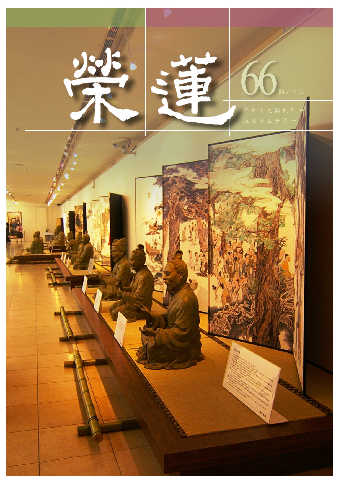

# 第66期

## 社論

### 別具一隻眼

本刊

人天淨土增上身

觀待暇滿修正法

善友提攜己好樂

不忘本懷作大雄

這個時代，雖然有很多地方讓人看不懂，諸如原本是要追尋離苦得樂的生活，但往往都欠缺一些什麼；或者生活困難、或者環境令人不安、或者人與人的交往變得澆薄；或者所充實的技能無法降伏內心的煩惱、或者讀了世間哲理的書卻掩不住內心的空虛；對未來充滿了不安定的感覺，對於過去也汲取不到經驗與教訓，對於下一代也不曉得要給他一個什麼樣的格局，除了強調讓他自由發展以外，好像也說不出一個所以然。

按照世間人的方式去追求快樂，得到了，反而更令人覺得茫然，雖然對傳統很漠視，也想要求新求變，可是求出來的東西，卻無足以幫助自己離開困局，或許反倒更加混亂，這就是現代人的寫照。

其實人生存在的目的本來就是要離苦得樂，每一個有情眾生內心最深沉的渴望也是如此，但離苦得樂的方法，大底都是採取保護自我、與他人競爭或漠視他人，甚而傷害他人，但是經過了這樣的歷程之後，卻無法幫助自己得到真正的安樂祥和，反而與人相處更澆薄，遇到問題更無助，能相信的人與制度愈來愈少，變得更為不安，生活起來也備嘗辛苦。

然從歷史的經驗中知道，和諧才是進步的動力，才是一切快樂的發生處，但這必須要講究個人的修養，有著替他人著想的心，甚而有利益他人的能力才能獲得。

為了追尋這種共榮共存的快樂（這也是帶給自己唯一安樂的方便），所以講究的是從小要立志，要有好的修養，要懂得充實自己，並且有能力與他人和諧相處。這裡面講究的是誠信，當能創造大家的安樂時，自己才有美滿的生活。既然這些安樂都是大家所給予的，得到安樂的人，也要善於布施安樂、供養安樂，才能得到更多的回饋，互相提攜、互相扶持，這樣的快樂，才能與日俱增。

在這個基礎上，才會有對人道的好印象，願意繁衍人類，願意傳宗接代、多子多孫，而來生也才會有好樂人道的心，並夾帶善業投生人道。若對人道生不出好樂，也沒有天道的概念，所做的惡業將引入三途受苦，即使所造的是善業，也不過引入三途受樂，或在地獄中為獄卒，或在鬼道為多財鬼，或在畜生中為寵物，在三途享福因為沒有作善的知見，也沒有作善的團隊，也不知如何修善，就在享福中將善業用完，福享盡後則墮落，所受的就是痛苦，種姓更低劣等，這就是有情生命流轉的現象，俗稱為輪迴。

如何在這樣生命的洪流漩渦中跳脫，是人生最現實的課題，也是生命中最重要的思考，更是求學問的主體。讓我們在二００八年，好好的去追尋這樣的意義，過一個不一樣的二００八年。

## 大德法語

### 大方廣圓覺修多羅了義經（二十六）

道源老和尚

身與四大非一異

心待緣影安名言

觀待名言生心境

不可得中出三界

大乘是以利他為自利，恆作是念，恆是常常這個樣子，叫恆常，不是念了一下子就不念了！這下邊呢？先做二空觀，我也空，法也空。小乘何以謂之小呢？因為雖能證得我空，然不了解法空，如來未向他說法空的道理，故得小乘的果位。大乘菩薩則聽到二空道理，下手就能修學二空觀，然先空我，後空法，謂之修二空觀。由觀身心幻妄而遠離身心真實。

丙二、示漸修

丁三、酬請開示

戊一、長行

己一、約妄盡還覺以酬請

庚一、妄盡還淨覺

辛一、酬修行漸次請

辛二、酬思惟住持請

壬一、明正思惟

癸一、觀身是幻

經文：

「恒作是念：我今此身，四大和合。」

眾生依身心執著有一個我，或執著身體就是我，或妄認身體為我所，前述妄認四大為自身相，此身是什麼組合？是四大（地、水、火、風）和合，「大」是普遍之意，它不但是一切眾生身體的種子，也是一切山河大地的種子，有內四大與外四大，同是四大種，「種」是能生之意，能生身體與山河大地。得靜下來思惟，何以四大為自身相？

經文：

所謂髮毛爪齒，皮肉筋骨，髓腦垢色，皆歸於地；

這些堅硬性的東西都屬於地大，如頭髮、爪（手腳指甲）、牙齒，皮膚與長的肉，肉裡的筋或血管、骨頭，骨頭裡的骨髓、腦子、垢色（身體上的一種塵垢阻塞），都歸屬（歸納）於地大那一方面。

經文：

唾涕膿血，津液涎沫，痰淚精氣，大小便利，皆歸於水；

唾是口水，涕是鼻涕，將上述這些水性的東西，歸到水大那一方面。

經文：

暖氣歸火；動轉歸風。

身體上有一種暖氣，歸到火大；這出入的鼻息是風大，這四肢的動作亦歸屬於風大，若手、腳不會動，稱做什麼病呢？謂之中風，是風大出了毛病，所以身體能動轉屬於風大。

經文：

四大各離，今者妄身，當在何處？

將身體分析，分成四大分，身與四大非一非異，此之修觀，如禪宗參話頭，你提出來問自己：我現在這個身體是否真實？不過虛妄，自相不可得，何處何時都得不到。

經文：

即知此身，畢竟無體，和合為相，實同幻化。

你今天這樣觀修，明天也這樣觀修，畢竟知道這個身體當體就是空的，謂之體空觀。你應當知道此身不實，或問沒有身體我怎麼現在還有個身相呢？是四大種和合名言安立的假相，與會幻術者唸個咒變化出一個人一樣！所變化出來的，不但會動、也會做事、也會說話，像是真的，實則當體是空，不過幻化出來，謂之幻身。

癸二、觀心是幻

經文：

四緣假合，妄有六根。六根四大，中外合成，妄有緣氣，於中積聚，似有緣相，假名為心。

四緣假合是四大種因緣假合起來，一切諸法皆因緣所生，四大種組合成了我的身體，也是合成我身體的因緣，謂之四緣。妄有六根，這六根在哪裡呢？在我身體上，身體是四大假合的，這六根還能是真的嗎？所以是虛妄而有的。四大內合成眼、耳、鼻、舌、身、意（身體上的六根），外合成外在的六塵境界，稱做外四大，六塵也是四大種生出來的，所謂色、聲、香、味、觸、法。

內六根外六塵的和合，生起虛妄緣影六塵的心，緣影即是緣氣（心識），是虛妄而有的，於中積聚是指內六根外六塵和合而生起，似有能緣之行相，所謂的心是六個識：眼識、耳識、鼻識、舌識、身識、意識，雖是六識實實在在就是第六識，因為前五識不能分別，如眼識只是一種見色的作用，但要有第六識的配合，第六識與眼識同時起，謂之眼俱意識，同理耳識至身識皆然。至於未與前五識同時起分別作用，獨自分別謂之獨頭意識。

前述六塵緣影謂之心，此乃能緣之氣氛，不屬於色法，不是心臟的肉團心。講到這裡問諸位同學，現在科學界研究出直覺完全屬於腦子，不屬於心臟的心，腦子還分大腦、小腦，科學家分析得很清楚，彼以為腦子的一部分是屬於知覺，要是把那一部分割掉了，就完全沒知覺了，人就與木頭、石頭一樣，所以心不是第六識。

我（道源）有一個思想，要想佛教長命不亡，非要度科學家變成佛教徒不可，要度科學家變成佛教徒，必須我們佛教徒研究科學，融會貫通後才能把科學家說服。我現在不懂科學，只能講佛學，我不敢批駁科學家不對，因為他們是講究實證的，你說得再玄再妙，得拿出證據來，如緣起法拿不出證據變成玄學，只說玄奧之理而已，不是科學，科學得有個東西證明在先的。

然而科學一天到晚在進步，科學家也是用功要拿出證據，一天到晚也在那花心思用功，也是後後推翻前前。彼說不是全部腦子有知覺，腦子裡有一處屬於知覺，若把那一個地方切除掉了，這個人一點知覺都沒有。實則腦子是色法，另有心識的作用，哲學家也承認，他們不完全迷信科學，科學家儘管批評哲學，但也不能不承認哲學有道理。若能將科學家、哲學家說服，彼則皈依佛學。

過去在印度弘揚佛法的聖者，沒有不懂外道的，尤其婆羅門的道理讀懂了，才能說服更多婆羅門出家。而佛法傳到了中國，那些弘揚佛法的大法師沒有不懂得孔孟老莊，先方便交流，最後再拿出佛學道理，令這些人佩服，所以很多學儒家、道家者都出家。現今社會，你一定得懂科學、懂哲學，你才能教化這些科學家、哲學家，現在缺這樣人才，當法師要研究學問，前程遠大的很，大家要發大心。

至於道源（師父本人）雖有這個思想，但年齡老了！六根不伶俐，眼睛壞了，看經都看不清楚了，還能看什麼科學、哲學？你們還年輕要發大心，我們只講佛學，不穿鑿附會，但是你不要迷信科學（未必全對）。彼相信科學的硬說沒有西方極樂，彼云，地球一天一夜（二十四小時）轉了一圈，根本沒有所謂東方、西方，那有西方極樂？又說，人是精蟲生的，實則輪迴是有情的心識，依著精蟲與卵蟲的和合成胎。我們不反對科學，但也不迷信科學，我講這些話都是勸告同學，希望同學發大心研究科學、哲學來幫忙弘法。

心之現行是依六根緣外面六塵（境界）起了六種的作用，是虛妄而有，是內外緣積聚起來，好像有一個能緣的相謂之似有緣相，實際沒有這個心，謂之覓心了不可得。

經文：

善男子！此虛妄心，若無六塵，則不能有，四大分解，無塵可得。

若無外邊六塵根本不能生起緣氣，藉六塵的力量，生起有力的心。須知這六塵是由地水火風組成的，若四大分解（析空觀）後，就沒有六塵的實體可得。

經文：

於中塵緣，各歸散滅，畢竟無有，緣心可見。

在這個中間，外邊所緣的六塵各歸散滅時，那六塵緣影的心也沒有了！（下期待續）

### 佛說八大人覺經講錄（八）

道源老和尚

懈怠八大隨

精進善十一

重在勝解法

三乘果相應

甲二、詳八大法相以成宗

乙一、別釋八法以起信解

丙二、覺懈怠墜落觀念精進

經文：

第四覺知，懈怠墬落，常行精進，破煩惱惡，摧伏四魔，出陰界獄。

第一覺要有解脫的知見，第二覺要我們腳踏實地的修行，要少欲。第三覺要修知足，能少欲，知足了，才能精進用功。所以第四覺就要說「精進」兩字。

懈怠就是感覺身心疲倦，身心一疲倦就起了懈怠，求解也不願意求，修行也不願意，這就是懈怠心起來的行相！懈怠心一起就要放逸，懈怠放逸一定會墮落。由第一覺、第二覺、第三覺，告訴我們要修行用功，要出三界，要成佛道，怎麼可以懈怠？懈怠不但不能超出三界究竟成佛，結果連人身都保不住，要墮落三惡道中。

此第四覺知的懈怠，還要注意不是普通人的懈怠，而是第三覺以後的懈怠。我們學佛法有歷程，是一步步地功夫，少欲、知足均是修行的功夫，到了這時要注意，恐怕要起懈怠，所以這個懈怠不是普通的懈怠，而是少欲、知足以後的懈怠。

少欲是不貪五欲，知足則安貧守道。不去貪圖五欲，恐怕要受貧窮之苦了，雖能安貧與受持道法，可是到這裡有個關卡，或是會起懈怠心，他的懈怠由那兒生起呢？由不貪圖五欲知足而生起，這一知足就懈怠了，原來修行歷程是要我們少欲知足，將身心空閒下來，以便精進修學佛法。結果此時起了懈怠。起什麼懈怠？起了惡事不做、好事也不做的這種懈怠。

所謂少欲知足不是對佛法知足，而是要滿足於世間不富裕的生活。你要是成了佛，才能所作皆具足佛法，你雖然明瞭第一覺悟的佛理，並在第二覺知修少欲與第三覺知修知足，但對於修行用功（求解求行）精進了沒有？若沒精進不是懈怠是什麼呢？即使沒有貪圖五欲而能知足，雖壞事（惡事）沒有做，然而善法也沒有做。

懈怠要墜落，但有一個疑問，少欲知足以後起的懈怠心怎麼會墜落？少欲知足雖好事沒做，但壞事也沒做，怎麼會墜落呢？我沒有精進修學善法，沒有超升就是了，我的人身如何會失掉？因為懈怠以後，跟著就放逸，一放逸就會犯罪、破戒。懈怠以前之少欲知足是壞事沒做，但懈怠之後就會放逸造作壞事。少欲知足本來可以管束得住三業，但一放逸，在家有在家的菩薩戒，出家有出家的菩薩戒，一放逸就會犯戒，犯了戒豈有不墮落？

再進一步研究，有云：我懈怠是懈怠，就是沒有精進修行，但並沒有放逸，該我守的戒律，我都能保守，沒有犯戒，沒有作惡，所以我的人身應該保持不失啊！不應該墮落！

須知學佛法是要斷除煩惱，你的煩惱斷了沒斷，煩惱沒有斷，你自己做不了主，你要想保持人身，雖今生沒有做壞事，人身應該是保得住，但你要知道，前生前世、多生多劫做了多少的惡法，它（惡種子）都在八識田中保存。即使惡法的種子今生沒有現形，你這一生學到佛法當佛弟子，不精進修行把煩惱破掉，那些過去惡業種子會起現形的，一起現形，難道不要遭果報嗎？遭果報不要墮落三途嗎？

所以你應該覺知懈怠不得，懈怠就要墮落，此時應該如何？應該「常行精進」，精進是六度之一，純一不雜謂之「精」，勇往直前謂之「進」。亦即修學佛法須純一不雜地專修，不要把世間法夾雜進去，對世間法要少欲知足，不要貪圖世間法，要純一不雜的精修。修學佛法要破除煩惱，而煩惱是無始劫來即相續到現在，不是你隨便用用功就能把煩惱破除掉的，要勇往直前，才可謂之「進」。

精進有三種：第一披甲精進，第二攝善精進，第三利樂精進。披甲精進之「披甲」是形容詞，要精進破除煩惱惡法，而煩惱惡法比如怨敵，要與它打一仗，古時打仗就要披甲，披甲就是要和煩惱戰。煩惱太多，等於怨敵太多，那你非精進非勇猛不可，否則煩惱制不了，等於打了敗戰，所以要純一不雜（精）、要勇往直前（進），以上是披甲精進。

第二攝善精進：要攝受一切善法，不但將煩惱惡法破除掉，還要作什麼事？修善法！大的善法我要修，小的善法也要修，只要是善法，無論是大善法、小善法通通要攝受起來，謂之眾善奉行，以上是攝善精進。

第三利樂精進：眾生沒有得到佛法的利益，我令他得到佛法的利益，眾生沒有得到佛法的法樂，我令他得到佛法的法樂，這﹁利樂﹂就是利樂一切有情眾生。並不是利樂一個眾生或兩個眾生，而是利樂一切有情，大的利樂乃利樂眾生成佛，小的利樂乃利樂眾生種善根，絕不放棄一個眾生，一定要眾生得到佛法的利益，得到佛法的法樂。

「常行精進，破煩惱惡」就是披甲精進，在世間法上少欲知足，將身心空閒出來，用於精進修行，主要將煩惱惡法破掉，因為煩惱是生死之因。煩惱兩字怎麼講？是昏煩惱亂，屬於意業，根本煩惱是貪、瞋、癡，意業一生起此三根本煩惱後，就昏煩惱亂，將意業之貪瞋癡的煩惱破掉，則身、口七支亦不作惡。身口所造的業（共七支）都是由意業推動的，若意業之貪、瞋、癡（三根本煩惱）都破掉了，則一切惡法都破掉了，你的口不會造惡業，你的身體也不會造惡業，身、口、意三業都清淨了。

「摧伏四魔」，「摧」是摧破，「伏」是降伏，先降伏而後摧破四種魔。魔有四種，梵語「魔羅」簡單譯為魔，乃害義，害人的程度如何？能傷害法身慧命，令有情永遠流轉生死，所以稱之為魔。四魔：第一、天魔，第二、煩惱魔，第三、五陰魔，第四、死魔。天魔在我們現在初發心用功時，是不會來害我們，要到你成佛時，才會障礙我們的成就。

以我們本師釋迦牟尼佛做個例子，世尊在菩提樹下靜坐用功修學，準備要成佛時，天魔就出現來障礙。有云，天魔在那裏呢？魔王波旬是欲界第六層天（他化自在天）的天主，行者要超出三界，先超出欲界，天魔是欲界最高的一層天，他（魔王）認為欲界的眾生都是他的子孫，你要超出欲界，他就起了恐佈，所以就來磨（障礙）你，令你不能超出欲界。

其次煩惱魔，三界以內的煩惱就是見、思二惑，由見地不正確，起了不正知見，因而昏煩擾亂謂之見惑（分別我執）；在生活上起了顛倒的思想謂之思惑（俱生我執）。見惑是迷理之惑，思惑是迷事之惑。

對於佛說的真理你不了解，對於三界的事相你不能觀空，所以昏煩擾亂謂之煩惱，有了煩惱折磨，如何能修行用功呢？再者五陰魔，五陰者色、受、想、行、識，這五種陰法蓋住了我們的真心，而磨害我們。前面講的懈怠墜落，你怎麼會懈怠呢？感覺到身體疲倦屬於色陰，心裡疲倦屬於受、想、行、識四陰，五陰魔來磨你，不能精進修行。第四、死魔，你生死沒有了脫，生命有了限度，尤其人生的生命短促，活到一百歲算是少數的少數。

人生不滿百，但小孩子不知道用功修行，少年也不知道用功修行，可能有點善根能在中年聞到佛法，要修行用功了，雖修行用功，但還沒有得到利益壽命卻盡了，來生來世是不是能再得人身，是不是能聞到佛法繼續修行，成大問題。即使你來生能轉為人，但沒有遇到善知識，雖然得到人身，但佛法間斷不能修。要是來生墮到三惡道，想修行也不可能，此即被死魔障礙了。

要摧伏四魔，先摧伏那一魔？先摧伏煩惱魔，煩惱魔是四魔之因，所以經文先明破煩惱惡，其次才摧伏四魔，要是沒有煩惱，就不會遭受五陰的果報。我們在人說人，我們有此身體和心，乃是五陰和合的假我，要是沒有煩惱之因，怎麼會有五陰的果報？沒有五陰怎麼能有生死之魔？若把煩惱斷盡了，那天魔磨你也磨不了。所以你把四魔之因（煩惱魔）破掉了，五陰魔也破了，生死魔也破了，天魔也磨不了你。所以欲破四魔先破煩惱魔，煩惱魔破了，則四魔通通破了。

「出陰界獄」，「陰」就是五陰，五陰魔的五陰，「界」就是三界。我們凡夫流轉生死，有一個範圍，不會超出三界之外，超出三界之外就是聖人。聲聞、緣覺是小乘聖人，菩薩、佛是大乘聖人。三界之內是凡夫的範圍，五陰外為色陰（身），內為受、想、行、識四陰（心）。吾人的法身慧命猶如被身心所圍，好比在監獄裏面一樣，流轉生死的地方（空間）超不出三界（欲界、色界、無色界），等於一個大監獄。若能把四種魔破除了，五陰也破除了，三界也破除了，自然了脫生死，超出三界五陰的監獄了。

由第四覺知明白不可以懈怠放逸，一定要常行精進，不常行精進，則四種魔破不了，五陰三界的牢獄出不去，所以要常行精進。（下期待續）

### 常禮舉要講座（七）

雪廬老人

善緣難結惡業易

端賴人情能通達

福田在彼仁心種

世出世間樂果生

處世

◎七、與殘疾人會面，須格外恭敬。

恭敬別人不可呆板，譬如一般對人鞠躬七十度，你見了殘疾人鞠躬六十度就不行，對一般人平等恭敬，但對殘疾人要格外恭敬。這裏頭與咱們有好處，什麼好處？就是予對方的一個安慰，這不是很好嗎？他是殘疾人，咱們幫不上忙、安慰他，所以須格外恭敬。現在是不行，怎麼不行？譬如這街上出了意外，出了什麼意外呢？太保殺了人，或說：又沒得罪他！沒得罪他，他不找你麻煩這還講得下去，現在不得罪他、怎麼呢？

報紙上常有，你多看他兩眼就遭了災殃。他這些人在那裏妨礙人，你看他兩眼就有殺身之禍。我也沒說話、也沒作其他什麼的，看兩眼就不得了，你看這事情重要吧！現在這時局太特別了，從前呢？從前殺人的事情很少、太少了，國家管得非常嚴、殺人必償命，不是這麼隨便。雖然殺人的少，然而報復的人可不少，小事情小報復，大事情大報復。凡是有受家庭教育的，在家裏念過書的、有家教的不會發生這種事情，什麼事情呢？

從前的馬路不如現在好，過去下雨路損是常有的事，人走在路上不小心滑倒，雖然沒有受到什麼樣的傷害，可是自己不走好總是事實，旁邊人看了就笑，這個我在台灣可見過，那個滑倒人開口便罵那嘲笑者，笑的人沒說話、就是笑，罵的人不但是三字經連六字經都有，怨誰呢？笑的人沒受過家庭教育，無論怎樣，滑倒就是不幸，正可以過去幫幫忙把他拉起來、安慰他幾句，這是理所當然，表示同情嘛！即使你不能幫忙，走過去就算了，萬不能笑人，這一笑就是禍。現在一笑就是禍，這跟你多看他兩眼是一樣的。

總之，這個時代要危行言遜。見殘疾人須格外恭敬，就是見了不幸的人我們能安慰幫忙就幫忙，不能幫忙裝著眼瞎地走過去，這個記住！

◎八、於肩挑小販苦力，莫討便宜。

挑著擔子的小販子，這些小苦力都是沒有本錢的，所以才幹小販，有本錢就開大公司當經理了，可是這些當經理的品行沒這小販子品行好。見了肩挑小販不佔便宜，那些人是最苦了，我們要討便宜，那裏討不了？他在那裏挑著擔子被太陽曬、被雨淋，這些小販最守信用，守什麼信用呢？不論下雨天或大熱天，他到什麼時候上那一條街都有一定的。我們在家等著買東西，什麼時候啦，賣什麼的怎麼還沒來？你看這些人都規規矩矩的沒有一個不守信用，這些大商店的信用連小販肩挑都比不了，他們守的規矩都很嚴。

賣東西的到你們家門前去賣，你家裏男的也好、女的也好，無論什麼人來買，他跟你賣的功夫、絕對沒有嬉皮笑臉這一套。你家裏出來個年輕小姐來買東西，這個賣菜的嬉皮笑臉的，鄰居出來看了，不是把菜甩了、就是給一耳光，這是我親眼見的。他們都是規規矩矩地，比在中興大學當教授的我都好，這個便宜討不得。

譬如像買辣椒這不值錢的東西吧，秤好了給你，你又多拿一個，多添一個你覺得沒什麼稀奇，每家都拿一個，他（小販）又少收若干，對這小販苛薄幹什麼？你家裏的兒女胡花、你反而不計較，苛薄家庭必出壞子弟。

◎九、施恩求忘，受恩必報；開罪於人須求解，開罪於我應加恕。

他人需要、我們就應該幫忙，雖然你沒有職務，但早上你起來掃地，那時沒掃地伕，掃了地回家吃飯也對得起那碗飯！或言：那碗飯是我自己的力量、我自己出的。光你自己的力量出不來，一碗茶也是千萬人的力量，你得恭敬大家，這一天你不能白幹。所以對缺乏的人，我們盡點義務、做點事情是應該的，不必記到心裏念念不忘，不可如此，這是君子也！

其次受恩必報，我們給人家的，講的是應該盡義務。然而你替我做什麼，亦即我受了你的恩，若你有什麼事情我不管，卻說：你該當盡你的義務，我管這個幹什麼？這就錯了！中國人講究厚道，受人點滴恩惠，受人一滴水怎麼樣呢？你缺乏這滴水簡直過不去，用人一滴水，報答時還你一滴水，那可不行！還得有本有利，如何報？拿湧泉水來回報，永遠不忘人家，所謂點水之恩答以湧泉，這是中國的教育。

中國文化五千年之所以不垮台，全球找不出第二個國家來，他們苛薄，可是我們不然，我們講的是厚道，自從堯舜以來都是這樣，孔子也講這一套。

「開罪於人須求解」，凡是開罪於人（得罪了人）必得求解，這個孟子也說過。我們對不起人，光在口頭上說對不起、道歉是不行的，現在連對不起也談不上。我有次見學生騎腳踏車把老師碰倒，碰倒了老師，他在腳踏車上笑一笑跑了，能怨學生？我再三的說、你求根本，這種教育是你教他的嘛！所以是開罪於人求諒解，你不求諒解，講現代話，前前後後你看看，你多看他兩眼，他就要找你的麻煩，你不求和解，下回他會想法子對付你。

「開罪於我應加恕」，儒家所談就是君子、小人之別，但談因果處不明顯，佛家是處處講因果，所謂一飲一酌莫非前定。儒家不明顯講因果，講的是君子、小人之別。我們受人恩惠，不報就是小人，永遠不忘他人的恩惠是君子，這就是君子、小人之別。譬如咱們又學佛又念孔子書，凡是學佛頭一條是人身難得，這個大家都知道，學佛怎麼說人身難得？有了人身這才能學佛，第二是佛法難聞，雖得人身並不代表能學佛，而是有了學佛的機緣，且不問你想不想學？有沒有人勸？得了人身代表有了能學佛的機會。若不是人而是畜生、那可就難了。

我看過跳蚤學體操，但是你拿經典要牠看，牠看不懂，這是難處！得人身好比己經買了目的地的車票了，可是坐不坐車在乎你。佛法難聞，而你也聽到了，如上車前之剪票，若未有思修之功，則還是沒上車，有什麼用處？這一思、修才算上了車。跟大家說不思不學（修）沒上車，不能稱作真正的佛弟子，從前做弟子之規矩不能隨便，要受過皈依才可稱弟子，沒受過皈依的男眾叫信士、女眾叫信女，從前皈依名字不能隨便，隨便送只為了拿錢，名字不能隨便送。（下期待續）

## 共修研學

### 小止觀導覽（三十九）

*心爾整理*

能念世苦出世樂

專求涅槃度世間

有情仍在輪迴苦

廣度能生佛智力

五、方便行

「三者、念：念世間為欺誑可賤，念禪定為尊重可貴。若得禪定，即能具足發諸無漏智，一切神通道力，成等正覺，廣度眾生，是為可貴，故名為念。」

以念為修學定慧之因，亦即心心念念在厭離世間欣求涅槃，唯有依定生慧（無漏智），才能證得解脫與成佛，佛即具足一切神通道力，其中即是如來十力。此十種力量都是從空性的證悟（破所知障）生起的能力，若能瞭解此十力的難得可貴，即能瞭解佛果的尊貴。

一、知是處非處智力

，由善得樂、由惡得苦乃是處，由善得惡、由惡生樂乃非處，是故由惡得樂、由善生苦是不可能發生的，若有如此之決定，必定會在意自己的起心動念與說話辦事的動機，並且注意在辦事的過程中是否善用其心。便宜佔得越多，結局就越慘，作惡吃虧是祖上有德，能生止惡的警惕心，作善吃虧則惡業消耗得快。

孔子一生顛沛流離，席不暇暖，民國的能海大師，也在文革中受盡折磨。但是他們都能在違緣障礙中安然自處，無一絲牢騷味。吾等根本沒資格發牢騷，作善沒認真做，福報倒是享得不少。若有是處非處智力，則不怨天不尤人，下學而上達。要做到這樣的修養委實不容易，此力易得嗎？不易得也。

二、知三世業報智力

，了知眾生三世因果業報的智慧力，是六神通當中的宿命通（知過去）和天眼通（知未來）。外道雖也有知，然佛的智慧力，觀待破所知障的現證空性慧，生起通達甚深緣起的智慧，知道三世的演變，是真正通達人情世故。

知三世業報的智慧力，必須要以因果觀察世間，生起豐沛的經驗閱歷，經驗閱歷足了，沒辦法講，講了人家也不信，是各人吃飯各人飽。

三、知諸禪解脫三昧智力

，空性的證悟方謂之解脫，並通達世間各種的禪定，能生起各類的神變利樂有情。由各種世間禪定生起多如恆沙的陀羅尼，即是各種利益眾生的善巧方便。

四、知諸根勝劣智力

，能知眾生各種根器，或勝或劣，並予以相應根器的法門，例如利根者能教修般若，鈍根者僅示世間安樂方便。

五、知種種解智力

，知眾生種種勝解，每位有情的專業都能瞭解，能與彼投緣，依此善巧方便引入佛門。

六、知種種界智力

，知眾生種種界（範圍），不同界有不同生活習慣、風土人情，例如人道中有黃種人、白種人、黑種人，雖然都是人，但是生活在不同的地域就有不同的想法、不同的風俗，所謂：百里不同風，千里不同俗。

七、知一切至處道智力

，教人修什麼法門，會有什麼結果，且那一種法門對他最契機，到底要教他修菩提心？還是教他修學二乘法出離三界？佛世時迦葉尊者曾看準了某位比丘得度的因緣成熟，但是文殊菩薩卻搶先一步以大乘法度他，結果此人謗法墮入地獄，釋尊卻讚歎文殊菩薩度得好，此人要先下地獄，大乘的善根種才能引發。

八、知天眼無礙智力（知未來），九、知宿命無漏智力（知過去），十、知永斷習氣智力（解脫知見）

，以上三力要合說，佛是漏盡通的聖者，生起對過去、現在、未來圓滿的認知。

以上十力，是我們修學止觀門的目標，以止觀修學二諦能破煩惱障及所知障，成就佛之十力，是自利利他圓滿行相。

其次，成等正覺，是如來十種通號之一，佛之十種名號能彰顯佛的證量。

一、如來：

分為勝義（如）以及世俗（來），依般若修學現證勝義，能將二障破除，現證世俗就能通達甚深緣起，隨緣利益無量無邊的有情，這就是如來。

二、應供：

佛堪受一切世間供養，作眾生的無上福田。阿羅漢的應供是殺了煩惱賊，但雖然斷了煩惱，仍留有習氣，佛是習氣永斷，因此佛的應供更勝於阿羅漢。範圍不但及於一切世間，更是一切凡聖所應供養的對象，不只是凡夫要供養佛，聖者也都要供養佛。依著對佛的供養，眾生現起福氣才有修學教法的順緣。所以家中的佛堂要當成真佛看，要將佛堂擺設莊嚴，打掃清淨。

三、正遍知：

亦譯為等正覺，正是聖者的體悟，佛能如能來，都是因為具足正遍知，能遍知一切法，遍知法性（如）法相（來）。

四、明行足：

明是三明（宿命明、天眼明與漏盡明），佛之漏盡明能破除二障，宿命明是在緣起上通達過去無盡，通達未來無盡是天眼明，行是度眾生的能力，安立為明行足。行和明相互觀待，依著明現起行，依著行顯示明，佛在度眾生當中（行），正在顯示破二障（明），依著破二障的明方有種種度眾生的行。

五、善逝：

善巧的逝（消失），亦即無時不在空性定中，就在空性（法界）中，生起世俗種種方便，就在種種世俗方便中同時現證空性。金剛經中，世尊著衣、持缽、乞食，還至本處。飯食訖，收衣缽。洗足已，敷座而坐。須菩提尊者說：如來善護念諸菩薩，善付囑諸菩薩。可見佛就在行、住、坐、臥、食等能彰顯他完全的解脫，這些聖者阿羅漢的弟子，知佛所有的行持都是甚深不可思議。

六、世間解：

佛能解世間有緣、無緣的眾生之習性，瞭解所受的苦樂，不僅如此，佛亦知器世界，世間種種的境界是由眾生的業所召感，淨土的樂與地獄之苦皆不離眾生的業所感。世間是佛所了知的對象。

反之，眾生就是對世間不瞭解，對自己不瞭解，對因果不瞭解，在懵懂無知下過日子。

七、無上士：

無上的士夫，是人中最勝無有過之者。希求此世之安樂者，稱不上士夫之名，希求來世的安樂稱之為下士夫，希求解脫安樂者，稱之中士夫，希求成佛以利益有情者，稱上士夫。無上士則是真實成就佛果的聖者。然下手處要先立志，未來方能有究竟之成就，否則即便有再好的條件、環境、資源以及福報，沒有目標，都不可能有任何的成就。一個學佛者有如此之目標，必能在這一生的聞法中通達教理，承擔如來家業，做出一番千秋大業。

八、調御丈夫：

調御是能調伏各類有情，即使難調的有情，佛亦能調伏之。所謂丈夫是有能力調御自己的煩惱，也有能力調御眾生的煩惱。大丈夫不是莽撞衝動，這樣的人是野人，真正的大丈夫是能調伏自己的人，是人中之英雄。所以說：出家乃大丈夫所為，非將相所能。

九、天人師：

佛利生事業雖多，但以說法利生最為殊勝，人天二道有閒暇、有能力、有因緣，能悟佛與善知識的說法，其餘各道業障深重，或智慧淺陋、或被苦所逼，無暇聽聞佛法，佛說法的依止處在人天，所以稱作天人師。

佛最殊勝的事業就是說法事業，法是佛的命根，我們如果能留住佛的教法，最能得到佛菩薩的加被。弘揚佛法宗派中，一切有部認為文句佛法是名、句、文，亦即佛經就是佛法；唯識宗說是聖者的心識，能傳承法；中觀宗認為佛法是聲塵。有情所有的證悟全部靠聽聞，有善知識的講述才能有深刻的體悟。孔子說：述而不作。透過講述能將法脈延續，否則眾生都在五欲中打滾，於輪迴中墮落。

十、佛世尊：

佛是依著二覺（覺察、覺悟）通達三智（一切智、道種智、一切種智）利益眾生。不但智慧圓滿，福德也圓滿，稱之福慧兩足尊，為世人所尊崇，稱為世尊。

佛既然只能在人天示現為善知識說法度眾，可見我們所在的人道是一個教法堪能流通的環境，可惜的是由正法演變成末法。應好好充實自己，作一個法脈的延續者，若能好好培養人才，必能再造正法的氣度！（下期待續）

## 蓮池海會

### 楊謝天送老居士往生見聞記

*編輯部整理*

熱心教職好公益

交遊廣闊因熱心

可貴家人善護持

助念功成生淨土

楊謝天送老居士，生於民國二十三年四月六日桃園縣平鎮鄉東勢村，其父謝東斗，民國十九年自江西省于都縣，因國共戰爭而隻身來台。老居士因弟於五歲夭折，遂改雙姓楊謝以承接父母兩姓香火。老居士在十八歲父親往生後，遂開始獨當一面，事奉母親及祖父母畢恭畢敬、有令必從，曾於民國七十年間，獲頒北區六縣市「孝悌楷模」。

老居士雖以優異的成績畢業於義民中學，因家境貧窮無法繼續升學而入伍服役。為了家計，老居士於民國四十三年起開始擔任教職，最初於東勢國小民眾補習班擔任教師，上課點油燈，課後還要擦燈盞，一個月的薪水僅得數百元。後於台北師專進修正式取得教師資格，民國四十八年回母校東勢國小正式擔任國小教師至八十八年退休正好四十年整，期間曾任教師、課長、組長、代理主任、人事主管等職務。

在校期間做事有板有眼、絲毫不苟，教學認真，要求學生十分嚴格，課後還常留學生加強課業，民國五十六年初中最後一屆，還留學生在家住下，義務幫學生加強複習課業。老居士於民國七十三年時，獲教育界最高榮譽，榮登「杏壇芬芳錄」也是東勢國小目前唯一的一位。

老居士多才多藝，古道熱腸，常為鄰里宗親及教育界的同仁寫詩作對，甚至幫他們料理婚喪喜慶內外諸事，或主持典禮，或謀畫行程，或說四句福語，或撰寫祭文等。宗親有要事，必定想到老居士。

老居士騎摩托車時，總是小心翼翼，生怕有任何意外發生，總說：「方圓十公里的鄉親都認識我，怎麼能不注意自己的言行舉止呢？何況有了意外，一家十口人，如何過生活？」

民國五十二年與薛菊妹女士結為連理，育有五子一女，在家境不寬裕的情況下，子女皆大專以上，在鄉里間實屬難得，靠教書實不足以維持十口之家，為貼補家用因此於教書之餘，兼差作保險達二十年之久，雖是兼差，其服務仍是有口皆碑。老居士熱心於社會公益，曾任宗親會理監事、常務理事、副會長、義民中學校友會會長、台灣省教育會代表等職，出錢出力，辦事仔細認真，經常工作至深夜而仍不疲不厭，實為鄰里典範。

近年來老居士經不起糖尿病及其併發症的折磨，身體逐漸虛弱，健康情形每況愈下。今年四月老居士移居花蓮，本想藉由好山好水將病情轉好。不料，七月時因病住進隔離病房，隨後又轉入加護病房及呼吸照護中心。雖然子女輪流陪伴在老居士身邊，希望老居士能早日康復。但老居士身體日漸衰損，之後返回桃園，臨終前回到家中，醫護人員拔除老居士身上所有的插管，老居士張開已緊閉多日的雙眼，望了望家人與蓮友，便安祥的在佛號聲中隨阿彌陀佛走了！

蓮友和家人排班助念，在二十四小時後，老居士身軀柔軟、面容慈祥，足證往生，家屬謹遵佛制，如法作七，舉辦告別式，參與藥師及淨土懺，並隨喜護持緬甸齋僧、放生、濟眾等善法，願老居士蓮品高昇，親承彌陀教化，速能乘願再來，廣度眾生。

### 賴少火老居士往生見聞記

*編輯部整理*

忠厚老實的鄉下人

隨緣行善的老人家

供養佛堂的大長者

破障生西的好蓮友

賴公少火老居士，生於民國十三年八月三十一日東勢二社賴家，排行老二。惟因大哥過繼給其大伯，且又逢第二次世界大戰期間。民生困苦，家境貧寒。所以必須協助父母照顧兩個弟弟及兩個妹妹。僅受過幾年日本小學教育就出外打拚事業，賺錢養家。

老居士三十一歲時與石岡鄉梅子村管阿庭結婚，婚後育有兩男兩女，妻賢子孝，和樂融融，晚輩眼中所見皆是：「『早上起床第一件事，您總是幫媽媽泡牛奶麥片，吃午餐晚餐時，您都細心的幫媽媽挑菜，把菜仔細的撕成碎片，再放到媽媽碗裡，吃完飯您總是走在前頭，一手牽著媽媽，護著媽媽，走回房間休息』、『爺爺非常疼愛奶奶，奶奶說一，爺爺不會說二。』、『爺爺總是笑嘻嘻的面對奶奶，也常靜靜地看著與他一路走來，辛苦奮鬥、勤儉持家偉大的奶奶，我常看到爺爺邊看著奶奶邊笑，看著與他結髮五十多年的女性，我猜想爺爺心裡一定很高興、很開心能與奶奶共渡一生。』；『晚年奶奶行動不便，但爺爺總是陪伴在奶奶身旁，挾菜給奶奶吃、裝湯給奶奶喝，讓我羨慕爺爺奶奶是多麼恩愛著對方、多麼的幸福。』」老居士伉儷相敬如賓、互相感謝的言行，慈祥和藹不與人爭的生活態度，在在影響著周遭的親友，特別家中的晚輩，在人心日漸澆薄的現今社會中，實屬難得。

老居士亦曾做過電力公司工程小包商、苗栗山區開採煤礦、到竹山種香蕉外銷、也曾做過青果收購生意。於民國五十九年在雲仙洞口設立雲仙號雜貨店，經營日用雜貨、包裝材料等生意，並於六十年左右到霧社經營果園，種植世紀梨、水蜜桃等水果，在這段期間家庭經濟稍有改善，即不忘回饋社會，捐助路燈造橋鋪路，遇有貧苦人家或孤老亡者，則不吝捐棺木協助處理喪葬事宜。

八十四年於大雪山十三公里處，設立大雪山觀光農園出雲山莊，經營休閒產業。閒暇時非常注重環境衛生，經常沿途撿拾垃圾、煙蒂。其一生勤儉持家，替後世子孫樹立良好典範。

八十八年九二一大地震之後，有感於大眾念佛共修處所日漸不敷使用，遂將家中倉庫贈與本會使用，粉刷之後的倉庫煥然一新，佛堂成立之後，老居士伉儷每週皆與蓮友們共同念佛共修，果園中種植的水果收成時，恭敬三寶的老居士，總交代家人將收成的水果供養三寶。老居士本身也與蓮友們至金門放生，只要是身體狀況許可之下，皆歡喜參與種種善法，也隨喜護持家人於道場發心，並與蓮友們結下深厚的善緣，慷慨無私且歡喜提供自家作為道場使用，使蓮友們能凝聚共識，安心於道業中精進。

老居士數次住院，蓮友皆前往探望，老居士平常總是默默的暗念佛號，遇到病痛時則會喊阿彌陀佛、阿彌陀佛，因為膽結石引發疼痛，而再次住院開刀，卻引發了併發症，臨終前幸好有蓮友，在耳邊提醒極樂的殊勝，要欣求極樂、要放下萬緣，念阿彌陀佛，跟著阿彌陀佛到極樂世界，並在救護車上沿途念佛護持。

回到家中，蓮友已在佛堂念佛，並將老居士安置在佛堂助念，於中華民國九十六年十一月七日，下午三時四十一分在家屬以及蓮友佛號的護持中，告別娑婆世界，經過家人二十四小時的助念，淨身更衣時全身柔軟，慈祥又莊嚴的面相前所未有，讓家屬及在場蓮友萬分感動，更覺佛力加被不可思議。家屬謹遵佛制，如法作七，舉辦告別式，參與藥師及淨土懺，並隨喜護持緬甸齋僧、放生、濟眾等善法。唯願老居士神超淨域，蓮品高昇，早日回入娑婆，廣度含識。

### 丁張綢老居士往生見聞記

*編輯部整理*

守節安分養子女

敬天奉神皈三寶

有緣放生相見歡

促成往生大因緣

老居士於民國十七年二十二日生於台北艋舺水仙里，小學就學成績優異，極具繪畫天份，但為協助雙親照顧弟妹及家中理容店生意，輟學習成北市第一位女性理容師。民國三十五年與故警官丁延齡結褵，生育五男二女。民國五十一年時，丈夫逝世，蒙當時老松國小校長楊增煥先生開許，老居士攜兒女宿於老松國小樓梯間，開設理髮部，並從事女紅、管家等工作，藉以獨立撫養七名子女成人。老居士為盡力供應子女求學及溫飽，幾乎全年無休，長時工作，典當金飾、衣物甚至棉被，從不曾向子女訴苦。

隨著子女漸漸長大，老居士已不需負擔家計，晚年偕同親友共遊國內、大陸各景點及歐、亞、美、澳十餘國。老居士篤信佛教，晨昏禮佛，熟記每一子孫媳婦生辰，定時敬神祈福，甚至由家中三步ㄧ跪，五步ㄧ拜至行天宮為子孫祈福不以為苦。雖收入微薄卻常年捐助慈善機構、寺廟，晚年對子女的奉養金錢，總是客氣推辭，收受後除生活支出，亦常以子女名再捐獻慈善機構。

老居士對於自己受傷、病痛總是隱忍，怕子女憂心，曾經盲腸迸裂，其痛楚無人可忍，但仍自行走下救護車進入醫院接受緊急開刀。

老居士於民國七十七年榮膺國防部及台北市「模範母親」。並於民國八十年自木柵國小補習學校畢業，畢業成績第一名，就學期間榮獲模範生、國語日報作文比賽第一名等殊榮。

老居士因肺癌而受病苦折磨，但總不輕易說出，面對各種治療、檢測，從不埋怨或做不合理要求，總是催促兒女「去休息，回家去」，對子女的請求、說明，總是慈祥的說「好」，對醫務人員的治療引發劇痛，也總是報以微笑致謝。

老居士時時行善，不添兒女的負擔，不忍兒孫憂煩，不勞親友費神，對生活，對親友總是懷著隨緣隨喜的感恩，老居士對住院期間親友的關懷，總是不斷提醒子女們「我們回家後，ㄧ定要好好的謝謝大家」。

老居士病榻前，子女們輪流悉心的照顧，善巧開導安慰，一致引導老居士生起對於極樂世界淨土殊勝莊嚴，阿彌陀佛慈悲接引的信心與好樂，在老居士遲疑自己是否有資格往生時，子女們一致的鼓勵，並對老居士生平所做種種善業如數家珍，此皆是老居士在受著病苦與醫藥折磨時，最大的支持。

而家屬亦於十二月初，親至緬甸作放生、齋僧、救濟等種種善法，回向老居士，乃於九十六年十二月十五日由醫院回家，在助念二十小時後，全身柔軟，面色安詳，家屬謹遵佛制，如法作七、告別式，齋僧供養以回向老居士神超淨域，蓮品高昇，速成佛道，回入娑婆，廣度含識。

## 專題研學

### 聖者的祕密～大佛頂首楞嚴經二十五圓通暨七處徵心探源

### 二十五圓通暨七處徵心簡介　（七）迦葉法塵

時哉

頭陀功行難測底

釋尊讓坐表德深

拈花一笑靈山會

傳到中土祖師禪

寅六迦葉法塵

以修學法塵為他的證悟之因。

卯一作禮陳白

摩訶迦葉，及紫金光比丘尼等即從座起頂禮佛足，而白佛言：

摩訶是大，大迦葉姓大龜氏，名畢缽羅，因為他的父母親向一棵畢缽羅樹祈禱而生下他，所以叫做畢缽羅。紫金光比丘尼就是摩訶迦葉俗家的太太，一起求出家。

依《付法藏因緣》毗婆尸佛滅後，塔像(毗婆尸佛)金壞，時有貧女，對像感傷，想要修治但是身無資財，後乞得金錢，請工匠來修治，二者同成功德，金師(摩訶迦葉)歡喜，將佛像修治完畢之後，二人立誓結為夫婦。此二人歷九十一劫，人中天上，身恆金色，心恆愛樂。此生因緣成熟結為夫婦，且一起出家。

卯二陳白之言

辰一敘悟法塵

巳一宿因感報

我於往劫，於此界中有佛出世，名日月燈。我得親近，聞法修學。佛滅度後，供養舍利，然燈續明。以紫光金塗佛形像。自爾以來，世世生生，身常圓滿紫金光聚。

依本經所敘因緣，乃迦葉尊者在過去生中，有佛出世，名為日月燈佛，日表徵現證空性的菩提心，即是勝義菩提心，月表徵想要利益眾生與成佛之心，乃世俗菩提心。

往昔尊者在佛世時，得以親近並且聞法修學，佛滅度後，對佛的舍利、行相供養、點燈、發願，並以紫光金塗佛形像，如在東南亞小乘國家仍可見貼金箔的法行，感應尊者世世生生，身常圓滿紫金光聚。

身常圓滿就是指身相很好看，不會太高、太胖、太矮，看起來很均勻，而且身上發光，印堂發亮，身常發紫金光。因為前生為佛裝金，而且供養舍利、燃燈，感應身相莊嚴、放光，所以我們在做善法時，也要觀修自己身相圓滿，能有紫金光聚，這些都是未來成就的瑞相，成佛時即是此三十二相、八十隨形好，這些都需要以各種福慧來莊嚴。

巳二兼同眷屬

此紫金光比丘尼等，即我眷屬，同時發心。

此與《付法藏因緣》的說法不同，此述摩訶迦葉與紫金光比丘尼同時發心。

巳三觀法得果

以法塵為所緣，現證法塵自相空，稱為得果。

我觀世間六塵變壞。唯以空寂修於滅盡。身心乃能度百千劫猶如彈指。我以空法，成阿羅漢。

色、聲、香、味、觸之影相為第六識所緣，即是法塵，如眼見色謝落成法塵，成為如色塵之法塵；耳朵聽到聲音，事後若成心裡的回憶，成為如聲塵的法塵，這些法塵是以色塵、聲塵、香塵、味塵、觸塵的行相出現，然為五塵謝落的影像，非當下見聞覺知的色聲香味觸受，謂之法塵。

何謂六塵變壞？或有人云：色塵過去了，就是色塵變壞。但是現證空性，並不是東西壞了以後稱為變壞，而是當空性的證量生起時，法之自相了不可得，並不是本來有自相，現證空性之後被破壞，而是諸法從本以來，體性空寂，本來就沒有自己獨立存在的相狀，生起證量後才看到法的真面目。所以變壞並不是前五塵變壞了，也不是本來有而將之破壞，實則法的自相本來就不存在，現在只不過是看清真面目而已。因為迦葉尊者是以法塵為所緣現證圓通，所以此處六塵變壞中特指法塵。不但是色塵、聲塵、香塵、味塵、觸塵找不到自相，連法塵的自相都找不到，稱為六塵變壞。

法塵的自相為何找不到？法塵必須觀待五塵謝落的影像，才有所謂的法塵，所以法塵的自相看不到，而且法塵必須觀待第六識才能顯現，若不必觀待第六識，眼識能看到法塵嗎？耳識能聽到法塵嗎？鼻識能聞到法塵嗎？所以法塵體性了不可得，六塵的自相都看不到，六塵不能自己成相，稱為六塵的自相空，法塵的自相空。

「唯以空寂，修於滅盡」，萬法的體性是空寂的，自相是空寂的（不存在）。修於滅盡就是在定當中修學空性，觀待現證法的自相空而生起空性的義境。

「身心乃能度百千劫猶如彈指，我以空法，成阿羅漢。」入定認識空性的阿羅漢經過百千劫就如一彈指，如窺基大師的前世入定等待迦葉佛時，迦葉佛已經涅槃，釋迦佛也已經出世並且經過八相成道，一期弘法度眾生滅度後，再過千年，玄奘大師才經過他入定之處，彈指請他出定，他才知道已經入定這麼久了。

空生大覺中，如海一漚發，太虛空在現證空性的大覺心識中，如海上的一漚泡的渺小。現今科學家發現銀河系裡有二千億個行星，當現證空性進入空靈靈的境界時，銀河系比起此空境只不過是海上的一漚泡般。白居易詩：「蝸牛角上爭何事，石火光中寄此身。隨富隨貧且隨喜，不開口笑是癡人。」世間有什麼可以爭的呢？爭來爭去其實只是蝸牛角上之爭，在微塵上奪，在聖者來看甚為可笑。換言之，在現證空性時，時間可以相續這麼久，心力可以這麼強盛。

辰二蒙佛印可

世尊說我頭陀為最。

頭陀義得是抖擻塵勞，然真能現證空性，才是真正抖擻塵勞。迦葉尊者以頭陀行現證空性，是所有頭陀行裡最殊勝的，所以是頭陀為最，不能作為現證空性資糧的苦行都是無益苦行，或說尊者頭陀苦行，最為釋迦佛所稱讚。

辰三法明滅漏

滅掉漏（煩惱），即是法明。

妙法開明，銷滅諸漏。

空性顯示在心識中所以稱為妙法開明。銷滅諸漏，所有的煩惱都去除了，以現證空性來破除煩惱。如果想要銷滅諸漏一定要妙法開明，妙法開明是法性開明，即現證空性之意，法性的顯現就是空性的顯現，觀待空性的智慧而顯現空性的意境，此時諸漏銷滅。

卯三結答圓通

佛問圓通。如我所證，法因為上。

以法塵為證悟之因，此是尊者最為殊勝的入門。（下期待續）

### 講座因緣與法語觀修　（七）如何以圓通修學法運用於日常生活

心達

生活快樂在用心

觀功念恩修般若

遠離愛執生大悲

究竟極果極易得

本經之因緣是由阿難尊者，自恃多聞而遭摩登伽女之難，而有楞嚴法會；世尊知道佛頂咒、楞嚴咒只是一時的幫助，要修學者永離魔難必須教法通達、明心見性。

反觀今日的我們，所在的環境惡劣，尤其惡知見的傳播，令我們受傷害，感謝這次的講座，能獲得正知見，保護善根福德不受其害，也感謝阿難尊者遭難的示現，而有楞嚴法會的興起。

所謂「人生不如意事十有八九」，那麼是何事讓我們起煩憂、不快樂、不自在呢？若能靜下來省察，不難發現莫非就是執有一真實的我。當執有我時，就會為了我樂而有種種現世安樂的追求，想把天底下所有的勝事都加諸在我身上；又由於愛我起現形，就有我所，例如：這是我所擁有的、我受到傷害、我沒有得到尊重、我很倒霉，把所有不如意的事全都怪在他人身上，且又見不得人家比我好，更不會隨喜他人一絲ㄧ毫的善行，都是以愛我自私的心態為出發點，才會使自己遭受痛苦與逼迫。

若能反過來仔細思維，觀察眾生的劇苦及大恩德，且彼在無始輪迴中做過我多世的母親，欲報彼恩，修學利益他們的種種方便。其次觀察執我、愛我之心，只有過患沒有功德，利益他人只有功德沒有過患，所以將討厭他、不關心他人之心反過來討厭自己，討厭自己的瞋慢、嫉妒、自私等等的煩惱，珍愛他人就像過去珍愛自己般，如此會在生活的品質上有所提昇。

其次，從本經七處徵心及二十五圓通修學上，破除心有所住的執著，一切法的生起不過是因緣和合、觀待名言的安立，是回應過去所造作的善惡業。尋覓法之自相，一粒微塵也不可得。

既然法法皆無有自性（自相），則在法法中就得到解脫。

我們於日常生活中，離不開穿衣、吃飯、行、住、坐、臥、說話、辦事等等，但皆不離眼見色、鼻嗅香、耳聞聲、舌嚐味、身接觸、意知法，須如經文中所說，觀察（尋求）其自性自相，原來根塵識的生起（世間一切相）都是觀待下的浮現，無一法有自性。

若於日用平常用這樣的觀念來過日子，則無有煩惱且易於積功累德，每天享受身心的快樂。（下期待續）

### 具足弟子相的學習～孔門十哲之一（顏淵）

*編輯部整理*

一生都是學習

一心只有向道

一向行善服膺

一貫夫子之道

人生的重點在學習，學習唯一的出路就是成就，成就是無可取代的成果，而學習是通往成果唯一的一條路，特別是學習正法通往成佛的境界。而真正的學習，是不迂迴的學習、不蹉跎的學習、能善巧的學習、能增上的學習、能迅速成就的學習，就是如何使自己具足弟子相，這是千古不傳的秘訣。華嚴經中示現一生成佛的善財童子就是最好的典範，而儒家中的顏回，更是千古中僅有的標竿。

孔門三千弟子中的七十二賢皆是為邦治國的大才，也都是在孔子座下學習，才有這番成就。但顏回是大才中的大才，不只有世間的成就，還有出世間的成就，且學習的能力勝過他的老師，成為同儕中禮敬稱讚仰望效法的對象，而他成就的秘訣就是具足弟子相。

他的求學是能放棄世間享樂，安於貧窮、安於簡陋，好樂於老師對他的教誨，每天沉浸於學法的快樂上，故老師言：賢哉回也，一簞食，一瓢飲，在陋巷，人不堪其憂，回也不改其樂，賢哉回也！

其次是顏回雖然學養豐富但卻虛懷若谷，能不恥下問，不懂的地方除了請教老師，也能請教同學，心量很大，不計較人家對他的冒犯，故其友曾子稱讚：以能問於不能，以多問於寡，有若無，實若虛，犯而不校，昔者吾友，嘗從事於斯矣。

並且處處體會老師的言教，深懂老師的言外之意、弦外之音，故老師言：回也，非助我者也！於吾言無所不說。這樣的好學，又能內化，使自己成為有修養的君子，而且能勇於改過，這種好學才是真正的好學，所以他的老師說：有顏回者好學，不遷怒，不貳過。

不但能自己好學，也能跟同儕分享，啟發他人的悟性，能將老師未盡之意加以闡述，所以老師讚歎說：退而省其私，亦足以發，回也不愚。

他不但能在上課中好好向老師求教，並且能跟著老師周遊列國，侍奉老師、體會老師，與老師同甘苦共患難，師徒二人情同父子，這是華嚴經德生童子向善財童子開示親近善知識二十五心中第一重要的孝子心。顏子不但能順承老師的心意，並願將老師的法脈傳承，即使在危難中也不隨便犧牲生命，因知自己責任重大，因此在衛國匡地危難之時，師生被衝散，老師找學生的心非常切，找到時老師高興又激動的說：我以為你死了。學生說：老師在，回何敢死。

當孔子在陳蔡被困受餓七天時，要諸弟子明志，唯有顏回能說出一番樂天知命的道理，深獲老師之心。在生活極為貧困時，老師要他做官解脫貧困，他卻言：跟著老師學習禮樂，已是最快樂的，不願做官，甘於貧困。

然而他偉大的理想是輔佐明王，敷陳五倫教育，以禮樂化導人心，在韓詩外傳與孔子家語中都有記載這樣的典故。而這樣偉大的理想是從仁心出發，老師最大的理想也是教人成為有仁心的君子，然而諸弟子中只有顏回達到此境界，故老師讚歎說：回也，其心三月不違仁。不只世間道的成就如此，顏子亦通達出世間道，這也是老師所印可的，所謂：回也其庶乎，屢空。

而這樣的通達必須靠精進的力量，老師歡喜弟子的其中之一亦是歡喜弟子有精進的行相，如此才能達到所學的目標，而顏回就是具足精進行相的弟子，他的老師讚歎說：吾見其進也，未見其止也。如此不斷激發自己的潛力，對於所學一聞即悟，即使他的同儕，最聰明的子貢亦言：賜也，何敢望回。回也，聞一以知十；賜也，聞一以知二。

難怪他的成就可以超越他的老師，只不過可惜短命而死，在四十一歲以前就能將老師四十而不惑，五十而知天命，六十而耳順的證量相繼證到，若能活得久，相信亦能將老師「從心所欲不踰矩」的證量很快的證得。「從心所欲不踰矩」是心理能任運悠游於世間道與出世間道，能利益有情時掌握時機，故孟子讚歎孔子為「聖之時者也」。其實這樣的境界，顏回也已證到了，因為他的老師說：用之則行，舍之則藏，惟我與爾有是夫。難怪他過世時，老師哭得超過常情，師徒相知相惜。在教法上是師生，在感情上是情勝父子。

原來千古不傳的秘訣就是如何具足弟子相的學習，是清淨的學習，是承事的學習，是顛沛造次不離的學習，是放棄追逐世間安樂的學習，是用上全力的學習（欲罷不能，既竭吾才），是內化的學習，是反省的學習，是改過的學習，是法喜的學習，是能分享的學習，是能引發仁心的學習，是能生起空性證量的學習，是能不厭倦的學習（語之而不惰者，其回也與），是能生起領眾能力的學習（此即皈依僧的意義），是精進的學習，是不到目的不終止的學習，是能觀機逗教的學習，這樣的學習必是老師心中的好學生、好子弟，老師必將心中所學完全供養、呵護、讚歎、推出，而弟子必是青出於藍而更勝於藍。

江老師十哲塑像中的顏淵，垂首低眉、雙耳微張、雙目向下凝視、兩手微微舉起，左手輕握住右手、五指緊合，呈現其溫和謙虛但又堅守中庸之道的特質。

顏淵雙耳微張、雙目向下凝視，此種思維相，或可說是受師友教導後的思維，或是請教同儕，聆聽寶貴意見的思維，亦好似正在專注地聆聽孔子說話，不發一語，孔子說他：好像愚人（不違如愚）。但隨後孔子觀察顏淵和其他弟子交談時，卻發現顏淵能闡發自己未盡的之意，亦能啟發其他的同學，可見顏淵並非愚笨之人（退而省其私，亦足以發，回也不愚）。

垂首低眉的顏淵有著謙遜內斂的儀態，一如顏淵的志向：無伐善、無施勞。願培養領眾的能力，凝聚團體的共識，有功勞，表彰他人，自己如同沒功勞般地退居最後，滿心愉悅地稱讚他人所作的功勞；一有事情，自己搶先做，不把勞苦的事情施加在他人身上。

塑像的手姿，也可說是他為人擇乎中庸的堅持，頭上挽著平常的髮髻，雖是平民的行相，但卻有崇高的情操，充實的德學，聞一以知十的悟性，卻是謙謙君子的氣質。可惜福薄。年僅四十一即逝，老師痛失英才，文化失去傳承，蒼生何其無福！

孔子曾用心地觀察顏淵三個月，在緊急、危險的時刻，都沒有違背仁心，一季如此，其餘三季，便可想而知了。顏淵不離開仁道，因此其氣質溫潤平和，謙虛好學、悟性高且能擇善固執，堅持以道行世。莫怪孔子對此能傳其大道的弟子英年早逝之事哀慟不已，而傷痛地感嘆：「是老天要亡我！是老天要亡我啊！」

所以文化的傳承端賴人才的推出，學為聖賢，顏回正是吾人學習仿傚的楷模。（下期待續）

## 活動報導

### 道藝春秋觀瀾～丁亥年江逸子老師國畫塑像作品展

### 一場饒富趣味的因果盛會～道藝春秋畫展見聞記

心晴

畫作是教化

儒佛原一家

識得所繪意

真隨作者遊

前言

承蒙大眾發心，讓國父紀念館逸仙藝廊之道藝春秋畫展能順利進行，因每天有機緣到展場做服務工作，內心有非常大的感動，主要是感受到這是一個極具教化意義的殊勝畫展，整個展出就是一場因果盛會，而當中有許多因果的趣味性。

從佈展開始就是一個因果的呈現，每一幅畫有每一幅畫的緣起與故事，而畫與畫之間又有因果的照應，可從因果的角度來解讀，乃至於在展場裏服務的工作人員及看展的人，隨著各自不同的因緣、用心，也有不同的收穫與感動。

佈展因緣

首先，在佈展上的格局考量，就是因果的呈現。當我們步入展場時，首先進入眼簾的是潑墨山水花鳥人物國畫系列，所展為老師歷年的畫作，可以說是老師因地的累積。而其果地的呈現就是近五年所作的大幅作品，從屏風系列到孔門塑像系列，從極樂妙因圖到新近完成的極樂妙果圖，還有十年前完成的千手千眼觀音及五十公尺長卷之因果圖鑑—地獄變相圖。如果沒有老師五十年來不停筆的用心累積，就沒有後來這些可以藏諸名山的巨幅畫作產生，所以老師謙稱：「這些是他因地作畫的成果展現」，所以整個佈展，就是一個畫師由因到果的心歷路程。

從儒到佛

展出作品中最主要的是佛家系列和儒家系列，二者又呈現因果的互動關係。因為儒學是佛學的基礎，當年佛法從印度傳來中土，之所以能在中土弘傳，完全是靠儒學為根基，儒學主要在培養完整的人格，所謂：「人成即佛成」，有了儒學的基礎，才有佛法的深入，所以儒家可以說是佛家的因地。

而儒學的總綱就是志於道、據於德、依於仁、游於藝。志、據、依、游是孔子教人求學的方法，道、德、仁、藝是孔子教人所求的實學，表現在日常生活各種事相上就是游於藝，此次展覽的主題「道藝春秋」，即是由藝往上推求於道的呈現，所有畫作皆從仁心出發，能推己及人去除私欲來關懷他人、體諒他人！在儒家就是仁心，在佛家就是慈心、菩提心，再進一步具足了通達的智慧上求於道，此即人成以後，走上了聖賢之道，乃至於學佛、佛道也能成，此乃以儒家為基礎，然後成就佛家的風光。

再則佛法要發揚光大，必須藉著儒學，因為儒家的風采最能通達佛法，成為佛門的基礎，就現今之世而言，要將佛法發揚光大，亦必須以儒學為根基，甚而文化的推展、兩岸文化的交流也必須先將儒學推出，進一步才談得上佛法的弘揚，以上就是從儒家到佛家的因緣。

孔子與弟子

在儒家系列和佛家系列，也有各自的因果關係。就儒家而言，儒學的發揚光大始於三皇五帝，繼之文武周公，而集大成於孔子，孔子因其因地的修行，能將文化集大成於一身，以其果地覺行持種種的教化，將文化傳承，如學行圖裏，孔子以六藝教化諸弟子，弟子們能深入六藝並在修學上細細的講求，所以孔子三千弟子中有七十二位精通六藝者，由於他們因地用功，成就了果地的風光，並把文化傳承下來，乃至於孔門十哲中，他們就德行、言語、政事、文學等各有所成，將孔子的道發揚光大。

故弟子的成就觀待老師的教導，而孔子的偉大也觀待弟子們因地的求學與成就。再者，文化的傳承延續，又仰賴後來的文化耕耘者，乃至 雪廬老人又一次集大成地把文化精髓帶到台灣。此次畫展中儒家系列所呈現的因果關係，即由江老師傳承 雪廬老人的法脈精神中顯現出來，此即師資道合，在果地上種因，在因地上呈現果地，這樣因果因果的承傳下來。

因地心、果地覺

就佛家系列而言，也是因果的彰顯。如極樂妙因圖述說阿彌陀佛往昔為法藏比丘時之發心，因廣發四十八願，依四十八願修學，成就了極樂世界的果德，度化無量眾生，如果沒有法藏比丘的因地發心，就不會有極樂世界，所以極樂妙因圖與極樂妙果圖就是因果的相承，由於阿彌陀佛因地的修學，才有極樂世界果地的呈現。乃至於千手千眼觀音，此幅莊嚴的作品也是老師因地裡發願要畫圓滿具足的千手千眼觀音，才有此一曠世鉅作。

而地獄變相圖更是 雪廬老人四十年前的殷殷教誨，在江老師舉辦第一次畫展時，雪廬老人要江老師好好發心，做一個能弘道的畫師，畫下利益眾生的畫作，而四十年後在淨空老法師的祈請下，以九個月的時間畫下此五十公尺之長卷。地獄變相圖又名因果圖鑑，此幅圖最能說明因果的道理，受苦的果報正彰顯因地的惡造作，所以在口上受報時，代表是因地的口業等造作，在眼上受報，即眼業等的造作，乃至於各種因地上的造作，即在果地上受種種的苦報，而果地之受報皆回應因地上的造作，吾等應以此圖為鑑。

然在生死受報當中，是生起幡然悔改之心？或在受苦中更造惡業？地獄、極樂乃一念之隔，觀待眾生心念與所造作之業，此次極樂妙果圖與地獄變相圖比鄰而排，形成強烈對比，深具警示之意，極為有趣！所以整個展場佈置上，就充滿了因果的對應。

看展點滴

此次藉著江老師畫展的因緣有導覽的學習，此也是藉著老師的果地風光，來自我涵養成長，工作人員皆能盡心盡力、隨分隨力地帶領觀眾深入畫境，作各種不同方式的解說，來引導不同根器的觀眾。

論語先進篇：「子曰：由之瑟，奚為於丘之門。門人不敬子路。子曰：由也升堂矣，未入於室也。」意思是說一次子路彈瑟，孔子聽了說：仲由彈瑟為何彈出這樣的音調。門人不了解孔子語意，因此不敬子路，孔子知道後就說：子由的造詣猶如已經升堂，尚未入室而已，所以求全責備之。誠如子路彈瑟之喻，我們在學習的過程或深入一個主題的深淺，亦可分為入門、及階、升堂、入室者，此次展場的所有觀眾，也呈現了這樣的趣味性。

只要有因緣來到展場的觀眾都是入門者，而且都歡歡喜喜地走出展場，說明畫展的教化功能已充分發揮。而觀眾或聞風而來、或慕名而來、或隨緣而來，凡有因緣進來者已得入門之法喜，再者隨著個人的因緣，或許遇到契機的導覽、或者能歡喜聽到江老師的現身說法，或者自己本身就能對畫作解讀得非常好，所以入門中又有種種的差別，有些人或許走一圈就出去了，無法領會當中的意趣；有些人經由導覽的引導，就踏上了文化的階梯，慢慢地深入，得到文化的趣味；乃至於能深入文化的奧妙處，得以升堂、甚至入於室。

此次有多位年長者靜靜地欣賞每一幅作品，因著他們深厚的儒學底子，故能深悟作品的妙處，可謂畫展的知音，這種文化素養的具足令人讚佩。亦有觀眾本是習畫之人，但沒有興趣深入畫作內涵，反倒是對塑像的的材質、塑造方法、畫的墨色、成分……等比較感興趣，他想汲取的是習畫技藝，雖然歡喜地走一圈，但沒能得到道藝春秋的精髓，或只能算是個入門者。

參觀畫展當中有許多小朋友，因被畫作和塑像所吸引，皆能靜靜聆賞，表現得可圈可點，當中又可清楚區分為一般學童和讀經的孩子，讀經的同學看到孔子、子路等的塑像，非常歡喜，好像遇到認識已久的師長般，還能知其出處，朗朗讀誦出論語的各個篇章；而一般同學，進到展場聽聽故事，或許也能因此對文化產生興趣，從而有因緣深入文化。

一次導覽中，跟孩子們說：「要帶他們去聽釋迦牟尼佛說法，到極樂世界面見阿彌陀佛。」孩子張亮眼睛說：「真的嗎？我真的能夠親自聽釋迦牟尼佛說法，看到阿彌陀佛嗎？」當他們進入會場，靜靜地坐在妙因圖、妙果圖前面，他們真的進入王舍城聽釋迦牟尼佛說法，真的進入極樂世界享受極樂。乃至於看了因果圖鑑，知道地獄的苦、因果造作的重要，知道要把握因地的心念，並發慈悲心，不但自己要成就，還要度化地獄所有受苦的眾生，單純的心靈如是發願著。

在現場常有一些感人的情景，有一天來了一位失去雙臂的口足畫家—林宥辰，其雙足也裝了義肢，耳朵也失聰，但他滿臉歡喜，他的生命是怎麼爬起來呢？原來他是江老師的學生，有一次經江老師的朋友介紹，老師說：「我不收學生」，介紹人說：「沒關係，見見再說」，江老師一看到他，內心非常感動說：「你才是我的老師」，因為他生命承受這樣的痛，還那麼堅忍地走出自己的一方天地，後來老師收了他當學生。他臨摹老師的觀音像，已有相當的功力，一個以口來作畫的人，臉上充滿歡喜，雖然耳朵聽不見，但讀著我們的唇語，與我們非常熱絡的交談，這是一個讓人難以忘懷的場面。

另外，有一位建築工人來到展場，平實憨厚的臉上，掛著靦腆的笑容，他以粗糙的雙手，拿著一本畫冊想請老師簽名，他說，要把畫冊中十哲的故事告訴孩子，因為他是一個失學的人，希望孩子們要珍惜學習的因緣，並且謙虛地說，他實在沒有資格進展場，因為他是工人，那麼粗糙的手要來拿這樣精緻的畫冊，看這樣的畫展，自己覺得很慚愧。我們很感動他的誠意與懇切，他才是看展中的登堂入室者。

還有一位失去行動力的小姐，坐著輪椅看完整個畫展後在極樂世界圖前徘徊不去，手裡掐著念珠念佛，她說，看到極樂世界白描圖好感動，因為此圖讓她對極樂世界更具信心，因為相信極樂世界真正有，是她要去的地方，娑婆世界再怎麼苦，都走得過去，她一定要好好的發心，進入極樂世界。

結言

這次因果盛會，有種種美好示現一直一直發生，所以整個進入會場的人，或老或少、或男或女，或為藝文界的人士，或為文化人，或為宗教界人士，或為一般民眾……，因其進入會場時心地的美好、悉心的瀏覽、全心的聆聽，都能收穫滿滿，猶如到極樂世界。

猶如此次屏風系列中的龍馬圖，象徵中國人的龍馬精神，在「河出圖，洛出書，聖人則之」的希望裏，人人可學為聖人，就像龍馬圖中雖處濁浪濤天、烏雲密佈的五濁惡世中，仍然期盼能有聖人出世、引領世人走出光明大道。聖人何在？二千五百年前的孔子，教化弟子傳承聖學；民國三十八年，雪廬老人由山東來到台灣，將儒佛的內涵完整的帶到台灣，讓大家有福氣接受孔子的教化，建立了儒學的基礎，進而深入佛法。所以責無旁貸，接下來這份責任就在我們的身上了。

就像學行圖中那棵不老的杏樹，這因果、果因、因果……，希望傳承綿延不絕的心意，是這次畫展中最深的體會。

### 道藝春秋畫作欣賞

*編輯部整理*

有幸畫師明繪意

美學薰陶氣質變

因緣可貴機難再

暗自隨喜他不知

佛家系列

水月觀音：

青青入座當軒竹，黯黯懸巖屏復山。

更有一般堪羨處，夜深流水響潺潺。

江老師一次頃獲金箋半幅，適逢母難日遂恭擬唐人水月觀音一軀以為懷薦。此乃江老師於敦煌安西榆林窟，見有水月觀音用重彩大青綠而仿之，然又別有創舉。

繪圖所用的幾張金色紙是江老師的朋友從日本帶回來，金色紙以重彩表現最為貼切，有華麗感，佛的世界是金的世界，金紙非常難上色，顏料是礦物，也非常難上色，必須要等顏料乾了之後，再一層層的上色。且金色無法由印刷印製，諸如問禮圖以及學琴師襄圖也是金底，經由複製，就只能複製出那樣的感覺。

此幅圖是出自於《大方廣佛華嚴經》，第三十九入法界品。善財童子依著文殊菩薩的引導而參訪五十三位善知識，第二十七位善知識就是觀世音菩薩，觀世音菩薩身後有一大圓光，於唯識宗是代表第八識轉為大圓鏡智，其項光代表菩薩是一位證果的聖人。

善財童子為什麼會畫成童子呢？一來是童真入道，代表年紀很小就開始修道。二來代表赤子之心，雖然年紀大，但不失赤子之心。如文殊菩薩亦稱文殊童子，代表他有赤子之心。

善財童子至南海參拜觀音菩薩，南海的水勢波濤洶湧，當善財童子至南海時，此海水退往兩旁，開出一條路，善財童子恭敬地向觀音菩薩行見面禮，觀世音菩薩向善財童子開示發菩提心的道理，並且告訴他，他今天會有這樣的成就，就是因為發願，並且在他願力成就時，是以十四種無畏，三十二應化身來度化有情。

一般印度菩薩畫法為畫裸體，而中國畫之菩薩則披上天衣，坐姿代表自在；頂著阿彌陀佛代表他的承傳，他是阿彌陀佛的侍者；髮髻與寶冠，代表他的高貴。

國畫山水系列

勁節長春：

手植蒼松已十圍，白雲自在鶴孤飛。

道人早忘古今事，笑看紅塵爭是非。

江老師這幅畫是很早的畫稿，寒玉堂溥老師畫松樹特別好，與眾不同，他曾在西山隱居，並且告訴江老師如果將來有機會能到大陸，一定要到北京西山戒台寺去看六朝留下來的松樹。

後來大陸開放之後，江老師去了西山才知道什麼叫做古松，去黃山看松，雖似仙境幽雅，但沒有蒼勁的氣勢。

樹旁朦朧的白雲非常自在，鶴已經單飛了，這是畫裡面動靜的境界，種松的道人年代已經不可考，也不知道現在是什麼時代，孤松在那裡笑看著人們仍在改朝換代中爭名奪利。

江老師畫松喜歡用蒼勁的筆，且每一筆又要頓挫，能畫出古松蒼勁的風貌。

江老師說他對於畫植物有特別的感受，尤其這樣蒼松是北京西山戒台寺造訪而繪，另有幾棵銀杏，令人流連忘返。當時時間不夠，一直到畫孔子學行圖時又兩度造訪，因此多畫了一些畫稿。

畫中松樹有濃淡、虛實，講究變化，在中國文學當中，需要講求這些，雖然畫了淡與濃，但是可以想像應該還有更淡的，也應該還有更濃的，如此能令畫作更具張力。

故鄉水：

舊夢縈迴四十秋，一花一木總生愁。

家山照眼情何勝，墨未沾毫淚不休。

山為屏障水為鄰，無端筆墨也傷神。

風帆點點愁何事，唯恐船中有故人。

—舊稿重製並賦二絕句

江老師說，在世間情是沒辦法割捨的，對人的情、對物的情，有時也沒辦法移轉，尤其是離別的鄉愁，對親人、對家鄉景色的懷念，即便是 雪公老師，在晚年的詩裡字句之間還有多少的血淚。現代人的情太濫，反而不是真情。

民國三十八年，江老師離開福建的家鄉時只有九歲，四十年後回到福建侯官縣的家鄉，那種心境無法形容，小時候覺得屋子很大，五十歲回到家裡時感覺屋子都縮小了，一景一物依然在，江老師情不自禁地跪下來哭個不停，當時沒有心情寫生。待了一段時間後，對家鄉作一寫意。畫中之江水是閩江，山是方山，老家就在方山之中。

這張畫江老師共畫了兩次，原畫現收藏於福建美術館內，後來又畫了這一張。

世界上任何的畫都沒有辦法勝過中國畫，中國畫是情境相融，試想畫中沒有作者之情，如戲院門口的繪畫海報，不過畫得很像，只能算是插畫而已。

這畫裡一筆一畫都是江老師的感情，在閩江上來來往往的船，江老師說：心裡面憂的是會不會有家鄉的人，坐了船走了之後，又要四十年才能回來，看著花開葉落都有說不盡的情愁。

春曉圖：

松濤萬壑曉風和，石徑崎嶇蔓薜蘿。

行至半山小歇處，煙鐘隱隱落花多。

濕雲淡去日初紅，嶺下炊煙嶺上虹。

問我遊山何所悟，梨花開落水流東。

—自題二首

對江老師山水畫影響最深的就是五代與宋，在這上面江老師說挨過很多罵，雖然老師告訴他說畫不好的，因為宋之畫風極為嚴謹，何處留白不得隨意。但是江老師偏要畫，結果卻得他的老師讚賞，那比一般人說畫得好還要高興。

這幅畫用宋朝范寬的筆意，而不是用他的筆法，此處斧劈皴是用小斧劈。

李唐的萬壑松風圖最得江老師的喜愛，因為江老師是從臨摹傳統畫出來，所以受到傳統畫的影響。這次展這些山水畫，一方面也是讓台北的老朋友看看，江老師還是從這些路子出來的，不是無中生有。

江老師這兩幅畫（春曉圖與秋霞圖），絹紙很細，畫時沒有注意到正反，拿到反面來畫，紙後面是絹，結果產生另外一種效果。

這次展覽為何叫做道藝春秋？春、秋的氣候是不寒不躁，一個人應該要有這種心境，如同中正是不偏不倚。一年當中最舒服的季節就是春、秋，當初江老師也希望畫展辦在秋季。而且孔子作春秋，是微言大義，批評人只是點到為止，大家怕孔子落了紙筆，所以壞事就不敢作。

此圖遠看可以看出山水的氣勢，空水氤氳，近看又層層分明，這就是中國畫和西洋畫不一樣之處，西洋畫由近而遠，由濃而淡，只有深遠，中國畫則有高遠、有深遠，可以多面透視，雖然是創造但是不覺得突兀。所以談到創作時只有中國畫能從畫作當中傳達意境，方謂之創作，否則都屬於臨摹。

就像塑孔子與門下十哲，要瞭解每一個人的生命過程、一生的歷練與遭遇，在塑像時將他的人格特質傳達出來。

秋霞圖：

詞客入山看夕曛，丹崖垂瀑漱秋雲。

清音遠挂霜天外，楓葉殷紅已十分。

不問炎涼不羨仙，看山養眼自悠然。

年來漸識春秋意，雲淡風清霜後天。

—自題二首

此幅畫是用李唐的筆調，然比較秀麗，有韻味，如果紙幅加一倍寬，畫法就不是這樣。

江老師說到中國大陸遊山玩水，和一般人不一樣，一般人是登山不是遊山，比如看到一塊石頭，有時會感覺這石頭的紋路好像范寬的筆法，那個石頭好像是李唐的筆法，能從小處放大來看。山要有脈絡，中國也講山水氣貌，不是石頭一塊一塊往上堆，要有連貫性，山高水更高，這座山後面還有山，水高樹更高，沒有樹就沒有水，這是很自然的。

如去廬山看廬山三疊瀑，讀到李白望廬山瀑布，雖會吹牛，但吹得有道理。

花鳥寫生系列

牽牛花開：

鵲橋結處淚痕枯，牧笛聲中碧草蕪。

昨向徐熙借彩筆，寫來織女牛郎圖。

一日家中牽牛花開，江老師畫下此圖，江老師說此張圖雖然是寫生圖，但是自己種的牽牛花並沒有那麼美，乃靠平日觀察入微，不僅看植物的樣子也要看其中的表情，再佈局畫下了心中的牽牛花，圖中成住壞空皆有，從花朵的含苞、漸開到綻放，乃至凋謝，皆不可以有太多的重複。

看了牽牛花就會想到牛郎織女，就在花下畫兩隻鳥相會，畫與詩是含蓄的，點到為止。如果再畫了個橋讓牛郎織女相會，那就太過俗氣。

中國畫是把大自然的細部記下來，回頭再創作。畫植物要會觀察植物的型與生長的道理，還要觀察植物的情（生氣）。其中，畫花鳥要觀察鳥的生態、動態，以及感情，畫山水時，一花、一葉、一草、一石都要入微，佛家有微細智，用這種心情去觀察萬事萬物，無一物不美，不美的只有人心。

紅葉雙壽：

秋近婆娑槲葉朱，猩紅爭染女兒膚。

回頭不道滄桑事，來對坡翁酒一壺。

春耕夏耘秋收冬藏是一年的節奏，當秋天降臨時一年的辛苦已有收成，就像人生已至中年，一生成敗或成定局。在秋天樹葉轉紅的枝頭上雙鳥回望，雖回頭望，但又何必再道過去的滄桑事呢？

人生過去就過去了，不要怨嘆眼前，要展望未來。 雪公老師云：九十幾年來沒嘆過一口氣，好漢不提當年勇，六十歲來到台灣孤家寡人，年夜飯一個人吃，上課面對的都是本省人和客家人，所有的財產都拿來作正法事業，死的時候什麼都沒有。

所以何不學學蘇東坡，瀟灑地走一回，坦然的面對這人生。

銀杏幽禽：

良禽棲木老公孫，玉實纍纍掩柴門。

萬丈紅塵千扇掃，好招明月伴琴樽。

銀杏樹是世界上最早的一棵樹，又稱公孫樹，因其成長期相當長，由孩提時期種下，要到年老的時候才能收成。所謂良禽擇木而居，銀杏樹是個高貴的樹。

銀杏樹很少人畫，此圖乃春天的銀杏，秋天的銀杏是黃色，非常美麗，其葉片成扇形，似能把人間萬丈紅塵掃卻而去，並將明月帶來，在琴聲下陪我喝上一樽酒。

水墨人物系列

無智亦無得：

辭了天台又五台，   鞋錫杖卦苺苔，

默言獨立孤峰頂，塔院飄香桂子開。

這位僧人是穿著棕鞋、拿著錫杖（方便剷）的行腳僧，可能正要從天台山到五台山去，他對於世間已沒有什麼罣礙。登臨了五台山有什麼心得呢？在學習的過程中或許會有許多心得，但是到了學成之後，默言獨立在高峰頂上，只聞塔院中偶然一陣香氣飄來，原來桂花已經開了。

這首詩禪意比較濃，也可以說是開悟的詩作。江老師謙稱沒有雪公作詩推敲的嚴謹，這首詩如果在雪公老師面前，會被針了幾個包。但禪的境界就是自然，不立文字，自然飄香，這幅畫就是禪的境界。

江老師說，這幅畫嚴格來說只有兩筆，一是細筆（陽），一是粗筆（潑墨為陰），顯現濃、淡、乾、濕、黑、白，有云：一色抵千色。最美的就在用墨，在墨色中流露出來的餘蘊，令人回味無窮。雖是一個單筆的線條，但陰面與陽面，虛與實，線與面，就在這裡面。畫中老修行看起來其貌不揚，但是有憨厚之氣，看似無高深的智慧，但江老師說人求聰明簡單，要學笨拙卻很難，然無智亦無得（心經旨趣）是禪宗最高的境界，顯現卻很簡單。正如畫像右下角的兩方印中刻著「寧為庸者」、「醒夢一如」，或可說明一切。

湛然君子：

丹露著花玉露清，一輪明月靜無聲。

湛然君子含秋色，道是無情卻有情。

中國水墨與西洋畫不一樣，非由刻意營造，此畫乃一筆勾勒而成，水墨氤氳，只有一個墨色，卻呈現乾濕黑白濃淡的趣味；而臉用工筆線條勾勒，畫出了面含秋色的湛然君子。

這張畫的特殊處在於非常空靈，中間的留白恰到好處，說明了君子之「湛然」，正因為胸中無一物，廓然開朗，沒有分別，只有光明。江老師說當初正因為墨色調得太淡了，才畫出這樣的味道，再畫已不能。

那含秋色的君子，一臉肅靜，看似無情卻有情，就像佛陀雖已業盡情空，道是無情，卻因心心念著苦難的眾生，而處處流露出關懷之情，反倒成了最有情者，真正的情是很自然的，像秋天到了，自然桂花就開了。

潑墨系列

山居：

雨洗山幽水更幽，飛雲百折注雲湫。

無名老子橋頭見，各自浮生話裡頭。

這張畫紙是江老師一九七九年至摩耶精舍作客，張大千先生說有人送給他幾張用鳳梨纖維作的宣紙，大千先生潑墨用了幾張，覺得此紙的墨意不錯，送江老師幾張讓他試用看看，江老師擱置了近二十年後，才用潑墨的手法畫成此作，潑出來的味道跟大千先生不一樣，此張山居具有層次的效果，不可能再來一張，是唯一的一張。此畫筆墨淋漓，韻味無窮，是下過一夜雨之後，山色幽靜水更清，山中飛雲流動，瀑布如注而下，兩個無名的老者橋頭偶遇，在襲人涼風中正話著家常呢！

過去 雪公曾對江老師說學作詩的人要有幽默感，還要懂得造謠言，謠言要造得很美，不傷人，例如李白的秋浦歌之一：「白髮三千丈。」李白這個人真會吹牛，誰見過白髮三千丈？但這是指煩惱三千丈，若白髮比得煩惱，則白髮必有三千丈！另有將進酒：「黃河之水天上來。」我們有見過天上的黃河水？可見高明的詩人能在詩作中造景、創景，文章極致之美的就是詩，所以會寫文章不會作詩，不能說文章寫得好，詩是文章的極品，一篇千言文章，在詩人手上三、四句就寫完了。好的畫作亦需創景、造景，且有詩的涵養，才能將畫作推到極致。

江老師說，現在的年輕學生，確實比我們那時候聰明，但是很快就過去了，所以孔子說吾十有五而志於學，這個志向非常要緊，志就是終生不變，三十而立，有自己的方向，一個人成不成就是終生不變，不是隨風轉舵，隨風轉舵者或者聰明，但是這樣活了一生也沒什麼意義，風光過後就垮掉了。

墨荷：

畫作在潑墨前就好像混沌未開，但是水一進去，陰陽就分了。陰陽當中又有層次，陰陽分四象，四象又可分八卦，之後就變化無窮了，如此的畫作能將文學帶進去，畫作中虛的地方該補些什麼，當初這一片墨可以補成山水，也可以補成墨荷，完全看當時心情與體悟。所以江老師當初也跟大千先生開玩笑說，您的山水是不是墨荷裡面悟出來的呢？他哈哈大笑，行家看法一樣！

事實如此，例如山水畫可以潑成橫看成嶺側成峰，遠近高低各不同。畫作之美就在這裡，這也是中國畫和西洋畫最大的不同處。西洋畫大抵是唯物，一板一眼，是科學的、理性的，中國文化是文學的、是意境的，看畫者當時的心境。江老師說這張潑墨畫，當時潑下去時，就把荷花畫起來，如果沒有畫起來，第二天或許就會畫成山水，或者變成兩個老人家在聊天。

曉窗經雨：

此幅江老師自謂畫得過癮，早上三點起來下著雨，潑墨玉啄蓮花。題曰：「一池菡萏供如來，晝夜六時次第開。微風經雨飄珠玉，欄楯深處綻金臺。」雨打蓮葉像玉敲打的聲音。

這幅畫的重點在左半部，加了水之後，呈現一個非常淋漓、下雨朦朧的狀態，作者自許此畫的確不錯，想再來一回已不可得，張大千大師若還在，看了亦會佩服。

畫若無詩意，如同軀殼沒有靈魂。作詩初學覺得很容易，然詩作是需要用生命、用感情去莊嚴，學詩的格局、音韻都不難，詩文就是作者一生的歷練，滄桑、挫折都在詩句當中傳達，和畫畫一樣的。

### 走入才知究竟

淨域

奔騰萬馬勢難敵

一篇大文解畫展

他人作品乏人看

逸子得意有知音

十一月廿二日，在國父紀念館，連作了兩場「道藝春秋」畫展的導覽解說，一趟下來各花了兩個多小時，蓮友們要我坐下來休息喝口茶，奇妙的是竟不累也不喘，反而是緩解了連日來的滴滴鼻水。前天為了這過敏流鼻水，幾乎用掉了近五十張的衛生紙，本來擔心鼻水不停會影響解說，不料一天下來既無哈啾聲，也沒有半滴鼻水，豈不怪哉！

導覽要作足功課，這是一件重要的事，不能空口白話，也不能無地放矢，一切都要對得起良心。一般畫展少有人作導覽，而且還可以事前預約時段，這是一件蠻高規格且專業的作法，只是事前準備與臨場對陣，真是弄得人仰馬翻。十一月十七日，國父紀念館同時有四場開幕式，文建會副主委跑場分別蒞臨致詞，我們這一場排在最後。

在私下的談話中得知，前三場寥落無人，連致詞者都覺得無精打彩；待轉來我們的展場，原來人氣都在這兒，一百多坪的展間裡，坐立了近四百人，此時致詞不大聲點都不行。昨天中午抽個空檔去逛其他展場，只能以一個「慘」字形容，一樣大小的空間，除了工作人員外，只有我踽踽獨行；下午再去一趟，還是千山我獨行不必相送。此時，我真能體會什麼是「一筆三十年」的功力。

在江逸子老師的畫作中，有太多的典故可說，但全部都要用心去領略，與我先前所認知的完全不同；因為要導覽解說故，也逼自己深入瞭解、用心琢磨，但尚未脫口融為一說時，都還是個模糊的樣子。走入老師的世界裡，我體會到「饅頭僧」的傲骨，也知悉「不以畫養人」的辛苦，蟄伏四十年的孤寂，不是一句「故宮難見」可以訴盡的。

有人問我什麼是「湛然君子」，這是一幅老師的墨筆人物畫，身軀一筆完成，然後再細補頭像，兩種不同的筆觸，畫出了「出世之心」與「入世之情」；這是自畫像嗎？老師笑笑不語。有隨興詩說：「丹桂著花玉露清，一輪明月靜無聲。湛然君子含秋色，道是無情卻有情。」這一幅畫的特別處，在於身軀內縮，胸前成為一片空白，是「空有不著」嗎？還是「君子無所爭」？僧人內佛外儒，所以是君子，是修空有不二法。君子多所寂寞，故湛然之心含藏蕭瑟秋色，蓋心仍向著社會民情吧！

老師善畫馬，連溥心畬大師都想求教於他。他畫馬臨摹於韓幹，韓幹之馬太肥，但也與戴嵩之牛並稱於世。為瞭解馬性，曾於后里馬場長期觀察，故所繪之馬以德性見長，匹匹生命力顯現；曾因雪公一句「趙子昂(孟頫)著馬相」，讓老師畫馬之心減縮澆熱下來。所畫「老驥精神」，又似乎在影射自己；這馬曾奔馳於沙場，雖為國立下無數戰功，如今也得退養於野，但見戰亂又起，只能悲歎時不我與。四蹄一片白，頗犯民俗之忌，然此白謂之「踏雪」，想像當年北征天山踏雪殺敵之豪情壯志，一如老松勁節長存。有詩說：「兩眼慣看塞上月，四蹄踏破天山雪。寒空萬里風雲靖，老驥伏櫪誰與說。」如果沒有解說，如何能走入畫裡，聽到畫家的心聲呢？

畫展入口擺了一張長桌，接待人員和藹地送往迎來，招呼著簽名、送手冊與紀念品。有位先生來到桌前，拿起筆瀟灑地簽下名字，接待人員認不出姓氏，不知該如何稱呼應對，便問說：「貴姓大名。」這位先生指著簽名說：「我的名字可以賣錢。」不知是我們愚劣粗下，還是眼前不識泰山，又接著說：「這字認不出名來。」話才一出口，這位先生頭也不回地走了。

這件趣事，我到閉館時才聽聞；他是誰，大家還是猜不著摸不清。我好奇地請接待人員將卷紙攤開一瞧，即便如何仔細地端詳，連一個字都拼湊不出；是行家嗎？是大師嗎？還是自創一書，來鬧場窮開心呢？從簽名的字形筆順看來，應該是個練家子，行氣於流暢間顯有孤傲，應該是「大草」吧！唯有大草才會讓人識不得真面目，是「顛張」還是「狂素」的幻影，猜猜似有些「于老」的味道。

名字可以賣錢，這代表非無價之寶；其人格可以論斤秤兩，其作可以用錢來買通。猶記得廿二日來了一團國語實小的家長們，他們平日研學《論語》，在老師的帶領下前來參觀畫展。我在導覽前，特別將他們引介給江逸子老師，老師非常歡喜，要我好好接待說明。此時某位家長脫口祈請老師簽名，老師笑笑接下圖冊便簽，一時間人群排成小龍，拿了簽名冊都說很幸運、不虛此行。

老師的簽名是「法布施」，讓大眾能更歡喜於這畫作教化中；老師的簽名更是「財布施」，爾後真是名重翰林墨池，這名可能就是「金」。昔日懷素有〈小草千字文帖〉，又名為〈千金帖〉，說明懷素的字，在當時的價值是「黃金一兩」，若以今日金價相擬，應在台幣三萬元之普。一千零四十五個字，依俗眼觀之，是三千一百多萬元，但今日能出此價，還不見得能得此書。名與無名，不是自己嘴巴說說便是。

顏真卿是中唐有名的書法家，其字雖好，但在世時還不為人所讚譽稱道，反是人格流芳萬世。顏真卿的書法是好，但在唐朝書家輩出之中，要脫拔為士林所器重，為後人所效楷，皆是因其氣節而來。當李希烈扣押威脅他時，仍是忠心於唐室；當利誘以宰相之職時，依舊是怒斥責罵不已，他的人格與氣節，才是為書法真正的加分處。古人書法寫得好的屈指難盡數，但能載於史冊者鳳毛麟角，如此可見一般囉！

有人天天見報，卻是臭名滿天下；有人一日出山，但聞久仰垂重。畫展中有幅畫，名為「無智無得」，初看以為是梁山泊裡的花和尚魯智深，但老師顯然是不會創作如是的題材。這墨筆一下到位，還不知要畫個什麼，心悟後便再勾勒些線條，一位遊化各方的僧侶便出現了；怎麼看都不像是位得道的高僧，原來他像善財童子一樣四處參訪著。

江老師隨雪公學詩，詩好有禪味當不在話下，隨興詩說：「辭了天台又五台， 鞋錫杖挂苺苔。默言獨立孤峰頂，塔院飄香桂子開。」一山走過一山，一寺參過一寺，那方便禪杖，讓 鞋帶著遊化各方；五台山頂聞桂香，這香是桂樹開花了？還是遊化參訪心開了？獨立孤峰頂又有誰人知呢？看看僧鞋上沾染的青苔，誰能水過無痕不沾身，只能默言以對吧！

名是世俗，所以有人追求；無名是世俗，也是有人追訪。須知名過一行，即是無名；所以常人不知我名，是一種自然。李翱問禪於藥山惟儼禪師，禪師手指天地問說：「會嗎？」李翱回說：「不會。」禪師再說：「雲在天，水在瓶。」李翱當即拜謝而回。一趟遠路，只有簡單對話，開悟的人不多猜疑。禪是「自然」，禪是「無智無得」，禪更是「無名」；《金剛經》說：「無我相、人相、眾生相、壽者相」，這「名」又何須讓其為「有」呢？

十一月廿五日，共修會辦理戶外教學活動，大小孩子們前往逸仙藝廊，參訪江逸子老師的畫作，大大小小來了百餘人，在事前的規劃下，由十來位導覽人員分組進行解說。因為國父紀念館有禮兵交接儀式，所以特別要求各組在整點前，將孩子帶到一樓大廳觀禮，這也是此番返班教學的一部分。

畫展中有一幅「孔子學行圖」屏風畫，說的是孔夫子傳授六藝的人格教育，其中重點是「禮樂教化」，所以兩側還有「孔子問禮於老子」及「孔子學樂於師襄子」畫作，都在點化「禮樂之於人深遠矣」！

禮之精神不外乎讓與敬；禮之用和為貴，雖貴在和氣，但卻不是爛好人，故又言禮節。禮者理也，節者節制；依著理性、理智判斷，如何節制自己以達和的目標。如不依理而作節制，一味地求和氣，在言語行為上或過於謙和，若不論事實與是非曲直，則成諂媚奉承；此即子曰：「巧言令色，鮮矣仁。」禮須節，故過與不及皆非禮。

中華文化講究的是中庸之道，依中而行，凡事恰如其分即是禮。故談吐須擇言，儀表要適中，主敬存誠內謙外和；亦是孔子所說：「博之以文，約之以禮。」故有淵博的學識文采，雖顯露於儀表上，還都得歸約於禮。

禮分為「吉、凶、軍、賓、嘉」五端，稱之為「五禮」。國家祭祀大典是為「吉禮」，民間喪葬是為「凶禮」，領軍儀陣是為「軍禮」，主客應對是為「賓禮」，成年婚嫁是為「嘉禮」。每一個層級、每一件事情都有禮節，有依歸的道理，不能隨隨便便。

國父紀念館的禮兵由三軍儀隊充任，這些禮兵都是現役的大孩子，個個身形高碩、威儀十足，站有站相，行有行儀，在大廳中更顯得威武雄壯。整點前五分鐘，從廳右側走出三人，中間為帶隊士官，腰間配著四五手槍及白槍套，隨後跟著兩位托著禮槍的禮兵，三人踢腿擺手如出一轍，心雖讚歎也只能將手掌按下。每一步、每一轉、每一手都是那麼專注。

當行至國父孫中山先生坐像前，原來如木頭人的禮兵也動起身來，舉槍、抬腿、下台後，一併立於國父坐像前，然後再彼此行禮換位；當一切都就緒後，士官發出「敬禮」的悠揚口令，不論舉手禮或持槍禮都是那麼莊嚴專注，受禮者真是有莫大的福報。禮畢後，值班的禮兵依次抬腿、擺手、上台、舉槍、敬禮、置槍，再如木頭人般立於大廳上。而後，士官再領著下哨的禮兵回去；這一趟禮兵交接儀式費時十五分鐘，也是空曠大廳人氣最旺的時刻。

為什麼人們喜歡看禮兵交接儀式？這種場合既不熱鬧也不高亢，但何以外國人士卻猛拿相機拍照？原來人們還是懂規矩，喜歡肅穆莊嚴的。這禮兵交接看的是「訓練的成果」，一個有紀律的部伍，便是一支能打仗的驍勇軍旅，這即是五禮中「軍禮」的重要。當社會禮樂敗壞時，有識之士會特別憂心，一如孔夫子問禮於老子，而不是求道訪仙墮於五里雲霧中；看看今日的台灣禮樂存在乎？富而好禮的社會似乎漸次行遠了。

近幾天忙於江逸子老師的畫展導覽工作，沒有太多的時間關心國事，也抽不出空來戳寫污濁的政治，論多了自己的心都變髒，想平復實在不容易。孔門十哲中，有兩位弟子列名於言語科，也就是善於說理、長於口才，一位是宰我，另一位是子貢。兩人的風格不同，但能稱哲流世，總是於口才中飽含仁德之心、禮教之風。

兩人都具聰明智慧，宰我專於提問質疑，能有一套合於禮的說辭；其與夫子討論「喪三年可否改為一年」，其論理是時間太長，禮樂崩壞，夫子辯不過只得問說：「一年心安否？」宰我倒也直率對說：「心安。」氣得夫子吹鬍子瞪眼說：「你覺得心安就去做吧！」這是宰我式的言辯，幸好對手是孔夫子，否則一定成為口水戰。

子貢又是另一種言語類型，其是大器之辯，綜衡全局，動之以情，說之以理，服之以勢，讓各諸侯國恭敬以待。公元前四八四年，齊簡公欲興兵攻魯，魯君差使求援於孔子，子路聽言後便挺身要前去助魯君，然孔子卻遣子貢去遊說。

子貢來到齊相田常家，說：「魯國既小又頗難攻，而吳王才大會諸侯於黃池，國強氣盛，何不伐吳？」田常以為他來窮抬槓，很不高興。子貢又說：「你不是一直希望國亂以收利嗎？如果滅魯強齊，那有代齊的機會，不如攻吳求敗，亂中尋機建立威勢？」田常聽後稱是，但說：「如今兵已出，不好收回，該如何？」子貢說：「我且前去求救於吳，吳必救魯伐齊，如此便有出兵的理由。」

子貢面見吳王夫差，夫差正為大會諸侯而喜，聽子貢為魯而求救於吳，便言：「出兵伐齊以救魯，本是當為之事，但對於後有越王生聚教訓引以為憂。」子貢說：「此事無慮，待我前去言說，並可於伐齊後，順道攻取晉國，以成一方霸業。」

子貢來到越王門前，勾踐以盛禮接待，然子貢責言以對，說：「王欲十年生聚教訓，但何以事不保密，連吳王都引以為憂。」勾踐聞言緊張不已，請問子貢該如何應處，子貢說：「今吳王欲伐齊，您就配合隨軍出兵，以消除夫差之慮。至於進一步發展，待我前去說項。」勾踐贈物以謝，子貢辭而不受。

子貢返至吳國，對夫差說：「越王已同意派兵協助吳王伐齊，不日文種即可將兵前來；然而到那時，王可表現出霸主的風範，受其兵而卻其王，讓勾踐回國聽命便是。」夫差歡喜稱可。子貢完成遊說任務北返，途中繞經晉國，對晉定公說：「不久吳齊便將交兵，您只需坐壁上觀，整軍經武便是；吳必勝、齊必敗，吳王軍勝，回軍當會順道攻晉，您可以逸待勞挫其銳氣。」

果然，公元前四八四年吳齊交戰，齊軍大敗而回，國事一片混亂，田常於亂中取利，於戰國時期田氏取代姜氏而為齊王。吳軍兵勝再轉而攻晉，然因晉國早有防備，吳軍無法獲得勝利，此時越軍攻其不備，破姑蘇、殺太子，待吳軍返回時只能求和作收。子貢的一番奔走，幾年間讓五國的情勢全然譁變，這「存魯、破齊、亡吳、強晉、霸越」，豈是口水說說而已。

史家稱子貢使用「借刀殺人」之計，然而這借刀卻是言語犀利之處，與宰我自是大大不同。子貢若是政治家，其對於情勢的瞭解、言論的發揮、心理的掌握都有一定的著力；放諸今日觀之，麥克風前的狂嘶叫喊，只能當是口水飛沫，其言其語連宰我的「喪三年之爭」都不如，其差在於是否秉諸於「禮」，既無禮，當然尺度全都亂了，說再大聲都會被視為是笑話一則。
在畫展中有一幅「二祖安心圖」，說的是慧可大師參禪八年總是不了道，聽聞達摩祖師在少林寺面壁禪修，便前往立於雪中問法。祖師
**問：** 「長立雪中所為何事？」慧可
**答：** 「惟望慈悲，開甘露門，廣度群品。」祖師說：「無上妙道，雖曠劫精勤，難行能行，非忍而忍，仍難成就，憑你區區決心，何以求道？」此時慧可自斷手臂，以示求道之誠。祖師見其誠意便說：「諸佛求道，嘗因法忘軀，你既有決心，所求者何？」慧可則
**問：** 「諸佛法印可得聞乎？」祖師說：「諸佛法印非從人得。」慧可又說：「我心未寧，乞師安心。」祖師說：「將心拿來，我為你安。」慧可思維半晌說：「覓心了不可得。」祖師說：「我與你安心竟。」慧可當下聞悟，獲得安心法門。

一般人的心四處奔竄，也同是覓心了不可得，但卻是無法開悟，墮於昏沉五里雲霧之中。因為我們的心仍有貪著，愛於美色財寶，所以對現實生活便會起分別之心，共同打拚生活許久的枕邊人，此際因分別而貼上「厭」字標章，而新近攬臂擁舞的伴侶卻送上「愛」字標籤，愛厭之間言行自然就有差別待遇；想要的得不到，想丟的甩不掉，煩惱便打蛇隨棍上身，這都是人自找的麻煩事，總是一句話「看不清、想不開」，難怪人生總是「苦多樂少」。

雪公說：「人要有傲骨，千萬不要有傲氣。」傲骨是節操，傲氣是慢心，兩者截然不同，走入才知道究竟。這畫裡有太多的教化，說一次得一分，說兩次得兩分，這十七天下來，到底誰得到的教化最多呢？

### 知音~導覽十哲有感

傳線

千古勝會師資合

表彰聖道分四科

後人依彼窺堂奧

道統能傳世代興

九十六年十一月十七日至十二月二日，有幸參與道藝春秋~國畫塑像展，係一生難得經歷的藝術饗宴，並忝為該畫展之解說員，為人解說亦是傳道之角色，深感責任重大，也深深體會宗聖每日三省吾身其一之言「傳、不習乎？」畫展前將中國繪畫理論史、論語畫解、永恆的光環、史記及論語相關篇章，更旁及無量壽經、敦煌變文、大千先生畫冊等溫習之、涵泳之、悠遊之，再次證實教學相長，溫故知新，給予人者己愈多，數場解說下來，收穫滿滿，略述一二如下，以就教師長、方家、識者。

畫展既名為「道藝春秋」，即見江老師將藝扎根於無限寬廣的道，符合藝之極，仍以回歸藝之根。藝如盛開之花朵，還得種在既高明又博厚的中華文化之土壤上，此高厚的土壤，是釋儒道千年積澱而成。播種其中，所託便高，所傳達便易入人心而不阻隔，如是理念，不知有無契合江老師之心，而此游藝耕道之作，今世已不多見呢！

耕藝而源於道，自古有之，儒家肇始夫子「志於道，據於德，依於仁，游於藝」之說；道家濫觴老子「滌除玄鑒」，批覽畫史，如姚最、張彥遠、宗炳、郭熙等；而敦煌寫經體回向眾生及石窟壁畫、造像，以庇佑群品，從曹魏迄隋唐，可見彼三家教化人心之作，其緒未嘗斷也。

道與藝兩端之橋樑，是靠德與仁的實踐，德與仁如階梯，而拾梯之道，端賴禮與樂，故曰「克己復禮為仁」，又曰「導之以德，齊之以禮，有恥且格」，更曰「興於詩、立於禮、成於樂」，詩樂不分家，詩注入藝，更是中國藝術之特色，迥異於西方！大概言之，問禮圖、問樂圖、二聖十哲塑像等弘揚儒道；寫山水等闡述道家自在精神；斷臂求法、菩薩像、蓮花圖與人物勾勒如無智亦無得、湛然君子、李翱問道及經變圖等殷切述說佛悲智救脫眾生之赤心，如是理解，不知有否背離江老師之心？

展場中塑像孔聖安於中央，兩旁為雪公及冉耕，皆聖之流，如是安排，頓生典範何其重要，我中國文化因有孔聖，立千古之木鐸，教化萬古生民，其功何其厥偉，同釋迦佛所言諸供養中法供養為最，故講經說法三百餘會。而後人以孔聖、釋迦佛為楷模，畢生跟隨的永恆的導師，可知典型所引出之勇悍力，何其深遠壯美！如是內涵，我從畫像中約略讀出江老師承載之心意，也將這樣的體會，如是導覽聽者、觀者、思者。

聖學道統之繼承者—顏子，是孔聖侍者，步趨聖人左右，而近距離親近聖者，最能體會聖者氣象，修行也最易成就，難怪十哲中曾為侍者就居其半，餘有子路、閔子、子貢、冉有。彼顏子之才，庶乎屢空，是唯一曾得夫子讚為賢者之人，「賢哉！回也」。是老老實實之修道者，其精進之行有「其心三月不違仁」、「不遷怒、不貳過」，連夫子也稱讚其好學。如是集眾德於一身之賢者，江老師如何造像？所謂相由心生，江老師了知顏子之德，捕捉顏子最殊勝之處，就是謙德三昧，拳拳服膺之神情，呼之欲出，這般說法，不知有無逾越？

為講說十哲，共修會收集之資料既完備，科判之開展對義理之闡釋尤獨到，而自己為解說之便，特地將其年序作一排比，赫然發現顏子與子貢年齡相若，前者小孔聖卅歲，後者小卅一歲；而子夏、子游、曾子俱為師弟，彼三人均小孔聖四十四、四十五、四十六歲。孔聖將二人作一校量，既合情又合理，蓋以彼等年相仿，志趣又相同，賜雖名聞列國，對同門師兄知之甚詳，無怪嘆曰「何敢望回」，彼真不如，非客謙也。

同倫尚有閔子，亦以德行著名，想到閔子腦海裡馬上浮現「母在一子單，母去三子寒」，那包容的心，那忍辱的心，感動時人，不禁讚歎「孝哉！閔子騫，人無閒其父母昆弟之言」，談起此段遺芳，常感動自己的心靈。樸質的心地，經聖教的洗禮，容光為之煥發，為政時不多言，言必有中，「仍舊貫」一事夫子尚稱許；而雪廬老人提詩：「一灣汶水先生志，兩岸蘆花孝子心」最足刻畫其一生行誼，吾觀此像，不正顯露其含忍及高潔之容貌。

看子路，在十哲中屬年長的大師兄，小孔聖九歲，江老師塑其年輕之像，愚以為取其孝行之心，眸子見焉！手拉冠纓，令人想起，孔悝之亂，非但臨危不懼，更且臨死不亂，真不簡單呀！屈膝手握寶劍，彰顯其在孔門弟子中之軍事專長，一像能具足多面向內涵，正突顯江老師之功力呢！閔子騫與子路二位在家俱為孝子，出則為良才，正是樹立忠臣必出孝子之門，政治清明有何難，只要擷取良好傳統政治經驗，多進用孝子，必能造福百姓，閔子曾為費宰，若不是有政績，季氏豈會派使者再邀請重任費宰，而子路為蒲邑三年，孔子讚許他有恭敬、忠信及明察，斯二子亦驗證夫子之言：孝乎惟孝，友于兄弟，施於有政，是亦為政。導覽此二人，我有如是之看法。

仲弓即冉雍，與冉求同一年齡，長顏子一歲，分屬德行及政事科，論語記載冉雍共七章，若速寫其人，「厚重簡默」四字可斷之，「己所不欲，勿施於人」，仁厚可當之；「出門如見大賓，使民如承大祭」，穩重可許之；「居敬而行簡，以臨其民，不亦可乎」，為政重簡約足稱之；「仁而不佞」，非默而何！以此四德觀察，就是一個難得的從政人才，故曰「雍也可使南面」啊！仲弓之像有陽剛之美，陽剛之極，如天地之不言，默之真趣，此像蘊含著呢！

求也藝，此藝非今日時下之才藝，指其從政之博藝，兼軍事、內政、經濟等之才藝，孔聖答子路之問，謂成人之一要項，當具備冉求之藝；又稱揚與子路皆是從政之具臣，夫子評弟子真適切，不過亦不及，不稱彼等為大臣，由是可見。

而求也退，求畫也，鳴鼓攻之，勉求勸阻季氏伐顓臾，弟子之過失，在聖人眼中是躲不過，秉持以賢責之，為人師者當不會縱容弟子之過，思及此，此又是聖人立下師者之典範也，同時也彰顯求之可教也。塑人像，尤其塑哲人之像，重其眸子，重其神情，理之然也！彼求之行相，江老師到底要捕捉為何？其成於胸之相，私意在呈現其謙退受教之質，一言以蔽之，取「退」也，如是說法，師孔聖學琴於師襄子推測文王操之法，不知有無差錯。

不只求之質可教，群弟子七十二賢應皆可教也，柴也愚，參也魯，師也辟，由也喭，經過聖師裁之皆成材成器，進而不器，可謂昭著呢！如是思維，十哲中之宰我，孔聖斥糞土不可用來杇牆，責「使民戰慄」之失言，訓正「成事不說，遂事不諫，既往不咎」，又反問「食乎稻、衣夫錦，於汝安乎？」又告知何言「井有仁焉，仁者從之也？」上引用論語之對話格言，解之不慎，無一不是傷其行相，宰我之像前解說牌寫著：「屈己明道」，善哉其言！想像宰我之詼諧調皮，塑其像不知是否取此意？

子貢是春秋時代跨國的大企業家，有億則屢中之本領，富貴學道難，於子貢則不然，篤好聖人之學，讚歎聖學如萬仞宮牆，不入其門，無法親睹「宗廟之美，百官之富」，且入門者已寡，遑論登堂入室。且護持聖人不遺餘力，一生捍衛聖人，當陳子禽以為子貢賢於聖人，立即告知說話不可不慎重，吾夫子「如天之不可階而升也」，又遇叔孫武叔詆毀孔聖，也馬上反駁吾師仲尼如日月照耀眾生，不可毀害，徒見其不自量。夫子往生後，弟子心喪三年，獨子貢廬墓六年，若非崇拜夫子至極，焉能如此？子貢之後，在漫長的歷史長河，孰能如是得到高才弟子這般仰望深慕呢！夫子之德：溫、良、恭、儉、讓，子貢知之最切，又知夫子聖且多能。

又知夫子融文武之道，後人譽為集上古文化之大成，如是成就，何以致之？源於無常師啊！上為略述子貢所知之夫子，夫子亦知子貢，說他是「瑚璉」，廊廟之才也。師與弟子相知至深。而子貢不負夫子之教誨，雖富但好禮，且胸懷博施濟眾之心，終生步趨聖人之仁道，這樣的成就，其用心在賜之自信，自許自己可成宗廟禮器，塑像手執玉珮，令人聯想起「瑚璉」，正象徵其氣度、器宇、器識。

深知詩味的商，孔聖不在世時才邁入而立之年，從論語記載中之格言，令人不得不驚歎他是一個早慧的天才，與夫子論詩「巧兮倩兮，美目盼兮，素以為絢兮」，夫子答「繪事後素」，這位後起之秀，語出「禮後乎」，煞是驚人，連夫子不禁讚歎：啟予者商也！說這樣的話，可想見夫子得天下英才而教之樂！不獨詩，有不同凡俗之體悟，對學之體認，重真實的學問，子夏曰「賢賢易色，事父母能竭其力，事君能致其身，與朋友交言而有信，雖曰未學，吾必謂之學矣」，不正說明實學貴在行，且子夏自己如是好學「日知其所無，月無忘其所能」，從是語，得知深諦。

一生不忘師教之核心價值，何以證之？「博學而篤志，切問而近思，仁在其中矣」，傳聖學知先後知始卒有次第，難怪能將聖學傳布開來，子夏塑像左手托著簡冊，右手推著簡冊，內心深處自我擔當聖學之傳播者，受聖人之託付，要將聖學大力推展，我如是解讀。

十哲小老弟言偃，嫻習禮樂的子游，三十不到，治武城，弦歌不輟，夫子眼見年少子弟，能將禮樂傳承，微笑說「割雞焉用牛刀」。與子夏同列文學科，年齡又相當，相信在與商共學之過程中，互相切磋砥礪，在聖學大道上相互扶持、相互討論，二人均可充當聖學之傳導角色，不同其他師兄弟，堅守聖學禮樂範疇之鑰匙。子游塑像之異於他哲，一日細細趁導覽之隙，眼睛突然發現其髮簪乃由右向左插，繼之與同道交談，塑像也是左手執禮器，此一安排，足見江老師之幽默，要考考大眾之觀察力，觀察力之培養何其重要，百工技藝之成就賴它，聖學之成就亦靠它，孔聖也曾考此年輕子弟，「女得人才乎？」江老師也設問諸君，女發現言偃是左撇子嗎？

十哲十氣象，一哲一味道，十位皆是我等立身之大補丸，汝食之否？淺嘗或深品，皆可獲益。親近之，吸其一氣，吸其道氣，來改變吾等之氣質。

### 後記～江老師訪談記事

*編輯部*

一場文化盛宴

溯古學道功力

歎為觀止呈現

化成人心清涼

九十七年元月二日

台北畫展結束後，台中縣文化局局長來拜訪江老師，希望能將國父紀念館畫展，繼續在台中縣立港區藝術中心展出，且全力配合這次的展覽，並希望展期可以跨過舊曆年（一月十九到二月十七）。

江老師親自去展場觀察，覺得展場環境很好，而且能將地獄變相圖完整地展出。有人問在新春互道恭喜之時，何以要展地獄變相圖？會不會壞了春節吉慶的氣氛？江老師說一年之計在於春，在新春時展出地獄變相圖，或可收警惕之效，來年少作一點壞事，此未嘗不是件吉祥如意之事。

所展作品都有含意，因為在國父紀念館導覽畫作頗有成效，所以江老師希望對中心的導覽人員作交流，讓導覽工作成為文化的學習，對社會也是一種貢獻。當初提出對畫展要作導覽的建議時，江老師始終不願意麻煩蓮友，但在配合籌備展覽的三個月期間，辦事人員將心力投注在作品內涵的學習，江老師很感動，認為只要能以藝將道表現出來，展場就是道場，以辦道的心辦事，天下那裡都是法事、法會。

台北展出之後，很多觀眾打電話給江老師，說看了畫之後非常感動。江老師戲說自己多了一些「粉絲」，也有人打電話來問江老師收不收學生，也有人說來生一定要跟江老師學習，也有人說現今沒有看到這麼淨化內心且這麼有深度的作品了，也有人說透過導覽，對畫作有更深的認識以及感動。

江老師高興地看到大家護持畫展的成效，有人問江老師賣不賣畫？江老師說由這些主辦、協辦單位的發心就知，他如何能擅自賣畫？為人應該做什麼像什麼。

江老師說自己一生比誰都幸運，可以全心投入繪畫一事。少年的時候，每次經過麗水街，麗水精舍有三位年輕的畫家，都是世家，當時江老師內心非常的羨慕，畫花鳥的喻仲林，畫人物的孫家勤（大江老師八歲，是三大軍閥孫傳芳的兒子），以及畫山水的胡念祖，他們在年輕的時候，生活無虞，又畫得好，之後孫老師就被張大千先生帶去巴西。

孫老師此次也到會場來看展，之後又叫他的學生來看畫展，他告訴學生以後要看這麼純的中國畫已經沒有了，而且什麼都會畫、兼通各法者已少有。很少老師能叫學生去看別的畫家的畫，事實上並非每個人的心量都如此大，江老師說自己內心十分感動，所以也請李導演去訪問拍攝孫老師談中國傳統畫，因為年輕一輩對傳統畫懂得太少了。孫老師問李導演：江老師的畫室一定非常大，那桌子該有多大？才能夠畫這麼大幅的作品？

實則江老師的桌子並不大，江老師說畫大的作品需要訓練，否則很難掌控空間的佈局，且說自己的作品主要還是受雪公老師的影響，必須要有道氣，有故事性，此次展出中相對地抒情性的作品較少。江老師發願，如果佛菩薩加持的話，希望再有個十年，多畫這一類有利世道人心的作品。

江老師笑言，學佛的人不能老，也不能病，也不能死，學佛不要怒氣太重，很多學佛的人怒氣沖沖，年紀輕輕就好像老人，觀念也老，江老師自言害怕學成小畫師，年紀輕輕就已暮氣沉沉。實則來諸社會，必須要還諸社會，我們學道要弘法利生，要有菩薩精神，學來就是要還諸社會，對社會有所貢獻，不是學來陪葬的，不是學來自己燒出幾顆舍利，卻對世間沒有半點貢獻，大家都是知識份子，不是老人家斗大的字不識，現在就是自己要能掌控自己，啟發自己，並貼近一般人，不要去作一框架把自己套住。

此次畫展中，台北的洪老師祈請江老師畫淨土宗十三祖祖師圖，這也是江老師往昔的誓願，故畫展結束後老師依然每日清晨三時起來作畫，在不到一個月的時間，業已完成了十三幅淨土宗祖師的畫像圖，接下來將進行極樂妙緣圖的創作。老師殷切的悲心，是眾生莫大的福氣，我們將拭目以待。

感謝江老師此次在台北所舉辦的畫展，讓團體有很好的學習，整個畫展都充滿了文化的學習，讓我們終身難忘。本刊不揣淺陋，繼續合集江老師為道藝春秋畫展所講述的畫作內容，以及畫展前後大眾的迴響點滴，期盼此番披露，能使文化的傳遞淵遠流長，依此人心得以化導，並預祝新春台中縣立港區藝術中心之道藝春秋展順利成功，能利益更多的有緣人。

### 丁亥歲末台中蓮社聯體機構參訪

### 台中蓮社暨慈馨兒少之家參訪記事

*編輯部整理*

彼道不孤因有鄰

多年經驗一時說

善聽成為甘露雨

滋潤心田生善芽

緣起

本會因民國八十八年九二一大地震而設立，興辦教育及共修活動，能令個人道業增上，善力增長以利益國家，減免天災人禍。

今值江逸子老師在清水港區藝術中心再辦「道藝春秋」展，本會配合畫展推廣文化教育之便，參訪雪公老師在世時弘揚正法的道場—台中蓮社及聯體機構，蓮友們除了能重新在畫展中得到受益外，並緬懷老恩師在世時興辦正法事業之處，聆聽師長們的開示及勉勵。今擇錄開示要點，期能延續參與者的法喜，未參與者隨喜發心。（編者）

蓮社師長開示

蓮社董事長簡智果老師：

歡迎大家光臨台中蓮社，孔子說：「有朋自遠方來，不亦樂乎。」大家都是志同道合、共同修學淨土念佛法門的朋友，今遠從台北來，末學代表台中蓮社向各位大德、蓮友致最高的歡迎之意。

在場有與末學是多年的好朋友，共同在 雪廬老人的座下學習，今天看到大家，好像遇到故人一樣，心裡非常高興。

大家遠從台北而來，非常辛苦，若有招待不週，還請多包涵。最後引元朝優曇大師詩與大家共勉：「道人來到道人家，一柱清香半盞茶，不說世間塵俗事，聲聲只讚白蓮花。」

我們今天就是以道會友，謝謝大家，阿彌陀佛。

蓮社吳希仁社長：

雪公創設蓮社以及聯體機構，無非希望每位蓮友要注重自己的家庭，所以他老人家特重儒學，要我們能夠敦倫盡份，落實經營美滿幸福的家庭，這是我們學佛的基礎，所以，所有的蓮社聯體機構都不遺餘力的推動這樣的概念。

雪公知道，末法時期法法皆可成就，但是要想當生成就，確實除了淨土念佛法門之外，皆非常困難。所以他老人家雖學通諸宗，然專修、專弘持名念佛法門。

此法門要深入研究，並且信受奉行，才能得到真正的受用，雪公常說淨土法門的特別處，在於它是難信易行之法，此難信之法，非雪公所說，非祖師大德所說，是釋迦牟尼佛親口宣說，此法門是一切世間難信之法，若無信願就無法得到受用。

淨土法門難信是因為難懂，然下手處又非常容易實行，因為難懂所以真信者少，因為容易實行所以藐視者多，大家都認為最稀奇及比較困難修持的比較高明，就好像三餐當中的白飯，這是最平常不過的，比不上山珍海味，但是白飯卻是最寶貴的，如果一個人天天吃白飯，可以保有健康，但是如果天天吃人蔘，不要幾天身體就吃壞了，所以看似最容易忽略的平常事物，卻是最寶貴的。

中國歷史上的隋唐時代，可以說是中國佛學傳譯研究發展的最巔峰，當時出了一位能夠融通天台、賢首、唯識、禪宗的大師—永明大師，永明大師以他參禪開悟的功夫，深入融通諸家的教義，最後訂出「四料簡」，將所有八萬四千法門融通為一禪一淨來作比較，若「有禪無淨土，十人九蹉路，陰境若現前，瞥爾隨他去。」都是在生死海中耽擱；反而無禪有淨土，老實念彌陀，則「但得見彌陀，何愁不開悟」，能夠花開見佛悟無生法忍，甚至能倒駕慈航廣度眾生，這是多麼便宜的方法。

宋朝的四明知禮大師註解《觀無量壽佛經妙宗鈔》，在妙宗鈔中舉出一位研究教理的大通家，自身雖通達教理，但是行持在彌陀。所以修持念佛法門不是老太公、老太婆的事情，而是這些大通家、大祖師，特別是印光大師，苦口婆心地叮嚀我們一定要修學的法門。

根據佛教的歷史，在佛教進入中國的年代就已經進入了末法時期，末法時期唯有淨土法門修行能夠成就。禪宗在六祖惠能之後衍生了五宗七派，到了元代之後，無有不歸向淨土者。其他如民國之太虛大師、印順法師等皆往生淨土，其人或受過病苦折磨後，知道這句佛號的好用、淨土的殊勝，故改而一心修持淨土念佛法門。

所以在此奉勸所有跟隨 雪公老恩師學習、志同道合的蓮友大德們，要向 雪公學習，就必須真信切願的信奉這一句南無阿彌陀佛，專修、專弘淨土法門，就能得到大受用。

最後祝福大家新年愉快、福慧增長，道業精進，阿彌陀佛。

明倫月刊社總編黃老師：

明倫月刊共有將近四十年的歷史，個人在明倫月刊社服務也有三十多年。明倫和所有的聯體機構一樣，在 雪公老師的大傘下成長，從民國五十九年明倫社創立開始，個人就參與其中的編輯工作，因為初生之犢不畏虎，所以就到處請稿，也到老師家向 雪公老師請稿，老師非常慈悲，在家門口送末學時，提醒末學：「雖然現在很發心，但更重要的是不變初發心。」今天也和大家一起分享老人家的提醒，該如何讓發起的善心不變呢？當時不覺得自己將來會變，但是編了三、四期月刊之後，就消失在雪公座下，約莫三、四年之後，一位學長轉述有一次 雪公探詢末學近況，知曉後一直低頭搖著……，聽後自己內心十分難過，怎麼能讓 雪公老恩師這般傷心？於是趕緊再繼續接任第七十五期編輯的工作。 雪公說只要發心，不到三期就會有感應，果然後來就有一位周大德護持明倫月刊所有的編輯費用。

雪公也指示，編輯刊物不可以議論他人是非，不可談論神通，因為神通惑眾，我們要鼓勵眾生腳踏實地的修行，更不要談出家人的事情。一直以來，明倫都堅守這樣的原則，在明倫一百期時，雪公寫下：「台中高士獨明倫」的句子。在一百二十九期時，將原本三十二開的雜誌擴充成為十六開，雪公並開示：「捧出心來給佛看」，這是雪公給予明倫的鼓勵。

明倫每一期都刊登「四依法」（註：依法不依人、依了義經不依不了義經、依義不依語、依智不依識），以及「四為三不」（註：四為—為求學問、為轉移污俗、為求解脫、為宏護正法。三不—不以佛法受人利用、不藉佛法貪名圖利、不昧佛法同流合污。）這是老人家非常慈悲的期許。明倫出版前老人家都要過目，並在這當中抓了很多錯別字，也指引了很多的方向，工作的同仁受益良多。 雪公在一百三十六期出刊前往生，在往生之前，替明倫刊物籌了一百五十萬的資金，並說：夠你（黃總編）三年用，三年之後就是你的事情。 雪公已經往生二十一年了，明倫也走到三百八十一期，承蒙諸佛菩薩的護持，以及蓮友大德的護念，明倫目前還沒有出什麼大差錯。

有人說編雜誌是仇人事業，其中遇到挫折是難免的，幸運的是能得 雪公老師的加被，現在雜誌已經上網，並且將各期的文章都建立在網路上，成為淨土修學的管道以及資料的參考，我們編輯群彼此互相勉勵，儘量將明倫變成文字道場。個人已經是待退之人，雖非實際從事編輯，仍然每天到明倫，有句諺語：「即使薄如一張紙，兩個人來抬也輕些。」

和大家分享一個小故事，記得 雪公在世時，有位蓮友發心每一期印三千本送至美國洛杉磯，分送當地的華僑，其中有一位非常特別的讀者，在洛杉磯看到明倫月刊，這位老先生只要回到台灣，他一定把他詳讀明倫的心得、感想及問題，列出筆記，來到明倫和同仁們一起討論，他對月刊所推行的淨土法門非常信受奉行，雖然不認識 雪公，但是他從文字上獲益良多，也十分的護持本刊，希望能一直維持下去。

結語：

過去在 雪公座下學習儒佛正法，一晃眼老恩師已往生二十一年，慚愧未好好充實自己，今抱著誠惶誠恐的心情，回到蓮社向師長們請教，並隨喜蓮社所辦的正法事業。

願抱著學習的心，將老恩師的精神發揚光大，並好好依著儒學、佛學，特別是淨土法門充實自己，維持自己的道業，並以此凝聚團體的共識。

聽到老師們的開示有很深的體會，尤其在老恩師往生之後，辦正法事業必定更加困難，要有非常深的願力以及凝聚團隊共識，才能維持 雪公道統，成為蓮友們的燈塔、標竿、支柱。每個月從蓮社寄來的月刊，可知蓮社的活動，蓮友殊勝的往生及佛法的解釋，並也由蓮社請了許多啟蒙以及佛學的書籍，做為我們內部的學習教材，依著這些教材，推展念佛活動、啟蒙教育及儒佛講座，這些都是蓮社的恩德，也是我們持續下去的動力。

在這學佛辦事過程中，或有無助時，都會想起雪公以及蓮社師長的典型，讓所興辦的事情延續下去。

慈馨兒少之家

簡介：

慈馨兒少之家之前身乃慈光育幼院，為 雪廬老人所創建，近年於臺中市東區東英路，覓得二百一十坪校地並重建院舍，為無依孩童打造溫馨的家園。

該院宗旨為發揚儒家幼吾幼以及人之幼的精神與佛家慈悲濟眾的心懷，配合政府推行兒福工作，收容三足歲以上智能健全，父母雙亡、無親可依；單親家庭、無力扶養；棄童；父母入獄、無親可依；受虐兒童等。該院可收容約四十八名兒童，採取以家童為中心的模式，三、四樓設有八間家庭式房間，每間房由一位保育員照顧六位孩童，各家皆附有客廳、廚房、浴室等設備，希望藉由營造溫暖的家庭，給予家童有家庭的歸屬感，並且培養分工合作，獨立自主的能力，令家童安心快樂的在家庭中成長，並給予正法之教育，建立人格，未來成為社會有用之才。

*以下整理與慈馨兒少之家吳省常老師之對談。*

對話集：

**問：** 

請教吳老師，您是單身，且從事教職，有著豐厚的收入，理應過著清淨快樂的生活，尤其退休後更可規劃理想的生活，為何會這麼辛苦地投入慈善幼教事業？

**答：** 

這個問題問得好，當時我也莫名其妙，家裡的人更是覺得莫名其妙，做得很辛苦時，就去見 雪公老師說想要離開，雪公說：你看是火坑對吧！對呀！孤兒院是火坑，要應付的事情很多，輔導過程極為辛苦。 雪公說：你信不信我？我怎麼敢說不信， 雪公說：我看是清涼池，你跳不跳？哇！只好跳下去。

現在回頭想，其實一個人的修行是需要歷練的，要有實際的境界去磨，因為我沒有結婚，所以來這裡擔當一個大的家，也是另一種磨練！

我常常跟育幼院的老師們說，這樣的工作可以讓你成長，是無上至寶，能讓你學佛更為踏實，因為要面對各種境界的考驗，除了在專業上增上，也要在佛法上充實，方能修福修慧，就是這樣子的做下去，現在是心甘情願的做。

辦事人員剛開始是熱心，過程會掙扎，掙扎過後的願意就是真正的願意了，回頭會發現自己成長很多，在佛法的修持上也覺得實在很多，那是實際從生活裡面一點一滴去歷練的。

這一聲佛號要念得實實在在、豐豐富富，就像雪公說的：你也念佛，我也念佛，但是我們念的就是不一樣的佛！到底背後是什麼東西？重要在發揮自己的慈悲心，而這個慈善幼教的工作是悲智都可以增長的工作，怎麼可以不要呢？所以一做就是三十年，現在像倒吃甘蔗，以此經驗可以勉勵覺得辛苦的人。

**問：** 

人生是需要被歷練的，然要有願力才能突破障礙，且要有正法的薰習，有法水源頭才能不斷地進步，經過歷練之後，原來火坑就是清涼池。吳老師就是現身說法者，是菩薩的寫照，就是 雪公老師座下最熱誠、最有俠氣的弟子。

此幼教事業是從無到有，且當迎面而來的都是障礙時，如何成就這樣的法行事業？

**答：** 

我像在經歷成住壞空的循環，當時承擔慈光育幼院，後來育幼院結束，因為大家的願力，結果又打造出慈馨兒少之家，謂之諸法因緣滅，諸法因緣生。因緣是如何生起，我自己也覺得莫名其妙，因為我只聽 雪公一句話：真心做，沒有餓死的菩薩。其實那時候也不知道錢在哪裡，但是當大家的願心生起時，一切的資源都源源不斷的出來，感覺雖然 雪公已經往生這麼多年，但是老人家的福蔭還在，其次蓮友是很大的支持者，另外我的師父將別人供養的錢也全部拿出來護持我們辦慈善事業，所以我們不只吃十方，還吃十一方（包括師父熱誠的幫助）。

還有許多善心人士的護持，如一位住在清水的阿嬤，從清水坐客運，轉兩趟車，拿著東西來護持。拿東西也是心，捐五塊、十塊都是心，捐畢生所有的積蓄也是心，不去分別大小。能成此樓非自己之力，連自己也難以想像，接下去就是「養」的問題，不過那沒有關係，人生本來就充滿挑戰，世間事沒有一帆風順的，我現在也不會有一帆風順的念頭，重點是如何去面對境界，用什麼心去面對。凡事雖然看似沒有什麼具體的答案，但重要在用心。

結語

希望參加活動的蓮友，好好體會老師們的願力、忍辱、修學的耐力，對三寶以及善友的信心。相信日後大家不會生起無謂的煩惱，比起老師們的發心，我們是沒有資格說自己很煩惱、很痛苦。這些觀念會帶給我們在新的一年中是光明的一年，是快樂的一年，是幸福的一年。

### 歲末年初參訪心得（一）　好一片生意盎然的火中蓮

傳線

一趟有味知性之旅

甘露灑下肥沃心田

菩提苗芽雨後春筍

爽口甘甜人間美味

一、前言：

新曆年開始，蓮榮師友一行人，元月廿日僕僕風塵驅車往中台灣勝地一遊，是日序屬大寒，然台中卻一片陽光煦煦，老少欣悅，正是郊遊好時日，上午先續前緣，再度觀賞位於清水港區藝術中心的道藝春秋展，循次詣文化源地台中蓮社，下午便轉至慈馨兒少之家。年過半百，前一夜子時方入睡，一天乘車下來，已感困頓，車中已無體力發抒心得，倒是腦海對一日所見所聞所思的情景，或為吳省常老師自我期許為火中蓮所激發，也與心妙道友車中分享心得，睡夢中依稀記得也提到此三字，頗與自己心有戚戚焉！此趟旅程，若要歸結心得的話，一言以斷之曰：「好一片火中蓮」。

二、道藝春秋展

中華文化源遠流長，在歷史長河中，其土人民殫精竭慮於藝苑，遺留舉世著名之藝作，供後人傳移模寫，咀嚼吐新，代代耕耘，蔚為大觀。是以中華繪藝之海洋既深又廣，其供後人游於藝之資產既多元又豐富且邃矣！此一遺產當中，最是難能可貴之傳統，為以藝載道、弘道，滋潤後學者之心靈，導引後人游藝之康衢方向，遺緒不墜，逮至近代，西風東漸，曾幾何時，從事固有繪藝者，心在斯者，鮮矣！心在斯又行於斯者，尤鮮矣！

江師自比長夜中一盞孤燈，五十寒暑踽踽獨行於當代，嘗自謂以身養藝，非以藝養己。其有如是見地，蓋因生平所接觸藝壇人物，如半僧、心公、素翁、大千皆一時渡台高人，諸公不獨將藝無私傳授，更以人品修養潤其身；及至恭謁 雪公，聖者風範，令其仰望步趨，讓其篤定於繪事聖美善真之傳統，兼之得天獨厚，蒙其老人家一對一親授詩道，浸淫日深，詩亦已入室矣。又趁地利之便學儒，不惑之齡，更從 雪公學習內典，冶詩、佛、儒於一爐，誠博涉多優也。由是堅定了以藝弘道，睹秦兵馬俑之藝術神采，分一分心力造聖賢像，亦手出驚人，戛戛獨造啊！捕捉二聖十哲之神韻，令人歎為觀止。

償願畫地獄變相圖，彩繪極樂妙因及白描極樂妙果變相圖，接續將繪妙緣圖，此類巨幅變相圖，若不是悲願深切，若不是捨掉名利，若不是忍受孤寂，若不是定力深厚，若不是精進不懈，若不是凝心專志，若不是…若不是…，焉有此不平凡之作。滔滔洪流，古畫雖自雅，今人乏深入，再度味諸畫作，覺其心志已非淤泥不染之蓮花，而是展現火中蓮。

三、非凡的台中蓮社

我兒心迦最重吃，午膳在蓮社吃得不亦樂乎！還爆出口說，蓮榮菜香味有蓮社味道，信乎其言。蓮榮師長常言有 雪公老師之模樣可依循，庶免乎差錯，所謂模樣，不僅祇一言一行，還包括老人家之志業，快哉連飲食一道，亦如是步趨，心迦之語，亦傳神矣。

餐後魚貫進入地藏堂，師長們端坐前座，除一睹諸師風采，亦聆聽五位師長一席話，有追憶語、有歡迎辭、有期勉良言、有感謝音，字字珠璣，句句誠懇。遙想在 雪公太老師希聖希賢之精神感召，及博文約禮之循循善誘下，前座諸師或在德行或於言語，或出政事或處文學，均學有所成，共同地散發出謙謙君子風範。

簡董事長致詞，言簡意賅，視吾等為道人，余觀其相，頗有 雪公之神韻；心迦吾兒卻另有看法，不與其爭辯，遂引用佛印對東坡之語以作結。明倫月刊總編黃居士，娓娓道來辦月刊之歌泣故實，令人動容，思其辛勞，理應鞭策仔細拜讀，更何況是一本 雪公承許之刊物！而蓮社吳社長不愧為飽飫內典之士，除揀出永明大師會歸諸宗於禪淨，提出修行四料簡，時值末法，唯淨一途，更廣引當代佛門重量級人物，晚年亦改修淨土，結語殷殷期盼，特勸行者持名念佛，不止提撕，真發人深省，襲師教之真義。心超師懷抱師恩之心，感念昔日亦師亦友之引導，親臨父母之邦，說不出無盡的思念，眾人感師飲水思源之赤忱。

距離 雪公往生雖已二十二載，偌大組織，型態純粹為在家居士，依舊屹立不搖，更可貴的是師風不墜，道風不退，究竟是何因，繫住群賢彼此的心，而和合齊撐荷擔 雪公所遺留的如來家業。料想 雪公有形的肉身雖不在，無形的風範卻無所不在，延續的發揮砥礪弟子之品德，廿餘載推移，諸弟子向道心不變，以利眾為己任，台上諸君子信是朵朵火中蓮。

四、慈馨兒少之家

不看一事，也是不長一智，從吳主任及詹主任之心語，感傷不幸之受虐兒，所謂虎毒不食其子，而彼等竟遭逢至親之傷害，實乃人世最大的痛。嶄新的建物與居住在此的孩童，與一般家庭外在上並無任何的差別，怎知藏於內心深處，不可語人之心疾，當午夜夢迴之際，恐懼無助彌天蓋地的撲來，向誰求助？就是這二朵火中蓮，無盡的悲心與智慧灌溉那人世中可憐的少女，自己未受過這般苦楚，無法現量明白，但可比量推知，如同點燈，要重新點燃受虐孩童心靈之燈，外在有強風的襲擊，內心燈蕊包裹著、深藏著，冒頭甚微。既要耐心守候，又要等待時機，兼得防範他燈的傾倒受牽連，好不容易點燃又熄了，一次次細心呵護，不斷的點，不灰心、不氣餒，直至獨立於天地間，處於無風無雨方罷休。

二位人師率領的團隊，忽聞半夜驚醒，驚慌受挫的心靈，即刻施與善巧的愛護，柔軟語開導，超時的付出，正所謂不經一番寒徹骨，彼二位是 雪公所言等待困難的到來，不畏困難，歡迎困難的實踐者，如是行者正是火中蓮的化身。

五、結語

雪公一生的示現就是火中蓮，年近花甲，難以想像隻身來到海隅，為弘揚儒佛鞠躬盡瘁。寶島又何其有幸，能感應如是聖者之親臨，化育一方，遍栽出台中一片火中蓮。蓮榮師友亦如是期許，如是承襲，身臨其中，我有這樣的體會。

### 歲末年初參訪心得（二）　中部一日遊心得

傳瑛

經過一週之嚴寒，一月二十日氣溫回升，正好出遊到台中參訪。這次參訪的緣起是因應江老師畫作要在台中清水展覽一個月，團體邀集北部蓮友們共襄盛舉。由於地利之便，同時安排至台中蓮社座談，再參觀慈馨兒少之家。

初到清水藝術館場，覺得場內空間寬闊，其迴廊式的彎曲設計讓觀者一時不易辨識方向，幸有學長的帶領，方能順利直趨展場。雖然展覽的地點不同，但看到畫作仍相當親切，猶如見到故友。有些畫作細細品味後再欣賞畫旁之詩作或解說，恍惚覺得它正在訴說作者的心情故事，有的是講生活點滴，有的是說人生體悟、甚而是道統的傳承、淨土的讚歎。當我們在觀賞江老師畫作的豐碩內涵時，不要忘了那是作者經過人生的種種歷練，同時也是展現其篤實、好學、勇於自我挑戰的成果。

台中蓮社是 雪公太老師於民國四十年所創辦的共修道場，供在家人研儒學佛，並能落實人倫日常生活，以解行並進，做為往生極樂淨土、解脫六道輪迴的資糧。常聽人說創業維艱，守成不易。蓮社至今仍秉持四為三不的宗風，確實令人讚歎，藉此也期許大家能真為求學問、真為求解脫、真為轉移污俗、真為弘揚正法之「四為」而努力，並且不以佛法受人利用、不藉佛法貪名圖利、不昧佛法同流合污之「三不」砥勵自己。

慈馨兒少之家的創辦有一段相當艱辛的過程，然而在吳老師堅忍不拔的毅力驅動及無怨無悔的努力付出下，感動不少善心人士慷慨捐囊，以及有志師長們加入服務，終讓慈馨兒少之家找到土地，也建起了五層的大樓，大樓裏的空間設計完全依照政府規定辦理，儘量讓院童能有回到「家」的感覺。由於裏面的隔間、設備相當舒適溫馨，有參觀蓮友不禁問導覽的老師：「這裏規劃的那麼好，會不會有小朋友來了以後，不願回家？」導覽的老師說：「其實每個小朋友都渴望和父母住在一起，即使是家境清貧的孩子，也不例外，家雖窮，只要和父母在一起，都願意一起吃苦打拚！」

住在這裏的院童，上學時最不喜歡班上同學詢問「你為甚麼住在育幼院？」 「人皆有父母呵護，為何我獨無？」這是院童小小心靈的重大創痛，若不善加引導，會造成其人格偏差，長大後小則傷己，大則危害社區。因此，慈馨兒少之家的師長，同時肩負養育及教育的重責。尤其現在進來的院童，其家庭背景相當複雜，已不似傳統社會的單純，甚至多是最令人痛心的家暴。

為避免對其人格造成重大的偏差，院裏的師長們平常除須做其本份工作外，還須時時注意、關懷院童的言行，而且每晚須再開會討論院童當日狀況，並對特殊狀況提出對策，假日尚須規劃小朋友的活動。對這些師長幾乎SEVEN-ELEVEN的熱忱奉獻，末學由衷敬佩！

回程中，末學不禁想到，我們常說的慈悲與智慧，不應是學問的研究，而是入世的實踐，其不可思議之用在於如何順眾生性、拔其苦、開其慧。眾生因不同的因緣而有不同的成長環境、不同的價值觀，所以菩薩度眾不能單憑一法，而是需廣學無量道法，方能順應不同的眾生性啟教，這就普賢菩薩十大願中的「隨順眾生」。

尤其慈馨兒少之家所收養的院童，各個來自不同的家庭背景、故每個人皆有獨特的習氣、思想及行為，師長們如何調和及引導他們，將是艱辛的任務。何況未來面對新、舊院童的進進出出，一波接一波的教養工作，以及維持育幼院正常運作的經費來源，更是長遠要面對的挑戰。

誠如吳老師所說，修行要境來磨方有真功夫，辦育幼院是境！辦蓮社是境！辦畫展也是境！乃至我們每一個回去面對家庭及工作的種種人事也是境！如何訓練對境不住生心，想必也是我們每個人要面對的長遠課題。

### 歲末年初參訪心得（三）　新春台中參訪心得

法明

當初因在電視上看到淨空法師專訪江老師，心中起了個念頭，希望有朝一日能受教於江老師，三年之後，心願竟然實現，讓我領悟到起心動念的重要。所謂「一切法從心想生」，如果心中常起惡念，那麼當惡業起現行時，怎麼承受得了，到時叫天天不應，叫地地不靈，只好自作自受了。佛悲憫我們，知道眾生時常起惡念，所以教導我們念佛法門，用一句佛號來伏所有善、惡的妄念。感謝佛的慈悲。

在展場裡，靜靜欣賞老師的作品，頓時身心調和，提昇精神層次，站在妙果圖前，如同置身在極樂世界，聆聽阿彌陀佛法音宣流，蓮胎化生的童子現極樂相，當心中念起佛號時，感受到江老師七百多萬聲佛號的威力，耳朵聽到阿彌陀佛變化的白鶴、孔雀、鸚鵡、舍利、迦陵頻伽共命之鳥，齊聲念佛。江老師不忍眾生苦，抱病為眾生畫出一條路來，只要我們能「孝養父母，奉事師長，慈心不殺，修十善業」，現世會離苦得樂，將來也能蒙佛接引，感謝江老師的慈悲。

第一次到蓮社，看到雪公太老師的照片掛在牆上，倍感親切，佛號充滿其中，來蓮社的人親切互道「阿彌陀佛」，非常溫馨。聆聽老師們至誠懇切的教誨，獲益良多。唐老師不忍聖教衰，排除萬難，傳承教法，解行並重，只要我們能認真學習，將能產生智慧，就能自利利他。感謝唐老師的慈悲。

雪公太老師隻身從大陸來台弘揚教法，培養優秀人才，興辦慈善事業，育幼院就是其中之一。第一次來慈馨，感受到各界的護持與老師們的愛心。的確人間處處有溫情，而正法所在之處，必定蒙佛菩薩加被。感謝 雪公太老師的慈悲。

### 歲末年初參訪心得（四）台中參訪有感

妙音

在整個活動中，我想先分享參觀江逸子老師畫展的心得。導覽的解說帶給我驚喜的感受，因為在這之前，從不覺得國畫有值得欣賞的地方。經過講解，發現原來國畫是這麼美，例如作者在創作時會加入自己對人生的觀照。尤其老師在講解孔子跟師襄子學音樂的時候，告訴我們這幅畫雖然是靜畫，但若拍成動畫會產生的奧妙。

另外講解孔子弟子一生的行誼時，那些雕塑似乎都活了起來，聽著聽著也讓人油然生出欣喜的感覺。原來一般人覺得八股的話題，經由導覽介紹，可以讓人覺得深具生活實質意義，並且可在生活中力行實踐。在講解地獄變相圖時，也相當有技巧地藉由和一位小弟弟的對話，引起大家這幅圖的興趣。

也使那位小弟弟對地獄害怕了起來，最後因時間不夠而提早結束，小弟弟就說自己也不想看了，引起大家哄堂大笑。就在這樣寓教於樂的情境下，大家瞭解到地獄的可怕，也加深了對道理的印象，眾多道理中，令我印象特別深刻的是，生活中點點滴滴累積起來的小惡，便是下地獄的因，我希望自己可牢牢記住這個道理。此外極樂世界白描圖，以小孩在洗ＳＰＡ貼切地描述極樂世界的五塵享受，對我來說，能將極樂世界這一個永恆的概念和現代人的實際生活結合真的很棒，使我們有鮮明的印象。

在台中蓮社參訪時，相當感謝他們準備如此豐盛的餐點，而且詳盡地解說他們的志業。感受到的是在簡短時間內，他們將畢生精神所經營出來的理念，很輕鬆地向我們介紹。之後，參觀了由吳主任帶領經營的慈馨兒少之家，經由吳主任的解說，體會到自己在生活中遇到的挫折和困難實在不算什麼。

我很感謝智見學長使我有機會參加這次活動，經由這次的參訪，使我知道很多人是相當發心的。而自己的力量實在很微小，只能繼續地勉勵自己，和大家一起來學習。我也希望自己菩提心永不退轉，跟著許多同修和善知識將菩提心發揚到最大，然後帶給大家永恆的幸福和快樂。也感謝共修會的蓮友們，雖然我不是共修會的一員，卻能常參與共修會的各種活動，如放生及這次的參訪活動，使我藉由活動深刻地經歷生命，也體會到什麼是發菩提心，什麼樣的精神才是一心念佛的精神。

希望大家都可以永遠不退菩提心，一心念佛向佛，阿彌陀佛。
