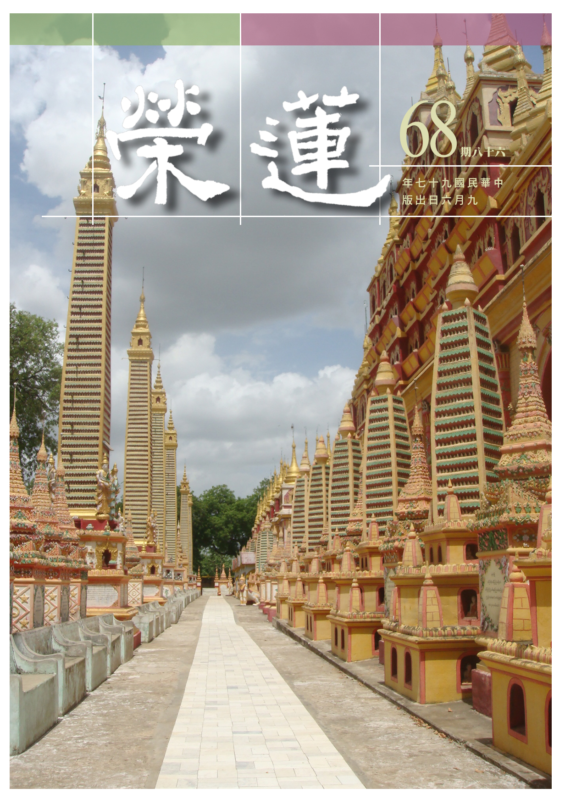

# 第68期

## 社論

### 台灣近代佛教的崛起

本刊

齋公婆及子孫廟

台灣初期佛道合

混沌經由大德開

青年學佛由根旺

今年十月廿五日，在台鐵大樓六樓演藝廳，將有紀念周慎公老居士一百一十歲冥誕活動，是慧炬雜誌社為紀念其創辦人所發起的重要活動。然慎公（周宣德居士）不只是代表慧炬，實乃台灣近代佛教發展史上不可或缺的人物，除了發起興辦大專佛學社團，將正確的佛法觀念導入大專生學習領域，更讓佛法觀念遍及知識份子，一改社會普遍以為學佛是齋公齋婆的觀念。

其次慎公興辦各種文化獎學金，鼓勵大專學生學習佛法，其中有以佛學論文而得博士、碩士學位者多人，並成為佛學社團的中堅幹部。這些人在出社會後，有些繼續弘揚佛法，或從事文化工作推展佛法。並興辦演講比賽，鼓勵大專青年宣講佛法，讓學習佛法的風氣經由各種的善巧方便而開展。

老人家除了皈依智光大師，並與南亭老和尚合作，開辦空中弘法，在電台中宣揚儒佛的觀念，並親近廣欽老和尚，深入修行的領域。更特別值得一提的是，對台中蓮社李雪廬老師的護持，除了引導大專社團青年，參加蓮社暑期所辦的慈光講座，也參加雪公所主持的佛七，護持雪公所辦的慈善事業，並擔任善果林居士會的董事長，亦捐贈病房，作為菩提醫院發起之倡，亦在中部設立佛學獎學金與演講比賽，鼓勵中部學佛青年深入佛法，並禮請雪公蒞臨頒獎，作為對青年的鼓勵。

在台北自宅—助成提供雪公北部弟子辦淨廬念佛會，令雪公弟子在台北能有共修的機緣，慎公並親自護持，作為活動的增上緣。且為了凝聚大專社團，慎公在慧炬每月辦九蓮粥會，禮請當代大德宣講儒佛的觀念，同學們亦藉此粥會交換辦好社團的意見與心得。雪公亦曾受邀到此粥會做淨土系列的演講。

晚年慎公雖因病移居美國，由女兒來護持，然不改弘法熱誠，繼續在美國推展慧炬業務，並與蓮友在家中共修研學，護持正法，且將自己退休金與台北住宅全部捐給慧炬雜誌社，成為辦理文化事業的增上緣。

在經論上有說登地菩薩名為歡喜，是因為能在布施之後生起歡喜，而這樣的歡喜勝過阿羅漢滅度的快樂。吾等凡夫無由知道菩薩真正的內涵，但是可以由菩薩無我的布施中，比量得知菩薩高深的智慧。一般凡夫不知道布施後生起殊勝果報的勝解，所以布施之後無法生出歡喜之心，也生不出對布施法的深入，勇悍布施。觀慎公為法忘軀，無我布施，在台灣將佛教紮根，提攜後進，豈非菩薩乘願再來？

今觀台灣佛教蓬勃發展，有幾個大道場成為佛教的新興象徵，但一般人鮮少知道，開頭是一些前輩大德在台灣默默耕耘，出錢出力，為佛法耗盡最後一滴血。過去這些為護持正法而如此努力過的人當中，其中周宣德老居士是絕不能被忽略的人物。本會有幸在慎公的紀念會上協助幫忙，至感無上榮幸。藉此短文表達對慎公的景仰，以作為助辦此次活動的增上緣，也願團體能培養出幾位後進，像慎公周大德這樣具有公心、善良、敦厚、正直，願意獻身正法，更是緬懷大德出世最重要的意義所在。

## 大德法語

### 大方廣圓覺修多羅了義經（二十八）

道源老和尚

勝義修學道次第

人我易觀此先入

二空修學理皆同

先破煩惱後所知

普賢菩薩章有云：

知幻即離，不作方便，離幻即覺，亦無漸次。還是希望我們頓超。

接著普眼菩薩第三章，不但說方便（漸次），還說下手的方法，初發心的菩薩由哪裡下手呢？尤其到了末法時代的眾生，沒有方便、沒有漸次，如何能入圓覺呢？普眼菩薩請問菩薩修行漸次，怎麼樣的思惟，怎麼樣住持？怎麼樣能開悟？問了好幾個問題了，如來在普眼菩薩這一章，說到下手的方便，持戒與修定是下手的方便。所謂堅持禁戒，安處徒眾，宴坐靜室，持戒修定。第三是觀慧。合之是戒、定、慧三無漏學，你在處靜室安然打坐，在那兒幹什麼呢？不是打妄想、窮磕睡？你得觀修（做二空觀），就是我空、法空，再做法界觀。

第一、先觀我空，第二、再觀法空。

如何觀我空？身體乃四大假合的，無實體可得，心是六塵緣影，你怎麼知道有六塵呢？身體上有六根攀緣六塵，在心識前顯現虛幻的影子（如鏡現相），此心不過是緣境而生，卻妄認有能緣心自相可見，將身體觀空，六根也沒有立足處，沒有六根誰去對六塵呢？身體空了，六塵也是外四大，六塵空了，對境起的心在那裏，對著身心生的我又何嘗真實？謂之我空觀。身空、心空謂之法空。

喻如摩尼寶珠本身沒有顏色，它對著五種顏色，它就顯現五種顏色，愚癡人執著摩尼寶珠有五種色，實際呢？摩尼寶珠本身沒有色，我們圓覺妙性（空性）本來沒有五趣眾生之相，沒有身心世界相，愚癡眾生認為實有五趣的眾生，若執著，則明明是如幻如化的境界，會當成是實實在在的境界，如此則起惑，起惑就造業，造業就受報，輪轉生死。

你要是聽到《金剛經》與《大乘起信論》，上述道理並不難懂。對離幻垢是能對治遠離一切幻垢的，此之眾生非普通的眾生，謂之菩薩。垢盡對除，即無對垢及說明者：你把幻垢通通斷盡了（垢盡），對治幻垢的觀行法門還要不要呢？不要了！就是那個病好了，那個藥我也不要了，垢是病，對治那個「對」是藥，垢盡，病完全好了，對治的那個觀行也不要了。

名為菩薩的那個人，連個菩薩的名字也了不可得。此人在那兒對治幻垢（將幻相執為有自性），且教化一切眾生對治幻垢的人，所以名為菩薩，此時無我、無人、無對治，你這個菩薩的名還安得上嗎？建立不起來了！此即《金剛經》所謂無有法，名為菩薩。那裡會有個實實在在的法叫作菩薩的？這些都是對待的假名詞。

有人常常問，極樂世界沒有女人盡是男人？對於不學經的人，只好這麼樣說。然極樂世界沒有女人，男人的名字要怎麼建立起來呢？那麼極樂世界都是什麼人呢？都是菩薩，不但極樂世界如此，上二界（色界、無色界），男人的名字也建不起來，欲界天才有天女，有天女就有天男，色界、無色界是修四禪八定化生上去的，不是女人生出來的，上二界沒有女人，沒有女人，你說哪有什麼男人？那麼色界、無色界叫什麼人呢？天人！是不是應該這樣講呢？所以這些名字都是假的，都是對待安立的，你把那對象（所對）觀空了，這邊能對的自然空。

二空觀之後是法界觀，先明一真法界觀，其次三處法界觀。第一、先觀一真法界，就是華嚴經上講的本體，無二為之一，不妄為之真，一切法的本體謂之法界，沒有差別，叫做無二，沒有妄法對待，絕對真，是一切法的本性，亦謂之法界。《華嚴經》所說一真法界即《圓覺經》之圓覺妙性。先作一真法界觀（此乃《華嚴經》的名言），若依《圓覺經》（略本華嚴）即圓覺妙性的觀修。

乙二、正宗分

丙二、令依解修行隨根證入

丁二、廣明行相

戊一、四問答通明觀行上根修證

己一、開示觀門同佛

庚五、正答所問

辛一、長行

壬二、觀行成就

癸二、觀慧

子二、明法界觀

丑三、圓彰法界

寅一、一真法界

經文：

善男子！此菩薩及末世眾生，證得諸幻滅影像故，爾時便得無方清淨，無邊虛空，覺所顯發。

經文之善男子，是佛叫一聲當機者，此菩薩是指初發心的菩薩，以及末法時代學大乘的眾生，證得諸幻滅影像故，這一切身心有沒有？有！然都是如幻如化的影像，有沒有一切法呢？有！但沒有實實在在的法。所以我也空，法也空，說有不過是如幻如化，此時候菩薩修觀行是修二空觀，末世的眾生也得修行二空的道理，證得諸幻滅影像，我與一切法都如幻，滅影像，是如幻的影像自相亦不可得，滅除了自相。

爾時，是指正在以二空觀證得二空理之時，便得無方清淨，無邊虛空，覺所顯發，此謂一真法界觀，無方與無邊同義，是沒有邊際。按空間說有十方，何以不說十方而說無方，顯示十方的自相不可得，此空靈靈的義境是覺所顯發，《楞嚴經》上形容一般見到的虛空比起現證空靈靈的境界（一真法界），如海水中一漚泡，所謂：空生大覺中，如海一漚發。

其次別說三重法界，第一是真空絕相觀：先要觀真空，佛教之空非虛空的頑空，虛空不過是做比喻的，也不是斷滅空，非一切皆無之空。真空是一切相之自相都不可得，謂之真空絕相觀。第二是理事無礙觀：真空是絕一切相，但卻不妨一切事的發揮，性不離相，理事無礙，作此觀察謂之理事無礙觀。

第三是周遍含容觀：一法含容多法，多法含容一法，如《華嚴經》上所說一真法界有十個法界，十法界就是眾生的境界，各各差別不同，但都互相含攝。如十法界之自相空掉是真空絕相觀，是十法界的理法界。第二是理事無礙法界，第三是事事無礙法界。依著理法界而修真空絕相觀，依著理事無礙法界而修理事無礙觀，依著事事無礙的法界修周遍含容觀，這都是《華嚴經》上講的。我們中國有華嚴宗，所用的功就是修這三種觀想。在《五教儀 開蒙》，最後講到圓教，即華嚴宗的三觀。是故《圓覺經》謂之略本《華嚴經》，是因為這一段經文與《華嚴經》上所修的觀法一樣。

寅二、三重法界

卯一、真空絕相觀

經文：

覺圓明故，顯心清淨；心清淨故，見塵清淨。見清淨故，眼根清淨；根清淨故，眼識清淨。識清淨故，聞塵清淨；聞清淨故，耳根清淨；根清淨故，耳識清淨。識清淨故，覺塵清淨。如是乃至，鼻舌身意，亦復如是。

此是真空絕相觀下之經文，覺圓明故，是覺性圓滿光明之故，能顯現心之清淨；心清淨故，見塵清淨，此心是什麼心呢？是八識心，乃妄想心的根本，也是生死的根本，亦即《大乘起信論》之無明業相，乃第八識的有漏分，此時轉第八識成大圓鏡智。第八識本來是一切種子的倉庫，生起妄相，此時淨化了第八識的妄想心，心清淨故，見塵清淨。

此見非眼識之見，乃第八識的見分，本體是自證分，見分即《大乘起信論》三細六粗之見相（能見相），由此能見，生了所見（相分），先是在內心起了境界相，再執著，以為心外有法，實則一切法都是唯識所變現的，這是唯識宗講的道理。唯識乃唯一個第八識，沒有外境，是唯識無境，外邊的境界全是你第八識變現出來的，是八識的相分，不過是能見所起，心外原無相卻又執著有，如此則一切煩惱都出生。此時第八識轉成大圓鏡智，覺圓明故，就顯心清淨，第八識（乃萬法本體）清淨，則見分清淨。

見清淨故，眼根清淨，能見的見分一清淨了，所起的相分，先說眼睛有眼根，也是你第八識所現出來的，此時眼根變清淨（眼根亦是第八識所現相分），眼根一清淨，眼識也清淨了。識清淨故，聞塵清淨；聞清淨故，耳根清淨；根清淨故，耳識清淨。識清淨故，覺塵清淨。如是乃至，鼻舌身意，亦復如是。《楞嚴經》上講有二十五圓通（六根、六塵、六識、七大），一門通門門通，觀音菩薩由耳根下手，證得耳根圓通，則一切圓通！（下期待續）

### 佛說八大人覺經講錄（十）

道源老和尚

多怨與瞋源私心

又加貧苦作增上

菩薩布施知對象

不怨不瞋平等念

甲二、詳八大法相以成宗

乙一、別釋八法以起信解

丙二、覺貧苦結怨觀念施善

經文：

第六覺知，貧苦多怨，橫結惡緣，菩薩布施，等念怨親，不念舊惡，不憎惡人。

第六覺知：「貧苦多怨，橫結惡緣」（師云：眼睛愈來愈壞，字也看不清），你要用心去教化一切眾生，此處勸我們要發平等心，冤親平等，不要捨棄那個冤家。何人與你結冤？是貧苦的人，財產缺乏叫「貧」，飢寒交迫謂之「苦」，此人前生少培福今生做一個貧人，財產缺乏，因為沒有錢財，沒有產業，這就受苦，最嚴重就是飢寒交迫之苦。要吃飯，沒有飯吃，這就叫飢，飢餓之苦，寒冷的天想要穿禦寒的衣服而沒有，受寒冷之苦。飢寒交迫之人就多怨恨。

他為什麼多怨？上怨天，下怨人，內怨父母妻子，外怨師友、親鄰。上怨天（本省話叫天公），天公不平等，儘保佑別人發財，不保佑我，他怨天。下怨人，他看見一切人都跟他不親近，一切人都對他不起。他貧窮就怪別人，對他不起，他才貧窮；所以下怨人。內怨父母妻子，父母親對他不平等，自己的妻子對他也不好。外怨師友親鄰，外怨師長朋友等對他不好，這叫多怨。

「橫結惡緣」有了怨恨就要與人結惡緣，「橫」字怎麼講呢？與人結惡緣是不講理，對不起人，與人結惡緣，得有個理由？一點理由都沒有。他要跟你結惡緣，憑空的跟你結惡緣，這叫橫結惡緣。比如我們發了菩提心，要行菩薩道，要弘法利生，見貧苦的人看他可憐，要跟他講經說法，他不但不接受你弘法，他還罵你一頓，跟你結惡緣，沒有理由，謂之橫結惡緣。

「菩薩布施，等念怨親」菩薩要去度眾生，就要行布施。行布施有三種：財施、法施、無畏施，教化一切就是行法布施，你這個菩薩要行法布施（乃至一切布施）的時候，要等念怨親，教化一切，不能選擇那是怨家，那是親愛的人，是親愛的人我就教化他，怨家對頭我不教化他，這是不平等，要有平等的觀念，所以要等念怨親，親我也教化他，怨我也教化他。

「不念舊惡」舊惡是過去的惡，舊惡有兩種：第一、我知道這人過去不做好事，是個惡人，這個時候我要教化他學佛法，他過去所作的惡不要念。第二、他與我結過惡緣，我還教化他幹什麼呢？不！舊惡不要念，只要現在向他講佛法，他能接受教化，我還是要感化他。

「不憎惡人」憎就是憎惡、討厭，壞人令人一看就生憎惡之心，但是我們行菩薩道要以慈悲為本，要慈悲他、憐憫他，曉得他貧窮多怨要憐憫，不要憎惡他，不要討厭他，一定要以種種方便來攝受他。（下期待續）

### 常禮舉要講座（九）

雪廬老人

世上無如吃飯難

賓主之立禮儀分

敘舊交誼或辦事

善用能得大利益

聚餐

所謂聚餐不是你個人吃飯，乃指對客而言，大家庭吃飯也可叫做聚餐。平常吃飯就無所謂了，講聚餐就表示這件情比較慎重。本篇大主義是說咱們出去作客是聚餐，客人上我們家也是聚餐。要知聚餐的原則，所謂聚餐之意不在餐，大家聽明白這句話了吧，乃在賓主之立也。懂得這兩句（聚餐之意不在餐，在賓主之立），你要查是出自何處，四庫全書都查了還是沒這兩句，那你就是呆板漢，書也不能講了。

◎一、座有次序，上座必讓長者。

在中國不論任何事情一律都有規矩，聚餐是行禮，更不用說了。從前出身講的很嚴格，現在不講這個了。再說說從前的話，譬如從前家庭裏頭有念書的，本來可以下科場，但有幾種人不能下科場，即使你質地多麼好也不能進科場，你們大家或許知道，為什麼呢？為著他三代不清。以前得有保人，什麼樣的人可作保人呢？最低限度是廩生，先進了學是秀才，秀才以後是補廩，比秀才高一等，謂之立保，他可以具結你三代的清白。要是去考功名，有人對你身世提出問題來，這個保人了不得啦，不但臉上無光，連功名也被勾掉了。

譬如從前有種職業叫剃頭，剃頭擔子上頭掛著一塊布（擦布），那布是什麼？這你不曉得，那布稱作聖旨，剃頭的就是御料理，得了皇上的聖旨給大家剃頭。這個職業不論如何不許進科場。大家聽明白，不許進場是最不好的職業了，雖然剃頭是最不好職業，但是你們諸位不知道，上剃頭舖子去，男人在那裏、女人在那裏、和尚在那裏、道士在那裏、幹什麼幹什麼都有一定的，一錯了就開除。

即使挑著擔子在這街上選地處擺，也有一定的規矩，錯了！同行就找麻煩，此說次序的話，最小的事情也得講次序。你上菜館吃飯，你說外行話，他做的菜雖然是一樣，但是對內行是一個做法，對你又是一個做法，說這話有什麼用意？現在一切不講次序、亂七八糟，所以社會亂成這個樣子。

你們諸位學佛要一心不亂，一心不亂怎麼講？一心不亂是有次序？沒次序？亂七八糟怎麼叫一心？你自己這個人終日在家庭一舉一動處事皆是亂七八糟，這樣的人學佛成功的很少，何以故？收不起心來，怎麼能成功呢？所以顏子才說：博我以文，約之以禮。在禮上走，能漸漸地走上了道，要上道首要是次序。

這次序很難向大家講清楚，就以吃飯為例，咱們中國是方桌，六個人一桌，依禮而言，正對門的是上座，如佛與觀世音菩薩塑像都擺在這裏。從前餐桌上座次的規矩都得學，凡是上學回家老人都教，為什麼老人教呢？這家有四、五口人，吃飯是在同桌，誰坐在那裏都有一定，在家裏就練習慣了，老人一不在家，這個位子閒著沒人敢坐。做客的功夫、主人讓座，主人他讓他的，你自己得看看年齡。

有些人該他上座他再三不坐，他坐在那裏（下座）誰也不敢坐了。這麼讓、那麼讓，前呼後擁，他這一抽手力量很大，一下子甩掉兩個，你別笑，這是真有其事啊！當初張飛讓客，很恭敬、很客氣，一下子拉過來，把客人膀子給拉斷了，你看看這種情形。

上座必須讓長者，長者或論年紀，或論輩份。譬如年輕的是袓，上了年紀的是孫，這個常有。那麼入席如何呢？我跟你說在家裏不必，出去的功夫是父子不同席，師生也不同席，沒法讓，現在打倒孔家店的一概講不上。總之，看見年紀比我大的，我們讓他，好了不必再講別的。

◎二、入座後，不橫肱、不伸足。

這個大家必得學，人人都會出去做客，橫肱是什麼？坐的功夫把手肘橫伸出去，四方的桌子一方坐兩個人，你如橫肱而坐，他則被拘束，這不明白嗎？不但坐席如此，就是兩個同學一張桌子，也是左手不要橫出去，否則別人很難寫。

從前做客換新衣服，不是為了炫耀自己有衣服，冬天衣服更講究，此恭敬主人家，將衣服穿得整整齊齊是恭敬人家，而非炫耀自己家裏有錢。譬如有公事，必得戴上禮帽，穿上褲褂，行著禮以後才能脫這禮服。你到那裏做客的功夫，一上桌就橫肱，旁邊的人受了妨礙，這吃菜的功夫，他故意拿著菜、帶著湯汁，滴滴答答地滴到你衣服上，那就行了，這是從前。那也是不道德的人，才沒這樣寬恕人的心胸，所以是不橫肱。

不伸足是你坐在這張桌子，六個人同一桌，每邊有四隻腳，如都伸開，這桌子底下就滿了腿，滿了腿怎麼樣？大家腿互相交錯，那就行了，就太不像話。總而言之，把這腿一彎，跟我自己坐的椅子平行，若不講究規矩，伸了腿碰到主人家的狗，在你腿上咬兩口，那是自找，所以是不伸足。

◎三、主先舉杯敬客，客致謝辭。

這是入座以後，主先舉杯敬客，你是主人，得先有請客的動作，先不要拿筷子吃菜，要先敬酒，敬酒是用兩隻手。這還沒說安坐，安坐比較正式點。我是主人，先讓正客，讓不能只讓主客，先讓了正客再讓其他陪客，這第一杯酒主人先喝，表示自己喝了叫人看，這是主人先舉杯敬客。

你不是主人，座下還有主人及別的客人，你不要妄作聰明「咱坐下來喝，大家來喝呀，來、來」，這席是你請的客嗎？這樣是講理嗎？這桌酒席是人家花的錢，人家愛讓不讓是人家的事，你沒讓的道理！這是第一次，後來則另當別論，這是有實有權呀。凡事有實在、有方便，沒有呆板的事情，你萬不可先動手，這是要緊的。現在是不行了，擺了桌以後，主人還沒敬酒，旁邊的人拿出酒來先敬主人，此乃胡鬧，在禮上講不通。這是人家的酒拿來請客，你怎麼敬他呢？

主人舉杯敬酒後，這個客得致謝辭。他來敬你，你先謝謝，主人要是站起來，客也得站起來、主人站起來敬酒，客人還昂然上座，這個現在我看多了。主人站著，客在那坐著，別人給你滿酒也不管，禮貌都不懂。你得記住禮尚往來這個原則便行了，別人來恭敬你，你就得恭敬人家。

◎四、主人親自烹調，須向主人禮謝後食。

大家不是在飯館吃飯，而是在主人家裏，或是太太或家裏人做菜，大家聽明白，這個更隆重，隆重到非得交情夠得上，才請到家裏面吃飯，交情夠不到則是我們這小屋子不能容大神，在家裏吃飯是夠得到交情的。

上菜時你或許不知是主人親自烹調、或是家人做的、或是當差或是其他做的，上菜時你可問一問，這個都是長學問。這個菜是那一位做的？是廚房做的？或是家裏做的？這就不一樣了。從前還有講究的，交情夠到或夠不到。大闊老不吃菜館，家裏有名廚各有各的拿手菜與專門菜，此館子做不出來。

這時你可以問一問這是誰做的？主人說這是賤內做的，她在那裏調理，這是對客太恭敬，所以須向主人禮謝後食，「這太隆重了，真是不敢當」說了客氣話然後可以食。這句話主人聽見了，回頭到後頭對家人說「客謝謝你啦」，家人也有懂規矩的，說：我請了客他說怎麼樣？他沒說什麼！就知道來的客是土包子。吃飯遭難看！吃飯不是一件容易的事，我最怕吃飯。所謂：天下莫如吃飯難，世間唯有修行好。天下莫如吃飯難，你記住吧！

◎五、主人敬酒畢，正客須回敬主人。

主人都敬酒了，這時正客就回敬主人，你如當陪客須知人家請的是正客，你是陪著正客，所以不要多事。正客還沒回敬，你少管，並不是你失禮，正客假如有不懂的你再說，從前正客沒有不懂的、都學過。誰不曾出來吃過飯？從前講究禮，送了請帖去，送到沒送到要給對方一個單子，寫什麼呢？敬陪末座，末了那個我陪他，講恭維話，這是內行話。你要是首座可以如此，你要是後座的也寫敬陪末座是不識相。總而言之、中國是文化國先得認字、先懂禮，今日之下這些狂徒不認字且苛薄。

◎六、舉箸匙，必請大家同舉。

箸是筷子，匙是湯匙，舉箸匙時必請大家同舉。譬如說我是主客，主人讓我、我不舉，主客還沒舉箸匙，連帶的也還不能吃。主人讓主客、主客就吃，這就不禮貌。聚餐是行禮而不是出來吃飯，你得明白這個情形，餓了不要緊，餓了回家再吃。當主客要讓大家，必須請大家同舉箸、拿湯匙也如此。

一上菜先別吃、先敬酒，這是正式的，其他的那些都是陪襯。從前官場中都穿了一身禮服，一起在桌子前頭行大禮，行對首拜，這是真行禮，絕對不是假的。現在中華民國行鞠躬禮，你偏要拜，那就不對了，因為禮從俗嘛。行完禮以後，主人就說請諸位寬衣，或是摘帽子或是脫衣，這時就可隨便一點。有云坐而正冠，起而更衣，坐下就在那規規矩矩的，起來必須是為了更衣才起來。更衣兩字大家聽明白，並不是換衣服，但也可以換衣服，上廁所小解方便亦叫更衣，現在一些更衣所各處有，你進去更衣嗎？（下期待續）

## 共修研學

### 小止觀導覽（四十一）

*心爾整理*

修行重知見

路頭須清楚

識得廬山路

真隨慧遠遊

第六章 正修行

上述二十五方便之修學是正修止觀的前方便。當一個人懂得持戒懺悔，有安靜的處所能修止觀，衣食具足且無外緣的干擾，並有善知識的提攜，所居處所遠離五欲境，內心也不愛戀五欲境，能好好的調食、調睡、調身、調息、調心，以此殊勝修學的條件，好樂修學止觀，並且知道止觀的修法，能在止觀門上精進用功，逆品生起時能有對治的方便法，修學止觀門的心像金剛那麼堅固，這樣的人必然在正修止觀得到成就。

雖然正修止觀有二十五方便，並非要完全具足才能修止觀，重點在修學止觀的知見與方法，能在坐上修前先把自所具之前方便大略觀修，慶幸自己有這樣好的修學條件。

智者大師的哥哥，不過是在修學止觀上得一些世間的成就，就能改變命運，多活了二十四年，臨終坐化。然止觀更有出世的利益，較之在世間所得的好處，難以比擬二者的差距。

論文：

修止觀者，有二種：一者、於坐中修，二者、歷緣對境修。

在坐中修與歷緣對境修中以坐中修為勝，若以勝義的修學而言，在坐上修中能體會萬法自性不可得，在後得位中，觀察這些所歷的緣、所對的境，皆是無自相中所顯現的幻化法，不會產生對境的執著，而生種種的貪愛、瞋恨。然法雖自性不可得，正好說明彼之生起是依因仗緣而起，觀待此法又能生起下一法相，是故如法的辦事，所招感的是樂果，不如法的辦事，招感的是苦果。必得將這些概念落入內心成為內心所緣的影像，才是真正坐上修或歷緣對境修學止觀者。

論文：

於坐中修止觀者：於四威儀中，亦乃皆得；然學道者坐為勝，故先約坐以明止觀。略出五意不同。

在四威儀裡都可以修止觀法，然而以坐中修較為殊勝，故以坐中修明止與觀之修學。

依止觀門修學正法，能對法產生殊勝的覺受。然坐上修修止觀，其成效分五種行相：一、對治初心粗亂修止觀；二、對治心沉浮病修止觀；三、隨便宜修止觀；四、對治細惑修止觀；五、為均齊定慧修止觀。

四威儀乃行住坐臥，講究的是：行—行如風，是一種輕安相而非沈重相，舉止安詳。住—住如繩，心正影端，如法安住。坐—坐如鐘，坐如扣鐘，穩固如山。臥—臥如弓，此謂之吉祥臥，睡得最安穩也最容易覺醒，容易抱持正念，心不昏沉散亂。

行住坐臥，不離佛法的修持，不被境界所轉，又能轉境。行住坐臥都能修止觀，如在行中，須舉止安詳，心不外馳，是修止觀的條件。譬如辦放生業，在放生業中確立自己的角色，心態與放生相應。如運載生物時好好觀修生物的苦，依著這一段因緣，引發慈悲心，並找到好的場地，作為它們生存的環境。能修止觀的人是會辦事的，修行人不會辦事就是書呆子，修行人擅於觀察人、事、時、地、物，並與別人和諧的相處，顧全大局，也知道事的輕重緩急，所以能辦事者必須是道人。

然而學道的人以坐為最殊勝，在坐上修時以止觀之方便修學法義。因臥多易昏沉，住多易疲勞，行多易氣浮，故以靜坐為勝。如果用坐調整氣脈，調整呼吸，精神能集中，心力容易拉起來。

其實整天沒事做是修學止觀好的條件，然坐上修不知道修什麼，還不如取經論予以讀誦觀修。修止能將法的義境變成內心的影像，並安住於心中影像，若觀時是在止上分出一部份心力對此影像加以分別思維、辯證，產生對法的殊勝覺受。修止觀能將內心調整為靈活的狀態，不修止心易浮躁，不修觀心易遲鈍。論語有：敏於事而慎於言。看事情很敏銳，能知事情的重點，將事情納入內心變成影像去觀察，而且做事謹慎不莽撞，這就是修行人的特質。

論文：

一、對治初心粗亂修止觀，所謂：行者初坐禪時，心粗亂故，應當修止以除破之。止若不破，即應修觀。故云：對破初心粗亂修止觀。

止若不成，觀無由建立，此處之觀是對治止的逆品，嚴格說是修止的正知，令心能成就止，止成就後才能夠在止的基礎上建立觀。

論文：

今明修止觀有二意：一者、修止，自有三種：一者、繫緣守境止，所謂繫心鼻端臍間等處，令心不散故，經云：繫心不放逸，亦如猿著鎖。

要使我們的心不散亂、不昏沉，安住在境界上，這樣使身心不容易疲勞，如果能繫心不放逸，就像猿猴上鍊鎖一樣。

佛號可以成為我人內心影像，影像（法塵）能以色塵或聲塵的方式出現，乃至以觸塵的方式出現，例如內心將佛號念得清清楚楚（不出聲），旁人沒有聽見我念佛，佛號雖是意識所緣念的法塵，然如聲塵般，謂之法處所攝聲，內心只有這個影像，謂之專注。

繫緣守境止是對治法，心若浮動，如緣念肚臍能把浮躁之心降伏；心若下沉，或緣念眉間、髮際，將心揚起來，然此法不要常用，只要內心安住在影像上，若安住不了再修對治法即可。若內心下沉，觀想佛菩薩的功德、淨土的殊勝，下沈的心自然上昂。

經論常以猿猴代表心，木樁代表所緣境界，繩子代表正知，將猿猴拴在木樁上，久久必馴服之，如用正知將心念安住在境界上，即是繫心不放逸。

心又如狂象，馴獸師的勾子是正知，將大象以繩子綁在樁上面，若象躁動，以勾降伏，久之成馴象。吾人亦然，透過正知、正念調伏自心，久之，心能受我人的指揮，須知心從無始以來都不受控制，想要修行卻偏偏昏沉、掉舉、散亂，明明想要控制脾氣，但卻偏偏大發雷霆，明明要做善法卻又提不起勁。若能以止調伏自心，則作善極為堪能，因為心已能受我人的指揮，不會煩躁不安。當修正知、正念達到止的境界時，內心就像已經被馴服的猿猴，非常聽話，此時心安住在佛號上，要安住多久就安住多久，任何善所緣都可以安住。

論文：

二者、制心止，所謂隨心所起即便制之，不令馳散。故經云：此五根者，心為其主；是故汝等，當好制心。此二種皆是事相，不須分別。

制心即是一起心馬上覺照，立刻加以制止，不令心馳散。隨心所起的念頭，只要起覺照就知道是惡念還是善念，不去緣念可欲境，貪瞋的心就不會生，經論說心本無生因境有。不緣念可欲境，則依著境界所生的煩惱就無從出生。

第六識對著所緣的境界，名言認知是順境，從順境裡面生起貪，而對治貪的方法不是努力的壓制貪心，而是回觀第六意識，名言認知順境的過患，貪心就不會生起。

只要心不緣境界，把心安住在佛號上、善法上，就可以制止心中的妄想緣慮，不必注意丹田、注意頂上，只要在境界上安住，不加以分別，也不需要分別，即如往生的心念是作意在念佛之前，而不是一句阿彌陀佛，一句我要往生，念佛時只要好好念佛即可，在境界上不分別的安住，這是修定最為重要的知見。（下期待續）

### 佛說八大人覺經（十六）

*編輯部整理*

觀察生癡輪迴苦

慧辯令彼生正見

破愚能斷煩惱根

深信聖教無怨悔

第五覺悟：愚癡生死，菩薩常念，廣學多聞，增長智慧，成就辯才，教化一切，悉以大樂。

前言

八大人覺經，是佛菩薩大人所覺悟的修學法，雖為無量無邊，總攝為八。第一覺到第二覺是小乘的修學法，第三覺到第八覺是大乘的修學法，攝為六度，或由第三覺到第四覺是菩薩破煩惱障，第五覺是破所知障，而六、七、八覺則是菩薩如何利益有情。本經文是少文攝多義，在讀誦或解義都可以確立我們修學的意樂，以及了知修學的方便，並掌握了三藏十二部的義趣，是一大藏教的總綱，這樣的修學法是非常的善巧。

其中第一覺是小乘斷見惑的修學法，第二覺是破思惑的修學法，菩薩雖然是從第三覺開始，可是第一覺和第二覺的修學法中菩薩是以了知的方式通達，第三覺說明發菩提心的菩薩上求佛道重在成就佛的智慧，謂之唯慧是業。

第四覺知是破了煩惱障出三界。行菩薩道者度化眾生，未能自度焉能度人，所以先要斷除煩惱障，修學淨土往生西方也是花開見佛聞法悟無生，再修學各種度化眾生的方便，還沒有證得空性之前，學度眾生的方便是隨緣不是廣學。第五覺知是生起破所知障的智慧證得佛果，然由第四覺到第五覺的成就，必須結合菩提心和各種利生的菩薩行來攝持空性的智慧，才能破所知障，而第六至第八覺則是以菩薩行如何不疲不厭的利益有情。

第四覺雖然名言安立為精進度，但是他的精進並不是精進於利益眾生的菩薩行，是精進於開智慧破煩惱障，這是菩薩利益有情之前最重要的一步，取菩薩六度中的精進名詞，精進於提升自己的證量，在利益有情中提升自己的證量，破煩惱障後方能真正利益有情，此雖是自度，然是為了有情而去自度，努力提升自己證量的目的，就是給予眾生最殊勝的利益。

當然最殊勝的利益有情，是要證得破所知障的智慧。或云：為什麼要利益有情？有情皆是愚癡生死，對有情眾生的愚癡生死或可生起憐憫心，但不一定會有感同身受、如箭入心的覺受，此非是大悲心的行相。大悲心須從出離心出發，出離心是大悲心的基礎，但有出離心不一定生起大悲心，當有情眾生的可愛面相由心識生起時，不忍其苦，要給予真實的安樂，才會真正生起大悲心，若不生起有情可愛面相，僅生起苦的面相時，或會生起對有情的同情，但不會生起救度他是我的重責大任。當生起有情可愛的面相就像母親對唯一的愛子時，他正在受苦你不會覺得那是別人的責任，而會一肩承擔。

同理，菩薩將眾生當成唯一的愛子時，生起如母憶子一般的悲心，能將法界眾生離苦得樂的責任一肩擔起，並且許可諸佛涅槃，此重責大任由我一人承擔。

第五覺：愚癡生死，菩薩常念，廣學多聞。面對眾生愚癡生死，固然是菩薩生起大悲心的條件之一，但並非完全之因，要把有情眾生可愛的面相生起時，如母憶子般，想要把最好的給予有情，並以佛果為自己修學的目標，一心一意想要去獲得佛果的那一分才是菩提心的行相；或問何以能生起有情可愛的面相？因為所有功德、所有佛果的安樂都是靠有情才能生起，所以普賢行願品說：眾生是根，大悲心是水，以大悲心澆眾生之樹根，開的花是菩薩花，所結的果是佛果，這才是生起大悲的利根修學法。

在普賢行願品中的恆順眾生，即是站在大悲心的基礎上生起眾生可愛的面相，並予以各種方便，隨順彼想要離苦得樂的根性，予以世間的安樂、出世間的安樂、成佛的安樂。

對治三障

菩薩在第四覺修學時，惑業苦三障已經破了，第五覺悟是為了要破有情的惑業苦三障，所以廣學多聞，為什麼要廣學多聞？因為有情眾生，有根器、習性、欲望、勝解種種不同，所以需要多聞破惑，破的是眾生心裡的種種疑惑，這些疑難雜症要靠多聽聞教法才能助彼破除，這是廣學多聞的好處。多聞是跟隨著善知識，多多的聽聞教法，廣學則為思修，將多聞內化成為證量，具有真正說法的能力，轉眾生的共業，所以登地的菩薩有轉共業的能力。

菩薩廣學多聞，增長智慧，成就辯才，是破所知障的智慧成就，必能教化一切眾生，悉以成佛的大樂。菩薩何以有如此大的心量？因為佛果的安樂全部都是眾生給予的，眾生這份深厚的恩德，令菩薩對有情生起十分的悅意，有情的安樂就是菩薩的安樂。

始終互重

廣學多聞，增長智慧，成就辯才的目的，就是教化一切，悉以大樂。透過聞可以解決心裡的疑惑，透過思修證量轉強，能轉變別業與共業。然而只有聽聞而不去內化，就有種種的障礙，有些人是不求多聞，想開智慧但不願意從聞得到慧，有其過患。

聞求於外，聞是由外而得，是向外求而有，然而不修慧將所聞的內化，所得的觀念不但不能降伏煩惱，反而成為禦人的口才，常常惹人討厭，不但不會去降伏自己的煩惱，反而維護增長自己的煩惱，最後將法身慧命燒掉，社會上有許多因多聞而才華洋溢，個人得到非常多的名聞利養，漸漸地腐蝕自己卻不知不覺。

然而只求修慧而不多聞者，如持劍自割，亦傷害自己法身慧命。四十二章經言二十難，其中之一是廣學博究難，有人或偏好修數息觀，沒修多久內心很平靜，或者修白骨觀，立刻得輕安法喜，或者是修其他對治煩惱的方便，很快得到輕安，法喜充滿而不耐聽聞，不耐仔細的分析義理，只想修某一對治法，不修聞就不需要善知識，結果增長增上慢或者遇障則退。

始終互重就是說開始學菩薩道時，以聞來充實自己，並以止觀修學證得正見，這樣的成就才是辯才的本質。

辯才可分為：法無礙辯、義無礙辯、辭無礙辯、樂說無礙辯。法無礙辯是能通達經義之辯才；義無礙辯是能以世間的軌則立宗立量來成立經典的義理；辭無礙辯是通達各種方言的辯才；樂說無礙辯就是很慈悲的樂於說法、解義，不疲不厭。成就辯才的目的是廣度眾生，給予眾生成佛的大樂。

佛行事業中最重要的事業就是說法是業，所以經上云：此方真教體，清淨在音聞。教的作用就是要幫助眾生破迷起悟、離苦得樂，主體在聲塵，如果沒有聲塵就不會產生聞法的作用。所以有情眾生若要破迷起悟、離苦得樂，沒有聲塵是辦不到的，教的體性是聲音，教的作用是破有情的煩惱，所以欲使佛法住世，須延續講學的事業。（下期待續）

## 蓮池海會

### 張燕老居士往生見聞記

*編輯部整理*

一生是一種傳奇

高壽是供養回報

健康以施食為因

得助念是常共修

張燕老居士，民國元年生於台北大稻埕，家境貧苦，父親外出做生意很少在家，十三歲時母親往生，老居士一肩扛起一家四口(兄、弟、父）洗衣、煮飯等家務，一生勤儉持家，律己甚嚴，自己能做的事從不假手他人。

老居士年輕時皈依龍雲禪寺賢頓法師，在師父往生後，每年忌日絕不會忘記，一定到寺裡向師父上香，一直到最近幾年，年事高才做罷，並在中年時於圓山臨濟寺受菩薩戒，之後就吃長素一直到往生。老居士一生發心護持佛法，曾在北投慈航寺負責香積十幾年，一直到民國八十年才回家休息。雖然在家，仍佛珠不離手，一心念佛，求生西方。

老居士曾為了不願殺生，不敢用黏鼠板，以巧思抓老鼠入甕，等天亮時再到空地上放生。也曾為了怕別人害怕看到蟒蛇，勇敢的將蛇引入籠子裡，天天餵食，並也在子孫面前告誡牠要好好念佛，來世不要投胎成為人人害怕的樣子。老居士在外孫女極小時，就教導她們念佛，而且為了方便計數，用日曆紙搓一小團計數，或者拿法船圈點圖，要她們像畫圖那般念幾句佛號圈一個紅點，相互比賽並且收集起來回向；也會拿地獄變相圖書，告誡外孫女不可以做傷天害理之事，否則將來會下地獄。老居士的慈悲與智慧至今還深深的烙印在子孫的腦海裡，無法忘懷。

老居士知道人生無常，早就將她所存的四塊金塊要留給晚輩，華梵大學建校時，女兒建議她將金塊捐出來做建校功德，迴向給老居士，老居士歡喜供養。此外，有佛寺師父發心在南投蓋四眾居住處所，老居士也很發心護持。過年過節時，老居士都會記得買一些糖果餅乾到孤兒院，讓那些孤苦無依的孤兒們有過節的享受。歡喜供養布施是讓老居士快樂的泉源。

老居士於民國九十三年開始參加蓮榮週四三代共修，未曾間斷。民國九十五年元月八日，因身體不適送醫治療，檢查後發現膽囊化膿，醫生建議必須開刀，否則將引發腹膜炎，在痛苦中往生。家屬雖知老居士年事已高，理應拒絕開刀，但又不忍見老居士痛苦，在猶豫未決中，幸蒙善知識建議家屬回家念佛，經過蓮友三星期廿四小時排班助念，以及江西、安徽等地放生功德迴向給老居士，老居士終在三寶與蓮友護持及女兒的照顧下漸漸清醒，又健康平安的度過了兩年多，並且繼續參與共修。

老居士於今年五月十八日清晨，身體不適，送醫治療時，三十分鐘後在佛號聲中安詳往生。淨身更衣時，慈祥又莊嚴的面相，更令人覺得佛力加被不可思議。老居士於九十七歲的高齡，前往了一生所嚮往的極樂世界，祈願老居士於淨土中安養其身，並繼續庇蔭三代共修同班同學以及所有的蓮友，在西方淨土中再續共修前緣。

## 啟蒙園地

### 歷史故事　臨終自如的王維

淨域

唐天寶年間，長安附近的藍田輞川風景秀麗，那兒有二十景。有一位四十來歲的官人，因不愛官場文化，便於林泉中尋找寄託，又因好佛，常伴以經卷、茶鐺藥臼等物。在一個秋夜雨後，他見村景不禁吟起：「空山新雨後，天氣晚來秋。明月松間照，清泉石上流。竹喧歸浣女，蓮動下漁舟。隨意春芳歇，王孫自可留。」這詩便是廣為流傳的〈山居秋暝〉，作者正是輞川山莊的主人，亦是被後世稱為「詩佛」的王維。

王維字摩詰，太原祈縣人，生於武后長安元年（西元七零一年），下有四個弟弟，父親為汾州司馬，後遷河東蒲州，早年喪父與母親相依為命。王維於〈請施莊為寺表〉一文中說：「臣亡母故博陵縣崔氏，師事大照禪師三十餘歲，褐衣蔬食，持戒安禪，樂往山林，志求寂靜。」可見母親崔氏是位虔誠的佛教徒。大照禪師即神秀的弟子普寂，中宗曾下制令普寂代神秀統其法眾，是當時佛教的首領。

王維自幼便受佛教思想的薰陶，其名字便深含禪機。名維，字摩詰，連起來便是維摩詰；而佛典中的《維摩詰所說經》專說般若，其中的維摩詰長者，正是一位得到釋尊稱許的大居士。顯見其於佛教禪宗的深厚機緣。

王維聰明早慧，有雄心大志，屢出入兩京為仕途忙碌，然離家愈久愈思親，尤其是惦記著幾個弟弟。於是一首膾炙人口的詩篇就流淌出來，詩說：「獨在異鄉為異客，每逢佳節倍思親。遙知兄弟登高處，遍插茱萸少一人。〈九月九日憶山東兄弟〉」。王維多才多藝，尤擅長琵琶，很受士大夫們的喜愛，成為豪貴的座上客，但在這一些接觸中，他也看到許多世間的不平事。唐玄宗之兄寧王，雖王府寵妓無數，卻常將魔手伸出府外。有一位賣餅師傅之妻被他奪來，一段時間後問說：「還想前夫嗎？」女子默不作聲。寧王於某次宴中召餅師進府，女子見後淚流滿面。寧王要在座者賦詩吟頌此事，王維寫下〈息夫人〉一詩，說：「莫以今時寵，能忘舊日恩。看花滿眼淚，不共楚王言。」其藉春秋時期楚王滅息侯，霸佔息夫人之事，來委婉表達對寧王的不滿。

開元九年（西元七二一年）中進士，擢為太樂丞，專責宮中舞樂，因樂妓失序演出而受牽累，貶為濟州司倉參軍，於官途上很不得意。但在濟州卻交往了崔錄事等好友，彼此的不幸與不平便躍然於詩中，在〈濟上四賢詠鄭霍二山人〉中寫道：「翩翩繁華子，多出金張門。幸有先人業，早蒙明主恩。童年且未學，肉食騖華軒。豈乏中林士？無人獻至尊。鄭公老泉石，霍子安丘樊。賣藥不二價，著書盈萬言。息陰無惡木，飲水必清源。吾賤不及議，斯人竟誰論！」

多年後，王維回到長安，但過著無官閒居的日子。開元十六年，孟浩然到長安應試，與王維結為好友，而王維拜薦福寺道光禪師為師，從此更心向佛教。開元二十一年，張九齡任宰相，王維被任命為右拾遺，官銜雖不大卻是近臣之職，燃起他的政治熱情。但張九齡「不賣公器、為蒼生謀」的政治性格，卻成為官宦貴族們的眼中釘，在李林甫之流的排擠下，於開元二十五年被貶為荊州長史；從此奸臣得道，為「安史之亂」埋下伏筆。

對於張九齡的罷相，王維沮喪地寫下〈寄荊州張丞相〉一詩：「所思竟何在？悵望深荊門。舉世無相識，終身思舊恩。方將與農圃，藝植老丘園。目盡南飛雁，何由寄一言！」這詩道盡他對政治的失望。但此年三月，河西傳回戰勝吐蕃的消息，奉帝命出使塞上勞軍，於涼州任兩年判官，後再派赴襄陽主持南方州郡的科考。是年（開元二十八）孟浩然已逝，王維走赴襄陽涕淚俱下，寫下〈哭孟浩然〉一詩：「故人不可見，漢水日東流。借問襄陽老，江山空蔡州。」試務結束後返京，王維對於政事不聞不問，只是掛職常住於山莊裡。

天寶年間（玄宗後期），玄宗沉溺於聲色犬馬之中，朝政全由李林甫、楊國忠等把持，忠良被陰謀迫害，社會籠罩在一股恐怖陰影之中。此時王維已四十多歲，加上喪妻未再娶，在佛教思想的影響下，隱居便成為他的新生活。初時居於長安附近的終南山，其〈終南別業〉一詩：「中歲頗好道，晚家南山陲。興來每獨往，勝事安自知。行到水窮處，坐看雲起時。偶然值林叟，談笑無還期。」宣告他的新人生觀，是一種「隨遇而安、心領神會」。

之後，於輞川買下一處產業，這原是初唐詩人宋之問的「藍田別墅」，經細心維修經營後，作為母親念佛修行與自己安養的地方。裴迪等人常來遊賞於輞川，此時詩作清新自然，被喻為是其詩歌的代表。那〈鹿柴〉：「空山不見人，但聞人語響。返影入深林，復照青苔上。」〈竹里館〉：「獨坐幽篁裡，彈琴復長嘯。深林人不知，明月來相照。」〈新晴野望〉：「新晴原野曠，極目無氛垢。郭門臨渡頭，村樹連溪口。白水明田外，碧峰出山後。農月無閒人，傾家事南畝。」這些山林田野閑淡勞忙的景象，讓人感到十分舒暢。

天寶十四年，爆發動搖唐王朝的「安史之亂」。安祿山出身貧寒，靠著拍馬迎和而屢屢遷升，同時被封為范陽、平盧、河東三鎮節度使。張九齡曾對玄宗諫說：「安祿山有反意。」待潼關失守攜百官南逃時，這才悔恨當初未聽勸諫。王維時任給事中，因來不及隨駕入川，而成為安祿山的俘虜，被押往洛陽強授偽職。王維服藥偽裝喑啞辭官，但安祿山愛其才華，將之拘於菩提寺內，在百般恐嚇威脅下，王維無奈地接下給事中偽職。

裴迪此時亦為俘虜。有天來到菩提寺見王維，提及樂師雷海青抗敵犧牲的英勇事蹟，他於感動之餘寫了一首〈聞逆賊凝碧池作樂〉：「萬戶傷心生野煙，百官何日再朝天？秋槐葉落空宮裡，凝碧池頭奏管弦！」此詩傳入甫於靈武即位的肅宗耳中，獲得嘉許。當至德二年九月肅宗還京時，一干偽官之人皆入罪；而王維一因此詩明跡，二因弟王縉平亂有功，願削官以為兄贖罪，所以得到赦免，僅降官為太子中允。王維對此深感內疚，於是更為消沉，於〈謝除太子中允表〉中，提出要「出家修道」、「奉佛報恩」的願望，但肅宗並沒有答應。

肅宗乾元元年（西元七五八年），杜甫任右拾遺，岑參任右補闕，賈至任中書舍人，四人經常出入唱和。賈至寫〈早朝大明宮呈兩省僚友〉一詩，王維亦題〈和賈至舍人早朝大明宮之作〉一詩：「絳幘雞人報曉籌，尚衣方進翠雲裘。九天閭闔開宮殿，萬國衣冠拜冕旒。日色才臨仙掌動，香煙欲傍袞龍浮。朝罷須裁五色詔，佩聲歸到鳳池頭。」將宮殿與早朝寫得堂皇氣派，此詩仍可見刻寫於紫禁城養心殿上。

晚年，王維雖累官至尚書右丞，但退朝後以玄談奉佛為志樂，以焚香禪誦為專事；其於〈酬張少府〉一詩中說：「晚年惟好靜，萬事不關心，自顧無長策，空知返舊林。松風吹解帶，山月照彈琴。君問窮通理，漁歌入浦深。」更顯見其歸隱山林的心態。其雖無心於政治，但也關心民生疾苦，於尚書右丞任上，見路有凍餒之人，朝尚呻吟暮填溝壑，便上書將官俸田產施捨出去。肅宗上元二年（西元七六一年）七月，王維自感身體愈虛弱，便提筆修書給弟弟王縉等親眷故舊，鼓勵他們要虔誠信奉佛法，好好修行，不久後便離開人世，葬於法源寺西的輞川別業。

代宗時，王縉為相，李豫久愛王維的詩，便要王縉蒐集整理文集，經安史之亂後僅得四百餘首。王維除詩名之外，音律、繪畫亦頗負盛名，開創清淡的水墨畫法，被後人尊為畫派南宗之首；其後董源、米芾、黃公望、董其昌都繼承其畫風，故有「文章冠世、畫絕千古」之美譽；而蘇軾更讚其是「詩中有畫、畫中有詩」。其詩畫一氣處處可見；如〈山中〉一詩：「荊溪白石出，天寒紅葉稀。山路元無雨，空翠濕人衣。」的印彩，及〈鳥鳴澗〉一詩：「人閒桂花落，夜靜春山空。月出驚山鳥，時鳴春澗中。」的捕音，都將詩句變成畫景。

李白、杜甫以「詩仙、詩聖」著稱，而王維更以「詩佛」享譽。生前便有人稱他是「當代詩匠，又精禪理」；清人王士禎評說：「唐人五言絕句往往入禪，有得意忘言之妙。」此與其信仰和修行有著密切的關聯，尤其表現於中年以後的山林田園生活裡；如〈辛夷塢〉一詩：「木末芙蓉花，山中發紅萼。澗戶寂無人，紛紛開且落。」這是自然的生滅，也是本來無一物，無人知曉並不代表它不存在，原來離塵也是空寂的境界。這樣的修行現於如此的入禪之作中，難怪他於往生前仍書勸親眷故舊奉佛修行，這臨終自如乃一生修來的真本事。

### 歷史故事　馬鳴菩薩

盡份

馬鳴菩薩（Bodhisattva Asvaghosa）於西元二世紀初，誕生於中印度舍衛國婆枳多的婆羅門世家。從小就聰明伶俐，也很勤奮好學，在母親的教導下，八歲就懂得「吠陀」與「奧義」這兩部婆羅門教重要的經典。長大以後，因為他淵博的知識與善辯的能力，多次與佛教或是外道的弟子進行教義的辯論，每一次都獲勝，成了遠近馳名的外道論師。

因為他所向無敵，就傲慢的對當地的佛教僧侶說：「如果佛教界沒有人能夠和我辯論，就不准敲犍椎（古印度寺廟中使用的木製法器），也不准接受供養。」

當時在北印度佛教界有一位精通三藏的長老，名為「脅尊者」（Parsva），他的母親懷胎六十年才生出他，出生的時候鬍鬚和頭髮都是白的。他到八十歲時才出家，並且發誓若不通三藏教理，不斷三界欲、具足六神通、得八解脫的話，永遠不躺下來休息。三年之後，他成就了，得到「脅尊者」（脅，由腋下至肋骨兩側之處）的稱號。這位脅尊者聽到了這件事，想要度化他來皈依佛門，進而弘法利生，就以神力從北印度到中印度，由空中而降，並命令寺院中的小沙彌敲犍椎，表明要前來挑戰的意思。
年輕的馬鳴菩薩，看到前來的是一位年老的長者，相貌平平，看不出有過人之處，就和他約定，七天以後，在國王、大臣、僧侶和外道弟子前公開辯論。在辯論開始之前，雙方要先約定辯輸的一方的罰則。馬鳴菩薩說：「辯輸的人要自斷其舌。」脅尊者說：「不必斷舌，只要輸的人拜贏的人做師父就好了。」馬鳴菩薩同意之後，又
**問：** 「應該誰先立論呢﹖」脅尊者說：「我年紀大，又從遠方來，應該由我開始。」馬鳴菩薩說：「沒問題！你說的任何話，我都可以當場破解。」

這時，脅尊者開始立論：「當令天下太平，大王長壽，國土豐樂，無諸災患。」馬鳴菩薩當場呆住了，不知如何反駁，立刻輸了這次的辯論，就依約定剃髮出家，當脅尊者的徒弟，受戒皈依佛門，修習佛法。後來，馬鳴菩薩認真修學，精通三藏，並且虛懷若谷，不但贏得人民的尊敬，連國王都對他特別禮遇。

後來，北印度小月氏族（Getac）國王迦膩色迦（Kanishka）所建立的健陀羅國貴霜王朝，向馬鳴菩薩所處的摩揭陀國出兵，摩揭陀國戰敗求和。迦膩色迦王要其出三億金（古印度十萬為億）做為退兵的條件。但是，摩揭陀國沒有這麼多的錢。

這時，迦膩色迦王說：「你們可以拿三樣寶物來抵這三億金，第一是佛陀的缽，第二是會說話的公雞，第三是馬鳴菩薩。給我這三件寶物，我就退兵。」國王覺得很為難，馬鳴菩薩聽到了這件事，反而來安慰國王：「為了天下蒼生免於生靈塗炭，您就答應了他吧！迦膩色迦王要帶走佛的缽與我，想必他心中是敬重佛法的，如果把我留在這裡，只有一國的人受惠，將我送到別國，可以把佛法帶到其他地方，讓其他地方的人民也受惠，不是很好嗎﹖」如此，國王就勉為其難的同意了。

於是，馬鳴菩薩就和迦膩色迦王回到了北印度，貴霜王朝的大臣卻很不滿，認為馬鳴菩薩並不值得一億金，國王恐怕是上當了。但是國王深深知道這位馬鳴菩薩對佛法有高明的見解以及無礙的辯才，並且相信他可以感動非人類的動物，就事先將七匹馬餓五天，於第六天早上召集內外佛門子弟前來聆聽馬鳴菩薩說法。

在場的每一個聽眾，聽見馬鳴菩薩將佛法解釋得清清楚楚，深入淺出，所有的人當下都開悟了。國王還將那七匹馬栓在眾人面前，並且放了馬最喜歡吃的伏流草，但是這七匹馬並沒有吃草，反而垂淚聽法，仰天悲鳴，眾人才見識到這位法師的過人之處，連馬都能懂得他的說法。從此馬鳴菩薩的名號就這麼傳開來了。

馬鳴菩薩精通梵語文學，擅長使用詩偈、音樂與戲劇來讚頌佛義，他的著作中，「大乘起信論」開啟了大乘佛教的先驅，將「唯識」和「中觀」的宗義做了介紹，後來中國的祖師大德們，如憨山大師、慈舟大師與蕅益大師，都為此做了重要的註解。

「佛所行讚」則是用優美的敘事詩來闡述佛陀一生的故事。「六趣輪迴經」是以因果的道理來提醒我們六道輪迴的可怕。「舍利弗傳」則是現存梵文文學著作中，最古老的戲劇作品。「美難陀傳」是用敘事詩來講述佛陀同父異母的兄弟難陀的故事。

我們今天有幸能夠讀到馬鳴菩薩所集的「六趣輪迴經」，得來看似容易，實乃不易，心中要非常的珍惜與感恩，祖師能以其高深的智慧，將佛陀如明珠般散落在各典籍中的教導，串聯起來讓我們學習，唯有認真的體會，並運用在改變我們的言語、行為及人生觀，才不辜負祖師大德的一番苦心。

## 日常省思

### 沒有一帆風順的人生—車禍後記

家文

輪迴本質唯苦受

雖雜小樂苦暫息

感恩回饋待苦逼

娑婆成佛大因緣

每一種痛都不一樣，但是每一個痛如果都能讓你成長，那就是值得的痛。

這一次，我真的摔得很痛。爸爸和我說過一句話，爬得越高，跌得越深，摔得越重。摔車的當下，我祈求不要有來車，祈求有人看到我。人的福報，人的善緣，人的善行，人的惻隱之心，拜託，一定要有人出現，我還想活下去，我好害怕，真的好怕。

我一定要找到那位幫我攔車幫我打電話的阿姨，謝謝您，沒有您的幫忙我可能就被車子輾死了，真的是非常謝謝您！

撥出去的電話都沒有人接，這讓我很慌張，如果不是阿姨，我想我一定會更慌張，因為沒有人知道我躺在地上，每一種痛都不一樣，這一種痛讓我知道，世界不是我印象中的冷淡，而且它很溫暖。

倒下去的我，知道自己活該、知道自己錯了，騎車千萬不可以分心，越是不專心出意外的機率越大，倒下去的我，深深的體會到，周圍充滿了滿滿的愛。

老師的關懷、同學的幫助、朋友的陪伴，還有每一個人給我的鼓勵。我的左右都是無數的好人。

每一次站起來的痛都不算什麼了。因為知道，有大家的祝福，我一定要趕快好起來。原諒我一開始不打算讓你們知道，我怕我沒有辦法好好地一一去感謝。

記得在蒙古和一個接受治療眼睛手術的小妹妹說過，希望你好了之後，把對我們的感謝化成力量，去幫助更多需要幫助的人，讓他們也可以看清楚這世界。

我祈願自己也可以，在未來幫助需要幫助的人。

畢竟，人生不可能一帆風順，一定有高有低，就看我們怎麼去面對、怎麼去承受。

唐老師說：重報輕受，所以我才能坐在這裡，才能感受到大家的關懷。福報是一天天累積下來，但不可能都不受到業障，要你從痛苦中成長，以後也能去體會別人的苦痛，起伏的人生苦比樂多，人不都是苦中作樂嗎？

但是唯有在苦中能笑的出來、能自我檢討反省的，才能體悟到、才能深刻體會，這樣就真的學會了。

很多人一直在替我擔心以後的疤，媽媽一直嫌醫生處理得很難看，我卻覺得，這些疤是個記憶，是個提醒，更是個警惕！

要我專心的去做每一件事情，要我騎車不能騎太快，要我去記得所付出的每ㄧ滴血和淚，要我記得每一個人對我的關心還有幫助，這是個重要的印記，時時刻刻提醒著我。

回家之後才知道很多事情，皮和肉的痛一點也比不上回家後看到媽媽眼淚的痛。媽媽心痛比我的痛還要痛上好幾千萬倍，當醫生幫我檢查傷口，

媽媽在旁邊看得快昏倒的樣子，讓我的心也好痛好痛，我很害怕，但是我不能比媽媽更怕，我用很不好的口氣請媽媽出診療室，我很難過，因為我怕媽媽倒下去，怕他難過，我知道，從我受傷之後她已經偷偷哭了很多次。

我不是個貼心的小孩，不知道要怎麼安慰媽媽，更不像弟弟有張很甜的嘴，一點也不會表達我的心疼，身體髮膚受之父母不得毀傷，我真的很不孝順，媽媽的辛苦和身體不適，讓我不斷的提醒自己—一定要趕快好起來，不能讓媽媽再擔心下去。

一直以為我自己是個很不會哭的人，當張老師一問到媽媽，眼淚也就流下來，也許痛的感覺真的能證明—愛，它存在的深淺。

這些日子，同學們的照顧，媽媽的呵護，爸爸的袒護，真的讓我覺得我很幸運，有你們陪伴走過低潮，讓我一點也不再害怕，也不孤單寂寞了，謝謝大家，萬分的感謝。

非常對不起讓大家擔心了，不好意思讓你們看到我以很難看的方式摔倒，相信我，我會很努力的站起來，用謙虛勇敢的步伐繼續走下去。

## 三代共修

### 週六共修活動止靜法語　一生修學重五力

心超

牽引修習種子力

對治發願等五力

一生修學攝於彼

濁世開出蓮花香

九十六年九月十五日

前言

修學佛法可分為坐上修、歷緣對境修、白天修、晚上修、獨處修以及處眾修等等；遇境逢緣時或眼見色、耳聞聲、鼻嗅香、身接觸、意知法等，皆可運用佛法，但佛法三藏十二部，浩如淵海，該如何運用呢？

總綱來說有五分，即是一般說的五力修學法，五力的修學法可分為平常的五力修學法與臨終的五力修學法，首先先明平常的五力的修學法。

五力修學法

第一牽引力：

就是在說話辦事以及遇境逢緣、待人接物時，都要先以公心攝持；公心非常的重要，雪公老師說論一個人的人品，要先從公心、私心來論，此人是否能轉變業力、逢凶化吉、趨吉避凶，必須要看他是否具足公心的人；若是私心的人則無法轉變命運、由迷至迷、苦上加苦。

由公心引導心念、身體及言語的發動，公心不斷的增上，就是儒家的仁心、佛家的菩提心，在還沒有引發菩提心、仁心時，要先論公心私心，一個國家的進步，治安良好，生活安定，都與人民公德心有關。

第二修習力：

在遇境逢緣時，常以因果的觀察，觀察自己說話辦事有否合乎法義。若是佛號的修習力，則在順境、逆境中都能提起佛號，就是平常的修習力，特別在臨命終時眾苦交煎，神識準備脫離色身之際，心依然能安住在佛號上，這就是修習力的成就相。

第三善法種子力：

在皈依三寶，依止善友團體上，增長自己的善法種子力，使自己承辦善法事業時，利益有情的能力轉強，能承當各種的考驗。許多人學佛多年，但承辦善法能力越來越薄弱，煩惱卻越來越熾盛，未能轉變命運，對三寶信心漸漸退失，這是為什麼呢？因為善法種子力薄弱，何以善法種子力薄弱？因為不懂得對三寶做供養、祈求加被，對善知識也沒有親近的意樂，當然對於佛法觀修力薄弱，道心漸漸退轉，最後只能維持表面學佛的形象，承辦善法的能力已漸漸退失，尋求自身安樂的心越來越強。一生空過，極為可惜。

第四對治力：

印公云，修學之要在能對治煩惱習氣。特別是對治我愛執（自私的心），是佛法的用力處，修行道力的著力處，修學是否成就的決戰點。

第五發願力：

將前四種修學所生的功德回向所發願之處。

一生修學佛法重要在這五力的修學。先以公心引導身口意三業，並作因果的觀察，令心識對佛法印象極為深刻；且時常祈求三寶加被，對三寶常作供養，欲辦何事先向三寶秉告，乃至與善友多多聚會，共同承辦正法事業，生起造作善法的能力；並常常反省，以佛法對治煩惱習氣；將所做的功德回向所發願之處。

以上是五力的修學法，至於回向所發願的地方有很多，可以回向淨土、回向佛果、回向利樂有情，目前之障礙，也可以透過回向突破。譬如想要使家人能認同佛法，家人或自己臨終得助念等，透過實際的善法回向發願，會有殊勝的改變；若某人常常跟我過不去，常常回向給他，下次相見竟然彼此不相敵視。或回向即將興辦的善法障礙消除，則將得道多助。

亦可以透過回向的力量讓心量加廣，例如供養佈施透過回向的力量，能使捨心加廣，過去佈施時總覺得捨不得，現在卻不會像割肉那般痛苦，這些都靠著回向發願。或者以前遇到逆境時會大驚小怪，現在遇到逆境就以平常心處理。

過去格局狹小，只看到眼前小名、小利，只在意眼前吃到一點小甜頭就滿足，透過回向能使心態轉變。過去只要別人一句話就受不了，立刻反擊的個性，經過回向發願以後能回瞋作喜，將原本要回他瞋恨、回他惡業，轉成內心平和、不與他計較、包容、樂於當下修忍辱，將過去所結的惡業在眼前報掉，這些都必須透過回向發願而成就。

若能好好講究五力的修學法，相信我們一生所修學的佛法能有圓滿的結果。很多人學佛不堪一擊，業力像石頭，學佛的道力像雞蛋，道力對業力根本無可奈何，這樣的學佛有何意義？

發菩提心之五力修學法

其次菩提心的修學法也須以五力的攝持，不但一生修學佛法須受這五力的攝持，發菩提心也要受五力的攝持。

第一牽引力：

心常替別人著想，從這種想要利益有情的心牽出菩提心，吾人口說為了利益遍滿虛空的有情眾生，我要成就無上正等正覺，然生活上只要有情一句不如意的話就氣得半死，那不是荒唐嗎？作善法時總想著怎麼沒有我的便當？天氣這麼熱怎麼沒有開水？為什麼我的努力都沒有回報？如此煩惱心就牽不出後面的大菩提心；大菩提心是要很多的善心去牽引出來的，不是天天跪在佛前說我要發菩提心，就真的能發菩提心，講菩提心的內涵頭頭是道，如二乘人講大乘法頭頭是道，但因為心不相應，所以無益。總之要以善心牽引出菩提心。

第二修習力：

就是要多多的修學四無量心，慈無量心的修學法，就是一切有情的樂及樂因盼能具足(該有多好），願他能具足，我能令他具足，祈求三寶的加被使我能令彼具足樂及樂因，這是慈無量心的修學法；其次悲無量心的修學法，一切有情眾生盼能遠離苦與苦因，乞求三寶加被我有能力令彼遠離苦及苦因；喜無量心的修學法，就是令他得到人天的安樂、解脫的安樂、成佛的安樂，他越快樂我內心越歡喜；捨無量心就是捨冤親的愛憎，內心是平等的。多多的修學慈悲喜捨，容易發菩提心，以上謂之菩提心的修學力。

第三善法種子力：

多多請求三寶加被，多多與善友在一起研究法義，常與發心的善友辦事，也容易發菩提心。

第四對治煩惱力：

多多的對治煩惱也容易發菩提心，因為煩惱是發菩提心的障礙，尤其是瞋煩惱。十住位的修學，第一住是發心住、第二住是治地住，治地住就是要把土地上的雜草亂石除去，才能讓好的種子開花結果，所以要把煩惱(雜草亂石)由心田中除去，令心成肥沃的善田，才能開出好的幼芽與花果。

第五回向發願力：

常常在佛前將所作的善法回向令發菩提心，希望我所吃的虧（小虧、中虧、大虧）都能讓我引發菩提心，常常做這樣的回向發願，菩提心就易於引發了。

菩提心的功德實在太大了，十方諸佛同聲讚歎發心的有情，即使業障滿滿，彼依然以種姓力勝過二乘，如碎金剛鑽石（初發心），猶勝黃金打造的寶冠（久修已證果之二乘）。發心的人容易將業障降伏，容易引發神通妙德，容易進入佛的淨土，容易入大乘門，修學大乘道成就佛果。

發菩提心的功德，經上一再讚歎而廣說，並以喻顯，三界如水瓢，菩提心的功德如大海，然亦須五力之修學方能引發菩提心。

所以一生佛法的修學若能被這五力攝持，則各種佛法的實修，都能迅速圓滿成就！（下期待續）

## 專題研學

### 六趣輪迴經簡介（一）

心超

輪迴六趣唯佛說

甚深緣起聖言量

深信生起信許量

已於千佛種善根

前言

江老師之地獄變相圖雖於畫展中展出，但認真體會地獄變相圖內涵的人卻很少，可貴的是團體與江老師結合，有因緣深入瞭解地獄變相圖，淨域老師也編有地獄變相圖的解說版。依此因緣再廣泛研究六趣輪迴經，有情輪迴六趣中待地獄時間最久，若能感悟，由此而斷惡修善、破迷啟悟、出離輪迴，實是研究本經主旨所在，亦是集者馬鳴大士慈悲之本懷。

人生要常常歸零（重新出發），不要因循過去的想法、生活模式，將世俗的慣性延伸到未來，這樣的日子有何意義？到了今天仍然在輪迴中還沒有解脫，若要調整往昔之模式，須由調整知見開始，方能找到出路。

尤其在一月廿六至三十日五天的寒訓課程中，若能改變自己的想法，重新建立正確的思維模式，則老師們的辛苦，義工們的護持，同儕的共學都深具意義。

經題

六趣輪迴經的集者是馬鳴菩薩，集就是蒐集佛語，例如佛在某處講地獄道，在另一處說餓鬼道，又在他處說人道等……，馬鳴菩薩將之蒐集而成此經，介紹各道之行相，及何因而來此、如何超脫，架構非常的清楚。

此經之題：六趣輪迴經，須知經題是整部經文的總義所在，分三段解釋：

第一要懂六趣，有情死亡時趣向之路有六：地獄、餓鬼、畜生、阿修羅、人、天。

第二、要知輪迴之意，喻如汲井輪中水桶的上下迴轉，有六義（法喻合義）：一、有情於輪迴中（法），為業惑繩索所繫（喻）。二、由識推動之（法），如旋轉水車之人（喻）。三、於上自有頂，下至無間（法），深邃大井中無間旋轉（喻）。四、墮惡趣時，不待功力任運而墜；升善趣時，要極大勤勇方得上升（法），如水桶墮下容易，上升則難（喻）。五、雖有無明愛取煩惱雜染，及行有業雜染，餘七支果雜染，然前後次第則無一定（法），如水桶上上下下，何為先、何為後，無一定（喻）。六、恆為苦苦、壞苦、行苦之所逼惱（法），如水桶上上下下，不時碰撞井邊（喻）。

在六道輪迴當中來迴輪轉無法超脫，六趣輪迴經的旨趣就是要幫助大家脫離輪迴。尤其地獄易入而難出是件很恐怖的事情，可是卻沒有人去想這個問題，你難道生不起出離心及慈憫心嗎？假設你遇到一個每天吃好的、穿好的、睡好的人，但是你知道他註定要下地獄時，眼前他百般幸福快樂，茫然不自覺未來長劫受苦，豈非可憐乎？可是一般人卻很羨慕他眼前的幸福，佛法和世間人看法就是這般不一樣。

第三安立為「經」是代表是佛所說，經是佛語（能詮），所詮的是成佛的道理。經有很多意思，謂之繩墨：佛語是衡量世間、出世間量度的標準；謂之鏡：佛語能照見自己種種缺失；謂之徑：佛語是通往解脫與成佛的道路；謂之湧泉：佛語讀之令人文思泉湧，心裡常出現智慧；謂之軌則：佛語是軌範身、口、意三業的準則；謂之契經：佛語能契理與契機，符合真理，亦能契合大眾的根機，既然是契經，大家一定聽得懂，若講的人已經深入淺出，聽者還是不懂，或是沒注意聽、或是沒發心聽、或是煩惱重而無法聽。

以上是六趣輪迴經之經題，講的就是六趣輪迴，至於般若經講的是空性及空性智慧的修學法。十善業道經講的是十善，能令三業清淨，是改變命運的下手處。或問命運要如何改變？先從身體不殺、不偷盜、不邪淫，嘴巴不妄語、不惡口、不兩舌、不綺語，意念不貪、不瞋、不癡。

集者

此經的集者是馬鳴菩薩，馬鳴菩薩生於佛涅槃後兩百年，菩薩太多，但有些菩薩不能不認識，因為有這些菩薩偉大的著作，才能幫助我們了解佛的意思。眾生有苦難煩憂，或在佛前，或在菩薩前祈求加被脫苦解憂，然依著菩薩的論述深解佛意，是佛菩薩最殊勝的救苦法，是根本除苦的方式，但是大部分的人不會重視教法傳承是除去眾生痛苦的重要性。

雪公老師是地藏菩薩再來，地薩菩薩能示現各種行相利益有情，最殊勝處是以 雪公的形象將文化的道統往下傳，讓我們知道活著的意義以及在這個時代的使命感。應想著如何培養自己成為千秋萬世有情的快樂泉源，大家只要想到你、讀到你的著作，學到你的傳承就可以脫離痛苦。

其次在佛圓寂後四百年的龍樹菩薩，以及八、九百年的無著菩薩、世親菩薩，無著菩薩與世親菩薩是大乘唯識宗的建立者，龍樹菩薩則是根本中觀師，馬鳴菩薩則是開顯佛大乘法義的第一人。我們今天能學到大乘法，且有抉擇法的能力，不能不感激這幾位菩薩。

馬鳴菩薩生於中印度教的俱薩羅國，與迦膩色迦王是同時的人物，原是婆羅門，後轉入佛門，成為大家，不但深通法義，也是一位詩人，及劇作家，寫了很多詩篇及戲劇，善用唱頌表達佛意，本經（六趣輪迴經）即如此，每句五個字，除了宣說六道升沉的道理，亦是一篇很美的詩歌，而且馬鳴菩薩深通樂理，能以琴音傳唱佛理，令聞者感動莫名。

西北印度月氏國因與中印度打仗，僵持之中，中印度國王求和，北印度索價三億金，印度的億是十萬，三億金就是三十萬的黃金。而中印度舉國的財富根本無法負擔，北印度國王就向中印度國要三件東西抵三億金，第一是佛缽，可以值一億金，中印度忍痛割捨佛的缽，因為不給會亡國；第二是會講話的公雞；第三是馬鳴比丘。

回國後，諸臣說佛缽可當一億金，比丘天下都有，其數甚多，何當一億金？馬鳴菩薩向著餓了七天的馬說法，馬聽法之後高興的鳴叫不已，即使前面放草，亦無念食想。現代人很幸福，連什麼叫餓肚子都要解釋一下，若餓個兩餐，再來聽六趣輪迴經，試試看有沒有像馬這種能耐聽課，當然講的人不如馬鳴之善巧，也須反省。

蓮社大專講座初級課程有六門，其中佛學概要十四講表是三藏經典的指南，佛說八大人覺經是修行的次第，所修學之法分為性相二宗，性宗代表經典是般若心經、相宗則是唯識簡介，將修學功德導歸到西方極樂世界，則為佛說阿彌陀經，要有廣大的心量，做為往生成佛的因是普賢行願品，以上是初機六門課程。其次高級班則有勸發菩提心文、大乘起信論、天台教觀。

其中大乘起信論即是馬鳴菩薩的著作，另有事師五十頌、十不善業道經、佛所行讚。這些著作都以偈頌的方式書寫，文辭並茂，如同優美的詩歌，簡直就是中國的李太白，具有極高的文學素養。

菩薩亦擅長寫劇本、編劇曲，音律扣人心旋，易於感化人心，戲劇亦是表達佛法一種非常好的方式，曾作「賴吒和羅」（意譯：苦空曲），音樂清雅哀婉，在全國轟動，感應城中五百位王子發心出家，國王恐怕人民聞此樂音而出家，下令禁止演奏。可知音樂戲劇對人的影響力。

尊者另著有孫陀羅難陀傳，是文體非常優美的宮廷詩，孫陀羅難陀是釋迦牟尼佛的弟弟，出家後仍想嬌妻孫陀羅，目犍連尊者運用神通，帶難陀上天看天女，途中見到單眼醜陋的母猴，問他與嬌妻比如何？答以何能比？上了天宮見了天女，問比嬌妻如何？答以嬌妻似母猴，從此專心修學想生天。過一陣子，又帶難陀去看地獄油鍋，正好有一口油鍋還沒煮，答以正等著孫陀羅難陀上天享天福，快享完時，再來燒柴火還來得及，嚇得孫陀羅難陀趕緊修學正法，不久證得四果。

馬鳴菩薩的老師是脅尊者，脅尊者八十歲才出家，勤修苦行，精進勇猛，三年後證得道果。馬鳴菩薩在中印度，沒有任何人是他的對手，脅尊者入定觀察，如果能度化此人，則佛法可以重振，所以脅尊者乘空而來馬鳴菩薩的面前，兩人產生激烈的辯論，馬鳴菩薩被降伏，拜脅尊者為老師，成就之後用各種的方式弘揚佛法，成為佛法非常殊勝的流通者。以上簡單介紹馬鳴菩薩，因有馬鳴菩薩開創了大乘的道軌，所以才有爾後唯識宗與中觀宗的宏揚，以上是六趣輪迴經的集者。

譯者

西天譯經三藏朝散大夫試鴻臚少卿宣梵大師賜紫沙門臣日稱等奉　詔譯

西天指的是印度，佛所說收藏在經律論三藏之經藏，佛所制的戒律收藏在律藏，菩薩解釋經和律的收藏在論藏，經律論稱為三藏。西天譯經是明此人所從事的工作就是翻譯。此人是三藏法師，精通教典，又能通華、梵，而翻譯經典。

「朝散大夫」是皇帝給他的官名，是類似總統府資政的官，是一個地位很尊崇的散官。「試鴻臚少卿」就是掌管朝貢、慶弔禮儀的官，就像總統府禮賓司這類的職務，大師後來升做大卿。皇帝並給予日稱法師「宣梵大師」之名，宣揚梵文，且賜最尊貴的紫色衣服（袈裟）。

日稱大師，中印度人，北宋仁宗慶曆六年（西元一０四六年）到開封，開始翻譯經典，除了六趣輪迴經以外，還有馬鳴菩薩的事師五十頌，及靜天論師的集學論等，共翻譯了七部佛經，四十六卷。西元一０八四年過世，是一位來到中國三十八年的印度人，貢獻教門，流通佛法，令人肅然起敬。「奉詔」是所譯之經都是奉皇帝的詔，有功於文化及聖教。（下期待續）

### 聖者的祕密～大佛頂首楞嚴經二十五圓通暨七處徵心探源

### 二十五圓通暨七處徵心簡介　（九）周利鼻根

時哉

懺業數息修勝觀 鼻根圓通智慧開

對治愚癡有良方 原是佛陀大慈悲

寅二周利鼻根

在彌陀經中所述周利槃特迦，是十六尊者裡忘性最強的弟子，經過修持成為義持第一，能夠正確無誤憶念攝持法的義理。

周利槃特迦何以事先努力多聞及誦持都記不住呢？因為周利槃特迦在迦葉佛時代曾為三藏法師，對於弟子卻吝惜不肯教授，所以造成此世愚癡的果報。或云，往昔曾經毀謗般若，所以生生世世對教法沒有聞、思的能力，無法對治這樣的愚癡相。

卯一作禮陳白

周利槃特迦即從座起。頂禮佛足，而白佛言：

周利，此云道生，槃特迦此云繼道，其母兩度隨夫出國，西域民俗，女人若要生產，必須回娘家，第一次產時，行至半路，於大路邊生子，遂名道生（周利槃特迦兄長）。第二次要分娩，又是倉卒不及，於小路邊生子，名曰繼道，相繼乃兄，於道路而生，故名繼道。

卯二陳白之言

辰一因闕誦持

我闕誦持，無多聞性。最初值佛，聞法出家。憶持如來一句伽陀。於一百日，得前遺後，得後遺前。

尊者自說缺少誦念與義持，在佛的座下，僧眾所要做的事情主要就是聽經、聞法、誦持，周利槃特迦為何說闕誦持？是指不管如何努力誦持都沒有用，水過無痕，讀完了就忘了。

無多聞性，亦是聽完了就忘了。佛每天講經，難道周利槃特迦沒有在現場聽聞嗎？並非如此，耳朵聞是否成立為聽聞？聽聞以後能夠了解義理，方稱多聞性。此處是不管周利槃特迦怎麼努力誦持、多聞，都記不住義理與文字，無論多努力都沒有用。

周利槃特迦往昔吝法而感得此報，這與很多大德待機而說是不一樣，譬如擁有寶物者，若沒有遇到識貨人，必定不會將寶物拿出來；法也是一樣，一般人看起來是不值錢的，但對大德而言，是無法想像的份量。一般人或許覺得法沒有什麼價值，但對法有體悟的人，是拼命地去保護這樣的覺受。

周利槃特迦出家後憶持如來一句伽陀，伽陀就是一四句偈，此伽陀是：「身語意業不作惡，莫惱世間諸有情，正念觀知欲境空，無益之苦當遠離。」然一百日內誦念，連一句伽陀都記不住，更不用說四句。第一句之身語意業不作惡，記住前面四個字時，已忘記後面三個字，記住後面三個字時，已忘記前面四個字，就這樣一百天，幾乎沒有進度。他的哥哥命他還俗，他在極度悲傷下想要自殺，釋迦佛示現為樹神訶責他，不可有輕生的念頭，應該要自責而非自殘，佛示現佛身希望周利槃特迦再繼續修學教法，並親身教導，要他先念掃帚。學會念掃帚之後，再改成除垢，繼續念誦。周利槃特迦每天以掃帚來除污穢，久而久之，終於了解是除去心裡的塵垢。古人有云：掃地掃地掃心地，愚人掃地不掃心，智人掃地兼掃心，人人若把心地掃，處處無非是淨地。

周利槃特迦最後以無相的掃帚，掃掉了自性見，證得阿羅漢果。

辰二奉教調息

佛愍我愚，教我安居，調出入息。我時觀息，微細窮盡，生住異滅，諸行剎那。

此處說明釋迦佛如何教他證果，當周利槃特迦服侍僧團，已將他宿世的障礙漸漸消除，善根漸漸萌芽時，此時佛再教他調息觀修，由此可知愚癡沒有關係，只要肯聽佛、師長的教誨，此種愚癡是可以被救拔的。若是堅持己見，不聽勸解，以自己的意見為主，此種愚癡就算佛再慈悲、再有善巧方便，智慧再殊勝，對這一類的愚癡眾生還是沒辦法教導。

佛是如何教導周利槃特迦呢？經文：「教我安居，調出入息。」安居是修止修觀的前方便，講究的是：一、住處不是瘟疫區；二、無盜賊擾亂；三、無虎狼出沒；四、衣食與法本容易獲得；五、住處寂靜無種種的吵鬧。

其次將心安住在息（呼吸）上，由出入息的風相下手調整，讓自己呼吸不要有風相，若為人粗俗，則呼吸急促、大聲，此人必非有用之才。其次對治氣相（呼吸結滯相，是一種氣不順相）；第三、遠離喘相（即是沒辦法吸到底、吐到底），若能吸到底、吐到底才是真正的調息，調息當遠離風、氣、喘三相，佛門數呼吸修學法，謂之數息觀。呼吸時出入要靜，吸到底、吐到底，沒有聲音，也沒有停滯，此時人很容易就靜下來。

由此可知周利槃特迦此生忘性的原因，除了宿世謗法的障礙現起，又因為內心過於散亂，所以不論如何誦持、聽聞都記不住經文與法義。因此釋迦佛除了要他懺悔修善外，並教以數息觀調散亂心。今日之學生內心浮躁，所學不過表面！

心已安住時，還要對法義觀察，方有破惑的力量。止（安住）下只能伏惑，須在止上修觀，才是煩惱的正對治。

尤其在止上分出一部分的心力觀察呼吸的自相，是勝觀。如何是分出一部分心力？例如老練的開車者，能在開車時分出一部分的心力聽音樂，或與他人閒聊。同理當止的工夫成就時，能分出一部分的心力作觀，能得佛法真實受用。

總之佛法不是談玄說妙，對世間財、色、名、食、睡追求的覺受抓住，拿來對正法的追求，則成佛有餘！

經文：「我時觀息，微細窮盡，生住異滅，諸行剎那。」以呼吸為所緣來觀察，觀察彼之微細，首先是生住異滅，諸行剎那。從呼吸當中，體會世間的生滅原是剎那遷流，生命就在吸進、吐出當中維持，當這一口氣斷時，生命就維持不住，而生命所攝持的眷屬、財位立刻消失，生命不過是剎那剎那中延續，危脆不實。

其次觀察呼吸的鼻根有無自相？鼻根不可能自己生出嗅的能力，須觀待香塵才有，若鼻根自己能生出這樣的能力，則不必香塵就可以嗅出各種味道。鼻根辨別的能力無法自己生，必須觀待香塵而生，所以鼻根自己生出這樣的能力是不可得的。其次，鼻根要觀待鼻識才能生，為什麼？若沒有第六識以氣息為所緣生起鼻識的話，則鼻根也無法生起作用，所以入定的人鼻識不生，鼻息亦不生。如廣欽老和尚在山中入定時，眾人已探不出鼻息，若非弘一大師彈指請老和尚出定，恐怕早已被無知者火化。

所以鼻根的作用在塵上、在根上找不到，第六識可以生起鼻根嗎？若可以，則不必香塵外境就可以生出鼻根聞到各種味道，事實不然，須觀待香塵、鼻識、意識的同時，浮現鼻根的作用。

以鼻根為所緣尋覓出入息，鼻根的自相不可得，微細的出入息其自相亦窮盡，心識之前的境界無一法可得，空蕩蕩。諸行剎那，只不過是觀待中生起，生命是剎那剎那的延續，只不過觀待呼吸的生起，一切法都是互相觀待，尋覓一切法的本質時，通通看不到。鼻根顯現如同水月般的浮現，在鼻根的滅法上看不到鼻根，在心識上看不到，在香塵上看不到，鼻根只是被浮現出來的，一切法都是如此。

所以觀待鼻根的呼吸產生一個我的感覺，自相可得嗎？誰在呼吸？我在呼吸，連鼻根的自相都找不到，觀待根生起我的自相又可得嗎？

辰三開悟得果

其心豁然，得大無礙。乃至漏盡成阿羅漢。

此時其心豁然開通，由鼻根自相不可得，能通達一切法，皆無自相可得。阿羅漢能在一法上通達空性得大無礙，並以比量得知其他法皆如是。佛則不只在一法上通達（現證）空性，亦能在其它法上現證空性。

其心豁然得大無礙，或是在見道位，之後得漏盡成就的是阿羅漢的無學位。見道位破遍計執，阿羅漢則是破俱生執。破遍計執是指外道宗義不能引他入非理，所謂神我、自性我、大自在天我、能背負五蘊的我、以心識為我等，這些邪宗義都不會迷惑此等證悟者。

雖破除了遍計執，俱生執則未破，依人我、法我生起的俱生執，是從無始劫來串習到這一生，要不斷重緣空性方能破除。

漏盡是指能證得破煩惱障的滅諦，安立為漏盡，此時煩惱已盡，亦即破除了俱生我執。是故俱生我執未破的人，仍然會生煩惱，只是起煩惱的力量很薄弱，不成為入三惡道的助緣。所以初果位是入聖流，絕不墮三惡道，永遠離開三惡道的果報，在人間天上來回，最鈍根的，人間天上七番來回，必證四果，出離三界。

辰四蒙佛印證

住佛座下，印成無學。

在佛的座下報告修學的心得，佛印可他為無學道的阿羅漢，將過去當三藏法師攝持法義的能力引出。此時釋迦佛命尊者當比丘尼僧團的導師。但是這些比丘尼不知道周利槃特迦已經將宿世的業障破除，所以當釋迦佛宣布他為導師時，比丘尼們非常難過，覺得女眾的宿世業障已經很重了，佛陀何以派這樣愚笨的人來指導他們？在周利槃特迦要來說法前，將法座堆成三層樓高，並將樓梯撤除，準備看周利槃特迦如何登上法座說法。當天，周利槃特迦來了，先向法座禮拜後，彈指湧身入虛空，示現種種神變後坐在法座上，開始說法，將前所念誦的偈頌說上半天，才說完第一句，大眾歎為觀止。

卯三結答圓通

佛問圓通，如我所證，反息循空，斯為第一。

反息就是反觀鼻息，鼻息是從鼻根出入，所以以鼻根為所緣循空。就是尋覓鼻根的自相了不可得，證悟鼻根自相空，是周利槃特迦入空性的第一法。（下期待續）

### 講座因緣與法語觀修　（九）圓通修學法是上品往生的資糧

心超

上品往生須有上品往生的條件，但須具備哪些條件呢？觀無量壽經中明發菩提心，深信因果，讀誦大乘，勸進行者，還要解第一義。勝解第一義是般若的修學法，般若的修學法是往生上品的資糧。為什麼呢？透過般若正知見往生淨土是能生所生性空寂，能生的自相了不可得，是對著所生才成立能生，淨土要成為所生，能生的心才能生，淨土何以是所生？乃因環境殊勝，其中包括諸上善人俱會一處的殊勝，正法流通的殊勝，佛菩薩顯現神力的殊勝，生者受佛力加被及諸佛護念的這一分殊勝。

在成佛的過程中，善用淨土的資源與十方諸佛廣結善緣，當成佛時能感得十方諸佛的護持，是一佛出世，千佛護持。故觀待所生方能成立能生；因環境非常的殊勝，值得生而成立能生，而娑婆世界是厭離，亦觀待娑婆世界的痛苦是所厭離，而成立能厭離的心，若知能所自相空而成立能所觀待，善用經典成立對淨土的觀察，成立往生的心態，是圓通的修學法運用於淨土法門。

有著往生的心態，觀待往生的心態，方講究往生的方法，方法是念佛，佛號即是所念，觀待所念成立能念，藉著能念（念佛的心）感應阿彌陀佛的加被、攝受、接引，一切皆是無自相的生起。

平常眼睛看到水，水是色塵，若水的顯現是自相成立，則鬼也應該見為水，然而鬼卻見為膿血，若色（水）在塵上不成立，或問在眼根上成立？眼根上不成立，若成立則不須色（水）亦不用眼識，若色（水）在眼識上成立，那就不用眼根與色（水），色（水）在根塵識上都不能成立，不過是三者和合浮現色（水）相，尋覓眼根自相不可得，亦即不觀待眼識和色塵生亦生不出眼根，同理色塵與眼識自相亦不可得，三者是互相觀待而生起。同理第六識入定緣法塵時，眼識不生的同時眼根與色塵亦不能生。同理，入定的人眼識不能生的同時，人道的眼根亦不能生，故無法顯現人道的色塵境界。

往生淨土的方法亦同，若每天的心識以往生西方為所緣，以淨土的世界為所緣，生起能見淨土的心，淨土也因為能見淨土的心而生起淨土，此時見娑婆的前五根識不生，第六識也不生起娑婆的印象（法塵），第六識以淨土為所緣時，娑婆世界是無法浮現，往生的淨業慢慢成熟，將來則生起見淨土的根識，顯現淨土的莊嚴。

過去若有造作善業，縱使眼前是兵荒馬亂，並不會在身心上造成痛苦，顯現苦樂的那一分是要觀待過去的善惡業，所以遇到逆境、挫折應該是不怨天不尤人。顯現痛苦時，要好好的懺悔自己所作的惡業，同理顯現快樂的那一分，則隨喜過去所造的善業，所以會在順境中努力造善，在逆境中懂得懺悔業障，不管是順境逆境顯現，都以發菩提心作為成佛的資糧，做一個在境界中得到解脫的修學者，並以念佛成為上品往生的修學資糧。（下期待續）

### 樂天知命的行道者—孔門十哲之三（冉伯牛）

*心亞整理*

斯人何以有斯疾

原是天命不怨尤

感嘆蒼生無厚福

聖賢受困魔風光

冉伯牛，名耕，字伯牛，春秋時魯國（今山東曲阜）人，生於魯襄公二十九年。是孔門最早期的弟子之一，少孔子七歲。

塑像的冉伯牛有著倒三角的臉型，削瘦的臉龐留有鬍鬚。身型清癯，雙手撫琴，態度沉穩如有所思。

塑像背景的他時年五十六，正值魯哀公四年，冉伯牛隨孔子周遊列國至陳蔡。當時吳國伐陳，楚國出兵救陳，聞孔子在陳蔡之間，便派人來聘孔子。孔子將往楚國，陳蔡二國大夫惟恐楚國重用孔子以後，將危害他們，因此共同派人圍困孔子，以致七日斷絕糧食。跟隨的弟子喝著沒有米粒的野菜湯，面色皆很疲憊，很多都生了病，起不來。子路見同門師兄弟，是以孝弟忠信為實修之準則，但仍遭受到這樣的災難，心中為這些師兄弟打抱不平地說：「君子也有窮困的時候嗎？」此時唯有冉伯牛與夫子心平氣和地於房中撫琴、吟唱。

孟子於《公孫丑上》嘗言：「冉牛、閔子、顏淵，善言德行。」冉伯牛是孔門德行科之一，而孟子將他列於首席，可見冉伯牛在孟子心中之地位。又言：「子夏、子游、子張皆有聖人之一體；伯牛、閔子、顏淵，則具體而微。」如此看來，冉伯牛已具有聖人的全體，只是規模未廣大而已。

冉伯牛晚年得了麻瘋病，孔子心痛地前往慰問，因當時醫學不發達，誤認此是會傳染之疾病，故家人不願請孔子入屋內，孔子從窗戶伸手握住冉伯牛的手，傷心難過的說：「沒道理呀！這麼好的人，怎麼會得這樣的病呢？這麼好的人，怎麼會得這樣的病呢？這是天命呀！」

由夫子感傷惋惜之話語中，可知冉伯牛之賢。但古賢有言：「天道無親，常與善人。」為何危言正行之冉伯牛會得如此疾病呢？夫子語中之天命又是何義？又何謂天命？堯有丹朱、舜有商均、孔子晚年喪子，傳孔子大道之顏子早夭，難道有賢德之人就這樣默默忍受這些逆境嗎？天道何存呢？

禮記中庸篇云：「君子居易以俟命，小人行險以徼幸。」君子無論現前所處之環境是順是逆，皆是最吉祥之時機。何謂也？堯有游手好閒之丹朱，舜有不聰敏之商均，乍看之下，是何等大之逆境，此二子皆無法統領一國，但也如此，方能成就禪讓政治之大業。孔子晚年喪子時，其孫子思才周歲，孔子如何將己畢生之學問傳受予他呢？但也如此，眾弟子為報答對夫子之孺慕之情，竭盡心力地教導子思，曾子更是細心的教授，方能成就子思傳承大道之大業。

顏子死時，夫子頓足捶胸地說：「是老天要亡我呀！是老天要亡我呀！」但仔細想想，若真由顏子傳承道統，那後人會覺得，只有才智雙全之人、對夫子之學問無所不悅之人，方可學習道統，如吾等愚笨之才，哪有輪到我們的份呢？但傳承道統的卻是愚直、每日三省自身、按部就班之曾子，這何嘗不是天命呢？讓所有愚笨之人，能提起自信，只要能照著曾子之方式學習，那有不成就之道理。故曾子傳承道統不就來得比顏子傳承道統來得殊勝許多嗎？

唯有如同冉伯牛這般賢才之人，方可稱得上「天命」。伯牛於東漢明帝永平十五年配祀孔廟，宋度宗封之為鄆公。（下期待續）

## 活動報導

### 一生的學習 成為神木的新芽～丁亥年寒訓課程

### 六趣輪迴經課後心得（一）　確立因果的經典

磨練

能講不如會聽者

如刀劃石落印象

處處利他斷自我

同歸淨土成寶王

六趣輪迴經為馬鳴菩薩收集佛在各種不同場合開演六趣之因與感應的果報，講座後再經由幾次的研討，能體會六趣輪迴喻如汲井輪。佛經常講地獄是眾生的大本營，因為眾生的起心動念惡的多、善的少，自私自利的想法隨時任運生起，因此容易造做許多惡業，並隨著煩惱使業更加廣大，令自己在地獄受苦的時間增長，且承受的痛苦難以想像，所以本經的目的是告誡學者，唯有勤修正法、遠離煩惱，並常行利他，才能脫離輪迴得到真正快樂。

佛法中思維業果有四個重點，第一、業決定：自身所作善惡業，其所感的果報絲毫不會有差異，善因得樂果、惡因得苦果，即使在炎熱當中，有一絲毫涼風吹過，身體頓感舒暢，這也是過去善因現起，所以一切的苦樂都是由業決定。

第二、業增長廣大：是說明小善可能引發大樂果，小惡可能引發後世無窮的苦果，而業的造作不單只是自身的行為，還包括對象、心態以及對後世長久的影響，例如為政者所下達的政令是有益於人民的話，那受惠的百姓不只一人乃至成千上萬，因此所累積的福報相較一般人快速，不過相反的利用職位換取個人的利益，其果報相對嚴重，所面對的是人民的期待，故做好做壞會直接影響世風，所以懂得利用本身的優勢換取更大的利益（造福人民），其福報的累積是不可限量。第三、業不作不有，假如過去沒造作過善惡因，未來也不會領受苦樂果，另一方面他人造善惡業，也不會移轉到自身得苦樂果。第四、業作已不失，造作過後不會毀壞，由業感果則只是遲速而已。

以上對於由業感果四個觀念，假如真的深信則在因地上的抉擇會更為小心，否則永遠只是重蹈覆轍，得到一點滴的樂果就沾沾自喜，遭受痛苦時就不斷地怨天尤人，亦不承認這是由過去所造的惡業而來。業力的牽引是如影隨形，引導眾生在六道輪迴中不斷的轉換形體、改形易貌，有時為天、有時為人、有時為地獄、餓鬼、畜牲，如同井口以繩繫桶取水一般，當水桶掉下水井是非常容易而且快速墜落，就有如下地獄一般，當水桶取水之後又得花費一番功夫才能慢慢往上拉，這有如眾生要往三善道走非常的困難，取水的繩索就比喻煩惱業的繫縛，要往上走或是墮落全靠心識的推動，如汲井的有情。

參加講座，並另外辦研討會，令人收獲許多，一方面可將上課不了解之處重新討論而明白，另一方面加強正確觀、提起向上的心，尤其世俗上充斥許多錯誤觀念，加以不斷地耳濡目染，使世俗習氣加深，提不起求正法的心。故蓮榮提供場地與師資是難能可貴的，經過六趣輪迴經講座與研討，加強自己的因果觀念，落實於日用平常，否則法歸法、心歸心，終究成為戲論，解脫輪迴也遙遙無期。

### 六趣輪迴經課後心得（二）

承郁

心得之一：可怕的八大地獄

今天我們連續四堂課都在介紹六趣輪迴經。因為這部經是馬鳴菩薩曠世巨作，所以唐老師介紹此經讓同學來學習；今天我們學習的是八大地獄：等活、黑繩、眾合、號叫、大號叫、炎熱、極炎熱與無間地獄。

等活地獄的因是：喜歡與人計較並認為他人都是不懷好意，即墮入此獄；在此地獄會遭到莫名其妙的殺害。這讓我想到我們在日常生活中，常懷壞心眼，不知不覺就造了這樣的業，實在很可怕。

黑繩地獄的因是：對於親人不知感恩圖報，反而傷害了他們，尤其是言語的傷害，喪失人格，即墮入此獄；遭到切割，不成人形。

眾合地獄的因是：或打蚊子、揉死螞蟻、踩扁蟑螂等易墮入此獄，遭到被壓爛的命運。爸爸常會打小蟲、蚊子，我要請他改掉此習慣。

（大）號叫地獄的因：常破壞人間好氣氛，尤其挑撥離間，易墮入此獄；遭到被火煉而大號叫的下場。唉！不要學班上那些挑撥離間的同學。

（極）炎熱地獄的因：以火燒森林，令動物無處奔走者，易墮入此獄；遭到被火燒的報應。這使我想起森林大火，動物們驚慌逃跑的情形。

無間地獄的因：心狠手辣，作法殘忍；易於無間地獄遭到吊舌、車崩、腰斬、拉筋、戟腹拋接等最痛苦酷刑。這使我想到電視上報導心狠手辣的殺人犯，真為他們感到憐惜。

以上是我對今天上課的心得。

心得之二：近邊地獄及獄卒

昨天老師為我們介紹了八個地獄，今天又介紹了七個地獄：煻煨、屍糞、鐵刺、劍葉林、鐵鷹、灰河、鋒刃，另外我們還介紹了獄卒和餓鬼。

煻煨地獄的因是：不護禁戒（不遵守規矩）者即墮此獄；會遭到被沸土燙傷腳的厄運（無法立足）。我以前都會說謊，要趕快改過。

屍糞地獄的因是：裝模作樣、不為他人著想、面善心惡者，即墮入此獄；遭到被泡在糞池、被蛆咬的命運。我班上也有很多裝模作樣的人，我要勸他們改過。

鐵刺地獄的因是：強暴、性侵女性墮此獄；將受到被利爪抓傷的命運。報紙上的新聞也有播報這種新聞，希望犯人們能真改過。

劍葉林地獄的因是：口蜜腹劍、笑裡藏刀者即墮入此獄；在劍葉林，任何一片葉子掉落，都能變成一支劍，往犯人身上割去。這使我想起許多歷史奸臣為了討好皇上做出危害國家的事，口蜜腹劍將朝廷搞得烏煙瘴氣。

鐵鷹地獄的因是：無辜害眾生、成天只知吃喝玩樂享受，不為他人著想即墮入此獄；在鐵鷹獄中，每一隻鳥飛來，都是兇狠而有銅爪的老鷹，以利爪將犯人抓傷。在台灣，有許多有錢人，但他們卻每天揮金如土，完全不管窮人，不去施捨一些錢給窮人們；須知他們的一點錢，對窮人的用處有多大，卻不知珍惜福報，而種地獄因！

灰河地獄的因是：喜歡傷害水族，這使我想起在夜市常有許多撈魚小販，小孩們撈完小魚便把牠們帶回家養，但每隻被傷害的小魚卻過了兩、三天就往生了！唉，可憐啊！

江逸子老師所畫「地獄變相圖」，身體的顏色是青藍色的夜叉，便是獄卒；他們每個都面色猙獰、眼露凶光，長相十分恐怖。他們看到受苦的人大聲哀號，反而十分開心；而且他們會討好上司。他們讓我想到在班上同學常會幸災樂禍，簡直和獄卒一樣。

心得之三：鬼道之惡因苦果，其十二類。

大癭鬼的因是：不喜歡布施，又犯盜飲食者會變成此鬼；在地獄中只能吃糞、尿維生。這個鬼讓我想起有些自私的人，看到慈善勸募箱不但不捐錢，還說風涼話，真可憐。

針口鬼的原因是：障礙他人的布施，且不把自己東西拿出來幫助別人，即變成針口鬼；此鬼肚子很大、嘴卻很小、喉嚨很細，使他吃不到東西，我曾看過一些吝嗇的人，捨不得把自己的東西拿出去，真不應該。

匱乏鬼的因是：錢不善用，福報也不善用者，即變匱乏鬼；只能吃別人丟掉的東西，也找不到好東西吃。有些有錢人，錢寧可拿去亂花，也不拿去救濟貧困，真可憐。

下劣鬼的因是：常希望他人幫助，自己只捨得布施一點點東西，而且布施完後，就十分後悔，墮入鬼道後，只能吃痰和口水。我有個同學，把錢投入募捐箱後，和我說：「我真後悔投了那筆錢！」我聽了嚇得直念「阿彌陀佛」。

焰口鬼的因是：喜歡聽他人的過失、八卦，而且喜歡宣傳；墮入了這種鬼，一張口要吃東西，卻噴出許多火焰。班上同學一聽到八卦事情，就大聲宣傳，唉，可憐。

疲極鬼的因是：喜歡惡作劇、爭鬥，不同情他人；在餓鬼中吃蟲、蛆維生。以前三、四年級的班上，許多女孩都在比成績，成績一比人家差，就哭得死去活來，其實人要不計較。

極醜鬼的因是：強迫、威脅別人拿出錢財，他也只會布施一點點東西。在電視上的壞人拿著刀威脅婦女拿出錢財，真可憐！

羅剎鬼的因是：喜歡嚥樂、殺生，但他會給別人吃東西，雖是一種福報，但過大於功。我的一個朋友，他很討厭蟲子，一看到就殺，我要趕緊勸告他改過，才能遠離當羅剎鬼的命運。

尋香鬼的因是：供養佛的香、供品，不應當聞取，他卻去聞與拿取，我在日常生活上比較少看到這個現象。

猛惡鬼的因是：很驕傲、看不起人、動不動就發脾氣；我在讀五年級上學期時，得過一次第一名，但我一直告訴自己「千萬不可以驕傲」，因為這樣，我就常被長輩說：「太謙虛了！」。

步多鬼的因是：如果有人雖好做媒人，但卻喜歡拆散人家美滿家庭，同學們在班上也會挑撥離間，真可怕！

藥叉鬼的因是：飲酒過量後發了酒瘋，勢力強盛，但有時勸人戒酒，所以只墮到藥叉鬼。我在電視上有看到，有人因為喝了太多而發酒瘋，真不應該。

聽完了唐老師講解的畜生道，我實在對人們殺生的速度感到感嘆。想一想，我們在無形中踩死多少螞蟻、玩弄多少昆蟲。經過這次的上課，我想起一件事：每逢夏天，我家總會有成千上萬的螞蟻來拜訪，家人都很煩惱此事。有一天，外婆忍不住了：「我看，把螞蟻殺一殺算了！」外公卻低聲責備：「不，每一種動物都有生命；哪怕是一隻螞蟻、一隻小蟲，牠們都有存在的價值；況且，殺了牠們，等於殺了上千萬條生命啊！」沒錯！動物也有生命，我們並沒有資格殺他們。

### 六趣輪迴經課後心得（三）　佛法的入門

瑋璐

非常開心與榮幸能夠參與研討六趣輪迴經，從學習如何問訊到跟大家一起討論，都是我之前完全沒想過的。開始吃素以來，心中對於輪迴等問題一一浮現，但是不知道該從哪裡下手以及如何學習，只知道佛法浩瀚無邊，卻不得其門而入。所幸心安通知我蓮榮的師長開了這門課，剛好適合我的需要，也符合我剛入門的程度。謝謝師友的安排。

地獄變相圖讓我印象深刻，六趣輪迴經對於地獄的述說更是令人警惕，剛接觸佛學就從地獄開始，我只覺得幸運，總覺得還好有機會知道歹路不可行，知道下場，希望能從五十九分的邊緣往六十分邁進。

在茹素的這兩年內，不停遇到有人詢問原因及相關問題。最初的原因只是不想殺生，如此單純卻遇到很多阻礙，讓我越發想聽聽其他支持茹素的聲音。在研讀這部經典的過程，這個問題曾被提出來討論，最簡單的原因是為自己積福報。或許這句話在其他人耳中依然有很多可以挑戰，但是對我來說，當我確定要做一件事情的時候，如果同時有積極面跟消極面的說法來支持，並且能夠說服自己，這件事情就值得去堅持。
師長曾經提到，在六道中就屬人道最幸運，短短幾十年卻有最大的機會能了脫生死，脫離六道輪迴。曾經有個疑
**問：** 我今生能為人，上輩子是否真的五戒全守？心安告訴我，這就好像抽獎一樣，善種子越多，得善果的機會越大。這就是佛學令我信服的地方。不往壞的方面想，只覺得這是每個人可以努力，讓自己有往更好層級邁進的機會。沒什麼比可以令人向善更好的事。很高興有了一些了解，能夠向身邊的朋友解釋。

我希望我的人生過得很精采，有很多片段能被紀錄下來，無論是用影片或是文字，所以想參加各種極限運動。但是研討過程中，曾經提到「險難獨行-犯菩薩戒」，雖說我未曾受菩薩戒，但是不禁令我想到，是否以後學習的路上會遇到很多戒條規範著我，所以如何不成為我的束縛，反成為我的解脫，是以後努力的方向！

### 六趣輪迴經課後心得（四）　研學心得

淨昌

寒訓講座後，團體辦了研學此課程的讀書會，末學奉命擔任學講之一，有別於以往在台下聽講，發現實在是困難多了。

首先是讀書的角度，如果是在課堂中當學生，那末學大概讀一遍，覺得讀懂了就好了。可是現在要講給別人聽，就要考慮比較多，例如經文就得一字一句都得弄清楚，然後要考慮聽講的對象條件如何？要用甚麼事做比喻才容易懂？而且要表達的重點在哪裡？希望達到何等效果？然後上台的時候，前言要如何說才有承先啟後的效果？口齒表達應注意寧願慢而清楚，不要兩岸猿聲啼不住，輕舟已過萬重山，但是也不能太慢而變成催眠曲，上課時要注意氣氛的帶動，講法莫流於單方面的灌輸，能夠引領學長開始思維是最好的……。如果要一直寫下去，思忖可能三天三夜都寫不完。要上台講的應注意事項真是太多太多了，作為一個在台下聽講的學生，真是太幸福不過了。

其次這次因為與盡意及心筑學長一起配合，所以變成是一個團隊作戰，此之好處就是三人扮演不同的角色來互相配合襯托，不用一個人扮演所有角色，應該是比一個人說要容易很多。而且因為是初學講，雖有所本卻不免有忘記疏失之處，旁邊的兩人就會適時的補足，義理上就比較周全。而且也可趁機觀摩二位學長學講的角度、詮釋的方式，也是另一種學習。

在研學課程中擔任學講者，最大的好處就是這些經文將從自己口中講出，明確告訴他人何種言行心意會導致何種業報，印象深刻，能在課程結束已久之後，在自己行住坐臥說話辦事中，生出貪瞋癡煩惱之時，會是一種挽回的力量，當然有時候在強大如金剛的煩惱之前顯得微弱，但終究會成為回頭的契機，而這就是研學（特別是學講）最大的收穫。

而且，參與研討擔任學講者，就必須強迫自己要安排時間讀書，很慚愧自己做得不夠周嚴，往往讓工作的忙碌成為一個藉口。展望未來還是要把這個問題克服，有時間讀書才有增上的條件，才能蓄積力量在免於隨自己的煩惱而迷失。

### 六趣輪迴經課後心得（五）　我為人人，人人為我

心筑

在確定了寒訓的主軸課程之後，開始了尋找本經註解與善本的工作，無奈花了許多功夫，仍然找不到相關的資料，開此課程的一切得要重新來過。因此，在籌備寒訓期間，老師交代了一項功課，就是將六趣輪迴經的經文傳給學長們，在限定時間內交出科判，這項功課需要一段長時間安安靜靜的讀書，將經文內容充分瞭解之後，再字字句句分別剖析其中關連，實在不是一個簡單的作業，斷斷續續的念了幾天之後，總算有個安靜的夜晚，花了五個鐘頭完成了自己對此經的科判，滿心歡喜的呈上作業。

但是，當手捧著老師所做的科判，細細拜讀，才發現老師所切入的角度與綜觀全篇提綱挈領的面面俱到，許許多多沒有發現的細節，因為不知道該怎麼處理，蒙混而過的字句，以為從天而降前後不相關連的句子，六趣中獨獨畜生道經文最為簡略，天道也僅提及六欲天等種種疑惑，都在拿到老師手寫的科判時，迎刃而解。

輪迴是這世間的現象，難有人逃離而得解脫，即便知苦及苦因，內心難生出離之想，難有旁人督促，難遇善知識提攜，對於宇宙真相的探求也難得正確之方向與知見，生命像是汲井輪般上下輪轉，不得出離。

人道之思維力最為強盛，所以欲得解脫必由人道而成，而在臨終得助念往生者又如鳳毛麟角那般稀有，這些往生者大多有著相同的特質，就是即便人生當中有許多無奈而平凡瑣碎，仍然努力不讓自己變得自私、歪斜、陰暗，朝著敞亮的人生努力前進，這是了凡先生改變命運處，當也是脫離輪迴之基礎！

## 後記

### 緬懷一代大德-周宣德居士一一０歲冥誕紀念會活動報導

編者

慧炬雜誌社為紀念其創辦人周宣德居士，於十月廿五日，假台鐵大樓六樓演藝廳舉辦其一百一十歲冥誕紀念活動。

老居士一生為法忘軀，親近善知識，力行菩薩道，推展文化事業，數十年如一日，興辦大專佛學社團，致使青年學佛風氣開展，創辦慧炬雜誌社、出版社，倡印佛經刊物，並代辦數十種獎學金及徵文獎學金，舉辦演講比賽鼓勵年輕人學佛，護持佛教事業。落實於行門，更於自宅設立各種聚會，特別是念佛會，令雪公老師的弟子能在台北有場地可共修，成為淨土法門於台北發展的根基。

對這樣的一位大德的紀念會，本會有幸在此活動中作協辦的工作，並在活動中表演節目，表達對一代大德的追思緬懷，然而，此活動不僅僅是一項追思活動而已，若能將大德的精神表彰，並提升內部人員內涵，以大德佛菩薩為修學所願境，將道力提起，方是整個活動的真實意義之所在。

本會參與的節目有「陋室銘」與「春夜喜雨」的唐詩吟唱，以及梵音集中「佛教青年」與「報恩進行曲」的梵唱，並以話劇呈現周老師一生的事功。吟唱陋室銘的目的，是表徵周師住所雖樸實因其德馨，人物往來皆為善知識，晚年更捐住所作為慧炬雜誌社之社址，彼之陋室實為不陋；其次春夜喜雨是表徵周老師教化滋潤學子如春夜雨中潤物細無聲；而唯有將自己培養成為人才，將救度眾生的重責大任一肩扛起，方能真正報答周老師提攜青年學子之恩，故選以雪廬老人所作之「報恩進行曲」與「佛教青年」，作為本會之追思紀念演出曲目。

其次闡述周老師生平事功之話劇，共分為七幕：一、「幼年的啟蒙家教—庭訓勸修福慧」；二、「遇廣欽老和尚—晝夜念佛，一心不亂」；三、「親近雪廬老人—念佛勝境，許為輕安」；四、「皈依三寶—創辦空中佛學廣播」；五、「大專學佛運動之父—晨鐘覺醒，曦照寰宇」；六、「高擎慧炬弘法事業—立德立功立言」；七、「弘化海外—樂助芳鄰生西」。

因為參加的團體有台中蓮社、淨廬念佛會、鹿港佈教所、弘明學園等，以及水磨曲集崑劇團與優人神鼓等表演。為了使所選擇的兩首唐詩與佛曲，能在活動當天有一定水準的演出，盼望本會上台表演的蓮友要拿出精神，認真的參與每一次的集合訓練，除了對周大德內涵要有深刻的體會外，對表演的內容也要有敬業的心，不論分開訓練的場次，或在台北集中訓練，期望參與者皆能抱持著榮譽感上台，以一種對周大德以及佛菩薩供養的心，參加各種的訓練，相信此舉方是對周大德以及參與的大眾最真實的供養，也是個人道業的提升，亦是團體興盛的增上緣。（編者）
