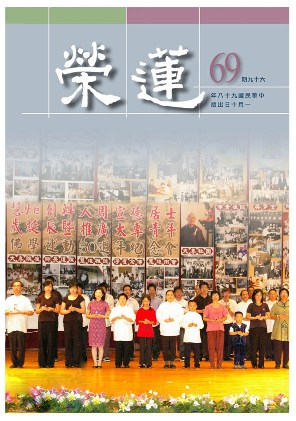

# 第69期

## 社論

### 「亂」是治之始～否極泰來

本刊

二００八一字明

亂是票選第一名

領導應生慚愧心

教化人心治亂源

今年在臺灣或全世界可說是最受衝擊的一年，票選前十名一個字代表台灣一年的現象中，竟然排名第一是亂字。或說是媒體亂爆料造成社會之亂、或說是黨派意識形態對立造成政局混亂、或說政府政策前後不一致的混亂、或說是治安動亂、或說是拯治經濟方案凌亂……，然根本之亂是在人心，《華嚴經》云：應觀法界性，一切唯心造。心造善，使一切顯現皆安樂，心造惡，使一切顯現皆混亂困苦，尤其五倫關係的混亂，能生一切動亂。

然亂字在古字亦訓為治。《論語》有周武王曰：予有亂臣十人。即周武王說我有治世之幹才十人，故能砥定天下。由此可知，團體、國家有一批幹才，能辦事，能教化，國家必能在穩定中求發展。若人們生活過於享樂，又無教化，則貪迷放逸、廣造重罪，亂相頻仍。《易經》之豫卦，豫者安樂也，占到豫卦，雖是順時，然若以逸樂為目標則凶，自私自利乃一切亂源。孟子云：上下交爭利，則國危矣。因為利益追逐，造成君不君、臣不臣、父不父、子不子，國家自然危在旦夕。亂則此生得不到安樂，來生亦墮落矣，且無益於來生及眼前，製造亂或受用亂，不論果報之受用或因地上造作，無一是處。

如此言之，處亂世則隨波逐流嗎？憤世嫉俗嗎？無可如何嗎？若在亂中大家不肯付出、犧牲，皆想獲得與擁有，亂相不但不能解決反而更加劇烈，福報漸少、壽命越來越短、受用越來越不足，天災、人禍、戰爭接二連三發生，則有情越來越受苦，即使每天很努力的工作也維持不了基本的生活。人心在亂極時則更切思安，須知能安身、安心，人種壽命方能增加，福報才能增大。

然如何才能安定呢？所謂安定並非只藉合理制度、軌範行為的法律，真正的安定在於教化，方能安定人心、對治亂源，則亂象止息。孔子周遊列國雖云辦政治、求公安，但真正目的在辦教化，創造一個公安的環境，能令大眾在此環境下修學正道，這才是根本解決問題之道。

《論語》開宗明義說：學而時習之，不亦說乎，有朋自遠方來，不亦樂乎。其中有朋自遠方來，不亦樂乎，是建立一個和合團體，自然有一股力量來辦教化，能令文化道統傳承。教化的重點在道德、在因果、在表彰聖賢風範，自然人心可由隱微處洗滌，則惡心可對治、善心可發展，這也是台灣困局、世界動亂的根本解決之道。

## 大德法語

### 大方廣圓覺修多羅了義經（二十九）

道源老和尚

圓通能由多門入

破障分為三乘果

一切法上證圓通

即是圓覺果法身

前言

眼根、眼識清淨，如何聞塵也清淨了？這就是用功次第，先由一根下手，此處先說眼根，因為上文有見塵清淨，與眼識相通。楞嚴經中文殊菩薩抉擇耳根為第一，觀音菩薩是由耳根下手用功的。然一根返本源，六根得解脫，一根得圓通，六根皆解脫，楞嚴經上還有兩句話：元一依精明，分成六和合。本來是一個精明性，分成了六識，然分而不分，還是六和合，所以凡夫用功，須一門深入，先找一個根下手，一根返本源，六根得解脫了。心法非物質，切了六塊再和合融合，不是這個樣子。

所以楞嚴經上觀音菩薩由耳根下手，文殊菩薩抉擇為第一！耳根如何證得圓通？所謂：反聞聞自性，入流亡所。然耳根時時聞所聞（聲塵），好的聲音就起貪愛心，不好的聲音，則起憎惡、瞋恨心，起惑就造業，造業就受報。現在是用功反聞，不要往外聞，要聞到自性上，入流亡所，即是在聞上了無所聞（無所聞的自相），外邊所聞的聲塵聽不到了，到哪去了？聽到自性上了，得了圓通了，此是耳根圓通，一根圓通則六根皆圓通。此處亦然，眼根、眼識清淨則聞塵清淨。

六根通通清淨，鼻識所聞的香塵，舌根、舌識所嚐的味塵，身根、身識所觸的觸塵，意根、意識所緣的法塵也都清淨，如是四根、四識、四塵，皆如是清淨，上述六根、六塵、六識都清淨了。

乙二、正宗分

丙二、令依解修行隨根證入

丁二、廣明行相

戊一、四問答通明觀行上根修證

己一、開示觀門同佛

庚五、正答所問

辛一、長行

壬二、觀行成就

癸二、觀慧

子二、明法界觀

丑三、圓彰法界

寅二、三重法界

卯一、真空絕相觀

經文：

善男子！根清淨故，色塵清淨。

我們看見外邊的色塵不是染污性嗎？那是因為依眼根發的眼識不清淨，若眼根、眼識清淨，則外境色塵變成清淨，所以我們看娑婆世界是染污世界，至於佛看則是清淨的。

經文：

色清淨故，聲塵清淨，香、味、觸、法，亦復如是。

一塵清淨，六塵都清淨。

經文：

善男子！六塵清淨故，地大清淨。地大清淨故，水大清淨、火大、風大，亦復如是。

這六塵是外四大，身體是內四大，因為外邊的六塵都清淨了，所以四大都清淨。此處先說地大清淨。再說四大種都清淨。

經文：

善男子！四大清淨故，十二處，十八界，二十五有清淨。

三界以內的凡夫法，不出十二處、十八界，六根與六塵謂之十二處，再加上六識謂之十八界（世俗法）。這十八界清淨則一切眾生都清淨。

三界謂之三有，回向文有：四恩總報，三有齊資。三有即指三界的眾生，將所作功德通通回向給他們。

「有」字怎麼講呢？有因、有果、有生、有死，三界以內的眾生，造什麼因就結什麼果，有因就有果，就有生死，三界是一個輪迴的範圍，凡夫超不出這個範圍。

三有亦可細分為九有，乃因三界分九地（九有），欲界是五趣雜居地，上二界分八個地，色界分四地：離生喜樂地、定生喜樂地、離喜妙樂地、捨念清淨地，無色界分四地：空無邊處地、識無邊處地、無所有處地、非想非非想處地。早課回向偈：四生九有同登華藏玄門，八難三塗共入彌陀願海。此即回向三界的眾生，三界的眾生受生的方法不出四種：胎生、卵生、濕生、化生。四生皆不出於九地（九有），四生九有同登華藏玄門，華藏玄門就是華嚴經裏最高最深的玄妙之門，謂之華藏玄門（入法界）。

三界再詳細分，還可分二十五有，所謂四洲四惡趣，六欲大梵天，四禪四空處，無想阿那含。以上一共二十五有，四洲人道所居四大部洲：東、西、南、北四大部洲。四惡趣：地獄、餓鬼、畜牲、阿修羅。阿修羅何以說是惡趣的眾生，因為他的瞋恨心重，只有墮落不能超生。至於六欲大梵天，欲界有六層天，再加上大梵天，共七有，加上四洲、四惡趣之八有，共十五有。

四禪四空處：色界天四禪、無色界四空（八有）。連前述十五有，共為二十三有。

六欲大梵天之大梵天是初禪天的天王，執著欲界的眾生都是他的子孫，我執特別大，再加上無想天以及阿那含天，共為二十五有。在第四禪天裡還有外道天（無想天），是外道修無想定去的地方。另在第四禪天最高處色究竟天上有五層是三果聖人所住，三果阿羅漢謂之不還果，詳細分是五層，若不分則統稱阿那含，此時仍未超出三界，還有生有死，證到四果阿羅漢才超出三界（證得無生）。

二十五有是總指三界一切的眾生，在這真空覺想之下，將三界一切眾生相觀成真空，（因為我相、人相、眾生相、壽者相皆了不可得）一切凡夫通通清淨了，所以佛眼視眾生，一切眾生都是佛（法身），都是清淨的。吾人若以慈悲眼視眾生，一切眾生都是好的（都是助成我成佛之增上緣，而非好壞不分）。依此道理在社會上的職業，不要學做賊的職業，你要學做賊的職業，看一切人都是賊。你知道佛眼看一切眾生都是佛，如菩薩修真空覺想，觀三界內的凡夫都清淨了。

經文：

彼清淨故，十力，四無所畏，四無礙智，佛十八不共法，三十七助道品清淨，

本經依圓瑛法師之講義，彼是講經的老法師，按老規矩，要消文釋義，這些法相（名相）你不要去查大辭典了，老法師都寫出來。十力是佛的十種智慧之力，是佛證得根本智(證得實相之智）以後起的十種功用，此乃根本智的妙用，相有十種。

其次四無所畏，或謂四無礙智，乃佛之四種無礙辯才：法無礙智、義無礙智、辭無礙智，樂說無礙智。四無礙智，亦稱四無礙辯。

其次佛十八不共法，是佛與三乘聖人不共的，不但不與六道凡夫共，與三乘聖人也不共，是佛所獨有十八種法，謂之佛十八種不共法。

再者三十七助道品，是三乘共同修學的，共分為三四、二五、單七、支八，三四是三個四：四念處、四正勤者、四如意足。

先說四念處，佛世尊在世時，我們以世尊為主，世尊涅槃之後，我們佛弟子以四念處為主，所以我們現在出了家，不修四念住，沒有住處，最要緊先修四念處，名相詳細的解釋參看圓瑛法師的講義。

二五是二個五，是五根五力。單七支八，支也是單，單七是七菩提分，支八是八正道分。你念佛生到西方極樂世界去，不用修四念處、四正勤、四如意足，從五根五力修起，阿彌陀經上有。生到極樂世界，還用觀身不淨嗎？西方極樂世界是蓮花化生，還有不淨嗎？…所以一生到西方，就從五根五力修起。二乘人專修三十七助道品就證道，大乘菩薩則兼修六度萬行。

經文：

如是乃至八萬四千陀羅尼門，一切清淨。

八萬四千法門，一切通通清淨，這就是一切世間法清淨，一切出世間法清淨，謂之真空覺相，不但世間的法相悟其了不可得，出世間的法相亦復如是。

經文：

善男子！一切實相，性清淨故，一身清淨。

實相只有一個，怎麼會是一切實相呢？是一切法的實相，一切法有其差別相，但本體謂之實相，只有一個，就是一切法的本體（空性），一切法實相，性清淨故，結合到一個眾生的正報，則一身清淨。

經文：

一身清淨故，多身清淨。

自己的身相清淨了，結合到其他的眾生則都清淨了。

經文：

多身清淨故，如是乃至十方眾生圓覺清淨。

一切眾生染污的身相都是如幻如化，本體了不可得，若你觀到了本體則通通是清淨的，眾生相都是清淨相。我們度眾生發大願，若一眾生未成佛，終不於此取泥洹，此即地藏菩薩之眾生度盡方證菩提，所以地藏菩薩到現在還不能成佛。而阿難尊者在法華經被授記先成佛，是怎麼成呢？雖發四弘誓願，所謂眾生無邊誓願度，歸結到自性眾生誓願度，將自性眾生度盡了，此即十方眾生都清淨。（下期待續）

### 佛說八大人覺經講錄（十一）

道源老和尚

修學分在家出家

居俗不俗念出塵

心不染欲生慈悲

維摩榜樣佛讚歎

甲二、詳八大法相以成宗

乙一、別釋八法以起信解

丙七、覺五欲過患觀念梵行

經文：

第七覺悟五欲過患，雖為俗人，不染世樂，常念三衣、瓦缽、法器，志願出家，守道清白，梵行高遠，慈悲一切。

第七覺還是對在家弟子說法，應當知道五欲過患。五欲已詳細說過，廣泛講是色、聲、香、味、觸（五塵之境），粗重的五欲有財、色、名、食、睡。貪圖五欲就要增長罪惡，這是一種過患，增長罪惡有什麼不好呢？增長罪惡就要墮地獄，所以這個過患大，吾人應當知道五欲過患。

「雖為俗人，不染世樂」，雖然你還沒有出家是世俗之人，但是不要為世間之樂所污染，世間之樂就是五欲之樂。五欲之樂，在人說人，是人之果報，應該享受的，但是我們學了佛法，瞭解佛理，知道五欲之樂不應當享受，因為享受五欲之樂就起貪欲之心，起貪欲之心就有罪過，就有患難，所以叫五欲過患。我們學佛，要持佛的戒律，在家有在家菩薩戒，出自優婆塞戒經，經文最後，佛讚歎在家菩薩是清淨的蓮花，出污泥而不染。蓮花從那兒生出來？從污泥生出來了，但是清淨芬芳不染污泥。

我們在這世間是個世俗之人，這世間等於是一灘污泥一樣，我們生在這世間，住在社會裏，等於住在污泥裡，但是我們學了佛法，持佛所授的菩薩戒，雖然生在污泥之中，而不被污泥所染，等於清淨蓮花一樣，此即不染世樂。

「常念三衣、瓦缽、法器，志願出家」，雖是世俗之人（在家弟子），然要敬仰出家人。出家太好了，什麼都捨掉，但是佛立有制度與規矩，出家應有三（戒）衣，一個瓦缽。出家三衣就是五衣、七衣、大衣，五衣是五條衣，一長一短五條，七衣是七條衣，二長一短，大衣分九品，是九條衣，分到最上品是二十五條衣，四長一短。

三衣各有其用處，五衣是作務衣乃作事務披的衣，因為世尊出世時，印度的社會還沒有發明衣服，都是披一塊布，而印度本來是熱帶，所以也不需要衣服，只是人知道羞恥，需要遮蔽身體，披上一塊布就可以遮蔽身體了。佛度這些弟子們出家就要別於在家，不能跟在家人穿一樣的衣服。當時在家人是披一塊白顏色的布，所以佛經上說到白衣指的就是在家人，佛弟子要是出家就不許穿白衣服，披上的袈裟雖也是一塊布，但與在家人不同。作事務要披五條衣，五條衣是每條一長一短，作事務就披上這一件衣叫五衣。

七條衣還是一塊布，分成七條，每一條二長一短，謂之七衣，七衣做什麼用呢？謂之入眾衣，加入出家大眾的衣，參禪打坐聽經都披這七衣。大衣則分九品，取九條算上去，九條都是算單不算雙的，其中九條、十一條、十三條稱之下三品，也是二長一短與七衣一樣，但是分九條、十一條、十三條，其次十五條、十七條、十九條是三長一短稱為中三品，再算上去，二十一、二十三、二十五條是上三品，上三品是四長一短。

但是佛法在東漢才傳到中國來，中國已發明袖子衣服，而出家人披五衣做事務很不方便，尤其中國寒冷的地帶很廣，冬天裡不穿便服更不行，於是五衣都成了紀念品。現在傳戒還是三件衣︵五衣、七衣、大衣︶但是五衣派不上用場。因為我們有短衫、有中掛、有長衫、還有大袍，種種的便服，既然做起事務來有短衫、中衫就好了，不用再披五衣，但五衣我們不敢廢掉，傳戒還是傳，只是成了紀念品。

七衣叫入眾衣，加入大眾所穿之衣。比方中國出家人的規矩，早起要做早課，晚上要做晚課，都要搭七衣，來聽經也要搭七衣，你們看過來聽經的師父著的是七條衣，是二長一短，謂之七衣。

大衣是每天出去托缽、化緣時所披，或者有因緣見國王要披大衣，或者是講經說法要搭大衣。佛法進了漢朝以後，托缽的制度沒有推行開，每天不用出去托缽，所以大衣普通出家人用不著，見國王也要有特殊的因緣，普通出家人也不見國王，所以也不著大衣，那麼你要是學會講經說法，你當法師一定要披大衣。我（道源老法師）現披的衣就是上上品二十五條（四長一短）的大衣，這都是戒律上規定的。

瓦缽梵語缽多羅，翻成中國話叫應量器。應你飯量的器具。你是大飯量用大缽，中飯量用中缽，小飯量用小缽，就是這一缽飯，剛好與你的飯量相應叫應量器。缽在印度是每天都要用，每天吃飯得出去托缽化飯吃，到了中國，化飯吃的托缽制度為什麼沒有實行呢？因為我們中國對於叫化子看不起，你去托缽化飯吃，他把你當做一個乞丐、沒有飯吃的叫化子，此與印度的風俗不同，印度人看這些托缽化飯吃的，都是聖人，特別恭敬。所以風俗不同，人情不同，因此到中國托缽化飯吃的制度沒有推行開。

八大人覺經簡單翻譯為瓦缽，實則在戒律中用鐵做的缽也可，用瓦也許可，就是不許用銅、金、銀、錫或七寶做的。只許用鐵缽、瓦缽，為什麼此處只翻瓦缽，因為用瓦缽比較多，用鐵缽容易生銹，得時常打磨，不如用瓦缽，較容易洗乾淨，所以簡單翻成瓦缽。

因為托缽制度到了中國沒有推行開來，都在自己寺廟裡邊吃飯，中國人發明吃飯的器皿叫碗，碗是口大肚小，缽是口小肚大。出家人用的缽，它的樣子是我們本師釋迦牟尼佛親手做出來的，但是用缽在寺廟裡吃飯很不方便，因為要將一個缽、一個缽的擺開才可以，要把二個缽，三個缽擺在一起不容易，因為它口小，洗起來也不方便，所以我們中國人缽只有在傳戒上傳的，做為紀念品，平常都用飯碗。

釋迦佛親手做的缽樣子，到現在不適用。那麼釋迦佛的智慧不夠嗎？不然！那是因為我們沒有推行托缽制度，例如泰國是小乘佛法的國家，寺廟沒有廚房，每天必須出去托缽，你可以看到他們的缽很大，上邊有個蓋子，口小肚子大，那樣的缽才適用，因為出去托缽一次要夠他一天吃的，有的信徒供養菜，有的供養飯，有的供養湯，若是缽像個碗就不容易裝，且在缽口上加個蓋子。

若是到泰國等東南亞佛教地區觀光，你就可以看到出家人托缽的樣子，清晨一大早滿街上都是穿黃衣服的出家人，他們的缽由一條繩子掛在脖子，兩手捧著缽，將蓋子掀開接受供養。因為全國都是佛教徒，在家弟子，早晨起來，先把飯做好了，一定會先盛出來一碗供僧，若大人有功夫（時間）則在門口等著，若大人沒有功夫（閒空），則叫小孩在門口等著，等托缽的出家人走過來了，供養的在家弟子就跪下來，把要供養的這碗飯倒在出家人的缽裡，這是每一天頭一件好事算是做好了。若出家人覺得一碗飯不夠，缽蓋就不蓋上，依循到其他家，當足夠時就把缽蓋蓋起來，回到寺院。早上到七點鐘以後已看不到出家人，因為都已托完了缽回到寺裡修行用功去了。（下期待續）

### 常禮舉要講座（十）　聚餐篇

雪廬老人

聚餐修養由家教

主客分明增情誼

和而節之賓主歡

選拔人才善方便

聚餐

◎七、用箸夾菜，只取向己之一方者，不立起向他角器中取菜。

你要拿起筷子來夾菜，只取向己之一方者。如餐桌可以旋轉，主人會先將菜轉至正客前，當正客的，我給大家說，懂局的正客就趕緊拿起筷子來將菜舀到碗裏去，並且再將菜往別處轉。有時轉到正客跟前，正客昂然不動，或可吃了也不理，在那談話，人家還吃不吃？縱使修道，餓了就得吃、睏了就睡，這個誰不會？誰也不會？我活到九十三還不會，我吃西餐、我都是先看人家動手、我才動作，我還有一條好處，或者我不動手，少找一些麻煩。

餐桌或是圓桌或是方桌，主客拿起菜來我也拿起筷子，怎麼吃法呢？這個你們大家都有學佛、念過佛經。有句話你會講吧？譬如食蜜，中邊皆甜。從前商人是四民之末，我們念書的是四民之首，商店吃飯的功夫是老闆與掌櫃的同時吃、同一桌吃，大家一樣平等。這一盤菜上去，正中的都沒有動，大家都吃邊邊的部份，這是商店吃飯的情形，我見過。沒有一上菜中間就開頭，頭頂上沒有了，那就太不成話了，這個大家可以學學。

各人吃各人跟前的，萬不可為了吃別的菜，夾不到就站起來，這可難看極了，人家看你這個神情就想：他好像沒吃過東西，頭一回出來開開眼。總之，不可站起來向別的角器取菜。

◎八、箸匙不向碗盤頂心取菜取湯。

既是不在盤頂上舉箸，喝湯的功夫也是不在盤頂上喝，這個不必解釋。

◎九、公食之器，不用己箸翻攪。

菜一上來，你拿筷子在裏頭翻過來攪過去，在那調調，這可是大毛病，現在更講究衛生，就更不應該如此了。請客時，主人跟前又放一雙筷、一根杓子，預備這個幹什麼？預備給客舀菜。用這一雙持別的筷子站起來夾菜給客人，主人站起來不要緊，並不是站起來自己吃菜，而是站起來敬別人，倘若是這樣則可以。

其次公食之器不可用己箸翻攪，否則就很難看了，一些年輕人如此也還罷了，還有些老年人嘴裏還有東西吃，筷子上的東西還沒乾淨就又上別的盤子去取菜，唉呀！我就不能吃啦。這個記住！自己眼前有個小碗，將眼前的幾道菜舀到你的小碗，不是吃飯而是行禮，這樣也乾淨也不叫人討厭，就是這麼回事。

大家記住，有禮能不讓人討厭，這個全在家庭教育，在家中沒客人也是這樣，為什麼呢？習慣成自然。習慣了、在外頭不用注意，自然而然就這樣了。

◎十、匙有餘瀝必傾盡，方再入公食器中。

你譬如用湯匙取菜取湯，要把裏頭的剩菜都放在碗內。有些人喝湯或可喝乾淨，有些人喝得不乾淨，喝不乾淨剩下的還帶一些，再上盤裏去取菜取湯，講究衛生的看了就受不了。

◎十一、自己碗中之餚菜，不可反回公器中。

自己夾的菜不論是放在自己跟前的碟子或碗裏，最好是把它都吃盡了，方不糟蹋東西。最好是少取，記得一個少字，少了當然就吃得了。有些人他好意，拿著餚菜給你，這叫多事！怎麼叫多事呢？主人跟前一雙乾淨的筷子，是要敬客人。你老先生是有年紀的、又長鬍子，鬍子看起來骯骯髒髒的，人家看了就討厭，你再夾菜敬人，人家不吃嘛、對不起你，吃嘛、嘴裏嚥不下去。

咱在這裏講書不可開玩笑，要是開玩笑那就聽不明白了，一個小姐給他夾菜，行，我這個老頭夾菜給他？不行！世故人情都得要懂。你自己跟前不問餚（葷的）或菜（素的），不可以吃不了而將之反回公眾碗盤去，這是大毛病。實在吃不了就擺著，剩下就是。剩下雖不好但還有什麼法子呢？你不能吃，只可以放在自己的碗中，不要再放回公器去，這些在《禮記》上都有。

◎十二、箸匙所取之餚菜，不得倍於他人。

這個事情我常留神，桌子上如坐的是一般粗野的，那是沒有一點規矩，彼看了看在座大家跟我一樣，夾的菜跟大家一樣，怎麼一樣？把菜夾過來，還沒吃上，就在那個節骨眼，嘴張開吃著菜，往外一滴滴就滴開了，吃到嘴裏去呢是兩腮鼓出來，這是大毛病，為什麼？

菜是大家吃的，你一個人卻想撈本，夾著比別人多兩倍，唯恐佔不到別人的便宜，夾到嘴裏兩個腮子鼓鼓地，那就很難看了。很多人拿著筷子一夾，這麼一大團往嘴裏塞，好像內地的填鴨子，不管鴨子吃不吃，將食物硬往牠的嘴裏塞，塞進去不叫鴨子動彈，幾天以後鴨子就胖了，此謂填鴨子。自己此時跟填鴨子一樣，那就很難看了。
同仁在桌上吃飯時，我可留心看，不好看時，總是失態呀。必得嘴裏還有兩三分的空間，方容易咀嚼，有人與你說話，雖然嘴裏還有菜，仍可以說話。其實菜在嘴裏是不能說話，有的人他不懂得，你吃了菜他還跟你說話，你嘴裏菜少、能嚼也可以說話，還能以敷衍。若你把兩腮都鼓起來，話不能說，那就很難看了。他還故意開玩笑地問你一些話，你說不出來，他
**問：** 先生，你沒聽到我的問話嗎？你還能吐出菜來說嗎？記住、取菜不得倍於他人，就算餓了，說句不好聽的話，敷衍一場回家吃去。

◎十三、食勿響舌，咽勿鳴喉。

吃飯的功夫要講究，你在齋堂裏看看，受過教育的人放到嘴裏細嚼慢嚥，不是張著嘴、嘖、嘖、嘖的。嘴閉著用牙齒咀嚼與嘴唇沒有關係，那就更好。一些人吃時嘖、嘖的，舌頭響個不停，往下嚥時，這就很不像樣了。滿嘴響著，喉嚨還在那鼓 、鼓 著。你聽了笑，你笑什麼？笑的不對啊？笑的不對是不錯，可別犯這個毛病。

其次吃麵包時，可以剝開往嘴裏填，喝茶或喝酒的規矩，你看過唱京戲的嗎？喝酒都用袖子遮起來，是唱戲的為了好看？戲上的動作都是按照古禮編下來的，都是名人編的。怎麼個遮法？你們諸位看過法師講經，穿上袈裟坐上大座，在上頭是不能吃飯但可喝茶，或可有見過也有沒見過的。從前的證蓮法師與現在道源法師、他們是老人，他們還興叢林的這一套規矩，搭上衣服，喝茶必須遮起來。難道法師講經也是唱戲啊？不知道的事最好要問，不必大眾問，也可私下問，為什麼是這樣子呢？學問學問嘛！

◎十四、公食以不言為原則，須言亦應避免唾沫入公器中。

◎十五、咳嗽必轉身向後。

（兩條一起說）

公共吃飯（聚餐）以不說話為原則，何以呢？論語上有：食不言，寢不語。人人都念過，人人不聽這一套，為什麼食不言呢？管得這麼嚴？不是管得嚴，講究衛生時，在吃飯時最好少說話，即使要說話也是兩個人聲音低一點，在那裏高談闊論，你在太陽下一看，嘴裏有很多吐沫往外噴，你不信你看看，在桌子上一高談闊論，菜呢就添上材料，所以吃飯以不說話為原則。

須言亦應避免唾沫入公器中，除了說話避免唾沫入公器中，還有最不像話│咳嗽，現在老年人出來吃飯的比較少，年輕的多，這有什麼關係呢？年輕的咳嗽少。從前老人以咳嗽表明老的狀態，所謂倚老賣老。你看唱戲的老生一出來「嗯哼」，上來先得這一套，這是幹什麼呢？表示其老。有的咳嗽不是假咳，是「嗯哼」真咳，這個吐沫滿嘴都是，有些懂局的用巾堵著嘴，但有時也堵不嚴。

我給大家說，只要咳嗽總得要轉身，尤其吃飯時要咳嗽，得把身體轉到後面去咳嗽。現在人人都知道有傳染病的，誰有生病誰沒生病，這個事情大家都知道，傳染不傳染莫論，咳嗽必得迴避，別叫人討厭，這個大家記住。在西餐館子都有一塊白巾，中國人吃飯，大家沒見過，都有飯單，這飯單很大、有四方的、也有三角的，上面有繡花、很講究，當差的都是自己帶著筷子、刀子等等，各人的當差伺候自己的主人，這是古時候的行酒，那是很要面子的，毛巾等等統統是自己帶著。

桌子上主人都擺著紙，現在也興這個，擺上紙的目的就是預備你自己的毛病。所以出去時，帶幾張衛生紙，預備咳嗽或吃飯時嘴巴往下滴著什麼東西，弄得桌子不乾淨，拿個衛生紙自己擦擦。（下期待續）

## 共修研學

### 小止觀導覽（四十二）

*心爾整理*

修學般若證空性

一代時教究竟義

龍天歡喜諸佛護

獅吼破魔聖教興

第六章 正修行

修止有三種，其中繫心守境止是煩惱的對治法，制心止是真正修世間的止，而體真止是出世間的止。

經文：

三者、體真止，所謂隨心所念一切諸法，悉知從因緣生，無有自性，則心不取。若心不取，則妄念心息，故名為止。如經中說云：一切諸法中，因緣空無主。息心達本源，故號為沙門。

隨心所念的一切法，可分為有為法及無為法，簡要的來說，有為法包括心王八、心所有法五十一、色法十一、心不相應行法二十四，共為九十四，無為法有六，共為百法。一切諸法（有為法、無為法）皆是緣起而無有自性，有為法是因緣法，依因緣而有。若有為法與無為法則是緣起法，乃因無為法是觀待有為法，是有為法的體性，所以無為法沒有自性，有為法也沒有自性，兩者是同一體性，亦即在一法中可見有為與無為兩個面相。

阿羅漢在入定時能看到法無自性、了不可得的面相，菩薩是從空出假看到幻化的面相，唯有佛能在一念當中，如實了知自性不可得與緣生如幻的面相。

悉知皆為因緣生，無有自性，則心不取：心在對境當中沒有自性可取，在緣起幻化中取不到境界的自性，心取不到自性（真實性）就不會生執著，人、法之真實性找不到，能執的心不生，則煩惱不生，煩惱不生則妄念心息，愛染之心無從生起。所緣之境了不可得時，能念的心亦無從生起，即是印祖所說的「心月孤圓朗中天」，月亮（比喻現證空性的心識）在虛空（比喻空性）中朗朗照著，安住在空性的義境上，即名為體真止。

能執的心不起，謂之息心，此心安住在空性上即是達本源（萬法的自性就是空性）。達本源的心就是息心，生起通達無自性的心，則世間妄想心就止息了。第六識見到人我、法我的實有，生起人我執、法我執，如此則生出煩惱，入定證得的人我空，即能破人我執，若以法我為所緣，證得法我空，破除法我執，所得的是一切智，成立涅槃。

如此就是佛所承許的沙門，是真正的出家人，是息心達本源的勝義比丘，即是僧寶，凡夫比丘和合修學謂之僧伽。

經文：

行者於初坐禪時，隨心所念一切諸法，念念不住，雖用如上體真止，而妄念不息，當反觀所起之心，過去已滅，現在不住，未來未至，三際窮之，了不可得。

初修學止觀的行者，觀察諸法於念念中無自相可住，雖知所念諸法無自相可住，欲止於法之無自相，然妄念止息不下來，此時當反觀所起之心，過去、現在、未來都了不可得。何以三心不可得？觀待於現在、未來才有過去可得，自相所成的過去心了不可得，現在、未來亦是無自相可得，過去、現在、未來的心都要靠著名言才能生起，觀待名言生起境界相，認識境界的心識亦同時生，心與境的自相皆了不可得。

經文：

不可得法，則無有心。若無有心，則一切法皆無。行者雖觀心不住皆無所有，而非無剎那任運覺知念起。

三際所生的法體性都了不可得，法之自相既不可得，無有能緣的心，謂之能所雙亡。

行者觀過去、現在、未來心皆不可得，所以是觀心無自相可住，過去、現在、未來之心不可得，謂之無所有。

剎那生起的心念雖是體性了不可得，正因自相不可得，即能待境而生，心與境界相互觀待，相續而生，所以金剛經云：發阿耨多羅三藐三菩提者，於諸法不說斷滅相。

經文：

又觀此心念以內有六根，外有六塵。根塵相對，故有識生；根塵未對，識本無生。觀生如是，觀滅亦然，生滅名字，但是假立。

心本無生因境有，萬法都是因緣所生，相互觀待，不過是名言安立的顯現。內六根、外六塵，根塵相對（眼對色、耳聞聲、鼻嗅香、舌嚐味、身接觸、意知法），當下生起認知境界的心識，根塵未對，識則不生。識之生與識之滅亦相互觀待，識的生是根塵相對而生，識的滅也是根塵未對而滅，識的出生處就是名言的出生處，名言的生處就是識的生處。

經文：

生滅心滅，寂滅現前，了無所得，是所謂涅槃空寂之理，其心自止。

涅槃跟生死都是名言安立的，是了無可得的，涅槃是觀待於破除掉執著，才有名言安立的涅槃，生滅的心對著有為法，而有生生滅滅，緣有為法的心滅了，叫做息心，寂滅現前就是息心達本源，緣世俗有為的生滅心自相不可得，謂之生滅心滅，寂滅現前，乃空性的義境呈現在行者心識之前。

經文：

起信論云：「若心馳散，即當攝來住於正念。是正念者，當知唯心，無外境界。即復此心，亦無自相，念念不可得。」

當知正念是無念而念，一切法的真實性（自相）於念念中皆不可得，即此現證空性的心也是念念不可得，找不到自性所生的現證空性之心，不但境界自相不可得，心念的真實性（自相）亦不可得。

經文：

謂初心修學，未便得住，抑之令住，往往發狂。如學射法，久習方中矣。

初發心修學坐禪的人，沒有辦法住在空性的義理上，這時應該要每天串習，不要強懂，不要把空性當成虛空而安住，要不離團體、不離善知識，瞭解止觀現證空性的修學法，安住在空義上，但這要慢慢來，不要想一步登天，躁進生害，須日日串習如習射，久久練習必能任運中靶！（下期待續）

### 佛說八大人覺經（十七）

*編輯部整理*

布施除慳結善緣

等念怨親伏愛見

先欲勾後入佛智

不疲不厭盡未來

第六覺知：貧苦多怨，橫結惡緣，菩薩布施，等念怨親，不念舊惡，不憎惡人。

第六覺知和第五覺有何關係？為什麼會貧苦多怨，橫結惡緣呢？當菩薩透過第五覺的修學後，提升了內在的證量，所要成辦的是利益有情直至成佛，然而所面對的眾生大抵都是貧苦多怨，而且彼此橫結惡緣，所以是苦上加苦，即使生活安樂也是牢騷滿腹。有情眾生大半是生活資具不具足（貧）煩惱一堆（苦），應該是好好與人結善緣，互相扶持，改善貧苦的狀態，卻反而自私自利，想要損人利己，結果不但得不到善緣，反而橫（不合理）結惡緣。

菩薩主體是以幫助有情破煩惱障和所知障來利益有情，但眼前先由世間安樂給予開始，且不應該有怨親之分。須知辦善法利益有情時都是任勞任怨的，不辦時怨親不會出現，只要發心欲做利益有情的事業，就會發現所面對的有情大半都是貧苦多怨、橫結惡緣的，任你有多勞，就會有多怨。等念怨親就是對親去貪，對怨去瞋，謂之怨親平等。可是在親上有時會有很親密的交往，對怨有時可能會遠離、喝斥，然而菩薩的內心是遠離貪瞋的，謂之等念怨親。

菩薩辦事只有公仇沒有私怨，要維護團體利益時，有時會現出與求私利者敵對的行相，那是為了領導風氣。菩薩在布施時，有公心者就會成為菩薩的親，反過來說，私心者即成為菩薩的怨。但菩薩為何顯示有怨有親？全部都為了要維護公，若沒有公私之辨、義利之辨、君子小人之辨，就變成爛好人，孔子說：鄉愿乃德之賊。怨親的行相會在菩薩的眼前顯現，可是心識是等念的，雖顯現為怨親而內心無愛憎，所以經文云，不念舊惡，不憎惡人。是故當此人由惡改為善，由私心改成公心時，菩薩從來不會去念他過去的舊惡，內心不憎惡人，此時方知菩薩是等怨念親，此是第六覺的正解。
表解中，凡夫罪苦，苦眾生的習氣容易造罪，現世的果報是貧苦，因為不知道因果的道理，所以多怨（牢騷滿腹），整個心思多為自己，而與眾生橫結惡緣，更帶來下一生貧苦的果。而現在貧苦之果又是由過去因成，或有
**問：** 過去之因為何？亦是多怨（惑）、結惡（業）而招感今生貧苦之果。

菩薩要如何幫助眾生離開貧苦呢？必須要引導眾生懺悔過去的惡行，給予眾生因果的正知見（覺），解開眾生在世間的煩惱，去除心中疑惑，令眾生瞭解世間沒有一件冤枉事，此謂之覺（破惑）。例如孔子周遊列國不但不能推行正法，反而遭遇到陽貨、司馬桓魋、子西之流的傷害，諸弟子或言：君子亦有窮乎？或言：夫子之道至大也，故天下莫能容夫子。

而孔子本人是：不怨天，不尤人，下學而上達，知我者其天乎。因為能通達天命（因果的正知見），所以古來讀書人雖多，但都遠遠不如孔子，大家都推尊孔子為萬世師表。不僅如此，並令眾生以斷惡修善，改變命運為所緣（轉業），安住在這樣的目標中（止），努力的去實行。終能令眾生成佛作祖、成聖成賢（淨），真正的離苦得樂（離苦）。

或言：菩薩應該先解決我的貧苦，為何要先給我因果的正知見呢？須知解決貧苦根本處在破煩惱。

上述覺、止、淨三項中，眾生要破惑轉業必須要以求法的心來親近善知識，方有法緣可遇，若能依善知識好好修學正法，最後必能離苦得樂，得一個清淨的果報。

其次觀察布施的種類以及對象，布施的種類有財、法、無畏布施，以財布施除有情貧苦，以無畏布施除有情結惡的心，以法布施除眾生多怨的心。總之財、無畏施是以欲勾牽，法布施是令眾生入佛智。財、無畏施是菩薩的行權（方便），行權的目的（實）是為了幫助眾生入佛智，為了開啟彼之佛智，先滿足他所需。

再者觀察布施的對象，菩薩布施時，拿掉了憎愛、厚薄之心，在菩薩心識面前不見怨親而顯現為眾生相。會見到眾生的怨親相，皆是情識分別所見，情即是執著，識指的是了別，在執我的心識上顯現怨親愛憎。若揀除眾生怨親相所起的貪瞋，方能以慈悲心面對怨、親、不怨不親的眾生，此慈悲若被空性智慧所攝持，而顯現無緣大慈、同體大悲，即是真性慈悲。

或云：如何對惡人除己瞋？又如何善巧的將惡人轉成我修學的增上緣？面對惡眾生，如何拿掉瞋，是極為重要的修學法，顯現為惡人有幾種原因：

一、體性是惡者，只要有人行善彼皆阻擋。

二、乃宿世惡業所招感，如頻婆娑羅王與阿闍世王，詳見觀經。

三、現前的造作妨害到他而生起，即使如法造作，仍然是任你有多勞，他就有多怨，此時行善得任勞任怨。

如何降伏對惡人的瞋心？一者、修觀瞋心過患、忍辱功德。二者、怨親無定，誰為冤誰為親？在利益一致時，感情比兄弟還親，利益衝突時卻反目成仇，此世如此，世世皆如此，所以對他（仇者）該起貪還是瞋？三者、彼瞋者正好令我修學忍辱度，感恩尚且來不及，何來瞋？如提婆達多與世尊的因緣。四者、眾生無始來皆曾做過我一世乃至無數次的母親，生起感恩之心助彼解脫與成佛尚且來不及，何來瞋恚傷害之！

若未除去愛見之慈悲，即是在有怨親愛憎上，生起慈悲造作種種善業，無論如何的努力，仍然是愛見慈悲，夾雜著愛憎的慈悲，猶如黑布不漂白，再怎麼染黃，都是黃中帶黑。

欲修行圓滿布施這一法，不是簡單的事情，能以布施攝持普賢十大願修學，或攝持六度而修學，此因陀羅網的修學法能令布施的心意圓滿。（下期待續）

## 蓮池海會

### 盧春富居士往生見聞記

*編輯部整理*

十年前父生西

堅定學佛信念

癌末苦中念佛

歸去安詳自在

盧春富居士，民國三十八年出生於民風淳樸的新竹寶山鄉，家庭成員除父母外有一個姊姊兩個妹妹。年少時搬家到台北，中學就讀於淡江專科、其後畢業於文化大學地理系。畢業後從事測量方面的工作，但因為生計上的考量，轉而經營火鍋料零售生意。

居士家庭幸福美滿，與夫人廖玲珠女士結褵三十二年，以「簡單樸實、敬人惜福」教育子女，在子女的印象中父親非常惜福。居士也常說：不是沒有錢，東西能夠用就不要浪費。其中騎乘多年的九百ＣＣ打檔摩托車，是用到不能再騎才去報廢。

居士曾經撿到別人的包包、裡面放了十幾萬的現金，立刻拿到警察局報案。後來知道這件事的朋友說：反正四下無人，錢自己拿了就好啦！何必還要交給警察？況且剛剛開始做生意，經濟狀況也不穩定，而居士卻說：這不是我應得的，這種錢不能貪，我連想都不會去想。居士與夫人在市場做生意，就是靠著不取不義之財與客戶建立長久的合作關係，客戶及市場的老夥伴，在居士生病時都很關心其身體的狀況，不斷讚歎居士做生意很講信用，待其康復後還要跟居士訂貨。

居士心地善良，喜歡與人結善緣，無微不至的照顧家人，分擔家務，教養子女，對於弱勢的人總是盡可能的付出關懷，舉凡在路邊看到老婆婆在賣東西一定會捧場，也會塞錢給養流浪狗的人，每天掃地會順手掃完鄰居門前的地，甚至於對幾年前到南部問路的人都念念不忘。

居士教育兩名子女，目前在社會上也有相當成就，子女們均秉承盧公春富居士的身教、言教，積極上進，表現傑出。

雖然居士對物質的要求很低，但精神生活卻十分豐富，下班後只要能暢遊於藝術的書海裡，就能洗去一天工作的疲憊。平常喜歡研究古玩、藝術品，舉凡雕刻、書畫甚至像黑膠唱片、大同寶寶等都是他的寶貝收藏。他常說：從這些古玩、藝術品當中，能看出在當時先人們的文化素養及生活習慣，例如最普通吃飯用的碗，先人都會很用心的燒出很美的青花紋飾，令人賞心悅目，而且只要不打破，都會一直使用下去。不像現代，什麼都是工業化大批製造，美感不再，而且用完即丟，甚至還沒用過的也丟，不但製造環境污染，也增加地球的負擔。

十年前因為居士的父親盧順源老居士往生，而有因緣接觸到佛法，當時有許多不認識的蓮友們專注誠心的輪班為老居士助念，居士看到後，心生欽羨，並認為一生作的最對的一件事，就是護持父親往生，以及用佛法方式辦告別式。

今年十月，居士因胃出血至醫院檢查，檢查之後發現是胃癌，在短短一個月內因與病魔搏鬥而身形逐漸消瘦、虛弱，卻仍不減對佛法的信心，當善知識與蓮友探視時，居士歡喜發願念佛，亦抱持著極大的意志力，相信自己一定會好起來。無奈出院後一陣子，仍因身體不適住院療養，居士往生前在醫院中承受著約半個小時就發作一次的全身性痙攣之巨大痛苦，全身四肢僵直且喘不過氣，但居士仍不忘合掌念佛，並謝謝家人為他加油打氣。

綜觀居士一生，物慾平淡，待人以誠、無愧於心，其言行舉止，處世風範足以為後代子孫傚法學習。居士臨終時，家人與蓮友隨侍在旁助念，八小時後，面色安詳，全身柔軟，家人如法作七、吃素、齋僧，祈願居士於西方淨土中，早日花開見佛，修學法義，得無生忍，回入娑婆，廣度含識。

### 莊耀堂老居士往生見聞記

*編輯部整理*

兄妹情深平日間

臨終得妹勝護持

有幸八時助念後

不枉昔日大善行

莊耀堂老居士，生於民國七年，臺灣省宜蘭縣人。老居士是一位很懂得經營理財的人，年輕的時候，因在財務上有過人之處，曾輔助當時任村長的父親管理由林家花園承租而來之土地收租工作，並善於規劃各項事務，有機緣亦做些小本生意。成家後，對於子女的教育非常用心，即便是變賣田地，也要讓子女得到最好的教育，所以培養的子女們皆是社會的中堅分子，有任職於縣政府主任秘書，也有在學校擔任主任之職，所以在地方上也可算得上是書香門第。

老居士的妹妹莊彩霞居士，必須獨自支撐家中經濟，在民國三、四十年代，一個鄉下女子是很難找到工作的，故家裡一直很貧苦。老居士兄妹感情深厚，常至妹妹家中探望，妹妹對兄長亦十分敬重，家中若發生難處理之事情，常會請教老居士的意見，長期下來，兄妹之間建立了一份互信互助的感情，而老居士的妹妹也一直將此份情放在心裡，總是希望自己有朝一日能夠回饋兄長。

老居士不僅善於經營理財、重視子女之教育及關懷家屬外，推而廣之，對於地方上的公益事業也是不遺餘力，現今之宜蘭縣竹安地區的竹安國小，是老居士聯合當地的士紳建立起來的。其緣起乃老居士當年讀小學時，因附近無學校，每日須走四、五公里的路程到最近的大福國小讀書，非常辛苦與不便，將心比心，興起了設立小學的念頭，以造福當地的莘莘學子。此外，地方上廟宇之興建也是由老居士帶頭發起的。

今年十一月初，老居士因長期辛勞與環境天候的變化，突然於夜晚中風，而且情況嚴重，可能不久於人世。老居士的妹妹因學佛因緣，聽到這個不幸的消息，雖然心急如焚，但內心立刻生起助念的念頭，因為善知識常說：「阿彌陀佛四十八大願中，第十八大願就是接引臨命終人往生西方。若自身願意放下種種執著，一心念佛，又得蓮友們助念，於世緣未了者，可脫離險境，於世緣已了者，能蒙佛接引往生西方。」所以，老居士的妹妹發願：「這次無論如何一定要替哥哥助念，送伊最後一程，這也是報答伊最好的方式！」

就因為這股感恩的力量，老居士的妹妹以年邁的身軀，親自侄兒家溝通，侄兒們在此之前從未聽聞佛法，更遑論瞭知助念對臨命終人的重要性，經其苦口婆心的勸說下，侄兒們禮貌性的答應了最基本的助念八小時，這也令年屆八十的姑姑露出欣慰的表情。

十二月一日傍晚，老居士不敵病魔，與世長辭。其妹與妹妹的兒孫們因平日有學佛，一聽到此消息，立刻趕到老居士家中準備助念，但是到了現場，受阻於老居士的子女們！原來家屬們已經找好了葬儀社，準備幫老居士辦理後事，這時只見一位婦人，正忙著教大家如何摺紙蓮花，以及指導大家如何燒著一張接一張繞著圈圈的冥紙，在這最關鍵的時刻，竟然學會摺紙蓮花以及不讓那一張張的冥紙熄滅是家屬最關心的兩件事！老居士的妹妹仍不放棄，因為她知道侄兒們因無學習佛法之因緣，所以心中根本無法感受助念的重要。

大約過了一小時，家屬們終於答應為老居士助念。雖如此，家屬對於摺蓮花和燒冥紙仍是非常重視，一點也不敢偏廢，所以念佛的士氣一直無法提升。所幸後來又聯絡了蓮榮共修會數位蓮友前來助念，士氣才慢慢提了上來。到了大回向的時候，主事者掀開陀羅尼經被，發現老居士的容貌十分安詳，家屬見了頻頻安慰的點頭。在這關鍵的八小時，很幸運的有蓮友們及時的協助，才能使助念法行圓滿。

綜上，雖然老居士在地方上是個善人，子孫也很有成就，但這些都無助其往生，唯一能幫助他的，竟是一位誠心學佛尤其參加每週四三代共修班，並想報恩的妹妹啊！而老居士往生時的種種障礙，不正說明了他平時對於佛法及往生無概念的寫照嗎？因果真是一面鏡子，清楚分明的將世事反映，一絲一毫都不容混淆啊！

再者，這也令人更加確信：佛法的串習、親屬的溝通需在平時下功夫，若到臨終才努力，就會讓無佛法觀念的家屬任意擺佈，而世人往往無正法概念，最後只能交給葬儀社處置，雖然場面可能辦得很體面，但事實上對過往者卻毫無助益，甚至加重其負荷，猶如雪上加霜、屋漏偏逢年夜雨，在生死輪迴的路上，徒遭險難。

三者，若能好好利用暇滿人生學佛，並事先安排好臨終大事，勝過死後沒有正知見之家屬們盲目的奔走辦理。因為世間人習以為常的觀念十分堅固，除非有智慧的利劍及大福報，否則很難衝破業網束縛，而且臨命終時，蓮友們對家屬任何絲毫的觀念之溝通與統一，就算有橋樑也是十分辛苦與困難的，因為娑婆世界眾生之煩惱是很難放下的。四者，過去因緣微妙難知，若大家皆視生死為大事，則又有誰願意拿家人或自己去冒這風險、開這個玩笑呢？有幸如老居士者又能有幾人呢？

最後，願以老居士之示現，能令大眾生起無常與學習正法之心。體會到無常並非只是見到別人死，自己也會死的粗淺認識，真正細品無常是生命就在呼吸間，就算下一剎那無常就會到來，我也有勇氣接受；而非只是將無常掛在嘴邊，漫無目的一日過一日！體會到學習正法要趁年輕、要趁有各項資源時好好學習，不要等到因緣不在時，才後悔莫及。唯願老居士於西方極樂世界蓮品高增，並早日回入娑婆，廣度有情。

### 陳清波居士往生見聞記

*編輯部整理*

有情有義人緣好

癌末聞法決生西

二妹因緣得助念

陳家由此開好例

陳清波居士生於民國二十九年十二月二十四日，在所有堂兄弟中排行第三。居士天性活潑，自幼認真向學且又孝順，時常感念高中時，父親因疼惜他走路上學唸書之苦，攢錢買腳踏車給他；平日也常幫忙賣自家所種的青菜，有時因路況很差將父親辛苦所種的瓠仔摔破，當下難過的無法自己。時常回想起成長過程中辛苦卻又踏實的生活，並常告誡子女「一枝草、一點露」，有一分耕耘，就有一分收穫。

居士當兵時期也結交許多朋友，直至今日仍多有聯繫。退伍後選擇出外為自己的未來打拼。先到板橋謀生，在當時結交了幾位拜把兄弟，創造出革命情感。後隻身至基隆，與現今的老闆共同受僱從事碼頭理貨工作，爾後全心全意投入老闆所創的理貨工作。二十九歲時因友人介紹認識陳林金夫人並結為夫妻，婚後育有三子，當年的生活並不寬裕，但是居士與夫人共同努力，從租房子到費盡心思買下屬於自己的窩，即使生活勉強可以撐下去，喜好結交朋友且重義氣的老居士仍秉持著「有福同享，有難同當」，當時一起窩同一張床，患難與共的情誼，就這麼的維持下來。

長久以來，居士雖身處異鄉，但是每逢過年過節或早期稻子收割時，都是一家五口總動員回宜蘭，即便自己工作分不開身，也堅持要夫人帶著三個小孩回家幫忙，恪盡孝道；並且灌輸「飲水思源」、「吃水果拜樹頭」的觀念。雖然居士的父親已經過世二十幾年了，這個信念仍然維持至今，並且落實在照顧中風的母親身上。

居士身為長子，對弟妹的照料亦不遺餘力，並對其他堂兄弟亦如此，只要他們遭遇任何的困難，老居士總是義不容辭的幫忙，是家族中大家敬重的長者。也正因如此，於生病期間、病危之際仍不時見到堂兄弟姐妹的焦急駐足。

居士為人正直，交友廣闊並講求義氣，最常說的話就是：寧願雪中送炭，不要錦上添花。當朋友飛黃騰達時，維持著君子之交淡如水；而遭逢困頓或失意時，必見他不時的噓寒問暖，並且竭盡所能從旁給予協助。居士的一位朋友曾說過，當他負債累累沒有工作，大家避之唯恐不及時，只有居士適時給予協助，給他機會重新站起來。另有朋友遭逢喪妻之痛，居士要他帶女兒多來家中走走，當作自己的家一般。此外，舊房子也曾借給生活不順遂的朋友住，未收取分文。總之，居士實是一位樂善好施、廣結善緣的人。

居士也曾告誡子女：做人要忠。在約莫四十年的職場生涯裡，當中遇過挖角的利誘、也碰過合夥的邀約，但是全都因為居士秉持「腳踏實地」，「有多少能力做多少事」的信念一一回絕。更設身處地為同仁們著想，擔憂他們的生計、健康與未來走向，因此恪盡職責，在工作崗位上燃燒到最後一分一秒。

至於三個小孩的教育全權交由妻子負責，時常告誡三個子女：你們可以不用孝順我，可是一定要好好孝順媽媽。但由於居士對於自己父親、母親、兄弟姐妹、工作職場等的一言一行，讓子女不但心緊繫母親，對於父親的付出及身教更覺如讀經書，受益無窮。這樣的凝聚力擴及義子，二十年歲月當中大半在陳家耳濡目染下如同一家人般的相處，居士對待他形同自己的子女全然無私心。子女們雖非飛黃騰達，但在各自的工作職場總是嚴守老居士的教誨，腳踏實地，一步一腳印。

居士住院期間，依其在團體中極為發心的妹妹之故，感得蓮友與善知識屢次前往探視，並向之介紹往生淨土的殊勝，最後老居士在病榻前，當著三個小孩的面，將後事交由善知識全權處理，並要孩子向善知識頂禮，與善知識勾手協議，以茶代酒約定一同往生的俠骨風範，讓人知道居士已將萬緣放下，決志往生。

居士在十二月十三日凌晨，在蓮友與家屬助念聲中含笑往生，走完人生最後的旅程。當問起老居士朋友們如何看待他的為人時，大家不約而同的第一個想法，就是「鞠躬盡瘁，死而後已」。老居士留下來的是家人的不捨與親朋好友的追念，從在臨命終病塌前所接收到舊識與陌生人的關懷當中，知道居士這一生走的並不孤單，臨終最後的走向也因為家人與蓮友的護持，得到最好的助念，在三寶的加被下顯得更為殊勝。家屬並謹遵佛制，如法作七、告別式，參與團體舉辦之淨土懺法會，並參加西蓮淨苑托缽法會。唯願老居士早日乘願再來，廣度群蒙。

## 禮懺法會

### 淨土懺前行靜坐觀修（九十七年十二月十三日）

*編輯部整理*

年終淨懺圓善法

前行須具妙意樂

五步修學種聖因

往生必得大受用

所謂的「道高德備」，是一種內心的意境，並非外相的顯現，是一種極隱密，隱密到一般人難以察覺，然而這種的能力也可以在凡夫身上生起，只要凡夫與聖人具一樣的知見、格局、魄力，一樣能生起如此殊勝的證量。這也是佛在講甚深大法時，也允許凡夫參加的理由，如在華嚴、法華、楞嚴等甚深大法的講座時，現場亦有凡夫，因為有些人即使是初機，但所發的心卻是老修行者所無的，如何保持這種純淨的初發心，是修學成就的重要課題。

其次人生的相聚是聚少離多，雖然有很多的聚會，但都與不同人的聚會，與不同的人聚會就有不同的業，可嘆與善友的聚會永遠是所有聚會中最少的，而所有的功夫又以修學的功夫最薄弱，所有的體會也是對教法的體會最薄弱。爾後當珍惜與善友聚會，並多時間的薰習經教，是成就最重要的方便。

三者，在拜懺法會中與大眾在佛前修供養、讚歎、禮拜、發願、懺悔，此之因緣極為難得。團體一年只辦五次的拜懺法會，事前規劃、演練、聯絡、交通、場地布置等，要克服種種困難，才有法會的興起，因此修學者要好好珍惜。

四者，一場如理如法的法會，功德是難以想像的，乃因所禮讚供養的對象是三寶，能禮的心是誠意，並結合大眾修學正法的力量。有的人修學沒有同參，有的人沒有修學的資糧，有的人想修學卻不懂如何修學。一時之間能將修學所有的順緣生起，時間只有一頓飯的時間，能不好好把握乎？平常與好朋友出去喝下午茶，一不小心就過了三個鐘頭，若能把握這一頓飯的時間修學，必不辜負眾人的護持。

五者，大家來拜懺都是帶著使命感，或者為了往生親友，回向令彼往生西方，或者為令現前眷屬得到安樂，或者令自己有修學成就的增上緣，既然帶著使命感來拜懺，怎麼可以不認真呢？好比拜託老師、校長給自己的孩子安排到好的班級、好的座位，哪有不具足誠意呢？誠意一發能得三寶的感應。

六者，拜懺過程或有種種障礙，或身體不適，或旁人唱誦的聲音聽之不舒服，或者位子太小拜起來不方便，或者拜懺的習慣和旁邊的人不一樣，此時要修歡喜心，將來方能生各類功德，如環境擁擠，卻生歡喜安忍之心，將來能生起如維摩詰居士，以丈室納受高達四萬二千由旬（每由旬約四十里）的三萬兩千張師子座，以及無量菩薩聚會，在丈室的有情不覺得擁擠，以芥子納須彌的能力能在眼前種善因。

七者，對淨土法會的諸佛菩薩，以供養、禮拜、讚歎、發願、懺悔的方式結上善緣，往生後見到每一位聖者自然感覺非常親切，因為在娑婆世界曾經以這種方式結過這樣的緣。如同自公老師曾說當初看到雪公老師就有一股莫名其妙的歡喜，願意將臺北的工作慢慢換到臺中。釋迦牟尼佛何以攝阿難尊者為侍者，並好好的教導他，就是過去結過深的法緣。

八者，誠意拜淨土懺，能彰顯淨土法義，令淨土法門弘揚，能生傳播正法之功德。

九者，藉由拜懺，令此拜懺法門延續，是懺法的傳承者。

十者，拜懺是音聲佛事，也代表我們將來說法（音聲佛事）能普遍十方。

這麼多好的徵兆，在兩個鐘頭拜懺法會中生起，理當好好把握如此重要的修學法。

## 專題研學

### 六趣輪迴經簡介（二）

*盡意整理*

由業感果心造作

唯佛能說升沉相

可憐眾生易造惡

難生正見多沉淪

六趣輪迴經～總明

科判，分為總明業決定（投生到何處都是業決定），別釋升沉（約沉就是三惡道，約升就是三善道），以及結示利他是出路（利益他是我人生唯一的出路）。

總明業決定，當中分為約師資、約道合，約著學生（資）是皈命佛語斷惡修善，約著老師（師）是開示業決定，約道合是信受奉行。

經文：

歸命三世尊，正等覺所說，常行於利他，積集諸功德。若自身口意，所作善惡業，感果定非差，無別造作者。

把命歸向於過去、現在、未來最尊貴的佛。佛有十種通號（如來、應供、正遍知、明行足、善逝、世間解、無上士、調御丈夫、天人師、佛世尊），這十種通號是他成就的果德，是我們修學的目標。正等覺就是正遍知，學佛有三部曲，聽課、小組研討等聞思，是開智慧的前方便，透過邏輯辯證引發思維，透過止觀修學得到現證。

佛說若想積集諸功德，須從利他開始，然而何謂功德？即是修福之後的成就，須明白所有的快樂來自於功德，所有的痛苦來自於罪業，學佛就是告訴我們如何累積功德，這些都和人生有利害關係。身體健康靠功德，壽命延長靠功德，子女賢孝靠功德，得到人才輔佐靠功德，逢凶化吉靠功德，觀念通達靠功德，學佛不是遙遠不切實際的，不應該排比在最後順位，沒有功德之助，人生沒有出路。

善惡業來自於身口意，善業就是利他，惡業就是自私自利，定義非常清楚；善業感得快樂的果報，惡業感應痛苦的果報，絕對不會有差別。今天坐在這邊覺得很冷就是惡業的感應，現實到難以想像，只有身口意的造作，或許有人心裡沒有惡意，嘴巴也沒說壞話，可是卻沒有注意身體的造作，所以常禮舉要非常重要，不好好管束身口意，就會帶來災難，沒有其他的造作法。

痛苦是自己給自己的，快樂也是自己給自己的，自己的身口意造作惡業給自己痛苦，自己的身口意造作善業給自己快樂，天下事沒有冤枉者，而且所感應的果報沒有任何偏差。以上約著學生來說，要大家人生有出路，就必須具備以上所說的概念。

經文：

最勝之導師，現證垂慈愍，普為諸有情，說隨業受報。

約著老師而言，能教導眾生離苦得樂者是最殊勝的老師。導師就是善知識，就是傳承，而最勝之導師即是善知識的源頭—佛。佛以現量證得一切都是業的展現，唯有善業才有出路，對於這個道理，像眼睛看到茶杯、嘴巴嚐到味道那般實在。

而佛普為諸有情，說隨業受報。隨善業受樂報，隨惡業受苦報，所以自私自利、凡事只想到自己的人，下場會很倒楣，透過身口意替自己找出路，完全沒有想到別人的人不會有出路，換言之，只想替他人找出路的人卻有出路，佛就是處處替眾生找出路，所以最後成佛，宇宙間的秘密就是如此，學生必須要學習這些，最好的老師就是告訴學生這些觀念。

如此兩者需師資道合，信受奉行。

經文：

此相應正理，聞已當領受，作業皆自心，為因馳六趣。

這相應的正理，就是身口意作善業得樂報，作惡業得苦報，作善、作惡皆由自心，由心的發動，造了因就奔馳於六道。

六趣輪迴經～地獄道

八熱地獄：等活、黑繩、眾合、號叫、大號叫、炎熱、極炎熱、無間。

等活地獄

經文：

由三毒怖畏，販賣諸物命，養己殺於他，當墮等活獄。彼壽百千歲，加刀杖捶打，死已更復生，受如是苦報。

吾人所認識之毒：毒藥、毒蛇、毒氣、毒品、惡人，都比不上貪瞋癡三毒。因前者雖能讓有情之生命中斷，然此有情生前造善則能在死後升天；但貪瞋癡、妄語、兩舌、惡口、綺語、殺、盜、淫等惡業卻帶著有情去地獄受苦。此世生命若提早結束，差別不過數年，但若造惡業而墮在地獄則時間卻很長。

例如，等活地獄的一天等於四天王天的一生（等於人間九百萬年），共五百歲，故等活壽命為人間的九百萬年x360x500=1.62x1012（一點六二兆年）。固吾人應擔心自己沒有將三毒拿掉，而不是怕毒藥、毒蛇等。雪公老師說，人活的時間沒有能萬歲，但死後墮地獄則每個人都萬歲、萬歲、萬萬歲。

六道中輪迴的因果是甚深的緣起，佛是以現量證得（現證垂慈愍）此因果之決定，吾人則仰信聖言量，謂之信許比量。欲證得境界只有二種量，一者現量（看道理看得明白，如見眼前境界），二者比量（雖未看到如此實在，但能想得通）。信許比量證得的方法，就是要完全相信佛所說（信聖言量）。

對因果要確實依佛所說而觀察，例如：長得漂亮（醜陋）是由於宿世喜歡讚歎（罵）別人等等，由許多因的決定而有果的生起。觀察後須能在因中斷惡修善，亦即利益他人才有自己的出路，包括要給別人好感、替人著想等；例如若態度不好去應徵工作，得不到老闆好感，絕不會有好的結果。

其中等活因中之怖畏，分二：一者令人恐怖，例如與自私的人在一起，常遭損失，身心受傷害；二者自怖，自己有三毒比和毒蛇在一起還恐怖，經云：毒蛇睡汝心。一定要除去，心才能安穩，否則下場即為地獄。

人生所有的努力若沒有配合因果的正見，站在利他的角度，所有的努力都沒有意義。唯有利他才有出路，能有未來的增上與輪迴的出離。

為了養活自己而殺害其他生命，例：教唆殺人之人，其罪更重。屠夫殺豬，因為有人要吃，故吃豬肉之人罪過甚至大過殺豬之人（所謂我不吃他不殺），如發動中日戰爭被審判，士兵們被釋放而主謀者東條英機被處死。吃素放生也是為了息滅世上刀兵劫（欲知世上刀兵劫，但聽屠門夜半聲）。

在等活地獄所受之果報為：感應的有情極為兇猛而又好鬥，打架時手段狠毒，互相欲置對方於死地。指甲長而利，在互打互抓中，彼此血肉模糊，慘死之後風一吹又活，再受痛苦。其次受獄卒刀杖捶打，受種種殘酷的待遇。

是故欲避免墮等活地獄，因地上要愛惜物命，不要殺生，能吃素最好，至少要吃三淨肉，長養慈悲心。其次行事不可刻薄寡恩，日用平常對人也不要往壞的方面想，例如掉東西就認定某人是小偷，須知等活地獄中，大家彼此不相信，互相防備，而無理由殺害對方以求自保。再者，與人相處不要強辭奪理，無理說成有理，對人蠻橫，不具同情心。

黑繩地獄

因：

於父母朋屬，而生於損害，起妄語欺誑，當墮黑線獄。

果：

黑線絣其身，如世間解木，鋸發焰熾然，受如是苦報。

會墮地獄的因素是惡業，而惡業的形成其傷害的對象是父母、師長、三寶、弱勢等，心是從貪、瞋、癡出發，集合的煩惱愈多業愈重，作法愈殘忍業愈重，對方受得傷害愈深、愈傷心則業愈重。此五之合集愈多，所受地獄的苦就愈重，時間就愈長，三寶、父母、師長就愈難救度。

「朋屬」指同法者。父母朋屬是五倫之一，若造惡的對象為五倫，則果報更為嚴重。此處特別指妄語（不實的話）、欺誑（欺騙），由貪心、瞋心、邪見出發，當墮黑繩獄。

獄卒用黑繩將罪犯纏起來，並依著所纏的線用火熱的鋸子來切、割、鋸。若在世間對畜生宰割切剁，也會感此果報。黑繩地獄一天是忉利天的一生，而黑繩地獄的壽命為一千年，故壽命為一點六二兆年乘以八，近似於十三兆年。

墮黑繩地獄的因，或是此人生前油腔滑調、油嘴滑舌，話說的好聽，但心裡是在騙人（口是心非兩面人），對象為父母、朋屬、弱勢、和合的同法者，則果報可怕。勿小看同法者，團體內唯有和合才能做出善事，若破壞和合，則善事做不出。雪公老師曾說：和合的團體若被某人破壞，連地藏菩薩想以功德來庇佑都庇佑不了。

或有人在世間喜破壞公物，如鋸桌子、砸破玻璃，須知公物是要供大眾長期使用的。喜歡搞破壞的果報是自己也被破壞不成人形，想要破壞的心就會感應去黑繩地獄。亦有喜歡分化別人，果報亦被切割支離。雖然果報是慢慢形成的，但因種多了就會有。

眾合地獄

因：

於豬羊狐兔，及餘生類等，殺害彼無邊，當墮眾合獄。

果：

生彼地獄已，備受諸楚毒，拷掠滅還生，受如是苦報。

對動物及小生物殺害的手法很多，眾合獄就是合起來令生物成肉醬，果報使自己生在眾合地獄，備受諸楚毒，受很多很深的痛苦，被抓奪過來烤打，死了又活過來。

另有一種眾合地獄是罪人走到兩山中，兩山忽然合起，夾成肉醬。此人或生前喜以惡心打死蚊子、隨喜捕蚊燈等殺害之業，殺愈多愈高興，或是設陷阱夾殺眾生。或是說話讓人心裡很折磨，或是將別人善事掩蓋、搶人功勞，都有可能未來感應投生眾合地獄。

眾合獄之壽命為兩千歲，而夜摩天一生為眾合獄一天，故眾合地獄有情壽命為十三兆年乘以八，近似於一０四兆年。

我們千萬不要以小小夾殺等惡業，令其增長廣大到令自己墮在壽命一百零四兆年的眾合地獄。（下期待續）

### 居敬行簡—孔門十哲之四（可使南面的仲弓）

*心亞整理*

三千弟子有十哲

德行仲弓窮通志

為政能知舉賢義

齊名夫子儒效篇

冉子，名雍，字仲弓，春秋時魯國（今山東曲阜）人，生於魯昭公二十年（西元前五二二年），卒於魯哀公二十九年（西元前四六六年），小孔子二十九歲，享年五十六歲。

仲弓是位善問且力行實踐的學生，為人敦厚穩重，心胸寬大，能包容人。有回，仲弓問仁於孔子，孔子分三層次，一一地向仲弓說明，首先，要凝具眾人的力量，一同共創美好環境，但要如何凝具眾人的力量呢？即要從己做起，出門與人會面時，就如天子上朝接見諸大臣們，必須格外的莊重嚴肅而不敢放肆；請求他人協助時，就如天子祭太廟、祭天、祭山川般謹慎誠敬而不懷二心，以莊重嚴肅與謹慎誠敬之心來凝具眾人的力量方且不足。

尚且要講究同理心，將心比心，凡是自己不願意接受的事情，不要加於他人之身。最終要通達人情事故，無論在那裡做事，事情大、小、繁、簡，皆要盡心盡力做，不要使人抱怨。

仲弓謹記夫子的教誨，照著夫子之教誨身體力行。孔子稱讚道「雍也，可以從政了」，孔子不輕易讚許他人，但卻對仲弓有極高之評價。仲弓擁有利人之心，但卻無統理大眾、施展抱負的機會，魯哀公十三年(西元前四八二年)，此機會降臨了，仲弓隨孔子周遊列國返回魯國的第三年，季氏聘請年時四十一之仲弓為家族的總管，仲弓請問夫子為政之道，夫子答道：先確定各種執管政事官員的職務，使其職掌分明，辦事有序，其次，饒恕百姓無心所犯下的小過失，最重要的是要能舉用有德有能之人來辦理政治，方能將事情辦好。
仲弓心知為政要領在舉用賢才，故接著
**問：** 要如何知賢才而舉用呢？孔子回答道：舉出你所知道的賢才，你所不知道的，他人知道就會推薦予你了。

但要他人舉薦賢能之人予領導者，也必需此位領導者是賢明的，方能善用賢者，而一位賢明的領導者就如仲弓自己所說的：居敬而行簡，以臨其民，不亦可乎。內心對於每一件事情皆誠敬而不敢怠慢，對事情的未來發展、結果，進行模擬評估，充分掌握事情的演變脈動，這樣來來回回的將事情洞察清楚，施行於百姓時，因面面俱到的整體思考過，則百姓配合起來既簡單又方便，清清楚楚地了解自己要做什麼，能得到什麼好處，則民安。但若相反的，領導者不慎重每一件事情，似乎事不關己，只是讓事情自然發展，施行於百姓，則百姓不知從何遵守，則民慌，此乃為政草率的領導者，如仲弓所說：居簡而行簡，無乃太簡乎。

可知，仲弓是位賢德又有才的領導者，但光靠領導者本身是不足的，尤需知人善任，由賢才輔佐辦政治，必能事半功倍。如巫馬期治理單父，事事躬親，披星戴月，才使單父小安，而上一任的單父縣令宓子賤，只見他平時輕鬆的彈琴，甚至不必下公堂，就能使單父大治。有回巫馬期滿懷疑惑的請問宓子賤，宓子賤告訴巫馬期：「我是用人才來治理單父，你是用力氣才治理單父，用力氣當然辛苦多了，而我用人才就能事半功倍。」

換言之，領導者雖不須事必躬親，但要慎重所辦的政事，而且是任用賢者辦事，能舉用一位賢者，就能用到十位賢者、百位賢者，而舉用賢者，不能論其出身，此如孔子對仲弓說：舉用賢才，不可看其家庭背景，不能因為其身分低微，父母親粗俗，就不任用他們，只要有才有能的賢者，皆應任用。就如舜的父親眼睛瞎，又不幹好事，屢次欲殺害舜，但並不妨礙舜的賢能。怎能因其出身卑微，而不任用呢？

舜因有五位賢臣的輔佐，而能以天下大治，周武王也因有十位賢才的輔弼，而得以成就匡時救世的大業。仲弓是位賢者，也懂得善用賢者，當時的魯國，特別是季氏是何其有幸。

當時有人批評：冉雍呀！溫厚有仁德，可惜的是不太會說話。孔子非常不以為然的駁斥：為什麼要用佞（巧辯），佞若是為了保護自己的利益，以快速似充足的理由，讓人心不服，恨在心裡，但又無法可說，只是每每招惹他人怨恨而已。

家語載子貢之言曰：「在貧如客，使其臣如借；不遷怒，不深怨，不錄舊，是冉雍之行也。」而荀子對仲弓又更加崇仰了，在他的《儒效》篇中，就把冉雍與孔子相提並論，說：「通則一天下，窮則獨立貴名，天不能死，地不能埋，桀跖之世不能污，非大儒莫之能立，仲尼、子弓（即仲弓）是也。」

孔子死後，仲弓與閔子騫、曾子、有子等及其弟子合編《論語》二十篇，又自著《敬簡集》六篇。《敬簡集》一書是對居敬而行簡的闡發，可惜秦火之後，此書失傳。

仲弓死後，葬於菏澤東南六十里冉山（今定陶縣冉堌集）與伯牛、子有合祠，在其故里，此三人均系孔子親自認可的十哲中人，故有「一門三賢」之譽。冉雍以德行著稱，歷代統治者多有封賜：漢高祖時封陶子，元帝時封陶侯，唐貞觀二十年（西元六四六年）封魯侯，玄宗開元二十七年（西元七三九年）封薛侯，宋真宗祥符二年（西元一００九年）增封下邳公，明世宗嘉靖九年（西元一五三０年）改稱先賢冉子。

### 聖者的祕密～大佛頂首楞嚴經二十五圓通暨七處徵心探源

### 二十五圓通暨七處徵心簡介　（十）憍梵舌根

時哉

寅三憍梵舌根

卯一作禮陳白

憍梵缽提即從座起，頂禮佛足，而白佛言：

憍梵缽提，此云牛呞，牛吃過東西之後，口依然磨來磨去，這位尊者常常顯現這樣的行相，此乃宿業之報。所以不可嘲笑他人，《常禮舉要》云：與殘疾人會面，須格外恭敬。殘疾人本就會自卑，所以要特別地恭敬他們，若此殘疾是位聖者（有修行的人），對他輕蔑之惡果是無量無邊，所以憍梵缽提尊者往昔若讀過常禮舉要，則此之罪障是不會有的。

卯二陳白之言

辰一口業招報

我有口業。於過去劫輕弄沙門。世世生生，有牛呞病。

因見老比丘，無齒而食，笑其如牛吃草，此老比丘即告之曰：我證阿羅漢道，汝犯口過，應當懺悔。憍梵缽提尊者自知犯錯，雖經懺悔，生生世世，仍然感牛呞之報。佛知憍梵缽提尊者有此舌病，敕居天上，免人譏誚而遭墮落。釋迦佛有回領導僧團結夏安居，主人忘了供養，大眾吃了馬夫提供的馬麥九十天，其中憍梵缽提尊者沒吃到馬麥，因為已經到天宮去受天人供養了。

一般人會覺得到天宮裡去享受是幸福的，其實不然，到天宮去享樂，遠不如留在人間親近佛。佛歿後，迦葉尊者欲召集五百羅漢，集結經典，請其他阿羅漢到天宮去找憍梵缽提，當時尊者正在天宮的花園修行，聞知佛已涅槃，說了一偈：憍梵缽提接足禮，十方聖眾大德僧，象王已去象子隨，世尊入滅我亦滅。並當場坐化了。 雪公老師曾說：寧可下地獄聽聞佛法，絕不到天堂而聽聞不到佛法。所以沒有佛法聽就如牢獄般，即使生到天宮也沒有任何樂趣。

辰二奉教止觀

如來示我一味清淨心地法門。我得滅心，入三摩地。觀味之知，非體非物。

一味清淨心地法門，乃是從舌根入門，舌根要如何嚐味？舌根可以嚐各種物中生起各種味，此時若能嚐到空性這一味，才是真正清淨心地法門，修學任何法門，若沒有引入空性的證悟，或由空性智慧所攝持，都不是真正的清淨。

《大乘無量壽莊嚴清淨平等覺經》的清淨平等，就是指佛現證空性的智慧能破煩惱障與所知障，在認知一切法中同時證得自相空，方謂之清淨。任何世俗法的修學，都不能讓心清淨，只能伏惑，不管修得多高，即使依四禪八定生起世間種種神變，或幾個月不用吃飯，或能降龍伏虎，這些與了生死是兩回事。本經二十五圓通修學法中勝義諦的修學，現證勝義（空性），方令心地清淨。

我得滅心，試問心可以滅嗎？心若滅時有情變成無情，修行修到最後會變成植物？既然有情會變成無情，同理無情亦會變成有情，如此說來則空心菜會在某種機緣下變成人？有此理乎？心在任何的情況下都不可被滅，所以滅心不是這樣解釋。滅心乃是所觀的境了不可得時，能觀的心亦了不可得，任何世俗法自相都了不可得時，任何世俗心都無法生起，稱之為滅心，此乃現證空性的心識，現證空性的心識是以能所雙亡方式現起該心識的行相。

以境界的自相為所緣時，無一法可得，稱為所觀了不可得，能觀之心自然不起現行，能觀之心是對所觀之境而說能觀，所觀對能觀說所觀，二者互相依靠，是故無所觀即無能觀，謂之能所雙亡。

例如觀待見茶杯的心識生起茶杯，觀待茶杯生起見茶杯的心識，此二者是互相依靠，如果茶杯相不起，能觀茶杯的心識就不起，能觀茶杯的心識不起，眼前也不會將該物看成茶杯，所以沒有世俗法可緣時，則無有能觀世俗法之心。

此時能所雙亡就是現證空性的心識生起，亦如經所說：念而無念，無念而念。這都是現證空性的描述，否則無念怎麼會起念？念到最後成為無念？以無念為因，如何會生起有念之果？以有念為因，如何能生起無念之果？

我得滅心，入三摩地，三摩地是指止觀所成的三摩地，就是能破煩惱障，乃至所知障的三摩地，是入空性的等持位。

此三摩地之證量是由何而來？即經文：觀味之知，非體非物。憍梵缽提圓通修學是以舌根為所緣而觀察。舌嚐味的能力是用心練出來，舌根雖是色法，然舌根的能力是要用心去練就。例如 雪公老師對於豆腐的二百餘種切法都能吃得出來。也能由嚐味中通達人情世故，由嚐味中通達辦一餐之辛勞，生起隨喜與讚歎之心。

味道的顯現在舌根，如調酒師只要淺嚐，即知此酒之真假，存放年數，價值如何。非物：即是味道在境界不能自己成立，若茶香可以在茶上成立，則每一個人來喝都是一樣的感覺，然舌根無作用時，例如昏倒者，灌入頂級茶，也無任何味道可言，此為非物。亦即味道在境界上無法自己成立。

非體：各種滋味無法在舌根上自己成立，沒喝茶如何會在舌根上現起茶香，所以茶香不在茶上，不在舌根上，那茶香在那？若云：茶香的顯現在舌根、舌識、茶味三者和合上。

然此茶味在舌識上找不到，在舌根上找不到，在茶香上找不到，雖顯現了，但卻那裡都找不到，豈非如水中月之浮現？水中月雖顯現宛然有，但在水裏任何一處都找不到。若知茶香自相了不可得，則如何會生起茶香的貪愛，茶香若有自相可貪，則聖人都不會反對此貪愛，因為聖人亦不可以違背常理，但是尋覓茶香的自相不可得時，如同渴鹿在沙漠上奔馳，陽光照射下，遠看有一灘水，奔上前喝時卻什麼也沒有。

所以煩惱根本的正對治，就是空性的修學法，若妄認有自相，則觀待有自相的貪是永遠不能對治的，不管你怎麼去修學不淨觀，都只能降伏粗相的貪愛，無法從隨眠（煩惱種）上對治，只能從煩惱現行上去對治。

辰三超離得果

應念得超世間諸漏。內脫身心，外遺世界，遠離三有，如鳥出籠。離垢銷塵，法眼清淨，成阿羅漢。

應念得超世間諸漏，即是超出了世間種種的煩惱。

內脫身心，找不到舌根的自相，而觀待舌根的舌識又找得到自相嗎？舌根、舌識都找不到自相，其它根與識可以找到自相嗎？所以是內脫身心。身心都找不到，那還有外面的世界可得呢？現證空性的聖者，心識前是空空洞洞的，無一法可得。

連佛都飛不出這樣空靈靈的範圍，圓覺經所謂：空生大覺中，如海一漚發。整個虛空與所證悟空性的範圍比起來，虛空如同天空的一片雲而已，因為所見的虛空再怎麼廣也是有量的無量，佛一彈指就飛過了，可是所現證的空性顯現時，廣大空曠連佛都飛不過，可見證悟者的心胸有多廣。

遠離三有，是尋覓三有（三界）的自相了不可得，謂之遠離三有。

如鳥出籠，三界就像鳥籠，我們就像鳥被繫縛在鳥籠，生起空性的證量，在後得位時，能生起已離三界的覺知，如鳥出籠。三界生起時宛然有，可是實際無，過去看得這麼地真實，那麼地堅固，原來都只是浮現出來的假象，如水月的浮現，如夢中的浮現。

離垢銷塵之離垢，是消除煩惱垢穢(道所破），銷塵，是外境六塵了不可得(理所破）。法眼清淨是證得法的自相空的心眼生起。

辰四蒙佛印證

如來親印登無學道。

每位尊者都是成就後，來向佛報告，由佛印可。

卯三結答圓通

佛問圓通。如我所證，還味旋知。斯為第一。

師問憍梵缽提如何修學舌根圓通，尊者答以還味旋知，在舌根上嚐味，反觀舌根的自相有無，在舌根上通達空性。

由於尊者未以菩提心做為現證空性的助伴，所以牛 習氣還在。阿羅漢有很多的習氣是不帶煩惱的，此種習氣不是煩惱位(是所知障），在百法中是屬於心不相應行法。例如有一位阿羅漢走路實是用跳的，有些弟子就請教佛這是何種原因？佛說宿世當猿猴太久了，即使證得阿羅漢，仍然有此習氣。

小乘修學空性法，只要用一些正理即可成立空性，若大乘修學空性，能以無量的正理通達空性。如同二十五圓通，小乘或只修學其中一種圓通就好，若約大乘則二十五圓通都要修學，能資助在某一法上通達空性的觀力，是廣學的好處。（下期待續）

### 講座因緣與法語觀修　（十）百千萬劫難遭遇的中觀正見

心超

三乘涅槃般若慧

方便多門歸元同

非空非有中觀見

傳承多劫難遭遇

本經是佛依阿難尊者入摩登伽女之難的因緣而說，阿難尊者人稱多聞第一，文殊菩薩讚歎阿難尊者：佛法如大海，流入阿難心。阿難雖是一位多聞而不忘失義理與文句的比丘，除了本身對教法有強烈的好樂，還須有釋迦牟尼佛的加被，乃因往昔與釋迦牟尼佛結甚深緣，所以在顯現果相時，必有其難測的緣起。

多聞雖然重要，然須內化，方能發揮大用。何謂內化？須將所聞思維及修學，首先聽聞須成就聞所成慧（聽得懂），思維是透過邏輯辯證後，建立正確的觀念，此即思所成慧；修所成慧則是從定中重新串習邏輯的辯證，結合有法作反覆的觀察，生起非常殊勝的勝解，此即內化。其次，想培養內化的人才，必須要靠多聞，要多聞還須觀待有傳承者講法，故轉法輪，是培養人才唯一途徑，經部宗與中觀宗說佛經是聲塵，所謂：此方真教體，清淨在音聞。佛教的體性就在音聞。

此次講座主題是勝義（空性）的修學法，入門法可從根、塵、識等入門，所謂入道有多門，然成就的自相空是一味，即歸元無二路。有了對空性的勝解後，在日用平常須多串習，若無串習就無般若的氣氛，並祈求三寶加被，容易在座上修及日用平常中生起空性的體悟。

在向佛報告圓通的修學法，有許多大乘的聖者，如文殊、普賢、觀音、勢至、虛空藏、彌勒菩薩等，皆有成佛的證量，眼前示現菩薩護持釋尊，此即一佛出世，千佛護持，眼前護持釋迦佛楞嚴經講座。乃因過去生中彼此都結過善緣，互為眷屬。是故於名言安立中為兄弟、姐妹、同儕、家人、親友等，要珍惜這種關係，成為未來成佛彼此互相扶持的因，尤其要在親密加厚的關係上，修學佛道，成為親密的道友。

或問圓通的修學法如何在日用平常中修學，須知佛法本該運用在日用平常，可以觀察根、塵、識三者的關係。例如，用餐時舌嚐味，味自身是否成立？味在味塵上成立嗎？若成立，那就不須舌根和舌識！若在舌根上成立，那就不須舌識和味塵！若在舌識上成立，那就不須舌根和味塵！若在第六識成立，那就不須舌根、舌識、味塵！味道在一一處觀察都沒有自相，這種酸、甜、苦、辣等味道就如水中月一般被浮現出來，若嚐到好味，或是過去以美食布施有情，或於佛前修供養。總之一定要有善業的造作，才有現在好味道的生起，在每餐飯時可作如此的觀修，諸法乍看之下是有該法自相，不堪分析則皆無自相，此即圓通修學法運用在日用平常。

而圓通的修學法生起的是中觀正見，能為上品往生的資糧，此之正見是百千萬劫難遭遇，如開經偈云：無上甚深微妙法，百千萬劫難遭遇。通達空性方能了知甚深的緣起，由於諸法自相不空，須觀待方生，則如眼前所浮現皆是過去所造作，所謂假使百千劫，所作業不亡，因緣會遇時，果報還自受。且眼前的每一個造作，未來會浮現觀待造作的果報，若眼前的造作很講究，未來所浮現的果報是不可思議。例如布施的對象若是三寶，心意是菩提心，做法非常講究，未來所浮現的果報不可思議，昔日無貧尊者於荒年以稗飯供養一受餓辟支佛，感應來世九十一大劫不受飢餓。這種能宣說正見的善知識極為難遇，如常啼菩薩欲見曇無竭菩薩，過程極為辛苦，又如趙州八十猶行腳，只因心頭未了然。

大眾須懷希有難得、高興、珍惜的心態，聽聞並依修學法，結合有法做分析，並將所獲得正見利益有情，並時時懺悔，及對三寶供養，並祈求加被，能提昇證量。（完）

## 活動報導

### 大專學佛運動之父～周宣德居士一一０歲冥誕紀念

### 前言

大方廣圓覺修多羅了義經（二十九）

道源老和尚

圓通能由多門入

破障分為三乘果

一切法上證圓通

即是圓覺果法身

眼根、眼識清淨，如何聞塵也清淨了？這就是用功次第，先由一根下手，此處先說眼根，因為上文有見塵清淨，與眼識相通。楞嚴經中文殊菩薩抉擇耳根為第一，觀音菩薩是由耳根下手用功的。然一根返本源，六根得解脫，一根得圓通，六根皆解脫，楞嚴經上還有兩句話：元一依精明，分成六和合。本來是一個精明性，分成了六識，然分而不分，還是六和合，所以凡夫用功，須一門深入，先找一個根下手，一根返本源，六根得解脫了。心法非物質，切了六塊再和合融合，不是這個樣子。

所以楞嚴經上觀音菩薩由耳根下手，文殊菩薩抉擇為第一！耳根如何證得圓通？所謂：反聞聞自性，入流亡所。然耳根時時聞所聞（聲塵），好的聲音就起貪愛心，不好的聲音，則起憎惡、瞋恨心，起惑就造業，造業就受報。現在是用功反聞，不要往外聞，要聞到自性上，入流亡所，即是在聞上了無所聞（無所聞的自相），外邊所聞的聲塵聽不到了，到哪去了？聽到自性上了，得了圓通了，此是耳根圓通，一根圓通則六根皆圓通。此處亦然，眼根、眼識清淨則聞塵清淨。

六根通通清淨，鼻識所聞的香塵，舌根、舌識所嚐的味塵，身根、身識所觸的觸塵，意根、意識所緣的法塵也都清淨，如是四根、四識、四塵，皆如是清淨，上述六根、六塵、六識都清淨了。

乙二、正宗分

丙二、令依解修行隨根證入

丁二、廣明行相

戊一、四問答通明觀行上根修證

己一、開示觀門同佛

庚五、正答所問

辛一、長行

壬二、觀行成就

癸二、觀慧

子二、明法界觀

丑三、圓彰法界

寅二、三重法界

卯一、真空絕相觀

經文：

善男子！根清淨故，色塵清淨。

我們看見外邊的色塵不是染污性嗎？那是因為依眼根發的眼識不清淨，若眼根、眼識清淨，則外境色塵變成清淨，所以我們看娑婆世界是染污世界，至於佛看則是清淨的。

經文：

色清淨故，聲塵清淨，香、味、觸、法，亦復如是。

一塵清淨，六塵都清淨。

經文：

善男子！六塵清淨故，地大清淨。地大清淨故，水大清淨、火大、風大，亦復如是。

這六塵是外四大，身體是內四大，因為外邊的六塵都清淨了，所以四大都清淨。此處先說地大清淨。再說四大種都清淨。

經文：

善男子！四大清淨故，十二處，十八界，二十五有清淨。

三界以內的凡夫法，不出十二處、十八界，六根與六塵謂之十二處，再加上六識謂之十八界（世俗法）。這十八界清淨則一切眾生都清淨。

三界謂之三有，回向文有：四恩總報，三有齊資。三有即指三界的眾生，將所作功德通通回向給他們。

「有」字怎麼講呢？有因、有果、有生、有死，三界以內的眾生，造什麼因就結什麼果，有因就有果，就有生死，三界是一個輪迴的範圍，凡夫超不出這個範圍。

三有亦可細分為九有，乃因三界分九地（九有），欲界是五趣雜居地，上二界分八個地，色界分四地：離生喜樂地、定生喜樂地、離喜妙樂地、捨念清淨地，無色界分四地：空無邊處地、識無邊處地、無所有處地、非想非非想處地。早課回向偈：四生九有同登華藏玄門，八難三塗共入彌陀願海。此即回向三界的眾生，三界的眾生受生的方法不出四種：胎生、卵生、濕生、化生。四生皆不出於九地（九有），四生九有同登華藏玄門，華藏玄門就是華嚴經裏最高最深的玄妙之門，謂之華藏玄門（入法界）。

三界再詳細分，還可分二十五有，所謂四洲四惡趣，六欲大梵天，四禪四空處，無想阿那含。以上一共二十五有，四洲人道所居四大部洲：東、西、南、北四大部洲。四惡趣：地獄、餓鬼、畜牲、阿修羅。阿修羅何以說是惡趣的眾生，因為他的瞋恨心重，只有墮落不能超生。至於六欲大梵天，欲界有六層天，再加上大梵天，共七有，加上四洲、四惡趣之八有，共十五有。

四禪四空處：色界天四禪、無色界四空（八有）。連前述十五有，共為二十三有。

六欲大梵天之大梵天是初禪天的天王，執著欲界的眾生都是他的子孫，我執特別大，再加上無想天以及阿那含天，共為二十五有。在第四禪天裡還有外道天（無想天），是外道修無想定去的地方。另在第四禪天最高處色究竟天上有五層是三果聖人所住，三果阿羅漢謂之不還果，詳細分是五層，若不分則統稱阿那含，此時仍未超出三界，還有生有死，證到四果阿羅漢才超出三界（證得無生）。

二十五有是總指三界一切的眾生，在這真空覺想之下，將三界一切眾生相觀成真空，（因為我相、人相、眾生相、壽者相皆了不可得）一切凡夫通通清淨了，所以佛眼視眾生，一切眾生都是佛（法身），都是清淨的。吾人若以慈悲眼視眾生，一切眾生都是好的（都是助成我成佛之增上緣，而非好壞不分）。依此道理在社會上的職業，不要學做賊的職業，你要學做賊的職業，看一切人都是賊。你知道佛眼看一切眾生都是佛，如菩薩修真空覺想，觀三界內的凡夫都清淨了。

經文：

彼清淨故，十力，四無所畏，四無礙智，佛十八不共法，三十七助道品清淨，

本經依圓瑛法師之講義，彼是講經的老法師，按老規矩，要消文釋義，這些法相（名相）你不要去查大辭典了，老法師都寫出來。十力是佛的十種智慧之力，是佛證得根本智(證得實相之智）以後起的十種功用，此乃根本智的妙用，相有十種。

其次四無所畏，或謂四無礙智，乃佛之四種無礙辯才：法無礙智、義無礙智、辭無礙智，樂說無礙智。四無礙智，亦稱四無礙辯。

其次佛十八不共法，是佛與三乘聖人不共的，不但不與六道凡夫共，與三乘聖人也不共，是佛所獨有十八種法，謂之佛十八種不共法。

再者三十七助道品，是三乘共同修學的，共分為三四、二五、單七、支八，三四是三個四：四念處、四正勤者、四如意足。

先說四念處，佛世尊在世時，我們以世尊為主，世尊涅槃之後，我們佛弟子以四念處為主，所以我們現在出了家，不修四念住，沒有住處，最要緊先修四念處，名相詳細的解釋參看圓瑛法師的講義。

二五是二個五，是五根五力。單七支八，支也是單，單七是七菩提分，支八是八正道分。你念佛生到西方極樂世界去，不用修四念處、四正勤、四如意足，從五根五力修起，阿彌陀經上有。生到極樂世界，還用觀身不淨嗎？西方極樂世界是蓮花化生，還有不淨嗎？…所以一生到西方，就從五根五力修起。二乘人專修三十七助道品就證道，大乘菩薩則兼修六度萬行。

經文：

如是乃至八萬四千陀羅尼門，一切清淨。

八萬四千法門，一切通通清淨，這就是一切世間法清淨，一切出世間法清淨，謂之真空覺相，不但世間的法相悟其了不可得，出世間的法相亦復如是。

經文：

善男子！一切實相，性清淨故，一身清淨。

實相只有一個，怎麼會是一切實相呢？是一切法的實相，一切法有其差別相，但本體謂之實相，只有一個，就是一切法的本體（空性），一切法實相，性清淨故，結合到一個眾生的正報，則一身清淨。

經文：

一身清淨故，多身清淨。

自己的身相清淨了，結合到其他的眾生則都清淨了。

經文：

多身清淨故，如是乃至十方眾生圓覺清淨。

一切眾生染污的身相都是如幻如化，本體了不可得，若你觀到了本體則通通是清淨的，眾生相都是清淨相。我們度眾生發大願，若一眾生未成佛，終不於此取泥洹，此即地藏菩薩之眾生度盡方證菩提，所以地藏菩薩到現在還不能成佛。而阿難尊者在法華經被授記先成佛，是怎麼成呢？雖發四弘誓願，所謂眾生無邊誓願度，歸結到自性眾生誓願度，將自性眾生度盡了，此即十方眾生都清淨。（下期待續）

### 究果尋因話慎公～周宣德老居士非凡的一生

傳線

傳奇一生開風氣

學佛遍及高學府

無私奉獻歸去後

青蓮飄香滿九夷

一、前言

周宣德老居士人稱慎公，一百一十歲冥誕紀念會已眾緣和合隆重地舉辦過，自己慶幸有此因緣參與盛會，更有機緣向莘莘學子傳慎公之道，而課程也如煙消逝了。紀念會有拍攝，並以光碟留念，如是說來是過而未過；反觀，傳道一得，若不筆之成書，便錯過與慎公神遊、嚮往此段際會，應是搦管振書此篇心得的緣由，也期能逝而未逝呢！

二、再來的修行者

慎公出生三天後依傳統洗三禮，抱見祖母即綻開燦爛的笑容，博得老人家歡心，引為周府殊勝之事，此段往事載於慎公學佛索憶，載此勝事莫非炫耀自己嗎？非也。想必是幼時家人逢造訪之親朋好友道喜時，必常提及慎公與眾不同的表現，此後在親友間傳開來，待長大後便知此事，試揣摩慎公揚此事的心意，不外乎昭告世人，尤其是信士，逢人照面時時以笑臉迎人，可謂利人利己啊！

當慎公青少年讀江西南昌第一初中時，於一年寒假，與同窗偕遊故鄉泖湖勝景，不慎掉入湖中，臨大難之際，驚嚇的同儕，又不諳水性，只好駕舟返回搬救兵；時慎公亦背水性，縱使熟諳水性，湖水寒沍，不凍死也怪。而說時遲那時快，就在千鈞一髮之際，落水即凍得昏厥，怳惚間覺有一異物承載，平安快速的送抵岸邊，而免於溺死，事後稟報其父，覺是水族報恩之舉，說此插曲，殷重告世人，每一個人的人生是貫通三世呢！

慎公就讀北京工業大學時，一年暑假與五哥海德，一齊前往豫章鄉村研學，不期而遇一大修行人上圓下垢法師，時法師已九十高齡，見慎公告知「汝中年後，大有弘法因緣」，當此之時，正值弱冠的慎公，尚未接觸佛法，連弘法是何意還不知呢？經五哥的說明，略曉其義。慎公說此段因緣，不外乎彰顯得遇善知識的難能可貴。

無怪乎其父雨農公，在慎公誕生一週前，驚奇的發覺，家中佛堂前之燈油結成燈花舍利，就在呱呱落地傳出嬰兒聲時，燈花舍利同時墜落，晶瑩剔透，甚為莊嚴，持之告慎公之母，言道此兒前生可能積了一點善因，方有如是吉兆，此語出自博學多聞，解行並進，深通易理，樂善好施的雨農公口中，信不誣耶！慎公傳此徵兆，莫非要學佛之士，需時時予人光明、光彩、光輝，適時給人讚歎。

略說以上諸事，在推證慎公實在是再來之修行人呀！

三、無私的奉獻兼悲智雙運

民國十六年神州大地，尚處於軍閥割據、擾攘不安的年代，時慎公任江蘇省教育廳督學，有感於蘇北教育環境的落後，彼時無任何一所中學，據理力爭獲准可設立兩所中學︱鹽城及宿遷。囿於路途危險，中學雖批准成立，卻無人上任，慎公毛遂自薦鐵肩扛，領得開辦費，形單影隻赴任去，先鹽城後宿遷。

當兼程趕往鹽城，於邵北湖不幸遇土匪搶劫，持刀槍恐嚇，盤問行程及身分，鎮靜徐徐答之為小學教員，正要去鹽城，繼而搜查慎公包裹的方形物，問之為何物？答為教科書，慎公特註腳此番對話，為其一生中的唯一妄語，土匪無所獲，憤而丟棄於地，土匪焉料到是裝開辦費，幸而未灑落開來。

續又竭盡所能搜身子，覓得一皮包，問裡頭裝著什麼？誠實以告是自己盤纏，約七十餘元，告知兄弟若缺錢可取一半，留一半供自己趕路用，情真意摯，感動土匪誇其老實，放他一馬，此可是話劇情節中的高潮，引導學子們在看此幕時，要思慎公臨難自處及前行預備之道，莫忘其細心縝密之處，要不然丟棄地上之開辦費，早就散落一地，後果便不堪設想。敲打鍵盤，又生起體會慎公之悲智雙運，欲思臨難得周全之計，捨悲智雙足，豈有他計？

宿遷中學的創立，也是慎公一手由無到有，其遭遇危難更甚鹽城。時已是北伐成功次年，政府在宿遷為了蓋民眾教育館，特由黨委主持拆除佔地之攤販，因此導致黨委與攤販結怨。或許慎公曾出現相關場合，後攤販中有加入該會，於地方上猖獗，後彼等陰錯陽差誤將慎公錯認為恨之入骨的黨委，就在是年二月十三日小刀會一批人攻入校園，追殺慎公，慎公憑藉昔時初中所習之武術，與之周旋一陣子，終因寡不敵眾，在受傷之際昏厥，小刀會以為已氣絕身亡，後縣府之援軍趕到，一哄而散……。

訴說此段因緣時，語重心長，要學子體會，莫到用武方恨無功夫，有機會學習時，需當下把握，孰知他日用不著呢？

四、無時無地精進念佛

民國四十二年慎公參加 雪公所舉辦之佛七法會，報告其念佛所感應的美好境界， 雪公許為輕安；而早在民國三十九年一次偶然機緣，慎公遇見善知識一代高僧廣老，由於感佩廣老之修行成就，虛心求教修行方法，告知「心念、專精」殊勝方法，更明示下手處「口唸、耳聽、心想」。

兩件事相差不到四年，如是成就，令人不得不佩服其精進用功念佛，介乎其中尚有一事，發生在民國四十一年，遭一位年少不更事且無駕照的年輕人，騎著摩托車迎面撞擊慎公，蹦！一聲慎公後腦著地，送往醫院時，醫生覺命在懸絲，慎公處在極端痛苦之下，依舊精進念佛二十小時，奇蹟式的迅速脫離險境，令人不禁想起二十五圓通的畢陵伽婆蹉尊者，因純覺遺身而證得圓通。當展卷恭讀此一不可思議的事，內心不知不覺生起佩服之意，與學子分享此段往事時，諄諄與彼等勉勵，善知識引導的重要，面對苦境，常人一則不會觀修，再則苦白受，不能也不會學尊者對苦作觀修，若無法對苦作觀修，臨大病之苦或死苦恐無法堪受，更無法達到慎公處極苦之際，仍能提起佛號，猛力奮起念佛。

可是念佛法門是難信之法，慎公一個學化工的現代高級知識份子，何以如是死心踏地遵循善知識的引導？個人愚見覺得慎公年少時，親睹外祖母因念佛而預知時至，及舅媽因念佛而一心不亂，二親念佛的成就，必定烙印在其腦海中，且歷歷在目。往後能遇到殊勝的善知識，何嘗不是因念佛所引發之善緣啊！

五、推動風起雲湧之佛青風潮

在漢傳佛教浩瀚的歷史長河中，放眼渺渺人海裡，能鼓動且全心全力帶起青年學子學佛的風潮，慎公無疑在中外時空的座標，是具舉足輕重人物，是箇中的翹楚，後之有器識的史家，理當著之於史冊。

回想民國四十九年第一所大專佛學社台大晨曦社，在慎公殷勤的奔走及社長社員的努力下，如平地一聲春雷的響起，此一濫觴在學佛長溝流月中，是劃時代的大事，同年師大、台北工專相繼成立，而後如雨後春筍般的崛起於各大學校園，蔚成一風潮，於信奉佛教的各國國度裡，獨樹一幟，今日猶方興未艾，惟在教理的探究上，今之佛青似不如昔，此一警訊待有志之士，再起研學風潮，俾教法免於斷緒。

展讀鼓動風潮揚起之點點滴滴的文獻，實非單一因素或孤立之因緣所釀成，慎公多方循循引導佛青，無論佛學社團迎新送舊、週年慶、跨校之聯誼會等，常是有會必與；間又舉辦演講、論文、心得等比賽，以激發佛子研教之誘因；更籌集各方布施金，廣設各類獎學金，以獎掖學子學佛。為提昇佛青之學佛涵養，定期舉行粥會，邀請佛理或儒典深入學者蒞會，為佛青社團幹部演說妙法，又創辦慧炬雜誌及出版社，源源不斷地提供佛青佛理資糧，並糾集學子共修念佛。一言以蔽之，竭盡一切資源，牽引佛青共走菩提大道。

對佛青而言，慎公既是長者，卻樂於放下身段與佛青相處；既是學者，又具積極服務佛青的謙卑心；既是官員，護持後輩佛青不遺餘力。是慷慨好客者，聚集奉獻的是非親非故的佛青；是努力上求佛道的行者，普得善知識的垂愛。是長官，感得道交的部屬同辦承事眾生的佛行事業……。

慎公終其一生取不盡用不竭的奉獻精力，固然是悲心的深厚，而教理的滋潤，更是不怨不悔的動力根源；另外即是積數十年世間法能力的培養，不論是為人弟、人子、學生、教授、校長、編輯、廠長、顧問等每一階段勤勤懇懇學習，厚積能力，方能在鼓動青年學佛風潮中，作大力的發揮，誠所謂厚積薄發是也。

六、結語

觀慎公一生，是不折不扣無忝於所生的行者，是六度真實行者。就父兄而論，是青出於藍勝於藍的佳子弟；就教授善知識而言，是極欲培養的法器；就後學而言，又是後學的善知識、典範。本著敬慎態度為學子傳授慎公之道，實力有未逮；臨案抒懷，亦覺欠缺達意，蓋慎公內涵，是小子我難企之高度，自無法得見其綠疇沃野、汪洋深海的壯闊，所能掌握逝而不逝者，如上而已。

### 戲說大德

心妙

願力走過艱難

法喜度過平常

弘法提攜後進

獎金誘引學佛

為了追思緬懷台灣近代佛教界的一代大德│大專青年導師周宣德老師一百一十歲冥誕，慧炬雜誌社舉行一系列紀念活動，吾等後輩晚生雖多未識其人高事，卻託老師之福而有機緣參與籌備紀念會中的表演節目。

在節目的鋪陳上，先有優人神鼓的擊鼓鳴天以開闊氣勢，終場又有無盡燈傳及崑劇表演為壓軸，這當中穿插著各佛教團體所表演的節目，或請貴賓興言感懷來追念菩薩的足跡，或撫琴伴以詩詞吟唱來讚歎大德，或引吭高歌來追懷先師，間有說唱藝術及讀誦經典來傳揚啟蒙教育，還有悠揚的國樂演奏和著佛曲梵唱樂聲等宣流大德的高風懿行，節目相當精采豐富，應有盡有，團體亦各盡所能。

其中最具挑戰且經量身製作的節目是話劇演出，因為承蒙老師的過人膽識及用心良苦，為使與會的舊雨新知能藉此盛會的機緣來體認周老師的偉大貢獻，以激勵大眾學佛的菩提心志，因而倡導演出「大專青年佛學運動之父」話劇來供養周老師及大眾，藉由後輩晚生直接充當演員，身歷其境來詮釋一代大德的風範，帶領大家一起回到時光隧道，浸淫在周老師的慈悲法水中，希望蒙其精神感召而令人心嚮往之而身體力行。

然以話劇表演立意頗佳，但吾等畢竟不認識周老師，個個演員也無有經驗，卻要自編自導自演這一齣劇，真所謂初生之犢不畏虎，如初發心之菩薩精進勇猛，終於感應二位導演鼎力相助，因而共襄盛舉地承接這一重任，為蓮榮護法事業的多元化又添上一筆色彩。

所謂「哲人日已遠，典範在夙昔」，要使每個演員都能深刻揣摩角色之前，必先感動自己再將之融入劇中以影響他人，照例的要做前行功課，於是老師發起研讀「周子慎居士伉儷追思錄」及「淨廬佛學文叢」等相關文集，並於返班活動安排專題課程向同學介紹周老師的其人其事，使大家有從容的時間來認識周老師的一生行誼，方知原來大德之所以名之為大德，乃實至名歸非浪得虛名，透過話劇的演出，將周老師一生功在家國的弘法教育事業加以呈現，其堅毅的道心、實修的功行、慈悲喜捨的精神以及犧牲奉獻等道情，充分展現了菩薩善巧度化有情的悲智廣行。

人生如夢，戲如人生，舞臺上所演出扣人心弦的傳奇劇情，在現實生活中都是曾經發生過的真人實事，以周老師的故事而言，幸哉文獻充足，透過唐老師的講述、導演大力護持以及工作人員等全力配合排練之下，周老師一生的弘法功勳就這樣貼切而傳神的呈現在大眾面前，不僅喚醒了當年與師共創弘法事業、或承受師恩親飲法乳等師長們的往日情懷外，也牽動了後輩晚生心靈深處的莫名心緒，在周老師德風的洗禮之下，台上台下融成一片，心意相通相應。

這次能順利圓滿的達成任務，除歸功於周老師所留下的豐功偉業的傳奇事蹟外，特別要感謝羅導演及惇儀學長的發心指導，將一群有熱忱但毫無演出經驗的蓮友，訓練成能臨場應變的表演者，活潑生動地重現周老師的菩薩精神與內涵，也要感恩三寶及周老師的冥冥加被，讓這一場佛法盛宴沒有出現演出失利的窘境。

相信這一場追念先哲典範祈願薪傳不斷的弘法演出，得以供養在極樂蓮邦的諸上善人，特別是周老師以及周師母，祈願以此功德回向一切眾生都能發願往生西方無有障礙，也祝福團體在學習成辦佛陀的教化事業上不斷增上，更盼望能激發你我在菩提道上修學的資糧更加具足，真心向周老師取經，善能見賢思齊，為開發自他的佛性而點燃慧炬明燈，為弘揚正法而精進不懈，讓話劇中所呈現的精神在每一人的心田中生根發芽、並且成長茁壯，而不隨著戲終人散而落幕，如此才真能紀念、才不辜負人間淨土的耕耘者—周宣德老師，因為他老人家早已以身作則地將菩提心行，遍植在諸與會大眾及有緣人的心田中，並將護念眾生能福慧雙修、精進不退地自行化他直至成佛。

### 大專青年學佛運動之父話劇劇本（上）

心妙

家教求學為人師

受教善士發善根

大專社團推動者

千古推來第一人

開場幕

串場二：學長，學長，多年不見了。難得今天你我在此相遇，您近來好嗎？

串場一：託福、託福，多年不見了，今天我正要去參加周老師一百一十歲的冥誕追思紀念會。

串場二：學長，請問是哪一位周老師？我認識嗎？

串場一：就是姓周、名宣德、號子慎，慎公周宣德老居士是也，大家都稱周老師。

串場二：喔！顧名思義，那周老師他一定當過老師？

串場一：他早年的確服務於教育界二十多年，中年來台以後，更是大專青年學佛運動的青年導師，直到現在都是我們永遠的精神導師。

串場二：難怪有這麼多人在紀念著他？那他生前你有沒有見過他呢？

串場一：我本受老師的法乳之恩，也領過慧炬的獎學金！周老師他當過大學講師、教授、督學、中學校長、編輯、彈藥庫庫長、工程師、廠長、顧問、佛學廣播、雜誌社創辦人、慈善機構的董事長……

串場二：等等，他在教育界的資歷這麼完整喔！

串場一：是的，提到他對教育界的犧牲及貢獻，特別是擔任蘇北兩個省中校長時，他那當仁不讓的精神，正是無畏布施的表現，叫人印象深刻啊！

一、創辦蘇北省中

旁白：民國十六年周老師擔任江蘇省教育廳督學時，他觀察到蘇北連一所中學也沒有，於是他據理力爭，獲得通過創辦兩所省立中學。

校主任：周督學，這蘇北治安不好，交通又不方便，沒有人願意前往辦學。

周老師：為了貫徹教育理想，我願意毛遂自薦，前往鹽城，創辦第一所中學。

校主任：這太危險了？太委屈您了。

周老師：校主任，您不用介意，我心意已定，就此告別。

旁白：於是周老師先為學校招聘優秀的教師，並領到創校開辦費七千元後，就隻身前往鹽城，不料途中。

二、邵北湖遇土匪

土匪一：靠岸靠岸，（上船後）你要去那裡？

周老師：鹽城。

土匪一：做什麼生意？

周老師：小學教員。

土匪一：手提包裝些什麼？

周老師：這是教科書。

土匪二：身上有沒有錢？

周老師：有，大約七十多元，是我所有的川資和薪水，如果兄弟需要，我願以一半相贈，一半留作盤纏和生活費。

土匪三：老大，他身上確實只有七十多元，

土匪一：你這個人真是教員，好人呀，我們檢查過了，就此放你通行吧。

旁白：周老師趕緊撿起那一包教科書，就命船夫駛往鹽城。

串場二：那七千元藏在哪裡？土匪都沒發現嗎？

串場一：那七千元就是所謂的教科書，周老師早用報紙一層又一層包住，被甩出去時，報紙並未散破。

串場二：託天之福，託天之福。

串場一：周老師總算不負使命，等鹽城中學一切就序後，便推薦該校的教育主任繼任校長。

串場二：那功成身退以後呢？還辦第二所中學嗎？

串場一：當時宿遷地方人士非常期盼，但因小刀會猖獗，也沒人願意去辦學？

串場二：難道周老師又得自告奮勇了嗎？

串場一：正是，周老師在創辦第二所宿遷中學時，還發生被人追殺的事件？

串場二：校長有跟人結怨嗎？是竹聯幫？還是兄弟會？

串場一：是小刀會。他們誤以為周老師是縣黨部的黨委，縣黨部曾經為了成立民眾教育館，拆除了很多地方攤販而得罪了他們。

串場二：怎麼碰到這麼多考驗！

三、遇小刀會襲擊

旁白：民國十八年二月十三日當天學校大門外人聲鼎沸，小刀會手持長刀茅槍到學校鬧事，當時校長先安排師生撤退後，再到百姓家暫避，但仍被發現。

小刀會：黨委，黨委，你今天要給我一個交待。

周老師：我是省中校長，不是黨委。

小刀會：看刀。

周老師：且慢，你們兄弟不妨帶我去見你們的會頭，我是專為你們辦學校而來，哪有被殺害的道理。

小刀會：多說無用，看刀，看槍。

旁白：在一陣槍炮聲後。

小刀會：官兵來了，快走。

串場一：當時周老師所穿的長袍大衣卻是斑斑刀跡，百孔千瘡，但說也奇怪，經過檢查，結果僅腿部略受輕傷。

旁白：回到南京後，那件大衣被記者拍攝並刊登在各大報，中央大學還將長袍釘在木板上，以供展覽。周老師身體復元後，堅持回宿遷，另找校舍重建復課後，也終於圓滿達成任務。

串場一：周老師回南京，受到當時教育部長蔡元培召見慰勉，他向部長要求轉任上海商務書館擔任編輯，專寫教科書。

串場二：他也會編教科書啊，他編的好嗎？

串場一：他所編的「現代幾何學」，文簡義明，不須要教師講解也可以自習，使學生的學習興趣大增，這套書在當時曾印行數千萬冊，是最暢銷的教科書，對後來的影響也很深遠！

串場二：何以見得？

串場一：就以熊岫雲老師為例，他在中學時因為讀了周老師所編的幾何學而受用匪淺，在學識和做人處世方面，大有長進。來台後來又拜讀到周老師弘揚佛法的文章而深受感動，最後還放棄基督教改信佛教。

串場二：他們還真有緣啊！那周老師怎麼又變成了工程師呢？

串場一：民國三十五年周老師被奉派來台灣當台糖工程師，後來還發生一件意外事件。

四、車禍念佛脫險

旁白：民國四十一年，周老師被一部突如其來的摩托車飛快地向他胸前猛撞，後腦著地，腦內血管傷重，正當他命在旦夕時，他心裡默念阿彌陀佛，不到二十小時竟然度過危險期。兩天之後……

警察：周先生，這孩子讓你受重傷，犯了刑法，你看是否送法院法辦呢？還有你要多少醫藥賠償費呢？

周老師：你說他既無駕照，又犯交通規則，但他年輕無知，還是值得憐憫的。刑事傷害部分，我絕不計較，更不要求分文賠償，還請警察先生把他釋放，饒他無罪吧！

警察：跪下，還不趕緊謝謝這位周先生，你運氣真好，遇到了好人。

年輕人：謝謝、謝謝，我以後再也不敢了，請您原諒我，請您原諒我。

串場二：周老師真是大人大量。

串場一：出院後幾天，那位主治醫生來到他家，才知道原來周老師當時靠著一心念佛才能快速脫險，周老師於是藉機勸他念佛，可以消除災障，並送他佛書結緣。

串場二：從此不就又多了一位道友？

串場一：這正是周老師善巧度人的難能可貴之處。

串場二：經你這麼一說，我對周老師真是越來越仰慕了！我迫不及待想更進ㄧ步認識他了。

五、遇廣欽老和尚

串場一：周老師他的一生經驗閱歷豐富，入讀古人書，出交天下士，所親近過的善知識，不計其數。

串場二：周老師曾經親近過哪些善知識呢？

串場一：喔，這可多了，周老師多遇明師，對教、禪、律、密各宗都曾修習，高僧大德，如：章嘉大師、丹珠活佛，太虛、廣欽、慈航、證蓮、智光、南亭、道安、斌宗……

串場二：等等，光是出家師父我都記不來了，還是一位一位慢慢講吧！

串場一：就舉與周老師因緣較深的例子說吧。你可知道？「無來無去無代誌」是誰說的？

串場二：這我知道，那是廣欽老和尚臨終前所開示的法語，難道周老師也認識廣老？

串場一：何止認識，周老師早在民國三十九年就親近他老人家了。

旁白：民國三十九年周老師住在昆明街台糖宿舍，常到附近法華寺拜佛，有一天下午在西寧南路上……

廣公：無來無去無代誌。

周老師：請問師父上下法號如何稱呼？

廣公：廣欽。

周老師：請問師父住在何處？

廣公：沒有一定。

周老師暗道：我看他步伐輕飄、目光炯炯，似有道行。

周老師：可否請師父一起到法華寺休息。

旁白：到了傍晚時……

周老師：請問師父晚餐想吃些什麼？我們為您準備。

廣公：我不吃飯，只吃水果。

師姑：師父只吃水果。

周老師：好，我這就去準備。

周老師：請師父慢用。

旁白：當晚周老師請廣公留宿過夜後，與師姑們都各自回家了。

周老師：我且看他今晚如何應付鬼道的擾亂。

旁白：到了半夜，兩個無頭鬼呼嘯來回穿梭，一下關門、開門、關燈、開燈好不熱鬧。

廣公：麥吵！出來，有代誌，一個一個慢慢說。

日本鬼：請求師父超度。

旁白：第二天早晨周老師來到法華寺。

周老師：請問師父昨晚一切安好嗎？

廣公：那兒有兩個日本鬼，你們去翻開榻榻米，拿出屍骨，我來為他們超度。

廣公：已經超度過了。

旁白：第三天廣公又指示還有一個鬼，也為他超度後，法華寺裡總算清淨了。

旁白：周老師想不透師父並沒有多研究經典，為什麼如此神通廣大？後來他幾乎每晚都到寺裡親近師父。

周老師：師父，請教您平常修行的方法為何？

廣公：你只要淨念佛號，久了以後達到一心不亂，自然會有感應。

周老師：喔！是念佛。

師父總是說念佛，但想不透怎麼個念法？總覺得他莫測高深。

周老師：師父在那兒靜坐著，我就在這兒坐下來，專心侍候法師，等有機會再向法師請教。

旁白：經過了四、五十分之後。

周老師：師父，請問您在做什麼？

廣公：念佛。

周老師：念那尊佛？

廣公：阿彌陀佛！

旁白：又隔五十分鐘。

周老師：師父，請問您在做什麼？

廣公：念佛。

周老師：念那尊佛？

廣公：阿彌陀佛！

旁白：來回七、八次都如此問答，使得周老師一夜沒睡，直熬到第二天早上。

周老師；師父，您老總是說念佛，可是沒見您口動出聲，究竟怎麼念法？

廣公：念佛重在心念、專精，且晝夜不間斷、不雜亂，不過你們能夠做到口唸、耳聽、心想那就是下功夫，慢慢自然就會做到不分晝夜，一心念佛不亂，由於念佛得定而發慧，必有成就。

周老師：原來是這樣用功法啊！謝謝法師開示。

串場二：看來法華寺鬧鬼的事，周老師事先並沒有提醒法師，這不會有一點賊嗎？

串場一：才第一次見面而已，所謂近朱則赤，近墨則黑，這也是弟子觀察善知識的必經過程啊！

串場二：喔，失言、失言。

串場一：廣公是周老師心目中的高僧菩薩，他一心憶佛念佛，數十年如一日，得神通妙用，因此周老師時常介紹許多人前去求教廣公，藉此度人學佛。

串場二：善知識引介善知識，就像善財童子一樣，這樣修行有保障。

串場一：再舉周老師親近慈航法師獲益的因緣為例吧，他在民國四十四年到汐止聽過慈航法師講金剛經。

串場二：該不會是台灣第一位肉身不壞的慈航菩薩吧！

串場一：正是，當慈航法師講到一段落，忽然點名台下的周老師複講一遍，周老師除了將重點複講外，還報告自己所領悟的心得，結果慈航法師就說：「一般人聽經有的是過耳即忘，甚至打妄想、昏沉、或散亂，你能夠吸收經義而有所發揮，這是很難得的。」

串場二：周老師能夠得到慈航法師的肯定，真是不簡單，相信他ㄧ定是獲益良多。

串場一：除了出家師父外，還有一位在家大德，與周老師因緣也是很深的。不知學長你是否曾經聽過：「白衣學佛不離世法，必須敦倫盡分；」

串場二：熟悉地很，「處世不忘菩提，要在行解相應。」是雪廬老人吧！

串場一：還算有眼力。

六、參加佛七共修

旁白：民國四十二年周老師參加台中市靈山寺舉行佛七法會。

學長一：聽說靈山寺佛七當中一切行事規矩，都嚴守蘇州靈巖寺道場儀軌？

學長二：是啊，每天末支香止靜後還有雪公開示，雪公法語如金聲玉振，語語懇切，具高度警策性，令聽者為之神往，因得頓斷散亂與昏沉，有助於一心念佛。

周老師：四年前我在台中法華寺，聽聞雪公開講般若心經，真是鞭辟入裏，精到已極，聞者皆大歡喜。這一次特地來參加佛七，一定要把握機緣，精進念佛。

串場一：當時在佛七當中每天晚上，學員可以進入方丈室向雪公報告念佛心得。

串場二：那不就是臨場考試，真是「沒有三兩三，不敢上梁山」。

串場一：這兒可是靈山，不是水滸傳的梁山，可貴的是有雪公大德主七。

串場二：殊勝！殊勝！

串場一：佛七中到了第六天晚上，周老師進入方丈室向雪公老師報告心得。

雪公：宣德居士，說說你念佛的心得。

周老師：是的老師，今天後學在末支香止靜打坐時，閉眼淨念佛號，忽見天空豁然開朗，一片光明，全身輕飄如處空中，湛然忘我，所得法樂，無法形容。開靜後發現此身仍在寺裡盤坐著，不知這是勝境？還是魔境？

雪公：嗯！這是輕安境界，尚非一心不亂。仍要安住在佛號中，唯有不亂，才能真正一心。

旁白：到了佛七圓滿之夜，雪公對大眾開示

雪公：今天佛七圓滿了，平常無福之人，不聞彌陀六字洪名，各位多善根福德因緣，若能一心念佛，就感彌陀來應，但七天以來，只有台北來的一位居士得到輕安，往後大家還要繼續精進念佛，必得當生成就。

串場一：周老師與雪廬老人因結法緣而成莫逆之交，對雪公老師的弘法事業無不鼎力護持。

串場二：願聞其詳。

旁白：周老師，護持雪公所創辦的大專佛學「慈光講座」；舉辦「大專佛學社團演講比賽」；親自到台中頒發獎學金；撰文呼籲各界響應台中蓮社菩提醫院之籌建經費，並率先捐建病床；提供場地給台中蓮社「淨廬念佛會」共修，由內典研究班李榮輝班長來主持，以加強大家的念佛功夫。

串場二：真是令人讚歎的道情啊！

七、獲得輕安利益

串場二：請問學長，得到輕安有什麼好處？

串場一：得到輕安以後，內心時常充滿法喜，

旁白：得到輕安以後，一個人定力也轉強，身心開竅，頭腦變得更靈光，不但不容易起煩惱，也不容易生病、衰老，有助於進一步修止觀，開發智慧，連作善法的能力也轉強。

串場一：這對日後周老師的弘法事業起了很大的作用，為了利益眾生，不管事情再多、再忙、再繁、再難，都從未見過周老師發過脾氣，說話總是輕聲細語的，總之輕安的好處太多了。

串場二：喔，能夠在善知識座下修學念佛法門，證得輕安的境界，真是萬劫難逢啊！

串場一：這些都是因為親近善知識，而增廣自己的見聞及修行功夫，由於受到善知識的薰陶，自己也發心為公，而成為他人的善知識，因此感化了很多人，所以我們每一個人都不能妄自菲薄。

串場二：看來我也要學習親近善知識了。那請問周老師曾經影響過哪些人？

串場一：這也是一言難盡，就舉兩個例子吧。一位是旅居加拿大的詹勵吾居士，一位是住在美國的吳居士。

八、北美會詹勵吾

串場二：詹勵吾居士是誰？他人在海外也能受到周老師的影響？

串場一：他為了紀念他的先伯父煜齋公，而將其私產出售得現金五十八萬元，全部捐作詹氏講學基金。

旁白：民國五十年詹勵吾居士又出資幫周老師創辦慧炬雜誌社，兩年後再捐款購買一棟樓房，供慧炬辦公用；並且響應台中菩提醫院籌建經費，捐贈病房一間。

串場一：後來還捐出土地，讓慧炬改建大樓。

串場二：那不就是慧炬的大護法嗎？等等，五十八萬元，那是什麼時代的事情？

串場一：民國五十年，那時候你出生了嗎？當時台灣還是物資缺乏的年代，五十八萬可能足以買下整條街的房子。

串場二：哇，好大方的功德主。

串場一：正是，你可知道他在護持周老師二十二年當中，和周老師見過面？

串場二：難道很少見面嗎？

串場一：就在民國六十一年周老師前往北美水牛城時，終於與詹居士初次相見，也是一生中唯一的一次。

串場二：他如此護持慧炬，對台灣佛教青年貢獻這麼大，見到周老師還雙膝跪地，他的修養真令人敬佩。

串場一：這就是無相布施，他是真心感恩周老師讓他有這麼好的發心因緣，共同為佛教青年盡一分心力，這也是周老師助人為善的智慧。

串場二：難得英雄惜英雄，彼此相觀而善啊。老一輩的人都這麼努力，我們年輕人也要加油。

我們一起加油好不好？阿彌陀佛。

九、樂助芳鄰生西

串場一：再說到人在美國的吳鐘煌居士。

串場二：周老師什麼時候又到美國？

串場一：民國六十八年周老師將唯一的住宅捐贈後，赴美國養病，他仍熱心弘法，組織念佛會，設立慧炬南加州分社，一心要把佛教傳得更遠、更廣。

串場二：這不就「放下布袋，又提起了葫蘆」，

串場一：什麼時候你變的這麼有學問？那這是什麼意思呢？

串場二：沒得休息。

串場一：受教、受教，身為菩薩行者是以利他為主，精進不懈的，不論是立足在台灣，或身處美國，周老師總不忘隨緣度生。

串場二：望塵莫及、望塵莫及。

串場一：在民國七十年的一天早晨，一位陌生的鄰居—老年男子，主動要求周老師助他往生。

串場二：啊，怎麼會一見面就託負終身大事？他沒有家人嗎？

串場一：家人很多，都是天主教徒，吳先生信淨土法門，因此請周老師為其助念。

串場二：原來如此。但要怎麼幫？

串場一：周老師先請他週日一起來共修，連續三個星期吳先生也都來共修念佛。沒想到第五星期日下午，吳家媳婦來請周老師前往醫院，為吳居士助念。

串場二：這麼快，果真一口氣不來，就人天永隔。

媳婦：媽媽，周老師來了。

吳太太：周老師，一切拜託您了。

周老師：吳太太，不用客氣。

周老師：吳老太太，等一下你的子女們進來時，要聽我的話做，不許啼哭，大家要一起念佛。你來幫忙翻譯一下。

周老師：吳居士，你一個多月前，求我度你往生，此刻時候已到，最後幾小時念佛要一心不亂最為重要，現在我們為你在此助念，你自己要懇切地念佛，一定會往生極樂國的。

媳婦：這位是周老師，媽媽請他來幫忙爸爸。

周老師：你們雖是信天主教，現在你們的父親發願要往生西方極樂世界，那世界比天國還好無數億萬倍，所以今天可算是歡送會，當作喜事看，大家應該高興，不要悲傷和啼哭，也不要流淚，以免擾亂了你父親早已有了的信願。好，我們現在專心誠意念佛。

旁白：一直到下午六點許，吳居士將氣絕時。

周老師：趕快向著安樂國的蓮池一直奔去吧！快去吧，快去！

旁白：從下午四點起，一直念到深夜十二點，助念告一段落，做圓滿回向，吳居士助念後面容栩栩如生。

串場一：原來吳先生去世當天早晨就告訴太太說：他要在臥室裡那張座椅上走，到時候請找鄰居周老師來送他往生，果然下午就在那椅子上倒下去。

串場二：這是一語成真嗎？

串場一：不，這是預知時至，但仍然要有正信的蓮友或眷屬的護持，以免耽誤了臨終大事。幸哉，吳居士娑婆塵緣已了，生西大事告成，好事一樁。

串場二：隨喜，隨喜。果然善知識所在之處如春風化雨一般。周老師的法緣既然這麼殊勝？不知他什麼時候開始弘法利生呢？

串場一：民國四十年周老師在智光上人座下正式皈依三寶，立志嚴守五戒，兼修梵行，時常親近智光及南亭法師，於是發願全力投入接引大專青年學佛。

串場二：那他的弘法因緣如何？

串場一：周老師的弘法之旅，早在他就讀北京工業大學大二時，就有高人指點

串場二：哪位高人？說些什麼？

十、圓逅上人指點

旁白：民國八年，一位年過九十、日中一食，平常不大說話的圓逅上人，有一天……

圓逅：你中年當有很好的弘法機緣。

周老師：五哥，請問弘法是什麼意思？

五哥：弘法是將佛陀所說的覺悟之法，傳揚出去令眾生都能開發智慧，以求究竟離苦得樂。圓老是一位具有宿命通的上人，他道行超人而不輕易展露，這事你要謹記在心。

周老師：是的。（待續）

### 大專青年學佛運動之父話劇劇本（下）

心妙

十一、創辦空中弘法

串場二：後來周老師都推動了哪些弘法事業呢？

串場一：他創辦了空中弘法、印經結緣、設立佛學心得徵文獎學金、輔導大專青年成立佛學社團、創辦慧炬雜誌社、出版社、還有……

串場二：等等，怎麼又是一連串的事業，周老師還真是精進不懈！

串場一：就從空中廣播弘法說起吧……

信徒一：大家阿彌陀佛，不知最近好嗎？

信徒二：我來祈求菩薩保佑我兒子，考試金榜題名。

信徒三：我希望事業能夠愈來愈發達，賺大錢。

信徒四：我是祈求媽祖讓我媳婦早生貴子，你呢？

信徒五：唉，我不敢祈求什麼，只希望我那個不孝子能夠早日回頭是岸，我就發願吃菜，阿彌陀佛。

信徒一：是啦，家家有本難念的經，有燒香有保佑。

信徒二：對啊，誠心最重要，不管你是拜佛祖、媽祖、天公祖、祖師爺、三太子都好了，人說有拜就有保佑啦。

旁白：周老師發現當時台灣多數的佛教徒都是神佛不分的民間信仰。

周老師：師父，我經常南來北往，參訪許多佛教團體，卻發現本省佛教徒雖號稱有百萬人以上，但能通達教理、篤行佛道者無幾，我為此深感憂心。

智光師：宣德，你有什麼想法？

周老師：師父，我認為佛教界，應從接引青年及大眾著手，否則恐怕社會風氣日見衰頹，中華文化也無法振興，所以我想假廣播電台來傳播佛法。

智光師：佛家事，不怕無財力，只怕無人力。

南亭師：這個構想很好，你儘管去做，資金方面由我們來想辦法。

旁白：經過周老師與鄭崇武居士等共同策劃，「佛教之聲」於四十一年開播了。

周老師：師父，我們的廣播節目播出以來，大眾反應不錯。

智光師：嗯！很好很好，這好的開始已跨出了成功的第一步。

南亭師：相信這對引導大專青年學佛，必能奠定很好的基礎。

串場一：後來民國四十九年，周老師又與中佛會發起大專廣播佛學演講比賽，共選出八名論文得獎者，並由他們在電台進行錄音轉播。

民本電台：各位聽眾早安，這裡是民本電台聯播網「佛教之聲」節目，今天是四月十四日，我們將要播出的節目是大專廣播佛學演講比賽的得獎論文系列，今天的主題是：「改良社會風氣必須振興佛教」，由得獎的台大同學劉勝欽親自為你播講，播講前先請劉勝欽學長發表一下得獎的心得。

劉勝欽：大家好，我覺得這次廣播佛學演講比賽實在太有創意了，得獎的感覺是既興奮又緊張！藉著研習佛法，不但增長智慧，還有獎學金補助，又可增加實習廣播的經驗，真的很感謝周老師及諸位大德。

串場二：哇，真是一舉數得。

串場一：這也可以看出周老師對引導大專青年學佛的循循善誘及創意過人。

串場二：印經結緣又是怎麼一回事？

串場一：在周老師六十歲生日時，他將親友致贈的壽儀，恭印「八大人覺經」一千冊，贈送大專青年，並在菩提樹雜誌等徵求心得報告，結果獲得熱烈回應。

周老師：師父，這是「八大人覺經」的徵文心得報告，有十多篇文稿，請師父核閱。

智光上人：知識青年為時代之菁英，能看佛書，已非易事，撰寫論文，更為難得。你來負責選印佳作，廣為流通。至少要印一千本，這筆錢你先收下，作為印刷費用。

旁白：民國四十八年周老師又與南亭法師等設立「中國佛教會國際文教獎學基金會」，正式以獎學金獎勵大專學生研究佛學。

串場一：設立佛學徵文獎學金，對帶動當時的知識份子研習佛法的確幫助很大。

串場二：看來周老師的弘法事業進行的很順利。

串場一：並不是每一件事都很順利，像成立台灣第一所佛學社團時，就碰到困難？

串場二：遇到怎樣的困難？

串場一：我來考考你，請問大專學佛運動之父是誰？

串場二：我只知道中華民國國父，還有大專學佛運動之父？

串場一：民國四十九年當時政治環境及校園風氣都很保守，各校認為設立宗教社團，尚無前例，頗有顧忌。

串場二：凡事起頭難。

十二、大專社團之父

旁白：周老師一面勤於奔走於教育當局與校方之間，大力疏通，一面又對創社學員不斷地支持與鼓勵，大專院校第一個佛學研究社團「台大晨曦學社」，終於誕生。

郭森滿：周老師，您看，校長已正式核准晨曦學社成立了，以後每一年的四月八日就是我們的社慶日。

周老師：很好，台大不愧是最高學府，晨曦社今後必將發揮領導作用，你們可要做好模範喔！

劉勝欽：為了籌組社團，我們除了擬定宗旨及組織章程外，還要經常利用課後夜訪同學，足跡遍佈在法學院及校本部各學院、各宿舍間，往返數十、百趟，公車票也不知剪掉了幾十張了。

張泰隆：這一年多來，承蒙老師經常到宿舍找我們，不斷鼓勵我們，並邀請我們到府上來享用師母親自煮的精美素食，老師還講述許多佛教史上高僧大德的行誼，諄諄教誨，老師真是用心良苦。

郭森滿：我們創社申請案，擱在訓導處那兒就躺了半年，課外活動組主任總是說：研究佛學不一定要組成社團，像胡適先生自己研究佛學不也很好嗎？

范進福：我們不僅要研究佛學、身體力行，更要以佛法利益大眾。老師不是常說：六度以布施為第一，布施的功德又以法施為最大。儒家也說：君子恥獨為君子，君子不能只顧獨善其身，更應該要兼善天下才對啊！

周老師：其實佛家三藏皆是學術根源，佛法是覺法，它與儒學、科學無不相容相輔，經過我與教育主管部門幾經協議，雖獲得認同，但社團名稱只許用佛學來申請，不可用佛教立社。

郭森滿：校長說：取名「慈光學社」宗教色彩太濃厚點，要我們把名字更改一下，他還希望社團應以學術性為重，不要把宗教帶入校園內。

劉勝欽：有一天清晨，一道黎明的署光，使我靈光乍現，索性將慈光改為晨曦。

周老師：嗯！晨曦晨曦，晨鐘覺醒，曦照寰宇，這是個殊勝的緣起啊！

周師母：恭喜大家，現在總算有個圓滿的結果，但是一切也正要開始呢！來，大家用水果、點心。

大眾：說得是啊！謝謝師母。

串場二：第一所大專佛學社團成立後，周老師不就大功告成了。

串場一：還早呢！晨曦學社成立後，周老師仍繼續鼓勵其他大專院校成立佛學社團，數年間全國大專院校的佛學社團如雨後春筍般陸續成立，當時學佛青年計有十萬人之多。

串場二：十萬佛教青年，好壯觀呀！

串場一：有了佛學社團之後，周老師每學期都要舉辦各社團負責人座談會，而且對各學社迎新、送舊、社慶等活動的邀請，幾乎來者不拒，和同學全部打成一片。

串場二：不愧是「大專青年學佛之父」，事必躬親，實至名歸。

串場一：為了鼓勵佛青研習佛學、發表心得，民國五十年慧炬雜誌創刊號終於誕生，並免費贈送佛青等傳閱，成為各社團間精神維繫與觀摩學習的交流管道。

旁白：在周老師的善巧倡導下，至民國七十八年慧炬總計代辦獎金種類多達四十九種，核發金額約高達一千六百萬元，受獎學生多達一萬人，鼓勵作用之大可想而知。

串場一：在民國五十年代，頒發獎學金對學生而言實在很實惠。當時有一位唐龍學長，因為參加「金剛經講義論文競賽」第一名，你猜猜看，論文獎金是多少？

串場二：猜不著。

串場一：七千五百元，你可知道當時台灣大學每學期的學費是多少？

串場二：不知。

串場一：約一千元，這對改善清寒學子的經濟狀況大有幫助。

串場二：那時七千五百元，比現代大學生打工一整年還多，沒想到設立獎學金既有意義，又發揮這麼大的作用。

串場一：甚至周老師在七十八年往生後，他的兒女將收到各界的奠儀三百萬，都拿來設立寂照基金，可以說不改其父之志。

串場二：孝子、孝子。

旁白：為了輔助佛學社團的發展，慧炬先後舉辦：大專青年元旦壁報競賽、廣播演講比賽、社團演講比賽、頒發獎助學金，並獎勵贊助各社團活動經費等。

串場一：周老師又於民國六十四年將社團負責人座談會改為慧炬粥會。

串場二：慧炬週會，要唱國歌嗎？

串場一：此粥非彼週，原則上每月舉行一次，會後並請大家留下來吃九蓮粥，所以叫粥會。

串場二：喔！那粥會的目的不只是為了吃九蓮粥吧？

串場一：當然不是。主要宗旨有二：一來介紹佛教界的名流大德前來演講，二來促進各社團心得交流及觀摩改進，總計舉行七十七次演講。

串場二：看來周老師為了幫助大專青年研習佛法，可以說無所不用其極，不遺餘力啊！

串場一：雖然慧炬的弘法事業蒸蒸日上，但是慧炬的辦公室也漸漸不敷使用，因此民國六十七年周老師決定將自宅全部捐給慧炬出版社，化私為公。

串場二：人的一生就是一種典範啊！

串場一：但典範的背後卻是無數的自我犧牲。同年周老師賢伉儷八十雙壽時，慧炬將周老師歷年來的所作文獻，彙編為「淨廬佛學文叢」，這本巨作正可以讓周老師的德言、懿行，能流傳千古，影響十方。

串場二：為什麼周老師做善法的能力，始終那麼強韌、圓滿而無罣礙呢？

串場一：除了親近善知識外，從他幼年家教乃至佛化家庭等，都是周老師弘法事業的增上緣。

串場二：等等，聽來他的家學淵源及家庭助緣也不少，我實在很好奇。

串場一：不只如此，周老師宿世善根頗為深厚。

串場二：何以見得？

串場一：周老師出生前七天，家中佛堂的油燈上結成一顆圓珠，直到他出生的前一剎那才鏗然落地。

串場二：那是燈花舍利嗎？

串場一：正是，再說到周老爺的修養可是一流的，

串場二：周老爺發生什麼事呢？

串場一：在周老師幼年十一歲時，有一天突然長工高師傅神色慌張地從街上跑回來……

十三、父失財不生心

長工：老爺，老爺，鄰居家起火延燒到我們在市區出租的第一家店面。

周父：喔！

旁白：又隔了一會兒。

長工氣喘吁吁：老爺，火已經燒到我們的第二家店面了。

周父：喔！第二家了。

旁白：又過一會兒。

長工上氣不接下氣地叫起來：老爺，老爺，三家店面都燒光了！

周父：喔！都燒光了。

串場一：套句六祖壇經來說：周老爺當時幾乎是「毀譽不動，哀樂不生」的境界。

串場二：這太冷靜了，簡直不可思議。

串場一：不但如此，自從三家店舖燒掉後，家用大受影響，後來周老爺將一份房地契，拿去變賣了。

串場二：這是及時雨。

串場一：才不呢！成交後周老爺並沒有直接回家，先是孔廟要修建，又有佛寺要興建，還有貧戶急待救援……

串場二：這些跟他有關嗎？

串場一：正是，他老人家都一一都布施了。

串場二：那不就所剩無幾嗎？

串場一：他還時常反覆地叮嚀子女，要多讀經典，廣修福慧。

十四、庭訓勸修福慧

小宣德：爹爹來了，爹爹好。

周父：德兒乖，來，你們都過來。

周父：孩子們，俗話說的好：兒孫自有兒孫福，你們應該各自努力，從事正當職業，好好教養子女使能自立，如果稍有餘裕，應該廣為布施，不計回報，才能增長福德，有空閒時間都應當用來多讀經典，增長智慧，這才是人生的正道。

孩子們：是的，爹爹。

串場二：可是沒閒，哪有心情讀經典？沒錢，哪有能力修福慧？

串場一：這你就不懂了。周父是以平等心對待子媳，以菩提心來作慈善事業。

串場二：始終如一？

串場一：自始自終一個樣子，不變。

串場二：我終於懂了，在這樣的儒佛家教下長大，對周老師一生慈悲敦厚的人格薰陶，自然能發揮耳濡目染的功效。

串場一：好像開竅了。

十五、成都欣聞佛法

串場二：除了幼承庭訓外，那周老師還在什麼因緣下接觸佛法？

串場一：話說到五哥海德居士對他的影響，海德居士本是保定軍校首屆畢業生，歷任軍職。但因篤信佛法，厭惡造殺業，毅然提前退役，專心學佛。

串場二：但是退役後，生活有著落嗎？應該有退休金吧？

串場一：自求多福吧！當時軍閥割據時代，又是對日抗戰，有口飯吃就不錯了。因為沒收入，五哥的房子就愈住愈小，最後改租簡陋的小屋，他卻愈加精進，深入經藏。

串場二：這不成了今之顏回了。

旁白：對日抗戰期間，周老師受聘於四川任教職，兄弟便在成都重逢，經常往來並談論佛法。

周老師：五哥，這一段日子來，我跟安素（周夫人）承蒙您的教導，受益良多。現在抗戰勝利了，我們在離開四川前，想請教五哥如何進一步修行佛法？

五哥：這本「阿彌陀經要解」，是闡揚淨土法門的修學要義，另一本「心經講記」，是啟發人們的智慧寶典，這兩本經典你要仔細研讀。

旁白：周老師受到五哥廣宣佛法的啟發後，奠定了日後學佛弘法的深厚基礎，連先前受基督教洗禮的周師母，也因此棄耶向佛。

串場二：哇，夫唱婦隨，菩提眷屬。

串場一：別光看別人夫唱婦隨的外表而羨慕，這箇中滋味可不容易啊！

串場二：難道還會五味雜陳嗎？不知周老師夫婦的家居生活如何？

串場一：老師居家生活甚簡，他持齋吃素，家中沒電視，每天看報不超過十分鐘，從不講究享受，過著清苦的生活，卻甘之如飴。

十六、居家弘法之樂

周師母：今天中午準備了青菜豆腐湯。

周老師：清淡的好。

周師母：晚上煎豆腐，炒青菜，配紫菜湯。

周老師：嗯！都是菜根香。安素啊，今天社團幹部學生來，麻煩你多準備些飯菜。

周師母：好的。

串場二：大家常說：成功的男人背後，必有一位偉大的女人。

串場一：說的好，師母她不但是賢妻良母，相夫教子有功，連老師每次辦活動，幾乎全家出動，家中來訪人潮，總是川流不息。

串場二：那不是應接不暇，一點隱私權都沒有了？

串場一：老師對同學的來訪從不拒絕，師母都親自下廚，和藹熱忱地接待大家，那種讓人如沐春風的長者風範，至今仍然溫暖我們的心。

串場二：所謂吃人的嘴軟，這叫大家不學佛也難？

串場一：那是廣結善緣，最重要的還有法乳之恩啊！

旁白：周老師他老人家幽默風趣、辯才無礙，常為同學們轉法輪，使他們獲得法語甘露的潤澤外，師母更以美德懿行以身作則，並身兼慧炬的常務董事，負責慧炬雜誌的海外編輯，隨著老師ㄧ起為弘法利生的事業忙碌不已。

串場二：啊，好個三從四德。

串場一：周老師心中常存敬念，把周遭一切當成有恩於我美好無缺，內心充滿法樂，所以未見其發怒過，他對捐款從不吝嗇，財施、法施、無畏施，對台灣各地佛教道場等弘法利生活動，也都隨喜贊助。

串場二：這些周師母難道一點意見都沒有嗎？

串場一：老師不但捐心、捐力、捐財、捐宅、祝壽金、退休金，連妻子也給捐了。

串場二：什麼？連師母也給捐了？

串場一：不是，是說周師母生平的薪水乃至最後的存款三十多萬師母也全部都捐了。

串場二：那周老師不就和父親、五哥很像，從有錢到沒錢，從有房子到沒房子，捨財俱盡？真有乃父之風、承父兄之志啊！

串場一：房子雖從有到無，心宅卻愈來愈寬，這的確是須要有無相布施的知見才能做到。

串場二：啊，我再也不要自私自利，我再也不敢小鼻子小眼睛了。

串場一：彼此共勉，彼此共勉，要發心、要學佛，以免歲月空蹉跎。

串場二：承教、承教。

結幕式

今天在周老師的感召之下，相信必能帶領著大家，一起來點燃智慧的心燈。

從燃起到放光，從光耀到傳承，從利他到自利，直至圓滿佛果。

綜觀周老師一生，親近善知識，力行菩薩道，廣結善緣，利人無數。

當我們人有心去接近善知識時，就會累積很多的資糧， 可以成辦很多利益眾生的事，結果發現自己也變成了他人的善知識。

他創辦空中弘法，從事大專學佛運動，啟發了無數大專青年的法身慧命。

他高擎慧炬，以文字般若來散播菩提種子，民國六十年代，當國家全力在衝刺十大建設時，而他帶領著慧炬，戮力在推動第十一大建設—精神建設。

他護持其他佛教團體事業也不遺餘力，晚年並將唯一住宅「淨廬」捐贈給慧炬出版社。

他慈悲喜捨、渾然利眾、忘其自我的精神，令人歎為希有。

他代辦各種獎助學金，帶動了研學佛法的學術風氣，實際嘉惠有為的青年學子，並為國家培育出一流的人才，使人心斷惡修善，有助於國家社會安定繁榮，共造人間淨土。

他同時提倡儒佛教育，復興中華文化，並促進中西文化的交流，曾經多次代表我國出訪東南亞各國，宣揚我國青年學佛運動的成效，新加坡及馬來西亞等各國弘法團率團來訪，令近悅遠來。

他老人家對佛教的國際交流實功不可沒。

他是人間淨土的園長，帶領著大家一起來播種、來深耕，使社會人心淨化。

今日台灣，可說是全球佛教界的匯集地，各宗派欣欣向榮，知識青年學佛普及，

這些都可歸功於周老師當年的辛苦播種，全力推廣佛青運動的卓越成就。

他是台灣近代佛教史的一大功臣，歷史上自有其崇高的地位。

雖然他正式皈依三寶時已五十三歲，但專做自行化他的弘法事業，所以說：學佛不怕起步晚，只怕不肯學。

他的智慧，猶如一盞慧炬明燈，鼓舞我們見賢思齊，發揮濟世利人的力量！

他的布施，普利群蒙，圓滿自在，瀟灑解脫。

當五十年前各大專院校都充滿了「主啊，阿門」的祈禱聲、唱詩聲時，周老師高舉著佛陀智慧的火把，照耀著沒有佛法的黑暗大地，使許多迷途眾生得到指引和鼓舞。

他將佛法引入高等學府，把佛法的覺悟之學，融合儒家的五倫之教以及科學的真善美精神，使三者相輔相容，用以啟蒙我青年學子正信學佛，從而提高佛教徒之社會地位，他不愧是宣揚佛法的青年導師，

他是大專青年學佛運動之父。

他是國家之棟樑，更是人類之木鐸，他是一位全天候的淨勤行者，更是為佛法耗盡最後一滴血的菩薩行者，他的精神必能長存，他的事功永遠不朽。

最後我們以此功德，祈願慎公周宣德老居士，早日乘願再來，回入娑婆，廣度有情，滿菩提願。

### 話劇劇本（附錄）工作人員表

心妙

顧　問

林蔚芳

導　演

羅北安 趙惇儀

編　劇

王麗琴

梳化服裝設計

許熒純

服裝執行

陳麗嬌　周小虹

小道具執行

陳蓓怡 彭莉玲

布幕執行

周怡均　徐明楷    林燕雪　徐志瑋

大道具搬運

張益瑞　莊舜傑    晏家尹　王洋逵

配　樂

趙惇儀　莊惟盛

簡　報

潘秀鳳

燈　光

陳世昌

舞台監督

趙惇儀　王麗琴    彭一莉

動作指導

王順福

場務執行

彭文通

音效播放

徐治鈺

串　場

唐瑜人　莊家豐

旁　白

林玉華

周宣德

王東煜

校主任

高銘澤

土　匪

晏家尹　許巽硯    莊舜傑

船　夫

蕭廷安

小刀會

王順福　廖坤城    莊舜傑　晏家尹    許巽硯

警　察

高銘澤

青　年

許巽硯

廣欽和尚

廖坤城

師　姑

陳麗嬌

日本鬼

蕭廷安　王洋逵

慈航法師

張益瑞

雪廬老人

尹乃熾

參加佛七學長

劉泰藏　王洋逵

佛七眾人

王東煜　高銘澤等

詹勵吾

楊子儀

吳鐘煌

劉泰藏

吳太太

楊滿郁

彭　荔

陳琇琦

吳家兒、女

蔡杰廷　莊舜傑    王洋逵　陳蓓怡

助念吳鐘煌之學長

潘建樺 彭莉玲

圓逅上人

尹乃熾

五　哥

吳錫堂

智光和尚

彭文通

南亭法師

池炳雄

信　徒

徐炳烘　巫炳坤    朱韓光　朱沛瀅    汪月雲

電台主持人

高銘澤

劉勝欽

蔡杰廷

郭森滿

莊舜傑

范進福

蕭廷安

張泰隆

王洋逵

周師母

周小虹

周　父

王順福

長　工

許巽硯

小宣德

陳朝鈺

宣德姊、弟

楊絜甯 陳朝堃

結幕旁白

林玉華　陳琇琦

### 緬懷周宣德大德紀念活動心得　護持周宣德大德紀念活動心得

常傑

活動雖成絕響

後繼有人為要

發揚大德精神

勉己成為大德

慧炬雜誌社為紀念創辦人周宣德老居士，特於九十七年十月廿五日，假台鐵大樓演藝廳舉辦其一百一十歲冥誕紀念活動。當天除邀請優人神鼓擊鼓開場，尚有臺中蓮社詩詞吟唱、臺北淨廬念佛會團唱、弘明實驗高中數來寶與太極拳，最後並以水磨曲集崑劇團表演「浣紗記．寄子」的崑劇劃下完美結局。各表演團體精采絕倫的演出，贏得現場觀眾掌聲連連，而本學會也責無旁貸護持了本次活動，還特別精心設計上演了一齣話劇—大專青年學佛運動之父，以緬懷周宣德大德一生的行誼風範。

部分學長為能生動演出劇中人物，則經常閱讀「淨廬佛學文叢」與「周子慎居士伉儷追思錄」二本書，藉以瞭解當時的時空背景，以及周老師的生平事略。因此，能迅速且深刻體會周老師是如何艱辛倡導大專青年學佛運動，就像書中所提周老師蒙智光老和尚與南亭法師允以資助，首先創立佛學廣播，利用空中弘法來匡正社會風氣，因內容充實，故開播後佳評不斷，為日後大專青年學佛之風氣奠下良好基礎。

爾後周老師又為鼓勵青年研習佛法，乃成立國際文教、詹煜齋及智光等三種獎學基金會，並接受各界大德委託辦理不同名稱的獎學金及徵文比賽，例如設立金剛經徵文、證蓮上人及慈暉清寒等獎學金共五十一種，核發獎學金金額高達新台幣一仟二佰萬元，受惠學生約有七千六百人。此外，周老師更積極輔導各大專院校成立佛學社團計有六十五所，社員多達十一萬人，其比重為世界各國大專院校之先，在淨化人心及確保國家安定發展上，具有卓越之貢獻。

另外周老師也先後創辦慧炬雜誌、出版二社，以文字般若的接引，以建立人間的淨土，並與社會廣結善緣。之後還舉辦「慧炬粥會」，敦請聖嚴法師、演培法師、懺雲法師、雪公太老師等高僧大德做專題學術演講，使學生提高學習的興趣和效果，並促進社團彼此間之瞭解與觀摩。故此後數十年，國內大專青年研究佛學風氣蓬勃發展，到處呈現一片欣欣向榮的新氣象，周老師可謂居功厥偉啊！

本學會有幸參與了這次的活動，甚至別具巧思安排了一齣話劇，這對我們而言實在是破天荒的嘗試，因為許多人都是第一次演話劇，過程中充滿了緊張與興奮，正因為大部分的人沒有演戲經驗，而誠惶誠恐的演出心態，反而鋪張出話劇內容的樸實無偽，其效果卻是格外的吸引觀眾。而本學會的賣力演出，也帶來下列諸多好處：

一、引發成佛做祖的決定見：

話劇中的智光上人、南亭法師、廣欽老和尚、周老師、周師母……等角色，各由不同的學長來扮演，雖然裝扮上沒有惟妙微肖，演技上沒有出神入化，但從觀眾目不轉睛，不忍中途離席，以及謝幕時熱烈的掌聲來看，想必大家的演出是受到肯定的。而在現實的環境中，每個人不也是扮演著一種或多種角色嗎？例如我們在父母長輩的眼中是扮演子女晚輩，在子女晚輩的面前卻扮演父母長輩，同時也可能要扮演朋友、同學、長官或下屬等身分，但無論扮演何種角色，都應各盡其責，各守其分，家庭、社會才能祥和發展。除此之外，我們為求出離三界，早日免受輪迴之苦，為何不進一步在日常生活中去扮演諸聖賢與佛菩薩？學其言語，習其行為，師其教理，法其精神，只要功夫下的深，永不懈怠的堅持下去，又何愁沒有如願的一天！

二、團隊精神的發揮：

大家在導演及編劇的指導下，努力把自己的角色演好，就是對周老師最好的護持，對現場觀眾最好的供養。而整齣話劇的完美演出，端賴於團隊精神的充分發揮，假如有任何一個人發生漏詞、搶詞或忘詞的狀況，則接詞的人很可能會不知所措；又或者自己沒有適時的進場、退場，可能會影響其他演出者的表演，該幕的戲就不完整。另外，像燈光、音效、布幕及其他後勤支援若未能精確到位，演出效果自然打折扣。故各種人、事、物的運作，不容有絲毫差錯，而本次話劇演出未見重大缺失，所以能夠一氣呵成，環環相扣，恰到好處，其背後的意義就是互助合作的表現，也是團隊默契的再次發揮。

三、修行忍辱法：

本話劇幕前、幕後共有三十餘人參與，正式演出前只有六次的彩排，但沒有一次全員到齊，不是有人因故遲到、早退，就是有事不克出席，一直到表演活動的前一晚，才把演出流程整個過一遍，但當時仍有人台詞不熟，或不知如何走位，故彩排情形並非十分順暢，眾人總覺得似乎未竟全功。但是大家心理都明白，既然盡力了，就該隨順因緣，豈能心生怨恨，甚至口出惡語；否則，火燒功德林，功虧一簣，幾個月辛苦的背台詞及排練，不就盡付流水？所以，每一次的排練皆是因緣和合的呈現，只能捫心自問是否排除萬難，全力以赴？又哪有資格去論斷他人的是非功過？經上說：「三聖十賢忍中行」，在歷經排練的諸多障礙下，想必許多善於修行的學長，反倒藉此因緣在道業上向前跨了一大步。

四、正好歡喜布施：

為使話劇演出更臻完善，先前不論在幕前還是幕後的學長，都投入了許多的時間、體力及心血，廣泛來說也算是一種布施。譬如有詳研精讀周老師相關生平資料，並多次修改劇本的老師；有一再要求重新彩排，近乎完美主義的導演；有不計形象好壞、角色是否討喜的學長；也有長時間屈膝彎腰遞道具，或躲在布幕後面不斷配合移動位置的學長，以及其他許多學長不為人知的付出，才成就了這齣話劇，使觀眾得以瞭解周老師倡導大專青年學佛的偉大志業，在古今中外實無出其右者。因此，每個人在觀賞話劇演出的當下，無不隨著劇情的發展，於內心深處不斷生起對周老師一生德行的讚歎與景仰！這樣不就是一種無畏布施嗎？而一齣話劇的演出，竟能成就學長們的歡喜布施，也令現場觀眾法喜充滿，可謂功德無量啊！

我們雖未親自目睹周老師一生的行誼風範，更無緣受其耳提面命，但卻把握因緣表演了一齣「大專青年學佛運動之父」的話劇，而得以一窺大德的豐功偉業，進而開展了我們的眼力與胸襟，真是太有福報了！最後唯願周老師早日圓成佛果，乘願再來，廣度一切有情，更藉此感謝所有直接或間接參與話劇演出的學長，大家共同圓滿了這次的善行！

註：本文作者此次於話劇中扮演周老師一角。

### 緬懷周宣德大德紀念活動心得　向周老居士學倒立

惇儀導演

約莫有五、六年的時間，末學（其實應該稱「未」學比較恰當）已將生活重心轉移至孩子們的身上，和其他父母一樣，才藝班車馬夫是末學的專職。孩子們學習的項目五花八門，末學的頭腦卻一片空白，視野越來越窄化，無端的擔憂不斷增加，情緒也莫名的起伏。承兩位老師的愛護，接下了周宣德老居士一百一十歲冥誕戲劇導演的棒子，事後想起，那是初生之犢的勇氣。

在松山工農和心妙老師討論劇本時，我們推翻了編年史的陳述方式，改循周老師弘法所遇的事蹟、善知識及家學淵源的線條進行。過程中，心妙老師展現了女強人的毅力，將數據、事蹟一一分類組織進劇本中，說書人唐二哥背書背得快，每次拿到新版劇本就假裝走人。倒是莊師伯，背本的功課磨得他差點失去了可愛的丰采，越接近演出，他眼神就越無辜。

第一次到台鐵去看場地時，想著該如何利用有限的資源做好這次的演出，舞台頂端基本的燈光讓我回想在學校時的呈現—樸實卻真情。但此時淨昌老師開口了：「末學剛剛在側舞臺看了一下，燈光方面可以做以下的分區……」，於是我看到一張詳細的燈圖，當下，演出的區位分隔、氛圍的轉折，就這麼巧妙的揮灑了開來。

接著，大夥一起來到了啟聰學校彩排，約定前的一個鐘頭，活動中心早已動了起來，台中的學長們更是週週來回奔波。大家排除萬難，只為了一個共同的承諾。經過了一次又一次的排練，演員與技術部門漸漸也上了軌道。音樂起，燈光進，透過演出，周宣德老師的懿行再次震撼了末學。

什麼樣的人物可以捨己愛人至此？什麼樣的家學淵源可以完備造就這樣利益眾生的君子？在遇到大事磨難時，周老師以不怕死、當仁不讓的精神，在最危險的治安中辦學，受善知識薰陶進而成為利他損己的善知識。這些如武俠小說般的奇人異事，在現今社會，珍貴得讓人掉淚。

隨著演出落幕，所有演職人員眼中都閃爍著「我做到了」的字樣！這份無給職的工作，大家深怕少做，不怕多做，就如我向心亞說的：你跑這麼快，我都不敢偷懶了！

會和這齣戲結緣，有兩項主因：一、因小女看了蔡禮旭老師所講的弟子規，便問哪裡有讀經班；二、因家母早年親近 雪公老師，因而認識了兩位老師。

於是和兩位老師見面，才知十多年前末學認識的兩位哥哥、姊姊無私地耕耘著蓮榮這片田，精進不輟，如今已是眾人仰望的人師了。此外，排練期間和家母聊劇本時，母親也時時追憶著當時在台中蓮社，受到老師們耐心的指導與照顧，老師們總是說：「孩子，慢慢讀，不懂的倒立（道理），讀久就懂了」。在我對子女失去耐心時，家母也用這些往事來勉勵我。

可惜，無法用文字來呈現那些精采的幕後花絮，說實在的，一開始末學很難想像這群讓人敬畏的老師們放下身段扮演土匪、小刀會、長工、警察……這些角色，但透過排練，大家認真的本性不斷地自我要求，戲，就這麼開始有了味兒。

### 緬懷周宣德大德紀念活動心得　話劇演出的成效

盡意

宣德老居士的冥誕紀念會時，覺得老居士的名字聽起來似熟悉卻又很生疏。隨著 師長在課堂上的介紹，才慢慢對老居士的風範認識一二，覺得能有因緣來護持團體的活動，以及弘揚這位對推動大專佛學運動功不可沒的老居士也是很難得的機會。

雖然大部分學長過去沒有排演話劇的經驗，但難能可貴的是，在大家盡心的投入下，尤其是最後兩三次的密集演練，把很多零散的單元緊湊的連貫起來，而最後展現的成果，也獲得了許多與會者的好評。

回觀這一段排練的過程，動員了東勢、中壢及台北的老中青三代蓮友，雖然過程上有時勞師動眾，但在台上所呈現的結果，卻讓許多的蓮友、長輩們印象深刻，因為我們團體不但參與人數眾多，也能夠和合而認真的扮演好自身的角色，象徵著能將周老師的精神薪火相續。

活動落幕了，再回味時已是如夢一般的顯現，但心中有頗深的感觸，感謝能有因緣護持並參與團體的活動。在這紛擾染著的世俗環境中，個人的出路唯有靠著依止善知識所帶領的團體，而團體的成長也是大眾有共同的目標及和合相處。記得老師曾說過，善法有很多可以做的，包括助念、放生、學法等，當下應做如何的抉擇？須視團體的需要而定。因為如前所述，個人與團體應是相互依存、密不可分的關係。

此外，有年輕人及學生的參與，會帶來團體朝氣與光明，但前題也是師長正確的教育，從觀念的建立、內涵的充實到事相上的行住坐臥、言談舉止的修正都能如理如法，則未來團體的興盛是可以預期的。

很歡喜看到在這一次的活動當中，師長及蓮友們都是為了促成團體要成就的事而認真的參與，不光是結果的圓滿，可貴的是在過程中也看到蓮友們情誼的加厚，道場裏凝聚力及和合氣氛的增加，也稍能體會佛菩薩因地中努力成就善法時，其修行的道力也隨之增上的意含。

依著諸多因緣的和合，而有這一次紀念會的興辦。在這電光石火的顯現裏，留給吾人各自心中什麼樣的領悟與感受，卻也是隨著自己的參與程度、過程中所用的心念而各有風光吧！

### 緬懷周宣德大德紀念活動心得　呈現居士的典範

盡份

娑婆世界的觀世音菩薩，在不同的時空中，會以各種不同的形象，和不疲不厭的耐心與愛心，不分怨親、富貴貧賤，救度無量無邊想要離苦得樂的眾生。周老師的一生就好像是一位在家的觀世音菩薩……

一位專業導演，加上三十幾位不常看舞台劇的蓮友，要在兩個月中把話劇呈現在大眾面前，不是一件容易的事。第一次參加話劇排演結束後，在回家的路上，心中浮現了四個字：「天方夜譚」……

過了一次又一次的排練，演員們也漸漸步上軌道，從台詞念得生澀結巴，眼光呆滯、手足無措、身體僵硬，到鎂光燈下台詞朗朗上口，胸有成竹、從容應對，整個過程中，師長們的指點、導演的專業與耐心和團隊無間的合作是缺一不可的。老師多次善巧地介紹周老師的生平故事，不僅加強了演員與工作人員的歸屬感與榮譽感，更重要的是，讓我們體會到，我們的使命是要藉由舞台劇來發揚周老師護持佛教不遺餘力的精神，並且讓這個精神延續下去。師長們目光溫柔，勉勵的話語娓娓道來，但是共同的目標卻很清楚：只許成功，不許失敗﹗

從舞台劇的演出中我們深刻的體會到，周老師的無私與樂於助人的風範是從小在家庭裡奠定基礎的，日後認真學佛的態度，也讓他在受難後逢凶化吉，並且處處將心比心，與人廣結善緣，進而與多位佛教界的長老和大德們，共同承擔如來家業的重責大任。從周老師與長老大德間的互動，我們體會到親近善知識的重要。從他老人家無私的布施與犧牲奉獻中，我們體會到自己做的真得太少了。周老師以他過人的智慧、膽識、熱誠與慈悲心，透過各種的機緣，多方面熱忱的護持佛教。若沒有周老師，今日我們學佛不會有這麼多的善緣與善友。

西元一九六０年代，台灣的經濟開始起飛的十數年間，正是大專青年學佛運動的全盛時期，當時社會人心安定，經濟活躍，學生循規蹈矩，這些現象和周老師全力護持年輕人學佛有很深的關係。反觀今日社會，經濟衰退，人心對立，價值觀嚴重扭曲，年輕人散漫無主，更需要像周老師這樣的大德來提振我們的國力。

走筆至此，益發覺得我們肩上的擔子沉重無比，在緬懷周老師之餘，也期勉自己要效法佛菩薩、周老師以及長老大德們自立立人的精神，親近善知識，自我充實，才能影響他人，做他人的榜樣，進而扭轉社會風氣，產生移風易俗的作用，創造和諧的社會與富強的國家。

## 後記

### 年終歲末回顧與展望

本刊

時值歲末，回顧過去的一年，世界遭逢金融海嘯，引發全球性的經濟蕭條，社會上是非公義的衰敗，造成人心浮動，使得興辦善法及教法的學習受種種的阻礙。為了鼓勵行善的風氣，能生相互隨喜之心來回顧過去所做的善法，並且加以檢討、改進，以無誤的心態與正確發心動機、意樂，令所成辦的善法功德增長廣大。

在此回顧過去一年團體所造的善法，願大眾對未來興辦善法能生持續的隨喜與歡喜心，以下為民國九十七年全年度善法之摘要回顧：

念佛共修方面，固定的活動有台北每週四三代念佛共修暨週六晚上大眾共修研學，台中週四研學與週日啟蒙共修研學，中壢研學會週一共修與週三啟蒙活動，宜蘭週日大眾研學與啟蒙活動。另國學啟蒙教育部分，除固定每週三讀經班、週六啟蒙班外，尚於龍門國中舉辦三天寒訓課程，以六趣輪迴經為主題，另暑期於松山工農舉辦為期四天，以了凡四訓積善之方為主題之心靈成長班，並配合啟蒙教育之延續，共舉辦八次返班活動。師資培訓部分，於共修會有每月一次的論語課程及每週五觀無量壽佛經研學，並及依據各類活動需要開辦不定時的專題講座。

另於刊物出版方面，則計有蓮榮會刊三期、《仁者心動特刊》、《願作渡舟人特刊》、《道藝春秋特刊》、《六趣輪迴經科文》、《了凡四訓科文》、《淨行品科文》、《普賢行願品科文注解》，出刊經費總計陸萬零柒佰柒拾柒圓整。並於十月成立本會國際慈善事業網站，登錄學會歷年國外參訪報導及慈善事業之內涵，特別報導今年緬甸世紀風災之賑災事項，藉網站內容的呈現，將歷年所整理之資料公諸大眾。

拜懺法行因配合春秋祭祖有兩次地藏懺，並依藥師佛、阿彌陀佛、觀音菩薩聖誕舉行藥師懺、淨土懺及大悲懺等，共計五次懺法。

至於蓮友服務，臨終助念總計護持了七位居士；並有十數次探望拜訪蓮友暨三次蓮友佛堂落成之因緣。另有各區蓮友至台中霧峰本淨寺，護持病危之上普下道師父（雪公弟子），目前師父已暫無大礙。

且於西蓮淨苑結夏安居期間共有九次的齋僧法行，並曾多次到淨苑打掃。而應師父邀約與淨苑僧眾、信徒舉辦二次專題講座，內容為「助念須知」與「在家居士如何以維摩詰居士為榜樣的修學法」。歲末亦配合淨苑舉辦之道安長老紀念活動，參與寺院托缽法會並招待大陸南嶽之法師參訪團前往日月潭、花蓮參訪，作了一次精彩的兩岸交流。

新春期間，帶領蓮友參訪台中蓮體機構，承蒙台中蓮社、慈馨兒少之家的接待，並參觀台中港區藝術中心展出之道藝春秋畫展；五月份於東勢辦理年度母親節放生及浴佛活動；並於日前邀請蓮友陪同大陸南嶽法師們前往花蓮二日遊。

年初護持江逸子老師台中道藝春秋畫展，並於十月隨同江老師前往江蘇江都小紀鎮真如寺參加地獄變相圖壁畫落成典禮，暨新塑唐風四大天王、彌勒、韋陀、地藏菩薩揭幕法會。而籌備拍攝兩年餘之江逸子老師紀錄片業已殺青，將俟機推出。

為紀念周宣德老居士一一○歲紀念活動法會，本會發動全體蓮友參與盛會，歷經三個月的籌劃、設計、排練而推出話劇、詩歌梵唱……等精采節目。

國際慈善方面，五月因緬甸世紀風災，大眾發心合集資金，並由人員分三梯次（五月、六月及八月）前往緬甸探勘、賑災、協助災後重建，慈善經費支出共伍佰肆拾伍萬陸仟捌佰參拾伍圓整。

放生活動，國內則於東勢辦理母親節放生與浴佛法會，國外則於緬甸有多次大型放生活動，本年度共計放生金額為肆拾捌萬捌仟玖佰貳拾貳圓整。而國內外護持道場暨齋僧金額總計為肆拾萬肆仟捌佰陸拾陸圓整。

年度回顧法務推展，承蒙蓮友們護持而順利進行，但所謂「天增歲月人減壽」，大眾當珍惜機會共造善業，捧出心來與佛看。而所有的善法造作與教法修學，乃為求對治個人的煩惱、習氣與增上道業，內心要懂得慚愧、感恩與改過，隨喜他人絲毫之善，以公心彼此相互扶持，共造往後的每一件善法，積聚往生的資糧。在有限且短暫的生命中，相信定能綻放出美好的果實，亦是臨命終最美好的回憶。
