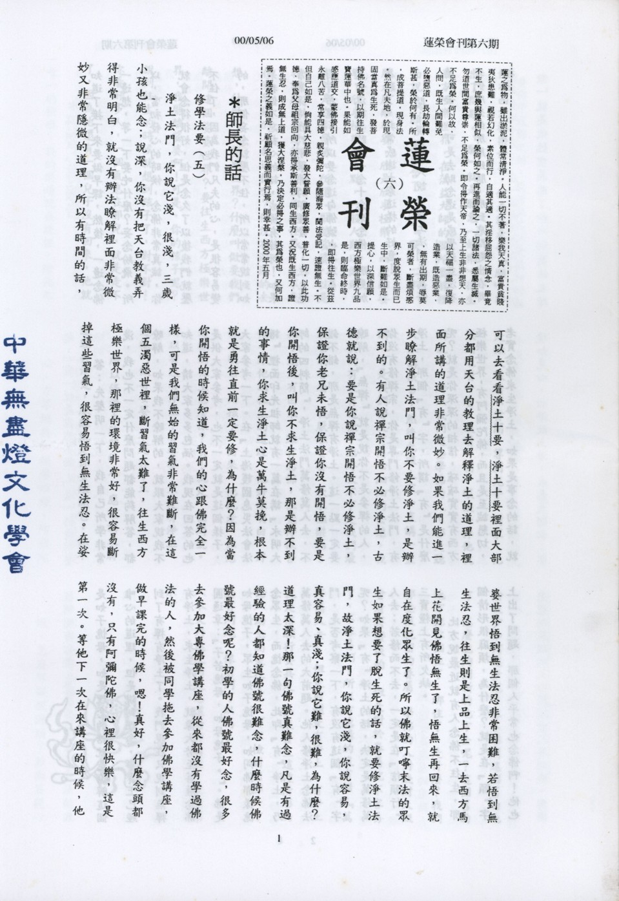

# 第6期

## 師長的話

### 修學法要（五）

連

淨土法門，你說它淺，很淺，三歲小孩也能念；說深，你沒有把天台教義弄得非常明白，就沒有辦法瞭解裡面非常微妙又非常隱微的道理，所以有時間的話，可以去看看淨土十要，淨土十要裡面大部分都用天台的教理去解釋淨土的道理，裡面所講的道理非常微妙。如果我們能進一步瞭解淨土法門，叫你不要修淨土，是辦不到的。有人說禪宗開悟不必修淨土，古德就說：要是你說禪宗開悟不必修淨土，保證你老兄未悟，保證你沒有開悟，要是你開悟後，叫你不求生淨土，那是辦不到的事情，你求生淨土心是萬牛莫挽，根本就是勇往直前一定要修，為什麼？因為當你開悟的時候知道，我們的心跟佛完全一樣，可是我們無始的習氣非常難斷，在這個五濁惡世裡，斷習氣太難了，往生西方極樂世界，那裡的環境非常好，很容易斷掉這些習氣，很容易悟到無生法忍。在娑婆世界悟到無生法忍非常困難，若悟到無生法忍，往生則是上品上生，一去西方馬上花開見佛悟無生了，悟無生再回來，就自在度化眾生了。所以佛就叮嚀末法的眾生如果想要了脫生死的話，就要修淨土法門，故淨土法門，你說它淺，你說容易，真容易、真淺；你說它難，很難，為什麼？道理太深！那一句佛號真難念，凡是有過經驗的人都知道佛號很難念，什麼時候佛號最好念呢？初學的人佛號最好念，很多去參加大專佛學講座，從來都沒有學過佛法的人，然後被同學拖去參加佛學講座，做早課完的時候，嗯！真好，什麼念頭都沒有，只有阿彌陀佛，心裡很快樂，這是第一次。等他下一次在來講座的時候，他知道了接下來要做早課，然後，一邊念佛一邊想，等一下要吃什麼？妄念紛飛。所以，當初發心的時候，念佛非常真誠，你就會念得很好，但是念久了以後我們就壓不住了，因為我們凡夫的心，是很容易變的，那個妄念就壓不住，所以常常說到如果我們不忘初心的話，成佛有餘呀！如果常常保持我們剛學佛的那種發心，往生絕對有希望。所以要念這句佛號也不容易，更何況說要臨終一念十念來念佛，那更加為難了。非常感謝大家這樣的好意！

**問：** 現在有人說，淨土法門是萬修萬人去，可是去助念還是感覺到並沒有我們所想的那麼殊勝，那到底問題出在哪裡？

**答：** 先聲明一下，我自己所學非常淺，我也不一定什麼問題都能夠解答，都瞭解，如果我不瞭解的，就跟大家說我不知道，請大家多多包涵。我現在回答的也是供大家參考，也不一定就是這個樣子，大家參考一下。在『上海護國息災法會法語』裡面印光祖師就有一篇在講『永明大師的四料簡』，淨土法門萬修萬人去，不錯不錯，那是無禪有淨土。這一點一定要瞭解，『無禪』就是說你不是參禪的人，你沒有修禪宗，你是專門修淨土法門，有淨土，那個『有』字，所謂『有』是什麼呢？就是你深深的相信，確確實實有西方極樂世界，有阿彌陀佛，而且是至誠懇切，老實念佛求生淨土，如果是事念的話，就是如子憶母，如是理念的話就是瞭解這個唯心的道理，但是說到理念，事實上已經到了有禪有淨土了。我們現在只說到無禪有淨土，求生淨土，就像大勢至菩薩念佛圓通章：『子若憶母，如母憶子。』。佛是如母憶子，眾生如子憶母，如同佛那樣憶念眾生，而憶念佛，此即『有』淨土，乃萬修萬人去的大前題。他人修淨土念佛法門，是否考察一下，有沒有這個『有』字呢？如果『有』淨土的話，決定是萬修萬人去；若修而不去，一定是在『信願行』三資糧上有所欠缺。

比方說最近就有人念佛不往生，那個情形很麻煩，為什麼？就是在『願』字上出了問題，那個人平常也念佛啊！他也信有西方極樂世界，但是就是在『願』字出了問題。『願』就是願意（好樂）往生西方極樂世界，在蕅益大師的彌陀要解裡面說：『願』是包含了『欣』『厭』二字，厭是厭離娑婆，欣是欣求極樂。而厭離娑婆，欣求極樂這兩點，一般人難以做到，尤其是在家學佛。所謂『厭離娑婆』就是我討厭，我想離開這個娑婆世界，是不是在家學佛的人都這樣呢？他沒有深深的去想，什麼叫做娑婆世界？什麼叫做要我們離開這個娑婆世界？要往生西方極樂世界，我厭離娑婆啊！可是，你的孩子呢？說到往生的時候就想到孩子了，對不對！你看好多人，一個氣息在那兒，就是走不了，因為他還有一個兒子沒有回來，他就是張大眼睛不肯閉，等到兒子一到家，他張開眼睛一看，眼睛一閉，眼淚一掉他就斷氣了。所以我們這些學佛的人，都是聽人家講很多，然後也跟人家一直講一直講，可是我們都沒有用心細細的去想，我們真的有沒有這樣？臨終放不下是我們最親密的眷屬，我厭離娑婆，欣求極樂嗎？孩子還沒有回來，雖有念佛，但覺得很苦惱，跟他講往生的道理，他好像明白，好像不明白，而孩子一回來，他就走，你想這樣的往生怎麼樣？唉！就是一個問號。所以有沒有淨土？有娑婆，不是有淨土，這樣叫做有娑婆，不是有淨土。

所以修淨土法門的人，應該講求將道理弄清楚，厭離就是你要離開它，你不捨故步如何進步呢？你不離開這個舊的地方，怎麼能夠到新的地方去呢？這個舊的地方把你捆住了，綁住了，是什麼？我們那些很親密的眷屬。學佛的人對錢財大概會看得蠻淡的，但是對於眷屬就不容易了，不容易啊！所以古德講的沒有錯，『萬修萬人去』，但是前提是有淨土，有淨土就是信願行要具足。如果發生這種情形的話（助念而未往生），可以檢討出那一方面有問題，像前例可以嗎？(全文完)

（本文乃蓮友向連志道老師請教，蒙師開示）

## 研習心得報告

### 勸發菩提心文（六）

*心爾*

勸者，勸勉也。文中十種因緣，皆是勸勉之辭。

別題四義：菩提、心、勸、發已釋，今通題「文」字。

「文」者文章也，「積名成句，積句成章」名就是名言，佛法分名、句、文，名就是名相，積名相成句子，積很多句子成一篇文章，一篇文章把一完整概念，及修行次第顯現，以上經題、釋題，釋名。

顯體：此文以真性為體。

「此文以真性為體」發菩提心能夠親證菩提，菩提就是真性。「虛明洞澈，湛寂常恆」寂照不二，都是心性的描述，「明」就是普遍十方；「虛」就是沒有自性，「洞澈」就是依性空義能了知一切萬法之緣起，「寂」就是寂然不動，「湛」仍清明瑩澈的樣子，「常恆」就是日久天長，永不改變，「寂照不二」之「寂」就是無性。「照」就是隨緣，性空緣起，一切的緣起法依著性空而顯現，性空是不妨礙一切依緣而現起之法。三藏十二部經典亦令我人明白此理，依淨緣而得樂，依染緣而得苦，無有絲毫自性可得，而能斷惡修善，破迷啟悟（悟無我性體，遠離無明我執），並助一切眾生對治無明我執，彰顯無我之義；山河大地、虛空皆以無性為體，依眾生染淨之緣而起相，回應眾生心所造善惡業（萬法唯識，三界唯心），例如一水四見，天見為琉璃，人見為水，魚見為空氣，鬼看為濃血，或猛火，都是唯心所現，其性本空，若是不空怎麼會隨心所現。故云：見境如見心，心淨故土淨，永嘉大師云：夢裡明明有六趣，覺後空空無大千。

明宗：此文以慈悲為宗。

要達到菩提，要用什麼方式去達到呢？此文以慈悲為宗，下手修行要慈悲，欲拔一切有情之苦，乃至無明微細苦，欲與有情之樂，乃至成佛之樂；故內能降伏無明我執，受用成佛大樂，如此方能於外幫助眾生降伏無明我執，成就佛果安樂。佛法的慈悲跟世間的愛不一樣，雪公老師說：「小愛小煩惱，大愛大煩惱，愛不重不生娑婆」，慈悲的重點在幫助眾生拔除痛苦，遠離無明愛執。這才是慈悲的重點，而不是濫好人。

論用：此文以與樂拔苦為用。

慈悲所展現的大作用就是拔苦與樂，與樂要與予成佛之樂，拔苦要拔到最微細的無明之苦（生相無明），拔有情之苦要拔到這麼徹底，要給有情的樂是成佛之樂，自己不成佛能辦得到嗎？故菩提心一發必有上求佛道的決定見，故善財童子五十三參，彼知唯己成佛，方能成滿度眾之大願，故能求賢若渴，善知識對他所傳之法，彼能有久旱逢甘霖、久病得良藥之覺受。眾生與我不只是有恩情的關係（彼做過我至少一次之母，故稱母有情），亦有利害的關係，若他的苦與煩惱不能解決，都會構成吾之障礙，因為法界有情就是生存在法界，我人正好在法界裡生存，他的苦難道與我無關？彼此有利害關係，何況對我有大恩？更何況具足佛性本會成佛，助他得佛果的安樂，除他無明的痛苦，變成我人唯一的快樂，我的樂趣就在這裡，除此之外沒有其他，謂之慈悲：１．慈悲給我人一切的快樂。２．慈悲加大我人心量。３．慈悲能令我了解佛的心態。４．慈悲能得許多的勝緣。５．慈悲得到眾生的擁護。６．慈悲能使我一點苦也沒有。７．慈悲只有功德，沒有過患。８．慈悲讓我在境界中得到解脫。９．慈悲成就一切的聖德內涵！一般人以為生起慈悲，人生過得好痛苦，負擔好大，現實的快樂都沒有了，其實現實的快樂只是消耗過去的善業而已，這叫「刀頭舐蜜」過去的善業花完就受苦，把存款簿大花特花而已，有什麼快樂可言，且眼前享受現實的快樂易於起惑造業，更會招感極大苦報。

教相：此文以方等生酥為教相。

「方等時」就是回小向大，要發菩提心，方等經典如維摩詰經、阿彌陀經，觀無量壽佛經等是佛在方等時下說的。華嚴最初三七日、阿含十二、方等八；方等時佛以種種善巧方便令小乘人回向大乘，回小向大乃小根者發菩提心。佛此時說法「彈偏斥小，歎大褒圓」讚歎大乘與圓教內涵，令二乘人回小向大，修學圓滿之教法，這是整個方等時期的重點，此天台教典有言。方等時教相喻以「生酥」，五時教法各以牛乳的提練來配五時（比喻五時）。所謂乳、酪、生酥、熟酥、醍醐。故佛五時說法，即是一代時教。此文屬第三時，既是第三時，則屬大乘教法矣，方等時雖非法華、涅槃時，然是此等法華、涅槃等大乘法的源頭，怎麼可鄙視源頭？若無菩提心為大乘法之源頭，即使再圓滿之法皆不成為大乘法，無法助吾人圓成佛果。雖五時各有重點、有深淺高下之不同，但彼此皆相輔相成。如何能以圓教來棄捨藏通別，如何能自守藏教以自甘卑劣。因為彼此（五時）都有關係，前者是後者之基，後者是前者的增上，那有在增上以後斬斷根源？我們中國有時候教理講得開的時候，讚歎圓教當中，不善學者就有鄙視藏通別的感覺，「我是圓教中人，若彼等是藏教」其實若沒有藏通別次第之修行，那有圓教的成就，沒有藏教棄捨世間的快樂，那有圓教成佛的快樂。（下期待續）

## 生活感言

### 訪聖安娜之家

莉玲

起初在社團裡聽見指導老師在說聖安娜之家時，覺得很好奇，想知道裡邊到底是什麼，一問之下才知道它是由一位白永恩神父為了許多殘障兒童所創立的，裡邊雖然沒有像某些家庭那樣豪華，但那兒有最多的愛心在裡頭，一方面自己想到那兒去看一個究竟，一方面又經由學長、姊的慫恿之下來到了聖安娜之家。

一踏進聖安娜之家的大門，心中忽然冒起一種莫名的害怕，就連自己也不知道在害怕什麼，或許是怕看見一些自己從來沒看過的畫面吧！但還是一直告訴自己要發慈悲心。再走進一些，看見兩排有種了幾棵大樹，樹下看不見人類所製造的垃圾，只看見幾片在樹上枯黃而掉落地面的葉子。頓時覺得這真是在台北市裡難得一見的美景啊！

我們又走得更進去了些，走進一間二樓的屋子裡，我們走上了二樓，又走進了一間大房間裡，那才真正是我們的目的地，一看！中間有一個大床，裡邊躺了近十位小朋友，床邊四周有幾張嬰兒坐的小椅子，上面各坐了小朋友。我們到的時候大約是接近中午了，於是我們就幫忙那裡的阿姨餵飯給那幾個小朋友吃，阿姨選了幾個比較好餵的給我們試著餵，餵著餵著，突然聽見有咳嗽聲，我趕快轉頭一看，只看見一位阿姨的臉和手全部沾滿的稀飯，但我卻沒有看見她拿毛巾為自己擦，而只看見她忙著幫那小孩擦嘴和擦身體，看了心中好感動喔！一問之下才知道那小孩有天生的氣喘病，好可憐喔！

我又回到自己的位置，餵著我剛剛餵的那個小孩子，又聽見好像是由裡邊的房間所傳出來的聲音，那好像是用某種東西去敲鐵似的聲音，這聲音引起了我的好奇心，還好碗裏的飯剩下不多了，於是我就趕快把這個小孩餵完，然後走到裡面去看個究竟，當我看見時嚇了一跳，我看見一個小男孩不停的用他的頭去撞他那每天要睡在上面的床旁邊的鐵欄杆，我又問了阿姨原因，這才知道原來那個小孩天生就有自虐症，再靠近那小孩一點，我真的又被那小孩的眼睛給嚇了一次，他的眼睛已經被他撞得黑青了，我想如果再這樣撞下去他的傷口可能就要流血又流膿了，看了真的好心疼喔！阿姨說得這種病的小孩子都是在自己的潛意識裡告訴自己要這樣做，不管自己的身體在痛都告訴自己要這樣做下去不能停下來，除非吃了鎮定劑，才會好些。

本想走出去看看外面的情形，這時忽然看見有一個小小的房間在裡面，裡邊又有一個小孩子坐在嬰兒床上，自己跟自己玩，但我不敢再去問原因，怕的又是自己從沒想到的慘答案，或許是自己太沒慈悲心了，但我真的不想知道答案。

在那裡幫忙的阿姨是沒有薪水的，卻無損她的善心，以美麗的笑容對待那裏的小孩子，這些小朋友大多是單親家庭出來的，或是父母沒能力照顧小孩，還曾有一次在颱風天的晚上，神父、修女們在開會的時候，忽然從外面傳來的哭聲而到外頭去把他認領回來的。

最後回程時，真的已被神父、修女以及裡邊的阿姨們深深的感動了，相信學長、姊們一定也受此感動，我也在內心深處許下一個承諾，下次有機會我一定還要再來服務他們。

## 臨終關懷與助念時效

### 助念經驗談（二）

思嘉

腸癌末期  與佛結緣

今年三月，為了領取看護執照，我在市立醫院參加為期一個月的看護訓練，在實習時接觸到一位年僅四十八歲的腸癌末期的黃性患者。他是一個工人，未婚，據他家人告訴我，他平日嗜食蹄膀，不吃蔬果，而且常在深夜冰茶、啤酒一杯杯灌下肚，縱使偶而覺得腹痛、腹瀉、便祕，也不以為意。直到元宵節時突然一陣腹部劇痛，才緊急就醫。醫生開刀後，發現為時已晚，估計他只有一週的生命，但是他卻日復一日地拖了將近一個半月。

起初我只是白天實習時照顧他，後來實習結束，他的家屬請我晚上十點照顧到早上十點。他不知道自己的病情，每天只有打點滴、換藥，醫生來巡房時，只是看一下他的傷口，一言不發地就走了，他認為沒有得到應有的醫療護理，希望能轉到其他醫院去。

有一天深夜，我針對他的不滿，很婉轉地告訴他，他的痛是長期飲食不均衡造成的，酸性的體質已經在肚腸裡形成相當程度的破壞，不是現今的醫術能治得好的，否則三十多公分的裂口為什麼遲遲不能癒合？醫生若是多用一些營養劑給你，你不能吸收又有什麼用？你在工廠裡做過，知道一台機器縱使能正常運轉，也要按時維修，整個拆開檢查，零件如果不堪使用，就得換個新的。身體的結構也是一樣，平日如果缺乏保養，有點不舒服也不放在心上，到了十分嚴重才做一次大修，往往找不到可以替換的器官。這時候就來到生命交關的時刻。這副軀殼會朽壞，靈魂卻是不死的，它像一條鍊子環環相扣。讓下一個環結比這一生更好才是最重要的。

那一天晚上，我還安慰他，其實他這一輩子過得很幸福很滿足，因為是男孩子裡排行最小的，所以得到父母兄妹最多的疼愛呵護，又因為一生未婚，沒有家累，沒有負擔，逍遙自在地走到中年，病中雖沒有妻在側，卻有兄嫂小妹輪流照顧，手足之情深厚，可說沒有什麼遺憾了。

那時候，他一語不發，眼中泛著淚光，似乎明白自己的處境，必須坦然以對了。

接下來的日子，他漸漸不再能忍受絞痛的感覺，常要求打止痛針，然後開始變得嗜睡。有一晚，虧得護士提醒，何不讓他聽聽唸佛機會比較好？我才恍然大悟，這時正是讓他聽到佛號的大好機會，好跟阿彌陀佛結緣。同時，我把陀羅尼被做個被套，給他蓋在身上，希望藉此消除他的業障，早登淨土。

那段時間裡，曹師兄曾多次到市醫來探視，也跟他的家人有所接觸。他在四月二十日下午二點左右往生，當時我不在場，巧的是，他的妹妹護送遺體從太平間出院時，正好遇到曹師兄，於是立即安排到殯儀館助念的事。我是直到晚上八點才得到通知，趕上最後一班的助念。

事後他妹妹代表家人一再謝謝多位師兄前來助念，並且告訴我，不可思議的是，在助念中，她一度清楚地看見金光閃閃的佛像出現眼前，真的是菩薩降臨，對一向不信神佛的她或是她的哥哥而言，都是一項奇蹟，也是莫大的感動。我們都相信這是他的福報，冥冥中自有安排。差一點在聯絡不到我的情況下，無人從旁協助，恐怕也亂了陣腳，就直接把他送入冰庫了。

翌日，他的家人邀我參加入殮儀式，葬儀社要所有的人都背過身去，直到他的遺體被妥當地安置在靈襯中，才能回過身來。據業者的說法，是怕我們被煞到，實際上是無稽之談。反倒是可藉遺體是僵直或柔軟，看出是否往生。因此，那時只能觀察到他的面容安詳，睡得很沈的樣子，應該是得到真正的安息了。不像在醫院時，經常愁眉深鎖，最後幾天甚至竟日無法闔眼，像是在看東西，又找不到焦點，我曾經用口罩當眼罩給他戴上，才能讓他暫時閉上眼睛。

此時來到暫厝的靈堂，隨著念佛機而念佛，將這樁佛緣打下了一個句點。

## 啟蒙園地

### 談教育（一）

心印

時下的教育是以升學主義為主軸，注重各種技能的加強，琳瑯滿目的教學方法，引用的盡是外國進口的教育名言，主張的是快樂的學習，啟發式的教學，以學生為主……等種種教育的革新，來培養我們的下一代。但是中青代的教師們仍時時感嘆，學生的資質一年不如一年。課後的才藝班也如雨後春筍般地出現，許多父母為使孩子贏在起跑點上，省吃儉用地將大把金錢投資在孩子的鋼琴課，英語班……等。然而與金錢花費成正比的是社會上青少年的問題，犯罪年齡下降、日益精密及狠毒的犯案手法皆令許多有心之士為我們國家的前途哀嘆而憂心不已！

一個國家民族的興衰，全靠教育的力量。特別是趁兒童仍天真無邪之時，給予正確的道德觀念。中國的大教育家，至聖先師-孔子的教育理念即說『弟子入則孝，出則弟，謹而信，汎愛眾，而親仁，行有餘力，則以學文。』孝弟、謹信、愛眾及親仁等都是道德教育的綱目，以培養健全人格為主要目標，最後才是學文，也就是學技藝。若本末倒置即會有許多過犯。譬如曹操的文學素養在八大家之上，王莽的禮賢下士自比周公，但兩人卻都不如一個窮乞丐武訓，有好的品德，能建學堂利益鄉人，人格教育之首在仁。仁心好比果核內之果仁，能發芽生長而使生命綿延無盡。然仁心的引發需由孝道著手。於蒼茫的天地間，父母的恩情最為深重。三年的懷胎哺乳、推乾就濕，甚至等到子女長大成人後，父母仍會心心念念憶著子女直至嚥下最後一口氣，因此子女行為最能彰顯人性。孝讓父母與子女的心相繫，而連成一個永不斷的生命力。

然世人多駁斥「孝」這個根本道理，認為父母如豆莢，而子女是豆莢中的豆子，當豆子由豆莢中生出，豆子與豆莢互無關係。久之，子女對父母的付出不懂珍惜感恩，向父母予取予求來滿足自己的慾望。若得不到所求，不惜和父母反目成仇，甚至釀成殺父殺母的大錯，而後自己受苦無盡。如是因如是果，種種的邪見，造成社會中許多的亂相，使得人心惶惶，人與人之間的心牆日益加厚。行孝道即能培養一個人的仁心，由身邊最親近的人開始，進而推廣至他人「老吾老以及人之老，幼吾幼以及人之幼」。孝讓家庭和樂，社會祥和，天下太平，所謂家和萬事「興」。它是天地之間自然的法則，更是法界萬有離苦得樂的根本泉源。為人子女的我們，當熟讀玩味而勉行之。（待續）

### 永遵親約

*編輯部*

陶侃，是中國東晉時代的人，他從小就非常孝順。

長大以後，有一次，陶侃因為酒喝得太多，醉了，被他的父親訓誡一頓。父親告訴他：「你可以喝酒，但是不能喝醉！現在我和你約定，從今以後，不論你在任何場所，酒最多只能喝到三杯，絕對不能超過。」

陶侃恭敬的記住父親的教誨，從此以後，果真在朋友聚會的所有場合，喝酒都絕不超過三杯。

後來父親過世以後，陶侃還一直遵守和父親的約定。許多年後，有一次，陶侃帶領軍隊和敵人作戰，立下大功，被皇帝封為大將軍，擔任武昌一帶的守衛工作。

有一天，當地的名人殷浩和瘐翼二人一起來找他吃飯，大家很高興的一邊吃飯、一邊喝酒、一邊聊天，每個人都喝得興高采烈，但陶侃卻只喝三杯。大家都勸陶侃多喝幾杯，可是他卻說：「我曾和先父約定『喝酒以三杯為限』。」

殷浩不以為然的說：「既然你的父親已經去世，再也不能管你了，你就不必再遵守約定啦！」

陶侃說：「不！為人子女者，應該以長久心來報答父母的恩惠，讓父母歡喜安心才對，所以，我不敢違背和父親的約定。」

大家聽了，都覺得非常慚愧，而更加敬佩他能永遠遵守和父親約定這樣的孝行。
