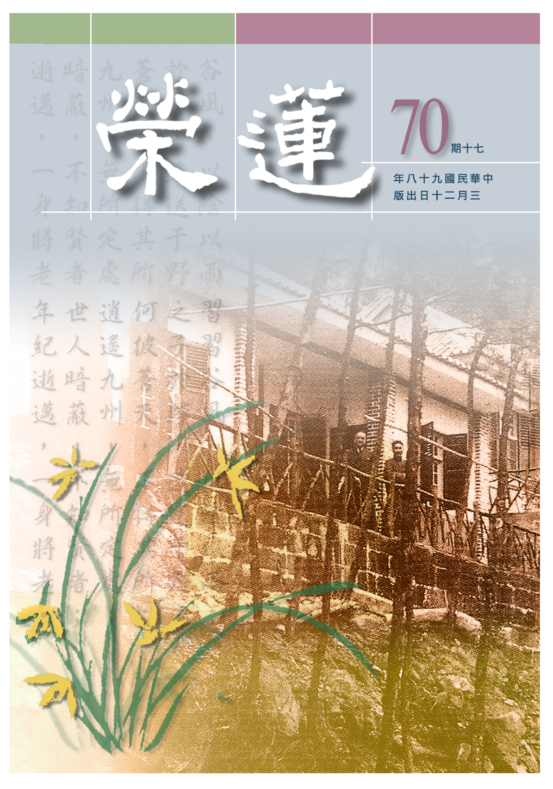

# 第70期

## 社論

### 痛失一代梵行高遠的大德

本刊

平地一聲雷

大德杳然去

眾生失依怙

蒼生求垂慈

驚傳佛教界持戒精嚴、道高德備的

上

懺

下

雲法師，於三月七日清晨在南投縣水里鄉蓮因寺圓寂，享年九十四歲。師父一生待己甚嚴、刻苦修行數十年如一日，在台灣佛教道場中，可說是極其少數，嚴謹持守戒律的法師。

民國三十八年，政府播遷來台，全國上下百廢待舉，民間沒有正法的信仰，更談不上佛教的修學。有幸天未喪斯文，當時隨政府來台的不乏是儒佛的大家，懺公法師即是其中之一。法師來台時正值有為，年僅三十四歲，曾與雪廬老人在台中靈山寺合辦佛學院，成為台灣教授僧才佛學院的首創。之後並推展各種弘化事業，在台灣佛教史上有其不可抹滅之地位。

法師解行並進，梵行高遠，眾所尊榮，因而在南投水里創建蓮因寺，成為第一代的開山。在蓮因寺中除了興辦皈依、放生、佛七等法會外，特別值得一提的是興辦齋戒學會，接引大專生學佛，不只是佛法的學習，特別是落實於生活作息，培養行住坐臥的威儀，令許多大專生恭敬三寶，對佛法的信心增上。

師父除了在齋戒學會上為大專生做種種禮儀示範外，以身作則，並開設佛學課程教授諸生，諸如《佛說八大人覺經》、《大乘百法明門論》、《大乘起信論》、《始終心要表解》，並隨機開示儒學中論語、大學、中庸、禮記等精要部分，是一位儒佛並重，引導持戒念佛、求生西方的大德。

法師雖然未正式參與中國佛教會，但對教內德學兼備的大德或有修持的長老備極尊重，並禮請至蓮因寺對大專生說法，如顯明法師在天台教觀上講解極為熟練，法師會恭請至山上開講教觀，充實大專生佛法的內涵；並帶領大專生親近廣欽老和尚，禮請老和尚開示，尤其為求廣公住世在承天寺興辦佛七，感得老和尚首肯而多住世六年，一時之間傳為佛教界的美談。

法師律己甚嚴，朝暮二課及過堂用齋絕不馬虎，飯可以不吃，功課不可不做。禪定功夫極高，行住坐臥示現輕安，風度翩翩，言詞柔和，謙光逼人，令人望之猶慈母，然調教弟子時又似嚴父，雖然規矩嚴格無法廣攝徒眾，然大眾只要一聽到法師的名號，無不肅然恭敬。法師主持佛七時，參加者人滿為患，佛號宣流猶如天樂，會中念佛與佛菩薩感應道交者不勝枚舉。

法師雖有因緣出國弘法，領眾念佛，但都以蓮因寺為重心，培養僧眾。並著述立說，作為流通正法的增上緣，如《遺教經表解》、《始終心要表解》、《五戒表解》、《百法明門論表解》等，對有心修學者是極佳的參考教材。

法師生於安東省與韓國交界處，出自名門之後，侍父極孝，助成父親生西大業，於三十歲出家，進入閩南慈舟法師所辦的佛學院，除精進學佛外，心中特別仰慕印光大師與弘一大師，造就了法師的堂堂僧相。師父嘗勉大眾遇到困難無法解決時，可效法彼向印光大師禮拜，並隨緣翻印光大師文鈔，常蒙指示而解決疑難。

法師能以教法、戒法內化身心，儀表出俗，談吐高雅，故感得多方讚歎，大專生總在參與雪公老師所辦的明倫講座後，再至蓮因寺所辦齋戒學會繼續修學，當時即流傳：解在明倫，行在齋戒。廣公老和尚亦曾當眾讚歎懺公是正法明如來，並有意交棒懺公接任住持，法師一再婉拒，傳為佳話。會性法師於講經會上，也讚歎懺公是當代比丘中最具威儀者。

法師在了卻娑婆塵緣，以九四高齡示現吉祥臥，在大眾助念後，身相極為柔軟，面容安詳自在，正表彰大德一生持戒精嚴、教法深入、對法熱誠、對淨土信心、宣流佛號與對大專生無私的攝受。

本會為感念懺公一生行誼，願將師父莊嚴的形象及內涵作為本會學習的典範，為祈求師父乘願再來，興辦五戒表解講座用資紀念，兼以七次每週五晚上的觀經講座作為回向師父之法會。唯願師父乘願再來，利樂有情，使台灣成為修學淨土的寶島，學佛大眾以懺公為典範，在佛法的修學路上，步步勝進。

## 大德法語

### 大方廣圓覺修多羅了義經（三十）

道源老和尚

雖知法相千差別

究體本來無一物

愛憎無依證涅槃

亦知涅槃自相空

乙二、正宗分

丙二、令依解修行隨根證入

丁二、廣明行相

戊一、四問答通明觀行上根修證

己一、開示觀門同佛

庚五、正答所問

辛一、長行

壬二、觀行成就

癸二、觀慧

子二、明法界觀

丑三、圓彰法界

寅二、三重法界

卯一、真空絕相觀

經文：

善男子！一世界清淨故，多世界清淨。

再結合到依報上，如娑婆世界本來是染污，然染污相是觀待眾生的心識，是眾生心分別的，若觀察其體性，則娑婆世界是清淨，一個世界清淨，結合到多世界，則多世界清淨。

經文：

多世界清淨故，如是乃至盡於虛空，圓裹三世，

裹是包含之意，世界不只在十方（空間），還在這時間上講過去、現在、未來（三世）。一切平等，清淨不動。

若是空間，講究的東、西、南、北、上、下，是不平等的差別相，若是時間，講究的是過去、現在、未來（三際），亦是有三世的差別相，在覺相中一切差別相都了不可得，在真空理體上，一切都是平等清淨不動（無間緣的動相）。若是因緣的動相，在正報上，有生老病死，在依報（世界）上，有成住壞空，都在動。

卯二、理事無礙觀

經文：

善男子！虛空如是平等不動，當知覺性平等不動；

虛空是比喻，實則虛空本身也是如幻如化的，由虛空喻知覺性平等不動。

經文：

四大不動，當知覺性平等不動。如是乃至八萬四千陀羅尼門平等不動，當知覺性平等不動。

四大種也是有生、住、異、滅，有成、住、壞、空，今觀四大種體性了不可得，彼亦清淨不動了。

真空覺想觀，所觀即是萬法之真空理體（圓覺妙性），覺世間一切法相都了不可得，此時真空理體現前，即是圓覺妙性現前平等不動。

卯三、周遍含容觀

經文：

善男子！覺性遍滿，清淨不動圓無際故。

覺性不但清淨不動，而且普遍圓滿。際是邊際，有十方，東方有東方的邊際，南方有南方的邊際，時間則是指過去一個邊際，現在未來有個邊際，覺性沒有邊際謂之圓滿無際。

經文：

當知六根遍滿法界；根遍滿故，當知六塵遍滿法界；塵遍滿故，當知四大遍滿法界；如是乃至陀羅尼門遍滿法界。

六根是眼、耳、鼻、舌、身、意，謂十八界，是眼根、眼識、色塵與耳根、耳識、聲塵，各有界限，此時是根根遍滿法界，謂之六根遍滿法界。

其次六塵：色、聲、香、味、觸、法，亦塵塵遍滿法界。

其次四大種亦遍滿法界。

如是乃至八萬四千陀羅尼門，每一個法都遍滿法界。

經文：

善男子！由彼妙覺性遍滿故，根性塵性，無壞無雜；根塵無壞雜故，如是乃至陀羅尼門無壞無雜。如百千燈，光照一室，其光遍滿，無壞無雜。

這六根六塵怎會遍滿法界呢？若觀到圓覺妙性上，則皆遍滿法界，此根性、塵性，無壞無雜。

此舉一譬喻，這也是大智慧才懂，如何是不壞不雜遍滿呢？如百千燈，光照一室，每一燈光都遍滿一室，你說哪個燈光沒有遍滿？例如講堂開了四盞燈，哪一個燈光不是遍滿講堂呢？且此一燈光之遍滿講堂，不會破壞另一燈光，不但不壞還不混雜，個個的燈光還是個個的燈光，所以依事相上亦是微妙不可思議。

壬三、頓同佛境

癸一、用心同

子一、法

經文：

善男子！覺成就故。

到此時謂之所修圓覺行門，成就了。

經文：

當知菩薩，不與法縛，不求法脫。

前述三種法界：第一是真空覺想觀；第二理事無礙觀；第三周遍含容觀。此處是周遍含容觀，如百千燈光照一室，周遍含容。觀行成就了，頓同佛境，你雖未成佛，但境界與佛一樣。不與法縛，不求法脫，不受一切法的繫縛，不求在一切法上解脫，試問成了佛還受什麼繫縛，還須求個什麼解脫？

經文：

不厭生死，不愛涅槃；

厭是憎厭、厭惡，對於生死不害怕、不厭惡，二乘人為什麼不度眾生呢？他對生死很害怕，視生死如冤家，菩薩為什麼能度眾生呢？因為不受生死法縛，不怕、不厭惡生死，也不愛涅槃，因為厭惡生死才去求證涅槃，此時生死涅槃都是空的，既不厭惡生死，也不愛求涅槃。

經文：

不敬持戒，不憎毀禁；不重久習，不輕初學。何以故？一切覺故。

對於持戒的人也不特別加以恭敬，對於毀犯戒律（破戒的人）也不憎惡他。

對於久習佛法的老修行也不特別尊重，對於初學佛的人也不輕視。

此時是已覺平等，方有此等境界，此境界我們還沒到，很難懂，再說個譬喻。

子二、喻

經文：

譬如眼光，曉了前境，其光圓滿，得無憎愛，何以故？光體無二，無憎愛故。

此之譬喻未學者難懂，譬如眼光(眼識）緣現境，此時是不起分別，會起分別的是誰呢？是第六意識，第六意識與眼識同起的作用，謂之同時意識（五俱意識）。前五識都只緣現量境而不起分別，若起分別就是第二念的功能了，是同時意識配合生起的，此時單純眼識，就是眼睛發出的光，照了前鏡，看見現量境界（色境），這個光是圓滿的，對於所緣的境界既不起憎惡心，也不起愛心，何以故呢？光體無二是眼光(眼識）不起憎愛二念的分別，有憎有愛是第六意識起的分別。

此喻菩薩的覺行成就，將憎愛心斷除，此憎愛煩惱是與生俱來。如小孩子剛出胎，就帶來這兩個煩惱，對現前境分不太出來，然有憎愛二心在，合他的心就愛，不合他的心就憎。合著他的愛心就發笑，合著他的憎心就哭，此即與生俱來的二個煩惱。若能將憎愛二心降伏，不增加新煩惱了，就不得了！

外境雖千差萬別，不出於一個逆境，一個順境，逆境是違背你的妄想心，對此不順境則憎惡、討厭，由此討厭的心識起嫉妒等煩惱；順境是順你的妄想心的境界，生起了愛心，這一愛就生起各種煩惱。此時這位菩薩與佛一般，沒有憎、愛二種煩惱，對那些差別境界不起分別，沒有憎愛二心。（下期待續）

### 佛說八大人覺經講錄（十二）

道源老和尚

見苦生悲願成佛

發大乘心代受苦

弘法利生忘己疲

要為眾生作馬牛

甲二、詳八大法相以成宗

乙一、別釋八法以起信解

丙七、覺生死苦惱觀念心願

經文：

第八覺知，生死熾然，苦惱無量，發大乘心，普濟一切，願代眾生受無量苦，令諸眾生畢竟大樂。

你要觀察眾生在受大苦，此苦就是生死輪迴之苦，生了死，死了生，不得休息，「熾然」是形容火燒得非常猛烈，生死大苦像火燒那樣猛烈，沒有學佛法，根本不知道生死行相，學了佛法不去深入觀察，也不會了解生死過患是這麼嚴重，一次生死就包括了一生一世無量無邊的苦惱，況且自無始劫來的生死苦惱更是無量。觀察到眾生在受生死之苦，你的慈悲心生起來了，並以慈悲心為根本生出菩提心，於是就「發大乘心，普濟一切」。

佛弟子有大乘及小乘弟子，小乘弟子不顧眾生苦，只有自己了生死。發大乘心之弟子就是菩薩，他觀察到自己受生死苦，觀察一切眾生皆受生死之苦，而發大乘心，要普遍利益救濟一切眾生，謂之普濟一切。

「願代眾生受無量苦，令諸眾生畢竟大樂」，發菩提心要利益眾生，觀察眾生苦，則發願代眾生受苦。眾生有無量苦，我通通願意代他們受。按理說你發了菩提心要教化一切眾生，則必須要弘法利生，當有眾生的無量生死苦惱，都了脫了，就是你代眾生受苦。怎樣代眾生受苦？你弘法利生，就是代眾生受苦。

度眾生要怎麼度呢？要講經說法，當了法師弘法利生，你以為很享受？法師要坐高座，此乃《梵網經》上菩薩戒的規定，不這樣做就犯菩薩戒。你們千萬不可以這樣想，這個法師坐這麼高的座位，大眾很恭敬他，向他恭敬頂禮，把他當成佛那樣的恭敬，這個法師很享受，你這樣觀念就錯誤了，法師講經是代眾生受苦。

當法師就得受這個苦，例如你會講經說法，你得先學經教，拿道源（指師父本人）自己做個例證，為了弘法利生所受的那些苦，要向各位當故事講，講多少天也講不完。學會了講經說法，道源已經講了五十二年的經了，當了五十二年的法師了，今年八十六歲，現在還向諸位講經，還在受苦。

現在受的什麼苦呢？八十六歲身體已經老弱不堪，走路都走不動，搖搖擺擺，這些你們都看到了，走路時要有一位侍者撐著我，不然要跌倒了，跌倒了不要緊，不莊嚴，所以得一個侍者撐著我走。眼睛視力退化，小字看不見，請人給我抄大字，你們都看見了吧？字像茶杯口大的字，還是看不清楚，看不清楚還要向諸位講，實在很費力，這不是在受苦嗎？身體衰弱到沒有抵抗力，稍為有一點冷風就咳嗽，那麼要多穿衣服，可是多穿衣服卻熱，講經時咳嗽就不能講，若多穿衣服卻身體熱，熱了就流汗，所以一講完經要熱出一身大汗，這不是受苦嗎？

那麼道源已經老得不能動了，眼睛也看不見了，還要講經，因為願意慈悲一切，願意代眾生受這種苦。代誰呢？代諸位聽經的，你們聽了道源講經，發了道心，將生死了脫，你就能成就佛道，那麼你這個生死之苦，都是道源替你代受了。我出點汗、受點苦，眼睛看不見，這個苦是小苦，結果諸位能把生死大苦了脫了，我這代價很大，所以我還是要講給諸位聽，不怕受苦，願代諸位受苦。

受苦的目的是令諸眾生畢竟大樂，前述眾生得出世間的樂有三種：第一、了解佛理的樂，聽了講經了解佛經很歡喜，這就是了解佛理的樂；第二、修行法樂，原是不知道修行用功，今知修行用功得了法樂，這是第二種樂；第三、轉凡成聖的樂，菩薩階位有五十一位，你能轉凡成聖是第三種大樂。但是這三種都是菩薩的樂，不是畢竟大樂，畢竟大樂是成佛的樂。

證得佛果成就兩種快樂：一是菩提覺法樂，一是涅槃寂靜樂。菩提就是智慧，此約證德而言，能證得佛之智慧，涅槃是所證的理體，且約斷德而言，能窮盡煩惱，稱為涅槃寂靜樂，原來有無明煩惱昏煩擾亂，成了佛、得了涅槃（完全寂靜），所得的寂靜樂稱之涅槃寂靜樂，兩種樂是成佛的安樂，稱之為畢竟大樂。

以上第一覺悟到第八覺知，是本經的正宗分，接著還有一段結詞，判是成佛的安樂，稱之為流通分。（下期待續）

### 常禮舉要講座（十一）　聚餐篇

雪廬老人

衛生惜福不露醜

主客各有應盡分

賓主盡歡聚餐後

禮乎禮乎人情通

聚餐

◎十六、勿叱狗，不投骨於狗。

現在講究的是不讓動物上屋裏去，普通人家沒有這個規矩。你在這裏請客，葷菜裏頭必有帶骨的菜，西餐裏也有，如牛排、豬排都帶著骨頭。中國菜裏頭，現在的館子沒見過、從前都有，必有一樣排骨，大約一寸，肉在骨頭上，吃的功夫用筷子夾著頭，用嘴把肉脫出來，將骨頭放在桌子上，你不能往地上一丟，否則主人還要替你善後呢！

從前做菜沒有骨頭菜是不行的，因對客不恭敬，而肉靠骨附近最香。這裏頭還有一些講究，你要把骨頭丟在地上，狗的嗅覺最靈敏，它就上屋內吃骨頭，一來一隻狗這還罷了，來兩隻狗就打架。你看狗來了，客就算不說，主人也不能讓狗走來走去，咳、狗滾出去。這是普通的，狗滾出去是可以的，主人要是說：滾出去！是叫狗滾出去？還是罵客呀？這個大家可要小心，以免發生誤會。

再說席上客人有穿像樣的、也有穿的不好，這個穿的不好的人一聽滾出去，他心裏就發生誤會，你可不能解釋，我不是說你呀，你越解釋越糟糕，這可就要注意了。再者不投骨於狗，明明看見有狗來，你的骨頭也要放在桌子上，怕有另隻狗與牠打架。

◎十七、碗中不留飯粒。

中國自古以來以農立國，民以食為天，農田是人民命脈，所以農人的地位很高。說到這裏打個岔，你們正式生連同旁聽的同學們，這個是不能勉強的，有閒暇功夫必須看看中國的歷史，即使聽街上說書的也有好處，只是效力很少。總而言之要有個體系，或云：讀廿五史我們沒有那個時間。然而通鑑必得要看。

什麼是通鑑呢？就是自古以來，各代的重要點，一興一亡，注重興亡的事跡。何謂資治？幫助政治的。或說那一部歷史不是幫助政治？三傳以及史記這些歷史不光是紀錄興衰存亡，連天文、地方上的物產等等都記載。現在中國各省各縣的省志、縣志，都是仿照歷史的體例。風土、人情、山川、土地都有記載。而這部通鑑則專談政治，政治以外就不談了，那就很簡單了，這個必得多看看。

第一次碰見事情是這樣，下次再遇見同等事情，請問一樣不一樣的辦法呢？你要認為就這辦法那又糟糕，沒有一樣的事情。現在的好事大家最好學一學，不好的要戒一戒，現在你們皂白不分，怎麼個學法呢？現在的事情複雜了，打開報紙，那一天不殺人？鬧得一天比一天不像話，十五年前會有這個樣子嗎？十五年前沒這個樣子，現在是這個樣子。是十五年前好還是現在好？現在人是光學文，即使學也不夠熟，就算你學得夠好、我再說一句，這話我是不肯講，現在跟大家講一講，為什麼你不肯講？現在是文化低落的時候，一步步往後退，我再說大家就更不敢學文了。

孔子並不注重文，這是比較的話，為什麼呢？論語上：弟子入則孝，出則弟，謹而信，汎愛眾而親仁，行有餘力則以學文。你聽見了嗎？這個都做才准你學文。所教四科：德行、言語、政事、文學。文學在後，你念過論語都不覺悟啊？果然孝、悌、忠、信都做到了，我跟你說古人有這種事，所謂久居官場無佳事，做官做久了，好人就愈少，我不能細講。下句是不讀詩書有罪人，沒念過書的又遊手好閒，你看看歷史上，沒念過書的遊手好閒多啦。

現在我（雪公）不大敢講這個，現在大家不認識字，改聖賢書又改佛經，自己連字都不認得就在那亂改，大家都說不必念書，自古豪傑沒念過書的多，唉！很難！必得要看歷史。其次我也提倡看京戲，我雖然提倡，乃私下提倡，我也沒跟政府說，想不到再過半年政府也提倡，可是提倡也是白提倡，看熱鬧而已，有什麼用處呢？或說看不懂還不如聽熱門音樂好，那就沒辦法了。

◎十八、不對人剔牙齒。

吃完了飯要剔牙是免不了，但是不對人，你凡是不恭敬的事情不要對著人。譬如對著人打呵欠，對著人「嗯！嗯！」伸懶腰，對方覺得你不禮貌。現在也不在意了，什麼禮貌也沒有了。從前一碰見有人對著我們打呵欠什麼的，就是今天運氣不好，一定不吉祥，趕緊得把霉氣弄走。還有一個風俗，這個茶壺嘴子不可對著人，這個多了，這是中國迷信，現在不信這個，信洋迷信了。有了洋迷信就把中國迷信蓋了去。以上是不對人剔牙齒。

◎十九、客食未畢，主人不先起。

這條單指對主人而言，客人或許吃得慢，主人若先吃飽就把筷子放下來，這不行！你當主人時，不吃啦，那有不開竅的客？主人都不吃，客還在那兒吃？當主人的總得慢慢的，並且把桌上東西盡量吃完。

◎二十、起席，主人遜言慢待，客稱謝。

一起席的功夫，主人遜言慢待，主人先說：對不起，也不只說慢待了，此處是遜言慢待，意思是招待的不好，此說客氣話。洋人正好相反，彼云：今天我招待的酒席最好。此跟中國相反，送禮時中國說，這個東西是薄禮，洋人則說我這把扇子是從非洲來的，好貴唷！我今天招待的菜是天下沒有，這是洋派的，一切都與中國反著的。

你再看看中央日報副刊上談到的西洋文化，就以阿根廷與英國的事情來說，阿根廷佔領了福克蘭島，島上的英國人、人少就投降，後來英國本國發兵攻打，阿根廷就投降，這兩方面都投了降。

但是中國可不是這個風氣，就以張睢陽為例，大家知不知道這個人？外頭有幾十萬的兵攻打，自己敗得剩十幾個人還是不投降，賊兵破了城，割了他的舌頭、殺了他的頭，也是不投降，這是中國的文化，比他們的文化怎麼樣呢？他們是不夠人格。我們還要全盤西化？中國再不行，在地球上已五千年，雖然亡國但沒亡族，現在必得要把民族滅亡了，這個也難怪呀！國家算什麼？連父母都不要了，還有什麼國家呢？談不上盡忠報國了。

你看中國岳武穆等等，洋人看都是傻小子，跟他們不一樣。正要是聽他們的話全盤西化了，這就行了？共產黨來了我們全部投降共產黨，日本來了全部投降日本，誰有力量我們就投誰，邪說橫行，現在鬧成這個樣子。書歸正傳，起席的功夫，主人先說慢待，客人也得說謝謝，雙方禮尚往來，人家恭敬我，我恭敬人家。

◎二十一、宴畢，主人進巾進茶。

宴畢是吃完了，主人照例地擺上手巾獻茶，現在還有，總而言之必得講衛生，這個手續省不下，手巾是免不了的。做客的功夫，我給諸位說，你（主人）拿著手巾來我們可以擦擦，此時候別再坐在那兒等著獻茶，擦了臉就可以起來了，客走主人安，主人忙著的時間已很久了，主人還得吃飯呢，我們早退也好嘛！（下期待續）

## 共修研學

### 小止觀導覽（四十三）

*心爾整理*

聞思勝解修止觀

世俗方便五停心

助觀空性解脫道

塵劫一念真出離

第六章 正修行

前言：

空義的現證是極其困難的，行者先須努力透過聞思瞭解空義，不可妄自菲薄以為無法現證空性，所以不認真認識空義，是故未來現證空義與眼前的聽聞有莫大的關係，觀待聞思才有真正的修，如果連空義的聞都不具備，何來對空義的思與修？

是故眼前對小止觀裏所說空義的修學法，須依聞思生起勝解，往生淨土後能生起頓悟的能力。

論文：

二者修觀有二種：一者對治觀。如不淨觀，對治貪欲。慈心觀，對治瞋恚。界分別觀，對治著我。數息觀，對治多尋思等，此不分別也。

五停心觀（多散眾生數息觀，多貪眾生不淨觀，多瞋眾生慈悲觀，多障眾生念佛觀，多慢眾生界分別觀）乃修止觀前，先調伏粗猛的煩惱。為修止的前方便，屬於正知的範疇，將心調停之後，修學空性的止觀，能生起出世間的證量。

然此處的五停心觀也可以是止成就後的修觀，若在止上有所成就之後，如得到初禪未到地定時，在坐上修時刻意引發下界的煩惱，並修對治觀破煩惱的現行，能得初禪正分的成就，此時的五停心觀方可真正稱為觀，未生定而說觀不過是方便說，實為正知的範疇。

或云：體真止是空性上的止，何以還要再修世俗的五停心觀呢？若安住空性義境之力量轉弱，此時用五停心觀破除世俗的煩惱，之後便易安住空義，安住後方能真正修行正觀，不會被世俗境界搖動。如此說來，五停心觀亦是修學空性的助觀。

不淨觀是破愛欲的良方，破愛欲應該觀察五欲境的過患，知道透過修學能離開五欲境的束縛，人為何會追求五欲境呢？就是因為五欲境能讓身體快樂，這時候觀察身體的本質是不淨的，當對身體產生極大的厭惡時，會為它服務、為滿足它而去追求五欲境嗎？所以想要遠離五欲境，對治貪欲，必須修學不淨觀。

易瞋恚的人是在不順心時會生瞋怒，此時應用慈悲心來對治，行者修行功夫有沒有進展，端看煩惱是否降伏，當觀想對方之所以會惱害我、陷害我，皆由於對方被煩惱所擾亂而作不了主，應當同情對方是被煩惱所苦，起瞋之人是可憐憫的。大智度論中云：「瞋恚者是失諸善法之本。」辛苦造作善法的功德會被瞋火所焚燒，瞋恚是墮入惡道之因，也是法樂的怨家，只要有瞋恚心，行善法不堪忍，身心熱惱不安穩，須知身心安穩方能修學止觀。

慈悲心之生起是將境界（有情）看成可愛（悅意）相，從各種角度觀修他的功德及恩情，生起對可愛相的認知，對眾生用回饋（報恩）的心態、服務的心態而生起慈悲心。

須知生起慈悲心有其次第，先生起捨心（先對親人捨貪執，對仇人捨除瞋恚）捨除貪瞋之執後，在內心平和的狀態下在坐上修學慈悲，生起有恩德眾生如我此世的母親那般對我有莫大的恩德，並由此擴及中庸境，乃至仇人，及其餘非人的有情眾生，由此界擴及十方有情，破除了瞋恨心的現行，在現證空性的智慧生起後斷除瞋恚的種子。

其次界分別觀能降伏我慢，在地水火風空與識的諸界和合中，會生起種種的高低分別，由此生出了慢心，須知這些都只是組合相，沒有真實的高低可分，何慢之有？

再看數息觀練習以呼吸為所緣，將心靜下來，以數息為入定的方便，心以呼吸為所緣，遠離昏沉、掉舉、散亂，生起定力，此時只剩下出入息，然已確立修行的目標乃破所執的我，解決生死大事，即使數息所生起的勝境亦非究竟，僅是正觀之助觀。

此處之尋思，屬於百法中的不定法，亦即很多想法，此時用數息（注意呼吸）讓心安住在呼吸上，止住胡思亂想，方能對修學空性有專注的能力。

論文：

二者正觀。觀諸法無相，並是因緣所生，因緣無性，即是實相。先了所觀之境一切皆空，能觀之心自然不起。前後之文，多談此理，請自詳之。如經偈中說：『諸法不牢固，常在於念中，已解見空者，一切無想念。』

此處正觀乃天台大師所要引導之重點，唯有通達空性方是修學止觀的目的，方幫助有情得到三界的解脫，是大德究竟的悲心。

諸法無相，不過是因緣所生，相互觀待，以及名言的認知下方能生起，無絲毫之自相可得。如此則所觀之境了不可得，能觀之心自然不起，謂之能所雙亡，即是以現證空性的心識證得空性（實相）。

諸法唯名言生幻化不牢固，不過是在世俗分別念中的顯現。已勝解空性者，如現證空性的心識勝解空性的狀態，一切無想念，並非如木頭、石頭般什麼都不想，是沒有世俗的境界成為所念。（下期待續）

### 佛說八大人覺經（十八）

*編輯部整理*

有心益眾不避嫌

五欲受樂心出家

好樂頭陀修苦行

要為正法作傳承

第七覺悟

經文：

「五欲過患，雖為俗人，不染世樂，常念三衣，瓦缽法器，志願出家，守道清白，梵行高遠，慈悲一切。」

此覺 雪公判成六度之戒度，為何又云智悲平？以守道表智，以慈悲一切表悲，故不偏重於智也不偏重於悲，謂之智悲平。

色聲香味觸五塵的顯現，顯現為可欲境，而其中又以財色名食睡為強盛的五欲境，最容易生起貪欲之心。有其過與患，過（過失）乃因有執著故，而執著根本處為俱生我法執（啟邪心）與分別我法執（污真理），尤其俱生我執是一切煩惱的根源，故能啟邪心。若能破除俱生我執，則不生任何煩惱；而分別我執之生起乃因修學外道宗義方有，乃對真理（空性）錯誤的見解，若能破除分別我法執，就不會被外道見解所惑。

而破執著有何偉大的作用呢？破執著最偉大的作用就是破除對三界的貪，離開三界的繫縛。因為見到真實的我，欲令我樂，而生起對三界的貪欲，所以會生起四種憂患：損德行、喪志氣、敗家亡國、戕身害道。所謂世欲深者天機淺，對五欲境起了貪心就會喪志，所謂：人之有志如樹之有根，樹根若不穩，則此樹必倒，人亦如此。

因為和貪心相應，喪失志氣，損智慧力，精神耗損、身體衰弱，因為想要滿足自己的慾望，所以也會損減自己的慈悲心，與道相違，成為一家之主主持家政，此家必敗，成為國君主持國政，則必亡國。所以貪欲會有這些大憂患，不但讓人喪志，損減德行，也因心力、體力耗損而無所作為，亦傷害了仁慈之心，甚而敗家亡國。所以對於貪欲的過患，必須要有深切的認知，這些都和我們的未來前途息息相關，不可以放任自己的習氣走作，而不加以對治。

其次明菩薩的行相，菩薩分為出家與在家兩類，出家者必須紹隆佛種，傳承佛法家業，並且發揚光大。身為出家眾，如果不培養自己成為人才，是會受到佛的責備，所以出家戒律條文多，限制亦多，嚴到連服裝與威儀都要管束，謂之律儀皆嚴，內調外應使得出家眾自然而然表現出威儀莊嚴尊貴，令人敬佩並生起欣羨之心而欲向彼學習。

出家人在某些場合出入是不適宜，或者時間上有其不方便處。反之在家菩薩度眾則較為方便，有些事情表相上或許不一定與法相應，也浪費了不少時間，但卻是菩薩度眾的善巧方便，故律儀許寬。不過有些世俗度眾方便必須是菩薩本身破除煩惱，並有智慧力抉擇眼前時節因緣應當如此，以跳火坑的精神，犧牲自己救度眾生，這是度眾當中最難的部分。在五欲法中度眾生，現在家相，但是心卻是出家的。

其次不論受在家戒與出家戒成為在家菩薩與出家菩薩，其戒相有節、斷、開、遮，在戒師部分有開、遮二者：有些戒律可開緣（開），例如喝藥酒治病，有些戒律不可開緣（遮），例如吃檳榔在受戒者而言是節斷，節是節制，斷是割斷、捨棄，在持戒者這一方必須要對於自己的慾望有所節制，例如未能完全吃素，從改吃三淨肉等開始，進而完全吃素，持守戒律的目的在斷絕不如法的事情，以上說明戒律的行相。

出家者的資具總說有十八物，俗稱頭陀十八物，即是楊枝、澡豆、三衣、瓶、缽、坐具、錫杖、香爐、奩、漉水囊、手巾、刀子、火燧、鑷子、繩床、經律、佛像、菩薩像等。而其中最重要的是三衣與瓦缽，以三衣與瓦缽來彰顯出家人的行相，故需特別軌範之。三衣有所謂的安陀會，即是作務衣（五條衣），鬱多羅僧，即是入眾衣（七條衣），以及僧伽梨，即是福田衣，或稱作法會衣（九至廿五條衣）。以上三衣統稱袈裟，其材質可分為糞掃衣、塚間衣與尸棄衣三類。其次缽的材質或為銅、鐵或為瓦、陶等，為一固定容量之器皿（量器）。

出家種類分為「出」與「家」來闡釋，著重在心想要出離的那一分言「出」，心裡想要出離三界，出家之真正意義在出離五取蘊（輪迴的體性在五取蘊），菩薩以願力攝持五取蘊身度化有情，此五取蘊身已非輪迴所攝，世間最高明的算命師已經算不準此人。《華嚴經 淨行品》中：「菩薩在家，當願眾生，知家性空，免其逼迫。」出家的真實內涵即是跳脫欲塵之家，出離了生死輪迴的三界家。

「志願出家，守道清白，梵行高遠，慈悲一切。」菩薩發願出離三界之家，以清淨的身口意三業，守住解脫與成佛的目標，並不斷努力積聚解脫與成佛的資糧。此人極有理想，志在利益他人，他的行持非一般世俗人所能理解，世俗的格局也框不住他。總之菩薩要出世也可以，要在家也可以，全憑眾生的需求，在因緣上菩薩會好好的講究與抉擇，不論是顯現為有世樂的俗人，或者成為法門龍象、離俗弘揚教法，一切的示現全部都是為了眾生。

在第七覺悟當中，此菩薩行者內心渴望的是頭陀行，但不一定代表他會出家，可以示現出家或在家，或顯現為有世樂的世俗者，只要能有益法的住世，菩薩都會不畏艱難的示現。

此覺乃是菩薩在修學過程中，為了利益有情，示現在五欲境中享受世樂，其實是為眾生犧牲，以跳火坑的方式來度眾生，與眾生一同成長，是菩薩後得位修學法之一。（下期待續）

## 專題研學

### 聖者的祕密～大佛頂首楞嚴經二十五圓通暨七處徵心探源

### 二十五圓通暨七處徵心簡介　（十一）畢陵身根

時哉

證得羅漢餘習在

教下名為所知障

觀待發心空性慧

究竟無得證菩提

寅四  畢陵身根

卯一  作禮陳白

經文：

畢陵伽婆蹉即從座起，頂禮佛足，而白佛言：

佛在世時正法盛行，許多修行人能於一場法會當中生起各種體悟，在講述自己修學心得時，都是其自身的親證。

畢陵伽，此云餘習。過去五百世時曾為婆羅門，有憍慢的習氣，每過恆河，即呼河神小婢斷流。河神便向佛告狀，佛令畢陵伽尊者向河神道歉，尊者合掌向河神說：小婢莫瞋。畢陵伽婆蹉實無慢心，因河神過去為其婢女，乃餘習耳。

卯二  陳白之言

辰一  聞談苦諦

經文：

我初發心，從佛入道。數聞如來說諸世間不可樂事。

畢陵伽婆蹉從佛入道，須知從善知識入道是修學的第一步，也是最關鍵的一步，不從善知識入道，沒有一個人入得了道。佛問阿難尊者，你的成就如何？阿難尊者云：善知識與自己各占一半。佛說：成就皆是善知識力量。淨土法門雖稱為二力法門，其實是專仗佛力，為什麼？因為若你拚命念佛，佛不來接你又能如何？所以全部是他力。

數聞如來說諸世間不可樂事：此是佛引三乘人修學的第一步，由此生起出離心，須知出離心不能自己生、不能獨立生，須觀待世間不可樂事方能生起。世間生起的不過是苦苦、壞苦、行苦，這些都是輪迴的體性。若引發出離心，即能認真地修學解脫道，在修學解脫道中，以戒定做為開慧的資糧，為了要持戒，必須要訓練持戒的能力，修學頭陀行就是持戒的能力。此人生活若能過得清苦，持戒不難，如有人每天須吃五餐、七餐的，如何能要求彼過午不食呢？生活上要知足常樂，要有磨練，則持戒的能力轉強。

華嚴經五十三參，德生童子與有德童女告訴善財童子修學成就的秘訣，第一步就是親近善知識，並以現證空性為親近的成就，然戒法的修學是非常重要的資糧，而頭陀行更是持戒的能力。

辰二  注思傷足

經文：

乞食城中，心思法門。不覺路中毒刺傷足，舉身疼痛。

乞食是頭陀行之一，乞食的對象是不分貧富，而且不分數量，不分品質，即使托空缽也可以，回到修學處所懺悔往昔未與眾生結好緣。

乞食城中，心思法門。來果禪師在叢林裡修學時，過堂拿起飯碗來，卻心思法門而忘記吃飯，呆呆地坐在那裏，糾察師走過打頭，惹得全場竊笑，禪師很想生氣，但卻想想，我是來修行、還是來生氣？來生氣，就不要修行了。之後就像沒事一般繼續吃飯，此就是會參禪的人。

不覺路中毒刺傷足，舉身疼痛：走路時被毒刺所傷，全身疼痛，須知當修行人喊痛時，那就真的痛。一般痛會先求醫，一直會緣念痛苦，可是畢陵伽尊者馬上又回到了思惟。

辰三  研窮身覺

巳一  敘述二覺

經文：

我念有知，知此深痛。雖覺覺痛。覺清淨心，無痛痛覺。

心以境為所緣時會產生知覺，何以同是病痛，念佛人的病痛卻承受最少，因為心緣念在佛號上，所以身體帶來的痛苦，能承受得最少。此時畢陵伽婆蹉不是安住在某一善所緣上止痛，而是直接觀此深痛，謂之我念有知，知此深痛。

雖覺覺痛，覺清淨心，無痛痛覺：在世俗上雖感覺有這個痛，觸到毒刺的身體(身根)同時生起身識，產生痛覺。如肚子餓，是身根去觸，所以餓是觸塵（是身根、身識的所緣境）。如修行得到輕安，是風大充身，亦是觸塵，乃身根與身識的所緣。所以當毒刺進到體內時，是以身根、身識去體會，所以會感覺非常痛，此痛不只是被刺到，因為有毒，所以感覺非常地痛。尊者在非常痛苦當中，開始觀察這個痛。

安住在痛上亦是一種止痛的修學法，看你(痛處)能有多痛，我成冷眼旁觀者，心裡很安定的去欣賞這個痛，則痛就減輕了，如同我們去看別人如何受苦一樣，這痛的感覺會減少許多。但此不是空性的修學法，至於念佛止痛是因為心裡專注念佛(又加上佛菩薩之加被)，所以痛的感覺就會減少。

至於空性的修學法是雖覺覺痛(包含能覺、所覺)，此時感覺到痛苦，然痛從何來？痛是否在毒刺上生？若是，則不必毒刺碰身體就會自己產生痛的感覺。痛在身根上生？則身體不必碰毒刺就自己痛了。痛在身識上生？則身觸何境就會生痛。痛在意識上生？則只要一起心就痛。尋覓痛之自相，在那裏都找不到（了不可得），此痛的感覺是如何生？是觀待觸塵、身識、身根、意識而生的，可是在這四處都尋覓不到。每一法的顯現都是如此，換言之，是被影現出來，既是被影現，則何來實質(自相）！

了知痛之自相了不可得之心識為覺清淨心，是無能痛所痛之覺，同為能痛所痛都是觀待，自相連一粒微塵亦不可得！

巳二  研窮無二

經文：

我又思惟。如是一身，寧有雙覺。

我又思惟，在心識上能顯現痛，在究竟有否自相之觀察心前，又不痛，怎麼一身會有雙覺呢？若有雙覺，應是二個人？然明明是一個人，可見法之自相空與法之觀待有是同時顯現在一法之上。

辰四  入空得果

經文：

攝念未久，身心忽空。三七日中，諸漏虛盡，成阿羅漢。

攝念未久，身心忽空。身根了不可得，則觀待身生起之心又何嘗可得，是故身心忽空。在三七日空性的修學中，諸漏虛盡，是將煩惱障斷盡，成就阿羅漢之果位。

辰五  蒙佛印證

經文：

得親印記，發明無學。

到佛的面前，得到佛親自的印記，印定、記別他為阿羅漢。發明無學是發明心性(明心見性）成無學道，所以得佛的親印記。

卯三  結答圓通

經文：

佛問圓通。如我所證，純覺遺身。斯為第一。

純覺遺身，是以身根為所緣，覺觀的能力用到純時，身體不見了，萬法都是被浮現出來的，色塵是被浮現出來的，根也是被浮現出來的，識也是被浮現出來的，沒有一法真實的存在，一粒微塵都看不到，如是身根自相空的修學法是畢陵伽婆尊者修學成就的第一法。（下期待續）

### 六趣輪迴經簡介（三）

*盡意整理*

熱火由欲召感來

懲忿制欲化清涼

明白唯心造世間

蓮花朵朵汙泥生

六趣輪迴經—地獄道

號叫地獄

因：

起惡身語意，讒構相離間，如是罪眾生，當墮號叫獄。

果：

彼熾猛火焰，燒然無休息，常發大惡聲，受如是苦報。

一切痛苦皆是心造作出來，或是心策動身口造作，自作自受，平常以讒言挑撥離間，令別人不合，是墮號叫地獄的因，何以會號叫？因為在人世間，常常將美好的氣氛破壞。

大號叫地獄

因：

若於佛法僧，及諸貧乏者，剽竊彼財物，墮大號叫獄。

果：

為火所燒炙，受最極熱惱，出大猛惡聲，受如是苦報。

大號叫與號叫之差別，其因在於心態及對象，造惡若對象是父母、師長、朋友、弱勢，果報特別嚴重。總之，不要造惡業讓別人心裏吶喊、恐慌、氣憤，若令他人無可奈何，果報令自己墮入大號叫。

所以不要強欺弱，而要關懷同情弱勢、尊重三寶、關懷父母。也要訓練自己對善法要積極造作，不要無病呻吟、發牢騷，不要喜歡以吼吼叫叫的方式表達情緒，或訴諸要求。

炎熱地獄

因：

以火焚山川，林木及原野，燒害諸有情，當墮炎熱獄。

果：

火焰遍燒然，苦叫聲不絕，兩目無有明，受如是苦報。

此地獄是火海地獄，有情狂奔，但被燒昏而不辨方向，謂之兩目無有明。墮炎熱地獄的因或是火燒山林，或為居家乾淨而燒螞蟻等，雖然聽不到這些生物喊叫聲，其實愈叫不出來愈痛苦。

極炎熱地獄

因：

謂法說非法，無根而誹謗，令他生熱惱，墮極炎熱獄。

果：

是諸罪眾生，為大火逼切，燒然不暫停，受如是苦報。

謂法說非法是顛倒因果、是非、黑白，否定聖賢、三寶、父母、師長、朋友。無根而誹謗是沒有道理、根據而毀謗別人。

令他生熱惱，或是令人身體熱，例如天氣熱，且自己獨佔電風扇，不管其他人是否熱呼呼，不替人著想，須知福報要用來和人共享，而非自己獨佔，給別人什麼就會使自己得到什麼；其次令人心理熱，例如傷害他人，使他生氣，或說些讓他熱惱的話，學生在班上搗亂，全班熱呼呼的；三者，自己心裡熱，因為自己個性固執，看事情常常不滿意，亦是自己入炎熱地獄之因。

故平常不要讓別人身體或心裡熱，自己也要心平氣和，處理人事物，多多替對方著想，將熱地獄的因對治。

無間地獄

因：

於父母師長，及有德賢者，起增上殺害，定墮無間獄。

果：

炎熾大火聚，洞然徹骨髓，長時受極苦，決定無暫樂。

墮無間地獄之因，對象是恩德重者，或有大功德者，如父母、師長、有德賢者，對他們起增上殺害，如心態狠、手段毒辣、讓對方痛苦深，這些都會遭感無間地獄，只見一片火海與慘叫聲，沒有剎那間的快樂與清涼可得。

無間地獄之無間有五種：時無間（受苦時間無間斷），命無間（有情生命不會中斷），受苦無間（各種刑罰的苦都受），形無間（每一有情之形體都遍滿地獄），趣果無間（人世間一斷氣就進入無間地獄或在睡夢中去）。

吾人應知，會生不如會死，欲消除臨終的障礙，應平常斷惡修善、多與人結善緣、懺悔業障、喜聞佛號聲、常幫助人脫離苦難，必能感應善友在臨終的幫忙，在佛號聲中斷氣。

無間地獄之刑罰包羅萬象，環境是一片火海，只聽到有情在叫，卻看不到有情。即使地藏菩薩去無間火海地獄救生時，亦只見一片火海而進不去，原因是當眾生心裡起很重之煩惱，或貪心或瞋心，當自私的心很強時，誰都走入不了他的心裡。

例如有些人根本不受勸，講什麼都聽不進去，感應火燒起時，菩薩都進不去。有一則公案說到地藏菩薩入地獄救眾生時，袈裟被火燒掉一部份，可見眾生的業可以重到菩薩去救時都會受波及。例如在世間有些人受幫忙時不知感恩，還要反咬對方一口，所以菩薩救眾生時或許也會受一些傷害。

在經上說地獄如家鄉，因為在地獄時間最久，受苦最深，最難出脫，其因可能是在小時，在日用平常時就開始累積入地獄之惡業。所以避免造地獄的業，比升官發財還要重要、現實。人生未來的前途若是在地獄，則其升官發財一點意義都沒有。是故應避免傷害別人身體、心理，或是自己起躁火、瞋火、欲火傷害自己，或用言語來傷害自己與他人，例如說衰喪、洩氣、憤怒、離間、虛妄等話語。

要謀求和諧之道，必須言語和合，行為篤實，行持如法，以和合之心態修身養性，如此就可以脫離地獄的痛苦，更是經營美好人生的法則，人生的前途也在此。

斷惡修善中，意樂最為重要，意樂是心意以何為樂，學佛者心意要以利他為樂，因利他是自己唯一出路，現今的學習都是技藝之學，但致遠恐泥，最重要的是要學習君子之大道，有調和鼎鼐的能力，能凝聚眾生共造善法與眾生和合相處的學問是人生中最需先學的，有情眾生唯有和合，方能興辦善法，才能找到出路，此比學小技藝要重要得多。

其次利他的方法，除了身口意作善（利益有情即是功德），功德能帶來快樂，然最好的方法是令有情身口意造善，才是真正幫助有情離苦得樂。

銅爪獄

因：

起冤敵鬥諍，戈戟相殘害，死墮銅爪獄。

果：

其狀極鋒利，互相而擘裂，或變為刀杖，競斫刺其身，受如是苦報。

銅爪獄為等活地獄的支分，墮此獄之因是冤敵鬥爭、戈戟相殘害，亦即為了自己的利益，在人世間相爭鬥，與對方相處不懷好意，互相防備，並以各種武器殺害對方。墮此獄後，有情指甲很鋒利，在爭鬥時將對方皮肉撕裂，或銅爪變成刀杖來砍殺對方。

其他如鐵磨、灰山、二羺頭山、鐵碓獄也都是眾合獄的一分，如地獄變相圖中之碓搗、磨摧地獄。

鐵刺獄

因：

強暴侵他色，後墮鐵刺獄。

果：

刺長十六指，削肉而穿骨，復有大鐵女，焰牙甚可怖，噉頂至其踵，受如是苦報。

所謂強暴親他色，如目前色情氾濫，網路、電視傳播及其他媒體的推波助瀾，有許多侵犯女性的新聞，造此惡業者下場為鐵刺獄，獄卒是刺長十六指，指甲利而長，有十六隻手指般長，罪犯被獄卒以指甲削肉穿骨，慘狀難以形容，又有大鐵女將罪犯從頭到腳吃掉，造此惡業者，令人憤慨地想將其吃掉，若喜歡看此類色情刊物者，與隨喜此等惡業者，也會感應此果報。

劍葉林地獄

因：

若陰謀害他，墮彼劍葉林。

果：

猘狗及鵰鷲，奔逐競分食。

墮此地獄之因為口蜜腹劍，或是生前好享受鳥語花香，但不願與人分享，到福報消耗完時，樹葉草木都變成劍葉。總之在優美的環境裏，要學習和人分享，並以之供養三寶，觀想是推行正法的地方，才能感應自己所處之處，真的是鳥語花香。吾人的福報來自過去的善業，而善業又來自利他，故福報實來自眾生，所以有福時要能與眾生分享。

劍葉林地獄裡還包括鐵刺獄、鐵鷹獄、鐵磨獄、鋒刃獄。（下期待續）

## 專題報導

### 孔門十哲之五（宰我）～曲己明道

*心亞整理*

大賢受責乃示現

後人應知師生情

口吻似聖評前賢

刻薄寡恩難受福

宰我，名予，字子我，左傳稱闞子，春秋時魯國（今山東曲阜）人，有謂齊人，年歲無考，或說生於魯昭公二十年（西元前五二二年），卒年不祥，或說先子路一年去世。

於孔門高弟中以言語科著稱，口齒伶俐，能說善辯。孟子於《公孫丑上》說：「宰我、子貢，善為說辭。」由此可見，在孟子的心目中，孔門弟子中善於外交辭令的，即是宰我與子貢二人，而宰我的才能，其排名又於子貢之前。又云：智足以知聖人。可見宰我能通師志，其智不凡。曾跟隨孔子周遊列國，遊歷期間，孔子常派遣他出使各國，特別是齊國與楚國。

於漢朝孔鮒所著之《孔叢子》中，有這麼一段記載：孔子派遣宰予出使楚國，楚昭王以裝飾殊勝的車子，請宰予轉贈孔子，宰予說：「夫子不會使用此輛車子的。」楚昭王說：「為什麼呢？」宰予回答道：「自從我服侍夫子以來，發現夫子的言語從來不曾離開道，其行為從來不曾違背仁，看重道義崇尚德性，品格高潔清廉儉約，為官時，有俸祿而不會積財，大道無法施展，則瀟灑辭官，沒有半點捨不得。

其妻子不穿五彩的絲織品，其妾不穿絲織品，所駕的馬車沒有任何的雕刻裝飾，其馬不吃小米，所提倡的道若能行，則樂於施行大道；若不能行，則安身樂命，這是夫子的一向作風。對於華麗奢靡的事物或欠缺端正和平的淫音，夫子經過那裡也不看，也不聽，所以我知道夫子是不會使用這輛車的。」楚昭王說：「那麼夫子想做什麼呢？」宰予回答道：「現今天下的道德寢息，夫子想要興起大道，天下若有誠心想要施行大道的國君，就算夫子得徒步上朝，夫子也會這麼做，何必辱君子之重賜？」楚昭王聽了這番話後說：「我今天才知道孔子德性之大呀！」

宰予從楚國回來向孔子報告，孔子聽後問在座的學生：「你們覺得宰予的言語如何呢？」子貢回答道：「他並沒有將夫子之德行道盡，夫子德行之高可以與天相配，深可以與海相合，若照宰予所說，只是說出夫子的行事作風而已。」孔子聽後說：「言語貴在平實，使人可以相信，捨去平實還有什麼可稱頌的呢？是端木賜的言語浮華不如宰予的平實。」

由此可知，宰我言語的才華，他運用平實的言語，使國君重新認識孔子，令孔子的大道得以施展；他亦洞察夫子的心思，讓夫子的教化得以落實。

有回，宰我見當時來向夫子學習的後生晚輩有懈怠之心，而夫子又不便於當面指責，便故意白天睡大覺。孔子得知而責備：「宰予真是如腐朽的木頭，已經無法再雕刻了，又如年久剝蝕的牆壁，已經沒有辦法再粉刷了，對於宰我，我還要如何來責備呢？」孔子接著說：「以前我對於人，聽了他的話就相信他的行為，現在對於人，聽了他的話還要看他的行為，這是因為宰予白天睡大覺而使我改為察言觀行。」後生晚輩見夫子如此嚴厲地訶責資深的宰予，便收斂其懈怠之心，並注意自己之言行是否一致。

又有回，宰我見當時社會不守三年喪期已很普遍，以時下不守喪三年的情形來問孔子，並舉出不需三年的理由，一來是三年守喪，時間太久了，二者君子若三年不學禮，則禮忘了，若三年不彈奏音樂，也忘了如何彈奏；並以二喻明喪期一年即可，如種植的五穀之收成亦以一年為期，隔年再種新穀。做飯炊煮用的薪柴，亦是一年之中換五種木材，隔年又重新循環，所以喪期一年就可以了。」孔子答道：「守喪一年後，吃貴重的稻米飯，穿絲織品的衣服，你心安嗎？」

宰我以當時人的做法答道：「我心安。」孔子感傷地對宰我說：「若你能心安，那你就做吧！」宰我出去後，孔子對其餘的弟子說：「宰予真是沒有仁心！為人子者，自出生至三年後，才有辦法離開父母的懷抱，所以聖人制喪禮定為三年，這是天下通行的喪禮，無論何人都是如此。宰予，他對於他的父母還有三年的愛嗎？」由於宰我這麼用心良苦的一問，使得三年之喪的期限由此確定不移。
宰我亦會觀察同學內心有什麼問題，便示現不懂而向孔子提問，好讓同學解開心中的困惑。有回上課時，宰我發
**問：** 「假如有一個人跑去告訴急公好義、濟困扶危的仁者說：『有人掉進去井裡了！』難道這位仁者要跳入井裡救人嗎？」若跳入井中有生命危險，如不跳下去就是見死不救。孔子巧妙的答道：「怎麼能如此呢？君子會至井邊一探究竟，但不會跳下去做無畏的犧牲。

以義責君子，君子會信而從之，若沒有道理的事情則難以欺騙君子，因為君子有判斷是非的能力。」孔子解釋後，讓在座的學生了解，夫子雖然提倡仁，但並不是別人說什麼就相信什麼，君子應以智慧來判斷此人所說的話是否合道理，此事是否可行。
宰我不僅善於言語，也是位有擔當，有理想，想整頓政綱的人。魯哀公時，三家僭越，哀公不滿想討伐去除三家權臣，但又不敢明言。哀公四年六月，商朝留下歸魯君所祭祀的亳社發生火災。哀公便以社主(神主牌)所用的木料來問宰我。宰我知道哀公的心意，便回
**答：** 「夏代用松樹，殷代用柏樹，周代用栗樹。」，並補充說：「用栗的意思，在使人民恐懼。」即暗示哀公，可誅三家。

魯哀公十年，宰我至齊國，受簡公之信任能執掌齊國的大政，但權臣田氏的勢力過於強大，宰我便計畫驅逐田氏，重整朝綱，不料此事被宰我的家臣陳豹洩密，宰我因此而遇難身亡，時為魯哀公十四年。

於魯國時，宰我主張去三家，於齊國時，宰我主張去田氏，其目的皆是為了重振朝綱，實現君臣之禮。

唐玄宗時，宰我被追封為「齊侯」，宋代追封為「臨淄公」，後改稱為「齊公」。明嘉靖九年改稱「先賢宰予」。（下期待續）

### 聖人後裔～孔子第七十七代孫孔德成教授

### 聖人後裔～孔德成先生其人其事

*編輯部*

生於憂患長顛沛

避難九夷德學優

教授生徒為人師

風範應傳孔家後

前言

第一任奉祀官孔德成先生，於民國九十七年十月廿八日因心肺衰竭病逝於慈濟醫院，享壽八十九歲。他是孔子第七十七代嫡孫，擔任大成至聖先師奉祀官七十三年，也是 雪公老恩師在奉祀官府的長官。

孔先生是時代的傳奇人物，是中國文化的表徵，孔子距今已兩千五百多年， 雪公曾云，孔家命脈不斷，中華文化命脈不斷。孔家與中華文化是息息相關，出生時便是遺腹子的孔先生，誕生時全國歡慶，並放鞭炮祝賀，此是中華文化得以相續的表徵。

孔先生因為家學淵源深厚，導致他一生治學嚴謹，致力於儒學的弘揚，從民國四十四年開始，即在台大中文系開設「三禮研究」、「金文」、「青銅彝器」，也曾在蓮社開設論語以及禮記課程，這些治學的精神以及意志，都令後輩難忘項背。

孔先生生前選擇內斂與低調，平靜的走完一生，台灣很少人知道有這樣一位極有內涵的長者，即使擔任考試院院長期間，未住在院長的官舍，只居於一般的公寓，不接受記者的採訪，也沒有各種自我表揚的動作。而孔先生也親眼目睹了文化上的大浩劫，在文化大革命時，紅衛兵鞭屍其父，然而對岸當局至今卻未對此事件表示任何歉意，致使孔先生終其一生未再踏上對岸的土地。

民國廿六年， 雪公四十八歲，擔任莒縣典獄長並參與重修莒縣縣志，事成之後，透過莊太史的介紹，到孔府先任教職，隨即擔任奉祀官府主任秘書一職，輔佐年僅十八歲的孔先生。老師任職於奉祀官府五十年，若非孔先生隨中央政府來台灣， 雪公或許不會有到台灣弘法的因緣，吾等亦無由親近，聆聽其教法，學習其風範。

對日抗戰期間， 雪公跟隨孔先生入蜀避難，之後雖曾與孔先生回到曲阜三次，但僅在其中一次回濟南故居，而那也是最後一次的返鄉。民國三十七年底， 雪公奉命先行押送奉祀官府卷箱行李來台灣，在跟隨孔先生來到台灣後，台灣真正開啟了佛學、儒學傳入的因緣。

孔先生藉著奉祀官府，讓 雪公能選拔優秀的子弟從事公職，並推展文化事業，是孔先生在文化上的另一種貢獻。在 雪公往生時，孔先生對這位亦師亦友的長者，更是行三跪九叩之禮答謝 雪公對孔家一生的護持。

現今在台灣，能夠在兩岸或者世界當中產生具有影響力以及備受崇敬者，孔先生或算是最後一個了，不但如此，孔先生是孔家近代當中極賢能者，若能在其子孫當中挑選一位，好好教育之，並任命為奉祀官，且恢復奉祀官府，從孔家的命脈延續中，表徵中華文化能發揚光大。

今日，吾等並非以考試院長或者總統府資政等高階官職來表彰孔先生的成就，主要的目的是希望能恢復奉祀官府以及奉祀官。是故，在孔先生喪葬期間，團體收集孔先生講學的資料，介紹奉祀官府往日的功能，並表彰孔先生一生的德學及其對文化的貢獻，亦將致函內政部，願國家正視保持奉祀官府以及奉祀官對中華文化的重要性，或於中華文化道統的延續上，有其不可抹滅的貢獻。（編者）

### 奉祀官府傳承的必要及意義

傳線

文化孔家兩不分

尊孔能令文化興

人心向善受教化

近悅遠來經濟興

謹臚陳本會「對奉祀官之傳承及促使奉祀官府積極作為」之芻議：

一、重視中華文化不害台灣文化的發展：

台灣文化它的內涵到底是什麼？個人淺見以為從台灣歷史的發展，可知它包含原住民、漢民族、荷蘭、西班牙、大和民族文化等的集合體，而細繹其內涵，莫過漢民族之中華文化，以其時間最長且文化內容最豐富，不重視中華文化，甚至忽略它，有識者均謂極端不明智。

二、中華文化之精髓在儒家文化：

儒家文化自漢後，便成為中華文化之傳統主流，歷經各朝代更迭，或衰落，或振興，或鼎盛，惟始終不曾減損其對世道人心的影響，尤其是歷朝之士，不論在朝居野，俱能發揮中流砥柱之典範，達到安邦定國之使命與成效。

而論其師法源頭，便是世代推崇之至聖先師孔子，是以震旦歷代君王，縱使是異族統治華夏，也皆能飲水思源，優孟衣冠，榮耀孔子之子孫，封其爵位為「衍聖公」，不曾墜緒；直至民國成立，改為奉祀官，一脈尊重聖人之後之精神，更表彰政府重視孔家及儒學。

三、傳承奉祀官爵位以與對岸於世界各地遍設孔子學院以標道統：

對岸自文革之批孔揚秦，導致民生塗炭，神州大地子民為馬列思想所取代奴役；自改革開放以來，引進西方資本主義，漸漸國勢增強，惟世道人心，未與之俱進。近年思重振儒家雄風，於寰宇各國遍設孔子學院，從大歷史角度來觀，我等慶幸其改易，惟馬列遺毒一時無法夷盡，簡體字更是與中華文化一刀兩段，成了斷了線之風箏，一時在傳承道統上力猶未逮。

反觀我復興基地，雖經歷八年政黨輪替之去中國化，連帶亦漠視儒家文化，值得稱頌今又出現一批重視儒家文化之精英，過去八年之摧殘，並未傷到根柢，欲與孔子學院分庭抗禮，此其時也，有為政府及有道之士，應振臂高呼，不但要重新恢復奉祀官之體制，更應積極於世界各地設立奉祀官分府，與對岸攜手良性競爭，推展儒家文化，以對世界盡一份心力。

四、廣設分府，以增加就業機會，並提昇國家競爭力：

新政府此刻正以提高就業機會為政策目標，同時兌現競選諾言，若能於國內外增設奉祀官府之分府，必能增加就業人口，連帶宏揚儒家文化，願效野人獻曝，以就教方家：

（一）國內各縣市結合孔廟成立奉祀官分府：

使府廟結為一體，並延伸民間團體讀經運動，廣攬國內經學家培育解經種子經師，以深化讀經內容，進而內化經典深意，改變學子氣質，終而提昇國民素質，成為優秀人力資源，並提昇國家競爭力。若初期每分府以五人計算，全台馬上即增加百餘人之就業機會，對履行競選支票，有其貢獻，不無小補。

（二）由駐外單位協助下普設奉祀官分府：

我國駐外單位，據以往資料有大使館、總領事館、中華民國商務及領務辦事處、台北文化經濟代表團、台北經濟文化辦事處等不同名稱，計百餘單位，可徵調已畢業之文史哲碩博士生，並熟悉儒學經典，或民間書院或團體主講儒家經典人士，賦予彼等共同以宏揚儒學為使命，盡力傳揚儒家文化於世界各地。

初期可結合通曉駐在地之語文人才，一併協同宣揚儒學。若平均以五人估計，亦可增加五、六百餘人，此舉可兼收既培養弘傳儒學人才，又可增加就業人口，更可蔚為風氣。

五、縮短孔奉祀官生卒時禮遇，正可表彰政府重視儒學：

回憶九十年前，孔奉祀官為遺腹子時，舉國憂慮聖人後代之斷緒，當嬰兒呱呱落地，知聖人有嗣時，非但聖地曲阜市民欣喜若狂，全國人心亦為之鼓舞。

古往今來對人類歷史最有貢獻者，不是帝王將相，也非工商大賈，而是思想教育家，尤其是至聖先師孔子，為百代所宗萬世瞻仰，何故？無他！聖人為千秋萬世之子子孫孫，提供一安身立命、趨吉避凶、重視人倫人格、闡揚尊貴的人性等不可思議的學問，為炎黃子胄開展一條人生坦途，故歷代子民感念聖言的教化，方會對孔先生的誕生，載欣載喜，而流露出與古人同出一轍之反應。

縱使異族統一華夏，無不對其子嗣加以崇敬禮遇，也保持此一傳統，何況我國長期標榜為中華文化之正統，為漢學中心，為儒學核心，而今值孔奉祀官謝世，政府應趁此一機會，依古禮為孔奉祀官舉辦一場隆重莊嚴又適應現代的喪禮，一則藉以表彰重視聖人之後，再則端正禮俗，為立國以來之五花八門層出不窮的喪禮，立下一典範，供後人取法，此正是時候，祈盼新政府能察納善語。

備註：本文已於九十七年十一月廿五日，以學會名義，呈送內政部，以為陳請。

### 末代衍聖公孔德成事略

淨域

生來即享一等公

尊寵一生官廉潔

高風由來師栽培

內斂施教不涉政

兩耳不聞窗外事  一心唯讀聖賢書

孔子第七十七代嫡孫，前考試院長孔德成先生於十月廿八日病逝，距民國九年二月廿三日生，享壽八十九歲。其世襲自宋代以來的「衍聖公」爵位，並自民國廿四年任命為「大成至聖先師奉祀官(北宗)」(一九四四年任孔祥楷為南宗第七十五代奉祀官)，成為目前僅存的世襲特任官。雖政府於民國八十七年廢除「孔奉祀官府」組織，但奉祀官一職仍繼續存在，級職比照部長領有公俸，尚具一絲傳承孔孟道統、發揚儒學之意涵。

孔家一脈隨政府來台，其正統世系之存續，照見於文革期間之「批孔揚秦」運動，更顯珍貴。中共雖推行「改革開放」使經濟翻飛騰躍，於堅持馬列毛思想之餘，想再擎起孔學圖振殘敗之儒家學說，雖千方百計勸說孔德成返陸，紹繼孔府之命脈，於此終不可成，也見出孔子七十七世孫之「遠離政治、謙沖君子」性格。

孔府被喻為是「天下第一家族」，於世家中名列其中，雖非帝王之家，但歷來不受改朝換代之影響，傳承兩千餘年，形成獨一無二的孔府世家，其獨自有歷史背景，其譽乃謙沖所成；君子之德風，小人之德草，草上之風必偃。季康子問政於孔子：「如殺無道，以就有道，何如？」孔子對曰：「子為政，焉用殺？子欲善，而民善矣。」這一善政之道，便是君子與小人之別，也是董仲舒倡議獨尊儒術緣由之一。

漢初社會歷經動亂民不聊生，人民極待生養休息；因此，文景之世便以黃老之道治理國家，最少干預的政府便是最好的政府。武帝時，董仲舒藉由政治問題的思考，提出「改制」、「祭天」、「教化」等規範原則，遵從德治主義，立論天志便是儒學的原理，建構一「德性化的自然秩序」，結合陰陽五行之概念，提出「天人相感說」之理論體系。

董仲舒以《春秋》學入博士官，是一位標準的儒學者，但要在黃老之道中提出理論，讓帝王採納推行，便需建構在「君權至上」的政治現實上，儒家之「君臣父子」之說，建構出忠君慈孝等倫常，而「君要臣死，臣不敢不死」，便是對君權的最大維護。是以，歷來各朝都要為孔子加封晉爵，替孔廟、孔府、孔林擴地加建立碑歌功，累積所成便是「天下第一家」。

衍聖公之爵位傳至孔德成為最後一代，其後僅是奉祀孔廟的特任官，其於十五歲時就職，是政府組織中最年輕的特任官，也是在職最久的特任官，長達七十四年之久。哲人日已遠，典型在夙昔，孔德成於民國與孔家中，究竟是怎樣一位人物呢？

民國建立以後，袁世凱任大總統，於民國二年六月廿二日和次年九月廿五日，先後頒發了〈尊崇孔聖文〉和〈祭孔令〉，公開恢復前清的祀孔規定，並於廿八日身著繡有四團花的十二章大禮服，下圍褶紫緞裙，頭帶平天冠祭孔，演出一派帝王祭孔的醜劇。於民主共和之際，袁世凱意識到利用孔子，可以增強自己戰勝民主主義的精神力量，這於日後推行洪憲帝制中可見一般。

是以，蔡元培等人於主張廢除讀經之外，更是以迷信之由倡議廢止祭孔。袁帝失敗後，中國於一戰後又失去山東權益，民國八年「五四運動」興起，錢玄同、劉半農、胡適等人，大力倡導「反傳統」，要冒進要西化；提倡白話文，評擊儒家思想，推動「疑古」風氣，造成中國歷史上一次規模龐大且影響深遠的政治思想文化運動。

清光緒三年（一八七七），年僅五歲的孔子第七十六代嫡孫孔令貽襲封衍聖公。清帝退位後，孔令貽奉祀祖廟如故，仍往來于曲阜、北京間，年年覲見溥儀，「衍聖公」在遜清小朝廷內仍然受到尊崇。孔令貽娶三位夫人，但一直沒有子嗣，後納三姨太陶氏的丫環王寶翠為四房，民國六年生一女孔德懋，民國八年再懷孕；當年十一月，孔令貽赴北京參加岳父陶士鋆喪禮，不幸突患背疽，幾天後病逝於北京太僕寺街的衍聖公府。

病時孔令貽立下遺囑-「若生男則繼承衍聖公封號」，此一遺囑並經大總統徐世昌批准。此外，孔家亦對生女時，爵位繼承問題進行討論與議決。

民國九年二月廿三日（農曆），王寶翠即將分娩，為防止出現「狸貓換太子」的嫌疑，北洋政府派軍隊將孔府圍住，設崗限制人員出入，家族女長輩到產房監產，甚至山東省府官員坐鎮孔府以防不測。在這種緊張的氣氛下，王寶翠難產生下孔德成，並於十七天後病逝，年僅廿六歲，死因成謎。孔德成出生百日時，徐世昌令頒孔德成襲封衍聖公爵位，乃歷代衍聖公中年齡最小者。

孔德成，字玉如，號達生，出生時雙親便早亡，但卻受到家族妥適的教養。當時的局勢是軍閥亂政、西學東漸，社會高呼打倒孔家店，其身處於亂世卻無貴族世家的紈胯子弟惡習，這除了是他潔身自好外，還得益於陶氏夫人及老師（清代翰林莊陔蘭）的嚴管善教，使之從小就培養起好學、平和、敦厚的人品。九歲時，陶氏夫人因中風去世，孔德成就開始支撐起孔府的府務，成為整個孔氏家族的掌門人。

民國十三年馮玉祥發動北京政變，將溥儀趕出紫禁城，此時民主制度已深入人心，清代顯赫的肅親王、恭親王、禮親王等爵位都已停止傳承，「衍聖公」成為一個尷尬的封爵，但在人們尊孔意識作用下，孔德成仍被視作「聖裔」而倍加推崇。民國十七年全國統一後，孔德成呈請中央政府取消「衍聖公」的封爵，這顯然不是年僅八歲的孔德成所能意識的。

民國廿四年，國民政府意識到該給孔德成一個適當的名號，於一月八日召開特別會議，議決改衍聖公爵號為「大成至聖先師奉祀官」名銜，並給予特任官的待遇。七月八日，在陳立夫主持、戴季陶監督及蔣介石觀禮的高規格儀式中，孔德成於南京宣誓就職（年十五歲）。次年十二月十六日，孔德成與前清狀元孫家鼐的孫女孫琪方結婚。

民國廿三年，雪公（李炳南）被薦編纂莒縣縣志，主要負責人為孔德成的老師莊太史，三年修成後，雪公應聘而入大成至聖先師奉祀官府任職，不久晉升主任秘書。民國廿六年七月七日中日戰爭爆發，十二月日軍入侵山東魯南，在曲阜將要陷入敵手之際，蔣介石命令第二十師師長孫桐萱，率部護送孔德成夫婦離開孔府前往武漢（雪公隨行），臨行前孔德成將孔府事務託給叔叔孔令煜代管。

幾天後日軍進佔曲阜、接管孔府，但在尊孔的意識下，嚴格保護三孔的形制與運作。在武漢，孔德成發表抗日宣言；武漢陷落又轉往重慶，蔣介石在歌樂山為其修建奉祀官府，並讓他參加國府參政會。

民國卅四年抗戰勝利，隨即共產黨於各地興兵作亂，孔德成無法及時返回曲阜。民國卅五年共軍攻戰曲阜後，帶領當地的農民開展減租減息鬥爭，孔府受到很大的損失，隔年五月共軍退出曲阜。孔德成與夫人曾三次由南京回到了闊別八年的故鄉。

當時許多管事人員向他建議，向佃農清算欠租並退糧，孔德成以「這些佃戶都是我們的窮鄉親，現在要他們把糧食退回來，他們的日子會十分艱難；即使有人主動退回來，也不要接受」為由，堅決不同意，並將之寫成手諭公告於曲阜城。這是他最後一次回孔府。

民國卅八年一月下旬，孔德成前來台灣遊覽，因感台中市氣候良好有意卜居，時台中市長為他代覓居所，三月舉家遷台，雪公亦隨行並任職主任秘書一職於官府中，直至去逝為止。雪公長孔德成卅歲，表象上雪公是幕僚，但孔德成當他是師長，倆人亦師亦友血濃於水；雪公往生後，孔德成於靈前行三跪九叩之禮，顯見出雪公在他心中的份量。

自民國四十四年起，孔德成在台大教授「三禮研究」、「金文」、「青銅彝器」，桃李滿天下，他不僅僅是有聖人遺風的孔子嫡孫和翩翩君子風度的學者，還是個自成一格的書法家與美食家。

中共在文革期間批孔揚秦，但一九八二年重新把孔家人抬出來，任命孔德懋為政協委員。民國七十三年，台灣政府考試院長出缺，故總統經國先生本屬意某人接任，據悉蔣夫人宋美齡示意讓孔德成接任，以示中華民國更重視孔孟道統，於是孔德成就任九年的考試院長。

他不善於作官，但熱衷於學問，在官場上不愛說話，前行政院長郝柏村曾對孔德墉說：「我與他共事五年，不曾見他說過一句話。」但於課堂間卻與學生相處和樂，學生設計取得墨寶，事後卻是哈笑地說：「我被你們騙了。」或許這「兩耳不聞窗外事，一心唯讀聖賢書」，才是他一生的寫照。

一九八七年九月，中國孔子基金會提出續修孔氏家譜之議；一九九二年，曲阜市提出申請，並經國臺辦及中統部同意修譜。然而依照祖制，只有衍聖公才有權力主持此事，於是孔德墉（孔德成堂弟、孔令煜之子，移居香港）於一九九六年九月底前來台北拜會堂哥，孔德成贊成第五次修譜，並將具體工作事宜委由孔德墉代理。一九九八年，孔德墉在香港註冊了《孔子世家譜》續修工作協會，為方便認證調查工作，續譜辦公室設在山東濟南。

孔府受到歷代的加封，但總是中規中矩地表現，也許大家對於孔府的生活起居好奇，但依孔德成在《庭訓與師道》中所述，孔府的生活實在平常；他說「在日常生活方面，就飲食衣著兩項來說，飲食一項是十分簡單的，夠吃即可，不許挑嘴或自作主張點菜，家裏做什麼就吃什麼，這是中國舊家庭的規矩，並非吃不起，而是要小孩子養成淡泊平易的飲食習慣，才不致任意放縱。衣著方面，錦衣華服雖然也可以說穿得起，然而在我們家裏是不為的；小時候家裏只許穿布衣，鞋子也是布鞋。

種種衣食上的規限，無非教導小孩子養成簡樸的習慣。在待人接物方面，家中傭人雖然不算少，但是小孩子對待傭人不准呼來呼去，請他們做事，必定要非常有禮貌，如果小孩子有不禮貌行為，老人家看到了，一定要嚴予訓責。因此家中的小孩從幼年起，無論飲食、衣著、應對、待人均須有禮。我如今的一切一切，不敢稍忘庭訓。」

孔德成姐弟自幼失去了親生父母，每次去孔林中父母的墳前祭奠時，總有無盡的思念。民國八十四年，二姐孔德懋來台參訪，姐弟一同回味兒時情景，二姐曾問他「要不要考慮回去曲阜」？孔德成老淚一把地說：「難呀！」因為文革時紅衛兵將父母墳頭掘開且鞭屍，至今中共仍未對此說聲道歉，所以他告戒子孫暫不回陸。

民國九十四年，他與數學家丘成桐教授，被臺灣大學授予榮譽博士學位。次年元旦，第八十代嫡孫孔佑仁誕生，意味孔子聖脈依然延續。是年，接受中國孔子研究會榮譽會長的頭銜。近年因身體年邁，已將奉祀之工作交予長孫孔垂長代行，此奉祀官之銜仍待政府令核。當其病逝消息傳出後，中國曾傳出於孔林中已為之覓好墓地，然其生前已決定安葬於三峽龍泉墓園最頂處，這無法落葉歸根概是一生的最大遺憾吧！

### 滄海點滴～奉祀官與雪廬居士

*編輯部整理*

媒體忽傳上公逝

初聞澎湃不能已

雪廬聖公患難情

孔家精神照臺中

前言：

九十七年十月隨行江逸子老師大陸江蘇一行，旅途中多所請益，談及親近善知識諸多往事，是珍貴的口述歷史；十一月初至江老師府上致謝拜訪，因時值孔奉祀官德成先生往生，而江老師曾為孔奉祀官府之人事主任，故進一步就近請教，將此珍貴訪談內容整理於後，期能保留聖者風采於一二。（編者）

九十七年十月大陸江蘇行請益

**問：** 教育有折攝法，雪公老師如何用得恰到好處，如何令您如此佩服？

江老師：

年輕時我很喜歡畫馬，於是到后里去看馬、畫馬，那時有位軍官跟我很好，向我說：你畫馬要懂馬的脾氣，好的馬與不好的馬就是不一樣，當你騎馬跨上馬鞍時，就知道你這個人會不會騎馬，你不懂就不會騎。遇到懂馬的人，馬就會很溫順。

有一天，有一個晚輩來問我：老師，台灣那時（在十大建設之時）人才濟濟，為什麼現在人才少見？我說：不是沒有，千里馬要遇到伯樂，伯樂才會珍惜千里馬，要懂得馬，才會有千里馬出現。要是不懂馬，或是個拉貨車的人，千里馬看到他會趕快跑掉，因為被抓來拉貨車，一輩子就完蛋了。

我親近老師時也是少年倔強的脾氣，我誰都不服。雪公老師見了我，直說我的作品這個好、那個好，很中我心意，所以我覺得這個老人家很和藹可親。可是過了一陣子，他就會告訴你：這個很好，但不過…。他就有但書了，就有他的意見了，不過他的意見確實令我折服。這種折服是要有那種智慧、那種涵養。

與雪公老師雖是師生，但情尤甚於父子，他給我的比我父親要多，我陪他的歲月比陪我父親的久，所以這一生我什麼事情都可以辜負，可以馬馬虎虎，唯獨他老人家交代的事情，我要真心誠意，所以認真畫地獄變相圖，完成一個心願。

**問：** 當代的一些大德都有他的特色，雪公老師與當代的大德特色有同有不同，不同點有哪些？

江老師：

我接近任何一位老師，都會對得上緣，可以從他們身上學到很多，但我幾乎不去再找別的大德。台灣有不少高僧，且和我都認識，但我心儀就好，因為人生畢竟有限，雜學於事無補。我一生就是這樣，眼前還是趕快把極樂妙緣圖完成，才不虛此行啊。

**問：** 老師畫極樂妙緣圖，就是觀經三輩九品，在作畫中，有何啟發？

江老師：

我有個習慣，做了再說，說一大堆我沒有做到我不幹的，不要哄我上當。

**問：** 能否說說您與雪公同在奉祀官府上班有趣之事？

江老師：

最好的老師，除了傳授文字、學識之外，最主要的是他的典範。這兩天，聽到王永慶老先生過世，我有個感想，那個世代的老人家，已經越來越少，那個世代的老人家都懂得感恩，對自己的要求非常嚴格，教育子女是嚴格的，在嚴裡頭是一種愛的教育。

我一生裡頭，接近雪公老師快三十年了，我很慶幸沒有被老人家說過一句重話。因為你無論如何，做一件事情一定要審慎，你承擔一件事情，絕對要審慎考慮能不能承擔，若承擔下來就必須帶著誠惶誠恐的心做去，這是他老人家一貫教我們做事的方式。萬不能信口開河，承諾事情不能輕諾，事情少做沒關係，做不出來則是一件最嚴重的事情。

當然在老人家的座下弟子人才濟濟，我只能就我自己範圍去遵守，事實說，我在老師的講堂裡學到的東西不多，但我在老人家過世前，看他處世待人，應對進退，反省覺得我一直做不好，還要努力改進。一個人不是只有學問的展現叫做偉大，最偉大的是人格的展現，他老人家是非常偉大的，這是我的感受。

**問：** 能否將雪公老師與孔奉祀官的相處開示，令後學者效法學習。

江老師：

老師是由奉祀官的老師（莊太史）引薦入孔府（外姓唯一入孔府服務）。若雪公老師的學問、道德，沒有相當的水準，莊太史是不會推薦的。老師一直跟著奉祀官由大陸到台灣，一直到往生，都沒離開奉祀官府。他們之間在公事上是主僕，是長官與部屬。

老師年齡比奉祀官大約三十歲，然奉祀官世襲衍聖公，所以老師或稱彼為聖公、長官。然私下情同手足，世間兄弟也不過如此。孔奉祀官有什麼重大事情，都會找老師來商量，即使後來被當局選聘當考試院長也是一樣。

一直到老師晚年，九十幾歲時，還是擔任奉祀官的主任秘書。有一件最感人的事情是老人家晚年身體也衰老了，歲月催人老，這是很無奈的事情，所以一直要辭掉主任秘書一職，但奉祀官卻不讓老師辭，一直延宕了好多年。

有一天，我與奉祀官私下談起這件事，他說：「江先生，我不是不通人情的人，你覺得他老人家要是辭掉的話，可能他任務就了了。所以不讓他辭，有任何不能解決的事情還是交給我來辦。」所以孔奉祀官當了考試院長之後，有時還是會到台中來批閱公文。

在老師九十五歲時，奉祀官到了台中，老師見了他，還是一句話：讓我辭了吧，你趕快去找個主任秘書來。老師這麼哀求，講著講著向奉祀官跪了下來：全天下哪還有九十幾歲還在幹的公務員吶。奉祀官看到老師跪下來，他也跪下來，兩個人抱著痛哭，說：好好好，我給你找。老師說：從現在開始，你找江逸子代理我的職務，你趕快去找主任秘書來接。就那段的場景，那是很深刻的，那種厚道是那個世代才有。

前幾天我看了王永慶的弟弟王永在先生，看著哥哥的靈柩由美國運回來，叫了句『阿兄』，我相信有感情的人，都會在螢光幕前掉淚，這種的厚道是很少的，兄弟一場！最不幸的就是這種厚道在今日之下失傳。奉祀官與老師的情誼很深，老人家在奉祀官府任職，一直到鞠躬盡瘁，這是我深深的感觸。老師點點滴滴的事情實在說不完，有很多也不適合在這種場合談。

**問：** 好不容易的因緣，隨著江老師來到大陸，同車請教，此之機會甚為難得，說到 雪公老師與孔先生如的典範如醍醐灌頂，修行功力大進幾十年。雪公老師的建議，孔奉祀官都完全遵從，奉祀官何以會有如此的眼光，對 雪公老師這樣信任？

江老師：

奉祀官與奉祀官府在經國先生時代有其功能，之後形同虛設，乃文化低落徵兆。儒家教育能使人與人之間真誠相待，這是最可貴的。奉祀官與老師就是這樣的彼此信任。對奉祀官，我是非常的感激，雖然薪水微薄，但讓我度過了三十年安定的歲月，能夠成就我繪畫的能力，完成不少作品，這是我非常感念。

至於他們之間怎麼信任，這是難以講清楚的，這種純真的感情，外人難以揣摩。奉祀官對雪公老師就好像兒女一樣，會撒嬌，這種情感外人很難體會，那是幾十年的情感，所以在雪公老師往生後，學人第一件事情就是請奉祀官主持祭祀，老師學生多，師兄弟難免不同意見，不管於公於私他（孔奉祀官）義不容辭，排除萬難。

**問：** 孔奉祀官當見到雪公老師往生時的遺體，不禁向老人家三跪九叩，一個人可以做到讓長官這樣的厚愛，在中國文化裡應該好好的學習這樣的典範。奉祀官府後來形同虛設，何以知對國家而言，是很大的損失？

江老師：

我以比較淺的方式來講文化這個事情，最近的新聞中，有王永慶的紀錄片，那時大陸國家主席希望他能回中國大陸建設，那時李總統是以戒急用忍方式治國，他原來跟李總統私下交情好，後來變化。李總統是康乃爾大學博士，王永慶是小學六年級畢業，然而見識與學問是兩碼事，結果王永慶向李總統說了一句話，總統是四年，我辦台塑是一生。政客是為四年著想，事業是終生延續。

遺憾的是一切都用政治掛帥，一切都是四年考量，這四年就為後四年考量，所以政局搞得很亂，去中國化就是在這個時間，這是我深深的感觸。

中國文化最了不起的地方是孔子所講的忠恕之道，一切以和為貴。孔奉祀官很瞭解，人家可以很尊重你，也可以不尊重你，你沒有理想爭取舞台，那是沒有意義的事情。所以當他（孔奉祀官）從考試院長退下來之後，生活簡樸，不在其位不謀其政，反正做什麼都好，人的一生不在於做多少事，問題在做對過什麼事，做好什麼事。

**問：** 孔奉祀官應能在台灣的歷史上占一席之地，是清流，他到底是一位怎麼樣的長官？是個什麼樣的人物？他回大陸一定受萬人空巷的歡迎，但在台灣卻是這麼孤獨，老先生還可以從那些方面定位他？

江老師：

他甚具才華，對於時代狀況非常瞭解。至於他老人家是怎麼樣的一個人，我沒權利去講，但是他做事情非常嚴謹，處理很多事情時都專程請教雪公老師，包括他接掌考試院也都請教老師，他應是孔家這三代來，最賢德的長者。

**問：** 時代裏最遺憾的是，未能將這些賢德之人成為時代思想的主流，形成對人民最殊勝的教化。老師走過了時代，見過了這樣的歷史人物，令我們後輩有一些見證。據說孔奉祀官的毛筆字非常傑出，而「圓山大飯店」招牌的毛筆字，署名孔德成，但筆法似雪公，原因何在？

江老師：

其實是蔣夫人請孔先生寫的，而他找雪公老師代寫，所以圓山大飯店幾個字是雪公老師幫孔奉祀官寫的。孔奉祀官的毛筆字寫得好，大家都很讚歎，真的寫得很棒！

孔先生是一位多才多能的人，不但對中國的學問乃至西洋的學問都很通達。至於圓山大飯店的毛筆字，其實是清代翁同龢的字體。因為雪公老師早年在四川時，謙說書法寫得不好，奉祀官送老人家一部翁同龢的字帖，所以雪公老師學他的字。好吧，以後有機會再談！

九十七年十一月八日至江老師府上與師對話（節錄提及孔奉祀官部分）

**問：** 孔上公當時為何選擇翁同龢的書法給雪公臨摹呢？

江老師：

孔先生覺得雪公所寫的大字比較適合臨摹翁同龢的書法，孔先生的字體沒有雪公寫的飽滿，雪公的書法是勁道十足。

翁同龢的字是顏（顏真卿）的骨，蘇（蘇東坡）的肉，劉墉的字也是如此。雖然大家都說他（劉墉）學顏體學得不像，他是顏絮包體。字和畫一樣，不是看表面，是看內裡。

所以字如其人，書生有霸氣的人很少，毛澤東的字即是。我第一次到大陸，看到毛澤東的字，嚇壞了，毛與蔣的字都很剛硬，但是毛澤東的字比較放得開。

**問：** 請問孔上公的書法是向誰學的？

江老師：

曲阜城中他有很多老師，所以九歲就能作詩、寫字，年輕的時候受很嚴的教育。

**問：** 莊太史是否為雪公的老師及孔先生的老師？

江老師：

這我不敢問，應該是。雪公老師在大陸奉祀官府期間，那些清末民初頂尖的大儒幾乎都在孔府，特別是莊太史，老師是在這樣的環境下學習，很多的詩作都有莊太史的眉批。

**問：** 據記載，孔府盛況時孔上公及母親、姊姊四個孔府主人，有將近七百位僕人侍候，當時的奉祀官府一定有很大的氣象，聽說雪公老師是唯一外姓在奉祀官府上班的，並且很快升任主任秘書，請問那一段因緣是如何？

江老師：

這事我不太了解，曾經聽老師講過在歌樂山那一段，因為感想很深所以作了一些詩詞，後來到台灣之後，知音偏少，事實上很寂寞，台灣的詩人很少，當時能和他一起談詩作的人畢竟有限。

一個人文學修養夠，就算寫得再差，也不輸，那種書卷氣是很濃。有的人字寫得很華麗、很美，但是沒有書卷氣。

在台灣也曾經有人跟老師請字，但是老師總是謙虛自己字寫得不好，事實上老師最妙的是小楷，九十多歲還能寫小楷。他說他自己寫字如殺牛，書生殺牛是一件很痛苦的事情。且說每一首詩都是牢騷，翻來翻去沒有一首詩可以送人。哈哈哈

後來有一些蓮社的師兄弟，往佛學的角度研究老師的詩作，很難繼續下去而且不妥，學生研究老師的詩作，褒也不是貶也不是，況且老人家學問淵博，懂得太多太多了。很多人問我作畫跟誰學的，我說跟雪公老師，他們就說他能畫畫嗎？這是學問！

**問：** 台大易教授將雪公視為聖人，但卻對孔先生有諸多批評，認為孔先生晚年不該選擇內斂、低調。

江老師：

那個皇帝不被罵，那個乞丐不罵人？我年紀這麼大了，沒有看過那個人不被罵的，年輕還好，但是越來越有名望與地位之後更容易遭罵。我也曾經問過孔先生一生的自處之道，他說沒有別的，現在的人都在學企業管理、人事管理這一套，就少了一樣自我管理制度，我們讀書人就少了一套自我管理制度。

**問：** 孔上公出生前父親即死，沒有人能管他，且受多人的呵護，一兩千年來這麼大的家業，擁有許多的古董、字畫乃至金銀財寶，上公如何能如此自律？

江老師：

大家或以為上公過得像是紫禁城公子哥兒的生活，這就誤會了，其實他年輕時受到非常嚴格的教育，這些老先生對他非常嚴格。

**問：** 何以得知？

江老師：

這些老師見了面對他（上公）還是磕頭，說一聲：聖公，之後有什麼事情，還是嘮叨的多，所以孔先生從小就有一種責任感，然他對大陸的狀況很少提及，只有他的二姊寫了一些有關於孔府的生活，我也拿了這本書問過奉祀官，不過奉祀官說，可信的不多，她好事！

孔奉祀官父母的墓文革期間被紅衛兵掘掉鞭屍，雖後來重修，且前面擺了石獸、翁仲這些排場，真是不倫不類，什麼身份就得用什麼樣的禮數，孔子是最注重禮的，我們到文宣王（孔子）墓前也沒有這些排場。

孔先生早期和雪公老師來過家裡一趟，後來老師不在（往生後），孔先生來了一趟，他也很感觸，上公問我回到大陸家中如何，在家鄉還有哪些人等等，我就問孔先生為何不回去？孔先生說我怎麼回去？我用什麼身份回去？原因是共產黨掘了孔先生父母的墳墓並鞭屍，孔先生和共產黨有不共戴天之仇。坦白說，中共少了一句道歉，所以他限制子女，只要他在，就不准回去。

曲阜的人雖都期盼孔上公回去，然讀書人最主要的就是要有風骨、氣度，就算擔不起孔家道德的家業，最起碼還要有讀書人的風骨。

**問：** 到慈濟醫院給上公蓮位上香祭拜，慨歎冷清，不能表彰上公地位的特殊。

江老師：

前日亦到簡設的靈堂祭拜孔上公，在佛法的觀念，人生不就是這麼一回事？向上公磕了三個頭，算是了了這一段因緣，蓮社也曾表示願意幫助，但我說用不上力，奉祀官同仁私底下也在詢問，但是孔府如果有事情，他們會找另外一位長官，既然奉祀官府被裁撤了，就再也沒有用上力的機會，至少公祭的時候前去致哀就是了。

**問：** 在奉祀官的存廢上，是否有可能利用民間的力量，建議政府保留奉祀官職，並恢復奉祀官府？

江老師：

唉！今年總統特別到孔廟祭孔，在電視畫面，看到一陣風將崇聖祠神祖牌颳下來，當時心裡發毛，直覺孔先生今年會不會出事？果然！現在孔廟連祭孔的形式都沒有了，怎麼辦？

祖上如果是孔子，那種壓力會有多大，不是願不願意當奉祀官的問題，誰都不願意當奉祀官。我們平凡人可以在路邊蹲著吃一碗冰，他的生活是非常約束的。

**問：** 寒假啟蒙班時，想對孩子們介紹孔上公，並可能的收集上公講過的三禮的資料，不知這些資料可曾保留下來？

江老師：

孔先生的風骨知道多少講多少，之前北京的孔孟協會也有打電話問我詢問是不是有能講三禮的人才，這樣的人才在大陸已經沒有了。孔先生三禮講得很好，有沒有留下紀錄不得而知，必須要找他在博士班指導過的學生收集。

想到奉祀官府被裁撤之後，去整理了辦公廳，結果有一位工友把花瓶放到水槽，很粗魯的刷洗著，被我罵了一頓，因為這些器物不是宋就是元的古董，怎麼可以拿到水槽去清洗呢？

**問：** 故宮接管一批孔府託管的文物，可否將這些文物再次聚集起來辦一次文物展以懷念孔奉祀官府呢？

江老師：

這個很難。事實上在台灣沒有一個組織能處理這樣的事情，或許回到曲阜老家會有另外一批人可以處理。

**問：** 台灣其實也可以保存這些文化的命脈，古蹟在大陸，但文化在台灣，重新創造台灣的盛況，可嘆的是台灣有許多的優勢一直在消失，從文化的觀點，從觀光的觀點都很有可為。有沒有可能發起民間的力量，讓政府當局重視這樣的事情？

江老師：

主要在台灣要找一位懂得三禮的人，雪公老師講皇帝內經，之後現在要尋找到一位能講傷寒論的人都難了，我們台灣文化一直流失，不但流失而且還打壓。

重要文物從曲阜帶出來的不多，但是書倒是帶了很多，在台中復興路的時候，我這邊有四、五本整套都是宋版的書籍。

當初在台中的奉祀官府，復興路的社宅是孔先生自己的，後來賣掉了，還有一處是中興大學的，後來由中興大學承接，一間空屋擺在那邊。這個非常感傷的往事，不要談了。

**問：** 我們是否有能力影響當局重視這件事？

江老師：

很難！

我那天去慈濟醫院給孔上公上香，看到慈濟醫院規模很大，想到慈濟醫院的創辦人開頭就為了一位產婦沒有錢求醫血崩的狀況，毅然發願設慈濟醫院救濟弱勢，不知道再次遇到這種人會有什麼狀況？

我常常覺得窮的時候安貧樂道容易，到了富有時富而好禮容易，但是富過之後能不能再安貧樂道呢？這是個關鍵，由富轉貧而能安貧樂道，這才是聖人。

我那天到慈濟祭拜孔先生之後，就想到這件事情，能成就事業不難，當初為了一個小人物而有今天的事業，今天能再看到那個小人物嗎？接續的人能再看到這樣的小人物而心生觸動嗎？

奉祀官府在台灣實在非常寒酸，一年的預算大約兩、三千萬，在官府中奉祀官與老師，這兩個人可以為典範，奉祀官府從大陸過來台灣之後的員工已不多，凋零迅速。

我現在只想把自己應該要作的事情做一做，已經世代交替了，不論是資源回收或者廢物利用，反正是能作的儘量多作。

人什麼環境就什麼心境，在現在這樣的環境去追溯以前的心境是很難的！（完）

## 活動報導

### 佛教界的藍天白雲～紀念道安長老兩岸交流活動　佛教界的藍天白雲

戒行

認祖歸宗兩岸情

堂堂僧相多劫修

天台教觀南嶽傳

企盼傳承古來風

西蓮淨苑開山住持上智下諭老和尚，傳承上道下安長老法脈，領導近七十僧眾，在三峽一帶弘法，並分別於三峽、土城、樹林、板橋、桃園五處設立講堂，推廣正法成效斐然。現任住持上惠下敏法師於二○○七年三月親自率領「道安長老大陸行蹟訪問團」，至湖南南嶽、廣西桂林，採集道安長老大陸行化事蹟，並進行紀錄片之拍攝工作。

經過一番辛苦，在紀錄片剪輯完成後，特邀於大陸拍攝期間道安長老法脈傳承下之法師及居士們來台，感謝他們在拍攝紀錄片的協助，邀請他們參加成果展及研討會，主旨是緬懷、光大長老盛德，探討並學習長老的解行特色，同時亦促進兩岸佛教的交流與發展。

道安長老乃湖南祁東人，弘法除祁東地方外亦遍及南嶽，並於廣西興辦佛教會，迎請太虛大師、虛雲老和尚至廣西弘法，是廣西有真正佛法的開始。此次來台雖有湖南祁東與南嶽地區的法師，可惜的是廣西佛教會的法師來不及趕辦簽證，無法參加淨苑舉辦的盛會，是美中不足處。

然這次從湖南南嶽及祁東地方來的七位法師，分別是上封寺、南臺寺、廣濟寺、祝聖寺與祁東地區的萬福寺的住持，兩岸一起肯定道安長老對佛教的貢獻，並聆聽緬懷長老的音樂會，發表對長老佛教思想體系的認識。聽完這些大陸法師的心得，感覺到大陸佛教的蓬勃發展，文化水平每年有向上提升的趨勢。

本會有幸於去年底參加淨苑托缽法會，並受淨苑之囑招待大陸的訪問團，於九十七年十二月三十日、三十一日走訪日月潭，主要的緣起是道安長老曾任日月潭玄奘寺第三任住持，並有心在日月潭規劃大叢林道場，規模比照大陸的四大名山，成為第五大名山。

可惜願力雖大，事情難辦，最後只空留玄奘寺。大眾在走訪日月潭時，雖湖光山色比起大陸各地的殊勝景區，毫不遜色。然參訪至玄奘寺時，寺裡空無一物，卻留下令人難以釋懷的遺憾。

另於九十八年一月一日至二日，走訪太魯閣，其中的祥德寺，曾為道安長老行腳處，長老並讚歎此處之盛景，留下詩文。在太魯閣青年活動中心的晚上座談，大眾聆聽大陸團的法師們來台心得以及學法的熱誠，內心充滿著感動，這些法師年紀約當三十歲左右，是一群有理想、有抱負，願意奉獻於正法的青年學僧，雖隨喜他們的氣象，但感慨台灣佛教的不振，若能給自己一番的期許，好好在解行上講究，應是這次交流裡最重大的意義所在。

感謝淨苑給予機會，讓團體能護持淨苑所辦的兩岸交流活動，報答淨苑在九二一大地震時，第一時間內不但捐助八十萬元，救助災區蓮友，且親自送到東勢現場；又去年五月二日緬甸世紀風災，師父們將結夏安居私人所獲得的供養，悉數解囊，慷慨相贈持，助成團體的緬甸賑災善法。

在參與活動中，見識到兩岸佛教交流的意義：一是認祖歸宗，傳承共同法脈，二是佛法交流互相期許增上，三是法師相互推尊。這些大陸來的大和尚、大比丘尼，誠如在《溈山警策》中云：堂堂僧相，容貌可觀，皆是宿植善根，感斯異報。佛門在興旺時，這些大比丘、大比丘尼的氣度、談吐、涵養、理想與抱負，都會讓我們在家人內心仰望、供養、禮拜。在二００九年初，圓滿了此次交流活動，生起了護持三寶的決定見，是二００九年殊勝的緣起。

### 九十八年心靈成長班寒訓課程～一個久享尊榮的風采

### 緣起

佛教界的藍天白雲～紀念道安長老兩岸交流活動　佛教界的藍天白雲

戒行

認祖歸宗兩岸情

堂堂僧相多劫修

天台教觀南嶽傳

企盼傳承古來風

西蓮淨苑開山住持上智下諭老和尚，傳承上道下安長老法脈，領導近七十僧眾，在三峽一帶弘法，並分別於三峽、土城、樹林、板橋、桃園五處設立講堂，推廣正法成效斐然。現任住持上惠下敏法師於二○○七年三月親自率領「道安長老大陸行蹟訪問團」，至湖南南嶽、廣西桂林，採集道安長老大陸行化事蹟，並進行紀錄片之拍攝工作。

經過一番辛苦，在紀錄片剪輯完成後，特邀於大陸拍攝期間道安長老法脈傳承下之法師及居士們來台，感謝他們在拍攝紀錄片的協助，邀請他們參加成果展及研討會，主旨是緬懷、光大長老盛德，探討並學習長老的解行特色，同時亦促進兩岸佛教的交流與發展。

道安長老乃湖南祁東人，弘法除祁東地方外亦遍及南嶽，並於廣西興辦佛教會，迎請太虛大師、虛雲老和尚至廣西弘法，是廣西有真正佛法的開始。此次來台雖有湖南祁東與南嶽地區的法師，可惜的是廣西佛教會的法師來不及趕辦簽證，無法參加淨苑舉辦的盛會，是美中不足處。

然這次從湖南南嶽及祁東地方來的七位法師，分別是上封寺、南臺寺、廣濟寺、祝聖寺與祁東地區的萬福寺的住持，兩岸一起肯定道安長老對佛教的貢獻，並聆聽緬懷長老的音樂會，發表對長老佛教思想體系的認識。聽完這些大陸法師的心得，感覺到大陸佛教的蓬勃發展，文化水平每年有向上提升的趨勢。

本會有幸於去年底參加淨苑托缽法會，並受淨苑之囑招待大陸的訪問團，於九十七年十二月三十日、三十一日走訪日月潭，主要的緣起是道安長老曾任日月潭玄奘寺第三任住持，並有心在日月潭規劃大叢林道場，規模比照大陸的四大名山，成為第五大名山。

可惜願力雖大，事情難辦，最後只空留玄奘寺。大眾在走訪日月潭時，雖湖光山色比起大陸各地的殊勝景區，毫不遜色。然參訪至玄奘寺時，寺裡空無一物，卻留下令人難以釋懷的遺憾。

另於九十八年一月一日至二日，走訪太魯閣，其中的祥德寺，曾為道安長老行腳處，長老並讚歎此處之盛景，留下詩文。在太魯閣青年活動中心的晚上座談，大眾聆聽大陸團的法師們來台心得以及學法的熱誠，內心充滿著感動，這些法師年紀約當三十歲左右，是一群有理想、有抱負，願意奉獻於正法的青年學僧，雖隨喜他們的氣象，但感慨台灣佛教的不振，若能給自己一番的期許，好好在解行上講究，應是這次交流裡最重大的意義所在。

感謝淨苑給予機會，讓團體能護持淨苑所辦的兩岸交流活動，報答淨苑在九二一大地震時，第一時間內不但捐助八十萬元，救助災區蓮友，且親自送到東勢現場；又去年五月二日緬甸世紀風災，師父們將結夏安居私人所獲得的供養，悉數解囊，慷慨相贈持，助成團體的緬甸賑災善法。

在參與活動中，見識到兩岸佛教交流的意義：一是認祖歸宗，傳承共同法脈，二是佛法交流互相期許增上，三是法師相互推尊。這些大陸來的大和尚、大比丘尼，誠如在《溈山警策》中云：堂堂僧相，容貌可觀，皆是宿植善根，感斯異報。佛門在興旺時，這些大比丘、大比丘尼的氣度、談吐、涵養、理想與抱負，都會讓我們在家人內心仰望、供養、禮拜。在二００九年初，圓滿了此次交流活動，生起了護持三寶的決定見，是二００九年殊勝的緣起。

### 鄉黨第十簡介

心超

飲食起居與進退

婚喪喜慶與言行

進退應對與仕野

平居災變禮為準

孔子乃中國聖人中成就最高，被稱之為聖之時者也，是一位知時而行的成就者，何以能知時而行？乃因通達禮故，能在不同的時機下生起應有的行為，不但能約束自己，亦能利益別人，有助於風俗的淳厚，在言談舉止中，能教化人心，幫助正法之流通。孔子不僅熟知周禮，且能任運活用，並應弟子根機宣說禮的精神、作法，弟子們紀錄後成為文化的寶典—禮記。

孔子對禮的重視及深入的研究，以及活用於各種場合，自古讀書人無出其右。依禮自行化他帶給孔子來世不可思議的增上，於子孫的加厚是無人能比，可見學禮的重要，然須有慧力來學禮方能得其精要。論語中亦有孔子說禮，它更是禮記的經義與精神所在，特別鄉黨第十，是孔子自己依禮行於各種場合，更是禮之精華之精華，學者若能了解鄉黨第十的內涵，此人現世必有一番的改變，是一種備受尊崇的人生。

鄉黨第十，記載著孔子在鄉黨及宗廟朝廷言行的表現，擔任賓客時的舉手投足，臉色、接待及送行的儀態，在上下朝時掌握應有的表現，出使國外辦外交時，也能謹守自己的身分，在行止與呈現禮物時拿捏自己的分寸，身口意呈現泱泱大國的風度。至於在服裝儀容上，講究氣候季節的變化，及各種場合應有的服飾，除了合乎養生之道，並涵著對人的恭敬，對朝廷的尊重，不忘記自己的身分，也能重視他人的觀點。

至於飲食睡眠，也分平時與齋戒沐浴，有了食物不忘供養，在祭祀時不忘誠敬，注意食物的色香味以及調味料的使用搭配，能保持身體的健康，飲食雖然簡單，但有著養生的觀念，雪公老師說：是黃帝內經真正的精華所在，了解鄉黨第十的飲食之道等於讀了一部黃帝內經。

在參加鄉人聚會時，不但敬老又懂得人情，雖做官卻懂得與民同樂，能尊重傳統民間的禮俗活動。懂得於適當的時機託使者問候在國外的朋友，不會因為相隔太遠而疏忽交情。

侍奉君王，除了對國君賞賜表現應有的尊敬，在國君來探病時，也能依禮而接受慰問，平時聽到國君的召喚，急忙應命，不等車駕而先行。

待朋友也有情有義，能為遠方的朋友安置住處，或在賓館或在家中，遠方來的朋友若在此處過世，孔子也能一肩扛起朋友喪葬祭祀，所有的事宜及金錢上的花費。

居家時，能給家庭溫暖，用禮來維持家庭的和諧，平時見到人維持一貫的恭敬，與殘疾人見面，又格外的恭敬。乘車時遇到有穿喪服的或看到拿公文的，都能憑式致敬。

遇到氣候大變，或急雷或冽風都懂得敬天之怒，周遊列國時或進、或退、或止、或行，都依禮來觀察時事，能察言觀色，知局勢變化，在言語上有時能勸諫，有時又默然，該止則止，該行則行。對隱士們是道不同不相為謀，卻又充滿恭敬，對原壤這些不拘禮節、不修邊幅的方外高人，雖接納且維持老交情，卻也向弟子們表明不與他同看法。總之孔子是進退合宜，講究時機。

所以在鄉黨第十的結尾之「時哉！時哉！」是對孔子最大的讚歎。學者果然依於論語講要及集釋，於聽課後做深入的學習，必帶給個人的好運、家庭的幸福、周遭的好影響，利益無法以言語來形容。福氣如泉湧，流向聖賢的功德大海，偉哉鄉黨第十。

### 華盛頓合宜行為之道～青年應對進退的守則

愛蓮

歷史人物知多少

開創美國華盛頓

民主制度奠未來

泱泱君子禮後乎

導讀

前言：從櫻桃樹到解放黑奴，喬治‧華盛頓知多少？

喬治˙華盛頓（George Washington, 一七二三～一七九九）是美國的國父，他扮演了美國獨立戰爭和建國中最重要的角色。華盛頓對國家的奉獻，猶如父親對子女般沒有保留，人民對他的愛戴也再清楚不過了，現代美國海軍對他們國父的說法頗為中肯：

「喬治‧華盛頓可謂與美國文化同名，時至兩百年後的今日，喬治‧華盛頓仍是我國兒童最早認識的偉人之一，他是美國的開國總統，獨立戰爭的革命元勳；儘管未能正式稱華盛頓為美國海軍的創辦人，然其功在建軍發軔組織之始，故自一七九八爾來，必有戰艦以喬治‧華盛頓命名，未有錯過。」

華盛頓早年在北美「英法國戰爭」時曾兩度在英國殖民政府下的維吉尼亞國民軍中服役（一七五二～一七五四及一七五五～一七五八），官拜上校，惟後因英國政策對殖民不仁，遂追隨革命義師。一七七五年至一七八三年美國獨立戰爭期間，華盛頓臨危授命成為對抗英軍的北美大陸軍的總司令，其時麾下盡是農夫民勇，兵頹馬瘦，不堪一擊，所以獨立戰爭的前六年大陸軍往往累戰皆北、潰不成軍，然而，華氏卻一次又一次堅定地重整旗鼓，每所折衷，調和鼎鼐，凝聚士氣，匯集後方資源，並採用持續的遲延戰術如同當年羅馬的費比烏斯戰困漢尼拔一樣，不與英軍直接決戰保留大陸軍的軍力，用打帶跑方式損耗精銳英軍的戰力；另外，華盛頓為了切斷英軍在地的支援，在一七七九年命令五分之一的大陸軍軍力展開「沙利文遠征」（Sullivan Expedition），主動出擊與英軍結盟的印地安易洛魁聯盟其中的四個印地安部落，以保衛大陸軍隊前哨堡壘的安全，免其腹背受敵，在沒有戰鬥發生的情況之下，沙利文遠征軍摧毀了四十多個部落村莊，迫使這些印地安部族遠離美國，遷徙至加拿大，印地安易洛魁聯盟隨之瓦解。及至一七八一年約克鎮決定性一役勝利後，在同年十月十九日，華盛頓接過了英方康沃利斯的投降寶劍，美國最終在一七八三年贏得了獨立。

惟獨立戰爭後美方國勢並不樂觀，大陸議會連軍餉退伍金也發不出，將士們日益不安；一七八二年，路易斯‧尼古拉（Lewis Nicola）軍官即慫恿華盛頓領導軍隊奪取政權，自立為王，以穩定政局，被華盛頓嚴辭拒絕，認為提議此不義之舉無疑是對國家莫大的傷害、對他人格的斲傷、對後世子孫也無法交代，為此尼古拉軍官飛函謝罪，其事遂寢。

一七八三年三月十五日，華盛頓真誠的一席話打動了立意要採取強硬行動、一觸即發的將士們，平息了一場爆炸性的軍事危機。及後，華氏隨即交出兵權解甲歸田，回到了他睽違八年從軍期間只逗留過十天的維農山（Mount Vernon）莊園，回復平民生活。此時，英美尚在議和，英王喬治三世聞說華氏的急流勇退也不禁讚歎道：「假若他真的這樣做（交出兵權）的話，他就是世界上最偉大的人了。」身為大英帝國地君主，這是識英雄、重英雄呀！

自一七七五年走上革命之路後，華氏就鮮有回家省親，一七八三年，五十二歲的華盛頓在聖誕節前夕的傍晚抵達維農山家門，迎接他歸來的是他許下八年之約的妻子瑪莎，以及四個未曾謀面但已會走路的孫子女，一七八一年約克鎮勝利之役奪走了他一手拉拔長大繼子約翰的性命，華盛頓與瑪莎，能無憾乎？

雖然華盛頓及夫人瑪莎嚮往告老還鄉平靜的生活，國家正在多事之秋，華盛頓又被推到幕前。在一七八七年他主持了制憲會議，制定了現在的美國憲法，一七八九年，五十七歲時成為美國第一任總統，在接連兩次選舉中都獲得了全體選舉團無異議支持，一直擔任總統直到一七九七年，在兩屆任期中設立了許多持續到今天的政策和政治傳統。

在第二屆任期結束後，他放棄權力不願再續任，因此建立了美國歷史上總統不超過兩任的傳統，維護了共和國的發展。一七九七年三月退休之後他便再次回復平民生活，隱退在維農山莊園，美國歷史稱華盛頓為最偉大的總統，實所言不虛。

華盛頓的偉大在成就國家、服務社稷，相信喬治三世一定跟我們一樣對這個人有諸多的疑問；就喬治三世而言，華盛頓是他強勁的對手，這個一心希望掙回漢諾威王朝風光的英王，正為權力的慾望及失心症所苦，他渴望想知道，世界上真有像華盛頓這樣拒絕王冠的人嗎？他一部分的江山就是栽在這個人手中，這個人從他手中奪得權力，卻在取得之同時棄之如敝屣，以國王的高度他內心深處知道華盛頓是英雄，但窮其一生他能真明瞭嗎？當時的喬治三世面對著像華氏這樣的正人君子，一定是心猿意馬無所措手足，怪不得會病犯顛狂。

對大家而言，華盛頓是我們的學習對象，治國必先自治，華盛頓究竟是一個怎樣的人？一個只斷斷續續受過教育的農莊主人、小士紳是如何會得到萬民愛戴？他又是如何領軍打仗？將士們為何願意追隨著他視死如歸呢？為什麼把他譬美為「摩西第二」？是「偉大的美國費比烏斯」呢？更以之謂與美國文化同名？

這個偉大的領袖帶領著老百姓建立新國家，制定憲法，為美國後來成為民主先驅、世界強國奠下了種種的基礎，是美國歷史不可不提，缺之不可（sine qua non）的人物；國會議員也是華盛頓麾下名將的亨利‧李（Henry Lee），在他對華老身後著名弔唁文中說道：「他是一個公民，他是戰爭中的第一人，也是和平時代的第一人，也是他的同胞們心目中的第一人。」 ( citizen, first in war, first in peace, and first in the hearts of his countrymen.? 當今之世，又有何人能及，當之無愧？

然而，要真正了解華盛頓的功業，必須回歸到他本身的人格特質、他的教養及學習來作觀察，依據一八０九年出版的《喬治‧華盛頓小傳》中作者巴森‧韋姆茲（Parson Weems）稱華盛頓為神人集美德於一身，無以復加。（下期待續）

### 禮之用大矣哉～淺談和合班演禮課

常傑

學重活用日用行

處處為他多設想

受人歡迎自檢點

淳厚風氣人格尊

啟蒙班返班活動中，屬於國小的明心班、天使班皆有 雪公太老師所編著的《常禮舉要》課程，上課的方式是由老師逐條解說，同學們則在台下安靜聽課，這種教學方式屬於傳統式，架構嚴謹，中規中矩，旨在讓同學長期薰習，以收潛移默化之效。

而這一次寒假心靈成長班，教學組有別於以往特地安排一門課程「演禮」，由同學們親自演練禮儀，新穎的教學方式，深深吸引了同學們的注意力，在互動的過程中充滿了知識性與活潑性，不論是新生還是舊生都在腦海裡留下深刻的印象，相信同學們以後如能應用於日常生活，必當進退有據，處處受人歡迎。

經常聽禮的相關用詞，例如「禮制」就是講國家規定的禮法，「禮俗」就是指禮儀和風俗，「禮教」就是禮儀的教化，「禮貌」表示敬意的儀容，而「禮儀」就是禮制的儀式，以上皆與「禮」有連結關係，我們也可以說人在日常生活中離不開「禮」字，可見要知禮、守禮是多麼的重要。

在禮記中記載：「禮也者，理也。君子無禮不動。」又在管子心術篇：「故禮者，理之不可易者也。」所以，我們可以很明確的說禮就是凡事講道理，處處感恩，長幼有序，自卑尊人。而禮也是站在對方的立場想，避免對方難堪與不安，所謂己所不欲，勿施於人，正好說出其中的要旨。

以下就以英國女皇宴請使者的故事來印證禮的精神：據說某一天英國女皇為進一步與各國使者聯絡感情，特別邀請了各國使者共同餐敘，席間大家禮貌寒喧，互動良好，不久侍者陸續端上了一道道色香味俱佳，令人食指大動的美味餐飲，眾人在大快朵頤一段時間後，終於酒足飯飽，可謂賓主盡歡，最後侍者為每人上了一道碗水，水裡還有幾片檸檬，原來檸檬有芳香的功能，檸檬水是讓每個人用來清洗手上的異味，就像是洗手水一般，但此時卻有一位不知情的非洲使者，瞬間就把洗手水當飲料喝了！

眾人見到了這種突發狀況都非常錯愕，所幸機智的英國女皇趕緊當大家的面端起水也跟著喝了！如此一來還有誰會議論非洲使者不是？又有誰會去清洗雙手？英國女皇跟著做了看似不禮貌的舉動，卻成功化解了現場尷尬的氣氛，這種將心比心，為對方立場著想的做法，就是掌握到禮的精神，並將其運用得恰到好處的例子。

有一齣京劇叫《送親演禮》，是演兩位背景懸殊的家長的會面，因女方的母親陳氏是鄉下人，沒有見過世面，自然不懂禮俗，雖然陳氏有先見之明請贊禮的儐相幫助她，但還是鬧出許多笑話。如果一個人很能夠隨著禮俗行禮如儀，自然進退有據，根本不會發生什麼狀況。但對陳氏而言就變得很困難，做什麼就錯什麼，讓人啼笑皆非。

例如陳氏見了親家母，儐相請她「上坐」，陳氏就爬上椅背上坐；儐相見狀要她趕緊下來坐，所以急忙說「下坐」，陳氏聽到了卻直接從椅背上移到地上坐。儐相立即更正說「懷裏坐」，意思是坐在椅子的懷裏，陳氏聽不懂，雖然覺得不好意思，但因為先前已約定好完全按照儐相要求去做，所以陳氏就鼓起勇氣往親家母身上坐上去。

此外，男方的母親李氏在用餐之前，依照古禮拿起酒杯，在廳堂前對著上天倒酒，這是禮敬天地的意思。儐相接著就對陳氏說「該您了」，向來節儉的陳氏豈敢浪費，因此拿起酒杯一口氣就喝下去了。而在酒席上何時動筷子也是一種禮貌，尤其主賓之間更要拿捏分寸，當儐相喊「舉箸」是告訴陳氏可以動筷子了，然而陳氏誤聽成舉住，就把筷子一直舉在空中不敢動，讓儐相見了是又好氣又好笑。

這齣戲除了讓觀眾會心一笑外，尚值得我們進一步省思，原來禮不僅包含了禮俗，更要講究人情世故，方能暢行無阻，事事圓融，看來有理（禮）行遍天下，無理（禮）寸步難行，此話確實不假啊！

和合班有二堂演禮課，第一堂演習行、住、坐、臥及電話禮儀，第二堂課演習撥接電話禮儀。首先邀請幾位同學上台，他們不需要共同研討，不需要預為排練，而老師也不解說正確的姿勢，請他們示範平時如何走路、站立、坐姿、用餐及撥接電話之言語動作。接著由老師解說正確行、住、坐、臥的姿勢，及用餐禮儀，例如應該坐哪一個位置，入座後不橫肱，不伸足；用箸夾菜，只取向己之一方者，不立起向他角器中取菜；食勿響舌，咽勿鳴喉；以及撥接電話的禮儀需講究如何稱謂；在用餐或就寢時間，不宜打電話打擾人家；說話時音量要適中等。

接下來再邀請另外幾位同學上台，請他們依照老師解說的方式，做出標準的動作。最後再請幾個同學就正確的走路、站立、坐姿、用餐及撥接電話之言語動作，發表個人心得。我們可以從演禮過程中發現，在日常生活裡因個人的認知及習慣不同，往往在不知不覺中妨礙到別人，甚至得罪對方都不曉得，但只要經由不斷地練習，就可以糾正不合禮儀的言語行為，而使德行不斷增上，真正成為一個品學兼優的好學生。

禮在處世上的應用，會影響到一個人的吉凶禍福，最好的例子就是唐朝一代名將郭子儀，終其一生深諳處世之道，通達人情世故，他每次在立下彪炳的戰功之後，都能夠知進退，毫不戀棧的將手中兵權放下，此由歷史記載中可以得到印證。

唐朝有數次遭遇亂事發生又無法平定時，皇上就趕緊請出郭子儀率兵平亂，可是郭子儀平定亂事，為朝廷化解了危機後，皇上為防止他功高震主，就會立刻頒布詔書，要他返回長安，交出所有的軍隊指揮權，並就近看管他，這樣皇上才能解除心頭之患。

例如在肅宗、代宗時，郭子儀先後平定了安史之亂及僕固懷恩之亂，更擊退了回紇、吐蕃的入侵，數度拯救了搖搖欲墜的唐朝，然而戰亂一旦結束，郭子儀就立刻被解除兵權，這樣前後就有三次，正因為他謙卑退讓，功高不居，更不貪戀權力，因此沒有鳥盡弓藏的被皇上猜忌而罹禍，反而很有福報的得到善終，這在歷代立下大戰功的名將中是極為難得一見的。

此外，另有一則故事反映出郭子儀對人情世故的通達，據說郭子儀的兒子郭曖娶了代宗的女兒昇平公主後，有一次郭子儀過生日，他的七個兒子與八個女婿都去拜壽，唯獨驕縱的昇平公主不肯去，自認為是皇上的女兒，高高在上屬於君，而公公屬於臣子，哪有君向臣拜壽的道理了？郭曖雖曉以大義仍不能說服公主，氣極之下打了昇平公主一巴掌，負氣的昇平公主立即去向唐代宗告狀。郭子儀知道後，覺得事態嚴重，立刻綁著郭曖進宮向代宗請罪，但代宗卻對郭子儀說：「不癡不聾，不做阿翁。」終於免除了這場禍事。

禮的應用實在太廣泛了，縱使有人可以離群索居，但也脫離不了禮的範疇，譬如他不會一直沒有節制的吃食物或睡覺，也不會不配合季節去增減衣物，因為這樣的人很容易生病，其壽命一定不長。既然絕大部分的人是過著群體的生活，則人與人之間的相處、對應，是必然要講究的，其中的關鍵點就是禮。禮

是講理，是規矩，是克己復禮，是修行，也是文化道德，更是淨化社會的原動力。因此，站在自利利他的角度來說，我們都有責任將禮之內涵發揚光大，希望大家都能從食、衣、住、行、育樂上注重禮之精神，凡事自卑尊人，將心比心站在他人的立場著想，自然能在待人處世上更加圓潤融洽，進退合宜，進而能趨吉避凶，消災免難，一切吉祥順利！現在就讓我們做個知禮守禮的人，共同為社會祥和、進步盡上一份心力吧。

### 帝王的祭祀

淨域

萬世師表百代師

帝王尊崇八佾舞

文化精神道統心

民族不亡世太平

一、前言

因為奉祀官孔德成先生往生之緣，學會所興辦的寒訓活動，開設了「帝王的祭祀」一堂課，期盼透過祭孔活動的介紹，深入了解孔子的學術思想及對後世的影響。位於曲阜的孔廟、孔府與孔林，是中國最壯觀的家廟、最大的九進府第及最久大的家族墓園，早被聯合國科教文組織評為世界珍貴的遺產。

兩千五百多年來，不論朝代的興替，始終受到當權者的加封追贈，後代子孫亦是餘蔭不輟。於三孔的介紹中，得以見出它的光采，相關文介亦已見於前刊中，是以本文另就祭祀之層面說之，使眾等都能概知祭孔之由來與演進，並進一步瞭解儀式中所欲表達的意義。

二、祭孔活動的演進

孔子歿後第二年（西元前四七八年），魯哀公下令在山東曲阜闕里孔子的舊宅立廟，將孔子生前使用的衣、冠、車、琴、書冊等保存起來，並且按四時祭祀。漢高祖劉邦於十二年（西元前一九五年）十一月，由淮南返回長安時經過魯地，以太牢（牛、羊、豬三者齊備）祭祀孔子，這是帝王祭孔的開始。

西漢元帝封孔子第十三代孫孔霸為關內侯，食邑八百戶，此後按時祭祀孔子。東漢光武帝建武五年（西元二九年），派遣大司空宋宏到曲阜闕里祭祀孔子，這是帝王派遣特使祭孔的開始。東漢明帝永平二年（西元五九），於太學及郡、縣學祭祀周公、孔子。在此以前，所有祭孔典禮都在曲阜孔廟舉行；此後，中央政府所在地及各地方政府也都在學校中祭孔，祭孔成為全國性的重要活動。

永平十五年（西元七二），明帝赴曲阜祭祀孔子及七十二弟子，這是祭孔有配享的開始。唐太宗貞觀四年（西元六三０年），下詔州、縣學皆作孔子廟，自此孔廟始普及建於各地方。

三、祭孔禮制的變革

孔子死後第二年就有祭孔典禮，但當時只是諸侯祭禮，直到漢高祖後祭孔才成為國家大典。唐太宗時，開始在全國各州、縣興建孔廟，同時每年春、秋二季舉行祭孔典禮，主祭者皆為地方首長。此後，祭孔典禮的性質從國家大典到全國普行，成為國家重要的禮制。民國五十九年，政府為了復興文化改良祭孔典禮程序，其中與清末的祭孔典禮最大的不同在於祭禮的儀式，例如：三跪九叩禮改為行三鞠躬禮。

四、祭孔典禮的程序

祭孔典禮的儀式，海峽兩岸因半世紀隔離，加上各自歷經「十年文革」與「中華文化復興運動」的不同發展，其於祭禮程序上有些許的不同，以下僅就台灣多年行之的程序作一說明。

（一）釋奠典禮開始

（二）鼓初嚴

鼓初嚴都由樂生敲擊晉鼓，先擊鼓框一聲，再用雙棰一重拍一輕拍連續敲擊鼓心；最後，由另一樂生重擊鏞鐘一聲結束。其意在於：藉由擊鼓導引參加祭典的人員感受莊嚴氣氛、嚴肅心情。

（三）鼓再嚴

這是第二次擊鼓，方法和鼓初嚴相同，只是此時敲擊鼓框改為兩聲，連續擊打鼓心也改為兩回，最後敲擊鐘聲兩響結束。意在：示意歌、舞、樂生分立丹墀兩邊，準備進場。

（四）鼓三嚴

樂生擊鼓、擊鐘，頭尾都改成三響。意在：禮生引導獻官到丹墀前依序站立。

（五）執事者各司其事

執事者就是典禮中負責導引參與人員的人。此時，所有的執事者按照建鼓聲分別就位。

（六）糾儀官就位

糾儀官是典禮中維持秩序之人，通常站在丹墀東面前方，面對西南。

（七）陪祭官就位

這是除正、分獻官之外的參祭者，陪祭官不止一人，通常排成一列面對大成殿立於前庭南端戟門前。

（八）分獻官就位

孔廟中有配享孔門弟子與先賢，分獻官的任務就是擔任配享祭祀的工作，此時聞聲便立於陪祭官前方。

（九）正獻官就位

祭孔典禮的正獻官為地方首長，若是國都所在，過去有時皇帝會親自祭祀。此時，正獻官又立於分獻官之前。

（十）啟扉

就是打開大成門與櫺星門，平常是關閉的。

（十一）瘞毛血

指將牛羊豬三牲的毛血埋入土中，意在：滋養土地使萬物生生不息。

（十二）迎神

樂長唱唸「樂奏咸和之曲」，聲罷麾生隨即舉麾，司柷擊柷，這時樂曲和奏，歌生齊唱。樂聲一開始，禮生四人提雙燈雙爐為前導，又禮生分持雙斧雙鉞、扇及繖在後，出儀門及櫺星門迎神進入大成殿。禮生進入戟門時，通贊唱「全體肅立」。樂章演奏完畢後，樂長唱「樂止」，麾生偃麾。

（十三）行三鞠躬禮

全體人員行三鞠躬禮。

（十四）進饡

執事者捧鉶置於香案上，或將香案上之鉶稍移動位置以示意。

（十五）上香

樂長唱唸「樂奏寧和之曲」，麾生舉麾齊奏樂曲，此時沒有歌唱、擊鼓、鎛鐘，氣氛是寧靜而莊嚴的。引贊引導正獻官洗手，在大成殿香案前上香，行三鞠躬禮。同時分獻官也隨引贊洗手，到大成殿之東西配、東西哲、東西廡先賢先儒香案前上香，行三鞠躬禮。等到獻官都回到原位後，樂長唱唸「樂止」，麾生偃麾。

（十六）行初獻禮

由樂生擊鼓及鐘，方式同鼓初嚴。樂長唱唸「樂奏安和之曲」，麾生舉麾，樂、歌及佾舞同時演奏。當樂舞開始時，正獻官跟隨引贊到大成殿神位前獻帛與酒，行三鞠躬禮後樂止。

（十七）行初分獻禮

分獻官隨引贊到東西配、東西哲、東西廡行初分獻禮（同前）。

（十八）恭讀祝文

通贊唱：「全體肅立」後，由正獻官宣讀祝文。

（十九）行三鞠躬禮

讀祝後，全體行三鞠躬禮。禮畢，樂長再唱唸「樂奏」，樂舞併起。樂長唱唸「樂止」，司敔者擊敔止樂，偃麾節。

（二十）行亞獻禮

由樂生擊鼓及鐘，方式同鼓再嚴。樂長唱唸「樂奏景和之曲」，麾生舉麾，節生舉節，在擊柷、牘、鼓、鎛鐘後，樂歌及佾舞一起演奏。此時，正獻官隨引贊再到神位前獻爵，行三鞠躬禮後樂止。

（廿一）行亞分獻禮

分獻官隨引贊到東西配、東西哲、東西廡行亞分獻禮（同前）。

（廿二）行終獻禮

樂長唱唸「樂奏景和之曲」，麾生舉麾，節生舉節，樂舞再度一起演奏。正獻官隨引贊到神位前獻爵，行三鞠躬禮後樂止。

（廿三）行終分獻禮

分獻官隨引贊到東西配、東西哲、東西廡行終獻禮（同前）。

國都所在之孔廟，若總統親臨祭祀，於終分獻禮後上香、讀祝文與行禮。禮畢後，由奉祀官上香及行禮。此時音樂演奏「寧和之曲」，麾生舉麾，節生舉節，鐘鼓齊鳴。

（廿四）飲福受胙

正獻官隨引贊到大成殿前的香案，接爵（福酒）接胙（福肉），行三鞠躬後復位。

（廿五）撤饌

樂長唱唸「樂奏咸和之曲」，執事者分別到神位前，將神案上的祭祀器具歸位。（撤：只是稍微移動祭品的位置）

（廿六）送神

樂長唱唸「樂奏咸和之曲」，通贊亦唱「全體肅立」，擔任啟扉「迎神」之執事禮生，按照迎神時的程序，分持燈、爐、斧、鉞、繖、扇相對並行送神，由戟門及櫺星門出。樂長唱唸「樂止」時，送神行列的執事入內復位。

（廿七）行三鞠躬禮

全體人員行三鞠躬禮。

（廿八）捧祝帛詣燎所

司祝的人捧祝、司帛的人捧帛，到燎所去焚燒祝帛。

（廿九）望燎

樂奏「咸和之曲」，正獻官隨引贊經儀門、櫺星門抵燎所望燎，以誠敬心情完成祭典和送神的程序。

（三十）復位

正獻官望燎完成後，所有人歸回原位。

（三一）闔扉

禮生關上儀門和櫺星門。

（三二）撤班

正獻官、分獻官、陪祭官等人，隨引贊依序退出大成殿，禮生、樂生、佾生亦按節奏退出。

（三三）禮成

完成全部的祭典程序。

五、結語

民國五十九年政府改良祭孔典禮後，全部的祭孔典禮時間約為一個小時，可謂是簡單隆重。或許大家都熟知佾舞與大成樂章，也曾參加過祭孔活動，但能如實觀禮見出門路者，恐怕不多。俗話說：「功欲善其事，必先利其器。」若能讀完此文，想必下回再參加祭孔活動時，必有一番不同的感受。

### 古天樂的欣賞

吳錫堂

簫韶九成舜王樂

曾侯鐘磬廟堂音

古琴猗蘭孔子歎

天曲傳承今人福

令孔子在齊國聽過後讚歎「三月不知肉味」的「韶樂」

「韶樂」是上古舜帝之樂，又名「九韶」、「九歌」。據清同治刊《湘鄉縣誌》載：「相傳舜南巡時，奏韶樂於此，鳳為之下」。原來舜帝為了將中原文化傳入苗地，他南巡來到位於漢、苗交界之地的韶山。舜帝率眾登至一最高峰，忽聽鼓角齊鳴，手執弓矛的苗民土著將其團團圍住達三天三夜，形勢危殆。

舜帝於是命人奏起了美侖美奐的「韶樂」，一時間鳳凰來儀，百鳥和鳴。虎視眈眈的苗民在妙不可言的樂聲中，丟下武器伴著節奏跳起舞來，一場干戈化為玉帛。舜帝演奏的樂曲於是命名為「韶樂」，奏樂的山峰由此得名「韶山」。原始九韶是南方百越民族的巫歌，舜帝韶樂在此基礎上加工而成，並從此具有娛人、教化功能。「韶樂」後世演變成宮庭舞樂，皇室祭祖之廟樂，為皇祖專用，是天子宗廟制度的重要組成部分。孔子於西元前五一七年在齊國聞韶樂「三月不知肉味」，並評論「韶樂」為「盡美矣，又盡善也」。

「韶樂」經歷了四千多年的延綿史，在清代中期時失傳。今日之「韶樂」是在瀏陽古樂、韶山山歌及宋代《琴》譜等基礎上進行研究、整理和創造出來的，是一部集詩、樂、舞為一體的史詩性樂舞。它由祭司、部落戰爭、簫韶九成、南風歌、關睢、湘夫人、缶韻、瀟湘水雲、中和韶樂，九部分組成。它使用的樂器共三十六種，有編鐘（勇鐘、博鐘、歌鐘）、磬、足鼓、健鼓、懸鼓、蕭、塤、琴、瑟等，可說是集夏、商樂器之大成。舞蹈有長袖舞、羽毛舞、牛尾舞、幹戚舞、羽舞、盾牌舞等。

一九九三年，一名研究齊文化的學者在古籍裏發現了一個古琴樂譜《簫韶九成‧鳳凰來儀》，經古典音樂專家考證，這正是韶樂之一。中國藝術研究院中國音樂研究所的古樂專家吳釗通過多年研習，終將這首譜子演奏出來，並定譜。根據定譜，任職于山東歌舞劇院的劉源給這部韶樂編曲、配器。

今天的韶樂融入了很多現代的音樂理念及表現手法，同時運用了當代先進的電腦音樂來類比古樂器。改編後的韶樂既保持了原來的風格和韻味，又考慮了當代人的欣賞習慣。全曲分為祭祀、竽舞、射獵、鳳舞、鬥雞、會盟、求雨、火神、巫師和慶典十段，都是當時人們典型的生活場景，長度為四十分鐘。二０００年十一月廿六日，在山東省淄博市臨淄區的齊國歷史博物館，韶樂再次奏響。

被譽為「古代世界的第八奇跡」的編磬與編鐘

一九八七年，於湖北省隨州發掘曾侯乙墓（墓主為戰國早期一個諸侯國—曾國君主的墓，姓姬，名叫乙，下葬年代在西元前四三三年或稍晚）時，出土了距今二千四百餘年前的樂器，計八種一百二十五件，是世界音樂史上的空前發現。這座擁有東、中、西、北四個墓室的王陵，猶如一座地下音樂宮殿。

寬敞的中室，是「鐘鳴鼎食」的正殿，禮樂之器，陳懸井然。一套編鐘沿南壁和東壁立架巍然聳立；一套編磬沿北壁立架安放；一架建鼓東壁高豎在青銅座上；此外，還有瑟（七件）、笙（四件）、簫（二件）、篪（二件）、小鼓（二件）擺列在鐘、磬、建鼓構成的長方形空間。全室樂器如一個大型「鐘鼓」樂隊體現著演奏「金石之音」和「鐘鼓之樂」的壯觀場面。東室，列有琴（二件）、瑟（五件）、笙（二件）、鼓（一件），均聚傍主棺，如寢宮內演奏「琴瑟之音」的輕音樂團。

鐘架及鐘鉤，達二百四十六個構件，可以折裝，設計精巧合理。六十五件青銅鐘分三層八組懸於架上：上層為三組鈕鐘，共十九件；中層有短枚甬鐘一組十一件、無枚甬鐘一組十二件、長枚甬鐘一組十件；下層有大型長枚甬鐘兩組共十二件、另有鑄鐘一件。其最大者，通長一五三點四釐米，重二０三點六公斤；最小者，通長二十點四釐米，重二點四公斤。僅鐘體總重量達兩千五百公斤。

鐘架、鐘構、鐘體上共有銘文三千七百五十五字。內容有編號、記事、標音及樂律理論。鐘體銘文大都錯金。鑄鐘的銘文，記敘楚國的惠王在執政五十六年（即西元前四三三年）時，為祭奠曾侯乙而鑄製了鐘鼎彝器，並送給曾國。甬鐘均有一面鉦間刻「曾侯乙乍（作）時（持）」，標記著鐘的主人。甬、鈕鐘的標音，均在鐘體一面的正鼓部和側鼓部，依姑洗均（Ｃ調）記寫著各種所發樂音的階名或音名。甬鐘另一面鉦間、鼓部還有成句成段的文字，論敘各鐘的樂音所屬律名、階名、變化音名及其在不同均中、不同國間的稱謂對應關係。

編鐘，具有許多固有頻率，受擊時會產生複合音。每一個固有頻率都有各自的振動單元，鐘發為「金聲」，引為「玉振」，大小高低，依序羅列，形成一幅壯麗的畫面。頻率愈高，振動單元愈小。音脊和隧的存在是使編鐘基音得以校準的又一重要因素。音脊和隧位於鐘腔之內，從鐘口延伸至鉦部下緣，呈突起狀者為音脊，凹狀者為隧。所有的編鐘鑄成後都要對音脊和隧處進行銼磨。

整套編鐘的音階結構與現今國際通用的Ｃ大調七聲音階同一音列，總音域包括五個八度，中心音域十二個半音齊備，已趨向十二平均律的律制，可以旋宮轉調；「王孫誥鐘」旋宮轉調能力在四宮以上，而「曾侯乙鐘」更達到了六宮的高度水準，至今仍能演奏各種曲調。

幽蘭操

《幽蘭》是至今僅存的一首用原始文字譜保留下來的琴曲。據傳是梁代琴家丘明所傳的一首古琴曲，相傳為孔子所作。漢蔡邕《琴操》云：「孔子周遊列國，皆不得重用，歸途中見蘭花盛開于幽谷，於是感慨地說：蘭花原是香花之冠，如今卻與野草雜處，猶如賢德之人與鄙夫為伍一樣。」於是創作《幽蘭》一曲，來表達自己的無限感慨。

幽蘭操

蘭之猗猗，揚揚其香。不采而佩，于蘭何傷。

今天之旋，其曷為然。我行四方，以日以年。

雪霜貿貿，薺麥之茂。子如不傷，我不爾覯。

薺麥之茂，薺麥有之。君子之傷，君子之守。

猗蘭操

習習谷風，以陰以雨。之子於歸，遠送於野。

何彼蒼天，不得其所。逍遙九州，無所定處。

時人暗蔽，不知賢者。年紀逝邁，一身將老。

十九世紀末，楊守敬先生在日本訪求古書的時候，發現了這首琴曲，是我國現存最早的古琴曲譜。現收錄在《神奇秘譜》中的是唐人的手抄本，記譜年代大約在武則天時期（西元六八四—七一四年），是現存最早的古琴曲譜。原譜未署作者姓名，曲名前冠調名「碣石調」，故又名《碣石調．幽蘭》，原曲名後注明：「一名《猗蘭》」，所以有人認為《猗蘭操》即《幽蘭》。

《碣石調．幽蘭》傳自南朝梁代的隱士丘明，隱居在九疑山，擅長彈奏楚地曲調，尤其是《幽蘭》一曲更是精妙絕倫。這首傳世古曲，得到後世之人無限喜愛，白居易在聆聽此曲後，曾留下「琴中古曲是幽蘭，為我殷勤更弄看。欲得身心俱靜好，自彈不及聽人彈」的名句。

此曲的曲調十分清麗委婉，節奏緩慢悠揚。譜序中說：「其聲微而志遠。」譜末小注說：「此弄宜緩，消息彈之。」琴曲的開端是深沉憂傷的。二、三段音色變化對比較大，表達了作者內心的無限感慨。末尾以清澈的泛音演奏，明朗豁達，透過蘭花性格，象徵光明將臨。雖然作者有著生不逢時的抑鬱傷感，但卻哀而不傷，如入寧靜致遠無人之境，消歸於內心無限的平和與安詳。靜夜細品，別有一番典雅清淨、悠遠曠達的意境。

千年古樂的魅力～南管音樂

南管音樂所包括的內容在時間上最早可上溯至何時，很難確知，但我們可從他的演奏型態，樂器形制，樂曲種類等方面略知其與古代音樂的關係。南管音樂常被形容為千年古老音樂，在台灣原本已屬門可羅雀的音樂，卻因海報標題打著「千年古樂」的「漢唐樂府」南管樂團到世界各地巡迴演出，不但吸引了人潮、往往票房極佳、造成了轟動，又受到政府的高度重視，前些年開始在總統府音樂會上有南管音樂的演出。

南管樂原來發源於南方，因流行福建閩南一帶，所以被稱為「南樂」或「南音」，有時也叫「絃管」。隨著早期的閩人播遷來台，也將典雅古樸的南音音樂給帶過來了。南管音樂在台灣近代造成沒落的原因除了「曲高和寡」之外，還有一點是現代很多學西洋樂的人已經習慣平均律音階，所以聽起南管音樂可能覺得音不準，其實是律不同的緣故。

南管樂曲含有唐宋樂曲成份，南管中的宋元南戲面目宛然猶存。南管的語言旋律與音樂旋律融合無間，至今保存了獨有的指套曲，器樂譜以及散曲。就是因為南管音樂保存著古老的詩詞曲調和樂器，被學者認為它是目前最完整的古老音樂了。應該好好延續這傳統的精緻文化，把這古老的藝術、音韻悠雅的清音讓更多人來認識和欣賞。

古樂的傳承

古樂所包含的內容涵蓋許多層面，很可惜的是現已無法找到原本的曲譜。現存有曲譜流傳者最早始自唐代，唐代之前的曲譜僅能由文獻記載考據另行譜曲而成。雖然原曲原譜已不復見，但古天樂的音樂內涵，卻持續延續下來，不僅見於中國大陸，甚或海外亦有所見。古代的琴瑟樂器現在仍然存在。

一九七七年湖北崇陽出土的商代晚期獸面紋鼓與日本發現的神紋雙鳥鼓幾無二致。現今中國、臺灣、大陸所用的木鼓則完全相同，日本的鬼太鼓是來自傳統的節慶音樂，所使用的樂器皆同於中國古代樂器，不可不謂與古天樂有一定的淵源。

可以推估的是，古樂雖無曲譜流傳，但仍以師徒相傳的方式流傳散播，不論是在宮廷中、戰場上、文人雅樂、祭祀儀式、婚喪喜慶、地方戲曲中都可發現它的蹤跡。

類似南管、古琴這類典雅的古樂，非如流行音樂般易於朗朗上口，更有助於舒解現代人緊湊忙碌的生活。也不會像商業流行音樂一樣曇花一現，其實質價值難以衡量。任何事物不能脫離過去而存在，音樂亦然。我們現在能聽到的古天樂已歷經歷史的淬鍊，才得以保存下來，經典不會消逝，而且還會繼續流傳下去。

### 開大門走大道～看到眾學子的未來

眾學生們

睹千秋盛世

思未來走向

顧昔日歷史

創人生事業

我的感謝

晏海洛

今天第一個要謝謝的是唐老師，如果沒有唐老師也沒有今天的課程，沒有太老師，唐老師也不會有今天的學問，所以我非常感謝太老師和唐老師給我們這麼多的學問。

我喜歡的第一堂課是孔奉祀官之書法成就，因為王老師可以教我們看懂很多古字，還寫幾個古字讓我們猜。

接著的課程是影片欣賞，因為影片中看到孔子的一生，雖然沒看完，我相信沒看完的部分一定也很好看。

第三堂課是演禮，上課時，老師教我們如何演種種禮儀，又教我們很禮貌的規矩。

還要感謝師姑、師伯、義工們，他們做了好多事，感謝所有老師。

每天的心得

彥龍

今天上的課非常有趣，尤其是孔奉祀官之書法成就說的就是書法。

從第一天我就很開心，因為可以上課，可有論語、華盛頓的秘密、演禮等等，很多知識等著我們去學習。

希望每一天都能快樂的學習，能順順利利，祝大家學業進步，祝老師長命百歲。

心得感想

劉蕙綺

這次是我第二次參加心靈成班，所以今年的我已經成長了不少，應該要有大姊姊的樣子。

我覺得最好玩有趣的是陳老師的演禮課，因為陳老師告訴我們生活中的禮，也教我們拿刀叉，也會有些小小互動，再來是楊老師上的華頓的秘密，其實我非常佩服美國國父華盛頓，小小年紀就非常誠實，難怪能帶給美國人民穩定的日子。

我非常感謝老師這五天來辛苦又努力的教我們「仁的道理」，仁是什麼？班上同學說：「仁就是很會幫助別人的人，還會和人分工合作，相親相愛，這就是仁。」大家都覺得有道理，我覺得今年心靈成長班非常有趣又快樂，希望下次可以再來參加。

廣博易良的學習

張嘉軒

感覺才剛開訓典禮，怎麼一下子就到結業典禮了！五天的學習，讓明心班的同學感覺時間過得好快，我們知道有許多老師，在開訓前就努力地準備資料，想增加課程的內容深度，讓我們學習得更豐富。一個久享尊榮的風采是劉老師所帶來的論語；王老師的書法也教我們寫書法，有楷書、草書等；詩歌是由唐老師講解孔上公和雪公太老師之間相知相惜的過程；帝王的祭祀是李老師說的孔府、孔林、孔廟；演禮由陳老師教我們，食、衣、住、行的禮節；影片欣賞是唐老師把孔子的影片十六集，剪接成三小時的重點課程；華盛頓的秘密是由楊老師講的故事，以及吳老師教我們欣賞古天樂。

在這五天我學到論語是介紹孔子的禮節和穿著，吃東西怎麼吃，書法老師教我們一些古代人是如何寫字，詩歌令我更是聽得津津有味！因為是唐老師講述孔上公和雪公太老師相遇的詩歌；演禮是陳老師教我們孝親、敬友之禮、用餐禮節等，華盛頓的故事讓我學習到用羽毛筆來寫字是很辛苦的。

最後我很感謝老師先前辛苦的準備資料，還有導師謝老師都是利用導師時間教我們上課要用什麼態度、規矩，助教老師聽我們背誦論語，謝謝各位老師的教導。

令我最難忘的課程

李亭儀

這次的寒訓課程，一共分為五天，每天學到的知識都非常多，其中有幾堂課特別令我難忘。

第一個是論語，授課老師很親切，細心的態度教導我們，當同學不懂時，他會再三重視，讓我們學到了許多有關「禮」的表現。
第二個是華盛頓的秘密，授課老師常會用很幽默的方式帶同學們進入華盛頓的世界。當老師
**問：** 「誰知道華盛頓砍斷櫻桃樹的故事？」每個人都很快速的舉手，發表意見，讓這門課上的很有趣。

最後是帝王的祭祀，內容豐富，分別介紹孔林、孔府、孔廟。剛開始聽時，大家都不太懂，幸好有老師ㄧ一講解，雖然講得快，但我聽得懂。

這五天內，學到了許多有關「禮」的事情，感謝師長們努力教導，希望下次還可以再來！

堂堂課程按部就班

劉得郁

參加這次的心靈成長班，真是快樂！

心靈成長班每日課程安排都一樣，依序為：導師時間、上課、吃中飯、午休、上課、導師時間、放學，這種按部就班的規律生活，對一般人來說可能會很無趣，但對我來說卻有大不同。問題就在上課的內容，這裡有許多外面學不到的課程，例：外面會教你「禮」嗎？外面會教你如何恭敬父母嗎？

我最喜愛的課程是演禮，禮是什麼？禮是不讓別人覺得自己沒家教，禮不是讓人覺得很邋遢。陳老師教我們如何表演禮儀，第一堂時老師教我們如何享用主人招待的小點心。第二堂則是教我們用禮貌與人對話，嘴巴常掛著「謝謝」、「對不起」、「請」，這讓我們容易交友。第三堂是教我們服裝儀容和西餐的吃法，首先老師請我們互相整理對方衣服，並教我們如何整理自己服飾，以及西餐刀叉的用法，真是豐富啊！希望下次再參加！

一段美好的回憶

涂瑞哲

這天，爸爸帶我去上寒假的學生心靈成長班，這個心靈成長班的老師教導我們知禮、守禮，並告訴我們如何運用禮，讓我們能建立起美好的人際關係。

課程中，最令我印象深刻的是「一個久享尊榮的風采」和「演禮」。「一個久享尊榮的風采」是由劉老師授課，上課時老師會帶我們一起朗誦論語鄉黨篇和解釋其中的意義，讓我們能以孔子為榜樣，學習孔子的言行。「演禮」的指導老師是陳老師，老師會在上課時教我們孝親、用餐以及言說對談的禮儀和禮節，並且讓我們實際演練。在學習用餐的禮節時，我們拿出自己的餐具，老師們發給我們香蕉、蕃茄、葡萄等水果，教我們練習使用刀子、叉子，我想下次到餐廳用餐時，我的表現會更有禮貌。

這次的心靈成長班，使我收穫極多，也讓我學到了許多禮儀。讓我發現，在我眼中一些微不足道的小細節，居然是不禮貌的行為，希望以後出社會或在與別人相處時，我能把學到的禮節，做人處世的道理適當地運用出來。

這四天上課學到了甚麼

華享驊

今年寒訓的心靈成長營，老師們精心準備了許多課程。一個久享尊榮的風采是由劉玉霞老師所指導、華盛頓的秘密是楊滿郁老師為我們準備的課程、演禮是由陳麗嬌老師授課、影片欣賞及相知相惜的詩歌是由唐瑜凌老師所講解、王順福老師帶領同學認識孔奉祀官的書法成就、李化成老師上的是帝王的祭祀這堂課，在最後一天的課程中，吳錫堂老師讓我們欣賞古天樂。

我最喜歡的課程是演禮，教導我們生活中用得到的禮節，連吃東西、穿衣服都有學問。相知相惜的詩歌也是我喜歡的一個課程，我以前完全度懂詩歌，經過唐老師一番的講解，我總算對詩歌有一點的了解了，也同時知道雪公太老師寫詩的作風。

我要感謝所有教導我們的老師、班導和助教，每當我們有問題時，老師們一定會盡力幫我們解答。老師們就像一把把無價的鑰匙，為我們開啟知識的寶庫，增長了我們的智慧和品德，我們要再一次感謝所有師長、義工學長及許多幕後無名英雄。最後，謝謝您們。

這四天上課學到了甚麼

華享倫

這四天我學到了很多很多喔！

我最喜歡的課有：演禮和一個久享尊榮的風采。因為老師都很活潑、自然，讓我很喜歡，而且教得很生動有趣。我們要很感謝各位老師的努力、貢獻，很高興可以來參加這次寒訓。

心靈成長班心得報告

陳朝鈺

九十八年二月四日到二月八日是今年心靈成長班開課的日期，那一天我雖然感冒，很想睡覺，但我仍然背著書包去上課。一進教室就看到很多為老師已經提早到班，我與老師們互相問好，就選一個座位坐下，先把心靜下來，準備迎接一天的課程。

令我印象最深刻的是--孔奉祀官之書法成就，順福老師教我們金文非常有趣，例如：「甲」寫成「十」；還有，麗嬌老師教我們行、住、坐、臥的規矩，都要端正，雖然每個動作不一樣，但是它們的精神是相似的，都是要合乎禮節，例如：坐如鐘、立如松、行如風、臥如弓……；此外，影片欣賞也讓我知道，古人訂定了這麼多禮，例如：飲食之禮、迎賓之禮……，收穫真多啊！

最後我要感謝父母、師長、義工……，謝謝他們給我們那麼好的環境上課，講一些豐富的內容，給我們吃那麼好吃的東西，這次的寒訓真是開心啊！

寒訓課程皆是寶

余紹永

這次的活動和以往不同，我主要的名義是參加義工活動。

藉活動了解以往參加活動時，師姑、師伯的忙碌，為了一場活動花費的時間跟勞力，自己在做義工時才能體會，我了解一個團體一部分的辛苦，和大家所付出的熱誠，努力去經營一個活動。

華盛頓的秘密在說華盛頓會創造出美國這強大國家的秘密，在於他不管在何時都合乎禮，更在一百一十條的秘密訴說出他在任何一點小細微的地方都要讓自己去注意能不失禮。

「世事洞明皆學問」，「人情練達即文章」，「將心比心」，演禮的這一幅對聯讓我覺得受益良多，而將心比心是最重要一環，唯有將心比心才會知道如何以禮待人。

峽谷會盟中孔子以豐富的知識和「禮」的了解，智退齊國不合乎禮的行為，更進一步提出了魯國的要求，在影片中除了看到孔子的智慧，更看到了禮的重要性。

這次的活動比以往所收穫的還要多，只有了解辛苦才知道能聽課的寶貴，有幸能參與活動，也希望下次能多一些課程。

禮儀不離世間法

蔡尚峰

志工服務期間，說長不長，五天說短也不短，將幾月裡上的課程以禮為中心，藉由不同課程和親身經歷的經驗分享給大家，人際關係相處道理等方面的細節。

人往往忽略些觀念，禮並不是一種約束，而是做人處世之道，藉由眼神、儀表、態度到為他人著想的心都是值得學習的重點。上課內容與生活息息相關，從中學習到人與人之間溝通技巧和需要注意的禮節，關係到往後事業、家庭等，都是能掌控好的重要元素。

禮的確是人與人開啟尖端的鑰匙，不但要尊重他人，飲水思源也不能忘，這幾點值得我們去探討。

不以善小而不為

芮民

時光飛逝，五天服務學習課程如同白駒過隙，但使我印象深刻，更是在人生中一種全新的體驗，也讓我注意到平時所忽略的事情，一項千年流傳下來—禮。

幾天下來，有別於外面商業性的上課方式，而成長班的老師們卻是發自內心的將自己寶貴的人生經驗和所專精的事物分享給我們。像從華盛頓的秘密中了解華盛頓的為人處世，雖然有些只是雞毛蒜皮的小事，但往往是成功的關鍵，使機器成功運轉最後的小螺絲，禮是人與人相處的基石，從孔子和華盛頓兩位名傳千古大人物可成功驗證，他們為何被後世所景仰？不僅因為有學問、功績，最重要的是他們懂禮，禮的中心在於將心比心，才能在人生的道路上避過無謂的紛爭，退一步海闊天空也是如此吧！

最後還是要感謝各位成長班的老師，不辭辛勞的教誨，我相信有些人還身兼公職，還在這經濟不景氣的時段請假來指引我們人生正確的方向，就好像迷航的船遇見燈塔一般，而我也希望在這以「利」字當頭的工商社會中，以禮待人，延續這千年流傳下來的禮節，且生生不息。

以禮貫串生活

呂權峰

在經過一週的課程後，上過禮學以及孔子的事蹟課之後，得知何為禮，以及先民思想和觀念為何能從古至今一千多年的歷史中延續不斷。

比如華盛頓的秘密以及演禮，雖然很多的禮儀大家都是知道的，但是實行起來是很困難，這兩個課程主要是以我們日常生活的禮儀為主，例如飲食、衣著以及說話方面，這些都為了學習和培養運用禮儀的觀念，以及培養人與人之間往來的能力。

有人會說小時候背論語和三字經有什麼用，但最重要其實是三字經和論語裡知禮、守禮的觀念，並實行禮儀。

值回票價的寒訓

張鈞堯

一開始會來這個活動，是因為有一門服務學習的課程。經過這幾天下來我覺得幫助別人是一件很高興的事，不但別人開心，自己心裡也覺得舒服。這幾天因為服務事情繁忙，所以回家睡覺的時間點也相對的趨近於正常的睡眠時間，我覺得這幾天生活非常有規律。

禮的重要性，我也在課堂上有所了解，雖然細節繁雜，每一小環節都有它的道理，也是孔家能聲名遠播這麼久的主要原因，也更是許多人能成功的主要原因。

這幾天雖然每天都筋疲力盡，但學到一些東西，也值回票價了；課程上不只有聽老師講的靜態課程，也有實際演練的動態課程，讓我們印象更加深刻，也不容易忘記。詩歌的介紹相當豐富，每一首都很生動，彷彿身歷其境。孔子的影集也很好看，介紹得非常詳細，否則我一定看不懂，華盛頓的一百一十條，雖然不是很懂它的涵義，但我也從中學到不少英文單字，論語鄉黨篇也很有道理，以前是為了考試，現在是為了自己，學習起來也輕鬆許多。

感動再感動

晏家尹

在春節之後，又一段精彩的故事，這次主要放在「禮」上，從鄉黨第十到華盛頓一百一十條秘密，有大格局的人，禮樂這塊是不能少的，看到老師說著華盛頓與我們中國禮上成功的人，非常得感動，自己知道了許多秘密，看到大同大學的學長們，專注著在聽唐老師楊老師所說華盛頓和中國禮學的相同處，禮的重要性，心中的感動又再感動著，記得我第一次聽唐老師上課，還滿不在乎的態度，看著大同的學長們，心中感動十分，不知道其他同學聽進去了沒？這是多麼好，多麼好用的秘密，謝謝師長們的教導。

這一次的影片，要不是老師讓我們邊看邊講解，有些我一定看不懂，但看完了老子與孔子的談論，又解開了對道家的誤解，感受到當時的天下不安，民不聊生，還有一群人為天下眾生而學習而教導，要感謝的人太多了，所以只有我們努力學習，把這些老師教我們的學起來，發揮出來，才是我們對老師的回饋，寫下我色彩繽紛的人生。

## 後記

### 牛轉乾坤

緣起

*編輯部*

一代宗師奉祀官

三禮金文多才藝

經師人師培後進

孔家精神照古今

為開擴學子的心靈，養成知禮、守禮、用禮的人格特質，本學會援往例將於九十八年二月四至八日將舉辦寒假心靈成長班，本次開設課程，緣起於孔奉祀官辭世，緬懷一代聖人之後，除於返班已先簡介其一生成就外，更利用成長班開設影響其一生至鉅的雪廬老人之和詩，特顯現二人亦師亦友之關係；另有孔奉祀官在禮與書法成就之課程介紹，以表彰其善繼先人之志。

同時趁此機會，追溯至聖風範，開講論語鄉黨篇，配以孔子傳中行禮之片段，以見識孔聖日用平常之儀軌，進一步了解聖人之遺響於孔家後代子孫。而表彰聖蹟的三孔與祭孔大典，與春秋時代樂曲（文王操、猗蘭操、韶樂等）之欣賞，均納入學子學習的範疇。上述課程為本次成長班之主題，以下刊登開訓訓勉、課程專文介紹及學員心得。（編者）

開訓典禮班主任致詞

本學會（無盡燈儒佛學會）寒訓心靈成長班開訓典禮，學會取名無盡燈，是取自維摩詰經，維摩詰居士為法而有種種示現，能助正法傳承，點亮每一位有情的心燈，謂之無盡燈法門。例如在場每一位同學在還沒有學習時，內心似蠟燭未點燃，燈未放光，經過師友的調教、正法的學習，就像蠟燭點亮、燈放光明，即是無盡燈。

且由童蒙即導之以正，於易經說是：蒙以養正。蒙即是矇昧無知時導以正道，令學習者（童蒙）內心如放光點燃，此種教化事業，是聖人的功業，所以《易經》的《蒙卦》說：蒙以養正，聖功也。所以老師、家長、同學今日前來都是前來成就聖人的功業。

不可將「聖人」的名言，當成空洞名詞，聖人是在思想、言行、進退、出處，都有正知見作為依據，這樣的人內心是非常地快樂。中國的聖人中最殊勝的是孔子，雖然此次寒訓課程是紀念孔德成先生這位歷史性的人物過世因緣，來規劃寒訓課程。然孔德成先生為什麼會有如此傑出的表現，是因為他由師友的教導，延續家庭優良的傳統。傳統為何？乃祖先（誕生在曲阜的至聖先師-孔子）的言行風範。若能由古藉，特別是論語，來認識這位聖人，我們國家定會蓄積殊勝的國力。

現在有很多企業想找回企業的倫理、靈魂，追根究柢要從古籍裡去找，古書可以今用，今日雖進入高度發展的時代，然生活的理念須從古時相襲而來。試問科技發展難道就爾虞我詐嗎？朋友之間相互欺騙嗎？父不慈子不孝嗎？有一天你們長大成家生了小孩，你希望小孩變流氓、不孝順嗎？所以將古代的精神文明（文化）保留有什麼不好呢？夫婦、朋友、部屬與長官等相處的內涵不重要嗎？你是公司的董事長，你不要忠信嗎？你喜歡部屬不忠不信嗎？你希望大家互不信任，充滿不確定性的未來，你要嗎？所以大家今天來這裡上寒訓課程難道違背現實？不符合時代嗎？

例如身體欲健康須講究的是七分心理及三分生理，但醫院治病都只重視那三分生理，醫生和護士忙進忙出，所忙的是用儀器看病情打針吃藥，但是有很多病是由心情不好引發，心情不好就胃口不開、五臟不受滋養而易生疾病，不思病因只講究打針吃藥，醫學院畢業的醫生不能由心治病，浪費了諸多資源去治身。

現今學校教育也是重在知識教育，其實人格教育才是根本，只講枝末不究根本，所學不過是增加對物質現象的了解而已，有位王教授說你到市場買東西會用到cos2θ+sin2θ=1嗎？你與員工相處你用得到E=mc

2

嗎？那只是發展物質現象時，所要了解的規律而已，然而心才是真正的主宰者，卻是一無所知，生命應有的價值與意義也一無所知。

在學歷上讀了碩士、博士，不過是某種知識學習的證明而已。所謂的博士，應該謂之鑽，這個鑽不是專業的專，是鑽牛角尖的鑽，得了這樣的學歷，回到家裡無法跟家人相處，無法成為別人的善知識，不能成為國家的人才。孩子從小要有人格的教育、心靈的學習、正法的引導、以身作則的示範，培養他這些成功的特質。幾天寒訓課程，即是如此的學習。

所有的投資，教育的投資是最需要的，其他的投資並非不重要，如果沒有內涵，這些投資又有何用呢？ 例如花上百萬、千萬製作了動畫，若只是荒唐的戲劇，不但浪費錢而且給大家吃毒藥。

五天的心靈成長班，大家要好好的珍惜，許多老師及工作人員在剛過年完後，還要再請假辦這樣的活動，是非常不容易的，要克服諸多困難和障礙，這樣的誠意，如果不能喚起大家的重視，誠意不就被糟蹋了嗎？所以請大家將誠意拿出來，重視規矩、整齊儀容、上課認真聽法，回到學校成為改變風氣的人，這就是誠意。

全球金融海嘯固然可怕，然最可怕是在人心，政府來到台灣時，是百廢待舉，許多人吃飯只能吃蕃薯簽，但人心厚，士氣高，政府有理想和抱負，一樣能再造盛況，讓我們從心出發，迎接牛年，牛轉乾坤，再造一個文化的盛世！
