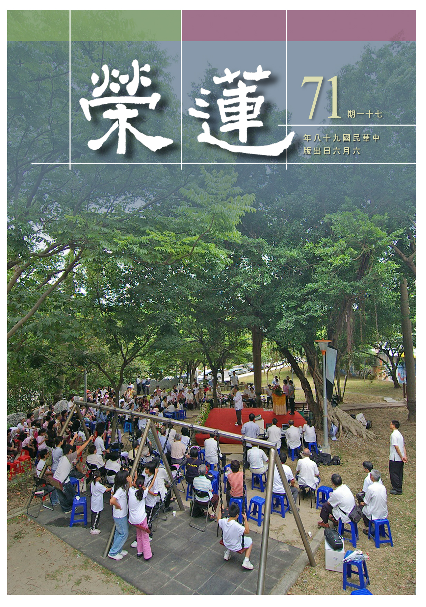

# 第71期

## 社論

### 浴佛節的省思

本刊

一生是一種典範

利益當時垂後世

苦海明燈月清涼

如母如師不相離

每年農曆四月初八，約在母親節之時，佛教界都會盛大舉辦浴佛法會，唱頌浴佛讚以及浴佛功德經，彰顯釋迦佛誕生的殊勝，信徒也以香湯沐浴以表彰對聖者的供養，以消災祈福，但鮮少有人對釋迦佛一生做深入的研究，了知其悲心、智慧及弘法之善巧與熱誠為法忘軀的行相，若能對釋迦佛行傳有所瞭解，必能升起高山仰止之覺受，成為人生之典範，也依此期許自己將來有這樣的成就與弘化。

釋迦牟尼佛，姓喬達摩，名悉達多，悉達多為義成就者，其之所以成為釋迦牟尼，意為釋迦族的聖人，有說釋迦是能仁，牟尼是寂默，以能仁不住涅槃，以寂默不住生死，表徵聖者的悲智雙運。當世間諸多人懷疑是否有釋迦佛這樣的人物時，十九世紀末，考古學家在北印度，挖掘出釋迦族供奉佛陀遺骨的石壺，並且在迦毗羅衛國，還有阿育王所建的石刻，故證明有釋迦。

大體上，釋迦佛與中土春秋時期的孔子是同時期的人物，他的父親期許他能將國家建設為強盛的國家，又害怕阿私陀仙人預言成真，所以讓他在宮殿當中享受榮華富貴，當他在二十歲遊四門，看到人生老病死的真相以及修行人的殊勝後，毅然放下權位來修學，雖尋師訪道仍然無法瞭解人生解脫之道，用苦行也無法解決生死的問題，最後以他對法的證悟而成就了覺悟之道。

當他證悟之時，為了要幫助眾生得到解脫，而有傳教的因緣，以他自己獨特的觀察和分析事物的觀念，不但度化了外道（如舍利弗、目腱連以及三迦葉），也度化了許多他的親人（如阿難、難陀、提婆達多），並擴展到社會的各個種姓、各個階層，上而國王大臣，中而商人仕紳，下而手工業、漁民、妓女盜賊等，傳教的方式是隨機施設不具一格，用偈誦、散文、直述、比喻等各種形式，在不同的場合針對不同的對象，宣說種種法義，並建立僧團，成為傳播教法最有力的增上緣，並嚴格組織規矩戒律，使得社會上普遍階層對佛教充滿好感，尤其接受給孤獨長者與祇陀太子的祇園精舍（又名給孤獨園），又有摩竭陀國頻婆娑羅王所捐贈的竹林精舍，成為僧團的聚集處及佛陀說法最殊勝的環境，也配合實際的需要讓僧團遊方，或親自帶著僧團四處遊行，方便利益各處的有情。

故知，所遇的善知識極為重要，無益的苦行，只有對法的勝解才是對自己最有幫助的，尤其是在禪定當中生起對對法義的勝解，其餘都是不究竟的。也有去利益有情，所證悟的法義讓我們的生命活著才有意義，然而欲依法利益有情，必須要集合眾人，所以也必須要有根據地，否則難以凝聚共識興辦善法。

而四處遊方其實是一種歷練，如孔子帶著弟子周遊列國，碰到許多境界，皆是將書本所學加以致用的學習。僧團內部面臨提婆達多另組僧團，也考驗著佛陀，從中又看到釋迦牟尼佛處逆的心態與作法。釋尊臨入滅前還度化了須跋陀羅，甚至最後還問身邊弟子對法是否還有疑問之處？將所有事情交代得非常清楚，已遺留下了教法與傳承，對世間已無遺憾的入滅。

大乘經典當中有云，在此五濁惡世中成佛極難，是十方諸佛中最殊勝的讚嘆，由釋尊一生的示現中，我們應當自我反省，並珍惜聽聞法義與行善等種種機會，不但努力通達各種義理，並且在這當中善巧運用，自我斷惡修善，也令教法流傳，利益世道人心，是我們責無旁貸的責任。

## 大德法語

### 大方廣圓覺修多羅了義經（三十一）

道源老和尚

法無自相名言生

能證所證不可得

雙亡之照月當頭

無縛無脫無上覺

乙二、正宗分

丙二、令依解修行隨根證入

丁二、廣明行相

戊一、四問答通明觀行上根修證

己一、開示觀門同佛

庚五、正答所問

辛一、長行

壬三、頓同佛境

癸二、見境同

經文：

善男子！此菩薩及末世眾生，修習此心得成就者，於此無修，亦無成就。

此等是觀行成就的菩薩，及末世眾生修圓覺得成就的眾生，亦即修學三種法界觀的心，成就了以後，與佛同等境界。

此時不起分別，與佛的心一樣了，此時既沒有修，也沒有成就，須知是修習三種法界的心成就了，才無修無證。若不講究修此心得成就，就認定無修無證，以為懂得這個道理，所以也不要修也不要成就，結果你仍是個大凡夫，不但障礙自己，還要開導眾生，令眾生受害，須是修覺行成就的境界，才說無修無成就。

經文：

圓覺普照，寂滅無二。

以上謂之照寂不二，乃佛的境界，佛所住的世界謂之常寂光淨土，常寂光就是寂而常照，照而常寂。菩薩修學圓覺時，雖普照卻是寂滅。

經文：

於中百千萬億阿僧祇不可說恒河沙諸佛世界，猶如空華，亂起亂滅，不即不離，無縛無脫。

此時現這樣的境界可玄妙了，先說諸佛世界，每一佛教化的世界就是一個三千大千世界，此時不是一個佛世界，二個佛世界，而是恒河沙的佛世界，不是一個恒河沙，二個恒河沙，而有不可說的大數，不是一個不可說、二個不可說，而是有阿僧祇不可說，阿僧祇叫無量，還不是一個阿僧祇、二個阿僧祇，而是有百千萬億阿僧祇，若這樣算下去之數目太多了，於百千萬億阿僧祇不可說恒河沙的諸佛世界，你以圓覺之心普照，看見了什麼境界呢？

像空華一樣亂起亂滅，此「亂」字就是紛紛的意思，很多很多的生起，很多很多的滅無，由這四個字就證明菩薩的觀行，是親證的，絕不是空談理論推想出來的，你怎麼想也想不到這裡。

前述說「不可說」是大數目，還是有個說（有量的無量），即使是無說的世界(無量的無量)都有佛在教化，都謂之佛世界，然這佛世界分二種，一種清淨世界，一種叫染污世界。清淨世界如西方極樂世界，東方琉璃世界，此之佛世界是清淨世界，本師釋迦佛的世界是娑婆世界則是染污世界，這些清淨世界、染污世界是亂生亂滅。

我們不懂科學，不必拿科學與佛學配合，穿鑿附會一番，但此處還可講一點科學實證的境界，令我們相信經文所說。如天文學測量的虛空以光年為里程的計算單位，一秒鐘走三乘以十的八次方公尺，一分鐘是六十秒，一點鐘有六十分，一天也有二十四點鐘，一年又有三百六十五天，合起來即是光走一年的里數，天文學家看到的虛空，可以由無數光年計算，但還沒看見亂起亂滅的諸佛世界，只證明現在的星球有成住壞空，他(天文學家)在天文望遠鏡上看到太空之中有隕石落下來，像下雨般那麼多，這些隕石落下來了，擦著空氣滾落到地球上，能把地球打個大坑，然而落到我們地球上的隕石是少之又少，在太空中像下雨那麼多，這些都是星球爆炸，天文學家只看見那麼多的隕石，謂之隕石雨，那麼多的星球爆炸，他看不見，只看見一個兩個，那些亂滅都看不見，為什麼？

天文鏡沒那麼大，他的境界還不夠那麼大。那麼亂起呢？更看不見，日本一個天文學家發現一個新生起的星星，只看見了一個，乃亂起，這些亂起亂滅的境界猶如空華，是佛圓覺境界。

看見虛空無邊，世界無數，每一個三千大千世界就是一個佛世界，清淨的佛世界（常寂光淨土）是常住不動的，至於教化眾生的佛土如釋迦牟尼佛所教化的娑婆世界，就是染污國土，緣起所生的世界有成、住、壞、空，遍法界的世界之成謂之起，世界之空謂之滅，看得世界多了，就是亂起亂滅。菩薩觀行成就而不動心，如何不動心呢？乃圓覺普照，寂滅無二，是照而常寂，雖見亂起亂滅無量數的諸佛世界，然皆自相不可得，同歸寂滅。不即不離皆是圓覺的境界，不離是觀待這些亂起亂滅的世界，不即是無有自相可即。

這一切亂起亂滅的世界猶如空華（幻化緣起）都是依虛空（空性）而有的，空華不屬於虛空，但是不離於虛空（自相空與緣起有相互觀待）。無縛無脫如前述：不與法縛，不求法脫。所證得義境（空性）與諸佛所證相同，所以不與法縛，這些亂起亂滅還屬一切法，觀其自相空，則不會被它所繫縛，也不求解脫，既然無縛，還求個什麼解脫？

經文：

始知眾生本來成佛。生死涅槃，猶如昨夢。

始知眾生本來成佛，這句經文很要緊，在三藏經典裡，只有兩部經，一部是華嚴經，一部是圓覺經，說眾生本來成佛的。修行用功原是為求成佛道，至此方知一切眾生本來就成佛，然何以謂之眾生？生死涅槃，猶如昨夢。有經說，菩薩修行如夢渡大河，菩薩為什麼要修行呢？

因為有煩惱有生死，譬如做夢，有惡人欲害他（菩薩），此惡人就譬喻是見思惑，所以要逃命啊，逃到前面一條大河，非得游過去，否則生命不保，一下子跳到河裡拚命的游泳，盡量的掙扎，好不容易游到對岸，上了岸，忽然醒了，怎麼樣呢？原來是做了個夢，根本沒有什麼惡人，根本也沒有掉到河裡去（生死本空），也無有所謂上岸（涅槃亦空）。

菩薩發心修行，了生死證得涅槃，才知是做個修行的夢，本來就沒有掉到河裡，也無所謂爬上河岸！然而這是佛的境界，看大乘經典會上當就在這兒，他以為看懂了，原來煩惱本空，生死本空，涅槃本空，都像做大夢，還要修行幹什麼呢？不是自己跟自己找麻煩嗎？好了！他不要修了，他不知根本未真正通達佛經，試問，你的觀行成就了嗎？你真正夢醒了嗎？你還沒醒怎麼知道那是夢？你不修你還不是個大凡夫嗎？看大乘經典會上當就在這些地方，那是在觀行成就之後，到了成佛，證得圓滿寂滅的大涅槃，此時有什麼生死，有什麼涅槃？他才可以說這個話。

可是這句眾生本來成佛，是令眾生懷疑的事情。若你的境界與佛一樣，才知道一切眾生本來成佛。

癸三、稱實同

經文：

善男子！如昨夢故，當知生死，及與涅槃，無起無滅，無去無來。

到此方知生死涅槃如同做夢，若醒了以後，試問夢的境界有哪個是實在？所以涅槃沒有起處，生死也沒有滅處，涅槃根本沒有生起，也沒有什麼生死可滅。按時間上說，涅槃來了，生死去了，實則根本沒有來、沒有去，試問做夢時的來、去、時間，哪有真的！

經文：

其所證者，無得無失，無取無捨。

所證的是圓覺之理，圓覺之理本來現成，如前云：眾生本來成佛。他根本沒有失掉，昔日有所失則今天有所得，若從來沒有失，怎麼好說個得呢？這個得、失是個對待的名詞。所以起信論將圓覺妙性謂之本覺，從沒有失掉，既然沒失又如何說得呢？所以在圓覺之理上，你所證得的圓覺之理是無得無失。

在最初發心，云：我要取得佛法，要捨凡夫法，我要好好修行用功，取得成就，捨去一切煩惱。此時才知道無取無捨，有取有捨還是差別相，既是平等境界現前，已沒有差別，則無所取無所捨。為什麼呢？生死涅槃猶如昨天做了個夢，你取得涅槃，捨去生死都是做夢的境界，有什麼好取？有什麼好捨呢？至此能以證得圓覺之理了。

經文：

其能證者，無作無止，無任無滅。於此證中，無能無所，畢竟無證，亦無證者。一切法性，平等不壞。

這能證的智慧（能證的觀行），作就是修行用功，起了始覺智，止是止住一切煩惱，此時方知修行本空（無作），煩惱亦本空（無止）。任是任運自然，可以斷除煩惱證得涅槃，然此時是根本也無任也無滅。這作、止、任、滅是修大乘菩薩行的四種行持與效果，此時作、止、任、滅亦本空。

於此證中，包括能證所證，是能證的觀行與所證的理體，其實是無能無所，也沒有能證的觀行，也沒有所證的理體。

畢竟無證，亦無證者，是畢竟無所證（境），亦無能證（心）與能證者（修學能證所證的菩薩也是本空）。

一切法性，平等不壞，法性本來平等不壞，不是你證得了平等不壞。

### 佛說八大人覺經講錄（十三）

道源老和尚

年高八八猶說法

諄諄誨後待傳人

忠實古注重實修

開啟臺灣法運流

甲二、詳八大法相以成宗

乙二、總結三覺以成行證

經文：

如此八事乃是諸佛菩薩大人之所覺悟，精進行道，慈悲修慧，乘法身船，至涅槃岸，復還生死，度脫眾生，以前八事，開導一切，令諸眾生，覺生死苦，捨離五欲，修心聖道。

由第一覺到第八覺所覺悟的八種事，乃是諸佛菩薩大人之所覺悟，這就解釋經題了，經題叫八大人覺。﹁八﹂就是如此八事，﹁大人﹂就是諸佛菩薩，大乘聖人。如經文所說的八種覺悟事，乃是諸佛菩薩大乘聖人所覺悟。

「精進行道，慈悲修慧」，雖了解八大人覺，事實上還是個凡夫，你要依理（解）起行，依所解的理去修行，所以是精進行道不可以懈怠。常行精進要怎麼樣呢？要觀眾生苦發慈悲心，要修智慧真正幫助眾生，謂之慈悲修慧。

「乘法身船，至涅槃岸」，生死無量等於一個大海，要度過生死大海需要船，要乘什麼船？要乘法身船，方能度過生死大海。佛有三身：法身、報身、化身，「法身」是無形無相，乃佛所證得的理，乘法身船是依所悟之理度過二種生死大海。

法身由五分法集合而成，那五分法呢？戒、定、慧、解脫、解脫知見，持戒修定再修智慧，證得智慧以後就解脫，解脫一切煩惱，解脫一切煩惱以後，再生出一種知見，謂之解脫知見，亦即是佛知佛見。有此五分法（五種法）組合起來，成就了佛的法身。

證得法身就是究竟覺，即是人人本具的本覺，在起信論上名真如，真如在藏（藏於煩惱中）名如來藏，出藏名如來法身。眾生的本覺名真如，真如在眾生份上謂之如來藏，是如來含藏起來，不得正覺而在藏，藏在無明煩惱中，真如出藏（破了無明煩惱）則謂之法身。

至涅槃岸也是個形容詞，本來沒有個海，因為生死無量等於是海，本來沒有一個船，用五分法修持證得法身，等於乘了一艘船，乘著這個五分法身船，度過生死大海，證得涅槃果，如同登了岸。涅槃為梵語翻成中文乃圓寂義，圓寂就是圓滿寂滅，證得涅槃有寂靜之樂。或曰德無不備為圓，障無不盡曰寂，亦即一切功德無不完備曰圓，障無不盡是煩惱障、所知障都去除曰寂，此涅槃義就是成佛義。
「復還生死，度脫眾生，以前八事，開導一切，令諸眾生，覺生死苦，捨離五欲，修心聖道。」有人
**問：** 學佛要成佛，成了佛做什麼呢？成佛是為了要度眾生，眾生在那裡？眾生在生死苦海裡。所以到了涅槃彼岸（自己已成了佛），還要再回來生死苦海中，謂之復還生死，雖是到了涅槃的彼岸還是要回來生死的此岸度脫一切眾生，謂之乘願再來。

懂得慈悲度眾的道理，就在這裡度就好了，何必還要修行成佛以後還再回來度化眾生呢？成佛就是你度眾生的本事具足了，把度眾生的本事學成功，你才回來度眾生，自己還是凡夫一個，生死未了脫，怎麼度眾生呢？成了佛叫兩足尊，福足、慧足。若智慧不具足，不能度一切眾生，福報不具足亦不能度一切眾生，所以福慧都具足了，才有能力回到生死此岸度化眾生。

那麼度眾生，用什麼方法度呢？就用八大人覺經中八事（八種大人覺悟之事）開導一切，所以此八大人覺經亦是釋迦牟尼佛成佛以後說的法，未來我們成佛以後再回來到此岸，也要以這八種事來開導一切眾生。

講八大人覺經給眾生聽，是令諸眾生覺生死苦。眾生不了解生死大苦，依此經講明白生死大苦，令諸眾生都覺悟，悟此生死是個大苦，如何離苦得樂？捨離五欲修心聖道，若不貪圖五欲修習聖道，就不會流轉生死，捨離五欲才能修習聖道（佛道）。

甲三、結八門利益以廣通

經文：

若佛弟子誦此八事，於念念中滅無量罪。進趣菩提，速登正覺。永斷生死，常住快樂。

「若佛弟子誦此八事，於念念中滅無量罪。」此句呼應到前面的發起序，你是佛的弟子要修行用功，得把八大人覺經讀熟，且經常背誦此八事，前面序文是，常於晝夜誦念八大人覺，依誦念而修行用功能於念念中滅無量罪。

「進趣菩提，速登正覺。」念念中滅無量罪，智慧就啟發起來，即是進趣菩提（智慧），就能速登正覺之果（成就佛道）。速登正覺的速字，與前文漸離生死的漸比較，漸是慢慢地，漸次地，對漸根而言，若是用功修行進趣菩提，這漸根就變成頓超的根機，很快就成佛。

「永斷生死，常住快樂。」速登正覺是很快成了佛，成了佛是無量生死永遠斷除，謂之永斷生死，常住在成了佛的兩種快樂（菩提覺法樂、涅槃寂靜樂），此兩種樂是一得永得，永遠不會失掉，行者當住於成佛的菩提樂、涅槃樂。

大乘弟子修行用功，是以利益眾生為先，為了利益眾生而充實自己，結果自己的生死先了脫了，這就是大乘用功的權巧方便。小乘弟子只怕生死不了，只要了脫自己生死，結果是不度眾生。大乘弟子是天天弘法，天天利生，結果自己先成了佛，這就是以利他為自利。

### 常禮舉要講座（十二）　出門篇

雪廬老人

做人成就學問大

典籍學習生活現

人情通達是學問

事事洞明即文章

出 門

講常禮舉要與講經不一樣，講常禮舉要一段是一段不必有交代話。

◎一、衣冠不求華美，惟須整潔。

出門離開家裏，只要是出門，此事須慎重（不可隨便），刷牙、洗臉等等固然是衛生，若衣服就有兩種作用，不光是衛生，主義是恭敬人。譬如在家裏，天氣熱了敞開懷，在屋裏這樣子不可以嗎？要是來了客，你還拿著扇子扇涼且敞開懷，讓人感覺是眼中無人，對人不起。一出門如何呢？

論語有：出門如見大賓。講了必得口中誦，然口中誦是記問之學，能以記得住，能以說了，這個還不中用，可是現在連個記問之學也沒有了，道聽塗說而已！如此說來記問之學沒用處？若能將記問之學舉一反三，以此類推，所謂溫故而知新，溫習舊的，來了新的就明白了，還沒講就知道，那就算有所得了。

衣冠不求華美，衣服不在好壞，就是破了也不要緊，你要是聽了這些有了心得，再看歷史一定不一樣。要是沒心得，你看歷史就是廿四史看完也沒用處，你不知道它的用意在那裏。就用這句衣冠不求華美，古人說脫襟露肘，襟怕露了趕緊拉衣服，襟一整齊了肘卻露出來了，這又不好看，蓋了這、露出那個，可見得衣裳很破爛。

從前黔婁死了，家裏窮，拿個被子給他蓋上，蓋上了頭露了腳，蓋了腳露著頭，怎麼著也不行。有朋友出主意：斜著一蓋不就成了嗎？太太在旁邊大不高興：唉呀！那可不行，這或什麼樣？先生一生正直無私，怎麼死了還要叫他斜著呢！你聽聽這一句便可以了。衣服不在好壞，破爛也不要緊，破了打補釘嘛！以前窮唸書的，衣裳破爛了這個補、那個又補，這是一想就懂得的情形，衣裳不是求華麗而是求整潔。

整是必須要用扣子把衣服繫起來，譬如夏天穿香港衫，人家都敞著，我是必得扣起來，你叫我敞著我不會。或云：你太落伍了！我跟大家說過，我跟他們不一樣，我根本就沒落伍，他那不落伍是什麼樣子？我也不落伍，我跟你說吧。

他以為現在興這個，現在不興的我就走。那一條事情對社會上有利益我就幹，那一條對社會上有害我就不幹，我不管它現在興不興！現在是殺警察、搶銀行、要紅包，這個我絕對不幹。那麼、見洋人叫洋爸爸，我怎麼也不幹，活著我是一個中國人，死了我也是一個中國鬼，下生在這個地處嘛！你查中國歷史凡是念書的都有點骨子，即使畜生還這樣子的，大家知道狐狸死在遠處，跑不回來自己的窩，怎麼呢？東西南北牠記得，牠就在那個地處頭朝著來處，死得才瞑目。不衝著牠的窩，死也不瞑目（狐死首丘），畜生尚且如此啊！我講的都是實話、你去悟吧！

潔是衣服穿在身上，身上有了汗臭氣、很骯髒的，往衣服上一染，衣上染了這些就要洗洗，總之要整潔就算盡意了。你一整潔，不論是對待俗人或是有學問的人，要是對待有學問的人，你是雅人對雅人，是志同道合那很好，不要叫人家說你閒話。即使對待俗人也沒關係，俗人、壞人說你壞話，不要覺得是侮辱。雖然穿得破爛，賣的是土豆（花生），一天只賣十塊錢，吃飯呢？吃了九塊，甚至於吃十塊，雖然沒有餘錢但還是豐富，豐富什麼？道德豐富，天爵豐富！他就算日子過得好一天偷一千萬，那是賊寇，誰比誰高？

講書的有時間就多談幾句，你看那唱戲的穿了破爛衣裳，叫做什麼名目？是都有名字的，連小丑背裳都有名字，絕對沒有這個當那個（混淆不清）。說這幹什麼？這學問大了，現在是改聖人的書、改佛經，然唱戲的，唱這麼多年就是不敢改。我跟你說、這件破衣服叫富貴衣，要是這一個戲班子不辦了，要賣給別人，有這件富貴衣他才買你的戲班，沒有這件富貴衣他不要。你看看這件破衣裳，再想想中國的教育。若必得處處西洋化，乃自掘墳墓。若根本不要了，想要中國再延續下去？必得落實中國文化。

◎二、見長者，必趨致敬。

若到了街上，他（長者）在前頭咱們不必向前頭去，也不必多問，頂多在後頭跟著。他在後頭我們沒看見也沒關係，就怕我們往那邊去他往這邊來，面對面碰上了。不過這得多少變通，譬如在鄉村中馬路等等，這些地處這一條可以使用，編這些禮儀時沒汽車那些東西，現在在偏僻街上也可如此，正走著看見長者，可以穿過路致意，謂之趨敬。

跑到長者那邊去，迎著他、說句話、行行禮，此是敬，或可在路旁站著談話。但是在城內就是不行，車輛來來回回，你必得穿過路去致敬，碰上了車，他（長者）不安心，你也不安心啊！學什麼要有實有權，沒要你呆呆板板地學書呆子啊！學書呆子有什麼用處？

◎三、登高不呼，不指，不招呼。

上了高處去，不論上什麼高處，現在都是蓋著樓，你上樓就是高處。他在地面走著，你在高處喊著：喂、喂。下頭那些走路的，到底招呼誰？大家都站住，疑惑住大家。況且在高處和低處兩邊說話，誰也聽不清楚，此須迴避（這件事不可做）。

登高不呼，在高處這一招呼大家都疑惑了，都停了腳、叫誰呀？都弄不明白，此是有聲之呼。至於無聲之呼，在高處看看，那邊是什麼山，這是什麼水，下面是什麼人，用手指著，此亦疑惑人。總之不招呼，看在你的眼裏就好！

◎四、路上不吸煙，不嚼食物，不歌唱。

這是指年輕的弟子，有年紀的老先生則例外。從前老人家大多帶著旱煙袋，這幾年不興了，演變成了紙煙，且是年輕人抽煙（時代變了）。從前吸煙是逍遙自在，不見得需要，反而是一種消遣。吃飯是需要，尚且還得逍遙。逍遙自在那太自然了。念過書的人都知，四海之內皆兄弟也，都得恭敬，甚至禮記禮運篇：老吾老以及人之老，幼吾幼以及人之幼。

在城市街上年長的，你見過他們有這樣子嗎（路上吸煙）？可是在鄉間老人不一樣，在路上走著，路又寬人又少，不容易碰到熟人，在路上吃吃煙是可以的，即使在路上碰到一般人也可有點頭之交。這是從前的話，現在談不到了，現在住公寓等等，鄰居姓張姓王一概不知，不是這樣子嗎？住了多少年啦，鄰居姓什麼不知道，誰跟誰都沒關係，什麼里仁擇鄰，已不興這一套了。

路上不嚼食物，為什麼呢？路上有灰塵，吃到嘴裏會傳染。總而言之，最好閉著嘴走路。你看，咱們鼻孔有毛，長著毛幹什麼？天然地就是一種保護性。你若閉著嘴，灰塵就往鼻子裏去，鼻毛能將灰塵遮閉住。其次額頭上長眉毛，或云：有那個眉毛幹什麼？又不能聽又不能看，出了汗還得靠它（眉毛）擋住，汗到不了眼睛去。

其次在路上不唱歌也是為了衛生的原故！

◎五、乘車見長者必下，見幼者亦須與之頷首為禮。

乘車見長者必下，這條要活用，並不是人人都有車坐，你沒念過古文（馮諼傳）長鋏歸來兮、出無車。齊孟嘗君的食客（馮諼）出去還沒車啊！普通人那會有車？那麼你坐著車在街上，見到長者、熟人，將車停住，下來大家走。可是這個話可要聽明白，在城市裏不行，可別學這一套，你坐著汽車，看到長者喊汽車（公共汽車）停下來，你下車行禮、那就成了書呆子。你說：我是有本之學。唉呀！差了！你在城市馬路上不論坐什麼車、都不可下車與之行禮，這個你得變通。

見幼者亦須與之頷首為禮，比你年輕的晚輩你可以不下車，但亦要表示恭敬，不恭敬不行，但打個招呼即可。

## 共修研學

### 小止觀導覽（四十四）

*心爾整理*

止觀各有浮沉障

提振對治修方益

隨便宜修止或觀

法喜充滿道勝進

第六章 正修行

始修學止觀者，心思混亂，須先將心綁在一境上（繫緣守境止與制心止），尤其以空性為所緣的安住（體真止），其次對空性義理加以觀察（觀人我與法我自相不可得），方能得到出世間的成就。

修止有浮與沉的障礙，修觀亦然，止和觀的逆品都是浮與沉，必須要破除。

論文：

二、對治心沉浮病修止觀：行者於坐禪時。其心闇塞，無記瞪瞢，或時多睡，爾時應當修觀照了。若於坐中其心浮動，輕躁不安，爾時應當修止止之。是則略說對治心沉浮病修止觀相。但須善識藥病相對用之，一一不得於對治有乖僻之失。

修觀時心往下沉，是觀修（辯證）勢力不足，心往下掉，修觀勢力減弱，此乃細沉之相，至若昏沉相，心已離開所觀境界，心思昏暗。浮相心思飄動，安住不了所觀的境界，此時應該修學對治方便，降伏沉浮。

修學止時心力亦須很強，有安住分也有明顯力，境界很清楚的顯現於行者心識前，倘若此時境界已經無法明記，謂之闇塞，無法記別善或是不善，此之昏沉的行相就是內心沒有記別的能力，若是沉沒相仍然可以記別善惡，故屬於欲界善，但是內心昏沉則無法記別善惡，此處稱為無記，是有覆無記，對於善法毫無專住的力量，障蔽了對善法的安住。

瞪就是張大了眼睛向前看，瞢就是矇瞢（隱暗），此時再怎麼提振都無法令內心提振而陷入昏暗。

觀力不足有兩種：一是觀力轉弱，一是觀力浮動，觀力浮動是無法安住境界，所以無法在境上作觀察，此時要立刻察覺，並予以對治，須重來修止，重新訓練專注力，將心安住在境界後，再作觀察。如同提油燈看壁畫，若風吹油燈搖晃不停，則看不清牆上的畫，此時要在油燈上加上燈罩（燈罩就是定、專注力）。

觀之逆品浮與沉的對治方法不一樣，須請教知道病相和藥理的善知識，不能下錯藥（乖僻之失），當止未能安住境界時，不可修觀，須將止調到相當的程度，依止修觀才能成就觀力。

沒有使命感，做事情提不起勁，對未來沒有堅固的志向，心思容易懈怠，心思懈怠易於睡眠，坐上修易昏沉，此時觀想佛的功德、淨土的殊勝，破除內心的昏暗，將心振奮起來，若是浮動而無法修觀，並且觀修死無常令心安住於境，總之要訓練自己之警覺力，將粗沉粗掉與細沉細掉察覺，讓心不再躁動不安，並破除暗相，如此才能進入禪定而生起修觀的能力。

對治初心粗亂修止觀，必須要以制心止為主，以繫緣守境止為對治法，以空性為正修，並且在止上修觀時，還要有空性觀與對治觀來輔助，這個人才會在止觀上有所成就，而且止的障礙若沒有對治，會產生觀力轉弱與浮動等狀況，修止沒有修好，在修觀時就會出現問題，對法義無法產生現證。

每一禪從近分到正分都必須要修七種作意，這就是觀，近分的修法是遠離，正分的修法是面對境界去觀察，觀下界的過患以及上界的功德，進入初禪、二禪、三禪、四禪。禪定天最高的境界是四禪，彼將初禪、二禪、三禪認為是過患，然內道的修學是一併觀察三界苦樂皆過患（包括四空天），所有過患的源頭就是執著，唯有了知所執的境界是不實在的，只是名言的顯現，自性上無法成立，執著的心自相亦不可得，行者即從初禪未到地定中解脫。

三、隨便宜修止觀。行者於坐禪時，雖為對治心沉，故修於觀照，而心不明淨，亦無法利，爾時當試修止止之。

若心對空性義境有專注力以及觀察力，並且破除止觀沉浮逆品之後，即可隨我們的方便修學或止或觀，能生法喜。

若於止時，即覺身心安靜，當知宜止，即應用止安心。若於坐禪時，雖為對治心浮動故修止，而心不住，亦無法利，當試修觀。若於觀中，即覺心神明淨，寂然安隱，當知宜觀，即當用觀安心。是則略說隨便宜修止觀相。但須善約便宜修之，則心神安隱，煩惱患息，證諸法門也。

此處分為三段，一、宜用止安心，二、當用觀安心，三、結論、隨便宜修止觀。此人若能隨便宜修止觀，代表心神安穩，煩惱止息，證諸法門。此乃隨便宜修止觀的利益。其次如何修學隨便宜修止觀，內心隱微處是對治煩惱，內心既安定又隱密，隱密到他人無從了知，猶如初地菩薩不知二地境界，二地不知三地……，等覺不知佛果境界。

隨便宜修止觀有兩種修法，一種是宜用止安心，一種是宜用觀安心。在觀力不足的時候，用止來安心，由於對境界沒有專注力所以無法觀察，此時須對境界串習專注力，用止來安心，產生法喜。

試問對境界尚且沒有專注力，還觀什麼呢？只會更散亂、更掉舉，心浮動是因為止不住，要用止來安住。心神明淨就可加強觀力，經由不斷的辯證也不會有糊塗、浮動、沉沒，寂然安隱的內心，非常的舒服，隱密到他人無從得知。

凡夫無法想見佛菩薩的靈活度，靈活到讓人難以想像，不但穩重如泰山，內心也靈動到我們難以了知，止與觀的安穩凡夫未見，所以下不知上，如同子貢不知曾子，曾子不知顏回，顏回不知孔子，謂之：仰之彌高，鑽之彌堅，瞻之在前，忽焉在後。此人的修學內心深到不可測，表現又像吃飯穿衣那樣平常。

止與觀是併用的，心會浮動是觀力浮動，應當要修止，否則繼續修觀也不會得到法味，須以正知力除去修止的障礙，止修成之後再修觀，修觀時如果心有浮沉相就必須再修止，安住之後再往上修觀。止的成就是安住相，觀的成就是心智敏銳相。此處的隨便宜修止觀，是隨心所欲的修止也可以，修觀也可以，修止是為了有觀力，修觀的障礙在止上已經破除，內心很清楚的知道目前應當修止或修觀，止觀自如。

### 佛說八大人覺經（十九）

*編輯部整理*

發心代苦令大樂

須是大悲求成佛

不為自己求安樂

但令眾生得離苦

第八覺知

經文：「

生死熾然，苦惱無量，發大乘心，普濟一切，願代眾生，受無量苦，令諸眾生，畢竟大樂。」

第八覺知是六度中的忍辱度，乃悲重。說明菩薩度眾最真實也最徹底的行相，不但伴隨著有情一生一世，世世生生亦不離有情，一再懇切叮嚀有情勿重蹈以往，陷己於萬劫不復。《勸發菩提心文》中：世世生生，隨逐於我，心無暫捨。吾人欲於五濁惡世中長劫度化眾生，須如菩薩以悲心攝持著忍力，方能不退轉於阿耨菩提。眾生煩惱重、業重，行相是剛強難化，唯有忍辱不退悲心，方能長劫不退初心。

菩薩的初心是念皆為生死苦惱的眾生，依雪公表解眾生的行相是依著無始以來隱微猛利又相續的自私想法，主導了一切的言語行為，起惑造業而不斷的生死輪迴，在六道當中或升或沉，或生天享樂、或為人苦樂相雜，或墮畜生、餓鬼、地獄，好不容易起了善念，做了些善事，但是總壓不住無止盡蔓延的煩惱，很辛苦累積的福報很快又被猛利的煩惱摧壞。

須達多長者在為佛建造精舍時，佛看到地上有許多螞蟻，就對須達多說，這些蟲蟻自毗婆尸佛以來，直到現在已經經過七佛（即毗婆尸佛、尸棄佛、毗舍浮佛、拘留孫佛、拘那含牟尼佛、迦葉佛和釋迦牟尼佛）出世，至今他們還是蟻身！即便是第八尊的彌勒佛出世，也無法得知是否能夠脫離蟻身。我人由塵點劫（無始劫）來亦放任煩惱任意相續而未能出離輪迴。

無量無邊的苦惱在領受依報（依存的環境）與正報（身心）當中顯現，總說為三苦，所感的苦果與所起的惑業相稱，相分五種：異熟果（前世造作後世成熟），增上果（如前世慳吝，今世生於土地貧瘠之處），士用果（以何種方式得到福報，例如以公務員身分得過去布施之果報）；等流果（領受等流是由過去所造善惡領受現前苦樂報，例如富貴是由前之布施善業而來，造作等流是相續過去的善惡心態，如今生布施心量廣大乃相續過去布施的習氣）。

菩薩發大乘心，救度眾生不捨一人，須發四弘誓願，並以行山填願海。何以菩薩甘願為眾生如此無怨無悔的付出？為何一路吃虧到底？眾生不但難度，陪伴他成長的路程是看不到邊的長久，就算引發了眾生一點的善心，彼卻厭倦於佛法的修學，進少退多乃至恩將仇報，令菩薩情何以堪。然菩薩知道眾生是過去的父母，是未來諸佛，站在知恩報恩（過去眷屬、未來佛）的立場下，發願度其成佛的初發心安住不移。

不捨一人的菩薩行持，面對的是時間三際、空間十方的眾生（業障重）與聲聞緣覺眾（無大乘心之緣淺眾生），眾生難度不生厭倦，一再地護持也不生疲憊，就算不斷的重複教導，不斷的開演淺法也不煩躁，這是菩薩悲心無盡的安住相。

欲行菩薩道，首重親近善知識聽聞經教，確立正知見，不再令自己成為佛菩薩難以教化的對象，悲心也藉由在法上數數的串習而加深加廣，並且以興辦善法（特別是弘傳正法）為人生最大的樂趣所在。

佛法教義的根本，就是拔苦與樂，拔苦的方便可以從三種布施與身心代受來瞭解。首明三種布施（財施、法施與無畏施），其中又以釋尊本生故事中雪山童子為一四句偈（諸行無常，是生滅法，生滅滅已，寂滅為樂），為法忘軀之典故，來強調三種布施當中，當以法布施為重，唯有正知見的獲得方能令自他離苦得樂。心身代受則以賢愚經中，釋尊往昔墮入火車地獄，須抽身上筋終以作繩索拉車，釋尊見到他人抽筋之苦，發大慈悲心欲代其苦，此一猛烈善心，忘卻自己亦同樣受著極大的痛苦。此一猛烈悲心，令釋尊脫離地獄，入於人道得以聞法繼續修學。

發廣大心欲救拔眾生者，或作觀將自他的角色轉換，觀修他的苦在我身上成熟，或以身作則帶著眾生突破逆境，或示現苦身而說法（如孔子餓於陳蔡），或依願力常處惡趣度化苦難眾生，或不論在任何境界下，都將他的業力與我的願力綁在一起，去體會他那喪盡天良所生的苦，因為眾生妄見有真實的你我，所以認為你的苦和我的苦沒有任何關係，而菩薩行者，因有空性的智慧，了知大家皆是相互依靠與影響的，所以將眾生的痛苦視為自身的痛苦，將己身的快樂建立在眾生的快樂上，唯有幫助眾生拔除痛苦是菩薩心中最重要也最快樂的事。

是故，釋尊放棄王位而出家，成道後四十九年的說法，久遠成佛以來八千次的降生，都是為了令眾生得到畢竟大樂，與眾生共同圓滿一切種智，通達諸法總別之相。

## 蓮池海會

### 周戴金柳老居士往生見聞記

*編輯部整理*

含辛茹苦享餘年

子孫滿堂大家庭

孝心更用於助念

祥雲駢臻蓮品增

老居士生於民國八年四月廿二日，乃台南縣北勢洲人，兄弟姊妹四人，年輕即嫁入台北古亭區周家，因兒女成群生活困苦，故而小孩出生時，皆是自己準備竹片，由丈夫親自接生。為了貼補家用習得一手裁縫手藝，賺取微薄薪資貼補家用，並常將剩餘布料，接補而成為兒女新衣褲。

老居士身處日據時代，早年曾讀過幾年日文，小時候便與姊姊學著一同照顧弟妹，與兄弟姊妹之間感情融洽，相處多用日文交談，故姊妹雖年歲已高，仍專程由美國返台參加告別式。老居士雖非博學多聞，但卻集聚傳統美德於一身，總是害怕自己學識不高，接觸的人少，雖畏做錯或教錯子女，然卻以正確觀念維持母親的堅忍與慈祥，隨和的為兒女著想，以卑微的心態，卻擁有堅強的韌性，是家中的支柱，生活雖然困苦，但是家中卻沒有人餓著、凍著。

老居士五十一歲喪偶，在兒女漸漸成家之後，細心地在家幫忙照顧孫子，讓兒女無後顧之憂，每日清晨與鄰近好友做些適當的健身運動，也隨著兒女們四處野地露營，遊山玩水，或出國旅遊，並以六十八歲的高齡，努力向學，於河堤國小進修畢業。

老居士敬天畏神，有空時會從古亭家中走路至行天宮拜拜，自從十多年前兒子周存良往生後，接觸了西方淨土的殊勝，媳婦也從此於團體中發心為公，護持佛法。在老居士八十五歲高齡發現罹患膀胱癌後，兒孫們深思熟慮與醫生詳談之後，不做積極治療，唯做初步治療，並未開刀與化療，經由善知識引導並教以念佛方法後，老居士便開始專心念佛，近年來每週都有十萬聲以上的佛號，在團體共修回向時，蓮友們皆隨喜讚歎。

老居士溫柔隨和，晚年兒孫滿堂，苦盡甘來，一生雖平凡但卻見其維繫家庭和諧之偉大。於臨終時，子孫聚集，並感得諸多蓮友之護持，助念時氣勢磅礡，震攝人心，在助念九小時後，全身柔軟，面帶微笑，見者無不動容，兒女們內心欣慰感動之情，無可言喻。家屬謹遵佛制於七七日內為老居士茹素、誦經、做七，並至淨苑齋僧，隨緣放生，更依照其老居士遺願，發願護持如法團體。唯願老居士於極樂淨土中能蓮品高增，速能成就佛果，回入娑婆，廣度群蒙。

## 啟蒙園地

### 歷史故事　仁孝英明的康熙

淨域

外族入主蒙愛戴

廟號聖祖彰仁政

儉約勤政孝為先

百年盛世今樂道

清聖祖康熙—愛新覺羅玄燁，為清朝第四位皇帝，生於一六五四年五月四日，卒於一七二二年十二月二十日，享壽六十九歲，自八歲即帝位以來，在位六十一年，是中國歷朝在位時間最長的皇帝，也是公認的明君之一。

康熙六年（一六六七）正式登基，在祖母太皇太后孝莊文皇后的幫助下，於康熙九年從顧命大臣鰲拜手中奪回權力，開始真正的親政。一六七三年，平西王吳三桂起兵叛亂，其他二藩相繼響應，三藩之亂最終在一六八一年被完全撲滅。隨後康熙採納了大學士李光地的意見，授施琅為福建水師提督，於一六八三年出兵收復臺灣。

另自一六九零至九七年間，多次擊敗準噶爾和噶爾丹部，統一蒙古大草原，史稱三征噶爾丹。對於沙俄的侵犯，在雅克薩戰役中，康熙派遣黑龍江將軍薩布素出征，收復了雅克薩城和尼布楚城，並簽定尼布楚條約。此後在熱河營建避暑山莊，作為蒙古、西藏、哈薩克等部王公貴族覲見的場所。

親政後，康熙便宣布停止圈地，及放寬墾荒地的免稅年限，並著手整頓吏治，恢復了京察、大計等考核制度。為了防止被臣下蒙蔽欺騙，更親自出京巡視了解民情吏治，其中最著名的是六次南巡、三次東巡及一次西巡。此外，康熙重視對漢族知識分子的優遇，崇尚儒學，多次舉辦博學鴻儒科，創建南書房制度，並親臨曲阜拜謁孔廟，令編《康熙字典》、《古今圖書集成》、《曆象考成》、《數理精蘊》、《康熙永年曆法》及《康熙皇輿全覽圖》等圖書。這些文治武功成就了康熙的英君形象，然他對自己如何評價呢？子孫又如何看待他？外人的評述又怎樣？

康熙四七年他大病一場，回顧以往帝王之忌諱死亡，他不諱言死特擬一份遺詔，此後十餘年間，隨筆記述精心收藏。五十六年他再次臥病，召集諸皇子和滿漢大臣於乾清宮東暖閣，將遺詔內容口述給大家知道，最後說：「此諭已備十年，若有遺詔，無非此言，批肝露膽，罄盡五內，朕不再言。」其遺詔究竟說些什麼？

就其遺詔（現今四版）觀之，他對自己一生作了全面的總結與評述，主要是：「自幼齡讀書，即知酒色之可戒，小人之宜防；時刻注意節儉，平生未嘗妄殺一人；從不尚虛文，惟求實政、惠政，施恩於民；力戒驕奢，酌量撙節，不敢浪費小民膏脂；孜孜汲汲，小心敬慎，精勤於政務，夙夜不遑，未嘗少懈，數十年如一日，殫心竭力；統兵親征，臨御調遣，一心運籌，統一全國；享年高而在位久，鞠躬盡瘁，死而後已。」康熙憂勤一生，曾說：「臣下年老可以退休，為君者勤勞一生，了無休息。」往好處想，是他以天下計、視民如子；往壞處看，或是他捨不下權位，放不了心。

康熙傳位於四子胤禎，對於父親的功勳，雍正在《聖祖仁皇帝實錄˙序》中說：「備道德之崇廣，集皇王之大成，經綸宇宙，彪炳帝紀，巍巍乎，蕩蕩乎。自羲軒至今，未有如我皇考聖祖仁皇帝之盛者也！」雍正帝發自內心地敬佩父親的人品與政績，並稱頌他是聖人。清末大臣曾國藩亦稱其是「自古英哲非常之君」，凡雍乾以後英賢輩出，皆若沐聖祖之效。從兒子與大臣的口頌裡，也許含有太多的私情與官樣，外人的評述或可見得一些中肯。

康熙朝時，有傳教士白晉與張誠供職於宮中，平日為康熙講授天文、曆法、藥學與化學。白晉曾寫《康熙皇帝》一書，文中評述說：「他是我做夢也未曾見過的偉大人物，有高尚的人格、非凡的智慧，更具有與帝王相稱的坦蕩胸懷；他治民修身同樣嚴謹，受到本國人民與鄰國的崇敬；從其宏偉的業績看來，他不僅威名顯赫，而且是位實力雄厚、德高望重的帝王……。簡言之，這位皇帝具有作為英明君主的雄才大略，也可以說是自古以來，統治天下帝王中最為聖明的君主。」

這一連串的讚譽，康熙真可謂是英君，但就一位聖明的帝王而言，其最令人稱道與讚賞的是特具「仁孝」之心，也因為如此才能愛民如子。

康熙的仁慈，主要表現在政務與對待百姓上；其孝行，則表現在太皇太后及皇太后身上。康熙說：「仁者，無不愛。凡愛人愛物，皆愛也。故其所愛甚深，所及甚廣。在上則人咸載焉，在下則人咸親焉。」又說：「朕自幼登極，生性最忌殺戮。歷年以來，惟欲人善而又善，即位至今，公卿大臣保全者，不計其數。即如幼年間於田獵之時，但以多戮禽獸為能。今漸漸年老，園中所圈乏力之獸，尚不忍射殺。觀此，則聖人所言，我欲仁斯仁至矣之語，誠至言也！」

康熙二十四年巡幸在外，聽聞太皇太后身體違和，康熙連夜速趕回京，於榻前親侍湯藥。病癒後，奉太皇太后遊幸白塔寺；天將大雨，近侍啟奏回駕；康熙說：「凡人之行，莫先於孝。百姓以孝為大，其他又何足觀也！」堅持陪伴太皇太后冒雨遊幸，盡興而歸。康熙每到皇太后寢宮問安，總覺得宮室太小太舊，便吩咐侍臣修建寧壽新宮，於二十八年十二月四日親祭太廟，並領文武大臣在新宮接駕，對於皇帝如此地禮儀周到，真是皇太后所始料不及的。

太皇太后對康熙照顧無微不至，康熙對祖母則是朝夕事奉，三十年如一日。從康熙十一年至二十年，先後事奉太皇太后前往溫泉區休養遊賞；每次都親接祖母上輦護輦，直出神武門才上馬隨行。途中飲食起居都事必躬親，一一安排妥當後才去用膳；遇崎嶇不平山路，總步行護輦，祖母心疼要他乘馬前行，他總回答說：「道路太險，非得扶輦整轡，心裡才安心。」對此，起居注官曾稱頌道：「天性純孝，古帝王未之有也！」

康熙廿二年，七十二歲的孝莊太后心血管病症加重。廿四年六月，康熙至關外避暑，八月二十八日深夜孝莊太后突然中風，經御醫搶救始將病情穩住，當日康熙正在返京的途中，回京後康熙每日親侍湯藥，至深夜才安歇。當年太皇太后的生日，康熙特別上書〈太皇太后萬壽表〉，並鑄造一座銅鍍鎏金四臂觀音像，銘刻「大清昭聖慈壽恭簡安懿章慶敦惠溫莊康和仁宣弘靖太皇太后，虔奉三寶，福庇萬靈。」孝莊太后篤信佛教，康熙特製佛像作為生日禮物，祈佛能保祐祖母長命百歲。

康熙二十六年，孝莊太后的身體日益惡化，康熙一辦完公務便往慈寧宮侍候，幾乎是衣不解帶，並率群臣步行至天壇祭天，伏願太皇太后能轉危為安。十二月二十五日，孝莊還是離開人世，時年三十四歲的康熙痛苦地說「朕自謂精誠所感，可以上邀天鑑。後太皇太后不豫，朕以保育恩深，益復虔誠步禱，請減已算，為聖祖母延年，詎意竟不可回。朕以此抱痛於心，知天道幽遠，難可期必。朕為聖祖母不能祈求永年，而為民請命，即使天心有感，能不負愧於中乎！」

《孟子˙萬章》上篇說：「富，人之所欲；富有天下，而不足以解憂。貴，人之所欲；貴為天子，而不足以解憂。人悅之、好色、富貴無足以解憂者，惟順於父母，可以解憂。人少則慕父母，知好色則慕少艾，有妻子則慕妻子，仕則慕君，不得於君則熱中。大孝終身慕父母，五十而慕者，予於大舜見之矣！」舜為古代帝王中之大孝者，所謂大孝乃前無古人、後無來者，康熙對祖母之仁孝雖不及大，但也於帝王中難見難得。

清朝同治年間，嚴復寫了一篇〈大孝終身慕父母論〉，得到當時福建船政大臣沈葆楨的賞識，以第一名進入馬江船政學校學習，可見孝道一直是中國傳統文化中最重要的價值。一個國家風俗之厚薄，關乎領導者的作為，正是所謂「上行下效」；康熙帝以仁孝治國，其子與孫莫不受其影響，也從而奠定大清康、雍、乾三朝的百年盛世，這一仁孝之心實足為我們所仿傚。

## 三代共修

### 週六共修活動止靜法語　淨土修學重五力

心超

五力修學攝一切

發心欲生專念佛

依止三寶團體力

對治煩惱皆回向

一生的修學可以攝持為五種的修學力：牽引力、修習力、善法力、對治力、發願力，菩提心的修學法、一般佛法的修學法、臨命終的修學法、淨土的修學法都可以攝持在五力的修學法，眼前特別依五力修學淨土法門。

第一是牽引力：

必須要以想要往生的心作為牽引力，才會將斷惡修善作為往生的資糧。如果沒有想要去的心，不管佛號念得風吹不倒，雨打不溼，像銅牆鐵壁，一樣不能往生西方，因為這一心不亂的境界或只是初禪的未到地定，或只是四禪八定的某一定，不過是通途法門的一種。必須要有一個求往生的心，方是憶佛，此乃 雪公老師特別對憶佛的開示，且有別於其他祖師的看法。

這求生的心，如同口渴了只想喝水，肚子餓了好幾天，就只想吃飯；病了好幾天只想吃藥；被關了好幾年，就只想出監獄，這種心就是真正憶佛的心，也是淨土法門的牽引力。

第二是修習力：

是好好的念佛，與阿彌陀佛感應道交，當然目的是為了往生西方。也祈求消災免難，癒病延壽，逢凶化吉，但重在往生西方，而往生西方是為了成佛，成佛是為了利益有情，所以說牽引力也可以說是菩提心及求往生的心。

第三是善法種子力：

想要讓善法的種子發芽、開花、結果，必得好好祈求三寶加被，依止團體，此是善法種子力，我們一般作的善法為什麼力量薄弱，乃因個人而非團體，是自己而非求三寶的加被。若講究依止團體及祈求三寶加被，則必將生起深厚的善法力量，成為解脫與成佛的殊勝資糧。

第四是對治力：

念佛或修善法基本的心態就是要對治煩惱習氣，所以印光大師在文鈔有說修學得力與否，是依習氣對治的有無，能令自己不隨境而轉，不起貪、不起瞋、不起癡、不起種種的惡作，這些的對治使自己的善法不被染污。

雪公老師說善法若被煩惱所染污，謂之雜毒善，就像一鍋粥有一顆老鼠屎，一鍋粥就被染污了。煩惱染污的力量有的強，有的不強，譬如水裡面加一點點的雜質，這染污力不強，可是加一點點的王水就整個池都染污了。煩惱的力量強，則滋潤惡業引發惡業的力量很強。若能對治則是一個有力的修學，是一個能擺脫障礙，解脫繫縛的修學。

第五是發願力：

此處是回向所發之願，將所作的善法回向所發願之處，如修學淨土法門，將所作的善都回向淨土，回向佛果，有人說世間有很多不平之事，為什麼不回向世間呢？

當然可以。將善法作回向，能幫助我解決世間的苦難、障礙，然必須結合往生西方、成佛與利益有情。在藥師經、普門品、或無量壽經阿彌陀佛所發四十八願，雖有幫助眾生解決世間苦難，但意趣在於幫助他人解脫輪迴與成佛，所以修行的人要有想解脫輪迴及成佛，眼前想將修學的障礙去除，有這樣的心意來乞求三寶的加被，乞求善友的幫忙，才能脫離眼前的繫縛與障礙。

或說世間苦難以世俗的善業即能對治，如此則不必觀待佛之大願，也不必結合三寶的功德，則三寶的功德與佛累劫積功累德應成無用？可見世間苦難乃至三途病苦之出離，須結合吾人之發心與三寶加被及佛力攝受，方能徹底根除！

## 專題研學

### 聖者的祕密～大佛頂首楞嚴經二十五圓通暨七處徵心探源

### 二十五圓通暨七處徵心簡介　（十二）空生意根

時哉

宿智今待佛開發

憶昔恆沙如目前

金剛會上當機眾

解空無諍須菩提

前言：

以大佛頂喻佛的證量，是由修了義、證了義而得，是在諸菩薩萬行中通達空性，破所知障，這種破所知障的大定就是首楞嚴（定），是佛的證量，稱為大佛頂，以上略釋經題。

其次經文中廿五圓通是佛告訴阿難尊者，方便有多門，歸元無二路，可從六根、六塵、六識以及七大當中現證空性，就所現證的空性是一樣的，謂之歸元無二路，所要成就的是佛果。若僅以少數正理通達空性，非以無量的正理通達空性，此種證量（空性慧）只能破煩惱障，成就的是三乘共同涅槃而非佛的無住大涅槃。涅槃的定義是屬於滅除煩惱的滅分，安立為涅槃，可分為見所斷涅槃以及修所斷涅槃，破煩惱障涅槃及破所知障涅槃。

涅槃和空性均屬於滅諦，然以現證空性的證量滅除煩惱的滅分，方能安立為涅槃。破煩惱先須破見所斷煩惱（遍計我執即分別我執），破除見所斷煩惱，則外道所計神我、不可說我、常一自在我、靈魂我，這些我皆了不可得。然破除常一自在我與獨立實有的我，僅是破除粗相的我見，未破除細相的我見（即蘊我），唯有破除此之自相我方可安立為解脫。

正見獲得極為不易，十萬人中找不到一人，即使此人得到了四禪八定，有很多的神變，但這些都與了生死毫不相干。當此人說他修學已得解脫時，其所悟知見必須要合乎經義，不能單從此人的地位、身分、知名度、神變等來承許，謂之依法不依人。

通達空性義理並且不斷去串習空性，能破修惑（修所斷煩惱即俱生我執）而得涅槃，是滅除煩惱的滅分，不但入定時能令俱生我執不生，出定遇境逢緣時，亦不生俱生我執。破除分別我執謂之理所破，見真理即能破除。至於破俱生我執謂之道所破，是要透過不斷修道才能破除。

二十五位圓通大士都是破煩惱障的成就者，不只破見所斷，亦是破修所斷而得涅槃，亦即破俱生我執，觀待俱生我執生起的煩惱都能滅除，此滅除煩惱的滅分，名言安立為涅槃。

寅五、空生意根

卯一、作禮陳白

須菩提即從座起，頂禮佛足，而白佛言：

意根的修學法以須菩提作代表。須菩提翻成中文是空生，出生時家中的寶藏突然都不見了，算命師說這孩子是既善且吉。不久之後寶藏復現，所以又稱善現。須菩提是佛弟子中解空第一，釋迦牟尼佛說空法，須菩提居然在供養時，看不到佛，看不到所供養的物品，看不到他在供養，佛說這才是真正三輪體空的供養，須菩提宿世修行的道力，因佛而引發起來，不見有能施我的自相，不見有所施的對象，能施的我和所施的對象乃至中間所施之物，其自相都不可得，佛讚歎此人善於供養。

這段經文是作禮陳白，乃須菩提於楞嚴法會中報告意根修學法的禮儀。

卯二、陳白之言

辰一、宿命知空

巳一、遠通宿命不忘

我曠劫來，心得無礙。自憶受生，如恒河沙。

曠劫是久遠劫，如何久遠？是看不到邊際的久遠劫。是無從向眾生形容到底有多少劫，如恆河沙，無法向眾生說出恆河沙到底有多少數目，謂之曠劫。

須菩提曠劫來，心得無礙，吾人何以無此習氣？乃因曠劫以來，未遇善知識，未遇到這樣的教法，或對三寶不肯供養，或對教法不肯實修，曠劫以來沒有種上修學空性的習氣。

世間法皆是有為法，不能觀空即受其礙，心得無礙就是觀有為法性空，亦即以有為法的自相為所緣，定中是無一粒微塵可得。

自憶受生，如恒河沙。是指須菩提在世俗法上的成就，能回憶前生，能回憶恆河沙劫前，長劫的時間做了什麼，在那裡受生，此乃宿命通而非漏盡通，心得無礙的漏盡通和自憶受生的宿命通是兩回事。

如此說來，心得無礙的修學法是空性的修學法，自憶受生如恆河沙的修學法是宿命的修學法，如同念佛與現證無常兩者不相同。證得念佛三昧並不代表現證無常，現證無常也非得到念佛三昧。

宿命的修學法要如何修呢？須常以過去的我為所緣去回憶，有的人很有回憶的能力，有的人卻不容易，憶念力差別故。

引發宿命通好不好呢？在《四十二章經》中第十三章：「沙門問佛，以何因緣，得知宿命，會其至道？佛言：淨心守志，可會至道。譬如磨鏡，垢去明存。斷欲無求，當得宿命。」乃佛告訴沙門要在道上努力，不可先在宿命上努力。

即使能緣念過去的苦、樂，但難瞭解為何得到這樣的果，所以歷史的教訓會一再地重演。雖然了知苦樂，但要有因果的觀察才有意義。故從歷史的研讀中，須通達快樂來自於善業，痛苦來自於惡業。通達宿命須是感恩、惜福與警惕的回憶，成為未來斷惡修善的增上，這樣的宿命通才有意義。

以上是須菩提自憶受生，如恆河沙，尊者的宿命通可以遠至恆河沙劫前，然須是因果的認知，否則這些過去的經驗都沒用，現見諸多歷史學家，得到了多少歷史的教訓呢？如果神通不能創造任何善業，神通何用？

巳二、依正自他皆空

初在母胎，即知空寂。如是乃至十方成空。亦令眾生證得空性。

須菩提初在母胎，即知空寂，可見尊者空性的修學能力！由生出小孩可知其前生的善根，有些較安靜，或許是宿世修止的能力較強，今生有觀察力的人，或是宿世修觀的能力較強。止弱觀強的人，或慧力強然易浮躁，止力強觀力弱的人，或雖安定然無操持力。有止有觀既是沉著又有悟性，這是修學佛法所要的根器。

如是乃至十方成空，觀見十法界的自相皆空，阿羅漢現證空性時，與佛見到空性時都一樣，是十方成空，無一粒微塵可得。

亦令眾生證得空性，此是菩提心所攝持的空性慧，以此心態修學空性，此人不會墮入涅槃坑，並盡力幫助有情脫離生死。

辰二、承教證入

巳一、悟證自果

蒙如來發性覺真空。空性圓明，得阿羅漢。

性覺真空指心，空性圓明指境，這兩者互相觀待，性覺真空是觀待於空性圓明才有，性覺真空是指能觀空性的智慧了不可得，空性圓明也是觀待性覺真空的智慧方能顯現空性。

須菩提既然有俱生慧，今生為何還要蒙如來啟發？其一是示現，學佛須有傳承；其二是須菩提雖前世有阿羅漢的證量，然出生有隔陰之迷，須待明師啟發。

巳二、同佛知見

頓入如來寶明空海。同佛知見。

寶明，就是很寶貴、明淨的空性之海，空性是很寶貴、明淨的，乾乾淨淨一點灰塵都沒有，空空蕩蕩一點塵埃都沒有，如海一樣寬廣，看不到邊際的空性，在須菩提的心識當中生起，所證悟的空性與佛相同，謂之同佛知見。

辰三、蒙佛印證

印成無學。解脫性空，我為無上。

佛印可須菩提為無學（阿羅漢），所做已辦。二乘人學習的目的是破煩惱，現在煩惱已經破了，還要學什麼？謂之無學。然無學分小乘無學和大乘無學，小乘無學是指四果阿羅漢，大乘無學是成佛。

解脫性空是說須菩提證悟空性得到解脫，或說性空也了不可得，謂之解脫性空，性空的自相了不可得，觀待有為法之自相了不可得，謂之性空，非有一物名之為性空，性空亦自相了不可得。

唯識派所承許的圓成實，是將萬法之體性（空性）當成實法，謂之圓成實，然實無有一法可得其自相。

本章明須菩提有兩種能力，第一是宿命通，第二是在娘胎就有空性修學的習氣，然出生後欲證悟空性，還須觀待佛的啟蒙，入佛的空性見，蒙佛印可為無學道。

卯三、結答圓通

佛問圓通。如我所證，諸相入非，非所非盡，旋法歸無。斯為第一。

諸相入非，就是所有的相入非，非就是了不可得，諸相入非就是諸相非相，什麼相都沒有。

（能）非是證空的智慧，所非是所空的人與法，能非的智慧與所非的法兩者都了不可得，乃因能空的智慧與所空的法互相觀待，觀待人空、法空才能生起空性的智慧，觀待空性的智慧才能在心識面前生起人空與法空的義境，這兩者（心與境）既然互相觀待才能生起，二者自相連微塵許都得不到，謂之真實在那裡？

旋法歸無，旋就是旋陀羅尼，也就是人的頭腦像轉經輪一樣有旋轉的能力，我們一般人頭腦都是愚鈍的（不輪轉），孔子說：敏而好學，就有道而正焉，可謂好學也矣。敏就是這個人的頭腦很能「輪轉」。

我們一般人在世俗上頭腦很會轉，然在佛法般若義趣上卻難以轉動，在世俗上記性很好，但在佛法上卻忘性強盛。旋法歸無是指在法上透過思維觀修之後歸無，歸無就是入於無（自性），入於自性空，入於自相空，入於實有空，入於勝義空，謂之斯為第一。

本章是意根的修學法，意根是什麼行相呢？唯識派說意根是第七識，中觀派指意根是生起意識的前一念，觀意根的自相不可得，就是意根圓通的修學法。

所以若能在娑婆世界培養自己成為上根之才，到極樂世界受到諸上善人的調教，則很快證悟，解脫生死甚至成佛，能利益無量無邊的有情。然這些都必須靠因地的願力、好學與廣作善法，在煩惱生起時有對治的能力。

### 六趣輪迴經簡介（四）地獄道

*盡意整理*

刑具百千苦萬端

度日如年千萬劫

詳說世人無體會

比擬得知大恐怖

六趣輪迴經—地獄道

鐵丸銅汁獄

因：

若劫奪他財，當受其極苦。

果：

常吞熱鐵丸，復灌以銅汁。

此獄屬號叫、大號叫地獄，但若熱過頭，則又屬極炎熱地獄，而無間地獄中亦有此刑罰。墮此獄之因是劫奪他人的財富，令對方起極大瞋心，加上自己的慾火，感應了此等極端痛苦之狀。

鐵鷹獄

因：

無辜害眾生，當墮鐵鷹獄。

果：

利爪而搏擊，長時受苦惱。

造此獄之因乃無辜害眾生，如拿彈弓打鳥，喜歡飼養小動物而疏於照顧，用水燙螞蟻等，亦受到鐵鷹以利爪抓傷，甚至抓得血肉模糊之苦。

鎔銅河（灰河）地獄

因：

若人好傷殺，水族諸物命。

果：

後墮鎔銅河，為業火燒煮。

墮入灰河地獄之因或是生前喜吃、喜殺水族，掉入水中時，以昔日之慾火、瞋火感應此水極其沸熱，如燉排骨湯。

鐵磨獄

因：

若自貪盛事，而掩斥他善。

果：

墮彼鐵磨獄，悲號無救度。

墮鐵磨獄的因，或是好碾壓小昆蟲，或隨喜吃肉丸，或自認為自己很好，而掩斥他人之善，讓對方心裡很折磨，好將別人善事掩蓋，搶人功勞。

夾山獄

因：

若人不饒益，當受多種形。

果：

兩山夾其身，逼切復加榍。

在身口意上造作惡業，感應來世長的樣子很古怪，舉個例子，在迦葉佛時代，有一位婆羅門之子，名叫迦毗黎。迦毗黎非常聰明好學，從小到大，他的表現都非常傑出，從不曾讓父母失望。

迦毗黎知道迦葉佛的智慧非常廣大，生起了想要出家學佛的心，母親雖然不捨，但是為了讓兒子成為世界上最聰明的人，還是忍痛讓迦毗黎出家向迦葉佛學習。
迦毗黎進入了僧團之後，開始研讀佛法，以他的聰明才智，很快就能了解經典的道理。每隔一段時間，母親就會滿心期待地
**問：** 「孩子啊，你現在學得怎麼樣了，可以勝過迦葉佛了吧？」可是迦毗黎不斷的搖頭回答，讓她非常失望。

終於，迦毗黎的母親忍不住對他說：「我教你，以後只要有人說法勝過你，你就用不屑的口氣回罵他：『你們真是太愚癡了，沒見識！比豬頭還不如……』這樣，就沒有人敢再說下去，或者譏笑你了。」

迦毗黎開始用罵人來掩飾自己的不足。日子一天天過去了，原本善良的迦毗黎，變得愈來愈傲慢，愈來愈口不擇言，用他能想到的一切動物來罵人，如：豬頭、狗臉、驢頭、馬臉、猴臉……等來侮衊一位又一位的聖者。

如此深重惡業，使迦毗黎招感墮為水族的惡果，身上長滿了百餘顆畜生頭，猶如無數毒瘤。而他的母親，則墮在阿鼻地獄，苦不堪言……。

因為不給人留情面的謾罵、欺害，墮在夾山獄中，不但長得奇形怪狀，還會受到兩山所夾，粉身碎骨的果報。

鋒刃獄

因：

若人說非法，破壞於橋梁。

果：

鋒刃以為路，驅彼而來往。

墮此獄之因是說非法，使人入邪道，無法建立人格，讓人無路可走，例如告訴他人不必孝順，不必尊重師長、三寶，或將人走的橋樑破壞，感應下此峰刃獄，路上皆峰刃，復有獄卒追趕，舉手投足是血肉模糊。

二羺頭山

因：

以甲傷蚤虱，墮二羺頭山。

果：

相擊死還生，展轉而受苦。

墮在二羺頭山獄的因是以指甲傷害跳蚤、蝨子等小動物，用這樣的殺心去感應地獄的果報。

羺指的是胡羊，羺頭山就是地獄中有錐狀突出的刑具。兩山相擊死了又復生，不斷的受苦。

煻煨地獄

因：

依止出離道，而不護禁戒。

果：

墮煻煨獄中，肢體皆消爛。

依止出離道，是修學離開六道輪迴的道，即是修學戒定慧，然而不護禁戒，戒律之基礎在十善業，即身體不殺盜淫，口不妄語兩舌惡口綺語，意不貪瞋癡。光是不妄語，就讓自己一生受用不盡，如北宋賢臣司馬光，為西京御史，被百姓尊為司馬相公。須知護持禁戒的目的是以此成為修定慧的資糧，如身不殺則能長壽，且少生病，修行時的體力好，所以修學的勢力轉強。因不殺生、不偷盜，修行時就有人護持，有衣食住所。

煻煨即土窯內之熱灰，有情在此土地上，下腳即爛壞，所謂肢體皆消爛。因為戒律的修學能令人立足於天地間，人格之建立在不損惱別人，故殺盜淫妄的事就是沒有人格。維持人格未來才能投生人道，是故戒律的持守是投生人道、天道的資糧，亦是修定慧的資糧。因為修學定慧須在人、天二道。若人格沒有了，即無落腳處，這一塊土地是踏不到的。如何不墮煻煨地獄？須建立人格，維護禁戒，身體、語言、心意不去傷害別人，守規矩為最根本。最好的善業就是教育大眾，幫助其建立人格。

屍糞地獄

因：

矯現諸威儀，苟求邪活命。

果：

墮屍糞獄中，為蛆虫吊食。

屍糞地獄中，充滿了沸騰臭穢的屍體，入此地獄之因或為矯現諸威儀（裝模作樣），或是苟求邪活命，心裏常有非分之求，在生活中充滿了自私的想法，不會以大局為重，也不會為了來生而斷惡修善。外表雖有名聞，但心是臭穢的，表裡不一。此獄之苦果為蛆蟲啖食，回應在人間外表的裝模作樣，心裡卻有諸多的慾望，蠢蠢欲動。

鐵碓獄

因：

見五穀中虫，不擇而礱伐。

果：

墮鐵碓獄中，常為彼舂擣。

見到穀糧當中的小蟲，不加以揀擇而用磨穀的器具將採收下來的米做處理，使得米中的小蟲，被碾磨致死。死後墮於鐵碓獄，受舂擣之苦。

這些殺生業，在人看來或不值什麼，最可怕是惡業的累積，惡心的增長廣大，心愈來愈殘忍刻薄，遇境逢緣不吃虧、不照應人情，刻薄寡恩，沒有其他善業（福報）去稀釋小小的惡業，令小罪引大苦，墮在地獄當中受極大的痛苦。

故欲免墮眾合地獄受各種苦，避免喜歡打殺小昆蟲，讓人心裡受折磨，心中自私自利的煎熬，喜歡發牢騷、怨天尤人，對自己的出路很在意，常以悲觀心態看事情，自我煎熬，或喜歡耍酷，折磨別人。

執行公務：

見他苦生喜，諂曲多疑惑，常懷忿惡心，作焰摩羅卒。

成為地獄獄卒之因是見他苦生喜，亦即見惡人受苦很高興，認為是報應。其實應該要同情這些罪犯，他們何以會犯錯？實缺乏教導，缺乏好的環境。其次諂曲多疑惑，是他們（獄卒）性喜討好上意，例如見閻王生氣責打犯人，彼亦加重對犯人的處罰，他們何以會無同情心。

實則應該要有同情心，論語裡孟氏使楊膚為士師，請教曾子，曾子曰：上失其道，民散久矣！如得其情，則哀矜而勿喜。應知作惡的人是無機會學習正法，若設身處地想想，自己也會和他人一樣，犯下不可原諒的錯誤。

誡離苦因：

諸苦果種子，少略而分別。

清淨身語心，畢竟常遠離。

此段是馬鳴菩薩，誡行者遠離地獄苦因。墮地獄為苦果，種子即是因，少略而分別，乃大要的分別地獄之苦因、苦果，唯有清淨的身語心，修學解脫道，方能畢竟遠離地獄苦果。

### 華盛頓合宜行為之道—青年應對進退的守則

愛蓮

開國典範強國久

民主先河世界史

即今經濟風暴後

還能尋史出障否

巴森‧韋姆茲（一七五六~一八二五）或甚稱華老為「神人」，然美國人在十九世紀那年代對於華盛頓歌功頌德式的緬懷，神格化的做法，到了二十一世紀的現代會覺得有點那個，即使表達方式有不同，但國人對華氏的敬重及心中的地位，仍然不會動搖的；或有人會對櫻桃樹的故事視為軼聞、經外之書，唯對於華盛頓誠實品性，自幼使然應無疑問。

一九九八年，前美國總統克林頓任內訪問中國大陸，在北京大學演講１，就中美兩國關係及美國未來發展發表談話，道出一段清代中美關係的歷史及美國立國理想的因緣，克林頓總統說：

從我居住的華盛頓特區白宮的窗口向外眺望，我們第一任總統喬治‧華盛頓的紀念碑俯視全城。那是一座高聳的方形尖塔。在這個龐大的紀念碑旁，有一塊很小的石碑，上面刻著的碑文是：「美國決不設置貴族和皇室頭銜，也不建立世襲制度。國家事務由輿論公決。」

美國就是這樣建立了一個從古至今史無前例的嶄新政治體系，這真是太奇妙了呢！然而，這些話不是美國人寫的，而出自福建省巡撫徐繼畬２之手，並於一八五三年由中國政府刻成碑文[見圖說明]，作為禮物送給美國。

我很感激中國送的這份禮物。它道出了我們全體美國人民的心聲，即人人有生命和自由的權利、追求幸福的權利，有不受國家的干涉，辯論和持不同政見的自由、結社的自由和宗教信仰的自由。這些就是220年前美國立國的核心理想。這些理想指引我們跨越美洲大陸，走向世界舞臺。這些仍然是美國人民今天珍視的理想。

誠如美國克林頓總統所說，這個前所未有的嶄新政治體系，即是依立國先賢的理想而建立的，第一任總統喬治‧華盛頓則貫徹眾人之志，建構成為現在美國立國理想樣貌。因解放黑奴而聞名於世的美國第十六任（一八六一~一八六五）總統亞伯拉罕‧林肯，亦是美國立國理想實在的實踐者，他實踐了一百多年前其先進華盛頓的理想，何出此言呢？

對於美洲大陸普遍蓄養農奴的制度，早在立國之始，華盛頓已有定見，與友人通信，以至政治上出納樞機，華盛頓再再表示對於買賣人口使人家庭破碎的厭惡，希望從法律面解決蓄奴制度，惟大陸議會對解放黑奴（manumission）意見最分歧，若圖強渡關山即會造成國家分裂，華盛頓只好處處權衡折衷，殫盡心力，咸以美國獨立戰爭提出「人類平等」等理想為訴求，訴諸輿論公意來影響政治，正於鴻鈞，雖然華氏有生之年未竟全功，一七九０年全美三十州已禁止輸入黑奴，華盛頓在其遺囑中要子弟在老妻身後，釋放家中農奴，對老弱無以為繼的家奴，更要提供衣食零用金；後者之待遇尤近退休養老，華氏歿後，家宅即承其志，更有甚者，翌年即釋放家奴，繼秉行之三十餘年始止。及後，維農山地區應風所披，吐芳揚烈，是最早廢除蓄奴制度者。在一七七七至一八０四年間，又以一七九０至一八一０為甚，北方有八州廢除蓄奴制度，而南方亦從優修法。

華氏之功德，事事以國家為念，時時以百姓為念，超越自身煩惱之外，知時機因緣的掌握又從不強求，務以拔苦為業；其人生最後兩年退隱維農山仍舊門庭若市，盡是些素昧生平的鄉野「粉絲」（fans），往來皆白丁；這些連鄉親也談不上的人，華氏卻來者不拒，會與遠道而來、冒昧求見的仰慕者握手，歡迎他們到維農莊園作客，或靜靜地伴著他們吃點心或便餐，這種廣納眾生眾願的能耐直至其終。

對於美國人而言，櫻桃樹的故事太重要了，其重要不在故事本身，而是在於事關喬治‧華盛頓，妄說櫻桃樹故事失真的學究們，可能未見其端緒。華盛頓一生的書信、文件與事蹟、紀錄都被小心地保存在華盛頓特區美國國會圖書館（Library of the Congress）中。可曾記得美國電影「國家寶藏」第二集（National Treasure II）中敘述當今美國總統到維農山莊園開會以及國會圖書館文獻中寶藏的說法，印證了華盛頓在美國人心中瑰寶似的地位與所佔的份量之重要。

華氏百年後，在維農山莊園發現其十四歲時候的筆記功課本，本子伴隨華盛頓一輩子，應有其獨特的意義，在筆記本中少年華盛頓抄了一百一十條與別人融洽相處的禮貌行為準則；以之比照華氏一生行儀，華盛頓傳記學者莫不以此行為準則即是華氏為人處世之圭臬，當下一紙風行，流行於世。

此行為準則，部分最早見於一五九五法國耶穌會學院為住校青年學子整理的生活守則，法語版由 Leonard Perin 神父翻譯成優美的拉丁文後出版（一六一七），隨後二、三十年間即洛陽紙貴，譯成西、德、波希米亞語等語言流通歐洲，期後，漸有英文版出現，或優或劣，至今然仍以「華盛頓」此版本較完備，一八九０年由美國人Moncure Daniel Conway（一八三二~一九０七）編著之「George Washington Rules of Civility」最具權威。

本文研述該行為準則亦以之為本，另亦多方求證，祺能信實中肯，華盛頓一百一十條行為準則翻譯為「華盛頓合宜行為之道—青年應對進退的守則３」，是務求能信達雅兼顧，唯末學粗淺之輩，必定錯別盈紙，於此，只是希望能讓青年學子能知道『有禮走遍天下』的道理。（下期待續）

１.一九九八年六月廿九日在北京大學辦公樓禮堂演講Remarks by the President [Clinton] to Students and Community of Beijing University

２.徐繼畬受命匯編中國第一本世界地圖《瀛寰志略》對華氏人格大為仰慕，在書中米利堅國章中對華氏之評述亦為後來被貶福建省巡撫期間，因緣所及而成為喬治‧華盛頓紀念碑文。

３.George Washington Rules of Civility & Decent Behavior in Company and Conversation.

華盛頓紀念塔

鑲嵌在紀念碑Washington Monument在二百二十呎，處第十級牆壁上；四呎五吋X三呎五吋；一百九十個字；1853；碑文如下：

「華盛頓，異人也。起事勇於勝廣，割據雄於曹劉，既已提三尺劍，開疆萬里，乃不僭位號，不傳子孫，而創為推舉之法，幾於天下為公，駸駸乎三代之遺意。其治國崇讓善俗，不尚武功，亦迥與諸國異。余嘗見其畫像，氣貌雄毅絕倫，嗚呼，可不謂人傑矣哉！米利堅，合眾國以為國，幅員萬里，不設王侯之號，不循世及之規，公器付之公論，創古今未有之局，一何奇也！泰西古今人物，能不以華盛頓為稱首哉！」

美國總統克林頓所說碑文內容有出入是由於當年美國翻譯時採用撮意旨英譯而非逐字翻譯全文，故克林頓總統所見是已英譯之碑文內容。

## 專題報導

### 道藝春秋～二００九春江逸子國畫塑像作品展

### 以藝載道 —道藝春秋中正紀念堂展

*編輯部*

藝以載道助人倫

明師提攜己苦學

待得龍天推出後

皇天不負苦心人

前言

二00七年秋，江老師受邀於國父紀念館辦道藝春秋展，普獲好評。今又逢台北香光精舍之邀，於中正紀念堂續展。然此次展覽有別於上次，加上了佛教的塑像，特別是四大天王，威而不猛的行相，表徵正法流通之相，期許國運是風調雨順、國泰民安，為此次畫展的主題。另有多幅論語的插圖，做為文化的推廣，還有山水情境圖、人物圖，讓參觀畫展者了知歷史人物及國畫意境（藝術創作）。

為了使畫展有實質的成效，江老師特別向台北的蓮友作畫展的介紹，團體並經過內部的研學，作為推展畫展的主力，並到香光精舍與該會之義工進行座談，期許他們在畫展時能充分將導覽工作做好，讓觀賞者得到真正的受用。

在開幕典禮中，承蒙政要的蒞臨剪綵及發言讚歎，並有佛教界的長老表達護持，及深許藝術文化的重要，另有孔學會李奇茂理事長，這位年已八十一歲的長者，談到藝術的深度，是助人倫、助教化，更是一種教育事業的推廣。

畫展期間是中正紀念堂的盛況，或佛教界人士、或文化界人士、或藝術家、或遊客、或學生團體，相繼來觀賞，並透過解說初步認識中國繪畫及意涵，種下因果的知見，認識了聖賢及墮地獄的可怕，斷惡修善的重要，在溫馨氣氛的感染下，對儒佛文化的推廣有深刻的印象。尤其本會在聆聽江老師為義工所上課程後，將課程內容整理成為此次畫展的導覽手冊，更在此次畫展中發揮了一定的功能，除方便義工導覽之用外，也讓參觀者在參觀畫展之後有資料可以複習，並提升欣賞畫作的能力，相信江老師下次再來台北辦畫展，盛況定會超越這兩次道藝春秋展。

值得一提的是在畫展的最後一天，與江老師同為雪公座下淨宗學會導師—淨空法師由國外專程回來，參觀畫展，在經過解說之後，知以藝載道之殊勝功能，除感動江老師內涵外，並願流通導覽光碟，做為文化之推廣；在與江老師的座談中，表達儒佛無二致，並分享在大陸推展之經驗，與未來的理想；趁老法師回國期間，有會見最高當局的機緣，本會特別祈請轉呈給總統的一封信，內容是「找回正統請延續奉祀官恢復奉祀官府」，並附上完整之資料，盼當局能生起決定見，使台灣成為推展文化之正統。

江老師苦學出身，在藝術的領域中有對道的堅持，對提攜過的師長有甚深的感念，對傳統藝術能表彰對道的甚深堅持，幫助他、推舉他、成就他，是團體的福報、是國人的福報、也是熱愛中華文化的福報、也是學佛大眾的福報。

### 開幕式致詞節錄

*編輯部整理*

藝壇新氣象

師古兼創意

神韻傳聖道

與六籍同功

立法院院長

江逸子老師繪畫乃出儒入佛，以儒學為基礎，融入佛家的思想觀念，畫作皆闡釋中華傳統文化之道德理念與佛家因果的觀念及民胞物與、慈悲喜捨的精神，希望能藉著畫作，興起教化人心的目的。

五十公尺長的地獄變相圖鉅作，沒有要求任何的報酬，讓大家有機會來觀賞、仔細思考，瞭解地獄變相，這就是達到警示眾生的意味。

所有的畫作與塑像，所展現的諸佛菩薩與龍天護法，都能令我們見像歡喜，進一步感受並且學習他們的內涵，並且自己知所調適，改進自己壞的習氣，適合各界大眾來此觀賞，令社會大眾有更光明愉快的未來。

執政黨蔣副主席

起先我以為江老師是藝術專科出身，但是並不然，他是非常刻苦，靠著自己的努力與信念奮鬥出來的一位藝術家，政府來台時人民生活非常辛苦，江老師即便考取中一中卻沒錢可以念書，隨後遇到溥心畬老師與李炳南老師，靠著努力而有今日的成就。

宗教與人文思想，透過藝術創作，更容易讓人們感受與體會，融入到生活當中，這個展覽的意義非凡。中國人在文化當中所展現的包容性特別強，佛教源自於印度，但是在中土發揚，中國過去幾千年來，有許許多多的戰爭，但是沒有任何一個戰爭是由宗教而引起的，這是我們中華文化綿延流長的因素之一。

臺灣沒有族群的問題，族群是製造出來的，我們都是一家人，省籍不一樣就變成不一樣的族群了嗎？臺灣要真的能夠富強，就必須要有一家人的觀念，佛教的弘揚、藝術的推廣，能將差異性通通排除。

祝福展覽順利成功。

前華梵大學校長上隆下迅法師

豐子愷先生曾說過，人生有三個境界，第一層是物質生活境界，第二層是精神生活的境界，第三層是靈魂生活的境界。大部分的人停留在衣食豐足、妻賢子孝、名車美鑽的境界，在物質生活層面無止盡的擴展，但有的人不會就此滿足，更往上一層去追求精神層面的生活境界，大部分是藝術家，但是還有一種人對於這樣的精神生活仍然不滿足，再問人從何而來，死何處去，生命的意義與價值在何處？

看了江老師的作品，感覺江老師以儒入佛，以藝弘道，藉著藝術弘揚中華優良文化，淨化人心，藉著這些圖來教化眾生，江老師的工筆深厚，藝術的造詣非常深，儒佛兩家都是中國的瑰寶。

一九八八年，諾貝爾得獎人聚會中，共同發表的訊息：人類如果要在二十一世紀生存下去，必需回溯到兩千五百年前去汲取孔子的智慧。此處展覽作品中處處透露此訊息，每件作品皆花很多的精神、毅力與功夫才能完成。曉雲導師曾說，我們不必每個人都成為藝術家，但是每個人可以培養藝術的情操、培養欣賞藝術的情操。

台北啟聰學校李榮輝校長

今天代表台中蓮社董事長以及社長前來，祝福此次展覽。

蓮社創辦人李炳南教授在世時即對江老師的作品非常推崇，江老師也能將儒家志於道、據於德、依於仁、游於藝的精神展現，佛家畫作部分特重淨土法門，有極樂妙因、妙果圖的展現。

江老師的精神，如雪公老恩師的詩作中：「卓立堅貞道自尊，如君始不愧乾坤。詩書回味心湛水，桃李春芳士滿門。」

國立中正紀念堂管理處曾坤地處長

歡迎各位蒞臨國立中正紀念堂，江老師曾於奉祀官府擔任主任，做了許多中華文化的傳承工作，作品裡將中華文化之精髓內涵表露無遺，畫作中也傳達了佛家寬厚慈愛的形象，此次展覽是中正紀念堂的榮幸。

中國孔學會李奇茂理事長

我認識逸子兄近乎半個世紀以上，他與我夫人皆是李炳南教授的學生，逸子先生一生的貢獻，是幾個鐘頭都講不完的，人活在世界上，需要精神領導，諾貝爾得獎者認為只有孔子才能救這個世界，我個人認為孔子也是追隨佛家的思想，是由精神主導這個世界。

自從一九四五年臺灣光復以來，無論在各處很多人都有成就，唯獨在藝術上，我認為只有江逸子先生，沒有高等的學歷，沒有依靠哪一個媒體，更沒有依仗著家庭背景，做一個坦坦蕩蕩的中國人，困苦自己，勤樸勤儉，釋、道、儒皆是他終身學習的學問。

孔子是兩千多年前的聖人，去年底往生的孔德成先生，是江先生的長官，令江先生感嘆萬千，我說你不必氣餒，你就是孔府之人，孔府是學而時習者，你也是學而時習者，真正在你的作品裡面，代表佛教的心靈層面，一花一世界，佛法無邊，相信在你的文筆當中，在你的丹青中，存在著那種光芒，是下一代的精神指標，你的功勞是我們大家所公認的。

他在藝術上面的認真，不論平面的、立體的，他有他多方面的心得，可見藝術不需要頂著高等的學歷，學佛更不需高深的學歷，人人都可以學佛，像江逸子就是我們的代表，如果今天臺灣兩千三百萬人都像江逸子這樣學，每一個人都是中流砥柱，每一個人都過得很幸福，這不是一個很快樂的世界嗎？很幸福的園地嗎？相信江逸子先生，你的辛苦沒有白費，雖然你已經年過了七十，我已經過了八十幾歲，但我們都活得不寂寞，活得很愉快，永遠有指標就是我們的希望。聖嚴法師生前講過一句話，只要有一口呼吸在，就有無限的希望，就是最大的財富。我不但是在呼吸，更站在這裡講話，我更幸福。

江逸子先生對藝術的認知，在唐朝張彥遠講得很清楚，「夫畫者，成教化，助人倫，窮神變，測幽微，與六籍同功，四時並運。」藝術本身是要教化人心，匡正人倫，是要啟發，這樣藝術才能發揮功用，今天我在這裡，江逸子的藝術品與別人不一樣，他有禪宗心性當中最好的精髓，最好的涵養，表現在每一個線、每一點，我說江逸子不管是繪畫、雕塑，還有他內在的養身、養心，都是我很佩服的，養身不是天天吃營養品，不是天天去打太極拳，是要心裡面淨化，我們逸子兄一直有他的方式，點滴在淨化社會人心，比發三千六的消費卷，還要有效，讓我們不但得到幸福，還得到快樂，感謝江逸子先生，你的作品在這邊展覽。

最後我特別說明一下，江逸子的作品是道藝不變，前年的道藝春秋展，可以說轟動全國，這展覽不僅能在台北展、在南京、在上海、在紐約，在世界任何一個角落，可以說世界太陽照亮的地方，都可以展出你的作品，讓你的作品，隨著佛法無邊，這精神與日月同光，照耀全世界，讓人類的生命藉由你的藝術來學習，不但同道可以學習，凡是人類都可以學習。

看到他的畫、看到他的作品，你晚上會做一個很好的夢，這是心靈的喜悅。

江老師致詞

大家對李教授的一席話不要當真，他是給我一個目標，要我繼續往這個目標前進，人生過得很快，我跟李教授也相交五十幾年了，這五十年當中，我們見面不超過五次，但心裡面對李教授的景仰非常深厚，他的畫可以作我的老師，

我只是一位非常固執、非常任勞任怨、非常堅持的老園丁，因為幾十年來，我很不忍心這個社會一直在摧殘我們的文化，我不忍心讓文化枯萎，尤其是傳統藝術，在台灣成長的環境有幸遇到幾位老師，所謂：蓬生麻中，不扶而自直。雖然不成材，朽木遇到名師，也會成材。猶記得四十年前雪公老師的鼓勵，希望我能畫地獄變相圖，他說畫畫不是給人家收藏而已，要注重的是畫裡面的內涵，要有道，才能有益世道人心，讓人心安寧，我畫得很勤，每天都要提筆才行。老人家一直到往生前都不斷叮嚀，畫不要太多，一輩子有幾件畫作能垂久就夠了。

這幾年國畫界人才衰退嚴重，幾乎連根都絕了，然我更堅定要弘傳此道，在藝術界或被視為叛逆，但反而更致力於畫工筆、畫寫意、畫潑墨，近幾年也開始做雕塑，萬象不離開心，藉此心安的畫作令大家都安。因為心中有佛，畫中才有佛，畫出心中的佛，利益大家皆得心安，就是這麼回事。

我希望這個世間可以更美好，道藝春秋是 雪公老師的囑咐。去年有因緣去了揚州的真如寺，該寺住持在前年國父紀念館展覽時專程來訪，並希望真如寺的長廊能夠展現地獄變相圖壁畫，到了真如寺之後，看到文革過後重塑的四大天王太過嚇人，因而答應重塑唐代風格的四大天王，也成就了臺灣一些學雕塑朋友的工作。

臺灣這幾年風不調雨不順，藉此機會展出四大天王雕像，內心歡喜，並期望台灣從此風調雨順，國泰民安。

### 道出畫家心志

心超

丹青橐筆老山林，

七十猶存壯士心。

出道但知厲與揭，

硜硜誰識磬中音。

這是懷仙堂主人張武德居士贈江老師的一首提贈詩，毛筆寫得好以外，也把這次畫展精華，對江老師的認識與崇敬，短短幾語當中說完，裡面有論語的典故，有他用字的精湛，有他對畫展的了解。

詩文「丹青橐筆老山林」，道出江老師是一位丹青畫家，橐筆就是拿筆來畫，老山林說明這個人是隱居的君子，垂垂老矣而不為人知。如何能讓畫作的內涵、畫家的精神留傳後世呢？

「七十猶存壯士心」，江老師這個人老而未老，猶自保留雄心壯志、欲推展大道的決心。

「出道但知厲與揭」，孔子居衛國，某日擊磬，有一荷簣之隱士聞孔子擊磬，聽出孔子擊磬硜硜之音，有其心思，然只知推展自己理想抱負，而不知時代環境。此時世道人心不好，得有深則厲、淺則揭的想法，涉水時若深至膝上，提起衣服還是免不了濕，不如不揭衣走過去，涉淺水則可揭起衣服免濕。喻人心如同水之深淺，若無法改變亂相，只好隨俗，如涉深水不提衣服，若人心雖亂，猶可教化，如涉淺水，可揭衣服，喻不必隨俗。

孔子說果哉！末之難也矣。果然像你這樣說的話，就沒什麼困難，我就是因為世間無道，才知其不可而為，如果大家都退而隱其志，那實在太簡單了，根本不用這麼辛苦。我就是因為知道有可為，即使不可為，把教法傳承下去，後面還有可為，如果像你們這樣，天下就沒有什麼困難了，天下道不行就躲起來，不行就同流合污，這樣有什麼困難呢？

「硜硜誰識磬中音」，硜硜就是孔子在衛國擊磬的時候，硜硜硜是磬鐘之音，磬鐘之音就是硜硜然君子，知其不可而為者，此又何嘗不是江老師在傳統畫表達中國文化的心志，雖屬冷門的藝術學問，且知現在的局勢是不利於大道的推行，可是若有孔子知其不可而為的精神，你才能走下去，如果知其不可而不為的時候，大家都躲起來，也不施展自己的才能，也不發揮自己的良知，任其世道混亂下去，則身為讀書人的良心何在？所以「硜硜誰識磬中音」，張武德何嘗不是讚歎江老師知其不可為而為！

### 走出文化的困境～與淨空法師、江老師座談

*編輯部整理*

同門情誼數十年

一回相見一回老

古道熱腸赤子心

要為後人立榜樣

**問：** 老法師雖學佛，但如何了知儒學與佛學須相合，方能成就教化之美？

**答：** 未出家前，曾有十年因緣於雪公老師座下學習，了知中國傳統文化十分重要。現今世界動亂之根源在於將聖賢教育摧毀（中國將儒釋道毀了、外國將宗教教育毀了）。二○○六年訪問英國倫敦及劍橋大學時曾提及：解決二十一世紀社會問題，只有中國孔孟學說及大乘佛法，此話乃出自英國人，而非中國人所說。

當時曾向聽眾（為全世界著名之漢學系學生）詢問中國孔孟學說及大乘佛法真能解決嗎？雖未得到回應，但經過一番討論，最後向大家說到：一般談到孔孟學說，耳熟能詳的是四書、五經及十三經；談到大乘佛法則立即想到：華嚴、法華、法相及唯識，此皆是儒佛之花葉果實，而真正根在何處？儒學之根在弟子規；佛學之根在十善業道經；道學之根在太上感應篇，若不由根下手，所培養出來者皆如同盆栽般，頂多只是好看，實際上起不了作用。

若由根本下手（普及儒釋道三根），則前途看好。而三根之中心思想是倫理、道德與因果。倫理乃人與人的關係，人與大自然的關係，人與天地鬼神的關係，這些關係如何處理好是道德，若再懂得因果關係（善因樂果，惡因苦果），人們不敢造惡，天下則大治。

此外，也向在場者說到：各位所學之中國典籍，將來可以拿到博士學位，成為漢學系名教授，但一生仍然活在煩惱問題中，無法像我如此快樂自在，其中的不同處在於：各位是儒學、佛學、道學；而我是學儒、學佛、學道。學儒就要學孔子，學佛就要學釋迦牟尼佛，學道就要學老莊，如此才會有孔顏之樂、法喜充滿。

**問：** 老法師在諸多藝術家中，為何特別欣賞江老師？

**答：** 一方面江老師和我是老同學，一方面皆是傳承雪公老師之道。此道乃心性，確實能解決目前世界問題。另外淨宗學會將在聯合國舉辦活動，若能適時宣傳並配合江老師畫作，在全世界各大城市所設立之孔子學院輪流展出，則是將此道傳達至全世界之難得機緣，雖然需要很長時間，但預估所收效果不可限量，此乃好緣份，務必要做。

**問：** 祈請江老師響應老法師文化推展之悲心，能再造一些淨化人心之鉅作。

**答：** 學人雖已退休多年，但基於使命感，自認還可「資源回收」（此乃老師自謙），將勉力耗盡最後一分心力。另外，此次展出也獲得中正紀念堂管理處處長之迴響，有意於展出後，將塑像安置於園區內，供大眾參觀。

這也使我想到：若能出一筆經費，於一些廢棄遊樂園內塑造歷史人物、典故，讓孩子來參觀，一方面得到知識，一方面宣揚文化，何樂而不為？學人年紀已大，能再做幾年不知道，所以希望好好把握！今天也特別高興老法師能選在圓滿日前來看畫，實具特別意義。

老法師答言：圓滿即開始。

**問：** 老法師幾十年來未改普渡眾生之悲心，請問您這份生命泉源及活力是如何培養的？

**答：** 將自己忘掉，起心動念為全世界苦難眾生！經過幾十年來學習觀察，發現不分國情、宗教及族群，人性是善的，國際社會要恢復安定及和平，要靠宗教團結。從一九九九年以來，發起團結新加坡、印尼、馬來西亞等國家之宗教，最近在澳洲也團結了十幾個宗教，所以宗教是可團結的。

今年預定於紐約聯合國透過世界宗教和平組織，舉辦世界宗教和平大會，目標在團結世界宗教，若能結合江老師畫作展出，則內容將比往年豐富太多，機會十分難得。此外，人是可以透過教化而改變的。

前幾年於中國大陸設一實驗小鎮（約十二個村莊，人數四萬多人），於該地成立文化中心，推動弟子規教學，普及各行各業男女老少，原本預計二、三年才能看出成效，沒想到不到四個月，大家受此薰陶，不願再造惡，犯罪率下降，社會風氣大大改善，去年底三年圓滿，在中國產生效益，目前全國各地都推動幸福人生講座；某國外雜誌亦前往此鎮採訪，在國際上也產生影響。個人年歲已大，此次活動辦完，則不再參予國內外活動，希望後起之秀加入，由他們來發揮。

**問：** 請江老師談談過去與老法師同為師兄弟之情形？

**答：** 記得雪公老師往生時，老法師回來致意，見到學人言：你進步許多。我答言：不敢與老法師比。從前稱師父為師兄，現在稱師父，從前問訊，現在頂禮，您說誰進步？學人與老法師皆出生於患難時代，經過二次大戰爭，後來體會到菩薩皆生於患難、貧窮時代中，這與佛不同，佛具一切圓滿莊嚴。

此外，做什麼事都要將心放在上面，萬法唯心造。以雕塑為例，若一邊塑一邊想：這尊佛像做起來有何代價？要花多少錢？則所成之佛像就有幾分塵俗氣味。

當年雪公老師希望將儒學保留起來，傳回大陸，希望能於此生將雪公老師願望達成。儒學思想是不隔代的，否則全完了。最近看到後輩有人努力於正法學習，很高興雪公老師之道有人傳承，若再加上老法師之人脈及大陸據點，將來有機會讓學生們輪番上陣，儒學、佛學、畫作、塑像都有，純中國文化且合乎時代，非常壯觀，如此才有可能將儒學推展回去，雖然很有心想這樣做，但誠如此次美玉待賈圖：將玉賣出，但不賤賣。

淨空法師：將學生名單寫上來，下次到山東大學時大家一道去，新上任校長也姓徐是我本家，上一次我去山東大學送他一套家譜，他非常高興。

江老師：孔子十哲塑像外特別將雪公老師塑入，因為沒有老師就沒有道的傳承，今日於教育界普遍無尊師重道觀念，十分遺憾。來日再將曾子、子思、孟子等塑像加入就很圓滿了。現在住的是「豪宅」，因為這幾尊聖像都住在我家，家裡變得「好窄」「好窄」了！（眾笑）

**問：** 請問老法師，為何大陸當局能大力推展儒學概念，而台灣當局卻無看到這遠景？

**答：** 最近在大陸安徽湯池建了一座文化中心，產生很大效果，辦理短期五天之幸福人生講座，約有好幾百場，參加人數約二、三萬人，這些人散佈在全中國，產生很大迴響，２００６年巴黎聯合國辦理大型展覽及宣導，會後各國駐聯合國代表約一百九十二國家，皆表示願意到當地去考察參觀。希望台灣能成立文化小鎮，則全世界都來參觀，台灣地位馬上就提升起來了。

**問：** 請江老師談談有關「儒學園區」之願景。

**答：** 現在小孩戶外教學較為缺乏，在家中則整天面對電腦，所看的書是漫畫書，且無中心思想、人生觀，不知如何立志、無道德觀念，對此現象十分憂心，因以想儘量做一些寓教於樂之作品。

**問：** 老法師有否可能於周遊列國後，回來歸根台灣，與江老師合作，將文化園區規劃起來，使台灣成為淨土？

**答：** 很好，因緣到了就做。

江老師：一件件慢慢做起來，有多少再呈現多少，以後再慢慢增加，一代代往下傳，起碼要了解自己，充實自己，再幫助別人。

### 走出文化的困境—呈上淨下空老和尚的一封信

戒行

使臺灣成為文化的正統

老和尚鈞鑒：

老和尚聲名遠播，數以百萬計的學佛子弟，或直接、或間接蒙受教誨，不但台灣，特別是大陸許多地區的學佛蓮友，都以老和尚的光碟說法為精神資糧，並以之創辦道場，老和尚所到之處無不轟動，也深受各國總統或政要之重視，在大陸安徽廬江湯池地區推動弟子規，成為傳統文化改造人心最有力的證據，並於聯合國推動宗教平等、和諧共存，此舉亦是空前，相信必能於佛教史上留名。

承蒙老和尚在江老師塑像國畫展中光臨指導，並以長者的心量聆聽後學之導覽，事後承賜供養金十萬餘做為本會（無盡燈儒佛學會）的教育基金，至為感佩，並於百忙中撥冗接見，垂詢未來之走向，席間特別向老和尚報告，臺灣維持孔奉祀官與恢復奉祀官府並籌設孔家文物館之重要，尤其在兩岸推展孔子與重視文化道統的今天，若臺灣當局有這種眼光，並發掘大陸來臺的大儒及其傳承，而辦理孔子學院，成為兩岸孔子學院的牛耳，必能使兩岸在文化競爭的良性循環上，執牛耳之地位。

老和尚之睿智與眼見，深知此項建議之重要，並要吾等後學將資料彙整，在老和尚與總統見面時，做為對總統之建言，深知此一機會極為難得，記得 雪廬老人也曾於課堂中說：孔家存則中華文化存，孔家亡則中華文化亡，孔家與文化之傳承息息相關。果然臺灣當局能看到未來，並有魄力執行建言，且禮請通儒之大學者，對繼承之奉祀官（第七十九、八十代）予以教導，使得孔子後代能成為與孔德成先生同樣出色之人物，或是青出於藍，則孔家興盛，文化興盛。

老和尚的人望無人能比，與政府最高當局能平起平坐之對談，如今在文化道統即將滅絕之際，透過老和尚的睿智及建言而能延續文化道統，並發揚光大，則難以形容老和尚之巍巍大功！

願老和尚法體康安，弘法事業順利，為佛門培養棟樑之材，延續佛法的命脈，所辦之事業必能發揮大用，為人心之燈塔，有情之菩提大道。

耑此

順頌

光 壽 無 量

無盡燈儒佛學會 戒行 拜上

中華民國九十八年三月三十日

### 走出文化的困境—給總統的一封信

戒行

久旱逢甘九七年

百廢待舉引頸望

人心建設國之本

文化正統立優勢

找回正統請延續奉祀官恢復奉祀官府

總統鈞鑒：

猶記年前， 總統眾望所歸高票當選。就任後勤政親民，明德止善，講信修睦，為民表率；又常下鄉訪視，言談幽默，舉止莊重，君子氣度，德量汪洋，必能為國造福。萬望 總統注意健康，領導國家開創新局，是為兆民之福。

誠立國之道，或曰名望，曰民生，曰經濟，曰議事，蓋其根本植於文化；然而，現今文化或多元、或融合，惟必以傳承為依歸，必須要有主軸的思想，共同的價值，方能安民心，聚民意，政策有共識，生活才有和諧的氣象，締造殊勝的投資環境；所以文化直接能安定人心，間接即是興利要件。

誠立足世界，除了經濟的實力外，文化內涵展現的力量不容忽視，富而不好禮或貧而不樂道，則貧國不受國際的重視，富國也不能成為他國之模範，貧富失據，國體何在？即使窮外交、殫財帛之力，仍未逮也。

誠立國之力，立民為先，教育為始，然而現今社會文化失序，教育失焦，眼前生活亦不足以安定，人心漂泊，百姓找不到生活重心、生命意義之所在，流弊叢生，諸如年輕的一代不養、不婚、不育、不教，家庭失能，未來老人社會，國家經濟成長將被少子化蠶食殆盡。

固知，文化之於國家必須要有主導的中心思想與傳承，儒家的五倫關係就是中華文化立基的精神。儒家精神傳承盡在孔家，如國學大師李炳南（雪廬）教授云：「孔家存則中國文化存，孔家亡則中國文化亡。」所以國家文化存亡攸關孔學，政府尊崇孔家，要善待孔子後人，教之育之。

孔子第七十七代的嫡孫 孔上公德成先生，出生甫百日，政府即襲封第三十二代衍聖公；民國二十四年，孔上公年方十六，即以民國肇始之由請去衍聖公銜，政府遂令為特任孔府奉祀官。孔上公平生傳承儒家核心思想，弘宣中華道統文化；民國二十六年，年輕的上公先生由孔府主任秘書李炳南教授陪同，幾經戰亂顛沛，在民國三十八年風雨飄搖之際隨政府浮海來臺，忘年相知五十載，直至李教授辭世，而主秘一職曾由江逸子先生代理，其後，由游宗周先生接任；民國八十七年孔奉祀官府組織裁撤，翌年即九二一大地震，隔年政黨輪替；爾後，教化無方，育民失度，中華文化遭貶抑與摧殘。八年之後，好不容易有個清明之治，此時正是重振儒學、復建奉祀官府舊制最好的時機，且表彰對聖人的追思，為有心提倡文化道統的領導者所必行。

惟孔德成先生不幸在去年十月廿八日辭世，安葬於三峽， 總統您亦明令褒揚，表示政府崇禮賢哲之至意。而於孔先生生前，內政部曾研擬奉祀官職繼任之事，至今仍無任何下文。如今兩岸交流頻繁，對岸有心復興孔家以安定社稷、凝聚國力，不但保留孔先生當初在曲阜城中孔府的起居室，也望其後代子孫能回歸故里。欲禮聘尊崇孔家，迎回山東曲阜接受孔奉祀官職者，應有跡可循，若如是，則臺灣將失去文化正統的立場，失去優勢。

政府應當體會到文化正統與優勢的重要，在亞洲文化中，儒學具有指標性意義，影響力無遠弗屆，是國力也是實力。政府當積極正名孔奉祀官之傳承，並恢復孔奉祀官府，將前奉祀官府文物（或存友人處、或存故宮），蒐集成立孔家文物館（另附奉祀官府存於故宮之文物清單），以紀念這段孔子嫡傳後人在台灣落腳的特殊因緣，表彰儒家的文化，重視儒學道統的傳承，亦提供全球各國研究儒家研究教育的場所，則國家交流利益可及於文化、學術、教育、外交，何樂而不為？

孔上公一生致力於儒學的弘揚與三禮的研究，在此企盼國家能保留整理孔先生對於三禮的研究資料，作為學習古禮的教材，並重新發現三禮的新時代意義。再則，三十八年前後遷臺的大儒皆已是垂暮之年，若能結合彼等資歷見識，在政府的支持下成立孔學中心，函知寰世，匯儒學道統重鎮於臺灣，必執世界孔學的牛耳，日、韓及中國大陸等數以百計的孔子學院將會回過頭來向臺灣學習。

此事竟成，必能贏得天下有識之士的推心支持，亦使芸芸大眾在混亂的世代裏確立正確的價值觀，令知見清明，行事有所依循，邪知邪見得以消弭，自然政通人和。 總統睿智是全民之福，今懷鶴立企佇之心，只求濟世經邦之道能造福國家。

謹肅 敬頌

政 躬 康 泰

無盡燈儒佛學會 戒行  暨全體成員 拜上

中華民國九十八年三月三十日

### 如是我見 ～母親節感恩活動與浴佛法會

### 如是我見～母親節活動瀏覽

*禮悅整理*

祥氣是和諧呈現

和諧是捨己成果

捨己是除障生福

福慧是成佛資糧

成長的旅途中

母愛像是一條微細堅韌的絲線

綿綿長長的牽繫著

展翅飛翔的風箏

母親總是化作一雙隱形的翅膀

帶領我們順風飛行

為我們阻擋困難險阻

用最優美的弧度

繫著我們幼小的心靈

默默背起了家庭的重擔

緣起

年度母親節活動向來是本會重點工作之ㄧ，今年的母親節也不例外。早在幾個月前，工作團隊已著手為這場盛會進行場地的尋覓及勘察，透過各地蓮友們的建議及諸多因素的考量，終於擇定以台北弘明托兒所及鄰近之東和公園為本次母親節浴佛活動之場地。

台北弘明托兒所成立的因緣，當要感謝台中連志道老師之促成，早在三年前連老師就希望能於台北成立幼兒園，將 雪公老師的傳承於台灣首善之區—台北落實，在這三年間本會經過諸多資訊收集及多方面衡量，終於敲定於台北天母地區成立幼兒園。園所位處溪畔，環境清幽、鬧中取靜，是個培養人才的好地方；且由有熱誠、有擔當、有理想、有抱負的謝校長擔任園長，帶領一群在幼兒教育上具經驗及有熱誠的師長及學長們組成幼教團隊，相信共同努力，將是幼兒園成功的第一步。

天下父母皆望子成龍、望女成鳳，若以釋迦牟尼佛為世出世間優秀人才之總代表，應是當之無愧的，故今日在此處浴佛表徵此處幼兒教育能培養出人才。

前行

這幾年來大家發心為公辦事，雖外在環境有著諸多障礙，所幸團隊有一定之默契，在責任感的驅使下，不為名利全心投入，故都能圓滿完成，當然三寶加被不可或缺。這些都來自於平時教法之學習，事項上有賴於發心者肯犧牲奉獻。這次於幼兒園舉辦活動亦不例外，在各組人力的努力下，呈現的是精心的表演、莊嚴的壇場、浴佛的法行及號稱「五星級」的勝妙午餐，所分之組如下：

一、策劃組：年初計畫，活動前一、二個月密集開會討論相關細節，現場探勘及執行事項。

二、場地組：於大太陽底下連續數天努力，終於完成圍牆與欄杆之油漆工程，雖是機械式的工作過程，然須觀想是西方極樂世界外圍之七重欄 、七重行樹，以油漆牆面的工作來莊嚴淨土；而內部流水觀想是為七寶池與八功德水，由此殊勝環境教育出優秀的人才，並於前一天進駐，將環境做一番打掃與道場之莊嚴。

三、舞台組：在搭設舞台時，須考慮諸多因素，如：須地處清涼避開太陽光照射，搬運各項表演活動所需設備與線路之架設等。

四、香積組：提出用餐方案，詳細比較外包與自理之優缺點，並列出參考菜單等，活動前幾天由不同地區（蓮榮、中壢、東勢）搬運多車之用品及食材，舉凡鍋碗瓢盆，柴米油鹽醬醋茶一樣不能少，辛苦的搬運，已令大太陽底下的工作者汗流浹背，但這還沒結束，只是一場辛苦的演出的開始……。

五、壇場組：壇場建置需要之花材與供品之準備，透過巧思及表法呈現出如釋迦牟尼佛誕生之藍毘尼花園之壇場，似創造一件藝術品般，若不滿意得重來……。

六、法事組：本次浴佛偈之唱誦以國樂伴奏代替梵唄，行前樂譜的確認、唱誦及樂器配合都須反覆練習，方能於浴佛當天弦樂不斷、延續歡樂氣氛、令大眾滿足之心洋溢到最後……。

七、演藝組（各單位）：所謂台上十分鐘台下十年功，要將演技發揮除了台辭不能忘、身段柔軟、渾然忘我外，還需事前不斷演練及團體默契。如東勢蓮友所「家後」造成轟動，演老婆婆的蓮友說：常有機會觀察老年人走路的姿態，是背彎小碎步、力不從心，藉由演戲體會老苦與無常，更堅定以念佛為一生事業。

八、機動組：須觀前顧後、靈機應變，支援各組所需，令整體活動能圓滿進行。

九、節目主持人：行前節目之邀約及演出次第之安排，並因應各種突發狀況，而將台詞作一翻重組與變化，才能提升觀眾看表演的興趣……。

師云：以前總認為菩薩在雲端受人頂禮膜拜，這幾年來經歷一些事項上考驗，方知菩薩是走入世間的，諸多的辛苦是外人所不能體會的，此時再看先師 雪公遺照，感慨萬千。

正行

此次年度活動以母親節表演節目及浴佛為主軸，希望藉著活動之內涵，表達對普天下母親表達最深的敬意。

一、母親節表演節目：

節目多采多姿，集合中西，有經典、有現代，乃至於生活化，節目在兩位主持老師甜美及親切的歌頌母親功德聲中拉開序幕，觀眾已融入節目中。接著老師為大眾開示活動緣起及對各組職事人員讚歎及勉勵；總幹事為大家說明母親節意義；緊接著由弘明幼兒園謝園長為大眾做簡介，令大家對幼兒園有更進一部了解。

兒童節目表演計有：相聲、合唱母親真偉大、莎士比亞十四行詩朗誦、海倫凱勒（three days to see）英文朗誦、吉他獨奏（朱利安尼之韓德爾主題變奏曲作品107）、直笛獨奏（小步舞曲及布雷舞曲）、小提琴獨奏（波次塔克之西班牙幻想曲）、啟蒙班論語微子十八之話劇演出及齊唱父母恩。蓮友節目表演計有：週四三代共修班雪廬老人淨土詩台語吟唱、晏家三人組帶動體能訓練、東勢蓮友之合唱及話劇演出（家後、詩經蓼莪篇、父母恩重難報經）。

節目表演是結合大家心力所呈現出來的，能在短時間內呈現出這些節目，有賴蓮友們平常共學所培養的默契，才能將經典內涵呈現出來；而孩子們個個精彩的演出，更可見教化培育之功，若能用心適時提攜栽培，個個都能成才成器。

二、浴佛法行：

觀想浴佛壇場即是釋迦牟尼佛出生地—藍毗尼花園，水池上之蓮花，象徵著佛陀出生行走七步所生之七寶蓮、天堂鳥代表九龍吐水、香湯表八功德水、花團錦簇表對佛陀之禮讚、糖果所堆積而成之須彌山，表福慧莊嚴……，觀想像釋迦牟尼佛誕生後接受天人及菩薩之供養、禮拜、讚歎、祝福及沐浴。

釋迦牟尼佛的誕生表人才之誕生，然須經過父母師長培育，加上本身努力好學成就，方能圓滿一生所辦的教育事業。

清淨慧菩薩曾於浴佛功德經上說：於末法時期，浴佛法行最為殊勝，修學此法行者能得身心清淨，香湯沐浴佛陀，表徵自己未來能證得戒、定、慧、解脫、解脫知見之五分法身香。

是故浴佛時觀想自己如菩薩般的以香湯沐浴誕生佛，先沐浴下垂之手，表彰佛下化眾生的功德；沐浴上舉之手，表徵上求佛道的成就；沐浴佛頂，表徵圓成佛果，以二漉水沾頭頂，表徵自己接受十方諸佛灌頂，有成就初地菩薩徵兆，並由此而成佛。

本次浴佛法行以六十歲以上母親為主法者，於《灌洗形像功德經》之唱誦後，隨著國樂伴奏之浴佛偈唱誦，參與者依序分成二組浴佛，只見蓮友們恭敬謹慎、小心翼翼地舀著香湯浴佛；原本精力旺盛的小菩薩們也都身心安靜而浴佛；有些甚至對眼前供品充滿好奇心，圍著大人們不斷發問…，雖然場地不算大，整體浴佛法行能如理如法進行著；另一方面，香積組的菩薩們，經過一個早上的努力，呈現在大眾面前的成果實在是令人讚不絕口，每道菜都經過精心設計及調配，計有主食、熱炒、滷味、涼伴冷盤、湯、水果點心等二十餘道佳餚，有蓮友讚歎：可媲美市面上的歐式自助餐廳！這場勝會真是名符其實之普天同慶、熱鬧非凡啊！

釋迦牟尼佛誕生，想到為人父母者須由求子及教子做起，才能帶給家庭新氣象；反之若不由此下手，就算家業再興盛，結局是沒落。

再則，唯有父母成長才能帶動子女一起成長；第三，釋迦牟尼佛利益眾生是以團隊方式，例如：十大弟子及外護等，所以成長是團體成長，非個人風光；第四，需時時刻刻充實自己，於利益大眾時才可源遠流長；第五、要有好學的精神及利益天下蒼生願力，才有一生成就。

結行

隨著唱誦浴佛偈的結束，本年度的母親節浴佛活動也將告一段落，看著蓮友們一一的離去，所有工作人員正忙著善後復原工作。師云：帶義工做事，領頭者應有之態度為：

一、以身作則、同甘苦、共患難。二、提升團體士氣。三、充實修學內涵。四、成果回向。五、歡喜接受下一次挑戰。總幹事亦勉勵大眾：觀想將一己功德流入團體功德，進一步將團體功德匯入佛菩薩功德海，相信只要參與今日活動，就算搬一張椅子、掃一片樹葉功德都是殊勝的。所以，做任何事皆要有正法觀修，才能減少疲勞、增上道心及法喜充滿。

誠如謝校長所說：教育是生活的落實，很願意回過頭來營造生命的第二春，創造此處歡樂，將台北弘明經營成教育園區。

感謝佛菩薩加被、龍天護佑、團隊努力、參予者共襄盛舉，依此功德做無盡回向，願風調雨順、國泰民安、團體增上、個人修學有成、法喜充滿、光壽無量。

### 以浴佛節活動為台北弘明幼兒園的誕生祈福

謝靜惠

有辦學熱誠  有宗教情操

有帶頭幹勁  有任勞任怨

有深入觀察  有精打細算

有品質要求  有成功氣象

今年度蓮榮所辦理的浴佛節暨慶祝母親節活動正逢台北弘明幼兒園成立，因此唐老師決定於台北弘明幼兒園園所辦理今年度的浴佛節活動，希望能集結東勢、中壢、台北地區眾多蓮友共聚一堂，加上蓮友們所邀約的親朋好友們之出席，以藉此機會來認識即將開辦的台北弘明幼兒園，並為台北弘明幼兒園的誕生祈福。

本人有幸參與弘明幼兒園的籌備工作及浴佛節的部份準備工作，在與蓮榮諸蓮友共同工作之時，深深為蓮友們的動員力及向心力所感動。茲略述幾項與大家共同分享，以表達個人的尊敬與感謝之意。

感動一    動員蓮友眾志成城

台北弘明幼兒園園所是一棟三十年的老房子，且已閒置兩年餘，屋況相當老舊。為了幼兒園立案及浴佛節活動使用場地之需要，除了內部粉刷及廚房、衛浴和部份天花板、地板係雇工整修外，其餘大部份工程皆由蓮友們共同完成。

在運用網路動員之下，第一次參與外牆及圍牆粉刷者即有十數人之多。大部份成員皆利用工作之餘或假日休息時間前來協助。許多人從未油漆過，大家邊做邊學，在大太陽底下揮汗油漆，其辛苦可想而知。忙碌了一整天，才完成了第一度漆，後續仍有第二度漆及其他油漆工作等著他們完成呢！

感動二    工作繁重不減熱情

除了外牆及圍牆的粉刷外，還有大量油漆工程諸如大鐵門、鞦韆、車庫鐵捲門、一二樓所有鐵窗、二樓到三樓之室外梯、所有窗簾盒、一二樓地板修補磨平上漆等等都有待動員蓮友們完成。工作如此繁重，所幸大家熱情不減，一一完成。在準備浴佛節前的環境清理活動，又兩次發動眾多老菩薩來共同完成，清洗所有鋁窗、紗窗、廁所、馬桶、地板等等，這些六、七十歲以上的老菩薩和其他年輕蓮友們一樣無怨無悔的付出，讓人敬佩。

另亦多次動員宜蘭、東勢、中壢之蓮友載來辦公桌椅、廚櫃、廚具、流理台、冰箱、盆景及浴佛節所需要的種種設備等，大家合心協力的表現，充分展現蓮榮的團隊精神，令人感動。如果仔細統計，這次參與所有準備工作者應該超過一百人次以上，有些蓮友更來了好多天，直到工作完成為止，那種認真負責的精神是蓮榮的典範。

感動三    蓮榮團隊一家親

本人有幸和所有參與協助的蓮友們共同投入各項準備工作，在工作之中，深受蓮友們那種無私無我，熱情投入的精神所感動。所看到的，大家總是歡歡喜喜工作，好像在辦一件喜事一樣。雖然辛苦忙碌，但是大家樂在其中，那種多年培植出來的甘願做歡喜受的情感，猶如一家人的道情、道親，令人讚歎。這是蓮榮這個團體所具有的優質文化與特質，值得大家愛戴與護持。

台北弘明幼兒園是蓮友們永遠的家

感謝眾多蓮友對於台北弘明幼兒園的關愛與支持；有錢出錢，有力出力。或捐出物品器材，或協助多項工程完成，或協助搬運重物，或清理環境等等。因為有大家的護持，我們相信台北弘明幼兒園必將順利圓滿立案招生，完成預定目標；全體教職員工亦將全力以赴、全心辦學，不負大家之厚愛。日後還請蓮友們繼續前來台北弘明幼兒園關心與指教，幼兒園需要大量義工來協助老師以輔育幼兒成長，我們的大門隨時為您而開，台北弘明幼兒園是蓮友們永遠的家。

（本文作者為弘明幼兒園園長）

### 香積遍法界 普供諸有情

心妙

受用飯食，當願眾生，遍嚐法味，通達佛行。

善結法緣，當願眾生，勝解般若，證甚深理。

心懷感恩，當願眾生，共許佛志，上求下化。

祝願回向，當願眾生，善積福慧，得大吉祥。

不要以為我們沒有上台表演     每一道菜都是媽咪們精心的演出

莫要嫌棄菜餚不是五星等級     畢竟來自媽媽的味道是絕無僅有

不必在意母親節該休息一天     其實經年累月我們總是放棄休假

更別堅持約定了一起上餐館     真正的慰勞就是陪母親在此過節

雖然盤算外包總比下廚輕鬆     別忘了我們是全天候的天生廚師

無需較量烘調難比天廚妙供     諸佛菩薩所領納的是我們的誠意

不應吝嗇對媽媽們說感恩您     儘管大恩不言謝但是禮多人不怪

也別嬌羞地對我說您辛苦了     盡心一直都是我們最基本的承擔

～媽媽的心聲

每年農曆四月初八是釋迦牟尼佛的誕辰日，根據佛經記載，世尊誕生當日，天空中出現九龍吐出香水為太子洗浴、沐浴佛身，所以佛誕節又名「浴佛節」。民國八十八年我國經立法通過將「佛陀誕辰紀念日」列為國定紀念日，並與母親節合併在五月第二個週日放假一天，來慶祝這世、出世間最偉大的母親們及佛陀世尊。

六道眾生無母不成，四聖果位無佛不能；沒有媽媽我們無法得到人身，沒有佛陀眾生也無法開發法身慧命，藉著這個雙重佳節，相信更能引發世人對父母及佛陀的感念之恩，並提攜大家奉行孝道及精進菩提大道。

母親節是為人子女特別表達感恩的時節，佛誕節是慶祝世尊釋迦牟尼佛誕辰的偉大日子，今年佛教團體更擴大發起慶祝活動，在總統府廣場前或在中正紀念堂前等，結合浴佛及母親節慶典，為國家祈福，也為母親們祝賀。佛陀的教法能夠在世間興盛，相信王臣為外護是重要的助緣，雖然心隨喜之，更祈願正法輪常轉，佛法恆住世間。

多年來蓮榮都在母親節期間舉行放生、浴佛及表演活動，令諸佛及母親們歡喜，以報父母恩、佛恩於萬分之一。今年因應台北弘明幼兒園的開辦因緣，特別選在天母弘明舉行，除放生將另行舉辦外，凡浴佛、表演節目、幼兒園說明會、還有香積組供食等均能戮力籌辦，惟願大眾的這一份善行得以生生不息化為成佛的資糧。

在這次活動的前行中，只要有義工到幼兒園幫忙時，香積組就必然即時供應飯菜，伴隨著陣陣飄香地默默護持大家、隨喜大家的發心。首先是廚房所需的道具、桌椅等，由各地蓮友辛苦地提前運載送達，除食材的採買外，各地蓮友的新鮮時菜也適時加料，這些貼心的準備及護持，正是醞釀著那股濃得化不開的香醇母愛，如同老師常說過，在興辦善法時，能讓大眾受用新鮮熱騰騰的飯菜，那是三寶弟子的護持功德，也是大家的發心福報，希望團體在盡未來際興辦善法時，都能具足道糧順緣，以資助菩提道業能法喜充滿，精進不退。

末學以往常穿梭在台前或活動人群當中，參與放生法行、或欣賞著母親節的表演節目、沐浴在佛誕節的喜悅氛圍中，可以說是受用現成，不知幕後的諸多辛苦。感謝這一次能有機會參與香積組的學習，從中得到法喜並受益良多。

這次香積組的動員中，感謝東勢蓮友們提早進駐，還有活動前一日諸多蓮友前來幫忙，當日一早中壢師姑們就提前報到，她們都是香積組的常青樹菩薩，個個都是獨當一面的能手，這次末學突然加入廚房，除了撿現成開些菜單及採購材料外，其他工作幾乎全偏勞各位蓮友們的慧心通力合作，從家中廚房的備料，到現場廚房的參與，凡挑菜、洗菜、切菜、配料、調味，到煎、炸、煮、炒、滷、包，乃至臨時採買等，彼此合作無間，使得一道道菜根香順利出爐了，加上許多服務學長幫忙上菜、送湯及茶水等，在大眾供養之後，終於才能讓諸位師長蓮友們及時進餐，美中不足地是讓諸多師長們個個排隊等著取菜入座，這點下回自當改善，總之真是辛苦大家了。

這次活動在老師及總幹事的策劃下，各組人員從壇場佈置、維那悅眾、節目表演、室內外會場佈置及音響打理，乃至香積組的籌辦等，都是各司其職，發揮其功，以成就這一場年度盛會。香積組部分承蒙諸多義工們的護持，可以說是三代共修，因為善後時啟蒙班的同學都來幫忙洗碗盤，雖然大家辛苦了，但是有了您們的參與，使整體活動更加圓滿，相信大家的發心都是心甘情願、功不唐捐的。

在此特別感謝各位媽媽親自參與，感謝您們帶著子女們來護持，感謝子女們帶著媽媽及家人來參與，也感謝諸多蓮友請朋友們來幫忙，更感謝男眾蓮友們的鼎力相助，不論前行、正行、及善後，不論自動前來或請求支援的，這些助力都使香積組得道多助。在此對所有參與、見聞者表達感恩，也祝福大家都能在蓮榮的羽翼下成長，於菩提道業上共同增進，將來同登極樂蓮邦。最後回向所願悉成，大家早日共證真常。

### 知其不可為而為之的孔子～論語微子第十八話劇改編

蓮榮啟蒙班全體

蓮榮啟蒙讀經班的孩子嘗試以戲劇表演的方式呈現論語微子第十八篇中孔子與春秋時代隱逸之士之間的故事，並突顯出孔子知其不可為而為之，胸懷天下蒼生福祉，一生辛勞奔走，為國家培養人才的慈悲情懷。

旁白一：九十八年五月十七日清晨，空氣清新，鳥語花香。此時弘明幼兒園內傳出陣陣的讀經聲。（從微子第十八讀到齊人歸女樂章）

旁白二：小朋友們正在讀誦論語的微子篇。這篇主要記載孔子當年雖然身處亂世，但一心希望能遇明君，推行大道以濟世救民，因而周遊列國。期間除了遭遇司馬桓魋之難而微服過宋，在陳國蔡國之間斷糧七天，受盡種種磨難，甚至遭到許多隱士不解，但孔子仍不改其志。挺身願為中流砥柱，這種知其不可為而為之的精神，至今仍讓人稱歎不已！

旁白一：在讀誦中，Ａ同學被外面的好天氣吸引，心想這時出去玩多好（雙手往上舉伸出懶腰）。突然！他的神飛出去了。

Ａ同學：唉！我怎麼來到這裡，這是什麼時代？前面有個人，我上前去打聽，「請問貴姓大名」？

接輿：我乃楚國人，姓陸名通字接輿，哈！哈！（說完邊走邊唱）「鳳兮鳳兮，何德之衰，往者不可諫，來者猶可追。已而已而，今之從政者殆而。」 （此時孔子與子路從另一邊出場）

子路：老師，您聽！

孔子：嗯，鳳是神瑞之鳥，只有在聖君時代才會出現。歌中唱著：鳳鳥之德，為何如此衰微，可嘆生不逢時啊！現在天下大亂，遇不到明君，一切都無可救治，如果從政則太危險了。這好像在勸誡我，算了吧，不如歸隱吧！快、快，子路，我想見見這位歌者。

子路：（子路追出，夫子隨出）長者，請留步。

Ａ同學：咦！楚國狂人接輿先生，怎麼好像沒聽到子路的話，反而越跑越快呢？（退一旁觀看）

子路：夫子，歌者走得太快，一下子就不見蹤影了。

孔子：這是一位賢人，看來他是有意躲避我們吧！

子路：夫子，我們來楚國也有一段時間了，楚王不想行仁道，根本不會要重用我們。

孔子：看來是我們應該要離開楚國的時候了。（退）

Ａ同學：哇！原來我闖進了春秋時代，遇見了聖人孔子和當時的人物，真是奇遇啊！

旁白一：於是孔子決定離開楚國，當時孔子已經六十三歲了。在離開的這一天，子路駕著馬車載著孔子，準備離開楚國，當來到江邊時。（這時有兩位長者出場作耕田樣）。

孔子：不知道過江的渡口在哪兒？那裡有兩位長者在耕田，子路，你去向他們請問。

旁白二：這兩個人是長沮和桀溺，是兩位隱士。

子路：（先打躬作揖先問長沮）請問老人家，這過江的渡口在哪裏？

長沮：（看了看子路，又看了看孔子）那位拉著馬繩的老者是誰？

子路：那是我的老師孔先生。

長沮：是魯國的孔丘嗎？

子路：是的。

長沮：既然是孔丘，他不是周遊列國，到處推行天下大道的人嗎？他應該知道怎麼走，不需要來向我問路。去！去！

子路：（無奈摸摸頭，反向桀溺請教，先打躬作揖）請問老人家，這過江的渡口在哪裏？

桀溺：你是什麼人？

子路：我的名字叫仲由。

桀溺：你就是魯國那個孔丘的學生嗎？

子路：是的。

桀溺：現在天下濁浪滔滔，時局混亂，有如洪水泛濫，誰都擋不住。你與其跟著孔子周遊列國，到處逃避人群，倒不如跟我們一樣逃避亂世？（說到這裏以後，再不說話了，拿起鋤頭，還是不停地種他的田。）

（子路碰了釘子，回去把經過報告孔子，演子路的同學可以把手攤開，略帶無奈的表情表示）

孔子：（聽了很落寞也很難過）子路啊！人若與鳥獸一樣隱居在山林裏，雖然能夠過的自由自在無憂無慮，但是人和鳥獸畢竟是不同的，其實我跟這些隱士一樣，都在憂國憂民，只是彼此的想法做法不一樣而已。我也知道現在的局勢是不可為的，但是既然身為人，怎能不與世人在一起，為天下蒼生盡一己之力？他們雖然選擇隱居，可是我不能。假如說國家社會都已經上了軌道，那又何必我來改變它呢？

Ａ同學：原來這就是孔子的心聲。真是叫人佩服！佩服！

旁白一：這就是孔子！正因為時代太亂了，所以孔子抱持的就是不惜犧牲自己，也要改變這個社會的潮流。所以我們知道孔子比這些隱士們走的路更艱難。明知道這個擔子挑不動，他還是勇氣十足地一肩挑起！這種知其不可為而為之的精神，正是孔子積極入世的人生觀。

旁白二：其實孔子師徒們遭遇這種不被人理解的情況不僅一次。又有一次，子路跟著同學及孔子後面走，結果脫了隊，落單了。在路上碰到一個手拿拐杖的老者，就向前請問他。

子路：（先打躬作揖）請問長者，你看到我的老師孔子嗎？

丈人：我只是個農人，我的手腳要勤勞種植五穀，不像你的老師四肢不勤、五穀不分，我忙得沒有空閒注意其他事情，誰是你的老師？我不認識。

旁白一：丈人說完，把拐杖往地下一插，繼續在那裏耘田除草。子路拱手恭恭敬敬的站在那裏。

旁白一：沒多久，天黑了，丈人帶子路回家，留他住下，還殺雞，做很豐盛的飯菜款待他，而且還教兒子出來招待客人。（演出子路、長者與長者小孩互動情形）。

旁白二：第二天子路告辭後找到孔子，並報告了經過。（孔子、子路出場）

孔子：這一定是個隱居的高人，你再去找他，把我的這番話告訴他，讓他瞭解我的心志。所謂「不仕無義。長幼之節，不可廢也，君臣之義，如之何其廢之？欲潔其身，而亂大倫。君子之仕也，行其義也。道之不行，已知之矣。」

子路：是的，夫子。（子路離開，孔子退）

Ａ同學：子路又去到長者家，我也跟去看看。

（子路作敲門樣，扣！扣！扣！）

大寶：（開門，打躬作揖）。子路兄，不知來訪何事？

子路：我想見您父親。

大寶：父親出遠門了，可能要一段時間才會回來！

子路：（神情落莫）那就不打擾，不過有些話請你轉告給你的父親，夫子說：一個有學問、有能力的讀書人，卻隱居起來不肯出仕貢獻給國家社會，這是不合乎君臣之義的。在家庭中能夠遵守長幼有別的禮節，但既然知道人倫的重要，那國家的君臣之義又怎麼能廢呢？一個讀書人不願在亂世為官，而想要潔身自好，他的人格雖然清高，但卻亂了君臣之義啊！出來作官本來就是為了要造福人群，而不是求名求利啊！

旁白一：當時周公之後的魯國，也是孔子的祖國，曾被號稱為最懂禮樂的國家。可是，自魯哀公時，三家大夫專政，造成禮壞樂崩，所以連國家樂師也紛紛離去。這些樂師，都是高深的哲學思想家而兼禮樂的專家，可是當時這一班人都散掉了。這是怎麼知道的呢？（這時演人才的同學出列）當時國君一日四餐，餐時須以音樂勸食，每餐各有奏樂的人，可是早餐的樂師摯離開自己的魯國，到齊國去隱居了。第二餐演奏的干離開到楚國去了。第三餐的樂師繚到蔡國去了。第四餐的樂師缺到秦國去了。不僅如此，連擔任打鼓的指揮手方叔也到河內一帶去了。搖博浪鼓的武，也離開到長江一帶去了。而另一個名叫少陽的樂師與打大磐的襄也一起出海，到海外去了（邊說同學邊表演，當所有人都離去時，演國君的同學表演神情莫落，頹然坐在地上）。

旁白二：可見當天下動亂，真正憂時匡世的人才無法存在高位，紛紛離散退隱去了。有學問，想為國家天下貢獻能力的人，若只靠一個人唱獨腳戲，恐能力有限！整個歷史時代的光輝或黯淡，不管制度如何好，還是要靠人來執行，沒有人才就完了。孔子經常提到周朝之德，周朝之所以興起，除了有姜太公、周公以外，還有其他重要的幹部，如周有八士：伯達，伯适，仲突，仲忽，叔夜，叔夏，季隨，季騧（旁白一一說出名字時，演員一一出列）。就是這些人才，在周朝初期奠定了後世八百年天下的基礎（說完，演國君的同學從地上站起哈哈大笑。）

旁白二：所以孔子後來決定從事教育，主要用意亦是為國家栽培人才。

孔子：子路，你是瞭解我心志的弟子之一，為師感覺很欣慰！好了，我們回去吧。

旁白一：Ａ同學聽到「我們回去吧。」這句話突然醒了，想到他不是在上論語讀經課嗎！這時回到課堂上的Ａ同學因這次的神遊，深深瞭解孔子真的很偉大，於是帶領大家，很有氣勢的大聲朗誦微子第十八篇。

## 最新消息

### 台北弘明幼兒園快訊

弘明幼兒園

繼台中弘明實驗高國中、小學及弘明幼兒園（台中校區、大里校區、草屯校區）辦學有成之後，在北區蓮友的努力籌建下，台北市私立弘明幼兒園將於近日假天母地區開始辦學。

幼兒園以品德教育為核心，以經典教育為主軸，並輔以英語、數學與藝術人文及特色課程。透過在生活中實踐與遊戲中學習，期能於潛移默化中涵養幼兒向善的心靈、明辨的智慧、溫厚的胸懷及博雅的能力。

弘明教學特色：

一、精緻多元的讀經教育：

經典即聖賢書，是人類文化的精華，亦是讓人安身立命的典冊。在幼兒大腦快速發展的關鍵期，給予經典教育的學習，有助於幼兒左右腦的開發及提升專注力、記憶力及理解力，在耳濡目染、潛移默化中亦能陶冶心性、變化氣質。

二、落實生活的品德教育：

弘明將品德教育落實在幼兒的日常生活中，從幼兒每日的行住坐臥、進退應對中培養其生活自理能力及孝親、尊師、友愛的禮儀，亦由生活實踐中涵養幼兒勤奮、負責、自律、自制、誠實、尊重、關懷的優秀品格。

三、豐富多元的課程內涵：

弘明特別為幼兒精心設計適合幼兒的專門課程，包括英語、美感教育(音樂、美術、藝術、舞蹈)、蒙特梭利、數學及單元文化體驗課程等，藉以豐富幼兒的生活體驗，培養幼兒多元智能發展。

弘明幼兒學園在諸位蓮友的協力幫忙中已完成園內裝修工程，各項設施與園內布置亦已建構完成，最近也通過了主管機關的審核。為使弘明殊勝教育理念及作法廣為大眾所知，請諸位蓮友代為宣傳。我們將於近日內舉辦說明會，招生對象為二歲至六歲的幼兒（歡迎來園參觀及試讀），而前二十位報名者，將享有註冊費半價的優待，若有任何疑問，包括交通接送等，請洽台北弘明。

電話：（０二）二八七二 - 六二００

地址：台北市士林區中山北路七段一一四巷十一號

電郵地址：

[email protected]

Skype：hongming_tpe
