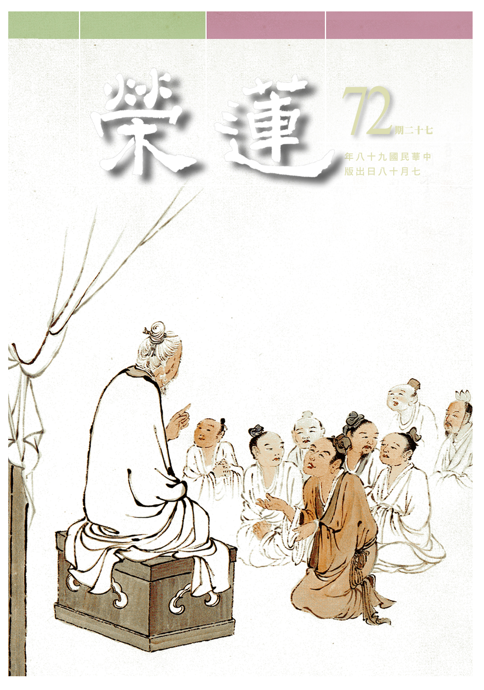

# 第72期

## 社論

### 心想事成的秘密

本刊

成功有其秘密，但這秘密不為廣大人所知，常人庸庸碌碌無可如何，遇到順境則喜，逆境則悲，生活似機器般不停的運轉，吃完幹活，幹活完睡覺，睡覺完起床，再重新一天的開始，很多事情想都不敢去想，不敢去想他將來會不會功成名就，會不會出人頭地，會不會成為大企業家、大政治家、大文豪；甚至成聖成賢這件事連夢都不敢去夢。

膽子小的人，有說不出的害怕，在順境中害怕逆境來，享福中又害怕失去，子女一出門就擔心受怕，隨著自己的年齡老去又擔心病痛死亡，在醫院檢查有一點異樣，就終日惶惶然，吃不下飯，遇到麻煩的事情，內心七上八下找人幫忙，晚上睡覺也容易做惡夢，心情在憂慮焦躁不安下，身體的健康也維持不住。
或
**問：** 成功的秘密到底為何？曰：心想事成。然須知其要點所在。第一是懂得心是可以發揮各項作用，第二是了知心的最大作用在於會思想，而不只是在那裡起煩惱，第三是思想最大的功能即是懂得想要完成什麼、成就什麼？而且一定能成就，會使他所想的成為事實。但這樣的秘密，僅掌握在少數幾位成功者，如發明家、音樂家、政治家、企業家、學問家當中的愛迪生、愛因斯坦、莫札特、貝多芬、華盛頓等，都是運用心想事成者，而這樣的秘密不為廣大人群所知，所以一般人的生命，總是隨著既定的生活模式與心思在世間隨業漂流。

了凡先生是少數以文章寫出如何改變命運，創造了新的生命，彼乃成功的運用心想事成的秘密，並且教導兒子運用這個秘密改變命運。了凡先生這樣的知見以及體會，其實來自於雲谷大師的教導。首先，先確立命運是可以改變的，改變命運的內涵就是讓自己從無福到有福、從有福到多福，而且設立他想要得到的境界，就如西洋人所運用的觀想板，把他想要得的目標很具體的想出來，比如他想要買一輛車子，買一棟房子，考一間學校，或者是高的年收入，就具體地描繪在觀想板上。

了凡先生首先設定在考功名，生子傳宗接代上，懂得運用正面的思維，此正面的思維就是斷惡修善，並以謙虛的態度來改變人際關係，得到他人的幫助。其中反省己過並非是負面的思維，它是斷除己惡(特別是煩惱習氣)的利器，透過反省改過清除通往目標的障礙，破除福報生起的藩籬。了凡先生於世間所求無不順遂，最後已經不求了，他不求並非因為他忘了這個秘密，是因為人生已經完全豁達，他所追求的是更高一層的秘密，就是出世間的安樂，這才是他更不為人知的秘密，心想事成、一切唯心造的道理他已經通達無礙了。

宇宙間還有一個更大的秘密，當你想幫助別人得到成就或安樂時，那意味著你自己會先得到利益，而且你將是他人生命中的貴人、善知識乃至佛菩薩，本身擁有無法想像的福報。古人說不讀華嚴經不知佛的富貴，經文分三十九品，一般人讀之猶如置身五里霧中，有幸的是祖師的注解與科判，其中第十一品（淨行品）就是佛菩薩於日用平常中，凡行住坐臥、說話辦事、用功修行、乃至一切動靜語默等，都以思業結合願行，志於眾生的離苦得樂上，令心想事成的意樂及義利，發揮到最大的圓滿與功效，以利益盡虛空遍法界的有情，這才是宇宙間最偉大的秘密。惟願我等一切同修，利益眾生的意樂得以圓滿，於推廣利益有情的佛行事業得以早日成辦無礙。

## 大德法語

### 大方廣圓覺修多羅了義經（三十二）

道源老和尚

漸修利根方頓悟

悟理無二理所破

入事生執道所破

雙彰法界與法身

乙二、正宗分

丙二、令依解修行隨根證入

丁二、廣明行相

戊一、四問答通明觀行上根修證

己一、開示觀門同佛

庚五、正答所問

辛一、長行

壬四、結合問詞

經文：

善男子！彼諸菩薩，如是修行。如是漸次，如是思惟，如是住持，如是方便，如是開悟，求如是法，亦不迷悶。

前文普眼菩薩問了一些問題，是問初發心的菩薩，以及末世修行大乘的眾生怎樣漸次修學？此處之如是漸次，乃依佛前述那樣的漸次，如何漸次呢？先修二空觀，後修法界觀。若圓頓大教則沒有漸次，說漸次，是先修二空觀，再修法界觀，修二空觀是先修我空，後修法空，修法界觀是先修一真法界觀，後修三種法界觀：先是真空覺相觀，其次是理事無礙觀，三為周遍含容觀。

思惟就是觀想，晏坐靜室須正思惟，不是一般人在那兒妄想分別的思惟，須是大乘觀行的思惟，如是就住持。亦即如是思惟，如是用功，不會再退轉，已經安住不動了，安住於圓覺的修學法。

如是方便，是依眾生需要而有方便，修法界觀之前要先修二空觀，修二空觀之前，須有個方便下手處，即堅持禁戒，晏坐於靜室，其次於二空生起觀慧。所謂戒、定、慧三無漏學，彼即有個漸次，亦即學佛求開智慧，然須有前方便，得持戒，修定。不持戒，根本不能得定，持戒須堅持禁戒，修學空性雖是不著相，然持戒是非著相不可，不著相如何堅持呢？如剛入小學的學生，向他說博士的論文幹什麼？修到不著相，是連能、所的自相都找不到。可是最初下手方便得堅持禁戒不可，若戒律不清淨，修不了定，即使得了定，都是魔加持的，非著魔不可。

天人有五種神通，鬼神也有五神通，你那些冤家死對頭在鬼神道或者在天道，他看得很清楚，哦！你還想修定？你還想開智慧？你根本不持戒，哼！你要求定，就助你入邪定！起信論中那些著魔的境界，都是魔來加被，楞嚴經裡五十種陰魔，都是魔來加被，令修行者得定，開了智慧，甚至得神通，結果是得了神經病，佛教不叫神經病，叫著了魔。

這種病中西醫都治不好，古時沒西醫，現在有西醫，但都治不好神經病？不怕千生不悟，但怕一日著魔，千生以來沒有開悟不要緊，還可以再修行。若這一生著了魔失去了道心，知見已錯亂，哪有修行用功的能力呢？受了這害墮落下去以後，不曉得要墮落到哪裡去？修學用功，要先求理解，不求理解，但取用功修行，結果是盲修瞎練，墮坑落塹。修行不求理解，等於行路不了解路程，也不知方向，等於瞎子一樣，非墮坑落塹不可，修行不求理解，非著魔不行。

然現在我們在講堂裡講經，易犯什麼毛病？乃有解無行！不修行，自己也得不到實際利益，也不能引導眾生得到實在的利益。行時要有如是方便，首先要堅持禁戒；其次修定，有了定你才能修觀慧，定都定不下來，你如何能觀修呢？如何生起觀慧？先修二空觀，再修法界觀，但是持戒、修定是觀慧的方便，此即如是方便。
前
**問：** 如何開悟？由悟到二空之理到悟一真法界之理，謂之如是開悟。悟後起修，頭路清楚，那才是真修行了，此即如是開悟。

求如是法。亦不迷悶。前之文殊章有：知是空華，即無輪轉，亦無身心受彼生死。此乃不講方便與漸次。其次普賢章：知幻即離，不作方便，離幻即覺，亦無漸次。到了普眼章說了四個漸次，須知初發心的人，若不是上上根之人，則有迷悶而不通達，只覺得這些道理恍恍惚惚，僅知道一點點，怎麼下手呢？所以本章佛開示須依戒修定，再修觀慧。以上長行。

辛二、偈頌

壬一、標頌

經文：

爾時世尊，欲重宣此義，而說偈言：

此時佛叫普眼（當機），本章是由他請問的。

壬二、正頌

經文：

普眼汝當知！一切諸眾生，身心皆如幻。身相屬四大，心性歸六塵。四大體各離，誰為和合者。如是漸修行，一切悉清淨。不動遍法界。無作、止、任、滅，亦無能證者。一切佛世界，猶如虛空華，三世悉平等，畢竟無來去。初發心菩薩，及末世眾生，欲求入佛道，應如是修習。

修學先要觀察我究竟有無自相？我是實法嗎？我所攝持的身與心，都是幻化不實的，身體是四大假合而成，心是六塵緣影，好像有一個知覺在裡邊，實際是緣六塵為影，識由緣影而有，修行用功要在破我執，我執一破，法執亦破。

四大體性不可得，又如何生出個我？四大和合之身，由此身見有實我是最難破，講大乘佛法什麼都空了，結果身見（薩迦耶見）不空。叫你犧牲生命，為法忘軀，你都可以說得到，然是說空話，其實拔你一根毫毛你都不肯，你執著身見執著得可厲害。

若知身見，所見之身不過是四大假合，四大—地、水、火、風真實相都了不可得，還有身相嗎？身相且空，六根哪有立足的地方，六根是在身體上生出來的，身相空了，六根到哪兒？六根自然空了，這六塵是對著六根起的，你內裡六根空了，外邊六塵又如何會有？其次如何觀身體如幻如化？將身體歸屬到四大種，且四大各自之體亦皆不可得，所組合之身又如何有自相？像是戲法變現出來的，或如幻術變幻出來。

其次心性歸到六塵，沒有攀緣六塵，生不起心，此之心性非心的本性，是指心的特性，亦即心之生起是緣六塵。此四大之體了不可得，誰為和合者呢？誰來和合這個身體？四大本空，身又在何處？既無四大自相，則六塵自相在哪裡？六塵了不可得，又如何生起心呢？

你不是問漸次嗎？這就是漸次，修行由哪裡下手呢？先觀身空，再觀心空，身心組合的我又何嘗真實？你能觀自身心清淨（了不可得），同理一切眾生都清淨，同理依報（世界）清淨，一世界清淨，則一切世間都清淨。

此時悟到法界本來不動（清淨），作、止、任、滅皆說不到（用不上），能證的智慧，或者能證的觀行者（能證的人），亦了不可得。

一切佛世界，猶如虛空華。一切佛世界亂起亂滅，如虛空華一樣。過去、現在、未來之三世也是平等的，無起滅三世之自相。所證的空性哪有東、南、西、北等十方，哪有過去、現在、未來，所以是豎窮三際，橫遍十方，平等沒有差別，所以畢竟無來無去。

在圓覺法會中那些能入三昧的菩薩都知道，初發心的菩薩也應當曉得，此種修學成佛的方便（漸次），如同將地（理）圖都給你畫出來了，你要看個清楚！

末世眾生修大乘的更要知道，善知識難求，初發心菩薩以及末世的眾生，發願求入佛的道，應當依善知識以如是方便、如是漸次、如是思惟、如是住持，將普眼菩薩這一章意思了解，如同依地理而行。譬如從高雄出發，要到總統府（台北），然二乘人只到了台中就下車了，大乘菩薩則到目的地。初發心菩薩，要將直至成佛境界的理路研究清楚，並好好的觀修，而非盡說些大話，經文雖說知是空華，即無輪轉，結果你還是不空，雖一切都是幻化，結果你還是執實。

諸位都是學大乘法，要將教理看得明白，將路程地理都看明白。開步走時，還得持戒、修定、依定而觀修生慧，須腳踏實地的做去。欲將無始劫來的生死了脫談何容易？也容易！你是上上根的人才可以，上根人就差一些，何況是中根，何況下根。（下期待續）

### 常禮舉要講座（十三）　出門篇

雪廬老人

禮重人情由家始

出門安全有威儀

閉口行路講衛生

過路停看不爭路

出門

◎六、夜必歸家，因事不能歸時，必先告知家人。

早上出門，所以說是夜必歸家。白天出來的時間長，晚上必得要回家。要是你今天出去回不來，因事不能歸時，或者是幫忙人家，例如某人家有婚喪嫁娶的事情請你幫忙，晚上回不來，在早上出門前要先跟家裏人說明白，今天不回來，所以因事不能歸時，必先告知家人。

這章是指你計畫不回來，所以才先告訴家人。要是你臨時出去，沒計畫要住在別處，談不到事先告訴家人；但為人子女的，這跟大家都說過，別人不關心、母親沒有不關心的，到了天晚，某人怎麼還不回來啊？不是說好了等會就回來。家裏的老母，天然的這種心，她跑到門外頭在街上等著、看著，你回來了嗎？不回來，她在那裏看，不是白看嗎？白看！但她還是看。你看看這個吧，她也沒上過學，沒教她（母親）怎麼會？

固然子女在家裏父母也打也罵，然愛之深、責之切，愈愛愈責備得過火。街坊那些不三不四的人，在那裡當小偷卻不管？可以不管！可是更進一層，孔聖人管、佛也管，何以故？普度眾生！是咱們沒有那個學問，尤其是現在。

記得上回我（雪公）說過，我們出去發生車禍或其他亂七八糟的事情，你要到時候不回去，夜黑了也不回去，遭了麻煩家人也不知，自己受了傷也說不出話來，又沒帶身分證，警察也弄不出個所以然，那就麻煩了。出去前若先向家人說上那裏，屆時家人去那個地處找你。他來了、他走了，家人就可以順著路去追問，問不到、可以找警察幫忙，少了很多的麻煩。

◎七、車馬繁雜衝區，不招呼敬禮。

你不論看什麼書，沒有一條是呆板板的，呆板板是你自己帶上的樣子，書上的道理皆是四面八方。中國話有、臺灣也有—見機而作，定法不是法。

◎八、不立在路上久談。

這條很要緊，走到路上來來往往人車很多，你站在那邊談話則妨礙交通。你談幾句就可以了，不要一直談，有序分、還有正宗分、流通分，把這一套等等講完了，對方他有事沒事呢？他等得了等不了呢？此其一。

第二、你談的這一套當然裏頭有秘密的話，你說不要緊沒有什麼秘密，我跟你說吧，在街上談今天晚上我不回家。誰看門呀？沒人看門……。那就行了，只要有心人在你家附近住著、你家晚上又沒人看門，今天晚上你家就不保險！這還不懂得，還有別的秘密要說，那就太多麻煩了。

這個時局是怪事年年有，現在怪得出奇，但也不可奇怪了。怎麼不怪呢？明天的報紙我都知道了，你信不信？不用出版我就知道。我看明天的報，後天的報我不必再看、我也知道了。有云：你跟他們那些自命不凡的人有神通嗎？我（雪公）連鬼通也沒有，那個報紙是神通報，前通多少年後通多少載，你懂不懂？

馬路上不久談，即使在馬路上站著，警察也要過來干涉，那就不好看了。可是我見過，在家裏談完，主人送到門口，就該分手，可是客人不走又回頭來和主人談話，客不走主人就無法回去關門，在家裏只談五分鐘，出來在門外頭站著卻談了十多分鐘。在門外談話比在家還厲害，你說的事情鄰居都聽見了，人家要偵探你的秘密不用到你家查，問問鄰居或聽你們的談話。凡是你家裏的事情都是你自己洩漏祕密，禮記有：內言不出于閫。家裏的事情、屋裏的話，不能出你的門限。

往後送客的功夫，送到門外就不要再跟客人多談，或到別人家去當客人，主人送出來以後就可以走了，主人或可有別的事要幹，別站在門口將不要緊的話扯了一大套。

◎九、不走馬路中間，越路須先向左右看清，不可與汽車爭路。

你走在馬路中間警察也不允許，越過馬路時先左右看看，以前馬車、腳踏車，看到前面有人走，就慢慢騎過去。現在可不行，現在是摩托車、汽車，可不管你在前面走，他要硬闖過去，現在鬧亂子的就是這兩種車，你穿越馬路要看看，要不然為什麼建天橋呢？建天橋交通還可以維持不亂，這就是防範。要是不建天橋你想要穿越馬路不知要等到幾時？

頭幾年我到蓮社來，大約是十年前（民國六十一年），被車子撞倒。有云：你懂得這些禮文，怎麼也被車子撞上呢？有其理由，當我走到路口時，我也是這邊看、那邊看，我看車子還遠，我走得又快，趕到了街口上，車還過不來沒有什麼關係，於是穿過了馬路，進了南區區公所的路口了，已進了巷道這還有什麼問題呢？己不是在馬路上，我就慢慢地上蓮社來，這就是天命了，不能講禮記了。

怎麼呢？一個小毛頭，騎車的能力不怎麼高明，他並不是要往這個巷道來，而是要往別條街道去，我則在巷道中慢慢的走，他不知怎的卻進了這巷道把我撞倒了，他也倒在那裏，這很冤枉。我說：你上哪裏去啊？這裏是民生路。彼云：我不上這裏來，我往那邊去。我說：你上哪裏去，怎麼跑到這裏來呢？留不住啦！好啦、那不干你的事，該我倒楣。可是一些看熱鬧的呢？他們就圍上啦，他走得慢警察就要過來了，當然他就走不了了，他走不了、我也走不了。我說你快走，我離蓮社近還有人照顧，用不著你照顧我，留著兩個人在這兒就倒楣。

◎十、行走時，步履宜穩重，並宜張胸閉口，目向前視。

不論你走得快、走得慢，要穩重別慌張。快也好、慢也好，什麼方法呢？就是走直路！譬如我在講台上面要走到對面，我的方向就直接向那邊去，對著那張桌子、那個掛鐘走過去。這就叫做穩重！你萬不可走曲線，萬不可有這樣走法！走曲線妨礙後來的人，也妨礙眼前的人、這是步履要穩重。

並宜張胸閉口，此與個人的衛生有關，這個沒人管你，走路的功夫，張胸是什麼呢？咱人是直的，胸腑（拍拍胸腑）是這樣子的，這個你們年輕可以練練。走路的功夫要閉口，不但是走路要閉口，靜坐、睡眠等等一切都要閉口。通常空氣中有些菌類的東西，在馬路上菌類的東西更多，口一閉、這些東西即使隨風流動也進不來，鼻子裏鼻毛能擋住這些塵菌，閉著嘴不會有什麼傳染的。

這個胸腑要是練了，能活到我這個年紀，對你們大家必有好處，你盡管多活吧。一到七十歲的人、走路是腳在前頭？或云：走路當然是腳在前頭，什麼還在前頭呢？然而有了年紀與年輕的不一樣，有了年紀走路是頭在前頭。你不信，你看看有年紀的你就會信了，你再不懂就是呆板漢、書呆子了，只好你活到八十歲時，你就明白了。走路時頭先向前，閉口目向前視。

走路時眼睛看前頭，眼看前頭是不錯，大家聽著、什麼呢？眼看前頭、兩旁什麼事你可以迴避，這是很要緊。假若你沒看清楚兩旁的人，見了面不打招呼也不要緊，他看著你直直走，他也不怪你，你要是東張西看的，而沒與他打招呼，「這個人看見我、不理我」，給你找些麻煩。我講的這是活的，絕不同程子那般，程子是叫你書生坐在那裏，好像綁在一棵樹，孔子也沒這樣。

目要前視，這個很要緊、原因已說了。其次四威儀：行如風，坐如鐘、立如松、臥如弓。臥如弓是兩腿弓起來，臥相如弓。坐如鐘之鐘是廟裏打的鐘，鐘放在那裏不動，稱得上穩重。行如風，是這風一吹要是沒有別的阻擋物，就直吹過去，要有阻擋物，風才轉向，你走路就是行如風。

## 共修研學

### 小止觀導覽（四十五）

*心爾整理*

修學識路頭

降伏粗細惑

識得天台路

真隨智者遊

第六章  正修行

坐上修止觀的第四個階段，所成的定功是為了對治細惑，即是微細的執著（人我執與法我執），若能對治細惑，即成勝觀的功德，達到止觀雙運。

經文：

四、對治定中細心修止觀。所謂行者先用止觀對破麤亂，亂心既息，即得入定，

從對治初心粗亂修止觀到對治心浮沉修止觀，直至隨便宜修止觀，心已能調息，得以入定，此時進入細心修止觀，但不可錯解此空靈靈的心識為現證空性的心識，須再對治細惑之細心修止觀。

經文：

定心細故，覺身空寂，受於快樂；或利便心發，能以細心取於偏邪之理。

此時風大充身，身心輕安，產生殊勝的快樂。此定雖覺得安住於空靈靈的義境中，然是否證得自相空呢？如鑽木取火，火還未生起，然已有煖相出現，此時雖發起證得空性之相似慧，然未真正現證空性。

經文：

若不知定心止息虛誑，必生貪著。若生貪著，執以為實；

若無法通達定心的目的是止息虛妄不實的妄念，而且是以勝觀的方式破除執著，則極容易貪著在定的殊勝境界中，執著定境的實有而生偏執。此處提醒我們不要執著任何境之實有，即使顯現殊勝境，尋求其自相亦是微塵許了不可得。

修學者若能對教理有所瞭解，能變得謙懷，不會錯下承當，能步步為營，即使生起殊勝境界，亦知虛妄不實。

經文：

若知虛誑不實，即愛見二煩惱不起，是為修止。

從教法以及善知識處，知道萬法皆是虛妄不實，實我、實法尚且不可得，執實的心又如何可得？如入定時現證空性破分別執，佛為此聖者安立名言謂之須陀洹，執我的心不生，又如何會生我已證果之心，然不妨世俗名言說證得須陀洹果，然實無須陀洹果可證，須陀洹果位的實體了不可得，不過名言現起而已，其他果位之證得亦復如是。

而愛見煩惱的破除可分兩種，在定中破謂之理所破，乃初果證得的行相，然出定之後由於無始劫來所串習的愛太過牢固，能執著的心還是無法完全消滅，仍會生起微細的我執，故仍須欲界七番生死，經過二果、三果的修學，而證得四果。初果至三果雖有微細我執，然此執所生起的微細惑已經沒有能力引此位聖者到三途受苦，若修學至四果羅漢（或八地菩薩）則俱生我執亦不會生起，惑業永久不起現行。

經文：

雖復修止，若心猶著愛見，結業不息，爾時應當修觀，觀於定中細心。若不見定中細心，即不執著定見。若不執著定見，則愛見煩惱業悉皆摧滅，是名修觀。

雖然止力可以修成，若沒有在定中作觀力的訓練，執著並沒有真正的除掉，觀待微細的我見而生起的執我、愛我的心並沒有真正被破除，此時應當在定中不斷思維、尋覓我相，以及在我相上去尋找真實性。

執我的心難以察覺，觀待執著生起密密麻麻的煩惱就像瀑流，所以不要以為定中朗朗，就以為破除我相，還需要在定中不斷的串習破我的方便，如何引出好像有真實的我，如引蛇出洞般，之後鎖住它（我相），若它有實體則應在五蘊內或外有，或者它就是五蘊，一一去觀察自相之所在，尋覓不得時，心中呈現空靈靈的狀態，執我、愛我的心，以及伴隨的相關煩惱，都能在空性的證悟中破除，此名依止修觀。

經文：

此則略說對治定中細心修止觀相。分別止觀方法，並同於前，但以破定見微細之失為異也。

此處有別於前面所說，特別在細心上面講求，須察覺觀待於心所生起的細惑，微細的執我之心，以及觀待於執我之心生起的微細愛見（愛我的心）。此時心中雖然空靈靈的一片，但不可錯解以為已經得到空性正見，細細的執我心不是我們所能體會，是屬於微細惑的範疇，要在定中修觀簡除。

經文：

五、為均齊定慧修止觀。

到此時已能止觀雙運，定慧均等，是真正止觀雙運的成就相，當屬於四加行位。

經文：

行者於坐禪中因修止故，或因修觀，而入禪定，雖得入定，而無慧觀，是為癡定，不能斷結。或觀慧微少，即不能發起真慧，斷諸結使，發諸法門。

止觀必須等修（定慧均等），亦即依定生慧，若只定而無慧，此乃癡定，是無法斷除煩惱。修定的好處是此人很篤定也很有貴氣，若不好好運用修觀，則思維不靈敏。所謂的觀慧，乃尋求人我與法我的真實性，定中確知沒有自相可得的人我與法我，若沒有觀慧伴隨的癡定，則執著根本未被對治。

經文：

爾時應當修觀破析，則定慧均等，能斷結使，證諸法門。

在穩固的定中要培養的是修觀的能力，經過分析破除人我執，所執的我不可得時，能執我的心才能破除，此時須定慧均等，執著能破，觀待執著生起的結使都能破除，能於依法見到空性，於其他法都以相同正理證得空性，謂之證諸法門。

經文：

行者於坐禪時應修觀故，而心豁然開悟，智慧分明，而定心微少，心則動散，如風中燈，照物不了，不能出離生死。爾時應當復修於止，以修止故，則得定心，如密室中燈，即能破暗，照物分明，是則說均齊定慧二法修止觀也。

上述即說止觀雙運之法，若觀力轉強，但定力不足，亦即觀察境界時，緣念境界的力量轉弱，此時心是動散，如風中燭火閃爍不已，無法照明境界，此時要加強心力專注於境界，如同加上燈罩，令燈火不受外風之干擾，讓止力任運生起，而且觀待於止，觀也可以任運的生起，如此才可以說是達到止觀雙運。

經文：

行者若能如是於端身正坐之中，善用此五番修止觀意，取捨不失其宜，當知是人善修佛法，能善修故，必於一生不空過也。

最後總結，如果我們端身正坐修止觀，瞭解這五番修學，能善用止觀修學法，生起通達空性的慧力，也知道要對治細惑，不只是粗相的通達空性義，還得在定中不斷的串習觀力，最後能均齊定慧修止觀，修止的同時可以生起觀力，修觀時也可以加強止力，破除微細惑，得到止觀雙運的成就，以上五番修止觀，是坐上修所要通達的義趣，爾後方是歷緣對境修。

### 佛說八大人覺經（二十）

*編輯部整理*

誦念觀修生自覺

自覺方能真利他

念念二利消舊業

心心趨向大菩提

流通分

經文：

如此八事，乃是諸佛，菩薩大人，之所覺悟，精進行道，慈悲修慧，乘法身船，至涅槃岸。復還生死，度脫眾生，以前八事，開導一切，令諸眾生，覺生死苦，捨離五欲，修心聖道。若佛弟子，誦此八事，於念念中，滅無量罪，進趣菩提，速登正覺，永斷生死，常住快樂。

以上八事為諸佛菩薩大人所覺悟的法門，此十六字（如此八事，……之所覺悟）是結成此經之名義，亦即此經是佛說八種大人覺悟的事相，此八事是成佛的方便，以遍緣法界的慈悲心，攝持著空性的智慧，能破除所知障，成就法身，是成就最究竟的涅槃。

經文之精進行道，……至涅槃岸（十六字）是自覺功德（見表一），復還生死，……修心聖道（三十二字）是覺他功德。經文之若佛弟子，……常住快樂（三十二字）是結成誦念功德（見表二）。

須知眾生是被業牽引而來（見表三），並非自在應化而來，又從苦樂當中生起苦樂的自相，因茲而起惑，由惑而造業，業牽復受苦、受苦之起惑（能發業、潤業），由業牽復又受苦，循環不已。佛菩薩得到涅槃之後要做什麼？以智（自在）悲（應化）心生起願力，復還生死苦海中利益有情。成佛的目的就是為了度眾生，所行（行業）皆為度脫眾生脫離六道。佛是善造作者，而所有的造作也都回歸佛的智悲中，流入佛菩薩的智慧與慈悲心裡。

諸佛所體會之理皆同（道同），亦即以此八事自覺，而諸佛也以此八事覺他，令他看破這世間唯苦無樂，他才會想要好好捨離五欲（財、色、名、食、睡），但是幫助有情，只幫助他遠離飢餓之苦是否究竟？幫助他修心聖道（此處云八大人覺）才是究竟，捨離五欲淺說即是離開五欲，深處來說唯有修心聖道，證得自相空斷除對三界安樂的貪才是究竟。所謂的苦集滅道中的滅諦，是修心聖道的結果，證得空性時，滅除煩惱、所知的滅分，稱為滅諦（法身）。

諸佛所證三德（般若德、法身德與解脫德），是相互觀待的生起。能觀法身（空性理）生起的智慧即是報身，此士夫即生起解脫的作用（解脫德）。

士夫誦念的功德能令自身所起每一個心念都和八大人覺相應，都是為了利他而充實成就自己，以聞思修方式生起破二障的智慧，以布施、持戒、忍辱攝受有情入佛門修學智慧，令彼斷除二障，即是最殊勝的利益。

我所有的心念都被這八件事引導，心念攝持身口，造作與此八事相關的善法，每天都得到與前一天相較的增上，此人定能很快的成佛。成佛即能永斷生死，常住快樂，亦有能力令眾生斷生死、住快樂。

## 啟蒙園地

### 歷史故事　輔國安邦的狄仁傑

淨域

宦海浮沉心在邦

從容舉賢實朝廷

刀下留人活萬口

陰德厚福綿後世

狄仁傑，字懷英，唐代并州太原（今山西太原）人，生於唐貞觀四年（西元六三零年），卒於武則天久視元年（七百年），享年七十一歲。祖父狄孝緒，於貞觀朝任尚書左丞，父親狄知遜，任夔州長史。

狄仁傑通過明經科考試及第，出任汴州判佐。時工部尚書閻立本為河南道黜陟使，狄仁傑被吏誣告，閻立本受理訊問，他不僅弄清了事情的真相，而且發現狄仁傑是一個德才兼備的難得人物，稱他是「河曲之明珠，東南之遺寶」，推薦狄仁傑作了并州都督府法曹。在此任內，狄仁傑通曉吏治、兵刑等制度，對他日後的政治生涯有重大的影響。

唐高宗儀鳳年間，狄仁傑升任大理丞，他剛正廉明，執法不阿，兢兢業業，一年中判決了大量的積案，所涉人員十七萬，無一冤訴，一時聲名大振。儀鳳元年（西元六七六年），武衛大將軍權善才誤砍昭陵柏樹，高宗大怒命令處死；為維護法律制度，狄仁傑犯顏直諫罪不當死。高宗疾言厲色地說：「善才斫陵上樹，使我不孝，必須殺之！」狄仁傑據法說理：「犯言直諫，自古以為難。臣以為遇桀、紂則難，通堯、舜則易。今法不至死而陛下特殺之，是法不信於人也，人何措其手足！」「今陛下以昭陵一株柏殺一將軍，千載之後，謂陛下為何主？此臣不敢奉制殺善才，陷陛下於不道。」終於使高宗改變主意，赦免權善才的死罪。

未久，狄仁傑被命為侍御史，負責審訊案件，糾劾百官；期間他對一些巧媚逢迎、恃寵怙權的權要進行彈劾。調露元年（六七九年），司農卿韋弘機作宿羽、高山、上陽等宮，寬敞壯麗；狄仁傑上奏章彈劾韋弘機引誘皇帝追求奢泰，韋弘機因此被免職。左司郎中王本立恃恩用事，朝廷畏之；狄仁傑毫不留情的揭露其為非作歹的罪行，請求交付司法審理。高宗想寬容包庇王本立，狄仁傑以身護法：「國家雖乏英才，豈少本立輩！陛下何惜罪人以虧王法。必欲曲赦本立，請棄臣於無人之境，為忠貞將來之戒！」王本立最終被定罪，朝廷肅然。

後來，狄仁傑官遷度支郎中，高宗準備巡幸汾陽宮，以狄仁傑為知頓使，先行佈置中途食宿之所。并州長史李衝玄以道出妒女祠，徵發數萬人別開御道。狄仁傑說：「天子之行，千乘萬騎，風伯清塵，雨師灑道，何妒女之害耶？」俱令作罷，免除了并州數萬人的勞役。高宗聞之讚歎說：「真大丈夫矣！」

武則天垂拱二年（六八六年），狄仁傑出任寧州（今甘肅寧縣、正寧一帶）刺史。當時寧州為各民族雜居之地，狄仁傑妥善處理少數民族與漢族的關係，州民以「撫和戎夏，內外相安，人得安心」，為他勒碑頌德。是年，御史郭翰巡察隴右，寧州歌頌狄刺史者盈路，郭翰返朝後上表舉薦，狄仁傑升為冬官（工部）侍郎，充江南巡撫使。狄仁傑針對當時吳、楚多淫詞的弊俗，奏請焚燬祠廟一千七百餘所，只留夏禹、吳太伯、季札、伍員四祠，減輕了江南人民的負擔。

垂拱四年（六八八年），博州刺史瑯琊王李衝起兵反對武則天當政，豫州刺史越王李貞起兵響應，武則天平定了這次宗室叛亂後，派狄仁傑出任豫州刺史。當時，受越王株連的有六、七百人在監，籍沒者多達五千人。狄仁傑深知大多數黎民百姓都是被迫在越王軍中服役的，因此，上疏武則天說：「此輩咸非本心，伏望哀其詿誤。」武則天聽從了他的建議，特赦了這批死囚，改殺為流，安撫了百姓，穩定了豫州的局勢。

其時，平定越王李貞的是中書宰相張光輔，將士恃功大肆勒索，狄仁傑沒有答應，反而怒斥張光輔殺戮降卒以邀戰功。他說：「亂河南者，一越王貞耳。今一貞死而萬貞生。」「明公董戎三十萬，平一亂臣，不戢兵鋒，縱兵暴橫，無罪之人，肝腦塗地。」「但恐冤聲騰沸，上徹於天。如得上方斬馬劍加於君頸，雖死如歸。」狄仁傑義正辭嚴，張光輔無言可對，但懷恨在心，還朝後奏狄仁傑出言不遜。狄仁傑被貶為復州（今湖北沔陽西南）刺史，復為洛州司馬。

天授元年，武后廢睿宗即帝位，狄仁傑的才幹與名望，漸得到武則天的讚賞和信任。天授二年（六九一年）九月，狄仁傑被任命為地官（戶部）侍郎、同鳳閣（中書省）鸞臺（門下省）平章事，開始了他短暫的第一次宰相生涯。身居要職的狄仁傑，謹慎自持從嚴律己。某日，武則天對他說：「卿在汝南，甚有善政，卿欲知譖卿者乎？」狄仁傑謝說：「陛下以臣為過，臣當改之；陛下明臣無過，臣之幸也。臣不知譖者，並為善友。臣請不知。」武則天對他坦蕩豁達的胸懷深為歎服。

仁傑官居宰相，參與朝政之時，也正是武承嗣顯赫一時躊躇滿志之日，他認為狄仁傑將是他被立為皇嗣的障礙之一。長壽元年（六九三年）正月，武承嗣勾結酷吏來俊臣誣告狄仁傑等大臣謀反，將他們逮捕下獄。

當時法律中有一項條款：「一問即承反者例得減死。」來俊臣逼迫狄仁傑承認「謀反」，狄仁傑出以非常之舉，立刻服了罪：「反是實！」來俊臣得到滿意的口供，將狄仁傑等收監，待日行刑，不復嚴備。狄仁傑拆被頭帛書冤，置棉衣中，請獄吏轉告家人去其棉。狄仁傑的兒子狄光遠得其冤狀，持書上告。
武則天召狄仁傑等「謀反」大臣面詢：「承反何也？」狄仁傑從容不迫地答曰：「向若不承反，已死於鞭笞也。」又
**問：** 「何為做謝死表？」答曰：「臣無此表。」武則天令人拿出謝死表，才弄清楚是偽造的。於是下令釋放此案七人，俱貶為地方官。狄仁傑用自己的才智機謀死裏逃生，被貶為彭澤令。以後，武承嗣欲根除後患，多次奏請誅之，都被武則天拒絕。

在彭澤（今江西彭澤）令任內，狄仁傑勤政惠民。赴任當年，彭澤乾旱無雨，營佃失時，百姓無糧可食，狄仁傑上奏疏要求朝廷發散賑濟，免除租賦，救民於饑饉之中。萬歲通天元年（六九八年）十月，契丹攻陷冀州（今河北臨漳），河北震動。為了穩定局勢，武則天起用狄仁傑為魏州（今河北大名一帶）刺史。狄仁傑到職後，改變了前刺史獨孤思莊盡驅百姓人繕修守具的作法，讓百姓返田耕作。契丹部聞之引眾北歸，使魏州避免了一次災難。當地百姓歌誦之，相與立碑以記恩惠。不久，狄仁傑升任幽州都督。

狄仁傑的社會聲望不斷提高，武則天為了表彰他的功績，賜給他紫袍、龜帶，並親自在紫袍上寫了「敷政木，守清勤，升顯位，勵相臣」十二個金字。神功元年（六九七年）十月，狄仁傑被武則天召回朝中，官拜鸞臺（門下省）侍郎、同鳳閣鸞臺平章事，加銀青光祿大夫，兼納言，恢復了宰相職務，成為輔佐武則天掌握國家大權的左右手。此時，狄仁傑已年老體衰力不從心，但仍盡心竭力佐政。

聖歷元年（六九八年），武則天的侄兒武承嗣、武三思數次使人遊說太后，請立為太子，武則天猶豫不決。狄仁傑以政治家的深謀遠慮，勸說武則天順應民心，還政於廬陵王李顯。當時，大臣李昭德等也曾勸武則天迎立李顯，但沒有被武則天接受。
狄仁傑從母子親情的角度勸說她：「立子，則千秋萬歲後，配食太廟，承繼無窮；立侄，則未聞侄為天子而附姑於廟者也。」武則天說：「此自家事，卿勿預知。」狄仁傑沉著而鄭重地回
**答：** 「王者以四海為家。四海之內，孰非臣妾？何者不為陛下家事！君為元首，臣為股肱，義同一體。況臣位備宰相，豈得不預知乎？」最終，武則天感悟，聽從了狄仁傑的意見，親自迎接廬陵王李顯回宮，立為皇嗣，唐祚得以維繫。狄仁傑因此被歷代政治家、史學家稱為有再造唐室之功的忠臣義士。

聖歷元年（六九八年）秋，突厥南下騷擾河北。武則天命太子為河北道元帥、狄仁傑為副元帥征討突厥。時太子不行，武則天命狄仁傑知元帥事，親自給狄仁傑送行。突厥默啜可汗盡殺所掠趙、定等州男女萬餘人退還漠北，狄仁傑追之不及，武則天改任他為河北道安撫大使。面對戰亂後的凋殘景象，狄仁傑採取了四條措施：一、上疏請求赦免河北諸州，使被突厥驅逼行役的無辜百姓樂於回鄉生產。二、散糧運以賑貧乏。三、修驛路以濟旋師。四、嚴禁部下侵擾百姓，犯者必斬。這樣很快便恢復了河北的安定。

久視元年（七零零年），狄仁傑升為內史（中書令）。這年夏天，武則天到三陽宮避暑，有胡僧邀請她觀看安葬舍利，奉佛教為國教的武則天答應前往。狄仁傑跪於馬前攔奏道：「佛者，夷狄之神，不足以屈天下之主。彼胡僧詭譎，直欲邀致萬乘所宜臨也。」武則天遂中道而還。是年秋天，武則天欲造浮屠大像，預計費用多達數百萬，宮不能足，於是詔令天下僧尼日施一錢以助。狄仁傑上疏諫曰：「如來設教，以慈悲為主。豈欲勞人，以在虛飾？」「比來水旱不節，當今邊境未寧。若費官財，又盡人力，一隅有難，將何以救之？」武則天接受他的建議免除捐納。

作為一名精忠謀國的宰相，狄仁傑很有知人之明，也常以舉賢為意。一次，武則天讓他舉薦一名將相之才，狄仁傑向她推舉了荊州長史張柬之。武則天將張柬之提升為洛州司馬。

過了幾天，又讓狄仁傑舉薦將相之才，狄仁傑說：「前薦張柬之，尚未用也。」武則天答已經將他提升了。狄仁傑說：「臣所薦者可為宰相，非司馬也。」由於狄仁傑的大力舉薦，張柬之被武則天任命為秋官侍郎，過了一段時間升任宰相。狄仁傑還先後舉薦了桓彥範、敬暉、竇懷貞、姚崇等數十位忠貞廉潔、精明幹練的官員，他們被武則天委以重任之後，政風為之一變，朝中出現了一種剛正之氣。狄仁傑死後的神龍元年（七零五年），張柬之趁武則天病重，擁戴唐中宗復位。
契丹猛將李楷固曾屢次率兵打敗武周軍隊，後兵敗來降，群臣主張處斬。狄仁傑認為李楷固有驍將之才，若恕其死罪，必能感恩效節，於是奏請授其官爵，委以專徵，武則天接受了他的建議。果然，李楷固等率軍討伐契丹餘眾，凱旋而歸，武則天設宴慶功，舉杯對狄仁傑說：「公之功也。」由於狄仁傑有識人之明，有人對狄仁傑說：「天下桃李，悉在公門矣。」狄仁傑回
**答：** 「舉賢為國，非為私也。」

在狄仁傑為相的幾年中，武則天對他的信重是群臣莫及的，她常稱狄仁傑為「國老」而不名。狄仁傑喜歡面諫廷爭，武則天「每屈意從之」。狄仁傑曾多次以年老告退，武則天不許，入見，常阻止其拜。武則天曾告誡朝中官吏：「自非軍國大事，勿以煩公」。

久視元年（七零零年），狄仁傑病故，朝野淒慟，武則天哭泣著說：「朝堂空也。」贈文昌右丞，謚曰文惠。唐中宗繼位，追贈司空。唐睿宗又封為梁國公。

縱觀狄仁傑的一生，可以說是宦海浮沉。作為一個統治階層的政治人物，狄仁傑每任一職，都心繫民生，政績卓著。在他身居宰相之位後，輔國安邦，對武則天弊政多所匡正。狄仁傑在上承貞觀之治，下啟開元之治的武則天時代，做出了卓越的貢獻。

## 日常省思

### 惑而不惑的主人翁–前言

編者

聯考作文題

非是惑人心

真能解疑者

事由心想成

大學聯考的作文題目「惑」，令許多考生產生疑惑，不知從何下筆，共修會有蓮友子弟於今年參加聯考，在考完聯考之際，組成讀書會，欲充實大學生活，繼續在儒佛的正見上增上。

在第一次的聚會中，談到今年聯考國文作文的心得，個個言之有物，立論正確，願於刊物中另闢一專欄，將彼所寫的作文於會刊中呈現，除了解考生之惑外，看到子弟們的深度，是家長的欣慰，亦是團體多年栽培的成果，可供諸社會，或有心增強作文能力的學生，可做參考，乃有別於坊間的作文範本，能結合古聖先賢的人生哲理及現今社會安住之道，做一真正的解惑者，是於惑中不惑，真實成為國家未來的主人翁。（編者）

### 惑　思樺

思樺

母體呱呱墜地那一刻起，白紙般什麼也不懂的小嬰孩開始為塵世沾染，上天賜與人類五感是恩典，也是障礙。古人云：「五色令人目盲，五音令人耳聾。」我們用眼睛看這五光十色、繽紛絢爛的世界，用耳朵聽人群的擾攘及各種批評與讚揚。然而，眼見為憑容易陷人於武斷，耳聞人言而不加思索而盡信之，則產生偏執，眼睛被蒙蔽，耳朵拒聽良言，就是心眼盲，心耳聾，人生沒有目的，活在世上卻感到無所適從，於是，「惑」便產生了。

孔夫子云：「吾十有五而志於學，三十而立，四十而不惑。」對於人生的迷惘，聖人直到四十歲方能達此「不惑」的境界，常人不是更困難，甚至不可能達成了？不然。夫子云：「十室之邑，必有忠信如丘者焉，不如丘之好學也。」可見夫子之聖並非命定，聖人之所以為聖，常人之所以為常人，所差者竟只一字—學。

不只是學，且「好學」、「志於學」，不同於一般「不求甚解」這種敷衍似的假學，從學中增長智慧，所以通達事理、明辨是非，從學中積累人生經驗，所以處世圓融，樂天知命。

不惑本於志學，再則而立。聖人不會以空言教導後人成聖賢之法，只要「學」，想達「不惑」之境是可期的。既本於學，雖無法達如夫子之賢，「雖不中，亦不遠矣。」我們誠然已在聖人之道上行了。

### 惑　微智

微智

惑，雖然是許多問題的根源，卻造就了人類先進的智慧結晶，有如一條鮮明的文化脈絡，承載了文明的點點滴滴。因為惑，刻畫出更多的發明，引發出無限的思維，帶著我們追夢、築夢，讓我們從暴風雨中走出一片蔚藍的天空和優美的彩虹。

打從出生開始，人們就籠罩在惑的陰影下，十萬個為什麼總與我們形影不離。日子滴在時間的長流裡，我們漸漸的成長茁壯，有些迷惑在學習的過程中得到了解答，但新的迷惑總是源源不絕的奔向我們。更多、更深、更遠的惑挑戰著生命的意義，孔子曾道：學而不思則罔，思而不學則殆。正因為人類能夠思考，並不斷的研學，才能激盪出美妙的火花。萊特兄弟對於鳥類為何能張開雙翼遨翔於天際之事產生困惑，進而著手研究學習，發明了便利的飛機，帶領人類飛向天空；愛因斯坦從小喜愛幻想，想像如何從屋頂落下，便發明了普遍相對論；牛頓則無暇埋怨掉落的蘋果為何不偏不倚地擊中他的頭部，反而引發遐想，成立了地心引力學說。雖然這些偉大的發明家常被當成異類，當時的人們都認為他們是癡心妄想，盡做一些不可能完成的任務。但是時間、恆心、毅力會證明一切。懂得在不疑處有疑的人，懂得對生命充滿熱情的人，往往能滿載而歸。

就像水能載舟，亦能覆舟的道理一樣，惑的課題對每一個人來說，都是件艱困的旅程，放棄、持之以恆總取決於一念之間。惑可以使人灰心喪志，卻也可以幫助我們突飛猛進，端賴我們的心念。

孔子四十不惑是多麼的難能可貴，智者不惑是要經歷過多少的修學才能達成。就像大樹源於小草，大河源於小溪般，人類的成就是靠疑惑、解惑慢慢累積而成。

韓愈師說云：師者，所以傳道、授業、解惑也。我們身旁有很多良師益友等著我們叩關，只是我們是否留心注意，把握每一個學習的機會？大叩則大鳴，小叩則小鳴，不叩則不鳴，勇於疑惑就能引發共鳴、精進自己，再感受來自地心湧出的快樂噴泉。

有惑並不可恥，可恥的是對於疑惑的忽略、漠視、隱瞞，星星之火，可以燎原，小惑可以釀成大禍，大惑卻也能轉化成智慧與人生的經驗。讓惑伴隨著我們成長，讓它像花朵般自然的開放，點綴我們的人生，也引領我們不斷追求不惑的大智慧！

### 惑　宥琢

宥琢

「惑」字可以拆成「或」和「心」二字，也就是心頭上有兩種以上的想法，諸多想法彷彿條條分歧的蜿蜒小徑，彼此錯綜複雜，真理便隱藏於那眾多的一隅。若要探求那真理的彼端，就必須手持著耀眼的火炬，以臨深履薄的態度、亦步亦趨謹慎前行，獲得真理而除惑。

四季的遞嬗、天體的運行，揭示令人不解的惑，就連大詩人屈原也提出種種其不解的惑於「天問」一書之中，人非生而知之者，孰能無惑？既然有惑自然得從師問學，弭平那胸中充溢的惑。可惜的是，早在唐朝大儒韓退之先生便有「惑之不解，惑否焉」之語，一語便道破後世無數學子對於惑的處理方式—一遇困難，礙於其薄弱的求通意志及艱深程度，而不繼續探求。若要回復到古人不憤不啟、不悱不發的境界，已不可得。但若有賢人能排除萬難而解惑，那麼其所帶來的影響將會一日千里，為他人所不能迄及。雖古籍明文記載道：中國發明火藥、紙張、羅盤即諸多當時中國領先西方之物，但如今卻被當年鄙視為夷人的西方一一超越，甚至欺凌，不禁哀哉。

如要摒除退轉的弊病，最好的辦法就是心存疑惑，疑惑便要解惑，解惑後又需求惑，果真能依此法反覆操練，便能永遠保持一顆進取的心，永遠有進步的動力。

### 惑　立佳

立佳

我走進了一間黑暗的房間，裡面很黑，安靜的令人害怕，當我雙腳都踏入房間時，門也關了，我緊張的到處摸索、尋找，在一個平滑的立方體內，找不到門，門在它關上時便同時消失了，也找不到窗口，沒有人可以幫我，找不到電燈的開關，我好孤單，一個人被困在自己的迷惑裡。

像是逃離房間的遊戲，能靠著自己找到線索，找到答案當然是很有成就感，或許有些人喜歡憑著自己的能力來解開答案，但是我卻喜歡有人可以帶著我，拉著我的手。感謝那些願意牽著我前進的人，父母、老師、兄弟姊妹和從小到大所認識的好朋友，這些人都是我生命中的貴人，我必須懂得珍惜，上天特地派來陪伴我的成長，我必須感恩。

我一個人陷在迷惑中，感到無比的黑暗，當他人為我點了一盞燈，就算是一盞小小的蠟燭微光，也能感受到那溫柔與愛惜，謝謝你們能帶領我離開我的黑暗，請你們不要放開我的手，當我走向了正確的道路上，你們可以輕輕的鬆開牽住我的雙手，但請不要離開，我相信我有辦法找到我要的答案，解開我的惑。

### 惑　皓偉

皓偉

對理產生迷惘，辦事躊躇不前。

對人產生質疑，交情無法深入。

對物產生好奇，不知如何使用。

惑雖是對事理，然出自於人心，我們內心中都有一個小小的指南針，雖在各種場合可以指引我們的方向，但卻容易受到外界的影響與干擾，嚴重時打亂整個磁場，內心是迷網、質疑、好奇或害怕，如同於原地團團打轉的指南針。如何成為一支不受干擾的指針，於混亂的世道人心中看見正確的方向？

目前社會是非不分、價值觀混亂，我們常常在岔路間停下了腳步自問，下一步該不該走？走，又該往哪邊？當此之時，人人都希望能在迷惘之際，有個路牌指標指引方向，而指引人生方向的，正是善知識功德。

有了善知識的幫助，加上自己不斷的學習，能達到孔子所謂的「不惑」。唯有不惑的人，才能真正知道「三人行必有我師焉」這句話的深義，能從不同的人身上學習，他人的優點可擷取，他人的缺點足以警惕。

「惑」不是壞東西，應該抱著感恩的心，感謝它的存在。因為有「惑」，無路可走時，才知善知識的重要，終生學習，會是頓悟的開始。

一個頓悟，或許看世界的視野變寬廣，像是撥開了遮蔽月亮的雲彩。曾幾何時，也曾經在迷惘的濃霧中，想要的是一樣又一樣，難以取捨無法抉擇，母親誡勿貪多，朝向既定目標勿猶豫，內心指南針清楚的指向北方！

### 惑　瑋璐

瑋璐

如果我是一名動物學家，我一定會選擇以「人」作為研究對象，也就是研究人類的行為。人常常憶念著過去，為了過去的選擇或行為而後悔，也常常空想未來，卻往往不見於現在、當下規劃細節。

出了社會在職場上掏空腦袋、勞累身心，卻想著：這就是我為自己規劃的路嗎？這就是我未來數十年要過的日子嗎？或者自己磨練不夠，仍在適應？瞧！我疑惑著自己是否做了對的選擇，做著對的事，悄悄後悔過去考慮不夠周全，認知不夠透徹。

其實大可不用經歷這些就有機會做更適合自己的抉擇，多參加成功人士演講，多方閱讀，親近長者等等，都是讓自己有機會拓展眼界，清楚認知的好方法，一旦省下了原本可能被浪費的青春年華，就可為更適合自己的想法打拚，與親人相處，培養興趣，為社會付出。

現在的我就算工作再忙碌，也不敢放下書本、放棄閱讀，更加把握學習規劃自我的機會，常與自己對談，反覆思索什麼更適合自己，並鞭策自己跟上計畫，為的就是避免自己活在當下、惑在當下，畢竟未來難以掌握，心中難免起疑惑心、迷惘心。所以更重要的是要有原則，也就是中心思想，當諸事不順你仍然知道自己並未行差錯踏，規劃和中心思想相輔相成，是成就自己同時成就他人的最佳良方。

### 惑　心筑

心筑

小止觀廿五方便云：修學要去五蓋。去除阻礙進步、障蔽良知的五種障礙，其中的去疑蓋，即是在正修行前要先檢視自己內心的疑惑，分為三部分：疑自、疑師、疑法。

在人世間想要成功，也必得要相信自己有能力成功，若連自己都不相信做得到（疑自），他人對我的期許又有何用？其次是對於師長沒有信心（疑師），對於師長所傳授的道理也覺得無可無不可（疑法），當然也不可能得到任何一法的精髓，成為一方大家。

我們總想依著自己的意思作種種的抉擇，然這些抉擇是否真正對自己有利呢？如果沒有好的師友從旁引導，所學則不能幫助自己提升識見。一般人總以自己的意見為抉擇點，似對自己無所懷疑，或因為不知反省內心動機，或以名利心出發；親近的師友亦非善知識，反倒對於此類師長能力無有懷疑；求學目的非以利益他人為出發點，一生努力學習亦似對所學之法無有疑惑；或裹足不前或莽撞而行，所導致似是而非的結果皆因正知見未確立。孰重孰輕、孰先孰後，考驗著我們人生當中的每一個抉擇。

但是，現在這樣的日子不也是挺好的嗎？只要完成學業應該會有一個安穩的職業，閒暇的時候自我進修，或者作義工，或許人生當中也會有起起伏伏，但是只要不懷著害人的心，應該可以安穩過完一生吧！所謂的厄運應該不會降臨在我身上吧！相信這也就是為何自古以來，將改變命運訴諸文字且流傳千古者，僅了凡先生一人的原因。

人生是如此的短暫，若只是庸庸碌碌的過完一生，實在乏味極了！

### 惑　智高

什麼是惑呢？乃對事理不明白。儒家講辨惑，例如子張、樊遲皆有崇德、辨惑之問，而不惑是成就，所謂知者不惑，孔子也描述自己「四十而不惑」。既然明白事理的不惑極為重要，須先了解什麼是惑，種類為何？如何而來？

惑是無知，佛法將惑大分為三類：見思惑、無明惑及塵沙惑，此處特論見思惑。什麼是見惑呢？受到外道見解的影響，以為離此五蘊身心上，另有實我（分別我執），或對於這個實我產生永恆不滅的想法（常見），或是以為這輩子結束後就了結的想法（斷見）。

什麼是思惑呢？一般凡夫沒有受到外道宗義的影響，生起的俱生我執，此實我與五蘊身心分不開，我如主人指使五蘊供人作種種事業。由於在知見上生起實有我的想法，於是對於我喜歡的產生貪愛，對於不喜歡的產生瞋恨等煩惱，造作種種損人利己的業，未來更受到種種病苦。儒家要我們不惑，佛家要我們斷惑，才能離苦得樂。

然而世人大抵分為三種人。第一種即是不知有惑。這樣的人每天日出而作，日落而息，跟著大家的步伐，大家認為該高興的事就跟著高興，大家認為該爭取的事就跟著爭取，而且認為人生就應該如此，有什麼錯嗎？這樣的人往往很少停下腳步想想，自己應該過怎樣的人生、怎麼樣的人生是有意義的？這樣的人以為不惑僅是如何才能考上大學？如何找到工作？如何升官？……，實則是大惑、大愚，誠如莊子所說：大惑者，終身不解；大愚者，終身不靈。

第二種知道自己有惑，此人雖與別人做一樣的事情，但常思維人生的意義為何？也會觀察到一些有別於俗人離苦得樂的軌則，但又發現好像不盡然如此，雖試著請教別人，試著讓自己的心靈安定踏實，但好像一直找不到自己要的答案，已知己愚、己惑，如莊子所說：知其愚者，非大愚也；知其惑者，非大惑也。

第三種人是知道自己有惑又有善知識引導，這種人最幸福，他不僅知道自己有了迷惑，又有善知識的引導，建立正確的觀念、去除心中的迷惑，心裡踏實，踏上離苦得樂的大道。

### 惑　心安

心安

師者所以傳道、授業、解惑也。我們一出生就是面對著未知的世界，有著許多的疑惑，需要靠著師長們引導我們走向正確的道路，給予我們學習的方法，協助我們解決種種的困惑，如果沒有老師，就像一艘船沒有了指南針，在茫茫大海中不知該往何走。

「惑」字分開來看，下面是個心，上面是或者的或，代表著我們的心面對的前方未知的道路無法做抉擇，但時間的洪流不斷地推著我們往前走，讓我們無法永遠駐足在原地，而且選擇往一個方向走後分岔路口會持續不斷地出現，走這條路會產生什麼後果我也不知道，隨著經驗的累積，可以讓我們的車頭燈照得更遠，不想走冤枉路，我們必須虛心問路，請教有經驗的人給予我們建議，指引我們方向，想要走得有趣，我們必須透過不斷地學習增廣見聞，我們會發掘沿途有更多有趣的人事物；想要走得不孤獨，可以尋找志同道合的朋友一起向前行，遇到分岔路還可以多個人討論；想要走得輕鬆自在，我們必須改善自己不好的習慣，把不必要的包袱給丟掉。面對不同的路況，選一雙適合的鞋子來走，當我們調整好心態，配上好的裝備，好的伙伴，即使面對未知的道路我們也會走得很踏實，不畏懼各種的挑戰。

沒有人一出生就什麼都會，什麼都知道，但是正因為未知的困惑，才刺激我們想去學習，想去瞭解，只要我們願意虛心學習，充實自己，互相合作，即使前方的路途很艱難遙遠，但我們知道沒有什麼事情可以難倒我們，當前方的道路越來越清晰，我們也就會越來越快樂的度過人生。

### 惑　熒純

熒純

《說文》：「惑，亂也。」將「惑」由字面上來理解，有幾種意思：一指迷亂、欺騙，二是奇怪、懷疑，三則指疑難，而「惑」有迷惑、疑惑和困惑等涵義，所表現的內涵則相當多元的，但都有一個共通的特點，表現了人類對於事物的感知，以及尋求解答的一個起始，而我們在追尋的過程中獲得應有的經驗和知見。

但「解惑」的過程並不是無止盡的追尋，而是要從中找到能夠讓自己安身立命、使人生更為有價值的依據，才不致讓自己陷溺於看似永恆的追尋，卻永遠不知曉生命的真諦。

更具體地來理解，不妨由《論語》的一段話來瞭解。子曰：「吾十有五而志於學，三十而立，四十而不惑……。」「不惑」，指遇事能明辨不疑。孔子在四十歲就能明辨是非，對於事物的理解有正知見，不受影響。那是因為孔子將天命納為己命，以仁義為本，發心為的是天下蒼生，不是個人的利益。正是這樣的目標，使孔子在遭遇諸多困厄後，不會對自己所追尋的志向產生困惑，甚至進而能夠在人生不同的階段中有不同的體會，如「五十而知天命，六十而耳順，七十而從心所欲不踰矩」。

在人生的道路上，我們會有困惑、會有疑惑的時候，在找尋答案的過程中，要讓自己的心依於正念，以這樣的心面對所有的「惑」，穩健地走向充滿希望的未來。

## 三代共修

### 週六共修活動止靜法語　臨終五力的修學

心超

臨終障礙消除法

五力修學勝方便

善用功德難想像

花開上品登十地

通途的修學中最重要的是菩提心的修學、空性的修學。菩提心的修學是就世俗諦來說，空性的修學是就勝義諦來說，一切法可以收攝成二諦，修學世俗諦能得世間安樂，勝義諦的修學能得出世間的安樂。離苦得樂於吾人有利害關係，是故於法須生勝解，依勝解而修，因修而證悟，能真正得到安樂。

以上是通途的修學，菩提心的修學、空性的修學能結合為五力的修學，本次是臨終的五力修學法，五力修學的次序，有一些的改變，分述如下：

第一是善法力：

人到了臨命終時，要趕快做善法，將擁有的財物趕快拿出來作善法，將臨終的障礙去除，過去做過 雪公老師翻譯的游居士，在臨命終雖起了障礙，放生十萬條生命，去除往生的障礙，當時放生的環境不錯，不似今天之窒礙難行，又加上蓮友的助念，順利往生。有些善事要趁活著的時候趕快做，地藏經上有，活著做善法功德全分得，死後別人代做功德僅得七分之一。

第二是對治力：

譬如往生前吃不下飯，乾脆受八關齋戒，反正不會破戒，或者受皈依，反正也不會破皈依，因為來日無多，已無破戒之緣，或重受戒恢復過去的戒律。

第三是串習力：

將心安住在佛號上，由此而引發輕安，能令彌陀佛加被相續生起。

第四是回向發願力：

將所做善法念佛回向西方極樂世界，回向佛果、回向一切有情、回向臨終無障礙，作各種的回向，使自己往生的逆緣消除，順緣生起。

第五是牽引力：

牽引這個正念往生西方的是菩提心，使我投生在西方極樂世界時成為大乘的修學者，在這廣大無邊的西方極樂世界，諸上善人聚會一處（非是算數所能知），依著菩提心遇到大乘的善知識如文殊菩薩等，能令我人修學很快得到殊勝的證量。或云：念佛往生就好，這話固然可以，然極樂世界範圍非常大，你到底要學什麼，要如何走向佛道，這些都要靠願力所牽引。這臨終五力的修學法，勝過一切的加被，如陀羅尼經被或光明砂等的加被。

已將通途、菩提心、念佛、空性、臨終等的五力修學法都做說明，使我們一生的修學都攝持在這五力，成為殊勝的修學者，能住持聖教與淨土法門！

## 專題研學

### 聖者的祕密～大佛頂首楞嚴經二十五圓通暨七處徵心探源

### 二十五圓通暨七處徵心簡介（十三）　鶖子眼識

時哉

根塵識三相觀待

生起之時無前後

覓生自相不可得

如幻生起根塵識

寅七、鶖子眼識

卯一、作禮陳白

經文：

舍利弗即從座起。頂禮佛足，而白佛言：

舍利弗是世尊僧團裡非常有名的聖者，舍利弗翻成中國話是身子，亦名鶖子，以秋鶖為名，此鳥找食物時眼光非常銳利，喻舍利弗心眼非常明銳，如鶖子在天空捕小蟲一般明快，舍利弗對佛所說法體會的能力，幾乎是無人能比，於弟子中人稱智慧第一。

舍利弗作禮陳白，是尊者向釋迦牟尼佛頂禮，並陳述心得。

卯二、陳白之言

辰一、眼識夙利

經文：

我曠劫來，心見清淨。如是受生，如恒河沙。世出世間種種變化。一見則通，獲無障礙。

「我曠劫來」，舍利弗也和須菩提一樣，都是曠劫以來修行成就的聖者。

「心見清淨」，或云見是眼見如何會是心見？然若是眼見，為何當心裡在想某件事時，眼卻視而不見？熟睡時有人打開你的眼睛，為什麼你都看不到呢？所以是心見。

釋迦牟尼佛在破阿難尊者執自相之心時，以七處徵詢，尊者由七處尋找心，皆不可得，證得心自相空（心上的空性）。

所謂心見清淨，是指以清淨心（空性智慧）見清淨（空性），不受世間苦樂境所惑，認知彼境皆無有自相可得。吾人則眼見色心生愛染，謂之心見污濁。

春秋時期，魯國舉用孔子為大司寇攝行相事，舉國大治，齊國為了要弱魯，派了八十名美女組成的歌舞團，配著馬匹送過來，魯君還沒看到美女時，是無可無不可，一看到之後就只可而沒有不可，受女樂而三日不朝，迷於聲色之中，此即由眼見而生起的愛欲煩惱。

舍利弗悟往昔受生如恒河沙時，世出世間種種變化。一見則通，獲無障礙，此乃心通。孔子六十而耳順，此亦是心通達的行相。

尊者生來即有俱生慧，內心無有罣礙，如六祖未見五祖前，就已根器銳利，待五祖印證而已，故於此世一見則通。

辰二、逢教增悟

經文：

我於路中，逢迦葉波兄弟相逐，宣說因緣，悟心無際。

逢迦葉波兄弟相逐，這就是雁行有序，長輩在前，後輩相承。迦葉波兄弟就是優樓頻螺、迦耶和那提三迦葉，第一位迦葉有五百位弟子，第二位和第三位迦葉各有二百五十位弟子，他們在路上走著。

有說是舍利弗見到馬勝比丘（鹿野苑五比丘之一）威儀很好，所以上前請教，馬勝比丘說：「諸法因緣生，諸法因緣滅，我師大沙門，常作如是說。」舍利弗聽到因緣生、因緣滅的道理，當下就證了初果，與馬勝比丘回精舍見釋迦佛，蒙受開示，當天晚上就證得四果，此即顯示舍利弗宿世根器的殊勝。

法生及法滅都觀待因緣，由造作而有，因名言的安立，才能顯現。例如茶杯之生，除了造作茶杯的條件具足，且賦予名言才能生起茶杯的相用，諸法的生起都是靠名言才能生起該法的相用，名言之外沒有該法的存在。

宣說因緣，悟心無際。體悟心是沒有邊際，現證空性的心識是沒有邊際的。

辰三、從佛高證

經文：

從佛出家，見覺明圓，得大無畏，成阿羅漢。為佛長子，從佛口生，從法化生。

見覺明圓，是指現證空性的智慧又明又圓。

得大無畏，成阿羅漢。為佛長子，從佛口生，從法化生。聲聞就是從佛口生，依靠佛之說，觀待聞聲才有果位，彼之慧命是從佛口生，由佛口所宣說正法，成就聖果，如同從法化生。

卯三、結答圓通

經文：

佛問圓通。如我所證，心見發光，光極知見。斯為第一。

心見發光就是對境界能清楚的明見，謂之心見發光。

所證悟的知見已經到達極處，亦即證得空性，若以阿羅漢來說，能於一法上證得空性，能在其他法上以比量通達空性，隨眼見，能生起般若的觀照慧，對於世間的種種變化一見能以比量通達空性。

因為心識非常敏銳，眼睛一看立刻生起觀慧，如孔子六十而耳順，耳朵一聽立刻生起觀慧，從他人言語中順知彼之心意。偉哉，舍利弗尊者！

### 六趣輪迴經簡介（五）餓鬼道

*盡意整理*

飢渴刀杖鬼道中

病苦恐怖火坑熱

子女眾多一口痰

慳貪等流難出離

學佛多年的人，應該好好再串習有關業果的概念。有尊者云：「到年老時，會再閱讀與因果相關的書籍，例如：六趣輪迴經、賢愚因緣經等。」因為學佛一段時間，或依老賣老，或自以為是，或放肆身心而不以為意，如何約束自己的身心？如何端正自己的心念？須藉六趣輪迴經等闡述業果的道理來警惕自己。

其次明餓鬼道，大分兩類：一是無威德，一是有威德。其中無威德者分為無財鬼及少財鬼；有威德者即是多財鬼。所謂財是指食物，無財鬼是無法獲得食物，或者吃不下食物，依飲食障礙不同而區分為大癭鬼、針口鬼、匱乏鬼、下劣鬼、焰口鬼、疲極鬼等；少財鬼（極醜鬼）可以得到一點點食物；多財鬼則是可以得到較多食物且有勢力。

大癭鬼

因：

若人不樂施，復盜眾飲食，

果：

墮大癭鬼中，常噉諸糞穢。

所謂不樂施就是不喜歡布施別人。不樂施有三個層面，第一是不施，第二是施卻不快樂，心裡面悶悶的，感覺自己的受用變少了，幫忙別人結果是自己吃虧，第三是施中希望一本萬利，只想以少施博取大利。

復盜眾飲食：盜用大家的飲食，如孔子周遊列國，困於陳蔡，大夥餓七天，後得糧食，顏回下廚煮飯，子貢見顏回偷吃稀飯，然心裡有疑慮，所以請問孔子：賢人是否也會趁人不注意時做些非法的事情？孔子找來顏回，卻不直接問理由，而是請顏回將稀飯祭祀，顏回說不可以，因為風沙太大，稀飯上已一層灰，為了愛惜飲食，將稀飯上面那一層灰吃掉，既已用過所以不能再祭。

賢人餓死都不會做這種盜眾飲食的罪，孩童不可從小養成一上桌就猛夾自己喜歡吃的菜，或大家還未用餐前，先偷吃自己喜歡的食物，要學著挾菜給別人吃。要在日用平常中處處替別人著想，多服務別人，自能招感好的果報！

墮大癭鬼中，常噉諸糞穢：若犯上述惡因，此人命終之後墮大癭鬼中，不但吃不到好的食物，要活命只能吃餿水，只能吃爛的食物，稱之飲食自有障。能以老人家牙齒掉光的例子來觀修，只能吃剁得爛爛的食物，或者是煮成糊狀的食物，已無食物的美味，只見別人大快朵頤，自己只能如此享用這般食物。

鬼道極可憐，藉經文觀修體會餓鬼道的痛苦，一口痰對他們已是美味，試問我人即使餓得發昏，吃得下一口痰嗎？知道餓鬼道的可憐，就要斷惡修善，避免墮落到餓鬼道，並對餓鬼道有情發大慈悲，充實自己德能，超拔餓鬼有情。

針口鬼

因：

若障人布施，於己物生吝，

果：

墮針口鬼中，腹大常飢渴。

布施分為財布施、法布施、無畏布施。財布施又分為外財布施和內財布施，外財布施又分為有情與無情，外財布施屬於無情又分為財和物，財是金錢，物是金錢以外的東西；外財布施屬有情部分是隨喜家人外出做善法、當義工，能將眷屬捨與有情。內財布施又分為有形跟無形。有形是自己的頭目腦髓與身體或體力；無形是自己的心力。如為有情的安樂而計畫籌謀，即屬內財無形之施，亦即心念之布施。

或云：心念要如何布施才屬殊勝布施呢？例如：要辦一活動，想一想活動該如何規劃？需要那些義工？有哪些事要做？活動需如何安排？餐點、交通是否確定？這些的規劃都是布施。

障礙他人的布施（包含財布施、法布施或無畏布施）可分以下二方面來說：

一、約自身身口意三種對人布施的障礙

，對他人布施內心（意）不以為然，而以口（反對或冷潮熱諷）說出障人布施的話，以身體作出種種動作而障礙他人，果報上感得將來自己痛苦時，無人伸出援手及善巧安慰。

二、引發別人反對布施

，例如：引導他人反對供養三寶，質疑為何不將這些財物捐給孤兒院？孤兒院更需要啊！果報上招感有難時，要幫忙你的人都受到阻攔。

於己物生吝，墮針口鬼中：因地上對自己所擁有者（財物、金錢、體力、腦力等）吝於與他人受用，所以果報上自己也無法受用。

腹大常飢渴：針口鬼是飲食內障，吃不下那一分稱飲食內障。以前有位蓮友得到漸凍的症狀，連喝水都要在某一個特定角度用滴的才喝得下，非常辛苦。脖子像針一樣細，食物進不去。針口鬼因為欲望多，所以感應肚子大如山，福報不足，所以脖子如針細，因此常處於飢渴中。

匱乏鬼

因：

無嗣慳財物，不捨不受用，

果：

墮匱乏鬼中，得他享殘棄。

無嗣，就是沒有繼承人，事業沒有繼承人，家庭沒有繼承人。慳財物，對財物處理的方式是慳貪吝嗇，即使沒有子孫延續香火，繼承財產，此人依然對財物不捨，所有的福報都起現形卻不善用，命終福報都已起現形卻不知修福，所以福報就這樣被浪費了，此種人命終之後已無餘福，後墮匱乏鬼中。

得他享殘棄：在匱乏鬼中，只能獲得他人丟棄的壞爛食物。此鬼是飲食外障，就是好的東西沒他的份，只能撿爛的吃，甚至找不到，就算找到好食物，也被其他有力鬼搶去。

有蓮友住弟弟家，多年來每個月薪水都儲存起來，過世時，除了銀行存款外，家中的現款就有六百多萬元，房間床鋪打開都是錢，弟弟幫她作告別式大概花了五、六萬元，並一次將七個七作完，錢財也不知流落何處，她一生的財富都無法成為善因，非常可惜。

對比之下，美國電腦界大亨比爾蓋茲，將其名下四百六十億的美金全數捐出成立基金會，並放下微軟的事業從事基金會的善法，開始走自己的路。儒家講己欲立而立人、己欲達而達人，幼吾幼以及人之幼，老吾老以及人之老；佛家講慈悲布施。

比爾蓋茲雖然沒有學習佛法，但其心量是吾等值得學習的。錢地之教授曾說：沒見到 雪公老師前，對佛法一點興趣都沒有，因為佛教徒講的理論很好，但人格操守不如儒家君子，自從見到 雪公老師後，改變他的觀念，相信佛法亦能將人培養成世間君子及佛菩薩。

下劣鬼

因：

希望他施惠，自少施生悔，

果：

墮下劣鬼中，常食於涎吐。

下劣鬼是怎麼下劣法呢？因是常常希望得到別人幫助，而自己卻只布施（回饋）一點點，只想獲得，即使少施予亦常常生後悔心，所以墮下劣鬼中。

果報上是常食於涎吐，涎是口水、吐就是痰，亦即只能吃別人的口水和痰，因為生前還有一點少施之善業，所以果報還有一點點受用。 雪公老師很了解眾生有這種個性，所以眾生在布施時，他會看對方的捨心，若施後會生悔，則不接受對方之捐獻錢。

有蓮友說：「很後悔當年父親留一筆錢，不好好留著自己用，供養三寶之後，現在無資財過生活。」所以應該先想好，不然就不要施，施後而生悔（悔恨的心，又比施心強），則施的功德轉為薄弱。所以布施時一定要看自己的能耐，不生後悔心，且慢慢加大自己的心量，有朝一日如登地菩薩，能捨己之頭目腦髓。雖眼前布施窮人十塊錢，觀修有朝一日當他需要頭目腦髓，我可以給他該有多好，由眼前這十塊錢結善緣開始，串習登地菩薩的證量。

舍利弗有一天進城，突然碰到一個鬼，以他心通知是往昔的親人，問他何故徘徊，鬼說：丈夫到城裡去找食物，已幾十年，想找他，卻進不了城。舍利弗進城後，看到此鬼之夫包了一口痰想要出城，但障礙太多卻出不了城門。

鬼有幾個特色：

一、用暴力搶食物。二、很怕光熱，就算有月亮也像非洲的酷熱，只能躲在很陰暗的地方，才覺得有絲毫的陰涼。三、生活在恐怖中，因為彼此無法信任。

現今生活，各家裝鐵窗，為什麼要裝鐵窗、鋁門、監視器？乃因彼此互不信任，無安全感，生活在恐怖中。其實若無戒律上防非止惡的善業，晚上睡覺就算有很好的現代化安全措施，都不能睡得安穩，時時想著是不是有人會半夜摸進來，將辛苦累積之財富偷走、生命或沒有保障……。

其次，現在的享受是過去善業所成，聰明人會選擇有福還要造善，因為能造善則表示後面還能生起福報，而受苦能消前所造的惡業。當我做了許多善法，得到很多福報時，未必得老天爺厚愛；但是作惡立即有苦受，這其實是老天爺的厚愛。若作惡很順利，仍得許多人的擁護，聲勢大，民意高，小心！將來有更大的苦報等著。

鬼在修行上會有很嚴重的障礙，其中一分是生活上沒有資具（沒有食物），躲在陰暗的地方，長得非常醜陋且求食物非常困難，生活在恐怖中，大欺小、強欺弱。昔日錢地之教授說：站在西門町，看到來往的年經人奇裝異服、每個人的臉色、走路的姿勢，活像是一群鬼。江老師也說：地獄變相圖要回臺灣才畫得出來。有眼力的大德已把話講成這樣，為政者還不思改進之道嗎？

焰口鬼

因：

樂聞他過失，加惡語宣傳，

果：

墮焰口鬼中，長受諸煩惱。

所謂樂聞他過失，就是喜歡聽他人的過失，例如：好聽社會上亂七八糟的事情，並加惡語宣傳，就是出惡語加以渲染，讓人名聲敗壞，並造成社會不良的風氣。惡語有：邪知邪見所引發的惡語，瞋恨心生出的惡語，喜見他人倒楣的惡語，此種人易墮焰口鬼中。

長受諸苦惱：在因地上將別人的過失儘量宣傳，所以福報被消耗光了，果地上得不到別人的幫助，連食物的幫助都沒有，而且嘴巴吐火（焰口鬼）。現代人喜歡談八卦、談別人隱私、宣傳他人惡事，豈非與焰口鬼有關係。

疲極鬼

因：

好起諸鬥諍，無少慈愍心，

果：

墮疲極鬼中，食蜎蠕虫類。

同學們或在學校喜歡跟同學打鬧，這些或是疲極鬼的因，且不生慈悲憐憫之心，看到可憐的人無同情心，喜歡欺負善良的同學，須知品德好的同學，越需要尊敬他，因為那是福田，因地喜歡鬥爭，鬥累了，墮到疲極鬼中，沒什麼精力，任人欺負。

疲極鬼食蜎蠕虫類，蜎蠕虫類就是動作緩慢的毛毛虫。這也是此鬼飲食之自有障，只能吃這類食物（如穿山甲只吃螞蟻），可是這類虫都是躲起來，所以疲極鬼長時飢餓，外表看上去疲累不堪。若常和人勾心鬥角，所有精力都做無謂的消耗殆盡，與疲極鬼差不多，就算投生為人，也常常累得不想幹活，一事無成。

須知一切樂果皆以精進得之，懈怠失之，就算世間的快樂享受還是得靠精進得之，更何況要得到出世間的大樂呢？民國七十五年開春， 雪公老師照例請蓮友吃春酒，當時老人家已經九十七歲，且有病在身，然站起來致詞時，腰桿如竹挺直，並非刻意如此，而是平常養成的習慣，平日辦事就很有幹勁，決不說衰喪話。

認識鬼道的助益是：一、以鬼的苦痛來警惕自己要斷惡修善；二、了解鬼道的痛苦，在發起菩提心度化眾生時，悲心一分的所緣特別在鬼道，須知吾等過去生不知做過多少次的鬼，所以要觀修鬼道的苦，徹底對它厭離，對鬼道有情生悲愍，才是觀修鬼道根本目的。

少財鬼（極醜鬼）

因：

恐愶取他財，得已或少施，

果：

墮極醜鬼中，他怖獲微祀。

以恐嚇威脅為手段，奪取他人財務，獲得以後施給他人少許，因為是恐嚇威脅，所以相貌極為醜陋；但是少施的部分，讓他可以得一點福報。

他怖獲微祀，在人對鬼的敬畏中，此鬼可以獲得少許的祭品。比如：中元節普渡祭拜好兄弟（鬼道眾生），可以獲得一點微祀。另外，有些孤魂野鬼作亂，人們因害怕、恐懼，所以祭拜，極醜鬼藉此獲取些微祭祀後所剩食物。

所以日用平常應該建立何種心量才不會墮入此鬼道呢？例如：應思考如何將福報轉成善業？否則福報享完了，只剩下帶來痛苦的惡業。那麼福報如何轉成善業？將擁有的福報供養、布施他人，與別人分享，若別人需要更多時，應該很高興提供，如此才能遠離無財鬼或少財鬼的果報。（下期待續）

## 後記

### 惑的秘密

本刊

處在世間要尋求出路，然須對人事物做一個認識，若不認識或錯誤的認識，會障礙與人相處，無法辦事，處處行不通。若由認識中累積經驗閱歷，在說話辦事與人相處，能掌握恰好的分寸，是不可多得的人才，為政辦事最欠缺的即是此種幹才。

小止觀有說，修學者何以不成就，其中重要原因是疑自、疑師、疑法，疑自是懷疑自己的能力，疑師是懷疑老師是否是善知識，疑法是懷疑所學的法是否真能助我。

孔子一生學習的成就，以立住品格與解惑做基礎，而作一生的學習，在受教與好學下，一生次第的成就，在人生七十歲時作一生的反省，有從心所欲不踰矩的最高成就。反之一般人卻不知要充實自己，往往選擇傷害自己的方式來追尋快樂，論語上說：一朝之忿，忘其身及其親，非惑與。人們常常為了一時的衝動與人爭執，甚而械鬥，忘了家人及自身的安危，這是他人生的疑惑，也是聖人疑惑不解之處。

然而不同的年齡層會有不同的惑，小朋友或在數理上理解力不足，或在生活上也有諸多的不解之處，成長的過程當中，常跟大人問為什麼，很多的回答也不是他所能理解的，即使資訊發達，早熟於實際年齡，看似懂事實則幼稚。必須要有請教學習的心，再遇到好的師友，才能逐步建立正見。

所以韓愈說：師者，所以傳道、授業、解惑也。在解惑之後能獲得明顯的成長，或者學校的功課變好，或者人生觀得到正確的建立，或者修正行為的偏差，直接影響了一生的走向，改變了既定的命運。 雪公老師童蒙時也與一般孩子一樣喜歡玩樂，但建立了人生以求學（覺）為目的之後，自然戒掉逸樂的惡習，成為一代大儒及佛門的大德。

而圓瑛法師在讀完楞嚴經之後，將所有的疑惑寫成字條貼在牆壁上，認真研讀並且請教善知識，問題解決之後便將字條撕去，八年後終於撕去所有當初留在牆壁上的字條，而成為公認註解楞嚴經的大家，所寫的楞嚴經講義也成為學習楞嚴必讀的注解。

江逸子畫師作畫之成就，除了遠承馬遠、夏珪，近承當代溥心畬、呂佛庭，以及大儒 李雪廬老師，並常自設疑難挑戰自己，除掉這些疑難之後，即日有所進，這也是成就的另一種成長法。

處於今日知識爆炸的時代，不但學術上百家爭鳴，科技的日新月異，商品的爭奇鬥豔、推陳出新，讓人在思想上、行為上、生活上無從抉擇，不但在生活上眼花撩亂、充滿慾望，對於生命的意義與存在的價值，也都有說不出的疑惑及處理不完的情緒。

若從有道德、有學問、能善於處理自己煩惱情緒的善友尋求答案，解除心中的疑惑，找到離苦得樂的方法，亦即瞭解人生的意義與存在的價值，以充實自己利益別人來解決眼前生活的困難，超越生命上所遇到的障礙，對來生有正確的認知。在日用平常中改過遷善，立命造命，從世間的安樂中獲得出世間的解脫。
