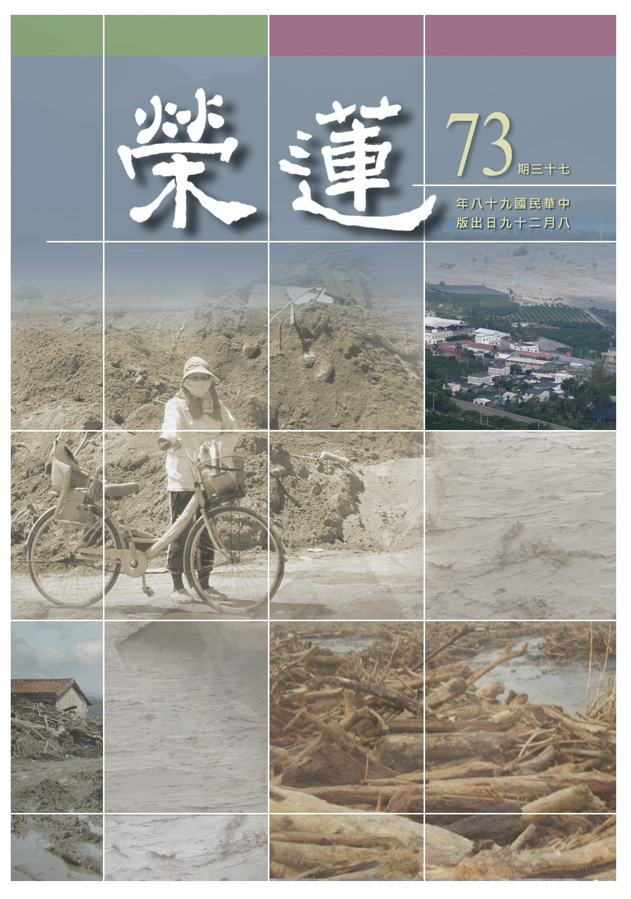

# 第73期

## 社論

### 天亮了

本刊

天將大任磨心志

忍苦悍勞能力增

歷事練心長器識

黎明曙光天亮了

久病渴望良藥、久旱渴望甘霖、久陷牢獄渴望自由、無知渴望求學、為貧窮所困渴望富有、悲賤受人欺侮者渴望得尊貴身受人尊敬、身陷苦難的百姓渴望天下太平。然而到底能不能有願必成、心想事成呢？每一個人都是自己命運的建築師，也是栽種自己未來受用果實的農夫。《華嚴經》上亦云：心如工畫師，能畫諸世間。

八八風災至今已三週，至今仍有百姓家猶在污泥之中，臺灣東南部山區柔腸寸斷，浩大的救災工程，百廢待舉的災區與舉債十四兆的政府，所有不利的因素在這次風災中爆發。

然而，身處谷底即是翻身處，冬天來了春天不遠，苦難正是安樂的開始。因為透過不斷的粹煉，使人成長，能培養出幹才，持續努力的改善也是耐力的考驗、願力的試金石，正所謂路遙知馬力，日久見人心。領導者於此災後的重建，培養幹練的辦事人才，日後必能有效處理國政；而災民在走過泥濘的歲月與困苦的日子後，會更珍惜自己的幸福，擁護政府的河川整治、土壤保持、紓解河床、穩固建設；社會也訓練出一股人溺己溺、互助合作的情懷。

由於苦難使得人為自私的因素去除；由於苦難懂得相互扶持，感恩他人無私的奉獻，珍惜現起的幸福；由於苦難使得為政者更加務實；由於苦難讓宗教界人士發揮大愛的精神；由於苦難讓人懂得重新思考建設真正幸福的未來；由於苦難讓人難掩失去親情的悲慟而更珍惜親情的可貴。

總之善用苦難，帶來的好處是無限的，能在起心動念中關照他人、施捨他人，不斷地充實自己，提攜他人，看來黑暗過後天該亮了！

## 大德法語

### 大方廣圓覺修多羅了義經（三十三）

道源老和尚

佛性本有待開發

識教之緣真心求

除垢離障顯性體

原來法爾已如是

乙二、正宗分

丙二、令依解修行隨根證入

丁二、廣明行相

戊一、四問答通明觀行上根修證

己二、徵釋迷悟始終

庚一、金剛藏啟請

經文：

於是金剛藏菩薩，在大眾中，即從座起，頂禮佛足，右繞三匝，長跪叉手而白佛言：

庚二、正陳請詞

辛一、慶聞述益

經文：

大悲世尊！善為一切諸菩薩眾，宣揚如來，圓覺清淨，大陀羅尼，因地法行，漸次方便，與諸眾生，開發蒙昧。在會法眾，承佛慈誨，幻翳朗然，慧目清淨。

陀羅尼是總持法，有大陀羅尼門名為圓覺，這大陀羅尼的圓覺法門，如來善於解說，金剛藏讚歎佛之宣流，然而佛宣說這圓覺大陀羅尼與我們有什麼相干呢？這是一切如來因地法行。一切如來是如何成佛呢？在因地（最初發心）時，修的是什麼法行呢？現在如來善說，都給我們說清楚了，以及說明修學次第。

眾生都是初學（蒙）無知（昧），都被佛開發智慧了。在圓覺的法會這些大菩薩還沒有成佛，還是要聽法，所以在會的法眾今天也得了利益。承蒙佛的慈悲教誨，大菩薩還有微細所知障，等於眼睛生翳子，還沒有完全好，那翳子是如幻化的，不是實在的，翳子不是眼珠，是眼睛生了翳子，可以治好的。此時將最後一層薄薄的翳子除掉，謂之幻翳朗然，智慧完全清淨，此是在會的法眾所得的大利益。

辛二、正申難問

經文：

世尊！若諸眾生本來成佛，何故復有一切無明？

若諸無明，眾生本有，何因緣故，如來復說本來成佛？十方異生本成佛道，後起無明，一切如來，何時復生一切煩惱？

金剛藏菩薩先讚歎如來善說圓覺妙行因地法行，及漸次修行方便，但還有疑問要問，若你（世尊）講到眾生本來成佛，何故復有一切無明？會有這種懷疑的眾生很多，此時金剛藏菩薩不懷疑，卻替我們眾生請問，總共提出來三個疑問。

金剛藏菩薩聽到對普眼菩薩講，眾生本來成佛，恐怕學佛法的人懷疑，所以替我們請問世尊：假若眾生本來成佛，何故復有一切無明呢？眾生與諸佛的不同，就多了這麼個無明，斷了無明成佛，這個道理好懂，現在佛說眾生本來成佛，如何產生一切無明呢？一切無明有根本無明、枝末無明，謂之一切無明，這第一個疑問。

第二個問題，無明是眾生本有，從無始來就有，謂之無始無明！有眾生就有無明，是本來有的，又是什麼因緣如來說眾生本來成佛？這是第二個疑問。

十方異生本成佛道，後起無明。一切如來，何時復生一切煩惱？假如是十方異生，異生也就是眾生的別名，就是一切凡夫，「異生」乃異於聖人之生，不同於聖人之生，謂之異生，乃凡夫的另一個翻譯。假如十方凡夫本來成佛，如何又生起無明？如果真的又生起無明，那麼這個問題大了！

一切如來都是聖人之生，依著一切如來，何時又再生起來一切煩惱呢？再變成異生呢？第三個問題是接著第二個問題，諸佛是成佛的聖者，什麼時候再生無明、再生煩惱呢？

辛三、結請通釋

經文：

惟願不捨無遮大慈，為諸菩薩開秘密藏。及為末世一切眾生，得聞如是修多羅教了義法門，永斷疑悔。作是語已，五體投地，如是三請，終而復始。

稱大悲世尊為大慈，無遮大慈即是沒有遮止的大慈，有問必答，唯願世尊你不捨無遮大慈之心，即使我問得不得體，還是希望世尊諒解，凡夫眾生會起這樣懷疑，若不解釋清楚會貽誤眾生善根，所以特別請求世尊，為諸菩薩開顯祕密藏，菩薩不知，稱為祕密藏，佛法沒有祕密，佛法都是公開演講的，但因為眾生不知，不但眾生不知，佛的秘意連菩薩也不知，唯佛與佛才能知道究竟，所以叫作祕密藏。

唯願如來世尊把祕密寶藏打開，跟我們說清楚、說明白，更請為末世一切眾生、為我們這些還沒有成佛的菩薩，打開祕密寶藏，說給我們聽，還要為末法時代求大乘的這一切眾生，聽到您所宣說的經教。

修多羅叫做契經（契理又契機），如來說法記載在經本上叫經教，佛經有了義經，有不了義經，有了義的法門，有不了義的法門，了義—就是究竟明了之義，生疑則生悔，此時宣說了義之教，能斷眾生的懷疑，永遠不會生悔，所以永斷疑悔。

庚三、如來讚許

經文：

爾時世尊告金剛藏菩薩言：善哉善哉！善男子！汝等乃能為諸菩薩及末世眾生，問於如來甚深秘密究竟方便，是諸菩薩，最上教誨，了義大乘。能使十方修學菩薩，及諸末世一切眾生，得決定信，永斷疑悔。汝今諦聽，當為汝說。

世尊告訴金剛藏菩薩：你能為現在的菩薩、為末世的眾生，問到如來甚深的祕密法門，這個究竟的方便法門，是對諸菩薩最上教誨、了義大乘，請佛開示甚深的祕密法門（了義大乘）是究竟方便的法門，為諸大菩薩的最上教誨，能使十方修學菩薩，及諸末世一切眾生，得到決定信，永斷疑悔。

你不但替現前初發心菩薩請問，也是替末世大乘根器眾生請問，那麼我（佛）就依此因緣（金剛藏請問）宣講甚深的祕密法門，將最圓滿的了義大乘講清楚！能令現前十方菩薩，以及圓覺法會中之十萬大眾得利益，甚至是末世眾生都能得利益，得決定信的利益，就能永斷疑悔。有疑有悔就會對法信心動搖，沒有疑悔就能信心決定，相信正法的修學可以令我離苦得樂。

最後世尊還是讚歎金剛藏菩薩問得好。雖然後面喝斥金剛藏菩薩的問題於理不合，此處讚歎乃因金剛藏菩薩是為初發心的菩薩請問，替末世的眾生請問！

庚四、承教靜聽

經文：

時金剛藏菩薩奉教歡喜，即諸大眾，默然而聽。

下邊佛就開講了。（下期待續）

### 常禮舉要講座（十四）　出門篇

雪廬老人

出門遇事多

不離替他想

禮儀及衛生

危地不好奇

出門

◎十一、遇婦女老弱，應儘先讓路讓座。

出門在外，或行路、或坐車、或者到公眾地處、或遊覽地處，有了年紀的、身體不好的老弱婦女，婦女原來比男子稟賦差，身體軟弱些，或可腹中還有個小孩，那就更不用說了，她有累贅嘛，雖法律沒有強規定，然見了這四類的人要讓他們先走，有座位要讓他們先坐。在公眾地處有坐的地方，你坐下來了，已沒有第二個座位，即使你坐在石頭上，這也不是人家安的什麼座位，你看見他們往這裏來，你起來讓給他們坐，他不坐、你就隨他。坐車子更不用說！這是什麼呢？就是禮。凡是恭敬他人、不妨礙他人的就是禮。禮含藏著道德在內。

◎十二、途次有人問路，須詳為指示；問路於人，須隨即稱謝。
我們走在路上，此時有人問路，或許我們雖然是本地人，有時也不知他所問的地處。他認為你走的態度不慌不忙，像本地人似的，他是彰化人、我們是台中人，他
**問：** 先生，南屯往那裏走？他若遇見我，我還真不知往南屯的路。你碰見了這樣的情形，會怎麼樣呢？人家不知道路，看你像台中人，問問你，你得將知道的詳詳細細的跟他說個明白，為什麼呢？你不說清楚他聽不明白，他走錯了路就耽誤了半點鐘或者一點鐘的功夫也未可知。

若他誤了事就是誤在你身上。你要是帶著鉛筆、本子，就畫個路線給那個路人更好。雖然話要說得清楚，然須簡要詳明。平素說話就囉嗦的人，開頭他問南屯，你說這裏還有西屯，還有北屯什麼的，這叫囉嗦。人家問你南屯你就講南屯，要言不煩這還不會嗎？

古書上，有一個博士，自己騎驢要賣驢，賣驢得簽契約，當個博士還不會寫契約嗎？彼洋洋灑灑寫了三張紙，三篇文作完了，上頭沒有一個驢字，我不必說別的，你想想吧！博士作的文章還錯了嗎？三篇大文竟沒有一個驢字。你賣的是驢，對方看了文章沒有一個驢字。現在報上登文章的，萬言說完了，說了什麼事情還不知道呢，現在犯的毛病太大了。人家問路於我，你要是不知道，你便說痛快話：對不起！我是個生人，我不知道，你問問別人吧！你是本地人，得知問路的苦處，得體諒人。

若是咱問人呢？問路於人，須隨即稱謝。上來稱呼某先生（看看對方，要有尊敬的稱呼），人家說了路必得道謝、道謝，現在人不覺得要有什麼禮貌。從前這些肩挑、貿易、推車等一些苦力都有禮貌，推車的這些粗人有什麼禮貌呢？他推著車子看前面有人，他的車子快、前面走得慢，他不會說：快走、快走，到旁邊去讓我過。他們沒說這個的，「先生，借光、借光」，他說這個，借光這兩個字辭源上有，過去這些人都懂得，現在就不懂了。你們諸位說「借光」二字怎麼講呢？今日之下什麼叫學問？說話、做事都清清楚楚就是學問，大學問就是辦事，不辦事沒學問。把廿四史唸得熟，從頭背到底，倒過來再背還是個書呆子，幹什麼用啊？一點用處也沒有。

◎十三、一人不入古廟，兩人不看深井。

現在交通發達這種情形比較少一點，若到遠鄉和一些偏僻的地方，這種情形不能說沒有，此條或可實用。

「古廟」是什麼樣的廟？常關著門，不是人來人往的廟，是沒人管的破廟。這個廟，你一個人不能進入，兩個人就可以進去，什麼意思呢？我先不講，這邊也沒小註。或者今天是星期五，下星期一我還來，你講給我聽聽。這個你別查禮記去，禮記上可沒有這兩句。或云：書上沒有你講這個幹什麼？一人不入古廟，何以兩人不看深井？三個人可以看嗎？三個人就可以看、兩人不許看，那麼一個人可以看嗎？一個人可看，就是不許你兩個人，這就是要言不煩，就得這麼樣，改個字也不行！有云：佛經我都能改，這個不能改嗎？佛經你改、你入你的地獄，這個你改了現世就倒楣。

◎十四、逢橋先下馬，過渡莫爭船。

現在臺灣騎馬的很少，過去是一過橋要先下馬。一些武將終日騎著馬在陣上打戰、路況瞧多了，每逢唱我這一句：逢橋先下馬。看見橋趕緊下來，還是那個樣啊！

從前是南船北馬，在南方得懂水道，在北方得懂得騎馬。懂得馬的情形，就知載人的馬和上陣的馬不一樣。上陣的馬都有訓練，那馬不會一放炮就跳起來，沒那種功夫還能打仗嗎？上陣的馬都很鎮靜，行路的馬就不行了，牠看見水就要喝水，你這個騎馬的人要是外行，牠一到橋邊偏往橋下走、往水裏跳，你老先生又不會騎馬又不會游泳，那就行了（此為雪廬老人之反語詞）。此時你先下馬、牽著牠過橋就不要緊。

過渡莫爭船，上船要經過擺渡口，也不是什麼大擺渡，有時豎一個板就當做是岸，忽然間人多了，板發生了毛病就出了危險，載多少人是一定的，要是超過了人數，船伕也不讓你上船。

◎十五、在舟車上或飛機上，不探首或伸手出窗，並不得隨便涕痰。

在船上、車上、飛機上不能將手伸到外頭，如乘船的人在前頭，掌舵的人在後頭，那個船在十里風下疾駛，兩岸有什麼障礙物那就不一定，你將頭手都伸出去，走到障礙物那裏，頭收回來，手卻來不及收回，碰上了就很危險了。

一般是一上車坐在車裏，都坐好了、管車的小姐才吹哨子關了門，這才行。然而自己的車子反而惹麻煩，大家看我這個手（右手食指）還長出指甲來，沒變什麼樣，當時我上車後，手還沒進車裏頭，有同仁好心地將門「砰」一聲關上了，我的手被夾住了，怎麼辦？我說：唷、我的手被壓住了，你慢慢地把門開開！他這才開開，要是慌慌張張地那不行啊！開了門這才將手拿出來，到了醫院，沒法子只好割破將手指挑出來，好麻煩的一套。往後我上車、右手跟著進去，坐好我才讓人關門。坐公共汽車不要緊，坐自己的車要小心，送客的好心好意地將車門砰一聲，你就倒楣。

並不得隨便涕痰，為什麼呢？你在車上幹這件事警察不一定能限制你，你的車子一開，隨便涕痰，風一吹、涕痰往後頭飛，後面的人挨著，這下可好了。（下期待續）

## 蓮池海會

### 本淨寺開山普道法師其人其事

*智高整理*

膽識勇悍大丈夫

頭陀聞法如一日

識得雪廬真善士

人生大道無後顧

民國九十四年二月位於台中霧峰本淨寺（雪公云：有佛的地方）殊勝的短期心經研討，相信大家仍然印象非常深刻，除了清淨舒適的環境以及老師精妙的佛法開演之外，還有就是那位慈祥的本淨寺住持上普下道法師。師父已於日前往生，享壽八十四歲。關於師父，可以從幾個小故事來表達我們對師父的懷念。

一、供養清淨的內因及修學正法殊勝的外緣：

師父俗名叫李鳳妹，民國十五年出生，當師父年紀小時即感受與佛法有深厚的因緣。十二歲即在台中靈山寺皈依三寶，且對僧眾修行者之恭敬非一般人可以比擬的。例如台中某一寺廟住持於生病時想吃「過貓菜（台語發音）」，師父隨即搭五分車（當時的小火車）專程供養，出發前身上僅帶三角錢，即是五分車來回的車錢（單程一角五毛）。

當師父供養住持後走回了車站，準備要搭車回家時，忽然看見一位衣衫襤褸的出家人，當師父眼光看到那位出家人時，那出家人正好也將缽直接遞到師父面前，師父沒有多想，隨即就將身上僅剩的一角五毛車錢全數供養了那位出家人。沒了車錢的師父，反而開開心心的從台中跑回霧峰，內心非常歡喜想的是：沒想到這一角五毛也能做供養！從由此而知師父供養僧眾的內因是多麼清淨！

其後蒙雪公太老師、廣欽老和尚和懺公師父攝受，可知修學正法殊勝的外緣。

二、幹勁與心量（相信這是修學基礎）：

（一）幹勁：

當時日據時代（約是師父十八至二十三歲左右），大多數的男丁被調去當軍伕，所以留下了很多荒田，於是當時霧峰林家的老闆就向師父說：這裡有一片四甲多的地，若你能將地整好就給你二千元的報酬。當時師父在農會上班，擔任指導員的工作，當時月薪僅三十元。於是師父每天早上八點到農會上班，五點下班後隨即就到田裡整地，一直整到晚上十二點才回去休息，但凌晨兩點又起床回至田裡繼續整地，這樣日復一日。

一次林家老闆深夜探望丈母娘，在回家途中，見到田地上有一個黑影，於是就按了幾下車鈴，師父隨即俏皮的應道：是人不是鬼，安心的過吧（台語）！隔天，林家老闆見到了師父就說：鳳妹！鳳妹！昨晚見到的人是妳嗎？師父說：是啊！林家老闆云：拚了！拚了！以後這片地都是妳的了，沒有人能爭得過你啊！後來這片地也就是現在本淨寺的所在地。

（二）心量：

然而師父如何買下那塊地？話說民國三十九年至四十五年左右，也就是師父大約二十四歲至三十歲之時。當時師父種植甘蔗，收成之後會將甘蔗煉成糖，所煉成的糖一半會賣給台糖公司，一半則會存至彰化銀行的倉庫中。一次和台糖交易買賣的過程中，台糖公司的人員，多算了五千元給師父，事後師父算了算金額，隨即聯絡那位台糖人員告知他多算了五千元，那名台糖人員非常驚訝也很感激，心想有機會一定要報答師父。

結果有一年，台糖要出口糖至日本，不料卻遭颱風襲擊，所有要出口的糖全數都被颱風摧毀，後來台糖公司查了一下資料，發現彰化銀行倉庫還有六百包糖，而這六百包糖全部是師父所存入的，於是台糖公司希望師父能將糖全數賣給他們。當台糖的人員向當時師父的村長（保正）詢問師父的住處時，村長還很不可置信的說：她怎麼可能會有糖，她窮得快被鬼抓走了！受師父幫助的那位台糖人員，就藉此機會，將師父儲存的糖價抬到台糖當時能接受的最高價格，也就是一包四百元（當時糖價一包一百元），這場買賣共計二十四萬元，成為買下本淨寺那塊土地的基金。

師父雖賺錢辛苦卻一點不吝嗇，除了基本生活開銷及農務上的花費如肥料等，只要是公共建設都不吝惜的捐出。一次某寺廟要翻修，當時霧峰林家捐出六百元，沒想到師父一口氣竟捐出了二千元。後來林家老闆知道了這件事，就告訴師父說：你啊！要省一點，以後你整的那片地還要賣給你呢！由這個故事我們也可以看出師父的心量。

三、受雪廬老人攝受的因緣：

（一）對雪公建立無與倫比求法的信心：

師父是雪公最早期的學生之一，早在民國三十八年，即在雪公座下聽心經，是雪公來台所講的第一部經典。當初是靈山寺住持與當家見師父對於佛法非常好樂，於是就邀師父一起去台中法華寺聽雪公講心經。據師父形容：初期有六張長板凳，一張坐兩個人，大約還有一、二十人聽經，後來只剩最前排的三、四人。

於是雪公請智雄法師問問這些繼續留下來聽經的人聽得懂嗎？當時德真法師及德欽法師皆說：只聽到你啊！俺啊！其他則聽不懂。而師父卻說：雖然聽不懂，但很好聽！之後，每逢雪公講席，師父總是最先到達從不缺席，不管颳風下大雨，甚至河水暴漲，須涉水而過，甚而水深及腰，皆擋不住聞法熱誠。而且在上課中所錄的錄音帶，無論是前往聽經的途中或回程（霧峰台中來回師父都是徒步的）及平時日常工作時，師父總會將這星期的錄音帶不厭倦反覆的聆聽。

（二）不懂則問到底：

初期因為與雪公言語上不通（後亦有請懺雲法師翻譯，雪公講山東話，懺公再翻成日語），所以在課堂上總是會發生一些小插曲。一次雪公說了一番道理但是師父卻不認同，中間雪公與師父可能有一番的應答，結果師父反問雪公：鬍子比較長還是眉毛比較長？（意思是不要倚老賣老，眉毛雖然較鬍子還早長出，但鬍子卻比較長。）可知師父雖好樂聽法，然是經過思維而非迷信盲從。所以師父也自嘲說：他們這一輩受日本教育的最難教，雖聽不懂卻要問到底！

（三）堅定聞法意志：

廣欽老和尚很早就注意到師父了，老和尚發願三台弘法，然中部已有雪公，故來台中欲攝受本淨寺兩位師父，作為圓滿願力表徵。老和尚曾多次詢問師父的住處，師父都沒有告訴廣欽老和尚，有一次師父竟頑皮的回答老和尚：我住在空中寺！廣欽老和尚後來還是找到了本淨寺，並對師父說：你住在空中寺我也找得到！

那時師父正要去聽雪公講經，竟對老和尚說：找到是找到，但我現在沒空，我要去聽經了！當時廣欽老和尚的聲望是不用說了，但師父對自己所選擇老師的信心卻從不動搖，這一份率直更是難能可貴！師父與雪公這份師生之情，甚至到了師父晚年，每每提到雪公時的神情就像昨日之事，怎麼說都不會厭倦。

以上普道法師其人其事，向師父請問後之紀錄或稍有出入，敬請不吝指正，唯知盡力描述，或能幫助大家少分了解法師，修學能有所榜樣與依據。

## 專題研學

### 聖者的祕密～大佛頂首楞嚴經二十五圓通暨七處徵心探源

### 二十五圓通暨七處徵心簡介　（十四）普賢耳識

時哉

體會願王慕普賢

耳識聞知愛慕者

騎乘白象護慰彼

導入殊勝普賢行

前言：

如何現證佛的圓通，釋迦牟尼佛慈悲地請二十五位修學有成的聖者報告他們是用什麼方式成就佛圓通的修學法，分別從六塵、六根、六識、七大入門，古德所謂：方便有多門，歸元無二路。

寅七、普賢耳識

卯一、作禮陳白

經文：

普賢菩薩即從座起。頂禮佛足，而白佛言：

四十華嚴是八十華嚴的入法界品，是從八十卷華嚴的第五十九卷開始，所以誦讀華嚴可以先讀八十華嚴之前五十八卷，再讀四十（卷）華嚴，共為九十九卷。一般華嚴經入法界品又可稱為普賢行願品，尤其經文結尾普賢菩薩以十大願王導歸極樂，知《華嚴經》歸宗結頂在彌陀淨土。所以有說此經是大本的《彌陀經》，《彌陀經》則是小本的《華嚴經》，淨土法門的根本處在《華嚴經》。是故有人說淨土宗的第一代祖師可以遠溯至普賢菩薩。

普賢菩薩有所謂道前普賢、道中普賢及道後普賢，道前普賢是指三賢位修普賢行的菩薩，道中普賢是初地到十地修普賢行的菩薩，道後普賢則是成佛之後示現普賢行的菩薩。所以菩薩階位的修學一言以蔽之就是普賢行，普賢行的核心處是十大願。

卯二、陳白之言

辰一、輔化垂範

經文：

我已曾與恒沙如來為法王子。十方如來教其弟子菩薩根者修普賢行，從我立名。

我已曾是恒沙如來座下的法王子，亦即曾經侍奉恆河沙的如來，成為大乘的上首弟子，是準備承擔佛位的上首弟子，如同《普門品》中讚歎觀音菩薩是「侍多千億佛，發大清淨願」。而這些大菩薩都是以作為佛侍者的功德來成就佛果。

現在的人，讀書並非按部就班，雖然書讀得很多，然無法將所學的內涵內化。須知讀書先從做人開始，做人先從家裡侍奉父母開始，出外懂得侍奉師長，要從當中厚培學問，不是離開這裡還有學問可得。

十方如來教其弟子具菩薩根者修普賢行，從我立名就是須要具菩薩根器效法普賢菩薩，十方諸佛教導弟子修學成佛的法行都以普賢立名，稱之為普賢行。

菩薩修學普賢行，輔助諸佛教化眾生，普賢菩薩是所有菩薩的典範，而他如何成就呢？

辰二、耳識鑑機

經文：

世尊。我用心聞，分別眾生所有知見。

聞雖由耳，然須用心，方能順知眾生心意，孔子是六十而耳順，顏回亦有孔子這般境界，孔子讚顏回：吾與回言終日，不違如愚，退而省其思，亦足以發，回也不愚。顏回整天聽課，到底有沒有聽懂？他既沒點頭也沒搖頭，孔子無法得知他到底懂不懂，可是顏回課後發議論時，都是發孔子的未盡之意，所以孔子說回也不愚，謂之用心聞。此時普賢菩薩了知眾生心聲，行相上似為耳識的境界，但實為他心通（心聞），這是普賢菩薩後得位的表現。

辰三、普護行人

經文：

若於他方恒沙界外，有一眾生，心中發明普賢行者，我於爾時，乘六牙象，分身百千，皆至其處。縱彼障深，未得見我。我與其人暗中摩頂，擁護安慰，令其成就。

修行是心中發明，不光是嘴巴讀誦，三字經說：口而誦，心而惟；朝於斯，夕於斯。心中發明普賢行，就是心中體會十大願王，從十大願攝持菩薩行，謂之發明。心中發明的領悟力，旁人難以體會你的悟性，如諸葛亮所讀的古書，可以在事務上活用，這就是心中發明。

普賢菩薩於爾時乘六牙白象，象代表忍辱負重，普賢行必須要有忍辱負重的精神，象之六牙代表六度，是所有菩薩行的總綱，而六度中的每一度，又為十大願王所攝持，稱為普賢行。

此時「分身百千，皆至其處。」修學普賢行的人，心中發明普賢行的人，爾時普賢菩薩分身百千，至修普賢行者身旁，護慰彼菩薩道的修學。雖然此行者在心中發明佛法的義涵，或有修學上的障礙，此時感得普賢菩薩冥冥加被破除障礙，加被有六種（顯感顯應，冥感冥應，冥感顯應，顯感冥應，亦冥亦顯感而顯應，亦冥亦顯感而冥應—印祖文鈔），此時是普賢菩薩冥冥中加被，關愛憐憫（顯感冥應）。

卯三、結答圓通

經文：

佛問圓通。我說本因，心聞發明，分別自在，斯為第一。

「佛問圓通。我說本因」，佛問圓通修學法，菩薩答以根本成就之因，是「心聞發明，分別自在，斯為第一。」以耳所聞，並在內心生起體悟，這些人生經驗雖然講不出來，但卻非常重要，不是強詞奪理就對。

「分別自在」之分別是後得位的觀察，聽眾生的話，就可知他修行的內涵以及體悟的深淺，禪宗公案中，師父一見弟子即知彼有否開悟，談一談就知開悟的深淺，謂之分別，雖從耳聽然由心悟，謂之心聞。

何謂「自在」？其一是在世俗上對眾生的根機恰如其份的認識，如六十而耳順，由耳聞中能順知他的心；其二是約勝義，聞一法能在此法中通達無自相，稱之為自在。

此處耳識圓通是約世俗，然圓通的根本處是約勝義說，若修學耳識的自相空，彼之修法是觀察耳識不能自己生，也不是從自己的種子生，非從耳根生，亦非從第六識生，現證耳識自相不可得，此時心識前空靈靈，稱之為耳識圓通。（下期待續）

### 六趣輪迴經簡介（六）餓鬼道

*盡意整理*

鬼雖分三類

同屬貪等流

學道障礙身

智者懺此因

以上是無威德之鬼道眾生，其次有威德的多財鬼，包括：羅剎鬼、尋香鬼、猛惡鬼、步多鬼、藥叉鬼、藥叉王。

羅剎鬼

經文：

若人多讌樂，廣殺諸物命，自食復與他，後墮羅剎鬼。

讌樂是以讌飲為樂，現在政治聚會或商場上談生意都很喜歡讌飲。以前有位蓮友到大陸去談生意，一攤吃過一攤，直到清晨三點鐘，覺得快要受不了了，無法過這種日子，怎麼辦？這種是鬼日子！在讌樂中，廣殺諸物命，每場酒席都要殺生，命命都是螃蟹、龜鱉、乳豬等，就是廣殺物命。

為什麼會墮羅剎鬼呢？因為自食復與他，由於有與別人共享用的善業，但又有喜歡吃物命的惡業，所以依著善惡業而墮到羅剎鬼。羅剎鬼的因地喜歡在酒席中吃魚、豬、雞、鴨等眾生，所以等流果就是喜歡將他人活活吃掉。

可是也要有福報才能作羅剎鬼，否則就是墮到無威德鬼中。記得曾到過一家養老院，裡面住的都是退休的將領、教授、校長等高級知識分子，依常理推斷彼此應會互相禮讓，然所見卻是大家互不往來甚至吵架、打架！理由是爭吃雞腿，覺得奇怪吧！有些人吃不到雞腿，有些人一個便當裡面裝了三、四隻雞腿，到了晚上看電視當宵夜，一隻吃不完丟三隻，連羅剎鬼都做不到，羅剎鬼至少還高興將雞腿分給大家吃。

羅剎鬼是由北方多聞天王所管轄，但因管區廣，難免有些為非作歹為害人間，若想要遠離鬼難，最好要經營和合氣氛之團體、相信因果、斷惡修善（供養三寶、作早晚課、念佛等）；此外，睡覺時最好吉祥臥（側臥），因為仰臥容易被吸精氣，導致第二天早上疲累不堪，若能多方面努力，則可免除種種障難，得到修道順緣。

尋香鬼

經文：

於供養香花，或嗅或私取，由起少貪心，後作尋香鬼。

尋香鬼由東方持國天王所管轄，過去曾在佛前供養香花，喜聞花香或喜私自取一些受用，由於起了貪愛心，故投生作尋香鬼。尋香故名思義是有香則來，供養物分六塵（色、聲、香、味、觸、法），不是將好的受用而是將壞的拿來供佛，或想佛不會受用供品，所以儘量供，供完就是我的，以上心態千萬不可以。不但應將好的物品供佛，還要講究供養的心意，這些都與未來的果報相聯繫。
或
**問：** 供佛後的物品應以何種心態取用呢？應觀想是四眾弟子（出家及在家二眾）一起享用供養後的食物、點心，而非自己私慾的受用。

猛惡鬼

經文：

若人相崇奉，於己有所求，怒色希彼財，後作猛惡鬼。

若人相崇奉，於己有所求：此人生前有威望，常有求者，且對其有信心並常拜託他幫忙。怒色希彼財：怒色是指這個人很驕傲，幫助他人後希求回報。雖然表面上幫人家忙，可是驕傲看不起人又貪求他人之回報，所以二者一結合就變成很有勢力之猛惡鬼，動不動就發脾氣，且貪得無厭。故面對自己心中那份慾火、瞋火要小心，否則一不小心就落入圈套。平日參與放生的法行最能對治有所求的煩惱，因為放生是對所放生者不求回報的（利益眾生不需要回報），若能取那一份不求回報的心作佛法的實修，將有利於自他。

步多鬼

經文：

若人於他娶，常樂作媒伐，後懷惡相離，死作步多鬼。

作媒伐：指如三姑六婆般的專門且喜歡作媒人。後懷惡相離：後來又分離以前所聚合之人。因為分離人家是惡的，讓人家聚合是善的，如此惡多善少，所以苦多、樂少。步多鬼有威神力，或化為鬼火，或化成虎狼吸人精氣。故面對和合團體應起讚歎心，不可有忌妒拆散的心，如何讓人和合、助團體生起和諧的氣氛，此乃重要之修學法。

藥叉鬼

經文：

若人樂飲酒，過量復顛酗，或持勸他人，後作藥叉鬼。

若人樂飲酒，過量復顛酗：此種人喜歡喝酒，且每每喝得過量，酒醉發怒、發酒瘋，藉酒生膽識。或持勸他人：酒醒後悔，勸人不要喝酒，喝酒對身體是很大的過患。此人死後投生藥叉鬼，酒所引的膽勢，令藥叉鬼勢力很強。藥師經云：念藥師佛名，有八萬四千個藥叉鬼保護。

藥叉宮（王）

因：

於父母師長，所欲相違背，

果：

後生藥叉宮，勇健多卒暴。

藥叉王是藥叉鬼界之國王，因地乃於父母師長所欲相違背，所謂孝要從順開始，一般人雖然有孝，可是常常違背父母的心意（不順），以違背父母的心意來孝，投生為藥叉王。勇健多卒暴：因地上雖然有孝卻無順（個人看法過強），所以果報上雖勇敢且身體強健，脾氣卻暴躁容易生氣動怒。

結誡勿慳貪

經文：

彼慳貪過失，常生餓鬼中，苦樂隨自因，是故勿復造，餓鬼趣竟。

結論是勸人勿慳貪。以慳貪的過失為因，而得到投生餓鬼道的果報，所以果報是苦是樂乃隨自己因地的造作而來。鬼道中有苦樂，苦是恐懼不安、受用匱乏等，此乃由慳貪所引發之捨不得、妨礙別人等煩惱而來；樂是由一分的反省、懺悔、給與而來，所以鬼道眾生可分為多財鬼、少財鬼、無財鬼，當中之受用是不同的，而不是什麼都不能吃到，苦樂已在因上決定了。以上是餓鬼道。（下期待續）

## 活動報導

### 心靈的印記～八八風災過後

### 前言

二十五圓通暨七處徵心簡介　（十四）普賢耳識

時哉

體會願王慕普賢

耳識聞知愛慕者

騎乘白象護慰彼

導入殊勝普賢行

前言：

如何現證佛的圓通，釋迦牟尼佛慈悲地請二十五位修學有成的聖者報告他們是用什麼方式成就佛圓通的修學法，分別從六塵、六根、六識、七大入門，古德所謂：方便有多門，歸元無二路。

寅七、普賢耳識

卯一、作禮陳白

經文：

普賢菩薩即從座起。頂禮佛足，而白佛言：

四十華嚴是八十華嚴的入法界品，是從八十卷華嚴的第五十九卷開始，所以誦讀華嚴可以先讀八十華嚴之前五十八卷，再讀四十（卷）華嚴，共為九十九卷。一般華嚴經入法界品又可稱為普賢行願品，尤其經文結尾普賢菩薩以十大願王導歸極樂，知《華嚴經》歸宗結頂在彌陀淨土。所以有說此經是大本的《彌陀經》，《彌陀經》則是小本的《華嚴經》，淨土法門的根本處在《華嚴經》。是故有人說淨土宗的第一代祖師可以遠溯至普賢菩薩。

普賢菩薩有所謂道前普賢、道中普賢及道後普賢，道前普賢是指三賢位修普賢行的菩薩，道中普賢是初地到十地修普賢行的菩薩，道後普賢則是成佛之後示現普賢行的菩薩。所以菩薩階位的修學一言以蔽之就是普賢行，普賢行的核心處是十大願。

卯二、陳白之言

辰一、輔化垂範

經文：

我已曾與恒沙如來為法王子。十方如來教其弟子菩薩根者修普賢行，從我立名。

我已曾是恒沙如來座下的法王子，亦即曾經侍奉恆河沙的如來，成為大乘的上首弟子，是準備承擔佛位的上首弟子，如同《普門品》中讚歎觀音菩薩是「侍多千億佛，發大清淨願」。而這些大菩薩都是以作為佛侍者的功德來成就佛果。

現在的人，讀書並非按部就班，雖然書讀得很多，然無法將所學的內涵內化。須知讀書先從做人開始，做人先從家裡侍奉父母開始，出外懂得侍奉師長，要從當中厚培學問，不是離開這裡還有學問可得。

十方如來教其弟子具菩薩根者修普賢行，從我立名就是須要具菩薩根器效法普賢菩薩，十方諸佛教導弟子修學成佛的法行都以普賢立名，稱之為普賢行。

菩薩修學普賢行，輔助諸佛教化眾生，普賢菩薩是所有菩薩的典範，而他如何成就呢？

辰二、耳識鑑機

經文：

世尊。我用心聞，分別眾生所有知見。

聞雖由耳，然須用心，方能順知眾生心意，孔子是六十而耳順，顏回亦有孔子這般境界，孔子讚顏回：吾與回言終日，不違如愚，退而省其思，亦足以發，回也不愚。顏回整天聽課，到底有沒有聽懂？他既沒點頭也沒搖頭，孔子無法得知他到底懂不懂，可是顏回課後發議論時，都是發孔子的未盡之意，所以孔子說回也不愚，謂之用心聞。此時普賢菩薩了知眾生心聲，行相上似為耳識的境界，但實為他心通（心聞），這是普賢菩薩後得位的表現。

辰三、普護行人

經文：

若於他方恒沙界外，有一眾生，心中發明普賢行者，我於爾時，乘六牙象，分身百千，皆至其處。縱彼障深，未得見我。我與其人暗中摩頂，擁護安慰，令其成就。

修行是心中發明，不光是嘴巴讀誦，三字經說：口而誦，心而惟；朝於斯，夕於斯。心中發明普賢行，就是心中體會十大願王，從十大願攝持菩薩行，謂之發明。心中發明的領悟力，旁人難以體會你的悟性，如諸葛亮所讀的古書，可以在事務上活用，這就是心中發明。

普賢菩薩於爾時乘六牙白象，象代表忍辱負重，普賢行必須要有忍辱負重的精神，象之六牙代表六度，是所有菩薩行的總綱，而六度中的每一度，又為十大願王所攝持，稱為普賢行。

此時「分身百千，皆至其處。」修學普賢行的人，心中發明普賢行的人，爾時普賢菩薩分身百千，至修普賢行者身旁，護慰彼菩薩道的修學。雖然此行者在心中發明佛法的義涵，或有修學上的障礙，此時感得普賢菩薩冥冥加被破除障礙，加被有六種（顯感顯應，冥感冥應，冥感顯應，顯感冥應，亦冥亦顯感而顯應，亦冥亦顯感而冥應—印祖文鈔），此時是普賢菩薩冥冥中加被，關愛憐憫（顯感冥應）。

卯三、結答圓通

經文：

佛問圓通。我說本因，心聞發明，分別自在，斯為第一。

「佛問圓通。我說本因」，佛問圓通修學法，菩薩答以根本成就之因，是「心聞發明，分別自在，斯為第一。」以耳所聞，並在內心生起體悟，這些人生經驗雖然講不出來，但卻非常重要，不是強詞奪理就對。

「分別自在」之分別是後得位的觀察，聽眾生的話，就可知他修行的內涵以及體悟的深淺，禪宗公案中，師父一見弟子即知彼有否開悟，談一談就知開悟的深淺，謂之分別，雖從耳聽然由心悟，謂之心聞。

何謂「自在」？其一是在世俗上對眾生的根機恰如其份的認識，如六十而耳順，由耳聞中能順知他的心；其二是約勝義，聞一法能在此法中通達無自相，稱之為自在。

此處耳識圓通是約世俗，然圓通的根本處是約勝義說，若修學耳識的自相空，彼之修法是觀察耳識不能自己生，也不是從自己的種子生，非從耳根生，亦非從第六識生，現證耳識自相不可得，此時心識前空靈靈，稱之為耳識圓通。（下期待續）

### 如是我見～高屏災區寫實

*智高整理*

一場無情的風雨

化作人間的悲慘

逆境須有堅定力

煉出不敗的信心

緣起

這次莫拉克颱風所造成的八八水災，重創南臺灣，中央災害應變中心於本刊截稿前公布最新傷亡統計，目前全臺已有四百六十三人死亡、一百九十人失蹤、四十六人受傷（實際人數可能更多）。所以依著老師指示以及西蓮淨苑師父的委託，本著學會當初成立的緣起—九二一大地震，同是受災的心情前往勘災，希望在有限的資源內，能給予災區最大的幫助。

兩位在高屏地區閉關修學的法師在我們到達災區的前兩天，即事先了解當地災情及交通狀況，並聯絡好勘災相關人士，是學會賑災之順緣。

時間：八月十五日至十九日。

第一天（八月十五日）：

學會第一批共八人前往屏東縣高樹鄉，抵達佛林靜舍後，聆聽師父災情描述：高樹鄉共有十八個村，約九千五百五十戶。其中受災的區域如北區的新豐村約一百戶、菜寮村約六十戶，東部的泰山村約五百戶、司馬村約二百戶、大埔村亦有十幾戶。然最嚴重的是新豐村，當地居民大都以務農維生，此次颱風大水造成許多家園摧毀及農地流失，其中約有三十戶共二百多人無家可歸，目前皆暫住在新豐國小。

在師父的帶領下，先至新豐村勘查，一路上看到的是泥水沖積的情境。當到達新豐村時，師父請當地村里幹事沈先生帶我們到荖濃溪旁看災情，觸目所及盡是泥沙堆積，及上游沖下凌亂的巨木堆，沈先生說眼前所看到的泥沙沉積處及現在荖濃溪的河道都是之前的農田，包含沈先生自己的農田也在裡面，這樣被沖走的農地共二百多甲（約二平方公里）。除此之外，在我們面對荖濃溪的左手邊，就有一棟被大水沖倒的民宅，原來被沖倒的不僅僅是新聞常播出的臺東金帥飯店和太麻里的那棟民宅而已。

其次前往經由介紹，極有修養且不隨意表現困難及急需之屏東某寺道場，一再詢問法師之需求，列出所需物資清單。傍晚六點半時回至佛林靜舍，決議如下：

（一）由於此行資源有限，所以救災先鎖定以新豐村的受災戶為主，其中有五家房子及農地皆被沖毀；二十二家農地被沖毀（其房子雖未被沖毀，但目前亦不能居住），我們以慰問及發放賑災款為主。

（二）第二天（八月十六日）行程：一批蓮友前往新豐村發放款項，並前往三地門勘災。另一批人則至屏東法師處，將所需物資帶到並幫忙清除寺裏淤泥。

（三）第三天（八月十七日）與當地楊居士連絡，至旗山、六龜等處勘查，並抉擇實際作法。

蓮友前往屏東高樹鄉勘災、賑災，晚上皆至廣修禪寺掛單，此寺護持政府，收容急難之災民，並接受外地前去之賑災者掛單，發揮大愛精神。

第二天（八月十六日）：

（一）至新豐村發放款項並至三地門勘查災情：

１．新豐村：

四位學會蓮友配合在地師父們至新豐村時，已有許多阿兵哥及回鄉的親人在幫忙受災戶清理家園，雖然在熾熱的大太陽下接受酷暑的考驗，但每個人都只有一個念頭，就是趕快清出家中淤泥，所以整條道路灰塵瀰漫。風災雖造成村民田產重大損失，美好的田園景觀全毀，所倖無人員傷亡。

慈濟每日皆送便當到新豐國小，物資尚不缺，反而是清完家園、救災工作告一段落，後續村民的吃住及工作問題才是重點。這是一條漫長的救災路，希望民間及政府能本著初衷，持續支援。為略表慰問之意，我們依著沈幹事所列的名單，挨家逐戶的拜訪並發放賑災款，房子及田產全毀者發送一萬元，田產毀者五千元，共發送廿八戶。

２．三地門：

三地門交通受阻封鎖，救難工作全部動用直昇機，人、車無法進入災區，所以到收容災民的內埔工農勘查。一進入大禮堂，看到堆滿的救災物資，誠如服務員所說，目前物資不缺，暫時安住應無問題。該處目前已收容三百多人，但因學校即將開學，所以當地區公所已另找地要籌建組合屋供災民居住。

（二）屏東某道場：

四位學會老輩蓮友在前往道場途中，先購買所需物資，包含清掃用具、泡麵、水、飲料、漂白水等，約九點十分到達。

該寺原是清淨優雅之道場，然現今除佛殿及寮房尚完好外，眼見之處均為爛污泥所蓋。由於水溝（原是栽種蓮花的水塘）泥沙淤積，造成廢水無法排出，產生異味，遵照師父指示，頂著酷熱的太陽，費力挖起污泥，再由挖土機將污泥帶走。但因下游居民未積極清理淤泥，下午一場傾盆大雨，水溝又被淤積。為解決排水問題下午請師父電請沈幹事幫忙調派人手及機械，徹底清除上游的積土及下游水溝堵塞的淤泥。

而十七日至十九日前往屏東之第二批蓮友，亦遵照師父指示，清洗園圃中掩埋在泥沙碎石內的白、黑石子，或將已被高達小腿肚泥沙所掩埋的樹救起，或協助清理倉庫、清理房舍內外，清除排水孔泥沙淤積等。

第三天（八月十七日）：

早上至六龜楊居士處，告知現在六龜一帶之災區進不去，我們只能在周圍瞭解災情。先見到水災所沖毀的六龜大橋，當天大水高出橋面，將大橋沖斷，居民僅聽到「吥」（取其音，水底爆破的悶聲）一聲，橋就被沖斷了，可想見當時大水威力。

並蒙楊居士帶領前去幾處受災的寺廟，途中經過被大水沖斷的路段，政府在河床旁另闢一條臨時替代道路，並且將兩個舊有已封閉的隧道打通，之後又經過了一段山路，在車上師父說，其實這些道路都非常危險，加上下午常會下雨，再度坍方的機會很大。先到妙崇寺，聽說裡面建築非常宏偉壯觀，該寺花了二十年規畫建造，結果僅用兩年就毀了，住持師父非常難過也很無奈！妙崇寺依山而建，此次的大雨造成後山大量土石往下滑落，部分的建築物已被土石掩埋破壞（如文殊殿等），師父們也在裡面受困了三天，甚至還放沖天炮求救，最後才被直升機救出，幸好沒人傷亡。

現在交通還是無法開車進入，因為路基都被大水掏空。之後又去慧濟寺及其附近的修行道場（有般若精舍、彌陀精舍等共六個地方），這些精舍亦是受土石流之害，堆積最起碼有一層樓高，如一處供奉玉佛的建築物已完全被掩埋，只看到它的屋頂而已。在此也逐一供養道場，中餐之後就往旗山出發了。

當地居士告知現在旗山的清除工作，已由阿兵哥處理，且因停留時間有限，於是決定到旗山醫院為罹難者念佛。旗山因地處荖濃溪的下游，所以上游受災區（如六龜鄉）的罹難者屍體都會漂流到此處，然大多殘缺不全，旗山鄉公所將這些遺體運至旗山醫院，大致分類之後裝入屍袋，放置冰櫃等家屬認領，高雄佛教會就在醫院統籌誦經超薦事宜。當抵達醫院時大約是下午兩點十分，向佛教會說明來意之後，在靈堂灑淨、念佛，並供養結緣。

幾日的賑災行程在此劃下句點。

### 臺東勘災供僧紀實

心晴

躲在角落默修學

受災繼續勤用功

慶幸供養彼道糧

福地仍然福人居

莫拉克颱風重創臺灣，災情集中南部，臺東地區亦未能倖免，風雨東來，首當其衝外，山區、河道、入海口處更因屏東地區南大武山、北大武山等連日暴雨傾瀉而下，導致山洪暴發，土石巨木拔山倒樹滾滾而下，沖毀山區部落、森林沃野，洪流滔滔四處竄流，堤防潰決，沖刷路面，地基流失，鐵公路受創嚴重。

總計金鋒鄉、太麻里鄉洪水沖毀之面積約四百五十公頃，房屋倒塌近百間，台九線道路中斷，多處路基流失坍方，南橫公路二處受損，南迴鐵路南州、臺東停駛，斷橋四座，封橋十座，太麻里、大武、海端等處電力中斷十日，波及四千多戶人家。所幸風災之際，山區部落人員得以及時勸退疏散，將傷亡人數降至最低。

就在風災過後第十一日，台九線太麻里路段搶通的第一天，學會一行三人搭乘早班飛機到達臺東，親自走訪災區，探望供養各處的正法道場與修行僧眾。此行承蒙淨願精舍住持果悟法師事前為我們規劃打點勘災路線與供僧事宜，並於八月十八、十九兩日全程陪同引導我們完成預定行程，特此感謝。

果悟法師台東關山人，民國八十一年出家，師事圓通寺二長老，並曾擔任埔里圓覺寺執事五年，於民國八十八年回到台東成立精舍，護持僧眾從事閉關修學，平日與花東地區的僧眾保持聯繫，每年皆舉辦供僧大會，所以藉師父之便，可以迅速掌握臺東災情，而隨著師父的腳步，我們得以深入各個不為人知的山林蘭若，完成此行災後送暖的供僧事宜。

第一天行程直探臺東災情最慘重的知本、太麻里、金崙、大武、達仁等地區。災區路上路毀橋段，土石淹沒河床、田園、莊稼、民宅的景象，令人怵目驚心。奔馳於台九線濱海公路上，首先映入眼簾的是沿海漂流木的聚積，海岸線的長度與漂流木聚合的範圍成正比，海岸線有多長，漂流木的延伸就有多廣。

很難想像是何等巨大的力量，將厚實的山林、扎根深藏的林木、夾石帶樹地一股腦兒從天降下？土石流奔流搶道，硬生生將太麻里溪原本八十公尺寬的河床，沖刷成八百公尺的河道，河川附近五十家店鋪、住宅應聲而毀，原本的公路淹沒在大量的砂石土木堆疊之中，翠綠的釋迦果園不復存在，只見黃土一片。各型的挖土機、卡車、吊具、堆土機等工程車仍繼續進行搶通工作，可以想見這將是費時費力、耗費錢財的工程，不禁嘆道此番老天爺開的玩笑也太大了！

車行進入山區產業道路，迅速往上攀爬，山中樹木雖經風雨略顯雜亂，所幸並無土石坍塌。法雨寺位在太麻里金崙村山上，海拔八百公尺，居高面海，氣象開闊，從廣場可清楚看到金崙溪受災狀況。

此中有七位法師在此結夏，進行為期四個月的精進念佛。住持明順法師說：颱風來前站在法雨寺眺望大海，只見雲氣就在眼前一分為二，一者朝北而行，一者迎面而來。強風挾帶豪雨，雨水像潑倒一般連下了三天。寺中一水塔在風雨中摧折毀損，山區電力中斷整整十天，但師父們仍心安在道上，度此危機。指導修學的長相法師談到：此次修行以了生死信願念佛入手，採取每日經行念佛十四小時的用功方式，經長時間的訓練，可使身心調柔，累世障礙得以突破，身心清淨。學會除了呈送供養金外，並支援一部小型發電機，以補山中電力不足的不時之需。

在金崙山上左行右繞又拜訪了竹林精舍、萬蓮蘭若等個人茅篷。山林清幽雖然美好，但一個人獨居修學則屬不易，須有莫大的勇氣和膽識來克服生活中的種種不便，當中令人驚訝的是一位獨居山林業已十年的比丘尼，其茅篷位於隱密的山腰之中，可惜到訪未遇，不能一瞻其大丈夫之氣象。

金崙村此次有四人罹難，其中二位為當地勸退民眾遷出的員警夫婦，他們雖完成了村民勸離的任務，卻自己不及逃出而壯烈犧牲了，在此致上吾人十二萬分敬意。而村民們雖大半為基督徒，但亦感念山中坐鎮修行的出家眾們，庇佑了村里的安全。

車行繼續往南走，九號公路更形殘破，有些路段下陷，路面斷成兩截。進入大鳥村如入無人之境，只見工程車整治一條乾涸的溝渠，風災當時正是由此小溪流帶來破壞整體道路的土石。而往大武路上的村莊、河堤處處可見風雨肆虐過的景象。我們沿著村莊小徑來到慈音禪寺，供養在場的兩位師父，隨即趕道回程進入太麻里山區。

太麻里以滿山遍野的金針花海聞名，從山下部落直趨上山十三公里處即可到達。但此次我們無緣亦無暇直登山頂一探究竟，而是在山間產業道路上探尋，許多修行者閉關處就散在各個高山平台上，拐彎抹角輕易地就登上高台，發現處處世外桃源，我們所認識的金針山竟是座充滿靈氣的修行人的山。在此一共拜訪供養了五位有緣的師父。

其中一位年近八十歲的比丘尼謝絕了我們的供養金，直言年歲已高，想把握所剩無幾的日子精進用功，生活簡單無缺，故不再接受供養。而另一茅篷庭院樹立著「謝絕訪客」大大的告示警語，都說明了清修的特色，對比於山下的滾滾風塵，此處可謂雖逢其災而不受其難！

下山時順道拜訪了臺東區災民臨時安置中心，此處為一民宅，主人是學佛之人，經營釋迦水果的買賣，八八風災其釋迦田受損嚴重，而位在太麻里橋邊的釋迦店舖更已全毀，但樂觀的她，在第一時間內將住家提供給慈濟當災民臨時的安置中心，並協助嘉蘭村五十五戶、太麻里鄉三十五戶的災民，在此隨喜這些志工們的菩薩義行。

知本溫泉區的金帥飯店轟然倒在湍急溪流中的畫面，深深震驚了全臺收看新聞的觀眾，也告知了此次風災影響所及不僅於此。而隨著災情的擴大蔓延，金帥飯店的新聞也慢慢淡化成為過去式，沒錯！所有現今發生的事都會成為過去，而如何跨出未來的步伐是吾人應當深思的。

位於知本山中的清涼淨苑是一個規矩森嚴的念佛道場，由天悟長老引領十位住眾法師及若干在家居士在此共學，每日修學功課為念佛五萬聲、拜佛五百拜。果悟法師言，引導大眾共修非常不容易，需有大德坐鎮。

因為修行在於轉換習氣，而每位眾生各有宿世習氣，大凡眾生遇到順境生貪、逆境生瞋，而一般修行人也易陷於擇善固執、嫉惡如仇的想法裡，須慢慢調整，使生處轉熟，熟處轉生，方能以平常心處於順逆之中。而有德行的師父，因為經驗豐富、攝受力強、悲心足、心量大，且明白眾生各自的業障所在，所以能包容納受眾生，先以慈悲接引，再慢慢以各種善巧方便調眾。

雖於清涼淨苑短暫停留，完成供僧事宜，但見來往僧眾心自安閒，相信那種遠離塵囂與煩惱鬥的箇中滋味，亦如人飲水、冷暖自知矣！站在淨苑平台眺望海中之綠島，漸漸隱沒在夕陽餘輝裡。

行經卑南溪的河堤道上，但見寬廣的河面，能容百川的匯流，故此河川在風雨來襲時並未釀成災情，車子繼續奔馳轉入關山的山區，回到淨願精舍時天色全黑，嚴守過午不食戒律的師父們轉身作晚課去了，梵唄聲中，只留下余等世俗三人，借精舍的廚房料理簡餐，餵飽飢腸轆轆的肚子，深深體會佛門「藥石」的意趣。

晨曦灑進山谷，照亮精舍整山清幽，鳥叫蟲鳴歡騰著，與晨鐘梵唄相唱和，此情此景與都市緊張的生活節奏大異其趣。淨願精舍裡有七位閉關修學的法師，散居在山中茅篷中各自用功，午餐時分則到齋堂一起用餐，此種方式一則保持個人完整不被打擾的自修空間，一則仍有師友在旁切磋琢磨，可以討論法義、交換修學心得，不致懈怠或走上蹉跎路。果悟法師開示：在叢林道場歷練久後，想進一步用功時，閉關是一種用功法，主要在於降伏攀緣心、調伏個人的習氣煩惱。

出家捨我、萬緣放下、借境練心中往往卡在我執裡轉不出來，而閉關乃藉由誦經、拜佛、懺悔……等法行淨化自己，習性在不得不的情況下會被降伏。如佛所說，先淡泊我，再契入無我。禪坐中越無我越能得力。因個人體質不同，修學的方式也不同，若不善調整身心，閉關出狀況者亦時有耳聞，且閉關過久會長養無明心，出關過久會長養散亂心，故此修學法需有人指導。此處茅篷隱蔽在樹林之中，大有深林人不知的寧靜，隨著果悟法師的引導，叩關呈上供養金，打擾清修，心中頗感不安。

沿花東縱谷經海端、池上、玉里到達瑞穗圓覺寺，沿途可見南橫公路坍方路段，而進入瑞穗後，只見秀麗壯闊的山巒起伏，圓覺寺住持法明法師等十七位比丘尼在此雲端山頂、氣象開闊的環境中清修念佛。正值結夏期間，有緣至此供養，甚為歡喜，而寺院後方闢有數間女眾般舟三昧的閉關房，令人驚歎女中亦有大丈夫。

而都蘭山下的海雲淨寺又是另一番修學氣象，寺中一塵不染，處處可見禪趣。此寺乃一持戒清修道場，有十二位住眾比丘尼，住持法師曾經依止悟光法師座下閉關三年，以懺身口意業作為修學內涵，如：每日禮拜華嚴經一千零八十拜（身）、刺舌血書寫華嚴經（口）、研究華嚴經義（意），如是三年圓滿，出關後來到都蘭山開闢此道場，接引眾生修學，凡此道場修學眾需深入戒律六年，於冬天實修，春天研教，並計畫至監獄弘法。

凡舉住山之修行者，或發弘誓願、或領眾修學、或為個人清修，或與煩惱挌鬥……，都成為安定一方的力量。誠如李太白山中答俗人：「問余何事棲碧山，笑而不答心自閒，桃花流水窅然去，別有天地非人間。」這一趟走訪頗能領略別有天地的意趣，而許多俗人之問也因此豁然開朗，連日來因擔憂災情、惶惶不安的心情也因此得以撫平。

因臺東此次風災受創嚴重，方有因緣拜訪提供受災正法道場及修學者的道糧。此行共計拜訪五座寺院、十幾處修行蘭若，共供養了六十八位法師，相信唯有師父們安心辦道、正法流通，確立眾生正知正見，才是臺灣福報的來源、天地安定力量的所在，也唯有正法住世才能真正止息災難，眾生得以離苦得樂。

### 重建—從孩子的笑容開始

羅北安

救災全方位

愛心是出發

教育乃根本

落實孩子心

臺灣太小了，小到發生任何一件事，全臺灣都會因之而顫動。

即使臺灣這麼小，臺灣人又愛分化自己：我比你早到，你比我晚來…政治上分藍綠，政治版圖上分南臺灣，北臺灣。人又分本省，外省……臺灣太小了，臺灣哪有分裂的本錢……

直到(很不幸地)有類似八八水災或九二一地震這樣的天災發生，才又看到臺灣人善良可愛的天性，不分你我，不分顏色，不分本省外省，不分客家或是原住民，不分先來後到，大家又再次團結起來，台灣才又覺得需要生死與共…

*   *   *   *   *   *

年紀越大，越覺得集體的善念很難產生。

年紀越大，越覺得一時的善行容易，全時的善行很難維持。

可不可能，化這次大家一時的善念，成為集體的善念。化一時的善行，成為全時的善行，並且維持這股力量，把臺灣的內在力量，提升到另一個層次。

*   *   *   *   *   *

感謝無盡燈儒佛學會對紙風車基金會的捐贈，作為八八水災兒童生活藝術輔導專案之用(詳見http://www.319kidsmile.org)，這就是一種大愛，這就是成事不必在我的大胸襟，這就是做事不分你我的最高體現。更感謝蓮榮老師及學長學姊對兒童長期的生活與儒學的教導，阿彌陀佛。

(本文作者為 綠光劇團 團長／紙風車基金會 董事)

附：紙風車八八水災兒童生活藝術輔導專案

九十八年八月七日，這一天是「紙風車三一九鄉村兒童藝術工程」原訂在臺東縣太麻里演出的日子，因為莫拉克颱風來襲，我們原本以為只是順延一周。

現在，這齣要演給孩子們看的戲，卻不知要延後多久……

莫拉克颱風重創台灣南部，許多鄉鎮嚴重受創，企業界朋友心急如焚之餘，共同募集款項，希望「紙風車三一九鄉村兒童藝術工程」扮演平台，為災區小朋友做些事情。直至八月十七日，大家共同集結一千三百五十萬元，決定透過兩階段性的專案計畫：

第一階段，立即—發放緊急助學金

第二階段，中長期—紙風車八八水災兒童生活藝術輔導專案

招募志工訓練、陪伴、生活、學習、輔導

### 九十八年八八風災收支明細表

### 心得隨想　感同身受的賑災

傳瑛

依團體指示，於八月十五日以三天時間至高屏地區投入災區作救濟與護持的工作，並評估後續可行的作法，將有限的人力和資源做妥善的規畫。

先至屏東縣高樹鄉，此鄉共有十八個村落，受創最重的是剛好位於荖濃溪的新豐村，到達新豐村，此時洪水已退，殘留泥沙堆積在屋子的內外，一片泥窪。何以如此狼狽？乃因此次風災雨量超大，夾雜著土石四處流竄，巨流中並夾帶著或粗或細的樹木漂流至各村莊，形成難以清除的障礙。

且論殘積的泥沙幾至大人的腰部，污泥清理困難，所幸有國軍部隊的幫忙，一星期過去，雖清除家中泥沙，但是戶外仍一片泥濘，古人說滄海桑田，但那是要經過一段不算短的時間，這次風災該村兩百多甲的田地全變成河床與溪流，現有的堤防也被沖垮。透過總幹事的指引，我們挨家挨戶慰問，慶幸的是及時撤退，所以沒有人員的傷亡，但是當地人都是以務農為主，財產就是田地，田沒有了也就沒有財產，雖目前有源源不斷的物資送來，但沒有田就沒辦法有工作，未來的生活會發生困難。安頓災民不只是一時助彼生起生活的能力，重建其受創的心靈，才是真正的重建家園。

此次風災的重創區—三地門，因交通受阻不能進入，所以前往內埔農工災民收留處，大禮堂滿滿的物資，然學校快要開學了，政府得想辦法找地興建組合屋，先有第一步的安頓。三地門受創嚴重，只能以直昇機及空投物資救人。

隨當地的楊居士到六龜，六龜大橋已被無情的洪水沖垮，軍民合力用堆土機整出一條便道，六龜鄉共有大大小小的道場約一百五十餘座，昔時著名的觀光地，今則斷壁殘垣，寺廟大部分被沖毀，還好沒有傷亡的人員，我們在當地隨緣做了供養。

之後隨行至旗山，該地緊鄰荖濃溪，水流夾帶土石將上游村莊沖毀，屍體漂流至此，乃因土石流夾帶大量的漂流木撞擊屍體故，所以在該地區撿起許多屍體大部分支離破碎，所有漂流的屍體都收集在旗山醫院，並臨時搭建了一座靈堂，用一些空箱子將那些屍體裝起來，集中到靈堂的旁邊，做了身份檢驗之後再送到冰庫，由於天氣熱，所以醫院裡充滿了屍臭味道。雖然如此，還是有許多義工不避臭穢，當地（高雄縣）佛學會主辦亡者七七超渡法會，所以團體在此也隨緣供養高雄縣佛學會，作為超薦受災亡者法會之用。也正好趁此因緣念佛回向，助其亡靈往生淨土。

此行受災大分幾種情況，一是人員安全，但損失了房子和田產；其次是眷屬傷亡，與親人生離死別；最嚴重者是自己受害。人生最怕面對的就是失去財產與家人，而更難過的是臨命終時要離開所愛的身體，面對未來惶惶然不知所措，那時心裡的痛苦與掙扎難以想像。一場風災，讓我們坦然面對我與我所。

回程時師父考大家一個問題云：你們對往生西方極樂世界有信心嗎？或言我雖然很想去，但往生那一天到底能不能去我也沒有把握。為何對往生沒有信心呢？因為我們都是看到別人在受災，如果是我面對了這樣的境界，田地和房屋沒有了，親人往生了，自己的性命危在旦夕，則往生的心念會懇切嗎？念佛雖要認真，但要知道方法，止觀即是一心不亂的殊勝方法，止是將心安住在一句佛號上，觀則是反問自己，遇到任何境界，真的能生起想去西方極樂世界的心嗎？對往生有信心嗎？此時若生不起往生堅定的信心，那到底是什麼在障礙我呢？是家人、伴侶、金錢還是名位？每個人都得自己想清楚，到底當下沒有決定往生的信心其原因是什麼？都要一一想清楚，一一針對障礙破除，這就是觀，止觀雙運才是真正的念佛力。

有云：「養兵千日用在一時」，往生時是以心念去極樂世界，所以往生的念頭是否真切須靠平常的培養，要善用當前這一念，以當前心念的累積，成為往生的最後一念，所以念佛時應至誠懇切，不打妄念，或任何境界中皆能提起佛號，這就是實際的功夫，當下每一念都在訓練自己，往生不在未來，而是在當下，當下的那一念，至誠懇切一直累積。只要每一念都清淨、切實，往生一定有份。修道者不怕死，會怕死就是因為不知道死後去哪裡，不怕死是因為知道我的去向。

另外，所謂取法乎上，得乎其中，取法乎中，得乎其下，取法乎下，則無所得。極樂世界有九品蓮花，請問大家要哪一品？有人說我下品就好了，可以搭到車尾就好了，這種很危險，因為當目標僅訂在及格時，自我要求就不會很高，很容易就會不及格，我們一定要把品位放高，最好是上品往生，如果求上品往生，可能只能得到中品，如果求中品往生，可能還有希望得到下品，可是如果只求下品往生，真的就非常危險。

往生不是只求自己離苦得樂，還要發菩提心，以淨土成為成佛的環境，並回來生死世界度苦眾生，這就是往生的真實義。所以一位發菩提心的菩薩，到了西方極樂世界，必然快速把功夫學成，回到娑婆世界度苦海的愛子（眾生）。

趁此次風災之緣，大眾好好念佛共修，除了表達對受災民眾的關懷，提供生活

的資源，其次就要反觀自己，若碰到同樣的境界，對於念佛、修學、往生的信念還在嗎？如果不夠就要加強，好好把握當下的每一念，不但要求往生，還求上品往生，而往生西方極樂世界幫助我速速成就佛道，回入娑婆度眾生，如此方是真正暢佛的本懷。

### 心得隨想　二十二歲泥巴戰

莊舜傑

出發前，老師叮嚀我們，打的是「團體戰」，必須要有團隊合作的精神，但過了幾天，我卻發現，打的怎麼是「泥巴戰」呢？

說來奇怪，這個二十二歲的泥巴戰，並非如小時候這麼的無憂無慮，泥土香中混雜著歡樂的氣息；相反的，這每鏟的泥巴，裝上的卻好像是生者的思念與死者的掛念，這是如此的沉重，泥巴黏在鏟子上甩也甩不掉，就好像憂悲苦惱，不願意離開這片濁世；大太陽下泥臭味凝滯著週遭的空氣，鬱悶是最佳的註解、溼熱是最真切的感受，當腳陷入泥地，泥巴深達膝蓋，就好像生老病苦，糾纏著我們，令我們無法自拔。真是令人五味雜陳的二十二歲泥巴戰！

在這滿目瘡痍的環境，家毀人亡的情境，認識到自己的渺小、脆弱、無能，在這淹沒幾百甲的黃濁惡水中，吞噬一條人命是如此的輕而易舉，反抗？逃？生命財產如螻蟻，舉手之勞而已！可說是可憐無定河邊骨。

在這危難之時，總想要奉上一己之力，卻發現自己毫無能力可言，可以說功勞沒有，錯誤不斷，臺灣話這麼說：「生雞蛋沒有，拉雞屎一大堆。」足見平時自我充實不足，歷練不足，不足以承擔大任，真是感到慚愧。

一條滔滔江河，可以讓我們反省，可以讓我們停下腳步，回頭看看身邊的幸福，也可以讓我們發現世間有愛，也可以撕下自己冰冷的面具，一場風災，改變了地理、地貌，改變了當地居民生活型態，改變了人與人的關係，改變了許許多多。但，我唯一能確定的是，善良與愛是不會被改變的。

### 心得隨想　充滿感動的義工行

張鈞堯

原本以為颱風只是淹淹水、下下雨而已，沒想到大自然的力量這麼大，挾水量太多以致於整片山，連水帶土的向下滾，整片好幾百甲的土地完全淹沒，來不及逃的人也遭土石流吞沒。看到新聞的時候，心裡有說不出的難過與傷心，想幫忙卻無能為力。

剛好有此機緣，我就想既然我沒錢，總有辦法出力幫忙吧！因為從電視上看不出來災情有多嚴重。我就帶著龐大的熱情，以及沉重的心情，向屏東縣高樹鄉出發。不管我一個人的力量有多少，能幫到一個人就幫一個人，雖然這麼的渺小，但換個角度想，如果我能幫一個人，那個人又可以去幫另外一個人，像樹狀圖一樣，就能有更多人受到幫助了。經過一天又一個半天的努力，我們終於幫屏東某道場完成了清掃。

由於屏東夏季時非常容易下雨，第一天的下午兩點左右，下起大雨來，但師父卻帶頭繼續工作，這讓我非常感動。而且態度比別人更認真、更賣力。還有國軍的弟兄非常賣力，各個孔武有力、身懷絕技，做起事來非常有效率，體力充沛好像不用休息一樣。

第二天的中午，大致上都清掃的差不多了，但還有些地方還沒完全弄好，但師父卻推說晚點會下雨，所以可以先回去了。實在非常感動，我想師父一定是怕我們太累才故意這麼說。果然下午還是艷陽高照，一行人就去新豐村看災情。地上全是淤泥，還看到倒塌的房子。原本的整片田地，都化為源源不絕的泥水了，看了就心酸。後來又到林邊，但災情過為嚴重，我們實在無法幫忙，這次的救災就暫時告一個段落，希望大家告訴大家，幫助更多的人。

### 心得隨想　實際參與的可貴

余紹永

有幸參與團體莫拉克颱風賑災行—佛教道場維護，懷著熱誠來到了屏東高樹鄉，由當地師父幫我們安排打掃工作。

隔日到了道場，看到了國軍賣力的打掃，我們也開始做外部的整理，拿起鏟子做今生第一次挖土工程，沒多久就汗流浹背、口乾舌燥。看到法師與阿兵哥們依然賣力的工作，不斷清除路上污泥，好不容易到一段落，卻開始下起西北雨，旁邊的小溪開始暴漲，雨水挾帶泥沙 破壞了剛努力的成果。於是我們全體開始在雨中挖壕溝排雨水，以免又白費了一個早上的辛勞。終於雨水不再漲到陸上，泥沙也不再淤積。

翌日繼續於道場作室內打掃，將堆在倉庫裡的污泥用小鏟子清理乾淨，清理窗戶上的泥水，並將垃圾運至寺旁蓮霧果園掩埋，此時果園污泥堆積到約膝蓋高，一腳踏下感覺整個人陷下去很難把腳拔出來，狀況十分危險，好在泥濘不深。中午吃完中餐後，打掃大致結束，師父不忍我們辛勞，讓我們回去休息。下午去荖濃溪探望災區狀況後，看到土石和巨木掩埋房屋、河堤改道淹毀二百甲農地，距離河堤兩百公尺遠的房屋也被沖倒，電線桿歪斜，才知道這次颱風所帶來的巨大傷害。

晚餐後分享了各自的心得，也聆聽師父救災的感想，師父希望我們以佛法的智慧去做事，不做做不到的事，量力而為，且讓災民得到最大的幫助，出來做事要有團隊一體的概念，遇到問題時才能集思廣益。

這次賑災體會並看到了佛法處世的智慧，正知見是歷事練心之重點。現場災區情形不能只相信媒體的一面之詞，要能分辨是非，尤其看到了阿兵哥們任勞任怨的工作，我一改電視報紙媒體所傳輸的負面形象。

災情嚴重，能南下賑災，能伸張幫助他人的心願，對治了自私心，真是真是太好了。

### 災變觀修文　為災區苦難求加被～占察善惡業報經講座回向

心超

濫墾砍伐堰塞湖

傾盆一發難收拾

痛定思痛重頭來

慎始由於最省力

八八水災重創南臺灣，除行動賑災外，特別以連續七週占察善惡業報經講座回向災民，超薦亡者往生淨土。或以為力量微薄，就人數少的那一分說力量微薄或可成立，但不可小看個人心力。或認為結合三人與結合一百人比較，前者力量少，此就外相論之。

然不可小看每個人心力，若言己之心力微薄則所言差矣！因為自己這一分可由自己控制，並令其增長廣大，論云：下品資糧道菩薩修福之心量（力），能勝過三千大千世界每一位有情都成為阿羅漢合集所作之功德。故今日看待賑災之事，關鍵在有否依此因緣發起大悲心、菩提心，切莫以為團體小、人數不多、資金不充裕能做什麼事？若每個人都能發起殊勝心力則功德是難以想像的。

其次須將賑災當成人生的學習。無論是前往災區之服務或後勤支援，或僅在家中做功課回向者，皆應當成假如自己面臨如此困難、挫折、障礙，將如何突破？日後的災變可能發生次數會越來越頻繁，或可會趨於嚴重，如何面對困局與變化是應重視的嚴肅課題。

再者應藉此機會培養人才，人才需由歷事練心而來，藉此培養團體辦事人才，能發揮團體效能利益社會。

四者團體資源要有效運用，所謂公財如命，私財如土，須將錢用在刀口上。

五者培養大悲心、對教法勝解力及團體凝聚力：須知十方諸佛所度化的有情，相較於未度化的有情，算是微乎其微。觀世音菩薩於因地時，認為已度化眾生，然發現未度化者更多，且多到看不到邊，幾乎退失大悲心，後受阿彌陀佛之加被才恢復初衷。原來重點並非是眾生能否被度盡，重點在於修學者度眾生的心意是否圓滿。今日團體賑災法行，自己無論扮演何種角色，秉持誠意，串習意樂圓滿的心意。面對任何困局，不能錯認自己力量小，什麼事都無法做，且以為今日如此，未來亦復如此。

須將災難的教訓化作因果的觀察，且知：應觀法界性一切唯心造。未來安樂與現前痛苦遠離皆由心造善開始，唯願大眾共同研究經教、造作善業，有情得以離苦得樂，不只遠離風災之苦，更遠離三界之苦，得到解脫成佛之樂。

### 災變觀修文　我們應對大地有情

敬其

自從十八世紀工業革命之後，人類即開始大量使用石化燃料，二次世界大戰後，更在欣欣向榮的重建下，對石化燃料甚至已達漫無節制的消耗。

二十世紀兩次石油危機，人類雖有短暫的省思，並發展替代能源，然而成效並不彰。九○年代，前蘇聯及東歐共產國家相繼瓦解後，冷戰對峙的戰爭威脅得以舒緩，世界經濟又再一次地蓬勃發展，當然，天然能源又被大量甚至超量使用，於是大氣中二氧化碳的濃度急速增加，地球暖化的現象日趨嚴重，因而造成南北極冰棚加速融化，使得全球溫度普遍增高、海平面上升以及氣候「極端性」的變遷，其結果就是對水資源、農作物、自然生態系統以及人類健康等，造成愈來愈嚴重的負面衝擊。

在本世紀初，當全球各地尚在歡樂慶祝千禧年的餘溫中，各種對未來擘劃陸續出爐之際，幾個毀滅性的大自然災害給予人類嚴厲的警告。首先是二○○四年十二月發生在印度洋的南亞海嘯，重創印度、斯里蘭卡、泰國、印尼等周邊國家，估計死亡人數達二十多萬。其次是二○○五年八月發生在美國的卡翠納颶風，除了使得爵士樂發源地的紐奧良市頓時變成水鄉澤國，至今尚未完成重建，還重創了「超級強國」美國救災不力的形象。第三，則是二○○八年五月重創緬甸的熱帶氣旋「納吉斯」，估計至少也奪走了十多萬寶貴的生命。

這些駭人聽聞、大規模毀滅性的大自然災害，似乎是真的震醒了世人，讓人們重新認識與界定人類與大自然的關係。於是一九九七年十二月所簽署共識性的「京都議訂書」又被重新並且很嚴肅地審視與規範。而美國前副總統高爾所推廣的「不願面對的真相」紀錄片，也逐漸並大大提高世人對地球暖化問題的關注與重視。

地球暖化造成了世界各地氣候極端的不穩定，氣象專家經常以百年、甚至上千年破紀錄來形容。而臺灣，很不幸地在本世紀一波波天然災害中，遇上了莫拉克颱風。

莫拉克颱風在二○○九年八月八日凌晨抵達臺灣，這個原被視為「虛胖」的颱風，且預計在北部造成的災情將較為嚴重，然而卻出乎意料地，對臺灣南部造成了尚無前例近似毀滅性的摧殘。面對這樣一個自然浩劫，由於這絕不是最後一個，則我們究竟應該以什麼樣的態度看待，就變得很重要。

由於救災、防災是一項極其專業的學問與技能，且牽涉的層面既廣且深，在此不敢也不能提出稍具價值的看法，僅思以設身處地、反省式的提問方式，就教於諸位大德。

據學者專家透露，二十多年來，政府有關單位即委託學者專家，針對臺灣國土、水文做了多達數百件的調查報告，其中甚有利用衛星空照，依據不同降雨量，標示出數百條可能發生土石流的區域，今天面臨重建及重新審視國土規畫，假如我是總統，是否敢不顧民眾恐慌，公布這些調查報告？我是否有能力嚴格要求政府有關主管單位擬訂妥善的搬遷、安置及重建計畫？我是否有信心能說服災民或居住在危險區的民眾進行搬遷？假如我是災民，我是否有勇氣要求政府公布這些調查報告？另並要求且接受政府妥善的易地重建或遷村計畫？

《韓非子》曰：「人主者，守法責成以立功者也。聞有吏雖亂而有獨善之民，不聞有亂民而有獨治之吏，故明主治吏不治民。」這意思是說，做為一個領導者，主要的職責是依據法律，確實要求屬下妥善處理政務，因為雖有不負責任的官吏，但百姓卻是良善的；不曾有不良善的百姓卻有負責任的官員，所以一位好的領導者，應是致力於提升官員的治事能力，而不是做一般地方父母官的事務。

《韓非子》又曰：「救火者，吏操壺走火，則一人之用也，操鞭使人，則役萬夫。」遇到失火，假如官員自己提著水桶去救，只能發揮一個人的力量；假如官員能有效指揮，則能發揮眾多人的力量。假如我是總統，我是否有確實要求政府有關單位負起責任努力推行政務？假如我是災民，能否體諒總統日日必須處理如麻的國事而致分身乏術？

自從「九二一地震」發生後，臺灣山地土質已經鬆動，未來遇上颱風，雨水造成的災害可能要超過風災，一旦遇上，無可避免地，走山、土石流會再度發生。大自然運行的規律，絕非人力所可以改變的。今天所遇到的天災，絕非偶發，有其因、有其緣，故有其果、有其報，如何善待土地，避免不當使用，可能才是趨吉避凶之道。

### 災變觀修文　風雨生「信」心

心儷

八月八日早上，大家正沉浸在父親節的歡樂當中，外頭的風雨似乎打不進人們的心頭，大家心裡想：颱風不就是那麼一回事！了不起淹個水罷了！有誰會想到風雨持續肆虐，一天內兩三千公釐的雨量，沖垮了多少人回家的路，壓碎了多少家庭團圓的美夢！南部的許多村落在轉瞬間已成澤國，歡樂的氣氛不再，代替的是驚慌失措的眼神，和一聲聲恐懼而無助的吶喊。

八大人覺經中提到「世間無常，國土危脆」，從這次的莫拉克風災就可以得到印證。無常迅速，往往是眨眼即見，想要躲都躲不掉，更何況不在意中？在台灣夏秋之際經常可見的颱風，常常帶來豐沛的雨量，我們正慶幸終於可以藉此解除旱象時，誰又能料到轉為牛步而流連踟躕的莫拉克，竟會釀成如此慘重的災情！

土石流來得又急又快，幾分鐘內便達到一兩層樓的高度，剎時山崩橋斷、屋毀人亡，甚至整個村落因此而深埋地底，美麗的家園、觀光的聖地，在呼吸之間成了煉獄，賴以為生的山河，成為最大的殺手。原來環境也是不可憑恃，在成住壞空中不斷遷流，那麼我們又怎能繼續放逸？又安知下一個蒙難受災的不會是我？

愛別離是八苦之一，莫拉克帶來慘重的傷亡，村民們不僅是流離失所，還得面對生離死別的傷痛。驟雨匯集成的滾滾黃流，成了生死的兩岸，這岸的家人聲聲呼喚著那岸的親友，卻得不到一絲一毫的回應，失蹤者生死未卜，等待成了一種椎心的煎熬。有時罹難者的屍體被挖掘出來，往往已經難以辨認，或是斷頭、或是失去四肢，有些僅剩一、二根手指頭，有些屍首雖近乎完整，但是皮膚卻遭受撕扯而模糊一片，這些支離破碎的殘骸被裝入大垃圾桶中，等待家屬辨認，這種天人永隔的情景，難道不是人間的一大慟？

災區呈現的是一個悲慘世界：土石堆積如山、漂流木阻斷河道，層層的淤泥似乎怎麼樣也剷不完，還有處處可聞的屍臭、魚腥，竟是災民得天天面對的，也是深入災區人們首先必須面對的！如果我們以慢心來看待，以為捐了錢就能成就功德、圓滿一切？那麼無論是捐助者或是受捐者，都無法獲得真實的利益。菩薩以大悲為業，佛陀更以眾生心為心。面對受盡苦難與創傷的災民，我們唯有以大悲心為出發點，把他們當成是自己的親人，才能在感同身受之餘，為他們拔苦予樂，喚起他們重新站起來以面對未來的勇氣。

無數的大小團體紛紛獻出愛心投入賑災的行列，他們有的提供資金作為緊急之用；有的提供物資，讓災民免於飢渴，舉凡衣服、食物或簡易醫療用品，都有熱心的民眾慷慨解囊。我們非常讚歎並隨喜他們的善行義舉，能在財布施方面盡心盡力，但是這些都只能解決災民的一時之苦，災變之後的心靈重建才是一個重大的工程。因為破碎的家園、流失的土地、受損的農漁業，都可以在政府及各個愛心團體的資助下逐漸重整，但是家庭成員的巨變，親眼目睹災難發生的震撼及恐懼，卻是難以抹滅的傷痛及悲憤，所以接下來的法布施及無畏布施，成為能讓災民繼續前進的關鍵。

然而賑災也不是單純的提供金錢或物資即可，前行的準備工作決定了賑災的方向及腳步。既然錢財來自十方，所以點點滴滴都必須花在刀口上，務必讓每一分錢都能發揮它的最大效益。

面對苦難的眾生，我們仍應心存敬意。正因為他們的苦難，讓我們親眼見證到什麼是「無常」；也因為他們的苦難，讓我們得以學習如何面對災變；更由於他們的苦難，讓我們有機會布施，有能力苦他人所苦而激發悲心。所以我們應當觀這些苦難的眾生，當作種福田的來源，也成為在歷緣對境中，增上自己修為及能力的資糧。

個人的力量畢竟有限，如何將個人的善業融入團體的善業，讓涓滴匯成大海，並經由團隊合作營造美好的共業。由於人心陋劣，把殺盜淫視為平常。加上私心滔滔，為名為利不惜與山河爭地，將自然環境破壞無遺，所以天災人禍紛至沓來，天候的變異讓無常更加迅速，也造成令人措手不及的巨大災難。此刻，唯有凝聚眾善才有機會成就幸福、暇滿的人生，也才能扭轉共業、力挽狂瀾，還給大地一個純淨的面貌。所以，無論是在後方以心力護持，或在現場直接支援，只要我們能拋下個人的名利及身段，結合專業能力及團體，必能發揮一加一大於二的力量。

八八水災近二十天了，仍有許多地方積水未退，導致疾病叢生：破傷風、蜂窩性組織炎、腸胃炎、高燒者越來越多，所以環境的清理及消毒迫在眉睫。我們也組織了一些志工，協助清理現場。由於環境泥沙堆積，往往有清理不完之嘆，就像眾生內心的貪瞋癡，歷經無始劫來的堆積，早已成為難以刮除的頑垢。

所以在我們「清淨」現場時，應該觀想成掃除我們內心的塵垢，彷彿多掃一塊地，內心也就多一分清淨，真能如此觀待，還怕大家不賣力嗎？周利槃陀伽在打掃精舍中悟到—真正的掃塵除垢必須從心地上下功夫，《掃地歌》中亦提到：「掃地掃地，掃我心地，掃盡虛空不留餘地。從內至外，自他兩利，掃地掃地，掃我心地。」心淨與國土淨在發大願心的當下，便同時具足。然而現在的孩子在父母的細心呵護下，能做家事的日益稀少，能挺身為他人辦事的更少。但是細觀古今中外成就大業的人士，無不是以苦為師！「不經磨難不成佛」，所以，願意捲起衣袖、不畏髒臭，彎下腰來由卑微處做起，日後才能有利益眾生的能力和成就。

有心便有結緣的機會，一塊麵包、一瓶礦泉水、一個擁抱，也能和災民結下「善緣」。但是物資是有限的，心卻能無限的寬廣。在福田上種芝麻，便只能收成芝麻，然而，在福田上遍植蓮花，卻無處不可用，還能有通體的芬芳，這便是「法緣」了。因為十方來的物資雖能解得一時之渴，不過，讓災民在苦難中體現無常，放下怨尤而轉成菩提，才是長遠的安身立命之道。

所以我們有別於一般的團體，不僅希望他們填飽肚子，或者在世間法中安居樂業，更希望以佛號和他們結下甚深法緣，期待這顆學佛的種子，能在日後蔚為大樹，利益大眾。相信嗎？那怕是粒米杯水，只要經過佛號的洗禮，便能轉成淨土的資糧，這個「利息」大大的超越了本金，是絕對值得「投資」的。

永嘉禪師說：「住相布施生天福，猶如仰箭射虛空，勢力盡，箭還墮，招得來生不如意。」在短暫的生命過程中，想藉著布施修福德而得以生天享樂，就算真能如願以償，一旦福祿享盡，還是得墮入六道中受無量苦。五祖弘忍禪師也曾說：「迷人修福不修道，只言修道便是福。

布施供養福無邊，心中三惡元來造。擬將修福欲滅罪，後世得福罪還在。」眾生以為能以布施、供養積存福報，所以放任自心的貪瞋癡到處流竄，妄想用一時的福報消除累世的罪業，無異是癡人說夢。唯有三輪體空的布施才是真布施，才能讓善法的體性轉成無漏的空慧，也才能讓我們脫離三界火宅，永斷生死，常住快樂。

法可分為世間法和出世間法，世間法和出世間法的界限在哪裡？為了免除眼前、未來的災厄，或為了得到現世、後世的利益而修行，屬於「世間法」。相反的，有了出離心而求解脫，便是「出世間法」。出世間法包括大乘和小乘，即使小乘的修行，也必須要有出離心。有了真正的出離心，並在此基礎上行善，這種修法就叫作出世間法。

「出」就是要放下世間的一切，並且清楚地意識到三界六道輪迴的本質是苦，才是真正的「出」；「離」就是希求解脫，對輪迴生起真正的厭離心。常人修行僅僅是為了滿足我們鼠目寸光的世間願望，與解脫沒有絲毫的緣分，這豈不是很可惜嗎？所以，我們不能白白地耗盡人生而不求解脫，那麼這個苦就白受了。在這次莫拉克的災變中，若能體悟人身難得、壽命無常、輪迴是苦、因果不虛，進而了解苦、空、無常、無我，對增上出離心將有莫大的助益。

八八水災的救援終究會告一段落，而廣大眾生的苦卻沒有盡頭。如果能將眼前的災難化為般若的觀修，把賑濟工作的點點滴滴當成菩薩的學習，學習觀世音菩薩的聞聲救苦；學習普賢菩薩的十大願王；學習地藏菩薩的親入地獄。果能如此，那麼生死就是涅槃、煩惱就是菩提。八大人覺經云：「愚癡生死。菩薩常念，廣學多聞，增長智慧，成就辯才，教化一切，悉以大樂。」佛菩薩為了眾生的生死大事而重回娑婆，然而罪苦眾生偏偏不受教，勞累釋迦佛化身八千次。雖然佛菩薩度眾的心意已經圓滿，但是眾生仍在生死中流轉。

希望莫拉克的風雨吹垮我們好逸惡勞的心；希望莫拉克的風雨吹斷我們貪得無厭的欲。也希望莫拉克的風雨喚醒我們的無常觀；希望莫拉克的風雨重新燃起我們修學的力量與信心。

### 山水情～點亮心燈照災區　前言

*編輯部整理*

露營時機受質疑

化成祝福同體心

後續成立讀書會

培養龍象邦國興

莫拉克颱風挾帶著百年來僅見的超級豪雨，一日之間大大改寫了十大單日降雨紀錄，也重創了南臺灣，造成超越九二一的空前災情。

近來團體針對大專青年規劃了暑期露營活動，除了希望蓮榮子弟能藉此進行聯誼外，更希望透過野外的生活訓練，讓學子們即使在身處變局的情形下，亦能照顧自身，進而有能力照顧他人。值此驚世的風災過後，持續既定的露營活動，更可以讓我們進一步體驗身處災區的同胞，在沒水沒電的情況下，是怎樣的生活景況，從而引發悲天憫人的情懷。

人類號稱人定可以勝天，但是在大自然的反撲下，也不得不低頭的來重新思索與大自然的相處之道。無用之用是謂大用，對於過度開發的土地，過度耗費的資源，是否該將之還給大地，爭取與大自然和諧相處的機會。在工商業如此競爭的社會，是否該將彼此的爭奪，轉化為相互的禮讓，以謀取人際關係的和諧。在過度依賴科技文明的時代，我們是否該偶爾重溫一下先祖的生活，找回我們原始的生存能力。

風災過後滿目瘡痍，或有人質疑這樣的活動是否有必要舉行，且還有短暫陣雨更增加露營的困難，然臺灣諺語有云：好人辦壞事，壞事也變好事；壞人辦好事，好事也變壞事。須知露營本身只是一個活動，如何藉活動帶領大家作生命的學習更是重要，尤其營火晚會將以燈供的方式供養三寶，照亮災變的亡魂往生淨土，唱頌三寶歌及叩鐘偈等，祈願災後重建順利，政府救災效率提升。使露營的體性轉成對災民的祝福，受難者的回向，三寶的供養，點亮心燈，莊嚴大地。以真誠的心意對國家作真正的護持。（編者）

### 營火晚會的心聲

*編輯部整理*

一、營火的觀修

火於佛法喻如智慧，燒去煩惱的材薪，煩惱（木材）雖多但是經不起智慧的一把火。火又代表生命的熱誠，火也可以當成一種光明的供養，將十方諸佛的智慧用火展現，燒掉的是眾生煩惱的材薪。

天台智者大師《十疑論》之第八疑云：往生淨土在心、在緣、在決定，在決定當中大師用了一個比喻，一屋子的材擋不住一把火。往生淨土就算障礙滿滿，也擋不住要去的決心，所以沒有所謂的定業，想法不肯轉變才是定業。《觀經》當中下三品的往生，下品上生是世間造惡者，下品中生是破戒盜用僧食的惡人，下品下生是五逆十惡的惡人，這些將入地獄的定業已成，都可仗佛慈力往生，所以何為定業呢？我們為什麼沒有辦法改變命運呢？就是因為我們想法沒有轉變，想法改變就可以改變定業，跌到谷底都可以翻身，所謂：日日向東走，回頭便是西。

大家在溪邊的觀修，即使身處黑暗，內心卻很安定，乃因和合現起的勢力，福報全部出現。新證果的比丘必須要在和合僧團當中證得，四個和合僧能有一登地菩薩的威力，莫輕視和合的力量。若依和合凝聚一股力量，將能改造社會。

二、傳燈火的觀修：

戒行：觀想由雪公點亮吾之心燈，雪公道高德備，五百年不世出，能將聖教運用於家居平常，法喜難以想像，舜何人也，禹何人也，有為者亦若是。將雪公的傳承往外往下傳去。

三、供燈感言：

時哉：這是悲心的燈、願力的燈，從內心照亮世人，也是一盞智慧辯才的燈，以悲心、願力與智慧，與眾生結最深的緣，如觀世音菩薩、地藏王菩薩、大勢至菩薩及十方諸佛。

心晴：在黑暗當中只要一盞燈就可以照亮眼前的路，此燈表徵智慧引導暗路行者。此燈長時照亮內心，成為受人敬重之智者，亦是正法的傳承者。

愛蓮：以前總以為聰明的人就是有智慧，現在越來越覺得有差別，希望家裡的人多多參加團體的活動，都是開顯智慧的活動。

庭安：希望大家點了這盞燈，都能幸福，一帆風順，把自己未來的道路點亮，也表徵身體健康。

仁家：肯定這次有意義的露營活動，不僅點亮坪林、點亮團體，期將光明照亮到更遠的地方。

仁儷：期待我能照亮自己，也能有能力照亮全家，共同在佛道上學習，積聚往生的資糧。

思樺：希望將這一盞燈點在心裡，以後不管遇到什麼事情，都能永遠保持這一顆上進的心，要為這世界做出一番事業，我不能浪費自己。

絜甯：希望點了這盞燈能讓世界光明，永遠不會有災難。

娟娟：點這盞燈特別感恩雪公老師，老人家在臺灣教化幾十年，讓正法傳承下去，培育了許多的人才，想起雪公詩作《殘燭》，是老人一生的心境，老人家晚年說法為法忘軀就如同詩作內容一般，詩文為：未改心腸熱，全憐暗路人，但能光照遠，不惜自焚身。

鑑光：人生的道路遇到困難，有這盞明燈，為我們指引一條路。

德聲：「把愛傳出去」的電影中，一個國一的學生，在社會學科作業裡想到一個改變世界的行動。他以自己當起點，設定幫助三個人為目標，然後再告訴這三個人去幫助另外三個人。就這樣，從三位到九位，從九位到二十七位……，把助人的力量擴散出去。雪廬老人將儒佛的教法傳到臺灣，期許自己有能力、有機緣，將正法傳下去。

傳緒：有部印象深刻的電影，印入眼簾的是裊裊的大鳥，接下來是波瀾壯闊的海洋，但是這樣美麗的景象，還不如一個身處斗室，努力改過自新的向上氣象。這盞心燈，依之改過自新，並以謙德莊嚴身心。

妙音：以前曾陪伴孩子參加幼童軍的露營活動，那樣的活動性質與今日截然不同，點了開啟人生智慧的心燈，希望孩子們珍惜這樣的機會，在人生道上有善知識的引導，不至於茫然無所措，也不會感到無所依，希望孩子們都能珍惜向上的機會。

心威：點亮內心的燈，掃除內心的幽暗，讓自己永遠懂得面向光明，在黑暗的環境裡，在師長的帶領、三寶的攝受，燃起火炬，共造善業，溫暖人間。

淨如：曾許要在大金塔點燈，願望在今晚實現。不僅點亮自己的心燈，也能點亮受災戶的心燈，大家都走在正法的道路上。

微智：由於這次的風災臺灣受創嚴重，日本和大陸也非常慘重。最近聽到了許多批評的聲浪，但是也看到許多有愛心的人，不論是捐錢或者實際去幫助災民。希望我們能將力量用在幫助別人身上，現在食衣住行都不缺乏，要懂得感恩。希望今天所點燃的是希望之燈，幫助所有的人面向光明。

心筑：希望能如雪公永遠保持學法的熱誠、行善的熱誠，也期盼國家能有光明的未來。

立佳：希望大家都能幸福快樂，如手中這盞燈，很光明。

宥琢：去年暑假參加交大所辦的營隊，最後也是以點燈作為結束，並且說出心聲，那時候我說從小參加的都是佛學營，能參加這麼活潑的營隊感覺很新鮮。當時大家都在笑，我希望點這一盞燈，讓我有能力向大家宣揚佛學的好。

熒純：希望點這盞燈，能讓大家找到生命中最有意義的事情，並且去從事，即便遇到許多困難，也永遠要保持樂觀的心情，用正向的思考，讓自己繼續走下去。

立淳：點了這一盞燈，照亮南部流離失所的人，走向好的歸宿。

洋逵：點這一盞燈，希望父母身體健康，善友常住，道場興隆，大家過平順的日子。

淳惠：點這一盞燈，期盼有情心想事成，八八風災受難眾，順利重建家園，不要忘記初發心。

德化：點燃眾生希望的燈，溫暖眾生的心，趣入佛法，辦事能悲智雙運，願世人遠離所有災禍，以仁心改變共業。

舜傑：點燃照亮過失的心燈，日常生活的過失越來越少，普明學社社運昌隆。

維典：點這一盞燈發願的燈，我們不是蟑螂、不是公雞也不是猴子，我們是人！既然生為人，且點燃自己的心燈照亮大家。

紹永：今人都在嘗試許多過去從來不曾做過的事情，學習不同的事情，參與不同的活動，這些都是前人未曾有過。這一盞小燈是在酥油之中燃起，就如擁有資源及機會。普明學社的燈火已經從學長那邊傳承給我，我將以此心燈傳給接續者。

瑜人：若獨自走在漆黑的森林，恐懼萬分，這時若有一支火把，就有安全感，野獸也不會靠近。所以原始民族是拜火的，先進的民族會拜太陽，但太陽仍不是最高明的火，最高明的火謂之三昧真火，是依佛法的學習，方有的境界。

四、結語：

孔子是世間聖人，佛陀是出世間大覺大悟者，末學雖已近知命之年，對於儒家、佛家的法髓內心是歡喜的、肯定的，然至今仍未能追隨聖人足跡。藉著點燈供養，透過自我反省、懺悔，喚起對正法的好樂，願將正法弘傳，讓這盞心燈輾轉點燈。

成辦利他的事業須具足福報，祈願自己具足福報，成為一個能施予者及供養者，將所受用的福報與有情共享。

祈願與大專生共同成長，彼此激發無窮的潛力。常人在生命的洪流中，一生的努力不過是酬償業報而已。期盼我們的生命是知天命的、是覺悟的，務使這一趟生命之旅充滿福報與智慧。

附帶感謝周居士協助露營活動，並有放生法行，如此必不辜負山水的情懷。

晚會在三寶歌中掀啟序幕，十方三世佛的禮讚聲中劃下圓滿的句點。祝福有個美夢，將美好心願住在心中，將來化為具體的行動，實踐所願所禱，美夢成真，心想事成。

### 重回大自然的懷抱

微智

我常覺得不安，在廣大迷茫的世界裡，緊張感隨著心跳一秒一秒的擺動。在大時局中，要維持本色，安於本色，常存赤子之心談何容易？這次大地怒吼了，她苦痛的呻吟，淹沒、沖刷了許多人辛苦建立的家園，我們是否懂它的心？是否看出它話中有話？

大地是神聖的，每一塊沐浴在陽光下的草地；每一處溫潤的海岸；每一抹披著薄紗的夕陽，山兒壯麗的輪廓；鳥兒嘹亮的歌聲，以及風兒拂過樹梢時，樹的低語…。隨著工業化、都市化的開拓，大地承載著一棟棟私欲的樓房。為了某些荒謬的理由，或是連我們自己都不了解的原因，人們築起一道道心牆，封鎖自然的擁抱，封鎖歸真返璞的清純。「怎能出賣天空？怎能買賣天空的蔚藍、土地的溫暖、羚羊的奔馳？」我們怎能單憑私慾而對大自然予取予求？如果連心內最後一絲溫存的火苗都被澆熄，世界會變成甚麼樣子？

這次大地哭了，灰頭土臉地訴說一段傷心的過往。儘管如此，我們還是可以挽回她的笑靨，以及萬紫千紅的生氣。大地承載著人類的記憶，我們應從自然界中找回失落已久的本心。要像自然界一樣，敞開心胸，包容萬事萬物，日出而作，日落而息。大地總是蘊藏了無窮的生命力，人類也應有源源不絕的活力去為文化扎根、施肥，再享受散發自然香氣的果實。

現在的社會情況讓我想到一篇網路文章，文章寫道：辦公室裡有四個人，他們的名字分別是，每個人、某個人、其他人、沒有人。現在有件很重要的工作要「每個人」去做，但「每個人」以為「某個人」一定會去做，雖然「每個人」可以做得好，到最後是「沒有人」去做這件工作。「某個人」後來很生氣，因為那原本是「每個人」的工作；「每個人」想「其他人」會去做，而「沒有人」知道「每個人」都沒有去做。事情的結局是：「沒有人」確認過「其他人」有沒有做這件事，而造成「每個人」都責怪「某個人」。

現代人總是自掃門前雪，但社會是一個大型的家，需要所有人共同經營維護。動物尚且知道要互助合作，更何況是充滿智慧的人類呢？這次八八水災是一個警訊，亦是一個考驗。天上最美是星星，人間最美是溫情，有很多愛心人士即時伸出援手，為受災戶添上一對希望的翅膀，但也有冷眼旁觀者，還出現許多互相批評的聲浪。現實生活好比是一座熱帶雨林，處處潛伏著鮮豔亮麗的危機，並敷上一層保護色，讓人捉摸不定，於是人與人之間有了戒心，彼此互相競逐、自私自利，但事情其實沒有我們想像的複雜，最難的事莫過於人的事了！如果人與人能和平共處，就能與自然和平共處。

### 露營記趣

熒純

中午十二點，從舒適的冷氣車走出來，站在巍巍的台電大樓前方，終於回來了。顧不了身體的痠痛，回到宿舍後，坐在書桌前突然有種感覺，自己真的是好幸福呀！生活在便利的環境裡，資源的取得都相當容易，反而不會去珍惜，進而為生活一些無謂的瑣事而煩惱。但是一次露營，卻改變我的想法。

這次跟長輩們一起去露營，地點是坪林設備簡陋的營地，位在往北宜公路上的水藍橋對岸，沒有很深山，但是周圍有一些小丘陵環繞。原先我所想的露營場地情形是這樣的：深山荒野，雜草叢生，蛇虺蚊蚋叢生，要上廁所只能在草堆裡，盥洗則以溪水，撿拾樹枝當柴燒，鑽木取火……。

但是一到現場，對比我的想像，感覺謝天謝地，公廁、浴室經過努力清洗後還覺清爽，草地整理平整，雖有用餐的餐桌以及遮陽的大傘，然酷暑下無遮陰的大樹。下午一點多一到現場，先準備放生，由裝魚的貨車一路排隊到河岸，以塑膠袋裝著魚和水，快速往溪流的方向開始傳遞。沒想到有人在上游釣魚，不免有點擔心這些魚兒的性命，這時候楊老師帶頭，在溪流上方將放生的魚趕到下游，使得整個放生還算圓滿。

放生之後，我們開始卸下車輛上的貨品，準備晚餐。看著準備充分的食物，各式廚具及鍋碗瓢盆，感謝長輩們設想之周到。當大夥開始煮飯，這塊營地儼然成為一個廚房。想當然爾，晚餐相當豐盛，總計煮出了三種湯，還有咖哩、潤餅捲、炒青菜、兩大鍋飯……。這些菜份量之充足，夠我們吃到隔天中午，另外，還有多袋饅頭和麵包。

但是煮這些菜相當不容易，平常在家裡煮飯，只要一個小時，到了野外，雖然有汽化爐和瓦斯爐，還是相當不方便，大概準備到晚上六點，終於可以開飯了。吃過飯後，有個溫馨的營火晚會，年輕學長幽默的主持風格，現場氣氛溫馨，每個人在遊戲的設計之下，都上場表演了一段，不管是小故事大道理、舞蹈、魔術、歌唱、點燈發願，都讓今天的露營深具意義。野外的夜晚，倚靠營火一點火光的照明，讓黑暗有了依憑，不簡單啊！

我想到現在生活在到處有電的環境，要是真的到了野外，什麼都沒有，能夠仰賴的，就只剩下自己的雙手和腦袋，應用所有學到的知識，使自己能夠生存下去。也不得不對野外的生物產生敬畏，生存的環境這麼惡劣，卻能努力求生，想想：我們真是太幸福了！回程坐在冷氣的車上，先前覺得冷氣一點兒都不涼，現在卻覺得好清涼，不知不覺沉沉睡去，僅僅是短短的一晚，卻讓我對於所擁有的一切，感到無比幸運，下次還要去露營嗎？好啊！我也想有天可以去爬玉山、合歡山、奇萊山……。

有時候大自然的美，以一種無比震懾的方式，教人感到敬畏，種種惡劣的環境，除了激發人類的鬥志，更能教人珍惜現在所擁有的一切。還要謝謝辛勞的長輩，如果沒有他們準備鮮熱的食物，極可能啃麵包度過一天。在野外有一種蟲，叫做「黑ㄇㄨㄟㄧ」，叮你的時候，留下一個小紅圈圈，中有一紅點，此行大家帶了相當多的防蚊產品，但離開的時候，每個人都有一個或數個「黑ㄇㄨㄟㄧ」送的紀念品。

### 露營心得

前言

編者

此次八八災變之來臨，既迅且猛。西蓮淨苑法師們將賑災募款所得款項交由本會來執行賑災事宜，承蒙法師對本學會的信賴，誠惶誠恐接下此任務，隨即於八月十一日晚間假居士會召開會議，研擬有關八八風災賑災超薦祈福等相關事宜。

學會秉持十年來由九二一地震、二００八緬甸風災時所建立的救災原則與經驗，期將所得賑災捐款提供給災區的四眾弟子，令彼能有道糧安心辦道，並將保留部分基金作為後續災區日常生活所需及教育基金，盼能護持聖道。

每週五占察善惡業報經講座研學之功德，做為此次風災罹難者七七的回向；並於八月三十日舉辦地藏懺超薦祈福法會；於八月二十日起開放週四念佛，上、下午各一場（上午九點至下午三點半）；募集善款，供養、祈請正法道場舉辦超薦祈福法會；八月十五日舉辦之大專生露營活動如期舉行，活動內容結合點燈、祈福、感恩、懺悔等內涵。

屏東地區承蒙當地法師協助瞭解災情、交通狀況、住宿安排與聯絡勘災相關人士，兩批蓮友除對法師道場作實際之打掃清理，並鎖定新豐村的受災戶發放急難救助金，更至旗山、六龜、茄冬、林邊等處勘查現階段是否有符合團體救災原則之善法可行，然以上所述之重大災區，所需裝備極為專業，且南來北往交通極為不便，如無統一規畫執行，恐耽誤救災進度，且當地已有以工代賑之措施，現階段動員義工前往已不適合，故在動員兩階段義工前往之後，近日內暫緩安排義工前往。

臺東部分承蒙果悟法師安排，老師等三人親至太麻里、金崙村、知本、海端、大武達仁、都蘭、瑞穗等處，供僧六十八位及供養五座寺院，提供修行者生活資助與簡單修繕經費，這些散居在各山區茅篷的實修者，受到風災或多或少的影響，因極有修養故不會表現困難及急需，對於生活平淡無求心情開朗，即使道糧不足，仍每日精進用功，或每天專修念佛長達十四小時、或兼以研究戒相、或專修般舟三昧，在茅篷中長期結界自修，不問世事，乃救災之死角。

日前亦提撥二十萬賑災款作為紙風車基金會（八八水災兒童生活藝術輔導專案）基金，彼基金會將在未來一年中率領一千位志工前往災區，以生活藝術教學的引導方式，陪伴災區兒童走過創傷。

東勢蓮友發起自製蒟蒻義賣，所得扣除材料成本後將全數捐作本會莫拉克颱風賑災之用。

本刊將風災三週以來，學會前往屏東與台東地區勘災、賑災報導，法語觀修文，及蓮友義工、大專生露營心得合集刊出，令大眾明瞭學會救災援助進度，刊登支出明細表以供徵信之用。（編者）

### 砥礪增上再續緣

思樺

早在幾個星期以前，蓮榮會齊了大專班同學討論讀書會事宜，此時，露營一活動早有預言了。

然當其時大學入學考試尚未放榜，當時雖然認定應會在長庚就學，心底有總有些不踏實。畢竟，放榜前一切仍是未定數。再加上參與者雖然大多認識，卻並不熟識。在如此的一個團隊中，我能夠培養出足夠的默契在讀書會中互相砥礪，共同增長智慧嗎？為了培養大專班成員的革命精神，師長們安排了露營。

八月八日颱風引進西南氣流重創臺灣，許多同胞陷入家毀人亡的苦難之中，露營一事也蒙上一層陰影；這日也是放榜日，得知自己即將前往就讀遠在嘉義的中正，參加讀書會機會似乎更渺茫了。那麼我這一次露營的意義將何在？我茫然了。眼見師長用盡心思張羅一切活動所需，投入這許多熱誠。我如何能罔顧師長們付出的這許多用心？我要如何回報這些恩惠？

露營前夕，師長們除了重申這一次露營的核心精神外，鄭重強調此行必須抱持苦人之苦，痛人之痛的心，並親身去體驗八八水災災民們所過的生活。接著進行分組討論。基本上鍋碗瓢盆，柴米油鹽都由師長們包辦了。活動部分才是由我們負責。

到了營地，師長們首先帶領我們放生，所有人排成一列長長的隊伍，一袋又一袋魚傳下去，好多生命放生到溪水中。今世當魚好苦，願這些魚下輩子能投胎做人。感謝上蒼護持這次露營，有了放生作好的開始，接下來的兩天都是好天氣。

好幾次什麼都得自己動手，架帳篷，搬桌椅，洗菜，切菜，煮飯……等。雖然使用瓦斯和輕便爐具等作工具已經方便得多，大夥兒分工合作還是費了不少功夫晚餐才就緒，體會到野地燒飯真的不容易。

營火晚會的表演都很不錯。最後，是點燈儀式，點亮前途的一盞明燈，指引我們未來的道路，點亮到天明。

翌日，中午要赴歸，臨走時頗有依依之感，兩天一夜露營成功凝聚了精神。期許往後大專能夠靠著這股動力一起互相砥礪，增上。
