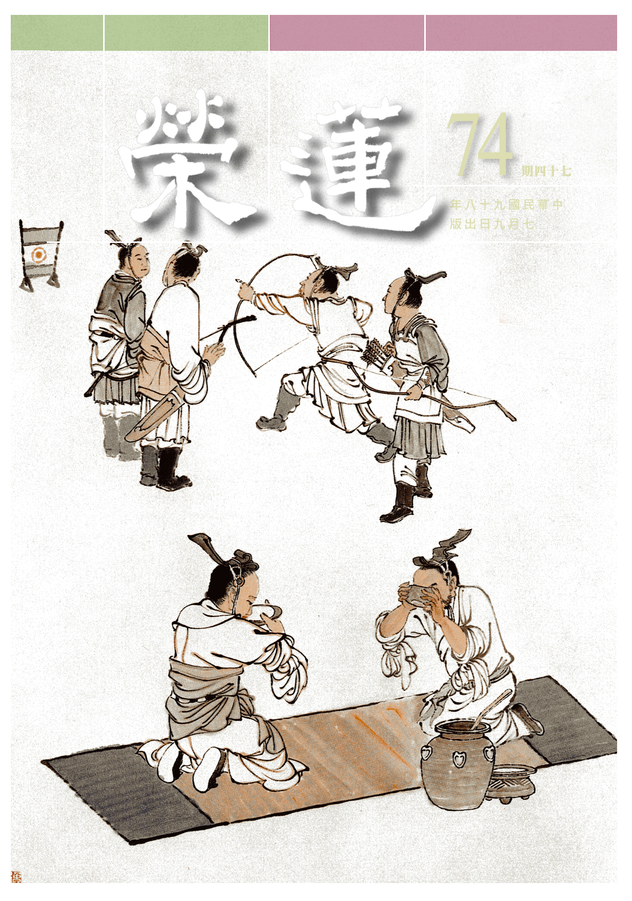

# 第74期

## 社論

### 少欲知足的重新檢視

本刊

減碳節能高峰會

就危存亡共節制

重在少欲能知足

濟弱扶傾資源共

近年來環保意識高漲，環境生態、全球暖化的問題迫在眉睫，全世界紛紛關注，各國政府大力鼓吹節能減碳，然而環境破壞卻日益嚴重，探究其原因，根本問題在於人類光說不做，應該付諸的行動流於空談，徒具口號而已。

「改變世界的六度Ｃ」這部影片中顯示，僅僅六度的氣溫變化，會為地球帶來不堪設想的災害。

當全球氣溫上升攝氏一度，美國西部的嚴重旱災將會導致全球穀物短缺；氣溫上升兩度，北極地區的格陵蘭島冰層將快速融化，一旦全部融化，全球海平面將升高七公尺，到時沿海各大城市如紐約、倫敦、曼谷、上海、台北…等全都將淹沒(台北將成了台北湖，高雄將成壽山島)，而北極熊也將瀕臨絕種；氣溫上升三度，北極圈在夏季將不見冰雪，亞馬遜雨林逐漸枯萎，阿爾卑斯山的雪冠全部消失，聖嬰現象的異常氣候模式成為常態；氣溫上升四度，上漲海水將淹沒人口稠密的三角洲，讓十億人無家可歸，孟加拉將被沖垮，埃及會浸在水裡，威尼斯完全被淹沒，全世界的冰河也將全部消失，阻斷數十億人的飲用水來源；氣溫上升五度，南北兩極完全融化，氣候異常造成的難民人數會高達千萬人，人類文明將無法承受這種重大衝擊，倖存者參與資源搶奪戰；氣溫上升六度，世界可能重回億萬年前白堊紀的樣貌，即是回到恐龍稱霸的年代。科學家現在公認的一個結論是，地表均溫升高三度就會達到人類無法控制的臨界點，但是這些問題對於許多社會大眾而言，只是紙上談兵，人們不相信「明天過後」的戲碼會上演，大家總是一邊提倡節能減碳，一邊開冷氣；一邊呼籲環境保護，一邊製造垃圾；一邊避免過度包裝，一邊濫用物資。

歷史很容易被人遺忘，九二一大地震距今不遠，卻恍若隔世，八八水災隨著聽奧的閉幕也漸漸劃下句點。歷史帶給我們最大的教訓就是歷史不會帶給我們任何教訓。現代人的生活太過忙碌、麻木，犧牲小我，完成大我的精神幾乎不復存在；但保護地球，人人有責，大家應該動起來，讓世界亮起來。

如何不製造環境的負面因素，重點在於我們是否擁有一顆珍惜的心，假如我們懂得珍惜、維護環境，就會珍惜物質資源、珍惜花草樹木、珍惜人情、珍惜生命、珍惜大自然，珍惜我們的文明與文化。我們的心，將決定地球未來會千瘡百孔、滿目瘡痍，還是青山長在、綠水長流。要先有心靈的環保，才會有外在的環保，讓我們重「心」出發，重拾世界的美好。

## 大德法語

### 大方廣圓覺修多羅了義經（三十四）

道源老和尚

執實妄見有六道

起惑造業無出離

佛性不失待解修

世事如夢水中月

乙二、正宗分

丙二、令依解修行隨根證入

丁二、廣明行相

戊一、四問答通明觀行上根修證

己二、徵釋迷悟始終

庚五、正答所問

辛一、長行

壬一、反覈起疑之端

癸一、總指輪迴

經文：

善男子！一切世界始終生滅，前後有無，聚散起止，念念相續，循環往復，種種取捨，皆是輪迴。

叫一聲當機者，先說眾生因起輪迴知見而輪迴生死，所起的心是輪迴的心，輪迴的世界是由妄想分別心生。始終生滅，乃世界開始生出謂之成劫，暫時有這一個世界，是住劫，此世界無法住時為壞劫，空劫即是世界壞滅，有始有終，有生有滅。

前後有無，既然有「生」有「滅」，有「始」有「終」，就有「前」有「後」，就有「有」有「無」，世界生起來了，就是前者有，世界壞了、空了，就是後者無，有前有後，有有有無，有聚有散，這個世界因為微塵聚起來（成），因為微塵散而壞空，有聚有散，有起有滅，最初聚而生起，後成壞空，壞到最後停止了。

前述依報，其次依止世界的眾生（正報）心是妄想心，念念不停，從無始劫以來即打妄想，直到現在還沒完！白天打妄想，睡覺還在打妄想，是念念相續不斷的，所謂循環往復是從出生到死亡，再到下一期生命，始終生滅，循環往復。

因為執著有真實的外境，內心裡邊起了分別，著了心外之相，順境就取，逆境就捨，種種取捨，皆是輪迴。眾生念念相續的心念是輪迴心，感應的世界成、住、壞、空，亦是週而復始的輪迴，通通在繞圈子（循環往復）。眾生的妄想心最要不得，你得把妄想分別心止息下來，佛法才學得下去。

癸二、真隨妄轉

經文：

未出輪迴而辨圓覺，彼圓覺性，即同流轉，若免輪迴，無有是處。譬如動目，能搖湛水。又如定眼，由迴轉火，雲駛月運，舟行岸移，亦復如是。善男子！諸旋未息，彼物先住，尚不可得，何況輪轉。生死垢心，曾未清淨，觀佛圓覺，而不旋復。

沒有出離輪迴，心還是妄想分別的心，無法辨明圓覺妙性，於生死流轉想要證得圓覺是不可能的。以妄想分別心，愈分別愈遠，圓覺妙性不是輪迴。喻如孩子時，有遊戲名為矇矇轉，大家閉著眼轉圈，轉一會兒，把頭轉暈了，嘴裡還得念「天轉地轉不叫我轉」，結果念咒沒靈，還是天轉地轉，自己也轉暈了，這就是本來天地不動，但是頭轉暈了，覺得天也轉、地也轉、房屋都在轉。比喻用妄想分別心來分別，一切都變成實有的顯現，如何能得到圓覺呢？

佛說了幾種比喻，譬如動目，能搖湛水。安靜不動的水謂之湛水，動目看這不動的水，以為水仍然在動，動目看靜水，靜水也起波。

又如定眼，由迴轉火，這定眼不是入禪定的眼，是個病眼，這一種人，他的眼睛生來不會動，地方上的土話叫死眼珠子，這定眼就是眼根遲鈍，眼珠子不容易轉動，這「由」字，就是上句「能搖湛水」的「能」字，迴轉火就是他看見火在那兒轉圈，定眼所看與我們好眼看見的不一樣，他看見蠟燭的火一直轉，看見供佛點的火在轉。

雲駛月運，舟行岸移，亦復如是。駛是走得很快，雲動得很快，譬如晚上月亮出來，本來虛空之中無雲，可是這時候飛過來一大片雲彩，雲彩走得快，像飛的，天空的月亮照著發亮，雲彩一大片，這個時候看見月亮往東運（太陽、月亮都是由東往西走），沒有看見雲彩卻看見月亮往東走得飛快，這就是雲駛月運的道理。拍電影的懂得這個道理，把人往天空一懸，後頭用一塊佈景拉著走，電影的鏡頭打開，背景布拉著走，我們以為這個人在空中飛，就是拍電影的人悟到雲駛月運的道理。

舟行岸移，亦復如是。船開了卻以為是岸移動了，這境界我親身經驗過，我以前出門都是坐輪船，輪船要開的時候，岸上有送行的人，就在船邊上，跟大家打招呼，輪船很大，所以在船上不覺得船在動，送我們的人卻一直往後退，這就是舟行岸移。舟行岸移和動目能搖湛水、定眼能看見火轉圈一樣。

諸旋未息，彼物先住，尚不可得，何況輪轉。生死垢心，曾未清淨，觀佛圓覺，而不旋復。先解釋比喻，你要知道世界的實相，喻如諸旋未息，你那旋轉往復的眼睛、心沒有止息下來，可彼物先住，那水暫時不動，那火沒有打圈轉，你就看見水在動、火在打圈轉，月亮往西慢慢走，我們看不見，卻因為雲飄過去，以為月亮往東跑！岸邊未嘗移動，站在移動的船上卻以為岸移。尚且得不到它的住相，何況輪轉生死的凡夫，染垢之心從來沒有清淨過（曾未清淨），想辨明佛的圓覺妙性，圓覺不跟著你旋復嗎？不跟著你大小轉嗎？所以，先把你分別妄想心放下來，才能研究佛的圓覺妙性。

癸三、結指前疑

經文：

是故汝等，便生三惑。

金剛藏菩薩替大家請問，所以包括一切末世眾生以及菩薩等叫做是故汝等。

便生三惑，生出來三個疑惑？第一，眾生本來成佛，怎麼會生無明呢？第二，無明本來有怎麼樣就和如來一樣，故說眾生本來成佛呢？第三，成了佛再當眾生，那麼諸佛都成了佛了，什麼時候再生煩惱呢？又生了三個疑惑。

壬二、喻釋現起之疑

癸一、空中華無起滅喻

子一、喻釋

丑一、翳差華亡喻

經文：

善男子！譬如幻翳，妄見空華。幻翳若除，不可說言，此翳已滅，何時更起一切諸翳？何以故，翳華二法，非相待故。
此時訶斥他問這三個問題，最不恰當的就是
**問：** 諸佛成佛，何時再生一些煩惱？你這問的實在是不得當，不應該這樣問，但是金剛藏菩薩大慈大悲替眾生請問。

眼睛生病起了翳子，這翳子看東西模模糊糊，看見虛空裡生了華，看醫生之後翳子治好了！變成清淨眼了，空中也沒有華了，這時候不應該問這個人的眼睛好了，變成清淨眼了，他什麼時候再生翳子？翳子醫好了就好了！不應該問什麼時候再生？

如同問成了佛，什麼時候再生煩惱呢？何以故？翳華二法，非相待故。為什麼說他問得不得當呢？因為眼睛的翳子，跟虛空華這兩個，不是相待之法，不是有空中華才生翳子，是因為有了翳子才生空中華，翳子好了空中華也沒有了，再不會生翳子，這兩個不是相待之法。

丑二、空不生華喻

經文：

亦如空華，滅於空時，不可說言，虛空何時，更起空華？何以故，空本無華，非起滅故。

眼睛好了，空中華滅了，不應該再問這虛空的空華什麼時候再生？眼睛生了翳子就生，那何時眼睛再生翳子呢？根本都是問得不得當的問題。虛空之中根本沒有華，虛空中沒有華生起，如何說有個滅處？沒有滅處！如何可以問什麼時候再生起華呢？

子二、法合

經文：

生死涅槃，同於起滅。妙覺圓照，離於華翳。

生死與涅槃，猶如作夢，同於空中華之生起，空中華之滅無。而妙覺圓滿普照，所證的空性即是萬法實相，萬法的顯現如翳眼所看的空中華那般虛幻不實，證得真理是一證永證。

子三、結成

經文：

善男子！當知虛空，非是暫有，亦非暫無。況復如來圓覺隨順，而為虛空平等本性。

虛空不是暫時有的，也不是暫時無。圓覺隨順是從眾生份上說，如來證得的是圓覺本體、圓覺妙用，順著眾生叫圓覺隨順。無為虛空非是暫有，不是暫無，又何況是無為虛空的平等本性？圓覺如虛空平等本性，成佛即具圓覺如何會再生無明煩惱呢？

癸二、金中礦不重生喻

經文：

善男子！如銷金礦，金非銷有，既已成金，不重為礦，經無窮時，金性不壞，不應說言本非成就。如來圓覺，亦復如是。

金礦是金裡的礦石，須經過爐裡燒煉去滓為「銷」，金溶化為「溶」，經過銷溶將礦金煉化成純金。然而金非銷有，既然叫「金礦」，「金」非經過銷不能成金，但是「金」不是經過「銷」才有的。明眾生本來成佛這個問題，眾生的佛性不是修出來的，是本來有的潛力，等於金礦，金礦既然能銷出金子來，是本來就有的金子，經過銷化鍊成純金，不重為礦，此時不需要再問，這純金什麼時候再變回礦石呢？已經成了金子，永遠不會再成為礦石，比喻已經成了佛，永遠不會生煩惱當眾生。經無窮時，金性不會再壞，不會再變成礦石。

不應說言本非成就，如來圓覺，亦復如是。不應該說，這金子不是在金礦裡邊，要是本來不成就，怎麼煉也煉不金子出來！既然礦石能銷成金子，這金子不應該說它不是本來礦石。眾生有成佛的潛力卻還沒修成佛，沒成佛等於金子還在礦石裡，眾生本來成佛，一點沒有錯！在這一段解釋中，要去除我們的疑惑，我們本來成佛，本來我們有成就圓覺妙性的能力，雖然流轉生死，這種能力沒有減少，但還得經過修行，否則金子還是礦金，須經過銷煉、溶化，將沙子、石頭煉掉，成純金！

雖然我們有成佛的潛力，可是還得要修行，何以故？因為有無明煩惱（如同礦金），經過銷熔而得純金，是故對治無明我執即證圓覺妙性。

天台有將眾生成佛分成六步，即六即佛：理即佛、名字即佛、觀行即佛、相似即佛、分證即佛、究竟即佛。我們本來成佛，本來就有成佛的潛力，此是理即佛。學了經教之後，懂得教理，能夠依著如來的解釋，知道不同名相所含攝的義理，謂之名字即佛。依著如來所解釋的名字道理，去修觀行，即是觀行即佛。證得相似的三賢位，叫相似即佛。證得十地菩薩，叫分證即佛。究竟成了佛，叫究竟即佛。

解釋六即佛有兩種解釋，叫做「圓融不礙行步，行步不礙圓融」，即而常六，即有成就之漸次，漸次就是行步；六而常即，即漸次不礙圓融。所以能頓超，為什麼？理即佛就是究竟即佛，不是不即，而是相即的，明白了這個道理，自己要相信自己有成佛的能力，經過修行用功，不修行用功還是不行，懂得了這個道理，現在要得利益了，我們本來可以成佛，你為什麼不修行呢？

你要是沒有成佛的本錢，要想成佛是打妄想，我既然有成佛的本錢，為什麼不去成佛呢？為什麼要當苦惱眾生呢？天天被煩惱轉，天天起無明，不是可惜了自己的能力，可惜了自己的善根，末法時代有幾個人遇到了佛法呢？有幾個人遇到了圓頓大教？前生修來的善根今生得遇佛法，不好好的修行，在那兒天天起無明、動煩惱，做些凡夫的事，你得對得起你自己的善根，大家好好的觀照觀照，疑問解疑，自己依著所明白的道理，好好用功修行，不但對得起諸佛，對得起自己，更對得起一切眾生，一切眾生都等著你們去度的。（下期待續）

### 常禮舉要講座（十五）　訪人篇

雪廬老人

談事敘舊或傳話

叩內請入見機作

人情依禮作節制

賓主盡歡見面後

◎一、先立外輕輕扣門，主人讓入方入。

前面那些學了，到此一聽就知道，商家還懂得這個規矩，乃至於那些查水錶、電錶的，先在門口敲敲門：你家有人在嗎？有人在，他才進去查錶，這是應該的，不能直接上人家裏去。
他家裏關著門，我們不能隨便開，或
**問：** 開著門可以進去嗎？開著門也不可以進去。他家裏什麼情形我們不明白，我們管好自己。總而言之，關著門、開著門，都要在門口敲門，這是一定的規矩。敲門要輕輕地、不要冒冒失失，能讓屋裏的人聽得見，這是必須的。

主人讓入方入，看見主人就直接進入他家中，這是很冒失的，即使熟人常見面，也必得敲門。若是生人敲門，屋裏的人出來，不認得你，與你素不認識，一定在門口問你：先生你貴姓，你來有什麼事……？必然有這一套。人家問你這個，你不能「這裏說話不方便，進去說去吧」，不能這樣子。

可以請求進去「有話可以不可以到裏邊說」，要先與主人商量、商量，這是禮貌。他讓你進去你就進去，不讓，你也不必勉強，為什麼呢？大概他家裏還有個人的私事不願意讓你這位生人知道，不論好事壞事，人家是主人。假如他家裏有什麼私事，來了一個生人，怕走漏了秘密，不願讓你知道，我們何必多管閑事找些麻煩呢？不讓你進去，你就不進去，可以進來，你就進來。

◎二、入內有他客，主人為介紹，須一一為禮；辭出時亦如之。

入內是到房屋裏頭，不是在院子裏說話。或可主人家裡有會客室（客廳）、或許沒有，主人請你上哪裏就上哪裏。一看他屋裏原有客正在談話，應是有事情，當然不可以久坐。

入門有他客，主人當先為之介紹，你是新的訪客（有時你是當客人，有時你是當主人，這兩方面都要學。）主人如何介紹？是介紹後來的這位？還是介紹已坐的另一位客人？這個都不一樣，你看看情形吧。為什麼不一樣呢？這裏頭就有尊卑之別。為什麼呢？禮就是不平等，講究是老少尊卑貴賤，不然你要禮幹什麼？一律平等就不要禮了。

主人為介紹，須一一為禮：一進去的這一位，主人就將他介紹給坐著的客人，已坐著的這位是較早到的，與後來的客人比較呢？先去的客人就算是半個主人，後去的這位客人就純粹是客。

若來的客人是陌生人，你還沒問他貴姓，住哪裏，你還不明白沒法介紹，只可以請坐，先介紹熟的，「這一位是我的老朋友，姓什麼、名什麼…」，只可如此了。這位生客坐下來以後再問他貴姓或是台甫怎麼稱呼，你得分清這介紹的次序，且不是在一張桌子上談話。

何以不在一張桌子上談話，這是怎麼的？中國人在一張桌子談話，不認識就不能談話了，談話就冒昧，也不能問、必得這中間有個介紹人。有了這一介紹就可以談話了，這介紹很要緊，你們大家記住這個。不論結婚或認識朋友等都得有介紹，沒介紹是素昧平生，往後見了面就很少，這個事情我講到這裏就算為止，為什麼呢？話沒說到的事情多了，你們大家類推。

素昧平生是以前連認識也沒有，若連面也沒見過就來往通信等等，這都叫做冒昧。古人說素昧平生是我與某人沒見過面，平素毫無關係，是連點頭之交也沒有，這話你可明白。交淺尚不可言深，沒交怎麼能以談事呢？你要我再跟你說得徹底，我沒法說得徹底，說徹底你聽不明白又出些誤會。

例如你作出什麼文章，不論得意或不得意，要與某人商議商議，然你跟他素昧平生，你不能把這篇文章寄了去，「你看我這篇文章，請你給我改改」，你千萬不能這麼做，或說這有什麼關係呢？人家懂局不會給你改，能改的人也不敢動手。可是外行的人他一聽，要改他的文章，云：好、我改。兩個不懂事的是狗咬狗，那就沒話講了。是一對不知禮的，你的文章是好還是壞，即使能改也不能動手，這個你聽明白，夠不上交情的，連讚歎話也不必說，你想想吧！

主人將客人一一互相作介紹後，客人可自我介紹，彼此雙方恭敬地鞠個躬，現在行握手禮，你得握握手。雙方在介紹之後就是朋友了，兩個人握握手，這就算禮了。

辭出時亦如之：臨走的功夫，固然得跟主人說幾句客氣話，還有剛才與你有經過介紹且握握手的客人，臨走時不能不理他就走，也得跟他說對不起，也得有點表示，這是人情世故啊！有云：佛家不講人情世故。胡說八道，佛家不講人情世故？你上廟裏去，怎麼走、怎麼見誰，都有一定的，怎麼不講人情世故呢？不講人情世故是研究道（出世解脫道）時，不能拿人情世故來講道，為什麼呢？世故人情與修道不一樣，怎麼不一樣呢？朝聞道夕可死矣，要聞到道就不得了了，道（特指出世間道）不是世故人情，這個禮與道沒關係。

◎三、入內見有他客，不可久座；有事，須請主人另至他所述說。

你到主人的屋裡頭還有其他客人在，你進去後不能不坐下，坐下後那些禮貌剛才都講過了也聽明白。講了第二條，再講第三條、講了第三條時第二條也包括在內。編常禮舉要，各篇及各章都有次序的。

就以本章這三條來說，將第三條入內見有客寫成第一條，將第一條在外頭敲門寫成第三，行不行呢？可見編寫也不是容易的。可是一層，習慣成自然，不學就會了，因為見多了！

為什麼不可以久坐？人家在那談一些要緊的事情，怕你知道而不敢講。你在那裏坐著，人家有事你卻先談，把人家的事給誤了。你看著怎麼先前的客人還不走？先前來的那些客人，他們還有事情啊！你得開竅，快走，走了人家也好談話。中國人講究察顏觀色，眼色、動作都是談話。眼色是什麼？看看你、這些動作都有關係，這個都不懂那有什麼法子呢！現在書呆子就這樣，講書也得開開玩笑，提起聽者的興趣！

你們這些念書的，我常說今日之下，從前不能談，什麼事情呢？看戲！從前的功夫，學生是不許看戲，全副精神都在書上，閑雜的事情連小說都不許看，這個你是不知道的。看小說都是偷偷看，你在家裡無論幹什麼都可以，就是坐在那邊也行。你在家裏要是拿出小說來看、老人家見了面：看什麼書啊？一看是小說，就拿來不許看。為什麼呢？看看小說還有什麼關係啊？你所學的那一套還沒入進去，那個又難又沒興趣。小說呢、就看進去了，全部的精神都在上頭。

譬如看戲那更是不許，唱戲中跑龍套這個還有什麼學問啊？四個人拿著四面旗出來，在前場一站，你覺得簡單？給你拿個旗子去跑跑試試。那個前台很小，上頭有幾十個人，來回刀槍劍影的打，看了覺得很寬，你上去試試，上去四個人就亂了，所以是千萬不可自作聰明。有場戲跑龍套沒跑熟，前面兩個分開，後頭兩個又出來，手上都拿著一面旗，有人位置站得不好，後頭大黃旗一出來看著不對勁，趕緊給他使眼色，他不理這一套，大黃旗就說：寡人使眼你不管，唉！還得寡人把你拉。才把這傢伙給湊上，跑龍套咱們也不行。

當你進屋裡看著有人，你有事且不願意第二個人知道，而人家也是如此，這怎麼辦呢？而且那個人又不走，這也有法子，所謂：有事，須請主人另至他所述說。這就行了。這個言辭權變必得學。「對不起，我還有事要到別處去，想先跟老兄說幾句要緊的話，這裏有客人，請到別處談談」，這不就行了嗎！也礙不到人家，請他（主人）到旁邊，他（客人）聽不到你的談話了。

說完了你走你的，也不必跟那位客人如何如何，他們再談他們的，這些善巧方便是離不了的。你講佛家不講人情，這句話是胡說八道，佛法不講人情，連人都不夠還學佛啊？人身難得怎麼講？現在可是佛法不講人情了，怎麼佛法不講人情呢？罵人是最不好的，這個大家都知道罵人不是好事，儒家戒、佛家十善業中也有戒惡口，可是現在佛學雜誌有許多是罵人的，這是什麼人情呢？連人事都不懂得，連雜誌性質都不知，雜誌是弘揚佛法不是新聞報紙，有聞必錄，這都是講不通啊！

◎四、坐談時見有他客來，即辭出。

坐著與主人正談話時，忽然間外頭來了客人，這又是一種變化。來了客人或可有事，你先來你的事情完了。即辭出：你就趕緊起來，「對不起，我還有什麼事我先走」。假如他（主人）的客人不怕人，也不願意你走，他自然會說別走別走，我還有話要跟你說。他不願意你走，你又「啊！不、不！我有要緊的事我先走」，你必得要走這又不行，怎麼不行呢？或可主人故意的留你是為了拒絕另一位客人也未可知，必得權變啊！事情沒有一定的，古禮是見機而作。（下期待續）

## 共修研學

### 小止觀導覽（四十六）

*心爾整理*

行上修止與修觀

能得世福與解脫

世事水月因果觀

善哉佛法得大用

第六章  正修行

論文：

復次：第二、明歷緣對境修止觀者：端身常坐，乃為入道之勝要；而有累之身，必涉事緣。若隨緣對境而不修習止觀，是則修心有間絕，結業觸處而起，豈得疾與佛法相應？若於一切時中，常修定慧方便，當知是人必能通達一切佛法。

坐上修與歷緣對境修都是入道之勝要，坐上修除了觀修義理，也可以讀誦經典或念佛等。坐上修與歷緣對境修之所修，須來自於聞思，對教法聞思要有不知足的心態，如同一個慾望很強的人，即便得到很好的受用卻仍然不滿足，抓住這樣的覺受來聞思教法，自然在坐上修與歷緣對境修，都能對教法生起有力的觀修。

此處所言有累之身，明身體是酬業的果報，為業所繫縛，有了它，就必須謀生活，方能維持生存而有種種交際應酬，必涉事緣，不能經常坐上修學止觀。假若隨緣對境不修學止觀，覺受間斷，煩惱業會觸處生起，如何能與佛法疾速相應。如鑽木取火，未熱而息，終不得火。

我們如果在一切時中，好好的修學定慧方便（止觀），這個人一定能通達一切佛法。即能在境界當中通達無常，在有漏的色身裡通達是苦，在輪迴當中通達是過患，在三寶當中通達是功德，在法的生起處通達自相空，並非離此之外另有佛法可得。在應對進退中，所起的貪要用無貪對治，所起的瞋要用慈悲來對治，在日用平常當中如理如法，通達因果，謂之與佛法相應。

以上是天台大師在歷緣對境修之前的交代，告訴我們煩惱與業若在歷緣對境時生起，會帶來嚴重的過患，須於歷緣對境時好好修學止觀。

在家人因為坐上修的福報不足，所以更需要歷緣對境修的方便，而在歷緣對境修上掌握修行的義趣，也可以作為坐上修的資糧，能幫助我們在坐上修時快速進入狀況，例如平常的修學，可以幫助打佛七時將佛號安住，並對法師開示的義理有所體會。

開始學佛時，比較喜歡聽方便開示，漸漸進入論典的研討，將經文一句一句的弄懂，用最笨的方式來通達佛法的義理，然而這種透過聞思所產生的覺受，修行力量也最為強大。

論文：

云何名歷緣修止觀。所言緣者。謂六種緣。一行。二住。三坐。四臥。五作作(下祖臥切)。六言語。云何名對境修止觀。所言境者謂六塵境。一眼對色。二耳對聲。三鼻對香。四舌對味。五身對觸。六意對法。行者約此十二事中。修止觀故。名為歷緣對境修止觀也。

六緣當中，每一緣對六種境界，所以是三十六個觀修，這當中由世俗面的觀察生起福報，由勝義面的觀察得到解脫，本論特別的義趣是勝義面相的觀察。

歷緣就是心攀緣，心為能緣，境界為所緣，心識行於境界謂之緣，共有六種法（行、住、坐、臥、說話、辦事），每一緣各有六種對境，所謂眼對色、耳對聲、鼻對香、舌對味、身對觸、意對法等觀察。此處且約十二事修止觀，嚴格說起來，是三十六法的觀察。

在歷緣對境當中，每一法都有世俗與勝義兩面相的觀察，在世俗的觀察中要引發善心，對治惡心；勝義的觀察要以空性為所緣，體會法之自性了不可得。

論文：

一、行者：若於行時，應作是念：我今為何等事欲行？為煩惱所使，及不善無記事行，即不應行。若非煩惱所使，為善利益如法事，即應行。

先說如何修學世俗法，舉行走之例，應當這樣的觀察，我是為了辦什麼樣的事才想要行，會引發煩惱或增長煩惱者，就不應行，若體性無記亦不應行，何謂體性無記？即無意義的行走，若是運動身體，還得觀察強健身體的目的，若方便為善，則好好運動，若方便為惡，則不行。

舉助念之例，助念排班是為煩惱所使還是善利益所使？如果感覺懊惱，以為吃虧，則從起床、穿衣、出門，每走一步路都是罪過。殊不知往昔有人頂禮供養釋尊，歡喜跑了五里路，佛云：此人跑的五里路，腳下的每一粒沙都是一轉輪聖王的福報。所以如果助念被排到深夜時段要觀修是代他人受苦，要很快樂的承擔下來，並且讓參與善法者感覺歡喜。觀待你的行才能生起無畏的布施，試問坐在家裡念佛回向給往生者，就能夠安往生者的心、家屬的心嗎？一定是人到現場，那個無畏布施才能生起，對方的恐懼才能消除。

到現場去看到蓮友的善法，而生起隨喜的功德，又因為看到往生者的痛苦，產生同理心、大悲心、惻隱之心，此皆須靠著去幫忙才能生起。而且因為到現場助念，生起無常幻化的感覺，每個人最後都會死亡，你我都無法避免，這種對世間無常幻化的強烈感受，全都必須觀待人到現場助念（行）才能生。

有蓮友生病後骨瘦如柴，經過助念之後，全身顯現柔軟的瑞相，令在場者深信彌陀聖號的殊勝，產生對三寶強烈的信心，皆是因為人「行」到現場才會生起的覺受。捐錢和人到現場做，身歷其境的體會絕對不一樣。所以想要學佛成佛，還得乖乖的隨緣行善，若偏於坐上修，就如同執著於磨磚欲成鏡子，是難以有所成就的。依著「行」生起的功德，是其他舉止動作難生的，其他如住坐臥等都要有殊勝觀察法，要勤快的讓善法現起。

以下分別就在行當中，如何修止與修觀。

論文：

云何行中修止？若於行時，即知：因於行故，則有一切煩惱善惡等法。了知行心及行中一切法，皆不可得，則妄念心息，是名修止。

在一切行（造作）當中，會產生善惡煩惱等事，我們知道能造作的心與所歷的緣，所對的境皆無微塵許自相可得，心以法的自相為所緣時，看不到任何的境界生起，此時談不上生起貪心或瞋心，止息世間一切妄念。

善法與善心兩者互相依靠才能生起，能起的心與所做的行必須互相依靠而生起，自然無法獨立存在，煩惱的生起即是以為法有自相可得，在妄認真實的法中產生煩惱，既然緣不到自相，煩惱如何生起？

在行當中，以行為所緣，發現行是觀待行心而起，以行心為所緣，行心也是觀待行才能生起，兩者互相依靠而生起，找不到自相，體性了不可得，全是名言安立之下生起的法，妄念心息，即是於行上修止。

論文：

云何行中修觀？應作是念：由心動身，故有進趣，名之為行。因此行故，則有一切煩惱善惡等法。即當反觀行心，不見相貌，當知行者及行中一切法，畢竟空寂。是名修觀。

行之發生乃由意業推動身業，行心為何沒有相貌？我以心思推動身口造作，軌跡不是很清楚的出現嗎？行之後所產生的善惡煩惱法也可以指陳，如何云不見相貌？

發菩提心所做的每一件善法，是以求成佛的心態攝持世間的善，這善法的福報會讓人用不完，但是一把無明火，功德林能全部燒光，一樣感應障礙、痛苦，雖然我們懂得發心，也懂得回向，若不以空性的修學攝持善法，善法的功德易被煩惱摧壞。

知空性修學之利益，自然樂於在行時，作世俗與勝義面相之觀察，依著行心生起行，依著行而說行心，兩者互相靠而生起，這是勝義面相的修止修觀。世俗面相來說就是要掌握清淨的動機，一面做空性的觀察，一面要掌握出發點的心態，想要得福免禍，就應該要好好的體察行與行心世俗面相的觀察，不讓行生起種種的罪業，否則以後也會在行當中遭受惡果。（下期待續）

## 專題研學

### 聖者的祕密～大佛頂首楞嚴經二十五圓通暨七處徵心探源

### 二十五圓通暨七處徵心簡介　（十五）孫陀鼻識

時哉

戒定慧三無漏學

各有修學成就法

鼻息由粗細入空

心聞漏盡阿羅漢

寅八、孫陀鼻識

卯一、作禮陳白

經文：

孫陀羅難陀即從座起，頂禮佛足，而白佛言：

孫陀羅是豔，難陀是喜，孫陀羅難陀名為豔喜，孫陀羅難陀即從座起，頂禮佛足，向佛陳白鼻識圓通的修學法 。

卯二、陳白之言

辰一、出家心散

經文：

我初出家，從佛入道。雖具戒律。於三摩地，心常散動，未獲無漏。

由此句可知不是有戒就會有定，有定就會有慧，雖《楞嚴經》中說：因戒入定，因定開慧。然不是說戒中有定，定中有慧，若戒中有定，則具足戒律者，為何於三摩地，心常散動，應知三摩地另有修學法與戒律的修學法不同。所以外道雖修學四禪八定有成，但並不代表比丘戒成就。

持戒能對治生活上所起的煩惱，所以在修學定法時，世俗的煩惱比較不容易生起，然須另學修定之法，須認識沉沒、昏沉、掉舉、散亂，方能除去定之障礙，此即是「雖具戒律。於三摩地，心常散動」，是故必須要修止觀門。

「未獲無漏」，須知三摩地的修學法和無漏的修學法不同，並非得三摩地就得無漏。正因為心常散動，未獲三摩地，所以無法以空性為所緣加以觀修，故得不到無漏的智慧。因定入慧，有定方具備修慧的條件，然並不代表即已具足修慧的方法，若沒有修慧的方法，光憑定力是無法得到無漏的智慧。

至於定共戒與道共戒之定義為何？是在修道或三摩地上不起世俗的煩惱與執持戒律一樣效果，然定不是戒律，定若是戒律，則四禪八定之成就可以稱為比丘戒具足？例如若只是以木頭為所緣生起三摩地，此時不起殺心，然不代表遇到可惡的人殺心不起。昔有外道名曰增上身，此人道行高，入定時間長，老鼠跑到頭上做窩，留下許多老鼠的糞尿，當增上身出定時發現老鼠做窩，非常生氣，追殺這些鼠輩毫不留情，此之殺心使他無法再入定。

所以當念佛得到法喜（輕安）時，或與人吵架後再念佛，剛才的輕安卻怎麼樣都無法生起，這就是煩惱生起時，要入定入不了。如《桃花源記》中的漁人一樣，由桃花源出來之後就再也進不去了。所以戒只是幫助入定的條件，由於持戒而不起世俗的煩惱，所以容易再次入定。

比丘須獲得無漏，才能成為三寶中的僧寶，沒有證果的僧人稱僧眾。《無常經》云：八輩上人咸離染。八輩上人在小乘是初果向以上，若大乘則是初地向以上的人。依《俱舍論》，「向」是無間道，「果」是解脫道。無間道是斷惑，解脫道為證理，證得四向四果皆稱為聖人，成為僧寶。

辰二、奉教觀鼻

經文：

世尊教我及拘絺羅，觀鼻端白。

拘絺羅是舍利弗的母舅，人稱長爪梵志，因用功修行外道沒時間剪指甲，反觀修行內道有幾人精進似之？當時常與舍利弗之母辯論而贏之，自從舍利弗之母懷了舍利弗之後，就贏拘絺羅。拘絺羅知道這胎中嬰兒不簡單。

辰三、從鼻悟證

巳一、初見息煙而悟徹

經文：

我初諦觀，經三七日。見鼻中氣，出入如煙。身心內明，圓洞世界。遍成虛淨，猶如琉璃。煙相漸銷，鼻息成白。

釋迦牟尼佛座下的弟子個個不凡，即便簡單的觀鼻端白就觀了三個七日，這些弟子何以成就，就因為弟子們對於佛的教誨都可以信受奉行，不隨便改換題目。

「見鼻中氣，出入如煙。」難陀依教修觀，自見鼻子的呼吸出入如煙，此之心思細膩！這種煙相的感覺能生起人命在呼吸間的體悟，生命僅靠一口氣在維繫，存在的生命是脆弱、危險的。

後兩句「煙相漸銷，鼻息成白。」是倒裝句。煙由鼻出入之煙相漸漸沒有，亦即證入體呼吸，體呼吸是在禪定中，此息若有若無、若存若亡，所以稱為數息觀，不是數風觀、數喘觀、數氣觀，而是數息觀。例如廣欽老和尚在山中入定時，農人測試老和尚的呼吸，發現已經沒有鼻息了，就準備柴火要火化之，恰好當時弘一大師來閩弘法，知此事上山彈指請之出定，並且讚歎古代高僧入定不過如此。

煙相漸銷並非現證空性，若沒有以出離心攝持此數息觀，則等同外道之修學，外道也修數息，也得四禪八定，亦利用數息觀得到許多神通。

「身心內明，圓洞世界。遍成虛淨，猶如琉璃。」乃身心一片光明，整個世界都沒有了，乾乾淨淨像琉璃般，此方是勝義的修學。

如何證得鼻識自相空，鼻識在香塵上嗎？若是，則不必鼻根即能生鼻識。在鼻根上可得鼻識？若是，則不必香塵即生鼻識。在第六意識上可得鼻識嗎？若是，則不必鼻根即生鼻識。在鼻識中？則不必香塵、鼻根等就可生鼻識。此時鼻識空，鼻識尚且沒有，何來出入鼻息？觀待鼻識所生起的身、心也空。

巳二、次化息光而證果

經文：

心開漏盡。諸出入息，化為光明，照十方界。得阿羅漢。

心開是現證空性的心識生起，漏盡是破煩惱障，破修所斷煩惱的那一分安立為涅槃，破所知障的那一分也可以安立為涅槃，然此處的涅槃是屬於破煩惱障的那一分。

諸出入息，化為光明，照十方界，得阿羅漢。諸出入息即是內鼻識感覺的出入息，若鼻識了不可得，出入息也了不可得，空空靈靈，如同化為光明，照十方界。

辰四、蒙佛授記

經文：

世尊記我當得菩提。

菩提有三乘菩提，並非所有的菩提都是成佛的證量，除非發起菩提心，所得菩提，方是成佛。菩提心是成佛的因，現證空性可以破煩惱障，亦可以破所知障，但是破所知障一定要觀待菩提心，以菩提心做空性智慧的助伴才能破所知障。

卯三、結答圓通

經文：

佛問圓通。我以銷息，息久發明，明圓滅漏。斯為第一。

此「銷」字用得好！以鼻息為所緣，鼻相從煙相（白相）乃至漸銷，連鼻息相都銷亡了。

銷息銷久了，現證鼻識空性的心識，在鼻識的空性上串習很久，無漏的智慧就顯現出來。發明是指無漏的智慧被引發，此無漏的智慧能破煩惱障，此稱為明圓滅漏。現證空性的智慧滅除了有漏（煩惱障），斯為第一。以上是孫陀羅難陀鼻識圓通的修學法。（下期待續）

## 活動報導

### 九十八年暑期心靈成長班活動報導～謙謙君子　課程報導

### 論語選講～恭讓為謙之修學法

心超

論語乃中國文化之寶典，十三經之精要，是孔子心要及學佛重要之助功，若由孔子所言法義或其弟子言談來了解孔子內涵，將可見到聖人氣象。而研究論語的一種殊勝方式是將論語中四百九十八條之章節歸納為仁、謙、為政、君子、聖人……等條目，並找出各類別之相關章節，從而了解一代聖人孔子學問道德的精華，作為吾人安身立命的方針及行為處世的原則。

今為配合九十八年暑期心靈成長班教學內涵，將論語中有關「恭讓為謙之修學法」的章節選出十一條，以 雪公老師及自公老師抉擇，成為學習論語之眼力，並以科文方式方便大眾學習，一方面以具體及正確的方向來了解孔子謙讓修學法之內涵；再方面作為自利利他的方便。相信依此入聖人之德，能帶給社會一股清新力量，能令正法久住，能令聖人更有光采，能令淨土更為莊嚴，能帶給有情智慧的光明。

恭讓為謙之修學法需以禮來節制，如此謙才不會超過，有人說謙過頭會產生懦弱、虛偽、無能……的弊端，若以禮來節制，可恰到好處。由謙中表現自己是尊德性、仰慕聖賢、恭敬善知識……，由禮節中令自己行為不越本份，例如：一般社會習慣與長輩見面以鞠躬表達恭敬，若為了謙非得頂禮則太過了，所以以禮來節制，才不會有過與不及之弊病。

恭讓為謙之修學法大科分三：一、正明修學。二、反誡須觀待禮。三、結例。正明修學的部分有恭讓為謙之利益與運用；反誡則需觀待禮中指出：恭需合於禮，而互相揖讓是謙的本懷；最後分別舉子產（君子之道）、舜（能行王道）及孔子（與聞國政）等古聖賢之例，來總結謙讓為恭之殊勝形象及吾等學習榜樣。

孔子道高德備，除由其內涵表現外，亦可從其弟子之殊勝表現窺知ㄧ二。例如：周遊列國時一幫君子被各國國君青睞，可得知孔子是一位非常殊勝的善知識，能教化生徒，具王道思想者。若能依此學習，將是成聖成賢入門、往生助功、改變命運的唯一方便，有幸聽聞此概念者則「朝聞道，夕死可矣。」

### 謙所對治～慢心七種行相

盡意

今年心靈成長營的科目以謙為主軸，從易經的謙卦、論語相關的內容、了凡四訓第四篇｜謙德之效以及禮的演練等，都在在闡述謙的內涵。但誠如易經每一卦象，除正面知卦象，也要從其相反的面相（伏卦）來認識此卦，是故教學處也特意規劃了一門課程來分析慢心所（謙的反面）的各種行相，目的是除了學習謙的內涵外，也要提醒自己心中若是生起這些慢的行相時，能馬上警覺而改正之。

此次研討慢心所，依據的教本是︽大乘百法明門論︾，是佛滅度九百年後，出生於北印度的天親菩薩所著，所闡述的是世尊曾說的五個字：一切法無我。其中「一切法」包括了宇宙間生理、心理、物質的所有現象，將之歸納為一百種，共分五大類：心法、心所有法、色法、心不相應行法、無為法。而「慢」即是屬於其中的心所有法。

慢的體性，《大乘百法明門論直解》云：慢者，恃己所長，於他有情，心生高舉為性。意思是依仗著自己的長處、強項，自以為了不起，覺得別人不如我。以俗話來說，就是「自我感覺特別良好」。

慢心所對的對象可分為比我好、跟我相等和比我差（上、中、下品）的人，而「慢」在行相上也可以顯現不同層次的差異：

一、慢：

此種慢心依中、下二品有情而生起，對於和我程度差不多的人不會生尊敬，對於德學不如己的人，則會認為自己較好。在此慢心中，過患最嚴重的是，所對的對象是在正法修學團體中一起共同修行的同法者。因為一個修學的團體是由共學者所組成的，團體的和合對正法流傳以及自己修學上的幫助是很大的。若起了慢心，對團體和合造成傷害，則對自身的修學會有很大的障礙。

二、過慢：

此慣分兩種行相，其一於等而為己勝（依中品有情而生）。其二於勝而為己等（依上品有情而生）。之所以在「慢」之前加一「過」字，代表此種慢心已經過份了，稱之為過慢，亦即對著比自己好的人認為和自己差不多，與自己相等的人認為比自己差。

三、慢過慢：

於勝類反視為劣（依上品有情而生），此種慢更是「太超過」，對著比自己好的人反認為不如己。

四、我慢：

依所執的我而生慢，是七種慢的根本。何以故？眾生在自己的身體、五蘊或心情上，生起一個「我」，並認為這個「我」為實有而有執我的心識。同時見他人也認為實有，而起較量之心，從而生出慢心。

五、增上慢：

在精進修行時，得到勝境，便生起高傲的心，是修學增上生起的慢心。此種慢只有在認為修行有所得時才會產生，最可怕的是未得謂得，未證謂證。是在正知見不足時生起，或是入邪道，或受魔攝持，或自滿而不受教，或為修學最嚴重的障礙。

六、卑劣慢：

此慢亦分兩種行相，其一是自實甚劣，妄謂少劣（自己實在很差勁，但自認差強人意）。其二是雖知彼勝，不肯起敬（此等人雖知自己不足也不會向賢者學習）。所以處在卑劣卻無步可進，甘於自卑，無藥可救。

七、邪慢：

成就惡行，恃惡高舉者。由於社會壞風氣與惡知見渲染，有情反將作惡的能力或成果拿出來炫耀，以惡為能，助長社會負面風氣。今日之下邪慢風氣遠勝於古時，瀰漫著無羞恥的觀念，善良的風氣受到嚴重破壞，結果是大家都不好過。

上述慢之體性業用（性相）是能障不慢，生苦為業。不慢為慚心所，慚是善法之一，是一種羞恥心以及反省自覺的能力。人若是慢心生起，自然就缺乏反省的能力，如此則不會改過遷善，也得不到善知識的教導，這樣的人，一生當中無法對治自己的煩惱習氣，自然就是造惡的多，行善的少，不僅這一生每況愈下，來世所結成的異熟果也容易投生在痛苦的環境。

以上僅就慢的行相作一略說，在現實生活上，我們也可以將心比心的理解，對一個有慢心的人，我們不喜歡和他來往，此人也會招感一般煩惱習氣重的人對他們造成傷害。這樣的人一輩子在學習上會有障礙，事業上也容易有挫折，人際關係上不會快樂，得不到善知識的攝受，也無法突破命運上的困局，未來的走向實在堪憂。有志於世間和出世間安樂的修學者，當認知「慢」的過患而盡力避免之。

### 被淡忘的射禮運動

傳線

好太極拳，是自己在共修會的形象之一，今年暑期心靈成長班開出以謙為主軸的一系列課程，並將射禮演練納入規劃的課程，因射禮體現君子爭而不爭的精神，正合謙的意涵。當班本部在尋覓師資，因一己背景的好樂，就雀屏中選，師者命不能拒，只好硬著頭皮，承擔下來。

如何從一張對射禮無知的白紙，到演義出教材大綱？雖然教材不見得高明，但準備的態度是認真，起碼當作一回事，思量絕不使自箇兒落入誤人子弟的惡名，心態是如此的心理建設，實際呈現除學子了知，參與的師長也知曉，一己無他心通不得而知彼等內心思維，但受教者的身體語言，可比量得知；自我論斷，有頗多增上的空間。暫且莫論事後評量，且談自己準備歷程，以享關心射禮傳統的有心人。

處此數位網路便利的時代，遙想前輩為查閱資料，「上窮碧落下黃泉，動手動腳找資料」的艱辛，何其有幸，享有網路知識庫寶山，可謂取之不盡，只要啟動電腦在人腦的逐步指引下，在浩瀚的資料海中，利用「關鍵字：射禮」，即刻擷取搜尋到所要的資料，迅捷如探囊取物；省卻舟車勞頓，手不停翻閱，甚至秘而不宣等苦楚。

不論國內或國外或海峽對岸，盡一己所能，遨遊網路世界，參考他人的心血著作，不論文字或影像檔，納入我的檔案，閒暇時抽取研讀再三，加以鎔裁，先草創雛型，與任課老師討論，惜師長們皆抱持謙的精義，未幫後學修飾之、潤色之，是以教材未更增上，保留醜媳婦的模樣。

大致而言，蒐尋國外如韓、日或海峽對岸的射禮資料，是暢通無阻，但上國內台南孔廟網站卻吃閉門羹，本驚喜具悠久歷史的台南孔廟，前幾年曾舉辦過射禮活動，心想資料應會無私供人下載宣揚，莫說文章隻字尋不著，連不怎樣的照片，看得到拿不到，真是倒盡胃口，失望極了。

記憶中曾在報上，瀏覽過南華大學舉辦過射禮，但是使盡一切關鍵字，連蛛絲螞跡也尋不著。就一己皮毛觀察，射禮在號稱復興中華文化的基地︱寶島，已然被淡忘，如同「泠泠七弦上，靜聽松風寒，古調雖自愛，今人多不彈」。存在於台灣各大學之射箭社也只是西洋射擊，所謂奧運之射擊運動；反觀在日本射禮，除形成具文化意義的成年禮外，搖身一變為「弓道」，且蔚為該國青少年以上學子，所好樂的運動項目之一，蓬勃發展，更列入中學體育課程。

握管展布，內心還是頗多感慨，日本重視射禮，薪傳射禮，遺緒不墜，射禮人口所象徵的意義，一時間也難以表達清楚。射禮運動也好，弓道也罷，它兼具健身及教化、修身等意含，無怪乎二次大戰日本戰敗後，聯軍嚴禁學校納入弓道課程，此一禁令，今雖已作廢，弓道依舊沿襲至今，但此舉所彰顯的意義，不可小覷，連西方人都曉知弓道所帶給日本的影響，否則，禁它做啥！

海峽對岸對射禮的認知，已開始正視，有心人士的讜論，獻策推廣至學校，未進一步查證，是否為執事者所採納？不得而知。而逢節已有實踐射禮的跡象，樂觀其成，願他日能與韓日媲美。寶島台灣已有有心人士，移植日本弓道，名為台灣弓道，唯樂此道者畢竟不多，尚處於百廢待舉的階段，有待推廣。較量兩岸韓日四地的射禮或弓道的內涵，不得不佩服日本習弓道者，所展現在外的氣質，高雅敦禮，其餘瞠呼其後！

課堂上為學子簡介射禮，並特地準備弓與箭，見莘莘學子學習興趣濃厚，可喜可賀！回想那時節，不論和合班或明心班的學生，甚至助教，利用中午休息時間，向末學請求練習射射，嘉善其好樂心，頂著烈日遂其願，不亦樂乎！心靈成長班散席後，我預知仍回歸原點，但至少在他（她）們的心坎中，曾留下雪泥鴻爪，願他日能有學子續此因緣，為台灣射禮運動發展，盡上一份心力，至少目前台灣已有經內政部核可成立的弓道社團。

我則一如往昔習練完太極拳，接著八段錦「……左右開弓似射鵰，……攢拳怒目增氣力……」，弓與箭靜悄悄置落在陽台一角。

### 從歷史故事中學習謙讓

淨域

九十八年的暑期心靈成長班終於開課了，這次學會要帶給孩子們什麼樣不同的心靈饗宴呢？主題終於揭曉了，這便是學做一位「謙謙君子」。是以，列出的三大主課程分別是：《易經‧謙卦》、《論語》章句選及《了凡四訓‧謙德之效》三科；而為另使孩子於課程中有所對應感受，亦開出「歷史故事」這一門課。

此次課程以「五倫」來為孩子述說「長幼、父子、夫婦、朋友、君臣」間的謙讓與忍辱故事，這既與每人的生活相關，也是學做謙謙君子的必要。日後就這樣在網路與書籍中蒐羅故事題材，利用閒餘時間瀏覽，從中擇選出三十三篇故事，並刪修精簡製成簡報。

人人都愛聽故事，孩子們尤其喜歡，見到孩子們引頸傾聽的模樣，這備課的辛苦也化作雲煙不見了。課後我謝謝他們很給面子，大熱天裡沒有人闔眼瞌睡，也抱歉因過於饒舌而無法說盡，在此特別選錄五個正負面故事以為代表，希望對眾能有所啟發與裨益。

一、六尺巷以和為貴(朋友鄰里間要和睦相處)

清朝安徽省桐城縣人張英，於康熙年間任文華殿大學士兼禮部尚書，平日尚禮寬厚待人。時祖宅與吳姓鄰家發生基牆位置之爭，雙方訴諸縣府仍無法排解；張家族人便修書上京，欲讓張英下令讓地方官擺平吳家。

張英看後回書，併寄上明朝王堯日的一首詩(改幾字)：「千里修書只為牆，讓他三尺又何妨；萬里長城今猶在，不見當年秦始皇。」族人領略張英之用心，便讓出三尺地來；吳家見狀也後退三尺，於是形成一條六尺巷來。如今仍是桐城地區的旅遊景點與文化故事。

二、王莽謙恭下士時(為人莫假謙別具他圖)

王莽為西漢元帝皇后王政君之姪兒，其自幼雙親身亡，對任職大司馬的伯父王鳳十分恭順，初任黃門郎，待人謙恭素得人望。漢成帝時，累官至大司馬，年謹卅八歲。

漢哀帝時，丁皇后的外戚得勢，王莽退位隱居新野。期間他的兒子殺死家奴，王莽令其兒子自盡，獲得世人的好評。哀帝去逝無子嗣，王政君重掌國璽，起用王莽任大司馬，立八歲的劉衎為平帝，封安漢公，將女兒嫁給平帝為后，加號「宰衡」，攝政權傾一時。

平帝年長後，對王莽之脅制多所不滿，王莽便藉故弒平帝，立兩歲的劉嬰繼位，再而篡位自立為王，改國號新。後因新政法令繁苛，漢宗室劉秀起兵推翻，建國稱帝不過十五年。七百多年後，白居易讀史時特有感觸，賦詩曰：「周公恐懼流言日，王莽謙恭下士時；若使當時身便死，一身真偽有誰知？」道出謙恭須發自真心的持恆方是。

三、謙讓不求虛名的歐陽修(非己所為勿欺世盜名)

北宋朝廷下令編撰《新唐書》，歐陽修為最後進入編館者，負責《紀》與《傳》的編寫工作。該書《列傳》一部，前由宋祁先編修完成；但朝廷認為一部史書出於兩人之手，體例上不能統一，便令歐陽修進行全面刪改。歐陽修奉旨後苦惱地說：「宋祁乃前輩，且各人見解不同，怎可全依己見來刪改呢！」最終一字未增刪。

《新唐書》修成後，依例史書只署名官階最高者，應當署以歐陽修之名。但歐陽修說：「宋祁修《列傳》費心甚多，怎可奪其功勞？」於是《紀》、《傳》署名歐陽修，《列傳》則署宋祁之名。此事傳出後，宋祁聽後高興地說：「自古文人相輕，此事真是前所未聞呀！」

四、相敬如賓的梁鴻與孟德耀

五倫關係始於夫婦，夫義婦順、相敬如賓的夫婦感情亦來自於謙德。

梁鴻東漢人，有學養淡泊名利，於上林苑養豬維生。某日不慎失火延及鄰家，便以豬隻折賠。其德日盛，許多人家爭想託媒提親。

有一富家女孟德耀(光)，有美德卻面醜陋，亦有人家提親未成。待歲三十時，父母問原由，說：「非梁鴻般正人君子不嫁。」梁鴻知悉後，便託媒將她娶回家。

倆人婚後居於灞陵深山裡，男耕女織夫唱婦隨。某日，梁鴻過洛陽，對朝廷之腐敗作一首〈五噫歌〉，朝廷下令逮捕。

夫婦倆隱姓埋名逃到吳地，寄居在大戶人家皋伯通廊下，替人樁米維生。每當梁鴻下工返家後，妻子總是恭候不敢直視，吃飯時也將飯碗高舉齊眉送上。屋主皋伯通見狀，覺得此夫婦非常人，便請他們入內住下。此「舉案齊眉」的夫婦相處之道，一時傳為美談。

五、閻立本兼收並蓄學畫

閻立本唐代名畫家，精於肖像及刻畫人物性格。某次他慕名去荊州，欣賞張僧繇的壁畫，見到畫跡後，說：「真是虛有其名。」第二天回頭思惟，如此名聞遐邇之畫必有過人之處，且人應要虛心、認真，便又跑回去看畫，大有收穫地說：「盛名之下無假士。」如此，接連在壁畫下留宿十夜，多方臨摹後才離去。其後的畫風，受張僧繇之啟發很大。

閻立本正因懂得反省檢討，一改驕慢之心，以謙下之態度面對同一情境，竟產生如此不同的受用，此正說明唯謙者受益無窮，而虛心受教乃不二法門。

結言：

唐太宗一朝被譽為貞觀之治，這全在於他不以帝王為尊，內能敬重長孫皇后，外能聽納群臣的忠諫。其曾以《論語》：「以能問於不能，以多問於寡，有若無，實若虛。」問學於孔穎達。孔穎達回說：「這是聖人的教化，希望人有謙虛的光明美德。」並引用《易經》勸諫太宗，要以蒙昧來修養貞正之德，用藏智於內的辦法來治理人民。

太宗也常對臣下說：「天子當常保謙遜恭順，若有失，請犯顏諫奏。」魏徵即說：「人無不善始，但少有善終。願陛下守此謙道，則天下國家永固。」這一個謙字落實力行，正是令人無所不往呀！歷史故事的題材永遠不變，內容只是舊瓶裝新酒，聽懂悟得一個便受用，這些故事就當做是多增長些識見吧！

### 高貴氣質的培養～再談和合班演禮課

常傑

今年二月初舉辦寒假心靈成長班，教學處別具創意安排演禮新課程，其中和合班有二堂演禮課，由同學親自上台演練。雖無舞台經驗，表演結果難免生澀，然演技的好壞，並非演禮課的要求重點，重點在於同學們全心投入，認真的表情反映出內心的率直，這是無可取代的，且經由表演的方式，可以補強傳統式教學的不足，必然令同學們對演禮的內涵留下深刻的印象。教學處為延伸此一教學效果，於暑期心靈成長班將演禮課程續排入三班課表裡。在炎炎夏日裡，齊聚一堂演禮，令人喜悅！

演禮課程名為行謙之道，教案主要依據《論語 季氏》第十章，孔子曰：君子有九思，視思明，聽思聰，色思溫，貌思恭，言思忠，事思敬，疑思問，忿思難，見得思義。以及《泰伯》第二章，子曰：恭而無禮則勞，慎而無禮則葸，勇而無禮則亂，直而無禮則絞。
第一堂課同學們演視思明，內容為孔子與弟子受困於陳蔡之間，受餓多日，幸好子貢找得糧食，當顏回升火煮熟飯後，揚蓋盛取，不料風吹塵垢落入飯中，顏回取起一團飯除去污垢，送入口中。子貢望見誤以為竊食。問孔子：「請問老師，一個有仁德、有廉潔的人窮困時會改變氣節嗎？」孔子就回
**答：** 「不會，如果沒有了氣節，也就稱不上是一個有仁德、有廉潔的人了，你是否意有所指？」子貢將剛才的所見說了一說。

孔子覺得事有蹊翹：「端木賜啊，我相信顏回是個有仁德而又廉潔的人已很久了，直到今天，我堅信不疑。儘管你是親眼看見，這裡面一定另有原因，你莫言，我將問他。」孔子召顏回求證：「昨夜夢見先人，將佑我脫險，你炊熟進飯，且將先祭而後大家果腹。」顏回答道：「飯已熟，見有垢黑留飯上，棄去殊覺可惜，留置猶覺不潔，即取而食之，不可祭饗，待有新飯再祭吧！」待顏回出，孔子向子貢說道：「回不作欺人之事已久。」

這個表演告訴我們，一般人往往只是見到事情的表相，要能夠看清事實真相是不容易的，因為其中包括了對人情世故的通達。所以，即便像子貢這種大賢者都有眼見為真的錯覺，我們又豈能不心生警惕呢？

其次演禮「文王操」，藉由孔子拜師襄子為師，學習古琴的表演，以瞭解當時孔子彈奏一首曲子，是如何專注的傾聽與練習，更令人讚歎的是孔子在熟悉曲子的韻律後，還可以進一步知道作曲者的心志與為人，甚至最後推論出作曲者如果不是周文王，又有誰能擁有如此的氣度！聽思聰發揮到極處，如他心通般能瞭知對方的心意和想法。

其次色思溫及貌思恭部分，講究的是臉上的顏色必須要溫和，而容貌也必須謙恭，希望同學能依此原則神韻表達出來，但經過一陣演練後，同學們才知這種氣質的培養，非一蹴可幾，須日久天長的串習。

第二堂課演禮事思敬及見得思義，在事思敬中舉一個日本內閣郵政大臣野田聖子的故事：大學時期的野田聖子曾到飯店打工，所分配到的工作是洗廁所，當她第一天伸手進馬桶刷洗時，差點當場嘔吐。勉強撐了幾天後，實在做不下去了，所以就決定辭職。但就在此時，她發現和她一起工作的一位老清潔工，居然在清洗工作完成後，從馬桶裡舀了一杯水喝下去。野田聖子看得目瞪口呆，但老清潔工卻自在地表示，經他清洗過的馬桶，一定是乾淨得連裡面的水都可以喝下去的！

這個舉動帶給她很大的啟示，讓她了解到所謂的敬業精神，就是任何工作，不論性質如何，都有理想境界，以及更高的品質可以追尋；而工作的意義與價值，不在其高低貴賤如何？而在於從事工作的人，能否把重點放在工作本身上，去挖掘或創造其中的樂趣和內涵。此後，她每次進入廁所不再引以為苦，卻視為自我磨練與提昇的修練道場，故每當她清洗完馬桶後，總是問自己：「我可以從這裡面舀一杯水喝下去嗎？」最後她步入日本政壇，得到小泉首相的肯定與賞識。當說完故事後請問同學有沒有勇氣效法？只見大家面面相覷…？

周利槃陀伽（簡稱槃特）證悟過程的改編版表演，讓同學體會事思敬。當哥哥嫌他太笨，迫他還俗，此時慈悲的佛陀現身在槃特的面前，並教他誦念掃塵除垢，簡短的四個字令他在擦拭諸比丘之鞋屐或掃地時反覆唸誦，槃特依教奉行，久久終於悟到內心如地，掃除垢穢特別要指歸內心，終於開悟證得阿羅漢的果位。這個故事很適合說明勤能補拙的道理，但從另一個角度來思索，我們辦理任何事情都必須要用心和認真，只要努力堅持下去，日後必然會有成效的。因此應用於事思敬的演禮。

其次將唐朝裴度還帶的因果故事改編為見得思義的演禮課，同學表演效果不錯。故事是說唐朝的裴度因為父母雙亡，家境貧寒，只得寄居在山神廟中，裴度連續參加科舉考試，都名落孫山。附近一位看相的孫先生見到裴度，就感嘆地說：「你這個人相貌非常奇特，以後如果做不了官，就得餓死。」有一天，裴度跑到香山寺去閒逛，無意中看到一位婦人，背個包袱進入佛殿，一邊掉淚，一邊拜佛：「請菩薩救苦救難，一定要幫助我們度過這個難關。」裴度心想她家裡一定有什麼不幸的事，才如此悲痛，想到這裡，裴度默默轉身離開。

過了一會兒，裴度又回到大殿，那位婦人已經不在，可是包袱卻留在現場；裴度追到寺外，已看不見婦人，就暫時保管包袱，等了一會兒，不見婦人回來，就打開包袱看，裡面有三條寶帶，都在數千兩銀子以上。但是裴度沒有絲毫邪念，重新把包袱繫好。

第二天清晨，裴度立即帶著包袱去香山寺等候。不久見到那婦人哭著在寺院內外找東西，裴度將原物歸還，婦人感激之餘拿出一條玉帶送裴度，但遭裴度婉絕。過了幾天，孫先生再度遇見了裴度，發現他的面相已改變：「你拾金不昧，且挽救人命積了大陰德，將來必定位至三公。」後來，裴度果然考取功名，為官正直清廉，平步青雲榮登三公，成為身繫唐朝三十年的中興名臣。

最後一堂課的前半段是以某位同學在教師休息室裡來回搬書，每次經過三位老師的座位前，都會向老師鞠躬問好的情境來演恭而無禮則勞。這個故事強調以禮來節制恭敬則恰到好處，不會過猶不及。

其次要同學們體會勇而無禮則亂，其進退也須依禮才會合宜。這齣戲主角大勇是一個見義勇為的年輕人，他認為只要有能力就盡可能幫助別人，哪怕赴湯蹈火也在所不辭。但因經驗不足，判斷錯誤，而發生幫倒忙的烏龍事件。

三堂演禮課很快過去了，表演過程中有的同學是擔任旁白，只負責在旁邊串場念稿；也有人扮演古聖先賢，彷彿引領眾人進入時光隧道，一睹古人優雅的風采；還有人扮演現代學生，自然生動的演出，就好像是演自己一般。我們可以發現同一個角色及劇情，若讓不同的人來演，就會呈現出不同的戲劇效果……我們並非要求同學演得很像，只是要藉由大家共同的參與，在輕鬆的氛圍下，能夠領受演禮的旨趣，進而應用在日常生活中，使人格更臻完善。

而在五倫的關係裡，我們不就同時扮演著多重的角色？雖說不同的情境會有不同的應對，但我們不禁要捫心自問，不論是擔任何種角色時，都能夠坦然地面對它，並且努力的扮演好嗎？雖然演禮課已結束多日，但戲說人生的故事卻仍在上演中……，唯願藉此祈求大家在未來的日子裡都能夠依禮行謙、平安、自在。

### 如何欣賞故宮文物～故宮多媒體課程外一章

林燕雪

中外人士旅台，「故宮博物院」是必要參訪的景點之一，面對寶藏豐富的藝術殿堂，如何了解文物的內涵？如果想在行前作功課，又有什麼管道可取得文物的相關訊息與資料？無人導覽的情況下要如何欣賞故宮文物？針對以上疑問，茲做如下提供，希望有所助益！

首先；已蒞故宮博物院參觀者，有兩種方式取得導覽：

一、中、英語及週末親子免費導覽（針對非團體之散客）

請逕至服務台報名，於服務台前出發，導覽時間如下：

中文導覽：上午九時半，下午十四時半。

週末親子導覽：每週六、日，上午十時，下午十五時。

英文導覽：上午十時，下午十五時。

二、語音導覽文物試聽

為提供個人化的導覽服務，參觀者可持輕巧手機，依個人興趣、參觀速度，自行參觀。本院提供的語音導覽系統，包含有中、英、日、韓四種版本，參觀者可依需要至語音導覽服務處租借使用。

其次，拜科技之賜，網際網路的發達，可進故宮網站做數位學習，路徑如下：

一、進故宮網站（http://www.npm.gov.tw/）後，點選上方之學習資源

二、點選故宮ｅ學園

三、即出現八個線上課程：

有青銅器數位課程、陶瓷世界歷險記、陶裡乾坤瓷中秘、文物的續命—預防性文物保存、中國繪畫學習、文物的修護、中國書法圖書文獻、文物的新認識、中國玉器課程等等，點選進去，將可玩得不亦樂乎！

每個課程均能深入淺出，學習到不同領域及各類文物的相關資訊，有心想對中國古物進ㄧ步了解者，這些課程已提供相當多的內容。

另外，點選故宮網站上方之典藏資源，亦有典藏精選、主題網站、文物３Ｄ賞析等多種文物背景知識的介紹。或透過展覽資訊了解當期展覽、展覽預告、展覽回顧的不同。如果訂閱故宮電子報，也可定期收到最新訊息。

國立故宮博物院目前更舉辦「故宮週末夜」活動，除了延續週末夜間開館（每週六下午延長開放至晚上二十時半），另有藝術表演。此時前往故宮除了得以免費欣賞文物之美，還可觀賞表演藝術活動，真是視覺與聽覺之美的饗宴！朋友們！大家一齊來吧！

### 年輕紳士淑女的禮儀之用

愛蓮

華盛頓品德自高

１

，誠如是也。

The Art of Etiquette for Young Gentlemen and Young Ladies

— George Washington, Staying in Character 2

文明教養，品格要高尚

文明是什麼？

文而明之，因文而明；表之於《易經》的「賁」卦，上艮而下離，上艮是山，止也；下離是火，是明也。文明以止，「知其所止」，觀乎人文以化成天下。

文明的第一原則是什麼？

影響力最大之首要原則乃禮也，「依禮而貌」，「如貌而為禮」。

什麼是教養？

教養是教育程度，代表自律、自制、有禮貌、守規矩。它是人的氣質與風骨；是知識、行為態度、審美能力亦是生活風格。也許「教養」的概念有些抽象，難以捉摸，不過可以肯定的是，若聽到別人批評自己沒教養，任誰都會汗顏羞愧、無地自容。

教養重要嗎？

值得每個人傾一生之力追求，它是個人身上的重要資產，屬於精神內涵很高的境界。努力提升教養的結果便是個人品質的提升，個人品質的提升能讓整個社會優質化！

用「沒教養」來說明什麼是「有教養」

那些是「沒教養」的事呢？例如：

對英國溫莎王朝的家庭醜聞如數家珍。

電視節目中的肥皂劇、遊戲節目...。

八卦雜誌、黃色書刊、對技術性資訊（吃喝玩樂、居家擺設、時裝、美體）的不妥表示方式、對體育競賽表現的狂熱。

各種吹噓、附庸風雅、對禁忌知識的不加遮掩。

教養的差別、差異也會表示在現實、賺錢和理想、靈性的距離。台灣人如何算是「有教養」不一定和德國人、美國人、日本人一樣，但是，對於什麼是「沒教養」？倒可以說說看。

負面表列：

公車捷運上大聲講手機

公寓門口堆滿了鞋子

廁所衛生棉亂扔

飯店、餐廳buffet搶食物；吃完，大打一嗝表示吃飽了

在餐廳吃飯大聲喧嘩

錦衣玉食而貪腐者

在美國，媽媽帶孩子上圖書館查資料研讀，在台灣則是一早排隊佔位子，等著吹冷氣準備考試

家中潔淨，走到門外，一團亂，滿目瘡痍！

一個國家民族，科技不行、不會滅亡，不著重自身文化歷史、一定敗亡。

學做謙謙君子，學華盛頓 見附件一

《易經》的 「謙」卦，上坤下艮，地山謙。謙：亨，君子有終

謙從口（身口意三業）

與口業應對有關的守則：2, 5, 6, 12, 14, 16, 20, 21, 38, 42-45, 47-49, 50, 58, 60, 61, 64, 65, 73, 77-79, 81-89

與吃應對有關的守則：24-38, 40, 41, 55, 61, 62, 69, 74, 75, 90-107

與舉止有關的守則：1-11, 13, 16, 18, 20, 24, 53, 57, 59, 66

與友人相處有關的守則：3, 17, 22, 41, 47, 50, 56, 60, 62, 65, 72, 39, 82

與衣有關的守則：7, 51, 54,

與衛生有關的守則：5, 9, 15,  101

與謙謙君子有關的守則: 46, 66, 67, 68, 72, 75

與（慈悲）心有關的守則：19, 44-46, 48, 49, 60, 70, 109, 110

與慢有關的守則：36, 61, 63, 75

與信有關的守則：39, 82

與孝有關的守則：108

選讀

1. Britain’s youngest manners expert  見附件二

2. The Etiquette Kid's Modern Manners' Gripes 見附件三

１ 事因知足心常樂，人到不求品自高

２ 格：論語‧為政篇：「道之以德，齊之以禮，有恥且格」；人品典範」

附件一

The Rules of Civility & Decent Behavior in Company and Conversation

1. Every action done in company ought to be with some sign of respect to those that are present.

2. When in company, put not your hands to any part of the body not usually discovered.

3. Show nothing to your friend that may affright him.

4. In the presence of others, sing not to yourself with a humming voice, or drum with your fingers or feet.

5. If you cough, sneeze, sigh or yawn, do it not loud but privately, and speak not in your yawning, but put your handkerchief or hand before your face and turn aside.

6. Sleep not when others speak, sit not when others stand, speak not when you should hold your peace, walk not on when others stop.

7. Put not off your clothes in the presence of others, nor go out of your chamber half dressed.

8. At play and attire, it's good manners to give place to the last comer, and affect not to speak louder than ordinary.

9. Spit not into the fire, nor stoop low before it; neither put your hands into the flames to warm them, nor set your feet upon the fire, especially if there be meat before it.

10. When you sit down, keep your feet firm and even, without putting one on the other or crossing them.

11. Shift not yourself in the sight of others, nor gnaw your nails.

12. Shake not the head, feet, or legs; roll not the eyes; lift not one eyebrow higher than the other, wry not the mouth, and bedew no man's face with your spittle by approaching too near him when you speak.

13. Kill no vermin, or fleas, lice, ticks, etc. in the sight of others; if you see any filth or thick spittle put your foot dexterously upon it; if it be upon the clothes of your companions, put it off privately, and if it be upon your own clothes, return thanks to him who puts it off.

14. Turn not your back to others, especially in speaking; jog not the table or desk on which another reads or writes; lean not upon anyone.

15. Keep your nails clean and short, also your hands and teeth clean, yet without showing any great concern for them.

16. Do not puff up the cheeks, loll not out the tongue with the hands or beard, thrust out the lips or bite them, or keep the lips too open or too close.

17. Be no flatterer, neither play with any that delight not to be played withal.

18. Read no letter, books, or papers in company, but when there is a necessity for the doing of it, you must ask leave; come not near the books or writtings of another so as to read them unless desired, or give your opinion of them unasked. Also look not nigh when another is writing a letter.

19. Let your countenance be pleasant but in serious matters somewhat grave.

20. The gestures of the body must be suited to the discourse you are upon.

21. Reproach none for the infirmities of nature, nor delight to put them that have in mind of thereof.

22. Show not yourself glad at the misfortune of another though he were your enemy.

23. When you see a crime punished, you may be inwardly pleased; but always show pity to the suffering offender.

24. Do not laugh too loud or too much at any public spectacle.

25. Superfluous compliments and all affectation of ceremonies are to be avoided, yet where due they are not to be neglected.

26. In putting off your hat to persons of distinction, as noblemen, justices, churchmen, etc., make a reverence, bowing more or less according to the custom of the better bred, and quality of the persons. Among your equals expect not always that they should begin with you first, but to pull off the hat when there is no need is affectation. In the manner of saluting and resaluting in words, keep to the most usual custom.

27. 'Tis ill manners to bid one more eminent than yourself be covered, as well as not to do it to whom it is due. Likewise he that makes too much haste to put on his hat does not well, yet he ought to put it on at the first, or at most the second time of being asked. Now what is herein spoken, of qualification in behavior in saluting, ought also to be observed in taking of place and sitting down, for ceremonies without bounds are troublesome.

28. If any one come to speak to you while you are are sitting stand up, though he be your inferior, and when you present seats, let it be to everyone according to his degree.

29. When you meet with one of greater quality than yourself, stop and retire, especially if it be at a door or any straight place, to give way for him to pass.

30. In walking, the highest place in most countries seems to be on the right hand; therefore, place yourself on the left of him whom you desire to honor. But if three walk together the middest place is the most honorable; the wall is usally given to the most worthy if two walk together.

31. If anyone far surpasses others, either in age, estate, or merit, yet would give place to a meaner than himself in his own lodging or elsewhere, the one ought not to except it. So he on the other part should not use much earnestness nor offer it above once or twice.

32. To one that is your equal, or not much inferior, you are to give the chief place in your lodging, and he to whom it is offered ought at the first to refuse it, but at the second to accept though not without acknowledging his own unworthiness.

33. They that are in dignity or in office have in all places precedency, but whilst they are young, they ought to respect those that are their equals in birth or other qualities, though they have no public charge.

34. It is good manners to prefer them to whom we speak before ourselves, especially if they be above us, with whom in no sort we ought to begin.

35. Let your discourse with men of business be short and comprehensive.

36. Artificers and persons of low degree ought not to use many ceremonies to lords or others of high degree, but respect and highly honor then, and those of high degree ought to treat them with affability and courtesy, without arrogance.

37. In speaking to men of quality do not lean nor look them full in the face, nor approach too near them at left. Keep a full pace from them.

38. In visiting the sick, do not presently play the physician if you be not knowing therein.

39. In writing or speaking, give to every person his due title according to his degree and the custom of the place.

40. Strive not with your superior in argument, but always submit your judgment to others with modesty.

41. Undertake not to teach your equal in the art himself professes; it savors of arrogancy.

42. Let your ceremonies in courtesy be proper to the dignity of his place with whom you converse, for it is absurd to act the same with a clown and a prince.

43. Do not express joy before one sick in pain, for that contrary passion will aggravate his misery.

44. When a man does all he can, though it succeed not well, blame not him that did it.

45. Being to advise or reprehend any one, consider whether it ought to be in public or in private, and presently or at some other time; in what terms to do it; and in reproving show no signs of cholor but do it with all sweetness and mildness.

46. Take all admonitions thankfully in what time or place soever given, but afterwards not being culpable take a time and place convenient to let him know it that gave them.

47. Mock not nor jest at any thing of importance. Break no jests that are sharp, biting, and if you deliver any thing witty and pleasant, abstain from laughing thereat yourself.

48. Wherein you reprove another be unblameable yourself, for example is more prevalent than precepts.

49. Use no reproachful language against any one; neither curse nor revile.

50. Be not hasty to believe flying reports to the disparagement of any.

51. Wear not your clothes foul, or ripped, or dusty, but see they be brushed once every day at least and take heed that you approach not to any uncleaness.

52. In your apparel be modest and endeavor to accommodate nature, rather than to procure admiration; keep to the fashion of your equals, such as are civil and orderly with respect to time and places.

53. Run not in the streets, neither go too slowly, nor with mouth open; go not shaking of arms, nor upon the toes, kick not the earth with your feet, go not upon the toes, nor in a dancing fashion.

54. Play not the peacock, looking every where about you, to see if you be well decked, if your shoes fit well, if your stockings sit neatly and clothes handsomely.

55. Eat not in the streets, nor in the house, out of season.

56. Associate yourself with men of good quality if you esteem your own reputation; for 'tis better to be alone than in bad company.

57. In walking up and down in a house, only with one in company if he be greater than yourself, at the first give him the right hand and stop not till he does and be not the first that turns, and when you do turn let it be with your face towards him; if he be a man of great quality walk not with him cheek by jowl but somewhat behind him, but yet in such a manner that he may easily speak to you.

58. Let your conversation be without malice or envy, for 'tis a sign of a tractable and commendable nature, and in all causes of passion permit reason to govern.

59. Never express anything unbecoming, nor act against the rules moral before your inferiors.

60. Be not immodest in urging your friends to discover a secret.

61. Utter not base and frivolous things among grave and learned men, nor very difficult questions or subjects among the ignorant, or things hard to be believed; stuff not your discourse with sentences among your betters nor equals.

62. Speak not of doleful things in a time of mirth or at the table; speak not of melancholy things as death and wounds, and if others mention them, change if you can the discourse. Tell not your dreams, but to your intimate friend.

63. A man ought not to value himself of his achievements or rare qualities of wit; much less of his riches, virtue or kindred.

64. Break not a jest where none take pleasure in mirth; laugh not aloud, nor at all without occasion; deride no man's misfortune though there seem to be some cause.

65. Speak not injurious words neither in jest nor earnest; scoff at none although they give occasion.

66. Be not froward but friendly and courteous, the first to salute, hear and answer; and be not pensive when it's a time to converse.

67. Detract not from others, neither be excessive in commanding.

68. Go not thither, where you know not whether you shall be welcome or not; give not advice without being asked, and when desired do it briefly.

69. If two contend together take not the part of either unconstrained, and be not obstinate in your own opinion. In things indifferent be of the major side.

70. Reprehend not the imperfections of others, for that belongs to parents, masters and superiors.

71. Gaze not on the marks or blemishes of others and ask not how they came. What you may speak in secret to your friend, deliver not before others.

72. Speak not in an unknown tongue in company but in your own language and that as those of quality do and not as the vulgar. Sublime matters treat seriously.

73. Think before you speak, pronounce not imperfectly, nor bring out your words too hastily, but orderly and distinctly.

74. When another speaks, be attentive yourself and disturb not the audience. If any hesitate in his words, help him not nor prompt him without desired. Interrupt him not, nor answer him till his speech be ended.

75. In the midst of discourse ask not of what one treats, but if you perceive any stop because of your coming, you may well entreat him gently to proceed. If a person of quality comes in while you're conversing, it's handsome to repeat what was said before.

76. While you are talking, point not with your finger at him of whom you discourse, nor approach too near him to whom you talk, especially to his face.

77. Treat with men at fit times about business and whisper not in the company of others.

78. Make no comparisons and if any of the company be commended for any brave act of virtue, commend not another for the same.

79. Be not apt to relate news if you know not the truth thereof. In discoursing of things you have heard, name not your author. Always a secret discover not.

80. Be not tedious in discourse or in reading unless you find the company pleased therewith.

81. Be not curious to know the affairs of others, neither approach those that speak in private.

82. Undertake not what you cannot perform but be careful to keep your promise.

83. When you deliver a matter do it without passion and with discretion, however mean the person be you do it to.

84. When your superiors talk to anybody hearken not, neither speak nor laugh.

85. In company of those of higher quality than yourself, speak not 'til you are asked a question, then stand upright, put off your hat and answer in few words.

86. In disputes, be not so desirous to overcome as not to give liberty to each one to deliver his opinion and submit to the judgment of the major part, especially if they are judges of the dispute.

87. Let your carriage be such as becomes a man grave, settled and attentive to that which is spoken. Contradict not at every turn what others say.

88. Be not tedious in discourse, make not many digressions, nor repeat often the same manner of discourse.

89. Speak not evil of the absent, for it is unjust.

90. Being set at meat scratch not, neither spit, cough or blow your nose except there's a necessity for it.

91. Make no show of taking great delight in your victuals. Feed not with greediness. Eat your bread with a knife. Lean not on the table, neither find fault with what you eat.

92. Take no salt or cut bread with your knife greasy.

93. Entertaining anyone at table it is decent to present him with meat. Undertake not to help others undesired by the master.

94. If you soak bread in the sauce, let it be no more than what you put in your mouth at a time, and blow not your broth at table but stay 'til it cools of itself.

95. Put not your meat to your mouth with your knife in your hand; neither spit forth the stones of any fruit pie upon a dish nor cast anything under the table.

96. It's unbecoming to heap much to one's mea. Keep your fingers clean and when foul wipe them on a corner of your table napkin.

97. Put not another bite into your mouth 'til the former be swallowed. Let not your morsels be too big for the jowls.

98. Drink not nor talk with your mouth full; neither gaze about you while you are drinking.

99. Drink not too leisurely nor yet too hastily. Before and after drinking wipe your lips. Breathe not then or ever with too great a noise, for it is uncivil.

100. Cleanse not your teeth with the tablecloth, napkin, fork or knife, but if others do it, let it be done with a pick tooth.

101. Rinse not your mouth in the presence of others.

102. It is out of use to call upon the company often to eat. Nor need you drink to others every time you drink.

103. In company of your betters be not longer in eating than they are. Lay not your arm but only your hand upon the table.

104. It belongs to the chiefest in company to unfold his napkin and fall to meat first. But he ought then to begin in time and to dispatch with dexterity that the slowest may have time allowed him.

105. Be not angry at table whatever happens and if you have reason to be so, show it not but on a cheerful countenance especially if there be strangers, for good humor makes one dish of meat a feast.

106. Set not yourself at the upper of the table but if it be your due, or that the master of the house will have it so. Contend not, lest you should trouble the company.

107. If others talk at table be attentive, but talk not with meat in your mouth.

108. When you speak of God or His attributes, let it be seriously and with reverence. Honor and obey your natural parents although they be poor.

109. Let your recreations be manful not sinful.

110. Labor to keep alive in your breast that little spark of celestial fire called conscience.

附件二

01  Britain's youngest manners expert

by Somerset's manners expert William Hanson

Meet Mr Manners, the Etiquette Kid and Hyacinth Bucket, AKA Britain's youngest expert on manners and etiquette.

Eighteen-year-old William Hanson from Nailsea has an unusual hobby for a 21 Century teenager which has gained him quite a lot of attention.

Ever since his grandmother gave him a book as a present for his 12th birthday, William has been obsessed with something which is very much associated with the Golden age of the 40s and 50s -  manners and etiquette.

"I think we've dumbed down too much. People are afraid to say when things are wrong. As my Grandmother says, there's too many free-range children."  William Hanson

"I dutifully read it - whenever a relative buys you a book you have to read it - and I thought it was quite well written and it does actually make common sense."

William has since appeared on The One Show where he showed host Dominic Littlewood how to set a table properly and been featured in numerous local newspapers and magazines.

He has also turned his hobby into a job. He has a manners podcast on itunes and teaches between 20 - 30 lower year students from Clifton College how to behave in certain situations as well as how to set tables correctly.

Although he attends the school as well, students' parents who have known him for years can act differently around him as soon as they know what he teaches - one parent even said he was scared of him.

William was on The One Show in March

"I hope it wouldn't make too much of a difference (in terms of peoples' perception of him) as I haven't suddenly changed.

"People shouldn't be scared of me - I'm not a monster."

Etiquette Kid

Family and friends are proud and supportive - however he has picked up a few nicknames which include Mr Manners, Etiquette Kid, Minister for Manners and Hyacinth Bucket.

"It's all relevant - when I'm at home I don't worry. Sometimes I eat in front of the TV with my food on my lap. If I go to someone's house and they've set the table and it's slightly wrong I wouldn't point it out.

"As long as you know about manners and when to use them that's fine."

Hyacinth was famed for her manners

William said he loves manners because he's interested in how humans relate to each other and why.

He loves meeting new people from all backgrounds. His friend jokes with him that he can't walk down the road with William because he stops and chats to so many people.

"I love knowing peoples' stories. It doesn't matter what they do."

'Free - range children'

So what is the difference between manners and etiquette? The basic principle of manners is that everybody deserves respect. Etiquette is how you do put manners into action. For example in football, there are certain things which always happen, e.g. the way the players shake hands before a final. This is football's etiquette.

"It affects everyone from toddlers to OAPS. The basics are about treating people with respect, common sense and logic," said William.

"Some people are inverted snobs - they deliberately don't have any. To me there's no such thing as a class system. I prove that you don't have to be from the English Aristocracy to have good manners."

He has taught Scout Groups and students

William's mother used to work for House of Fraser while his father is a property developer. They are both extremely proud of him however they do things to deliberately wind him up, as does him brother James, 15.

"My grandmother was of a different generation to me. Every time something was wrong it was pointed out. You had to earn your parents' respect and manners and etiquette are linked into that."

And it's that older generation which William seems to fit in best with. His favourite TV programme is (not surprisingly) Keeping Up Appearances.

He said there isn't anyone currently in the public eye nearer his own age who he can relate to as someone with good manners "which is a shame and reflects the state we're in".

"I think we've dumbed down too much. People are afraid to say when things are wrong. As my Grandmother says, there's too many free-range children."

Famed as a period of liberation, William suggests the swinging sixties could be partially to blame for the loss of manners in English society.

"People do know what is good or bad, it's just they forget sometimes. To stand up and correct someone is to stand against society. You can't teach everyone."

But William will definitely give it a go.

附件三

02   The Etiquette Kid's Modern Manners' Gripes

by Somerset's manners expert William Hanson

Eighteen-year-old William Hanson is Britain's youngest expert on manners. Find out where you're going wrong with his top tips.

Eating /drinking in the street

Although we are now a busier and time-poor society, there is no need to eat or drink whilst on the go, walking down a road. It is simply vulgar and one of the less positive attributes we seem to have caught from America, where everyone walks around with a take-away coffee, at minimum.

Spitting in public

Absolutely no need for this. People do it to show a casual and who cares?attitude, which they believe will make them look cool? It doesn't. Find a nearby lavatory or bin if you have to, or use a handkerchief.

Cashiers not looking at you in the eye when they serve you

I was in a well-known chain book shop the other day and I bought several items and must have been at the till for at least four minutes, and throughout the entire transaction, the cashier refused to even make eye-contact with me, instead she just looked sulkily down at the floor.

Gentlemen wearing hats indoors

Shows a lack of respect for your surroundings. Admittedly, there is very little categorical evidence or reasoning for why hats are removed when indoors, but we don’t need finite evidence for everything. We should accept some things - this is one of them.

People who mumble

If someone is having to strain their ears and listen hard to what another person is saying then they will not be at ease. Manners and courtesy is all about putting people at ease.

Superfluous swearing

Swearing is losing its force by continual expletives. There is no need to use the F-word as a noun, adjective, adverb, verb, conjunction, pronoun, preposition.

Not holding open doors

Sometimes it's easy to forget to check behind to see if anyone is following you through a door, but if you get into the habit, it'll become a lot easier.

Free-range children

My grandmother gets very worked up by what she calls free-range children? who are let to run haywire in public (normally by their parents).

### 中外古今音樂欣賞會

吳錫堂

一、天外之音—咒字本淨的Mantra

印度真言（Mantra）即咒語，咒語的梵文是Dharani，音譯成中文是「陀羅尼」，意指真實之語，也就本來的聲音，是一種超越文字的語言方式。Mantra 的歷史，可追溯到數千年前的古梵書《吠陀經》，《吠陀經》包含數量眾多的梵語詩歌、哲學對話、神話以及宗教咒語，是由三千五百年前雅利安人在印度創作和發展的。吠陀意思是「知識」，吠陀吟唱 (The Tradition of Vedic Chanting) 在二００三年入選為聯合國「口述及無形人類遺產」，是優雅古典梵語的祖先，在神聖的儀式典禮間吟唱，也是族人每天必須誦讀的功課。

《吠陀經》分四部分，其中《梨俱吠陀》（Rig Veda）是吟唱選集，應是印度最古老的音樂；《薩馬經》（Sama Veda） 是將《梨俱吠陀》及其它的詩歌配樂而成；《雅哲經》(Yajur Veda) 收集了僧人的禱詞和祭祀儀式；《阿薩那經》（Atharna Veda），是咒語和符咒集，故亦稱咒文吠陀。儘管經文在一千五百年前就用文字流傳，但是時至今日《吠陀經》的主要流傳方式仍是靠口傳心授，這種超越文字的語言，是一種秘密的傳授，其背誦技巧非常複雜，每個字母都有一個特別的發音，聲調和語音要非常精確地結合在一起，以保證每個字的吐字發音都準確無誤，因此承傳者必須自幼接受嚴格的訓練，要能承傳，就必需要保有菩提心，此即是mantra的奧義所在，印度人普遍相信吟唱mantra，可以心想事成，因此，印度人在慶典佛誕日以至舞蹈表演前，均要唱誦之；其實在中文裡，「咒」與「祝」字相通，咒語的「咒」與祝福的「祝」相同，所以「咒願」是「語言的祝願」的意思。

現在介紹的是德國音樂家Deva Premal的作品，她自幼喜好古印度的冥思音樂，曾倡導音樂觀想法，即是大家要安靜地閉目而坐進入冥思音樂中，讓音樂帶領觀想者進入寧靜的境界，或有助於修行。

二、充滿民族色彩的《龍船調》

發源自湖北省恩施土家族苗族自治州利川市的《龍船調》，充滿濃郁的民族特色，是當地逢年過節燈會時演唱的花燈調，原稱《種瓜調》，在湖北廣為傳唱，一九五七年大陸民間音樂舞蹈大賽，利川農民王國盛、張順堂演唱之後轟動武林，《龍船調》就從利川走向全國、傳遍世界，二十世紀九十年代入選世界二十五首最優秀民歌之列。

曲中蘊涵著豐富的生活內容，有著戲劇性的張力和美感。《龍船調》的開頭是以明顯的遠距離相互打招呼似的山歌風味來帶動，歌聲明亮高亢、隨性又自由直暢。隨後的短句既有划船的節奏，也有舞蹈的動作，演唱清新活潑、詼諧幽默、充滿生活氣息。隨著半說半唱的對白，更強化了這種怡然自得而又風趣的生活情調；《龍船調》最後一段音樂的演譯，有邊唱歌邊划船的形象，然而，在山水連延遙遠芒芒處，煙波淼淼時，又有山歌重新起唱，頓時引得山鳴谷應，水光瀲灩。

三、盛行於漢唐時代的古代彈撥樂器—箜篌

佛陀講《阿含經》，開示修行如司琴，鬆弦不成律，緊弦易斷，要鬆緊恰度。《楞嚴經》亦有琴、瑟以及箜篌的譬喻，「譬如琴瑟箜篌琵琶，雖有妙音，若無妙指終不能發」，意思就是說：一切眾生，雖皆俱足成佛的能力，但是如果沒有善知識指點其中的謎團，仍然無法發揮作用。

「箜篌」是古老的彈撥弦樂器，中國的「箜篌」形狀似瑟而較小，弦數不一，少至五根，多至二十五根；用木撥彈奏，或稱為「空侯」，因為它發出「坎坎」之聲，亦稱「坎篌」、「坎侯」。「箜篌」分臥式與豎式兩種。早期「臥箜篌」出現在春秋時的楚國，與古琴同一起源，但其長形共鳴箱面板上卻有像琵琶一樣的品位，這是它與琴瑟在形制上的主要差異；使用竹片撥奏或擊奏。也有相傳「臥箜篌」為漢武帝令樂師侯調所製造似瑟或琵琶的七弦樂器。

「豎箜篌」由遠古狩獵的弓演變而來，是伴隨著人類最早文明而誕生最古老的弦鳴樂器，有著五千年以上的歷史，比之更古老的樂器，恐怕屈指可數，大概只有石哨、骨哨、骨笛、塤、陶笛了。遲至公元前一二００年，「豎箜篌」體制已大底確定，爾後兩千幾百年都沒有太大變化，後經波斯傳入中亞和印度，秦以前即已在我國新疆一帶流行。漢武帝開發西域以後，「豎箜篌」慢慢傳入中原；實際上是東傳至中國叫做「箜篌」，西傳至歐洲叫做 Harp，近代中譯為「豎琴」罷了。

「豎箜篌」的演奏技法是以多種民族彈撥樂器的技巧為主，並借鑒了豎琴的彈奏手法：採取坐姿，將共鳴箱置於胸前，左右手分別彈奏兩側琴弦，由於左右同音雙排弦，等於是同時彈撥兩部豎琴，在快速旋律和泛音的演奏上，相當方便，可以左右手同時奏出旋律與伴奏而不相互妨礙，和聲擁有豐富色彩。

因為琴底巧妙的天平軸和平衡杠杆的聯繫，左右雙排弦張力永遠相等，還能在中心音域通過左手彈撥，右手運用大幅度（小三度音程）揉、滑、壓、顫技巧，也可演奏泛音、搖指、輪指及各種音色變化的多種手法，並可在泛音旋律中使用揉、壓技巧…這樣轉調「箜篌」則既有古琴、古箏的韻味，又能夠出色地表現中國民族音樂的風格特點，又有豎琴的音響效果，可以演奏一切豎琴的曲子。所以「箜篌」是漢、唐宮中慶典及祭獻時常用的樂器，用來表現祥瑞之兆，在敦煌壁畫中亦多有描繪。附圖《漢宮春曉圖》中嬪妃所彈的應為「小胡箜篌」。

「箜篌」與「豎琴」的差別—

「箜篌」有雙排弦，弦線跟「豎琴」不同，「豎琴」用羊腸弦，「箜篌」的弦類似古箏，且「箜篌」有古箏所謂的燕柱，所以「箜篌」能吟弦，這是「豎琴」做不到的。彈奏方式也有很大的差異，「豎琴」是往上甩，但「箜篌」是往下甩；且「箜篌」能彈奏出輪音，「豎琴」不行。

四、在美國發揚國樂的功臣

中文名稱：中國名歌、民歌

英文名稱：Beloved Chinese Songs

發行時間：一九九五年

專輯歌手：紐約中國民族樂團

地區：美國

「孔夫子喜歡古琴，中國文人也很偏愛它，古琴具有很高的歷史價值和豐富的表現力。國樂有七音，古琴的按、捺、挑、撥可以變化出一百多個音來，應該發揚光大。」張銓念先生說。

國樂的流傳有賴優秀的演奏家將國樂之美推廣至全世界。「紐約中國民族樂團」The Chinese Music Ensemble of New York 創辦於一九六一年，有四十多年的歷史，是全美歷史最悠久、規模最大的民樂團體。該團固守著民族風格，每年有近三十場的示範演出，向華人及喜歡中國音樂的西方人士傳揚國樂之美，今天聽的是該團演奏的「蕉窗夜雨」。

創辦人張銓念先生也是樂團團長，飲譽港臺、紐約各地，善長二胡、中胡、笙、簫、笛、箏、三弦等樂器，尤愛古琴。張團長原任職於聯合國的翻譯人員，語文能力卓越，退休後全身心投入民族音樂普及工作，他有兩項利器：一是用流利的英語演說，吸引人數及半以上的西方觀眾；再是精彩的表演，演出結束之後並公開與聽眾交談，回答問題，臺上臺下融為一體，並讓觀眾上臺試習各種樂器，亦走近觀眾，讓西方人士也能領略國樂之美，也讓當地華人一解思鄉之苦，記得樂團一次受邀與布魯克賽交響樂團合作演出的晚會上，一位老華僑聽完國樂演奏後，感動流淚寫下《遊子吟》新詩一首來回應，可見該團在華人地區引起共鳴之廣泛了。

是草創團員亦是至交的高亦涵先生說及一九九七年辭世知音朋友張銓念先生時說道：「我們曾共同賞玩中國絲竹多年…從音樂中，我們真正感受到古人描寫的高山流水的知音情操。」高氏並以對聯：「謙和儒雅，立君子風範，仰高山頓失知己；絃管笙簫，傳華夏樂聲，奏流水常憶斯人。」悼念這位平生知音、知己。故所謂謙和君子，其樂也君子，雖處異域，不改其志。

五、發燒追風也不必花大錢—了解錄音技術LPCD的新發展

二十年前因為數碼技術之始，CD的規格就定在十六位元制式標準，即16Bit/44.1KHz [千赫] 的規格，目前最通行的音樂軟體發行之數位錄製技術，過程是從：原始母帶↓工作母帶↓母盤CDR↓玻璃母模↓金屬母模↓壓碟↓成品CD；但是為了讓數位錄製CD也能夠接近類比技術製錄的黑膠唱片（俗稱LP）的音效，所以發明了很多[十六位元制式]不同的編碼技術，比如HDCD、JVC廠生產的K2、XRCD、著名發燒小廠美國喇叭花的16+-20、SONY公司的SBM等，俾為了讓 「人類耳朵」 聽到合乎廿至廿四位元的感覺。所以流風所及，使當今數位錄音動輒就是廿位元或廿四位元、一九二千赫或二五六千赫。

在廿一世紀，有說CD將被SACD、DVD-A取代，但這二十幾年來，全世界的唱片公司皆使勁的試圖將CD的制式規格發揮到極限傳統位錄製技術如何進步，數位數位CD仍然無法跟類比錄音傳統的黑膠唱片相比，近年傳統類比錄音又有捲土重來之勢，新一代的發燒友也可體會一下，這些當年類比名曲和當年所流行的樂風。

日本獨立的音樂名人喜多郎一九七０年發行電子數位音樂的黑膠唱片「天界」，加入了古典音樂不同的元素，出版後引起轟動，一九七九年又發行了第二張專輯「大地」和第三張專輯「OASIS」[綠洲]，雖然音質上受限於早期的電子音樂設備的不成熟，然而喜多郎創造的音樂也不乏優美的旋律。

細聽「天界」這張專輯，除了音樂的內涵外，更可領略早在數十年前的錄音就已有環繞的效果，令人驚豔的是，它只透過一般的立體音效（二聲道）即可達成繞音效果，無需用到時下昂貴而不高貴的多聲道家庭劇院系統。

六、一位好老師，勝過一百個好警察！

只要不放棄，放牛班的兒童也會有春天

法國電影Les Choristes，是二００四前半年法國票房總冠軍，原意是「合唱團」，而中譯名是「放牛班的春天」，高手的翻譯，實在可圈可點；電影敘述一位了不起的馬修老師，面對輔育院中一群狀況多多的孩子，由於他對音樂的真心喜愛、對問題孩子的不放棄，堅持要挖出孩子們叛逆外表下的善良和潛力，他透過籌組合唱團的方式，點亮這群調皮野男孩的生命，激發他們的生命潛能，讓這群孩子聽見天堂的聲音，從美妙的歌聲中感受到新的啟發；影片在闡揚愛的教育之餘，也同時應驗了音樂啟發性靈的力量，感人至深。

二００五年夏季發行的現場演唱特輯「En Concert」是聖馬克教堂兒童唱詩班於二００五年一月廿八號、三十號兩天在巴黎著名的 Le Palais des Congres 大會堂的現場演唱精華，是聖馬克教堂兒童唱詩班指揮職務超過二十年的名指揮家Nicolas Porte指揮，孩子們童音純淨和諧，可比天籟，值得一再欣賞。

七、音樂教育所結合的親子關係

巴哈（Bach）一生共譜兩部神劇，家傳戶誦的《耶誕節神劇》（Concertus Musicus Wien）創作於一七三四年，直到今日，德國有些城市，經常上演巴哈的這部《耶誕節神劇》，可見這部作品受歡迎的程度。

當代的指揮大師哈農庫特 (Nikolaus Harnoncourt)，一九五三年創立了維也納古樂合奏團（Concentus Musicus Wien），堪稱是後來「擬古」巴洛克樂團風潮的先驅。這張全球首度以二張DVD形式發行的巴哈《耶誕節神劇》錄製於一九八一年，這部音樂片最大的特色在於合唱的部分係由唱詩班的兒童與家長們組成。西方的音樂教育常藉著親子共同參與而造成音樂家庭的情形，很值得作為實施音樂教育的參考。

八、獻給家長及新生代認識早期的民謠曲風

美國是民族的融爐，音樂涵蓋了世界各地的曲風，其中藍調、爵士音樂有著濃厚的非洲風味，流行歌曲有歐洲的音樂氣息，混合下來的多文化曲風，如舞曲（boogie）、搖滾樂、迪斯可（Disco）、哈蘇（Hustle）、繞舌（Rap）都有歐、非洲音樂的影子。比較特殊的是美國鄉村民謠的興起是源自於當時的人文及地理背景。

早期的民謠像是O! Susana，Old Black Joe等早已流傳全世界，甚或列入各國中小學的音樂教材中。美國早年民謠的傳播多是透過教會的巡迴佈道，融合當地的歌謠演唱，如The Seekers合唱隊，後來鄉村歌手致力於以民謠來描繪美國鄉村生活。John Denver所寫的Country Road, Take Me Home即是經典之作。現今，在美國商業文化下，仍然有鄉村歌手堅守著美國鄉村民謠曲風，成績斐然者，例如Alison Krauss & Union Station這個團體，仍然持續的在美國各地巡迴演出。

美國的鄉村民謠曲的演出有幾個特色，第一，演出所使用之樂器幾乎是傳統樂器，如吉他（guitar）、小提琴（fiddle）、瑤琴（mandolin）、班鳩琴（banjo）等，沒有用電子樂器。第二，歌手如同觀眾般，都穿著日常生活的服飾，沒有專用的舞臺、服裝或盛大的舞臺佈置。第三，沒有造成視覺效果的伴舞團或專屬的伴音者，其合音都由其他樂手擔綱。而最重要的是，歌詞大部分在描寫生活周遭的人、事、物，除了現場演出外，幾乎皆藉由地方廣播電台播送。因為用詞簡要及與日常生活相關，歌詞可用來作為學習英語的教材，內文多可令人約略瞭解一般美國鄉村地區生活的草根文化。

九、新古典音樂的推手—Paul Mauriat

波爾‧瑪麗亞（Paul Mauriat; 一九二五-二００六），法國輕音樂大師，其創建的波爾‧瑪麗亞樂團、德國詹姆斯‧拉斯特樂團、英國曼托瓦尼樂團並稱三大輕音樂樂團。

樂團的成名曲Love Is Blue「憂鬱的愛」是改遍自一九六七年 Eurovision Song Contest 的參賽曲，原曲是法語歌曲L'amour est Bleu，由 Andre Popp 作曲，Pierre Cour 作詞，希臘女歌手 Vicky Leandros 主唱，代表盧森堡參賽。雖然此曲只屈居第四名，但Paul Mauriat 別具慧眼，盡心改編此曲，從此揚名立萬。至於Paul Mauriat 之 Love Is Blue 在 1968 年推出單曲唱片，二月登上全美排行榜五星期，此排行榜鮮有純音樂可上榜，更無雄霸五星期之久，十年後，一九七七 年才有另一首純音樂上榜，就是 Van McCoy 的 Hustle) 。

Paul Mauriat成名後，致力於改編古典音樂及世界各地的流行音樂的精華片段，在當時堪稱為新古典樂的主流，後來跟進的樂團增加很多，使新古典樂在不到十年的時間，即迅速沒落。Paul Mauriat最大貢獻在於把許多嚴肅且大編制的古典音樂，較為小巧玲瓏的輕音樂，讓大眾可以輕輕的心情聆聽古典名曲，間接提昇大眾對古典音樂的興趣。

十、經過神祝福過的嗓子—帕華洛帝

帕華洛帝 ( Luciano Pavarotti ) 一九三五年生於義大利摩德拿 (Modena) ，一九六一年，廿六歲在國際歌唱比賽中得勝，而得以在義大利累佐那雷米拉 (Reggio Emilia) 的市立劇院舉行首演，成功扮演普契尼《波希米亞人》 ( La Boheme ) 歌劇中的主角魯道夫 (Rodolfo) 。一九六三年，帕華洛帝首度在阿姆斯特丹演唱，之後又在英國倫敦科芬園皇家歌劇院代替因病無法上場的前輩大師史提凡諾（Giuseppe Di Stefano），演唱魯道夫一角，當晚演出，小有名氣的帕華洛帝被推薦救場。演出大獲成功，帕華洛帝被神祝福過的嗓音從此所向風靡，無人不曉。

四十多年的演唱生涯中，帕華洛帝不僅創造了作為男高音歌唱家和歌劇藝術家的奇蹟，還為古典音樂和歌劇的普及做出了傑出貢獻。帕華洛帝經常舉辦大型的戶外演唱會，無論是倫敦海德公園、還是紐約中央公園，每次都能吸引幾十萬現場觀眾和數以百萬計的電視觀眾。

從一九九０年開始，帕華洛帝還聯手多明哥和卡列拉斯組成了史上最強的演唱組合和演出品牌「三大男高音演唱會」，從羅馬古代浴場、洛杉磯道奇體育場、巴黎艾菲爾鐵塔，以至北京紫禁城的午門廣場，「三大男高音」的歌聲響遍全球。此外，帕華洛帝還以他寬宏包容的音樂態度、善良廣博的愛心以及無與倫比的強大號召力，創立了「帕華洛帝和朋友們」的超級組合，與斯汀、U2樂隊等眾多流行音樂巨星同台演唱，為遭遇貧窮、戰亂的地區和兒童籌款。帕華洛帝以多種輕鬆、娛樂的方式，將幾百年一直局限於古典音樂殿堂的美聲歌唱，帶到了普羅大眾中間，並受到了最廣泛的關注和歡迎，這不僅促進了古典音樂市場的繁榮，同時也帶動了一股新的音樂風尚，更為古典音樂注入了新的生命。二００七年九月六日，帕華洛帝因胰臟癌去逝，享年七十一歲。

喜歡義大利美聲歌劇的愛好音樂人士，聆聽由帕華洛帝擔綱演出的蒲契尼Puccini三大歌劇（波希米亞人、杜蘭朵公主、蝴蝶夫人）是絕對不會讓人失望的。

### 義工心得　鏡頭下的世界～暑訓點滴

心盈

歷年參與團體心靈成長營的活動，我都是拿著相機到處跑，尤其是在宜蘭啟聰學校，面對偌大的校區，要拍攝每一班每一節上課及廚房工作的狀況，重點在學生，所以廚房只能點到為止，一直以來，不能深刻體會廚房義工的付出及用心。今年，第一次長時間，在鏡頭下看廚房的工作，到現在回想起來，都還會莫名的感動。

有一群人，為了啟蒙教育，在老師的號召下，加入義工行列，而他們選擇服務的地方，卻是大家最想遠離，又鮮少人知曉的廚房工作，不求名不求利，默默工作了七天。你知道嗎？這群可愛的義工，深怕沒事做，看到工作是用搶的，幾天下來，在我隨時搶拍的鏡頭裏，盡是：在狹小的空間中，蹲著洗菜，就要洗各把個小時，洗好了還擺放整齊，方便調理，一件事情做完，沒有休息，馬上找下一件事情，什麼時候該切、什麼時候該炸、該煮、該蒸……一件接著一件，很有耐性，一點也不會亂。反觀自己，家母常說：菜被我洗熟了，爛到一塊兒，蹲久了腳麻，站久了腳酸，又嫌悶熱，且沒有眼力，即使想幫忙，站在旁邊，也不知道要做什麼（真像監工），一定要人指導，才知道該怎麼做，做的速度又慢，真的幫不上什麼忙，想要在廚房工作，真的差遠了！還好，我有自知之明，一直不敢插手，專心拍我的照片，就這樣師姑們每天從早上一直忙到中午，把所有的菜飯運上車，轉個身，又開始為下午的點心忙碌。

每天一大早，當我才踏進蓮榮，就常聽到師姑們急著問，「時間到了，菜怎麼還沒買回來？是路上塞車嗎？是市場太擠嗎？是東西買太多嗎？會不會來不及？」就這樣，每天在這一聲聲的焦慮與擔心中，盼到師姑買菜回來，接著，又聽到，「菜要怎麼煮小朋友才愛吃？不漂亮的留下來自己吃，好多送來結緣的菜，菜色要如何變化？多的怎麼辦？總不能都吃相同的菜吧！」近中午時，「快、快、快，學生要下課，肚子餓了，快、快、快…」，聲聲入耳，師姑們全部的心思都用在學生身上。

鍾媽媽永遠面帶笑容，這裡切好，那裡炒、炸、煮，樣樣行，動作又快，嘴裡又常勸說，聽主事的意見，配合主廚，完全沒有我見，美麗師姑，幾年來都在廚房中，見到她的身影，儘找些別人不願做的事來做，這邊洗切，那邊收藏，這邊遞送，那邊尋找，完全配合大廚的指揮，她們全是「耐溫高手」。

寫到這裡，耳邊又響起菜刀快速的切菜聲，長時間下來，可曾想到她們手會酸嗎？為了變化菜色，如何蒸、煮、烤、炸，聽到討論的熱鬧聲嗎？為了讓菜色好看而不吹冷氣，為了火候而不直接吹電扇，能感受廚房內外溫差的大小嗎？甚至每班打菜份量的多寡，皆是師姑們心思的考量，食物一點也不浪費的美德，更是我們要學習的典範，絞盡腦汁，隨時接納大家的意見，一再的討論、修正，不好重來，壞的實驗品留下來自己吃，每天，能及時煮出一道道的美食，再再的考驗主事者的智慧、用心及調和能力。

而照相時一再面對的情況是：「不要照我，不要照我，你去照學生上課及老師備課的情況，我們又老又醜，沒什麼好照的，再說洗菜炒菜，又不是什麼大事，沒那麼重要，走、走、走，你去照別人，不要照我！」 「沒關係，沒關係，放心，主角是菜耶，你們是配角啦，你們忙你們的，不要管我，也不用擔心，我不會把你們照清楚啦！」其實，我以前照相，很愛照山水，花很多時間，靜靜的在湖畔觀察，就是為了照出生動的相片，等水鴨入鏡，要不是老師說「凡走過必留下痕跡」，我才不照什麼炒菜、煮菜…及室內上課情況，多無聊！多單調！其實，每一個人都不愛表現，只想做事。

但是，師姑們，我想告訴您們，自從跟老師學佛後，感覺到，那些湖光山色雖然好看，動物也很可愛，但是，世界上沒有比「心美」更值得心動了。因為有愛，才能展現出人性最真實的感情，那是令人感動的地方，也是目前最想「照」的相片。遺憾的是，照相時不但不能說話，還要停止呼吸，等香噴噴的菜飯運上了車，我也跟著匆忙地直奔學校，沒有時間坐下來，好好聊聊天、話話家常。相信多認識各位，不但能照到更好更心動的相片，更能跟你們學到許多人生的大道理。

看著義工辛苦工作的相片，雖然照得不好，但很感動，因為我看到的是一張張美麗又溫暖的畫面，在鏡頭下看廚房，師姑們處處為孩子們著想，更不計較是做大廚、二廚或是打雜的，看到什麼就搶做什麼，一心只想分工合作的做好每樣菜飯。
電話一直響個不停，那端一定
**問：** 「忙得過來嗎？」 「可以啦，這邊義工夠啦，留在學校幫忙吧！」其實，菜還沒買回來，個個心裡急得要命，怕時間來不及，卻告訴對方說：「我們在聊天啦！」意思是說，放心啦！忙得過來。實際上，有時義工少，不然為何叫我「不要照相，一起來切菜！」這種處處為他人著想的聯絡方法令人感動。

我墊高用的小凳子，常被搬動，且不知去向，當時為了尋找它而懊惱，我以為，那是我照相唯一可站的地方，況且精彩鏡頭慢一秒就過去了，照不到，又不能重播，其實心中十分地不滿，一直搞不懂，小凳子幹什麼一直被移動，讓我找來找去，師姑們可能認為，小凳子放的地方，台語稱「占位」，雖然在狹窄的空間中，怕會絆傷人，但我實在很需要，因為我太矮了，你們一個一個在我眼前，忙來忙去的搶鏡頭，我不站高點，怎麼照相？而且那是我唯一能做的事情，不好意思，多有得罪。

七天來，師姑們在狹窄的空間中揮汗如雨的洗菜、切菜、炒菜、分菜、搬運，面對種種挑戰，這也是耐力、體力、智慧的展現，可惜我的照相技術欠佳，照不出師姑、師伯們艱辛的工作狀況，除了長時間忍受的炎熱火烤，可以想像的腰酸背痛…等等苦處，更是寫不出百分之一的實情，而看到、聽到師姑們的用心，每天中午，面對碗內的美食，細細的品味，想著切工及過程，體會師姑師伯們的辛勞，感覺實在好滿足、好滿足……。享用美食耶，師姑師伯們，謝謝您們，辛苦了。

最後套一句e-mail的話結尾：「靜止的影像總是最感人的，是影片無法取代的，因為人性的本質瞬間被凍結於霎那間……。」很棒的一句話，寫出相片之美，更道出人性之美。

### 義工心得　感恩

法蓉

人的生命若要不斷成長須不斷的學習，心靈成長班正是最好的學習機會，乃因有最好的老師們來陪伴我們成長。末學有幸這次也能夠來參與與學習，想想這般年齡還可以坐在課堂上，跟著年輕人一起聽課，感覺真好，聽著聽著彷彿回到過去學生時代的上課情形，做學生讀書真快樂。

六月中因病住院，必須動手術，在進入手術室之前，心中相當恐懼，唯有緊緊抓住一句佛號，祈求佛菩薩的加被，但當麻醉藥發揮後，什麼知覺都沒有，任憑醫師處置，經過數小時，直到麻醉藥物退去後，不停的嘔吐，才知道自己是活著的，回想起被麻醉的那幾個小時，就和死人沒有兩樣，唯一不同就是靠著呼吸器，維持一絲的呼吸。幾個小時像是經歷生、死、又生，而唐老師給末學的開示「重生」，末學深深的牢記，感恩自己的生命重新開始，更要從「心」開始，用這新的生命，積極去做更多的善法，來培福，成為日後修學的資糧。

在辦活動中，都必須要有一個醫藥組，能夠在有狀況的時候，做一些簡單的處理，讓大家能夠更安心的參與活動。這次真的很感謝同修楊醫師，每天早上陪末學一起上台北，同時負責學生們的健康。天氣雖熱，老師們的慈悲心與愛心，猶如炎炎夏日中的甘露雨水，滋潤每位學生的心，而學生們也認真好學，雖然有些身體稍有不適，但用藥後，也都開心的回去上課，看得出來在這七天當中大家都過得很充實，也很平安。

在大熱天，大部分的人都想要躲進冷氣房裡邊吹冷氣，邊看電視，然而師長們卻都是有志一同，想要把扎根的教育做好，不畏苦、不怕難，準備了許多的教材，教具，教導孩子如何有禮，如何成為謙謙君子，雖然我們的資源是這麼缺乏，但是大家的理念是一致的，只要能把這善良、正知見的種子不斷的種入下一代的心中，慢慢生根發芽，當孩子們長大後立足社會，將會是一股清流，會是大家的榜樣。

心力不可思議，若我們念念都是善念力，有朝一日定可成就。感恩老師們不辭辛勞用全部的愛心來灌溉這些幼苗，如果每個人每天都存著感恩的心，歡喜的心，來隨喜這些幼苗的茁壯，希望就無窮無盡。

### 師長的話　和合班導師的話

愛蓮

禮貌是一種做人的習慣，禮貌是一種布施

中國人嘗言：「禮多人不怪」，是說禮貌周到，並不會讓別人怪罪，那麼，把句子倒裝過來說：「人怪禮不多」又如何？

禮貌是一種做人的習慣，自小受教於父母師長，在生活中培養各種行為能力、發揮良知良能。當聽到人們說：「某某家的小孩很有教養」或「某某人很有修養」，就是說父母對小孩有教育，而小孩即有願意受教的質地、信任長上而從其學，長大後亦對自身有所期許，願意好好學習，這是經歷「生信、發願」上求的過程，才有所謂「有教養」或「有修養」的說法，有成為人品典範的機會，這是教育能發揮的功能。

對教育的功能，論語．為政篇的說明是：「道之以德，齊之以禮，有恥且格。」孔子主張以德育為導向，以禮節為行宜、進退有度，使人知恥而有人品；反之，「道之以政，齊之以刑，民免而無恥。」惟現代人自認守法公民，然其「公」者實私心在上，眾皆貪婪，事事僥競計算，節制他人，稱不上是文明社會中的良民也；所以懂禮節、有禮貌是做人的大道理，豈可輕忽？

這種德育導向作用在青少年學生發展中更為明顯，要學會做人，才可能去學做事、修學、與人相處、通情達理。從前稱讚有禮的人為謙謙君子，是指出乎其類，拔乎其萃之人。

近代對各界出類拔萃之人表彰最有威望的機關莫過於諾貝爾獎了，該獎是依照瑞典化學家諾貝爾遺囑所設的獎項。以四千六百萬瑞典幣為基金，基金的利息分別獎勵國際上對於物理、化學、生理、醫學、經濟、文學和促進世界和平有重大貢獻的人。於每年十二月十日於瑞典首都斯德哥爾摩頒贈，雀屏中選獲獎者皆為各領域之專家泰斗。
一九七八年，七十五位諾貝爾獎獲得者在巴黎聚會。人們對於諾貝爾獎獲得者非常崇敬，有個記者問其中一位：「在您的一生裏，您認為最重要的東西是在哪所大學、哪所實驗室裏學到的呢？」 這位白髮蒼蒼的諾貝爾獎獲得者平靜地回
**答：** 「是在幼兒園。」 記者感到非常驚奇，又問道：「為什麼是在幼兒園呢？您認為您在幼兒園裏學到了什麼呢？」
諾貝爾獎得獎者微笑著回
**答：** 「在幼兒園裏，我學會了很多很多。比如，把自己的東西分一半給小夥伴們；不是自己的東西不要拿；東西要放整齊；飯前要洗手；午飯後要休息；做了錯事要表示歉意；學習要多思考；要仔細觀察大自然。我認為，我學到的全部東西就是這些。」 所有在場的人對這位諾貝爾獎獲得者的回答報以熱烈的掌聲。事實上，大多數科學家都認為，他們終生所學到的最主要的東西，就是幼兒園老師教給他們的良好習慣。

禮貌是一種好習慣，也是培養自律的一個好辦法，無論是對待朋友，還是陌生人，都要有禮有節；要學會在與人交往的過程中控制自己的情緒，避免憤怒暴躁；講話時要注意禮貌、舉止要文雅，表現出高尚的情操、道德行為和良好的習慣。如果能夠經常這樣長期薰陶、潛移默化，日積月累，良好有禮的習慣在不知不覺中形成。

其實，只要大家有一顆堅持的心，你可以依照一百一十條「華盛頓合宜行為之道—青年應對進退的守則」，為自己制定一個「禮貌行為準則」之近程及遠程改進計畫，並嚴格遵守，培養自己成為謙謙君子。約翰‧洛克曾說：「禮貌是兒童與青少年所應該特別小心地養成習慣的第一件大事。」

有人曾經訪問前美國總統喬治‧華盛頓的母親，問她是怎樣培育了如此出色的兒子，她回答說：「我教導他去服從。」主動服從命令、嚴格遵守規則，能培養自律的品格。學會服從命令、遵守規則是華盛頓成功的秘訣，尊重為大眾方便而設立的規則，是掌握禮貌行為原則之鑰。

禮貌亦是一種布施，佛曾經開示貧窮無福希望改變命運之人：「即使你沒有財富，也可以給人七種布施！」而佛開示的七種布施與培養自己成為謙謙君子的內涵不謀而合，如果能身體力行，生命也會跟著改變，其中誠心悅禮是不可缺少的：

一、和顏施：對於別人給予和顏悅色的布施。

二、言施：向人說好話的佈施，存好心、做好事、做好人、說好話，並勉人切實力行。

三、心施：為對方設想的心，體貼眾生的心的布施。

四、眼施：用慈愛和氣的眼神看人。

五、身施：身體力行幫助別人。

六、座施：讓座給需要的人的布施。

七、察施：不用問對方就能察覺對方的心意，並給予相對其所需的方便的布施。

另外西儒亦不乏對謙謙君子的讚歎：

．禮貌使有禮貌的人喜悅，也使那些受人以禮貌相待的人們喜悅—孟德斯鳩

．禮貌經常可以替代最高貴的感情—梅里美

．禮貌是最容易做到的事，也是最珍貴的東西—岡察爾

良好的禮儀習慣不僅能給人生帶來快樂，且能幫助人走向成功，從外表上看禮貌是一種表現或交際形式，從本質上講，禮貌反映著我們自己對他人的一種關愛之情，所以真正的禮貌必然源自內心。語言的客氣能體現出內心的尊重，如果你不肯尊重別人，別人也不會尊重你。尊重別人，是相處之道。真誠是信用，皆是真正朋友所珍視者。

禮儀要從小培養，有些人認為，現代社會是個自由的社會，不懂文明禮儀沒關係，只要學習成績好、有真本事就行了；有些人認為，長大就會的；其實這都是誤解，從小壞習慣形成，再改就很難；另一方面越是懂禮儀的同學，越能獲得自由發展的廣闊天地，因為他會受到他人的尊重和歡迎，應怎樣來培養講禮貌的習慣呢？

一、以父母君子為榜樣、交良友、淨化環境。

二、注重個人禮儀、儀容儀表、行為舉止，要「立如松，行如風，坐如鐘，臥如弓」。 表情神態要面帶自然微笑，千萬不要出現隨便剔牙、掏耳、挖鼻、搔癢、摳腳等不良習慣動作。

三、言談措辭要求用禮貌用語，如「您好、謝謝、請、對不起、沒關係」等。要態度誠懇、親切，使用文明語言，簡潔得體，既不能沉默寡言，也不能囉嗦重覆。

四、要禮貌待客，在家有客人來，學會招待客人，注重禮貌待客。客人來了，應該為客人端茶、盛飯，而且一定要用雙手捧上，這樣表示恭敬。接物要躬身雙手去接，躬身表示謝意，雙手表示敬意。送客應禮貌挽留，說「您再坐一會兒」、「再喝杯茶吧」等；要送客人一段距離後才說「再見」、「有空常來」。做客時要保持整潔，表示對主人的尊重；不能粗聲粗氣，要談吐文雅；不經主人允許，不可隨意動用主人家裏的東西；告別時要說感謝的話，禮貌舉止發自內心。

五、禮貌，看起來是一種外在的行為表現，實際上反映了一個人的內心修養。有自尊的人會尊重自己，維護自己的人格尊嚴。懂得尊重他人的人在說話時往往會顧及到他人的感受。

願與同學共勉之！

### 師長的話　明心班導師的話

傳瑛

明心班同學有舊生及新生。原本希望舊生能為楷模，影響新生，新生受到激勵能專心學習，表現進步，藉此再影響舊生增上，如此新、舊生相互砥勵，必定會帶動班上良好的學習風氣。但事情往往非如預期，帶到第三天，深刻體會到舊生不一定好帶，新生不一定難帶，端看學生是否受教，了凡先生說：謙則受教有地，取善無窮，真願受教，必會豐收而歸。

本次暑訓是以「謙」為主題，所以種種課程的設計，均在讓同學瞭解謙的各種面向，而每個授課老師亦於事先努力準備，期能讓同學受益。例如從了凡四訓的謙德之效，知道行謙的大功用；歷史故事的因果報應，讓同學引以為鑑，深刻瞭解謙受益、滿招損；易經入門及謙卦，教授同學如何趨吉避凶。還有，生活儉約不浪費、尊重慎用地球資源，也是一種謙的行相，所以有環保（節能減碳）課程。音樂欣賞旨在調柔同學心性，俾其更易受教。影片欣賞在勵志，希望同學做個勇士，遇到困境，更要逆爭上游。故宮國畫多媒體欣賞，以動畫方式介紹古物，增長同學鑑賞能力。

此外，因「謙」的反面形相是「慢」，而慢則普遍存在於同學的言行上，所以特別安排七種慢的課程，引發同學自省能力，進而能改過。射禮講的是君子之爭，君子雖也爭勝負，但由氣度及禮節來表達謙德，透過實際的演練，讓同學興奮不已，樂在其中。演禮則要同學將謙落實於日常行儀中，務實有趣。

「謙」的內涵深而廣，它不只是個人的謙虛、謙讓，還包括德學的涵養、乃至君子立志行道的當仁不讓，以及治國、平天下的大道。針對治國之道，本次論語課程特別列出舜行王道這一則「子曰：無為而治者，其舜也與！夫何為哉？恭己正南面而已矣。」舜為國君時，看似無為，卻把國家治理得很好，是什麼原因？是他那「無私、無我」的涵養及智慧，得以知人善任、選賢與能。所以謙至極處說，是一種絕對的「公心」。

同學很難體會這種「無為」，但可從「有為」入手。君子有九思「視思明、聽思聰、色思溫、貌思恭、言思忠、事思敬、疑思問、忿思難、見得思義」，就是行謙道的入門。同學不要忘了，暑訓結束後，要不斷反芻這九思，並應用於日常中，能如此做，老師要肯定的說，你們已經找到打開光明前途那扇門的鑰匙。加油！

### 師長的話　明心班師長的話

行明

此次暑期心靈成長營的主題是「謙謙君子」，而謙的行相就是禮讓，就是不爭，在七天的學習當中，看到孩子們的好學，及善良的本性。從老師們的教導中學習到謙。有一位同學因遲到，坐在後面的同學，怕他進不了位子，所以桌子往後拉，把自己的位子縮到最小。有一位同學，老師請他拖地，他把本來要倒水的杯子收起來，馬上拿拖把拖地。有位同學，上課時分心，坐姿歪了，老師提醒他，他馬上正襟危坐，一直到下課。有兩位同學，老師請他們在成果發表時，擔任旁白及表演，他們在下課時，認真練習。

三十六位小天使，分別在行為上表現出謙的形象，讓老師非常的感動。

孩子是可以被教導的，只要我們用心，當用心看孩子們的喜怒哀樂，就知道孩子們的需要，也能適時及時的給與，當然愈早教愈好，但是這些美好的教育，卻只有七天，實在太短了，但當想起弘明幼兒園七月在台北成立，真讓人高興。

它是我期待十年的幼兒園，十年前當自己的孩子到了讀幼稚園的年齡，尋尋覓覓找不到合適的幼稚園，當時心想如果唐老師能成立一所幼兒園，那該有多好，如今夢想成真，自己的孩子較大了，雖沒有機會讀弘明幼兒園，但它可以成就及造福更多的孩子。

唐老師說：「當你想幫助別人得到成就或安樂時，那意味著你自己會得到利益。」為了讓同學們在正法上受益，老師特別開設培訓班，教導我們，而自己從學習中得到正法的大利益，這也是人生最高的享受。

感謝唐老師給末學與同學們一起學習的機會，感謝師姑、師伯及義工們讓我們享受香噴噴的飯菜及可口的點心，感謝謝老師及所有老師們的引導，惟有認真帶班及充實自己，才能報答您們的恩德。

### 師長的話　天使班導師的話

禮悅

早在幾個月前，班本部就已著手今年度暑期心靈成長班之課程培訓，經過了凡四訓—謙德之效、論語—恭讓為謙修學法及易經謙卦等課程的學習，距離成長班的日子也愈來愈接近了，頓時覺得時間彷彿悄悄地飛越過去，讓一向懶散的末學從睡夢中驚醒。

班上同學來自東勢、中壢、台北及宜蘭等地區，末學忝為導師，從開班前班本部提供資料得知，班上新添了一些生面孔，所以內心一直思考著如何引導同學，才不負所託。開學第一天，原本擔心小朋友們是否會如期到來，結果出乎意料之外，幾乎在八點二十分前所有的同學都到齊了。

也許是求好心切，令原本因感冒有點沙啞的喉嚨，經過二堂課的努力，幾乎已經發不出聲音了，內心正茫然接下來幾天不知如何度過時，忽然想到最佳夥伴：輔導老師及助教老師，內心也就安定下來了。幸運的是經過一、二天逐漸轉好，真是感謝菩薩加持。

讀經課程在熒純老師充滿朝氣的帶領下，讀經聲非常響亮有精神，這種氣氛維持了接下來的七天，將讀經種子種下，未來必能開花結果。另外，感謝班本部讓萇婕學長加入助教行列，使得整個班級課程之進行更加順暢。

一天當中最快樂的事除了吃點心與午餐外，莫過於一天課程結束前的頒獎活動，修華老師經過一天仔細觀察，慎重選出每日得獎名單，在頒獎前老師總是勉勵並鼓勵同學，當念到得獎同學名字時，每位得獎同學的表情總讓人難以忘懷，有的彷彿是告訴大家今天總算不虛此行、有的是謹慎小心的前來領獎、有的是很光榮的受獎……，有些沒有得獎同學雖然難掩失望，但老師總給同學們無窮的希望，再接再厲，明天仍是充滿著無限可能！

剛開始，同學們彼此間不大熟悉，經過幾天相處已經是很好的玩伴了，有時玩鬼抓人、有時玩紅綠燈、有些同學對觀察毛毛蟲很有興趣，同學們透過遊戲做另一種學習，此種課外課，是許多孩子的另一個收穫。上課時，有些同學樂於發表自己意見、有些同學努力抄筆記、有些同學十分專注、有些同學與上課老師互動性很強、有些同學雖然較無法融入，但經過幾天學習，相信也能吸收一些簡單的故事、體驗一些實際演練的趣味吧！

品德及規矩的教導是心靈成長班十分重視的課題，因為有好的品德與規矩，所學之內涵才能入心，所以老師們這幾天亦在課堂上及私下提醒同學。記得是第一天，有二位同學從椅子上摔下，面對此狀況，有可能是椅子設計較為不穩，但為何其他同學無此狀況？摔倒同學想必坐姿有改善空間。雖如此，亦提醒同學要注意，否則摔倒是很危險的。

值得慶幸的是：有此前車之鑑，接下來幾天倒也相安無事。另一個較為特殊的例子：班上有位男同學小二升小三，超級喜歡玩黑板及板擦，剛開始沒注意，過了一、二天幾乎每節下課必上講台玩，經過幾次私下勸阻仍無效，到最後許多同學也興致勃勃的加入，只好於導師時間鄭重宣布不准再玩。

到了最後一天的班會課，趁著老師們忙碌時，這位同學又開始上台玩起來了，這次幾乎是用高分貝聲音的請他下台，這時才感受到他有一絲害怕又無辜的反應，同時也警覺到自己有一股火氣升上來了。事後反省，應控制自己情緒並予以適當勸導；另外，也以「莫忘初衷」來提醒自己，希望在這段短暫相聚中，能帶給同學們一些觀念並建立適切的生活與學習態度。

前幾天與孩子一起閱讀數篇短文，其中一篇華陀故事，文章內容分為四段。第一段描述華陀從小立志當醫師，救助病苦人們，故願意費盡千辛萬苦尋找明師。第二段協助老師照顧病人，並從中學習到實務經驗。第三段正式研讀醫書，為了解決許多實務問題，廢寢忘食，並通過老師測試，成為一位真正醫師。第四段學有所成下山利眾。這令末學想到此次心靈成長班所研學的了凡四訓作者袁了凡先生不也如此嗎？因此將立志、依止善知識、植福田、開智慧及自利利他的道理轉述與孩子，勉勵自己，也鼓勵後輩，也許嘗試以漸進方式作為天使班一個期許與願景。

此次擔任天使班導師一方面有學習機會，另一方面也看到自己的不足。

個人應加強部分如下：一、事前應與其他老師取得更多共識與溝通。二、規矩講述上應更明確與講究，諸如對班本部師長義工、用餐及下課遊戲禮儀（貌）訓練需加強。三、應充實管理班上秩序的技巧。四、臨場反應須更圓融與迅速。五、教學內涵及方式在講述上應更簡單明瞭，在肢體語言上應更明顯，並加強與同學互動性，營造更好學習氣氛；另外，可更用心尋找相關圖片或影片作為教學輔助。六、避免過多情緒，應更理性與客觀處理事情。七、學習以更明確方式的分工並關懷他人。八、對他人指正應虛心接受。九、學習事前約法三章，事後貫徹執行。十、充實自己內涵與學識。

要學習改進的實在很多，但願能安住在團體中好好學習，如同站在巨人肩膀上看世界，多一分謙虛學習的心，少走一些冤枉路，真正達到教學相長，方能不負所託。

### 前言

編者

教育重理念

謙德遍吉祥

須有法勝解

直入聖道門

為闡述固有傳統「謙」德之重要，特於九十八學年暑期心靈成長班開設一系列與謙德相關的課程，囊括理念至實踐，藉以培養兒童及青少年對謙德的認識，進而落實於生活中，確信此一課程是人生道路上所必須修習而內化的重要課題。

近年有志之士呼籲重視道德教育，與本會向所秉持的理念不謀而合；今年秉創會初衷，續辦心靈成長班，本次規劃主題者如下：

「謙德」系列課題包括：論語有關恭讓之篇章講授、了凡四訓謙德之效講行相的認識、覺察與觀照，讓學子認識其禍害及所帶來之惡果。並搭配以中國歷史上謙讓之史實故事，藉以引發學子見賢思齊之心；另開設美國華盛頓總統成功的奧秘，中西偉人的成功，讀之可長學子之志，箇中奧秘皆在謙之精義與受教之質地。動態課程則有活潑生動的演禮及射禮演練，除了實際演練謙德運用於日常生活之行宜外，更設計射禮活動，以窺探射禮所體現謙之精神。

而環保課程—節能減碳，結合環保理念，闡揚地球村居民應盡之責，應時時提撕、終身遵循，此亦是渺小個體立足於世的行謙之道。另外，尚有一系列美的饗宴，諸如故宮多媒體介紹、音樂欣賞等課程，帶我們進入多元化的文化殿堂。此次更情商李中旺導演現身說法，引導我們共同欣賞探究「天亮了」紀錄片中馥華的真實世界。

精彩密集頗有難度的課程，相信帶給學子們不少學習上的衝擊與心靈的洗滌，現在藉著課程的整理，師長期勉的話語，學員的心得與精采照片的呈現，讓我們再次回顧暑期七天的活動點滴。（編者）

### 影片欣賞課程～天亮了（密碼女兒與解碼媽媽）

李中旺導演

當時年僅十歲的莊馥華，於民國八十三年，因鄰家男孩玩火，釀成火災，她因吸入過多一氧化碳，造成長達三個多月的昏迷，腦部嚴重損毀，醒來之後失去了視力、行動及語言能力，日常生活一切均須假手他人……。

緣起

小時希望自己將來能製作卡通片，現在做的卻是紀錄片，雖不討好人，但卻能感人。

本片緣起乃在多年前，有朋友介紹彰師大特教系教授萬明美所拍攝的《在黑暗中追夢》，此片以十二年時間追蹤被拍攝者的發展，又用兩年時間拍攝成紀錄片，請導演哥哥萬仁指導，找文化大學戲劇系學生林懷生掌鏡，我在那部片當中看到馥華殘而不廢，努力生活與工作，由於她的樂觀進取，使得這部片子後來成為各個小學生命教育的教材。

之後台中瑪麗亞基金會（專門照顧中重度身心障礙者的機構），想製作一系列紀錄片，在一個偶然因緣裏，有朋友找我以三個月時間拍一部二十分鐘的短片，本來還有其他工作要作，所以意願不高，當知道主角是莊馥華時，回憶先前看過的片子（《在黑暗中追夢》），心想如果能藉拍此紀錄片的機會認識莊馥華，對我個人的收穫會很大，所以趁此機會去拜訪莊家，心想像馥華這樣的小孩，她的媽媽一定倍嘗辛苦，希望能拍出馥華人生中最重要的支柱—媽媽的情懷，亦能補足先前片子的未盡之意。
拍攝過程原以為很快可以殺青，結果當其他導演都已經將片子交出時，我卻還在拍攝。在準備拍馥華紀錄片時，她問我：什麼是紀錄片？紀錄片和劇情片有什麼不一樣？當告訴她紀錄片和劇情片架構上的不同，以及發展的歷史等等，她又
**問：** 你什麼時候才知道紀錄片拍完了呢？這部片紀錄片命名為何？這些都是在大專院校影視科系的學生才會問到的問題。且馥華陸陸續續問一些奇怪的問題，之後因為劇情需要，花了很多的拍攝時間，影片也超過了預設的長度。

片名《天亮了》是馥華自己取的。前一部片名是《在黑暗中追夢》，馥華不想在黑暗中繼續摸索，希望能夠從惡夢中甦醒。當馥華在火災後昏迷的四個月當中，每天早上，她媽媽都會喊著：「馥華，天亮了！起床了！」希望之前發生的惡夢，一覺醒來都過去了。所以當馥華建議紀錄片取名為《天亮了》時，很有意義，就採納了她的意見。

馥華對於片子的配樂也很有意見，一般會在拍完片子、剪接的階段才會去想該用什麼音樂，馥華希望能用蕭邦的鋼琴曲，而且還指定要用蕭邦的哪幾首曲子，要我們回去聽聽，碰到這麼認真的被拍攝者，我們也必須要多做一點功課。

這部片最困難之處是快要剪接完成時，馥華希望在紀錄片當中放入劇情片，希望可以寫一個劇情片劇本放在紀錄片裡，一般遇到這種請求，相信每位導演都會拒絕，這是很奇怪的要求，沒有道理也沒有意義。然而我想到，馥華平常就有詩文的創作，或許應該鼓勵她創作一個劇本，所以答應了她的要求，出發點只是希望能鼓勵她開始創作而已。一星期之後，馥華媽媽交出草稿，主角是她自己遇到的一位學藝術的學生，兩、三個星期之後，馥華已把劇本寫好，這時變成我的難題。

拍劇情片是很複雜的，而且已經超過交片子的時間了，後來想到用照片來呈現這個劇本，可貴的是馥華在創作這個故事時，和她媽媽有了一段對話，媽媽發現女兒情竇初開，在拍攝這個情節時，感覺是遇到寶了，太幸運了！

結案

片子做好時長度五十分鐘，超出原本預計的二十五分鐘，但想若片子有可觀處或許還可，若評審要求我剪成二十五分鐘長度時再說，索性對方同意保留全片的長度，並壓製成ＤＶＤ，免費送給所有的學校。

未呈現的情節（處處顯現母愛的光輝）

當初馥華因火災昏迷四個月之後清醒了，卻和外界溝通非常的困難，大家都以為馥華頭腦受到傷害，其實是視線極模糊，且無法說話，但腦部未受到傷害。直到有一位醫生發明了拼音表，讓馥華能完整表達心思，而她媽媽也很快學會這個拼音方式，成為馥華的翻譯機。

馥華是一位很愛讀書的孩子，在受傷之前功課非常好，清醒之後表達要讀書的意願，媽媽後來找到彰化仁愛實驗學校，該校願接受身心障礙者，為了要去彰化讀書，媽媽學開車，而且還買了一台可以載輪椅的大車，每天早上開車從台中到彰化，陪著馥華念完國中與高中的課程。馥華媽媽過去家中的經濟情況不好，所以只念到國中畢業，因為陪著馥華上高中，所以也把高中課程旁聽完成。

馥華高中畢業之後，雖很想念大學，然無法看見測驗題，也無法以紙筆寫出答案，是一位多重障礙考生，沒有任何一套考試制度是依據她這種考生設計的，所以沒有資格參加大學聯考，這是她人生非常大的遺憾。雖試著想去一些大學旁聽，但都遭到拒絕，彰師大老師同意她在課堂上旁聽，即使馥華程度很好，還是無法取得大學文憑。

在她二十歲時意識到無法繼續念書，或許可以工作，所以曾想過當服裝設計師，腦中雖有很多織品布料的概念，服裝剪裁的樣式，以及各種顏色組合的想法，並透過翻譯講出心中一套衣服的樣子，然沒辦法親自將她心中的衣服樣子畫出來，很難與他人溝通完成作品。

之後馥華又想當廚師，對於美食有很多想法，因為體能有限，每天幾乎只能躺在床上，所以聽了大量的廣播，透過廣播得知哪裏有好吃的料理，哪些餐廳有哪些菜，全部都背起來，能背出好幾百道菜的食譜，但總不能躺在床上，要別人做出你說的菜吧！

於是回歸創作，當馥華昏迷醒後，就開始有詩文的作品，陸續到現在也有好幾百篇的詩作，並刊登在自設的部落格「馥華的詩心詩語」，可以上去欣賞，也給她回應與鼓勵。雖然馥華很想將詩作出版，但大環境不景氣，出版社也坦白說明，每出一本書就賠一本，其他人也沒有餘力幫她出詩集，所以出詩集的計畫目前還是停滯的狀態。希望有一天馥華的詩作能受到肯定，讓出版社賺錢，而不是透過政府的補助，或以殘障者的特色使詩作出版賣錢，目前出書的夢還沒完成。

心得交流

**問：** 導演對馥華的家庭而言是陌生人，如何在拍攝中融入她的家庭？

**答：** 這是一個很關鍵的問題，我第一次去她家時，只做對她家人的認識，問及生活作息以及工作狀況就離開了。之後慢慢融入她的家庭，以她家庭一分子來拍紀錄片，當初馥華很失望我來拍紀錄片，因為當初有一位很年輕的女導演想要選定馥華來拍片，也拜訪過馥華，所以馥華滿心期待這位大姊姊導演，能有一些姊妹淘的話題可以談，沒有想到後來這位大姊姊不拍了，換成了一個留鬍子的大叔要來拍。

要怎樣融入他的家庭呢？一開始時，就先將拍紀錄片會造成的干擾告知，讓他們有心理準備，或許會在他們家起床之前就過去，拍攝他們的作息，也可能在她家裡待到晚上，拍攝馥華的復健以及就寢的部分，必須要常常在她家出現，這時候她父親面有難色，但我還強調或許不止一次，因為得讓他們習慣我的出現，才不會因為家裡有攝影機顯得尷尬，如此才能拍到自然的生活方式。

現在所看到的紀錄片，是已經融入她家之後捕捉到的畫面。有時候她父親從房間走出，經過客廳到廚房去倒一杯水，穿著一個大內褲或者背心從鏡頭前走過去，我知這是成功融入的成果，他已經不在乎我的攝影機，在鏡頭前以平常的樣子出現。

**問：** 拍攝過程理想與實際是否有差距？是否有想捕捉的畫面而卻無法捕捉？

**答：** 我很想和馥華深入的對談，馥華的軀殼如此被困住，但是她的心裡到底在想什麼，深度到哪裏？她媽媽在身邊與不在身邊，相信她回答的語氣和心情都會不一樣，我很希望能將這一部分拍出來。

我的拍攝伙伴很快的學會數碼拼音表，從一二三四轉換成ㄅㄆㄇㄈ，我們用這樣的方式訪問她，但後來我們不忍心再訪問下去，因為馥華用這樣的方式回答得非常辛苦，她與媽媽對談，頭只須輕輕的擺動，媽媽就知道是一還是二還是三，然與我們溝通時，頭卻要擺動的非常大，而每一個字都要用好幾個角度的擺動合成，講一句話可能要花幾分鐘，進行半小時的訪問，只講了三句話，我們感受到她已經很疲倦了，所以很難以這種的方式作很深入的訪問。

我們很想問她媽媽這樣照顧她，她的感受如何？馥華生活所有的一切都須透過媽媽的幫忙，透過她去談媽媽，這時她媽媽不適合在旁邊，但這是理想，現實卻做不到。

**問：** 馥華的生活是很辛苦的，而您的工作也很辛苦，或許沒有拍出你想要的東西，或許拍攝的東西太多不知如何剪輯成引人入勝的內容，不知道導演您的耐心是如何培養出來的呢？

**答：** 每個人的耐心都是有限度的，能將好作品作出，是因為有動力，先有動力才會有超乎常人的耐心。動力是因為聽到她感人的故事，此時就會有很強的耐心（此時李導演激動得不能言語），我很想將她的故事讓更多人知道，那個故事非常打動我，我希望這讓我感動的片段也可以感動別人，所以希望一直拍到我滿意的狀態，十天作不到我就拍二十天，本來三個月就要完成的影片，可是卻拍了半年，馥華爸爸都覺得很奇怪，為什麼你一直來我家，這部片要拍這麼久嗎？很多東西你們不是都拍過了嗎？為什麼要一直重複拍這些東西呢？他當然不能理解，我內心知道有些一直沒拍到，必須要繼續拍。

就像馥華一開始問我的問題，如何知道紀錄片已經拍完呢？就算時間已經到了，但我知道還有沒拍到的內涵，當我知道要的東西都拍到了，才有後面的剪接，雖累積很多拍攝的素材，接下來更是痛苦，在這麼多的素材要選出精彩的內容，再加以組合，表達出被拍攝者最精彩的部分，篩選出可以感動觀眾的精華。

這樣的動力並不是我自己有什麼堅強的力量，而是來自於被我拍攝的人，他本身的生命、生命的熱情，那種元素感染了我、影響了我，讓我可以用更強的耐力去完成，這是互相影響的成就。

我很幸運能從事記錄片的拍攝，在這二、三十年拍攝紀錄片的經驗，是我人生很重要的養分，依著這樣的養分讓自己成長。

**問：** 請問導演如何保持熱誠？

**答：** 我沒有在大學唸過電影，沒有學過這些拍攝電影的基本知識，我所有的技術能力都是在拍攝現場，透過被我拍攝的人所感染的力量，受他們的影響而持續的堅持下去。我所拍的第一部紀錄片，是新竹曾經有一個小朋友叫做陸正，被綁票撕票案件，他在放學的時候被歹徒抓走而且撕票，還將他的屍體丟到海裡，找也找不到了。

他的爸爸媽媽非常傷心難過，但所採取的方式卻是用更大的愛來還給這個社會，他爸爸媽媽買了一大片土地，成立了陸正苗圃，開始自己買種子培育樹苗，樹苗長大之後免費送給想要種樹的人。能拍到這樣的紀錄片，是原本生活很狹隘的我，從來沒有接觸過的，受到這些人的影響與鼓舞，之後我每次都從所拍攝的人物當中攝取到很多養分，就是這樣的理由讓我堅持下去。拍攝紀錄片是非常辛苦，也可以說是非常孤獨的，紀錄片不像劇情片可以用很大的宣傳活動而被大家注意，或者得到名望或者財富的回饋，能夠堅持到今天，我覺得是透過被拍攝者的影響。

其次紀錄片放映的管道非常少，電視台沒有放紀錄片的頻道，也沒有人願意出資放映紀錄片，所以我們是被迫到各地方去放映，放給觀眾看並直接與觀眾對談，看到觀眾的迴響，都讓我們覺得辛苦是值得的，現場感受到的力量，都讓我們覺得堅持做下去是對的，因為有太多這樣的故事與生命值得我們去記錄與傳遞。

**問：** 導演說打開心量去吸收別人的養分，所謂三人行必有我師。真情流露的影片，如果能在電視台播映應該會有很多迴響，為何普遍的大眾無法得到這樣資訊？導演覺得我們的人心到底是出了什麼問題呢？

**答：** 被問了這麼大的問題，我或許沒有能力回答，傳播媒體其實是引導社會風氣很重要的一環，然而傳播媒體也常常是反應了社會的現況，風行草偃，上行下傚，在上位者或者所謂的成功者作了什麼行為表徵，就會成為我們的表率。而媒體用什麼樣的方式去將這些事件播放或者放大，常常會有劣幣驅逐良幣的情況發生，媒體因為是商業機構，所以他們的取決點是有市場否？有賣點否？若沒有市場以及廣告收益的片子，他們就不會去推廣。

我們大部分都是利用自己的力量將紀錄片作出來，再與電視台談播放，幾乎都是遭遇電視台種種的刁難，他們覺得這樣的片子不會有人要看，如果能爭取到晚上十一點播映就算是很不錯了，晚上八點是要排連續劇的時段，即使我們以在其他地區播放的成果來證明，但沒有用。

在電視節目只有三台的年代，我們曾經爭取到晚上九點到九點半播映過一些紀錄片，字幕打上我們辦公室的電話，希望觀眾朋友分享感受，破天荒的是在九點半片子一結束時，辦公室五支電話開始響，我們工作伙伴輪流接電話，從全省各地來的電話持續到凌晨，收到的信件也裝成好幾個紙箱，民眾有很大的迴響，相信收視率也很高。

只是電視台或者是傳播媒體沒有提供這樣的平台，就直接斷定民眾不喜愛這樣的節目，這樣的節目其實非常有養分也很美觀，他們自我設限認為沒有人會喜歡這樣的影片。如果電視台多作一些這種節目，整個台灣風氣一定會改變，如果我們能少一些沒有營養的節目或電視劇，應該會有很好的影響，但是我們人言微輕。不過這二十幾年來，觀看紀錄片以及製作紀錄片的人也有越來越多的趨勢，學校也會開設紀錄片的課程，這也有一些改變，但是對於主流媒體，我們還是很難去撼動。

結語

走向未來迎向光明，我們多多來欣賞美好的紀錄片。 雪公說：愛台灣不是愛台灣的阿里山、日月潭，而是愛台灣的人心。我們好好的將台灣善良的風俗溫厚的民心加以報導，定會造成非常殊勝的氣象。

台灣有很多有內涵的人，可惜國家卻沒有編列預算將這些人的內涵加以紀錄。例如孔德成先生是三禮的權威，他人生的歷練與內涵，對古書的勝解力，能引領學生進入古文的世界，讓國文課變得非常生動又有意思，但是這樣的人卻已經入土，這樣的內涵未被紀錄。

未來將禮請導演拍 雪公老師的紀錄片，透過老師弟子們的回憶以及歷史資料，將 雪公老師內心形象勾勒出來，在導演的動力及耐心，必定能將這位居住在台灣的聖人完整的呈現。孔子過世之後，歷代大儒對論語的解釋、對文化的體會，很少有 雪公老師的能耐，這是台灣人莫大的福報，居住在此比大陸、甚至是山東還要幸福，因為雪公老師最精彩的一段，是在台灣度過，影響所及難以想像。未遇到 雪公老師，不可能會如此認同自己的文化，並結合志同道合者辦國學啟蒙班，栽培下一代。

從老師身上看到君子的風範，看到一位顛沛流離來台灣，年已六十歲的老人，到了台灣如何開創文化的大局，所度者大多是客家人、本省人，那些人不會覺得 雪公老師是外來者，反而認為 雪公比他的父母恩德還要重，孔德成先生在 雪公喪禮中，對之三跪九叩，一位長官對部屬恭敬若此，哲人雖已謝世，典型猶在，典範長存。

導演若能拍攝這樣的紀錄片，必是呈現文化真正的薪傳，道統文化能培育學者成就聖人的氣象，必找到台灣的未來及希望。透過導演所拍的紀錄片，真實相信台灣會有非常好的未來。

### 觀修文～養生之道

楊醫師

一年四季隨著春溫、夏熱、秋涼、冬寒有著規律的變化，生活在這自然環境中，必須順應著四時變化，才能保持健康。自然環境是一個大宇宙，而人體就像一個小宇宙，內在環境與外在環境必須取得陰陽平衡，才是調攝、養生之道。黃帝內經中強調「春夏養陽、秋冬養陰」，春夏陽氣發泄，所以養陽，秋冬陰氣收斂，所以養陰。「養」有順應之意，以順應自然界的陰陽消長變化，來調整生理活動及心理變化，這是中醫治未病的方法，也是四時養生的觀念，可稱之為「預防醫學」。

天地萬物的生態是以春生、夏長、秋收、冬藏輪替。春天是生發的季節，草木萌芽，一片生氣蓬勃的氣象；夏天陽氣極盛，天地萬物長得茂盛秀麗；秋天萬物型態歸於平定；冬天草木凋零，昆蟲入蟄，是閉塞潛藏之時。若是不能順應四時養生，則人體對外界環境變動的適應力就會降低。

夏季陽氣充旺，養生也應順時維護及保養已經萌動的陽氣，從而來增強體質，或修復自身；「冬病夏治」就是利用夏季保養陽氣，來預防冬天可能會發生的疾病。夏日多熱，氣由內向外走，陽氣理應渲泄於體表，若在此時，長時間吹冷氣、電扇，易導致毛孔閉塞，使陽氣不得渲泄於外，進而產生鬱熱。另外大啖冰涼飲食，生冷蔬果，更易造成內部陽氣受損，而削弱了對秋冬的適應能力。瓜果冰飲也易損傷脾胃陽氣，脾胃虛寒就容易導致腹瀉發生。

若以現代醫學而論，冰冷食品，易使人體基礎體溫不足，水分代謝異常；人體內臟活動及酵素作用，必須仰賴基礎體溫，若基礎體溫降低，則代謝速率減緩，血液循環速率亦跟著下降，隨之而來的便是冬天手腳冰冷、肥胖、筋骨酸痛、或過敏性鼻炎加重，女生則易有子宮下垂、卵巢水瘤、痛經、甚而不孕等症狀。

秋冬陽漸衰陰漸盛，宜收斂神氣，淡泊情志，凡事內斂，不急不躁，嚴密禦寒，使陽氣不受擾亂，避免陽氣外泄。飲食宜多食養陰潤燥之品，如白木耳、黑木耳、山藥、蘿蔔、梨、枸杞、蓮藕、蓮子、百合、麥門冬等。少吃辛辣煎炸等熱性食物，多食則助燥傷陰。許多人認為冬令進補，應吃十全大補湯、燒酒雞、當歸鴨等等，但辛熱食品，往往就像大火爐一般，將涵養於內之陰氣，消耗殆盡，陰虛則易燥熱，容易產生流鼻血、便秘等現象。

以現代醫學角度來看，冬天毛孔及微血管處於收縮狀態，是為保持身體所需能量，防止其散熱過多，此時若大量吃辛熱食物，則易致使微血管破裂，甚至導致中風等症狀。因此臨床上在冬季有許多老人家發生中風，老人家因血管缺乏彈性相當脆弱，再者身體對冷熱變化無法適應，因而造成許多遺憾。

近二十年來，地球暖化嚴重，冰川融化、颶風、海嘯、地震、荒漠等接踵而來，不斷威脅著我們生存之環境，均是人類不尊重自然，不愛護環境，不順從自然規則，濫用空調是個例子，出門開車開冷氣、工作整天蜷縮於空調下，回家還開著冷氣抱著大棉被昏睡，種種與春夏當令的陽氣生發背道而馳的作為，這「非時之寒」，使得生物時鐘被打亂，人體抵抗力下降，於是感冒、肺炎、頸腰椎病、心及腦血管病變與日俱增，以前應是隆冬才發生的疾病，都提前於夏季到來，「受寒」將成為伏暑威脅生命之頭號殺手，這皆是夏不養陽之惡果所遺，不可不慎。

食物寒熱表

熱性：

洋蔥、韭菜、蔥、蒜、生薑、紫蘇、茴香、麻油、 芝麻、花生、核桃、炒瓜子、荔枝、龍眼、釋迦、蘋果、甘蔗、榴槤、甜葡萄、葡萄乾

中性：

南瓜、胡瓜、紅蘿蔔、菜心、青豆、豌豆、紅菜、地瓜葉、地瓜、茄子、青椒、九層塔、茭白筍、馬鈴薯、高麗菜、花椰菜、香菇、大頭菜、甜菜、榨菜、冬菇、草菇、油豆腐、麵類、米食類、黃豆、納豆、牛蒡根、米漿、筍乾、紅毛丹、柿子、桃子、芒果、棗子、香蕉、木瓜、枇杷、芭樂、山竹

冷性：

冬瓜、絲瓜、苦瓜、小黃瓜、油菜、芥菜、青江菜、白蘿蔔、菠菜、空心菜、蓮藕、豆芽菜、莧菜、芹菜、芋頭、樹薯、大白菜、金針菇、木耳、蘆筍、玉米、筒蒿、海帶、豆腐、皮蛋、紅豆、綠豆、菱角、Ａ菜、竹筍、蕃茄、楊桃、鳳梨、水梨、西瓜、哈蜜瓜、香瓜、柑橘、柳橙、檸檬、李子、柚子、葡萄柚、蓮霧、奇異果、水柿、草莓、櫻桃、酪梨、椰子、百香果、酸葡萄。

一般素食者，下焦亦虛寒，宜用黃耆、丹參各補其氣血。而手腳易冰冷者，可多加桂圓煮水當作茶飲。切記桂圓勿多，僅十至十五顆即可。

### 觀修文～餐前觀修

唐微智、行明、黃彥廷

之一

唐微智

日本有一位劍神：宮本武藏，一位劍聖：柳生壽佑郎，柳生被父親趕出家門後，去找宮本學劍。
他
**問：** 如果我從現在開始努力練劍，多久能成為第一流的劍客？
宮本武藏告訴他：如果努力練劍，十年之後可以成為第一流劍客，但是柳生覺得他等不了那麼久，於是就問，如果我比原來更加努力練劍，多久可以成為第一名第一流的劍客？宮本武藏說：那你三十年後可以變成一個第一流的劍客，柳生又
**問：** 如果我從明天開始，除了吃飯之外，就努力練劍，那多久能成為一名第一流的劍客？宮本武藏說：那你永遠不會成為第一流劍客。因為你整天都在想著如何成為第一流的武士，從來不用心看自己，你怎麼可能成為一個劍客？

成為第一流的劍客、第一流的武士，最主要的因素就是永遠用一個眼睛看自己。要如何用一個眼睛看自己呢？就是要用心生活，把握每一分、每一秒，珍惜每一個當下，悟道的禪師其實跟人一樣，要吃飯睡覺，只是他「吃飯的時候吃飯，睡覺的時候睡覺，這就是禪，禪就是真正活在當下。」大珠禪師說：「平常人吃飯千般計較，不肯吃飯；睡覺時百般思索，不肯睡覺。」希望我們在吃師姑們用心準備的餐點時，能心存感激，用心的品嚐每一口，雖然我們的生活非常忙碌，但是吃一頓飯也是一件值得用心的事情，希望我們都能夠在「吃飯的時候吃飯」！

之二

行明

一個音樂演奏者在華盛頓ＤＣ地下鐵的入口站了許久，他連續演奏了四十五分鐘，先拉巴哈的名曲，然後拉舒伯特的聖母頌，再拉回巴哈的曲子。

那時大概早上八點鐘，此時此刻成千上萬的上班族，通過這個地下通道前往工作地點。

三分鐘後，一個中年男子發現小提琴家在演奏，他放緩腳步，停留了幾秒鐘，然後繼續加快了腳步往前走。又過了一分鐘，小提琴家得到了他的第一張鈔票，一個女人扔下的一美元，但她沒有停下來。再過了幾分鐘，一個過路人靠在牆上聽他演奏，但看了看錶就走掉了。很顯然，他要遲到了。

所有人當中，只有一個五歲的小孩對音樂家最感興趣，雖然他的媽媽又拉又扯地要帶走他，但小孩就是要停下來聽音樂家拉琴，最後媽媽還是用力拖他，才使他離開。但小孩還一邊走一邊回頭看音樂家。

在音樂家四十五分鐘的演奏過程中，只有七個人真正停下來聽他演奏。他一共賺了三百二十美元（相當於台幣約一千元）。當他演奏完畢，沒有一個人理他，沒有一個人給他鼓掌。

沒有一個人發現這個音樂家，原來就是貝爾，當今全世界最有名的小提琴手之一。他在地鐵站裡演奏世界上最難演奏的曲目，他所使用的小提琴是一隻名琴，價值新台幣一億元，就在地鐵站演奏的前兩天，他在波士頓的歌劇院裡表演，雖然門票要好幾千塊台幣，卻座無虛席，一票難求。

貝爾在地鐵演奏其實是《華盛頓郵報》一手策劃的，目的是為了測試人們的行為傾向。人們常常忽略了身旁的美好事物。

眼前我們所要享用的午餐，是師姑師伯辛苦為我們準備的，我們不要輕易吃過去了，我們應懷著感恩師姑師伯、感謝父母的心，來享用這一餐，更要告訴自己，下午上課要更專心，這樣才不會辜負了爸爸、媽媽、師姑、師伯、老師們的用心。

之三

行明

吃飯就吃飯，為什麼要餐前觀修呢？

記得我第一次參加暑期心靈成長營，加入香積組幫忙煮飯菜及洗碗，剛開始看到炒菜的師姑們，為什麼脖子圍著一條毛巾？天氣很熱，瓦斯的火又大，為什麼要圍著毛巾呢？後來才發現，當師姑們用大鍋炒菜時，汗水是用滴的，我們通常說流汗，師姑們是在「滴汗」。所以他們是用毛巾來擦汗。

當我站在炒鍋旁要幫忙時，我根本站不到一分鐘，我就受不了，因為熱得受不了，連呼吸都在吸熱氣，覺得很不舒服。我不知道是什麼動力讓師姑們能在大火旁連續站兩個小時。後來我私底下問師姑，師姑告訴我，當他看到同學們認真學習，他就忘記了炎熱。當我們吃到這頓午餐時，真的要很感謝師姑、師伯們的用心，謝謝他們。我們也要認真學習來報答他們。

之四

黃彥廷

一粥一飯當思來處不易，半絲半縷恆念物力維艱。

義工媽媽們在炎熱的天氣裡待在充滿熱氣的廚房裏，彼此通力合作。有時傷透了腦筋，有時互相討論菜色及作法，無不是為了小朋友能吃到最營養美味的飯菜。敢問小朋友，他們有埋怨過你們嗎？面對如此吃力不討好的事情，他們有絲毫的退縮嗎？放在碗上的飯、菜、水果、點心，都是眾人的心血，更讓我們有氣力繼續下午課程之學習，除了準時吃到香噴噴的飯菜外，為了感謝眾人的辛勞，我們一定要珍惜食物，心存感恩的心，切勿囫圇吞棗、狼吞虎嚥，或是起了貪念。要知足、惜福、再造福，千萬不要小看自己，因為人有無限的可能。

我相信在這七天的學習之後，大家會更了解謙讓的重要，因為唯有尊重自己的人，才能更勇於縮小自己。

### 學員心得節錄一窺聖門氣象（和合班）

眾學員

吸引力法則～謙

唐微智

曾經，我獲得一個秘密—吸引力法則，宇宙間的瞬息萬變皆由自己吸引而來，當我們用廣角鏡吸納世界的美好，世間的美也會澎湃撞擊我們的心。天地總予以我們最熱烈的迴響，一個大地震，或是一個驚豔世人的奇蹟，都是心念感應而成。今年暑假，我再次獲得一個更重大的秘密，那就是～謙。

「謙」與「吸引力法則」是相輔相成、同為一體的，正所謂「謙，亨，君子有終。」一個懂得謙遜柔順的人，自然而然會吸引到與自身相對盤的結果。善終，是人們終其一生竭盡所能在追逐的，許多人跋山涉水，終帶淚而歸。在人生的旅途中，很多人可以告訴我們前方的遠景，卻沒有人代替我們走茫茫的夜路，點亮心內謙遜的火苗，帶領我們迎向希望。

文天祥、屈原、史可法為國捐軀，壯烈犧牲，他們的精神名垂千古，為世人所稱頌。他們的舉動是得﹖是失﹖江陰張畏巖在盛怒之下，謙虛地接受道者的諫言，此舉是吃虧？還是佔便宜？事情的繁瑣就像卦象一般錯綜複雜，正所謂「易者，由一生萬，由近至遠，由大賅細，無所不包。」當我們在看海時，海平面看似靜止，實則並非靜止，必有小波興焉，或潛藏著滔天巨浪，就跟伏卦一樣，有無限的玄機，只是我們看得太不透徹了。

證嚴法師曾言：「一般人常說，要爭一口氣，其實真正有功夫的人，是把這口氣嚥下去。」孔子也道：「君子無所爭。」逞一時之快可能釀成大禍，禍從口出不需要一秒，三思而後行卻能柔軟身段、培養福報。事事都為「爭之不足，讓之有餘」，大家各退一步便能海闊天空。論語課程中提及：「進以禮，退以義。」懂得潔身自持、禮讓他人，就是「謙」的智慧。

以謙作為反省的立基

許立佳

在這一次的成長營中，雖然辛苦，但還是有很大的收穫，快樂的上課，才能有效吸收知識，獲得真正的學習。

不管是論語、了凡四訓、易經……等，全是圍繞著在一個「謙」字，此正是老師們的用心，發現了在現在社會中，大多數人所缺乏的美德。希望我們在混亂的時代洪流中，能不迷失自己，能站穩自己的腳步。每個人都有願望，也想改變自己的命運，而最重要的第一步，就是謙虛。

謙虛受人喜愛，謙虛也受人尊敬，謙虛能帶給人無盡的好處，雖然無法在七天之內完全學習到謙的內涵，但我認為這七天已經為大家開啟一道門。在日後，希望自己能時時反省，時常改進，我的命運不會只因為這七天而明顯改變，必須依靠自己的努力，讓自己成為一位謙虛的人。

謙德的探討

唐維典

人無終止的學習，所謂「活到老，學到老」，心靈成長亦是。「滿招損，謙受益。」這句話人們可以時常掛在嘴邊，但要做到卻是非常困難；吾等常因他人幾句話所帶來各種不同的感受，而造成心裡莫大的起伏；讚美或是褒貶，是否能夠讓我們穩住內心，並真誠的面對自我呢？

以「謙」為概念的設計課程，使教學難度及聽課能力皆更上一層了，但謙的內容廣泛，從自然界到古人典籍中，隨手捻來皆能發現謙德的智慧！易經卦象和了凡四訓就是適切的例子。易經中有許多卦象，卦象包含自然現象、人情事理；而其中謙卦之象曰：「謙謙君子，卑以自牧也。」正說明謙之君子的形象，所謂謙之一卦六爻皆吉，謙卦在古人的專研下發現，它是最完美的卦象，能夠逢凶化吉。

謙，我們可以拆成「言」、「兼」二字，這意義對我來說很重要，因為「言語」、行為能夠「兼善」，是近來我要邁進的目標。過去的我特別愛表現，記得念國一時，擔任班上的副學藝，班內事務有時由我負責。凡事自己會一點點的，就想試一試，甚至是一肩扛起，最後導致焦頭爛額，成事不足、敗事有餘。那都是因為自己過度傲慢所造成，不能欣然接受同學的建議，堅持自己太過主觀的想法，卻忽略了別人的感受，及團體合作的重要意義；同學們的好意像被我潑冷水一樣，當然彼此合作得不愉快，那失敗的結果實在理所當然。

但最失敗的不在於作品，而在於人與人之間關係的疏離，以及那份不被諒解的心。那不愉快的感覺一直到國二才漸漸地結束、平息。事情是結束了，關係也恢復了，但那苦頭也嚐到了。倘若當時我能懂得處事謙和退讓、謙遜有禮，並嚴以律己，多聽聽大家的意見，不亂發脾氣，那事情也不會落得如此慘重。但這既是一份教訓，也是一份上蒼賜與我學習謙德的禮物！

暑假過完後，將成為高一生了，我應該給自己立下目標。華盛頓在少年時期就已立下了一百一十條準則，在課程中聽了他很多的故事，了解他作人的原則與態度，他的行為與思想都不違背這一百一十條，真讓人敬佩。我想，一個人能堅持自己的信念，而不偏離正道，是很難得的事，這也是偉人之所以成功的地方。

先人們所留下來的智慧，在這世上一直存在著，但有些不是隨時可以得到，是需要貴人、老師們的傳授才能獲得。有些因為當時年紀小的關係，不能當下體會；但總會在自己的心田種下種子，等待時機來臨，心田的種子終會發芽、茁壯，成為自己的良知。這讓我想到華盛頓第一百一十條青年守則：「竭盡所能，努力保存胸中僅有神聖之火苗，誠稱之為良知。

夏日中的感動

賴妍伃

一大清早起，我以平常上課從來沒有過的速度起床，大步大步地邁向儒學的殿堂—松山工農，花草們似乎為我們的來到而梳理面容，雲朵們也抹上了胭脂，樹梢上的小鳥高亢歌曲。

楊老師的英文故事，處處說明華盛頓因為「謙」而成功的道理。楊老師所說的論語，充滿著恭讓和謙虛。高老師所說的了凡四訓令我感觸最深，了凡先生在丁敬宇、馮開之、趙裕峰、夏建所、張畏巖的行為態度中，斷定他們是否成功。唐老師的易經—謙卦運用這個題裁，告訴我們在所有的卦中，只有謙是福而無禍的，行為處事必須把謙當作自己的中心思想。林老師的易經入門課程教導我們認識六十四卦的內涵軌則，並告訴我們世界上唯一不變的是無常。陳老師的環保課程是為生病的地球開了一帖好藥方，相信只有力行實踐老師上課所說的內容，地球才會慢慢的恢復原本健壯的體格。十三位老師為了和合班在台上揮汗如雨、竭盡所能的傳授課程的精華，希望學生們能細細品嘗此次課程。

薰風拂過面頰，老師的教誨仍言猶在耳，就像高老師曾與我們提及，一位女強人在有生之年所賺得的薪水，實際上和一位老實工作的人所賺得的相差不遠，其原因在於女強人處處只為了自己，而沒有顧及旁人的需求。老實工作的人雖然無法輕易取得錢財，卻秉持著謙虛禮讓的態度，而拓展他的事業。人們無法像聖賢一樣毫無罪過，下棋時走了一步卻要往後設想三步，而行為處事也大致相同，努力設想之後所發生的種種事情。自我反省也是謙的表達方式之一，買下筆記本記錄自己的過失，並時常反省，來減少犯錯的可能。日後再翻開這本過失簿，相信笑容會即時浮上臉頰。

文明的原則之一—知謙

劉筱園

一年一度的暑訓終於來臨了，而此次的中心放在「謙」上，表示要謙虛、謙卑……。

禮之用—文明的第一原則，內容豐富，可以使我們更加懂得禮儀和規矩，也可以充實自己的英文能力。還有論語｜謙謙君子，老師特地找了十一條有關謙的章節，其中讓我印象最深刻的是：視思明、聽思聰、色思溫、貌思恭、言思忠、視思敬、疑思問、忿思難，見得思義。這話看起來淺顯易懂，但要做到，得下功夫、磨練自己。

了凡四訓是了凡先生改變命運的過程，雲谷禪師告訴他，只要發願反省便能改變命運。他便發願能考上舉人，結果一年後﹙二十一歲﹚便考上，之後還發願完成三千件善事，也完成了，後來也生子、考中進士。了凡先生告訴我們，改變命運全掌握在我們手裡，須反省、立命、改過、修德和積善……。

七種慢的課程是為了配合「謙」，因為謙的相反就是慢，而慢也分成諸多種，像是慢、過慢、慢過慢……等等，都是由內心產生出來的傲慢心。大家最愛的射禮演練，結合了謙，表現出來更有中國古代射禮的感覺。中國最重要的經典就是易經，有六十四個卦，皆是由陰和陽所組成，每種卦都有不同的意涵，而且不是由單一方面來解卦，必須從各種方式來解卦。

這次還有特別的演禮課程︱行謙之道，讓我們切身體會待人處世的道理。環保課程讓我們知道地球已被污染，需要我們的保護。歷史故事的老師很用心的準備了三十三個和謙有關的故事，有兄弟相殘和兄弟讓國等精彩的故事。這次特別請到李導演和大家一同分享紀錄片，此記錄片是在講馥華姊姊因一場火災而下半身癱瘓、雙眼失明，嘴巴說不清楚，但她求學的意志力值得我們學習。

以謙為主軸的課程非常有趣，只要謙，相信很多事情便能很容易達成。

中規中矩的學習

王姿云

這次的學習主題著重在「謙」，一個簡單的字詞卻包含了多少的學問精華在裡頭，許多的課程都圍繞這個字轉。論語的謙謙君子、了凡四訓的謙德之效、演禮的行謙之道，還包括了易經的謙卦，這些種種的相關課程便是讓我們更加了解如何時時行謙，免犯大過。一切課程都是那麼富創意、新奇，覺得自己真是充實。

能如法的吸收那麼多的寶貴精華，是需要多少人的付出、協助，才能使一切活動都進行的這麼圓滿、順利。那些默默在蓮榮準備餐點的師姑、師伯們，不求一絲回報的貢獻愛心，只希望每個人都能吃得健健康康，有氣力在正法上繼續邁進。能參加成長營是在暑假中過得最充實的禮拜，不但在其中獲得許多人生寶典，學習了眾多禮儀規矩，更重要的是也學習了成長，一種實質的心靈成長。相信在這七天的薰習下，一定過的比他人更充實、更有意義。

以謙為處世之道             張承郁

將升上國一的我被分到和合班，剛開始，覺得很陌生，一些課程也有點聽不懂，幸好，在老師的照顧下，我已經慢慢習慣了這種上課方式。這七天的課程，我最喜歡的便是︱「論語｜謙謙君子」和「了凡四訓︱謙德之效」。

論語的部分是楊老師為大家上課。我實在很佩服孔老夫子及古人的智慧。君子有九思：視思明（看要看清楚）、聽思聰（聽要聽清楚）、色思溫（臉色溫和）、貌思恭（面貌恭敬）、疑思問（有問題要問）、忿思難（考慮發怒後的困難），這些都是君子應該遵守的原則，令我相當佩服。

了凡四訓是由高老師為大家上課。謙德之效這一篇讀到許多人物因謙虛有禮而成功，其中丁敬宇的事蹟，令我印象深刻。他是與了凡先生同鄉的年輕人，雖年輕，卻很謙虛。了凡先生便說：「這個年輕人今年一定中進士。你看他，受到侮辱也不答話、聽到毀謗自己的話也不爭辯。人能夠如此，連天地鬼神也保佑他！」開榜，果然如此。聽完這個故事，我不禁想，如果換成是我，受到侮辱早就氣個要死，聽到毀謗早就去和他爭吵了。沒想到，年紀輕輕的丁敬宇，卻謙遜有禮、頗有德性。再對比與他同年齡的二、三十歲的年輕人，不是抽菸、吸毒，就是飲酒、狂歡，唉，真是令人感嘆萬分啊！這都是因為他們沒有從小受到良好的教育，沒有讀過了凡四訓跟論語等經典，使他們如此墮落、無知、可悲，實在是太可惜了﹗

最後，我要謝謝這七天教導我的老師，幫助我可以很快融入和合班，也給予我許多關心和鼓勵，時常關心我在和合班的課程狀況，是否太深奧？是否聽得懂？也十分感謝老師教我們易經入門的課程，讓我對易經有初步了解。不僅如此，老師也常稱讚我，但其實我並沒有老師說的那樣好，也謝謝老師給我加油打氣。謝謝楊老師跟高老師，教導並帶領我們進入古聖先賢的偉大思想中。最後，我期許自己，能把這七天的學習成果，實踐並落實在生活上，做一個對社會有貢獻的人。

治慢解謙的需要

林祐靖

這次上課因為距離我家有點遠，所以要自己搭車來，有點恐怖。我比較喜歡的課程是易經、七種慢和射禮課程，當然還有許多課程我都喜歡。

七種慢中有慢、過慢、慢過慢、我慢、增上慢、卑劣慢和邪慢，每種慢各具不同意義。像是我慢就是所有慢的根本，增上慢是覺得自己特別的好…等。每個慢的程度都不一樣，「慢」也是「謙」的相反，這樣可以更了解謙的意思。我覺得自己要先對治「慢」，再來了解「謙」應該會比較好。因為我自己好像已有點慢了。

射禮課程一開始，我們先看了一點圖片和工具，也在課堂上知道弓術有分很多種。老師也跟我們講解了投壺規則，實際開始時，還滿好玩的。可惜的是，我射箭時，三發都沒中。

結業式回去之後，我會利用這次學到的知識，好好的過完暑假。

暑訓七天是修行

晏家五

這次暑訓的主題是「謙」，教我們做人不可以太過於驕傲。「再談華盛頓的秘密」教我們華盛頓在年少時，所書寫的一百一十條對人們所應該擁有的表現。論語教我們處事恭敬忠，也教我們君子應有的九思。了凡四訓教我們原來謙虛的人必受好報，也說佛家智慧的珍貴。七種慢的課程以謙虛和傲慢做對比，即使只是小小的比較，也算是了解了傲慢的態度。易經課程讓我們知道了生活萬象，可以用六十四個卦表現出來，也教導我們任何事物都可以有不同的看法。演禮課讓我知道，做任何事情都要先弄清楚狀況，然後再努力去做。

這次的暑訓，我都稱它為「修行」，因為這教我許多我從不明瞭的道理，謝謝各位老師的教導。

習謙禮真棒

劉得郁

以謙為主題的課程，教我們成為「謙謙君子」。當然，也有教我們與謙相反的「慢」，就是傲慢的行為。

我最喜歡的一堂課，是由王老師教的射禮演練。老師教我們如何表現出古時候的射箭比賽，很奇怪的是，古時候比賽完，勝者必須請負者飲酒。古人都那麼謙虛，真令我大吃一驚。

這次七天的心靈成長的課程，讓大家了解到什麼是「謙」。所以我認為這種這麼美好與重要的活動應該要多多參與，而不是參加一些無趣的夏令營。

謙德之重要性

范均瑋

這一個禮拜的心靈成長班，我學到了很多東西，雖然我請了很多假，有些地方或許學得不完整，但其他的課程也讓我增添了許多內涵。

在上了唐老師的易經之後，我才了解到原來一個小小的卦能有這麼多的學問。沒上到易經入門這課程使我感到很失望。也因為這樣，當唐老師再上易經謙卦時，我有些跟不上，有些聽不懂。我想好好學習易經這門課程，因為我對易經滿有興趣的，而且老師也能帶領我們朝謙的方向前進，慢慢的改正過錯和傲慢，成為一個有謙的人。

這次的暑訓，以謙為主軸所設計的課程，讓我了解到謙的重要性，有了謙，讓一個人能夠平平安安，逢凶化吉，利人利己，希望有一天我也能成為一位有謙的人。

有願就有力

林巧屏

這次心靈成長營又再次開跑了﹗從明心班升上和合班的我，必須做小朋友的模範，心中又害怕又緊張。這次從明心班「升級」成為和合班，必須把思想更近一步地提升，就深怕上課內容深奧，以致於一知半解。

「謙」代表的本意是虛心學習、不恥下問。論語中提到「視思明、聽思聰」讓我再次去想，眼睛看到的一定是真的嗎？耳朵聽到的一定是正確的嗎？看一個人只看到外表，卻看不到內在。但從鉅細靡遺的觀察就可以看出端倪，這就是至聖先師｜孔子的厲害。了凡四訓｜謙德之效，以「唯謙受福」舉出幾個實例，知道謙的重要性。一個人只要謙，「福雖未至，禍已遠離」。從《易經》入門，讓我了解《易經》這本書，是用圖畫表現出整個宇宙萬物的變化，並用六十四種卦所呈現出來，讓我不覺地讚歎先人的智慧。六十四卦中又包括各種意義，每一種卦的任何陰陽又有其他含意呢！老師用「錯綜複雜」來形容這些卦，真是比喻的唯妙唯肖啊！

我最喜歡的課程是「射禮」和「影片欣賞」。射禮是由王老師所教，剛開始是先用投影片看有關射禮和投壺的歷史，接下來我們先玩投壺，兩個人一起比賽，真的很難投，後來到操場射箭時，可能臂力不足一直射不出去，不過很好玩。影片欣賞則是請到李中旺導演再次蒞臨，繼上次的《夢想無限》，這次看到的是另外一部紀錄片《天亮了》，故事內容是關於一位女孩馥華在四年級時發生意外而腦部受損，再也不能講話，肢體上也產生了一些缺陷。但是在她和她媽媽的堅持努力下，馥華可以用她的肢體動作講出他想說的話。看完這部影片，覺得好感動！她媽媽的努力和她自己的認真，都讓人欽佩。

以後，將升上國三的我，不知道有沒有機會再次參加這種活動了！每次參加都深怕下一次的缺席，很希望下次能再參加這活動。

### 學員心得節錄～窺聖門氣象（明心班）

眾學員

學做一位謙謙君子

李亭儀

這次，很榮幸又有機會來參加暑訓。主題是謙，那甚麼又是謙呢？謙虛，就是為人處事的基本原則，只要以謙說話、辦事，在人際關係方面可說是跨出了成功的第一步。

而這次的課程有論語、了凡四訓、易經、歷史故事，以及「謙」的反面「慢」。其中我最喜愛的課程就是歷史故事，老師用好玩易懂的方式來授課，並且用心的收集了三十三則小故事，每一則都有其很深的含意。老師們為了我們這群小朋友，還真是別出心裁啊！不過，我覺的影片欣賞也不錯，天亮了這部紀錄片中的女主角莊馥華小姐，在小學四年級時被濃煙嗆暈，一直昏迷不醒，醒來後雖然行動和表達方面有問題，不過她沒有放棄活下去的機會。我想看完此片的人，心中一定都受到激勵。

藉由此次的機會，讓我對謙的認知更上一層樓。我往後要好好的學習，才會變成一位真正的謙謙君子。

上心靈成長課獲益良多

李家欣

每天，一進到教室內，就看到班上有一群開心的學子們，正快樂的讀著論語。古人說：「快樂的時間總是過的特別快。」感覺好像一眨眼的功夫，快樂七天的心靈成長班課程就結束了。

我們早上的點心都是健康且可口，午餐當然也是香味四溢的佳餚，下午的甜點，也令人垂涎三尺呢！除了可口餐點外，課程當然也是豐富充實，其中我最喜歡的課程是歷史故事，上課時，老師生動活潑的解說，使得我們收穫良多。我要感謝各位老師以及各位義工對我們做的每一件事，謝謝大家。

改變自己除舊布新

徐立祥

這次心靈成長營，以「謙」為主題，我最喜歡的課程是易經｜｜謙卦。易經講八卦，其中謙卦就是「地山謙」組合起來的。學八卦可以學到占卜的技能。一個卦是由陰爻和陽爻所組成的。想不到由陰爻和陽爻所組成的八八六十四卦，竟然能涵蓋宇宙萬象，真是太佩服古人的智慧了！

另一個就是「論語」，讓我印象最深刻的是第七條中的一句話：「恭而無禮則勞」，就是太過恭敬反而會勞苦，所以恭敬一定要合乎禮，我很高興在這裡我學到了一些禮儀，希望可以端正自己某些不好的行為。

謙與慢兮相伏相倚

沈柏妤

這個暑假我來參加心靈成長營，學到了很多東西，我想和大家分享心得。

這一次的主題是「謙」。我知道自己有時會有「慢」的態度出現。經過了這七天的學習，我了解那些跟在我身邊的「壞」朋友，我想把他們全丟掉，可是確需要努力學習，才能成為一位人見人愛的謙謙君子。

因為有些因緣，我才能遇到這麼好的老師，讓我收穫滿行囊。但我還要再加油，做一個能享受生活情趣的雅士。

行謙之道的益處

陳美芳

暑假我們從中部北上參加心靈成長班，我和姊姊、表妹寄宿在阿姨家裡。每天早上很多人煮早餐給我們吃，到學校又有點心，老師也很認真的教我們，所以大家都很喜歡上課。

這幾天，老師教我們很多東西，我最喜歡上演禮｜行謙之道。陳老師教我們招待客人要色思溫、貌思恭，要有禮貌。我也很喜歡上易經入門，老師教我們怎麼畫八卦，每個卦都不一樣，老師發吸管給我們排卦，我們都很高興的排著。易經對我們很有幫助，以後要好好學。

很快的七天就過去了，很感謝老師和義工們辦這活動，希望明年再來參加。

演禮課程很精彩

高筠襄

這是我第一次參加心靈成長班，因為我以前都會去加拿大。我很喜歡這次的課程，尤其是射禮演練，我想應該很好玩吧！

上易經—謙卦的時候，雖然我聽不懂，但我努力的把老師寫在黑板上的東西抄下來。目前為止，我最喜歡的課程是演禮—行謙之道，因為我們在電腦上玩的遊戲很有趣。這一次的主題是「謙」，我覺得自己不夠謙虛，還需要再加強。

學習改過謙讓

林瑋嵩

班導師說，作學生的基本態度，至少在外面遇到老師時，一定要跟老師打招呼。我想，打招呼應是發自內心，並不是為了爭名次或獎勵。就如同自願幫忙發點心一樣。還有，上課也要踴躍回答問題，我覺的回答問題應要當仁不讓。

禮貌也是必須的，這樣可以增加人與人之間的情誼，我要改過自新，把自己原有的壞毛病斬草除根，讓自己有好的個性。

格物致知的重要

游若玫

來這幾天，令我印象最深刻的課是七種慢，我覺得老師講得很有道理，因為慢若不能對治，最後可能變成卑劣的人。老師說：「慢就是驕傲，謙就是謙虛。」所以我們做人要謙虛，不要太驕傲，不然會令人討厭。聽完老師講的七種慢，我覺得我自己也有些慢，因為在學校，同學之間難免會互相比較，例如：比功課、跑步……等。一般贏的人，就會出現驕傲的表情，或者會說出驕傲的話，例如：這一題這麼簡單，你都不會寫。如果每次都這樣，就會沒有朋友。我知道不能太驕傲，但是有時候還是會跟同學比一些東西。聽到老師說，慢不好，一定要改。所以我一定要把我的慢，當成壞腫瘤把它給切掉。

來到這裡學到很多，也收穫良多，老師講得很好，如果下次還有舉辦，我一定會再來參加。

洗滌心靈的暑訓

徐嘉謙

炎炎夏日，知了聲聲的叫著，教室裡傳來陣陣讀經聲，這就是心靈成長班的朗朗讀書聲。來這裡可以讓我了解文學之美及古人的禮節。

這天，我起了個大早，帶著期待的心來到松山工農。我直覺的走向天使班，沒想到，老師叫我到明心班，頓時，我很疑惑？原來是我在學習的路上更上一層樓了。本次課程是以謙為主軸的。古人云：「滿招損，謙受益。」孔子說：「雖之夷狄，不可棄也。」可見謙是多麼的重要啊！下午時間有時是到大禮堂吹著冷氣，躺在舒服的「懶人椅」上課，享受音樂的洗滌及影片欣賞。

這幾天吃的點心、午餐都是師姑、師伯們用心準備的。我們要懷著感恩的心，才不會辜負他們對我們的期望。再次感謝所有幫助過我的人！

不敬同儕的警惕

林奕萱

在這一次的心靈成長班，我比較喜歡七種慢的課程，因為它讓我知道我慢的幼稚、謙虛的重要。慢分七種：有慢、過慢、慢過慢、我慢、增上慢、卑劣慢、邪慢。我曾有因為慢而被關的情形。事情發生在我五年級的時候，當時有一些人我根本不認識，有一次我們在打掃廁所，我就把打掃廁所的魔術拖把拿走，後來他們要用，向大家說要拿魔術拖把，但我不理他們，想不到他們竟然把我關在廁所裡。這件事的起因就是我慢中的「不敬同類」。

我很謝謝我的媽媽，讓我在小學最後一個暑假，給我機會參加心靈成長班。希望我上了國中後，還有機會和大家在一起上心靈成長班。我不會忘記大家，因為有你們，我的暑假生活多采多姿，謝謝大家！

好樂謙謙君子之德能

楊絜甯

每一年的暑假大家都會安排活動參加，而我選擇參加心靈成長營。這次活動以「謙」為主題，再以謙的反面「慢」來進行講解，再配合易經謙卦、歷史故事、論語、演禮等方面的講解使我們進一步認識「謙」。首先是論語，論語裡記載孔子與學生們多方面的對談，及學生與學生之間的對談，所以老師們從論語裡選出了跟「謙」有關的十一章做為講解的主題。「慢」是「謙」的對手，一但我們了解它，就可以打敗敵人，成為謙謙君子，不再害怕被「慢」所薰陶。

再來是易經，易經的每一卦都有六爻，謙卦的樣子是平地在高山的上面，但是正常的地理現象是高山在平地的上面，由此可知是因為高山讓平地在上面，因此形成了謙卦。易經的每一卦都是有好有壞的，只有謙卦全部都是好的，所以謙是非常重要的。歷史故事裡，老師講了許多故事，其中有的是父子爭國，有的是互相謙讓，但是有的人殺父弒兄就只為了當上皇帝啊！這使我從歷史故事中深深的體驗到謙的重要。演禮的課程中我們以君子的九思來講解，我最深刻的是聽思聰，因為老師以美好的音樂來帶領我們，使我留下深刻的回憶。最後是射禮了，老師在第一堂課時先為我們進行操作的講解，第二堂課在進行實際演練，因為時間的關係我只玩到投壺，無法玩到射箭，但是從這節課裡我學到了以前人射箭的恭敬謙卑，更學到古代人的威儀。

雖說是以謙來做為主題，但是還是有配合一些其他的課程，如：影片欣賞、聽音樂及環保也都是非常好的課程。在《天亮了》這部片子中我看到了主角馥華因為隔壁鄰居家起火，濃煙把馥華給嗆昏了，由於她吸入太多二氧化碳及一氧化碳導致昏迷了四個月，醒來後就癱瘓了，在影片中我看到她的堅強和勇敢，使我尤其敬佩，我也同時告訴我自己以後絕不能輕易放棄。音樂欣賞的課程中老師給我們聽了各種不同種類的音樂，使我了解了各個國家的音樂。環保課程裡使我更深深了解環保的重要。非常高興能參加這次的活動，活動中我真的學習到很多，感謝為我們服務的義工們，因為有你們的幫忙使得這次的活動顯得特別有意義，也感謝老師們，讓我在七天裡受用無窮，也讓我在往後的人生裡能夠更充實，使我能成為一個正人君子。

學習改過向善

林書華

這是我第三次參加這個活動了。雖然不是我願意來的，但過了幾天後，就越來越有興趣上這次成長班的課。

每一次成長班的題目都大不相同，而這次的課程是「謙」。謙表現在外的行為是「禮、讓」。上的課有：了凡四訓、易經入門、易經謙卦、七種慢等關於謙的課程。每一堂課都有非常獨特的意思，例如：易經入門就是教有關於八卦的課。令我印象最深刻的是「七種慢」，因為我覺得慢是我的好朋友，卻因此害我被罵。它雖是我的好朋友卻是也是障礙，老師說：「只要好好反省，就可以改過」。希望我也能改變慢這個個性。

這幾天的課程中，我學習到了很多，也交到很多朋友。希望我能行善，恭敬的孝順父母；厚愛兄弟姊妹。在這幾天我真的非常快樂！

多媒體動畫之賞析

許芷菱

參加心靈成長班讓我學到很多事，例如：做人要謙恭守禮，還有如何環保等等，也吃到各種美味的餐點。雖然教室有一點熱，不過課程還是很好玩。

其中我最喜歡的課就是「故宮國畫多媒體欣賞」，因為是所有班級一起欣賞，所以可以在大禮堂邊吹冷氣邊欣賞。國畫看完之後，我們看了一小段一小段的動畫，動畫很有趣，我很喜歡。

來上這個課我受益良多，讓我理解人要謙虛，不可以傲慢，行、住、坐、臥合乎禮，才會成為受人歡迎的雅士。

入寶山而不空手回

蘇傳雅

這七天我學到很多，有論語、了凡四訓、歷史故事、易經謙卦、演禮、射禮演練和七種慢……等等課程。其中我最喜歡的課程是演禮︱行謙之道，因為老師會讓我們玩遊戲、吃東西、跑操場和演戲。我還喜歡故宮國畫多媒體欣賞，因為老師利用網站讓我們看到故宮的動畫和玉器，還讓我們玩網頁上的遊戲。

這幾天老師辛苦教導我們，是為了要讓我們滿載而歸。而且要我們學會謙讓，所以我們不能空手而回，辜負老師們的心意。希望自己學會很多知識，充實的回去。

以身作則的學習

林奕丞

每天吃完了彭媽媽用愛心和溫心做的早餐，讓我精神飽滿地去上課。我們外地來的學生是最早到班上的，所以早上的清潔打掃多是由我們包辦，當然還有助教及輔導老師的指導。

課程中讓我印象最深刻的是論語，尤其第一條樊遲問仁。子曰：「居處恭，執事敬，與人忠，雖之夷狄，不可棄也。」樊遲問愛人的方法，孔子卻回答從自己做起，平時自己生活行為要恭敬，作事要認真負責，與人交往要言而有信，雖到蠻夷之邦，也不可以放棄。做人要先以身作則，這是我要學習的目標。

謙的意義重大

張享驊

這次心靈成長班的主題是「謙」，任何的行為舉止通通都跟謙脫不了關係，老師們努力的教導我們，我也有心得要和大家分享。

這幾天我從古人的學問及謙卦，學到如何展現謙虛的態度。這些都是老師們用心的教導，所以我一定會認真的學習，成為一個「謙謙君子」，讓大家以我為榮，並且讓我做為班上的「楷模」。

在這些日子當中，我要非常感謝我的老師讓我學習到如何成為謙謙君子，並為我們準備豐富的課程，為我們默默的付出及觀照，辛苦了！

努力成為謙德之人

華享倫

這次的主題是「謙」，所以每一堂課都跟謙有關係。如果一個人能做到謙，就會有很多福報，可是要做到謙德很難，雖然很難，可是我還是要努力期許自己做一位謙謙君子，不要讓授課老師失望。

這次的活動很有意義，而且讓我成長，每一位授課老師都很認真，所以我用誠心去感謝每一位授課老師，也特別感謝廚房阿姨汗水淋漓地為我們準備好吃的飯菜及點心。

非常不一樣的暑假

徐瑞哲

此次暑假，與往常不同的是參加了無盡燈儒佛學會舉辦的心靈成長班，課程主軸是學習謙的美德。

其中易經入門是由汪老師所教，對我來說有一點深度。而令我印象最為深刻的是林老師指導的故宮國畫欣賞，老師藉由故宮博物院的網站，讓我們欣賞故宮的珍藏作品，我最喜歡的是︿翠玉白菜﹀和︿馬上封侯﹀這兩件作品，它們都十分有含意。陳老師教導我們關於環保的基本概念，老師也告訴我們空氣污染的嚴重性和節約用電。希望我們都能正確的做好資源回收。

我最喜歡的課程是歷史故事，李老師收集了許許多多的故事，每一篇都十分精彩，讓全班同學都聽的非常入神。演禮這個課程也十分有趣，陳老師會在上課時和我們互動。有一次，老師要我們請其他老師當客人，班上的同學則當主人，讓我們訓練自己招待客人的能力，並且看看每位同學是否有做到謙恭的態度。

在此次的課程中，由於老師與志工們的精心策劃，讓我能在美好的環境中學習謙讓的美德。我盼望今後也能夠像所有老師一樣，把這個美德貢獻給整個社會。

### 學員心得節錄～窺聖門氣象（天使班）

眾學員

讀古書好處多多

張庭瑄

讀經是一件很好的事情。在課程中發現原來周朝有八百六十七年的歷史。了凡四訓教我們如何做一位「正人君子」。這一些我從來都不知道的文化歷史，現在我已經能了解這一切事情的來源並明白更多深奧的道理，也知道原來歷史上還有這麼多偉大的人物。經由這些課程，讓我更加喜愛學習歷史，也讓我更加想學習古人所留下來的知識，讓我能夠更努力的成為一位「正人君子」。

學習易經增智慧

朱彥龍

這次上易經的課程讓我很感興趣，尤其是太極。

太極一動，就會產生一陰一陽。還有八卦取象歌：「乾三連，坤六斷，震仰盂，艮覆碗，離中虛，坎中滿，兌上缺，巽下斷。」論語謙謙君子告訴我們，要做一個謙虛的君子。七種慢主要在介紹慢、過慢、慢過慢、我慢、增上慢、卑劣慢、邪慢。慢在希望我們不要驕傲，要謙虛。

我們感謝所有授課的老師，因為他們讓我增加知識和智慧。

環保課程有感

楊欣倫

馴鹿阿哥在午休，突然有一隻蚊蟲飛了進來。馴鹿阿哥一看，生氣了。一氣之下，拿出拍子，「啪…啪…」馴鹿阿哥無法趕走蚊蟲，就把窗戶關起來，還一邊偷笑一邊拿殺蟲劑。很快的，他一陣亂噴，蚊蟲就死了，連馴鹿阿哥也昏迷了！某一天，他終於在一個院子醒了過來，不好意思的對熊醫生說：「我怎麼會在這裡呢？以後我不會再亂用殺蟲劑了。」

殺蟲劑很可怕，讓眾生生病，所以千萬勿亂用殺蟲劑，讓大家的生命受到威脅，也讓地球受傷。我要做環保小超人，解救地球的生命，讓大家快快樂樂的過日子。

### 班主任的話

*編輯部整理*

國家的興盛要看下一代，欣欣向榮的成長，代表的是國家的希望，國家的希望不是表面的繁華。中正紀念堂道藝春秋畫展時，有幸作淨空法師畫展的導覽，在江老師畫的極樂變相圖前，向老法師說：極樂世界不是一時眾善聚會，法音宣流的盛況，那些載歌載舞的小孩，方是極樂世界未來的希望，好好栽培，才有未來的盛況。法師會心一笑。

生命不斷的相續，最可貴的是傳承，一代接著一代的成長，這是政治經濟等所有活動的核心，如果經濟不是為了教育，那經濟是什麼呢？帶來墮落、安樂的生活，培養的是好逸惡勞與身心的懈怠，經濟成果所帶來的是災難；若經濟的成果是為了教育，那經濟的努力是有意義的，創造安樂的受教環境。比如在松山工農暑訓，開了冷氣覺得舒服，目的是在安定的身心下學習正法，了解做人處世的道理、建立人格，這樣的環境就是幫助大家成長的環境，使用這樣的資源是值得的。反之，冷氣一開，只是讓大家睡覺，或是看無聊的影片，或者是打打鬧鬧，這種資源不但是浪費，而且是資助罪業，濫用這種資源是可恥的。

今天看到大家明顯的成長，內心有說不出的高興，代表學生致詞的姿云也說到，我們不是一般的夏令營、暑期快樂營。我們要求的是，在行住坐臥，在課堂上，在生活上，在其他進退應對上，要求的目的，是使得這個孩子有氣質，豐富生命的內涵，讓他在人生旅途上受到尊重，遇到貴人，是一個正面的成長。

來上課要克服種種的困難，尤其天氣酷熱，大家堅持到最後一天，代表著一個非常重要的意義，那就是恆心的訓練。恆心的訓練是個非常重要的訓練法，參加活動時由第一分鐘開始堅持到最後一分鐘，父母不要小看這種訓練，讓他將來走入社會時辦事能有始有終。如果今天覺得天氣很熱，或者明天有事情，他就不來，而父母親也隨順，其實已經在訓練他可以半途而廢，可以中途喊停。所以七天恆心的修學，帶給孩子們是另一類的成長。

七天的學習或許以為沒什麼，也說不出什麼心得，但不要忘了，七天的學習或可造成一個很深的印象及影響。未來在人生茫茫旅途，眾說紛紜之中，想找ㄧ個標準，一個歸屬，此時腦海裡浮現過曾經的學習，會知道正確的標準在哪裡，很容易修正自己回到正軌。有些人一生當中沒有像大家有這樣的福報，他們不曉得什麼叫做正軌，什麼叫做回頭，什麼叫做重新尋求真正的價值，也不知道標準在哪裡？你們是何其幸福。

可是也有隱憂，我們每一年辦心靈成長班，這個隱憂是一年比一年加深，國家如果不好好重視教育的根本問題，一昧的發展經濟是沒有用的，看到孩子們在社會大環境下，所受到的教育反而是身心的污染，大家第二年再來參加七天的暑訓，卻只有去年對折的氣象，再過一年再打對折，若每一年都在打折減損，那是一種很可怕的現象，所以希望孩子們回去時，將這裡的學習，與父母親分享，並與爸爸媽媽一起參加每月返班，維持成果。

總幹事曾說，暑訓過後的每個月返班活動，歡迎家長們攜子參加，然而邀請大家參加，非如外面商場活動在推銷商品，我們的心態是一起共同來關心教育，愛護的是我們的子女，認識了文化的精華，開啟人生成功的秘密所在，在成長的過程中，少走了多少冤枉路，少吃了多少虧，當你成為人才時，是家庭的希望。看一個家庭的興衰，其實不是看他的父母親當了多大的官，是看到父母的成就之後，他的子女是不是也能夠承繼著父母這樣的心志，當看到同學能四平八穩的在台上講這番臨別感言時，代表著一個學生的成長，對自己的信心，對自己內涵的肯定，知道一席話裡需要照顧的層面，未來必能展現格局，感恩家人對你們的付出，請尊重生命的成長，請重視生命的成就，謝謝大家。
