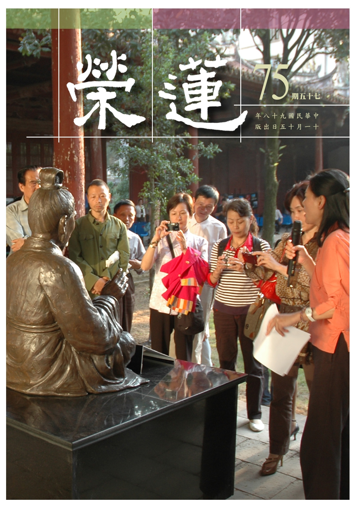

# 第75期

## 社論

### 知足常樂

本刊

人生如戲皆學問

知見為導觀念轉

花開木落流水聲

何處不是開悟處

人的一生追求甚麼？富貴、功名、幸福、健康、快樂 …。很多人跋山涉水去追求，如同小狗追逐尾巴永不能休，而終不可得；但如果驀然回首，方發現人生的美好幸福一直在我們身邊，貪求的越多只會凸顯我們遺失的本性，一個人若能以平常心生活，便能夠安然自在、知足常樂，發現週遭種種的美。

海倫凱勒嚐盡人生的苦樂與甜美，她曾說：「我常想，一個人假如能在他早期的成年生活中盲聾幾天的話，那將是一種恩賜，黑暗會使他更珍惜光明，寂靜會使他更了解聲音的可貴。」海倫凱勒雖身負三重（眼盲、耳聾、失語）痛苦，卻仍有堅忍不拔的毅力，她將人生看的比常人還透徹。

她能透過觸摸，感覺一片樹葉的精巧對稱，或是松樹粗糙毛茸的樹皮，她能因為一朵花而感到愉快，當清涼的水流傾洩在張開的手指中，她也能笑顏逐開，海倫凱勒並不會抱怨她所沒有的，世界的美好在她心中展露無遺。我們覺得稀鬆平常的事情，其實是上天賜予我們的奇異恩典，只是我們是否留心去注意，是否懂得感恩呢？劉俠女士自小罹患類風濕性關節炎，肌肉萎縮，行動不便，但她並未自暴自棄，反而感謝上蒼賜予的生命，並努力去幫助需要幫助的人。

緬甸是一個極其落後貧窮的國家，但人民並未愁眉苦臉，他們擁有一顆赤子之心，珍惜自身的文化，虔誠的祈福、恭敬的待人，值得我們效法。

為什麼知足常樂反而是生活困苦的人的座右銘，得到越多的人反而助長了自己的貪念，但是如果我們能放下身段，看看是甚麼樣辛苦的人民血汗的耕耘，我們才有如此豐盛的餐點；看看是甚麼樣有愛心的人們，為這世上辛苦的付出；看看是甚麼樣的偉人，傳遞這些淵博的學問與文化；看看是多少條件的具足，才構成我們每天舒適優渥的生活……。感覺到了嗎？有一股感恩的暖流會貫穿我們全身，使我們頓時充滿歡喜與感激。

很多人一味地想追求幸福快樂，對於苦痛避之唯恐不及，但快樂其實是痛苦的凝結，很多偉人從逆境中琢磨出來，他們的笑是淚的昇華，能吃苦到極點必能得其甘味，故「知苦之必有樂，故不求樂，知樂之生於苦，故不畏苦。故知苦樂之說者，可以常貧，可以常賤，可以長不死矣。」人生如果沒有咀嚼過苦澀，就品嚐不出生命的甜美。知足常樂並不是要我們放逸安樂、為所欲為，而是懂得珍惜一切，並在每種憂患中都看到機會與快樂，保持著吃苦當作吃補、吃虧就是佔便宜的心態，積極進取，便能離快樂近一點。

人生的得與失並不重要，有些「得」是「失」換來的，有些「失」能讓我們另有所「得」，凡事是以謙虛的心態來接受生命每一階段的試煉，讓我們能夠「真得」，並努力行善。就讓我們「把失敗的事當作在看戲，把成功的事當成演戲，人生自然叫好也叫座。」

## 大德法語

### 大方廣圓覺修多羅了義經（三十五）

道源老和尚

金器種類樣式多

不離金喻具佛性

可貴提煉除渣滓

湛然澄明圓覺智

乙二、正宗分

丙二、令依解修行隨根證入

丁二、廣明行相

戊一、四問答通明觀行上根修證

己二、徵釋迷悟始終

庚五、正答所問

辛一、長行

壬二、喻釋現起之疑

癸二、金中礦不重生喻

經文：

善男子！如銷金礦，金非銷有，既已成金，不重為礦，經無窮時，金性不壞，不應說言本非成就。如來圓覺，亦復如是。

金剛藏菩薩問了三個問題，最後一個問題是十方眾生本來成佛，緣起無明，一切如來什麼時候復生一切煩惱成為眾生？即佛說眾生本來成佛，本來成佛怎麼會有無明呢？既有無明就不應該說他本來成佛嘛！既然說他成了佛再做眾生，那麼十方如來什麼時候再當眾生呢？一連串問了三個問題。

第三個問題是由第一個問題而來，佛說眾生本來成佛，試問如何會本來成佛呢？譬如銷金礦一樣，金子一定在金礦裡邊，然金礦不是金，須經過銷熔才有，既已成金則不會再變成礦石，經無數劫，金性都不壞。不應該問金礦煉成金，什麼時候還會再變成礦石？這根本不成問題。不應該說本非成就，雖然金礦還沒有經過銷熔（化煉），可是金猶在金礦裡，這個金子本來成就，若說本非成就則錯。同理如來的妙圓覺性亦如此，在一切眾生份上本來成就！本來成佛！

壬三、顯示淺難深造

癸一、所造離念

經文：

善男子！一切如來妙圓覺心，本無菩提及與涅槃，亦無成佛及不成佛，無妄輪迴及非輪迴。

一切如來妙圓覺心是證得一切眾生本具的妙圓覺性（破二障的空性），此中無一切相，既無菩提亦無涅槃。成了佛有兩種果，一是智慧果（菩提果），一是理性果（涅槃果），但是在圓覺妙性（能所雙亡）裡根本沒有菩提，也沒有涅槃。所以古人有兩句話：平等證法界，佛不度眾生。在平等無差別的一真法界境界上，佛無有可度眾生，因在圓覺妙性中無任何差別相可得，此謂之一真法界（妙圓覺性）。

所以妙圓覺性裡沒有成佛與不成佛，輪迴是虛妄輪迴流轉，在圓覺妙性裏，根本沒有輪迴相。社會上批評佛教迷信，因為寺院做法會表現出來迷信的樣子，佛教被譭謗成迷信實在冤枉，人生最高的哲理就是佛理。以上所述乃華嚴三觀的真空絕相觀（華嚴三觀：真空絕相觀、理事無礙觀、周遍含容觀）。

真空絕相觀若依賢首五教乃屬始教（小、始、終、頓、圓），為大乘般若，《金剛經》云：凡所有相，皆是虛妄。其次：若以色相見我，以音聲求我，是人行邪道，不能見如來。以三十二相來求佛，以會說法的聲音來求佛，這就著了佛相、著了法相、著了邪道，怎麼也見不到佛。所以說凡所有相皆是虛妄，眾生相是虛妄的，佛相也是虛妄的，若見諸相非相才見到如來，是約見法身如來而言，此處妙圓覺性，乃始教（大乘的初門），不但絕一切眾生相，連佛相都要絕掉。其次入到理事無礙觀，理不礙事，事不礙理。

到了事事無礙的法界觀（即華嚴第三觀，周遍含容觀），一即多，多即一。由第一觀真空絕相觀談到六根清淨，六根、六塵、六識、十八界都清淨，一切凡夫都清淨。直到周遍含容觀，六根都遍法界，不染不障，不但理不礙事，事不礙理，且一即是一切，一個人修成功了，一切眾生都清淨，正報如此，乃至一切世間（依報）都清淨，一即是多，多即是一，周遍含容。

此處經文圓覺妙性沒有差別相（即真空絕相觀），何以沒有差別相呢？這些差別相都是對待的名詞，何謂菩提？斷了煩惱謂之菩提，與煩惱相對而說的。什麼是涅槃呢？了生死證得涅槃，是對著生死說的。什麼是佛？不是眾生名之為佛，是對著眾生說的。

何謂無妄輪迴？何謂非輪迴？生死境界，佛說是虛妄，然眾生卻在虛妄中受輪迴生死之苦，超出三界脫出輪迴，叫非輪迴，都是對待的假名業相，然在圓覺性中一切了不可得，不能以分別心證得圓覺性，一切如來的圓覺妙性中，對待相以及觀待相生起的假名，皆了不可得，此乃絕待，然還是錯的，因為觀待對待說絕待，此時是無一法可得，謂之開口即錯，動念即乖。

癸二、能造帶情

子一、舉勝彰劣

經文：

善男子！但諸聲聞所圓境界，身心語言，皆悉斷滅。終不能至彼之親證，所現涅槃。何況能以有思惟心，測度如來圓覺境界。

三界內的凡夫以分別心去測度如來圓覺境界是測度不到的，二乘聖人雖超出三界，所證境界亦是身心語言通通斷滅了，亦即身相也空，心相也空，語言之相也空，然終不能到達圓覺智所證的大涅槃，只能證得偏空涅槃，在此涅槃境中身心語言之相都了不可得，然不能證得大涅槃（圓覺性），何況薄地凡夫以思惟心（分別妄想）來測度如來的圓覺境界，如何能測度得到？

子二、舉喻顯情

經文：

如取螢火燒須彌山，終不能著。以輪迴心，生輪迴見，入於如來，大寂滅海，終不能至。

夏天夜晚會飛出帶光的小蟲，謂之螢火蟲，但彼火非燒東西之火，是蟲身上光體所發，須彌山是七寶所成，螢火非燒東西的火，拿螢火去點須彌山，終不能著。如同以思惟心測度圓覺的境界，愈測度愈遙遠。

輪迴心就是分別妄想的心（顯現六道有自相），以輪迴的心起輪迴的知見（取境界為自相所成的好醜而生好惡），想悟入、證入如來的大寂滅海，不生不滅謂之寂滅，此境界是寬廣甚深如同大海，謂之大寂滅海，乃妙圓覺的境界，你想以分別心到達此處，是終不能至，到達不得！

子三、誡息妄心

經文：

是故我說一切菩薩，及末世眾生，先斷無始輪迴根本。

欲斷無始輪迴根本，先求開悟，亦即先悟入如來的圓覺，再證入如來圓覺，由何時開始？由初發心的菩薩，及末世的眾生開始，要修大乘，要求如來的圓覺，先斷無始以來輪迴根本。

子四、重明妄義

經文：

善男子！有作思惟從有心起，皆是六塵妄想緣氣，非實心體，已如空華。用此思惟辨於佛境，猶如空華復結空果，輾轉妄想，無有是處。善男子！虛妄浮心，多諸巧見，不能成就圓覺方便。

有作就是有所作為，「有作思惟」就是有心想研究某個道理，此有作思惟從哪裡起呢？從有心起，此心（第六識）之生起乃六塵妄想緣氣，六塵緣影即是六塵妄想的緣氣，緣氣乃指此心似有而非實有，若無六塵何來心識？研究道理的心是第六識分別妄想，不是真實之體，等於空中華。

虛妄緣氣（六塵）如空中華，心（第六識）用此來思惟（將如空華之境執實），此分別心思惟佛境（圓覺境界是佛的境界），等於虛空華結出虛空果，實則空中根本沒有華，所現之華虛妄不實，如何會結出果來呢？想來想去都是增加妄想，沒有一點真實，謂之無有是處。你依妄想分別欲證佛智，如何能證得？

接著加以訶斥金剛藏問的道理不對，虛妄浮之心是輕浮、不純淨、不真實，多諸巧見之巧是小巧、技巧，問些道理雖問得很巧妙，然此技巧之心是佛教所謂八難之一—世智辯聰。世間一切有學問的人，你叫他學佛法很難，他有問不完的道理，他多諸巧見，亦即孔子所說好行小慧，此小巧的智慧，學孔子之道還學不來，怎麼能學佛的道呢？所以不能成就圓覺的方便。若想證圓覺，當然得有下手之處，切不要用輕浮心及小巧的智慧。

壬四、結答問不當理

經文：

如是分別，非為正問。

說如來成佛是否還當眾生，此之問非正當。講到這裡，我們得自己修行用功！我（道公）總算有一點善根，二十歲時出家雖不算晚，然在小廟出家，寺中沒有人懂佛法，連我師父也不懂，我什麼也不會，只會唸經，不會講經。出了家天天學唱讚，學打鬧鼓，盡學這些。在小廟出家生活苦，吃的是糯米飯，配的是舊臭醃菜，那種糯米飯台灣話叫糙噗味，天天吃那個米飯。在小廟裏天天念經打鬧鼓，就這麼回事。

雖不怕苦，但每天被逼著唸早晚功課本，尤其是教焰口要求很嚴，今天告訴你這一段要背，明天要你背出來，背不出來就跪凳子，背不完，打兩個響板，並且跪到凳子上去唸。且要你唱，萬一明天唱得不好，還是要打要罰，雖能背能唱，結果一句也沒懂。平常做佛事時（趕經懺），就念金剛經、念藏經，雖天天念金剛經，也沒人講，可是我還是有點善根呢！

到了二十五歲時去湖北歸元寺受戒，遇到一位受戒的新戒，這新戒有一點學問，他也是找不到人說話（無知音），碰到我還有一點談頭，就說我們出家都是念經，想學點佛法卻沒地方學，我有點善根就碰到這個人，雖他也不懂佛法，可是善根比我厚，後來他去了北京藏文學院。

我向他說學懂了佛法得告訴我，受戒後我得回小廟，之後收到了一本《大乘起信論》，論名很好，名為大乘起信！打開看時，一點也不懂，然看不懂也要看，為的是要學佛法嘛！文中有非為世間名利恭敬故，這一句我看懂了，哦！學佛法不能貪世間的名，不能貪世間的利，不能貪世間的恭敬，我就打那兒起種了善根。

後文勸我們要發三種心：直心、深心、大悲心。什麼是直心？是正念真如。當時無法瞭解真如，但懂得直心，就是心不要彎曲，貪名、貪利、貪恭敬這些心，都是彎彎曲曲的心。你學佛法你要怎麼學呢？你得學傻瓜，哈哈！這是我自己下的註解，不學那些輕浮之心，多諸巧見的人啊！我看了起信論這些話，後來硬學傻瓜，怎麼學傻瓜呢？遇著名現前時，你爭名讓你爭，利益現前，你爭利讓你爭，但不知道怎麼樣不要恭敬，因為還沒有這個經驗，名利二字，我懂！不貪名，不貪利，我在學傻瓜，學傻瓜就是學吃虧。

就從二十五歲那年起，學傻瓜，學吃虧，一直學到現在，覺得還沒有做錯。講這些做什麼？我學吃虧，名利讓人奪去，這樣子就會修行，會用功了！所以再說一句註解，修行要老實，老實就不是輕浮，不是巧見，如此則與佛道相近了。（下期待續）

### 常禮舉要講座（十六）　訪人篇

雪廬老人

舉止便知德與學

文化深遠平常間

觀人在此平常處

檢點不離禮所攝

◎五、坐立必正，不傾聽，不譁笑。

坐立必正：不單單是自己家裏，在人家家裏坐著、站著多少必須端正。

不傾聽：傾聽是什麼呢？若是聾，聽不見，那就可以原諒，因為我的耳朵聾聽不見你講什麼。既不是聾，則與人家談話不可這個樣子，此是不禮貌的動作。傾聽斜視，此斜視是與人談話眼往別處去斜看，凡是斜視，心必不正，頭往這裏眼往那裏看，偷東西看女人，反正是奸盜邪婬這些。你要不信，唱戲的功夫，小丑擦花臉他才有這些毛病，曹操不好，他是大白臉，唱戲的演曹操也是眼不亂看。後來曹操變了樣子穿上女人衣服，那是唱戲的故意罵曹。

不譁笑：到人家裏去不能高談闊論，又高聲說話、又對人大笑，這是不恭敬的。

◎六、不攜一切動物上堂。

從前很少，沒有帶動物上堂的。今日之下很多，今日之下帶什麼動物呢？其他的我也沒見過，現在人都是玩洋狗，這是實情。狗雖然是君子，我（雪公）也喜歡狗，但我可不把狗往屋裡帶。我恭敬牠，為什麼你恭敬牠？為著狗主忠信。孔子主忠信，狗最忠最信，講信用又忠誠。我想想我跟大家說，我比不了狗，狗是我的老師，我和牠做朋友，我覺得很光榮。

現在的洋狗可就另當別論，人人玩洋狗，洋狗必得上朋友家去，或是牽著或是抱著，不問男子或女子，你愛狗是你家裏頭，你的狗上他人家裏去，他人的家裏未必愛，人家屋裏是客廳，沒見過寫著狗廳，這話總得講，是狗廳還是客廳？不寫狗廳也行，總之，他家裏不是動物園嘛！你憑著什麼牽著你的狗上人家裡去，還坐在人家沙發上。狗坐沙發有什麼關係？狗吃得好，在家裏吃麵包吃牛肉比人吃得還好，比人吃得好，總而言之是狗，狗有狗的待遇，人有人的待遇，不一樣，這個你記住，別讓狗上堂，你出來不帶狗還不是一樣嗎？

◎七、主人室內之信件文書，概不取看。

這一條，從前是不必說的話，譬如到人家裏去，若另有客廳，那有文書等？那是他家有這種方便，若是不方便呢？睡與辦公都在這一間，這一個房間是寢室、餐廳又是書房。有一種主人，一來了客人，不管看什麼書、什麼信趕緊就收起來，這是受教育的！沒受過教育的就一切不管地招待客人。客呢？什麼主人就有什麼客，觀友而知其人！看主人桌上有一封信，你們沒學過法律，人家的信你要拿過來拆開看看，你查查法律上，這是犯刑事處分的！總而言之，片紙隻字在桌上擺著，我們走到那兒絕不看。

你們諸位有當公務員，現在我是不懂了，從前當公務員各人有各人的書房。辦財政與辦司法或辦教育的，各人有各人的屋子。現在大部分是公開的辦公室，然不論在一個屋子，或在一個房間，我勸你們諸位你辦你的公事，即使你跟他辦一樣的公事，但他的公事我們不看，這個大家務必要學！即使他不在那裏我們也不管、絕不看。

這個事情我跟你說，假若同事不規矩，規矩的還馬馬虎虎就算了，不規矩的出去洩漏公事的祕密，洩漏有罪啊！可是這公事你也看了，你看了你沒出去說，沒出去說你可看了，那你洗不清，有官司打了。人家桌上的公事，多麼好的朋友都不動手，這大家要學明白的，就是不看。

◎八、談話應答必顧望。

不論你跟什麼人談話，這個大家學著，你與張三談話你的臉就看張三，對著他。李四又跟你說話，你要跟李四接著說話，你的臉再看李四。張三再說你再回來，你必得這個樣子的。那麼張三跟你說，李四跟你說，你這樣子不麻煩嗎？麻煩沒法子，就得這樣子。你碰見懂禮的，你在那正說著他不插嘴，現在就有，這兒談著還沒說完就插嘴，你不敷衍他就得罪他，他有未盡之辭還要說，你就得敷衍他，眼前人最容易得罪。

我跟你說吧，天下事就怕眼前人，這是諺語。眼前人有什麼怕呢？這個仇家都在眼前人上，街上的人仇人很少，除非是太保看著你不順眼，那事情是很少，這個要記住。你要看好，送客行禮都得看人，我常留心送客的功夫，送到門外，眼看別處，「再見、再見啊」。這個就得罪人。得罪人再解釋就不如不得罪人。解釋，真正能解釋開嗎？

我（雪公）再三的說，你們諸位必須看中國歷史，為什麼呢？「能以解釋得開」這一句，唐書上一位武將得罪文人，他是個好人得罪了壞人，皇帝出來調解。這位糊塗皇上是昏君邪正不分，調解了。這個武將倒是坦坦然，皇上都出面讓我們和解了，那就算啦！過了一些時候，就沒有什麼了。

後來這位武將欲促成兒子與文人的女兒結婚，向文人求婚時，那一位文人拒絕了。他（武將）這才明白：「嗄！我們武人好辦事，受過氣就沒有了，這個人肚子裏勾勾叨叨，文人勾勾叨叨」。念的書通達了才是君子，念的書不通達就勾勾叨叨，反而念些書成小人。你們大家欲學好，看歷史就有好處，你就知道盛衰興亡、該辦不該辦。你心裡要存著一肚子鬼頭鬼腦，不看歷史還好，看了歷史你就成了戰國策裡的策士了，變成勾勾叨叨的人，害人的方法進步了，就這種情形。

◎九、將上堂，聲必揚

。

從前是大門一進去，一直到二門，上了屋裡，才是住宅。你敲了門，進了大門，二門也進了，上屋裡去，這個時間很長，裏頭的有時不知道外頭有客來啦，屋裡還有不方便的事情。你啊！沒有主人領著你當然不進門更好，假若是開著門，敲門也沒人應，你到這個地處就要止住，再招呼、招呼，再不應，那就乾脆退出來。

聲必揚：就是你將上屋裡去，這時主人也跟著，必得說幾句話或放放聲音，或者屋內有女子夏天衣服不整齊，她不知道客來了，你這一說話，她就預備預備，預備不及呢，她就上裏間去躲避躲避，這都是世故人情。

曲禮上講，進門的功夫，不要這個書好、那個櫃子不錯……，不用這一套，現在不在乎這個了。從前男人跑到人家家裏去看女人，這是大壞事，不是奸就是盜。這麼進門這裏好、那裏……，這個也有事啊？你是探路是不是？你看曲禮，進去人家家裏規規矩矩，那裏也不看。（下期待續）

## 共修研學

### 小止觀導覽（四十七）

*心爾、智高整理*

歷緣對境住坐臥

庸常動作不凡心

善念攝持轉淨行

一一證得自相空

第六章  正修行

論文：

二、住者：若於住時，應作是念：我今為何等事欲住？若為諸煩惱及不善無記事住，即不應住。若為善利益事，即應住。

住分內外，內指內心的安住，外是停留（安住）在某個地方。當我們留在某地處時，內心應該觀察思維其目的和動機是什麼？我今為了什麼事想要安住在此處，比如今天住在某個道場，思維這個住可否幫助我降伏煩惱？是否是對治惡法而住？是否是開展善法而住？所以古大德如虛雲老和尚到某一個地方住下來，若是因緣到了他就離開。大菩薩也是一樣，若住在某一處的意義已經沒了，他或者離開此地，或者示現涅槃，或者示現往生，總之絕不浪費一分的福報。

所以在住之時就要以住為所緣觀察，能夠生起善法者則住；不能生起善法者就不住。若能生起善法而住，則住一天是一天的功德，住一個月是一個月的功德，住一年則是一年的功德；反之，若在此住當中有很多惡因緣，例如與惡知識共住，或者有很多不如法的事情會發生，那住一天是一天的罪業，住一個月是一個月的罪業，住一年則是一年的罪業，此時離開是愈快愈好。

論文：

云何住中修止？若於住時，即知：因於住時，則有一切煩惱善惡等法，了知住心及住中一切法，皆不可得，則妄念心息，是名修止。云何住中修觀？應作是念：由心駐身，故名為住。因此住故，則有一切煩惱善惡等法。則當反觀住心，不見相貌。當知住者及住中一切法，畢竟空寂，是名修觀。

修止只是一個概念，說明住心及住中一切法是互相依靠。但我們可以試著觀察，是不是真的如此？住心（能住）乃對著住（所住）而說住心；住也是對著住心而說住。住的煩惱、功德也都是觀待住及住心而生起。反之，不必觀待住心（能住）則住（所住）也不可得，能住、所住自相空寂，此乃勝義面相的觀察。能住、所住自相空寂，須互相觀待才能生起，然後在世俗面相上知道住和住心是互相靠的，對著住而有住心；對著住心而有住。這個住是對著住心才能說的住，所以住的體會，須靠住心才能顯現。

論文：

三、坐者：若於坐時，應作是念：我今為何等事欲坐？若為諸煩惱及不善無記事坐，即不應坐。若為善利益事，即應坐。

修學止觀之人，在坐之時，亦應觀察應坐或不應坐。我為什麼而坐？或是此坐會引發什麼功德、過患？如高登海居士於《佛家靜坐方法論》中云：假若為諸煩惱及不善、無記等事，如坐於不良之飲食、歌舞場所，就不應坐；為善利益事，如坐於修道場所、說法場所，就應該去坐。

雖然此坐是為善利益等事而坐，但有時亦要思量為他善利益等事而起坐。如道源老和尚說：有人新進講堂要聽課，沒有找到位子，開始猶豫不決，心想離開，此時我們是否要先忍住坐著聽課的法喜，還是先起坐幫他準備一個位子？所以這個「坐」須觀待自己坐，亦觀待他人坐，如果因為他人坐而生起功德，我們是否要起坐幫他準備座位呢？忍著中斷自己的法喜是否值得呢？如天台大師因領眾而受損，不能證得六根清淨位（內凡位），只能證得五品位（外凡位），如此作值不值得呢？這是見仁見智的問題。

論文：

云何坐中修止？若於坐時，則當了知因於坐故，則有一切煩惱善惡等法，而無一法可得。則妄念不生，是名修止。云何坐中修觀？應作是念：由心所念，壘腳安身，因此則有一切善惡等法，故名為坐。反觀坐心，不見相貌。當知坐者及坐中一切法，畢竟空寂，是名修觀。

觀待坐會產生很多的善惡等法，比如有人因為坐下來，結果使身心靜下來，又聽了一場經，此坐所生的功德是不可言喻。有人則是坐下來與惡知識聊天，生起了很多的是非煩惱。由坐所生起的善心或煩惱與坐互相觀待而有，所以兩者都沒有自己獨存的相貌可言。坐與坐生起的善心，將來將感得何種果報，能於世俗名言中認知生起。如在佛陀、聖者心識之前，就可認知到眾生的坐是否是穩住定性的坐、穩住菩堤道場的坐或是成佛徵兆的坐；反之或者只是煩惱的坐。而到底坐是功德還是罪過，除了大德能以名言通達外，還得要自己的內心默默地去反省。

論文：

四、臥者：於臥時，應作是念：我今為何等事欲臥？若為不善放逸等事，則不應臥，若為調合四大故臥，則應如師子王臥。

臥時應如師子臥，就是要以自己的身子為所緣去觀察，自己有沒有像獅子這樣臥？先以心觀察師子臥的種種功德，身體即以這樣的臥來生起功德。師子王臥的人（右脅臥），睡時不會壓倒在左邊的心臟，不會在生理不平衡下胡思亂想，其次師子王臥的人警覺性較高，易於夢中修行用功，再者呼吸亦較均勻，且是臥中最好的威儀相，貪心也不容易生。

觀修師子王臥的功德，生起師子臥的形相，觀待臥就能生起功德。尤其精進法以獅子臥暫止息身心，待修養之後，以勇悍心修學正法，利益有情，此臥功德最大。更以臥來體會死亡，觀修死時要以此姿勢呈現死亡相，蓋上棉被觀想成陀羅尼經被，佛號機的佛號當成蓮友的助念，此臥就是修學無常的臥。以上種種觀察都是顯現臥的功德，這樣臥的觀察是非常殊勝的。

論文：

云何臥中修止？若於寢息，則當了知：因於臥故，則有一切善惡等法。而無一法可得；則妄念不起，是名修止。

在臥時，會有觀待臥而生起的善惡念，如藉由臥來長養自己的放逸與昏沉，此臥則生惡法，與臥時所生善惡法互相觀待，二者自相皆了不可得。

臥與臥時所生善惡法自相不可得，顯現皆是虛妄，所以世俗的念都沒有了，《金剛經》云：凡所有相皆是虛妄。顯現似真實，實則非實有，謂之虛妄。世間的顯現似有自相的顯現，實則連一粒微塵的真實都沒有，在名言安立下才顯現為有。緣念世俗以為有自相就是妄想、妄念，若見諸相非相則無妄念可生。

論文：

云何臥中修觀？應作是念：由於勞乏，即便昏闇，放縱六情，因此則有一切煩惱善惡等法。即當反觀臥心，不見相貌。當知臥者及臥中一切法，畢竟空寂，是名修觀。

如果是好逸惡勞之臥，當然會有一切煩惱惡等之法的生起；觀待於調和四大，而能繼續修行的臥，就有一切善法的發動。所以觀待於臥所生的善惡兩者是互相觀待的。而臥與臥心亦是互相觀待，二者自相皆了不可得，畢竟空寂。當你對臥有殊勝的名言認知時，即能一眼看出他人臥是功德或是過患。同樣是臥，可能呈現在聖者心識之前是修行，在凡夫心識之前卻是懈怠，所以該法都是要靠名言的認知才有該法現相的生起。（下期待續）

## 蓮池海會

### 陳鐘笑卿老居士往生見聞記

*淨昌整理*

百歲人瑞晚年福

持家以和忍忍忍

壽終正寢助念後

身軟相好宿願成

陳鐘笑卿老居士，民國前壹年生於廣東省廣州市，父親從事洋行買辦工作。民國十多年時，家庭因動亂而短暫避居香港，從而結識由英國劍橋大學留學歸來的馬來西亞華僑陳漢先生，爾後陳漢先生接受英商石油公司在台灣之工作，兩人旋赴台灣結婚並定居。

在台灣光復前，陳漢先生因出版英文之反日刊物而被迫潛赴廈門避難，陳鐘笑卿老居士即負起照顧婆婆等一家人之責任。也曾因身分屬於三等公民的外省人（日本人、台灣人、外省人），在避難時被迫由台北舉家遷至新店以及台中烏日等地，生活上十分艱苦，直到光復後才重返台北定居。

老居士侍奉婆婆恭敬和順，夫家親人有疾病時也勉力照顧。晚年陳漢先生中風後，臥床達八年之久，老居士細心照顧，平均每半到一小時，將先生身體翻轉一次，以避免褥瘡，不讓先生額外再多受到痛苦。雖然家庭收入尚可，可是老居士自奉甚儉。但與朋友鄰居相處，有需要時都會盡力接濟。對世俗的需求非常少，手邊稍有金錢也常常供養道場。平日待人誠懇，遇到別人有不平之事，總以柔軟的語氣，開導並幫助化開心結。「不求榮華富貴，但求無愧於心」的處世態度，為後輩子孫樹立了良好的典範，也因此深受親朋好友及鄰居之敬重。學佛之後，也常將佛法的概念與人分享。

老居士為人個性溫和，凡事都能不計較，也教導子孫，居家行事都要以和為貴。不以自己為重，心裡都是關懷別人的念頭，常聽她說道：「只要別人開心，我就開心了」，因此都能跟相處的人結很好的善緣。老居士近兩年來，有記憶喪失的情況，但看到每一個人，雖然自己已經不認識，但總是很開心的笑臉迎人，並招呼要一起用餐，自自然然的流露出過去平日的習氣。

老居士往生前曾短暫住院治療，一位中醫朋友於探望後，問及老人家平日之待人處世，了解後非常讚歎，認為一般人若是有老居士的病症，都會感到痛苦，或是肚子腫脹吃不下東西，但老居士卻是胃口很好，心情也很愉快，有病而沒有苦，這都是平日的善心善行所帶來的正面利益。

老居士於民國六十四年先生中風後，皈依三寶，常常坐公車遠赴木柵聽經。平日作早晚課時，穿著海青跪誦普門品及大悲咒，並於客廳內繞佛念佛。晚年察覺自身記憶力減退，還將自己課誦內容錄下來固定播放以表心意。也在很早之前就將骨灰塔位及往生被準備好，足見老人家對世俗的不掛念。數年前，在佛堂昏倒，經過醫師建議，才改為坐在椅子上做早晚課，這是老居士對三寶的虔誠與敬慎。晚年時老居士也曾不只一次的告訴後輩，自己的心願是臨終時大家莫要哭泣，且能為她護持念佛。

往生之前的兩年，約有半年的時間，老居士有因緣參加蓮榮共修會每星期四的念佛共修。雖然念佛有時節奏跟不上，自己也行走不便，但都很歡喜的參與，也在共修會裏，與蓮友們結上殊勝的法緣。常常在活動結束後很期待的說，是否第二天能繼續參加。

綜觀老居士的一生，待人誠懇，替別人著想，把自己看得輕，如此反而得到他人的敬重；樂善好施，不蓄積財物，但精神上卻是富足而喜悅；用柔軟語，調和週遭的人，家庭生活和諧而愉快；不發脾氣，心中沒有煩惱之事牽掛，雖然不刻意注重養生，卻能一生無病且長壽；對三寶恭敬，只要是聽經聞法或參與三寶相關的事宜都心生歡喜；平常做早晚課時莊重嚴謹，並認真念佛，發願求往生；同時也和專修淨土的正法道場結上法緣。如此的心境、行持與因緣，再配合上賢孝子孫能尊重老人家的心願，感得臨終時，大眾齊聚念佛，護持往生，在助念之後，全身柔軟，含笑西歸，與其生前之行誼相對照，豈不宜乎！

### 徐庚璋老居士往生見聞記

*淨昌整理*

病苦四處求名醫

得知不治心坦然

一心念佛西歸去

引得全家信佛來

徐庚璋老居士，嘉義縣民雄鄉人，自幼家中經營腳踏車店，從小便需協助父親打理一切事務，也養成了獨立自主，不畏辛勞的態度。

年輕時由於父親去世，故家中重擔遂由其一肩挑起。除了要經營腳踏車店，也需要照顧母親及家中的弟妹。

二十八年前，因緣際會舉家搬遷至桃園，與太太胼手胝足重新開創新生活，來到桃園後，面對家徒四壁的他，不僅沒有被打倒，反而更激起他的心，從零到有，終於有能力購買新屋。當然這中間，諸多親友的適時協助，也讓徐居士常感念於心。徐居士常說：人窮志不窮，人不怕失敗，只怕失敗了就沒勇氣再來過，這就是徐居士堅韌的一面。

老居士雖只有國中畢業，但他深知讀書的好處，所以他總是對子女說：「要勤讀書，才會出頭天」。只要你們肯讀書，再累我都不怕。居士共育有二女二男，皆已成家立業。子女們都已有所成就，這都是老居士諄諄教誨的成就。

老居士任職於勝宏公司擔任作業領班一職，極富責任心，在工作上毫不懈怠，任勞任怨。有一次工廠需要調試一種新的藥水，以符合生產需求，但總是無法順利調出最佳的比例，於是主管便請徐居士來負責調校，徐居士為了完成任務，便不眠不休努力嘗試，用盡自己所知的經驗，終於調試成功。又有一次，居士為了工作，半夜調試機台，袖子已被機器捲入，居士緊急用力拉扯，跌坐地上，才將袖子抽出，差點因此捲入機器，種種作法都是為了讓工作能順利進行，這就是徐居士認真負責的一面。

老居士平日忙於工作，兢兢業業，為了讓家人有好的生活品質，及讓子女有好的教育環境，只要有加班賺錢的機會他從不拒絕，每天幾乎都是十六至二十小時不停的工作，連三餐都無法定時吃，但他從不說苦說累，即使體力透支，臉上仍帶微笑，只為讓子女能放心。由於工作的關係，無法每天與子女面對面溝通，為了瞭解子女的狀況，居士每天就是寫紙條放在桌上，來表達他對子女的愛。

老居士一生勤儉，但對於行善卻是不落人後，不論鋪橋造路，扶窮濟貧，皆能看到他的身影。鄰里中有蓋廟或修整廟寺，他一定捐獻，即使家中不富有，他也不吝惜。為了讓家宅平安，也常到各廟寺供養祈福。這就是居士善心的一面。

退休之後，居士身體已有狀況，但居士卻隻字未提，僅自行就醫，就怕家人為其擔心。兩年前突感身體不適，經檢查後為尿毒症，需洗腎維持身體功能，但居士不畏病痛，仍致力改善身體健康。今年六月再經長庚醫院檢查出是膀胱癌末期，但居士仍是勇敢面對。直到今年八月因癌細胞已擴散並竄至骨頭，致使居士無法行走。期間居士始終無法接受患重病的事實，深信自己仍有機會恢復健康，不輕言放棄。後大女兒有緣結交善知識，經善知識的引導，將淨土法門介紹給居士。

起初居士仍認為自己還有機會治癒，所以認為極樂世界仍是遙遠陌生。但此時妻子、兒女不斷勸說要一心念佛，求生佛國淨土，甚至跟居士說明西方極樂世界種種殊勝莊嚴，並於床頭邊放置念佛機，讓阿彌陀佛的佛號不間斷，為的就是要讓居士提起正念及放下世緣。經過幾次急診住院後，醫生在居士的面前說明病情的嚴重性後，居士才坦然面對，從那時起便一心念佛，求阿彌陀佛帶他往生極樂世界，子女亦誠心求佛菩薩慈悲加被。

終於民國九十八年十月十五日凌晨零時四十分，在妻子、孝眷及蓮友陪伴念佛，助念十六小時後，身體柔軟，面相莊嚴，見者無不歡喜，咸信老居士已往生佛國淨土。

綜觀老居士的一生，實為上一輩人的典型，雖生於困苦貧乏，不但有提得起的承擔，樂觀進取、勤儉自持且努力不懈，縱無大富大貴，卻給子女後代最好身教的示範；而且也放得下，自用尚不甚足卻不失能捨之心，能隨緣濟眾行善，臨終更在獲知得不治之症後，還能隨順善友引導，徹底放下，專志求生，終蒙彌陀佛接引生西。語云：「法不孤起，必賴因緣」，老居士一生努力，末後得聞佛法，雖必宿世善因所致，若無此生懿德善行及子女結交善友為助緣，善果亦不得成熟。老居士已生安養，吾人尚在娑婆，欲求蓋棺善果，吾其勉哉！吾其勉哉！

### 黃志銘居士往生見聞記

*淨昌整理*

謙和隨緣信三寶

假日攜眷聞經法

最喜出國隨法行

西歸眾皆驚無常

黃志銘居士生於民國三十九年七月十一日，居士出身書香門第，其曾祖父 務三公，乃前清秀才；先翁 黃本源曾負笈日本習醫，返國後服務於醫學界，擔任蘇澳衛生所主任兼醫師，對地方衛生建設及疾病防治貢獻卓著。居士受濟世助人家風薰染，溫文好學，繼承父志，以懸壺濟世為內心第一志願。六十三年醫學院畢業後返鄉服務，居士善體眾生痛苦之心，常於診治病人牙齒時顯現，臨深履薄，並時時關切詢問病人感受，仁心仁術，的為牙科醫師典型。後擔任署立宜蘭醫院牙科主任以迄退休，醫術醫德深受推崇。

三十一歲時，與羅珮甄女士締結連理，育有二子一女。志銘居士仍一本書香門第之家風，居處謹，執事誠，奉公守法，博愛濟眾，事親盡孝，為親朋好友所稱道。幼時友朋，結交數十載如一日，至今仍情誼深厚；父親過世後，居士替代父親，對上奉事七位姑姑，與兩位叔叔時相往來，問候請安，情同父子；對下友愛諸妹及妹婿，雖彼各散居台北、宜蘭及美國，居士長兄如父，常邀往來，凝聚情誼。語云：「家和萬事興」，吾輩後學者如能學習居士和合家族能力及用心，和合於一家則一家興，和合於團體則團體興，和合於國家則國家興，能不學乎！

志銘居士結緣佛法頗深，就讀高中時期即皈依三寶，法號「心深」，當時其虔心誠意，時令尊親疑獨子有出家之志。進入社會後，結識善知識，並親近台中蓮社，隨緣護持蘭陽儒佛學會，三十餘載矣。平素恭敬三寶，以儒學佛法自勵，敦倫盡份不忘菩提，並以極樂淨土為依歸。居士教子有方，二子一女均能承襲家風，知書達禮，長女完成大學學業，目前服務台北弘明托兒所，為儒佛傳承盡一份扎根的力量；長子及次子分別就讀於研究所及大學。居士對子女猶重啟蒙教育，堅持須於學校課餘之暇，或平時假日參加儒佛經典研討，或寒暑假參加啟蒙班課程等等，從不懈怠。

孰知「世間無常」為居士最後示現，嘆於今年十月十八日，在參與福建省建甌市文化交流授贈孔子及十大弟子塑像儀式途中緣盡捨報，在佛號聲中安詳蒙佛接引，往登極樂淨土，享年六十歲。

綜觀居士一生，為世間善人無疑矣。但世間善人得不到助念，臨終被開腸剖肚，插管急救者多矣。居士最後示現無常，臨終之際未免病苦，還能得善知識開導護持並助念十八小時，最後面容安祥，猶勝在生之時。雖是宿福深厚所致，但如居士平日未能修學儒佛正法，亦不護持正法道場，亦不護持啟蒙教育，不靠這些善緣，如何得助念的殊勝福報。吾輩驚嘆於無常迅速之際，更應對此有所認知，才不枉居士現身說法一遭，才不會捨珠玉而取糟粕，可惜了一生。

## 專題研學

### 聖者的祕密～大佛頂首楞嚴經二十五圓通暨七處徵心探源

### 二十五圓通暨七處徵心簡介　（十六）滿慈舌識

時哉

聖門氣象弟子弘

傳承正法師子吼

巧妙舌根舌識生

淘淘宣流若長河

寅九、滿慈舌識

卯一、作禮陳白

經文：

富樓那彌多羅尼子即從座起。頂禮佛足，而白佛言：

富樓那彌多羅尼子即是以慈悲著名的富樓那尊者，亦稱為滿慈子，是佛陀十大弟子中說法第一，此時由尊者來報告舌識圓通的修學法。

佛陀座下的每一位尊者皆有恢弘的氣象，舉凡應對進退的威儀，甚而所證悟的內涵，都足以表徵釋迦牟尼佛世教化的殊勝、正法的氣象，是生於象法及末法之人難以想像的境界，就如大德在世時的氣象，未經歷者無法憑空想像。故而普賢行願品中的請佛住世、請轉法輪，是極為重要的願力，大德的出世是為了眾生，後世想要經營正法的修學環境是極不容易的，若無修學環境，眾生修學正法的障礙相對也增加許多。

佛法無人說，雖智不能解，佛法並非閉關苦讀就可以得到證悟，即如中國有很多讀書人閉關苦讀論語，自認得到孔子的心法，實際上離孔子的境界非常遠，甚至洋洋灑灑的註解卻不符本意，這樣的苦學其實是沒用的，有時反而會有過患。若於聽聞中得到正見，經過不斷思辯得到比量的證悟與現量的親證，是故經上說有人修學時間雖短，卻能頓超許多劫，這是有道理的。知乎此，學佛的第一步就要從聽聞入門，若無聽聞就談不上思惟，沒有思惟就談不上修學，所以聽聞是開智慧的第一步，佛法也是以聽聞來作開悟的資糧，悟後起修才是真修。

卯二、陳白之言

辰一、宿辯說法

巳一、久弘權實

經文：

我曠劫來，辯才無礙。宣說苦空，深達實相。

滿慈子開始陳白舌識圓通的修學法。第一是宿世具足辯才說法的能力，然辯才並非無中生有，必須要在種種法行中，得到三寶加被，去除修學佛法的障難，生起三昧辯才的能力。一方面要靠自己努力，一方面要靠佛菩薩加被，欲得加被須對三寶禮拜、讚歎、供養、懺悔、發願，生起慧辯能力，能善巧將佛的意思表達，讓聽眾瞭解。

說法事業是所有佛事業中最為重要也是最核心，然須對佛語的內涵有所瞭解，並將所生正見攝持，助念、做七、拜懺等善業，使體性轉成佛行事業。

科判中所謂久弘權實，即是滿慈子作為說法的法師已經很久了，權就是方便法，乃世間離苦得樂的方便，實就是真實法，乃修學般若法門，現證空性得出世間解脫。修學空性有所謂了義空和不了義空，了義空是真正空性相，不了義空非法之真實相。了不了義須依善知識教導，對空性才有辯證的能力。

尊者自述從曠劫來，辯才無礙。此辯才無礙，代表富樓那尊者曠劫以來修學佛法的障礙都消除了。辯才的本質是智慧，行相有四種：法無礙辯是能將法的名相以及義理解釋清楚明白；義無礙辯乃能抉擇了義與不了義；辭無礙辯是能以各種方言表達佛法的義涵，如會性法師曾為斌宗大師、慈航法師及道源老和尚等大德現場翻譯，能熟稔運用台語、客家語將大德開示表達清楚；樂說無礙辯是觀待眾生的需要悅意而說。上述這些辯才都是利益眾生非常重要的能力，若對於佛法不瞭解，且不知如何表達，則佛法漸漸衰敗，若有辯才的能力，佛法不但能繼續傳承，更能發揚光大。

聖道門的障礙是所有障礙中最大的障礙，所謂：業力甚大，能敵須彌，能深巨海，能障聖道。舍利弗入定時，鬼王劈舍利弗的掌力可以將須彌山劈成兩半；大鵬金翅鳥在吃龍子時，翅膀一拍海水就分成兩邊，把龍子給吃了，所以業力能敵須彌、能深巨海不算什麼，業力障聖道才是最可怕的。所以道源老和尚曾說，晚上治療失眠最好的方法，就是把法華玄義拿來讀一讀，久治不好的失眠症就治好了。晚上是怎麼睡都睡不著，坐上修時就睡意正濃，佛法是消除失眠症最好的良方，這才是最嚴重的障礙。

尊者以無礙辯才宣說苦，令眾生起出離心，宣說空，令眾生生起解脫能力。深達實相是指尊者能通達了義空的究竟義理，並令有情深達實相。

巳二、廣衍微妙

經文：

如是乃至恒沙如來秘密法門。我於眾中微妙開示，得無所畏。

秘密法門指的就是修學空性的法門，以法的自性為所緣，看不到法的自性，能證所證皆了不可得，無法以言語詮釋、無法以心思觸及，所以此法門稱做秘密。例如對著茶杯能生起認識茶杯的心識，對著麥克風能生起認識麥克風的心識，當什麼法也對不到時，也無從生起什麼心識。這個境界是言語不到、心思不到，就算普賢菩薩發願身上長滿嘴巴，用各種善巧比喻說，也說不完備，連十方諸佛都說不清楚，所以是秘密法門。

尊者是一位引路者，他知道方向在哪裡，能將精微的義理巧妙表示，眾生能因指見月。微妙有二：一是精微的義理；二是以巧妙的言詞開示，深入淺出令眾生易解。微妙的開示不能自己生，不能獨立生，必須觀待精微的義理以及巧妙的言詞而後生，且需對著眾生才能生出這些微妙開示，所以佛必須對著眾生才有法可說，佛若對不到眾生，沒辦法說法，所以金剛經上說，佛說法四十九年，實無一法可說，其真正旨趣在此。

有於《金剛經》生起疑惑，佛到底有說還是沒說？若沒說，佛卻四十九年諄諄教誨，然佛卻在《金剛經》中云：無一法可說。一般人最容易誤會般若義趣，以為不說法就是佛法、不說話就是般若？當然般若義趣是由內心所證，不是外表的語默動靜。

得無所畏，另有說是：一、盡苦道（苦果）無所畏；二、說障道（苦因）無所畏（能將苦因說清楚）；三、一切智無所畏；四、他漏盡（斷煩惱）無所畏。

另有得無所畏，具初地菩薩以上的證量，當對大眾說法時，即使登地以上的菩薩現前，或佛來現場，也無所畏懼，能將義理講得很清楚，富樓那尊者就有登地菩薩的能力。一般人見到大德在現場就忘光有所準備，例如上台練講時發現老師坐在台下，老師張眼他也害怕，閉目聆聽他也害怕，怕露出馬腳。

辰二、承教得果

巳一、承教音輪

經文：

世尊知我有大辯才。以音聲輪，教我發揚。

國護法師云：知弟莫若師，因才而教育。以音聲輪，教我發揚，佛三輪說法，雖由意輪所出，然主要是音聲輪，由於佛行事業中最重要的是教育事業。佛知道富樓那有能力說法，也有悲心，所以佛善巧教導富樓那，使其具有傳法的能力。

巳二、輔化得果

經文：

我於佛前，助佛轉輪。因師子吼，成阿羅漢。

富樓那尊者助佛轉輪，如同講小座或私下帶組研討，或是代佛講經，都是助佛轉輪。以往亦曾在雪公《華嚴經》講座上參加小組研討，將老師的意思在小組研討中討論清楚，聽經不只是聽聽而已，要將道理聽懂，且內心產生確實如此的心態，才能成立聞所成慧；其次思是透過推理產生比量的智慧，方為思所成慧，不是只有想想看；修也不是離開聞思另有一個東西叫修，是透過比量的智慧得到的結論，經不斷的串習，如此的推理生起現證，方謂之修所成慧，如此方有能力助佛轉輪。

助佛轉輪，是能夠傳承佛陀的教法，利益後世，若無傳承，佛法只能利益當世，是故傳承的功德非常大，如同顏回助孔子轉法輪，孔子私下觀察顏回，顏回能發孔子未盡之意，孔子讚說：回也不愚。

學佛路上不要小看初機學佛者，其引發的潛力可能都在老參之上，所謂：長江後浪推前浪，青出於藍勝於藍。如顏回未四十而不惑，未五十而知天命，未六十而耳順，若讓顏回活到七十三歲，成就未必在孔子之下。釋迦牟尼佛在講經說法時，很多大菩薩都問後世象法轉時、末法轉時，眾生該怎麼辦？可見大菩薩們都想到後世的眾生，大菩薩們都想到我們了，我們為何想不到下一代呢？所以若不好好辦教育來利益下一代，我們是無顏面對老祖宗、佛菩薩。

此時要助佛轉輪，將法好好的傳下去，符合佛菩薩利益眾生的悲心，實踐佛菩薩的願望，我們就變成佛菩薩樂於攝受的弟子，助佛轉輪該是我們每一個人的責任。《華嚴經》云：十回向菩薩以離垢繒繫其頂，住法師位。住法師位就是修學的目標之一，住在法師的位置助佛轉輪，是真正利益群蒙。

因獅子吼，成阿羅漢。法能破邪顯正令群魔喪膽，如獅子吼群獸皆伏。有人說現在是法弱魔強，魔固然強大，但從另一個觀點來說，法是太弱了，法弱是法自己在弱嗎？不是！是世人體悟法的能力很薄弱，根本說不出其中的義理。與其怪現在魔強法弱、正法不昌，不如努力修學正法，當努力修學正法時，法又如何會弱呢？魔又怎麼會強呢？獅子吼即法強魔弱，正法時期的行相，有情眾生容易在法上得到覺受，容易得到法義的現證而證果。

名言為阿羅漢，但卻助佛轉法輪，此乃二乘人代佛宣揚正法，天台教觀云：轉教菩薩。彼聖者對大乘法勝解，未來必發菩提心修學大乘道而成佛。

辰三、蒙佛印許

經文：

世尊印我說法無上。

說法無上就是在人中說法，無人比得上，富樓那尊者有這種特色。

卯三、結答圓通

經文：

佛問圓通。我以法音降伏魔怨，銷滅諸漏。斯為第一。

聖者降伏魔怨，或以身輪降伏（生起各種神變），或以法音降伏魔怨。法音降伏魔怨是最重要，能令正法住世不被魔所破壞，當眾生得到正知見，分清楚魔和佛時，就不會著魔，魔的勢力會越來越弱，自然不會發生所謂的魔強法弱。

此處尊者並未提及舌識勝義的修學法，須知二十五圓通修學法有約世俗說，有約勝義說，雖世俗說是不了義，勝義說是了義，此時因緣偏於世俗說，但富樓那尊者已經深達實相，如何能說彼所證是不了義？

舌識自相空修學法同前，此處約世俗功能說，能以內心證悟為本質，很靈活地說出內心所體悟的佛法，令聞者易於領會，而消滅諸漏。（下期待續）

### 六趣輪迴經簡介（七）畜生道

*盡意整理*

未學佛法不解脫

有情奔馳六道中

三塗易入而難出

貧賤多怨又復入

畜生道

經文：

人天三惡趣，唯自能救拔，奔馳六趣中，如夢境和合。

人、天、阿修羅道是三善道，地獄、餓鬼、畜生是三惡趣，要免於投生到惡道，投生於人天，甚至獲得解脫，只有靠自己來救自己，必須是自己的身口意以利他的方式（做善業）來救自己。

奔馳二字用得好，我們朝向死亡是非常精進的，每個人每一天都在努力地奔向死亡、奔向來世。常常在午夜夢迴，赫然驚醒自己已經老大不小了，可是我們無力阻擋時間一分一秒、不停止的往前衝。

如夢境和合：夢心顯現夢境，有貪心餓鬼道出現，有瞋心則地獄道出現，愚癡心則顯現畜生道。例如我們在龍門國中辦寒假啟蒙班，想要上進的人啟蒙班就出現，想要玩耍的人啟蒙班就消失，此即夢境和合的道理。

經文：

睹自他眷屬，傷嘆豈長久，如彼俳優人，數數易形色。

大家聚會都很短，告別式上也常聽到「樹欲靜而風不止，子欲養而親不待。」的話語，聚會很快就會消失，所以要好好珍惜。以前聽大德講經，跟隨 雪公學佛，正聽得起勁，結果大德往生，如今一晃眼也過了二十來年。

俳優人就是戲劇的演員，一會兒演男人，一會兒演女人，一下子是小生，一下子又變成丑角，六道輪迴如同在舞台中演戲，一會兒演貓，一會兒演狗，一下子演人，常常改變自己的外形顏色。

經文：

受地獄苦畢，或生於天中，福盡復沉淪，墮彼畜生趣，受種種形色。

能夠在地獄苦受報結束生到人天，必須要在地獄道當中生起慈悲心，可是地獄遍滿痛苦，如何會生起慈悲心呢？好比自己和別人都在地獄被鞭打，受極大的痛苦，此時看到別人的痛楚，是否會想要代他承受呢？知乎此，在苦中生起慈悲心，是非常難的。

自己很貧窮，資具匱乏，忽然看到比自己更貧窮的人，是否會生起很慷慨、想要幫助他的心呢？難矣。例如：餓了幾天之後，好不容易找到了一碗飯，是會要自己吃還是讓給別人吃？在那樣的環境下如何能生得起慈悲？所謂的孔融讓梨，那是故事書上面的劇情，不是我眼前會想到要做的。別人幫忙我都嫌不夠了，自己哪還會想到去幫比我更缺乏的人呢？

受地獄苦要生到天道，機率非常渺茫，但是天福享盡而墮落卻非常容易，在《法句譬喻經 無常品》當中，天人臨終時五衰相現，平常跟他很好的天人都因為他身上的味道而遠離，心中很感嘆。也知道自己將來會墮到陶作家做驢之子，趕緊皈依釋迦牟尼佛，死後墮驢胎中，但因為母驢走到作陶瓦的房間破壞坯器，被主人鞭打而流產，才又重新回天上。但要有這樣的機率是非常渺茫的。

經文：

後得生人間，貧苦極艱辛，譬車輪旋轉。

畜生道受完之後，生到了人間。如果從天上來到人間，天福就像倒光酒的酒瓶，還有一些酒的味道，還有一些榮華富貴可享，就像富貴人家就算家道中落，但是還有幾幅字畫可賣；就算天福享盡，本身有高雅的氣質，在貧窮潦倒時仍有些剩餘的天福可享。從三惡道投生人道卻備極艱辛，不但習氣喜髒亂，所投生的環境也不好。整體而言，整個六道的狀況就像車輪般不停的旋轉。

此處略為觀修畜生道的苦：

一、畜生道是個強欺弱，物競天擇的環境，到處可見迫害之事。二、是人天資生之具：牛、馬被役使拉重物，成為人類謀生的資具。三、自己不自在，為他所驅使：自己沒辦法隨己意去作什麼，都是被他驅使而做。四、常遭受傷殺撻打損惱等等痛苦。五、 負重疲勞：需要辛苦付出勞力，拖曳扛載重物。 六、耕耘剪毛：牛等負責耕田，羊被剪毛製成羊毛衣，鹿角要被切去當藥，都是自己受苦，成為被他人利用獲益的工具。七、死相慘忍，被他吞噉：被以各種宰殺、烹飪的方法，變成人類桌上的菜餚；弱小、年老、力衰者被追趕、咬殺。八、生於黑暗：為了躲避各種災難，所以只好躲在黑暗當中，如老鼠、蟑螂等。九、飢渴寒熱：熱的時候沒有冷氣吹，寒冷的時候沒有衣服穿，飢渴的時候沒有食物。十、被獵者追殺：承受恐懼痛苦。

畜生道數量之多，除了牛羊馬等，家中的蟑螂、螞蟻，還分布在山林中、海洋內，有難以計算的龐大數目。

畜生道太苦了，千萬不要去。去了之後大多都是在痛苦中結束生命，很難有機會投生善道。為何會去畜生道呢？就是因為愚癡、沒有善惡分別的能力、很自私等等。於研學中建立大家的知見，就是希望大家不要糊里糊塗，要有是非善惡的分別能力，避免墮入畜生道。

畜生趣竟（下期待續）

## 專題報導

### 孔門十哲塑像介紹　瑚璉大才—孔門十哲之六～端木賜（上）

*心亞整理*

貨殖不忘道

隨師遊列國

聞性與天道

廬墓定心喪

子貢，姓端木，名賜，春秋末年衛國（今河南濮陽）人，生於魯昭公二十二年（西元前五二○年），少孔子三十一歲。

子貢是孔子的得意門生，十哲之一，且列言語科之優異者，孟子亦稱他「善為說辭」。其儀態和樂，志向遠大，對自己的期許很高，向孔子學道之心極勝，是位善學的學生，對於所學的學問皆是追根究柢，直至明白。
有回，子貢問孔子：「老師，有沒有一個字，是我可以終身依著它而行的呢？」孔子答道：「大概是『恕』吧！所謂的恕，即是自己所不願意的事情，就不要加在他人的身上。」子貢又
**問：** 「如果可以廣施恩惠予百姓，又能於百姓患難時救濟他們，如何？這是不是就是『仁』了？」孔子答道：「若是以事項上來說仁，即使是有德有位的堯舜都很難辦得到，更何況是其他的人。

因為博濟是需要大量的財富，而百姓是推之無盡，除了本國的百姓之外，還有他國的百姓呀！有限的財貨如何能周遍到每一位百姓呢？是的，仁不可不學，善事不可不做，但擴展自己的心量才是行仁的重點，所謂仁，即是以想要利益自己的心來利益他人，以想要通達百工技藝之心，來教導他人一同通達，就從自己的身旁開始做起，再慢慢擴展出去。」
子貢又
**問：** 「那要如何才能興起『仁心』呢？」孔子笑著回
**答：** 「工匠想要做好工作，一定要先鋒利他的工具，換言之，在國內，要侍奉賢大夫，這樣才可以隨時學習，要結交有仁德的朋友，這樣才能互相切磋，有了良師益友，才能慢慢的興起仁心。」
子貢就是這樣在意自身修為，但內心培養了大公無私，渾然忘我的仁恕之心後，要如何展現於事項上呢？於是子貢問孔子有關政治的問題。孔子答道：「糧食充足，兵力充足，取得百姓的信任，此三者不可或缺。」子貢
**問：** 「如果逼不得已，一定要去除其中一者，哪一個可以先去除呢？」孔子說：「去除兵力。」
子貢又
**問：** 「如果又逼不得已，一定要在此二者之中去除一個，那又要先去除哪一個呢？」孔子說：「去除糧食。去除糧食，雖有人會餓死，但自古以來沒有人不會死，所以沒有什麼好怕的，只要得到百姓的信賴，就算沒有糧食，百姓依然可以與國家共患難，但若沒有取得百姓的信任，則國家就不可能立足了。」

子貢不但有層層深入、打破砂鍋問到底的求學精神，更有敏捷的悟性。子貢以為人雖然貧窮，但不會為了想得到什麼利益而諂媚他人；人雖然富貴，也不驕傲，此德行應該是很好的，於是就問孔子這樣的德行如何呢？孔子先肯定子貢的話，再進一步引導子貢，孔子說：「這樣是不錯的，但不如人雖然貧窮，而能在道德學問上得到喜悅，人雖然富貴，而能恭敬對待每一個人。」子貢興奮的說：「老師，詩經衛風淇奧篇『如切如磋，如琢如磨』是不是就是學道要成大器，也是要如骨象玉石經過切磋琢磨，方能成器？」孔子高興的說：「賜呀！從現在開始可以教你詩，而且可以和你談詩了，因為我只是輕輕的引導你，你就能夠舉出詩經的這二句話來證明你的所悟。」

子貢為學探求至底，又有特強的感悟力與記憶力，對於周遭有敏銳的觀察力，也許就因如此，使得他觀察一人的言行，即可知此人的吉凶禍福。魯定公十五年的春天，邾隱公來朝，子貢觀禮。為臣的邾子高高的執著玉帛，驕傲的高仰面容，而君主的定公，卻卑俯面容的接受玉帛。子貢觀禮後說：「以此禮看來，二君必死無疑，因為禮是生死存亡的根本，而今年正月相朝就不合禮，怎麼能長久呢？而定公又為君主，所以推測其先死。」是年夏天五月，定公果然身亡。孔子對此說了兩句話：「賜不幸說中了，是賜多話呀！」

魯哀公十六年，夏季四月十一日，孔子逝世，哀公致悼詞說：「上天不愛護魯國，不肯為魯國留下這一位元老，摒棄我一人處於國君的位置上，使我孤獨無依地憂愁成病。嗚呼哀哉！尼父，我將沒有好的典範可以遵循了。」子貢聽後說：「國君恐怕不能在魯國善終吧！夫子曾說：『喪失禮儀即是昏昧，喪失名分就是過錯；失去意志即是昏昧，失去身分就是過錯。』夫子在世時，哀公不能好好的任用他，死後又致悼詞，這不合於禮；稱天子為一人，而不是諸侯的名字，這也不合於禮。國君有二個過失呀！」

子貢的推論於魯哀公二十七年應驗了，哀公擔心三桓的勢力再繼續擴張，於是利用越國攻打魯國來除三桓，兵敗逃至他國，哀公終於客死。

子貢才識過人，品鑑人物，皆能言必中，故喜歡評論人物，且說人過惡，但孔子認為他說得太多，於是把子貢喚來：「子貢！你很賢能了嗎？我忙著改正自己的過失都尚且來不及了，那有時間謗人呢？」孔子是希望子貢多放時間於學問上。

子貢察言觀色，心思細膩，亦善探夫子的心志。孔子有豐富的學問道德與文化涵養，卻不出來為官，於是子貢善巧的問孔子：「老師，如果有塊美玉，是要放在櫃子裡藏起來呢？還是等識貨的商人把玉賣了呢？」孔子說：「賣！賣！等識貨的商人來買。」子貢以譬喻的問答，了解夫子是要為官，為百姓造福，但是要等有能識才、推行王道的賢能君主呀！

魯定公十四年，衛靈公之世子蒯聵，怨其母南子，涉嫌謀殺南子未遂而出奔。魯哀公二年春，衛靈公過世，衛國人立蒯聵的兒子蒯輒為國君，是年六月，晉臣趙鞅因其宿怨而收納蒯聵，並帥師護送蒯聵回國，其實是要藉此機會入侵。此時，孔子於諸弟子都在衛國，而且頗受衛君蒯輒的崇敬。
冉有懷疑夫子有意幫助蒯輒，可是又不敢問，於是私下問子貢，子貢也不了解，於是就問孔子：「伯夷叔齊為人如何呢？」孔子說：「古時的賢人。」子貢又
**問：** 「他們有怨嗎？」孔子答道：「伯夷叔齊兄弟讓國，皆是求行仁，即然求仁而得仁，又有什麼好怨的呢？」子貢一聽便告訴冉有：「夫子不會幫助蒯輒的。」子貢以巧妙的問答，明白孔子講求相讓，而非相爭，更何況蒯聵、蒯輒皆是受他人的指使，並非真的父不父、子不子。（下期待續）

## 活動報導

### 福建建甌文化行-孔門聖像授贈揭幕紀行

### 前言

編者

建甌市位處閩江上游，為福建省中部偏北、南平市下轄的一個縣級市，古稱建州，是一個擁有三千年歷史文化之古城，城中尚擁有儒（文廟）、釋（光孝寺）、道（東岳廟）與明城牆四大古蹟，輝映此山城市容，更添風味，且百姓純樸、民風淳厚，是個人文氣息濃厚的好地方。

江逸子老師近年返鄉（福州），蒙政壇、學界各方人士歡迎擁戴，因結識原南平市人大主任徐肖劍先生，應其邀請，而有授贈建甌文廟孔門聖像之殊勝因緣。在盛大隆重為期二週的文化藝術節行將結束之際，以孔子銅像揭幕典禮暨文化講座作為壓軸大戲，此兩岸文化交流的盛事為文化藝術節劃下圓滿的句點，更為未來開啟文化重振的契機。

大國的崛起、文化的興發，觀待文化的推廣與落寞，觀彼建甌全市，上至領導下至百姓全體動員，對文化復興大業鄭重其事，相信在人文素養的培養提升上，方不至迷失於經濟快速發展的庸俗裡。而更明白文化人才的培養是兩岸的當務之急，珍視傳統、發揚繼承者是最後贏家。

*以下整理揭幕典禮致詞，暨兩位老師在文廟及光孝寺的文化講座內容以饗大眾。（編者）*

### 授贈福建省建甌市文廟 孔子、十哲與雪廬老人銅像揭幕典禮

*編輯部整理*

孔子十哲雪廬師

生動造像授建甌

孔廟廊前供緬懷

他日文風閩區冠

江逸子老師致詞：

尊敬的鄉親父老大家好！

學人於一九四九年︱十一歲時到了台灣，然心心念念不忘家鄉。直到兩岸開放，第一次回來家鄉就到了閩北，並有此次受贈聖像的因緣，與閩北可說是交情深厚。

對日抗戰時期，學人在福州鄉下讀私塾，從父母的庭訓學起，一直到十一歲去台灣之後，在台灣繼續家鄉的學業，並開創繪畫雕塑事業，因為從小就喜歡我們國家的民族文化，所以創作也一直堅守著傳統文化。

在一生求學當中，受到雪廬老人—李炳南老教授的恩重栽培，故在這次塑像作品之孔子與十哲送到孔廟時，徵求孔廟︱是否能將我的老師 雪廬老人塑像一併贈與，老人家一生在我身上付出很多精力，確立我一輩子的人生方向以及栽培塑造我的人格。老人雖然不會畫畫，但卻懂畫，除此之外詩、詞、文章樣樣通達，用句俗話說：在孔門賣文章的人，何以故？未解放前老人在曲阜孔家任職主任秘書，解放後在台灣—一直跟著奉祀官，也就是孔子七十七代後裔—孔德成先生。老人深諳中華文化，是一代大師，不但在儒學上有相當的造詣，在佛學上也教理通達。學佛的人或許認識有位淨空法師，法師也是老人座下弟子，亦是我學人的師兄，他的成就大家想必是有目共睹。

老人對我有很深的期待，去世前特別把我叫到跟前說：一個藝術家，若只為了三餐、名利，期盼作品在商場裡有價碼，未免小格局，作品必須要有道。孔子說：志於道，據於德，依於仁，游於藝。唯有道方能利益現前與未來的蒼生，這是老人家非常堅持的原則，老人在海內外的學生少說也有十幾萬人，在老人走了之後，文化流失得太快。今天有幸在建甌市參加文化節，剛才看民俗表演，就想起未解放前，在家鄉中秋節、元宵節所表演的內容重拾起童年的記憶。

在此還要特別感謝出資塑像的功德主，是台灣的明德文教基金會以及無盡燈儒佛學會，他們出資鑄了三套塑像，希望一套留在台灣，一套送到曲阜，一套要送我。雖有一基金會也想收藏這批塑像，但因為這一套是別人送我的，如何可以賣呢？後來有朋友將此事告知徐主任，徐主任建議這批塑像供奉於建甌市孔廟。我第一次到建甌孔廟，卻覺得此處可以比美曲阜，相信中華文化可以在建甌孔廟再度放光。

孔子的精神就是歐美所講的自由，然要達到自由的條件很難，能夠約束自己的才叫做真自由，所謂己所不欲，勿施於人，是自由與人權最高的層次，孔子的思想小則自己的修身，大則是世界大同。近百年來，中國受到列強侵侮，清朝末年以後，知識份子越來越沒有志向與意志力，很多的年輕人，只想追求光鮮亮麗的日子，找不到人生的方向，被時代淘汰之後，就墮落了，自己摧殘自己！若要往正確的方向，應該從孔子的思想與學說研究起，重新建立中華文化的內涵。今天開幕式，內心非常高興，在這裡贅言幾句，感激各位領導，以及尊敬的各位同胞。

建甌市長余堅先生致詞：

尊敬的江逸子先生與夫人，尊敬的團委宣傳部各位領導、來賓，同志們、朋友們！

今秋十月，丹桂飄香，隆重舉辦中國閩源文化藝術節的喜慶日子裡，台灣著名書畫家江逸子先生來到建甌，向我至誠捐贈孔子及其十大弟子銅像，為我們建甌市帶來特殊的禮物，我謹代表中共建甌市委與全市五十二萬人民，向江逸子先生表示崇高的敬意，以及對長期以來關心、支持建甌經濟、文化建設的各位領導、朋友們表示衷心的感謝。

孔子是中國古代最著名也是最有影響力的思想家、教育家，由他開創的儒家學派思想，對中華民族教育體系形成及發展有著深遠的影響，江逸子先生從事繪畫五十多年，曾任台灣孔奉祀官府管理處主任，對孔子思想有很深的研究，由先生創作的孔子及其十大弟子塑像，各個栩栩如生，先生的經典創作，對我弘揚中華民族優秀傳統文化有莫大的幫助。

建甌乃閩北地區面積最大，人口最多的縣級市，擁有三千多年歷史文字記載，歷史淵久、人傑地靈，我們始終非常重視與保護歷史文化，堅持提升文化的軟質地和加速發展的硬支撐，努力在建設中搶發展、真作為，這次舉辦的閩源文化藝術節活動，就是建甌有史以來，規模最大、參與層面最廣，影響力最大的文化活動，江逸子先生熱愛家鄉、熱愛文化事業，由先生所創作和捐贈的孔子及十大弟子塑像的優秀作品，將有助於我們傳承中國祖宗發源的悠久文化，充實全市人民內涵，增強打造中國的必勝信心。相信在各位領導光臨與支持下，通過全市上下共同努力，建甌的經濟、文化事業一定會邁向更加美好的明天，藉此機會，再次感謝江逸子先生與夫人對建甌文化事業的熱心關愛，祝先生健康長壽，萬事如意，謝謝大家！

南平市原人大主任徐肖劍先生致詞：

今天我們聚集在這個具有千年歷史內涵，享有綺麗壯觀的建甌孔廟，隆重舉行著名書畫家江逸子先生捐贈孔子塑像捐贈儀式，意義重大。

這幾尊銅像，全中國，乃至全世界僅有三套，今天是首套落成在建甌孔廟，能夠參加這樣莊嚴的文化活動，我深感榮幸，並向活動盛大舉行表示祝賀。

雲山悠悠，江水蒼蒼，孔聖之風，山高水長。孔子是我國古代著名的思想家、政治家、教育家，他所創立以仁義為基礎的儒家學說博大精深，構成中華民族傳統文化的基礎，成為我們全面核心，為我們指引了方向，在長達兩千五百多年的歲月裡，成為我們中華文化最高的指導明燈，四大文明古國，唯有我們中國沒有中斷過自己的文明，孔子聖像在建甌孔廟的落成，優化了建甌古城的文化團隊，也使建甌人民以及今後更多來建甌合作企業、觀光旅遊人士，有機會仰慕聖像，緬懷孔子，弘揚中華民族傳統文化的精華，進一步形成文化歷史的良好重鎮。

江逸子先生已逾古稀之年，還為建甌捐贈孔子及其弟子的立體塑像，精神十分令人感動，建甌人民積極參與文化建設，為中華歷史文化再添光芒，藉此機會，特向江逸子先生表達至誠的謝意，同時也衷心的希望，建甌能保護珍貴的歷史文化資源，把歷史文化體裁發揚光大，以文化建設帶領經濟建設，全面協調發展。

### 閩源文化講壇—建甌文廟江老師論語講座節錄

*編輯部整理*

詩文樂曲進退禮

文化精華子弟學

修身齊家能治國

要為萬世開太平

中國文化最精華之處就在《論語》，讀儒學不能不讀論語，此亦治學者必讀之書，來到臺灣之後也經常聽老一輩的人講述論語。

今天就簡單舉陽貨篇當中的章節略述之。

子曰：小子何莫學夫詩。詩，可以興，可以觀，可以群，可以怨。邇之事父，遠之事君。多識於鳥獸草木之名。

孔子以六經作為主要教學內容。《詩經》是六經之首，所謂不學詩無以言，即不學詩經則不知道如何講話，也不知道講話的重點；嚴格來說，有的人活一輩子，沒有講對一句話。詩言志即心裡想什麼，從講話字句當中就可以看出心中的內涵，就好像塑孔門十哲，乃透過對論語的了解，揣摩每一位賢人的精神，他與孔子之間的對話，這個人應該長什麼樣子，再從繪畫、塑像當中傳達出來，名之為造像—心中所造之形象。

六經當中亦有書經，即《尚書》，講述春秋時代以前的歷史典籍。再則《易經》，非一般算命、看風水之學，實則是人生當中最大的指標。

接下來是《禮記》、《樂經》。一個人最起碼要有禮，不懂禮，再好的制度都形同虛設，所以需要以禮節制，禮是分寸。

《樂經》現在失傳了，中國的學問是與天地結合的，詩、書、易、禮都與天地間結合。祭孔也是有禮，有樂，有金木水火土，有宮商角徵羽，樂可以調節人的心情，不學樂則心情暴躁，如同藝術可以調節人心。

再回頭言詩。

詩可以興

，可以藉由作詩抒發心情，讓心安定。如我只要心裡頭感覺悶悶的，就拿起筆寫詩畫畫，就可以安心。

詩也可以觀

，可以觀一切氣象，如觀落葉也可以有很深的感觸，悟到很多道理。好的詩作可以觀察到氣象不凡。

詩可以怨

，心中如果有不平之氣，可以藉由詩來抒發。

會寫詩很重要，我們有時候講話很直接而不得體，詩則溫柔敦厚，能為他著想。中國文化很重要的就是孝道，會作詩可以盡孝道，出去外面也可以事君上，從前翰林裡面都要會作詩。家裡面有清朝曾國藩所寫的對聯，內容很有意思：「朝回午睡尋幽夢，客去偷閒練舊詩。」重點在午睡和尋幽夢，天下無事方可尋幽夢，如果朝廷裡面有事要辦，是不可能尋幽夢的，詩作裡面就可以看出氣象。客人來了，詩作了一半，擱在一旁，客人走了，有空了，就把寫了一半的詩作拿出來，詩的每一個字都是非常嚴謹的，過去　李雪廬老師教我們作詩，曾說一首五言絕句等於一座長城，每一個字都動它不得。孔子他老人家作詩非常嚴謹，說做人當如作詩。

詩可以觀宇宙天地，可以瞭解鳥獸草木之名。

子謂伯魚曰：女為周南、召南矣乎。人而不為周南、召南，其猶正牆面而立也與。

孔子問他的兒子，你看過詩經當中的周南、召南篇嗎？人若是不學周南或召南篇，就好像面對牆而站，什麼也看不到。人生沒有歡喜，沒有方向，以上簡單消文，但當中卻有著很深的意涵。

周南是周朝立國皇帝周武王之弟周公之采邑；召南則是召公之采邑，二公將文王的教化推行於南方，在這南方二地所採得的詩作，名之為周南、召南。二地的詩作可以讓老百姓受到感化，孔子跟伯魚說，你是否讀了這兩篇詩呢？沒有學是不行的，不學詩則所有的學問就好像面對著牆，窒礙難行，前途茫茫。

周朝以禮樂立國，一直到周武王去世，周成王尚未成年，所以由武王的弟弟周公來輔政，等到成王長大，所有的禮樂制度完備，再把朝政交還，周成王執政四十年，國家的監獄長草，可見周公集大成的德政。

作詩不外乎通情達理，要能看到自己的心，使心平順、善解人意，練習作詩就是要練習悲天憫人的心，周文王、武王、周公最主要就是以禮樂為內涵推行教化。

詩經乃民間的歌謠，為人民抒發心情而作，孔子就收集民間各地的歌謠，刪除不雅的內容，更正錯誤，將幾千篇的詩校正，《詩經》中不外乎做人的道理，而五倫當中第一倫就是夫妻之倫，沒有夫妻就沒有父子、兄弟等其他四倫，天倫當中夫妻是外與內的結合，一旦成了家，就要負起這樣的責任，夫妻之間最主要的就是和與順，周南與召南篇都是講夫妻相處之道。

孔子是否直接教他的兒子這兩章的內涵？父親不能教兒子，父親教育子女要用身教，不可用言教，從前都是易子而教，老師扮演重要的角色，一個國家如果沒有教育、沒有文化，則是一個虛有其表的國家，是很難支持下去的，而教育從五倫始，五倫則由夫妻倫開始。

教育子女、學生，最起碼要有身教，所以沒有做過父母，不知道自己的父母偉大，沒有當過子女，不知道子女的性情，所以五倫是天經地義的，父慈子孝、兄友弟恭的分寸自己要注意。

忠孝兩字要擺在一起看，一個人有孝，就一定會有忠，出去社會辦事，用對父母的態度對老闆，那就對了，教孩子一定要教導他們遵從，今天老闆交給我的事情，就如同父母交給我的事，一定要辦好，這就是忠，不僅不欺騙他人，也不欺騙自己，這就是中國的教育。

中國人講孝，孝就是孝順父母，曾子說這是小孝，發揮到對天下的有情都當成自己的父母，這就是大孝。

詩經裡面有德行，能發揮正的性德，如關雎篇的內容，讓人發乎情，止乎禮，看起來哀而不傷，這可以看出當時國家的盛況。吳季札周遊列國，每到一個國家聽該國的國樂就知道一個國家的盛衰。

詩應當哀而不傷，樂而不淫。

結婚這兩個字是周朝傳下來的，結婚就是行周公之禮，是周文王制定的禮儀，這樣的制度維持到兩千多年後的現在，雖然有變化，但是文化根深蒂固，人與禽獸不同，就是因為人懂得禮樂，人懂得男女所應盡的本分，詩經裡面即傳達此非常重要的部分。

祭祀也是非常重要的禮，如同孔廟中的祭孔，天子祭祀時跳八佾舞，諸侯跳六佾舞，士只能跳四佾舞，禮不可僭越，諸侯底下的臣子如何可在家廟跳八佾舞呢？孔子被尊封為文宣王之後，祭孔典禮上始跳八佾舞，所以禮都有一定的規矩，周朝的文化，禮儀周嚴，文、武周公把以前的文化去蕪存菁，立下禮樂的典章制度，讓中華文化導向正統。

孔子在這一章當中告訴我們，最起碼要讀詩、懂得詩經的重點、做人的道理，因此說了這句話，這一章非常難講，謝謝各位。

### 光孝寺文化講座（一）

*編輯部整理*

閩北首古剎

百廢重舉興

既富又庶矣

待儒佛善教

諸位老師、法師、蓮友們，今天很榮幸在建甌光孝寺向大家報告學儒、學佛的心得。

一九四九年，我的老師—孔奉祀官府主任秘書 李雪廬教授，從大陸來到台灣，弘揚佛家、儒家文化。有別於一般大德的是李雪廬教授以儒家文化作為基礎，發展佛法。令學佛之人能於世間敦倫盡份，並且從此建立學佛的正知見。

那時老人家開辦許多教育事業，於一九四九年之後，首先開辦「蓮友子弟輔導團」，教育子弟讀經，並在生活上落實經書的內涵，讀誦的經書有三字經、弟子規、千字文、千家詩、論語、大學、中庸等。繼「蓮友子弟輔導團」之後，開辦「國學啟蒙班」及「大專講座」，培養大專生具備正知正見。如果沒有正確的思想、健全的人格，既使學歷再高，對社會都是危害。反之，若具有高學歷，有正確的思想、健全的人格，則自然帶給社會安定的力量，對佛教產生正面的提升。

那時，老人家座下有許多的弟子，其中包括淨空法師與江老師，而兩位老師也都是我的前輩、老師。本來在這個場合應該請江老師為大家開示，然而，老師要後學向大家報告，所以不揣淺陋在此向各位報告多年學儒學佛的心得。

除了在雪廬老人座下學習，江老師也是我們在台中親近的老師之一。江老師從前在奉祀官府上班，對雪廬老人的教誨多有體悟，不但是在儒學佛學上深有造詣，特別是在繪畫、雕塑上有很深的表達，最近老師在台北展出的道藝春秋展也深獲好評，特別淨空法師也來到展覽現場，並感受到推展文化的重要。所謂以藝載道，以藝術表彰道的內涵是非常重要的表現法。老師在此次展覽有：四大天王的塑像、論語內涵的畫作、孔子及弟子十哲的塑像、歷史人物畫作、山水繪畫、佛菩薩、極樂妙果圖等，讓我們藉此了解儒家文化及佛家文化深奧的內涵。

印光祖師在《復安徽萬安校長書》有言：「儒佛二教合之則雙美，離之則兩傷。」亦即，儒家和佛家的合集是一個非常完整的中華文化。何以合則雙美、離則兩傷？印光祖師又言：「以世無一人不在倫常之內，亦無一人能出心性之外。」亦即，每一個人都不能離開倫常（父子、夫婦、兄弟、君臣、朋友），並且都在心性之內，都能明心見性。

偉大的弘一大師是一位戒律莊嚴的祖師，他在文集中提到：「經營寺廟須講究倫常，講究倫常就是寺廟的化風。」故此，我們應知：若文化具備儒佛二特色，則文化是博大精深。江老師特別提倡儒家文化，倡導孝親敬長、入孝出悌、忠孝節義。為了挽救世道人心，行於儒家道上之人，在世間不但是一位君子，在家庭更是一位領導家風的長者，在國家能利益國家，學佛也能成為法門龍象，所以儒家文化更是我國家的基礎所在。過去一九四九年，雪廬老人李炳南教授隨孔奉祀官孔德成先生來到台灣，就是以這樣的特色經營臺灣。

雪廬老人深知儒家文化必須要向下扎根、向上提升，向下扎根例如從小的讀經，我們也知此處推展的弟子規非常盛行。弟子規實出自於《論語》：「弟子入則孝，出則弟，謹而信，汎愛眾，而親仁。行有餘力，則以學文。」前四句說明對內弟子人格的建立，「而親仁」則說明對外要親近善知識。人生不只是對內講究人格的建立，從孝悌做起，從謹言慎行，從交友講究信用；對外而言要親近善知識。人生不只如此，還要再增上，所以「行有餘力，則以學文」，還要進一步學習。

中國的寶典有論語、大學、中庸、詩經等四書五經、十三經等，學文後方能更了解弟子規的內涵。弟子規是一個基礎，能夠有效的學習四書五經、十三經。四書五經、十三經學通後也更能了解弟子規深奧的內涵。此二的學習是相輔相成。

其中論語是中國文化的精華，也是十三經的入門。論語特別能彰顯孔子的思想，雪廬老人晚年授課時說：中國文化真正的內涵就是論語述而第七：『子曰：志於道，據於德，依於仁，游於藝。』學人清晰猶記當時九十六歲的老人站在講台上精神抖擻的告訴我們文化真正的精神。

志於道是有志行於出世間的解脫之道，行於世間的安民之道。據於德，要有智慧。故志於道，據於德是內聖。依於仁是從依靠仁心培養內聖的能力（自行）。其次依靠仁心而游於藝是講究各種利益有情的方便，例如：百工技藝、各種經濟政策及教育方法。故「依於仁，游於藝」是外王。孔子思想的全貌即是內聖外王，若對此思想體系的認知，則孔子思想的精華就在其中。

《大學》的「格物，致知，誠意，正心。」即是內聖的修學法。格物，依司馬光的解釋就是格除物欲的誘惑，依漢儒的解釋就是來了煩惱。致知，就是立刻察覺。若能對治煩惱，則意念真誠，心術端正。外王即是從修身出發，能齊家，能治國，能平天下。孔子將此思想傳給曾子，曾子再傳給子思。故《三字經》說：作中庸，子思筆，中不偏，庸不易。作大學，乃曾子，自修齊，至平治。此傳承一直延續到清儒。

雪廬老人晚年講論語，欲以論語傳承中國文化，特別採用程樹德的《論語集釋》，依六百家注解抉擇論語，特別是孔安國、包咸、皇侃、二程、朱子、李二曲、陸隴其等大儒的注解，將其要點開示並告訴我們如何閱讀古書，訓練擇法眼，由此了解孔子的內涵，找到人生的出路，找到自己存在的意義，幫助有情確立中心思想。後來讀到《三字經》：「論語者，二十篇，群弟子，記善言。」深刻體會到：《論語》是修身齊家治國的寶典，是個人立身處世的精華。這都是老人勉勵我們、教導我們的內涵。

老人除了重視儒學之外，也特別重視在佛學，要有對教法的認知，方能好好地學佛，故而編纂了一個學佛的體系。學佛的體系於初級有《十四講表》，述說學佛的整體概論，是三藏十二部的整體概論。其中，第一表「先明佛義」說明學佛的目標；第二表「研究佛學須先略知別相」即說明學佛的方法；第三表「消除幾種誤會」即說明學佛不是迷信、不是不合科學、不是消極，破除世間人對佛法的迷信；第四、五表讓我們建立正確的人生觀；第六、七表讓我們建立正確的宇宙觀，唯有建立正確的人生觀及宇宙觀，才是學佛的方法，才能離苦得樂。

由破人我執建立正確的人生觀，由破法執建立正確的宇宙觀，如此才能令己與有情成就離苦得樂的大用，故第八表「內容設施梗概」即是修學戒定慧，息滅貪瞋癡，其中又分為五乘佛法的成就，即人乘、天乘、聲聞乘、緣覺乘、菩薩乘（由第九表至十二表）；上述這些若能於淨土完成修學最為殊勝，故第十三表介紹淨土法門；第十四表勉勵我們要警覺無常，求得當生成就。此為老人建立三藏十二部的體系。

其次《八大人覺經》說明完整的成佛次第，第一、二覺是小乘的修學法，第三、四、五覺是大乘、自行的修學法；第六、七、八覺是化他的修學法。成佛修學法中也包括法相、法性的修學。

為了讓我們對法相的修學有所了解，老人特別編纂《唯識簡介》及《百法明門論》；於法性則推出《般若心經》。上述課程老人皆有編表，讓我們容易了解其內涵。並且導歸淨土，推出《阿彌陀經》亦編表讓我們方便進入圓瑛法師的講義、蕅益大師的《彌陀要解》。再以《普賢行願品》開展學佛的心量。高級班又推出《天台教觀》及《大乘起信論》，讓我們了解中國祖師如何了解佛法，建立了什麼樣的思想體系。（下期待續）

### 在天地間慟容～八八風災過後

### 前言

編者

建甌市位處閩江上游，為福建省中部偏北、南平市下轄的一個縣級市，古稱建州，是一個擁有三千年歷史文化之古城，城中尚擁有儒（文廟）、釋（光孝寺）、道（東岳廟）與明城牆四大古蹟，輝映此山城市容，更添風味，且百姓純樸、民風淳厚，是個人文氣息濃厚的好地方。

江逸子老師近年返鄉（福州），蒙政壇、學界各方人士歡迎擁戴，因結識原南平市人大主任徐肖劍先生，應其邀請，而有授贈建甌文廟孔門聖像之殊勝因緣。在盛大隆重為期二週的文化藝術節行將結束之際，以孔子銅像揭幕典禮暨文化講座作為壓軸大戲，此兩岸文化交流的盛事為文化藝術節劃下圓滿的句點，更為未來開啟文化重振的契機。

大國的崛起、文化的興發，觀待文化的推廣與落寞，觀彼建甌全市，上至領導下至百姓全體動員，對文化復興大業鄭重其事，相信在人文素養的培養提升上，方不至迷失於經濟快速發展的庸俗裡。而更明白文化人才的培養是兩岸的當務之急，珍視傳統、發揚繼承者是最後贏家。

*以下整理揭幕典禮致詞，暨兩位老師在文廟及光孝寺的文化講座內容以饗大眾。（編者）*

### 高屏供僧救濟摘要

心迴

曾是受災戶

同理心賑災

特別修行眾

世尊含笑顏

因莫拉克風災舉國若喪，至今雖已月餘，但其所跌盪在心的迴響依然在。此次是第三批至屏東賑濟，初始一股猛切的衝勁至今始得成行，縱然不是在第一時刻的前往，然牽引著的心緒並未稍減於一分。

趕在六點前到達屏東高樹鄉的佛林靜舍，佛林靜舍如其名，有十餘間獨立的精舍在靜諡的花圃菜園中，遠離塵囂滌濾繁擾，漫步其中不由然音聲放低了，步履放輕了。晚餐後與師父共商次日行程，並決定先行供養精舍中的廿一位法師，此時外面一片幽暗唯聽蟲吟蛙鳴，點著手電筒小心翼翼深恐擾了師父們的清修。回到關房大家精神好興致高，再聆聽師父修行的心路歷程、閉關經驗，已然深夜子時，雖意猶未盡但以辦事為要，還是養精蓄銳吧！

清晨五時，大眾聚集佛堂作早課，並向諸佛秉告今日的法行，祈求三寶護佑，能在意樂及事相上如理如法，師父還很貼心提醒：大家代表淨苑及儒佛學會，要注意威儀與禮節，每至一處必先至佛前禮佛，見出家師必頂禮，且動作須一致。感謝師父教誨，必不失威儀與禮節。

首先到街市採買蔬菜前往災區，師父為了能買到便宜的，特別到她所熟識的小攤，由此看到了師父在花費上的珍重用心。再前往發心菩薩楊居士居所會合，彎蜒小路往上攀登，突然約三百坪平坦開闊的綠地園景展現在眼前，想不到一條馬路之隔，左右兩岸是天壤之別；第一剎那湧起有此居家環境真好是可養心之所，繼而一思場地大整理時間耗損多，再思離群獨居若無善知識引導、無正法脈的修學，只顧己怡然自得，還有多少餘力發揮公益？欣羨不再。出發往六龜鄉第一站。

妙蓮蘭若寺

—若非楊居士的帶領，根本無法到達此偏僻之地，下車後先至斑駁之佛堂禮佛，再向等候的師父們頂禮，並一一的獻上供養金，楊居士述說，為節省時間只得請附近僧侶來此聚集，雖名為附近，有些需步行半天、一天、甚至二天，好不動容。感謝師父們的慈悲成就我們種福田的機會，有位師父拿著一串香蕉誠摯的要我們收下「很好吃」的香蕉，怯之不恭欣然收下。師父們雖來自各處，既無門戶之見，彼此間又互相照應，告知有位住在旁邊沒來受供的比丘尼，團體立刻就前去敲門致上供養。

受供中有一位悟德師，個性豁達、熱忱，雖是無寺可落腳之人（其蘭若已毀），然在他身上可看不出絲毫頹喪落莫之情，反而是積極的帶著我們去深入瞭解、拍攝劫後殘存的景象。

因本次的災害範圍遍及深山、平地及沿海，遭遇到滅村、走山、河流改道、河床變寬、土地流失等慘烈的狀況，若非地緣熟識怎知此深山除了遭泥流傾覆，還挾帶著土石流飛出的石塊，力量大到可以磨碎房子、抹平壕溝；悟德師說當時雨勢湍急、水量暴增，躲到二樓猶不足，只好登上穩重的方木佛桌上，頭頂著屋頂漂浮了兩天，更惕勵自己別「腹飽日暖法相儼，惡緣臨頭變俗人」；回想當時聽見外頭一陣隆隆巨響，不到兩秒就亂石夾雜進來，那種天搖地動的感覺非親臨其境者一般人是無法想像，唯有經歷過才能感同身受那九死一生的境遇，心有戚戚焉。

隨著悟德師一處處的走訪桑榆庵、慧濟寺、迎蓮蘭若、本願蘭若、廣濟寺、般若精舍、石鏡道場、普蓮蘭若等；其中有位師父正在屋頂上修護，明知是來供養仍是不為所動不方便見客，只好請居士代收之。

般若精舍

—山愈高愈美，若非經過山腳下一片狼藉的亂石堆，真難以想像也有精舍在山的高腰處，有如世外桃園獨坐幽篁裏。走到右側看到距精舍僅只五尺之隔的巨石堆，想必亦是一番驚天動地，問師父有遷移之打算？師父說：不留此能去那兒，況且還是辛勤耕耘之基業，隨同法師忍不住勸說到要有危機意識啊！

普蓮蘭若

—在牆外下車走進去，只見右手邊涼亭下，一位師父在泡茶，一位在與居士說話，觸目所及一大片的空地上是平整的石塊，前方不遠處有一間鐵皮屋之外，大殿在何處？充滿訝異，原來所有的一切遭淪陷夷為平地，所剩餘的就是涼亭下可見之物而已，本還以為師父好雅興在亭中品茗，殊不知只剩下涼亭的安身處。

緣印禪林

—聽其名果不其然是一稍有規模道場，當車抵達時瞬間發現僧眾有二十多位，趕緊在車上異動供養金的份數與金額；正巧也有一團體早抵達亦是來供養僧眾，據聞此禪林當家師，平素即廣結善緣，前來掛單的一概歡迎，尤其是此次災厄，更是廣納僧眾積聚一處或齋食或掛單，看其撩起衣袖之俐落勁，應是刻不容緩、稍不停歇的張羅著一切吧！真是一方有難你我馳援，大難來時彼此的生命是互相交錯，深深的隨喜。至此告一段落，大家向悟德師禮謝其鼎力相助，就此別過，繼續往甲仙前進。

佛心禪寺

—每到一處如蜻蜓點水來匆匆去匆匆，到達甲仙佛心禪寺已是下午一點半了，路上荒草長荊棘多，彎延復迴旋，在寺前一段小距離，大家下車徒步；或許是龍天護法的關愛怕大家暑熱，降下甘霖，雖潤而不濕。走至廣場登上階梯，在此已聚集來自甲仙各山區道場的修行眾，師父們已久候多時，不敢怠慢一一獻上供養金。禪寺目前仍處在斷水斷電的狀態，二位師父睡在濕氣極重極冰冷的地面上，居陋室隨遇而安不改其道，修繕補綴尚待一番努力。

此地距災情慘重的小林村不遠，臨時決定前往；道路便橋雖已搶救開通但仍是坑洞顛簸不平，約半小時的路程，來到小林村罹難者的紀念碑前，敢緊把車上所攜之飲食奠祭諸亡靈；並由禪寺住持帶領大夥遙祭，誦念心經、往生咒、大悲咒，聊表心意告慰諸亡靈放下怨氣安息吧！遠方已成一片泥河、只見礫石堆，若非旁邊懸掛著小林村先前原貌的大布幕，簡直難以置信此情此景；遠方已然崩塌的山是孤獨的，大水後留下孤獨殘敗的身影似猶在，一片靜肅，連拂面而過的縷縷微風也似乎迷漫在殤痛的氛圍中，真是山河大變色，滔滔千里心。

桃源村的受災戶

—沿著破碎的省道，行車不敢過快亦不能太慢，因路邊山坡的小石子仍然會不定時的落下來，楊居士雖提議繞遠路，可是走了一段路之後「不通」還是乖乖走來時路；一整天下來上車、下車，上車、下車，走走又停停，衣服幾番乾濕交替，精神竟有些不濟，外面飄著細雨想必是老天爺也一掬傷心淚；沿路上擔心遇雨土石崩落的隱憂，加上有些地段路基掏空，不敢大意。

終於找到位於旗山災民租賃之處，七戶廿八口人家，皆是八八風災時由直昇機救援，離開桃源村暫時安置於此，為了讓孩子們上學方便，於是七戶人家合租一棟四樓，合住共食，暫度難關！當說明慰問之意聊表關懷之情時，是如履薄冰，唯恐觸動傷痛，有些人慶幸家人安好避過此劫難，有些人則人倫永隔，讓劫後餘生獲救的人毫無劫後餘生的喜悅，聽到山地阿嬤叨叨唸著「我想回家」不禁為之鼻酸；恰於此時慧亮師一句一句勸引著誦念「阿彌陀佛」，倏忽警醒自己，滾滾紅塵中的過客，可有如彼心心念念「我想回家、回西方極樂世界之家」。

廣修寺

—乃此次風災前往高屏區蓮友們借宿之處，曾幾番打擾，既往之則供養之，透過電話聯繫得知寺中祈請各地的三十位師父為風災往生者作三天的超薦法會，今天是圓滿日，也是罹難四十九天的前一日。當下琢磨金額的分配，掏腰包、找紅包袋，經智慧力的抉擇與決算，三十位僧眾都可供養無一遺漏，錢剛剛好用完，紅包袋也湊合的恰恰好，好不雀躍；到達廣修寺時法會近尾聲，經與住持秉商，由師父帶領把握法會的最後五分鐘一一禮供法師，圓滿今天的法行，做一個意想不到的ending。

回到佛林靜舍，有的沖洗、有的煮晚餐、有的陪楊居士在法上的切磋，師父則忙著打理自種的蔬果、自己調製好吃的薑、做粄條居士送的粄條等等，為吾等歸去作準備；這二天與師父們朝夕與共，一點也不會拘束，如親人般自在，且師父處處貼心，怕我們餓了、怕我們熱了，晚上八時，師父擔心大家太晚太累，於是告退，結束二日賑災行。

高山受大災，平地受大難，青山變黃土，台灣的天災在風雨部份是來自全球暖化，在水災和土石流部份則來自人禍，天災人禍觀待人心反應天心，幾載歷史的眼看盡了幾載的風。此段時間所見所聞皆是各媒體對政府的指摘不假辭色，與民眾不滿的聲浪如排山倒海；而這二天所接觸到的眾師父，卻聽不到一聲哀嘆或是抱怨，當下感受難以言說，與其說是賑災不如說是齋僧來的更貼切，想起雪公太老師的詩正是彼等的寫照：「天時人事莫相猜，無不隨緣笑口開；大寒過後春始至，何妨橫逆似山來。」

### 賑災心得

心盈

今年是我工作上非常忙碌的一年，外加母親生病，她老人家九月中旬又住進了醫院，雖然工作及醫院兩頭忙，所幸體力尚可應付，為了母親，再忙也要請假替母親去賑災、供僧，累積往生的資糧。

近年來，參加團體所有的活動，末學負責照相，從學長們的打掃準備工作，整理環境，到正式的展開活動，一直照到最後的清潔會場，我都隨時捧著相機，到處搶拍紀錄活動狀況，經常每天照個五、六百張，是很平常的事，之所以如此大量，是為了老師們編輯會刊使用，因為走過總要留下痕跡，一旦活動結束，接著整理相片，沒有片刻休息，更沒有時間，好好的坐下來細細品味所有活動的感覺，就又要忙著上班了，每次過程中，總是忙碌的搶拍各種活動的相片，深怕遺漏任何境頭，我只是忙著照相，卻很少親自參與活動。

這次賑災，感謝老師給末學機會，讓我親自供僧，好感動，真的出國供僧那麼多次，我好像沒有親自供僧過，一直忙著拍照，都在鏡頭內看蓮友們做各種法行，告訴你噢，感覺真的不一樣。

「汪姐該你供僧」，「噢，好啊」，那天晚上，可是我第一次直接在師父面前跪拜，呈供養金、供養品，因為突然被叫到要我供僧，匆忙中，沒有多大感受，只是恭恭敬敬的供養師父，有供養的機會，內心很高興罷了。

第二天早上，當我們到了災區，經由居士的聯絡，住在山上的師父，走很遠的路下來，分好幾個定點，分別接受我們的供養，沒想到在那屏東縣六龜山區的鄉下，竟然可以聯絡到近百位師父（原以為，那只是緬甸才有的盛況），有的師父寺院全倒，有的半倒，有的寺院在沖積的河道中間，有的師父必須借住其他寺院，更多的美麗的庭院瞬間變成土石區，雖然山區道路很辛苦的搶通了，但看到柔腸寸斷的馬路，再也經不起下雨的沖刷，一場世紀大雨，把師父們沖下山，干擾了他們的修行，卻成全了我們的供養，也種了褔田，真不知是褔還是禍。

在自己的國家，親眼看到默默修行的師父們，生活雖簡單，但都安於現狀，雖然經過了大災難，卻仍然安住在修行中，這個時候，當我再拜下去呈供養金時，莫名的感動，眼淚直掉，台灣真是褔地，在這鄉下地方，都有這麼多的師父默默修行，感謝他們，保護我們，那份安定的力量是不可思議的，我們要好好珍惜。

### 賑災能做的事—東勢義賣蒟蒻緣起

心齋

募款難開口

義賣結善緣

菩薩心手勤

為他善舉生

聽收音機氣象報告，將有颱風來襲，內心就七上八下，由於七二水災的印象猶在，當時眼看著對面的鄰居被突如其來的大水挾帶土石衝入，那種慘狀還歷歷在目，餘悸猶存。這次的八八風災帶給南部和東部超大的雨量，災情更慘。這場豪大雨無論下到台灣的任何地方，都不堪承受，或是南部同胞替我們受這場苦了。

團體決定賑災，當向蓮友們報告後，有學長提議：緬甸風災時，我們東勢有綁粽子義賣，現在是自己的同胞受苦受難，我們是不是更應該盡心盡力？綁粽子工程浩大，需要很多的人手、工具，一時之間要調集不容易，決定做蒟蒻來取代價格昂貴的青菜；二來蒟蒻本身是健康食品，能幫助胃腸蠕動，生起飽足感，且零膽固醇，多吃有助減肥且有益健康。

有人提議捐款就好，為何要如此麻煩，擔心做不來或做失敗，又要擔心賣不出去，多一事不如少一事？前次綁粽子時，有說：募款難對每一個人都開得了口，若是義賣就能得更多數人隨喜了，做的人有參與感，買的人：不但有東西可吃，又能做功德。且做的人懷著供佛的心，買的人也能與佛菩薩結上緣。

地藏菩薩本願功德經云：地藏菩薩發願化身千百萬億恆河沙世界，每一世界化身百千萬億身，每一身度百千萬億人，令歸敬三寶，永離生死，至涅槃樂，但於佛法中所為善事，一毛、一渧、一沙、一塵或毫髮許，地藏菩薩漸度脫（有情）使獲大利。

可知吾人之善舉能成為菩薩度脫的對象，也祈求更多有情能得菩薩度脫。故我們願意做蒟蒻，願所有的見聞者（做者、推廣者、隨喜者、善款救助的受難者）皆能同生西方，同圓種智，成就佛果。

附：義賣蒟蒻所得一萬八千零八元，已於九月初匯入本會八八風災慈善基金。

### 智慧法語—閉關修學心得

*編輯部整理*

累積厚福助閉關

團體執事修供養

身心奉獻積資糧

不發狂慧閉關後

法師在淨苑負責典座多年，行事風格非常細膩，依執事圓滿之福，選擇屏東佳地閉關三年，行已圓滿，此次因為風災的因緣而出關，陪同學會蓮友們進入災區，助成賑災善法的圓滿。藉著此行向師父請教法益，並開示閉關的心得。

師父閉關的因緣，最重要就是想剋期念佛。談到師父在西蓮淨苑為眾發心時，因對人事及常住都能盡心盡責，並將一切的功行回向修行無障礙，加上閉關結界時的龍天護法，所以能安心辦道圓滿三年閉關。如同世人臨終時問心無愧、得以善終的道理一樣。有人在閉關後無法圓滿，那是因為心裡為名或利而有所攀緣故。

我們平常生活當中，如果內心很容易攀緣或隨著逆境而起煩惱，這樣要閉關很難，因為對自己的情緒都無法控制，更何況境界的考驗，除非你能反觀自省並力行忍辱，這樣要閉關比較容易。佛陀那麼有成就，就是能夠面對自己。當我們獨自面對自我時，從不講話到遠離外緣外，還要面對自己的八識種子。

所以在閉關之前也要多多請教善知識，像師父曾經拜訪會性法師，會公建議她可以禁足閱藏；也曾前往泰國去朝聖幾次，請問真正用功方法；並請教一些大德有關閉關的方式等，最後結論是：要對治你自己要有般若智慧才能閉關，這些都有賴戒定慧的薰習，其中般若正見的確立很重要。

且要歷事練心，能夠說放下就放下，此賴平常累積資糧，才能慎重考慮三年不出關。閉關是非常近距離的面對自己，深層的用功是要對治無始劫來的習氣，這就必須要有閉關環境的配合，以及護關者的護持，才能圓滿。能不能閉關？就如同回憶世間的事情，能夠察覺所有的錯誤都是自己的錯，能夠吞進這口氣，也就是遇到事情能夠忍得住氣，才有閉關的資格。

由於在淨苑下過一番功夫，所做的每一件事都能盡心盡力，當每天能把分內的工作盡心完成，自然能夠問心無愧、心無罣礙，這就是閉關的條件。當師父決定閉關時，遇到了很好的環境，也有護關者護持，現在閉關圓滿，完全歸於一直以來的用功及佛力加被。但過程也有諸多障礙，須一一克服，才能得關內實益。

如剛開始閉關時，每天勉強拜法華經兩千多拜，念佛十萬聲，也持大悲咒，兼以懺悔等法行，後來因用功過猛，出了一些狀況。也因此體悟，閉關還得身心互相調和，所以加上甩手功等運動，才將身心調理得當，讓整個閉關的關行較順利進行。

在閉關近兩年前後，師父生了一場大病，幾乎是面臨死亡，而如何保持正念，在生死關頭是否能自在念佛，是否有往生的把握？這是自問的唯一問題，即便是近乎病危的狀況，心力依然強盛。但由於精舍住持前來開導：閉關應有權宜，如印光大師在閉關期間，也曾出關處理印經事宜。再加上護關師父以及其他師父的勸說，方始答應出關就醫，實則只要再晚個一、兩個鐘頭，就救不回來了，送醫院時就輸了四包血，後來經過一段時間的調理，師父逐漸康復好轉。

一般很認真的修行者，有時候會認為身體不舒服歸到另外一邊，只要好好用功修行，身體的不舒服不必太去理會；但是若身體的狀況不好好處理，最後還是會出問題。所以師父叮嚀提醒，平常我們也要多注重身體的保養，不要拿有問題的身體來用功，那將是事倍功半的。

在世間我們須有作為，故須有好的身體，用功修學亦須好的身體。生病時考驗著我們對於生死是否有把握，如果可以掌握，臨終的痛苦就可以過得了關。師父在病苦中猶能修行，且將修行擺第一，正好可以做為我們的借鏡。

為何師父可以過得了這「生死大關」，關鍵就是每天都要加強定力，所以也勸勉我們在家修行者，每天一定要有做早課的習慣，一天當中有這樣定力的訓練，一整天就容易生起佛號，面對生死關頭時，這樣的定力就會發生功能。

在出發前往六龜的早上，師父也交代我們要做早課，並且清楚不受打擾的念佛，把佛號念到心裡面，當念佛成為定力時，忙中也會起佛號，早上念佛，平日也容易憶佛。師父也講到，不是閉關的時候才做念佛的功課，而是數十年如一日地做。即便在淨苑擔任典座，每天比大家起得更早，先把功課做好才開始忙碌的一天，有了這樣的前行，許多事情也比較容易圓滿。

一件善法圓滿與否，從前行就要開始注意，就像一天的圓滿先從早課開始，反之沒有從早課作一天的開始，做事沒有前行引導，就容易遇到障礙違緣，身心也很容易起煩惱，佛號也很容易流失。這是師父的用功處，將佛號念得清清楚楚，讓佛號引領我們一天的生活，在日常生活中，遇到事情時自己問自己是否起了正念，而不是亂心起煩惱。每每遇到事情馬上會察覺到自己的念頭，日日這樣來關照，修行就在當下，就是時時刻刻和自己當下的習氣戰鬥，一直到成就為止。

師父說遇到事情不要起煩惱，就是要在定力上加強，有了定力就可以用無數的心態來取代繁雜的心念，處於繁雜的世間只要我們有定力，就能夠好像沒事一樣，這就是很重要的用功之道。

更重要的是要發起菩提心，我們想要上品往生，必須得要發心，成就佛國淨土，學成回入娑婆廣度眾生，要斷煩惱需要有「無我」的修學法，世俗菩提心要從生活周遭點點滴滴好好做起，恭敬父母、師長，對眾生慈悲，由這樣的心意發展遍於十方，如同菩提光明遍滿十方。

以上將閉關三年的修行心得做一觀修，希望大家都能掌握修行的機要，修行並不是唱高調，而是在日常生活中，時時把持住當前這一念心。

以上是師父簡短的開示，精要的法義讓我們受用無窮，應好好思惟。

### 淨行第一 行解相應～佛道圓成的修學法

*編輯部整理*

多年心得合盤出

觀待賑災善心生

利人原來更利己

發心成為菩提因

這次我們一行人南下賑災前夕，與師父面對面交談，分享師父們的修學心得，頗覺受益良多，謹依師父所開示內容，恭錄要義如下，以期同沾法益。

在家居士除照料家務外，還要護持三寶等種種承事，要專修很難，但一定要把淨行排在第一，即早晚二課不要怠惰。若要知道自己念佛的功夫如何？這不需問他人，也不用等到外境八風來考驗，自己生一場大病就可知道我們往生是否有把握，尤其是生死關頭的時候。平時作早晚二課可以加強定念，從計數念佛到剋期專修，乃至二六時中都要憶佛念佛，自然功夫由點而線至面，漸漸功夫成片，這樣遇到疾病苦等境界時，才容易提起正念。

雖說世間圓成即是佛道圓成，但還是要導歸佛道圓成的修學。六度的布施只是助緣，要達到波羅蜜仍要以般若為主。對行解二門要有所規劃，修行才會稍有成就。師父分享自己修學經驗，剛開始出家在淨苑五年學戒，主要學習佛門禮儀、三歸五戒、菩薩戒等基礎，基礎打穩後修學要靠自己規劃。以念佛而言，每天除早晚課外，還要思惟如何和阿彌陀佛感應道交，才能成就往生西方。總之每個人趣入善巧不同，你要想盡辦法，當你專注所緣，就會有辦法。要把念佛放在第一順位，比夫妻、兒女、吃飯、工作還重要，想盡辦法要與佛感應，然後你才會通身靠倒地念佛，這些觀念要自己去體會。

若要一心不亂一定要念到相續不斷，念佛最高境界是「念而無念，無念而念」，剛開始念佛，念頭當中真妄夾雜，漸漸地你的佛念愈相續，妄念漸漸插不進來。最後相續念佛，妄念自然止息，達到無念的境界。雖然達到無念的功夫，但我們不取無念的境界，仍要與阿彌陀佛感應道交，而不捨這句佛號，無念而念，繼續再念，這就功夫成片。

實際用功時，先從計數入門，如規定自己一天念三千聲，就絕不能少於三千，如實做到後，再規定自己於一段時間內，不聽、不喝、不動、一切都不攀緣，身心安住在佛號上，久而久之有點功夫了；再進而隨念，內心有佛號，像時鐘一樣滴答滴答，念佛就能夠攝心一處了，這時產生了內在的功行，最後要與阿彌陀佛感應道交，還要靠止跟觀才得以成就。念佛法門結合止觀修學法有三：

第一、對佛相修止觀：

以阿彌陀佛為所緣修止觀，止是將念頭安住佛號上，安住止後起觀，觀想阿彌陀佛的三十二相八十隨行好及西方依正莊嚴。為什麼要觀想阿彌陀佛？因為我們發願要往生西方，眼前的佛相與接引往生有關，觀想能讓內心生起佛的影相，所以很重要。又因世間的愛欲牽掛太多，所以藉觀想將佛種深種八識田中，往生才不致有障礙。

第二、將止觀運用在日常生活中：

我們學般若，遇到境界若能觀修緣起性空的法義，了知萬法都是無自性。如古代禪師因為時常將緣起性空的法義串習在心，當看到一花一草都觀修這是緣起、如幻，乃至一口痰吐在他臉上、一泡尿灑在他頭上，也都是緣起，所以他能成為禪師。同理我們在念佛當中現起境界時，內心都會去反駁或攀緣，當你將法義憶持在心時，就能了知念佛時所起的境界也是緣起性空。常如是憶持法義，並深種八識田中，有一天終會起作用。佛家三藏十二部都會歸性空，這是我們念佛加上緣起性空的止觀修學法。所以法義能否入心，需時常反觀自我並加以內化，否則佛法依舊是佛法。

我們臨終時會有妄想牽引中陰身去投生，第一是我們經常念念不忘的妄想執著，如貪瞋癡等念頭縈繞在懷，這一念就使我們中陰身產生強者先牽的影響。所以對白天常念念不忘的念頭我們要小心，這是堅固的我執，它深種八識田中。第二個念頭是在我們夢中常常夢到，這也是強者先牽，因此我們要把佛號深種八識田中，臨終時有助於往生西方。想要把佛號念念深種八識田中，則要訓練自己，第一、能在禪堂中，念十分鐘佛相續不斷，縱有妄想也不受干擾，當你平日念佛有十分的功夫，與外境接觸時就有十分的對治力，這是淺層的功夫，要往生還沒把握。第二、夢中念佛你有十分的功夫，就有對治夢中境界十分的能力，那往生就有希望。

或問我們念佛要念到什麼程度才算有功夫？師父說要猶如打妄想。試問妄想需要打嗎？自然而然一直生起。有人問智諭老和尚要怎麼念佛？老和尚說他要打妄想需要想一下才打的起來，可是他要念佛一下子就可以念得起來。反觀我們念佛時要先作意提起，當佛號跑掉了還要刻意把他拉回來，若打妄想就很自然了，所以念佛要念到猶如打妄想，將佛號由生處轉熟，將妄想由熟處轉生。

第三、對念頭的觀照：

在訓練專注念佛時，不要一面對三寶很虔誠，同時又攀緣塵勞、摯愛親眷不捨。這會有過患，往生時則有兩股力量，一邊是佛、一邊是親眷在接引，兩種選擇就會生障礙，所以對親人眷屬或世間塵愛要淡化。如何淡化對親眷等執愛？這也要靠止觀對治，如多貪眾生應修不淨觀。

佛法八宗都離不開止和觀，觀修身體真的這麼美？對死屍做九種觀想，死時四大分離後，先作脹想、其次青瘀想、壞想、血塗想、膿爛想、噉想、散想、骨想、最後燒想，一切化為灰土。修不淨觀，你才真正能捨。為什麼許多人都捨不了愛欲？因為沒有起觀，所以遇到境界無法過關。所以要常觀修三輪體空，如聲音的存在有自性嗎？有能罵、所罵及聲音的自性？三方面觀察都找不到真實的自相，聽到好或不好聽都是自己在分辨而已。四大假合乃至萬法，都是三輪體空的道理。若能常串習此法義，遇上境界時才能發生作用。

或問我們念佛又修福，何以內心仍會燥動不安？師父說雖然念佛但仍要配合止觀、解門行門，及善知識的教導。念佛行者要有儒家思想及持戒，因為念佛持戒及儒家思想是我們人天的軌範，這些都是基本的思想觀念。又念佛為何要學習唯識？因為不清楚唯識，我們內心無法透徹了解道理。又念佛但執著儒家、持戒及唯識，則會墮在有邊，佛法講中道，三世諸佛以般若為體，般若教我們空、放下，所以念佛也要配合般若。又透過華嚴，進而體會到一句佛號能夠遍一切處，遍十方三世一切諸佛的道理。何以能遍？因為華嚴才能將我們的心開演地淋漓盡致。當心開展出去，又要如何收攝回來？佛說妙法蓮華經，讓我們回歸一佛乘，所以我們的心當下就是法界。以上這些道理我們都需要加以會通。

解行兩門都要有所專精，如解在般若，行在淨土。師父早期先定兩年專學般若，其他則隨緣聽學，當時對老和尚的般若很好樂，作務後只要一有空，就關起門來不攀緣，專學般若，不懂時就請教善知識，不會的部分就錄音回去做筆記確實學會，並發願學會後還要說法讓一切眾生都聽懂。初學名相時，對「空」、「實相」等，就有許多不同的解釋，一一地學懂後，就深種到八識中。後來到佛林精舍後專修淨土，因為樂法、精進所學，故能與法相應，學以致用並利益眾生。所以樂法很重要，樂法者一定能入法，入法就能入法行，成就西方志業。

解行兩門都要有相當福報才能學好基礎，在福報未具足前就要靠助緣推動，除布施行善外，懺悔是很重要的入門，等覺菩薩猶需懺悔。我們在做人處世上難免有障礙，這要專修懺悔，懺悔方法分事懺、理懺。事懺有三，

第一、責心懺

，遇上境界一起心動念時就馬上懺，向阿彌陀佛懺悔，馬上懺則能止息惡業，這是懺悔的好處。

不懺的話，惡業日日增長，如《心地觀經》云：「若覆罪者，罪即增長，發露懺悔，罪即消除。」

第二、作法懺

，對懺悔主阿彌陀佛稟白、舉罪發露懺悔，發願以後不復造，並回向眾生。

第三、取相懺

，有大業障時，要跟諸佛菩薩約期專拜，如拜八十八佛、大悲懺或阿彌陀佛，誠心懺悔，若心中有很執著或在意的事，對阿彌陀佛祈加並發露至懺悔心生起為止。

像病痛的人多來自於殺業，對無始劫來所殺害、誤傷的眾生，要從身語意真心懺悔，放下俗緣約期專懺。以上三者屬事懺偏於有邊，最後是理懺，即無生懺，理懺就是回歸緣起性空的道理。對能懺心、所懺境及懺事都是三輪體空無實自性。我們行懺為解冤釋結時，最後有一善巧，在佛前要表白：「我的內心本自清淨」，以此調伏八識念頭，以防悔箭入心。懺悔是我們修行的必備鑰匙，若缺少布施及懺悔這兩助緣，要修大願大行很難成就。

師父也開示我們依止善知識的心態。

第一、要視師如佛。

平常在聞法前要作意：我所聞法猶如佛在說法，如經上說：無論佛說、魔說或非人說，所說符合實相則猶如佛說，這觀念要先建立。在佛說魔逆經中，本來文殊菩薩要說法，魔來擾亂，佛及文殊菩薩就加持魔王說佛法，使魔王所說合於二諦。

第二、對善知識、對法要恭敬

，你有一份恭敬，就有一分受用，法從恭敬中求，所以尊師如佛，一樣受用。此外我們聽法不要停留在自受用而已，一定要發願令一切眾生都能受用，將法布施出去，如此學法才能進步，菩提心及般若的智慧才會生起。

或問與佛感應道交的滋味如何？所謂冷暖自知，要自己去體會。若真有感應也不能講，臨終前才能說。想要見佛感應道交，要靠你去想佛。般舟三昧經比喻如男女朋友一樣，你想想看為什麼會感應？大家大老遠來到南部賑災，這麼遠的路都願意走，而阿彌陀佛跟大家是如此接近，為什麼卻感應不到？賑災做善法也是為了去西方，所以一切善行都要回向西方，念佛感應之道，似遠實近，主要在拉近我們與阿彌陀佛的時空距離，這個道理要省思一下。若睡時也把阿彌陀佛放前面，吃飯時也是把阿彌陀佛放前面，無時無處不如此，佛不就種入八識中？自己想辦法讓阿彌陀佛入到八識田中，如電影或圖畫的影像般入識田中。念佛要念到相續，如妄想般熟練，佛號不斷湧出，這要靠自己用功。

或問淨土法門是全他力或二力法門？師父說是自他不二，所有的三昧光當中，惟有阿彌陀佛的三昧光是自他不二，所有八宗中只有阿彌陀佛的光跟我們的光是自他不二，所以要修淨土，其他七宗都是靠自力光明。善導大師主張全他力，藕益大師說自他二力，而現代知識份子要解行並進，二力說法幫助較大。往生西方一定要信願行，其他如修九住心，還有要想盡辦法與佛感應。

師父看大家的臉，都還沒有一個有想盡辦法的樣子，大概都在想著怎麼賺錢及布施，我們一定要為自己想盡辦法。淨土宗主要要靠三力成就，所謂佛力、法力、心力，法力對是對法的憶持力，三力不可思議，這要領要把握住。

意要能體會能念所念性空寂的道理並不容易，剛開始執持名號而念，念到寂靜處你不能執著念佛的我，這時能念、所念都要放下，要如何取捨？不取不捨是中道，在念佛的時候有一個取，最後不取才能入你的清淨心，這就是功夫。念到妄想插不進去的時候，那心就能靜下來，然後空寂的心就生起，那時身心就輕安，但不要執著空寂境界，在不取不捨中拿中道。要與阿彌陀佛感應道交，剛開始是不能念要他念，如每天要喝水一樣，相信佛一定會來接我，我絕對可以到西方，將此心識深種識田。

如達賴喇嘛一天要訓練七次的死亡，睡時所穿的衣服叫壽衣、躺在床上叫棺木，鞋子不放在床前，因為生命無常，不知道明天是否還穿的上。而我們念佛行者，一天當中一直念佛，念到我決定可以往生，佛一定來接引我，有一天強者先牽，必定往生。

附：賑災前行意樂開示

當我們在辦事時，為什麼有人會遇到人事物等種種障礙，而有些人卻能所作圓滿呢？這與我們的功行有關，主要觀待我們在辦事前是否有作前行、發願，因為我們的冤親債主隨時伺機而動，當我們起貪瞋癡時就會攻擊我們。只要把前行功課做好，內心就有光明，因佛光照耀著，所以冤親債主他不太敢靠近我們。如悟達國師的公案，人面瘡於等待多時終於得以乘機報怨。

所以遇境時要觀照當下那一念，是否正念現起最要緊，如病苦中觀照自己是生起煩惱或是正念覺起。許多人對這些道理都知道，但面對境時依然習氣深重，功夫用不上來？這需要有定力，首先要能遇境不起煩惱，所以在辦事前先發願作前行等功課，這樣能使定力加強，頭腦也變清楚，障礙自然較少。

當我們一念發心要利益眾生時，身上就會發出光明，這叫菩提光，龍天就會擁護，自然就感應許多助緣，原來能力雖然不強，但事情都能圓滿達成。同理我們對善知識起一念恭敬心、供養心，龍天就會擁護。不論作世、出世間的善法，都很注重要發菩提心，因為十方三世諸佛以菩提為因，所以發心很重要。在無量壽經中三輩往生都要發菩提心，往生淨土都是大乘。

古德說：大乘跟淨土有密切關係，大乘就是成就淨土度眾生，另外從斷煩惱來講，當我們發心的時候，就比較無我，能捨我執的人，才能發心去幫助他人。凡夫從世俗菩提做起，先恭敬父母師長等有恩的人，進一步冤家，以慈心三眛來說，先對親家，以慈心定光照在自己的父母上，讓他們離苦得樂，進一步冤家，其次四方乃至遍一切處，在定中把慈光散布出去。

最後談到這次賑災並供養師父應有的心態。

第一、見到法師猶如見佛，第二、供養每法師猶如供養十方僧，這是絕待緣起而非對待緣起而，第三、這些法行都回向西方，第四、回歸清淨心，以無所得故心清淨。以清淨心去供養，不要去分別受供者是否有修行，虔誠供養他，他是三寶的代表。若以較量功德而言，師父們有出家的功德，持一戒便有一戒的功德，何況多戒更輾轉倍增，主要是供養他的戒功德。又清淨心供養，都是菩提道上的助緣。中論裡談到三心，第一、歡喜心：要去做供養的心要非常非常歡喜在作準備，第二、無所得心，供養的時候心安住在無所得，不執著布施的心，第三、無悔心：布施完後沒有後悔的心。

最後祝福這次法行得以圓滿，並回向法界有情，同生極樂國，早日速證菩提。

### 放生法會活動報導

*禮悅整理*

天台永明蓮池等

追隨聖蹤放生行

惻隱不忍慈悲心

不求回報放它去

一、前行

近年來放生多招批評，或言破壞生態、生物量太多、放生即放死、店家為放生而賣……，諸多問題障礙多，故放生活動已較少辦理。

那今日為何辦放生？過去祖師大德修學成佛法行，放生乃其中之ㄧ。放生非趕時髦，而是引發慈悲心的方法。須知，成佛根本心態乃慈悲心。慈悲心引發，乃對著苦眾生，而苦眾生中特別對刀口下眾生引發慈悲心，由慈悲心成為大悲心的因，由大悲心成為菩提心的因，由菩提心成為成佛之因，由成佛之因成為度化眾生有情之因。一連串相續，故放生法行可保守、評估、減少，但若當成教育引發慈悲心之法行是不可廢的，在場地、生物等諸多因緣配合下，放生活動即可成辦。

本次所放的生物是鯽魚，事先已勘察過水域，也為生物準備魚雲梯，不需經過折騰即可入河，且數量不多，最重要的是：這些魚經過念佛誦經回向後，其未來會有投生善道、護持正法的因緣。《金光明經 流水長者子品》，長者子因見魚於乾涸的池水中，奄奄一息，立即向國王借二十隻大象，裝了許多皮囊水，放入池中，並繞池對魚說法，但因少水太久，魚雖得水而活，後仍全部死亡，然皆升至忉利天成為天人，並回來向長者子致謝，此時大地震動。所以今天放生，吾等為其做一因緣，令其未來皆能投生善道，學習正法，護持三寶，成為法門龍象。

另於《天台四教儀》序中云：天台智者大師，於江浙沿海闢放生池長達約四百餘里，廣行放生法行。天台大師過往後，經過會昌法難，天台教觀傳承幾乎在中國隱沒，卻在高麗國興起。有人說：這些魚類游至高麗，投生該處，學習天台教觀。當中土天台教藏殘缺不全，無法學習天台一家教義，吳越王錢俶於永嘉證道歌讀到：「同除四住，此處為齊，若伏無明，三藏則劣。」不知其義，方有天台教藏由韓國請回的因緣，天台宗於中國重興，應感謝高麗國保留典籍及培養學習人才。是故放生殊勝法行不能只侷限於長壽、無病等。尤其今日台灣人口出生率低，相對彼岸建國六十年閱兵大典，顯得格外落寞、安靜與蕭條，盼望這些生物命終投生到台灣，家家戶戶喜事連連，結婚生子，子孫滿堂。
雪公為蓮友證婚，當時國家政策是：一個不算少，兩個恰恰好，三個不補助。但  老師仍祝福新人：多子多孫。或
**問：** 有違國家節育政策，然師云：人口多就是民族主義，將來世界都是中國人有什麼不好？否則將來國家都沒人了有什麼好？經濟成果將在少子化後消耗殆盡。當時聽結婚證詞似覺不合時宜，但現在證明聖人說的話是對的。

今年三月淨空法師回國參觀江老師畫展，向彼介紹極樂世界變相圖時云：極樂世界之盛況，不僅在於諸上善人聚會一處、法音宣流，若將這些新投生於淨土、於蓮花上載歌載舞的小孩好好教，這才是極樂世界未來的希望。目前，佛門聚會放眼一看多是老人家，即使盛況，卻難看出希望，盼望各位父母鼓勵子女多多學習正法，令佛法相續，傳承不中斷，那些放生魚來投生時，才有機會學到正法。

此次放生特別由新一代學長學辦，包括場地勘查、生物採買、後勤支援、壇場佈置…等。希望由活動中看到：後進人才、團隊合作、家庭參與、慈悲心現起…。若放生法行失去教育意義，就算生物放得再多，都不如放一次的功德。好比只作善法不究心地，即使匯集成千上萬有情的功德，都不如一有情發菩提心有內涵的善法。

二、去除放生疑慮，令放生身心清淨

**問：** 天下生物根本放不完，所以不要放？

**答：** 所問之觀念如同：反正中午吃飯晚上仍會餓，所以中午不要吃。天下生物多，吾人隨緣放，重在生起慈悲心。西方極樂世界即使攝受無盡的眾生，也與未受度化的眾生不成比例。佛之布施度圓滿，眾生理應不貧窮，但現見貧窮多；佛之持戒度圓滿，助眾生成就善業，但眾生惡業多；佛之忍辱度圓滿，能助眾生降伏瞋恨，但現見瞋恨多（整個世界武器競賽，互相較量武力，以打敗對方為目標）；佛之精進度圓滿，助眾生行善勇悍，現見眾生行善時牢騷多、埋怨多；佛之禪定度圓滿，但眾生散亂多；佛之般若度圓滿，但眾生愚痴多。試問佛如何能圓滿六度而成正覺？原來修學成就非令外境圓滿，而是內心圓滿。是故放生法行應重視內心意樂圓滿。

**問：** 你不放，我不抓，就是你放我才抓，所以你們不要放，我就不抓？

**答：** 曾問及賣魚老闆，並非你放我才抓，你不買去放，老闆也要將魚賣給別人去殺，所以是放生、殺生各行其道，各作其業，各受其報。

**問：** 有人說：現見放生成效差，放生即是放死？

**答：** 生物有時在放生過程中折騰而死，但經過回向，對其未來的走向是增上的。此外，再怎麼放得不好，都強過被煎、炒、煮、炸、烹殺。所以或可於被放過程中受苦，也不要讓它們受到各種殘害之苦。

**問：** 現見放生結果是破壞生態，放生活動屢屢被環保團體批評，應禁止任何放生活動？

**答：** 破壞生態問題是需要重視的，是故放生活動須事前勘查，了解應放何種生物、數量及放生後觀察……等，都是應該盡心來做的。但反問那些在山中砍樹造別墅者，為何不去責彼破壞生態？養豬戶破壞水源清淨，污染環境，其他為遊樂而濫墾濫伐，當土石流造成台灣嚴重的河流改道及危害有情身家性命的大問題時，是放生造成的嗎？

三、結行

須知一時盛會乃大眾互相莊嚴而有，成功的本質在教育，教育是扎根的工作，看似不起眼，卻是社會國家成敗的關鍵。放生活動亦是一種教育，須將教法運用於辦事中？將辦事過程當成考驗與修行，各組辦事人員能在整體上將活動規劃周詳，懂得請教有經驗的長輩；並考量放生物種，讓所放生物存活率高；後勤與香積組煮出飄香的飯菜；維那組以莊嚴美妙之音聲佛事供養三寶及大眾；在傳承中能將「苦幹實幹，貫徹始終」的寶貴經驗相傳。

若以所學的淨行品配合此次放生法行，誠如諸位善知識所言：

「若放魚時，當願眾生，得其所哉，具大自在。」

「唱誦經咒，當願眾生，見真實義，法音宣流。」

「若辦事時，當願眾生，眾緣和合，同登極樂。」

「裝音響時，當願眾生，如獅子吼，得大智慧。」

### 九十八年八八風災收支明細表
