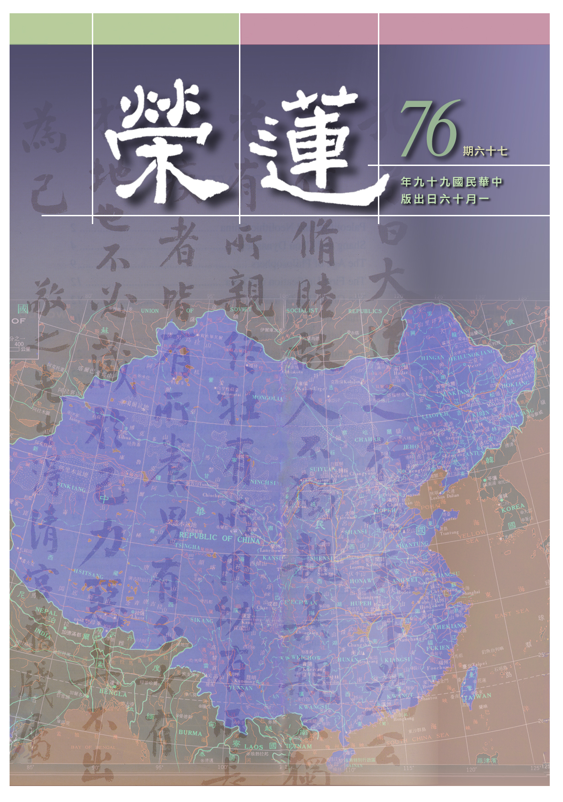

# 第76期

## 社論

### 出頭的日子

本刊

走到十字路口

左轉右彎向前

路走對人出頭

那是中華文化

時代巨輪已悄悄過了二００九年，走向了二０一０年，迎接這一年的是跨年晚會，煙火燦爛，在人們高昂的氣氛中，像是要衝破二００九年的不順，如金融海嘯及自然界天災地變種種災害等，期許新一年的好運，這種欣欣向榮的氣氛正瀰漫著世界，是大家的一種願景、一種信心，並想要展現高度的行動力，迎接新的一年。

然而這種動力的骨子裡面到底含藏著什麼？是財富、物質享受的追逐？還是心靈意境的提升？試問何者才能真正帶給人們快樂？在追逐享受的同時，若不配合道德情操提升心靈的意境，這種追逐反而帶來的是墮落與苦痛，而這種獨樂樂不如眾樂樂的道德情操的建立，正是中華文化的力量，有心之士與主政者若有弘揚傳統中華文化導正人心的遠見，才能消弭發展帶來的危機，將發展經濟建設配合傳統文化的弘揚，不但能遏止人們的貪婪，反而讓人們得到身心的安樂，這樣的意境才是小至個人、大至國家要追求的目標，也是迎接二０一０年最主要的課題。

傳統文化首先要對治的是個人的貪婪，以及貪婪帶來的煩惱，所要付出的是對他人的關懷、人際關係的講究，當得到他人真正的友誼與真誠的交往，將成為生命中最可貴的財富，並進一步對生命的尊重，以及對自然界的保護，人與環境將共榮共存，這也是儒家文化精神所在。

團體在十年的經營，其中特別秉承 雪公以論語為主配合詩禮學庸的儒家思想文化，由學習中華文化生起一股非常充沛的自信心，相信能引導周遭的人們找到出路，那是在家中敦倫盡份，在事業崗位上是可用之才，在文化的傳播上是燈塔，是教育的主流，是人類的需要，在老人的傳承中，是吾人真正的曙光。

## 大德法語

### 常禮舉要講座（十七）　訪人篇

雪廬老人

訪人見機通人情

依時要言好印象

主人待客表態後

進退行止能依禮

訪人

◎十、戶開亦開，戶闔亦闔；有後入者，闔而勿遂。

你上人家家裏去，門要是掩著，有主人迎接你，就不用你做主。假如沒主人也得看情形，門關你也得關。其次，你要坐在屋裏或可外頭還有事情，你要到外頭方便方便，上外頭去的功夫，你就不要多管閑事，門就讓其開著。要是人家的門是關著，你出去時開門還得將它關回來，回來你還是再開門，進門時還得關。

有後來者，譬如公眾地處三兩個人來，你是第一個人進來，後頭還有人，我看過這個樣子的，有人沒人，他一進門就把門關著，一進來就坐下，什麼事也不管，這是不對的。人家門開著你卻把它關起來，這都是多事。假若後頭還有人，不知後頭的人懂規矩不懂規矩，你可以進門，在旁邊將門稍為掩一掩，留一點空隙，讓後來的人看見你等他，這是禮貌。你要只學會戶闔亦闔，進門後把門關起來，後頭那一個這下就不高興，以為你不讓他進去。

若你不闔門，後頭那一個不懂禮貌的話，你沒關門他也不管，那就不行了。須是闔而勿遂，遂就是從前什麼樣子就還是什麼樣子，如犯罪有既遂犯、有未遂犯。他（後來者）關了很好，若是不關門，你等著他們進來，這就是你懂禮貌。看著他們後頭動手關門了嗎？若他們動手了，你也不要多事，人家懂得就會關門，他們不懂你就過去關起來。

◎十一、主人欠伸，或看鐘錶，即須辭出。

與主人談話看見主人打哈欠或者舒伸（這都不許對人），或者看見主人談話時看牆上的鐘，主人看鐘幹什麼？這個你還不明白嗎？人家看鐘幹什麼呢？或云：他看鐘跟我有什麼關係？那就沒法講了，愈講愈不明白。現在人都帶著手錶，主人談著談著（看錶），你還坐在那裏，還談哪？也有人（客人）問主人：你還有事嗎？主人當然很客氣說我沒事，他（客人）說：我還有話要說……。若三兩句說完就走了，這還可以。若還得說上一百句才說完，主人就說：對不起，我還有事。客人還：啊！不要緊哪。你不要緊人家要緊，世故人情不懂的人，這是最可怕的人，幹什麼也不行，上陣打仗也得打敗仗。

◎十二、飯及眠時不訪客。

大家聽明白，吃飯在什麼時候？難道不知道嗎？吃飯時你去訪人，人家的飯還吃不吃？你來，人家一站起來招呼，招呼就無法吃飯，人家吃飯或許還要休息，還有什麼事，所以吃飯的功夫不去拜訪客人。人家一天辛苦，回去要休息，還得整理整理，這兩個時候（飯時、眠時）不拜訪客人。

再者，早晨八點鐘以前也不拜訪人，這個古時候沒說。因為公務員八點鐘得上班，八點鐘以前人家要吃早點哪！云：我再早一點去！好了，人家還沒起床，你就去叫門了。再說有些人早晨起床要做早課，我跟你說，有人在我做早課以前來找我，怕我出去，我連早課都不能做，也妨著我吃早飯，但我不好意思說，我若說，人家就有話，他沒念過書還罷了，他念過書、一句話我就沒辦法。彼云：周公一飯三吐哺，你沒念過書嗎？你敢慢待我嗎？那我還有什麼話說呢？人家念過書！彼若云：你比周公的架子還大！我敢說什麼呢？我就得，好好好！這個你懂得你就得注意吧！

◎十三、晉謁長官尊長，應先鞠躬敬禮，然後就座；及退亦然。

你在機關做事有長官與尊長，只要是晉謁，是你去見他，不是他來見你，他的地位是官或是長輩，這與朋友不一樣，朋友是同等。這個不問他行不行禮，你先行禮，然後才坐下。辭退時也是到他跟前行禮告辭。現在各廟裏也是這個樣子，來去明白！

◎十四、與長官尊長，及婦女行握手禮時，應俟其先行伸手，然後敬謹與握。

握手禮以前沒有，如今變通變通。長官與尊長有在乎的、有不在乎的，不一樣。譬如通達的長官他有恭敬心，不管你官小或是晚輩，他沒有架子。有的長官，你去跟他握手，他不動。鞠躬的禮大，握手的禮輕，你沒鞠躬他就假裝不懂，你就難堪了吧，難堪是自找的，誰叫你不懂禮呢？其次，你跟婦女握手，有的女人可以跟你握手，有的女子很拘束的，再不然看你不順眼或嫌你骯髒也不願伸手，你是找難堪嘛！若不與握手，他會見怪，怎麼辦呢？行鞠躬禮還不是一樣。你看了他有否伸了手，這全在見機而作，他伸了手你還不伸手，那就不必言了，要是他不伸手你就鞠躬。

◎十五、訪公教人員，必先問明其上班鐘點，不可久坐閒談。
這個現在用得上，你有事去，進門先問主人幾點鐘上班。就算是星期日不上班，你也要
**問：** 你還有什麼事嗎？若不是星期日先問人家上班的鐘點。

不可久坐閒談：如人家公務員八點鐘上班，你還云：現在是七點四十分，還不到鐘點嘛！雖不到鐘點，人家還要預備功課了吧？人家吃了東西還是沒吃東西呢？這個都是世故人情。

不可久坐：要緊的事情趕緊說了，說了就快走。

◎十六、訪客不遇，或留片、或寫字登留言牌。

訪客不遇就留下片子。若你從遠路來拜訪他，他不在家你還來拜訪第二次嗎？不能拜訪第二次啊！大家聽明白遠方客來只拜訪一次，那怎麼辦呢？留下片子就行了。若他那裏掛有記事牌你寫上你的地址也可，不寫你的地址也可，這裏頭就很難了。怎麼呢？譬如你與此人的交淺，你寫地址分明是要他來回拜，對不對啊？你想想這個禮？你不寫地址呢，他就可以不必回拜。留名片、上面有住址就無此嫌疑。（下期待續）

## 共修研學

### 小止觀導覽（四十八）

*心爾整理*

根本後得輪替修

空性證悟相續生

一旦因緣成熟後

二障齊破正等覺

第六章  正修行

論文：

五、作作：若作時，應作是念：我今為何等事，欲如此作？

作作就是辦事，首先須講究的動機，我現在為了什麼因素要去辦事呢？

論文：

若為不善無記等等事，即不應作。若為善利益事，即應作。

須知善與惡的定義，方知善與惡的行相，由善帶來安樂，由惡帶來痛苦，方談得上斷惡修善。善能降伏自己的煩惱，且有利於人或於未來有益謂之善。然在了凡四訓積善之方行善要論正中偏、偏中正，重點乃辦事時須考量是否真能利益他。以上是世俗面相觀察，以下是勝義面相的觀察。

論文：

云何名作中修止？若於作時，即當了知，因於作故，則有一切善惡等法，而無一法可得，則妄念不起，是名修止。

觀察作作生起的善惡等法，此善惡須與作作相互依靠才能生起，若無作作則依作作而生的善惡等法不生，此之善惡等法體性了不可得。以上明作作中修止，將心安住在這樣的概念上（亦即止於空義上）。

論文：

云何名作時修觀？應作是念：由心運於身手，造作諸事，因此則有一切善惡等法，故名為作。反觀作心，不見相貌。當知作者及作中一切法，畢竟空寂，是名修觀。

若於止上修觀，想著由心運身手，造作種種的事，觀待這些造作方能生起與造作有關的一切善惡等法，反觀能作作之心無自相可得，因為能作是觀待所作及作者（三者互相觀待），而作之善惡亦是觀待作才能生，皆自體不可得，無一法可得畢竟空寂，為之作中修觀。以拜佛例明世俗及勝義的觀察，當我們拜佛之時，內心是希求別人的恭敬、別人的供養，或是為了富貴名利、事業順利等來拜佛，這拜佛就是惡法。若藉著禮拜來表達對佛的恭敬，以及從禮拜當中顯現佛的功德、降伏我們的傲慢甚至引發十大願王的觀修，這樣的禮拜就是善法。

以上是世俗面相善惡的觀察。若是勝義面相的觀察，在拜佛中修止，就是要觀察此禮敬的心與禮拜的動作是互相觀待的，藉著禮拜的動作明禮敬的心；藉著禮敬的心明禮拜的動作。

亦即是這樣的心，必須用這樣的動作去表現；而這樣的動作，才能顯現這樣的心，這兩個是互相靠的。若修觀則詳細觀察拜佛之禮敬動作與禮敬的心二者是相互觀待才能生起，且禮敬的心是觀待禮敬的對象才能生起的，當你對佛的功德不能如實了知時，禮敬的心要如何生呢？禮敬的心不能生起，禮敬的姿態又如何生呢？對拜佛法行認知的越細膩，以名言的方式通達其殊勝時，則禮敬之心、禮敬之動作與禮敬功德互相觀待而生，一一自相皆了不可得。

在世俗上是：念佛一句福增無量，禮佛一拜罪滅河沙。在勝義上是：能禮所禮性空寂。觀待於所禮才有能禮；觀待於能禮才有所禮。沒有所禮，哪能成立能禮呢？所禮的對象不能成為心中的所禮，能禮的心怎麼出來？而若不是在名言上通達，如何生起能禮的心及所禮的境呢？所以是自性空寂，皆要觀待名言才能生起。

論文：

六、語者：若於語時，應作是念：我今為何等事欲語？若隨諸煩惱，為論說不善無記等事而語，即不應語。若為善利益事，即應語。

說話之前要有動機攝持，應思維我為了什麼要說話？是否會引發對方或自身的煩惱？摧毀對方或自身之善根？或是能引發對方或自身的善根福德？這些都是要觀察的。儒家亦強調要作一位謹言慎行的君子，孔子云：「言寡尤，行寡悔，祿在其中矣。」可知在世法中，謹言慎行是福報生起之處。

論文：

云何名語中修止？若於語時，即知因此語故，則有一切煩惱善惡等法。了知語心及語中一切煩惱善不善法，皆不可得，則妄念心息，是名修止。

觀待語會有與語相應之善惡等法，語亦是觀待煩惱善惡等法成為善語或惡語，如此能由語所生或功德或過患。語所生的禍跟福，也是要觀待與語相應之煩惱善惡等法，觀待語的善才有福，觀待語的惡方有禍，謂之口為禍福之門，所以自相皆不可得。誠實語、和合語、柔軟語、質直語是觀待於善、觀待於正見、正念才能生起的；惡口、妄語、兩舌、綺語則是觀待於煩惱、惡、邪見才能生起的。了知一切皆自相不可得，妄念之心自然止息，是名修止。

論文：

云何語中修觀？應作是念：由心覺觀，鼓動氣息，衝於咽喉、唇、舌、齒齶，故出音聲語言。

止後仍須修觀才能得到殊勝正見。如何於語中修觀，由心覺觀是心想說話，能鼓動氣息，衝於咽喉，經由唇、舌、齒齶發聲，言語實乃心聲，所謂相由心顯，沒有心裡的發動哪會由唇、舌、齒齶而發聲，此二者是互相觀待的。

論文：

因此語故，則有一切善惡等法，故名為語。反觀語心，不見相貌，當知語者及語中一切法，畢竟空寂，是名修觀。

心裡所想而表達語言，由語言而生善、惡等法，就名為語。

反觀語與心，二者不見相貌，語觀待心，心觀待語，自相不可得，互相觀待而生，想說話的心，與由心所說的話二者互相依靠無微塵自性，畢竟空寂，謂之語中修觀。

論文：

以上六義修習止觀，隨時相應用之；

上來已明歷緣對境修的六種歷緣（行、住、坐、臥、說話、辦事）之修學法，在後得位修學止觀時，應隨緣使用，掌握原則、要領、心態及修法，能幫助我們在世俗上成就佛色身的功德，亦即在勝義上成就佛法身的功德。

論文：

一一皆有前五番修止觀意，如上所說。

行、住、坐、臥、說話、辦事皆有五番修學止觀的行相：

一、對治初心粗亂修止觀：

止觀修學先治初心粗亂，亦即斷惑先由粗相斷。

二、對治心浮沉修止觀：

沉是沉沒、昏沉，浮是掉舉、散亂。障止的浮沉，其對治法很多，然障觀的浮沉要如何對治呢？無法修觀，乃因止力不足，須返回好好修止力，止修成了方能建立勝觀。

三、隨便宜修止觀：

在修止時要對治止中的沉掉，進而依著止的方便修學觀門，然由於觀中亦有浮沉等現象，須加強止來資助觀門的修學，所以修止、修觀沒有一定，視需要而調整之，此為隨便宜修止觀。

四、對治定中細心修止觀：

細心乃指細惑，定中雖是空靈靈的境界生起，然是分別心顯現，須是無分別現證自相空，所顯現空靈靈的境界方為究竟，然須經煖、頂、忍、世第一，到忍位之時雖然意境呈現的非常明顯，卻是帶著分別心去呈現的，最後要超越那分別的界限，以無分別的方式顯現，此之過程還須不斷的修觀。

五、均齊定慧修止觀：

此時以無分別智顯現空性時就是均齊定慧，於小乘為證初果，於大乘為證初地。（下期待續）

## 蓮池海會

### 李中和老居士往生見聞記

*編輯部整理*

時代考驗我們

我們創造時代

功成身入佛門

再創音樂高峰

李中和教授，江西九江人，生於民國六年十一月二十七日。教授系出名門，先祖鴻賓公於明朝曾任兩廣總督，尊翁相時公亦任小學校長，作育英才。先生在音樂上的宿緣深厚，年二十一進入「江西音樂師資訓練班」，受教於音樂家程懋筠及蕭而化二位先生，繼之就讀國立福建音樂專科學校，才華洋溢，宿慧早發，畢業後以二十六歲之齡，蒙當時擔任校長的蕭而化先生提攜，留校擔任總務主任及校長秘書之職。

教授早立音樂濟世之志，即在對日抗戰、國共內戰時期，乃至來台後，所從事皆與音樂教化事業有關，音樂上著作等身，一生作品多達二千餘首，廣泛涉及各領域，如歌劇、藝術歌曲、愛國歌曲、軍歌及佛教歌曲等。

音樂造詣之深固非外行人能知，然試從教授「心隅」所錄，或可管窺，試問如無智慧及慈悲心的攝持，豈有「音樂之創作，在情入智出；音樂之演奏，在智入情出」、「音樂的內涵是哲學，音樂的本質是科學，音樂的表現是藝術，音樂的功能是教育」、「欣賞音樂是為移喜怒哀樂之情，而暢懷養神；研究音樂是運用情、景、威、勢、正、反、巧、變，使人動心、忍性、益智、激情；音樂的作用在呈現世間事態，或擴展人之情志，或壓抑，或攝心」、「藝術之美感，重在順乎天理；音樂之表現，要在順乎人情」等等，似乎能想見《禮記》樂記中聖人制禮樂、行教化具體而微之形象。

因為有著這樣的內涵，教授之作品移風易俗、陶冶人心、振奮士氣甚效，自民國三十八年來台之後任職國防部中，雖每每配合國家政策創作，卻於曲風處處顯現恢弘氣度，雄壯雅正，如「先總統蔣公紀念歌」、「保衛大台灣」、「軍紀歌」、「反攻大陸去」等，對彼時民心士氣之鼓舞，風俗之潛移默化，可謂居功厥偉，當時竟有「何人不唱李中和」之說，有此可見一斑。《禮記》樂記上說：「治世之音安以樂，其政和」，音樂教化之功不可漠視，教授提倡音樂救國拯世之深情，當世可謂無出其右者。又受教於蕭而化先生期間，深入音樂理論，創作水準之高，世所稱頌，雖時空遷移、社會氣氛改變，其藝術價值反更突顯，仍為識者傳唱不止。

教授一生雖浸淫音樂世界中，或因悲願氣氛相接，後陸續結緣如佛光山、華梵蓮華學佛園及慈濟功德會等重要佛教團體，亦前後創作佛教歌曲兩百多首，被視為經典之作者有「般若波羅蜜多心經」、「四弘誓願」、「回向偈」及「大悲咒」等，作品普遍流通各國內佛教團體，歌詠讚歎，確為助佛音聲教化一環。

夫人蕭滬音教授，亦為著名聲樂家，結褵六十餘載，情志相投，夫唱婦隨，育有三子三女，耳濡目染，除各於專業領域均有所成外，雖未繼父之志，然各自於音樂之造詣亦皆臻專業之境，堪稱音樂世家。教授雖秉性剛正不阿，但率真淡泊，加以深入音樂境界，不知老之將至，心靜情定，精神怡然，故得享高壽，年八十尚能電腦作曲。

原擬今年十二月十一日親手將其珍貴作曲手稿、著作出版品、音樂ＣＤ及曲譜等捐贈給我國國家文獻永久典藏的機關—國家圖書館珍藏，無奈因緣會遇至，亦有分離時，嘆於民國九十八年十二月三日壽終正寢，無法親自完成此捐贈儀式，而國家圖書館亦舉辦「星月交輝追思音樂會」，悼念此一代音樂大師。

所幸李教授臨終得蒙親屬及善友開導，以西方極樂世界為依歸，助念往生，圓滿一生善業。觀夫教授一生，雖未聞其深入教法，但觀其人終其一生，行事格局開闊，慈悲智慧，似有暗合道妙之跡，疑是宿世有修學之因，方有今世結緣佛曲，最後才有臨終得助念往生的大福報。況且他人往生西方或者「齊一變至於魯」慢慢增上，相信教授今生善行善緣，往生西方必有「魯一變至於道」之氣魄，必能速成佛果，早登正覺，利益無量眾生。

## 啟蒙園地

### 返班專題演講　台灣的未來—不願面對的真相

盡意

一番巨變兩岸別

沒落新興有原由

他山之石可攻錯

人才中興時未晚

在二００九年結束的前夕，美國一家媒體資訊統計公司，將過去十年中，在全世界網際網路、電子及印刷媒體所出現的訊息作分析，其中有關「中國崛起」的報導，被閱讀的次數，高居世界的首位，而且超出排名第二的主題四倍之多。

這樣的現象並非沒有原因，過去三十年裡，中國的經濟以平均年增率九點八百分比的速度增長，預估最遲二０一０年會成為世界第二大經濟體，並將在十五年之內超越美國。

在快速經濟成長的背後，並不是沒有需要解決的問題。但「他山之石，可以攻錯」，我們在觀察中國作展望未來的規劃時，也看到可以提供自身參考與警醒的重點。

造成中國跳躍式成長的因素眾多，其中，物美價廉的人力資源是成就這「世界工廠」的主要核心因素。由於中國的人口眾多，大家都知道要透過努力、競爭才能得到成功，所以從小都很努力的讀書。他們的學習動力強，學力基礎紮實，也有旺盛的企圖心。正由於人力資源的充沛，所以吸引著世界級的技術與資源於此匯集。再加上有廣大的內需市場，能夠孕育各類工商企業，也使得中國成為外國投資者之重要投資標的。

在政府的行政部門方面，中國是一黨獨大的菁英政治，近年來又實行人事精簡，使得公職人員年輕化、積效化。官員在辦事時為達到上級交辦的任務，都是衝勁十足，全力以赴，所以效率卓越，能將政策劍及履及的實行。

行政部門同時又全力吸取外人的強項，並結合自身優勢，成為有「中國特色」的管理制度。而中國仍保持著計劃經濟的運作模式，以宏觀的視野，有效率的規劃全國整體的經濟發展及資源分配，由各部會、省市、國營企業分工合作，各自定位明確，各擅所長。

在與國際接軌的過程裡，中國也認知到「人才為成功之本」，由政府部門到各行業都在全力培養、吸引菁英的領導及技術等各層級的人才。展望未來，中國要由製造業、加工業以及「世界的工廠」，走向高附加價值的智能產業，成為世界上舉足輕重的重要市場，並由第三世界國家邁向成為雄據世界一隅的霸主。

在經濟的快速發展裡，我們同時還看到了民族自信心的提升，以及由崇拜西洋轉過來在中國文化上開始認同與追求。雖然文化大革命的破壞，造成了中華文化傳承上的斷層，但許多彼岸的同胞們，都展現著強烈的學習慾望和熱忱。反觀台灣，是何其的有幸，許多的老先生們於國民政府來台後，不遺餘力的教導著這一方百姓。但隨著時間的流逝，這樣的傳承也在慢慢凋零中。若是有因緣將薪火傳到彼岸，一者能延續文化的命脈，二來也能報答授業師長的恩惠，同時還能替有志於弘揚聖道的學子找到出路，成就雙贏共榮的局面，豈不美哉！

＊    ＊    ＊

同樣是二００九年的尾端，海峽的另一岸，正在上演的是第四次的「江陳會」。為了避免在國際上被邊緣化，台灣開始與中國作一系列的談判，雖有雙方密切的會談，但也引起不少社會人士的遊行、示威、衝突與謾罵。台灣的未來，會是一幅什麼樣的畫面呢？

預測一個國家的未來發展趨勢，可以由不同的角度切入，但若以上述從人才及效能的觀點同樣來看台灣，似乎台灣顯現的是危機重重。

超少子化的危機

台灣的人口分布情況，一直到民國七十多年時，都還是很漂亮的金字塔型﹙年輕人多，老年人少﹚，每年新生兒約四十萬人。爾後生育率逐漸降低，在民國八十九年掉到只剩三十萬五千人，而民國九十八年的預估可能只剩十九萬人。

讓我們憂心的是，這樣的趨勢似已無法逆轉！在過去十年內，每年出生的人數陡降了三分之一，同時期中能生育的母體人數，卻處於歷史高點。未來的五至十年內，是唯一僅剩的鼓勵生育黃金期，因為廿五至三十四歲的主要生育年齡人口數，會在十年及二十年後降至只有目前八成及七成的水平。若目前的環境與條件維持不變，三十年後，台灣當年度的出生人口將僅剩下十萬人！

影響生育意願之因素，可分為經濟因素與非經濟因素。在經濟因素方面，大部份人的收入不見增長，卻飽受近年來高通膨、高房價以及高失業率的困擾；在非經濟因素方面，因社會對立引起的瞋心﹙對政治及財富不均等現象﹚，高犯罪率及高離婚率帶來的不安全感，以及對未來展望的不確定性等等，都是低生育率的直接或間接原因。

而令人擔憂的是，這些負面的因素，短期內好像也不容易消失。

針對這樣的危機，政府也開始推出相關的人口政策—鼓勵生育以及吸引移民，可是兩方面的效果都很有限。在鼓勵生育的作法上，我們看到補助措施的緩不濟急與杯水車薪，無法真正提供足夠誘因讓年輕人生育。在吸引移民方面，相較於歐美或日本，台灣整體的經濟及居住環境並不具吸引力，同時，面對著勞工團體的抗爭、政黨對立的激化，政府都很難在移民政策上有突破性的變革。

少子化對社會及國家的衝擊雖然是緩慢發生，但影響卻是如同慢性失血般，非常強大而嚴峻。在國家的層面，會造成下列的影響：一、經濟及財政的崩盤；二、消費市場萎縮，使得產業投資意願減少或撤離；三、政府提高稅負造成工作意願降低以及人才的出走；四、為爭取勞動人口，政府將延後國人退休年齡，老年人被迫延長工作年限，而年輕人也得要和有經驗的上一輩競爭工作機會；五、老人們的退休年金將會逐漸減少；六、由於生活的負擔更為沉重，從而導致生育率更為降低的惡性循環。在家庭的層面，老人家晚年生活更為孤獨堪憂，年輕人對未來更感到悲觀，而承擔扶養親人的責任也日益加重。

除了超少子化的危機外，台灣年輕人的素質也在遞減當中。一改再改的教育方案、幾乎百分之百的大學入學率、家庭的溺愛、髮禁的開放、網路的沉迷等等，我們鮮少看到年輕人應有的朝氣與衝勁。在這樣的過程裡，產生了一個特定的族群，他的影響力正在逐漸的增長：

尼特族（NEET）

﹙Not currently engaged in Employment, Education or Training﹚

「尼特族」是在十五至廿四歲的年輕人族群當中，慢慢浮現出的隱憂。其成員的共通現象是他們沒有就學、就業、進修或參加就業輔導，終日無所事事，生活缺乏特定目標。台灣的尼特族人數，根據主計處統計，約有四十二萬人，佔此年齡人口的百分之十二點三。若年齡取樣擴大為十五至三十歲，則人數估計或在八十萬人上下。

這一群年輕人在能力及意志力上缺乏競爭性、無法吃苦耐勞或獨立自主、習慣於安逸享樂、在所受的教育上可能學而不能用﹙以二００九年的大專應屆畢業生而言，畢業半年後的失業率仍高達四成，代表了學而不能用的嚴重現象﹚、眼高手低但同時也沒有自信心、缺乏榮譽心與責任感，而沉溺於網路虛擬世界等活動就成為逃避現實的最佳途徑。

尼特族所衍生出來之社會問題是多方面的：從家庭來說，父母親精神及財務上面臨壓力；家庭暴力事件增加；不婚與不生更加速少子化。從國家來說，勞動人口越來越少﹙結合少子化更有加乘的負面效果﹚，政府的稅收減少、財政危機更為嚴重；經濟景氣的不振也讓工商業投資意願更為降低；國民平均所得的減少，以及犯罪率的升高等問題都將持續惡化。

＊    ＊    ＊

遺憾的很，只是隔著海峽的兩岸，在氣象上卻差距如此之遠。也許有人會問，為什麼要拿台灣和中國比較？但試問未來若台灣發生嚴重問題，無力自拔時，世界上可能會伸出援手的是哪些國家？是美國、日本、聯合國、歐盟還是東協？若答案只有中國時，難道不需要及早對他們多所了解嗎？

綜合台灣與中國的比較，我們雖然看到台灣的嚴重問題，但也並非沒有因應之道。重點是父母親能做好家庭教育，從小培養孩子獨立自主的精神、良好的品格與正確的人生觀；求學階段非盲目追求文憑，要能學以致用，真能有一技之長；培養孩子開闊的視野，讓他們在國際的大環境中，具備迎接挑戰的氣象與能力；而心態上，與同文同種的中國能有合作共榮的交流，如此，才能為台灣的下一代開拓新局。

但要知道，時間對於處在劣勢的台灣是無情的，唯有抱持著強烈的憂患意識，快速的奮發向上，才有可能在共業中創造別業。否則，時不我與的感嘆，未來或將會一再的於心念中生起。

## 專題研學

### 聖者的祕密～大佛頂首楞嚴經二十五圓通暨七處徵心探源

### 二十五圓通暨七處徵心簡介　（十七）波離身識

時哉

不入非法徒眾

不觸可欲境界

約身制心持淨戒

身識性空證無漏

寅十、波離身識

卯一、作禮陳白

經文：

優波離即從座起，頂禮佛足，而白佛言：

優波離翻成中國話叫做上首，嚴持淨戒，為大眾綱紀故。向佛作禮並陳白所悟。

卯二、陳白之言

辰一、親見成佛

經文：

我親隨佛，逾城出家。親觀如來六年勤苦。親見如來降伏諸魔，制諸外道。解脫世間貪欲諸漏。

佛為太子時，優婆離為東宮執事之臣。佛出家，彼（優婆離）亦有失職之咎，故隨佛出家。但因為並非國王所派遣，所以不在五比丘之列。親觀如來，六年勤苦者，淨飯王派遣五臣隨侍已出家的太子，五臣先後離去，惟優波離始終不離。

八相成道其中之一有苦行，亦即必須要有這六年的勤苦，才有度化苦行外道的因緣，或打破世人以為苦行才能解脫的迷思。一般看到的是釋迦牟尼佛修苦行，修到最後發現苦行不了道，所以放棄苦行，以為釋迦牟尼佛先走了一段冤枉路，後來終於歸正道。然事實並非如此，是釋迦牟尼佛觀察必須要有這些苦行，方能利益眾生，苦行是利益有情的方便，因為若沒有修過苦行，修苦行的人聽不下你的教誨。所以有時度眾生，眾生的苦必須要跟著吃，這是菩薩四攝中的同事攝，有時必須要去吃這些無謂的苦，否則感動不了這些修苦行者。優波離親見如來，降伏諸魔，制諸外道。

解脫世間諸漏何以貪欲為主？世間輪迴皆是貪愛所招，所謂欲界欲愛，色界色愛，無色界有愛。唯有通達空性才能破愛，愛不重不生娑婆，對治貪愛的根本唯有通達空性，知萬法無有自相可得才能破除愛，若自相的執著不能破，愛是不能破的，愛不能破，觀待愛生起的瞋也無法對治，觀待愛、瞋生起的等流和分位煩惱也無法對治，關鍵都在愛。 雪公老師云：佛家最怕講愛，可是外道偏喜歡說愛，須知小愛小煩惱，中愛中煩惱，大愛大煩惱，佛法所講的是慈悲，是從出離心生起的慈悲。所以解脫世間貪欲諸漏是指現證空性，沒有現證空性是無法解脫世間貪欲諸漏。

辰二、秉戒得果

經文：

承佛教戒。如是乃至三千威儀，八萬微細，性業遮業，悉皆清淨。身心寂滅，成阿羅漢。

承佛授以二百五十條比丘戒，行住坐臥四威儀各具兩百五十戒，這一千條戒律配著攝律儀戒、攝善法戒以及饒益有情戒，共為三千。三千威儀是對著身殺、盜、婬，口妄語、惡口、兩舌、綺語，以上是七支，各有三千條，共二萬一千，再配合上貪、瞋、癡與等分，合成八萬四千細行。等分是貪瞋癡均等。

性業遮業，性業代表本身就是罪業，不待制止，犯則成業，如殺盜婬。遮業體性非惡，然能引惡，故佛遮止，如飲酒雖非罪業，然佛遮止，為何佛要遮止？若喝了酒，就容易犯下殺盜婬妄的罪業。

佛制酒戒的由來，乃當時有位善來長老，降伏了毒龍，村民們非常高興，以「無色酒」來供養長老，善來長老喝了很多酒，離開村民家後，醉倒在地。佛陀行過趁機說法，佛云：喝酒會讓修行者的智慧消失，失去自持的力量，也會破壞莊嚴端正的形象。從此，比丘僧團中就有了不能飲酒的戒律。

阿羅漢雖證果，但業未盡而情空，亦即有世間的領受等流果，但無異熟引業，所以不會有投生六道情形，除非他有願再來。釋迦牟尼佛是隨機制戒，當時在鹿野苑度五比丘時並未制戒，後因僧團人數漸多，應有軌範以利修學。

身心寂滅，成阿羅漢。所謂身滅、心滅，乃觀身心自相了不可得時，身心自相寂然不生，亦談不上滅，如此則證得阿羅漢果位。

辰三、蒙佛印許

經文：

我是如來眾中綱紀。親印我心。持戒修身，眾推為上。

綱是統領，紀是維持，尊者是如來僧團中紀律之統領維持者。因為尊者持戒修身，眾人皆以之為模範，堪為僧眾糾察師。所以如來親印尊者之心，許為心戒清淨。持戒修身，亦是僧眾推尊為上首。

卯三、結答圓通

經文：

佛問圓通。我以執身，身得自在。次第執心，心得通達。然後身心一切通利。斯為第一。

執持戒律約束身心，身受約束不行非法，並觀察身識自相空，身得自在。身識無法自己生起，生起必須依靠身根、境界，以及名言的認知。而身根與身識的生起相狀有何差別呢？身識是依身根觸境了知境界之冷暖、輕重、澀滑，但身根的能力必須觀待身識才能生起，是被身識訓練出來的。身識在冷暖、輕重、澀滑的境界中，能有了知的能力，就像在冷氣房中，覺得我快要感冒了的認知，這是身識生起的相狀。

身根能夠體會風的微細，身識能了知風所造成的影響，如醫生按脈搏，由身根可以知道脈搏跳多少下，但身識可以知道此人是屬於燥熱還是虛弱？是迴光反照？還是體力很好？或者在按脈搏時通達此人的心是好心抑或壞心？可以通達是不是修行人？從與對方的握手當中，立刻通達對方是否誠意。（下期待續）

### 六趣輪迴經簡介（八）

*心亞整理*

多劫善根生為人

苦樂參半好修行

斷惡修善增上生

空性勝解決定勝

人道

於六趣輪迴經描述最多的就是地獄道與人道，何以故？因為輪迴中有情在地獄的次數與時間最多。試問有人壽命百年，期間無諸苦惱，但受諸樂，人生是盡情享受，但此人間一百年的時間，只有等活地獄的零點零零壹陸秒，人生的歡樂如此短暫，歡樂換來痛苦的代價是長劫，短暫的努力亦可以獲得未來無盡的安樂，想想這段寶貴的時間要如何使用呢？

六道中只有人道有能耐讓自己增上，乃因有嚴密的思維、組織思想的能力，若肯運用於業障的懺悔、正法的學習，在善友的提攜及三寶的攝受下，只要把握這短短的時間，就有無限增上的可能。

人道是由五戒而來，然亦由於惡業力，使得人道的樂報減少而苦報增加，尤其愈是末法情況愈為顯著，應該要以殊勝正見，懺罪修福。

經文：

彼人趣壽命，分量本長遠，多造殺生因，由此而減少。

人道壽命於減劫末時僅剩十歲，由於知道反省過惡，故能延壽，然每一百年平均壽命增加一歲，增加至八萬四千歲時，此為增劫之究竟，再由八萬四千歲，每一百年減一歲，一直減到十歲，此為減劫，一增一減為一小劫，二十小劫為一中劫，四中劫為一大劫。

人趣的壽命，最多可以活到八萬四千歲，既是可以活這麼久，為什麼會減成十歲呢？乃因多造殺生是其主要的緣故，但並不代表其他的因沒有，如壽康寶鑑云，男歡女愛也最能讓人減壽，但此處特指殺生因。

經文：

縈纏諸病苦，癩瘦時疫等，為鬼魅所著。

醫生解決不了的病苦為諸病苦。或云：生活機能很好，一生病可馬上送醫院。但醫院真能把病治好嗎？有很多病是醫生都看不懂的，也有很多的病是因自己的心情變好、體力變好，其病就痊癒了。 雪公云：吾九十多歲從未吃過藥，病苦是在消惡業，就讓他消。 雪公老師是抱這樣的心態，但我們壓不住依然可吃藥，但要抱持著「藥醫不死病」的心態，不會死的病，藥才醫得好。

癩是麻瘋病，瘦是乾巴巴，人太過瘦也是一種病，時疫是瘟疫，如登革熱、禽流感等，這些都有鬼魅的因素。如何將麻瘋病、乾瘦病等時疫病去除，除了要講究環境衛生、醫療、營養等，若因鬼魅所起，則須修學正法，發心為公，祈求三寶的加被，才能驅除鬼魅。

六趣輪迴經主體是說明六趣的苦，而人道有四苦是其他道比較沒有的。

一、愛別離：

愛者別離，人道男女情執最厚，故分離時很痛苦，如梁山伯與祝英台的故事家喻戶曉，若發生在其他道就沒有這麼麻煩。

二、怨憎會：

怨者憎會，怨家聚會彼此你爭我奪，在人道也比其在其他道麻煩，不過互相鬥鬧不休而已，然人道因仇恨而發動戰爭，可以死傷慘重，風雲變色。

三、求不得：

人道追求起來比各道都厲害，從小至大，從近至遠，從自己至子孫。然資源有限，需求無窮，故人生不如意十有八、九。

四、五陰熾盛：

身心躁熱，乃因有諸多所欲，加上根力強盛，謀求諸多欲望之滿足，做官是三品、四品還嫌小，一品、二品仍嫌低，一日當朝為宰相，又想帝王做一回。做得君王猶未足，還想長生不老期，欲壑未滿夢未醒，一棺長蓋抱憾歸。此時萬般帶不去，唯有業隨身。以上是人道之苦。

苦果中容易引發惡因，然猶夾雜安樂，由於有安樂才有資糧修學正法，乃六道中最易修學之處。

經文：

及王法捶打。

王法捶打與殺生的因有關，與偷盜有關，與邪淫有關，與各種因都有關，此處特講殺生，為什麼？因為多造殺生因，所以王法捶打等之傷害有時會莫名其妙的加在身上。如文化大革命時，許多沒有做什麼壞事、規規矩矩的老實人，卻被判下放勞改，在混亂的時代裏，遭受到如此般的魔難令人莫名其妙。若往昔所造殺生惡因不予以對治，能感受各種身心迫害之苦，有時受報時，猶覺莫名其妙。以上是殺生的過患。

其次為不偷盜，先明「吝」的過患：

經文：

若人於財利，勞役廣希求，無少惠施心，後作守財鬼。

若對財物與種種的利養，自己或役使他人努力廣泛的希求(勞包括身勞與心勞，役包括役使自他)，財力雖增加而惠施人的心卻很少，則來世成為守財鬼。

惠施乃給予他人時，是否恰到好處，真乃對方所希求？此惠予才是真的對他的布施。
當了守財鬼無用且有大害，有一回佛與諸比丘於道中行走，有一大莽蛇攔住佛的去路，佛
**問：** 有何事？莽蛇云：有一甕的金子，請隨我去取。佛對諸比丘云：諸比丘，隨彼去取。果真有一甕金子，莽蛇頻頻向佛示意。佛云：此莽蛇七世以前，為一守財奴，守了一甕的金子，死後七世為蛇，還盤旋於此，終於體悟到盤旋於此毫無用處，早知在人道時即好好地布施，用作善法資糧。

經文：

若人盜他財，用已或能施，後墮鬼趣中，隨得隨散失。

若於施中有盜業，則將來得到的福報，也很容易失去。所以言布施時，要與十善相應；言持戒時，要與十善相應；言忍辱時，也要與十善相應。如果不與十善相應就有如此的過患，布施與偷盜結合，就算得到也很容易失去，不偷盜才能使東西擁有而不失。偷盜的業起現形，不只是所得的很容易失去，就算已得到的都不能自主。例如一塊土地登記了十個人的名字，若想買賣及使用此土地，須經過其餘九人的同意，無法自主，此為偷盜的過失。

人道有殺生的過患，有偷盜的過患，有邪淫的過患，有惡口的過患，有種種的過患，但人道短短的時間內，若能善用，也會生起非常大的功德。所以此生最大的幸福就是遇見善知識，能夠學到正法，在這麼短暫的時間內，將精力全部投入進去，將成為人生的大贏家。（下期待續）

## 活動迴響

### 對境掌握學習—從我所好出發（故宮雍正展迴響﹚

傳線

兩岸勝事雍正展

承先啟後十三年

千秋功罪任憑說

誰識當時苦心境

兩岸故宮攜手合作擘畫之「雍正大展」，稀有難得的在台北故宮亮相，誠值得喝采之一件文化大事，曩括二四六件豐富具代表性的文物，精心策劃「雍正皇帝的一生」與「雍正朝的文化與藝術」二部分二十單元之展出。

共修會繼大觀展後，老師再度邀請蓮友與心靈成長班學子及家長，齊來參與這場得來不易之藝術饗宴。當日來到久別之故宮，乍看廣場外稀疏的旅客，可別被門可羅雀之景象誤導，進入一樓大廳，人山人海差可比擬，人聲鼎沸，交談音量不夠響亮，鐵定遭淹沒，師友備好與解說老師一樣頻道之子母機，有秩序地，魚貫而入展廳。雖然展場仍舊人來人往，各種聲音充斥，藉著科技設備，如入無人之境，所在處縱使喧嘩，也絲毫未受影響，解說老師一言一語，數尺之內如在目前，如是安排，既溫馨且貼心。臨境期勉自己入寶山，勿空手而出。鎖定主題，無疑是切入學習之好途徑也。

來前已稍作功課，略知展出梗概，也曾向友人借閱雍正大展手冊，奈何時間緊迫，無法詳讀，就依己之所好，對清世宗之書法造詣，作為自己此次對境學習的主要範疇，可惜世宗書法作品在手冊上也屬鳳毛麟角，是日陰錯陽差，也未睹其真面目。所幸兩岸籌辦單位，有一系列論文發表，以彌補文物不足之遺憾，聊滿足一己之欲。

世宗書法作品據北京故宮博物院古書畫部楊研究員丹霞在「雍正皇帝書法管窺」一文中記載，涵蓋範圍遍及立軸、冊頁、對聯、條幅、匾額、斗方、扇等類型，其書法作品書寫內容，包括佛道經文、古人經典、臨摹法帖名跡及自作詩文，沿襲傳統，不背傳統，所謂「風俗之厚薄，繫乎一二人心之所嚮」，書法傳統內含偏向，不出實用及藝術二方面，藉承載文字呈現，上乘者如古人寓實用於藝術，如晉、唐、宋等之尺牘、序文、詩文等，存於故宮耳熟能詳的有奉橘帖、遠宦帖、蘭亭集序、祭侄稿、寒食帖、赤壁賦等，下至有清一代，康雍乾帝王好臨池，倡之在前，後續者續煽其家風，引領風騷，至近代舊王孫西山逸士，譽為南張北溥，允為渡海三大家。上之所好，激盪朝臣，清之書風，蔚為風潮足抗衡前代，曰尚樸。觀雍正皇帝書法成熟期之作，置於清十三帝王中，實不遑多讓，且其融米、董風格於一爐，於清朝一代而言，亦是突出於列星之上。

書法在康、雍、乾時代，列為皇家子孫必修之功課，長期薰習書法藝術，有無滲透至其他藝術品味，文獻不足，難以了知，但以一己對書法的愛好，逾二紀之經驗，一得之愚，深深體悟到是有浸潤作用的，其他莫論，書法近親，篆刻之偏好，篤定係攸關的，特別是閒章，故細品閒章為一己觀察重點。

一顆「為君難」，展出便轟動，道友代夫出席雍正大展之開幕式，相逢就說世宗常於書作上蓋「為君難」之迎首章，問其典故，一時瞠舌，我則內心頓然生起好感，論語近五百章，數萬言中，能擷取「為君難」，正透露出其對東方聖經之嫺熟，且以此格言砥礪，與其身分實無比貼切，更看出其自我期許，數古往今來之帝王，幾人能如此？除「為君難」一方，再如「兢兢業業」、「迪德」、「樂善不倦」、「壺中天」、「謙齋」、「若一棣木」、「師子園」、「朝乾夕惕」、「主敬齋」，從上類之閒章，可覘其內心思維活動，好有一比，閒章字句，正是其心聲，說是其心理語言，有何不可？是以今日蓋棺論定，大致上對雍正持以正面肯定，惜乎史料並未在此著墨一二！

乾隆曾下旨摹刻傳拓之「御書朗吟閣法帖」、「御書四宜堂法帖」、「御書魏徵十思疏墨刻冊」，帖後題「（世宗）逮繼登宸極，日理萬機，手自裁答章奏，訓迪臣民多至數千言，少或一二字，研硃灑翰，運腕若神，累牘連章，未嘗有一懈筆」，君臣對話單元之展區，一章章一絲不茍，以工筆謄寫之奏摺，如睹官員戒慎恐懼的上呈，而雍正皇帝端坐日以繼夜，以硃筆手不停批，一如其子乾隆之題跋所述。

案前鍵打此心得，不免浮現出硃筆紅字，猶如滴血字跡，如是勤勉於政之人，竟有罵名，足見輿論不明究理之恐怖，古今皆然。而此批龐大奏摺檔案文獻，竟未獲得學者專家之青睞，乏人問津，殊為可惜，賞其書法之美，兼真、善之情，豈遜於晉唐標榜美真之尺牘，如是評語，不敢說是空谷跫音，料想是少數吧！

## 專題報導

### 中美教育差別　與黃道延同學座談有感　愛蓮

愛蓮

知己知彼開眼力

學習能令潛力發

青年可貴惜光陰

能用時已準備好

黃道延同學（Dennis）剛從美國德州大學化工系畢業，這次返臺省親並為未來規劃做準備，黃媽媽（高大姐）與蓮榮亦有因緣，經蓮友高先生接洽，老師希望道延同學能抽點時間為蓮榮的大專班及和合班同學講述在美國求學生活的經驗，好與臺灣作個對照，好讓正在求學的蓮友子弟參詳參詳，亦可以以黃學長為鏡，「見人善，即思齊」提起增上心。

座談活動在民國九十八年十二月十九日（週六）下午假弘明幼兒園舉行，有多位大專同學、蓮友及子弟參加，座談會由林老師主持，採開放的自由討論方式，王老師是引言人，高老師先發提問，由於黃同學的母語是美語，以中文表達可能有礙他暢所欲言，故黃媽媽及琇琦老師從旁為大家譯答。全程各方反應熱烈，討論所及包括臺灣與美國教育現況、教育制度，座談活動至午後六時左右結束。

以往討論教育時常說的「十年樹木，百年樹人」，現今已經很少聽到教育界為國家提出這類的百年大計，只有聽說教育改革要如何如何加強課業、加快趕上新知識吸收好加強競爭力、加強產官學合作增加就業，發展國家經濟，看來政府的教育政策就是為大家製造螺絲釘子罷了；要嘛另外的聲音即認為臺灣教育改革不夠徹底，要有根本的改變才行，並說：「先進如歐美諸國的教育，中、小學生自由得很，可以在課堂上放聲大笑，每天至少讓學生玩二個小時，沒有髮禁，穿便服上學，上午八點半上學，下午不到三點半就放學回家，沒有教科書，無憂無慮，這才叫上學，哪有像臺灣還要迂腐的要學生死記背誦死文字？九九乘法表已經不背了，古文也能免則免才對。」那我們想呢？孰是？孰非？學長們又如何想呢？

其實大家不必趕著靠邊站，從黃同學講述在美國的求學生活的經驗可以部分歸結如後：

全人教育：制度上，美國沒有明星高中、明星國中，學生從國小到大學都可以在社區內完成學業，大部分社區大學的學分可以用來抵免著名頂級大學如長春藤盟校的學分，甚至有些社區大學的專門學科比名門大學還強打。

美國是採十二年義務教育，沒有高中及大學聯考，中學（國高中）每星期上課五天，每天七節課，只有英數是必修，其他科目因材施教，可以依自己的興趣和專長去選課，所以跟大學生一樣要跑班，上課時間是上午八點半到下午三點半。課本大多是在下課後存放於班上置物櫃，不能帶回家，沒有小考和隨堂考。

課業與教學上，美國的學校和老師雖然沒有在課堂上對孩子們進行大量的知識灌輸，但是會設法把學員引向校外廣闊無邊的知識世界，帶領他們認識生活的一切時間和空間都是他們學習的課堂；他們不背公式和定理，但會費心地讓孩子知道怎樣思考問題，教他們面對陌生領域尋找答案的方法，而且肯定努力的孩子，讚揚學員自己思考的一切結論，激勵學員不怕失敗的嘗試和保護他們的創作欲。

社會價值上，學校和老師會出作業，作業可能牽涉各個領域，文化、歷史、法律、科技、道德…。一位華裔新移民家庭爸爸在說明小孩子在學業上面對不同教育方式下的衝擊所舉出的例子，老師要學生寫一篇有關「第二次世界大戰」的作業，老師留給學生一連串關於第二次世界大戰的問題：「你認為誰對這場戰爭負有責任？你認為納粹德國失敗的原因是什麼？如果你是杜魯門總統的高級顧問，你將對美國投原子彈持什麼態度？你是否認為當時只有投放原子彈一個辦法去結束戰爭？你認為今天避免戰爭的最好辦法是什麼？」在這些設問之中，向美國孩子們傳輸一種人道主義的價值觀，引導孩子們去關注人類的命運，讓孩子們學習思考重大問題的方法。這些問題在課堂上都沒有標準答案，它的答案，有些可能需要孩子們用一生去尋索和思考。

另外，美國的學校課外活動特多，黃同學提到申請大學時，學校會考慮申請人平時所參與課外活動的情形來判斷申請人的人格、性向以及群育表現的狀況。服務社會是被稱許的行為與人格特質，是服務社會精神的表現，也是合群善於處理人際關係的附註，大學校方考量是多面性的，投機取巧大不易，是人生價值培養重要的一環。

所以由此而知，在美國，高中和大學是國家為所有想要學習的人而設立的，一個不思考的學生會有點「不良於行」的感覺，培養獨立自主的思考很重要，高中學業成績優良，進入大學之前大都已對自己的人生有所規劃。經濟的獨立自主亦然，入大學的學費大都會自己打工籌措，例如生長於美國大蕭條時代的文學家鮑威爾 Lawrence Clark Powell，父親經營著名的 Sunkist甜橙，家道豐沛，家教也好，求學時代的青蔥歲月也得打工，曾在舊書商做事，收書，包書，寄書，這段經歷造就他日後的成就。也因為講求人生經驗的累積，美國大學生在出社會前已準備好，比較沒有臺灣大學生的青澀。

以上是就美國而言，不過如以整體教育來說，教育有身教、言教、制（制度面）教、境（環境面向）教；四種教的層面條件的和合，才會有教育英才的能施，培養學子為人才，生存能力、生活能力、就業能力等其實得依賴各種條件的具足才行，要把小苗養成大樹自立，成林滿枝來發揚，綠樹成蔭來庇護其他人，實在不易，是共同的關係。好學求知識看似有利大眾，但如果知見道德敗壞，那作的惡業也更可怕吧！席中有學長問到學問投機抄襲、剽竊不顧自身名譽的情事，在美國小則當掉，大則退學；而臺灣的大學生有人仍存僥倖心，有非分不踏實的虛榮心，加上因長上姑息，反使榮譽心的欠缺，無耳無心，這是多年來家庭教育功能不彰之故。

家長在形式上接受西方的教育，但精神上無法全面了解西方文化，已把中國傳統文化丟掉了。嘗以為，學習稟賦高的人可以跨越文化的鴻溝，深入不同的文化堂奧，但文化有其百年、千年的根基，人們可以閱讀另一個文化，卻不能跨越過去，能跨越者屈指可數而已，焉能概括為普同的真。

家庭教育是人生的啟蒙，它對一個人的一生所起的作用，往往比學校教育和社會教育更有深遠影響。然縱觀當今的家庭教育現狀，卻存在一些偏差，比如：重知識的學習輕做人的道德培養；重呵護輕自立；重物質輕精神；重言教輕示範；重管制輕正面引導。

家庭教育這個相當重要的人生教育，家長應理解其重要性，行動上也應重視，事實上，中國傳統文化中，一直有著重視家庭教育的優良傳統。古人以教育子女為人生之要職，明代方孝孺也說：「愛子而不教，猶為不愛也；教而不以善，猶為不教也。」古人的這種看法，在當今社會也具現實意義。

要注重儉樸、廉潔教育，古人家訓清楚知道「成於儉約、敗於奢靡」，把簡樸當作人生中一種美德，而且還注重正直廉潔的教育，講求「清白傳家」；林則徐的祠堂旁有一副對聯：「子孫若如我，留錢做什麼？賢而多財，則損其志；子孫不如我，留錢做什麼？愚而多財，益增其過。」這些事例都告訴我們，真正為子孫的長遠利益著想，就應該喻之以義，遣之以義，而不遺之以利。另外，不應讓孩子常常體驗享樂，其實孩子長大後，往往心理ＥＱ、承受能力、意志力都會比較差，人生的苦頭在後面。

家教應注重立志，樹立遠大志向，做一個正直的人，祥和、安定的社會，要有胸懷大志、正直明理的人。懂得人生價值和道德教育，即會重視「先做人才能做事」。立志要有勇氣，錢穆先生在香港中文大學新亞書院校歌中所撰「手空空，無一物，路遙遙，無止境，離亂中，流浪裡，餓我體膚，勞我精。艱險我奮進，困乏我多情。」成功學習的歷程要立志。

慈愛、溺愛有別，可慈愛、不可溺愛。司馬光曾說：「為人母者，不患不慈，患於知愛而不知教也。」父母之愛需理智有分寸，才起正面作用。「愛之太殷，憂之太勤」，則會使孩子養成任性、驕狂的習性，甚至走上歧途，所以古人云：愛不可溺，學習獨立才是重要課題。

黃同學談到美國現況時，一直都是堅持以華語為之，因為事前主辦單位曾表示臺灣的學生對全美語交流會有障礙，黃同學為了大家全場使用華語，連黃媽媽、高老師及陳老師也嚇一跳，說並不知道到黃同學這麼能講，俗語有云：Where there is a will, there is a way 如果你真的想做一件事，你一定會找到一個方法。黃同學的堅持是為他人著想，這種能力是平日累積的，才變成習慣，應該是一天五小時用功讀書所磨練出來的力量。反過來說一個不用功讀書的人是因為他從未想過要知道讀書之樂，那有可能養成閱讀習慣？黃同學還告訴大家交友要知：「益之三友，損之三友。」「要不然，讀書時只會在講話」。（很明智哦！崇拜哦！）

黃同學 Dennis 外表年齡小，性格有點靦腆，沉默安靜，才智較少外露，有人便覺得他有些害羞。忠厚與內斂，掩蓋了他的聰穎善思，一時也難以斷定他的天資究竟屬於哪個層次。經過一些觀察才了解他是深藏不露，讓我想起一個孔子也認識的人，Guess who？

### 中美教育差別　與黃道延同學座談有感　吳錫堂

吳錫堂

參觀完故宮雍正大展，用過午餐隨即轉戰弘明幼兒園，參與蓮榮共修會為學長們舉辦的臺灣與美國教育座談，由在美生活與求學的Dennis Huang學長談論在美國的教育方式與一般學生的生活的情形。

就國情而言，美國和臺灣、東西文化的差異性可是蠻大的，教育制度雖然相近，惟教育精神上卻相去甚遠，所以最終的教育成果也就大不同了。以下是個人的淺見：

美國中小學學校甚少給予學生家庭作業，教育的重點在培養學生各項基本的生活、經驗，例如運動、舞蹈、戲劇、美術、音樂等，這方面和在臺灣的狀況有顯著的不同。

臺灣的學生自幼即被過度的要求重視學業表現，只要學業成績好，其他項目幾乎可以完全被忽視。中、小學生放學後的課外活動，不外就是才藝的學習來圖個以後的加分，只是另一種形式的課業惡補。「不能讓孩子輸在起跑點上」的觀念造就學校附近補習班林立的特殊景象，許多孩子的童年幾乎是在學校與補習班中渡過的，相較之下，在美國受教育的中、小學生似乎幸福多了。

以自己個人的親身經歷來對照印証，純真的孩提時代是在鄉間渡過，雖然家庭生活清苦，亦有學校作業的拘束，但在田野山澗嬉遊時所流的汗總比在課堂上流得多（回想當時，都是赤足大仙，踏遍了鄉間的窄田埂，還有那橫七豎八的巷弄…，說有多暢快就有多暢快），惟當時的課業並不重，壓力不太大，也因沒有經濟能力去補習，故就隨遇而安；及至上大學，踏出社會，我等鄉野小兒並不見得會比不過那些自小大補特補上來的小孩，但是卻多了快樂的童年，想來，安貧亦能得到小小的逸樂，這是無心插柳，實在是幸運。

美國的中小學教育雖不給予課業上的壓力，但對於有心向學者仍然有Honor Class的設置，字面應為「榮譽班」的意思，類似是臺灣的「資優班」，不過臺灣中、小學「資優班」的學生並非全然資賦優異者，應該是指學業成績表現優異吧！因為許多社經地位高的父母怕小孩輸在起跑點，使力、使關係讓同學進入「資優班」，扼殺了子女的正常發展。

而美國「榮譽班」的學子亦需承受更多的課業壓力，以為下一步的升級作努力。學生能否進入「榮譽班」主要是看學生是否有此意向與能力。然而，汲汲於子女能否進入「榮譽班」者，大都是華裔之父母，像臺灣之補習班亦多存在於亞裔社區，此點倒是和臺灣類似，差別在於能否進入「榮譽班」不太能以家長的社經優勢關係來取得，而以學生的意向與能力為本。

要進入美國大學的高中學生必須向稱意的大學科系提出申請，得到入學許可後方可至該大學就讀。如何脫穎而出當然要看高中時期的各項表現，學校也有甄選委員負責甄選。少部份也有屈就於社會現實而核可入學的情形，例如學校捐助者的子女，然而大抵上是公平的。其大學入學的門檻並不算高，不過與現今臺灣所實施的大學入學制度相較或許已經高太多了。

以往臺灣的大學入學是透過聯考的方式，從初中、高中、大學一路是金字塔式的篩選淘汰，最後剩下為數不多的大學生。然而，在現今教改的理念之下，以往的淘汰機制幾乎不存在。一個高中畢業生進不了大學幾乎是奇聞。問題是大學生處處皆是，但學識水準有提高嗎？以耗費四年的時間與金錢買得一紙大學畢業證書者比比皆是。

美國的大學入學門檻雖然低，但是能夠順利大學畢業者比例卻很低，反映出美國的university絕對不是「由你玩四年」。以黃學長德州大學化工系的例子而言，入學到能畢業者僅剩三分之一；所顯示的意義是，如果在大學不好好的努力用功，大概會有三分之二的學生會被淘汰，在美國university是「由不得你玩」的意思才對。

易進難出是美國大學求學生活的寫照，如何在美國大學順利求學畢業呢？用心向學絕對是不二法門。黃學長平日要用五個小時溫習功課，假日更需花費七小時以上，令人佩服他的用功。但從座談的問答過程看來，黃學長並非是一個僅會讀書的書呆子，反倒是對人生、未來了解透徹且有規劃前景之人。

日前，電視上播放日本歌手的ＭＴＶ影片，那不成調的音符，流行意味荒誕與不知所云的歌詞，有如群魔亂舞，突然意識到這個國家未來的文化趨於弱勢指日可待，主因可能就是這一代日本年輕人教育失敗所產生的價值觀紊亂。相對強如美國者，卻有一群像黃同學這樣有毅力與眼光的年輕人繼續不斷地在努力，默默地支撐著國家強盛不墜，兩相對照，值得省思。

曾幾何時，在美國念大學一年要用到五萬美金的費用，美國採取的高學費政策，即令美國人民也難以負擔，難怪許多美國人都要先工作儲蓄幾年才能進大學完成學業，想當然，學生打工的狀況相當普遍，或許這是提早訓練學生們進入職場所形成的文化現象。美國學生從小就有如何爭取職位與推銷自己的課程，這是在臺灣全然沒有的。相對的，高價的求學成本也令學生們珍惜每一堂課程，確保自己不漏上一堂課，白白損失已付的時間與金錢。反觀國內諸多學子，上大學不用操心學費與生活費用，卻不珍惜這些資源其實是來之不易，白白浪費四年的求學時間鮮有所獲，莫怪乎臺灣高中之前學生能力讓人驚異，而四年大學之後卻遠落後於歐美學子。

一個值得探討的現象是，以往臺灣在經濟起飛階段，對學費是採取補貼的方式，學費雖然便宜，但學子的用功程度似乎超過現今很多，有心出國留學者，除了自己會節衣縮食外，另需靠爭取到的獎學金才有辦法完成出國念書的夢想。現今經濟情況已有改善，即使不靠獎學金也無需像往昔學子一樣要半工半讀才能完成學業，卻見學成數年而無法工作者比比皆是。或許在大學裡沒有競爭淘汰的制度是個因素，從小沒有培養獨立生活能力的教育過程才是問題的根由吧！

學生從求學以至成人就業，除了學業與生活教育外，更重要的是正常人格的養成。就對求學期間的作弊、抄襲現象，很顯然地，美國比我們還要重視。通常學生有這類行為時，除了課業給予零分外，甚或直接予以退學處分。特別是大學教育，原本就是要培養學生獨立思考創造的能力，若以非正的方式意圖蒙混，枉費受高等教育，徒然培育出有人格缺失的剪貼高手。在學術的殿堂裡，無疑地，這是很嚴重的欺騙行為。美國大學嚴以懲之是對的。反觀國內，似乎尚未有例行的造假防弊機制，僅靜待有人檢舉後處理，徒增僥倖之機。就此應效法美國之防弊機制，有益於學子之踏實向學。

整個座談會雖至晚餐時刻，討論氣氛未曾稍減，竊看周遭學子，盡皆凝神貫注，面色悅有朗月輝，隱約感覺其間已有數人已受影響，心領神會，暗立向學之志，深自慶幸不虛此行。用餐之前，引一家長之言以結，「真的是受益良多」。

### 中美教育差別　學生的角色—稱職學生的形象　吳美伶

吳美伶

學生身分占了我目前人生的大半，而成為大學助教一職不過是這四、五個月的光景，卻在心態上有極大的轉變，姑且以這陣子在學校教育服務的簡短心得與大家分享。

記得有位教授在開學的第一堂課說了一段這樣的話：「大學教育講求自發性的學習，所以我的課不點名。本科目的期中、期末考占學期成績百分百，凡自認已具備足夠知識與能力的同學，自然可以不用來上課。」第一次的期中考過後，上課出席率由開始的大約六成提升至九成，並持續至今。在批閱試卷的過程中已不難想像會有這樣的改變，也明白教授當初的自信有其道理。來自全國各地優秀的學生終於進入理想的學府，卻在第一次的考試就慘遭滑鐵盧，但「高要求造就高標準」，此後，學生果然在教授創造的引導式環境下開始了積極而自發的學習。

以上正是臺灣學生的一般通病，總是需要在適當的壓力跟刺激下才有更積極的學習，而校內占絕對少數的歐美國家外籍生，雖然課業成就並非名列前茅，但學習的態度卻很一致的較為積極，也較為開放。一個不陌生的場景，不論是課堂上、學術演講及座談會上，除非是與自己切身相關或新潮特別的議題以外，多數的台灣學生總是很沉寂，原因極可能為傳統教育一向注重接受老師的教導，而缺少互動及討論。

座談會當天的Dennis雖然有點害羞，但不難看出他是個很有想法且落落大方的人，清楚自己追尋的目標，並藉由計畫性且確實的執行去達成他的目標，這不正是一種自主訂立高要求臻致高標準的良好詮釋，呼應教授所言，大學以上的高等教育更應追求自主性且自發的學習，期許還在學的同學們今後盡力做個稱職的學生吧！把握自己學生的身分盡力也盡情的學習。

(作者現任國立臺灣大學化學系助教)

### 孔門十哲塑像介紹　瑚璉大才—孔門十哲之六—端木賜（下）

*心亞整理*

生財有道成鉅富

可貴獲得聖教業

親師近友列國行

廬墓六年端木風

子貢不僅在學業、識人方面有突出的成就，而且他在理財經商上還有著卓越的天賦，曾經經商於曹、魯兩國之間，致富千金，為孔子弟子中首富，亦是春秋時期著名的富商。《史記》仲尼弟子列傳亦載：「子貢依據市場行情的變化，買賤賣貴從中獲利，而家累千金。」孔子亦說：「子貢好學，天資聰穎，是可以傳承大道的，可是他分出一分心力於商場上，但因他不被財富所迷，所以他推度、比量的事情，都能非常的準確。」後世，見商店都有這麼一副對聯：「經商不讓陶朱富，貨殖何妨子貢賢。」亦常題「端木遺風」贈商場上有成就之人，甚至有人奉之為財神。
子貢最在意的是孔子的評價，於是
**問：** 「在老師您心目中我是一個怎樣的人呢？」孔子答道：「你是一個器皿。」子貢聽了這句話，內心稍沮喪，因為君子應為不器，是全方位的，於是進一步問孔子：「老師，那我是屬於哪一種器皿呢？」雖然未到君子，但孔子也給予極高的肯定：「你是祭祀時，擺放在中間最前面，盛裝五穀的瑚璉。」表子貢是廟堂之才，可以從政了。

子貢口才好，雄辯滔滔，孔子亦贊許子貢通達事理，所以才會被魯、衛等國聘為相輔。子貢精練的政治才華，自然表現於外交上。

魯哀公四年，吳國軍隊攻伐陳國，楚國出兵援救陳國，駐紮在城父，聽說孔子在陳國、蔡國之間，楚昭王派人聘請孔子。孔子準備前往拜見回禮，陳國、蔡國的大夫惟恐楚國重用孔子以後，將危害他們，於是就共同調發士兵將孔子圍困在野外，以致斷絕了糧食。隨從的弟子疲憊不堪，餓得站不起來。於是孔子派子貢到達楚國。楚昭王興師動眾迎接孔子，孔子然後得以脫身。

魯哀公十二年，哀公會吳國於橐皋，吳王夫差派遣太宰嚭請求重申舊盟。哀公不願意，派遣子貢回覆太宰嚭，子貢說：「盟約，所以會讓人深信不疑，是因為心繫在盟約的意義上，供奉玉帛讚歎神明，以言語結下信用，告訴神明，要以禍福。如果我國國君認為盟約可以更改，那麼日日重申舊盟又有何益，今日貴國國君，一定要重申舊盟，若真可重申，也可以更改。」於是就不重申舊盟了。

史記仲尼弟子列傳記載：田常想要在齊國叛亂，卻害怕諸卿大夫的勢力，所以想轉移他們的軍隊去攻打魯國。孔子聽說這件事，對門下弟子們說：「魯國，是祖宗墳墓所在的地方，是我們出生的國家，我們的祖國危險到這種地步，諸位為什麼不挺身而出呢？」子路自願請出，孔子不答應。子張、公孫段請求，孔子也不答應。子貢請出，孔子同意。子貢先說服齊國田常，讓他同意放棄魯國攻吳國，又至吳國說服放棄越國攻打齊，最後說服晉國休養士卒，等著吳軍的到來。子貢這一出行，保全了魯國，擾亂了齊國，滅掉了吳國，使晉國強大而使越國稱霸。

魯哀公二十七年時，越王派遣使者至魯國商談邾國土地的事，並簽定盟約，季康子憂慮此事，也不知該如何應對，此時感嘆的說：「如果子貢在這裡，我就不會落到這樣的地步了。」子貢善於言辭，是位不可多得令季康子思念的外交人才。

子貢學問、文化修養豐厚、理財經商能力高超，政治、外交才能卓越，其名聲地位甚至超過了孔子。當時魯國的大夫叔孫武叔在朝中告訴諸大夫：「子貢的德學超過了孔子。」子服景伯將武叔的話告訴子貢，子貢說：「譬如宮室周圍的牆，賜的牆，其高度只到人的肩膀，在牆外就可窺見房子裏面的擺設，所見的只是普通的房子而已，而夫子的牆有好幾仞高，就如天子或諸侯的宮牆，裡面有宗廟、朝廷百官，必須由門而入，方能見到宗廟的完美與朝中百官的富盛，可惜，得其門而入的人很少呀！」

陳子禽不以為然的對子貢說：「子貢你太謙虛了，仲尼怎麼比得上你呢？」子貢答道：「君子說出一句話，即讓人稱讚有智慧，也會讓人覺得沒有智慧，所以說話不可不謹慎。夫子是沒有人可以比得上的，夫子就像天這麼高，是不可能用階梯升上去的。」

子貢名聲過大，於是孔子故意問子貢：「你跟顏回誰比較強呢？」子貢答道：「我哪敢跟顏回比呢？顏回聞一而能悟得周遍，而賜只能舉一反二。」子貢文化道德修養豐富，不被八風所動搖，在孔門弟子中，是一位把學行結合得很好的學生。

貨殖列傳記載：「子貢乘坐四馬並轡齊頭牽引的車子，攜帶束帛厚禮去訪問、饋贈諸侯，所到之處，國君與他只行賓主之禮，不行君臣之禮。使孔子得以名揚天下的原因，是由於子貢在人前人後反覆傳示孔子的正道。」

魯哀公十六年，孔子逝世，禮記檀弓上載：「孔子的喪事，門人都不知該如何辦理。子貢說：『從前夫子辦理顏回的喪事，就像辦自己兒子的喪事，辦子路的也是一樣，所以我們辦夫子的喪事就要像辦自己父親的喪事一樣。』大家都聽從子貢的話，服喪三年，三年之後，門人皆整理行李，與子貢相擁痛哭而歸，而子貢又廬墓獨居三年才回家。子貢對夫子的孺慕之情可想而知了。

端木賜死於齊國。死後至唐開元二十七年（西元七三九年）追封其為「黎侯」；宋大中符二年（西元一○○九年）加封為「黎公」，明嘉靖九年改稱「先賢端木子」。

## 專題講座

### 週四三代共修專題演講　講病（上）

*李燾醫師主講 / 淨忱整理*

大死一番氣象新

心思利眾醫身心

五行五常講病情

正本清源除宿業

前言

《王鳳儀言行錄》一書為清朝同治年間王鳳儀善人的言行記錄，王善人屬於道家的成就者，所言乃道家體悟的方法。本書也是上淨下空老和尚強力推薦的一本書。是善法、正法的一種印證，其道理講得非常好，將忠孝節義實踐到盡處的時候，例如對人忠，他的忠心沒有夾雜，沒有把自我放在裡面，以這樣的方式去實踐，於是領悟出真正的道理、道義在哪裡！在王善人父親過世的時候，他發願要守墳三年，因為他看到古時候的孝子會守喪三年，於是在墳旁蓋了一個小茅棚，在裡面住了三年，這三年中他常常反思，自己到底要做什麼事情，才是將來要走的路，然後他體會到了「講病」這條路。

怎麼說「講病」呢，因為他看到這個世間很多人生病，到底生病的源頭在哪裡？他以他的道體悟到，其實病是源自於我們的「性情」，生病是因為我們的性情造成了這個病，如果把性子裡頭的缺點轉換過來病就會好；所以他找一些生病的人，觀察他們，跟他們談話，找出他們真正根本的問題，以前的人很純樸，當把問題講出來了以後，這些生病的人自己會迴光返照，看出自己性格上的缺點問題，之後真的把心結打開了，病就好了，所以他就到處去講病，慢慢的名聲遠播，很多人都來找他看病，他的病不是看好的，是講好的，叫做「講病」。

中醫的歷史上，出過一些神醫，春秋戰國時代，最有名的就是扁鵲，傳說有一天長桑君，在旅店碰到扁鵲，深覺扁鵲非普通人，有意收為傳人，便給予扁鵲一藥物，並且交代要深入民間，了解民眾疾苦。扁鵲吃了藥之後的一個月，也許天眼開了，竟能看到人的五臟六腑，且一眼望之便知道這個人得到的是什麼病，於是扁鵲謹記長桑君的交代，再繼續去研究醫學，幫人治病，效果非常好，所以被稱為神醫。這個神醫今天在世界上可能不容易找到，也許還是有，或許也有一些特異功能的人可以看的到人的五臟六腑，不過都沒有人像扁鵲這麼有名。

王善人是同治時期的人，已經往生了，但是今天他的後人還在，他的(曾)孫女叫王元五，今年已經七十多歲；還有另外一位劉善人，這位劉善人在年輕的時候得了肝病，腹脹水腫快死了，有人拿《王鳳儀言行錄》給他看，他看了之後，就開始反省自己的毛病，例如從小就喜歡跟人家打架，不服氣，不服人，不服輸，所以才落得二十幾歲全身都是毛病，最後得肝病快死了。反省之後他就好好的懺悔，非常奇妙的，在懺悔之後吐出很多髒東西，各種顏色的，黃的、黑的東西，吐完了以後，他的肝病也就好了，而這位劉善人現在也是到處去跟人家講病，現在在中國還有這兩位在講病。

本書內容很多，不光是講病，還包括探討人生在世究竟應該要做什麼？人生的目的是什麼？我們找的到底是什麼道？解析的很清楚，這次只是特地把跟中醫有關係的陰陽五行的部分，跟大家分享，因為這個部分對末學而言，在行醫的路上很有幫助，所以感恩大家讓我有這個機會來跟大家講。不過我們在這裡所分享出來的東西，大家可以用來看自己的問題、毛病，不要用來看別人，看別人是會有危險，因為我們還沒有成就，所以有時候講話不圓融，或者看得不準確，如果拿這個去批評別人，可能會給自己帶來麻煩，帶來問題，但如果拿來反省自己，會很好用。

陰陽五行

首先，先講五行「木、火、土、金、水」，中醫離不開陰陽五行，王善人把陰陽五行運用在講病上，有其一套系統運用於教學，教大家如何運用陰陽五行判斷一個人的問題是出在哪裡。

五行「木、火、土、金、水」，對應我們的五臟「肝、心、脾、肺、腎」，木就是肝、火就是心、土就是脾、金就是肺、水就是腎。五行之間有「相生相剋」的關係，木生火、火生土、土生金、金生水、水生木。

《黃帝內經》中提到五臟五行也相對於五志，五志就是五種情志，肝主怒，心主喜，脾主思，肺主悲，腎主恐；所以一般我們說大怒傷肝，若一個人常常發脾氣，會傷害到肝臟；大喜傷心，歡喜過度，人的心神容易散掉，傷到心神；憂思，想得太多會傷到脾胃，一般想太多的人常常不想吃飯，胃口不開；悲傷哭泣過多會傷肺；過多的恐懼會傷腎。

五行、五臟、五志，也相對著五種顏色，肝的顏色是蒼色，或者說青色，心是紅色，脾土是黃色，肺金是白色，腎水是黑色。所以有時候看一個人的面色，可以看出他是屬於哪種屬性。例如對應到季節，春天的時候臉色會比較帶有青色，如果不是在春天的時候，這個人的面色也是帶有一點青色，那可以說這個人是屬於木性的，而臉色較紅的人是屬於火性，皮膚黃的人是屬於土性，皮膚比較白的人是屬於金性，皮膚比較黑的人就是屬於水性。

但五行的屬性多半是參雜的，很少會見到只有純粹一個屬性的人，大部分都有點夾雜，可能有兩個屬性或者三個屬性結合在一起，例如這個人可能是比較偏土、金，或者是偏金、火的。

看面色要有一些經驗，才能看得很準。比方有肝病的人，臉色大都是青色夾黃色，原因是木剋土（肝木剋脾土），通常肝受傷以後，會進一步損傷到脾臟，當兩臟一起受到影響的時候就會青中夾黃；如果說一個人心臟有問題，但是他的腎也有問題，他就可能是黑中透紅，黑色的皮膚透出紅色，兩臟的顏色混和在一起；若是說肺臟有問題，常會白裡透紅，裡面的火會發出來。所以看面色，我們不只可以看一個臟，還可以看到多個臟腑所產生的疾病。

因此在講病之前，我們先說一個常態，有這樣屬性的人，其實體型上就有這樣的表現了。

比方說木性的人，長得大多是瘦瘦高高的，我們看樹木都是長得瘦瘦高高的，所以看到瘦高，皮膚帶點咖啡色或有點綠色，是屬於木性的。

火性的人，長得圓圓胖胖，臉紅紅的，走起路來會比較急，講話也很快，臉比較容易發紅，一生氣起來臉就整個發紅了，這樣的人是偏向火性的。

土性的人，背會比較厚，臉比較圓，手掌也很厚，當土性的人身體出現問題的時候，皮膚的顏色會比較偏黃色。

金性的人，皮膚比較白，眉清目秀，鼻子比較高，身體也比較瘦，而土型的人比較胖，因為土屬於比較敦厚。金性的人很敏捷，動作很快，講話的聲音就好像金屬聲一般很響亮。

水性的人，皮膚較黑，眉毛又粗又黑，動作比較慢，講話也是慢慢、溫溫的，當水性的人發起脾氣的時候，就是愛哭。可以從五行看人的性格，這只是講外型，王善人還講到性情，講到關於五行的性情，才是我們真正要學習的地方。

五行也可以對應到儒家的五常，五常是「仁、義、禮、智、信」。木（肝）對應到仁（仁德），火對應到禮，土對應到信，金對應到義，水對應到智。所謂「仁者樂山，智者樂水」，乃因為仁者屬木，所以樂山，智者屬水，所以樂水，可能從這裡可以得到一個解釋。

從性子來看，性有陽的一面與陰的一面，陰性的那一面是負面的、不好的，陽性的屬於好的那一面，治病的原則，是把陰性的那一面除掉，然後去學習陽性那一面的東西，這樣病就可以從根本的性上面轉變過來，身體就會好轉，因為把陰性的東西去掉了，身體陽氣多了，自然而然就會健康。例如木性，分陽木跟陰木，這個陽木跟五常有關係的是一個人的仁德、正直、有擔當，願意負擔起責任，就如同一棵大樹一般，這是木性的陽面；陰面代表的是不服氣，不服人，喜歡好抗上，對於父母、師長所講的話，會有反抗的心理，這種就是屬於陰木這一面。陽木這一面的正直，就好比樹幹直立一般，木是五行的根本，一切的根本就是從仁愛開始，所以仁是屬於肝，就是陽木。

火的陽面，代表這個人行為舉止合度、合宜，因為有禮的約束，所以他的行為舉止非常合宜，而且很溫和，「溫、恭、謙、讓」，或言「溫、良、恭、儉、讓」，一個有陽火正面觀的人，就有這樣的特性。如果是陰火這一面，代表這個人是急躁、好爭論，什麼事情都一定是他對的，任何事情都一定要講到他贏就對了，還有誇張、虛榮，都是屬於陰火的性情。

五常中，脾（土）是屬信，陽土的表現是誠信，給人的感覺是信實、忠厚、寬大、勤儉樸素，這些都是土型的優點；陰土的表現，是固執死板、不易變通、心胸狹窄、喜歡抱怨。如果說一個人有這樣子的問題，例如固執死板，心量狹小，好怨言，就容易在脾的部分出問題；而容易不服氣，好抗上的人比較容易在肝的方面出問題；急躁，喜歡去跟人家爭論的人，就很容易有心臟病，或心臟出問題。

肺（金）在五常裡面屬於義，陽金的人，表現很有義氣，為人很豪爽，人際關係很好，人情圓通；王善人說，當一個人的人情很圓融練達，他就不會去冒犯別人，這是屬於陽金，陽金的人還會特別去看人家的好處；而屬於陰金的這一面，表現出來的是殘忍、嫉妒心重、好惱人，這種人特別喜歡去找人家麻煩，讓人家起煩惱。

關於水表現在陽的方面就是智慧，水是智，是柔和的，所以陽水的人性情都很柔和，而且心靈手巧，很有創造力，我們今天這個社會很強調創造力，其實創造力是跟腎有關係的；而陰水的表現就是遲鈍、愚笨，很容易杞人憂天，常常會擔心這擔心那的，而且多憂患，容易退縮，碰到事情不願意去承擔，都想要退一步，不想負起責任，好煩人，很囉嗦。

我們常講煩惱，煩惱這兩個字通常是一起講，可是好煩人跟好惱人是不一樣的，會煩人的人他的個性是會一直一直念，會碎碎念的人就是屬於好煩人的人，腎比較不好。而好惱人的人，他不是一直煩著你，但是他很喜歡說一些話讓你起煩惱，去刺激你，喜歡說一些傷害人的話，有些人不用講很多話，可能講一句就足以讓你氣十天了，這種就是屬於好惱人的人，屬於陰金的人。

整個分析起來，如果希望自己身體好的話，就要想辦法除掉自己性格當中陰的這個部分，然後把我們性轉換過來，轉成陽性的那個部分，這樣身體自然就會好起來。從五行陰的部分先反省，就會覺得其實每一種缺點我們都有，好像每一個都是在講我，不曉得要從何改起，所以講病的人一定要講重點，不可以順著五行，通通把對方罵一遍，一定得要先抓到重點，人家才會服你。

先了解他最重的毛病在哪裡，因為五行中只要其中一個轉，其他就會全部轉，因為五行有相生相剋的關係，所以要會抓重點，先想想自己最大的毛病在哪裡，先從那個地方開始改起；比方說一個很會碎碎念的人，有這個毛病的人腎不好，所以常常會覺得腰酸腿痛，因為腎主骨，我們發現自己有這個毛病，就要先從這裡改，只要我們從這裡一轉，因為水生木，木生火，當你發現這個地方虧損了，先把這裡補起來，那麼其他的五臟自然也會補起來，因為相生相剋的平衡的關係，只要陰那一面改了，再朝正面的方向去思維，那陽的那面就會慢慢增加，利用這套理論，來改我們身上的毛病。

以上是簡單的說，至於細節的部分是從五行的相生相剋來看，這個相生相剋其實也是給我們的一種鼓勵，因為只要我們改變一行，其他的再努力加強一下就可以了。

另外五行的相生，男生跟女生是不太一樣的，所以男子相生的方式，是從木生火，火生土，土生金，金生水，水生木這一條路來看。而女子則是倒過來，因為女子是母，當我們說木生火的時候，木指的是母親，火是兒子，說的是影響力。

從五臟來說，人心火的運行是要往下走、往下降的，因為心臟是我們全身輸送最大的器官，不斷的製造火（熱能）出來，每次的收縮都有熱能出來，這個熱能的運送要先往下降，因為心臟位於五臟最高的地方，當它往下降到土，土就是地，然後地氣往上升，兩個一結合，土就可以正常運化了，土要靠心的火給它能量才可以運化，這個就叫作火生土。

當土的陽氣向上升，升到肺部，滋潤並供給肺津液，我們所喝下去的水，都是靠脾胃（脾土）運化，把水變成身體可以使用的津液，肺需要滋潤，所以肺裡頭有很多水分，一定是潮濕的，如果肺很乾的話，會覺得乾燥、不舒服，所以土的陽氣升發，可以使肺裡頭佈滿津液，並且使肺部很乾淨。

另外肺是我們氣體交換的地方，血液中的缺氧血，從全身送到肺，在肺部做氣體交換，使缺氧血變成含氧血，再送到全身，供給全身氧氣，因此肺是氣血結合很重要的地方，所以肺要清明，才能製造出好的血跟水。肺裡頭的水分，會繼續往下降，降到腎，腎的水是從肺金來的。中醫在治療腎病，有時候會從肺部去治療，讓肺部的水可以降到腎，腎有水，才能去灌溉樹木，這個樹才會長得好，五行的相生，在五臟裡頭是這樣子一個循環。

如果從性情上面來看，男性從木開始，能夠守住陽木，則他能仁民愛物、愛護眾生，因為愛護眾生，所以做事情就會很從容，很正直，走的是中道，做事情不慌不忙，不慌不忙則木就可以生火出來。

火就是一個舉止和度，溫、恭、謙、讓，木修得好，自然陽火就會出來，這個人的行為舉止就會有禮，行為舉止有禮，自然就會虛懷若谷，不怨天尤人自然會寬宏大量，虛懷若谷，謙虛的人，心量會擴大，心量擴大了，陽土就會生出來，陽土的優點是寬大、敦厚、有信用，當這些好的特點滋生出來了，自然就會去看人家的好處，對人忠厚，看人當然是看人的優點，不看人的缺點，這樣子就會生出道義，陽金自然就會生長起來，有義氣，人情很圓滿，為人很豪爽，喜歡看人家的優點。人如果做事情有義氣、很豪爽、喜歡看人的好處，自然而然會生出智慧，人情練達，智慧生出來以後，就可以跟眾人和合相處，性情也會很柔和。如果能跟眾人和合相處的話，對於自己的利益就不會看重，會把自己的財物拿出來貢獻、佈施，也會盡自己的能力幫助眾生，這樣子的財、法佈施，就會達到仁愛，也就回到了最原始的地方，這個人的五行會很順暢，當然身體也會很好了。

女子是反著看，女人是母，所以是由子來看母，女子的走法是倒過來走的，其實是順走或是逆走，不用太過執著，因為這是一種天性，我們是從天性的角度去看的。

比方肝有病的人，肯定沒胃口，吃不下東西，他的腸胃出現問題了，因為木會剋土，但也有可能心臟不好，因為木會生火，火是心，一般比較不會出現肺（金）或是腎（水）的問題，並不是說絕對不會，只是比較起來，腸胃跟心，會是最先受到影響的臟腑。一般如果疾病發展到最後的時候，是一臟連著一臟，很多人生病到了最後，常會聽到醫師說病人的肝、腎衰竭、心、肺衰竭等等，這就是五臟通通毀了。如果我們可以先抓出自己的毛病在哪裡的話，先把自己的這個地方的缺點改掉，洗面革新，那五行就能補起來了，就會順著我們的臟腑，把它好的功能一起帶動起來。

如果能夠加強一個臟，然後影響到第二個臟，這個叫做第一步順運，如果從第二個臟再影響到第三個臟，就是第二步順運了，那第三個臟再影響到下一個臟，這樣子，第一步，第二步，第三步，第四步，第五步順運。如果能做到二步順運的人，就是一個富人了，不一定代表錢很多，但是他一定是一個富足的人；能做到三步順運，就是一個貴人，他的地位很崇高；能做到四步順運的人，就是一個賢人；五步順運就成了聖人。所以當我們從五行看自己的時候不但可以找出自己的病，也能夠讓自己成聖成賢，這裡面的道理是很深刻的。

從淺處看可以醫自己的病，從深處看可以脫離狹隘的人生，讓自己真正的成聖成賢。以前常聽到有人說，「宇宙這麼大，而人是這麼的渺小」，這句話當然是用來勸我們不可以太重視自我，不要自滿、不要自傲，但也有人從另外一個角度看這句話，因為宇宙這麼大，我這麼渺小，所以我做一點事情也不會影響別人什麼，例如我丟一張垃圾也不會影響什麼，我做一點小壞事也沒有什麼，這是反面的講法；就王善人而言，他認為每一個人都是一個世界，要成佛，或入地獄，都是由我們自己來做的，如果我們向善，期許自己成聖、成賢、成佛，那我們的世界就成了佛的世界，並不是說跟這個宇宙比起來我們很渺小就表示我們不重要了，其實每一個人的自我修行，跟所有身邊的其他人都至關緊要，如果我們不願意做好，墮落下去，也就成就了一個地獄世界，所以勿自暴勿自棄。（下期待續）

## 活動報導

### 福建建甌文化行-孔門聖像授贈揭幕紀行

### 前言

週四三代共修專題演講　講病（上）

*李燾醫師主講 / 淨忱整理*

大死一番氣象新

心思利眾醫身心

五行五常講病情

正本清源除宿業

《王鳳儀言行錄》一書為清朝同治年間王鳳儀善人的言行記錄，王善人屬於道家的成就者，所言乃道家體悟的方法。本書也是上淨下空老和尚強力推薦的一本書。是善法、正法的一種印證，其道理講得非常好，將忠孝節義實踐到盡處的時候，例如對人忠，他的忠心沒有夾雜，沒有把自我放在裡面，以這樣的方式去實踐，於是領悟出真正的道理、道義在哪裡！在王善人父親過世的時候，他發願要守墳三年，因為他看到古時候的孝子會守喪三年，於是在墳旁蓋了一個小茅棚，在裡面住了三年，這三年中他常常反思，自己到底要做什麼事情，才是將來要走的路，然後他體會到了「講病」這條路。

怎麼說「講病」呢，因為他看到這個世間很多人生病，到底生病的源頭在哪裡？他以他的道體悟到，其實病是源自於我們的「性情」，生病是因為我們的性情造成了這個病，如果把性子裡頭的缺點轉換過來病就會好；所以他找一些生病的人，觀察他們，跟他們談話，找出他們真正根本的問題，以前的人很純樸，當把問題講出來了以後，這些生病的人自己會迴光返照，看出自己性格上的缺點問題，之後真的把心結打開了，病就好了，所以他就到處去講病，慢慢的名聲遠播，很多人都來找他看病，他的病不是看好的，是講好的，叫做「講病」。

中醫的歷史上，出過一些神醫，春秋戰國時代，最有名的就是扁鵲，傳說有一天長桑君，在旅店碰到扁鵲，深覺扁鵲非普通人，有意收為傳人，便給予扁鵲一藥物，並且交代要深入民間，了解民眾疾苦。扁鵲吃了藥之後的一個月，也許天眼開了，竟能看到人的五臟六腑，且一眼望之便知道這個人得到的是什麼病，於是扁鵲謹記長桑君的交代，再繼續去研究醫學，幫人治病，效果非常好，所以被稱為神醫。這個神醫今天在世界上可能不容易找到，也許還是有，或許也有一些特異功能的人可以看的到人的五臟六腑，不過都沒有人像扁鵲這麼有名。

王善人是同治時期的人，已經往生了，但是今天他的後人還在，他的(曾)孫女叫王元五，今年已經七十多歲；還有另外一位劉善人，這位劉善人在年輕的時候得了肝病，腹脹水腫快死了，有人拿《王鳳儀言行錄》給他看，他看了之後，就開始反省自己的毛病，例如從小就喜歡跟人家打架，不服氣，不服人，不服輸，所以才落得二十幾歲全身都是毛病，最後得肝病快死了。反省之後他就好好的懺悔，非常奇妙的，在懺悔之後吐出很多髒東西，各種顏色的，黃的、黑的東西，吐完了以後，他的肝病也就好了，而這位劉善人現在也是到處去跟人家講病，現在在中國還有這兩位在講病。

本書內容很多，不光是講病，還包括探討人生在世究竟應該要做什麼？人生的目的是什麼？我們找的到底是什麼道？解析的很清楚，這次只是特地把跟中醫有關係的陰陽五行的部分，跟大家分享，因為這個部分對末學而言，在行醫的路上很有幫助，所以感恩大家讓我有這個機會來跟大家講。不過我們在這裡所分享出來的東西，大家可以用來看自己的問題、毛病，不要用來看別人，看別人是會有危險，因為我們還沒有成就，所以有時候講話不圓融，或者看得不準確，如果拿這個去批評別人，可能會給自己帶來麻煩，帶來問題，但如果拿來反省自己，會很好用。

陰陽五行

首先，先講五行「木、火、土、金、水」，中醫離不開陰陽五行，王善人把陰陽五行運用在講病上，有其一套系統運用於教學，教大家如何運用陰陽五行判斷一個人的問題是出在哪裡。

五行「木、火、土、金、水」，對應我們的五臟「肝、心、脾、肺、腎」，木就是肝、火就是心、土就是脾、金就是肺、水就是腎。五行之間有「相生相剋」的關係，木生火、火生土、土生金、金生水、水生木。

《黃帝內經》中提到五臟五行也相對於五志，五志就是五種情志，肝主怒，心主喜，脾主思，肺主悲，腎主恐；所以一般我們說大怒傷肝，若一個人常常發脾氣，會傷害到肝臟；大喜傷心，歡喜過度，人的心神容易散掉，傷到心神；憂思，想得太多會傷到脾胃，一般想太多的人常常不想吃飯，胃口不開；悲傷哭泣過多會傷肺；過多的恐懼會傷腎。

五行、五臟、五志，也相對著五種顏色，肝的顏色是蒼色，或者說青色，心是紅色，脾土是黃色，肺金是白色，腎水是黑色。所以有時候看一個人的面色，可以看出他是屬於哪種屬性。例如對應到季節，春天的時候臉色會比較帶有青色，如果不是在春天的時候，這個人的面色也是帶有一點青色，那可以說這個人是屬於木性的，而臉色較紅的人是屬於火性，皮膚黃的人是屬於土性，皮膚比較白的人是屬於金性，皮膚比較黑的人就是屬於水性。

但五行的屬性多半是參雜的，很少會見到只有純粹一個屬性的人，大部分都有點夾雜，可能有兩個屬性或者三個屬性結合在一起，例如這個人可能是比較偏土、金，或者是偏金、火的。

看面色要有一些經驗，才能看得很準。比方有肝病的人，臉色大都是青色夾黃色，原因是木剋土（肝木剋脾土），通常肝受傷以後，會進一步損傷到脾臟，當兩臟一起受到影響的時候就會青中夾黃；如果說一個人心臟有問題，但是他的腎也有問題，他就可能是黑中透紅，黑色的皮膚透出紅色，兩臟的顏色混和在一起；若是說肺臟有問題，常會白裡透紅，裡面的火會發出來。所以看面色，我們不只可以看一個臟，還可以看到多個臟腑所產生的疾病。

因此在講病之前，我們先說一個常態，有這樣屬性的人，其實體型上就有這樣的表現了。

比方說木性的人，長得大多是瘦瘦高高的，我們看樹木都是長得瘦瘦高高的，所以看到瘦高，皮膚帶點咖啡色或有點綠色，是屬於木性的。

火性的人，長得圓圓胖胖，臉紅紅的，走起路來會比較急，講話也很快，臉比較容易發紅，一生氣起來臉就整個發紅了，這樣的人是偏向火性的。

土性的人，背會比較厚，臉比較圓，手掌也很厚，當土性的人身體出現問題的時候，皮膚的顏色會比較偏黃色。

金性的人，皮膚比較白，眉清目秀，鼻子比較高，身體也比較瘦，而土型的人比較胖，因為土屬於比較敦厚。金性的人很敏捷，動作很快，講話的聲音就好像金屬聲一般很響亮。

水性的人，皮膚較黑，眉毛又粗又黑，動作比較慢，講話也是慢慢、溫溫的，當水性的人發起脾氣的時候，就是愛哭。可以從五行看人的性格，這只是講外型，王善人還講到性情，講到關於五行的性情，才是我們真正要學習的地方。

五行也可以對應到儒家的五常，五常是「仁、義、禮、智、信」。木（肝）對應到仁（仁德），火對應到禮，土對應到信，金對應到義，水對應到智。所謂「仁者樂山，智者樂水」，乃因為仁者屬木，所以樂山，智者屬水，所以樂水，可能從這裡可以得到一個解釋。

從性子來看，性有陽的一面與陰的一面，陰性的那一面是負面的、不好的，陽性的屬於好的那一面，治病的原則，是把陰性的那一面除掉，然後去學習陽性那一面的東西，這樣病就可以從根本的性上面轉變過來，身體就會好轉，因為把陰性的東西去掉了，身體陽氣多了，自然而然就會健康。例如木性，分陽木跟陰木，這個陽木跟五常有關係的是一個人的仁德、正直、有擔當，願意負擔起責任，就如同一棵大樹一般，這是木性的陽面；陰面代表的是不服氣，不服人，喜歡好抗上，對於父母、師長所講的話，會有反抗的心理，這種就是屬於陰木這一面。陽木這一面的正直，就好比樹幹直立一般，木是五行的根本，一切的根本就是從仁愛開始，所以仁是屬於肝，就是陽木。

火的陽面，代表這個人行為舉止合度、合宜，因為有禮的約束，所以他的行為舉止非常合宜，而且很溫和，「溫、恭、謙、讓」，或言「溫、良、恭、儉、讓」，一個有陽火正面觀的人，就有這樣的特性。如果是陰火這一面，代表這個人是急躁、好爭論，什麼事情都一定是他對的，任何事情都一定要講到他贏就對了，還有誇張、虛榮，都是屬於陰火的性情。

五常中，脾（土）是屬信，陽土的表現是誠信，給人的感覺是信實、忠厚、寬大、勤儉樸素，這些都是土型的優點；陰土的表現，是固執死板、不易變通、心胸狹窄、喜歡抱怨。如果說一個人有這樣子的問題，例如固執死板，心量狹小，好怨言，就容易在脾的部分出問題；而容易不服氣，好抗上的人比較容易在肝的方面出問題；急躁，喜歡去跟人家爭論的人，就很容易有心臟病，或心臟出問題。

肺（金）在五常裡面屬於義，陽金的人，表現很有義氣，為人很豪爽，人際關係很好，人情圓通；王善人說，當一個人的人情很圓融練達，他就不會去冒犯別人，這是屬於陽金，陽金的人還會特別去看人家的好處；而屬於陰金的這一面，表現出來的是殘忍、嫉妒心重、好惱人，這種人特別喜歡去找人家麻煩，讓人家起煩惱。

關於水表現在陽的方面就是智慧，水是智，是柔和的，所以陽水的人性情都很柔和，而且心靈手巧，很有創造力，我們今天這個社會很強調創造力，其實創造力是跟腎有關係的；而陰水的表現就是遲鈍、愚笨，很容易杞人憂天，常常會擔心這擔心那的，而且多憂患，容易退縮，碰到事情不願意去承擔，都想要退一步，不想負起責任，好煩人，很囉嗦。

我們常講煩惱，煩惱這兩個字通常是一起講，可是好煩人跟好惱人是不一樣的，會煩人的人他的個性是會一直一直念，會碎碎念的人就是屬於好煩人的人，腎比較不好。而好惱人的人，他不是一直煩著你，但是他很喜歡說一些話讓你起煩惱，去刺激你，喜歡說一些傷害人的話，有些人不用講很多話，可能講一句就足以讓你氣十天了，這種就是屬於好惱人的人，屬於陰金的人。

整個分析起來，如果希望自己身體好的話，就要想辦法除掉自己性格當中陰的這個部分，然後把我們性轉換過來，轉成陽性的那個部分，這樣身體自然就會好起來。從五行陰的部分先反省，就會覺得其實每一種缺點我們都有，好像每一個都是在講我，不曉得要從何改起，所以講病的人一定要講重點，不可以順著五行，通通把對方罵一遍，一定得要先抓到重點，人家才會服你。

先了解他最重的毛病在哪裡，因為五行中只要其中一個轉，其他就會全部轉，因為五行有相生相剋的關係，所以要會抓重點，先想想自己最大的毛病在哪裡，先從那個地方開始改起；比方說一個很會碎碎念的人，有這個毛病的人腎不好，所以常常會覺得腰酸腿痛，因為腎主骨，我們發現自己有這個毛病，就要先從這裡改，只要我們從這裡一轉，因為水生木，木生火，當你發現這個地方虧損了，先把這裡補起來，那麼其他的五臟自然也會補起來，因為相生相剋的平衡的關係，只要陰那一面改了，再朝正面的方向去思維，那陽的那面就會慢慢增加，利用這套理論，來改我們身上的毛病。

以上是簡單的說，至於細節的部分是從五行的相生相剋來看，這個相生相剋其實也是給我們的一種鼓勵，因為只要我們改變一行，其他的再努力加強一下就可以了。

另外五行的相生，男生跟女生是不太一樣的，所以男子相生的方式，是從木生火，火生土，土生金，金生水，水生木這一條路來看。而女子則是倒過來，因為女子是母，當我們說木生火的時候，木指的是母親，火是兒子，說的是影響力。

從五臟來說，人心火的運行是要往下走、往下降的，因為心臟是我們全身輸送最大的器官，不斷的製造火（熱能）出來，每次的收縮都有熱能出來，這個熱能的運送要先往下降，因為心臟位於五臟最高的地方，當它往下降到土，土就是地，然後地氣往上升，兩個一結合，土就可以正常運化了，土要靠心的火給它能量才可以運化，這個就叫作火生土。

當土的陽氣向上升，升到肺部，滋潤並供給肺津液，我們所喝下去的水，都是靠脾胃（脾土）運化，把水變成身體可以使用的津液，肺需要滋潤，所以肺裡頭有很多水分，一定是潮濕的，如果肺很乾的話，會覺得乾燥、不舒服，所以土的陽氣升發，可以使肺裡頭佈滿津液，並且使肺部很乾淨。

另外肺是我們氣體交換的地方，血液中的缺氧血，從全身送到肺，在肺部做氣體交換，使缺氧血變成含氧血，再送到全身，供給全身氧氣，因此肺是氣血結合很重要的地方，所以肺要清明，才能製造出好的血跟水。肺裡頭的水分，會繼續往下降，降到腎，腎的水是從肺金來的。中醫在治療腎病，有時候會從肺部去治療，讓肺部的水可以降到腎，腎有水，才能去灌溉樹木，這個樹才會長得好，五行的相生，在五臟裡頭是這樣子一個循環。

如果從性情上面來看，男性從木開始，能夠守住陽木，則他能仁民愛物、愛護眾生，因為愛護眾生，所以做事情就會很從容，很正直，走的是中道，做事情不慌不忙，不慌不忙則木就可以生火出來。

火就是一個舉止和度，溫、恭、謙、讓，木修得好，自然陽火就會出來，這個人的行為舉止就會有禮，行為舉止有禮，自然就會虛懷若谷，不怨天尤人自然會寬宏大量，虛懷若谷，謙虛的人，心量會擴大，心量擴大了，陽土就會生出來，陽土的優點是寬大、敦厚、有信用，當這些好的特點滋生出來了，自然就會去看人家的好處，對人忠厚，看人當然是看人的優點，不看人的缺點，這樣子就會生出道義，陽金自然就會生長起來，有義氣，人情很圓滿，為人很豪爽，喜歡看人家的優點。人如果做事情有義氣、很豪爽、喜歡看人的好處，自然而然會生出智慧，人情練達，智慧生出來以後，就可以跟眾人和合相處，性情也會很柔和。如果能跟眾人和合相處的話，對於自己的利益就不會看重，會把自己的財物拿出來貢獻、佈施，也會盡自己的能力幫助眾生，這樣子的財、法佈施，就會達到仁愛，也就回到了最原始的地方，這個人的五行會很順暢，當然身體也會很好了。

女子是反著看，女人是母，所以是由子來看母，女子的走法是倒過來走的，其實是順走或是逆走，不用太過執著，因為這是一種天性，我們是從天性的角度去看的。

比方肝有病的人，肯定沒胃口，吃不下東西，他的腸胃出現問題了，因為木會剋土，但也有可能心臟不好，因為木會生火，火是心，一般比較不會出現肺（金）或是腎（水）的問題，並不是說絕對不會，只是比較起來，腸胃跟心，會是最先受到影響的臟腑。一般如果疾病發展到最後的時候，是一臟連著一臟，很多人生病到了最後，常會聽到醫師說病人的肝、腎衰竭、心、肺衰竭等等，這就是五臟通通毀了。如果我們可以先抓出自己的毛病在哪裡的話，先把自己的這個地方的缺點改掉，洗面革新，那五行就能補起來了，就會順著我們的臟腑，把它好的功能一起帶動起來。

如果能夠加強一個臟，然後影響到第二個臟，這個叫做第一步順運，如果從第二個臟再影響到第三個臟，就是第二步順運了，那第三個臟再影響到下一個臟，這樣子，第一步，第二步，第三步，第四步，第五步順運。如果能做到二步順運的人，就是一個富人了，不一定代表錢很多，但是他一定是一個富足的人；能做到三步順運，就是一個貴人，他的地位很崇高；能做到四步順運的人，就是一個賢人；五步順運就成了聖人。所以當我們從五行看自己的時候不但可以找出自己的病，也能夠讓自己成聖成賢，這裡面的道理是很深刻的。

從淺處看可以醫自己的病，從深處看可以脫離狹隘的人生，讓自己真正的成聖成賢。以前常聽到有人說，「宇宙這麼大，而人是這麼的渺小」，這句話當然是用來勸我們不可以太重視自我，不要自滿、不要自傲，但也有人從另外一個角度看這句話，因為宇宙這麼大，我這麼渺小，所以我做一點事情也不會影響別人什麼，例如我丟一張垃圾也不會影響什麼，我做一點小壞事也沒有什麼，這是反面的講法；就王善人而言，他認為每一個人都是一個世界，要成佛，或入地獄，都是由我們自己來做的，如果我們向善，期許自己成聖、成賢、成佛，那我們的世界就成了佛的世界，並不是說跟這個宇宙比起來我們很渺小就表示我們不重要了，其實每一個人的自我修行，跟所有身邊的其他人都至關緊要，如果我們不願意做好，墮落下去，也就成就了一個地獄世界，所以勿自暴勿自棄。（下期待續）

### 光孝寺文化講座（二）

心超主講

孝為百先菩提本

光大孝行人才出

須由正法開見地

儒佛正見是光孝

雪廬老人希望在佛家、儒家都要培養人才。若在儒家不能培養人才，則孔子博大精深的思想就不能往下傳；若佛家不能培養人才，則佛法的意涵就不能往下傳，大家就無從了解正法的殊勝，找不到增上的軌道，找不到在人生旅途上存在的價值，找不到生命的意義，得不到世間的安樂，更遑論得到出世間的解脫。

光孝寺原為魏晉南北朝的古剎，歷經文革後被破壞殆盡，至今重興，然真正興旺，在於人才的培養，需有德學的人培養之。自古以來佛門的祖師不但通達佛理，亦通達儒家的四書五經，例如，明朝四大師：憨山大師、紫柏大師、蓮池大師、蕅益大師，都是公認非常了不起的祖師大德。且由於通達四書五經，所以對佛法就有更深的體悟。

因此，無論是學儒還是學佛之人都重視儒家文化。唯有重視儒家文化建立人格，進一步才能依佛家道理建立佛格。人格的建立是建立在佛格的基礎，故太虛大師說：「仰止為佛陀，完成在人格，人成即佛成，是名真現實。」既然人格重要，若要人成，就要講究儒家的學問。

雖然孔子的中心思想是《論語》述而篇的「志於道，據於德，依於仁，游於藝。」但那是總綱，還必須學習細目，例如：從《弟子規》的修學法，就是學習論語很好的入門，講究的是從家庭做起，先作孝順子女，在學校親師敬長成為好學生，成德成才入社會成為砥柱之才；然詳細的作法，還要從《論語》中學習，將人生的大道理瞭解，建立修身、齊家、治國乃至出世間的正見。

如此的學習不但成就，若學佛會是一位法器，傳承與光大佛家。總之由世間到出世間關鍵者，即儒家文化，儒家文化總代表即論語，其中特別是孔子教育弟子的問答，師生之間的對談，弟子的氣度格局都非常大，例如：子貢問仁、問政，宰我問政，顏淵問仁、問政，由弟子向老師的發問，可知其見識與氣度。能將學生教成如此，是一位非常了不起的老師。將學生的心眼打開，把學生的志向立在高遠，把學生的知見開拓。佛更在此基礎上將人生的知見開拓到出世間。

今天特別談孔子的思想，乃傳統文化的精髓。弟子們在問仁問政時，代表是以大格局來看待人生，是為公發心，講究的是學習，目標是成聖成賢。過去學習傳統文化特別是《論語》時，抱著極大的興趣聽老師（雪公）講解，回家也努力讀註解，發覺過去在學校因為升學考試，所以不能由書本上真正認識聖賢的內涵，現在有新的學習法以後，並附帶體悟到什麼是真正的善知識（能傳播正見者），學佛也是講究親近善知識、遠離惡知識。雪廬老師門下的高徒比如淨空法師、江老師，都是善知識教導而有成就。

有云孔子所說都很平常。然顏回卻讚歎孔子說：仰之彌高，鑽之彌堅，瞻之在前，忽焉在後，夫子博我以文，約我以禮。可見孔子道高德備，但卻可將殊勝的道理運用於日用平常間，即使穿衣吃飯，舉手投足，都有啟發人的地方，有其殊勝的教育意義。

若學佛之人有這樣的眼光來作傳統文化的學習，將可帶動社會正面的風氣，會使得光孝寺建甌這一帶變成人文素養非常鼎盛的地方，能近者悅、遠者來。昔日西漢時文翁到四川去辦教化，四川雖是偏遠之地，卻令西蜀成為文化重地，蘇東坡等文人才子都是文翁之後的餘響。

今天到建甌古寺，若能結合孔廟，有講學傳統文化的風氣，不僅是人間的淨土，也是大家想要參訪之處，不但帶來地方的安定，還能為地方帶來無限的商機。

總之，文化的推展需要人才，人才是要培養，環境整理的莊嚴應是為了教育之用，儒家講究安邦定國，重點也是為了辦教化，所以孔子的弟子當中有兩大類的人才，一類是為政的人才，一類是辦教育的人才。政治的安定有助於把人教好，把人教得有目標、有方向、有格局、有內涵、有能力，此國家是強盛，是長治久安的，可帶給老百姓安定的生活，影響長遠，這些都有賴於文化的經營。

江老師有意識到文化傳承的重要性，所以特別以藝載道，藝當中特別以繪畫與塑像表現道，希望能成為正法流通的增上緣，如此之藝即是傳世之藝，而非商品之藝。

往後，江老師還會依《論語》各章義理，繪畫百幅，豐富建甌孔廟的內涵，相信是建甌孔廟塑像落成典禮 之後的另一次盛況。由此次授贈塑像中，看到孔子、十哲、雪廬老人的神韻，知江老師是熟讀古書之後，內化於身心，將意涵創造於塑像上。當看到顏回、子貢或子路，將會心的一笑，雖然我們大家都沒看過顏回真實的樣子，可是讀了古書瞭解顏回意涵之後，會有顏回宛然長相如此的感覺。

修學的目的是為了內化，將聖賢的內涵留存於心中，表現出來雖是隨和，但是卻自然流露高貴的氣質，修行就是道在日用平常間，日用平常的表現正足以表現他深深的內化。這並非做作，明眼人一看就知道是內化的學習，是親近善知識的學習，是有目標的學習，才會有這樣的表現。

承蒙住持與江老師的授意，在此報告修學的心得，也將雪廬老恩師一九四九年到了台灣如何教育我們、江老師的內涵、此行到建甌的目的說個大概。本寺住持與政府官員對文化的信心，相信建甌將來定是重現文化的古都，再創建甌的盛況。

### 福建南平市第七屆公益文化項目推介會暨簽約儀式

*編輯部整理*

提昇水準賴文化

歷史人物是標準

藝術民俗相圍繞

傳承世代氣象新

民國九十八年十二月六日

宣傳部部長張建光致詞

在二００九年中國武夷山國際山水茶旅遊節歡樂的濃厚喜慶氣氛中，南平市委宣傳部、文化與出版局、文明辦、文聯等部門，今天在此聯合舉辦「南平市第七屆公益文化項目推介會暨簽約儀式」，至此我代表市委政府以及各主辦單位，向各位到會的企業家、來賓與領導，向各位支持我市文化事業的社會各界相關人士，表示衷心的感謝。

公益文化項目推介，在我市已經舉辦了六屆，宣傳文化部門與社會有志之士聯手打造了各種文化推動項目，在前六屆公益活動項目中，全市共推出一千九百三十八項，簽約項目有三百八十八項，完成資金七千八百六十萬四千六百萬元，為促進我市文化繁華發展，促進文化與經濟同步協調發展，對推動文化起了很大的作用，通過多年持續的運作，優活社會資金，打造活動品牌，服務城鄉人民，深入人心，對社會產生很大的效益。

就像今年移動公司和我們市委宣傳部聯合組織了一縣一歌的活動，我們全縣市的人都動員學習這十一首歌，用思維一體去推動這個歌曲，雖然這個歌有人說好聽有人說不好聽，但它畢竟是我們自己的歌，當時省電台、網路、雜誌，南平每一個縣，在很大的程度上能擁有自己的歌曲；又如舉辦閩北首屆國際音樂節，讓人民能夠在山區欣賞最高層次的音樂，欣賞維也納的交響樂，還有各企業集團與文化局聯辦的話劇、音樂劇、新疆樂曲音樂會、國際音樂節這樣的活動，影響所及不僅是一年半載，對孩子們、對未來都有莫大的影響，透過與企業的合作，相信也可提高企業的知名度。南平市這十一首歌，希望各縣市多多宣傳，做為縣市活動的主題歌曲。

更加自覺並主動提供社會文化發展，項目策劃與推薦上，重點發展城鄉文化建設，項目包括：群眾文化、宣傳文化重地、國際、國內高水準文藝演出、文藝團體、協助社會公益團體演出等，此次推出公益文化項目共一百七十項，今天在會場即將簽約的有三十項（其中包括江逸子老師所雕塑捐贈的孔子暨孔門十哲、雪廬老人等十二尊銅像），金額達兩千一百七十三萬元。

我們還編制了一套文化產業項目手冊，這本手冊希望今後長期編下去，我們選擇一批文化底蘊深厚、市場前景良好的產業項目，為各方企業家提供南平市文化產業投資指南，希望各方有志之士關切合作，熱烈投入我市文化產業發展，投資文化產業前景看好，功德無量。

南平市是一個文化資源的大市，但是不是文化產業的城市，我們有很多文化資源沒有開發，也沒有做好，但是其他人利用南平的文化一部分，設置名號在全國打天下。

大家知道大宋提刑官（宋慈）是建陽人，但是他沒有在建陽留下一點遺跡，他可以產生巨大的社會與經濟效應，但是任何遺跡都沒留下。

除此之外，我們還有宋代名相李綱、教育家朱熹等。去年的品牌論壇，有位專家提出只要把朱熹一個人的文化內涵建立起來，就夠閩北人受用不盡，但我們沒有做好！建陽有宋慈（中國最早的一位法醫專家，著有洗冤集錄），還有湛廬寶劍（二千六百年前，春秋時期歐冶子鑄，為中國五大寶劍之首）、書畫、雕版印刷，其中建甌是閩國古都，保存有許多古蹟，順昌是齊天大聖的故鄉，邵武也是文化古城，南平地區十個縣市所有的文化紀錄豐富，談文化誰也別和閩北比，閩北是最大的文化城，是文化資源的大市，我們只要把這些歷史人物做好，可以做一個巨大的文化城。

我呼籲企業家們，今天中國不缺錢，缺的是宣傳部、文化部跟企業界的溝通，還有政策問題，現在國家已經開始重視文化產業，政策上面非常優惠，我在這邊呼籲企業家，大家都在興房地產，房地產是不錯，現在地價很高，但大家都在搞房地產，這個產業就有問題，中國經濟如果出問題就是在房地產。在座很多同志都學過經濟，經濟成長當中還有社會平均化，經過這麼多年，已經把所有產業利潤平均化了，只剩下一個產業—文化還沒有到達水準，舉例來說，武夷山曾經把二十顆茶葉賣二十萬，當茶喝到二十萬，那不是喝茶而是喝文化。

我們南平比較窮，文化產業、文化發展作得很不夠，但是不等於這個地區沒金可淘，所以我希望企業家們，能夠投入文化產業，我們閩北文化的資源相當深厚，而且很多已經成形了，比如松溪的版畫歷史悠久，這種絕版的版畫和中國文化歷史是連在一塊的，版畫家們也曾經整個搬遷到武夷山居住，武夷山當時生產木刻雕刀，而國民黨也把中央茶場搬遷到武夷山，版畫家與茶葉家合作，創作了武夷山山水茶版畫藝術，若能就這個歷史將版畫接軌，本身就有文化價值，版畫若能進入家居市場一定能賺錢，用版畫來裝修家庭是非常美的。如果有那個企業家有這個慧眼，那是多麼大的價值！

不僅版畫，我們還有建陽的工筆畫，莆城的剪紙也是很不錯，所以我建議在座的企業家、宣傳文化者，拜託大家，我們一起努力。除了支持公益文化發展，完善設施，服務百姓，滿足百姓基本的文化水平外，我們大家一起努力發展閩北文化產業。

### 如是我聞-與福建莆田廣化寺傳崟法師占察善惡業報經講座後對談紀錄

*編輯部整理*

鄉下出身創事業

正當享受兄無常

引入佛門增上緣

勝解正法佛事忙

民國九十八年十一月二十日

如是我聞—與福建莆田廣化寺傳崟法師占察善惡業報經講座後對談紀錄

緣起

九十八年十月中旬，隨江逸子老師到福建省建甌市贈送孔子、十哲及雪公老恩師銅像，由是因緣認識了莆田廣化寺印經事務負責的傳崟法師。日前法師隨福建佛教團到臺灣考察，抽空參加本會《占察善惡業報經》講座，課後與法師座談，得以了知法師所學及大陸學佛狀況，並來台考察佛教心得，彼此作心得交流。

蓮榮：現在大陸修學佛法的情形如何？何以大陸的佛教能蓬勃發展？

師父：

首先，非常感謝唐老師給予這樣的機會。剛才在台下聽課時，心裡一直很歡喜。一方面歡喜講者佛學的淵博以及非常豐富的修學經驗；另一方面隨喜在座的各位同學有很好的資糧、福報，聽聞如此殊勝的佛法。聽課是一件很幸福的事情，這幾年自己走上了講台，發現講學是很辛苦的一件事情。若干年後有這個機會坐在台下聽課，覺得聽課真的是一件美不可言的事情。

談到中國大陸佛教的情況，雖然有幾千年的佛學傳承，但因為三、四十年前曾被禁錮一段時間（文化大革命），就算近年來宗教政策較以前放寬，想學佛的人也很多，然真正能引導的善知識卻很少。僧團雖有教化功能，但還是比較著重於僧團內部的教育，對俗眾的引導是很欠缺的。我這次來到臺灣，發現臺灣在這一部分做得很好，特別是今天親臨了這個法會，感受到法會的殊勝、大家的殊勝。

在大陸雖有少數高僧大德講經，但大多數想學佛的人都是靠自己自學的。有人聽淨空法師的錄音，也有人聽其他法師的錄音，很少有共修的機會，這是大陸居士需要努力改進的地方，可以向臺灣借鏡。

蓮榮：從法師的氣象，可看出大陸佛教進步的可觀。法師在莆田廣化寺負責流通經書，請法師說說其中的甘苦談。

師父：

談到這一點，覺得很幸福，因為是在收穫、享受成果。以前的法師、護法居士已開出一條路，到了我去負責時，各種善緣都已具足，只是在辦事的過程中學習。廣化寺流通處是大陸最大的流通處，主要負責將經書流通全國各地。在大陸，你不必問學佛的人：「有沒有看過廣化寺流通的經書？」基本上每一位學佛的人都看過廣化寺所印的經書。很多人看了流通處的書之後，出家學佛；也有許多居士因經書流通前來廣化寺，因此，莆田在大陸雖是一個小城市，沒什麼特點，但是因為廣化寺，而間接知道了莆田。

經書的流通只是趣入佛法的平台，而法真正的流通應該在每一位學佛弟子的身心上，把所聽聞的法應用在自己的身心上，才是真正的佛法，這也是佛的本意。法的作用為斷煩惱，幫助改善身心，處於末法時代，雖無法親聆佛陀的教誨，但靠著經書及善知識（出家及在家）傳承得以認識佛教。經上說：「末法五百世，我現文字相。」也就是末法五百世後，佛的法身將透過文字來呈現，要趣入的是般若，即文字般若。真正的佛法就是將所聽聞的法（聲塵）在自己的內心化為一股力量改變自己的心意，開發本有的佛性。

蓮榮：大陸在經濟改革開放後，經濟突飛猛進，人民收入提高，國力強盛，應如何善用這樣的順緣，讓佛教呈現殊勝的成長？

師父：

整體環境變好，仰賴於政策的開放，且為學習帶來了便利，也使得這次能夠來到台灣參學。然而，經濟的發展易導致價值取向偏離，此亦衝擊整個佛教。臺灣也經歷過這樣的過程，不同之處在於當時臺灣有很多的高僧大德，例如：懺公老和尚、廣化老和尚、廣欽老和尚等，可說是如數家珍，這些大德引領著整個佛教潮流，培養了大批的人才（包括僧、俗二眾），並將佛法傳承下來。一般人多在意現世安樂的追求，容易忽略根本心靈層面之成長，還好有這些祖師大德支撐著，培養了一批弟子傳承文化。

大陸的文化已經斷層，現在突然經濟好了，然而心靈層面的成長卻沒有跟上，所以大陸相較於臺灣顯得更浮躁些。來到臺灣感覺到這才是中華民族的精神，是民族的特色，是一個豐厚的文化底蘊。中國素有禮儀之邦之稱，現在看不到了！幾千年的中國文化僅僅維持在表相上，若傳統文化再不提倡，誠屬可惜。故對於佛教，有一種緊迫感，渴望加強自身的內涵，才能慢慢的去引導一些居士，進而利益更多眾生。

蓮榮：師父過謙，猶記十年前到浙江天台山佛學院，住持感慨沒有經書沒有講學人才、沒有修學道糧等等，那時感覺佛教是走到谷底了 想要奮發向上的機會不具足，然現在看到大陸的佛教蓬勃的發展，已非當年的困頓。師父一再的讚歎臺灣擁有很好的傳統，其實現今優良的傳統也在逐漸流失。

大陸經濟太好，或人心浮躁，然另有奮發向上的有志者辛苦耕耘；臺灣雖然沒有浮躁之氣，然學習文化的勢力是一年不如一年，年輕人流失的很多。九十七年底，淨苑與湖南法師們交流，其中有大智法師說：他們來到臺灣是迫切想要看到我們的特色及傳承。臺灣雖有道源老和尚、廣欽老和尚、廣化老和尚、懺公師父、雪公老師等大德作為典範，可惜傳承也逐漸流失，後進者須奮力向上，傳承正法。

蓮榮：其次再請師父談談出家因緣及如何學佛，且如何帶來法喜？

師父：

我出家的因緣是非常偶然的，很多時候也思考著如何觀察生命中所起的業相，並審視自己如何走好下半生。我出家時猶是懵懵懂懂，然有對生命做嚴密的思考。過去曾在世間活得很熱情，覺得這世界還真好，因為當時很年輕覺得社會進步、科學發展、物質發展等，各方面越來越好，以為這樣的生命會越過越好，但身邊的親人離世，給我很大的打擊，當時我最親的人（哥哥）年紀還輕卻突然過世，給我生命很大的觸動。

當時以為現代人的生命有豐富的資糧、醫療水平也提高，人的平均年齡已到六、七十歲，且慢慢的在遞增，但我哥哥卻沒活到這個年紀，只活到四十多歲，粉碎了我原有的概念。第一次感覺世界原來不是這麼美好，非常消極，甚至看到街上有人談笑，心理就不平衡，覺得沒人能體會到我的痛苦。花了很多時間及金錢，也沒能挽回，此時受了很大的打擊，也不想工作，覺得有一天也會像哥哥一樣：雖然生活越來越好，但卻沒有這個命去享受，如果是這樣子的話，人活著到底是為了什麼呢？當我哥哥在醫院的最後一個晚上，姊姊說我很辛苦要我回家休息，當回家休息時，竟然夢見哥哥向我要水喝，並說喝完水他就走了，我看見他衣服沒穿好，我問他：你為什麼衣服沒穿好呢？他說：扣子掉了。

夢見了這三個境界便醒過來了，此時悶悶冷冷的，感覺哥哥要走了，於是馬上從床上起來，趕著去醫院。一進去醫院，肝硬化昏迷好幾天的哥哥忽然睜開眼睛看了我一眼，於是去跟嫂子說哥哥要喝水，並餵水給哥哥。其次看見姊姊在縫衣服扣子，中國習俗臨終時都要穿戴整齊。果然哥哥喝完水、在姊姊縫好衣服時就走了。

從小到大接受的都是唯物主義的教育，此時第一次思考生命是這麼一回事？雖一度很消極，幸運的是在這節骨眼遇到了改變我一生的恩師。他老人家與我同鄉，知道我們家兄弟很和睦，哥哥病了，家人都全心照顧他，後來哥哥走了，師父就一直關心我，不斷邀請我去寺院，就這樣慢慢走進佛門。

師父非常善巧方便，送我去讀書，而且自己也想重新去嘗試新的生活，就成熟了出家的因緣。並在出家之後遇到了很重要的師長，從中體悟到生命的價值是不斷地學習正法，且盡量去成就別人學習正法的因緣，將來別人也會成就我們學習正法的因緣。就如同這一生往生淨土，在淨土上一樣有很多人在成就我們學佛的順緣，並時時刻刻幫助我們成長。

蓮榮：昨天與師父在飯店談得很晚，今天師父又忙了一天，然不覺得辛苦，那是一種學習的熱忱，若有業的觀察，知道種下這樣的善業，其未來的增上是美不可言。能否談學習正法帶給您身心舒服的感覺？

師父：

出家以後對自己有期許，既然選擇了這條路，得對自己的生命有個交代。出家後就直接上了六年的佛學院，並不間斷學習了三年，學習了很多課程，比較相應的是在法相上，所以曾經在俱舍與唯識課程下了一番功夫，學得很歡喜、也很相應。

蓮榮：大陸現在佛學院現況如何？許多寺院的住持由佛學院培養出來。昔日遊名山古剎，會對僧眾感到懷疑，現在看到的是堂堂僧相，這期間是如何轉變的？

師父：

覺得自己很幸運，因為一出家就來廣化寺，且多年來都一直待在廣化寺，私下曾自我調侃：除了廣化寺沒其他地方可去了，實則比較安住於廣化寺。廣化寺整體的學風道風，還是保留著傳統，廣化寺有三個法寶：一是廣化寺純正的學風與道風；第二是廣化寺的佛學院辦學在福建省乃至大陸得到大家的認同；第三是廣化寺佛經流通處，影響的層面很廣。然而現在佛學院遇到了一個很大的問題，由於現在孩子都是一九九○年後出生的，普遍是追求物欲享受，對現世安樂的需求遠遠超越解脫的追求，這樣的物質文明也不斷的衝擊著寺院。

其實，真正要把佛法應用在自己身心當下，才能夠感覺到那份飲水冷暖自知的感受，才能對自己走這條解脫道、成佛道產生定解，亦即所學的法一定要跟自己身心相續結合，這一點很重要，如果不是建立在這一點上，可能都不知道自己在學什麼？也就是大陸說的「失宗」，失去宗旨。最近在福建才剛辦完了第十一、十二屆的佛學課程，在佛學教育裡面不斷的探討義理，畢竟目前不敢說成功，因為還有很大的提升空間，但相較其他已能得到大家的認同，因為保留了純正的學風，光就這一點已很困難了，如果沒有這樣的基礎，要真正的修學是一件困難的事情。

蓮榮：維持學佛的風氣真的很難，以在台北而言，是一個五花八門的世界，共修會要維持安定的小局面亦困難，辦事人員很辛苦，但看到師父的這種推展正法的熱忱，覺得人最需要的就是幹勁與熱忱，沒熱忱、沒幹勁就什麼都別談，也就是要帶一點向上的心志，一個給自己的期許。另請師父談談在廣化寺佛經流通處，如何判定正法的書籍？現今佛書到處印刷流通，廣化寺如何管制？有何標準？

師父：

會承擔佛經流通處任職事，除了本寺住持大和尚的安排，要我去承擔、成長外，自己內心也常思考到：人活著不只是追求自己的喜好，或者找與自己相應，須思考人生的承擔。在流通經論的過程中，因為承擔了太多人的期許，也承擔了太多的責任，所以這幾年做得十分辛苦，晚上有時也會徹夜失眠。然從另一角度想：流通處也得到全國各地很多居士不斷的回饋，因為來請書，會與他們做一些溝通，也了解當地發展佛教的困難。

例如：內陸地方經濟狀況不佳，對經書極欠缺，所以他們經常向我們請書，對所請到的書籍非常珍愛，對我們也非常感恩。所以我們也經常會收到或茶葉或當地特產，如有從很遠的地方寄來獼猴桃，雖然水果寄到莆田都爛了，但這些點點滴滴的回饋，讓我們感覺到肩上的責任很重、我們要做的事情還很多，所以常常思考如何將事情做得更好，讓更多的人能夠受益。我們大陸學佛的居士，沒有像在座的各位這麼有福報，有善知識給大家講經說法，所以希望能邀請唐老師及在座的同學們將來能發心到大陸去主持研討班，我想這樣的弘法利生是沒有界線的，畢竟眾生無邊誓願度！

蓮榮：有在佛經流通處工作者云：工作辛苦，除了應付各方的需求，將書一箱箱的寄出，還要負責找好的廠商並比價去印好的書，並須回答各方的問題等等，辦佛事一點都不輕鬆。其實誰都喜歡聞思、喜歡自在，但對問題是那是一種責任、一種承擔、一種感恩。對師父所說心有戚戚焉，可以體會那種身不由己的承擔，需來自於感恩，人生要不斷地往前走，辛苦有時是不會有人知的。若無對法的勝解，工作是沒辦法持續下去的，師父能否說說對法的勝解有多麼的重要？

師父：

所有痛苦皆往昔惡業所感招，只有為了經營自己的生命，所承受的那份痛苦，能換取將來圓滿的安樂，所以這樣的痛苦是很值得的，也唯有此種痛苦值得我們去承受。所以在過程中應令自己能夠歡喜的承擔，除了剛才唐老師講的，我覺得自己應認知：不是為別人作，所做的是自己在經營自己的無限生命，最大的受益是自己，誠如《普賢行願品》：菩薩以大悲心饒益眾生，成就自己之智慧花果，所以將來成就佛果時，回頭會感恩自己今天的付出。

蓮榮：上述都是師父修行的經驗談，很高興在這樣的場合聽到師父的肺腑之言。其次請教幼教重要及其方法。

師父：

應感恩臺灣的許多大德，比如：雪公老師、淨空老法師、江逸子老師、王財貴教授等等。透過他們的推動，讓中國傳統文化得以延續，並把這份關懷傳遞到大陸。這幾年來，因一些大德至大陸推動讀經班，就像星星之火，在全國各地影響蠻大的，雖然政府部門仍以經濟為重，對傳統文化的弘揚並沒有明確的表態，但只要堅持下去，相信做出成果後，他們一定會重視的。教育要從小做起，中華民族在幾千年前孔老夫子留給我們這麼好的一個傳統文化，盼望在大陸有機會重新，將對社會國家有莫大助益。目前最有特色的就是湖南有一位老師，帶領一批孩子學習傳統文化。

一個人的生命成長過程中，於年幼時學習與模仿能力強，若能透過父母師長給予良善的教育，對其一生影響深遠。若要在大陸做好教育，首先要培養優秀的師資，另外也要帶動家長學習，如果家長不學習，那麼孩子培養可能是有限的，因為家庭教育父母對子女扮演極為重要角色，這是中國大陸在教育上存在的一些問題。而傳統文化教育目前在大陸上，可以放心的去推動。

蓮榮：師父不僅在佛法上有深的體會，在儒家上也認同須從小扎根。大陸普遍認知傳統文化的重要，有一股力量想要重興，而臺灣是逐漸沒落，教育上只有升學主義掛帥，沒有遠見看到品德教育的重要，學習這正法的可貴，欣欣向榮的氣象正衰退，真不知如何把下一代教好，這是目前很大的隱憂。大陸目前政府雖未全力支持，但至少辦孔子學院欲振興傳統文化，也把弟子規納入學校課本，並規定不孝順父母不能讀北京大學。這些傳統文化若不能在臺灣發揚光大，也無法在兩岸交流上貢獻大陸，這是我們的隱憂。

蓮榮：最後請師父向大家勉勵幾句話。

師父：

中國有一句話叫做曲高和寡，我想在座的同學也有這個體會。當遇到困難時，多去思惟人生的方向、宗旨與目標。此外，同行善友很重要，大家千萬記住，就是要互相拉拔，當自己走上去時，別忘了拉一把走在後面的同學，當我們自己走在後面時，也別忘了伸出手讓前面的同學拉我們一把，因此同行善友應該是輾轉增上的，所以彼此應多多鼓勵，特別是在修學的路上，有時會進入茫然的地帶，或走入谷底，須互相關懷，幫助那些走在後面的同學。也希望大家多發心，到大陸弘揚佛法及傳統儒家文化，希望從臺灣海峽吹過去的不再是颱風，而是一些弘揚佛法、儒家文化的春風。很高興跟大家做這樣的一個分享，希望有機會大家可以到大陸的廣化寺去坐一坐，謝謝大家。

蓮榮：

同行善友對自己的成就是十分重要，若破壞同行善友的和合，與毀謗發心的菩薩罪過相同，因為三寶的恩德要在同行善友上顯現，如果沒有同行的善友，就算有三寶的加被還是退轉，可見其重要性非比尋常。常忽略同行善友的經營之可貴，試想，在臺北我們能夠活得很有意義，就是因為大家的聚會。孫中山先生曾說：末散了團體，休灰了志氣，大家要互相勉勵。想想看若沒有團體，還剩下什麼？不就是朝九晚五、謀肚子之飽，謀家庭之樂而已嗎？與動物也沒什麼兩樣！很高興師父勉勵大眾：同行善友相互扶持的重要，也感謝師父邀我們到大陸。希望師父下次能再來對我們佛光普照，阿彌陀佛。

## 後記

### 年終歲末回顧與展望

本刊

一年年的花開花落，冬去春來歲月如梭，轉眼已民國九十九年（西元二０一０年），照例將過去作一個檢討與隨喜，對未來作一個希望與策勵，令團體大眾能回顧過去，期許未來。首先就去年（民國九十八年）善法之摘要，用作隨喜。

念佛共修：

台北蓮榮共修會每週四三代念佛共修，下午《佛說八大人覺經》及《十大礙行》講座，週六晚上大眾共修及《淨行品》講座；台中無盡燈儒佛學會週日共修及十大礙行講座。

國學啟蒙教育：

台北蓮榮共修會於每週三下午之讀經班，本年度讀誦內容乃無量壽經四十八願、老子、唐詩三百首、增廣昔時賢文、聲律啟蒙撮要及進行第二輪論語之背誦；週六啟蒙班，課程為淨行品、論語簡介、弟子規等。台中無盡燈儒佛學會每週日晚啟蒙班，課程為論語、常禮舉要與唐詩；中壢修學會每週一晚間之啟蒙班，課程為論語；宜蘭修學會每週日上午啟蒙班，課程為論語及唐詩。為集合各地啟蒙觀念，另於松山工農舉辦五天寒訓課程，本次特別因應奉祀官孔德成先生辭世，配合論語鄉黨篇、孔子傳行禮片段等，開設一系列以禮為主之課程；另於暑期舉辦為期七天，以了凡四訓謙德之效為主題之心靈成長班。並配合啟蒙教育之延續，共舉辦六次返班活動，課程為常禮舉要、歷史故事、論語、唐詩與健康多元化。更於每週二於台北舉辦師資培訓，課程為：論語、易經謙卦等。

儒佛講座：

台北蓮榮共修會，有每週五《觀無量壽佛經》及《占察善惡業報經》講座，並開辦不定時的專題講座，如《始終心要》講座、《天台四教儀》講座等；台中無盡燈儒佛學會，每週日晚《十大礙行》講座；中壢修學會每週一晚《論語》及《淨土十疑論》講座；宜蘭修學會每週日上午《十善業道經》講座。

刊物出版：

計有蓮榮會刊七期、《占察善惡業報經科文》、《觀無量壽佛經科文》、《華嚴經淨行品科文》、《天台四教儀科文》、《淨土十疑論科文》、《八大人覺經講錄》等，出刊經費共拾萬捌仟柒佰零肆圓整。

成立網站：

於十一月成立本會網站，此網站將置入行事曆、留言版與最新消息等，分享活動精彩片段，並將歷年研學資料，法語觀修等文章上傳，祈與蓮友大眾及有志於深入經教者提供交流平台。

拜懺法會：

配合春秋祭祖與八八風災有兩次地藏懺，並依藥師佛、阿彌陀佛、觀音菩薩聖誕舉行藥師懺、淨土懺及大悲懺等，共計五次懺法。

蓮友服務：

臨終助念總計護持了七位居士；並有十數次探望拜訪蓮友，及興辦一次蓮友家中佛堂落成之共修。

台北弘明學園：

董事長連老師，為求教育成效推展與弘明發展的實際需要，經多年規劃，終於責成本會與淨廬念佛會開辦台北弘明托兒所。後於天母成立台北市私立弘明托兒所，本所已於六月廿九日開班，目前所內已招收廿一位小朋友，且為嘉惠該地學子，每週一晚上設有學齡期孩童讀經班。

國內慈善：

八月八日之莫拉克風災，導致南部地區災情慘重，學會除依研學講座回向，並舉辦地藏懺超薦祈福法會，開放念佛回向。特別於風災甫過之際前往高、屏、台東等地協助災後重建工作，並供養受災道場，提供受災民眾資金等；於九月底又再次前往六龜、甲仙等重災區發放救災款。慈善經費支出共壹佰柒拾玖萬貳仟捌佰零肆圓整。並護持僧眾醫療，供養僧伽醫護基金會伍萬元整。

國外慈善：

將與塞奧先生合作，成立緬甸醫療服務。

放生活動：

國內則於新店舉辦放生法會，為團體八八風災之慈善義舉作圓滿回向，國外則於大陸福建省順昌地區，舉辦大型放生活動，本年度共計放生金額為參拾捌萬伍仟零伍拾貳圓整。

國內外護持道場暨齋僧：

蓮榮共修會借中華居士會道場使用週六念佛共修及啟蒙，護持該道場經費拾參萬圓整，雪儒教育基金會助印自公老師國學講座光碟片貳萬伍仟圓整，順昌合掌岩道場及石窟工程肆萬柒仟捌佰壹拾圓整，西蓮淨苑結夏安居齋僧供眾及常住經常費約柒拾萬元整。

專案活動：

三月護持江逸子老師於台北中正紀念堂舉辦之道藝春秋作品展，主題為風調雨順、國泰民安之並承擔導覽及解說之任務。十月更隨同江老師前往福建省建甌市，參與該市於孔廟興辦授贈孔子、十哲與雪廬老人銅像揭幕典禮。

上述為團體去年之善法活動，雖是值得歡喜與延續之善行，然亦有需檢討之部分，如對蓮友之服務與關懷，內部研學的風氣，個人的學業、道業，皆有提升之必要，會刊製作的水準也有待提升，網站之經營猶在初步開發階段，地獄變相圖動畫專輯延時出版，江逸子老師的紀錄片未能依時完工，雪廬老人紀錄片之計畫也未完成籌畫，啟蒙班及返班活動，成效有待提升，除了要擴大師資陣容外，服務的學長及招攬新近的學子各項有效的方案都有待擬定，這些都是團體待改進的事項。

邁入新的一年，期盼能將上述的改進事項一一完成外，並盼望在團體的和諧氣氛下，增上於教法的學習，並有餘力推動緬甸的慈善事業，及將 雪公老師的儒佛思想能發揚於大陸，是所至盼。
