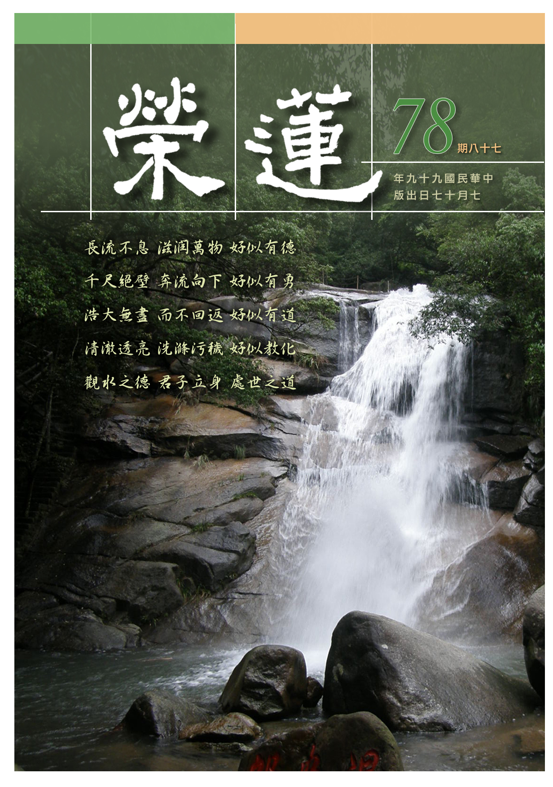

# 第78期

## 社論

### 福報在有情身上

本刊

福報觀待善業

善業觀待有情

有情是沃福田

利彼是大樂種

世間有許多觀念，不是一下子可以建立，尤其當大家眾口一致、習以為常，形成一種共識時，這樣的想法、見地難以改變，不但此生被這些觀念繫縛，做不出偉大的事業，也沒辦法由下一代開創局面，甚至來生也容易生起這樣的觀念，繼續的被繫縛。

這些觀念中特別被講究的是競爭，在有限的資源裡，本來就是經過無數的計較、爭奪，才能得到自己想要的受用，大家共享只會減少我的享受，而福報一定要建立在自己的身上，且要損減有情的福報，才能使自己的福報更多、更廣，現見許多家大業大者，不就是靠著競爭、傾壓、剝奪，才能有如此富有的局面嗎？尤其本世紀新興的資本主義，對這樣的觀念更有著推波助瀾的效果，整個世界財富分配極為不公，集中在少數人的身上，貧富差距過大，富有的人奢靡令人瞠目結舌，貧窮人的痛苦讓人鼻酸，生活享受差距如此之大，相信未來引發的民怨恐不容易收拾。

殊不知，不論透過競爭或慳吝生起的福報，這樣的福報都來自於往昔所作善業，過去如果沒有這樣的善業，就算此生如何的努力、計較，依然貧困潦倒，這種實際的例子，在社會上也觀察得到。為何利益有情才有自己的福報？如此簡單的事情，廣大的有情卻不瞭解、不願意瞭解、不肯瞭解？原因在於有情無始串習來的習氣，其次是教育的影響，尤其沒有受過有見地的教育，講的只是世俗的追逐，如此即使獲得學歷、地位，也只不過是賴用社會的資源，成就自己的所長，其目的僅服務自己，帶來的影響是風氣的變壞、他人的不滿、子女的驕奢及自身的危難等諸多問題。

反之，利益有情不但能使自己在格局上加大，能力上提升，心胸更為寬廣，不但別人樂於給我成就的機會，有難時也容易得到他人慷慨的支援。得到有情的好感，與他們結上深厚的友誼，心胸坦蕩能處處為家，不用高牆、保鏢維護自我，心情的愉悅，吃飯也容易消化並且可口，感受大自然界的可愛與芬芳，對風氣有淳厚的影響，對子女有正面的提攜，這樣的善業不但這一世有這麼好的影響，也冥冥中帶來來世的安樂。

《普賢行願品》中亦言，菩薩想要承辦自己佛果的安樂時，就要有這樣的看法，一棵大樹的果實比喻佛果的安樂，陪襯豐美果實的鮮豔花朵是菩薩廣大甚深的行持，粗大的樹根是來自於向下及深廣的扎根，如此的根本支持著這樣的大樹，使之欣欣向榮的成長，在鮮豔花朵的陪襯下結出纍纍的妙果，那需要長時的灌溉，而灌溉的肥料、水分，就是菩薩的大悲心，這棵大樹的根本就是有情，此菩薩要有這樣的見地，才能支持他發起大悲心、滋潤大悲心、增長大悲心，成就大悲心。

大悲心的成就是對有情生起了可愛的面相，恩德與母恩無別，菩薩所有的努力，所有自我的培養，學問的充實，道德的提升，福報的生起，通通是為了利益有情，讓他們生活上得到安樂，生命得到昇華，在生死中得到解脫，菩薩也在這一番的努力下，享受了佛果的安樂。原來共存共榮才能得到自己之大榮，共存共樂才能得到自己之大樂。

## 大德法語

### 大方廣圓覺修多羅了義經（三十七）

道源老和尚

恩愛貪欲輪迴因

源自無明執我心

相續生命償宿業

不了之局自導演

乙二、正宗分

丙二、令依解修行隨根證入

丁二、廣明行相

戊一、四問答通明觀行上根修證

己三、深究輪迴根本

庚三、如來讚許

經文：

爾時世尊告彌勒菩薩言：善哉善哉！善男子！汝等乃能為諸菩薩及末世眾生，請問如來深奧秘密微妙之義。令諸菩薩潔清慧目，及令一切末世眾生，永斷輪迴，心悟實相，具無生忍。汝今諦聽，當為汝說。

爾時世尊先讚歎菩薩問得好，叫一聲善男子，汝等是指當會的大眾，都是當機者，不是只有彌勒菩薩一個人，乃能為諸菩薩（初發心的菩薩），及末世學大乘的眾生，請問如來深奧（就是菩薩不知），微妙是很精緻、很玄妙，玄妙到不可思議的這種義理，令初發心的菩薩智慧眼潔淨，眼睛裡一個微塵都不能容納，有了微塵等於眼睛就生病了，此時要清潔（肅清）之，令一塵不染，此乃助一切末世眾生永斷輪迴之能力。

何以能令一切眾生斷輪迴的根本？由助彼心悟實相（無相之相），金剛經云：凡所有相皆是虛妄。證得無相之相，即是無生忍。「無生忍」是專門名詞，是忍可於法之無生，雖見一切法皆有生有滅，然是幻化不真實，生如空中開華，滅如虛空華滅，有生有滅，有生有死，然不過如此的幻化。若悟此無生無滅之圓覺實相，並忍可於此義境上，此之定力謂之無生法忍。忍是忍可於無生法。

聽佛說一切法本來不生，本來不滅，不能完全了解，此時完全了解，且忍可於義境，依菩薩的階位，是入了初住以上，就分證無生（此論圓教），若云：證了初地分證無生，到了第八地菩薩才究竟證得無生法忍（此論別教）。此無生（空性）是不是佛給我們呢？佛只是引導我們認識而已，這時候開悟了！悟到諸法實相，此無生之智慧，彌勒菩薩替眾生請問，能令初發心菩薩以及求大乘的末法眾生能悟諸法實相，為得如此殊勝利益，汝今諦聽，當為汝說。

庚四、承教靜聽

經文：

時彌勒菩薩，奉教歡喜，及諸大眾，默然而聽。

靜靜的聽佛開示。

庚五、正答所問

辛一、長行

壬一、云何當斷輪迴根本

癸一、略明

經文：

善男子！一切眾生，從無始際，由有種種恩愛貪欲，故有輪迴。

今生當眾生，前世當眾生，再前生還當眾生，沒有開始所以叫無始，從無始的邊際，說有個邊際叫無始之際，實際沒有個開頭的邊，叫無始之際。從無始之際，由有種種恩愛貪欲，故有輪迴。

然何謂輪迴根本？圓覺經前述：「知是空華，即無輪轉，亦無身心受彼生死」，其次普賢章說了四個次第，由知次第而能頓超，所謂「知幻即離，不作方便，離幻即覺，亦無漸次」。於普賢菩薩這一章，告知從持戒、修定、修觀，修觀時先修二空觀，再修法界觀。

金剛藏菩薩這一章，要我們不起妄想分別，此乃輪迴的根本，然下手的方法還沒有說出來，此章乃彌勒菩薩替我們請問，不高談理論，由於有種種恩愛貪欲，才有輪迴，凡夫打哪裡流轉生死？先起愛心，你愛我、我愛你，這一愛就要你給我點好處，我給你點好處，得了對方的好處，就受了對方的恩，就要報對方的恩，因為要報恩，更要愛對方，這種恩恩愛愛打哪裡開始？就從貪愛心出來，貪愛五欲六塵，特別是婬欲，有此恩愛、貪欲，才有輪迴生死，你若不起恩愛、貪愛之心，就不起惑，不起惑則不造業，如何會受輪迴？

癸二、詳示

經文：

若諸世界一切種性，卵生、胎生、濕生、化生，皆因婬欲而正性命。當知輪迴，愛為根本。

種性就是種類，一切種類的眾生受生的方法不出這四種：胎、卵、溼、化，雞、鴨、群鳥之類都是先生蛋，然後才生出個小雞子、小鴨子，謂之卵生；人與畜生之類都是胎生；溼生則因溼氣而生，沒有溼氣就生不出來；三界中上兩界（色、無色）都是化生，依禪定而化生。

輪迴根本皆因婬欲而正性命，如何成就眾生的生命，都是由婬欲而來，要是沒有婬欲心，根本不會有胎、卵、溼、化四種眾生。當知輪迴之中愛為根本，這對於我們凡夫是一針見血的話，輪迴的根本是什麼？由於婬欲的愛心，故有生死輪迴的根本。

癸三、結成

經文：

由有諸欲，助發愛性，是故能令生死相續。

愛心是根本無明，欲為發業的無明，能發動婬欲之業，有了婬欲之愛能令有情生死相續，不但今生，還有來生，從無始劫來到現在。由於外邊有諸種的欲境（六塵的境界），尤其是男女欲境，最能助發愛性，男的要女的，女的愛男的，女人見了男人，男人見了女人，見了欲境將愛性助發起來，就造婬欲之業，能潤下一生的五蘊，謂之能令生死相續不斷。

壬二、於諸輪迴有幾種性

癸一、顯愛相續

經文：

欲因愛生，命因欲有。眾生愛命，還依欲本。愛欲為因，愛命為果。

欲因愛生，命因欲有而正性命。我們眾生執著有一個我，以身心為我所，此之身心延續假名為命，然命由婬欲而來，沒有婬欲不會成就你的生命。婬欲由何而生呢？由欲而生，欲由愛生。

眾生沒有不愛他的生命，欲本是愛，命是由婬欲生的。由愛生婬欲，由婬欲結生命，所以生死相續不斷，由愛而生欲，由欲而正生命，正者成也，眾生所愛乃六塵境界（色、聲、香、味、觸、法），此乃廣泛的愛，其中麤重的愛是財、色、名、食、睡，然這五欲之愛最厲害的莫過於色，由於貪男女之色，結果成就一個生命，且由於有了命而愛命愛得最厲害，雖說愛名、愛利等，若生命受到威脅了，要逃命，此時所愛的家親眷屬，上至父母，中間的兄弟姊妹，乃至於夫婦，兒女都是他平常所愛的，此時大難臨頭要逃命，家親眷屬可以不顧，平常是顧這個、顧那個，命難時什麼都不顧，逃命要緊，愛命之愛最厲害。

癸二、依輪分性

子一、惡種性

經文：

由於欲境，起諸違順。境背愛心，而生憎嫉，造種種業，是故復生地獄餓鬼。

由於欲境起了違順，違背他的愛心謂之逆境，順他的愛心謂之順境，境背了愛心則生憎惡嫉妒之心，此時即知斷煩惱先將愛心斷掉，此乃輪迴根本，若無愛如何會起嫉妒心呢？無愛不生憎，沒有愛心根本不會起憎心，所以愛得厲害，恨也恨得厲害，這個恨就是憎、就是嫉妒。再說粗一點，愛的要命，恨的要死，無愛不起憎，這個地方說得很清楚，上述謂之起惑，於是就造種種業。造什麼業呢？造惡業，惡業詳細分十種，由身口意分成十種惡業，造了惡業生出了地獄道、餓鬼道、畜生道，三惡道生出來了，這就是輪迴有幾種性？就是凡夫一共有幾種的種類。

子二、善種性

經文：

知欲可厭，愛厭業道，捨惡樂善，復現天人。

知婬欲可以厭離，尤依婬欲心而造下惡業，要墮落三惡道，於是將婬欲之愛，換成愛「厭離惡業的道」（就是十善道），此愛高明了，雖還是個愛，然能捨離惡業，而好樂善業，此時復現天人，哪裡來的天人呢？由修十善道而現出天人。

子三、上善性

經文：

又知諸愛，可厭惡故。棄愛樂捨，還滋愛本，便現有為，增上善果。

此時又知諸愛，都是令人厭惡的法，不但惡業應該厭惡，連造善業也應該厭惡，把欲界之愛捨棄了。欲界有人道、三惡道，及欲界六層天，這婬欲之愛不好，連愛十善業道的善也不好，厭惡諸道而好樂捨，以及好樂捨棄欲界之愛的捨，此乃好樂修學上二界的四禪八定。

此捨乃禪定之修學，還是滋養你的愛本，愛心依然沒有去掉，雖不愛婬欲，但愛禪定還是個愛嘛！將來還是墮落，沒有超出三界六道輪迴。由於修捨依然滋養他的愛本，此時顯現上二界的善果，就是增上善果，增加向上的善果，亦即比欲界高上，還是有作為，謂之有為增上善果，佛教術語謂之有漏善果，沒有超出三界，但是他四禪八定，就現色界、無色界。（下期待續）

### 常禮舉要講座（十九）　會客

雪廬老人

敬客表裡一

長幼由禮別

送遠交情厚

文化冠四夷

會客

◎六、敬茶果先長後幼，先生後熟。

◎七、主人必下座，舉杯讓茶。

來了客人最低限度倒杯茶，還有擺水果、擺糖這常有的，台灣從前都講究這個，我來了就是這樣。敬茶果先長後幼：你可別按前面規矩、介紹遠的、介紹近的那個規矩。誰的年紀大，敬茶就該敬那個，先敬遠客，後敬近客，反前面規矩即可。譬如，台北客人來蓮社，你們倒茶、我是老師，當然先倒我的，可是我沒敢喝，外頭來了也是老師，你倒茶不可先敬我，後及客，我說過多少次「先生後熟」，那是生客，我是熟客。假若不問是讓酒或讓茶，講究禮貌，禮貌是動，動就是禮貌，不動在這就是安，一動就是不安。

安然自在，在家裡行，凡是有客人上你家，你安然自在就是架子大不理人，這話可懂了，所以是必得動作。讓酒，從前很講究，主人拿著酒壺到熟客那裡先敬酒。有這個禮，現在學校不講這個，不能怨你們大家，你們沒受過這個教育能怨你們嗎？這怨誰？家庭怨父母，學校怨老師。《三字經》裡的話：養不教父之過，教不嚴師之惰，有責任的。

譬如我是主人，頭一杯酒，主人先敬客一杯，頭一杯站起來，禮尚往來，來而不往、或往而不來，皆非禮也。頭一杯主人己經站起來，人家敬你，你不站起來？讓茶，頭一次也是如此，若不站起來也得雙手舉杯「請喝！請喝！」客人要察顏觀色，第二杯主人又站起來了，客人此時要說話：「好！我們大家起來回敬主人，這第二杯酒了，等下請坐，別再勞動了。」再下一杯主人若起來，可以請他坐下。你要起來，我們大家都起來。懂禮貌的，這往下坐，舉讓舉讓就可。如果不管你怎麼說我必得站起來，這個叫固執不通，這種酒宴我受不了，喝一回就站起一回，這個樣子受不了。

佛家規矩，我給大家說，見法師要三頂禮。受戒、受律的見了法師不得不頂禮，一頂禮法師說一禮，就一禮，絕不必跟他二禮、三禮，你必得二禮、三禮，依禮上說就麻煩了，恭而無禮則勞，無論什麼，中國學問講究適中！

◎八、客去，必送致敬；遠方客，必送至村外或路口。

客去，必送致敬。客人要走，要行動，我們主人能坐在那裏：不送哦！不送哦！那會給你教訓，你必得送他，若云：送你嫌遠了，不送顯得密切。你看，這是什麼話，這個你自己想去！所以世故人情不是一件容易之事。必得致敬，這是普通的情況。下句是特別的情況，對遠方客言，上句是此處客、本城的人。

遠方客，你送到那兒呢？大門、二門、三門？你聽明白，你必得送到大門外，現在沒有大門，不能在塌塌米台子上就送行。必得送到外頭去！如靈山寺還有個院子，雖沒有前門，送至後門去。當家師送客至牆角，因有事，而客人堅請留步，又有年輕出家人願意代送，這可以了。可是遠方客則另當別論，咱們以靈山寺來論，因靈山寺地處你都知道，那裡來的客呢？台北來的客，到了靈山寺談事，談完了，你不能送到門口就完了，那可不行！台中的客，你送到大門外，行。

台北的客可不行，你得送人家到車站，懂得嗎？這些東西愈研究愈有學問。如果他自己有車、馬，那是他的車、馬，一定到門口他還不上車，他要是不上車或不上馬，牽著走，你就跟著送到庄頭上。鄉下與城裡又不一樣，送到庄頭上，當然客人不上車、不上馬，他就是懂禮的人。已到庄頭上，請你上車或上馬，你不上車，我不好回去，還得送，當然那個客人早就勸你回去，主人說：「你不上車、不上馬，我不能回去。」你說這個，他只好上車或上馬，這都是禮貌。

要是學不好在本國難看是小事，要在國際上則失全國禮貌。彼云：中國人不懂禮貌！一個人錯誤讓全中國臉上抹層灰。幹什麼必得問，幹什麼你得學，學禮呀！

同學們！我對你們是愛之深，責之切，不愛護你們，我給你講這些幹什麼？為著叫你得好處，學什麼東西學開悟，先學警覺。人家還沒動作，臉色一看就知道，察言觀色很重要。這個不會就沒有警覺，沒有警覺那就沒辦法。你說讀書為了開悟；好難了！好漢吃虧不退，吃了多少虧還是往前幹，吃了虧皆是長學問，下回什麼都懂得。不是人才一碰釘子就不能幹、一幹就碰釘子。即使你不碰釘子，上了棺材還是要碰釘子，碰釘子碰到死。張良與韓信，你看歷史，張良較知人情世故，所以能逃劫難，這怨誰呢？所以古人說教書的要下十八層地獄，現在我看不下十八層地獄的很少。

◎九、遠方客專來，須備飲食、寢室，導廁所、導沐浴。

遠方客專來：那時鄉間沒有旅館，遠客來了，照例地問問還預備上那兒去？如非路過，要趕緊給人準備屋子，人家晚上能到那裏去呢？咱們沒有屋子也要準備房間給人家，或者有旅館，我們幫他開旅館，沒有則要在家中住下，或者鄰居有閑屋。但大家聽明白，不可把自己客人讓到鄰居家中住，你自己去借鄰居屋住，除非客人與鄰居夠上十二分交情，否則不能把生客往鄰居家安，這不是簡單呀！

當然要先請客人吃飯，客人一定會說我吃過了、我吃過了，你當然要問在那裏吃過，有些會餓著肚子不說。即便吃過中飯，咱要說一路上辛苦，晚飯提早，此人情世故也。咱們廁所如不乾淨，趕快清洗清洗，領著客人大小解，此人情，方便則請沐浴，不方便也請洗腳，一盆洗腳水可得預備。夏天固然要洗澡。冬天一天、兩天不洗也行，但預備一盆溫水洗了腳，腳溫暖了睡覺才容易，須領導沐浴，最起碼要準備洗腳水。

◎十、遠方客去，必送至驛站，望車開遠，始返。

遠方客去、必送至驛站：他自己有車有馬很好，自己沒車沒馬，你要送他到車站，你要不信，你看看詩，李太白送孟浩然之廣陵，送遠了，還上黃鶴樓目送，你看李太白這麼狂的人送客還送這麼遠，你的架子比李太白還大嗎？李太白在慶典上曾叫楊貴妃磨墨、叫高力士脫靴，氣勢狂到這種地步，送客卻還這麼恭敬，你念的詩上哪兒去了？開了車你才回來，車不開你別走！（下期待續）

## 共修研學

### 小止觀導覽（五十）

*心爾、智高整理*

串習勝義修為止

結合有法觀為觀

無相可取三和合

名言顯現境之相

第六章  正修行

論文：

三、鼻嗅香時修止者：隨所聞香，即知如燄不實，若聞順情之香，不起著心；違情之臭，不起瞋心；非違非順之香，不生亂念，是名修止。

鼻嗅香時，隨著鼻所覺知的味道，知如渴鹿陽焰般，非真實存在的自相可得，安住於這樣的觀念中。如此，則聞順情之香時，如：點檀香、聞香花、噴灑香水、烹飪美食等，貪著之心不起；聞違情之臭，如排泄物等，不起嫌惡之瞋心；受用不起貪瞋之心的非違非順味道時，也能不生自相分別，此即是在鼻嗅香上修止。

論文：

云何名聞香中修觀？應作是念：我今聞香，虛誑無實。所以者何？根塵合故，而生鼻識；次生意識。強取香相。因此則有一切煩惱善惡等法，故名聞香。反觀聞香之心，不見相貌。當知聞香及一切法，畢竟空寂，是名修觀。

什麼是鼻聞香時的修觀呢？我們應該如此思惟，所聞的香塵皆是虛假不實，沒有真實存在的體性，為何這麼說呢？因為認識香塵的鼻識，必須透過鼻根與香塵和合，並且依之生起第六意識了別味相的作用，生起分別香臭等心識，如此則生起聞香則喜，聞臭則怒等一切煩惱善惡等法。

此時應當觀修聞香臭的當下，是心識、鼻根、香塵、鼻識相互觀待而生，香臭不待根識之生亦不生，香臭自相了不可得，由心識浮現，如水中月般而生的幻境，無真實相貌可得。是故，當知鼻聞香及一切萬法，皆是虛幻不實，此為修觀，成立鼻嗅香的體性是空寂、無自性的。

論文：

四、舌受味時修止者：隨所受味，即知如於夢幻中得味。若得順情美味，不起貪著；違情惡味，不起瞋心；非違非順之味，不起分別意想，是名修止。

舌受味時，隨著舌所嚐的味道，知如作夢當中的幻相，非真實存在的自相可得，安住於這樣的觀念中。如此，則吃到精緻且令人感到愉悅的美食時，貪著之心不起；吃到烹調不佳的食物時，也不起瞋心；受用不起貪瞋之心的非違非順味道時，也能不生自相分別的意想，此即是在舌受味上修止。

論文：

云何名受味時修觀？應作是念：今所受味，實不可得，所以者何？內外六味，性無分別。因內舌根和合，則舌識生。次生意識，強取味相。因此則有一切煩惱善惡等法。反觀緣味之識，不見相貌，當知受味者及一切法，畢竟空寂，是名修觀。

舌受味時的修觀，應該如此思惟，所受之味自相（自己成立之性相）實不可得，酸、甜、苦、辣、鹹、淡等六味，自性不可得，故無可分別。舌識分辨六味是依著舌根與味塵和合，六味之生起由名言而安立，非在境上自體成就。生起了第六意識（分別味道之心識），嚐美食由喜而生貪，嚐粗澀食、不美食由厭生瞋怒等一切煩惱善惡等法。

此時應當觀察味之生起不過是舌根、味塵與舌識三者無自相的和合而生起，乃名言下顯現，無真實相貌可得。是故，當知舌受味及一切萬法，皆是虛幻不實，此為修觀。是更進一步觀察，成立舌嚐味體性空寂、無自性可得。

論文：

五、身受觸時修止者：隨所覺觸，即知如影，幻化不實。若受順情樂觸，不起貪著；若受違情苦觸，不起瞋惱；受非違非順之觸，不起憶想分別；是名修止。

身受觸時如何修止呢？即了知：隨所覺觸，即知如影，幻化不實，並將心安住在這樣的概念上不動。隨著我們所覺知的觸受，知此觸受如鏡中影像，如幻師之幻化，無真實自性可得。若能執持此觀念，當身體受順情樂觸之時，如穿著舒適柔軟的衣服、腳踩著打蠟光滑的地板、吹著溫度適中的冷氣等，能不起貪著之心；而相反的當受違情苦觸之時，如搬重物、天氣太冷或太熱等等，亦能不生瞋惱之心；而在受非違非順之觸時，能不起愚癡分別之心（亦即這個狀態蠻好的嘛），此即是在身受觸上修止。

論文：

云何身受觸時修觀？應作是念：輕重、冷煖、澀滑等法，名之為觸；頭等六分，名之為身。觸性虛假，身亦不實；和合因緣，即生身識。次生意識。憶想分別苦樂相等，故名受觸。反觀緣觸之心，不見相貌。當知受觸者及一切法，畢竟空寂，是名修觀。

止是將心安住在隨所覺觸，即知如影，幻化不實的義理上，觀則更進一步思維身受觸這一法如何會是如影、幻化不實？在身受觸上修觀時，首先思惟觀察這些輕重、冷煖、澀滑的感覺是如何生起呢？這些感覺是否能獨立生起呢？如果它們可以自己生起的話，那不用身識，用眼識、耳識亦可顯現這些感覺。且這些感覺是絕對的嗎？比如一個女子覺得重的東西，大力士來扛覺得很輕，輕重等的感覺亦無法獨立生起，這種種的感覺皆是觀待身識而生。身識亦是觀待這些輕重、冷煖、澀滑才能顯現，觸塵、身識二者相互觀待，皆是虛幻不實，自相不成立。

其次身識是靠著身體（身根）才能顯現，但身識就在身體裡嗎？若身識就在身體裡，不必靠外境就可以成立身識、就可以顯現輕重、冷煖、澀滑等感覺，然並不成立。若身識不在身內，在身外嗎？若在身外，則可在桌子上顯現身識？不必靠身體就能成立身識，顯然亦不成立。身識在外境上找不到，在身體上亦找不到，但此身識明明就有，是如何生起的呢？在身體碰到觸塵時生起的，相互依靠而生，如水中的月亮一樣。

由以上推論知身根、觸塵及身識是相互觀待而生，無絲毫的自性可得，若能經常串習思惟，即是在身受觸時修觀。（下期待續）

## 蓮池海會

### 林秋月老居士往生見聞記

*淨昌整理*

溫柔敦厚傳統型

由女引入佛門修

病苦折磨伴念佛

瑞相生西是放下

林秋月老居士生於民國二十三年二月十四日，祖籍福建，世居民風淳樸保守的嘉義，父木泉先生，從事魔術特技工作，母方罔市女士。家中育有三子兩女，秋月老居士在兄弟姐妹中排行老么，事母盡孝，兄姐怡怡，三歲喪父，生活困苦，自小學時期，即於課餘兼賣零食小吃幫助家計至小學畢業。雖環境艱苦，老居士仍能表現積極開創風格，有感於學歷不足，需習得一技之長，工作之餘，習得打字技能，並考上嘉義高工任打字員一職，並於工作、家務之有限時間，半工半讀完成國中課業。

於工作期間認識同校老師鄭敏光先生締結良緣，婚後育有一男四女，婚後九年，先生始長期在外經商，家中教養子女重任由老居士一肩扛起，平日對子女和顏悅色，凡事以身作則，即便子女有錯，絕少厲聲苛責。老居士亦重視子女教育，多方鼓勵於學業上進，子女均完成大學或以上學歷，都能於社會職場貢獻所能，服務大眾，此乃老居士最為安慰之事。

老居士一生簡樸良善，工作認真負責，表現良好，由打字員升至幹事，與同事相處和諧融洽，深獲同事好評。宿世甚具布施習氣，自奉儉約而樂於布施，以民國四、五十年代公教職員微薄之薪俸，從年輕時標會幫襯兄長娶親，結婚生子後，常樂於施小惠於經濟更為困窘的小販、幫傭等。

退休後遷居台北，一家和樂團圓，繼續相夫教子，民國八十九年其夫不幸於大陸因心臟病發作往生，未能為他助念往生，為其憾事，卻也助其立志助念往生極樂世界。

晚年長期於蓮榮共修會薰習佛法，其後雖有糖尿病、心臟病、洗腎、骨折等病苦，亦不改其志，雖行走不便，仍堅定地拄著助行器，前往參與共修、念佛、做懺、放生、助念等法行，樂於自作、與人共作，至今年初因糖尿病併發症等病苦，老居士毅然放棄洗腎，萬緣放下專心念佛，於家中持續二十九日中念佛，承佛力加被，雖有重病，無大病苦，意識清楚，期間蓮友時往探望以正法開導皆欣然聽聞，並一心念佛，依其做人之良善，方能於臨終前後具足因緣，而有作懺、供佛、齋僧、放生、供燈等法行，於九十九年四月九日得蓮友、家人助念二十六小時含笑西歸，得生極樂世界，可為此生最佳句點。

節錄今年四月大悲懺與地藏懺法會，老居士及其家人的談話供養大眾，期對往生淨土生起殊勝信心。

**問：** 逢病苦還能每週參與週四與週六共修，及學會舉辦的種種放生、懺法等活動，老人家的幹勁與耐力令人稱許，一方面是鄭媽媽於法歡喜，也因為有家人的配合。老人家如何走過這段歷程？

**答：** 這段路走來歷經掙扎，我母親從三十幾歲就罹患糖尿病，起先吃藥，後期打針，七年前醫生告知腎功能衰敗必須洗腎，故至今已經洗腎七年，每週三次，每次都很虛脫。但是她喜歡跟人家結善緣，所以在身體狀況還好的時候，每週四跟老菩薩們一起共修念佛、研學佛法，對她來講是件很快樂的事情，雖然坐不住了，但鼓勵鼓勵她，還是勉強一起出門，這真的是很不容易的。因為團體的力量讓她繼續走下去，大家彼此扶持、互相幫助，這種信念在她心裡深植，這一切都是三寶加被、師長加被，蓮友互持。當她病苦的時候，能夠這樣堅持，以歡喜心來參加，做子女的也非常欣慰。

**問：** 一般病苦的人要參加法會活動並不容易，總想多休息，而且病苦的人容易起煩惱、心焦急，鄭媽媽是怎麼克服的？

**答：** 老一輩他們成長的過程中，有諸多磨練，耐性過人，但在這段過程中也有一些情緒的變化，不過常有蓮友來看她，她也能夠勉強坐起來跟大家念佛，這都是因為平常跟大家結的法緣，而且每次去上課之前提醒她把心增上，就能賺許多功德法財，如此鼓勵她，她就會撐起來，而且去上課或作善法時，她會覺得很高興、很愉快。

前些日子因為我母親的右腳腳趾頭有栓塞的情形，還有心臟的問題，不是說做支架就好，還要截肢，甚至還要做繞道，我們評估媽媽的狀況已經非常不好，恐怕沒辦法承擔動這樣大的手術，而且傷口也不容易痊癒，到最後會變成情況很難控制，其實在他洗腎的這七年中，如果不是團體一直支持她，其實是活得很辛苦的。很多事情都在等，等著下一步，可是我們人生能有多少下一步？

所以當醫生這樣說的時候，我們實在不太願意再動手術，因為她的精神、體力甚至神智都會恍惚，會變得只在乎身痛，而忘了她要往生極樂世界，要去阿彌陀佛那邊的願力，且意志力可能會更薄弱，所以子女用什麼觀念來處理這件事情，是很重要且關鍵的。

剛開始覺得母親好像沒有這麼嚴重，又何必說放棄呢？而且如果他自己都沒有想往生，佛菩薩要怎麼接呢？所以一定要他自己很歡喜，想要去極樂世界才行。我們都不太勉強她，也請老師到家裡來跟家人做一些溝通，這個過程是必須要經過的，我們必須耐心等，只是不知道她還有沒有這個時間去思考，有沒有時間讓她做妥善的安排。

長輩有這樣的情緒，我們必須要去諒解，這是必然的過程，這是他的生死大事，不是我們旁人想的這麼簡單。在被別人說你準備往生的時候，會產生很多的情緒變化，我母親真的很不容易，她很快就邁過那個過程。一般被宣判有癌症的人，大概會有五個過程，首先否定，其次開始生氣，第三開始討價還價，第四有一點沮喪，最後是接受，我母親很快就邁過那個過程，決定放棄洗腎及所有治療，一心求生西方，讓我覺得她非常不容易。

我們做子女的，替她做這樣子的決定，感覺好像很殘忍，但是舉個例子，如果要栽培功課好的孩子去留學，做父母的一定是傾其全力，甚至把家裡所有財產拿出來讓他出國，並忍受多年不能見到孩子，可以很堅強的說沒有關係，孩子好就好。我們現在的心情也一樣，我們是送媽媽到一個很好的地方，不是把她推到一個不好的地方，那個地方對她來說沒有病痛，想做什麼就做什麼，可以跟著阿彌陀佛還有善知識一起修學，我們是將她送到一個很好的地方去留學，而且，那也是我們嚮往之處，以後也要去，我們一起走這條路。極樂世界阿彌陀佛發願度眾生，我們真的想去，他就一定會來接，而且是萬修萬人去，既然媽媽現在相信她能去，我也相信我能去，我以後會跟她見面，所以我就是以歡喜心來送她，也希望她是以歡喜心去那邊好好修學，以後乘願再來。

### 張銓老居士往生見聞記

*淨昌整理*

逆來順受對坎坷

子女成群晚學佛

老病苦磨似難脫

峰迴一轉出乾坤

張銓老居士，字少衡，江蘇省淮安縣人士，生於民國十五年十一月廿日，居士乃官宦之後，求學期間雖適逢戰亂，時隨尊翁張冰公遷徙，致學業未成。後父病歿，家道轉衰，十七歲時奉母命，經人介紹與汪養吾先生締結連理。婚後已能奉上撫下，盡心持家。詎料世事無常，新婚未及年，養吾公即因參加抗日作戰成殘，雙目失明。時年未滿二十的老居士不棄結髮之義，從此一肩承擔照顧全家大小重責。

俟政府戡亂戰事不利，必須隨軍遷台，懷著身孕的居士帶著長子，侍奉先生離開家鄉，搭乘時行時停之火車，經二個月抵達廣州，輾轉香港窩居半年，最後終能抵達台灣，其間之辛苦非常，應非生於承平時代者，如吾人所能體會。

戰亂逃難之苦方離，而生活重擔之日方始，數十載辛勞，一家人先後遷居台東、新竹及台北，猶如整個國家社會成長縮影，歷經那物質艱困的年代，然後經濟起飛，之後不虞匱乏，老居士與夫共養育子女七人均能成材，各安其業，在台開枝散葉至今共繁衍家族四代三十四人。老居士為人忠誠厚重，遷居多方鄰里咸稱誠信不欺，大肚能容。而今重拾過往苦日子回憶，感念其無怨無悔的付出，成為維繫家族成員向心力的重要支柱。而子女學有所成，此亦對社會之貢獻。

然而無常老病死不與人期，晚年居士先後遭遇長子與丈夫過世的人生至痛，所幸養吾公臨終能得助念，家族並因此與佛法結緣，二女早參加蓮榮共修會，信力尤堅；小女後亦隨學；老居士晚年佛法上熏修因緣全賴於此。

此後寡居十一年期間，因子女散居台北縣市，老居士陸續隨諸子女同住，親族時相聚會，享受含飴弄孫之樂；近數年則由女兒護持，每週四早上參加共修會三代共修班，與老菩薩們一同念佛共修，研討淨土經典，與極樂世界結下殊勝因緣；亦時參加週六晚間共修，與諸蓮友共結學法因緣。期間於共修會年度重要齋僧、放生、懺法及母親節等活動常見老居士慈祥身影，並多次隨團體遠赴大陸參訪放生，共做善法。老居士或限於因緣，教法經典尚未深入，但放生等種種善法必有法喜，相信居士十餘年隨喜參加各種活動，已為臨終得到助念護持及來世在極樂的修學種下善因。

無常終必及身，老居士去年初檢驗出癌症末期，多次進出醫院，但限於天年而體力日衰，子女盡心醫藥照料，病榻前多能以佛號提醒老居士萬緣放下，求生西方；期間老師及諸蓮友不時前往探慰，嘆天不假年，歿於民國九十九年四月三十日，享壽八十五。老居士臨終於家眷、蓮友助念二十四小時後，身相莊嚴安祥，全身柔軟，容色更勝生前，相信此刻老居士必已託身蓮胎，脫離此眾苦充滿之世界。

「子夏曰：賢賢易色，事父母能竭其力，事君能致其身，與朋友交，言而有信。雖曰未學，吾必謂之學矣。」老居士年少而義不棄目殘丈夫，終其身護持而不變，生平言而有信，此或恐先賢子夏所稱能盡五倫之義者，稱為符合學習大道者行相之具體而微。而賴老居士以身示範，故其後代在家能思孝親，在社會能盡忠職守，而家族興旺有日矣。亦感得學佛子弟，能善於外緣護持而不墜，遂能日養老居士善根，破除障礙，終能成就往生大業，後生小子能不學乎？

### 賴管廷老居士往生見聞記

*淨昌整理*

含辛茹苦只為家

延續生命現痴呆

遷至佛堂身心安

歸去現瑞歎佛恩

賴管廷老居士，生於民國二十年九月十六日石岡鄉梅子村管家，排行三，幼時曾出養於新社鄉雙連羅家，後因故又回到梅子村管家，二十四歲時經媒妁之言，與東勢二社賴少火先生組成家庭，共育有四名子女，均成家業，子孫賢孝。

婚後數年，夫婿長期出外工作，老居士則留在家中，教育兒女，奉養公婆。後於民國五十九年與先生在東勢雲仙洞口設立雲仙號雜貨店，經營日用雜貨、包裝材料等買賣批發。及至子女稍長，並於民國六十年代，與先生到仁愛鄉霧社經營果園，種植世紀梨、水蜜桃等，改善家庭環境。老居士一生跟隨先生勤儉持家，茹苦含辛地教育子女，從無怨言，惟其一生大多從事農務勞動工作，筋骨過於勞累，於晚年罹患類風濕性關節炎。九十六年十一月先生往生後，頓失精神依靠，身體每況愈下，須要靠輪椅代步，生活起居極為不便。

去年十月時，因肺炎住院，醫藥罔效，醫生建議家屬準備後事，在家屬及蓮友護持下，搭乘救護車返家助念，詎料佛力不可思議，佛號聲中離開醫院老居士在救護車上就清醒過來，而返家後經家屬及蓮友排班助念二天後，老居士奇蹟式的好轉，其後半年中，眷屬護持老居士起居佛堂之側，也參與念佛會共修，舉凡誦經念佛，聽經聞法都能隨喜，治療上謝絕針劑，雖日漸消瘦而精神愈佳。嘆天年終有盡，老居士於九十九年四月二十日上午四時三十分於睡夢中安然辭世，享壽七十九歲。臨終眷屬及蓮友排班助念二十四小時，入殮時，全身柔軟，面帶笑容，見者咸喜，往生西方極樂世界無疑矣。

贊曰老居士一生誠臺灣農村典型長輩縮影，勤勞誠樸，敦倫盡分。雖受老苦而有其終，恰明前半生行業善屬；然一生未學而臨終生起往生極樂福報，固可言宿福深厚為因，但眷屬學佛而懂護持方法，卻必為生西善果成熟之主要增上緣，否則所託非人，宿福再厚亦引發無由。觀夫老居士示現，吾儕有志生西善友，對佛化家庭之建立，子弟學佛之堅持，其實事關一生行持成功，能不重視乎？

### 林劉璠老居士往生見聞記

*淨昌整理*

客家傳統耐操煩

子女成家卸重擔

清福享短病來磨

助念往生真解脫

林劉璠老居士，台中縣新社鄉大南村人，家中務農為生。老居士排行長女，幼年時幫忙家務，在家帶領弟妹，煮飯，出門則下田幫忙耕種。從小的磨鍊，養成老居士勤儉刻苦，樂觀向上，知足惜福的美德。

成年後適林，婚後育一子二女，或因家境營養失調而健康不佳，但老居士操作家務仍勉力為之，凡事親力親為，為減輕經濟負擔，也兼副業。老居士教育子女，亦身教重於言教，時示子女勤儉持家，知福惜福之重要，信其後代均銘記心中。終於子女成家立業後稍卸重擔，稍得數年清閒。然平安歲月總嫌苦短，而無常來的總是太快，近二、三年老居士罹患了巴金森式症與小腦萎縮，雖病而不改樂觀向上，但健康情形每況愈下，嘆於九十九年五月三日中午十二時辭世，臨終時得眷屬及蓮友排班助念八小時後，面容如生，見者歡喜，咸認生西無疑矣。

觀老居士一生，勤儉刻苦，相夫教子，敦倫盡份為其寫照。然一生未學佛，而臨終得到助念生西，除必有前生淨業為宿因外，今世有眷屬先學佛才有護持之緣；而以往生為引導親屬學佛因緣，抑或為老居士此生示現勝因。

## 專題研學

### 聖者的祕密～大佛頂首楞嚴經二十五圓通暨七處徵心探源

### 二十五圓通暨七處徵心簡介　（十九）烏芻火大

時哉

空王佛前同發心

護持佛轉正法輪

欲火觀空清涼月

示現神力降魔怨

烏芻火大

丑四、七大圓通

前言：

每一個圓通都可以幫助我們降伏煩惱，只要運用這些修行法，修行的功力就往前進，降伏煩惱的能力就轉強。有人說我學佛很久了，但煩惱依舊起來，此不能怪佛法，多年來不思長進，當然無法對治煩惱，不該質疑學佛法有什麼用？要問問自己可曾在遇境逢緣時認真觀修過？

寅一、烏芻火大

卯一、作禮陳白

經文：

烏芻瑟摩於如來前，合掌頂禮佛之雙足，而白佛言：

烏芻瑟摩此云火頭，即火頭金剛。金剛或是大菩薩或是佛，倒駕慈航示現為護法神護持正法，對佛法的貢獻極大。火頭金剛於如來前，說彼如何依火大來成就。

卯二、陳白之言

辰一、因欲得觀

由於婬欲之火而觀此欲火，何以會墮入地獄的火海，乃以內之欲火招感外地獄之火海，火頭金剛即是以欲火為所觀境，由火大證入自相空。

巳一、宿生多欲

經文：

我常先憶久遠劫前，性多貪欲。

性多貪欲是有情眾生最為麻煩的習氣，所謂：愛不重不生娑婆。愛為欲界欲愛、色界色愛、無色界有愛，然以欲界婬欲之愛最利害，觀待男女色所生起的貪色慾望，由欲愛成家立業等等，儒家會淨化成傳宗接代，佛法更要淨化成菩提眷屬，即使行相上示現在家相，心態上要有出離的心，因為貪欲能生諸多過患。

巳二、遇佛授觀

經文：

有佛出世，名曰空王。說多婬人，成猛火聚。教我遍觀，百骸四肢，諸冷煖氣。

王者自在義，此佛於空自在，名為空王佛。實則每一尊佛皆於空自在。此空王佛乃久遠劫前之古佛，在《法華經》上，佛說自己與阿難，在久遠劫前，同於空王佛所發心，當時師兄弟包括烏芻瑟摩，今日團聚都是宿緣所追。

佛與阿難同在空王佛所發心，結果一位成佛（釋迦牟尼佛），一位來傳承（阿難），一位來護持（烏芻），當時之願，方有此時之聚。

任何的造作（業）未來都會以果報的方式呈現，除非中間生起對治的力量，此即業力不可思議，業以心思為體性，心思乃內心隱微處的想法，若口在念佛，內心隱微處羨慕富貴的果報，在常伴青燈古佛的修學中，未來大富大貴的果報已漸露曙光。

印光祖師上海護國息災法會法語提到，清朝有三位富貴之人由於前世出家為僧，在修行中隱微的世俗心思，感應來世有功名與娶嬌妻美妾之福報，圓滿他們的修苦行之願，所以修學者心思當中世俗的遺憾要越少越好！

烏芻瑟摩在空王佛時由於性多貪欲，成為修行障礙，佛說多婬人，成猛火聚。由於內在的欲火、婬火，燒得他不自在、燥動，所以人坐不住，靜不下來，想往外跑，乃追逐五欲的燥動相。追逐五欲的欲火，一方面令身體燥動，無法靜下來；另一方面也易燒壞五根之身，所以欲望多的人，容易髮蒼蒼、視茫茫、齒牙動搖，現在的人為了追求物欲，比古人還要辛苦，未老先衰，體力不濟，面對競爭壓力大，生活作息無法正常，所以根力容易衰敗。

何謂猛火聚？五欲火發起時，用三千大千世界的大海水去澆也澆不熄！佛菩薩也沒辦法令彼清涼。八十九年到九華山朝聖時，見到一首地藏菩薩送童子下山（還俗）的詩，其中有：「空門寂寞汝思家，禮別雲房下九華。愛向竹蘭騎竹馬，懶於金地聚金沙，瓶添澗底休拈月，烹茗甌中罷弄花，好去不須頻下淚，老僧相伴有煙霞。」當世俗的心思生起時，連地藏菩薩都要送他下山，佛菩薩並非萬能。

此時空王佛教火頭金剛遍觀周身骨節及兩手兩足，靜觀當未對欲塵境時全身本自清涼，當攀緣欲塵時，心思帶動火氣遍體，手足全身都不安分，心神不寧無法安定，心生怖畏。

辰二、觀成得名

經文：

神光內凝。化多婬心成智慧火。從是諸佛皆呼召我名為火頭。

神光是智慧光，內凝乃單純以火氣為所緣，觀察火的自相，火氣是否自體存在？真實存在？世間人看是宛然有，明明就有燥動之氣，氣功師父或者有神通的人來看，此人身上都是火氣在竄，若沒有好好對治，會燒壞五色根。

神光內凝乃觀火氣自相空，如何觀？第一、火是觀待地、水、風才能生起的，觀待地水風才有火相，若不觀待地水風，能獨立成立一火相嗎？其次要觀待欲境與欲心才能生起欲火。

若不觀待欲塵境能在心識上生起欲心？欲心尚且不生，何來遍身欲火？再者、火氣若在塵境上？那不用欲心，試問聖人無欲心，即使對境亦不生欲火。

然顯現的火氣從哪裡來？火乃被影現出來，如陽焰、如乾達婆城，顯現似有而自相了不可得。世間事情皆然，富貴須觀待貧窮而後顯現，在大家共許的名言下生起，有一個富法自己在那裡成立，都如水中影現月。當化多婬心成智慧火時，此時心力無比強盛。例如作壞事力道的覺受抓住，做善事的力道也是這般， 雪公老師說壞人反頭做好事，好人也比不上！好人十個有九個沒有那種魄力。壞人變好人的時候，力道是很強的，如周處除三害。火頭金剛化猛利的欲火為智慧火，從此以後諸佛皆呼召其名為火頭。

辰三、證果發心

經文：

我以火光三昧力故，成阿羅漢。心發大願。諸佛成道，我為力士，親伏魔怨。

烏芻瑟摩生起燒掉煩惱的智慧火證得阿羅漢果位。並別發大願成為菩薩，諸佛成道時彼為力士，發願作諸佛的護法。須知法要流通除了要有說法者與聽法者，還要有護法，這些都是互相觀待缺一不可的。

魔怨如何生起呢？修學佛道時，觀待宿世的惡業生起眼前的障礙，火頭金剛成為護法，乃觀待魔怨而有，所以金剛可得嗎？是觀待於魔怨說金剛，魔怨沒有了，還安立什麼金剛？名言安立為金剛、菩薩、佛，沒有觀待眾生可度，成什麼菩薩、佛之名呢？菩薩的自相空、佛的自相空，觀待救度眾生方有菩薩、佛之名言。

卯三、結答圓通

經文：

佛問圓通。我以諦觀身心煖觸，無礙流通。諸漏既銷，生大寶燄，登無上覺。斯為第一。

身心煖觸之形象為何？比如胃痛是身識的境界，胃痛是觸塵，身體上的感覺都是觸塵的顯現，要靠身識去認識，眼識不能看到胃痛，鼻子不能聞到胃痛，耳朵不能聽到胃痛，胃痛是觸塵的面相，以身根、身識去緣胃而產生痛覺，如果身識不起現行，就沒有胃痛這件事，胃痛要靠身根、身識緣觸塵而現起。身體之火大是觸塵，燥動不安非眼識境界，非鼻識境界，是以身識去感覺的，所以火大屬於煖觸。此時以火大觸塵為所緣去觀察，了知體性空寂。火大自相空，不妨火大流通，身心不受阻礙。

諸漏既銷，生大寶燄：煩惱的現行與種子都在現證空性的智慧對治下消滅，生起智慧的火花。

登無上覺，斯為第一：此人是成佛的聖者，眼前示現為金剛，成為釋迦牟尼佛的護法。古人說：一佛出世千佛護持。千佛對一佛之護持是怎麼來的呢？乃因往昔於法上結緣，如火頭金剛對釋迦牟尼佛的護持。修學佛法的善緣聚會，比世俗親愛的聚會更值得珍惜的，彼此不但是道義之交、生死之交、正法之交，而且延續的因緣都會助成在正法事業上的成就，如阿難尊者和釋迦牟尼佛的師徒傳承，也是往昔在法上當師兄弟生起的甚深因緣，所以要好好珍惜團體中彼此互為同法者。（下期待續）

### 六趣輪迴經簡介（十）人道

*心亞整理*

施之意樂在成佛

施物感得福資糧

依福修慧得法身

依慧修福得色身

人道

經文：

若人以嬖妾，嚴飾而為施，彼所得果報，具欲樂富貴。

嬖妾或為官夫人，這些官夫人降低自己身份，出來作社會服務，照顧弱勢的團體人士等，這些官家主人將來所得的果報為具足欲樂與富貴。

經文：

若人以經教，及世俗文典，能持施於他，感博學大智。

能持經教與世俗典籍，自己深入學習之後能轉教他人，輔之以講義及各種教材，令學生易解，將來感應博學大智。

周利槃特何以如此愚癡？之後又何以教理通達，成為義持第一之阿羅漢。乃因往昔曾為三藏法師，但因吝法，感應愚癡果報。後來經由世尊調教，服侍僧團才懺除此惡業。法是經過這麼多人辛苦學習與傳承，如何能藏私？雖說如是，然說法要待機，且說法之心態乃誠心供養，方能感應來生博學大智。

經文：

若人以醫藥，及以無畏施，彼所得果報，安樂離恐怖。

醫藥施與他人，感得的果報就是身體健康，此安樂就是由身體健康的這一分引起來的。又無畏施所以遠離恐怖，因無畏施包括兩方面：一者、於施時，心中不害怕，吾等幫助他人解決困難時，有時自己會害怕，如通知要去停屍間助念，且只有我一人，此時心裡害怕，要先一番心理建設才可。

二者、讓對方不要害怕，幫助他壯膽，果報會感應自己本身不害怕。有些人天生無所畏懼之人，此與過去的無畏施有關，如張飛、關羽即屬於天生勇敢無所畏懼者，又如《了凡四訓》中應尚書於山中讀書，夜晚鬼呼叫聲連連，應尚書內心一點也不害怕。所以多行無畏施則有膽識。不過膽大也得凡事小心，菩薩戒云：險難之處無伴獨行，是優婆塞、優婆夷得失意罪。雖有膽識也不可隨便赴難，人身難得，須珍惜此人身寶，善用此寶修學解脫道。

經文：

若施以燈明，其眼常清淨。

施以燈明，所感應之眼清淨亦即所見皆好，自見眼力亦好，雪公老師晚年幫江逸子老師之畫作題字，常不禁讚歎自己的好眼力，可以將字寫得這麼小。

經文：

若施以音樂，得其聲美妙。

以音樂修供養，如當維那領眾唱頌，歌詠三寶，或演唱佛曲者，感應未來聲音美妙悅耳。迦葉佛時，有人發心蓋佛塔，其中有工人對蓋如此殊勝佛塔表徵迦葉佛功德時，深不以為然，工程結束後，甚為宏偉莊嚴，深感懺悔，於塔周掛設風鈴，感覺懺悔，感應於釋迦佛世為比丘時，人長得很醜，但聲音美妙，可見因果是各歸各。有次波斯匿王經過精舍時，聽到此比丘誦經聲音很好聽，即生起欲供養之心，但釋迦佛言：先供養之後才能見此比丘。果真波斯匿王一見到此人，則失去信心。

經文：

若施以臥具，獲安隱快樂。

一個人到晚上時，就會想要找地方休息。從前至台中聽課時，晚上要到那裡就寢，都有人事先安排好，讓人安隱，將來亦感應提供者安隱快樂。

經文：

若施以僮僕，營從常圍繞。

家中的奴才供人使用，或隨喜護持家中小孩當義工，將來感應辦事有多人幫忙。

經文：

施乳牛等物，得色力壽命。

有些寺院修行人養牛喝牛奶，所以用放生款買牛施予寺廟，一方面放生，一方面施牛。修行人喝了牛奶後，顏色好看，體力強健，壽命延長。感應自己未來亦如是，而成為修學正法的殊勝增上緣。

經文：

若施以良田，得倉庫盈溢。

盈是充滿，溢是流出來。從前寺廟旁的良田都是信眾供養的，讓寺廟能放耕收田租，經濟能獨立自主。所以若能施以良田，感得將來自己財富豐盈。

明憨山大師掃師父雲谷大師的紀念塔，發現師之塔已經荒廢了，塔邊有了凡先生寫的碑文，覺得不究竟，所以重寫雲谷大師傳，由於曾作過大師之侍者，故能將大師的典型風範記錄詳實。並將所得的供養金於塔邊買了良田，請農民耕種，田租用來維修師父的紀念塔，使其不荒廢。

經文：

如彼彼求者，各各隨所欲，華果及清泉，愛語善安慰。

為何彼上又一彼字，第一彼是親，第二彼是疏，與我很有關係的是親，與我沒關係是疏，親疏對我所求，我一一看到他們的需求，給他華果、清泉、愛語及安慰，總綱即以財、法、無畏等施。（下期待續）

## 專題報導

### 孔門十哲塑像介紹　多才謹慎的君子—孔門十哲之七～冉求

*心亞整理*

才藝獨得夫子讚

季孫座下安邦才

齊魯之戰成名後

迎得夫子風光回

冉有，名求，字子有，《左傳》或稱有子，春秋時魯國人(今山東曲阜)。生於魯昭公二十年，卒年不詳，少孔子二十九歲。在孔門十哲中，冉有與子路同列「政事」之科。
冉有生性保守，為人謹慎，個性溫和，待人處世圓融周到，每做一件事情前，總會通盤考慮此事的可行性，也預測出將來會遇上哪些難題，又該如何解決等，往往因為考慮過多而缺乏積極的態度，所以在做事前總顯得怯弱而裹足不前。有回冉有疑惑的問孔子：「我聽到一件事情，該馬上去辦嗎？」孔子依著他保守的性情，毫不猶豫地回
**答：** 「是的，聽到了，就去辦。」即勉勵他做事要進取，並勇於承擔。

冉有喜好追求禮、樂、射、御、書、數各方面的才藝，使得大部份的時間都花在充實才藝上，至於夫子的道他也學習，只是沒有像學才藝這麼熱衷。他向孔子說：「不是我不喜歡夫子您所教的道，只是我的力量不足呀！」孔子了解他有能力進於道，只是花太多的精力在才藝的學習，不瞭解才藝學得再好，如果沒有道，遇到瓶頸時仍不能突破；若能學道，使才藝貫通於道，則學道的同時才藝也能向上提升，故想進一步引導冉有學道，便對冉有說：「你說你力量不足，學道就像走路，走了一段路程，覺得力量不足，停止休息一下是可以的，若從此不再前進就等同畫了一條界線，限制住自己，所以你覺得自己不能學道，是劃地自限啊！」冉有虛心接受孔子的教導，最後他的才藝得到了孔子的印證。
要得到孔子的讚許是不容易的，有一回季康子問孔子：「你的學生冉求，可以從政嗎？」孔子回
**答：** 「冉求多才多藝。」又有一回子路問孔子怎樣才算是人格成就，孔子回
**答：** 「如果有臧武仲的智慧，孟公綽的不欲，卞莊子的勇敢，冉求的才藝，再加以禮樂薰陶，增進文化素養，這樣可以算得上人格成就了。」由此二次的印證，可想而知，冉有才藝之成就在孔子心目中佔有舉足輕重的地位。
魯定公十三年，孔子前往衛國，冉有替孔子駕車，孔子一到衛國即說：「衛國人民好多呀！」人民多，從事生產的人就多，自然國力富強。冉有即
**問：** 「人口多的國家要如何治理呢？」孔子回
**答：** 「讓百姓富足起來！」所謂富足是食、衣、住、行基本需求具備以後，還要多一些婚喪喜慶人情籌措之利用。冉有接著
**問：** 「百姓富足後，辦政治的人又該如何讓百姓過得更好呢？」孔子回
**答：** 「富足後要辦教育教化他們。」所以要先講求民生問題，民生問題解決了，即要講求教育。冉有追根究柢的求教辦政治的方法，即顯露出他想施展抱負的端倪，另一方面也展現他求學的精神與其成功的方法。

而多才多藝的冉有到底想如何展現他的抱負呢？有回閑居時，冉有與同窗好友子路、曾皙、公西華陪伴於孔子身旁，冉有向孔子報告志向：「一個方圓六、七十里，或者再小一點如五、六十里的小國，由我來治理，三年可以使人民豐衣足食，但進一步推行禮樂教化，則要期待更有道德與辦事能力的君子。」冉有真的有此能力嗎？孔子曾回答孟武伯的問話時說：「冉求呀！可為卿大夫的家臣。」此即印證冉有的政事才能。

魯哀公三年秋季，季桓子病重，坐在輦車上望著魯國的城門，深深地嘆息道：「昔日國家將要振興，只因我得罪孔子，所以不能興旺。」感嘆地回頭向他的繼承人季康子說：「如果我死了，你必定為魯國之相，你擔任魯國之相時，一定要召請仲尼。」幾天後，季桓子去世，季康子繼位。季桓子安葬完畢，季康子打算召請孔子，大夫公之魚說：「往日我們的先君任用孔子有始無終，結果被諸侯所恥笑。如今又要起用他，若不能有始有終，將再次被諸侯所恥笑。」

季康子說：「那麼可以召請誰呢？」公之魚說：「一定要召請冉求。」當時孔子與冉求等弟子在陳國，季康子派遣使者召請冉求。將要上路時，孔子說：「魯人來召請冉求，不是小用，而是將要大用啊。」這一天，孔子預感能有返回魯國的機緣，便說：「回去吧！回去吧！我家鄉的那些學生志向遠大，文采斐然而有章法，但尚未明白大道，我必須要回魯國調理他們啊！」子貢一聽，知道孔子心想歸魯，他送冉求起程時，趁機告誡冉求：「倘若任用你，你一定要請夫子回國。」
冉求不負所望。魯哀公十一年春天，齊悼公因為魯國伐鄎的緣故，派國書、高無平率領軍隊討伐魯國。冉求為季氏率領魯國軍隊，同齊軍在郎邑交戰，打敗齊軍。季康子
**問：** 「你在軍事方面的本領，是學習得來的呢？還是天生就有的呢？」冉求說：「是向我的老師孔子學習的。」季康子
**問：** 「孔子是個怎樣的人呢？」冉求回答說：「只要啟用他，就可以得到很好的名聲，先生的學問，是可以向百姓傳播、向鬼神諮詢，而不會有什麼缺憾的。我對於軍事，雖然有功而累計封到二千五百戶人家，而孔子不會對此種事動心。」
季康子又
**問：** 「我想要召請他，可以嗎？」冉求回答說：「你想要召請他，就不要用小人來牽制他，那便可以了。」於是季康子派遣大夫公華、公賓、公林，帶著重金之禮來迎接孔子，於是孔子返回魯國。

魯哀公三年，季康子召冉求；而哀公二十三年，左傳記載季康子派冉有去宋國弔喪，由此可知冉求輔佐季康子逾二十年之久。當時魯國三家卿大夫掌握政權，以季氏最為跋扈，所掌握的政權也最重，故冉求雖為季氏家臣，其實皆是輔佐季氏代替國君辦理國家的事情，可見季氏對冉求的重視。

某年，季康子將要討伐顓臾，冉有與季路向孔子報告此事。孔子很深的責備冉有：「你勸告季康子不要討伐顓臾，而他不採取你的意見，你應該要辭官，假如做他的家臣，卻看著他去伐顓臾，就等於看他入危險之境而不把他從危險之中救出來，看他將跌倒也不扶他，那用你做他的家臣有什麼用處？老虎、犀牛從籠子裡跑出來，龜玉在櫝裡毀壞了，是誰的過錯呢？今天，你與仲由輔佐季康子，國外人士不服你們，也不能以文德招感他們，國內人心崩潰，你們還不斷計劃動干戈出兵討伐顓臾。」冉有與季路聽了孔子這番話，極力說服季康子，總算平息了這場戰爭。

季康子雖重用冉有，但不一定聽取冉有的諫言，如諸侯可祭拜自境內的名山，像魯國與齊國的國君可以祭泰山，但季氏只是大夫卻去祭拜泰山。孔子責備冉有不能阻止此事，並感嘆說：「林放尚懂得問禮的根本，難道泰山的山神不如林放嗎？」實乃季氏違禮祭祀泰山山神，山神是絕對不會接受的。

魯哀公十一年冬天，季康子比當時天子的宰卿周公還要富得多，但他仍感不足，想根據井田為單位來徵收田賦，派遣冉求去徵求孔子的意見。孔子說：「我不懂呀！」冉求一連問了三次，最後說：「您是告老退職的卿大夫，等待您的意見才去施行，為什麼您不說話呢？」孔子沒有回答，卻私下告訴冉求：「有道德修養的人，行動一定要考慮到是否合於禮制，施之於民者要取其寬厚；行之於事者要取其適中；收取百姓的賦稅要輕一點，如果是這樣，那麼按丘收稅也就足夠了。否則不順禮節行事，又貪圖無厭，即使按田來收稅，又將不夠用。而且季孫大夫如果要推行，有周公制定的法度可以取法，如果要違反周公所制的法度，那麼就胡亂辦理，又何必來徵求意見呢？」

冉求為季康子的家臣，季康子命令冉求做的事，冉求不得不做呀！隔年春天正月，即根據井田為單位來徵收田賦，等同替季康子聚斂，以增加財富，孔子深責冉求說：「冉求不是我的學生，你們可以鳴鼓而聲討他。」

冉求是可教之才，孔子才會責備他，但其實都是間接要說給季康子聽呀！

韓詩外傳載道：「大夫有三個諫諍的臣子，雖然昏庸無道，仍然不會喪失他的封邑。季孫氏很昏亂無道，越級使用天子的禮樂，於其家廟跳八佾舞，祭祀泰山，祭祀祖先完畢，撤除祭品時唱著雍詩，孔子說：「這種事都可以做出來，那還有什麼事做不出來呢？」但是他的封邑能夠保全，是因為有冉有、子路做他的家臣的緣故。

而在子貢心中冉求是一個怎麼樣的人呢？於孔子家語弟子行中記載，子貢在衛將軍文子一再要求下，始對冉求略加評介：「冉求是一位能恭敬長輩，憐恤晚輩，從來沒有忘記旅居國內的賓客，喜歡學習，博通六藝，詳細記錄各種事務，勤勤懇懇辦事，這是冉求的德行呀。」孔子因此而告訴冉求：「喜歡學習就會獲得知識，憐恤孤獨就會廣施恩惠，恭敬就接近禮，勤奮就不會困窮。堯王、舜帝就是因為具有篤厚敬慎的德行，所以能夠成就王道之業。如果你遇到了那樣的君主，將會被推舉成為一國敬重的長老。」

東漢明帝永平十五年，祭祀孔子時以冉求為配。唐玄宗開元八年（西元七二０）以他為「十哲」之一，配享孔子；開元二十七年（西元七三九年）贈「徐侯」。宋真宗大中祥符二年(西元一００九年）又封為「彭城公」。度宗咸淳三年（西元一二六七年）改為「徐公」，從祀孔子。（下期待續）

## 活動報導

### 孔顏之樂～第二屆海峽兩岸國學文化交流講座

### 文化講座開訓典禮記事

*編輯部整理*

兩岸分治根同源

文化認同是出路

孔顏之樂至高點

國泰民安風雨順

前言

今年二月寒假於福建順昌舉辦第一期兩岸國學文化講座，廣獲迴響，應當地人士極力邀約，而有長期興學之發起。首於五月一日至五月八日舉辦為期八日文化師資培訓講座，主題為孔顏之樂之詩禮教化，來自各方的有心人士齊聚順昌華陽山，深嘗文化的百般滋味。

開訓典禮

主席致詞

文化的「文」是典籍，「化」是能以經典義理化導人心的人才，是國家立足之精神所在。孔子亦說：文獻足，則吾能徵之矣。典籍雖然多如汗牛充棟，若無人才弘揚，文化無由推展。

一九四九年兩岸分治，當時有很多文化人才到臺灣，吾師 李炳南老先生（李雪廬老教授）就是其中之一，隨著孔奉祀官—德成先生，來到臺灣成立孔奉祀官府，發揚文化。昔日孔子推展大道遇到困難時，曾發出感嘆欲居九夷，或曰：陋。孔子說：君子居之，何陋之有？意即君子到哪裡，哪裡就是世外桃源，就是人間淨土。我的老師如何建立人間淨土？重點在推廣文化於培養人才，人才是人格的養成與成聖成賢，方有助益於文化之推展，然此之人才須由講學中培養，經典之各家古注中，選擇正確的注解並且活用於現代。雪公老師雖然熟讀古書，但並不是一個古板的人，瞭解古代的禮儀制度，也知道現代發展的情形，甚至看報紙的標題就知道社會整體的現象。

古時講學如皇侃、朱子等，其盛況能讓風氣改變，此是現在一般人難以想像的，但對我而言，只要想到我的老師，就知道這是可以達成的。

得知閩北欲由朱熹入手發揚傳統文化，然弘揚朱熹並非只有流通朱子的著書，且將這些大儒詮釋經典的義理瞭解，作為學習文化的入門。現今世界不斷開放，然帶給國家到底是興還是衰？若沒有從傳統裡結合現今發展建立正確的人生觀，不但生活沒有目標，生命的意義與價值也不能建立，人心雖享受亦極度的不安，更何況是貧國引發的怒恨。

孔子是一位忠貞愛國的讀書人，不管到那個國家都會尊重那個國家的體制，並且從事仁心的教育，為老百姓找到生活的出路，且影響執政者推行王道思想，辦好政治福國利民。即使將孔子運用於企業界，也是事業成功的秘訣，許多成功的企業家，提及成功的秘訣，皆暗合《論語》當中所提及的忠、信、恕等。

孔子思想載在典籍，特別是論語，若由此而掌握文化的精華，必能成為我人離苦得樂的方便，是通往美好目標的方法。然這些精妙的義理，要學而時習之，不亦說乎，且學了以後欲罷不能，如同顏回有了法喜自然有帶動別人的力量，自然是有朋自遠方來共學，不亦樂乎。可是這個人不被重用時，也能安心辦道，謂之人不知而不慍，不亦君子乎！能一貫保有他君子的風度。

論語任何一句即受用不盡，例如：言忠信，行篤敬，雖蠻貊之邦行矣。如同我的老師，戰亂中到臺灣，即抱持著言忠信，行篤敬，在地處偏遠小島依然行得通，面對的學生幾乎是臺灣人、客家人，然這些學生承事老師、尊師重道，在家裡也是一位孝養父母之人，試問這樣的人會犯上作亂嗎？社會會有燒殺擄掠等事情發生嗎？有子說：其為人也孝弟，而好犯上者，鮮矣；不好犯上，而好作亂者，未之有也。君子務本，本立而道生，孝弟也者，其為仁之本與？現今諸多棘手的社會問題，由《論語》當中隨手舉出一章就能解決，而且是從根本上去解決。且須從根本上解決問題，才能真正得到永遠的安樂。總之整體文化的建設，是從內部上穩定，在架構中堅固，若外在加了粉飾，即成為摩天大樓，經得起風吹雨打與各種考驗。

自己雖是 雪公老師末期的學生，但抱著回饋的心意，願廣大的中國人能有正確的思想、崇高的人格、經典的內化、做人處世的原則、朋友相交的善巧方便，能經營豐富的人生，帶來家庭、社會的安定，國家的強盛。

清末時期，西洋的洋槍大砲打入中國時，當時中國的民族自信心幾乎消失殆盡，仍有一群有志之士，認為要西學為用，中學為體。並非洋槍大砲打進來，中華文化就要完全丟棄，反而要在文化找立足點與出路，這也是海峽兩岸傳統文化講座的意義。

在場也有一些學生來參加講座，學校的老師們各有看法，往往令學生們莫衷一是，然老師最重要的職能，就是引導學生有正確的抉擇能力，在思想混亂、千頭萬緒中，為學生抉擇出一條出路。我相信在這一段學習之後，同學們會有好的定見，不會受到環境的影響，在經典中找到生活的樂趣，在經典中找到生命的泉源，找到交朋友的方法，知道親近善知識、遠離惡知識的重要。

這些人生的快樂，不必藉著生活的享受才有，中國人當中最快樂的是誰呢？是孔子，謂之：飯疏食飲水，樂亦在其中，不義而富且貴，於我如浮雲。最快樂的是顏回，謂之：一簞食，一瓢飲，在陋巷，人不堪其憂，回也不改其樂，賢哉回也。文化的學習真的能帶給人快樂，孔子與顏回就是最佳的典範，所以此次講座的主題是孔顏之樂，相信大家一定會欲罷不能，悉知孔顏。

順昌縣副縣長陳超

非常感謝熱衷於海峽兩岸國學交流的老師們，因為他們，讓我們相聚在美麗的華陽山莊，品嘗著國學文化，有一句話：學習不能改變你的起點，但一定能改變你的終點，尤其是學習國學，所以我今天也是以學生的身份來學習、聆聽老師的教誨。讀萬卷書，不如行萬里路，而行萬里路，不如明師指路，在這幾天裡，希望大家認真聽，認真學，認真悟，謝謝！

關工委主任陳家

大家由全國各地不遠千里而來，我本人作為老順昌，對在座各位表示極大的歡迎與崇高的敬意。我們國學文化是一代一代傳承下來的，在座的各位都有這樣的使命，老祖宗留下了極其豐富的遺產，這個遺產我們必須繼承，如果不這樣做，就是愧對歷史、國家、社會，也愧對我們的下一代，我們希望下一代學會如何做人，我認為對下一代進行傳統國學教育是迫不及待的任務。我記得小時候，我的父母沒有拿起筷子，我們不敢動餐桌上的食物，現在的教育已非如此，非常期待這一期海峽兩岸國學文化講座，預祝圓滿成功，謝謝。

原人大主委黃春娣

來自臺灣的老師們，你們是為了我們後代的教育，是為了我們傳統文化的教育而來，我們要向你們學習，還有林總，還有胡居士等，為了辦活動跑上跑下，這些都值得我學習。希望這個班圓滿成功，把傳統文化一代一代的傳下去，祝各位老師身體健康，工作順利，家庭幸福，萬事如意。

順昌縣人事局局長李日真

此時我站在這裡，是一個學生的身分，我認為一個人活到老學到老，學習的目的是為了修身養性，特別是我們中國的傳統文化，文化在我們的生活中是無處不在的，我們應該要學習並且加以運用。儒家文化的精華在於倡導中庸之道、忠恕之道、仁愛之道，最重要的是禮樂文化，內涵是博大精深的，而且要盡己，要站在別人的立場，與人為善，也講到愛別人就是愛自己。人應該如何對待自己，對待別人，對待自己，要懂得如何尊重自己、尊重別人和尊重自然，才會達到家庭和諧、社會和諧與世界和諧的氛圍。

今天很高興熱衷於國學文化交流的各位老師，你們辛苦了，真的非常感謝給我們大家創造一個機會，我們大家應該要好好珍惜，並且在工作崗位中好好運用。

順昌縣中等職業學校校長吳昌華校長

在此感謝無盡燈學會的各位老師，感謝他們再次到了順昌，在此請求學會的各位老師夏季的時候，到我們學校辦理夏季的國學文化講座，謝謝各位！

華陽森林發展公司林董事長

首先感恩在座的臺灣老師與各位同學，感謝默默付出的五十幾位義工，不論是廚房煮飯或者是在座的義工們，謝謝！

希望大家珍惜，祝大家的未來更美好！

無盡燈學會教學主任

文化就是以人才來傳承經典，我們秉著 雪公老師來到臺灣，在文化領域給我們的教導內涵，誠意地與大家分享。

文化就是以文化導，以古籍的內涵化導人心，建立正確的價值觀與人生觀。文化的精華在十三經，以《論語》為入門，《論語》體現了聖賢的精神風貌。

此次課程以論語的孔顏之樂為教學主題，並結合纂述孔子王道思想的禮記「禮運大同篇」，並選講司馬遷史記的「孔子世家贊」，此中可以窺見司馬遷把布衣孔子列在世家的理由。而歷代帝王都祭祀孔子，唐玄宗的「經鄹魯祭孔子而歎之」一詩，亦是千古之歎！

另外配合相關專題，《論語》以「子不語怪力亂神」談如何維持淳厚風俗，以及「弟子入則孝」章談弟子規的內涵風範。另依著 雪公老師所編的常禮舉要開出五個專題，用餐的禮儀、說話的藝術、以行住坐臥四威儀來認識自己、聲音的定靜與品味的生活，另外遴選了影片欣賞，內容有延續二月的《孔子傳》介紹，以及講述趙氏孤兒歷史故事的《萬古流芳》，以上為此次教學規劃的內涵。

其主體精神就是「順天應人詩禮之教重現武城風光，昌明文化孔顏之樂再造禮運大同」，相信經過這幾天的共學，大家一定能深入如此內涵，至於橫批的「盍興乎來」，猶待大家細細品味。

9905順昌華陽山莊孔顏之樂講座活動相簿

### 文化交流講座心得節錄（上）

*編輯部整理*

質樸待琢磨

聖教是良方

一番洗禮後

蓮花出汙泥

◎順昌　陳麗娟

首先感恩我們老祖宗給我們留下這麼美好的傳統文化，才使得我們有學習的機會，同時感恩 臺灣七位老師們不辭辛苦教導我們，正好印證了孔老夫子的一句話「誨人不倦」，同時也感恩胡姐對我的提攜和關照，讓我不斷的進步。

在這幾天的時間裡，我憂感恐慌，憂的是老師如此用心，而我卻如此的笨。給我印象深的是前天晚上研討中，老師有意叫我消文，而我卻消不來，當時好窘迫，恨不得挖一個地洞鑽下去，我知道老師們都在無形中培養和鍛鍊我，可我卻這樣表現，我好慚愧，覺得十分對不起老師。上課時我真的都很認真在聽，深怕唐老師和林老師所講的每一句話，沒聽清楚或漏聽，我的程度真的很低，但內心有一種衝動，對法的渴求，希望今後的每一天都如這幾天在山莊一樣，心裡沒有顧慮、牽掛、煩惱。

所有的就是對學習的樂趣，我就好比一塊乾的海綿，恨不得一天就把它給吸滿，上課恨不得多長幾隻耳朵，把老師所講的內容全部變成自己的東西，儲藏在大腦之中，我雖笨，但我不缺乏信心，我相信，我能行，唐老師與老師們能做到，我為什麼不行。

特別是昨晚在回宿舍的路上，老班長問唐老師，四十四歲年齡會不會太大，唐老師說高老師四十二歲才開始學，我非常吃驚，才幾年就可以學成那樣，可見他的老師唐老師是一個不同尋常的老師，我在內心祈禱，希望老師能收下我這個學生，不要嫌棄我們，我們的人生如此短暫，就如海龜遇木枙一般，現在遇到了善知識，真應該好好的珍惜，把握當下。

每天上課前，我都在心裡祈禱諸佛菩薩加持，希望今天來聽課的所有人都得到法的利益，充滿法喜。在求學的過程中肯定會遇到困難，但我一點都不怕，我內心在想，佛菩薩肯定會安排好讓我們無後顧之憂，只要不離不棄的跟在善知識身邊，千萬別離開法，否則如果沒有善法的提攜，我不知會墮落到何處去了，所以，有時又十分的隨喜自己，佛菩薩對我還是很厚愛的。

人有善願，天必從之，我終於找到了這麼難得的好老師。今天中午大家一起去祈請老師，蒙老師的厚愛，肯收下我們，我當時真的失控了，好激動，好激動，那種感覺，我實在無法形容，也從來沒有過，感覺老師像阿彌陀佛一樣，慈悲的攝受著我們，我終於有救了，能有這樣的大善知識引導我，讓我瞭解孔子的內涵，以「仁」為基礎慢慢的充實自己，因為我身上的貪、瞋、癡、慢、疑，業障太重，如再不好好學習，就真的對不起唐老師，老師有心栽培，從孔顏之樂中真正尋找到學習的快樂。以孔子內聖外王的精神來貫徹生活，把自己的內涵再向外拓展，讓更多的眾生受益，這是我個人的目標。

◎張旺林

這次國學活動之前，我很喜歡遊山玩水，經常騎單車外出郊遊，每次玩時都覺得很快樂，上了唐老師孔顏之樂後才發現，原來快樂有這麼多種類型，有修己之樂，有安人之樂，修己安人之樂才是真正的快樂，也認識到實際上快樂也是有內涵的。曾經我覺得的快樂，所享受的快樂，其實只是身體，而心並不樂，曾寄予山水的我，曾覺得快樂的我，在快樂之後其實是不快樂的，只是我沒有發覺到，經過唐老師這次指點，我才認識到快樂要有內涵的，在此感恩唐老師。

感恩的人很多，四月三十日晚上，我到了教室，張老師要我去奉茶，其實我對奉茶也不在行，覺得只是奉茶也沒什麼事，就去了。後來，在課堂上聽唐老師說，凡事先學習，再做人，然後再學藝；如果一個人沒有學習，那麼這個人就沒有內涵，即使學再多的技藝也是空有其表。聽完這句話後，我突然意識到奉茶這麼一個重要的任務，我卻這麼的忽略。在此，我懇請老師原諒一個無知、無禮的我，也感恩老師讓我認識到做事要有內涵，只有靠不斷的學習，不斷的行仁。

感恩一切，八天的學習，說長不長，說短也不短，這八天裡不僅唐老師、林老師授予了我們很多學習的財富，這財富是一生都受用的，它是特殊的財富，而且周邊學習的學長也給了我學習的榜樣，如默默付出的胡老師，為了每次活動能成功舉辦，能把中華傳統知識繼續發揚光大，讓沉睡的國學文化能夠復興，她默默的付出。要學習國學文化，八天的時間遠遠是不夠的，是短暫的，不過用林老師教授的內容體會之，我們活在當下，我們要珍惜，要學習。

◎蘇州　金惠靜

通過幾天的學習《論語》及常禮舉要等國學知識，本人有如下幾點體會：

一、活在當下：

沒有學習國學以前，每天忙著上班、下班，輔導小孩，照顧老人，心裡總覺得有一股無名的煩惱，很容易發火，做什麼事情都是匆匆忙忙的，說話快得像機關槍，久而久之就發現心臟吃不消了，老覺得內心像幾座大山壓著，越來越不快樂。

林老師教導我們放慢生活的步伐，首先要認識自己，熟悉自己，因對自己不認識，不瞭解，不能認識別人，在這樣的溝通和相處過程終究會出現衝突和矛盾，造成人際關係的緊張，也給自己帶來了一定的壓力。生命中要學習的東西太多了，自己要認真生活，對自己負責，愛自己，珍惜每一刻，在每一刻重新體會驚喜和生命，重新長大，把自己的潛能發揮出來，用靜心、平和的心態實實在在的過好每一天。

二、提高自己的生活品味：

以前只有在單位舉行晚會時才會想到音樂，這幾天上課、下課、吃飯隨時都有悅耳的音樂伴隨，真是洋洋乎盈耳哉，感覺到身心的放鬆和愉悅，體會了音樂的力量和美妙。這樣一來，感到自己變得斯文、儒雅、高貴，簡直可以和古代有禮儀的文人媲美。吃飯的就餐禮儀，讓我體會到細細品嚐後的一種享受，有貴氣、風度，真是不一樣的水準和素養。

三、找到了幸福密碼：

以前一直覺得我的命運有太多挫折，這次才發現快樂和幸福無處不在，愛是一切的源泉，我從《論語》中學到了孔顏之樂，學而時習之，不亦說乎，幸福美滿的人生從學了《論語》開始……一以貫之至生命的終點。

◎順昌　張素仙

通過這七天的老師循循善誘，潛移默化，讓我們認識到什麼是修己安人，要修己安人，必先修己，從修己裡得到了快樂，再達到安人之樂。

學論語不僅是學字面的釋義，而是要了解它裡面的內涵、境界，從而展現一個新的氣象。我從老師那裡看到了我們中國五千年的傳統文化得以傳承、發揚放大，使我油然而生一種敬仰。老師的人格給我一種震撼，讓我的生活從此有新的開始。

再次感謝老師給我這七天如得寶藏般的快樂與學習的機會。

◎濟南　陶波

末學參加這次國學文化交流研討活動，感觸很深，通過學習《論語》孔顏之樂、常禮舉要、禮記禮運及影片欣賞等課程，從中感受到傳統文化的博大精深，並重新認識了經典，感受了經典的魅力，《論語》是大儒思想，是經世濟民的根本，我們這一代人應該把孔子的思想好好的傳承，先修己，再安人，推而廣之，從自己微薄的力量，為構建和諧的社會出一份力。

末學更深的體會是：當今社會風氣若要改變，必須從教育入手，推廣我們中華民族傳承了幾千年的文化。末學也願意從事這項事業，提昇自己，幫助別人。

感謝各位老師和大德為我們提供這麼好的機遇，來學習傳統文化，在華陽山莊這麼風景優美的學習環境學習，是難遇的因緣，末學將銘記在心。

◎無名氏

真的不知道該如何表達，我覺得自己很幸運，聽老師們的課受益匪淺，知道了許多的典故，也學習許多關於為人處事的道理，和常禮舉要之類的文化，從前覺得吃飯和行住坐臥這些都非常簡單，人人都會，直到來到這裡學習過後，才明白自己從前的這些觀點是錯誤的，而且往往從這些方面就可以看出一個人的脾氣和人品怎麼樣，所以我希望自己不要上課時感動，下課時激動，回家時不動，而要先從這些方面，點點滴滴去落實，做好！

人在一生當中能夠遇到良師益友並不是很容易，所以我真的很幸運，非常感恩講課和幫忙的老師，還有我們學校的校長，讓我有這次學習的機會！

個人期許：希望會有更多的人去學習傳統文化，那麼世界上就會好人多，壞人少！

◎福州　陳鑫

八天的學習，我收穫頗豐。「子，日月也」 的聖人形象巍巍然屹立於眼前。

通過論語的學習，我認識了中華文化的大道精神，文化的精美，透過老師的教誨，學到了辯證的學習方法，文要知其義。

老師請放心，吾回去必做「忠信之人」，「學而時習之」，「好古敏以求之」。努力做到「毋意、毋必、毋固、毋我」，從自家做起，努力發揚傳統文化，把孔子之道傳下去。希望有再次跟隨老師學習的機緣。謝謝老師。

◎仙游　陳秀鶯

很慶幸自己在將近退休的年齡，能學到《論語》—孔顏之樂。因為出生在國家困難時期，成長在十年動亂中，從來沒有正式接受過傳統文化的教育。記得在讀初中時，正趕上批林批孔運動，我還寫過一篇批判文章上台演講。在這次學習之後，孔子在我的腦海中是一個歧視婦女的人，對他不以為然，真是難過。正如老師所說：不讀書之過也。

這次有因緣來順昌學習，也許是我跟唐老師及所有的臺灣老師有緣。剛報到時，拿到厚厚的《論語講要》書，心裡馬上起了個念頭，來錯了。我想我從來沒有接觸過這種經典，又是古文，我肯定學不會，聽不懂。但當我第一次見到老師時，我就馬上生起了信心，因為我在老師的臉上、舉止上看到老師不凡的氣度和內涵。

幾天的學習中，唐老師身上的儒雅深深地吸引著我。老師深入淺出的講課，明朗了學習的方向，重新認識了孔子，瞭解了孔顏之樂主題在於修己安人，知道了孔子的智慧，來自於好學。

短短幾天學習，雖然不能把老師所教的接收消化，但我學得很法喜，從心裡生起那種學習國粹的渴望，儒學的內涵攝受著我、薰陶著我，在順昌華陽山莊這美好的環境之中，讀經，受教育，聽音樂，觀山水，真的是身心愉悅，妙哉！妙哉！

◎金華　詹盈盈

老師們帶著我們在外面走路，聽著柔和的音樂和大自然的聲音，感受著身體和足的重要，放慢點腳步，感受著習以為常而沒有注意到的事，覺得老師說的知足常樂真的一語中的。每當我們早起去爬山，感恩天地的神奇和大自然的存在，每當我們吃著義工們辛勤準備的美食，並專注地感受食物，按著禮節吃飯，享受到了滿漢全席都無法體現的美味，因為內心知足、感恩。

每當我們坐在教室中上課，聽著老師的字字珠璣，感受老師對我們的用心，覺得來到這裡真的是一種福報。顏回一簞食、一瓢飲，亦能不改其樂，孔子更是飯疏食飲水曲肱而枕之，亦能樂在其中。而我們，有更好的條件、機會去接受老師的傳道授業，更要懂得知足與感恩。

唐老師說，孔子的門是仁。子曰，吾欲仁，斯仁至矣。想要仁，想要安人，最好的辦法是內心知足，從而會感恩別人的付出，生起為別人付出而愛眾人的心，把自己充實好，能有正知見，從而才能正確的安人。所以，在物質生活上要知足，但在學習精神追求上要知不足，並且通過學然後知不足，而後能自反也。

感謝老師把我們帶到了門前，望數仞高牆而對其後之美心生嚮往。感謝老師們讓我糾正了以往的錯誤見解，讓我在學習論語中感受到了法喜的冰山一角，但卻已經能在說每一句話的時候都覺快樂。想要繼續學習我們的根，從而能夠知，能夠覺，知覺而時習之，從而能感受孔顏之樂，等到充實自己，修好自己後，能夠安人，讓更多的人了解華夏兒女的根，讓他們感受法喜，從而修己，而安更多的人。我仍然相信人不獨親其親，不獨子其子的大同社會會到來，我們不已經在這樣的華陽山莊中窺見了嗎？

◎長樂　陳香妹

明天研討會就結束了，但並不代表結束，而是每位老師、學員新的開始。

感受誨人不倦的精神在每位老師的身上發光，傳道、受業、解惑，發揮得淋漓盡致。從老師的慈悲，端莊有禮的風度，和藹可親的言行，幽默的笑容，感受到文化的內涵修養及魅力。還有安排在南橋邊品味茶道，讓學生好快樂，學習傳統文化應該學出這樣有味道的人生，人生應該活得「其生也榮，其死也哀」。

更讓學生感動今晚演出節目中《無盡燈獻詞》歌，「盍興乎來」濟濟一堂，意志相投，鵬程萬里，悠遊，人生可貴，時不淹留，緊把生命運籌，福慧兼修，共挽狂流，悲願濟世獻嘉猷，統理無礙，成妙和合，光明永遠照心頭。當這盞心燈點亮時，學生的淚水不知不覺流下來，每一滴淚水都充滿著幸福與感恩，充滿著責任與承擔，願這盞心燈永燃燒自己照亮別人。

◎三明　吳婷

學生是初中畢業，初中雖學了一點，但學校的老師都講得很簡單，而且書裡也就只有一點內容，不全，所以並不喜歡這些內容，到後面變難了，老師也就讓同學自己去想，而且因為難，所以學生最討厭文言文，也許是從小沒有養成的習慣，老師說古人從小就先讀經再理解，其實不是現代人笨，因為他們把古聖先賢的東西都拋到了後頭。

再看看現代的書也和以前不同了，文字都是橫著的，念、念、念，就一直搖頭了，而古人寫的字是豎著，所以一直點頭，不是嗎？其實啊，我覺得，要是真正理解了孔顏之樂，我們也會快樂，更會利益別人，儒家是人人必學的，我們應該遵守古人傳下來的話，這樣才不會辜負了我們的祖先。做人就要實實在在，不僅要學習，更重要的是禮儀的實踐，老師說每個人都要吃飯，但是都不會吃，來這裡第二天老師就教我們怎樣用餐，感覺好好，每個人的心情都很美好，這樣吃下去對身體很好的，在家裡都隨便吃，現在學會了，還可以教妹妹，實在太好了。

◎長樂　林婷婷

這次是第一次聽到論語，但是卻給了我心裡巨大的震撼力。老祖先流傳下來的心血寶典超乎了我的想像，博大精深。確實，做人難，但能做一個中國人更難，能聞到正法，聞到能成聖成賢教法更是如爪上之土般的難。但是感到慶幸的是我遇到了，聽聞到了很有智慧又美妙的正法之言。也認識到每一句話裡面都深藏著無盡的意思，而且論語的每一句話都蘊藏著世間法和出世間法的意境，教人斷貪、嗔、癡、慢、疑。夫子的智慧就像子貢講的，萬仞宮牆，不得其門而入，不見宗廟之美，百官之富…。

這幾天一直沉浸在感恩的世界裡。夫子的大同，對後代子孫的恩德庇佑，我們居然不但不知道感恩，而且還無情的摧毀這些心血典籍，真的感到無比的慚愧。看到現實社會的反常，末學心裡真的難過，雖然上天有著溫暖的太陽，但卻感到寒澈入骨，那是仁心的變化啊！

自從認識到傳統文化，我又看到了黑暗中的曙光，我想那就是承傳生命真正教育的無盡明燈，正一步步的接引我們走出黑暗。科學的進步卻讓我們回到黑暗，那是因為沒有聖教的緣故，今天我們要以聖教的燈傳，從一燈燃眾燈，始微明放大光明！來報答祖先們對我們的無盡恩德！

◎順昌　葉云珍

通過學習我悟出我的人生道路應如何走才有意義。我再也不要在不知不覺中過我的人生，告別人生「茫」、「盲」、「忙」，趕緊抓住時間過好每一分鐘，過得明白、有價值，讓自己有限的生命，綻放出應有的光和熱。

感恩恩師，讓弟子真正認識傳統文化，瞭解大儒思想，瞭解文化內涵，知道孔顏之樂，瞭解「樂」字真正內涵，知道「樂」怎樣運用到學習、生活、工作、家庭、社會中，知道做人正確理念，明白學習的重要性，悟出與人相處並不難，做事也不難，只要用「仁」心，教孩子也要用仁愛心，就能經營好家庭，用「公心」，就能從煩惱中走出，真正找到快樂。也讓弟子明白從古籍中找出路，抓住做善人的本質。感受文化內涵，弟子會用摯誠的心，來學習文化，來充實自己，提昇自己德行。

總之，從孔顏之樂中悟出如何做好一位媽媽、老師、女兒、兒媳、妻子、學生的角色，真正體會到修己安人的快樂。

◎順昌　王葉萌　實驗國小

跟隨父母，通過這八天的學習，我受益匪淺，讓我知道怎樣做一個人。

五月五日下午，上了堂課，很使我受益，叫做「認識自己」。這節課告訴我要讓有限的生命體現出無限的價值，我們要珍惜生命，絕不讓生命白白流失。

總之，我收穫很多，說也說不清，這次學習好像讓我從夢中醒來。謝謝！

◎福州　鄭秀麗

感恩老師們的到來，感恩有這樣的機緣聆聽到老師們的教誨，使末學的心中法喜充滿，也找到了學習的方向，謝謝老師們的開啟，使末學解開了心中的困惑。長久以來，末學都是不得其門而入，因為沒有發起真正的仁心，無法把心安住在道業上，常常被周圍的境界所轉，當聽老師開示到「仁遠乎哉？我欲仁，斯仁至矣。」時，心中也給了自己這樣一個期許，期許自己可以把仁融入自己的生命，可以像老師教誨的那樣，讓進步成為一種習慣，可以有真正的德能去利益一切眾生。

八天的課程即將結束，老師們的教誨也讓我感受到洋洋乎盈耳哉。這樣的教誨我一定會注入我的心中，讓它成為末學前進的指明燈，也期盼著能有機緣再來恭聽老師們的教誨，在離開老師們的日子裡，末學會努力力行老師們的教誨，就如今天登山般，一步一步堅持走下去，直到登上頂峰。

◎金華　黃素華

首先感恩留給我們智慧《論語》萬事寶典，感恩老師真誠無私的付出。

我不知不覺過一生，聽了老師講的論語孔顏之樂的課程，以後自己有一個學習的目標，愛好學習，努力學習，不懂多問，把學習傳統文化發揚光大，人生快樂在裡面。

祝願世界和平，國泰民安，五穀豐登，祝願華陽山莊是旅遊的風景區，五彩風光，越來越美麗，祝願老師弘法遍天下，家庭幸福，人人快樂！謝謝！

◎陳超

在這七天的學習裡，學生感悟、體悟到的東西頗多，而每一次的感悟都比東海的明珠還要珍貴。每天感受到的教化和改變都是從最細小的生活細節開始的。說話、行走、吃飯、聽課，甚至是搬動椅子，見面行禮都讓學生感到了由外在的言行到內心的起心動念的改變，內心變得平和安靜。正因為這樣，所以自己就能更加清晰地分辨每次的起心動念，更加清楚地知道自己的每個念頭，從而認識到不足，就可以盡可能最快地控制好心念。一念起，一念消，在這一起一消中讓自己常駐在當下。

在《論語》的學習中，學生深刻地體會到了它的博大精深，知道了自己在今後的學習生活中繼續修身養性的方法—先做人，再讀書。之前也有幸聽到一些教導，可是卻因為不知如何將其在日常生活中實踐，而只能流於形式，無法深入地體會到內涵。在學習了孔子及其學生們的言行之後，學生找到了生活的榜樣，找到了良師益友，找到了可以一以貫之的法門。所以學生十分感恩老師們的誨人不倦。學生在這裡叩謝恩師們。

同時，學生也發現了自己很多不足的地方，其中之一就是自己的發心、發願不足。願由心生，學生會在今後的學習中提高自己，慢慢發心。

◎邵武　張曉靜

人生可以這樣被尊重，可以過的這樣有氣象，有品味，有中心思想，修己安人。

如何落實呢？學生的體會是：首先習靜。立志在修己安人之上，有信心，縱使「飯疏食飲水，曲肱而枕之，樂亦在其中矣。」時「默而識之」，活在當下，用心品味生活。

其次，學而不厭。善辨珍視明師善友，從「入則孝，出則弟，謹而信，泛愛眾，而親仁」為大體，「大體既立，夫然後肆習詩書藝業」。好古籍，善擇義理；從他學，「三人行，必有我師焉」 ，從生活點點滴滴之上覺悟、落實。

再次，安人。從空空如也、泛愛眾的心志，了解他人，替他人著想，敏而進退有時，讓他人不生煩惱，安心愉快，同時，究竟安人在「安人之志」，學生願以此自勉自己快樂學習充實自己，讓自己有一天可以有智慧能力踐行於此。

太多美好的感受，詩書禮樂的教育太美了，中國傳統文化太美了，華陽山莊太美了，世界太美了，明白人生的大道理太快樂了，學習了很多讀書方法太快樂了…。所有的美和快樂來自於臺灣老師們的君子仁心，誨人不倦，學生向老師們行三鞠躬禮，表達無盡的感激和感恩，老師們無私播撒的文化種子一定會生根發芽，恭祝老師們在弘道育人的道路上永遠健康快樂！

◎順昌　徐茂珠

從這七天的學習，我對《論語》有了一定的了解，從中感悟很深，從學習中看到了孔子的內行與智慧，他是一個無所不能的聖人，是他讓我知道我要怎樣去為人處事，怎樣發憤學習。

從《論語》中學習心靈觀、處世之道、交友之道、人格修養之道、理想和人生觀，在學《論語》的過程中，我接觸到從臺灣來的老師，全國各地的同學與義工，還有那些長輩，他們真的很偉大，是他們讓我有了感悟和心得，我最深的感悟和心得就是如何掌握、學習的方法，去通達一切世、出世之學問。

◎順昌　陳美云

經過此次學習，讓我對國學有了進一步的認識，感受到國學中的不可言傳只可意會的經典理論，我感覺確實受益匪淺，得出以下的體會：

人的一生是從學習開始的。《論語》開篇即提出了以學習為樂事，反映出孔子一生學而不厭、誨人不倦、注重修養、嚴格要求自己的生活。在一個人的生命歷程中，有很多不可知的部分，要我們增長知識去了解它。因此，經常學習新知識、溫習老知識是一件讓我們感覺愉快的事情，我們要養成時時學習、終身學習的理念。

國學讓我學會感恩，通過學習，我明白了許多人生道理。對自己的父母應該以感恩的心去對待，要用樂於助人、寬容的心去對待需要幫助的人。在一切日常生活語言行為中要小心謹慎、要講信用。教育孩子從小要講禮貌、尊敬長輩等。國學教我們如何做一個善良的人、做一個孝順父母的人、做一個有禮貌的人。

國學是我們中國人特有的國粹，今後我要多加學習，使自己的人生輕鬆而灑脫。也希望大家能繼承並發揚中國傳統國學文化，使其在歷史的舞台上永不衰竭！

◎明溪　姜福明

末學三十多年前就讀過古人的教誨：千里之行，始於足下。然而，活了五十年卻沒有真正讀懂其真義，不知道要活在當下，知行合一，從仁開始，從小事做起，從心念上去下功夫，這就是唐老師反覆強調的：不讀書之過也。

如何讓自己身心和諧，內心快樂呢？從學習態度上端正—學而時習之，不亦說乎，這是修己，充實自己的內涵，建立正確的知見，把心沉靜下來，把心安住在當下，聆聽孔夫子的教誨，努力去做到它，好好參參「默而識之」。從學而不厭中求真正內心的法喜，讓夫子內聖外王的治學之道真正成為自己學習的動力，不要妄想己之不修而去「安人」，那樣只能事與願違，結果是打著安人的旗號去行害人之實。唐老師告訴我們：錯解用在日常中，結果到處生障礙，真是一語擊中要害啊！

原來自己要對自己負責，一切從仁開始，靜下心來，重新長大。學習孔子篤信好學，守死善道。特別是通過老師對弟子規溯源的開示，才真正體會到：弟子求學，學必有明師指路、領路，才能事半功倍，師哉！師哉！童子之命也。至誠感恩老師們用慈悲智慧重新開啟了末學的慧命。跟著唐老師學《論語》能讓自己趨吉避凶、離苦得樂，這就是親近善知識的重要：目見正事，聞正言，榜樣的力量可使自己—蓬生麻中，不扶自直。永遠記得老師的話：老實、善良才是人生的出路。

### 文化交流講座心得節錄（下）

*編輯部整理*

◎順昌　羅文君

感恩老師的慈悲，不辭辛勞來到小小的順昌弘揚正道，把自己的所學、所悟無私地布施。而夫子之牆數仞，得其門者或寡矣，不得其門而入就無法領悟聖賢的真諦，只有擁有仁心才能進入孔聖之門。

看著老師在台上講著論語的精妙大義，心想要是能成為老師的弟子該有多好，然而卻不敢奢望，能夠聽聞老師的開示已很知足了。沒想到今天成了老師的弟子仍然不敢奢望，因弟子根基不足，缺點又很多，悟性又不好，能夠進入這扇大門嗎？

在聲音的定靜課上，在清淨的旋律中，原來寧靜可以這麼有力量，讓人看到自己的本心，好好珍惜當下，回歸到自然才是生活的真諦。古人不正是在寧靜祥和中留下承傳千年的智慧！

世俗的紛雜污染了心境，尋找那顆本心不正是當下要做的事嗎？

老師的教誨意猶未盡，至今仍在腦子裡打著轉轉。對於老師來說真正的報答莫過於弟子好好地修己，將來有一天利益有情吧？恭聽老師的教誨。

◎泉州　林淨

末學透過這次文化交流會學習了《論語》中孔子與顏回的快樂。才知道以前對孔子存在許多疑惑，透過學習，孔子原來的形象在心中有了些改變。

「發憤忘食，樂以忘憂，不知老之將至云爾。」孔老夫子當年學習是忘了吃飯，又快樂得忘掉憂愁，竟不知道老了，這種學習方式我是早已心嚮往之。

我們學習發奮也一定要有一個中心思想來貫穿，不然學的愈多會增長其我慢心，更可怕的是如果把這些學習來的技藝用在邪知邪見上，會讓多少人受傷，所以中心思想異常重要，我們不可不慎。而孔子當年飲食起居簡單，義與不義而來的財富看如天上的浮雲，但孔子能樂在其中矣，這種坦蕩的心胸只有立足於道上才不會被外境所困擾。

末學今後一定要發奮，知足常樂，立足於道上。

◎順昌　雷水英

五月一日至五月八日在華陽山莊舉行海峽兩岸國學文化交流研討班，聽了各位老師講解，在內心得到了一些啟見、啟發與做人的基本理智。孔子好學過人、孜孜不倦的精神正是值得我們去學習的。教我們要往好的方面學，做人要有禮貌、尊敬長輩、愛護兒童、講究衛生、身體要健康，是人的常樂之本。

人的本性大都是相同的，在於學好和學壞之分，做人要厚道，知足者常樂也。以理待人，以德行善，把自己本分工作去努力做好、穿戴要整齊、言語要講究、食餐要講禮貌、學無止境。總之，感謝各位老師來此講解，我有深刻體會，我會努力發揮自己的所能。

◎尤溪　陳揚霖

在此感恩臺灣無盡燈儒學會的老師們辛苦的到來，真誠的教，使我再次受到心靈的洗禮，更看清了人生前進的方向，心中真是充滿了歡樂！

從《論語》的科判中讓我感到了老師的慈悲，使我這樣第一次學習《論語》的學生看到了這樣好的學習方法和擁有這樣好的學習資料，這種被老師仁心包圍的溫暖感受是真實的快樂！

從老師的教導中了解了孔顏之樂，除了直接感受老師所流露的快樂的薰染，也明白了聖賢們的生活原來也有這麼多的快樂。除了明白如果我們以修己安人為目標的學習會有同樣的快樂，也明白我們只有確立中心思想又要充實自己才會有真正的快樂！

幾天來的理論課與生活課相結合的教學模式讓我大開眼界，也受益匪淺，這正是學而時習之不亦說乎的悅啊！

徜徉在老師智慧的海洋裡才知道老師的心胸，老師的格局大到盡虛空遍法界，能親仁，無限好，德日進，過日少。慶幸自己有這樣殊勝的機緣親近善知識，若能再有機會相信自己會更加精進！

在這個春天，櫻花雨所飄落的正是來自臺灣老師的德風所吹落的櫻花，就像一顆顆傳統文化的種子，扎在祖國的這塊大地上，相信會發芽、生根、會開花、會結出纍纍碩果，若是自己能成為其中的一份子，那希望又能得到自化化他的快樂！

噢，原來能親近善知識，樂在其中矣！

◎無名氏

吾祖有德，茫茫人海得遇明師，聆聽教誨，三生之幸。老師慈悲為懷，發揚師志，培養正法人才，實是難得可貴，但大陸形勢與臺灣各別，辦班教學須名正言順，唯有本地化教育才能利益更多人，目前適合大陸傳統教育方法如下幾點，僅供老師參考：

一、大眾結緣深，多說儒，少講釋。

二、義工課多講因果。

三、師資課希聖希賢，夫孝德之本也，教之所由生也，愚願為正法弘化盡自己微薄之力。

以上幾點愚之淺見，望老師批評指正。

◎順昌　蔣焱輝

俗話說半部論語治天下，一直以來卻沒有機會好好學習之。今有幸聽了來自台灣的唐老師的精闢講解，學生比照聖人所言，反省自己所為差距之大，慚愧萬分。

學生是華陽山莊的一名管理人員，總被員工們的許多缺點和毛病所困惑，雖然多用公司規章制度加以約束，課以各種處罰手段，然而效果卻不甚理想，失望之情油然而生，今聽了老師的講解，學生豁然開朗。其中，子曰：「道之以政，齊之以刑，民免而無恥。道之以德，齊之以禮，有恥且格。」我過去更多是停留在用政令、用處罰來約束員工，卻忽略了以德服人，結果造成了員工為免受處罰而被動接受管理，並非心服，一旦管理鬆懈，舊病復發。

子曰：「為政以德，譬如北辰，居其所，而眾共之。」學生願以聖人之言，時時提醒並約束自己，把道德修行擺放在首要位置，力求以德服人。如果努力做到，也就水到渠成。管理自然有效而且輕鬆。管理國家如是，管理公司團體亦如是也。

論語博大精深，學生的認識十分膚淺，不敢妄言，望請老師指正。

◎仙遊　郭亮

我攜同父親、妹妹一起來到華陽山，我們從唐老師的講學中重新認識了夫子。

夫子的樂趣在他的理想，創造大同世界。志向是仁心道德、成就他人、教化弟子成聖成賢、究竟安樂。夫子把仁做為根本，一以貫之在修己安人之中，孝是根中之根，有孝方成仁，敬愛父母、師長的人才會真正愛別人，才有可能有大同之親親、之講信選賢，如樹有根、水有源。所謂忠臣必出孝子之門，然忠信而不好學，終是難成氣候，夫子的一生上演了：不怨天、不尤人，下學而上達。活生生的演出讓我們認識他、崇敬他、學習他。

夫子立足道德仁心的欲望成為一種在乎神聖的使命感，透過寶島臺灣的老師傳來了，我們在等什麼呢？現今的世界已面目全非，危機四伏了，中華民族到了認祖歸宗的時候了，認識了夫子，我的日子不能再等了，時間不多了，沒有時間了。

觀看了林老師推薦的戲「水車村」，村莊的樸實美好，人們安貧樂道的情節在我腦中久久不散。當劇終的大字幕出現並聽到結束的音樂奏響，不覺熱淚盈眶，我心中在疾聲吶喊：不要離去！不要離去！但我知道它已離我很遠，看不見了的遠。戲中的世界難道不正是夫子所稱道所追求的大同小康嗎？不正如我們數日來安住的華陽山莊嗎？而這個大同小康的小小世界正在逝去，快消失了。我們在等什麼呢？美好的時空正消逝，固然傷感，然又慶幸〜正法在傳承，我們有希望。因為夫子既沒，文不在斯乎？天之將喪斯文也，後死者不可得而聞也，天之未喪斯文也，濁世其如予何？

◎三明　王紫燕

感恩老師的仁德、慈悲、真誠及不辭辛勞。

弟子學習的收穫是：以做科判的方式使學習思路脈絡清晰；以內聖外王的方式處世，使路漫漫兮無愧於心；以為天地立心、為生民立命的氣度來護持一以貫之；眼理的蓮花是應當時刻綻放在心中的，因為我們的心是這個染濁的世界，即便如此，美依然能婷婷兮佇立於凡聖間。

弟子的建議是：請為天下蒼生珍重您的生命健康，強健的身體也是我們傳道的法寶；下趟來時續講「孔顏之樂」；我們對您的了解太少了，能否具體介紹一下您如何成為這樣氣宇不凡的人，是以孔顏之樂、以聖賢學問為鏡嗎？

◎順昌　葉少華

尊敬的各位老師：

首先學生以至誠感恩的心，感恩老師千里迢迢不辭辛苦來到順昌給學生們上《論語》，精彩絕倫的講解，對夫子內涵的深入，以及對眾生的悲憫之心和對傳統文化傳承的心願，讓學生感到這幾十年來活得無比的慚愧，而生起對老師恭敬之心備至，生起對傳統文化傳承無比堅定的信心，誓願追隨老師盡自己一生把傳承好好的學習過來，為中華傳統文化宏揚像無盡燈一樣燃燒自己，照亮眾生，嚮往成佛、成聖之道。

◎順昌　游首坤

末學福德淺薄，只聽了兩天的課，雖然如此卻也獲益良多。

雖然對此次主題「孔顏之樂」理解很淺，但最大的收穫卻是可以讓我受用終身。從前讀書不得法，尤其看到書中同樣的主題論述不同，甚至相反，疑惑之深無以言表，亦甚為苦惱。此次聽得唐老師及各位老師靈智活潑的講解，突然豁然開朗。讀書就在一個「活」字上，活學活解活用。學以致用，才是學習的目的，否則所學無益，不如無學。當然，「活」 字一定離不開一個「正」字，這就是末學應該努力的方向，因為「正」為「智」也。

唐老師及諸位老師的氣象讓我懂得一個「樂」字，突然領悟，擁有聖人智慧的快樂方是真樂，離此則錯。「樂」—真好！

◎浙江　張占宇

首先非常感恩唐老師一行的台胞老師們，孜孜不倦的教誨，讓我們曾經迷失的心又重新找回了方向，雖然只有短短的七、八天，但深感收穫頗豐，尤其我曾自詡那顆隨順時俗的心足以對待一切境遇〜無所謂喜、無謂樂。沒想到隨著課程的深入，我的心每一天都在受著觸動，每一天都在被感動著。

有人說越是熟悉的東西越容易被人遺棄，我們的傳統文化就是這樣，多少優秀的傳統文化被人遺忘，經過老師的介紹感覺傳統文化太殊勝了。

透過老師對《論語》的講授，使我又重新認識了孔聖人。以前由於種種原因歪曲了對孔老夫子的認識，原來孔老夫子是一個集文化之大成，以致後世六藝折中於夫子。內懷仁心、心繫天下的至聖，為讀書人的萬世師表，想到此不禁對這位大成至聖先師肅然起敬！

老師說《論語》是十三經的根本，《論語》懂了，其他經也就通了。非常感恩老師的慈悲教授，讓我明白學習論語的方法，更重要的是體會到讀經、解經、體悟後是那樣地快樂。

還有通過對禮樂文化的學習，內心對傳統充滿了無限的熱愛，禮教人以敬，樂教人以善，如果把這些內化於生活一切都會變得很和諧。雖然七天的培訓結束了，但我們的學習沒有結束，我想我會繼續保持這份熱忱，深入經典，研究傳統文化，努力成為傳承，傳播傳統文化的一份子。

◎泉州　蒔莪經典幼兒園　方云峰

我是一名幼教工作者，教育主要以中國傳統文化的讀經為主。這次的學習讓我對中國傳統文化的幼教事業有了一個全新的認識，讓我看到了傳承中國傳統文化的願景，讓我明白要用人才去傳播經典，讓文化更有內涵和器度。

以前我很迷惘，幼兒園這種教育方式的出路在哪裡？學完後似乎明白了，傳道不在於文，而在於人，人才先要通過詩書禮樂的教化找到文化的神韻，修己才能安人，自己修好了才能教化孩子。雖有難度，但有了這個方向，我會努力去嘗試地做，回去後，先組織讀書會，再慢慢去體悟老師這七天的教誨，慢慢改進！

最後還是感恩導師！如果下次還有類似的課程，希望有緣還會與你們相遇，因為我體會到了親近「仁」師是很重要的。願導師們能加持我，讓我不斷精進，把傳統文化能正確的傳承下去！把我們的幼兒園越辦越有器度！並感恩林老師教我們如何欣賞音樂和如何去品味生活，原來人活著很幸福！

◎闕秋英

三月份我來山莊調養身體，這次在山莊領導的關心下讓我有幸參加海峽兩岸國學文化交流研討班，我高興極了。這八天的學習是我一生以來最難忘的一件事，真叫「活到老學到老」，這真是千載難逢的好機會。在此讓我感謝臺灣來的七位老師為我們傳道解惑。

特別是這幾天聽了唐、林兩位老師的主要精采演講，使我聽得津津有味。他們的演講生動活潑、深入淺出，引人入勝，聽著聽著，使我把自己的病痛都忘了，五一節那天，兒子們帶著孫女、朋友來看望我，而我怕影響老師的講課和同學們聽課，所以沒出來，結果我連他們的面都沒見，他們就只好開車回去了。

透過幾天的學習，使我對孔子有一個較完整的認識，知道他的大賢大聖在哪裡，而且是個多才多藝、重教育之人也，這幾天的學習讓我聽得很多，感受雖淺，難以用文字來表達，請老師們諒解。

再有，林老師把常禮用餐的禮儀和說話的藝術，帶以認真細緻的講解後，使我們感到這些都看起來很平常，做起來不容易，要做好更要通過平時的訓練，這次我們不僅學了，且還落實在活動上，這些感受真叫我今生難以忘懷。林老師的課形式多樣，豐富多彩，讓我們看到一些無法看到的影片，聽到無法聽到的音樂，這次都享受到了，真叫我沒有白來。

我是一位身患多種疾病的老人，退休十幾年來，除了忙家務，還因身體不好，這幾年進出醫院，０三年還做了手術，而後又復發，至今腹部還有一個腫瘤。活在人世間的日子不多了，但我不害怕、不遺憾，過好每一天，生活在這個美好的環境裡使我真正感受到山好水好人真好，我一定要用我這微薄之力量，讓這有限的生命在傳統文化發揚光大中做出應有的微小的努力。

◎廈門　初三學生　陳偉文

雖然對《論語》不怎麼熟悉，但是聽了那麼多老師的課，心理還是有點小小的感受。

這次來順昌聽課，我也就是想把自己提升一點，哪怕那麼一點點也好。老師說修己安人是快樂的源頭，君子之樂最重要的就是學習，因為對君子來說學習是最快樂的。孔顏之樂簡單講就是修己安人，因為修己安人是快樂的源頭。一直不斷學習，就一直提升自己，就是在修己，所以修己就是學習，孔顏之樂的樂就在於學習。

當然，學習時的那一份心也是非常重要的，首先應當擺正自己的目的、用途，然後去學習，這時候的學習才會得到不同層次的快樂。

而人生可貴的不是沒有障礙，而是怎麼突破障礙，所以障礙在孔子眼裡是一個機會，你要從障礙中默默的吸取教訓，然後悄悄的振作起來，重新開始，所以人生一定要學會利用障礙，抓住每一個機會。

孔子的學問之所以那麼深，是因為他勤學、好問，每個人不是生來就是天才。人的潛力沒有後天的培養就好像種子沒土一樣，是沒辦法發揮它的作用的，我一定會向成聖成賢的這個目標而努力發奮的。

◎泉州　吳柏堯

這次學習感觸頗多，聽了唐老師的課才發現自己以前了解的《論語》、認識的孔子並不是那麼一回事，老師講的不讀書之過也，大概就是我這樣的了。

原來孔子的命運並不可悲，上天並非待他不公。司馬遷在孔子世家裡說，學者宗之，六藝折中於夫子。雖然夫子的王道思想沒有地方實施，但他的道統卻得了傳承，孔家一脈也傳至今天而不斷，並且有雪廬老人這樣的大德扶持，原來這才是孔子啊，上天對他何其厚愛！

老師經常在課堂上講到人情世故的重要，我們與人相處，包含著許多學問，我們要學會去觀察，老師舉過一個例子，在一次的宴會中有人給他敬茶時，那人的杯子舉的比他低，他就降下來比那人更低，這就是學問。但如果我們沒有認真觀察就看不到。所以說，天下事就這麼簡單，但又不這麼簡單。人情世故皆是學問，看我們有沒有用心去體會。我們看事情不能只看表面，看到的聽到的還要在心裡仔細想想才能更清楚明白。與人相處時也才能減少過失，將心比心這才是相處之道。

我們都是在迷失中長大的，總是追求所沒有的，而忽視了自己所擁有的，我們需要重新長大，好好地來認識自己，活在當下，把握當下，不要讓人生留有遺憾。對內的提升比對外的追求更重要。

◎泉州幼教老師　余桂霞

今年的五一節過得非常的有意義，往年的五一節多半是游水玩水，今年的五一節讓我的心靈受到很大的啟發，感謝老師辛勤的教導和華陽山莊提供美好的修學環境。

這幾天，跟著慈祥的老師和賢德的同學一起學習，一起生活，非常的開心，也非常的受益。末學之前接觸過傳統文化【弟子規】教育，曾認真學習【弟子規】的內涵和幼兒教學，有一些基礎。

這次參加「國學研討班」的學習深感慚愧，原來自己的知識面是那麼的侷限，所謂的進步只是驅除了身上的某些習性而已，發現自己非常渺小，猶如大海裡的一顆小水點。經過這幾天的學習，老師們幫我找到了抬頭向上的信心和希望，雖然老師所傳授的精華我掌握的不是很多，但我一定會結合現代知識融會貫通運用在生活中，沒有掌握的功課，我會繼續精進學習，因為我深深感受到責任感，使命感。精進 精進 再精進！

◎順昌　許振良

人來到這個世界上，忙忙碌碌了幾十年，隨著時間的推移、經驗的積累、財富的增加，內心的壓力卻愈來愈大，快樂一天天在減少，煩惱卻與日俱增。人生的目標越來越迷茫，總是充斥在物欲橫流的世間裡。

慶幸我們沒有在這樣的道路越走越遠，我們遇到唐老師一行，遇到了善知識，好像在黑暗中遇到了光亮，循亮而去，發現那亮光的地方，就是我們要尋找的精神家園。

在八天的學習中，感染在中國傳統文化的薰陶中，無論吃飯、行路、為人處事，處處透著祥和、寧靜的氛圍，內心的安靜與日俱增，好像遠離塵世的喧鬧。孔子的精神所在，就是大同小康的和諧社會，都是體現在「仁」上，處處要求我們修己安仁以達到教化、利益眾生的目標。因此古聖先賢給我們樹立了一個高遠的人生目標，我們就必須踏著先賢的腳步一步一步踏實地走下去，先從自我做起，修好自己、充實自己，以古聖先賢的榜樣為標竿，不斷內化自己，然後在行動上先從利益自己身邊的人開始，不斷發展，從而達到利益眾生的目標。如同孔子學而不厭、誨人不倦。

另一方面，也如孔子一樣「入太廟，每事問」，在團隊工作中要修學提升自己的工作能力，做到事先統籌、有條不紊的步驟去做，在內化的工作能力中，也要處處體現自己修己安人的工作思路，盡量減輕別人的工作強度、力度，多做，盡自己能力把它做好、做細、做精，能做一件是一件。

我們人生智慧、正知正見從哪來？就是從聖賢中來。因此，在今後的生活中，我們要不斷從聖賢中吸收營養，而且按聖賢的教化去落實、去實踐，一生無怨無悔。

◎順昌　葉波

當看到子女不孝父母、兒媳打罵公婆、老人求生不能、求死不得時，我痛切感受到倫常乖舛的痛苦。當看到離婚率不斷攀升、夫妻關係沒有任何穩定可言、子女生活在惶恐不安之中時，我體會到了夫妻及其子女的愛恨情仇。當看到老師不敢教導學生、學生不聽老師教導時，我看到了師道不存的痛苦！

在當今充滿競爭的社會裡，唯利是圖、貪得無厭、未達目的而不惜採取一切手段，所帶來的各類災難性的痛苦不斷重複上演。

而國外如巴勒斯坦、阿富汗和伊拉克連年戰爭，生靈塗炭，人命朝不保夕，痛苦有目共睹。而國力強大的美英帝國反恐多年，恐怖份子卻不增反減，國民日夜生活在驚恐不安之中，痛苦同樣顯而易見。

綜觀世界，人人苦多樂少，而趨樂避苦之心人皆有之。今天的人類社會太需要快樂，又苦苦找不到答案和出路。第二期順昌國學文化交流研討班中的課程給出了最好的答案，同時給當今的人類社會提出了一條光明的大道。通過老師的循循善誘，孔顏之樂就像一盞明燈照亮了我們黑暗痛苦的心，讓我們看到了生活的希望，提供了正確的人生觀和世界觀，是快樂的活水源頭。不僅國人可從中找到真正的快樂，世界各國人民也同樣可以找到快樂：真是一劑救世的良方！

今天我們只要接受善知識的教導，加上為學不厭的精神，將孔顏的文化內涵融入人心，那麼人人都能夠離苦得樂，家庭、社會和國家就能得到和諧！

◎尤溪　陳揚朝

轉眼幾天的學習生活即將結束，老師們悲憫的教誨讓我這幾天度過人生中最美好的時光享受最充實的精神食糧，以下是自己的一點體會。

一、書原來可以這樣讀。

在這之前我是一個很少接觸經典古書的人，因為看不懂，也沒有興趣，但通過唐老師的介紹，對經典裡的句句內涵的剖解，體會古人學習的快樂，如修己安人、內聖外王、近者悅、遠者來等，唐老師用科判方式來分析、歸納經典，來教導我們讀書的方法，回去之後我要好好捧起經典，學習孔門的內涵，學習體會孔顏之樂。

二、怎樣做人。

幾天來老師教我們學禮儀、學說話、學走路，活在當下。近來，我和妻子關係緊張，是因為我學習了一段傳統文化，想改變我過去的一些生活行為習慣，讓我和妻子變得很不適應，結果適得其反。今天我聽了唐老師的課，好像句句都在點醒我，最後我明瞭一個道理，只有先充實自己，遇到問題先問問自己做好了嗎？將心比心，尊重對方，才能得到別人的尊重，才能夠去幫助別人。

三、常禮舉要。

我是第一次聽到這個名詞，老師生動地分析禮的重要性，怎樣做一個高貴的人，先首就從細微的禮儀做起，幾天來安靜優雅地，從上課禮下課禮、侍者對老師的敬茶的禮儀、有序的上下課； 從吃飯的餐前觀修、感恩、相互夾菜，那種龍含珠鳳點頭、拿碗的姿勢配上優美輕鬆的音樂讓我感受到禮儀的魅力，也感受到孔子推行禮樂教化的力量。

四、有品味的生活。

下午林老師播放了一段影片，一位一百零三歲老者一段精彩的對話，道出了我們人類應該怎樣生活，應與大自然和諧相處。原來人生是可以這樣過，才能過得明白，過得輕鬆快樂。而現代人的生活恰恰相反，不快樂、不明白，不斷破壞大自然。透過照片的播放欣賞日本的茶道等高品質的生活，處處是大自然融合的美的元素，身為美術老師的我非常慚愧，不懂發現生活中處處是美，今後一定努力學習，才不會愧對老師的教誨。希望老師常常來大陸對我們播散聖賢文化的種子，讓我們在文化的耕耘上能生根發芽。感恩老師。

◎台北　智高

在五月一日至八日於華陽山莊八天的活動裡，感受最為深刻的是他們求學的好樂及熱誠，為了學習中華文化。順昌當地的蓮友、義工們，全體動員，用熱情與誠懇，經過無數的聯絡、溝通及協調，克服了種種的困難與障礙興辦了這次研學會。不僅如此，有許多參加的學員們，有的遠從北京、山東、河北、山西、浙江、湖北，不辭舟車勞頓來到順昌，就是為了能更進一步認識自己的歷史文化。一對遠從北京來擔任義工的老師說：從北京搭火車到順昌要花三十多個小時！但他們卻從不覺得自己辛苦，他們只覺得自己能接觸到這些美好的道理感到高興。

這次活動的主題是「孔顏之樂」，其實活動越到後面，末學的心裡越是不安！分配擔任論語的消文與複講，當學員們呼為老師時，心想何時好好的深研一本經書呢？若自己尚學之不足又有何資格讓他們稱之為老師呢？所解釋的在論語講要已有，若是在體悟上，反而在他們身上看到了學習之樂。而我除了將老師上課的內容整理向大家報告外，再也沒有其他東西可以供養。

這次活動結束後，激勵自己要好好充實，經書不可不讀，就以儒學為例，首先是要把論語講要與集釋乃至雪公、自公的講解好好消化，其次研讀其他重要的經典。一方面配合團體的態度，一方面有自己私下的增上，並在自己的心上下功夫，注意自己的行為，改正自己不好的想法、念頭，如此才會改變自己的氣質，才能影響別人、幫助別人，如此才是真正利益自己。

◎台北　心竺

五月時與老師們再度前往順昌，主體課程乃孔顏之樂，和閔子騫由面有菜色到有芻豢之色不一樣，顏回一直都樂在道上，跟隨夫子周遊列國，師兄弟們或到他國或回魯國做官，顏回總是始終安於扮演老師左右手的角色，他是天底下最幸福的學生。

這次在華陽山莊，看到兩位小女孩歡歡喜喜的上課著，才知道原來二月的課程，他們也一樣有著感動，不僅是對章節內容的瞭解，還對內聖外王的中華文化充滿信心。

山莊主人在連假的幾天中，謝絕遊客，提供了舒適的會議室、餐廳、小木屋，不似二月辦活動時四處商借用品的繁瑣，在風景優美的華陽山莊內安定的學習，不管是大堂上課、小組研學，甚至是常禮課程：用餐、說話、聲音與品味生活，在認識自己的課程中，天空也暗自幫忙，不但沒驕陽也沒下雨，主人最後將茶具搬上長橋，在橋上品茶，一同歡樂。最後，眼看課程已無法全部上完，老師為了遠道而來的人，特將最後一天上午的課程改成登臨華陽山，歡喜地劃上一個完美的句點。

在法上與人結上的善緣迥然不同於其他，那樣的歡喜與彼此的情誼不會因為時間過去而消逝，相較於渴求學問者，有幸在善知識旁的自己是如此淺薄又陋劣，只能說是先一步曾經念過這些內容罷了。

聖道之傳承在人才，看似一事無成的周遊列國，看似四處碰壁，不被重用，卻又入其國必聞其政，弟子們因為跟隨夫子看盡冷暖，受盡磨練之後，堅固了對道的信心，各個成為人才。

◎台北　盡意

奉 老師之命，懷著忐忑不安的心情，在五月講座之後，末學在六月十七日再行到達順昌，和當地的蓮友學長們共同研討《佛說八大人覺經》。

出發前兩三天，已經知道福建南平一帶暴雨成災，土石流及洪水已造成多人傷亡，心中原有猶豫。但一方面行程已確定，不希望給別人有失約的印象，同時，順昌的蓮友也告知安全沒有問題，所以還是決定成行。

事後回想，這個決定還是倉促了些。由台北飛抵福州的當天原本要趕往順昌的，但高速公路卻因坍方而封閉。等到第二天早晨重新出發，在經過許多的封路及繞道後，傍晚抵達了順昌。

原本預定的研學場地因道路坍方而無法使用，所以就臨時以蓮友的家中為場地，照常的將八大人覺經的研討開展。在兩個白天與晚上的研討當中，很深刻的感受到當地學長們渴望學習的熱忱。從剛開始只是聆聽作筆記，到慢慢能即時的針對疑惑提出問題，他們總是把握每一段時間，很珍惜的利用機會學習。

當地蓮友們也安排了一個晚上和教育局長以及三中參加過寒訓的學生們座談，才知道在經過短短五天的寒訓之後，職中的學生們有了非常大的轉變。大家很認真的將所學習的內涵落實在校園內，他們開始約束自己的言行，對同學能有更多體諒與包容；反應在班級的德行評比上，分數也大幅向上提升。真的感受到在中國很特別的氛圍，就是只要有機會能脫困向上，他們一定會緊緊抓住。

在這次的研討中，深深感受到因緣聚合的不易。平常覺得上課聽聞是隨手可得的，但在順昌顯現出來的卻是一波三折。而無常也是隨時在我們的四周示現著，一個多月前大眾聚會修學的美麗山莊，經過山洪的衝擊已變得滿目瘡痍，其中更還伴隨著生命的消殞。過去進出順昌時覺得如畫的山景，此次在經過的時候，因為擔心坍方，竟體會美麗風光可顯現如劍葉地獄般的肅殺，很深刻的感受萬法原來是如此的無自性。

經過了這次和大眾的研學，更知道自身嚴重的缺乏內涵，期許能利用此強烈的覺受，警醒自己要能在教法上有更多的串習及深入的思維。則這次順昌之行，儘管過程當中出現一些曲折，都將能成為一個非常好的自我提升的因緣。

### 文化交流講座結訓與後記

*編輯部整理*

好山好水好教材

抉擇古注入論語

掌握文化精華後

要為萬世開太平

結訓典禮

主席致詞

經過八天的學習，想法必有一番改變，尤其由〈論語講要〉入《論語》，生起對傳統文化的重新認識，是現代人想從傳統文化中標新立異的針砭。

自從清朝政體瓦解以後，學者們很想重新去找中國的出路，雖然有多種發人深省的論述，其中不乏自以為是的本位主義，若以《論語》為中華文化的精華，由此而建立國民的道德、國家立國之精神，則國家的氣象必然一新。尤其以《論語》體會孔顏之樂，必知文化之價值與中國之出路。

就孔子一生，能學得有格局、有見地，有能力處理自己的煩惱，有能力將家庭、社會、國家治理成就，且心態具足悲天憫人的情懷，欲不見用於魯國，周遊列國欲施展抱負，十四年且無所成，回到魯國後教育生徒，整理典籍，解釋道統，為後代人立下很好的典範。個人、家庭、社會、國家只要能依之而行必有出路。這正是我中國儒學的精神，是儒士們的榜樣及圭臬，以孔子成為個人效法的對象，以孔子之見解成為讀書思想的重心。

所謂文化傳承是深入中國文化內涵，瞭解儒家氣象，然而後世讀書人對孔子之道難免有錯解，即以《論語》之注解洋洋灑灑就有六百多家，初學者可說是望注興嘆，若透過 雪公老師此等大儒之引導，必能了解梁武帝時的皇侃、宋朝的邢邴、朱子、二程，明清時的陸隴其、李二曲等大儒的注解，透過正確的抉擇古注，能將孔子的意境呈現，是文化的傳承者。

隨喜跟大家一起共學，又配合華陽山莊的學習環境，雖然活動將結束，反是人生真正的開始。回去後須將教材串習能超越於境，引導後進不僅在規矩上講究，並培養其格局與見地，樂孔顏之所樂。

林董提供華陽山莊的好山好水，作為大家學習的環境，相信未來的福報不可思議。義工不眠不休的提供生活資具，尤其在廚房料理三餐的義工，當我們向他們致意時，他都笑得闔不攏嘴，原來他們心情的愉悅讓他們忘記了疲勞。

自古以來帝王都有老師教授孔子之道，孔學不斷的被提起，不斷的被學習，不斷的被尊重，不斷的被舉出作為典範，孔子之道萬古常新，是道貫古今，德侔天地。司馬遷在孔子世家傳有：學者宗之。全天下讀書人心目中是以孔子為標竿，孔子思想是全中國的國魂，盼望大家好好在《論語》上讀誦、學習、內化作為孔子的傳人。

後記

在順昌辦了二次教學活動結下好因緣，彼此悠遊於文化的大海，在他們盼望有後續的交集與培養當地的人才，我們將有未來儒佛講學，期盼順昌文化流暢，成為文風的重鎮，弦歌不輟的古城，成為人們嚮往的樂邦。

9905華陽山莊孔顏之樂講座活動相簿

### 九十九年度母親節浴佛放生感恩活動記事

*編輯部整理*

緣起與義涵：

年度的母親節活動，今年在中壢研學會舉辦，其中包括放生、浴佛法會以及表演節目。

現今臺灣生態環境不適合放生，所以只能象徵性的表法，此次所放的生物是斑鳩鳥，放生的表法是結合孝心，並且實質表現在對物類的愛護，並且將愛護物類的殊勝福報，回向給予自己生命源頭的母親，祈願天下的母親身體健康、精神愉快，過著幸福美滿的日子，而過往的母親，能夠往生西方，更祈求國泰民安、風調雨順。在放生法行中，結合放生儀軌，明放生的功德，並禮請三寶成為福田，種上懺悔、皈依、發願、念佛、回向的善種，令放生的活動展現美好的意義。

其次各單位的表演節目，內容皆不離表彰母親的恩德與孝子的心意，節目最後彰顯天下母親的恩德，重點在於能把子弟培養成為聖賢，中國的聖賢當中最殊勝的就是孔子，故演出孔子話劇來供養佛菩薩及全天下母親。

第三階段是浴佛，法行源自浴佛功德經，清淨慧菩薩知道釋迦牟尼佛即將圓寂，禮請釋尊宣說令後世眾生積功累德的方法。佛說眾生若以禮拜、供養、讚嘆佛的塑像、舍利、浮圖、經典，所獲功德等同佛陀在世般無有差異，而其中特別的法行就是浴像，特別浴誕生佛以彰顯佛的誕生是法界最殊勝的緣起，並以此表彰全天下母親恩德，母親養育孩子、教育孩子，對國家天下的奉獻，比保家衛國的將軍還要大，將孩子培養成聖賢時，能利益天下蒼生，並且不是只利益當時，甚至是利益後世。

浴佛法會當中最殊勝的供養還是對浴佛法行的勝解，因為諸供養中法供養最，而法供養的本質由菩提心來，菩提心由孝心來，能將母親節的活動結合浴佛法行，意義非凡且殊勝。法會的成敗不在人的多少，在於其意義與價值，若令有情懂得孝順、感恩與報恩，此人必是非常殊勝的法器，學佛一定能有成就，相信法會能如理如法進行，最能令佛歡喜。

並願全天下的母親負起教養子女的責任，然須有三個講究，第一是以身作則；第二是給予好的學習環境，如孟母三遷；第三是幫孩子找到好的老師與朋友，給予他一生最好的成長。教育孩子是母親生活中最重要的重點。

孩子到底會被塑造成多才多藝者，還是成為君子者，皆觀待母親的教導。《論語》中孔子對子夏說：汝為君子儒，毋為小人儒。父母親培養孩子，才藝的學習固然重要，充實孩子的德行更重要，充實德行方能將所學的才藝深入。現今流傳一個口號：不要輸在起跑點。然何謂不要輸在起跑點呢？須知活得有尊嚴、很高貴，與品格有極大的關係，與才藝毫無關係，品格的建立是來自於利益有情與充實自己。

今天很高興藉著中壢的場地，辦理浴佛及放生法行，這個場地停車方便，場所大可以聚眾，且中壢蓮友勤奮認真，壇場的布置及法會所需都準備妥當，讓參加者感覺方便與殊勝。

團體每一件事能正常的進行，例如通知助念，會有蓮友排班念佛，看似簡單，其實是許多人的犧牲奉獻，這個世界需要傻瓜，不能太聰明，太聰明就做不了事。有蓮友說：雪公老師是大傻瓜，把我們這一群人教成小傻瓜！其實人要有傻勁、要有熱誠、要有理想、要有抱負，事情才有辦法做成。一旦苦幹實幹、任勞任怨，有著成功不必在我的心胸，才能經營一個團體，才能把事情辦好。所以首先要讚歎工作人員，將每件事情安排妥當，事情能上軌道。讀書不是讀死書，而是要活用在事相上，在此感念 雪公老師，若沒有老師，我們不會知道原來人生可以這樣經營。

期許：

母親節活動延期至五月十六日，是因為五月初至大陸順昌文化交流，他們非常好學，想要學習我們的內涵，如果大家好好充實自己，必定能與他們結上深厚的法緣。

母親節的活動就過去了，熱鬧是一時的，學習是永遠的，今天的熱鬧是明日學習的增上，因為在座的每一位都會在歡度母親節中得到法喜，那是工作人員努力的代價，是節目表演的目的，是放生、浴佛的成果。尤其在浴佛後，以兩手指攄起香湯水灌頂，觀想十方諸佛智慧灌頂，是能入登地的徵兆，是成佛的緣起。

節目流程與意義：

蓮友們在百忙之中，抽空練習表演節目，此次節目極為精彩，不但供養諸佛、天下母親，也增進彼此情誼。首先出場的是臺北弘明幼兒園，雖然僅成立一年，但在謝校長及諸位老師們認真用心的教導下，成效已是有口皆碑。小朋友們在老師們的愛心教導下，除了養成優良品格外，也循序漸進的背誦了許多經典，節目中背誦了聲律啟蒙撮要四支韻、五微韻及六魚韻，也帶動全場一起跳「運動會會歌」，將在弘明學習的快樂感染全場。

接下來，由蓮榮大專班的同學與父母上台愛的傳唱，分別演唱「大愛的孩子」與「讓愛傳出去」兩首歌來詮釋愛的意涵，大專班的學子和父母親手牽手上台、下台，增進了親子間的互動，也展現出大專班同學們的團結與和諧。

蓮榮週四三代共修班老菩薩們為了這次的慶祝活動，個個卯足了勁不落人後，真正是「人老心不老」，此次表演的話劇是「偉大的媽媽三幕劇」—第一幕是送傘的媽媽；第二幕是陪考的媽媽；第三幕是獨居的媽媽。劇中臨時演員由主角子女、孫子擔任，祖孫三代演來十分真實與貼切，最後全體吟唱了兩首雪廬老人淨土詩，以彌陀待吾如慈母念子飄零之心，將慈母對愛子的心意與佛菩薩對眾生的期盼相互呼應。

接下來，由蓮榮大專班的同學與父母上台愛的傳唱，分別演唱「大愛的孩子」與「讓愛傳出去」兩首歌來詮釋愛的意涵，大專班的學子和父母親手牽手上、下台，增進親子間的互動，也展現出大專班同學們的團結與和諧。

在返班同學的小提琴演奏後，接著是東勢共修會帶來的普天同慶表演，以竹竿舞帶動全場的活力，跳竹竿舞必須要專心配合節拍，在一片歡樂中，暗喻佛學概要第十三表，竹竿內的蟲想要離開竹，修行他宗需節節上穿，而修學淨宗如從旁破出，確立修學淨土法門的信心。弘明幼兒園的小朋友們，在活動結束時，一再詢問能否將竹竿帶回，也想在園內玩竹竿舞呢？或許，不久就會看到小朋友們表演跳竹竿舞呢！

臺北蓮榮共修會的蓮友們，唱著應景的兩首歌：「母親您真偉大」及「心肝寶貝」。母親對我們的關愛從不曾停止，心思完全繫念在我們身上，只要我們一有狀況，母親就立刻放下手邊的工作飛奔到我們身邊，母親對孩子的關懷與思念是那麼的綿密，彰顯母愛的偉大！台上台下一同齊唱這兩首膾炙人口的歌曲，獻給最偉大的母親。

中壢共修會以話劇的方式來詮釋「母親的故事」，彰顯母親為了孩子不惜犧牲自己，只要孩子能有所成就，母親什麼也不怕，像是秋風中的樹葉，寧願腐敗在樹下，只為緊緊的護住樹根，好讓這棵樹能成長茁壯，在春風中結實纍纍。但是孩子能體會多少？難道真要等到失去了才會懂得珍惜？

有媽的孩子最幸福，因為媽媽是腳下的大地，任我們踩踏卻從無怨言，為我們生長一切，讓我們要什麼有什麼，在幸福中的我們，該拿什麼回報？相信每一個母親要的不多，一句親暱的問候，一個深深的擁抱，還有一派奮發向上的志氣，就足以安慰母親的心。母親的故事，永遠描述不完，母恩比山高，比海深，所謂「欲報之德，昊天罔極」；而孩子的成就，最能安慰母親的心。

臺北週三讀經班，在進入第七個年頭後，許多孩子已經邁入另一學程，感受到經典背誦內化之後，對課業增上與人格培養的重要性。

要培養子女成器，啟蒙教育不可少，這一條學習之路，需持之以恆，不可錯失黃金吸收期而與經典失之交臂，眼前這些孩子是一群幸運的孩子，累積了不少經典的背誦，僅就目前讀經的進度中，背誦「禮記經解」片段及「增廣昔時賢文」，供養大眾，願朗朗的讀書聲與慈母的叮嚀聲，世世代代不絕於耳，不論中外遠近。

我們做什麼事情最能榮耀母親的恩德？又最能讓佛歡喜？莫過於是在道業上有所成就。遇到困境仍能不失道心，不怕失了食糧，就怕失了道糧。最後一個節目，由養成班演出孔子與弟子在陳絕糧的故事，劇名是「關雎之歌」，結以「關關雎鳩，在河之洲；窈窕淑女，君子好逑。」喻世間美色，追求者眾；可是有多少人能具慧眼，拜倒在德行道業的石榴裙下？道，就像是窈窕淑女，君子好逑，若追求不到，夜裡是輾轉反側，不能成眠。

但也只有君子才有眼力與求道的決心，期許自己，追求自身與道的結合，如同關雎鳥，在沙洲上和鳴，悅耳而美妙。這是學長們對自己的期許，藉由戲劇演出再次提起「志於道」的決心，也是給佛菩薩、給天下母親一份最誠摯的獻禮。

節目結束後，老師也以諸葛孔明主題曲和之，曰：「鳳翱翔於千仞兮，非梧不棲。士伏處於一方兮，非主不依。樂躬耕於隴畝兮，吾愛草盧，聊寄傲於琴書兮，以待天時。」若青年學子願意充實，培養自己成為人才，以待天時，必能有一番成就。
