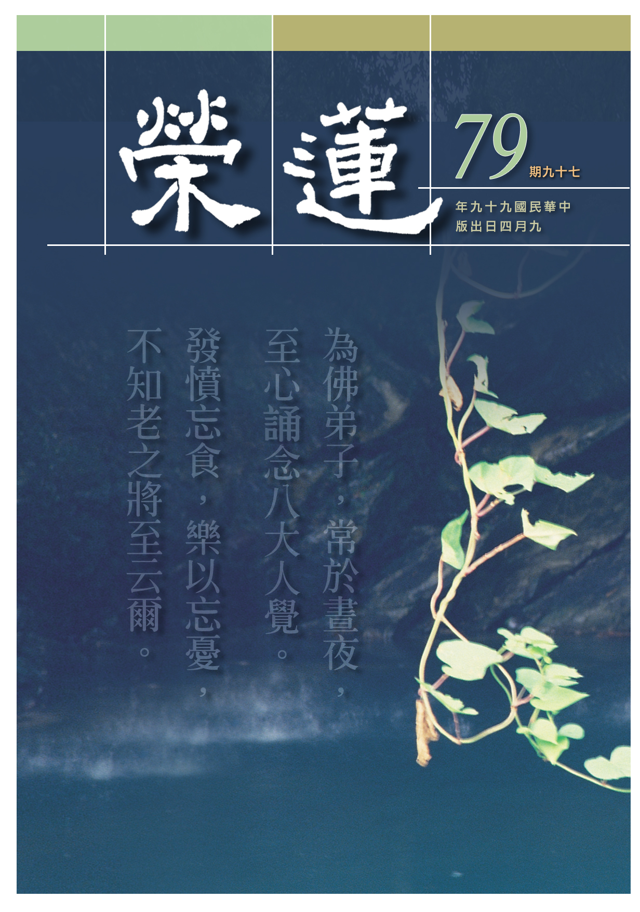

# 第79期

## 社論

### 開創有格局的未來

本刊

烽火難民臺灣行

九夷君子居不陋

世道多變興孔學

歎服雪公預先知

政府當局於日前接受中國時報專訪時，表示現階段必須要爭取海峽兩岸雙方深度互動交流的時間，並且以中華文化尋找兩岸關係的平穩與和諧。更舉出歐盟統合的過程中，德、法兩國可以為了整個歐洲的團結，放棄各自引以為榮的貨幣，許多的犧牲與退讓全是為了換來整體歐盟的共存共榮。

對比於歐盟，同文同種的兩岸又該如何共存共榮呢？臺灣的出路又在哪呢？話說一九四九年國共戰爭，國民政府失敗後搬遷來台，當時雖有大批的人才逃來，且致力於臺灣的各項發展，在短短時間內，臺灣經濟發達，政治上軌道，國民所得大幅提高，生活享受倍數增長。但更重要的是，有文化理想的學者，默默的於民間辦慈善、辦教育，栽培後進培養人才。

特別是隨孔奉祀官府來臺灣的 雪公老師，是這些文化前輩中的翹楚，除了為社會人士、大專生辦講學，期盼後繼有人，為文化傳承留根、留種，更重視啟蒙教育，孩子從小就由品德、讀經、生活做起，成為一生都是文化的學習者、弘揚者，曾說：中國文化在臺灣，佛法也在臺灣，全世界只剩這一塊文化淨土而已。既然生於此，就當保存中國文化，這與吾人生存有大關係。好好保持這塊土地，責任全在我們的身上。

一九四九年後的六十年，這些老先生早已凋零，培養的學生，有的已進入耄年、有的進入耳順之年、知命之年、不惑之年，雖有心於文化的弘揚，但相聚時都有或多或少的無力感，尤其面對新新一代的學子，只想圖生活的享受，毫無遠志，更遑論文化的學習，面對著即將文化斷層的時代，該如何打開僵局？尤其在兩岸互通，對方渴求失落的文化時，又該如何將這些老先生的傳承回應對方的需求注入，重新恢復中華文化的光彩？

老先生的傳承即是經典中古注抉擇與解釋，由此傳承方能正解六經典籍，從而發展聖賢道統。兩岸在共同的文化理念下，彼此認同過去祖先的思想，願意在文化認知的攝持下共榮共存，這是兩岸，也是臺灣人民，有格局的未來。

團體也將秉持這樣的理念，好好興辦講座，大家在古籍經典裡面，依著 雪公的講解，找到文化的出路，並帶動團體的士氣與活力，以此與對岸作最好的交流與溝通，在認祖歸宗數典不忘祖下，一起為世界的和平努力，為聖賢道統的傳承一肩扛起。

## 大德法語

### 大方廣圓覺修多羅了義經（三十八）

道源老和尚

破障有情分五性

可憐歧途沙煮飯

求友修學第一步

善巧因心樂易得

乙二、正宗分

丙二、令依解修行隨根證入

丁二、廣明行相

戊一、四問答通明觀行上根修證

己三、深究輪迴根本

庚五、正答所問

辛一、長行

壬二、於諸輪迴有幾種性

癸三、結斷應先

經文：

皆輪迴故，不成聖道。是故眾生，欲脫生死，免諸輪迴，先斷貪欲，及除愛渴。善男子！菩薩變化示現世間，非愛為本。但以慈悲令彼捨愛，假諸貪欲而入生死。

世尊答覆彌勒菩薩之問，輪迴的根本是甚麼？再答枝末問題，即輪迴有幾種特性？

「愛」為生死本，欲界的愛是貪欲之愛，上二界（色界、無色界）的愛是禪定之愛，欲界的愛最麤重，欲界的愛不是愛禪定，完全是愛淫欲，經文所指先斷貪欲，指的是淫欲，及除愛渴就是指淫心。因為外邊的諸種欲境，助發愛性，這個愛是無始劫帶來的，那麼今生今世呢？再遇到外邊的諸種欲境，助發起愛性，凡夫自己做不了主，被境界所轉，講到此即知，釋迦牟尼佛為什麼訂出家制度，就是先將欲界遠離開，男的遠離女的，出家人為什麼不結婚？乃先遠離欲境後將無始以來愛渴之心降伏。
是故出家戒律，無論是沙彌、沙彌尼、比丘、比丘尼，皆以斷淫欲為主。不許男女結婚，就是為了生死，為除輪迴，可是這種問題，只要學佛法的人都會知道，不要說你學圓頓大乘，就是你學權教的大乘也會知道，不要說學大乘，學二乘法你也會知道，聲聞、緣覺也須斷貪欲了，但社會上一般不學佛法的人不會知道，他一看見我們出家人不結婚，認為大大的不對，第一個問題就是
**問：** 不結婚生子人種不就斷滅嗎？此時不論你如何解釋都無法清白，你說我們要斷貪欲，我們要除愛渴，要了生死輪迴，他怎麼懂這些道理？說半天如對牛彈琴，所以這種問題很難以答覆。

因為淫欲心，才入胎受生的，投胎時攬父精母血再加上自己的八識。眾生聽圓覺經到這兒，會起個疑問，釋迦牟尼佛示現在世間，有父親、也有母親，是不是動了淫欲心來入胎呢？並在這世間化生為佛，其他的諸大菩薩來人間是不是都以愛為本呢？此處不只是化生佛，就是登地以後的菩薩到人間都是變化示現於世間，非以愛為本。小乘聖人尚且將愛斷除才能了生死，脫輪迴，超出三界，何況是菩薩呢？是故菩薩不以愛為本，但以慈悲令彼捨愛。

亦即以慈悲為本示現於世間，與常人般也有父親，也有母親，後示現出家，令彼捨愛之彼，指的是家親眷屬，如自己的父親、母親、兄弟姊妹、乃至於自己的太太、兒女，全家出家。再為一切眾生，示現出家之相，說出家的道理，令一切眾生捨除愛渴，是故菩薩示現人間不以愛為本，而是以慈為本。

菩薩入於生死道中示現於人間，也示現貪欲之相，謂之假諸貪欲，所以也有父親、母親，也得娶妻生子，然雖假藉貪欲而來入於生死之道，但菩薩早已了生死，就等於會游泳的人，重回水裡是去救渡落水的眾生，自己老早學會游泳術，不會被水淹死。

壬三、修佛菩提幾等差別

癸一、斷迷成悟

經文：

若諸末世一切眾生，能捨諸欲及瞋愛，永斷輪迴，勤求如來圓覺境界，於清淨心便得開悟。

末世一切眾生，要能捨諸欲，先要遠離一切欲境，於六塵之境遠離麤重的財、色、名、食、睡，除欲境之後，再除欲心，無愛不生瞋，這兩個煩惱是與生俱來，前生前世都有，再前世前世也有，無始以來就有，有愛就有瞋，然雖遠離欲境，以為沒有煩惱，實則是未碰到欲境，若碰到欲境就隨著境界轉了。眾生與諸佛有何差別呢？是功夫上的差別！眾生是被物所轉，見了眾生被眾生轉，見了境界被境界轉，若諸佛能轉物，則不被眾生轉，祂能轉境界，不論遇見何類眾生、何種境界，都不起煩惱。

我們不可以生自卑感，認為自己是末法時代的眾生，若你就這樣賴下去，則愛瞋兩種煩惱越來越麤重。攪得你昏煩擾亂，由此而造業，如此何必要出家呢？豈非辜負你自己的善根？在末法時代人口眾多而出家有幾人呢？出家人中幾個有圓頓大教的因緣呢？我們天天聽，以為家常便飯，其實那是多劫的善根啊！不是一生、兩生的善根，你不好好用功修行，斷除你的煩惱，還要隨著煩惱轉，那是自暴自棄。哎呀！我是末法時代的眾生，我不能轉煩惱，不能轉煩惱你會到哪裡去？你只有往前前進，你一退步，不但出家的本位要失掉，善根也辜負掉，你連人身都保持不住，一定退到三惡道裡去，那可是你自己害了自己。

此處聽佛的慈悲開示，既然有善根出了家，且聞到圓頓大教，要腳踏實地的用功修行，要能捨諸欲，要除憎愛，如此腳踏實地的用功，方能永斷輪迴。遠離外邊諸欲境，就沒機會造新業，若將憎愛二心斷除，亦即能斷無明煩惱，豈非超出輪迴了嗎？

要勤求如來圓覺境界，於清淨心便得開悟，離開欲境，瞋愛二心斷除掉，不是自己學小乘法，自己超出三界，我還要成佛度眾生呢！成佛幹甚麼？我要度眾生啊！若能勤求如來的圓覺境界（清淨境界），須以為成佛而度生之心求證如來圓覺境界，於清淨心便得開悟，有如此心意，即能於修學路上開悟。若常動憎動愛，此憎愛二心由無始劫而來，則令人越來越昏昧，如何能開悟？若能遠離外邊的欲境，內能遠離憎愛二心，此心即清淨（開悟）了。

癸二、因修顯別

子一、總標

經文：

善男子！一切眾生，由本貪欲，發揮無明，顯出五性差別不等，依二種障而現深淺。

本來（無始以來即有）就有貪愛心，有貪愛心就生起了欲心，貪欲心助發無明，謂之博地凡夫。今修佛菩提，幾等差別？答覆此問題，明有五種，依二種障而現深淺。所修學圓覺雖同，能顯出差別則有不同差別。

子二、別明

丑一、別明二障

經文：

云何二障？一者理障，礙正知見。二者事障，續諸生死。

理障依唯識宗而言是所知障，能障礙正知見，能障所知。二者事障是煩惱障，能以續諸生死，若不斷煩惱，生死流轉永遠不會斷滅，由於這兩種障有深有淺，才顯出五性差別。

丑二、別明五性

寅一、凡夫性

經文：

云何五性？善男子！若此二障未得斷滅，名未成佛。

第一種的差別謂之凡夫性，二種障一種也沒有除，如同我們都學大乘道，但是這兩種障沒有除，未得斷除，名未成佛，乃凡夫，是為第一種性。

寅二、聞緣性

經文：

若諸眾生永捨貪欲，先除事障，為斷理障，但能悟入聲聞緣覺，未能顯住菩薩境界。

聲聞、緣覺能永捨三界內的貪欲，先除事障，就是我執已斷了，然法執還沒去除，悟入了偏空的理境（只證人無我，未證法無我），所證乃偏空涅槃，依著四諦法破除人我，證得四果阿羅漢謂之聲聞，依著十二因緣而得到緣覺，未能顯住菩薩境界，理障未除（法執未斷），不能顯明的住入菩薩，這是第二種種性，謂之二乘之類。

寅三、菩薩性

經文：

善男子！若諸末世一切眾生，欲汎如來大圓覺海，先當發願，勤斷二障。二障已伏，即能悟入菩薩境界。若事理障，已永斷滅，即入如來微妙圓覺，滿足菩提及大涅槃。

末世眾生也有這一類的眾生，不會自暴自棄看不起自己，想要汎遊如來大寂滅海，先發願再修行，先發大願最要緊，發大願要斷除理障、事障，然若不稱願起修，依然還是空願，須腳踏實地的修行，精勤辦道（斷除二障）。然二障要先伏後斷，降伏如以石壓草，不令生長，其次斷除如拔草除根，草就永遠不會再生。

但要用功斷除二障不容易，是無始劫來的習氣之故。二障若能伏則能開悟！若事、理障永遠斷滅，即證入如來微妙圓覺。先悟入，伏煩惱，悟後起修方是真修。修行第一步所以先求開悟，將全部的諦理看清爽了，你修行不會顛倒，雖將二障降伏，煩惱不起現行，你認為斷滅二障，那還是打自己的閑岔，草根沒有去除，還得精進辦道，雖所悟等同佛境，仍須悟後起修，不起修還是自己打自己的岔。

在中國大乘有八宗，禪宗傳到了六祖以後，完全成了頓教的禪宗，先求開悟，要了生死先開悟，雖是不分階級不分次第，開悟還分小、大，亦有次第，其有三觀，第一關先破迷啟悟，謂之破了本參，此時什麼道理都明白，依然還是要悟後起修，否則是自己打自己的閒岔了，雖悟了理，實際上還是個凡夫。

此時發菩提心求證菩提果（佛果），菩提、涅槃雖是幻化，不妨上求，以上謂之菩薩種性。

寅四、不定性

經文：

善男子！一切眾生，皆證圓覺，逢善知識，依彼所作因地法行，爾時修習，便有頓漸。若遇如來無上菩提正修行路，根無大小，皆成佛果。

皆證圓覺乃都有證入圓覺的能力，然若想求證圓覺，得親近善知識，既然是善知識，就是弘法利生的人，會有修學成就的一套功夫，有他因地的法行，既執彼為善知識而親近，則善知識所作因地法行，譬如說：親近淨土宗的老師，他教你念佛，那是他的因地法行。爾時修習，便有頓漸，你發願要求證圓覺，這個願心是平等沒有次第的，可是你親近的善知識因為有修行的因地法行不同，你依著他修行，便分出了頓漸，這就叫做不定性。

假使你遇到如來無上菩提之正修行路，你的根性不管大小，第一、你要發願發的對，亦即求證菩提圓覺；第二、得遇到善知識，告訴你無上菩提正修行路。則根機無論大小都能成就佛果，不過是有頓有漸，有的很快成佛，有的很慢成佛，那是漸次。

寅五、外道性

經文：

若諸眾生，雖求善友，遇邪見者，未得正悟，是則名為外道種性；邪師過謬，非眾生咎。是名眾生五性差別。

第五種是外道類，雖想修道，然遇到的善友，未具正知見，亦即遇到外道老師了，怎麼能以開正悟呢？沒有得到正悟，謂之外道種性。雖然入於外道種性，然是邪師的過錯，不是眾生本身的罪過，眾生雖求道卻碰到外道時，將他引入邪道。（下期待續）

### 常禮舉要講座（二十）　旅行篇

雪廬老人

苦口婆心話人情

遠行時久須辭祭

當地拜訪便辦事

歸謁親友送土物

以前科考沒這麼容易，有考到五、六十還叫做童生，是什麼呢？學童，老童生。考上秀才就不叫童生，謂之副生了。正榜沒有名字，名字上了副榜。副榜上雖考個第一，但正榜（舉人）卻沒有他的名字，然這個省好幾縣都知道他，此人就聞名了。那時的副榜比現在的文學博士是天地懸隔，不能講了。此時你要明白，像我（雪公）這樣的人物不敢跟人家比，我說實話！

今日之下在學校學了幾天，夠了學分，其實是什麼也沒有，也不知夠了什麼學分？弄得不成話，完全是上欺下騙，糊裏糊塗一套。你們諸位非得自己用功不行，最低限度，這些經典是人生必學，是哪些經典人生必學呢？我們是中國人，中國文化就在四書裡，須在四書上扎住根，五經也是以四書做根本。

四書是樹根、六經是樹幹，二十四史是樹枝、樹葉。這麼說來樹根很要緊，樹枝、樹葉不要緊，你要是這麼想，那又壞了，沒樹根不長樹，然而上頭沒樹枝、葉，樹根還是爛了。這個在學校學植物都知道、長起葉子你就剪，這個樹根就爛，就完了。

然而二十四史咱們談不到了，今日之下怎麼樣也辦不到，你們諸位多少想進一點步，我也沒功夫講，我是快死的人了，你們諸位自己修學去，修不修在你，咱們諸位是朋友，只可勸你們諸位，最低限度得把一部通鑑輯覽讀完。這就好比在吃飯，通鑑輯覽好比菜湯，諸位吃飯要是什麼菜湯也不要，光吃白飯，有幾個能吃下去，總得好好地吃菜湯，沒菜湯不行、有菜湯、飯才能吃下去。咱們說實話，你們怎麼著提倡，貼標語，勸人忠孝節義，皆是一點用處也沒有，沒根有什麼用處？

你們諸位知道國家提倡三民主義，然第一民族主義就扎不住根。咱們民族發生在什麼上，誰能講得上來？有說在血統上，實則血統是條件之一，親兄弟一個父母生的，一個胎胞生的，這個血統一點都不錯了吧！今日之下還是有很多兄弟為了錢財分家打官司。除此，甚至還要打父母、殺父母，血統有什麼用處呢？那麼民族主義除血統以外，再找就講不出來。現在只要洋人想拿我們一塊地，我們之中真正愛國的人有十分之四就不錯了，你行嗎？你說我聽過文天祥《正氣歌》，我給大家說今日之下絕對不能講了。你怎麼知道？這《正氣歌》不是一個朝代的事情，沒有看過歷史怎麼能講《正氣歌》？

或說某人數典忘祖，那是罵人的話，向諸位說今日之下能數典忘祖就是好的。這話怎麼講呢？數典、忘祖是兩樁事情，將古典查了查，忘了是怎麼回事情，至少還有典，現在連典也沒有，忘祖是當然的事情。就說最普通話，你開商店不論幹什麼，你得有本帳，這本帳都算得亂七八糟，還能幹什麼？今日之下能數典忘祖就算不錯了。我今日之下講古典也是數典忘祖，怎麼呢？你不信你考考我，二十四史我不能讀熟，記不大清楚。你要說這部通鑑自開頭一直到底，裏頭一些奏褶，我雖背不下來，可是那些要緊之處我說得上來。

為什麼，人老了就糊塗了。現在還糊塗一半，十分之中糊塗八分，還有二分明白，要是沒這二分明白我就不能在這講了，你不信，你不必活到九十多，你活到八十歲，再請你上台坐在這兒講書試試，你講著張三講著講著，講到李四的身上，你走了模樣。如何會走模樣，因為你己經糊塗了嘛！雖然是亂七八糟，然在夢裏不以為是亂七八糟，反而認為很對，不但在夢裏認為很對，醒了以後還在想這個夢，（師講至此自笑）醒了還是做夢，到了這個樣子。

向諸位說，真正多數人不會分別你是臺灣人，你是福建人等等，離了臺灣這塊地上你不能生活，這個懂也不懂？現在你在這住十天，臺灣就是你十天的再生父母，說這幹什麼？有人很窮，狗兩三下就可適應這個窮主人，可以看門，待了多少年都不離開。即使主人對牠不好，一進門打牠，也沒得吃。另一家願意對牠好，用好吃的餵牠，狗就是餓死，也不會上待牠好的那一家幫忙看門。貓行、狗不行，所以是狗朋友，今年是狗年，我也是狗尾。總而言之：博我以文、約之以禮，你不會這（禮），那個（文）也進不去。

說旅行，是兩方面，先說我要旅行，此是前三條。

◎一、將遠行，必辭親友，祭祖辭親。

將遠行是出遠門，你是臺灣人、你從臺中上彰化，這談不上。遠行，是離開臺灣，不是臺北下臺南。必辭親友還得以時間而論，要是臺北下臺南，是今天去明天回來，這個用不到，不說會生誤會。你從臺北到臺南，給公家辦事情身不由己，不能夠幾天就回來，總得要一年功夫，這就得辭親了。

必辭親友，祭祖辭親：這兩方面，一年不在家，中國年有清明、有祭祖的日子、有祖宗的忌日，都得祭祖，家裏面的父母兄弟生日作壽，三天兩壽都是家庭的規矩，你這麼一出去，就一年啦，也無法對父母朝夕承歡，也不能祭墳墓，甚至親戚朋友有什麼事情，你也不能去幫忙。中國學問，有上有下，由近及遠，此時是權變辦法，什麼權變辦法呢？先辭親友，告知要到那裏去，一年、兩年才能回來，臨走前一天，比如明天要走了，今天晚上，這個我都親眼見過，現在都不行了。

明天一早上車就走了，晚上就不睡覺，一家人團聚，向祖先牌位行禮，早上先上墳，晚上就是辭親。從前有云：暫久之別。亦即今天搭火車遠行，明天就回來了，不必用這一套祭祖辭親友，用之反而覺得奇怪。最低限度是離開臺灣到國外去二個月或三個月，就得行這個手續，常去又另當別論。有云：你講這些都不一定啊？萬事皆不一定，萬法無常，皆是看臨時情形動作，能達到目的便行。

◎二、遠到目的地，必先拜訪有關人士。

你是臺北人到臺南，與臺南沒關係，要到彼處做事情，與你有關係者你得先拜訪他，沒有關係者不用拜訪，有關係者則要。拜客很要緊，你到人家那兒辦事不拜客，比如，開了會，你這單位與那單位見了面還不認識，他們看你沒禮貌，沒來拜見，到時候就不幫忙。真正在這兒做事，拜客以外還有別的舉動。

◎三、歸來必謁親友，或略送土物。

辦完了事或者沒完臨時回來，此時隔了一年多，歸來必謁親友，回來何必看親友？這話並不全，也沒法說全，是分情形講。你要在外頭待得久，不但是回來拜親友，還得上墳祭拜，前面有祭祖辭親嘛！回來就算了嗎？你看歷史，民族到此一定不亡，就是這五倫主義。上至父母、這是血統關係，往外朋友乃至不認識的人，論語有云：四海之內皆兄弟也，都是一家親，這樣聯絡、團結則了不起了。

我（雪公）看京戲，我也看小說，不光看以前中國小說，且看現在小說。現在連載於中央日報副刊上之「九扣連環」我就看，我幾幾乎乎站起來給他三鞠躬，何必這樣子呢？為什麼？這個人的文學太好了，一些人不懂得，以為文學有什麼好處？他不知道好壞，好的是簡要詳明、人情世故都透闢，此其一。其次學之，說話、動作一切修養都會非常到家。

這還不算，說出那個話，行出那個事來，那真真是賢人，文章好，事情也做得好，要真的有這麼一個人出來在學校當訓導主任，那學生福氣大了，怎麼呢？經師易得人師難求，教經書的老師容易得，人師卻難得，光會講沒用處，你得自己身體表現作榜樣。更有教授與同學打方城（打麻將），太不成話了，如何教學生？其次古文有些文章做得很好，有云：不以人廢言。

然有時得另當別論，例如曹操、秦檜作的文章我不看，曹操、秦檜早就死了，現在還有比曹操、秦檜更壞的人，他們的文章作得也不好，就算作得再好也不看。曹操的文章很不錯，兒子也作得很好，天下之才一石，他與兒子占了八斗，咱們連一粒也夠不上，文章作得這麼好，我就是不看。

文天祥的文章比這些人不行，唐宋八大家裏頭也沒有文天祥，可是他的文章，念之另有味道。或問「九扣連環」這本武俠小說怎麼比得上唐宋八大家？有些比唐宋八大家超過，是事相超過，有什麼好處？能以正人心、正社會。你真看這本小說，絕不會在社會上攪亂大家。

回來必謁親友：

卻沒講到父母？大家想想是父母要緊，還是朋友要緊？你比如一邊是父母，一邊是朋友，都是五倫皆恭敬，要是兩邊起衝突，我是袒護父母呢？還是袒護朋友？我找根本、我先恭敬父母，這還用說嗎？拋了根，那不是人，是畜生不如！國家對學校學生有這種講法，同學怎麼會學壞路了。

或略送土物：

剛從遠地歸來，或可送土物予以親友。有云：千里送鵝毛。鵝毛這個東西半塊也不值，可是你沒鵝，人家遠處有鵝，是在乎人情，在乎心意，你得表現、表現。

◎四、遠行之親友辭行，必往送行，事前或贈物，或宴餞

。

遠行之親友辭行，不是自己，譬如朋友、親戚要出門，也得分距離之遠近、時間之長久。將遠行的親戚上我這兒來辭行，人家也懂禮上我們這兒來辭行，辭行不是說：你走了，好！回頭再見哦！他走前先到你家來，上門是客，你得問他那一天走？他不會說我還沒定個日子。你不必慌，今天他來辭行不會當天就走，沒這個道理。他怕你送，但我們必得送行去，講究的是禮尚往來！禮貌不必一定需物品，做種種善事，有錢也能做，沒多錢也能做，一個錢沒有，也能做很大的善事，大家的心不在這上頭做那就沒辦法了，以上是送行。

事前或贈物，或宴餞：他來辭行，這個禮貌你要明白，人家要出遠門來辭行，此時，你要看交情來餞行。這臺灣也有，老朋友走了，我給你餞行，請你吃頓飯聚聚，並請幾個朋友來陪陪你。要是交情很厚呢？不請陪客，請到我們家來，更厚道，或者是來不及送點東西。人家臨走不能送你東西，不能請你的客，這另當別論，我們在家裏送他或在外聚餐，吃飯宴餞，這兩條一同辦了更好，不能，辦一個也可以，甚至兩條都辦不到，送行這一趟是少不了的。（下期待續）

## 共修研學

### 小止觀導覽（五十一）

*心爾、智高整理*

止觀修學世出世

空性修學難遭遇

根塵識蘊圓通境

眼前緣以意知法

第六章  正修行

論文：

六、意知法中修止觀相，如初坐中以明訖。

意知法中修止觀之相，於一開始坐中修已說明完畢。其中止有三：一、繫緣守境止：乃心繫於鼻端、臍間等處，令心不散亂。二、制心止：能將心生之妄念制止，不馳散於外境。三、體真止：以空性為所緣之止，乃知一切法從因緣而生，無有自性，心自然就不愛取，妄念就止息。繫緣守境止和制心止是世俗之修止，勝義之修止是體真止。

所謂隨心所念一切諸法，悉知從因緣生，無有自性，則心不取。若心不取，則妄念心息，故名為止：法無法自主成立，須待分別心之名言才能生起，妄認法之自相成就，當找不到該法自己成立時，該法顯現不過是名言安立時，執取該法之心自然就不生。修體真止是不斷串習空性修學法。

觀有兩種：一、對治觀，二、正觀。

正觀是結合有法思辯自相可得否？不過是因緣所生，觀待而有，名言安立，自相不可得之空性即該法實相，如此則不生對該法實有的執著，則一切愛憎煩惱皆不得生。

以上略明坐上修的止觀，其次意：所謂意，依意根起，名為意識，亦即第六識。意根或說是色法，或說是心法。若是色法指腦，依腦而生心意，心意要靠腦的活動才能生起，或說腦（色法）是意根。其次意根或是指已滅前一念，觀待前一念之滅才有現前一念之生起；反之如果沒有前一念之滅就不會有後一念之生。相同的，有當前這一念，才有下一念的生起，所以前一念、當前這一念及下一念是互相觀待生起的，不可能單獨存在。

何謂法呢？法包含：有為法、無為法，世或出世法，萬事萬物都叫法，亦包含了三世、前念後念、如理不如理的、真實或虛妄的，甚至五根所對的境界（有形）、第六識所緣的境界（無形）都是法的範疇。而唯識論用任持自性與軌生物解來解釋法。任持自性是說法有它的定義，軌生物解是指能起心的認識。

意識通於善、惡、無記三性，現、比、非量三量，性境、帶質、獨影三境，力用最大。故於意知法中修止觀，最為重要。

所謂善，須由利他之心造作方有，反之以自私之造作是惡，非利他非自私之心造作則為無記。此意識造作包含了三性，然此三性非獨立實有，善對惡方說善；惡亦對善方說惡，是互相對待。對著利益有情說善，觀待能令未來安樂說善，善之自體（主）性了不可得，反之惡與無記亦如是，故知三性自性空寂。

其次現、比、非量，現量乃六識之現前覺知，前五識或第六意識之五俱意識，或第六意識之瑜伽意識才有可能是現量。比量是正確的推理而知，必是第六意識之量。非量或是前五識錯誤的認知，如眼睛生病（黃膽病），見一切事物都是黃色的，或第六識推論事理錯誤。若以緣空性而言，現證是現量，正確推理認知是比量，錯解或毫無認知即是非量。

三境（性境、帶質、獨影境）：

性境是真實呈現在眼前的境界，心識正確無誤的認知，比如色塵、聲塵真實的呈現在眼識、耳識前乃性境。亦包括對道理的現證，比如：現證無常、現證空性。現證即是顯現性境，性境與現量互相觀待，對著現量說性境，對著性境說現量。帶質就是帶著本質另起一個意解。比如見煙，乃帶著煙的狀態知道有火。帶質境又分為真帶質境及似帶質境。前者是比量，後者即是非量。獨影境是內心裡面自己去想的，是獨頭意識所緣的影像。甚麼是獨頭意識？就是不與前五識共。比如閉上眼睛、耳朵也不聽、嘴也不吃東西、鼻子也不聞，第六識顯現影像想我，謂之獨影境，獨影境可以是非量也可以是比量。

從上述知意識能通三性、三量、三境，乃六識中作用與力量最大的，以空性為所緣之止與觀，須依意識修學方能進入，自然妄念心息，故於意知法中修觀最為重要。

論文：

自上依六根修止觀相，隨所意用而用之，一一具上五番之意，是中以廣分別，今不重辨。

此處六根的修學法就是觀察六根、六塵、六識之體性不可得，一一皆是相互觀待而生，此即是止觀門的修學法。而這不可得的顯現，要在座上修、歷緣對境修才能證得。而這座上修、歷緣對境修亦皆要具有：一、對治粗心粗亂修止觀，二、對治浮沉修止觀，三、隨便宜修止觀，四、對治定中細心修止觀，五、均齊定慧修止觀，此五番步驟。

論文：

行者若能於行住坐臥見聞覺知等一切處中修止觀者，當知是人真修摩訶衍道。如大品經云：佛告須菩提：若菩薩，行時知行，坐時知坐，乃至服僧伽梨，視昫一心，出入禪定，當知是人名菩薩摩訶衍。

摩訶衍道即是大乘道，此處是以發菩提心引發為利益一切有情，願其成佛之意樂攝持，故於眼前行住坐臥見聞覺知等一切處中修學止觀，是云大乘道。

「如大品經云：佛告須菩提：若菩薩，行時知行，坐時知坐，乃至服僧伽梨，視昫一心，出入禪定，當知是人名菩薩摩訶衍。」就是說：發大心、行大行，修習止觀坐禪的菩薩，假若行時知行、坐時知坐，乃至衣時知衣。不論久視、暫觀都能一心不亂，出入均在禪定的境界中，當知此人即名修大乘法的菩薩。

大乘人遍學一切法，刻意的目的有三大：一、發菩提心大，二、斷得斷大，三、證得證大。其中「斷大」是要斷除煩惱障及所知障。斷分成立為無住的大涅槃，這個斷分名言安立為一真法界，所有的障礙都去除。而「證大」則同時在一切法上證得甚深的緣起。

「視昫一心，出入禪定」，更進一步來說，出入世俗境界都在空性禪定攝持中。說是一真法界就是現前證得究竟的空義，說十法界是不妨世俗的顯現，所以沒有出入定相，此乃佛之「大定」。（下期待續）

## 專題研學

### 聖者的祕密～大佛頂首楞嚴經二十五圓通暨七處徵心探源

### 二十五圓通暨七處徵心簡介　（二十）持地地大 ～上

時哉

將地平整修地大

往大順暢助人行

有功不居平心地

地大圓通自受用

寅二、持地地大

卯一、作禮陳白

經文：

持地菩薩即從座起，頂禮佛足，而白佛言：

持地菩薩以地大為所緣，現證地大的自相空，地大圓通的修學法如同前述六塵、六根、六識的修學法。在楞嚴法會上，佛未指定宣講圓通修學法，然這些聖者卻能觀察因緣，待時而說。此種靈敏度要從日用平常去訓練，從體會他人處下手，從修學正法當中去開發這樣的悟性。

此時持地菩薩由法座而起，頂禮佛足，準備報告地大圓通的修學法，下述為地大圓通修學法。

卯二、陳白之言

辰一、積平地行

此菩薩以修平地行積功累德，謂之積平地行。（巳一）、正敘平地之行，正述持地菩薩平地修學法。（巳二）、兼敘效力之行，附帶敘述替眾生做馬牛以為成佛的資糧。（辰二）、蒙平心教，蒙毗舍如來的平心教法。下一行為（辰一）屬於事上之平，（辰二）屬於理上之平，（辰三）權實雙證，根本位與後得位兩者都能得到現證。最後結答圓通，佛令在場大阿羅漢、大菩薩說圓通修學法，我（持地菩薩）宣說如何以地大證得圓通。

在不可說不可說劫之前，有佛出世名為寶藏佛，護持寶藏佛的國王是千輻王，千輻王乃阿彌陀佛的前身，生了許多個孩子，受佛感化組成佛化家庭，皆於佛前發願。可見佛化家庭不是 雪公老師發明的，無始劫來就有佛化家庭，千輻王其中一位孩子發願要於苦難世界示現成佛，此為釋迦牟尼佛的前身，另一個孩子發願眾生先成佛我後成佛，這就是地藏菩薩。

眷屬共學佛道，未來能在法上相互扶持，不能成為佛化家庭，甚而反對家中學佛者，未來難在菩提道上重逢，或者重逢時不會變成修學的眷屬，眷屬聚會以正法因緣相聚，由此順緣生起殊勝正見，十善業道經最後也以正見來破癡，生起的福報就是來生投生到有正見的家庭，有正見的家庭就是佛化家庭，以這個力量來成為我投生到佛法家庭的因緣，讓這個家庭不會變成我學佛的障礙。

巳一、正敘平地之行

持地菩薩開始敘述平地之行（地大圓通的修學法）。

午一、從古佛世

經文：

我念往昔普光如來出現於世。

普光如來乃心身光、智光普照法界，乃五十三佛的主尊。

午二、出家平地

經文：

我為比丘。常於一切要路津口，田地險隘，有不如法，妨損車馬，我皆平填。或作橋梁，或負沙土。

普光如來佛出現於世時，持地菩薩是一位勤修苦行的比丘，其修學的法行為何呢？乃在一切要路（陸地）、津口（水路），田地險（高低不平），隘（迫窄）之處，諸凡有道路不平或過狹，往往導致馬失足或車折軸處，菩薩或作橋樑、或負沙土，將凹凸不平的路平填，需要涉水而過的，就做橋樑。

何以選擇此種辛苦的菩薩行，想想我們在做善法時，或者放生動物搬運生物，或者法會時整理會場，或者活動圓滿清理善後，難免牢騷滿腹。殊不知，所有善法之功德乃觀待心力是否強盛、事情的困難度，以及有否祈求三寶的加被。是在皈依的心態下來做這些事情，還是只看到眼前的利益？現世的福報？

今天作利益眾生的事業時，或者某人來參加放生、或來助念、或來聽法，須知道極為難得，當你的服務可以保護這些人的善根福德，請問你的功德是大還是小？透過你的服務使共修的人有軟墊子可坐，麥克風的音量清晰適中，餐點有人供應，請問這些功德是大還是小？

午三、經多佛世

經文：

如是勤苦，經無量佛出現於世。

持地菩薩如是勤苦，經無量佛出現於世，在路途凹凸不平的時候將它弄平，渡口無法通過時為做橋樑，或者自己做，或者幫他做，讓別人在交通上沒有這種險難，沒有車損軸、馬傷足。

此時我們不得不佩服持地菩薩，我們在禮佛、拜佛的時候，看到菩薩慈眉善目，體態輕盈，面容豐滿，錯覺佛菩薩輕鬆愉快。卻覺得自己每天拜佛很辛苦，還打佛七、還作義工，沒有學佛時可以在家過幸福美滿的生活，學佛之後半夜還要助念，平常要上課，活動時還要作義工，何必自找麻煩？果真瞭解業障可怕，而且必須靠作佛事去消除，應覺得便宜划算，問題是有沒有那種眼光，千不怪，萬不怪，就怪我們愚癡！

經無量佛出現於世，代表菩薩的辛苦是持續的，這種的持續力使得他學法的能力與因緣大增，使得他能證悟最深的義理。當累積證量的資糧時，旁人以為他有福不會享，實則累積因緣具足時，成就的是他，真所謂是快快修持慢慢到，低處修時高處到。

巳二、兼敘效力之行

且持地菩薩以平路積功累行，作為成佛的資糧時，另有利益眾生的苦行。

午一、豐時全捨

經文：

或有眾生，於闤闠處，要人擎物。我先為擎，至其所詣。放物即行，不取其直。

闤闠處是市場，擎物是將東西高舉，因為市場人來人往，老弱婦孺所提之物可能被擠掉，菩薩將重物頂在頭上，協助度過人潮，到達目標。東西放下來就離開，不取分文。這個人專做笨事，有力量為何不去追逐名利，或攀岩、登山，作各種冒險刺激的活動呢？

殊不知，當他是普光如來座下的比丘，比丘是懂得做事心態的人，他做的這些事情都不是笨工。我們無始劫來做世俗的事情，平常也是從早忙到晚，是不是今天不做佛事就真的輕鬆？不然，我們每個人都不輕鬆，上班很苦，但是退休是不是就從此輕鬆呢？不然，要在家裡帶孫子。所以人世間都是要做，你說我不做佛事總輕鬆吧！不然，一樣很辛苦，上班很忙吧，退休之後一樣忙碌。然無始劫來的忙碌都是無意義的忙，不知道為眾生忙才有意義，忙碌若不被清淨的動機攝持，會產生諸多過患，變成修行上的障礙，這種忙碌最後結成的果報，反而非我們所願。

作父母的都很害怕子女沒有出路，害怕他在社會上比別人少吃一口飯，所以從小一路叮嚀、一路扶持，但是子女在社會上能吃到一口飯，全看所積的善業，聰明才智只是幫他得到福報的方法，但是如果沒有福因，怎麼努力都得不到福果，田地裡面沒有種子，努力施肥、灌溉能得什麼呢？所以〈了凡四訓〉說：得之有命，求之有道。再怎麼按照世間的常軌努力，也只是得之有命，不過將我宿世的善業起現行，得到過去善業所結成的樂果，如此而已。福報生得越多只是將過去的善業消耗得越多，福報生起的越少只不過將善業消耗得少，如此哪有比別人多什麼、少什麼？還不是吃自己。孩子吃父母的，只是將過去生中善業用完而已。

回想持地菩薩用最傻、最辛苦的方式去利益眾生時，以他為典範想想該如何來積功累德，如何脫困人生的瓶頸，只要抱著服務的人生觀，事無大小，唯取對眾生有利益來行，必然改變命運。

午二、饑年節取

經文：

毗舍浮佛現在世時。世多饑荒。我為負人，無問遠近，唯取一錢。

經過無量佛世的苦行，直至毗舍浮佛示現在世時，毗舍浮佛是莊嚴劫最後一尊佛，毗舍浮義為遍一切自在，乃遍一切時、一切處、一切地都自在。

現在世時，是示現在那個時候的毗舍浮佛，當時世間多饑荒，饑荒有水災或旱災的饑荒，此處為水患後之饑荒，後文了知。我為負人，無問遠近，唯取一錢：持地菩薩除了去造橋、修路外，並憑著孔武有力的比丘身，幫忙揹人到安全的地方脫困，而且是唯取一錢。

或許有人會有問題，在豐時全捨，饑年則取，應該是豐時取一錢，饑年不取，為何正好相反呢？這有兩個解釋，或者當時在這種困難的情況下，他可以把拿到的這一錢再去救濟其他窮人，或者在這種困苦的環境當中，他本身也有生活的困難，可以取那一錢來活命，兩種說法都可以說得通。

午三、神力拔苦

經文：

或有車牛，被於泥溺。我有神力，為其推輪，拔其苦惱。

或有車牛，被爛泥巴困住。菩薩有神力，能將陷於泥巴之輪推至平地，除卻車夫苦惱。此之神力不輸楚霸王的神力，為何有這樣的神力？因地上或有幾種善法，能感應力量強大的果報：

第一、懂得供養食物給人，讓他人從體力弱變成體力足，容易感應未來施者體力強，所以在廚房煮食者，將來會有體力很好的福報；另饑餓也是病的一種，填飽肚子之後病相就解除，所以施食者亦可感應將來是無病的。第二、懂得供養體力（出力做善），布施財物，將來財物更多，懂得布施體力，來世體力強盛。第三、懂得隨喜別人施力的善法，亦是未來體力強盛之因。不可輕視廚房煮飯者，隨喜他們法輪未轉先轉食輪，感應來世無病、體力強盛。持地菩薩的神力，就是因地中出力行善而來。

世俗善事不但應秉持正確的意樂，也須有勝義的修學法。在事項當中如同天台大師所著小止觀：在世俗對境時，會有兩面相（世俗與勝義）的觀修。比如布施這一法在世俗面相是以菩提心攝持布施善法，並串習著布施修學法；在勝義面相的觀修則知布施這一法是三輪體空。以法布施為例，觀修能說所說性空寂，所說必須觀待能說，能說必須觀待所說。

能說為何必須觀待所說？今天如果沒有所說的對象，哪裡能成立能說的法師，能說是自相空，如果能說有自相，不必觀待聽眾，對著石頭就可以說二十五圓通，所說若不必觀待能說，則每位有情可以隨時聽到二十五圓通，所說也必須觀待能說二十五圓通者，中間說的教法也是體性空寂，觀待能說、所說才有中間的教法，能說、所說、中間說之法三輪體空。

為什有些人這一生的力量會這麼大呢？是什麼樣的業就會感什麼樣的果，不造這樣的業，自然就不會結這樣的果，佛來了都沒有用，佛只是一個示道者，不是萬能。如密勒日巴尊者也有這樣的神力，觀待往昔有服務善知識的心力與體力。

毅力、心力、體力三者相互觀待，來世一定很有神力。此世何以常常生病，體虛弱，無力承擔善法，乃往昔不肯施力服務眾生故。

再者，持地菩薩能一佛、一佛累劫的做，此恆心也不是一般人有的，為什麼他會有這樣的恆心呢？乃以堅固菩提心行善法，對善法極有堪能地一直做下去。須知菩提心乃大孝之心，抱持對眾生盡孝之心，從親至疏、從近至遠、從內而外，是故《梵網經》讚歎釋迦佛是大孝釋迦道，累劫度冤親。對每一位眾生生起做過我母親的決定見，以報恩的心態來護持有情，自然生起累劫利益眾生的力量。

持地菩薩以如此的因緣，累積成就的資糧，到毗舍浮佛時，證悟空性的能力就顯現了，證悟空性的聖者，前必有厚福的累積，用作資糧方能無障礙生起證悟的能力。（下期待續）

### 六趣輪迴經簡介（十一）人趣報

*心亞整理*

人道難得線穿針

升沉大用全在思

善巧聽聞悟於心

對境生善大利益

人趣報

經文：

復有雖行施，役他而少與，因恐怖發心，及希他讚譽，或求現富貴，生天受快樂，如是等行施，獲福極微少。

有些人雖行布施，但役他而少給予。役他就是從他人身上得的很多、花他人很多時間，但給予人的很少，如古時候的地主收成很多，但給予佃農者卻非常微少。

因恐怖故，為了升官發財、為了工作順利、為了打通關節……，而發心布施他人，並希望他人讚歎，或行布施，但希求現世的富貴，或希求來世生天得到快樂。但是除非布施發願生人天的目地都是為了繼續學佛，非為希求人天的快樂，否則所得到的福報是非常的微少。換言之，人道的生命短暫，決戰點應如何設定才能發揮至最大的功能？吾人必須在有限時間內好好講究。

經文：

若樂行利他，不惜於身命，常懷悲愍心，聖果不難得。

凡事為了自己謀求者福報少，為他人謀利益者福報一定多。解脫、成佛皆稱為聖果。如果很快樂的行利他之行，而且不惜己之手腳、身命，並常懷悲愍心替對方著想，以此功德回向於聖果，則聖果不難得。

經文：

諸有來乞者，依時而給與，令彼生忻悅，感果得如意。

若有來乞請吾人襄助者，依著對方實際需要給予，讓對方歡喜，則感得事事如意。我們為何事事不如意，就是常常讓他人不如意，如果他人來乞時，我們應當讓他人如意，方能感應事事如意的果報。

觀音菩薩聽流水的聲音，聽至最後轉成聽眾生的心聲，否則聽流水要做什麼呢？耳根藉由流水練至強勝時，轉成聽眾生的苦難。登地菩薩能傾聽眾生的需要，而當滿足眾生需求時，此快樂勝於證得空性之樂。

經文：

施彼若艱難，受報時亦爾。

若施予他人、幫助他人時心不樂意，則感得所希求的樂果很難得到。

經文：

輟己惠於他，最上安樂法。

減少自己的受用，而樂於惠施他人，能感得最上安樂法。所以布施時心意的講究很重要，後面的樂果都與前面造作之因有關。

經文：

施為諸樂本，如種生其果，愍彼來希求，隨與無空返。

布施是諸快樂的根本，如種子生出果報一樣。施是樂的種子，生出快樂的果報，所以憐愍來希求的人，即隨時（給予的時機對不對）、隨分（隨著自己的本分，如學生的本分，就將學生做好）、隨機、隨緣（隨著對象）、隨力（隨自己的能力）、隨願（隨自己的願力）的給予，這些若能講究，此果報生起來是難可想像。以上是不偷盜而布施，此是人道可以做的，而且是做得來的。

其次為不邪淫而修梵行分三：一、對女色應有心態，二、觀修功過，三、勸修梵行。

經文：

慎勿侵外色，視之如己子。

外色是指配偶以外的人，四十二章經云：想其老者如母，長者如姊，少者如妹，稚者如子，生度脫心，息滅惡念。觀修這麼多的目的，即是要將淫心對治，反面為息滅惡念，正面為生度脫心，即是慈悲心。慈悲心不是大愛，佛法的慈悲與愛不同，小愛小煩惱，中愛中煩惱，大愛大煩惱，不愛就沒煩惱，愛不是慈悲，慈悲也不是愛，慈悲是要度脫他，幫助他人為目的。

經文：

設復於自妻，舉心即令止。

若對於自己的妻子，妻子的目的是傳宗接代，相夫教子，相敬如賓，而不是男歡女愛，所以舉心即令止，要將男歡女愛的這分心拿掉。

經文：

若人於欲境，繫心而樂著，後生於世間，定受女身報。

若喜歡欲境之人，易受女身報。現見女生也比較執著，但若女身是以願力來成的，則另當別論，以業報而言，愛著的這一分，女生是比男生強勝的，但若將體性轉成慈悲，則女生是勝過男生的。所以女生可以好好了解自己的業，但也要善於運用此特性來轉變。

經文：

若人厭女身，捨欲持淨戒，發生堅固心，轉身作男子。

若以厭女身為因，以持戒為增上緣，轉成男生。

經文：

若人修梵行，則無諸損惱，具福德威神，天人常恭敬。

無損惱是指女對男、男對女皆不會生起淫念，則具福德威神，此是人格的建立，梵行當中此為最重要，所有戒律中此條是攸關清淨與否的關鍵，能修梵行則天人常常恭敬。

經文：

若人不飲酒，安住於正念。

不飲酒能引發安住正念的能力，若飲酒則心思狂亂，內心無法安定，更遑論安住在殊勝的義境上。

正念是正知所抉擇出的義境，將心安住在這樣的義境上就是正念，例如念無常、念苦、念皈依、念輪迴，念大悲心，念三寶的功德等等，都是非常殊勝的正念，能帶來自身的安定，並且生起不慕世間榮華富貴的氣質，將正念串習久後，心若散於五欲境，也能立刻察覺，當有正念進入禪定時也會帶來身心的清涼，若在禪定中重新去修觀，也能生起殊勝的智慧，所以正念是一個非常重要的修學法，是訓練身心的安定及心志的開發，非常殊勝的法門，也是百法中殊勝十一種善法之一。

不飲酒就真的能安住於正念嗎？現見有很多人不飲酒，依然做很多的壞事？此句話言不飲酒之人，才有能力安住於正念，飲酒的人安住不了正念，故以不飲酒的能力來安住正念，以不飲酒成為安住正念的資糧。

不飲酒戒如何建立的呢？有回佛陀帶著弟子們朝向拔陀越村的方向走去時，這些敬重佛陀的民眾關心地告訴佛陀，村裡有一所修道院盤據著一條毒龍，靠近會有生命危險。佛陀的隨從弟子中有一位善來長老，他在皈依佛陀之前，曾是外道教徒，具有降伏毒龍的神通本領，自告奮勇要去修道院伏龍，佛陀默許。於是，善來長老獨自一人前往修道院，在院內某個角落，靜靜地打坐，沒多久，毒龍果真出現了，牠口吐毒氣要傷害善來長老，而善來長老則聚精會神地加以對抗，僵持一段時間後，毒龍終於被降伏了。

佛陀及其他弟子隨後也來到修道院，佛陀慈悲地為毒龍開示佛法要義及皈依意旨，然後帶領一行人回到村裡。村人看到佛陀和一大群人安然無恙地回來，都很高興地歡呼，並用心地準備好要供養佛陀的齋食，另外也有許多村民請善來長老到他們家中受供，並且以「無色酒」來供養他。

善來長老喝了很多酒並醉倒在地。佛陀和比丘們受供返回精舍的途中，看到善來長老躺在地上，於是說到：善來長老降伏毒龍時很勇猛，可是醉倒之後，能力都失去了。

因此，佛陀強調喝酒會讓修行者的智慧和毅力消失，失去自持的力量，也會破壞莊嚴端正的形象。所以，大家絕對不能喝酒，要潔身自愛。從此，比丘僧團中就有了不能飲酒的戒律。 所以以不飲酒成為安住正念的能力。（下期待續）

## 活動報導

### 九十九年度暑期大專講座 ～佛說八大人覺經

### 師長的話

*編輯部整理*

言簡意賅八大覺

初機學佛好課程

大德注解雪公表

人生指南成佛路

佛學講座緣起自 雪公老師，老師深知教育的重要，因此來到臺灣的第一件事就是辦教育，辦教育乃為培養人才，而所辦的教育有短期與長期的講座，短期如大專講座的集訓，課程包括《佛學概要十四講表》、《佛說八大人覺經》、《唯識簡介》、《百法明門論》等，長期講座就是每週定期的課程，如在蓮社的《華嚴經》講座等。長期與短期的講座各有功能，或能快速將一部經研究清楚，或長期的薰習一門課程。

所謂的短期講座，必須具備三個條件，第一要有老師；第二要有同學，短期密集的學習往往需要請假，必須克服較多的困難；第三還需有護持人員，這些條件具備，才有辦法辦理短期的講座。

學習佛法或是儒家經典，都須經由是不斷參加短期與長期講座，方可培養完成，獲得正知見是修行成功的秘密，想要個人進德修業，並且影響家庭、國家與社會得利益，就一定要獲得正知見，所以正知見的學習、弘揚與傳承就非常重要了。

雪公老師所辦的短期講座當中，最特別的就是培訓大專學子，開設課程如《佛學概要十四講表》就是佛法的全貌，《佛說八大人覺經》講述修行的次第，而佛法有所謂相宗的修學與性宗的修學法，相宗的修學法以《唯識簡介》作代表，而性宗的修學法則開設《般若波羅蜜多心經》，最後性、相二宗的修學全部導歸淨土，所以有《佛說阿彌陀經》的宣講，而往生西方極樂世界、修學大乘法必須開展心量，故開演《普賢行願品》，以上就是大專生的六門初機課程。

還有三門高級課程，《天台教觀》融合性宗和相宗，編成藏、通、別、圓四教修學法，藏教是屬於小乘的修學法，通教是屬於性宗、中觀宗的修學法，別教是屬於世俗大家共通的看法，圓教是屬於唯識宗的修學法，天台教觀亦不離性、相二宗，天台教觀本身也對二宗何為了義做出抉擇；其次是《大乘起信論》，乃生起大乘的信心，要怎麼信呢？就是要信真如、信二諦、信三寶、信自己有修學的潛力，並且信止觀的修學，最有名的就是一門、二諦、三大、四信、五行，這就是大乘起信論的架構；《勸發菩提心文》乃勸發大心，人生想要離苦得樂一定要學有所成，學有所成一定要激發潛力，激發潛力一定要發心，所以一個人的聰明才智是其次的，最重要的是他有沒有發心，有發心才能激發他的潛力，潛力激發了學習才能成功。

我並不是一個有很好根器的人，跟大家一樣是從聽講、複講而來，很高興這幾年有發心的機會，從佛法的學習當中，慢慢的感覺到佛法並不遠，且慢慢的與佛法越來越貼近，所以現在看這些大經大論困難度就小很多，在此很願意把讀書的心得分享給大家，因為走了這一段歷程，所以深深的了解，佛法無人說，雖智不能解，在家自己看書絕對不會有什麼殊勝的心得，反而會有很多錯誤的體悟，正面的心得是很少有的，所以將佛法弘揚就變成必備的條件了，而佛法的弘揚首須向下扎根從解門入手，年紀輕是學習的最佳年齡，從解佛法當中找到修行的方法與心態，並且落實修行的觀念。

寒假時辦過《佛學概要十四講表》，此次舉辦《佛說八大人覺經》，初機六門與高級三門共九門的課程，如果每半年辦一次講座，一個剛升大一的同學，到大四剛好可以學完，等同送他一份寶貴的禮物，此九門課程全部走過一次，到底屬不屬於你自己的學問？端看是否能學而時習之，或與善友共學，好好的把這些概念落實，種入心田。

講座舉辦的方式，除了有大堂的主講、複講以外，還有分組討論，且依性質分班，能依各組所需補足課堂未盡之意，或重新串習義理，或將課堂所講述未明瞭之處弄明白，相信這樣的安排，必能產生學習的好效果。

對國家的貢獻，不只是參加建設、增加民生需求等，更重要的就是教法流通， 雪公老師從民國三十八年，到民國七十五年，在臺中講經三十八年，臺中風調雨順、沒有颱風，所謂食其毛，踐其土，吃一方水，就要利益這一方，最好的利益就是將經教弘揚。今天很高興在這一段時間內，對於臺北、臺灣，甚至是國家，給予最大的利益，也就是興辦《佛說八大人覺經》講座。

本經僅三百七十二個字，第一覺、第二覺是小乘成就的次第，第三覺到第五覺是大乘成就的次第，第六覺到第八覺是利益有情的方便，清清楚楚把一生的修學、累劫的修學、成佛的修學，完整的以三百七十二個字呈現，相信這四天大眾必得到很大的收穫，也希望回去以後，在做人處事、待人接物，乃至於說話、辦事，都能以這樣的意樂、動機攝持，相信帶給大家的是一生的安樂，以及累劫的安樂。

### 佛說八大人覺經簡介

*編輯部整理*

修學重在生正見

聞思修是不二門

可嘆一般學佛漢

抱守空腦隨意修

經過四天的學習，可以想像安世高這位大德—伊朗國將接大位的太子，這種黝黑高鼻子長臉深眼的阿拉伯人，來到中國，居然以優美辭句的中文翻譯出《佛說八大人覺經》這種殊勝的經文，將成佛的次第，以三百七十二個字完整的、綱要式的宣說出來，令人敬佩。

由第一覺悟了知須出離三界及其方法，生起無我正見斷除外道邪宗義及凡夫所增益的我，破我才是破煩惱的根本，也是出離三界的唯一方法。

第二覺知不但從見解上破我，在日用平常中，也以這樣的正見破煩惱，能徹底出三界，這是小乘的修學法。大乘的菩薩則以一、二覺為所知，引導二乘人修學了生死的法門，然彼志在大乘，會對人生做很圓滿、很完整的規劃。除了在日常生活中少欲知足，能將多餘的時間以及精力投注於教法的學習上，而所體悟的是大悲心及各種菩薩行的修學法，最關鍵、最重要的就是大悲心，並且以空性的智慧配合大悲心攝持每一種菩薩行，不但懂得大悲心是怎麼修的、空性的智慧是怎麼修的、各種菩薩行是怎麼修的，還知道要如何善巧方便運用這些修學法，舉布施例子，以空性的智慧、大悲心來攝持布施，使布施的體性轉為大乘、轉為無漏，且於布施中通達對方的心意，了解他人所需求，並知此時的因緣或帶給他的影響，由布施引他入佛門，或作為佛道的增上，此菩薩在布施時有此抉擇力，與二乘人之隨緣、隨興不一樣。上述為第三覺知。

其次此菩薩知欲利益有情，必須要先利益自己，唯有利益自己才能利益有情，而利益自己必先破除煩惱，煩惱未破除痛苦就會源源不斷，又如何讓別人得到快樂？而要遠離煩惱的繫縛，必須要生起破我的正見，使自己能離苦得樂，進而廣學大乘道來利益有情，以上第四覺知。至於第五覺悟，則是廣學大乘道生起破所知障的智慧，成為利樂有情最殊勝的行相，行者如此修學的次第則屬圓滿。

第六覺知明菩薩度生之方便為智慧與悲心所攝受，方便中以布施為主，布施中以財為先，提供眾生生活資具，解決彼之困境，最先以財布施與之結善緣，其次法布施解決煩惱，離苦得樂，即是所謂：先以欲勾牽，後令入佛智。

第七覺悟是菩薩須處於五欲中度化眾生，而且所扮演的角色是要受用五欲，在享受大名大利中度眾生，菩薩雖知五欲有大過患，卻跳入世俗享樂的火坑，然在五欲中不染世樂，內心最渴望的是修行，只有發大心且具般若智慧的菩薩聖者才願意如此犧牲。

第八覺知是忍辱度，生生世世願代眾生受無量苦，眾生造無間地獄業的苦因、苦果觀想在我身心上成熟，我修學成佛的因，現起成佛的安樂卻高興的送給眾生，此即是菩薩的大慈大悲。

雪公老師說慈不下去怎麼辦？要忍！菩薩走到第八覺，看到可惡的眾生、恩將仇報的眾生、私心滔滔的有情，慈悲心難以生起，利益眾生的事業辦不下去，試問還要不要再往前走呢？靠著忍辱就可以走下去。佛菩薩這種堅毅勇悍的韌性，是經過累劫不斷串習而來。

流通分是以前述八事為諸佛菩薩大人所覺悟的法門，亦即此經是佛說八種大人須覺悟的事相，乃成佛的方便，以遍緣法界的慈悲心，攝持著空性的智慧，能破除所知障，成就法身，成就最究竟的涅槃。流通分之經文成就自覺、覺他的功德，並結成誦念功德。

若我人所有的心念都被這八件事引導，造作身口與此八事相關的善法，此人定能很快的成佛。成佛即能永斷生死，常住快樂，亦有能力令眾生斷生死、住快樂。

經過四天的學習，能將八大人覺經的文字、文句、義理、出處弄清楚，所謂修學就是生起正見，坐在那裡如如不動，不過是安靜地守住寂默的那一分，之後雖能升天享樂，福報窮盡之後就墮落。生起正見的那一分是活動整體意義所在。經上說：供養無數信行人多劫的財物、飲食，都不如供養一位法行人甚至一頓飯的功德，一般是信行人的道場比較多、比較大，也比較華麗，然法行人才是佛法延續的命根。

如斷見惑由證知四諦十六行相來，是破外道錯誤的見解（生起正見破他），生起正見的功德殊勝難以形容，能保護純質的佛教，能將佛教的義理非常純粹的保護住，不會魚目混珠。如同博物院的館藏品，一定要有人鑑定外入的古物，才能保住館藏古物、古畫的價值。佛法要靠法行人的保護，維持佛法的純質，且讓正法往下傳，那是對佛法最大的貢獻，也是後代最好的懷念。

### 講座試題

*編輯部整理*

考試是測驗程度

考前複習多討論

考完追尋題正解

考後知須再努力

一、試默寫《佛說八大人覺經》經文。（略）

二、試述對安世高的看法。

**答：** 安世高法師曾是安息國王位繼承人，為弘揚正法而出家修學。於後漢桓帝亂世時來中國，顯示他度生急迫膽識過人，由於精通中文，除隨緣說法利生以外，特別以廣翻佛經的方式來利樂有情。此生及前世也以捨命酬償宿業的方式來度化他人，實是具大悲心且有智、有勇的聖者。

三、如何成為佛弟子之名與實。

**答：** 

（１）皈依受戒。

（２）常於晝夜，至心誦念八大人覺。

四、見惑、思惑的形象如何？如何斷除？

**答：** 

（１）見惑：受宗派影響的分別我執∣常ㄧ自在的我（神我、靈魂我）。思惑：無始劫來串習的俱生我執∣獨立實有的我與五蘊形成主僕關係。

（２）尋思常ㄧ自在的我、獨立實有的我在五蘊內或外皆不可得，如此，由我執所生貪愛能斷除（不會起惑），無惑則不造有漏業，也就不會產生輪迴的痛苦。

五、菩薩惟慧是業，此慧是體會，試問體會之大主旨為何？

**答：** 體會大悲心、空性的智慧及各種菩薩行的修學法。

六、成佛的兩大障礙為何？菩薩又如何破除此二障礙？

**答：** 

（１）煩惱障、所知障。

（２）以破見思惑斷煩惱障，解脫輪迴的痛苦。以破法我執，亦即所執的法我了不可得，能斷所知障獲得成佛的果位。

七、菩薩如何以三種布施引導眾生成佛？

**答：** 財布施：破除眾生的貧苦。法布施：除多怨。無畏布施：除結惡。由財布施、無畏布施引導眾生入佛門，以法布施令眾生證入佛智。

八、聞如何成為聞所成慧？思如何成為思所成慧？修如何成為修所成慧？三慧如何配合三量？

**答：** 

（１）聽懂老師上課所說的話，能正解經文，為聞所成慧。

（２）以邏輯推理於法義能得無誤的義理勝解，謂之思所成慧。

（３）在定中重新作邏輯的思維，現證法義成就為聖者，乃修所成慧。

（４）聞所成慧為非量了解；思所成慧為比量勝解；修所成慧為現量親證。

九、五欲是哪五欲？受用五欲有過失嗎？會產生什麼樣的災難？菩薩在享受五欲的心境如何？

**答：** 

（１）五欲：財、色、名、食、睡。

（２）過失：汙真理，起邪思。

（３）災難：喪志氣、滅德性、敗家亡國、戕身害道。

（４）心境：身雖在五欲，然不染世樂，梵行高遠，為眾生之莊嚴。

### 講座心得

淨昌、禮悅、淨如、淨爾、淨忱、心刻、淨印、淨祥、智高、心一、戒瑋

人生各種的遭遇

碰到正法的火花

激盪出生命熱誠

發揮解脫的潛力

講座的功效　　淨昌

本次講座心得，想約著自己及對經本的認知，這兩方面來報告。

約著自己來說，長期不間斷的薰修，真的可以有很大的受用。記得上次聽聞本經是七、八年前的事，當時雖然帶著很大的好樂心學習，但對經文的文句、段落、義理、切入點的學習，好像嬰兒牙牙學語般困難；但也非得經過這段歷程的學習，才能一步一步往前走。感謝老師、長輩、團體及善友的護持引導，也深慶自己決擇到正確的人生方向。

其次報告用功的方法，就是將學到的教法，在日常生活中，不論是在上班、家庭及團體中，待人接物，處事應對中去磨練。對上講究以道事君，不可則止，同儕力求和合，對下則導之以忠以信。當然，煩惱是無時不刻的生起，而且才察覺某些自己多年來自以為是的作法，其實是煩惱在作祟。真正能改變現狀突破困境的，其實是改變自己的內心，改變自己的作法。只是遺憾自己覺悟得太慢，害大家忍受個人的任性而為。

所得結論是過失全藏在自以為是中，願以個人餘生，或一年或五年或二十年，都要努力尋覓這些自以為是的過失，希望自己臨終時能像曾子一樣，努力了一生，然後安心離開。

約著經本而言，雪公太老師的講述筆記真是令人歎為觀止，以作表的方式分析經文，能幫助學習者迅速掌握重點及思維方向。名相分析精準嚴密而無遺，且要言不贅。以前看到表中畫來畫去的箭頭，只覺頭昏不解，此時是忍不住的讚歎。常常聽到同學講述某些名相，辭典中雖有解釋可是意思又對不起來。竊想其實看雪公的表解定義就可以了。將雪公的所有講經表解整理起來，根本就是最好的佛學辭典。

例如第三覺知的表，一看就知道本覺知是要專注在持戒，其行相為知足，目標修福資助修慧，而更重要是專注在開慧，才能證悟真理。如果反其道而行，任由自己被無明我執攝持住，內心不斷攀緣加上外境增上迷惑，結論是你的人生就不斷身口造業。又如第四覺知的表一見則知精進的目的在脫離五陰及十八界所構成的牢獄。而如果沒有學習，甚至還以為五陰是寶貴的，應該珍惜的。而為何五陰十八界是牢獄，在於身心對境執著實有、生貪瞋種種。

其實雪公的表解應該要一個字一個字來稱讚，末學才殊學淺，能表達出來的恐怕是萬萬不及一了。

學講聽講深入經義　　禮悅

隨著年紀增長，長輩們逐漸衰老，面臨諸多事項抉擇及承擔，更能體會八大人覺經第一覺悟所說的世間無常、國土危脆的道理，在無常、危脆當中，世間沒有一件事是把握得住，本質是苦。亦即經上所說：三界無安，猶如火宅。再想想一路受父母、師長、親友、眾生等等之養育、教導、提攜、受惠，這些恩惠是數不清的。尤其是在知見上的開通，特別出世法的引導及共學，令有脫離輪迴的機會，此恩德實為浩大，無法說盡。所以，為了離苦、為了報恩，眼前唯有靠善知識說法，對教法產生殊勝見解，並進而實修，才能達成自利與利他的目標。

所謂：人之有志如樹之有根。有了目標，才會對達成目標的方式產生需求及好樂心。此次興辦八大人覺經講座，除了有教法的傳承外，更特別的是為了培養大專班同學而有此次活動因緣。行前諸多的規劃、考量及相關事項處理，深深體會到能有一個活動的呈現，表面上看起來好像稀鬆平常，但仔細想想真的不是那麼簡單，光是學員們安排時間來參加，就有許多的變化，有些人很早就報名參加，但臨時又因某些因素，無法參加；有些人卻因為某些因緣，最後促成參加機會。所以，除了要好好把握因緣外，也要在當中好好充實自己，創造殊勝的增上緣。

承蒙師長給予消文機會，讓自己有進一步學習的因緣，也因為如此，才更於課程上事先預習，增上學習效果。有云：台上十分鐘台下十年功。的確，私下讀書總是不經意的隨意讀過，不太會去思考經文真正意涵；相反的，為了講說，除了需要將每一字的意思查清楚外，更要明瞭其中涵意。尤其，此經只有三百七十二個字，卻要攝小乘到大乘之修學法，就算很認真思考學習，若無善知識的指導，實在無法體會其中意涵，這也證明了：佛經無人說，雖智不得解。此時除了對原始紀錄經典者、翻譯之三藏沙門安世高，產生無上的敬意外，更是對眼前註解者產生深深的佩服。

尤其是  雪公太老師的表解及老師的講說更是受益匪淺。眾所週知  雪公太老師對詩有極深造詣，詩乃中國文化之精髓，少文攝多義，而雪公太老師獨具慧眼，將此經以表解方式呈現，架構清楚、脈絡前後貫串，經文中每一字句都完整解釋，並精準的表示其對經義的看法，其思維之細密、理路之清晰，令人為之動容、為之讚歎、為之鼓舞、為之振奮，再配合以前老師的筆記，愚癡昏寐如我者，雖不能體會其萬一，但在夜裡細細讀來，總覺得意猶未盡，恨不得馬上得到答案！也因此在內心深處對  雪公太老師，至誠頂禮，表達最高的禮敬；對老師過去學習，今日之解說，更是不知如何感謝，對其經教切入點更覺彌足珍貴！

萬法因緣生，萬法因緣滅，四天很快的過去了，一向笨拙的自己，仍然有許多不解及誤解，但仍鼓勵自己繼續往前走，耐著性子釐清觀念，唯有法喜才是往前走的動力，在和合氣氛中學習，近者悅，遠者來，一起共造善法，一同向前進步。

不可思議　　淨如

如果有人問起人生當中最幸福的是為何？此時此刻的我會篤定的回答「學佛」這件事。隨著年紀的改變，在社會上、生活中所接觸的人、事、物愈多，漸漸的發現自己在遇見佛法之後有極大不同的改變。

還記得剛進團體的那年，也許是前世的某個大善業起現行，讓我有幸以旁聽的身分到台中蓮社參加明倫講座，不過對當時的我而言，只覺得自己是個跟屁蟲，每天跟著學長們進出，晚上回東勢研討、念佛，白天上課時卻常常與桌面呈現平行狀態，每節課都極度昏沉，回想起那段愚癡的往事覺得既好笑又懊悔，卻也是另一段好緣起的開始。至此以後我有機會能聽到更多儒學、佛學，並且能隨團體一起做各種像是放生、拜懺、齋僧等法行，現在我打心底感到開心。

也許是佛菩薩對我的眷顧，我開始對朋友聚會沒興趣，對同事所聊的閒言閒語感到無聊，取而代之願意花比以前多一點的時間去聽聞教法，當靜下心去觀察週遭環境時，會發現人生真的很苦，世間常常汲汲營營去追逐自己以為的快樂、像是榮華富貴、地位名利、道人是非長短、不懂得知足感恩或替他人找著想，以為這就是現世的安樂，殊不知這都成為了墮入輪迴的苦因，佛法的可貴之處是能真正看清楚人生痛苦之根源，並且告訴我們離苦得樂的方法。

人生無常，這是耳熟能詳的一句話，但一直到最近才真正體會其中的意涵，有很多機會稍縱即逝，若自己不懂得把握是很可怕的。佛法能建立我們的正確的知見，如果說佛法令我們發現也了解痛苦之處，而我們卻執意想往火坑裡跳的話，那麼遇見佛法便是一件極為浪費可惜的事情。

人生有幸在末法講座是成長最好的辦法　　淨爾時期學習正法是很難得的，期許自己能跟隨著善知識一同在正法上用功，也唯有這件事才是眼前最值得去做的。

「無上甚深微妙法，百千萬劫難遭遇」。到了將近三十歲方有機緣得聞佛法，這時機來得晚了，卻似乎也正是時候。若非經歷過喪失親人之痛，或許對無常便少了一分深刻的體悟。若非如今懷抱著新生嬰兒，是不能對菩薩視有情如眷屬、以廣大慈悲心度眾生的願力生起景仰效法之心。

然而縱使有些許體會，但要離棄充滿貪愛的心是何其難啊！過去追逐世間的享樂、工作成就，如今則轉而將心思與期許放在尚在學爬的孩子身上，不願在各種慾念中載浮載沉，很害怕轉眼間四十歲了，驀然回首，發現人生仍是充滿悔恨與遺憾。造惡太多，利益眾生太少。

親近團體三年多，佛學課程常令學生覺得身處迷霧之中。當時寒假的十四講表課程因生產未能夠參與，惋惜至今。此次得以完整聽聞「佛說八大人覺經」，格外感到珍惜。尤其透過此次的學習讓學生得以加強薄弱的基礎，解決一些長久以來的疑惑後，對佛法更具信心與興趣。還望未來能時常舉辦如此密集的講座，讓學生有機會不斷地自我增長。

康莊大道　　淨忱

愛不重不生娑婆。人因為有愛我的心，執著有一個真實的我，面對可意境生起貪愛，不可意境生起瞋恚，隨之生起各類相應的煩惱。很多時候，道理雖懂，但是要真正應用在日用平常當中，著實不容易，需要常常觀修串習。

再者，我們也常因為執著我而生起總總的分別心，對有情眾生產生種種分別相，對我愛的人產生貪，對我厭惡的人產生瞋。記得在上班時間會遇到一些人，即使是剛認識，都有許多話可以聊，會覺得這些人是可愛的，很容易就生起想幫他們離開病苦的心，甚至想一併解除他們的心苦。但偏偏有一些人是我懶於幫助他們，對之有莫名不愉快感，要生起眾生可愛面相，真的是非常難。所以當讀誦到「菩薩布施，等念怨親，不念舊惡，不憎惡人」時，真的感觸很深，如何才能像大菩薩一樣，救度眾生、冤親平等呢？

曾與家母談過此事，家母說，對於有好感的人，或是過去生中結下的善緣，不樂意見的人，或是過去生中結下的惡緣，但若起心動了惡念，吃虧的還是自己，不如換個角度，「惡緣」到此為止，從今爾後，開始結好的緣，否則於輪迴中的痛苦到何時才能窮盡？菩薩的佈施以「慈悲」為本質，心中生起對方的可愛面相，於瞭解其痛苦與需求而「給予」。

在外人的眼中，末學不論是求學或求職是一路順遂，又有一技之長，除了感恩佛菩薩的加被，特別要感恩父母的栽培，雖然是外相有成就，實際上卻是一事無成，如果沒有接觸佛法，內心的空虛是怎麼也填不滿的，或是打打電動，或是與朋友哈啦，心或許似滿足，然每當四下無人，夜深人靜時，空虛的感覺就特別強烈。

以前任意揮霍青春，青春如今呢？如果沒有佛法、真的會找不到人生目標與意義，或許再回首已百年身，才驚覺自己，平白得了人生，而蹉跎了，後悔也來不及。感恩佛菩薩、老師們讓這次放長假的我、完整的上完了暑期的講座，更感恩父母，如果當初不是為了陪伴媽媽上課，逼著自己來聽老師的課，也沒有如此殊勝的因緣親近善知識們，覺知自己有多幸運、多幸福，更要好好珍惜與努力不懈的學習，並期許自己行菩薩道，廣結善緣。

人生的真實相　　心刻

此次課程老師所講述的角度不同，以小乘經部的立論來分析第一覺悟，無始劫來我們認為法或是常或是斷，是獨立實有的我本來就一直存在的錯誤見解。

若善觀法的變化，可以看到法是無常，我是沒有的，內之根身、外之器界都是無常而且都是苦的。就這點回觀自己，記得學佛的因緣是因為祖父母的往生，亦即三十一歲前總覺得人生是樂的，苦是暫時的，三十歲時還有九十二歲的爺爺，有八十九歲的奶奶，父母親在公家上班，讀書、工作都還可以，怎麼會苦。九二一大地震那年爺爺往生才驚醒無常，開始學佛。即如第一覺悟所說：世間無常，國土危脆，四大苦空，五陰無我，生滅變異，虛偽無主。

再看此次大專班的同學，在我十年前學佛時大都還是國小，現在已經是大學生了。自己雖然晚婚，但已經是兩個小孩的父親了，這些種種無常的感覺，自己也了解這只是粗相的無常見，問問自己還是未生起無常的恐怖。雖然爺爺的往生當時很深刻，然隨時間的流轉已經慢慢變淡，且父母都在，結婚生子還蠻幸福的，無常的感覺呢？老師不是一直告訴我們世間是無常的，常舉例告訴我們什麼是粗品無常，什麼是細微的無常，細品的無常是在前剎那與後剎那就變化很大，說了再說，內心還是沒有生起無常的恐怖。

且老師曾在過去唯識講座告訴我們萬法唯心所現（遮無外境），依中觀旨趣了知「我」是觀待而起的，對父母說是兒子，在女兒面前是父親，在同修面前是先生，不必觀待的自相我在那裡？前一剎那的「我」、這一剎那的「我」、下一剎那的我，不過是各各五蘊相的相續而統一說我，真正的我在哪裡？然而每天早上起床第一念總想看看「我的」女兒；大女兒、小女兒，與爺爺奶奶一起睡好溫馨，這些都是「我的」。

沒有深刻的體悟無常，看不到苦樂都是以苦為本質，如何出離心呢？沒有生出離心如何會真正體會「無我」，更不用說要發大悲心來利益別人？那又如何來稱自己是「佛弟子」呢！

懺悔過去對無常、苦的觀察不夠，懺悔對執我的心保護的小心翼翼，懺悔對教法及師長諄諄教誨卻無法體悟，希望在老師及善知識不倦的提攜、叮嚀，不會捨棄渾沌無知的「我」，有一天能真正成為「佛弟子」。

通往大乘的階梯　　淨印

炎炎夏日中，由於大專班的因緣，興辦八大人覺經講座，我也欣然放下工作，放下兩個孩子，全程參與。回想所謂「大一」已離我十六年，現前若不把握機會，也許轉眼人生就到盡頭。

從上課座位安排，就引我諸多感觸。第一排坐的正是青春洋溢的大專生，看著他們的背影，既像是在向我顯現學習的黃金時期已逝去，又像是在提醒我應該好好反省自己在大學時期做了什麼。虛度的光陰想來令人害怕不已，當時消耗福報的程度令人追悔，要是沒有修學正法，不敢想像那樣的日子還要延續多久？人生要到何時才醒？

自二００六年三月開始上團體的課以來，雖知要修學的是大乘佛法，但對小乘宗義始終沒有真正明瞭，佛學基礎也十分薄弱，但這次上課基於兩個原因，使我受益匪淺，一是老師強調小乘的經義，另一則是我被分派負責第二覺知的消文。

先說小乘部分，為什麼了解小乘法很重要？第一，目前仍有許多小乘的修行人，之前我們曾護持過或者日後有因緣我們可以護持，與他們結善緣。第二，社會上某些人，可能就在你我身邊，沒有學佛，但在見解上卻有小乘的味道，例如一般人對「無常」的了解，如果我們知道怎麼破小乘的宗義，絕對跟我們應對世間法的能力大大提升。第三，若沒有真正了解小乘，則抓不穩大乘的相對的位置，大乘的殊勝與高度可以透過小乘來更加地突顯。所以若真要學佛，就要弄懂，不能以一句「小乘不究竟」含糊帶過。

再來，對於我負責消文的部分，因深怕浪費師長及大眾時間，所以花了一番心意準備，但仍不周全，深感慚愧。而自受用的莫過於是讀書遇到的疑惑能得到老師的解答，而老師所提出的種種我沒有想到的問題，更是引領我做深入思考與分析。尤其，發現到若是坐在台下聽課時能生起坐在前面，面對大眾的覺受，那麼聽課的效果與專注力更是倍數以上，下了課也不會忘失。

人生許多的煩惱都來自對真相不明瞭，或者即使有善知識告訴我們真相，卻因沒有一再串習，仍然生起煩惱。若將被煩惱啃噬的時間拿來與修學正法的時間相比，那麼也許稍稍能解釋為什麼我們對煩惱很熟悉，對教法卻常常不能憶持。

不禁會想，若過去的十六年，我能在教法上好好下功夫，現在會如何呢？可惜沒有這樣的福報。隨喜大專學生們！有正知見的人生才是幸福美好的人生！

生起修學的正解　　淨祥

佛說八大人覺經是言簡意賅的一部經，在上課之前對這一部經的了解是字數少就很快可以讀誦一遍，上完課後覺得不容易，讀誦當中心裡要串習著義理，真的不容易。從小乘的修學法到成佛的修學法，至心的誦念一遍，如果真的把其義理串習通透，我相信誦念的功德能消無量罪。

在誦念當中將小乘的人我執破除法串習一次，將菩薩破所知障的修學法串習一次，發起大悲心、菩提心普渡有情的方式串習一次，對自己的煩惱能有所轉變，在這種修學當中，每天不斷的串習，相信有一天能理解法有我空，法是無常的、我是沒有的，一切都是觀待生起。對我的執著降自最低，業是可以造作的，一切都在心念上改，只要把心中的貪念對治，將五欲的貪著捨棄，學習觀察眾人的可愛面相、痛苦的面相，把自己的心用來觀察是否生起大悲心，問問自己需要如何幫助他人，在能力不足時是否可以提起精進的形相，充實自己，讓自己廣學、多聞。

這一次學習讓我將見惑八十八使、四諦十六行相的名相有一番了解，雖然還不是很清楚的定義，但也大概知道在說什麼了。感謝老師不辭辛勞的教導，還有師姑、師伯們的護持，這次的學習圓滿結束，也期許自己能早晚誦念八大人覺經，有一天能將其流通。

學習是一面自照的鏡子　　智高

在以往的佛學課程裡，往往有一個很大的毛病，就是聽課重點只是急急忙忙的抄錄筆記，並且以此為足，很少將這義理好好往內心去調整對治，既使有也是稍縱即逝，不能持久，坦白說這樣對自己的利益實在是很有限的，即使將筆記抄得很完整，理路弄得順暢，但當有機會和別人說的時候，知道自己心是虛的，就算說得再清楚又如何呢？何況未嘗真正用功，思想理路何曾通順呢？

這次講座提到眾生愚癡生死的形象，愚癡是因，生死是果，就是因為我們愚癡，所以不斷地起惑、造業、受苦輪轉不息，在自身上因為愚癡，見到境界即生貪瞋等種種煩惱，進而造業，受苦。當我們面對事情，處理事情時，決定權好像是在自己身上，其實不然，都被這「我愛執」所操控在五陰十八界的牢獄。當遇到順情的境界，內心高興，不如意時就生氣，這高興或生氣，好像自己可以控制，但真的嗎？我真的於順逆境中逃脫貪瞋的牢獄嗎？以前聽人說：可以關住我的身，但不能關住我的心。殊不知我們的心是一點自由也沒有，內心無法逃脫煩惱的監獄，所以形象上也逃脫不出這六道輪迴的牢獄。

而佛菩薩知道我們的痛苦所在，廣發大心以廣學多聞增長智慧成就辯才的能力來教化我們，特別老師在第八覺知時提到釋迦牟尼佛為了度化我們，八千次的降生在娑婆世界，並在每個地方都有釋迦牟尼佛為我們捨頭目腦髓的身影。

所以當人壽只有一百歲，根器極陋劣時，只有釋尊有能力在這五濁惡世示現成佛，而且告訴諸佛菩薩，若想報答我的恩德，唯一的方法即留在娑婆世界，護持此方的眾生！當我聽到老師說這段典故時我內心極為感動，所以對於釋迦牟尼佛所說的教法，怎麼可以不好好去體會呢？更等而下之的把佛所說珍貴的道理當作學問，當有機會對人宣說或談論時，不是增長傲慢即是當作談笑，這真是莫大的罪惡啊！在這次講座，我也期許自己，雖還無法「常於晝夜，至心誦念」，但最起碼，每天要規定自己作功課，或誦一部經，好好檢點自己的身心。

幸運的一群　　心一

一個人沒有佛法的滋潤，其心是灰暗枯槁；沒有正確知見，其心是隨五欲境牽引的死囚；手上沒握有人生正確的答案卷，其心怎能不充滿迷惘？只要別人隨隨便便一句不明因果的話語，則薄弱易碎的價值觀便幾乎全盤崩潰。得知老師開辦這個講座之初，猶豫良久，內心盤算著：準備考試所需念的書念得完嗎？各種擔心惶恐紛至雜沓而來。但最後還是高高興興，以充滿喜悅的心情參加了。因為這樣的講座很難得，能遇到老師願意將佛法說清楚很難得。類似密集上課的講座，一年之中不過就是寒假、暑假的兩次課程，若是錯過了，未來將難再有相同的課程。

修學教法的過程很奇妙，尤其是像我這般染著世樂的重度患者。一個人如果對教法很有體悟，那麼應該是深刻了解到貪愛五欲境的過患，不加思索便能遠離；知道造作善法的重要、聽聞教法的重要，便能以強而勇悍的意樂去作善聞法。但是對於我，如此容易受外在境界影響、心思不定的人，要能夠脫離平常起惑造業的慣性思維，卻只憑藉著一些特殊的理由，這是需要一點福氣的。那些特殊的理由當然不是肩負度脫眾生的重擔，也不是為萬世開太平的壯烈心情（這些菩薩的職志是我所崇敬的，也是我的所願境。）而是一些渺小不夠積極的動機。

例如：為了讓父母高興，做一些順從父母心意的事情，稍微表現臣服的樣子。為了活絡年輕人研究教理的風氣，期盼大專生在體會美好的佛法道路上不會孤單。為了給辛苦的師長加油打氣，表現矜持有禮、乖巧上進，雖然還沒有將所學內化，內心也沒有多深刻的體會，但期望師長能為這些表現於外的規矩感到高興，不至於有徒勞無功的無力感。這些理由雖然從某種角度來看還不錯，但這些絕不是佛傳法的本意。佛說：「唯有一乘法，無二亦無三。」明白說明傳法的最終目的是要我們承擔如來家業，以大悲心菩薩行攝持空性的智慧，度脫一切苦難的眾生。以渺小的動機對比佛的大乘思想，就好比富翁要將整座美不勝收的庭園送給我，我卻只想逛逛前院的小池塘便心滿意足。

想要脫離惑業苦輪迴漩渦必須親近善知識、聽聞教法，了解自己的病徵，認識各種藥方，最後予以投藥治療。但是在還沒有了解自己的病徵之前，甚至覺得自己身體健康沒病，那要以何種動機親近善知識、聽聞教法呢？相信有許多人和我一樣曾經都懵懵懂懂的和大家一起上課，曾經都把學佛的優先次序排在玩樂、打工之後，但我們可曾想過學佛的重要性也不在死黨相聚、打工拚經濟之下。當然，這樣的體悟是必須對教法不斷串習才會慢慢生起的。因此，不知學佛的重要性而能行此重要急迫之事，這是何其幸運！四天的學習帶來一生不同的走向，命運就此改變。我們都是幸運的一群。

講座在各方面的因緣具足下生起了，要具足這些因緣何其不易。師長、義工們就像菩薩一樣秉持著大悲心願意一再拉拔我們這些頑劣的學生，其中或許也包含著報佛恩、師恩、眾生恩的多種心情，而我們卻不明其理。其他尚有資金的來源、運用，人事之間的紛紛擾擾，面對難關時還必須咬著牙忍過去。種種太平意象的呈現都是以極其辛苦的血與汗換來的，沒有參與籌備的我們難以體會其一二，應該抱持感恩、慚愧的心情珍惜這一個講座，未來若有機會都要好好護持每一個講座，讓更多的人都如我們一樣幸運能入佛道，延續教法的傳承。

四天的講座很快就結束了，每次參加完講座都有如灰暗厚重的天空突然撥雲見日，一道溫暖和煦的陽光照射進來遍滿大地，空氣也為之清新。但以往的經驗是厚重的雲層很快又聚合了，甚至不久後又是打雷又是閃電，還夾雜著狂風暴雨，對境依然煩惱叢生，好像不曾參加講座一般。若要稍稍維持對治煩惱魔的力量，則常常複習講座的教法內涵是必要的。就此次講座而言，常常背誦經文不可不說是維持法喜、對治煩惱的好方法。依著經文將相關的義理貫串起來，一遍又一遍，時時提醒自己常念知足，安貧守道，唯慧是業，如此在遇境逢緣時，察覺對治煩惱就會格外有力，作善也將更有力量。

作媽媽的成長　　戒瑋

這次聽經的因緣是大專班暑訓，同時也是末學剛做完月子與正式工作之間的空檔，非常感謝婆婆與媽媽的護持，幫忙帶小孩，才有機會聽聞老師講「佛說八大人覺經」。

近年來，天災人禍不斷，普羅大眾少有善知識與團體相伴，心中徬徨無依，但卻不自知；媒體為了取樂於觀眾，往往渲染誇大腥羶色等重口味的新聞，不但沒有安定社會的功能，更遑論鼓勵人心，完全置教育大眾的重責於腦後。教育青年學子更是難上加難，現行風氣鼓勵表現自我，但是缺乏從小扎根的品德教育，老師們更是承受輿論壓力難以恩威並施。這些亂象在八大人覺經裡描述的清清楚楚，但是又有多少人能有幸聽聞，進而省思？

從十四講表到佛說八大人覺經，一直知道我佛慈悲，視眾生可愛，不疲不倦宣說正道。但是直到自己生了孩子，每天心裡掛念的都是自己的孩子，才有了「如母憶子」的覺受。現在遇到不如意的人事物，就將其視為唯一的愛子，突然覺得某人真是可愛，他的所作所為、言行舉止彷彿都可以包容了。

謝謝老師開課，末學一直希望自己的弟弟妹妹也能參與課堂，目前還在努力中，希望自己的弟弟妹妹不跟著亂世沉浮，各種善巧方便我都會試試看。再次謝謝老師與所有參與興辦大專講座的工作人員致謝。

### 九十九年度心靈成長班～孔顏之樂

### 班主任的話

*編輯部整理*

文化是靈魂

凝聚國認同

維持人心厚

樂與聖人和

本年度暑期心靈成長班開設內容以論語之〈孔顏之樂〉為課程主題，配合孔子傳的影片欣賞，呈現聖哲風貌，並以「說話的藝術」為主題，佐證中外歷史人物之言行臧否，期許能開展學子們的眼力，一改社會庸俗不當的言語模式。並有李太白的「夢遊天姥吟留別」一詩，在錘煉的語言文字中展現無限想像的空間，而體育課中的「彈腿功」，更期練磨孩子們的耐性與體能，「愛護地球」課程乃著眼於當前不能輕忽的環保議題，所有的課程於今天劃下句點。

在這五天當中，班本部在籌備與活動期間的運作，加上熱心的老師們，願意在這炎炎夏日請假陪孩子成長，充分準備教材，將學生當做自己的子女來厚愛、來教導。相信這五天的活動，已將教育成果呈現。當每堂課：起立！敬禮！的時候，看到的是國家的希望。當整個國家充滿著朝氣，小孩子欣欣向榮，大人們拼經濟才有意義；假如孩子們各個無志，生活鬆散只想吃喝玩樂、消暑吹涼，大人們拚經濟是沒有用的，因為把孩子們培養長大除了消耗能源、貪圖享受，懈怠、墮落以外，其他一無所用。每年的成長班，看到老師們認真授課、管理同學秩序，心裡是很高興、很隨喜的，看到了孩子們有教養、有氣質，若能經由不斷地學習，相信未來前途將不可限量。

教育是百年樹人的大計， 雪公老師隨著孔奉祀官到臺灣，內心渴望的就是辦教育，若沒有 雪公老師在前面像蠟燭一樣燃燒自己的榜樣與影響，我們不可能在老人家往生二十幾年後還在做這些教育事業，或許我們也會和其他世間人一樣，在外拚經濟、拚出路、拚賺錢、拚事業，不可能在炎炎夏日裡陪著各位同學成長。今天大家來到這裡，覺得很多事情都很方便，看似簡單、不足為奇的事情，以後你們當家時才會知道，沒有一件事情是簡單的。常和後輩開玩笑，你們現在可以吃熱騰騰的食物，而不是外訂便當，課後還有點心，當你們辦活動的時候，每一件事情都變成不簡單，誰煮飯、誰送便當，這些都不簡單，才知道和這些前輩好好的學習是多麼的重要。

因為受到 雪公老師的人格影響，才知道學習中華文化是有出路的，中華文化不是只有書本的學習，更要內化成為做人的道理。過去學校教育中學習到的錯誤觀念與自己改不掉的壞習慣，都在老人家的人格特質與經典教育中，重新找到正確的走向。

希望啟蒙班不是只有這五天的活動，希望它的影響可以持續，如果無法推己及人，那麼這活動的功能就會被侷限住，希望這些美好的觀念不但我們自己受用，也能讓社會風氣變得淳厚，並且能往下影響，讓我們的子子孫孫有這樣美好的觀念、美好的受用與美好的知見。

### 論語—孔顏之樂簡介

*編輯部整理*

修己安人孔顏樂

內聖外王大人學

淪為追逐溫飽樂

辜負難得之人生

文化的本質不能使個人、家庭、社會得到安樂，國家不能昌盛，則此文化可以淘汰！中華文化之所以歷久不衰，是因符合人性需要，孔顏之樂更是中華文化的精髓，不能體會孔顏所樂為何，不會發自內心仰慕彼之道德、情操，渴望學習孔顏學問，即便學習中華文化，也無法得其精髓。是故周敦頤令學生程顥、程頤先參一參「孔顏之樂」。

依據論語章節整理其孔顏之樂七十三章，呈現不同面相的孔顏之樂，總綱即在修己安人，若無法修養自己，不能利益別人，此人得不到實質的快樂，即使享受著豐富的生活，仍是空洞無趣的人生。

修己部分是充實自己的內涵，提昇自己的證量，對治自己的煩惱；安人的部分包括如何安人之志，下手處是以安人之法、安人之教及安人之能，來幫助他人得到成就，這是快樂的泉源。教化生徒如何是安人的成就，就是教出能傳承聖道的弟子。

今日囿限於課程時間，僅舉安人之教與能兩部分，選出論語中十九章，作為今年度暑期心靈成長班論語課程。

安人之教，夫子教化學生首舉「行孝之樂」，知父母之年，喜於承歡膝下，盡天倫之情。次舉「損益之能教」，舉出節禮樂、道人善、多賢友乃君子好樂追求或者樂在其中之事，亦對進德修業有益，反之則驕樂、佚遊、宴樂，損己德行無所可觀。

「仁知之樂」以仁者能安固，無煩惱的體性，喻以山林長養萬物、包容撫育，且得壽考之大福氣；智者則一起變化即可發揮才智解決問題，內心沒有任何解決不了的問題，顯現快樂無煩惱的行相。學生只要誠心誠意，自行束脩以上，老師未嘗無誨，而周遊列國時得聞在魯之弟子志向高遠，夫子十分歡喜，樂在教化、傳承聖道之「誨人之樂」與「樂歸教化」。夫子「樂生志道」，舉漆雕開推辭不從仕途，志於弘揚道統之心志，此最得老師歡喜。並且「樂得英才而教」，以顏回之「仁心」、「悟性」、「精進」、「法喜」及其「成就」之面相，探知顏回與夫子之樂。

聽到稱許、悅耳之言要尋思其中內涵，此乃「勸思說耳言」。並且舉夫子稱許子貢悟性之「勉貧樂富好禮」。君子「易事難說」，君子容易事奉而難以取悅，取悅君子需在道上相合。

君子安人之能可「導俗成厚」，將風氣改變，治理國家能「小成大治」，並舉夫子「木鐸教化」與弟子「傳承聖道」，展現夫子之道乃天下之木鐸，利益天下蒼生之人才輩出。

### 說話的藝術

班主任的話

*編輯部整理*

文化是靈魂

凝聚國認同

維持人心厚

樂與聖人和

本年度暑期心靈成長班開設內容以論語之〈孔顏之樂〉為課程主題，配合孔子傳的影片欣賞，呈現聖哲風貌，並以「說話的藝術」為主題，佐證中外歷史人物之言行臧否，期許能開展學子們的眼力，一改社會庸俗不當的言語模式。並有李太白的「夢遊天姥吟留別」一詩，在錘煉的語言文字中展現無限想像的空間，而體育課中的「彈腿功」，更期練磨孩子們的耐性與體能，「愛護地球」課程乃著眼於當前不能輕忽的環保議題，所有的課程於今天劃下句點。

在這五天當中，班本部在籌備與活動期間的運作，加上熱心的老師們，願意在這炎炎夏日請假陪孩子成長，充分準備教材，將學生當做自己的子女來厚愛、來教導。相信這五天的活動，已將教育成果呈現。當每堂課：起立！敬禮！的時候，看到的是國家的希望。當整個國家充滿著朝氣，小孩子欣欣向榮，大人們拼經濟才有意義；假如孩子們各個無志，生活鬆散只想吃喝玩樂、消暑吹涼，大人們拚經濟是沒有用的，因為把孩子們培養長大除了消耗能源、貪圖享受，懈怠、墮落以外，其他一無所用。每年的成長班，看到老師們認真授課、管理同學秩序，心裡是很高興、很隨喜的，看到了孩子們有教養、有氣質，若能經由不斷地學習，相信未來前途將不可限量。

教育是百年樹人的大計， 雪公老師隨著孔奉祀官到臺灣，內心渴望的就是辦教育，若沒有 雪公老師在前面像蠟燭一樣燃燒自己的榜樣與影響，我們不可能在老人家往生二十幾年後還在做這些教育事業，或許我們也會和其他世間人一樣，在外拚經濟、拚出路、拚賺錢、拚事業，不可能在炎炎夏日裡陪著各位同學成長。今天大家來到這裡，覺得很多事情都很方便，看似簡單、不足為奇的事情，以後你們當家時才會知道，沒有一件事情是簡單的。常和後輩開玩笑，你們現在可以吃熱騰騰的食物，而不是外訂便當，課後還有點心，當你們辦活動的時候，每一件事情都變成不簡單，誰煮飯、誰送便當，這些都不簡單，才知道和這些前輩好好的學習是多麼的重要。

因為受到 雪公老師的人格影響，才知道學習中華文化是有出路的，中華文化不是只有書本的學習，更要內化成為做人的道理。過去學校教育中學習到的錯誤觀念與自己改不掉的壞習慣，都在老人家的人格特質與經典教育中，重新找到正確的走向。

希望啟蒙班不是只有這五天的活動，希望它的影響可以持續，如果無法推己及人，那麼這活動的功能就會被侷限住，希望這些美好的觀念不但我們自己受用，也能讓社會風氣變得淳厚，並且能往下影響，讓我們的子子孫孫有這樣美好的觀念、美好的受用與美好的知見。

### 歷史故事—五倫的對話

淨域

說得明白與清楚

活動純正為利他

五倫和諧風氣善

安邦定國宰相才

暑訓中擔任「歷史故事」的課程，需圍著「說話藝術」一主題來講述。語錄說：「君子一言當百，小人多言取厭，虛言取薄，輕言取侮。」智者是有話要說，愚人是想要說話，這說話還真是一件不容易的事。
當班本部來電
**問：** 「要以什麼為課程名稱﹖」我略加思索地回道：「五倫的對話。」電話放下後，我自問「要怎麼上『五倫的對話』一課﹖」才一開始就因不經大腦的快語而闖禍，真是不該呀﹗果不其然地，課間有師長見我便
**問：** 「什麼是五倫的對話﹖」我只好答以「五倫是人際關係的概分，這課便是從人際對話的實例中，來學習認知說話的重要。」

在每班的四節課裡，我準備了二十五個故事與格言語錄，當簡報製作完成時，發生了排序的問題，該以哪一個故事為序幕呢﹖其實每一個都可以打先鋒，因為「三個篩子」的故事製作在前，所以就以它為吹鼓。

話說：「某次，蘇格拉底的一位門生，匆忙地跑來找蘇格拉底，氣喘且興奮地說：『告訴你一件事，你絕對想像不到……』。『等一下！』蘇格拉底毫不留情地制止他，說：『你告訴我的話，用三個篩子過濾了嗎﹖』學生察覺情況不妙，不解地搖了搖頭。
蘇格拉底繼續說：『當你要告訴別人一件事時，至少應該用三個篩子過濾一遍。第一個篩子叫做真實，你要告訴我的事是真實的嗎？』學生回
**答：** 『我是從街上聽來的，大家都這麼說，我也不知道是不是真的。』蘇格拉底說：『那就應該用你的第二個篩子去檢查，如果那不是真的，至少也應該是善意的，你要告訴我的事是善意的嗎？』 『不，正好相反。』學生羞愧地低下頭來。

蘇格拉底不厭煩地繼續說：『那麼我們再用第三個篩子檢查看看，你這麼急著要告訴我的事，是重要的嗎？』 『並不是很重要……。」蘇格拉底打斷了他的話：『既然這個消息並不重要，又不是出自於善意，更不知道它是真或假，你又何必說呢？說了只會造成我們倆人的困擾罷了﹗』」

這是蘇格拉底在教育學生時，所訂出的說話前的三個篩子，用意在於不聽信輕言、不傳播是非謗語，以免成為他人的利用工具。除了道人是非之外，許多時間我們的話，常是隨著他語而起舞，每每搞得自己心神不寧的。
專欄作家哈理斯(SydneyJ.Harries)與朋友一同到報攤買報紙，朋友很有禮貌地說聲謝謝，但攤商卻非常冷漠不發一語。他倆人走著，哈理斯說：「這傢伙態度很差，是不是﹖」「他每晚都是這樣。」朋友回答。哈理斯又
**問：** 「那你為什麼還對他這麼客氣﹖」朋友說：「為什麼我要讓他決定我的行為呢﹖」這話說得真好，能做的大概也不知道生氣是什麼味道。

人常因說錯話而惹來禍端，正是所謂「口舌禍之門，滅身之斧也。」謹言是容易要求做到的，但是聽聞而不為所動，這就要有相當的工夫。說話表現一個人的智慧，智慧不足者，是要常說錯話惹人厭；聽話反應一個人的修持，修持不力者，便要常受他人語制而動怒。拉雜地說了四節課的中外歷史故事，不知孩子們體會到說話的重要了嗎﹖

### 唐詩賞析—夢遊天姥吟留別

心若

夢遊天姥吟留別　　　李白

海客談瀛洲，煙濤微茫信難求。越人語天姥，雲霓明滅或可睹。

天姥連天向天橫，勢拔五岳掩赤城。天台四萬八千丈，對此欲倒東南傾。

我欲因之夢吳越，一夜飛渡鏡湖月。湖月照我影，送我至剡溪。

謝公宿處今尚在，綠水蕩漾清猿啼。

腳著謝公屐，身登青雲梯。半壁見海日，空中聞天雞。

千岩萬壑路不定，迷花倚石忽已暝。熊咆龍吟殷岩泉，慄深林兮驚層巔。

雲青青兮欲雨，水澹澹兮生煙。

列缺霹靂，邱巒崩摧，洞天石扉，訇然中開。

青冥浩蕩不見底，日月照耀金銀臺。

霓為衣兮風為馬。雲之君兮紛紛而來下。虎鼓瑟兮鸞回車，仙之人兮列如麻。

忽魂悸兮魄動，況驚起而長嗟。惟覺時之枕席，失向來之煙霞。

世間行樂亦如此，古來萬事東流水。別君去兮何時還？且放白鹿青崖間。

欲行即騎訪名山，安能摧眉折腰事權貴，使我不得開心顏。

〈夢遊天姥吟留別〉乃一首氣勢磅礡、波瀾疊起之古體詩，以二十二聯，四十五句，長短參差的句型，凡換韻十二次，平仄開闔、變化神奇、琤琮成韻中展開詩人史詩般的夢遊行吟。

〈夢遊天姥吟留別〉亦名〈別東魯諸公〉，是李白於政治失意後，離開長安回到東魯之際，準備再次展開後期漫遊生活的作品。實際生活的挫敗，促使李白把更多理想寄託在求仙訪道上，他有更深、更廣的層次要去追求，而鋪寫成此篇求仙詩。

此詩詩文分成三大段，首先抒情描景，追述所聞，在意中造境，寫出入夢之由。

首聯「海客談瀛洲，煙濤微茫信難求。」乃先假設境界，引起所詠，言海上仙山立於波浪之間，依稀飄渺，可遇而不可求，然「越人語天姥，雲霓明滅或可睹。」江、浙一帶的人，說起了天姥山此仙境，在雲霓乍明乍滅中，或許可以一睹其風采。起聯和次聯說明海上仙山實難尋求，而地上的天姥或可以見，故海上瀛洲、陸上天姥，一賓一主、一虛一實，以虛襯實，突出了天姥勝景，也富有神奇、引人入勝的色彩。

接著三、四聯直寫天姥山的氣勢，叫做「天姥連天向天橫，勢拔五嶽掩赤城。」天姥山不但高與天齊，且與天相連在一起，面積遼闊，其形勢與氣勢更是超過了中國五大高峰，高大的赤城山與之相比，也不禁黯然失色矣。「天台四萬八千丈，對此欲倒東南傾。」就連位於天姥山西北的天台山，也像是匍匐拜倒在天姥山的腳下。以上為詩的首段，以對比手法引人發出嚮往之情。

緊接著進入夢遊的主體，第五聯開始，作者帶領我們入夢，「我欲因之夢吳越，一夜飛度鏡湖月。」上句欲夢，下句果成夢，在夢中，李白身輕如鴻，在月夜清澈月光的照射下，一瞬間飛渡過明鏡一樣的鏡湖，且「湖月照我影，送我至剡溪。」湖中的月色，照著李白的影子，護送李白至天姥山附近的剡溪，乃所想之處，一下子飛到，速度如電光般快速。

李白不但到了天姥山附近，他甚至還找到了南朝謝靈運曾經歇宿過的地方，叫做「謝公宿處今尚在，綠水蕩漾清猿啼。」當年謝靈運曾投宿於此，有登臨海嶠一詩為證：「暝投剡中宿，明登天姥岑。」而剡溪這條溪水非常清澈，水波蕩漾，附近還有猿啼清越的聲音，一掃「猿猴三聲淚沾襟」的感傷，一個「清」字，反而增添了心曠神怡之氣。「腳著謝公屐，身登青雲梯。」李白不但夢見謝公昔日遊賞之地，且穿上了謝公當年自製的遊山屐，登上謝公當年曾經攀登之天姥山，而所攀登的石級，高入雲霄，如緣青雲而登。

謝公曾作登石門最高頂詩：「昔無同懷客，共登青雲梯。」  三百年後的李白，竟成了謝靈運的知音。隨即李白已上至最高山峰，所見是「半壁見海日」，在岩壁上見到了海上的日出，景觀壯闊異常，天際間瞬息千變萬化盡收眼底，李白便飄飄然立於山峰之上，所聞是「空中聞天雞。」此時此刻，天下所有情景皆成全了李白的心願，一一陳列於眼前，連天下間稀有的天雞也應聲出現在他的夢境中，在述異記中記載：「東南有桃都山，上有大樹，名曰桃都。

枝相去三千里，上有天雞。日初出照此木，天雞則鳴，天下之雞皆隨之鳴。」李白所聽聞的，便是這隻天下聞名、日初時率先啼叫的天雞了。以上乃描述夢想成境，且情景歷歷。

接著，從第十聯起，非常美妙的景致出現，「千岩萬壑路不定，迷花倚石忽已暝。」千岩表多山峰，萬壑是山澗水，山中的巖層千迴路轉、盤曲不定，沒有固定的路，好似走入迷宮當中，在這座迷宮山中到處都充滿著新奇有趣的事物，像是奇特的花、草、樹、木和石頭，李白在裡面遊走賞玩，有時因貪看山裡的花木而迷失方向，來回盤旋而走不出來，累了便倚靠在石頭上打個盹兒，一切事物都太美好，倏忽之間，已然傍晚了。這時「熊咆龍吟殷岩泉，慄深林兮驚層巔。」山中瀑布下流所發出的聲響如熊咆、龍吟的叫聲，震動了整個樹林，也好像震動了一層層的山巒，連整個山頂都害怕的顫慄起來，在此，詩人將自己的感受擬人化來表達這份震驚，也把整座山寫活了，山中的晦明變化在短短的四句詩間交代完全，已由曙光乍現過渡到幽暗之境。

李白再抬頭看看天上，天空中「雲青青兮欲雨，水澹澹兮生煙。」青雲簇簇，將要下雨，整座山都籠罩於青色的霧氣之中，像是山雨欲來。再往泉水處看，水氣已互相交錯、蒸騰而上，此晦明瞬間變化，道出天姥山之高奇深遠。這奇異幻境雖令人驚駭，但作者並未到此止步，而更為壯闊的仙境由此即將揭開序幕，全詩也將進入最高潮，此乃因天姥之幻境復生幻境之幻境。

遊天姥山是夢，天姥山上的一切亦是夢，而即將開拓的仙境更是夢中之夢，撲朔迷離中層次分明。在這令人驚悚不已的幽深暮色中，霎那間「列缺霹靂，邱巒崩摧。」一陣閃電，隨及雷聲轟然而起，電光閃閃、雷聲隆隆，霹靂一聲，山中的丘巒摧毀迸裂，就在山崩地裂、危險至極之刻，竟由險轉奇，神仙所居之地呼之欲出，「洞天石扉，訇然中開。」仙府的石門，轟隆一聲從中打開了，裡面是「青冥浩蕩不見底，日月照耀金銀臺。」洞天福地，於此出現。探頭往洞內看，只見洞中蔚藍的天空浩浩蕩蕩、青蒼隱約，深不見底。隨即太陽出來了，發出了萬丈光芒，照耀在神仙台上，呈現一片光明的境界，既然有金銀臺的出現，神仙也一一到來。

「霓為衣兮風為馬，雲之君兮紛紛而來下。」神仙們以虹霓為衣，驅長風而為馬，一個一個乘風駕雲而來，紛紛降至金銀台上，而伴隨著眾仙的是「虎鼓瑟兮鸞回車」，有老虎彈奏著天樂，還有青鸞鳥駕著車，漸漸的「仙之人兮列如麻」，仙人們前後排列著，越來越多，眾靈咸集，形成了一個盛大熱鬧且異彩繽紛的場面，此群仙列隊好似迎接李白的到來，「忽魂悸兮魄動，況驚起而長嗟。」而此中驚人炫目的場景將詩人嚇得魂魄飛散，在驚悸恍惚中醒了過來，猶疑中回想夢中情境，恍若失去了甚麼？不由得興發許多感慨，長長的嘆了一口氣。看看周遭，「惟覺時之枕席，失向來之煙霞。」眼前只有枕頭和蓆子而已，而剛才天姥山中一路的煙霞幻境早已消逝殆盡，所謂有為諸法，猶如夢幻泡影，萬相無非一場空矣。以上十五聯為詩文夢遊主體，寄託詩人溫厚之情。

而大夢初醒後，李白領悟一道理，那就是「世間行樂亦如此，古來萬事東流水。」世間的所有事，即便是歡樂、享樂之事也都如同夢境般虛幻，而人間的萬事萬物終究如流水般一去不復返，正所謂「浪濤盡千古風流人物」，轉眼皆成空。

此促使李白想告別這浮雲般的塵世，世俗短暫的得失又如何能擊倒人生原有的理想呢？不如瀟灑的忘卻塵勞遯世入山，「別君去兮何時還？且放白鹿青崖間，欲行即騎訪名山。」跟東魯諸公告別，去遊山玩水，何時回來也不一定，姑且先把白鹿放到青崖上，假如要遠行，便可騎牠到處去尋訪名山，對作者來講，徜徉於山水、忘懷得失，才是人生最快意之事。詩言即此，也理該劃下句點了，然「安能摧眉折腰事權貴？使我不得開心顏！」方是詩言志所在，洋洋灑灑的奇麗夢境全為道出心事，而別去之意，更為宣示不肯折腰之志，至此一吐長安三年的鬱悶之氣，鮮明的呈現出詩人不妥協於現實的性格，讓人為之一振，也顯現出堅持走自己的路、不屈服於富貴功名的大氣魄，此二句乃天外飛來之筆，也點亮了全詩的主題。

這首詩以夢境展現給我們的是真實世界的呈現，是繁華事散的徹悟人生。在詩中，李白並不是消極避世，而是借由夢遊真實且壯麗的神仙世界後，重新找回自己的人生定位，並將滿腹牢騷排遣，在達觀昇華之後，擺脫世俗的牽絆，通達了人生幻變，放下心中的執著，返本歸真。

### 學員心得～天使班

天使班學員

聖種灑下心田

尤須後續栽培

假以時日出頭

帶來人群春天

張庭瑄

九十九年七月十四日是心靈成長班的開學日，當天，我很早就起床了，到了松山工農，我帶著滿心期待的心情走進教室，我看見許多我認識的朋友們，他們都有禮貌的對我說早安！

到了上課時間，我不由得開始興奮了起來，我覺得這一定會是很有收穫的一堂課。我在上課時，聽見了許多我從來沒聽過的道理，讓我從中得許多新知識，例如：孔顏之樂使我知道原來孔子和顏回發生了這麼多有趣的事，還有說話的藝術使我明白原來說話有那麼多要注意的事。歷史故事使我瞭解這麼多的人所做的好事或壞事。如果是好事，我們就學；壞事就不要學。

在成長班上課時，心裡覺得收穫最大的課程就是「說話的藝術」，它讓我知道很多的道理和以前都不懂的事。希望下次能再來學。

史浩辰

這五天我第一次參加心靈成長班，我什麼都不會，並且什麼都不懂。第一次學習論語，覺得孔子真是好聰明又好有智慧。孔子所說的話，真是句句都是學問，而且都可以讓我們運用在生活當中。

在影片孔子傳裡面，講到學生向孔子學習以及孔子周遊列國的故事，讓我反省到跟師長學習一定要謙虛和恭敬，才會有良好及風度的收穫。

希望下一次的心靈成長班能夠再一次參加，與大家一起成長學習。謝謝所有老師及工作人員的教導與付出。

鍾昊廷

在這四天我學到了做人做事的道理、孔顏之樂、說話的藝術、唐詩賞析—夢遊天姥吟留別，還學到了不要常常講話，老師要我們背誦論語，讓我們變得更聰明、更有智慧。

老師在上課時，我會在課本後面寫筆記，這樣才知道我們在上些什麼。有時候老師會帶我們到視聽教室看孔子傳影片，讓我們了解孔子的一生。我印象最深刻的是孔子安慰他的媽媽，我也要向孔子學習！

已經是最後一天，要跟大家說再見，我覺得依依不捨，希望以後還可以來上心靈成長班，它讓我更進步、更有禮貌和更懂事，讓我不斷的成長。

李柏昀

石油是動物的屍體壓了千萬年之後變成的，萬能的石油變成我們穿衣服和許多的東西。石油快沒了，所以我們要愛惜石油。少用保特瓶、多利用廢白紙來寫字；不看電視的時候，就要把電視的電源拔掉；廢紙可以做成筆記本，紙箱可以做成傢具。只要節約能源、廢物利用，就能讓地球生生不息。

沈博庭

這次我在心靈成長班學到論語、唐詩賞析、說話的藝術，讓我學到非常多知識、禮貌。老師也非常照顧我們，這次活動也非常有趣，老師還會講故事給我們聽，我的收穫很多，謝謝老師。

張晉愷

我才剛滿六歲，是第一次參加心靈成長班，感覺很喜歡。因為可以看孔子傳，覺得孔子很愛護他的學生，他的學生也很尊敬老師，我很想向他們學習，做個好學生。又可以上體育課，那些動作可以幫助我們更健康。下課後還可以跟同學玩剪刀石頭布，如果贏的話，可以走樓梯一格，很好玩喔！

謝謝老師教導我們，教我們很多做人的規矩，教我們上課的時候，要安靜，不要吵鬧。還有教我們說話的藝術，不要亂講話。

還要感謝阿嬤、爸爸、媽媽，帶我上下學，讓我有機會到這裡學習。也要感謝師伯、師姑煮那麼多好吃的飯菜和點心。

陳朝

老師上課糾正我的坐姿，我很感謝老師。因為坐姿不良，將來會骨頭不好身體不健康。謝謝老師鼓勵我，讓我有繼續學習的勇氣；謝謝老師教我讀書，讓我更有智慧。

我以後要好好讀書，能夠進步，讓自己有能力可以幫助別人。我對歷史故事比較有興趣，因為故事很好聽。

鍾昊哲

在這四天我學到了做人做事的道理、論語、唐詩賞析、說話的藝術，我還在課本後面做筆記。老師對我們很好，只要背書背通過，老師就會給我們鉛筆，讓我們非常開心，讓我們更有智慧。

老師教我們的論語中，我最喜歡有顏回的那幾句，因為顏回不斷的念書，不斷的進步，所以我以後要向顏回一樣。

已經是最後一天了，我一定會記住老師和同學的名字，這樣下次看到老師才可以跟老師打招呼。

陳凱麟

子曰：「賢哉回也，一簞食，一瓢飲，在陋巷，人不堪其憂，回也不改其樂。賢哉回也！」顏回是一個好學的人，有的時候下課都會問問題。我希望可以和顏回一樣成為好學的人，而且上課聽不懂時，我會舉手或下課再問老師，希望能夠學更多更好的東西，可以讓我更上一層樓。

蔣立誠

我這次來參加心靈成長班是因為我在家中講話不禮貌所以媽媽幫我報名參加。

我最喜歡唐詩課，我最感興趣的是知道李白的一生是如何度過的。老師還告訴我們這首詩是李白做了一個夢中夢，夢見他去天姥山遊玩。其中我最喜歡的句子是「腳著謝公屐，身登青雲梯。」讓我很想跟著李白一起去天姥山看看那邊美麗的景觀。

老師還有讓我們看孔子傳，讓我最感興趣的是孔子在齊國看到他們在鬥羊，鬥輸了就要送馬給對方；老師還說，羊打來打去其實是人類叫牠們打的，這也是告訴我不要像羊一樣，容易受別人的引誘，別人叫你打架就去打，要學會控制自己的脾氣。

### 學員心得～明心班

明心班學員

許芷菱

在今年暑假，別人都去旅行玩樂、虛度光陰，但是我並非如此，我參加了一個很有意義的活動，不但沒有浪費時間，還可以充實自我。

在這之中，我最喜歡的影片就是孔子傳欣賞。孔子是位中國的聖人，也是世界偉人之一，身為中國人的我們，不了解中國人的生平是件可恥的事。欣賞的同時，也讓我們體悟到生活中待人處事的道理。

短短的五天，不僅僅吃到美味的餐點，學到說好話的重要性，更讓我了解好的教育是多麼重要，讓我受益良多。

我學到了，就算一個人的成績再好，但是不懂得禮，那也是無法有所成就。我們要時時刻刻學習，培養自己成為人才。

劉蕙綺

在這五天裡，我最喜歡的課就是「說話的藝術」，課程中讓我挖到許多寶藏，我非常高興。

其中老師說了一個很有趣的故事，在久遠的三國時代，孫權想讓自己的兒子和關公的女兒成親，但關公卻說：「虎女焉能配犬子。」孫權很不高興，從此孫吳和蜀漢也結上了冤仇。我覺得關公可以用不同的方式來表達，像是你兒子比較好，我女兒配不上，這樣才能讓別人比較好過。不過大部分的人說錯話都不知道，所以我希望我說的話要經過一番考慮再說，不要去傷害別人，否則不僅損人，也讓我成為頭號不受歡迎的人物。希望藉由這次成長營的學習，讓我了解到說話的藝術，和體貼別人的心意。

李家欣

這次心靈成長營與以往有些差異，課程總是繞著做人的道理，就是「禮」。想到禮，便想到至聖先師—孔子。孔子的大弟子顏回，他自小家境不富、又短命，卻能成為孔子的愛徒，使我知道，不論天生的命有多麼不好，只要努力用功，一定有成功的機會。我在「孔顏之樂」中，學到了許多道理，在「說話的藝術」中，學到了什麼話該說，而什麼不該說，以及說話的技巧，在「歷史故事」中，用先人的典範，加深了說話的藝術課中，老師所說的內涵。

這次的暑訓，使我的言行都有一些進步，也令我受益良多，希望以後能再來參加。我也很感謝爸爸媽媽願意讓我來，以及義工們的幫忙、老師們的用心教導，謝謝你們。

張享驊

在生活當中，人們常常因為不會說話而造成許多困擾，所以這次的課程教大家如何說話。

這次老師以《常禮舉要》帶出說話的重要，讓我印象最深刻的一句話是：「口為禍福之門，話要經過一番考慮再說。」明朝大學者方孝孺曾經因為說話說得太直而被滅十族，這讓我了解，說話不只要說得好，還要說得巧，如果一個不小心，得罪了別人，不只身心受傷，甚至連生命也因而失去，真是可怕，所以要隨時謹惕自己的言行。

說話，是表達自己感覺的最好方法，有時太過衝動，一時貪圖快感而口出惡言，造成不能彌補的傷痕，我學會說話的藝術後，要練習三思而後行，不要因不愉快而傷害了別人。

那要怎樣去實行呢？我要學習先用蘇格拉底說的「三個篩子」過濾後再把話說出來。說的話才會是真實、善意又重要的言語，才能改掉亂講話的毛病。

范傑豪

今年夏天，我參加暑期心靈成長營，豐富的課程吸引了我，其中，我最喜歡孔子傳影片，因為此片呈現出孔子的道德學問和禮樂射御書數六藝學習的重要內涵，孔子的道德學問真的很讓人敬佩，這就是為什麼會有數千弟子尾隨在他身旁學習道與禮，也難怪至今仍有許多人在學習孔子的仁道。

另外，我也非常喜歡體育課，老師教我們做了許多有趣又奇特的動作，讓我大開眼界。作那些動作時手腳都要非常的用力，非常的累，但是卻可以強化身心，有健康的身體才能做更有意義的事情。

晏海洛

這五天在心靈成長班，我學到了很多東西，也聽了許許多多的故事。

這次課程我最喜歡的課是孔子傳影片，影片描述孔子一生推行仁與禮，孔子十五而志於學，他的精神值得我們好好學習。

再來，我也很喜歡唐詩賞析的課程，夢遊天姥吟留別這首詩，敘述了李白夢中天姥山美麗壯闊的風景，讓人彷彿身歷其境。

另外，環保課我也非常喜歡，老師告訴我們石油快用完了，我們應該要好好珍惜所有資源，珍惜我們的福報，好好愛護地球。

最後，感謝這五天來用心教學的老師，以及所有辛苦的為我們準備餐點的義工們，這麼多人為我們服務，我們應該要更認真學習。

張高愿

今年是我第一次來上心靈成長班，課程中，我覺得「說話的藝術」對我最為重要，因為我雖然不會說長道短，但我常說話得罪別人，像有一次我和家人要出去玩，可是我沒收好所有東西，我說一聲「等一下」，卻讓家人等了十分鐘以上，爸爸氣得火冒三丈呢！又有一次，不小心脫口而出一個髒話，結果被父母責備了一頓。說話，是每天進行的事情，我們一定要先思考再說。

這幾天我也學到了孔子的一生、和他快樂的學習生活，我想我們應該向他學習，諸如：孝順父母、對老師的尊重、對長輩的敬重、不愛打鬥、禮樂精通、知識多。最後謝謝所有授課老師、導師、助教、幫我們準備點心、午餐的人……謝謝你們。

林書華

孔顏之樂，就是孔子和顏回的快樂，也就是這次的主題。要怎麼得到「快樂」，就是先「修己以敬」，再來「修己安人」，也就是幫助別人。

在心靈成長班中，我不僅增廣了見聞，也讓我深深體會到幫助別人的快樂。在上課時，大家都非常的認真，還作筆記呢！我最喜歡上「孔顏之樂」了，因為老師講得非常仔細，讓人一下就懂得了論語中的內涵，而且也很會說故事，可稱為「賢者」啊！

在此，我最感謝我爸媽，讓我參加這個活動，也很感謝所有教我的老師，謝謝教我有關孔子的事，真的非常感謝。

張晉銓

這次我剛從天使班升到明心班。我覺得讓我收穫最大的是孔子傳影片，雖然這部孔子傳我已經看過一、二遍了，但是每次看都有不同的感受，我覺得孔子很愛護他的學生，他的學生也對他很尊敬，而且也很聽從孔子的話。

我覺得參加心靈成長營讓我收益良多，在「孔顏之樂」的課程中，我學到君子的說話方式，還有小人的說話方式，在「唐詩賞析」的課程中，我終於了解了夢遊天姥吟留別這首詩的內容，在說話的藝術課程中，我學到不可以亂講話，否則可能會招來殺生之禍，所以今後我說話一定要小心。

陳朝鈺

心靈成長班上課一開始，有些同學都帶著筆記本準備抄筆記，有些同學很陌生，第一次來到這裡，有些同學很好動，一直聊天，同學們各自作自己的事情，每門課程都有它的意義，都要用心去學習，而我最喜歡的科目是「說話的藝術」、「歷史故事」、「孔子傳影片」。說話的藝術可以使我們知道該在甚麼時候說甚麼樣的話，歷史故事可以讓我們知道嘴巴亂說話的下場，孔子傳影片讓我知道古時候的禮節，所以我很喜歡。

這次活動能那麼順利，都要感謝背後努力付出的人，我們能有這麼好的學習環境，背後都要有強大的金錢以及人力來支撐。感謝所有義工和老師的奉獻，才能讓我們有這麼多的收穫。

吳藺玹

這是我第一次參加心靈成長營，很高興能有這個機會，以前的我，對歷史沒有甚麼興趣，對論語也沒有甚麼接觸，整個的印象就是很無聊，而且一大堆要背，但是參加這個活動讓我有新的看法。

其中，我最喜歡上說話的藝術，雖然每條都短短的，但都是重點。老師還常常舉些歷史的小故事，讓我不但能了解說話的藝術，又能吸收歷史的知識。這幾天下來，我學到了很多，謝謝老師的循循善誘，希望以後還有機會參加。

楊絜甯

一年一度的暑期心靈成長營，內容不只豐富多元，更可以使我們學到很多平常所學不到的禮儀，因此我就更珍惜每次上課的機會，希望能從老師那裡吸取更多的知識。

每次課程都會有配合主題的歷史故事，使我們能從故事中知道老師所要教導的道理如何在生活中運用，而不是光聽不做。

此次暑訓的題目是「孔顏之樂」，老師從論語裡找出十九條，也把常禮舉要取出九條與說話有關的條文和弟子規的一小段做講解。了解論語，當然也要了解被記錄者的為人，所以特別安排孔子傳影片讓我們觀賞，還有一首唐詩呢！

能夠上這麼棒的課程，讓我非常開心，也獲益匪淺，期待下次的課程能讓我學到更多論語的內涵、禮儀的表現，知道更多孔子的精神，讓老師不枉費教我的苦心。

徐瑞絃

林老師告訴我們一句話，我上課之後回去想想自己是否有做到，這句話是：「不侮辱人，不向人開玩笑。」如果我向別人開玩笑，開得太過火，他就不理我了。我想了很久，這樣我的朋友就會一個接一個消失，那就只剩下我一個人，很孤單寂寞。所以現在開始，我要改掉這個壞習慣，成為人見人愛的人。

沈柏妤

這是我第三次參加心靈成長營，為了追求更多的知識，所以來了。這次的課程包括論語、唐詩、說話的藝術、體育、歷史故事、孔子傳影片以及愛護地球資源。其中，我最喜歡說話的藝術，因為這門課讓我學到了許多說話的禮儀，課本上有十條常禮，我竟然只做到五條，往後要多多加油。這幾天我過得很充實，獲益匪淺。

袁仲儀

在這幾天我學到很多東西，其中我最愛的課就是「說話的藝術」。

說話在日常生活中很重要，在這門課裡我們有十條應該要注意的，可是一般人卻不以為意，而後患無窮。我說話常不經過大腦，而感到十分的不好意思，所以以後我要多注意才不會犯不該犯的錯。
在說話當中也有幾個故事和說話有關，明代有個皇帝明成祖，把明惠帝趕走了，方孝孺是個多才多藝的人，明成祖很想把他納為家臣，但他是明惠帝的老師，明成祖多次請求方孝孺，但他卻不答應，明成祖生氣的說：「如果你再不答應，我就滅你九族。」方孝孺竟然回
**答：** 「好啊，你滅我十族我也不怕。」就是因為這句話除了誅連九族外，還殺害了方孝孺的老師們，連累了八百多條性命，所以我們一定要深引以為戒，不可小看說話的力量。

李亭儀

這次暑期心靈成長營，其中有一堂課叫作「說話的藝術」，這堂課包含了常禮舉要和弟子規在內，內容是在教大家如何正確的說話，還有說話時所需注意的禮節。而這十條項目中，對我來說，最實用的就是「不侮辱人，不向人開玩笑」。因為我在學校很喜歡逗別人笑，但有時卻會因為玩笑開得太過火而讓別人生氣了，所以我以後在別人面前說話時就要更謹慎了，不然這樣可是會惹人厭的。

這次來參加活動，也獲得了許多知識，雖說每次都來參加，但每次都有不同的收穫，真是讓我覺得非常值得。

楊雅欽

懷著快樂又興奮的心情走進啟蒙班，看見了以前的朋友以及和藹可親的老師，更加強了我這幾天一定要用功學習的意念，能在這裡成長真是幸福啊！

在「孔顏之樂」的課程中，學到君子如何對待人，小人又如何對待人，了解孔子和學生之間的對話才知道做人要能安人，必須要「貧而樂，富而好禮」。在「說話的藝術」中學到如何和人交談，結合常禮舉要，期勉我也要應用在日常生活中。在孔子傳影片，看到孔子的立身處世，讓我們有了正確的人生方向。

五天的課程讓我收穫良多，學到做人要善良敦厚，要謹言慎行，才能成為一位品學兼優的人，來幫助他人。

楊欣倫

大部分的人喜歡做一些沒有意義的事，每天吃喝玩樂，自以為是，等到年老，都做不到對大眾有益的事，結果浪費了一生。調皮、搗蛋看起來很快樂，玩樂的時候他很快樂，但快樂之後，心靈更空虛痛苦。

孔子認為有三種是最有意義：「樂節禮樂，樂導人之善，樂多賢友。」我可以學孔子很多禮樂，還可以交許多好朋友，共同去做許多有意義的事，像是讀經、互相鼓勵求進步、放生…。把好的道理說給別人聽，讓大家都變好。

華享倫

「口為禍福之門，話要經過一番考慮再說」，它教了我三思，不能心直口快，否則說了不該說的話，到最後後悔也來不及了。我平常說話就沒有三思，所以經常造成誤會，甚至引起別人冷眼相待，我想我以後說話要再三考慮，話是真是假？是好是壞？是否重要？才不會使人討厭，同時守住自己的心靈，管好自己的舌頭，不要心直口快，讓周遭的人對我漸行漸遠。經過這五天的課程，感謝林老師的教導，使我明白這個道理。

王姿婷

這次暑訓我學到許多知識，也認識了一些朋友。我學到很多規矩，像是坐姿要端正，不能撐頭，也不能趴著。我也學到一些常禮，像是別人說話時，不可在中間插話，家裡面的事，也不能對外人言。在唐詩課程中，老師介紹李白的一生，而且在解釋詩文時，還附有一些美麗的圖片。

能不花一毛錢，就可以學到這麼多的知識，真是太棒了，老師們都花很多時間來教我們知識和規矩，很感謝辛苦的老師們以及默默付出的義工們，謝謝你們！

陳凱馨

誰能拒絕權力的欲望？誰在做官之前無不趨炎附吏，不過在奸人作亂的唐朝，李白竟然可以以瀟灑的氣度來隱退。

李白在離開長安回山東老家的這段時光作了〈夢遊天姥吟留別〉，特別是最後一段讓我印象很深刻，「安能摧眉折腰事權貴，使我不得開心顏。」李白寧死也不肯去討好權貴，讓自己活在卑躬屈膝中。

他可以不為名利，不像一般人常常為了一己私利，開始勾心鬥角，就算得到了，心靈卻更痛苦、空虛。陶淵明曾說：「我不為五斗米折腰。」我覺得這樣的精神值得我們效法。

李白像孔子般不會直言朝廷的缺失，只會在詩中諷刺朝政，也因為有許多抱負無法實現，所以懷才不遇正是他最真實的寫照。

李柏昇

愛護地球是人人都要做的，大家盡量少開車多騎腳踏車，或多搭大眾運輸工具，因為石油就快用盡了，如果我們還不加以珍惜的話，以後的生活將會大受影響。

石油是動物的屍體，經過千萬年而提煉出來的，如果我們還要石油的話，就要把動物的屍體埋在土裡，等待十萬年以上，石油還沒製造完我們卻早就不在了，所以我們要少用石油多做環保。

做環保很簡單，少買寶特瓶飲料或手搖杯飲料，還有不要用免洗筷，要用環保筷，光這樣就可以省很多樹木和石油。

我們人人都能做環保，只要你有心去做，地球就會多一分希望和生命。

### 學員心得～和合班

和合班學員

劉得郁

一言能使人笑，也能使人跳。

古時候，人類為了溝通而引申出「語言」，人們天生就會說話，聽起來說話好像很簡單，但如果你這樣想就大錯特錯，真得懂得說話的人就會認為說話是一門大學問。

這次心靈成長營的課程中，除了孔顏之樂外，第二大主題就是「說話的藝術」，是由楊老師來帶領我們鑽研說話的奧妙。課程中有提到「口為禍福之門，話要經一番考慮再說。」我發現自己從來都沒有做到，也很懺悔。

為什麼說話很重要呢？因為世界上一句話可能關係到上百條人命，如明成祖要殺方孝孺九族，但是方孝孺卻因一時之氣憤而隨口加一句「殺我十族也可以」，就因為這一句話而害死八百多條人命。這證明了說話的重要性，非得深思熟慮不可。

相信經過這五天的學習後，大家說話的態度一定會有所改變，除了自己改變外更要感謝教導我們的老師，以及幫助我們學習的每一位志工，在前四次的心靈成長營後，又一次的讓我有所領悟。

陳秉鉞

第一次參加這種暑期夏令營，一開始覺得暑假可以睡到自然醒，為什麼要來上課，後來我發覺這裡教的是做人處事的道理，反觀現在的年輕人沒深度，不懂得約束自己，往往禍從口出傷害他人而不自知。

當然，短短五天的學習不可能馬上改掉之前的壞習慣，但至少知道做任何事都要三思而後行，要說的話須先思考後再說，這些是我在這邊學到的，而不是在學校。再來就是《論語》，雖然一開始沒辦法領悟到字裡面的意思，但經過老師的教導之後，發現人最重要的就是要有「禮」，沒有禮就算你有錢又有地位，都是失敗的，來到這邊上課讓我受益良多，希望以後會有更多人明白禮的重要性。

徐榮庭

我從說話的藝術中學習到沒什麼事比家裡的事還重要，家庭之事不可向外人言，在我的身上也曾發生過，有一次我和朋友去公園玩，而我的錢包被拿走了一千多元，那是媽媽要給我去買文具用的，事後我去請問同學，我錢包裡的錢果真是他拿走的，而他也馬上跟我道歉。這件事嚇著了我，心想如果是家中的什麼大事情，例如是放在家裡的錢被拿走這就太可怕了，同時家中的秘密也是不可對外宣說的，尤其是父母、兄弟之間的感情，如果不明事理而信口開河，可能會造成親情間的疏離甚至分開。或是有些家中的人發生了不可讓外人知道的事，卻讓外人知道了反而來取笑自己的家人，不但讓家人沒面子，自己也會很沒有面子，這就叫害人害己，所以有些事不可和外人說。

劉晏甄

口為禍福之門，話要經一番考慮再說。平常我們的話總是輕易地脫口而出，沒有經過三思說出來的話有如垃圾一般，有次，蘇格拉底的徒弟聽見一個消息，便很驚訝的跑去找他，老師告訴他說出的話要經過三個篩子。首先思考這句話是真是假？徒弟覺得分辨不出；其次再問這句話是否為善意？徒弟覺得似乎不是；最後問這句話是否重要？徒弟說似乎不重要，因此老師說：「那你不必說了。」可見話不可任意隨性而說的。

說話的重要性，一般人似乎都把它從生活中忽略了，和朋友吵架時說出的話都未經思考，那些廢話我卻從未認真反省過，話語有時比利劍還更容易刺傷他人。往後我說話要更注意，每句話都經過三個篩子，是否真實、善意、重要，雖是小細節卻重如珍寶，這樣以後會更受同學的歡迎。

有對夫妻在婚前約定好如果婚後起爭執，理虧的人要到院子散步，每次只要他們一有爭執，先生一定會自己出門散步，有人問他為什麼每次都是他理虧？他說，吵架一定沒好話，不如讓彼此冷靜。我應該好好反省，每次和朋友吵得不可開交有什麼意義？讓自己靜下來想清楚，並心平氣和的向朋友道歉，這才是最正確的解決之道。

賴妍伃

當陽光撒下賜予光明與溫暖，找到了無盡的歡笑與和樂的氛圍，沒有都市的繁雜，只有人與人之間的和諧，沒有心中煩悶情緒，只有對彼此的關懷，能知曉學習的快樂，能了解「禮」的重要性。

「君君、臣臣、父父、子子」，在齊國時，孔子點出了守好自己的本分，天下必能昌盛，在世風日下，人心不古，古時聖人的作為即模範，早已不被今人所重視，或許只能望著那無垠的天空，追溯古聖先賢的美好品德，或許只能凝視著濤濤江水，追溯古聖先賢的勇猛姿態，冥冥中，好似見到一人拔出弓箭，驍勇的神情……。

在繁忙都市中的一塊淨地，口中只有師姑們的佳餚，腦中盡是難能可貴的知識，心中充滿著〈夢遊天姥吟留別〉的作者廣大格局，豪放的氣魄，志於報國，而不為私的遼闊心胸，眼中僅有〈孔子傳〉中的孔子對禮的講求，在涅而不緇的君子精神，以及老子崇尚自然、灑脫、率真的性格，這五天盡是歡愉、盡是歡喜，裡頭藏著無盡的書香氣息。

徐靜詩

在這五天中我在蓮榮認識了中壢的一些小朋友，雖然有一些小朋友喜歡搗蛋，但是老師還是很有耐心的教導那些小朋友，老師和師姑們每一天都這麼的辛苦，常常汗流浹背，這一些情景深深印在腦海中。有的時候老師們還忙到半夜沒有睡，我看見時真的很感動。

這幾天想想，如果我不用心學習，那我不就讓老師們失望了嗎？這時我突然想起劉老師教的孔顏之樂裡面的一句話，智者樂水，這一句話的意思是我們要不斷的學習就像河水一樣不斷的向前進，才會有好的收穫，也不會讓老師失望，而且我們可愛的劉老師每一天都用心的準備第二天所要上的孔顏之樂，雖然準備的兩眼昏花，看了真是令人不捨，但是全部都是為了我們明天上課的內容備課，我看了真的是很不好意思，讓老師辛苦了，所以我要努力的認真學習，在這裡我想到一句話叫機會是給準備好的人，我相信只要努力沒有辦不到的事。

劉昀叡

在日常生活中常常說話，所以這次說話的藝術中提到「口為禍福之門，話要經一番考慮再說」是最重要的，因為說話前都要經過大腦再講出，像經過三個篩子，真不真實、是否有善意、重不重要，而我們講話要像顏回一樣，跟別人說話都不厭倦。

從常禮舉要中，說話其實很簡單，只是我常常不拘禮節，把家中的事講出來，或把別人的缺失講出口，說話會影響我們的人際關係，一言既出，駟馬難追，我們講出的話，可能傷害別人，也可能惹上殺生之禍，說出的話可能造成別人一則以喜、一則以懼。我們的禍福也可以從說話中抉擇，孔子過世，魯哀公誄之曰：「昊天不弔，不遺一老。」（意謂上天不恤魯國，不願為魯留一國老也。）然一人之指稱名只有天子才能說，故子貢斷言魯君不會在國內死亡，果真，所說的話要謹慎。

我希望這五天讓我更進步，有所成長，我要感謝老師教導我，父母讓我來參加活動，以及師姑師伯煮飯給我們吃，所以要更加努力。
