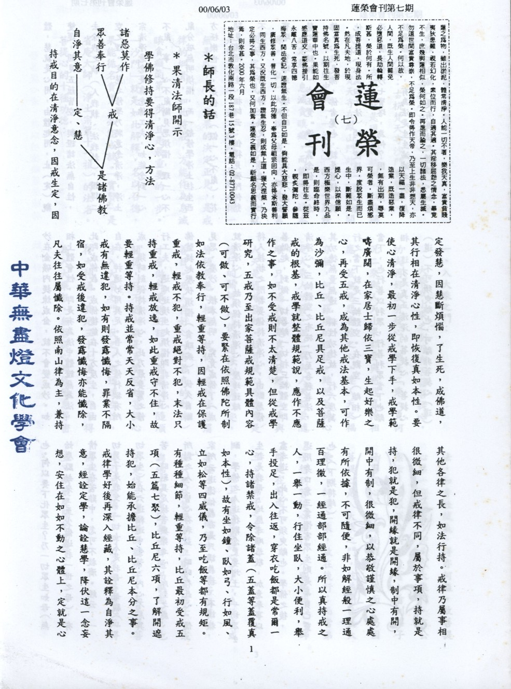

# 第7期

## 大德法語

### 果清法師開示（一）

*編輯部整理*

持戒目的在清淨意念，因戒生定，因定發慧，因慧斷煩惱，了生死，成佛道，其行相在清淨心性，即恢復真如本性。要使心清淨，最初一步從戒學下手，戒學範疇廣闊，在家居士歸依三寶，生起好樂之心，再受五戒，成為其他戒法基本，可作為沙彌，比丘、比丘尼具足戒，以及菩薩戒的根基，戒學就整體規範說，應作不應作之事，如不受戒則不太清楚，但從戒學研究，五戒乃至出家菩薩戒規範具體內容（可做、可不做），要緊在依照佛陀所制如法依教奉行，輕重等持，因輕戒在保護重戒，輕戒不犯，重戒絕對不犯，末法只持重戒，輕戒放逸，如此重戒守不住，故要輕重等持。持戒並常常天天反省，大小戒有無違犯，如有則發露懺悔，罪業不隔宿，如受戒後違犯，發露懺悔亦能懺除。依照南山律為主，兼持其他各律之長，如法行持。戒律乃屬事相很微細，但戒律不同，屬於事項，持就是持，犯就是犯，開緣就是開緣，制中有開，開中有制，很微細，以恭敬謹慎之心處處有所依據，不可隨便，非如解經般一理通百理徹，一經通部部經通。所以真持戒之人，一舉一動，行住坐臥，大小便利，舉手投足，出入往返，穿衣吃飯都是常爾一心，持諸禁戒，令除諸蓋（五蓋等蓋覆真如本性），故有坐如鐘、臥如弓、行如風、立如松等四威儀，乃至吃飯等都有規矩。有種種細節，輕重等持，比丘最初受戒五項（五篇七聚），比丘尼六項，了解開遮持犯，始能承擔比丘、比丘尼本分之事。戒律學好後再深入經藏，其詮釋為自淨其意，經詮定學，論詮慧學，降伏這一念妄想，安住在如如不動之心體上，定就是心體，慧就是心用，由體起用，止（定）觀雙運，照見五蘊皆空，契證諸法無自性，去除我之執（人我執、法我執），證得二空之理。定慧之修學乃將意念清淨，淨土宗清淨意念是靠念佛工夫，如能念到一心不亂，事一心不亂斷見思煩惱，理一心不亂分破無明煩惱，而一般修學淨土往生西方極樂世界，是伏惑（假一心不亂），花開見佛悟無生，祖師云：但得見彌陀何愁不開悟。「若人靜坐須臾頃，勝造恆沙七寶塔，寶塔或有壞空時，一念淨心（戒定慧之成就相）成正覺。」淨土靠念佛，心念佛，心就是佛，佛者覺也，就是菩提，其他方法（八萬四千法）均是使這一念心清淨，勝造恆沙七寶塔，為何？因一念淨心就是無為法，有為法是生生滅滅之法，無為法則不生滅（是有為法之體性）。如金沙在金礦內提煉成金，就不會變成沙。如相上體會性，即是有為法中體證無為法，此即成佛義。成佛後能在十方度生，自由自在，神通妙用具足。吾人之修行欲有所成，須時刻保持清淨心，此乃最要緊之修行工夫，遇順逆境生起煩惱即非清淨心，佛號提起壓伏煩惱（貪瞋痴），伏久自斷見思、塵沙、根本無明，究竟成佛了（成就清淨心），故須保持清淨心，歷境逢緣，待人接物之際都要保持清淨心，由斷惡修善做起，到做一切善離一切相三輪體空即清淨心。三輪體空之布施，乃至各種善法，其功德無量無邊，稱性功德故，行六度萬行之當下就是三輪體空。在觀空（離相）當下，也行善以利眾，行善利眾當下也離相，這才是真正清淨的菩提心，菩提心（道）不可須臾離也，可離非菩提心（道）也。何以要下化眾生？乃一切眾生如母（無始塵點劫來，至少做過我一世之母），有情眾生在苦難中，怎可不救濟。經云：一切男子是我父，一切女人是我母。母親（一切眾生）在六道輪迴中受苦，內心不忍其苦，時刻具足拔苦與樂之心，所到之處、所對之人，皆心存利益，時時存此心。儒家所云道德仁義亦是只講義務，不講報酬，學佛之人道德觀念更要增上，一切眾生都是我母，均應孝順恭敬，加意奉事以盡孝道，此心不可須臾離也。學佛之後，還用身口意三業惱害眾生則是辜負己靈也。（下期待續）

## 共修研學

### 勸發菩提心文（七）

*心爾*

人題：古杭梵天寺沙門實賢撰。

「古杭」就是現在的杭州，以前稱武林，「梵天寺在鳳山門外」，「宋時開山，明朝中興」，「沙門」就是「勤修戒定慧，息滅貪瞋癡，而能識心達本源。」弘一大師說：戒律的鋼骨在業果決定正見，正知見現起的第一步就是通達業果，若不瞭解業果則戒律一無是處，所以業果的決定正見，是戒律的鋼骨，如此持戒，方能作為息滅瞋貪癡的第一步，且是最重要的一步。「沙門」就是如此解釋，名以召德，果能循名責實，必能成就。「實賢」是省庵大師（淨土宗第十一祖）的法名。

菩提心的十種功德：

入大乘之門：

大乘或小乘之別乃有否發菩提心，功夫再好沒有發心，猶是二乘，更何況二乘與人天小果都要與慈悲喜捨相應，若無慈悲喜捨之心，連人天之福亦無，何況羅漢的證悟。雖然菩提心是大乘人所發，但二乘與人天都要隨順，只不過大乘是真實發起，二乘與人天是隨順發起。故菩提心實是修行的關鍵，即使外道修到四禪八定，皆須與慈心相應，故仙人之相皆慈眉善目。而人存好心（有善良的動機）才會做好事說好話，於菩提心有隨順關係，只不過大乘是真實發起菩提心才入大乘之門，反之，縱通達空性，得大神通。具足三十七道品，亦不得為入大乘教，無菩提心而修風息等密法，如青蛙鼓氣，得亦何益。故菩提心第一個功德，即是入大乘門。有公案云：一羅漢在前面走著，看到弟子發菩提心，立刻走到弟子後面，乃因菩提心是入大乘之門，彼弟子已是大乘人，師為二乘，故在後行；而當弟子想到菩提心難行，不願發此心，師即走在前面。

二、得佛子之名：

經上讚歎發菩提心之人，為佛子或菩薩。不論是地獄中人，很苦很苦的，但只要發菩提心，立刻成為佛子，成為佛子不是因為得神通而稱佛子，也不是得三十七道品稱佛子，而是發菩提心而稱佛子，乃以生起菩提心而得佛子名。

三、映蔽聲聞的功德：

發菩提心者，非以功德映蔽聲緣功德，乃以種性映蔽聲緣功德。比如說大鵬金翅鳥生的小鳥，雖然力量不如麻雀、老鷹，但他所儲蓄的力量，超過老鷹，此文出自彌勒解脫經「金翅鳥雛翅末之力，已勝鵰鵬健翮，即目光敏銳已過之。」，那怕是破碎的金剛鑽，都比成塊的黃金功德還大。所以不能小看菩提心，菩提心一發，早就映蔽聲聞的功德，那怕是剛發，功德也已不可思議。

四、成就殊勝福德田：

經云：「若發菩提心，他方世界皆震動，以十方諸佛歡喜加持故。」譬如老人得子心喜踴躍，諸佛見發心者，如新得一子，諸菩薩如新得一弟，亦歡喜踴躍，帝釋梵天莫不禮拜供養讚歎。對初發心的菩薩（佛之因位），禮拜供養之，功德與禮佛同。且禮初發心菩薩於得禮佛功德外，又得禮菩提心功德。古德云：發心究竟二無別，如是二心初心難。故不僅釋梵諸天應當恭敬，十方剎土亦無不敬。

五、圓滿福慧資糧：

積福無過發起大菩提心，凡發心者修學六度，乃至一切善業能為成佛的資糧。且菩提心者，一切威儀無記之行，亦皆歸於成佛之資糧。譬如滴水入海，大海不盡，水滴亦不盡，故生此心者，毫末之善，悉隨此心，無有窮盡。

六、速除罪障：

發心能速除罪障，論云：此心若生，剎那間重罪即盡。即在無間地獄，剎那能盡劫火；倘無此心，則任何善不能滅除深重業障。昔阿闍世王弒父，這在小乘法裡沒有任何法可以救他，後因他的病相現起，恐懼地獄之苦，很真實的在佛前懺悔發心。死了下地獄，立刻從地獄彈起上生淨土而為中品中生，這是菩提心的功德。為什麼五逆重罪可以往生？關鍵就是用菩提心除罪障。小乘的戒法之根本戒若破時，像斷頭一樣，無藥可救，猶如沒有一個外科手術能將斷頭縫接，小乘破到根本戒時，找不到一條可以救他的方法，除非發起菩提心方可去除罪障。所以那怕是通天的罪障，與法界相應的罪業，都可以從發菩提心而起死回生，但不可蓄意造罪業，再發菩提心，如果那期間來不及遇到善知識而發真實菩提心，死掉了怎麼辦？而且造惡業之人，不容易感應善知識勸發菩提心。

七、一切義利依菩提而成：

如欲成就自他二利，均賴此心。菩提心如一切眾生之如意樹，即令神通之獲得亦要發菩提心。且唯有菩提心所發起的神通，是二乘人乃至於一切人天所不能比擬的，成就一切有情之義利，特別指神通。已發此心者，即不知咒法，一撫一噓，皆能為人除遣災病。

八、災害不侵：

初發心者，一切（非人及外災）皆不能害。經云：初發心者有二千藥叉守護。且有梵天帝釋及一切善神護持，以及現前善知識的護念。又發心有情所住常見吉祥，一切兵災乃至自然界種種災皆不作，自然感應風調雨順。一個國家是否風調雨順，少災難，就要看國人發心的人多不多！台灣水災、火災等以及大陸飛彈試射演習，都能安然度過，度過了此等可怕危機，完全是因為發菩提心者不少之緣故。

九、速得佛位：

很快的得到成佛的果位，經云：諸佛長劫作深思，何為速速成佛，其方便為何？唯見菩提心最重要，速得地道（十地五道）果（佛果）功德。

十、能成就一切有情安樂的基礎：

不只是發起菩提心的人得到安樂，而擁護發菩提心的行者，彼亦得安樂，乃至於對菩提心者的懺悔，都能夠懺障得福。發菩提心者加持咒水亦能除有情病苦，乃至祈求天降雨除旱等皆能如願，故為一切有情安樂的基礎。（下期待續）

## 蓮池海會

### 助念經驗談（三）

思嘉

樹下助念  捨報安詳

接下來我到成大醫院急診室照顧一位陳姓患者，他才五十歲，三年前頸椎骨折開過刀，這次是因為大量吐血和便血來就診，經過檢查是肝硬化引起靜脈內血壓升高，形成食道下端和胃部的靜脈網路腫脹扭曲，也就是所謂的「靜脈曲張」。靜脈壁很薄，容易破裂，造成危險。醫生為他裝置S-B管，試圖抑制這兩處的出血點。

往後的五十天裡，我除了要面對他肝病的各種現象，還要留意他頸椎開過刀手術失敗所造成的痛苦，例如他只能睡五公分高的枕頭，碰不得半下，又因為全身幾近癱瘓，經常需要按摩，讓筋骨活動，否則容易痠麻疼痛，常常少有片刻的清閒。雖然前後三度進入內視鏡室，將胃和食道靜脈瘤做結紮，但隨著他的腹水增加、黃膽指數升高，吐血、便血的情形持續存在，病情也愈來愈不樂觀。

如果換了別人，正當英年卻遭逢這樣的重創，往往不能承受這種打擊，免不了會怨聲載道。可是他卻不作此想。據他太太說，三年前的意外發生後，就不曾聽到他叫過一聲，再痛也是忍住，他認為叫苦連天，只會增加別人的反感和煩惱而已，所以都默默地承受下來。這次病情惡化，他已有心理準備，後事該如何辦理，早就一一叮嚀了。

他太太還說，他是他們一家的棟樑，有任何事他一馬當先，出面幫大家解決，所以深受兄弟姐妹倚重，在自己家裡，更是三個女兒最好的良師益友，關心她們的學業，注意她們身心各方面的發展，父女感情比她這個做母親的還要好。所以看著這樣一個好丈夫、好爸爸被病魔折騰成這樣，真是痛心疾首，常常泣不成聲。

他太太因為要料理自助餐館，所以日夜請了兩位看護來照顧她先生。我做白班，常利用機會跟他談談關於生命的問題，他不相信靈魂永遠不死，也不相信有所謂的因果循環，至於西方淨土極樂世界更被他認為是無稽之談。到了末期，有一天，我跟他開玩笑地說：「如果我騙你，對我有什麼好處？那如果沒有騙你，你真的去了極樂世界，你要怎麼謝我？」他說：「你就是騙我，我也要謝謝你。」在這段期間中，也曾請曹師兄和興全師兄前來關懷。師兄很婉轉地向他傳達佛法的訊息，好不容易徵得他首肯願意聽念佛機播放的佛號。但是過不了多久，他還是要求我把它關掉。我只好轉而懇請他的三個女兒做些功課，老大在成大中文系就讀，我把劃下重點的地藏經交給她，讓她明白佛教慎終追遠的作法；老二讀專科且半工半讀，時間有限，念最短的阿彌陀經最合適；老三讀國中，給她一個計數器，教她念阿彌陀佛。

最後兩天，他對病痛到了忍無可忍的地步，要打脹得像個氣球的肚子來消氣，注射了止痛針也無濟於事，讓他不免責問「怎麼還不死？」我只能婉言相勸，勸他「視死如歸」，到另一個新天新地去，重新開始人生的另一個新頁。只有去了極樂世界，才能具足各樣的神通，回來探望你所掛心的妻小。當時他的兩眼泛著一種異於尋常的水晶體似的東西，我問他是不是看東西有點模糊了，他說是。我囑咐他，到時候只有看到佛與佛光在念佛中蒙佛接引往生，不可隨妄境而去以免落入三惡道。

六月十二日一整個白天，他的尿量只有二十ＣＣ，腎功能非常差了，神智卻保有相當程度的清醒。到了深夜兩點多鐘，我不放心打個電話過去，晚班的同事告訴我，血壓低到六十；醫生正在搶救。我電話一放下，立刻趕去，在走廊上遇見他的太太和弟弟，他們正在商議聯絡葬儀社和準備送竹溪寺的事。

這時他的大女兒匆忙地招呼我們快進去，因為他在前一刻斷氣了。母女四人抱頭痛哭，我輕聲制止她們不要哭出聲來，影響他的往生。然後走到他跟前，告訴他我來了，應你家人的要求先給你換上衣服。平常碰不得半下的頸椎，這下讓我扶起身來穿衣，我知道他會痛徹心腑，可是奈何不了他們的定見。隨後我為他放上金光明砂，覆上陀羅尼被，轉開念佛機，請他跟著念佛。然後去聯絡精舍師兄前往竹溪寺助念和協助家屬辦理出院手續。

等我和晚班同事收拾東西後，再自行趕往竹溪寺。因為寺方只有四個靈堂可供使用，必須靜候今早有人出殯才有空間，所以箱形車暫時停在龍眼樹下，後車門開啟，我們或坐或站就在樹下為他助念，從黑夜念到天明，蟬鳴鳥叫伴著佛號響徹雲霄，後來是哀樂聲也來相和，直到十一點助念結束，功德圓滿。我徵得家屬同意，掀開被角，看見他遺容非常安詳，鼻孔有一點乾涸的血漬，不知什麼時候鼻胃管被拔除了。事後他太太到精舍為他作功德時說，入殮時為他換上壽衣，發現他全身十分柔軟，跟生時沒有兩樣，心裡感到很安慰。

回想當時，明知他對佛法存有強烈的質疑，卻因拙口笨舌，不知如何應對，只能擔心萬一他就這樣捨報了，依他這樣執拗的性格，過去又從事販售燒雞的行業，真怕他會落入三惡道。如今至少能超生善道，我才鬆了一口氣。

## 日常省思

### 賑災心得

心立

此次九二一地震造成許多人死亡，他們卻無法因此而離苦得樂，身歷其境的我方對六道輪迴的本質是苦有覺受，也可以為經典做一注腳（世間無常，國土危脆，四大苦空，五陰無我），能隨順生起這樣的覺受，而非只是經典所說罷了！想一想當時這些罹難者的心態，他們是以放不下自己親人、所愛的家園、以及愛執此身的心離開這個世界，帶著貪心、瞋心（怨氣）或癡心走了，想一想他們會到哪裏去呢？我們知道這一念心的重要（升沈、迷惘及苦樂的關鍵），因此我們便把老師日常教我們的佛法，再從書櫃中拿了出來好好回憶、應用。假如他們是我的親人，現在下地獄去了，我將如何救拔他們呢？對於活下來的孩子，一輩子的恐慌我們將如何幫助他？藉著此次災變的因緣，我們的良心才有一點發現，讓我們與災區的同參道友去思考我們有什麼工作可做以便契合他們的需要；此外，老師、各單位對我們的關懷、誠意，甚至比自己的親人還要親，使末學深深感動，一輩子也忘不了。不論是金錢上或精神上的資助，末學在此一併的感謝，甚至是淨苑的師父，也在道路不是很好的狀況下來到災區看我們，並且帶來米糧與經濟上的補助，尤其是金錢上的幫忙。

為了妥善的利用這筆金錢，代替蓮友把愛心送到災區，我們對於災區一些房屋倒塌、孩子過世的老蓮友，便給予生活上、物質上的補助，然後再邀請他們一塊來念佛共修，並且在三月十四日舉辦放生活動，希望藉這些善法泯除他們內心的恐懼，並迴向不再發生類似的災變。至於災區的教育也是很重要的，想一想我們一輩子的努力在一秒中都化為烏有，我們會有好的心情嗎？其實有學長說看我們似乎不像從災區出來的，其實我們都是端賴老師教法上的提攜與蓮友們經濟上的支持，所以心態才能釋然，似乎像什麼也沒發生的感覺。有些災民沒有接觸到佛法觀念，他們會怨恨政府沒有處理好善後，或者在災變中從中獲利，甚至很多待處理的事情導致大人們疏忽對小孩的教育，而且很多學校也因為被震垮了，需要挖除，所以小孩們也有一段時間無法上課，政府、慈濟也因為這樣把組合屋蓋起來當學校，讓學生再重回到學校去上課，有關當局為了讓家長能更安心的去工作及更有效的照顧這些小孩，於是有了「課後媽媽」的活動，讓小朋友放學後不需馬上回家，而由其他媽媽代為照顧，由此末學便很幸運的可以參加這個活動，結果發現這些小孩或許因為這一段時間的放逸，對災變所帶來的傷害也沒什麼覺受，大人又疏於管教，小朋友心情上的放鬆，這樣對功課及學校規矩，自然在心態產生很大的變化；大人們也有他們本身的問題，房子被拆除了就牽涉到一些產權問題，因此就會有訴訟案件的產生，所以大人的心也變了，小孩的心也變了，但現在要大人來談這些問題，恐怕我們能力比較不足。在物質及重建家園的問題上，政府已經蓋了簡易教室，而我們能夠做的是心理上的幫忙-由親至疏、由近至遠，因此便決定在我們附近的東興國小服務，也藉此把蓮友們的愛心贊助購買教具與教材，並與當地幾位志同道合的蓮友合作在當地興辦啟蒙教育，而且獲得東興國小的支持，希望以當地學生為主，以專題的形式介紹死亡、無常的觀念及儒家的教育方式、因果觀念。

因此決定在今年的七月一日至七月五日舉辦小紳仕（淑女）養成班，把以上的想法與美好的觀念向災區推動，其實是訓練我們的能力與悲心，以達成先自利後利人的效果。

心超：心立這一路走來的心路歷程，是非常幸苦，從整理災區的人心、研學會的穩定到共修會的成立，並到學校去教弟子規，從很糟糕的校風慢慢的改善，獲得校長的肯定、當選模範義工媽媽，經過這樣的努力，讓啟蒙教育能在學校生根，她與中部蓮友有如此的誠意護持災區，我們也應樂意隨喜其功德，雖然我們身為台北人，但站在民胞物與、四海之內皆兄弟的心態下應給予最大的協助，希望主要是給予人力上的投入，以讓他們能肯定啟蒙教育的重要。在這半年當中，主要是把人心振作起來，而非只著重於物質上的建設、只滿足他們的慾望，此乃賑災主要意義。若光在物質上建設，須知慾望無窮，而且會在無法立即復原的情況下，彼之內心深處的影響會導向他們仇恨社會、作奸犯科，令社會有著無法彌補的損失，這才是我們要注意的重點所在。

心立所說的覺受可歸納成六點：

１、每一個人都會遇到這種情況，只是眼前的現起是他們，而我們未來會遇到什麼樣的狀況？天災、地變、政治災難乃至個人的生死，其實這種狀況是遲早的。

２、佛法在我們日常生活中是否用得上力量，乃至煩惱現起時可以幫助我，在苦難時，甚至在生死時可以為我所用否？

３、所以日用平常佛法的實踐就非常重要，應常讓自己生起無常、皈依的覺受。

４、在實踐時會困難重重而有無力感，但這正是我們上求佛道的覺受出來了，「學然後知不足，教然後知困」，無力感是來自於願力與德學的不足，強化願力充實德學，去除無力感，竟然成就的是自己，故利人即是利己，害人反而害己。

５、也可以在這些場合中體會人情的變化，透過對小孩子慢慢的教導知道教化的重要、知道什麼才是社會進步的核心，而非僅是物質化的指標，多蓋兩條高速公路、乃至計較國民所得多少。

６、更肯定自己的走向只有這一條路而無怨無悔，心立的這個經驗可以變成我們在遇到障礙、瓶頸、困難時突破自己束縛的方便，而邁向自己光明的前途。

## 啟蒙園地

### 談教育（二）　出則弟

心印

上次談及人格教育首在孝道的實踐，現在我們來談人格教育的第二步：出則弟。弟，悌也。悌道指的是能友愛兄弟，但是這裡為何說是出弟呢？而非入弟呢？若為人子女能和兄弟姊妹和睦相處，輕財忍言，父母必然能寬心歡喜，所以一個孝順的孩子，必然能兄友弟恭，孝的內涵，除了是子女對父母要恭敬體恤外，友愛兄弟亦屬孝道中。

出弟，則指能將悌道推至於社會中，俗云：「四海之內皆兄弟。」對於較己年長者，即以兄長之禮待之，對於較己年紀小者，即以弟道待之，也就是需待大眾如己之手足。於日常生活中不管是飲食坐走，皆要長幼有序。於相見時，能稱呼合宜，音量適中。問對時，也能穩重泰然，不刻意表露己能，也不羞愧至無法言語。這些規範，目的是培養孩子能謙恭有禮，而非拘泥於小節。藉著外在行為規範，培養其內心能尊重別人的人格特質。自然而然能融入團體，為大家所接納。

現今的教育多鼓勵孩子有獨立自主的思考創造能力，此能力固然重要，但若沒有先灌輸一些正確的因果概念，以及培養其正確的人格特質，孩子容易被邪知邪見所左右，以致於養成其個性倔強，思考模式以「我」為出發點，甚至只要我高興，有什麼不可以的心態。在團體中，孩子不知道說話的時機，做事不能負責，常和同學發生爭執，不能遵守團體規範，所以引來行為及心理困擾。

追本溯源，真正能對治現今孩子的「文明病」，在加強其家庭教育以及在日常生活中「禮」的落實。由對父母的孝，移至對君主的忠。由事兄弟之道，順移於長幼。如此以己之心度他人之心，則使社會成為一個大家庭。每個人都能在一個良善的環境中，安居樂業，以期自利利他。行至極處即是將中國文化的美表現得淋漓盡致，而達到世界大同的境界。
