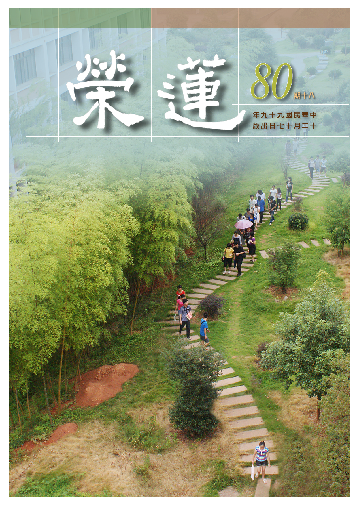

# 第80期

## 社論

### 無見頂

本刊

一生成長是喜悅

無盡努力乃價值

正面取向無情緒

善用其心為出路

聖者內心的證量是令人難以想像、更遑論企及，所以有顏子讚歎孔子：「仰之彌高，鑽之彌堅，瞻之在前，忽焉在後。」那一種心靈世界，唯有聖者才能彼此相知，外人簡直莫名其妙。雖然不知，亦可藉由觀察聖者外相的顯現，作為體悟聖者內心的入門。顯現在外相上有氣質、動作、型態、相貌，然最尊貴的顯現是無人能看見的、頭頂的無見頂相，表徵聖者所證的內涵是無人能達到，此即佛三十二相中最極殊勝的無見頂相。

然此殊勝之表法，不論外相或內心，雖凡夫難以達到，但並不代表永遠不能達到，只是未知其因、未學其因，當然就難以獲得如此的果證。若能夠透過無止盡的努力，在充實自己利益別人當中，追求的是無過失的三業，特別是圓滿的心意，必獲如此殊勝的果證。此必來自於旺盛的企圖心，及透過不斷地學習方能達到。

過程中，有表徵成功的順境以及表徵失敗的逆境，然成功往往使人志得意滿，停留在原地，並隨著驕奢而逐漸敗亡，失敗使人頹廢喪志，甚至一蹶不振，所以世間凡愚多而成就的少。種種的成就中，特別是成就聖人，那更是優曇花一現，酷夏下霜雪，嚴冬出炎日。

須知對於成功與失敗，須有正確的名言界定，方使自己具有向上的動力，不達目的絕不終止的決心。成功不過是向上的踏板，失敗不過是累積經驗的名言，因為是往上的踏板，所以勝不驕，因為是經驗的累積，所以敗不餒，勝不驕所以能維持謙謙君子的行相，甚至一沐三握髮，一飯三吐哺的廣招人才，因為是敗不餒所以有屢戰屢敗，屢敗屢戰，前者是周公的典範，後者是曾國藩反敗為勝的秘訣。

落實在我們的處境，有生活、學業、家業、事業、道業的挑戰，得意處讓人意氣風發，心浮氣躁，外緣熾盛而無暇充實內涵，失意處令人不堪，心志怯弱退縮不前，亦無力修學令己增上。

一生無什成就，大半在煩惱堆過日子，後進入門不過些許的努力就超越我人多年的修學。在即將踏入新的一年之際，須猛然驚醒，效法雲谷大師對了凡先生所言：從前種種譬如昨日死，從後種種猶如今日生。

站在虛心受教的立場，廣納別人對己的批評指導，善學他人所長，舉凡立志求學，恆心、耐力、毅力，乃至對教法之勝解。日常生活充滿正面的思想，確立人生以學習、服務為目的，維護團體的清純，凝聚大眾的向心，在境隨心轉的軌則中找到自己的用心處，如淨行品中文殊告智首菩薩言：所謂善用其心，方有菩薩的出路。必累積無數次努力的經驗，成就聖賢的福慧，莊嚴自己的無見頂。

## 大德法語

### 大方廣圓覺修多羅了義經（三十九）

道源老和尚

已證空性除執障

大悲為導善方便

持佛教法於久遠

淨除眾生意冥愚

乙二、正宗分

丙二、令依解修行隨根證入

丁二、廣明行相

戊一、四問答通明觀行上根修證

己三、深究輪迴根本

庚五、正答所問

辛一、長行

壬四、迴入塵勞幾種方便

癸一、大悲下化

經文：

善男子！菩薩唯以大悲方便，入諸世間，開發未悟。乃至示現種種行相，逆順境界，與其同事，化令成佛。皆依無始，清淨願力。

菩薩修學以慈悲為本，普遍利益友情的大慈大悲，並以各種善巧方便度化眾生，入各世間來化導眾生，重在開發眾生的悟性，沒開悟的令他開悟，謂之開發未悟。

菩薩依著大悲所起的方便，方便法雖有種種不同，然大悲心是沒有差別的。由於眾生是以差別為性，所以菩薩就有了種種度生的差別方便，隨類化現種種的行相，如觀音菩薩有三十二應身，現種種的行相，或示現順吾人成長的善知識，或示現逆吾人的善知識，如提婆達多是逆境善知識，要不是提婆達多示現惡人作逆境，與佛作對，佛還無法顯現堅固精進的行相。記住這句話，有人跟你過不去，你不要報復他，你要感謝他，他是你的逆境善知識。

或者與眾生同事—四攝法之同事攝，菩薩能隨類示現，同事為其示現之一。我們沒有神通變化，現的是出家相，只能度見出家相而得開悟的那種人。有些眾生根本不見出家人，甚至討厭見出家人，你如何能度他呢？所以有神通的菩薩能隨類變化示現種種行相，以同事攝化。譬如：屠夫（殺豬宰牛的），什麼時候能聞到佛法呢？只有這些佛菩薩神通變示現他同事，你殺牛他也跟你殺牛，你殺豬也跟著殺豬，接近了他，幫助他種了善根教化他，最後令他成佛。

皆依無始清淨願力：菩薩依著無始以來所發的清淨願力，示現種種形象（逆順境界），與眾生同事，這些同事願都是依著無始清淨願力而出發。

癸二、大智上求

經文：

若諸末世，一切眾生，於大圓覺，起增上心，當發菩薩，清淨大願。應作是言：願我今者，住佛圓覺，求善知識，莫值外道，及與二乘。依願修行，漸斷諸障，障盡願滿，便登解脫，清淨法殿，證大圓覺，妙莊嚴域。

一切眾生聽到圓覺經起了增上的信心。要學佛先學菩薩，菩薩先發大願，我們也先發大願成為菩薩，謂之菩薩清淨大願。

應做是言，是世尊以大悲心教導我們末世眾生如何發大願，你不會發嗎？不告訴我們如何發，則難發。願我今者，個人指自己本人，例如我就指著道源（師自稱己名），願我今者（現在）能於安住於佛的圓覺境界，欲安住於佛的境界，當然要親近善知識，並發願不要遇到外道的善知識、二乘的善知識。因為遇見外道，能令起邪見，遇見二乘教發小乘心。

依著菩提大願引導大行（依著願來修行）。修學斷諸障（理障、事障），將理障、事障斷盡了，菩提大願也就滿了（成佛），就滿願了。證得清淨圓覺的境界，喻如登上解脫清淨法殿，此殿即是不可思議妙莊嚴的境界（妙莊嚴域）。

辛二、偈頌

壬一、標頌

經文：

爾時世尊，欲重宣此義，而說偈言：

佛學院一開始我（道公）就先講〈勸發菩提心文〉，這是學佛的根本，諸位同學真正發了菩提心、菩薩大願了沒有？要是你已經發了，今天聽了圓覺經再發一次，發願要天天發。要是你還沒發呢？你今天就發。現在我把發願文唸一遍，我唸一句你們跟著我唸一句，大聲點，合掌：「願我今者，住佛圓覺，求善知識，莫值外道，及與二乘，依願修行，漸斷諸障，障盡願滿，便登解脫清淨法殿，證大圓覺妙莊嚴域。」這是依著圓覺經，佛教我們發願。

最簡單的發願法是：「我弟子從今天起發菩提心，上求佛道，下化眾生。」菩提翻成中國話為覺道，覺道就是菩提道，求佛的道，不是求二乘道。然上求佛道，一定要下化眾生。先發這個願，再依著願來修行。若發願不夠大，所修的法行門不會得佛果，試問二乘人不是都在修嗎？不是經過種種苦修才了生死出三界的嗎？外道不修嗎？外道修起來是真正用功！結果成無義苦行，乃因地不真（發的願不對），所修的法行偏差。是故一定要發菩提大願，讓我上求佛道，下化眾生。天天這麼樣發願。

我們天天做早課，不是依著阿難尊者所發的菩提大願嗎？這是教我們學他發願，有這願力，能引導我們修學成佛的大行。你為度眾生受種種辛苦，能代眾生受苦，是你的菩提大願所引的，你若發願不真實、不懇切，你代眾生受苦的行門，你必學不來。到熱天你怕熱，你還能講經嗎？到冷天你怕冷你還能講經嗎？稍微有點感冒不舒服，你還能講經嗎？所以你處處顧你自己，你把眾生忘記，那不是我執、我見嗎？所以跟你的菩提大願根本就相違背。

有云：我發過大願。然你發的不真實，你發的不懇切。所以要天天發，要真實的發，要懇切的發，才能引起菩薩大行，志求佛道，研究佛法時間不足，修行用功時間不夠，哪有時間生煩惱呢？哪有時間去動貪慾呢？就是時間多的很，沒有事兒生煩惱，沒有事兒起個貪慾心，證明你沒有修行。你為什麼不修行？出了家了怎麼不修行？上了佛學院天天聞佛法，你怎麼沒有發菩提心？

發願如孔老夫子：吾十有五而志於學的志，孔子到十五歲，不是十五歲才學認字，是十五歲立志求聖人之學，他要做聖人。之後人生都修學都是向著聖人的目標，到了三十、而立。到了四十、而不惑，依佛教說是開悟，對於聖人之理完全明白。五十而知天命，天命是對於因果報應之事都明白。六十而耳順，一聽你說，心裡絕不會答覆不出來，且不起違逆，一問一答，十問十答，百問百答。七十從心所欲，七十歲時心裡所想的，都與聖人之道相合（不踰矩）。

孔老夫子十五歲立了志願推行仁道，一生都在受苦，周遊列國沒有錢，弟子相隨，在路上衝散了，有人看見他形象如喪家之犬（像一隻沒有家的狗）。孔老夫子苦嗎？他不苦，甘心受這苦，他是為了眾生受的苦，一生一世不懈怠，即使到了七十歲以後，對於所研究的《易經》，還想多活幾年，研究透徹，這就是孔子一生的求學，不起懈怠。

圓瑛老法師注《圓覺經講義》時是民國三十九年，是大陸淪陷後一年多，期間都在生病，去世前還在注圓覺經講義，他哪裡懈怠放逸？這都是由菩提大願支持著。這是佛勸我們，我依此勸諸位同學，學佛法從哪裡下手呢？先發菩提大願，依著你的菩提大願來修行，依這行門來填願，不論所修的行門，行無大小，都要成佛，因為他以菩提大願在領導。前邊說無論你「根無大小，皆成佛道」，這是講義幾句勸修的話，現在重宣偈言，「爾時世尊，欲重宣此義，而說偈言」。（下期待續）

### 常禮舉要講座（二十一）　旅行篇

雪廬老人

禮周能令人情厚

五倫維持文化心

避諱他人隱私處

受敬一尺還一丈

旅行

◎五、遠方客來拜訪，須往答拜，或設宴接風。

例如我在臺中，忽然間有福建人或日本人來拜訪，是遠方客，他來怎辦呢？須往答拜。第二天你必須回拜，這是答拜，如說話般一問一答覆。

或是設宴接風：他是遠客來到此處，待在這裏住幾天，來看我們時，或者送家鄉土物，或是不送東西，這得看情形，不論東西多少。我們請他，謂之接風，送人叫餞別。遠客上這裏來，我們接風，他一路的風塵我們接他。或可他來不及致謝邀請，你也不能勉強他。

◎六、旅人歸來拜，須詣回拜，或設宴洗塵。

旅人歸來拜：咱們本地人到外頭做客，此時回鄉來拜訪我們。須詣回拜：他來拜訪，或是歸來，或是暫回十幾天，視同遠方客，他來拜訪，不論送禮、不送禮，你都得回拜，或設宴洗塵，他一路風塵樸樸，我們為他洗塵。禮節不懂處須請教那些念過書、懂禮的人，但不要請教外行人。

◎七、受人之送行及餞別，到達所在地，須一一函謝。

人家對我們送行、或者給我們餞行，禮該如何還呢？到達所在地，須一一致函感謝。譬如諸位是臺灣人，臨去日本或福建前，人家給你送過行或餞別過，我回來臺灣再說吧，不行！你或是到日本或者到福建，安定下來，先寫信回來向送行與餞別的致謝。此非花錢？當然花錢，社會上就是這樣子。平素省吃節用、節儉，預備隨答應酬，此應酬少不得。

為什麼呢？家裏多麼窮，人家來要帳，還可以說到明天還、或再待五天，還可以推遲，這講得下去，但應酬不行。人家星期三結婚，發了帖來了，我沒錢，通知他暫且別結婚，我沒錢，再待五天結婚好了，我才可以給你送禮。這可以嗎？來了帖子，即使沒錢，賣了東西借了錢也得辦，這是在社會上的困難處，刻不容緩，這筆帳厲害極了，大家可知這種困難？婚喪嫁得自己出帖子，這種事情慎重又慎重。

譬如三條事情：結婚、家裏的喪事（父母的喪事）、作壽，這三條事你說那一條都要緊的，這得念書才明白呀！然而作壽、賀喜、發喪，這三條那一條最重要？什麼叫大事？念過孟子書的，死了父母叫大事，這個事最大，這個帖子必得出。死了父母是天下大事，從前做官（現在不一樣了），不論做什麼大官，一死了父母，這個官就不做了，謂之丁憂。為什麼？百善孝為先，家有事的時候，你對國家對得起了，移孝作忠，家裏老的小的可以撇開，給國家賣命去，你對國家對得起了，若死了父母，國家必得叫你回去，國家也對得起你，孝是第一。

現在，他們懂這個嗎？既有這種事情（父母之喪），這樁事情就是最大的。其次是結婚，這比作壽還重要嗎？重要！結婚是民族主義，中國的結婚與外國的結婚不一樣，外國的結婚是戀愛。諸葛亮的結婚，諸葛亮這個人才那還了得啊！他結婚當然這麼挑那麼挑，是他老朋友給他介紹的，挑了一個最醜的女子，誰也不要的，諸葛亮你看那麼英俊，他那個太太沒人要。你要是這麼著，念詩經：窈窕淑女，君子好逑。文王太太一定很漂亮的這種想法，這種念書就是糊塗蛋一個。

諸葛亮那一些木牛流馬等等的能力，都是太太教的。他太太是黃承彥的小妹，長得很醜，沒人要，她還誰都不嫁，什麼人配給我做丈夫，一肚子草包給我做丈夫，一肚子草包給她端尿盆她都不要。諸葛亮太太這樣子的，你知道嗎？你們現在的結婚不是這樣子的，愈挑那個無常的漂亮那就很好了，今天嫁張三，明天離婚再嫁李四，你這個不知是後補第幾個丈夫，這都是些畜牲話，我不能講述了。

◎八、人之接風或洗塵畢，須還席。

我們來了此地，當地人給我們接風，或者洗塵。接風與洗塵雖是兩回事，但都是到本地來不走了。如你是臺北人到臺南去，拜訪臺南人，人家請你的客，或是洗塵或是接風。你待個一、兩天，須還席，這是必須的。你不能在那邊吃人家的就完了，必得還席，謂之禮尚往來。以後你在本地處各機關辦事開會常見面，這有關係，也是禮貌。

◎九、入境問禁，入國問俗，入門問諱。

咱們到外國去，現在比從前好，現在有報紙，大概懂得些，你到他人處有不同規矩，言語也不一樣。臺灣話的官話，普普通通我能懂，要說起土話，我就沒辦法了。我到了市場就沒辦法。如內地吧，譬如我是濟南的里城縣，里縣東邊是丈丘幾十里地，如彰化與臺中種種不同，在濟南見了面都是你兄、我弟，大哥二哥的，見了面都是稱呼你大哥。若是對丈丘人稱他大哥，那糟糕了，他一時就不高興，必得稱呼二哥，你這個不知道就不行、稱呼了大哥就被挨罵，甚至會打你。譬如山東人到北京見了北京人，在山東見面稱先生好，這很恭敬，可是到北京見了面稱呼先生那糟糕了，先生是風化區裏的，這個你得懂得。以上所舉的例子，顯示各處的不同，總得問明白，別在那冒一句不好聽的話，這很重要！

入境之境是還在本地（本國），入國之入是指到別國，就與本地不一樣了。例如外國人的酒，你拿來嚐一遍、他們趕緊拿走，給你換一個杯瓶，你還不開竅，又一遍，還不算，還再第三遍，你這個人連這點警覺都沒有，你到那國得問問人（問俗），拿起湯匙，這麼樣子喝就是不行，若不學學怎麼中用？做事就怕不中不西不南不北，叫不上來，現在就是如此。中國小說都藏著意思，其中姜子牙坐騎是什麼東西？都有涵意的，姜子牙坐騎謂之四不像。你聽聽這一句吧！武王伐紂時，有一位專門挑撥是非的叫申公豹，與姜子牙是師兄弟，申公豹那些是該挑剔的，著書不明其理。

入門問諱：你要知道，他家中父母等等（現在是不在乎了），你得先問明白（問諱），不問明白，開口觸諱。從前取名都有些注意，譬如古文觀止，韓文公給李賀舉進士，為著李賀的父親叫進，李賀不能下場，怎麼不能下場呢？下場是個進士啊？他的父親叫進，他得避諱。大家妒忌他，不讓他中進士，就多了一個名額。你要給李賀答辯答辯，你答辯得出來嗎？韓愈那篇答辯的理由說得很充實，甚至於打贏官司。

說一句通俗話：你多麼大的學問，說白話或說些什麼，多少得有點理，沒理而亂七八糟，那如何算你自己的。若不知如何是好，那是你所見不廣。

有個小故事，沒主意的父子兩人賣驢，牽著驢往前走。有人說，真笨，父子兩人牽驢在路上走，驢卻閑著，若坐上一人，也可省力氣嘛！有道理，所以父親就讓兒子騎驢，走了幾里路，又有人看了說：唉！沒道理，你這麼大年紀卻走著，他一個年輕的小孩跑跑有什麼關係？聽聽覺得有道理，叫他兒子下來，父親坐上。走了若干時候，有云：路那麼遠，叫一個小孩如何跟得上？是啊！想想怎麼辦呢？好吧，抱著孩子，爺兒倆都坐上，這可沒話講了吧！走著走著又有人說，你們幹什麼去？賣驢去。既然賣驢還要叫它受苦？你倆下來別坐著壓著它？一聽也有理，可是這怎麼辦呢？一個人坐也不行，兩個人坐也不行。好吧！抬著吧！把這驢捆起來，兩個人抬著這驢，一過橋，走路不穩，驢掉到河裏，完了。

◎十、入國不馳，入村里必下車馬。

入國不馳：入國不但不飛跑且下車馬，現在還是有，一到人家國土，得有禮貌，須慢慢走，否則顯得不恭敬且妨害人。且你到人家家去，在台階下，主人迎你，你得趨（快走）。一上台階，進門時，不須馳（趨），這是會通。

入村里必下車馬：現在有火車不按此條可以，然你自己的車，到了人家的莊頭上，你必得下車馬來，現在我不知道，以前那就麻煩了。你下來這是禮貌，莊子是人家的，到人地處，當然你得有禮貌，這是必須下來的。本地亦然。這條街你的父母、曾祖都在這個街，你架子大？現在不懂的是年輕人。

這裏頭供著牌位都比你小嗎？中國書講究五倫主義，拜年不光是給人家賀年，上人家先拜壽。到了村莊，必得下來，這是恭敬人家。你一下來，村莊的人都懂規矩。云：客上哪裏去啊？就給你打招呼，那就是禮貌，說的是客上哪兒去、請喝水、騎的馬或驢需照料否等等，或是忠實地招待你。你要坐著車不下來，他們就說：今天咱們視野不好，碰見失了腿的人。怎麼失了腿呢？不能走路嘛！不是失了腿嗎？找罵挨，更嚴重者，你上那兒？你的車不能在這走，我們的路都是老路，你的車一壓，我們的路受不了，你到莊外頭走吧，莊裏頭沒路。古人的話，臺灣也有：有禮走遍天下，無禮是寸步難行。現今自用車、摩托車，還可以適用。（下期待續）

## 共修研學

### 小止觀導覽（五十二）

*心爾、智高整理*

大乘之門謂發心

最勝最上無與等

止觀現證法實相

三界無倫匹智者

第六章 正修行

論文：

復次，若人能如是一切處中修行大乘，是人則於世間最勝、最上、無與等者。

永嘉大師嘗云：「行也禪、坐也禪，語默動靜體安然。」此明修學止觀成就之行相，若能二六時中安住大乘法義，此人是世間最尊貴、最高尚、無人與之平等。

論文：

釋論偈中說：閒坐林樹間，寂然滅諸惡，澹泊得一心，斯樂非天樂。人求世間利，名衣好床褥，斯樂非安穩，求利無厭足。衲衣在空閒，動止心常一，自以智慧明，觀諸法實相；種種諸法中，皆以等觀入，解慧心寂然，三界無倫匹。

天台大師在座上修與歷緣對境修，雖以世俗法為所緣，然其正觀皆是世俗法上的空性。須以空性的智慧破煩惱障及所知障才能成佛，然須以菩提心及菩薩行作為空性智慧的助伴，能令空慧破所知障。修學空性須默察於心，處於靜處，所謂：閒坐林樹間，寂然滅諸惡。在寂靜處修學空性慧，能破煩惱惡。此時澹泊得一心，內心寧靜，無有牽掛與恐怖，如心經云：心無罣礙，無罣礙故，無有恐怖。心識前無任何世俗法可得時，還有何可罣礙？既無罣礙何來恐怖？此之法樂勝於生天之樂，所以斯樂非天樂。不是天樂可以比擬的，此何以阿羅漢享受解脫之樂，出定後不會緣念世間！吾人未真正嘗過法樂，所以才會汲汲營營求世俗之樂。

雪公曾舉古大德云：寧受地獄苦而得聞佛法；絕不生天堂而不聞佛法。孔子說：學而時習之，不亦說乎。法喜（解脫之樂）是世間之樂所不能比於萬一，且世間之樂有其過患，一者、從因果面相觀察，所受之樂都是善業的消耗，有何可樂呢？二者、世間樂體性無常極不安穩，有何可樂？三者、享受世樂增長放逸，無力修學正法，自利利他能力隱沒，有何可樂？四者、追求世間之樂，既使有心學習教法，也沒有時間學習（無暇），一生潛力無法開發，有何可樂？五者、三界無安、猶如火宅，任何可怕之事在受樂之後會發生，又有何可樂？但一般人卻不作如此觀察，故對此非安穩之樂，求利無厭足，一生精力耗在追求名、衣、床褥等虛名及物質享受，可怕的是毫無厭足之心。

「衲衣在空閒」，衲衣乃出家人所披之法服，指出家人而言，為何穿衲衣能空閒呢？修行人所忙與世間正好相反，修行人在忙甚麼呢？動止心常一，自以智慧明，觀諸法實相。動中亦是一心修止觀（歷緣對境修），靜時亦修止觀（坐上修），此之修行者是智慧明，能於動靜之中觀諸法之實相，且種種諸法中，皆以空性見一切境界之體性等觀而入，此時是解慧心寂然，三界無倫匹。由於有此種解慧（空性之勝解）內心寂然不動，觀照萬法自相了不可得，何有所謂的得與失呢？既無依得所生的貪，亦無依失的瞋，內心貪瞋等一切煩惱不生，此人是三界無倫匹，三界中修行人無有這一類人，此證得空性之人無人能與匹敵，世間人或任何外道，不皈依三寶、不修學教法的人永遠都不會有這樣的修學法，釋迦牟尼佛世有九十六種外道，一一邪見皆為世尊所降伏。

以上是智者大師於小止觀明坐上修及歷緣對境修後所下的結論：就是要好好修學空性正見！出離六道輪迴的安樂，遠勝於人天的安樂，宿世為何如此愚癡？將所有的時間、精力都耗在追求世間的安樂？尤其為了追求這些安樂，而造作種種的惡業，反受種種的痛苦。即使證得阿羅漢有時亦不敢入定觀察他的過去，往昔造惡於地獄受苦的種種慘相，連這些聖者有時都不敢入定回顧。看電視時會看到一些很殘忍的鏡頭，不忍看、不敢看，但那些慘劇、悲劇，很可能就是自己的前生喔！所以我們千萬不要再走冤枉路了。

第七章 善發根

論文：

行者若能如是從假入空觀中善修止觀者，則於坐中身心明淨，爾時當有種種善根開發，應須識知。

本章是接續上一章正修行而來，行者若能從世間相中知其是無常假法，無有不變性，近而由假法中體會其自相不可得，不過依種種名言安立而觀世間種種萬相，此即三法印中無常法印與無我法印。

修學符合法印能開發解脫與成佛的善根，有些人是善人，但未必有善根，對佛法體悟力薄弱，不能成為法器。是依止觀之方便修學二諦，特別勝義諦，所開發之善根，能解脫及成佛。（下期待續）

## 蓮池海會

### 莊陳金妹老居士往生見聞記

*編輯部整理*

苦盡甘來享高壽

得子護持學佛誠

二課不斷待人厚

助念盛況知有因

莊陳金妹老居士民國八年出生於臺灣新竹，幼年即至莊家為童養媳，婚後與夫婿育有三子，惟夫婿不幸於民國四十八年八七水災時因意外過世。雖頓失家中支柱，但老居士不屈於命運的考驗，一肩扛起家計，務農種菜，對上奉養公公（婆婆早逝），對下除養育己出之幼子外，也扶助未成年小叔。老居士數十年茹苦含辛在子女的身上得到回報，撫養三子成年，其子學業、事業皆有成就，成家立業，子孫賢孝，如今繁衍四代子孫十餘人。

老居士秉性良善，壯年與佛法結緣後即篤志純一，堅定人生方向。每日清晨四時即起，早晚二課從不間斷，日誦佛號萬聲。早年物質生活的困頓反而堅固老居士學佛修行的信心。爾後生活改善，老居士不貪己之受用，樂善好施，與各道場均結善緣。風範所及，子孫也多有行善學佛，護持佛法不遺餘力，共修會臺北道場場地即承蒙老居士三公子長年護持，提供使用超過十年，於此舉辦各類課程活動與共修，弘助正法傳承，臺北蓮友均蒙其恩惠，其源頭當感念老居士功德。

晚年老居士與子孫居於高雄，因一心歸於佛，佛力加被，加上親眷照顧無微不至，不遺餘力，雖有老病苦示現，得享高壽。但天年終有盡，居士往生前一週，自感體力不濟，遂停止進食與飲水，一心念佛求願往生極樂，蓮友家屬亦能護持老居士正念，嘆於九十九年九月二十三日上午十時許，於眷屬蓮友佛號聲中含笑西歸，得生極樂世界，可為此生最佳句點。

觀夫老居士一生，中年遭逢喪偶困境，不但依舊克盡人倫，奉上撫下，更能數十年不改其志，終其一生以佛法為依歸處。其對困境突破的毅力及對佛菩薩加被眾生離苦得樂的信心，正是後輩吾人所欠缺而應學者，可不學哉！

### 蔡宏謀老居士往生見聞記

*編輯部整理*

大同普明創辦人

引導後生親大德

歸宗雪廬印公教

開展助念己受用

蔡宏謀居士，臺灣省嘉義縣人，民國三十四年八月二十三日生於高雄縣彌陀鄉，幼居南部，高雄工專畢業後入伍服役，五十八年退伍後同時考上台大醫院實驗診斷科與大同工學院電機系夜間部，日間上班夜間繼續學業。並在醫院中結識羅碧霞女士，結為連理。婚後育有三子，均完成碩士學位，皆成家立業，貢獻己力於社會；近並喜獲內孫二人，善人能傳宗接代延續香火，家族宗風後繼有人，誠可喜也。

居士學佛恰逢民國六十年至七十年代，大專學生學佛風氣鼎盛，在家出家人才鼎盛，而居士熱誠接引眾生，學佛願力堅固，數十年不易，所引動之風潮，對後輩學子已成不可磨滅之影響。

居士學佛善根深厚，始於服役時結識洪老師等好友，假日互邀探訪名寺古剎。民國六十年參加台中蓮社大專明倫講座及南投水里蓮因寺上懺下雲老法師創辦之齋戒學會，後即陸續參加台中蓮社雪廬老人每週三的華嚴經講座、論語講座等等課程，經教學習歷三十餘年從不間斷。而自度之所為者度人，於六十四年成立大同工學院普明學社，並任指導老師，接引後進大專學生皈依佛門修學正法。六十五年與李、洪等諸師共同成立台北淨廬念佛會，擔任副會長，主持印祖文鈔段落參考表研討會，推動啟蒙組之讀經、背誦、吟詩等活動，並影響眾多蓮友發心學佛念佛。

尤其致力於推動助念組對蓮友的臨終關懷與助念，常時看到居士的身影，到全省蓮友家中護持學佛唸佛的善根；民國七十九年二月協助成立楠梓竹林齋念佛班，開始家庭念佛共修，到現在每逢週日皆有近百人共修。

居士與夫人經營家庭亦皆佛化，三子自小接受啟蒙教育，知書達禮，文質彬彬，家中弦歌不絕，雖是親眷亦為法眷，誠佛化家庭之典範也。而居士教子數十年亦師亦父，身教而言教，信知子弟必能克紹箕裘，子承父業也。

不但一生學佛為典範，居士仍利用臨終現身說法，九月初已感身體不適，居士仍依計劃照常參加蓮友參訪活動，造訪蓮友家庭，經教研討仍未中斷，此實為法忘軀典範。即便十月初住院，經醫生確診為胰臟癌末期，交代眷屬不化療、不急救，只願求生西方極樂世界，即便後來癌末身體痛楚，體力不支，至往生前，都正念分明，此亦修行人真信切願決志生西，對娑婆世界全部放下之典範。而發病之後，家屬一致護持正念，師長蓮友鼓勵絡繹不絕，癌末痛楚受而不受，最後十月二十四日回家助念後，蓮友助念不必通知排班，二十四小時之內自動自發助念，前後共計三百餘人，當其時隨時家中滿座念佛人，終於居士在大眾的念佛聲中，含笑西歸。

往生後二十一天內，每天蓮友依舊共聚念佛一堂，這樣的福報，正說明學佛的人要靠大量的做善法，長時間的做善法，才可以在臨終時對治無始以來的惡業。

居士往生前三小時，長媳方產下長孫，然後三小時居士才斷氣生西，一天之內家人要經歷大悲大喜，這又何嘗不是居士對大家的慈悲，以身示現「諸行無常，是生滅法」，但願後人都人體悟「生滅滅已，寂滅為樂」。

## 專題研學

### 聖者的祕密～大佛頂首楞嚴經二十五圓通暨七處徵心探源

### 二十五圓通暨七處徵心簡介　（二十一）持地地大～下

時祺

平地悟心平

對境不生心

朗然空慧生

法法皆性無

辰二、蒙平心教

巳一、因平地待佛

經文：

時國大王延佛設齋。我於爾時平地待佛。

此國中大王設齋供養佛，佛顯現接受供養的時候，都是領著僧團來接受供養。當時國王即如印度佛世的國王一樣，都懂得以九五之尊的人王謙卑地護持法王。此時持地菩薩平地待佛，不但平地且心平的等待佛前來接受供養。

持地菩薩以非常殊勝的福報生起證悟空性的智慧，且以菩提心攝持空性正見，是破所知障的徵兆，此時準備接受毗舍如來摩頂受記。

巳二、領平心之教

經文：

毗舍如來，摩頂謂我當平心地，則世界地一切皆平。

平心地：從世俗說平，是對親境除自之貪，對冤境除己之瞋，對中庸（不親不冤）境除自之癡，內心無煩惱不平之相，謂之平心地。在我們在這人世間，心都是不平的，對親生貪，對冤生瞋，對中庸境生愚癡（不聞不問，他的死活跟我無關）。如果拿掉了這樣的心態，這就是平心地。此世俗成就的平心地是發菩提心的基礎，如種地的第一步要先除掉雜草、石頭，同樣發心修學，先將心平，亦即對冤親除愛憎。所以初住位是發心住，亦即有心成佛度盡一切有情者；第二住是治地住，要先治心地，調理這塊心地，要如何調理呢？即對著親怨除愛憎。

先問對親如何除貪呢？第一、曠觀累世，怨親是無定的，怨由親來，而怨親中又以怨力大，世間討債、報怨的力量都比報恩的力量強多了，世間拚命找對方，大多都是為了報仇，報恩還債的少。不善於處理親，親變成為仇的因，在情愛當中反目成仇，此乃面對親怨的心態須善觀察。知道貪愛親人的過患，親是過去怨所來，昔日之親是眼前之怨，怨親不定（無常），眼前不知要對親生愛還是生憎？對怨生憎還是生愛？應對怨親除憎愛，生起平等心。若心不平等，其愛憎能令來世在窮山惡水中受苦。

行者以平心往生西方極樂世界時，見彼世界乃一望無際的平坦，人的心胸非常開闊，景色宜人，鳥語花香。世俗上內心的善造作，以柔軟語與柔軟心所感應的是地軟，跌倒也不會受傷；質直語所感應的是果報實在，不會碰到如外相好看卻內裏腐敗的果報。碰到不實的果報，或與昔日之浮誇、虛偽有關，當內心質直，言語誠實時，所感應的果報則實在。

當心平氣和、不起貪瞋時，不但碰不到窮山惡水、洪水猛獸，在平坦的世界，風調雨順，感應的人心是善良與具公德心的人。

辰三權實雙證

巳一悟取權乘

午一悟內外地同

經文：

我即心開，見身微塵，與造世界所有微塵等無差別。

心開是開悟，特別約勝義上的體悟，見身微塵（內四大），與造世界所有微塵（外四大）都無差別（自相空），不過是觀待而生，自相了不可得，唯名言安立的總相，在能承載的那一分說是地大，流動的那一分說是風大，濕潤的那一分說是水大，溫度的那一分說是火大。

午二於諸觸自在

經文：

微塵自性，不相觸摩。乃至刀兵亦無所觸。

微塵與微塵的聚合謂之觸摩，例如手與手的觸摩是四大相觸摩，然微塵與微塵的自相是空的，既是自相空，那有觸摩產生？乃至刀兵亦無所觸，刀與槍的自相空，世俗上是觀待業而生，即使刀子殺過來，沒有那個業，刀子一樣殺不到你，世俗的顯現不過如此。

微塵的自相空，所以微塵與微塵沒有觸摩相，觸摩是觀待下顯現，乃至刀兵亦無所觸，刀的堅硬性，是觀待軟的東西，方顯刀之地大，若非心識上的顯現，哪有什麼軟與硬呢？

午三悟無生證果

經文：

我於法性，悟無生忍，成阿羅漢。

巳二迴證知見

經文：

迴心今入菩薩位中。聞諸如來宣妙蓮華佛知見地，我先證明而為上首。

迴心有二種解釋，一是迴小向大，即使已現證空性破煩惱障，成為小乘聖者，回心入大乘道非直入第八地，乃入菩薩的資糧道，何以故？由於剛發起菩提心，必須要由資糧道開始，再進入加行道、見道位、修道位等，唯資糧道的菩提心，有空性的證悟，然福德那一分還沒有修滿，如圓滿初地功德，須是十度的修學，眼前圓滿布施度，在不斷地利益有情中圓滿了布施的心意，只是坐在家裡觀想布施法行，不用辛苦造作布施法行，觀想成了，是否就得初地境界呢？應知是不可能的。證量的獲得要在事項上努力造作，令已施意圓滿，方是初地的證量，各地的圓滿，說法例上。

第二種迴心，是原本就已發菩提心，此時再迴向大菩提，如何得知呢？由於累劫做善法，不觀待菩提心，善法難以常恆，中間一定會遇到諸多障礙、侮辱等，要有非凡的心量才有辦法持續下去。此處的迴心是指在毗舍如來的座下，先以破煩惱障之智慧證得空性成阿羅漢，後發菩提心，菩提心若串習成俱生，來世在證得空性後，發菩提心入菩薩位。

每一個人的宿世潛力都有老師的引導，沒有一個例外。聽聞佛法的十種功德，其中一種是能引起俱生慧。昔日六祖亦受五祖攝受，閉門說《金剛經》而大悟，若無五祖引導俱生慧，則是在鄉村做一位很明理的農夫而已，絕不可能成為禪宗的一代祖師。

聞諸如來宣妙蓮華佛知見地，妙蓮華佛知見地，或說是妙法蓮華經，或說是本經（楞嚴經）。以妙蓮華來顯示佛一乘的因果，是以佛知見為己知見，作為修學成佛之因。此是佛出世的一大因緣，須知佛出世的本懷就是開佛知見、示佛知見、悟佛知見、入佛知見。開示是由佛來開、來示，但佛的開示也要觀待眾生的聽聞才有說，觀待說才有聽，所以開示是觀待聽聞才能顯現，眾生聽了佛知見後，才有所謂的聞所成慧、思所成慧，此即大徹大悟，依德而修方有所謂修所成慧。

我先證明而為上首，我能證明佛在開演一乘因果。證明就是自己的體會，證明佛所說無誤，此乃聖者助佛轉法輪的證明，成為佛的上首弟子。

卯三結答圓通

經文：

佛問圓通。我以諦觀身、界二塵，等無差別，本如來藏，虛妄發塵，塵銷智圓，成無上道。斯為第一。

身就是內四大，界就是外四大，身、界二塵等無差別，本如來藏（自性空）是佛對著有自性概念的外道，為引導他們入佛門，所以宣說如來藏，做為引導的善巧。如來藏的觀念是引眾生入佛門的權巧方便，但不能將如來藏當作究竟義。

《大乘起信論》：最初無始劫來，本性妄動。其實沒有最初，是無始劫來眾生根本就沒有覺悟過，自相空顯現似有自相謂之本性妄動，最初一念無明，是無始以來（沒有開始）的無明（執法為實有）。所以可以下一個結論：每一尊佛，以前都是凡夫，沒有一個例外，都是從凡夫而成佛的，所謂沒有天生的彌勒，沒有自然的釋迦。

虛妄發塵，虛妄顯現似實，實際非實有，謂之虛妄，若顯現與實際一樣，則有情不必觀待心識的名言認知，該法可以自相成立，然境界無自成立性，故觀待有情心識的名言認知才能顯現。

發塵是靠虛妄心去發，觀待發塵生起虛妄心，觀待虛妄心發塵，觀待業而起的心識（虛妄心）會去取境界的某一分來受用。比如晚上的月亮，我們覺得很清涼，但是鬼道眾生覺得酷熱，乃因心識取月亮熱的那一分顯現。

塵銷智圓，觀待於塵銷而有智圓，觀待智圓而說塵銷，此二者是互相依靠。塵銷就是看不到塵的自相，觀待塵銷謂之智圓，智圓的顯現就是塵銷，塵銷的顯現就是智圓。對未現證自相空的人，須觀待佛說自相空，這也是為何要請佛轉法輪、請佛住世的理由，此種證量是世間任何人都無法生起的。（下期待續）

### 六趣輪迴經簡介（十二）人趣報

*心亞整理*

人道輪迴難獲得

可貴思業果轉變

若於正法尋出路

自他二利皆成辦

人趣報

經文：

常出真實言，現獲於安隱。

口要如何做功德呢？要常說真實話，何謂真實話？見聞覺（心裡覺察到的）知說見聞覺知，不見不聞不覺不知，說不見不聞不覺不知。若見聞覺知說不見不聞不覺不知，不見不聞不覺不知說見聞覺知皆為不真實話，可是此真實語只是表面的真實語，真正的真實語是要與因果相應，此才是真正的真實語，所以與因果相應，一定要對法有勝解，所以大家一定要好好了解佛法，否則連真實話都說不到。

若能常常說真實話，現前即獲得安隱，為什麼？因為此人開始樂天知命，懂得因果觀念，知道吉凶禍福來自於斷惡修善，所以處在逆境也心安，處在順境也心安，子曰：「不怨天，不尤人，下學而上達，知我者其天乎。」

經文：

若見他相違，勸喻令和悅，感眷屬廣多，無別離苦惱。

若見他人有衝突，此時要用種種的比喻讓他們和好如初，所以中國人講究勸和不勸分，要常常說勸人和合的話語，會感應眷屬與你和合，而且不會分別，沒有別離的苦惱，所以口每天皆可做到功德。

有四種語業，為惡口、綺語、妄語、兩舌。正面而言不惡口應說柔軟語、不綺語應說義利語、不妄語應說真實語、不兩舌應說和合語。以上是有關口業的功德。

經文：

於師長教敕，常歡喜聽受，損益更籌量，則具善巧智。

對於師長的教（正面的教）敕（反面的喝斥），教是攝法，敕是責法（責備），此時心態要常歡喜聽受，很高興的聽與內心接受。損是過，益是功，如布施時，想想布施的功德，慳貪的過患，下地獄的可怕，離開三惡道的重要，此才是所有思惟的主體。損益是過與功，過患與功德的思惟是非常重要的思惟，是所有思惟中最重要的一步，換言之，利害關係有無想通，若有這樣的想法，此是最殊勝的學習。

正面而言是身口意三業清淨的利益，反面誡止造惡受殃。

經文：

貧窶執役者，好行於捶打，無過而惱他，己苦更加苦。

窶是困苦之極。貧窶是貧得很困苦，對很貧窮的當差，動不動就吆喝打罵，他沒有過失，卻處處損惱他，則自己的痛苦會比他還痛苦，欺侮別人的人會比受欺侮的人更痛苦。為什麼？對弱勢者我們會同情，其實，對強勢者我們也應同情，弱勢的苦易見，但強勢的苦不易察覺，因為強勢者過得不安隱，如交不到朋友，因為沒有人願意與強勢的人做朋友，所以交不到真心朋友，則會很落寞、很孤獨；再者，常常做惡夢；三者，此種人易遇強手對付他。

經文：

若人具形色，恃之而起慢，戲弄於他人，當獲矬傴報。

若人長得很好看，容光煥發，印堂發亮，趁著自己身體強健，精神好，而喜歡欺負弱小，將來會感應長得個子矮小，或駝背。

或云：有人長得個子小又駝背，是不是就是這個原因。其實未必，如雪公老師個子也長得小，我們不能說雪公老師過去就是具形色，恃之而起慢，戲弄於他人。若是如此，則完了，不然，該如何解釋呢？其實是因緣使然，雪公云：我是北人南相，所以因緣在南方。

我們要好好謹慎因，但不能以別人之果，說成是那個因。

經文：

若人性慳鄙，善誘佯不聞，彼極重愚癡，當獲聾啞報。

慳為小器，鄙為粗俗，若人性情小器、粗俗，若善巧的誘導他，而他假裝沒聽見，如這樣極重的愚癡，將來就獲聾啞報。

耳朵不聽正法，聽不進正法，將來成為聾子，口不說好話，則易成為啞巴。為什麼？因為所有的正法都要入心，耳朵就是入心的工具，口好好說正法就是正法入心的增上緣，若不善用口耳，將來即成為聾子、啞巴。

經文：

行善有餘慶，積惡招苦惱，各成辦彼因，隨業定當受。人趣報竟。

本慶是自己造善，自己受樂，餘慶是波及至子孫，子孫受用的這一分是餘慶。孔子七十七代至孔德成先生，都是一路受尊崇，此是孔子的餘慶，如此說來，孔子的本慶無從可想。餘慶有七十七代、七十八代，而本慶則難以想像。

苦惱來自於惡，行善則有本慶與餘慶，本慶更為殊勝。雖善惡都可感大果報，由於積累故，如每天做一點小惡，積久了，大苦果報就出來了。試問有錢人是怎麼來的，就是每天都能存到錢，久之則累積可觀的財富，相對的，每天積小惡，積久了即成為大惡，感應極重苦報。很多人買房子錢不夠，也是慢慢累積而得。不要以為下地獄的都是作奸犯科、殺人放火才有分，其受果報也是由小惡累積出來的。

總結人道應注意身口意三業，反面而言，不可殺生、偷盜、邪婬，特別講究的是布施、持戒等善法。以口而言，不妄語、不兩舌、不綺語、不惡口；正面來說，真實語、和合語、義利語、柔軟語。以意而言，不貪、不瞋、不癡，其特別處是心在聽聞正法的這一分，是心最棒的功德所在，把法入心是無可取代的價值。而且身口意三業，以意為主，而意又以將師長的教敕歡喜聽受，且好好思惟損益的這一分為最殊勝，此為馬鳴菩薩講善用人心最重要的切入點。

以上人趣報竟。（下期待續）

## 論文研究

### 試析論語子罕篇法語之言能無從乎章之句讀與義理

傳線

訓詁義理兩兼顧

章句互相能發明

聖者後得通人情

性與天道一貫之

本章句讀竊以為文分三部分，法語之言至從之為貴為第一部分，巽語之言至繹之為貴為第二部分，說而不繹至吾末如之何也已矣，為第三部分。

第一、二部分先儒蓋有三種讀法：一為漢儒馬融、宋儒朱晦翁等，以四字一讀，貫串到底；一為漢儒孔安國、清儒俞樾等則斷為「法語之，言能無從乎？改之為貴；巽與之，言能無說乎？繹之為貴」；至於皇疏與邢疏，依其所釋義則兼採之，是為第三種。

皇疏解第一部分「彼人有過失，若我以法則語之（法語之），彼人聞法。當時無不口從而云止當不敢復為者也，故云能無從乎？」依其義似讀為「法語之，言能無從乎」；第二部分解釋：言有彼人不遜而我謙遜與彼恭言，故云巽與之言也；彼不遜者得我遜言遜彼，彼必亦特遜為說，故云能無說乎？依其義句讀當為「巽與之言，能無說乎？」。至於邢疏第一部分採孔氏之釋，註曰「孔曰：『人有過，以正道告之，口無不順從之，能必自改之，乃為貴。』」，後句義從「馬曰：『巽，恭也。謂恭孫謹敬之言（巽與之言），聞之無不說者。』」可知句讀為「巽語之言，能無悅乎？」

依清儒俞樾所著之群經平義，謂乃經師失其讀，其理由為一句中語與言疊用，甚為不辭，由是導出言應與下句連讀，更引孔氏之義為證，讀為「法語之，言能無從乎」，將言視為語首助詞，並博引相關典籍，以支持其立論，計有詩經「博言采之」、「靜言思之」、「願言則嚏」、「駕言出遊」，左傳僖公九年「言歸於好」，周易繫辭「德言盛、禮言恭」，並以王引之經傳釋辭讀為「法語之，言能無從乎」作為結論。綜上所引，言當助詞無義，有置於語首及語中二類，一如現今教育部所編國語辭典所採之義。若尋思上所引用諸句句法，當發現不論是當語首或語中助詞，皆為肯定句而非疑問句，細知所引諸例皆非同一句式，此一疑。

其次，既以經解經，首當取自論語，而論語所有篇章，如「一言以敝之」、「子欲無言」、「有一言可以終身行之者乎」、「片言折獄者」、「言之，得無訒乎？」、「君子一言以為知，一言以為不知」、「不幾乎一言而興邦乎？」、「君子不以言舉人，不以人廢言」、「子罕言：利與命與仁」、「言忠信、行篤敬」等等，隨取十章之言，皆為實義非無義之助詞，合理推知，輯此格言之弟子或再傳諸弟子，將言視為無義顯然非聖人當時習慣之用語，且就論語而言，僅此章「言」當語首助詞之孤例，恐難令人信服？

馬融之注，依論語集釋只錄第二部分，前已說過邢疏所採也，茲不贅述；至於朱子集注第一部分其註解為「法言人所忌憚，故必從」；第二部分「巽言無所乖忤，故必悅」，由「法言」及「巽言」，逆知乃「法語之言」及「巽與之言」之四字濃縮為二字，推斷其句讀為「法語之言，能無從乎」、「巽與之言，能無說乎」，當無疑議。

為使以上所論第一、二部分之句讀之不同讀法，更清晰起見，列表於下：（表略） 而「之」字與全章之關聯性，亦關緊要，第一、二部分各二出，第三部分「從而不改，繹而不說，吾末如之何也已！」一出，故本章凡五出。

若依孔氏「法語之」第一之字注解「人有過，以正道告之」及群經平議「以法度語之則必從」，似解為代詞指人；「改之為貴」第二之字，孔氏解為「必能自改之為貴」，似釋為代詞指過失；又第二部分「巽與之」群經平議解釋為「以巽順語之則必說也」，依此義同樣將之字解為代詞指人，至若「繹之為貴」，論語集釋未錄孔氏及群經平議有關此句之義。

皇疏第一部分第一「之」字義同孔氏，但第二「之」字依其釋義「我所貴者在於口從，而行亦改者耳，故云改之為貴也。」顯然指行，似不同於孔氏；第二部分第一句「巽與之言」解為「謙遜與彼恭言」，則知將「之」解為代詞「彼」，第二句「繹之為貴」解為「己不能尋續行此遜事，是雖悅不足為貴也，我所貴者在尋續行遜耳」，從注解之義知第二之字當「遜事或遜行」；邢疏如前所言第一部分採孔氏之主張，故第一部分二「之」字，義亦同孔氏；第二部分第一「之」字，從「巽與之言」解為「謂恭孫謹敬之言」，可知當介詞「的」，「繹之為貴」解為「必能尋繹其言行之，乃為貴也」，此之字似又當代詞「其言」。

至於馬注將第二部分第一句解為「恭孫謹敬之言」，可知「之」字作介詞的，第二句義為「能尋繹行之為貴」，揣其言將「之」當為代詞其言，餘則未詳；至於朱子集注向以義理為尚，字斟句酌非其長，尋繹其解，對之字著墨不多，只得存疑。

將諸家「之」與「言」字解釋列表如下：（表略）至若諸家對第三部分「從而不改，繹而不說，吾末如之何也已矣」，「之字」均未詳解，皇疏引用孫綽語「疾夫形服心不化也」，與朱子面從及不知微意之所在之義相近，而邢疏則云：「不可奈何也」，對之字均未作交代，蓋以為當然為代詞指人罷，故不消說！

綜合以上諸家句讀或之字解，除令人覺得莫衷一是外，本章「法語」及「巽與」之闡釋，諸家之解讀亦各言其是。就法語之言而論，孔氏注為「人有過，以正道告知」，俞樾群經平議解為「以法度語之則必從」，皇疏釋為「彼人有過失，若我以法則語之」，邢疏義作「人有過，以禮法正道之言告語之」，朱子集注先解為「正言」，後引楊氏義「孟子論行王政之類」；歸納此句諸家對「法語」之「法」之論評，概分為三，一為孔氏之注，皇疏及邢疏繼之，分別解為正道、法則、禮法正道；一為群經評議作法度，一為朱子之正言如孟子行王政之類。

竊以為法有取法、效法、典範等義，而世間足以為世人取法、效法，且以資為立身處世依循之典範，莫如聖人及其垂訓之格言，講要將「法語」注為「古聖人所說的話」，「之言」釋作「根據法語所說的言詞」，並綜合諸家之言解此句為「根據古聖人言語所說的話，都合乎正道」，從其釋義愚以為可推知「之」當介詞作的，並將「法語」作轉品，才有「根據」一詞之顯現；至於改之為貴，講要釋為「改正自己的行為，道才可貴」，將「之」解為「自己的行為」係採皇疏之義，但提出「道才可貴」，則為發古人之未發，愚意此之謂君子畏聖人之言，聽了聖人之言，能身心從之，道才顯得可貴，否則身從心不從，何異不從！改正行為，正顯道之作用，故云道之可貴。

至於「巽與之，言得無說乎」，群經平議解釋為「以巽順語之則必說也」，皇疏「巽與之言」注為「有彼人不遜，而我謙遜與彼恭言」，邢疏則釋作「以恭孫謹敬之言教與之」；而「繹之為貴」皇疏「己不能尋續行此遜事，是雖?不足為貴也，我所貴者在尋續行遜耳」，邢疏「必能尋繹其言行之，乃為貴也」，朱注「巽言者，婉而導之也」，講要參採巽與繹之義，但譯為「恭遜稱許的話，誰聽了都喜悅」，至「繹之為貴」譯為「聽了以後，要尋繹其中的意思，然後自省自勉，千萬不能驕傲，這才可貴」，講要就尋繹之目的，解釋完整且道出「自省自勉，千萬不能驕傲」，斯又呼應「言寡尤，行寡悔」方是可貴之處，亦是古來註解所不及也。

說而不繹，從而不改，講要與諸家解釋大抵雷同，「吾莫如之何也已矣」，講要解「之」，順著前句聽了巽言而不自勉，聽了法語之言而行為不改，注為「像這種人」，釋此句為「像這種人，聖人也無法教化他」，與皇、邢二家引孫綽語「孫綽云。疾夫形服心不化也」，相較皇、邢與講要之注，講要簡而明瞭又高明也，孫氏不過繹改為貴之延伸耳！講要有關本章句讀及之字解列表於後。

論語講要本章句讀及「之」字解一覽表（表略）

從孔氏、皇疏、邢疏之註解，知其就「法語之（言）」及「巽與之（言）」，開頭即言「人有過」及「彼言不遜」，似非聖人之本意，夫子對弟子尚說「賜也，賢乎哉夫我則不暇」，又說「擇其不善者而改之」、「不善不能改」、「朋友數，斯疏矣」等，由上之引述，略曉聖人之襟懷也，是以講要不取其義。講要指出本章用意「在激勵那些冥頑難化的人，希望他們改之繹之」，與明湛若水之解「頑皮心性，如何著手」，有異曲同工之妙解；且心超吾師特就其解，點出解此章之人萬不可等閒視之。走筆至此，所謂一葉知秋，進一步證知論語講要註釋之可貴，及  雪公眼力之迥出古人也。

## 活動報導

### 第三屆兩岸國學文化交流講座—談人師如何正己化他

### 師長的話—開訓、結訓致詞

*編輯部整理*

文化推廣風氣厚

立國根本民向心

贏得友誼兩岸情

法水源頭雪公恩

二０一０年七月廿四日至三十日

緣起

暑期應福建省順昌縣教育局邀約，假金橋中學舉辦國學文化師資培訓課程，此次參與人員主要是當地中小學的老師及其他省市地方有志於文化推動者。

課程內容乃依《論語》相關條目整理而成「教育理念—談為人師如何正己化他（成己成物）」，輔以《常禮舉要》在校篇，說明學校教育首在人格教育的養成，《禮記》禮運篇節錄「大同與小康」段，論述聖人為政理想，而選講唐詩「送梓州李使君」，此詩乃王維殷切期許將至梓州當使君的李氏，為政首在辦教化。

一切人才的養成觀待老師的引導，而教育重在人格養成，其次方為各種學問知識才藝的傳授，若為人師者有勝解，方能將子弟教成人才，希望所有參與講座的教育人士，能因講座課程的討論、經典內涵的開啟、教育理念的通達，而責成自己成為大格局、大氣度，以文化為導的經師與人師。今將活動內容作一報導如後，以饗大眾。（編者）

開訓典禮

老師：

心喜於順昌辦師資培訓，局長與我一樣都是公務員，深知公務員對國家的重要，尤其是辦教育者，更是負有很重要的責任，尤其是文化的經營是維持國家的命脈，然文化必須要有傳承，尤其要有解經的能力，才能將聖賢的道理發揮大用，並且與時代接軌。若文化不被提倡，經典學習不受歡迎，道統無法傳承，知見不能確立，品格難以建立，我們的下一代隨著時代的潮流、物欲的誘惑，變成表面是中國人，骨子裡卻是西洋人。

是故，應該要在傳統文化上建立正確的觀念，此次的主題，特別是在師資上，如何來正己？如何來化他？如何來成己？如何來成物？也就是如何成就自己？如何去利益別人？利益別人的方式很多，包括冬令救濟、慈善、造橋鋪路，但最重要的就是辦教育，古人說：「十年樹木，百年樹人」。

物質建設很快就可以建設起來，但心理建設卻需要花長時間。論語云：善人為邦百年，可以勝殘去殺。用教育改變殘暴的風氣，善人為正還得花上百年的時間，若是更高一層的仁人君子來為政，也要花三十年的時間，所謂：如有王者，必世而後仁。就算如孔子這等聖人，也要花上三年工夫才有成，所謂：苟有用我者，期月而已可也，三年有成。可見為政重於辦教育，目的在培養風氣，《禮記》經解云：「入其國，其教可知也。溫柔敦厚，詩教也。恭儉莊敬，禮教也。廣博易良，樂教也。疏通知遠，書教也。絜靜精微，易教也。」

初到一個地方，看到這個地方所展現的氣象，就知道這個地方的發展性，而這個氣象必須從教育而來，相信教育能帶給一個地方昌盛，這種欣欣向榮的氣象，不是用經濟等發展可以達到的，此乃真正長久發展之道，能帶動此處之人有真正生活的品質，及相處淳厚的朋友。

孔子一生偉大的思想，記載在各種典籍中，最完整處則是《論語》，四百九十八條含藏著孔子博大精深的思想，讀之可知孔子一生有兩個理想：一是辦政治，一是辦教育。所以其弟子或是辦政治的人才，或是辦教育的人才，如子貢、冉求、季路等就是辦政治的人才，顏回、閔子騫等就是辦教育的人才，一個地方有這樣的人才，對這個地方、國家，都有很好的利益，對一鄉、一國都有很好的影響。

在我大學的時代，遇到了從山東濟南來台的大儒—李炳南老教授，他是孔子第七十七代孫孔德成先生的老師，受了老師的教誨，略知了中華文化的要義，抱著回饋的心情，來順昌向朋友們分享，相信文化的弘揚，會帶來順昌的盛況。又能對典籍做深入的瞭解，同學們之間是道義之交。

透過文化的學習後，城市更能維持整潔與衛生，居民行住坐臥恰如其份的禮儀，讓人感覺此地有可觀處，是有目標的前進，給未來一個期許，給後代子孫一個學習的環境。

特別感謝局長，由局長的表現可知是公門中棟樑之材，尤其著重教育與文化的結合，相信順昌的未來，一定極其可觀，順昌將令人流連忘返，一而再再而三的來，成為近者悅遠者來的樂土。

局長：

這一次講座有臺灣唐老師及其團隊，並有金橋高中以及職中的孩子們自願來當義工幫忙講座，這是一個新的氣象。由於民間愛心的力量，以及學校的大力支持，使我們有充足設備能安心辦師資培訓。

教學：

吾人辦學所依之教育理念乃源自於中國傳統文化—孔聖人的教育理念。此次課程分為《論語》選章談「為人師應如何正己化他」，內容皆為論語條文，所依註解乃雪廬老人所選擇之古注，這些知見乃老人從山東帶到臺灣，傳道於弟子，今再將此思想帶到順昌與大家分享，其次〈孔子傳〉影片，傳中可瞭解夫子如何成為一位聖者，孔子不只是歷史名詞，而是活生生的人物，能影響二千五百年後的我們，再者選讀《禮記》禮運大同小康，談論孔子的為政及教化理念，又在座有許多教育界人士及學校老師們，所以特別選了雪廬老人所編的常禮舉要當中的在校篇，談在學校如何引導孩子作最好的學習。

另有唐詩，選的是王維「送梓州李使君」，詩中提到中國文化的落實與發揚，首以辦政治為前提，其次推展教育，教育的內涵即是文化，此詩講到為政者如何推行教化，乃詩作之佳者。並藉著一起用餐，做餐前觀修，讓我們吃出品味，以上是此次整體課程內涵的簡介。希望達到「導之以德，齊之以禮：順；培之以福，修之以慧：昌。」為人師者能「正己化他」，最後能「成己成物。」

此次是聽覺、視覺的盛宴。希望用心細細品味，做一位有品味的人。

結訓典禮

局長：

感謝無盡燈教學團隊將我們帶進孔子和弟子間的風采，這幾天學習的過程，我想各位老師、家長、同學都有很大的感受。就我而言，我覺得我的感受是一分感動，一分感慨，一分感化，一分感悟，具體說來：

第一精心：本次講座，參加大眾由原來不相識到相識，成員有義工、金橋中學及其他學校的學生，從事教育的老師，關心教育的家長。首先對參加的老師予以崇高的肯定、表示真心的感謝，尤其是外縣來的校長、老師表示熱烈歡迎。其次是強大的愛心義工隊伍，這些曾經與國學經典接觸過的愛心人士，在炎熱的天氣，他們以赤誠的心，以一股對教育的崇敬，準備了一餐又一餐的美味，再者是唐老師團隊的精心與用心，以及課程中大眾聽課的那種安然狀態的精心與用心。

第二精準：我們都學過《論語》，但並不是有系統，認為是教條已多年，然此次透過學習，譬如學而時習之，不亦說乎；溫故而知新，可以為師矣；舉一反三等等，我從沒有像今天精準的感受教育，體會到這些才是教育的理念與方向。以前只知這些是善念法則，但他的源、他的本來自那裏？以前是知道怎麼做，現在才知道為什麼要這麼做。

第三精闢：是來自於〈無盡燈〉教學團隊將孔子與弟子之間兩千多年前的那種場景深刻複製，讓我們領悟老師與弟子之間日常當中、課堂當中、玩笑當中，循循善誘的將人生、治國安邦的哲理表現出來。教學團隊且每天不辭辛苦，即使在大熱天下課間的十幾分鐘，我們在談笑、喝水休息時，他們仍然盡心備課，此種精闢是來自於他們的孜孜不倦，那種對學問的景仰。

第四精彩：他們所展示的一種優美，而且出色，唐老師的團隊，不僅是展示他們，更多是孔子與弟子，還有中國聖賢之間的風采，七天之中同學能體會老師們的優美出色的風格，那麼課後老師、家長、應該給孩子什麼樣的精彩呢？可能大家心裡會有這樣的問答。私底下老師們都表示，上課時大家都不想睡覺，我們也看不到同學趴著，此種不想讓人睡覺的精彩，來自於孔子與弟子及唐老師與其團隊的精彩。

第五精神：無論唐老師與他們的團隊，研究論語已二十幾年，而我們是不是經常把書讀完之後就束之高閣，以為書我已經讀懂了，對於所學是否已深、已精、已量、已進入我們心中，而這些經典肯定是人一生的追求，此種出神入化，不是幾十年的功夫，而是從幾句，如「一以貫之」的精神當中得出人生追求的精神。他們求學，教導的精神，都令我們讚歎。

第六精進：我希望老師、家長、同學能精進來共勉。論語中「學」是人生進步的法寶，九月二十八日是孔子誕辰紀念日，已訂為全民終身教育日，定位是表示終身學習，進步的不是個人事，而是國家層面，因為唯有學習才能推動社會發展，推動國家發展，推動民主發展，所以無論是我們的三講，即講學習、講政治、講正信。而講學習是在政治之上，不學習怎麼知你的政治方向是什麼呢？不知政治方向如何形成良好的社會風氣，講政治也是把政治準則擺在第一位，因此我們應該尋找學習的真諦，從學當中交朋友，從學當中提高自己。

在這幾天學習當中，仁者愛人，因材施教，舉一反三，循循善誘，溫故而知新，己所不欲，勿施於人等等，我們老師如何做在當下，做到約之以禮，導之以德，齊之以禮， 文、行、忠、信；君子有所爭，有所不爭。這些都精彩地把教育的精神，肅然起敬的表達，他的本質有讀書人的好處，教育的原則，教育的方法，做人的道理，有教導的禮儀，有做事的方寸，乃至有氣度的追求，讓我們老師知道此分職業的偉大，神聖及責任，感受教育乃是崇高至上完美的境界，我們應當竭盡全力而為，以站在太陽底下最高的地方來共勉精進，把握教育的精神、內涵，將教育帶到新的道路。

第七精誠： 精誠所至，金石為開，唐老師對人對事的精誠，能夠利益我們順昌，我們也以精誠之心把自己做好，並且希望老師能夠再來。

老師勸勉語：後續的學習，有以下幾點建議：

一、建立團隊。

志同道合的朋友在一起，念書、做善法，在人海中不會徬徨無依，反而覺得人生很有意義，且有作不完的善法，這是組成團隊的好處。

孔子也是講究團隊，所以到各國能得到國君的重視，除了在魯國的政績及本身的人格特質，更有所帶出的團隊。

辦活動的成敗，不在於參加活動有多少人，是否因活動而凝聚團隊的共識，那才是真正的未來。活動即使辦得再盛大，參加的人有上千、上萬人，若是曇花一現後無功效，則屬無用。

二、建立讀書的團隊。

建立的團隊必須要讀書未來才有可觀，該如何把書讀好？深入文化的內涵是團隊的靈魂，一個團隊若能堅持幾十年，那是對正法的信心，靠的就是讀書尋求正理，在經典及古注上有抉擇的能力，承擔的自信心就油然而生。

例如劉備求師而三顧茅廬，諸葛先生表現出那種讀書人的自信，此非裝模作樣，是讀書內化的氣象。

三、培養人才須投入時間。

沒有相當的時間花在培養人才，尤其是解經與辦事的人才，短時間是看不到團體的氣象。

四、歷事練心。

沒有事情的磨練，沒有辦法讓一個人的思想更為成熟，經驗更為圓滿。孔子將弟子教到一個程度之後，有著因緣帶著弟子周遊列國，一方面固然是推行王道的理念，其次藉著情境磨練弟子，是否能在各種情境，甚而顛沛流離中還能篤定對道的信心，肯定道的價值，經過歷練之後，這些弟子回到魯國都變成大才，孔子藉著弟子的成才方能將正法傳承，影響的是千秋萬世。

五、造就講學的人才。

沒有講學的人才，積弊之風氣難以改變。昔日文翁為蜀郡太守，將巴蜀粗俗風氣改變，靠的就是辦政治與講學。

### 講座問答整理

*編輯部整理*

多問表達求知慾

扣鳴皆為正法興

可貴文化斷層後

學子欣欣向聖道

二０一０年七月廿四日至三十日

前言

學而不思則罔，思而不學則殆。在《論語》章句的講解分析後，每日安排一堂腦力激盪的問難時間，透過團隊接力的問答方式，將大眾心中疑惑釐清，將所學概念作一番整合，是此次辦學另一精彩處，以下節錄部分問答整理。（編者）

**問：** 向人學習是學道德，還是技能或學問？

**答：** 此人技藝雖高超，若不在品德上講究，技藝提升到某種層次時，會碰到瓶頸，而且沒辦法突破。所以真正有道德的人，在技藝學習上也能超群。以前老師傅在教新徒弟時，一定不會先教技藝，先從人格上訓練，先教做人的道理，弟子們從侍奉師長開始做起，並在日用平常學習應對進退，當他在這個地方被培養出來時，已具備學技藝的基本，若不講究基本，能很快學到技藝，然到某種火候時，無法突破瓶頸。當今有諾貝爾物理獎得主，在講感言時會非常感謝他的父母早年對他的培養，尤其在國學上扎下人格的根，當自己在工作時，他的敬業是毋庸置疑的，他在道德上有這樣的根基，在專業裡就會用這樣的態度去面對，所以他的技藝也必然是高超的。針對上述問題，應該從道德上扎基，所以要問有德者來學，技藝不會有所欠缺。

**問：** 請問「仁」字何解？

**答：** 仁者人也，親親為大，仁者從人二，從竺（竹之厚者），乃人與人相處親密加厚，替對方著想，所為己欲立而立人，己欲達而達人。

**問：** 如何發心而成為君子儒？

**答：** 君子儒就是認真實踐忠恕，並且由忠恕的基礎下學習發心，這就是君子儒！就明明德（格物、致知、誠意、正心）的那一部份，認真去學習，是成就內聖，並就親民（修身、齊家、治國、平天下）那一分去發揮，是外王。

**問：** 要有所成就，必須要有好老師、好朋友，那麼如何找一位好老師、好朋友、好環境。特別是老師，所謂經師易求，人師難得。

**答：** 目前在文化的傳承上，人師確實難求，在諸多障礙上，可行方式為大家組成讀書會，依著經典與正確註解，藉著研討相互增上，自己若無道德與學問且不斷地進步，別人不會有向你學的心，孔子為何能令弟子不斷向他學呢？就是因為孔子不斷在進步，且循循善誘學生，顏回對孔子的讚歎就是欲罷不能，要放下對道統的學習是不可能的！

**問：** 孔子將學生培養成為人才，那我們應當如何把自己培養成為人才，然後才知道如何把孩子培養成為人才。

**答：** 這個問題要先從我們自己本身做起，因為文化如果在我們這一代產生斷層，下一代別想讓他傳下去。下一代如果沒有從我們身上看到文化的希望，別想讓他們學習文化，也無法生出對國家堅定的信心。如果沒有對中華文化的信心，就算電視天天播出日本在抗戰時如何殘害中國人的影片，可是去日本玩一趟，反而會深深喜歡日本人有秩序、有禮貌，任何場合都能井然有序，愛國主義不斷的強調也生不出對中華文化堅定的信心。

人才從學而來，欲見孩子們的氣象，先從我們自身做起，當他們看到我們的出路，才會帶給他們希望。其次帶著他們深入經典內涵，重新呈現生命的氣象。

深入經義先從讀經開始，帶讀經的老師自己沒有瞭解經義，無法讀出活口氣，甚而老師們尚且對文化都不太認同，讀經的孩子如何讀出法喜，一旦不讀之後，終身再也不會拾起經典，反而加速文化的滅亡。

懂了義理之後，自然就知道要怎麼讀經，這是很奇妙的。老師自己因為認識義理，所以能讀出活口氣，因為對文化認同，所以也能帶給學生對文化的信心。所以讀經的老師不能隨便找義工來擔任，也不能會認字的都來教讀經，效果或適得其反。

**問：** 中國傳統文化斷層將近一百年，有幾代沒有接受儒家文化，現在如何補上這門重要的文化課，作為文化底蘊（基礎）。

**答：** 難回答此之問題，由學習論語入門最好，而論語講要是最好的注解，乃自公老師一九七二年於雪廬老人座下聽課的筆記。若能深入論語的學習，將孔子思想變成文化的至高點，抓住此中心思想成為經典學習的入門，能令這些典籍義理活現。

**問：** 由於儒家底蘊薄弱，學習《論語》比較難，看註解也不容易明白意思，〈弟子規〉比較容易懂，請問要學那部經典？

**答：** 還是學論語講要，論語講要能助深入弟子規，若依論語講要學習論語，能將弟子規導向有氣質、有見地處。幾天論語講要的學習，或可瞭解孔子的見識、氣度，相信你對事情的看法都具體化了。

**問：** 世間學問眾多，該如何正確作抉擇？每天要抉擇的事情也很多，該如何做出正確的抉擇？有一言而可以終身行之者乎？

**答：** 將論語講要好好學習，世間的學問與事情就能正確抉擇。要學好論語講要，必須要多賢友，沒有多賢友一起共學，效果差！

至於一言而可以終身行之者，其恕乎！所謂己所不欲，勿施於人。「恕」也可以，若云「學」亦可，論語四百九十八條，以學字貫穿，學論語講要、集釋，從論語當中學說話、學辦事，此人一生前途無量。

**問：** 如今人與人之間越來越漠然，其實並非人之本意，只是怕有意想不到的麻煩惹上身，對此老師有何看法？

**答：** 汎愛眾而親仁，不但充實自己，交到真心與知音朋友，並與其他人結到善緣，如此則日日是好日，處處是好處，時時是好時！

**問：** 敬請對內聖外王做解釋。

**答：** 內聖乃透過格物、致知、誠意、正心的修學，成為德性達到極致的狀態，具有聖人之德，謂之內聖。外王為透過修身、齊家、治國的修學，令天下人近悅遠來，完成了外王的成就。

**問：** 可否再述何謂格物、致知？

**答：** 格物者來了境界，致知者，能了知如何降伏其心，能使意念歸於誠。

**問：** 何謂忠信之本？

**答：** 忠信是禮之質，恕是忠信之源，由將心比心之恕，推導出人與人交往須以忠信為主，用禮方能使人情敦厚。

**問：** 「與時俱進」一詞，如何從傳統文化角度來看？

**答：** 人與人交往親密加厚，生活層次提昇，發揮生命的意義，完成了聖賢的修學！

**問：** 攻乎異端與取「百家之長」、求「學貫中西」等相矛盾嗎？該如何解？所謂的行行出狀元，是不是異端？

**答：** 若這樣的狀元不以利益他人為目的，則是異端。若能在自己的工作崗位利益別人，在個人道德與文化傳承上學習，這樣學習成就的狀元，對社會、國家能有所貢獻，則非異端。

有的人一生只專心在技藝上發揮，其實對他個人是最大的浪費。常看一些資質聰明的人花很多心思在寫程式，如果他將這些邏輯推理的能力推敲內聖外王的道理，此人一生不知有多大的成就！雖是社會的菁英卻以謀求生活的享受為目的，真是攻乎異端斯害也矣！

行行出狀元美其名是大家對他的肯定，但如果沒有配以文化的涵養及利人的動機，實在非常可惜，技藝的成就固然不易，但對於導正社會風氣一點幫助也沒有。大批的人才從事科技研究，學習論語卻有氣無力，學校老師也以為無關緊要，校長也以為非當務之急，這些都是攻乎異端，斯害也矣。

**問：** 天生我才必有用，但是像孔子一樣的聖人只有一位。

**答：** 這一句話不單指孔子一人，而是每個人都有他的用處，我們不是讓自己只有小用，立定志向，努力的求學，讓自己能力增上，將所學發揮利人之大用。

例如同樣是掃地，當充實自己的內涵，能使掃地成為風氣，如果不把自己看成大才來充實自己，此非天生我才必有用。

**問：** 「父為子隱，子為父隱」，是否為相互包庇？若兒子犯了小錯，但父親幫他隱瞞並且勸說，但兒子之後卻犯了更大的錯誤，最後入獄了，如此如何能說是直在其中？該如何引導學生？

**答：** 此句是隱惡揚善，隱微勸諫，保留父之慈、子之孝，維持親切的倫常關係，這裡面是敦倫盡份與規過勸善，但都是著重在親情下行之耳，絕非包庇隱瞞鑄成更大的錯誤。

**問：** 君子不器與術業有專攻，與攻乎異端有違背乎？

**答：** 每一器物都有其特定的用途，然君子的學習是不會限制自己只有一個用途，君子是博學多聞者，努力在各方面充實自己，所以君子非如某一種器物只限定某種用途，只要能福國利民，有利於大眾的，君子都願意去學，辦事情不管是大事或者是小事，都能辦得很好。

其次在學某一門專業時，會更用心的學習，了知學習不是為了自己，而是讓自己有更大的能力來為大眾做出貢獻。

當一個人有格局、有氣度，他可以接受各種的磨練，這叫做君子不器，各種訓練都是在加強君子的能力，由於具備格局與氣度，當他去掃地時，不但能將地掃好，且由掃地中體會人生的道理，愈掃愈有智慧。雪公老師辦活動，看事情的角度就與一般人不一樣，別人看起來是成功的，但老人家卻未必持相同看法，充實自己，多見多聞，才有眼力看到是非善惡與吉凶禍福，一時之間很難說明白。

**問：** 學歷與能力時常矛盾，尤其大學生求職，應如何調控其中矛盾？

**答：** 透過學習拿到學位以外，其實學習的態度反而更重要，大學生在求職當中學歷只是被參考之一，在主管不認識你時，履歷表上的學歷是求職參考的項目之一。

當面試時之應對進退，所展現的態度（氣度與格局），主考官會看在眼裡，即使是第一次謀職，學歷也不是唯一的參考，更何況已經有了工作經驗，自己在工作時的態度，以及所表現出來的績效，都是下一個工作重要的參考，而且隨著工作年數越久，學歷的參考價值也就越來越少。

如何讓學生們在求學的過程中就有這樣的認知，而不是把所有的時間、精力用在考試，且完全漠視個人品格的培養。

人生中會遇到貴人提拔而轉變命運，跟此人的態度有絕大的關係，記得曾經在某個場合遇到一位年輕人，他的品行很好，為人很端莊，卻在腐敗貪污的官場中深得長官重用，年輕人回答，再怎麼腐敗的地方，長官心裡面很清楚，他必須要有幾個肯辦事又有德的人，才能穩固他的官位與勢力，就像季孫大夫雖然跋扈，但他心裡也很清楚必須重用閔子騫這種有德的人，他才能繼續掌握政權。

有德的人必定有出路，無德的人跟著長官吃香喝辣，雖然跟長官很投緣，但是長官心裡面很清楚這樣的人是沒法用的人。

**問：** 學無常師、三人行必有我師與終生跟隨一位老師得其師承學習，這兩種觀點當如何理解？

**答：** 跟隨一個老師學習，有中心思想之後，接下來在實踐的時候會需要藉助他人的榜樣，從別人身上回過頭來對照師承上面所學習的，哪些是自己要再增上的？哪些是自己要去除的缺點？

孔子講三人行必有我師焉，是指懂得取他人之長，把別人的短處拿來做警惕，重點是自己本身要有中心思想，懂得善學，但是一般人難以如此，一上來先到處亂學，毫無中心思想，行事也不知真正標準為何，充其量不過是糊成一鍋粥。

天命在孔子，他不但有宿世深厚善根，又有強烈使命感，善於學習各家，掌握重點，融會之後變成大家學習的對象，後面的人必得要按照他的思想觀念去學，方能於三人行中有必有我師焉之受益，不然三人行，不但沒師或而有魔！

論語是非常了不起的人生經驗談，這個經驗談是孔子的為人處事，他經過這麼多的考驗，在古書上、人情上的通達，所以我們如何瞭解論語？須有傳承，而非透過聽聞百家論壇之大放厥詞，許多是學者自己的發想。

如果我們自己國家沒有文化，跟世界接軌時，垃圾全部進入中國！國外好的風氣沒有進來，卻進來了酒色財氣，必須要自己學有所成，才會看到別人的長處，並警惕於彼之缺失。

**問：** 教導單親或留守兒童的主要方法為何？

**答：** 要有人生的志向，並走出與正法團體共學，開拓心量，靠著為公發心，替人服務，能得善友垂憐與提攜，反而因禍得福。

**問：** 「過則勿憚改」，請問改過當從何處下手最為有效？

**答：** 由基本德行上，如孝弟忠信上下手，使自己能將心比心，作一個內無損煩惱之意樂，外無引發人煩惱之身業與語業。

**問：** 論語註解有六百多家，該如何抉擇？

**答：** 要遇到正確的注解是非常難的，大家手邊所拿到的論語講要就是一本很好的注解，此乃自公老師在雪公老師座下聽課的筆記。 雪公晚年猶以九十高齡向弟子重新講授論語。如此辛苦的講述論語，就是希望弟子們透過對論語的認識而得到正確的知見，開拓幸福的人生。而自公老師以八十多歲的高齡仍在講學論語，與流通論語講要。如果論語不是這樣重要，如果這個注解不是這樣珍貴，開學生的眼力不是這樣迫切，雪公與自公兩位老人家，不會猶以八、九十的高齡仍然賣力講學。

**問：** 老師與學生的因緣或只有短短的幾年，如何在這麼短的時間內讓學生有所收穫？如何讓學生記住老師呢？

**答：** 自己在求學時，有那幾位老師讓自己念念不忘？是什麼原因？發現並不是相處時間長短，而是老師給學生的幫助與感動，如果我們能從個人的經驗當中去回想，或許答案就在其中。

在這次的論語篇章選講中，在修己安人、正己化他的大科判底下，在化他的部分，總明即是愛人，若我們能以愛人為出發點，作為化他的基礎，並給予正知見，相信會產生影響。

總之老師要能影響學生，除了老師的人格特質外，還觀待老師如何培養自己，若跟著你學習他會越來越快樂，越來越有出路，他是不會離開的。

論語裡面有很多篇章，都是在講反求諸己，當把自己培養起來的時候，學生自然就會來學。

**問：** 既然思與學皆須老師教，這七天講座過後，又會回到思而不學則殆的狀態，請問該如何好好學習論語講要？

**答：** 慧命從學思而來，一般是說向老師學習，思由自己，實則如何學思都要老師教，如何運用思？例如選讀古注時，各有看法且南轅北轍，能說都對嗎？透過雪公的抉擇，知道如何學思。

內心盼望在講座結束之後，大家可以好好開辦讀書會，一起讀論語講要，一起集思廣益尋求對講要之正解。

論語每一條目都含藏著人生的出處，若能生起勝解，對個人的進德修業，居家生活情趣的經營，乃至外來的發展，都有莫大發展！若能由論語學習中找到孔子，則中國人的靈魂會變成十分珍貴。

**問：** 十有五而志於學，三十而立，四十而不惑，五十而知天命，六十而耳順，七十而從心所欲不踰矩，內涵為何？

**答：** 簡單來說，孔子兩、三歲就開始求學，十五歲立志要成為君子儒，三十歲時能立住人格，成就君子的仁心，四十歲時成就在內聖（斷除煩惱），五十歲則知如何運用時勢找尋出處，六十歲成就利益有情的能力，此乃觀音菩薩耳根圓通，能循聲順知眾生心意，七十歲成就內聖外王的能力，隨心所欲不會有障礙。以上是孔子一生的成就。

**問：** 樂包含哪些？什麼音樂才算是樂？坊間的善歌，如孝順父母、感恩一切等是否算是樂？韶樂那樣的音樂如何尋得？

**答：** 音樂的歌詞如詩，講究五倫的關係，表彰對人情世故的體會，當然就是很好的歌詞。其次曲，好的音樂，聽了不擾心，有些音樂雖易入耳、入心，然整天在這樣的音聲中，卻覺得擾心。藉著音樂吟誦歌詞，對於內涵有更深的理解，這樣的音樂具殊勝的價值。

流行音樂雖很快能讓大眾普遍接受，然無法令心安定，所以一個好的音樂以不擾心做為選擇，音樂除了覺得好聽以外，也要讓我們身心覺得平靜。這或許可以作為聽音樂的入門標準。

其次中國古聖先王的音樂亡失多矣，後人再怎麼揣摩，也沒有辦法達到那樣的意境，即使國樂也並非都可以聽，亦須善選，若是合成的音樂儘量不去選取，儘量選擇正統樂器彈奏的，效果遠遠超過合成音樂，這或許是剛開始選擇聽音樂入門的標準。

如讀書要讀正確的注解，雖其他注解不會叫我們做壞事，然亦無法解決我們人生的問題。例如「不學禮無以立」，若不慎選注解，每天就像被綁在樹上不得動彈，禮講究的是人與人之間的和諧相處，在知見上的相合，不是硬梆梆的沒有快樂，生活充滿僵硬和規矩，互不相容的氣氛。

**問：** 禮在生活上當如何應用？如何與常禮舉要、弟子規結合教導子弟。

**答：** 若將論語中孔子對禮的闡釋選出來，對禮作多面相的觀察，作為常禮舉要與弟子規的入門，方能真正認識這些經典的內涵。

其次不能讓孩子誤解這些校規、家規，乃至啟蒙班的班規為束縛，有一天他長大了，以為自我可以解放，以後不會再回到弟子規和常禮舉要的框架裡面。

實則孔子所要維護的禮儀制度，乃建立人格，維持人與人之間的和諧。

禮有其精神與作法，精神必須保留，作法可以依時代變革。比如到其他國家，他們都實行鞠躬禮，那你就行鞠躬禮，此即禮從俗，但是精神上不可荒廢。孔子周遊列國，魯國當時國力很弱，孔子是魯國退位的司寇，沒勢沒財，然因遵禮使各國之國君都尊重他，乃夫子成功的秘訣。

《論語》中：「其身正，不令而從，其身不正，雖令不從。」如學校校長不念論語，卻要大家學習論語，不可能成為風氣！若上位者不以身作則，下位者不從上位者的令，但會從上位者的風格，這是上有政策，下有對策。

**問：** 多大的孩子適合教導論語？如何教授？

**答：** 只要孩子聽懂話，可以開口說話就可以開始讀論語，當老師的要帶出活口氣，讓小朋友覺得讀誦論語很有樂趣。可以用很好的故事，讓孩子進入到學習的領域，可以用任何學習的故事來叩合學習的行相。

**問：** 如何體會約束的快樂？

**答：** 能夠控制自己是最快樂的，不能控制自己的身、心是最痛苦了，以前去見一個台灣的大老板，他形容他的心像是自閉一般，外層有一道一道的門，且都加上鎖，而且都是別人打不開的鎖，雖然錢很多但買不到一夜的安寧，在外相是不會讓人看到他深層的痛苦。我們薪水低、工作辛苦，不像有僕人、管家、司機，生活應該很享受，人生應該快樂，其實不然！真正快樂原來是約束自己的慾望，能掌握自己，內心享受著法喜，是人生最快樂，如孔子困於陳蔡，不憂不懼，且能弦歌明志，乃為明證！

**問：** 好學跟善學的關係。

**答：** 先有好學後又肯善學，透過如此學必能成就。好學是孔子的行相，但善學是助成。若能透過老師的善巧引導學上來，才是真正的善學。

尤其透過善學與好學具有讀古書的能力，活用古書，很容易在現在社會找到出路，現代人讀不懂古書，遇到人生出路的抉擇思而不學則殆，想來想去很危險而且很疲怠，也充滿了疑惑。

**問：** 藝與道如何結合？

**答：** 此可依論語述而一章，「志於道，據於德，依於仁，游於藝」，此章是孔子學說命脈所在。道是形而上的解脫，德是智慧力，有了德就能通達道，然須依仁心來發展，所有的能力都是為了利益有情，所以孔子的學說是以仁為中心，

然仁心要如何通達呢，須以忠恕證得仁心，並依忠恕推動仁事，有了仁心會想辦法充實自己，才能真正幫忙別人，此時會上求智慧，有了智慧能通達一以貫之的道。推動仁心的事業要有才藝（才能技藝）才行，而道的體會更是技藝的深度，以及技藝的學問。世間有些技藝跟我們生活息息相關，可以調劑或改善生活的品質，如論語學而君子不重則不威章，提及君子修學法有四重；言、行、貌、好。是指上述四項都須莊重，此人才有成就的氣象。

其中嗜好也可以是藝術的培養，或其他一般愛好，有好的嗜好，也有不好的嗜好，好的嗜好通常會變為藝術，有忠恕的本質，藝術本身能夠服務人群，發揮仁心，有了仁心才能與道貫串，所以藝與道如何結合，在游於藝裡頭，以仁心深入藝的領域。

藝術雖美若成名利的工具，則藝中無道。

藝配合道時，非常可觀，如孔子彈〈文王操〉之氣象與神韻，體會文王的格局與氣度。簡單說道就是聖人的心境，加入茶變成茶道，加入花變成花道，加入書法變成書道，令藝術更為可觀，具有神韻味與品味。

**問：** 論語有云：仁者壽。何以顏回卻四十一歲就過世了呢？

**答：** 顏子為何短命，可以從幾個面相來說，第一、顏子是孔子座下學習能力最強的弟子卻早夭，代表著天下蒼生無福。若透過顏回將孔子的道統傳下來，想必我們對儒學的瞭解是更加深入又精彩。

第二、道統由曾子傳承，形成了一個很強烈的對比，亦即由最駑鈍的曾子將孔子的道統傳承。此亦策勵吾人，即使駑鈍，透過努力亦能成為傳承者。所謂：「舜何人也，禹何人也，有為者亦若是。」聽到這句話就覺得十分貼切，原來資質再魯鈍亦可以傳承大道。

第三、誰說顏回無福？孔子之三十而立、四十而不惑、五十而知天命、六十而耳順之境界，顏子在四十歲以前全部證得。反觀社會上有的人窮到只剩錢，顏回反而是同門師兄弟當中的偶像，最羨慕顏子的卻是當時富商同學-子貢。顏回最大的福報就是聽得懂老師所講的，須知聽不懂正法是最痛苦的，顏回沒有這種痛苦，即使吃飯無湯只喝水，粗食淡飯卻過得很快樂，孔子想到顏子就覺得欣慰，這就是顏回的福報。

不但如此，顏子還是宰輔之才，事見子西大夫問楚昭王，楚國宰輔之才有像顏回這樣的人才？昭王答沒有。

他的早逝是蒼生無福，不是他沒有福報！孔子是為天下蒼生培養人才，他過世，孔子哭之慟！為天下蒼生來哭顏回。

### 與福州孔學會座談

*編輯部整理*

兩岸交流一家親

文化認祖共存榮

論語入門道統興

挽回人心世道欣

二０一０年七月三十一日

前言

兩岸文化大不同，一九四九年關鍵性的分隔了兩岸文化不同的命運。臺灣何其幸運，由來自大陸各省的菁英人士貢獻智慧，尤其擁有一身絕學的雪廬老人，伴隨孔德成先生來到台中，定居一方，並藉由各種講學因緣，將中國深厚的文化內涵扎根深入弟子心中，完成「天之未喪斯文」的天命；正當此時，彼岸卻如火如荼展開一場革命，無由來的浩劫，一口氣將文化的根徹底地刨盪殆盡，反向的思想餘毒揮之不去。兩岸文化的交流，有心人士的倡導，重新打開了文化學習的大門，尋根之路已啟動，長夜已迎向朝陽。

孔海欽，孔子第七十五代孫，中共晉安區委、宣傳部副部長、文聯主席，福州市十大讀書明星、福州市孔子學會秘書長、福州市民間文藝家協會副主席、福建省作家協會會員、福建省書法家協會會員。著有論文《透視臺灣農業》、《海峽兩岸著作權比較》、《臺灣原住民，河洛人文化特質》、《中美臺灣因素》、《臺灣經濟與歷史》、《海峽那邊》、《福建文化在臺灣的傳播》、《古今台交通連結》等。

在搭機回台前夕，應孔先生邀約，前往福州與福州孔學會成員及近年推廣文化落實校園之新華技術學校劉校長等，舉辦文化交流座談，會中互換推展文化、落實學習的心得，以下節錄談話內容。（編者）

孔海欽先生：

此次榮幸邀請臺灣研究儒學的學者來福州指導，盼望已久並迫不及待聆聽在儒學方面的研究，以及兩岸如何在這方面作交流。

老 師：

感謝福州孔學會邀請，本會（無盡燈學會）十多年來致力於儒學之研究與推廣，並配合江老師於台北成立中華大成孔學會，一起弘揚儒學。

何以能學儒家學說，特別是對論語作深度的學習？此須追溯到一九四九年國民黨政府撤退到台灣，當時有三件了不起的事：第一，是將大陸故宮博物院國寶的精品押送到台灣，免於文革遭受破壞。第二是帶來大陸的人才建設台灣。第三是推展與發揚中華文化。

當時我的老師—李炳南老教授，時任孔奉祀官府主任秘書，護持孔家後代-孔子七十七代孫孔德成先生以及孔家的文物，隨著政府到了臺灣。如今孔奉祀官府遭裁撤，臺北故宮博物院受託保管孔家文物，至盼未來能將孔家文物配合孔學講座展出，那是一件非常美好的事情。

當時老師來台灣已六十歲，就席不暇煖，到處行教，且在台中安住並講學三十八年，老天爺似乎有意要把中華文化保留在臺灣。老人在九十七歲時過世，孔德成先生於老人遺體前行三跪九叩的大禮，對這位德學俱尊的老師致上最高的敬意。這些孔家的老師們造就了孔奉祀官德成先生一身的德學。

雪公何以會到孔府去上班，與孔德成先生結下五十年不解之緣？當一九三六年老師回到濟南時，之前在莒縣辦獄政與代理縣長時辦理縣政深得民心，並重修縣誌。當時孔先生的老師莊陔蘭大德，要為孔家選老師與辦事人員，此時孔家單傳，家中孤兒寡母，需要幹才輔佐孔家，是故推薦  雪公老師到孔家去上班，老師當時已是四十八歲之齡，而孔德成是十七歲的年輕人。

老師在莒縣已有十六年，本想回家好好陪陪家人，但祖父說：我們李家，沒有為國家幹出什麼轟轟烈烈的大事，能夠到孔家主持家政，維繫孔子的一門德風，是李家莫大的福報，不要再猶豫，至於家中，我來作主就可以了。老師聽祖父這樣說，就毅然到孔家上班，一去就五十年。孔先生遇到  雪公，有一副表白內心的對聯：「一見便知己，平生有幾人。」兩人是患難相交，雖名為長官部屬，又像師生，又如至親好友，在雪廬詩文集中可以看見許多和孔德成先生的詩文酬酢。

孔德成先生是台灣公認的三禮權威，由於家學淵源與老師們的教導。學禮是發揚孔學之必須，所謂：博我以文，約我以禮。

前次江老師所辦的道藝春秋畫展，國際儒聯學會主任葉向真女士（葉劍英之女）前來臺北參觀畫展，彼深知國家除了為政以德外，重要的是藉孔子學院的經營，發展孔子學說，延續中華文化道統。然重要方法即是辦講學，特別是對論語的宣揚。然所依之注解為重要之入門，其中論語講要乃徐醒民老師於雪公座下抉擇論語各家注釋的聽課筆記。

其次老人在晚年（九十歲過後）依民初北京大學教授程樹德先生的論語集釋作為教本，該書整理了漢朝以來至明清時期六百多家古注，內容大分兩派：一派是漢儒重在訓詁，一派是宋儒重在微言大義。若能培養抉擇之眼力，易入孔子思想，配以唐詩、詩經、禮記、大學、中庸、易經等學習，則更完善！

雖然社會進步快，仍需要依體起用，亦即由古注抉擇來了解中華文化的內涵，還原孔子當時的風采，作為時代的體質，因時制宜能於現今發揮大用，找到文化的出路。

若不善用注解引導學生，授課的老師且未能於孔子學說中得到法喜，如何令學生有好樂？我們在臺灣投入啟蒙教育，帶領孩子學習儒家文化已有二十年經驗，發覺孩子是可以被培養與塑造，自己也因此而進入文化的學習領域，孩子未來的出路學歷是一部份，內涵與態度才是決戰點。

心 威：

昔日由於學習科技出身，對於國學文化陌生且無趣，之後依師指導學習論語，非如學校課堂之粗枝大葉，內涵可以慢慢品味，從春秋時期的孔子到清朝，這麼漫長的時間，這些經典（尤其是論語）並沒有隨著時代演變而消失，反而有許多菁英在不斷的研讀參與學習，將心得透過注解留下來，論語內涵若不是如此精深又精彩，無法經過時代的考驗流傳到現在。

當時蓮社論語班是由 雪公與自公兩位老師講學，無非是希望傳承儒學，即使年紀再大，體力再不足，不惜賣命講學。因此期許自己多充實，並掌握時機向有緣的人分享論語的內涵。

由於生起對文化的信心，個人在職場上就做了一些調整，不願無止盡的追求科技領域的專業，盼望在儒學這樣亙古不變的真理，領受孔子遺留龐大資產的些許，並以喜悅的心情與大家分享。

組成團隊共學並教育後進，風氣可以慢慢的改變，然重要的是老師們自己要有法喜，秉持 雪公老師的傳承講授孔學，帶給孩子們正確的知見與眼力。不但能深入論語的內涵，且有助於現實社會的發展。

林 師：

台灣在約莫二十年前，經濟發展就已趨完整，學術發展則更早，乃得力於由大陸到臺灣的老先生們，這些老先生們不吝將自身的絕學在臺灣傳承。臺灣在經濟發展蓬勃之後，又轉變為多元化的學習，所幸在學生時代，雖接觸了五花八門多元化的學習，亦不離孔奉祀官主任秘書 雪廬老人座下聽課，老人家將曲阜孔學完整帶到臺中，我們等於做了完整的學習。

昔日在老師座下學習時，發現儒學領域非常廣闊，除了論語等學習，老師也特別著重禮的教學，由《禮記》曲禮中編定常禮舉要，能合乎現代之用。其次孔家是詩禮傳家，可見詩學重要，雪公對詩的體悟更是不在話下，編完〈詩階述唐〉等著述，教導詩學。總之經典的學習真是活到老，學到老，是沒有止盡的，且越學越覺得不足。

即便在論語的學習上，一番番的學習、不斷溫故知新，會發現孔子雖是兩千五百年前的老人家，然其學問與內涵是可以與時俱進，不斷賦予新意的。在臺灣我們結合許多志同道合的朋友，努力推動儒學，也帶領孩子們一起學習，希望他們能從小就接觸到最經典的學習，此乃依雪公所說：蒙以養正。亦即孩子小時要給予最好的知見，此即文化的道統。

現今各國都在討論文化教育，然須落實在人才的栽培，若以儒學為思想教育中心，則孩子具人格的基礎，將來能學為仁人君子，即使在現今多元化的學習中，亦不妨礙他多方面的吸收，可以變成世界頂尖且是利眾的人才。

所以我們在台灣，非常努力推動這樣的教育，孩子從學齡前，只要牙牙學語，我們就開始給予經典的學習，一直到他略為懂事，我們藉由許多故事帶領孩子們進入經典探索的領域，再大一點能直接進入經典原文的學習，秉著活到老學到老，盼將 雪廬老人對孔子思想的正解分享於海峽兩岸的中國人。

老 師：

國學論壇雖然可以多方面來探討孔子思想，然講學比論壇更為重要，以論語為中心思想的講學，能實際探討古注，瞭解從漢朝到明清的大儒，他們是如何做學問的呢？他們的風格、氣度、用字的精準，及如何推敲文義。並依論語作架構式的學習，將書上有關禮的文句彙整學習，能成為三禮的入門與要義……，其次書上孔子對歷史人物的評價，能入書經之門與要義。總之，在論語上做各方面的學習，能善巧入六經之門與掌握要義，從這當中試圖還原孔子，此人就活生生的從兩千六百多年前活到現在，這些典籍不只是中文課，是文以載道的文學。

心 立：

有幸站在這裡，本屬受益者，由於接觸了傳統文化。文化的學習，不屬於特定年齡層，是每一年齡層都必須學習的。何以會接觸傳統文化？因為孩子從小參加啟蒙班之後有所改變，由於孩子的改變而加入義工團隊，全家一起學習，接受文化的洗禮，不但提升了內涵，家中氣氛更和樂。

曾見一些老人家回憶與雪公的往事，這些老人家只要提到雪公都會感動得落淚，彼云：父母親給了生命，但是雪公給予了慧命，非常哀慟雪公的過世。我們家三代都在學習，由於是受益者，所以願在文化傳承上盡自己的一份心力。

老 師：

一般人辦活動時或以為義工與講座是分開來的，然在 雪廬老人座下，是整個學習的團隊，即使到廚房、廁所也知道這是有道的地方，不是只有講堂的學習才是學習，辦活動是整體全方位的增上，外人進來這個環境就覺得有可觀。老人晚年講學的盛況，連窗戶外都坐滿了人，這樣講學的風采，在台灣無出其右，且學生有好幾代。

如孔子的學生有好幾代，第一代是顏路、曾點、冉伯牛、子路等，小孔子十歲以內，第二代小孔子十幾歲的如閔子騫等，第三代如顏回、子貢等小孔子三十歲左右，第四代如宓子賤、子張、子夏、子游等小孔子四十餘歲。而我的老師教到我這一代，算是第五代了，師生五代同堂，有些甚而由遠方外地來學，文化感動人的力量大，能令近者悅遠者來，好幾代的學習，帶來的是個人、家族、乃至幾代人快樂的學習。

這次在順昌辦國學講座，遇到一些從浙江來的老師，即使只是弟子規的推展，就可讓學校招生成為盛況，若加上論語、常禮舉要、唐詩吟誦的學習，能培養人成為有氣度、有格局、有見識，能帶給學生未來的出路。

現今的技能輔以道才成為可觀，例如書法要有道稱為書道、茶要有道稱為茶道、花藝要有道稱為花道，這些技藝才成為可觀。若只是發展物質文明，雖能帶來生活的便利，卻無助於生活品質的提升。

心 筑：

在台灣如何學習論語？每一年的暑假會辦理學生心靈成長班，訂出不同的主題，或以弟子規孝、弟、謹、信、愛眾、親人、餘力學文，或以朱子治家格言，或以了凡四訓之立命、改過、積善、謙德等，並輔之以論語相關的篇章作科文，曾以各個不同的角度去認識論語的內涵，並且能有系統的學習中華文化的內涵。期許自己珍惜得來不易的學習機會，也希望有機會能與大眾分享這樣的學習方式。

智 高：

學論語過程，往往產生許多疑問，比如孔子罵宰我，朽木不可雕也，糞土之牆不可杇也。然何以宰我列於十哲之內？所以論語雖然有其價值，若不依正確注解切入角度有錯誤的話，相信對於經典的價值將會大打折扣，解釋方向錯誤當然對經典生不出信心，所以在老師循循善誘之下，我才對經典產生濃厚的興趣。

現今發展皆是為了自利，今日盛行的資本主義即是追逐自利，孔子說：放於利而行，多怨。誠如現在環境貧富差距大，弄得怨聲載道，能從論語中去尋找改善的答案。

海 辰：

國二時參加啟蒙班，之後斷斷續續的學習，到了大學有許多外務疏於學習，大學畢業後才發現文化內涵才是我應該要學習的，希望今後能有更多的因緣跟大家一起學習。

福州市孔子學會創辦人，福建師範大學歷史系柯教授：

我是念歷史的，第一次看到學習國學如此快樂的團體，而且年紀輕輕飽讀詩書，令人羨慕，在我們這邊都是年紀老的，年輕人絕少有人樂在學習傳統文化。

我本身四十幾歲才開始研究這些傳統文化。畢業之後，剛好遇上文化大革命，整個社會很不安定，不但打倒孔老二，而且還要踹他。在學校教書後，一次因緣看到了論語，覺得內容很好，故發起成立了福州孔子學會。改革開放以後，我們一直在努力學習孔子的思想，不僅在中國，甚至能得到全世界的尊重，美國有些大學也邀請我們過去，幫助他們瞭解中國。

中國文化的總代表就是孔子，中華文化的精粹、核心就是儒家文化。我們也談不上孔學研究，只是學著推動孔學，在體會孔子思想中，與孔先生一起，慢慢來學習，慢慢影響周圍的人，０三年福州孔子學會開始設立孩童經典讀經教育。臺灣有些教授也來大陸教授論語，去年在福建泉州開了一個孔學研究的研討會，兩岸有很多學者參加，算是很盛大的會議。

孔海欽先生：

我們大陸的大學推展國學已有幾年時間，據我的瞭解，推廣國學的教授、學者都是在學論語，也都在寫論語，在國學內涵當中還存在有一些學習的誤差，推廣的方式也還在研究，在一些學校（小學到大學）裡面，都在推廣國學入校園。這些推廣國學的學校，會讓家長們很放心地讓孩子來學習，我本身也在一些小學指導他們。

最近新出版了《論語名言集注》，亦曾將儒家思想編成一首歌曲〈儒之韻〉，在學校裡面傳唱，歌詞榮獲福建十佳兒童作品，入選全國優秀校園歌曲，這方面我們作了一些努力，也在一些學校，推動長期儒學講座，也推動儒學進校園活動，希望每個學生進入學校要讀論語，這樣學生畢業之後，能對他有幫助。新華學校校長對這件事非常重視，她希望學生畢業之後，能學會三樣東西：一樣是嫻熟的技能，專業知識；第二是鍛鍊好的身體；第三是學過儒學經典，學會做人。這些是校長辦校努力的方向，今年九月一日開學之後，正式開設了儒學的講座，學校也在暑假期間，重新粉刷布置，在校園當中設置有許多論語中的章句作為標語，希望學生一進入學校就能感受儒學的氛圍。

新華技術學院劉校長：

福建省新華技術學校是中國國際商會福建商會會屬學校，並得到美國教育部承認的一所省部屬全日制中等職業技術學校。目前成為福建省第一個「儒學進校園」的高校，並在學校開設儒學課程。

在孔老師的影響下，對儒家文化有更深的認識，我們學校是培養中級、高級技工的學校，我們的學生是大學落榜者，我們也一直在思考如何設計培養他們的課程，有幸在孔老師的指導下，似乎找到了培養人才的新模式與方向，所以在領導的支持，儒家文化進校園的計畫成為本學期的推廣重點項目，也得到領導的支持。

我雖然也學過中文，在研究所時也深受孔子思想的感染，特別對孔子的教育理念也做過一些探索，繼承孔子博大精深，有教無類思想，我校也一直在實行因材施教的理念。

我們對於你們快樂學習，團隊學習，深受啟發，今後的人才培養方面，也希望在孔老師與柯教授的指導下，將儒家文化成為我們學校的特色，讓孔子成為學生學習的典範，傳承儒家文化推行現代的文明，希望在推展中，得到各位專家的幫助。

儒之韻

作詞：孔海欽   作曲：武建生

兩千多年的儒學，博大精深，影響深遠。

彬彬有禮與您相處，謙謙君子是文明的使者。

不論詩書，不論禮樂，

大家都來一起學，修身齊家。

千字文，三字經，弟子規，四書五經，

我們齊齊來誦讀。

五千多年的歷史，綿延不斷，源遠流長。

仁愛無私和諧相處，中華文明是人類的財富。

不論膚色，不論民族，

大家都來一起學，天下大同。

忠恕孝，恭寬敏，禮智信，仁者愛人，

我們齊齊來踐行。

### 一九六六年，孔子墓蒙難記

*編輯部整理*

可恨中國多難邦

文革浩劫幾難復

當年嘆欲行九夷

孰料道統臺灣保

前言

活動期間由學員提供的一份福建老年報上，赫然親睹「孔子墓蒙難記」，此段文革期間的史實記錄，透過當年曲阜居民目擊的陳述及回溯史料記載，詳實的還原了事情原貌，令人髮指的言行昭然於日後。昔日雪廬老人常言，孔家未開店，何來「打倒孔家店」之說？而孔德成先生遲遲未歸鄉想的根由，也從此文披露出來，千古的憾恨已存於歷史長流中了。

在文化淪喪近百年，污衊聖賢言行囂然塵上達半世紀以上的中國，已由一批覺醒且有志於文化尋根之士，積極從事文化的學習，重新認識文化的原貌，還原聖人的風采與內涵，讓失根已久的中國人，重新找回「中國魂」。（編者）

附錄：一九六六年，孔子墓蒙難記

墓穴被挖開，孔子第七十六代嫡孫、衍聖公孔令貽的屍體跟著被拖了出來。孔令貽是孔林掩埋的最後一位「衍聖公」，這是孔子嫡系長子長孫的封號，自宋代起就世襲爵位。

尚未腐敗的四十七年前的臉，以及身體，此刻被劃破，在一九六六年冬日的空氣中，迅速腐化，變黑。

圍觀者是一群青年，穿著綠軍裝，帶著紅袖標，他們是「革命無罪，造反有理」的紅衛兵小將，在他們身後，擁擠著更多穿著土布棉衣的從四面八方趕來看熱鬧的農民。

劉亞偉此時只有十三歲。許多年後劉亞偉說，自己是個罪人。其實，他只是一個看熱鬧的孩子。

幾天的破壞，幾百年也恢復不了

一九八０年代，劉亞偉還是曲阜縣委報道組成員，看到了縣政協一位同事的報告，這份二萬字的報告，蒐集了「文革」時譚厚蘭等人如何討孔、砸碑、挖墳的事實，還列有一些數據。

這讓劉亞偉驚訝，他開始反省少年時看到的那些荒誕劇。

時光回溯到一九六六年。那一年的八月二十三日，曲阜縣政府接到消息，外地的紅衛兵即將衝過來，他們正一路打砸，毀壞文物。曲阜一中的學生在孔廟大門貼出了「緊急行動起來，防止階級敵人的一切破壞」的標語，並將本來開放的孔廟東華門、西華門和南門封了起來。

許多農民來到孔府門口站崗，他們來不及製作紅袖衣，就在胸前別上一個寫著「貧下中農」的紅布條。

此時，曲阜縣委書記李秀公開演講，說「三孔」是國務院明文規定的全國重點文物保護單位，破壞它，就是破壞國家財產，干擾鬥爭方向。他後來回憶，當時的想法是，幾天的破壞，幾百年也恢復不了。

曲阜城處於高度戒備狀態之中。不料，曲阜師範學院部分紅衛兵行動了，他們一路高呼「打倒孔老二」、「徹底搗毀孔家店」。

時任副縣長的王化田站出來，指著國務院立的文物保護碑說：「你們好好看看，誰要在這裡搞破壞，是觸犯國家法律的。」
一個紅衛兵上來就
**問：** 「你是做什麼的。」

王化田自報家門：「我是王化田，是副縣長。」誰知，他的話音未落，學生們便高呼「打倒王化田」，「打倒孔老二的看家狗」。

在曲阜，很多孔府後裔接受採訪時，一個名字被他們不斷提及—譚厚蘭，這是當時「討孔」的幹將，是「井崗山戰鬥團」的負責人。

譚厚蘭是北京師範大學「調干生」，曾被抽調到《紅旗》雜誌幫忙。由此他結識了林杰，林杰是當時《紅旗》雜誌的主要作者，是「文革」初期的風雲人物。

劉亞偉曾查閱到譚厚蘭被審查時所寫的交代材料，其中記述，林杰曾這樣對譚厚蘭說：「我給你介紹一個地方，除了大慶之外的一個好地方—山東曲阜，到孔老二的老家去造孔老二的反。」林杰接著說：「你們應當率先在文化大革命中起來造這個反。」

十一月十五日，孔府大門前舉行「徹底搗毀孔家店誓師大會」。會後，紅衛兵們分頭衝進孔廟、孔林、周公廟，砸碑、拉匾、搗毀塑像。

動用了雷管和炸藥

一九六六年的十一月二十九日，陰冷。

劉亞偉記得，那天吃完早飯，聽說譚厚蘭要帶領北京來的紅衛兵去扒孔子墓，他和一幫孩子跑到孔林看熱鬧。他們趕到時，孔子墓周圍已經擠滿了人，擠不進去的便到樹上和圍牆上，負責維持秩序的紅衛兵手挽手拉起了人牆。濟寧地區和曲阜的幾位領導跟在譚厚蘭後面，再往後，是一大串帶著高帽子的「牛鬼蛇神」。

墓前，那塊高大的墓碑上塗滿了口號，紅衛兵們把一根粗繩套在墓碑的上端，人員分成兩對，一對拽住一邊的繩子，等待著號令。

高音喇叭響起來：「扒墳破土儀式現在開始！」巨大厚重的「大成至聖文宣王」碑被拉倒，摔在碑前的石頭供桌上，斷為兩截。

革命大將為了更快地掘開墳墓，還動用了雷管和炸藥。劉亞偉親眼看到了孔子的墳被炸開，墳塚上的黃土到處都是，劉亞偉站在那裡身上落滿「細碎金粒子一般」的泥土，而眼前，紅衛兵們正在往樹上繫繩子，然後將屍體掉吊來，這並不是件輕鬆的活兒。

墓中共扒出了五具屍體：孔祥珂及夫人、孔令貽及其妻妾。屍體剛出土時保存還很完整，但很快被紅衛兵和農民的鐵鉤戳破，「屍體便像撒了汽的皮球一般迅速地癟下去」。

一夜挖出個拖拉機

根據曲阜縣文物管理委員會一九七三年二月二四日《關於「討孔連絡站」破壞文物情況的匯報》、《討孔戰報》以及當事人的回憶，面積三０００餘畝、延續了兩千多年的孔氏家族墓地的地下隨葬品被洗劫一空。

孔令貽的墓如今位於整個孔林的邊上，遊人罕至，只因當年被破壞得太徹底。末代衍聖公孔德成是孔令貽的兒子，當年蔣介石視之為國寶級人物，將孔德成與故宮的文物一道搶運到了台灣。孔德成曾任台灣考試院院長，於二００八年一０月離世，享壽八十八歲，儘管一再獲邀，他卻從未踏上故土。很多人說，他心裡難受。祖墳被挖，這在中國的傳統之中，是極大之侮辱。

雖然已經過去很多年，如今孔林附近的村民，依然對這段往事諱莫如深。劉亞偉說，當年，紅衛兵挖墓後，這裡的村民就開始瘋搶陪葬品，緊挨孔林的林前村，當年流傳著「一夜挖出個拖拉機」的說法，一些人就靠挖孔墳致富了。

一九七九年。國家重新修復孔子墓，曲阜文管會讓人幫助尋找孔子墓碑，還有散落的碑塊，在附近社員家裡找了上百塊，現在孔子目前的碑，就是這些石塊拼在一起的。（資料來源：《文匯讀書周報》

轉載於《福建老年報-廣文博覽》，二０一０年五月二十日星期四

### 孔學講座的迴響（上）

眾學員

師資培訓順昌行

重行古道覓知音

感歎文化重興日

遙遙有期待來者

順昌實小學生 / 許心悅

學習論語使我懂事了，在家會幫父母做些家務事，在三中學習過後，我媽說我懂事很多，在此我要感謝論語的學習。

在這七天裡，特別感謝在廚房為我們煮飯的義工們，也要感謝年輕的義工哥哥、姐姐，他們為大家提供了瑣事上的方便，也更要感謝從台灣來的老師們，他們義務為我們上課，還要感謝金橋的吳校長，為我們提供了這麼好的學習環境。

在這短短的七天裡，我再次感受到了論語對我的改變，漸漸我又開始喜歡上了論語。

福州銅盤中學學生 / 袁望之

被媽媽拉到這裡來學習孔子文化，我以為孔子的「論語」沒啥用，那些大道理為什麼要去學習呢？懷著滿不情願的心情來到這裡，初次上課便被老師風趣又不失威儀的講說給深深地吸引了，上唐老師的課總會讓人開心一笑，而且《論語》裡每個生動的小故事，都成為我最津津樂道的地方，原本難以理解的道理，卻牢牢地印在了我心中，再接下來幾天學習中，我漸漸發現了孔子之道並不是那樣深奧乏味，它是時時刻刻體現在生活之中的，比如這次的主題「正己化他」，當在一個特定的環境裡，比如一個公司，我們正了自己，然後去用自己所能把他人也同化了，當大家全部正己了時，公司的效益就上去了，所以可以看出孔子之道與我們的生活如此貼近，孔子之道必定會讓我的一生過得充實快樂。

一眨眼已經過去了五天了，我的孔子之道學習也將告一段落了，然而這不意味著結束，而是一個嶄新的開始，我們這些民族的未來主人翁已經意識到了民族之道，我們必將用孔子之道為神州大地開創一個美好的明天。

順昌實驗小學 / 王葉萌

通過參加這次夏令營，就像口渴的花兒，喝到了好多水，收穫非常的大。

這次教學的內容非常的寬闊，我比較聽得懂的就是論語，其中有一段話讓我印象很深，道與藝，要結合起來，這樣子藝才會學得好。

還有這次我敬佩廚房的義工，每天早晨五點就開始作飯，七天下來，可想而知有多累，還有那些年輕的姐姐們，默默無言的掃地、洗廁所。

這次夏令營，讓我真的增加了許多知識，也看見了孔子他多才多藝的弟子，收穫好大啊。

順昌縣大干中學學生 / 阮 陽

我是一名初二的學生，能聽您講課是我莫大的榮幸，聽完您的課，我發現您真正是一位有用心去鑽研的好老師。

我不喜歡認真讀書，總覺得讀書是一種負擔，不能用一種輕鬆的心去對待學問，但看完雪公老師的事蹟，聽完孔子收弟子的事情之後，我覺得學習是來之不易的，而且可以把學習當成一種樂趣。書本裡有很多內容我都看不懂，但我依然用心去理解，因為裡面蘊涵著許多道理，能充分理解就能成為聖人。

我明白了老師的重要性，老師能為我們指導思想，使我們走上正道，您是一位好老師，我相信我也有許多的好老師我應該尊敬他們。我還明白了禮節的重要性，從您那兒學到了吃飯的禮節，在校的禮節，舉手投足間的禮節，人要做到四重：言重、行重、儀表重、喜好重。我將會努力地做到這四點。

這次我最大的收穫就是聽到了閔子騫的故事，他小小年紀竟可以說出「母在一子單、母去三子寒」這樣的話，我為他廣闊的胸懷所佩服，我卻時常與父母爭吵，太不應該了。

感謝唐老師及其團體成員，此致敬禮。

鴻市奐王中學學生 / 樓浩陽

後學接觸傳統文化時日不多，且才疏學淺，在此謹代表內心的一種感慨，作一篇心得報告。

學習傳統文化是幸運的，少而好學如日出之陽炙熱地散發自己的光與熱，後學是幸運的，因為能在少年時學習傳統文化並聆聽古聖先賢的教誨，我在這幾天付出所有的光與熱，熱烈而至誠的接受這文化的傳承，作為一個中國人將這歷久彌新的國學宏揚。

學習傳統文化是幸運的，這是一種身與心的享受，是視覺的盛宴，每當聽到這彷若天籟的聲音，後學恍如隔世，那是全身心的投入，傳統文化便是如此具有魅力，後學只能愈加勤勉，古人秉燭夜遊，不放過絲毫的空餘時間學習，實是後學之榜樣。如果學習傳統文化不幸福，又怎會令人如此樂此不疲，流連忘返。

學習傳統文化是正確的，在後學心中一直堅定著這樣的信念，就如高山般屹立，傳統不可不發揚，不可不傳承，一個民族擁有悠久的傳統文化，才有他的根和魂，一個擁有悠久的傳統文化的國家，才擁有強盛的綜合國力和國際競爭的底蘊，試想丟掉了傳統文化的中國人，又該以何種身分自居，我與傳統文化的邂逅，有著人生若只如初見的相見恨晚，在這茫茫的路途中，學習傳統文化必然是坎坷中的一條康莊大道，而如今國學衰微，這不可怕，後學如今見到這麼多的人與我一起同行，彷彿看到國學的焰炬越發的光亮，學習傳統文化是正確的，傳統文化的復興既將是歷史的見證和無法抵擋的浪潮。

學習傳統文化是每位在座的中國人的歷史使命，是無法抗拒的前進，唯有這般，如此勤勉並願與諸君共進，實現中華民族的復興。

永康市龍川學校學生 / 王薇滿

這次來福建，聽了唐老師的課，原本許多讀論語時因為一直沒讀懂，而被遺忘的句字，都一個個的懂了，看了孔子傳，孔子的形象逐漸清晰，孔子的追求，孔子的智慧，都給我留下了深刻的印象。

唐老師把論語與生活、教育、政治聯繫起來，將論語的每一章認真的篩選，選出符合題綱的幾章，用心良苦，使我們少走了很多的彎路，加之配合李炳南老先生講述的論語講要，使每一個人都能領會到論語的奧妙。林老師講的禮記，孔子紀念歌以及唐詩，句句都做深入的解釋，使每個人都對唐詩、禮記都有一定的了解。

每一位老師回答問題都十分認真，從不含糊，使每個人的問題都迎刃而解，傳統文化的博大精深在大家心中都留下了深刻的印象。

嵐下中學學生 / 張從薇

我覺得自己真的是個非常幸運的人，能夠在這麼難得的機會中，來到這個美麗的地方，與大家一起快樂的學習孔子文化，我不但能夠在這裡聽到從寶島台灣遠道而來的老師們，給我們帶來的精采的講學，我還從這裡學到了許多做人的道理。

第一次接觸像唐老師們這樣學論語，講論語，談論語，論論語，連每個細節都講得那麼好，聽了唐老師與其他老師們維妙維肖的講學後，我的感觸真的是很深，我現在才明白原來論語還可從這樣學，真是不禁感歎，中國的傳統文化真的是太博大精深了，自己真的是要好好珍惜這次學習的機會，好好學習。

我深刻的明白，現在我要以學習為目標，立志向，因為我堅信一個人的心裡，只要有求知的欲望，朝著自己的目標，堅持不懈地奮鬥，那麼我相信我們終會得到無窮的知識，使自己一生受益。感謝老師們對我們傾囊相授，毫無保留地把他們的知識傳授於我們，通過他們我更加了解了老師的辛苦，老師的偉大，老師的無私。

還要感謝那些在廚房辛苦工作的義工阿姨們，他們總是無怨無悔，總是會開開心心地為我們作好香噴噴的飯菜，因此我覺得我們每頓吃到的，不但是飯，還有感受到大家的愛心、善心，真的覺得他們都好偉大啊！

經過這幾天，我真的學到了很多東西，因為這是我第一次當義工，第一次來參加這種活動，經過這些天與大家融洽的相處，從中學到了很多東西，真的是很感激他們，他們真的都很棒。通過這次的學習，我覺得自己變了，現在的我比以前更懂事了，比以前更有禮貌了，就連吃飯也比以前更有內涵了，知道了在吃飯時什麼事該做，什麼事不該做，學習了很多基本禮儀，雖然說我在課堂中，沒有學到太多的知識，但是我在這次的活動中，學到了很多在學校課堂上沒有學到的知識，也是因為我參加了這次活動，才讓我變得更充實，才使我的這個暑假變得更加的有意義。

順昌縣大干中學 / 阮衛東

「文革」時期我正上小學，「打倒孔老二、打倒孔家店」的口號頗為耳熟，那時接觸的孔子思想如「克己復禮」等，被作為反動思想加以打倒，當初自己也不知究竟是什麼意思。文革後孔子淡出了我的視線，可以說也淡出了所有莘莘學子的視線，正如唐老師所感慨：「那麼好的文化，沒有了傳承。」直至近些年才為孔子正名，稱之為偉大的教育家，但孔子的教育思想、儒家道之精要，在我的腦海中是一片空白，本次的論語講座，算是我初識論語吧！

學習過程中發現，原來有許多經典名句，均出自於「論語」，而在本次學習中方領略其精妙要旨，自覺十分欣喜。我看參與學習的弟子二、三百人，或多或少均有所得，縱然的在表相之禮，亦為所得，只要行束脩之心，終能從表相到發自內心。自己身為教師，深知像這樣一天七堂課授課之辛苦，觀唐老師之言行，則感唐老師作學問的態度之虔誠，唐師之敬業堪為我的楷模。

順昌縣學生 / 高 瓊

聽了一週的論語講座，給我感觸最深的一個字〜禮。如今誰都抱怨會風氣怎樣怎樣的不好，而我們自己也是處於社會的一份子，我們自己又知禮多少，又是否都在依禮行事乎？社會由無數的家庭組成，我們自己在家中是否真有做到禮，孩子與父母是否都能講究以禮相待，夫婦間呢？而社會的誘惑挑戰競爭，每個人在社會的舞台和浪潮下，都在變換著不同的角色，我們時時都感到迷失了自我，迷失了方向，內心的空虛，生命的脆弱。

一個觀念、一個信念、一個標準，什麼才能立足，什麼才能找到回歸，什麼才有生命的價值，我們要思考，我們要選擇，當論語以如此平易的姿態，再講座裡展現給我們，我們都深感這是中國的國粹，我們先從自身開始修身，再感化別人，禮可以灌輸到生活的方方面面點點滴滴，從小事做起，從我做起，一舉手、一投足，都在禮中昇華，論語的精華應該得到傳承和發揚，那麼從今開始、從我開始，先做個講禮、知禮、用禮的人吧。

福建南安理想茶行幼兒園 / 黃曉曼

在這次的順昌之行，讓我受益很多，老師的樸實、平易近人和知識淵博，讓我很佩服，在沒有聽到唐老師的課之前，我只知道中國有傳統文化，也想去學習這個文化，但又不知要朝哪個方向去學、要跟誰學，因為現在各式各樣的傳統文化講座太多了，百家爭鳴啊！讓我無從下手，現在我清楚了我的學習方向和目標了。

以前我知道有《論語》這本書，但對它的認識僅僅只是在初中課本上幾句，對它的理解也只是表面上的說文解字。所以以前我們都很害怕文言文，感覺它太繞口了。但是這次經過了唐老師在講課上的生動解說，使我們認識了孔子及他的儒家思想。使我也有了學習《論語》的信心，雖然孔子離我們現在有二千多年的時間了，但很希望能通過大家的努力，把他的思想和精神繼續的在祖國大地上發揚光大。

順昌中等職學校教師 / 葉雲珍

在學習即將結束，學生感觸很多，通過這次學習，了解孔子教育理念，真正明白了為人師應如何正己化他。領略諸位老師的威儀、氣度，讓學生明白應如何把孔子思想運用到生活、學習、工作、家庭中去，懂得了做為一名教師應如何充實本職，從三方面入手，例如老師在課堂上分享：子曰：「溫故而知新、可以為師矣。」讓學生明白溫故而知新的真正內涵。

第二方面傳而能習：老師在課堂上講解曾子曰：「吾日三省吾身、為人謀而不忠乎？與朋友交而不信乎？」明白作為老師應如何傳授知識，學習要把所學習文化進行傳承，傳沒有忠信、大道無法傳承等。第三重在聞思：子曰「學而不思則罔、思而不學則殆」，通過老師講解，明白了沒有下功夫學習就會迷惘，學和思相結合，要把所學去做正確的思維，思後才有正確抉擇，總之學中思、思中學。在學習課程中，林老師唐詩賞析課、常禮舉要，也給學生留下深刻印象，讓學生明白如何欣賞唐詩的內涵，了解藝與道相結合，才能真正體現藝術韻味、藝術的美；而常禮舉要讓學生懂得家庭教育重要性，家庭教育應落實日常生活中的小事中去。

人的生命很短暫、學生感恩父母給學生生命，而老師您給學生慧命，老師說：「人要活得有尊嚴，讓生命有意義」，老師給了慧命，讓學生明白文化傳承、文化重要，通過學習，學生有信心也有目標，跟隨老師學聖賢之道，充實每一天，堅持學習，盡好本分，把有限生命發出光和熱。

順昌 / 許振良

一個人的未來是什麼？不是富貴、名利而是人格魅力，正己、化他即具有松柏之後凋的志向，無論你為人師、為人母、為人父，必以仁心為立志的原則，要以教育為立家之本，做一個孩子必學言行一致，必學主忠信，必拜德尊者為師，必拜師尊者為師，必須找到目標，孩子就有希望，就找到出路。

做一個教育傳播者，要把人變成人才，人才哪來？必由讀書樂，要把論語精神層面之東西發揮出來，體會其內涵與格局，然後在古書上有抉擇之能力，把自信心提出來。

在家中要豎立起標榜，讓學習風氣發展起來，營造家庭之讀書氛圍，營造家庭讀書之環境，讓孩子知道近朱者赤、近墨者黑之抉擇能力，讓其知道是墨是朱，皆由己成。

另外還要善學，學習能力呆板引導其善問，從中找到問題，從中發現解決問題之能力，知道為人必莊重，看出學問則固，知其能改變命運，學問才會扎得深。

順昌 / 朱仁富

學生經過幾天的學習，感受到老師上課如「師摯之始、關睢之亂，洋洋乎盈耳哉」，那種享受就像是飽食了最愛吃的食物，然而對傳統文化的儒家思想，則是「一則以喜、一則以懼」，喜的是中國經過文革及一些歷史的因故，丟失掉的中華文化瑰寶還保存著，還有機會傳承下去，懼的是現在教師的知見。師者教育工作者，可是當一個教育工作者都充滿了功利的心情，用權謀之數謀利，用知識輕慢他人，抑或憤世嫉俗、滿腹牢騷，且自命不凡，不但不能把儒家內聖外王的內涵宏揚起來，而且變成阻礙文化弘揚的絆腳石。

中華文化博大精深，儒家思想更是成聖成賢、修身、齊家、治國、平天下的精華所在，現師恩浩蕩、不辭辛勞，將文化瑰寶的正知、正見傳回國家，如此壯舉實出仁心、大悲之心！學生必當勤以學文，以報師恩之點滴。

中國如果沒有傳統文化的傳承，那麼又該以什麼為國之本呢？中國如果沒有傳統文化這樣的瑰寶，那麼又怎麼能成為泱泱禮儀之邦呢？中國人如果不學傳統文化的正知、正解，那麼中國人又以什麼來立於天地之間，用什麼來挺起背後這根中國人的脊樑骨。

黃紅英

這幾日，在順昌開辦國學論語講座，我有幸聆聽了唐教授的理解與心得，幾天以來，人人表現謙恭，大家在舉手投足之間，都表現著一種對國學的尊重，對孔子的敬仰。讓人感動的是，寶島台灣來的同胞，卻比我們更熱衷於國學，把宏揚祖國文化當為己任，在這炎炎夏日，剛結束一個地方的講學後又堅持著給我們講學，其精神猶為可嘉，也讓我們汗顏。

講學一開始並沒急著講論語，而是向我們介紹了他的恩師，教授精采的介紹，還有豐富的圖片與視頻，盡顯出了他對恩師的愛戴與懷念，那些圖片與視頻，儘管年代有些久遠，卻依然保存完好，也足見這位教授對其恩師的懷念與敬重，在講述中，也告訴我們一種尊師與一種師道，在這以後的每堂課，上下課時，在唐老師走出教室或走進教室時，我們卻也不知不覺地鞠躬行禮，下課時，在用水杯裝水喝時，大家也極其謙恭地禮讓著。若是有個別聽課的遲到了，卻也謙恭地垂首彎腰走向自己的座位上，教室裡除了教授講學的聲音在麥克風中傳出，其他人皆靜悄悄地聽著，極少有交頭接耳的，若偶爾誰的手機鈴聲輕輕地叫著，都會引來大家側目而視，儘管教授沒有表現出什麼，但後來卻極少有這種不和諧的聲音出現，這一切或許都是國學論語給大家帶來的心靈上的感悟與淨化吧！

也許是聽課者多數為教師，為此講課所選的也是關於論語中的教育理念，還有一些人情世故、為人處世之道，對於每句內容都引經據典、旁博引證，足見其對論語及其他國學的研究之透徹。

在課上，記得唐老師說過：「對學生當把每個學生當人才來看」、「一個建築倒了，一個設施被破壞了，只要花上一筆錢或許便可重新建起，可要是一個國家的文化倒了，再建起卻難……」，這一切都讓人感觸很深，也讓我們不斷反省自己，做為一名教師，我們又應當如何傳承咱們祖國的傳統文化呢？

順昌縣實驗小學 / 謝 芳

身為中國人，第一次如此親近國學，嗚呼愧也！然能聆聽來自寶島台灣的老師們講國學精要，幸乎哉！九天的學習，末學不禁喟然嘆曰：洋洋乎，國學哉！

一、美在語言

以往末學認為文言文晦澀難懂，看了頭疼、讀了拗口，學了一知半解，接觸它多半是因為教科書中的幾篇文章，除了借助教師的講解、書中的注解，其他也就不求甚解，真可謂是文言文的國學，想說愛你不容易。可是第一天上課，林老師卻說看到《論語》，看到這些文字備感親切，末學不禁想：怎麼會親切起來呢？經過幾天的學習，末學漸漸覺得《論語》中的語言之美，每一章、每一節經過老師們旁徵博引、抽絲剝繭，讀之朗朗上口，解之不加費力，而且還從文學背後了解許多古聖先賢的故事，和為人處世的學問，再讀這些文字，自是美在其中、樂在其中了。

二、美在孔子

印象中學到孔子是博學、是萬世師表、是「之乎者也」的夫子形象，可經過這幾天的學習，讓末學又一次認識了一個絕美的孔子。原來孔子並不是嚴肅的老夫子，它也有幽默風趣的一面，如「偃之言是也、前言戲之耳」，能讓人想像得到那一幕的其樂融融。原來孔子也有當官發財的很多機會，可是孔子心念國家之太平，志在四方，原來孔子是我國史上第一位出國留學的留學生，原來…，末學不禁為自己的寡聞而羞愧難當。

孔子思想昭昭，以禮格物、致知、誠意、正心、修身、齊家、治國、平天下，我們國家素有禮儀之邦之稱，這就是孔子莫大的功勞，縱然他生活在春秋時期，但他的教育思想經久不衰，他教弟子們如何為仁人、志士，如何成為正人君子，不只是他的三千弟子，還有我們這些後人，都受益匪淺，他的思想有利於我們樹立正確的人生觀、價值觀、世界觀，以及五倫綱常，這些思想論語中處處可見，孔子的思想萬世不朽啊！難怪顏回喟然嘆曰：「仰之彌高、鑽之彌堅、瞻之在前、忽焉在後。」末學怎能不感覺孔子身上所彰顯的人性之美、才氣之美、思想之美啊！

〈孔子傳〉之影片賞析，也讓末學認識到了孔子之美，但如果離開了唐老師的精彩品評，末學是無法悟出孔子之美的，因此美在於讓我們認識到傳承國學的台灣老師們。

泉州蔚茂經典幼兒園園長 / 孫 夢

順昌雖然不是非常繁榮，但卻有地方大眾對文化、真理的追逐。

這次通過學習師承的重要性，也聯想到自己這幾天學習不得利，也就是沒有師承的傳承，沒有老師指引，而今有老師指引建立正知、正見、正念。

老師講論語講要、孔子傳，更明白儒家教育博大精深，不是自己所想簡單，當中含著一個人成功的秘訣，學問、格局、氣象、內涵、為人處世、待人接物等，真是人生的一部大藏經。唐詩賞析讓末學大開眼界，原來唐詩可以這樣教，人不學不知義，不然真的誤人子弟。

七天的學習即將要結束，看到從台前到後勤，老師們、義工們還有一些愛心人士的凝聚，才成就這個學習的道場，讓我特別感動，感恩所有付出的人，同時感恩孔老夫子，有了這位聖人，才有這個儒道，才有了一代傳承一代，非常感謝生命中貴人，還有老師們唯妙唯肖、苦口婆心、不辭辛勞，把聖人的道講給我們聽。

學聖賢之道、用聖賢之道、做聖賢之道、成聖賢，學以致用，學習學了就要去習、去做，自己給自己定了目標：

回去在幼兒園成立「論語讀書會」，以論語講要學起；落實禮，結合常禮舉要和弟子規，自己從行住坐臥一條條、一點一滴要求自己去做，對照自己；幼兒園老師共修，在原有基礎上做個調整與提升；幼兒園教學從讀經、禮儀做個調整。

末學會把這份感動，轉化為行動，好好去學，去落實。

順昌民族中學教師 / 黃 凌

聞道七日，彈指一瞬間，感唐師等一眾人高義，然夫子循循然善誘，大道至簡，直指人心。

末學愚鈍，卻欲罷不能，既竭吾才，點滴體悟，敬請指正。

一者唐師等眾人治學嚴謹，學問專精，博古通今，嘻笑怒罵皆成文章，令人仰之彌高，鑽之彌堅，更令我等亦為人師者汗顏不已，唯知恥而後勇，以唐師為楷模，奮起學習。

二者唐師等一眾人，學高德更高，身教更勝言教，面對氣候之酷熱，飲食之簡陋不為所動，依然談笑風生、兢兢業業令人肅然起敬，更是近距離彰顯禮樂教化之功，不失為解決末學二十多年來教學之困惑—重學生、輕品行的一條有效途徑。

三者唐師等非但傳道、授業、解惑，更為高明的是「不憤不啟、不悱不發」，教化通達古聖先賢智慧的法門，令人終身受益。

四者良師益友難矣，多賢友是末學的真摯願望，同時奢望有機會再跟從老師學習古聖先賢智慧，希望今後能有向唐師請教問安的途徑，如告之博客及郵電、網站等。

劉 英

首先，非常感謝各位老師不辭辛勞遠道而來，為我們順昌人民傳經送寶，你們的行為典範深深地感動了我，聽君一席言勝讀十年書，我將謹記老師的教誨，提高自我修養，言傳不如身教，自己以身作則，成為孩子的榜樣。

我不是人民教師，是少數的個別家長，老師都在學習，家長也不能落後，我要擔起自己的責任，成為一個合格的父母，聽了老師的課後，才知道家庭教育最欠缺的就是禮教，不是所有父母都溺愛孩子，只是很多家長不知道方法，不知如何點點滴滴地規範孩子、培養孩子，錯在於做父母的學的太少，知道的太少，自己很多言語行為都沒做好，又怎能管教孩子，我從小學到大學讀了十幾年的書，居然不知道有「弟子規」，今天上網查看後，真是難過，自己沒有持證就上崗了，成為一個不合格的家長，誤了孩子，拖累了老師，亡羊補牢但願不算太晚。

通過這次學習，我決心修正自己各方面的不是，把孩子的家庭教育落到實處，幫她一點點地重新規範化，成為一個懂禮儀的孩子，這次聽到的是為人師的授課，受益很多。如果能有機會聽到為人父母的授課，我想我將有更多的收穫，希望能有機會在聽到老師精妙的點化。

浙江省浦江縣前陳中心幼兒園教師 / 黃福仙

感恩團隊全體老師的辛勤付出，由於末學學識短淺，無法在這裡表達自己的所有的學習感受，希望我們在座的每位學生應該體會到：

一、孔子思想教育對於我們每位教學工作者是多麼的重要。

二、我們將要把老師所教的如何運用到教學工作中去。

末學一九八四年從事幼教工作以來，未接受過像唐老師你們這麼慈悲地給我們傳授教學，也從未享受過老師們這麼貼切的關懷。這份溫馨的快樂，我將以實際行動來報答老師們的這份愛，以「其身正、不令而行；其身不正、雖令不從」去帶領整個教師隊伍學《論語》裡的法則，以「不憤不啟、不悱不發、舉一隅不以三隅反」，去給幼兒教授生活中的點點滴滴的細節，開發他們的想像力、判斷力、語言表達能力和邏輯思維能力。

順昌縣仁壽鎮塘後村 / 葉 波

學習之始重在立志，為了讓更多的人能夠認識古聖先賢的理想，幫助更多的人成聖成賢，讓每個家庭幸福、社會合諧、世界和平，願為君子儒，不為小人儒。

小人儒偏重於自我人格的完善，雖然值得讚歎，但心量卻不夠大，君子儒走的是一條內聖外王的道路，在培養自己充實自己的同時，盡己所能，化導人心，改善風氣。

儒是人的需要，現在的人類需要什麼？當今世界犯罪率居高不下，局部戰爭此起彼伏，自然災害連年加劇，人們生活在苦悶煩惱和不安的社會當中，內心的痛苦大大超過了短暫的快樂，需要大批有聖賢理想的社會義務教育工作者，勇敢地承擔起化導人心、改善社會風氣、促進社會和諧與世界和平的責任。

老師說一個人沒有辦法自利的時候，就沒有辦法利人，所以跟有師承的老師學習聖賢之道，自是目前最關鍵的事。通過聽課、舉辦讀書會、定期的複講，依靠志同道合的賢友，互相學習不斷提升，讓聖賢之道內化於心，才談得上修身齊家治國平天下。

人生的意義，在於學問，而學習離不開老師的指導，同時還要克服驕慢心對自己的影響，避免在宴遊當中迷失了方向，在宴樂當中消磨寶貴的光陰，以老師為榜樣，在內聖外王的道路上，上下求索，精進不已。培養自己有能力幫助迷惘的人，在價值觀錯亂的年代中，從論語、從古聖先賢的教導中找到人生的出路。

### 孔學講座的迴響（中）

眾學員

順昌縣實驗小學教師 / 聶永凡

很高興參加這次國學經典的培訓學習，雖然時間不長，但這短短的六天半的學習，卻讓我感受頗多、收穫豐碩，在此縱有千言萬語，也無以表達我心中的感慨，我想就用三個詞來略表心得吧，感謝、感動、感恩！

感謝，首先非常感謝我們的陳副局長，在百忙中為老師們舉辦了這麼一場「孔子教育思想」學習活動，讓我們有幸聆聽到台灣講師唐老師及其團隊老師們的精彩講座，為我們教師提高自身素養，搭建了一個很好的學習平台。再是感謝唐老師及其團隊老師們為我們所做的生動的講座，通過唐老師及其團隊老師們對論語的逐字解讀，讓我們深刻領悟到了儒家的教育思想，使我們對中華民族的基本價值觀念中的仁、義、禮、信、忠、恕等，有著更為深刻的理解，為我們以德修心，構建合諧起了很好的教化作用。

感動，在這短短六天半時間裡，在這個美好的聚會中，我感受著太多的感動，我感動於唐老師及其團隊老師們的真誠與無私，和犧牲奉獻的精神，唐老師他們不顧千里迢迢，不顧盛夏的炎熱，來到大陸，來到我們順昌，不辭辛苦地為傳承中國優秀文化，與學生們同食同宿，絲毫沒有特殊化，甚至有的老師還帶病堅持講學，這崇高而無私的奉獻精神，怎不令我感動？令學生們感動呢？我還感動於課堂外面的那些義工們，那種為大家服務的精神。食堂裡那些阿姨大姐們，他們為大家每日的三餐而起早摸黑地忙碌著，課堂內外的那些孩子們，為了讓大家更好的聽課，而端茶送水搞衛生，絲毫沒有怨言，還有課堂裡那些堅持學習認真聽講的學友們，大家友善地相處、相互地關愛、合諧的氣氛…，這一幕幕都讓我由衷地感慨。

感恩，太多的感動、太多的感慨，讓我深深領悟到我們應該把這一次感動化為感恩，用我們的行動去實現內心的淨化。

首先我們應該感恩於父母，感恩於為我們的成長付出畢生心血的父母雙親，讓我們帶著一顆感恩的心，去盡一份孝道，去履行一份義務和責任。其次是感恩於國家、感恩於社會、感恩於老師。國家把我們培育成有用之材，我們就應該回報祖國、回報社會，作為中華民族的子孫，做為一名人民教師，我們有責任將中華民族這筆精神財富吸收和傳揚，因此我們要把這些我們學到的國學經典中的精髓理念，溶於我們的工作和學習中，我想今天我們的學習的結束，其實意識著國學經典學習熱潮正剛剛開始，我們將會繼續學習、深入學習，並將國學經典引入課堂，融入各學科的教材中，讓我們的學生受到潛移默化地教育和影響，讓國學經典淨化我們每一個人的心靈。

實小 / 謝彩珍

「不憤不啟、不悱不發、舉一隅而不以三隅反，則不復也」，孔子提出的啟發誘導，包括兩層意思：

一、實行啟發式教學必須抓住教育的時機，把握好施教的火候（憤則啟、悱則發），憤和悱都是形容學生追求知識的一種急切的心理狀態。憤是學生心求通而未得之意，即學生通過思考理解了其中一部分含義，但又未能徹底地弄清楚，這時學生很著急。孔子以為只有這個時候，教師在關鍵的地方給學生指點一下，學生就有了很大收穫，才能取得較好的教學效果。如果學生還沒有經過自己的反覆思考，沒有急切的求知欲望，教師就不必給學生講課。

啟發式教學要求教師不但要抓住「啟」的時機，而且還要善於發問，有的教師在課堂上面，面向全班提出問題，讓學生齊聲回答「對不對、是不是、好不好、有沒有」等，這種啟發是不可取的，還有一種啟發是屬於淺層次的缺乏深度，實施啟發式教學，對教師提出更高的要求，只有在學習那些「似懂非懂、似會非會」的東西時，學生才感興趣，而且迫切希望掌握它。

在教學過程中要盡量地引導學生主動地學習，教師的講解代替不了學生主動地思考問題，而教師的作用在於因勢利導，在恰當的時候啟發、指點、引導，而不能簡單灌輸，不能採取逼迫的方法，啟發式教學最根本的就是調動學生學習的主動性和積極性。

二、實行啟發式必須有明確的要求，達到觸類旁通的目的，「舉一隅而不以三隅反，則不復也」，其意思就是說教師所講解的東西，學生不能理解，不能從已知的一點去進行推論，由此及彼，觸類旁通，那麼就不應當重覆去教他了，在教師所講的知識學生不理解的時候還要解，勢必造成學生的死記硬背，這是違背教學規律的，他強調的是培養學生獨立分析和解決問題的能力。

順昌 / 羅文君

感恩老師又一次風塵僕僕地來到順昌傳道、授業、解惑，感恩所有促成此次因緣的人們和付出的義工。

這次講課的主題是論語中的教育理念，透過老師所做的科判，對論語的認識有一種煥然一新的感覺，學習需要傳承，學習需要名師的點拔和開顯，經過排列組合的論語竟是如此玄妙，以及可以這樣活用，不禁體會到顏回所感歎「仰之彌高，鑽之彌堅，瞻之在前，忽焉在後」，同時也看到目前的現狀，「雖欲從之、末由也矣已」，透過唐老師將夫子思想的內涵層層揭開，不時生起對夫子和恩師的讚歎，這一種對經典逐漸撥雲見日的喜悅的心情。

在唐詩賞析課上，林老師娓娓地將詩中意境和內涵彰顯，彷彿置身古時，細細體會他們含蓄言志的心境，當今社會亂象人心危脆，用德教和詩禮來淨化人心和改善社會良善風氣已迫不急待，在詩樂的薰陶下，潛移默化在不知不覺中，身心和諧，風俗自然純樸，詩樂教化的力量真的好神奇。

然而在喜悅的同時，心中也掠過一片雲，既然遇到了恩師，而自己是一個好學生嗎？要向成為弘揚傳統文化的一份子，光有願望是不夠的，一個傳播者不但要有豐富的內涵和堅強的信念，更要有一顆能學的心，聽老師的話，按照老師的意旨去奉行，在實踐中去體悟，成己才能成物。

這些天有一個體悟，去做才能明白只有放下才能夠提起，只有施與才能獲得真知。老師不時將學習的秘密告訴我們，當下要緊的是要充實無物的心靈。

東莞幼師 / 肖 靜

夏令營的時間並不長，卻是這個假期裡最充實最有意義的時光，經過上次的冬令營再到這次的夏令營，我學到了很多東西，不但是知識更是做人的道理，何為君子？何為小人？與君子交不與小人來往，先觀其言而後從之，太多太多。
論語裡所包含的道理都需要我們一一深入了解，然後將其運用在生活當中，我已踏上工作崗位半年有餘，身為幼師的我，深刻的體會到學習論語的重要性，現如今的社會很注重幼兒教育，講究從小培養，所以孩子們從幼稚園便開始學習英語，英語固然重要，但我覺得更應該學習論語學習孔子的思想，當今社會多數是獨生子女，家長寵著愛著以至於養成他們自私自利的品性，而論語則能幫助他們改掉自私自利的品性，還記得報到那天，有一位同學問了這樣一個問題「你們為什麼可以這樣無私的為他人服務，沒有怨言，還樂在其中？」我身邊的人都很自私，可以為了一件渺小的事而大聲爭吵，當時我笑著回
**答：** 「是孔子的思想讓我可以這麼無私地為他人服務並且樂在其中。」

論語不但是一門知識，更是個人的道德修養，是對待人生的一種態度，它不但充實了我們的知識，更改變了我們的心態，讓我們因學習而快樂。

我很感恩讓我重拾學習之樂的諸位老師，並且從真正意義上深入的了解了傳統文化，我希望能將這種幸運帶給我身邊的孩子讓他們都成為有為的君子，而非無德的小人。

泉州 幼教 / 余桂霞

尊敬的老師，辛苦了

學生一聽說寫心得，非常的高興，心中有好多好多的喜悅跟您分享，學生用一顆至誠的心，和真實的言語跟您分享心中的快樂。

古人云：「一日為師，終身為父」，這句經文深深感受到其中的涵義，學生跟隨老師學習兩期國學知識，老師幫學生找到一條學習傳統文化的出路，鞠躬、鞠躬、再鞠躬。

第一期孔顏之樂，學生深深感受到學習的快樂和喜悅，我並將這份喜悅和快樂帶到工作和家庭中，非常的受益，本次學習教育理念即將結束，學生的慚愧心生起來了，學生從事教育工作沒有跟老師學習之前，所設置的教學目標都是短暫的，並沒有將孩子未來的幸福而考慮。

教師的職責傳道、授業、解惑，孩子稱呼我為老師，真的受之有愧，非常幸運的是遇上了老師您，曾子的成功秘訣「吾日三省」，學生時時處處要謹記，攻乎異端斯害也矣。

能夠有緣分跟隨老師學習，是我人生的轉折點，老師幫我找到了未來發展的主軸，心中有好多好多的感動，我要將這份感動化為行動，學問最高境界「學貴力行」。

這幾天聽到大家所談到的就是師承，末學很幸運的找到了師承就是您，學生能夠聆聽您的教誨真的是福氣，老師您所傳授的文化內涵、精神面貌，學生謹記於心。

湖南文理學院大一學生 / 李有為

我是一名現就讀於湖南文理學院音樂學院的大一學生，因為上次參加了海峽兩岸國學文化教育的冬令營，讓我深有體會，這次一得到消息，就積極的投入這次夏令營的活動中來，渴望學習中國傳統文化，體會中國傳統文化的博大精深。

這次夏令營開始前幾天，我們就在義工老師的帶領下，投入到這次活動的準備工作中來，打掃食堂教室、清理宿舍，兩天時間我們基本的完成了預期的目標，大家雖然累，但是只要想到能給前來授課的老師、前來學習的同學們一個良好的環境，我們所有的辛苦也值得了。

這次夏令營，我最大的收穫是讓我對人生的道理有了更深的體會，曾子曰：「吾日三省吾身，為人謀而不忠乎？與朋友交而不信乎？傳不習乎？」現在我把這句話作為我的座右銘，讓我體會了做人應該要不斷的反思自己，不斷的發現自己的不足，明白了對待工作、朋友，學應該要怎樣才能更好的提升自己，從而在社會立足。

這次夏令營讓我感受到國學文化的博大精深，也看到了炎黃子孫對國學傳統文化的求知慾，各位同學積極的加入學習傳統文化的隊伍中來，從而讓我國家的這塊瑰寶不斷地傳承下去。讓我們的後代也能感受到中國傳統文化的博大精深。

明溪縣公務員 / 姜福明

非常感恩古聖先賢，龍天護法的加持、庇佑，感恩列祖列宗的護佑，感恩主辦單位及所有仁人志士，與熱心人士的無私奉獻，成就了這次殊勝的師資培訓班的如期舉辦，感恩唐老師這支傳播聖火的團隊，是您們的悲心、用心、慈愛、智慧開啟了我塵封已久的心門，點亮了自己的心燈，透過老師的身教言傳，讓我們飽覽了孔聖人及其弟子的丰采與神韻，重新認識孔子是中國人的國魂，以孔子思想為代表的儒學，國學是中華優秀傳統文化的瑰寶，而論語是儒家的核心，弟子規是儒之根本，它是論語大海之中的一朵神妙的浪花，是為人處世的行為準則，特別是老師們把論語經典讀活了，讀出了真義、韻味，看看老師們的德行、修養、學問，真正認識到自己的俗氣，淺薄無知、顛倒，漸漸地升起了內心的慚愧，老師們何以成為當今明師，而自己連破瓦都不如，怎麼辦？而對現實正視自己，不問結果，一個心願老老實實把握住千載難逢的良機，跟著唐老師學習聖賢教誨，從零開始，放下自己的邪知邪見，在唐老師等名師們的指引下一步一步趨向著光明大道前進，當然自己已五十歲了，時不待我了，學問的征途上，一定會有重重困難，但末學堅信只要依依不捨地跟隨唐老師等善知識學習，在明師的指導下學習、思考、力行，從小事做起，先端正思想、態度，恭恭敬敬的行事，不斷反省自己，斷惡修善、趨吉避凶、克制自己、寬恕他人、正己而不求於人。牢記唐老師的教誨，讀書人不一定都能辦成事，但能辦成事的人一定是讀書人，深信因果，追隨唐老師學習聖賢文化是因，修身齊家、離苦得樂是果，堅信在禮樂的教化之下，末學這不可雕的朽木、破瓦，也終有一天能脫胎換骨，從黑暗走向光明，讓內心從厭煩化為快樂，把滿臉之苦惱化為法喜，活出人本應有的尊嚴、格調，讓心找到真正的出路，正己安人、活在當下，在師長的栽培下，成己成物！

一心恭請古聖先賢、龍天護法加持、護佑，能讓末學發心、發願，親近唐老師，並用實際行動爭取早日成為老師座下的弟子，與老師們一道為聖賢文化的傳承，盡自己的綿薄之力。

三明市明溪縣第二實驗小學 / 王秀琴

透過這些天的學習，末學受益匪淺，如醍醐灌頂，如從迷茫中醒來，非常的感謝老師們，把末學領進了儒學神聖的殿堂，使末學明白了原來《論語》是國學中精華之精華，是儒學的主軸，它能啟迪人的美好心志，培養人高貴的氣質。使我認識到做一個人需學詩、學禮，才能快樂地生活，從學習中享受快樂，從教育中尋找快樂，從交朋友中獲得快樂，從而正己化人，做個有益於社會的公民。

末學更應該做個溫柔敦厚的女子，這部《論語》的內涵博大精深，我只是了解它冰山的一角，但它卻為我打開了一扇美麗的大門，隨時等待我去學習，去和它交朋友，就猶如一股強大的力量吸引著我。

子曰：「歲寒，然後知松柏之後凋也。」今後我會努力學習《論語》，做一株風雪中的松樹！

### 孔學講座的迴響（下）

眾學員

順昌縣工商行政管理局 / 羅錦良

近觀海峽兩岸天時地利人也和，海峽與海基促膝長談，其情也真，其意也誠，相處和睦，與日俱增，可謂兄弟一家親，說實在既是兄弟又何必為個人私怨而爭，要爭就爭揖讓，爭離前嫌，爭誠心，爭誠意，既是兄弟別無所求，要求就求團結，求互助，求雙贏，求共進。這就是炎黃子孫血濃於水的風度，這就是共同的中國傳統文化，唯其能夠通龍的傳人所產生的凝聚力。

目前我和順昌的同學，以及來自於縣內外、省內外的同學，有一個天賜的良機，參加由台灣唐老師率領的團隊，並主講的論語講座學習，受益匪淺，透過認真聽、認真想、認真學，對儒學文化的認識，頓時使我感慨萬千，原來儒學其一的論語是一個極其上乘的中國傳統文化，唐老師每講論語中一句話，都有講不完的道理，說不完的意思，句中有句，字中有字，可讚儒學的高深莫測，其中深厚地蘊藏著仁義道德禮智信，原來孔老夫子是了不起的聖人，他不貪圖個人享樂，而是嘔心瀝血地為天下蒼生奔波，勸人民學詩學禮，讓人民知道不學詩無以言，不學禮無以立，讓人民知書達禮，安分守己，人心向善，修身齊家，為國出力，共同開創太平世界。孔老夫子這樣偌大的胸懷和壯舉，以及孔老夫子對中國儒學的開創和貢獻。他不是聖人誰是聖人？

察覺，我也以這次論語講座學習的全過程中，清楚地看到了和了解到唐老師所率領的台灣團隊成員，他們不畏三伏酷暑，堅持上課，絲毫沒有嫌簡陋的生活條件和教學條件，並能與參加學習的全體師生們一起同甘共苦，毫不保留地把向李炳南大德先賢那裡勤奮學到的眾多儒學文化，奉獻給在學的師生們，等等不勝枚舉的事例。

在團隊成員身上，看到千年的孔顏之樂，一簞食、一瓢飲，在陋巷，其中難以領會的樂趣和真理，唐老師及他的團隊成員，不但誠心誠意教學，同時他們也在以身示範，毫不顧及地放下自己的私利，並克服各科的困難，自費並自甘受苦，今年三度跨海，到順昌宏揚中國傳統文化，造福了順昌人民及來自全國各地的學生，歷史的紀錄是永恆的。

我從不了解儒學到對儒學有一個初步的認識、架構，彌補了對傳統文化未學這一課，受到良好的再教育，我以為自己是有福氣有緣分的，雖然自覺學不好，認識初淺，由於這次良好的機遇，總算是學了點點滴滴，深深感到心靈受到中華傳統文化的震撼，不亦心悅也已乎，不亦妙哉也已乎。

義烏市晨陽教育 / 徐卡俊

末學有幸在順昌接觸到中國傳統文化，一直以來只知道〈弟子規〉、《論語》什麼的，但都沒有真正的接觸，此次聽到唐老師對論語的講解，我深為傳統文化感到震撼，同時也感到惋惜。

沒想到平時我們的為人處事、待人接物，在論語中只是用了十二個字就給概括，它把我們做人做事、待人接物等標準，都表達的淋漓盡致，對照自己的現在深感慚愧，論語中所說的做人基本標準是德，然而在我們的現在中往往缺少德，而更多的是重利，正因為利的驅使，使得我們現在的社會，大家都在為了私欲而不擇手段，弄得官不像官，老師不像老師，大家似乎都忘記了做人的根本，如果我們再這樣下去，我想等待我們的是戰爭與毀滅，現在國家在提倡和諧，然而和諧到底是什麼？我們大家都不知道真正的涵義，因為我們沒有找到答案，而今天在論語中幾個字就讓我們明白，「賢賢易色，事父母能竭其力，事君能致其身，與朋友交，言而有信」。古人說半部論語治天下，論語是孔子對做人做事的標準，當今社會如果國家可以真正的拿論語來當成治國的標準，相信這比發展高科技更加的強，因為人民需要的是真正的和諧。

今天作為父母的我，聽了老師的講解，讓我深有感觸的是「其身正，不令而行，其身不正，雖令不從」，深感對孩子的教育做父母的責任重大，做父母的要不斷的修，才是根本，孩子對家庭和社會來說是希望和責任，而今天做父母的身上，責任是何其的大。

學了幾天的傳統文化，讓我深感傳統文化的博大精深，同時也感到自己的無知與渺小，今天做為社會的一份子，我深感應盡自己的能力去讓更多的人來了解傳統文化，同時我深感讓傳統文化傳承是件刻不容緩的事，看到老師為了傳承中國傳統文化，不辭辛勞的到處授課，末學感到由衷的感激，中國的精髓不能丟，做人更不能忘本，我想只有我們大家都能盡自己的一份薄力，社會一定也會慢慢的改變，論語中大同與小康所說，才是人民所希望的生活。

福州 / 鄭秀麗

學生在此向各位老師們鞠躬頂禮。七天的課程即將結束，可老師們的教誨學生仍沒聽夠，心中無比的期盼下次還有這樣的福分，來聽老師們的教導。

以上次的孔顏之樂，到這七天的學習，心中一直有著這樣的念頭，學生渴望這一生都能有這樣的福分跟因緣，來跟著老師一起學習，因為兩次的學習讓學生深深的認識到孔子之道，就是老師，老師就是孔子之道，因為學生想要學為君子，學做聖賢，就一定要有您這樣的老師，只有老師的引導，學生依教奉行，才能入孔子之門，才能真正的傳承孔子的學問。

雖然老師在台灣，但學生堅信只要學習的心是熱誠懇切的，台灣與大陸的阻隔，不會成為學生向老師學習的阻礙，如果有一天學生有福分有機緣到台灣，學生一定要跟老師一直學下去。

實驗小學 / 吳 萍

當厚厚的編排繁體版本的論語講要被翻開，當大家以虔誠之心躬身行禮時，當遠道而來知儒雅國學講師們，將條條經要向我們娓娓道來的時候，我泱泱中華的文化之魂被喚起，我們真的發現這一切塵封已久。當期再次穿越時空向我們款款走來的時候，我清楚地感到我們缺少的不是正確的東西，而是如何將正確的東西堅持下去，為人師者，任重而道遠。

永嘉檢察院預備檢察官 / 張盈盈

這次已經是第二次參加論語的學習了，真的很感謝老師們把我們引到了國學殿堂的門口，並向我們展示了文化之美妙，吸引著我們想要學習且如爬山般，欲一步一步往上爬，雖然學問的目標（使自己內聖外王，從而有能力去助人）依然遙遠，但這殿堂後的亮光始終引導著我們前進。

但在自我學習中，很容易落入我執我見中，比如原來讀到「又聞君子之遠其子也」，就理所當然地以為君子要另找老師、書本來教兒子，從而師可以教其孝，父可以教其尊師，以為自己要遠子，讓賢師來教，上完課才知遠為不厚此薄彼之意，真是學而不思則罔，自己罔然無所得，也誤解了聖賢人之意思。

但就像老師說的，學要靠老師，思也要靠老師引導，「魯無君子者，斯焉取斯」，雖是孔子謙虛讚歎子賤之賢，與魯多君子有關，但也可以看出一個大環境，賢師益友的重要性。我們要來近賢師益友，不斷天天向善慢慢地從事、理，心上去改過。

唐老師今天說：「樂多賢友」是關鍵，但賢師益友有時是可遇不可求的，就像課後的最好的學習交流是讀書會，而目前我們相聚一堂共學習，之後呢？大陸的地域比台灣大，相距甚遠，很難能隔段時間相距一起研討、複講。

第二期活動結束後，我們辦了一個群，但平時很少人發言交流，不知老師們回台灣後，可否隔段時間就一章節問幾個問題，從而大家可以回答談論，引發我們思考？我們對回答作整理後再正一下知見？

生命是父母給的，慧命是老師給的，感恩父母、感恩老師，我們要努力化感動為感恩，化感恩為行動，真正的學以致用，在生活中敦倫盡份，維持好生活中的五倫關係，從而在實踐中把所學的真正內化，利益更多人。

浙江省永康市龍川學校 / 賈則林

論語早有所聞，今有幸在順昌這塊寶地又見論語，還見識了守護陪伴論語的一批貴人，也認識了順昌及各地的求學老師，深受這些貴人相助，我如見當年孔子和各弟子，如臨其境、栩栩如生，令我百感交集。

回憶唐老師及團體老師的課堂講座，歷歷在目，孔子其人其聲顯然紙上，如讓我再一次目睹這位垂人千古的先祖聖人—孔子。

聆聽之中讓我再次感受孔子的宏偉目標，立志於世界大同，致力恢復周文王禮樂教化，他從小不畏家境貧寒，親歷百姓疾苦、國家戰亂而立大志，求學之切、立志之堅不下程門立雪，為救國救民，不顧一己之榮華富貴，提出教子無類的思想，廣開門路招收弟子，他不畏艱難，遠赴千里求教老子，為興國之門論道，他捨妻子奔赴各國，遠救國君，為救魯國奔波勞累置身度外。

聆聽之中，再次領受孔子的處世風範、仁愛之心，孔子幾此捨棄榮華富貴，為求學之道上下求索、廣收弟子、傳道授業，並在求學之中處處以身示範、為弟子、為歷世留下仁愛處事的典範。

本次親聆了唐老師深入淺出的講解，終於看到論語的真理再現，而也感受到了論語的真正傳承和傳承文化的團隊，為我們打開了一扇心門。

想當年耳聞論語從一個概念、一個詞彙開始，至今從唐老師及他的團隊治學態度、學習精神，以身作則，淳淳教誨，讓我在迷惘之中看到了論語的真正玄機，六百多家的精神註解，尊重歷史的考證，嚴謹的治學等等，讓我領悟這些才是打開玄機的真正鑰匙，五千年文化的博大精深，再見一斑。

這一次的學習培訓，從此讓我與論語結緣，為此我要讓這份緣延續我的生命，延續我的後代。

浙江省義烏電視台責任編輯記者 / 陳 剛

好早之前，在中學的課本裡就學習了孔子論語的片斷，但課本中的解釋枯燥而呆板，後來在大學裡的古代文學作品課程裡，也更多一些接觸了論語以及孔子的思想，但都是告知批判地吸收要「取其精華、棄其糟糠」。

今天再學論語，在唐老師團隊的幾天傳授中，讓末學一次又一次汗顏，一次又一次臉紅，原來我們如此的淺薄而輕狂，面對古聖先賢如須彌高山的學問，有什麼資格去狂加評點，而且還要批判眼光去接受，從小到大，直至人到不惑之年，方知古聖先賢教誨之淳。

唐老師的傳授，讓學生猛然感受到了孔子哲學、孔子思想的博大精深和鮮活生動，同時末學也產生了一種誠惶誠恐的感覺，面對取之不盡、用之不絕的孔子思想，面對面前的這本論語，由之前的不當回事、輕視怠慢，一下子變得戰戰兢兢，學生怕依照自己當前的心境和理解能力，一定無法弄明白論語裡頭那麼深厚的義理和處處都是玄機的精深意義。

簡而言之，就是唐老師讓末學重新認識了論語，重新認識了孔子，重新認識了全新的國學，引發了末學對孔子為代表的古賢文化的興趣，也想把孔子的思想、教誨，能學到用到，但若於回去後就沒有唐老師這樣的引路明師，這是最苦惱的事啊。

浙江省義烏市晨陽教育學校校長 / 徐麗飛

接觸傳統文化是在二年前，一次偶然的機會跟隨一位禪修老師學習靜心打坐，在每一座香之餘，老師有講大學的經文，對於一個在現代功利社會追逐名利的人而言，茫茫然不知該往何處去的人而言，心靈的空虛與茫然不得而知，面對人生的困惑與無奈，心理的恐懼與無助隨時纏繞在心頭。

大學的講解，給我的人生開啟了另外一扇門，原來古人還可以如此安然恬淡地生活，原來對待生命還有如此非同一般地觀點，原來人生的境界還可以如此心安理得，多年來我卻不知道自己的心安何處？

五天的禪修課程結束後，我回到我的生活，開始尋訪能教傳統文化的老師，並有幸接觸了弟子規的學習，我如飢似渴地學習，並花費課餘休息的時間開始複講蔡禮旭老師的細講弟子規，希望用自己的付出與努力服務大眾。

在二年多來，我講學一百多場，雖然聽眾也越來越多，但內心的恐懼又與日俱增，在講學過程中，看到許多人的困惑沒有解除，孩子學習弟子規後出現的一些狀況，讓我不但要觀察與反省這些問題，學習之樂在哪裡，如果學習不能給人帶去內心真正的喜悅，那種學習又能維持多久，如果學習不能解決人們內心的困惑與煩惱，那這種學習真能助人嗎？在這種關鍵的時候，我來到了唐老師以及他團隊帶給我們的論語選講課堂，唐老師用他的整個身心、生命來講課，他把論語經典在他身體的每一個細胞裡演繹，他就是孔子思想的集大成者，他用自己的言行告訴我們，孔子思想是如此鮮活的生命存在，是智慧的結晶，中國人文化思想的根本，政治、教育、商業、農業，生活中的每一個行業都需要這種智慧的指導，否則人生就會出現許多的障礙，孔子思想完完全全是開啟人類心靈光輝的力量，他讓人類因為理想的大同世界而變得高尚而有人格，以禮樂安邦治國的觀點，正是人類美好 的理想的體現。

自以為修學傳統文化有二年時間，可到頭來卻不知道傳統文化是什麼，中國儒家文化的根本在哪裡，這些核心的問題沒有得到解決清楚明白，在一些枝末上去講落實講方法，卻很有捨本逐末的感覺，經過這幾天的修學，我彷彿有種豁然開朗的感覺，原來我的不安與恐懼，來自於我內心的空虛，我的生命還沒有力量去充實，他只是這樣一個軀殼而已，而這種充實的力量就是來自於祖宗文化的傳承，回歸到所有事物根本上，根本落實了，花果枝葉自然就成長了，而這個根本就是孔子的思想，既是每一個炎黃子孫應有的靈魂。

這次的孔子思想交流會，老師們所講的課，我聽懂的不足一半，真正心領神會的不足百分之二十，自愧文化底子不足，只希求雖愚鈍，但只要認真求學，總有一天會慢慢領悟的，期許自己能堅持修學下去。

感恩成就這次交流會的所有因緣，感恩老師們的辛勤付出，感恩義工們的無私奉獻，感恩我的生命成長。

浙江永康龍川學校校長 / 王炳超

請允許我代表一行從浙江來的老師，向陳局長表達謝意，給予我們一個非常美好的學習機會，也非常感謝唐老師，用他傳承的正宗傳統文化來教導我們，也非常感謝胡老師，讓我們跟唐老師結上這麼一個緣分，感謝金橋中學和所有的義工，為這次講座的舉辦，營造一個美好的學習環境。以下就三個方面，幾點心得報告。

我在學習傳統文化上面，經過三個階段：

第一個階段叫做無頭蒼蠅，我是在０七年接觸國學，那時候看到了王財貴教授的光碟，覺得國學經典非常好，但是沒有老師，找不到路頭，像無頭蒼蠅，收穫非常有限。

再則，聽說弟子規非常好，那我們就規劃用弟子規來規範老師和學生的行為，所以就開始學習弟子規，請到從湯池學習歸來的羅平老師，來我們學校開設弟子規課程，每個星期一個晚上，風雨無阻，那時候得到一個結論：自己簡直不是人，一條孝、一條禮都作不到，所以這幾天學到不學禮無以立，我感觸非常深。

而這次到順昌，聽了唐老師講論語，那麼博大精深，那麼富有生命力，發現我自己對傳統文化，事實上是一個盲人，不知道真實的孔子是什麼樣子，不知道真實的論語是怎麼樣。

七天的講座，就是要解決三個問題，將無頭蒼蠅變成有頭蒼蠅，這個頭就是去找孔子。

這次的教育講座，我認為非常精要，如孔子傳的觀賞和講解，還原了一個真實的孔子，我感覺孔子不僅僅是一個符號或者是象徵，他也不是一個既可敬又可憐的歷史人物，現在在我心目中，感覺孔子是個可敬又可親的，超越時空、充滿智慧，溫柔敦厚的歷史人物。

面對兩千五百多年前的一位老人，那樣謙卑，我們今天的社會變成這個樣子，就是因為不聽老人言。而今認識了一個活生生的孔子，對於他所追求的、所未完成的事業，我們應該繼續踏著他的腳步往前邁進。

孔子跟老子有過這麼一段歷史性的、劃時代的爭論，我感覺他們是入世與出世之爭，是群居與獨居之爭，是擔當與放棄之爭。作為人需要懂人性，仁者二人，那就意味著人是群居動物，群居就必須講究仁，要處理好人與人之間的關係，而這些關係的縮影，在中國傳統文化當中、在論語當中講得非常清楚，我們傳統文化裡面講的是孝弟忠信，禮義廉恥，五倫當中，夫婦有別，父子有親，長幼有序，君臣有義，朋友有信，如果我們能按照孔子所推行的、所倡導的來運作，那麼何止中國、何止地球、何止世界皆能夠實現大同之治，所以我說孔子他是活生生的典範，一直活到今天，只要人類存在的一天，他會一直活下去，所以我現在是有頭蒼蠅。

第二個是要成為君子儒，唐老師一直強調，如果要把學生教成人才，自己首先要成為人才，論語的所有內涵，就是教我們如何成為一個中國人，成為一個人才，如果按照論語所揭示的士，我們好好在心上掌握，那麼成為一個真正中國人，不是不可能的。

這個世界，有各種不同文化、不同種族，但是我們孔子有句話叫做和而不同，所以作為一個中國人，我們要以論語的內涵為己之內涵，在世界動盪的情況下，我們儘可能的為世界的和諧作貢獻，這是我們應盡的義務。

第三個是接受傳承文化，以聖哲為榜樣，吸收聖賢的知見。聽了唐老師的講課之後，才發現真正的傳統文化，其實是非常根本、非常人性化的，讓人在整個群居的社會當中過得更加自然，更加認份、實在，我們的教育規則亦可遵循論語的指導，如周禮的恢復其實也就是讓我們思想與行為當中有這麼一個交通規則，唯有像周公、孔子這樣的大賢人，才有能力通達，我們能夠有機會去學習，去尊崇，對我們的社會和諧發展，是非常重要的。

唐老師一行真實的言行舉止，在我們眼裡，可以看到真正的傳統文化，對一個人的塑造，言行舉止，老師到底講的內涵是什麼，對我而言已經是次要的了，感受到唐老師內心的境界、他的追求，讓我對唐老師以及他的團隊更加深幾倍的尊敬。

最後一點，就是以後我個人的期許，借用王維的詩，「文翁翻教授，不敢倚前賢」，就像唐老師所教導的去研讀論語，去研讀論語講要，將弟子規跟論語結合。

這裡插一件事，我們幾個金華來的老師在一起討論，說到論語是弟子規的娘家，說得非常貼切，弟子規是從論語章句當中衍生出來的，弟子規所言的東西，我們這些沒有文化底蘊的人研讀的時候會覺得非常枯燥，實行的時候會出現一些狀況。我們是一所私立學校，招生完全不需要打廣告，但是因為沒有論語這樣深厚的文化底蘊，所以弟子規成為一種武器，老師用弟子規控制學生，家長用弟子規控制孩子，所以孩子們非常委屈，孩子們非常壓抑，這一次來參加講座，我其實就是帶著這樣的困惑來尋找答案的，這個答案已經找到了。

這次非常非常感謝唐老師，回去之後感覺責任重大，任重道遠，但是既然選擇了教書作為我的職業，那傳承中華文化就是身為教師的我們的本分工作，應該像孔子一樣，永不放棄。

我想以論語開首第一章，做為心得的結尾：學而時習之，不亦說乎！

迴響

原本是應順昌教育局的邀請，辦理全縣師資講座，期望藉著講座弘揚中華文化，令老師們找回老師的尊嚴，確立教學的方向，並以熱誠及善巧方便來塑造孩子們的人格，成為棟樑之材，則個人幸甚，家庭幸甚，國家幸甚。

有幸開放八十名外地來的學者，其中浙江金華地區三所學校的校長，也在受邀聽課之列，幾天的講座下來，在心靈上得到很大的激盪，不但有高昂學習熱誠，也鼓動起順昌本地老師們向學的心，教育局局長也認為這是在順昌很好的開始，並願意將我們上課的資料，在順昌續辦研討，以影響更多向學之人，打造順昌成為近悅遠來的文化古城。

在講座圓滿之後，迴響不斷。十月初再蒙金華三所學校校長邀請，前往浙江永康龍川學校，興辦〈兩岸國學文化交流講座〉，相信無誤地傳播文化的內涵，帶來一生的快樂。十月講座的內容與迴響，將在下期會刊中刊出，敬請期待。
