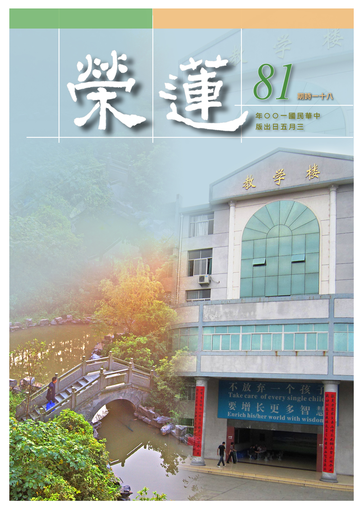

# 第81期

## 社論

### 搬新家

本刊

十年努力略有成

感得護持新道場

公心學習新氣象

真正住進新道場

一群平常有志共學者，在民國八十八年九二一大地震的因緣下，為了安定修學者的心，成立了共修會與社團法人，以利益社會國家，又有善心人士提供場地，作為興辦教育、慈善、護生、臨終關懷等事業的依止處，迄今已十餘年，其中謹守雪公遺訓四為三不，且因作了一些利眾之善法，故得到許多善友的迴響，然原本所使用的道場功能有限，借用了居士會，也有若干待克服的障礙，經過了多番尋覓，在得到贊助下，才有在寧波西街新址的因緣，可以說是得來不易，倍感珍惜。

經過多番意見整合後，新道場將特別著重於教育，以培養儒佛正見的人才，傳承正法，擁護三寶，弘揚聖賢的道統，興辦正法事業，護持弘揚正法團體為主，故將新道場作整體的規劃。

目前規劃一樓為文化交流及社區教育中心，將可辦理社區聯誼與藝文講座，書籍與文物流通；二樓為講堂，除了內部共學，並興辦各類文化講座，且設有遠距教學及錄影功能，傳播學習正法風氣，平常亦可開放為自習室，方便各自用功；三樓為辦公室、會議簡報室、大專班、啟蒙班教室、圖書閱覽室，作為推廣事業，培養後進及發揚讀書風氣的場所；四樓為佛堂及貴賓會客室，除了大眾共修，亦可開放日夜念佛，作為精進修學者的殊勝環境；五樓為共住區域，男女眾分開，除了方便護持道場有安住的處所外，亦可提供幹訓講座參加者夜晚休息處。

透過上述各樓層功能介紹，希望可以跟社區有良好互動，並推廣健康蔬食、啟蒙讀經教育、大專生及成人讀書會，亦可作為兩岸傳統文化交流中心，提供蓮友大眾安心修學的環境，能普遍照顧每一位蓮友的需求，在新的道場中作整體的學習，並服務社區，廣結善緣。

要達到上述所說的理想，講堂與佛堂需有道場公約來維持道風與規矩，所謂：導之以德，齊之以禮，有恥且格。其次確實執行年度行事曆，建立大眾對團體的信心，對團體有貢獻為公發心的人要被禮遇與尊崇，發揚為公的風氣。所辦的事業要以利益有情為目標，非以金錢及其他私利為考量。

聯誼交談雖可聯絡情誼，然要在不談是非，尤其不可妄加評論三寶、僧眾及破戒比丘，不談詭異及預發生災難及顯示神通等事，雖然隨緣變換擔任的角色，或是有些興革事項，但是不變的是倫理道德，要有謹言慎行的修養，遇到同參道友不如法的舉動，要以隱喻的方式歸過勸善，不可以破壞和諧。

至於蓮友贈送的物品，不能違反施主的意思，要懂得物盡其用，不可以輕易浪費；書籍與資料的流通要經過審核；遇到有不如法的人與事，須有金剛心處理甚而割捨；服裝儀容上也必須要有講究，令人讚歎團體的氣象；將事業的成果歸功於三寶、傳承及團隊的加被，各個領眾者要將所屬的團隊帶往尊貴的路上走，讓參與者與有榮焉；善友見面時要重視長幼尊卑進退的禮節，後輩要懂得在身口上承事尊長們。

以上所述，乃新道場場所使用伊始，不但要具備硬體設施，更要著重軟實力，亦即全體蓮友一同發揮公心與向上學習的心，使得團體不但有大家庭的溫暖，更是學習正法殊勝的環境。

總之，個人來團體學習要有報恩的意樂，護持團體的道風，鞭策自我的成長，團體和合辦事。若能如此，必定帶來個人與團體的出路，是真正的搬新家。

## 大德法語

### 大方廣圓覺修多羅了義經（四十）

道源老和尚

內心良善是文明進步

大悲修圓覺為真良善

所證之圓覺即大涅槃

隨順諸菩薩願乃大悲

乙二、正宗分

丙二、令依解修行隨根證入

丁二、廣明行相

戊一、四問答通明觀行上根修證

己三、深究輪迴根本

庚五、正答所問

辛二、偈頌

壬二、正頌

經文：

彌勒汝當知！一切諸眾生，不得大解脫，皆由貪欲故，墮落於生死。若能斷憎愛，及與貪瞋癡，不因差別性，皆得成佛道。二障永銷滅，求師得正悟，隨順菩薩願，依止大涅槃，十方諸菩薩，皆以大悲願，示現入生死，現在修行者，及末世眾生，勤斷諸愛見，便歸大圓覺。

一切眾生為什麼不能證得圓覺大解脫，原來可以成佛，而未成佛的原因在哪裡？皆由貪欲故，墮落於生死。

一切諸欲是外邊的境界，對之欲得生愛心，得不到生憎。有愛方有憎，所以愛為生死本，斷了憎愛（惑）及與貪瞋癡（業）。則不因差別性，皆得成佛道。前述五種種性（差別性），若是發了菩提心，了解無明是生死根本，斷了憎愛二心（惑），再斷貪瞋癡（業），則不論什麼根性都得成佛道。

修行用功須斷除二障（事障、理障，或說是煩惱障、所知障），得勤求善知識，要真正遇到大乘的善知識，可以得個正當的開悟。

善知識會引導你先發菩提大願，並指導你修學的法門，若能隨順真正的善知識，一定證悟大乘的涅槃為你的依止，小乘涅槃非所依止。

十方諸菩薩皆依著對佛法勝解的大悲願，示現入於生死道中。

現在修行圓覺大行及末世求大乘的眾生，雖欲修行，然因煩惱多不得開竅，最根本的煩惱就是愛，由愛生憎起貪瞋癡，生起枝枝葉葉，共八萬四千煩惱，若除枝葉難以盡除，若由樹根拔除則枝葉枯萎。樹根為何？即是愛！

所謂欲界的眾生愛婬欲，色界、無色界的眾生愛禪定。佛的大悲心不是愛見，是故欲發大悲心度眾生，不要生愛見污染大悲心，以為發了大悲心度眾生，結果不是大悲，而是愛見，怎麼知道呢？大悲心是平等，對眾生不起愛、憎，若與眾生結緣，這個眾生順乎你的心，你就生起歡喜心，那個眾生不順乎你的心，你就憎惡討厭他，這就變成愛見了，所以你的大悲心變成愛見。

我們是欲界眾生，愛婬慾的，釋迦佛為什麼訂出家制度呢？為了斷婬慾。我們講這話是不合適的，現在是提倡愛的時代，他們的理論是眾生沒有了愛，這世界社會都停頓下來，因為大家沒有了進取心，所以要眾生發展愛，把愛發展開了，一切人類都有了進取心，謂之文明會進步，不然會停頓，導致文明退化。

什麼是文明進步？生活享受增加，大家都享福了，所住的房子變得豪華，所穿的衣服追求時尚，所吃的東西講究山珍海味，所用的傢具講究氣派，生活跟以前不同，都進步了，謂之文明進步，人類都享了福。

如何能得到這樣的福氣呢？就是因為提倡愛，才得到如此好的結果。他們不曉得生活提高，享受增加，這些文明進步不是提倡愛的結果，是那些研究科學的功勞，試問現在住的房子怎麼樣了？有一層樓、二層樓，甚至住到幾十層樓，上樓梯不走台階，而是坐電梯，煮飯不要燒柴，而是用瓦斯、用電爐，織布不要用手來紡棉線，以機器紡織越織越快，越織越好，這些是科學家的發明，不是提倡愛的人成就的，研究科學的發明家，都是沒有時間研究愛，一天到晚都在實驗室裡做實驗，白天沒有時間談愛，到了夜晚睡到桌面上還在想問題，到了夜晚也沒有時間談愛，即使結婚娶太太，也不能跟他過個好日子，所以乾脆不娶太太，大半是獨身主義，不但科學家如是，大文學家、大哲學家差不多都是獨身主義。這生活提高、文明進步、享受增加，是科學家的功勞，不是提倡愛欲的結果。

提倡愛欲的結果是怎麼樣呢？在美國產生一些嬉皮，在台灣發生很多的輪暴案，這都是提倡愛的結果，除了增加罪惡以外，沒有半點利益可得。由此邪知邪見產生的邪說增加人慾橫流，如洪水猛獸。甚而勝過洪水猛獸，猛獸中最厲害的是老虎會吃人，然這個地方有老虎，就只在這個地方受害，而愛欲邪說風潮卻能傷害全球。

至於洪水，洪水氾濫中國，不過就在中國內部一區耳，西洋的洪水氾濫也只在西洋某一區，不能氾濫於全球。現在提倡性愛，是遍於全世界，且是一切煩惱的根本，且能將百法消滅。例如中國的傳統文化，儒家講究的是禮教，可以防堵人類的愛欲，他們卻說吃人的禮教，要打倒孔家店。

西洋雖有宗教，但他們也不去禱告上帝，不去禱告耶穌，這些邪說簡直無法防衛，若讓此洪流下去簡直不堪設想！

我們慶幸學了佛法有點善根，不會學他的邪說，即使去度眾生，也得度有善根的眾生、有緣的眾生，不能因為無法挽救，就不要弘法了，眾生難度，我們還是要度，隨我們的力量本分，學多少就弘揚多少，即使度了一個眾生也算盡了責任。發菩提大願要緊，依著菩提大願修行要緊，成佛不是一天的事，須依菩提大願修行，盡未來際修學下去就對了。（下期待續）

### 常禮舉要講座（二十二）　對眾篇

雪廬老人

對眾安定有威儀

言談音量及動作

有禮他人好觀感

通達人情有出路

對眾

群眾社會離不開人，禮貌就是專為對待人的，以下是對大眾九條。

◎一、他人正談話，不在中間插言。

兩人在談話，不論坐著或是站著對談，不在中間插言。人家還在談話，咱們不可當中插言。這是大毛病！你把他人的話打斷了，不用說有急事，就是短短的說完了，人家的話也接不起來。這個情形我見了很多，一個人、二個人談著話，當著人家插嘴、這個是大毛病。

◎二、兩人對談、不向中間穿走。

兩人正站著談話，你向中間穿走，雖說你沒插話，雖沒插話但他倆人正對著面談，你可以繞著他倆的身後走，不能在他倆人談話的中間穿過去，這個得記住，這都是大毛病！

◎三、不高聲喧嘩，擾亂他人視聽。

大家同在一處，不是只有你一個人，若是你講演，那可以高聲，不是你講演，而是大家在一個屋子裏談話，或此處兩人談話，或那裏有兩人聊天，或另處有兩人交談。譬如道場講經前，人到了很多，在我講者還沒出來講時，唰唰！如同下雨似的，彼此談話都聽不清楚，所以在大眾之下不能夠高聲談說，這是一定的，否則聽也聽不見了。

叢林之過堂（佛家名詞），是上餐廳吃飯。從前靈山寺的當家師在鼓山，每逢打佛七，修學者過堂坐在那裏，有專門盛飯端菜的，但吃完了自己得到外頭將碗筷洗好，放在籠子上。吃得晚也要刷碗，且有秩序而不亂。有了秩序，辦起事來很快，沒有秩序就亂七八糟，應當十分鐘辦完的，一點鐘也辦不完。

凡是受過教育的，不管是儒家的教育、佛家的教育，亂的時候，是萬不能成功。可以斷定一句，凡是亂的、雜亂無章的，無道可求。就算你修行會什麼樣的方法，斷定你絕不會成功。有說：我會講，我會作文章。講與作文章皆不了生死，不如老太婆，這個你要記住，浮浮躁躁的心、靜不下來，還證什麼道！

不高聲喧嘩，為什麼呢？擾亂他人視聽！有若干人之聚會，躁音就讓人受不了。前述靈山寺當家師，昔日於鼓山叢林過堂時，幾百人在餐廳用餐，吃什麼呢？吃麵條，卻一點聲音也沒有，在這兒（靈山寺）當然還有這樣子，到了後來就不行了。你想一個人在那吃，涮涮的，在屋裏吃就像下大雨一樣，是不受教之人民，就是無道之邦。

◎四、不橫坐，不橫腿、不捫腳。

橫坐（與橫肱不一樣），如長凳子可坐二人，你個人坐在這橫在那，鞋子脫掉，人家還坐嗎？這就叫不懂人情。你們沒念過別的書，可念過唐宋八大家，有句話：不解人情，是謂大奸。是蘇老泉說的。不解人情，這個人就是奸，你看這句吧！為什麼？辦事辦不出好事來，都以妨礙人為原則。我只說我自己，不敢說別人，我在臺中幾個學校都教過書，同事們就有提倡給同學們自由，學生上課鞠躬他還不高興，現在不興禮這套了。是呀！學生鞠躬他不高興，太不自然了，那麼你這個當教授也不鞠躬？我也不鞠躬，我鞠什麼躬？然見了做大官的他就鞠躬，還有見了洋人他就規矩了，就是見了我們不規矩，這是我親眼看的。

不橫腿：

將腿一伸，人家過來過去就費事了，若伸得往後邊伸。譬如坐火車，你伸了腿、還罷了，因為坐在靠窗邊。你要是坐走道邊，將腿一伸，後來人要坐另一位子、看見你伸兩腿，有禮貌的就說：先生對不起。沒禮貌的，跨過你的腿。要是你腳上有他鞋子的土，對方云：你不讓我坐嘛！你這時還說什麼理呢？這火車又不是你家裏的，是公眾的。凡是無禮叫人看不起，皆是自找的，這句話很穩當，無論什麼都是自找的。

不捫腳：

不管你現在不穿襪子或是穿著襪子，都不便捫腳。或云：我天天洗。你天天洗，誰曉得的？就是不要當著人家捫腳。握手，是常有的，你今天雖然沒洗手，這還罷了。這個捫腳可不行，自己坐那，捫自己的腳的很多，你留心看。他自己捫了腳，我就常碰見這個，他高談闊論還捫了他的腳，捫完了起來，再給我倒茶，我這碗茶怎麼喝進去？他捫了腳我都不跟他握手。

◎五、不隔席談話。

譬如屋內，擺著幾張席，你談話、跟你的本桌上談話，也要講究食不言。你一在桌前說話，桌上的菜被噴出來的口水…，這就夠慘了。這還罷了！那麼隔了桌子談話，口水噴不過去，但擾亂人，隔席不談。不能隔著席，喂！喂！喂！什麼事情、什麼事情。那桌人不曉得你跟誰說話，這與登城不呼是一個道理。

◎六、坐不掀起椅凳之後方。

不管坐椅子、坐凳子，有些人會隨便將椅子的把後頭掀起來，就給擺椅一樣。這個椅子腿一下子掀起，後頭走路的人，細心的會看前面；不在乎的人很多，這個怨不得人，將椅子一碰、碰倒了，他當然說不高興的話，你那個椅子翹起來幹什麼？這些都是世故人情。書，並不是開天闢地就有，都是碰了多少釘子，有著經驗、閱歷而寫出來。前面的序，可以看看。總而言之，說句刻薄話，見了洋人，什麼規矩都有。

◎ 七、衣帽不加於他人之衣帽上。

譬如到外面，大旅館、大餐廳，客人的衣帽都有侍者掛好收起來，然而事情也不全都是這樣。若到朋友家，看見衣架上掛著別人的衣服，你則掛到別處、下處。譬如我照例地到人家裏去，圓圓的衣架是掛帽子，我的帽子是掛下一層，為什麼？練熟了，高的讓給人家。你只要練熟了，自然而然的不覺得是繁冗。

禮講究的是尊重他人，現在講的是值得驕傲，尊自己為先，有誰都不如我的觀念，這是大毛病，是亡國之道。這還亡國？人人都存著誰都不如我的心，你不說別的了，當大總統的就不能幹了，這些人沒有一個比得上大總統，你自己辦吧！你是總統嘛！誰比得上總統？這個不是我隨便講，是書經上有，自己要能處處看著環境都是我的老師。

韓愈的師說不在年齡。我九十多歲了，年輕如十三、十四還是我的老師嗎？他教的不是年齡，而是學術，他十三、四會，你活了九十多不會就得跟人家學。桀、紂，給你說吧！文武雙全，文武都能得不得了，就是亡國。宋家宋徽宗文的武的什麼都會，就是不會一條，不會做皇帝，不但亡國，又當了金家的俘虜。說到現在，你自己壞，也就罷了，你再教些兒童也學你，自害又害他人，成了社會害群之馬。現在教育不好，怎麼不好？皆是當教授這些人，人家好好的孩子，到你那兒去，你給人家教壞了。光責備對方，絕不責備自己。這件事情我辦錯了，早知不這樣辦不致害人，想這樣的就很少。

衣帽不往人衣上掛，也不往人帽子上扣。別人會以為他的帽子很乾淨，咱們那頂帽子，蓋到人家上頭！古書上某公，家裏住了客，到了晚上，聽到客在屋裏咳咳咳（咳嗽），這了不得了，第二天起來，連屋頂都洗了，一個人一個派頭嘛！其實那個人咳嗽，沒有吐痰。他聽見咳嗽，咳嗽必吐痰，不曉得吐那裏，他就洗涮這屋子。

◎八、不向人噴水吐痰。

兩個對著面談話，你離著遠，這一漱口，若對著這個人吐，你怎麼了？你沒看唱戲的，我（雪公）怎麼常說唱戲的？唱戲在從前最下等，現在唱戲是我的老師，這話怎麼講呢？各處的書我看，我學不到什麼好東西了，只有看看京戲還學到東西了。你看京戲，兩個人談話談不對，就「呸」！你見了人吐水等於那個樣子了。不但噴水不可，對了面也不可吐痰。現在是好了，不但不對面吐痰，公眾地點也不許你吐痰，你的痰要吐上外面去，人家園子打掃得很潔淨，你還吐嗎？你出來帶點衛生紙，實在忍不住則吐到衛生紙，包起來帶著，遇見垃圾箱可丟，沒遇垃圾箱，在字紙簍放下不就行了嘛。

總而言之，這條事情必遭人討厭，要恭敬人就這麼一句話。他人恭敬不恭敬，你不必管，聽明白！他人當小偷，我們也當小偷嗎？我們求學就是君子，有別於小人，這是儒家的原則。也不說別的，不好的人，就是小人。從前，說是小人那就了不得了。連那鄉下放牛、放羊的，你叫他小人，他都不高興，他都懂得！現在呢？你叫我小人，小人有什麼關係，有什麼不好處呢？只要有錢，你叫我小人，叫我小小人也行，拿錢來就行！

◎九、不向人呵欠，舒伸，噴嚏。

向人打呵欠我見了可多，這還不算、兩人正談著，舒伸（伸懶腰）或伸腿都是舒伸，這是極不恭敬。我不曉得臺灣的規矩怎麼樣，在內地你要這個樣子，他會迷信這一天會沒有士氣。

若忍不住噴嚏，須趕緊回頭，手摀住，衝著人打噴嚏，這都是毛病。（下期待續）

## 共修研學

### 小止觀導覽（五十三）

*心爾、智高整理*

善根發起分內外

外則尊師敬三寶

內為治惑修空性

輕安現瑞真法喜

第七章  善根發

論文：

今略明善根發相，有二種不同：一、外善根發相，所謂：布施、持戒、孝順父母師長，供養三寶，及諸聽學等善根開發。此是外事，若非正修，與魔境相濫，今不分別。

修學止觀門時通達法自相皆是空寂，面對世俗心境上亦有所改變。比如歡喜布施，歡喜受戒條的束縛，對父母、師長、三寶都懷抱著恭敬心、感恩心、供養心，對於聽聞教法的能力轉強等。何以故？由於正修的善根，得到空性的智慧，知法無自性，須觀待生起，於世間欲得安樂，乃至修學空性須有資糧，若修福不由正修止觀發起的善根攝受，則可能和魔境相濫。

何以會與魔境相濫？由於對世間起愛執，則布施等善行或著意於富貴等的安樂；故凡非觀待解脫與成佛的正修，皆非真正之善根。而此善根的分辨，依高登海居士的〈佛家靜坐方法論〉提到，可分三點：

第一、當行善法時，心思越來越安定、修學止觀的力量越來越強，這樣的善根發相是對的。反之，不辦事沒煩惱，一辦事都是煩惱。雪公老師說：不辦事可以慈眉善目，一辦事火氣就來，這就要小心了。

第二、善根發相暫現便謝。就是瑞相生起來很快就消失。因為行善或修學止觀的目的不是在生起瑞相。比如做事認真，可能會受到他人的稱讚，就好像是現起瑞相一樣，這只是給你的一種信心或鼓勵而已，並非我們做事情的目的，不能一直把它放在心裡，甚至在意它，重點應該放在我該如何把事情辦好、用甚麼心態去辦等等。所以回過頭來說，行善或是修學止觀的目的是在解脫成佛呢？還是瑞相的殊勝呢？

第三、善心發是否容易轉成惡念。比如布施容易轉成煩惱、持戒容易轉成束縛，或是孝養父母當中容易產生對父母的煩惱等，這就不對了，這就不是真的善根發相。所以是否為外善根發相也可以從這三點來檢視分辨。

論文：

二、內善根發相：所謂諸禪定法門善根開發有三種意：第一、明善根發相，有五種不同：

內善根發相，所謂諸禪定法門善根開發有三種意義：一、明善根發相；二、辨真正禪發相；三、明用止觀長養諸善根者。

首先明善根發相，即是說明善根開發的相狀。此中又有五種不同：一、息道善根發相：二、不淨觀善根發相；三、慈心善根發相；四、因緣善根發相；五、念佛善根發相。現在依序說明。

論文：

（一）  息道善根發相：行者善修止觀故，身心調適，妄念止息。因是自覺其心漸漸入定，發於欲界及未到地等定。

數息觀能讓行者調整身、心、息，並增長專注力，對於境界有觀修的專注力，如修學空性等。用數息將心攝持，並幫助我們專注於其他所修境界上，會使我們的妄念止息。以呼吸為所緣專注呼吸，妄念漸息，粗相的沉沒、掉舉、散亂，到細相的沉沒、掉舉、散亂的對治，皆謂妄念止息。

由於心只有緣呼吸，沒有緣其它的外境，乃至細沉細掉都不會產生，而且不需要刻意對治，此之成就為欲界定。

欲界定持續一段時間，生起輕安之樂，就進入未到定，是未到初禪正分的定，然已屬初禪境界了。此時會覺得很舒服，由於將欲界四大轉變為色界的四大，而且行相是風大充身（地水火風的風特別充盛），整個人頓覺輕鬆，沒有沉重相，此即禪定的行相，此人即使在辦事，也不散亂、不浮躁，自然穩重。

論文：

身心泯然空寂，安心安隱。於此定中，都不見有身心相貌。於後或經一坐、二坐，乃至一日、二日，一月、二月，將息不得，不退不失。

此時即是一心不亂，於此定中無身心繫縛，由於所緣僅息之出入，故不見身心相貌（此與空性定之照見五蘊皆空不同）。

論文：

即於定中，忽覺身心運動，八觸而發者，所謂覺身痛、痒、冷、煖、輕、重、澀、滑等。當觸法時，身心安定，虛微悅豫，快樂清淨，不可為喻。

何以於定中發起此八觸呢？乃行者從欲界定將入未到定時，身體產生的變化，由欲界的四大要轉成色界四大時的感覺。此時雖有痛、痒等，然是屬於舒服的痛、痒等，氣脈全通，開神悅體，精神與身體狀況良好，心識也很明朗，這些都是屬於要進入初禪的狀況，當經過此八觸的感覺後即進入初禪。

而此痛、痒等八觸發動之時亦會伴隨著十種善法而生：一、定，二、空，三、明淨，四、喜悅，五、樂，六、善心生，七、知見明了，八、無累解脫，九、境界現前，十、心調柔軟。

論文：

是為知息道根本禪定善根發相。行者或於欲界未到地中，忽然覺息出入長短，遍身毛孔皆悉虛疏，即以心眼見身內三十六物，猶如開倉見諸麻豆等，心大驚喜，寂靜安快，是為隨息特勝善根發相。

以呼吸為所緣，一呼一吸清清楚楚，在此數息當中，身上的毛孔也跟著張開，好像每個毛孔也在納受外界而呼吸，心裡隨著自己的呼吸，忽然就在澄淨的心識觀見各種體內的不淨物。如果有內道的修學，會在數息觀中見到身體的三十六種不淨物中，生起甚深的出離心。

何以世間的男女之欲在現行上不能斷？就是因為沒有好好觀察這體內的不淨、體表的不淨，沒有觀察此身無可愛戀，才會愛著自身，並愛惜對方的身體。反之，若能好好的觀察自身不可愛、他身不可愛，即能對治男女之欲，數息觀是一個非常重要的修學法。

（下期待續）

## 專題研學

### 聖者的祕密～大佛頂首楞嚴經二十五圓通暨七處徵心探源

### 二十五圓通暨七處徵心簡介　（二十二）月光水大～上

時哉

童真入道堪調教

反璞歸真似童子

天真無邪深智慧

證水性空是月光

月光水大（上）

寅三月光水大

卯一作禮陳白

經文：

月光童子即從座起。頂禮佛足，而白佛言：月光童子從水大現證圓通。

童子有二種涵義：一是童真入道，一是天真無邪。經上有稱文殊菩薩為文殊童子，代表學正法要從小開始，在還沒有受世俗染污時就要修學正法。

印光祖師論教育時，特重啟蒙教育，在心智尚未成熟時予以栽培，如塑造器皿時，先塑造成好的器型，待燒煉後即成上等器皿，孩子在尚未成人心智未成熟時，先塑造他處處為人著想的好個性，並好樂於正法之修學，這些都必須在心智未成熟時好好培養成這樣的個性，不然等到了習氣已定之時，如同生牛皮一樣難扭轉。許多在世俗中打滾了一圈，雖回頭想要好好的學佛，然世俗的習氣太厚，往往帶到佛門中，成為修學正法的障礙。所以童真入道是學習正法非常重要的機緣。

其次，修學不可失赤子之心，老子云：「大人者，不失其赤子之心。」大人就是修學有證量的人，行相是不失赤子之心，天真無邪，為什麼呢？因為內心對治了私欲，非如世俗之人，私欲充滿於心，什麼事情都盤算對自己有利才幹，修學有成的大人，已經沒有這樣的煩惱習氣，所以稱為童子。

童子名為月光，乃約世俗菩提心(未被現證空性的智慧所攝持的菩提心)而言，世俗菩提心何以用月來形容呢？因為生起世俗菩提心時，帶給別人的是清涼，帶給自己也是清涼，因為沒有為自己著想時，熱惱不生，替別人著想時，別人也會感受這樣的誠意，當下的相處是一片清涼。

勝義菩提心(被現證空性的智慧所攝持的菩提心)可以太陽為喻，因為修學空性的智慧，最能成熟自己與眾生的善根，就如水果在太陽光下容易成熟，有此空性智慧能助自己與眾生得到解脫的安樂。

卯二陳白之言

辰一古佛授觀

經文：

我憶往昔恆河沙劫，有佛出世，名為水天。教諸菩薩修習水觀，入三摩地。

我憶往昔恆河沙劫，就是觀待恆河沙劫相續的名言我，生起往昔恆河沙劫前的名言我所相應的事，自相的我是了不可得的，前我與後我若有自相，則前我與後我將變成無關，如同我與他乃不同個體。則前我造善緣，如同他造善業，不會是後我得安樂，如果前、後我是有自相的我，前我造善，後我就不會得樂，前我造惡，後我就不會得苦，自相的前、後我是不可得的，我之自相了不可得，所以觀待前我生後我，以前我為因，生出的後我為果，前我造善，後我去得樂，前我造惡，後我去得苦，前我後我之因果關係若是名言的安立，我就能詮釋得清楚明白。

在恆河沙劫前，有佛出世，名為水天。觀水而得第一義天，稱為水天。天在佛法裡有二種講法(世俗天與勝義天），六念法：念戒、念天、念布施、念佛、念法、念僧。此處念天即是念世俗天與第一義天，念世俗天是未來要成就的異熟果，念第一義天就是未來要成就的離繫果。

皈依三寶、依戒修善法，利樂有情，可得增上生的果報，此即世俗天；並依此作為修學空性的資糧，斬斷煩惱的根本，此稱為第一義天。二種天都是我們皈依三寶，持戒、修施等一切善法的目的，所以稱為念天。釋迦牟尼佛在很多的場合都開示行者要好好地修學六念法，此六念法不只是在家二眾要修，出家二眾也要修，普遍一切學佛的人，都要修學此六念法。

水天就是以水為所緣證悟第一義天，由水通達水的自相空得到圓通。不只觀音菩薩為普門，一切佛都是普門，就是修學任何門皆可證悟圓通，此佛特別是引導修學水觀，那是觀待眾生修學的機緣，而不是這尊佛只會修水觀，觀待眾生修學的機緣，佛顯出這樣的特色。如文殊師利菩薩稱為智慧第一，或問此菩薩慈悲較劣嗎？在四大名山中的五台山上尚有表徵菩薩大悲的千手千眼，與觀音無二無別。所以說，文殊菩薩是智慧第一，乃觀待眾生而展現這樣的特色，且此菩薩的證量與佛無差別，能從各種的門引導眾生現證圓通，亦是普門度眾。

教諸菩薩修習水觀入三摩地是水天佛的特色，當時月光童子在往昔恆河沙劫時，有因緣聽水天佛說法，水天佛當時教授他修水觀三摩地。

辰二、依觀久修

以下就是依觀久修，久修二字非常重要，有些人說念佛不能對治煩惱，那是因為從來都不曾久修過，從來不曾用力修學過，從來沒有持久過，當然三摩地是不能生起的，三摩地不能生起，煩惱就不能有力的對治，煩惱不能有力的對治，身心就不能輕安，而妄說念佛無用論，此即謗法。

巳一、習觀初後

午一、初觀身中

經文：

觀於身中水性無奪。初從涕唾。如是窮盡津液精血，大小便利。身中旋復，水性一同。

所謂水性無奪，後述即是水性無奪之義。

涕是鼻子流出之水，唾是嘴巴流出之水，津就是嚥下去的口水，液就是舌頭上頂顎所流出來的口水，精是骨髓之水，血是筋肉裡的水，乃至於大小便之水，此乃由涕唾觀至精血，身中旋復就是來回觀這些水，在旋復（來回觀中）通達水性一同，大便的水、小便的水、口水、精水、血水、骨水，這些不同顯現的水，自相皆空，呈現的是臭與香、濃與稀乃至顏色不同的水，自相雖空卻有世俗上不同的顯現。

水與空性體性一樣，稱為水性一同。水的自相空與空性是同一面相，但水之面相與水的自相空卻是不同的面相，若是同一面相，會產生什麼樣的過錯呢？先明空性與該法（水）的體性是一是異？若是非一（異），則無法在該法（水）上通達空性，水的自相空與空性若體性不同，則以水為所緣，也無法通達空性，亦即無法透過觀水之法門現證圓通。

其次水的空性與顯現的水（世俗法）若是同一面相，會有什麼過患呢？若是同一面相，則看到該法就看到該法的空性，若如此，修學空性則成無用，見到世俗法當下即解脫，亦即依金剛經、般若經修學空性，或從恆河沙劫前修學圓通者都成無用，且世間人見到該法的世俗面相上就可以看到修學空性而破除對該法的執著，事實不然，可見該法的空性與該法的世俗是不同的面相。

邏輯辯證後，內心應會承許水的自相乃空性，但顯現出不同面相的水與空性，所以空性與水同一體性，但是空性與水是不同的面相，如此，月光童子就在水中生起空性的面相，在世俗法中生起自相空的覺受，自相空從沒離開過世間，此為水性無奪。

水性無奪是說水的自性空與水是同一體性，無奪就是無法可緣念。就如同心裡想到麥克風，心就奪麥克風，就算麥克風離開我的心，離開我的五識，心裡仍然可以顯示麥克風，無奪就是拿不過來，因為現證水的自相空以後，要拿什麼法顯示在我的心識中？現在顯示在我心識中的是自相空（什麼也沒有），請問要奪什麼過來呢？所以顯現的水與火，都是在自相空當中的顯現，就自相空的顯現而言一切法皆同，就世俗的顯現當中，隨人的名言而有不同的顯現，世間就是這樣而已，離開了名言沒有真正的世間可得。

午二、後合界外

經文：

見水身中與世界外浮幢王剎，諸香水海，等無差別。

月光童子先以身上的水為所緣，一般而言，要修成這樣的定是很難的，十人有九人修不上，初學者要先修數息觀，讓心定下來，以呼吸為所緣，清清楚楚，在心非常定，只剩下呼吸的顯現時，身上的五臟六腑、四大顯現，此時鎖住身上的水大觀察。

這些修學法用說的容易，需經過多年修學才能達成，佛法博大精深，越瞭解會越來越謙虛，但也因了解而不會走錯路，不管是要在山中修學或是在叢林修學，隨眾修學或獨居修學，教理不能不通，教理不通就是盲修瞎練，不是抱幾本註解自己看就可以懂，佛法無人說，雖智不能解。

此時月光童子以身中的水為所緣，清楚地觀察，他身中的水與世界外浮幢王剎，諸香水海，水性等無差別。浮幢王剎就是如華嚴經中所云佛世界的香水海，原來身中的水與佛世界的香水海體性等無差別，等無差別是就體性上而言，自相上無差別，是自相空。

水之自相何以空呢？觀待地、水、火、風而生起的水，水能自己生嗎？水無法自己生起自己的相，觀待地、火、風，才有水相可得，水不能獨立於地、火、風之外而成為水，如水能載舟為地大，水的流動為風大，水之潤澤為水大，水的溫度為火大。

若沒有觀待火的水，能成為水嗎？沒有溫度了，能成為水嗎？有沒有見過沒有溫度的水？沒有溫度的水，已無法稱之為水，所以沒有水的自相，若沒有地、火、風而成立水，一粒微塵也找不到。

心念也是一樣，觀前之心念亦是觀待過去和未來的心念而有現在的心念，現在的心念無法離開過去與未來的心念，而有獨立在當下的現在心念。此時可下一結論，臨終者心識有法，將產生下一世的心念，如現在的心識，若此邏輯不能成立，則此時的心識也不能說，我現在在想什麼的現在也說不出。

觀待地、火、風而有水，若無心識現起，此之水相亦不能生，謂之心識的名言安立，離開這些的觀待，尋覓有自相的水之顯現，盡虛空遍法界找不到一粒微塵。

（下期待續）

### 六趣輪迴經簡介（十三）修羅、天道

*智芳整理*

善道人天阿修羅

受用差別由前因

用福修道利有情

解脫成佛真究竟

修羅趣

經文：

常行於諂誑，樂忿恚鬥諍，由昔行施故，而作修羅王。修羅趣竟。

諂誑都是討好他人，諂是將自己過失蓋住，裝模作樣；誑是誇耀、吹噓自己的功德，皆是與貪癡相應的行相。喜歡貪名圖利，不知因果報應，所以會生起諂誑的行相，諂誑的人無法與善知識相應，一生無法於正道上修學，此乃修羅道最嚴重的過患。

其次樂忿恚鬥諍，忿就是喜歡發脾氣，恚就是心裡常常悶悶不樂，鬥是身體喜歡跟他人鬥，諍是口裡喜歡與人計較。

然由於昔日曾經行布施給別人好處，而作修羅王。

阿修羅也稱為無酒，由於善力不足沒辦法釀出美酒，因而作不出許多佳餚，嚐不到美食。

阿修羅也叫做無端正，因為生前樂忿恚，喜歡跟別人計較，也喜歡跟人鬥爭，所以長得不好看。然此道的女生長得艷麗，因而嫁到天上，所以阿修羅常常向天發動戰爭，兵敗之後又再發動戰爭，此之苦連天道亦有。

由於瞋恨和嫉妒，令彼內心常常不平靜，由於喜歡發脾氣，內心不安穩，睡不好，又因為常常向天交戰，弄得喪失生命，且因忿恚緣故親近不了善友，傷害了慈悲，所以受用不好。

天道

經文：

樂修十善因，於他無損害，諸天常護持，得生四王天。

修十善生天，其中四王天壽命五百歲，四天王每一天是人間五十年，如此合計相當於人間的九百萬年。試想人只要以短暫的一生力行十善，就能感應九百萬年的快樂。昔日彭祖壽僅二十，於八仙下棋時，服務八仙吃、喝，感得八仙每人賜予百歲壽命，彭祖共活了八百二十歲，可知天福和人福的差別有多大了。

反之不於人道行善而下地獄，果報也相對悽慘，例如等活地獄的一天是四王天的一生，如此則等活地獄的一生是人生的一兆年（1.62*10¹² ），地獄中起碼的受苦時間是如此的漫長，試想人生如此的短暫，卻可以享這麼大的快樂，也可以受這麼大的痛苦，若於因果觀念勝解，生起修法的意樂，鋪未來之路，這比考上好學校、得到好前途還要現實百千倍，總之眼光要遠、知見要高、立足點要穩、看法要明確、目標要設立、共識要結合，才有真正的福報。

四王天以上的生活非常快樂，天衣、天食、住處等都可以自己化現，生活不必為了衣、食而煩惱，且生活環境優美，景色宜人，又因為每個人的生活都無憂無慮，所以天人的相處也很愉快，不會有各行各業的競爭。壽命不但長，休閒的活動也多，天天打曲棍球、騎天馬、逛花園，每天過著幸福美滿的日子。受用著美貌的天女、天池流芳、天衣無縫、天廚妙供，男人不但長得英俊瀟灑，娶的太太也很漂亮。人間最殊勝的盛況，從天來看怎樣看也看不上眼的，樂修十善是生天的因。

經文：

於父母三寶，恭敬隨能施，具忍辱柔和，得生忉利天。

馬鳴菩薩於本經最後將人天道結合到善業、結合到正法，所以此經與一般生天的因不一樣，生天也可以是外道生天，而此處是結合內道的修學說生天。世俗人也可以生天，並不是一定要學佛才能生天。也有人家中長輩雖然沒學佛，但也是預知時至，看到天的快樂很高興的離開人間。馬鳴菩薩此處將十善業結合到佛法的修學，凡對於父母、三寶能供養，並有忍辱調和的心，以生天作為修行佛法的增上緣，具足修學的道糧。

若不透過正法的修學，生人天會有什麼過患呢？天道將是個可怕的環境，因為天道無善法可為，大家都很富有所以沒有布施的對象可做布施的善法。由於生活安逸，所以無苦的覺受，自然不會想修學正法以離苦得樂，只有等待天福享盡，五衰相現起時，才生起恐怖的感覺，但此時已經來不及了。由於生活都很享受，所以大家都很現實，在臨終五衰相現時，平常寶愛的天女此時避之唯恐不及。

原來生天是苦的，在天福享盡後，一切都明白了，可是來不及了。由於生活太安逸快樂，所以眼前遭受一點點的痛苦都受不了，由苦引發諸多煩惱，能將過去生所造的惡業生起，由於惡業的牽引墮落到三惡道受苦。

五衰相包括：

第一、身體開始有臭味（身臭）。

第二、人容易變得躁動，不能安住在位子上（厭座）。

第三、頭上的鮮花掉落（花萎）。

第四、衣服開始變髒（衣垢）。

第五、身體出汗（腋汗）。

五衰相乃天道三苦之一，三苦是：

第一、死墮苦，死前現起了五衰相，知道將來會墮落到三惡道受苦，因為害怕未來的報應，眼前即產生巨大的痛苦。

第二、悚慄苦，大天子發威時有恐懼悚慄之苦，如忉利天王發怒時，下屬四王天及其他三十二天的小王（四王天可以稱做守邊關的將軍）都很緊張。如同古代在皇帝身旁的辦事人員都是提著腦袋辦事，一方面享受做官的福報，一方面因畏懼天威而提心吊膽。

第三、砍裂殺害苦，由於阿修羅時常來挑釁，常遭受砍裂殺害之苦。佛經上有個公案，一次四王天邊關潰敗，阿修羅直接打到天庭，四王天請求三寶加被，於是文殊菩薩騎著六牙白象迎戰，阿修羅大軍才節節敗退，最後躲到蓮花池的蓮苞裡。以上是生天的痛苦。

其次天分為色界天和無色界天，此處未詳述。此處是生於忉利天之因，是對父母、三寶恭敬且依著自己的能力來行施，並具有忍辱與柔和的態度。

忉利天是對三寶護持的天，天主昔於迦葉佛時代造塔，成為天主之因。對父母、三寶供養，對苦難的人布施，具備恭敬的心態，同時還要忍辱柔和。柔和是很高興、愉悅、恭敬，且肢體很柔軟。忍辱有時候是對方不領情，或是父母師長示現不合理的那一分，修學忍辱是要護住內心慈悲的那一分。一般大概都很難如此，對方給我難堪的臉色時，我們就不想修忍辱了。

例如以樂修十善得到人身，若想生活無憂無慮，修學正法有資糧，須以布施為因。然須依願力以及對法好樂之分，於來世方具修學正法之順緣，然修學的正法未必能成為解脫或成佛的因，例如有很多學者、專家也修學正法，寫了許多關於佛教的論文，但這些未成為彼解脫、成佛的因，唯有皈依三寶才能具足會遇到善知識的機會，透過彼之指導可成為解脫、成佛的因。

（下期待續）

## 論文研究

### 臨池學書十字修學法設施之探討

傳線

氣定神閒書法功

下筆猶如混沌開

十字修學雪公傳

文以載道字如人

一、前言：

去（二０一０）年十月初有機緣隨老師赴浙江永康講授「書法學習面面觀」，分享一己近卅寒暑之學書經驗，由於是以綱要方式刊載於學習手冊，不免過於疏略，林老師認為應再為文補充，以記此段因緣，不揣勉勵為之。

因講授綱要題目訂的廣泛，若要一一詳說，一則時間恐拉得過長，再則篇幅易趨於冗繁，一時要完整補充，力有未逮，祇得就本次樞要之處，先擇其發古人未發處，作一說明，希利有志臨池之初學者，兼益已學者，導其迷惘。

十字修學法雖只是綱要中一小節，卻是本次講授中之最欲分享之理念及推廣之修學法，它攸關形而上之志道，並涉臨池次第之修學法，更連結趨道之下手處，理當明說細論，另課堂中未發揮結合八法之鍛鍊法，一併於本文敘述。

二、臨池十字修學法之緣起

雪公太老師逝世廿週年紀念論文中，任容清先生撰寫「由一絲不茍至一心不亂」文中，首次拜讀到  雪公開示後進臨池學書法「十字修學法」，內容大意，乃隨各人性情擇一碑或一帖，並從臨寫之碑中選十字，半年不改易，十字意臨至形神俱似，曾作一對聯歌頌此修學法之殊勝，文曰「臨摹十字  心治，遵奉前賢定力增」。

因該論文重點在介紹  雪公之書藝成就，是以其深厚學養及修行境界，有以致之，其將得道之成就一心不亂，顯於書藝之行相上故能一絲不茍。然選擇何碑何帖，又十字為何，並未在文章作一說明。

三、如何揀擇十字

十字選擇竊以為頗適用於楷、隸、篆三種字體，此類字體相較於草書、行書為靜態且規矩，又變化相對少可分析依循，易於掌握，也能體現一絲不茍之用筆；又十字選擇屬普遍性可應用於上述三種字體之任何碑帖，非指某家某體才適合，他家他種字體就不適用，係首先得要表明之淺見。

曾思考十字修學法之選擇，分就漢字的合體獨體結構、難易度、部首來判定，茲述如次：漢字結構不外乎獨體字如大、人、弓、干等，而合體字結構有包括左右、左中右、上下、上中下、左包、右包、上包、下包、左右下等，各取代表字，組成十字，此揀擇法之一也。

不論臨池程度，或入室或入門，任一本字帖總是有易寫及難克服之字，自可依九品中正方式以選列，從最易至極難，所謂下下、下中、下上、中下、中中、中上、上下、上中、上上，九等級各取一字，便得九字，再多取極難上上一字，即有十字，可供臨寫；然此舉人或責難九等級如何挑選，恐仁智有別，不易有共識，此揀擇法之二。

拜今日科技之輔助，從部首之歸類，欲由漢字二一四部首篩選前十名部首所包含字亦不難，如由全字庫網站搜尋得知前十大部首為：草（四０八二字）、水（三七六０字）、木（三五０八字）、金（二四八八字）火（二二０四字）、人（二０六三字）、土（一九一０字）、糸（一八０四字）竹（一八０三字）、玉（一六０五字），漢字依部首歸入字之多寡，甚吻合易經繫辭所云：「近者取諸身，遠者取諸物」之原則，同時也暗合自然律。姑且不論所選碑或帖之文章性質，依用字之或然率，上列前十名之十部首，各擇一字，大體上也合乎科學學習法，此揀擇法之三也。

上述三種方式，就一般習字之人，若細繹十字揀擇法，不失為一可資參考的學習方式，惟與道又何干係？如何由藝體道？顯然關係不大，從此以往，致遠恐泥，是以君子不為也。臨池習字近卅寒暑，莫說一心不亂境界未觸及，就連一絲不茍的修為，也沾不到  ，昔時無聞此法，迄今書道尚遠矣。

四、藝與道結合之十字修學法

既然覺察上列揀擇十字，難與趨道，只得另闢蹊徑，多年從師友的學習切磋，靈光忽現，何不將十字臨池轉其體性，以供養諸根的方式來揀擇此十字，並結合初學適合之楷體極致--九成宮醴泉銘，此帖結構平正嚴謹，字數又多至八百餘字，為歐陽信本（歐陽詢字信本）晚年成熟之字，線條不只達到爐火純青，且觀其一筆一畫，一絲不茍，盛名不墜，良有以也！以一絲不茍之字帖入門，實是最佳選擇，進而十字臨寫，就功夫功效而言，雖慢猶速。

翻閱字帖，不停思維，文字是無聲語言，斗膽姑取其屬正語如道、德、仁、誠、心、永、明、孝、神、智等十字，從而引發正思惟、正念，書寫正語之字，思維其義、誦念其聲，聽聞其字義，分析其結構用筆之精微處，不正供養一己意根、耳根、舌根、眼根，體會聖哲造字涵義及精思的構造，如是臨池竊以為可與道接軌，由藝上溯體道，而不致淪落藝與道成二橛。

所謂臨摹一絲不茍，愚以為即用筆要專心且筆筆送到家，不含糊、不急躁，能摹固然好，若直接從臨入手，不妨每一字先格臨，格臨以得字之分布位置，近一步觀察每一字之起筆、收筆種種變化，或方筆或圓筆，或輕起或重起，或斜入或正切；運筆或快或慢，或疾或澀，或提或按，或舖展或收攝，易言之慎觀點畫間，若千里陣雲之變化，復體察書譜所云「一畫之間，變起伏於峰杪；一點之內，殊衄挫於毫芒」。

其次對臨，對臨取其神，取其結構與字及用筆別樹一幟之特徵，庶幾能神似，而後背臨（又稱意臨），形神俱似，再換一字臨寫，以此類推。半年估計為一百八十字平均每字臨寫十八日，對初學者十八日要將一字寫到唯妙唯肖，也不容易！

但每臨一字，還須視用力程度，視日臨一小時還是二小時或以上，自然功效不等同。此一習字法，可培養學子定力，敏銳觀察力、耐煩力、專注力、精進力、審美力、細膩力、挫折力、模仿力、體悟力等；縱使有如此功效，首先得信此法之功，信則入，其次，仍須有知此法具信心之師長引導，方有積漸而成之可能，其目標迥異常俗，要在透過臨池以入道，進而得道。

回想自己弱冠方臨池，一路尋訪名師益友，在書藝上雖漸入佳境，究竟與道總覺有隔，雖知書亦有道，終究只是理上知解，就臨池一事，未能以事明道，不獨一己如此；縱使如晚清書論大家，書學泰斗康南海（康有為號南海），在其傑作廣藝舟雙楫購碑第三，論及古人臨書態度，「學書須專學一碑數字，如是一年數月，臨寫千數百過，然後易一碑；又一年數月，臨寫千數百過，然後易碑亦如是。」

從此一記載，知十字臨池法，亦有所本也，係損益古人之臨池法，然康氏又云：「……夫學者之於文藝，末事也；書之工拙，又藝之至微下者也，學者畜德器、窮學問，其事至繁，安能以有用之歲月，耗用無用之藝乎！」由此段文字，顯見其將藝與道分割成二，未明二者一體，末中有本，本末一如，猶如灑掃應對進退，雖末亦含藏本也，由是知  雪公太老師之書道觀，賢乎康氏也！

南海又談一己經驗談，云：「吾之術以能執筆多見碑為先務，然行辨其流派，擇其精奇，惟吾意之所欲，以時臨之。臨碑旬月，遍臨百碑，自能釀成一體，不期其然而然者。加之熟巧，申之學問，已可成家，雖天才駑下，無不有立，若其淺深高下，則仍視其人耳」，以南海之書體，置於晚清書家者流，並未迥出同儔，觀其字亦難於成家也，故其書體不足學，推知其經驗不足學，不可學，學之無益，縱是天縱英才，一碑旬月，再易之一碑，任一碑皆難以學成，一語喻之，如闕黨童子欲速成者也，無怪呼其自嘆「眼中有神，腕下有鬼」。

五、十字修學法加八法之重要

臨池不論何種修學法，一己淺見，其終總是要歸結一碑一帖之八法特色，此之謂善學書也，亦容易成就；猶如修學佛法，其歸趨處要導歸西方極樂淨土。

選擇十個有涵義的字臨寫，凡字不脫八法，八法者側、勒、努、趯、策、掠、啄、磔是也，故書至精熟後辨其八法，點處乎一字位置，或重若崩雲、或輕如蟬翼；或迅如墜石、或緩似水滴穿石；或明如露珠、或暗像漆黑；或硬若堅石、或軟似棉花糖；或飄逸或遲重，或疾或澀；點之形狀或取淚珠、或仿似水濺、或如鳳眼、或如鳳爪、或似龜頭、或銳角三角形或正三角形，誠不一而足。

點一法如是觀察，其餘七法亦復如是，古人云：字如其人，推而言之，好有一喻，眾字如人生，字與行、行與行之組織脈落，不正是錯綜複雜之人生，點與點、點與畫、字與字、行與行之縱橫交錯，終須調勻得當，一點一畫安排妥適，尤須一字調得好，一字調得好尚不足，尚得眾字服貼，眾字服貼進而一行終要一以貫之，一行貫之，擴展為行行貫之，人與人之交往，不正如是嗎！

但溯其源，無非是一點一畫之一絲不茍，一絲不茍的態度，應用於人生道上，可暢通無阻，是為人處世通關的信符，也是一心不亂的前行，此為  雪公指引後進由藝進道，由一絲不茍至一心不亂之樞要提撕，搦管是文，不知有無錯解其深意，還望師友識者指證。

六、結語

有幸知此法，嘗在共修會探試之，奈因緣不具足，未見成效，中道而廢；幸又有他因緣得生，友人子弟，自小在家自學，依  上淨下空法師之修學法，日誦無量壽經，定靜之功已具規模，從無習字經驗，宛若一張白紙，就吾學習臨池，不揣即示以  雪公十字修學法，彼亦安於此修學法，不出三載，已超出自己昔日三年之學習氣象，由是得知，此十字修學法是值得推廣，在龍川講課時，出示其字，同行者亦讚美其字，日後因緣得生，願再將此法宣揚之，而十字修學之內涵，未挖掘處期有志者共來耕耘，本篇謬誤之處，亦請示我南針，得以遵循。

## 活動報導

### 第四屆兩岸國學文化交流講座～學乃成功的秘訣

### 緣起

臨池學書十字修學法設施之探討

傳線

氣定神閒書法功

下筆猶如混沌開

十字修學雪公傳

文以載道字如人

一、前言：

去（二０一０）年十月初有機緣隨老師赴浙江永康講授「書法學習面面觀」，分享一己近卅寒暑之學書經驗，由於是以綱要方式刊載於學習手冊，不免過於疏略，林老師認為應再為文補充，以記此段因緣，不揣勉勵為之。

因講授綱要題目訂的廣泛，若要一一詳說，一則時間恐拉得過長，再則篇幅易趨於冗繁，一時要完整補充，力有未逮，祇得就本次樞要之處，先擇其發古人未發處，作一說明，希利有志臨池之初學者，兼益已學者，導其迷惘。

十字修學法雖只是綱要中一小節，卻是本次講授中之最欲分享之理念及推廣之修學法，它攸關形而上之志道，並涉臨池次第之修學法，更連結趨道之下手處，理當明說細論，另課堂中未發揮結合八法之鍛鍊法，一併於本文敘述。

二、臨池十字修學法之緣起

雪公太老師逝世廿週年紀念論文中，任容清先生撰寫「由一絲不茍至一心不亂」文中，首次拜讀到  雪公開示後進臨池學書法「十字修學法」，內容大意，乃隨各人性情擇一碑或一帖，並從臨寫之碑中選十字，半年不改易，十字意臨至形神俱似，曾作一對聯歌頌此修學法之殊勝，文曰「臨摹十字  心治，遵奉前賢定力增」。

因該論文重點在介紹  雪公之書藝成就，是以其深厚學養及修行境界，有以致之，其將得道之成就一心不亂，顯於書藝之行相上故能一絲不茍。然選擇何碑何帖，又十字為何，並未在文章作一說明。

三、如何揀擇十字

十字選擇竊以為頗適用於楷、隸、篆三種字體，此類字體相較於草書、行書為靜態且規矩，又變化相對少可分析依循，易於掌握，也能體現一絲不茍之用筆；又十字選擇屬普遍性可應用於上述三種字體之任何碑帖，非指某家某體才適合，他家他種字體就不適用，係首先得要表明之淺見。

曾思考十字修學法之選擇，分就漢字的合體獨體結構、難易度、部首來判定，茲述如次：漢字結構不外乎獨體字如大、人、弓、干等，而合體字結構有包括左右、左中右、上下、上中下、左包、右包、上包、下包、左右下等，各取代表字，組成十字，此揀擇法之一也。

不論臨池程度，或入室或入門，任一本字帖總是有易寫及難克服之字，自可依九品中正方式以選列，從最易至極難，所謂下下、下中、下上、中下、中中、中上、上下、上中、上上，九等級各取一字，便得九字，再多取極難上上一字，即有十字，可供臨寫；然此舉人或責難九等級如何挑選，恐仁智有別，不易有共識，此揀擇法之二。

拜今日科技之輔助，從部首之歸類，欲由漢字二一四部首篩選前十名部首所包含字亦不難，如由全字庫網站搜尋得知前十大部首為：草（四０八二字）、水（三七六０字）、木（三五０八字）、金（二四八八字）火（二二０四字）、人（二０六三字）、土（一九一０字）、糸（一八０四字）竹（一八０三字）、玉（一六０五字），漢字依部首歸入字之多寡，甚吻合易經繫辭所云：「近者取諸身，遠者取諸物」之原則，同時也暗合自然律。姑且不論所選碑或帖之文章性質，依用字之或然率，上列前十名之十部首，各擇一字，大體上也合乎科學學習法，此揀擇法之三也。

上述三種方式，就一般習字之人，若細繹十字揀擇法，不失為一可資參考的學習方式，惟與道又何干係？如何由藝體道？顯然關係不大，從此以往，致遠恐泥，是以君子不為也。臨池習字近卅寒暑，莫說一心不亂境界未觸及，就連一絲不茍的修為，也沾不到  ，昔時無聞此法，迄今書道尚遠矣。

四、藝與道結合之十字修學法

既然覺察上列揀擇十字，難與趨道，只得另闢蹊徑，多年從師友的學習切磋，靈光忽現，何不將十字臨池轉其體性，以供養諸根的方式來揀擇此十字，並結合初學適合之楷體極致--九成宮醴泉銘，此帖結構平正嚴謹，字數又多至八百餘字，為歐陽信本（歐陽詢字信本）晚年成熟之字，線條不只達到爐火純青，且觀其一筆一畫，一絲不茍，盛名不墜，良有以也！以一絲不茍之字帖入門，實是最佳選擇，進而十字臨寫，就功夫功效而言，雖慢猶速。

翻閱字帖，不停思維，文字是無聲語言，斗膽姑取其屬正語如道、德、仁、誠、心、永、明、孝、神、智等十字，從而引發正思惟、正念，書寫正語之字，思維其義、誦念其聲，聽聞其字義，分析其結構用筆之精微處，不正供養一己意根、耳根、舌根、眼根，體會聖哲造字涵義及精思的構造，如是臨池竊以為可與道接軌，由藝上溯體道，而不致淪落藝與道成二橛。

所謂臨摹一絲不茍，愚以為即用筆要專心且筆筆送到家，不含糊、不急躁，能摹固然好，若直接從臨入手，不妨每一字先格臨，格臨以得字之分布位置，近一步觀察每一字之起筆、收筆種種變化，或方筆或圓筆，或輕起或重起，或斜入或正切；運筆或快或慢，或疾或澀，或提或按，或舖展或收攝，易言之慎觀點畫間，若千里陣雲之變化，復體察書譜所云「一畫之間，變起伏於峰杪；一點之內，殊衄挫於毫芒」。

其次對臨，對臨取其神，取其結構與字及用筆別樹一幟之特徵，庶幾能神似，而後背臨（又稱意臨），形神俱似，再換一字臨寫，以此類推。半年估計為一百八十字平均每字臨寫十八日，對初學者十八日要將一字寫到唯妙唯肖，也不容易！

但每臨一字，還須視用力程度，視日臨一小時還是二小時或以上，自然功效不等同。此一習字法，可培養學子定力，敏銳觀察力、耐煩力、專注力、精進力、審美力、細膩力、挫折力、模仿力、體悟力等；縱使有如此功效，首先得信此法之功，信則入，其次，仍須有知此法具信心之師長引導，方有積漸而成之可能，其目標迥異常俗，要在透過臨池以入道，進而得道。

回想自己弱冠方臨池，一路尋訪名師益友，在書藝上雖漸入佳境，究竟與道總覺有隔，雖知書亦有道，終究只是理上知解，就臨池一事，未能以事明道，不獨一己如此；縱使如晚清書論大家，書學泰斗康南海（康有為號南海），在其傑作廣藝舟雙楫購碑第三，論及古人臨書態度，「學書須專學一碑數字，如是一年數月，臨寫千數百過，然後易一碑；又一年數月，臨寫千數百過，然後易碑亦如是。」

從此一記載，知十字臨池法，亦有所本也，係損益古人之臨池法，然康氏又云：「……夫學者之於文藝，末事也；書之工拙，又藝之至微下者也，學者畜德器、窮學問，其事至繁，安能以有用之歲月，耗用無用之藝乎！」由此段文字，顯見其將藝與道分割成二，未明二者一體，末中有本，本末一如，猶如灑掃應對進退，雖末亦含藏本也，由是知  雪公太老師之書道觀，賢乎康氏也！

南海又談一己經驗談，云：「吾之術以能執筆多見碑為先務，然行辨其流派，擇其精奇，惟吾意之所欲，以時臨之。臨碑旬月，遍臨百碑，自能釀成一體，不期其然而然者。加之熟巧，申之學問，已可成家，雖天才駑下，無不有立，若其淺深高下，則仍視其人耳」，以南海之書體，置於晚清書家者流，並未迥出同儔，觀其字亦難於成家也，故其書體不足學，推知其經驗不足學，不可學，學之無益，縱是天縱英才，一碑旬月，再易之一碑，任一碑皆難以學成，一語喻之，如闕黨童子欲速成者也，無怪呼其自嘆「眼中有神，腕下有鬼」。

五、十字修學法加八法之重要

臨池不論何種修學法，一己淺見，其終總是要歸結一碑一帖之八法特色，此之謂善學書也，亦容易成就；猶如修學佛法，其歸趨處要導歸西方極樂淨土。

選擇十個有涵義的字臨寫，凡字不脫八法，八法者側、勒、努、趯、策、掠、啄、磔是也，故書至精熟後辨其八法，點處乎一字位置，或重若崩雲、或輕如蟬翼；或迅如墜石、或緩似水滴穿石；或明如露珠、或暗像漆黑；或硬若堅石、或軟似棉花糖；或飄逸或遲重，或疾或澀；點之形狀或取淚珠、或仿似水濺、或如鳳眼、或如鳳爪、或似龜頭、或銳角三角形或正三角形，誠不一而足。

點一法如是觀察，其餘七法亦復如是，古人云：字如其人，推而言之，好有一喻，眾字如人生，字與行、行與行之組織脈落，不正是錯綜複雜之人生，點與點、點與畫、字與字、行與行之縱橫交錯，終須調勻得當，一點一畫安排妥適，尤須一字調得好，一字調得好尚不足，尚得眾字服貼，眾字服貼進而一行終要一以貫之，一行貫之，擴展為行行貫之，人與人之交往，不正如是嗎！

但溯其源，無非是一點一畫之一絲不茍，一絲不茍的態度，應用於人生道上，可暢通無阻，是為人處世通關的信符，也是一心不亂的前行，此為  雪公指引後進由藝進道，由一絲不茍至一心不亂之樞要提撕，搦管是文，不知有無錯解其深意，還望師友識者指證。

六、結語

有幸知此法，嘗在共修會探試之，奈因緣不具足，未見成效，中道而廢；幸又有他因緣得生，友人子弟，自小在家自學，依  上淨下空法師之修學法，日誦無量壽經，定靜之功已具規模，從無習字經驗，宛若一張白紙，就吾學習臨池，不揣即示以  雪公十字修學法，彼亦安於此修學法，不出三載，已超出自己昔日三年之學習氣象，由是得知，此十字修學法是值得推廣，在龍川講課時，出示其字，同行者亦讚美其字，日後因緣得生，願再將此法宣揚之，而十字修學之內涵，未挖掘處期有志者共來耕耘，本篇謬誤之處，亦請示我南針，得以遵循。

### 師長的話—開訓、結訓致詞

*編輯部整理*

偶然相遇於順昌

蹦出文化之火花

永康延續講座緣

帶出學子欣榮氣

開幕式實錄

王炳超校長：

此時此刻，用兩個詞來形容，興奮，緊張。興奮的是，這麼一次重要的活動在龍川學校舉行；緊張的是，面對傳統文化，就像一個孩子面對幾千歲的老祖宗，心裡非常不安。請大家批評指正，多多包涵。首先請允許我代表龍川學校的董事長林女士，和龍川學校的所有教職員工，向唐老師與來自臺灣團隊的老師們，及來自全國各地的老師朋友們的到來表示熱烈的歡迎。

所謂：有朋自遠方來不亦樂乎，永康人非常熱情好客，永康的歷史非常悠久，永康這個名字非常祥和。這裡邊有這麼一個傳說：在三國的時候，孫權的母親因為生病，到我們這個地方來祭天，她期許自己能夠永保安康，進香之後身體恢復健康了，孫權就賜名這個地方叫永康，所以永康的意思就是永保安康。我們龍川的所有老師也想把這句祝福送給在座所有老師、來賓和所有學員，祝願老師和朋友們永保安康。

永康地處浙中，是低山丘陵地區，面積有一千零四十九平方公里，人口大約是六十萬，外來人口大概是三十萬，所以永康是個人多地少的地方。七分山，二分水，一分田。永康人為了生存，走南闖北，所以永康是個百工之鄉。我們從小就聽到過這樣的說法「府府縣縣不離康、離康不是好地方」。是說永康人所到的地方都是好地方，說明永康人在歷史上就是走南闖北的。永康是個五金之鄉，現在從小五金發展到大五金，龍川學校也想培養大五金文化的人才作為目標。從這個意義來講，我們龍川學校學習、繼承、傳播傳統文化就有他的特殊意義。

龍川之校名是非常有文化內涵的，因為在南宋時期永康出了一個狀元，即著名的思想家、文學家：陳亮，號龍川。陳亮先生應該說是一個世界級的文化名人，所以龍川學校從創辦開始，就有八百多年的文化底蘊。到今天為止，龍川先生有八百六十七年，所以龍川學校就有八百六十七年這麼一個底蘊。但是他能不能貨真價實，取決於我們的老師能不能把陳亮的文化，把中國傳統文化繼承下來，所以我們準備在這件事上努力去做。

我們學校目前有兩千多名學生，教職員工有兩百多名，這所學校是二００二年創辦的，從今年下半年開始進入第九年。也許龍川學校得益於龍川先生的庇護，創辦之後很快在永康就有一定的聲望，成為永康很多家長的首選學校。

怎麼樣對得起這些孩子、家長，我們感到責任重大，所以我們要把傳統文化的善種種在學生心田裡。我們學校提倡愛的教育的理念，我們不僅愛學生的現在，更愛學生的將來。

因為大陸的教育，培養出來的都是高分低能的孩子，將來走上社會，他們只會考試，不會工作，甚至人與人之間的溝通、交流這方面的能力都相當弱，所以大陸有很多有識之士在八０年代就大聲疾呼要進行教育改革，提倡素質教育。我們思考，中國要走出應試教育的低谷，這麼個泥潭，唯一的出路就在傳統文化。

老師們如果要提升自己的素質，也只有中國傳統文化這一條出路。所以我們感覺到責任重大，任重而道遠。我們對學生進行全面培養，不僅要重視培養上等生，也要發展中等生，更要偏愛下等生。所以在龍川學校當老師如果當得累的話，主要在於中下生的培養方面。從某種意義上來講，愛的教育就是對後進生的格外關注，因為上等生無論如何，你都會去關愛他，而最可憐的就是中下生，所以我們提出關愛中下生。

龍川學校跟傳統文化也非常有緣，我們在０三年末０四年初就接觸到了王財貴教授的推廣讀經活動的一個講話，之後安徽湯池推廣《弟子規》。我們先後派了三批老師去那裡學習取經，又請推廣傳統文化的老師到學校給學生、老師講課。

對龍川學校影響最大的是０八年下半年，我們有幸請到了金華學儒文化中心的羅老師來給我們講課，對我們學校進行了一年半的培訓，從老師到學生、家長都受到了比較大的影響。所以從某種意義上來講，龍川學校之所以能在永康立足，有一定的影響力，跟我們推廣傳統文化，跟我們對老師、家長、學生的培訓、宣傳、滲透是有一定關係的。

龍川學校最為殊勝的就是這一次，唐老師帶著他的團隊來這裡給我們傳經送寶，讓我們領略真正的傳統文化。所以這次活動對我們的老師，對我們龍川學校將產生的影響是非常深遠的。對我們在座的朋友的影響也是不可估量的，因為我完全有理由來向大家證明這一點。

在七月底，我有幸在福建順昌參加了一次論語講座活動，唐老師在七天裡，讓我和在座的一部分老師重新認識了孔子，瞭解了論語，理解了傳統文化。所以回來之後一直都在回顧、溫習，孔子在我的心目當中不再像以前高大而讓我感到跟他有距離，覺得很親切，很親近，就在眼前。

論語原以為就是一些對話而已，沒有太多的內涵，而且有些專家學者的講述，甚至讓我感到反感，聽了唐老師七天的講座之後，發現論語的的確確是博大精深，為我們的為人處世能打下非常紮實的根基，所以論語能夠參透，你對儒釋道的通達就會變得容易。

所以我記得唐老師說，要瞭解中國傳統文化就必須要瞭解孔子，要瞭解孔子就必須要瞭解論語。如果瞭解了論語就知道了中國傳統文化的靈魂，所以現在我接下去要做的功課就是進一步瞭解孔子，進一步學習論語，進一步去認識理解我們博大精深的傳統文化。

從某種意義上來講，我們長這麼大，還不知怎樣為人，怎樣處世，所以面對唐老師，面對孔子，面對傳統文化，我覺得自己是個幼稚的人，是個粗人，是一個俗人。所以這兩天跟唐老師在一起感到既激動又恐慌，一面想觀察他們的言行舉止，另一面又感到自己非常的粗野，但是孔老夫子也講過，「知恥近乎勇」。

所以通過這次五天的學習，我希望自己能夠入門，進而達到入心，最後能夠達到入境。我非常有信心，也充滿期待，我期待自己也能像孔子那樣，因為孔子辦教育，我也在辦教育，我們在座的絕大多數老師也都在辦教育，只不過我們不可能像孔子那樣站得那麼高，看得那麼遠。

但是我們以孔子為榜樣，我們也在做孔子一直想做的事情，我特別欣賞孔子「知其不可為而為之」的精神，因為現在中國，特別是教育界確確實實是很多事情很難為，我們如知其不可為而為之，有這樣的精神勇氣，中國教育大有希望；孔子是一個現實的責任者，他有現實的責任感，又有歷史的使命感，他勇敢的去擔當，唐老師也是在繼承孔子的這種精神，所以從唐老師的擔當當中我們可以汲取很多的力量，所以我們完全相信，通過這五天的學習我們能感受到孔子的力量、論語的力量，同時也可以感受唐老師及他團隊的力量，所以我希望也相信這五天我們一定能學習愉快，生活快樂最終達到滿載而歸。

我最後說明一點結束我的講話，我是這次的總義工，昨天在義工座談中我突然明白義工的偉大，我是總義工就有總的偉大，所以在座的所有人都向我投以一個羡慕的眼光。我最想說的一句話就是，如果大家在生活上面或其他方面有需要幫助，或者是我們龍川義工團，或金華義工團隊，及時的、不要客氣的跟我說，我一定盡我所能，做到我義工應盡的責任和義務。謝謝大家！

徐麗飛校長：

在七月到順昌學習回來以後，我們就一直期盼有一天請唐老師來金華給我們講課，今天這個願望終於實現了，王校長激動熱情洋溢的講話，不僅代表他的學校，同時對我們也是期許。

做為一位學者的他，將學習的心得做了非常好的分享，回想我在七月份也曾到順昌參加老師的七天論語講學，收穫非常的大，如同王校長所說，我們的孔老夫子在唐老師的講學中，回歸到該有的形象，以前總覺得夫子高高在上敬而遠之，是供在孔廟裡高高膜拜的先聖，透過唐老師將夫子活生生的演繹出來，讓我們看到了在座的所有老師都可以像夫子一樣成聖成賢。

無盡燈：

今天站在這裡誠惶誠恐，因為是要來介紹孔子，心情上是戒慎恐懼。我的老師  李炳南教授（人稱  雪公老師）在一九四九年隨同孔奉祀官德成先生來到了臺灣，當年孔子感歎的說：想要到海外的小島去行道。我的老師說想不到二、三千年後是應驗到他的身上。孔子當年是以辦教育培養人才表達對國家民族的熱愛，所以雪公也專心辦教育來傳承文化。

臺灣在一九七０年代經濟起飛，兩岸生活的對比差距在十倍以上，最熱門是出國留學，普遍認為外國月亮圓，由於戰爭帶來的恐懼，曾是生活的潦倒困頓，所以對民族文化是沒有信心，認為中國文化不但沒帶來安定，反而看到的是國家的衰敗。

我們的文化說是博大精深，為何給我們帶來這樣的處境呢？還好遇到像 雪公這樣的老師，改變了我一生的想法，知道真正的出路就在文化。尤其由論語入門，由古注抉擇得到論語的正解，找到文化的出路，必能充實生活的內涵及人格的建立，並能引導風氣。

尤其透過講學，及以文會友，以友輔仁，帶出一番氣象，提供為政者一條出路。究竟來說，中國文化就是一個師道傳承文化，是民族的氣節、民族的靈魂、民族的思想、民族的相續。當今世界所有的民族都滅亡了，只剩下中華民族繼續存在，靠的就是文化，一旦文明沒有，民族不存，國家一旦被滅後，就不會再重新復興。翻看世界的歷史，應該知道這樣的一個過程。

今天站在這裡—永康龍川學校，有說不出的感動。第一，那就是王校長本人的教學理想；第二，此所學校命名龍川，對歷史文化名人的紀念。

為了宣揚本次交流活動，以一組對聯來共鳴：

上聯是

「永保求學之心龍的傳人」

，易經六十四卦中的乾卦就是以龍明卦爻之義，講究的是從內在的修為到飛黃騰達，靠的就是學習，唯有學習才有出路，所以孔子在《論語》中說道：「十五而志於學，三十而立，四十而不惑，五十而知天命，六十耳順，七十而從心所欲不踰矩。」實則是三十學而立，四十學而不惑，五十學而知天命，六十學而耳順，七十學而從心所欲不踰矩。人的一生都須學習，都在學中找到出路，都在學中生起風采，得到大家景仰以及對千秋萬世的影響，都是在學中完成。因此是龍的傳人就應該永保求學之心。若不學則能力逐漸地退化，煩惱不斷滋生，在不想學的過程中不斷地墮落。

其次下聯是：

「康強立志之身川流學海」

，心固然要有求學之心，身體也要有強健的身體，顏回能未三十而立，未四十而不惑，乃至知天命與耳順，卻未能證得從心所欲不踰矩，乃因四十一歲即去逝，若彼有健康的身體、壽命久長，對中國文化的影響是無可形容。唯有身體健康，長壽中完成一生的學習。將立志之身鍛練健康，將所有人生的歷練都當成一種學習，此即「成功的秘訣」。

結幕式實錄

王校長發言：

人生的價值必須知榮辱、有尊嚴，近百年來，作為中國人我們沒有得到中國人的價值—傳統文化，有些人去尋求其它的尊嚴榮辱，去喝洋奶，喝了之後覺得不合我們的體質，於是開始回歸找母乳，然是假母乳，當中有雜質、有假貨，特別還有三聚氰胺（毒奶粉事件）。

我們尋找文化多年卻不知道傳統文化是何模樣？今年七月底我到順昌，就是要看有傳承的傳統文化是怎樣的。正如老師說的，何以一萬個人買古董，有百分之九十以上都買到假的，很簡單，因為看到的全都是假的，他只有認假的本領，所以假做真時真成假，真做假時假成真。最好的方法就是看到真的古董，這個真古董在你心裡扎下根，以後看到假的即知道。

所以認識傳統文化也是如此，七天順昌及五天永康的學習，對真的傳統文化有一點瞭解。學習中得到能量、格局等，才是真正傳承給人受益的地方，這才是自己的親媽媽。

在我生命的路程中，我一直在尋找母親，雖然非常感恩生我的母親，但我尋找的是能夠給我慧命的母親，尋了幾十年，在順昌參加講座之後，生起了尋獲的感受。在聽說老師的團隊願意十月份來浙江時，那種獲救的心情難可描述。母親也許就是老師，也許就是老師的團隊，也許就是 雪公老師，也許是 孔老夫子，也許就是傳統文化。

我們需要學習的勇氣，有勇氣聽了老師十二天的課後我找到了家，看到了一條隱隱約約回家的路，這個家是屬於我的。離開家，人就沒有意義、無所作為，到底隱隱約約的路長成什麼樣子？雖然老師還原了一個真實的孔子，但不是說聽片刻我們就能夠瞭解的，如果說不認識孔子，我們就不能瞭解傳統文化，沒有傳統文化，我們就不能真正瞭解自己，那後果是不堪設想。所以這幾天經常討教一些問題，極力想明白孔子形象。也想請老師提供一些資料，讓自己好好學。

要瞭解傳統文化就必須要好好的學習論語，然發現有很多不足之處，最好的學習法就是聽課，當然聽課前之預習才對老師講的有熟悉感，所以我會以預習方式，等待下次聽課的機會。

學了論語之後，讓我們懂得往正確方向思考，作業交給老師，老師給我打幾分我不管，我給自己打一百分。好不容易碰到這麼一個有正知正見的團隊講學，好不容易可以把孔子講得這麼真實，將《論語》講得這麼透徹，如果放棄了學習，那只有傻子才是這樣的角色。所說雖俗，但能代表很多人的心聲，因為大家都需要母乳的滋養，都需要回到母親的身邊，大家都要回家，我們中華民族回到文化的家才有希望。

現今大家猶如坐在一輛非常豪華享受的大轎車裡，這輛車開得很快，一路飆車，路邊的人都很羡慕，這輛車真豪華，上面的人真有福氣。殊不知這輛車駛向何方？因為像老師還有很多人都已經看到，這輛車的前方不遠處，也許是十幾年，也許是幾年，也許前面是萬丈深淵。但是坐在車上的人毫無感覺，但我感覺到老師急著告訴車上的人。

現在對我們來講，時間已經不多，真的不多了。因為地球的現狀是一天比一天更多的災難，已經警示著我們。如果不學傳統文化，真的是沒出路了，個人沒出路、國家沒出路、整個世界都沒出路了。只有學傳統文化，只有深深地向孔子學習，所以我呼籲所有的老師們都趕快入門吧！

徐麗飛校長：

王校長說我們回家，我們要回哪個家呢？我們真正的家在哪裡？我們心裡的那個家有快樂嗎？我們在這個世界上渾渾噩噩地過日子，你的快樂，你的愉悅，在哪裡？

在這五天的時間裡面，我雖然有很多事情，不能很用心地聽課，但是和老師在一起，我感到自己的內心真的非常、非常地愉悅。

這裡沒有教條，沒有約束，當你向老師提問題時，老師總會有一句話說：你看呢？這種感覺，就好像是一個媽媽對自己的孩子是那麼地信任，我在後面支持你，你在前面走著就可以了。

在各位老師的身上，我感受到了儒家文化，原來是可以讓人這麼歡喜、愉悅的回家。當老師在引導我們，用中國傳統文化的智慧，引領我們找到自己內心的家，也可以說我們唯一的出路，這個出路只有一個字那就是「學」。可是老師們就要回臺灣了，我們這麼多人接下來該怎麼學呢？請老師給我們一個指導，接下來該怎麼辦，該怎麼學？

無盡燈：

我們不是孔子也不是雪公老師，只是學生之一，學的只是皮毛。坐在這裡也是誠惶誠恐，需要的也是學習，不敢成為大家的老師，需要對自己更多的勉勵。我們臺灣來的團隊，也需要向大家學習，我們還有諸多努力的空間。過去在雪公老師的座下只有舀的一瓢水。

我願意與大家一起來共學，要怎樣地克服這樣的障礙？我也沒有辦法說出一個所以然，要是大家組成「讀書會」，我是可以幫忙的。學問本來就不能個人、私人擁有，所謂獨樂樂不如眾樂樂，這次到永康龍川學校辦國學講座，也是抱著回饋的心，將我所學的貢獻給大家。

這幾天的相處，深知王校長是很有教育理念，這樣的人要保護他，善人在這個世間很容易被打倒，因為孤掌難鳴，君子要維護善良的人，不只是救濟貧苦，更重要的是要保護善人維持良好的風氣，尤其恢復傳統文化。

相信龍川學校在各位老師一起的共學下，一定會煥然一新，這種氣象、內涵，會帶給浙江人福氣。當老師把學生培養成人才時，一家出一個人才，是一家興旺的氣象，一地區出一個人才，能興旺一個地區。文化的中斷是真正的浩劫，或說地震是浩劫，水災是浩劫，可是地震是可以重建的，水災等水退時也可快速恢復原狀。你看去年的災難今年就沒有感覺了，是不是？甚至過了幾個月就沒感覺了，因為恢復了。但是文化在衰敗時，人的氣度、格局都不在了，就只能追逐物欲的享受。

祝福王校長、徐校長各位老師身體健康，學習傳統文化、傳承聖賢，帶給國家未來的希望。

徐校長：

無盡燈團隊是因為李炳南老教授的因緣來到大陸，我們對老師們最好的回饋，就是講座之後要好好複習上課的講義，所做的筆記好好地消化。我想只要我們大家有學習的誠心，肯定能盼到老師們再次到我們浙江。

### 龍川學校文化講座心得迴響（上）

眾學員

了知學為成功門

動機過程與方法

成聖成賢是目標

有恆好樂乃真學

教師　王偉蓮

這真的是一份難得的機緣，在短短幾天聆聽老師們的講課中，我真切的感受到了論語的魅力。

論語是孔夫子及其弟子人生經驗和智慧的高度濃縮，其中許多經典的詞句，我們都耳熟能詳，重新學習了論語，再次感受了孔夫子教導的場景，體悟經典的智慧，樸素而溫暖。也在唐老師的娓娓道來中，讓我感受到了孔子這位萬世師表的人格魅力。

孔子的一生是學習的一生，雖然被人尊稱為萬世師表，但是卻謙虛的向老子請教周禮。孔子推行周禮，知其不可為而為之，老子勸說「歷史車輪、滾滾向前，不可能倒退」，孔子也深知不可能倒退，但孔子的心目中裝載著大眾。正是因為這種大愛，使孔子知其不可為而為之。

論語學而篇中說道：「學而時習之，不亦說乎？有朋自遠方來，不亦樂乎？人不知而不慍，不亦君子乎？」唐老師也為我們開解「學習」是一件愉悅的事情。人是在不斷學習的過程中，才能夠成長和提升。

關於學習的態度：孔子認為追求學問首先在於好學、樂學，這是關鍵。孔子曰：「知之者不如好之者，好之者不如樂之者」。即真正愛好它的人，為它而快樂的人才能真正學好它。

其次：學習要「默而識之、學而不厭」。即學習要有踏踏實實的精神，默默地記住學到的知識，努力學習而不滿足。

第三：是要專心致志，知難而進。在培訓中我發現自己實在是太淺薄了，中國傳統文化博大精深，也許用一輩子的時間來參透也未必能窮盡，論語是道德與智慧的凝結，是循循善誘思想的老師，是一個映射著我們道德情操、品行修養的一面鏡子，讓我們在生活中找準自己的方向，在現代生活匆匆的路途上，多一份藝術和智慧，多一份清涼與閒暇，多一份享受生活餽贈的心情。

這次學習讓我體會人生要「言寡尤、行寡悔」般淡定從容，要做到心靈的勇敢，要讓生命提升效率泛出光芒。手捧一顆心來，無愧於人，無愧於崗位，永遠保持朝氣蓬勃、昂揚向上的精神狀態，牢記使命，不負重託，奮力搏鬥，演繹精采。

教師　祝江霞

二０一０年十月三日，我踏進了金華海峽兩岸國學師資培訓班學習，因為自己在國學方面的根底實在太淺了，甚至可以說是不了解，一開始是充滿了疑惑，也聽不太懂，但隨著幾天聽下來，發現自己聽進去了，能聽懂了。

通過唐老師的論語講解，讓我重新認識了國學，重新認識了孔子。在我讀書的時候，認為學習論語，就是把論語背下來，理解它的意思。在龍川接觸國學之後，我認為學習論語、弟子規，這些除了要記下來理解意思之外，還要將它們作為人生的一些準則。

通過這幾天的學習，又讓我更深刻的知道，論語中包含的東西真的是太多了，博大精深，之前理解很皮毛，甚至有些還理解不到位、理解錯誤。記得老師說學習經典、讀誦經典可以培養孩子的耐力、記憶力、創造力，可以加強注意力和判斷力，培養語文能力、學習方法，建立孩子的人格，使人心靜平和。剛開始我聽了還覺得很疑惑，現在我已經完全相信這些是都能達到的。

學習論語的過程，也就是幫助我們認識自己，與自己的毛病習氣作鬥爭的過程。學習而不思考就會迷惑而無所得，思考而不學習就會是危險的。論語中這句值得我們好好體會和牢記。

想想現在的教學，我們更多的是讓學生學，而不是充分給予學生思考的時間和空間，所以學生不能從所學之中得到樂趣，學習變成了一種負擔。我們一些孩子學習論語也就是記背，簡單的理解意思，沒有真正理解裡面所含的意義，所以很多孩子也把學習經典作為一個任務。所以「學而不思則罔、思而不學則殆」，真的值得我們好好體會。

這次學習還包括了林老師給我們講的「唐詩賞析」，給我最大的感受就是，如果我的老師以前也像林老師這樣來教我們，我們不用背，就會很快記下來，並且會喜歡上唐詩。以前學習唐詩就是為了考試，要背下來、要弄懂意思，所以不得其樂。聽了林老師的「唐詩賞析」後，我開始有點喜歡唐詩了。

記得大王老師以前經常跟我們講：「教學生，你有沒有把教的東西賦予文化。」真的我覺得林老師對唐詩的賞析，就給這些賦予了文化。對於作者、對於當時的朝代背景、對於詩人的人格魅力、對於詩的意境等等。我想這就是賦予詩的文化，不僅僅是了解詩的本身。林老師說：「用詩來培養人、培養觀察力、培養思維」，確實是這樣。

總之通過這次學習，讓我有了更多的思考，讓我知道學習國學可以建立一個人的人格。身為老師我們更要去學習，就像唐老師說的，自己的人格沒有界定，又怎麼能界定孩子的人格。

教師　魏俏芬

這幾天感觸最深的是，「學」真的很重要。孔子之所以成為大成至聖先師，因為他好學。孔門弟子之所以各個有成就，也是歸因於好學。

想想自己，真的有愧於教師這個職業。自己都不知道好學，又怎能教出好學的學生呢？在聽的過程中，老師們說了很多的經句，有好大一部分我都聽不懂，我在心裡暗暗告訴自己，真的要好好去讀讀經典，不僅僅為了自己、為了學生，還為我將來的孩子。

在看「孔子傳」的時候，透過老師的解說，覺得對孔子、對經典、對論語的理解，有了新的認識。要是自己看的話，可能只看故事情節而沒有什麼收穫。在看的同時，我好想讓自己的親人朋友也來了解了解，讓我的學生也來看看。要是我們也能像唐老師這樣講得這麼好，那麼在我們的經典課上也能讓學生來看看「孔子傳」，也與學生一起分享孔子與弟子學習的快樂，學生的收穫必大於現在的所謂上課學習，甚至對學生今後的人生會產生重大的影響。只可惜自己學得太少了，做不到。

這次聽了論語講解，對論語的認識加深了一些。在師範的時候聽到了王教授的讀經教育後，就對論語產生了興趣，但覺得看不懂又放下了，沒有去讀。這次聽了唐老師的講解也有很多聽不懂，我想，要是唐老師是在我看了幾遍「論語講要」之後再來講課，那聽起來效果一定更好，只可惜自己平時太不好學；但聽了唐老師的講課，還是有了一些認識的。

例如「三人行，必有我師焉」，以前只知道三個一起，其中必定有一個是我的老師，不知道孔子為什麼這樣說。今晚聽了唐老師、王老師的解說，豁然明白。是啊！任何一個人肯定有其好之處，有其惡之處，要是我們能正確看待人家好的方面，學其所長、補己所短，如弟子規裡說到：「見人善，即思齊，縱去遠，以漸躋，見人惡，即內省，有則改，無加警。」

對於吟誦是第一次接觸，覺得要是把這些都學會，上古詩課的時候，也可以教學生吟誦，那麼學生的學習積極性，肯定會有所提高，同時還能讓我們感受到中華傳統文化的博大精深。

何 波

人生所來何謂？從小所受教誨便是求得榮華富貴。唉！教誨我的人沒有接受過聖賢教誨，故殊無怪矣！自己也曾苦苦思索卻不得，又報名參加過甚多的以西方論調為主的培訓班，卻越學越迷惘。

今有幸參加國學文化人才師資培訓班，才真正明白今生努力的方向。人生最重要的是「抉擇」，渾渾沌沌過一日，發憤努力學習也是一日。然，同樣是過一日，意義區別甚大，如何避免自己「飽食終日，無所用心」，渾渾噩噩地過日子，無外乎要建立理智。

但理智的建立並不能生而有之，那麼最好的辦法無外乎「學」。學，向誰學是關鍵，身為中華民族的子女，有著五千年的悠久歷史，我們的老祖宗更是給我們留下了今生學之不盡、用之不完的經書典籍，向我們的老祖宗學習智慧，比任何的方法都便捷實用，通過這幾天的學習，也讓 我明白了學習的次第，如何學習才能學有所成，在往後的學習中，也要遵循唐老師的教誨，依教奉行。當然，學為人師、行為世範不能一蹴而幾，修身之路茫茫兮，我有十分的信心，以自己的努力來換取學習的成果。

這幾天來，通過老師的講解，了解了中華文化的博大精深，經典是經得起時間考驗並歷久彌新的，人生中所有的美好都被活現了，特別是王老師用中國最具特色的書法，給我們展示了筆墨文化之美，讓我心生起身為華夏子女的自豪之情。

林老師的「唐詩賞析」讓我震撼於詩中優美的境界，詩人抒發的情懷。讀詩幾百首，不如這幾天學的這兩首詩，讓我更深理解了詩意、詩情、詩境，美哉！中華的燦爛文化。對於孔子的理解，原先非常片面，甚至是帶著一種疑問來看待，如今真正明白了孔子為何被尊稱為大成至聖先師，感謝老師為我們還原了聖人真實的面目。

心中有千言萬語，卻語無倫次，不能盡敘，唯有在今後的修學中端正自己的態度，以一份謙卑的心，安定身心，傳承並宏揚中國國學。

濟南　陶 波

欲讀聖賢書，求真實理者，當自讀論語始。此次參加金華海峽兩岸國學文化人才師資培訓班，感概良多，雖只五天時間，但所學內容及學習中的所思、所感，將受益無窮。

唐老師講授的論語，微言大義，字字珠璣，博古通今，旁徵博引，把二千六百年前孔子的智慧一一展現，彷彿在我們眼前打開一扇窗子，透過這扇窗，使我們在大陸傳統文化斷層近百年之後，嗅到曠古來風，嗅到博大精深的中華傳統文化，尤其是諸位臺灣老師身上映射出來的大家風範，不一樣的氣度和格局，讓我們自愧弗如，感恩老師們，我們每個人的生命是父母給的，慧命卻是老師賦予的，文化要一代一代傳承下去，靠人，所以培養有志於此的老師是當今重要的事情。

末學雖不敏，願以微薄之力，盡自己所能推廣傳統文化，讓更多的孩子接觸到並學習傳統文化、國學經典，相信今日撒下種子，終有一天會開花結果，星火燎原。另外還要感恩所有為這次活動提供方便的大德，及眾多義工，是大家的付出，才使我們有幸在龍川學校學習生活無憂。

龍川學校教師　張玲芳

（一）枉為中國人

有緣相聚在這裡的學員，都懷著一顆赤誠之心，學習老祖宗的文化，了解中國的文化，我們在做的其實是一件本分的事。我是一個中國人，一個小學語文老師，所做的工作就是教導孩子們學習母語，可是卻對自己國家的文化知之甚少，有什麼資格在講台上說三道四？有什麼資格說我是中國人？

說實話，內心總會油然而生一股民族的責任感和羞愧感，這種感覺似乎在這樣的學習氣氛裡特別強烈，他絕不是平時口號裡所謂的「熱愛祖國」，而是你會真的好好去做自己的本質工作，盡心盡力為他人服務，利益別人。兩天的論語學習，傳統文化博大精深，真的是老祖宗留給我們的一筆巨大的精神財富，感觸很多，深感自己之前的淺薄無知。學了三年多傳統文化，才發現自己所接觸的經典，只是冰山中的一丁點兒，對中國文化仍是知之甚少，真的是枉為中國人。

孔子的偉大似乎是一種口號式的宣言，孔子此位聖人似乎總是高高在上，是一種可望而不可及的形象。兩天下來，唐老師從文化的傳承講起，從論語的大綱要入手，帶領我們細細品味論語的精妙，一個「學」字囊括了論語的精髓，讓我認識到一個迂闊率性、明知不可為而為之的孔子，一個多才多藝、誨人不倦的孔子，一個食不厭精、懂得生活樂趣的孔子。

（二）親近唐詩

中國是一個詩的王國，中華民族是一個詩的民族，有著悠久而輝煌的詩歌傳統，千百年來，逐漸形成了緣情、立像、創境、入神的美學體系。詩是一種抒情的藝術「情動於中而形於言」。這兩天林老師帶領我們品味唐詩，讓我們領略到了中國傳統詩歌的美妙境地。

作為一名語文老師實在汗顏，因為自身缺少文化素養，對傳統文化知之甚少，對於教材中的詩歌，教學中我們形式很呆版，僅僅浮在詩句表面的意思，卻不知道一首詩歌的教學，要傳承的是厚實的文化，因為我們沒有以文化內涵作為教學的基點，「九月九日憶山東兄弟」我曾不止一次教過這首詩，但是聽了林老師的分析以後，真的覺得自己是有愧於學生。儘管課前備課時，我也查閱很多背景資料介紹，但是了解的仍只是皮毛而已。林老師引經據典，把重陽節的演變由來、風俗人情、歷史背景、文人雅士、詩人生平…一一介紹，讓我們領略到詩歌背後蘊含的文化內涵是如此的豐富。讀一首詩要能讓學生明白上述的總總，這首詩才會變得厚實、凝重起來。

林老師介紹了十六種詩歌的格律，以吟誦和吟唱的方式去品味古詩讓我耳目一新。特別是吟唱的形式，不僅活潑讓孩子們易於接受，更能在悠遠綿長的吟唱中，我們彷彿身臨其境，跨越千年，感同身受詩人的情感。

下午欣賞「渡荊門送別」更是讓我感觸很深，詩中字字真情流露，令人感動，不用別語，字裡行間滿滿的都是依依惜別之情，「仍憐故鄉水」就讓我的心託付於故鄉水，與你相伴，多少濃情厚意在其中，古人朋友情義至深是現代人所不及。

越學越覺得惶恐不安，當我們在應試教育的體制下，把考試當作唯一的指揮棒時，有沒有一種民族的責任感？孩子是民族的未來，我們有沒有傳承我們的文化，讓我們的孩子在每一天學習文化知識的過程中，增加文化的認同，生起一份民族情懷，這樣國家才會有凝聚力，民族才有希望，我們為人師，真的要擔當起這份責任，宏揚傳統文化教育才有出路。

龍川學校教師　黃曉燕

幾天潛心聽台灣無盡燈儒佛學會老師們孜孜不倦、一絲不苟地授課教誨，聽得似懂非懂、一知半解的我，內心油然生騰起一股從來未有過的對大聖先賢孔老夫子的崇敬，和對這部論語鉅著地頂禮膜拜及景仰之心，令狹隘無知的我大開眼界、茅塞頓開，冥冥中似乎感悟到了前行的方向，既有一見如故又有相見恨晚之感。

情不自禁地會想起一首古詩「半畝方塘一鑑開，天光雲影共徘徊，問渠那得清如許，為有源頭活水來」，而這源頭活水正是來自臺灣這個恩澤於民的團隊，滋潤洗禮和教化。

由於學校把恭請老師這個莊重又光榮的任務交給了我，讓我十分有幸的和老師們有了更多次更近距離的接觸，我被他們認真負責誨人不倦的態度所感染，我更被他們謙和樂善、平易近人的待人接物而感動。他們儒雅的氣質由內而外散發著智慧、古韻、大氣、芳香，尤其唐老師深入淺出，幽默風趣的授課形式，把論語及孔子詮釋得活靈活現、出神入化。也讓我們聽得酣暢淋漓、如沐春風、如魚得水。

唐老師他用自己非凡的領悟和敏銳的感知能力，把許多看似靜態、乏味無趣的東西，搧動得活靈活現，這正是一個德高望重的君子，在潛心學習、沉思、沉澱幾十年後，凌駕在自身修養、文學素養、憂國憂民、振興民族意識之上而呈現出特有的個人氣象魅力。

幾天下來，才開始有些明白什麼叫「厚德能載物」，身心在得到淨化、陶冶的同時，一顆要把古人留下精髓文化傳承的心，也開始日漸堅定、開悟。

與其說從老師身上學到了對孔子及論語的正確解讀，不如說更重要是感受到了老師對傳統文化傳承的那份誠心、決心、恆心和赤誠，以及「腹有詩書氣自華」那份大家風範和超凡脫俗。

高度決定了前程，格局也決定了成效。銘記老師的教誨，「學而思」是所有問題癥結的出路，讀書學習一以貫之，活到老學到老。為人處事都要有大的度量、次第、格局。多希望通過幾天的老師教誨，而成為研習傳統文化新開始。紙上學來終覺淺，覺知此事要躬行。願這源源活水逐漸滲透整個身心，願這源源活水能給台灣和大陸人民帶來柳暗花明、新新格局，願這源源活水能讓民族之魂在中華大地逐漸崛起生騰！鐵骨錚錚物正氣，揮灑熱血書春秋！

朱志波

中華文化博大精深，五千年的文明，讓這個泱泱大國厚德以載物，文以載道。五天的論語學習，讓我對論語有新的領悟，唐老師風趣的語言，贏得了求學者的陣陣掌聲。唐老師的風趣是在道上的風趣，換句話說就是道上的風雅，讓人對古之聖人肅然起敬，在這次的聽課中我有以下幾點感受：

一、註解的透切尊敬歷史的本源

對孔夫子和弟子的話，歷代註解都有註解者精闢的看法，對於雪公這本書和唐老師的注解，我覺得是通過歷史的史實，來對論語做解釋，這樣不會誤導後學對論語的誤解，走上正道，這就是傳承，這就是對論語、對聖人的尊重，也是對中國文化聖語的尊重。

二、以點帶面還原論語的真諦

唐老師對論語的字眼，特別講解詳細，無論從註解、史記等文獻參考中，來還原論語所蘊含的意思，如在講「子曰：加我數年，五、十以學易，可以無過矣」，對五、十都採用了大量的解釋，但現在一些論語書的注解可以說是「百花齊放」，讓人誤導，更不要說是走進聖人的殿堂向聖人學習，唐老師講解細節，猶如在道中行走，循循然善誘著我們。

三、結合詩意豐富內容

詩言志，孔子更說「詩無邪」，在這幾天中林老師用了五節課的時間，講解詩歌的平仄關係，讓我們明白古人吟詠的方法，也讓我明白七言律詩和五言詩平仄的關係。

四、以書法的賞析，回味文化的博大

書法藝術是中國文化的代表，豐富的線條和情懷，讓我們領悟到中國古人的智慧和對美的享受，藝品亦人品，做學問先做人，古人的教誨讓我們銘記在心，讓我們明白做人才是我們的根本。

五天的學習豐富，讓我深情的生起了虛榮心，這個虛榮心只有一點就是「我是中國人」，文化靠我們去傳承，這不是某個人的事情，上到國家領導下到百姓，人人都要親為，這是一個民族的事情，但更是每一個中國人的事情，為了國家的富強，為了民族的尊嚴，為了家庭的合諧，為了自己，我們都從我做起，繼承、發揚、傳承我們中國的文化。

龍川學校教師　陳 琳

本次論語學習時間很短，四天多的時間，只來得及匆匆跟著老師學習，體會了一部份的論語章句，但也許是此生無法磨滅的。

首先它讓我放下那邪知邪見，以一顆謙卑的心來重新認識孔子及其思想，過去的知見障礙了我的眼睛，讓我看不到孔夫子這位在中國的歷史長河中耀耀閃亮，影響了整個中國文化，和中國人的思想長遠數千年的哲人，進入不到他的思想，只是停留在文字表面，人云亦云，在我常常感嘆沒有好的老師跟隨學習時，卻不知無數代有智慧的中國人正是跟隨孔夫子的腳步，而成就了不一樣的人生。所以以全新的心態，重新認識夫子學習論語，是我今後需要用心去做的一件事。

其次，這次學習讓我認識到了「學」的重要，沒有學，自己的思考只能增長邪見，或胡思亂想，毫無意義。自己的思想境界怎能比過聖哲人？在自己遇到困惑冥思苦想時，聖哲人早已想得透切，並且在經典中說得很透切，為什麼要埋頭於自己的知見中而不知去學習，然後去實踐呢？還是我執啊。現在感到最難的，就是找到好老師，在正確的知見引領下學習，不致於走偏，懇切希望能有更多的機會跟隨唐老師學習。

小學語文教師　倪東祥

一、幾種思維方式

１．分層、分類、分項：老師把論語分成「總明-學習之效，別釋-學習之義，結贊-好學難得」三個層次，第二層又分為「正明、反誡、結示」三類，第三層為「約孔文子、約生、約師」三類，各類又有幾個大項，有些大項裡還有小項，此種提綱挈領的教學方法是我初見，實為佩服。

２．一體兩面、一體多面：從事物的正反兩面來思考分析，或從經句的多個角度展開註釋，令我大開眼界，某種程度上拓寬了我的思路，例：在品析「九月九日憶山東兄弟」一詩時，可謂別開生面。佳節對應的是平時，重陽節對應的是其他節日，異鄉對應的是故鄉，於是多種角度正反兩面來品味，珍惜的情懷就躍然紙上了。

３．總分的教學方式和師徒對答的教學形式。

二、幾點學習所得

１．有寶而不知寶。論語是中國傳統文化的精髓，但因近代史的原因，現代人已不知道它是中國思想文化的寶典，於是迷惘與徬徨，成了現今思想的主旋律。

２．有寶當掘寶。掘寶的困難在文言文與白話文的代溝，開釋的白話文當是推行的燃眉之急。

龍川小學部　程紅梅

金秋十月，我們有幸聆聽了唐老師帶來的團隊共七名老師的課，首先我被老師標準的普通話所驚呆了，坐在我旁邊的表妹驚嘆著說：「這麼標準的普通話，是台灣來的？」不太敢相信，老師的普通話讓我們肅然起敬。

「天命全部是靠自己努力來的」，「現在的孩子沒有典範」，「教育最大瓶頸-志向不見了，志向都不知道在哪哩，怎能有好的教育？」這幾句話給我留下了深刻的印象，是的，前段時間剛跟大王老師學習了「一百零一個目標」，知道了目標對一個人成功的重要性，孩子為什麼讀書？為誰讀書？讀了書想幹什麼？都沒有目標，即使有也是為了自己的私欲而讀，這樣怎能培養棟樑之才。

中國的古典文化中明確提出了童蒙養正。是的，先培養德行之根，根茁壯了，何愁不枝繁葉茂，德行培養起來了，孩子有努力的目標和方向了，這就是老師說的童蒙之時，腳跟那不曾正得，到得長大時便如性成一般，即使回頭教誨，發憤自新，也費盡氣力，這樣的學問讓我們更深刻體會了「慎於始」的道理。

王老師講解的習字法，讓我眼前一亮，選十個最好的字練，半年不換其他的碑，用放大鏡閱讀在練的字，見到橫畫有幾種橫、角度、伏仰有什麼不同…由生轉熟，學然後知不足，最貴是不要一曝十寒，否則什麼都學不好。「人生處處是抉擇」，所有的改變都因為「學」，是的，怎樣的抉擇就是怎樣的人生，我們要養成終身學習的習慣，讓自己慢慢地變成一個有修養、有內涵的人。

教師　侯蘭蘭

雖然本次的培訓只有四、五天，但是卻給我留下了深刻的印象。通過論語講解，加深了我對孔子的理解，以前我對孔子的認識，停留在一個很表面的認識上，只知道他是一個知識淵博的教育家，來到龍川學校後又知道了孔子是大成至聖先師，通過這次的學習，我開始崇拜起孔子，覺得他是非常了不起的一位聖人，他德才兼備、前無古人、後無來者，他告訴我們成功的秘訣就是「學」，只有學才有出路。通過唐詩賞析使我了解了詩的十六種格式，和應該如何吟誦唐詩，聆聽林老師在台上用吟唱的形式講唐詩，那簡直是一種享受。還有王老師講述的書法賞析課，使我對書法產生了濃厚的興趣，使我有了今後一定每天抽出時間練字的想法。

我非常感謝從台灣過來的七位老師，是他們利用自己寶貴時間，風塵僕僕大老遠趕來，為我們講課，來傳播中國的傳統文化。從他們的身上我看到了一顆顆愛國之心，和對中國文化傳承下去的責任心，我要向他們學習，多了解一些我們老祖宗的寶貴財富，把這些財富學會弄懂，並一代一代傳承下去，使我們的中華民族越來越強大，越來越繁茂昌盛。

龍川學校　李仲略

菊月有幸，躬逢金華海峽兩岸國學文化人才師資培訓班，聆聽國學大師的教誨，如沐春風，心曠神怡，尤其對唐老師講解的論語感觸良多。

一、論語原來是這麼讀-讀出口氣。

唐老師希望我們讀論語讀出口氣，顏淵喟然歎曰「…雖欲從之，末由也已」的末由要讀出山東話「沒有」的口氣，還有唐老師的授課，語氣豐富有味，讓聆聽者彷彿看到了聖人師生之間的莊嚴及氣象。

二、論語原來是這樣解-解出文氣

唐老師說，宋儒微言大義去詮釋論語，往往失真或至錯解。「多聞闕疑，慎言其餘，則寡尤。多見闕殆，慎言其餘，則寡悔。」中的殆字，中學老師告訴我是危險的意思，便一直牢記，如果沒唐老師的聯繫文氣的指點（殆與前文的「疑」同義），則今後也許都不會改變，依然在學生面前以訛傳訛、貽笑眾生。受到啟發，對「君子謀道不謀食。耕也，餒在其中矣，學也，祿在其中矣。君子憂道不憂貧。」有幾點拙見，不知當否？

如果君子在「謀道」、「憂道」的同時，不能安心於道（安而行之），見異思遷，讓不少心思困在「謀道」和「憂道」之上，那麼在學習的時候，便不能安心、專心，而有妄想執著-我學之後就會有金錢、地位、榮譽等，向我招手。書中自有黃金屋…如此用心不專，怎能上食厚土下飲黃泉，怎能學有所成？即使耕也而對堆積起來的糧食，他的內心依然有缺失或有飢餒之感，因為自身的道有缺失。孔夫子善用形象的比喻來說明道理。

孔聖人一生以周禮作為自己作人做事的準則，非禮勿視，非禮勿聽，非禮勿動，一生致力引導學生或者為政、或者教化，以利天下蒼生。在今後的工作中，我將以「愛」做為自己的教育、教學的準則，對學生無愛不言、無愛不教。

教師　徐慧芳

四天的論語學習，讓我印象最深的，是論語中「生而知之者，上也。學而知之者，次也。困而學之，又其次也。困而不學，民斯為下矣。」聽完唐老師對這一句話的開釋，我開始反觀我自己，身為老師的我知道我始終沒有為此而努力，一直滿足於現狀，安逸地生活著。因此現在的我，成了一個十足的困而不學，唐老師對論語中學習的開釋，讓我知道現在的自己有多麼可怕，也讓我清楚地知道，現在的我要想成功是不可能的，為此我對自己今後的生活有了新的規劃：

一、學習

「學而時習之，不亦說乎。」是我所熟知的，當我還是一個學生時，我的老師總是這樣對我們說，現在我也成了一個老師，我也這樣告訴我的學生們。然而說歸說，我們已經有多長時間把這個說（悅）給遺忘了，我們一直把「學」當成是一種負擔，當成不得已而為之的事情，想想自己二十幾年的學習，學了考完就丟掉，還有多少是真正利益我的。因此我也時常會把這樣的負面思想帶給我的學生，「堅持幾年熬一熬，讀了大學就ＯＫ了。」現在想想，我把這樣的思想帶給我的學生，給他們造成了多大的傷害，幸好我在改變我自己的同時，我也告訴我的學生們「學如不及猶恐失之」。

二、追求

唐老師在開示中引用的一個事例一直在我的腦海裡迴盪，一個孩子他說下輩子想當一隻狗，那就不用這麼辛苦了。當時我的內心很不是滋味，不知是為自己還是為那個孩子，想想我自己的追求，不就是希望現在的辛苦能換來今後的安逸、不辛苦嗎？那與孩子的夢想有什麼差別。活到老學到老我們都知道，可卻從未想過付諸行動，當唐老師在開釋「飽食終日，無所用心，難矣哉」這句時，我更加內疚，原來我自己一直以來的追求是多麼的可笑，身為一名人民教師，我真的覺得慚愧，我對自己說「學而不厭、誨人不倦」將會是我今後的追求。

教師　夏 姍

此次學習之前，讀論語、詩經等典籍，所學只是字句和膚淺的理解，沒有了解當時的歷史背景，沒有體會古人的心境，更沒有感悟過中國文化之深厚。

聽了幾天的課，感受到論語是如此厚重，感受到古時讀書人對於求學的執著，和思考如何學習的智慧，也認識到自身並沒有一定的文化基奠，以現代人的觀點和胸懷去理解是單一的，註解是何便為何，沒有自己的辯證，沒有知其所以然的精神，理解也是淺薄的。

一邊聽著論語，一邊反觀自己，當聽到「敏於事而慎於言」時，讓我感受頗深，君子做事前先思量，還要慎於言，做起事來非常敏捷，這也是自己一直努力做，也是在平時教育學生的重點。

剛讀「弟子規」時，讀到「話說多，不如少」時，覺得對於調整學生紀律是非常有效的，可我也發現，乖巧的學生該說話時變得很拘謹，我了解到他們覺得要少說話，有時候不知道該不該說了。我才意識到我的引導錯了，忙告訴學生「是要多說真實的好話，少說廢話、髒話」，後來跟學生一起學習「常禮舉要」時，讀到：「口乃禍福之門，話要經過一番考慮再說」，「見人失意，不說得意話，」學生馬上領悟到「不是所有話都少說，而是話不能亂說，要說該說的話」。所以聽到老師講解「敏於事而慎於言」時，理解到「說話不僅要謹慎，要察言觀色，還要守信合義」。

同時我也感受到這個理解，只是我此時的理解，若多聞、多見、多學，肯定會有更深的感悟，歷史典籍所承載著上百、上千年的文化，每一次讀也只能根據自己當時的閱歷和所學所知去理解，還不一定能讀出文字背後的文化內涵。所以我要提醒自己，多一次學習會有不同的收穫，「活到老學到老」。

龍川學校教師　沈正年

人生處處是抉擇，人生時時須學習。一種抉擇、一份因緣、一次學習。幸甚、幸甚，這次培訓充滿了希望，有了太多觸動，忘不了、丟不掉。

經唐老師開解論語，我們重新認識了「人」，了解了「學」，進一步體會了傳統文化的豐富，且不談這幾天唐老師的這個團隊給我們帶來的箴言，單單從義工老師的言行，我就深刻體會到了一種責任，以身作則、躬行實踐，這不就是人格感化的不二法門嗎？為天地立心、為萬民立命，這不也可以成為我們為師之道嗎？

這個社會「道」應該是樸素的，就好像春天要播種，秋天要收穫一樣，論語告訴我們的東西，不也是最簡單的嗎？它教給我們怎樣才能達到心靈需要的那種快樂，找自己的人生座標，這就是我們常聽的「學」嗎？不是，而是老師開解的學。

感謝這次活動，感謝老師的開解，也感謝自己的抉擇，我才有了目標，才看到了所謂的路。

面對這幾天模糊而又厚實的收穫，急忙之中打理了一下自己的思緒，一個「學」字找到成功秘訣，一個「擇」字突顯學習智慧。

擇，「擇其道而從之，樂也。」找到發現一個目標，明確了自己的使命責任，告別了模糊，豈不充實；少了煩惱、豈不樂觀。有了道就會遠離「飽食終日無所用心」。

擇其時而入樂也，把握了一個好時機，來學習道豈不更順，通過一個好機會教育自己，教育孩子效果不是會更好，這對於大家來說不是更有利嗎？

擇其人而學樂也，通過向一位好老師請教，我們進一步認清事實，明白了因果，不也會讓我們開心嗎？

學，從禮開始，從規範開始，從靜心開始這才會讓我們更開智慧，知禮、學禮，我們才會更精進掌握學習的次第，學習之路就會更暢通，經典是我們先哲的智慧，經歷了千年的驗證，它還曜曜生輝，這就是我們必須先學，這才是本。

學須掌握方法，才會事半功倍，在論語中我們可以看到先哲的啟示，學思結合、教學相長、溫故知新、循序漸進、舉一反三、博學切問等等。只有用對方法學才會讓我們與惡習漸遠。

學還要注重內涵，學習是我們每一個人都不可逃避的現實，止，我們則會「逆水行舟不進則退」，態度上我們要向古聖先賢學習，少一點功利，多一點淡薄，這樣從中才會有樂。

「學而時習之，不亦說乎。」這裡的「時」我們也看到了我們孔夫子的終身學習，孔夫子一生而志於學，體現在人生不同時期，體現在春夏秋冬四時，體現在每一天「學而不厭」，山之所以高，因為他不排斥每一塊砂石土壤，海之所以闊，因為他聚集著任一點不起眼的水，高山之情懷，大海之淵博，必須要求我們從小事中平凡人身上汲取營養，擇其善者而從之，其不善者而改之。

讓頭腦裡裝進我們民族傳統文化的精髓，在學習上下功夫，求真、崇善、力實，做一個正直、謙遜、廣聞、博見、堅韌與人為善的人。

論語它是智慧道德的化身，是循循善誘的老師，是我們修學的鏡子，讓我們在學習上找準方向，在路上發一份智慧，在學和擇的指引下走向快樂。

龍川學校教師　葉峰俊

短短幾天的學習，更深刻體會到論語中所包含的思想是多麼的偉大，道理是多麼的深刻，其中的內涵更是深奧，在老師不辭辛苦的講課中，自己內心更多的是不安，自己所領悟的太少了。

看到老師為我們編寫的提綱，再細聽老師一條一條的講解，也讓我體會到老師的教學模式--有電視、電影印象中的孔老夫子的影子，那細解更讓我體會到論語中每一句都蘊含著深刻的道理，更是一種教育，在沒聽到老師講解之前，自己看到的往往是表層的字面涵義，如在「好學治蔽」中所講到的「好直不好學，其蔽也絞。」這一句更讓我明白有時「直」是沒錯，如心直口快，但不能因為「直」而刺傷別人，更不能傷害自己的親人，可見自己應該多思考、多學習、多領悟。

再看論語中提出的「好學行相：不重飽暖，溫故知新，精進不懈，博文約禮。」這種種求學的行相又有多少人能做到，這更讓我看到了孔子的偉大，要做到「多學而識之」更需「一以貫之」，這更是考驗。

論語的深奧，光這幾天是自己遠遠不能領悟的，更須自己不斷地學習，正如老師所說：要掌握成功秘訣就在-學。耳畔似乎還迴響著那優美的唐詩吟唱，真是受益良多啊！

### 龍川學校文化講座心得迴響（中）

眾學員

王 敏

這次有幸參加國學文化人才師資培訓班的培訓，幾天以來我們聽了論語選講、吟誦常則、孔子聖跡圖、唐詩賞析、書法賞析等，聽唐老師講論語選講後，雖然從講課中可以聽出所講的內容，還不到唐老師本身認識的百分之一，但是對於我來說這個百分之一，已經比我所學的不知寬廣深厚多少都不知道了。唐老師旁徵博引把論語簡單地開解了一下，以前也努力試著自己去解讀論語，但是這次聽了唐老師的講課後，才知道不但要有老師，而且還要有傳承，這樣才能更好的解讀論語，而以前自己所理解的論語，不但膚淺，而且錯到哪裡去都不知道。

一般情況下我們理解的是論語表面的意思，但是我們從唐老師的講解中可以知道，不要說論語中一句話的解讀沒那麼簡單，一個詞、一個字的解釋都是非常的複雜、意義深長，在論語中的每一句經句，都要首先知道這個言語是在什麼時候、什麼地點、什麼樣的心情下說出這句話的，才能大略的了解這一句話的意思，不是說粗略地了解這一句話就行了，孔夫子的每一個字都具有大意義，只有精確地理解論語中每一句的每一個字，才能真正的理解論語，但這又談何容易？參考了前人大德對論語的注釋，註解就有很多種，每種都有獨到的見解，而且這些大德見解很多還不一樣，如果沒有老師的指導，看起來還可能與理解的意思完全相反，並且個個大德的解釋也有一定的背景，要了解當時的背景才能精確地理解注釋，而唐老師就是能在複雜的情況下，給我們指出簡單的一條路，所以有了師承，就有了一盞明燈，就不用一個人在錯綜複雜的關係中摸索，只要我們按照那一盞明燈所指的方向前進，就能真正的理解論語。

這次上課，讓我由外到內的接受了國學的薰陶，大略地了解了我國文化的博大精深的一角，了解了孔老夫子博學與偉大。學無止境是這次最大的收穫，並明白學應該怎麼學，思應該怎樣思，學與思的關係。

教師　呂遠虹

「逝者如斯乎」--轉眼五天的學習已接近了尾聲，此次培訓氛圍嚴肅而不壓抑，也沒有大起大落的情感波動，老師們用潤物細無聲的語言，以唐詩賞析、書法面面觀、論語開解、孔子傳評講等各種方式滋潤我們每一個學員的心田。

此次學習正如王校長所說：「可以讓人終生受益」，但由於本人水平有限，再加之時間倉促，我只能選取一些經句談談自己的心得體會。

聽了唐老師開解「以文會友，以友輔仁。」知道朋友要結交得長遠，必須志同道合，志向高遠。以前的朋友，在博大精深的論語面前顯得那麼蒼白，從「君子謀道不謀食」中，我明白了人生的目標不僅僅是柴、米、油、鹽、醬、醋、茶，我應該有更遠大的志向，聽了「後生可畏」我羞愧難當，已到了四十、五十的年齡還不思精進，如果再「飽食終日，無所用心」的話，真的要「難矣哉」了。

最讓我心靈觸動的是論語第十七章第八節中的「六言六蔽：好仁不好學，其蔽也愚；好知不好學，其蔽也蕩；好信不好學，其蔽也賊；好直不好學，其蔽也絞；好勇不好學，其蔽也亂；好剛不好學，其蔽也狂。」聽了唐老師的開解，我又去網上查了資料，有人評價說：「如果說忠恕是論語的皇冠，那麼六言六蔽就是皇冠上的寶石」，從中我讀出了中庸之道，儘管仁、智、信、直、勇、剛是優點，但拿捏不住，過之或不及的話，就會出亂子，或被人愚弄、或狂妄高傲，如何才能揚善去蔽呢？那就是要好學，只有參加學習聽老師的教化，才能讓自己不偏差。

論語簡單，精道的話把為人處世的道理講得如此透切，做人要堅持原則，通情達理確實很難，但論語能教我們做到，全世界的頂尖人物都視其為珍寶，而我一個中國人都沒有去讀通它，更不用說去學習它了，感謝唐老師的團隊、感謝徐校長、王校長的組織，感謝董事長的慷慨，讓我們在舒適的環境，在天時地利人和的時機修學，喚起我那「無所用心」的心。

這個學期我和孩子們一起讀論語，我也曾抱著論語朗讀學習，然後依樣畫葫蘆給孩子們講，今天聽了老師的正解，才知道自己是如此不負責任，我會在假期結束後向孩子們道歉，並把自己所學和孩子們分享，「古之學者為己，今之學者為人」我是一位老師，一位後知後覺的拙師，可是卻肩負著傳播國學的重任，如何為人處事，如何解讀經典，不但影響我自己，更會誤人子弟，所以無論「為己」、「為人」都應該勇猛精進的學習了，不但要知其然更要知其所以然。

「學如不及、猶恐失之」從此刻起，我會珍惜時間打開自己的格局，努力學習，做一個有目標有志向的人，只有這樣才能把學生培養成有大格局的人。

教師　徐偉笑

第一眼當我見到唐老師這個團隊的時候，我備感親切，那時的我正在打掃樓梯，我懷疑著：他們是來給我們培訓的老師嗎？他們是徐老師介紹過的那些老師嗎？他們的笑容是那麼的和藹，那麼的可親，就是一位位的智者。

活動開始了，我注視著主席台的每一位老師，他們是那麼的有禮、謙虛，聽課開始，一聽，我發現我自己有很多聽不懂，以前上學的時候，最不喜歡上的課就是文言文課，感覺自己根本就接近不了那些古人的意境，所以只能靠著自己的死記硬背來記一些字詞，非常的費力，而此次培訓所選的課本又恰好是論語，既來之則安之，只能一節節課地聽下來，發現古文很妙，不會像現代文一樣繁瑣，詞多但意不明，而是一針見血，靠的是自己的學，學而知之，明白了一點點了，人只有真正的充實了自己，才可以有話說，很敬佩唐老師他們的內涵。

很震撼的課，還有林老師給我們帶來的唐詩賞析和吟誦常則，那種用歌曲來抒發詩人寫詩意境，讓我大開了眼界，拓展了我的視野，雖然我唱不來，但回想起來真是意猶未盡，太美了，我認認真真的聽完了林老師給我們講的「渡荊門送別」，讓我更進一步明白了「學而知之」的重要性，他們能把一首詩從每個字眼來闡述詩人的意境，真是通過了他們自己的「學而知之」的，讓我想到平時自己的生活、工作、相處也要「學而知之」，「擇其善者而從之，其不善而改之」。

經商　虞玉如

作為一名中國人很是驕傲，而當聽到「經」是中國人的身份證時，心中猛地一震，喜悅和力量倍增，身為中國人，有多少人知道自己還擁有另一張身分證，本人是何等的幸福和幸運，感謝領我進入這個國學課堂裡的貴人。

聽到林老師講到兒童經典啟蒙教學，知道經典啟蒙的重要性和必要性，更堅定了對孩子培養的方向，今年九月初送孩子去學堂讀經，雖然短短二十幾天，孩子的變化超出了我的想像，人變得文質彬彬更有禮，人安靜許多，還捨不得殺生，開了他的慈悲心，懂得惜物、懂得感恩每一位人和物，在規矩裡尤為明顯，在孩子幼兒時期建立了理智，開啟了他的智慧，那麼在品格身體等也隨之健康，感謝孔聖先賢留給我們這麼多的寶藏和智慧。

在吟誦和唐詩賞析中，對詩詞有了新的認識，詩可以這麼美，那種意境和那種韻味，無法用言語表達，心靈再次洗滌，而人生又多了一份樂趣，那就是詩和吟誦的享受。

對於唐老師開講論語，那就更不用說，原先對於論語膚淺的認識，想來幼稚可笑。子曰：「飽食終日，無所用心，難矣哉。」有三種說法：難免有禍殃、難以成德，有人想利益他都沒辦法。人為學習可以忘食、忘寢，君子食無求飽、居無求安，做事需敏捷，但事先要考慮周詳，說話須謹慎，做一個有道德而學有專長的人，有疑請教有德、有專學之人，這是我要提升的地方，明白心直但口不要快，不要傷了我們身邊的人，區分了無心犯的是過，有心犯的是罪，該講則講、該退則退不要過了，君子以文會友、以友輔仁，不斷充實自己，讓自己有涵養、有氣質，能幫助我成就大格局，作內聖外王之人，擇友的重要性是也。

有很多的感悟卻說不明白，還須慢慢回去好好修、好好做。謝謝各位老師朝夕相處。

龍川學校　時鳳結

我是龍川學校的一名教師，從事教學工作已經快三十年了，聽了唐老師的課，我的內心感到很恐懼，作為教師，我們肩負的是培養人的重擔，而我們的言行舉止很多時候是沒規沒矩的，我們的言行舉止又無時無刻不在影響我們的學生，想到這裡我忽然有一種犯罪感，也正是這種痛悔與不安，讓我下定決心一切從學開始，唯有學才是自己走出困境，找到幸福人生的根源。

老師告訴我們：「中道就是理中有事、事中有理，事是理的外相，理是事的內涵，老師先要為己之師再去教學生」，老師的這些話是在提醒我們教育孩子，要做到曉之以理、動之以情，如果我們不明白其中的道理，沒有正確的方向，又怎樣去教好我們的學生呢？可見把人教好是多麼的重要啊！學要有信心，我們要安定自己的心與身，只有不斷地學習，自己才能有體悟力、記憶力，從中我體會到我們的老祖宗是多麼的仁慈與厚愛，他們好像知道我們這些後人，會有很多的煩惱習氣，事先就為我們準備好了良方，而我們還不好好地學習經典，不好好去用來規範我們的舉止，唉！想想我們這些不爭氣的後人，真的是太貧窮了，貧窮到了什麼都不知曉的地步，卻還不知奮發學習，好像自己來到這個世上就是等吃、等睡、等死。

作為教師，我曾很高興、驕傲地對家長們說，當老師是時下最美的職業，當老師是我的驕傲，今天再想想我的心理就沒有了底氣，我是一名教師，但我是一名合格的教師嗎？不，我很不合格，因為我們只會教孩子們一點死知識，當孩子對我所講的文化知識還沒掌握時，或者是作業沒完成，或是沒把學做好，我們給學生只是指責、批評、冷眼…久之，孩子接收到的、效仿的，又是什麼呢？想到這裡我的內心真的好難受，因為我們不是在教育人，而是在殺人，這與老師是陽光下最燦爛的職業不太相配，如果我們之前是這樣走過來的，難道不該懸崖勒馬嗎？難道不該從學開始好好學習嗎？

我感到我們人具有的不好的習性太多了，如果不學習，這些惡習是改不了的，所以我們的人生不會圓滿。誰不希望自己的人生幸福美滿，唯有學而充實之，「萬物皆下品，惟有讀書高。」學後再思，知其然，後再學，弄清所以然，這才叫真正的學習。只有這樣的學習，自己才能不斷地提升自己。

教師　陳文婕

身為一個道地的八０後，我是在現代教育下成長的，很少接觸經典，我的母親是個才情頗高的女子，是以我從小就受她薰陶而讀過許多文學作品，其中也有古典文學，大學時開始學論語，但老師對論語的解讀有很多讓我不那麼信服，尤以「子見南子」片段為最，老師把孔子解成了一個輕易受感之人，讓我大失所望，不再讀經。

這次有機會來龍川學校，聽了四天半唐老師帶領的臺灣儒佛學會教師團隊的論語選講，讓我感受最深的是孔夫子的聖德、好學、及大智慧的丰采，還有雪廬居士在治學研讀論語等典籍的嚴謹、勤勉態度。以前一直覺得儒學迂腐，甚至有些愚不可及，但現在才茅塞頓開、幡然醒悟，其實孔夫子雖寥寥數語，其中包含的義理卻博大精深，讓我深感學無止境。

子曰：學而時習之，不亦說乎？這句話讓我警醒一個人能為人，就在一個字-學，只有學習做人之道，並且時常學習思考，人才能品性端正有大格局，才能得到真正的大快樂，回想工作前的自己，勤勉好學多方涉獵，工作後卻忙於工作，因而不學習，還找了個藉口-工作這麼忙哪有時間去學習啊？夫子這麼心懷天下蒼生，為求治國安邦的先聖都說「予一以貫之」發憤忘食、樂而忘憂、不知老之將至爾，讓我羞愧，我只能飽食終日無心向學，不知「學而不倦、敏而好學、學而不思則罔、思而不學則殆」，就像一池沒有源頭的死水，發臭乾凅，愚人尚能通過學習得到學問，我更該好好求學把學到的東西反覆思考反省，圓融貫通，改變自己、提高自己，以期把我的學生也導入正道，把人教成人才，老師是學生的榜樣，老師其身不正、不求上進、失德敗行，學生必也上行下效。人才用有守信、正直等六言的人，不好學的話都有弊端和危害，何況我們這些人呢？唐老師說一個品德不好的人，就算讓他學習再多知識，也只是危害社會。我深以為然，現在的社會浮躁，世風日下、人心不古，都是因為我們國家沒有好的精神導向，百姓空虛浮躁、萎靡不振，大家不再學習經典，視其為糟糠，成了一個空有外表的國家，是以經典的正確學習尤為必要，身為老師，引導弟子「入則孝，出則弟，謹而信，泛愛眾，而親仁，行有餘力則以學文。」才是正途，才能安邦治國、振興國人，把社會民族導向正途。

一人之力雖微，然聚沙成塔，我也將以一己之微力求學經典，勤思反省、修習人品，從根本上求德，把寶貴的聖人之道研習，並影響周邊的人。

浙江義烏晨陽教育英語教師　顧紅梅

通過這幾天的學習，讓我感受到很多以前從未感受的東西，每一位老師都有他們自己的風格，獨特。從不同老師的身上，能發現他們的與眾不同，比如說唐老師的每一句話都是那麼的有份量，而且很有道理，他解釋的每一句話，都能讓大家聽得明白易懂，其他老師也有他們的不同之處。

對於詩歌的講解，是由林老師主持的，以前這些詩歌，老師只是表面的解釋，並非深入讓我們了解，這次林老師詩歌的講解，讓我再一次在腦海裡迴盪，通過她的講解讓我有了更深的了解，原來它們涵義是這麼的深刻，更吸引我的地方是這些詩歌還通過歌聲來表達，歌聲能把作者的心情表達得更清楚，同時讓讀者深有體會。歌聲美妙能帶動我心靈的每一處，第一次讓我感受到這樣的情景，感謝林老師給我帶來這麼多的快樂。

同樣我明白了，很多論語中的每一句都應該值得我深入學習，不管在什麼樣的情況下，都可以教會我如何去做。生活中我們都應該學習灑掃應對，這是做人做事的最基本原則。

時間過得很快，轉眼間四天半的論語學習就要接近尾聲了，雖然時間已過，但他們的每一句話都深深印入我的腦海裡，在以後生活中我還要更多的學習傳統文化，及身邊的所有人都應該去做到。

晨陽教育英語　孫二紅

通過唐老師和各位老師這幾天對我們的辛勤教誨，我對孔夫子和論語又有了一定的了解，並加深印象，所以感謝龍川學校、感謝晨陽教育培訓機構，更要感謝唐老師給了我這樣一個培訓的機會，讓我了解了許多做人的道理。

孔子無論在當時或後世，都給人們留下了很深的印象，是個很有影響的人物，他的教導在現實生活中起著很大的作用。

一、學思結合、溫故而知新，孔子在教育方面是位傑出的教育家，主張人們「學而不思則罔、思而不學則殆，」認為一個人要增長，就必須要努力學習，時刻進步，要想獲得新的知識就要溫故而知新，這兩句話已經在社會的各個地方，每天都遵守的定律。

二、善於啟發，孔子在論語中強調作為一名優秀教師，一定要時時刻刻學習，跟上社會的進步，然後去啟發學生，讓學生積極勇敢的思考問題，研討問題、舉一反三。

三、與朋友交，言而有信，這句話給我印象很深，就是說交朋友，說過的話一定要做到，對朋友許下的承諾，無論事情有多麼的艱難，一定要盡自己最大的努力去兌現，只有這樣才能得到人們的尊重、社會的尊重。

四、三人行，必有我師焉，意思是三個人走在一起，其中一個人一定為老師。這句話包含著一個道理，有能力的人為師，在我們日常生活中，每天都接觸很多人，而每個人都有自己的優點，值得我們去學習，亦可成為我們的良師益友，就是要告訴我們，要時刻從平凡的人身上吸取優點，補己之短。

最後再次感謝龍川學校、晨陽教育培訓機構，給我這樣一個培訓的機會，感謝唐老師和各位老師對我的教導，讓我從中學到很多知識。

龍川學校　王林元

始之學者，心不在焉，真乃「有若無、實若虛」，昏昏欲睡無所用心，恍惚間驀然抬眼，師道之尊嚴、教學之嚴謹，以己之惰及師之勤，以己之微及師之博，汗顏而無地自容，實乃困而不學，民斯為下矣。之前渾噩不覺，而今夢中驚醒，頓感師之良苦用心，恭敬之心油然而生，於是心有所屬，充耳有聞，漸感儒學之美，進而內有所思。

儒，從人從需，人之所需也，凡是人皆須儒，無儒無以為人，無儒無以為合諧，無儒無以為大同。

觀之今世，物欲橫流，道高一尺，魔高一丈，無儒是也，亦乃今之教育之闕殆也。

學貴立志，古人志在公道，今之世人立志，究其本多為飽食終日，無所事事，世人嘆曰三等公民是也，少年苦求，歷經艱難，終有所成，而平生所學終歸大海，人生幾何？

古人云：君子謀道不謀食，憂道不憂貧，吾等雖非君子，亦不敢以三等公民為人生志向，極力活在當下，求實務本，不求無過，只求無大過，為師者少賊夫人之子，是以為志也。

教師　楊衛衛

經徐麗長老師介紹，我懷著一顆期待的心來到永康市龍川學校，第二次踏入這片淨土，卻有著與第一次不一樣的感覺，０八年龍川學校引入中國傳統文化，全校一致推行愛的教育，經過近兩年來的薰陶，如今的龍川學校散發著更為濃厚的文化氣息，伴著八月的桂花香，龍川在明媚的陽光沐浴中，顯得更加奪目燦爛，身在其中可以享受到別樣的安寧與祥和。

本次活動中，我也擔當了義工的角色，一樣的義工卻有不一樣的分工，我掛著義工的牌子，卻只是負責老師們排隊吃飯而已，看看其他的義工老師們，早上四點鐘起來為營員們做飯，每次都是別人吃好離開後，自己再來吃營員們剩下來的菜，然後洗碗筷，為營員們添水、添菜、添飯…不管多辛苦，臉上始終掛著無怨無悔的微笑，他們秉持著「為別人服務就是為自己積福」的理念，很歡喜地為別人服務，不求回報的付出，想想自己日常生活中，總是為自己考慮多一些，凡事生怕自己吃虧，這種自私自利的想法與義工老師們的精神相比，真是慚愧至極，要多向他們學習，轉變自己的思想觀念。

除了義工們，講課的老師也是尤為辛苦的，在這些老師身上，我找不到傲慢、找不到霸氣，雖然他們每位都是學富五車，但表現極為平易近人，看他們的行為，我才懂得什麼叫有文化、有涵養，這些老師將中國的傳統文化演繹的淋漓盡致，他們讓我對中國文化有了進一步的了解，感覺中國的古聖先賢並不是那麼的可望不可及，而是實實在在的，就在我們面前的一個榜樣。

老師們課程分享精采極致，從他們的分享中，我再一次體會到中華文化的淵博，中國祖宗的高深莫測的智慧，這幾天老師將中國古代教育的結果與現代教育的結果作對比，讓我重新生起對中國傳統文化的信心，在當今物欲橫流、作奸犯科日趨嚴重的混亂社會上，恢復傳統文化、解除人民痛苦是一件非常重要與迫切的事情，唯有從思想上改變人類，才能從根源上扭轉人類走向世界末日的悲慘局面。

但這幾天好多的營員、老師會因這樣、那樣的原因離開，或者上課時置老師講課於不顧，忙著自己的事情，可見冥頑無知的現代人，還意識不到自己所追求的方向的錯誤性，像論語講的「飽食終日、無所用心」，這才是現代人的追求。大家現在還不能認識到中國傳統文化的可貴，並不能領略中國古聖先賢的高深智慧。所以復興中國傳統文化任重道遠。

我深信「堅持就是勝利」，雖然現在傳統文化的傳播力量還不是很強大，但相信有這些老師的諄諄教誨，有這些老師將傳統文化做出很好的表演，傳播傳統文化的團隊肯定會壯大起來，做為後生的我們，既然有幸接觸中國祖先的智慧，亦應做好榜樣，以影響身邊的人，利益到身邊的人，期待傳統文化在全世界遍地開花，以利益造福於全世界的人類。

順昌　許振良

要想學問淵博通達，需「一以貫之」這是根本，一以貫之需以學問為基礎，思考悟出內在的東西，無論是學而識之必須以仁為基礎，教的必須是仁術，識之要悟，要內化於心，以仁來貫、以經來貫，做內聖外王的學習。

學孔子不恥下問、學無常師之心態，因此做學問必須以謙卑的心態，固無常師以作記問之學，學大道之意境，以悟道為己任，學道要了解其根本，不以枝末小節為重，要明白道亦有道。

生活中一切需好學，好學則能改一切缺點，一切不足可以彌補，孔子曰：凡人成聖人無他，好學而已。為人主忠信，以仁出發，以饒益有情為主，學善知識，把好學精神貫穿下去，以學抵制外界污染，做到學中帶有忠信，以學穩固忠信，以學充忠信，所有德行和才能靠學而來，非生而知之。

在學的過程中，無論面對是哪一種生活，需身心正定而安適，從容而自然，即使困難也要有面對困難的勇氣，氣定神閒，找到面對困難的方法，平淡的生活也要過出生活的情趣和閒適來，培養對生活的恬淡而神閒的自然氣質，免除五欲之過患，做到妄心不起、法身不動，而寂滅自在也，非煩惱主宰自己的生活，不要被外境所轉，要境隨心轉，在生活中破煩惱障。

教師　孫德艷

經過了幾天的培訓，我已經是感慨萬千，在來之前我曾經驕傲地告訴我的家人，我去永康學習了，學的是國學矣。慚愧啊！當唐老師用鏗鏘有力的話語，講述著我們中華民族的歷史，講述著如何用正確的學習方法來建立一個有道德、有內涵的自己，講述著我們要如何建立自己的人格，然後來永保我們的求學之心，然後再來作為民族文化的承傳人，如何用孝來做好自己的本分，然後再去潛移默化於孩子…，對照一下我自己，我內疚、我慚愧，因為我沒有一樣對上號的…。

在這樣一個不收學費、免住宿費、免生活費，還時時有人為你提供開水、點心的環境中學習，也是我有生以來的第一次，試問朋友們、老師們，現在的社會有這樣的學校嗎？真的是沒有的。

當老師說到三人行，必有我師焉，呵呵，我以前的理解特別膚淺，就把簡單的三個人當中，有一個必定是值得我學習，可以做我的老師，作為我的解釋，經過老師的一番講解以後，我才知其所以然。

所以老師這次講解培訓，不僅僅是教育我們應該怎麼去做人做事，怎麼去理解認識我們的經典，然後從學當中去力行，更重要的是教育我們應該怎樣去懂得文化的內涵，復興我們的傳統文化。

晨陽教育教師　夏麗萍

這一次的活動共持續四天半，在這四天半當中，課程都排的滿滿的，充分的利用起這四天半的時間，那麼做為這次活動義工的我來說，有著不同尋常的意義。

我們二號就出發來到龍川，從分派書、整理行李、打掃會議室、拖地等一系列瑣事，讓我有點反感，而在第一、二天聽課時，我可以說聽進去的幾乎沒有，感覺都聽不懂，也很不明白來這的意義究竟是為了什麼？更不明白修身養性和吃素（全面實行）有多大關係？更不明白當自己肚子很餓時，卻還需忍著，聽飯前觀修的行為？更不明白，尊敬別人是在內心，為什麼要這樣做外在工作？有些虛假的感覺。

那麼對於以上的感受，在幾次課（慢慢聽下來後）的講述後，我發現自己慢慢的有了改變，從對義工的開會中，我明白義工二字的代表是做嚴謹、有意義的事，是一個整體，是一份從細節、換位思考等，一切成事之源的責任，唐老師還特別指出做義工的九大益處，讓我受益頗深，三、四天連續的聽課後，慢慢理解人與人之間的和諧、人與人之間的尊重，讓我更深一層的明白了，作為一名義工的背後意義，是付出的滿足、是學習、是認真，我印象最為深刻之ㄧ的是在論語中的一段話「三人行，必有我師焉，擇其善者而從之，其不善者而改之」，我們都理解這句話的本意是三個人的言行舉止，一定會有可以讓我尊敬為師的優良品德，選他人的善而跟隨，選他人之惡而從自己身上改他人的惡，乃至影響他人善，改變他人的惡。世間無完善之人，每個人都有好有壞，每個人都有值得自己學習和警惕的地方，這樣深刻的思想也只有在聽完這樣深入講解的課，才能理解的。

今天是第四天，論語講課已慢慢聽懂，也深入去理解，在飯前觀修時，也能不被食物所吸引，而是靜心，做到食無求飽、居無求安，在這樣的薰陶下，禮儀是我們中華古代之根本，我明白了這樣的道理，現在也自然而然地行之。

順昌　羅文君

感恩老師們來到浙江永康傳授學習心法，感恩龍川中學的全體義工老師的辛勤付出。

「學」之一字多麼質樸卻是成就的要訣，學習的道路並非是平坦的，需要有明師、需要有益友、需要團體互相扶持、需要有一顆堅韌的心，雖有坎坷、雖有泥濘，縱使跌倒也要永不止息地向著前進的方向，若不攻克心中大敵，怎能撥雲見日？怎見雨後彩虹？

人無倫外之人，學無倫外之學，拿掉了孝悌，所學必然空洞而無所獲，慚愧，在孝悌上用功才是學的關鍵。

老師講解的「渡荊門外送別」，正是因為世道人心的純樸，沒有污染的心，才會有如此至深至真的友情，猶如母子同體是沒有雜染的。

晨起早練八段錦舒展身心、拉伸筋骨，對老師的柔軟與剛強留下了深刻的印象，健身中有道，書法的習練同樣也離不開道，在習字中筆筆送到家，一心不亂正是在修行，而弟子對此深感慚愧，沒有用心把字寫好。

古者言之不出，恥躬之不逮也。最能形容弟子這些天的心境吧，感念師恩。

武劍梅

這四天的學習，讓我對孔子、對論語有了一個全新的認知，在此之前我只知道：大成至聖先師名丘字仲尼，中國古代偉大的思想家、政治家、教育家、儒家學派的創始人，孔子的形象無疑是偉大的，但離我又很遙遠，是掛在會議室、教室供我們膜拜的，而通過唐老師的講解，讓我了解了孔子的生平，走進了孔子他勤學好問、學識淵博、處事圓融、審時度勢…隨著唐老師的教解，孔子也從畫中緩緩走出變得鮮活。

而對論語，只知道這是一部孔子弟子及再傳弟子，紀錄孔子及其弟子言行的著作，對他的認識還只停留在初中所學的知識，只覺得論語裡所講的，是聖人賢人需要做到的，與我無關。今天我才知道它是道的根本，傳統文化的根基精髓，它涵蓋了人生哲理、人格修養、社會倫理，跟弟子規一樣，都是需要我們依照著去做的，是讓人通往成聖成賢的康莊大道。

聽唐老師的課，我知道論語義理解析原來是可以講得這麼豐富有趣，引經據典、通俗易懂的語言，一個字或詞有這麼多層的意思，在不同語境中又有不同的理解，論語是鮮活的，反觀自己感覺很羞愧，自己在教孩子們時，拿著講義照本宣科，枯燥無味還一味的要求孩子認真聽，而我呢？自己所學更是不夠，害人又害己。

越學越覺得自己的不足，這又會帶來多少可怕的結果，我迫切感到知識的匱乏，希望通過學習能為自己找到一條出路。

詹盈盈

在中國我們這一代，從六歲開始上學，從幼兒園到大學，幾乎十七八年的生活是在上學，然而我們回過頭想想，這麼多年的時間學習為了什麼呢？課本知識恐怕在期末考完，就想著丟越遠越好了，在這個缺德的教育模式下，我們又學到多少德呢？恐怕不要長養了貪瞋癡慢疑的心，就是大幸了，就像仁、信、知、勇、剛、直雖有弊，但也比不仁、不信、不知、不勇、不剛、不直之人要好很多了，起碼可以被教，可以裝的進好的東西，而不是溢出來，所以特別首先要感恩羅平老師，在今年年初時，為期七天的三字經學習，讓我真正接觸到了傳統文化，才讓我有點省悟，感覺到過往二十年來猶如飽食終日無所用心，即使用心也只是在枝末上，更是難矣哉，知恥近乎勇，有勇有弊，應該可被對症下藥了。

久居鮑魚之肆則不聞其臭，在如今社會大染缸中，我們是如逆水行舟不進則退，必須一心不亂，要有堅定志向，有守死善道之能力，有看到君子絕對是有出路的動力，非常感恩唐老師及其團隊成員帶著我們學，帶著我們思，給我們動力，一步一步培養我們的能力，讓我們找到志向並有信心堅持之、維護之，縱使知其難為而為之。

此次的主題是「成功的秘訣」，老師對論語章句精確的選擇，精采的講解，自身精進的學習態度，讓我們從孔子的對話中，從老師們的以身作則中，感受到那書上陌生的文字，那高高供在孔廟中的人，突然離我們如此近，感受到一位可親的、睿智的、勇敢的人，一位從少年到青年，一直在學習、發憤忘食、樂以忘憂的人，一位最好的榜樣，同時夫子也給我們提供了成功人生的捷徑，那就是學，為了可以少罪過，為了不劣於博奕者，為了不在敬老院中感嘆老之將至，為了不讓文武之道墮於地，我們都應該好好學習，而且一定要抓緊時間學習，學如不及，相信一心在求學上，自然食無求飽、居無求安，不求身外之物，求學、求充實自我，樂在其中者。

其次求學要親仁，親忠信的老師，要有益友，相互學、共進步，請教良師益友而改正身上的不足處，一日無過而改，則一日不進步，以前覺得良師益友是剛剛才開始學傳統文化的我，最難得到的，但在學習中碰到了老師們，遇到了志同道合的同學們，在學習中學到「吾欲仁，斯仁至矣」，知道了只要我們一心求學，人有善願天必從之，助學的因緣會水到渠成的，而我們更要抓住時機充實自己，不要覺得後生可畏、來日方長而生懈怠，要知來日的時間要花在學習上，才算真正還有好長時間，才不會四十、五十而無聞焉。

再次感謝老師們帶給我們的學習之旅，諄諄教誨，洋洋乎盈耳哉，請期許我們會好學力行，踏實地走在這條朝聖之路，修心之道。

順昌　葉 波

老師說打倒孔家店是中國最大的損失，文化斷了，不是砸下幾個億就可以恢復的，看看現在人們的言行和社會風氣，我們會發現不幸被老師言中了，我們每個人都有或多或少的體會，但光是失望和沮喪是不行的，因為位卑不敢妄言憂國啊。所以我們每一位龍的傳人都應有使命感，從我做起、從現在做起，學習、學習再學習，唯有跟老師好好學習聖賢之道，才能傳承已經斷了的文化，而要達到這一目標，就要大家齊心辦好每一期的啟蒙國學研討班，同時辦好讀書會，讀書會怎麼辦呢？老師早已給我們原則了，如果認真聽、認真做筆記，會發現老師在這方面有許多的教導，老師說聽不懂是自己的事，下課問到懂，全班互相教，沒有不會的，只看你想不想學。還說要善於營造學習的快樂、學習的氣氛，最重要的是「久」，能持久十年以上博我以文，約我以禮。至於具體的作法，老師還說先聽講再練習複講，培養複講，人材保住就保持不敗，我想接下來的讀書會，就應以這幾點教導為原則來開展活動。

學習除了傳承文化也在於把自己培養成人才，透過學習從中提高了文化素養，不斷充實自己的文化內涵，培養自己的學習能力，乃至於宏揚聖賢文化的能力，最終達到讓每一位龍的傳人都有民族的精神文化。

通過四期國學啟蒙研討班的學習，論語學了一百多條，大家的進步有目共睹，順昌的同學對老師的認同尊重，對傳統文化的強烈求知慾和好樂之心都在不斷增上，達到前所未有的程度，假以時日，相信順昌會有一個光明的未來。

賴祝輝

本人有幸參加金華海峽兩岸國學文化人才師資培訓班而感到高興，通過唐老師以及他的團隊授課，更加了解華夏民族的傳統文化，對聖人孔子更進一步的了解，更加敬佩這位兩千五百多年前的古人。

孔子的一生是艱辛的、清貧的，但他桃李滿天下，為天下蒼生始終如一，培養了許多仁人志士，對中國文化起了決定性的作用，俗話說，半部論語可以治天下，可見他的知識博大精深，讓他的弟子深深的敬仰，他嚴以律己，弟子上到王公大臣，下到平民百姓都收，為天下培養人才，胸懷天下，修身養性至極處。

唐老師的授課，帶有七分智三分俠氣，讓我佩服，為中華傳統文化的復興奔走於兩岸，犧牲自己的公休時間，不為名利只為文化，盡自己的一份力，這幾天的學習，看到了許多的愛心人士，為促進中華文化盡心盡力，看到斷層近百年的傳統文化，又在中華大地星星之火燃燒起來而感到欣慰，傳統文化有這麼多的愛心人士奔走努力，一定可以發揚光大，為華夏興旺繁榮奠定基礎。

通過這次學習我更加喜愛傳統文化，論語就像大海它是知識的海洋，讓我的心胸也變得寬闊，從自己做起讓身邊的人越來越多的學習傳統文化，豐富我們的知識，為社會盡自己一份力量。

丁子卿

有幸聆聽古聖先賢談學論道，接觸為學、為政、為道、為人之禮，備感身心愉悅，讓自己的人生、生命、格局有所提升，用心充實自己利益他人，博我以文，約我以禮，更加重視在學習中的次第，力求本末合一而學，在學習中建立歡喜心與恆心，求學中，外求善知識、內求感化、改過、莊重、明白學古籍是站在巨人肩膀上開始學習，培養美好的生活習慣，讀誦↓知識的分解↓吸收經義，做到心、眼、口、耳、手皆到，做到專注、平靜、愉悅的心態讀誦，用禮去表現文的內涵，思在學之後，知其然而知其所以然，學會了五倫的次第，交友需以文會友，利益他人，志同道合，共同進步，交友的目的是以友輔仁。

一切看自己，內觀靜心是關鍵，定後能生慧，安住內心的快樂法喜充滿，學習聖人的知見，透過學，知之一字眾妙之門，用之，得到的快樂是無法比擬的，讀書是學經驗、閱歷、內涵，知路在其中而非聽話照做，學到人能弘道非道弘人，文化在人，學，沒有人是學不到知識和學問的，領悟到內心不受約束的人只能適用不可重用，朋友有信必須有義做本質的，心直口快但不能傷人心，要正直替人著想，否則會得自私自利的罪名。交友往內需有義，向外需有德，人一生須有朋友輔助，不可閉門造車，淡薄寡欲之人也欠妥，要有團隊共同成就事業，而學習的關鍵是要有時間，不同角度去定義，學文做到一門深入、長時薰修，最終將能發揮所學，宏揚中國文化。

由衷感謝唐老師及其團隊，在傳承和宏揚中華國學精髓中全力以赴、誨人不倦的精神，同時感恩龍川學校和晨陽教育的文化連接，受益一生。

詹盈蕾

今日是二０一０年十月六日，來永康龍川學校已第三日，從剛開始父母勸說而來的不甘、疑惑、煩躁，到現在的不捨、渴求，這之間的變化不僅因為義工老師們的真誠照顧，更因遠道而來的老師們的授道解惑。

這幾日的學習不敢說對論語有所心得，因為我們還尚未入門，所得可能是皮毛的皮毛，且現下為學還未曾思之，未得其精華之萬分之一，又怎言有所悟？但學習當中的感受還是或多或少有些，曾經極不解為何半部論語能夠治天下？一部論語有二十篇，那若半部不是只有十篇嗎？僅十篇即可輔君治天下，我以為其誇張也，但現在我則不得不服，論語之博大精深其功且不只在為政也，為人的道理都在裡面，從老師的講解中才知道，能得論語之正解不易，論語中字字珠璣-精而難，不多一字亦不少一字，且古時文章無句讀，一字有多解所以常有誤解，讀論語需知其背景，通曉歷史人物等方能有所正解。

可能是因為現在還是學生的原故，對老師所講的論語中的「學而篇」甚是有所感觸，每當我怠惰之時，我希望自己能從中感知聖人教誨，我們的苦心從而以督學，短短的三天實在讓我有學而不及之感，其中仍有甚多疑惑，希望有機會還能聽老師上課。

陳龍明

來到龍川學習論語，使我彷彿置身於孔老夫子之弟子之流，所見所歷，都備感古中國文化之魅力無比，受命於領導千里之行，我原想此行目的，無非是藉古人之禮教之力平靜己心、安於現狀，尊重領導、循規蹈矩也，且發自內心的說，我對傳統文化的理解知之甚少，認為古人生活節奏太慢、繁文褥節太多，是否活的太累？

然非也，來到講習班，濃烈之古文化氣氛所體現的人與人之間的禮貌、尊重，讓人頓覺眼前一亮，上課前、後迎送老師的禮儀，老師們吃飯前的叮嚀，讓我深深的震撼，我從中感悟到在這些歐風東進、金錢至上、心浮氣躁的生存環境下，重新建立人與人之間的和諧關係，是何等的緊迫。

從聽課的內容看，我首先感受到的是老師們淵博的學識、不辭勞苦，不計報酬，一心只為弘揚中華文化，光大儒學而誠懇的真誠之心。

通過幾天的學習，我忽然重新審視人生，看到了自己過去所虛度的光陰，實在是恥也，孔子曰：「四十五十而無聞焉，斯亦不足畏也矣。」子曰：「邦有道，貧且賤焉，恥也。」本人五十有三，學無所成且在此經濟騰飛、國泰民安的大好時代，彼人實可謂貧且賤也，實感慚愧。

孔子曰：「發憤忘食，樂以忘憂，不知老之將至。」面對一個活生生地勤奮好學的孔老夫子，我一名凡夫俗子有何理由放棄後半生的努力。

孔老夫子在總結自己人生時，曾語重心長地告知弟子：「予一以貫之」，從中我如同古人一樣感悟，我們面對自己的人生務必從一點一滴做起，我們無法將我們全部之所學都一一融會貫通，但只要我們能領悟其中之一，我們都應該身體力行、奮而踐行之，正所謂誠誠懇懇盡其在我。

作為一名教師，我願盡力當好一名國學文化的傳承人才，在今後的工作中努力學好，應用國學經典，用傳統文化去改變我的學生們，做一名名符其實的國學文化的傳人。

林亦楠

在這幾天的學習中聽唐老師講課，看李炳南先生對論語的講述，讓我發現論語是這樣來讀的，看問題、做事的學問都蘊含在其中，唐老師也告訴我們「學」是我們最應該去做的事，是任何事成功的秘訣。

就「學」這個字，四天中聽唐老師重複了無數次，每一次所講的內容似乎都不同，但每一次的講解都讓「學」變得厚重和立體起來，也讓我一點點看到自己的學差的好遠，離開校門後就很少有學的自覺，更多的時候學習被我們當作敲門磚，得之後就丟棄了，或是用得到的地方再來學，根本沒有一以貫之，今天的學習讓我真正認識到了學的重要和急迫性，但學不能亂學，得有次第，重內外等，而學好後得思，是為了讓我們自己能守禮不犯過。

讓我感受最深刻的是孔子傳中，孔子給弟子講解「宥」這個容器，空之則斜、滿之則傾，只有中等適中才能保持中正，這就是所謂的中庸，我一定沒有什麼好印象，覺得中庸不好太軟弱，讓人欺負到頭上了，做人做事一定不能這樣，在聽到唐老師所說的，做事要做到事在理中、理中有事才是中庸，這多難做到，其中又有多大學問，而這一切都在學中習得。

王燕茜

從十月三日到今天已經三天了，聽唐老師和其他幾位老師對論語、書法的講述，我感到中華文化是多麼博大精深，原以為書法與儒學沒有關係，是兩種完全不同的東西，沒想到書法的一筆一劃，有著自己的規則。

我一直以為詩是用來念的，現在才知道古詩也可以用來唱，有那麼多的規律和格局。

論語以前讀不懂也就覺得沒意思，不再想讀了，現在有了最權威最正統的解答，也就瞭解了論語真正的意思，就產生了興趣，要去鑽研學習論語了，以前不懂的理解錯誤的，在聽了唐老師的課後都有一定的改觀。

書法和論語看似不相關的二種文化，通過老師的解釋，我們發現其實書法和論語都有一種精神都有道，還有一些共通的地方，筆劃的交會有爭有讓、有規有矩、有自己的精神，從字中也可以看出作者的精神及心裡的道，字的結構是否勻稱，一筆和一筆的交會是否和諧，都可以了解到作者做人的道、作者的風度是否是一個君子。

中華文化的博大精深，需要我們好好去學習、去鑽研、去研究，孔子和各大家的文化不容小覬。還有曾經學過的子曰「三人行，必有我師焉，擇其善者而從之，其不善者而改之。」在還沒聽講前，我一直以為是擇他人不對的地方改正，沒想到孔子或是賢者改的是己過，讓我認識到這些聖人賢者是那麼的謙遜和好學，而自己卻不知學！

四天的聽課讓我真正認識了論語，知道正確學習的重要，也是我們該做的事！

俞潁穎

接受了四天的經典文化洗禮，深感自己知識的淺薄，深感中華經典文化的淵遠流長，深感老師們的孜孜教誨。感謝學校、感謝老師們，讓我們有這樣一生都難求的機會來感受經典的魅力。

以前總是覺得經典文化特別的深奧，故看不懂，古詩看不懂，書法看不懂，真是什麼都不懂，不懂就不敢去看，不去看就更不懂了，現在像我們這樣淺薄的人們真是比有些外國人都不如，自己國家自己身邊有的文化不去學習，還真的是不如有些在學習中華文化的外國人。

這麼有魅力的中華經典文化，居然到如今才去學習，很感謝老師們讓我在有生之年，有機會明白古今許多人用很久時間去悟、去學才明白的論語、書法和詩詞。

記得開學的「師德」培訓中，王校長給我們講了論語裡的灑掃、應對、進退，那時我以為只是簡單的開學前準備工作，經王校長的講解分析，我開始明白不僅是環境上的準備，更要心理上的觀念的準備，今天在這裡聽老師們講了同樣的灑掃、應對、進退又有了不同的感想和理解，明白了不僅要以環境觀念上做準備，還要一直都準備著隨時謹記這樣做的重要性，由此我也明白了學習是要實習的，這樣才會有進步，才對得起教你的人和你教的人。

謝謝老師們，讓我有感受經典魅力的機會，因為這次接觸，我不會像以前那樣不敢看、不敢學，我會邁出學習的步子，追隨經典的腳步！

### 龍川學校文化講座心得迴響（下）

眾學員

樓機洪

兒時不明白祖父給予我特多的規矩：大人說話小兒不得插嘴？客人來了小兒不能上桌？甚至不能過餐桌邊張望？挾菜要挾菜盤中離自己近的一邊不得翻挑？飯粒掉桌上要馬上撿起塞自己嘴裡？吃飯時不得說話？甚至小孩不能爬上家中的太師椅等等。

其實祖父是讀過十二年書的，加上曾祖父在村裡輩分較大，被尊為家長太公，所以有了太多的規矩，為此，在我的心目中他也是受村里人尊敬的。

長大了，明白祖父的那一套是儒家文化影響下的傳統家族觀念，現在回憶祖父的那一套，對於我的待人接物、生活觀念產生了較大影響，但由於學校、社會的染缸，把自己染成的確是另外一種色彩，其實現在的文化背景加上經濟背景，都把人染成了如此的色彩。

去年暑假到了香港，感受到了國人在這國際大都市中的一些不是很和諧的舉止，今年暑假去了日本，看到了日本人的待人接物，感受到了那裡的文明禮儀，這次在海峽兩岸國學文化人才師資培訓班體驗了吃、住、學，更以唐老師帶隊的臺灣儒學講師團的親授講課中，我越來越覺得我們的文化建設、我們的社會追求、我們的教育實踐似乎缺失了什麼？

四大文明古國，唯獨中華文明得以傳承，大浪掏沙，歷經五千年，應該有其精華，遠的不說，就是曾經的鄉村，對於政府管理可以說天高皇帝遠，但是就是依靠那些所謂的宗族觀念，鄉村生活井井有條，且純樸的民風，人們可以門不閉戶，可如今社會的進步、物質生活的豐富，傳播技術的發達，帶給我們的卻是人與人之間、鄰與鄰之間的不斷隔絕，把各自的居室設計成鳥籠，年輕一代越來越多憤世嫉俗，自我意識不斷增強，倫理道德可以棄而不顧，社會矛盾不斷加劇，比如曾經那種修橋鋪路之類的，是一種天經地義人人需要積德的善舉，可如今公共路面可以圍進自家的庭院，我們的理想社會-共產主義社會，經濟高度發展人們各取所需，而對於如今的富人，還要美國的比爾.蓋茲來國內做慈善助捐，我們真的缺失了什麼？

五四新文化運動，封建文化的革除-文化大革命，還有經濟發展壓倒社會的一切，一次次的折騰將文明古國、禮儀之邦的傳統文化丟置了中華本土之外，傳統文化是民族之根，我們本應該有的，尋根卻找向了只有幾百年乃至百年歷史的西方文化，最終又沒能將西方文化精華吸收，其結果是不倫不類、無所適從。

社會發展需要文化引領，需要道德規矩，社會發展呼喚傳統文化的回歸，這或許真要從傳統經典中，尋找我們所追求的答案。

學生　應雨橋

我在澳大利亞念書，已經有四年了，這次回國大概花了一萬多塊，課程也耽誤了一周，有一些朋友問我，你為這個課程願耽誤這個學習值嗎？雖然有些同學心裡有疑問，我問自己，我在澳大利亞讀的大學是高級職業技術學校，但我在那裡學不到為人處世的道理，學習裡只有專業知識，而這些知識遠遠不能讓我使用，更不能讓我成功，所以這兩年我一直在尋找屬於我自己的出路，在學校裡買一本新書要五百到一千元塊左右，所以考完試就要準備賣書，然後在平時用書當中，我都不敢在書上做一些筆記，為什麼？因為你把書弄髒了就賣不了好價錢。而這本雪公老師講述的《論語講要》我得到他不需要花一分錢，但是我卻敢在上面做筆記，因為能成為我今後人生的寶貝，讓我離苦得樂的方法都已經在裡面，今天早上我澳洲的朋友打電話給我，我就很堅信跟他說，這次回來是非常值得的，謝謝大家！

學生　王道樂

五天的學習時間裡，我覺得有些惘然，讓我有種「學而不及」的感覺，於是我中途想退出這次培訓，後來唐老師講到這句：譬如為山，未成一簣。我也才明白這次學國學也不正是如此嗎？只差最後一簣就要成功了，我為什麼還要放棄呢？尚且國學是一門博大精深的學術，怎能是我學幾天就能學通的事情。

我想以後的求學之路更應是漫長而艱難，但這條宏揚國學傳統文化之路並不是我獨自前行，我相信所有華夏兒女，都會加入這條道路來陪我前行，也當然包括海峽的那端-臺灣同胞。每次聽到唐老師講論語的時候，我都有聽到唐老師這樣說：「我們中國人」。臺灣自古以來都是中國的領土，他們也飽受國學文化的薰陶，雖然我們隔海相望，但我們的文化相通、我們的使命相同、我們的血脈相連，我們都是華夏兒女、我們都是龍的傳人，我們一樣熱愛著傳統文化，熱愛著自己的祖國，我們都是華夏兒女，我們都有傳承文明的責任和使命。

國學是什麼？我會說「國學是罈美酒，讓人回味無窮，國學是面銅鏡，可以正衣冠，國學是本書籍，我們華夏子孫可以從中吸取精神營養。」傳統文化是中華民族的靈魂和脊骨，它作為極其重要的角色，在歷史的舞臺上揮灑身姿，我們為之陶醉，我們為之驕傲，在我們為自己祖國有這偉大文明而歡呼的時候，我們更應該銘記自己的使命，回首民族走過的五千年漫漫歲月，展望更美好的未來，我們更應深切感受到中華文明的偉大力量，因為他推動著我們民族發展和復興的強大驅動力，而如今全球化趨勢迅猛發展，掀起了改革開放的大熱潮，外來文化的侵襲，國學傳統文化作為一種古文明在歷史的變遷中，已經顯得滿目瘡痍了。文明的曙光就要在我們的頭頂上漸漸淡化了。

海洋割開不了我們的情緣與共同的信念，身為中華兒女無論身處何處，我們都應該銘記自己的文化，將歷史文明的曙光傳播的更廣更遠。

湖北陽新第三中學　方依懷

此次永康之行，受益匪淺，受益最大的莫過於掌握成功的金鑰匙—學習。

兒時讀書受老師影響，認為讀書是為了升學，進入高等學府，從而找到一個好工作，抱著這個目標發憤苦讀，終於如願以償，參加工作後，就停止了學習，也停止了進步，再也沒有成功的喜悅，好像成功與我無緣，常常疑惑「我努力工作為什麼難有成功？」今日學習「論語講要」，令我茅塞頓開。原來至聖先師孔老夫子，早就在兩千多年前，為我們揭示了成功的秘訣—學。

在論語中有四十五則談及學習，告知人們學習的功效、學習的方法、學習的態度等。為什麼要讀書，讀書有什麼作用，不讀書有什麼後果，這些問題在論語裡有深刻的闡述。

如學習給人快樂，學習使人無過，學習幫人治弊，學習成就君子，學習明確五倫，由此可見，學習是人生的永恆主題，學習是成功的秘訣。

學生　王哲玄

開學典禮時，看見那各個和藹可親之人-老師團隊，然後又聽了王校長的介紹，讓我銘記在心的還有那幅對聯「永保求學之心龍的傳人，康強立志之身川流學海」，橫批是「掌握成功秘訣」。

緊接第一節課給我的感受是：李炳南教授的一生太偉大了，他博學廣才，又能得到孔德成先生如此的尊敬，就連九十五歲了都不讓他辭職，又讓代替他職務的人，每天只要報告教授的身體情況就夠了，可見有多關照教授，就比自己的親生父親還要親。

這幾天的論語選講，又讓我重新認識了論語，以前以為論語就是孔子和弟子的對話罷了，可這幾天的課讓我知道了論語背後的歷史故事，又讓我對論語以及傳統文化更有興趣，我非常喜歡這種對話式的上課模式，進而認識那些弟子，好學的顏回、聰明的冉求、直率的子路，還有有錢的子貢，和醜陋而勤奮的高柴。林老師的唐詩賞析和吟誦常則，對我觸動也很大，讓我知道了看一首詩的是平起還是仄起？要看看首句的第二個字是平聲還是仄聲，還有要是首句入韻式和不入韻式，要看首句最後一個字。這次讓我對國學產生更濃興趣的秋令營，和這幾位臺灣的老師讓我沒齒難忘。

小學生　何展眉

過去我曾認為孔老夫子是格外神聖、高高在上的，甚至連正眼都不敢朝他的畫像看一眼，可是現在我卻改變了對他的看法，孔老夫子是格外慈祥、近人的，甚至是他的每一句話，我都感到是那麼的有道理，特別是在影片「孔子傳」中孔子收下高柴為徒弟時那段景象，我印象深刻，高柴因自己相貌而苦惱，想拜孔子為師。孔子卻不以貌取人，收下了高柴，並憐愛地說：「來，上車，我們回家！」，多麼樸實而又溫暖人心的一句話，這證明了在孔子的字典裡沒有以貌取人這個詞，也說明了孔子的關愛他人的心。

中學生　陶奕源

小學四、五年級時，因成績頗好又受老師重用，自以為已置身最高處，卻不知我還是一隻井底之蛙，小時對論語也有所耳聞，卻心存嫌隙，覺得論語是一部枯燥的書，裡面全是千篇一律的子曰，和讓人聽不懂的話，毫無用處。

然而我也是一個有正義感的孩子，希望偷盜之事不再發生，平安天下，能成就和我所嚮往的和諧世界，苦思冥想，卻一直沒有想到萬全之策。

記得是在五年級下學期，我開始學習傳統文化-弟子規，也不知為什麼？一直懷疑弟子規的我，卻在第一天給媽媽發了一條短訊：「媽媽這裡的環境不是我想像中那麼陌生，十分親切，朋友也很熱情，一點也不生硬，這裡真好。」

一直到這幾天，我首次接觸論語，老師講課時只要一不留神，老師的後面幾句話我就全部茫然，這更讓我覺得論語是一部隱藏著許多奧妙的經典。

有幾節課我專心一志，老師所講每一字都不馬虎，又覺得講得、描述得是那麼有趣，細細體會才知道王校長說的涵義-其實孔子並不遙遠，他就在我們身邊。

這幾天才知曉，我們身邊一切功名利祿，皆是過往浮雲毫無價值，有價值的是為人民做出貢獻，將仁、義、禮、智、信、剛、直、勇敢、學貫穿，我的心中真希望這些美德，在將來一顆一顆綴連成美麗的珍珠鍊，成為社會的骨樑，真正能為人民、社會做出貢獻，以完成兒時（和諧社會）美的願望。

總之論語的精髓在這幾天是學不完的，是我們要在生活中好好感悟，好好修學並學以致用。

真希望將來在黃昏暮年時，能如夫子所說從心所欲不踰矩。

感恩老師的辛勤付出，感恩一切人的辛勤勞動，感恩…。

### 後記—讀書會的迴響（王校長來鴻）

*編輯部整理*

尊敬的唐老師：

我何等有幸，聽過一次您的講課今生就已滿足，想不到老天還安排第二次，而且是在我的家鄉，我的學校。

我今生何等有幸，不僅有機會親近您，而且從您那裡知道孔子原來那樣偉大，《論語》那樣博大。身為中國人是多麼的幸運和自豪，「朝聞道夕死可矣」的境界是多麼令人嚮往。

我今生真的何等有幸，既領略到了傳承的風貌，也領略到了傳人的風采，還將在傳人的指導下領略真實的傳統的無限風光。唐代的韓愈說「道之不傳已久矣」，近代「道之不傳」更久矣，近一百年了！古往今來「經師易得，人師難求」，尤其在大陸求「人師」之難簡直「難於上青天」。

而今，我們居然「上青天」了！這是我們朝思暮想、夢寐以求的，這也許就是冥冥之中的「天命」之路。我以為這是我們後半輩子最好的出路和歸宿！儘管會碰到許多困難，但我們會珍惜和努力。

活動結束之後—

我們的老師們說：孔子這樣偉大，《論語》這樣博大，今後得好好學習國學了。.

親朋好友說：感謝學校請來這麼好的老師，下一次有這樣的機會一定要通知他們。

澳洲的小夥子說：這次回國非常值得！他還要推薦同學朋友也來學《論語》。

大家學《論語》的熱情顯然已被點燃，學國學的激情已經開始燃燒。這次活動無論對個人還是學校，都將產生不可估量的影響，我應該趁熱打鐵才是。

最近我們做了幾件事：

一、與徐老師商定，在各自地區物色讀書會成員。我們學校全體老師都作為學儒的讀書會成員，學佛的另外挑選，條件成熟適當吸收社會上的有志之士。

二、上周周前會總結表彰表現突出的義工老師，上週三學習夜全體老師分享交流學習（發現老師們提升很快）。

三、從本周開始（在沒得到您的計畫之前）先把「成功秘訣」複習一遍。

具體如何開展，還請您指導。

衷心祝願您和林老師

身體健康、萬事如意！

學生：王○○ 敬上       2010.10.17

快捷回覆給尊敬的唐老師：

近兩個星期未能及時彙報學習近況，抱歉，望諒！

近段時間學校有兩件重大事情安排，一件是教師教學結對（註：結組、配對的意思），涉及到人員搭配、獎懲措施，這是提高教師教學的水準重要舉措，而且牽一髮動全身，涉及問題方方面面；一件是舉行學校田徑運動會。
但學習仍按計劃進行，這兩個星期主要還是複習。一方面領會您講課的意思，一方面結合大家的實際。  大家覺得這樣學習，確實很有收益；但也碰到一些問題，請唐老師幫助解
**答：** 

一、如何正確理解「六言六蔽」

《講要》說「六言六蔽」是古成語，那麼其中「六言」之意是否是特定的？譬如「仁」，《講要》引用了孔安國和邢昺的解釋，有人問論語中關於「仁」的說法有很多，在此是否都適用？「好仁」還「仁」嗎？

二、解釋中的有些內容看了還是不甚明白

如，學而第一的第三章「治國平天下，必須明性。性難明，必須學道。道仍難明，遂講德。德猶難明，遂講仁」，「性」、「道」、「德」和「仁」四者各自的內涵如何把握？彼此之間是怎樣的內在聯繫？（類似這些問題還很多）

儘管困難很多，進度不快，但是感覺很好。一方面感覺《論語》確實很實用，如「六言六蔽」讓人從中懂得許多為人處事的道理。一方面從雪公老師的《講要》中可以學到治學的精神、態度和方法，越來越感覺到雪公老師的眼力的精準和功力的非凡，而且他的心胸和氣度是那麼地非同凡響，可謂千古絕唱。非常慶幸能接受雪公傳人——唐老師的教誨。許多老師都很珍惜，每天都在研讀《講要》。

讀書會成員基本確定，只要收到您寄來的材料，就可以開始學習。

匆匆彙報，不及全貌，還望海涵。有問題下次再請教。

敬叩

學生：王○○ 敬上    2010.11.9

王校長慧覽：

關於您的來信，問題分釋回答如下：

一、皇侃疏：「女聞六言六蔽矣乎」者，夫所欲問子路。汝曾聞六言而每言以有蔽塞之事乎？言既有六，故蔽亦有六。故云六言六蔽也。事在下文。王弼曰：不自見其過也。

邢昺疏：「子曰：由也！女聞六言六蔽矣乎」者，蔽，謂蔽塞不自見其過也。孔子呼子路而問之曰：「汝嘗聞六言不學而皆蔽塞者乎？」

就以上兩個註解，清楚點出六言指的就是仁、知、信、直、勇、剛，若不好學，就會產生愚、蕩、賊、絞、亂、狂六個弊端。

二、論語中談的仁，有的指成就相，有的是在學的過程，有的是有學位，有的是無學位，不會通通適用。諸弟子的問仁，老師的回答如下：

顏淵問仁。子曰：克己復禮為仁。一日克己復禮，天下歸仁焉。為仁由己，而由人乎哉？顏淵曰：請問其目。子曰：非禮勿視，非禮勿聽，非禮勿言，非禮勿動。顏淵曰：回雖不敏，請事斯語矣。

這些都是要學的，不學如何能做得到？

仲弓問仁。子曰：出門如見大賓，使民如承大祭。己所不欲，勿施於人。在邦無怨，在家無怨。仲弓曰：雍雖不敏，請事斯語矣。

「己所不欲，勿施於人」指的是恕道，做任何事都能面面俱到，不使人怨，不學如何能達成？

司馬牛問仁。子曰：仁者，其言也訒。曰：其言也訒，斯謂之仁已乎。子曰：為之難，言之得無訒乎？

為難的事情，不學人情世故看不懂，哪裡不用學？

樊遲問仁。子曰：愛人。

不學，如何能看到他（恩人、仇人）可愛的面相？

樊遲問仁。子曰：「居處恭，執事敬，與人忠。雖之夷狄，不可棄也。」

以上，何者不需學呢？

三、好仁可說是對仁的好樂，帶領行者通往仁者的境界，也可以說是現證仁心成為君子，在事項上就會顯現好仁的行相。

四、性是人人本具，各個不無，是聖人所證的內涵。道是通往明心見性的大道。德是通往大道的智慧，而這種智慧必須要透過利益有情的心，以及培養利益有情的能力與善巧方便，具有二者即是仁，有此仁心者，才能證得通往大道的智慧。

耑此  順頌

光壽無量

無盡燈   和南      2010.11.12

王校長慧覽：

十分高興接到您的來信，讀書會能打鐵趁熱的辦起來，是非常有意義的，徐老師那邊的讀書會若是因緣還在醞釀，你們也可以先結合一起辦理讀書會。

然團體要能長久，帶領讀書會的人要多費心讀書及折衷大眾意見，確立正確的講法，參加的人可以分章節消文釋義，除了在經教上的研究以外，也可以輔以辦理其他善法，總之，只要大家有心想要增上，成效不僅是讀書充實內涵而已，彼此也可以成為道義之交、生死之交。

學會成立之前，也是透過辦理讀書會，結合有志之士一起研究儒佛經典，辦理各項善法，這樣持續了經過了十幾年後，方成立學會推展各項會務，您們大眾若是有心，只要持續下去，路一定是越來越寬廣。

一切還請您多費心！   耑此  順頌

吉祥如意

無盡燈 和南      2010.11.25

尊敬的唐老師：

您好！

非常感謝您的鼓勵，有這樣的機緣，跟您學習傳統文化，這是我們多世修得的福緣。

上星期五晚上讀書會成員（十六人） 都感慨十月初的那場刻骨銘心聽課，那種對傳統文化前所未有的感覺，讓人「欲罷不能」，決心沿著聖人的足跡走下去。

為著自己、為著學生、為著教育，跟唐老師 學習是一件三生有幸的事。大家的表態—對您的課、對《論語講要》、對孔子的感受，讓我也對組織好讀書會充滿了信心。從本星期開始，我們分成功四個組，輪流逐句學習，大家的狀態很好。

今晚開始通讀《論語講要》，講的老師很認真，聽的也很認真，我也試著做一些補充。算是有了一個良好的開端，我們摸索著前進。

耑此  順頌

光壽無量

學生：王○○ 敬上      2010.12.1

尊敬的唐老師：

幾次聽課似乎明白了一些道理，也明白了老師講課的良苦用心：莫不是在引導我們改變命運嗎！

從諸暨聽課回來，讀書會成員還沉浸在老師給我們的福田裡，大家覺得這種感覺真好！雖然現在的人很現實，老師的課讓我們看到其實傳統文化原本也很現實。天底下哪有比改變命運更現實的？

聽一次有一次感覺，聽一次有一次變化，聽一次有一次的提升。您是一塊磁鐵，越靠近，磁力越大；您是一座高山，越走近，越覺得高大；您是一汪大海，越進入，越是深廣。越來越明白一些道理的我們，體會到了「欲罷不能」的滋味了，也感受到了「朝聞道夕死可矣」的境界了。

我們感慨—

就這樣聽聽，心就越來越被打開，這種感覺真的很妙。之前不是聽過很多課嗎？為什麼就沒有這樣感覺？

聽一次有一次的感覺，而且越聽越想聽。—之前也聽過不少課，為什麼就沒有這種感覺？

越聽越想放下一些—甚至包括工作，希望就這樣一直聽下去學下去。之前也聽過一些課，為什麼就沒有這樣的感覺？

世上原來有這般美妙的事，忽然明白弘一法師為什麼突然出家的緣由了。

我們感歎：如果能經常跟在老師身邊那該有多美！

了凡先生和俞淨意公經歷給我們做出了很好的垂範，孔子的「知其不可為而為之」的境界讓我們明白了自己的使命！

最近我們利用大會小會分享聽課心得，大家的心境又有了一次提升。目的在於提高大家的學習的信心。

現在大家明白：唯有讀書才能改變命運，要讀書就得有讀書會。我們決心從此好好經營讀書會，跟定老師讀好後半輩子的書。

祝老師

康健、如意！

學生：王○○ 敬上       2011.1.10

尊敬的唐老師：

在虎年即將過去兔年馬上來臨之際，在海峽這邊的學生向您拜年！同時祝您和全家兔年吉祥、新春愉快！

此時此刻窗外鞭炮震天，室內我心潮起伏，即將過去的一年裡，最值得慶幸和驕傲的就是認識了您—尊敬的唐老師。這似一個遊子對久別重逢的母親的情懷，內心的感激和崇敬難以言表。

非常有幸於一０年七月底在福建順昌認識了您（在對傳統文化非常迷茫的時刻），之後又有了十月、一一年元月的接二連三的緣分，從此真正認識了傳統文化，走進了傳統文化，並由迷茫開始了清醒的征程—跟定您學《論語》，學傳統文化。經典開始走進我們的生活，甚至進入了我們的血液。

尤其讀書會的成立，在相互攙扶的氛圍中學習，其神奇的效果，真是妙不可言。就在學期結束的最後一天晚上（聚餐之後），大家都歸心似箭，而我們（除了當晚趕車外，就是後半夜或明天一早走的）讀書會成員，還聚在一起，進行最後一次的論語學習。大家感覺很好！可以說是一次比一次好，這種感覺是由衷的：由裡到外、由心到身。

許多成員都表達了這樣的感受—

「每天都想看《論語講要》。」

「讀《論語講要》就是感覺很好！」

「聽唐老師講《論語》就很舒服、很入心！」

這樣學著，心感覺慢慢如蓮花開始的，就感覺好。當我們用您的那種方法（姑且認為是一種方法）：「長什麼樣子？」「找到那種感覺！」「那種氣象、格局」 ……真的很神奇，我們似乎看到了孔子的形象，彷彿聽到他老人家的心跳和呼吸，看到他老人家的心胸和目光……這種感覺是自己一個人讀書所不可能有的。孔子的偉大和博大—「仰之彌高，鑽之彌堅，瞻之在前，忽焉在後」，通過這樣的學習居然是可以感覺到的。

「朝聞道夕死可矣」，「欲罷不能」，「學而時習之不亦說乎」，…… —我們似乎可以體會到了。通過三個月的學習經典確實有神奇的效果，越學越讓人不可思議！

孔子確實了不起，若沒有雪公老師，現代人已無能還原一個真實的孔子（前天在書店看到一本《孔子的緋聞》，作者拿「子見南子」說事，心中頓生憤怒，現在大陸充斥大量這類無聊的書）。若沒有碰到您，我們也無法瞭解雪公老師的了不起。您在我們這段生命的歷程中出現，並為我們架起了「唐老師—雪公老師—聖人孔子」這座橋樑，我們福報何其之大！

從此—

我們不再走彎路，我們不再盲目學國學，我們不再迷茫傳統文化。

心理的踏實感，前所未有。學期結束之前，已有兩位老師向我表示下學期想參加讀書會的意願。可見這種學習是可以讓人感覺到，因為讀書會成員的言行舉止在不知不覺中變化了，讓人感覺到了。

您不僅影響了我，也影響了我們學校、家庭和朋友。跟定您學傳統文化是我今生最大的願望和滿足。

千言萬語，萬語千言，難以表達內心的感激。

最後衷心地祝願老師

新年快樂，萬事如意！

學生：王○○ 敬上     戊寅年十二月三十夜

王校長慧覽：

樂見您的堅持與改變，讀書會成為傳統文化的溫床，相信如此持續下去，內心與外相的改變，能令正法找到出路。古人云：人能弘道，非道弘人。

以正知見指導一生的走向，有著如此殊勝的中心思想，在邪說紛紜的環境中也能成為中流砥柱，在教育的舞臺上，成為下一代真正的希望。

未來願將自己所學與您分享，也是對  雪公恩師最好的回報。

元旦時到永康續談志於道章時，聽到呂副校長的心得，這是從事教育工作者難有的情懷，相信您們的發心定是學校的春天。

在此開春之際，祝您百尺竿頭，更上一層樓。

耑此  順頌

光壽無量

無盡燈 和南        2011.02.08

## 後記

### 回顧九九百年展望

本刊

站在民國百年（西元二０一一年）的開首，回顧過往，一波波的關連性造就了今日一切。今就去年（民國九十九年）善法之摘要，用作隨喜。

念佛共修：

臺北蓮榮共修會每週四三代念佛共修，下午舉辦《十大礙行》《華嚴經 淨行品》講座，週六晚上大眾共修及《華嚴經 淨行品》講座；臺中無盡燈儒佛學會週日共修及《華嚴經 淨行品》研討；宜蘭週日共修及《了凡四訓》研討。

啟蒙教育：

臺北蓮榮共修會於每週三下午之讀經班，本年度讀誦內容乃無量壽經四十八願、佛說阿彌陀經、唐詩三百首、聲律啟蒙撮要、老子、論語等經典背誦完畢；週六啟蒙班，課程為淨行品、論語簡介、三字經等。

週六大專班，進行佛學十四講表及入行論研學，並欣賞影片鑑真和尚。

臺中無盡燈儒佛學會每週日晚啟蒙班，課程為論語、唐詩與常禮舉要；中壢修學會每週一晚間之啟蒙班，課程為論語、常禮舉要、孔子傳；宜蘭修學會每週日上午啟蒙班，課程為弟子規、三字經、唐詩及論語。

為集合各地啟蒙觀念，另於松山工農舉辦四天寒訓課程，為了讓孩子及早深入豐富引人的學佛殿堂及培養文化內涵，奠定正確的人生宇宙觀，特以李雪廬老師所編纂之《佛學概要十四講表》為主軸課程，另規劃宇宙人生相關專題、定靜（結合健康多元化）、音樂賞析及影片欣賞等課程。

又，辦理五天暑訓課程，以論語中「孔顏之樂」篇章為教學主軸，結合常禮舉要內涵設計之「說話的藝術」、唐詩賞析、有關五倫對話的「歷史故事」與「孔子傳」影片欣賞等課程，引導學子建立正確人生方向，培養其溫和個性，謹言慎行，成功地改變自我命運，作一個能真正享受生活情趣的雅士，並深入環保議題，共同愛護地球資源。

儒佛講座：

臺北蓮榮共修會，有每週三論語講座、每週五《溈山警策》、《占察善惡業報經》並續講《金剛般若波羅密經》講座。

刊物出版：

計有蓮榮會刊五期、《普賢行願品科文》、《金剛般若波羅密經科文》、《人生大事—不可忽略的事實》助念生西系列文章等，出刊經費總計捌萬零參佰伍拾陸元整。

拜懺法會：

配合春秋祭祖兩次地藏懺，並依藥師佛、阿彌陀佛、觀音菩薩聖誕舉行藥師懺、淨土懺及大悲懺等，共計五次懺法。

蓮友服務：

臨終助念總計護持了八位居士；並有十數次探望拜訪蓮友。

放生活動：

二次烏來屈尺水壩放鯽魚，母親節中壢共修會放生斑鳩，本年度共計放生金額為貳拾萬肆仟捌佰貳拾元整。

國內外護持道場暨齋僧：

蓮榮共修會借中華居士會道場使用週六念佛共修及啟蒙，護持該道場經費貳拾貳萬肆仟元整。

兩岸傳統文化交流講座：

二月三日至七日，於福建省順昌縣職業中學，舉辦主題為「聖門氣象萬古常新」之文化講座，依年齡層開設六班，參加人數約四百位。

五月一日至八日，應華陽山莊林董事長邀請，於該山莊舉辦「孔顏之樂」文化講座，參加人數約二百位。

七月廿四日至三十日，應順昌縣教育局邀請，至金橋中學舉辦「教育理念—談為人師如何正己化他」，約三百五十人參加。

十月因浙江三位校長邀請，至永康龍川學校舉辦「學乃成功的秘訣」文化講座，參加人數約三百位。

百年元旦一月二至五日，蒙諸暨緣慈推拿公司邀請，於西子大劇院舉辦「改變命運由立志開始（志能立命）」文化講座，參加人數約二百五十位。

由於多年努力推動善法的成效，在今年有遷址於新道場的因緣，在裝修之後，短期就可進駐，繼續推展正法事業。

期望新的一年，在大眾有心增上，塑造學習正法的新氣象之際，結合過去辦事的經驗，及外在的順緣，必能在各項活動中造成效果，尤其是培養人才上，特別與大陸作文化交流，更能增上內部的學習，是邁入一百年的殊勝緣起。
