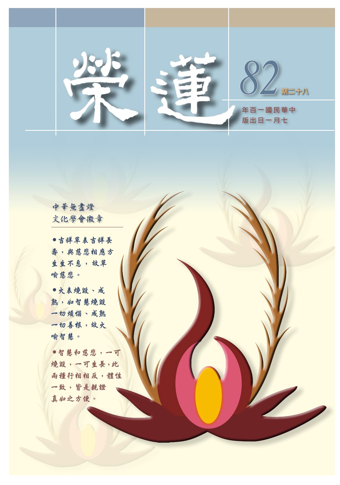

# 第82期

## 社論

### 中華無盡燈文化學會

本刊

走過一段艱辛

踏上辛苦未來

心態作法抉擇

換來福慧資糧

寧波西街的道場，蒙大眾的同心協力，在惠凱法師灑淨及佛像開光儀式主法，及五月十五日果公律師落成與皈依大典主持後，成立了全國性社團，並開始運作期盼許久的新道場。

面對如此殊勝的緣起，願此清淨的緣起延續不盡，要以歡喜心與大眾結善緣，並藉著共修的因緣結成道義之交；以感恩的心感謝三寶加被、諸方護持，成就這般好事，讓我們有一個溫暖而又能共學的家；以隨喜的心，隨喜眾志所成的善法；以學習的心，學習儒佛正法，此是道場成立最重要的目的；並具反省的心，團體辦事中難免摩擦與挫折，透過他人的規勸、自我的覺照，培養自己成為別人學習的對象；策勵自己的大悲心，使自己具有人才的心量；並時時不忘成佛的心，累積往生上品的資糧，成為十方諸佛護持的對象；由三輪體空的心所攝受，瞭解一切皆是觀待下的生起，一切的美好皆在清淨的動機、身口意殊勝的造作，他人的提攜、自我努力的造作，才能生起。

團體的蓬勃發展，除了參與者有上述心情的講究，學會更要確立正確的宗旨、任務與成立發展的目的，方不辜負轉型為全國性的社團。

學會依據人民團體法設立，不以營利為目的。傳承於已故前中興、東海大學中文系教授、孔奉祀官府主任秘書李炳南老教授，對儒釋道三家典籍融會貫通、能知能行之殊勝見解。並致力於弘揚中華文化，深入文化典籍之學習與實踐，除於國內定期籌辦經典講座及各項有益身心之活動，以達移風易俗之效，且投入兩岸的文化交流，參與國際活動，進行文化外交，庶幾能盡團體存在之功效，是為立會宗旨。

在任務方面：定期辦理文化講座與儒釋道經典研學班，並於寒暑假結合學校辦理心靈成長營，加強品德教育，改善校園風氣。內部每週共修，令所學能落實於修持。並推動臨終關懷、慎惜醫療資源，助會員及其直系眷屬臨終正念分明，往生淨土。由此因緣令其家屬，引發慎終追遠，報本還恩之正知見，淳厚社會風氣。且推動家庭關懷及社區讀書會，將中華文化五倫淳厚之善良風俗，落實於鄰里之交流，以帶動溫厚善良的社會風氣。另依時節因緣，辦理各項活動，如春節團拜、聖者誕辰暨母親節感恩祈福等諸活動，令社會風氣能尊師重道及景仰聖賢。

其次聘請中外德學兼備、學有專長及對文化有貢獻者為師資，或參訪觀摩推展文化成效良好的團體，效彼之長補己之短。並設置各類研學或清寒獎學金等，除培養德學並進的人才，並幫助清寒學子向學。不定期舉辦護生活動，發揚聖者物我一體之仁心，並與啟蒙教育合辦，作為兒童小小心靈仁心之引發。建置網站平台、編輯會刊、教學教材及視聽媒體教材，推展會務。參加或協辦有關國際及兩岸傳統文化課程講座、交流及慈善事業等。並贊助宏揚傳統文化之教育機構所推動之文教活動經費及設施。積極規畫購置會館作為會務永續發展之需要。及其他符合本會設立宗旨之相關公益性文化教育事業。

期許新道場，是能得大德住世的道場，得三寶加被、正法住世，成為培養人才的道場，令頑夫廉、懦夫立的道場，令困苦者奮發圖強的道場，令懈怠者成為精進的道場，令有負面情緒者生起人性光明面的道場，是能一窺和合氣象的道場，是能令人生起真實勝解的道場。

道場的建立與維持端賴大眾互相體諒與配合，彼此合作，和合辦事，一切的成功歸向於大眾，一切的殊勝是對三寶最好的供養，一切有待改進的缺點深深警惕，相信所成就的將不僅是道場，亦是自己內心道場的莊嚴，更是將來往生西方，畢竟離苦得樂，成就佛果的資糧。

## 大德法語

### 大方廣圓覺修多羅了義經（四十一）清淨慧啟請

道源老和尚

可貴菩薩代生問

三類士夫差別相

自體無別能證別

學佛開智最為勝

乙二、正宗分

丙二、令依解修行隨根證入

丁二、廣明行相

戊一、四問答通明觀行上根修證

己四、略分修證之位

庚一、清淨慧啟請

經文：

於是清淨慧菩薩，在大眾中，即從座起，頂禮佛足，右繞三匝，長跪叉手而白佛言：

庚二、正陳請詞

辛一、慶前

經文：

大悲世尊！為我等輩，廣說如是不思議事，本所不見，本所不聞。我等今者蒙佛善誘，身心泰然，得大饒益。

如來說圓覺經為當時的諸大菩薩，是清淨慧所說：「為我等輩」，廣說如是不思議事，不可思議的事說了很多，謂之廣說。而這些不思議之事（妙法）對初發心的菩薩而言，根本未見未聞。蒙佛善巧的誘導（循循善誘），聽聞了此等道理身心很安定、很自在（泰然），得到大大的利益。

辛二、請後

經文：

願為諸來一切法眾，重宣法王圓滿覺性。一切眾生及諸菩薩，如來世尊，所證所得，云何差別？令末世眾生聞此聖教，隨順開悟，漸次能入。作是語已，五體投地。如是三請，終而復始。

願為諸方來者，一切學大乘法的眾弟子，還請佛慈悲再宣說，如來（於法得自在，稱法王）所證圓滿的覺性。此清淨慧菩薩以大悲為我們後世眾生請問，一切眾生及諸菩薩乃至成佛的如來世尊，這三類所證明，所得有何差別？

之前彌勒菩薩有問，無明的根本是什麼？無明有幾等的差別？再問這些學佛的眾生，有幾種的種性？此處之問是令末世眾生聞此聖教（此處指的是圓覺經）能隨順開悟，依所悟漸次由眾生境界入菩薩及佛之境界，提問之後，五體投地的禮節，由如是三請，終而復始，這是清淨慧菩薩為我們請問。

庚三、如來讚許

經文：

爾時世尊告清淨慧菩薩言：善哉善哉！善男子！汝等乃能為末世眾生，請問如來漸次差別，汝今諦聽，當為汝說。

前述清淨慧菩薩出來替我們請問，究竟真理是沒有佛也沒有眾生，但是現在有眾生，有眾生相就得有佛相，都是對待而起。初發心的菩薩（含末法時代求大乘法的眾生），修菩薩道一直到成佛，在這路途上有如何之差別呢？亦即諸佛如來都是過來人，然最初也是凡夫，也在成佛之前中間有多少差別相呢？菩薩是替我們請問。

此時佛先讚歎菩薩問得好，所謂善哉善哉。並稱了一聲善男子，你能為末世眾生（與那些菩薩原已知道）請問，末世的眾生如何呢？離佛太遠了，親近不到善知識，若能依師修學，在成佛的路途上會有多少漸次差別呢？若是頓超則沒有漸次差別，可是頓超也是先有漸次才能頓超，所以ㄧ定要問，由凡夫到佛位有多少漸次差別。

庚四、承教靜聽

經文：

時清淨慧菩薩奉教歡喜，及諸大眾，默然而聽。

大家都靜靜的聽，佛就開始解釋了。科文你們自己去對，我只說個大意，我眼睛看不見。前是略標大意，此時詳細解釋漸次差別。

庚五、正答所問

辛一、長行

壬一、明圓覺無證

癸一、正明無證

經文：

善男子！圓覺自性，非性性有，循諸性起，無取無證。於實相中，實無菩薩及諸眾生。

圓覺自性（圓覺的本體）是非性（沒有自性），空性是一切法的法性，大乘起信論謂之真如。真如具不變義，亦具隨緣義。本體自性空是不變義，不妨礙一切法的生起，是一切法的法性，是隨緣義，謂之非性性有。

循當順字講，萬法循著法性而起，是緣起有，然無取無證。然緣起法中無自相可取，亦即佛法中無相可取，無果可證。

於實相（圓覺自性）中無實有法，金剛經上說：「凡所有相，皆是虛妄」，是故實無菩薩及諸眾生。

癸二、徵釋所以

經文：

何以故？菩薩眾生，皆是幻化。幻化滅故，無取證者，譬如眼根，不自見眼，性自平等，無平等者。

菩薩與眾生是對待的假名言相，像變化術幻出來ㄧ般，有沒有相呢？有哦！有眾生相，也有菩薩相，但皆非真實之相，既然是幻化，尋求自相（真實之相）了不可得，謂之幻化滅故，無取證者。沒有自相所成的菩薩，也沒有所證的佛果自相。沒有取相，也沒有證得者，無能也無所。

譬如眼根，能觀ㄧ切色法，眼根是能見，色法是所見，但是你自己的眼根，能看見自己的眼睛組織了？沒有看見，為什麼呢？自己不能看見自己（如經云，心不見心，無相可見。）此之喻為：性自平等，無平等者。圓覺自性沒有差別相（平等相）是自然平等的，沒有哪位能將它造作成平等，因無平等的自相可見，如眼根不見自眼。體性法爾如是平等（萬法皆空）卻非有造作平等者。

壬二、明對機說證

癸一、總標大意

子一、功用有殊

經文：

眾生迷倒，未能除滅ㄧ切幻化，於滅未滅妄功用中，便顯差別。

既無菩薩相，也沒有眾生相，此時如何會有菩薩與眾生之差別相呢？何以謂之眾生？乃因迷惑顛倒，雖聞佛法，然猶未能除滅幻化之相，不知道一切相是虛假不實的，一切幻相中之自性了不可得，所以，除滅妄相可不是容易的事。

無始劫執實的習氣，還真不容易除滅，於滅未滅妄功用中，亦即妄相未滅之妄功用中，此即成佛前之路途，在這妄功用中便顯差別。
菩薩修行用功，亦是幻化虛妄不實，前述生死涅槃猶如作夢，菩薩修行等於夢渡大河，所以修行用功謂之妄功用。修行須加功用行，然功用自相不可得，這些用功修行都是幻化不實的。或
**問：** 既是幻化，何用修行？若不修行本來就是凡夫，既是修行為什麼還是妄功用呢？原是要我們用功修行，怕起法執，佛法難學就在這兒，有執著就不得中道，不執著而用功修行，這樣對了。前述菩薩夢渡大河，上了岸夢才醒，若未上岸，還是要努力去游泳，不上岸是不行的，所以還要修行用功，但不要起執著，或
**問：** 起執著有什麼不好呢？若執著則生貪愛煩惱，後面問題多了。

修行用功起了煩惱，這才真冤枉，都記到，修行用功雖有所得，然亦妄相幻化，亦是觀待而起所以是虛妄不實！

子二、功極不異

經文：

若得如來寂滅隨順，實無寂滅及寂滅者。

寂滅—是不生不滅，要隨順如來的寂滅，與如來寂滅的境界完全不相違，謂之寂滅隨順，此時是實無寂滅及寂滅者，亦即沒有所證寂滅之法的自相，也沒有能證寂滅之人的自相，謂之無取無證。（下期待續）

### 常禮舉要講座（二十三）　稱呼、餽贈篇

雪廬老人

贈禮回拜皆人情

風俗淳厚交情濃

長幼尊卑皆有別

文化特徵民族情

稱呼

後頭「稱呼」，你諸位自己看，我多說一句，怎麼呢？也有一些規矩。什麼規矩呢？朋友之中有尊卑上下，大家聽明白，現在是跟著洋人學的，洋人怎麼樣呢？有名就可以，沒字！中國是文化之邦，有名有字有別號。名字還不只一個名，還有乳名，這個在臺灣也有的。

何謂乳名？一下生還沒有叫什麼名，叫小狗子、小毛子等，謂之乳名，大了上戶口簿就不叫小狗子了。乳名只有父母、長輩叫，外人夠不上。要登記戶口，以後上學，這得取名（學名），雖然不上學也得有學名，就是大名。朋友不能叫學名，在他大了以後父母也不叫小狗子、小毛子，就叫他的學名，老師也叫那個名。你念的四書就有，孔子叫子路是由也，叫顏子是回也。

至於書上說顏淵怎麼樣，季路怎麼樣，那都是旁人記載的，並不是孔子說。同學們彼此只許稱字，大概是廿歲加冕（加冠）之後，朋友送上字，有名有字。自己要有點技能，或是文章寫得好，畫畫得好，或是還有學問好等等，自己又取別號。一個人可有若干種名字，你對朋友可以稱呼他的字，對於朋友他家的長輩，號、字都不能叫，這一叫，你成了老前輩。跟他父母稱了朋友，你的朋友就成了你的侄子了，這個我見了很多。我也不便什麼事情都管，就有一些人嫌我太呆板，老早就要打倒禮教了，你還弄這一套？不合時代了。不合時代？不錯！我也知道不合時代，碰釘子可合時代？學我這套，在外頭不碰釘子就是了。

餽贈

◎一、禮尚往來，來而不往，往而不來，皆非禮也。

「禮尚往來」，這是總綱，必得要這個樣子的，道德仁義這些是不尚往來，那是你個人義務，應該辦的。「禮」是最淺的，以互相來往為交際。人家對於我們，不問是什麼禮貌，什麼禮物、禮品等等，我們得照樣的回去。來而不往，不行！往而不來是我們去了，他不表示，這兩種皆不合禮。若我們往了他不來，他不來是可以的，這裏頭就有分別了。什麼分別？很夠得上的交情，是我們的至親、我們的岳家、長輩，你在遠處去看他，他長輩不來回看你，行！有分別，不是自己家就不行。

◎二、賜人不曰來取，與人不問所欲。

賜人不曰來取：拿著東西濟人是賜人，大家要聽明白，不說是贈人。我講經都一個字一個字講，賜人單指的是長者給予後輩，不是長者夠不上這一句。你平常給人家東西，有說：我賜給你東西。有這樣子的嗎？長者送東西給別人，對年輕的也得給他送了去，不能說：我有樣東西給你，你上我這兒來拿吧。這個不行！我問你們大家，去不去拿？你想想那個味道，你不去拿，可是他已說了，不去拿對不起他。若去拿呢？我是這麼困乏嗎？去拿很難為情。這條是長者拿著東西濟人、不是與人，兩者不一樣，這些不是我自己編的，我都是查了書錄下來的。與人是平等關係是不問所欲。

你把東西送人，禮記上有，我（雪公）也說過，不問你想要什麼東西，那個人云：我想要什麼、什麼。他如此厚顏嗎？與人問所欲，或向人要什麼東西等，這都是不近人情，你送人，不管他要不要，不管他用不用，你就給他送了去就是。例如你送他一把扇子，試問誰家沒有扇子？你不問他有沒有。他有兩把、十把，也不多，各盡其道就是。

◎三、贈人物品，必謙必敬。

贈人物品是當面給他，要是給予的對象是長者，那就是獻。即使贈的對象是普通人，必謙必敬。中國人懂謙虛，贈人物品，謙說很薄。我在臺灣待了多少年了，看到送東西都說：薄品、笑納。臺灣人是那裏人？有些各種解釋，不用解釋！地名、言語、文字、風俗，都是中國來的，都是大陸來的。有念過書，則用不著解釋。我說一樁事情，大家就不用再考察，臺灣省下有縣、這一套在日本沒有。這一套是那裏來的？這些事情都是在大陸的一些情形。那些姓張的、姓王的、姓李的，都可以找老根。姓王的，是天水堂。姓李的，都是隴西堂。日本人不是有姓李的嗎？但沒有隴西這些事情，這還用解釋什麼！還要解釋，就是不讀書之過也。這都不是現在的事情。

◎四、贈人物品，外必用包裹，婚喪慶壽例外。

贈人物品，外必用包裹，在臺灣也是這樣，你送人東西得包裝，不讓人看見，這是禮貌。但有例外，如婚喪慶壽。送喜儀、奠儀，就是一個紅紙套、白紙套，沒有封起來。那種事情是可以公開的，一律都是公開的。平素贈人物品不行，可得包起來。

◎五、平素贈物，座有他客，須避觀聽，遠來及初晤，可不避。

譬如你上人家去或人家上你家來，若我今天還有客人在，見了另一位朋友來了，我不能說：我有點東西送你。座有他客時你不能送，否則其他在場客人很難堪。譬如有生客上我那兒去，是從很遠地方來，他要走了，我不得不送禮，但還有其他客人，除非有幾位客人我就預備幾份。若只給這位生客，那幾位在場客人臉色很難看，這無非是禮貌。再怎麼樣也要迴避、迴避，先別把東西拿出來，請這位生客到別處，說：我有一件東西送給你。就給了他，那可以。

總之送東西不要叫別人下不了台，迴避別人看與聽。假如人家送東西，沒給我，也不必看，他送他的東西，你在這裝不懂。還能不懂嗎？要裝不懂，這都是世故人情，但是有一層例外，遠來及初晤可不必。你譬如我們這兒有客，忽然在外頭有客，那兒來的呢？外國來的或者日本來的，他要走送他東西，可以不必迴避，這是例外呀！送了他（在座客人）不要緊。遠來與頭一回見面則可以不迴避了。

◎六、受贈先略謙辭後受，稱謝，逾日須往拜。

人家送我們東西即使應該，先得略辭，你得聽明白，不是堅辭。略就是：我不敢當。就行了，你要堅辭，人家送我東西，我不要、我不要……，他說：你拿著、你拿著。這很不好看。略為一辭就好，禮尚往來！先將禮物接過來，說聲多謝！逾日是隔一兩天，要去回拜，回拜也可以送東西，也可以接風洗塵，，若還是不會馬上走，你收他東西，過了一天，拿了東西與回了他的禮，請客則不必了。

◎七、長者賜，不敢辭。

長者是他年紀比我們大，或是熟人，賜東西不可辭，你不要長者東西是大不敬。我很謙恭，我不要，這是大毛病。禮記上從前君主時代，皇帝送你東西，你說：我不要、我不要…。這行了，得要砍頭。（下期待續）

## 共修研學

### 小止觀導覽（五十四）第七章 善根發

*心爾、智高整理*

修學有成善根發

重內顯外慧與福

可貴抉擇人生路

成佛了卻輪迴苦

第七章 善根發

論文：

二、不淨觀善根發相：行者若於欲界未到地定，於此定中，身心虛寂，忽然見他男女身死，死已降脹，爛壞，蟲膿流出，見白骨狼藉，其心悲喜，厭患所愛。此為九想善根發相。

修不淨觀的人，修到欲界未到定（初禪近分），因為非常專心，且沒有外境的干擾，忽然什麼境界都沒看到，此時「身心虛寂」，忽而只見「他男女身死」等不淨之境在心識中生起。而此不淨之境即不淨的九想依序生起：一、脹，二、青瘀，三、壞，四、血塗（七孔流血），五、膿爛，六、噉想（鳥獸來噉死屍），七、散想（鳥獸噉後而筋骨頭手分裂破散），八、骨想（血肉既盡，只有白骨狼藉），九、燒想（白骨又火燒歸於灰土）。見到死後九相之現象謂之悲，喜是自己證到這種境界，這時不會再產生愛我（破粗相我愛）。此為九想善根發相，能斷外貪。

論文：

或於靜定之中，忽然見內身不淨，外身降脹狼藉，自身白骨從頭至足節節相拄。見是事已，定心安隱，驚悟無常，厭患五欲，不著我人。此是背捨善根發相。

或於修九想觀時，於未到定時，忽然見到自身死後腫脹乃至白骨等種種不淨相，見到這種人生真象，了知生命無實，內心不再貪戀世俗，定心安隱，不去貪著我與他身。此乃背捨善根發相。帶動身心輕安。

背捨即八背捨，內容如下：

一、內有色相外觀色：

就是內有色想，觀外色來得到解脫，因為我們心中有色的話，會引發我們的貪，所以應觀外種種的不淨來息貪。故高登海居士云：「先觀自身不淨，無一可樂，更想皮肉脫落，但見白骨，有地、水、火、風，青、黃、赤、白等色光明，故云內有色相。雖觀內色，而欲界貪欲難斷，所以又觀他人之色，作九思不淨，深生厭離，故云外觀色。此種功夫，位在初禪、離生喜樂地。」

八背捨只是大分，事實上，單就修內有色相外觀色，也可以證得四禪八定。只要在一個境界上安住，取境的力量轉強，並以厭下欣上的心為助伴，每一種修法都可以進入四禪八定。比如：念佛，就以念佛入四禪八定；甚至外道就在緣木頭上證入四禪八定。另，離生喜樂定，其名言安立雖是離欲界煩惱而生喜樂，俱舍論釋說此定是以戒取勝，此地雖有定然屬戒勝，喜樂由遠離欲界粗重之戒而生，到了二禪定能轉勝，喜樂由色界禪定而生，故二禪名曰定生喜樂地。

二、內無色相外觀色：

內無色相就是觀自身僅白骨，厭捨對自身貪愛，此時將緣內的心滅掉去緣外色，如前一念想吃飯後一念想喝茶，喝茶之心即把吃飯之心給滅掉，即後一念心把前一念心滅掉。在第一心（內有色相外觀色）時，著重在緣內，緣外只是輔助，從緣內的九種不淨等進入初禪，此時滅了緣內之心，專就緣外觀不淨色相進入二禪。此二禪名曰定生喜樂定，此喜是約著第六識受用，樂約前五識受用。

三、淨背捨，身作證：

即淨背捨解脫，以身來作證。一心來觀想緣念光明、清淨、奇妙、珍寶，但不起貪著。八種光明的淨，就是我們緣念的境界，在前面二種定時，已捨掉內外、除去外在的不淨色相，但在定中要練習起八色的光明，它是清淨皎潔的，猶如妙寶之色；高登海先生云：「心既明淨，樂漸增長，遍滿身中，悉皆怡悅」。因心明淨，身心充滿快樂，故云身作證。但這種清淨、快樂也要把它背捨掉，故說是淨背捨。這種境界位於三禪，名曰離喜妙樂地。

四、虛空背捨：

在虛空背捨時，其功夫位在四禪捨念清淨地。三界以三禪天最為快樂了，所以印光祖師明極樂世界的快樂是以三禪天作較量，由於四禪天是捨掉樂受，純粹受用捨受，謂之捨念清淨地，此時並非沒有念，若無念則等同木頭、石頭等無情之物。此時心念緣在八淨相：地水火風、青黃赤白，內心無喜的躁動，身感受的樂也不貪著，渾然忘我，此境界是整個色界定裡最高的。進一步虛空背捨，所厭惡的是色身，由於色身雖受用快樂，但也會受用痛苦，即使不受用苦樂，此色身實是吾人累贅，所以修學虛空背捨色身，由四禪天進入四空天，謂之虛空背捨。所以虛空背捨是兩個轉換：先入第四禪捨念清淨地，並由捨念清淨地進入四空天之空無邊地。

五、識無邊處背捨：

緣虛空是心外緣虛空，此時轉向內緣己之心識，謂之識無邊處的背捨。觀察己心令不緣外，所有緣外之心皆被止息。

六、無所有處背捨：

四空天的修學法，並非厭下欣上的修學法，而是改變所緣之境，所以虛空背捨時是緣虛空、識無邊處背捨是緣心識，而無所有處背捨是行者依然覺得觀心識亦累贅，厭離所起的心，亦即以心識為所緣產生厭離，心識生起的力量越來越薄弱，進入空靈靈的境界，故名無所有處，似乎是境也無，心也無。

七、非有想非無想處背捨：

厭離所起的心，使心不緣境，在強而有力以心為所緣厭離所起的心中，想（於境取相之心）幾乎不起現行，非有想就是沒有想，非無想就是還有細想，這最微弱的細想。行相是愛我以及禪定之受用，輪迴三界都是愛我以及所受用，此時之心定乃三界內最高層次之定。

八、滅受想處背捨：

此定為出世間的禪定，可以由初禪未到地定，得到身心的輕安，直接進入滅受想定，也可修學四禪、四空進入滅受想定，何以能滅受、想？受與想自性不可得，不過是觀待而現起的名言境，受用或取相所顯現的心裡活動謂之受、想，受、想之自相微塵許亦不可得，安住於受想空之定，謂之滅受想定。

以上就是八種的禪定，以八背捨來收攝世間和出世間的禪定。

論文：

或於定心中，見於內身及外身，一切飛禽走獸，衣服飲食，屋舍山林，皆悉不淨，此為大不淨善根發相。

定中不斷思維，破除細品的貪，入定的速度快，能證的勢力強，修八背捨之後，能進一步修八勝處，大不淨觀即八勝處之修學法。

八勝處內容：一、內有色相外觀色少，此為觀自身的修學法，為生起猛厲的出離心，外觀色相不宜多，怕無法控制。二、內有色相外觀色多，此時定中心力變強，加入更多的所觀境界。三、內無色相外觀色少。四、內無色相外觀色多，以上遠離對自身的緣念，心力漸漸變強之後加入更多的境界加以觀修。五、青勝處，六、黃勝處，七、赤勝處，八、白勝處。以上四者，為入四空定的修學法，無高下之分，訓練心力專注能力越來越強，破下界貪愛而修學上界禪定，得到上界功德，心思越來越敏銳，以八勝義遠離一切處貪（但此時不能對治禪定愛），此為大不淨善根發相。（下期待續）

## 蓮池海會

### 黃磺鳴居士往生見聞記

*編輯部整理*

苦幹實幹蒙賞識

經營家庭任勞怨

病苦撒手中年後

往生得蒙妹助緣

黃磺鳴居士，民國四十四年出生於民風純樸的新北市五堵，從小聰明孝順，身為家中長子的他，總是帶領著弟妹們度過很多人生中重大的關卡，雖然家中經濟並不寬裕，但他仍舊奮發向上、刻苦勤勉的用功念書，家中牆壁上貼滿他各種優異成績的獎狀。

師大附中畢業以後，順利的進入中原大學機械系就讀，大學四年之學業成績優異常獲獎學金，並年年捐血助人。

大學畢業以後投入貿易界工作，憑著對於機械的專業知識，以及靠著自學每天不間斷聽英文，累積了英文的實力，辦事情講求完美，所以在事業上有一番成就。自信、幽默、充實本職及專業態度，得到客戶的信任。

一生辛苦打拼工作，終其一生都像支蠟燭，為了家人而燃燒，腳踏實地的哲學，影響子女做人處事的看法。

民國九十九年年初，在身體每況愈下的情形下，發現罹患了胰臟癌，病魔很快的侵蝕他原本很硬朗強壯的身體，並且日日夜夜不停的折磨他，但從沒聽到他有任何抱怨甚至是放棄的字眼，總是很正面的去面對一切打擊，總是抱持著信心並且堅毅的與病魔抗戰，直至最後一刻，他都還安慰身邊的親友們，他有信心的去面對這一切。

或許是居士一生都樂於服務他人的善業感應，才令居士當面對臨命終時，能接受學佛的妹妹的建議，放下對娑婆世界的羈絆，念佛求生西方極樂世界，家屬也能以報答居士的心隨順護持居士正念，終於民國一百年二月四日（農曆正月初二）十六時四十三分，在正念分明與諸蓮友親眷念佛聲中含笑往生，往生後在家人及蓮友助念八小時後，身體柔軟，瑞相莊嚴，見者無不歡喜，咸信居士已往生佛國淨土，為其服務的人生畫下最好的句點。

即使居士一生樂與人善，當來之生必感善果，但一生雖善心善行，或宿世惡業成熟，臨終生死關頭，病苦現起之時，在平時並未接觸佛法團體的狀況下，多數人得到胰臟癌都是枯瘦哀號以終，下一生投生善道或惡道，其實難以得知。而居士能及時生起善業，遇善知識開導，自己回心西向，也得到眷屬蓮友的護持，這麼多難得福報的全部生起，還得家親眷屬中有修學正法，親近正法團體的人才有生起的緣。可惜一般人都忽略這一點，但願居士的示現，使我們都能珍惜家中有人學佛對家庭帶來的福報！

## 三代共修

### 週六共修止靜法語　動盪中的安寧

心超

世紀災難有其因

謙卑面對尋出路

可嘆列強猶不醒

還待因果救世間

日本東北三月十一日發生了規模近９的大地震，不只造成房屋傾斜、倒塌外，更引起了十公尺的海嘯，衝向了岩手、宮城、福島，失蹤人數八千多人，死亡人數已超過一萬五千人，在攝影鏡頭下怵目驚心，排山倒海的巨浪將房子一排排的衝垮，人畜家具車輛漂流水上載沉載浮，財務損失不計其數，超越了一九九五年的阪神淡路大地震，乃二次世界大戰之後日本死傷最慘重的天災。

面對超乎人類思維想像的無常，內心雖難過，但也提醒著我們每次面臨苦難眾生時，要將他們想成就是大菩薩的示現，我們無始以來也同樣造作了無量無邊的罪業，會遭受跟他們一樣、甚或更嚴重的災害，且在未來要到三途去受長劫劇苦。知乎此，必須要好好把握時光，懺悔罪障、造作善法，在無常尚未來時作最好的轉變。所以無常的示現是如此的可貴，眾生的受苦一再地提醒我們沒有時間了，必須要好好把握僅有的暇滿人生，來聽聞佛法，瞭解法義，依佛法的義涵修行，如此不但自身吉祥如意，並有能力救護眾生。

若以業的角度思維，探討此次日本大災難，乃回應昔日所造之惡業，若非過去造作善惡業就不會遭逢苦樂果，唯有對因果的通達才能瞭解此變化的道理。且以現世論之，遠因乃日本曾發動二次世界大戰，近因則是殺業過重，享受高度文明，大抵地震的招感皆來自人心的動盪、胡思亂想、自私自利的心思，只求快速達到目的，不惜造成混亂與不安，有情心意若無法回天，招感嚴重災害時，至少要維持人心安定，求現世重報輕受。

至於地震所引發的海嘯，造成許多人員傷亡，土地成為無法耕種植物的滷田，核電廠的毀壞造成輻射粒子隨風飄散，造成世界的恐慌，影響全世界有情的健康，上述災變固然屬於天災，然核災實屬於人禍，人類雖然最有智慧，但是以智慧為考量創造世界的幸福時，後面埋藏諸多的危機，我們為了一時的享受，忽略危機的後果卻須付出長遠痛苦的代價，如核能所造成的危機是我們難以想像的，放射性物質有非常多種類，衰退的時間也不一樣，所造成的影響讓人不敢想像，到底未來我們會面對什麼危機？

不過日本也有可敬的一面，地震與海嘯發生時，面對如此的巨變，百姓們表現的是高度自制，災民忍受飢寒等待救援，對於幫忙的人心存感激，也不會因物質缺乏而彼此相殘，這就是禮的表現。日本過去吸收是唐朝文化，並將這優美的中華文化扎下了根成為自己的文化，反觀禮在中國已不復見，文化之美卻保留在日本，真所謂：禮失求諸野。我們原本是禮儀之邦，由於不重視而成了不中不西的民族，而這樣的文化卻被日本所保愛與珍惜，加上他們自己的民族特性而將文化深耕到民間。

禮雖然是著重在內涵，但由於日本國家與民間都重視禮教，為了實踐禮而在公共領域、教育課程中演禮，將禮節操演變成直接的反應，如此可知，禮光有概念是不夠的，必須透過練習成為我們的行為軌範，透過瞭解與演練，能使身口意的表現處處皆合乎禮，日本這次災變中的表現，就可以看出他們平日對禮的重視與實踐，或是社會教育或是家庭教育，或是在學校教育中演禮，所生起的效果是在面對如此巨大的天災時能謹守公共秩序及風度，是一種自我肯定及對他人的禮遇、對國家的尊重。

曾經到過日本，遇見他們的開學日，整個街頭看到的是父母親盛裝，牽著衣著整齊乾淨的小孩去學校行開學之禮，由父母親親自把孩子交給老師，祈請老師好好教育孩子，父母們以穿上最正式的服裝來表達尊師之禮，這也是他們行之有恆的風俗。

此次災難，正好呈現禮的可貴，在急難當中禮所展現的安定力量是如此之大。剛發生災難時，政府開放災區的超市讓災民前往取用，全部的費用由政府買單，這樣的消息發佈，我們看到的畫面是：日本民眾井然有序到超市取其所需，秩序極為良好。若在其他國家，或許政府還來不及發佈這樣的福祉，災區的超市早已被搶劫一空了。臺灣是有禮教思想的國家，這次直接看到日本災民禮的呈現應有所省，相信這也給全世界各個國家上了非常寶貴的一課。

苦難發生時，很多人在徬徨無助時會喊：南無大慈大悲救苦救難觀世音菩薩。當千手千眼觀世音菩薩要來救日本的苦難，祂會如何看待日本的災變，我們要如何體會佛菩薩看事情的角度，這些觀念都記載在佛經當中，我們如果對佛經不瞭解，又如何能瞭解佛菩薩的心意呢？日本老百姓是如此的守秩序，該被救護的、該被重建的或能在政府的規劃下以最快的速度辦理，一切會很快恢復正常的生活，這就是重報輕受的實例。

然若是沒有禮教與人謀不彰，則不但重報更重受，連輕報都重受。若能保留中華文化，恢復禮教，結合佛法成為國家發展的重心，不但能享受真正的生活樂趣，即使大苦來臨都能重報輕受。

業像夢一樣的生起，不是外相成立，而是自己的感招，自己像夢一樣的取受，或許地震發生時他正好在坐飛機，或者正要離開，或者正好到災區旅行等等，像夢一樣的生起果報或未生起。人類若能知足常樂，少掉能源的浪費，避免奢侈浪費，具有共享共榮的心態，有能力者廣作善法，就算來世才能生起善業的果報，也欣然無悔的造作，眼光要放得長遠。

我們如果真的懂了無常法，是不會害怕無常的，一切皆以因果相續顯現，雖三界無安，猶如火宅，眾苦煎迫，若不想要痛苦，不在因上改，全在果上求，是得不到真正的快樂；反而在求快樂當中，妄造種種的惡業。內心有所寄託則即便遭受苦難，沒有食物、資具，內心也不會害怕，因為我們有皈依處，大悲觀世音菩薩成為殊勝的依怙，賜予生存的力量與機會，重要在及時努力修學與利他，心一定要有所安頓。

對日本的災變要有如上的觀修，祈求佛菩薩的加被，隨喜提供金錢與物資者，隨喜在現場賑災者，在苦難中共造一次大善業，記取天的教訓，心生警惕。

團體在興辦中華無盡燈文化學會之際，面臨此日本空前的災難，就像民國八十八年的九二一大地震之後，成立無盡燈儒佛學會的因緣正好成熟，今年一百年正好成立中華無盡燈文化學會，想來是很好的緣起，何以故？在動盪時最需要安定，各項安定中最需安定的就是人心的安定。新成立的社團除了正法的推廣，教育事業的興辦，再者即社區的經營，在隨緣興辦的事業中，要維持道風，為公發心，講究入道場規矩以及執事者的務實作法，這些都是穩定道場的力量。

其次，成員要有教法學習帶來的安定、老實念佛的安定，以及求佛菩薩加被所產生的安定，當務之急，是透過新道場公約的制定，開創道場的新氣象，蓮友大眾安住在道場中得到最殊勝的學習，並藉著苦難的時代生起求加被及體會佛菩薩的心，是可以作的功課，也是苦難時代的價值，亦是最好的轉變。

## 專題研學

### 聖者的祕密～大佛頂首楞嚴經二十五圓通暨七處徵心探源

### 二十五圓通暨七處徵心簡介　（二十三）月光水大～下

時哉

佛名水天教水觀

觀水入道童子心

不以涅槃為目的

水性流通大菩提

月光水大（下）

巳二、觀成淺深

午一、初成未得忘身

未一、標身未忘

經文：

我於是時，初成此觀。但見其水，未得無身。

此時以水為所緣，水就是他的身，每個人都有他在意的，如母親之於唯一的愛子，有名利心的男人之於財位，以在意的對象為所緣時，就忘了自身的安危。此時月光童子以水為所緣作觀，水就成為他的身。以水為身時，未得無身，雖修學水的自相空，但是未得現證。菩薩修學在資糧道、加行道中，未到現證時，此時是比量通達空性，不是現量證得空性，現量證得空性是見道位的成就，此童子正在修水觀，以義理通達，而非現證。

現證空性時，可以直接越過義共相顯現空性的面相，此為現證。修行時需要用很多的義理去體會空性，要不斷地串習，最後不經過義理觀修顯現空性的面相謂之現證。如十六觀經中對極樂淨土的觀察，日想夜想，到最後可以直接顯現淨土。此時月光童子未現證水性，但見其水，未得無身。

未二、即事以證

申一、定中現水

經文：

當為比丘，室中安禪。我有弟子，闚窗觀室。唯見清水遍在室中，了無所見。

因為做水觀，所以整個房間（作為結界處）都是水，其它什麼都看不到。做水觀現出水，此定力非常地強而殊勝，不只第六意識顯現法塵的水，也能在前五識前顯現水，不只自身在水中，連外人也看到汪汪的水。

唯見清水遍在室中，了無所見，通通是水，此水會淹人嗎？不會的，雖顯現為水相，由柔軟心顯現之水，不會淹死人。

申二、投物心痛

酉一、正敘痛由

經文：

童稚無知。取一瓦礫投於水內。激水作聲，顧盼而去。我出定後，頓覺心痛。如舍利弗遭違害鬼。

童子經過禪房內窗縫中窺視，唯見滿室清水而已，不知此水到底是水否，取了瓦礫丟了進去，但見激水聲，此時左右看看（表示自己心裡不安），發現四下無人趕快溜。月光童子出定後，頓覺心痛。因為以水為所緣，如同身體般，此時感覺心痛。此之心痛，並非修行偏差，而是弟子丟石入水引起的。

如舍利弗遭違害鬼，此事是舍利弗於耆闍崛山入定時，有二鬼從虛空過，一名違害，一名復害。復害告訴違害：我欲以拳打此沙門。違害勸說：勿興此意。復害不聽，違害即去。復害以拳打舍利弗之頭，舍利弗出定後頓覺頭痛。問世尊：體素無患，今何頭痛？佛告之曰：有伽羅鬼，手打汝頭，彼鬼大力，打須彌山，便成二分，汝若無定，身應粉碎，此鬼受報，身已陷入阿鼻地獄矣！

如舍利弗是指現在，而月光童子回憶往昔身中是指過去無量劫前，此是二回事，月光童子為了要形容當時的心痛，以眼前的舍利弗逢違害鬼的事情作比喻。

酉二、無知起惑

經文：

我自思惟。今我已得阿羅漢道。久離病緣。云何今日忽生心痛。將無退失。

阿羅漢的證得是在五蘊上通達無自相之我，破了分別我執與俱生我執，由於煩惱來有自我，此時在五蘊上通達我的體性空時，則受辱之我無，故不生憂悶，乃至無病可受。

如何今日忽生心痛，月光童子自問是不是退失了阿羅漢的證量，明明已經久離病緣，何以入水光定之後產生心痛？不知是否修行不得利，證量退失？

申三、除去如初

酉一、童子具陳

經文：

爾時童子捷來我前，說如上事。

此時童子迅速來我前，將他剛剛惡作劇的事情報告一番，幸好遇上誠實的童子，不然師父就受苦得莫名其妙。

酉二、教以除去

經文：

我則告言：汝更見水，可即開門入此水中，除去瓦礫。

月光童子就告訴侍者，彼再入水光定後，侍者會再看到水，即可開門進入水中，將瓦礫拿掉。

酉三、復見依除

經文：

童子奉教。後入定時，還復見水。瓦礫宛然，開門除出。

酉四、出定無恙

經文：

我後出定，身質如初。

此時因童子（侍者）已奉命在師父入水光定時，入室水中將瓦礫拿走，所以月光童子出定後，身體回復原來健康的樣子。

午二、後方亡身合界

經文：

逢無量佛。如是至於山海自在通王如來，方得亡身。與十方界諸香水海，性合真空，無二無別。

後逢無量佛，如同觀世音菩薩普門品：侍多千億佛，發大清淨願。何以要侍多千億佛，發大清淨願呢？因為要破所知障，必須要觀待清淨的大願與無量諸佛的引導，一法一法地去通達自相空。為什麼每一法都要去通達？因為悲心的緣故，必度盡一切有情，欲度某一類眾生當通達某些法，因為有悲心所以很想通達所有度眾生的法類，且在這些法義上通達空性，可是此一切法要誰教？諸佛教，善知識教，所以需「侍多千億佛，發大清淨願」，如此才能破所知障，因為「發大清淨願」，所以要去學一切法，因為「侍多千億佛」，所以才能學成一切法，這就是觀世音菩薩普門品，以上明觀音大士成就的秘訣。

月光童子逢無量佛，表示他有非常大的福報，在因地修學善知識法，果報上就會有如同佛的善知識來利益他，這些都要在因地上修，比如好樂極樂世界才會投生在極樂世界，好樂什麼法，才會修學該法，並與該法義境相應。

月光童子親近了無量諸佛，如是至於山海自在通王如來，山與海是有質礙的，山可以將海擋住，海可以將山隔絕，山海自在，表示現證山海自相空時，山海自相不可得，何來山海互阻？

月光童子在山海自在通王佛下方得亡身，表示破了法我執，身之五蘊自相空，同理可證水的自相空，此時他以水為所緣，與十方界諸香水海皆自相空。十方佛剎的香水海無我，與自身中的水一樣，覓其自相皆了不可得。

辰三、今證菩薩

經文：

今於如來得童真名，預菩薩會。

在釋迦佛的座下得童真名，乃得赤子之心，無有世俗心機，參預菩薩的聚會，是大乘天真無邪的聖者。

卯三、結答圓通

經文：

佛問圓通。我以水性一味流通，得無生忍，圓滿菩提。斯為第一。

佛在楞嚴會上問我（月光童子）圓通的修學法，我以水性自性空一味流通到各法上，皆是自相空。

不但得了無生忍（八地菩薩的成就），進而圓滿菩提，就是得到佛果。

當以水大成就時，整個盡虛空遍法界都是水，此時人世間的恩怨在那？榮華富貴在那？什麼都沒有，只有水而已，當以水的自相空顯現時，一切法之自相莫不如是。然這些甚深的觀修一定要在好的環境中，有善知識的引導，有修學的道糧，特別飲食無憂，且能廣做功德，這些資源在極樂世界都有，這也就是為何要去極樂世界的理由，行者由此生起好樂往生的心，就與祖師大德往生的心相同。（下期待續）

### 六趣輪迴經簡介（十四）天道

*智芳整理*

生天目的為修學

學法目的為利他

成佛安樂歸有情

世世常行菩薩道

天道

經文：

自不樂忿諍，勸他令和順，純善修淨因，得生焰摩天。

生

焰摩天

之因乃不樂忿諍，不但對三寶恭敬，對人不樂忿諍，不僅口不與他人諍，而且還勸和不勸分，善法越來越成熟，修學的因越來越清淨，可以得生焰摩天。

焰摩天又稱時分天，焰摩天有兩千歲，一天是人間二百年，壽命等於人間的一億四千四百萬歲。時分天有兩種說法：此天之人每一時、每一分都享受著快樂，其二是每一時都有他不同的快樂，這個人很會安排自己快樂的生活，整天心情很好，心情很好是觀待他不樂忿諍，這個人修養很好，所以他投生到快樂的地方。有的人投生到快樂的地方卻心情不好，就是做善事時，心情不快樂，這種人明明在做善法，但心不甘情不願，就會投生到富貴的地方，但是心情不好。

所以做善法心情快樂的人，得到順境時才有辦法快樂的享用，做善法不快樂的人，他的善法生起樂境時，卻享用不到，如同富裕的國家看似無憂無慮，但自殺率卻居高不下，然落後地區如緬甸卻沒人會自殺。所以做善法時心情要快樂，心情要快樂一定要對法有勝解，做善時心情才會快樂。

經文：

樂多聞正法，專修解脫慧，喜讚他功德，得生兜率天。

生

兜率天

壽命有五億七千六百萬歲，所以經上說彌勒菩薩會在五億七千六百萬年後，降生這個世界度化眾生，此處兜率天特別是講內院。由於喜歡聽聞正法而且專修解脫慧，對他人的功德也很喜歡讚歎，就會生兜率天的內院。

因為喜歡修學正法，所以才生到有正法的兜率天內院，專修解脫慧，又因為隨喜讚歎幫助人家和合那一分的功德，會感應投生到兜率天的內院，進入彌勒菩薩所領導的殊勝和合眾。

經文：

於施戒諸行，自性常愛樂，起精進勇猛，得生變化天。

變化天

又稱化樂天，生於化樂天則有二十二億年的壽命，能變化種種的快樂給他化自在天之天人享受，例如富貴人家園丁整理花園供主人享受，園丁就是變化天，主人跟園丁同時享受這個花園，花園是園丁創造的，主人為他化天，園丁為變化天。生於化樂天（變化天）之天人，其因為對於布施、持戒的各種善法，內心本來就很喜歡，此即他的個性，從中生起勇猛精進。

經文：

是最上有情，具沙門梵行，增長解脫因，得生他化天。

投生到

他化自在天

之因乃欲界最殊勝的有情，彼具足沙門梵行（清淨的行持），亦即遵守戒律且在遵守戒律當中增長解脫的因，亦即以持戒行相，樂於對般若聞思，並修止、修觀。唯有修止、修觀才能解脫。

他化天是統領整個欲界（由化樂天下至地獄），握住這樣大的權利，情況可以是最壞也可以是最好，可以將全國經營成修學正法的環境，也可令人民水深火熱，難以生存，且不受教。

經文：

以戒定熏修，普資於願力，生天上人間，達真如實際。

第一義天：

生天上人間的目的，是以世俗的安樂成為解脫的資糧，如此殊勝的環境中，應以薰修戒定資助願力，而願力的內涵是達到真如實際，這是投生人天的盼望。亦即考上好學校的願力（目的）是希望讀好書，而戒定熏修即是斷惡修善，讓我有修學般若的資糧與能力。不斷修學般若就能達到真如實際。

經文：

如是善惡報，已分明顯示，作善招人天，造惡縈極苦。老病死未至，勤思求正法，自果報一來，所愛皆離別。彼貪等過失，深可生厭患，智者善思惟，是故當遠離。若常行利他，則無諸障惱，罪福定無差，略說宜諦聽。

縈極苦

的縈就是纏繞，造很多的惡就會被很多的苦纏繞，趁著老病死還沒來臨趕快求學正法，否則果報來了你所愛的環境都會離開，老病死還沒來的年輕、貌美、體力即是所愛，那些很快就會失去，當爬山忽然會喘時、當聽課的體力忽然沒有時，即是老病已來了。體力好、精力旺等美好的受用都將遠離，只要老病死其中一個來就不能學佛了，但我們卻任意的讓他們來，豈不可笑乎？

老苦

何以是修學嚴重障礙，第一、顏色衰退：好看的顏色退了，笑起來皺紋就多了，令人不喜見。第二、氣力衰退：講話沒力氣，精神不集中，走路時慢慢走，坐下時像綁在樹上布袋掉落，站起來須人幫忙像拔樹幹， 雪公老師就是如此的示現。第三：根力衰退：如重聽、老花、失憶、反應遲鈍，令人不喜交談。第四、受用境界衰退：好吃的東西吃不下，別人吹冷氣時覺得太冷。第五、趨近死亡。

病苦

的行相如下：第一、趨近敗壞：整個身體的機能敗壞。第二、增長憂苦：病了之後心裡面會很擔心，所以什麼事都沒勁。第三、不能受用可愛的境界，如一桌佳餚，只有皺皺眉頭卻吃不下一口。第四、不喜歡的境界卻要受用，如打針、吃藥、開刀之苦。第五、趨於死亡，心懷恐懼。

死苦

之行相是可愛的財富、地位、親屬、朋友、身體通通要遠離，趨近死亡時地大融入水大的痛苦，水大融入火大的痛苦，及火大融入風大的痛苦都得承受。對這些生、老、病、死的因（貪、瞋、癡）的過患要深深厭離，如何去除？須於法上起勝解，多造作善法，對治貪、瞋、癡的煩惱及貪、瞋、癡所造的業。

對法有勝解之後，方能常行於利他，將自己體力、精力集中於法上的修學，常行利他，能將業障突破，生起快樂的果報。罪感應的是痛苦、善感應的是快樂，如此的關聯性，人生不容一絲毫的閃失，此之善惡報應，馬鳴菩薩說整部六趣輪迴經的重點就在這裡，希望大家要諦聽、善思念之，此離苦得樂的方便。

結語

唯願六趣輪迴經的修學，能讓我們知道六道的苦樂是來自於善惡業，善惡業的認知及努力斷惡修善，是來自於對法的勝解，在斷惡修善中有心態的講究、語言的講究、身體的講究，由身體、語言、心念的講究中洗滌往昔的過惡、增長善念、願力，不僅我這樣做，還要幫助有情這樣做，不僅我跟有情要這樣做，而且要皈依三寶，在三寶的攝受下這樣做，不只一時做還要相續的做，不僅是心念、嘴巴、言語、動作這樣做，而且還要生起能夠得到解脫而歡喜做，並反向思惟，明白不這樣做將受地獄等苦報，生起警惕心。

老病死的果報即將生起，美好的境界很快就會遠離，應該要好好的把握有限的光陰，在美好的境界還沒有離開我們時做正法的實修，並且對業障做懺悔，由教法學習而產生勝解，積極地廣作善法，祈求三寶加持，靠著善友的和合，大家興辦正法的事業，這才是最聰明、最有效率的運用暇滿人生。願三寶加被，讓我們生起這樣的覺受，成為往生和成佛的資糧。（全文完）

## 論文研究

### 興於詩，立於禮，成於樂

心晴

善教詩禮樂

風俗導淳厚

文化興邦國

民族賴延續

從詩歌發展過程探討詩禮樂的關係

回到歷史源流探討詩禮樂的關係時，先須明瞭，儒家的教化乃從禮樂教化加以開展，或許可以說孔子的教學即是禮樂的教化。孔子曾對伯魚說：「不學詩，無以言；不學禮，無以立。」那禮樂教化到底是什麼內容，如果能就古注做一詳讀，將會有一個比較清晰的面貌。如論語：「師摯之始，關雎之亂，洋洋乎盈耳哉。」可以一窺音樂中的詩禮，將明白「興於詩、立於禮、成於樂」實乃孔子禮樂教化的一體開展。

先說詩的演變，即可明白詩禮樂三者的關係，若就世界各國乃至於中國詩歌的演變，可大分為四個時期。

第一時期「有音而無詩」：

詩的由來為何？乃從語言發展而來的，原始部落的先民，過著單純的生活，以言語表達感情，但在語言無足以形容自己的內心時，誠如《禮記‧樂記》所言：「言之不足，故長言之；長言之不足，故嗟歎之；嗟歎之不足，故不知手之舞之，足之蹈之。」正說明了人類歌唱、音樂及舞蹈興起之由。

當語言不足以表情達意的時候，就想用唱歌來傳達心意，當唱歌還不足以表達的時候就不知不覺地手之、舞之、足之、蹈之，以舞蹈發露他全部的感情，所以從原始部落音樂起源中可以探知詩歌與音樂實乃一脈相傳，所以第一個時期叫做「有音而無詩」，乃以音樂為主，吟哦哼唱的歌詞中多半沒有意義，就像是兒歌或是原始歌謠的興起，或像原始部落中的歌舞歡唱，大抵以音樂表達其歡樂的氣氛，然就其歌唱的內容，或只是單純的發音重疊，或反覆吟哦，一方面是好吟唱，一方面是伊伊呀呀地很能夠表達自己的感情；但最主要就是藉唱歌跳舞發抒情感，所以第一個時期是有音而無詩。

第二時期開始賦予歌詞意義

，但依然是音勝於義，也就是仍以音樂取勝，雖然慢慢的增添了歌詞，隨著歌詞的開展，唱唱自己心裡的聲音，但往往歌詞簡單而口語，通俗的民間歌謠於是產生，這就是第二時期音樂勝於詞義的傳達。

第三時期的發展中由有識之士在語言上開始琢磨講究

，著重於詞章音韻之美，詩歌的義理慢慢被彰顯出來，這個時期的音樂、詞義可以各自獨立，有時候歌詞和著音樂來唱，可以來表達自己的內心，或將詩抽離出來單獨欣賞，此義亦足以表達他的內心，這就是第三個時期，音、義分立。

而詩歌發展到

第四個時期，詩義豐富而顯著

，詩文中不管是義涵、用詞、押韻都有更進一步的講究，所以變成了義勝於音。但因詩歌是源自於樂，詩歌的本身富有音樂的特性，自有其音韻節奏長短的變化，所以即便詩歌本身沒有音樂的配合，仍能藉由詩歌的節奏、聲音及韻味表達詩的美，所以詩歌的本身富有音樂性及節奏性，所以詩歌發展到最後一個時期，就是用語言去彰顯詩歌的音樂之美。以上就是我國詩歌發展的四個時期。

再以詩歌發展的四個時期，探討中國最早的詩歌創作—詩經。詩經的創作最初屬於第二時期，音大於義，當民間歌謠慢慢盛行，大家以簡單的音律哼唱著簡單的歌詞表達自己的心聲，當中不乏佳作，亦有糟粕，所以詩經傳唱多達上千首，其中音大於義者多，或多重複，或無足以取裁，故孔子加以整理刪定。

而詩義隨著民風有不同的展現。詩經風、雅、頌中，國風乃周天子之採詩官至各諸侯國採集詩歌而有十五國風，論語：「子謂伯魚曰，女為周南召南矣乎。人而不為周南召南，其猶正牆面而立也與。」孔子問兒子有沒有讀周南、召南，若不學周南、召南，就好像面牆而立。國風分正風、變風，真正屬於正風的應該只有周南、召南，其他都屬於變風。周南是周公的分封地，而召南是召公管轄的一個領地，而文王聖人等教化由周公、召公帶到了周南、召南，所以這兩地的詩歌有聖人教化的氣象，其歌詞能彰顯聖人的德風，所以屬於正風。而其他諸候國所採之詩多屬於變風，可以從歌詞中體會當地政治教化的缺失，故變風可作為周天子察納民情，作為改善施政教化的參考。

而孔子刪詩書、定禮樂以行教化，故將詩中歌詞重覆，不合於教化之詩刪除，加上大雅、小雅、頌這些國家的宮廷音樂，合成了詩經。三百一十一首詩，小雅裡面其中有六篇是只有題目沒有詩文，這三百多首的詩，孔子不僅將它選出來並且弦歌之，古時候詩歌旁有小注，此小注就是它的音樂記載，孔子時代詩經在音樂上的記載已經流失了，也就是當時有詩文而無音樂。所以孔子選擇詩歌三百多首並賦予管弦。此正說明當時的音樂與歌詞是分開的，孔子和以管弦讓詩歌容易朗朗上口，在

音樂的薰陶裡可將詩歌的內涵傳唱出去，孔子即以詩經來推行他的樂教。

只要提到樂，必然包括詩，因為音樂當中的歌詞就是詩。而音樂裡頭也包含著禮，因為手之、足之、舞之、蹈之，即禮的動作，也就是當音樂詩詞演奏之際，人們還配上了動作，那這個動作就是舞蹈，而這個舞蹈在聖人的教化當中其實就是禮節的一個行持，因為它會配合歌詞的內容，音樂的節奏來引導身體的動作。

集釋裡提到「俾學其俯仰疾徐周旋進退起訖之節，勞其筋骨，使不至怠惰廢弛，束其血脈，使不至猛厲僨起。」這就是講到音樂配合詩歌的歌詞，他的動作就是舞蹈的表演，而這個舞蹈就是「禮」的演練，所以詩、禮、樂合而為一。

而「成於樂」也就是說明音樂演繹的即是詩的歌詞，而聖人制禮作樂的目的就是以內聖外王的內涵作為引導，其舞蹈動作就是禮節的行持，讓人手足有所措。所以「成於樂」，當樂興起的時候詩、禮、樂即合而為一，此是詩歌的第二個時期，它是音、義並重的，各有各的功能彰顯。乃至於後來詩經有齊詩、韓詩、魯詩三家來注解詩經，以詩經的義理為主，所以這時候音、義可以並存也可以分列，這是詩歌發展的第三個時期。

孔子的樂教屬於第二個時期到第三個時期，尤其孔子他自己作樂等於是到了第三個時期，乃至於詩文到後來即便不加上音樂的演奏，詩文的義理仍扮演教化的功能，直至溫柔敦厚的詩教失去了功能，彼時詩亡而春秋作，但春秋筆中寓褒貶別善惡，仍然不離詩溫柔敦厚的義涵，但因為後人不懂，不但詩亡春秋也亡，就一路亡到現在。

現在回頭試著探討當時孔子制禮作樂環境背景，以這四個時期來揣摩揣摩興於詩、立於禮、成於樂的全體內涵。

而音樂對人類的影響至深，在中國五聲音階裡「宮商角徵羽」，五音配合著五方，也配合著我們身裡的心肝脾肺腎，還照應著我們喜怒哀樂各種的情緒，還有五行的配合，所以音樂的作用是廣泛多層面的。

三字經：匏土革、木石金、絲與竹、乃八音。不同材質的樂器會形成不同聲音，如宮屬於土，像壎等土製樂器的聲音音域持平，能讓聽者穩定心性，當一個人心氣穩定的時候，它就可以達到溫舒廣大的一個效果。而商屬於西方、屬於金的部份，像銅、鑼、鈸等金屬的樂器，敲擊的時候會使人的氣為之收斂，因為金屬樂器震耳欲聾的聲音，會使人方正而精神為之一振。

而角聲屬於東方、是屬於木的部份，像笛子、木魚、木琴等樂器，聽了以後會使人心氣舒展，易讓人生起惻隱之心。徵屬於南方、屬於火的部份，其聲高亢而有韌性，像是中國鎖吶等，聽了使人好善樂施，會將我們的氣提昇起來。羽屬於北方、是水的部份，古琴的聲音如流水能洗心，琴聲一出會讓人心平氣和，寧靜而喜悅，並使人整齊而好禮。

由五音變化可略知音樂潛移默化的功能，所以聖人懂得禮樂的道理，自古唯有聖人可以制禮作樂，而此聖人不但是天子，還是一個有德有能者，有能力制禮作樂，並且達到教化的作用。

以上不揣淺陋，就詩歌發展的四個時期來揣摩論語中論及詩禮樂篇章的相互關係。

## 活動報導

### 站在文化看出路～再造雪公弘揚儒佛的環境

### 前言

*編輯部整理*

昔日勤奮今結果

開創未來待格局

果公主持落成典

戒教邁向菩提門

民國百年五月十五日，中華無盡燈文化學會搬遷暨道場落成，特別禮請上果下清律師主持灑淨、皈依法會，並進行上、下午兩場精彩的開示，作為學會殊勝的緣起。

果公是含攝當代大德於一身的示現，或說是大德們共同的示現，彼具有弘一大師持戒的風範，廣欽老和尚的定力，懺公師父的輕安，蕅益大師解戒的堪能，會公教觀的通達及雪公老師儒佛的傳承。

團體為了慎重迎請果清律師，研讀律師生平及開示資料，修學弟子應有的心態與作法為前行。

果公主持落成法會的開示，全部在大格局上講，談到在家人應有的格局，以及如何弘傳 雪公老師的儒佛正見，此之開示是果公未在其他場合宣說。授皈依除廣釋應有心態，並在弟子請問中談及尊師重道、緬懷師恩及個人的修學，是大眾一生難獲之法義（益）。

在此懺悔落成典禮、歸依法會上的種種疏忽，並依果公開示，決定吾等在家人的風範就是要弘護正法，恭敬三寶，心存典範。確立所開示的雪公儒佛正見是傳承；認知志於道，據於德，依於仁，游於藝，是儒學的總綱；建設大同世界是不變的理想。

不忘成佛的論典，講究的是正助雙修，了知正功是憶佛念佛，助功是持戒與規矩，將所積善根福德歸向淨土，讚歎律師三十年的出家卻不忘蓮社的學習，見到尊師重道的行相。

勝解果公以比丘戒自我要求的殊勝，謙德原是比丘戒的要求，塑造自己成人天師表，攝持大眾如沐春風，能展現聖人的氣象。私下向法師請益，不須客套，從師的回答中，讚師父之歷練非只閉關修學而有，接寺院之住持護持弘傳正法更是師父的考驗，如理如法更證明師父修為是內化且能運用於事相。

總之，果公來此加被是肯定所有蓮友多年學習與發心的成果，莊嚴肅穆的法會所生的產值已遠勝成立前後的開銷。隨喜自己美好的遭遇，供養三寶與聖僧，接受美好的未來！

皈依加持灑淨隨果公到各樓層加持蓮友，佛號非常的莊嚴，覺得非常感動。道場是善法的發起處，是蓮友善根福德的累積處，是大眾心思用力處，心是道場，道場是心。是選佛場，是成佛場！

以下恭錄果公在道場落成當天為我們的開示，並刊登蓮友發響之文，以饗大眾。 (編者）

### 上果下清法師開示

*編輯部整理*

在家居士護正法

持戒通教是所護

魔外消聲法輪轉

勝地皆春暢惠風

上

果

下

清法師簡介

上果下清法師，俗名李子成，號思齊，高雄縣大社鄉人，民國五十六年就讀於中興大學中文系，並參加智海學社，開始親近台中蓮社，跟隨 雪公聽經聞法，六十年畢業，隨即服役於馬祖東引，退伍後，回台中立人高中任教。六十三年參加蓮社內典研究班；四年結業後，於慈光育幼院任文書，常閱經典及戒律書籍，早晚功課並帶領院童共修，生活作息甚有規律。時時以今生能學佛念佛為最幸運之事勉人，其為人忠厚誠懇，概不多言，所言皆引人入道，人人皆恭敬之。

早有出世之志，不幾年，遂請求 雪公允諾，於民國七十一年農曆四月八日，於埔里圓通寺依上聖下觀老和尚，出家為僧。曾於民國八十年至八十三年閉關於草屯雙冬，於關中行般舟三昧及閱讀藏教等，出關後任正覺精舍第二任住持，以持戒為基，以天台為要，以淨土為歸。民國八十六年十月卸任正覺精舍住持，再行閉關，第二次閱律藏，深入經典，行三次般舟三昧。出關後接任正覺精舍第四任方丈。民國九十二年，第三度於正覺精舍後山茅篷閉關。

一生修學嚴謹，持戒精嚴，並弘傳佛法引領後進，為民國以來公推的一代律師，現任圓通寺、正覺精舍住持、佛教僧伽醫護基金會副董事長。

在家人應有的格局與風範

今天受請講說：在家人應有的格局與風範，如何傳承雪公恩師的儒佛正見。此題分兩大部分加以解釋。

首先，在家人應有的格局風範分三點加以說明：

第一、弘揚護持正法。

不論出家師父或在家菩薩都要弘揚護持佛陀正法。出家師父屬於內護，諸位在家菩薩是屬於外護。出家師父偏於修慧，在家菩薩偏於修福。至於正法為何是弘護呢？因為佛陀的正法，是人天眾生的眼目，有佛陀正法在世，眾生才能真正離苦得樂、了脫生死，乃至將來成就無上佛道。當外道、邪見者來破壞，吾人須挺身而出弘揚護持佛陀正法，我們都有這個責任。

第二、要恭敬三寶。

其實無論出家師父或在家菩薩都要好好恭敬三寶，因為三寶就是我們皈依、恭敬尊重的對象，如對三寶不懂得恭敬，學佛就沒有根本、沒有資糧，如同沒有基礎的大樓，受不了颱風、地震的摧毀，所以對三寶（佛寶、法寶、僧寶）都要恭敬。然對前兩者（佛寶、法寶）恭敬是沒有問題，對僧寶一樣要恭敬，因為佛示現滅度至今已兩千五百五十五年了，將近三千年了，佛陀示現滅度後，再沒有佛來為我們說法，只留下了三藏聖教（法寶），但法寶自己也不會講話，要靠住持的僧寶來弘揚佛法，所以我們要對所有的出家師父平等尊重，假若批評師父們的過失，就造業了。恭敬供養須不分別，有修行、沒修行者，凡僧眾一律平等供養，不分彼此。

第三、心存典範。

以過去殊勝大居士作為典範，舉三例來說明：

（一）給孤獨長者。

《佛說阿彌陀經》就是在祇樹給孤獨園所說的，祇樹給孤獨園怎麼來的，就是給孤獨長者聽說有佛出現在世間，他非常渴望仰慕想去拜見，天還沒亮就去拜見，善神用神通力使天快亮，他尋著光明去拜見佛陀，在非常歡喜感動之餘，請佛到他的家鄉說法，但是佛有常隨眾一千兩百五十位，除了請佛去，還有這麼多師父要安頓，須找一地處來建精舍，作為佛與常隨眾的住所。

長者非常歡喜，回來後到處找，卻沒有適合處，最後找到了祇陀太子的莊園，發覺那個地處最合適，當要購買那塊莊園時，祇陀太子不肯賣，並開玩笑的說，你如果能將這塊地鋪滿黃金，我就給你，給孤獨長者回去便將自己倉庫中的金銀財寶都搬出來鋪地，鋪了差不多，祇陀太子非常感動，但園裏的樹沒有辦法鋪到，太子說：我們一起做功德。於是祇陀太子供養樹，給孤獨長者以鋪地的黃金買下了莊園，稱為祇樹給孤獨園。

給孤獨長者變賣了所有家產，建成非常廣大且莊嚴的精舍，且常作護持的法行，到最後，家裏只剩下三碗飯，佛陀派阿難尊者去托缽，當長者第一碗飯快要吃的時候，阿難尊者來了，他就很歡喜地供養。第二碗飯快要吃的時候，目連尊者來了，又布施出去，最後剩下一碗飯，佛陀親自來了，佛陀來了能不供養嗎？於是歡喜地供養，當歡喜心供養時，七寶湧現出來。

給孤獨長者全家都信佛，且非常至誠、歡喜供佛及僧，由於學佛日久，有新學比丘剛出家受戒，有因緣時長者也教新學比丘，但說法前，先向比丘頂禮才教他，盡到應盡的禮儀，絕對沒有傲慢心。雖學有先後，即使在家眾學佛日久，出家師父剛出家不久甚麼也不懂，但只要示現僧寶身分，諸在家（皈依三寶）的弟子們，對出家師父要自稱三寶弟子或簡稱弟子，不要稱末學，自稱三寶弟子或簡稱弟子，末學是同學互相的謙稱，對師父稱末學就外行了。須知道應盡的禮儀，禮儀代表一個國家的倫理，不可以顛倒。

（二）許止淨居士。

他是清朝的翰林，國學根柢非常好，有一次去拜見印公，祖師問他：你有沒有吃全素？他回答沒有，被印祖喝斥：做個大通家竟然不肯以身作則，還不肯吃長齋，怎麼來教化弘通佛法？被印祖這一喝斥，回去乖乖吃長齋，而且馬上寫信感恩印祖。許止淨居士，只要遇到師父，不管是新出家、久出家，必定恭敬禮拜，遇到佛恭敬禮拜，不分彼此，為人謙虛。

老人家受印祖之託，在《四大名山志》中的普陀山志，對觀世音菩薩作讚頌，稱揚觀世音菩薩的功德，依印祖的指示，做得非常好，不但教理非常通達，文辭也非常優美，並作《歷史感應統紀》，一生對出家師父都是畢恭畢敬的。

(三)雪公恩師。

老人家無論是在濟南、曲阜、重慶、南京，最後來到臺灣，都是積極的講學弘道，可以說是席不暇暖，到老也不疲不倦，遇困難也不退轉，平常的待人接物都是陶來謝來平等恭敬。對小孩、老人家，乃至貧富貴賤都一律平等謙虛謹慎的對待，敬重三寶，對出家人必以虔誠心頂禮，平常是慎獨存誠，亦即謹慎自己獨處時身、口、意三業的造作，保持至誠、恭敬、不欺暗室，睡覺不愧對棉被，對自己的身影也不愧對，假若自己走得歪歪的，影子也隨著歪歪的。

總之謹慎自己的獨處，自己警惕自己，自己砥礪自己，做事都是光明正大，矜持不苟，房間裡頭的書、衣服放得都有秩序，不點燈也可以一找就找到，東西放有定處且成為習慣，老人家平常可以說是忙到沒時間生病，一有空閒便讀聖賢書，因為讀書就是休息，享受聖賢的光輝與加被，樂而不疲，雖事務繁忙，但早晚課一定不會少，非常注重修持，以上是在家人應有的格局與風範。

如何傳承　雪公恩師的儒學正見

第二部份是如何傳承，雪公恩師的儒佛正見，先說儒學正見，先明儒學的總綱，論語述而篇，子曰：「志於道，據於德，依於仁，游於藝。」這是儒學的總綱，也是六經的管鑰。孔子學說的中心，歷來都認為是仁，但仁還不是最高上的，仁是發動言行的樞機，但在仁心之上還有道和德，關鍵在道、德，核心處就是道，由道引申德，由德引申仁，再由仁發動禮樂射御書數六藝，這是孔子全部思想精華，儒學的六經：詩、書、禮、樂、易、春秋等，完全都含攝在這句話裡。老師在世時也曾特別用兩張講表來講這章。

志於道，道就是眾生的本性真心，《禮記‧中庸》這麼說：「天命之謂性，率性之謂道。」天命是天然而有之意，性是人人本有，故云天命之謂性，就是人的本性。「率性」注云：無為而安行曰性之。無為不假造作出來的，本性如如不動，而行是動念，即《孟子‧盡心篇》所說：堯舜性之也。性之，即是率性之義，動念自然合乎本性，循性不變，即曰道，就循性不變而言，道即是性，性即是道。

做一個頂天立地的人，心中時時刻刻守道不離開，此心志之於道，並於道默而識之。然對於道一般眾生都迷惑而不知，所以孔子降之說，教人據於德。如如不動就是道（本性），動了謂之心，由性變成心，此心能正直謂之德，真心初動，假若最初一動就能覺悟，如孔子，他老人家就是如此功夫，一動就覺悟了，不失光明，謂之明德，若能動不失覺照（明德），則能滅除昏暗，此除去虛妄之法，乃行有所得，《六書精蘊》將德解釋為直心，行道有得於心，謂之德。

《中庸》也說：修道之為教。道為本體原是寂靜，心一動就須反省好好修持（歸入寂靜）謂之修道，此即於德。據者杖持也，德如同手杖，必須據之（執持它），失去執持則傾倒，傾倒則失去正當的本位（傾則失正）。本性是如如不動的，一動就必須要省察好好地修持，修持而不失正，不失正當的地位、態度，心裡種種存心謂之德。所謂的德不是指本性（道）來說，因為本性是無修無德的，法爾如是。修是指修而心不離道，指的是在意念最初動時當下就能覺悟，覺悟了就是光明而不昏昧，若能反省與修持，我們的德就不昏昧，謂之明德，謂之據於德。

禮記的大學也這麼說：在明明德。「在明」即中庸所說的修道，「明德」就是光明的性德（本性），明德一綱有四目：格物、致知、誠意、正心，格物是本性最初一動，這就是格物，致知乃一動就能覺悟，覺悟而顯現本性光明，不被障蔽（暗昧），能顯現本性光明謂之誠意，所以明則誠也。在性體光明顯現之後，又必須經常地反省修持，不使失去正當的本位，謂之正心。

亦即本有的真實的知能（明德），透過格物、致知、誠意、正心之明，而明明德。如何明此明德，此即據於德。本性初動，就要將這種德能表現出來，德能有善惡之分，此處德能是純善的。此德若非上等智慧的人不會知道（無跡象可循），所以孔夫子再進一步講到仁，仁就有跡象可循，講究的是依於仁。

依於仁，《說文》：仁，親也，從人二。《說廣雅》：竺，竹也。依《爾雅釋訓》：竺，厚也。竺是兩片竹有加厚之義，仁有厚義。從人二有親義，竹二有厚義(所以仁有親密加厚之義)。《說廣韻》解釋「依，倚也。」依者，因義，有因才開始有結果。所以說《老子》：禍兮福之所倚。譬如遇到災禍，人心肯向善，福反而會依靠它生起，就轉禍為福了，是由此所起的意思，災禍是因著這個福才產生出來的，同理福也是因著禍發生。

所以凡事須對人親切、加厚，謂之依於仁。上述仁之意義，尚須有行仁之方，要將心比心，己所不欲，勿施於人，進一步己欲立而立人，己欲達而達人，是仁道的表現。所以論語的雍也篇，孔夫子答覆子貢：「夫仁者，己欲立而立人，己欲達而達人，能近取譬，可謂仁之方也已。」講到仁，是自己想要有所成立，也要成立其他人；自己有的通達顯貴，也要使得其他人跟我們一樣通達顯貴，由近採取譬喻，可以說是行仁的方法了。

孟子梁惠王上篇也這麼說：「老吾老以及人之老；幼吾幼以及人之幼」，所以諸位有時候也出去做慈善事業，看到孤苦伶仃的孤兒，我們發了慈悲心救濟他，此即幼吾幼以及人之幼。我們家裡頭有父母親、長輩，要能孝養安頓，有餘力則推己及人，對於其他無依無靠的老者，也要安頓扶養，謂之老吾老以及人之老。禮記的大學也說：「在親民」；中庸也說：「親親為大」。立人達人都是親民。親親、老老、幼幼，這些都是能近取譬，從身邊做起推廣到其他，這就是行仁的方法，所以說：能近取譬可謂仁之方也矣。

《大學》親民一綱亦有四目：修身、齊家、治國、平天下。所謂從天子一直到普通百姓都是以修身為根本，並由此推展到齊家、治國、平天下，此即行仁的事業，我們必須要力行。仁是不害生靈，且給生靈安樂，到仁為止都是利他，道、德、仁都是利他，都不講究報酬，因為仁是由道德所體現出來的，但是一般人智慧的力量有上中下三等。仁的意義，上等智慧可以知道；而中下等的，還不能領會，所以就講到藝，游於藝，這個藝是什麼意思？藝就是才能，也是術的意思，禮、樂、射、御、書、數六藝以及百工技能都是藝術。

孟子說這是仁術，都是由仁心發出的這一種藝術，所以百工技藝都有道、德、仁含在其中。所以古德說矢人（造弓箭的人）惟恐不傷人，他做的弓箭很厲害，一射人就死了，是惟恐不傷人。而這個函人（作盔甲的人）惟恐人受到傷害，所製作盔甲可以防箭、射、刀槍之砍，所以我們所做的行業不可不正！不可以做那種殺生害命的事業，若術不正則藝不正！

其次游於藝之游，爾雅釋言：泳，游也。潛行為泳。游在水底謂之潛行。水底有深入沉潛的意義，所有的百工技藝都是行仁的工具，不要把它拿去做傷身害命的工具，那不合乎仁心的表現。那麼已經成就聖人的，那是有智慧、不迷惑的人，是無所不知。假若我們學儒之人、學佛之人，發願成就聖人，我們必須要博學，用來幫助行仁的事業，所以古德也這麼說：「一事不知，儒者所恥。」有一樁事不知道，是做為一個儒家的學者所感覺羞恥的，所以我們要知恥，知恥就必須勇於學習一切的藝能。

所以中庸也這麼說：「好學近乎智，力行近乎仁，知恥近乎勇。」好學，能歡喜學習，則易開發智慧，故好學與智慧相近。身體力行就近乎仁，光是懂得種種學問道德，卻不依照去做，那是說食數寶，沒有益處，所以力行近乎仁；知恥近乎勇，知道羞恥就勇猛精進，以上是知行的三要。治國、平天下就是行道，而必須要靠著智、仁、勇，沒有智、仁、勇就不能治國、平天下。

在論語的雍也篇，孔夫子提到：「君子博學於文，約之以禮」，君子之人必須學道、德、仁、藝，謂之博，然必須約之以禮，何謂約之以禮？禮在道德仁義之後，又是六藝（禮、樂、射、御、書、數）之首，道德仁義以及一切的藝術待禮而成，假如倫常、政治、軍備、祭祀、婚喪、教法不合乎禮法，都混亂了。

禮運篇云：「故聖人治人七情，修十義，講信脩睦，尚辭讓，去爭奪，舍禮何以治之。」聖人之所以對治人的喜、怒、哀、樂、愛、惡、懼七情；修十義是五倫十義：父慈子孝，兄友弟恭，夫義婦順，君仁臣忠，朋友守信義。人與人之間和睦相處，要崇尚辭讓，講究的是禮讓、禮節，不要彼此之間互相的爭奪，方是真正學佛之人、學儒之人。

我們只是單純地幫助人家，所謂己欲立而立人；己欲達而達人，不講究報酬的。所以學道德仁義，必須從學禮開始，學習敦倫脩睦辭讓，做為根本的基礎。聖人的道是相通的，若能將儒家的道學好，學佛也就容易了。以上四句話，是我們整個儒學的總綱，也是中國文化的體、相、用。

志、據、依、游是孔夫子教人求學的方法；道、德、仁、藝是孔夫子教人所求的實學。道是體，德是相，都是屬於內在的，而仁跟藝是屬於外在的，仁是用之總，就好比總根本，一半是外，一半是內。藝是用之別，就好比枝幹，純屬於外的，因此孔夫子的學說以仁為本，由仁而發藝，以藝來護仁，仁藝相得，就好像根本和枝幹，互相的滋長，仁是根源於德，德是根源於道，道與德不是中等人以下可以瞭解的，然而行仁藝，道德也含攝在其中，如此由體達用，用不離體，中國文化的精神就在於此。

所以 雪公老師依本章所作的兩張講表非常重要，此處只是簡單地介紹，這是儒學的總綱。

儒學的理想—大同世界

接著講到儒學的理想，儒學的理想是什麼？大同世界。大同世界的描述在禮記禮運的大同篇，先念文後略釋。

文：

大道之行也，天下為公，選賢與能，講信修睦。故人不獨親其親，不獨子其子，使老有所終，壯有所用，幼有所長，鰥、寡、孤、獨、廢疾者皆有所養，男有分，女有歸。貨惡其棄於地也，不必藏於己；力惡其不出於身也，不必為己。是故謀閉而不興，盜竊亂賊而不作，故外戶而不閉，是謂大同。

本文是孔夫子為政的理想，也是 雪公老師的理想。

大同的世界形象：

大道之行也，天下為公。

大道根據鄭玄的注解是指五帝時流行的大道！大道流行時是天下為公，天子的地位是禪讓給賢德的人，好比堯帝將帝位禪讓給大舜，因為舜最孝順他的父親、後母，即使後母與異母弟弟象對他不好，想要害他，但是大舜每次都反省自己孝道不夠，努力再行孝道，是自己做得不夠好，才導致對方這麼對待我，最後他的父親、後母及弟弟都感動了，都改變原來的態度，堯帝也將帝位禪讓給大舜。

大同世界是禪讓帝位，選賢與能而不私傳子孫，所以稱之為天下為公，不是私天下，把帝位公開推舉賢德的人來擔任。選賢與能的賢是什麼？有德行的人叫做賢，是賢德的人，能是有種種能力者，公天下是選賢與能，選舉賢德有能力的人。

講究信用（不欺騙），修習和睦親人，世風淳厚、沒有欺騙，所有談說都有信用，大家和睦相處，謂之講信修睦。故人不獨親其親，子其子：做國君的沒有私心，所說的話有信用，一舉一動都與臣下很和睦相處，一般人就會效法國君，謂之風行草偃。國君如此標榜且以身作則，百姓就會效法，一般人就不單獨親愛自己的親人，不單獨愛護自己的子女，所以不獨親其親、子其子。

使老有所終，壯有所用，幼有所長，矜寡孤獨廢疾者，皆有所養：

使得年老的人都能夠獲得善養（終養餘年），終其餘年不會年老孤獨而無人奉養，甚至短命死掉；壯有所用是盛壯的人不愛惜自己力量，能奉獻出他的力量，不但奉養自己的老幼，也奉養其他人的老幼，這就是壯有所用，不會閒著沒事做！幼有所長是不會單獨愛護自己的子女，所以天下的子女都能夠獲得長養，以至成人。矜是老而無妻，寡就是失去丈夫的寡婦，幼兒喪父謂之孤，獨是老而無子，殘是殘廢，疾是有疾病的人，都能夠獲得扶養而活命。

男有分、女有歸：

分是職份，沒有才能的人去耕種田地，有才能的人做官管理眾人，各分其職份；嫁人曰歸，君上有道時，不失時宜，女都有歸宿，能夠得到善良的夫婿，謂之女有歸。

貨惡其棄於地也，不必藏於己：

貨是財貨，既然天下共同，所以貨不單獨藏在自己的倉庫裡頭，不會自己的倉庫滿滿的，卻不肯拿出來佈施，假如資源藏在私人府庫裡，或隨便棄擲（奢侈浪費），世間人就貧窮。資源要好好珍惜保存，不要隨意浪費，此即惡其棄於地也，但收藏也不是為自己，遇到有貧乏者就散施出去，謂之貨惡其棄於地也不必藏於己。

力惡其不出於身也，不必為己：

力就是做事情要用身心之力，凡所從事不憚劬勞（不怕勞苦），更能竭盡精力，厭惡互相欺騙、愛惜自己的力量不肯將自己力量從身上發揮出來者，這麼做不是想要自己來經營、善養自己，所以是力量不必為自己來出力，是普遍為大眾，所以力惡其不出於身也，不必為己。

是故謀閉而不興，盜竊亂賊而不作：

興是興起意，謀略的生起本來是為了卑鄙欺詐，現在天下都同一心，就如同自己的父母親，如同自己親生的子女，所以這種圖謀的事，就閉塞而不生起了，謂之謀閉而不興。盜竊亂賊而不作，有貧乏得到施捨與護佑，還會要偷盜嗎？有能力的人得到了安頓，有了地位，亂賊又如何會起來造反？所以是盜竊亂賊而不作。

故外戶而不閉：

門扉只是從外面稍掩起，而不必把鎖鎖得緊緊的，稍掩起來只是為了避免灰塵飛進入房間，染污了內裡的寢室與地面。門戶從外稍遮掩，非抵擋盜賊，不過是為了擋住風塵的侵入，如此而已。

是謂大同：

一統天下是用大和、太平，真正世界和平了，即孔夫子的理想大同世界，也是 雪公老師的理想。

如何傳承雪公恩師的佛學正見

上來已經講述 雪公恩師的儒學正見，接著繼續說明第二、佛學的正見。 雪公老恩師一生學佛八十多年，他老人家參禪有八年，學密有八年，研究唯識也有八年，修學淨土弘揚淨土五十多年，就拿他老人家居住在臺灣三十八年來說，所講述的大小乘經論，其中包含天台、賢首、性、相各宗共講了三十多部，部部都是導歸淨土，所以可以說他一生解在淨土，行也在淨土。下頭我們就分五項來加以說明：

第一、以華嚴為前導。

老恩師往生前，民國五十八年在慈光圖書館開設華嚴經筵講解華嚴經，直至往生一共講了十八年，還沒講完，講到十回向品就往生了，他老人家在講這部經之前就強調，世尊說法四十九年，華嚴是承其始、法華承其終，這兩部經都是指歸淨土，華嚴經指歸淨土我們比較了解，法華經也指歸淨土就比較少人知道了，華嚴經指歸淨土就是《普賢行願品》以十大願王導歸極樂，這個很明顯，那麼法華經也導歸淨土這怎麼說呢？

法華經有英國的學者克爾思氏，從梵本譯成英文的實法蓮華經，後來又由中國的呂碧城居士，把它從英文翻作華文，篇末就多了偈頌有七首，都是讚揚阿彌陀佛的功德，最後兩首偈這麼說：「至尊阿彌陀，寶座蓮華上，花中放光明，照耀最無量。」「讚彼功德藏，三界無能比，彼為宇宙師，我輩速依倚。」這是甚麼意思？

簡單說，至尊阿彌陀，尊貴阿彌陀佛在寶座蓮華之上，在蓮花當中放無量的光明，照耀無量世界，所以照耀是最無量無邊。讚歎阿彌陀佛功德的寶藏，在三界裏頭是沒有能夠相比的，阿彌陀佛是宇宙眾生的導師，所以我輩速依倚，我們都趕快來歸依、依靠老人家，依止他。所以後面的兩首偈，也是導歸淨土。所以等於華嚴經、法華經最後都是導歸淨土的。

至於整個華嚴教理的重要性，老恩師這麼說：「不學佛就不能通達事理的根本，學佛不學華嚴就不能獲得教理之全」，我們佛法的教理非常深廣，完全在華嚴經裡頭開顯出來，所以華嚴經比大般若經所含攝的內容更廣大，大般若經有六百卷，華嚴經雖然是八十卷，但是含攝義理，甚麼教理都在裡頭，所以不讀華嚴不知佛法的尊貴、富貴。

那麼，學佛不學華嚴，不能獲得教理的全部，也不能窮盡世界的廣大。世界非常廣大，無量無邊的剎海，不光是我們地球、太陽、月亮而已，太多太多剎土，在華嚴經裡頭都說到了。老恩師又這麼說，修定之法都在止觀，華嚴經的止不偏空有，是止乎圓。而修彌陀大定，也就是以這一念心止於六字洪名，就好像華嚴的止乎圓一樣，講到觀是什麼意思？就是明了一切諸法都是因緣所生的，明了萬緣而不隨萬緣，只隨佛號，這個就是觀。那麼止觀雙運，就是菩薩的雙運，就能斷除見思塵沙等等的煩惱，所以不能不學。故老人家以華嚴為前導。

第二、以唯識作根柢。

唯識宗也就是法相宗，我們中國法相宗是從玄奘大師所建立，是中國法相宗的初祖，盛行在唐代，宋元以後就逐漸衰落。

老恩師在十九歲的時候，就在他的故鄉大明湖湖畔，聆聽梅光羲大士的唯識課程，後來日本攻打中國，逃難到重慶，八年之中再度親近梅光羲大士，奠定深厚的法相基礎。

老恩師曾經這麼說，近世科學興起，哲學也興起，而釋門之唯識，竟然成為時尚之學。佛法裡面的唯識，跟科學和哲學合為顯學。研究科學的人需要研究唯識，研究哲學的人，也要研究唯識，那麼治佛學的人，假如不研究唯識，就感覺人卑劣了，那麼治哲學的人，不研究唯識，就不叫做廣博。所以學佛的人也要研究唯識，學科學、哲學的，都要研究唯識。

恩師最初到寶島，就開始宣講唯識。後來在大專佛學講座以及內典研究班（果清也就曾經參加過內典研究班，有四年，就是跟老人家學習），他也開列了唯識的課程，並親自編《唯識簡介》，也親自講授《百法明門論》、《八識規矩頌》，也倡印《唯識新裁擷彙》、《相宗綱要正續合編》、還有《解深密經》、《唯識三十頌》等等的典籍。而且在講述各經的時候，隨時引唯識的義理作為旁證，令人深入經教，並且導歸淨土法門的修持。這就是以唯識作根柢。

第三、以禪門為活用。

他也學過禪八年，禪宗怎麼來的，過去佛在靈鷲山拈花示眾，拈起一朵花，指示給大眾，大家都默然，不知所措，唯獨迦葉尊者破顏微笑，釋尊就開示說：「吾有正法眼藏，涅槃妙心，實相無相，微妙法門。」咐囑給迦葉尊者說：「微妙法門，不立文字，教外別傳，付囑摩訶迦葉。」摩訶迦葉就成為西天禪宗的初祖，一直傳，傳到第二十八祖達摩禪師，達摩尊者到南北朝的梁朝，首先見過梁武帝，把禪法傳入中國，最初梁武帝不契機，所以就到少林寺面壁九年，有慧可大師斷臂求法，成為二祖，接著就傳下去，傳到六祖禪法大盛，所謂的「一花開五葉，結果自然成」。

到了清末，禪宗已經衰微到極點，一直到民國，禪門的大德唯獨剩下虛雲老和尚、來果禪師、真空禪師等少數的高僧。

老恩師學禪有八年，跟誰學的呢？真空禪師。學了八年，他老人家謙虛的說：「學禪我不行，才改修淨土。」但是從他老人家講經的語錄，以及《佛學問答》當中，時時都顯露出機鋒的話語，也充滿文字般若的法味，怎麼像是參禪無行的話呢？
所以就如同有人
**問：** 「眾生皆有佛性嗎？那麼性有沒有大小跟形狀呀？假若沒有，應該怎麼形容呀？」有人就這麼問，老人家在他的《佛學問答》裡就回答說：台端有念頭否？台端就是尊稱對方，說你有沒有念頭呀？如果沒有念頭，怎麼居住在一個房室當中，閉起眼目來思索一番，高的就能夠知道日月星辰，遠的也能夠知道大陸的家鄉山水，過去住在大陸，心裡閉起眼睛一想，馬上到了。

如果有念頭，那麼他的大小方圓，是怎麼樣的形狀？怎麼樣的情況？請賜見教。是說請你就指教出來吧！接著就說，佛性者，念頭之體，講到真如本性的佛性，是念頭之體。念頭是我們起心動念，佛性迷惑了之後的一種作用，作用尚且不能說，就必須你自己去參囉！

老師就這麼答覆。這是用反問的方式，兼帶用比喻來說明，是用禪家的手段說出來，就好像烘雲托月一般。所以是以禪門為活用。

第四、以密宗為加持。

如來一代時教，總包括起來，不外是顯教跟密教，顯教就是指經律論的教典，密教是指諸部的陀羅尼，兩者都是佛陀應機施設的法門。中國的密宗，是唐朝開元四年，也就是西元七百一十六年，由善無畏三藏、金剛智三藏跟不空三藏從印度傳來，號稱為「開元的三大士」，傳法給一行、含光、惠朗、覺超、慧果等人，慧果又傳法給義操、空海等十六人。後來由空海又傳到日本，日本就大弘密宗，至今還傳持不絕，尊稱為「東密」。我國的密教到了宋朝就比較衰敗，元朝、明朝、清朝三代的宮廷皇室信奉喇嘛教，就是現在所謂的「藏密」。

老恩師他老人家，修過八年的密宗，曾經受過三位金剛上師之法，三位是哪三位？就像紅教的諾那呼圖克圖、白教的嗊噶呼圖克圖等等之三位上師之法，他對於密宗的修持有正確的認識和體驗，這是他老人家學密的大略情形。

第五就是導歸淨土，以淨土為依歸。

老人家一生的修持，雖然各宗各派都能夠了解，但是都是導歸淨土。有首《大集經》偈頌：「末法億億人修行，罕一得道，唯依念佛，得度生死。」末法時代，億億人就是表示很多很多的人，在修行，而少有一位證道果，唯獨依著念佛法門，才能夠度脫生死，所以這個法門最契合末法時代眾生的根機。

講到念佛法門的殊勝，第一他是當生成就經過二次的橫超，當生成就的法門，我們能夠在這一生裡頭，信願念佛，到臨命終，正念分明，第八識就離開我們的身體往生到極樂世界去了，所以往生是生的往生，不是死去再往生的。當生就成就，往生到極樂世界去就不退轉，一直修，修到等覺菩薩，所以《佛說阿彌陀經》裡頭說：「眾生生者皆是阿鞞跋致，其中多有一生補處，其數甚多，非是算數所能知之，但可以無量無邊阿僧祇說。」往生極樂世界就不退轉，在不退轉的菩薩當中，其中多有一生補處，一生補處就是等覺菩薩，一生上去就是成佛，大多數都是一生補處的菩薩，那麼少部分跑到那邊去了，少部分就是他還沒有達到等覺菩薩的階位，就有能力分身十方世界去度化有緣的眾生，所以其中多有一生補處，其數甚多，他的數目太多太多，可以無量無邊阿僧祇說，阿僧祇是大數目，往生到那邊成就等覺菩薩，太多太多了，等覺菩薩再上去就是成佛了，所以它是當生成就的法門。

蕅益大師在《彌陀要解》當中提出

念佛法門有五種的不可思議

，

第一、他可以橫超三界

，橫超三界，不等待斷惑才去，能夠伏住惑，帶業往生，不是業消盡才往生，業真正消盡就不必講到往生，業消盡就成佛了，等覺菩薩都有一分的生相無明未斷，還是伏住惑，往生了，所以帶業往生，往生講這個帶惑往生，伏住惑往生，往比較粗顯說，就是帶著業往生，等覺菩薩尚且如此，何況一般的人，更是帶業往生，所以帶業往生的道理，在經論上雖然沒有明顯的文字。有人去查經，說：「沒有帶業往生的字樣呀？」他就否定這個教理。

要知道我們佛法是依義不依語，要依照經義，不要執著在文字相上，有這種義理，我們就可以遵從，所以老恩師在世的時候，往生前幾年，就遇到帶業往生或消業往生的筆戰，老人家就藉著為大眾開示的因緣，講解出他的見解、他的見地，點出消業往生學說的錯誤，維護帶業往生的這個正知見，所以第一橫超三界，不必等待斷惑。

第二、就著西方就橫具四土

，不是由漸進的，西方就橫去，凡是往生到凡聖同居土，他就可以橫超上三土。

第三、但持阿彌陀佛的名號即可

，不假藉禪觀諸多的方便。

第四、一七為期

，不藉多劫多生多年月，一七念得一心不亂，將來往生就有把握。

第五、持一佛名就被諸佛之所護念

，就沒有差異，受持一切的佛名，念一尊佛的聖號，就等於念許多佛名的聖號，是一樣的。

所以，這五點，就是念佛法門超勝一般法門的殊勝益處。所以老人家在世，他就以這五點，著成《當生成就的佛法》一本小書，流通很廣。

那麼，第二點不經回向直登佛地。念佛法門從老修來講，它是不回向法門，我們不是天天念佛都回向嗎？怎麼說不回向法門呢？這怎麼講？老恩師就說了，這念佛完全是為了往生，既然只為了往生，所以淨土法門就成了不回向法門，因為我們念佛，用不著回向，因為念佛不做其他用途，專門為往生，所以是不回向法門，但是我們也不妨為了度化初機，天天念佛都要回向，我們念完佛都有回向，但是久修就可省略，它是不必回向的法門，因為念佛不做他用，專為往生，一往生就修到成佛，所以是當生成就的法門。

第三點立相住心伏惑往生。有人說立相住心如何往生，老恩師是根據善導大師《十六觀經》當中第八「佛像觀」的教理而說的。善導大師這麼說：「今此觀門等，唯指方立相，住心而取境。總不明無相離念也。」這是什麼意思？即現在十六觀的法門等等，唯獨指西方，而安立一個相，安住心來取相的境界，境界的相，總不說明無相離念，《金剛經》、《般若經》就是離相，無相離念的，淨土宗是從有門入，從立相而入。修般若宗，那是離相，無相、離相而趣入，什麼相都要掃掉，不可以著相，而修到最後，歸元無二路，最初方便有多門，所以淨土宗的入手處，跟禪宗、跟般若不同，一個從有門入，一個從空門入，所以我們修淨土宗要立相住心。善導大師解釋說，如來必先要知末法時代罪惡過錯的凡夫眾生，立相住心尚且不能夠證得，更何況離相而求實的人；這就好像沒有法術的工人，居住在空中要建立房舍一樣，就沒有辦法成就了，所以我們要立相住心。

老恩師說淨土宗立的相，有佛的報身、報土，以及欣喜極樂、厭離娑婆的相，使眾生的心安住在這上面。所以我們的讚佛偈：「阿彌陀佛身金色，相好光明無等倫，白毫宛轉五須彌，紺目澄清四大海，光中化佛無數億，化菩薩眾亦無邊。四十八願度眾生，九品咸令登彼岸。」這個都是立相住心的，所以它的特色就是立相住心，到最後往生極樂世界去了，你再離開這些相，到最後證得真如本性。他是無心、無相，只有無相無不相，歸元都一樣。

那麼第四點，以果為因在蓮胎裡頭斷惑，以果地覺作因地心，往生到蓮花裡頭，在蓮胎裡頭再斷惑、斷煩惱，所以老師這麼說，淨土宗立相住心，伏惑往生，雖然得到往生淨土的果，但是並不是已經斷惑證果，往生後仍然要繼續在極樂世界修行，再經過斷除含藏在八識心中的無明等惑業，所以到那邊再把惑業斷盡了，就成佛了。

最後說到淨土法門的修持，有正功夫、助功夫。正功夫就是執持名號、一心不亂，助功夫就是諸惡莫作、眾善奉行。在大勢至菩薩念佛圓通章也這麼說，憶佛念佛，現前當來，必定見佛，不假方便，自得心開。憶佛念佛，憶就是銘記不忘，叫做憶，念就是念茲在茲，才叫做念，念佛。

憶佛怎麼憶，老師常常這麼說，就好比每天都吃三餐，平常人吃三餐，到吃飯的時候，「吃飯囉！」，對吃飯的事絕對不忘記，平時他雖然做什麼事什麼事，但是吃飯時間到了，「吃飯囉！」都忘不掉。我們也可以比喻，無論做什麼事，皆為了往生極樂世界，為了念阿彌陀佛，這個就是憶佛的功夫。所以凡是所做所為，都是為了往生極樂世界，都是為了念佛往生極樂世界，往生的大事我們時時刻刻忘不了，這個就是憶佛。就好比我們心裡有重大的心事，雖然跟人家講話、辦事，但是這種重要的大事都不忘記，往生極樂世界這是了脫生死的大事，是我們一生的大事，時時刻刻都不忘記，這就是憶佛。

那念佛就是念茲在茲，念佛就要老實念佛，什麼叫做老，老就是永遠不改變才叫做老，假若今天念佛了，明天聽到其他善知識說修其他法門更好，你就不念佛去修其他法門，那就不叫做老。那什麼叫做實，實就是實實在在，念佛心安住在佛號上，不打妄想、不起雜念，才叫做實。假若一面念佛一面還想到冰箱還有什麼東西沒有吃，很可惜，一面念佛一面想到誰對我過意不去，就對他發脾氣了，起這種惡心、三毒心，起種種的雜想，就不叫做實。所以真正要老實念佛不容易。

除了老實念佛之外，我們專修念佛淨土法門的人也要多念，要精勤，不要一天只念了一小時、兩小時，其他時都不念了。其他你辦功德善法可以把它回向往生極樂世界，在做事的當下可以憶佛，我們為什麼做這樁事，都是為了往生極樂世界，那你這樣的話功夫還不喪失，雖然念佛沒有多少鐘點，功夫也接得上。假若不這麼作憶，一天二十四小時才念一兩點鐘，其他就做其他、打其他的妄想，那就不保險了，將來不能往生就怪自己，不能怪別人，所以你要勤修，除了信願念佛之外，還要諸惡莫作，眾善奉行，跟眾生廣結善緣，不再跟眾生結惡緣。

隨緣消舊業，更莫造新殃，對眾生都有慈憫心，拔苦與樂，不佔眾生便宜，不惱害眾生，己欲立而立人，己欲達而達人，把儒家的功夫、佛家的功夫融會起來，經常就表現在日常生活當中，這樣萬善回向西方，將來各個都能往生到極樂世界去。

### 上果下清法師～問與答

*編輯部整理*

無盡燈：師父已經就在家人的格局、氣度、風範，及 雪公老恩師的儒佛正見都向我們做一個完整的開示，讓整個道場有一個很好的緣起。現在有些問題想請師父來釐清。第一個就是有人批評雪公老恩師是佛法僧三寶之外的居士寶，沒有護持三寶的這件事情，師父要怎麼看待人家對 雪公老師這樣的批評。

師父：

不理會他就好吧。老人家一生都是弘護正法，無論再怎樣偉大的人都有人批評，像佛在世也有外道、邪知邪見的人跟他對抗，佛陀最圓滿的人格都是如此了，何況其他，所以我們可將老師一生的精力的所做所為很明顯的表現出來，那麼這種的批評毀謗自然就消除了，不去理會，老人家都是為公為眾，自己非常儉約，多餘的財物就施捨出來，不是為弘法就是救濟眾生，席不暇暖。那麼弘護正法盡此一報身都是這麼做，自己很努力的學法，努力修學，努力的弘法，還受人家的批評，那就不理會他了。

無盡燈：師父曾經在大學的時候參加中興大學的智海佛學社，師父您自己說您前二年都比較參加郊遊性的活動，三、四年後才開始參加佛學講座，我們現在大學生乃至於研究所都在郊遊，沒有機緣學佛，師父是怎麼全心投入佛法的學習？

師父：

因為大一、大二比較參加郊遊性的活動，大三、大四那時候做智海的幹部，就住進老蓮社，老蓮社就是過去日本榻榻米那種的老房子，大三、大四有時候晚上李老師講經，遇到期中考或者期末考，明天要考試，晚上如果有講經還去聽經，可見對佛法有一點好樂，所以也參加大專明倫講座，有時候也做輔導的學長，因參加多次就可以做學長可以輔導人家了。

無盡燈：老人家那濃厚的山東腔口音都聽不懂，師父您是怎麼克服聽法的障礙？

師父：

聽久了就懂了，習慣，習慣就都聽懂了。

無盡燈：一般大專生從郊遊一直到以聽佛法為好樂的階段，這個過程是很辛苦的，往往學習的時候都是進進退退，師父如何維持不退的道心，如何把心情穩定下來？

師父：

果清一向都是比較保守的，不喜歡玩樂性的這一種，屬於比較保守，比較寂寞，比較沉靜的這一類。

無盡燈：可是一般沉靜下來，人會變得很落沒、很洩氣，師父又如何給自己打氣，給自己增上，以彌補這樣個性的不足？

師父：

就是佛法吧！在佛法當中，一定能夠真正得到一點法喜，那就可以改變，可以維續下去，因為從佛法當中得到利益，我們就會得到一點法喜。

無盡燈：那雪公老師是怎麼調教和尚您呢？他跟您之間的師徒關係，有哪些點點滴滴可以讓我們來學習的？

師父：

最初跟他老人家在內典研究班的時候，我們有八位同學，六位男眾，二位女眾，那六位男眾是住一起，女眾是另外住，有時候，閒暇互相談論到，果清出離這裡，我們將來能夠出家多好，我就鼓勵他們出家多好，結果，有的已經成家，有的沒有成家，也都陸續成家了，只有果清出來了。果清出來還親自寫信給老人家，當面拿出信，我寫信之前先到南普陀拜訪過廣化老和尚，果清就請示老人家說：「老師在世就想要出家，這樣好不好？想要出家以後，我要住在男眾道場，而且也能持午的。」廣化老和尚就答覆了：「出家就要快，不能等老師不在才出家。」他又說：「你能發心住男眾道場，又能持午，這很好，像蓮因寺、圓通寺、南普陀都是男眾道場，也都是持午的道場，那你就去住一住，哪一個地方你感覺比較合適，就在那邊出家吧！」

聽了他的開示之後，就在七十年的年底，自己離開上山，先到圓通寺，去看實際的情形，然後去住看看。最初去的時候，遇到果清的師伯，就是照公老和尚，上聖下照老和尚已經往生了，他穿著灰色的長衫，就在小大殿裡掃地，我就去看看，結果去借一隻掃把「老法師，果清來掃！」那時候還不是果清，說：「弟子來幫忙掃。」他說：「不用！不用！我自己，我自己掃。」

然後就去隔壁的茅篷，有一位明鏡老法師，我也去拜訪他，當時來回車票算一算，剩下四塊錢可以供養，自己就感覺少了，因為拜見師父你應該會想要供養呀！我感覺我只有四塊錢，感覺不太好意思，那就跟老法師說：「我弟子只有少許的幾塊錢，要供養老法師會不會嫌棄太少？」老法師就說：「供養重在誠心，不在多少。」就放心的供養他了。

當我參訪回來，感覺這個地方環境不錯，很優雅，而且都持午，當時只有五、六位住眾，感覺環境不錯，就回來囉！就開始寫信給老師囉！在信中語氣很堅決，說：「弟子學生想要發心出家，住男眾道場，又持午，要好好念佛，持戒念佛。」老人家看到信，寫得這麼堅決，好，你既然這麼決定啦，那就同意你出家。果清說：學生弟子現在還在家，論語講習班，當時我們是第一屆，第一屆晚上老師開辦論語班有二年，那時候二年還沒畢業，就跟老師說，論語班還沒畢業就要離開，我不曉得好不好離開，又在育幼院裡服務，他們不讓果清出家怎麼辦？他說：沒關係，我幫你，替你說一說。就這樣。信寫好了，老師同意了，就辦辭職的手續。

另有一回，在育幼院，有故鄉的一位同學，小學同一個學校，高中也念高雄中學，大學也念中興大學，我們都同一個學校，他知道果清要出家啦！他就戴著一頂斗笠，而且帶了一本楞嚴經到育幼院，說：「某人！你不是想出家，現在怎麼還不出家，這頂斗笠就送給你將來行腳用吧！這本楞嚴經就送給你吧！」果清一看，這個經本一觸，楞嚴經是阿難尊者遇到摩登伽女之難，發起的一部經，果清處在育幼院，裡頭女眾老師多，跟他的處境也差不多，所以就觸動到了果清，決定出家了。

七十一年的四月八號，當時佛誕節，蓮社準備遊行，果清就拿著斗笠從育幼院到台中蓮社，來看他們遊行的隊行，沒有參加遊行，自己就拿著斗笠上山了，上山沒有遇到過去掃地的這位老和尚，卻遇到果清的剃度恩師，上聖下觀老和尚，那時候，照公師伯去香港，有時候香港來來去去，遇到老人家跟他談起來，很投契，最初還不肯留，現在已經決心都辭職了，那就鼓勵了，都要來掛單啦，老人家還不肯收留呢？最後談到，你是從那邊來的，從李老師那邊來的，他聽到李老師，就知道了，因為他曾經聽過淨空老法師的卡帶，所以他聽到從李老師那邊來，他就放心，就收留下來了，所以往後在那邊出家。就沒有到其他地方去。

無盡燈：雪公老師往生時，和尚您也回來助念，您的定力非常的好，如如不動，您這個定力是怎麼培養起來的？

師父：

沒有定力啦！只是我們出家人就是要維護出家人的威儀、莊嚴，就這樣，是沒什麼定力。只是如此。

無盡燈：師父走了一趟大陸對他們佛教的發展有何看法？

師父：

因為我們也只去了一、二個地方，而且時間也是七、八天，要去就把受戒的儀式，也沒有出去參訪，頂多就到古剎寺，這個五台山，有幾個沒有去的，就去朝聖，我們有去過的，就安排對他們講開示，所以對其他地方情況，我們也不太清楚。

無盡燈：師父如何傳他們授戒的氣象？

師父：

那個就是比丘尼通常要二部眾受，除了比丘僧，跟比丘尼僧的戒師，各別要滿十位，才能受具足戒，而且比丘尼眾，通常都經過式叉尼的階段，那邊目前所受的，都有經過這個階段，所以從沙彌尼剃度，受沙彌尼持戒之後，再經過二年的學戒，式叉尼的二年學戒，才可以受二部僧受具足戒，尼眾方面是如此。男眾沙彌上去就是比丘，就不必經過二年學戒，男眾不需要，女眾需要，這是佛規定的一個儀軌，所以我們就讚同人家如法的這麼做，所以我們去幫忙人家，成就受戒的事。

無盡燈：師父您出家執持比丘戒，並閉關修學般舟三昧，用最辛苦的方式來莊嚴自己，您是如何克服修行的障礙，得到修行很大的法喜，又不會有成就的增上慢，這些內涵是如何訓練？

師父：

因為說話就老老實實的，這是戒法的規定，比如打妄語戒，你要沒得到那種境界，隨便說，就是犯大妄語，為了名聞利養，不可以，就犯大罪過，斷頭罪，這個不許。所以好好持戒求定，不可以貢高我慢，須謙虛保守，絕對不可過分的說，就是這樣，受戒法的約束，是如此，對待人戒法有規定，要謙虛恭敬任何人，不可以貢高我慢，最好有菩薩戒、比丘戒的規範，菩薩戒尤其不可以自讚毀他，自讚毀他就要犯重罪了，所以自己讚歎自己有什麼功德啦！

為了求得名聞利養而毀謗其他人，這就犯重的過失，不可以，所以注重持戒，這些都自然的，戒法就約束了我們，不敢隨便，我們就如如實實的，不過分的說，實實在在，就是修行也要為生死心重，了脫生死的心也要重，不要怕辛苦。般舟三昧裡面，它也提到，不念病、不戀命，病都不念，命也不戀，都還做不到啊！但是，肯吃苦，或者說，那你行過這個法有什麼大利益，我倒是沒什麼大利益，平平常常，但是，感覺吃苦的事比較堪忍，或者這個就是利益吧！那其他瑞相，我倒是沒有，確實就是如此。

無盡燈：法喜要怎麼出來呢？

師父：

念佛當然也有法喜，也有修苦啦，感覺修苦啦，也有感覺法喜啦，沒有法喜你怎麼維繫，自然都參半。

無盡燈：師父您這修行的辛苦，出家的苦行，跟您是農家子弟出身有沒有關係？

師父：

這個就不太清楚了。因為農家子弟嘛，有時候也幫忙搓草，有時候也幫忙綁瓜子藤，知道綁瓜子藤嗎？就是黃瓜，有時候它長高了，你必須用一個繩子把它綁起來，它長越高，你就多綁幾個，就是綁瓜子藤，不然它會垂下去，搓草、搬運稻米也做過，也幫忙過世的父親賣菜、抬菜擔，有時候也要到左營鳳山去買菜回來小賣，利用寒暑假，幫父親踏著腳踏車，有時候一個人，載著二百多斤，走好幾公里的路喔！這麼來回，有這麼幫忙過。

無盡燈：師父您是讀中文系的，中文系跟您學儒學佛有什麼關係？那時老恩師還有在中興大學中文系上課嗎？

師父：

這個比較有幫忙，你念其他科系，對佛經要深入就比較困難，有些念白話文習慣了，你要看文言文，就比較不能趣入，念中文系，古文看慣了，一看佛經就比較容易趣入，有幫助。在學校聽過老人家講「詩階述唐」還有「禮記」的選讀，如大學、中庸等。

無盡燈：現在工商社會這麼繁忙，生活都很急促，又要靠工作維持家境，在此狀況之下，在家人如何保持在佛道上不退心？

師父：

我們了生死心切，在家眾要真為生死，發菩提心，以深信願，持佛名號；更要進一步，敦倫盡分，閑邪存誠，要諸惡莫作，眾善奉行，真正為了脫生死的心，非常的殷切，生死未了，如喪考妣，時時刻刻都不忘記，生死是大事，我們將來想往生極樂世界，也是我們的大事，時時刻刻都不忘記，這樣就會提起修行的心，就能進一步發起廣大菩提心，如果我們往生極樂世界，也要普遍使有緣的眾生，都能往生極樂世界。那深信願發起菩提心，進一步就要以深信願持佛名號，有深信，發起懇切願，今生決定要成就，不要繼續再輪迴。

信，信得非常深，絕對不改變，就是老去，老實念佛的老去；願，厭離娑婆，欣求極樂，所有的種種苦，極樂種種的殊勝妙樂，絕對不失去，論環境，只想我們發願往生的這個誓願，絕對不喪失，無論順逆境，都不動搖，所以以深信願，好好執持阿彌陀佛的聖號。

我們雖然是在家眾，在座比較多，事情多，但是早晚定課不要失去，其他就是善念，有專修、有善念，合起來，做每一樁事都不忘記往生，也要幫助人家往生，所以要敦倫盡分，也能學儒了，與學佛，儒家就講究倫常道理，倫理道德決定要維護好，不要喪失父慈子孝，兄友弟恭，父義婦順，主仁僕從，朋友互相守信義。絕對不喪失，各人盡各人的本分，不要求別人盡本分，自己先做榜樣，以身作則盡本分，然後閑邪存誠，防止我們種種的邪念，令心都存著誠心、恭敬，對待人，對待事，對待一切眾生，那麼修道，都不離開至誠恭敬之心，因為存誠這個性德，這是我們自性本具的，要閑邪存誠，防止我們心中種種的邪念，一生起煩惱念，轉念念佛，一生起種種雜念，當下覺悟，覺悟要快，不怕念起，唯恐覺遲，轉念念佛，然後就諸惡莫作，眾善奉行，是為利益眾生，決定不惱害眾生，老吾老以及人之老，幼吾幼以及人之幼，己欲立而立人，己欲達而達人，將心比心，因為一切眾生都是我們過去的父母，也是未來諸佛，彼此都應當像對待自己般對待他人，無往不利，這樣做，那裡不會往生？假若做不到，不往生就怪自己，自己都做不到，這麼做還不往生，那諸佛就變成打妄語，不會的，只要如法去做，決定成就。

### 學會落成心得迴響

戒福、淨域、智高

大德風範正法興

迴響要請佛住世

請轉法輪平心地

訇然一聲開太平

中華無盡燈文化學會落成暨皈依典禮興懷二三事　戒福

學會為迎接五月間新會址之落成暨 果公律師授皈依典禮之神聖活動，理事長 戒慧師掌舵及秘書長戒儀擔綱籌畫與戒芳師、戒煜兄等諸蓮友輔助，眾等莫不卯足心力，懷抱著戰戰兢兢的心態，擇論語格言貼切的來說，一言以蔽之即「執圭，鞠躬如也，如不勝。」依稀記得，不論前一日律師進駐或是日舉行之落成典禮及皈依隆重法會，參與者無不收斂身心，莊嚴身口意之發動，更遑論主其事者二人之凝注專志，戒慎恐懼。事過檢討，瑕疵雖難免除，亦已盡力；在此與眾蓮友共勉，一本初衷「過，則勿憚改」的態度，法蘧伯玉年五十知四十九年之非的精神，持續精進。吾等在老師「慎始」的引領下，宜續將道風經之營之，行之於前之戒慎攝齊行徑，尤宜須在講堂佛堂賡續，凡我蓮友齊勉旃呢。

猶記得 果公師前一日進駐時，僕僕風塵從北京傳戒返台，傍晚時節踏進本會前片刻，因與諸蓮友師長負責迎賓開導持傘，回憶當時忐忑不安心緒，於今依然深刻，師平靜虛懷踏入會場，來不及為師及同行弟子換鞋，已魚貫搭乘電梯上樓，遂逕拾起三雙鞋子，趕忙送至貴賓室，踏入門即跪地俯身叩頭，一雙雙依序為 果公及其弟子呈上，頭朝前尾向後俾便其穿著。回想向師俯身叩首頂禮獻鞋後，跪地移動向二弟子呈鞋，並未起身再頂禮，當退下之際，自反此舉，誠有欠肅敬之失呀。

落成典禮法會在肅穆的氛圍下，拉起序幕， 果公及弟子緩緩進場，步履穩而輕快，待走至主法者之位，屈身跪地頂禮拜佛三遭，威儀銜著風采，剎那間，己身起疙瘩，見其投手舉足俱莊嚴，不知不覺油然生起恭敬讚歎感發之心，感佩 雪公太老師德業有後，也喜法脈生生不息。時日相隔，已難以捕捉一個月前的覺受，亦非禿筆所能盡述啊！

法師登上法座，穩如泰山，說佛法娓娓道來四眾弟子各有專責，出家僧貴以弘法為責，在家居士以護持為要，並舉出歷來護持佛法之中外典型，西土有給孤獨長者，華夏清末民初有許止淨，近有 雪廬老人，彼諸大護法，偉歟！以宋范文正公之詩「雲山蒼蒼，江水泱泱；先生之風，山高水長」頌之，尚難以名狀呢。

繼而闡明儒學，特以論語述而篇第七章「志於道，據於德，依於仁，游於藝」，一語中的，提儒學之總綱，挈中華文化體相用之領，蓋 雪公太老師該章的注疏意旨，乃發古人之未發，其對道德仁藝之訓詁，集孔聖以降之大成，相較朱注可謂過之而無不及，就整部論語而觀其註解，更加周圓融通無礙啊！算來 果公今距 雪公往生已廿五載，講儒學猶如大儒講儒典，且承師意，不禁令人想起二千五百六十餘年前之孔顏師生關係「回也，視予猶父也」， 雪公與 果公師徒一場，吾不得而知是否猶如孔顏關係，但從其開示語，卻讓弟子愚領受到 果公善繼雪公之志也，儒學如是，佛學必復如是，甚至益發深邃宏大，若體會無爽，則欣悅 雪公太老師學業得以薪傳也。

一己興懷論   果公德業及學業之感覺，恐難表達一二，語氣亦難以拿捏，若違禮之處是弟子學之不足也，懇求 見諒； 果公風範行於外，無非是誠于中之老實修行，倘佈於外之言語雖到而動靜之行未及，終究非解行相應， 果公言真為了生死，念佛憶佛當須臾不離，誠我文化學會當頭棒喝，願學會全體時時起而信受奉行。

一切恭敬和合辦事　淨域

走過十年，學會終於有了自己的家，那種寄人籬下飄蕩的心，有了一個安頓之所。人有家一如樹紮根，心有歸屬便凝氣聚力，一個展新的氣象，今天呈現在蓮友的面前。

起家不容易，安家更是困難，這是承先後繼的發展與光大，多少人默默犧牲奉獻，為了就是齊力「培育後進」四字。在落成典禮的前兩天，唐師特別給蓮友一封公開信，除對於辦事領眾者及蓮友義工們，深深表達稀有難得的感謝之意外，並期許大家以「六心」來和合辦事。

此六心是：一、歡喜的心—與大眾結善緣，並藉著共修的因緣結成道義之交。二、感恩的心—感謝三寶加被諸方護持，成就這般好事，讓我們有一個溫暖而又能共學的家。三、隨喜的心—隨喜眾志所成的善法，發起學習的心，學習儒佛正法，這是道場成立最重要的目的。四、反省的心—在團體辦事中難免有摩擦與挫折，透過他人的規勸與自我的覺照，培養自己成為別人學習的對象。五、大悲的心—策勵自己的大悲心，使具有人才的心量。六、成佛的心—時時不忘累積往生上品的資糧，成為十方諸佛護持的對象。

本日的落成典禮，特別恭請埔里正覺精舍及圓通寺住持上果下清律師，蒞臨道場主持灑淨落成儀式，並開示如何傳承與發揚雪廬老人儒佛正見，並舉辦皈依法會與問答。道場與律師緣於台中蓮社，昔時雪廬老人舉辦「內典講座」，律師未出家前為內典班及論語班第一期生，在雪公座下儒佛兼修，這是台中蓮社與一般僅修學佛法道場最大的差別處，也是學會一直以來堅守的修學方式。

果公是國內知名的傳戒律師，但此回到學會來的開示，講述的卻是—「如何傳承雪公恩師儒佛正見」。於憶往中，他特別強調《論語》的重要，也指出此書的總綱在「志於道，據於德，依於仁，游於藝」十二字中，圓該了中華文化的體相用。志、據、依、游是夫子教人求學的方法，而道、德、仁、藝是所求的實學。道是體，德是相，仁藝是用；前兩者存於內，後二者發於外。仁是用之總，藝是用之別，故夫子學說以仁為本，由仁發藝，以藝護仁，彼此相得。又仁源於德，德源於道；雖道德非中下之人可解，但行仁藝，道德即在其中矣！如此由體達用，用不偏體，中華文化之精神就在裡底。

道德仁藝之內外相得，其與佛學所求和合相契，即是圓該一切。觀於唐師所許六心和合辦道，或就是一個「恭敬心」而已！人若能修得恭敬一切，社會便詳和安樂，還有什麼好煩惱的呢？願今日揭牌的「中華無盡燈文化學會」聚生六心，成為你我此生的最佳歸宿。

修廣大福—陪侍果公一日　智高

經過一番努力，成就了無盡燈文化學會，五月十五日是落成與皈依法會，特別禮請一代大德果清律師主持。有幸分配在侍者組工作。老師說侍者組除了盡力服侍好老法師外，更重要的是趁此機會，學習如何做好一位侍者。很慚愧由於資質駑鈍，難以提出侍者的修學法供養大家，僅就老師對侍者組學長們前行及服侍和尚心得做簡單的整理。

總的來說，侍者的修學法是很重要的，除應有弟子行相外，亦是師長對外溝通橋梁。主要分為兩方面：

首先是對於自身的學習及增上，分為三項敘述。一是具恭謹之態度與難得之想：有些弟子或信眾，想見師長一面卻困難，好不容易見了面，時間也很短暫，侍者卻能以此身份與師長朝夕相處、奉承服侍，此是與師長結殊勝善緣最好的方式，切不可因相處時間久了，而失去恭敬之心與態度。二是能近距離的學習與觀察：一般弟子只能在課堂上學習，侍者卻能從旁觀察師長大德待人處世的智慧與風範，及自身的修持與操守等，甚至師長一句話、一個小動作都能感動與啟發。三是最易接受師長的傳承：侍者若能用心服侍師長，自然較能趣入師長的內心。有的大德晚年病重，本來說話即有口音，加上病重，口齒又更不清楚，但侍者卻能聽懂大德所說的話，明瞭大德的需求與心意。若能將此運用在聽聞教法上，無論是從福德的累積上或內心思維的細膩度，於經教的體悟與學習有莫大的助益，能傳承師長的心法。

其次是對他人的傳達與溝通，其中又可分為對內及對外，約對內：團體中不乏師叔、伯、師兄弟等，在溝通事情時切記自己的身分、態度與言辭。切不可心生傲慢，或目中無人，認為自己最接近師長，是傳達師長的指示，甚至對長輩亦忘了該有的禮數。即使對著晚輩也保持謙和的心與態度。總之保持求學的心，努力充實自己，切莫生起如晏子僕御意氣奮發的態度。約對外：侍者即是一個團體、道場的門面，比之於國家而言就像是一個外交官一樣的重要。若有外賓、信眾及團體等想要拜訪師長，必定會通過侍者從中聯絡，故在連絡當中，如何展現自己的氣度，態度上不卑不亢、辦事有條理、說話有分寸等，都是非常重要的學習，因為此時侍者即是代表師長。

在十四、十五日當天的學習，可用論語一章形容果公上人再適合也不過了，即：子溫而厲，威而不猛，恭而安。如接機、送毛巾茶水，甚至與法師一起用餐，為什麼法師能自然呈現這樣的氣象呢？昔日曾在蓮因寺參加齋戒學會住了兩個星期，當時師父也和我們一起作息，也給人升起這樣的感覺，試想此即「嚴以律己，寬以待人」所表現的氣象吧！法師以比丘戒嚴持不犯來約束自己，豈不嚴乎？所以自然表現出厲（莊嚴清正）、威（有威儀）、恭（恭敬）的形象；而以慈悲心來攝受眾生，豈不寬乎？所以亦自然流露出溫（溫和）、不猛、安（安祥）的感覺。能幫助末學進一步了解聖人的形象，對經文的意涵有進一步的體悟，這或許是擔任一日侍者的所得吧！

### 後記

編者

將地方性無盡燈儒佛學會轉型成全國性的中華無盡燈文化學會；在搬離運作十二餘年的蓮榮敦南共修道場遷往寧波西街新道場，在此時空轉換交接之際，百感交集，一切因緣順時走來，感謝所有護持襄助學會成長的朋友們。

民國八十八年因九二一大地震的因緣，莊居士提供敦化南路的場地，並依印光祖師的《蓮榮堂跋》成立了蓮榮共修會，隔年三月成立台中縣無盡燈儒佛學會，展開學會的法務工作。因地緣殊勝，道場發揮穩定人心、凝聚共識的功能，吾人謹依雪公儒佛傳承進行種種會務，讓學會的運作趨向蓬勃發展。

今日回顧，一切種種是蓮友們二十多年深刻道情的結合，諸如台中、中壢、宜蘭多年相隨的蓮友們，台北央行、新聞局、證交所、台電……各研學會的蓮友們，以及因志同道合輾轉加入的諸方大德，多年來大眾悠遊於法海，深入聖賢領域，或學著發心辦理各項善法，或切磋琢磨相互提攜，奠定了深厚的道業基礎。而以此基礎成立新的文化學會，於寧波西街道場繼續邁開吾等不能停止的步伐，走向文化、佛學深廣的大道，並以無盡心意，廣發無盡道心，傳承無盡道法，點亮無盡法界！（編者）

無盡燈獻詞

濟濟一堂    意志相投    鵬程萬里悠遊

人生可貴    時不淹留    緊把生命運籌

福慧兼修    共挽狂流    悲願濟世獻嘉猷

統理無礙    成妙和合    光明永遠照心頭
