# 第83期
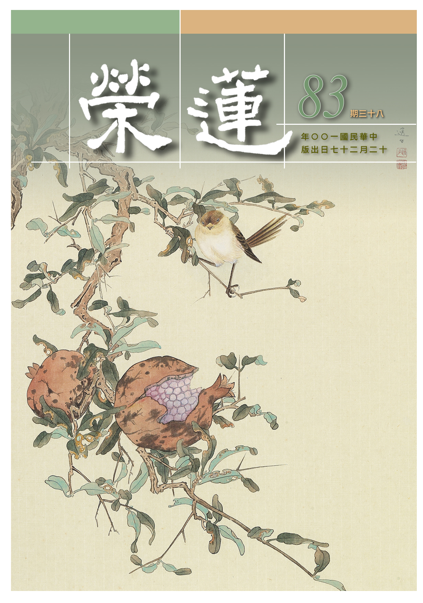

## 社論

### 文化與文創

本刊

凡事求速成

業績能掛帥

文化商品化

人格被物化

當為政者與文化界人士談起文化時，往往談的不是文化本身，而是文創。何為文創呢？即是文化創意產業，現今社會的文化創意產業，有食品產業、工藝產業、出版產業等等五花八門，不勝枚舉。有人將文化創意產業定義為「利用文化資產創造財富的產業」，也有人說「文化產業是將文化商品化，重在交易的價值」，其定義亦是層出不窮。為何會出現人們對於「文化」和「文創」混淆不清，莫衷一是的情況呢？關鍵在於沒有真正明白何為「文化」，以及它的根在哪裡？

所謂的文化，從字面上說乃「以文化導」，以文化導民心、民情、民風，核心思想是從堯、舜、禹、湯、文、武、周公、孔子所傳的道脈。文雖包含各項百工技藝，各種生存發展的技能，根為六經或開展為十三經，然通達這些典籍必須要慎選注解及傳承，才能深入其中運用於外。然而生命有限，十三經又博大精深，雖是中華文化的全體大用，但難學難通，扼要處還是《論語》的學習，因為《論語》是十三經的精華，也是十三經的入門，透過有限時間的學習，可以迅速找到文化的根本與精華。

臺灣是中華文化的傳承，由於戰亂，內陸各地有道的長者流亡到了臺灣，站在食其毛、踐其土的同理心上，愛護臺灣這塊土地，特別以辦教化來善導民心。同時因政治安定經濟起飛，所以提供了百姓一個安定富庶的學習環境。除了接受政府的教育，更重要的是，在座下親聞雪廬老人儒佛道統的課程，接受完整的中華文化教育。這是中華文化在臺灣的生根，如今社會口號要發展多元文化，也只不過是把文化付諸在各個方面去發展，差異只在於文化深淺程度的不同。

若沒有文化作根本時，會發生什麼事情呢？由於沒有主體（中心思想），這些文化的花葉枝果（文創）則無根，亦不會開出纍纍果實。又找不到文化的正統時，一談到文化就會產生百家爭鳴的局面。在春秋戰國時，由於沒有中心思想，於是呈現百家爭鳴的雜亂樂章，不知人生的價值觀在哪裡。一直亂到漢朝，由於漢武帝接受董仲舒的建議，以孔門一脈的儒學成為中國文化的中心思想。若我們現在不站在根本上講究，還是會陷入百家爭鳴的混亂局面。

在禮記禮運大同篇提到，為政辦教化的理想，就是將人心由私化導為公，為政者以及庶民若都能如此，則世界大同。現今社會各國（亦包括中國），皆以經濟為導向，造成文化偏失和流失。然而層出不窮的問題，關鍵在人心，因此唯有從中華文化中找出解決之道，這也是有志於謀求世界和平者之共識。在禮運大同篇裡，明治亂世，達到大同世界時，必須先經過小康的局面，然而要達到小康的局面須先恢復禮樂教化，要掌握禮樂教化的根本精神，須從經典學習，這才是真正文化的傳承！

本次江逸子老師在福建博物院所辦的畫展，雖定名為「回饋鄉親父老的七十歲回顧展」，實是受惠於雪廬老人的教導，使他在道藝上生根，將道與藝做深度的結合，呈現中華文化的傳承，展出的作品靜靜地敘述著禮樂的教化，以中華文化回饋家鄉。這些文藝創作是文化的表徵，也是真正從事藝術工作者，最需深耕努力的。

總之，作大格局的學習，有著文化的情懷，廣大的胸襟，正確的判斷，是中國各行各業優秀的精神，亦是傳統文化的精神。各行各業欲融會貫通、觸類旁通，須先從對文化學習之博聞強記開始，由此基礎累積豐厚的內涵，再融會貫通、觸類旁通。文化創意產業欲蓬勃發展，首要之處在先深入文化內涵。

## 大德法語

### 大方廣圓覺修多羅了義經（四十二）清淨慧啟請

道源老和尚

能證圓覺所證性

觀待善友令開悟

見地修學最為要

一以貫之凡轉聖

癸二、證位階差

子一、明依位漸證

丑一、信位

寅一、標具足凡夫

經文：

善男子！一切眾生，從無始來，由妄想我，及愛我者，曾不自知，念念生滅，故起憎愛，耽著五欲。

科文你們得自己對，我眼睛看不見。在妄用功之中，顯出差別相（有逐漸破執，有增加執著）。

次第成就之階位大分為四，第一是十住位（配滅不可得），第二是十行位（配異不可得），第三是十回向位（配住不可得），第四是十地位（配生不可得），此屬於漸次修學，圓瑛法師的講義，就是依著《大乘起信論》講的。我們現在是依文解義，學講教法，並不一定開悟才當法師，你名相熟，教理熟，就可以講經給別人聽了。

但是你不要怕用功，圓瑛法師作圓覺經講義是一九五０年，時為七十五歲，講完了本經，集結成講義，法師就圓寂了。老法師雖是七十五歲的老人，還在那兒研究，並做註解，還能將大乘起信論引證出來，而且名相要對，有一個字錯誤就不對，七十五歲的老人他都沒嫌麻煩，你們年紀輕輕怎麼怕麻煩，我（道公）時常勸勉同學要用功，不要怕麻煩，要認清我們自己是幹什麼的？

我們學佛法讀佛學院的，還怕看參考書，什麼時候能學成法師出來弘法呢？我不能替諸位看，你們要自己將大乘起信論找出來對著看。大乘起信論的道理我能記到，我能背下來，論文將無明分四種：生、住、異、滅四相。要滅除無明，由本覺理，起始覺智，一切眾生都有本覺，為何沒有起始覺呢？因為沒有遇見善知識，沒有聞到佛法，亦即沒有遇到識教（善知識與教法）之因緣。

以前不知今天知，起了始慧，謂之始覺智，始覺智分四個層次：名字覺（十信）、相似覺（三賢位）、分證覺（十地）、究竟覺（成佛），此即破無明之智的差別相。十住位是破了滅相無明（十信是初住位的修學法），滅了最初的滅相無明。三賢位菩薩成就相似覺，其中十行用功修學滅了異相無明，到登地以後就成聖人了，共有十地，謂之十聖位菩薩，彼用功修行謂之分證覺，滅了住相無明。到了成佛謂之究竟覺，滅的是生相無明。起信論與圓覺經講的道理次第一樣。前邊判教時，將圓覺經歸屬頓教大乘，亦含攝漸次修學的教理，就是在這個地方。

經文：

善男子！由妄想我，即愛我者，曾不自知，念念生滅故起憎愛，耽著五欲。

吾人何以謂之眾生？一切眾生，前生是個眾生，再前生也是個眾生，沒有個開始，謂之無始以來，無始以來即名之為眾生。何以謂之眾生？由妄想我及愛我者，將幻化不實的身體與心，當作是真的，所謂：妄認四大為自身相，六塵緣影為自心相。身體是地、水、火、風四大假合的，卻妄認為真實，六塵緣影心幻化不實，卻執著有個真實的心，在身心上妄執有真實的我，我是怎麼來的呢？妄想出來的，根本沒有個我（不過名言假立），由妄想有自相之我，起了我執、我見，執著有個真實的我，由此而生起愛我的心，一切煩惱都從這裡生出來。

經上說我們這個心是妄想心，沒有一個本體自性，隨境而生、住、異、滅，這些生滅的念頭極細微，一彈指有六十剎那、一剎那有九百生滅，亦即一剎那有九百個微細念頭，我們知道不知道呢？

此乃依著佛經講的，若能坐上修，能觀察出來嗎？觀察一剎那具足九百個生滅的小念頭？是觀察不到。那麼講這麤念，一念一念的麤念，念念生滅這個念觀察著，怎麼樣都觀察不到？乃平常麤心麤慣了，怎麼麤呢？天天攀緣外境，白天想來想去，想著心外的六塵境界，夜晚睡覺還作夢，從來沒有迴光返照自己的心。若能好好觀照心念，那你用功一定大進步。

「曾不自知」之「曾」是從來義，從來不知道念念生滅的妄想心，故起憎愛。亦即不知道自己的心是妄想心，「我」被妄想心增益出來，依我能起憎、愛之煩惱，此是與生俱來的煩惱，有眾生就有這兩個煩惱，順乎我樂就起愛，不順我樂就起憎。我們要用功修行斷此二煩惱，要先斷哪個煩惱？愛斷掉則根本不起憎，無愛不起憎。

「愛」這個東西太厲害，前邊說「及愛我者」，由愛我而耽著五欲，耽—是堅固，著—是執著，堅固執著五欲之境，不但執實且認為能令我樂，由此五欲之境能引發欲心，眼睛堅固執著好看的顏色，耳朵堅固執著好聽的聲音，鼻子堅固執著好聞的香氣，舌頭堅固執著好吃的滋味，身體堅固執著舒服的觸塵，在色、聲、香、味、觸，五塵境中尋求可欲之境，謂此五欲之境能得快樂，所以執著不捨，謂之耽著五欲，若不令我樂、所愛的失去方生憎，可見根本的煩惱是愛。

寅二、明聞法覺悟

經文：

若遇善友，教令開悟淨圓覺性，發明起滅，即知此生性自勞慮。

善友就是好的道友，能教你佛法的道友，即是善知識（善友），善友不一定在法座上給你講經說法，能幫助你了解佛法、去煩惱的同學，此亦是你的善知識。若遇到了善知識教令開悟，可見修學佛法第一步功夫還是先悟佛理，悟什麼呢？

今吾人悟淨圓覺性，此清淨圓覺妙性（佛性）人人本具，各各不無，所以佛法是心法，成就是在我們自己的心，心外求法是外道。佛法高，隨便提出來一句都是高深的道理，一切世間上無論什麼宗教，都是心外求道，無論什麼哲學，都是心外求法，沒有往自己的心找，佛法指出成就在自己的心裡。

有云：有智慧的人求心不求佛，愚癡的人求佛不求心。外道是心外求道，佛弟子求道是在心內求，愚癡者天天求佛不求心，求開悟卻是在心外求佛，實則佛在你心，所以有智慧的人求心不求佛。佛法的道理，高就高在這兒。

於是發明起滅，你一開悟，悟到了淨圓覺性，此時才發明念念生滅的妄念。

即知此生性自勞慮，到此你悟了淨圓覺性的道理，你才知道你此生包括無始以來的生，性自勞慮。依圓瑛法師的講義，圓覺自性本來沒有起滅，吾人卻在圓覺妙性上自生勞慮，所以眾生在此受苦，是冤枉受苦，本來就是佛嘛！圓覺妙性一點也沒有減少嘛！你為什麼在那兒勞慮呢？

單講「勞慮」兩字，此是眾生的障礙，分開來講是身勞心慮，身體奔波勞碌，高尚的人是為名，中下的人為利，乃至於貪圖五欲，從早晨到晚奔波勞碌，身體是受勞，心裡則憂愁失慮。再說天天在那兒打算盤，未得患得，既得患失，就說得鈔票之事，是五欲之財，沒有得到時在那兒起憂愁，謂之患，想辦法要怎麼樣才能得到？得到之後又怕失掉，還是在那兒憂愁失慮，所以心裡邊永遠沒有快活。你看社會上沒有鈔票的人，天天在那憂愁失慮，即使發大財的人也得不到快樂，還是在那兒憂愁失慮，未得患得，既得患失，沒有得到自在，這都是冤枉事啊！

圓覺妙性本來沒有勞慮，你在那兒自生勞慮，你怎麼知道呢？因是遇著了善知識向你開示佛理，你遇著佛理開了悟（悟到了自己的圓覺妙性），以後你才知道的。現在我們彷彿知道，其實是依文解義才知道。然此之知道不是真知，一定要開悟以後才算真知。

寅三、明息妄隨真

經文：

若復有人，勞慮永斷，得法界淨，即彼淨解，為自障礙，故於圓覺而不自在。此名凡夫隨順覺性。

若將妄念斷除，無有勞慮，得法界淨。此時是十信修圓，能將無明的滅相斷除。前邊雖開悟，此處更加深體悟，雖悟徧法界清淨，然剛十信修圓滿，還沒有入十住位，此時出定仍有執著。

所謂即彼淨解，為自障礙。此之解做開悟講，對法界淨的解悟，認為得到了，以為此悟有自相，對這一念起了愛，愛為生死本，欲界眾生貪愛五欲，上二界的眾生則愛禪定，愛空定，還是個愛，欲超出三界以外的菩薩，則連法愛都要斷除，否則生障礙，所以要進步，如看地圖，不要以為走到這一站就可以下車，距目標還遠呢！

即彼淨解之「彼」是指十信位的菩薩，淨是法界淨，那是解悟，發生起執著便生障礙，故於圓覺而不自在。悟到圓覺性是有淺有深，此時對於圓覺自性不能得自在，不自在就生障礙，此名凡夫隨順覺性。

此菩薩名為十信位的菩薩，於大乘法謂之教外凡夫，猶是凡夫，此之始覺謂之名字覺，雖名為名字覺其實不覺，他猶是個凡夫，然能隨順著覺性，悟到法界淨還不是簡單的事，也須好好用一番功夫。

丑二、賢位

經文：

善男子！一切菩薩，見解為礙，雖斷解礙，猶住見覺，覺礙為礙，而不自在。此名菩薩，未入地者隨順覺性。

此見是三賢位菩薩所起的正知正見，解是前文，即彼淨解，為自障礙之解。此菩薩觀察到解悟還成障礙，雖斷解礙，猶住見覺，亦即雖將十信位解礙斷除，猶住此見覺，則覺礙為礙。見覺是已覺到前之解礙的礙，已不得了，然住此是覺之住即是執著，猶住於見覺，此覺變成了礙，而不自在。

此名菩薩，未入地者隨順覺性。是指還未證入十地，是三賢位（十住、十行、十迴向）的菩薩，依大乘起信論謂之相似覺，滅的是異相無明，仍須用功修行。（下期待續）

### 常禮舉要講座（二十四）　慶弔篇

雪廬老人

喜慶弔祭禮有別

喪戚祭誠禮之本

風俗淳厚禮之效

和諧民族禮之用

慶弔

此二字乃最後總明常禮舉要。禮有常禮、有非常禮種種之不同，本書「常禮」是在日用平常所必須要的。而且加上「舉要」，只講要點不講詳細。若講起詳細都在曲禮上，光在曲禮上還不行，還得參考儀禮。至於舉要是人人皆知。不是說今日之下，就說民國以前鄉間放牛的、放羊的，沒念過書的，他也懂得，此謂之舉要！我們談的話，他們（鄉下人）也懂，為什麼呢？自小都學過，日久天長如此。話說至此，別以為聽了，就算是懂禮了，如此則太荒唐。

◎一、參加吉禮，不談衰喪話，不戚容、不啼泣。

此吉禮指的是祭祀，大家聽明白，祭祀是吉禮的第一禮，其次嫁娶（結婚）也在吉禮之中，再一種，現在流行，然古時是非禮，什麼呢？做壽，亦歸於吉禮一類。其次喪是凶禮，婚、喪是家家必發帖的，古今皆有，然這兩種禮比較起來呢，喪禮又更重要必得為之，為什麼呢？這是天下的大事，你們都念過書，咱們這個大事是什麼大事？國家有國家大事，我們普通人還有大事嗎？就是喪事！父母之喪是大事了！沒有再大過這個事了，這個大家當然懂。

譬如一家有三代，頭一代談不上父母之喪，他有父母則算不上第一代。頭一代下面有第二代，第二代還有第三代。第三代對於第二代就有父母之喪，是大事。第二代對於第一代亦然！

喪禮中之父母之喪必須舉行，婚禮在今日之下可以看情形，國家提倡節儉，不舉行也可以。若舉行，要麻煩親友就得送禮。你給至親好友撒帖子，鄰里鄉黨要不要撒帖子？這個好麻煩，你不寄他帖子，他說你看不起他，你要寄上帖子，他說我們夠不上這樣的交情，這是打網，這話你得聽明白。小姐出嫁，照禮是不出帖子，而兒子娶媳婦，出帖子與否得斟酌情形。

最討厭的是拜壽，你活了這麼大年紀有什麼可賀壽呢？你對於社會有何功德呢？要是你做的事情不錯，大家怕你死，多活一年，給社會多盡一年的義務，也還罷了！若對社會非但沒有好處，反而有害，若是害群之馬，多活一天有何慶賀之處，慶賀什麼呢？同時今日之下慶壽比過去更壞。怎麼更壞呢？現在風氣，婚喪出帖子要錢，做壽要錢是不好意思的，若是送錢或更好，麻煩的是不要金錢，出了帖子，要大家作詩，他做主考官，大家限期交卷。

現在大家連字都認不得，和什麼詩，做白話詩尚且不會，這不是要命嗎？現在興這個。我情願拿幾百塊錢，我不願意交這個卷，現在這個事情最討厭！你一個人待在家裏面就好，卻要祝壽的人做上幾首詩，你坐在那兒要大家給你和，你在那等著，勞動若干人，大家心神不安，這是最傷德的事，今日之下大可不必！萬不必做詩、徵畫、徵文，在學校要考試，已經很受苦了，何必當主考官要大家的命。把話說完了，慶弔有應辦，有可以不辦，此處是說應辦的。

參加吉禮，或者嫁娶、或者做壽，你參加這種吉禮，到那談話得說吉祥話，得說好話，這叫人情世故！他們今天結婚，你在那兒說：某人家今日不好，去年兒子結婚，到了第二年兒子就死了。你雖說的是別家，可是人家正在辦喜事這一套，你這套是瞎祝詞還是故意在咒罵呢？或者談的不高興，自己在那唉聲嘆氣：倒楣、真糟糕。人家在那裏是吉禮，是誰倒楣，誰糟糕？談著談著，自己在那哭了，人家沒叫你來弔孝，這都是不近人情！學這些東西無非是世故人情。今日之下世故不懂，人情也不懂，世故人情都不懂，能為國家辦事？無此道理！好在我是百無禁忌，要是我有禁忌，那就不得了了，上我那兒去的，認識不認識的、千奇百怪的一些，我是愈忙愈遇些怪事。

不談衰喪話，不戚容，戚容是皺眉頭，很衰喪的樣子，人家辦喜事，彼此遇見應該關懷，愁眉不展不行，這個要懂的。你愁眉不展得跑到旁邊去愁眉不展，別跑到禮堂內愁眉不展。

不啼泣，別在那喜事場哭泣，主人看見你這個樣子，你臨走人家不送客反而好，不要前腳走，後腳人家就罵你：真喪氣！今天碰見這麼樣一個人，出門就該死，這是自找的！

◎二、居喪不參加吉禮，只送儀物。

何謂居喪？服喪從前有年限，中國是三年，後來官場中為了還要辦公事等等，故減成二十七個月當成三年，在這二十七個月都在喪中。其次分大小喪，這個我不講，一講就麻煩了。然而現在也不講二十七個月了，甚而連一年年限大家也不講了。從前我上學，甚至在民國十年前（一九二一年）還是這個樣子，什麼樣呢？父母之喪是「囚首喪面」，鬍子不刮，臉也不洗，如監牢內賊寇一般。時間是縮短，以一百天守父母之喪。從前清朝是剃頭的，此時一百天不但頭不洗剃，鬍子亦不許刮，以前剃光頭的，此時光頭也盡讓它長去。

民國十年前，居喪百日之內，都看出來，五四運動以後就變了，今日之下更是認不出來了。從前能認出來是在守喪期間，看百日之內穿的衣服，衣服樣式變了，從前都看出來，衣服布匹是粗的，連絲都不許穿。現在是頂著四方帽（這是臺灣話），要是不頂四方帽，那還看不出是服制！這我（雪公）就不能再講了，一講就得找麻煩。

或云：你是學孔老二的呀？孔老二是千古的罪人，現在不信這個的呀！是啊！我知道不信，信馬克斯、恩克斯這個，他信他的，我信我的。我下生來就在聖賢之邦，我沒下生在馬克斯那個地處！我不聽那個，我出生之地不同。狗生的是狗，兔子窩生的是兔子，我是人，我也不學馬。你不是該死嗎？我早就該死！還有什麼關係呢？我自己已多活好幾天，以上將居喪說出來，只可憑良心用事了。

在居喪時，從前是不參加吉禮的，親戚朋友他家有吉禮，當然會給我們下帖子，人家是恭敬我們，此時居喪不能參加怎麼辦？只送儀物，這是人情世故啊！他家有喜事，你家遭了不幸，送了禮去，禮物外包著（紅包），送了紅包，紅套上旁邊寫上制字，或從吉。你家有喜事，人家之吉，我們從之。這一條我們記住。現在不在乎這個，不能一百日，可是在四十九日以內沒有滿七是不參加吉禮的。人家結婚滿堂紅，你穿了一身素予人不吉祥。

從前在家庭之中，女子只要有丈夫，不管妳長得多麼醜，早晨起來，洗臉後，胭脂粉必得用上，這是一定的。不是今日之下化妝漂亮，為的是丈夫與父母，你要是臉上沒有胭脂，或許丈夫不挑剔，公婆看了就不高興！唉！什麼事呀！我還活著呢！聽這句話，想想吧。講到這兒還不懂那還有什麼辦法？現在禮不似從前講究，還得看情形，人家婚禮還是喪期七七四十九日之內，以不參加較好，但禮還是要送。（下期待續）

### 正覺精舍結夏安居～果公法語開示（一）

果清法師

慶幸末法大德現

修學正法大福田

氣度格局大風範

團體增上大影響

民國一百年六月十八日

諸位法師慈悲，諸位菩薩蓮友，大家午安，今天至誠感謝，諸位光臨我們精舍來供佛齋僧。今天就為諸位講解印光大師兩段法語開示，來酬報諸位供佛齋僧的善舉，就請諸位翻開講義，先來解說第一段的法語：

印光大師開示

吾人心性　與佛同籌

祇因迷背　輪迴不休

如來慈憫　隨機說法

普令含識　就路還家

法門雖多　其要唯二

曰禪與淨　了脫最易

禪為自力　淨兼佛力

二法相較　淨最契機

如人渡海　須仗舟船

速得到岸　身心坦然

末世眾生　為此堪行

否則違機　勞而難成

發大菩提　生真信願

畢生堅持　唯佛是念

念極情忘　念即無念

禪教妙義　徹底顯現

待至臨終　蒙佛接引

直登上品　證無生忍

有一秘訣　剴切相告

竭誠盡敬　妙妙妙妙

「吾人心性，與佛同籌，祇因迷背，輪迴不休。」我們的心性跟諸佛都是同類的、同等的，一切眾生跟諸佛皆有佛性，諸佛徹證真如本性，而我們是迷惑真如本性，本性都是一樣的，只是迷惑跟覺悟的不同而已。諸佛從眾生的本性（真如本性）徹底的覺悟，眾生是迷惑了自己的本性，然而本性都是一樣的，眾生跟諸佛是沒有差別的，為什麼眾生跟諸佛不同？

「祇因迷背，輪迴不休」，只是因為眾生迷惑，背離了真如本性，就起惑、造業、受苦，所以在三界六道的生死苦海當中，輪迴而不能夠休息、不能休止（休息停止），那怎麼辦呢？

「如來慈憫，隨機說法，普令含識，就路還家」，如來就是佛陀，本師釋迦牟尼佛，慈悲引領眾生，看到眾生在三界六道的生死苦海當中頭出頭沒，所以深深的生起慈悲憐憫之心，隨著眾生的根機，來為我們宣說法要。眾生都含有八識叫做含識，第八識就是阿賴耶識，就是根本識，第七識叫做末那識，還有第六意識，還有前五識（眼識、耳識、鼻識、舌識、身識），所以總共有八個識，眾生含有八個識，蠢動含靈就是指我們眾生，普遍使得含識的眾生，能夠逆著生死輪迴路就可以走到家鄉去，家鄉比喻極樂涅槃的彼岸，就著扭轉生死之路，就可以回過頭來往極樂世界的家鄉一直走去，將來能夠往生極樂世界。

「法門雖多，其要唯二，曰禪與淨，了脫最易」佛所說的法門雖然很多，所謂的八萬四千法門，然而在這麼多的法門當中，最重要的唯獨有兩種，就是禪宗跟淨土宗，禪宗跟淨土宗了脫生死最為容易。下面將兩宗作一個比較。

「禪為自力，淨兼佛力，二法相較，淨最契機」，禪宗唯獨靠著自己修持的力量，而淨土宗兼帶著阿彌陀佛持名接引之力，這兩種法門互相比較起來，淨土宗最契合末法時代眾生的根器。

「如人渡海，須仗舟船，速得到岸，身心坦然」，好像一個人要渡過大海，必須要靠著舟船，比喻我們眾生想要度脫生死的苦海，必先依仗著修持淨土法門這種大慈舟航，能夠修這個法門，就好像上了大慈舟航，很迅速的可以到達清淨涅槃的彼岸，到達彼岸後，身心就感覺非常的舒坦跟安樂。

「末世眾生，為此堪行，否則違機，勞而難成」，末法時期的根機，唯獨靠著淨土法門好好行持，若修其他法門，則不契合末法時代眾生的根器，雖然修行勞苦，卻難以成就。修淨土法門既然那麼的殊勝，那麼的好，該要怎麼修呢？

「發大菩提，生真信願」，修淨土法門，我們要發起廣大的菩提心，觀無量壽經言三輩往生，都要發菩提心，一向專念阿彌陀佛。通常講菩提心，是上求諸佛覺道，下化無邊眾生的心，就著淨土法門來說，發菩提心不但自己求生極樂世界，也要使法界有緣的眾生，跟我們一樣都能夠往生到極樂世界，往生到極樂世界之後，修行直至證得無生法忍，就有能力分身塵剎，廣度有緣的眾生都往生到西方極樂世界去，這個就是淨土法門所說的發菩提心。

不僅求自了，也要發起廣大菩提心，因為這個法門是大乘善根的境界，不是自了，想要發起自了之心，不管其他眾生，那我們也沒辦法往生極樂世界，所以發菩提心非常重要，發了菩提心之後，要生真信願，生起真實的信心，發起懇切的願。

蕅益大師在彌陀要解中講到六種信—信自、信他、信因、信果、信事、信理，簡單來說，信自就是要相信自己的心性，自己的心性不是肉團心，也不是第六意識攀緣六塵影像的心，而是真心（真如本性），是豎窮三際，橫遍十方的，所以楞嚴經：「空生大覺中，如海一漚發，有漏微塵國，皆依空所生」，虛空生在大覺悟的真心當中，就好像大海中生起一個小水泡一樣，整個大虛空，比喻作大海的小水泡，而真心比喻整個大海，有漏微塵的國度，都安立在虛空當中，像我們地球、太陽、月亮、晚上所看到的星星都是國度，無量無邊的國度，都在宇宙當中，佛的國度太多了，比如在華嚴經一開始就講到法界安立的情形，有無量無邊的國度。

有漏微塵的國度都安立在虛空中，如此說來，極樂世界也安立在虛空中，而虛空在我們的真心裡頭好像大海的一個小水泡，所以極樂世界也不超出我們真心之外，眾生現在雖然迷惑顛倒、起惑造業、受種種苦，假若有一天回心轉意，能夠深信切願，好好念佛，求生極樂世界，平素也能夠諸惡莫作、眾善奉行，那麼將來，我們就能夠往生自心本性的極樂，這是一點也不必懷疑的，一定是如此，這個叫做信自，以心性為自，要相信我們心性是非常廣大的，所以平素待人接物，就不要小裡小氣的，人家佔我們一點便宜，就跟他過意不去，不如此！

心性是很廣大的，像彌勒菩薩肚大能容，一切不如意之事，他都可以容納得下，無障無礙，笑口常開，所以我們得要銘記，稱合我們的心性，用廣大的心性來修行，不計較人我是非，只是真心老實的修行，那我們將來個個都能夠成就，這個就是信自。

第二是信他，我們要深信不疑本師世尊的言教，本師世尊為我們宣說佛說阿彌陀經，佛說無量壽經，佛說觀無量壽佛經，這個就是所謂的淨土三經，後來的古德再加上大方廣佛華嚴經的普賢菩薩行願品，還有大佛頂首楞嚴經的大勢至菩薩念佛圓通章，變成了淨土五經，前面三部經都是本師世尊親口所宣說，後面兩部經雖然是普賢菩薩、大勢至菩薩所說，然而都經過佛印證過的，等於佛說，除了這五部經之外，其他大乘的經典都處處指歸淨土法門，所以我們要深信本師世尊的言教，因為佛是真語者、實語者、如語者、不誑語者、不異語者，佛所說的話，是最真實不虛、最靠得住的，所以依佛所說深信其言教，這是信他的一種內容。

另外也要信阿彌陀佛，其在因地做法藏比丘的時候，發起四十八願，這四十八願都是用來救度十方世界念佛的眾生，能夠往生到極樂世界，能享受非常殊勝微妙的安樂，所以要信阿彌陀佛大慈悲願力。

另外再信十方諸佛或者六方諸佛都深深讚歎淨土法門，就好比彌陀經當中六方諸佛稱揚讚歎這部經：「稱讚不可思議功德一切諸佛所護念經」，這是佛說阿彌陀經本來的名稱，十方三世一切諸佛都出廣長舌相來稱揚讚歎這部經，稱揚讚歎這部經等於稱揚讚歎淨土念佛法門，所以我們要隨順諸佛的教誨，決志求生極樂世界，這就是信他。

另外信因，散亂稱名猶為成佛的因種，何況一心不亂的念佛，哪裡不會往生極樂世界呢？一定是去的，這個叫做信因，信以念佛為因。

信果是甚麼？相信極樂世界諸上善人，俱會一處，皆從念佛三昧而生的，在因地好好念佛，念到一心不亂證得三昧，往生到極樂世界，成為極樂世界的諸上善人。所以我們能夠好好的念佛，將來往生到極樂世界去，跟諸上善人俱會一處，就跟阿彌陀佛、觀世音菩薩，大勢至菩薩，清淨大海眾菩薩作為良師益友，幫助我們往佛道的路一直走上去。

所以往生到極樂世界去就不會退轉，都是不退轉的菩薩，一直修到等覺菩薩，接著就成佛了。所以彌陀經：「眾生生者，皆是阿鞞跋致，其中多有一生補處，其數甚多，非是算數所能知之，但可以無量無邊阿僧祇說。」眾生往生到極樂世界，能證三種不退轉：位不退、行不退、念不退。位不退，不退入凡夫地；行不退，不退入於二乘地；念不退，念念流入薩婆若海。就是一切佛的種智海，往生到極樂世界就不退轉。

所以要發起真實的信心，也要發起懇切的願，有了信之後生起懇切的願，願的內涵是厭離娑婆，欣求極樂，這個世界讓我們從小一直到現在受的苦太多了，娑婆世界之苦苦不堪言，總括來說就是生、老、病、死、求不得、愛別離、怨憎會、五陰熾盛等八苦，八苦開演出去無量諸苦，所以娑婆之苦苦不能言，極樂世界之樂，樂莫能宣，往生到極樂世界去，我們就跟諸上善人俱會一處，而且有情、無情都為我們說法，那邊環境太殊勝，享受勝妙的五塵，因此增長我們的道業。

在娑婆世界，假如貪圖享受娑婆世界五欲六塵的快樂，那就墮落了。極樂世界不如此，思衣得衣，思食得食，想要穿衣，非常合身的法服自然加在身上，不假借裁縫，不必修改自然合身，我們這個世界，做衣服有時作得比較大，有的時候比較小，還要修改過，極樂世界不需要，自然可以很合身。思食得食，想要吃的時候，七寶自然現前，種種的美味也自然現前，食後自然化去，不必洗碗筷。想要去除這種三餐勞苦，那就好好念佛求生極樂世界，自然就免除張羅三餐、洗碗筷的苦，那麼其他殊勝的事情太多太多。

所謂樂莫能宣，厭離娑婆有種種苦，欣求極樂有種種殊勝的妙樂，厭離娑婆之苦，就好像厭離被關在監牢的痛苦般，又好像墮落到十方世界的廁坑一般，要趕快求出離。而我們欣求極樂的心，好像前往到寶所，又好像回到故鄉一樣。要欣求極樂，要厭離娑婆，這個就是願的力量，願要發得非常懇切。

怎麼才叫懇切的願？就好比熱鐵輪在我們頭頂上旋轉，即告訴我們必須發起往生極樂世界的願，馬上放下娑婆世界，熱鐵輪就不會加在頭上，如果不肯放下娑婆世界，轉成願生極樂世界的心願，熱鐵輪就加在你頭上，就沒有命了！而我們也不會因為在娑婆世界的苦而退失往生極樂世界的願心，這個就是切願。

另外，我們將來要往生極樂世界，不論任何順逆境，都不改變我們求生極樂世界的願心，這就表示我們的願發得非常懇切，不是悠悠泛泛，有也好，沒有也好的那種情況，這就是切願。所以要生起真實的信心，發起懇切的願。即使轉輪聖王的地位送給你做，也不改往生極樂世界的心願。

則「畢生堅持，唯佛是念」，畢生就是盡此一生，都是堅定執持這一句阿彌陀佛的聖號，所謂的執持，不是用我們的手拿著東西叫執持，而是用我們的心來執持，所以念佛不光是口念，要緊的是心念，口念心不念，喊破喉嚨也枉然，而心念口不念，你也沒有在念，那豈不枉然了。所以靜坐的時候，雖沒有出聲念，但心默默的一句一句，或者像印祖三三四就十聲，三聲三聲四聲成為十聲，三三四，一直念下去，所以念佛要緊在心念，口念也要配合心念，光是有口念，或是光是口念出心不念，都沒用處，不念出聲，心也要念，嘴巴在念，心也要念，要一起配合。所以畢生堅定的執持，唯獨阿彌陀佛就在我們心中一直憶念。

「念極情忘，念即無念，禪教妙義，徹底顯現」，我們念佛功夫念到了極點，凡夫的情念就逐漸消了，那就轉凡成聖了。念即無念，無念而念，念而無念。什麼是念而無念呢？是念佛的功夫用到極點，雖然常常在稱念或者憶念阿彌陀佛聖號，但是一點起心動念的現象都沒有，這個就念而無念。那無念而念甚麼意思？雖然沒有起心動念的現象，然而這句阿彌陀佛的聖號卻常常在稱念或者憶念。

能夠做到這個功夫，禪宗教下諸法實相微妙的義理就徹底顯現出來了，所以靠著念佛，也可以證得真如本性，不假方便，自得心開。憶佛念佛，現前當來，必定見佛，不假方便，自得心開，心開就像心花開放，心花開放就是真如本性分分的顯現出，無明分分破，法身分分顯，諸法實相、我們真如本性就分分的顯現出來，也就是分破無明，分證法身。這個就是禪宗妙義徹底顯現。所以要明心見性，不必修其他的法門，念佛也可以明心見性，念佛也可以徹底清淨我們的心，也可以大徹大悟，徹底證得真如本性，這是不假其他方便。

念佛有四種念佛：實相念佛、觀想念佛、觀像念佛、持名念佛，我們現在所用的是持名念佛，但是持名念佛念到念極情忘，念即無念，禪教妙義，徹底顯現，這是說明實相念佛的境界，所以由持名念佛就可以通達到實相念佛，實相念佛是一般禪教微妙的義理，所講究的圓徹真理，即自證真如本性。

所以方便有多門，歸元無二路，修行最徹底就是證得真如本性，而真如本性、大圓鏡智是我們眾生所本具的，不是心性之外另外有所證、有所得，所以圓滿無上菩提非無所證，只是自證真如本性而已沒有在心性之外另外有所獲得，所以圓滿菩提非無所得。

「待至臨終，蒙佛接引，直登上品，證無生忍」。準備到達臨命終的時候，蒙受阿彌陀佛慈悲的接引，直接登上上品，上品有上品上生、上品中生、上品下生。能夠登上品都非常好，最高的是上品上生，那就可以證得無生法忍。什麼叫做無生法忍？無生法就是諸法不生不滅，諸法實相就是不生不滅的境界，對不生不滅的真理忍可於心，再不動搖，這就證得無生法忍。證得無生法忍看到一切虛妄生滅的諸法當下就是不生不滅，所以證得無生法忍的菩薩看一切諸法都沒有生滅相可得，當下所見就是諸法實相，我們凡夫所見就是生生滅滅，無生法忍的菩薩所見就是不生不滅的相。如何證得這個境界？

「有一秘訣，剴切相告，竭誠盡敬，妙妙妙妙」。印祖開示說有一個秘密的訣竅，剴切的告訴我們，念佛的時候要竭誠盡敬，竭盡我們至誠恭敬之心，我們無論念佛、待人處世，都要竭誠盡敬，這是非常微妙的，夾帶太多虛情假意沒有用處，人家不受感動，所以待人要以誠相待，至誠無欺的恭敬尊重對方，修行念佛亦復如是，要竭誠盡敬，這是非常微妙地，連續說了四個妙字，可見很微妙，很妙！很妙！妙！妙！妙！妙！（下期待續）

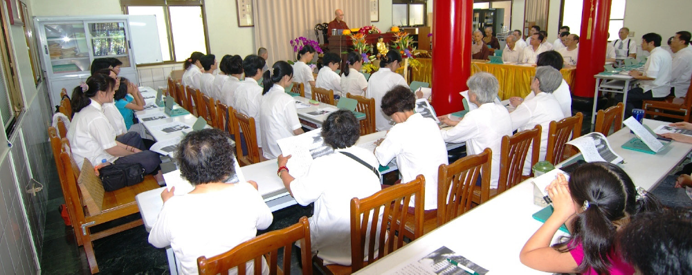

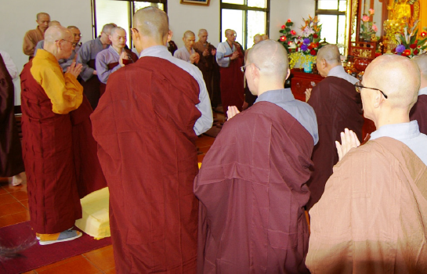

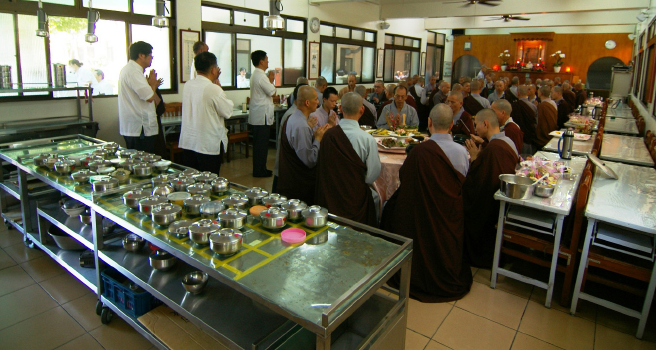

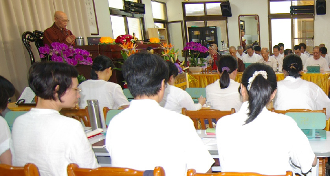

### 團體氣象的經營～自公老師法語開示

自公老師

無怨無爭禮樂教

能令小康入大同

聖門氣象人世現

端賴為政辦教育

民國一百年十二月九日

各位遠道而來，我們大家都是志同道合來學習中國文化，都是同修。我學人未有好招待，僅以聖人孔夫子的言語貢獻給各位。孔夫子所講記載在經文，是助我們學做聖人，因此儒學文化就是學做聖人的文化，記載在論語裡面有四句話：志於道，據於德，依於仁，游於藝。

志於道：道是指的我們人人本有的性，我們憑什麼可學做聖人呢？就憑我們具有的本性，此性是萬德萬能，明瞭自己有這個本性，就是志於道。性雖是本有，卻都迷了，不知道。其次德，德（能力）是從性出來，謂之性德。（根據此性德，明心見性，謂之據於德。）德還是不大容易明瞭，再教仁，仁就是講厚道，對自己、對待他人都講厚道。再者游於藝，乃說志於道，據於德，依於仁的道理與修學方法，由此而學做聖人，如何由理論而付諸實行，謂之游於藝。

藝是藝術，有六種：禮、樂、射、御、書、數。六藝開頭就是禮，學習儒經中的周禮、儀禮、禮記這些禮。其次是樂，再者射是古時候用在軍事或者用在禮上。御是駕馭車輛，如運用現在各種交通工具。書，就是講學的經文。數就是數學。就由這六種藝（修行的方法）學做聖人，一方面學了藝術，就由藝術來學做為聖人，學得很愉快，自己一方面欣賞藝術，一方面就是在學做聖人。

六藝的內涵，今天不能全部奉獻給各位，吾學人僅就當中的禮樂，來貢獻各位同修。

就禮而言，孔子說：君子博學於文，約之以禮。就是學做聖人的君子要廣泛的來學，謂之博學，博學之後要修行則約之以禮，將廣泛學來的道理，在修行時約束及簡化成一個禮，就在禮上面來修行，能依禮而立。孔子曾說：興於詩，立於禮，成於樂。詩是文學的精華，也屬於藝術的一種。立於禮是我們學聖人，若不在禮上面學，學就立不住，不能成立，所以必須在禮上來學習。成於樂呢？樂與學禮相互配合，必須學音樂，才能有成就。

由孔夫子的言論了解禮樂是學做聖人的方法，由此了解禮樂為什麼這麼重要。禮記樂記：「樂者，天地之和也。禮者，天地之序也。」音樂使天地之間和，不生起其他不和諧的現象。禮者，天地之序也，天地之間的萬事萬物都有秩序，禮就是維持天地之秩序。可見這不是普通人所了解的禮樂，這禮樂是大禮大樂，樂記又云：「大樂與天地同和，大禮與天地同節。」鄭康成解釋這個天地同和與天地同節，說到大和，是大的和氣，整個宇宙就是一團和氣。

以易而言，整個宇宙就是一個大數，整體說來，大樂大禮就是維持天地宇宙之間的氣數。樂經又說：「樂至則無怨，禮至則無爭。」能了解運行音樂，到大氣象時，則無怨，我們生在這個世間，要不與人家結怨是很難的。我們任何一個人，不但這一生，在這一生以前是前生，前生還有前生，生生世世跟人家相處，免不了與人家結怨，有了禮、樂的學問，也能夠化解怨恨。再說我們想學做聖人，自己心中要去除煩惱，有怨就是煩惱，我們學音樂，在自性中的和氣能顯現，則怨（煩惱）就沒有了，淺而言之，我們可以得到健康長壽，深處能幫助我們明心見性，心性上沒有生死。

其次禮至則不爭，大禮之運行，與世無爭，我們每一個人在社會上，與人爭名奪利，這是人人都有，從過去世一直到現在，凡是生在人世間，都有這個不好的惡習氣，然所爭不過虛名，利也是要不得的，名與利都是害人的，但我們很多人不了解。懂得禮時則不爭，不與任何人爭名奪利，自性中無爭奪的心，自性是清淨的，若不爭就能明心見性。不爭相對的好處就是讓，讓就是學禮的本意。在《樂記》裡舉的例子是「揖讓而治天下，禮樂之謂也」。此之「揖讓」是指五帝時代堯帝舜帝，堯帝把天子的位置讓給舜帝，舜帝把天子讓給禹王，「揖」是作揖，將天下讓給人家，還給人家作揖，多麼謙虛，這種德哪裡找得到啊！這禮的本意就是學揖讓，揖讓就絕不會在社會上與人爭奪名利。

講到揖讓，需知每個人多生多世以來的不好習慣，就是凡事都要與人家爭權奪利，不肯讓人，何以不肯讓人？人人都執有我（自我主觀意識），此「我」不是真我，是假我。真我是什麼呢？就是所明之性。孔夫子講的「性相近，習相遠」的這個「性」，中庸裡面講的「天命之謂性」的「性」，此性才是真我。我們明心見性，把這個真我啟發出來，真我被惡習氣掩蓋則成假我，這個假我靠不住，有生老病死，在世間時間很短暫，然卻為了假我，在爭奪這個爭奪那個，爭奪來也享受不了多久。

古時候在堯舜時代，將天下讓出去，可是到後來成了家天下，那就有爭奪了。在歷朝歷代，天子傳位慢慢衰敗，若天子不好則是昏君，被人推翻，那是不常的，即使有了天下做了天子，那也是不久的。因此，「讓」就是把這個假我就讓出去，這個假我是非常短暫的，尤其在此時代，天災人禍橫行，什麼時候喪失這個生命都不知道，就算不遇到天災人禍，活到老也活不了幾歲，就算活到百歲，一彈指就過去了，所以「讓」是將世間這個短暫的假我讓出去，讓出去得到真我，因此講禮讓有非常深厚的道理在其中，以上禮讓若能講究，那學儒就入門了，能將儒家學術學好，就能進一步學作聖人。

至於和，《禮記》中庸（孔夫子的孫子子思子所作），子思子學自孔夫子的大弟子曾子，曾子向孔夫子學得非常有成就，孔夫子講的這個道「吾道一以貫之」，曾子非常了解，所以曾子的學術傳給子思子非常純粹。子思子在中庸先說：「天命之謂性」，要人人明了本性，這是學聖人的開始，其次「率性之謂道」，順乎本性就是學道，再者「修道之謂教」，修學這個道就是教育，一方面教自己，一方面教他人，即儒家孔夫子講的君子，成己成物，成就自己也要成就他人。子思子講這幾句話，「修道之謂教」就是教化別人，「率性之謂道」是教化自己，成己成物。

那怎麼樣教化自己與教化別人呢？最後言「致中和」，「致」就是來學習中和，「喜怒哀樂之未發謂之中，發而皆中節謂之和」，喜怒哀樂就是任何人心中的煩惱，拿喜怒哀樂做代表，我們任何人一有煩惱，就時時刻刻往外發，煩惱未發在心中不動就叫「中」，一發的時候要能夠把它控制住叫「中節」，到了一定程度不再發了這就是「和」。我們喜怒哀樂一發出來，對自己是個傷害，是個煩惱；對他人傷了和氣，跟人家結了怨。

怎麼樣才能中節，比如我們和他人有什麼利害關係，衝突、爭論的時候，心裡不高興的念頭一起的時候，面色還沒有變更，這個時候自己就要警覺，趕快把它控制住，止住不要讓它繼續了，這就是「中節」，就得其人和，一方面我自己心理調和，一方面對人保持和氣。中庸裡面講，由於陰陽二氣變成十個數字，十個數字奇偶相配，然後由奇偶相配變成五行金木水火土，五行就包括精神與物質整體在內，我們修道就是要在五行上修，就是要「致中和」，內心保持一片恬和，沒有任何煩惱，這個時候就能夠盡到自己的本性。對人來講，我們能夠和氣對待一切人，那在世間沒有任何冤家對頭，修道辦事無障礙，這就和。

今天，我在這裡奉告各位，大家都是同修，無論在一般團體，在我們修道的道場裡面，自己從本身到團體的每一個成員，都這樣學習的時候，我們在學習的過程中，從開始到成就，就是這樣的一步一步成長，在「和」上面學，那麼在成長過程之中，我們時時刻刻與志同道合一起學儒者，都要保持和諧，那麼就一體的來成長。最後，能使個人以及團體一同成長，得到學做聖人的教化。我們的重要的、學習的、有學有行持的整個學習過程，把這個過程圓滿之後，我祝賀各位，無盡燈文化學會未來的前途無量，就如團體之名，前途無盡！

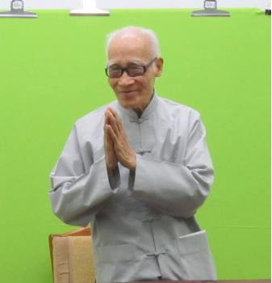

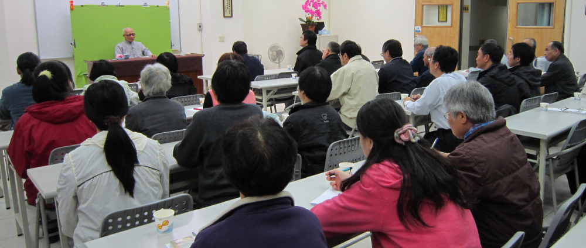

## 共修研學

### 小止觀導覽（五十五）

*心爾、智高整理*

修學正法善根發

要在慈悲喜捨生

與樂拔苦隨喜捨

心心要在佛道成

第七章 善根發

論文：

三、慈心善根發相：行者因修止觀故，若得欲界未到地定，於此定中，忽然發起慈念眾生，或緣親人得樂之相，即發深定，內心悅樂清淨，不可為喻。

此處云修止觀，若是修學空性的止觀，則此慈心善根發相是後得位；若是以慈心為所緣的止觀，則此慈心善根發相是根本位，解釋法是不同的。「若得欲界未到地定」，不能單以文字表相去認知，欲界本身就沒有定了，何況未至欲界？這是指初禪的近分，是還未得到初禪正分的前行，可是已經離開欲界了，故云欲界未到定。

「於此定中，忽然發起慈念眾生。」忽然發起，不是說本來都沒有，入定之時就有。而是說行者帶著比量（慈心）去入定，而到定中是現量證。換言之，在教法的薰習當中了解此世間皆是以苦為本質，此是比量；入定之時忽然產生很強的惻隱之心，悲憫眾生的心油然而生，這即是現量。絕不是入定之前毫無概念，入定之後就有的。故忽然生起的現量之果，應是以過去比量為因。這樣才符合因果，絕非憑空而生。

「或緣親人得樂之相，即發深定，內心悅樂清淨，不可為喻。」何謂得樂之相？給他（親人）種種安樂，行者才得樂，名得樂之相。當行者有了得樂之法，此時親人是行者最想要給予快樂的人，當入定中顯現親人得樂的行相，行者內心悅樂清淨是不可為喻的。尤其是母親對於子女最有這種感覺，一般世間人可以給人快樂，但不能超過自己所擁有的，而母親卻盼望孩子的快樂是勝過自己，此是生起慈行相的基礎，這是第一層的修學法。

論文：

中人、怨人，乃至十方五道眾生，亦復如是。

這是第二層的修學法，將剛才對親人生起慈心的覺受拿來對中人、怨人，乃至十方五道（輪迴的眾生）。中人就如不認識的路人，與自己毫無關係的人，以剛才慈心的覺受來緣念他（中人），在定中顯現與親人一般可愛，要給他快樂，而且越多越好。他解脫的快樂、成佛的快樂都是你給他的，而因為你可以給他種種的快樂，所以自己也非常快樂。

怨人就是與你有仇的，只要看到他、想到他火氣就來，對他一點慈悲心也不會生起的那種人。對於這種人也要把對親人生起慈心的覺受來緣念他，將他視如親人般的可愛，若可愛的面相生不出，則慈愛的心也無法生出，所以慈心自相空，觀待有情可愛面相才能生。然此可愛的面相必須依名方能生起，試問建立何種名言？可知眾生（包括怨人）宿世以來真的做過我的母親，而且不只一次，且其可愛的面相要有如世間慈母的恩德，長得像世間家庭中唯一愛子般的可愛，此時想要給有情快樂的感覺才會生起。且將此心範圍推廣到其他十方五道的眾生，謂之慈無量。

論文：

從禪定起，其心悅樂，隨所見人，顏色常和。是為慈心善根發相。

慈悲喜捨四無量心，可以是禪定的眷屬，助發禪定，也可以是禪定（修慈悲喜捨四無量心之禪定），起定之後，對眾生會生起的心態，隨著慈心修成，見到任何人臉色都非常和悅、心平氣和，跟人家皆能和諧相處，這是慈心善根發相的行相。

悲、喜、捨心發相，類比可知也。悲心、喜心、捨心的善根發相，也和慈心善根發相類似，修學法也和慈心善根發相一樣，如慈的修學法是觀眾生具足可愛的面相，然缺乏快樂，此時才會生起慈心；而悲的修學法則是因為看到眾生具足痛苦，才會生起悲心。

完整的四無量心修學法各有四步驟，此處以慈無量心來做例子：

第一、 對於定中所顯現可愛的眾生，如果他們都能夠得到快樂該有多好。（隨喜）

第二、 我願給他們快樂，我願意為眾生得安樂盡一分心力。（發願）

第三、 令眾生安樂的責任就在我身上，我願意一個人承擔這樣的責任。即使諸佛菩薩要退休，將度生的大業全部要交付給我，我也不會退縮。（增上意樂）

第四、 祈求諸佛菩薩的加被，希望自己有給予眾生安樂的能力。（求加）

以上就是完整慈無量心的修學法。

而值得要注意的是捨心的修學法，慈悲喜捨的修學法，雖然一般是照著慈悲喜捨的順序來介紹，但入門要先修捨。捨是先對中庸境（與我無相關的），在他身上不會生起貪瞋的心，用這樣的覺受來對我的親人，將對親人的愛執拿掉；亦用這樣的覺受來對怨人，將對怨之瞋恚去除。乃至擴展對於十方五道的眾生亦如此，內心對一切有情無愛憎分別。將內心變成無愛憎之平地，在此基礎之上修學有情都是可愛的面相，慈、悲、喜才能真正的生起。為什麼呢？如布染色須先漂白才能染上顏色，修捨就是先漂白，去除對眾生的貪瞋作為基礎，再去建立慈、悲、喜，這個觀念是非常重要的。

而修捨的四步驟如下：第一、一切有情遠離親愛疏憎該有多好。第二、我願他們離開這樣的分別。第三、願我能幫助他們離開這樣的分別，並且承擔這樣的責任。第四、祈求諸佛菩薩幫助我，讓我有能力幫助他們離開分別。（下期待續）

## 蓮池海會

### 朱韓光居士往生見聞記

*編輯部整理*

靦腆憨厚有真情

可嘆造化善弄人

不幸婚姻遺孤子

往生了卻苦塵緣

朱韓光居士，台中縣新社鄉人，生於民國五十年十一月十九日，卒於民國百年七月廿三日，得年五十歲，家中務農維生，個性敦厚老實，但學佛及護持共修會尤其是啟蒙班活動，不遺餘力，臨終幸得蓮友護念助念往生，亦堪回報其發心。

居士與佛法結緣，始於民國九十五年四月十二日，居士父親於往生前，經介紹獲得蓮友如法助念，安詳捨報，往後作七、告別式，全依佛法儀式辦理。嗣後不但加入無盡燈儒佛學會，定期參加聽經聞法與念佛共修；更能引導全家三代學佛，營造佛化家庭，洵為在家居士學佛楷模。猶記往年暑假，學會在台北舉辦心靈成長班，居士帶兒子全程參加，並年年如此，揮汗如雨的在香積組發心，今日思之，斯人已隔世。

居士學佛之後，已深知累積修學福報的重要，故雖平時因生活而奔波忙碌，每遇團體興辦善法，居士都盡量排除萬難參加，不惜辛勞以積功累德，有時不便參加也都會運用其手藝做一些小點心與大眾結緣，遇他人有難亦皆樂於相助。然以身示現「假使百千劫，所作業不亡，因緣會遇時，果報還自受」。先於今年稍早，於外出工作途中遭遇車禍，不良於行而失去工作能力，復於稍後因故而亡，所幸平時深結善緣，臨終能得到善友護持，助念生西，往生亦有瑞相，家人於痛失至親中得到安慰。

更可慰的是居士能建立佛化家庭，不但自己學佛，也接引自己的母親、妹妹乃至於兒子，都來學佛；家庭知見一致，即便己身中道過世，在助念的外緣上沒有障礙，自己有善終的緣。

綜觀居士學佛後，做了很多的功德：建立佛化家庭、聽經聞法、念佛共修、為人助念、做點心與人結緣、參加香積組護持活動。居士一生雖已蓋棺論定，但功德無自性，仍有延續之方，後代子孫如能延續居士所建立的學佛家風，發揚光大，延續多久，功德就多大，「人遺子，金滿籯，我教子，惟一經」，願其後人能體會。

## 專題研學

### 聖者的祕密～大佛頂首楞嚴經二十五圓通暨七處徵心探源　二十五圓通暨七處徵心簡介　（二十四）琉璃風大

時哉

業如風轉生萬法

苦樂受用無怨尤

究竟不生無所有

如如心證如如理

寅四、瑠璃風大

卯一、作禮陳白

經文：

瑠璃光法王子即從座起。頂禮佛足，而白佛言：

瑠璃光法王子是東方藥師佛座下的法王子，但是祂並非藥師佛的脅侍菩薩(後補佛位的菩薩），脅侍菩薩是月光菩薩與日光菩薩，瑠璃光法王子是藥師佛淨土裡一生補處的菩薩。

如同在西方極樂世界的文殊菩薩，他是法王子，可是並非在極樂世界示現成佛，只有觀世音菩薩與大勢至菩薩，示現在彌陀滅度後相繼成佛。瑠璃光法王子具有成佛的證量，但未具足在該世界成佛的因緣，就像文殊菩薩不是阿彌陀佛的脅侍菩薩，所以不會在極樂世界成佛，瑠璃光法王子是藥師佛的上首弟子，但他不會在東方世界成佛。瑠璃光法王子此時從藥師淨土，來護持釋迦佛所開演的楞嚴法會。

卯二、陳白之言

辰一、古佛示觀

瑠璃光法王子依照古佛無量聲所教而觀修，眼前承釋迦佛指示，報告修學心得。依教修觀比量、現量通達者，能讓教法住世。

巳一、標遠劫佛名

經文：

我憶往昔經恒沙劫。有佛出世，名無量聲。

無量聲是教導瑠璃光法王子的老師。無量在印度是非常大的大數，數目大到無法形容就稱為無量。無量有有量的無量與無量的無量，此處無量聲是屬有量的無量，觀待眾生的根機而說種種法。阿彌陀佛在極樂世界的壽命是有量的無量，現證空性，所證空性的範圍是無量的無量。

巳二、示能觀本智

經文：

開示菩薩本覺妙明。

無量聲佛對著瑠璃光法王子等這些菩薩，開示菩薩本覺妙明。本覺就是每一位眾生都有成佛的潛力，明就是智慧，妙明是能通達空性的智慧。例如妙色就是能在色上見到自相空；妙聲就是在聲上見到聲的自相空；妙香是在香上見到香的自相空。換言之，無量聲佛開示現證空性之道，令瑠璃光法王子等生起現證空性的智慧。

巳三、示所觀風

經文：

觀此世界，及眾生身，皆是妄緣風力所轉。

此世界是依報，眾生身是正報，皆是妄緣風力所轉，或以我的五蘊身為正報，五蘊身之外是我的依報，這些正報與依報都是心識的對境，通通是妄緣（虛妄的外緣）。

何以為妄緣？乃因生起之相與實際不同，稱為妄緣。亦即顯現與實際不同，顯現似自相有，其實是自相空，所以《金剛經》說：「凡所有相，皆是虛妄。」然而「若見諸相非相」，若不見法的自相，無一自相之法可得，「即見如來」，空性顯現時就是佛的法身。例如，世俗所顯現的麥克風有自相嗎？若有自相，在不認識麥克風的人心識裡面，麥克風能顯現為麥克風的相和作用？麥克風只能在曾經認識過麥克風的我們心識下顯現，無法透過我心識認知之外，別有什麼東西顯現，麥克風是觀待心識的認知才能顯現它的相用，並非獨立存在在境界上，若實際存在此境界上，則每一個人來看，都能產生它正確的相跟用，現見不能。所以麥克風自相空，麥克風必須觀待心識對麥克風的認識，才能顯現它的相用。

然心識或以正確的世俗名言，或以錯誤的世俗名言顯現外境，例如正確名言顯現為麥克風時，可以將麥克風發音的效果顯現；若將它認為是茶杯，茶杯的功能不能顯現，麥克風的功能也無從顯現，稱為錯誤世俗名言下的顯現。

若以為世俗相為真實存在，則此境界應該自己能成立，而且為大家所認知，但是辦不到！不要說麥克風自己辦不到，聖人出現也辦不到，孔子不能自己顯現為聖人，必須要靠大家對他正確的認識，他才能顯現為聖人，顯現聖人面相的就是正世俗，因認知錯誤而顯現為凡夫，就是倒世俗。

妄緣風力，風是動相，因為有心念的動，才有外在的風動。水的流動相即是水大所顯示的風大，四大不能自相存在，觀待水能載舟，說此現象是水的地大，水有溫度即是水的火大，水能流動是水的風大，水的溼潤是水的水大，水大是觀待四大方有水大可得，水大亦是自相空。

辰二、觀破群動

巳一、歷觀動同

經文：

我於爾時，觀界安立，觀世動時，觀身動止，觀心動念，諸動無二，等無差別。

整個虛空都是名言安立，虛空是觀待名言的認知顯現為虛空，不是有一個自相的虛空可得。安立為東方或西方的虛空，虛空是在名言安立當中的顯現，如此而已，不是真實有一個虛空可得。

觀界安立亦是名言安立，而無有自相可得。站在中間，顯現的就是東方的藥師佛，西方的阿彌陀佛；若站在上方，顯現的就是下方的藥師佛和阿彌陀佛，故觀界安立，沒有自相存在的東方、西方。

三世變動時，過去心自相不可得，未來心自相不可得，不過是觀待現在的心說過去的心與未來的心，觀待過去、未來說現在的心，觀待過去、現在說未來的心，三心皆不能自己獨立成立，所以觀世動時，看不到自相獨立存在的心。

宇宙間沒有一法是可以獨立存在的，即使是證悟空性的心識也不能獨立存在，必須觀待空性才說證悟空性的心識，空性也不能獨立存在，觀待無微塵許自相不可得，說該法自相空。

觀身動止，觀心動念，所有的動相全部是自相空，是業風推移、是心念起動，觀待心念的起動同時生起妄相，觀待妄相而有心念的起動，此二者互相觀待依靠而生起，所有的動相在自相空的面相上，等無差別。

巳二、了動虛妄

經文：

我時覺了此群動性，來無所從，去無所至。十方微塵顛倒眾生，同一虛妄。

群動性由何處而來呢？舉個容易理解的例子，聲音從那裡來呢？聲音若從空中來，那空中應該自己會產生聲音，聲音若從耳根而來，那應該不需要空氣傳播，耳根就直接顯現聲音，聲音若從耳識來，那不需耳根與聲塵。聲音從那裡來呢？聲音又去那呢？若在空中，那可從空中抓出聲音，在第六識，那應可從第六識將聲音抓出來，若在耳根上，則可從耳根抓出聲音。聲音到底從那裡來？去那裡呢？連佛都找不到、說不出，一時因緣和合觀待下的顯現，如水月般的顯現，這是由業風生起的動相（緣起相），是來無所從，去無所至。

十方微塵顛倒眾生，同一虛妄。同一虛妄是顯現似有自相而實無，在眾生心識前顯現法有自相，認為真的得到該法的「得」也生起了，觀待得的煩惱也生起了，認為該法有自相的「思」也生起了，觀待思的煩惱也生起了，所以如微塵多的顛倒眾生，妄見世俗為真實。

而這些妄見法有自相的眾生，也與無自相之法同一虛妄，上至大總統，下至販夫走卒，一言以蔽之都是同一虛妄，歷代的功名人物全部是虛妄，顯現似有自體性，不過觀待名言認知而生起。

巳三、閱世喻狂

經文：

如是乃至三千大千一世界內所有眾生。如一器中貯百蚊蚋，啾啾亂鳴。於分寸中，鼓發狂鬧。

瑠璃光法王子以三千大千世界為所緣，觀察世界之擾動相，如同器皿內有很多的蚊子嗡嗡叫著。三千大千世界有十億個太陽系，太陽系的一個小地球上總統就有幾百個，三千大千世界國王、總統就有百千億之多。這些蚊蚋啾啾亂鳴，如三千界內每一眾生都在諍自己的見解與執著，每一位有情都在爭一席之地，表達自己的想法，如同器皿裡裝有非常多的蚊子，在皿內啾啾亂鳴。

於分寸中，鼓發狂鬧：是指在有情的心識鼓發心念，狂鬧就是在妄見的真實相上爭高低。但問題是法的自相根本沒有，怎麼還在自相上論高低，論美醜，論貴賤，論得失？在有自相當中做種種的爭鬧，其實就是胡鬧。

辰三、頓證徹悟

巳一、逢佛速證

經文：

逢佛未幾，得無生忍。

瑠璃光法王子在無量聲佛座下，沒有多久就證得破所知障的無生忍，亦即證得成佛的智慧，此是利根之人。

巳二、心開事佛

經文：

爾時心開。乃見東方不動佛國。為法王子。事十方佛。

爾時心開，是指他開悟，通達勝義的面相。

乃見東方不動佛國，此是在世俗上生起殊勝善緣，到東方不動佛國去做法王子，並依著法王子的因緣事奉十方佛，累積他成佛的因緣。一佛出世是千佛護持，在未成佛前事奉十方佛，累積成佛資糧，將來成佛利益眾生時，得到十方佛的護持，所以法王子現在在做什麼？法王子正在做佛的侍者。

巳三、身心無礙

經文：

身心發光，洞徹無礙。

身心發出智慧光，洞徹無礙，可以指勝義，也可以指通達世俗，都是身心發光的行相。

卯三、結答圓通

經文：

佛問圓通。我以觀察風力無依，悟菩提心，入三摩地。合十方佛傳一妙心。斯為第一。

風力無依，外在的風必須觀待心念在動而生起，也是觀待境界才有心動，「心本無生因境有」，境界也無法自己生起自相，觀待認知有自相的心才能生起有自相的法，如果有自相的法可以自己生的話，那佛怎麼可能觀到自相空呢？法本來是沒有自相的，就是因為見有自相的心才能顯現有自相的法。聖者看我們就如一器皿中的蚊蚋，在那啾啾亂鳴，於分寸中鼓發狂鬧，鬧一輩子，一世一世地這樣鬧下去，世界鬧、國家鬧、家庭鬧，自己與自己鬧。

「假使百千劫，所造業不亡，因緣會遇時，果報還自受。」因緣會遇時，果報不是從一個地方來，是一時顯現的，異熟業在臨終最後一剎那的心識成熟，在心識前顯現下一世的生命現象。

悟菩提心，不只是悟世俗的菩提心，還悟勝義的菩提心，勝義的菩提心就是在勝義上通達空性。

入三摩地。特指入現證空性的定，因為是合十方佛傳一妙心，妙就是妙在能夠現證空性。（下期待續）

## 專題報導

### 孔門十哲塑像介紹　行行如也：孔門十哲之八～季路

*心亞整理*

與師情誼最深厚

噩耗傳來哭中庭

行道海外唯他伴

剛強招禍不害賢

季路，名仲由，字子路，春秋魯國卞邑人，小孔子九歲。曾任衛國大夫孔悝的邑宰，與冉有共同列名於「政事」科。

塑像中的子路，濃眉大眼，眼球微凸，表情率真，顯示他的性格豪放勇猛，但有顆赤子之心，是個真誠的孝子，也是盡忠職守的良臣。右手握長劍，表示他具有軍事長才。頭上帶冠，左手握冠帶，衣著整齊，表示他是守禮之人。

子路個性剛強，有著「雖千萬人吾往矣」的勇者氣慨，平時隨侍在孔子身旁，總表現出一副「行行如也」的剛毅模樣。孔子批評他說：「由也喭。」其個性剛猛且勇氣過人，但不合乎中道。所以孔子說：「由也兼人，故退之。」子路辦事急進，一人往往兼辦兩人的事，孔子因材施教，所以要他學習退讓，凡事要多和父兄商量後再做。並且訓勉他知之為知之，不知為不知，這樣才是有智慧的人。又說君子對於自己所不明白的事情，便須存疑而不妄說。當中可見孔子引導弟子的用心。

子路在為政方面充滿自信，他曾發豪語說：一個擁有千輛兵車的大國，夾在兩個大國之間，發動軍隊來加害，戰爭過後又因兵災致使年歲饑荒。若由子路治理三年，可使軍民有作戰的勇氣，而且知禮義之道。而孔子也肯定他在這方面的能力，說：子路果敢決斷，有治理長才，可以從政。又說：子路可以成為千乘諸侯國的家臣，治理軍政。

後來，子路果真在政治上有一番作為，魯定公十二年，孔子為魯司寇，子路做季氏宰，協助孔子主持「墮三都」，叔孫和季孫的都邑，在他的堅持下都先後拆毀了。

子路問為政之道，孔子答說：為政者，必須一馬當先，以身作則。一如大禹治水，跋山涉水，艱苦備嘗。而有道的人辦政治，必定教導人民勤勞；進一步要不疲不厭，永不懈怠，不可半途而廢。真可作為今日許多為政者的借鏡。

子路為人忠信，重承諾。論語上說：「子路無宿諾」，子路不輕易答應別人，一旦承諾必不失信。同時，他為人剛直，處事明斷果決，因而孔子讚許說：「片言可以折獄者，其由也與？」子路在審理訟案時，只要問過雙方的案情，便能以三言兩語批示判決，使兩造都能心服。像這種明快的決斷，孔子認為，大概只有子路才能做到。

子路是一個輕財重義的人，願意將自己的車、馬、皮衣與朋友們共用，用壞了也沒有遺憾。且子路的德行高尚，他就算是跟穿著貴重狐貉皮衣的人站在一起，也不會感到羞恥，因為他重視內心品德的修養，而不是外在的衣食，孔子也因此讚歎能如此者只有子路。

子路個性雖較粗獷剛猛，但他質樸、率真的性情卻溢於言表，尤其是對父母親的孝心，更是讓人深感難得。子路年輕時，家中生活貧困，居地荒瘠，不產稻穀。他為了使雙親能享用米飯的香甜，自己常以藜藿充飢，將省下的錢，遠赴百里之外，買米返家供養雙親。

後來子路在政治上嶄露頭角，家境寬裕，生活安適，可惜雙親已逝，為此子路常引為生平最大憾事，不時興起「子欲養而親不待」的傷感，這種孺慕真情的流露，令孔子都不禁讚歎他是位能「生事盡力，死事盡思」的孝子呢！

可惜他個性太強，孔子說他會「不得其死然」，必不得壽終，不幸言中。子路後來充當衛國貴族孔悝的邑宰，就在一次衛國政變中，為拯救被叛軍劫持的孔悝，從容入城赴難，不幸慷慨就義，並被剁成肉醬，至死都不忘保持君子的尊嚴。孔子聽說後，哭於中庭，從此再也不曾吃肉醬，師生情深，由此可見一斑。

正因為子路率直、剛強、好勇的個性，加上他善良、孝順、樂施的本質，在孔子的諄諄善誘下，備受禮樂之薰陶，且勇於改過，漸漸成為知禮、好義又果斷的君子。同時又有機會讓他隨侍在孔子之側學習，從言教、身教、日常辦事中，得到磨練與調教，因此能快速成就他的道德學問與事業，最後成為孔子門下的「升堂」弟子。

綜觀子路一生，這種竭誠盡分，至死不渝的精神，足當彪炳千秋，永為後人所崇敬。唐開元二十七年，子路被追封「衛侯」。宋大中符二年加封「河內公」。南宋咸淳三年封為「衛公」。明嘉靖九年改稱「先賢仲子」。（下期待續）

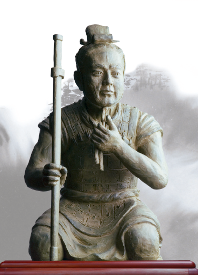

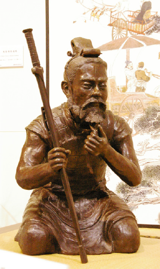

### 文人雅士的友伴～觀古畫名著中的花木之德

*心若整理*

花木禽鳥山水景

文人雅士寄情處

藉境寫意高士心

筆墨畫中如有待

花德，顧名思義，即從花中看到功德，從花中看到花的內在特質，從而建立品格，成為一位有情操、懂勵志、清廉、友愛、通達人情世故的人。

看一幅畫，須細細品味其圖繪，再者留心內涵，更甚則需捕捉畫家風采神韻。接著，讓我們一幅幅來欣賞關於花的古畫名著。

趙孟堅的歲寒三友圖

趙孟堅為南宋末年人，集文人、士夫、畫家身分於一身，由於經歷亡國的痛楚，故常以水墨或白描畫梅、蘭、水仙等，來表達他清高堅貞的品性。此圖特以松、竹、梅三友結合，代表當時文人應具備的節操與美德。

松、竹於嚴冬不凋，梅更芬芳，三者具結成一束，以松鋪地，竹葉隨之分布，兩者交錯、繞夾，相輔相成，中間顯露梅花，可見君子的情操作後盾，顯現君子的芬芳，這是一種插花技術，君子要如歲寒三友耐得住寂寞、寒冷以及人情冷暖，最後就會顯出人生的價值芳香。插花就是要結合生活的內涵以及君子的德行，君子俱會一處，自然能抵抗社會的污俗，且君子是相輝映的，松竹烘出梅花，梅花也和松、竹配合巧妙。君子會留名萬史，眼前雖有挫折、障礙，但那都是成功的增上緣，只要耐得住寂寒，梅香自會撲鼻而來。

邊文進的三友百禽圖

邊文進為明代宮廷畫師，為甘肅隴西省人，尤擅以工筆畫花鳥，筆觸著重花鳥之神態特徵。此幅三友百禽圖，以松、竹、梅、石為主要架構，其間穿插近百隻鳥類，鳥或飛或棲於枝頭或於地面玩耍，每一隻都展現了特別的習性姿態，下筆艷麗生動，彷彿能從畫中聽聞鳥叫聲。

若結合此次觀物、詠物、體物的觀點來欣賞三友百禽圖，所觀所詠即松、竹、梅，松、竹、梅孤傲堅忍，歲寒不凋，志節崇高令人敬佩。所體現的是百禽都知道要擇良木而居，棲於好的環境，所謂「良禽擇木而棲」，更何況是人呢？

江逸子老師的「金底松樹」。民國九十六年，江老師在臺北國父紀念館、中正紀念堂舉辦畫展，老師特別喜歡畫松、柏，尤其是北京西山戒臺寺的六朝古松，畫筆下的松是寫意的松，有別於實際景色，透過江老師寫意後，呈現出他內心的松，包括他對松的讚歎、觀察、體會及歌詠。細細品味這幅「金底松樹」，枝幹有一股向上衝的氣勢，佛經上說：「丈夫自有衝天志，要向如來深處行。」衝天的志向要向如來最深處、最神秘的無盡大悲心以及最甚深的智慧處行。

此松的枝幹像一條龍捲上去，是蟠龍古松的畫法，其上密密麻麻的枝葉陪襯著骨幹向上衝的氣象，顯示出松歷經風霜後依然挺立。孟子曰：「天將降大任於是人也，必先苦其心志，勞其筋骨，餓其體膚，空乏其身，行拂亂其所為，所以動心忍性，增益其所不能。」能夠被逆境磨練，就能越過一切障礙，成為有用之士。

畫中實松後還有虛松，經營出一種氣勢，我們彷彿能聽到樹海松濤，並能想像天熱時在松下的涼快；天冷時在松下的震撼。老松的皮如龍鱗一片片，即所謂「種松皆老做龍鱗」。虛雲老和尚曾寫一首詩，說明寺廟之所以能成為古寺一定要有松柏來陪襯，松柏能顯古意，「雪老蒼松古，僧閒水石清。」寫出家人悠哉地坐在石頭上看松的姿態，一邊享受松濤吹拂，一邊聽流水，「坐來忘百慮，眼見一身輕。」把所有人生的煩惱都放下，不管是肉眼、心眼都看到一生的輕安。

元代～吳鎮的竹譜

吳鎮字仲圭，浙江嘉興人，與黃公望、倪瓚、王蒙合稱元朝四大家。圖中有挺拔之竹、新冒的竹筍以及斜倒的竹葉，一圖看盡竹的各種生態，中間挺立的竹子象徵君子的節操，一節一節的竹節也畫出了竹的生命力。旁邊有婀娜多姿的竹葉與欣欣向榮的竹筍陪襯，就好似一個團體，高高的竹子是長輩，矮小的竹筍是孩童，竄升的竹葉是有風采的莘莘學子。竹筍雖是幼兒，然成長快速，肯上進努力，很快便能獨當一面並謙虛有為。

北宋～文同的墨竹畫

文同擅寫書法和畫墨竹，蘇軾稱讚他為詩、詞、畫、草書四絕，此幅墨竹畫，文同以暢快的筆畫勾勒結構，竹子堅韌有力卻又不失其柔軟，有君子風範，一如孔子，以柔軟應萬事，卻不失其威嚴節操。且文同飽讀詩書又對竹子觀察細微，作畫時可握兩枝不同深淺的墨筆，同時畫兩枝竹，墨色深淺表遠近、向背，彎彎的竹子婀娜多姿，有風采情趣，成語「胸有成竹」即從他畫竹而來。

宋人的竹林清話

這幅竹林清話經營出文人雅士的聚會，聚於竹林中，談笑風聲，遠離世俗塵埃，也遠離夏日酷暑的煎熬，我們可透過畫作感受文士的淡雅清高，以及深厚的交情，旁有一童子安靜肅立，畫面配置平凡，實則有深遠寓意，童子看似無所事事，但他靜靜侍候長輩的那一分，將帶給他無限受用，因他可隨時觀照長輩的需要，並能靜靜聆聽長輩的對談，從而學習人生價值，再者，正因為他言行舉止端莊有教養，日後將獲得長輩的提攜，受用不盡。

明～陳憲章萬玉圖

陳憲章以一枝灑下的梅來形容梅花的盛開，一枝即容納了密密麻麻艷麗精巧的梅花，我們便可想見梅花茂盛遍野的美景，這種經營法與「春色滿園關不住，一枝紅杏出牆來」，有異曲同工之妙，葉紹翁雖未能見滿園春色，然美麗的春天並沒有被關在園內，因有一枝紅色的杏花延伸到牆外綻放，看到一枝，即看到春天，也許在悲觀人眼中看到的只是遺憾，滿腹牢騷無法排遣，但在樂觀懂欣賞的人眼中，看到一枝便能滿足，一枝便能想像滿園春色，境由心生，且這一枝杏花出牆，帶給葉紹翁的是更多的驚喜與感動，春天是無限延伸、有生機、有生命力，不會被圍困住的，「境不轉心轉」，如能從落空中把自己拉出來，會發現有更多值得欣賞的事物，觀物、體物、詠物便是讓我們自己摸索人生觀，甚至宇宙觀，發現美麗，欣賞它，學習它，並把它變成自己的價值，世界美麗依舊，只要我們留心去注意，從繁忙的生活中跳脫出來，便能真正的「生活」。

詩人王維也從不同的角度來寫一枝梅，「來日綺窗前，寒梅著花未」，王維久在異鄉，思鄉深切，想念家人、想念家鄉事，忽遇自故鄉來的舊友，卻僅問自家窗前的那株梅花開花了沒，問題令人詫異，其實人往往如此，心思波濤洶湧，滿腹思鄉之情卻以一句看似無關緊要之語帶過，但那一語卻飽含了王維想念的一切，王維既然連梅花都想問時，可見他想知道的是所有的家鄉事，且梅花一定與王維、與他的家人、家鄉有特殊關聯，可能蘊含了無限有趣的往事以及家鄉的情韻回憶。一枝梅雖只有一枝，寓意卻可擴充至無限大。

南宋～馬遠的梅石溪鳧圖

馬遠是世代畫家的子孫，擅畫山水畫，獨創邊角之景的畫法，與夏圭並稱「馬夏」，人稱「馬一角、夏半邊」。這幅梅石溪鳧圖下筆勁力嚴整，石奇峭高簡，梅樹橫斜曲折，借以顯殘山剩水的獨特意境。所取的梅樹有孤傲之性，不同於一般梅枝，就好像江南的柳樹煙雨風情、柔弱嬌媚，而西北的柳樹枝幹渾厚、雄霸威武，取景不同，風味、意境、氣氛也自不同。馬遠對景色的取捨剪裁幽密奇險，展現了另一種梅的風韻，且畫面上大面積的留白，更增加了其清曠簡約的意境。

元人～梅花仕女

圖中的窈窕美人即是宋武帝之女壽陽公主，公主某日在宮殿簷下休息時，剛好有朵梅花飄落到她的額頭上，而這朵梅花居然停在額間無法剝落，被仕女看到，遂成為日後很流行的梅花妝。畫中公主手持銅鏡理妝，專注的妝扮儀容，更添其美麗氣質，再配合著一旁的梅、石、水仙，構圖寧靜而優雅，惹人憐愛。

遨遊於畫筆下，我們可知花卉樹木的多樣性面貌，梅花高潔蘭清幽；菊花野趣蓮純淨；松骨猷勁竹謙遜；海棠艷麗牡丹富貴…，它們本是客觀的存在，然在不同人眼中，其趣也迥然不同，故從作家的取景、布局、描摹，便可見作者的性格精神，以及他所嚮往寄託的境界。自古以來，遷客騷人、文人雅士、隱居賢者，甚至聖人，無不寄情於山水花卉，王安石從遊褒禪山中知人生一定要經過困難才能體會幽深之地的美麗，柳宗元在西山思維、尋求解悟，柳看到的西山是精神象徵，西山就是柳宗元，柳宗元就是西山。

北宋林和靖隱居孤山，以梅為妻、鶴為子，靜靜享受青山綠水、暗香浮動。而雪公太老師拿起一蘆葦，便想起故鄉，詠懷孝子閔子騫，感慨萬千。雪公遊杉林溪時也拿起一撮水草向岸邊學生致敬，所謂「渚蘋行客薦」，即使是水草也能拿來供養，禮輕情意卻很深重。可見自然界是人們療傷、沉澱、解悟、詠懷、供養的地方，也是人們仿效、追尋、學習的榜樣，山林花卉雖無語，然「一花一世界，一葉一如來」，一朵花可觀一世界，一片葉可證一如來，所以「花德」就是我們從花中尋求人生目標，體會花的美好，花就會產生功德，而我們亦學習其德內化成自功德。

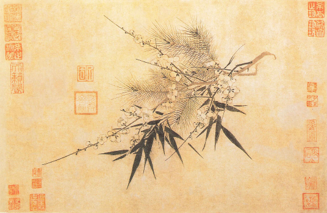

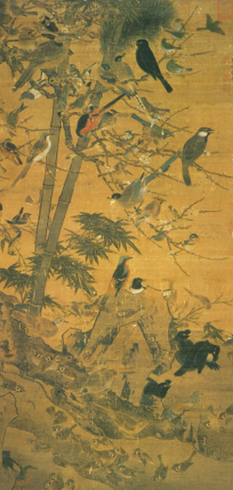

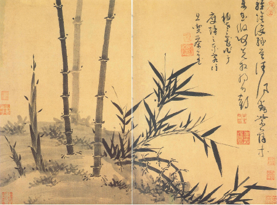

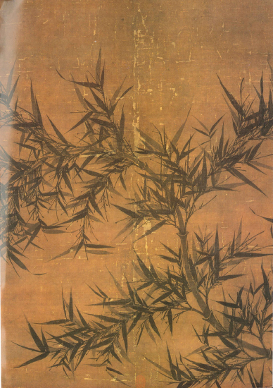

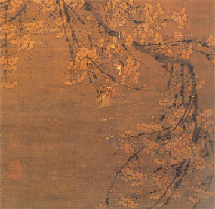

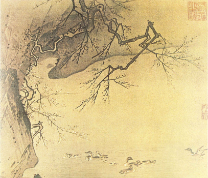

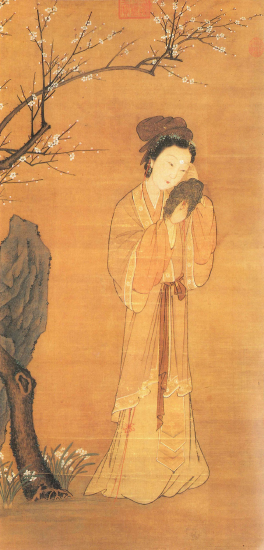

### 淺探富春山居圖之內心世界

傳線

花木禽鳥山水景

文人雅士寄情處

藉境寫意高士心

筆墨畫中如有待

一、前言

元四大畫家之首黃子久，若將其人喻為一本書，他一生浪跡江湖的行蹤，層疊積累，可說是一本豐富的大塊頭書。原姓陸名堅，早歳父母雙亡，後為溫州黃樂收為養子，樂歎曰：「黃公望子久矣」，遂改今姓名字子久。十四歲雖通過神童考試，然生不逢時，處於元帝國極端藐視漢人及士之層級，主持朝政罕辦科舉，阻絕成千上萬讀書人之出路，直至而立不惑之際，入公門當差，不幸又為上司牽累繫獄，雖在縲紲之中，非其罪也，入獄四、五年後，無罪釋放。簡短勾鏤，知其一生起伏大矣，人生的拼圖，色彩可謂冷暖兼備。

好讀書，儒釋道皆通達，更因精通易理，後半生自我放逐乃以卜卦維生，閱人多矣，兼遊山遊水，山水遊歷廣矣。少之時，嘗學書畫於趙子昂，植下丹青種子，知命之年重拾畫筆，竟用力沉浸筆墨世界，未能將一生所學，著書立說，卻以四載光陰，夾深厚傳移模寫董巨二家之工夫底子，精心經營富春山居圖以貽師弟無用師，而跋語似暗藏玄機，宛如預知其傑作難以藏諸無用師處，驗後之收藏者方知其曲折經歷，除一語中的巧取豪敚而矣，尤以問卿之火葬，更令後人為之驚駭。孰知三百年後之子明卷，先真蹟入乾隆彀內，其視假為真，遂使真跡入宮時，免遭滿卷題跋之蹂躪，是巧合抑或盡在一峰道人之盤算中？

二、巧手繪丹青圓天命

考其一生行藏，顯晦相參，因上司張閭搜括案告詳情反遭繫獄，災難過後，方知人生進退，其遭遇如同東坡之烏臺詩獄，烏臺案出獄後東坡貶至黃州，所謂人窮詩乃益工，此一時期的前後赤壁賦，詞調寄念奴嬌，書寒食詩二首帖等，俱爲曠古傑作；同樣出獄離開傷心地京師，左思右想，或許永恆的山水最為有真情，遂一路寄情山水，尋尋覓覓，神州震旦江山無處不美，但畢竟無故鄉富春江之美，那是自己童年、青少年，甚至壯年、老年美好的回憶，月是故鄉明，縱使彩繪出世界奇偉瑰景，或創作出震旦雄偉挺秀的佳境，而忽略或失去描摹一己生長地之美，當是一大遺憾，更何況繪事非侷於美景而已，一生際遇之心情，又何處棲息安頓，雖依持全真教，想疾沒世而名不稱，心依舊未悄然，滿腹詩書，一生開闔，體人情之冷暖聚散，察事故之消長進退，掂之再三，天生德於予，丹青之天命其如予何，遂毅然決然要構築千古人生之宏圖，巧手繪山水去也。

三、深情繫富春江水

故鄉山水雖是心之所託而思再現，但也絕不是一廂情願帶著情執而違背美學，好山好水幾經撿選，美哉！故鄉富春江水，真何其有幸，彷彿獲得千古知音，相看兩不厭，又如遇見一文質彬彬的老友，久而敬之；又再如親近內外兼修的美女，久看愈美。朝暮相處，收納晨曦夕照，觀賞雲霞雕蔚；江水氤氳，體察忽隱忽現，傾聽泉石激韻；四時推移，變幻萬千，山為之變貌，水因之變色，樹隨而換裝，人事代謝滄桑，從而織出故鄉大塊之美，不畫故鄉富春山居所仰觀群山、俯察遠水之景，又畫何景呢？況觀山則情投於山，觀水則情移於水，故鄉山水情，他處又焉能取代？

四、卷軸載一生行跡

展紙落筆前，回顧昔時畫界前賢創立之境界，高峰矗立，踵步思訓、李成、范寬，抑或隨摩詰之後，子久思之再三，回顧茫茫往代，眺望渺渺未來，水墨當略勝一籌，驗之今日，欽佩其前瞻遠矚！接續下來，作品以掛軸或橫批或卷軸或連屏表現，前修咸存典範，惟卷軸最足體現富春江水之韻致，就如是抉擇吧！以卷軸勾鏤一生痕跡。

五、直探心存魏闕志

愚攬該圖，深覺子久前賢之心，不外乎擺盪於心存魏闕，及處江湖之遠兩極間，當他從少年歷壯年應是心存魏闕時，猶如畫上拔地大山高聳頂天，或綿延群山峰峰爭高，正象徵欲奉獻朝廷拯群黎於袵席之上之志向，畫中群巒聳翠，由近而遠，重重疊疊，正顯現猛烈淑世之志，歷久不改；其間見到腐化官場，萌生不滿現實心志，卻無力回天，或許漸漸生起遯隱之心意，呈現淡墨輕描的山勢或孤山，惟尚未完全喪志，只是依稀模糊……。直至值大逆境，仗義執言反遭繫獄，不免憤恨不平，昭雪之後，揣測看透世情，轉而興起處江湖之遠的隱居之志，卻顧所來徑，以飄然不群，無慍無火之心情，變現化於圖上，不過是一片平湖，波瀾不驚，偶而遺世的沙洲點綴其中，畫之盡處又聳峙一山，不也是白首之心窮且益堅，此展圖略觀之大概。

六、大塊陰陽變幻章

大癡道人深曉易研機之奧賾，想必善觀大塊陰陽不測之微妙變化，陰陽處乎天地而難窮，但大師燕居富春山，復遊於富春江，倘佯山水中，昔人讚歎富春山水奇山異水，天下獨絕，大師心亦戚戚焉！朝夕居於斯、行於斯、駐於斯、住於斯、賞於斯、歎於斯，對日月雲霧山水，交織醞釀之陰陽變幻，必了然於心，深諳山水箇中三昧。

七、展卷細品畫家心

當我緩緩展卷，細品此不世出之巨構，不論山陽山陰、遠山近山、入山出山、橫看側視，所在或高或卑，子久凝視峰峰神韻，收藏於心田，其胸中藏有丘壑，從心流出，或雄糾昂首相互競高如畫中層巒矗立，或峻秀孤挺蒼茫中如卷首之剰山，或陰柔如戴面紗之遠山，雲駐山更青，雲走山復綠，在在無非是陰陽所造化出之神秀，而經由大師捕捉繪出永恆的記憶，山是雄渾之景，也是畫家欲表達一己仁者之心志情懷，自然在畫中份量重矣。

水之象、聲、色、溫四時推移，莫不有變，卷中壯闊渺茫所現煙波之水域與蜿蜒盤曲從谷中湧出之奔流，此水之雄渾與流動象。溪澗急湍聲嘈嘈與潺潺緩流語切切，此水遇石與流經沙地之聲也；霧漫天地則水隱遁，霧散則水復清澈；風來水起漣漪，風離波紋返平；日照山頭倒映之水影，隨山樹而塗抹，是水之淡遠、闊遠醞釀之空濛、或明或暗之色也。想像一己超越時空彷彿依稀見一峰道人，手執一杖，踽踽獨行，拾一圓石，靜觀水之魂，日復一日，歎水之德深矣！逝者如斯，不舍晝夜，是勇者生生世世的度眾本懷，一片汪洋不正顯示其心量。
或
**問：** 畫豈能展現水溫？答云：須裝著想像翅膀，體察天地四時行焉，日月星垂麗象，山川萬物舖地理，四季不同，何物不隨之變，水溫也跟著萬象不同，自可逆知，何難之有？全畫冬盡春來，漁樵往返，知煙茫江水或奔下湍水或平緩溪水，掬之或冷冽或清涼或暖和，世情冷暖如人飲水，宛似水之溫也。由是得知，畫家樂水，水之鋪排，乃在顯現一己之靈魂，實居畫之樞紐地位，那是氣韻生動之關鍵也。

大地含章，最能體現隨類賦彩，除山與水外，莫過千樹之遍布，亦是大癡道人著力之所在。樹裝扮大地，山巔水瀕都看得見其足跡，整個畫卷樹與山水之分布，可謂鼎足三分。

山水與樹之對話，山之經營其外象，相對較為粗獷貌，樹之象形細膩許多，前者用筆率性居多，後者運筆精細變化勢所趨，峰巔、山腰、山麓、崖處、岸邊、沙洲種種樹形，或高低排列、或左右延展、或蜿蜒而上、或分散或聚集，或曲折或直豎，錯落有致，極盡巧思變化之能事，其中樹之莖，運筆或懸針或垂露，或輕或重，或肥或瘦，或勁挺或柔軟，或曲或直，又樹之枝葉，不論闊葉針葉常綠落葉，以染或勾勒，或層片或單一，不一而足。

墨之於山水樹實有點化之功，水墨畫顧名思義，水墨為主，且古來即有墨色為王色，墨分五彩，卷尾平坦廣闊幾占一張紙大小的沙洲，其上所經營群樹的景觀，墨色的運用，無論樹莖枝葉濃枯濕潤的拿捏，信可謂已達爐火純青之境地，樹是大自然之恩賜，觀樹之結屈盤糾，不撓之生命意志，常予人震撼力，而有所感動，曰同自然之妙有，誰說不宜！畫卷中之樹，看似隨意，實精巧無比，拙筆難以盡述。無怪前人珍藏愛不釋手，行住坐臥，顛沛流離，俱不捨棄，良有以也。

皴法是國畫之基本工夫，最能彰顯畫家之深厚底子，山石岩岸肌理紋路之駕馭，皴法居其功，足使自然美群岩崢嶸、泉石激韻之再現，畫卷裡各山石形狀不一，漫置其所宜置之處，無以名之，強名恰好也。

人號稱參天化育，與天地並稱三才，畫中安插有情萬物與萬物之靈，方顯得有生機，無我之境尚得融入有我之境於畫中，才能雅俗共賞，深者取深淺者取淺，而傳之久遠。山麓屋舍儼然，三兩亭臺，幾座板橋，一漁一樵，扁舟數葉，松下隱士賞鴨，媲美逸少愛鵝。群鴨與一隱者眾目相對，鮮活生動，無言卻似有言，如是佈局，體現萬物和諧，全卷營造氛圍宛如詩章、似禪境、像桃花源，無怪宗炳祖師讚山水畫可澄懷味道，可臥遊，信屬山水知音。而子久亹亹三、四年經營置位，精氣神用筆，隨類以水墨賦萬物之本色，建構氣韻生動之萬古神妙品，誠山水千古難遇之知音，應屬的論。

八、結語

此畫評者多矣，前修今賢論述精闢，無須再贅述，惟面對大師一生萃力之作，立於前不敢慢待，閒居則再三展讀，更舞動想像的翅膀，飛躍時空，向其請益何為無用師畫此長卷？試圖將心比心，覽其作，讀其心，初覺遠不可及，古今阻隔，無所質問，親近一段時日，細心體察，乃稍不感茫然，贊同其落款所言「知其成就之難」。大作畢竟是大作，收筆之際，喟然歎曰既竭吾之思量，盡一己之推敲，如有所得，誠難將大師胸懷經世濟民之志，澄觀富春山水之情景，筆藏萬山千水之蘊致，表達於一二。

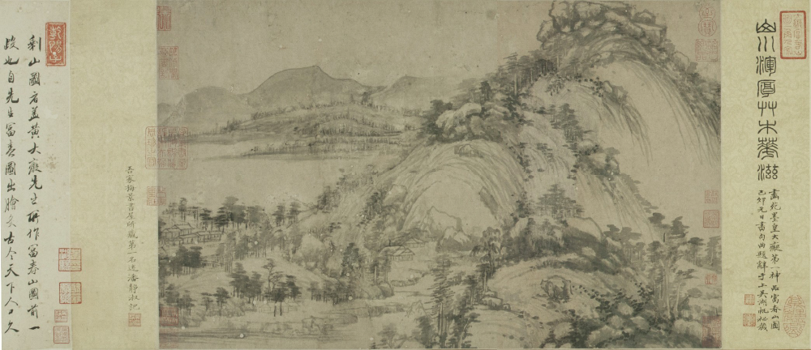

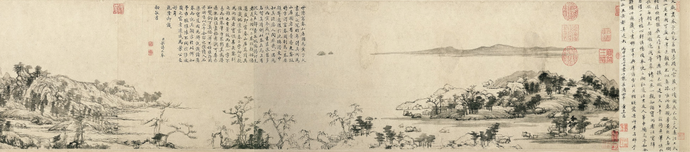

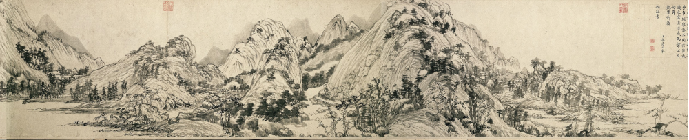

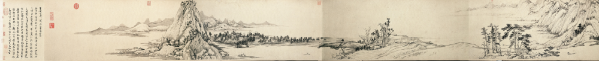

### 詠華山

心若

以山擬人比君子

德高見廣覽百代

有幸親近神氣清

要為萬世立典範

觀物之貌，可窺其中心之質也。梅蘭竹菊，花中四君子也。梅凌寒綻盛、傲骨挺立，獨樹報春，神姿綽約為世之所嚮也。蘭清幽潔雅，為賢士雅客，百花之潔士也。竹節中空，樸實無華，虛心納諫之意也。秋菊雋美多姿，不以嬌豔之色媚於時，花之隱逸者也。而樹中之君子，松柏也，霜雪既降，松柏猶茂，不改其質，為世人所稱頌也。

吾以為山中之君子應首推華山。華山以塊石成山，《水經注》云：「廣十里，高五千仞，一石也。」是時吾登此山，觀其直立蒼穹、氣勢巍峨、渾然一體，望之不禁肅然也。石經天地雕化而包羅萬象，巨石拔地而起，壁立千尺，風骨昂然，亭亭乎遺世獨立也。

遊乎華山五峰，感其「窮山嶽之壯麗，盡精靈之至極」，灝氣悠悠，無窮無止，吾沁乎其中，略能體「心凝形釋，與萬化冥合」之意，神爽氣清，超然舒暢矣。

山石奇險靈秀，綠意自石裂生，以英雄起霸之姿，俯瞰大地，生氣勃發，寧靜莊重矣。華山雖以霸主之姿特立，然其胸懷慈睦，垂憐萬物，宛然一慈母也。是山者，介乎悲智，正以其千姿百態、幽谷險道一展寧靜風貌，孤高難測而擁覽百代也。

今我如一石破地而出，無特出之奇，亦無以為用，然則經時日之堆累淬礪，磨峰發之稜角，峨然矗立於世，經歲月之思學切磋，此濯濯無草木之山，亦能絕生盎然綠意，吾竊冀其超然獨處，不背初心，並以護者之姿長養萬物，以茲為念矣。

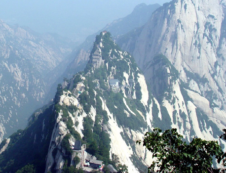

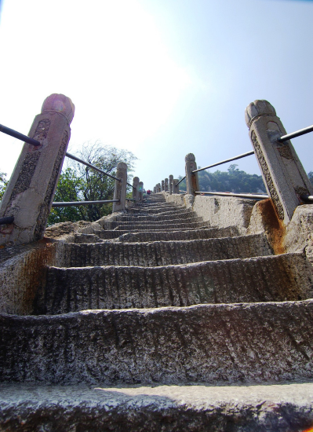

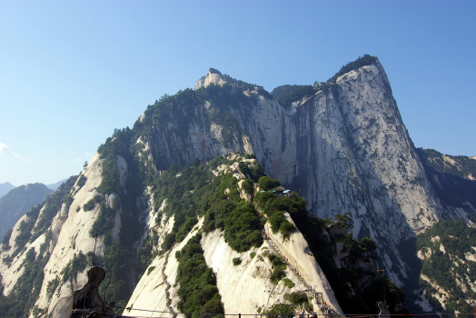

### 百年暑期啟蒙班暨年度啟蒙課程簡介

禮悅

成長雖身重在心

知見提昇為其要

立志好學一生福

能為未來開新局

觀待寧波西街道場的啟用，學會有了固定的活動場地，今年暑期啟蒙班有別於往年的活動，能夠嘗試以較長期的天數，從七月四日至七月二十五日，每天下午以半天的方式辦理。

課程內容為了延續國學及文化的學習，規劃以禮儀及生活德行為主軸，輔以美術欣賞、音樂欣賞、英文及作文等才藝課程。期望參加的學員能在團體中經由良好的學習互動，將禮儀及品德教育落實於日常生活，並增上良好才藝。

每天下午一時開始的課程即是演練禮儀的定靜活動，透過老師們精心的設計與講解，將常禮舉要的條目，化為實際日常生活中的言行舉止動作，期望讓同學們對聖人的智慧，能稍有具體的認識，增加內心的覺受。

有想認知聖人智慧的心願，可是記不住經典的條文，便無法常時串習，真正認識聖人智慧，所以經典的讀誦與記憶是必須的。本次的經典讀誦進度，共有常禮舉要的居家篇、在校篇及處世篇共三十三條條文、論語先進篇二十四章經文，暨詩階述唐選讀四十首絕句等，看似篇幅龐雜的背誦進度，在老師善巧帶領，每日循序漸進的增加進度，短短一個月內自能熟讀所有的內容，盼望同學們在朗朗讀書聲中，種下成聖成賢的種子。

學習「志於道，據於德，依於仁」之後，還要能「游於藝」。所以經過短暫的點心時間之後，在各個學有專精的師長們引領之下，同學們繼續涵詠沉潛於藝能的學習。

星期一的英文課程，除了保有同學們在現代國際化的競爭力之外，更遠大的目標應該定在聖教的傳承上；星期二的作文，藉由豐富的故事引導，再進入主題寫作，訓練同學思維與文字的表達能力外，更由閱讀引發對人事物不同的思考；星期三的音樂欣賞，由各國經典的影音視聽播放，讓同學們先接觸高品質格調的音樂，對音樂的鑑別力自然增加，可以增加同學們對靡靡之音的免疫力；星期四是美術欣賞與動手做做看，培養對事物的欣賞及動手做的能力；星期五的影片欣賞有清明上河圖的精采導覽與「六度波羅蜜」、「鑑真大和尚」等兩部動畫影片欣賞，讓同學在聲光效果中也能提昇正知見。

四個星期的時間很快過去，同學們在這期間固然有其受用，但其實決戰點在於後續的學習，再大受用也抵不上後續同學們接觸惡知識、惡知見，能繼續學習才是同學們真正的大福報。

而新學期開始，學會亦為孩子們開設多樣豐富的學習課程，諸如週三讀經班有禮儀學習暨論語、大學、唐詩、聲律啟蒙撮要等經典讀誦；週六啟蒙班開設淨行品、歷史故事、論語等課程，深入淺出帶領國小及學齡前兒童進入經典內涵；週六國高中班開設中國文人系列介紹講座、英文導讀—世界面面觀、古文導讀—德育古鑑，以提升中英文閱讀說聽能力外，更開闊古今中外之文化視野，建立正確的人生觀。

至於今年寒假的啟蒙課程，將依國畫大師江逸子先生受福建省政府之邀，於福州市福建博物院舉辦「道藝春秋」畫展之因緣，並為讓孩子提早深入豐富引人的文化及藝術內涵，奠定欣賞能力，作為未來兩岸文化交流之基礎，本會特於民國一○一年二月一日至五日，舉辦為期五日的心靈成長班活動，將開設孔子聖蹟圖、孔門高弟介紹、各類國畫介紹（山水、花鳥、屏風、潑墨、仕女、言志等系列畫作），並結合畫作之相關詩文介紹、茶道專題暨江逸子先生紀錄片首映會等課程，相信課程安排必能帶領孩子提高文化藝術視野，並帶領進入藝術殿堂，是一生中難逢的機緣，歡迎有識者一起來學習此人生道上必修的課程。（相關課程請參考學會網站（http://www.wct.org.tw/）

心靈的啟蒙從小開始，隨著年齡的成長，以正知見開導一生的走向，是學會啟蒙教學之所導，期盼更多的孩子一起參與、歡喜學習。

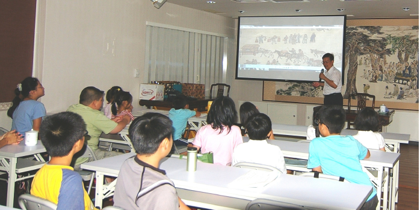

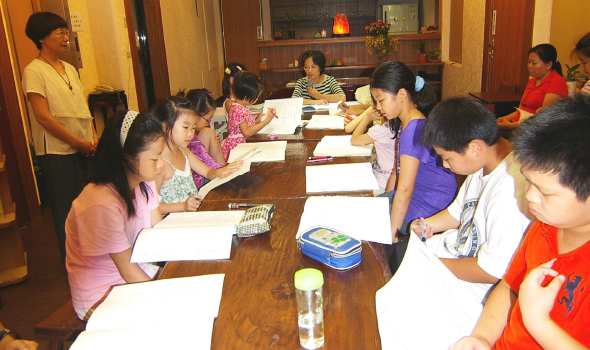

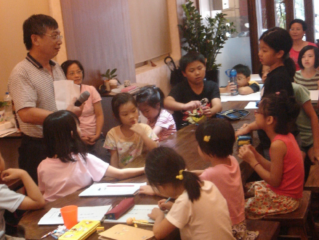

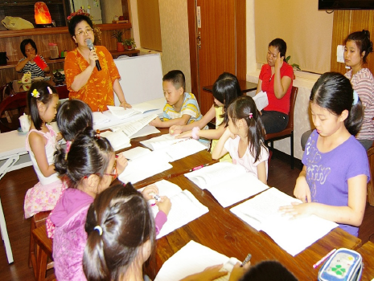

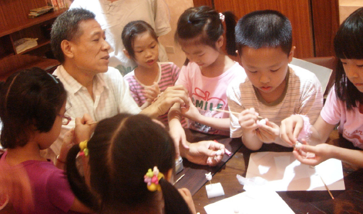

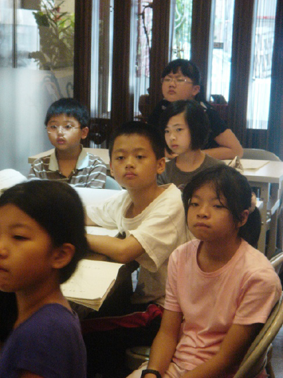

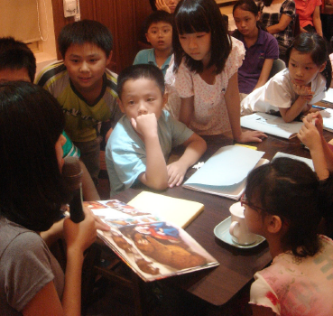

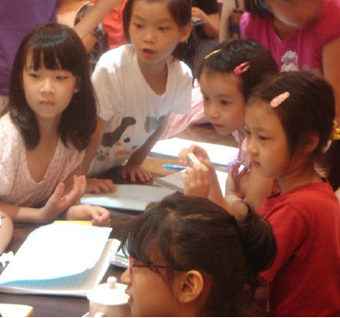

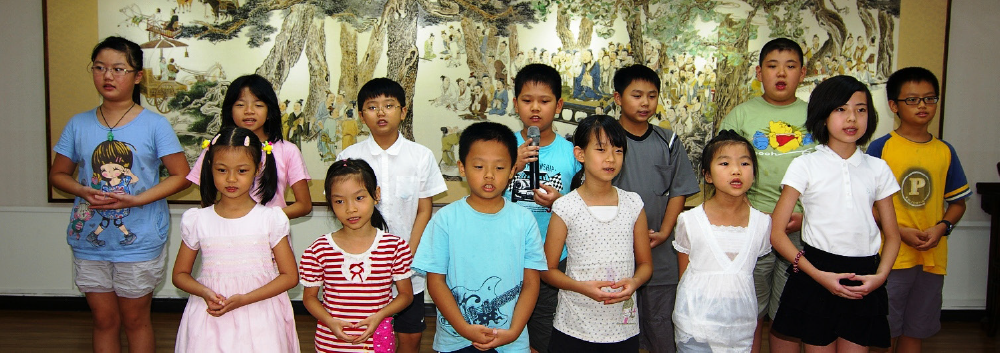

## 活動報導

### 兩岸國學文化交流講座～諸暨篇　開訓典禮

*編輯部*

十年有成經營

不作請客俗套

國學講座新局

認同文化一脈

無盡燈：

舉辦本次國學講座的主辦人李總等各位領導、各位老師好。懷著高興的心情到諸暨，一起興辦國學講座，講座的名稱是「國學文化師資培訓」，國是中國，學是教育，文是典籍，化是以文化典籍，辦講座的方式來化導人心，直接對經典做正確的解釋，導引大家的思想，思想對了，才有幸福美滿的人生，如果沒有正確的思想，是不可能導向幸福美滿的人生。

人是被思想觀念所支配，思想觀念引導他走向正途，此人一生明明白白、正正當當的過一輩子，若引導走向邪途，那麼他就是黑黑暗暗、憂憂愁愁、苦苦惱惱的過一輩子。所以人到底要怎麼選擇過他的一生，決定於他到底是不是具有正確的思想觀念。

本次在諸暨民間辦國學講座是首屆，首屆的意義很重要，是後來風氣的開端，若辦得不好，大眾對國學文化講座會失去信心，辦得好則來參加的人會得到很大的法喜，身心得到很大的改善，則講座起了很好的示範作用，對諸暨這個地方是良好影響的發端。

興辦講座的公司是緣慈推拿公司，此乃民間企業興辦十週年慶最好的示範，「緣慈」二字極具意義，以慈悲為緣起，是一切緣起中最殊勝的緣起，慈悲與仁愛是中國文化傳統思想裡最精華的部份，論語裡有五十幾章談及仁，中國文化思想其實就是一個仁本主義。有了仁心，不是只有愛人，還包括辦教育、辦政治等具體方式。

整部論語可知孔子培養人才兩種方向：第一、能辦政治，創造公安的環境，令人民生活無憂無慮，各得其所；更重要的是辦教育，令人活得有尊嚴、有內涵、有信心、身心樂。據聞諸暨是越王句踐臥薪嘗膽，滅吳復仇建國的地方。想當年孔子周遊列國歸魯時，即遇到齊國欲攻打魯國，魯國將遭遇滅亡之禍時，想不到弟子們各個欲出力挽救魯國危亡之命運，孔子示意衛人端木賜（子貢），出使齊、吳、越、晉後，挽救魯國危亡之禍。

孔子即是以文化救國、強國，孔子之賢是無人能比，在論語子張第十九，叔孫武叔毀孔子，子貢說：他人之賢者如丘陵可以踰越，孔子之賢是日月，無法越過。今天不能將孔子放到文化的至高點，文化的殊勝無法呈現，若將孔子的思想、道德、人格特質放在文化的中心點、至高點來指導文化，文化將產生巨大之力量，帶來國家富強康樂。

辦講座場地的選擇是重要成功因素之一，此次主辦單位能租這麼好的場地，所彰顯的就是對文化的尊重。文化是一個國家的精神，國家最要被彰顯就是這個特質，租此場地表彰文化的尊貴，對主辦單位充滿了敬意。更加上好的音響、熱誠的招待，相信這幾天大家的學習必有受用。

會場之對聯即表明在此辦講座的意義。

上聯：

「諸方來集志同道合」

，大家都是從四面八方聚集而來本地，皆是為了學習文化，稱作志同道合。論語四百九十八條的第一條：學而時習之，不亦說乎；有朋自遠方來，不亦樂乎。看似簡單大家都能朗朗上口，卻是論語精華所在，因為唯有透過學習有了法喜，散發出學習的快樂，才有辦法影響他人，當大家一起共同學習，成為志同道合的伙伴，自然凝聚一股力量，進而改善社會風氣、改變國家整體的命運。

下聯：

「暨今不絕中華道統」

。中華道統傳到現在，已經有氣無力、氣若游絲，要如何傳承道統呢？關鍵在有沒有得到孔子的思想。孔子的思想在那裡？在古籍四書五經，乃至十三經，然以論語為主，歷代注解此書最多，有上千家之多，由此書能入孔子人格特質，博大精深思想的門。此書不但能學到禮的精神、作法，以及孔子對於禮的認知，或是孔子論孝道的各面相，乃至為政、治國之學。總之，不只孩子們讀經時才用得到，包括個人修身、齊家、治國及引領世界。大學（內聖外王的學問），及中庸（性與天道的學問）都可由論語找到正解，其他如易經乃至五經的要點及入門，亦以論語為所依。

這次來諸暨，有諸多的感動：第一、以殊勝場地辦國學講座推尊文化，導正社會奢靡的風氣，風氣須是貧而樂道、富而好禮，不論貧富貴賤者都能幸福美滿地過一生。第二、緣慈推拿公司辦這次的國學講座，對緣慈公司的整體是一種提昇，對諸暨各個企業更是一種正面的影響。

總之，文化是一個國家的傳統，傳就是由上往下傳、由內往外傳，這個「傳」是要經得起考驗的，歷經千年歷久彌新，是薪火相傳，心燈相傳，本學會名為無盡燈，即是期許文化往外傳、往下傳，點亮每位有情心中的心燈，照亮了世界。

傳統文化的統，就是統合，是一種收攝，是各行各業發展的中心思想，即是以仁愛為主，有此仁愛之心，個人以修身養性為開始，將事業發展為聖賢的事業，帶動社會的和諧，然這些都有賴於教化。當年孔子周遊列國時，到了衛國，覺得人口眾多，又很富庶，是可喜可賀的現象。但孔子說要教化，唯有教化才能讓人運用富貴，運用優勢、發展優勢，共榮共存走向快樂及光明的明天。

在此讚歎緣慈公司，企業家很少會有以辦文化講座來迎接週年慶或十週年慶，一般不過是喜宴，歌星唱歌，摸彩歡樂，吃吃喝喝一番，短暫的歡樂中內涵是空洞的，辦文化的講座才有無限的影響，必然帶來許多企業家思考公司慶典要怎麼過，以及如何運用財富對社會作貢獻。

諸暨是越王句踐臥薪嘗膽之處，可是要往前推，也是大禹會集諸侯一統天下之處。養珍珠、吃狗肉等這些讓人覺得俗氣，若推廣文化，其他農、工、商的發展就變得很有意義，人們來諸暨，不只為了就業，亦是人才的培訓與匯集處。這是諸暨文化推展很好的開始。

緣慈推拿有限公司負責人：

今天因為對於傳統文化有共同的熱愛，所以從祖國各地會集到諸暨，我們也深深的感覺到國學文化經典，可以表現在我們生活的每一個當下，尤其此時深深體會到有朋自遠方來的快樂，也體會到學而時習之的喜悅。

諸暨是古越文化的發源地，越王句踐曾在這裡臥薪嘗膽、勵精圖治，陶朱公范蠡在此處留下了三聚財、三散財的佳話，也對後人留下了樂善好施的榜樣。

諸暨自古以來文風鼎盛、耕讀傳家，其文化底蘊十分深厚，這次我們能邀請到臺灣的唐教授一行，來諸暨講學，講解論語與了凡四訓，將是傳統文化在祖國的復興，推動中華民族的復興，中庸：「國之將興，必有禎祥。」透過志同道合的朋友們，不遠千里，從諸方會集到此處學習傳統經典，我們已經看到國家民族復興的曙光。

我本人從上個世紀，十幾年來學習養身之道，在西元兩千年創建緣慈推拿，奉行的是傳統文化，中醫療法當中的自然無藥療法，在我們自己的臨床實驗當中，接受了許多不健康人群，和一些慢性疾病患者，從中醫的角度來講，可以治療身體上的病，有諸多因素造成經絡不通，讓身體失衡的疾病，在調理的過程當中，也發現很多病很難治，難治的原因是什麼呢？是嚴重心理失衡造成的疾病，這些現象不外乎夫妻不合、兄弟不睦，子女教育問題、婆媳關係處理不好，企業中員工難以管理等，造成心理上的壓力，嚴重困擾我們的身心，導致疾病的產生，往往在臨床當中會發現，調整幾次身體狀況有改善，但是過了一陣子又復發，追究其原因，就是身心根本的問題沒有解決。可能由於一次的發怒，夫妻間一次的吵架，讓所有的調理付之東流，所有的調理都沒有用！

我自己臨床二十年經驗當中，讓我深深明白，想要調理身體、恢復健康，首先必須要從調心開始，沒有健康的心理就沒有健康的生理，只有心理健康了，我們身心協調了，身體才有健康可言，夫妻關係、兄弟關係、父子相處，長官部屬的關係、朋友的關係，不正是我們中華文化所講的五倫關係，倫常大道嗎？而人們心裡由不安而安，不就是中華文化講的修身為本嗎？齊家、治國、平天下不正是要先從調整自己的身心開始嗎？

我們祖國改革開放三十年來，我們的經濟獲得了極大的發展，物質文明越來越發達，我們大多數人都是生活在衣食無憂當中，而我們的精神生活卻相對的缺乏，因此大量引發了身體與心理的疾病，我們的身體狀況出了問題，家庭經營出了問題，我們的社會問題層出不窮，這都是因為我們忽視了我們老祖宗的教誨，而我的從醫經歷讓我明白了現代人疾病的根源，也看到了中國傳統文化的博大精深，跟五倫大道的萬古常新，我深刻的體會到沒有傳統文化的教育，要想有健康的身體，幸福美滿的人生，那就像水中撈月一樣。

這也是我們這次要邀請唐教授一行來諸暨講學的原因，我們衷心的希望透過這次論語講座，讓大家多關注自己的內心世界，調整自己的心態，讓我們建立正確的思想觀念，從而達到身心和諧，家庭和諧，社會和諧，如果大家都能有這樣的收穫，我想那就是我們緣慈店慶十週年回饋給大家的最好禮物。

最後祝大家身體健康身心和諧，預祝這次國學講座圓滿成功。

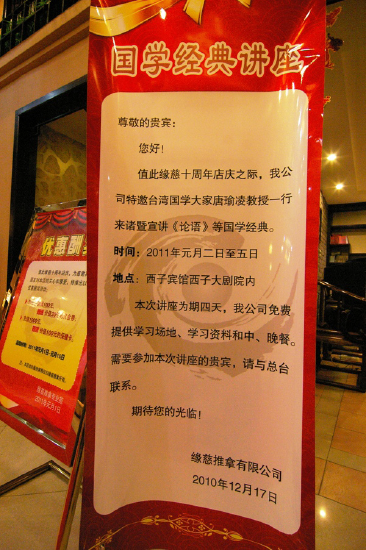

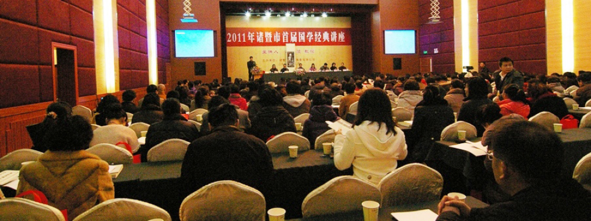

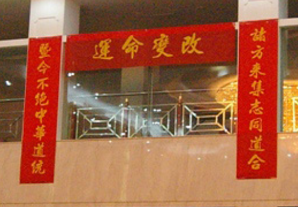

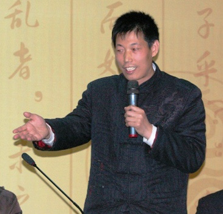

### 兩岸國學文化交流講座～諸暨篇　問答篇

*編輯部*

少了人生徬徨與無知

天真無邪正常與安定

快樂健康幸福與美滿

傳統文化正解與實踐

**問：** 歷經風霜再回頭，繞繞彎路也無妨，年少不妨輕狂，繞繞彎路累積經驗，未來也許自然而然能走上正途，經歷風霜、挫折，累積錯誤的經驗，對人生未嘗不是好事？

**答：** 問題是，我們看到太多的人，經歷過彎曲之途，通通走不上正途。監獄輔導的案例裡面，常常是出去後又回來比例非常高！走歪路常常是走不回來。年輕人不妨認真思考，想事情要符合邏輯。你認為走歪路就能回來，放蕩之後也可以回歸正途，那請問你的邏輯在哪裡？我們有時不妨讓自己思想跳躍，但一定要有個主軸。就像打拳練功一樣，你可以練猴拳、虎拳，可是沒有練馬步，沒有練基本功夫，打出來的拳會是四不像！（盡意）

**答：** 很多父母浪子回頭時，很珍惜他回頭的那一段，當他看到他孩子開始變壞的時候，他不會認為沒問題，跟自己以前一樣，壞過後恢復常態；一方面反省自己的過去，一方面對小孩子的變壞，感到刻骨銘心的痛，想到自己多少青春歲月都這樣浪費掉，悔恨自己生命中最重要的一段是如此糜爛，對孩子的憤怒，有時是一種對自己荒唐生起悔恨的反射動作，那是不堪回首的。很多學者提出一些荒腔走板的論點，那是沒有實務經驗，是燈前閒話，不負責任的。

已故臺大方東美教授在歐美講學非常轟動，回國後有人問他對歐美之觀感，他不說好也不說壞，他說：「假使美國有一天亡國的話，會亡在電視機！」是你想都想不到的答案！所以要讓國家敗亡很簡單，媒體盡量播放壞的、亂的事物，讓風俗趨於刻薄，人心趨於糜爛，這個國家不會有未來。年輕要放蕩、輕狂，才叫青春不留白？人生的過程，充滿著朝氣，散發著熱忱，不是很可愛，很美妙的嗎？家庭享受正常的幸福，有那種福報不是很好嗎？假使回到家中，夫婦不合、小孩忤逆，家都不想回了，對家庭都不愛，你會愛這個國家嗎？你會關愛社會嗎？(戒慧)

**答：** 人不輕狂枉少年，這好像是年輕人的本錢，但我們從事教育者的共同心聲，最怕孩子走錯路、繞遠道。因為我們知道學習最可貴的時光，就是年少的時光，比起我們中年步入老年之時，學習力是強非常多倍的！所以應該好好把握年少的時光，找到好老師，立定志向、目標，就好好的學下去。（心晴）

**答：** 利益自己與天下蒼生的這些學問，都要從小學起，沒有從老學起的！雪公老師說他七、八歲時就學，二十多歲出來講學，到九十七歲時，已有七十年的學習與講學，卻還說自己對中國文化一知半解！青春空過，光陰荏苒。轉眼間變中年變老年，已成糊塗了，如何學會？年輕人不求學，將來國家也無人才可用，則無強盛的道理，若陷溺在電玩、忤逆、情愛、暴力與玩樂嬉笑，將來還能有什麼前途作為？這樣的人在事業上老闆會放心交給他相當重任嗎？能交到一些志同道合的朋友，大家共同奮鬥嗎？很多人都中了一些似是而非思想的毒，不能有實際經驗的累積，空過了很多善因緣，人生交出了一張空白卷。學習的快樂、結善緣的快樂通通沒嘗到，這些人生真正的樂趣都未嘗到，沉迷於世俗之追求卻說是快樂，豈不可笑？歐美許多傷風敗俗的歌舞者，不乏得了躁鬱症，很多文明病，源自於自私與追求世間享受，放縱慾望反而得不到快樂，正常人的快樂是不正常人想像不到的。（戒慧）

**問：** 北京大學副校長紀先生，是中國著名國學大師，紀先生研究的國學，與唐老師的國學有何異同？

**答：** 我所學的是李炳南老先生的學派，解經上雖忠於古注，然也不是全盤接收，而是要去抉擇。經學又是一切學問的源頭，經學中論語又是精華。（戒慧）

**問：** 大陸現在流行電視上講經解文，強調的是取其菁華去其糟粕，我們要如何面對？

**答：** 試問論語有哪句話是糟粕？但是註解裡有些糟粕，我相信。但就像去菜園拔草，卻不認得菜與草的區別，結果把菜拔光只剩下草。我們去其糟粕，結果把古注都刪掉，只剩下現代人膚淺的注解，這也是去其糟粕存其菁華？（戒慧）

**問：** 關於理性與感性的相關問題，一個理性的ＣＥＯ可以帶著完美的業績單，但不能感動我們有血有肉的人；但一個感性的企業家卻足以撼動每個人的靈魂。我詢問了二十位形形色色的朋友，他們百分之八十受感性支配而行事，請老師幫我解惑，如何在理性與感性之間徘徊？

**答：** 你常常有很多的二分法，以為有感性就不能有理性，有理性就不能有感性？其實並非如此。其次對於感性與理性亦有些錯解，如此就錯上加錯。比方說理性的ＣＥＯ難道就只是接訂單嗎？他是從規劃、整體的考量到有一個計畫案內部細節，整個能夠實行，途中碰到問題，可以有解決的方法，可以詳盡的把整個過程走完，最後還要將中間遇到的問題、發生的狀況拿來檢討改進，這絕對不止是只為了接訂單而已。而感性的ＣＥＯ，你以為好像就是很熱情，高喊：「同志們，衝啊！」是衝到懸崖呢？還是衝上康莊大道？這就得理性的思維！可是對於從事的工作，及所帶領的團隊，要能夠振奮、鼓舞士氣，此時需要感性。這兩者能達到平衡，就是很優秀的ＣＥＯ。（盡意）

**問：** 一個家庭如何涵養孩子的正知正見？傳統教育及現代教育的差異？

**答：** 孩子的教育重要且困難，父母要先從家庭經營開始，上行下效中建立和樂的家庭，讓孩子在安定的環境成長。而教育始於胎教，母親在懷孕時就已經擔任教育的工作了，母親注意自己的言行，已成為胎中孩子的典範，此即中國傳統教育的開始，其次大家庭往往三代、四代、五代同堂等，非現代少子化，由於多子化，在大家庭長幼尊卑倫理中，建立了人際與家庭關係，例如對尊長要順、要孝、要謙恭、要受教等。反觀現在問題根本處來自於失教，要解決這樣的問題，就不容易了。

因為未從根本上講究，衍生出的問題就千奇百怪，若走回原點，很多問題就迎刃而解。傳統教育以及現代教育最大的差別就是，現代教育都在助長孩子的執著，一家中六個大人聽一個小孩的指揮，是顛倒的教育，讓孩子是非不分，沒有長幼的分際。而傳統教育就是在孩子小的時候，知道要孝順父母、祖父母，其次在親友中要有進退應對的學習，之後再接受學校教育，此時老師的調教很快就讓孩子增上。所以要解決現代的問題，還是要回歸到我們文化思維裡，才能真正解決這個教育問題。（心晴）

**答：** 這個時代，家庭沒辦法成為大家庭，學不到長幼尊卑的相處之道，社會也是一個大染缸，學校教育若是不能教好做人處事的道理，那怎麼辦呢？此時唯有大家互相共學，組成一個讀書的團隊，易子而教，凝聚成一股力量，讓這團隊像大家庭一樣，讓孩子們有好的學習環境，得到好的成長。現在的孩子說起來也很難為，你辛苦地把他教好，他回到原本的環境又被污染，大人尚且難以自拔，小孩就更難了，必須靠團體的力量抵禦污染。（戒慧）

**問：** 教學的過程中，折法與攝法怎麼應用？

**答：** 折法（折者責也）少用，攝法多用。一般是堪不住折法的，除非是大根器者，或是要磨練其抗壓性，否則少用折法，當別人對我們用折法時要心存感激，那是幫助自己改過！改過的一定是挖自己瘡疤，挖的越多越好，少挖別人的，隱惡揚善。放大鏡是拿來看自己不看別人的。家裡面只要家長有讀書的風氣，小孩子自然喜歡讀書，同儕間交了愛讀書的朋友也一定想讀書。

雪公老師講了一個秘密：「觀友而知其人。」這人個性怎樣？很簡單，不用算命卜卦，他的朋友一定都是那類人，所以以前陶侃的媽媽，看到陶侃帶范逵回家時，就知道范逵能影響陶侃一生，於是剪了頭髮賣錢買米，將房子柱子拆下燒材，草蓆拿來餵馬。因為他知道自己的孩子能交到這麼好的朋友，是他孩子成功的關鍵。所以如何塑造好的環境讓下一輩好好成長，是我們這一輩責無旁貸的責任！別想諄諄教誨之後彼回去改變，因為環境沒有改變是沒有辦法的。歷史上孟母三遷方能教子，可見成就處就是環境。（戒慧）

**問：** 我們一般人的命數，是不是都是定的，不經過積善之方、改過之法去做，命數是不是都是固定的？這個數是什麼決定的？平時我們也會有一些反省，也會做一些善事，為什麼不會改變呢？

**答：** 常人都有命數的，既然生有定數，這定數不光是顯現在什麼時候結婚、生子、考第幾名，也會顯現在我們的起心動念，前世有造作善業的習性，此世也會生起這樣的善心，好命的定數也顯現出來了。雖然我們有時改過修善，但還是沒辦法脫離過去我們做好事、壞事的慣性。詳細的內容還是要看了凡四訓的內文。（盡意）

**答：** 如果不是在教法上有勝解並以此內化，人的個性是不會改的，縱然參加很多講座，學了很多方法，在遇到問題時還是用原本的看法去解決，根本看不到他的成長，此謂之定數。了凡先生在立命之學中，徹底放下自己的看法，將雲谷大師改命的正見作分析與運用，改變自己既定的想法。我們則看完書，聽完講座，還是回到原點，過原本的日子，還是一樣奔波、忙碌、煩躁、空洞，道理沒有認真學習，謂之改過行善，豈知造孽。了凡先生成功處是透過雲谷大師之開導，化成自己斷惡修善的能力，在歷史人物與同輩中找到典範，確實地反省，將既定的想法做個調整。很多人學佛、學儒，都自認儒家、佛家是如此模樣，實則孔子與佛都喊冤，站在自己既定的想法，孔子不過是支持他想法的注解，他的慣性就是這樣，要改變命運是談何容易！（戒慧）

**問：** 何謂物我一體？他（物）又不是我，彼此有不同的想法，如何是物我一體？

**答：** 淺處說，我們對自己的感受很敏感，肚子餓了或是吃很飽都知道餓了或飽了，身體病痛也知道，現在很快樂也知道；而物我一體是我在觀察別人時如同觀察自己一樣的敏感度，謂之物我一體。所以，當別人不快樂或痛苦的時候，可以立刻察覺到，就像察覺自己一樣。

欲修成物我一體，先從關懷他人開始做起，從關懷家人開始做起，由近及遠、由親及疏、由內而外，由人而到有情動物，這就是儒家的精神，謂之民胞物與。從人開始做起，一直到動物。昔者堯舜時期，不但有治理人的官，還有治理鳥獸的官，虞官就是治理鳥獸的官，他們不但把人治理得很好，也可以把鳥獸治理得很好。當一切處於和諧的狀態之時，四季如春、鳥獸雲集、鳳凰來朝，那種情況是很美的，很多稀有的動物容易看得到，美好的事物、祥和的天氣，都在自己身邊發生，這是中國的太平盛世。

總之苦難、歡樂、醜陋、美好等都是被人經營出來的，燒殺擄掠或是太平盛世也是被人經營出來的。到底要造作一個什麼樣的環境，到底要造作出一個什麼樣的世界？在這世界裡是苦難戰亂，還是共榮共存？就看我們要怎麼用這個心，六祖說：「一切福田不離方寸。」並不是說只顧你的心，不管所面對的外境，周遭的人、事、物，都是你要去面對的。不離方寸是說，不能離開你的用心，都是你瞭解與攝受的對象，謂之物我一體。然猶有更深之義，非三言兩語可以道盡。

**問：** 此環境惡多善少，如何修學仁心，感應志同道合的朋友，並且組成志同道合的家庭？

**答：** 必須要參加讀書會，就這麼簡單，如果大家沒有一起共學，知見沒辦法統一，當然不會交到志同道合的朋友，志同就是共同有心在正法的路上走，有志於充實自己（內聖），也有志於利益他人（外王），道合講的淺就是看法一樣，一起研究儒家、佛家的典籍，以儒家、佛家的道來合，所根據的註解，講解的方法也要講究。舉研讀易經來說，要講究的是立相派還是掃相派，解釋的人如何解釋。道合還必得要彼此看順眼，咱們學儒、學佛還必得互相看順眼，就如顏回和孔子，有革命情感、道義之交、生死之交，子路是願車馬衣裘，與朋友共，敝之而無憾。有共同的理想，那是願無伐善，無施勞，願老者安之，朋友信之，少者懷之。

家庭也是在志同道合的朋友裡面去選擇對象，所以鼓勵參加讀書會的年輕男女成立家庭，家庭的成立代表五倫的開始，胎教是善教子女的發端，倫常的家庭即是道場的基礎，是往外推展的單位，是培養治理團體的處所，因為齊家之後方能治國。

**問：** 如果已經結婚了，如何讓原本不是志同道合的家人，變成志同道合？

**答：** 自己要有能感動他人的能力，讓家人感受到自己的改變，這種改變不能自我感覺良好，真心關懷家人，讓家人真的注意到自己的改變。

並且抓對時機，引導家人進入團體裡面，團體必須要發揮它的力量。多到家庭走動，給予家人關懷，易子而教，這些都是團體可以發揮的功能，大家互相幫忙，在這當中讓孩子看到大人的世界是和諧又團結的，我們再幫忙塑造孩子的團隊，自然孩子跟父母的看法漸漸地相似，漸漸地走在同一條道路上，這時候全家就漸漸的志同道合。

**問：** 能不能相信大街上的算命先生？

**答：** 連得到邵子皇極數正傳的孔先生所算的命都可以改變，又為何要相信在街上的算命先生？了凡四訓當中，對於了凡先生後面的命運，已經跳脫孔先生所算。

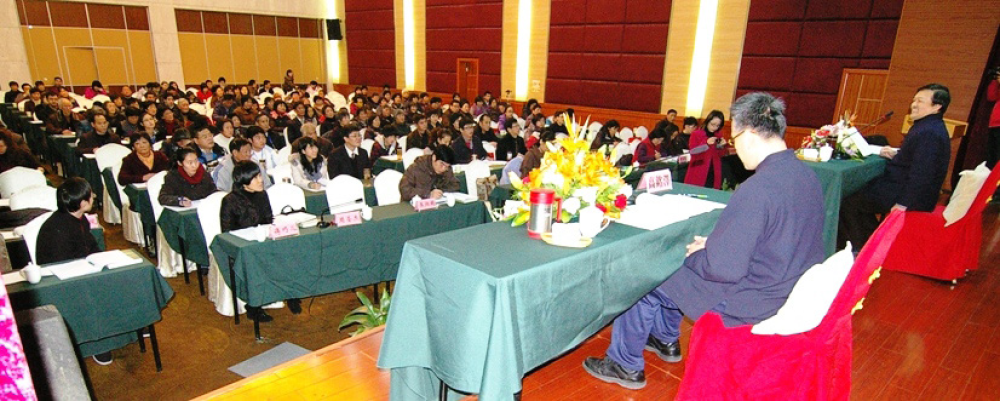

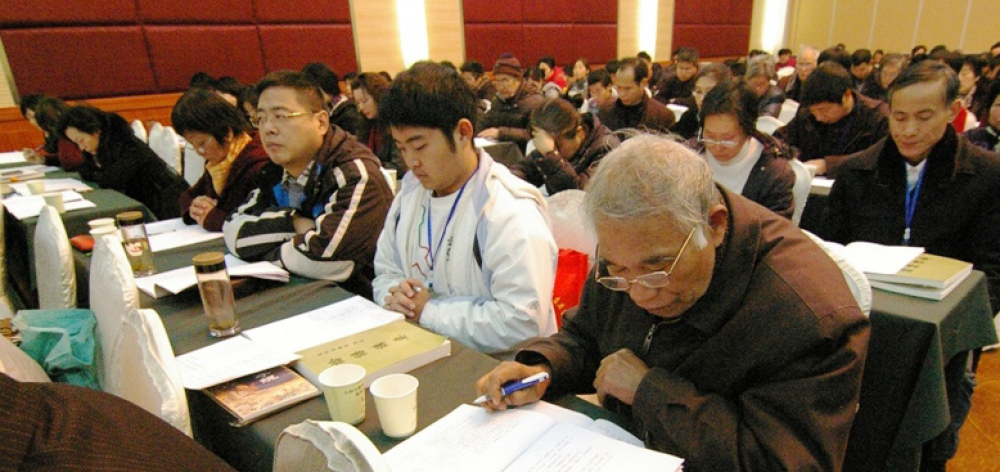

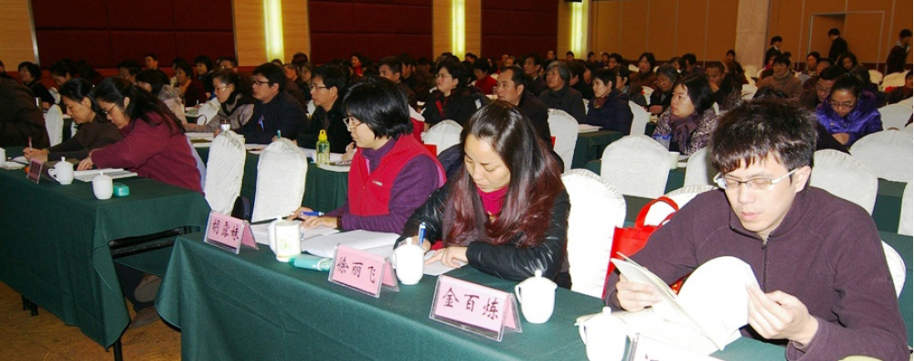

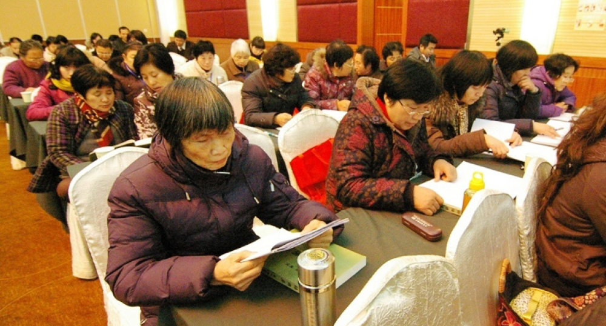

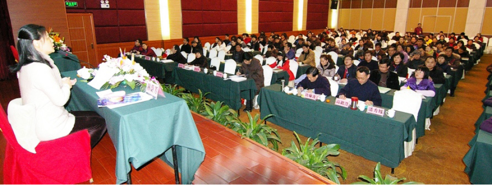

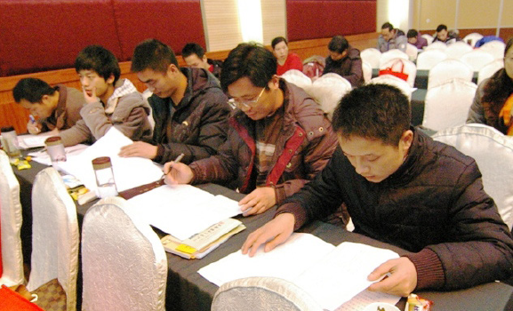

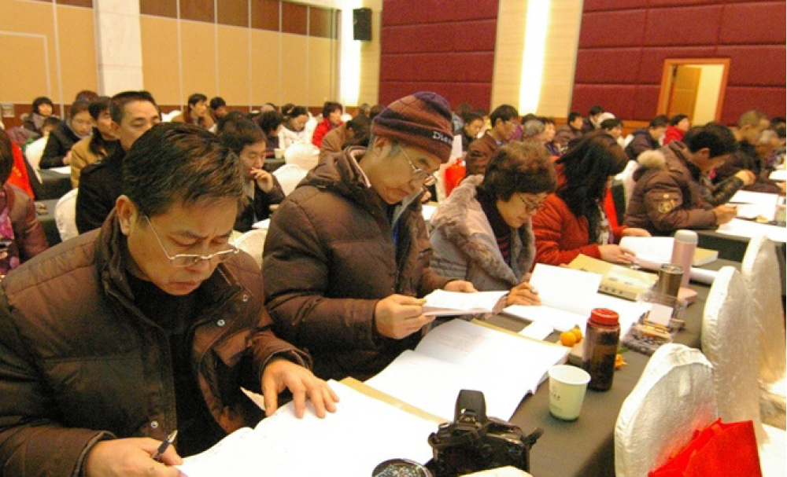

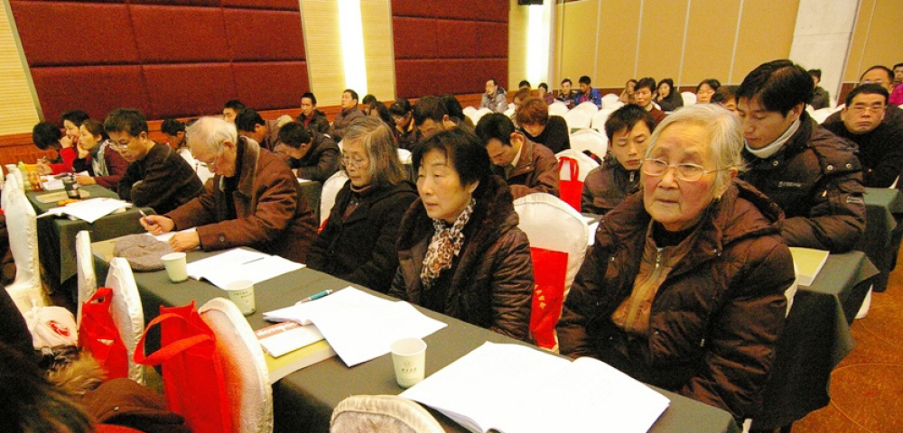

### 兩岸國學文化交流講座～諸暨篇　員工講習會與與讀書會迴響

*編輯部整理*

諸暨緣慈公司員工講習會～與負責人對談

與俞居士對談

俞居士：

自從一九九八年接觸佛法之後，開始相信因果，也相信了凡四訓所說改變命運的道理與方法，依之定能改變命運。然猶有習氣，無法依著了凡先生的經驗，在做人處世上得到益處，遇事每每總想按自己的意思去作。透過這次講座後，常反省自己的想法與作法，往日因為內省不夠，隨順因循的習氣泛泛度日，依然沒有什麼改變。雖然認為自己一直是深信因果的，但是從來沒有將道理落實，這是往日學習的盲點。透過此次的學習，更加提升待人處世的心念與舉止。期盼未來成立讀書會，好好的提升自己與團隊的素質。

**問：** 興辦與維持事業的熱忱與幹勁是如何培養？

**答：** 非常感恩我的父親，以前很不聽話，不知道父親教育我們的用心良苦，夜深人靜時，想到以前父親的教導，想到點滴的往事還會掉眼淚，感覺自己以前年輕不懂事，非常對不起父母。

現在我的家庭很健全，父母身體很健康，同事們也很努力的工作，諸暨父老鄉親也很支持，想到所有的一切都是他人點滴的幫助，就是這一份力量，以這種感恩之心，支持我努力做下去。

於緣慈公司員工讀書會教室

**問：** 遭逢逆境與挫折時，該如何保持對生命的熱忱？

**答：** 在還沒參加老師所辦的傳統文化講座之前，曾參加弟子規的講座，接觸了傳統文化，那時覺得學習文化真是打從內心感覺快樂，每天早上起來開始一天的學習，內心非常平靜、快樂，法喜從心裡面散發。特別是這兩次在浙江的講座（二０一０年十月龍川學校〈成功秘訣—學〉與諸暨〈改變命運由立志開始〉），發覺人真的要不斷的學習，每天都有一股巨大的力量支持著自己，心情非常的舒暢，能遇到善知識真是我三生有幸。

**問：** 將來如何配合李居士來經營事業？

**答：** 講起來就覺得慚愧，我們江浙一代以前的教育與社會現象教導我們，如果女人沒有能力，這個女人是很失敗的！所以常常提心吊膽，如果我作為一個弱女子，將來會被老公拋棄，被社會拋棄，令父母蒙羞，我要成為女強人，才能照顧父母，照顧兄弟姊妹。但是這樣的想法是錯的，一直想要強出頭，自己也很累。學習傳統文化之後，我也常常在內省，這樣子好強真的是違背了天道、人倫之道，女孩子的性情應該要像水一樣，期許自己身體力行，加入學習，讓我們的家庭變成一個學習的家庭，好好的回歸到自己的本位。

與李居士對談

**問：** 是否可以說說您出生於北方(河北石家莊)大家族，大家庭風氣淳厚的形象？

**答：** 家族裡面有很多規矩，例如遇有事情都會徵詢家族中的長輩，恪守長幼尊卑的家規。

**問：** 傳統推拿氣功治病時，雖效果神速，是否會遇到病人想要一次解決病痛？當他們把您當作神仙，想要快速的解決病苦，該怎麼辦？

**答：** 我們常常遇到病人來，一天就想要解決長時間累積的病，碰到很多這樣的現象，長時間的作息不調、生活無度，情緒不穩，家庭不和樂，很多原因造成的病痛，我沒能力短時間去解決，病人如果自己不願意改變，華陀再來恐怕也難治癒。

**問：** 大家族逢年過節保留著傳統禮儀，請述家鄉過年禮儀。

**答：** 在河北老家，給家中長輩磕頭的禮一直保存到現在，每年年三十晚上，家族的長輩輪流在某個家裡面吃年夜飯，家族裡面長輩、中輩和晚輩，分桌次井然有序的在一起吃飯，飯桌上會將這一年的糾紛與矛盾在酒席上一併解決，由長輩來調解，後半夜兩、三點鐘起床煮水餃，由家裡面父母帶著兒女，將第一碗餃子奉給爺爺奶奶，並且給爺爺奶奶磕頭拜年，然後回到自己家裡面吃餃子，吃完餃子再帶著孩子和兄弟的孩子一起到爺爺奶奶家磕頭，輪流到各個長輩家裡面磕頭，再由大伯帶著向村子裡面的長輩磕頭，一直磕頭到清晨，再由全家族的長輩帶著禮品上墳祭祀，這是我們家族裡面年三十除夕晚上的流程。今年我們學了傳統文化，再也不覺得這是個苦差事，過年要回家磕頭去！

團體護持諸暨～讀書會迴響

尊敬的唐老師：

感謝慈悲能派高老師來諸暨講學傳統文化一個月。

通過這次學習，覺察自己身上的過錯：脾氣急躁、缺乏耐心，身為女性，缺乏女性的柔順、謙卑。未來要長期跟老師學習，改過遷善，提昇自己的內涵和智慧。

由於管理水準有限，管理的構架不健全，我心裡暗暗下決心：提升公司的管理水平，創造機會聽唐老師團隊的課程。

未來，末學首先的任務是建立和諧家庭，也就是修身齊家，老師去年講的話：一個家庭裡女人很重要，相夫教子。末學銘記在心裡，未來要提昇自己的內涵和智慧，最好的方式是跟老師學《論語》。只有家庭和諧，企業才能和諧，企業和諧了才能建立道場，這也是學生經營緣慈企業的理念，把企業辦成一所學校，往後還需老師多多指教。

對於同修李總，多年鑽研氣功，然氣功的學習亦要輔助人情世故，希望今後能得到老師的幫助和指點，提升自己，不但將氣功與中醫結合，彰顯中醫的特色，更重要的是在心靈上要與老師的傳統文化相結合。得到老師的幫助是我們人生旅程中的指路明燈。

只有不斷學習，改過修善，通過這次學習，生起了慚愧心，看到了自身的缺陷，下決心改變自己，影響周圍的人，養成一個好的風氣。希望老師保重身體，弘揚正法，臺灣需要您，大陸更需要您。能跟隨老師學習是我們的福份，衷心希望老師身體健康，心想事成！！謝謝老師！！

學生 俞○○ 敬上

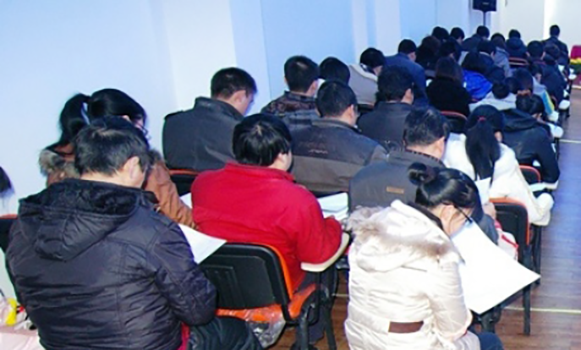

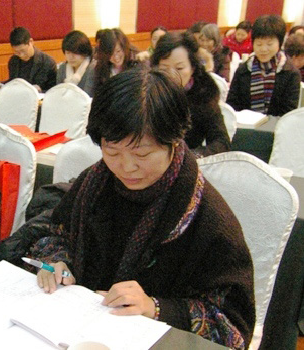

### 道藝春秋—國畫塑像作品展

*編輯部*

大時代的洗禮

大德們的提攜

大格局的自勉

大氣魄的創作

臺灣國畫大師江逸子先生，受福建省政府之邀，將於今（二○一一）年十二月廿八日，於福州市福建博物院舉辦「道藝春秋」畫展，展期兩個月，至二○一二年二月廿八日止。此次畫展的目的，在加強兩岸的文化交流，增進兩岸教育、藝術、文化的互動，達到相互觀摩學習的效果。綜觀此次畫展，有以下幾點特色：

一、由中共官方，福建省文化廳與福建博物院主辦，並正式獲得國務院的核准，展場在福建博物院，是福建省最高文物展示與收藏中心，展期長達兩個月，期間涵蓋國曆及農曆新年的黃金檔期，原本規劃為齊白石畫展，特別因此推延，而去年同期舉辦的是張大千畫展，可見主辦單位對江先生的高度重視與對此畫展的深切期盼。若非江先生的個人特質與其作品有特別過人之處，以他淡出臺灣藝壇四十餘年，實不可能得到中共官方如此的殊榮。

二、畫展名稱訂為「道藝春秋」畫展暨江逸子先生七十作品回顧展，此次參展的主要目的在「以藝弘道，以文會友」，藉此畫展因緣，把中華傳統文化深厚的內涵與價值，六十多年來在臺灣發展的成果，與大陸做實質的文化交流，以增進兩岸文化的認知。

三、江先生在國內舉辦過多次的「道藝春秋」畫展，參觀者極為踴躍，頗獲好評，馬總統任臺北市長時，曾親赴台北國父紀念館畫展現場仔細參觀指導過臺，曾留有合照。此次福建博物院參展的重點作品之一，孔門聖賢十二尊雕塑銅像，即是因馬總統在該次畫展中的殊勝因緣指點而成，足見馬總統長期對中華文化的關懷，及對文化人的鼓勵。

四、江先生不但在藝術上有極高的造詣與成就，對中華文化的弘揚更具有強烈的使命感，師承「大成至聖先師奉祀官府」主任秘書李炳南先生，李老先生世稱雪廬老人，老人在臺灣教化三十八年，弟子眾多，遍及海內外，江先生是老人的得意門生，亦是奉祀官孔德成先生指定的奉祀官府主任秘書繼承人，德高望重，備受門人弟子與大眾的肯定與敬重。江先生以藝弘道數十年，除畫作與塑像外，其所著之「論語畫解」叢書，更名聞海內外，深入大陸各界，深獲好評。「俄羅斯孔子基金會」於二○○九年所出版的俄文「孔子與儒學」一書共七百頁，其中所用的百幅插圖畫作，江先生全部無償授權其使用，可見江先生的道藝成就，亦備受外國人肯定。

五、此次畫展由唐瑜凌先生任文物顧問，唐先生曾任職於台北故宮博物院三十年，熱愛文化藝術，博學多聞，具有多年的文化教學及文物導覽經驗，藉其多年寶貴的台北故宮經驗，把江先生精采作品中豐富的文化內涵和盤托出，與大陸各界交流分享。

六、畫展開幕式中，將同時舉行塑像捐贈儀式，把十二尊真人尺寸的孔門聖賢銅像，禮請現任奉祀官孔垂長先生（孔子第七十九代孫），代表我方捐贈，作為福建博物院永久的典藏，為文化的傳承留下歷史見證，同時也對兩岸中華傳統文化的交流，寫下歷史新頁。

江先生一介平民，能受到國內外如此的推崇，全憑其個人的德學修養與人格感召，是現代的楷模，國之重寶。六十多年來，中華傳統文化在台灣生根茁壯發展，成為台灣之寶，中國人的光榮，江先生來自「大成至聖先師奉祀官府」，象徵著中華文化的歷史傳承，此次畫展作為今日兩岸文化交流的具體象徵，更別具意義。

本會誠邀各界有志之士共同參加此次畫展盛會，共同為此歷史一刻作見證。

中華無盡燈文化學會  謹識

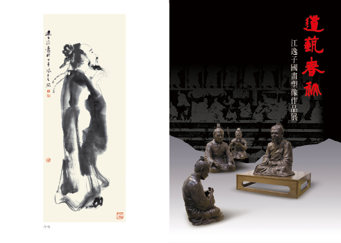

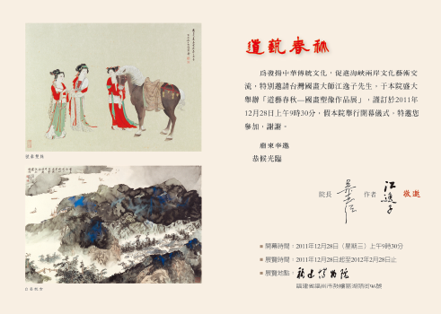
