# 第84期
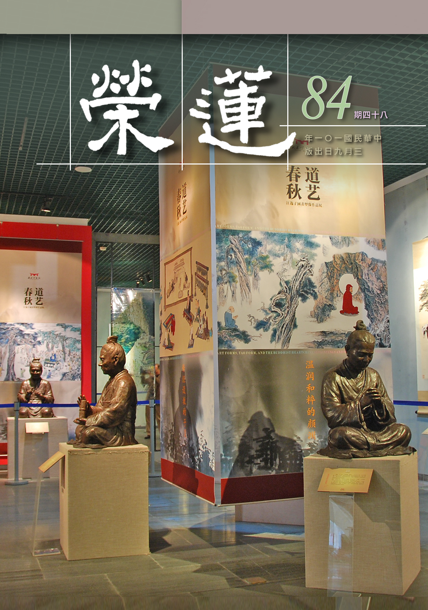

## 社論

### 文化年

本刊

領導提倡出冷門

沉寂百年新現世

霧裡看花下對策

聖賢典範真文化

對岸將今年（二0一二）定為「文化年」，因為改革開放後，經濟雖然大幅成長，人文素質卻沒有得到相對的提升，有鑑於此，溫家寶曾提出：「一個國家，如果沒有國民素質的提高和道德的力量，絕不可能成為一個真正強大的國家、一個受人尊敬的國家」，胡錦濤也指出「文化越來越成為民族凝聚力和創造力的源泉，越來越成為綜合國際競爭的重要因素；經濟實力飛速發展的中國要求盡快提高國民文化素質和道德素質；中國必須全力打造具有自己特色的文化，這種特色只有從中國五千年的文化積澱中尋求營養，從而實現超越」，孔子也說，要使社會和諧，就要「富之」、「教之」，而通過文化的推展，正可以培養文化人，變化人的氣質，使民心淳厚、氣象一新，也能促使政局穩定，各行各業蓬勃發展，可見文化年的推展，有其必要性及可觀性。

而無盡燈文化學會又應如何落實文化的推動呢？必須觀待所有學會成員的共同參與，包括講學人員、辦事人員、義工、蓮友等，大家各盡其職，以達到和諧共融、互相增上的目標。

講學人員須經常聽聞教法，深入聖賢經典及古大德的注解，以充實內涵、增上勝解，並把所學內化於心，實踐於日用平常。在學習過程中如遇疑難障礙，也能虛心請教、切磋研討，透過聞、思、修來產生勝解。而智慧的增上還須透過多方的善法造作，達到福慧雙修的目的。

作為團體中的辦事人員，首先要奠定一套完善的分工組織系統，依據個人能力專長，適當分配權責，以利團體運轉。辦事人員須堅守崗位，完成自己的份內工作，更重要的是須有團體意識，彼此互助合作、相輔相成，透過不斷的溝通協調，以達事半功倍之效，不但在學習辦事中自我成長，更能凝聚內部向心力。辦事時，講究有觀察的眼力、全盤考量事情的格局氣度、敏捷的行動力及犧牲奉獻的精神，如此必能氣定神閒、從容不迫，又不失執行的成效力，最重要的是能秉持著一顆歡喜心來服務大眾，不以工作為苦。

就義工而言，參與活動之前，辦理行前講習，以確立正確的發心動機與做法。服務大眾時要竭盡所能且不求回報，於動中修行，甘願做、歡喜受，並淨化自己的身、口、意，用莊嚴的儀態來攝眾，從而引發法喜。做事時，要由有經驗的人帶領，凡事多請教，才能切合所需，讓活動順利進行。

就其他參與者而言，包括來聽課的蓮友或是與會大眾，都要有正知見、規矩、倫理的培養及認知，參與活動或修學正法時，須拋開固有的成見、煩惱，努力吸取新知，蓮友間互相研討，建立革命情感，學習之餘，也要主動發心，或者當義工，或者引導他人修學，藉此來提升自己的格局、氣度和見識。

團體是由四面八方有志一同的人聚結成為一體，無盡燈文化學會是一個大家庭，每個人都要點亮心燈，使文化得以傳承、正法得以流轉，但先決條件是大家要有熱忱及捨我其誰的使命感，並對教法生起殊勝的信心，期勉自己成為人才，散發出文化底蘊，如此，必可和合納眾、近悅遠來，對國家、社會產生向上、安定的力量，也能找到個人生命中的美好出路。

「文化年」、「文化人」非徒呼口號、空有形式，必須結合有志一同、富有使命感的覺醒者，由善知識的引導，深入經典的學習，博之以聞、約之以禮，經由不斷地聞思修學將文化內涵向生命底層扎根，於生活的各個層面落實，凡舉衣食住行、與人進退應對等皆以正知見為抉擇，則泱泱文化的大國氣度方得以重新展現於世。

## 大德法語

### 大方廣圓覺修多羅了義經（四十三）清淨慧啟請

道源老和尚

無明能見世實有

體空隨業各幻相

眼翳毛髮名言顯

涅槃遍及世間相

癸二、證位階差

子一、明依位漸證

丑三、聖位

寅一、悟前非

經文：

善男子！有照有覺，俱名障礙。

是前述之解悟，乃十信位的「照」，有三賢位的「覺」，俱名為障礙，是故菩薩常覺不住。此時登地的菩薩是破一分無明，親證一分法身，知覺而不住不起執著，用功修行絕不中途停止。照與照者，同時寂滅，是能照的智慧與所照的境界，乃至生起能照的聖者同時寂滅，是不起能所的執著。

寅二、明證相

經文：

是故菩薩常覺不住，照與照者，同時寂滅。譬如有人，自斷其首。首已斷故，無能斷者。則以礙心，自滅諸礙，礙已斷滅，無滅礙者。修多羅教，如標月指。若復見月，了知所標，畢竟非月。一切如來，種種言說，開示菩薩，亦復如是。

十地菩薩如何用功法呢？所謂常覺不住，登地以上的菩薩，常常覺照，不但不住著（不執著），且照與照者，同時寂滅，能照的智慧，與所照的外境同時寂滅。譬如有人，自斷其首，首已斷故，無能斷者。這比喻好像粗氣了一點，若不打此比喻則難以想像能所雙亡，譬如有人自殺，將自己的頭斬斷了，頭已經斷了，人也死了，此時還有個能斷者嗎？所斷的頭已經斷了，能斷的人呢？也沒有了，所以是能所雙亡，同時寂滅。

則以礙心，自滅諸礙，礙已斷滅，無滅礙者。登地菩薩用功是地地勝進，雖有礙心，然能以此破礙心，滅以前的諸礙，將所要斷滅的障礙滅除了，就不用滅礙的心。如同斷了自己的首，此時已沒有能斷的人了，是能所雙亡。登地菩薩常常能起能所雙亡的證量。

修多羅(契經)是佛說的一切經教，如用手標指天上的月亮予不知道的眾生。天上有月亮，你看見沒有？沒有！我用手指頭指給你看，你看到了。

若復見月，了知所標，畢竟非月，一切如來，種種言說，開示菩薩，亦復如是！真正見了天上的月亮，你就了知標月的手指，畢竟不是月亮，一切如來種種的言說（就一切的經教），是開示菩薩令悟到自己的圓覺性，等於標月指，非天上的月亮，等你見到天上的月亮了，則知經典都是標月指。不學經典則不明白佛理，明白了佛理迴光返照，即照了你自己的圓覺妙性。

似於《禪林寶訓》上，有一段典故，老師收了一位徒弟，徒弟到外邊去參禪開悟了，要報剃度恩師的恩，因為師父還沒有開悟。回來向師父講他所學的道理，師父聽得雖是不錯，但聽不到心裡去，然這位師父是用功的老修行人，也很發心看藏經，一本一本的看。這一天師父正在那兒看藏經，打光照在紙糊的窗戶上，有一隻蒼蠅看見紙糊的窗戶上的亮光，以為是空地方，怎麼想著跑出去，也跑不出去，徒弟看見是個境界，就在旁邊說話了：外邊的境界如此的寬廣，你（蒼蠅暗指師父）為什麼猶在紙窗上找出路（窗戶是用古舊的紙糊的）？為什麼不另尋方便，而猶在鑽這糊紙的窗戶？他師父聽了這句話，聽到心裡了，向徒弟請法，忽然間明心見性，大徹大悟，站起來向徒弟頂禮，說：你前是我的徒弟，今天你是我的善知識。吾人天天在那兒看經典，對於這些法相，不能通達義理，則無法如標月指，經典是標月指，都是開示我們自己的心，若能依經義迴光返照，則大徹大悟，自然見到那寬廣的世界。

寅三、結成位

經文：

此名菩薩已入地者隨順覺性。

此之階位是菩薩已入（證入）登地以上，能隨順覺性。在《大乘起信論》上是隨分覺，隨他的地位一分一分覺，所斷無明謂之住相無明，成佛之前所證的是究竟覺，所斷無明是生相無明。

丑四、果位

寅一、明境

經文：

善男子！一切障礙，即究竟覺；得念失念，無非解脫；成法破法，皆名涅槃；智慧愚癡，通為般若；菩薩外道，所成就法，同是菩提；無明真如，無異境界；諸戒定慧，及淫怒癡，俱是梵行；眾生國土，同一法性；地獄天宮，皆為淨土；有性無性，齊成佛道；一切煩惱，畢竟解脫。

到了佛的境界，不是對待的名言相，一切障礙無不是究竟覺，此即是究竟即佛。

無所謂正念失去正念，一切都是解脫的境界。不論成就佛法或破壞佛法，皆名涅槃，成法破法，不出涅槃的境界。

智慧是對著愚癡而起的智慧，愚癡與智慧，同是般若的運用。菩薩是佛的弟子，所成就的法才是佛法，外道是心外求法，所成就的法不是佛法，然到了佛的境界時都平等了，都是自相空，都能成就菩提。無明所執的是法之自相，真如則是自相空，二者是敵體、對待的，到了佛的境界，則無明自相空，真如亦自相空，二者沒有差別。沒有成佛以前，要勤修戒定慧，息滅貪、瞋、癡，而貪之最重者是「淫」，經文謂之淫怒癡，到了佛境界，則淫怒癡與戒定慧都是清淨的法行。

譬如成了佛有時要示現淫欲之相，以釋迦佛作例子，不能從天上下來就作佛，為了要度人間的眾生，示現在人間修學成佛。雖有父母親，然以慈悲為本（不是以愛為本），雖入母胎，依大乘經說，在母親肚子裡邊，還轉大法輪度眾生。長大時父親助彼結婚。釋迦佛當時是個太子，一娶就娶三個太太，一個正夫人，二個偏房，太子結了婚有了淫欲生了孩子。你說我們釋迦佛有淫欲，不是謗佛嗎？雖結了婚起淫欲，也是清淨法行，所以如此類推，所表現貪、瞋、癡，也是清淨的法行。

眾生是正報，國土是依報，此時沒有依報正報之分，法性同一。若造上品十惡（最麤重的十惡），得了果報，到哪裡去呢？墮到地獄裡。若修十善，則升天堂，升到天宮則享天福，墮到地獄裡時則受無量苦，此時同為清淨國土。佛到地獄度眾生時，地獄不是佛的淨土？在我們中國最有名的是地藏王菩薩，此菩薩常在地獄度眾生，地獄不是淨土嗎？這個道理你若懂了，則地獄天宮沒有分別，同是清淨國土。

有性—是有佛性的，此處是指信仰三寶的心，無性就是闡提，是對三寶不發生信仰，一闡提不能成佛，然到了佛境界，則有信仰的佛性，或是無信仰的闡提性，皆能成佛道。煩惱有自性嗎？煩惱沒有自性，觀待執著才能生起，若當下觀境了知自相空，則當下解脫嗎？所以一切煩惱都是解脫境界。（下期待續）

### 常禮舉要講座（二十五）　慶弔篇

雪廬老人

婚喪喜慶須通情

禮節表達風俗厚

團結民族五倫親

中華文化是瑰寶

慶弔

◎三、喪服不入公門，不觀吉禮。

到各機關公家地處，不能以私廢公。喪服不是你平素穿的素衣服，是披的麻衣，要進入公門只可在門外等，遞帖進去，某人在此謝了，不能如此進公門。公門是公家的，凶服不能進公門。且不觀吉禮，那兒有吉禮，你不但不能去，連觀禮都不許。

◎四、賀婚在眾賓前，辭不諧謔。

譬如賀人婚姻，自古以來，風行很久，是一種迷信，說些開玩笑的話。還有晚上送房，新郎白天行禮，照應客人；晚上必得伴郎送進去，都有規矩的，你看京戲「龍鳳配」，劉玄德上洞房還要周瑜送他，送到相當地處，劉備不讓他走，周瑜說：你看那來了一個人。劉備往那一看，周瑜就趁機偷跑了。

這都有規矩的，伴郎把新郎送進去就得退出來，就可關門休息了。但有鬧房，要不鬧子孫不旺，然這是一種迷信，是屬於各地風俗。原來「婚」沒有女字旁，是黃昏行此禮，到後來改了時辰，多半在白天。在白天行完了禮，親友不分老少，在臺灣亦有，三天不分大小都可進去看看。國家要懂這個，不必撒傳單，臺灣人不是中國人，難道還是日本人？是美國人？這是廢話，愈說愈倒楣。

供的祖先與神位一律都是內地，他說的北方土話，濟南土話都是那兒的？看看古韻，懂得反切音，自然就明白了，用不著說廢話。譬如臺灣人供的魁星、哪吒三太子、諸葛亮、關公，這些都是臺灣供的，這些是哪裏來的？怎麼沒供伊藤博文？所以不學無術就難以講話了。

結婚三天，在白天不分大小，都可以入房隨便看新娘，讚歎幾句，要不是結婚，長輩不可以跑入晚輩房間去，房子都不入，你沒看「鳳還巢」，太監做和事佬，到門口不進去，因對方是晚輩故。現在我上學、京戲就是我的老師，虧了看京戲又教了我。不是結婚日，平素上人家去看女人，這是誰呀？是小孩子他的女人。哦！長得真漂亮。那裏好、那裏好，你在那讚歎。

我給你說這是大毛病，小心！現在已不在乎，要是從前，你要是說上三句就給一耳光，滾出去，不是你應該說的，她漂亮關你什麼事，這是諧謔，是那時候話。今日之下結婚之中禮堂裡來賓讚歎幾句，雙方父母都在場。介紹人如何介紹，在哪兒介紹，在赤崁樓、公園，在哪兒幹什麼，你叫那兩人不知羞恥，老人如何坐得住。若說老人不在乎？其實是你不在乎。

昨天（五月三十日、星期六）是卓文君生日，京戲上司馬相如說話很莊嚴、上花臉，只有卓文君不興這一套，兩個人偷偷地離開了父母，後來他們收場很好。司馬相如做了一篇長門賦，此賦是當街扯皮條的一篇文章，若是我選文必勾掉。司馬相如做了官回去見他父母擺架子，父母都不敢惹。現在不用作官，只要到美國，雖然沒得博士也就不認父母，父母就不敢惹，見了面說軟話。卓文君就是這樣不理人，真是不忠、不孝……沒一點好，臺北為她蓋個情人廟，光這一條就是臺灣的奇恥大辱，像這樣怎麼提倡禮教法？

辭不諧謔：在禮堂當著人家父母開玩笑，叫人家怎麼下台？若新人結婚之後離開禮堂，你說幾句玩笑無傷大雅，你不能在禮堂內褻瀆，你是在唱淫戲嗎？

◎五、臨喪不笑。

此說的是喪事，不論是上他家裏去或上殯儀館，只要靈柩所在之處就算臨喪，到那不笑，這還不會嗎？人家死了人，我問你，死人是好事還是壞事？當然說的是普通話，不能說特別的。總是要表示人情，臨喪不笑。

◎六、里有殯，不巷歌。

殯是本日發喪，棺木還沒出去，在家裏謂之殯。古時一切都不便，糧食都得自己生產，都有唱歌，為什麼？因工作很辛苦，推磨、揉麵、這一天這個人心緒難調伏。什麼事情都有歌，插秧也有歌，揉麵前也有一個梆子、隨敲隨唱，古人都有用意，其心就在歌上，你要不唱則胡思亂想，胡思亂想是人之大毛病。你把我這句話記住。咱們三藏經典也沒讀完，就算你都念完了，一言以蔽之，不胡思亂想，什麼人不胡思亂想就空空如也，就成了功了。諸位就是學三大阿僧袛劫也辦不到不胡思亂想。

里有殯不巷歌：從前在街上走著唱歌是不禁止，現在警察禁止。在街上走著唱歌，在鄉間更是不免。只要我們鄰里鄉黨有人家還沒出殯，我們在街上就不唱，風氣你想想是厚還是薄，這些鄰居你想想跟我們是一家還是不一家？孔子說過：四海之內皆兄弟也。有意思還是沒意思？你大家想想！這個民族團結是不團結？你們大家看看！光撒傳單，沒意思、沒用處。

◎七、飯於喪家、酒不赭顏。

你在喪家幫忙，你家遠不能回家吃飯，當然你在喪家幫忙就在那吃飯。你是客，人家恭敬你。內地喪事，出殯這一天，等著送殯，客多等著弔完後就起靈，不吃飯是不行的，喪主因有客故遞酒，喪主是不飲酒，客可以喝酒。咱在那喝酒、要略略喝喝，意思、意思就可以了，不能紅著臉，赭當紅講。喝酒喝紅著臉，喪主出來看此人沒品行、不懂禮。不但是喝酒不行，即使在喪家可以吃飯，孔子有云：至喪者之宅，未嘗飽也。連吃飽都不肯吃飽，不忍而嚥不下，此講的是真是誠。

◎八、佩會葬徽章者，禮終即卸去，不佩帶他往。

此是現在話，你要是在喪葬場合佩著會葬徽章，種種不一，白布或花等等，都有符號，在靈前表示有哀悼之心，要是行禮完了，就把所載徽章摘下來，不可忘了帶到別地方，上誰家去誰都不高興，人家又沒死了人。你看臺灣，這家有喪事，靠近的鄰居都拿一塊紅布用釘子釘上、為什麼？大家講不上來？怕鬼魂走錯了門。中國是禮儀之邦，在地球上五千年是不會亡族的，以後可不敢說，孔家店要是永遠打倒那就不敢說。要是孔家店打不倒，中國五倫存在著，是不會亡族。課上到此，算完了。

（全文完）

### 正覺精舍結夏安居~果公法語開示（二）

*編輯部整理*

修學高妙平常現

敬和忍省代人勞

悔罪謙懷成人美

觀他菩薩我凡夫

淨土往生操左卷

民國一百年六月十八日

印光大師開示道：「無論在家出家，必須上敬下和。」

即無論在家的居士們或者出家的師父們，對我們的長上要恭敬，譬如在家的居士們，在家裡有公公、婆婆，叔叔、伯伯，嬸嬸、嫂嫂，輩份比我們高，年紀比我們大，都是我們的上輩，都要恭敬、尊重他們。

就著出家的師父們來說，自己受戒得戒臘，凡是戒臘比我們高的，都是我們的上座，戒臘比我們低的就是我們的下座，而我們本身也有剃度的恩師，受三壇大戒的三師七證，這一切，凡是戒臘比我們高的都是我們的上座，對他們要尊重恭敬，這就是上敬。

下和是對下位的人言，比如在家裡有弟弟、妹妹、子女，或者伯伯、叔叔的子女，凡是年紀比我們小，輩份比我們小，都算下輩，我們都要很和善、很和氣的對待他們，好好的教導他們，所以必須上敬下和。

出家師父在道場中對於戒臘比我們低的，在下位的沙彌，或者想要出家，住在僧房裡面為三寶服務的這些準備出家的淨人，我們對他們都要和善，很溫和的對待他們，所以叫做上敬下和。

「忍人所不能忍」

，要忍辱別人所不能忍辱的境界，所以了然和尚有一首偈頌這麼說：「逆境當前莫動瞋，西方佛子等疏親，吾今暫作娑婆客，不久蓮池會上人。」違逆我們心意的境界擺在眼前，應當不要起瞋恨心。極樂世界的聖賢們沒有親疏的分別，平等對待一切眾生，我現在暫時作個娑婆世界的客人，我們都是客人，不要認為我是主人喔！我們是暫時在娑婆世界作客人。不久之後都到蓮池海會，與諸上善人聚會一處，所以遇到逆境我們怎麼可以不忍辱下來呢！

所謂的忍辱非持戒苦行所能及，忍辱的苦比持戒的苦行更殊勝，所以佛陀在《遺教經》也開示我們，假若有人來支解、割截我們的身體，佛陀開示教導我們不要出惡言，不要冤冤相報，不要他來殺害我們，我們也殺害過去，口不出惡言，內心安然的忍受，要能忍受惡類如飲甘露，就是入於佛道有智慧的人。

所以各位佛的弟子，人家怎麼侮辱、毀謗我們，我們都要忍受安住下來。就好比佛在因地作忍辱仙人，被歌利王割截身體，體無完膚，他連一念瞋恚心都不生起，而且發願我將來成道，最初度的就是他，所以歌利王後來就成為鹿野苑五比丘的第一位憍陳如，憍陳如是五比丘中最初成就者，人家對待佛有殺身之禍，而佛對到這樣的逆境卻慈悲的發出這樣的願，你看佛陀是多麼慈悲。

我們做為佛的弟子，就跟佛的身口意三業效法，這才叫佛的弟子，我們不要出惡言，也不要用不好的方式報復過去，倘若生起慈悲救度他的心，假若我們做人都能夠如此，在社會上、在家庭上與人相處，哪裡會有不如意的事呢？必然能逢凶化吉，任何逆勢都變成順勢，就轉變啦！所以要能忍人所不能忍！行別人所不能做得到的。

所謂

「行人所不能行」

，在此講一個公案，虛雲老和尚有一位弟子叫作具行，他的名字叫做日辯，是雲南桂林這個地方的人，他年幼的時候父母親雙亡，成家以後家境也貧苦，所以全家都到雞足山的祝聖寺去工作，在他廿一歲的那一年，率領一家八口，一同禮拜虛雲老和尚出家，不久他也受了具足戒，他的面貌很醜陋，雙耳也重聽，又不識字，和尚只能教他念佛的法門，具行因此就摒除一切的外緣專心去念阿彌陀佛，白天他為常住種菜，晚上禮拜念佛靜坐，空閒的時候也隨喜課誦。

他不識字，兩堂的功課要學起來也不容易，但是他很有恆心，請求法師口授給他，一字一字的教，他字字句句都記憶在心，極為精進。不到兩年，六時的禮拜課誦都已經具足了，而且也會背許多經，值得敬佩！
民國四年具行離開寺廟參訪四大名山，九年回到雲南，心境更為開朗，這時正好虛雲老和尚建昆明玉竹山的雲棲寺，具行表示願意跟隨修苦行，老和尚就問他，你想探視你的眷屬嗎？他就開口：我不管其他事了！那你要做什麼工作啊？他回
**答：** 那些眾人不想做的苦勞都由我來做，你看！這就是行人所不能行，於是老和尚就讓他住在勝因寺，凡是築牆、蓋房屋、種菜、挑石頭、挖土、灑掃、炊煮等等的事，具行一律都接派，沒有一刻的空閒，而念佛也從不間斷，一面工作就一面念佛，平時除去多餘的東西，也不多講話，夜裡大眾休息的時候他就禮拜金剛經、藥師經以及淨土諸經，一字一拜，這就是拜經，等到黎明大鐘齊響，他還照樣上殿課誦，沒什麼休息接著就做早課課誦，如此習以為常不曾休息，偶爾遇到有衝突，總是一稱一句阿彌陀佛。後來寺裡修塔，具行也搬石頭和砌牆，不辭勞苦喔！

他曾經稟告老和尚說等待塔完成以後，他要看守這個塔，虛雲和尚看到他的發心很難得，當民國十三年春戒的尊證，受具足戒要三師七證，他就是七證之一，那麼上寶壇的時候弟子就請他開示，具行說：我半路出家，一個字也不認識，只知道一句阿彌陀佛！

有一天具行忽然將所有的衣物、棉被等用品全部賣掉，設齋供僧，別人就問他要到哪裡去？他一直微笑而不回答，傳戒結束後具行馬上告假就前往後園，三月二十九日中餐之後，具行私自到勝因寺大殿後面的曬穀場，拿了稻草樹枝，敷坐在稻草上，左手拿著引磬！右手敲打木魚，面向西方，用火自己焚燒，當時寺裡面沒有一人察覺到這個事，在牆外有人看見火光，大家競相觀看，只看到具行端坐在位上，然後被燒成灰了，形狀就好像生前一樣，遠遠的地方都能夠嗅到奇異的香氣，眾人看到這種殊勝的瑞相，馬上呈報統領的全省軍政大權的督軍唐季堯先生，督軍就率領全家前往去觀看，具行嵬然不動的坐得好好的，等唐季堯走近要拿他手裡的引磬的時候，遺體突然全身倒下變成灰啦，後來具行的骨灰果然首先入塔，又暗符合以前所說要守塔的約定，說這個塔建好我常常要來看守，就是骨灰第一個入了這個塔，就等於看守此塔。

那年他才三十六歲，也說明極樂世界不一定年歲高者，我們就隨緣好啦！能活到一百歲我們就一百歲再往生，年輕就往生也挺好，隨緣就好，這個就是行人所不能行。

大眾虔誠禮請法師上座開示

「代人之勞」

，代替人家的勞苦，像過去有人力車，人力拉著車走在上坡的路去，很辛苦的，我們就助他一臂之力，幫他推上去，這就是代人之勞。

果公諄諄教誨

「成人之美」

，就是人家帶頭做功德善法，我們知道以後，有錢就幫助他做善事，沒有錢我們就用嘴巴去讚歎，人家聽到你讚歎的聲音他越作越起勁，看到人家做善事你就滿心歡喜，人家看到你的樣子，就越做越起勁，這就是成人之美，這就是隨喜功德，從隨喜功德至出錢出力，我們心裡很了知，也是隨喜功德。

「靜坐常思己過」

，等覺菩薩二六時中，不離開十方諸佛，懺悔過去的罪業，何況我們在凡夫地，應當常常生起慚愧珍惜之心，怎麼敢自己仗恃自己？自己仗恃自己，縱然有修持都變成魔業，所以我們靜坐的時候，要常常思維自己身口意三業是不是有過失，常常的檢討自己的過失。

「閒談莫論人非」

，跟人家言談的時候，不要三五成群言不及義，說人我是非，東家長西家短的，我們不如此，假若談論人家的是非，我們本身首先就是錯的，修行功夫不是來檢點他人是非。

「行住坐臥，穿衣喫飯。從朝至暮，從暮至朝。一句佛號，不令間斷。或小聲念，或默念。除念佛外，不起別念。若或妄念一起。當下就要教他消滅。」

所以行住坐臥穿衣吃飯，從朝至暮（從早到晚）從暮至朝，一句阿彌陀佛的聖號不令間斷，或小聲念或默念，就好比金剛持，佛號在脣齒之間（法師示範），自己聽的清楚、念的清楚，這樣也不會影響別人，而且能夠持久，這就是小聲念、金剛持，或者默念，譬如你靜坐的那堂課就默念，三三四一直念下去，一句頂一句、一句頂一句的一直念下去，念的清清楚楚、聽的清清楚楚，無論出聲、無論默念，都要聽的清清楚楚。

默念就心聽，口念就耳聽，都要聽清清楚楚，無論心聽、耳聽其實都是心聽，用心來聽，或小聲念或默念，除念佛號不生起其他的念頭，不生起其他的雜念，若妄念一起當下定要叫它消滅，凡夫眾生總是會打妄想，會生起雜念，這沒關係，古德說：不怕念起唯恐覺遲，凡夫眾生總會有念，但是覺悟要快，覺悟不快，隨著妄念一直亂下去，光陰白白浪費，一寸光陰一寸金，光陰喪失了就再也找不回來，光陰不會倒流，所以趁著一口氣在的時候，就要努力的修持。

若或妄念一起，當下就要教他消滅，很快提起阿彌陀佛的聖號，雪公云：「一念毒心生，急壓一聲佛，惡言不出口，損人事莫作。」一念貪瞋癡三毒在心生起，趕快用一句阿彌陀佛的聖號壓住它，惡念的言語、惱害妨礙眾生的言語不從我們的口裡講出來，損害眾生的事不造作，那就身業清淨，口業清淨，意業清淨了。所以若或妄念一起，當下就要叫它消滅。

「常生慚愧之心，及懺悔心」

，慚愧心及懺悔心都要恆常生起，慚者慚天，愧者愧人，天神都會看到我們隱私、隱密處所犯的過失，天神都知道，佛菩薩更會知道，所以儒家都講慎獨，謹慎自己獨處的時候，身口意三業不要隨便造惡，造惡就要受惡報，所以慎莫造惡。

慚是慚天，愧是愧人，愧是什麼意思？一般人知道我們所犯的過失，我們犯了過失，人家知道，常會批評苛責我們，我們怕別人的批評苛責，所以在空閒處我們也不敢造作惡業，所以就是要有愧人，要有愧心，我們有修慚恥就不敢造惡了。愧人就是在公顯、公開的處所造作惡業，人家知道就苛責批評我們，我們怕別人的輿論苛責，就不敢造作，這就叫有愧心。所以有慚有愧之心就是佛法當中兩個潔白清淨之法，有慚愧心我們才能止惡行善，止息一切惡法，奉行一切善法，這就是慚愧心。懺悔心，懺就是止息斷絕未來的過非，悔就是生起羞恥心，要對過去所犯的過失生起羞恥心，從此之後不再犯，這個叫做懺悔。所以要常常生起慚愧心以及懺悔之心。

「縱有修持，總覺我工夫很淺，不自矜誇。」

縱然有一點修持，但是總覺得我的工夫很淺薄，怎麼可以跟古德相比呢？有一分工夫就自己在那邊誇耀有三分、五分、十分了，不可如此，禁止誇耀。

「只管自家，不管人家，只看好樣子，不看壞樣子。」

只要管好自己不要管別人，只看好樣子不看壞樣子，我們要見賢思齊，見不賢而內自省也，要看比我們賢能的人跟他效法，想要跟他一樣，跟他相等，看到比我們不好的人，我們要引以為借鏡，所以「三人行必有我師焉，擇其善者而從之，其不善者而改之」，所以三人同行，必有我們的師承，有我們師法的對象，好的我們直接跟他學，向他看齊，師法他；不好的作為借鏡也是學習，我們免得重蹈他的覆轍。

「看一切人皆是菩薩，唯我一人實是凡夫。」

看待一切的人都是菩薩，佛看待一切人都是佛，我們眾生有時候看到佛還不認為是佛，還以為是普通凡夫，所以我們反過來看待一切人都是菩薩，唯獨我ㄧ個人實實在在是薄地的凡夫！常常歡喜，因為感謝！自己的過失太多太多了，都是薄地凡夫啊！人家好處太多太多了，實是菩薩！

「果能依我所說修行，決定可生極樂世界。」

假若能依照佛所說的好好修行，將來決定可以往生到極樂世界去。

這兩份印光祖師的法語都非常好，今天各位光臨敝精舍，沒有什麼好供養，就以這兩段法語供養諸位作法供養，好！最後回向。

附註：第一段法語刊登在蓮榮會刊第八十三期。

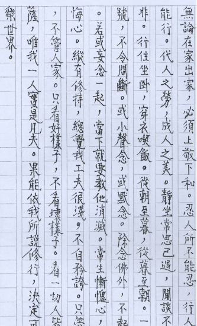

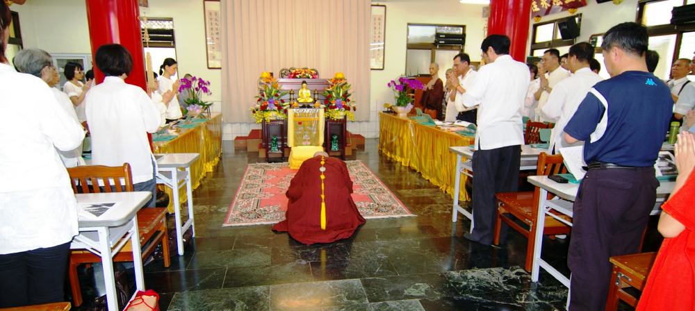

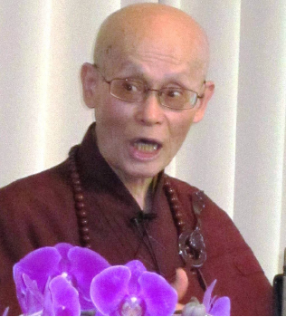

### 廬山一面觀~雪公其為人也（上）

自公老師

道藝大展示傳承

雪廬上溯孔門哲

道不行乘桴浮海

一圓夫子海外夢

民國一百年九月二十六日

前言

因江逸子老師在福州福建博物館〈道藝春秋〉畫展中，將贈送孔門高弟十二尊塑像予博物館永久館藏，當中唯一現代人—雪廬老人赫然在列，是什麼因緣雕塑此像？又是以何內涵將雪廬老人並列於孔門高哲？而此組塑像的贈予與所有畫作的展出，其衷心目的竟是為了將雪廬老人介紹給彼岸的全中國人認識，並藉由此塑像，將全體中華文化道統傳承道出，其中甚深的因緣，於畫展前禮請了自公老師慈悲撥冗，於江老師府上接受採訪，將其中深細的因緣一一道出，自公老師對江老師的道藝創作推崇備至，並有獨特的解讀。學會有幸參與採訪，見證此歷史的盛事，今雪廬老人往生將屆二十七週年，特此刊登採訪全文以饗大眾。（編者）

**問：** 請老師敘述雪廬老人一生的志業。

**答：** 雪廬老人，我們作弟子的稱呼雪廬老人，是根據老人常常自稱雪廬，他老人家號上炳下南，名字我們平常不敢稱呼，通常稱呼他的號。老人家一生的時間都是用來弘揚儒家的學術、弘揚佛法，也就是儒佛並弘，用儒佛兩者的道來教化人世間。

**問：** 請老師敘述雪廬老人的人格風骨。

**答：** 老人家在弘揚儒佛的時候，無論是儒經、佛經，經文裡面講的都是解行並重，解是把經文講解清楚，經文裡面就含著如何修養，就是把經文裡面講學為聖人，學成佛的修行方法說明，隨處不論哪部經典都含有這樣的意思，雪廬老人講解儒經、佛經，當然按照經文所講的，自己親自在這方面修持，這樣他才能將講出來的經文讓學的人得到真正的利益，得到真實的受用。

**問：** 雪廬老人在一九三七年入奉祀官府上班，任職主任秘書五十年，他與孔奉侍官德成先生，其世交亦兄亦弟，於學問上亦師亦友，於公又維持一定的主僕分際，請描述此令人欣羨的相處。

**答：** 雪廬老人到孔奉祀官府，是由於前清到民國時代的莊陔蘭太史他介紹，後來作了奉祀官府的主任秘書，他跟孔上公（雪廬老人所稱呼，也就是孔德成先生），兩位長者可以說是如兄如弟，雖然孔上公年齡比雪廬老人小很多，但是雪廬老人對孔上公非常尊敬，孔上公也不把雪廬老人當作他奉祀官府裡面的主任秘書看待，如果是把他當主任秘書，那就是古時候所說的君臣關係，但是孔上公非常尊敬雪廬老人，沒有君臣關係的觀念，所以兩人相處，亦師亦友、如兄如弟，又是師友的關係，又有兄弟的情分。

**問：** 老人在奉祀官府任職五十年，請問是用何種動機到奉祀官府任職？

**答：** 雪廬老人當初在山東故鄉，跟莊太史還有其他的人士一同修莒縣的縣志（莒縣過去是一個小國家，後來成為山東的一個縣），修完成以後要在山東找工作是很容易的，老人家這種道德學養到那裡都受歡迎，但是他後來接受莊太史的推薦，到孔奉祀官府，因為奉祀官是大成至聖先師孔夫子的嫡傳後裔，是孔聖人的後代，雪廬老人為這個原因到奉祀官府來，直接跟孔老夫子的後裔會合起來，把儒家的學術弘揚出去。

因為儒家的學術，在近代被新學派反對之後，儒學已經脫了節，儒學脫了節對於我們中華文化是不可彌補的損失，老人家為了這個動機，不願意到別處擔任優厚的工作，寧願到奉祀官府來，會合孔上公把孔聖人儒家這門被反對、甚至是脫了節的道統接上去，將它恢復過來。今日之下，只有將儒家學術與道統恢復起來，才能對我們整個中國與全世界的人類產生真正的貢獻。

**問：** 雪廬老人如何成為儒家一脈的傳承者？

**答：** 老人家沒有到奉祀官府來之前，他的道德文章已經有非常豐富的修養，比如說他在莒縣幫助莊太史修莒縣縣志時，那本縣志大部分都是雪廬老人寫的，裡面包括詩文、歷史、藝術鑑定、考據、文章，全方位都有深厚的修養。整體來講，就是展現論語裡面講的「志於道、據於德、依於仁、游於藝」，雪廬老人就是完全研究孔夫子所講的學術系統，尤其是這個游於藝，藝是什麼呢？概略來說就是禮樂射御書數，分開詳細講包括世間一切藝術、文學、科技、百工都包含在內，這些他老人家都是修養有術的，所以一到孔奉祀官府來，他老人家跟孔上公兩人一會合如魚得水。

就是這兩位，一位是孔上公，一位是雪廬老人，孔上公的學術修養直接繼承孔老夫子的一脈相傳，所以孔上公的境界我們也不能完全瞭解。雪廬老人，我學人雖然在他老人家那求學若干年，但是我對雪廬老人和孔上公兩位老人家的境界，只知道一個皮毛而已，兩位的境界都是不可思議，也就是真正的中華文化，都由這兩位會合起來，才能夠真正將中華文化承接上去、承傳下來。因為雪廬老人原本就有這樣的境界，一到奉祀官府兩者非常契合、非常融洽，這兩者都是有他先天的條件，所以就雪廬老人來講，他能夠承傳，一來自己先有那個基礎，再者到奉祀官府，會見了孔上公，更容易收到承傳的責任。

**問：** 請試述雪廬老人的儒佛教化。

**答：** 雪廬老人在大陸上，尤其是在抗戰期間，他老人家隨著孔奉祀官府到了四川，以至於抗戰勝利之後回到南京，在抗戰之前，老人家在山東的故鄉，就是弘揚儒家的學術，在藝術方面，老人家藉著藝術弘揚儒佛這兩者學術，到臺灣來以後，更是一本在大陸上那種弘揚儒佛的學術，尤其眼看近代，特別是在儒家這方面，學術被人們拋棄，佛法雖然沒有像儒家那樣被人拋棄，但是佛法到了末法時代，學的人也學不純粹，而且就末法時代來講，要學佛必得要學淨土宗念佛法門來教化眾生，這是印光祖師非常注重的，雪廬老人就是印光祖師的弟子，印光祖師把任務交給雪廬老人，就是在弘揚佛法的時候，必得要勸告學佛的人學淨土宗念佛法門，印光祖師指示雪廬老人，無論講佛家的哪部經，都要處處指歸到念佛法門。

所以雪廬老人到臺灣來以後，特別在這方面承受印光祖師交代的任務，不但講佛經能夠處處指歸淨土，老人家就算是講儒家的經典，老人家認為儒家的經典超過世間一切的學術，超過世間一切宗教。

只有佛家的經典可以跟儒經平等，儒經可以跟佛經相媲美，因此他老人家認為儒家的經典，如六經都是佛經的普通法門，因此他老人家講儒經的時候，也勸人家瞭解儒經跟佛經是相通的，儒經論語當中有記載，孔子講性相近也，講到志於道的那一章，以及孔夫子的孫子子思作的中庸開頭就講：天命之謂性，雪廬老人講儒家講的性，跟佛家講的真如本性是一個性沒有兩個性，對我們學儒的來講，一方面要瞭解儒經就是佛經，但是他是普通法門的經典，要能夠在這一生得到利益，把我們多生多劫以來的生死問題在這一生解決，那我們研究儒經的時候，也要指歸到淨土念佛法門，就是特別法門，針對這個特別法門，雪廬老人特別寫了個小冊子，叫做《當生成就之佛法》，只有念佛法門這一生才能解決我們在娑婆世界的生死問題，我們往生到極樂世界就能一生成佛，否則修普通法門要三大阿僧祇劫，學儒家成就聖人也是要三大阿僧祇劫。

因此他老人家承受了印光祖師所講的講佛經要處處指歸，老人家更進一步就是講儒經也要處處指歸，所以老人家到臺灣，講儒經、講佛經講到往生為止，他就是本著這個大願，把儒佛的特別法講出來，可以說這是他老人空前的慈悲，這種境界也是我們作學生所測量不到的，也是不可思議。

**問：** 雪廬老人於奉祀官府如何幫助文化的推展？並且教化臺灣人？

**答：** 他老人家到臺灣來，跟孔上公兩位真可以說是如魚得水，水乳交融，所以奉祀官府一遷到臺灣來，雪廬老人就跟孔上公兩位在臺中到處找，找哪裡是可以講經的地方。孔上公的心量是我們不可測量的，他不但是孔夫子的後裔，他知道雪廬老人在臺灣找講經的道場，講儒經也講佛經，孔上公敞開胸懷，跟我們老師兩人一起到處找，開始的時候在中部的靈山寺、法華寺講佛經、儒經，他老人家中醫的醫術可以說非常高明，他一方面講經，一方面藉著他的中醫來替人治病，這些方法都是老人家最特殊的，用這些方法，老人家一到臺中來，配合孔上公，講儒家、佛家的經典。

後來在民國四十年建立了臺中市佛教蓮社此正式、固定的講經道場，隨著臺中市佛教蓮社，然後接著又創建臺中慈光圖書館，接著後來又建立菩提醫院，一開始藉著儒家和佛家的慈善救濟事業，來救濟一般病人，後來擴充了菩提救濟院，最後擴充為菩提仁愛之家，在臺中市南門橋外又創建了慈光育幼院，這都是他老人家一步一步的創建道場。這些道場有的是純粹講經，有的是慈善事業，育幼院就是救濟孤兒，以現在來說是單親家庭的兒童，菩提仁愛之家幫助老年人，在〈禮運大同篇〉所講：「鰥寡孤獨廢疾者皆有所養」，老人家就是實踐孔子在大同篇裡面大同世界的理想，老人家一步一步建立講經道場、慈善救濟事業，使鰥寡孤獨廢疾者皆有所養，這是他幫助奉祀官府一步一步的在實踐儒家的傳道救濟事業，這也是孔老夫子過去所講的：「老者安之，朋友信之，少者懷之」，這是孔夫子的志願，這些志願我們老師到了奉祀官府，以及在臺灣，就一步一步的實現了。

**問：** 請談談在雪廬老人詩文集有關與孔上公的詩文唱和。

**答：** 雪廬老人到了孔奉祀官府，從四川一直到臺灣，跟孔上公來往的和詩中，可以真正看見、感受雪廬老人與孔上公兩位老者，其情分超越了世間兄弟的情分。如果不學道，世間兄弟的情分就是普通兄弟的關係，在家庭裡面是一個父母所生所養，一個父母所生所養的兄弟不過是生命而已，我們學道的人，要知道除了父母給我們生命，還有老師給我們的慧命，就是智慧之命。

這個智慧之命誰有能力給我們？一個是釋迦牟尼佛，宣說經典，教我們能夠明心見性，而孔夫子講的性跟釋迦牟尼佛講的性沒有兩樣，是一個性，孔夫子這種學術，藉著經文讓我們明心見性，讓我們得到慧命，所以孔夫子有能力給我們慧命。而孔上公是孔夫子的後裔，我們老師也是從印光祖師那邊學佛，他老人家自己學儒，早年就有深厚的基礎，和孔上公一會合起來他有能力給我們慧命，他們兩位是慧命的兄弟，超越了世間一般不學道的兄弟，世間普通的兄弟，他的生命雖是父母給的，很寶貴，但是任何人都有死亡的時候，死了以後再到人世間來，怎麼來？一般人不瞭解，只有慧命開發之後解決生死問題，他要到娑婆世界度化眾生，隨時可以來，隨時可以去，生死可以自主，這是慧命的好處。

所以這兩位老人家，他們都是慧命相同，都是從釋迦牟尼佛、從孔夫子那裡來，這兩者不是普通的兄弟，這個兄弟是永恆的，我們從雪廬老人與孔上公來往所和的詩去研究可以想的出來，要點就在此處，給我們的感想也是這樣。今日之下作了老師的學生，也研究儒學，學孔子也是作了孔上公的學生，可以說是私塾的學生，有這樣的感想。除了我們要向兩位老人家學，也要奉勸所有來參觀江老師的畫展，參觀江老師所塑的孔子塑像以及孔子十位大弟子的塑像，以及我們雪廬老人的塑像，從這些塑像當中要去學習孔上公跟雪廬老人，都在慧命上有這樣的成就，要跟這兩位老人家學習一般的人事，我也願各位自己要能夠得到受用，自己想要能夠解決生死問題的話，就要跟這兩位老人家學習，特別是要學習特別法門。

**問：** 雪廬老人在孔奉祀官府任職五十年的主任秘書，孔奉祀官在人事安排上尊重雪廬老人建議，並且安排雪廬老人的學生至奉祀官府上班，並且到九十歲要辭職孔奉祀官不准他辭職，任考試院長也問雪廬老人意見，雪廬老人同意之後孔奉祀官才接任考試院院長，孔奉祀官如何有這樣的眼力、見地與格局，事事對老師如此推尊？

**答：** 普通人講英雄識英雄，我們學道的人來講，聖賢認識聖賢，奉祀官是奉祀官府的長官，在君臣關係中他是君主，雪廬老人在奉祀官府是主任秘書也是幕僚長，是臣子的身分，這兩位老人家將君臣關係放一邊，不提！兩位都是瞭解，都得到慧命，因此彼此認識、相知的最深，因此孔上公不單在奉祀官府什麼事情都要問雪廬老人，後來作了考試院長，有很多重要的事情，甚至於文章筆墨，也要請雪廬老人來幫助，在孔上公看來，不由雪廬老人來用這個筆寫出文章，寫出這些儒家的文字，別人辦不到的啊！

所以一直到後來，我們作學生的發現，孔上公作考試院長時，好多對政府機關下的文告、公文，還有對一般人表達文字思想的文字，都是出於雪廬老人的筆下。因為這個關係，孔上公對於雪廬老人一直祈求他多在世間住世，包括雪廬老人把弟子帶到奉祀官府裡面來，孔上公對於雪廬老人以及雪廬老人帶進到奉祀官府的他的弟子們，都是那樣一體尊敬愛護，一直到雪廬老人九十多歲要辭職了，他感覺不能像年輕那樣繼續擔任下去，因為在孔奉祀官府作些行政事業，還有很多的弘揚儒家學術的事業，他想要辭掉主任秘書的職位，孔上公一再的挽留，為什麼挽留？後來我們才知道，不能讓老人辭職，因為一旦讓他辭職，他就不再住世了。這個我們作學生後來才知道，所以孔上公對雪廬老人瞭解的最深。

相對的講雪廬老人對孔上公也是瞭解最深，最後老人家到世間來弘法利生，弘揚儒佛講緣的，釋迦牟尼佛到世間來度化眾生，也是把有緣的眾生度完了要滅度，所謂滅度就是換一個環境，到另外一個世界再繼續弘法。孔夫子也是，孔夫子到了要離開世間的時候，他早上出門對著泰山講：泰山其頹，哲人其萎，說了這個歌曲，七天之後就離開世間，可見得也是逍遙自在，生死來往自如的。

我們老師也是這樣九十七歲往生，他到人世間來，有緣的眾生都度了，那麼沒有當面教的學生，沒有當面講的佛經、儒經，老師留下講儒經、佛經的講表，他老人家自己作的詩，他老人家親自用筆寫出來的佛學上的疑問，留下佛學問答以及講各種經典的講表，自己的著作，還有特別重要的雪廬詩集，永遠的傳到後來繼續度化眾生，何況老人家願力無窮，他老人家到極樂世界，不過暫時安養，一段時期他一定再回到娑婆世界，再回到我們這個國家，繼續弘揚。

**問：** 雪廬老人九十歲就開始要辭主任秘書，可是孔上公都不答應，他有這樣的眼力要留住這樣的聖人，一直到九十五歲，雪廬老人跪著請辭，跟孔上公抱頭痛哭，老一輩他們這種交往，這種溫厚的情懷是我們很難想像的。孔上公答應老人辭主任秘書，以顧問的方式繼續在孔奉祀官府指導，但是要找新的主任秘書之前，先請江逸子老師暫代主任秘書，這裡面含有什麼樣的意義？

**答：** 兩位老人都瞭解，孔上公也瞭解雪廬老人一旦辭掉奉祀官府主任秘書的話，他一定就是要往生了，為了挽留老人家在世間多住一段時間，他就不讓雪廬老人辭，到最後不得已，無論佛家或者儒家的學說都是講緣，緣到了只好辭，一直的辭，孔上公就知道不會很久了，老人家一定是要往生，孔上公很慈悲，兩人抱頭痛哭，當時江老師逸子兄在現場，這個畫面可以說，不管是學道的人，不學道的人，見到這樣畫面的，都是感動到不能不流淚啊！

當時孔上公是慈悲，言老人要辭的話，就請江老師暫代主任秘書，他為何不叫別人而叫江逸子代？江老師跟雪廬老人學習多年，學經、學詩、學文，特別是追隨雪廬老人學道多年，在開發慧命、道行這一方面跟雪廬老人學，孔門弟子跟夫子學，步亦步趨亦趨，江逸子江老師跟雪廬老人學，也是亦步亦趨的學，學的非常實在，因為這個關係，孔上公就請逸子先生來代主任秘書，能夠把雪廬老人的這種志願繼續下來，今天我們看江老師的畫展，看他的畫、他的塑像就能體驗出來，孔上公真正是認識人，所以那一幕不單在現場，就是到後來講了這個事情，沒有人不感動！

**問：** 在雪廬老人的大殮上，孔上公對老人三跪九叩，他的夫人跟兒子都上前跪拜，對老人給予最高的敬意，請問老師，孔上公給雪廬老人的評價為何？

**答：** 孔上公給雪廬老人的評價可以說是多得很，也不許可有很多時間把它說出來，最重要的雪廬老人往生之後，孔上公有一副對聯「道倡倫常道，心為菩提心。」雪廬老人弘揚儒，儒家經典就是道，注重在倫常，儒家的經典用五倫來修行，就是倡倫常道。心為菩提心，老人家的心就是菩提心，就是佛家來說發菩提心，菩提是覺悟啊，佛就是大覺，那些大菩薩就叫覺有情，心為菩提心，他讚歎雪廬老人的心就是釋迦牟尼佛說的大覺之心，儒家也是講覺悟，孔子叫他的弟子作君子儒，君子儒就是要明瞭心性。

所以這兩句對聯文，一個是孔上公對於雪廬老人在儒家的解行，解釋儒家經典，教人家修行倫常，都包含在內了，常和倡兩個字是畫龍點睛，因為從現代新學派來講，既放棄了儒經，毀謗儒經，也毀了五倫的道統，不講倫常。他老人家這時候來提倡常道，五倫常，常是永恆的，五倫的道統不單在過去、在現在、在未來，都是永恆的價值，教學生，你要從五倫學永恆的大道，這就是常。

心為菩提心，心就是菩提心，老師的菩提心早就得到了，早就發了菩提心，孔上公瞭解雪廬老人他講佛經教化學佛的人必得要發菩提心，心為菩提心，就是將來要教所有人發菩提心，學佛而不知發菩提心，是不能入門的，這兩個對聯的文字是孔上公對於我們老師雪廬老人無上的評價，說是評價也好，說是對雪廬老人境界最深的瞭解，也就是對雪廬老人最高的期待，期待他老人家留著這個法，繼續在人世間弘揚出去。

**問：** 雪廬老人與當今儒學泰斗屈萬里先生有何差別？

**答：** 屈萬里先生原來是在奉祀官府，他是陪伴孔上公，在奉祀官府裡面是一個貴賓的身分，他在奉祀官府跟我們老師雪廬老人也是交情最好，屈萬里做到中央研究院的院士，也在臺大教過書，但是在四川，他們兩位老人家交情也是非常深厚，到了臺灣來，雪廬詩集裡面有，當初雪廬老人把奉祀官府遷到臺中來的時候，奉祀官府是直屬總統府的單位，剛剛到臺灣來的時候，一切都很亂，那個時候公家的薪水還沒到，雪廬老人連同奉祀官府的人員，就像孔子在陳絕糧是一樣的，我們老師來到臺灣來的當時，沒有糧食，我們老師性格不向外面求，他寧願在奉祀官府，在自己家裡飢餓就飢餓，這個事情被屈萬里先生知道了，屈萬里先生到臺灣來的時候，他先得了公家的薪俸，他一聽到這個消息，馬上送米到奉祀官府來供養我們老師，當然屈萬里先生剛來的時候也是一樣，公家薪水也沒有接上，他過了一段時間才接上，比我們老師早一點，早一點是早一點，他剛剛拿到的公家薪俸也不多，就把他的薪俸提前就送到我們老師這邊來，可見他們兩個交情非常深厚。

屈萬里先生跟我們雪廬老人有些不同的，老師在詩裡面稱他屈翼鵬，我們中國古人取字跟名字都是相關的，萬里，萬里大鵬，大鵬能飛到萬里，牠是靠著兩個翅膀，兩個翅膀就是翼，他的號就是翼鵬，老師在詩裡面稱呼萬里先生為翼鵬，翼鵬先生學術跟我們老師有點分別，我們老師全方位儒家的、佛家的，就儒家來講，漢學派、宋學派我們老師全部都研究，那麼屈萬里先生他在作學問上跟我們老師不太相同。就拿易經來講，易經裡面有漢注的，漢注裡面有象數派等，後來到王弼那個時候，他認為象數派太複雜，學起來很難，他要掃除這個象，王弼是掃象的，屈翼鵬屈萬里先生他也是掃象這一派的，換句話講，我們說一句不大恭維的話，屈先生有門戶的，我們老師沒有門戶，有這一不同。（下期待續）

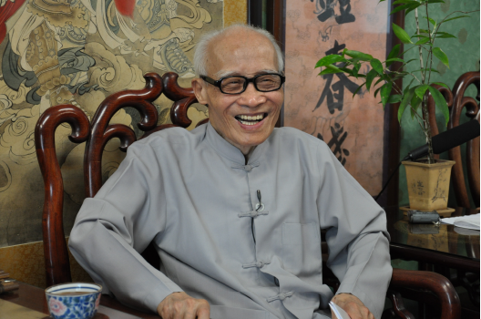

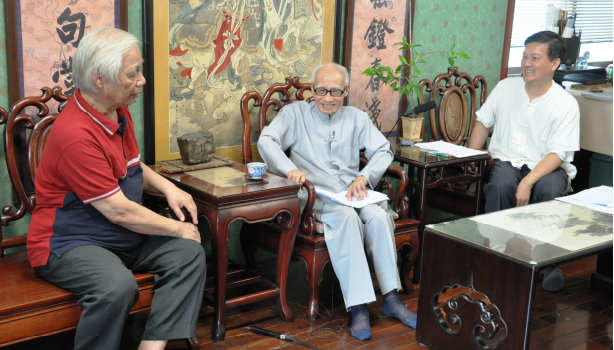

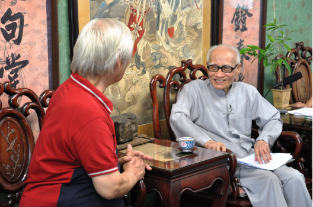

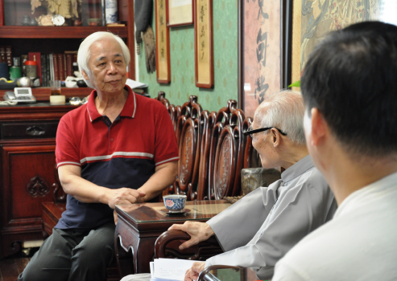

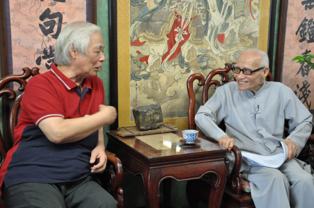

## 共修研學

### 小止觀導覽（五十六）

*心爾、智高整理*

一念不生非無念

二我不生無所滅

輪迴道中得解脫

世間顯現似泡影

第七章 善根發

論文：

四、因緣觀善根發相：

此處特別講十二因緣，我們一般說：多癡眾生因緣觀，就是說愚癡心很重的人，要用因緣觀去破癡。

論文：

行者因修止觀故，若得欲界未到地，身心靜定，忽然覺悟心生。

此處所言的「欲界未到定」指的就是色界的初禪近分，此是得到三昧的第一步。「忽然」不是指本來一點修為都沒有，後來突然覺悟，應該說之前是比量推比顯現，而現在是現量真實顯現。

論文：

推尋三世無明、行等諸因緣中，不見人我，即離斷常，破諸執見，得定安隱，解慧開發，心生法喜，不念世間之事。

十二因緣的觀修裡，從流轉門引發的是出離心，眾生都是因無明而行、而識、而名色…而至老死憂悲苦惱，故知吾人所受的種種憂悲苦惱，皆由前一因緣而來，如老死憂悲苦惱由生而來、生從有來，一直往前推至無明，此時再去觀察甚麼是無明？如何生成的？原來無明即是人我執及法我執，若破除了我法二執就沒有了無明，沒有無明哪有有漏行（業）？沒有行哪有入胎之識？故沒有生哪有老死憂悲苦惱呢？十二因緣的認知是重要的修學法，認知生起與對治，方知輪迴的現象與解脫。

一、無明：

行相為二，一是撥無因果，謂之業果愚，此為最大邪見，將有情引入三途受苦。二是執法有自性（相），謂之真實義（空性）愚，此二種無明行相是煩惱的生起處，若不對治此二種顛倒見，則無法根除煩惱。

二、行：

因著無明，而有愛我之思維，引發身口意之造作皆屬之，於身業有三支（殺、盜、婬）、口業有四支（妄語、惡口、兩舌、綺語）及意業三支（貪、瞋、癡）。

三、識：

是指投胎的心識，因為有思惟以及身口意造作，才有投胎的心念，此之心念是由串習之習氣影響而來。

四、名色：

即投胎的心識結合父精母血成胚團的狀態。此時即有生理現象（色）及心理現象的產生（名），但作用不明顯，故云名色。此階位包含第一剎那的和合，及在母胎中經過了五個七天時間，受養生起五淨色根。

五、六處（六入）：

在母胎五個七天之後，至三十八個七天，亦即九個月零四天之時六根（浮塵根）就具足了。

六、觸：

小孩一出生即有觸的功能，觸是根、塵、識三和合而生，觀待識的生起就有觸。但其實在母胎內之時即有觸了，只是二三歲之時觸的顯現比較明顯。

七、受：

觸而有受，觸境的時候會有苦、樂、捨的感受，這苦、樂、捨的感受是識所生起的感受，離開識以外無有苦、樂、捨。所以在識生起之時即有「觸」及「受」，或有特別說在六、七歲以後，對於事物感受較之前強烈的那一分說受。

八、愛：

有受才能生愛，一般而言，受苦之時即生「乖離愛」；受樂之時即生「不離愛」，但要更進一步來說，「愛」也要觀待無明才能生。而在《俱舍論》特別指的是十四、十五歲以後「受」的感覺更為強烈的狀態。

九、取：

取是愛之增上，是非得到不可的心。此心會引導我們成熟來世的業力（有）。「取」有四面相的觀察：（一）欲取：是指對於可樂境的欲取行相，對世俗的快樂，產生決定的追逐，欲取是指那一分非得不可的心。（二）見取：由見之引導而執取，如非樂果計樂果而執取。（三）戒禁取：非樂因計為樂因而執取。如受狗戒、牛戒等，以為是解脫之因，此為無益苦行，即使持得圓滿也與畜生道相應。（四）我語取：在名言上取法有自相，此為四取中最根本之取，由此取（我見）生起前三取。

十、有：

愛取之有即是投生下一世的業成熟了，取來生的心識生起了（有了）。

十一、生：

有了心識以後，就會投胎受報，在胎卵濕化四生之中結生。

十二、老死：

投生的第二剎那即是老，何以老死合為一支？或有投胎的第二剎就死亡，所以老死歸在一支。

能在諸因緣中，不見人我，應知是無明的正對治。以十二因緣為所緣，修學流轉門生起出離心，修學還滅門得解脫，亦即破除了人我執及法我執，以不見人我、法我的自相而說不見人法，以不見的方式而破執，由此而於輪迴中得解脫。

論文：

乃至五陰、十二處、十八界中分別亦如是。是為因緣觀善根發相。

由人我的自相空，推知五陰、十二處、十八界自相皆空，沒有一法例外，是為因緣觀善根發相。

觀察十二因緣的流轉方生起真正的出離心，對輪迴生起真實的厭離。並以空性的智慧對治二種我執，得到出離，才是真正的修學。 （下期待續）

## 專題研學

### 聖者的祕密～大佛頂首楞嚴經二十五圓通暨七處徵心探源

### 二十五圓通暨七處徵心簡介　（二十五）空藏空大

時哉

往昔善業空憑攝

今生由空取大福

化作利生廣大事

淨除眾生業繫苦

寅五、空藏空大

卯一、作禮陳白

經文：

虛空藏菩薩即從座起。頂禮佛足，而白佛言：

卯二、陳白之言

辰一、標同佛證

同佛般現證二諦，待因緣示現八相成道。

經文：

我與如來，定光佛所，得無邊身。

如來是釋迦佛，定光佛所是燃燈佛。虛空藏菩薩與釋迦佛於燃燈佛時證得無邊身。在勝義上的無邊身是現證空性時，所緣的空性無量無邊，稱為無邊身；在世俗上隨個人願力可以化身無數利樂有情，亦稱無邊身。

虛空藏菩薩在釋迦佛主持的楞嚴法會上，報告所證的空大圓通。首述他與釋迦佛同在燃燈佛時現證無邊身，直至現在二人仍互相扶持，可見善因緣是要不斷地結下去，不能小看眼前任何小善緣，今生大眾同於佛前發願且共學，如此的善緣是要被珍惜的。在世法上親屬與家人緣分最深，所以才會成為一家人，行菩薩道時，這些親人一起在團體裡共學，未來才有可能在菩薩道上變成助伴。

若不善巧將親人變成學佛的眷屬，或是無法讓他們產生對佛法的好感，在平常易成我人修學上的障礙，臨命終或變成障緣。

釋迦佛在發心修學之後，歷經三大阿僧祇劫成佛，第一大阿僧祇劫，首先是從古釋迦佛座下發心成佛，直到尸棄佛，共值遇七萬五千佛，為初阿祇劫，共親近了七萬六千佛，證得三賢位。第二大阿僧祇劫是從親近尸棄佛始，直至燃燈佛，共親近了七萬六千佛，證得第八地無生法忍。第三大阿僧祇劫則從值遇定光佛直至毗婆尸佛，親近供養了七萬七千佛，證得十地。

之後百劫之中不斷親近供養諸佛直至迦葉佛時，經過了百劫而後成佛，即一般所謂：三祇修福慧，百劫修相好。

虛空藏菩薩宿世以來，都為佛之同儕，在定光佛座下，與釋迦佛一樣得到無生法忍的成就，他如何表達他現證空性的成就呢？

辰二、詳明神力

巳一、空色無礙

午一、會色歸空

經文：

爾時手執四大寶珠，照明十方微塵佛剎，化成虛空。

四大寶珠是表徵慈悲喜捨，一粒塵代表一個佛土，佛土的數目多如微塵，虛空藏菩薩心量廣大照見十方微塵佛剎，這些佛土眾生都是菩薩所要度化的對象，為了眾生發菩提心，亦即為了眾生去成佛。

此時以空性智慧攝持四無量心，遍緣十方微塵佛國土，皆自相空。

十方佛國土都是因緣所生，為心所安立，在境界上不能自己成立。若在境界上自己成立為佛國土，則未造淨業的眾生也能生佛國土來受用，然事實不如此。有人以為西方極樂世界與天堂一樣，實則內涵相差如天地，然無法通達其中之差別，在於不認識這二者之名言。在世俗上貪圖享樂的人也不認為淨土是快樂的。例如有人認為平安清淡就是福，可是有人卻生不起平淡正常是福報，福報也必須觀待心識對平淡、正常是福報的認知，才能生起平淡、正常是福報，要生起這樣的決定見，必須要多讀書。

微塵的佛剎化成虛空，就是現證十方佛國土的佛剎是自相了不可得，此是會色歸空。

午二、融空即色

經文：

又於自心現大圓鏡。內放十種微妙寶光，流灌十方，盡虛空際。

現大圓鏡若就唯識宗而言是將第八識轉識成智為大圓鏡智。就中觀宗而言，空性的智慧與第六識相應，能善觀世間甚深緣起為妙觀察智，並在緣起法中同時證得其自體性空，謂之平等性智；二者（妙觀察智與平等性智）之德相，謂之大圓鏡智，與前五識相應成辦世間的事業，謂之成所作智。

內放十種微妙寶光，是由空性智慧隨順世俗緣起，照見盡虛空際十法界差別相，謂之流灌十方，盡虛空際。

巳二、依正無礙

依報是環境，正報是身心，正報與依報二者皆無障礙，如何云無障礙？下分為二部分：

午一、攝剎入身

剎就是佛國土，將佛國土攝入自己的身體，試問如何攝入？

經文：

諸幢王剎來入鏡內，涉入我身。身同虛空，不相妨礙。

諸幢王剎就是無量無邊的佛國土，這些佛國土來入鏡內，亦即成為虛空藏菩薩智慧的所緣境，如同千里以外的人，你通達他的內涵，他就入了你的心，他被你的心所認知。

涉入我身指的是法身，此身如虛空，法身成為能攝，諸幢王剎是所攝，二者不相妨礙。

午二、分身入剎

色身能示無量無邊的分身入佛國土，普賢菩薩的禮佛偈頌：「能禮所禮性空寂，感應道交難思議，我此道場如帝珠，十方如來影現中，」此為攝剎入身。「我身影現如來前」，此為分身入塵剎（十方佛國土），禮拜諸佛國土中，此亦是虛空藏的修學法，「頭面接足歸命禮」。虛空藏菩薩的修學法，就是普賢行。

經文：

身能善入微塵國土。廣行佛事，得大隨順。

其次，菩薩能以願力攝持威神力分身入剎，謂之身能善入微塵國土。有情眾生都是惡入、業力入，被業所繫縛而入輪迴。如微塵的佛國土，虛空藏菩薩都能以願力善巧方便而入。

廣行佛事包括助念、放生、齋僧，但是此廣行佛事特指說法事業，所以說法之說，乃悅所懷也。能說為佛說法，說法是佛最歡喜的事，所以佛說就是佛悅，因為有說法的因緣，能令聞法者得解脫的受用。

得大隨順，所隨順為何者？是隨順佛菩薩呢？還是隨順自己呢？實則隨順空（法）性。每一法的造作都是為了利益有情，並隨順空性而作觀修，亦即造作每一法都作三輪體空的觀修，例如布施是三輪體空的布施，持戒是三輪體空的持戒，忍辱是三輪體空的忍辱等等，一切菩薩行皆由三輪體空的智慧所攝持。

觀經妙宗鈔有云，菩薩隨順法性，勝過世間孝子孝順父母親，也就是菩薩永遠不會違背法性，就如世間孝子即使是做夢也不會與他的父母親吵架、頂嘴，菩薩在隨順法性時，比世間的孝子更隨順，打從內心絕對不違背法性。

虛空藏菩薩無論是攝剎入身或是分身入剎，皆是空色無礙、依正無礙。在菩薩戒正論中有引，彼菩薩是行者懺悔破戒非常殊勝的所緣。這也是虛空藏菩薩證悟空性在後得位時，能會色歸空，融空即色，攝剎入身，分身入剎，身與境相融，生起對有情如此殊勝之攝受。

辰三、總由觀空

一切世間成就都是觀空來的，觀空才有解脫與成佛之成就，所以學佛最重要的旨趣就是空性的觀察。

經文：

此大神力。由我諦觀四大無依。妄想生滅。虛空無二。佛國本同。於同發明，得無生忍。

虛空藏菩薩之大神力如前述，能會色歸空，融空即色，攝剎入身，分身入剎。於大神力生起中，生起對四大真實觀察，這些觀察能力皆是由善知識教導而得。

四大何以無依？地自相不可得，觀待水火風才有地，水自相不可得，觀待地火風才有水，如水大所顯現的雖然是水，但是屬於乘載的部分是地，流動的部分屬於風，溫度的部分屬於火。

風大中乘載的部分屬於地大（如樹葉受空氣浮力在天空飄），風的流動屬於風大，溫度屬於火大，濕潤性屬於水大，亦觀待能感受的前五識方能生起。觀待能感的心才有所感的境，沒有所感的境界亦沒有能感的心識，所感不能自體成立，能感亦自體不可得。

妄想生滅，虛空無二：妄想生滅就是觀待世俗心識有四大的生滅，自體如同虛空了不可得，即使虛空也與地水火風四大一樣都是自相空，皆為無二，稱為空大圓通。

虛空的自相亦（體）空，如何是自相空？虛空一法可以是有為法，可以是無為法。若是有為法其空義是生、異、滅。例如眼識所緣虛空可以有多少變化，若一房間的虛空，放上了東西，則虛空變少，此二者的定義不一樣，東西移走後虛空變多。若虛空說是無為，其空義是不被質礙，此非眼識所緣，乃分別心識所證，例如東西塞滿了空間，眼識所緣已無虛空，然心識了知虛空從未減少，不被質礙。無為法是不經造作所顯，非造作所成之法，所以不會有生異滅。

虛空如果顯現為有為法是自相空，實體所成的有為法尚且自相空，非實體所成的無為法更是自相空。如果虛空為一實法，何以顯現的虛空有各個差別面相？能分為虛空的東方，虛空的西方？八方合集的虛空是名言安立的基礎，如茶杯是由各個組合，而成為名言安立的基礎，安立名言顯現為茶杯，尋求其自體性則一粒微塵亦不可得。東方的太陽生起時，西方的太陽也應生起，現見不然，可見有不同差別相。

各個佛國皆同，此同乃同在自相空，與虛空的自相空是一樣的道理。

通達佛國土自相如虛空之理得到無生忍，若虛空為一實法，則此之法界至少八地以上，於一切法得其自在。

卯三、結答圓通

經文：

佛問圓通。我以觀察虛空無邊，入三摩地。妙力圓明。斯為第一。

此處妙力是指通達四大與虛空空性的智慧，並通達一切法皆如是，謂之圓明，此乃虛空藏菩薩之成就，稱為第一，表示此空大圓通是虛空藏菩薩最契機之修學法。（下期待續）

## 專題報導

### 大時代的文化貢獻~道藝春秋展的饗宴　江逸子國畫塑像作品展側記

王興文

臺灣福地所莊嚴

文化道統能莊嚴

今藉兩岸交流情

道藝大展殊勝起

親訪作者談畫作

國畫大師江逸子先生受福建省政府之邀，於二○一一年十二月二十八日在福建博物院主辦之「道藝春秋」作品展，為期兩個月。根據前福建省美協主席陳一峰先生的說法，他早在二十年前遇到江先生時，就深受他的畫作所吸引，一心想為他籌辦畫展介紹給福州鄉親們認識，只可惜機緣不足無法如願，遲至今日總算盼到了，可見此次作品展得來不易。以江先生一介平民，淡泊於名利之外，隱身於人海之中，默默耕耘五十餘年，堅守在中華傳統文化藝術的道路上，若非其深厚的德學修養與人格感召，以及在文化藝術上的卓越成就，絕無可能於此時成就此一大事因緣。

江先生一向以弘揚中華傳統文化與道德為畢生職志，深感文化衰微與人才凋零，因此常以論語等中華文化典籍為教材，寓教於畫，以藝載道，期能興教化，助人倫，啟發人心向善，促進社會安定。近年來曾陸續在台北市國父紀念館、中正紀念堂以及台中市文化中心等地，應邀舉辦多次的道藝春秋展，極獲好評，尤其配合來自台北故宮博物院唐先生的精彩現場導覽，把江先生作品的內涵與意境，發揮的淋漓盡致，更使人大開眼界耳目一新，久久無法忘懷。江先生常戲稱自己是「有色」，稱唐老師為「有聲」，對後進的提攜與鼓勵不遺餘力，此次作品展堪稱「有聲有色，唱作俱佳」，為畫展樹立了新的標竿。後學有幸參與此次作品展的部分過程，今略述於後，以記其盛。

唐先生曾任職於台北故宮博物院近三十年，熱愛文化藝術，博學多聞，師承雪廬老人，以繼承師志弘揚中華文化為己任，並成立中華無盡燈文化學會於台北，展開弘法、教學與培養人才之重任。當他獲知江先生將遠赴福州參展之事，即義不容辭率領學會師生全力投入，並於二０一一年十二月初，親率四位師生直赴福州展開六天的文化之旅，宣達江先生的「道藝春秋」作品展。

福建少兒圖書館

福建少兒圖書館

福建福海文教基金會

福州晉安區第五中心小學

福建農職學校

福州第十五中學

透過福州孔學會秘書長孔海欽老師的安排，參訪交流之對象，有以家長和兒童為主的福建少兒圖書館，談「兩岸文化優質與差異」；有以文化界與企業界人士為主的福建福海文教基金會，舉辦「海峽兩岸文化座談」及「商道—中國企業家的精神」；有以學校師生為主的福建華南女子學院、福州晉安區第五中心小學、福州第十五中學、福建農職學院等開設「從志向看出路—見賢思齊」、「人才的搖籃」、「藝術賞析—揮灑自如的山水花鳥世界」等主題課程；最後則是對主辦單位福建博物院的專業人員及各界來賓作「道藝春秋」展前簡介；整個參訪交流過程引起很大的迴響，令人印象深刻。其中最大的感動是來自大眾學習的熱情，一份對中華傳統文化的嚮往與希求，這在台灣已久不復見，很高興從對岸與會者的身上見到這樣的訊息，讓人不覺對文化的未來又燃起了一片希望。

江先生此次參展的作品中，最值得一提的就是孔子與孔門高弟十二尊銅像，塑像高如真人，以坐姿呈現，除雪廬老人外，其他全是江先生根據論語記載，對每個人物特質了然於胸，融合他對敦煌彩繪以及魏晉至唐的造像觀察，加上對西方羅丹雕塑作品極富思維的感動，以及他精湛高超的藝術技巧，創作而成。人物造像栩栩如生，人格特質充分顯現，只要稍對論語熟悉者，一望便知，如同舊識，身處其中備感溫馨，令人流連忘返，忘其所以。

福建博物院

雪廬老人是江先生的恩師，江先生十六歲時便親近老人，以詩詞經學入門，追隨老人終身。雪廬老人，即一代大儒李炳南老教授，山東濟南人，生於清光緒十六年，卒於一九八六年台灣台中，享年九十七歲。雪廬老人於一九三七年應聘於山東曲阜「大成至聖先師奉祀官府」任主任秘書，直至九十五歲高齡堅辭為止。

在長達五十年的黃金歲月中，從大陸到台灣，橫跨兩岸，輔佐孔子第七十七代奉祀官孔上公德成先生，致力於孔府文獻的保存、整理與弘揚，鞠躬盡瘁，對中華文化的維護、傳承與發揚，貢獻厥偉。江先生特地將雪廬老人塑像置於孔門高弟之後，除了用以表彰師恩外，最主要的就是要彰顯文化傳承的重要。雪廬老人與孔奉祀官將中華文化完整的帶到台灣並流傳下來，今由其弟子以「以藝載道」等種種方式，將文化完整的傳回大陸，象徵著文化道統的薪火相傳，綿延不絕。而開幕式上，我方與會貴賓孔子第七十九代奉祀官孔垂長先生，代表贈送這十二尊銅像與福建博物院，於展期結束後留在院中永久保藏，更別具意義。

展出期間，唐老師曾特地停留展場數日兼當義務導覽。一如以往，參觀群眾在唐老師的精彩解說下，頓時都眼界大開，隨著作品的變化而進入不同的時空，整個展場頓時成了文化、歷史、藝術的教育殿堂，彷彿置身於整個中華文化的搖籃中，令人歎為觀止。文化的力量竟然如此偉大，藝術的功能竟是如此奇妙，超越時空，把世人緊緊的凝聚在一起，沒有衝突與隔閡，只有感激與關懷。後學心中暗想，也許這才是文化藝術的真正價值所在，也正是許多仁人志士終身無悔努力追求的目標所在。無奈世人多不見此，致使文藝蒙塵，明珠失色，殊為可惜！

萬法因緣生，本次作品展的成功展出，首應歸功於福建省政府外事辦宋克寧主任的慧眼識英雄，由於他本人文藝造詣極高，於無意間見到江先生的畫冊後，經多方驗證，於二○一一年六月發起舉辦畫展的提議，得到江先生的首肯，以及福建博物院吳志躍院長的鼎力相助，把原訂展出齊白石畫展的黃金檔期，二○一一年十二月二十八日至二○一二年二月二十八日，優先免費讓給江先生使用，並提供全程專業服務，是此次展出的大功臣。

而福州孔學會秘書長孔海欽先生，孔子第七十五代後裔，於福州各地弘揚孔學多年，成就非凡，也為本次的作品展大力奔走宣揚，居功厥偉。中華無盡燈文化學會在本次作品展中，扮演了舉足輕重的角色，尤其是唐老師的無私奉獻更居關鍵地位。此次展出不僅增進了兩岸的互動與了解，加強了兩岸文化交流的信心，更提升了文化藝術導覽的內涵與風氣，促進了大眾對中華傳統文化的重視與學習熱情，相信對兩岸日後之文化、教育、藝術的互動與發展，乃至社會的和諧與人心的安定，都會有正面積極的作用。

以上謹就此次參展見聞，記憶所及，順手帶過，疏漏之處，在所難免，尚祈海涵。

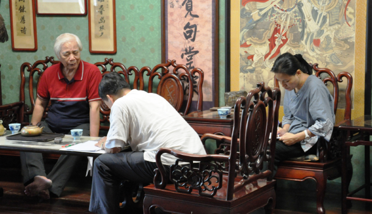

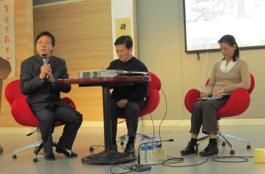

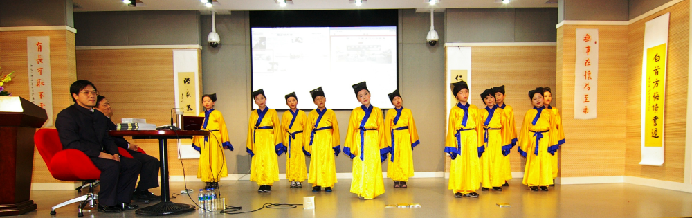

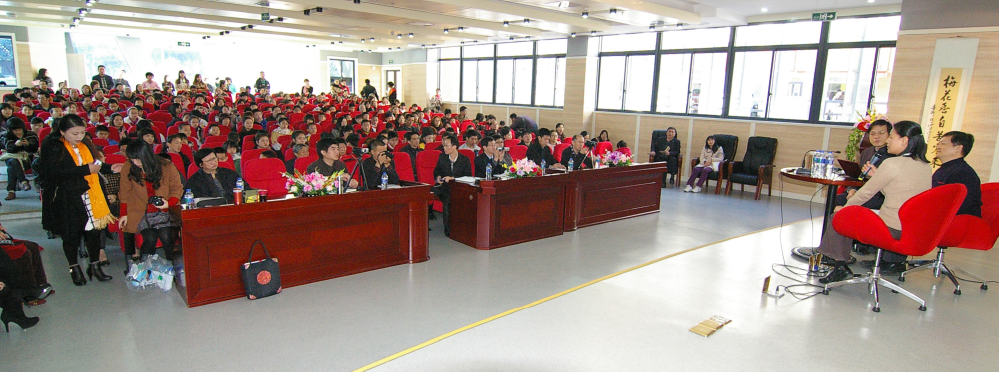

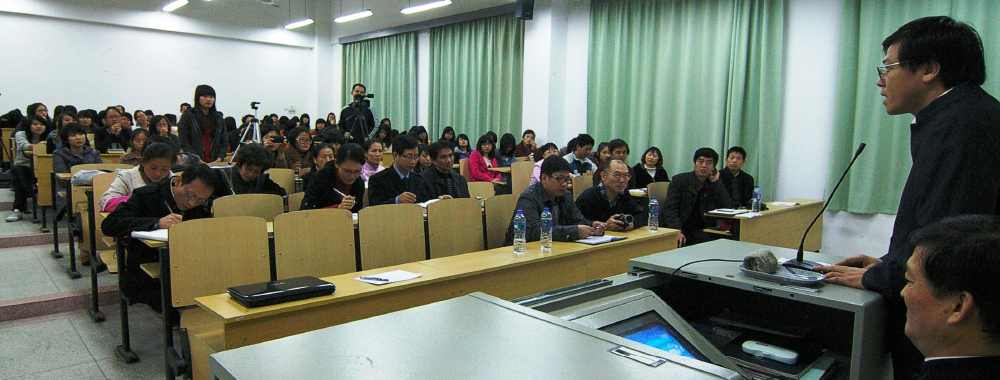

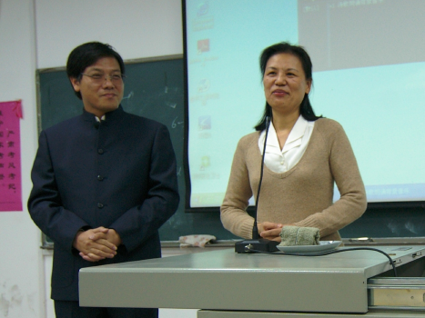

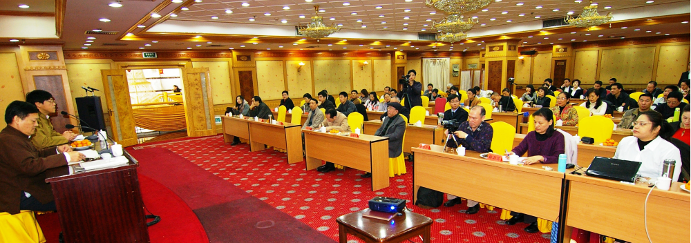

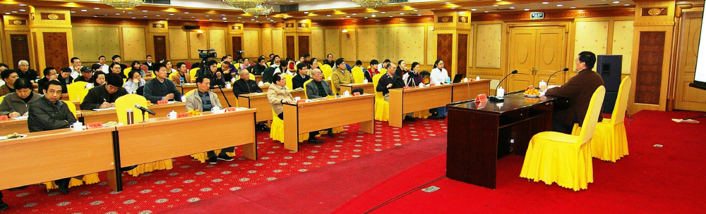

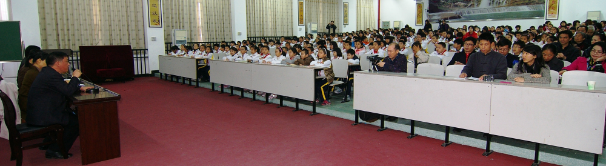

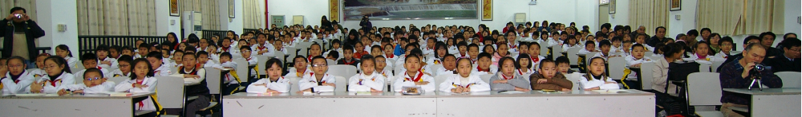

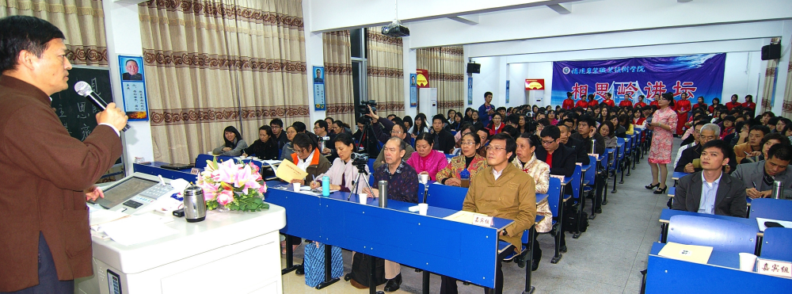

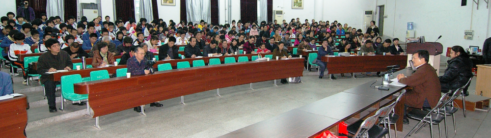

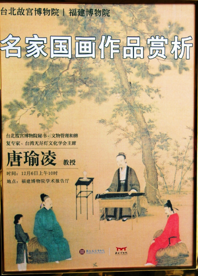

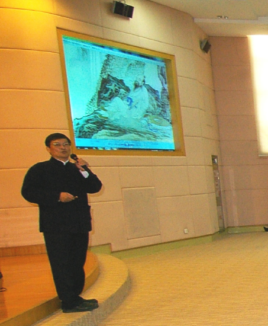

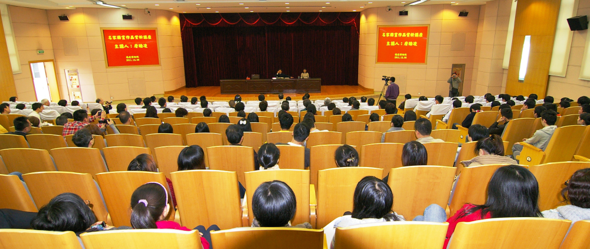

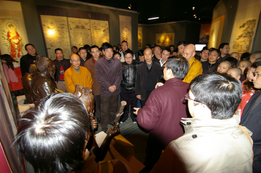

### 大時代的文化貢獻~道藝春秋展的饗宴　江逸子國畫塑像作品展開幕致詞

*編輯部整理*

細數傳承明心境

不負古今證作品

開幕風光文化現

道統攝持兩岸情

博物院介紹詞

江逸子先生名錦祥，字逸子，一九三八年出生於福州閩侯縣南通鎮江厝村。受家庭薰陶及鄉賢潘觀松先生的文化啟蒙，少小便得以親近國學精髓。十一歲隨父親赴台後又得到呂佛庭、楊溯吾、李雪廬等名師於國畫、經學、詩文方面的調教，「得天獨厚開盈尺，與月同圓到十分」，博大精深、源遠流長的中華文化讓他心智頓開。

成年步入丹青世界後，他心癡筆墨、情繫六法，潛心研習、融會貫通，上宗五代兩宋，近承張大千、溥心畬、于右任等名家，歷數十載風霜教誨和文化浸淫，逐漸形成了獨有的藝術理念與創作風格，實至名歸，名揚台灣畫壇。江逸子先生十分注重文化與丹青的統一、融合：從文化中汲取筆墨態勢，用顏料去描繪文化精髓。此中情懷，先生積澱久矣。七十餘年來， 先生始終推崇中國傳統文化。他崇尚孔子，潛心佛法，把仁愛的儒家思想與普渡的釋者情懷匯聚筆端，「不負古人」以虔誠研習，「不負今人」於探索創新。

溯源牽鄉，江先生始終不忘桑梓摯愛，慷慨為福建建甌孔廟敬獻孔子及其高足之十二尊銅塑，足見其思鄉之情。

此次他專程返回故鄉，應邀在福建博物院也是首次在大陸地區舉辦《道藝春秋》江逸子七十回顧展，向父老鄉親、向海西各界人士展出山水、花鳥、人物畫以及雕塑等作品百餘件，並由主辦單位匯選其精品，予以再版。這，是家鄉對先生的欽佩和敬重，也是先生為家鄉文化事業獻出的厚禮。

總覽作品，或神采飛揚，或含蓄雋永，或寫意春秋，或大氣磅礡，幅幅件件，足見先生深厚功力；情厚愛深，先生揮灑丹青處，念念不忘以藝術作為弘道布施，從而供養一切法界眾生，仔細品味，可窺靈魂。

相信，江先生《道藝春秋》在海西的展出與作品集的出版，將進一步加強閩台文化交流，促進海峽兩岸對中國傳統藝術的傳承、研究與發展。

開幕式會場高朋滿座

嘉賓如潮

剪綵儀式揭開畫展序幕

江逸子老師致詞

鄉親早上好，學人非常興奮，第一次回到家鄉辦這個展覽。記得六十年前離開，回來時已經是個垂垂老矣的老人。當初離開家鄉，一直念念不忘，要好好學藝把自己學得有一點成就，帶回來給鄉親父老同鄉。這次非常榮幸，能夠受到福建最高的藝術學府省博物院的邀請辦這次展覽，這是我終生莫大的榮幸。

再者，很感激博物院等長官，不遺餘力的支持這個展覽，尤其感激宋主任在兩岸之間奔波來促成這次畫展。再則今天開幕式有勞國內外的鄉親好友來此共襄盛舉，來給我捧場，也給我很大指教，我在這裡非常感激。

今天早上，起床的時候頗有感觸，想到自己作的一首詩「丹青橐筆老山林，七十猶存少壯心。萬里江山萬里夢，百年風雨百年聲。」中國畫叫丹青，我這一生少問世事，一心從事丹青創作，臨老如入山林。雖然今年已過七十歲，卻還懷著一點少壯的心態。離開家鄉，在心境上好像隔了幾萬里路，但是夢始終沒有剪斷過。百年的人生我已經過了七十歲，七十望八，這百年中的風風雨雨，百年當中的心境，全負託在筆墨之間。

此次道藝人生國畫及塑像展，希望各位鄉親各位賢達多多指教，我不善講話，就以最真誠的心向各位鄉親向各位長官來致敬。

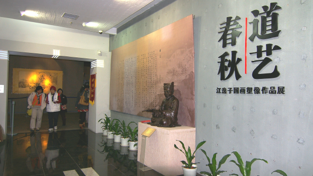

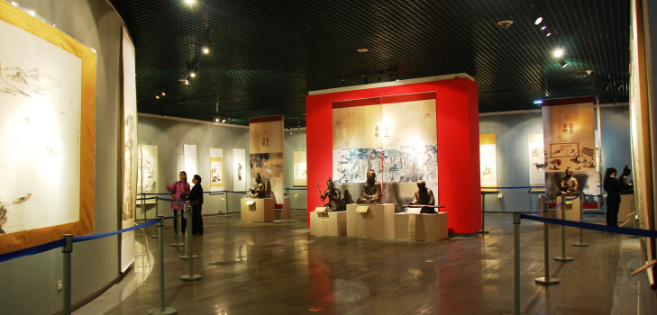

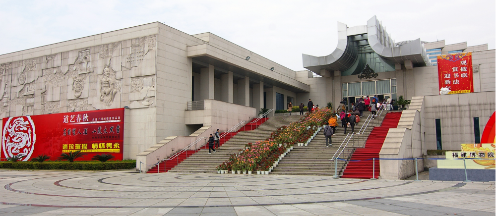

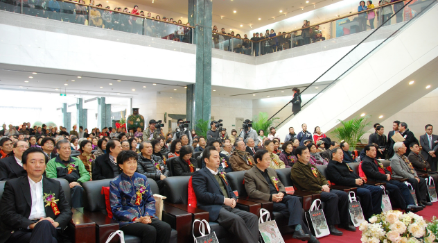

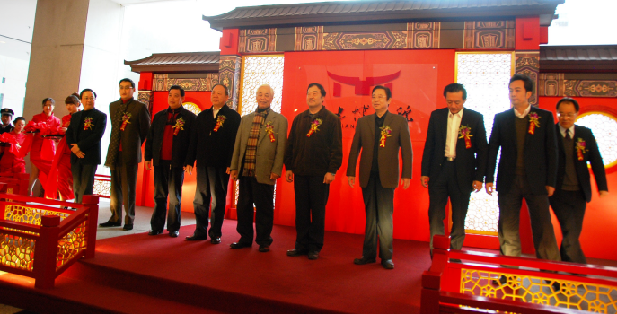

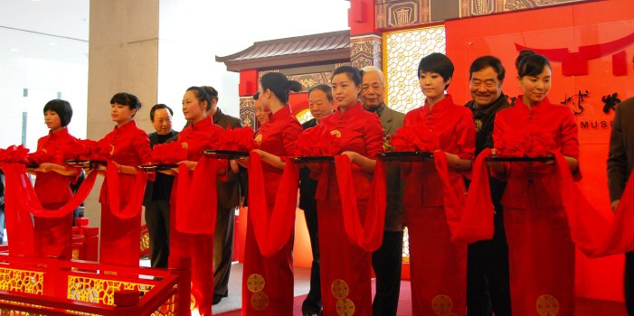

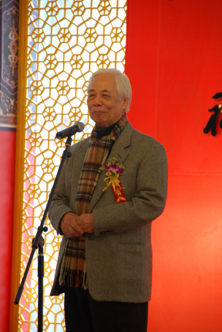

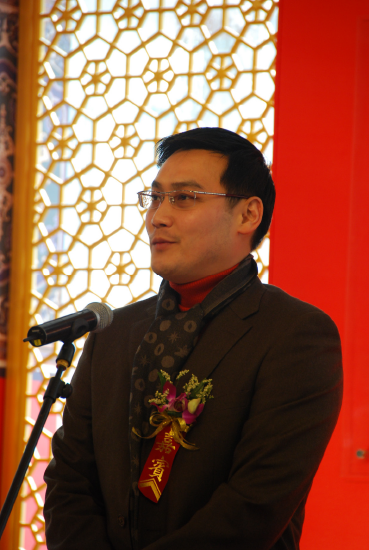

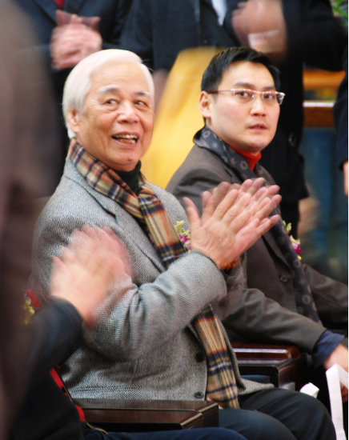

### 大時代的文化貢獻~道藝春秋展的饗宴　江逸子國畫塑像展研討會

*編輯部整理*

幾十年埋頭學後

化成傳文化畫作

非為爭席於藝壇

不辱師恩興正法

福建省文物局副局長福建博物院院長吳志躍先生：

江逸子先生出生於我省閩侯縣南通鎮的江厝村。他從小就受家庭及鄉賢潘觀松先生的文化啟蒙，十一歲隨父赴台後又得到呂佛庭、楊溯吾、李雪廬等名師於國畫、經學、詩文方面的指導，在步入丹青中，上宗五代兩宋，近承張大千、溥心畲、于右任等名家，歷經數十載，逐漸形成了自己「不負古人，不負今人」的藝術理念與創作追求，從而著稱於臺灣畫壇。

福建博物院就在江逸子的祖籍地福州，是海峽兩岸最具規模的綜合性博物館，它不僅承擔著本省的考古工作和文物的典藏、研究、陳列與宣教等任務，還特別致力於對古今名家名作的徵集、引進、交流與推薦宣傳。這次舉辦的《道藝春秋》江逸子七十回顧展，則是繼臺灣工筆畫家翁文煒、程月珠師生作品展之後，又一次為海峽西岸引進、介紹的臺灣閩籍名家精品展。

此外，這也是江逸子先生離鄉六十餘年後首次返回故里之個展。在這六十餘載漫長的道藝春秋中，他的鄉情、親情不僅表現在為故鄉修建水庫，為父母百歲冥誕恭繪千手千眼觀音，為福建建甌孔廟贈送孔子及其高足共計十二尊銅塑等之功德上，更融入他七十餘年來對祖國傳統文化藝術的虔誠與嚮往之中，尤其濃縮他對筆墨、丹青「不負古人」之潛心研習，和對作品「不負今人」之探索與創新之上。現選其精品百餘件於我院舉辦畫展以寄情父老鄉親、海西民眾，請益於業內同行、同仁志士，同時我們還特別舉行了江逸子畫展的研討會，以探討我們民族傳統藝術的珍貴價值與重要作用。

福建畫院王和平院長：

從北京趕來主持研討會，今天一大早來到這裡，看了江先生的畫冊，非常感人，整個畫的規模非常大，展覽的規模也非常大，他的畫路設計非常廣，江先生推崇於中華傳統文化，崇尚孔子又潛心於佛教，有很深的修養，他很大的特點就是，以他的仁愛之心，與深廣的文化情懷融會在一起，貫穿於生活和藝術之中。江先生多才多藝，善於繪畫雕塑，繪畫方面其寫意、工筆都非常到家，山水、人物、花鳥均有涉及。人物畫的題材從佛教方面，還有儒家的人物方面做了很多的描繪，場面都非常的宏大，作品也很多，非常感動人。

他畫的人物肖像也是形神兼備；山水畫方面，有傳統的皴筆，也有現代風格的潑彩，題材豐富，形式多樣，花鳥畫主要以工筆畫為主，意趣非常深遠，形式上追求到宋代，非常富有詩意，藝術造詣非常高，在臺灣享有很高的聲譽。這次第一次來福州辦展覽，相信在福州的藝術界會取得很好的效果，現在請江老師為大家講幾句話，他以七十多的高齡，創造了這麼多精美的作品獻給大家，想必大家在他人生的道路，還有對他的藝術一定有很深的感受，並請大家在看完展覽後，對江先生的藝術發表一些看法。

江逸子老師：

末學在筆墨遊戲上快一甲子，獨獨缺家鄉這一塊前輩能輸給我的營養，所以在中國選來選去，我第一個展覽一定要回到家鄉請教各位。四九年國民政府撤退到臺灣，很幸運的與故宮博物院為鄰，故宮博物院當初設在臺中附近，臺中也有很多從國內去的耆老，他們對我有心的栽培，雖然我是塊不堪雕的朽木，但是在各大名師教導之下還勉強成個樣子。最主要，在那時動亂的環境之下，去到臺灣也是蠻辛苦的，少年時期非常清苦，但這些老人對我非常的鼓勵栽培，因此我覺得路不一定往前面奔，一般人往前走我就往回跑，地球畢竟是圓的，人生就是求在圓融裡面的一個答案。

在傳統文化的探索中，我從宋、五代往前學，到現在我覺得好多東西我們可以再往前去探尋，國內很多新出土的文物，也有很多考古的成就，使我們眼界更開遠。中國文化博大精深，文化可以說是人民的一個精神，所以我一直很堅持，一生只能活一次，一生的事業只做一件事，我好好盡我所能把它呈現出來。這次承蒙博物院能夠為我辦這個展覽，我覺得莫深的榮幸，最主要還是請各位給予多多批評、多多指教，讓我在有限的餘生，看看能不能再做一些新的作品出來，謝謝大家。

福建省美協原主席陳一峰老師：

江先生可以說是我的老朋友，我認識江先生已經是二十幾年，那個時候我在美協當秘書長，是石橋兄帶江先生到我家裡，我跟江先生當時做一次長談，彼此很投緣，我第一次見到他的時候，頭髮烏黑，坐得筆直，那個時候我才體會到什麼叫做坐如鐘，他就非常有精神那個樣子。後來我很認真的拜讀江先生的畫冊，才了解江先生的出身很清苦，年輕時在故宮臨摹畫的時候，就是一個饅頭一杯開水，得了饅頭僧的稱號，可見他在學畫臨摹的過程中是多麼清苦。

他當時有緣接觸了很多文化界、詩畫界、詩書界的名流，加上他的努力，而有今天的成就，江先生給我的最深印象主要是他畫佛教題材，特別今天展覽中的「極樂妙果圖」，裡頭大概有上千個人物，我看了真的很吃驚，如果不是心非常沉，毫無雜念，沒有什麼名利之心，是沒有辦法畫的。我看他每個人物、每一筆、每一條線條，每一個畫面經營都是非常認真，包括他的背景都是一絲不苟。正因為江先生一心向佛，他心裡頭有佛，才會畫出那麼好的佛像，所以他的一些畫，特別是佛教題材的畫作非常感人，讓人看了以後愛不釋手，生起崇敬，走到他所造的景象去。

今天走進展廳我又吃了一驚，我感覺江先生的畫風有很大的拓展，我過去從他畫冊的序裡頭，就看到他畫花鳥、山水，這次是看到大量的山水。山水是在絹布上面畫，有點像張大千的潑彩、潑墨，但比較工細的，出來的畫面效果跟張大千效果也不一樣，因為在絹布上作畫的難度要更高一點，因為容不得你有一筆可以含糊。我平常也畫山水，山水裡頭很重要的皴筆，每一個皴都是筆筆要到位，所以在絹布上面要達到效果是很難的。

特別我這次看他畫了很多樹，柏樹，各種各樣的樹，我平常也很愛畫樹，我感覺到他畫樹若是沒有很深的寫生工筆，對樹的結構跟紋理透徹的研究，沒辦法畫到這樣的效果，所以江先生的畫讓我受益良多。

就回想到二十年前初認識，當時我準備替他辦展覽，而且把他介紹給美協主席丁先生，因為我當時是秘書長，後來因為種種原因，這個展覽沒辦成，這二十年過去，說實在話，我心裡頭有個糾結，就是沒有替江先生辦這個展。這次是從短信裡頭看到江先生要來辦展覽，我當時很興奮，我想一定要來再見江先生，這次再見到江先生照樣是很驚喜，但彼此都已經是白髮蒼蒼。這一次這麼隆重的，由我們省博物院來替他辦這個展覽，我感覺到是一個難得的事，我在這裡為當時沒辦法替江先生辦展覽感到遺憾、而且是道歉，也是覺得能夠從這次得益，謝謝江先生。

福建兒童發展職業學院副院長王福陽老師：

感謝江先生的畫展，給我們福建人帶來這麼好並且溫暖的觸動，在福建的展覽像這樣一種熱烈、崇敬的氣氛是很少有的，這不僅僅是展覽主辦者，或者是展覽的作家希望得到的，其實更深的驗證了一個文化，他通過載體傳播，他傳播的形式不同，如圖片、照相的傳播最直觀，最能讓人去悟到靜止的圖片和照相後面說不清、道不明的那些所謂的道，比文字敘述更有力，圖像、造像，這些東西它靜靜的在你的面前，訴說的是畫後面的故事，淵遠流長，這種的悟是其他藝術展現形式不可能做到。

現在有一種說法，要大力發展文化產業，但卻讓傳統的文化載體形式逐漸走向衰亡，興起的是流媒體，各種媒體的形式，如通過手機能夠看到影視、展覽等，但是和我們今天在現場上看到這樣的展覽截然不同，若沒有現場原作品的觀賞，靜靜的跟原作品對話，只透過流動的手機頻這樣信號的傳輸，和我直觀的和作者交流完全是兩回事，這種震撼，絕非通過電視屏幕能達到。年輕人這種快餐的文化雖有好處，但說不定將毀了傳承的一個環節，也就是眼見為是、感悟在心，來自於感官世界的情感，感官世界中又以視覺最強、最多、最有力量，所以今天這個展覽讓我感受這樣一種氛圍，和一種讓人感到崇敬、肅然起敬的氣氛。

我今天倒著看，從下面走上來，發現上面滿堂的觀眾，下面的觀眾幾乎走不上去了。這樣一種情感，我們畫畫的目的幹什麼？不就是要人看，難道畫畫藏在床鋪底下？你唱歌幹什麼？無非是想唱給別人聽，必然心中有別人，但並非在說教，我們看到江先生不在說教，而是教化，這種教化是通過畫，以畫傳遞道，和命令、強迫的說教是兩回事，所以我從觀眾的目光表情中，從老的到小的、到年輕的，他們那種看畫的狀態，讓我感覺今天的展覽有一種很特殊的氛圍，所以把這種感受也傳遞給江先生，我也覺得主辦單位非常用心，這些都是所謂的新媒體、流媒體那些上面不可能見到的。我再次感謝江先生帶來如此的福蔭，感謝博物館。

福建師大美院章雨教授：

我從事中國畫這塊教學，深有感觸，因為多少年以來，中國文化受西方文化的衝擊，西方的各種的流派，致使傳統文化有所衰落，這種衰落的程度，令新一代當中，對傳統文化的領會和理解，逐漸的顯示一種比較膚淺的狀態。剛剛看了畫展很興奮、也很激動的原因，看到傳統的、文化的一種弘揚和發展的氣息。在繪畫視覺中，經常給人一種潛移默化的一種作用，對人心靈的陶冶和情操的培育，帶來一種不可估量的精神及昇華。

所以我們大陸應該也倡導大文化強國的思路，因為經濟發展到一定層面的時候，如果文化沒有上去，則後續的發展動力會產生很大的偏差，所以如果一個國家沒有文化的基奠，或者說沒有文化的信仰，那是一件非常可怕的事情，經濟發展到一定程度，如果沒有文化的素養，可能很容易、或者不小心就崩潰。所以要強調文化意識，作為我們國家強盛的一種淵源、一種底蘊、後續可持續的一種動力是非常必要的。

福建師大美院羅禮平教授：

上次臺灣兩位老師來這邊推薦江逸子先生的作品，我第一次聽到非常之震撼，因為在此之前，我在思考這個問題，臺灣去了那麼多的真跡畫作，為什麼沒辦法出現一個傳統非常深厚的本土畫家？經過上次推薦後我發現我非常孤陋寡聞，江逸子先生的出現徹底改變了我的看法。這是我們一直在思考的問題，為什麼我們只把八大，把揚州八怪，把元明清當作傳統？

江逸子先生的作品改變了我們的看法，從中我們看到這個審美的正大之氣，凡是有生命的東西我覺得他應該有一種正大之氣，而不是玩一種怪、玩一種奇，這只是一個方式，而更重要的還是正大之氣，我認為江逸子先生把我們傳統文化非常正大的方面發揚光大，把藝術的藝以載道的功能發揮到極致，其實中國的繪畫，從古至今，實際上沒有脫離教化的功能。

所以上次聽完畫展導覽之後，回去不斷給我們朋友同事介紹，一定要來看，看看什麼是正宗的，具有正大之氣的藝術風格。第二我非常欽佩江逸子先生一甲子六十年，對藝術的這種執著，這種不功利的耕耘，所以我向江逸子先生表示非常崇高的敬意，謝謝。

福建師大美院教授徐東樹博士：

我是學中國繪畫史論出身的，我在江先生的作品裡面真的感到非常強大的精神力量，我想在我發言之前，深深向江先生鞠個躬。因為這麼多年來我也在想我們中國的唐宋藝術那麼好，背後到底是什麼東西，我們為什麼一直繼承不了？

只要談論到中國繪畫就會談論到筆墨的問題，但今天看完這個展覽，至少給我一個非常明確的理解，就是當精神的魂脈斷掉之後，那麼所有的形式，就是中國傳統留下那麼多層次化的東西，那肯定真是零，你如果只是依葫蘆畫瓢的，只是表面的去學習那個層次，永遠都摸不到傳統的邊。那麼我教了這麼多年，我也很哀傷的看到，我們很多學生不願意去學習那段東西，今天我走出展廳到這裡來，第一件事就打電話給我的學生，無論如何一定要到現場來感受一下這個作品，讓你們看看什麼叫中國傳統唐宋繪畫的那種精神，那裡面的精神就是三個字—精氣神，如江先生畫的山和石，大家都好像見慣，可是他就用這些我們好像都非常熟知的東西，然後把事物本身應該有的一種精神非常樸素的把他表現出來。而且今天在展廳裡面有一種看完之後真的很震撼，展廳裡面非常特殊的氛圍，跟平時展覽不太一樣，人很多，也有很多聲音，可是這聲音非常小，而且這個聲音是聚集在畫前面來說，所以這其實是讓我很感動。

而且我自己在讀畫的過程當中感受到一點，就是越大的畫越精采，就比如說我一走到藥山問道屏風前，那幅畫面真的很震撼，我甚至很用心去看每一棵樹，發現二十幾棵松，沒有一棵畫得一樣，就是深淺、姿態、形式、語言，都有一些非常輕微、非常細膩的變化，然後繪成一組松樹，我真的能夠感受到古人講立如松、坐如鐘，那種很安靜的狀態裡面透出的這個精神，我覺得這是人格的精神，其實中國不管是佛、儒、道，其實他背後都有個最重要的精神，這些東西是拿來滋養我們的心，假如這個東西把他丟掉了，那這個文脈基本上就是斷了，今天在這個展覽會場，比如說在藥山問道這樣的畫面前，我就感覺到精神陶養的一種力量，而且這種力量是江先生透過個人一輩子、幾十年的努力慢慢養出來的，我對這樣的精神真的是感到無比的崇敬。

我今天也只能表達我的感激，我是來學習的，給了我一次很大的精神上的洗禮，我真的非常感謝，我們的鄉賢有這麼高的、這麼深厚的一種藝術力量感染我們，所以這七十年的回顧展，第一次能在福州舉辦，我個人感覺是一種榮幸，謝謝。

福建師大美院李莉教授：

徐博士已經把我要說的，全都非常激情的表露出來，這個作品讓我們受到非常多的教誨，徐老師說的我就不說了，我就說我自己看到江先生作品後的一些的感觸。雖然我們離臺灣這麼近，但是卻又這麼遙遠，因為我們觸摸臺灣的繪畫、臺灣的文學、臺灣的其他的藝術，雖然現在已經三通，但是這些交流的媒介卻相當的隔閡，想觸摸真實的藝術現狀，卻又那麼難。

透過江先生的作品，我們會去思考，作為中國人的繪畫藝術的淵源是什麼？看完畫冊中兩位藝術評論人所寫對於江先生的文章，有一個感觸，就是江先生一直以他對於論語的解讀來貫通他作品的中幹。相信我們這邊的同仁都曉得，國學經典的國學熱，從臺灣來引領大陸這邊的人來作國學的導讀，來讀論語。

我們可以看到江先生一直以來，不管到臺灣，還是在他的學養過程中間，都能以論語作為他繪畫創作的、抽象的、文本的、精神的支柱，我想這就是我看到很多藝術家所欠缺的這一塊，而且能夠一直的延續下來，並且能夠把他對於讀論語的精神融會在他所要表達的潑墨、工筆，以及他所要表達的一種中國人的繪畫語言，我覺得非常難得。

我覺得海峽兩岸都有一個同樣的淵源，所謂的古典傳統，他一直影響我們，無論是文人畫，還是新文人畫，還是新文人畫以後的圖像模式，都會從這種傳統中間受到非常大的滋養，尤其在今天多元化的社會中間，我們允許、而且用一種創意的眼光去發現，當代人對於傳統的注視，江先生的作品將我們又拉回了對於傳統的尊敬。

在我們福州這邊，當新文人畫的藝術家們，再來看傳統，再來看像江先生這樣的藝術家來說，我們就會發現我們丟失的是什麼？我們要挽救的是什麼？我想就是那一份，我們永遠揮之不去的，屬於中國人的永遠經典的力量，對於我們當下藝術家創作的一種支持，一種的鼓勵，非常感謝江先生，謝謝。

福建畫院的原副院長鄭征泉老師：

今天看了江先生的展覽，從展覽跟畫作中間看到了江先生對於藝術的虔誠，一種執著，他的每一幅畫都非常認真，所以他書齋名叫做澹寧齋，又澹泊又寧靜。就繼承傳統而言，我發現台灣民間群眾的文化中間，比大陸更傳統，江先生的畫，題材非常活潑；但都是我們中國傳統的東西，比如看他的潑墨人物就想到梁楷；他的佛教的畫就想到敦煌；一些山水畫就想到以前的王維、孟浩然這些畫；看到這些民間的，有些像明清的工筆花鳥，就很明顯、很突出。

從他全部畫作中間可以溯源到我們中國畫的某些東西，還有一幅極樂妙果，我會想到我們宋代活版雕刻，活版印刷裡面的傳統。再則展覽作品中有孔子的弟子，這種題材是大陸做雕塑者沒有做過的事情，他的雕塑把我們神話的孔子跟他的弟子，從那個神殿裡面給拖下來，變成我們民間民俗的，每個人的形象就像我們現實生活中間某個人的形象，所以我看到江先生的虔誠就覺得很感動。

文化藝術受到世界上各種交流，互相滲透，也受到外面的衝擊。有一段時間我們一直否認這個傳統，自我菲薄，否認中國文化，隨著世界形勢來看，現在非得回過頭來，此次強烈感覺到我們中國傳統文化的優秀，是任何其他世界不可代替的，所以我們文藝工作者，要做就做發揚光大我們的傳統藝術、傳統文化。謝謝江先生，還給我們國務院贈送了雕塑，非常感謝。

福建省人大畫室主任王奇志：

我覺得一個畫家能夠精通這麼多的畫作，其實是很不容易的事情，一個畫家一生來說，客串一下可以，畫山水的客串一下畫人物畫，他這個不是客串，都畫得很精緻，這相當不容易。這個畫給我的感覺是很靜，因為畫的時間都很安靜，因為他表現很多佛的題材，我覺得我們現在這個社會裡面正需要這種安靜的環境，去除那種浮躁的心，江先生我看也是以禪心來畫畫，要不然靜不下來，畫那麼巨幅的東西，人物那麼多，我對那張畫是五體投地，那個線條勾得實在漂亮。

福建著名畫家石橋先生：

我是江老師的學生，我在江老師的家鄉插隊（指城市知識青年上山下鄉從事農業勞動），所以跟這裡有來往，然後老鄉給我看了一本畫冊，看完畫冊我驚呆了，我問這個先生回來過？他說沒有，這是二十三年前的事了，我當時在學畫，也很認真在學，看完這個畫以後，我要求老鄉，如果江先生有回來的話我想拜訪他，結果一個月以後就見到了老師，老師第一次回國，從那天開始就建立這個緣分，這個緣分就好像父子一樣的感覺，就這麼二十幾年來，老師每年都回來，沒什麼事，走一走，後來我一直說：老師您這麼好的東西能不能在家鄉辦展覽？老師說在家鄉辦展覽他有這個願望。

老師的畫我接觸的時間還是有限，老師來幾天，我又不能去臺灣，但是主要是老師的那種氣質、人格，還有他那種悲憫把我征服了，而且改變我一生的追求，我本來是從政的，在機關待了十年，後來我把工作辭掉了，好像跟老師有關係，因為老師修儒、修佛、修道，我感受到震撼，這麼幾十年過來我無怨無悔，我非常的慶幸自己有這樣的一位老師，而且老師也把我們的師生關係寫到他的畫冊裡面去，就是說我是他入冊的弟子，所以這點我很榮幸。

剛才聽到同道們的發言，我已經在後面流淚，真的懂老師畫的人不多，坎坎坷坷，我是很想為老師辦展覽沒辦成，我覺得這次這麼好的機緣，也是老師修了幾十年，得到了一個應有的展示機會，我很感動，謝謝。

福建師大教美術史論及美術鑑賞賀翰老師：

先生您好，我是福建師大教美術史論的老師，也教美術鑑賞。很榮幸得到您的邀請函，懷著的崇敬心情來到這裡，慢慢的看，從頂樓看上來，看完之後就兩個感受，第一，我一定要帶我的姑娘來看，她天天都背論語，都背道德經，但是我覺得文字有時候他在詮釋的時候，給人的想像力不是那麼豐富，讓她來感受一下，我覺得這是非常好的機會；第二個我一定要帶我的學生來看，特別是教美術鑑賞，我的學生很多都是一些非美術專業的大學生，特別是講到傳統美術，有時候很迷惑，也不太願意去聽，有時候學生問我，有什麼機會去感受，在哪個地方可以感受到傳統文化的魅力，我說去看展覽，但展覽很少，我們得到消息機會很少，這次應該是非常好的機會，謝謝您。

福建省書法家學會副主席大學教授蔣平疇先生：

對於江先生是先聽到他的聲音、見到了人，真正見到江先生的畫是今天，江先生幾十年的過程當中，他對於中國文化的素養。我總覺得在每個人的修學過程當中，這點如果沒弄清楚，可能就會偏差。江先生學畫從畫人物開始，他人物畫是唐宋之間徘徊，所以他裡面的人的語言，所告訴我們的內容及形式，不是單向，來自於他對中國文化的愛、他對生活的愛。

今天有一個畫沒有完全展開—地獄變相圖，其實這個畫是非常傳統的，但是又是我們每一個人的生活經歷，在那邊找到你的影子，而且還能找到一種感悟點，情、理都在這裡，所以他很重要的，我覺得有兩個方面值得我們確信的，一、在隋唐以來，中國的文化基本上以儒家為主，兼有師道，江先生是這樣做，無論他對論語的解說，還是對於釋或者道的一些畫體的展開，始終是這種思想；另外他畫裡面講到愛、講到情，他還有宋以來的理跟趣，所以他畫面裡面，不只畫的形式能打動人，他畫的內容也打動人，所以兼有在形式跟內容之間，有江先生對宋以來的理趣的那一種的理解，這理解江先生將畫畫得有變通。

我記得文心雕龍劉勰在通變這篇，說過大致這樣的話，我們做任何事情要萬里逸步，之所以他能夠安靜的全心做這樣的事情，幾十年在中國文化的走廊裡，用江先生剛剛的話說是往回走，這往回走不是簡單的走啊，而是萬里逸步，我相信在江先生今後的路程當中，還有更多的好的語言告訴我們，謝謝。

福建師大美院教授黃映愷博士：

今天很有幸能夠看到江先生來到我們福州辦展覽，作為後學，我是來學習的。剛才聽到江先生本人講一句話，就是往後退這樣來走路，聽到這句話我很感動，因為我很有感觸，我首先想到就是老子裡頭有一句話：反者道之動，西方文化經常選擇出發，中國文化經常選擇回歸，所以我們看中國古代藝術史裏頭，很濃厚的復古情節。看江先生的畫，我覺得他的心靈是富的，他的筆墨也是富的，他的筆墨在新時代裡頭很有意義，因為今天人心不古，所以古的意義能凸顯出來，江老師的作品包含問學、求道的精神指向，尤其在崇古整個大的支撐底下，顯得特別突出。

如江先生畫作中，很多標題很有意思，他涉及的面很廣，儒、道、釋都涉及了，其中有些東西包括了古代，一些先賢的經典典故，其中畫作主題若不是精通中國傳統文化，可能不一定有非常了解，如學琴師襄、問禮老聃、地獄變相圖的一些重點，這些都是關係到文化，從文字出發就可以感受到江先生的用心，就是對中國傳統儒、道、釋三家的心靈溝通，通過筆墨繪畫語言把他表現出來，過去我們經常講，藝術表現什麼？

我覺藝術最重要的是表現人，因為藝術寫人，大概也寫天地，寫我們宇宙之間的萬事萬物，我覺得江先生的作品能打動人，首先他的繪畫有種清潔精神，很安靜、很寧靜、很乾淨的清潔精神，恰恰可以洗滌心靈，中國古代老莊也好、佛也好，都強調這種清潔，強調靜對我們心靈的洗滌作用，江先生的繪畫對我們後學來說是很好的教育，是一次精神的洗禮，因為有這樣的一個人格的支撐，才有這樣一個打動人心的藝術，謝謝江先生。

福建師大美院蔡清德教授：

感謝江老前輩和博物院給我們提供這樣精采的展覽，第一次比較全面的觀賞江老前輩的展覽，我是深深的被感動，因為江老前輩的作品裡面體現了對於傳統文化深入的繼承、理解，還有傳承。我們經常講傳統，但很多人的傳統不能講傳統，只能講創新。如果你沒有對傳統深入的理解，下紮實的功夫，細膩、傳神地去做功夫，你哪有傳統。

第二個從江老師繪畫的題材可以看出，他對傳統是有深度去探索，去理解的，所以他都是以傳統為題材來表達，在畫面上的呈現也是非常優雅的，我覺得江老前輩，以及他內心所持守的真正中國文化傳統的真誠，就像蔣老師講的無妄無邪、自愛自誠，讓我深受感動。反觀我們現在很多藝術創作者，虔誠之心很欠缺，包括我自己，我去到臺灣學習幾個月，雖然兩地一家親，但是在那邊生活幾個月，點點滴滴，我覺得我們福建人很粗糙，在日常行為上，我深受教育，從江老先生的展覽，對比我們大陸很多畫家的展覽，我覺得我們是很慚愧的，這點我覺得我很受教育，在藝術的道路上呢？

江老前輩這麼好的展覽，這樣傳統文化的理解，跟深入的持守，對藝術這樣的一種堅持，我知道江先生已經七十三歲，但很希望您在將來能夠把這樣的傳統精髓傳給下一輩。不管是福建的還是臺灣的，江老師能夠把江山事業往下傳，對年輕人的培養，可能比展覽的意義更深遠，讓你江山千古的事業能夠往下傳，讓我們的傳統文化能夠往下傳，以後我們能看到更多，出自於江先生門下的作品，我覺得我更期待這一點，非常感謝江老前輩，謝謝。

福建省文史館館員原福州市美協祕書長梁桂元先生：

二十多年前我看過江先生的畫冊，傳統很深，我就一直保存著。剛剛看展覽，好像在讀我們中國的繪畫史，從裡面，看到了顧愷之、看到了兩宋的花鳥畫、山水畫，一直到潑墨梁楷，一直到了現代的潑墨山水、潑墨花鳥，所以就好像複習了一次我們中國的繪畫歷史。但是江先生的畫不是重複歷史，他每一張畫有其獨特的意境，如潑墨人物怡然自得，讓人想到梁楷的醉仙，可是他畫的不一樣，他畫他自己的，而且是現代人的感情，不是畫那個醉漢，梁楷是畫醉漢。

又如花鳥畫，很像是宋徽宗的畫，可是意境卻不同；如多子這幅畫石榴開，上面有個鳥好像要啄食，這個是秋天要成熟的時候吧？所以其可貴處是，江先生吸收中國兩三千年來文化傳統甚深的底蘊，來表現他自己的感情，表現自己現代的生活，不管是山水也好、花鳥也好、人物也好，以現代的思想，畫古典的人物，寄託了現代的意境，所以非常難得，這個是值得我學習的。

臺灣畫家陳肆明老師：

此次參加海峽兩岸文化交流的畫展與座談會，一個這麼正式而熱情的場合。江老師在臺灣是很有名的畫家，一個偉大畫家的養成，來自於跟隨從大陸到臺灣的那些長輩、文人的教導，如李炳南老師、呂佛庭老師，還有故宮的古畫是很重要的引發點，還有江老師自己本身的努力。他這一次回鄉來展覽意義很深刻，可以說少小離家，老大的時候是衣錦還鄉。

也要感謝福建博物院與這邊畫壇的所有的一個安排，大家對江老師的畫熱情與感動，我們聽到也非常感動，在座談會中也聽聽大家對我們臺灣這邊發展的狀況，得到這麼大的熱情跟讚賞我們真的是感到非常榮幸，而且整個場域、整個氣氛真的是達到了藝術教化人心的功能，我看到你們感動，我們也很感動，那這個活動就非常的成功。

再則從剛剛各位發言裡面，我們發現傳統文化居然可以蛻變出感人的作品，在此跟各位報告，在臺灣藝壇裡面真的是五花八門都有，講創新的有很創新的，能夠真正回歸傳統，然後達到像江老師這樣的一個水準，你想想看，在一個大家都在講西洋新潮的環境氣氛裡面，能夠靜下心來，而能夠做到這樣一個標竿的標準，今天讓各位福建鄉親大家來這樣讚美他，你看這個定力要多深，而且往內修煉的功夫有多強，這也提供我們從事藝術創作者一個共同想法，就是說我們藝術創作要怎麼走？大家都在走自己的路，每一個人都在尋找自己該走的一個方向，甚至於一個山頭、一個山頭，誰要比誰好，大家都在努力。剛剛江老師講往回走的這條路，目前證明他是一個很高的標竿，可是要怎樣修，要怎樣去鍛鍊，要往內怎麼去製作，我想展覽最大的功效，應該可以提供這樣子的一個省思。

再過來，我們發現世間藝術的強項，要透過圖像、透過色彩、透過線條，透過技巧就對了，透過技巧才能夠有圖像出現，圖像出現以後就會產生氣氛來感動我們，那當然，江老師作品的特色就已經呈現在他的作品上。這裡面我們發現技巧是真的在我們傳統文化裡面可以找到的，而且他可以用傳統的技巧表現蠻現代的東西，甚至於如何造型，這個東西大概就是在藝術教育這個部分。

而中國文化線條是個強項，江老師的線條可以很細、很長、很精緻，可是他的潑墨又是大氣磅礡，大氣是中國的傳統沒錯，其實西洋也有大氣的作品，像西洋的巴洛克，那個為宮廷、為教廷服務的那些作品，也是氣勢很大，那麼我們中國的東西是有大氣魄的東西跟西洋抗禮，如何將真正作品做出來，再建立我們對國際性的一種宣導，那麼我們就可大可久。另外，線條跟書法有關，江老師的書法寫得很好，線條才能用得那麼好，潑墨也是很好的，潑墨是整個面的問題，他有塊的感覺。

之後我們又發現一個畫家能夠跟雕塑結合這個很奇特，不曉得各位有沒有注意到這一個問題，如果我們有個學術研討會可以來探討的話，會發現有很多畫家，他附帶不錯的創作就是書法，可是江老師除了書法跟繪畫之外，又多了一個塊面的、立體的一個雕塑，塑像是把抽象的東西變成一個具象的造型值得我們去探討。因為從抽象的概念，譬如說講到孔子的弟子，我們都看不到孔子弟子的相貌，而江老師則透過造型能力把塑像人物具體化，所以從最抽象又回歸到寫實的這個轉換也真的很特殊，因為有具體抽象的造型在那邊，展覽的時候在場域裡面，可以感受現代感的裝置藝術，所謂裝置藝術就是用東西擺出一個場域，然後讓人家在場域中，感受到那種氣氛的一個力道，所以展場整個的概念並非傳統，傳統裡面有最新的概念，也希望大家能夠從展覽裡面去感受傳統跟現代之間，然後創新點又在哪裡的那個感覺。

今天真的很高興，從臺灣過來，感受到藝壇前輩們的迴響，知道大家在海峽兩岸在藝壇上的用心努力，謝謝大家的熱情，我們都會永遠記在心裡面。

江逸子老師：

今天非常榮幸能夠得到我們的鄉親、我們的前輩所給予的鼓勵，因為傳統畫最主要他還是以文化為枝幹，沒有文化撐著，也沒有所謂的傳統畫，文化就是我們生命的一部分。而全世界的文化沒有比中國文化來得踏實、來得深遠，我經常跟學生說，我們必得先把自己的傳統文化建立起來，你才有強健的胃腸，才能吸收別人的文化，才能消化別人的文化，不要吃什麼就拉什麼，這是非常重要的一件事。創新容易，如孔子的智慧他要創新容易，但孔子講述而不作，述，就是自然的東西你不能接受你用什麼來創作？這是這麼樣，溫故而知新就是這麼回事，釋迦牟尼佛說：「法爾如是。」世間的法就是如此，沒有智慧的人就想變這個變那個，其實就是很自然，你今天說我要搞個很抽象的作品，我可以做，不管我用工筆線條也好、用彩墨也好、用立體也好，我在家裡我沒有負擔的，破銅爛鐵他們拿來，我就找焊工把他焊一焊，他說叫做現代藝術。

現在傳統的精神正是我們藝術界所迷惑的，尤其我們在這個時代裡頭，站在東、西的十字路口，非常迷惑，迷惑什麼，是自己迷惑了自己，你自己沒有把自己看清，這是我經常跟同學們勉勵，誰能瞧不起誰、誰能瞧不起你？就怕你自己瞧不起自己。

我很幸運，一生當中我的好老師、李炳南老師，他不畫畫，他是個儒學大師也是個佛學大師，他跟我講，先把人學好了再去做事，人要不能學好，你做事情沒有做好事，好人做事壞事變好事；壞人做事好事變壞事，他說一切的知識學問不是裝潢自己，是奉獻給社會的，這是他老人家到他要過世前還不斷的告訴我，他說你所學的東西是要奉獻的，不在於你作品有多少，問題是你的作品能有多少影響，所以謹記師言，每每拿起筆作畫，就很莊重地當作遺作來完成，要給歷史留下來的，不是來遊戲的，也就是老師經常在講，他說你所有的學問不是拿來陪葬的，要拿來奉獻的。多少年來所以多種嘗試並不是我有多大的本事，我好嘗試，我好學而已，沒有新的。

今天非常感激吳院長給這個機會，王院長給這個鼓勵，我們同道的朋友你們不要客氣，認為這裡面有不合理的事情，可以給學人做個指教，我還有幾年可以活，還可以幹一幹。

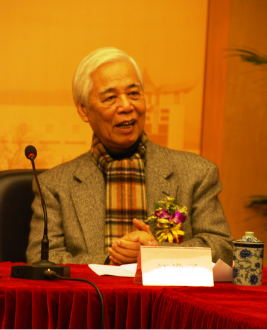

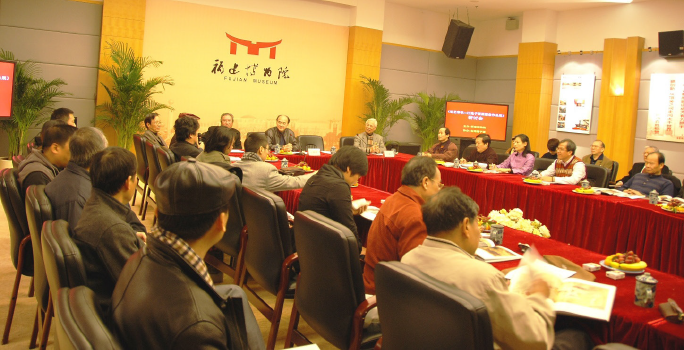

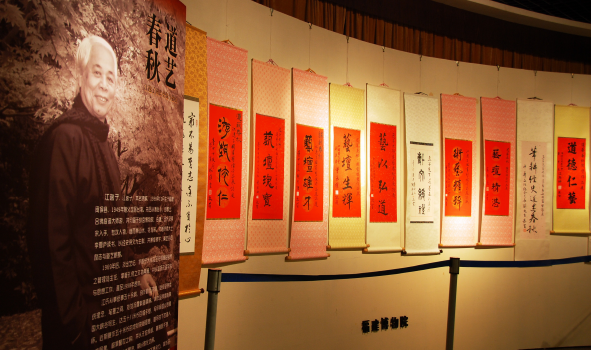

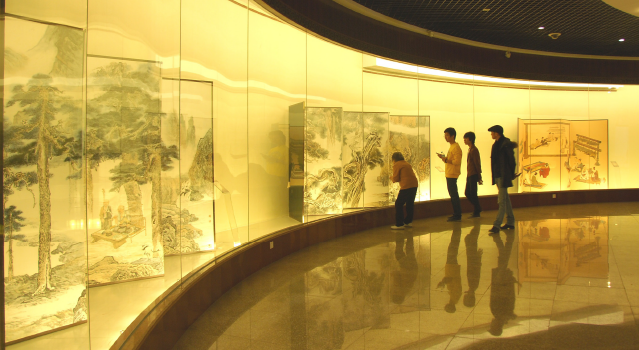

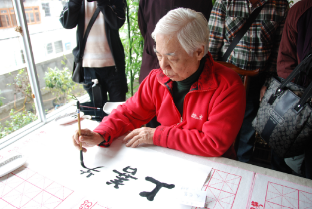

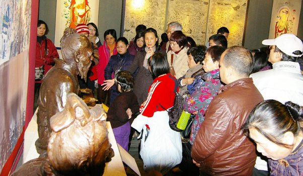

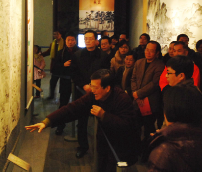

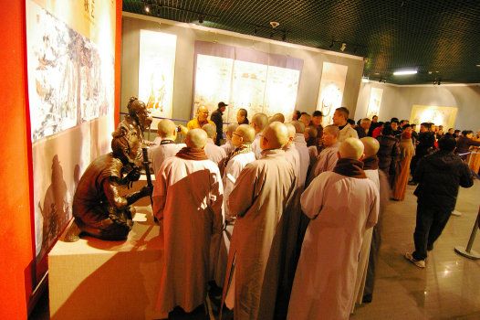

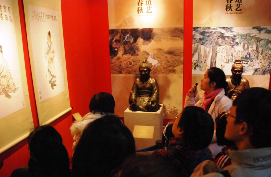

### 大時代的文化貢獻~道藝春秋展的饗宴　足跡踏過的精華~福建行畫展與古蹟瑰寶參訪

戒堂、孫佩茹、蕭惟元、應雨橋、李樹森、胡露妹、陳瑞珠

善緣生起於一時

共遊畫展土樓群

見識大作氣象新

小橋流水桃花源

前言

中華無盡燈文化學會此次壬辰年大陸福州行畫展與古蹟瑰寶參訪，是與寒假五天的道藝人生講座結合。從二月一日到二月五日，由多位學有專精的老師從影片、畫作、詩文、茶道、陶藝與環保等課程的開展，進入江逸子老師福建博物院道藝春秋國畫塑像展的全體作品的內涵，並承蒙江老師親臨致詞，精彩又充實的課程內容，為福建行奠定了豐富又多彩的基礎。

台灣一行三十七人，於二月八日前往福州，與大陸福建、浙江十多位的蓮友們，一同踏訪福建各處景點。旅程是以福建博物院江老師的畫展作為主軸，一路上還參觀了民族英雄林則徐的紀念館，保有古風的三坊七巷街區，著名的福州湧泉寺與泉州開元寺，獨具特色的客家永定、南靖土樓群，並造訪了泉州老君造像和洛陽橋。旅途期間的座談及吟詩唱誦，更使得整個過程充滿了教化的意義與歡欣的氣氛。

以下藉由此行老師、學長們的心得分享，讓我們一起走入福建的春與秋，兩岸交流的道與藝吧！（編者）

福州五日參訪有感　　戒堂

有幸參加福州五日之行，此次是第三次到大陸地區參訪，感覺大陸在各方面都有所改變，特別是經濟方面的成就讓人刮目相看，另在基礎的文化建設方面，也在積極推展之中。

首站來到福州林則徐紀念館。對於林則徐的認識，僅止於禁鴉片的故事。來到林則徐紀念館後，才瞭解到林則徐的偉大不僅止於禁鴉片而已。對於鴉片煙的禍國殃民，「苟利國家生死以，豈因禍福避趨之」，不畏得罪英國，不顧朝廷上下反對的聲浪，也不顧自身前途與否，在道光十九年六月三日有了虎門銷煙的事件。雖把鴉片銷毀了按理係大功一件，卻因此引發鴉片戰爭，被貶到新疆。即令受挫，未改其志。雖遠在邊疆，仍能於伊犁治水以造福民眾。識其膽識，是其堅忍為國為民之志，為人所頌。

更了不起的是，非僅要求己身為官應有高風亮節，更戒慎於其家人，「做官不易，做大官更不易，我是奉命，唯謹畢恭畢敬。夫人務必囑咐二兒千萬謹慎，切勿仰仗乃父的勢力和官府妄相往來，更不可干預地方事務」，其被尊為民族英雄之風範，殊堪為政者三思效法。

「三坊七巷」始建於西晉末年，原為士大夫、文人為主要居住民的街區，建築的樣式與格局，和鹿港地區的古式木造宅第相若。近來大陸大力推動文化振興，此處雖然忝列重點文物保護單位，很多地方仍依古法翻修；但翻修後成為現代的商店街，感覺像是在舊式建築的購物商場閒逛，很難感受到優雅的文化氣氛，覺得有點可惜。

福建省博物院是此行的重點。江老師的作品在此展出已有一段期間，從現場的展出規模與規劃布置，顯示出福建省博物院對江老師作品的推崇程度。因為不是例假日，到此參觀的人不是很多。但來參觀的人似乎文化層次都很高，加上老師們和蓮友的詳細解說，可以明顯地感受參觀人的喜悅心情溢於言表。很明顯地是，福建省博物院缺乏能做現場精闢說明的導覽人員，讓參觀民眾無法了解江老師作品的文化內涵，如果院內導覽人員能在展前有充分的訓練，此行應讓我們聽院內導覽人員解說，再補充未及之處，使導覽人員時時可對參觀民眾詳細說明，或許成效更能彰顯。如果在福建省博物院的行程能排在假日期間，讓我們接觸更多參觀民眾，應該可以散播更多的文化種子。

兩岸佛教界始終都有一個共識便是，臺灣佛教自古就是中國佛教的一部分，而福州與閩南地區與台灣佛教更有著直接的淵源關係。正如史學家連橫在《臺灣通史》中所言：「佛教之來，已數百年，其宗派多傳自福建。」臺灣八成寺廟源自鼓山，鼓山湧泉寺與臺灣佛教界的聯繫即使在兩岸關係最緊張的時期，也都會通過書信、甚至繞經第三國的方式保持著聯繫。福州鼓山湧泉寺始建於五代後梁開平二年，後兩次毀於回祿，今之所建存為明、清時期修繕擴建。

其著稱者非僅歷史悠遠，風光明媚而已，重要的是其優良的傳承，許多賢者大德與此淵源甚深，諸多文獻、文物被保留於此。寺內文物仍保持完好的有清康熙三十八年御書敕賜「湧泉寺」匾額，康熙五十三年、乾隆七年兩次頒賜藏經。令人肅然起敬的地方是藏經殿。藏經殿兩旁有御賜的十二座藏經櫃，很難想像木櫃得以保存數百年而不腐。也使得萬本經冊雖歷水災而倖存。殿前陳列的南傳佛經，和歷代高僧大德刺血書寫的經書，令人震撼。整體感覺此處是修行的好場所，只是和老君岩一樣，為迎合觀光遊客而特意播放佛樂，與應有靜雅似乎不太諧調。

原在臺灣只從知識頻道看到的土樓建築，藉由這次旅程來到被聯合國科教文組織列為世界文化遺產的福建南靖、永定客家土樓。土樓形狀不一，以圓形為最多，基本上是為了讓所有房間一樣大小。土樓以生土為主要材料，摻上石灰、細砂、糯米飯、紅糖、竹片、木條等，經反覆揉、椿壓、夯築為基。

另以附近盛植之杉木林之杉木搭蓋而成。每一個土樓自成一個封閉的巨大建築體，一個區域內又匯集了數座土樓，形成如田螺坑地區的土樓群。具有聚族而居，防盜、防震、防獸、防火、防潮、通風採光、冬暖夏涼等特點。一般高三至五層，一層為廚房，二層為倉庫，三層以上為起居室，可居住二至七百人。

乍見土樓建築，心中興起的疑問是，由原始材料構造得這麼大的建築，如何歷經數百年而不腐不朽，屹立不倒？原來夯築之牆可厚達兩公尺，濕氣重時可吸收潮氣，乾燥時可釋出濕氣，只要不是大水浸侵，可保基牆之無礙，以往臺灣的「土方屋」也是如此。有因一樓作為廚房，以木竹起火炊煮，其生之煙縷縷向上，烘乾二層倉庫之糧，並提供三層以上起居室寒冬取溫。上層木構時經煙燻，可保乾燥，質量輕而蛀蟲不附，歷久而不朽。

加上群聚而居，有人可以時時維護，宗族關係可以緊密聯繫，令人歎服先民的智慧，構思出這樣融合人文與地理環境的建築。近代有一門探討居民與居住環境規劃的科學，稱之為人文區位學，其終極理想在找出利用硬體規劃來達成人文和諧的建築，先民卻早在數百年前即已實際運作。

參訪土樓，一面讚歎土樓宏偉的同時，一方面又興起一絲的隱憂。土樓雖被列為重點國家保護文物，但也被規劃為重點觀光地區。所到土樓，底層幾乎都成了商店，販售幾無二致商品。上樓參觀要收費，原住於此的居民大都已經搬出，留住的居民百不及一，已無法感受土樓內居民交流的氣息。底層雖有仍做廚房使用者，但用的是現代的瓦斯炊具，不免讓人擔心上層的木構能支撐多久。裕昌樓後方三層以上的木柱、木樑已有大片得蛀蝕，又無人居，這個樓應該很快就毀損了。

各土樓都曾培育出傑出的人才，依現狀，土樓內人煙稀少，少了宗族文化傳承的這一分，如何再能培育出人才是土樓耆老們應為省思的。私下請教原住土樓內的老居民為何搬出土樓？主要的原因只有一個，難以忍受觀光人潮所帶來的異樣嘈雜。觀其所居，是一排由水泥磚塊建造的三層連棟建築，仍然只有一個樓梯通往上層，各樓層使用規劃與原土樓相若，或許土樓文化要在土樓周遭來尋找，現存的土樓只留下讓人緬懷的建築硬體而已。

即令如此，土樓地區讓人忘不了的是那裡的自然景觀，那裡的空氣，那裡清澈見底的河水。身處當地，真有心曠神怡的感受，很想在那裡多住些時日，只盼望當地的美景能永久保持下去。

在福州時，走在人行道上感覺似乎和臺北不太一樣。細細觀察後發現兩個有趣現象。福州市感覺很寧靜，這裡很少看見呼嘯而過的摩托車，絕大部分民眾的交通工具不是自行車就是速度不快的電動機車。不知道當地政府是怎麼做的，讓民眾採用較為環保的交通工具，我們應好好學習。另一點是，大馬路邊除了公車外，看不到一般自用車停放，或許是人行道寬大，自用車的停車位規劃在人行道上，車子駛離或停放時往往和行人搶道，有點危險。

看到這理，不禁想到同是中華民族，中、港、臺在規劃停車的方式也不太一樣。臺灣是在馬路兩側規劃停車位，香港則不准一般車輛在大馬路範圍停車，一般車輛只准許繞進巷弄裏才能讓乘客下車。真不知每個地區在規劃停車時的考量是什麼，似乎都已成事實，無須再深入探究。倒是福州、漳州及泉州居民對於交通規則的遵守程度似乎都還不夠，而且越往南越差。

泉州位於晉江出口，瀕臨泉州灣，因地利之便，很早已來就是個通商港市，各國商人在此往返，孕育了泉州的多元文化性。渡海至臺的閩南先民，絕大多數都是從泉州出發，溯及臺灣諸多文化淵源皆與泉州相關。此行參訪泉州開元寺，進入寺中的直覺就是「大」，占地很廣，寺前東西雙塔是宋代建築，其餘則是明代或以後的遺物。東塔為「鎮國塔」，西塔為「仁壽塔」，它們高四十多米，是中國最高的一對石塔，塔上石雕依然清晰可辨，未於文革時遭受破壞，實屬難得。

繞行泉州開元寺一圈，如果未經老師解說，真不知諸佛安位有其用心之處。特別吸引末學注意的是大雄寶殿樑上的二十四尊飛天木雕，按飛天似為佛經裡面說的迦陵頻伽，是一種可以發出仙樂一般歌聲的妙音鳥。妙音鳥們除了手持文房四寶和各種宗教寶器以及吉祥物以外，不少造型中手持的樂器，包括琵琶、洞簫、二弦、拍板、嗩吶、笙和小打擊樂器，其實就是南音的一個樂隊陣容。此行未能見聞泉州南音演出，冀期未來有此機緣。

猶記得小時候讀到蔡襄與夏德海造洛陽橋的民間故事，總以為洛陽橋在洛陽，不曾想見洛陽橋竟是跨在泉州灣和洛陽江匯合的地方。自北宋以來，橋未曾大肆修繕，至今仍為連結兩岸之重要通道，以當時造橋技術而言，橋頭一塊匾額，寫著「海內第一橋」實當之無愧。

相對於大陸的地大物博，處處是文物古蹟，五日參訪行程似乎太短了。雖然回程時飛機延誤多時，但思及陪我們走完全程的大陸人士，他們不辭辛勞，從遙遠的地方來聚，或許當我們回到家時，他們還在路途中。想到他們企求正知見的心志，心顯於相的善顏，讓在臺的末學領受思齊。祝福他們，真心期待下次的相聚。

參訪心得報告　　孫珮茹

首先向尊敬的諸位老師、長輩、學長們，表示由衷的敬意與感謝，此趟參學之旅，末學實在受益良多，對「讀萬卷書，行萬里路」有了更深的體會。尤其陪伴母親同行，末學必須在五天的學習過程中，努力聽聞老師對中國傳統文化的教誨之外，更不可忘記時時處處照顧母親的身體，注意母親的感受與需要；所以如何能孝親尊師兩者兼具，是末學最重要的課題，否則沒有落實《弟子規》！

遊覽車行駛途中，老師帶領大家做早晚課，並對參訪之景點做更深廣的開解，表達心境的體悟、期許未來的展望與目標，且用心聆聽學員的心得分享，引導正知見並給予鼓勵與教誨，尤其大家一同吟詩作對，法喜充滿，真是一次美好又難忘的旅程。

末學將此次福州行參學的粗淺心得報告如下：

【林則徐紀念館】

這是福州行的第一站，在林則徐紀念館的外牆上，描繪他於廣東虎門銷毀鴉片的狀況。入館後先看到一座方亭，陳列三座碑紀錄了清朝皇帝對林先生功勞與事蹟的嘉勉，可想當時若不是林先生為國愛民的情操，以一敵萬，堅持反抗帝國主義侵略中國，可想今日的中國人民必定成為吸毒份子，頹喪至極，所以非常感佩緬懷這位民族英雄。

在鴉片戰爭後，林先生被革職貶至新疆，但能不怨天尤人，進而興建水利解民乾旱，做到《了凡四訓》所說：「天下無自是之豪傑，亦無尤人之學問」，唯「仰不愧於天，俯不怍於人」，只問此事該不該做，不問功名利祿，真正做到「人不知而不慍，不亦君子乎」！

樹德堂內有林則徐先生的坐像，上掛清道光皇帝書的「福壽」匾額，寫有：「願卿福壽日增，永為國家宣力。」這兩句話說明了古代考取舉人、進士，所謂「學而優則仕」，而作官的目的是為國效忠，為民服務；生命的價值，是為「不忍聖教衰，不忍眾生苦」，盡形壽念念幫助天下蒼生，所以求福壽絕對不是利益自己。

【福建博物館】

末學能有此殊勝因緣，親睹 江老師（逸公）的〈道藝春秋〉諸多畫作與塑像，內心實在感動萬分。畫展中不論是山水、花鳥、馬、人物與佛像、極樂世界的各種描繪，以及孔門高弟的十二個莊嚴雕塑，每一幅原作，皆圓圓滿滿展現中國文化的道統與內涵，且江老師的工筆畫非常細膩雅緻又微妙流暢，潑墨畫則充滿浩然率真又自在淡泊的氣度。但是，我們若不懂得深入欣賞作品的善巧美好，無法明瞭 江老師在畫作中所要承傳的義趣和法味，那真是走馬看花，草草繞場一圈，半小時就結束了！

子曰：「人能弘道，非道弘人」，《華嚴經》上說：「佛法無人說，雖智莫能解」，當一幅幅作品透過老師以論語、唐詩、茶道…等，作深廣的開解與引導，且帶入精彩有趣的歷史典故後，使各個畫作都活起來了，當下末學第一次體會什麼是「畫」、「說」結合的攝受力，且內心生起承傳文化的使命，督促自己要努力。

末學很想在每一幅畫前面深深地一鞠躬，因為深刻感受 江老師認真好學的堅毅精神，使每一筆、每一畫都蘊藏了赤子之心與三分俠氣，尤其看過「如是獨行江逸子」的紀錄片之後，了解到 江老師從小不怕吃苦、孤獨，能觀察入微，持之以恆。又真心希望中國文化代代相傳，歷久彌新，永垂不朽，以報師恩，所以創造了當今的成就。他以藝術弘揚聖教為眾生說法，用手筆傳遞聖賢對後輩的愛護，對此更讓末學體會什麼叫真正的「學以致用」！

【湧泉寺】

末學記得進山門時，上面寫了「萬福來朝」；出山門之前，有一大面石牆，上面刻了四個字「知恩報恩」；要走出山門的那一面卻寫著「回頭是岸」，當下警覺自己每天皈依何處？處世待人接物有積福嗎？如何報答祖宗、父母、師長的恩德？寒風中末學反省許久，有股「洗心伏惑」之感。

進入大殿時，兩處匾額上寫有「海天佛地」，「慈雲普蔭」，使末學非常強烈的感受到，諸佛菩薩平等慈愛我們的心真是無量無邊，頓時內心非常溫暖安定；殿內正中供奉了過去、現在、未來的三世佛像，左右兩廂十八羅漢，金光顯耀，莊嚴無比。承蒙 唐老師領眾念佛繞佛三匝，以表達對佛菩薩的無盡感恩，祈求佛菩薩加持正法不衰，文化不斷，此儀軌令末學非常攝受，尤其第一次在古寺繞佛，同時也觀照自己要如何做，才對得起佛菩薩的悲心。

藏經殿正中有一座釋迦如來舍利塔，佛舍利供奉其中，老師問大家：「你有看見嗎？你看得見就是有嗎？你看不見就是沒有嗎？…」但是讓末學警覺，是否因著相而生分別心？認為「我」有看到！如果沒有看到佛舍利，是不是執著「我為何沒看到」？那有誰看到？結果人我是非全都有了…。老師的一席話給了末學非常大的省思，但深怕錯解老師的意思，懇請老師多多指正教導，感恩！

【南靖土樓】

當末學觸摸到第一棟土樓的黃土磚牆時，內心非常感動，一者是沒想過能有如此機緣，親睹這般宏偉的客家建築景象；再者是想到土樓群的每一磚，每一瓦都是祖先的血汗與慈愛，希望給家族一個安定的生活環境，能彼此照顧，團結一心。

尤其進入最古老的裕昌樓，那更是震撼得難以言語，密密麻麻的兩百六十七間房，以木材隔間，每間約不到三坪，而且不分貧富貴賤，房間一律抽籤決定，如此公平真不容易！末學不禁疑惑，若是孩子哭鬧，夫妻吵架，這聲音必定是熱鬧萬分！而他們彼此是如何忍讓愛敬？如何決議大小事情？有爭端不平又如何解決？諸如此類的瑣碎問題，對於生在臺灣又安逸度日的末學來說，真是無法想像！對此更加感恩自己過得如此幸福順遂，衣食富足，應以《了凡四訓》教誨的「六退想」時時警惕，慎勿放逸。

想起明朝「鄭濂碎梨」的故事，七代同堂千口之家同住，將明太祖賜予的兩個梨子，打碎混在裝滿水的大水缸裡，每個人喝一碗，借此可見土樓群大家長的智慧、能力與居民之間的互愛互敬了！

建造於沼澤地的和貴樓，所謂「禮之用，和為貴」，上下和睦須學「常禮」，如此「家和萬事興」。此樓是所有土樓群中最高的了，經導遊介紹才曉得這五層樓高的和貴樓，地基竟是以松木排樁，避免大樓傾斜或下陷，可見客家祖先的智慧與用心了！當末學上樓參觀時，看見在高聳的牆上有幾個鑿洞，廣設槍眼做積極的防禦，以防止土賊強盜的侵襲；環繞每一層樓的細細長廊，發覺隔房還有人，但住的不多了，尤其第五層還堆放了一些棺材與甕器，景象顯得孤寂凋零。

現前的福建土樓已被列入世界文化遺產，並成為著名的觀光景點，除了建築佇立如昔，整體觀察卻因為遊客增多而添加了商業氣息，樓內見到的大多是老人與嬰孩，不禁擔憂隔代教養的問題；居民以可上樓參觀、賣畫、茶葉、醃漬，以及各式各樣當地紀念品、書籍…等作為販賣以賺取家用，這是目前居民生活的型態。

《大學》曰：「有德此有人，有人此有土，有土此有財，有財此有用。」令人不禁感慨，如今已感受不出大家族共存共榮的生活面貌，也體會不到當時客家祖先，為什麼建造這般宏偉的土樓群以保衛家園，若不是經由老師與導遊的精心講解，以及介紹時代背景的變遷，又怎知創建土樓都是祖宗對子孫的厚愛，這才更深深體會文化承傳的必要性與迫切性！

以上就是末學粗淺的心得體會，後面還有雲水謠、開元寺、老君造像、洛陽橋…，許多景點的心得無法完整敘述，懇請老師與學長見諒。末學非常感恩佛菩薩的庇佑護念，使此趟福州行圓滿平安。

老師們的循循善誘與關懷，讓我們在欣賞 江老師的畫展與造訪古蹟當中，體會中國文化的博大精深；感恩所有隨行的長輩與學長們，因為您們都是末學學習的榜樣，雖短短五天旅程，但共學的力量不可思議，令末學非常珍惜、感佩！

不虛此行　　蕭惟元

此次大陸福建行，是學生第一次和學會的師長們一同出遊，心中有很深的感受。我們一行人觀賞了畫展，拜訪了古蹟，遊歷了名寺古剎、山村小鎮，當然也走過了當地喧囂的都市，一幕一幕的情景，搭配著旅途上的談笑聲，至今還在學生心中迴盪。常言道：「讀萬卷書，行萬里路。」一趟五天的旅程之所以可以那麼的有深度，原來就在於能有讀過萬卷書，行過萬里路的師長們帶領，並且還有許多好學而又善良的同伴們相隨，才造就出這一次令人難忘的過程。

我們在福建省博物院欣賞江老師的畫作，而在這之前，已經先有五天的心靈成長班學習薰陶，再來接觸實體畫作，這其中的體會確實更為深刻。畫家心思的細膩、畫工的深厚與畫作的意境旨趣，又再一次清楚地呈現於老師們的介紹講解之中。湧泉寺與開元寺，是這趟旅途所參訪的兩座古寺。他們的莊嚴，佛教建築、佛教塑像的精神價值，佛法傳承的重要性，都在老師的說明下，以及眾人佛號的唱誦聲中泉湧而出。客家土樓群裡居民的純樸，古樓老樹流水清風的優雅，讓人流連忘返，徜徉其中，不禁努力地在想，過去這裡最為繁榮昌盛的風貌，究竟是一個怎麼樣的景象。

除了遊覽觀光，車上的交談、歌唱，晚上飯店的課程安排，寸寸光陰的把握利用，毫無浪費，也讓學生有很大的收穫。用餐時的佈菜與對談，是這次旅程的意外學習處，從師長們的模範裡，觀摩到禮儀態度的實際應用。總而言之，心中的千言萬語，那麼多的收穫，學生就暫以一句「不虛此行」，來做無限感恩的表達。

福州畫展心得　　應雨橋

江老師在福州的「道藝春秋」國畫塑像作品展中釋出了大量的作品，可謂將本地風光和盤托出。作品中，畫作部分涵蓋了工筆和寫意，徧及人物、山水及花鳥，此外還有塑像作品十二件，如此深厚且全面的才能齊聚在一位畫師身上，可謂前無古人，這也是福建博物院將此次展出作為年度大展之緣由。

然此次畫展雖在「藝」的欣賞引起了空前的反響，但其主攻的心意在於「道」的交流。江老師不僅在畫作中含藏了極其深厚的中華文化底蘊，更是藉著將孔門高弟塑像贈與大陸，來將孔門一脈和雪廬老人送回大陸，更是將中華文化之傳承送回大陸。

現今老一輩的大德亦皆已過古稀，將逐漸淡出舞台。眼觀道統之傳承日趨薄弱，身為後輩小子的我們是否應該要好好就現在這個極其關鍵的時間點，來把握讓聖賢人能用上力的機會，來全面的傳承中華道統，來為萬世開太平？反之若錯過此時間點以致傳承就此斷絕，那在經過多生多劫解脫之後，我們再來回觀現今，定會搥胸頓足、扼腕萬分。作為即將踏上舞台的我們，是否應該要有如此的省思與覺受呢？

兩岸文化交流活動　　吳少華

二月八至九日，順昌縣孔學會、新華藝術幼稚園組織部分會員、家長、小朋友等三十多人赴省城福州，參加臺灣中華無盡燈文化學會福州行文化交流活動，原市領導徐肖劍應邀參加了活動。

當天上午，兩岸同胞首先參觀了中國近代傑出的政治家、思想家、中華民族英雄、世界禁毒先驅林則徐紀念館。下午，交流活動以福建省博物院主辦、臺灣澹寧齋協辦的「道藝春秋」江逸子國畫塑像作品展為平臺，以原臺北故宮博物院秘書唐先生、臺灣中華無盡燈文化學會一批高水準的教授團隊為導覽，來幫助參加文化交流活動的全體人員，理解、欣賞江逸子先生每一件作品的含意。

據瞭解，江逸子大師，癡心筆墨，此次有一百多幅山水、花鳥、人物、雕塑等作品的展出，集中體現了畫家注重文化與丹青的結合；從文化中汲取精髓。同時，其作品中還不乏有崇尚孔子，潛心佛法，把仁愛的儒家思想與普度的釋者情懷匯聚筆端。作品多次在美、加、紐、奧、歐、日各國展出，頗受廣大僑界反響。臺灣國民黨副主席曾永權、海基會董事長江丙坤、臺中市市長胡志強分別評價江逸子先生及其國畫塑像作品為「藝壇生輝」、「道德仁藝」、「 藝壇雄才」。

在談到畫家筆墨之間處處流露出載道精神時，原市領導徐肖劍對導覽唐先生說：江老師已經是以藝載道，我們現在則是以藝傳道；可以先以藝傳道、以藝學道；載道，傳道，我們現在還是在學。當晚，無盡燈文化學會的老師還專門為兩岸同胞舉辦了一場講座，解讀江逸子先生繪畫藝術與佛教的藝術畫作，使參與人士更進一步走入文化的殿堂，瞭解整個畫展中，體現孔子學說中的「志於道、據於德、依於仁、游於藝」的精神。（此文為順昌電視台採訪稿）

研討會心得摘錄

浙江諸暨李樹森先生：

這次有幸全家跟老師來到福建學習，聽老師一路的導覽說法很歡喜。尤其聽了老師導覽江老師的書畫，覺得江老師的作品不只外形、筆法的工整，關鍵在於他內在意境的美，通過老師的講解，我們對於書畫方面的理解更深了一層，尤其感受到作者的心境，非常的清靜、喜悅、非常湛定的這種狀態，對江老師文化的修養和他的內涵，我們都因此有了非常深的一層了解，同時這次的學習當中，感受到我們大陸和臺灣海峽的學長們交流得很有熱情。老師在導覽當中我的感受，就是我們不但體會到了人文的景觀、大自然的美，更感受到我們團隊在一起非常和樂、彼此互助的這種團隊的精神。

唐老師是我們團隊的核心人物，我們真的很榮幸，能在這個團隊當中感受到這種和樂，尤其是中國歷史的古跡、土樓、包括我們的湧泉寺，它是一個空架子，因為有唐老師的到來，臺灣團隊的到來，更增加了我們中國大陸文化的內涵。中國文化喪失斷層了這麼多年，我們有機會接觸了老師和臺灣的團隊，我們將人生的後半生當成海綿吸水一般地把老師的教導吸收起來，把老師傳授我們的求學心態延續下去，所以我和家人也希望這一生當中親近唐老師認真學習，向臺灣的師長們認真學習，謝謝大家。

福建順昌胡露妹女士：

內心很感恩三位大德，第一位雪公太老師，第二位江老師，第三位唐老師，所以感受到雪公太老師他的偉大，他可以教出這麼好的學者，然後能讓我們每一位都能感受到古人的文化教育和素養，還有我們的作品，所以真的很幸運，能認識到這麼好的老師。印象很深的是，老師在介紹湧泉寺時說到獅子吼的那一刻，正法存在世間，就像獅子吼一樣，讓一些眾生斷除煩惱，非常震撼。我們跟著老師學習真的是進步得比較快，而且很多事情明白得比較正確。

這次江老師的畫，經過唐老師這樣的導覽，可以感受裡面的意境，像很多人只是觀光看看，但是這裡面包括作者的意境、心境、神韻都不知道，只是走馬看花，通過老師這種導覽以後，大家好像回到作者心中的意境，那是大眾很難忘的一種境界，所以一定要珍惜好老師好好學習，把我們傳統文化在大陸弘揚，一定要傳承下去。包括我們全體成員，發願要傳承、護持正法，才成立讀書會跟團隊，在順昌也有老師們支持，把幼兒園辦起來，把讀書會辦下去，感謝老師，向老師行三鞠躬禮。

耕心蓮苑陳瑞珠老師：

這一次這趟出來感慨很多，尤其是我們看到順昌的朋友們，舊雨新知，緊緊跟著師長的腳步，這種心念，讓我們感佩甚深，我們生在臺灣的孩子們、學習者，真的汗顏，因為我們在臺灣是這麼的方便，無論是在追隨師長的學習，在法寶上的獲得，都是這麼的方便，但是捫心自問，我們真的珍惜嗎？像我們在一個禮拜裡面，可以見到老師好幾次，我們珍惜嗎？

耕心從這一次的交流當中，看到大陸這邊的學長們，這份緊緊的要把握著跟老師學習的心，在這幾天也不否認，學生這邊也看著各位師長們、學長們互動的那種，不管是言語上，眼神上，還是在舉手投足裡面，我真的感受到唐老師常講的，大陸的學長們的那份豪情，對中華文化的渴望，這次我們真的見識到了，所以我們回到臺灣，會帶給孩子們更用心的學習，也期望這次的文化之旅，它是一個開始，它將是一個綿延不絕，讓我們讚揚祖宗榮耀的機會，我們一起加油。謝謝所有的師長們，謝謝所有的學長們，感恩你們。

結言

平日忙於凡俗，非常珍惜這種集中天數與大家一起相處的學習，更是一種生活的學習。日前向江老師報告將組團到福州參觀畫展，江老師直說愧不敢當，因為要花那麼貴的飛機票飛來一趟，但其心裡又覺得蠻歡喜的，有大家對這個畫展的嚮往，也是對老師的護持。

到現場看畫和在電腦或畫冊閱讀畫是截然不同的感受，到現場可以實際看到尺幅的大小，能夠貼近原作遠看近觀的反覆讀畫，那是人生莫大的享用。再則我們透過寒訓講座的因緣，先對畫作內涵有所了解再來看展，其體會必大不同於一般，其箇中滋味更非能為他人道，真的是意味無窮。

此次組團而來，對兩岸的交流，乃至於對彼岸的教化，其實起相當大的作用。在畫展之前，我們曾先行至博物院舉辦前行座談會，院長及博物院同仁聽完我們的介紹以後，發現原來辦畫展之前可以做這樣一個前行導覽培訓，給博物院一個新的啟發，原來博物院是一個教室，是一個可以行教化的一個地方。而開幕後一趟趟不厭其煩的導覽裡，引發院內同仁對文化的好樂，對導覽重要性的認知與想望學習的心，因為這種深入文化的導覽是他們的初見，對他們的影響應該是非常深刻的。我們這一行能夠親自從臺灣來到這邊，用那麼熱切的心來參與這次的畫展，我想這種互動對兩岸文化的推動，對引發彼等進一步想要深入文化的意念，應該起了非常大的效果。

這次從臺灣來了三十七位的朋友，有耕心的朋友，有淨宗的朋友，還有學會的成員，有舊雨新知，再跟福建順昌、浙江諸暨、永康的蓮友大家一起會合，四天相處下來，大家如同一家人，因為文化的學習，大家在感情的交流也好，生活的照料也好，即便初相識都無絲毫的隔閡。讀萬卷書行萬里路，這幾天行程很趕，看的或許還意猶未盡，但是想必都會在我們心裡留下非常深刻的印象，幫助我們更堅定的踏出未來的步伐，繼續穩健的深入文化的學習。
以前去過一些非常有紀念性的古蹟，作了一番學習後回到臺灣，他人
**問：** 此行有甚麼感想？吾等看看天空，怎麼說呢？對沒有走過的人，怎麼說都說不清楚。雪廬老人講華嚴經時，他就這樣(手拍兩下)，當場的人聽到了，這個兩聲拍完以後，忽然有人楞頭楞腦跑進來，他沒聽到，那兩聲是過去的兩聲，無法再重來的兩聲，怎麼形容那兩聲都沒有辦法形容，因緣就過了。

所以如是我聞，一時，過了就過了。如何掌握就在那個時機下，那是看個人，你就在那個時機下體悟上來，下面再創造那個時機創造不來了。再創造一個江老師的畫展嗎？沒了！過了！這個叫如是我聞，一時。就像華嚴經聽完，他們說雪廬老人華嚴經講得怎麼樣呢？過了。論語呢，論語講得怎麼樣？過了。剩下的就是內心的體悟，那個是價值連城的，怎麼賣都賣不出去。這幾天的行程就到這裡，叫做過了，最後留下心中的印象，將來碰到奇蹟靈感大發，原來是從前面已過的事情作種子。法不孤起，必賴因緣。

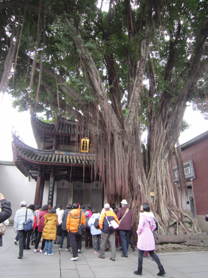

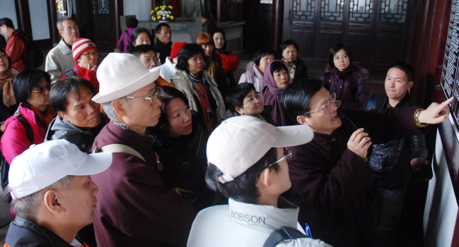

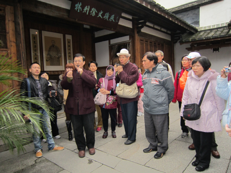

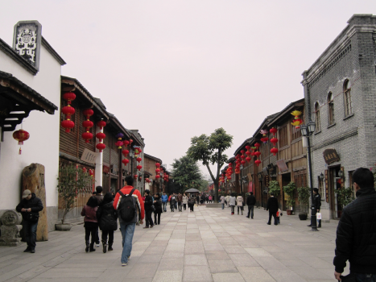

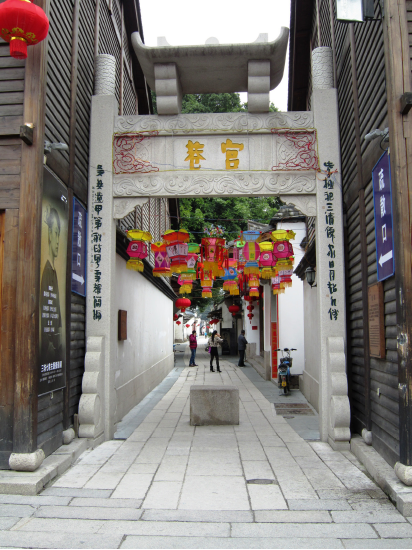

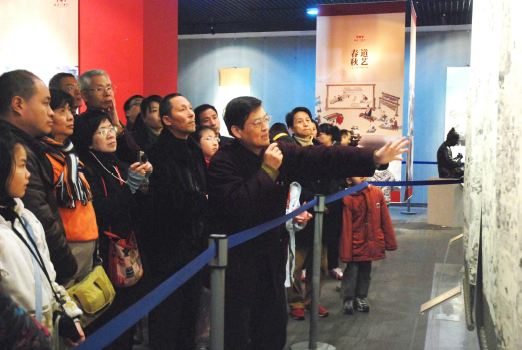

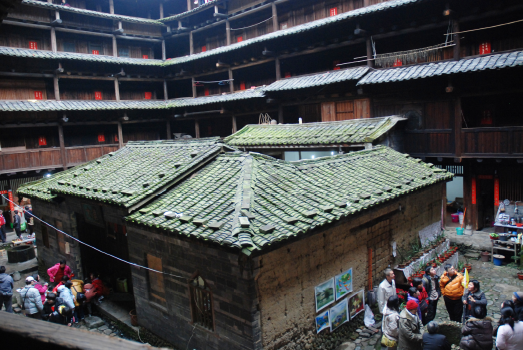

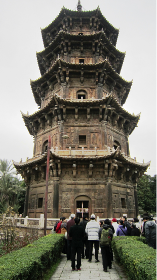

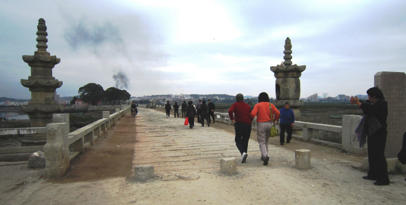

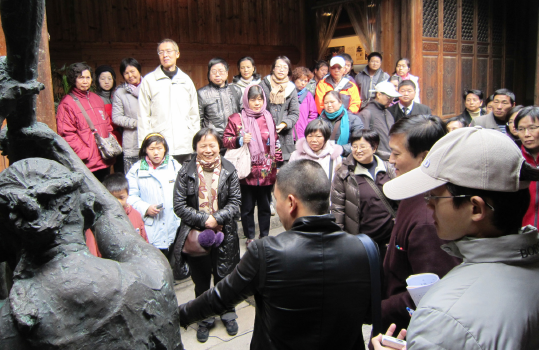

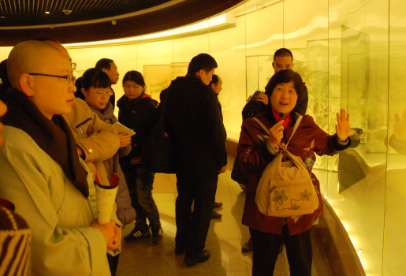

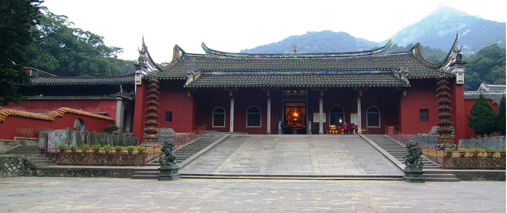

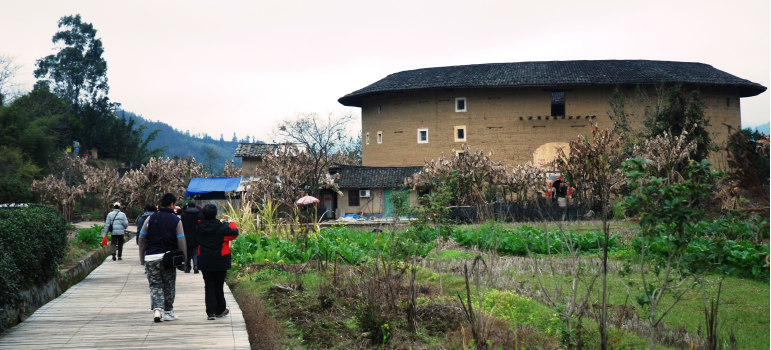

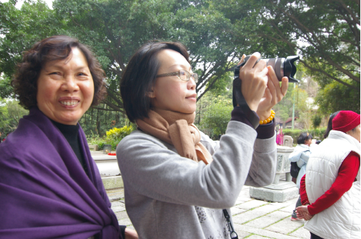

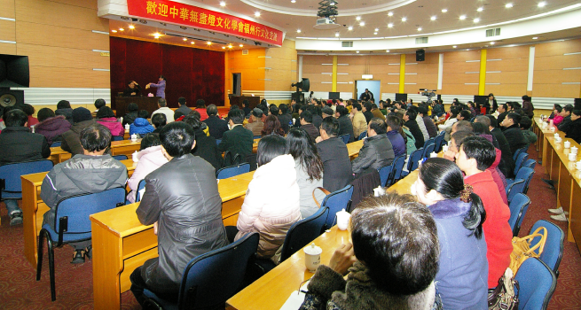

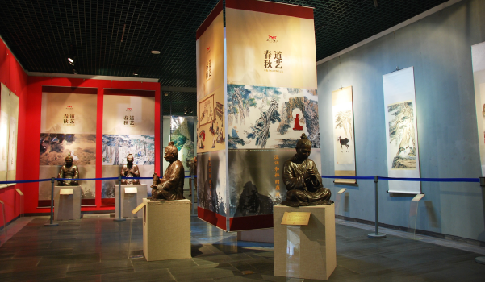

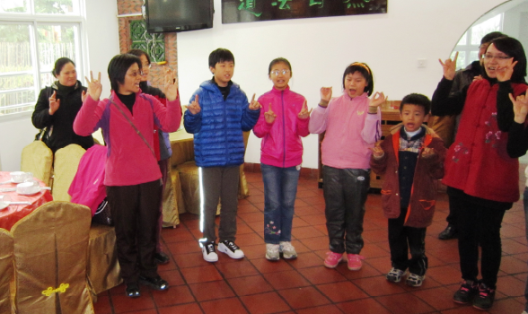

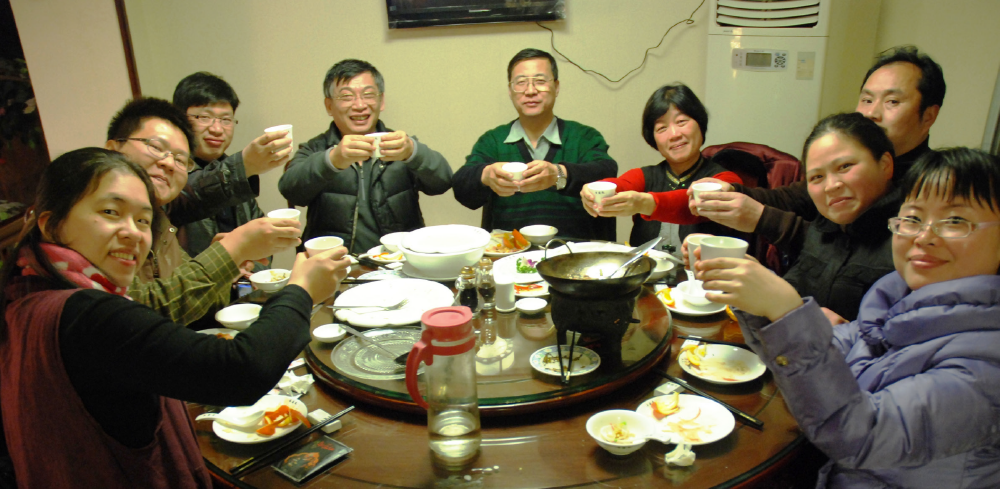

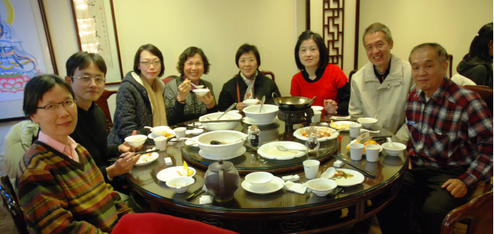

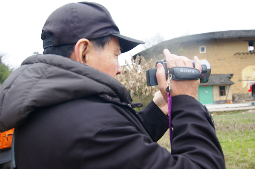

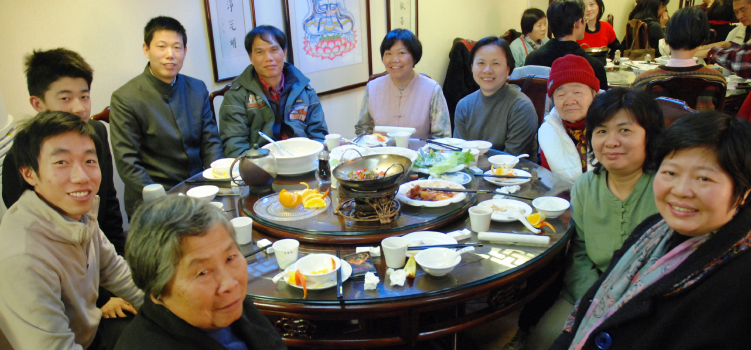

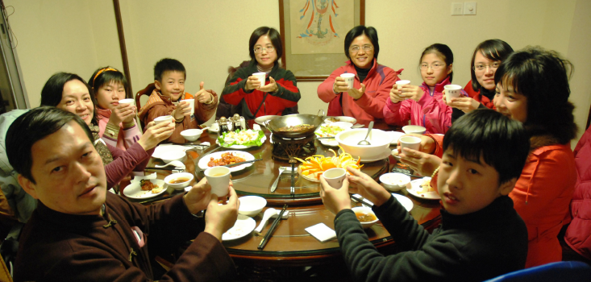

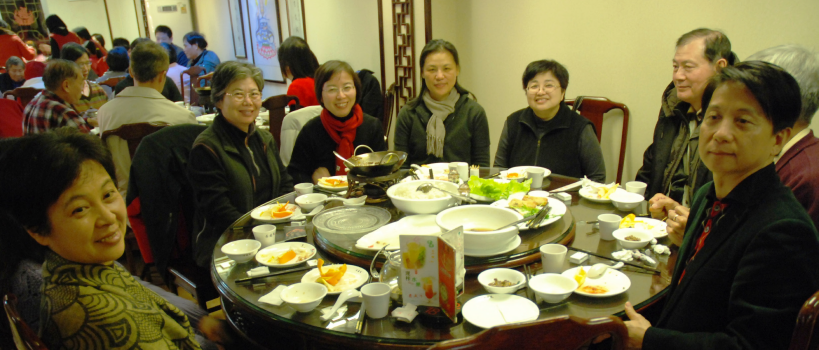

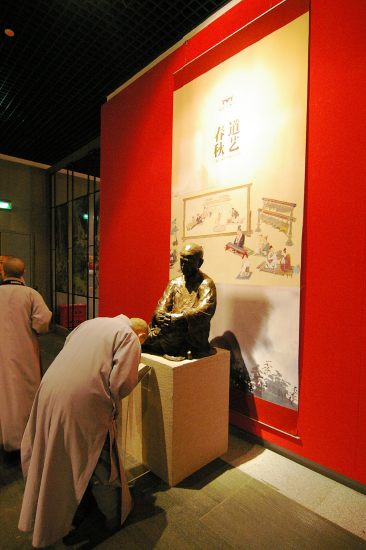

### 大時代的文化貢獻~道藝春秋展的饗宴　福建土樓巡禮

淨爾

緣於戰亂南遷避

山明水秀桃花源

可喜維持當年樣

嘆剩樓跡文化殘

「承前祖德勤和儉，啟後孫謀讀與耕」

這是福建承啟樓大門的藏頭聯，短短十四個字道出先人對子孫的期許：勤、儉、耕、讀。

勤、儉、耕、讀正是客家人的普遍特質，走進土樓，空氣中瀰漫著曝曬過陽光的酸菜、梅乾菜的味道，不論在臺灣還是在福建，那都是屬於客家村落的獨特氣味。土樓的興建，就是一部客家人的顛沛流離史，中原的動盪不安迫使人們舉家南遷，離鄉背井的中原人來到南方只當是作客的人，所以稱客家人。一部分客家人在動亂的時代中抵達福建，試圖在崇山峻嶺裡建立家園，或許因為當地盜匪橫行，或許為了適應地形地貌，或許為了懷念當年中原的豪宅大院，也或許是配合中國陰陽五行而建立起一座座圓的、方的、橢圓的、八卦形的特色土樓。緣起雖已不可考，但土樓的建築卻是揉合著客家人的文化與智慧而令世人驚嘆不已。

土樓的存在已有數百年歷史，現存最古老的土樓興建於唐朝，距今一千兩百多年。但真正受到矚目卻是因為一九八五年美國雷根總統時代的一個美麗的錯誤。當時美國中情局在中國福建省西南部偵測到數千座呈巨型蘑菇狀的不明建築物，建築物還飄出陣陣煙霧，因而推測可能是中國的核武基地，這一份祕密報告震驚了美國高層。同年十二月，美國調查員貝克夫婦以攝影師的名義來到福建，發現所謂的核基地原來不過是民居的客家土樓，而煙霧則是裊裊的炊煙……。

這個令人啞然失笑的錯誤意外為土樓帶來世界的關注，一九八六年，日本東京藝術大學考察團來到福建省南靖、永定一代進行土樓勘測，考察團發表的報告引起國際建築界的迴響，在二十世紀的尾聲，世人開始認識存在已數百年的福建土樓，福建土樓群自此聞名於世。

每一座土樓都是個擴大的家、縮小的城。只有一處大門，大門一關，樓裡自成世界。進入土樓，迎面的是供奉觀音像的祠堂，既是信仰中心也是慎終追遠之處，更是宗族議事、維繫一族和諧的場所，甚且還可作為學堂作育人才之用。

土樓內通常有陰陽兩井，正似中國的太極，也有的樓裡家家戶戶廚房裡都有井水孔，舀起來就能喝，入口甘甜。廚房設在一樓，二樓是糧倉，三樓以上是住房，幾百戶人家共住一起，雖然門戶獨立，但共用天井、共用走廊，因此與鄰居親友的關係密不可分，在這裡，家和則萬事興，一如可容納四百戶人家的承啟樓裡的一副堂聯所書：「一本所生，親疏無多，何須待分你我；共樓居住，出入相見，最宜注重人倫。」對於倫常關係的尊重，應是維繫土樓內龐大家族和諧的重要因素。

土樓建築特色：

一、堅強堡壘，不懼外侮

。

火攻不怕—防火木材的大門又厚又高不易著火，就算放火燒門，頂端也設有倒水裝置。

破牆難入—土樓的牆普遍厚度達一百八十公分，若用現代電鑽鑿出可容人過的牆洞得花上兩個星期，遑論使用古代手工具。

鑽窗必卡—三樓以上才設窗戶，而且是外窄內寬，窗戶大小保證是頭過身不過，想飛簷走壁鑽窗而入的必定卡住。

二、乾燥。

現代樓房常受潮溼之苦，幾乎家家必備除濕機。位在多霧山區的土樓卻是不潮濕不發霉，風濕病絕緣。原因一是屋簷寬大，大雨不灑落牆面。原因二是一樓為廚房，灶火蒸騰，無形中由下而上烘乾了整座樓。

三、平等分配。

圓形土樓沒有四角的房間，每一戶房大小都是均等的，有利於家族內部分配。

四、利於擋風與抗震。

圓樓對風的阻力比方樓小，從抗震角度來看，圓樓更能均勻的傳遞水平地震力。

土樓大王—承啟樓

「高四層，樓四圈，上上下下四百間；圓中圓，圈套圈，歷經滄桑三百年。」

位在永定縣的承啟樓，據傳是明崇禎年間破土動工，直至清康熙四十八年才完工，歷經半個世紀才完成這座可容納四百戶人家的江姓家族土樓。位在中心點的祠堂外共圍繞著三圈主樓，最多的時候有六百多個人住在裡面。

沼澤地上的土樓—和貴樓

位在南靖的和貴樓高五層，二十一點五公尺，是世界最高的土樓。相傳清朝年間一位簡姓學子在赴京趕考的路上經過此地，發現是一塊風水寶地，於是放棄進京趕考留在南靖為後世子孫興建這座「以和為貴」的和貴樓。初時興建時並未發現這是塊沼澤地，而是建了一層樓後，整座樓竟像沉船一樣，沉入地裡。簡姓族人左思右想後，利用木頭的浮力，將樓建築在木樁上，因而順利蓋出了五層樓高的和貴樓。

即便現在，人們只要站在天井裡的鵝卵石上跺腳，就可以感受到腳底下的地面向漣漪一樣波動著。

除了沼澤建樓這件奇事之外，和貴樓還有一奇。樓中兩口相距不過十公尺的水井，一口水質甘甜、水清如鏡，一口卻是混濁不堪、無法飲用。雖然推測地下有兩條水脈，但迄今仍難以用科學原理解釋明白。

敦文修武的懷遠樓

「懷以德敦以人藉此修齊遵古訓，遠而山近而水憑姿靈秀育人文。」由緬甸客家華僑出資，建於清宣統元年的懷遠樓，形制完備。天井中間的「斯是室」，採斯是陋室之意，既是家族祠堂也是私塾，門柱、牆壁上的對聯如「書為天下英雄業，善事人間富貴根」、「天下良謀讀與耕，世間善事忠和孝」等均在勉人向學。斯是室的右邊為私塾老師的住所，左邊為兵器室，文武兼修是懷遠樓的特色。

參考資料：

一、漢聲雜誌「福建圓樓專集」，漢聲雜誌社，民國七十八年八月出版。

二、「永遠的家園，土樓漫遊」，海潮攝影藝術出版社，西元二○○二年出版。

三、「土樓楹聯」，永定土樓文化研會編。

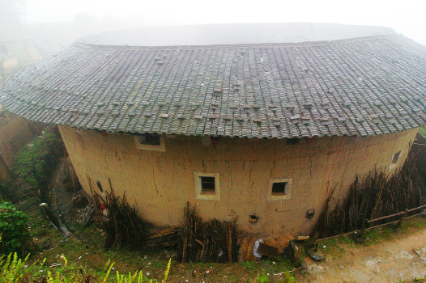

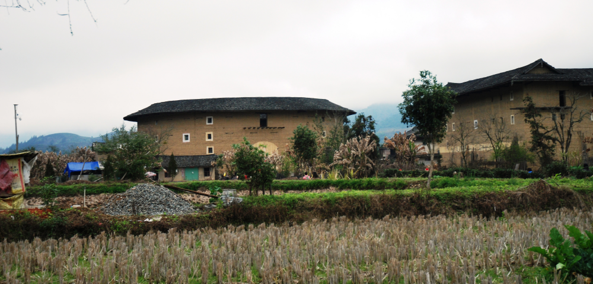

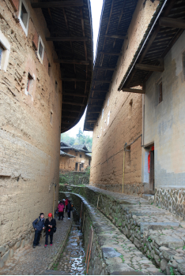

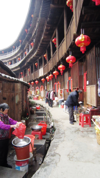

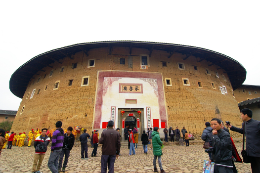

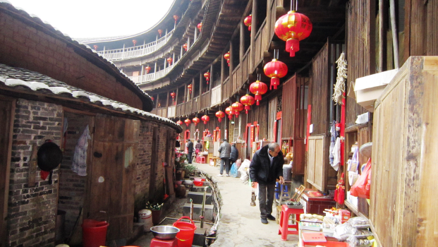

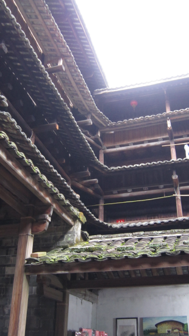

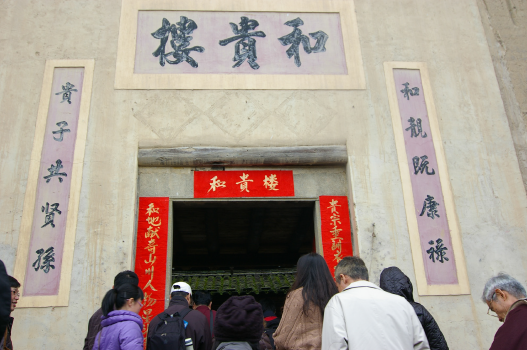

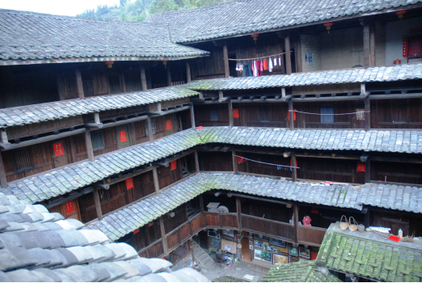

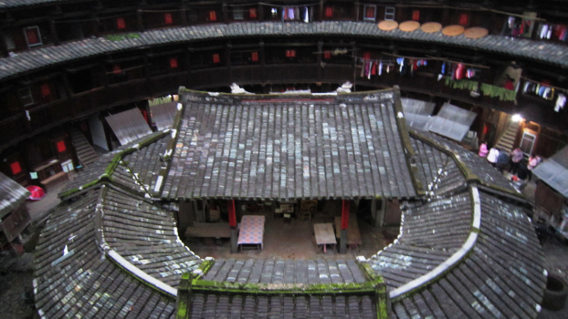

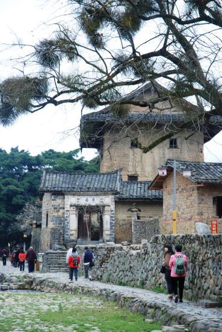

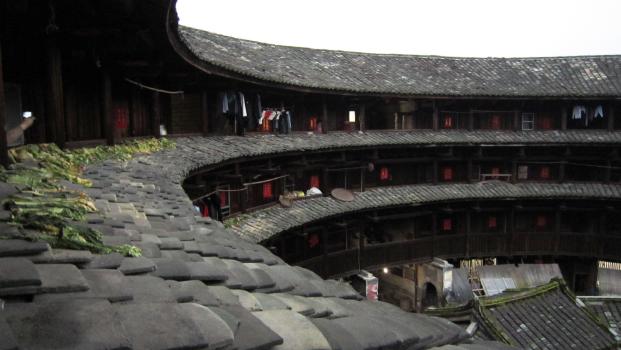

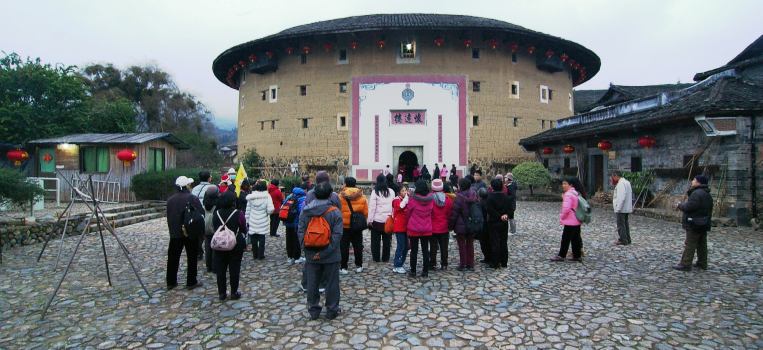

### 發揚禮教：孔門十哲之九~子游

*編輯部整理*

孔門後進出高弟

知禮能斷眾人疑

大道推行武城治

牛刀割雞堪大任

言偃，字子游，少孔子四十五歲。在孔門十哲中，子游和子夏同列「文學」科，文學指詩書禮樂文章而言。

子游深通禮樂，是真正嫻習於禮樂。優游於詩書中的人。塑像中的子游，一派老先生教書模樣，眼神安定，臉上神情祥和，氣定神閒，顯示他長期在禮樂的薰陶下，所展現的大家風範。塑像中的他左手輕握著矩之禮器於膝上，右手微張，輕舉於胸前似作說明，我們可從禮記檀弓中，知當時公卿、大夫、士、庶人，凡是討論禮而不能抉疑者，以子游一句話為定奪。老先生明白先王制禮皆依於人情，具有深意。只是後人不知其義，儀式成了形式。所以此塑像是表徵他能將外在儀式及內在含意說得明白，而且通達人情。

由於子游通達禮樂的深旨，因此二十餘歲即出任為魯國武城邑宰，將禮樂教化，具體實踐，深得孔子衷心的喜悅與讚歎。論語中記載孔子到了武城，聽見弦歌的聲音，那是公學與私塾對學生們的教化，是為政大治的根本。孔子微笑的說：「割鷄焉用牛刀。」言下之意，雖似惋惜子游大才小用，以治國平天下的禮樂大道，來治理一個小城，實則讚歎子游能將禮樂大道施化於武城。子游也知老師的心意，亦以幽默的口吻回答說，從前曾聽夫子說過：「君子學道則愛人，小人學道則易使也。」大意是說，純正的音樂，如詩的雅頌之音，可以調和人的性情，配合禮教，就是禮樂教化之道。在位的人學了禮樂之道，就能愛民；民眾學了禮樂，與君子志同道合，對於君子愛民利民的政令必然擁護，所以易使。

孔子高興，說了「割鷄焉用牛刀」的一句戲言，足見聖人也有輕鬆的一面，但在輕鬆的言辭裏，卻能顯示禮樂教育的重要，即無論治理天下國家，以至於像武城這樣的小城，都要實施禮樂教育，這才是為政之道。

子游不僅嫻熟禮樂，而且具備多方才識，更能知人。子游為武城邑宰時，孔子曾垂問他是否覓得人才。子游特別拔舉澹臺滅明，認為他「行不由徑，非公事未嘗至於偃之室也。」古時井田制，路在井田之外，徑在井田之內。行人須守規矩，由路不由徑。至孔子時，規矩雖存，而行人圖速，往往取捷徑，然而澹臺滅明仍由路行。同時，他非公事則不造訪子游，亦即不攀私人關係。舉此二者，以見其人品行之端正，所以子游認為他是人才。後來澹臺滅明亦成為孔子弟子，名重諸侯，果然不負子游的引薦。
而孔子在子游的心目中又是如何呢？我們可由子游與季康子的一段對話來了解。季康子問子游：仁者愛人嗎？子游回答是。接著季康子又
**問：** 那人們也愛他們嗎？子游也回答是。季康子就困惑的說：鄭國子產死的時候，鄭國人民非常悲慟，因此男子不佩玉，女子不戴耳環，大家在街巷哭，三個月期間沒有人奏樂。可是孔子去世時，我沒聽說魯國有此光景，這是怎麼回事呢？子游於是分析說：這就好比溝渠裏的水，得到它的灌溉就活，得不到就死，作用是立即的。子產的惠澤就如「小德川流」這般的明顯。而孔子的恩德，如「大德敦化」，就好比天上的雨水，恩澤普及於生民，而人民卻渾然不覺，視為平常，人們時時依靠它活命，卻不知珍惜。子游之言，真是體察入微，一針見血，值得大眾深思。

子游好學深入禮樂之本源，成為孔子禮教的推行者，並由此發揚光大，亦是繼夫子之後，世人問禮之典範楷模。

唐開元時，子游被封為「吳侯」，宋封「丹陽公」，後又稱「吳公」。

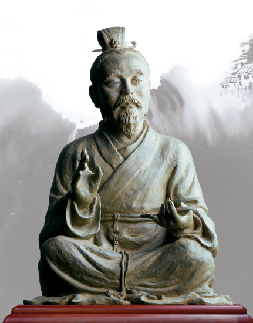

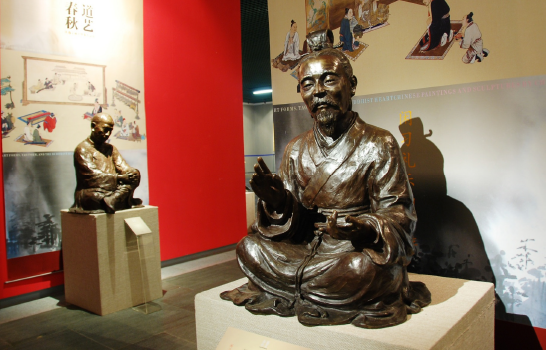

### 經學傳承：孔門十哲之十~子夏

*編輯部整理*

自信緣於得經學

西河教授名似孔

著述解經功聖門

青年典範道傳承

卜商，字子夏，衛國人，小孔子四十四歲，在孔門弟子中，和子游同列「文學」科，特別擅長於「詩」。

子夏是孔門十哲中，傑出而成功的教育家，塑像中的他頭戴頍冠，頭髮後梳，形象年輕，代表他年輕即學有所成，眼神流露出傳經的信心，那是他對詩、書、易都有體會。頭部微向右上揚，加上面部表情是飽學的自信，乃孔門中傳承經典的人才。

他的手勢橫捧豎托經典，橫表地、豎表天，象徵傳承經典的義理，能經天緯地，亦即以聖賢道統承接天命為豎，化育萬物為橫。如此的形象，如同向老師承擔傳承經學的使命，又像是向弟子傳道的自信。

子夏曾說，君子給人的觀感有三種變化，即「望之儼然，即之也溫，聽其言也厲」，似乎正是他的自我寫照。孔子去世後，子夏在西河開課授徒，魏文侯曾至其門下受教。
子夏擅長於詩，孔子曾嘉許只有子貢與子夏「可與言詩」，能悟言外之意。有一回，他以詩句：「巧笑倩兮，美目盼兮，素以為絢兮」詢問孔子，孔子回
**答：** 「繪事後素。」明繪畫的程序，是先以粉地為質，然後再落筆上采。拿美人的口目比作素地，口頰含笑的倩，眼波流轉的盼，比作上采。經過譬喻，他頓然悟道：原來禮的節文，後於忠信的美質。孔子欣慰地讚歎他能發詩的旨意，可以和他談論詩哪！

子貢曾問夫子，子張和子夏哪位比較賢明。孔子說：「師也過，商也不及。」子張才高志廣，但行事常操之過急。而子夏卻篤信保守，有所不及。由此可知，子夏的個性比較拘謹保守但踏實。

子夏的教育理念是什麼呢？我們列舉三章論語來見其大概。子夏說：「賢賢易色，事父母能竭其力，事君能致其身，與朋友交言而有信。雖曰未學，吾必謂之學矣。」子夏認為教育的目的在樹立一個人的品德操守，時代在變，而人倫之學不能變。因此夫婦要重德輕色，從端正人倫開始。進而孝順父母，盡忠國君，誠信待人。所以行在五倫，即是學矣。

其次，講到學習的方法。子夏說：「日知其所亡，月無忘其所能，可謂好學也已矣。」學者應每日學習新的學問，並時時溫習舊有的學問，能夠如此，就可以說是好學了。

至於學習的態度，子夏指出：「博學而篤志，切問而近思，仁在其中矣。」學無止境，必須廣泛的求學，並牢記所學，有疑難之處，趕快請問師友，同時尋思其義理，能將所學都實行出來，利益大眾，仁自然就在其中，也就符合中庸所謂「力行近乎仁」的道理。

此外，在為政上，子夏也有若干觀點值得一提。首先他認為，君子使民和事君都要以「信」為優先。他說：「君子信而後勞其民」，「信而後諫」。君子在位時，要先取得民眾的信賴，才能勞役百姓。君子若為人臣子也要先取得君主的信任，然後才能上諫。否則民眾會以為你虐待他們，君主會以為你在毀謗他。

其次，學者從政，他認為應該：「仕而優則學，學而優則仕。」為官者，在公事之餘，須致力研究學問，研學先王典訓，熟悉王道施政的理論與實務，這是賢能政治的基礎。而讀書人，在學問充實之後，應該從事政治，替國民造福。不過其前提均是以民為本，一切秉持公心，非為私慾。

而在處世待人上，子夏主張：「大德不踰閑，小德出入可也。」就是對人不要求全責備，一個人的尋常言行雖然不夠嚴謹，待人接物的禮貌也不周全，但能守持倫常之道，不虧損大節，人格健全，這就可取了；反觀今日的社會，實為至理名言。

子夏的才學，不僅表現於文學方面，同時也是一位博學的通儒，深得師門心髓的頂尖人物。舉凡詩、書、禮、樂、易、春秋，此六門孔子教授課程，子夏都能深入並發為精闢的論著，所以在孔門諸弟子中，他獨開儒家傳經的首功。

有關子夏的著述，流傳於後代的有易傳、詩序、禮儀喪服傳等篇。雖然子夏對於春秋，曾自言不能參贊一辭，卻將春秋微言大意，透過門下弟子，再傳至公羊高、榖梁赤，完成了公羊傳、穀梁傳。這種傳述經義，開啟後學，奠定儒學研究的基石，實肇端於子夏，所以古之學者說，詩、書、禮、樂刪訂於孔子，而發明其文字義理的，開始於子夏。

子夏說：「君子學以致其道。」他認為，君子必須經由求學，才能成就君子之道。他深知教育與學習的重要，因此孔子去世後，子夏便授徒於西河，受到當時魏文侯的禮敬。至於其他從學之徒，如守道不仕的段干木、著法經、網經的李克，開戰國時代法家的先河，可謂影響後代至為深遠。

唐玄宗時，子夏被封為「魏侯」。宋代時又加封為「河東公」。

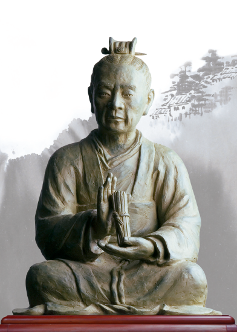

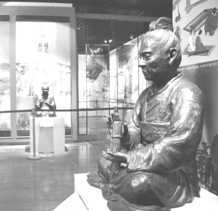

## 活動報導

### 壬辰年新春團拜報導

*編輯部整理*

歡聚於新年團拜

寓教於樂結交情

佳兆緣起龍年後

興傳正法人才出

二○一二年一月廿九日

學會搬遷至寧波西街新道場的第一個新年，在長達九天假期的最後一日，大眾齊聚一堂舉辦新春團拜，意義非凡。適逢龍年，龍在古代與麒麟皆屬瑞獸，十分吉祥，淨印、淨爾兩位學長主持新春團拜，一位屬龍、一位屬馬，正象徵龍年之始要有龍馬精神，要有理想、有方向！團拜當天節目，以象徵皇帝九五之尊的九個精彩節目，作為對佛菩薩、對大眾最殊勝的供養。

首先老師期勉大眾，新春團拜暨節目表演意在凝聚大家共識的寓教於樂，讓大眾在文化上、在儒學、佛學上開展出內心的康莊大道。並藉此機會感謝執行長發心帶領辦事團隊，讓法務欣欣向榮、蒸蒸日上，使學會所辦的活動，一切井然有序熱鬧且喜氣洋洋。此次端賴許多人默默的犧牲，場地也在最後一天布置完成，未入門已能感受新年新氣象。

張居士發表新春感言說：

人生短暫的學習過程中，一路走來，能夠遇到志同道合的仁人志士以及團體真的很不容易，在末法時代要遇到有傳承的正法與傳人，尤其不容易，而今大家都共同擁有此福報。團體在這十幾年裏面的努力所創造出來的影響非常深遠，尤其近年對大陸文化交流的影響力不可小覷，學會的課程已令彼等人士確實認識到中華文化還是在臺灣，臺灣真有傳承，能讓彼等真正認識到中華文化在臺灣的成就，這也是團體長期耕耘努力，逐漸顯現出來的成果。今天在寧波西街有一個新的活動場地，相信今後在老師蓮友的努力下，一定會把雪廬老人的遺志貫徹下來，把傳承更長遠、深入的帶給社會大眾。

經過師長們的新春祝詞勉勵後，精彩的節目一一上場，節目首先以養成班的應景劇「八仙報喜」開啟序幕，以彭祖看盡人世間無常，與苟杳修行往生得成就之戲碼，道出成仙並非究竟，福報享盡還是要墮落，健康長壽也不值得恭喜，長壽的彭祖嚐盡了人生的生離死別悲歡離合後發出深切的感嘆；那人生到底要追求甚麼？什麼是新年新希望？原來唯有發菩提心，修學正法，方能開啟新氣象新格局，期許在龍年更為增上。

啟蒙班同學與週四蓮友的小提琴演奏，讓美好的音樂化導人心，經由練習而達到熟練，就像我們對教法不斷串習，結合有法來觀修，熟能生巧。

接下來的節目是一連串周四三代共修班的接力表演，所演唱的<YUYAKE夕燒>，踏著夕陽回家，學佛後看到夕陽，要作往生西方之落日觀，專心繫念想於西方，見日欲沒，狀如懸鼓。後有母子檔合唱「隱形的翅膀」，我們如果能有一雙隱形的翅膀，遇到障礙，就可以衝破它，飛向自由；遇到黑暗，可以突破它，飛向光明，而且隱形的翅膀就是智慧！人生的突破就在知見的突破！另獨唱曲目「遠山含笑」，期許大家在道業上義結金蘭，作一個生死之交，一起追隨善知識，一起共學增上，或能在知見上達到共識，組成佛化家庭成為法侶！最後全體合唱「朋友」這首歌，襯以歷年學會所做善法製作的音樂影片，回顧過往，大眾深深感動。
觀待過去所有的善法、所有的學習，學會有了一個安定的家，每週除了各地的研討共修、啟蒙班之外，在這裡每週一、三、四、五、六開設了固定的課程，有常禮舉要、大學、論語、淨行品、金剛經和助念須知等課程，在去年底圓滿了金剛經的課程，並開啟了普門品課程的序幕，可以說是法喜充滿的一年。不僅如此，在過去一年出版了會刊、經文研學之科判、畫冊等等，團體也多次遠赴大陸講學，並導覽江逸子老師在福州的畫展。時間飛逝中善法接續上演，讓大家在忙碌的生活之中，未曾放下修學發心的志向！夜深人靜時捫心自
**問：** 這是我要的生活嗎？來年要繼續嗎？答案是肯定的，因為有教法的學習，人生雖忙但不空轉，當人生的疑惑與秘密一一解開，有了趨吉避凶之道，人生到頭絕對不會一場空。

大專班表演舞蹈，象徵年輕的朝氣，節目名稱叫做「舞龍開春賀禧」，舞龍在哪？題目有沒有錯？每位上場的年輕人都是傳承聖道的龍子，而且舞得像龍，來作為開春的祝賀啊！但想看真正的舞龍，就得要看東勢蓮友帶來的壓軸節目：「祥獅獻瑞迎新春」，蓮友們商借衣服、道具，自己製作加工，老、中、青三代一同表演，為節目的尾聲帶起高潮。

節目期間亦穿插精彩的猜燈謎，在此感謝提供燈謎的淨域老師，寫燈謎的戒福老師，提供音樂的戒堂老師，眾多的幕後工作人員及義工。在新的一年期許自己從內到外除舊佈新，從內到外迎新春，從身體到心理除去舊習氣迎來新生氣。更祝福師長們身體康泰，諸位蓮友光壽無量，法喜充滿。

猜 燈 謎

一、啦啦隊不准坐下（猜一設施）

二、君子之困（猜新北市地名）

三、笑彌勒（猜美國一大學）

四、劊子手的嘴臉（猜古代一官名）

五、老婆婆燙頭髮（猜一種食物）

六、紅娘（猜台語一詞）

七、酒肉朋友（猜一食品）

八、半真半假（猜一字）

九、七把刀（猜一字）

十、一家三口（猜一字）

十一、滿座眾聞皆掩泣（猜一武器）

十二、這字不難猜，而且不分開（猜一字）

十三、車子開錯路（猜一用品）

十四、秤（猜一成語）

十五、大人揹小孩（猜一字）

十六、游泳比賽（猜一成語）

十七、臥倒（猜一成語）

十八、狡兔死走狗烹（猜棒球術語）

十九、一時半刻（猜一字）

廿、欲言又止（猜一字）

廿一、八哥（猜一字）

廿二、四十除以六（猜一成語）

廿三、胖子跳舞（猜一食品）

廿四、臨行密密縫（猜一文具）

廿五、種豆南山下（猜一字）

廿六、孟嘗君好客（猜一種飲料）

廿七、一乘一等於一（猜一成語）

廿八、通通有獎（猜一個字）

廿九、窮漢不肯賣鋪蓋（猜三國一人名）

燈謎解答

一、加油

二、竹圍

三、哈佛

四、宰相

五、銀絲捲

六、赤查某

七、餃

八、值

九、切

十、闆

十一、催淚彈

十二、面

十三、白花油

十四、平分秋色

十五、尖

十六、力爭上游

十七、五體投地

十八、雙殺

十九、孩

廿、認

廿一、兌

廿二、陸續不斷

廿三、肉鬆

廿四、別針

廿五、豈

廿六、養樂多

廿七、一成不變

廿八、份

廿九、劉備

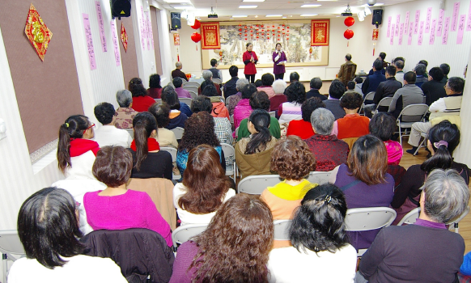

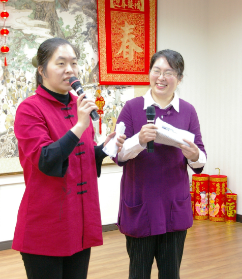

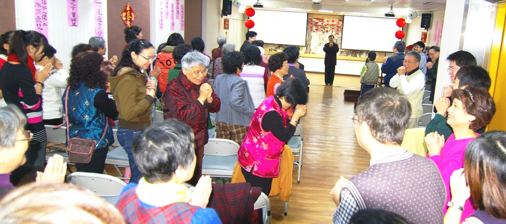

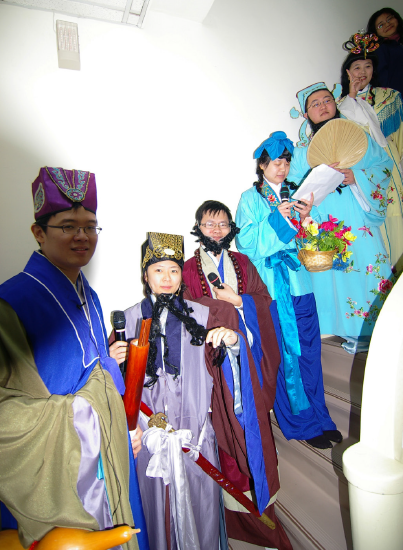

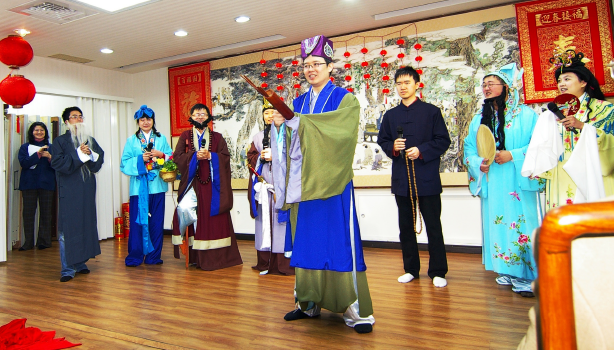

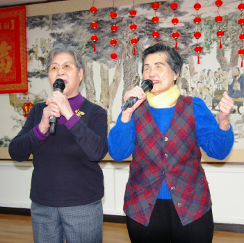

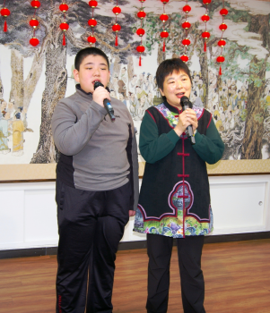

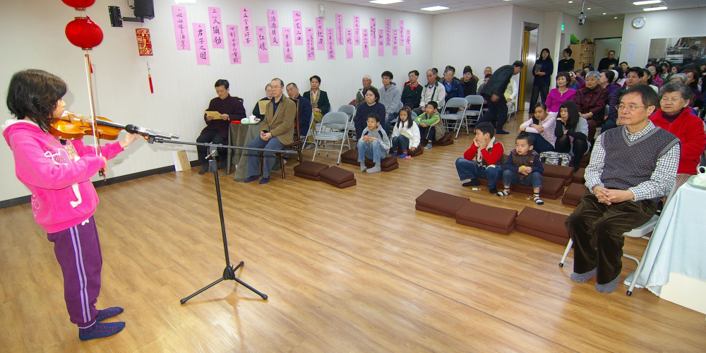

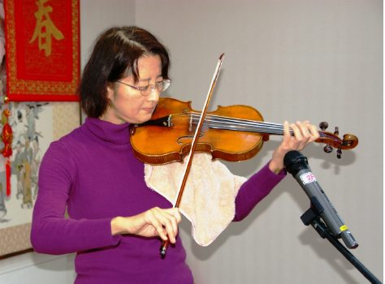

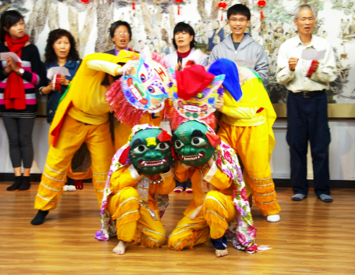

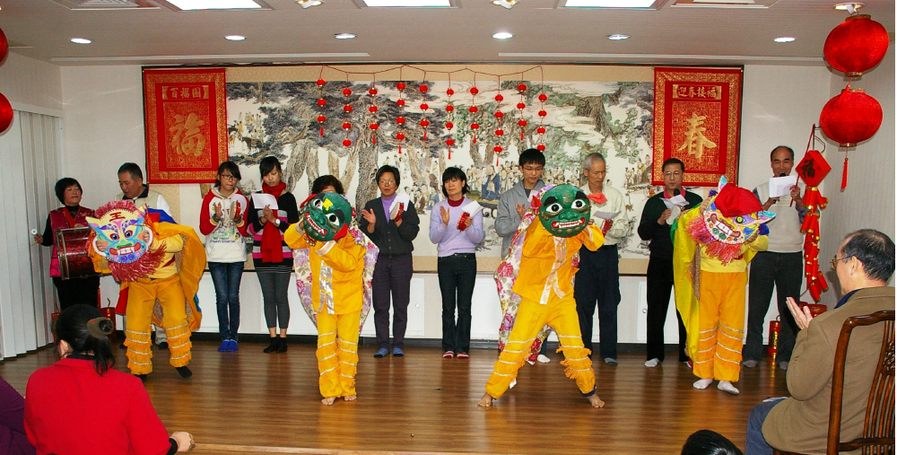

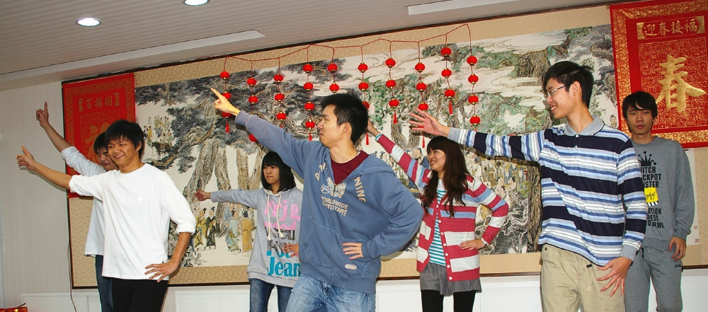

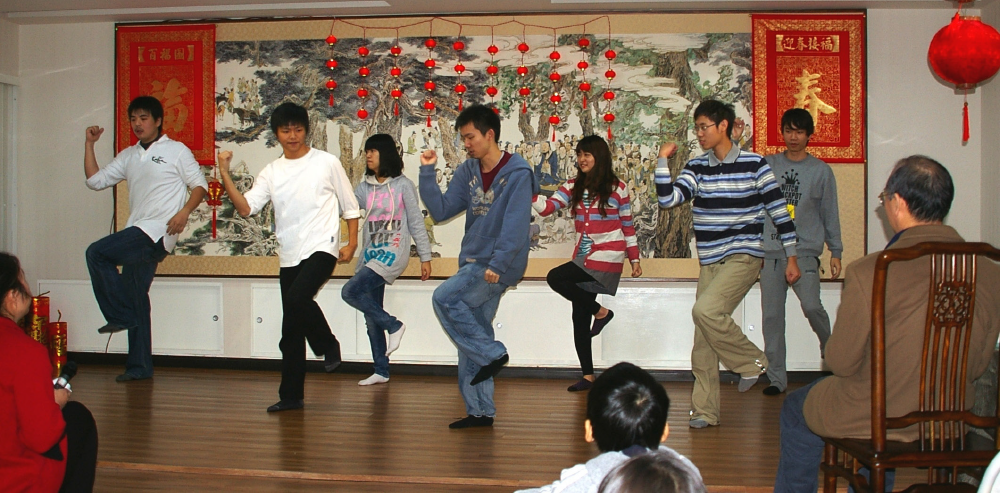
