# 第85期
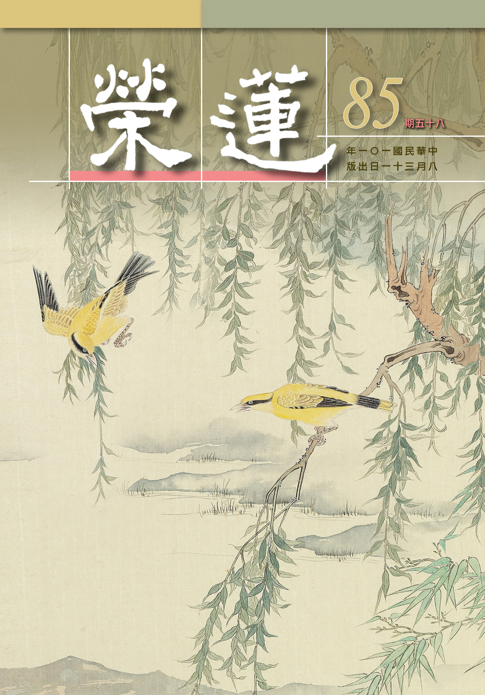

## 社論

### 風雨的啟示

本刊

風雨驗人心

文化待有志

飄搖待正見

齊迎妙春回

六月十日星期日，最具降雨潛勢的梅雨鋒面，與今年首波的西南氣流會合，形成一股無情的豪雨攻勢，中央山脈以西各個縣市，無一倖免於這場大雨的襲擊。各地的降雨量驚人，各項排導水設施未能如願發揮功能，再加上政府官員的決策失誤，釀成了許多難以彌補的傷害。全臺至少六人死亡，九個市縣共撤離五千五百四十人，有三處因為交通中斷而形成孤島的村落，土石流紅色警戒流域有四百十一條、黃色警戒四百十六條，停電戶數共五萬九千八百九十四戶，農損統計約一億四千萬元。

七月三十一日星期二，今年第九號颱風蘇拉，開始對台灣造成影響，由於蘇拉颱風登陸兩次，結構遭到破壞，威力大減，即便如此，蘇拉自東北角掠過之後，全台農業產物及民間設施損失，估計有新台幣七億五千四百六十七萬元，大地滿目瘡痍，災情依然慘重。

八月二十八日星期二，今年第十四號颱風天秤，在沿著巴士海峽吸收水氣轉為中颱之後，回頭重創蘭嶼。十九級強風掀起了十二公尺高的大浪，開元港內鄉民賴以為生的四十多艘漁船，被擊成碎片或沉入了海底，島上唯一的加油站與超市被夷為平地。大浪藉著漲潮，挾帶大量礁石衝進農會超市，八八風災期間才花費了七百多萬元的整修成果，頓時成為一堆鐵皮瓦礫。全島八百多戶人家，超過一半民宅泡在水裡或被強風吹垮，多處停電、停水、停話，彷彿廢墟，蘭嶼鄉長以「有史以來最慘」形容這次的災情。

颱風豪雨成災之後，隨之而來是許多的檢討、批評甚至謾罵。然而種種的改進措施、會議舉行、硬體修繕，是否真能完全防範未來的災害？眼前所做的一切努力，是否堪得住另一場「超乎預期的自然力量」？特別是有關世紀災難的傳言，現在可謂甚囂塵上，面對這類的說法，應該如何予以因應？可不可以從這幾次的天然害當中獲得任何的啟示？眼前所見，有人開始囤積物資，尋覓避難場所；有人選擇不理世事，自我修行了脫生死；有人不再相信人事可為，完全聽命鬼神靈媒的指引；當然還有許多是繼續專注於眼前的享樂，完全沒有任何的反省作為。

倘若世界真有天搖地變，發生猶如電影情節般的氣候變化，試問這樣的世紀災難，地球上有哪一個角落可以讓我們安然隱蔽？遠離團隊自我閉關，完全不理世事的修行方法，是否真能如法地超脫生死羈絆，會不會反而走火入魔？人事不再講究，盡信靈媒鬼神，可謂完全違背了古聖先賢的教育理念，只是一種自愚愚人的生活方法。至於專顧眼前享樂不問道德修養，那更是猶如走獸，是一種枉費人身的作為。

孔老夫子見到迅疾而至的雷，或是非常猛烈的風，由於出乎尋常，是故必有應變之舉。《禮記‧玉藻》說：若有疾風迅雷甚雨，則必變，雖在夜間，亦必起來，穿戴衣冠而坐。這是敬天之怒的表現，天怒必起於人事，是故要在人事上講究，要在人心上表達恭敬。堯有九年之水不失為帝；湯有七年之旱不害為主，這是因為兩位明君真能苦民所苦，勤於政而愛其民，不僅是向天地神祇禱告，更重視的是自我的品德修持，以及人事上的努力，所謂是：茍日新，日日新，又日新。因此，他們雖然遭遇連年凶災，還是能得人民支持；雖然環境極為困苦，最終仍能安然度過，這是人心修德的力量，是在人事上不斷努力的成果，不是從天而降的奇蹟，更不是鬼神所指引的未來。
《論語》中子路曾請教孔子，如何事奉鬼神？孔子回
**答：** 能事奉人，才能事奉鬼神。子路又問死後的狀況，孔子說：尚未知生，何能知死。意思是想要知道死後的狀況，應當先知生前的狀況。聖人教導我們，人事是避免災難的用功處，人心是改變命運的下手處，試問改造別業與共業的諸多方法中，還有什麼比從這兩處去做更為實際，更符合聖賢的教誨呢！

## 大德法語

### 大方廣圓覺修多羅了義經（四十四）清淨慧、威德自在菩薩啟請

道源老和尚

入於能所雙亡

並非修學對治

煩惱無因而生

亦不必對治滅

癸二、證位階差

子一、明依位漸證

丑四、果位

寅二、明心

經文：

法界海慧，照了諸相，猶如虛空。

成了究竟覺（成了佛）證得智慧，是徧法界的智慧，廣大甚深，猶如海般，謂之法界海慧。由法界海慧照了一切諸法界，猶如虛空一樣，亦即：即一切相，離一切相。

寅三、結名

經文：

此名如來隨順覺性。

以上是成了佛，即是成就如來隨順覺性，謂之究竟覺，滅了生相無明。

子二、明亡心頓證

丑一、亡心入覺

寅一、指示安心

經文：

善男子！但諸菩薩，及末世眾生，居一切時，不起妄念，於諸妄心，亦不息滅，住妄想境，不加了知，於無了知，不辨真實。

初發心的菩薩以及末世的眾生，居在一切時，觀察妄念本空，無妄想可起亦無可滅。住在妄想境是不加了知，亦即遇到妄想境界不要起分別，不要加以了知（無自相故），於無了知處不辨真實，在無了知的境上，無真實可辨。

寅二、依法頓入

經文：

彼諸眾生，聞是法門，信解受持，不生驚畏，是則名為隨順覺性。

你聽到頓超的法門，信解及如是受持，對於空無所有的這個境界不驚不畏，此即金剛經所說不驚不畏不怖，在圓覺自性上根本沒有那些差別相。

丑二、驗果知因

經文：

善男子！汝等當知，如是眾生，已曾供養百千萬億恆河沙諸佛，及大菩薩，植眾德本。

尤其到了今天末法時代，聞到這頓超法門不驚、不畏、不怖，且能如是用功修行，這種人很少，怎麼樣很少？乃因所種善根深厚，於過去無量劫來，已親近供養過百千萬億恆河沙數的諸佛及大菩薩，種了大善根（德本即善根）。

丑三、即成佛智

經文：

佛說是人，名成就一切種智。

一切種智就是一切種類、諸法，佛無不了知，謂之得一切種智。亦即佛說這個人決定成佛，他已經得到佛的智慧了。

講到這裡，還是希望我們妄心頓證，依次第來解釋無次第（頓超）。合著前述：知是空華，及無輪轉，亦無身心受彼生死之道理。及普賢章：知幻即離，不作方便，離幻即覺，亦無漸次（以上頓超）。再說十信位如何、三賢位如何、十地位及究竟位如何？那是漸次差別。若能一念不生頓超佛境，隨順覺性，此即這一章的道理，以上長行文講竟。

辛二、偈頌

壬一、標頌

經文：

爾時世尊，欲重宣此義，而說偈言：

以上是清淨慧請問，佛以偈頌重宣所述義理。

壬二、正頌

經文：

清淨慧當知！圓滿菩提性，無取亦無證，無菩薩眾生。覺與未覺時，漸次有差別。眾生為解礙，菩薩未離覺。入地永寂滅，不住一切相。大覺悉圓滿，名為徧隨順。末世諸眾生，心不生虛妄，佛說如是人，現世即菩薩。供養恆沙佛，功德已圓滿。雖有多方便，皆名隨順智。

菩提是佛的智慧，沒有能取所取，也沒有能證所證，這取證包括「能」、「所」，也沒有眾生及菩薩這些差別相。在未證入平等相前，有分為在知見上覺與未覺（勝解位非證入位），此時可論菩薩階位漸次差別。其中眾生為解礙，對法的勝解有障礙（未覺），菩薩（未至登地）則未離覺。然入了十地的菩薩則永寂滅，解礙及覺都了不可得，不住一切相，無相可住。大覺悉圓滿，是指到了究竟覺（成佛），名為徧隨順，即是徧法界性的隨順。

而末世諸眾生，須心不生虛妄，亦即妄心頓證，不要生虛妄心，生虛妄心就有能有所。佛說這個人，現世就是個菩薩，決定成佛，一定成就一切種智。此末世之人前生前世必供養恆沙佛，功德已圓滿。雖然有多種方便，通通名為隨順圓覺的智慧，亦即名為始覺知，雖有菩薩階位差別，但此智慧是隨順覺性。

以上大方廣圓覺修多羅了義經卷上，希望大家能將大乘起信論找出對著研究，了解名相與教理，不要記到錄音帶上，要記到心裡！

圓覺經分卷上、卷下，卷上已講完，現在開始講卷下：

戊二、四問答別明觀行中根修證

己一、二問答三觀修行

庚一、示三觀行相（威德自在啟請）

辛一、威德啟請

經文：

於是威德自在菩薩，在大眾中，即從座起，頂禮佛足，右繞三匝，長跪叉手而白佛言：

辛二、正陳請詞

壬一、慶前

經文：

大悲世尊！廣為我等分別如是隨順覺性，令諸菩薩覺心光明，承佛圓音，不因修習而得善利。

先讚歎他前章的開示。佛說法的音聲周徧叫作圓音，圓音分別有八種音，這個地方不講八個音，就叫圓音，讚歎到極處！

壬二、請後

癸一、問所修

經文：

世尊！譬如大城，外有四門，隨方來者，非止一路；一切菩薩莊嚴佛國，及成菩提，非一方便。惟願世尊，廣為我等，宣說一切方便漸次，并修行人總有幾種？

還要請問世尊！譬如有一個大城，外邊有四個城門，隨東西南北四方來者，來入城的這個人，不止是一個路，由東方來的就入東門，由西方來的就入西門，南方、北方來的門亦復如是，城不是只開一個門，叫人打圈轉，必轉到那個門進來，這就是楞嚴經說：「歸元無二路，方便有多門」，歸元沒有二條路；但是方便有多種門，譬如這入城，諸方來的眾生，就是各種根機不同，得有一個方便。

一切菩薩莊嚴佛國，及成就菩提，非只依一種方便，一切菩薩想發菩提心，修菩薩行者，欲莊嚴佛國，以及成就自己的菩提大道，那就不能只有一種方便，因為菩薩根性不一樣，所以說「非一方便」。

接著請問世尊，再說方便和漸次的法門，并修行人總有幾種？說明我們學共圓覺妙行的修行人根性不一，究竟有幾種人呢？

癸二、明所為

經文：

令此會菩薩，及末世眾生，求大乘者，速得開悟，遊戲如來，大寂滅海。作是語已，五體投地。如是三請，終而復始。

令現在法會的菩薩，先求得開悟佛理。大寂滅海就是如來的大涅槃境界，也就是圓覺的境界，能到如來的大寂滅海，圓覺的境界遊戲。作是語已，五體投地，如是三請，終而復始。（下期待續）

### 圓通寺結夏安居〜果公法語開示（一）

上果下清法師

結夏得僧臘

眾生大福田

供養與請法

福慧兩足尊

會長與諸位蓮友今天發心到圓通寺共同齋僧，功德無量。在此果清代表本寺致上至誠的感謝。今天跟諸位共同研習徹悟祖師的語錄。

首先介紹徹悟祖師生平的事蹟。徹悟祖師是淨土宗十二祖，際醒法師，字徹悟，號夢東，又稱號訥堂，是河北省豐潤縣人。俗姓馬，父親叫做萬璋，母親高氏。祖師生在清朝乾隆六年十月十四日，離現在大約兩百八十多年。

自幼他就非常的聰明好學。二十二歲因為大病一場，覺悟人生無常，所以就發起出世之心。病好之後就到河北省房山縣三聖庵，禮拜榮池老和尚為師，剃度出家。二十三歲在岫雲寺恆實律師座下受具足戒。二十四歲在香界寺聽隆一法師講圓覺經，在增壽寺聽慧岸法師講唯識，後來在心華寺聽徧空法師講法華、楞嚴、金剛等經，圓解就頓然開啟。乾隆三十三年，二十八歲，他參訪廣通寺粹如純翁禪師，師資道合，於是就傳心印成為臨濟宗第三十六世。

三十三歲，粹公遷至萬壽寺，祖師繼承廣通寺，率眾參禪，十四年就好像一天，很快就過去了，宗風大振，他的名聲傳揚於南北二地。他就常常憶念、仰慕永明延壽禪師，思惟永明延壽禪師是禪門的宗匠，尚且歸心淨土，日誦十萬彌陀，求生安樂世界，何況現在是末法時代，尤其應當遵守傳承教法，於是他由禪入淨，改變禪堂成為念佛堂，主張念佛，這要有很大的魄力。過去的開示以及文稿，都不留存，他純粹依淨土自行化他。各地方的禪門跟隨者很多，他每天限定一炷香接待客人，之外他唯獨禮拜念佛，一天一個鐘頭會客，其他自己時間就自己用功。

五十二歲遷至覺生寺任住持八年，仍然是率領大眾精修淨業。在淨業堂之外，另外建立涅槃、安養、學士三堂，作為送終、養老、利生的力用。使老病的僧眾有所依託，初學的行者隨宜的教化，行者沒有不歸心向道的，因此成為當時法門的第一人。

嘉慶五年，六十一歲退居河北省懷柔縣的紅螺山資福寺，當時追隨者很多，於是成立淨土宗的大叢林。他慈悲心切訓導有方，凡是上念佛堂，擔柴運水，修造房舍，一飲一食，都跟大眾共同一起做。十年之中作育僧才，得到法義，往生淨土的不少。

嘉慶十五年，大師七十歲二月間到萬壽寺，掃粹祖塔，辭諸護法，囑咐說：「幻緣不久，人世非常，虛生可惜。宜各努力念佛，他年淨土好相見也！」虛妄身心的緣不久了，人世非常，虛生而度則可惜，各別應當努力的念佛，他年將來淨土好相見。

三月，就準備辦往生的後事。到了十月十七日，就集眾囑院務，命令弟子松泉領眾住持。教誡他們說：「念佛法門，三根普被，無機不收，吾數年來，與眾苦心建此道場，本為接待方來，同修淨業，凡吾所立規模，永宜遵守，不得改絃易轍，庶不負老僧與眾一片苦心也。」念佛的法門上中下三根普遍得加被。沒有根機不收攝，我數年以來跟大眾苦心建立了這個道場，本來為了接待四方前來的人，共同來修淨業，也就是淨土念佛法門，凡是我所建立的規模應當要永久好好的遵守，不要更改，這樣子就不辜負老僧為眾的一片苦心。

往生的半個月前，感覺身體稍微有毛病，就命令大眾幫助稱念佛號，看見空中幢幡無數，從西方飄過來，祖師就告訴大眾說：淨土莊嚴的種種瑞相已經顯現了，我應當要往生極樂世界去。

到了十二月十六日 命監院師貫一，設涅槃齋。十七日的申時告知大眾：我昨天已經見到文殊、觀音、勢至三位菩薩。現在又蒙受阿彌陀佛親垂接引，我現在就去了。大眾稱念佛號更加的懇切，聲音更激切，祖師面西端坐，然後合掌說：稱一聲洪名，見一分相好。於是手結彌陀印，就安詳而逝。到處都嗅到異香飄浮在空中，供奉七日，面貌如生，而且髮白變黑，頭髮本來白的變成黑的，跟平常不一樣。二七日入龕，三七日荼毘，獲得舍利一百多粒。

世壽七十歲，僧臘四十九，法臘四十三夏。平素的著述後人集結成徹悟禪師語錄乙冊流通於世。他所敘述淨宗的法語，以及念佛的偈頌，理事分明，殊勝希有，所以淨土的行人應當要依教奉行。

我們錄出兩段法語解釋內容來供養諸位，大家共同勉勵。

先說第一段的法語

一切法門，以明心為要。一切行門，以淨心為要。

然則明心之要，無如念佛。憶佛念佛，現前當來，必定見佛，不假方便，自得心開。如此念佛，非明心之要乎？

復次淨心之要亦無如念佛。一念相應一念佛，念念相應念念佛。清珠下於濁水，濁水不得不清；佛號投於亂心，亂心不得不佛。如此念佛，非淨心之要乎？

一句佛號，俱攝悟修兩門之要。舉悟則信在其中，舉修則證在其中。信解修證俱攝大小諸乘一切諸經之要，罄無不盡。然則一句彌陀，非至要之道乎？

語錄：一切法門，以明心為要。一切行門，以淨心為要。

一切法門，以明心見性作為最要緊的內涵。而一切修行的法門，是用來清淨我們這一念心，是最為重要的。明心之要無如念佛，即明心見性最要緊的，沒有什麼像念佛這麼好的。怎麼說？

語錄：憶佛念佛，現前當來，必定見佛，不假方便，自得心開。如此念佛。非明心之要乎？

我們能夠憶佛又能夠念佛。憶佛什麼意思？憶是銘記不忘的意思，所以將來要往生極樂世界，能夠對阿彌陀佛銘記不忘，念佛就是念茲在茲，憶佛的情形好比普通人一天或者三餐或吃兩頓或吃一頓，譬如師父們有些一天吃一頓也有吃兩頓，吃兩頓是過午不食。普通世俗人就是一天三餐，到了吃飯的時候不會忘記吃飯，再怎麼工作，到了吃飯的時間，都要暫時停下來，要吃飯要休息。我們念佛將來要往生極樂世界也是一樣，都不忘記。雖然沒有正在念佛，但是無論做什麼事，我們將來要往生極樂世界這件事不忘記，就好像吃飯時間到了不忘記吃飯一樣。又好比我們有非常要緊的事埋在心底，雖然跟人家講話，辦什麼事，但是最要緊的事是絕對不忘記。我們念佛求生極樂世界亦復如是，時時刻刻都不忘記，這叫憶佛，這就是憶佛的功夫。

那什麼叫作念佛？念佛就是念茲在茲，我們念這句阿彌陀佛，心就安住在這句聖號上，不打妄想，不起雜念，不起煩惱的念佛，念茲在茲，念阿彌陀佛，心就在佛號上，這就是念佛，所以早晚定課就是念佛，平常做什麼事，我們就用憶佛的功夫。無論作什麼事，只要對眾生有利益，大大小小的事，能夠自利利他的這件事，我們在做之前，心裡都先作意，我為什麼做這個事？我就是為了將來要往生極樂世界去，所以才做這件事。就好比諸位到這邊來聽講，現在也沒有在念佛，是在注意聽講，但是聽講的目的為了什麼？為了將來往生極樂世界，我們在家裡做家事，丈夫在外頭辦事業，為了什麼？為了將來我們去極樂世界，所以這個就是憶佛。

現前當來必定見佛，不假方便，自得心開。現前見佛的情形就好比過去慧遠大師（蓮宗初祖），他往生前已經有三次見到西方的聖像，到了第四次往生前，他告訴人家，以前沒有告訴人家的。到第四次再見到佛，這時候要往生了，此時再告訴人家就沒有關係，第四次告訴人家，這就是現前見佛。有的人或是在定中，有時候是在夢中見佛。就像過去葛濟之夫人，她是修淨土念佛法門，天天都念佛的。過去的婦女都是織布的，而男眾都是耕田的，男耕女織，她在織布的時候，拋紗線時念阿彌陀佛，拋一次就念一聲阿彌陀佛。她的先生是修道家煉丹的，可是她一面織布一面念佛，她勸她的先生跟她一起念佛，但是勸不聽。先生也勸她不要念佛跟我一起學道家的，她也不聽，彼此各修各的。有一天正在織布的時候，葛濟之夫人看到西方三聖在空中，非常莊嚴，她就趕快叫她先生來看這莊嚴的相貌，先生來看只有看到半身，但是從此也就相信了淨土法門，跟她一起修淨土法門，最後兩個都很安詳的往生。這是屬於現前見佛，正在織布的時候，念佛念到見西方三聖，是現前見佛。

當來見佛，就好比我們到臨命終的時候，平常修念佛法門，那麼到往生的時候也能夠正念分明，第八識未離開的時候，我們就見到阿彌陀佛與諸聖眾，來接引我們往生到極樂世界，這叫作當來見佛。到了臨命終的時候才見佛，叫做當來見佛，所以現前當來必定見佛，不假方便自得心開，不用假藉學教、參禪種種的方便法門，我們只要好好的念佛，自然使你心花綻開，換句話說也就能夠明心見性見到本性。

所以念佛法門，難道不是明心見性最要緊的方法嗎？以上講到明心之要。接下來說淨心之要，怎麼說？

語錄：一念相應一念佛，念念相應念念佛。

在觀經中也說到是心作佛、是心是佛，佛是我們這一念心所成的，眾生也是這一念心成就的，所以我們心念什麼心就是什麼。我們心念佛，我們的心就是阿彌陀佛，我們當下的心在念佛，我們當下就是阿彌陀佛。是心作佛，是心就是佛。是心作佛，是全信起修，稱合全部的信生起修，是心是佛是全部修德，到最後信修不二，信佛修佛不是兩樣的。

所以說一念相應，一念就是佛，怎麼說一念相應，一念就是佛呢？

念佛的時候能夠都攝六根，淨念相繼，得三摩地，斯為第一。非常虔誠恭敬地用意根念出來，舌根念得清清楚楚，耳根聽得清清楚楚，那麼三根就收攝了。意根、耳根、舌根，身根自然坐得端正，走路走得端正，鼻根唯嗅佛香不嗅其他香味。我們念佛能招感阿彌陀佛的法身香相，名號的法身香，也會啟發自性的法身香，鼻根唯嗅佛香。眼耳鼻舌身意都收攝，眼根不東張西望，六根都收攝，那麼就很少有妄想、有雜念，念佛沒有雜念那時候就是淨念，淨念相續不斷，淨念久了就成片，念佛久了就證得念佛三昧，證得一心不亂，得到念佛三昧。所以一念相應一念就是佛，我們身體雖然還不是佛，但是心裡已經是佛，所以我們心裡要常常作佛，不要做眾生。現在我們開始學佛，做為佛的三寶弟子，再也不要做眾生，才叫作佛。

作佛身口意三業，假若心裡還是起貪瞋癡，想要惱害眾生，佔眾生便宜，我們不如此，從今以後心要作佛，不再做眾生，這個非常要緊。

語錄：清珠下於濁水，濁水不得不清；佛號投於亂心，亂心不得不佛。如此念佛，非淨心之要乎？

所以一念相應是一念佛，我們心念這一句佛號沒有妄想、沒有雜念、沒有煩惱的念，這叫念念相應念念佛，念念都如此念念就是佛。身體雖然還是凡夫身，但是我們的心跟佛一樣，心念什麼就是什麼，心念佛就是佛。等一下也會說到這個道理，心中念什麼就變成什麼，這非常要緊。所以一念相應一念佛，念念相應念念就是佛。就好比水清珠，下到污濁的水裡頭，混濁的水不得不清潔，那水就很清潔了。

佛號投於亂心，亂心不得不佛，佛號在雜亂的心裡，那雜亂的心不得不變成佛。佛號投於亂心，亂心不得不佛。如此說來念佛法門難道不是清淨我們這一念心最要緊的方法嗎？所以說念佛非淨心之要乎？

語錄：一句佛號，具攝悟修兩門之要。

所以一句佛號具足攝受、收攝的功夫，悟就是明心，一切法門以明心為要，為悟門。一切行門以淨心為要，這是修門。明心之要是悟門，淨心之要是修門。所以一句佛號完全收攝悟與修、明心與淨心兩種法門。

語錄：舉悟則信在其中，舉修則證在其中。信解修證俱攝大小諸乘一切諸經之要，罄無不盡。

最要緊的，淨土法門舉出悟門，悟就是悟解。講到悟解，信解行證中講到解，信就包括在內，既然有解，信就含攝在內。舉出修，有修就有所證，證也就含攝在修當中。信解修證完全都能收攝，大小諸乘、一切諸經的要點。佛法不外大、小乘，一切諸經之要，不論大乘經、小乘經是罄無不盡，最要緊的完全收攝在淨土，完全收攝在一句佛號裡。

語錄：然則，一句彌陀非至道之要乎？

如此，一句阿彌陀佛的聖號難道不是至要之道嗎？難道不是成佛最要緊的方法嗎﹖我們念佛將來往生到極樂世界，一直修就修到極樂世界，所以一句佛號難道不是成就無上正等正覺最要緊的方法嗎？以上是第一段的法語開示。（下期待續）

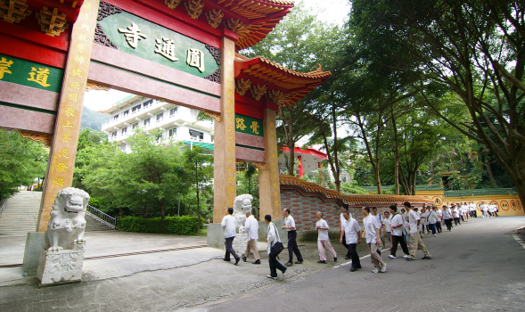

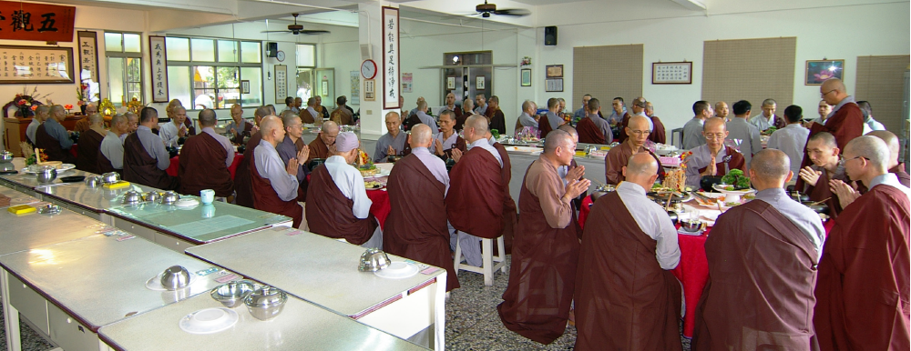

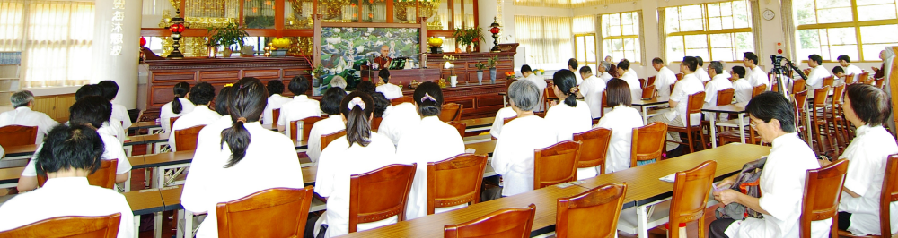

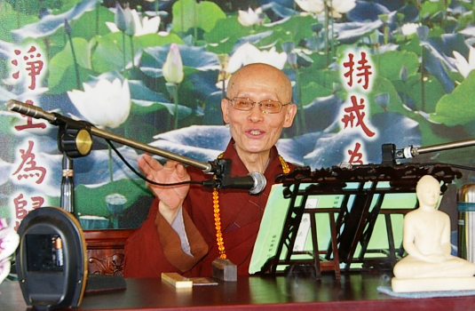

### 廬山一面觀〜訪自公老師談道藝春秋甚深因緣（下）

*編輯部整理*

追述麟毛風采現

傳承人才更可貴

時代洗禮大格局

具天命者真未來

**問：** 江老師曾說，他的國畫老師是雪廬老人，成就他一生的道藝事業，可否請老師描述雪廬老人對江老師的影響？以及對其作品的成就？

**答：** 江老師講這個話不錯的！江老師學畫得很多名畫家像呂老師、溥大師的指導，他們詩、書、畫都是三絕，特別的為什麼江老師跟我們雪廬老人學畫呢？真正的是這樣，詩書畫是一體的，我們老師雖然沒有在畫的藝術上面教導，但在畫上所含的道由雪公和盤托出教江老師。我記得那時候我們在蓮社，老師在前面大殿裡面教一般學生文章、學寫字，也講一首詩，講完之後，在大殿後面的小房間（現在蓮社的會客室），那時候用七巧板拼成一個長方形的桌子，桌子很矮，大家盤坐在榻榻米上面，老師坐在一端，逸子兄坐在老師旁邊，我坐在後面幾位作會議記錄，對面有幾位同學，不多！老師特別教學詩、學文的人，老師教逸子兄學詩，江老師做出的詩，老師特別欣賞，老師的教學方法很講究，你作那個字不對，老師不主動改，你回去自己改，改回來以後再看，一定要改到老師認為可以了，這首詩可以留下來，這是一個教法。我跟老師學文，也給老師改，老師改一遍就可以了，不再多改。

老師也利用其餘的時間教詩，除了在蓮社裡，在奉祀官府，老師跟江老師在同一個辦公室裡面，那講的時間更多，所以在講詩的時候就提到學畫，老師所指點出來的，就是最重要的畫龍點睛的教導，逸子兄今天畫的畫、塑像也好，為何有這樣的成績呢？那是經過老師指點的，藝術的生命真正要經過善知識的指點，普通任何畫也好、塑像也好，好像一條龍，經過名師、善知識一指點，把龍的眼睛一點，龍就能夠飛起來，江老師的畫真正是跟雪廬老人學的，雪廬老人就是幫他點睛的人。

對於畫、對於詩，我都沒有入門，根據江老師這些作品，每一件作品過去都受過雪公指點，所以含有非常深厚的道在當中。我們中國文化是文以載道，文以載道包含一切藝術、繪畫、音樂、文章、小說、散文、戲劇都是載道的。今天一方面根據過去跟逸子兄在一起學習，一方面從江老師畫展的作品仔細慢慢看，看一遍是看不出來，能夠把生活的大道用藝術表現出來，把道含在裡面，我這個能力看十遍也看不出來，看了一部分，看不透徹。也就是逸子兄的作品你要看一遍、看幾遍看不透徹，要看透徹必須要在道上面修得很有造詣，那才能夠一步一步慢慢看，才能體會這裡面的道是不得了的。

志於道那一章，最後要游於藝，不限於哪一種藝術，就游泳來講，好的游泳手能潛沉到水底，逸子兄的畫就是到了底了。我們一般人看不到底，能看到一部分就了不得了，雖然看不到底，只能看到一部分。過去古人也講，書念千遍其意自現，你把逸子這個作品，看了又看，看了又看，意思雖然不能看到底，但越看發現的道越多，這是我今天根據你這一問，我臨時才想到這一點。

**問：** 雪廬老人的教學很廣泛，特別就詩的這一分，更是非常獨到且專長，江老師的畫作裡面，雖然承接古代的畫師，像郭熙、李唐、馬遠、夏圭，近代的有呂佛庭、溥心畬老師等，但更具風格的部分是雪廬老人詩學對他的影響，開出了江老師的格局、見識，以及畫的神韻，雪廬老人的詩最為奇特，這一方面是否也請老師形容一下？

**答：** 江老師畫的畫，老師題了很多詩，以江老師的畫展來講的話，逸子兄的畫除了雪公為他題詩，今日之下你請誰來題詩？沒有人有能力給江老師的畫來題詩，所以當然有啟發作用！因為根據江老師畫的畫，老師題上詩，又再能啟發江老師將來再畫，互相並進。詩為何有這麼大的影響呢？因為詩書畫是一體的，懂得詩就能懂得用畫來載道，不懂詩的畫就是現在的純文學。

雪公恩師曾經批評過純文學，就是反對文以載道，文不載道，不但是文章，詩、畫畫中沒有道，那你畫出來的畫，只是供人家玩物，提供不懂道的人去欣賞而已，懂得道的人就丟在字紙簍裡面不要看了。畫如此、文章也是如此，文章裡面沒有道人家也不看的，現在一般報紙上的文章，有道的當然也有，但他們所講的道，也不過是教人家做做好事情而已，出世間的道沒有人知道。所以只有雪公，雪公傳授詩也就是傳授江老師的畫，這是一體的。

**問：** 雪廬老人不但自己作詩，在解唐詩方面，尤其是講述李、杜的詩對江老師很有啟發，解唐詩這一分，為何可以看出老人家風采、格局以及見識？

**答：** 雪廬老人教詩，在雪廬詩集裡面就是詩階述唐，這是老人家教詩，早期叫做詩階宗唐。寫詩階宗唐的時候，老師在蓮社裡面教詩，也是當時在東海和中興大學教詩時的講義。詩階述唐裡面有唐朝的近體詩、古體詩共一百首，有個特別的名字：學詩先讀求味。學詩就是學作詩，要先把古人的詩都讀，就像吃東西一樣，才吃出味道，那一百首的詩，老師以格局、講要、取境、參考，分了好幾部分解說，古人註解詩沒有這樣做，這也是他老人家創作的。

所以他老人家言學詩要先讀，讀了之後再求其中味道，這是學詩的第一部分，把古人的詩味道讀出來，然後再學作詩。老師雖然在蓮社講詩，不是教每個人都寫詩，教作詩就是像江老師，他要有作詩的天才。沒有作詩的天才，老師用再多的功夫來教他也教不出來，所以那時候跟老師學作詩，嚴格想也想不出來有幾位，我也想學作詩，但是老師要我先學作文。

當老師在興大、在東海大學教書的時候，那時學校規定除了講詩外還要指導習作，叫做詩選與習作，就是在古人的詩裡面選出很好的詩講解，然後在課堂裡面教學生學習作詩。老師厲害喔！就在課堂裡面講解若干時候，作詩的方法都講了，然後就叫學生學習，學習的時候，學生回家去寫，然後在課堂黑板上寫出來，老師就在黑板上給他改正，包括詩、平仄，是不是押韻。

老師是山東人，山東人沒有入聲字，現在國語裡面，將入聲字平均分配在一聲、二聲以及第三聲，只有平、上、去，沒有入聲，在詩裡面把平聲放在平聲，上、去、入放在仄聲裡。老師家鄉沒有入聲字，平均分配在前面平聲中，老師把入聲字以及韻全部記在心裡面，在黑板上寫出來，當場哪個不合韻、或者用錯字，仄聲字用到平聲字、平仄不對，就在課堂上改，這是對格式而言。就詩的內容那就更不容易了，當時就改。

當時老師在興大有課、東海大學也有課，後來靜宜大學（昔靜宜文理學院）也邀請老師講詩，老師分不出時間來，叫我代老師去講，我一代就講了七年，我就沒有老師的那個功夫，但也要交習作啊！我叫學生把詩做出來，帶給我，我沒辦法在課堂上當場改，就帶回去改，這就可以瞭解老師那個功力。現在沒有人能跟他老人家相比，就是詩書畫三絕。

老師的書法也是深厚的很，老師題的畫又是詩、又是書法，看起來好像這是老師的字，我們作學生的不敢批評，只能說好，但是好在哪裡？自己也說不出來，必得你把老師書法那個字一再地看、多看，越看越發現老師那個字啊！那個精神啊！也不是現在一般人能夠寫得出來，所以你問的問題，我只能這樣把它報告出來。

**問：** 雪廬老人對文化是全方位的瞭解、弘揚及傳承，那我們作弟子的，應該要怎樣來提昇自己，並且把老人這樣好的內涵往外弘揚，往下傳承？

**答：** 我們作弟子啊，就要學江老師這樣跟老師學，老師在世的時候，我們不要存著自己的成見，老師所講的，我們把過去的學問、學的文章通通放棄，專心的跟老師學，老師現在在西方，他留下來這些講經的詩、佛學問答等等都還在！我們好好的研讀，在經文注解中，老師有〈阿彌陀經摘注接蒙〉、還有〈阿彌陀經義蘊〉這兩本著作，我們要研究阿彌陀經的時候，要好好的看。

印光祖師推崇蕅益祖師的阿彌陀經要解，我們今天研究阿彌陀經，可以把老師的摘注接蒙，特別是義蘊，配合蕅益祖師的要解，就把這一部阿彌陀經，專門教我們持名念佛的特別法門配合看，就能深入經藏，我們要這樣學。學阿彌陀經是如此，學老師其他講的學術，我們都要這樣學，特別老師的精神，那個道風要學！我們要把握住，就像逸子跟老師學詩，老師指點他學畫，這就是道風，這個重要啊！我們從老師遺留下來這些寶典，學習他的道風，這樣才能夠真正得到受益處。

**問：** 在課堂上曾聽雪廬老人說「子欲居九夷」，還有「道不行，乘桴浮於海」，他很感嘆，私下也說想不到印證在他身上，老人跟孔子之間有這樣密切的關係，請自公老師將這樣的涵義說一說。

**答：** 老師到臺灣來有感嘆，孔子曾經說：「道不行，乘桴浮於海」，那是孔子一時感嘆的話，我們老師說，想不到我今天真的浮於海到臺灣來，他有他的使命，我記得到臺灣來的時候老師寫了一首七言絕句：「天捲浮雲海捲濤，煙山寥落似鴻毛。龍宮地闕人何往？莞爾無言手一篙。」

從大陸出了海，越走越遠，海上風濤大作，而天上雲在捲動，回頭一看（看大陸）山上有煙，煙山寥落就像飛鴻的羽毛輕輕飄落下來，沒有了。第三句海龍王在海裡有他的龍宮，地闕是天上的，天地有這個皇宮，我這個人在海上，究竟往龍宮裡去？還是到天上地闕那裡去？往龍宮去就是掉到海裡去，到天上去就升天了。如今哪裡都不去啊，不會掉到海裡，也不會升到天上去，莞爾一笑，因為心裡有道，憑著手持一篙。篙就是乘船那個篙，莞爾有微笑的意思在當中，無言乃沒有一句話，道在心裡面不是言語能夠表達出來的，憑著手一篙啊！這個手一篙比喻他到臺灣來的任務，就是把儒家的經典、佛家的經典都能解行並進。

老人家德行早就是深厚得不得了，他就是到臺灣來教這裡的人解行並進，除了講經文之外，他還要作人事，要人家從五倫上面來實行，佛法上面也是這樣解行並進，這是他的手一篙，這一篙了不得的！在末法時代，儒家講處在亂世，我們在亂世，在末法時代，就憑老師的這一篙，就能夠把我們的世運挽救回來，這個不是政治、一般的學術能夠辦得到的，現在國家能夠國泰民安、世界和平從哪開始？從改善人心開始，改善人心你不憑儒家經典、佛家經典怎麼行？儒家經典、佛家經典沒人講得出來，本意講不出來，只有我們老師把儒家經典、佛家經典徹底的本意講出來，講出來才是指導人家。

一般作學問的人，一般在家學佛的人，學院教書的學術界的人，把研究佛經當成作學問看待，講到修行他就沒有興趣了，但是我們老師把經文的本意講出來，最重要的就是要學的人能夠在行為上面老老實實的來學習，今日之下，越講越發現老人家的重要，在世間教化眾生，今天是誰能負責這個任務？就憑他的手一篙。而誰能手執這一篙？（師回頭看江老師），逸子你看看，好好把握這手一篙！

**問：** 這次江老師應福建博物院邀約所辦的畫展中有很多藝術作品，這藝術作品包括雕像、畫作，有儒家、有佛家，最重要的就是要傳承道，特別是雪廬老人這樣的傳承，是否能就塑像的部分，孔子、十哲還有雪廬老人，以及江老師塑孔門高第與雪廬老人這一脈的關係作一說明。

**答：** 孔夫子的塑像那是聖人。孔夫子的大弟子，孔夫子三千弟子、七十二賢人，七十二賢人中再有十哲（十位賢哲），孔聖人表現出來的像不可思議，十位賢哲他們的像要表現出來也是多方面的。要把多方面的、含深厚內涵的道，藉著藝術、藉著塑像把它塑造出來，若就每一個內容以及道的每一部分都塑一尊像，則孔夫子和那些大弟子的道，要表現在塑像的造型必然多得不得了，你看江老師那得要塑多少像啊？十哲的像千千萬萬的像，你也塑不完，孔夫子聖人的像那更了不得，那要塑到無窮無盡的。

而我們的雪廬老人，他的道含意很深厚，表現出來也是多方面的，江老師就有辦法塑了一個像，以一個像把多方面的道風都濃縮在一個像上面表現出來。我仔細的看，江老師塑的這些像，孔子像、十哲的像、雪廬老人的像個別的來講，個別講我也沒有這個能力，大致的原則先確立，我看了很多遍，江老師過去在臺中縣文化中心展覽，我去看了，看了又看，實在是，那個道是沒辦法看的，就連我看出了一點點，也才能講出一些，要點詳細地講我沒辦法全盤講出來，要江先生在畫展現場，還有你們各位為觀眾好好講。

**問：** 現在我們學生們都公認自公老師您能夠得到雪公老師的傳承，並且在臺中作弘揚，請問老師要怎樣來掌握這樣的使命感，並且教化後人去認識雪廬老人，去傳承儒佛的大道？

**答：** 你說老師是稱我嗎？傳承！我不敢講，不過在臺中蓮社，他們年輕人稱呼我老師，我也不敢拒絕人家稱呼，他稱呼他的，我就只好答應。實際上當老師我不敢，不敢以老師自居，更不敢講傳承，雪廬老人像天上日月那樣的光芒照遍人家，我自個兒就像以前雪公老師形容他自己一樣，就像點香，點香發出的火光，不成比例，我跟老師的境界不能比，怎麼講傳承呢？不敢講！但是既然跟老師學過若干年，我拜老師的時候，老師問我過去讀過哪些書、讀過哪些經，我就不敢不講，我讀了哪些經，儒家的、佛家的，包括印光祖師文鈔，老師說：讀得很多！這句話聽了很高興。

但是第二句說：沒有系統！這句話我就警惕了！然後就告訴我，作學問，自己看看書是不行的，無論佛家的經、儒家的經，要有人來教，而這個指導的人不是普通人，他對於經能夠解釋的清清楚楚，把本意講出來，這是指作為經師；根據經典裡面所講的方法老老實實地學，自己有了成就再來教化他人，這是人師。老師當時告訴我，以前所讀的書沒有什麼系統，你既然拜我作老師，我就盡我所知來告訴你。我就作這一點而已，把一切所看的書，寫註解的都有他們的知見，在拜過老師經過老師這一教導，我就將這些知見通通拋棄掉，跟老師好好的學。

念佛呢！老師有一句話，老實念佛，我念佛就是老實念佛，不要換其他題目，如此而已，談不上傳承。那麼年輕人要到臺中蓮社來聽經，來學儒，我只能把這個方法告訴他而已，這個都不算是傳承。

**問：** 老人家這樣完整的文化內涵，來教育後代，老師您對我們後代有什麼期許？對我們後輩小子有什麼期許？

**答：** 後代就從現在講，這些學術都失傳了，真正講失傳了，失傳不但現在，就是在戰國時代就失傳了，為什麼呢？孟夫子解釋這個性，他講性善。後來荀子講性惡，漢朝揚子講善惡混，在中國學術思想史上，都不離開三家（性善、性惡以及善惡混）所講的。但老人家講這個性就是佛家講的真如本性，真如本性沒有善惡，不但本性沒有善惡，就是本性所起的相也沒有善惡。他老人家拿易經來講，易經太極就是本性，這是孔夫子把易經定出一個名詞來，定出名詞來好讓我們知道研究易經就是叫人明瞭自己的心性，就是明瞭太極。

易經裡面太極沒有善惡，它是無相的，由太極起的相〜陰陽兩儀，陰陽二氣由陰陽兩儀起，然後再八卦、六十四卦，有卦爻，這就是相，相有什麼善惡呢？八卦畫的一條一條的，六十四卦畫出來有什麼善惡呢？沒有，只有用出來，占卦的人占到這一卦，他用來作什麼事，用來作善事是善，用來作惡事就是惡，這才有善惡，從這裡看起來，才真正把這個性解釋清楚。

我們是老師的學生，我們對內講，對外面我們不好講，對外面講，你講你們老師講得那樣高啊？實際上是如此！不但今日，就是從戰國孟夫子那個時候起，就沒有把性的本意能夠說出來，你想想我們老師對世間的貢獻！性沒有解釋清楚的話，世間一切學術就沒有根啊！成無根之學。教育不懂性的根本，教育就沒有根，現在西方講功利主義，教人學功利，你不懂性的話，你在學校教書，教人家學功利，教育的根本就沒有了，教什麼人？你教出什麼樣的學生來？學生教出就跟人家爭名奪利，那還能學聖人嗎？

我們瞭解傳統文化，儒家的學術就是教人家學作聖人，所以從這方面看，我們老師講這個學術，把握這個根本，由這個根本然後推衍到這個世間的一切學術，不單是儒家經典，世間一切學術、一切教育、政治都是得了根本，這樣的政治才是王道的政治，民主才是真正的為人民來考量，才是真正的民主，這種教育才能把學生教成希聖希賢的學生，這就是我們老師對於過去現在未來，永遠沒有窮盡的、一種對世間教化的一種功德。

結語：

非常感謝自公老師的開示，把這次江老師的畫展，給了完整的意義，以及詳細介紹雪廬老人整體的形象以及他文化的傳承，謝謝老師。（完）

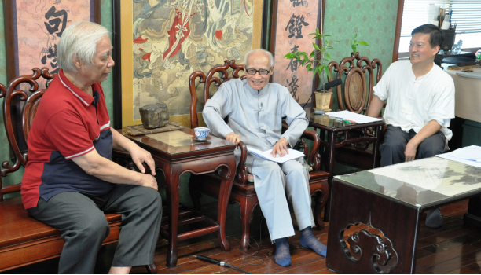

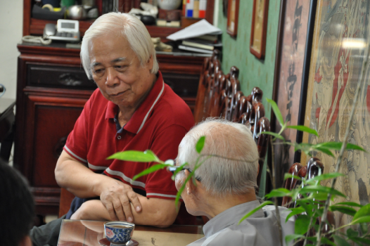

## 共修研學

### 小止觀導覽（五十七）

*心爾、治心整理*

修學障礙善巧除

念佛三身身心寂

善根攝持出定後

利樂有情真堪能

第七章  善根發

論文：

五、念佛善根發相：

念佛的三障礙：

第一類是昏沉闇塞障：

在坐上修時心思沉沒，雖然沒有東想西想，但昏沉闇塞，心暗下來如同人在暗室般，即使心中還在緣念善法，然勢力低劣，內心一片漆暗，即使人坐在那裡好像沒打妄想，依然無法入定，得不到禪定受用。有的人修一輩子的定功，以為在定中修行，殊不知輕安相未生，看似入定實為沉沒卻不自知。

此時的障礙要如何破除？當以念佛三身功德中之應化身的功德來破除，佛的應化身每天都有做不完的有意義的事情，從早做到晚，從生做到死，臨死前還可以度人證果（如釋尊與須跋陀羅例），想到應化身的功德，內心昏沉闇塞之障可以破除。

第二類是惡念思惟障：

修行時一面緣念世俗，甚至想去幹壞事，此即惡念思惟障，若能思惟佛的報身則可除此障。須知我們隱微處的惡念，都為報身佛智慧的所知，彼智是無事不知，故要思惟報身佛破惡念思惟。總之，修學動機一定要清淨、單純，才能真正得到佛菩薩的加被。

第三是境界逼迫障：

不修行時一切都非常的暇滿，修行時偏偏眷屬成為障礙，環境以及從事的工作、身體等都成為障礙，此時要思惟法身佛，破境界的逼迫，逼迫是名言認知上的逼迫，若從另外一個角度來講，何嘗不是一種磨練與助成！這些逼迫的境界反而是菩薩行的資糧，謂之不遭魔難不成佛。

這三關修行的障礙全部破除，謂之念佛善根發相。

論文：

行者因修止觀故，若得欲界未到地定，身心空寂，忽然憶念諸佛功德相好不可思議，所有十力、無畏、不共、三昧、解脫等法不可思議、神通變化、無礙說法、廣利眾生，不可思議；如是等無量功德不可思議。

因念佛（念三身佛）容易引發善根，以念佛的功德為所緣，不斷的串習，內心安住並在定中顯現佛的功德，進入欲界未到地定（初禪近分），生起輕安，這叫做忽然憶念。

除了善所緣（佛功德相好）外，不作他緣，也無躁動不安，虛空中只剩佛功德為所緣，謂之身心空寂。

此時之定是欲界未到地定，乃初禪的近分（非正分），雖輕安生起，然未得到初禪正分的功德。已得初禪近分輕安，還須增上至正分境界，此時觀下界（欲界）過患，努力對治下界的貪愛，方得初禪正分輕安的功德。

而初禪的正分是破欲界煩惱的現行，二禪的正分是破了初禪的貪愛，三禪的正分是破了二禪的貪愛，四禪的正分是破了三禪的貪愛，如此厭下欣上，破下界的貪愛才能得到上界正分的功德。

如何檢驗此人修學有輕安的功德，一者此人經過修行之後，修養變好；二者做事承擔力轉強，不會計較，也不會搬弄人我是非；三者面對別人的指責，也會虛心接受，而不會在意於心，與人結仇。

念佛三身善根發時，能不經意的顯現佛功德為其所憶念，所以出定覺得非常舒服，因為一直在緣念美好的事情、很愉快的事情，身心自然也會愉快，想到這些殊勝的功德與內涵，心思之愉快無法形容，他人也難可了知。

入定時，將佛所有的功德現起，佛功德的點點滴滴都清楚明瞭的現起，想到佛這麼殊勝的功德與內涵，越想越多，心思用得越細，生起的快樂和體悟越深，佛的十力、四無所畏、十八不共法等等，都被我所見，認識這些名相，就是對三寶、對佛的認知，觀待對這些佛功德名相的認識，生起對佛殊勝內涵的禮敬之心。

十力是佛智慧的抉擇力，能如實了知眾生種種想法、根器，所對應的教法以及對法的體悟程度，並且知道該如何善巧方便引導有情等等，最後產生破除所知障的認知與力量。這是佛在一切境界上，能夠揀擇境界的智慧力。

四無所畏是能在大眾中轉法輪，且說法如獅子吼群魔喪膽，能全部承擔而無恐懼之相，叫做無畏。

十八不共法是佛依著十種智慧力量（十力），顯現與菩薩、二乘人、凡夫不共之處，有十八個面相，分為三類。

第一類是不共行，為度化有情，同時在現證空性上，照見甚深的緣起，在利益眾生的行持上有六類的不共；第二類是不共證，佛所發的大願、所證悟的種種內涵，不會減損，且承許自己的解脫，亦有六類不共；第三類是不共智，以智慧作前導，心裡如實了知，在利益有情眾生上，成就六類不共的事業與智慧。

三昧與解脫，三昧可解釋為正定，也可叫做正心行處，將心安住，並以法的自相為所緣，加以辯證而生起空性的智慧，在該法上見到法的自相空，成就解脫。

佛是以不出定的方式廣大的利益眾生，生起種種的神通變化，無礙說法，令眾生離苦得樂，如是等無量功德不可思、不可議。

論文：

作是念時，即發愛敬心，三昧開發，身心快樂，清淨安隱，無諸惡相。從禪定起，身體輕利，自覺功德巍巍，人所愛敬。是為念佛三昧善根發相。

由憶念佛不可思議無量功德，生出對佛的愛敬，一股想要親近佛的心油然而生，一發不可收拾，這種三昧的開發，令身心快樂，又清淨與安隱，沒有境緣的逼迫，善念從內心湧現毫無障礙。

出定之後，後得位的行相是身體輕利，自覺功德巍巍，人所愛敬。身體自己有一種功德巍巍的感覺，相信自己具有佛性，可以成佛。

修行禪定時可以生起一種似慢而非慢的心，那就是佛慢，我可以成佛，或者我現在已成佛，具足佛的一切德能，例如念佛時，是以準備要去成佛的心態念佛，或者在念佛時自身顯現為佛，此行相看似是慢，本質不是慢，是一種承擔，出定後自覺功德巍巍，是一種我可以承擔教法住世的感覺。

能感受他人愛敬，是因為修行所產生的愉快和法喜，以及自我尊重，慎重待人處世，贏得別人的恭敬，以上是念佛三昧善根發相。（下期待續）

### 菩薩清淨的行持　華嚴經淨行品聽聞記（一）

*編輯部整理*

智首請問文殊答

運用之妙存乎心

以願攝行清淨行

十力無畏十王護

為了利益徧滿虛空的有情眾生，我們必須要成就無上正等正覺，為了成就阿耨多羅三藐三菩提，所以來這裡研究經教，目前的因緣，是《大方廣佛華嚴經》〈淨行品〉，所依的經解，特別是南亭老和尚的講義與會性法師的科文。

華嚴經簡介

華嚴經是佛陀成道後依菩提道場等七處舉辦了九次法會，藉文殊、普賢等諸大菩薩顯示佛陀因行果德的妙莊嚴。

七處九會，第一會是菩提道場，第二會是普光明殿，第三會是忉利天宮，第四會是夜摩天宮，第五會是兜率天宮，第六會是他化天宮，第七會與第八會是普光明殿，第九會是祇園精舍（逝多林，重閣講堂）。計人間三處，天上四處。第一會及第二會會主分別是文殊、普賢菩薩。

此經傳說由龍樹菩薩從龍宮中默出，有廣本、中本與略本，然流通的華嚴經屬於略本，傳到我國時，前後共有三種不同的譯本，一是佛陀跋陀羅尊者於東晉譯出的六十卷本，俗稱六十華嚴，是舊華嚴；其次是唐朝武則天時期實叉難陀尊者譯出的八十卷本，俗稱八十華嚴，又稱新華嚴；又在唐德宗貞元十二年，由般若三藏譯出的四十卷本，俗稱四十華嚴。四十華嚴只不過是六十華嚴或八十華嚴中入法界品的廣本。有人說，讀華嚴要先讀八十華嚴，到第五十九卷的入法界品時，就轉讀四十華嚴，如此說來，完整的華嚴經是九十九卷。

本經是說佛之功德，顯示佛各種德能、神變及莊嚴，是依十信、十住、十行、十回向、十地、等覺而入佛之果地莊嚴。普賢菩薩言：若身上長滿舌頭，經塵點劫，猶難讚歎盡。故古德有云：不讀華嚴不知佛之富貴。猶如經文所云：剎塵心念可數之，大海中水可飲盡，虛空可量風可繫，諸佛功德說難盡。其次表徵法的功德為法華經（依法令人生起一乘知見，即開佛知見）；表徵僧德者為楞嚴經（經文中七處徵心是悟，二十五圓通是修，破五十種陰魔是證）。

華嚴經傳來中國有三種華嚴，六十（卷）華嚴約六十萬字，共三十四品，第三十四品為入法界品，僅十六卷。

八十（卷）華嚴乃武則天以脂粉錢供養而譯出，譯成時並由其寫開經偈，所謂：無上甚深微妙法，百千萬劫難遭遇，我今見聞得受持，願解如來真實義。八十華嚴共三十九品，第三十九品為入法界品，分為本會（顯示佛之種種妙莊嚴）及末會（文殊菩薩引善財童子去參訪五十三位善知識，令善財童子由十信、十住、十行、十回向、十地直至等覺，之後以文殊菩薩助成善財童子得佛之根本智，普賢菩薩以十大願王導歸淨土，引導善財童子往生西方極樂世界，可見西方極樂世界是最後成佛的因緣所在。故印祖所著之《淨土決疑論》：淨土法門是實非權。理由是華嚴經普賢行願品以十大願王導歸極樂，可見極樂世界非三百由旬之化城，而是五百由旬之究竟處，是成佛的殊勝環境。

四十卷華嚴，又稱入法界品（入不思議解脫境界普賢行願品），而所入之法界，乃佛之所證，為不思議解脫境界。再者，入法界品嚴格說不只普賢行願品，但古德卻將之視為普賢行願品，原因是歸向處是普賢十大行願，故將普賢行願品安為入法界品之另一名稱。

若依清涼國師華嚴經的分法，分為：信、解、行、證。此品屬於解分。華嚴經屬大方廣部，佛所證悟的就是大方廣。華嚴是佛的因地、經是能詮，所詮的是大方廣佛華嚴。所詮的內容有佛的因、有佛的果。

大方廣就是佛所證悟的空性，其體大而無外，其相徧一切法界，其用是破煩惱障與所知障。三乘空性慧生起的作用不同，但就所證的空性是一樣，能證的智慧生起作用何以有如此大的差別？乃因佛以菩提心與六度萬行的修學，做為修學空性慧的助伴，使得空性的智慧能夠破所知障，可見菩薩行的殊勝與重要。

若以空性的智慧成為菩提心、六度萬行的助伴時，能證得佛的色身，相好殊勝二乘人難以項背。就智慧的那一分，佛勝過二乘人多矣，就福德的那一分，佛亦勝過二乘人多矣，且令人難以想像。若以沙粒為喻，佛的智慧如三千大千世界的微塵，好比非洲的土著，難以想像比爾蓋茲的財富；漢朝的使者到夜郎時，夜郎亦難以想像漢朝的皇帝，到底有多大的威勢。

淨行品與譯者簡介

華嚴經總共有三十九品，淨行品是第十一品。如果在八十卷的華嚴，這是在第十四卷的前半卷，淨行品總共有二千九百六十三個字。八十華嚴就是有八十卷，第十四卷的後半卷跟第十五卷是賢首品。這些品可以是獨立瞭解，也可以連貫進入內涵。

淨行品是修學成佛重要的法行，是佛法應用於日用平常的修學法，是一個以願導行的修持，而願的本質即是正知見。

翻譯者是于闐國三藏實叉難陀奉敕譯，于闐國是新疆和闐地區。現在的新疆都是回教徒，佛教徒已亡得徹底。然當時在武則天時則是盛況，教法之興除了佛像、佛塔、經書外，更重要的是要有傳承的人才。

今天三寶要加被眾生離苦得樂，必須靠有情傳承正見，三寶的加被力才能顯現，若不然，吾人早在無始劫前就可證果，不會還在這裡六道輪迴。

于闐國曾經出了三藏法師，三藏法師還是中國封的，那時盛況，如今安在？

實叉難陀義為學喜（學而歡喜），學而歡喜是整個修學佛法的第一步也是最重要一步。論語四百九十八條的第一條：學而時習之、不亦說乎。一言以蔽之，謂之實叉難陀。學儒、學佛沒有法喜，不能持續。

武則天當時讀到六十華嚴，知道不完備，於是請求善本。在中國佛法是皇帝請來的，不是洋槍大砲打進來的。據說武則天是用脂粉錢供養，作為實叉難陀等譯經的費用，譯出了八十華嚴。實叉難陀以四年半至五年的時間，翻譯完成八十華嚴。會性法師說經文一卷約當一萬字，八十華嚴就是八十萬字，四年半完成翻譯，此為官方所支持的。武則天在施政上有時過當，那一分果報要受，然對佛法的貢獻的果報也能得到。實叉難陀翻譯了很多佛經，其中有：右繞佛塔功德經、十善業道經、入楞伽經……等。

此次依會性法師的科判解淨行品，乃法師參考清涼國師的科判，做簡單的修改。會性法師是民國的高僧大德，雪公老師與會性法師的交情甚篤；老人的荼毘是由會性法師所主持的。會性法師曾經是臺灣一些高僧大德（如慈航法師、斌宗法師）屬意的接棒者，所以佛門要興，就要出人才，儒家要興也要出人才。什麼人才都沒出，什麼希望也不會有。會性法師曾閉關閱過藏經，雪廬老人曾說：會性法師算半個三藏法師。法師教理通達，今日能與其相比的沒幾人，以上將會性法師做簡單的介紹。

淨行品科文

華嚴經淨行品大科分二，甲一：智首菩薩問舉德徵因。智首菩薩向文殊菩薩舉出佛的功德，問成就果之因，欲得這些功德，原因在哪裡？有總問與別問；丙一是總問、丙二是別問。這些功德是成就有情安樂的條件。

甲二：文殊菩薩答標德顯因，文殊菩薩標出這些功德的因為何？乙一、歎問成益，是文殊菩薩讚歎智首菩薩此問對有情眾生利益多矣。乙二、正答其問，乃正式回答智首菩薩所問。

下分兩段，丙一、標因成德答其舉德：欲得佛之功德，其因總說為善用其心，而佛之功德除上述智首所言，此處總攝佛之功德。丙二、指事顯因答其徵因，指出用心，這件事乃一切勝妙功德因，然如何用心？

下分三段：丁一、總徵，如何用心？丁二、別顯，分別顯示十類（一百四十一願）說明如此則是善用其心。丁三、總結成益，如此用心所成辦殊勝功德，不被一切有情所破壞與轉變。

文中的菩薩名為智首，以智慧為首。佛法之修學分為：信、解、行、證。對佛法相信且有深入了解，所生的智慧是修行之首要，了解所獲的功德、成就的徵兆，且用什麼樣的因幫助獲得這些功德，如何行持？如此之修學方法極為善巧，而非盲修瞎練。

而文殊師利菩薩在華嚴經中所表徵的，不但是善財童子的根本老師，也是整部華嚴經最重要的表徵者，整部華嚴所要入的乃佛甚深的證量，須有文殊的智慧才能證得。（下期待續）

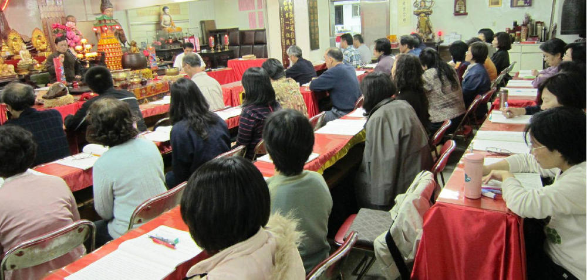

## 蓮池海會

### 李秀梅老居士往生見聞記

*編輯部*

一生秋霜全靠忍

不改淳善利人心

觀音信徒火中蓮

歸去安詳無風雨

李秀梅老居士臺中豐原人，生於民國二十三年五月三十日，卒於民國一○一年三月二十五日，享壽七十九歲。老居士一生備歷艱辛，面對生活的種種壓力，卻能以毅力度過；克盡孝悌及熱於助人，加上平生對觀音菩薩的信心，能讓老居士雖未深涉佛法，而感得親友中學佛者聯繫蓮友協助，子女亦願以佛法護持，消除臨終障礙。助念八小時後，顯現殊勝瑞相，足證蒙佛接引往生，堪慰其ㄧ生勞苦及子女孝心，亦可為後來者有所效法。

老居士於家中排行第三，上有兄姐各一，尊翁經商木材而家境優渥。天資好學聰穎，畢業於臺中第一女中。原嫁嘉義梅家，育有二子一女，因故仳離。後因感黃三郎君之恩而再嫁之，婚後育二女一子。然再婚後因夫婿經商不順而影響家庭氣氛，老居士不為所困，亦不蹈前鑑，秉持著對觀音菩薩的信心，並以此勉勵子女，一方面在家中堅持百忍，相夫教子，另一方面為助家計，先後從事家庭代工，經營服裝店，手工藝品店，乃至土地開發等行業。期間再經歷承擔親人經商失敗而負債，雖命運多舛，一一度過，撫育子女有成。

老居士教子有方，雖一生逆境挫折不斷，仍以身教言教，使子女仍在母親的慈悲心攝持下成長，諄諄教誨，要求作人以品格為上，利益他人為要，且講究作法，如為布施街頭遊民食物，常置放食物於公園等處後離去，方便遊民取用且顧及顏面，在此家風影響下，相信後代子孫均能以貢獻社會幫助他人為己任。

尊翁多次中風住院，因其時兄姐旅居國外，老居士獨立肩護起照護責任。後兄長與友人均曾因事業不順而寄居家中多年，老居士也能在困難中勉力協助。俟父母及兄遷居大陸廣州，與姐共同資助家用。甚至當李氏子孫全遷國外，老居士以一出嫁女兒身分肩負起李家祖墳的祭祀及祖先牌位的供奉，即便為生活搬家超過四十次，亦不忘失，堪稱對祖先能盡誠，事親能盡孝，對手足能盡悌，對朋友能盡義。

李秀梅居士喜好念書，自幼即積累豐富的學識，如遇不明瞭事，絕不會不求甚解，定當蒐集資料直至了然於心。五年前被診斷肺癌末期，憑其堅定意志及對子女的不捨而與病魔奮戰，在不到一年期間居然戰勝癌症，即便醫生都認為是一件奇蹟，此事蹟被用來鼓勵很多病危之人。今年二月初李居士前往探訪遠嫁於美國的女兒，在確定女婿真情對待之後返國，在寬心之中讓病魔再次襲擊，在子女的陪伴下，安然地度過最後的一周，因其一生善心備至，頗得佛緣，其最後的話語說到，佛祖來接她了，臨終得蓮友及家人的助念，八小時後呈現全身柔軟，面容安祥的瑞相，相信老居士已在阿彌陀佛的接引下，端坐西方極樂世界蓮花上。

老居士雖一生未親近善法團體，能在臨終得家屬及蓮友的護持助念往生，此事極難，一般人萬中難得一。或宿世善業，或此生善心連緜，加以對觀世音菩薩的信心堅固為內因，然此善根得感臨終之助念應為遠因，真正近因，乃親戚中有正見之士，且結緣於善法團體，在重要時刻祈請蓮友，方能發揮助念的大用，可見家族有人學佛是多麼珍貴，此乃一般人眼中所見未及。

子夏曰：「賢賢易色，事父母能竭其力，事君能致其身，與朋友交言而有信；雖曰未學，吾必謂之學矣。」 或許是當時社會環境純樸，如老居士上一代的長輩，易具備此敦倫盡分的美好本質。吾人這一輩，有待努力及學習方不失善良質地，所謂：齊一變，至於魯，魯一變，至於道。而此刻淳厚善良聰穎好學的老居士正跟著阿彌陀佛與諸上善人學習，必能迅速成就，早日回入娑婆，廣度有情。

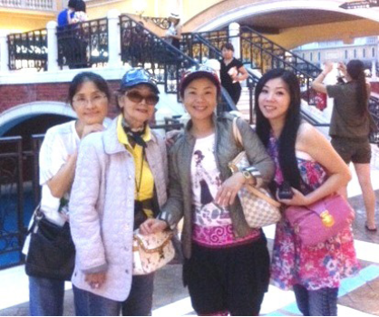

### 謝有道老居士往生見聞記

*編輯部*

有道是廉潔敦倫

時代練就能安命

晚年病苦子女孝

助念能滿一生善

謝有道老居士，字正言，福建省晉江縣縣錦丰鄉人，生於民國十四年十月二十日，卒於民國一百零一年五月十八日，享壽八十七歲，老居士一生為警務人員共二十七載，歷任警員及刑警職務，清廉自持，並以訓子；薪俸薄而能周濟親族，臨終幸得蓮友護念助念往生，而稱善果。

老居士排行第七，上有四兄二姊，因幼時體弱多病，九歲方始入國民學校求學，後又因學校遷移而中斷就讀，復學後及至畢業年已十七歲，兩年後尊翁棄世，時值抗戰最激烈之時，沿海之中等學校均奉令內遷，老居士為求學問，乃隻身前往百里外縣城就讀，中途亦有中斷，於三十五年始修畢初中課程。三十七年六月失恃，老居士為前途計，遂與同鄉於八月來臺，於翌年一月投考警察學校二期警員班，同年十二月畢業後成為基層員警，公餘閒暇仍精進自修，充實自己，服務績效良好並於五十八年晉升刑警職務。

四十一年春成家，婚後對夫人娘家兄弟多有照顧，育有二子三女，雖薪俸微薄，但兩岸局勢趨緩後，仍透過香港友人協助，按月周濟家人，幸子女向學多能申請獎學金貼補家用。老居士服務警界期間，律己甚嚴，清廉自持，但公務繁忙，家務及教育子女便由夫人一肩擔起。並每以君子愛財取之有道，告誡子女非分不義之財不可貪得，以此來詮釋老居士名諱，子女亦都能謹記於心，作為個人日後立身處世之道。老居士雖個性耿直但好交朋友，妻亦忙於庖廚，助成聚會。

老居士退休後關心子女及含飴弄孫，成生活中最主要的樂趣，逢年過節親友聚會亦一樂也。晚年為病所苦，出入醫院，尤其三年前因跌倒致使手臂骨折，雖經治療後康復，但是色身老苦已現，身形漸瘦。去年又驗出於食道至胃的入口上端有腫瘤，家人考量年事已高，選擇不動手術。

然無常不與人期，老居士先於四月三十日呼吸困難，因肺部發炎在加護病房插管治療數日後轉普通病房，至五月十四日出院返家休養。忽於五月十八日晨七時斷氣，所幸子女中學佛者常得平時共學，已具臨終助念正見，又能迅速取得家族共識，使老居士在眷屬與蓮友助念十二小時後含笑西歸，助念後遺容安詳，必已蒙佛菩薩接引，決定往生西方極樂世界。

觀老居士一生奉公守法，清廉盡責或宿世學佛等，固為助念之緣，實則眷屬中學佛而又具備臨終助念觀念者，才能發揮助念大用，而使善人能得善終，且是最殊勝的善終。老居士已走完世間道的一生，現在正在極樂世界學習出世間道，祝願老居士能速圓滿成就世間道與出世間道，再回入娑婆，廣度有情。

## 專題研學

### 聖者的祕密～大佛頂首楞嚴經二十五圓通暨七處徵心探源　二十五圓通暨七處徵心簡介　（二十六）勢至根大

時哉

傳承念佛證三昧

今於此界攝能念

母子相憶攝六根

往生淨土見二身

勢至根大

《大佛頂如來密因修證了義諸菩薩萬行首楞嚴經》〈大勢至菩薩念佛圓通章〉。經題「大佛頂」是佛崇高智慧的讚歎，是以「如來密因」證得，是透過對了義經的修學和證悟而來，是以修學諸菩薩的萬行作為眷屬，福慧雙修，所得的果就是首楞嚴，首楞嚴即是成佛的大定。此定能在現證空性的同時重緣世俗，亦即在定中能度眾生，且在度眾生中同時入空性定，此二者根本位與後得位能同時生起。「大勢至菩薩念佛圓通章」是指本經的其中一章。

卯一、作禮陳白

經文：

大勢至法王子，與其同倫五十二菩薩即從座起。頂禮佛足，而白佛言：

大勢至的梵語名摩訶那缽。《觀無量壽經》云：以智慧光，普照一切，令離三途，得無上力，是故名為大勢至。智慧光是自利，普照一切是利他。一方面現證空性，一方面普照一切，這是修證了義的成就相，普照一切觀待於智慧光，智慧光觀待於普照一切，兩者相互觀待。在一念心上同時現證二諦，又能生起無邊威神力，是故名為大勢至。

《思益梵天所問經》云：我投足之處，震動三千大千世界及魔宮殿，故名大勢至。成就一尊佛須具三種力量：智慧力、慈悲力、威神力。有智慧沒慈悲猶如羅漢，只能自利。有慈悲沒智慧，此菩薩不能度眾生。有慈悲有智慧雖然能度眾生，但是不能降伏魔王，須有威神力，此三力是一尊佛的成就相。法王子是通稱，佛為法王，《法華經》云：「佛為法王，於法自在。」繼佛弘化者為法王子。同倫，同類也，與大勢至菩薩或為同階位菩薩，或是同修念佛法門之法侶。五十二者表徵菩薩的五十二個階位：十信、十住、十行、十回向、十地、等覺，以及十信位前的乾慧地。

即從座起，是彌勒菩薩說識大圓通後，大勢至菩薩率領同倫菩薩即刻從座位上起頂禮佛足。以五體投地的行相禮佛，頭頂觸地，雙手翻掌表接佛足，至極虔敬。而白佛言，即稟白釋迦牟尼佛，說所修念佛法門，證得三昧的情形。

卯二、陳白之言

辰一、古佛親授念佛

經文：

我憶往昔恆河沙劫。有佛出世，名無量光。十二如來相繼一劫。其最後佛，名超日月光。彼佛教我念佛三昧。

我是大勢至菩薩自稱，菩薩回憶過去久遠劫以前，舉恆河沙為喻。印度人奉恆河為聖河，沐浴可洗除罪惡獲得解脫，河中的沙細且多。世尊常在恆河兩岸說法，所以講到多數，常舉恆河沙作比喻，一沙喻一劫，可見時間久遠，劫的梵語稱「劫波」，表時分，合一千六百八十萬年為一小劫，二十小劫為一中劫，四中劫為一大劫，此處指大劫，恆河沙劫即無量數劫。

無量數大劫前有一尊佛出現世間，名為無量光。由無量光佛開始，有十二尊佛在一大劫中相繼出世，依序為無邊光佛、無礙光佛、無對光佛、炎王光佛、清淨光佛、歡喜光佛、智慧光佛、不斷光佛、難思光佛、無稱光佛，最後一位名超日月光佛。大勢至菩薩，經恆河沙劫之修行，又經一大劫，親近十二如來，猶未成佛，至最後之超日月光佛，始學念佛三昧，或說這十二尊如來都教授念佛三昧，而大勢至菩薩成就念佛三昧是在超日月光佛座下。梵文「三昧」又稱三摩地，翻成中文是「正定」，能夠專注在一法上心不散亂。念佛念到一心不亂即成念佛三昧。此定修於娑婆世界，不知苦修多少劫才能得之，而在極樂世界隨觀即成，此定既成，即得三昧，故須念佛求生極樂。

超日月光佛，教大勢至念佛三昧，重在「念」之一字，以三昧是果，念佛是因也。因行圓滿，果自得之。

辰二、詳喻感應道交

巳一、先以二人為喻

午一、單憶無益

經文：

譬如有人，一專為憶，一人專忘。如是二人，若逢不逢，或見非見。

譬如有甲、乙兩個人，甲專念乙，乙不念甲，這兩人縱使不期而遇也等同未遇，見面如同未見，因為乙根本忘了甲，甲雖識而呼之，乙卻障而不知。

此一人專憶者，喻佛專憶眾生。因眾生是佛心所念，為度眾生，始得成佛也。

一人專忘者，即喻眾生也。無量無邊的眾生皆在佛的心中，佛念念不忘，必欲救出輪迴而後已。

午二、雙憶不離

經文：

二人相憶。二憶念深。如是乃至從生至生，同於形影，不相乖異。

假使乙憶念甲如同甲憶念乙一樣，如男女情人之相憶，不經作意可任運想起，影像亦容易浮現於腦海，如此之互相憶念、既深且切，則不僅今生，生生世世就像身與影一樣，不相違背捨離。

巳二、後以母子合喻

午一、合單憶無益

經文：

十方如來憐念眾生，如母憶子。若子逃逝，雖憶何為。

十方世界的諸佛如來，無不悲憫憐念眾生，就像母親思念孩子一樣，因為母子骨肉相連，關係更密，經懷胎十月、三年乳哺、推乾去濕、嚥苦吐甘、辛苦撫育、方得成人，縱使已長大成人，仍時常為子女牽腸掛肚，可謂心心念念都在子女。然若子離家出走，棄母而去，母親雖憶念又有何用呢？

午二、合雙憶不離

經文：

子若憶母，如母憶時。母子歷生不相違遠。

孝順的子女憶念慈母，如同慈母憶念子女之殷勤，心心不忘，則縱使經歷多劫也不會相互捨離。

辰三、合欲顯示深益

巳一、必定見佛益

經文：

若眾生心憶佛念佛，現前當來必定見佛。

我們凡夫眾生一起念頭就脫離不了貪、瞋、癡這些煩惱，由我執故不斷地起惑、造業、受苦，在六道中輪迴，要如何解脫輪迴乃至於成佛呢？須將眾生心做一個改變，方法就是憶佛、念佛。憶佛是心裡的隱微處隨時想佛，雖不妨工作、上班、應酬等，但心裡隱藏著對佛的想念。念者念念不忘，正在念時即是制心一處，將散亂心定在佛號上。早晚課時念佛，不念佛時即憶佛，如此相續不間斷即得念佛三昧，現前就是眼前以及今生，當來就是將來以及來生，必定見佛就是毫無疑問的可以見到佛，先見色身佛，以佛為善知識修學正法，後見法身佛。

巳二、速得開心益

午一、近佛故開

經文：

去佛不遠，不假方便，自得心開。

去佛不遠即距離佛不遠了，既然現前當來必定見佛，當然去佛不遠，也可以說是離成佛不遠，因為往生到西方極樂世界，得不退轉，福慧雙修，直至成佛。不須假借其他方便法門，如三十七道品、四加行等幫助開悟的助緣，就得明心見性、大徹大悟。

午二、喻以香熏

經文：

如染香人，身有香氣。

時時念佛，常受佛加被，受佛香薰習，猶如人進到香鋪中，身上自然就會薰染香的氣味。

午三、出三昧名

經文：

此則名曰香光莊嚴。

無垢曰香，沒有煩惱的垢穢。阿彌陀佛內涵是法身，喻為五分法身香，乃具足五種功德故。修戒定慧所生香氣，謂之戒香、定香、慧香，得了解脫，謂之解脫香（根本位）。在後得位了知已得解脫謂之解脫知見香，合之即是法身香。無暗即光，以智慧光破除煩惱的暗相。古德云：「一念相應一念佛，念念相應念念佛。」以佛的法身香、智慧光來莊嚴我們的法身慧命，故云香光莊嚴。

辰三、述己自利利他

經文：

我本因地，以念佛心，入無生忍。今於此界，攝念佛人，歸於淨土。

大勢至菩薩自云，我過去世受超日月光佛教導修學念佛三昧，依此法門修學證得無生法忍，證入無生滅的實相。忍，是安住不動義。此念乃謂能念之心，所念為佛，合之為念佛心。菩薩修學般若，以念佛為助伴，加持力大，使修學者能以殊勝慧力證得無生(空性)，謂之入無生忍。或以佛的法身為所緣，所證之果位即是入無生忍，以上是自利。

大勢至菩薩與娑婆世界眾生有緣，輔助彌陀接引娑婆世界眾生往生西方極樂世界。以四攝法攝持念佛人，四攝法為布施、愛語、利行、同事。布施攝是菩薩以財施、法施、無畏施，攝化眾生，令彼生親愛心，依附受道也。愛語攝是菩薩以善言慰喻眾生，令彼樂聞善言，生親愛心，依附受道也。利行攝是菩薩以身口意善行，利益眾生，令彼生親愛心，依附受道也。同事攝是菩薩觀眾生根性，隨其所樂，即分形示現，同其所作，令彼利益，因生親愛心，依附受道也。

大勢至菩薩以四攝法攝受念佛眾生，歸向西方極樂世界。但若眾生不念佛，大勢至菩薩也無法攝受；有念佛的眾生求生淨土，大勢至菩薩就能以四攝法攝受眾生，且成辦眾生生西之大業。

卯三、結答圓通

經文：

佛問圓通。我無選擇，都攝六根，淨念相繼，得三摩地。斯為第一。
本經第五卷前佛
**問：** 我今問汝，最初發心，悟十八界，誰為圓通，從何方便，入三摩地。憍陳如選擇聲塵，優波尼沙陀擇色塵，香嚴童子選香塵，阿那律選擇眼根，須菩提擇意根，持地菩薩選地大，彌勒菩薩擇識大等，各有選擇。大勢至菩薩依老師所教之修學法，不作其他選擇。都攝六根是將眼、耳、鼻、舌、身、意六根收歸於念佛清淨一念，謂之根大圓通。

事念他佛是作為念自佛的資糧，理念自佛(念法身佛)是直顯涅槃心佛，十方的眾生根器各個不同，十方法門中以念佛為最，三根普被，故以念佛當十方機最為圓通。（下期待續）

### 永掬心香爇雪廬

*編輯部整理*

頭形似僧半生漂泊

滿腹經論至誠無妄

見者畏愛韜光養晦

撒手歸去誠盼再來

李炳南先生，名艷，字炳南，號雪廬，炳南是以字行。山東濟南人，生於清光緒十六年，西元一八九一年，卒於一九八六年，享年九十七歲。後人都尊稱他為 雪廬老人或雪公。

雪公終其一生，全部心力都奉獻在教育上。坐像中的他，身著長衫，左腿微微翹起，雙手手指自然交叉抱於左膝，一派自在；頭部微向左傾，兩眼凝視向下，表情祥和而肅穆，似乎若有所思，彷彿正思維如何利益大眾、造福人群。他有一首自況詩「殘燭」：「未改心腸熱，全憐暗路人，但能光照遠，不惜自焚身。」正是他一生的最佳寫照。

雪公出身濟南望族，生長於書香門第中，自幼穎悟，入私塾遍學諸經子史，奠定深厚國學基礎。繼而就讀尚志書院，接觸西方科學新知，並兼學中醫、古琴、劍術、傳統詩歌等。後畢業於山東法政學堂（今山東大學），專修獄政。從二十三歲開始，他就與濟南學界組織「通俗教育會」，身任會長，設座講學，積極推廣社會教育，改善社會人心與風氣。並於三十一歲出掌莒縣獄政，除重修監獄外，並推廣德化教育，使獄政不再只是用刑罰來令人就範，頗獲好評。更於莒縣連年兵禍內戰時，周旋於危難之中，保全民命無數，贏得「魯仲連」之稱譽。四十一歲時，他因身困軍閥內戰危城之中，偶閱豐子愷的《護生畫集》，深悟消弭兵災的根本在戒殺護生，於是為天下蒼生立誓，自此終生茹素。

雪公於四十八歲，西元一九三七年，應聘入「大成至聖先師奉祀官府」，任教讀先生及主任秘書職，開啟了他人生的新局，並與奉祀官孔德成上公先生結上了終生不解之緣，也從此走上遷徙流離的命運，從山東、重慶、南京，最後於一九四九年，時年六十，隨「奉祀官府」來到臺灣臺中，展開了人生的新頁，也開創了教育的新局，將中華文化從大陸帶到臺灣，在臺灣重新播種、生根、發展。在往後長達三十八年的堅苦歲月中，把中華文化的種子及精神，全心全力的傳播給臺灣人，喚起青年學子對文化及社會的使命感，為文化道統的傳承默默耕耘與奉獻，至死不歇。

雪公學識淹通，融貫儒、佛二家經義。儒學方面，請益於清末翰林莒縣縣志總編纂莊陔蘭等，莊公亦是孔德成先生的老師，並介紹雪公至孔府上班。在佛法方面，曾向梅光羲大士學唯識，而禪、密、淨等宗，亦有鑽研。自四十二歲皈依印光大師後，就專修專弘淨土，有「戴髮高僧」之美譽。

雪公自定居臺中後，即馬不停蹄的到處講學，設立教育、慈善機構，從事社會教育、醫療、救濟等工作。先後創辦慈光育幼院、菩提醫院、菩提仁愛之家，實踐恤孤、安老、醫療等慈善救濟事業。成立臺中蓮社、慈光圖書館，舉辦各種學術文化講座，以宣揚聖教，化導人心，獎勵道德，改善風俗。並在中興、東海、靜宜等大學任教，開設禮記與詩選課程，在中國醫藥學院講授中醫課程，將中華文化的深厚底蘊，傳承給年輕人，以期後繼有人。

此外，為了幫助社會大眾認識中華文化，特別成立各種文化教育養成班，並以明倫等月刊及廣播電台，深入弘揚。尤其重視「童蒙養正」的兒童教育，長期舉辦兒童德育班、國學啟蒙班，期望從小打下正確的人格基礎。

雪公在八十五歲高齡時，為培育正法弘揚人才，開辦為期四年的「內典研究班」，並親自教學。在老人親立的班訓中，可見老人對學生的教誨與期許，對學生：「研經貴在得旨，言語先記次序。辦事要求精細，文字練習暢達。知過必須立改，因果自應深信。洞明人情世故，學問切實履行。」並創辦「論語班」，由老人親授，將畢生所學匯歸其上，盼作為文化復興的緣起。並講述易經艮卦、明夷卦，要弟子堅持使命，但也要知時有所進退。

雪公有「閑居述志」詩云：「匡世有心培後進，荒途無累賴清貧。」他以「講演、研經、文章、辦事」四科來培育人才。他鼓勵年輕人，要像旭日一般氣象萬千，不說衰喪話，要敦倫盡分，孝友治家。作文說話，要簡要詳明。做人要有骨氣，要自食其力，要不怕困難，歡迎困難。讀書學習以經世濟用為主，同時要多積陰德，隨緣隨分地盡上仁心。

雪公的人格特質，有著詩人豐沛的情感，更有俠客壯烈的膽識，仁人君子的操守，以及菩薩的智慧與悲憫。老人告訴學生：「我渾身是瘡疤，一生吃了不少虧，但到後來卻佔便宜了。我不只一次遇到極困苦的事，到時都化險為夷，這是天理人心啊！」又說：「凡作好事，必遭魔障，既發大願，不怕困難，困難越多，功德越大。」老人不但不畏困難，且歡迎困難。

雪公居家作息十分規律，物有定位，食有定量，惜福儉約之間不失體面。疏食飲水，一杯清茶在手，即覺：「萬分享受，太過矣！」老人謙恭自持，常自嘲為「不通」，最忌「值得驕傲」，經常告誡學生《易經》六十四卦，惟「謙卦」六爻皆吉，甚至題名社教大樓為「六吉樓」，以期勉後進要謙卑自牧，恭敬待人。老人常說：「為學有如逆水行舟，不進則退。我九十多歲了，尚且天天讀書、求學。大家應常精進，今日比昨日更充實，這就是進步。」好學精神至此，實令人欽敬。

他常自嘲是全國最老的公務員，任職奉祀官府主任秘書，承侍孔奉祀官德成先生五十年，兩人關係雖是長官與部屬，亦是師生，亦如相交甚深之知友。由於孔奉祀官上公的一再請託，雪公一直到九十五歲高齡，還天天到「奉祀官府」上班。在長達五十年的歲月中，從大陸到臺灣，橫跨兩岸，除輔佐孔上公，致力於孔門文物的保存、整理與弘揚，鞠躬盡瘁。對中華文化的弘護與傳承，尤貢獻厥偉。

雪公任職奉祀官府期間，最重要的成就之一，即是與奉祀官孔上公，從中國歷代的「衍聖公府」到民國的「奉祀官府」，千百年來所保存的歷史檔案中，共同將孔子一生的重要事蹟，經過翔實嚴謹的考據，剔除穿鑿附會的傳說後，慎重挑選出三十二個有史蹟可考的檔案，指派奉祀官府內的同仁，也是雪廬老人的弟子，國畫家江逸子先生，將孔子一生事蹟，忠實的繪製成三十二幅工筆彩畫，名為：「孔子聖蹟圖」。此圖完成於一九七０年初，並經孔上公題書核定，是中國歷代以來，描繪孔子一生事蹟，最真實可靠的一部巨作，具有無上的歷史價值與意義。

雪公終其一生，都在學與教之中。他在往生前一個月，九十七歲的高齡，還在台上講學，以身示教，未嘗間斷。他的學問非常深廣淵博，我們可以從老人的全集中，看出一點端倪。內容類分儒學、佛學、醫學、詩文、遺墨、書牘等，其中儒學內含詩選注、禮記選講、論語講要、歷史等，是博學多聞道德高尚的君子，文如其人！

雪公往生至今已二十五年，弟子眾多分散全球，已傳有三、四代。弟子們仍一如往昔，謹遵老師的教誨，在世界各地默默的追隨老師的腳步，義無反顧，堅定不移的邁上教育文化的康莊大道，要將老師弘法利生的宏願，繼續貫徹到底，一如孔門弟子，代代相傳。

雪公不愧是位偉大的教育家，他的教化如暮鼓晨鐘，有震聾發聵之效，影響至深且遠，相信在歷史的文化長河中，必將佔一席之地。

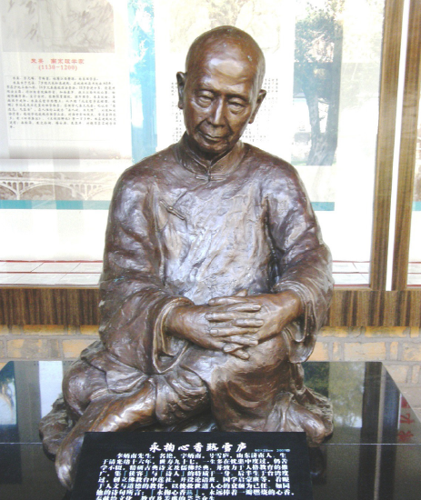

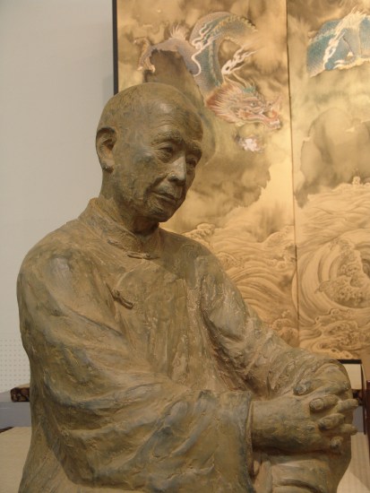

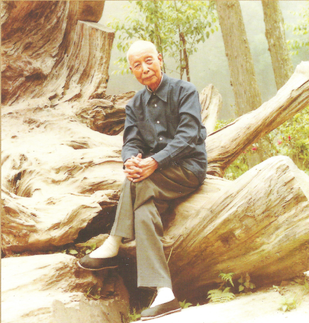

### 喬治．華盛頓〜從學禮開始學習治國

戒郁

艱難時代的典範

依禮養成的人格

無欲好學的品性

功成而退的淡泊

「爾等…在此沒有典範的年代中漂流。無可信之人，末能見前境於未來，無信念可從。只有自私自利為目的而不斷更易的『道德』說法；……我們的道德勇氣應從何來？」—彼德‧加度 (Peter Gadol)

彼德‧加度是一位美國小說家，在二十世紀末時說了這一段話，依他的看法，西方文化似乎失去了它賴以生存的準繩。嘗聞　雪公太老師說青年缺乏文化教育，是「失教」的一代，無疑，西方社會也面臨同樣的困境，在生活行止上失去了依靠。

百年來中華文化因國力的積弱，民族自信心的不足，在文化價值上失去自尊，使國人生活行為上頓失依靠，怎能不是「失教」呢？那麼西方文化不就是一枝獨秀、無往不利了嗎？

實則不然，西方文化亦面臨了　雪公太老師所說，近代年輕人「失教」的嚴重問題。「失教」並不是不識字沒有受教育，而是沒有落實化育的功能，人格教育上出了問題。

圖片出處：http://davycrockettsalmanack.blogspot.tw/2010/09/george-washingtons-rules-of-civility.html

開放的美國教育方式，理應更能發揮個人的潛能，使每一個人更能發展美好的生活，更能接受、認同人的個別性才對，但有識之士亦感受到美國文化「粗鄙化」(coarsening of America) 的現象，就是人際互動關係中語言以至行為上無禮的表現，實在令人非常憂心。美國約翰霍普金斯大學在一九九七年開展一系列禮貌態度的相關研究，統稱為「文明計畫」(Civility Project)，用來檢視充滿在社會中橫蠻無禮的訊息與行為，希望「好禮」的表現能重現、被認同、被重視。

研究結果發現「粗鄙的態度行為」越來越嚴重，應歸咎於「無標準可循」，而人生最重要的原則即是「人生的成功與否，是決定於我們在生活中如何對待他人」，他人的快樂才是我們的福報來源。

德國出版的「教養」(Bildung—Alles, was man wissen muss)一書，即試圖以西方人文歷史的角度來作人格養成教育。教養是代表自律、自制、有禮貌、守規矩。它是人的氣質與風骨；是知識、行為態度、審美能力亦是生活風格。要成為有教養的紳士淑女，必須具備傳統文化內涵，所以必須以文化的全部來重新塑造自己。什麼是文化的全部？就是無所不包的把歷史、文學、藝術、音樂、哲學、理論、世界觀等書海中的知識全收納起來，繼而從「知」再開啟人的智慧力，塑造並充實個人內在精神層面，來重新塑造成有「教養」的人。

不論是前面所說「文明計畫」的微觀歸納方法來考量行為準則，或是以宏觀方式把整個西方文化作後盾來營造一個「有教養」的現代人，以上的說明無非希望能提供一個方向，給現今迷失方向的一代、失教的一代提供一個正確的人生方向，但前面所說的這些方向真能帶領這些人走向康莊大道嗎？

其實迷失方向的人最需要的是典範，一個他們心中的英雄（指有道德之勇者言)，能使他們心悅誠服、可以有效法的對象。美國文明不過兩百多年，但其傳統建立在於建國之初，其偉大的人物中，莫過於是美國人的國父喬治‧華盛頓，美國實在不能沒有他，沒有華盛頓，也就不會有現在的美利堅合眾國。筆者曾經嘗試探求美國強大的原因，每一重大歷史事件的發展，無法不以重要人物來串連，沒有他們就沒有歷史，華盛頓就是這種人物，華盛頓在美國立國中扮演極其重要的角色，華盛頓成就了國家，但甚麼樣的人格特質成就了他的功業？又是何種教化成就了他的人格呢？

圖片出處：http://artofmanliness.com/2009/06/14/manvotional-george-washingtons-rules-of-civility-and-decent-behavior-in-company-and-converation/

這個只受過短期小學正規教育，全世界的第一位總統，是美國人民心目中的第一人，打從孩提時代就知道的歷史人物。華盛頓家世並不顯赫，充其量只是個小貴族，而華盛頓家的命運，男系多短壽，不論祖輩、父親及兄長都是五十歲左右而逝，獨喬治華‧盛頓享年七十餘，在那年代可謂「高壽」了。

華氏勤奮，喜隨善知識學習各方面的德能，這些德能對他的未來幫助很大，不論在獨立戰爭中任陸軍大元帥期間，即或後來的大功告成，或甚有人提出希望華盛頓能一統美國天下，治理當時混亂的政局，推舉其為美國的君主，雖然被他嚴詞拒絕，然而，以當時的世界情勢而言，此要求並非無的放矢，但在黃袍加身時，華氏卻斷然「拒絕了王冠」，完成了自己建立國家的使命，是他光明的人格使然。英王喬治三世聽聞華氏自動交出兵權退隱山林，無法不讚歎他的偉大。而在法國正忙於稱帝野心的拿破崙，亦稱華氏無私地建立了一帝國的功業，必定會留名青史，而拿破崙自己即陷於革命的漩渦中不能自拔。

華氏遺物，在國會圖書館收藏的文獻中，其中一份是華氏十四、十五歲時的抄寫文稿—「一一○條青年應對進退合宜行為之守則」 (George Washington’s Rules of Civility and Decent Behavior in Company and Conversation)，以之對照其一生行止，人們才發現這位早慧的偉人，其人格養成定得力於此守則。這亦意味著，審視、運用此一百多條守則時，必得得力於整個道德價值體系，對人的規行矩步的學習更是舉足輕重，守則中每條都與自我約束謙遜，習以為常的關心別人的行為有關。廣而言之，就是「為他人而活」的生活態度，在優雅的言行中無不是智慧與美德的體現。如果年輕人能用優雅的行儀來表現其卓越於人，那又何妨呢？

此守則最早見於一五八五年法國貴族學院學生的規範中。一六七三年亦被用於作為「王公貴冑」青年的教育守則 (The Education of a Young Prince)，其曾譯作多種語版。一七七０年代，牛津大學亦引用作教育青年紳士之標準 (Of Education: Especially of Young Gentlemen)。

「文明」即是《易經》中所說的：文而明之，因文而明，文明以止，知其所止。「依禮而貌」，「如貌而為禮」，人之教養是出身高貴的標章，生而知之者與？當然不是，是受教而來的，習慣養成的，文明教養值得每個人傾一生之力追求，是個人身上的重要資產，屬於精神內涵的境界。「觀乎人文以化成天下」，努力提升教養的結果便是個人品質的提升，個人品質的提升能讓整個社會優質化！

讓我們培養自己成為有文明有教養的人，每日幸福快樂的開始每一天，與人愉快的相處，常常用禮來莊嚴自己，用學習來莊嚴我們的心。

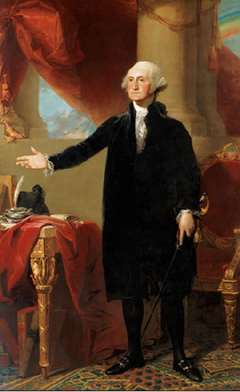

## 專題報導

### 二○一二年寒假心靈成長班〜道藝人生講座　前言、開訓典禮主席致詞

*編輯部*

以藝載道啟蒙班

近悅遠來文化情

天下興亡匹夫責

要為後人立典範

前言

道藝人生講座，是一個結合藝術、教育、文化、生活與環保的多元化人生講座，此次教學內容將圍繞江逸子老師的藝術畫作為主軸，從畫作欣賞談起，將唐詩、古文、茶道、歷史典故、常禮、論語、生活……等豐富有趣的文化教材依次導入，並舉行「如是獨行江逸子」紀錄片首映會，此片歷時三年完成，由創作者李中旺導演現身說法。此外禮請國內窯燒天目曜變研究者林錦鐘老師及環境工程實踐者郭基發老師到會，分享生命與道藝相結合的研發過程，寓教於藝與道，將生活與文化藝術教育結合，期能提高文化藝術視野與生命的寬度深度廣度，使學習生動有趣，生活更為充實圓滿。

開訓典禮主席致詞

道藝人生講座開訓典禮主席致詞

依天台五重玄義釋本次活動，一、釋名：活動名稱名為「道藝人生講座」，顧名思義乃以藝載道，介紹江老師的藝術創作，內涵皆為道。二、辨體：以藝載道，藉藝來推廣文化，能令學者學成君子，利益社會國家。三、明宗：以藝術賞析的教學法，是認識文化最殊勝的善巧方便。四、力用：能將學生培養成大格局、大方向的人才。五、教相：是儒家君子的氣象，內而淨化身心、外而齊家治國平天下。以上是以天台五重玄義以釋本次活動。

其次依人、事、時、地、物來分別此次活動，人：涵蓋教學老師、行政辦事人員，義工團隊及全體學習的學生；事：活動前行的師資培訓、統合共識與作法的會議、場地的整理，承辦培養人才之事；時：寒假適合學生學習之時，亦是文化復興之時；地：以學校作為推廣文化的場所；物：教學的資具、後勤的資源及膳宿。

介紹馬來西亞的貴賓

正行是五天的教學活動，包括行政與後勤上的配合，活動辦完後的檢討，及經驗傳承，並作未來啟蒙教育的推廣。

辦啟蒙班重要的不只是教育下一代，更重要的是培養自己，我們並不是聖賢，所以要把所有的活動先定位在培養自己，練就自己的格局、見地、眼光，瞭解任何角色都是磨練我的增上緣，藉著角色的磨練培養自己，給自己壓力、讓自己成長，這才是辦活動最重要的心態。

本人雖忝為這次活動的班主任，在這裡也是以做學生的心態，把自己定位為一位學生，學習大家認真負責的態度。記得從民國六十五年開始學習文化，尤其到民國七十二年受了雪廬老人的感召，參加講座與論語班，並在啟蒙班做義工，這一條路走來將近三十年，深深知道培養人才與培養自己的重要。

在大陸有一位市級宣傳部長，負責教育工作，他說：現在要看到下一代，你才能夠找到希望，我們這一代可能在經濟的成長中、在追逐物慾中迷失了，不管上一代的精神有沒有傳承到這一代，最重要的是好好地把下一代教好，讓人類有出路、讓世界有出路。所以培養人才還得在下一代講究，此乃辦國學啟蒙班之目的，雖然重點在充實自己，但也完成了下一代人才的培養，因為唯有充實自己，使教材感動自己，才有辦法感動別人，自己都不能感動了，怎麼去感動別人呢？這次啟蒙班我相信透過大家的努力、聖賢的加被，會是一個很有氣象、很有成效的國學啟蒙班。

龍年象徵著飛龍在天的氣勢，要有龍馬精神，龍馬精神是向道的心，內心鼓勵自己，並在文化上找尋真正的出路，必然是龍年行大運。對岸將今年定為文化年，他們經過一番歷練，從而知國家的興盛有賴文化，文化能維持自己國家殊勝的形象，也是各行業的靈魂，能令各行業以服務的心，造福社會。

八仙報喜

雪廬老人勉勵我們要做地下工作，即人家不知道的善事咱們做，陰德的事情國家不幹，咱們幹。

奇妙的潑墨世界

古云：天下興亡，匹夫有責。匹夫到底有什麼責任呢？有自我培養、淨化風俗的責任，有培養人才的責任。孔子在鄉野不得任用，是一位平民的形象，但卻能為國家培養出德行科、言語科、文學科、政事科的人才，這就是他對國家付出最大的貢獻，他承擔了國家最殊勝的責任，謂之匹夫有責。

茶席

很高興現場有這麼多嘉賓來指導，且有遠從馬來西亞漢學中心來的朋友，論語云：學而時習之，不亦說乎。有朋自遠方來，不亦樂乎。至於成果是否得到社會國家肯定，無須在意，所謂：人不知而不慍，不亦君子乎。謝謝大家。

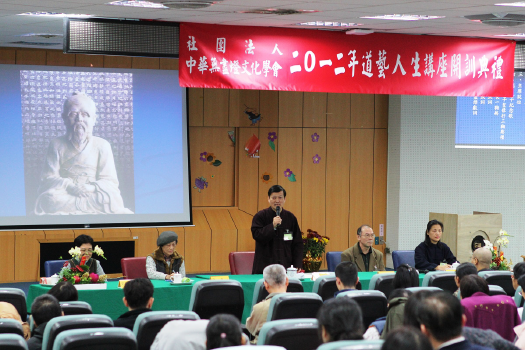

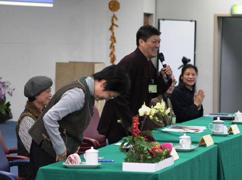

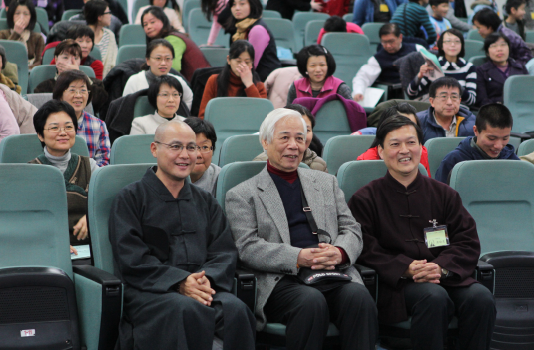

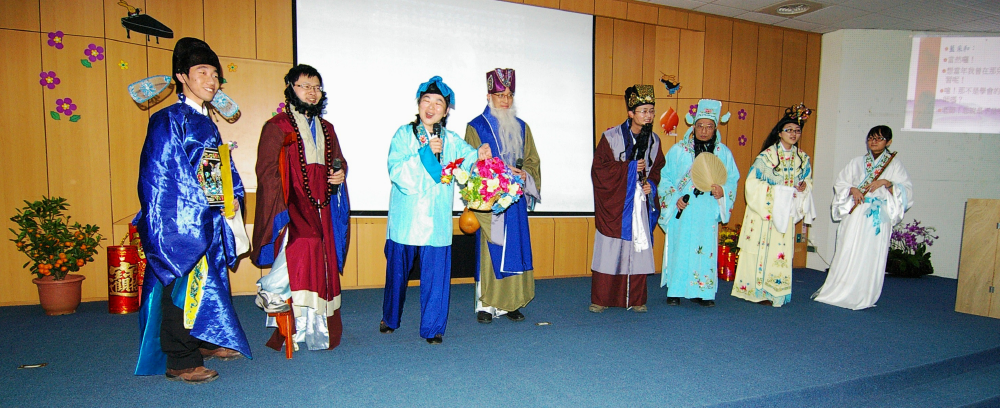

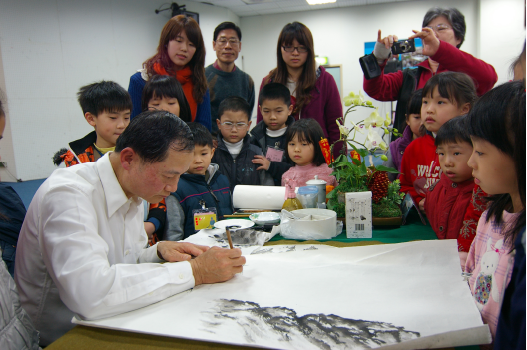

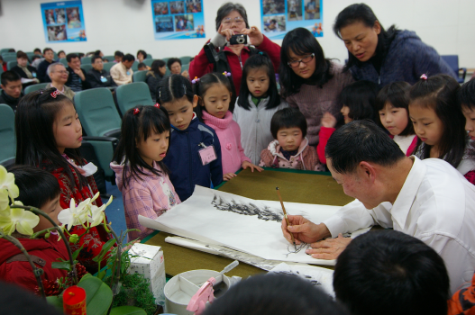

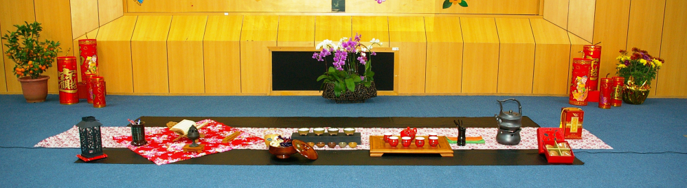

### 二○一二年寒假心靈成長班〜道藝人生講座　道藝人生講座心得

眾參與者

道藝人生講座學習心得 / 李永潔

此次學習課程一開始，先以孔子聖跡圖帶領學員正規傳統儒、釋、道對人生觀、價值觀的深遠影響，同時啟發學習者不忘發願，在短短生命過程中承傳中華文化傳統，萬不可斷送在末法時期。

雖然為期五天的道藝人生講座感覺時間稍縱即逝，但是卻改變個人部分思想、看法，也重新體悟儒家中心思想，道家的精神體系，對佛家闡釋萬法皆空的義理，感受跨越時空的意境，更加提昇身心靈的境界。

學會從規劃課程到準備學員的餐點、茶水，展現「道」的真誠，在教育理念的用心深植人心。早晨的導師時間，不時透過討論引發學員從淺學深入儒、釋、道三家思想，未來承接古聖先賢流傳典籍的使命。

感謝中華無盡燈文化學會舉辦國學的啟蒙教育課程，更感激參與此次課程的授課老師，精心設計教學環境、教材，以及準備前置工作，還有所有的義工默默奉獻心力，學員才有乾淨的環境學習。今日承蒙貴學會教授道藝人生講座，末學除了感恩之外，更期許未來能盡一份心力回饋社會，恢復中華文化傳統。

道藝人生講座有感 / 陳 霞

末學有幸第一次參加這樣的道藝人生講座，光第一天的課程就讓末學振奮不已。接下來的每天也都是收穫滿滿。這五天當中薰習了中華文化以及江逸子老師的藝術，才知道文化與藝術的結合居然產生如此的共鳴，讓末學又更進一步了解到學儒真正的涵意，也更堅定了末學學儒、學佛的信心。但儒學、佛學之高深，非短時間內可參透、加上末學愚鈍，但願未來有此福報可以有機會多多學習。

二

○

一二道藝人生研習心得 / 許溫妮

在工農任教三十多年，很遺憾地至今才認識貴學會諸善知識，五天來每日都在歡喜幸福的心情中度過，無限感激。

江逸子老師的學行、才藝，郭老師的純真與大悲，唐老師等的精闢解析，令人望塵莫及。

「詩、畫」兼併的講解，不限表面文意，更及於其精髓，相關知識也無不詳盡解說，希望今後能再有機會延續參與學習。

感謝老師及志工們的付出。

以藝載道，感恩 / 石玉華

末學在小學陪孩子晨間讀經、論語，也在家陪孩子讀唐詩、老莊與周易，但僅止於誦讀。今日上君（林老師）一堂課，真是如沐春風，享受！同時也慚愧不已，因為自己不精進，無法將國學之美介紹給孩子，讓他們能進而產生主動學習的樂趣。今日得見大師風範，欣喜不已，除了自己可以學習，還可以帶孩子一起接受大師的教導與薰陶，如獲至寶。感恩！

郭老師的體內外環保，超生活，很受用，只可惜時間太短，意猶未盡。

「道藝人生」講座研習心得 / 李季鴛

什麼是「道」？諸法都需經過詮釋才知「道」。事當做到面面俱「道」。

茶道、茶道，茶具非道，水非道，你我非道，只有每個角色「稱職扮演」才是「道」。江老師的畫作曾經見過，論語曾經讀過，如今經過諸位師長的教導詮釋，才知這是「道」「藝」人生。

感謝各位師長用心指導，把各個典範呈現在我們前頭，光明永遠照心頭。

專題課程—柴燒曜變天目研究

學無止盡 / 白文輝

從小就聽聞「中華文化博大精深」這句話，聽久了，也以為自己對中華文化有些許的了解，但卻不知道其博大精深之處何在。慢慢的有機會實際接觸文化的內涵後，才知道原來文化的樣貌實非當初所想像。一直到認識了老師們後，才有更深入地反思自己在這幾年的學習是否精確紮實，答案是否定的，因為對學問的輕忽，所以往往會有望文生義或過度解讀的情形產生。在這次的課程中，很高興的又發現了自己的眾多缺失，缺失之ㄧ如同高老師所提及的，自己沒有思辨、辨證的過程，加以確認自身的體認到底合理與否，也沒有對親近善知識擁有迫切需求的危機感，一想到這裡便十分慚愧，沒有老實聽話、依教奉行，實在需要善加思之，進而改之。最後，感恩所有老師、義工、學長及十方大德的無私奉獻。

專題課程—從體內環保到體外環保

「道藝人生」二O一二年系列講座心得報告 / 王東山

首先向  全體老師表示最崇高的敬意與感謝。

茲將此次講座研習心得報告如下

一、【孔夫子以「詩禮傳家」】

耕藝而源於道，自古有之，儒家肇始夫子「志於道，據於德，依於仁，游於藝」之說；道與藝兩端之橋樑，是靠德與仁的實踐，德與仁如「華山」階梯，而登梯之道，端賴禮與樂，故曰「克己復禮為仁」，又曰「導之以德，齊之以禮，有恥且格」，更曰「興於詩、立於禮、成於樂」，詩樂不分家，詩注入藝，更是中國藝術之特色，迥異於西方！所以「不學詩，無以言」、「不學禮，無以立」，是以孔家是以「詩禮傳家」。

如是獨行—江逸子紀錄片導演                           道藝春秋作品創作者—江逸子老師

唐老師曾上書馬總統「走出文化的困境—給總統的一封信」文中寫道：「找回正統請延續奉祀官恢復奉祀官府。」因為人心建設國之本，文化正統立優勢。文化之於國家必須要有主導的中心思想與傳承，儒家的五倫關係就是中華文化立基的精神。

儒家精神傳承盡在孔家，如國學大師李炳南（雪廬）教授云：『孔家存則中國文化存，孔家亡則中國文化亡。』所以國家文化存亡攸關孔學，政府尊崇孔家，要善待孔子後人，教之育之。

政府應當體會到文化正統與優勢的重要，在亞洲文化中，儒學具有指標性意義，影響力無遠弗屆，是國力也是實力。政府當積極正名孔奉祀官之傳承，並恢復孔奉祀官府，將前奉祀官府文物（或存友人處、或存故宮），蒐集成立孔家文物館（另附奉祀官府存於故宮之文物清單），以紀念這段孔子嫡傳後人在臺灣落腳的特殊因緣，表彰儒家的文化，重視儒學道統的傳承，亦提供全球各國研究儒家研究教育的場所，則國家交流利益可及於文化、學術、教育、外交，何樂而不為？

孔上公一生致力於儒學的弘揚與三禮的研究，在此企盼國家能保留整理孔先生對於三禮的研究資料，作為學習古禮的教材，並重新發現三禮的新時代意義。再則，三十八年前後遷臺的大儒皆已是垂暮之年，若能結合彼等資歷見識，在政府的支持下成立孔學中心，函知寰世，彙儒學道統重鎮於臺灣，必執世界孔學的牛耳，日、韓及中國大陸等數以百計的孔子學院將會回過頭來向臺灣學習。」

復又書函「使臺灣成為文化的正統」懇請上淨下空老和尚能建言之與層峰重視，俾延續文化道統。在在皆為「文化道統」的慧命傳承而努力，要「興佛」必先「學儒」，學儒就要學孔老夫子，在哪學？《論語》。如此才能真正認識聖哲的胸懷。

微  雪公太老師，吾等不能認識夫子。

茶 道 課 程

二、【我們是「龍的傳人」】

聽聞林錦鐘老師的課，說到要讓「國寶活起來」，那誰是國寶？就是我們。為什麼？因為我們是「龍的傳人」，在《尚書》中有載：伏羲王天下，龍馬出河，遂則其文以畫八卦，謂之河圖。龍馬負圖出於孟津黃河古渡。伏羲在這裏降服龍馬，依其背負的圖紋畫出河圖八卦，創立了最早的文字符號，結束了混沌蒙昧，開啟了華夏文明，被奉為人文之祖，成為中華文明的最早源頭。龍馬是黃河的精靈，是炎黃子孫的化身。（孔子在易繫辭傳說：「河出圖，洛出書，聖人則之。」繫辭傳，這是孔聖人起的稿。周易本來無字，只有圖畫，後來經孔子注說。河出馬，馬稱龍，八尺為龍，龍馬負圖，馬背上有河圖洛書這些紋路，什麼人見到而記載下來，就不知道了。）

龍的傳人要有什麼特質？此次課程中有「李白《聽蜀僧浚彈琴》、蘇軾《前赤壁賦》」，經老師的善巧開解及引導，提及  雪公太老師曾說吾之學佛人除了「要有七分的理智」，也應有杜李蘇等儒士的「三分的俠氣」，學佛要有「出世」的智慧，也不能缺少「入世」通達人情世故的慈悲。這是令學生觸動之處，憶及自己往往學佛學「呆」了。

三-一、【世有伯樂】

班導師高老師在導師時間曾問及「工欲善其事，必先利其器」之大義，學生先想到的是這句「磨刀不誤砍柴工」，磨刀花費時間，但不耽誤砍柴。比喻事先充分做好準備，就能使工作加快，所謂「凡事豫則立」。

而後查到此語乃出自《論語‧衛靈公篇》「子貢問仁」一章，這才明了「親近善知識」的重要，班導師亦善巧開解：佛陀若不出世，八千比丘中，只有舍利弗及大目犍連兩位尊者證果，所以修學者的成就全在「他力」。因此親近明師十分重要，所謂「能親仁，無限好，德日進，過日少。」

而如何「擇師」，這就須具兩個條件：

一者德行：持戒精嚴。
二者學
**問：** 即有「師承」。

上淨下空老和尚一生遇見三位好老師，依教奉行，弘傳正法，知恩報恩，足為吾等師法學習。唐老師早年往返四百公里勤學，方有今日這一會，文化正統得以延續。兩位仁者皆是親近 雪公太老師的威德行儀，亦明親仁的重要。

三-二、【然後有千里馬：孔門高弟】

聯想到在此次課程中學習《岳飛「良馬對」》＆《韓愈「馬說」》，《韓愈「馬說」》：「世有伯樂，然後有千里馬。千里馬常有，而伯樂不常有。」伯樂如「師」，千里馬是「生」，因此找到好老師是真正大不易。而老師一生最大的心願就是找到傳人，就是要先培養成「千里馬」，能成為致遠之材。能有千里馬之資，透過伯樂的引導，他日方能成為伯樂傳人，「老貓房上睡，一輩傳一輩」，代代相傳，正法永住。

所以聯想到「孔門高弟」一課，是否也是在期許我等能「見賢思齊」，而今很幸運的是「人身已得」「正法已聞」「亦生中土」，而善知識得遇否？

啊！「眾裏尋他千百度，驀然回首，那人卻在，燈火闌珊處。」

原來就是「中華無盡燈文化學會」的導師團隊。

最後，學生再向師長們及全體義工菩薩恭敬頂禮……

心 得 / 邱寶妹

馬來西亞中華文化教育中心同仁非常感恩無盡燈文化學會細心為我們安排的一切。對於此次參學，我們學了相當多。同時瞭解到論語也可以以不同方式來教學，真的讓我們大開眼界，我們如同進入了論語寶藏取了許多寶。

真正深入瞭解雪廬老人。從多位老師口述當中瞭解到雪廬老人對學生教誨、關懷及救世情懷的那顆心，深深烙印在他的每位學生心中。看見他學生如江老師、唐老師、林老師及郭老師等對雪廬老師尊重及念念不忘老師當年之教誨，至今方才深深體會師承之重要。也從多位老師身上學到尊師重道，這是我們一直需要深入學習的一門學問。

一、對各位老師能夠深入淺出把經典講解如此清晰，讓學生如同回到古世界看歷史之展演，也提升學生對學習經典之方式，更及深一層瞭解經典之涵義。學生也學會如何從多方面去探討問題及找出解決方法。

二、除了在課堂上所學，學生也看見無盡燈學會內無論是老師、職工或是義工都充滿法喜。而且學會中還有多位老師、職工及義工已經跟隨唐老師學習多年，這是相當難得。學生也看見學會中每位都知其崗位而任其職，無需唐老師或是林老師憂心，這也是我們一直希望看到的一幕。大家擁有同一個目標及理念，能守其崗位，為大眾服務、把傳統文化傳播到世界每個角落，弘揚傳統文化這條道路就可一直延綿下去。

除了上述所說，其實還有許多值得寶妹學習之處，只是無法從言語中表達。對此次學習，寶妹可以說真的受益無窮。真誠感謝各位老師認真教導及付出。此外，也非常感謝高老師對我們這群來自馬來西亞同仁如此細心照顧、關懷及指導。下次若機會希望能再次向大家請教。非常感恩你們！

敬祝 吉祥如意 福慧圆满！

心 得 / 郭筱芸

能參加此次貴學會舉辦之「道藝人生」講座，感到無比的幸運！學生深深感受到貴學會為弘傳正法，真誠無私的付出與團隊的努力，深為敬佩與感動！由於學生障深慧淺，對於此次博大精深的內容，本無任何置喙餘地。然而自己此次深受啟發，為聊表感恩心意，遂不揣冒昧，敬向貴會報告個人淺見如下。

此次以「藝」弘「道」，道在藝中，以藝載道。尤其第一天下午江老師親臨現場，觀賞老師紀錄片的首映；加上老師娓娓訴說他自己的經歷，讓學生不但對老師有較深的認識，更對雪廬祖師無比的欽服！當提到雪廬祖師自己說：我就像是一個破掉的法器，能敲醒一個算一個時，不禁被祖師偉大的胸懷和捨己為人的高貴情操，感動的流下淚來！江老師有幅地藏菩薩的畫像：火中出紅蓮。他說，他認為雪廬祖師是地藏菩薩的示現。對此，學生深表認同！

接連幾天，在老師們的引導下，對江老師的畫作，以及畫的內涵與深遠的意趣，有了粗淺的認知。感謝唐老師、林老師，以善巧方便將詩畫結合，並詳加說明。讓學生認知到一代大師的產生，殊非偶然！除了自己的勤奮努力外，能夠跟著「好老師」學習，才是成功的關鍵啊！

而林老師的「茶道」課，讓學生肯定唯有每一處細節的講究與用心，才能讓大眾深受感動，從而體會到中華文化深厚的底蘊與內涵。

最後一天孔門十哲的造像，經過高老師的說明，才知道每一尊造像蘊含的深意，以及孔老夫子因材施教，培育出各種人才的智慧和一個聖人人格的偉大之處！被後人尊稱為「大成至聖先師」，係實至名歸，非溢美之辭。

雖然僅短短的五天，然而，藉著唐老師的智慧、高老師的善巧方便，學生感覺自己的眼界和心量拓開了。只要是為正法、為眾生，專注的將身心投入學道、弘道、衛道時，便是在憶佛。所以，日用平常，只要心念正確，則無一法不是佛法啊！

最後，學生很認同學習一定要依止善知識，才能不走彎路。而唐老師，就是有傳承、有智慧的大善知識！學生目前有幸於每週一聆聽唐、林兩位老師的「常禮舉要」。期盼學生自己的福田力現前，能夠更精進的學習，俾便為正法久住及苦難的蒼生們盡一分炎黃子孫應盡的責任。

和合班 / 林佑靖

這次的課程主要介紹孔門弟子、江老師的畫和許多許多歷史上著名的文章，其餘還有茶道和專題演講等豐富的課程。

孔門高弟，我們先從江老師的塑像開始介紹，例如可以從塑像手中拿的東西看出其個性，讓我更了解孔子門下十大弟子的歷史。

江老師的紀錄片訴說著老師的一生，從老師的想法、作息、作品開始詳細描述，讓我了解更多我本來不了解的細節，也讓我更欽佩江老師，覺得老師的精神是我們應該要去效法、學習並完整實行於日常生活當中，更進一步充實自己的內涵。

茶道，這是一門高深的學問，從前都單單喝茶，並沒有探討到更進一步泡茶的學問，每一種茶的泡法、味道、喝的方法都不一樣，這些我不曾接觸過的部分，使我受益良多。

這幾天的課程使我收穫良多，讓我的心更容易平靜，讓我的內涵更豐富，學習的東西遠遠超過平常所學，非常謝謝老師。

和合班 / 李亭儀

每年所舉辦的心靈成長營主題總是非常的多元，也總是讓我受益良多，常常期待著下一次的課程，而授課老師也很用心、努力地為我們講課，總是讓我吸收到許多新知識呢！

在眾多課程中最吸引我的就是吳老師和楊老師的「畫馬話馬—岳飛良馬對與韓愈馬說」。告訴了我們千里馬和伯樂的定義，也讓我知道了千里馬和伯樂有好也有壞，並不是一定的完美。在課程的最後老師也為我們播放了一部名叫「戰馬」的電影，時間是在第一次世界大戰時，在當時還需要馬匹來打仗，影片中流露出了許多馬兒之間的真摯情感，只是看了片段就讓我迫不急待的想知道接下來的劇情發展呢！

這次為期五天的心靈成長班學到了很多，希望以後還能參與更多。

和合班 / 高筠襄

今年寒訓營的主題是「道藝人生講座」，所有的課程都和江逸子老師的畫有關。

這次課程內容非常豐富，例如：孔子聖蹟圖、詩畫賞析、開張奇逸、孔門高弟、茶道……等。我們還看了一部紀錄片，名為「如是獨行江逸子」，是一部關於江逸子老師的紀錄片，令我印象深刻，尤其是「開張奇逸」，李老師把陳摶和華山的故事說得出神入化，非常精采。

我很感謝學會每年都舉辦這麼豐富的課程，讓我們能在放假時還過得如此的充實。下次，我希望和合班的同學們能更珍惜這個難得的機會。

和合班 / 張至瑜

這次參加中華無盡燈文化學會舉辦的道藝人生講座，讓我學到很多東西，讓我更了解孔子的為人了，我以前覺得為什麼要學中國傳統文化，跟我們又沒什麼關係，可是來到這邊我終於知道了，中國文化跟我們日常生活息息相關，它可以讓我們知道怎麼跟人相處互動和做人處世的道理。

這次來更讓我學到畫畫的意義，畫畫不只是拿筆在紙上畫畫而已，還要懂得觀察，要觀察平常人在日常生活的表情，而且還要看很多種書，不然在夏天才有的植物畫到秋天或春天去，那就算這幅畫畫得多好也不會成為好畫的，這樣會讓別人覺得你是個只懂得畫畫而已，而連基本知識都不懂，絕對不能成為一流的畫畫大師。

和合班 / 楊家瑜

我參加過幾次營隊，從佛學營、弟子規研習營到這次的國學啟蒙班，每次都有不同的體會與成長，這次的體會是：以前在學校上論語時，是為了應付考試，這次上了孔門高弟，在抄寫和合班的論語作業時，對於孔子講的禮和道相較於以前有不同的了解，以前都認為論語不是什麼值得注意的書，但是現在我覺得論語每一條都涵藏著做人處事的道理以及孝和禮。還有每當課程進行到江逸子老師的畫作時，老師們都會把圖放大解說，讓我有身歷其境的感覺，那樣如此細膩的筆觸，應該可稱上「現代中國畫畫仙」！著實令人佩服！

一開始我以為國學是很無聊的課程，但是我上完這次的課程，發現其實國學是可以有趣的來學習，感受其中的深遠意境！經過了弟子規和國學啟蒙的學習，讓我更加堅定了要傳承中華傳統文化的信念，我一定會讓這美好的文化繼續發揚光大。

感謝中華無盡燈文化學會開辦這國學課程，尤其感謝香積組的師姑師伯，食物實在美味可口！以及感謝各位老師及所有為活動付出的人。

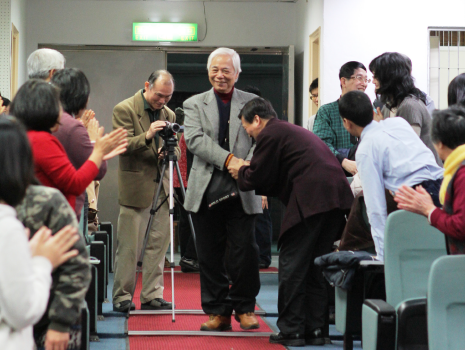

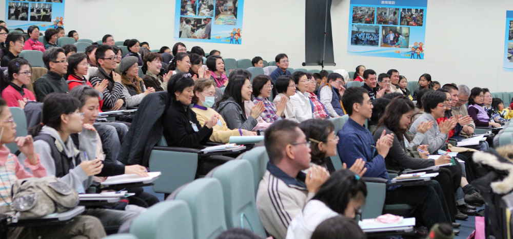

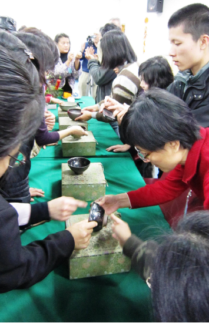

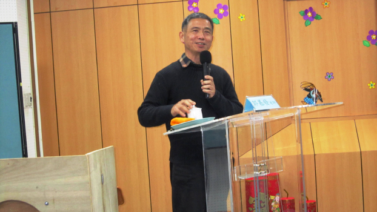

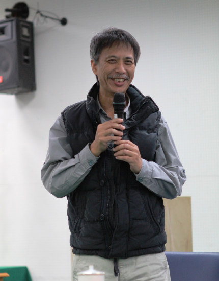

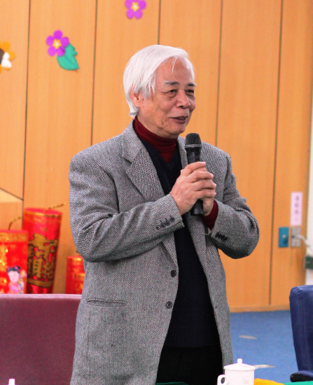

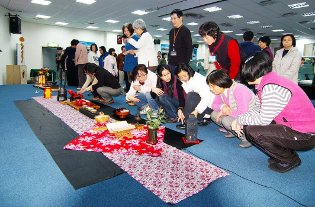

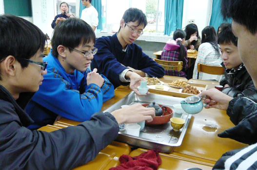

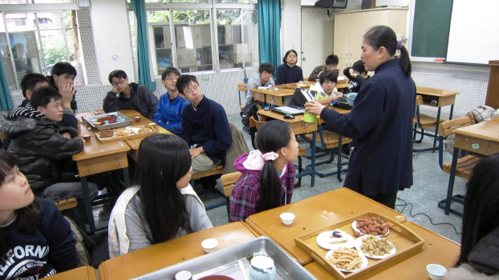

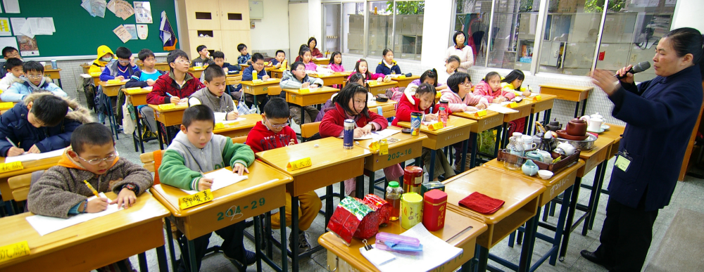

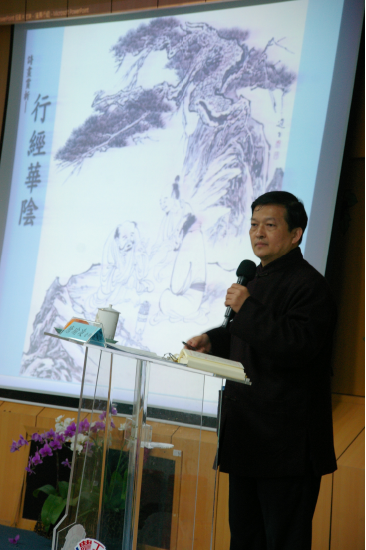

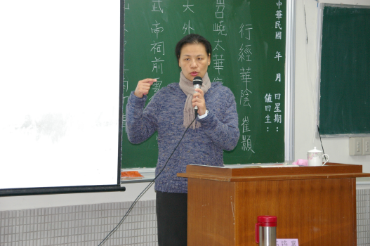

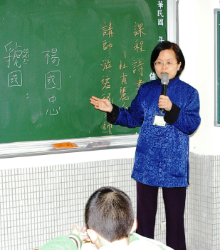

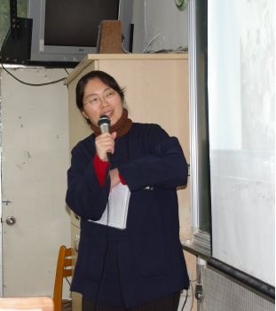

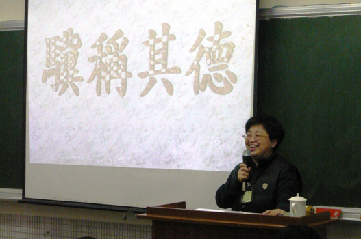

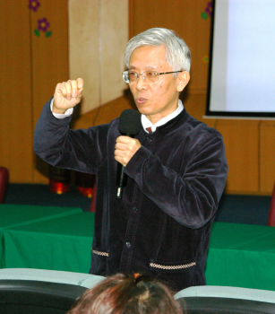

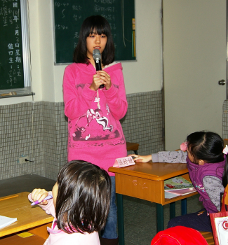

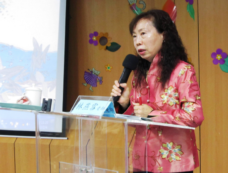

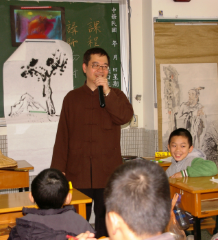

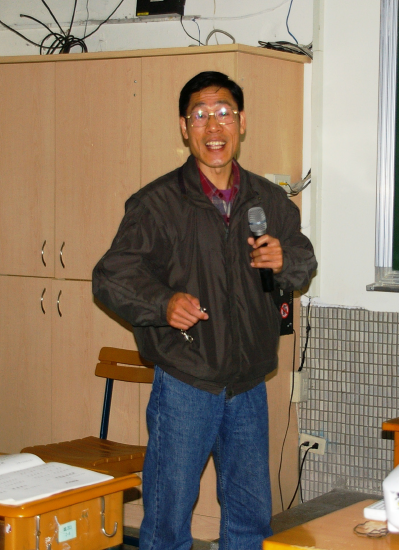

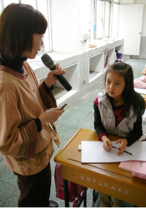

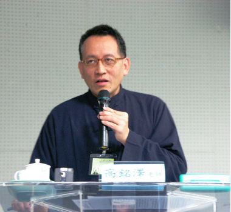

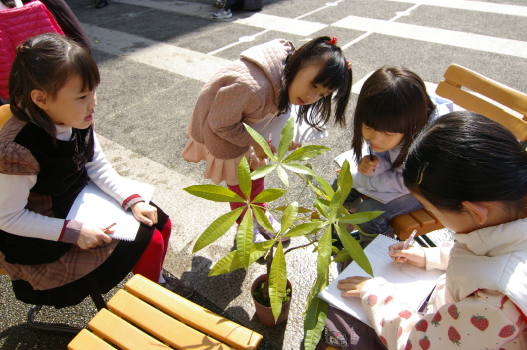

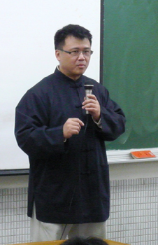

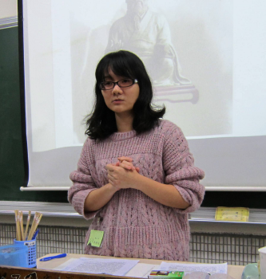

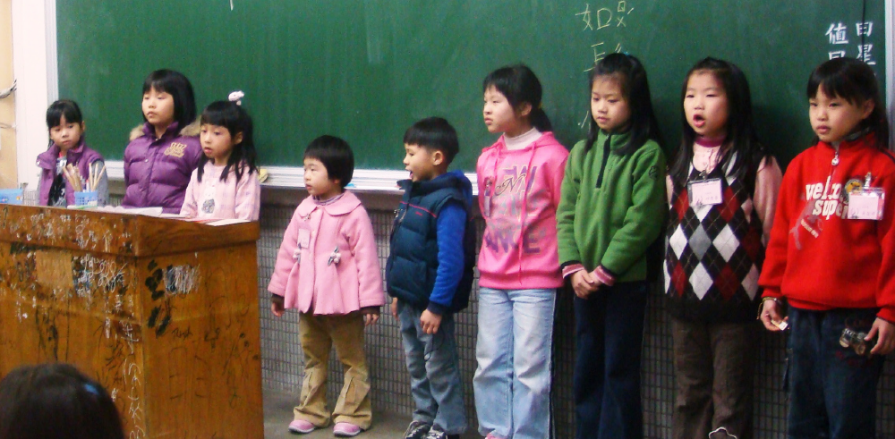

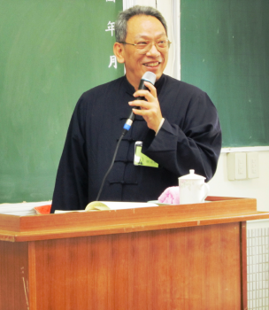

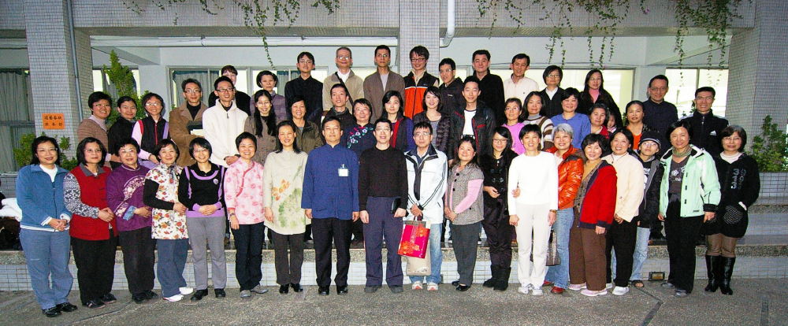

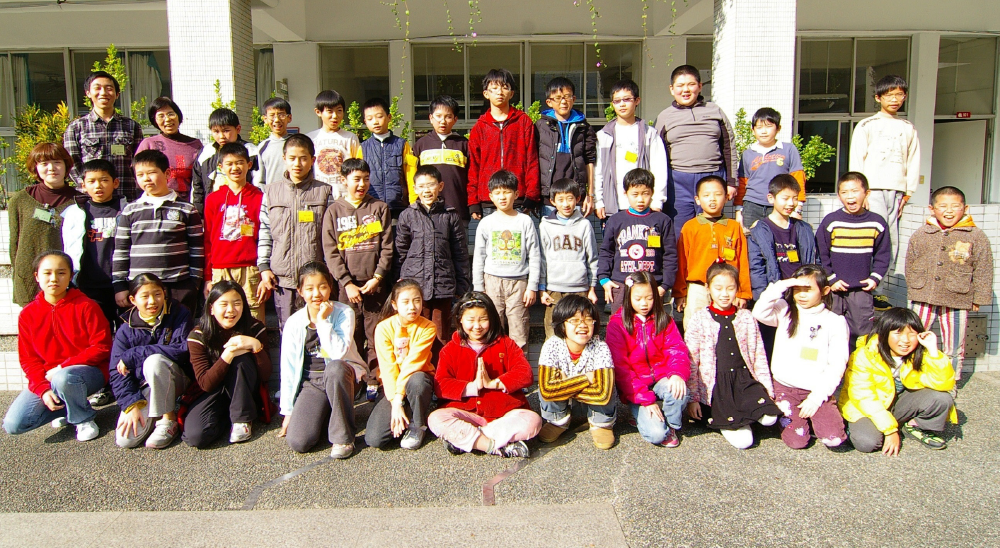

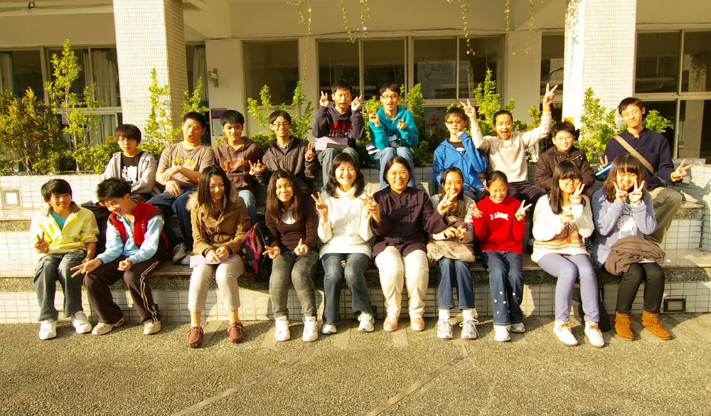

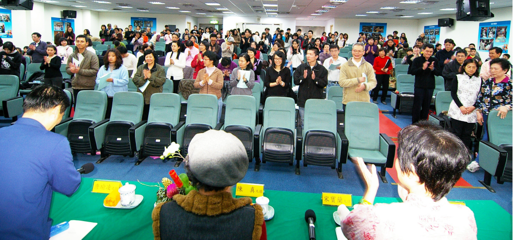

### 基隆淨宗學會人才培訓課程報導　經典文化人才培訓

*編輯部*

中興人才本

經典是根本

化育聖賢品

臺灣未來路

二○一二年三月四日

前言

今年三月，學會與基隆淨宗學會合作，以培訓人才為目標，開設一系列儒佛課程，對象為三十歲以內的年輕人（目前正式生二十人，旁聽生近十位），正式生按月給予定額獎學金，旁聽生則隨上課次數給予車馬費，經過半年的學習，除了學習效果有明顯的進步外，也能在知見上有共識，形成團隊一起共學與辦事。

其次於暑期開設大專佛學講座—《普賢行願品》中，更以大專青年學子為當機眾加以培養，上課及分組討論成效良好。並進一步為培養他們辦事能力與團隊凝聚力，而隨後興辦暑期啟蒙活動，做第二階段的人才培訓。讓這批年輕人承擔起教學、生活、隊輔、總務、香積、維那、悅眾等職務。

今就於基隆淨宗學會開設的人才培訓課程，開訓典禮中師長們對學員的勉勵謄出，以饗大眾。而大專佛學講座及暑期啟蒙生活輔導營課程之活動報導，將載於下期刊物中。（編者）

開訓典禮謄稿

張居士：

基隆淨宗學會人才培訓班的開班因緣，起源於二○一一年，陳會長帶領基隆淨宗學會的同修們到故宮博物院參觀百年大展以及龍藏展，因唐老師現場導覽而結了這樣的因緣，之後談起人才培育的重要，因此激發了陳會長的雄心壯志，所以發起這次人才培訓，這也是雪廬老人以及學會多年的願望，從陳會長這邊得到了實現。

陳會長：

非常歡迎各位蒞臨基隆淨宗學會，很高興有機會有這份福報，能夠邀請到兩位老師到我們這個小道場，來為我們分享生命中非常重要的經典文化，而這樣的經典文化，不是普通人可以講的，如果沒有文化內涵，沒有正知正見的傳承，不是一般老師可以比擬的。很高興大家可以在此共聚一堂，降伏煩惱跟障礙，我非常的佩服你們選擇來聽課，這就是一份智慧，能夠請到好老師也是一分福報，我們都是福慧雙全的人，能夠坐在這裡。人生非常有限，我們所累積的經驗也非常有限，我們要有這份智慧，透過善知識幫助我們閱讀經典，透過閱讀經典與文化，找到自己生命的新力量，這也是我們創意的來源，如果能夠透過經典文化，所累積下來傳承的智慧，就好像踏在巨人的肩膀上，我們可以看得更高、更遠、更深。

老師：

人的一生，除了經典的學習，外緣上還要有貴人的相助，張居士等乃生命中的貴人，告訴我諸多成功的道理，包括如何培養人才，如何推廣正法，如何把握局勢創造一番局面，尤其透過張居士的因緣，認識了陳會長，知彼乃有魄力，劍及履及的人，事業作得很好，有心回饋社會，然需要幫助的實在太多，她選擇主體是人才的培養。

我的老師也認為這是最重要的重點，因為唯有把人才培養起來，整個社會才有希望，中興是以人才為本。最近有機會到大陸講學，發現大陸這一方有一股崛起的力量，社會的中堅力量平均在三、四十歲，而且都很有幹勁、理想及抱負，學習文化的熱誠超乎我們的想像。來聽課的人有的搭火車要花二十幾個小時，是抱持著使命感，想要經過一番學習後，回到當地成立讀書會，延續文化的傳承。

反觀我們臺灣，因為在安逸的環境待久了，昔日大德們對於後進不遺餘力的提攜與調教，但在大德們相繼過世之後，後進學習的力量越來越薄弱。光碟、錄音、書籍流通的很多，可是學習的人很少，大學生對於佛法的研學課程參與已鳳毛麟角。有同學曾經跟自公老師說，蓮社不應該這麼落伍，應該讓年輕人HIGH在一塊，讓佛法可以貼近年輕人。想不到自公老師說他寧可讓佛法亡，因為佛法的延續是靠學習不是靠玩，佛法是讓年輕人作學習的增上，作內涵的提升。當然善巧方便是要有的，有時候可以貼近年輕人；然佛法若走俗，學習者不重內涵，無中心思想，則學佛已無任何意義，且有大過患。

所以希望在場的年輕人，要感激陳會長的發大心，須有心學儒學佛，期許在人生旅途上有一個新局面的開展。是人才得透過經典的學習，在大陸很多公司的老闆，知道文化是企業的靈魂。這些公司開始籌組讀書會，由此培養員工正知見與交往情感，這樣的人才團隊，是永續發展的基礎。我非常佩服他們看到問題的核心，可惜我們現在的年輕人不懂得在經典上學習研究，只懂得在物質上去追逐，腦袋貧乏，心裡空虛，知見飄忽，人格不能立足，事業上注定不會成功的。

此人才培訓班三年一期，其成效觀待三者，一者觀待大家誠意，是否有接受培養的心。天上的明月無地上的水，不能映現月亮，沒有求法的心，也激不起講學的熱誠。老師的幹勁與使命感，是來自於看到希望。其次講學的人也要自我鞭策，須是努力充實自己。三者也有賴於陳會長大力護持。

林老師：

今天終於齊聚一堂，開始三年的儲訓，人才的栽培、合集有志一同的志願者是困難的，所以今日是殊勝因緣的開始。

人生短促，雖然人生學習過程中年輕就是學習的精華期，但坦白而言，以傳統經學的學習來說，這樣的年齡才開始學習已經晚了，其實在中國傳統人才培養須從童蒙紮下基礎。以一個金字塔來形容好了，金字塔必須要有非常強固厚實的底端，所謂「人才」就是要攻金字塔的尖端。大學時代曾經採訪過漢聲出版社的負責人奚淞先生，聽他一段話非常的感動，猶記到現在，他說八○年代的台灣是一個生氣蓬勃發展的國家，就好像一個金字塔，每個方位都需要人才，向上的力量非常強大，當時有非常多的機會，從金字塔的任何一個點都可以往上爬，只要你願意努力，就可以從你的立足點往上爬，成為那一端的人才。社會上利益一方的專才雖可貴，但我們要培養的是如整個金字塔底盤紮的非常穩固之後，每一層學習上去都可以成為領導一方的人才，中華文化經典就有這樣的力量。

今天大家坐在這邊，代表大家都是有熱誠，想要打開文化這扇門，或者我們在童蒙的時間來不及接受這些經典的扎根教育，所以從現在開始必得要有一個心態，一定要有使命感，要有熱誠，並且要有來不及的感覺。有些人或許以為三年對自己而言是多麼黃金關鍵的時期，想在學業上、事業上衝刺，但是如果我們以經典的人才作為目標時，會發現已經來不及了，更需用十二萬分力來學習。

坦白講人才培訓應該已經是面扎好了，然後作向上的學習，可是我們現在還須從點變成線變成面的學習，然後才能往上，由於我們整個時代背景不允許我們已經就培訓好扎根的人再往上來學習，所以我們願意從零開始培養大家，如果大家真的瞭解到這番的難得與不易，加以珍惜。不管從哪一個課程切入，都希望大家是用整個面向上追求的心態，來作點的學習，這樣才能快速的充實自己，如果好樂心生起，則用上十分力或可達到百分的效果，如果心力不足，可能花了時間，最後還是零甚至是負面的效果，希望大家調整意樂，深入課程去吸收法義，嚐到法喜，再推動我們更想求學的心。所以這三年到底會開出什麼課程，也觀待大家求知的慾望有多麼強，因為經典文化的課程太多了。

如果我們能夠齊聚一堂，拿出學習的熱誠，相信能夠在三年裡面完成扎根的工作，而且可以真正找到人生的志向及增上的目標，三年不是一個完成，而是讓我們嚐到滋味之後，作一生的學習，最後要責成自己成聖成賢，這個目標是遠大的，但是是可以達到的，靠我們在這邊靜下來，進入經典的學習。祝福大家入寶山成人才！

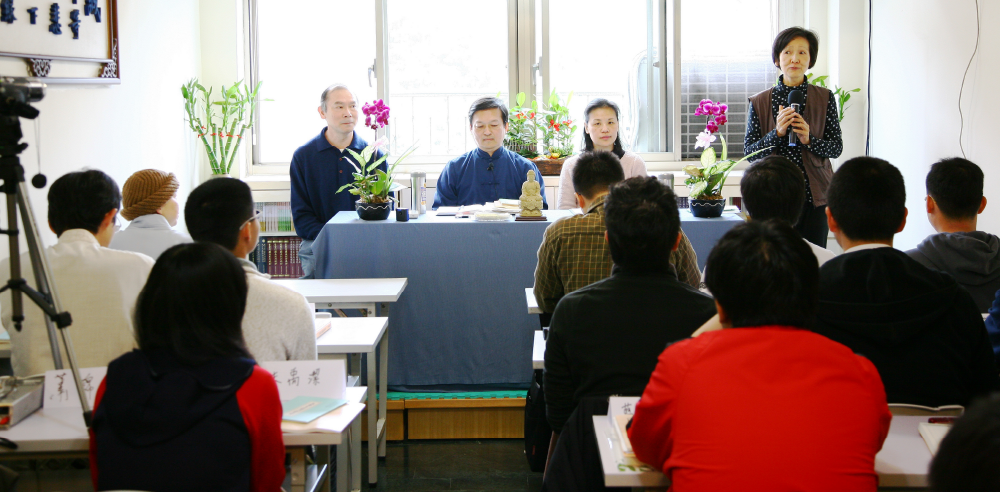

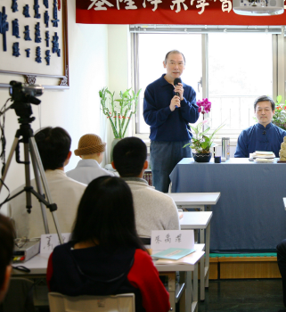

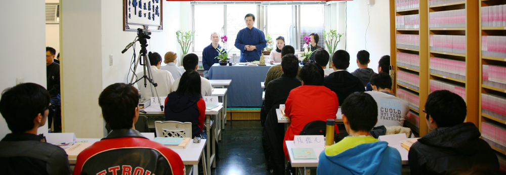

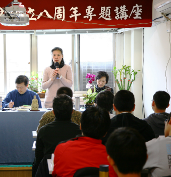

## 活動報導

### 諸方暨集興孔學〜諸暨講座報導　國學走入諸暨校園的開訓典禮〜第八屆兩岸國學文化交流講座

*編輯部*

來自各地學文化

傳承來自雪廬教

可貴文革烽火後

大雨沙漠成綠洲

主辦單位李總開訓詞：

尊敬的臺灣唐老師及其團隊，尊敬的宋校長及其馬來西亞團隊，尊敬的金校長、王校長、陳新秘書長及來自全國各地的朋友們，大家早上好！

首先代表諸暨市傳統文化研究會對大家的到來表示熱烈的歡迎和最真摯的問候！謝謝大家來到這美麗的西施故里！今天在各級領導和社會各界人士的支持下，諸暨市傳統文化研究會如期的在行知學校，舉辦第八屆海峽兩岸國學文化師資培訓班。首先要感謝的是行知學校為我們提供這麼好的教學環境，我非常欽佩金校長對於教育的熱忱，能把國學引進學校，帶領老師一起學習傳統文化，這是我們諸暨教育界值得慶幸的大好事。讓我們看到了孩子的希望、家庭的希望和教育的出路。

個人有幸在兩年前聆聽唐老師的《論語》講解，深深感受到傳統文化的博大精深，能聆聽老師對《論語》的解讀，簡直是人生最大的享受。真正體會到了「學而時習之」的快樂！在唐老師團隊德行的感召下，末學明確了人生的方向，明確了自己修學的差距，立志此生要跟隨老師學習！因為，在人生修學的道路上，我們一定會碰到人生障礙的。由於人生充滿了障礙，而且有諸多的困惑，若無明師，此之明師不是出名的名，而是日月之明，是真正的老師，方能解惑。沒有明師的指引，在人生的道路上，容易走偏。

當然我們還要有一顆受教的心，如果沒有受教心，這些良師益友會與我們擦肩而過。通過近兩年的學習深有感觸，也很希望我們諸暨的父老鄉親、親朋好友們，都一起來學習，形成團隊，共同提升自身的德行，做一個孝弟忠信，懂禮義、知廉恥，具人格、品味的中國人。如此，我們的家庭會更加的幸福！我們的社會會更加的和諧，我們的西施故里〜諸暨會更加美麗！最後，祝大家身心健康，相處和諧！並預祝本次國學講座圓滿成功！謝謝大家！

行知國小金百煉校長開訓詞：

諸暨是越國古都，西施故里，是一座具有古越文化底蘊的現代化山水園林城市。今天，我們歡聚一堂，參加由諸暨市傳統文化研究會主辦，緣慈推拿培訓學校協辦的，海峽兩岸第八屆國學文化人才師資培訓活動。在此，請允許我代表我們浣江小學教育集團，三千六百餘名師生，向來自臺灣地區、來自馬來西亞、以及浙江省內外，熱愛國學經典的社會各界朋友們，表示熱烈的歡迎！

朋友們，國學經典，千年精髓，引領我們實現健康、快樂、智慧的人生境界。近年來，我們浣江小學教育集團，一直重視國學經典的傳承與發揚，並且開展了國學伴我行、感恩教育等系列活動，揚正氣、談修養，教育學生做一個真正擁有道德情懷的人，也取得了一定的成效。我們希望通過開展這樣積極正向的國學公益活動，不斷促進國學系列教育活動的深向發展，引領孩子們不斷尋找中國文化的根，尋找我們共同的精神家園。

各位嘉賓、各位朋友，由於是初次承辦這樣的國學公益活動，若有考慮不到、招待不周的地方，敬請大家多多包涵！同時衷心祝願來自五湖四海熱愛國學經典的朋友們，能在我們諸暨生活愉快！學習愉快！行有所成，知有所得。也衷心祝願，預祝我們本次人才師資培訓活動圓滿成功！謝謝大家！

唐老師諸暨開訓致詞：

今天大家齊聚一堂，是一個文化的盛況，文化是來自於內心的體悟，內心的體悟，來自於對聖賢道統的肯定，聖賢的道統來自於孔子的傳承，如果沒有孔子示範及傳授，我們不曉得什麼叫做聖賢的典範，也不知道中華文化的形象及其出路。我的老師，李雪廬老教授，就是孔子七十七代孔德成先生的老師，他們歷經戰亂到了臺灣，在臺中安靜地教書三十八年，我是一個受益者。我們曾經在人生旅途上，雖享受經濟的成果，但很迷惘，不曉得人生何去何從？與現今許多大陸的學生一般。可貴的是像李雪廬老教授般的有德有學之士，從事教育，將中華文化傳授給我們，讓我們找到了人生的目標與方向。從此，內心安定下來，學了經典，並且知道人生的格局，人生的見地，人生的出路。

在我的老師過世之後，有幸繼續辦讀書會，將老師所教的，溫故而知新。今天，才有這種機會，或者才有這種福報，或者是說才有這種膽量到中國大陸傳播文化。實無資格說是老師的傳承者，充其量只不過是繼續追隨自公老師及諸位師兄。經學的學習令人不虛此行，所謂「不虛此行」是不虛來到世間這一趟。

此次講座場地是行知學校，一般是透過知而行，亦即在聖賢道統的知，依知而實踐才是充滿信心的實踐，而不是一個惶恐的實踐、迷惘的實踐、人云亦云的實踐，是一個有定見、有方向、有使命感的實踐。這一種知而行、行而知，已是一種經驗的知，內化的知。

為了此次因緣寫了一幅對聯，表達對行知的感想。

上聯：行於萬流歸宗之道統。

萬流歸宗的道統，就是孔子的學說。現今強調多元文化，多元文化就是「雜菜麵」，不加揀擇全盤吸收。昔日漢武帝時，依董仲舒的建議，所謂「獨尊儒術，罷黜百家。」文化若無中心思想，隨著百家思想齊揚，大家莫衷一是、大鳴大放，民族渙散，將導致國家的敗亡！歷史殷鑑不遠，如今還是提倡多元文化，再造一次混亂的局面。人心混亂如何收拾？萬流歸宗的道統就是孔子的思想，最能詮釋孔子思想的就是《論語》，是十三經的門戶，也是十三經的精華。我願意抱著一個共學的心態，來分享過去在雪廬老人座下所學的。

下聯是：知乃福始祥源的聖功。

「知」是福氣的開始，是吉祥的源頭，是聖人的功德。聖人的功德就在於「知」，由知發起聖人的功德，也是成就聖人的功德。整部《論語》也是要成就一個「知」，知學習的重要，知誠信等德目的重要，知辦政治的重要，知辦教育的重要，知人情世故的重要，知見賢思齊的重要，知反省寡過的重要等等。當你「知」的時候，你對事情是明白的，對人物是明白的，對善惡分別是明白的，對於人生的出路是明白的，對你自己的立足到底對還是錯是明白的。總而言之，我的老師告訴我們，要做一個明白人。

橫批是：緣慈而行知。

緣慈就是這次活動的主辦者緣慈公司，因為心懷著社稷的安危，民心的安危，此是緣慈的真義。由正知見而行，所得的知是真智慧！此次講座主題〜知，是事前所訂，想不到場地竟是行知學校，內心有無限的歡喜！知是福始祥源，代表我對行知學校的祝福，金校長治校有成，國家民族興盛！中華文化流通世界！謝謝大家！

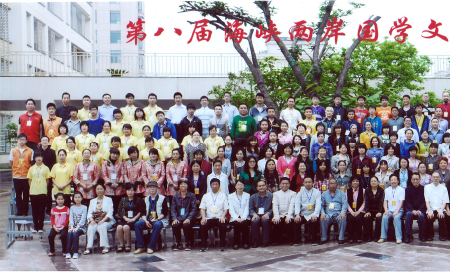

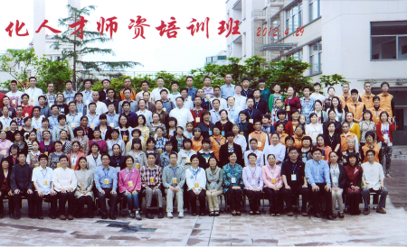

### 諸方暨集興孔學〜諸暨講座報導　講座見聞記

王興文

難得知音千里外

只聞來求今往教

不是看輕文化品

要為傳承開新局

文化是民族的命脈，然而社會對文化的漠視卻由來已久，長此以往，國家的前途堪慮。有鑑於此，有志之士四處奔走，大聲疾呼恢復中華文化，可惜曲高和寡、勢單力薄，成效終究有限，令人嘆息。中華無盡燈文化學會，在唐老師的領導下，默默耕耘中華傳統文化於臺北一隅，並常應邀至大陸講學交流。今年四月又受邀至浙江諸暨市講學六天，末學有幸隨往參訪，得以見證文化在大陸學習之概況，今謹就隨聞略記於後，還請不吝指正。

四月底我們一行七人，在唐老師的率領下從臺北松山機場出發，直航杭州蕭山國際機場，再轉車至目的地，全程約兩小時三十分，交通極為便捷。講學的會場位在當地的一所知名小學〜行知小學，正好與此次宣講的主題〜知是眾妙之門，不謀而合。此次講座的性質與特色，明白標示在講台上高掛的橫幅：「第八屆海峽兩岸國學文化人才師資培訓班」。有別於一般的文化講座，這是一個以培養國學文化師資人才為主的講座，內容以論語及常禮舉要為主，藝術欣賞為輔，因此參加的對象就有所選擇，以愛好中華傳統文化，有志於以文化教育工作為職志者為優先。儘管如此，主辦單位說，原先報名的人數超過千人，但由於場地等種種的限制，只好忍痛犧牲，錄取約三百人，大眾對傳統文化的熱愛與學習熱誠，由此可見一斑。

此次是學會在大陸講學的第八次，原先誤以為是八年來辦了八次，後來才知道是不到三年辦了八次，其間還曾婉拒多次，可見大眾對文化的嚮往是多麼殷切，也因此感動了學會的師長們不辭辛勞多次遠赴大陸，盡其所能傾囊相授，期望早日共同將中華文化發揚光大，利益世人。到目前為止，講學地點大都集中在福建與浙江省，學員以在地的老師與學生為主，而各地慕名前來的也不在少數。就以這次為例，上課學員半數來自外地，有馬來西亞、安徽、濟南、福建等，最遠的從山東濟南搭了十八小時的火車，其次有從福建順昌搭了十一小時的火車，而馬來西亞的漢學文化中心更特地選派六名老師，千里迢迢不辭辛勞遠來參學交流，更令人感佩。文化的力量竟然如此強大，能使人不畏艱辛齊聚一堂，能令人奉獻犧牲甘之如飴，無怪乎顏子能簞食瓢飲、居陋巷而不改其樂，實在值得吾人深思。

本次講座，是以「知是眾妙之門〜福始祥源」為主題，由唐老師主講，其他三位老師配合輔講，從論語中選出相關條文，把知的體相用以深入淺出的方式和盤托出，令在場的學員大開眼界、聞所未聞。雪廬老人所編之「常禮舉要」，也是此次講座之重點，由林老師獨挑大樑，雖只選「處世」篇十五條加以解說，但已令大眾如獲至寶受用不盡。三天的講座是配合勞動節的三天假期，學員們犧牲休假特別趕來學習，各個鬥志高昂，毫不懈怠，令人感動。相信以這種好學的精神與毅力，假以時日必定學有所成，傳統文化的未來，將指日可待！講座結束時，學員們異口同聲說：滿載而歸不虛此行。聽了令人欣慰，大眾並互相期勉早日相見，臨別依依，令人不捨，又是一次成功的交流與難忘的經驗。

此次講座的發起者兼主辦人李總賢伉儷，是諸暨不可多得的企業家，他們嚴以律己寬以待人，急公好義不落人後。兩年多前，間接聽聞文化的重要，即慷慨解囊邀請唐老師至諸暨舉辦文化講座，帶動當地文化學習的熱潮，並於公司內成立讀書會，獎勵員工研習中華文化，深入了解文化內涵，應用於生活事業上。一年多來，公司上下和諧，宛若一家，業務蒸蒸日上，門庭若市，深得文化之益。因此特於此次講座之後，再為全體員工安排了一場難得的文化饗宴，接受文化的洗禮，由唐、林二位老師精彩的導覽臺北故宮名畫，並帶領大眾吟誦唐詩，品評詩境，將文化的特質和盤托出，引領大眾走入文化的新境界，令人歎為觀止，欲罷不能。李總賢伉儷的胸襟、遠見與魄力，實在不可多得，令人印象深刻。唯有失去過才知道珍惜，文化的重要亦復如是。如果我們不再正視文化的傳承與維護，大家將會很快的嘗到失去的苦果。

此行最值得一提的收穫，便是意外參訪了蓮宗九祖蕅益大師的古剎〜浙江安吉縣的靈峰寺。為了旅途中用齋方便，旅行社隨意安排在一間寺廟午餐，沒料到竟然走進了蕅益大師的古道場，真是喜出望外，如獲至寶。靈峰山古稱北天目，峰巒聳秀，氣勢磅礡。靈峰寺位於此群山環抱之中，修篁翠竹，古木參天，流水淙淙，清淨幽雅。身處其間，有超然物外，遺世獨立之感，心中頓覺塵垢蕩滌，清涼暢快無比。餐後隨即參觀了大師紀念館，館內中央塑有大師大尊坐像，像前桌上供有大師牙齒舍利，四週陳列多種大藏經及大師生平著作，並供奉著靈峰寺歷代住持牌位，永為後人緬懷。

大殿外右前方是舍利塔區，面積不大，約百坪左右，四週圍以白牆，約一人半高，從外觀上無法窺其究竟。舍利塔區中央有一圓形高塚，約半人高，上有塔形碑一座設於塚前，刻有「蕅益旭大師舍利塔」弘一大師之真跡。肅立碑前，瞻禮大師，內心百感交集，與大師既近且遠，如在夢中。何其有幸，能與大師在此不期而遇，冥冥中似有安排，真叫人難思議，終身難忘。平日敬讀大師的「靈峰宗論」、「彌陀要解」，即常存感恩之心，敬佩之意，未嘗有其他奢念，不意今日竟得以巧登聖域，瞻禮聖跡，實乃三生有幸，感恩莫名。

寺門前有棵參天古木，樹幹筆直扶搖直上，是千年銀杏，與此千年古剎正好相互輝映，見證了古寺的興替，象徵著釋迦法脈，一脈相承，綿延不絕。靜立樹前暗自沉思，古樹有靈亦當深慶能與大師同在，為大師的最佳見證，佛門的真正護法。感懷之心油然而生，不覺伸手撫樹，聊表敬意，古樹似乎有知，報以落葉片片，末學欣然拾起，帶回妥善收藏，除分贈好友外，並供於佛前，以示不忘大師教化之恩，並以此自勉。

回臺後，翻開正在上課中的「觀世音菩薩普門品」教材時，赫然發覺正是蕅益大師之科判，恍然大悟，原來大師時刻與我們同在，無時不在護念大眾，莫非靈峰寺之行是大師的冥冥加持，與觀世音菩薩的巧妙安排，給大眾的意外驚喜與鼓勵。想到此精神不覺為之一振，感恩戴德之心油然生起，唯有勤精進依教奉行，才能報答大恩大德於萬一，願以此與大眾共勉之。

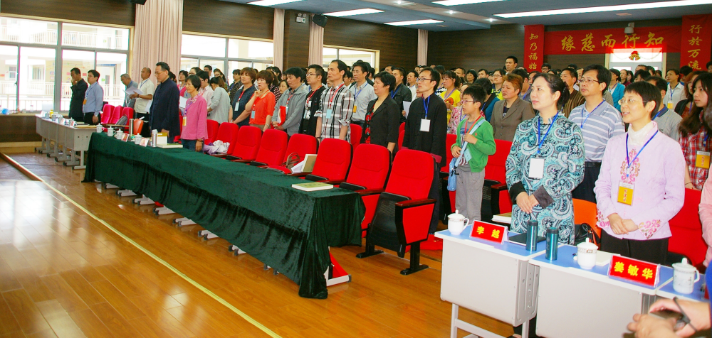

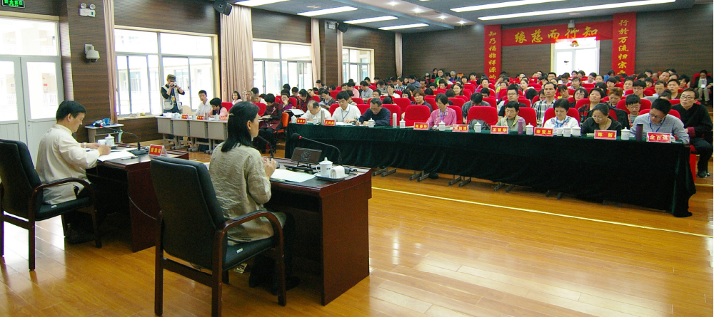

### 諸方暨集興孔學〜諸暨講座報導　馬邦來學有感

*編輯部*

弘揚由學習

首依師聽聞

古注善抉擇

論語是精華

與馬來西亞漢學中心宋校長於諸暨之對談

宋校長致詞：

我們此行一共六位成員，是第三次帶團隊向唐老師參學，做為教授國學的參考。從唐老師的團隊我們看到了出路，看到氣象，看到國學的魅力，我們會繼續學習，謝謝各位！

**問：** 中華文化在馬來西亞推廣的困難度如何？

宋校長：

今天最深刻的體會是聽到逆境都是大福之前的徵兆，馬來西亞是我們歷練的環境，作為華人的我們，對於如此博大精深的華夏文化需好好的學習，你看我們現在是很快樂的。高老師曾經說他看其他電影不會笑，看馬來西亞的電影就會笑，因為馬來西亞是很搞笑的，所以沒什麼逆境的。

**問：** 如何克服困難來學中華文化？一般在他人的國度學自己的文化是很困難的，他們要同化你們都來不及，又如何會認同中華文化？

宋校長：

這得感激這些先來馬來西亞的先民—這些我們的祖先前輩。因為到南洋的中國人都是非常不容易的，他們都是白手起家，且常教育後輩：我們可以沒吃的，沒穿的，但是不能夠沒教育，特別是不能夠忘記你是中國人。認同需要靠教育，每次政府要把華夏文化剷除時，華人都會站起來維護華教，這是我們的使命，然又必須不犯國法、懂得國情，所以我們是跟著國情來維護我們的華教。論語裏夫子的經驗閱歷是對的，跟著《論語》走，很多事情都可以做得成的。

**問：** 馬來西亞的總理到過你們的中心，那是對你們成就的肯定，你們把中華文化在馬來西亞撐起來，你們是怎麼撐起來的？

宋校長：

總理在漢學院講了一段話：當年（明成祖時）鄭和帶了這麼多人（約二萬餘人）下西洋，艦船浩浩蕩蕩，幾次到了馬六甲，卻沒有動過佔領馬六甲王朝的意念。反觀葡萄牙帶了千餘兵力就把馬六甲攻下來，所以中國文化是和平的，中國是一個泱泱大國，是為了促進經濟而來，卻沒有控制佔有的念頭。回教徒有句話是說：如果要求知識，哪怕遠到中國。所以首相對中國非常的仰慕，他的父親TunRazak，應該是亞洲第一個承認中華人民共和國的。當時溫家寶去拜訪他時特別提出要求，希望能見總理的母親，那是因為他的父親與中國有非常深遠的感情，總理的兒子現正在北京大學學中文。

**問：** 團隊能在文化上深入，對外必有開展的氣象，不知宋校長的體會如何？

宋校長：

我越來越覺得有希望。直到去年都不知道應該怎麼做，因為影響太大了，經過幾次參學，現在好像看到出路了，所以謝謝唐老師的團隊。

**問：** 教育使他們拚命想認祖歸宗，而我們文化認同薄弱時，會拚命想認同外國，要回頭找國家的根本，那就是文化，文化就是國家的靈魂。你們在教育下一代的時候，如何不讓他們變成馬來人？

宋校長：

讓他們對中華文化有信心。

結語：

維持中華文化道統不墜，才能維持民族的不亡，沒有其他的出路，靠強權與經濟，只有一時，不要迷信強兵霸權與一味追求經濟！

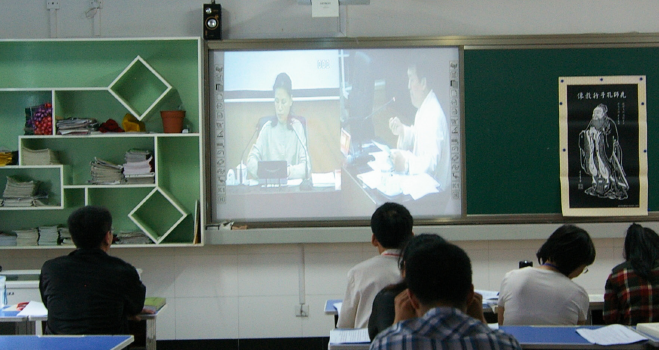

### 諸方暨集興孔學〜諸暨講座報導　文化植於異國〜來自馬邦的奮鬥

盡意

回想第一次師長們在中國辦文化講座，許多印象還十分清晰，一轉眼的時間，今年五月的浙江諸暨國學之旅已是第八次的興辦了。

由於過去的辦學因緣，師長們在中國已經累積了許多的「常隨眾」。這次又能與許多的學長在諸暨相聚，一同在文化上深入學習，感覺十分的歡喜。其中比較特別的新面孔，是來自於馬來西亞中華文化教育中心的成員，由宋校長帶領六位中心的老師們來一同參與。

中華文化教育中心與學會的交流已有超過半年的時間，一開始來學會參學者是以中心的行政人員及由臺灣遠赴馬來西亞的工作人員為主，這次來參訪的主要是教務處的老師們。由於他們過去在大陸各處都有許多講學的因緣，這次在課餘餐後也看到許多大陸研習傳統文化／弟子規的成員們，絡繹地向他們打招呼問好。

在六天的教學與參訪行程中，末學有機會和他們近距離的溝通，在儒學佛學的知見以及研學的方法上交流，發現有些老師們，其發心想要在中華文化深入的心意，實在令人讚歎。本身年紀都算年輕，卻能放下對世間一般俗事上的追逐，想要深入經藏，將文化做弘揚。在研學的方式上，學習佛法是以聽光碟為主，儒學的學習過去是弟子規，眼前是在屬於子部的群經治要的研討。經由這次的聚會，有的老師們開始體會到學習次第的重要，決定回去後以論語為下手處。

他們對於這幾天的行程，感覺上是開了眼界，以前觀念裏的中華文化只是少數幾部經典。但在諸暨，他們看到更全面的內涵，包括了國畫的賞析、唐詩的吟誦，以及在旅遊參訪的過程中，師長的隨處所流露的博學。同時，他們也對師長在因材施教、教學上的辯證等，做廣泛地觀察；體會到「審問，慎思，明辨」的重要性；也規劃未來要成立讀書會，以期在經典上深入。

中心在未來研學的發展方向，秉承某位長者的想法：教學組的老師們各自專攻一部儒釋道的經典，待日後馬來西亞漢學院落成後可成為各門經典的專業師資，以培養下一代的文化人材。其學習方法是以一門深入、長時薰修為主軸，希望藉由專精而真正達到深入，認為這樣子才能真正培養出人才。但是，如果沒有深厚的經學基礎，秉持這種「一門深入」的自學法，若真正鑽研進儒學經典的古註中，面對五花八門的知見，要想在其中抉擇出正確的義趣，困難真的是重重。

最後一天遊富春江，在船上與兩位老師觀賞山景時，末學不禁有感而發的向他們說，研學中華文化，就好像欣賞當前的美景，遠看時，朦朧之趣令人神往，但若想深入山中一觀究竟，則會發現路中有路、徑中有徑，甚至可能走到懸崖邊，險象環生，若沒有過來人的指引，絕不可能行到山之巔，一覽眾山。

末學在這段時間裏，內心也是感觸良多，最要感謝的是自己有緣能親近到善知識。許多人埋頭苦學一輩子而不得其解的正確知見，我們只要老老實實的來學會上課，好像自然而然就學到了。而學習時若有疑惑則隨時可以獲得指引，免去許多學習的障礙。在跟著師長的學習裏，也知道審問慎思明辨的重要性，尤其是有志於以弘揚教法為己任的學長們，必須具備思辨的能力，才能在百家爭鳴的思想洪流中，指引有志於文化學習的人。但也許容易得到的反而就不會很珍惜，相較於遠方有人能放下俗務而全心向學，我們處在寶山，學習的心力卻無法認真提起，感覺真是十分的汗顏。

在李白「贈汪倫」的吟誦聲中，師長和大眾於富春江邊與中心的老師們送別。小艇載著他們，在這詩情畫意的場景下離開，為這六天的行程，畫下一個值得回味的句點。而可能造成的心中的迴響，也如同富春江水般，盪漾著。

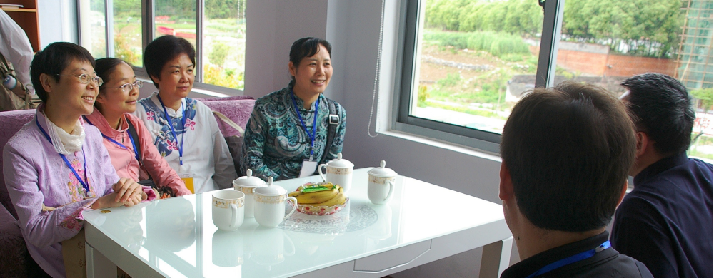

### 諸方暨集興孔學〜諸暨講座報導　忽將鼻孔衝開的偶入〜北天目山靈峰寺懷蕅益大師

心超

著作等身戒教嚴

法門龍象眾仰望

名字位中真佛眼

不知畢竟付何人

為了徧滿虛空的有情眾生，我們必須要成就無上正等正覺，為了成就阿耨多藐三藐三菩提，所以興辦三天諸暨國學文化講座，由於講座圓滿，大家出遊，在偶然的機緣下，來到蕅益大師主持的寶地，亦是大師圓寂的地方，名曰「北天目山靈峰寺」。

蕅益大師的著作非常多，涵蓋通途、淨土、唯識、教觀、戒律以及其他經論的解釋，可以說是著作等身，其次大師對於弘揚正法，培養人才，亦不遺餘力，弟子成時法師，輯大師著作之《靈峰宗論》。蕅益大師對佛門的貢獻大家耳濡目染，特別是《彌陀經要解》，是《佛說阿彌陀經》二十八家古注中最重要的解釋，印光祖師讚歎：古佛再來不過如此。

其次如《法華會義》、《楞伽義疏》等乃至《遺教三經解》，皆可看出大師對經文的體會，且科判形式是極嚴整的架構，能發揮古德未盡之義。大師註解佛經尤以當前一念作為修學的下手處，極為特殊，當前這一念有能力轉變為出世心，或轉變為大菩提心，或轉變與佛德相應的最勝心，偉哉當前一念。尤其在《靈峰宗論》，更能夠涵蓋經律論三藏。

大師全集依弘一大師所撰之「蕅益大師年譜」，有關蕅祖遺著諸書目錄而收集之，全集中特別是大師在靈峰寺所寫的宗論，為弘一大師所企盼學習的論典。蕅益大師亦是弘公最景仰的祖師，當弘公三十九歲時在虎跑寺出家，想不到夏丏尊居士送來《靈峰宗論》，弘公百感交集，因為那是他夢寐以求的典籍。蕅益大師除了在教觀上非常的通達，在戒律上也精嚴執持，在淨土的經典上亦能發揮古大德所未盡之義，所以大家尊他為淨土宗一代大師，尤其印光祖師以淨土宗第九代祖師來安立蕅益大師一生的成就。

蕅益大師除在淨土教典上有獨到的見解，在戒律的解釋上有《重治毘尼事義集要》等引導出家後進學習比丘戒要義，主持正法。大師並在相宗上研究深入，有名的《相宗八要直解》，是大師選出相宗重要論典八種而直接解釋，現今在基隆淨宗學會人才培訓班開設的《大乘百法明門論直解》，就是蕅益大師的著作，想要研究佛法，尋求註解，很難不研究到蕅益大師的註解。

蕅益大師生在明末亂世、清初開國還不穩定的時代，大師面臨的是戰亂世變，然不改其修學出世心並積極入世，不但學習正法，著書立說，弘揚正法，培養人才，過世時只有五十七歲，教內痛失法將。弘一大師嘗依《靈峰宗論》摭寫警訊一卷，名為《寒笳集》，笳是胡笳，乃古代一種吹奏樂器，漢代流行於塞北與西域一代。弘一大師輯錄之心情如蔡文姬所作《胡笳十八拍》，摩寫孤獨寂寞思念故土和惜別稚子的痛苦心情。大師是個孤獨的人，對佛門的感慨，如寒冬奏胡笳十八拍，有誰體會過這一代的大德？大師自許：八部道人。自嘲是震旦逸民，云，古者有儒、禪、律、教，道人（自稱）既蹴然不敢，今亦有儒、禪、律、教，道人又艴然不屑，故名八不。總之人才能興，正法就興，正法常住，觀待人才。

大師嘗云，參禪開悟必藉教理通達而後方成，若不然則十人坐禪難保五雙不著魔，努力坐禪自以為開悟，或許得的是精神病。大師如此的開示，吾人應努力回歸正軌，做一個正常人，好好的學習正法，在經教上尋求勝解，在人情世故上尋求出路，在傳承上尋求延續。

總之對蕅益大師的人品、道德、學問生起無限的景仰，所謂：高山仰止，景行行止。若依大師對儒佛經典的正解，誰說蕅益大師不是在人間呢？誰說蕅益大師沒有乘願再來呢？我們偶然來到祖庭，是否藉此自我啟發呢？想當年大師在北天目山靈峰寺住錫時，必是教法興盛，修學正法的氣象萬千。眼前唯有祈求十方三寶、西方三聖與釋迦佛的加被，重振祖庭，法門龍象再出，教法常轉，法門常興，大家生入聖賢之域，沒歸極樂之邦。

蕅益大師舍利塔前有感〜哲人已遠，典型猶在

在本寺蕅益大師的舍利塔前，隨喜宿世的善緣，使能參拜大師遺骨，然亦有感傷，所謂：哲人日已遠，典型在夙昔。未來還有這樣的人物繼續住持佛門否？一時的盛況固然可喜，忽略了傳承更具的意義，祖師大德著書立說講學的本義即是如此，後輩小子當效法他們的精神，緬懷他們的苦心，作為一個學習者、傳承者，利益當世，傳承後輩。

大師的著書有三個特色：第一、以戒律鋪地；第二、以當前一念作為入手；第三、以導歸淨土為目的。整部《靈峰宗論》以及《蕅益大師的全集》，莫不繞此特色而行，惟願大師於淨土乘願再來，廣度眾生，滿菩提願。

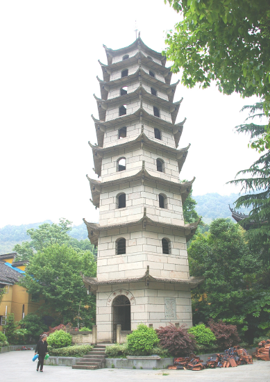

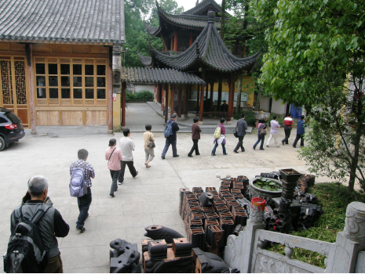

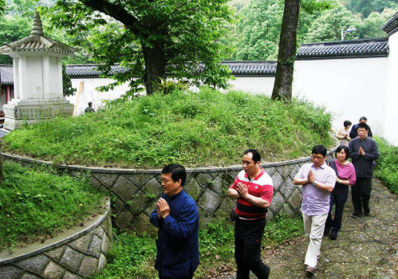

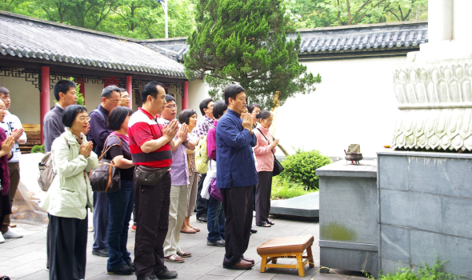

### 諸方暨集興孔學〜諸暨講座報導　學習心得（上）

眾學員

一生轉變學而知

文化能令見地高

平民教育淋甘露

春景大地欣向榮

五月的沉思〜浙江諸暨遊學隨筆　　基隆淨宗學會／陳曼玲

緣起

認識唐老師是在去年參觀故宮博物館年度特展─康熙龍藏大藏經及富春山居圖時，經由陳師姊引見，敦請唐老師為基隆淨宗學會的蓮友導覽。對唐老師當時的詳盡解說及博古通今的介紹，令人印象深刻且獲益良多，同時也種下日後邀請唐老師到基隆淨宗學會帶領「經典文化人才培訓班」，及一起到浙江諸暨參加國學文化講座的因緣。

接棒與傳承

研討會開始唐老師介紹師承，方知他的恩師─李炳南教授不但是臺中蓮社的創辦人，亦是孔子七十七代子孫(前考試院院長)孔德成先生的老師。在抗戰期間，他與孔德成先生從山東撤退到重慶然後轉進臺灣，兩人患難相交、亦師亦友。同時李炳南教授任職孔奉祀官府的主任秘書，長達五十年之久，可見他的學養及才幹深得孔家信賴及倚重。

我的收穫與心得

在參加研討會的過程中，我有幾個發現如下：

(一)論語的教學有層次、有格局，逐漸拓展我們的胸襟。它可以有系統性的訓練一個人的生命視野不斷的擴大、增上、深入，讓你認識自己、找到自己、確認自己生命的核心價值，做自己的主人，安身立命、本立道生，開展自己亮麗璀璨的人生。

(二)常禮舉要雖然條文內容簡單易懂，很生活化、很重要，但也很容易被忽略。它是做人做事依循的準繩，也是家人相處、人際關係、社會和諧的基石。而它是用來反省自己，並非拿來檢驗別人。

(三)音樂常被用來作為轉換情緒和釋放壓力的重要媒介，透過音樂欣賞，很容易讓心安靜。尤其是你喜歡、熟悉的樂曲。隨著旋律進入甜蜜的回憶，讓身心達到放鬆愉悅的效果。

我的感想與感動

一、本次研討會在「諸暨」的「行知」小學舉辦，參加人員分別來自中國各省的校長及老師，大約三百五十人，省籍不同，但對國學文化的好樂心卻很一致，人人臉上露出人性的光輝，學習精神令人讚賞，自嘆弗如！尤其對唐老師師承正統孔門儒學更是驚為天人，把握每一個學習的機會。而且回去之後他們也在各校擧辦讀書會繼續用功、溫故知新，對論語及常禮舉要有更多的生活體驗及領悟，值得我們效法和學習。

二、唐老師已第八次到中國大陸講學，本次主辦單位─緣慈推拿中心的李總夫婦早已將唐老師所教的內容納入員工教育訓練，效果良好，在本次研討會，其員工所展現的禮貌及週到的服務品質，令人彷彿置身在先進的文明社會，迥異於其他各地。

三、研討會結束後，李總夫婦招待我們一群人，春遊富春山，中午在靈峰山寺用午齋，真是太巧了，原來此寺為淨土宗祖師蕅益大師生前駐錫之處、著書立論之寶地。唐老師真是學富五車，才高八斗。每到不同的地方，即為我們隨緣開示，方知蕅益大師重要論著靈峰中論、阿彌陀經要解……等書，皆在此處完成，且其最重要的修行法要─「把握當下一念」流傳後世。當時聞法的我，六根震動，內心有一股莫名的感動，隨著唐老師帶我們念佛、繞佛，透過佛號聲，緬懷一代哲人的夙昔典範。

結語

感恩唐老師的邀約與李總夫婦的熱情招待，讓我在此趟遊學，身、心、靈收穫豐富，同時也謝謝我家人的同行，讓全家創造一個美好的共同回憶及共同成長的經驗，我覺得我是世界上最幸運的人。未來，我願將我的福報創造更多的福報，與有緣眾生分享。

聽後有感　　南京理工大學／葉舒泌

兩天的課程讓人有如醍醐灌頂，意猶未盡。唐老師的話好像在我的人生漫漫長路上亮起一盞燈，照亮前途，讓我不再迷茫。知而後行，才能在障礙和誘惑面前堅持安住在道義與仁心上，人生才會福源滿滿，真正趨吉避凶。

一、學習當溫故而知新

溫故而知新，可以為師矣。這句我們從小就耳熟能詳的話，重新學習，仍然會有不一樣的體會，就好像這句話本身想闡述的道理一樣。唐老師做了一個生動的比喻，學習好比滷豆腐，味道在一次次重複滷的時候才能慢慢滲透徹底。

所以我們治學，需要「溫故」，才能把所學知識「一以貫之」並融會貫通，也是透過不斷的「溫故」，才會悟出新道理。所以我們做人，同樣需要「溫故」，在為人處世的過程中一遍遍總結反省，才能通達人情世故，學會瞭解、理解，然後「知新」。

二、仁者才能久處約長處樂

我們身邊也不乏這樣的人，當他們貧窮的時候，整天抱怨哀嘆命運不公，甚至心生邪念貪求不義之財，當他們富貴的時候，又驕奢淫逸腐敗貪污，不久又回到窮困的狀態，所以結果就是，這些人永遠不快樂。

然而真正的仁者，如顏回身處陋巷不改其樂，如子貢身處富貴不忘別人，他們安住的是道義和仁心，所以他們心安快樂，這輩子都活得明白。

唐老師說，為什麼不把眼光放長遠，放一輩子，放到子孫後世呢？真正的智者眼光是長遠的，於是產生了源源不斷行仁的恆心和勇氣。只追求眼前小利的人們影響力最多只在當代，而如孔子般經歷艱難仍然不改仁心的聖者卻影響了千秋萬代。

三、禮儀相繼才能知百世

殷因於夏禮，周因於殷禮，所損益可知也，其或繼周者，雖百世可知也。

中國是禮儀之邦，可是當傳承斷流，禮樂不興，人們無所顧忌全盤開始接受西洋文化，我們又應該如何在外國人面前拍著胸脯自稱中國人呢？

知是眾妙之門　　永康市龍川學校／王偉蓮

非常感恩唐老師一行來到諸暨講學，此次是我第五次聆聽唐老師的講學，每一次的學習都讓我受益匪淺，收穫頗多。並且在學習中感受到了學習的樂趣，也正是這樣的一份法喜讓我在學習傳統文化的道路上樂此不疲。

本次學習的主題是知，知是眾妙之門。在老師的講解與循循善誘中讓我開悟。作為一名教育工作者，其實說來很慚愧，一直以來覺得自己是關心學生，也給予了學生很多，可是昨天老師的一席話讓我深思：老師對學生的幫助除了在生活物質上的關心，最重要的是幫助學生在知見上的開闊。

緣慈公司小講座現場

是啊，我們給與學生這些物質和生活上的關心時有沒有考慮到要給予學生「慧命」。我們的王校長也常教育我們，老師要給予學生「慧命」，而不是「毀命」的劊子手。作為一名教育工作者，該怎樣成為一位「明白」的教育者，成為一名有「遠見」的教育者？論語為我們指明了道路。這是一條通往光明的大道，通過此次的學習，也讓我更明白了自己肩上的責任之重，也更明確了教育的目標：做君子式的老師，培養君子式的少年，而若要讓這一目標成為現實，那麼唯一途徑就是學！我會在傳統文化的道路上堅持不懈的走下去！再次感謝唐老師！

學，然後知　　永康龍川小學／呂遠虹

學，然後知感恩

「人身難求，正法難聞」，感恩老祖宗給我們留下五千年燦爛的文化，更感恩孔子和他的弟子將文化用文字記載下來，這份燦爛才得以傳承；感恩金華的羅老師為我們開啟了國學之門，更感恩我們的王校長用「明知不可為而為之」的勇氣，克服一切障礙，帶領我們龍川所有的老師、學生乃至家長，義無反顧地走上國學之路，因為王校長的堅持，我們才有福份一次次聆聽唐老師和他的團隊的教誨，非常感恩每一次活動的牽頭人，場地提供者，更感恩唐老師和他的團隊一次次放棄休息，不遠萬里來到大陸領我們走向幸福人生。

學，然後知堅持

這次學習，感動無時無刻不發生，這些感動，讓我更堅定學習的信心，唐老師說，如果明白學習的重要，就不會覺得忙，看到許多老師拖家帶口來學習，看到政府官員放棄休息坐在人群中靜靜聽課，看到我的學生，一個十一、二歲的孩子那麼投入地聽課，我還有什麼理由說忙，當我聽到馬來西亞的宋校長說，她的長輩教導她們「可以沒吃的，可以沒穿的，但不能沒文化」，當有人要剷除中華文化時，全體華人的維護時，我還有什麼資格說忙，還有什麼理由說放棄？

因為不會安排時間，因為處理不知取捨，我曾經放棄了幾次學習的機會，也放棄了讀書會，後來明顯地感覺到和孩子一起讀經典時對自己的底氣不足，在班級管理上的方向迷失，自己生活中的失落。於是，我重新加入學習的隊伍，當我向王校長提出申請：「我可以加入讀書會嗎？」王校長仁慈說：可以，我們期待你的加入已經很久了。我當時很感動，原來大家都沒有放棄我，是我自己放棄了自己，宋校長說：沒有逆境，逆境是大福之前的順境。這就是宋校長一直堅持的動力，也是我們無論碰到什麼都要堅持的信念。

學，然後知責任

能夠改變世界的有三種人：官員、媒體、老師。我有幸成為其中一種。既然在其位，就要謀其政。說起來慚愧，自從進龍川才知道有《弟子規》，對博大精深的文化，作為一個土生土長的中國人竟一無所知，不能不說這是一種悲哀。不能讓發生在我們這幾代人身上的悲哀重演是我們的責任。我不能決定大氣候，但可以影響我的班級裡三十位學生，三十位學生背後的家庭，三十個家庭每一位成員的團體。我學得很淺，但我們等不及讓自己學識淵博再去利益大眾。所以，學一點要用一點，學一分要利益大眾一分，這是責任。

「天下興亡，匹夫有責」、「文化興亡，我的責任」讓我們用實際行動回報唐老師和他的團隊，回報所有為文化傳承付出的人。

再學《常禮舉要》　　順昌／許振良

此次重講常禮舉要，真是一次很大的提升。我記得第一次聽《常禮舉要》是二年前，當時的認識只是著眼在只是行為規範。這次重講，體會到人生的吉凶禍福都在裡面，與個人的命運和福報緊緊聯繫在一起。過去的行為規範，所認識都只著眼在「你不能怎樣怎樣」，而這次則是「我不能怎樣怎樣」。每次面對「文化人才培訓」這幾個字，感到心情沉甸甸的，距離「人才」這兩個字，實在有距離的很。人生的學習，重在證得智慧的那一分，因此每次境界現前，如何對治，都在尋找方法，緊緊依止老師、《論語》及《常禮舉要》是一個努力的方向。

另外，在今後的學習上，努力依教奉行，依智慧來見惑、解惑。

最後隨喜大家早日離苦得樂，斷惡修善，早得智慧。

知是眾妙之門　　龍川學校／許海燕

短短的三天學習即將結束了，聽著唐老師的諄諄教誨，感受著論語的魅力，說到分別是十分不捨的。「人之相惜惜於品，人之相敬敬於德，人之相交交於情，人之相擁擁於禮，人之相信信於誠」，做一位有品有德、有情有禮的人，在當今這樣的社會環境，只有學習經典、學習論語才能夠保護一顆清醒的頭腦，才能做到有品、有德、有情、有禮、有誠，否則在物欲橫流中，就會迷失自我，就會不可以久處貧困，也不可以長處富樂。

順昌新華幼兒園全體工作同仁

聽了唐老師的課，我更深刻地體會到論語是一本養心、交友、處世，有利於工作和生活的生命之書，它論釋著處世之道、交友之道、人格修養之道，最終引導我們做一個仁者，當然在求仁的道路中，只有「一以貫之」方可能真正達到。而追求仁德的方法，那就是博學於文，約之以禮，亦可以弗畔矣夫！廣泛而深入地學習經典，用常禮舉要來約束自己的行為，這樣就可以不背離正道了。

雖然是第二次聽唐老師的課，但這一次的感受又有所不同了。這個不同指向更多的是我自己，自己的心態不一樣了，更靜更明白，看到周邊的同學和學友不一樣了，從他們身上我開始慢慢地「視其所以，觀其所由，察其所安」，感受到經典在他們身上力行，特別是聽到遠道而來的馬來西亞的老師們，他們學習中華傳統文化的艱辛之路，雖是喜樂的心情表達，但言詞之間可以感受其中的挫折和困難，還有很多其他遠方的朋友，因為熱愛經典、熱愛生活，所以帶著虔誠的心，相聚在這所美麗的校園，因為這一份的誠心真意，讓我深深體會和感知了學習帶來的快樂。

「人生是一場馬拉松，不是一場短跑」，學習論語也是一場馬拉松，從出發開始，堅持不懈，勤奮努力，相信自己定能走向康莊大道。

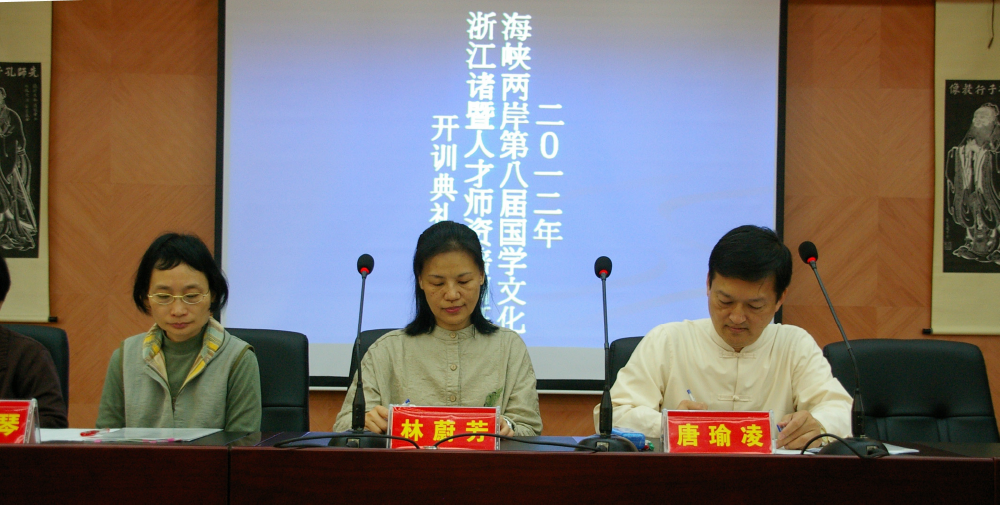

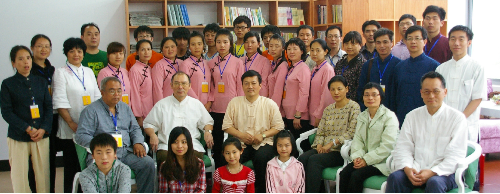

### 諸方暨集興孔學〜諸暨講座報導　學習心得（下）

眾學員

知是眾妙之門　　王樓元

三日諸暨之行，承蒙恩師字字珠璣地提點，感觸頗多，無奈自己秉性愚鈍，難以領悟其要領，現就自己對覺知力的感受作如下會報：

本次課程為「知是眾妙之門」，從唐老師的講解中得知其實整部論語都在講一個「知」字，可見「知」的重要，而要得「知」就要具備一定的「覺知力」才行，這幾天的學習都圍繞這個「知」字展開。「視、觀、察」的分辨中，明白了原來我們雖然耳聰目明，其實很多時候，我們只打開了肉眼，心眼並沒有打開，而要把心眼打開，就是要有敏銳的觀察力，也就是覺知力，視其所以，觀其所由，察其所安，沒有什麼事情能隱藏得住的。

說到覺知力，我不得不說說第一天晚上「動中靜之覺知力」的課程，在整個學習過程中，我真的很享受，在領略林老師高深的藝術修為的同時，我感覺整個人被調整得十分安詳、寧靜，真的有點心眼被打開的感覺，在柔和、舒緩的音樂聲中，坐在舒適的教室裡，聆聽著老師細心開導，尤其是在聆聽凱文科恩的綠鋼琴時，雖然我們眼睛閉上，但在我們眼前卻清晰地出現了綠草如茵的原野，有藍天、飛鳥、小孩，柔和的清風，還有涓涓的流水，在柔和舒緩的音樂聲中，彷彿看到清晨的雨水滴落，又彷彿看到溫暖怡人的陽光下，小鳥自由的飛翔，沒有煩惱，沒有擔憂，沒有歧視，沒有怨恨，十分安詳，十分平靜，那種感覺真好，也只有在那時，我才真切地感受到我是一位活著的正常的人。當然一跨越出那個時空，我又會回到不正常的狀態，這也是我要修練的地方，那就是儘量讓自己處在正常人的狀態，修練自己的覺知力。

由此聯想我的工作，作為一名教師，我一方面要修自己的覺知力，準確地瞭解學生的內心世界，明白學生的真正需要，給學生做出正確地指引，另一方面也要幫助學生學會訓練自己的覺知力，讓他們也能明白老師的良苦用心，能覺知父母真正的需要與希望，從而樹立正確的人生觀，立志成材！我想這是這次學習的最大收穫吧！

心得體會　　福建明溪縣學儒讀書會／余興貴

本次參學我團來了十五位老師，感恩主辦方給我們提供了一次非常好的機會來聆聽聖賢的教誨，並感恩老師不辭辛勞跨越海峽到美麗的西施故里—諸暨來弘揚正法，為我們找出路；再則感恩全體義工老師辛勤的工作和無私付出。在此，談談末學的一點體會：

一、生歡喜心。原來學《論語》的時候，還覺得有點枯燥，知道《論語》好，但學起來沒有法喜，只是一些記問之學。聽了唐老師的講解，有如沐春風的感覺，原來《論語》可以學得這樣快樂，《論語》課可以講得這麼好。

二、感受到《論語》博大精深的內涵。《論語》中的每一句經句都是教導我們立身之道，做人處世的良方，《論語》值得我們每個人用一生的時間去追隨、去學習、去實踐、去證悟，像尊敬的唐老師那樣「一門深入，長時熏習」。

三、聖賢的學問、聖賢的教誨可以為我們找出路。聽了唐老師的教誨我們知道孔門弟子沒有一位問夫子出路在哪裡？但各個都有出路，身有出路，心有出路。我們只要靜下來，深入學習，依教奉行，充實自己的內涵，用之則行，舍之則藏，用仁愛心來為人處世，保證我們每個人都有出路。

四、明白了禮的重要性。原來末學認為，只要學好道德仁義就行，禮只是一個形式、花架子，聽了唐老師的教誨以後才明白，禮有這麼多深刻的內涵，才明白道德仁義非禮不成，不學禮、無以言，禮是我們立身之道，做人處世的法寶。

體會談完後，我們還要立志。因為志不立，天下無可成之事。末學回去以後，第一要好好經營讀書會，因為讀書會是學習聖賢教誨的平台，要充分發揮讀書會的作用，讓優秀傳統文化生根、發芽、茁壯成長。第二，將聖賢的教誨落實在自己的日常工作、學習、生活、待人處世上。從身邊做起，從小事做起，從自己做起。以實際行動來報答老師的教誨。

最後誠摯邀請唐老師團隊、馬來西亞團隊及全國各地的老師到福建明溪傳經送寶，深深的感恩。

學習 學習 再學習　　福建順昌／葉波

學習《論語》近三年，發覺到《論語》凝聚著我們中華民族古聖先賢的人生智慧。漸漸地，對人、事、物越發看得明白，活得也更加明白。

首先，透過學習，重新認識了孔老夫子。在「聖門氣象—萬古常新」裡頭，透過夫子的自述，子貢、顏回等古聖先賢的讚歎，子游、子夏等十大弟子的成就，讓我們重新認識了孔老夫子是中華民族二千多年來最偉大的教育家、政治家和思想家，夫子內涵就是我們炎黃子孫的民族精神。

其次，透過學習，找到人生的快樂！正是「孔顏之樂」的學習，體會到古聖先賢學習的快樂；傳承文化的快樂和弘揚文化，推展文化的快樂，這種快樂，可以戰勝物質的艱辛和精神的打擊，也可以讓傳統文化的民族永遠立於不敗之地。

第三，透過學習，找到改變命運、趨吉避凶的方法，從第一期到第八期，都是改變命運、趨吉避凶的方法。如果不跟隨老師學習，怎麼能夠相信《論語》可以改變命運，可以趨吉避凶呢？

以上這些認識的獲得與提高，都源自於老師一期一期的教導，正如老師所說的「人生是馬拉松，不是短跑」。所以，立定目標，跟定老師，學習學習再學習，相信學習的時間夠長了，一切問題都會慢慢解決。

### 二○一二年母親節活動報導

*編輯部*

例行活動母親節

說法能令意樂新

有情眾生不忘本

飲水思源真修持

前  言

學會每年五月，皆為慶祝釋迦牟尼佛誕辰及年度母親節，舉辦浴佛與母親節表演節目。今年五月，在學會成立為全國性社團且搬至新址週年之際，特別禮請西蓮淨苑慧觀法師與慧道法師蒞臨開示，並主持浴佛法行，慧道法師曾為上智下諭老和尚侍者多年，開示主題為談母恩、孝道與浴佛法義；慧觀法師早期即跟隨老和尚出家，於淨苑任職知客多年。法會結束後把握難得機會向二位法師請益修學心得，下午更特別禮請慧觀法師舉辦皈依法會。以下就師父開示法語、問答與學會搬至新址週年回顧作一報導，相信透過師父的祝福與勉勵，個人能累積修學資糧，安心辦道傳承正法，真實報答現世及累劫母親之恩德。

### 二○一二年母親節活動報導　慧道法師開示

慧道法師

觀母恩孝道興

成佛度母報本

歷經艱難考驗

帶來永恆快樂

甲一、開場白

慧觀法師、唐老師、各位蓮友菩薩，阿彌陀佛。慧觀法師說：「真不該答應來這裡，做錯了一件事。」因為在老師的帶領下，各位蓮友都非常的優秀，我們什麼都不懂。

但是今天一下車，一直到現在，我跟慧觀法師說：「我們做對了一件事，就是來這裡。」因為從下車就在各位蓮友身上看到對三寶的恭敬，這是我個人很感動的。

還有剛剛看到回顧報導，瞭解學會在這一年當中做了這麼多感動的事情，如果每個人都來參加學會共修，我們這個社會一定是美善、和諧、清淨光明的。在這裡藉這個機會向各位蓮友隨喜，另外除了感動，來這裡還可以觀摩學習。

今天母親節，我們在這裡舉辦紀念佛陀誕辰，並慶祝母親節，還有包括我們紀念學會搬到這個地方週年，這是一個很殊勝的結合。

個人不敢說是說法，只是藉這一次的機會，跟各位好朋友話家常。

甲二、今日活動開示

乙一、活動目的

丙一、感恩

在三重意義之下，來說明今天是一個感恩的日子，是我們三位媽媽的節日。

第一位就是佛陀的恩德，我們應該要一起來緬懷。因為佛陀的出世，我們才知道佛法，才知道我們都有佛性，透過修行每個人都可以成佛。所以佛陀是我們每一個人法身慧命的母親。

第二位，在唐老師的帶領、同參道友互相提攜之下，我們每個人的菩提心行、菩薩事業，在學會中不斷地進步。所以老師、師長，還有學會，也是長養我們法身慧命的媽媽，是今天這個日子當中要感恩的。

第三位，當然是給予我們這個身體的媽媽。如果沒有媽媽辛苦地生我們、養我們，我們哪有這個身體來做這麼多有意義的事，甚至來學佛、行菩薩道？

所以今天是個感恩的日子。

丙二、學習

再來，今天也是大家一起來學習的日子，在母親節我們用浴佛來慶祝，可以說有兩種義涵。

一是我們學習佛陀的孝道。佛陀之所以成佛，可以說他就是將孝道實踐最徹底、最圓滿者，所以要學習佛陀孝道的典範。

還有一個是母親節當中，我們也應該學習母親慈愛子女的心，用這種慈愛的心來對待一切人。

在今天我們也祝福跟期盼天下的慈母，都能出生好子女，就像釋迦牟尼佛一樣，在世間可以是國家的棟樑，出世可以是法門的龍象。

所以我們也希望藉著今天的活動，祝福天下父母，能夠養育出棟樑、中流砥柱的人才。

乙二、三種恩德

丙一、佛恩

個人懂得很少，就所了解的一點點，藉這個機會我們一起來談談。

首先我們要感念佛恩。大家知道，在這世間有很多生、老、病、死，恩愛的會別離、不喜歡的偏偏會碰頭、想要得到的又得不到(求不得)，甚至因為有這個身體，我們會有種種的苦難跟考驗，當然最後還會面臨生死交關。

這世間的種種苦，大家知道誰最替我們關心？誰最想為我們解決這些苦難？大家一定有答案，佛陀！

兩千多年前，釋迦牟尼佛出生在印度，他是太子，本來可以在皇宮享盡榮華富貴，但是他發現原來這世間有生老病死種種苦難。他發現自己會遇到，還有他的父王也會遇到，甚至一切眾生都會遇到。所以他做了一個決定，放棄皇宮的享受，出家修行。他出家後遍訪了當時印度宗教界的名師，修學他們的教理，然後嘗試各種最嚴厲的苦行，目的是為了替眾生尋求一條解決之道。

最後，佛陀在菩提樹下覺悟了。他發現原來我們生死大苦是有因有緣的，因為煩惱、業的因緣，所以現在有生死苦的果報。如果我們能夠斷煩惱，能夠不造業，自然沒有生死。所以佛在菩提樹下覺悟的真理，就是緣起法。

他成佛、覺悟到這個道理之後，盡他往後的一生，將這個道理不斷地告訴有緣的眾生，乃至到最後年老的時候，還不斷地在為法奔波。

這是我們看得到的，但是大家知道嗎？早在多生多劫前，釋迦牟尼佛就曾經為了我們追求真理，捨身求法，難捨能捨。我們最愛惜的就是這個身體吧！假如今天老師說：要來上儒學的課，要捨身才可以。要斷一臂、要斷一隻腳。會不會來學？或者你要刺你的血當墨汁，然後皮要剝起來當筆記本，我們願不願意學？不一定，但是各位可能還是願意。

世尊當年在無量劫的菩薩道中，不斷地為我們捨身求法，所以在經上說，娑婆世界沒有一個巴掌大的地方不是釋迦牟尼佛捨生命的地方。所以請問，這裡是不是釋迦牟尼佛捨身之處？是。為誰？就是我們每一個人。因為在佛的心目中，每一位眾生都是唯一的獨生子。經上講：「等視眾生，猶如一子。」

所以釋迦牟尼佛在《無量壽經》說：我憫念眾生，比世間父母有過之而無不及。因為父母愛兒，僅此一世。我們知道我們過去的父母是誰嗎？我們知道我們過去的小孩是誰嗎？改頭換面以後根本不認識。但是世尊愛我們眾生，世世不捨。所以佛在因地發菩提心修菩薩道，乃至最後成佛，所做所為都是為了讓我們能夠離苦得樂。

所以今天佛誕日第一個應該要感念佛恩。

甚至再講一點，今生能夠聽聞佛法，極可能是釋迦牟尼佛曾經在我們身上下過一番苦心。大家相信嗎？我們舉個真實的事情。在釋迦牟尼佛成佛初轉法輪的時候，有很多眾生得道，其中有八萬天人得道，這八萬天人怎麼能夠在世尊初會的時候得道呢？因為他們過去曾經吃過釋迦牟尼佛的肉。

緣於過去世尊在因地修菩薩道的時候，曾經做大力毒龍，這條毒龍神力很大，只要被牠看到、被牠的氣吹到就死掉。這條毒龍在修佛道，有一天去受八關齋戒。受戒之後，睡著時，被一個獵人發現，這條龍的皮很漂亮，所以獵人趁牠睡覺的時候把牠剝皮。龍發現後不敢張眼，不敢喘氣，因為牠受八關齋戒，怕獵人死掉，所以任他剝皮。

獵人剝完皮，可以想像這條龍是全身的赤肉和血躺在地上，接著就招感很多蟲來吃。當時天氣很熱，牠很想跑到水裡泡著，但是又不敢動，一動這些蟲就死掉，所以牠就靜靜地讓那些蟲吃肉。當時牠心裡發了一個願：我用身體布施這些蟲，是為了追求佛道，我現在用肉來布施，讓你們這些蟲可以吃飽，養你的身體，待我成佛之後再用法布施來照亮你的心，來讓你的心得到利益。

結果這條龍死掉了。當時吃龍身上肉的這些蟲，就是後來佛在初轉法輪得道的那八萬天人。所以同理推想，我們現在能夠得聞佛法，極可能我們也吃過釋迦牟尼佛的肉，也喝過釋迦牟尼佛的血。

這是第一個，我們一起來緬懷佛的恩德。

丙二、師長恩

第二點，是師長的恩德，我們要心存感恩。佛法是釋迦牟尼佛所說，但是沒有善知識的傳承，我們現在聽不到。現在可以得聞佛法，是歷來多少善知識、祖師大德們護持才能流傳下來，所以我們要感恩師長的教導。
經上說，有一次，阿難打坐就想：我能夠成就清淨之行，一半的功勞都是善知識。他就很高興，覺得他這個體悟是對的，就去跟佛陀說：善知識是半梵行者。梵行就是清淨之行，我們學佛就是修梵行、修清淨之行。我們的梵行可以成就，一半是善知識的功德，他就跟佛這樣講。佛回
**答：** 阿難，不是只有半梵行，是全梵行。全部梵行可以成就都是善知識的恩德。

所以老師、學會對我們的恩德深重，我們要感恩。

丙三、父母恩

丁一、父母恩重

再來就是父母恩。佛陀跟師長，是出世間的重恩；在世間，父母恩是最重的。佛在《大乘本生心地觀經》說，世間什麼人最富有？什麼人最貧窮？佛陀說：母親在的人最富有；母親不在的人，最貧窮。

甚至佛在經上說，如果有一個人盡心盡力地供養父母，有一個人盡心盡力地供養佛，哪一個功德大？佛陀說：一樣大。佛是三界導師，福慧圓滿，供養佛陀功德是很大的。佛陀說你如果供養母親，這個功德跟供養佛一樣。所以如果有人供養父母親，佛就在你家。各位現在家裡有沒有佛？我們有兩尊活佛。

曾經有一次，佛世的時候鬧飢荒，很多人餓死，佛陀有三天沒吃東西，托缽托不到東西。有一位比丘就很急忙地想，應該怎麼樣供養佛陀？最後他就把他的三衣拿去賣，賣了三衣之後，換了一碗飯。他趕快拿去供養佛。

佛當然知道，就故意問他：我們都沒有東西吃，你怎麼有一碗純飯呢？比丘就只好老實跟佛講。佛說：三衣是三世諸佛的幢相，就是三世諸佛的標誌，你用三衣換的這碗飯我不敢吃，不能消受。這位比丘說：佛陀您是無上的福田，您不能消受，那還有誰可以消受？

佛陀就跟比丘說：你有沒有父母親？他說有。佛陀說：你拿去供養你父母親。比丘說：佛都不能消受，我父母親怎麼可以消受得了？

佛陀說：可以的。父母親給你身體，對你有大恩，他們可以消受。佛繼續跟他說：你的父母親有沒有皈依三寶？比丘說沒有。佛陀說：你先教他們皈依三寶，他們可以消受這碗飯。

從這故事當中，看起來好像是這碗飯佛消受不了，父母才可以消受。是不是佛陀之恩比不上父母之恩？不是。那為什麼佛這樣講？他是教我們要明白父母恩深重，甚至我們出家人，父母有需要的話，我們還是要盡心盡力的供養。佛在戒律上還講，如果不供養會得罪。

父母親生我們、養我們這種辛苦，是很難思議的。各位在座很多都為人父母，一定都能夠感受到當年父母親養我們的辛苦，有些年輕人可能還不知道，不過在老師教導下，大家都能夠感恩、報恩。

在我們每個人生命當中，有一個節日跟母親節最有關係，就是生日。此為母難日。年輕人可能希望爸爸媽媽買蛋糕慶生。各位學佛之後，都知道這天要報母恩。

淨苑開山老和尚上智下諭老和尚的生日，在農曆十一月十二日，以前老和尚在的時候，每年我們都會辦老和尚的生日法會。有一天，有弟子在老和尚面前提到生日法會的事。老和尚說：我過生日是為了大眾，以前我都不跟人家講。生日那天，一天不吃飯。

生日這一天是母難日，經上形容母親生我們的時候，是百千支刀割身體那種痛苦。還有人說生產的痛比癌症還痛。所以這一天要念佛誦經，祝福現世母親能夠福壽綿長，以後能夠往生，成就佛道，這才是孝子應該有的作為。

不僅母親生我們很辛苦，能夠將我們養育到這麼大，都不知道下了多少心思和血汗。天下的父母親儘管栽培教養子女的方式各有不同，但是他們慈愛子女，那種永無止境的愛念，想要給子女最好的那個心，一定都一樣。

所以在我們臺灣有一句諺語，形容父母親的慈愛：「父母疼兒長流水。」就是流水一直在流，沒有停下來的時刻。但是下面還有一句：兒想父母就像扁擔那麼長而已。長流水是一流就很遠，扁擔才這樣短而已。還有一句是：兒想父母樹尾風。樹尾風是有時候吹，有時候沒吹。

我們學會的年輕人，都不是這樣子。我們要學習經上講的：如母憶子。我們子憶母也是要這樣憶，要盡我們為人子的孝道。

丁二、孝敬的五法

《善生經》中，佛教導一位還沒學佛的年輕人，孝敬父母有五法。

第一、供奉能使無乏。

要供奉父母親，讓父母親在食衣住行各方面沒有缺少，這是最基本的。當然隨著每個人的經濟能力，可能沒辦法完全的無缺，但是雖無其力的時候，還是要有其心。盡我們目前的力量，讓父母親得到滿足，而且是出自內心的恭敬。如果父母親是我們最關心的人，我們絕對會留意他缺少什麼，絕對會關心他喜歡什麼，喜歡吃什麼，喜歡用什麼；適合吃什麼，適合用什麼。這是最基本的。

老和尚住在蓮鄉，弟子們晚上都會去看老和尚。民國八十四年，有一天寒流來，一群弟子都穿著厚厚的衣服，到蓮鄉見師父。
老和尚看到這一群弟子，就
**問：** 「寒流來，你們知道冷，你有沒有想到你父母冷不冷？有沒有想到外面的眾生冷不冷？」當時我們都不敢講話，因為根本沒有想到。

老和尚接著講：「如果沒想到，那叫沒良心！」沒有良心，那算不上是一個真正的人。所以寒流來的時候，有沒有想過父母親冷不冷？寒流來的時候，媽媽會想到什麼？媽媽絕對會想到，我這個小孩不知道有沒有穿暖和。所以父母想兒長流水，兒子想父母樹尾風、扁擔長。

第二、凡有所為，先白父母。

這是尊重父母親的意見，讓父母親了解我們在做什麼，可以安心。不管他懂不懂的事，讓他安心我們現在在做什麼。如果他懂得，我們跟他稟白，他才有機會教我們。有父母親的經驗教導，我們可以省去很多冤枉路。

第三、父母所為，恭順不逆。

父母親所做的事情，只要不是壞事，我們都要恭敬順從，不可以違背。對於父母親所做的事情，都要打從內心去欣賞，不要嫌棄，甚至不要唱反調。我們年輕人當然有年輕人的想法、做法，但是我們要學會欣賞，甚至可以讚歎他們。

第四、父母正令，不敢違背。

父母親正當的要求不敢違背，我們應當要服從，應當要滿他們的願。

第五、不斷父母所為正業。

父母正業，不為中斷。正業在佛法來講，就是身口意三業跟五戒十善相應，就是父母親的作為是善行，甚至父母親學佛，我們都不可以阻撓、障礙，應該盡全力支持。這是《善生經》提到的。所以我們盡孝道，除了前面提到的幾項，最後佛還希望我們引導父母親皈依三寶，學佛念佛。因為父母親如果學佛念佛，可以脫離煩惱生死苦，往生西方證法性身，成就佛道，得到究竟的安樂，這才是我們孝道的真正圓滿。

所以《善生經》所提的這五項，做個歸納：報答父母之恩，要孝養父母的身，也要孝養父母的心，最後引導學佛念佛，孝養父母的慧命。那麼，我們可以說孝道圓滿。以上是對父母親的孝養。

還有一點，我們的身體是父母親給的，父母親不只給我們這個身體，還給我們很多物質上、精神上、學識種種，如果拿這些來做利益自己、利益別人的事情，首先得到福報的就是我們的父母親。所以儒家講，立身行道；佛家講，就是精進佛道，可以上報親恩。

以前老和尚健康的時候，都會打坐念佛。他寮房有一個拜墊，拜墊上面鋪了一條花被單，是紅色、花的。老和尚都坐在這個拜墊上打坐。後來我們老當家慧修法師，就問師父：怎麼有這麼漂亮的被單？

原來老和尚是軍人，民國三十八年的時候才二十幾歲，跟著政府來臺灣。離開家鄉的時候，媽媽給他這一條被單帶在身邊。他說，他走到哪裡，就帶到哪裡。出家之後，他將被單鋪在拜墊上打坐念佛。老和尚說，為了給他媽媽增長功德。

所以用我們的身體來學習佛道，首先得到利益的是父母親。剛剛在回顧展當中，看到各位蓮友們做了很多自利利人的事情，這個就是在報答父母恩，當然也是在報答師長恩、佛恩。

丁三、孝道的圓滿

進一步，盡孝道不僅孝順今生的父母親，佛門還講到最圓滿的孝道，是連多生多劫的父母都要盡孝。我們無量劫來在六道中生死輪迴，互為父母子女。所以佛在《梵網經》上說：一切男子是我父，一切女人是我母。不僅人道，六道眾生都是我們的父母親，所以對所有眾生都不可以傷害。身不可殺生、偷盜、邪淫，嘴巴不可妄語、惡口、綺語、兩舌，心不可不恭敬、不孝順（不貪、瞋、癡）。

所以佛教導要持戒，戒律就是建基於孝心上。菩薩戒說，孝名為戒。持戒是為了盡孝，這個孝是遍及法界一切眾生。

在佛陀的教導裡頭有三學，戒是最基礎的，所謂戒我們用白話講，就是良好的習慣。如果具體化，就是佛教我們從十項善業去檢討，如果十善業修持得好，戒律可以修持得清淨。

有戒的基礎才可能有定力，由戒生定。如果身心造過非，怎麼可能靜得下來？心定清淨，才能開發緣起性空的智慧，有智慧才能看清楚煩惱虛妄，才能斷除煩惱，了脫生死。

戒又以孝為體。有一句話，戒是無上菩提本。佛的無上覺悟，建基在戒。既戒以孝為體，可以說，孝是無上菩提本。不僅是無上菩提之本，事實上無上菩提的圓滿，都是因為孝道的圓滿。

有一部經叫《大方便佛報恩經》，裡頭提到有一次阿難去托缽，外道跟阿難說：你的師父是不孝子，生下來沒多久媽媽就死掉了，後來又跑去出家，最後連唯一的小孩也帶去出家。

阿難被罵，回去就對佛說：在佛門裡頭有沒有說要孝養父母這個行為？

佛就跟他開示，舉他過去生為了救父母親，割下全身的肉，讓父母親能夠活命。甚至進一步說，他就是為了要孝養一切父母，救護一切眾生，所以無量劫堅持菩薩道，難行能行、難忍能忍、難捨能捨，為了要報父母恩。

剛剛講到佛恩，我們在佛心目中是獨生子。事實上，我們在佛的心目中也是父母親。所以佛從發菩提心要上求佛道，就是為了度一切父母皆成佛，乃至六度萬行就是他孝道的具體落實，所以菩提行就是孝行。最後自度度他圓滿才成佛。所以在這部經裡頭，佛不斷地開示，菩薩知恩之後，要念恩報恩，要發菩提心、修菩薩道。

藉這個機會大家一起共勉，在今天這麼殊勝的三個節慶，我們一起來學習。從最基礎的孝養現世父母，進而將這個心擴展到對一切眾生，學習像對父母一樣孝敬。如果生起這樣的心，很奇妙的化學變化會產生，就是你可以接納有情眾生任何的缺點，甚至想盡辦法幫助對方讓他能夠改進，那個心就不一樣了。

甲三、浴佛法會

浴佛法行也正是報佛恩、師長恩、父母恩的活動。我們前面有釋迦牟尼佛剛出生的太子像，在經上說，兩千六百多年前世尊出生的時候，一出母胎就能走路，走了七步，然後一手指天、一手指地說：天上天下，唯我獨尊。這時候天人都下來，用種種的香泥和成的香水，來洗太子身。天上還有九龍吐香水，來洗太子身。所浴佛讚有：九龍吐香水……等等。這都是描述當時的盛況。因此，通常紀念佛誕，會有浴佛的法會。供奉一尊太子像，以香水浴佛。

浴佛表相是洗佛像，事實上是要洗我們內心，因為每個人都有佛性，都可以成佛。

浴佛除了紀念佛陀出生之外，《浴佛功德經》裡提到，這也是佛的慈悲，讓我們在佛滅度後還有機會供養佛的金身，修積無量福慧。因為佛福慧具足，任何人對佛只要做一點點的供養，都感得無量的功德，何況是洗佛的金身？

以前在佛滅度後，印度的出家人，每天清晨浴佛像是必修的功課，浴完佛才吃飯，如果不浴佛是不能吃飯。所以今天難得有這機會可以浴佛。我們想像時空倒回到兩千六百多年前，參與當時世尊出生的盛會，獻上最初的供養。

另外，根據學會往年浴佛的慣例，浴佛的時候，先舀第一瓢水，洗佛下垂的這隻手。表示先仰讚並學習世尊下化眾生的慈悲。第二瓢水，洗指上天的這一隻手，代表仰讚世尊上求佛道的智慧，同時也祝願自己能夠學習佛的智慧。最後第三瓢水洗佛頂，讚歎佛已經圓滿佛果，同時也祝願自己像佛這樣圓成佛果。

最後依照《浴佛功德經》，用兩根指頭沾浴佛水，這個水叫吉祥水，沾這個水來放在自己的頭頂，表示蒙受十方諸佛灌頂。在印度過去的習慣，立太子的時候灌頂，還有當國王的時候灌頂，所以菩薩第十地叫做灌頂位。我們觀想自己蒙受十方諸佛灌頂，表示當來一定可以成佛。

最後浴完佛，可以依照《浴佛功德經》所教的迴向：我今灌沐諸如來，淨智莊嚴功德海，五濁眾生離塵垢，成證如來淨法身……。這就是菩提心，也就是報恩之心。

之後，還可以再作迴向，祝福現世的父母健康、平安、吉祥、快樂、福壽綿長，當來淨業成熟，往生西方成就佛道。如果父母親不在，希望父母親能夠蒙佛接引，往生極樂，蓮品高增。當然更祝願所有的父母，就是所有眾生，都能福慧增長，當來必定成佛。各位還可以加你個人想迴向的。

今天有機會跟大家一起感恩，學習怎麼報恩，這是我個人很光榮的事情。

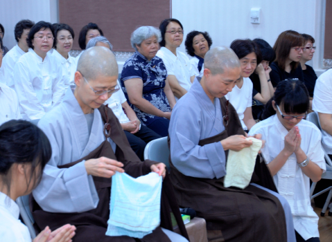

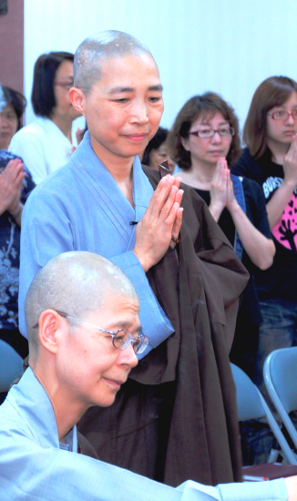

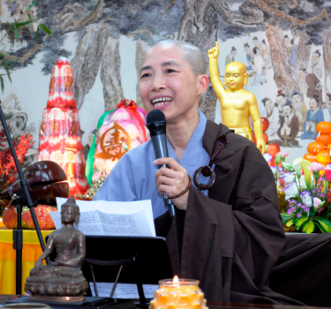

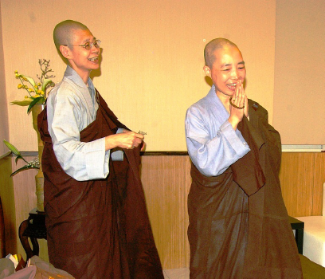

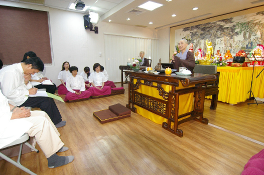

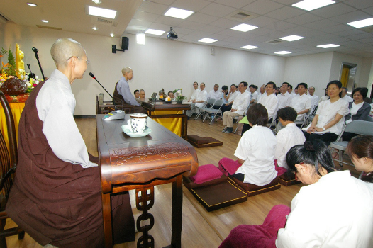

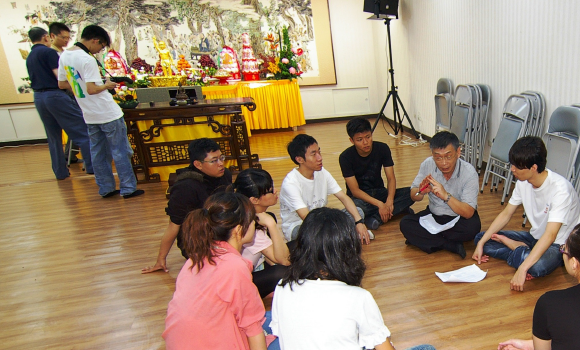

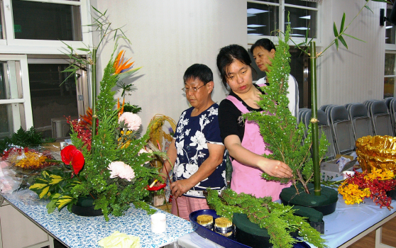

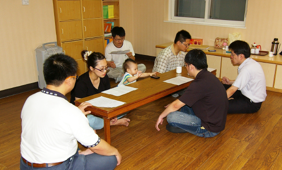

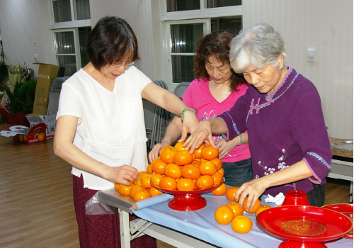

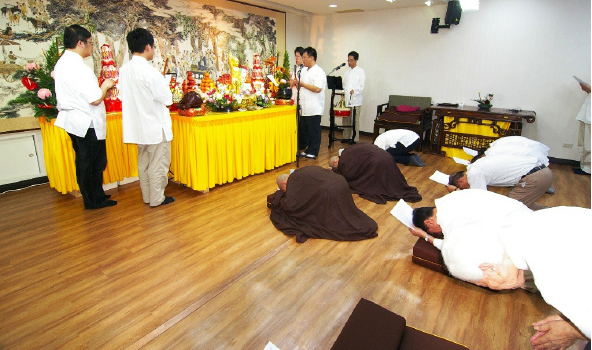

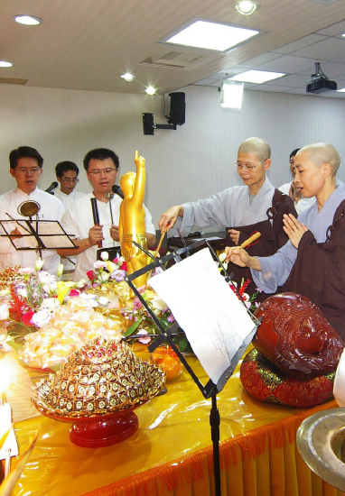

### 二○一二年母親節活動報導　問答篇

*編輯部整理*

一派春風相貌

道盡修學經驗

隨喜參與蓮友

殊勝耳根莊嚴

**問：** 就您以前做過老和尚的侍者，能如理如法的侍奉老和尚，能不能說說侍者的修學法，由這當中如何體會尊師重道的重要？

答（慧道師）：

很慚愧，有福報可以親近老和尚，事實上老和尚身邊的侍者很多，主要是比丘為主，我只是在旁邊幫忙而已。因為當侍者的因緣，有很多機會聽聞到老和尚的開示。個人不愛讀書，但是因為當侍者的關係，老和尚很樂法，後來生病不太能看書，我們就讀書給老和尚聽。老和尚是最棒的觀眾，很認真聽，有的甚至是別人寄來的書，我們覺得不怎麼樣的，他都很好學，也不批評。因為這樣的因緣讀了很多書，後來自己也領會到一點，所以薰習是很重要的。再來就是老和尚的身教，當侍者可以受到潛移默化。

說到修學經驗是不敢講！不過親近善知識，甚至有機會在善知識身旁承事，要注意到兩個心態。首先要敬師如敬佛。因為有機會在善知識身旁，最有機會看到他生活起居任何的小事情，久了會失掉恭敬心，起慢心，以為善知識也跟我們一樣，都會吃喝拉撒。師父也會生病，都要侍者幫忙。恭敬心在無形中會忘記，自己都不曉得。善知識雖然表面上跟我們一樣，但是內心的行相是不同的，甚至極可能是善知識的善巧示現。

《賢護分》也提到，念佛三昧要能成就，對於教導我們淨土法門的師長，要恭敬如佛。如果有恭敬心，師長教導的才能領受！恭敬一分，就有一分利益。以上第一點敬師如敬佛，我們一起來學習。

還有一點，就是不要用名利心來親近善知識，尤其像老和尚這般德高望重者。我們是純粹要求道的，不是為了名利，這樣才能領受到真實法義。

**問：** 請教慧觀法師，老和尚往生之後，第一代到第二代會有一些變化，師父是用怎樣的雅量來提攜後進，像當家師這樣的後進，厚愛他們，讓他們在淨苑呈現另外一個氣象，這種心胸是怎樣培養起來的？

答（慧觀師）：

慧道師是老當家師慧修法師慧眼選來的侍者，他做得讓我們非常的讚歎。我覺得很慚愧，我是第一位被師父帶進西蓮淨苑的女學長，可是我都沒有當侍者，因為我根本就不夠格當侍者，可是我非常隨喜這些侍者。

慧道法師剛剛說親近善知識，可以在善知識身旁學到身教，還有受他的教化。

先從老當家師慧修法師講起，他非常的孝順，對我們這些後來的非常照顧，我們常常說他顧大又顧小。他非常隨喜，不會嫉妒後進，反而會栽培我們。看他這樣做，我們也就這樣學習了。所以後面來的人比我們優秀，我們都非常的歡喜。譬如慧道法師小我十幾歲，做的事情比我好百千萬倍，我都非常的隨喜。我比較偷懶，心裡想還好他做當家，很多事情他就做了，讓他去辛苦，我就不用了。

很多事情，因為他是當家師，所以就不可以怎麼樣；我不是當家師，所以我就可以怎麼樣，所以我就比他自由。比如說要出國，要帶慧道法師去哪裡，他不敢，為什麼？因為他是當家師。但是別人約我去哪裡，我可以說好！因為我不是當家師，所以我可以出國。

讓這些比較年輕的來承擔這麼重大的事，有時候也會覺得心裡不忍。我私下想，我們這些年紀比較大的、在淨苑比較久的，如何來護持？後來發現，其實也沒有怎麼護持他們，只是他們替我們辛苦，我們就在下面跟他們隨喜讚歎。所以我在西蓮淨苑的角色，就是過快樂的晚年。他們做任何事，我都跟他們隨喜讚歎，他們只要問起什麼經驗，我不敢說傾囊相授，但我會毫無保留的跟他們報告。甚至我要出門，以前我告訴自己，對師父要恭敬，師父傳給惠敏和尚，我就覺得我也要對和尚恭敬。

我以前覺得要對當家師恭敬，所以慧道法師做當家之後，我就告訴自己要對當家師恭敬。我以前要出門都要跟老和尚報告，跟當家師報告。老和尚往生了，我現在出門，跟住持和尚報告，還要跟老的當家師報告，雖然他退休了，但是我還是非常尊敬他，他現在是輔導監院，我還要去跟輔導監院報告。現在還要多一個人報告，那就是慧道法師。這樣做是提醒自己，不要失掉恭敬心。我覺得太多辛苦讓他們承擔了，我在這裡過這麼好的日子，應該要好好的護持他們。

對下面的，現在因為沒有挑很大的責任，所以對下面的，我就會幫忙照顧。譬如當家法師他當輔導監院，我就幫忙把他的徒弟們照顧照顧。我以前是非常嚴格的人，對自己很嚴格，對別人也很嚴格。可是後來慢慢的年紀大了，對自己非常的不嚴格，對別人也非常的不嚴格，所以他們這些小孩子有什麼事，會跑來跟我講。假如是從前，我一定是說不可以；可是現在我都說可以！可以！很好！很好！你們要怎麼樣怎麼樣，還教他們說怎麼做就好了。假如發生了什麼事，我就說我去擋！現在的角色就是護持，也讓這些小孩，不敢說照顧，就是讓他們多一個人可以商量。

其實這些都是三寶的加持，還有老師父的庇蔭。老師父跟我們以法為親。

慧道法師會陪大家讀書，陪大家做事，什麼事情找不到人，他就會說，我來！當他說我來的時候，我會擋掉說：不可以！你是當家，換別人來！因為他是一個很厚道、很承擔的人，所以他做了很多事，淨苑能夠維持下來，就是這些執事僧們很承擔事情。我們這些退下來的，也隨喜他們，把他們照顧好，讓他們比我們更優秀，整個淨苑、整個佛教才能有期待。是這樣的心理，阿彌陀佛！

**問：** 請教當家師，寺院裡面的事情非常多，或者一些人情難以平衡，您如何保有這樣的修養，面對這些或如法或不如法，您是如何來調伏內心？

答（慧道師）：

調伏不敢講，事實上是大眾僧覺得我應該學習，所以叫我來做這個職務。當時也是自我鼓勵，才敢接下這個工作。這其中最大的力量來自老和尚，老和尚的話我一直引為鼓勵。剛出家，接了一件超過自己能力的事情，很起煩惱。看到老和尚的一段話，煩惱就沒有了。

那段話是：「修行要發揮菩薩的精神，不要太為自己著想。如果大眾僧，因為我的貢獻，能安身辦道，如果一切眾生，因為我的貢獻，能於佛法得安樂，我的名利，又算得了什麼？我的榮辱，又算得了什麼？我的成敗，又算得了什麼？我的苦樂，又算得了什麼？」

後來，在老和尚的原音，還聽到這麼開示：「甚而言之，個人生、個人死，又算得了什麼？」當時聽到這句話，肅然起敬。每次想到這段話，就會有力量鼓勵自己，再努力學習看看怎麼做才好。

開示問答現場

另外還有一個力量，是來自於佛陀所教導的法本，還有老和尚長年累月開示的緣起法。佛在菩提樹下悟到什麼法？開示什麼法？就是緣起法。緣起法告訴我們緣起性空，現在這個人會這樣子，這件事會這樣子，他不是絕對的，因為緣起，因為條件因緣所以成為這個樣子。可不可能改變？可能，因為眾生都有佛性。什麼是佛性？就是空性。過去因為不好的緣，所以來當眾生，現在學佛就開始下清淨的緣，所以能成佛。任何人事物都如此，不要只看表象，要看到本質，是可以改變。再壞的人也都可以改變，再壞的事情，給好的因緣，也會轉變。

惠敏和尚曾經這樣開示，他說我們要去跟別人溝通事情，有沒有打從內心把對方看成佛菩薩？我反省自己，沒有！我們都覺得這件事情好難處理、這個人好難溝通。並沒有把對方想成佛菩薩。如果把對方想成佛菩薩，就是另外一種心境。

和尚還講過另外一句話，我們要學著欣賞任何人事物，不管是好、是壞。好壞是我們自己的標準，別人的角度看來就不一定了。因為他是因緣法，是可以改變的。

再多講一點，這也是我個人在佛法當中非常受用的地方，過去沒學佛前，我很不滿意我自己，覺得自己很糟糕，沒有信心！但是學了佛發現，事實上我是佛，我是可以改變的。只要願意，現在這一秒鐘馬上可以翻轉，只要下好的因緣。

阿彌陀佛成佛以來已經十劫，對我們從來沒有放棄，沒有嫌棄。阿彌陀佛給我們無量的空間、無量的時間，期待我們能夠回心轉意。我們也要給別人進步的時間跟空間，只要有學佛的人都是想要進步的人，他會慢慢的改變。沒有學佛的人，幫助他有好的因緣。如果因緣還沒到，祝福他，他將來一定會有因緣學佛，一定會改變的。

**問：** 修行最難的是長遠心，初發心容易，長遠心難，請問師父，我們該如何維持長遠心？

答（慧道師）：

論長遠心，應該要學心超學長，您學佛比我們早，道心始終不變。的確，長遠心很重要。保持長遠心，要給自己創造因緣。首先就是要親近團體共修，在團體中，可以維持一定水平，不會有太大的波動，所以必須要依止道場。像學會就是一個道場，有固定的共修，這是非常必要的。參加共修，就像是定期保養，這個力量可以讓我們回去還能持續。

除了共修，還有法上的薰習，法義也是維持長遠心的關鍵。當對我們的本性、對真理，有深刻認識，啟發菩提心之後，這個動力可以支持我們不斷走下去。

事實上，老師與各位蓮友都做得很好，尤其你們在家菩薩，比出家人還有更多的責任要擔當，在這樣的狀況下還能維持學佛，是非常難得的，隨喜各位。

今天聽到老師說，在家人是公家機關櫃臺的辦事員。老師客氣，這是出於恭敬三寶的心說出來的比喻。事實上，不只各位在家菩薩，出家眾也是。我們每個人都代表佛教。剛剛聽到說我們是辦事員，心裡想，我們作為辦事員是非常光榮的。

諸位櫃臺辦事員都是非常優秀的，很隨喜學會。淨苑法師們，只要提到心超學長帶領的團體，都覺得很好。

**問：** 師父您是如何將緣起性空的道理運用於日用平常，增加自己的道力，降伏自己的煩惱，並且讓自己在學佛的旅途上充滿法喜？

答（慧道師）：

個人並沒有學得很好。只是從老和尚的言教，不斷薰習，久而久之，對法增加信心。至於怎麼運用於生活上，其實各位都在做。

老和尚一直以緣起性空二諦理，教導四眾弟子。這個法，在實際行門的修持，就在身口意三業不犯十惡業，是清淨的緣起，這清淨的緣起所感得的即是清淨的果報。所謂功不唐捐，所做的每一件事、每一句話，乃至每一個念頭，最後都回歸到自己身上。如果是清淨的緣起，感得的就是清淨的果報，最後圓滿，約身為法身，約土為淨土。各位都在做，這就是緣起法。

相反的，如果每天身口意所做和染法相應，這個也是緣起法，這是染污的緣起，它所感的就是六道生死輪迴的果報。

另外，緣起性空的具體實踐，老和尚還教我們要改正自己的缺點，原諒別人的缺點。我覺得這就是緣起性空的體現。

為什麼要改進自己的缺點？因為性空緣起。如果缺點不改，所做的就是惡法的緣起，自然會感苦的果報，所以要改。為何要原諒別人的缺點？因為緣起性空。別人的缺點是緣起，緣起就是性空，性空沒有絕對的惡，以後有好的因緣，他會改變，所以要原諒。

在生活中，以緣起性空待人處世，就會有這樣的好處。比方剛剛講到，學會欣賞每一個人、事、物，不管我們喜歡不喜歡的，這個也是因為緣起性空的原因。好壞是我們自己的分別，緣起法，性空，好壞不是那麼絕對的。

為什麼要欣賞他？因為他的本質是空，甚至從另外的一個角度講，我們所見的，都是內心的投射，所以如果看到外境，必須要檢討我們的內心。

緣起法如何觀察？以前聽老和尚教一位剛出家的比丘，說，「你們練習觀一切法因緣生。電扇是不是因緣生？房子是不是因緣生？地球是不是因緣生？太陽系是不是因緣生？……」教他每天觀察。

我們把這個法放在心上，在生活中，對境的時候，眼見色、耳聽聲，根對塵，相信應該會有不同角度的看法。當然這沒辦法立竿見影，需要透過長時間的薰習，因為我們對它很陌生，我們迷惑於真理太久了，本來是自家的東西，但是卻對它很陌生。從現在開始學習。

**問：** 現在有人說會有大災難，甚至說會造成世界很大的毀滅，那我們應該怎麼看待？

答（慧道師）：

大災難是不是會來也是緣起。我們可以做的，就是從自己下手。萬法唯心造，會召感到怎樣的人事物，跟自己身口意十分有關。

老和尚在《緣起法泛談》中，曾經開示：「學佛人只宜低頭，不宜揚目。」什麼意思呢？低頭就是檢點自己，什麼該做、什麼不該做；不宜揚目，就是不批評別人。所以我們應清淨自己身口意三業。

學會所舉辦的都是菩薩行，都是清淨的因緣，可以轉化世界、時代的苦難。就算災難真的會來，我們不管多麼的擔心它還是會來。為什麼要在還沒來之前就讓自己擔心受苦呢？與其擔心，不如轉化為修行的動力。

地球乃至於宇宙都是有為法，都是成住壞空，我們的身體也一樣是有為法，有生老病死。所以我們要努力的是，如何利用有限的生命，以及有限的環境，創造出最高的價值。就是追求真理，自覺覺他，這是人生最高的價值。

古德說，要從苦中解脫最好的方法就是知道苦。修行之所以動力不夠，或者長遠心不能堅持，那是不知道一切法無常。

**問：** 我們有些同修，在慢慢修學進步當中，或遇到了病苦，整個人信心都失去了，尤其是不管怎麼醫也醫不好，念佛也念不好，拜懺也不好，放生也不好，怎麼也好不起來，不知該怎麼辦？

答（慧道師）：

在病苦當中還能修行實在是不容易，學佛要有正確觀念。不是學佛之後，佛菩薩就要保我一路平安、無災無難。如果這樣的話，佛法不是最可貴的。學佛可貴的地方，在於縱使在災難當中、在苦難當中，我們還知道怎麼去面對。

我們講一個最高的典範，就是釋迦牟尼佛。釋迦牟尼佛是佛陀！但是在他的人生當中也經常遇到苦難。比如，經常有提婆達多的作對，破壞僧團。此外，也遭遇滅族的傷痛。甚至最後涅槃，是在回故鄉的途中，在荒涼、偏僻的地方，接受供養，食物當中有毒，嚴重下痢，在回程中途涅槃了。當時阿難覺得很難過，就跟佛陀說：您是這麼尊貴，怎麼選在這麼荒涼的地方涅槃呢？但是佛陀跟阿難說，你的眼光太短了，你看這地方是荒涼，其實在過去，這個地方是個熱鬧的城市。所以佛陀是真實透徹一切世間法無常，在任何時刻、任何地點都是好的。

連佛都有這樣的苦難，但佛跟我們不一樣的地方，在於他不是悲哀的，不是埋怨的，是坦然接受的，因為智慧圓滿，沒有我，也沒有法。

當然我們沒有辦法像佛一樣圓滿，但是，雖不能至，心嚮往之。為什麼認真的念佛、拜懺，病還不能好？當中有錯綜複雜的因緣，有幾種可能。一、有可能我們所累積的功德，比不上業緣。舉個例子，好比我們欠別人一百萬，還了十萬，請問各位是否還欠錢？還有欠的。所以並不是拜懺、念佛沒有功德，是質跟量都還不夠。

還有一個角度，老和尚晚年示現生病，他到後來甚至還要侍者抱上抱下、上洗手間，連翻身都要別人幫忙。他有一天講一句話：我因病得福，我過去的個性不是這樣的。

這是我們要學習的，老和尚因為生病，消磨自己的個性，所以他覺得生病反而是修行很好的因緣。

人在受病苦的時候，有時候心力難免怯懦，要提起是不容易的，但是就像剛剛提到的，要以佛法僧三寶來引導自己。我們反而要更精進、更認真。

老和尚還有一段開示說：「健康的時候，身體好的時候，要念佛，機會難得。有病的時候，要念佛，來日不多，早做往生準備。病重的時候，趕緊念佛，正是一心念佛，求生西方的時候。」

跟各位報告到這裡。阿彌陀佛！

結語

今天整場活動的圓滿，都有賴於慧觀法師、慧道法師來道場的普照，由於兩位法師的戒行莊嚴、道高德備，說法娓娓道來使我們如沐春風，使我們明了知母恩、報母恩，從親及疏、從近及遠、從小及大，能夠將心量擴展，並且以佛為親近的對象，來感念佛恩，並且由浴佛來表彰對佛的感念，也由此而開顯一代時教。

並且在問答當中也提撕我們很多重要的修學觀念，也帶領我們皈依，相信今天的母親節，是所有母親節當中最有意義的母親節，這裡面有對三寶的皈依、有對三寶的尊崇，有浴佛的法行，有法語的觀修等等，所以今天承蒙慧道法師與慧觀法師來道場開示加被，道場中為人母親的，今天應該最幸福，孩子們用這樣的方式來報答，來讓母親過最有意義的母親節，這也是孩子們在母親節盡最大的孝心，所以今天母親節浴佛法會的內涵是這樣的莊嚴、殊勝，都有賴於師父的加被、開示。

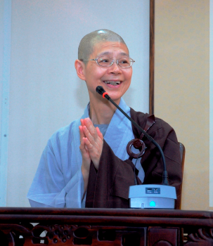

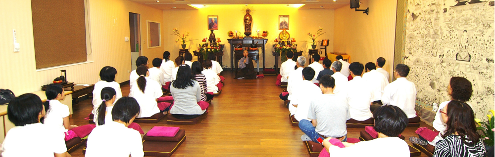

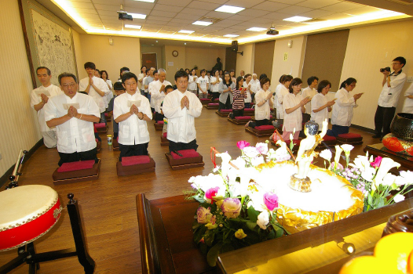

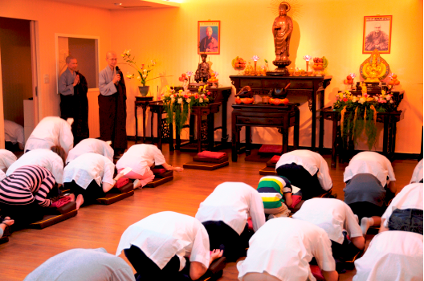

### 走了學習的一年〜學會週年慶祝與回顧

*編輯部*

動機格局學正法

點滴一年堪回首

邁入未來新局面

近悅遠來正法興

成立全國性社團至今一年，延續過去十餘年來各項教法研學及善法興辦等事項，進駐寧波道場後，先禮請淨苑上惠下凱法師主持灑淨與開光儀式，後於道場開幕時禮請上果下清律師開示在家人應有的格局與風範，開啟了一整年的儒佛經典學習與各類善法的開展。

學會例行的課程，由「新道場落成規矩講解」開始，每週一晚間「常禮舉要講座」，週三上午「一樓值班人員大學經典的研學」、下午「兒童讀經班」、晚間「論語講座」，週四「三代共修及淨行品、遺教經、十疑論講座」，週五晚間「金剛經、普門品佛學講座」，週六共修，分為大堂、養成班、大專班、國高中啟蒙班、小學啟蒙班。

中壢地區，每週三上午的念佛共修及週日的論語研學及啟蒙讀經班；東勢地區，每週一晚間的佛學經典研討及週日晚間的念佛共修、研討儒佛經典、啟蒙讀經班課程；宜蘭地區，每週末的共修研學，甚而應基隆淨宗學會邀請，至該會舉辦人才培訓課程等。

學會搬入新道場規矩講解

週一常禮舉要講座

週三論語講座

週五佛學講座

週六啟蒙班

週六念佛共修

暨佛學講座

週六養成班研學

週四三代共修念佛

與佛學研討

週六國高中班

週三讀經班

週六大專班研學

一樓值班人員研學

東勢佛學經典研討與念佛共修

中壢儒佛經典研討與念佛共修

基隆淨宗學會

人才培訓課程

陳建老師                                                                                                                                 學佛因緣與環境保護工程

鄭博久大使

我的外公江兆申

我的外公江兆申

除例行性課程外，尚舉辦各類專題課程與演講。六月中，禮請臺中蓮社—陳建老師，在問答中開示其一路走來發心為公的誠意與作法，在服務大眾中，學習柔軟、圓融並維持公義。七月初，禮請故宮博物院吳誦芬老師，介紹「我的外公江兆申」，江先生，是當代少數集詩文、書畫、篆刻及治藝術史於一身的文人藝術家。在其外孫女的帶領之下，我們進入了江兆申先生的國畫世界和浩瀚的中國藝術之境！

十一月中，由雪公欽點進入奉祀官府工作之郭基發老師，談「學佛因緣與環境保護工程」，其學佛的歷程中，與雪公相處點滴因緣，任勞任怨的做事態度，以及奉祀官府裁撤之後所做的微生物環保事業，人生當中的每一個決定與堅持，都與日後的結局有密不可分的關連性。年前的國際禮儀講座，邀請鄭博久大使分享其外交禮儀與經驗，作為學期常禮舉要講座的結束。開春之後邀請上果下清法師開示普門品大意，作為新學期普門品講座最殊勝的緣起。（附註：此開示已製作光碟流通，歡迎索取）

寒暑假舉辦的短期講座課程，有為期一個月的台北暑期讀經才藝班，每日下午的讀經課程外，輔以禮儀課程、英文課程、紙黏土捏塑課程、作文課、音樂欣賞、影片欣賞、國畫欣賞等多元課程，令孩子們度過一個充實又快樂的暑假。

為期七日的大專佛學講座，延續寒暑假例行的短期研學，介紹雪廬老人所制訂，佛學初級六門課程中之般若波羅密多心經，般若心經是六百卷大般若經的精華，亦為佛法中最殊勝且不共外道之處，可為開眾生法眼，提振日漸式微之正法，及破除眾生與己身之障難，研學般若空義法門於現今最為契機，期盼年輕學子能依此勝緣，成為研究教法棟樑之才。

至大陸的文化交流講座，計有七月底應順昌教育局邀請，以朱子治家格言及治家相關論語條目所做開設的文化講座；今年五月應諸暨市行知小學邀請，至該校舉辦知是眾妙之門傳統文化交流講座，至大陸辦理文化交流講座兩年多來，已至第八屆。

另外亦於民國百年年底，隨江逸子老師，應福建博物院之邀，至福州舉辦「道藝春秋國畫塑像作品展」，從前行導覽人員培訓、開幕，乃至組團參訪，甚而於寒假，舉辦以畫展畫作為主軸之道藝人生系列講座。由影片、畫作、詩文、茶道、陶藝與環保等課程的開展，進入江逸子老師福建博物院道藝春秋國畫塑像展的全體作品的內涵，此講座蒙馬來西亞漢學研究中心及全省各地有心人士的參與，使得此講座更添光彩。

至於年度所辦法行事業，於中壢道場舉辦藥師懺、淨土懺、大悲懺及二次地藏懺法會等，依循祖師寫懺本之心意，拜懺以得佛菩薩加被及對教法的殊勝領悟。更不定期舉辦放生活動、中部浴佛法會等，年度結夏安居齋僧法會，除每年十餘次至西蓮淨苑齋僧外，更前往埔里正覺精舍與圓通寺齋僧。

依著新道場成立，承蒙許多外賓來訪指導，舉凡弘明學園創辦人—連志道老師、國畫大師—江逸子老師、淨宗學會—悟道法師等。另有其他學會道場人員蒞臨參訪交流，諸如香港淨宗學會執事人員、香港聖賢學會會長夫婦、馬來西亞漢學中心行政教學人員、日本淨宗學會會長等，讓學會更添向學的活力。

期待學會依著道場的建立，不但是個有規矩、有道風的團體，也能令近者悅遠者來，彼此相觀而善，道業增上。

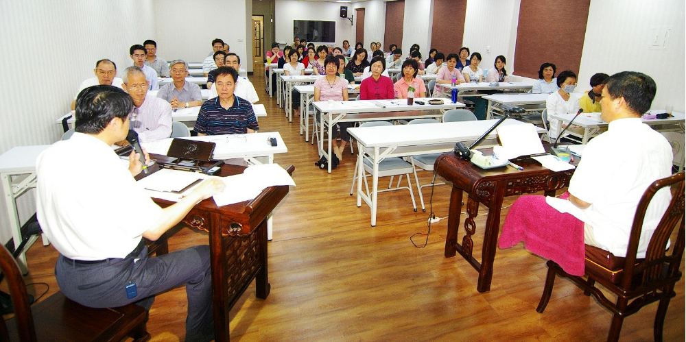

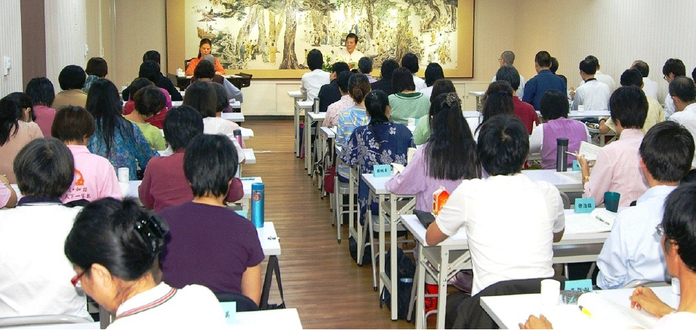

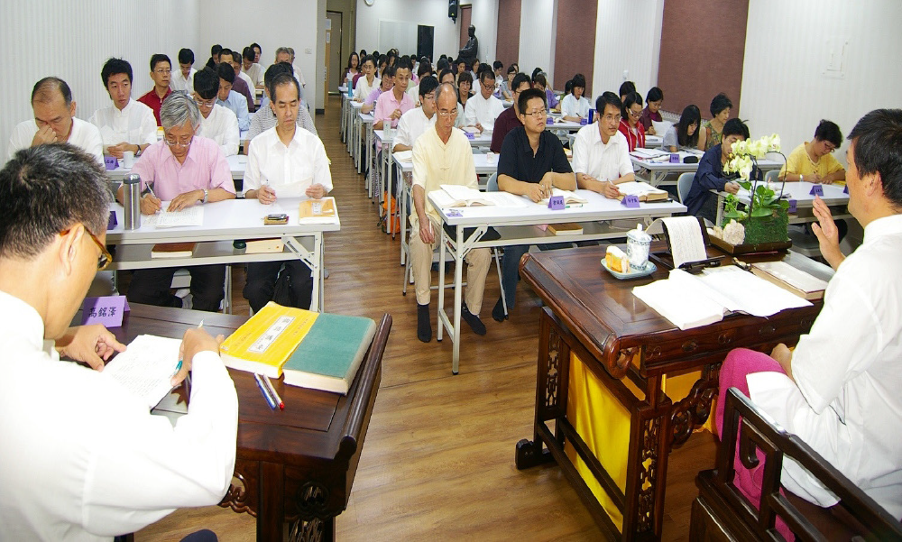

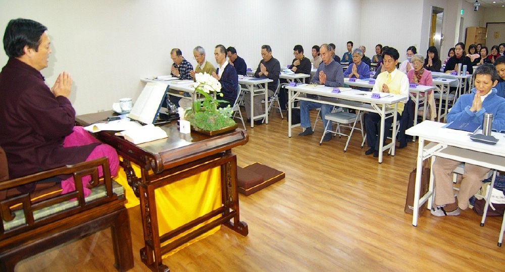

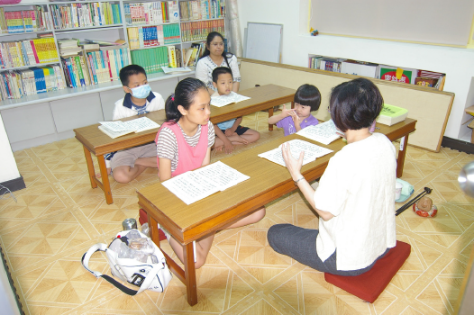

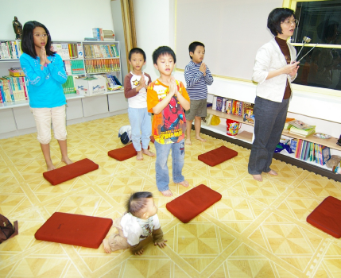

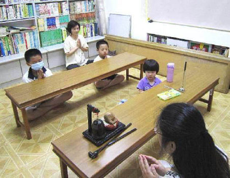

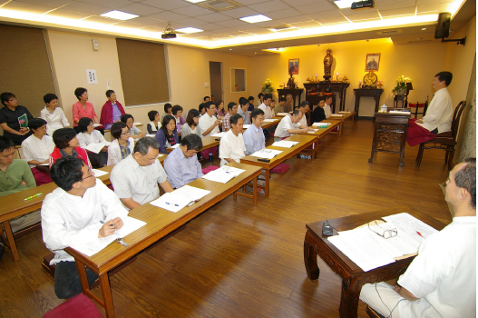

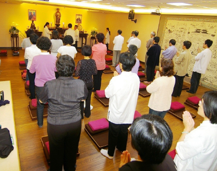

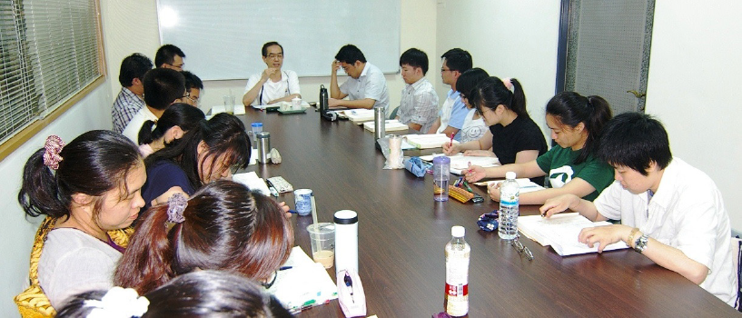

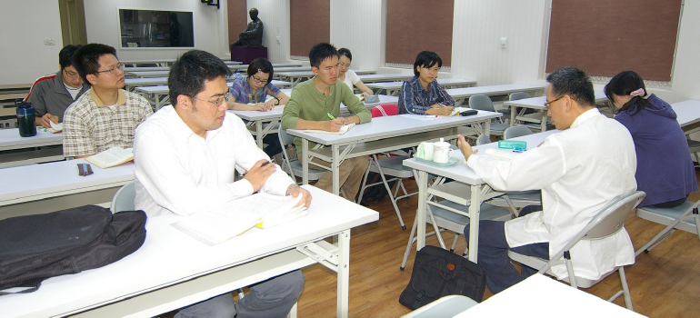

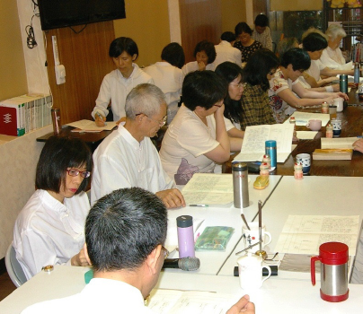

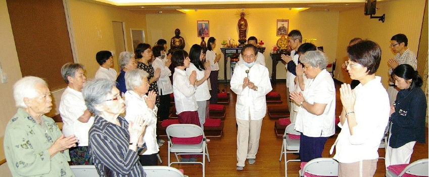

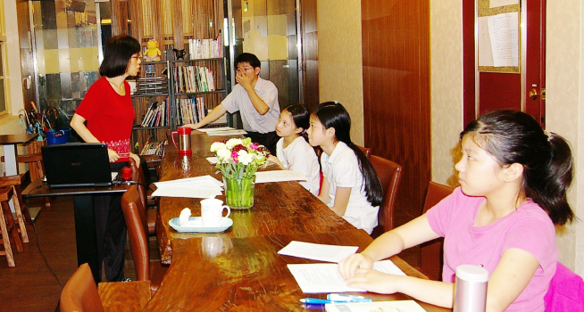

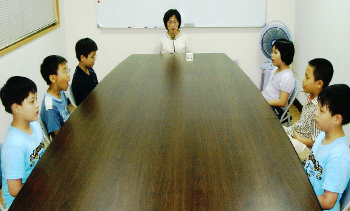

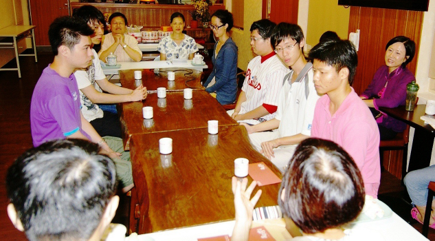

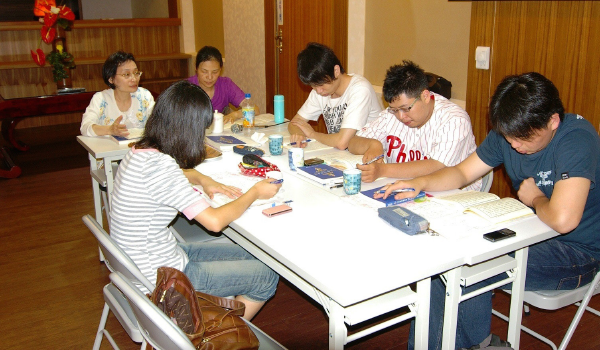

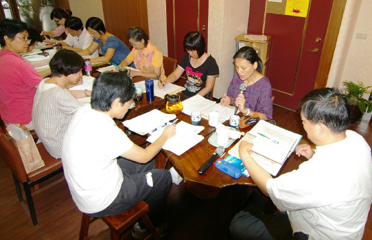

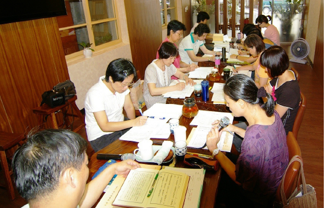

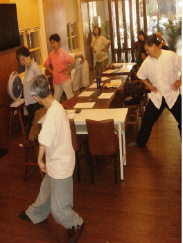

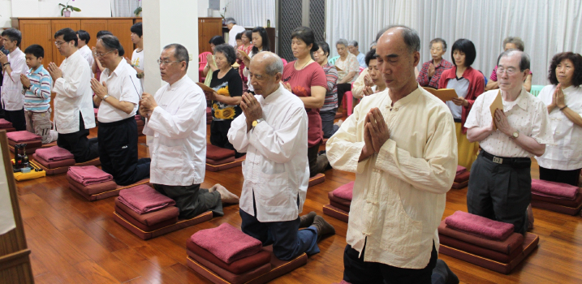

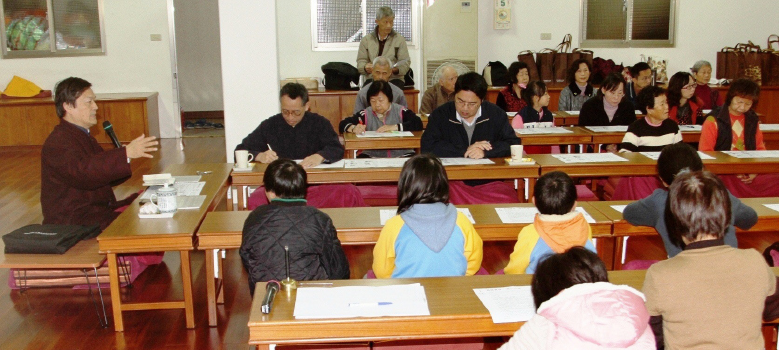

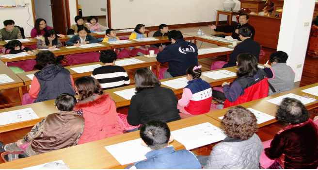

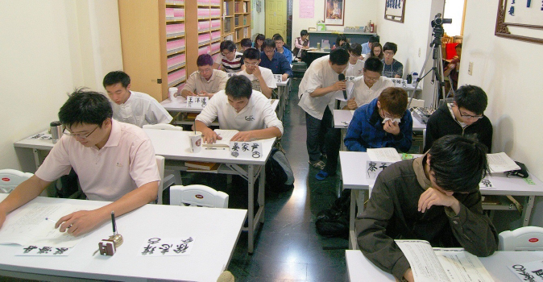

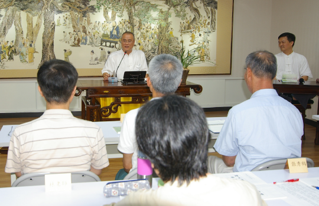

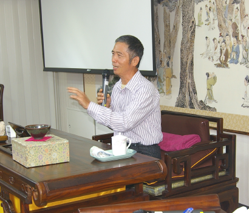

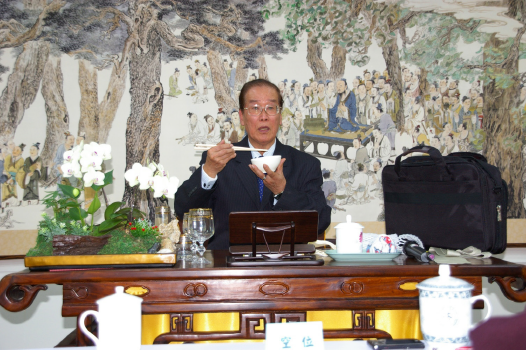

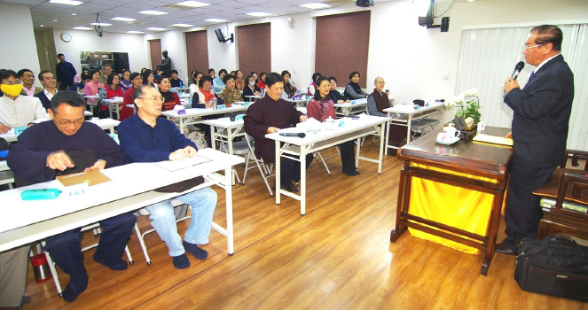

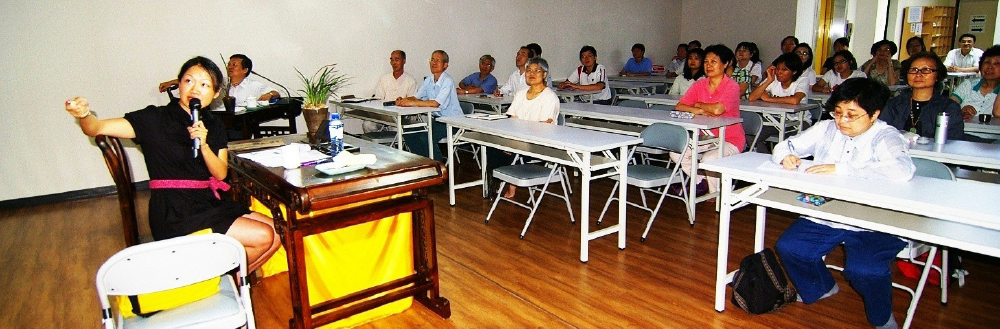

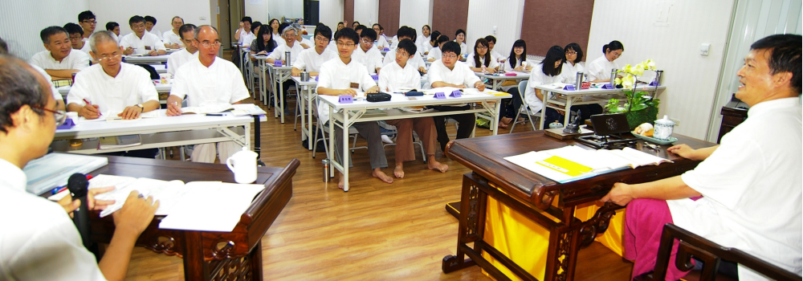

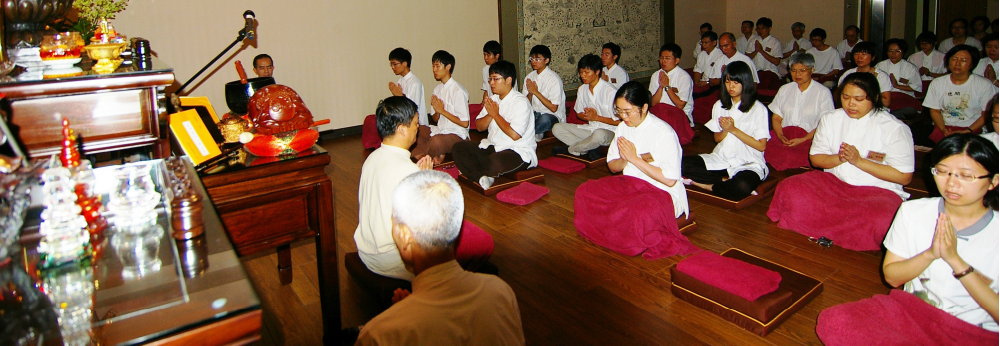
