# 第86期
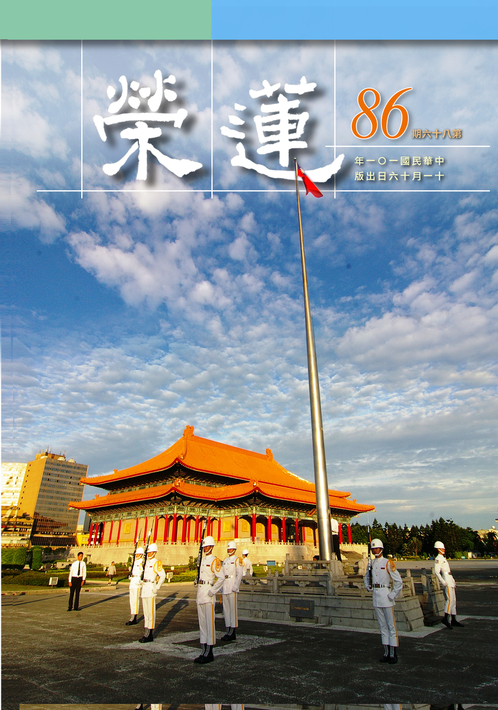

## 社論

### 如何看待中華文化的弘揚

本刊

雨後春筍文化熱

瞎子摸象難有成

須是傳承生見地

欣欣向榮久彌新

隨著大陸經濟的起飛，廣袤千里土地上的中國人，開始找回民族自信心，自信的提升讓人不只想在物質上取得優勢，更希望能在中華文化裡找回民族的特色、找出民族賴以維繫的靈魂，此外，富裕生活也帶給人們身心上的不安，國學熱如是油然而生，中華文化的弘揚在大陸掀起一股從所未有的熱潮，啟蒙讀經、百家論壇、書院興辦、文化進入校園等，各種推廣活動如雨後春筍般繁茂地開展起來，聲勢是如此驚人，前景又是那麼美好，從事傳統文化教育的工作者們，該如何看待這樣的趨勢？

文化的推廣是一項長期的工程，它不能夠依靠大筆的資金快速成就，也不能夠只憑藉一份熱忱就收穫結果，儒家文化的正確理解、道統傳承的延續、後輩人才的養成，都是中華文化復興所必備的元素。因此，弘揚中華文化不能透過百家論壇的各說各話，百家論壇或平等地讓各類善、惡、好、壞的言論都有發揮空間，但孰是孰非全部交給聽眾自行定奪，莫衷一是的討論、各抒己見的表達，正當的言論反倒稀釋於訕笑和嘈雜聲中，一陣熱鬧後難有太多的益處。

弘揚中華文化不能只看表面發展，書院欣欣向榮，文化開始走入企業、校園，雖然讓人感覺充滿希望，然而就實質而論，教書先生的文化底蘊是否能夠引領學子層層深入？是否能夠因應長達十多年的教學工作？能否滿足年齡層從幼兒園直至大學不同程度的需求？在受到完全保護、零污染環境下成長的學生們，未來回到一般校園、進入職場、投入社會的大染缸之中，是否能成為出淤泥而不染進而能端正風俗的君子？還是終於不堪一擊對文化徹底失望的孩子？在群眾前大談懺悔改過的勇者們，後續有沒有足夠的共學力量，支助他們面對許多艱險的挑戰？

弘揚文化需要正知正見的抉擇，經書易得，但經師、人師卻難求，幾千年來古人對經典累積的註釋解說浩如煙海，著名大儒之間的看法也難以一致，如果沒有大德的引導，各種錯綜複雜的見解，最終將使人有經典不知其所云的感嘆。因此古籍的研究不能無師自通，更不可以閉門造車，必須有明師的指點，傳承的眼力必須仰賴傳承的知見而得，眼前雪廬老人的見解，正是最直截明瞭的一條出路。

雪廬老人深厚的國學底蘊，能從他一生的求學經歷、講學內容、詩集著作中得見，人情世故的通達，更是他能夠正解經典的重要內涵，唯有依從雪廬老人的傳承，才不至於在浩如煙海的文化典籍著作中，古文中迷失自我。書籍的選擇，應當先從經典下手，《論語講要》的研學，是正本清源，是辨別百家是非對錯的方法。文化應該是各行各業的支柱，培育人才的舵手，它能夠豐富經濟成長的內涵，解決道德日益衰微的問題，讓個人找到人生的方向，讓社會走向常軌，使國家在國際上獲得尊重，這要靠教育者不斷地自我充實，不好高騖遠的規劃，還必須要依循傳承的智慧，才能在踏實的步伐中走出一條康莊大道。

大陸上的文化弘揚，正面臨著重大的挑戰；反觀寶島臺灣，拚經濟如何能列為政治的唯一選項、人民心中唯一的期望？須知傳承文化的珍貴資源正握在我們手中，如何能放任他們蒙塵與凋零？唯有依雪廬老人的正解深入經典內涵，是走出兩岸文化光明的唯一出路。

## 大德法語

### 大方廣圓覺修多羅了義經（四十五）

道源老和尚

煩惱原無對境起

轉變不費苦心力

忽然一醒黃梁夢

身心寂靜大自在

戊二、四問答別明觀行中根修證

己一、二問答三觀修行

庚一、示三觀行相（威德自在啟請）

辛三、如來讚許

經文：

爾時世尊告威德自在菩薩言：善哉善哉！善男子！汝等乃能為諸菩薩，及末世眾生，問於如來，如是方便。汝今諦聽，當為汝說。

就在此時世尊先讚歎威德自在菩薩（當機眾），為末世眾生請問修學第一義諦方便。佛要當機眾專心致意地聽，當為他與在場聽眾說此大法。

辛四、承教靜聽

經文：

時威德自在菩薩奉教歡喜，及諸大眾，默然而聽。

聽到了佛允許開示，非常歡喜，默然而聽。

辛五、正答所問

壬一、長行

癸一、標本舉數

子一、約稱性之行以標本

經文：

善男子！無上妙覺，徧諸十方，出生如來，與一切法，同體平等。於諸修行，實無有二。

叫一聲當機者，無上妙覺就是佛的覺，此智慧不可思議，稱作妙覺。且沒有再上的了，叫無上妙覺。此如來的無上妙覺是徧十方的。一切。此妙覺平等。

所開示的修行法門哪有差別？哪有漸次？如是修行（能所雙亡），沒有修行的差別相。

子二、約隨機之行以舉數

經文：

方便隨順，其數無量，圓攝所歸，循性差別，當有三種。

方便是隨順眾生根機，並非在佛的圓覺妙性上，佛經道理不善聽者，會覺得怎麼一會兒如此說，一會兒又那麼說呢？是不是自相矛盾呢？沒有！是你沒有聽懂，沒有研究通達，所講的聽不清楚。

在佛的無上妙覺上觀察一切法是平等的，沒有兩樣，沒有差別，是無二的。

方便隨順是隨順眾生，也就是在眾生那一方面可有差別了，那就是其數無量，所以有八萬四千法門，實實在在是無量，因為眾生無量，根機無量，佛的法門也是無量。為了令大家得利，將無量方便，圓滿收攝歸納，亦即順著一切方便法門的差別性，歸納出來的，應當有三種。

一是奢摩他（修止），二者三摩鉢提（起信論云毘婆奢那，是修觀，此處云修如幻三昧），三者禪那（現證）。

癸二、正示觀門

子一、泯相澄神觀

丑一、示立行之本

經文：

善男子！若諸菩薩，悟淨圓覺。

此句包括末世學大乘的眾生在內，悟淨圓覺，此句貫串至禪那。亦即先悟圓覺之理，悟後再起修，先求開悟，悟到清淨的圓覺，依清淨的圓覺性再修行。

丑二、示觀行之相

經文：

淨覺心，取靜為行，由澄諸念，覺識煩動。

前是悟理，此是事修，在事相上，腳踏實地一步一步的走，先取靜相，令心安靜。總之在無量差別方便之中，歸納起來有這麼一類的法門，也就是有這麼一類的眾生，他歡喜靜，取靜為行門。此時是悟後起修，悟到圓覺之理方起事修，從靜著手，取靜為行門。

這三個觀，是圓瑛法師講義上所用，都是依圭峯大師所說。圭峰大師謂之泯相澄聖觀，先要泯滅一切相。

大乘起信論謂之修止，止一切境界相，心水澄清。譬如念阿彌陀佛的讚佛偈：紺目澄清四大海。佛的眼睛是紺青色，表徵心水澄清。

佛眼如四大海，眾生的心念本來是渾濁不清的，如這一盆水本來是有泥沙謂之渾水，靜下來則澄清，此時取靜為行，亦即澄清諸念。然吾人整日苦惱，如天天用手來攪心水，令心水渾濁不清，天天動心的貪瞋癡，等於用手來攪混水，愈攪愈渾。此時用功修行，以靜功將這一切妄念停止下來。

然取靜為行，也不是簡單的事。打坐原是為了靜下來，但是卻靜不下來，如何強制令心靜，例如規定早起，靜坐三十分鐘，即使有不耐煩的同學，礙於大眾的規矩，不好意思不坐，坐時腿疼（未煩之前先腿疼），誰的腿不是娘生的？都是自己的娘生的，都是長肉的，哪個人腿不疼？你得練習，練習它就不疼了。出家人不能盤起雙盤，總得盤起單盤（半跏趺坐），坐上二小時，這個腿練到不疼。試想打禪七、佛七，出家人是僧寶，在家居士請出家人去領導，結果腿盤不上去，這像什麼話？即使盤上去也熬不到三十分鐘，這像什麼話？要練習！練到腿不疼了，是調身！

接著還要學會調鼻息（調息），之後還要學會調心。以調心的功夫將妄念停止下來。坐在蒲團上，身雖靜下來，心卻打妄想，你不打坐，還沒有妄想，一打坐妄想就來，東想西想，不曉得哪個時候的事都想起來，你不用功那麼就隨它想，亂想一起，不想了就窮瞌睡了，靜坐中二個大煩惱，一個掉舉，一個昏沉。

聽了三十年了，沒有聽懂這兩個名字嗎？聽不到你耳朵裡，聽不到你心裡，你耳不聽，怎麼聽到心裡呢？靜坐最大的煩惱就是掉舉和昏沉，不用功不知道，你坐在那裏就掉舉（打妄想），東想西想，才剛剛不想，瞌睡來了（昏沉），這個樣子能了生死了嗎？能成佛道了嗎？要生慚愧！

此時悟淨圓覺的菩薩，是開悟之人，是明慚愧的人，他會調身、會調心，能將妄念澄清下來，我們的妄想心是從攀緣外邊六塵境界而來，此時打坐閉著眼睛，沒有看到外邊境界，耳朵也沒聽到什麼聲音，然會打妄想，想的是法塵，必須要用功，澄諸妄念，將妄念降伏，妄想心是對著六塵緣影而來，沒有本體（自性），此時感覺煩動的妄識也空了。

丑三、示入觀之效

經文：

靜慧發生，身心客塵，從此永滅，便能內發寂靜輕安。由寂靜故，十方世界，諸如來心，於中顯現，如鏡中像。

觀空時，靜慧發生，學佛法就是學心法，般若智慧在哪兒呢？不是佛給我們的，是依聞修學成就的，依聞而觀照發生作用，所以靜慧就發生出來！

前述四大假合之物體，執著為自己的身相，六塵緣影執著為自己的心相，然四大種及六塵都是客塵（非主人），皆圓覺自性之外，然此執著是無始劫來的習氣。雖說我的身體是四大假合，然誰打你一巴掌，你就受不了，說是假的，打到我就假不了，是無始劫來的習氣。沒有打你，人家罵你兩句就受不了，說你二句不好聽，心裡起了分別，緣影六塵起了心，他說的壞話，我還是聽見起煩惱嘛！所以這「客塵」沒有滅。

你要用功修行，身心客塵，從此永滅，便能內發寂靜輕安，這是功夫的名字，輕安—身輕心安，得一種自在的境界，你不用功，你不曉得身體之重，你不曉得心裡邊的煩，等到用功你才知道，這身體的臭皮囊一百多斤嘛！你天天揹著他走路，你看看這個苦惱不苦惱？心裡邊他不會安，你愈叫他安，他愈不安，你愈不叫打妄想，愈打妄想，愈不會安。此時得到寂靜輕安，身體麤重相沒有了，輕飄飄的！

輕安由何而來的？輕安是內發的，智慧也不是佛給我們的，也是內發的。能以自己內發般若智慧解脫了煩惱，得到輕安的享受，自在解脫。怎麼個解脫？將身體麤重相去除，將內心擾動的煩惱解脫掉，身體不重了，變成輕的，心裡不動變成安穩！此時身心輕安就是解脫，就是自在。佛法不是只講空理，你得腳踏實地用功，佛只是告訴我們所走過的路，還是要我們自己去走，不能替我們修行，這個話我跟諸位講過多了。

在家當居士能修行嗎？這真是可憐啊！得去拚生活，就是一天到晚忙忙碌碌，有了飯吃才能修行，然不是一個人吃，是一家人，那個擔子重了，就是生活擔子，擔不動也得要擔；我們出家人，上不養老，下不養小，就你一個人，把你的嘴巴插到大眾飯鍋裡，你不要買米，不要買菜，就有飯吃了，正好修行，有飯吃了，正好睡覺，怎麼樣？不要拚了！生活過得去了，還拚個啥？那麼完了！剛才說了好幾遍了，千佛出世也沒有辦法，你有飯吃，你的努力就在吃飯，那還有什麼好商量呢？所以要好好的用功，靠三寶加被，我們有了飯吃，不用拚生活。聞到圓頓大教，算是有點善根，不要對不起你自己的善根，聽到圓頓開示多清楚啊！怎麼不好好用功呢？打坐修靜，這有什麼弄不清楚呢？你不要修那有什麼辦法？

由寂靜故，十方世界，諸如來心，於中顯現，如鏡中像，這是第三步功夫。第一步內發智慧，第二步內發輕安，第三步十方世界諸佛如來的心，跟我的心同了，所以前邊說，有智慧的人求心不求佛，愚癡人求佛不求心，天天祈求佛，不知道求自己的心，求來求去，佛還在心外，在佛門裡學外道，心外求道，名為外道，你求你自己的心，我們的心跟佛的心無二無別，沒有二個樣子，怎麼說有二個樣子呢？心被無明煩惱給障蔽了，這時用靜功，把一盆渾水給澄清了，跟十方諸佛的心通了，於中顯現，於什麼中？於我自己的心中，顯現出來，如何顯現？如鏡中顯現那個樣，這個方便是什麼樣子呢？

丑四、結觀行之名

經文：

此方便者，名奢摩他。

這個方便就是奢摩他，就叫修止，就叫修靜，這是一個。（下期待續）

### 圓通寺結夏安居〜果公法語開示（二）

上果下清法師

能緣一念緣十界

離苦得樂待所緣

運用之妙存一心

佛界全體為我念

徹悟祖師語錄

又曰：吾人現前一念之心，全真成妄，全妄即真，終日不變，終日隨緣。夫不隨佛界之緣而念佛界，便念九界。不念三乘，便念六凡。不念人天，便念三途。不念鬼畜，便念地獄。以凡在有心，不能無念，以無念心體，唯佛獨證，自等覺已還，皆悉有念。凡起一念，必落十界，更無有念出十界外，以十法界更無外故。每起一念，為一受生之緣。果知此理而不念佛者，未之有也。若此心能與平等大慈大悲依正功德，以及萬德洪名相應，即念佛法界也。能與菩提心六度萬行相應，即念菩薩法界也。以無我心與十二因緣相應，即念緣覺法界也。以無我心觀察四諦，即念聲聞法界也。或與四禪八定，以及上品十善相應，即念天法界也。若與五戒相應，即念人法界也。若修戒善等法，兼懷瞋慢勝負之心，即落修羅法界。若以緩軟心念下品十惡，即墮畜生法界。或以緩急相半心與中品十惡相應，便墮餓鬼法界。若以猛熾心與上品十惡相應，即墮地獄法界也。十惡者，即殺、盜、淫、妄言、綺語、惡口、兩舌、貪、瞋、邪見是。反此則為十善。當密自檢點日用所起之念，與何界相應者多，與何界相應者猛，則他日安身立命之處，不勞更問人矣。

文：吾人現前一念之心，全真成妄，全妄即真。終日不變，終日隨緣。

我們每一位現前的一念心，何以全真成妄？一念心之性乃真如本性（真心），不覺就起無明。真心原是如如不動的，一動成了第八識，再動成為第七識，三動成為前六識。所變的八個識全是虛妄故，而我們所追求的真如本性是全真。此時全真成妄，全部成為妄心，好比大海水本來是平平靜靜的，遇到風吹整個海水變成波浪，比喻做全真成妄。全妄即真，是全部的妄心當下即是真心，好比風靜止了，風平浪靜，恢復成平靜的海水。

全部的波浪比喻做妄法，真心受無明風一吹，海水全部變成波浪，也就成了妄心。但是無明風不吹了，他又靜止變成全部的真心，所以全妄即真，全部的妄心當下就是真心。

終日不變，終日隨緣。真心都不變，心不論到哪一種法界，都存在，到地獄法界真心也存在，到佛的法界真心也存在，乃至人天法界都是如此，所以叫做不變。

文：夫不隨佛界之緣而念佛界，便念九界。不念三乘，便念六凡。不念人天，便念三途。不念鬼畜，便念地獄。

我們一起心動念，你的心念跟哪一個法界相應就變成哪一個法界，所以跟隨十法界的緣跑來跑去，不會超過這十法界。

不隨佛界之緣而念佛界，便念九界，我們不跟隨著佛界的緣而念佛法界，就念到其他的九法界。

不念到三乘就念到六凡，六凡就是天、人、阿修羅、地獄、餓鬼、畜生。

不念到人的法界，天的法界，便念到三途的法界，三途是地獄，餓鬼，畜生。

不念到餓鬼的法界、畜生的法界就念到地獄的法界。

文：以凡在有心，不能無念，以無念心體，唯佛獨證，自等覺已還，皆悉有念。

凡是有情不能不念，無念的心唯佛獨證，佛才證得無念的心體（任運以能所雙亡的心證得空性），所以是那伽常在定，無有不定時，是行住坐臥都在定中。我們即使在打坐也是在打妄想，是不是？人家佛陀走路也是定，睡覺也是定，行住坐臥都是在定中。我們就是不老實而又打妄想。所以無念的心，唯佛獨證。

無念是無邪念，非無心念，所謂的無念是無邪、不染污的，不然無念就變成什麼念頭都沒有了！那就變成木頭，石頭。

等覺菩薩以下完全都有念，因為等覺菩薩還有最後的生相無明未破，有微細所知障存在，所以他們是有念的（能所觀待）。所以等覺以下的菩薩、眾生皆悉有念，完全有念頭。

文：凡起一念，必落十界，更無有念出十界外，以十法界更無外故。

凡是我們生起一個念頭，沒有超出十法界之外，逃不出。你起什麼念頭都含攝在十法界，凡起心動念都是在十法界裡面。

文：每起一念，為一受生之緣。

每起一個念頭，就是一個受生的緣，起什麼念頭，就跟哪一個道相應，你受生，就到那一個道（法界）去受生。

文：果知此理而不念佛者，未之有也。

假如我們了解一念十法界的道理，還不好好念佛的話是不可能的。換句話說懂得一念十法界的道理，我們就會多多念佛了。

是心作佛，是心是佛，果知此理，而不好好念佛者，未之有也。懂得一念十法界的道理，一定會非常用功念佛，心念不隨便的空過，不念其他，心心念念就是念佛，念佛當下就入佛的法界了。入佛的法界，入習慣了，將來往生的時候到了，聽到佛號念佛那就往生了。

文：若此心能與平等大慈大悲依正功德，以及萬德洪名相應，即念佛法界也。

假如我們這一念心能夠跟無緣大慈，同體大悲，正報、依報種種的功德，由萬德洪名所攝（阿彌陀佛的聖號），亦即這一念心與萬德洪名相應，當下即念到佛的法界。

不要一邊念佛一邊又起煩惱心，本來在佛法界，又跳到三途法界去了，你起煩惱心、貪瞋癡的心，心就跑掉了，心心念念就是要念佛，那麼心就安住在佛的法界上。

文：能與菩提心六度萬行相應，即念菩薩法界也。

我們這一念心，能夠發起菩提心與六度萬行，六度就是布施、持戒、忍辱、精進、禪定、般若，萬表示很多，不限定只有一萬（乃各種菩薩行），此即念到菩薩法界。

文：以無我心與十二因緣相應，即念緣覺法界也。

十二因緣是什麼？明生死的流轉為：無明緣行、行緣識、識緣名色、名色緣六入、六入緣觸、觸緣受、受緣愛、愛緣取、取緣有、有緣生、生緣老死憂悲苦惱，以上是流轉門。

其次明生死還滅門：無明滅則行滅、行滅則識滅、識滅則名色滅、名色滅則六入滅、六入滅則觸滅、觸滅則受滅、受滅則愛滅、愛滅則取滅、取滅則有滅、有滅則生滅、生滅則老死憂悲苦惱滅。心念到生死的流轉與還滅，即是念到緣覺的法界。

文：以無我心觀察四諦，即念聲聞法界也。

我們這一念心以無我之心觀察四諦。四諦就是苦集滅道，知苦、斷集、慕滅、修道，一念心觀察四諦，修學無我，就念到聲聞的法界。

文：或與四禪八定，以及上品十善相應，即念天法界也。

我們這一念心與四禪八定、上品的十善法相應（十善法就是身體不殺生、不偷盜、不邪淫，身業的三種善業，口不妄語、不惡口、不綺語、不兩舌，口業的四種善業，意業不貪不瞋不癡），就念到天的法界。

文：若與五戒相應，即念人法界也。

我們這一念心與五戒相應，五戒：不殺生，不偷盜，不邪淫，不妄語，不飲酒。心與五戒相應就念到人的法界。

文：若修戒善等法，兼懷瞋慢勝負之心，即落修羅法界。

假若這一念心雖有修五戒、十善，但是心裡卻懷著瞋恨、傲慢，跟人比賽勝負的心，那就墮落至阿修羅的法界。阿修羅的特性喜歡跟人家鬥爭。

文：若以緩軟心念下品十惡，即墮畜生法界。或以緩急相半心與中品十惡相應，便墮餓鬼法界。若以猛熾心與上品十惡相應，即墮地獄法界也。十惡者，即殺、盜、淫、妄言、綺語、惡口、兩舌、貪、瞋、邪見是。反此則為十善。

若以一念緩軟（緩和不急切）之心相應下品的十惡業，就墮落畜生法界。

若以這一念緩急相半之心與中品十惡相應，便墮餓鬼法界。

若以一念猛熾心，慾火、瞋火像野火燃燒得很熾盛，與上品十惡業相應，即墮地獄法界也。

文：當密自檢點日用所起之念，與何界相應者多，與何界相應者猛，則他日安身立命之處，不勞更問人矣。

所以我們應當密自檢點自己，一天到晚所起的念頭，與哪一個法界相應比較多，與哪一個法界比較猛，則將來會到哪一道去，問自己就知道了。亦即自己反省，他日安身立命的處所，自己會知道，不勞煩再問別人了。

所以今天就講到徹悟祖師這兩段的開示，其中有最要緊的法義存在，就是一念十法界，我們凡夫眾生都有念，而每起一念，不超乎這十法界，也就是說心念在哪一個法界多，我們將來就到哪一個法界。

我們念佛的法界比較多，心心念念都想要往生極樂世界，就好像一棵樹往西邊長往西邊歪，當然是往生西方。平常心心念念，都是將來要往生極樂世界，把往生當成想要回家去，而這裡（娑婆世界）非故鄉，只不過暫時住的地方，不是我們真正的故鄉。若我們想要回家，就心心念念的念佛，然平時須敦倫盡份，閑邪存誠，對於儒家、佛家的教誨，要好好的修學，這就是我們中華無盡燈文化學會的宗旨。

儒佛能在我們的身上發揚光大，意即我們將來能在世間做個正人君子，最好能成聖成賢，臨終往生極樂世界，而且能上品往生，這是一生的殊勝。

今天諸位辛苦的從北部下來，發大心供佛齋僧，不要讓諸位空來一趟，我總要有一點法義的供養，回去好好修，那就不空來這一趟。

最後就恭祝諸位六時吉祥，福慧增長，將來都能上品往生。阿彌陀佛。

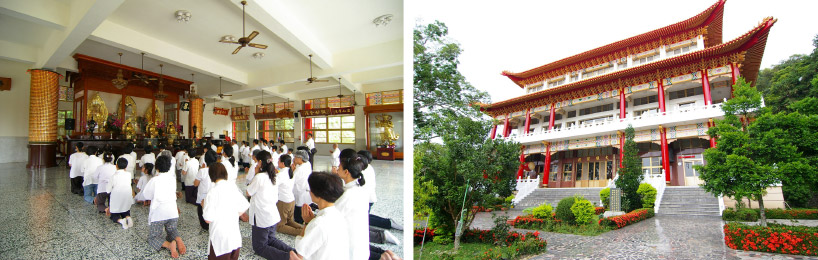

## 共修研學

### 小止觀導覽（五十八）第七章 善根發

*心爾、心筑整理*

法印六念四神足

五根力三門六度

神通變化諸度門

皆是止觀所成就

論文：

復次，行者因修止觀故，若得身心澄淨，或發無常、苦、空、無我、不淨、世間可厭、食不淨相、死離盡想、念佛、法、僧、戒、捨、天、念處、正勤、如意、根、力、覺、道、空、無相、無作、六度、諸波羅密、神通、變化等，一切法門發相，是中應廣分別。故經云：制心一處，無事不辦。

修學止觀，得到輕安相時，彼時身心澄清（無任何煩惱繫縛之相），此時修學的善根生起（宿世善根發相）。

四念住：

或生起觀察無常、苦、不淨、空、無我等心念，這是三法印的修學。法印就是正見的印可，到底學的是不是佛法，說的是不是佛法，合乎三法印即是佛法，所謂觀心無常，心被業所繫縛，所以常常改變，早上是一個樣，晚上是一個樣，沒有一定的；其次觀身不淨、觀受是苦，乃至世間可厭、食不淨相等的修學法，最後以觀無我，斷業的繫縛，窮盡了輪迴的五蘊。並看到有情眾生亦有輪迴的苦，在苦上建立慈悲心，欲拔其輪迴苦，予以成佛之樂，自己須以無我的正見去成佛，發成佛之心謂之菩提心，所以狹修四念處可以成就羅漢的果位，廣修四念處可以成就佛的果位。

六念：

然修學成就須有三寶加被，以作佛法的實修，故須修以六念。六念：念佛、法、僧、戒、捨、天。念佛是以佛為慈悲的導師，加被修學者，破除陰暗與邪惡；法是三世諸佛的佛母，念法能知解脫輪迴病苦的方法，法的威力喻如金剛杵，可以破除邪魔外道；僧是十方諸菩薩、善知識及修行的同法者，也是人間的福田，在和合道場當中的修行眾，就能有如同登地菩薩的威力；念戒能讓我們得到清淨的身心，依著戒法能於入世時對治世慾，修學得清淨心；念施就是捨，能普濟一切貧窮與缺乏安樂的有情；念天，可分為二種，念世俗天，能得諸天護佑，去除修學障礙，念勝義天（空性），能證阿羅漢與佛果。以上是六念的修學法。

三十七道品：

三十七道品分為七科，所謂：四念處、四正勤、四如意足、五根、五力、七覺支、八正道。

四念處：

念是能觀，處是所觀的境界，眾生依著五欲六塵生起顛倒執著，眾生以四念處除去四顛倒，並開菩提心與空性正見的見地。

四正勤：

開了見地，還要修學止觀以得受用，先累積止觀修學資糧，須在善法上造作，在惡法上對治，所以有四正勤（已生惡令速斷、未生惡令不生、未生善令速生、已生善令增長）的修學，得到修學的善根、善知識、教法，以及環境。

四如意足：有了資糧修學止觀，先修止（禪定的修學），即是四如意足（欲、勤、心、觀），如意就是滿足，依修學止觀而心意滿足。其中為修空性而生起強而有力的善法欲，此為欲如意足；依所修之法，特別是空性法，專注無間雜，此即勤如意足；心神足即是念如意足，依所修之法，能無忘失，如願滿足；觀如意足能令心思不馳散，於所修空性有專注觀察修的能力。

五根、五力：

接著在禪定當中串習空性的正見，得到煖位與頂位的成就，此為五根，五根能令空性的智慧有根，五力則是依根生出破惑的力用，乃忍位與世第一位的成就。

七菩提分：

修學止觀會遇到止的障礙以及觀的障礙，不論是現證根本位或者後得位的障礙，皆依七菩提分去破除，得到見道位與修道位的成就。七菩提分又稱七覺支，以念（內心懂得修學法）的方式，生起喜覺支，內心好樂止觀的功德、止觀修學能令空性慧生起得到解脫與成佛的功德。若修學能將心力拉起，破除沉沒、昏沉的障礙，並且依勇悍心的修習，能將無精打采，不願承擔的心破除。

接著選擇何種法來修學？舉例來說，修無常要認知何謂無常，無常法的行相與生起的覺受；如果要修空性，必須要認知何謂空性，何謂自相有，何謂自相無，所破為何，這就是擇法覺分。而掉舉、散亂，需要以念修學捨覺分，捨就是對治法，例如男女情慾太重，就必須要出定修不淨觀加以對治；定覺支是將心安住在目標上；行捨覺支即是生起輕安。以定、捨、行捨的念來除去掉舉，以喜、精進、擇法的念來除去沉、掉，最後進入八正道。

八正道：

八正道指的是正見、正思惟、正語、正業、正命、正精進、正念、正定。正見是現證空性的根本位，而後面七位是重緣世俗的後得位。正見能見真理，破諸邪見；正思惟是心無邪念；正語是語無虛妄；正業是知因果法，能助於清淨的善業；正命能依法乞食活命；正精進能修諸道無間無雜，對空性教法有勇悍相；正念能專心憶念善法；正定則是身心寂靜，證真空之理。

由七菩提分之抉擇，能於甚深的空義上得到現證，破二障；由八正道的修學，令人在根本位的正見以及後得位的正思惟至正定，都能如法。

三解脫門（空、無相、無作）：

三解脫門是登地或初果以上的證量，空指的是該法的自相空，無相是該法的因無自相，無願是該法所成的果無自相。通達無願解脫門不僅能了知三界快樂的果報，乃至四果、成佛的果報都是自相空。乃至六度、諸波羅蜜、神通、變化等一切法門發相，都是止觀門修學得力時所引發的善根而得。

這些善根發相，有內善根發相與外善根發相之分，有些是正確的，有些是錯誤的，必須要好好分別，才會使我們修行不至於走錯路。

若能生起正知見，則欲修學任何法門，欲辦任何事業，皆可成就，制心一處，無事不辦。（下期待續）

### 菩薩清淨的行持　華嚴經淨行品（二）

*編輯部整理*

清淨行持遠二障

智為先導無過失

願力能使行利眾

無漏廣大佛子行

此處先明甲一、乙二之丙一、總問三業離過成德，身口意三業，遠離一切過失，成就一切功德，修學成就的因為何？

經文：

「佛子，菩薩云何得無過失身語意業，云何得不害身語意業，云何得不可毀身語意業，云何得不可壞身語意業，云何得不退轉身語意業，云何得不可動身語意業，云何得殊勝身語意業，云何得清淨身語意業，云何得無染身語意業，云何得智為先導身語意業。」

常言道：有心非名為罪，無心非名為過；無心還分小過、大過。孔子曾說：加我數年，五、十以學易，可以無大過矣！可見學易能檢點自己不犯過失，孔子謙虛的說能令自己不犯大過。由於有情眾生觀察力薄弱，且深具我愛執，所以要找己過是難的。由易經中開發見地，知過失會帶來凶險，故常檢點己過。日用平常已數不盡的無心之過，何況其他有心之罪？

《了凡四訓》中記載，呂宰相告老還鄉，遇到鄉人喝醉酒檔住他，還辱罵宰相一頓，當時呂宰相不與他計較。可是那鄉人認為宰相他都敢冒犯了，還有什麼不敢；一年後犯了大案將被處斬，呂宰相後悔當時未將其小懲而大誡，而只在乎養自己的厚道，卻造成他目無法紀的過失。可見無心過失多，除非對法有勝解，否則難以檢點。

無過失的身語意，是下面云何得不害身語意業九條的總說，一總九別，下述此九條如何成就無過失身語意業，以下為佛之十種無過失的三業：

第一、云何得不害身語意業：

身語意不惱害別人，是無過失的第一步。例如：身體不做惱害人的動作，若垃圾亂丟等，破壞乾淨環境，妨礙了別人。懂得收斂時，嘴巴也不會惡口、妄語、兩舌、綺語，心也不會起不利人甚而妨礙他人的心念，即使無心之過亦不可有。

試問以什麼標準來反省自己？以慈悲心來反省自己，凡事有否為人著想，生命的意義是為了拔除別人的痛苦，予人安樂而活著？是否為了充實利益別人的能力而活著。不但如此，身語意業也不會因眾生惱害而起惡造作，且能廣結善緣。所謂仁者無敵，不僅不會惱害別人，且身口意也不會為人所惱害，不遭魍魎鬼魅的傷害，亦不遭橫死等。

第二、云何得不可毀身語意業：

如何不去毀他人。清涼大師說有慢心的人就會毀謗他人，總認為別人不如我。所以有慢心的人，有我慢、過慢、增上慢。就算對方比我強，也會說有什麼了不起，不能謙下心來跟他學，甚至對他毀謗。所以說你如果尊重他，你就不會毀謗他、傷害他。若將慢心去除，能得不可毀的身語意。易經上謙之一卦、六爻皆吉。謙者得到的都是擁護，不去毀傷他人，不會被人所毀傷，這是謙卦的功德。其他的卦象則無此殊勝，謙虛特別是受教的那一分，對他人看得重。

第三、云何得不可壞身語意業：

由於邪見會破壞身語意的善造作，將人引入地獄道受苦，且生起善心極難。有了正見的力量，三業不被破壞，有造作善業的力量。

第四、云何得不退轉身語意業：

此須不疑的正見，退轉的原因是當正見力不足，生起疑心，懷疑學儒、學佛的出路，則退轉。尤其沒有善友的助緣，正知見不堅固時，更易退轉。三十七道品中的五根，是不被破壞的道力，五力是能增上而不退轉，此即不疑的力量。不疑的正見生起要多多親近善友，否則都退轉。過去的風光無用，唯有不斷的學習才能不退轉。即使往生了也要持續不斷的學習。所以，云何得不退轉？清涼大師說就是破疑。當你的左鄰右舍東說西說時，久了你也會生出對正法的疑惑，以為出路不在正法的學習上。

第五、云何得不可動身語意業：

由於不疑而生起不會動搖的力量。小乘人在初果位斷三結時，大乘人在入見道位初地時，方破薩迦耶見、隨眠疑、戒禁取見（三結）。薩迦耶見是俱生執我的心，在證初果時可知所執的我了不可得，戒禁取見是非因計因，不是解脫的因，當成是解脫的因。隨眠疑是指疑惑不會再生，即使全世界只剩他學佛，也不會生起對佛教的疑惑。在證初（地）果位時，最重要的斷除，是這三種斷除。

第六、云何得殊勝身語意業：

由於不疑惑所以修行的道力轉強，連帶著身體行善的力量轉強了，口能說法的力量也轉強了，意樂造作善業的力量也殊勝，謂之殊勝身語意。

在行持正法中如果發生障礙時，很容易對佛法生起疑惑，潛藏對佛法疑惑的種子一大堆，此時不但不疑惑，且修學的心力更為增上，語業也以智慧為本質而成就辯才，身業則不疲不厭造作善法，謂之殊勝的身語意業。

第七、云何得清淨身語意業：

清涼國師明重在治貪，心常不清淨（擾動），是因貪心作崇，要除掉對世間貪愛的那一分，才能得清淨的身語意業。若能破除對三界的貪愛，三學的體性轉為清淨，此即清淨的身語意業。尤其以殊勝身語意來廣作善法，得很大福報時，是否還維持著清淨三業？

第八、云何得無染的身語意業：

反之即是無染的三業，亦即不被我愛所染著，且不受大惑所染。

第九、云何得智為先導身語意業：

以智慧攝持身、語、意業，此即破癡。何謂智？乃對因果的觀察，自體有無的觀察，各種利益有情的觀察；所以有各種無過失的三業，亦即欲得無過失的三業，是以智為先導。

說到智首菩薩請問文殊師利菩薩：要怎樣使自己身、口、意三業離過成德，並且修行能有所成就。應該重視什麼因呢？什麼條件呢？在甲一乙二的部分〜陳所疑之問，把這三業離過成德這十條稍作說明。

身口意三業要離過成德，德是一種能力，能成辦事功，且使自己遠離過失、煩惱。若只有遠離瞋煩惱、邪見煩惱、疑煩惱、貪煩惱、癡煩惱，菩薩所得的身口意三業清淨，阿羅漢亦有，阿羅漢沒有遠離煩惱，他怎麼出三界？既然成就的功德都一樣，菩薩還有什麼特殊功德？菩薩所得到的無過失身口意，是由於遠離煩惱使意業清淨，而身口清淨是由意業而來，這分阿羅漢有故，那菩薩與阿羅漢的差別在哪裡？

菩薩的三業清淨，是去除所知障的清淨，所知障是煩惱熏下去的習氣，也是身口的惡作所熏下去的習氣，這些習氣是不會生起我執的煩惱，亦即能將法顯現為實有，但內心不會生起我執無明，如同酒瓶酒精倒光了，雖無酒的殘存但還有酒味。這些我執無明與身口惡造作所熏下去的習氣，就算把煩惱障破除，這樣似煩惱的障礙還是會顯現。

如同羅漢的心中沒有煩惱，但由於習氣薰染，有的阿羅漢因為過去做猿猴，有此習氣，所以走路用跳的，有的阿羅漢慢心的習氣在，雖無慢心的煩惱，確有似慢心般的顯現，舉例來說，賓陵伽婆尊者對河神說：「小婢來！我要渡河。」由於河神往昔作過他無數次的卑僕，佛要他跟河神懺悔，他還是說：「小婢來，我向你懺悔。」如果尊者沒有過失，佛何以要他向河神懺悔？另外舍利弗帶瞋的習氣，如羅侯羅與舍利弗一起出外托缽，因為羅侯羅的輩分低，名聲小，大家只看到舍利弗，當然舍利弗的供養多，羅侯羅的少。羅侯羅因為吃不飽，就向佛陀說。佛陀就把舍利弗找來，說他吃了不淨食，話還未說清楚，舍利弗二話不說，運用神通將肚子裏的飯菜都吐出來，心想：我不吃總可以吧！此舍利弗瞋的習氣，由於過去做毒蛇的瞋習猶在，雖然已經證果成為尊者，雖無瞋心，然瞋習猶在，此仍然有過失，而非罪業。

如此可知習氣是安立在心不相應行法，不是安立在心所；安立在心所的無明，那就是煩惱障；今安立在心不相應行法，所以它只是有這種氣氛，沒有這個心，有過失卻沒有罪業。

所以一位君子，仍須用禮來節制習氣，就是希望能對治習氣。所以，孔子講君子之道的時候，也是要有禮樂的教化，不只是有仁心，還要訓練君子的威儀，那些有過失的形象，都能在禮樂的熏習下被對治。

是故菩薩在度眾生時，經過不斷的歷練，在生起空性智慧破所知障的時候，習氣就能對治。所以，三業離過成德是這種離過，否則菩薩的身語意三業清淨與阿羅漢無別，則無須讚歎大乘道。

接著說佛十八不共法，不共菩薩之處，配合三業離過成德。

一、身業無誤失：

迦葉尊者在緊那羅神彈唱時，跳起舞來，乃因多生以來做過歌伎，在場許多禪坐的尊者不知大師兄何以如此走作？佛知是彼習氣而非煩惱。身業無過失，就是破所知障，顯現身業無過失的那一分，然菩薩尚且做不到，唯有佛。

菩薩破不到所知障，二乘人更破不到。二乘人所顯現過失的那一分，佛不會深深的訶責，因為那不是他的能力範圍。例如牛呞尊者(憍梵波提尊者)，因為他吃東西，會出現如牛吃草般的哞叫聲音，這也是他過去生中口業的習氣所薰下，佛告訴他不要出去托缽，怕他遭人毀謗、使人造罪。所以真正顯現出身業無誤失的那一分，唯佛有故。

二、無卒暴音：

指口無失，是指說話該高音就高音，該低音就低音，該強音就強音，該弱音就弱音，該如何就如何，不會有突如其來過去習氣的顯現，而且恰如其分的符合對方的需求，叫無卒暴音。

三、無種種想：

指意無失，度化眾生冤親等沒有偏失。度化眾生完全看機緣，沒有眼前顯現可恨、可愛的相。

四、無不定心：

是指不會從空性上出定，叫那伽定。經上說：那伽常在定，無有不定時，所以佛沒有出定相，在入定中又可以做世間事，這當然是不共菩薩與阿羅漢的。

五、無忘失念：

是指度眾生該用什麼法，佛可以立刻生起，即使那個法，佛偶爾用之。例如維摩詰居士去度賭棍的時候，菩薩是不賭博的，可是一旦示現是沒人可以贏他的。這是指無忘失、不共的證量。

六、無不擇捨：

善於抉擇取捨諸法，抉擇的那一分是入世，捨掉自相的那一分是出世，這是佛不共的境界。

七、欲無退：

指度眾生的心意是不退的。

八、念無退：

緣念何法能利樂有情，不論遇到什麼障難，這種能力是不會退失，能任運生起度眾的善巧方便，此能力不與菩薩共。

九、精進無退：

是就勇悍心的那一分說，雖然佛以佛眼觀眾生極為難度，即便眾生墮入地獄，須長劫酬償惡業，佛入地獄去度眾生的那一分勇悍心是不變的，不會生起絲毫退倦的心，這是佛與菩薩不共的地方。

十、定無減：

生起不論是世間定或出世間定，生起各種的三昧時，可以運用各種的三昧，生起世間各種的神通。

十一、 智慧無減：

就能破煩惱障跟所知障的那一分，佛的智慧絲毫無減。

十二、 解脫無減：

就破惡障而得到解脫的那一分也無減。這也是與菩薩不共的。

十三、身業智為先導；十四、語業智為先導；十五、意業智為先導：

以智為先導，同時生起世俗與勝義的那一分的認知作引導，才有身的造作、語的造作、意的造作，同時生起世間的認知，同時明白它的無自相。

在《觀無量壽經》中，韋提希夫人得度的因緣到了，頻婆娑羅王受佛光灌頂而證三果，這時佛的微笑別具意義，身業是被智慧所引導，連那個笑都是，佛在舉手投足，連笑都是有含意的。

十六、知過去：

此是宿命通，知自己及眾生的過去，並且以現量的方式生起。所以，佛在講起往事的時候，是以現量的方式呈現，不像我們是以比量或非量的方式呈現。所以有人問佛，假如我布施時，會得到什麼果報，佛能以這一分而說出未來種種的果報，前提是須懂得珍惜當前的因緣，不要被瞋恨與邪見煩惱所破壞。

十七、知未來：

是天眼通，不但知自己的未來，也知眾生的未來，《法華經》中佛授記某人幾大劫以後會成佛，那就是知未來。而且把他的國土說的很清楚，以現量方式呈現，這與菩薩是不共的。

十八、知現在：

是能通達現在，任運破煩惱障與所知障，也通達有情現在身心狀態的這一分，佛是與菩薩不共的。

以上是三業離過成德，配上無過失的身語意業、不害的身語意業、不可壞身語意業、不退轉身語意業、不可動身語意業、殊勝身語意業、清淨身語意業、無染身語意業、智為先導身語意業，這就是智首菩薩問如何得到佛的十八不共法，南亭老和尚的表解。清涼國師說：無過失是意業清淨，身口自然清淨，遠離貪、慢、愛、瞋、邪見等等，更重要的是不但要遠離煩惱障，也要遠離所知障，才是真正的身口意無過失。（下期待續）

## 蓮池海會

### 陳李阿柳老居士往生見聞記

*智高整理*

賢妻良母善持家

病苦折磨難信佛

持續善法引善根

念佛成就生西緣

陳李阿柳老居士，宜蘭壯圍過嶺人，生於民國十二年。十歲時即送至當時宜蘭的望族陳家當童養媳，因其聰穎乖巧，很受家族疼愛，特別是廚藝及女紅更為家人所稱讚。後因陳家家道中落，老居士更是含辛茹苦的將其三子三女拉拔長大，甚至在日據時期，日本政府派其夫婿至南洋當軍伕，老居士更是一人獨立扶養子女從不喊苦，老居士的勤儉刻苦可見一斑。

老居士對於善法常有隨喜之心，因其二女美雲居士，常年於佛法中發心，故老居士對於佛法亦有了好感。雖然如此，但對於佛法，如念佛往生等概念卻未有深信。這使美雲居士感到擔憂。

民國九十四年元宵節當天，一向健朗的老居士突然中風，子女們除了盡心照料外，美雲居士更是希望趕快能讓八十多歲的老母親念佛，對於淨土產生信心。中風的前幾年老居士雖不能言，意識卻很清楚，但每每勸其念佛，說明往生淨土的概念，從其眼神可以看出老居士其實並不很接受，甚至有時還將頭撇至一邊。漸漸的老居士的病況越來越嚴重，原本見到孫子們去探望她還有笑容，慢慢的這笑容也沒有了，意識也越來越不清楚了，取而代之的是身上的皮膚積水潰爛，越來越嚴重，也越來越不容易痊癒，晚期為了要換身上的一次藥，甚至要動用護士三、四人，花費二小時才能完成。

這樣的病況，使子女們越來越憂心，也很不捨老母親的病苦，但更令美雲居士憂心的是，在母親健朗之時對佛法即不深信，何況母親此時的病況呢？在這樣內因如此不足的情況下，如何才能使母親往生因緣成熟呢？雖然老居士中風期間，老師長期不論是在共修或法會上皆會回向給老居士，並也曾為老居士舉辦放生，美雲居士私下也常帶著後來也親近佛法的妹妹及一些平時有接觸佛法的親友及晚輩一同舉辦放生，亦誦經、念佛回向給老居士，希望能破除老居士往生的障礙，但一直不見有明顯的因緣改變。

但佛菩薩畢竟不負有心人，在老居士往生的前幾天開始，竟似有一連串的順緣出現。往生前三、四天，有蓮友在了解老居士的病況後勸其常年隨侍在側的三女秋雲，何不將母親送往安寧病房或頭等病房，安排念佛呢？未料往生前一天，即有頭等病房空出，於是子女速將母親移至頭等病房，並將房內打掃乾淨，設立簡易佛堂。

亦在同一天，舉辦放生，並誦地藏經回向給老居士。往生當天，十月二十九日早上，子女在簡易介紹極樂世界的殊勝及誦一部彌陀經後，即開始排班念佛，直至傍晚六點左右，見老居士有往生徵兆，即送回老家開始助念，一直到了晚上十點左右，一位老居士三女秋雲的好友，竟撥電話給秋雲，詢問其近況，為何久未聯絡，秋雲於是將老居士即將往生的狀況告知其友，其友之子是位長年在印度修學佛法的出家師父，正好回國省親，於是其友即將師父帶至家中一同為老居士助念，晚上十一點左右老居士突然眼睛睜開巡視四周後即在師父及親人的助念下安然往生。

晚上子女們自行排班念佛助念，即使從未接觸佛法的子孫們，在這樣的氛圍下，也很認真的為其奶奶念佛。助念十二小時後，在老師帶領大迴向下掀開陀羅尼經被，老居士面容安詳，嘴巴自然合起，全身柔軟。老居士的弟弟，在瞻仰老居士的遺容後，還不禁喃喃自語道：「身體怎會如此柔軟！」

從老居士的往生可以讓我們知道，往生內因雖很重要，但當內因不足時，外緣諸如子女的孝心、對佛菩薩的信心，家庭溝通的善巧，就更為重要了。試想若無子女的孝心，如何能護持老居士七、八年而不倦怠呢？若無對佛菩薩願力的信心，如何能持續行善法等到老居士往生前的順緣呢？若無家庭溝通的善巧，如何使平時未接觸佛法的子女同意用助念的方法送母親最後一程呢？這或許是老居士示現往生對我們的開示吧！

### 唐中華老居士往生見聞記

*編輯部整理*

一生慷慨能隨緣

有幸師友善引導

生病善根大引發

正知正念生西方

唐中華老居士，四川省長壽縣但渡鄉人，生於民國十六年九月九日。父母親務農，兄弟共三人，大哥服務於軍情局，小弟在家鄉幫忙耕種。民國三十八年時局變遷，僅老居士一人隨政府軍來臺灣，當時年僅二十二歲，生得一表人才，體力強健，並在二十七歲時與高雄籍許素珠女士結為夫妻。

老居士取名為中華，乃因大陸內戰頻仍，父親慨然命此名，期以報效國家。老居士父親也是一位慷慨好義之士，有名望於一鄉，老居士從小要幫忙農事，且在家庭風氣影響下，也養成了豪爽，酒量大、嗜吃辣椒，有幹勁。由於從小身體底子好，在年老時就算生病，也很快就痊癒，與現今年輕人喜歡沒事無病呻吟的形象大不相同。

老居士來台以後，曾經在東勢、高雄服務，亦曾調至澎湖七美鄉擔任分駐所所長，後回台南擔任刑事組長十年，謹守分寸，且對朋友疏財仗義，所以每到月中就阮囊羞澀，全賴夫人居中調度，或在家中家庭代工，或到藥廠作業，或跟互助會，才能度過難關。至於對三個兒子的教育，老居士採取放任的態度，在功課上沒有任何要求，然三個兒子在求學期間都願努力讀書，在學期間成績還算優異，長子軍校畢業，服務於空軍，曾任主計主任等職，次子曾任市立高中人事主任，三子曾任文化機構文物分析工作，現皆已退休。

老居士早年常常與幾位從大陸來台的好友聚會，天南地北的聊天，日後有了學佛的因緣，在知見改變下，生活習慣開始改變，請客應酬之事，漸漸減少。

三個兒子成家立業是老居士一生最高興的事情之一，特別值得一提的是老居士學佛的因緣，在民國七十七年的十月十日，三子的訂婚喜宴上，親家招待台北隨行的蓮友至鞍馬山蔣公行館，當天晚上大眾共修到九點，蓮社黃主任並特別開示助念以及往生的案例一直到深夜兩點，老居士絲毫不覺掃興，並高興的聽完這些開示，且對蓮友產生很好的觀感，種下了學佛的因緣。

隔年四月三子於臺中蓮社舉行佛化婚禮，證婚人為現今蓮社導師徐自民老師，這也是老師第一次為佛化婚禮證婚人。老居士對佛化婚禮儀式極為讚賞，在婚禮之後，招待老師、蓮友約四十人，至日月潭遊覽，沿路聆聽老師開示、旅遊欣賞風景、吟詩，並知喜宴所得用作招待極為高興，可見其心量之大。而且老居士對自公老師的風範極為仰慕，也對蓮友們和睦相處種下很好的印象。因此，老居士回台南後於客廳自設大佛堂，且整日佛音機宣流佛號，三子回家後亦提議全家共作晚課。

三個兒子婚後都育有子女，共計二男四女。可惜的是長媳服務於空軍作戰司令部，工作過度勞累，得到敗血病，俗稱血癌，病發一週後於農曆年初三驟然往生，享年不過三十餘。想不到在過世的那一天，淨廬蓮友們無畏於寒冬，於三總的停屍間助念十二小時，老居士不但驚覺無常，也對蓮友無私的付出感動不已，助念之後全身柔軟，告別式時長媳從冰庫運出猶面容安詳、身體柔軟如前，且告別式是佛教莊嚴的儀式，老居士雖自認是鐵漢，然在這樣令人感動的場合也淚流滿面。

之後隨兒子的因緣至中國大陸、緬甸、馬來西亞、泰國、斯里蘭卡與寮國等地齋僧、供養、放生，團體所辦國內外與善法結合的出遊幾乎全程參與，除了與大眾現場做善法的體會，並在遊覽車上聆聽蓮友心得交流，因不斷宣講佛法的要義、助念的觀念與往生的案例，雖是寓教於樂，然行程緊湊，備嚐辛苦，與蓮友們一同在愉快的心情下完成許多艱苦的法行，如在緬甸時，有時五點便需起床前往大寺院齋僧，並有諸多善法要接著作，例如孤兒院的救濟，其他道場的參訪，因趕路之故，有時到晚上十二點才吃得到晚餐，然大家同甘苦、共患難，這種和樂不畏苦的氣氛深深感染了老居士，想不到竟然能用快樂的心情過苦日子。

特別值得一提的是民國八十八年九二一大地震時，災區所有訊息中斷，高齡七十三歲的老居士一再堅持要至東勢探望災區的蓮友，火車到了豐原，老居士向莊家豐居士借了摩托車載著兒子由豐原至東勢，看到滿目瘡痍，蓮友流落溪邊，甚為感慨！慷慨捐輸三個月的退休所得，協助蓮友在當地的救災工作。

因長媳早逝，家中兩位孫女尚年幼，長子在軍中又任重要軍職，需要有人幫忙撫養，故與夫人北上住長子景美家中照顧幼孫十二年，由於認為孫女沒有母親，是天下的不幸，所以對於孫女的愛惜甚於一般祖父輩，或許在其他人眼中是過度的溺愛。之後孫女長大，房間不敷使用，老居士毅然返回台南老家，至此怡情養性，以養花、養魚、老友聊天為情趣。不料在去年年底，感冒嚴重，長子續弦王淑姣女士回南部探望時，發覺情況不妙，一再相勸方進南部某大醫院，遺憾的是一再診斷均認為有肺積水、腹膜炎等而發出病危通知，有幸學佛的兒子知道醫院的治療，容易破壞病人的正念，且未必能除身體之病，經蓮友的幫忙下轉至臺北國泰醫院，發現南部該大醫院的診斷情況有誇大之虞，經過幾日調理之後出院，自此住在三子家中。

今年過年前中風之後，喪失語言功能與行走能力，送至國泰醫院治療，全家並在國泰醫院過年，難料醫院也無任何改進措施，只以點滴注射為主，後經正確研判，轉院作中醫調理，在針灸、復健的治療後，能恢復八成體力與語言功能，從此善根又經一番增上，對於文化學會的課程，更為積極的參加，舉凡週一常禮舉要課程、週三上午大學班、週三晚間論語課程、週四三代共修念佛、研討淨行品、遺教經、十疑論，週五晚間金剛經、法華經，週六晚間共修念佛、助念生西講座，乃至參加大專佛學講座—普賢行願品，兒童生活體驗營，結夏安居寺院齋僧，各類懺法，這些與大眾一起的上課、研討、念佛，以及種種善法的造作，只要體力許可，皆是主動全程參與，是老人家們參加共修會次數最多的一位。

之後二度中風，醫院認為進食困難，需以鼻胃管餵食，在緊急時也會需要以氣切處理，有幸蒙蓮友幫忙，避開了這些障礙，在道場內接受中醫治療，身體情況大為好轉，又有蓮友的正知提醒，正念護持。

臨終前幾天，老居士決志斷食，之後在兒孫的陪伴與鼓勵下，願意求生淨土，修學菩薩道成就佛果，利樂有情，並歡喜在他生後廣做功德，諸如齋僧、供養、護生、護持正法等。

最後於迴光反照時，蓮友以強力的佛號護持，眼睛炯炯有神，在兩眼安詳垂目，張口念佛中斷氣，助念二十四小時後，不但含笑且全身柔軟，圓滿一生。

老居士由於在道場往生，來的蓮友方便通知，再加上跟蓮友結的緣多，得到眾多蓮友的助念，不但自己往生得到順緣，大眾也以二十四小時不斷的佛號莊嚴道場，並且讓大眾生起共住的殊勝覺受。老居士如此往生的示現，是共住因緣最殊勝的緣起。

綜觀老居士的一生，因為喜歡跟蓮友的相處，是老蓮友聆聽佛法次數最多的一位，透過這些勝緣相信輪迴之事，也相信淨土法門，尤其在往生前大量的聞法與聽佛號，更在外緣上得到蓮友的鼓勵、護持與正確的引導，家人在佛道上的發心以及臨終時的善巧開導安慰，並得蓮友強而有力的助念，終於不負眾望以往生的瑞相來回報大眾對他的護持。

總之修行要趁早，修行雖需經由內化而得利益，但也不可以忽視外緣，若本身或家人能懂得結上真正的善緣，在生死關頭時，必能發揮不可思議的影響力，往生成就時是一生善法的圓滿，是真正遠離惡業與輪迴，老居士往生的示現，可以生起這樣的省思。

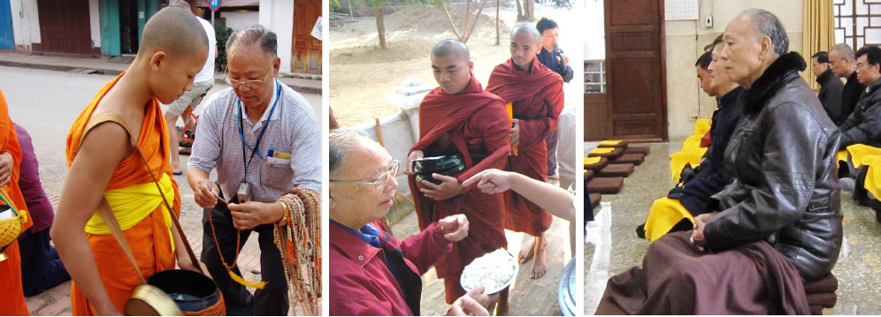

## 專題研學

### 聖者的祕密～大佛頂首楞嚴經二十五圓通暨七處徵心探源　二十五圓通暨七處徵心簡介　（二十七）觀音廣陳

時哉

由聞思修證圓通

尋聲救苦靡不周

無分別中善分別

究竟入世真出世

子二、觀音廣陳

觀音菩薩證得耳根圓通，三十二應化身、十四無畏、四不思議，皆是現證空性破所知障後證得圓通後，在世俗上的運用，屬於果地上的成就。

觀音菩薩受佛加被，以耳根圓通做為他修學方便，以阿難尊者為當機眾，因娑婆世界眾生耳根最利，依此作為修學教法方便。
或
**問：** 耳根與耳識有何分別？根塵識三者互相觀待，耳識藉著耳根將聲音（聲塵）引起，如眼識藉著顯微鏡（眼根）將境界納受過來，令眼識去分別。耳根是由耳識與第六識練出來的，如千里耳，以耳根納受千里之外的聲音，由耳識分別，如眼睛由顯微鏡去取境（將草履蟲攝取過來），由眼識去分別，眼根是色法非扶塵根，而是神經系統，耳根亦如是。如常聽音樂者，可聽出極微細高低音分別，必須要常常練，善將聲音攝受過來做分別，根雖是色法，但與心法相互觀待。

故有人雖投生為人，眼珠與你我同，但是淨色根不同而有陰陽眼或天眼等，那就是眼根與心識相互觀待，有那種心思觀待他的眼根，下一生就生起這樣的能力，外表上眼根都一樣，但眼力不同，有此種力量者，對境界有敏感力。觀音菩薩以心識去練耳根，令耳根善取，以水聲為修學，水聲聽得清清楚楚，時而澎湃時而低沉，聽出其中變化，學音樂者可依此來學，這樣的根力是宿世修持禪定而來。

丑一、作禮陳白

經文：

爾時觀世音菩薩即從座起，頂禮佛足，而白佛言。

此乃規矩、禮儀、請法。

丑二、陳白之言分三

寅一、本師傳受反聞分三

卯一、古佛同名

經文：

世尊，憶念我昔無數恆河沙劫，於時有佛出現於世，名觀世音。

往昔恆河沙劫與他同名號的老師學習。與古佛同名觀世音。
阿彌陀佛亦有同名同號三十六萬億九千五百尊。有人
**問：** 吾人念阿彌陀佛名號，到底會去哪一尊阿彌陀佛的淨土？阿彌陀佛有他心通，知道我們念的是發四十八願接引眾生往生的阿彌陀佛。

卯二、從佛發心

經文：

我於彼佛發菩提心。

在老師座下發菩提心，發菩提心才是成立大乘（成佛）的因，菩提心在大悲心基礎上，說我必須成佛，才可安立為菩提心。

故要成為解脫者或是輪迴六道，都是自己想得的，與發菩提心道理一樣。善財童子每見一位善知識都說他是已發阿耨多羅三藐三菩提心的行者，阿耨多羅三藐三菩提心即是菩提心（想成佛的心），其他大悲心、出離心皆非佛因。

卯三、秉受法門

經文：

彼佛教我從聞思修，入三摩地。

彼觀音佛教導觀音菩薩由聞所成慧、思所成慧、修所成慧入三摩地，此時三摩地是修所成慧的階段，以止觀為修的內容，觀在止的成就上修觀，觀力成就是三摩地。由止所成三摩地或修觀所成三摩地，二者不同，要觀力所成的三摩地才能解脫。

入三摩地的修法是從聞思修，聞即由教理上得正解，聽了而懂教理才能成立聞。如周利盤特鼻根圓通，經文中有云：我缺誦持無多聞性。在僧團中每天要誦持、講經、說法，不可能沒有誦持、沒有多聞，所以不可以從經文的表面去認知，愚癡並非少聞而是聞了等於沒聞。故以前講經說法，法師大座講完，還得要講小座（分組複講），就是為了要成立聞。思是進一步以比量方式推理，確立所聞得勝解（殊勝見解）。修是依止觀門，串習而得勝解。

修止入之三摩地，可破煩惱現行；修觀入之三摩地，可破煩惱種（習氣）。但不論修止或修觀，所入三摩地時都有輕安現起。故輕安現起或是由修止或是由修觀而來，但由下文可知，觀音菩薩是由觀門而入三摩地。

卯一、初解三結先得入空分三

辰一、脫動塵

經文：

初於聞中，入流亡所。

觀音菩薩以耳根為所緣，當聲音在耳識中清楚顯現時，此乃耳根能緣的功能令其顯現，耳根的功能能否自己生？不會，須經由對方講話（聲塵），透過能緣的耳根與耳識，並依第六識（五俱意識）同時生起，方能了知聲塵境界。若第六識專注他事而想，則雖有聲塵，亦是聽之者藐藐，有聽等於沒聽。可見成立為聲，必須有這些因緣和合而成。

心流如水，流入亡所（對象），心的生起一定要有對象，毘舍王佛的傳法偈：心本無生因境有。對境才能生心，對象沒有了叫做亡所，此處有二種說法：一、心流流入空性。二、出流（緣相）、入流（緣性），以法性（空性）為所緣，法相不見了（什麼都沒看見），故反觀自照（心以法性為所緣）。

不能以緣心或外境來言反觀自照，念阿彌陀佛名號便是向外攀緣。念佛是以妄止妄，以佛號的名言生起止息妄念，阿彌陀佛名號生起處與阿彌陀佛實際是不一樣的，世俗生起與空性面相不同，阿彌陀佛名號觀待對阿彌陀佛名言通達，才會生起對阿彌陀佛名號的執持，否則不信佛者，亦能成立對名號的執持，故顯現的與實際不同稱為緣起，顯現與實際同稱為空性。一切法的顯現與實際不同，故「凡所有相皆是虛妄」，顯現與實際同則是「若見諸相非相，即見如來」。

入流：反觀自照，以法性為所緣；亡所：看不到法相。

耳根若不須觀待聲塵就有，則不必聲塵，若心識不生，則聲塵不生，聲塵不生則耳根不生，耳根不生則耳識不生，此皆相互觀待，連一粒微塵自體性亦無。知道萬法之生起來無所來，去無所去。

辰二、脫動靜

經文：

所入既寂，動靜二相，了然不生。

所入境界自相了不可得，謂之所入既寂。菩薩修學耳根圓通，以流水聲塵為所緣，聲音清清楚楚的顯現，此乃第一步修學，盡虛空遍法界都是流水聲；其次觀潺潺流水聲自相成不成立，若觀察證得無耳根、耳識及第六識自相之生起，才可成立水聲自相不可得。耳根、聲音、耳識等相互觀待，同時生起，自體不生。

聲音不能自己成聲，一切法似自體般的生起，卻不堪分析，無一粒微塵自相可得，如同渴鹿陽焰、海市蜃樓、水中月，觀力強者對於世間，能看到無實質的真實相。

當分析真實性空，十八界全空時，六道不可得，謂之出離輪迴。

或問因果安立在何處？就中觀宗而言，即在名言我上安立，名言我即是第六識對著五蘊去生起一個我的概念，因果業力由此而安立，安立我的名言令身心去做我事，手要去拿杯、腳要走路等等……。

所入既寂：所入者包含聲塵與耳根。動靜二相，或動相如水聲、或耳根生起動相。靜比喻未聽見任何聲音，或耳根根本未生。動相不生好理解，靜相為何不生？靜觀待動而生，動相若不生則靜相亦無。

辰三、脫聞根

經文：

如是漸增，聞所聞盡。

如是漸增指的是修學能力越來越強，聞所聞盡指能聞、所聞了不可得。能聞者是耳根，所聞者是聲塵，二者互相觀待，自體性了不可得，如禮佛偈：能禮所禮性空寂。慈悲亦如是，所謂緣苦眾生是慈悲，那麼緣苦是否稱慈悲？不一定，朱門酒肉臭，政府官員難道不知民間疾苦嗎？知！但不一定會生起慈悲心；再如住垃圾堆者是否會生起不淨觀？不一定！阿公阿嬤也知道人生如夢，但與生起無常觀是兩回事。他必須成為所憐憫的對象，能憐憫的心才可生。慈悲自相空，修不淨觀者在不淨中生起出離心，如此才可成立為不淨觀。

所憐憫的對象要如何成立？眾生恩德如母親，形象如唯一愛子，其苦生起才可成為所憐憫的對象。而慈悲也必須安立在解脫輪迴上，慈悲與愛不同。大慈大悲是不捨一人的慈悲，慈悲無量是對著無量眾生慈悲，故在八十八佛中稱讚佛：大慈大悲憫眾生，大喜大捨濟含識，相好光明無等倫，眾等一心皈命禮。對於未生起大悲心量者只能說慈悲喜捨無量，有出離心者，生起的慈悲心才是真正慈悲心，因為知道解脫是最快樂的，對著親人般的有情，生起動機上為令親人得解脫，此方是真正的慈悲心。此時即使在世俗上只是奉養父母或者養育小孩，給他們穿衣吃飯等，比恆河沙人所做功德總和還要多，此是慈悲心與大悲心的功德。

在勝義上觀察無一法可得，在世俗上則全部顯現。菩薩度眾生，必須在世俗上忍受痛苦，或陪伴成長，或代眾生苦等，才有度化的機緣。痛苦是有的，痛苦如水月般生起時，仍然會受到痛苦；世俗所顯現的苦，可以以母親與孩子一同成長來比喻，母親在孩子有苦時不會獨自享樂，如同孩子數學不會，母親努力自學，並帶著成長，謂之代苦。並非將孩子的苦拿來受，此在業上說不通，乃是共同承擔概念，母親看到孩子苦，心比孩子更苦，如同菩薩看到眾生墮落，內心比眾生更苦。

卯二、次解二結成法解脫

辰一、脫覺觀

經文：

盡聞不住，覺所覺空。

聞到最後是無相可住，聲塵自相住不到，耳根相住不到。能覺（耳根）所覺（聲塵）自體皆無。

辰二、脫重空

經文：

空覺極圓，空所空滅。

對空的覺悟是圓滿現證，而且所空的法亦無自體性可得，唯識派則認為所空的法是有自相（圓成實），中觀宗則認為圓成實亦自體了不可得（空空）。佛講到唯識義理，萬法皆為心識所生起，應是對某類眾生而言，這類眾生對世俗五欲六塵無法捨去愛執，故言萬法只是心識影相，如此安立唯識宗義，萬法如夢般，事過境遷後，當時種種只能以回憶的方式來顯現，以外境不成立，而破人我、法我的貪愛，安立唯識宗義。

能空的心識與所空的境界皆自體了不可得，能空與所空不過互相觀待，證空性心識亦是觀待空性才可生，非有一個證空性自相的心識。

卯三、後解一結俱空不生

經文：

生滅既滅，寂滅現前。

生滅也了不可得。滅指空性，不是有一個空性在那裡自己成立，也不是有一個境界叫什麼都沒有，諸法自體了不可得，空靈靈的義境顯現於現證空性心識之前。故生也滅、滅也滅。此種空性義境現前，才是真正空性慧的成就。（下期待續）

## 孔學一隅

### 孔子聖蹟圖淺說（一）

時哉

積善之家有餘慶

生得聖人世綿延

萬世太平在知見

為政興教是發端

道統由他傳

後人最推尊

欲知中國魂

孔子聖蹟圖

前言

孔子，是我國古代著名的思想家，集中國文化之大成；是偉大的政治家，提出大同世界的最高理想；更是歷代最傑出的教育家，開創平民教育之先，培養人才、傳承聖道。他是儒家學派的創始人，他所創立的儒家思想，影響古今中外，至為深遠。

為了表達對孔子的崇敬，自漢代起，人們不斷塑造孔子的形象，或圖之於壁，或刻之於石，或鏤之於木，或畫之於紙帛，到明代中期，出現了反映孔子生平事蹟的聖蹟圖，它是我國最古老的連環圖畫，是一部孔子形象的編年史，然而其中也穿插虛構的神話。

因此奉祀官府遷臺之後，奉祀官孔德成先生與其師雪廬老人，共同將孔子一生的重要事蹟，從六、七十個歷代保存的檔案中，經過詳實考據，剔除穿鑿附會或無稽傳說部分，嚴正選出三十二則史跡可考的文獻，禮請奉祀官府內同仁，也是雪廬老人的高足、名國畫家江逸子先生，忠實的逐文配圖，歷經兩年，於一九七０年初完竣，名曰：「孔子聖跡圖」，並經奉祀官孔上公先生題額審定，是中國從古至今，歷代描繪孔子一生事蹟中，最為信實的一部巨作，具有無上的歷史意義與價值。

大成至聖先師孔子

一般稱孔子為大成至聖先師，所謂「大成」是表彰他對文化典籍收集整理、刪定註解而成一完全的學說，成為中華文化的精華，孟子：「孔子之謂集大成」。「至聖」是聖人中的聖人，是聖人中成就最高者，表徵他在自行化他上圓滿的成就。「先師」是最先的老師，讚歎他是中國平民教育的開啟者，在他之前，受教育是貴族的特權，而孔子首倡有教無類的平民教育，使受教的學生不分貴賤貧富，只要能行束帶修飾之禮以上者，無不傾心授教，以期栽培弟子成德成材。

畫中的孔子端坐在席上，安定的講授聖賢學問，既「申申如也」又「夭夭如也」，是正直又和藹的氣象。寬大的額頭表徵他氣度恢弘，彎月眉表徵他是一位有仁心的君子，慈祥深邃的眼神，表徵深不可測的智慧。長眉代表長壽，有充分的時間充實自己利益別人，濃眉代表有主見，不隨世俗境界所轉，耳垂代表有福，能為政與辦教化造福百姓，外露的門牙，代表他的忠厚老實，高聳的額頭、顴骨、鼻梁和外翹的下巴，是五岳朝天的尊貴帝王相。還有似皋陶的頸、子產的肩，代表有承擔的能耐。而似禹的腰，代表有堅忍不拔的意志力，如大禹治水三過其門而不入，他一生行道也是不畏艱難，遇障不退。

孔子雖有大氣象的外貌，然最殊勝的表象正表達者在此安定講學的形像中，因其最能彰顯教育乃孔子一生事業的投注處。

尼山致禱

周靈王二十年，魯襄公二十一年，孔子的父親叔梁紇，擔任陬邑大夫，娶了顏襄的第三個女兒顏徵在，婚後想求子，所以顏徵在帶著侍女前往尼丘山祝禱，第二年就生了孔子。

顏徵在是顏襄的第三個女兒，本人很有內涵。叔梁紇娶了第一個夫人，生了孟皮，但因為跛足不能傳家。娶了第二個太太，生了九個女兒，以至不得不再娶。

當叔梁紇要娶妻求於顏襄時，他的大女兒和二女兒都不願意嫁給老頭兒，而為何三女兒願意呢？因為她知道孔家由商朝微子開始到孔子的父親為止，出了好幾代的聖賢，其中有讓位之德，也有執政的大夫，都能心存邦國，利益後世。累積厚德的孔家定能貴顯。於是顏徵在聽從父親的話，願意嫁給年高德劭的叔梁紇。

到尼丘山祝禱後的第二年就生了孔子。此處佛家與儒家對胎教慎始的做法相同，先禮拜、供養佛菩薩來求貴子，希望有德有才的人能來光耀門楣，傳宗接代。這幅圖告訴我們中國的胎教由此而來。現代人已經不講究這些了。遵循古代的典範，對家庭有很大的幫助。把生育當成慎重的事，就有助於之後的教育。

所以，慎始是很重要的，從婚禮開始，求子、受孕、胎教、出生，乃至給予好的教育環境，請好的老師，讓他一路成長。請勿小看此圖所帶來的人生涵義。

古代不論大官宦人家或是小官宦人家，家中照例都有侍女。叔梁紇雖然只是個官職小的陬邑大夫，但畢竟還是官宦人家，想當然還是會有侍女陪伴夫人來祭拜尼丘山，祝禱生子。此處是在春天的季節祝禱求子。

圖中是春天梅花開的景象，將尼丘山經營成仙境的圖。

俎豆禮容

俎豆禮容這幅圖是周靈王二十三年，魯襄公二十四年，西元前五四九年，當孔子七、八歲的時候。

圖中顯示孔子從小即具領導人的特質，將一群小朋友帶得很有氣象，有模有樣地行祭祀典禮。孔子獻爵，背後披以玉環，席子表徵祭壇，壇上有豆，是盛裝穀物的禮器。俎，是肉架，此處以禮盒代替，內盛有花、果、食物。童子敲磬表鳴鐘，搖博浪鼓表擊鼓，表徵祭祀以樂器奏樂。後有四位孩童打躬作揖，代表陪祭者。另有兩位孩童在旁學習拱手敬禮的禮節，孩子們梳著各種髮型，是作者參考古畫嬰戲圖而有的創作。

圖中的柳樹與欄杆等，神韻取自古畫<學士聚會圖>之場景。北方柳樹參天，樹幹渾厚，此與南方的樹幹纖細，各有不同。

一幅圖的經營，有主畫面之外，其他的畫面也不含糊。看畫的人要看大體的氣象，也要看細部的交代。兩株交叉的柳樹使畫作更具神韻，其中有實有虛，有主有從。柳樹欄杆等是襯景，孩子們在柳樹行祭祀禮方是主景。

古代祭祀主祭者迎神時要獻爵、獻供品等，完成祭祀儀式之後以水灑地送神。

小朋友們從小能遊戲於宗廟天地的祭祀之禮，是極不平凡的氣象，祭祀是人生大事，這其中有應對進退、舉手投足，依禮樂而行的訓練。並有祝禱之詞，生起報本還恩，慎終追遠的心念。孔子年幼時就有此等愛好與領導的能力，自有其不凡之處。也是未來弘揚傳承禮樂修身治國之徵兆。禮樂完備於周代，其大者承天道以治國平天下，其小者是名物制度，這些傳承都在孔子身上具足。

此圖場景是開春之時，古人講究時令，以春祭做為一年的開始，以秋祭做為一年收成的感恩。現今人什麼都不信，只講究物質的追求，快樂時起貪心，痛苦時起瞋心，糊塗過一生，不知祭祀意義與廣大利益，此圖可提供我們省思。（下期待續）

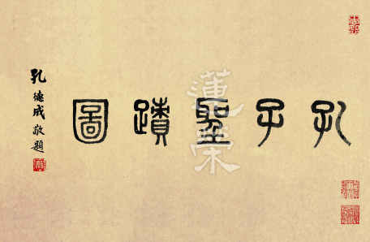

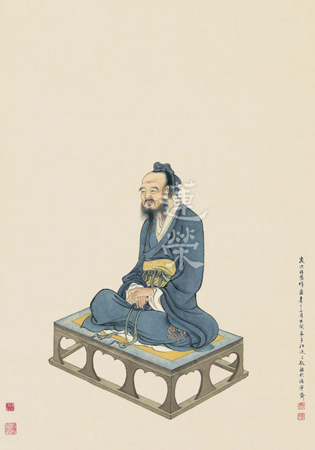

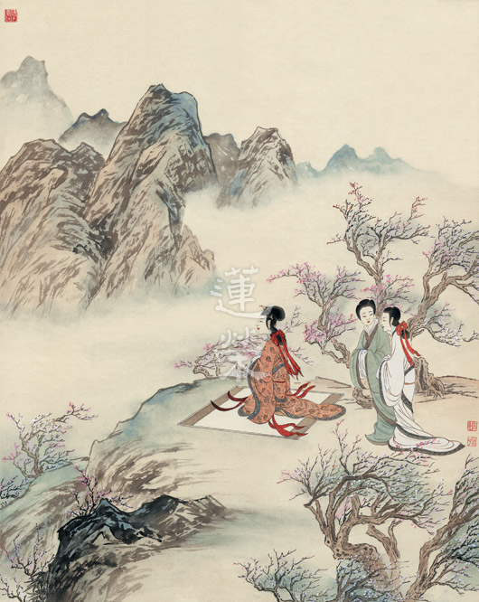

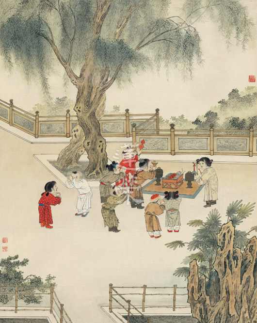

## 活動報導

### 為初機大學生開的課程：普賢行願品講座　師長訓勉

*編輯部整理*

方向對時間相續

善友開解生正見

未來能薪火相傳

再造學佛新氣象

二０一二年七月八日至十四日

前言

學會為大專生開設的佛學講座課程，依 雪公指定培訓大專班的六門基礎課程，繼佛學概要十四講表、佛說八大人覺經、唯識簡介、般若心經講座後，依序進入第五門〜華嚴經普賢行願品。

人才的培養非一蹴可幾，短時是無法累積成效的，連續三年寒暑假為大專生開辦的佛學講座，及每週六晚間的儒佛講座，看著大專學子們從懵懂如坐針氈地聽法，到如今能安住地隨眾上課、記筆記、互相研討經義，其中過程如人飲水，其中或得法喜、或聽不及、或聽不懂、或起煩惱、或進進退退……，但集大眾共學之力，靜下心來數數地聽聞法義後，陌生的佛法也與自身有幾分親，生處也能漸漸轉熟。須知在年輕的歲月中獲得正確的人生觀、宇宙觀是多麼難得可貴的因緣，相信未來人生的趨吉避凶、逢凶化吉皆由此發生。

今就師長開結訓勉勵、法語觀修、餐前觀修、考題解答與學員心得做一整理刊出，除複習所學內涵，引發大眾相觀而善，更期學會會務增上，人才輩出。

開訓典禮師長訓勉

今天很高興在這樣的因緣來宣說行願品，參考資料特別選用雪廬老人的講述筆記，如果大家還有餘力，可以深入輯要疏、親聞記等，乃至於會性法師的講錄。然主體是依據雪廬老人的講述筆記，這是第一步先確立教材。接著就是請師資團隊一起配合消文、釋義，及主持分組討論，使大專生在第一次學習行願品上能有一個成效。

個人學佛這幾年來，深深體會教理深入的重要，能得諸多好處。第一、就是能建立正確人生觀；第二、依此正見懂得利益自己；第三、依此正見懂得利益他人；第四、於順境、逆境現前時，稍能排遣自己的情緒，並知積功累德、斷惡修善、懺悔業障的重要。總而言之，做一個明白人，並造作殊勝因緣，令自己往生西方極樂世界，以上都是學習教法的好處。

去年有幸，能有如此好的場地來辦道，開始另一個旅程，什麼樣的旅程呢？就是培養人才的旅程。培養人才比什麼都重要，當時雪廬老人來臺灣三十八年，安安靜靜的講學，最重要的目的就是培養人才。人才培養起來，正法才能往下傳，否則就有正法中斷之虞，正法一旦中斷，非如大樓倒了重蓋一棟那樣簡單，或許再也無能力恢復了。例如中東地區過去是佛教很興盛的國家，當人才不再，佛法滅亡後，任何力量也挽回不了教法的重興。如同土地已經變成沙漠，任憑以長江、黃河的水去灌溉，還是恢復不了原來的樣子。

臺灣名為寶島，人的善良是第一步，但不是人生的究竟，人生的未來一定要往聖賢路上走，他的善良才是能夠斷惑的善良，有智慧的善良，有宗教情操的善良，能夠利益有情的善良，能夠堅持百忍的善良，能夠不被境界所轉的善良，能夠不被魔怨所破壞的善良。

人才的培訓非常重要，可貴的是有好的場地，有好的善友，而且還有後勤的補給，還有人提供獎學金，諸多的因緣才把人才培養的因緣具足。但是培養人才的心力花下去，是不是真的可以把人才培養起來呢？這也未必，因為還要觀待大家是不是有心被培養，是不是肯花時間被培養，是不是肯在境界裡面去歷練，而不是光掛一個口號叫做「培養人才」。也有人說：我不被培養成為人才，日子也過得好好的。智諭法師曾說：你要過得像豬一般的生活嗎？你的日子要過得渾渾噩噩、像麻糬一樣，沒有是非觀念，生活懶散沒有目標，生不知來死不知去，你要過這種生活嗎？這種生活你竟然覺得好，那不是跟豬一樣嗎？

如果不想過這樣的日子，想過一個有方向、有理想、有目標的人生，那就要把自己培養成人才，可以作一位力挽狂瀾的人。想起以前參加大專講座、論語班，大概也是這樣的年齡，穿起了唐裝正式來聽課，然時不可失、機不再來，時間很快就過了。在場很多人是蓮友子弟，昨日還在參加啟蒙班，眨個眼今日已經是大學生或研究所畢業了，你即將不再年輕了，快要錯過學習的年齡。坦白講，學生時期過了再想要完整的學習，比在學生時代的障礙多太多了。

很多人將大把時間花在專業的學習，其實專業是簡單的，內涵才是更重要、更須鑽研的。然而人往往頭重腳輕，將人生最好的精力拿來學專業、學技能，過了這一段時光，要回過頭來學內涵時已沒能力了，前面沒有打基礎，以為把社會歷練用來學佛綽綽有餘，其實是來不及了。第一、年齡過了，吸收力難了；第二、滾了一堆習氣；第三、古人說：世欲深者天機淺。希望大家珍惜這一段最暇滿的人生，作最有力、最重要的人生學習。

結訓典禮師長訓勉

很高興六天的大專講座，完整的講解了普賢行願品，這對各位來講是福報，尤其在這景氣低迷，人心低潮中，看到年輕人學習的熱忱，看到了一股新的希望，更是彌足珍貴。

依雪公講義釋行願品，表徵對老人的緬懷，期盼對老人的教法做一個傳承。六天的講座，感謝配合消文、分組討論的師長、學長，及分擔很多工作的義工們，相信在教法的弘揚與傳承上，都盡了很多的力量。

這幾天住在道場，看到大家學習的狀況，及義工們的努力，所有的努力都值得，為什麼？因為同學們如此的用功。這種努力，不是在拚世俗的出路，而是觀念的改變，思想的內化，人生格局的打開，這哪裡是在準備高普考、研究所、博士班所能比得上的！看到學長們這樣的學習，內心有無限的感動。

除上述隨喜之外，在末法時期，研究教理的氣氛低迷之下，還能有年輕人學習古注，並有人提供高額的獎學金，內心有無限的感動。昔日周宣德老居士是以寫文章來發放獎學金，我們則是以同學們在經典上聽講討論等的學習，而向前賢看齊。

相信這樣的因緣，會給老一輩希望，原來孩子們是可以被培養的，格局是可以加大的，見地是可以加廣的，思想是可以內化的，相信我們的未來，風氣是可以改變的。如同孔子去見老子時，老子說古代聖賢已逝，遺留的典籍也無用，那是因為我們沒有好好的研究，並用於現代，也就是顯經勝德，亦即是透過聞思修，將經典義理內化轉變成我們的殊勝。

所以道在人不在書，重點是人的學習，人的學習才是整體人類命運的安危所在，這樣的人才多，人類的命運就安，這樣的人才少，則世界動亂。繼絕存亡，繼往開來都靠人，所以重點在培養人才！他是一個思想上的培養，是一個經典內化的培養，是一個見賢思齊的培養，是一個普賢大願化諸於行的培養，也是對西方淨土的了解，是對生死問題看破的一種培養。

講座間若有引證偏失，或者口誤之處，請大家多原諒，或一時憤慨，說了牢騷話，也請多包涵，或辭不達意，無法令同學們理解，在此一併致歉。祝福大家暑假好好的充實自己，從普賢行願品開始，開展未來的人生。

基隆淨宗學會會長致詞

很高興有這個機會再度來到貴會，這六天來非常感動，預講的老師輪番上陣，但是唐老師沒有換班，即便是不斷地咳嗽，依然循進度講下來，我們這六天所學的普賢行願品的內涵，老師以他的文殊智滔滔無盡、不疲不厭地呈現於我們，而身為聽眾六天來也不曾疲勞。

六天的學習感受到愛的氛圍圍繞，有教授善知識的愛，有志工菩薩的護持，每天都吃大餐，還有一些令人羨慕的畫面，諸如三代同堂一起聽經聞法，還有父母對子女的愛溢於言表，也學習到每一位老人家笑嘻嘻的活到老學到老，都是我們學習的典範。

上課的過程當中，讓我對學佛有更深的體會，什麼叫做甚深義？原來把十大願王帶進禮佛的修學中，其內容與意義的豐富，又有實際的行持可以充分把握，在禮佛的時候可以真切捕捉到用真誠心念佛的實益。

老師用文殊智、普賢行來延續我們的佛燈明，我們真的太有福報了，能接觸到第一流的善知識，須善加珍惜，確立正知正見，與佛學深廣的意涵，能幫助我們生起深入思惟的能力。讓我們一起來互相鼓勵，能知不能行，不是真智慧，回去後好好的把它運用出來，下一次我們再回到這裡分享心得，彼此學習，在學佛的路上會更歡喜，我們就是菩薩眷屬。

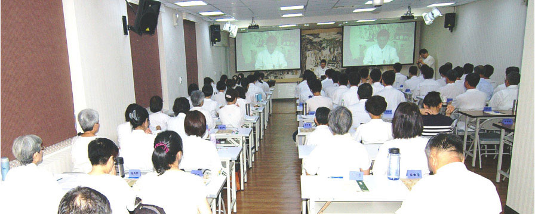

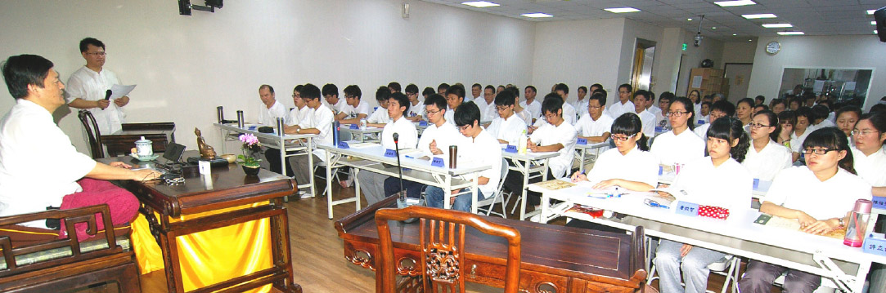

### 為初機大學生開的課程：普賢行願品講座　早晚課法語觀修（上）

*編輯部整理*

乃至虛空世界盡

眾生及業煩惱盡

如是一切無盡時

我願究竟恆無盡

二○一二年七月八日至十四日

念佛與普賢行願品的關係 / 戒慧

為了利益一切如母有情，我們必須要成就無上正等正覺，為了成就阿耨多羅三藐三菩提，所以來這裡研究經教，目前因緣是大專佛學講座六門初機課程的普賢行願品，所用的是清涼大師的科文，雪廬老人的講述。

這是法會第一天的晚課，這法會是研究教法的聚會，不是外面的經懺會，圓滿了第一天，往後還有五天的課程。

今天晚課的題目是念佛與普賢行願品的關係，華嚴經歸宗結頂在普賢行願品，普賢行願品歸宗結頂在以十大願王引導往生西方極樂世界。然依彌陀經往生西方極樂世界要用念阿彌陀佛的方法，以阿彌陀佛名號往生極樂世界，目的是修學正法，成就佛果。

試問十大願王引導與念佛求生有何關聯？念佛求佛接引我，佛為何接引我？因為我念佛，我如何念佛呢？

一者、禮敬諸佛而念佛：

此處特指阿彌陀佛，依對阿彌陀佛禮敬而念佛，不是傲慢的念佛，阿彌陀佛是我禮拜、效法的對象，是我心目中的偶像，依此心意來念佛。

二者、稱讚如來而念佛：

對阿彌陀佛有諸多的佩服和讚歎，用這種心悅誠服的心念佛。

三者、廣修供養而念佛：

以供養的心來念佛，對阿彌陀佛、十方諸佛我都願意做廣大財供養、法供養，彼佛是我殊勝的福田，以這種心來念佛。

四者、懺悔業障而念佛：

以念佛來懺除念魔，諸如念世間五欲六塵、念恩怨等，如此必能降伏煩惱，對治習氣，懺除惡業。

五者、隨喜功德而念佛：

對佛所做所為內心十分隨喜，想到這些利益眾生的善行，內心莫名高興，依此歡喜心來念佛，願意跟佛廣學利益有情的善法。

六者、請轉法輪而念佛：

念佛求佛轉法輪，利樂無邊有情。

七者、請佛住世而念佛：

求佛住世無量劫以利樂有情而念佛。

八者、常隨佛學而念佛：

念佛是不離開佛，常能隨佛學習正法。

九者、恆順眾生而念佛：

念佛如佛般將所有的功德都回向利樂有情，所有的成就願意施予眾生，願意將自己培養成人才（佛）而念佛求加被。

十者、普皆回向而念佛：

如佛般，將所作功德回向一切有情而念佛。

若念佛如此講究，則這一句佛號的功德就無量無邊。若只念佛而不知念佛的意義與功德，甚而流於趕功課，雖不浪費時間，仍屬徒勞費工，須知念佛乃為求佛接引去極樂世界，若以禮敬、稱讚等心態念佛，此人必得佛的大力加被，在正法的修學上必有一番氣象而成就。

總之要把自己培養成人才，須具好學與大心量，能禮敬、見賢思齊、反省自己、利樂有情等，這種人一定是人才；反之，心量狹隘、自私、不會反省自己，對人傲慢，自感榮耀，看輕別人，無法弘揚正法利樂有情的人，不但無法成為人才，也不會成為佛攝受的對象。

如果講究以上這些動機內涵來念佛，則這一句佛號不但能令諸佛感動，能震動佛的心弦，佛也會渴望幫助我、利樂我、加被我消除障礙，修學正法沒有逆緣，具足順緣，加被我遇到善友，具足共識，組成共學的法侶。人生旅途上能心想事成，在臨命終時障礙消除，善根增長，得到助念，佛光加被全身柔軟，並且以非常殊勝的儀式來迎接我們到極樂世界，譬如天樂鳴空，吉祥雲或各式各樣的蓮花湧現，更有阿彌陀佛與諸菩薩的迎接，殊勝的境界佈滿天空，由於這樣的人才稀有難得，所以佛會以這樣的誠意來迎接。

即使未能發起殊勝善根而往生，內心肯定念佛往生者如犯人假釋出獄，何以說是假釋出獄？因為在這世間要脫離輪迴需斷煩惱，但我們連一品煩惱都未斷，理應在生死世界輪迴，此時竟然被佛接走，謂之假釋出獄，而且是先到極樂世界受用佛果的快樂，謂之先離輪迴而後證果。

淨土法門全部都是佛境界，修此法門謂之門餘大道，是八萬四千法門之外佛的權巧施設，無法以教法詮釋。如同犯了死罪，已經層層定讞，無可改轉，若得帝王恩赦，則死裡得生。輪迴世間依然累劫多少重業，有多少冤親債主找我們算帳，有多少的愛欲牽纏，在臨命終時，各類景象一時湧現，只要佛一出現，這些境界全部消失。現見許多人臨命終時，看到過世的親人，或是看到恐怖的現象，這是投生惡道的緣相似生起，這時好好念佛，佛光出現，被佛菩薩接走，如假釋出獄。

期望往後幾天學習，無病苦障礙，能睡得好、吃得飽，心情愉快，有疑能解，上課聽得懂，講得不深入，聽得能深入，雪廬老人說會講的不如會聽的，分組討論能得到更多的受用，結束後回到家能以正見興旺家庭，並以正知見成為社會的棟梁。

發願的重要 / 傳線

稍有接觸佛學，都明白十方諸佛菩薩在因地初發心時沒有不發願的，這是諸佛菩薩成就殊勝果位的關鍵秘訣，其中阿彌陀佛的四十八大願，與本師釋迦牟尼佛的四弘誓願：「眾生無邉誓願度、煩惱無盡誓願斷、法門無量誓願學、佛道無上誓願成。」，以及地藏菩薩的願辭：「眾生度盡方證菩提，地獄不空誓不成佛。」以上是大家耳熟能詳，也是諸佛菩薩所共讚殊勝的宏願。

本次講座是普賢菩薩十大願王，所謂：禮敬諸佛、稱讚如來、廣修供養、懺悔業障、隨喜功徳、常隨佛學、請佛住世、請轉法輪、恒順眾生、普皆回向。

發願猶如茫茫人生的南針羅盤，指引著諸佛菩薩往成佛的菩提大道勇悍邁進。佛家的發願如同儒家的立志，儒者要成就士、君子、賢、聖，即是靠立志而成，孔門高弟聖賢氣象，無不是由立志而來。試舉論語二章作為印證，其一是公冶長篇提及顏淵與子路侍奉夫子時，夫子吩咐二位弟子說說自己志向，子路說「願車馬衣輕裘，與朋友共，敝之而無憾」，子路的意思願意將自己座車及狐裘與朋友共享，即使用壞也不會產生遺憾心，正說明願自己成就離欲行相，及與善友結勝緣；顏淵說「願無伐善，無施勞」，顏子願不稱揚自己之為善，不以勞苦加之於人，這是顏子願出仕成就仁君賢大夫的行相；子路接著說，願聞夫子的志向，孔子便說自己的志向：「老者安之、朋友信之、少者懷之」，使天下的老者因得到撫恤而有所安定、以信待朋友、以慈愛恩惠之心待少年人，這是一種出來主政及辦教化令天下為公的氣象。從其立志可看出三人境界，一個比一個高明，由此得知志願的大小，關係一個人的成就。

再從論語先進篇最後一章，夫子又利用機會，分別要子路、曾皙、冉有、公西華說說各自的志向，子路、冉有與公西華之志向，僅就曾皙的志向：「暮春者，春服旣成，冠者五六人，童子六七人，浴乎沂，風乎舞雩，詠而歸」，夫子喟然歎曰：「吾與點也」，夫子一生志業，一言蔽之，推行仁政及有教無類的教化，聖者最終往往選擇教化的途徑，雖然這是一條影響世世代代旣深且遠的康衢大道，卻也隱微，俗人難以了知，夫子的志願志業，仍須靠弘道傳法，賴教化，尋覓傳承弟子，方能實現自己的志願。本經經文亦說諸佛菩薩由法而生出。夫子如是，普賢菩薩亦復如是，君不見十大願王，其中「請轉法輪、請佛住世、常隨佛學」直接與法的傳承有關係，其餘七願也間接有關聯，往後講座，相信聆聽之後會明白，經上述淺薄的分析，知發願與傳承教法大有關聯，而本經文之十大願王乃如來長者子修學法，正說明其密切關聯性。

貫穿十大願王的結語「念念相續，無有間斷，身語意業無有疲厭」，從上述經文獲知發願可不是一時興起，而是要終其一生經營奉行，依經文「眾生界盡、眾生業盡、眾生煩惱盡，我之禮敬乃至迴向乃盡；而眾生界乃至煩惱無有盡故，我此禮敬乃至迴向無有窮盡」，所以更確切的說是生生世世發長遠心，普賢菩薩十大願真是令人讚歎，言語難以盡述。而身語意業無有疲厭，又使末學想起夫子答公西華「若聖與仁則吾豈敢，抑為之不厭，誨人不倦而已矣……」，如是說來，發願最精髓處在弘揚與傳承教法，普賢菩薩如此，夫子亦如此，而不疲不厭又是彼等最核心的修學法，總而言之，發願之心是須臾不可離也，造次顛沛必於是，而我等何其有幸親近的善知識，就是賢聖的步趨者。

善財童子五十三參的故事 / 達露

我們都知道善財童子是普賢行願品的主要當機眾，研究普賢行願品也應該了解善財童子五十三參的故事，善財童子過去供養無數十方諸佛，培植無量善根，勤修菩薩道，樂於親近善知識，所以出生時屋子裡及周圍突然湧出許多寶物與放出無量的光明，也因此父母請來善相師為之取名為「善財」。稱其為童子，即如老師所說的他有赤子之心，可堪造就。

善財童子會有五十三參，乃因善財童子發菩提心後一心向道，欲圓滿普賢行成就佛果，而請問文殊菩薩如何修學菩薩行？

文殊菩薩有感於善財童子求法的誠心，於觀機逗教下教以參訪善知識，修學各種菩薩行，文殊菩薩先教化引導善財童子了解參訪善知識應有的心態，再引介善財童子，首先參訪德雲比丘，由德雲比丘教其念佛之偉大與功德，而更堅定善財童子求法的信念，自此才展開參訪善知識，修學菩薩行之旅。最後參訪到第五十二位由善財童子之飲水思源，又回歸文殊菩薩在遠處的教導攝受而頓悟，進而入五十三參的不可思議普賢解脫境界，圓滿普賢行。

在古時交通不便，叢林雜生、豺狼虎豹橫行的環境下，要行腳參訪善知識，必經一番披荊斬棘、跋山涉水、翻山越嶺之苦，沒有善財童子的菩提心，及自我期許的使命感是無法克服種種的困難，我們除了佩服善財童子求法的決心與毅力之外，也深感善財童子的幸福，能得那麼多良師的教導，佛法雖智無人解不能入，一般世間法要學得專精，都要拜師學藝，何況是深不可測無法了解的出世法，更需老師的教導，所以文殊菩薩要教導善財童子去參訪善知識。

但參訪善知識須有一定的程度，當年雪公太老師教導學生不得跑道場，甚至參考佛書都要經過太老師的鑑定與介紹，為的是怕學生無法分辨相似法，走冤枉路。

善財童子之能得諸位善知識的攝受教導，並得諸位善知識的引介而順利的一一參訪，沒走蹉路，其中除了他的善根福德深厚，還有一分是他對圓滿普賢行的使命感，求學若渴，而最關鍵是他的根本善知識—文殊菩薩。善財對文殊及其他傳法的善知識都極為恭敬，每次見善知識必心生歡喜合掌頂禮其足，又繞無量匝再請求慈哀宣說菩薩行，聞法後亦如是慇勤瞻仰恭敬辭退。印光祖師說：佛法要從恭敬中求，有一分恭敬即有一分收穫，有十分恭敬即有十分收穫；因為善財童子對善知識的恭敬及對法的渴求，而感應與善知識的殊勝善緣。

其次，善財童子在日用平常中，能時時刻刻思維善知識所教導的義理，隨時依教奉行也是善財童子感應善知識得成就的一個主要因素；再者善財童子的飲水思源，感恩根本上師文殊菩薩的加被指引，也感應文殊菩薩的遠攝說法，進而如虎添翼的茅塞頓開成就無量的法門，由以上種種的因素，使得善財童子在參訪善知識中能得法益，進而圓滿普賢菩薩的廣大行願。

了解善財童子五十三參的故事以後，反觀我們自己，何其有幸，在舒適的冷氣中就能入不可思議的普賢行願解脫境界，只不過，想要有一番成就，是不是應該效法善財童子，提起勤求善知識的熱忱，恭敬善知識並依教奉行，好好的聞思修！願大家都是善財童子的化身，都能實質的入不可思議的普賢解脫境界！

佛陀降伏魔軍的故事 / 心達

所謂道強魔就弱，道弱魔就強，悉達多太子感慨人生無常（生、老、病、死），為救度眾生而出皇家學道，發起解脫生死的大願，求解脫者必須要能伏魔，為伏外境聲色軟硬之魔及內心煩惱妄想之魔。

太子經無數次修學坐在菩提樹金剛座上，止觀雙運寂靜的心中，像湛然不動的清水一樣，以觀察諸法實相作為出離三界的解脫道外，無其他雜念。此時魔宮震動，因為太子若是證得覺道，將化解邪道的勢力，所以感得魔王對他生起憎惡的念頭。

魔王就向太子說到：「太子！請你趕快離開這裡，否則，你就要在我的箭下身亡。假使你能捨棄解脫之法，回國去享受五欲的快樂，戰勝天下，調伏世間，死後終能回到天上享樂，這才是為人的真實之道。自古以來的聖王明君，都是依此而行，為什麼你要例外呢？假若你要違抗我的命令，必受我死亡的箭，凡是觸到我的箭，沒有一個不狂亂，沒有一個不立即死亡。如果你不相信，就試驗一下我的毒箭，到那時候，你寶貴的生命，學道的志願，勇猛的精神，將要如水泡一樣的消滅。」

魔王威武的說出很多恐怖的話，脅迫太子。但是，太子的心，一點都不為魔王所動。他對於自己能開啟真實的大道毫不懷疑，他對魔王的話沒有生起一點恐怖的心，反而生起憐憫之心。

因此魔王就開始放箭，可是毒箭到了湛然不動的太子的金剛座前，自然墜地開出朵朵的曼陀羅華，接著三位美貌的魔女奉了魔王的命令，走近太子，用種種的甜言蜜語來誘惑太子，但是此刻的太子，既沒有畏懼那毒箭、也沒有聽那魔女的語言，一切都好像不見不聞！

魔王見此情形，既疑且怖，他自言自語的說到：「我曾以此攻擊過所有的正法求道者，沒有一次不是凱旋而歸。現在，這一位悉達多太子，為什麼不害怕我的箭呢？為什麼不為女人的姿色愛情所動呢？」

魔王隨即發動魔軍，放出種種怪物，起火出風，雷雨交加，用所有的方法想打退太子的道心，但太子坐在金剛座上毫無恐怖，毫不動搖，他看著這些魔軍，如同是一群孩童在遊戲一樣！

魔王非常的憤怒，又再放出更多的毒蛇猛獸，降下雪雹雷霆，可是，毒蛇猛獸所吐出的毒氣，都化作清涼的風；雪雹雷霆，都變作五色的花朵；這一切，在一心不亂證悟空性的太子前，都失去它們所有的力量！很快地魔軍都撤退且歸順了佛陀。故事說到這，大家靜下來想一想，佛陀降伏魔軍了，各位是否也戰勝自己的魔軍呢？

子曰：「不踐跡、亦不入於室。」普賢十大願王即是降伏魔軍，成就斷煩惱、了生死、成佛道、度眾生的好利器；亦是成熟大悲心、菩提心、空性正見的殊勝妙法。

善知識的重要性 / 文愧

善知識有大德定義：善當能字講，知是聞名，識是見面。所以，善知識就是我能知、能識，能知道什麼呢？能知道這三界的苦惱，能知道「三界無安，猶如火宅」，以上是善知識的名相之一。

其次善知識有三種：第一是外護善知識：幫忙處理日常生活的所需，護持行者能夠安心研學或修行。舉凡道場義工及功德主都是。第二是同行善知識：是一起研學或修行，彼此勉勵，互相切磋琢磨的同參道友，即世俗所謂同儕。第三是教授善知識：是講經說法，教化眾生的善知識。

在三種善知識的幫助攝受下，修學正法的次第是聞、思、修，首先從善知識那裡聽聞佛陀的教誨，接著思維佛法的義理，並經過努力的修行，最終才能夠了脫生死。為什麼一定要從善知識那裡聽聞佛法呢？自己看書也可以看得懂啊？事實上沒有這麼簡單。因為佛法無人說，雖智不能解。表面上的文字意思，我們或許還能看得懂，但是其中的真實義理，卻不一定能夠體會，甚至有時連文字的意思都會理解錯誤。例如就有人說佛法上講「不執著」，那你為什麼要執著每天做早晚課？何必要執著每天拜佛、念佛？應該不要執著才對。也有人看到「不分別」，就認為什麼都要平等看待，連善惡因果都不要分別了。所以，不經由善知識的教導，我們很可能盲修瞎練，走了許多冤枉路都不知道，甚至誤人誤己！

我們知道孔子的母親為了讓年少的孔子能夠成才，她克服了極大的困難，帶著孔子從家鄉陬邑來到魯國的都城曲阜，為他尋找最好的老師，孔子到了二十九歲時學琴師襄，三十五歲時曾問禮老子。而孟子的母親也為了培養自己的兒子，曾經三次搬家，就是因為周圍的環境中沒有善友。孟母恐子受惡友的影響，故三次搬遷，以尋找好的學習環境，希望能夠親近到善友。世間聖賢要得到成就，尚且都要尋訪明師，何況我們學習佛法，就更應該親近善知識。在華嚴經中，文殊師利菩薩告訴善財童子說：「善男子，若欲成就一切智智，應決定求真善知識。」因此，在修行的道路上能遇到大善知識給我們指導、幫助，啟發我們生起善法欲、智慧和慈悲，才能引導我們超凡入聖。

華嚴經上說：善知識者，猶如慈母，出生一切佛種性故。善知識者，猶如嚴父，廣大利益親付囑故。善知識者，猶如乳母，守護不令作惡法故。善知識者，猶如教師，示諸菩薩所應學故。善知識者，猶如善導，能示甚深波羅蜜故。善知識者，猶如良醫，能治種種煩惱病故。善知識者，猶如雪山，增長一切種智藥故。善知識者，猶如勇將，殄除一切諸恐怖故。善知識者，猶如船師，令度生死大瀑流故。善知識者，猶如商主，令到一切智寶洲故。因此，善知識猶如一盞明燈、一條光明大道，順著他的指引，能夠到達不生不死的彼岸。善知識能夠將博大精深的佛法義理善巧地、深入淺出地、契機契理地引導我們，讓我們能夠明白宇宙人生的真相，知道學習佛法的下手處，以及怎樣用功。很多經典都提到善知識的重要性。例如在《佛說恆水經》中說：「學問不值明師，安知天下有大道乎？」我們既然知道修學佛法必須依靠善知識的道理，以及親近善知識的重要，那麼善知識有些什麼標準呢？

依據《大乘莊嚴經論》上講，善知識的德相有十種，若另外根據《瑜伽師地論》裡講的，善知識則有八種德相：

第一、安住禁戒：

身語意三業對戒律沒有虧損，要持戒清淨。因為戒是一切功德的根本，例如在四分律上說：「戒為無上菩提本，應當一心持淨戒。」善知識必須先能夠調伏自己，才有能力去調伏別人。

第二、具足多聞：

由於多聞能對佛法通達與受持。故能引導別人深入經教，通達教理。

第三、能有所證：

在佛法的修持上，特別是智慧這一分，以自內證的力量破煩惱，方能調伏他人。

第四、性多哀憫：

對眾生常起悲憫心，若無悲憫心，則無意願利益別人。

第五、心無厭倦：

如孔子般誨人不倦，內心從來沒有捨棄過有情，做為教導他人的善知識，肩負法身慧命的重責大任，如此的神聖使命，何來有厭倦心？

第六、善能堪忍：

在利益眾生的事業中，有許多是難行能行，難忍能忍的麻煩事，乃除往昔所造惡業，不生責怪他人之心，繼續依大願度眾生。

第七、無有怖畏：

宣說正法內心沒有怯弱，由於經過聽聞思維所學而有殊勝體悟，並以弘法為家務，利生是事業，不但說法無有怖畏，面對各種艱難，內心亦是勇悍以對。

第八、語具圓滿：

所說佛法圓滿，不論是心、內涵、次第都分析，不但令聽者生起善法欲，且容易聽懂其中的內容，並好樂修持。

以上是《瑜伽師地論》裡的八種德相，與《大乘莊嚴經論》裡的十種德相，只是開合不同，而實質內涵則是一致的。由此可知在學佛的過程中，親近善知識的重要性不言而喻，只要我們親近善知識、聽聞佛法，堅定自己的信心，在善知識的教導下，建立起正確的正知正見，然後不斷精進用功，一定能夠走向成佛作祖的解脫大道。最後謹以憨山大師所講的四句話作為結語：「修行容易遇師難，不遇明師總是閒；自作聰明空費力，盲修瞎練也徒然。」（續下頁）

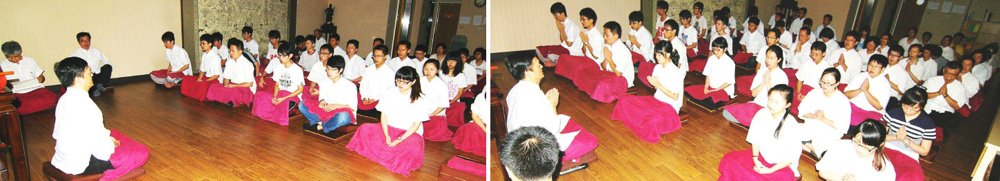

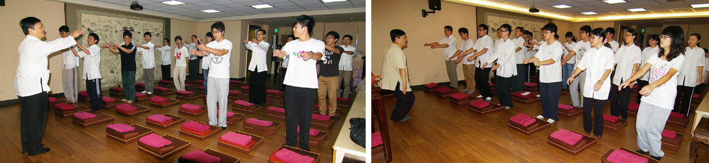

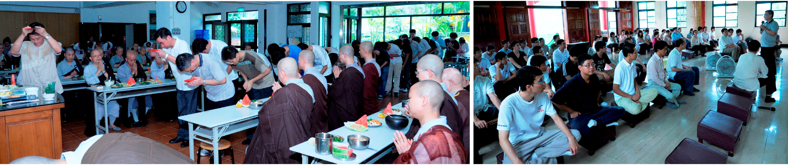

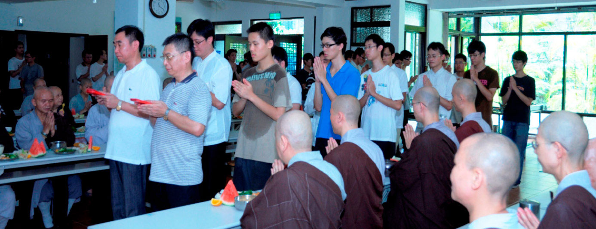

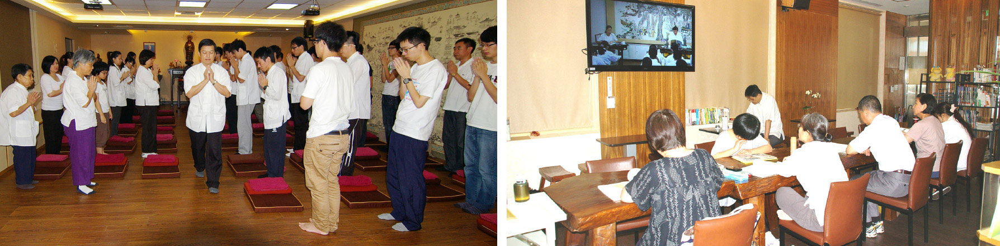

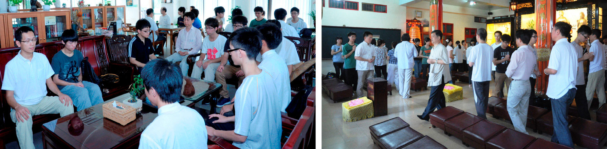

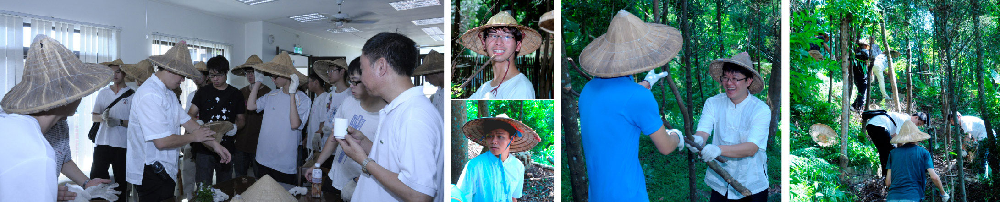

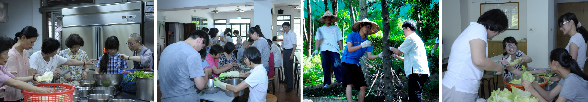

### 為初機大學生開的課程：普賢行願品講座　早晚課法語觀修（下）

*編輯部整理*

往生與普賢行願品的關係 / 王興文

華嚴經為經中之王，是整個佛法的綱領，一切經都是華嚴眷屬，華嚴經歸宗結頂即是普賢行願品，行願品的頂上莊嚴即是普賢菩薩以十大願王，引導眾生往生西方極樂，蒙佛授記，此經才算究竟圓滿。因此往生西方淨土與普賢行願品的關係，不僅是直截了當，密不可分，更是普賢大士的最終心願，也是佛的究竟慈悲本懷。

善導大師說：如來所以興出世，為說彌陀本願海。所以往生西方極樂世界，才是真正暢佛本懷。正如本次普賢行願品的教材序文中所說：因為末法中人無力斷惑，若不由佛力攝受至西方淨土，則將輪迴六道，甚而被惡業牽引至三塗長劫受苦，空令諸佛生起慈悲心，而不能利益他人。

由此可知，普賢行願品，不僅是華嚴經最重要的一品，是普賢菩薩的核心修學法，同時也是諸佛菩薩所共同護念的重要經典。它與阿彌陀經、無量壽經、觀無量壽經、大勢至菩薩念佛圓通章，以及往生論，同列淨土宗的重要必讀經論。我們應當好好的珍惜，以深信心，用心研讀，深入學習，如經上所言：「聞此願王，莫生疑念；應當諦受，受已能讀，讀已能誦，誦已能持；乃至書寫，廣為人說。」早日成就普賢大士之德，廣利一切眾生。

在普賢行願中，每一願皆說：「虛空界盡，眾生界盡，眾生業盡，眾生煩惱盡，我此修行，無有窮盡。」心量如此廣大，可說是「心包太虛，量周沙界。」以這樣大的心量念佛求生淨土，必定是上上品往生無疑。

最後，我們不禁要問，普賢菩薩究竟往生哪裡呢？在本經最後，普賢菩薩告訴我們說：願我臨欲命終時，盡除一切諸障礙；面見彼佛阿彌陀，即得往生安樂剎。由此可知，普賢菩薩也是念佛求生淨土，給我們做了最好的榜樣與示範。我們要立定志向，堅定信心，效法普賢菩薩，念佛求生西方淨土，受記成佛、倒駕慈航、普度眾生。以此與大眾共勉！

如何傳承聖道門 / 心超

為了利益一切如母有情，我們必須要成就無上正等正覺，為了成就阿耨多羅三藐三菩提，所以興辦大專講座，題目是大方廣佛華嚴經入不思議解脫境界普賢行願品。

願意來參加佛法的聽聞實在不容易，在寒笳集裡說，有一老人家（在家人）給寺廟做了五十年的飯頭（煮飯的），來生想要做一位出家人尚且不行，聽經的白鴿來世轉為戒環禪師。由於多劫在佛門裡做了很大的善業，所以才能參加佛法的學習。佛法活動，或以為參加與不參加的決定權是在自己，其實不然，福報不足者，宿世無累積聞法之機緣者，正要入場就被彈出來，或臨時生病住院，或家中有事，或公司有事無法請假，或參加講座時，心情飄盪，教法無法入心。若福報具足，即使臨時通知有活動也能具足順緣參加，而且年齡又輕，體力強健，記憶力殊勝，又對正法有好樂等等。

諸法自體空，似如在境上自體成立，實則每個人在接觸時，卻又隨著往昔善惡業而呈現不同，奇妙無比，如一棟樓房倒影映在水面上，每個人看的角度不一樣時，在水面呈現時，隨著各人所看而不同。如享受一頓飯，每個人受用都不太一樣，隨著每個人的差別業，有的吃起來沒味道，有的吃起來不對味，有的吃起來很舒服，都是隨著他的善業在受用快樂，隨著惡業在受用痛苦，諸法如夢幻泡影。此其一。

其二要生起很難得的想法，如果今天你拿一本普賢行願品，請某位善知識講清楚，相信他不可能用五天給你講清楚，頂多講兩小時他就有其他事情要忙，何以能辦五天講座詳解行願品？那是大眾福力的感召。有佛教徒，家中放了很多佛經，過世前，他說家中的佛經沒有一本從頭研究到尾的，就這樣過世了，過世前很感慨。

你週遭的人，即使和你是很要好的朋友，交情很深，你說今天我們不要逛街，坐下來研討普賢行願品，他則藉故有它事忙，可見學法的福報是百千萬劫難遭遇的，須是讀佛法時，要有難得的觀修，方能認真學佛而不空過。

雪廬老人講這本華嚴經是民國四十八年，是一九五九年，那時正好是國民黨撤軍到臺灣滿十年，局勢稍微穩定，當初倉皇來到臺灣，什麼都沒有，雪廬老人靠著在臺中講學，慢慢的一本一本經書開始整理流通。臺灣要非常感謝這些大德，特別是雪廬老人，能夠在兵荒馬亂中在這個蕞爾小島，海外的蠻陌之邦，孔子所說的九夷，興辦教法，利益後代的子孫，這是非常難得的。

第三，說到今天宣講主題：如何傳承聖道門。就以要傳承普賢行願品，或者普賢十大願王來說，首先有好的質地，質地不好人家不會教，往昔孫臏與龐涓一起向鬼谷子求學，老師重要處教孫臏不教龐涓，就是因為孫臏質地好。所謂質地是肯為他人著想的公心，論品格也是論公心，尤其有心要成聖成賢以利樂天下蒼生的心。

再者要有良師益友，本身要花時間學習，並能接受考驗，且時時禮拜三寶，必能消除諸多障礙。學成以後，能知人，且攝受人才，將正法往下傳承。

如何傳承淨土門 / 法明

淨土門是信願念佛，求生西方。普賢菩薩在行願品以十大行願修學法，成為如來長者子，並以十大願王導歸極樂圓滿成佛，經文中有四次導歸極樂，在長行文中出現兩次，重頌中出現兩次。

在長行文中，首先是「唯此願王不相捨離，於一切時，引導其前，一剎那中，即得往生極樂世界。」這是以十大願王導歸淨土，成就自利功德。其次「是諸人等，於一念中，所有行願，皆得成就，所獲福聚無量無邊，能於煩惱大苦海中，拔濟眾生，令其出離，皆得往生阿彌陀佛極樂世界。」這是教導眾生修學十大願王導歸淨土，成就利他功德。

在重頌中，以偈頌方式複習自利功德「願我臨欲命終時，盡除一切諸障礙，面見彼佛阿彌陀，即得往生安樂剎。」其次複習利他功德「我此普賢殊勝行，無邊勝福皆迴向，普願沉溺諸眾生，速往無量光佛剎。」故普賢菩薩被推尊為天竺淨土宗第一代祖師，所以學習普賢十大行願就是學習淨土門。

總之，將自己培養成人才，透過學習普賢行願品而成為傳承者。所謂的人才是有使命感，能生起見地，對法有體悟力，並在生活中歷練而不為五欲六塵所迷惑。

我願如此修學，也惟願一切大眾亦復如是，我們就是淨土門的傳承者。

護持淨苑結夏安居圓滿講座 / 心超

講座圓滿的隔天，全體大專學員與養成班成員，到西蓮淨苑齋僧彼是有道風的道場，齋僧須以弟子的行相作供養法行，並攝持十大願，回向自他往生淨土。

懷著普賢行願的意樂與內涵，結合團隊方式，令淨苑耳目一新，且是磨練我們不放逸，以團隊意識修學供養的普賢行。（全文完）

### 為初機大學生開的課程：普賢行願品講座　餐前觀修（上）

*編輯部整理*

願常面見諸如來

及諸佛子眾圍繞

於彼皆興廣大供

盡未來劫無疲厭

二０一二年七月八日至十四日

普賢菩薩的用餐 / 心安

沒有天生的彌勒，也沒有自然的釋迦，連彌勒、釋迦在因地都要不斷求法，才能圓滿成就。

同理善財童子也是不斷參訪善知識，以普賢菩薩的十大願王導歸極樂而成就的。儒者云：舜何人也，予何人也，有為者亦若是。只要見賢思齊，效法善財童子以普賢菩薩的十大願王來成辦自他佛果的大樂，是行者應具備的修學態度。

學習場所雖無豪華的設備，享用健康蔬食而非山珍海味，然有完善的學習環境，教授善知識正確的傳承，同行善知識相互切磋，天廚妙供，禪悅為食，受用美好的知見，生起愉悅的氣氛，眼前以為了修學普賢行而來用餐。

禮敬諸佛的用餐 / 戒堂

禮敬諸佛前，學者先須禮敬師長，這是當學生最基本也是最重要的態度。大家或有這種經驗，在學校不喜歡某位老師時，就對老師生起輕慢之心，只要是這位老師的課，就不會好好聽講，上課時打瞌睡、聊天、看其他書、做其他事、心不在焉、發呆，這一門功課的學習成績一定不好。老師見到學生如此，如何能以傾囊相授的方式加被學生。禮是從外表說的，敬是從內心說的，內心恭敬，外在表現得有禮節。對老師能禮敬，自然會用心聽課，即使一時之間不懂，老師也會很開心地為學生解惑，這門功課自然就可以學得很好。「禮敬諸佛」亦是如此，佛法在世間，不離世間覺，有此法行，自然得佛殊勝加被。

為了以清淨三業禮敬諸佛，所以須勵行不殺生、偷盜、邪淫等十種善業。佛如高掛在天空明月，眾生以猶如一池清水，清淨身語意業，映出如明月皎潔的佛。若禮敬者以染污身語意業，宛如一潭濁水，無法映現佛的莊嚴與加被。

自己禮敬諸佛，是為行；希望自己大眾各個能以禮敬諸佛成就佛果，是為願。願與行，二而不二，相互觀待。即使佛不在前，心也要觀想：我在佛前，佛也在我面前。敬佛者為能禮，所敬拜之佛為所禮，如對面前必感應道交，蒙佛加被，殊勝莫名。
諸佛為十方三世一切佛，過去佛、現在佛都是已成之佛，而眾生是未來佛。何以故？因一切眾生，皆有佛性。對於眾生的公心與付出要有禮敬之心，如用餐這件事情，用餐時就應好好用餐，吃飽了才能好好做事。或
**問：** 用餐與禮敬諸佛有關係嗎？昨天有一道豆芽菜，這一盤豆芽菜是如何成就的呢？約有七、八位蓮友逐一挑揀每根豆芽，花了快兩小時挑完後送進廚房烹煮，才有這一盤豆芽菜。我們吃豆芽菜時，是否具禮敬之心？尤其對準備三餐的師伯、師姑們的發心，這些為公發心的未來佛，我們應加禮敬。

稱讚如來的用餐 / 戒郁

從前…從前…我們有一點年紀的師長都曾看過一部武俠電影，有很多集，片名叫「如來神掌」。

「如來」是什麼呢？要怎樣稱讚？武俠小說中的如來神掌，神掌指的是武功，如來一般人只知道是很高超的意思，這套武功秘笈有十招，一招比一招厲害，最高一招即是第十招「萬佛朝宗」，是最難的，但不是學來的，是參出來的。

普賢十大行願亦然，須是一願一願步步為營的學，且要參透其奧妙，且有次第的學習是很重要，否則行願難知難悟難行，故行願難以成就。

本次講的是稱讚如來的用餐，肚子餓時，有時會有反射作用，開始吞口水，碰到好的飯菜，會使勁的想吃飯，但「稱讚如來」時有沒有使上全身的勁呢？嘴巴吃了天廚妙供的同時，有否觀想在修學正見後，吃下去的飯菜，體性轉為能由口裡讚佛的朵朵蓮花？有些菩薩能口吐蓮花，或是經由如此觀修而有的成就呢！

普賢菩薩所發的「稱讚如來」願，或云佛是不求名利而成就的，何以成就後還需要讚美嗎？實則是為我們眾生修學成就用的，例如讀到詩及頌文讚歎景色人物時，能啟發我的悟性，也讚歎他們這些文學家有如此的觀察力。普賢菩薩即是以敬仰和見賢思齊的心意來立「稱讚如來」的願。當我們真心稱讚如來，我們不僅稱讚諸佛的良善氣質，更是對佛陀的道德與智慧深深地存一份認知與嚮往。

解脫即在日用平常，如稱讚如來能使我們於惡口的業及所生苦中解脫，意即往昔所造惡口的業及未來所生的苦都不會發生，故修稱讚如來的法行能於惡口業中得解脫。我們日常有時在無意間就會犯惡口，口不擇言講出去，如同飢餓時，聞到菜飯味道忍不住吞了口水，聽到一句無意的話，有時就直接反應，跟師長、同學、朋友回嘴回得很習慣，反應也很快。尤其聰明人的通病是口快，慢心作怪時惡言容易出口，一點都不慢，而且愛說壞言語，往往把難聽的話送別人，讚歎自己，產生諸多過患，故在常禮舉要處世篇，要我們切忌惑言，無用之言，不忌諱的話，若無此等認知，必吃大虧。

故聽到別人講的話不合己意，要回話時，何妨把話先放在嘴裡咀嚼一下，消化消化，品味品味，究竟這個話能不能講？不能講就要吞回去，引發煩惱者不說，沒有利益他人者不說。唯有守口戒才知如何「稱讚如來」。

「稱讚如來」是要講好的話，「稱讚」就是稱揚、讚歎，「稱揚讚歎」法門，在修學佛法中非常重要。如來，是佛的十種名號之一。如來是證如實之道而來，來去自如。稱讚如來的是「三德二利」功德，三德是斷德、智德、恩德，二利是自利利他、自覺覺他。稱讚如來，引申為包括對一切好人、好事，都要去稱揚、讚歎，讓眾生歡喜。

在人生的路上，尤其是年輕朋友，欲以伶牙俐齒伏人，不如學會修「稱揚讚歎」法門，必先學會慎言、守住嘴巴為起點，在這個胡言亂語的時代，口業的修行，慎言少講話反而是我們很好福報的來源。

廣修供養的用餐 / 傳線

學習佛法的四眾弟子在用餐前，皆會作餐前供養，一般誦的是：供養佛、供養法、供養僧、供養一切眾生；願斷一切惡、願修一切善、願度一切眾生、願生西方極樂世界。以餐前之食物供養佛法僧三寶，雖然眼前之餐點微不足道，但仍屬財布施，憑藉觀想之力，將眼前之物變現盡虛空遍法界，除了供養十方三寶外，也要供養一切眾生，何以要供養眾生？吾人一切安樂都是有情成辦，如眼前食物，從下種、收成、運送直至採買，洗切、烹煮、置放餐桌等，無一事是我親自做的，一頓飯尚且如此，何況其他，當感恩供養。

所謂的斷惡、修善、度眾、生西方極樂世界，無一不與法供養有關，欲知供養要義，捨聞思修一途，別無他法，正如本講座廣修供養經文特別說到，所有供養中，法供養最為殊勝，在此與大眾共勉，以傳承教法自利利人。

懺悔業障的用餐 / 禮悅

懺悔簡單說就是反省力，一般人若家中髒亂必然會將它打掃乾淨，但我們修行是否也能將所學的障礙（煩惱、業）除去呢？若不知懺悔則無法將煩惱、業障去除，煩惱不除，易造惡業且令惡業增長廣大，那應如何懺悔呢？依據經教歸納報告之：

一、要有典範以作模仿學習。

二、昔日容易看到他人過惡，現在將方向轉到自己，用放大鏡照自己，那要如何照呢？就是以榜樣來比對，剛開始可能很粗淺的看到自己不足，後來以數倍放大鏡（教法）鎖定自己作觀察，就能看到更微細的缺失。

經上言：罪惡若有形相，必定遍虛空法界容納不下，為什麼呢？因為輪迴從無始以來，輪迴的生命現象從沒有停止過，不要說累積的過惡，不能窮盡，即使所造的過惡也說不盡，但也不因此而灰心，只要能面對問題而解決，都是可喜的。

譬如，我們有心想要令自己在某領域上有所成就，首先就須立志，再來檢視阻礙前進的因素，這時就要以高標準看自己，才有機會成功。會性法師曾經說：一般人對身上髒東西都想要盡速排除，而這些東西至少能當肥料，總還有點用處，卻不知將煩惱除之而後快，反而抱得緊緊的，煩惱其實是百害無一利的，以此與大家共勉之！

隨喜功德的用餐 / 仁勵

平日我們在日常生活中，對於周遭人、事、物的互動，常常會很容易的帶出一句「隨喜您的功德」，因而能知這是一件好事，但我們也許都不是很清楚，一句「隨喜功德」的心量能展現出多大的善業，也因為所呈現的心量有所不同，同樣一句「隨喜功德」所產生的功德福報就不同了。

一、認識功德

功是修學的功夫，是一種事功，德是能力，是以智慧為本質的能力，有了這樣的能力才能建立事功，這些利益人的事功謂之善業，能生福報，例如修學戒、定、慧就是德，是一種內在能力的培養，由此方能真正建立外在的事功，所以沒有智慧修不到福報，有了福報也可資助慧力，例如有福的人身體健康，精神愉悅，容易遇到好環境，也易得到善知識的特別教導，有能力生智慧。

二、福德與功德之別

修福若不與德相應，則果報會在六道，即使在人天享受福報，也非究竟，福報享盡依舊墮落，是故修福德依智慧，謂之福德，修行生起之福報方不成為造罪之資糧。

三、用日常生活修學隨喜功德

貪瞋癡慢，有屬於分別、有屬於俱生，分別易斷、俱生難斷，其中破壞異熟最嚴重的是瞋恚，而嫉妒又屬於瞋恚的分位，行相是看到別人比我好，心裡就難過，甚至於想盡方法破壞他，若破壞他人的善根，則所造的罪業就重了。所以我們要懂得隨喜，看到別人做好事心生歡喜，不但生歡喜，還要全心全力去幫助他，他成就愈大，我們愈心生歡喜，甚至比他更高興，如同世間母親對子女的心量，明白了這樣的道理，才能真正修到隨喜。

就以此次大專講座所有人員，都是我們隨喜的對象，不管他們扮演何種角色，都有他們發心、用心及辛苦的一面，隨喜一點點就沾他們的光了。尤其老師此次發心為大專班開講普賢行願品，其功德我們一定要心生歡喜的隨喜，快樂的用心聽講、努力吸收學習，而不有怠惰之表現，避免影響老師說法之精神，我們能一面聽聞老師宣說之妙法得霑法益，不但隨喜老師說法之功德，也隨喜大家努力修學的功德，總之隨喜功德的範圍是無量無邊的，就請大家各自體會了。

四、社會上有許多足堪楷模的典範人物

這些人對社會人群造成相當的影響力，所以會修隨喜的人，能從他們身上得到潛移默化的作用，能使自己善力功德不斷增長。然善緣須隨喜，若遇到惡緣自己要認真反省，修學忍辱，雖善人幫助我們，惡人障礙我們，真心修學者，順境逆境、善緣惡緣都是道場，都是成就我們的善知識。

在順境善緣裡，或可發揮能力幫助別人；若在逆境惡緣裏，有時必須收斂能力，獨善其身；這些都是要隨緣，無法強求。隨緣中有時講究隨喜，有時要修忍辱，懂得用法，就能成就各項功德。（續下頁）

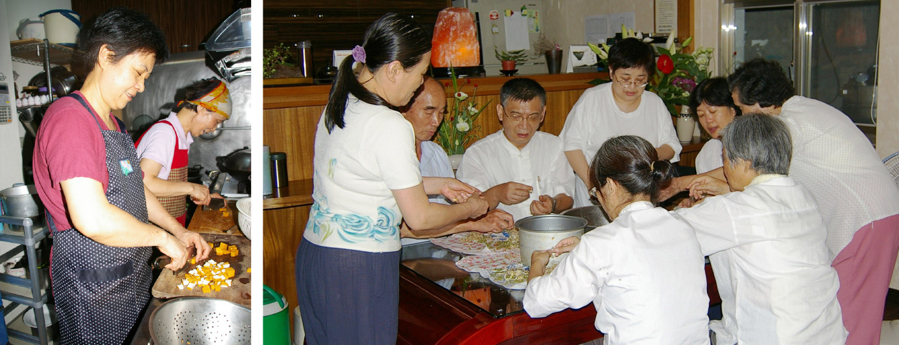

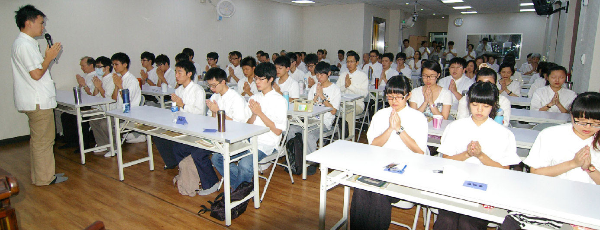

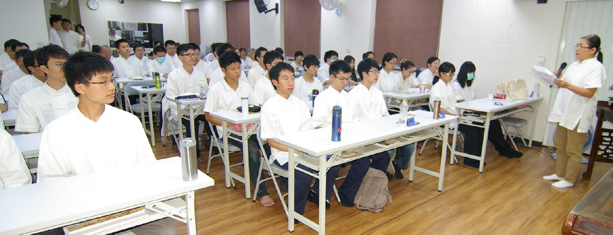

### 為初機大學生開的課程：普賢行願品講座　餐前觀修（下）

*編輯部整理*

請轉法輪的用餐 / 文愧

在古印度的傳說中，轉輪聖王所擁有的兵器稱為輪寶，每當轉輪聖王出巡四方的時候，必有輪寶做為前導，此輪寶能打敗所有厲害的兵器，其威力無比，所向披靡，兵不血刃，故戰勝了所有敵對的國家。因此，才將它用來比喻諸佛菩薩說法，其內涵為無常無我，緣起性空，能破一切眾生的無明、煩惱執著，故稱為轉法輪。

法不孤起，必待因緣。每次釋迦牟尼佛說法時，皆有其不同的緣起，我們最熟知的情形，是當有菩薩或弟子向釋迦牟尼佛請轉法輪時，釋迦牟尼佛就會因此開演無上妙法，以隨緣度化一切有情眾生，後來釋迦牟尼佛涅槃後，則由五百證果比丘將釋迦牟尼佛所說的法集結成各種經本，才會成為今日三寶弟子奉為圭臬的法寶。

曾有高僧大德開示，只要世上有人轉法輪，魔王便不敢出世。如果無人轉法輪，則魔王便會出世。請轉法輪不侷限於講經說法，凡是在佛教裡所做的一切事，只要與佛教有關，並且是利益佛教的推展，將正法永續流通下去，都可以叫做請轉法輪。例如做講經說法的錄音、翻譯經典，乃至寫筆記，消文複講等都算是請轉法輪。又如念佛、念經、誦經、拜經、參禪打坐等，都是請轉法輪之一。所以，請轉法輪就廣義上的解釋，是指在佛教裡的一切所作所為，只要是有益於佛法的宏揚，就屬於請轉法輪的範疇。

但請轉法輪最究竟的意趣是講經說法結束後，若現場大眾裡只要有一人以上聽懂其中的義理，那就可以稱為請轉法輪一次，所謂人能弘道，非道弘人，只要有人聽懂內涵，就有機會將正法流通下去，這樣才是真正的請轉法輪。

至於請轉法輪的用餐，我們可以從下列三點去觀修：一是我們在這裡研學佛法，每天有衛生可口的三餐滋養我們的法身慧命，因此應該要生起這樣的決定見，我唯有認真聽懂上課的內涵，才能對得起所有發心的老師及義工，也才能問心無愧的用餐。二是為了能確實瞭解上課的內涵，我除了課前預習及上課專心外，若課後的複習或分組座談耽誤了我用餐的時間，我仍覺得是一件很值得的事，絕無絲毫的批評與抱怨。三是我積極的好學，甚至用餐時也不斷串習上課的內涵，若因此只能增加些微的理解，卻換來食不知味的一餐，即便如此，我也覺得自己是一個很幸福很有福報的人。

以上是請轉法輪的用餐觀修法，此外我們也不要誤解，以為請轉法輪的因緣就像用餐般的容易獲得，因為一場殊勝的聽經聞法，需觀待各項因緣和合才能成立，它必須有經本及參考資料、良好的師資、有意願學習的子弟，以及適宜的上課地點等條件具足而興起。因此，我們要把握如此難得因緣，期許自己用心上課，並且聽的清楚、聽的明白。最後由衷的祝福大家都能成為一個請轉法輪的當機眾，每堂課都能心領神會，法喜充滿！

請佛住世的用餐 / 常得

釋迦牟尼佛在成道的時候，天魔請釋迦牟尼佛入涅槃，他跟世尊說，世尊您過去所發的願，已經實現了，現在也已經證到無上菩提，應該要入涅槃了。

佛說，他雖然已經證到了無上菩提，還要使正法流布，具足四眾弟子，並普渡眾生。當佛說法四十九年時，有一天，佛告訴阿難說，我已經證得四神足，可以住世一劫的時間，為世間除掉黑暗，對世間多所饒益，天人獲安，當時阿難默然不對，世尊又講了兩遍，如是再三，但是阿難還是默然，為什麼呢？因為那時阿難只是初果位的聖者，還是被天魔所蒙蔽，不能領悟佛所說的話，然後佛就讓阿難到旁邊的樹下去做觀想，希望他能夠領悟。

但是就在這個同時，天魔又來了，他再次來請佛入涅槃，並說如今正法流佈，佛的四眾弟子也都具足，應該要入涅槃了。佛因而宣布三個月後他要入涅槃。

我們都知道人身難得、佛法難聞，要值遇佛出世是更難，這樣殊勝的因緣，能請佛住世，就這樣錯過了，實在是很可惜。

但是佛陀慈悲，仍然留下暗碼給我們，這幾天我們在研學普賢十大願王。其中第七大願請佛住世，經文有說：所有盡法界、虛空界，十方三世一切佛剎極微塵數諸佛如來，將欲示現般涅槃者；及諸菩薩、聲聞、緣覺，有學、無學，乃至一切諸善知識，我悉勸請莫入涅槃；經於一切佛剎極微塵數劫，為欲利樂一切眾生。

雪公太老師在筆記上面也說明了說勸請的對象，有兩種：一種是所謂的示請，指的就是從佛到善知識；另一，禮請其實講的就是我們自己，因為是心是佛，即心即佛，同時還另外說明了請佛住世可以治迷惑歧路病，得到福慧雙增的益處。

所以整個歸根結柢來說，關鍵在我們自己，只要肯發心、肯承擔，必定會與佛菩薩或善知識感應道交，得以增上，一切就看我們做不做。

常隨佛學的用餐 / 王興文

大家都知道，普賢菩薩十種廣大行願，功德說不能盡，然而透過努力修學，長時薰修，是可以有成就的。雪公太老師說：眾生有十大病，修此普賢十大行願，以藥除病，病去身全，猶如惑盡性見。

「常隨佛學」是普賢菩薩十種廣大行願的第八條。由於眾生有追逐五欲六塵的慾望，自作自受，感召煩惱纏縛之病。因此用「常隨佛學」這帖藥來對治它，可得理智清淨的利益。

佛證得最高果位，因此，佛從因地至果地的種種因行與果用，皆是我們效法學習的目標，一切皆應隨學。但是應如何學習呢？要以「無有窮盡，念念相續，無有間斷，無有疲厭」的態度來學習。

文殊菩薩在華嚴經淨行品上說：若諸菩薩，善用其心，則獲一切勝妙功德。在普賢行願中，我們也看到菩薩的善用其心，隨順趣入，貫穿在每一行願之中，因而成就無上殊勝功德。

因此，「常隨佛學」應用在用餐上，應如文殊菩薩所說，善用其心，做如下的觀修：

一、若得美食，當願眾生，滿足其願，心無羨欲。

二、得不美食，當願眾生，莫不獲得，諸三昧味。

三、得柔軟食，當願眾生，大悲所熏，心意柔軟。

四、得麤澀食，當願眾生，心無染著，絕世貪愛。

五、若飯食時，當願眾生，禪悅為食，法喜充滿。

六、若受味時，當願眾生，得佛上味，甘露充滿。

七、飯食已訖，當願眾生，所作皆辦，具諸佛法。

以上簡單介紹到此，與大眾共勉！

恆順眾生的用餐 / 淨洽

講座課程即將落幕，又將因一時緣滅而各奔東西，於是腦海中攝受著普賢行願品的教法，上班的上班，回家的回家，請問這兒的齋飯好吃嗎？我們都覺得非常的好吃，太棒了！美味極了！

諸位來這，除了增長了智慧，也像末學一樣增了福，發了福回去。是的，這就是我們今天中午餐前觀修的題目，恆順眾生的用餐。

怎麼說呢？我們都知道恆順眾生的意思，恆常的順其心願，隨境而轉，種種的承事，廚房的師姑、義工們認真地煮了色香味俱全的三餐，順了我們的味蕾，使我們感覺美味，並以美食的營養長養色身，也使我們有體力、有精神繼續的修學，想到課後有佳餚美食，不自覺精神就百倍了，這不就是恆順眾生嗎？

除此之外，乾淨的環境，優雅的布置，美麗的音樂，種種氣氛的營造，都是令人用餐愉快的恆順。

然而，我們要如何來恆順眾生的用餐呢？以下幾點提供參考：

一、用餐前必和大家一起供養的恆順。二、餐前幫忙的備桌佈菜供大家使用的恆順。三、配合班長的指導依序取用，方便動線流暢的恆順。四、保持心情愉快地進食，氣氛融洽、溫馨的恆順。五、把菜吃光光就是對廚房師姑廚藝最佳的讚歎，令她們歡喜的恆順。六、善後清洗餐具，環境的整理，令大眾歡欣的恆順。

最後我們要感謝廚房的義工師姑們，我們可以舒服地坐在這兒吹著冷氣，享用美食，是廚房的義工們，揮汗辛苦的奉獻，我們應懂得感謝令其歡欣的恆順，以上是簡單的餐前觀修。

普皆回向的用餐 / 法明

普皆回向就是回轉自己所修，趨向他方三處，包括回自向他，回因向果，回事向理。

在用餐過程中，我們可以善用我們的心：一、傳承心：發心自己成為行願品及淨土法門的傳承者。二、感恩心：感恩師長的教導，師姑、義工們辛苦準備餐點及同學們互相扶持。三、菩提心：就是想成佛的心。四、耐心：排隊等盛飯時，可以培養耐心。五、清淨心：當拿著空碗時，如心空，將貪、瞋、癡的煩惱空掉。六、隨喜心：盛完飯菜，看著碗裡豐盛的佳餚，發隨喜心，隨喜護持者的善業。七、供養心：用餐前，發供養心，將飯菜供養佛法僧三寶。八、歡喜心：吃著美味的食物，發歡喜心，如禪悅為食，法喜充滿。九、大悲心：吃到柔軟的食物時，發大悲心，大悲最柔軟，以大悲心幫助眾生離苦得樂。十、恆心：吃飯吃得完整，有如透過身口意有恆心把佛法學得完整。

最後，我們可以將以上十種發心的功德，以至誠心，回向眾生能生空性正見，福慧具足，將來往生西方圓滿菩提。

結合酷暑的用餐 / 達露

過了端午節，各地的氣溫幾乎都超過攝氏三十度以上，更嚴重的甚至飆破攝氏四十度，如美國在夏季短短的一週內，有些地方竟然打破將近一千六百個高溫紀錄，每天生活在創紀錄的熱浪中，雪上加霜的是又遇到暴風雨，導致停電，冷氣無法運作；義大利也是一樣，地震加上高溫，北部波河平原又熱又潮濕，人們有如住在濕熱的大蒸籠裡，有如處於極炎熱的人間地獄中。

天氣炎熱是全球暖化的問題，臺灣也不例外，雖然沒有美國、義大利嚴重，但也讓人覺得熱氣薰人，往往沒開冷氣就滿頭大汗溼透汗衫，有如生活在人間的炎熱地獄中，這都是人們共業所感，大家追求五欲六塵的享受，內心慾火熾然所感的依報環境。

極炎熱地獄與炎熱地獄中火海一片，是人心所感應而來，一個人處世無法心平氣和、顛倒是非，不會替人著想，有福獨享，不管他人，讓人生熱惱，或以言語觸怒他人，或以行為舉止動作傷害他人，尤其讓三寶、父母、師長生氣因為所對的境大，還有自己個性固執，不聽人言，一意孤行，時常心生不滿，內心熱惱，這些都是感應未來臨命終入極炎熱地獄與炎熱地獄的因，眼前感應在人世間是個炎熱的天氣。

想想在這酷熱的天氣中，這幾天我們竟然共中不共的，吹著冷氣舒服的上課，享受師姑在悶熱的廚房煮出來的美食，這是我們修法的善業起現行，是我們的福報，我們應隨喜自己，但在福報中是不是應再惜福、培福，將我們的福報再延展下去？所以我們應觀眼前舒服的上課、吃飯雖是一件美好的事，但都是為了培養日後利益眾生的能力與體力，我應努力聞思修，願以普賢十大願與人和氣相處，更以普賢十大願影響周遭的人共感宜人的天氣，也願一切眾生能如我一樣處於舒適宜人的環境中，受用不缺，聽聞正法，離苦得樂。

其次即使沒有冷氣，在悶熱的教室上課或自己下廚房煮飯接受熱爐的煎烤，我也能歡喜忍受，因為比之菩薩行菩薩道，圓滿普賢行的赴湯蹈火，百分不及一，更何況這是在消過去的惡業，也是開展心量，實踐普賢十大願的試金石，更是培養我們日後為眾生火焰化紅蓮的能耐。

結合淨土的用餐 / 心達

生存在南瞻部洲、娑婆世界的我們，每天總離不開食、衣、住、行、說話、辦事……等，依淨土修學的在家居士，如何善用其心，使心念不空過，能滅諸有苦呢？尤其是在用餐之際最是雜心處，理應以十大行願來攝心，是為善巧的淨土行者，以用餐之前必先行供養，以此供養之願攝十願，於供養中已含攝禮敬及稱讚，而禮敬、稱讚的主體是要隨佛學，隨佛學之先是懺悔業障及隨喜如來功德，隨佛學必後請轉法輪、請佛住世，方能常隨佛學，使得道業不中斷，自己得到受用，亦希望眾生得到受用；所以要恆順眾生，最後把功德回向往生淨土，若能如是便不會因食物的美惡而起貪、瞋，反而是法喜成遍，總之用餐之時以此願王不相捨離，彌陀提起、細嚼慢嚥，心存感激，飽食方有精神與體力來學，依普賢行來成辦淨土大業，共勉之！（全文完）

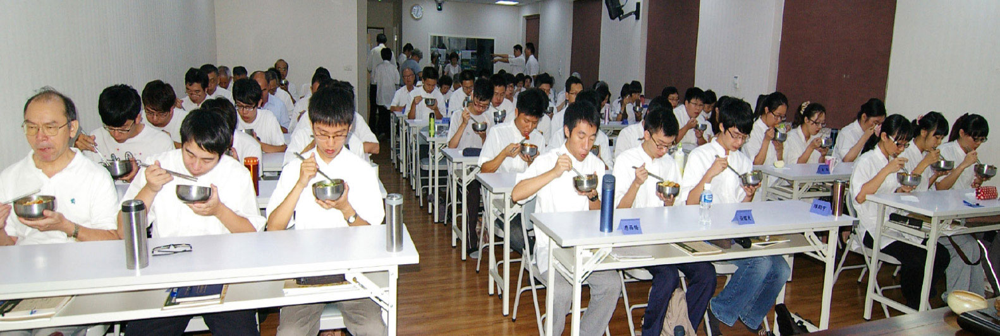

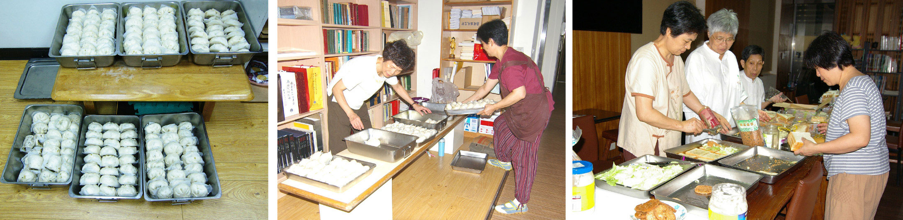

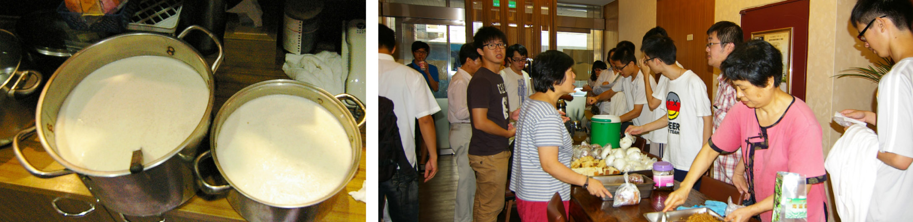

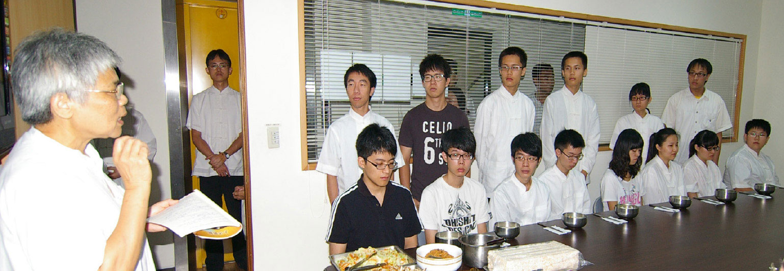

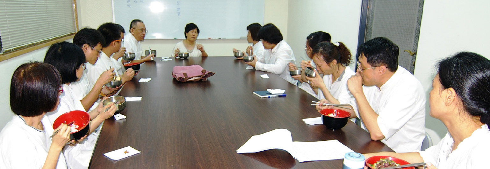

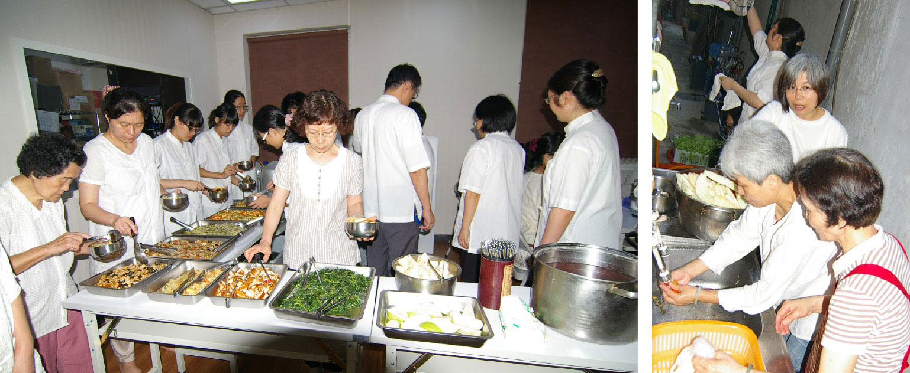

### 為初機大學生開的課程：普賢行願品講座　考題解答

*編輯部整理*

三世一切諸如來

於彼無盡語言海

恆轉理趣妙法輪

我深智力普能入

二０一二年七月八日至十四日

一、試述修持十大行願，所對治的十種病，所獲得的十種利益。

禮敬諸佛，對治我慢病，獲尊重身益。

稱讚如來，對治惡口病，獲辯才益。

廣修供養，對治貪吝病，獲富饒益。

懺悔業障，對治邪見癡迷病，獲正知解脫益。

隨喜功德，對治妒嫉病，獲多眷屬益。

請轉法輪，對治謗法病，獲多聞益。

請佛住世，對治迷惑歧路病，獲福慧雙增益。

常隨佛學，對治追逐欲塵、自召纏縛病，獲理智清淨益。

恆順眾生，對治我執病，獲正見正念、一切和祥益。

普皆迴向，對治法執病，獲無相益。

二、三種華嚴傳入中土，試敘述其難得處。

釋迦牟尼佛在世說法四十九年，示現涅槃後由五百大阿羅漢常隨弟子，公推大迦葉為上首，在耆闍崛山的大石室中，由多聞第一的阿難誦出經藏，持戒第一的優波離誦出律藏，經過大眾的印可，完成八萬四千法門，這是佛典的第一次結集。

其後經過約七百年，龍樹菩薩誕生於南印度，遍閱當時的三藏經典後仍覺有所不足，許多經典都因年代久遠而遺失，幸遇大龍菩薩將其帶入龍宮，見到了所有遺失的經典，包括華嚴經上、中、下品，並在離開龍宮前，將華嚴經下品十萬頌默記在心中，回到印度後就將華嚴經記為文字，普傳於世。

華嚴經最早傳入中國是在東晉時期，有位沙門支法領，好樂大乘，長途跋涉到遮拘槃國求得華嚴，攜歸中國，即六十卷華嚴梵文原本。爾後有位沙門智嚴到北印度罽賓國求法，並祈求高僧弘化中國，時群相推薦佛馱跋陀羅，佛馱跋陀羅愍其精誠，慨為應允，歷三年，乃度蔥嶺而至交趾，經海道而達中國。東晉義熙十四年(西元四一八年)，由吳群內史孟顗等，聯名恭請佛馱跋陀羅尊者，將支法領請回之梵文華嚴經，譯梵為華，尊者義不容辭，集沙門法業、慧嚴、慧觀等一百餘人於建康(今之南京)道場寺，共襄譯場，前後三年，完成六十卷三十四品，三萬六千偈華嚴經本之翻譯，人稱六十華嚴，又稱晉譯。

其後經過二百多年唐武則天時，禮請賢首大師為國師，弘揚華嚴，師深感晉譯華嚴處會未備，聞于闐國尚藏有梵文本全經，乃遣使訪求，兼請譯師。時于闐國王見唐使前來，便承應其請，並派遣博通三藏及擅長華嚴的實叉難陀尊者，賷經東來，於證聖元年(西元六九五年)在東都洛陽大內徧空寺，譯梵為華。武則天親臨譯場襄助，潤毫綴序。由南天竺沙門菩提流支及精通梵文之沙門義淨，同宣梵文，並有高麗留華僧圓澤、圓測；更付神英、法寶、弘景、復禮，及傳華嚴宗脈的法藏等，於佛授記寺，潤飾詞藻，至聖歷二年（西元六九九年），方得完成現行共八十卷，三十九品，四萬五千偈之華嚴經本，人稱八十華嚴，又稱唐經。八十華嚴譯出後，賢首國師啟講，武則天御筆親作「無上甚深微妙法，百千萬劫難遭遇，我今見聞得受持，願解如來真實義。」，這首偈本是讚華嚴經的，後廣為流傳成為開經偈。

跟據歷史紀載龍樹菩薩所傳誦的下品華嚴經計有十萬偈，八十華嚴只有四萬五千偈，仍未及一半，但內容大抵周詳，不過不論六十華嚴或八十華嚴都沒有流通分到入法界品。

約再經過一百年後，唐德宗貞元十一年（西元七九五年），南天竺烏荼國王手書四十華嚴梵文本，連同表章進貢德宗。德宗獲此梵筴，欣喜無量，於貞元十二年（西元七九六）六月五日，手詔北天竺罽賓國般若三藏，於長安崇福寺譯梵為華。參譯者有西明寺圓照筆受，成都昭覺寺沙門弘道、鑒虛潤文，千幅寺道通證義，太原崇福寺沙門澄觀、靈邃詳定，並由霍仙鳴、竇文暢闡寫。於德宗貞元十四年（七九八）二月二十四日，譯成現行四十卷華嚴經。其實四十華嚴就是前二譯的入法界品，但前兩譯都沒有流通分，唯四十華嚴譯出後，華嚴經才有完整的序分、正宗分、流通分。

華嚴經在印度一度失傳，幸得大龍菩薩保存在龍宮中，並由龍樹菩薩從龍宮背誦出下品，再輾轉經過了兩百多年才靠著高僧大德的長途跋涉傳入中土，翻譯經典的法師都是經過多年的學習才精通佛法、梵文與中文，且若非以國家之力，也難以集結眾多譯經的人才共同來翻譯，此外今日我們可以輕易讀到三種華嚴經的譯本，像天台宗智者大師因出生的年代只有六十華嚴，沒看到四十華嚴的流通分，除了諸大菩薩外，還有聲聞、天、龍、夜叉等眾同聞，因此判教時，以為釋迦牟尼佛示現成道後於菩提樹下默然了三七日，是正在定中為法身大士們宣講華嚴經，非聲聞、凡夫所契機，但從流通分就可以知道佛說法時，即使是最深的義理凡夫都可以理解。

三、普賢菩薩心量的廣闊是以四種窮盡為因而使自己行願不窮盡，試敘述之。

普賢菩薩的行願是隨著虛空界盡、眾生界盡、眾生業盡、眾生煩惱盡，其行願才有窮盡，然而虛空界乃至眾生煩惱都是沒有窮盡的一天，可見普賢菩薩的心量是非常廣闊而沒有邊際的。

四、諸供養中法供養最，何為法供養？

法供養有七，如說修行供養、利益眾生供養、攝受眾生供養、代眾生苦供養、勤修善根供養、不捨菩薩行供養、不離菩提心供養。

五、十大行願中，以四願攝三回向，試敘述之。

恆順眾生為回自向他，恆常隨順、善巧方便的幫助眾生拔苦與樂，並將所作善法的功德都回向給所有眾生。

請佛住世和常隨佛學為回因向果，想要成佛的最快方法就是請佛示現說法，並且要恆常的跟著佛學習。

普皆回向為回事向理，空性的智慧是人天涅槃正路，因此在事上修的種種功德要回向給證悟空性的智慧。

六、請敘述從因到果的五果差別相。

１．增上果：即環境，若惡業所感的環境即是修行的障礙，若善業所感之環境即修學之順緣。

２．等流果：分造作等流和領受等流，造作等流是指如果前世有修學的行相，此世即有修學的力道，往昔貪的習氣，來世也易生貪念；領受等流是領受前世善惡業所形成的苦樂果（約滿業而言），如果前世喜好布施，來世招感富貴的果。

３．異熟果：指投生到哪一道的引業成熟，而生起該道的生命現象。

４．士用果：士夫的作用，如以勞心或勞力這一分作用，受用前世善業所形成樂果。如農夫以精勤四體，分植五穀而豐收。

５．離繫果：修學正法，特別是般若這一分，能令自己離開煩惱業的繫縛。

七、本品中有三處導歸淨土，請將經文默寫出。

又復是人臨命終時，最後剎那，一切諸根悉皆散壞；一切親屬悉皆捨離；一切威勢悉皆退失；輔相大臣、宮城內外、象馬車乘、珍寶伏藏，如是一切無復相隨。唯此願王，不相捨離，於一切時，引導其前。一剎那中，即得往生極樂世界。

是諸人等，於一念中，所有行願，皆得成就；所獲福聚，無量無邊！能於煩惱大苦海中，拔濟眾生，令其出離，皆得往生阿彌陀佛極樂世界。

願我離欲命終時，盡除一切諸障礙，面見彼佛阿彌陀，即得往生安樂剎。

八、請說出華嚴三聖與西方三聖之名號

華嚴三聖：釋迦牟尼佛、文殊菩薩、普賢菩薩

西方三聖：阿彌陀佛、觀世音菩薩、大勢至菩薩

九、普賢有人普賢與法普賢，人普賢之修學法分為道前、道中、道後，請配合五道敘述之。

人普賢：道前（資糧道〜十住、十行、十回向；加行道〜煖、頂、忍、世第一。）、道中（見道位〜初地的第一剎那；修道位〜初地第一剎那的後一念到十地。）、道後（無學道〜成佛）。

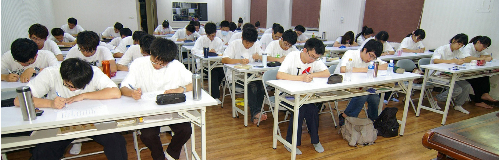

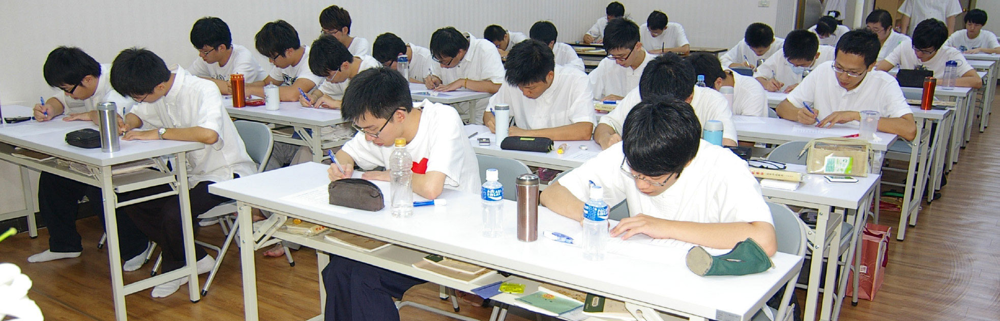

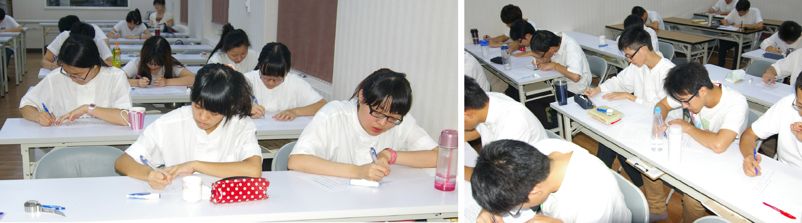

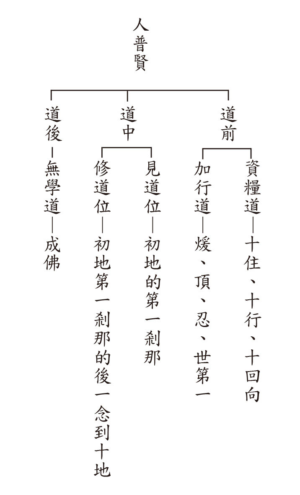

### 為初機大學生開的課程：普賢行願品講座　學習心得

*編輯部整理*

所有益我善知識

為我顯示普賢行

常願與我同集會

於我常生歡喜心

二○一二年七月八日至十四日

丁以恩

光陰似箭，學長們入大學的影像都彷彿還在眼前，而如今我都要升大二了。回想去年暑假參加了心經的講座，那一次的講座使我相當震撼。佛學原來不只是善有善報，惡有惡報那麼簡單，而當時很多觀念聽不懂，佛教的專有名詞更是聽不懂。

一年過去了，來到〈普賢行願品〉的講座，由於這一年當中參加了週六的大專班、基隆淨宗學會的課程，使我在這次課程中，在佛法的觀念上有了很大的增長，但在佛教名詞上依舊是模糊，努力的空間還很多，願我未來可以更精進。

回想這六天，除了老師上課的用心，也看見各位師姑師伯的用心，從三餐餐前觀修到法語，都是師長們苦思出來的，在此說聲謝謝您們，您們辛苦了。

古家慶

我覺得我自己好像只懂得表面上的意思，而不知句子裡的內涵，而且當我聽完同學們的心得，發現自己有種奇怪的感覺，好像是種後悔的心，不是因為不法喜，而是懊惱自己假如上台分享會不知道怎麼分享，上課時看到同學都在振筆疾書的抄筆記，自己感覺不抄不行。但是我會繼續努力，雖然在上課時，有許多不懂的地方，但是課後查字典時，就很快找到我想查的名相，覺得是佛菩薩暗中在幫我，希望未來聽佛法的時候，能夠懂得更多，謝謝老師。

古家華

第一次來此學習，得到諸多法喜，雖名相大都不懂，但增加了末學的好奇心及好學心，並且也誠懇祈請老師多多指教。在學習過程中，開始知道如何抓住重點等，真的很開心。希望盡未來劫能修普賢願，能度化眾生遠離六道。祝老師身體健康！

吳承軒

之前我對華嚴經的理解只侷限在淨行品中，如今的我已讀了普賢行願品，才知曉原來我即便將此二品全數讀通，也不過只見佛法的冰山一角罷了，聽了老師對華嚴經的概略介紹，我才明白自己是隻井中之蛙，在佛學那無邊的滄海，我只不過知其一粟而已。在成佛的路上只是剛剛離開起跑線不遠。

新生入門百無禁忌

什麼問題都可以問

若要說普賢行願品中最令我有所感觸的，那非屬導歸淨土那一段不可，無論是老師親敘己身在人臨終時伴隨其側的經歷，抑或是同學在分組研討中所談及的經驗，都令我感觸良多。我想到了自己年邁的親人，我希望他們也能在臨命終時有人陪伴助念，一起送他們到西方極樂世界，遠離人世間的諸苦，淨土法門實在解救了數之不盡的苦難眾生，也為他們，不，也為我們打開了一扇希望之門，不必再經歷那三大阿僧祇劫的輪迴苦。

暢所欲言，茅塞頓開

最後，要感謝老師不辭辛勞的教導，為我們提供如此良好的學習環境，而老師卻為這六天的課程，喉嚨沙啞，精神疲憊，我實在是為頭幾天的不專心感到慚愧不已。華嚴經乃經中之王，武則天所撰「無上甚深微妙法，百千萬劫難遭遇，我今見聞得受持，願解如來真實義。」如此讚譽，實是當之無愧。

分組討論氣氛融洽                                                                                                                挑燈夜戰

許立佳

從第一次的十四講表到這次的普賢行願品，每一次都排除困難來參加，雖然都聽不太懂，但是經過多次的聽聞和週六的大專班課程，發現自己慢慢在進步，能聽懂的越來越多，也產生較大的興趣與信心。從一開始學習所生起相當大的挫折感，甚至是排斥感，到目前有一點信心，願意聽聞也願意了解其中的義理。老師曾說過，如果想要學得好，就必須耐得住煩，雖然我每一次都遭遇困難，但是還好堅持下去，持續努力就會成長。普賢菩薩的心量如此之大，就顯得自己的心量很小，還有許多要學習的。

有問就有答，只怕你不問

張鑑光

此次參加普賢行願品講座，除了對教法有更深入一些的瞭解外，更知道自己對於佛學名相的基礎不穩固，仍須加強，才能使下次學習更為順利。此次最大的體悟是關於心態方面，看似困難之事，其實很簡單，看似簡單之事，才是難過的關卡。調整心態後，也許再回到學校後，更能結合發心以及心態上的改變，轉變看似已成定局的事情。過程辛苦難免，但是為了自我實現，願意以新的態度與方式去面對自己的人生，才不枉費聽聞普賢行願品以及師長們的用心。

王文徽

我相信佛法的正知正見是人生的出路。普賢行願品的秘密是，以十大行願內涵的功德，回向十地菩薩的十大修願，成就攝受普賢菩薩、文殊菩薩的行相，希望往生極樂世界，醞釀授記成佛。

海  辰

這次的心得，就是感受到快樂與希望。快樂的是沒想到在美國念書，還有因緣回來聽課，開心的是有許多新朋友一起共學增上。聽聞十大願，充滿希望，願此樂與願相續不斷。

陳秉均

經過這次所學，我的知見增加萬分，使我得法喜，又藉由小組討論，能讓我更深入了解細節，最讓我感動的是唐老師與善知識們教不倦，使我學不厭，加上在這幾天結識了許多朋友，課後與朋友一起討論、共修，是難能可貴的，在這幾天我也見識到佛的智慧是如此的寬廣與博學，使我從今往後能相續不斷的在唐老師的帶領下學習，來讓自己不再是一個草包，不再是一個只會創造業障的人，而是一位可用的人才。

大堂聽聞，小座解惑

劉益豪

感謝老師慈悲讓弟子有機會參加如此講座，也感謝各組消文和帶隊的師長及默默付出的發心義工，不管在世間、出世間的增長、功德皆回向十方有情眾生，及為此講座參與之所有人員。

分組討論腦力激盪

弟子從小跟隨家庭學佛親近善知識，懺悔自己業障甚重，小時候到現在所參與之所有課程未能入心，深感愧疚，所幸始終沒離開團體，近年也出席拜懺、淨苑打掃及各類活動，藉著服務累積福報資糧，此次講座漸漸聽懂部分，對內容和學習比以前有少許撥雲見日的感受，因此在福德分上須更發心修學，希望藉此能讓弟子在未來的道路上也有機會成為人才，增長自己各方面的能力，跟上大家的腳步。

陳秉鉞

學佛法學儒學，最主要就是增進自己的內涵。六天真的過得很充實，雖然一開始完全跟不上老師的速度，很多法相名詞也聽不懂，不過還好有分組座談，大家一起討論，還有高老師的幫助，再來晚上等待洗澡的時候，大家也會圍在一起互相討論，筆記一天比一天還多，因為自己聽到的別人不見得聽到，別人聽到的自己不見得聽到，就這樣，我慢慢的漸入佳境，雖然還不知該如何運用在生活上，但我還是會盡力把普賢行願品的內容弄明白。謝謝唐老師的教誨還有諸多善知識的幫助，更要謝謝師姑們在這種天氣，為我們準備美味佳餚，讓我們更有活力、精神上課。

陳時恭

自從上大學以來，就因為學校等其他因素的緣故，逐漸與佛法越來越疏離，只剩下日常的念佛而已。而這次因緣際會，參與了本次行願品的講座，從原本的不是很懂、似懂非懂、逐漸弄懂，越來越懂；在這些階段中，也逐漸找回兒時對佛法的一些記憶，原來這些記憶並沒有消失，只是被我塵封了而已。從開頭的科判開始了解，然後進入十大願王，雖然說在課程中，總是不斷的要想辦法拒絕周公約我聊天，但仍然感到獲得了許多的法喜，不僅更加確信了自己日後要往生極樂的決心，同時也重新點燃了好樂佛法的火苗。這次的講座，除了重燃學習佛法的熱情之外，更拉近了我與父親的距離，加深了彼此的感情，同時了解父親原來是距離最近的寶庫。過去，我在寶山中卻天天空手而回，往後，我將會好好的向爸爸學習。

出坡服務也是學習重點

唐微智

此次參加講座，覺得聽得很順暢，雖然仍有很多不懂之處，不過大致上比以前進步，我覺得這也是因為每次講座不斷的串習而成，現在聽法也能有法喜。普賢十大願非常殊勝，是能實際運用到生活之中的，每一願都可以與其他九願做殊勝的結合，希望往後我能時時信受奉行。此次也解答了我多年的疑惑，我一直以為念佛比教法重要，因為念佛才能幫助往生，而透過普賢行願品的課程，我才了解教法的重要性，教法能夠開通很多觀念，開啟善根，也能在念佛的時候做更深入的觀想，一個人觀念轉變一切都會變得不一樣。

唐維典

能懂得如何禮敬諸佛、稱讚如來等十大願，以及聽聞普賢行願品是一件百千萬劫難遭遇的事，希望眾生都能夠擁有此一殊勝之聞法機會，也願將來能有佛菩薩之證量、大悲心。

晏家方

第一次參加這樣的活動，感覺在這樣的環境，把一整部經從頭到尾的讀完是非常難得的一件事。雖然對於整部經文還有說不清的及不了解處，但是在分組討論及晚上睡覺前繼續討論的這種環境讓我受益良多。之前在學校的時候，常常都在班上前幾名，使自己非常有自信，但是到了基隆淨宗學會參與人才培訓班後，發現不管從任何角度看自己，都還差得遠，還需要花更多的時間研究正法。這次聽完講座赫然發現自己的心量變大，聽完普賢行願品讓我想將此十大願的觀念行持常隨身旁，希望自己能夠在未來做傳承正法的事業，不只是傳承正法，也希望能夠改善社會風氣，使全世界都能成為淨土。

反芻時間—靜夜中

背書抄筆記思考義理

黃彥廷

這次的講課內容非常豐富精采，第一次接觸殊勝的普賢十大願，很高興有眾善知識聚會的因緣，大部分名相上的問題在幾天下來改善了許多，對於佛法也多了一份信心。

頒發獎學金

在提到求生淨土的時候，我心想過自己現在離開該是多有福報的因緣善果，分組討論時楊老師說到，阿彌陀佛接引條件是臨命終時那一念是阿彌陀佛佛號的清淨正念，而這必須來自往生者與阿彌陀佛的感應道交，如何確定往生者是否往生，得先問問自己助念時是否誠心，那樣功德是有差別的，而你盡力了，你只能相信他已經往生。我問的是自己是不是在爸爸過世時誠心所致，我真的誠心希望爸爸能往生。所以我想這樣就夠了，當時家裡很精進的一直念佛與讀誦地藏經。感謝唐老師與各位大德當時的助念，告別式與作七、百日等等的幫忙，不甚感激。在課程中讓我理解到，親近善知識才能有正見與福報，盡除種種障礙，在人生大事上成就。

蕭惟元

此次六天密集的課程，讓學生深感獲益良多，除了殊勝教法的研學之外，所以老師們的用心，蓮友大德們的投入更讓學生體悟到團體和合的重要，辦事原來是需要眾人的共同努力才能成就。

王姿云

因為大學考試已經有一段時間沒有參與許多殊勝的活動，在準備考試時，其中一份心意便是考上北部的大學，避免離學會太遠，會斷了學佛的寶藏之路。考完參加了普賢行願品的大專班課程，一開始對於經中有些名相實在不能了解，一些義理也不能加以體會，真的有些慌張，然而一天一天下去，透過小組的討論，下課的發問，回家請教爸爸，真的越生法喜，漸入佳境，在這六天的課程中，最令我感動的便是聽聞華嚴經的福報，經文中較量了布施和聽聞的功德，令我的心為之震驚，我不禁為聽聞華嚴經的殊勝功德生起無比歡喜，也讚歎普賢菩薩廣大的十大願力。這幾天下來，真的非常充實，在這裡的所學都能做為我未來增上的資糧，願我時時奉行，時時增上，才是對在這裡的殊勝場地、美味佳餚、辛苦的師長最大的回報，也是對自己最大的回報，感恩。

許熒純

這次參加講座感覺跟以前又有不同的感受，之前遇到聽不懂的往往會進入神遊太虛的境界，不過或許先前聽聞浸潤之久，加上同儕間一股積極向上的力量，這次聽課自我要求，像在預習自己準備講課的內容，務必能記下每一處老師所講述的重點，每一天都會檢視自己，到底在聽課上有什麼樣的障礙，也很盡力的在架構上抓重點，希望一次次都能抓到一些些。在小組討論方面，因為老師們的循循善誘以及耐心解答，使我變得敢提問，也試著消文。以前總是懼怕自己的問題太淺，也怕老師講解的太深，可是總有幾次課後和大家討論，發現大家都有同樣的問題，於是就統合意見提出問題。透過討論彼此補充筆記，也針對問題做了探討，雖然還無法背下內容，必須拙劣的講解，可是至少弄懂了一些經文，這讓我很開心。

研討的這幾天，雖然心思不時被一些情緒所擾，不過都會勉勵自己著眼當下，心慮明淨抓著一條道路，正確的向目標走，讓自己盡力的充實，做更多利益他人的事，遠比為了小事而煩心痛苦好，我想這條路是收穫滿滿的，雖然心情起伏時隱時現，但未來一定會越來越好，漸入佳境，老師們，謝謝。

陳期宇

這次參加大專佛學講座，收穫之多且法喜充滿，原本以為連續六天坐在教室中研讀經書會十分痛苦且漫長，沒想到一眨眼已來到最後一天，經過這次普賢行願品講座，我才終於了解何為淨土宗，如何成佛，但佛的智慧果真不易，讀誦了百分的普賢行願品，但聽懂了幾分，能夠內化幾分，都還仰賴學生的再用功，雖然幾天下來一度認為學生沒甚麼善根，但我相信老師的話，時間、同儕是關鍵，只要肯花時間與同儕共同鑽研，相信必能有所成，最後感謝所有老師學長與師姑們的辛勞。

余紹永

很高興這次的講座能有這麼多的同學參加，比起上次更能感受到學習佛法上不是少數的一群人，在晚上的課後切磋中感受到同學對佛法的熱情，更讓我有動力往上繼續。在這次中多了很多新面孔，自己也變成比較資深的學長，並可以幫助其他同學解答一些佛法的問題，才發現自己也正一點一步的往前走，感謝老師這麼多年對學生的教導，並一直讓學生踏實的往能利益眾生的人才前進。

晏家文

這一週有太多的感受，在腦中無法一一詳述，見老師帶著風寒不停的為我們說法，自己卻無法認真上課很自責，無法不打瞌睡真慚愧。見師姑老師們在廚房用神奇的方法變出一餐又一餐美味的大餐，真的是萬分感謝，晚上討論時，桌上都有宵夜唾手可得，師姑很忙人手不足時見到我卻總說「快去念書」。還有母親的支持，每天帶學長們的髒衣服來回卻非常快樂，因為他們都來上課了。一切都太感謝感動，也期許自己在成長且踏實。

蔡濟舟

千經萬論處處指歸，往生西方淨土，吾等必須精進不懈，解行並進，傳承聖教，弘揚淨土，並決志往生西方，勤修戒定慧，息滅貪瞋癡。

應雨橋

講座後須好好複習並弄懂此十大願王，並開始在日後的生活中講究練習以十大願來攝持行住坐臥、言語等，使福慧增上廣大。此次大專生形成的團隊凝聚力以及向上的勢頭皆第一次看到，若能延續，相信日後整個氣象將難以想像。

莊惟盛

非常高興能聽聞老師的教法，老師解經於觀念於用字都十分講究、精準，這是學生非常喜愛的。學生以為精準、明確的學習經文中的字字句句，才能得到最清晰的概念，解決自己的問題，解決別人的問題。若未來有一絲一毫的成就都要感謝老師。老師辛苦了，希望老師能保重身體，心情愉快。

汪鎮宇

從開課前的不安，到第一二日的受挫而感到無力，再到第三四天乃至最後一天，因小組分配、課後的討論，再加上適應作息，大堂上課也越來越能跟上進度，雖然還有很多問題還沒解決，但還是令自己感到興奮。因為可以感覺到一點一滴的在成長，越來越多東西可以聽懂。不過同時更感到不足，只希望可以多學多念多討論，雖然已經有超齡問題，但仍想厚著臉皮加入週六大專班學習，希望能更精進。

我相信學佛學儒會讓自己越來越好越善良，如此更能讓人信任。而正法工作均能有益，須認真努力。

蔡易儒

上完課後，自己對於佛法的內涵和修學的方法又有更多的了解，原來單單禮拜、稱讚等就能做這麼多觀想，使十大願通通具足。佛法小者見小，大者見大，愈深入無上甚深微妙之法，還須有善知識的引導和自己的發心，希望將來能更了解華嚴經的內涵，並將十大願在生活中串習觀修，於研學佛法上日益精進，將來往生西方，也希望自己能如顏回和善財童子一樣，具足弟子相。感謝老師這幾天辛苦的教誨，願老師身體健康、平平安安，您辛苦了。

黎子健

這一次普賢行願品的課程中，了解到佛的智慧，是非常的不可思議，再加上唐老師的悉心教導和殊勝的環境，使我學到一些改變我畢生想法的思想。當初學百法明門論時，其實不太清楚佛學的概念為何，但是這七天所學到的普賢行願品，我已經對佛學的概念有所理解，學會了很多名相，並理解其意思。

例如因果，過去我認為只有這一生，但現在才了解到還有前世和下一世，但一樣都是在輪迴，所以我們現在吸收佛的智慧，培養自己內涵成為人才，再給別人出路，種下更多善業，讓自己有希望能登極樂世界。最後感謝各位老師的悉心教導，讓弟子受益無窮，萬分感謝。

胡芳瑋

還記得課前一直煩惱六天的課程如此漫長，平日的許多活動都將暫停，現在想起這些也許就是能讓我們以清淨的身語意修讀普賢行願品的善巧方便之一，在聽課的前幾日，精神與腦中一直徘徊著種種世俗之念與厭煩的念頭，堵塞了雙耳，也將學習的因緣棄之於隅，然而幾日過去，心中的雜念漸消，聽課時的理解力也大增，只是在思辯的過程中，一直會執著於過去的認知中，無法真心信解，然而在經過與母親的談話後，在電話中一來一往的對話，思緒經過整理，心也安定下來，使最後一日的普賢行願品有個喜樂的結束，如此觀念的轉換還是我需練習的，也是我一直所追尋的人生目標。

游皓文

首先感謝老師、助教們、蓮友大德、高老師、班長與同修善知識們的共學，護法善知識提供美味佳餚，尤其老師早課的開示，讓末學深深衝擊感動，不管是說去養老院的經驗，過去學佛困難處，讓末學懂得了百千萬劫難遭遇的真正意涵與生命真正的真相，其辯才之妙，真令末學渴望學習到達。末學相當喜歡普賢十大願，相信此願王能幫助他人離苦得樂，為此深信不疑。末學必定回家後會時時刻刻溫學，不斷精進，因為想助眾生拔除一切煩惱。在此發願。

張嘉倫

這次普賢行願品講座六天裡，學生從一開始很多地方聽不懂，經過分組研討，向同學請益，慢慢的對普賢行願品了解更多，知道其所蘊含的深意，對學生獲益良多，雖然對普賢行願品還有很多不懂的地方，但透過這次講座在心中已種下學佛的種子，未來要更努力學習，使其發芽結果。

我願如斯佛自知

吳思樺

佛法之深廣令人難以想像，常說要眾善奉行，才能得好報，不致墮畜生道、餓鬼道，也增加對善法親近的機會。對於這一次的活動，我比從前更多一分體會能聞善法的珍貴，老師不會教，同學也無法給予的正知正見我在此聽聞了。謝謝老師用心的講課，還有學長們無私的指導，更感謝同儕的相互扶持，相信在這裡我們都能一起增長福慧，而不是聚在一起嘻哈打鬧而已。在學校學習知識固然好，在學會增長福慧卻顯得更有價值，知識豐富的人很多，究竟有幾人擁有眼光與遠見看到未來，了解人生呢？

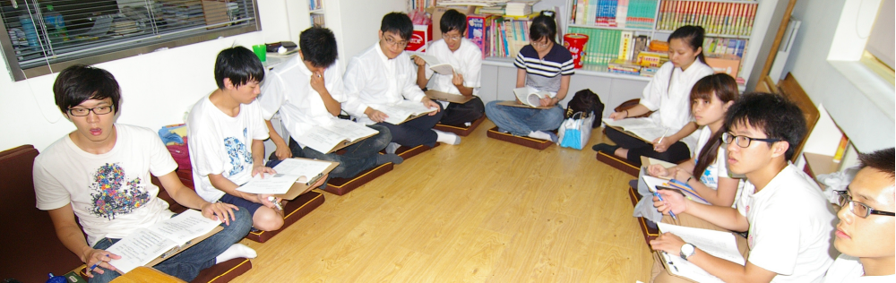

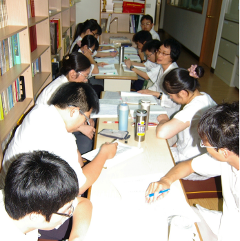

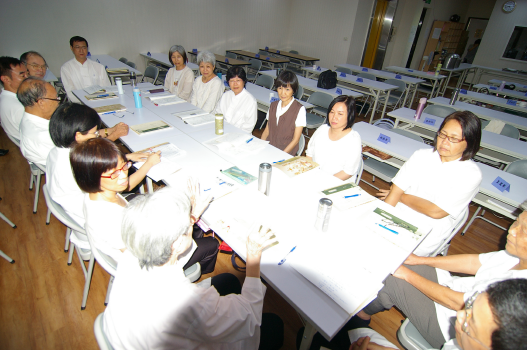

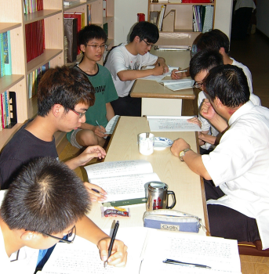

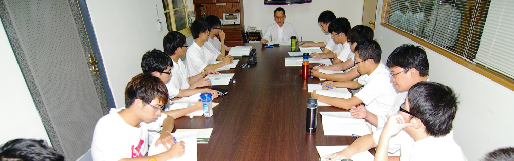

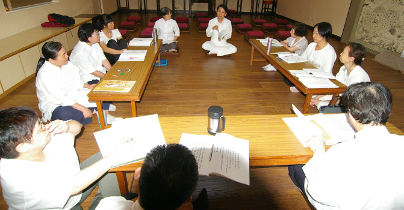

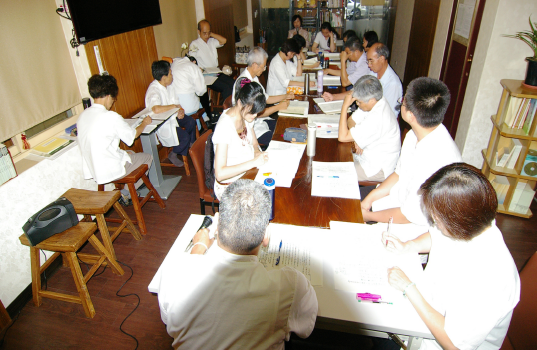

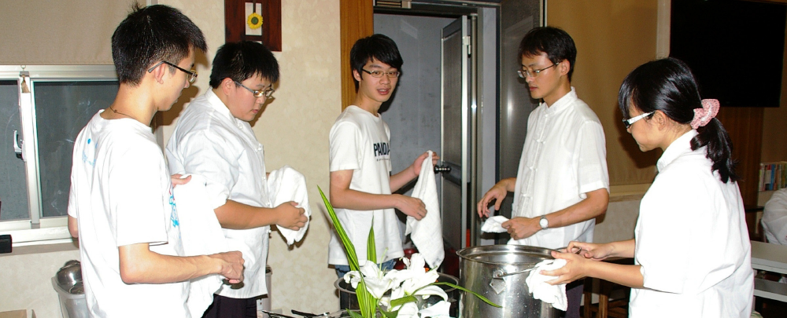

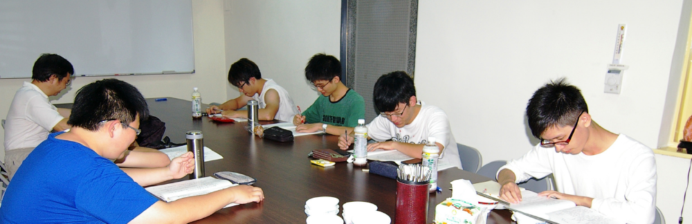

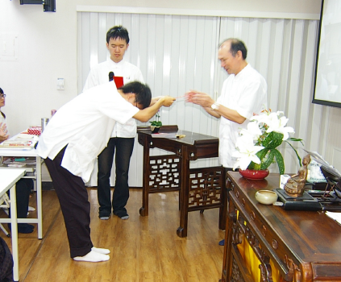

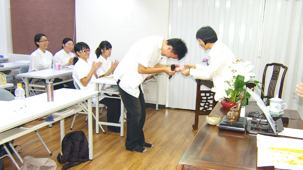

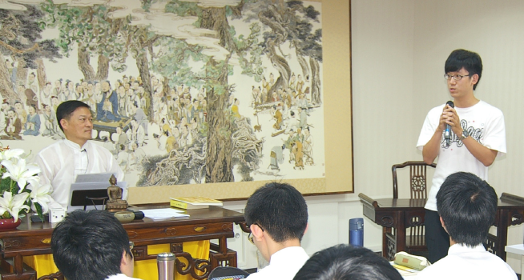

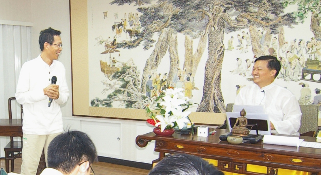

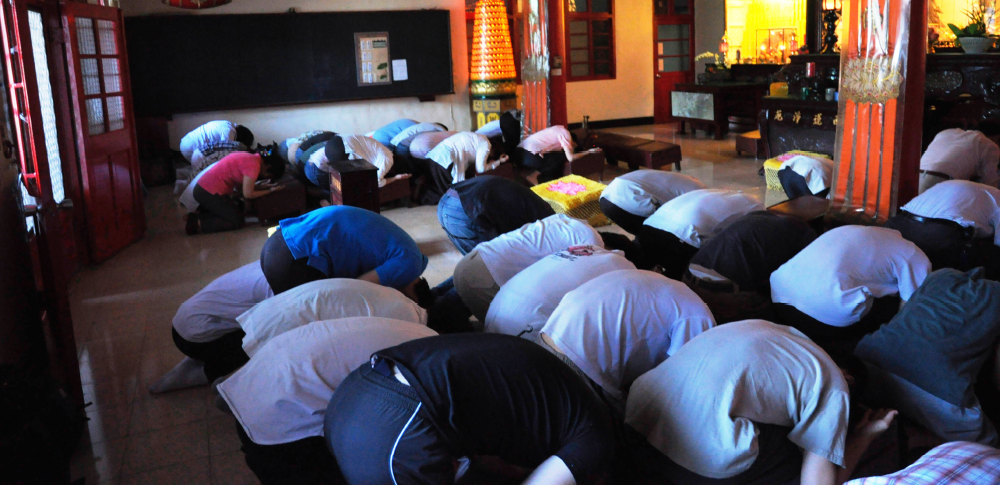

### 大專生的歷練—兒童生活體驗營　生活體驗營課程介紹

教學部

課程能治時代弊

基礎建設大樓穩

蒙以養正聖之功

能動能靜真學生

二○一二年七月二十二日至二十七日

中國傳統中對孩子的教學自幼講究孝順父母、恭敬長輩、灑掃庭除、應對進退等為人子弟的基本能力與態度，這些能力必須在生活中養成，所以家庭教育可說是人一生學習的根本，更是人格奠定的基礎，觀待家中的父母長輩引領培成，有了孝弟質地、服務的人生觀與虛心學習的態度，才許可進入學校受教，接受各種知識的學習成為人才。

反觀現今忙碌的時代，家庭失去為人子依止學習的功能，年輕的父母忙於生計，無法陪同孩子成長，無法親力親為給予最初的教導，忽略最基礎的教育之道；再者，西風東漸，多元化的思維及過多的教育理念，讓愛子女的父母們教育觀點失焦，忙於接送孩子，追求才藝多元的學習，捨本逐末的結果，培成看似多才藝卻生活無能的孩子。

所有學習基礎必須從生活立基，當基礎不在，所有學習只是空中樓閣般終不能發揮大用，反而會衍生更多教育問題。此次暑期啟蒙教育即著眼於生活體驗學習與培成，建立孩子們正常的生活作息，並擁有生活自理的能力，採團體生活方式，學習生活中應對進退、關懷他人的眼力與行動；再者，以定中定、動中定的禮儀學習法，讓身心安住。以下簡介此次課程的內涵、宗旨及目標。

每日到中正紀念堂晨跑，其中意涵在於鍛鍊孩子早睡早起的生活習慣，而且在沉睡的都市中起跑，能欣賞大自然賦予清晨的種種美好，從晨跑的經驗當中鍛鍊體能、訓練合群、遵守規矩，一舉數得。在中正紀念堂的巡禮當中，可以觀察到清晨的天空，太陽出奇的亮麗，天空無窮無盡的藍，充滿希望，令人心情愉悅，我們亦可看到各種早起的生活型態，如大清早為我們掃街的清潔人員、趕早出門工作的各類人士，及晨起運動的各類團體市民、無家可歸的流浪漢……等，各種景象都新奇有趣，令孩子們大開眼界。

教學與行政籌備會議

最後一天參與中正紀念堂六點整的升旗典禮，隨著憲兵精神抖擻、整齊劃一的腳步，在莊嚴肅穆的國歌、國旗歌聲中，仰望國旗冉冉上升時，心中忍不住的悸動，相信透過此次觀禮，我們更加感受到依存在這塊土地的珍貴，也彷彿增強了對國家的尊重及愛國的情操與民族性，這一刻，大家的心都交融在一起，想為國家奮鬥、努力。

講座前與家長聯絡舉辦家長會

晨間做早餐及出坡課程，讓孩子們體驗做早餐的樂趣及餐食可選擇的豐富多元性，讓他們擁有吃早餐、做早餐的能力，減少外食的過度包裝。出坡的鍛鍊是大家共同維護生活環境的整潔美好，及參與挑菜、洗菜來體會飲食得之不易，所謂「一日之所需，百工斯為備」，讓孩子們親身體驗，更能讓他們懂得珍惜、感恩。

晨間讀經，由動態的活動及出坡後，能靜下身心來，再以讀誦的方式來吸收此次授課的內涵。讀誦是學習的利器，可幫助我們快速吸收學習內容的綱領，有了印象後再聽聞師長的教導，能快速入心。

常禮舉要課程此次選擇居家、在校兩篇，分為行、住、坐、臥、言語五方面分類引導說明，讓孩子們能建立正確的生活學習態度，明白為人子、做學生的基本心態與禮節，透過老師們從不同的角度引導思維、問答與演禮，相信孩子們能深刻體會並融入日後生活中。

家事小高手，配合常禮舉要的內容做生活的實踐。舉凡日常生活中，穿衣吃飯等事宜，都可以從小培養，希望每個孩子都能從家事小幫手做起，好樂為人服務，進而成為家事小高手。

佛門演禮是將佛門的基本用功法，及其淨土法門修學的基本內涵做介紹引導，諸如：拜佛、經行、打坐及對西方三聖的認識，希望在末法時代，以儒家為基礎，可深入佛法的修學，成為法門龍象。

每晚開會修正做法和合辦事

晚上的影片欣賞課程，選擇良好的德育故事讓孩子們欣賞，輕鬆又具教育意義，隨著影片的播映，觀念自然能在孩子心中醞釀、發芽，促進他們思考，甚至轉變自己的價值觀，並由老師帶領討論，更能導正思維，烙印於心，故以影片作為一天的結束，是完美的句點，也是第二天美好的開始。

另外安排了歷史博物館的立體書展與中正紀念堂的恐龍展，除了展出內容的可觀性及趣味性，可開拓孩子們的視野，達到參觀學習的目的外，更可將所學的禮儀運用在團體戶外行動中，培養合群團結、自我約束的能力。

教學行政生輔各組執事介紹

啟蒙的學習是文化傳承的重點，觀待能傳的師資與好學的學子，從知禮、明禮、行禮完成，作質地上的培成，再深入經典內涵或世間技能的學習，使人生有目標方向，成為極有能力的人。

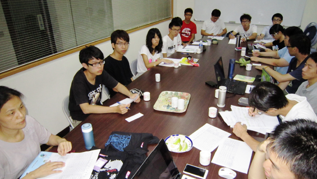

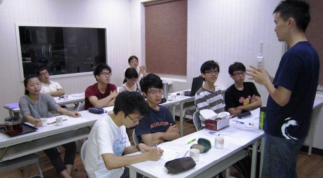

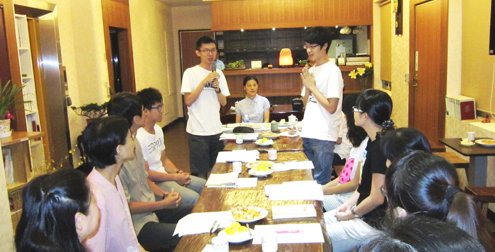

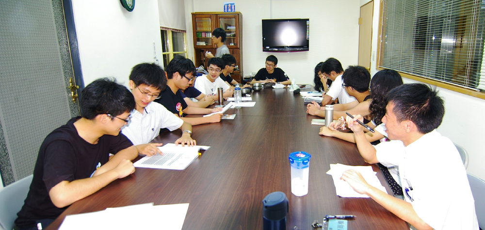

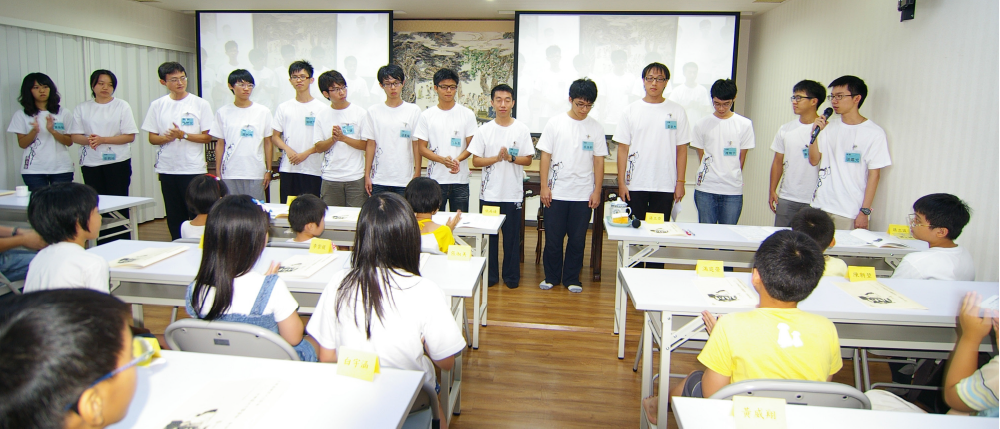

### 大專生的歷練—兒童生活體驗營　生活體驗營活動報導

唯緣

行政教學學著辦

和合辦事師長領

腦力激盪活潑中

行禮如儀成龍象

二○一二年七月二十二日至二十七日

前言

心靈成長班是學會每年寒暑假的重要活動，目的是藉由各類不同的主題教學來弘揚文化、培育人才。此次暑假的心靈成長班，舉辦於七月二十二日至二十七日，稱為生活體驗營，是以常禮舉要的居家篇及在校篇作為教學主軸，授課老師們從行、住、坐、臥四個方面，切入常禮舉要的內容，讓同學們認識、了解日常生活中所應具備的基本禮儀，並且透過演練，把禮儀具體的落實方法在課堂上表現出來。這次的課程中還搭配了家事小高手及佛門演禮，使禮的教學內涵更為圓滿。活動期間，同學們每天早上六點半起床，漱洗過後，在師長們的帶領下，大家一起到中正紀年堂晨跑，再回到學會用早餐、上課，全體師生都在規律而有朝氣的作息中學習。

開訓典禮師長蒞臨指導

本次心靈成長班還有一項最大的特色，就是在老師的指導下，由將近二十位的大專青年，來擔當同學們的課程教學、活動帶領及生活輔導，因此師生的比率將近一比一，課程過後，不只是來參加的同學獲益，所有參與的大專青年，也都感受到了從所未有的教學體驗。

七月二十二日

今天是學員們的報到日，除了臺北的學員，還有人來自臺中及臺南。原定報到時間為晚上七點，然而從下午四點左右，中南部的學員及家長們就提前到來。學會在七月十六日，已經為臺北的家長們舉辦過活動說明會，中南部的家長們當天未能參加，報到日的提前抵達，正好讓師長們有充足的時間與他們做更多的溝通與交流。

班主任致詞

晚上七點半，學員們在家長的陪同下全部到齊，家長當中有三位將會一同全程參與這一次的活動。大家擺放完行李，懷著新奇與些許緊張的心情，來到二樓教室參與始業式。始業式在全體向孔老夫子行三鞠躬的肅穆氣氛下展開，孔子紀念歌、無盡燈獻詞、師長致詞、規矩講解，一系列的安排，一步步將學員們的心，拉進學習的氛圍中。

七月二十三日

心靈成長班正式上課的第一天，首先要讓學員們彼此相識，大專生師長們於是設計了戶外的小活動，大夥兒一齊慢跑抵達中正紀念堂，在晴朗的天氣下、歡樂的笑語中，開始認識彼此。

回到學會用過早餐，同學們分為兩組，一組打掃環境，另一組則幫忙挑菜，這將是活動期間的例行出坡工作。第一堂的室內課是常禮舉要，每堂課程開始之前，都安排同學向老師進巾奉茶，在恭敬的禮儀中表現出尊師重道，也表現了傳承固有文化的那一份心。課程中，授課的老師從四威儀當中的「臥」，切入常禮舉要的條目，搭配著教學影片與課堂問答，同學們逐步認識這些文字背後的意涵。時間一下子就來到了中午，師姑及大專生們一大早就開始辛苦準備的菜餚，此時端到了教室後方，飯菜香飄溢在空氣中，然而師長並沒有讓同學們急於開飯，而是先由大專生師長帶領做餐前觀修，體會用餐所能夠學習到的益處，觀修後，大眾十分有秩序地排隊取餐，享用這一頓豐盛的佳餚。餐後在師長們的指示下，學員一一回到房間休息。

下午的常禮舉要課程則以「坐」的面向來說明相關的條目，此外還有家事小高手的教學，授課的老師十分細緻地將做家事的方法介紹給同學，這些看似簡單的動作，原來也隱藏著許多能夠事半功倍的技巧在其中，老師教導之餘仍不忘時時提醒同學，唯有回家多做多練習，才能從家事的操作中獲得那難以說盡的好處。

晚餐前進行的是佛門演禮及念佛一支香，來到四樓的佛堂，許多同學們第一次參與這樣的課程。雖然生疏，但大多能很快地適應，在老師向大家說明所有的流程後，眾人就在接續不斷的佛號及法器的敲擊聲中，體驗那份心中那少有的安定與寧靜。回到二樓教室，又見豐盛的佳餚，餐前觀修讓同學們吃出做飯人的用心，吃出自己感恩的心。

晚上沐浴休息後，在教室播放德育故事的動畫給大家欣賞。動畫的內容精彩、配樂動聽、故事感人，並由老師解說，引導同學們了解這些故事背後的深意。這一天的教學活動，就在古人的美好行誼中畫下了句點。

七月二十四日

活動期間，每天早上六點半同學們必須起床。少數幾位同學由於前晚無法安睡，以至於早上精神不佳。然而大多數的人在漱洗過後，都能展現出奕奕的神采。晨跑過後回到學會，大家感到特別飢餓，每位同學的胃口都很好，規律而又健康的生活真能帶來許多益處。

在第一堂上課前，學會安排了晨讀，讓同學們讀誦這一次所要學習的常禮舉要條目，昨天由於將時間用於規矩的佈達，晨讀因此未能進行，今天則有充裕的時間，讓同學好好地朗誦這些做人處世的重要條目。課程開始，繼續昨日授課未盡的內容，在這過程中還有班主任的穿插引導，指示同學們實際演練，讓課程更具內涵。接著再從「住」的面向來做教學。

用過午餐，大家期待著下午的參訪活動〜歷史博物館的立體書展。立體書是指非傳統平面的書籍，可以說是將文學與藝術結合於書冊之中，藉由新奇的創意，激發閱讀者的興趣，使讀者能在雀躍與驚奇中獲得知識。一行人在整齊的隊伍中陸續來到展場，解說員的用心，讓大家一一瞭解每一部書的特色所在。經過了兩天常禮舉要的學習，以及團體生活的相互影響，同學們觀看展覽時所表現的秩序與禮貌，讓負責解說的阿姨也不禁稱歎：你們真乖，都不會鬧哄哄地到處亂跑！

晚上的佛門演禮，則說明了拜佛的方法及要領，原來在這一下一上之間，有這麼多的細節，每一個細節都具有它的內涵。用過晚餐、看過德育卡通，大家紛紛就寢，經過了幾個晚上的適應，整體的睡眠情形更加穩定。

七月二十五日

體驗營至此已經過了一半，時光雖然飛逝，但是並未有一絲一毫的浪費，團體共學總是可見加乘的效果，特別具有攝受力。早上運動過後，同學們各個展現驚人的胃口，上課的專注力也十分良好。這一天上午的常禮舉要，簡短的四個條目，全部使用了三個鐘頭的時間才介紹演練完畢，可見條文背後意涵的豐富。整個體驗營安排了兩堂的家事小高手，今天下午是第二次上課。兩次的課程，舉凡摺被、掃地、拖地、收納、洗米等常見的家事，老師都十分詳細地說明如何操作。

師長期勉

晚上的佛門演禮，特別說明了繞佛的注意事項及靜坐的方法。來到晚餐的時段，熱騰騰又可口的飯菜端上桌，不禁讓大家驚歎，在學會所用的餐，不僅餐餐菜色不同，且色香味具足。主廚師姑的巧思及用心，讓同學們留下深刻的印象。一整天的課程，同樣是在德育故事的觀賞與老師的引導中落幕。然而，一天活動的落幕，才是師長們開會研討的開始。幾天以來的夜晚，參與活動的大專生團隊，都是如此勤勉地檢討當日的疏失以及隔日的計畫，期望能讓所有參與的同學滿載而歸。

七月二十六日

營隊接近尾聲，大家對於規律的作息以及學會的環境已經非常熟悉。六點半起床、晨跑、吃早餐、出坡、挑菜、晨讀，一天的行程能夠以這樣的方式開展，必定可以帶來無限光明的人生。但惟有賴於同學們回家後的堅持，才能掌握命運的鎖鑰。

擔當大任的大專生

今日常禮舉要的課程是以言語之道作為教學主軸，生動的內容加速了時間的進程，不一會兒就到了中午，下午是營隊第二次的出外參訪—中正紀念堂地球最古的恐龍展。藉由地利之便，學會師長們規劃了這趟行程，期望能夠豐富同學們的知識，同時也是增進同學們參與營隊的興趣。這次展出的恐龍化石，來自阿根廷聖胡安的伊斯基瓜拉斯托自然公園，該地又稱為月之谷，月之谷是過去二十年來全世界研究恐龍最熱門的焦點，兩千年時登錄為世界遺產。三疊紀恐龍化石、骨骼標本以及實際尺寸模型等，近八十件展品，藉由這次展覽首度在臺灣展出。同學們參觀展覽的規矩十分良好，有秩序確實能讓學習效果加倍，師長們或解說員不用把精力浪費在脫序行為的管束，可以盡情地發揮他們的專才來教育學童，這就是禮教的力量。

成果發表會                                                                                                                         行住坐臥威儀展現

結束恐龍展的參觀，晚上的佛門演禮時間，跟同學們講解了佛堂裡各種塑像及極樂世界妙果圖的內涵。演禮過後，大家的心思聚焦在晚上將要進行的成果發表會，討論、排演、練習，無論是師長或者同學，都希望能給晚會帶來最好的呈現。默誦常禮舉要條目、佛門禮儀的表演、播放活動照片、家長分享、老師致詞，幾天以來的學習成果，不只展現在這些節目上，更表現在同學們安坐聆聽時的定與靜之中。

坐如鐘                                                                                                                            立如松

七月二十七日

活動的最後一天，幾天以來培養的習慣：早起、晨跑、出坡、晨讀，不希望這是最後一次的操演，將這些習慣帶回家中延續於自己的日常生活，才是這個營隊的目的所在。為了帶學員們到中正紀念堂參加升旗，今天比平常又更為早起，清晨五點半，天還未亮，所有人就必須起床準備，來到中正紀念堂大約是六點鐘，負責升旗的禮兵們，跨著威武的步伐已經走到了旗桿下方，司儀的吶喊聲畫過長空，讓人不禁肅然起敬，短短十多分鐘的儀式，讓所有的參與者感受莊嚴的情境與到飽滿的精神。

初試啼聲成果斐然

回到學會，最後一堂的常禮舉要課程，從「行」的面向，深刻地剖析了遵守常禮舉要的意義。課程結束，大家用過中餐，緊接著就是下午的結業典禮，學會的老師們以及執行長語重心長地期勉每一位同學，未來務必要重視自己的品德及禮儀，唯有將這幾天所學拿來持續不斷地磨練自己，才不辜負幾日以來的寶貴的光陰。打包行李，踏上歸程，滿載的不只是二十多位同學的心，還有所有參與教學的大專青年。

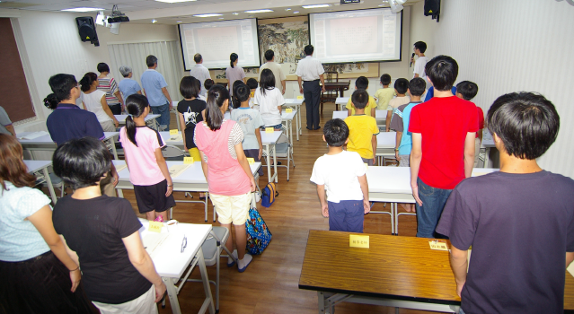

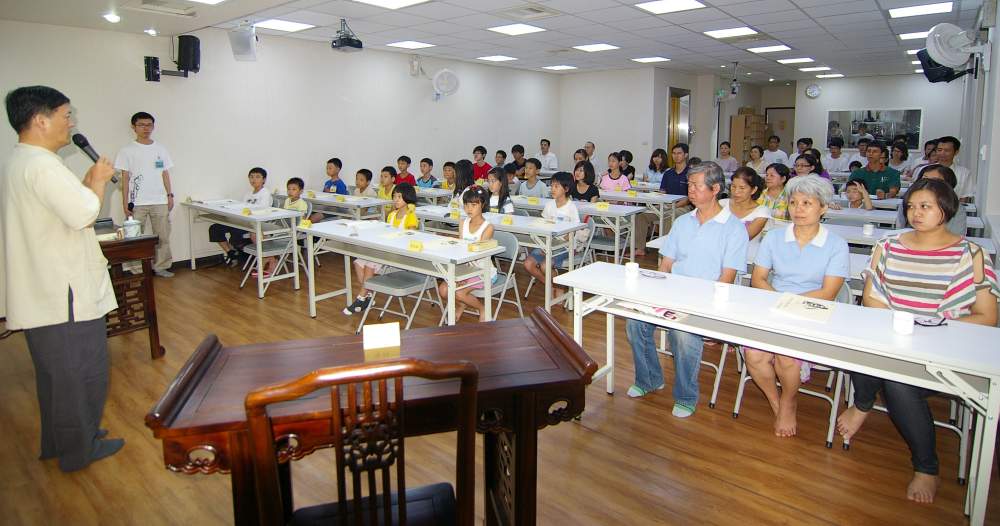

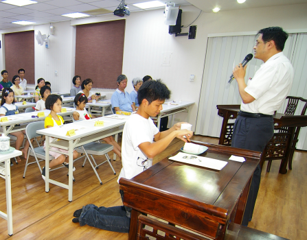

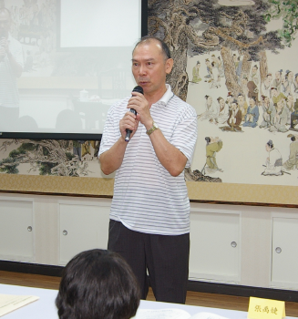

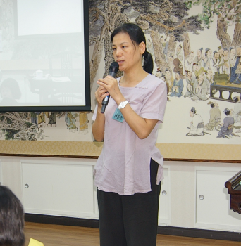

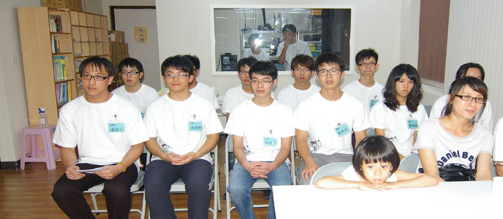

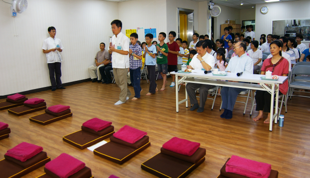

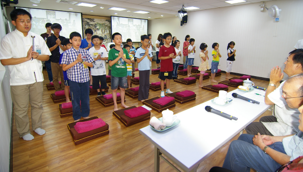

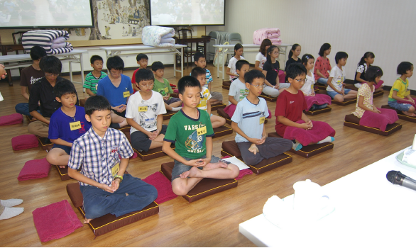

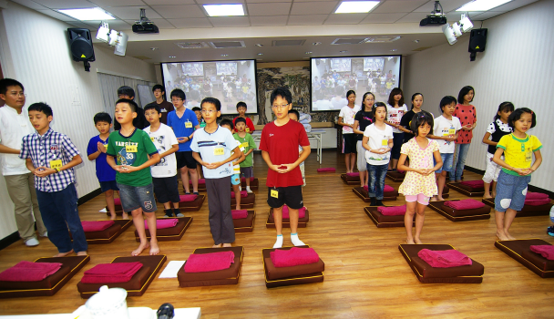

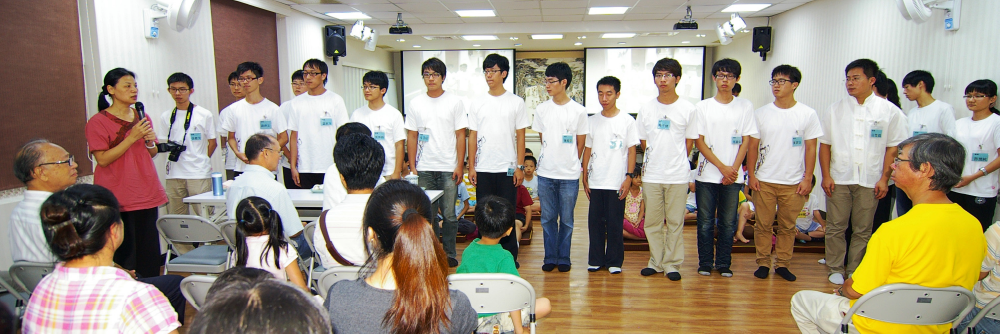

### 大專生的歷練—兒童生活體驗營　生活體驗營法語觀修

大專生

口出法語心存義

利益他人兼利己

不生狂慧謙待人

日久道力能頂天

二○一二年七月二十二日至二十七日

*念佛的功德利益 / 戒純整理*

老師、各位長輩以及同學阿彌陀佛。今天末學要來向大家報告「念佛的功德利益」。

佛的功德有四：一、佛身的功德。二、佛語的功德。三、佛意的功德。四、佛的事業功德。

第一、佛的身功德。佛皆為身金色，且相好光明。具有三十二相、八十隨形好。「相」是大丈夫相，「好」是具有內在功德的象徵。佛的相好說明他已經解決一切的問題。是為引導眾生都能離苦，所以他的相好已經圓滿所有的功德。

佛的相好是由於三大阿僧祗劫修福德資糧所成。在經論裡說，我們積全世界所有福德，還比不上佛一毛孔的功德。而集合佛身上所有毛孔功德的百萬倍，還比不上佛一個相好的功德。只要憶念佛的功德，看到佛像，就會無比的歡喜。

每日定課繞佛念佛

第二、佛的語功德。佛的話是真實的，絕不欺誑的。地上的小石可能會飛到天空去，大海也有乾枯的一天，但是只有佛語是絕對沒有欺妄的。不會消失，也不會改變。所以佛的正法語是清淨真實無比。而且有非常殊勝的功德。

第三、佛的意功德。分成佛的智功德及悲功德。

（一）佛的智功德：佛已經息除一切煩惱，證得空性獲得根本智、後得智。知道諸法總相與緣起的變化。

（二）佛的悲功德：佛是緣著苦眾生，興大悲而轉，佛的大悲心恆常輪轉，興起十力、四無所畏的大悲心，來救拔苦難的眾生，這是佛慈悲的功德。只要我們願意跟佛學，佛沒有不救度我們的。

第四、佛的事業功德。佛的身語意三業，皆任運無間，來饒益一切有情。在任何的情況下都是為了幫助眾生離苦得樂，從無間斷。這是佛的事業功德。

當我們憶念佛的功德，生起無比感激以及敬仰的心來皈依三寶，知道他們是我們唯一皈投依靠之處。現在讓我們提起正念，念這句阿彌陀佛，祈求能得佛身語意及事業的圓滿功德，並與佛結殊勝善緣，得其加被。

西方三聖的殊勝 / 心若

西方三聖即阿彌陀佛、觀世音菩薩、大勢至菩薩三者合稱，其中阿彌陀佛為主尊，觀世音菩薩及大勢至菩薩是脅侍菩薩，即阿彌陀佛的侍者，阿彌陀佛為他們的導師。

佛門禮儀—拜佛

首先介紹阿彌陀佛，阿隬陀佛成道之本緣，據無量壽經卷中記載，阿彌陀佛在世自在王佛住世時，發無上道心，捨王位出家，於世自在王佛處修行，熟知諸佛之淨土，阿彌陀佛為了要創造西方極樂世界，歷經五劫之思惟，發了殊勝的四十八願。此後，不斷積聚功德，終於願行圓滿，成阿彌陀佛，並創造出極樂世界，而極樂世界含藏了二百一十億佛國土的精華，非常殊勝莊嚴。

右繞於佛，不離善知識

佛的頭頂稱為「無見頂」，即看不見頂，其頭髮盤旋向上，謂之「法螺」，表徵無上的智慧。位於眉毛中間的，我們稱為「白毫毛」，就是白色而透明的毫毛，最特殊之處在於他會放光，能消除有情眾生的痛苦，尤其是能讓臨命終的人，全身柔軟，且不會害怕死亡。

佛的眼睛是紺青色的，即所謂「紺目澄清四大海」，他能看到十方有情的善根、福德、罪障、生活狀況等，尤其是能看到苦難眾生對他的求救，特別是想往生淨土的人，只要念佛，佛的眼光就會看到。而佛的眼睛低垂，表示他很有定力。

佛的眉毛是慈眉，表佛的善良，沒有煩惱，全替他人著想。佛的耳垂非常厚實，表示有福報。臉頰為「獅子頰」，非常飽滿，表尊貴。下巴圓潤，表厚福。胸前的卍字，表佛是能轉法輪的聖者。身披天衣，表出世而又富貴。而佛的右手捧蓮花，左手接引眾生入花苞，讓眾生能脫離娑婆，並在極樂世界的花苞中生。佛的手指很長，表他於過去生中能布施，其手掌厚實，表示樸實，而手掌軟如棉，表示富貴。

佛口中說法，說話如蓮花般清香，且不管是在近處或遠處的人們聽到他的聲音都一樣，而佛說的法眾生能隨義各得解，也能隨類各得解。佛的身體有各種神變，能變大變小，能去任何想去的地方，也能把山河變大地、大地變山河，或是把火海變清涼、刀山變平地等。

佛的腳下踩著蓮花，表示他走到哪，都有蓮花托住，出污泥而不染，內心清淨，且佛走到哪，都能得到十方諸佛的擁護、頂禮、恭敬、讚歎、隨喜，走到哪，都有人供養。

佛的心理面想的就是利益眾生，且知道利益眾生的方法，又有非常了不起的智慧，佛能加被眾生，其中最了不起的就是能接引眾生往生西方，並讓眾生能在西方聽聞正法。

接著，介紹觀世音菩薩，如果說阿彌陀佛是校長的話，觀世音菩薩就是訓導長，負責管理大家的生活起居，並讓大家能享受幸福安定的生活。觀世音菩薩是西方極樂世界的後補佛，卻跟眾生很有緣，可見我們是最有因緣往生的。

觀世音菩薩常以女人相顯現，表示觀音的慈悲，而又加上鬍子，表示智慧。

觀世音菩薩的頭上戴著寶冠，寶冠上頂著阿彌陀佛，表示最殊勝的恭敬，也告訴我們修行的第一步就是要先尊師重道。

觀音的臉具有福相，與佛一樣。髮髻很高，表尊貴相，手上拿著甘露瓶及楊枝，以他加持的咒水，灑下去，讓眾生苦痛消除，火海都變清涼。

觀世音菩薩善於跟眾生結緣，人常說「家家彌陀佛，戶戶觀世音」，觀音大慈大悲，也善於說法，他有各種救苦救難的形象，能尋音聲救苦，不管眼前境界如何可怕，他都不會懼怕且能救度眾生，所以稱為「施無畏」。

最後，介紹大勢至菩薩。大勢至菩薩，顧名思義即勢力很大的菩薩，是十方諸佛威神力的總代表，他舉手投足，三千大千世界都能為之震動，而其威神力來自於念佛，祂恆念阿彌陀佛，以智慧之光普照一切，使人得到無上力量、威勢自在，並接引眾生往生淨土。

大勢至菩薩也是位候補佛，觀世音成佛後，就換大勢至菩薩成佛。大勢至菩薩在極樂世界相當於教務長的地位，負責教學，特別是教導眾生念佛法門。

大勢至菩薩的造像，手持之法器多是以蓮花為主，頭戴天冠，而天冠中有寶瓶。寶瓶內裝有父母的骨灰，表示孝順父母，以上是西方三聖的簡介。

我們今生得以認識佛菩薩，不知是多少因緣累積而成，若錯過此生，將來就難以再有如此殊勝機會，我們應好好把握，一心念佛，觀想佛菩薩的殊勝，眼前做最好的修行。

話過如風過耳，現在，就讓我們以至誠懇切的心，一直念下去。

繞佛的功德利益 / 淨渡

我們為什麼要繞佛呢？因為繞佛能讓我們得到極大的功德利益。佛經中記載，往昔有批商人到海裏取寶，途中遇到鯨魚的危害，幾乎被它吞食時，他們大聲地念佛號，鯨魚閉口而死。後來鯨魚轉生為人，名叫須瑞迦塔，他從小就入寺為僧，最後獲得了阿羅漢果。那他獲得聖果的因緣是什麼呢？原來啊，他前生曾是一隻蒼蠅，聞到佛塔周圍的牛糞味，很幸運地繞塔一周。另有一種說法是，蒼蠅停於浮在佛塔周圍的牛糞上，當水流經佛塔四周時，蒼蠅也跟著繞塔一周。以此功德，他在佛陀出世時證悟了聖果。
有一次，釋迦摩尼佛座下智慧第一的舍利弗向世尊請教：具足大威德的世尊啊，希望您為我們說一說，右繞於佛塔會得到什麼樣的果報呢？ 世尊回
**答：** 右繞於佛塔的功德非常多，今日只能說少部分：

右繞佛塔，可以得到一切諸天龍夜叉鬼神等的親近供養；

右繞佛塔，可以使投生至沒有災難的地方；

右繞佛塔，可以使壽命長遠；

右繞佛塔，可以得到端正莊嚴的儀容相貌；

右繞佛塔，可以得到充足的財寶食物以及廣大的封地，而且不會有吝嗇的心，能勇猛的廣行布施；

右繞佛塔，可以具有廣大的精進力，做什麼事情都不會疲倦懈怠，所做的事情能夠迅速成就；

右繞佛塔，能夠讓我們滅除一切的煩惱；

右繞佛塔，能夠讓我們遠離貪心、瞋恨、愚癡，以及一切的障礙；

右繞佛塔，能夠讓我們成就智慧。

以上只是略說，繞佛塔的功德利益難以說盡，實在不可思議，所以我們在繞佛的時候，應該要帶著以上的覺受，踏出堅實的每一個步伐。

話過如風過耳，還請萬緣放下，佛號提起，至誠懇切，一直念下去。

君子不重則不威

靜坐的功德利益 / 唯緣

為了遍滿虛空的有情眾生，我們必須要成聖成賢，為了成聖成賢，眼前興辦的是暑期生活體驗營，現在是營隊第三天的法語。

長跪合掌，善根回向

我們知道靜坐是佛門中很重要的一項修學法，靜坐當中可以念佛，可以培養我們定靜的功夫，靜中定，讓我們身心安住於當下，就如混濁的池水可以獲得澄淨，靜中定的觀照，幫助我們進一步獲得動中定的觀照，養成臨危不亂的功夫，建立泰山崩於前而色不變的氣度。

除此以外，淨土宗第十三代祖師印光大師也教導我們：無論在家出家，必須上敬下和，忍人所不能忍，行人所不能行，代人之勞，成人之美，靜坐常思己過，閒談不論人非。所以，除了定靜、念佛，我們也可以用靜坐的方式來檢點自己所犯的過失。

普賢菩薩十大願王中的第四大願，叫做懺悔業障，所謂的「懺」，就是恭敬的在佛前，陳說發露自己所作的罪，毫無隱藏。「悔」是要改往修來，對於往昔所造的罪過真實悔改，對於未來的善法要精進修行，這樣才是真正的懺悔。

懺悔的力量是不可思議的，曾子每天多次以三件事情來反省自己，最後貫通聖學；袁了凡先生受持功過格，斷惡修善、積功累德，終於完全轉變了他一生的命運；佛門裡淨土宗依靠念佛懺除業障的力量，更是讓一生殺牛的張善和、犯五逆十惡罪的阿闍世王，直接帶業往生西方極樂世界。所以說，人非聖賢，孰能無過，過而能改，善莫大焉。我們在靜坐當中，發現自己的缺點，發現自己所犯的過錯，然後用最謙卑的態度，最積極的精神，奮然振作，不遲疑、不等待、不掩飾、不逃避、不隱瞞，快速的斬除一切過失，努力的學習一切善法，相信隨著我們日久天長的用功，必定可以開創無限可能的光明人生。

佛門打坐採毘盧遮那七法，而毘盧七法再加上調息就有八法，以下分別介紹。毘盧遮那七法：

１．腳跏趺：分為金剛跏趺坐（即雙盤）跟半跏趺坐（即單盤），兩者都可。

２．脊端直：各個脊椎骨應當如銅錢上下重疊一般保持垂直，因身直的話，脈也直，脈流動的風也直，這樣一來，就會提高心的堪能性。

３．頭微俯，如禾結實狀：頭前傾，下巴內收，略抵喉結。

４．肩平：兩肩保持水平，不可一高一低，肩自然下垂平穩。

５．眼視鼻端：眼睛微閉，順鼻端看下去。

６．口齒任自然，舌（微觸）抵上顎：牙齒和嘴唇不要故意閉攏或張開，應保持自然，舌尖抵住上顎，這樣就不會有口乾的毛病，也可以防止在入定時滴口水等。

７．兩手結手印：兩手結印，右手在上，左手在下，大拇指相抵，置於肚臍間。

以上是毘盧遮那七法，打坐好了以後，最後再調息，由鼻孔向外緩緩的呼氣，不要出聲，也不要用力，心思不要散亂等，一呼一吸為一次，如此身心安定後，再開始念佛。

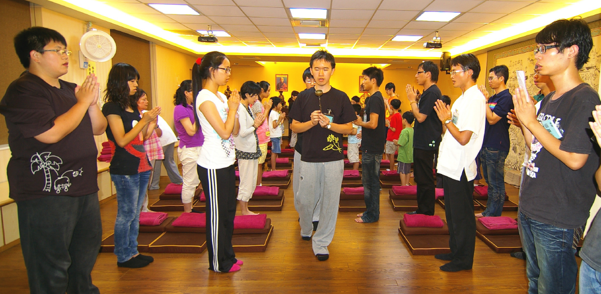

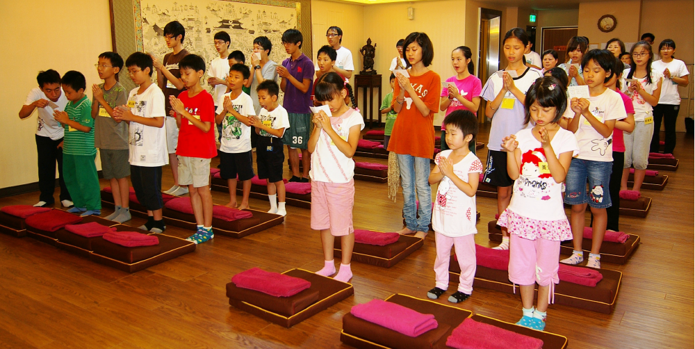

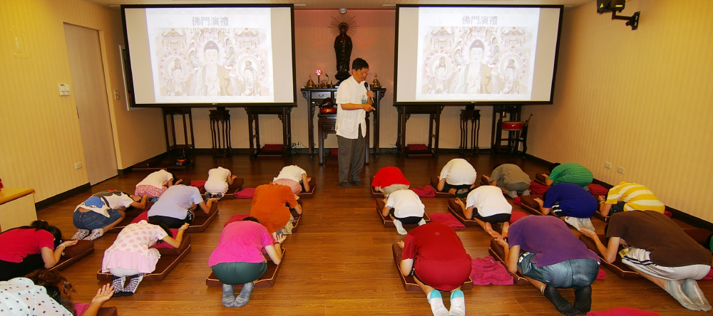

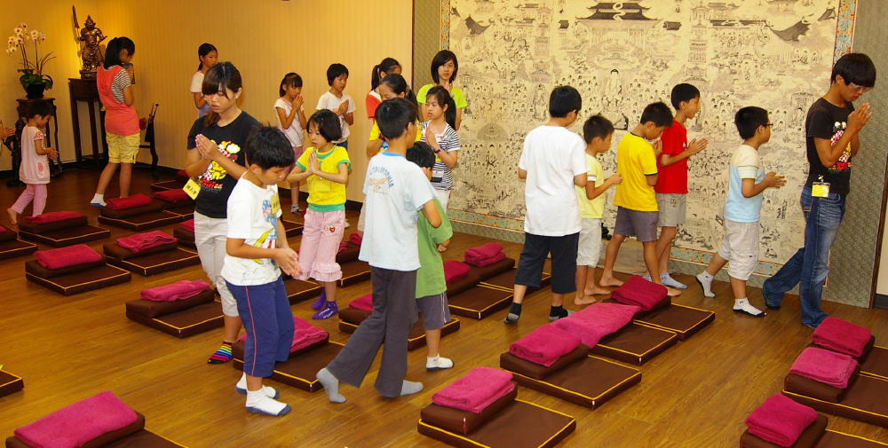

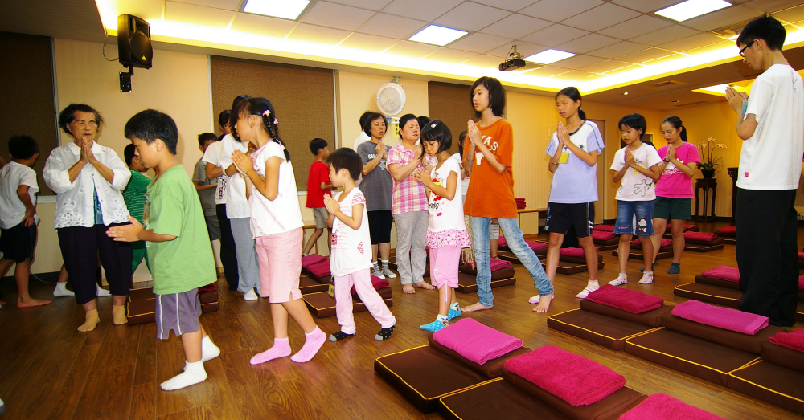

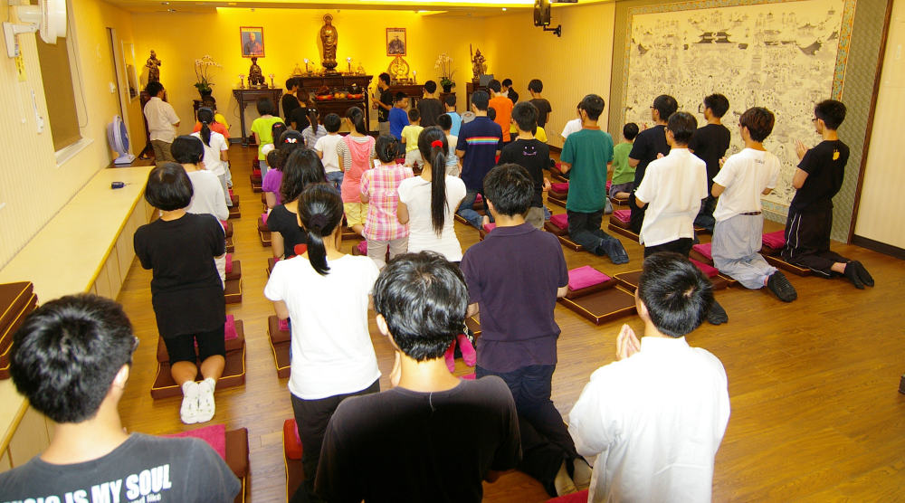

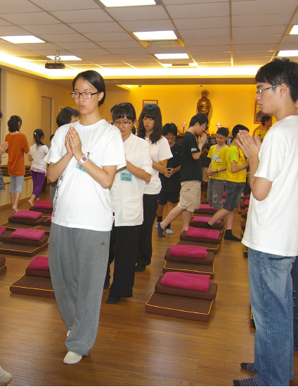

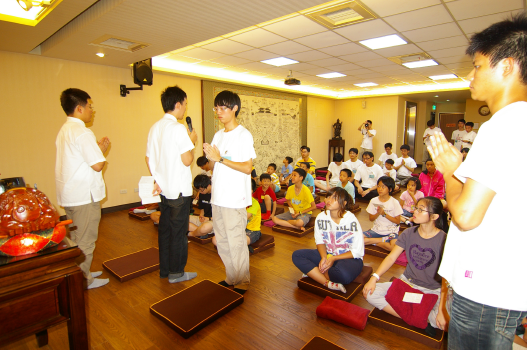

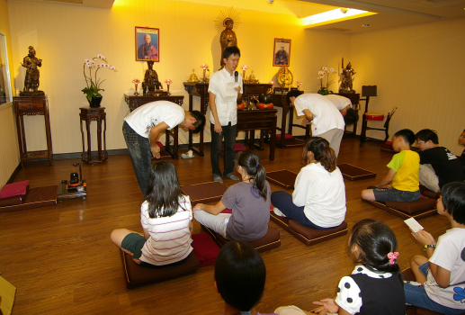

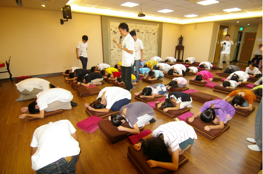

### 大專生的歷練—兒童生活體驗營　生活體驗營餐前觀修（上）

大專生

師生共成的團隊

誠意護持的義工

法輪食輪一起轉

餐餐觀修不消福

二○一二年七月二十二日至二十七日

清淨快樂的用餐／吳承軒

清淨心，顧名思義，便是保持一個純潔乾淨的心態，藉由去除貪、瞋、癡三毒來達成。而我們要如何才能在用餐中對治這貪、瞋、癡三毒呢？

長者與物，須兩手奉接                                                                                                        進巾奉茶

首先是貪毒，看到好吃食物便拼命夾拼命吃即屬此類。只吃我們自己喜歡吃的食物，營養可能失衡，最慘的是我們可能在其中增長貪欲，最後甚至會變成一個頤指氣使，以自我為中心的人，這是一個多麼可怕的情況啊？所以，我們應該要克制自己，在挾菜時多想一些，多想一下別人是否也會想要吃這道菜，這不僅可以克制自己的貪念，更可以培養為他人著想的心。

家事小高手

再來便是瞋毒，沒吃到自己喜歡的食物，可能讓我們生起不平之氣；相反的，我們要心平氣和，想到在荒涼貧瘠落後的地方，有多少人一輩子沒吃過美食，乃至於餓著肚子，有一餐、沒一餐。

最後是癡毒，執著自己是最重的癡心，因此做任何事不能只想到自己，不去注意別人的觀感。若我們能講究吃飯的禮節與威儀，獲得別人的好感，藉此可遠離只在意自己的癡心。

保持一顆清淨心用餐，便從去除貪、瞋、癡三毒開始。最後，請大家將師姑及學長們，辛苦準備的飯菜吃完，保持一顆清淨心來享用這一餐，將是人生最幸福的事。

常禮舉要

居家與在校篇

餐前禮儀入座前應有的禮儀／丁以恩

吃飯的規矩與禮儀，主要有以下幾點：

一、入座前，儘量保持安靜，即使有事交談，應輕聲細語，魚貫而入。不可以大聲喧嘩、吵鬧或者嬉戲。

二、入座後，不應竊竊私語，要安靜的等待他人入座。

三、坐著的時候不可以彎腰駝背，等待其他人入座的時候，雙手應該放在大腿上，不可以翹腳或抖動雙腿。避免影響到其他人吃飯的心情，同時也培養自己的定力。

四、吃飯時，手不可以放在桌上，應該要把碗拿起來，以碗就口。心要靜，細細品嚐食物的美味。

五、憫農詩：「鋤禾日當午，汗滴禾下土。誰知盤中飧，粒粒皆辛苦。」每粒飯都是農夫辛苦種的，而美味的飯菜更是師姑師伯們在沒有冷氣的廚房中，揮汗如雨，且很用心煮出來的佳餚。我們應懷著感恩的心，惜福的心，培養自己成為人才的心，吃下所有碗裡的食物，不宜留飯粒或菜渣，也不應挑剔或批評食物好不好吃。

六、飯後以衛生紙擦唇上油脂，並將碗中殘油擦乾淨，且依序將碗筷放回清洗桶。

進餐就是一種學習，一種修行。講究自己用餐的威儀，多體諒別人的辛勞，多珍惜大自然的食物，這就是「道在日用平常中」。

挑菜我最棒

用餐威儀／唐維典

人人都有一張嘴，拿來做什麼用途就是看自己了！表面上它只是說話跟吃飯，但其實含藏著很大的吉凶禍福，如果善用這個嘴巴，能巧妙的趨吉避凶、離開痛苦，獲得快樂。

比教學行政更困難的挑戰

揉麵團初體驗

我們常說禍從口入、禍從口出，實際上我們應該詳細的說：病從口入、健康也從口入；病從口出、禍也從口出。假如我們吃了有毒的食品，例如：油條含有阿摩尼亞，外面餐廳用大量的油，煎炒煮炸，那些油都是飽合高分子的油脂，吃進體內轉成酸性，令人容易得到癌症及其他的病變；再者，餐廳買的蔬菜水果常沒有清洗乾淨，而殘留農藥及化學肥料，吃到後破壞健康的細胞，使中樞神經麻痺，便利商店賣的礦泉水只要上升兩度Ｃ就會釋放毒素，外面的果汁跟飲料都含有大量的色素跟防腐劑，容易引發肝硬化及肝腫瘤，前陣子在大陸流行的將牛奶摻入三聚氰胺，或者是將餿水提煉而成的麻辣湯包，以及用地溝油炒成的佳餚，樣樣是致命的毒物，吃了上述這些都叫做病從口入。若能吃到健康的蔬食，這裡面包括來源清淨、沖洗乾淨，再加上愛心的料理，吃了這些營養的食品，叫做健康從口入。

所以嘴巴能夠創造健康的身體，以及瘦弱多病的身體，其次嘴巴也能創造身心的福報，以及身心的災難，嚴格來說禍從口入、福也從口入，禍從口出、福也從口出。

仔細聽老師的講解

若說了傷人的話、謊話、無意義的話、挑撥離間的話、傷天害理的話、不合事實的話、維護自己名利的話，容易招致災難，得罪了君子就失去了可貴的朋友，得罪了小人就吃不完兜著走，這就叫作禍從口入，原有的福報也被這種沒有口德的言語破壞了。古代有些聰明伶俐的讀書人，原本可以功成名就，只因為喜歡說尖酸刻薄、調侃別人的話，最後演變成窮途末路、一生潦倒，這叫禍從口出。

若講究說話的口德，說誠實語、柔軟語、和合語、有意義的話、幫助他人進德修業的話、凝聚團隊共識的話、讓人奮發向上的話，很容易招感別人的友誼與好感，長輩也很喜歡提攜這種人才，這叫作福從口入，而原本有些的災害也因為擁有好的口德也消弭於無形，這叫福從口出。

總而言之，我們要選擇的是健康從口入、福報從口入；病痛、禍患、災難等從口出，過著幸福健康美滿的人生。

志於道的用餐／余紹永

志於道？何謂志於道？「志」是心之所之，「道」是內聖外王的大道，學習中華文化，內化之後能成為有格局、有氣象、有風采，對這個社會能有所貢獻的人。

專心看早餐製作流程

讓我們從論語來了解志於道的用餐，孔子談到：一個讀書人，若專心地追求成聖成賢的大道，卻以自己穿得不好，吃得不好為恥辱，那便不值得和他討論道。可見人生的重點是內涵的充實，而非外在的飲食，另外的追求。

在孔門裏就有這樣風采的人物，在論語裡孔子稱讚顏回：一簞食，一瓢飲，在陋巷，人不堪其憂。回也不改其樂。賢哉回也。在外人看來如此貧困的生活，為何顏回能甘之如飴？因為他懂得安住於道上的學習，好比解開一題困擾很久的數學題目，那種豁然開朗的感覺，又好比我們在這幾天的學習，尤其是知難行易的常禮舉要，若能知道養成禮節與習慣的好處，並貫徹於生活平常，不是只有在這邊做而已，回去依然要將此良好的習慣保持下去。特別是上課聽老師講課，除了更專注的學習，並做筆記，有問題時舉手發言，而不要我、我、我的亂喊，養成有氣象的讀書人，會是這幾天最大的收穫。

有了內在涵養，也需懂得如何與人相處，並不因別人穿得不好、吃得不好而取笑別人，而不與他接近，說不定他的刻苦耐勞，很有向上學習的動力會讓他更有成就。即使吃美味的食物，穿莊嚴的衣服，更要珍惜這樣的福報，專注在道上的學習。

快要可以做早餐了

以惜福感恩的心，讓它成為向上的動力。讓我們心在道上，來享受這一餐。

為人子坐不中席／余皓永

俗話說：民以食為天，但是每日的三餐，其實不單單只是填飽肚子而已，也是需要講究規矩的，例如用餐的時候，入坐的次序、坐的位置、姿態等等都包含著許多的道理在裡頭，〈曲禮〉中有提到：「為人子者，居不主奧，坐不中席，行不中道，立不中門。」

自己做的早餐最美味

坐不中席─簡單的來說就是在講究吃飯時坐在桌椅的席位。

早餐天天有變化，營養滿分

在家中，小孩子就不應該坐在主要的位子上，因為主要位子在家中是父母尊長所坐的，由輩份比較小的小輩來坐就顯得很不禮貌。同樣的，到外面坐客，人家是正式宴會，他首要位子是留給主要的客人，你是不是主要的客人呢？如果不瞭解而隨便坐，很容易招來人家的笑話。

叫我大胃王

我們學禮只是個原則，「坐不中席」是一個原則，除了入席以外，其他凡是講禮節的場合都要注意，譬如到朋友家，在座有三、五位以上的客人，那你就要看房間的方向，愈在裏面的位子愈尊貴，要讓在場年紀比我們大的坐在裏面，而我們就坐在外面。還有現在一般集會的典禮，有臺上或臺下的，一般臺下位子愈前面愈尊貴，而臺上愈接近主席的愈尊貴，你不能一下就跑去說我跟主席坐在旁邊，這樣不行，要坐到外面。

以此類推，所以在吃飯的時候，要禮讓長輩坐在靠裡面的位置，自己則要坐在外面不重要的位置，這樣才不會讓別人覺得我們沒有規矩。

以上是關於坐不中席的餐前觀修，與大家共勉之。

惜福的用餐／張嘉倫

由於二十年來臺灣的繁榮發展，造成大家不惜福，嚴重浪費的現象。所以現在有不少人養成一種壞習慣，東西稍微不好吃，就全部丟掉，水果如果不是很脆、很甜，也照丟不誤，吃飯時也常有剩菜剩飯，如果大家不好好惜福，未來饑饉的年代，將為期不遠。

歷史博物館—立體書展

佛法中有因果，因為奢侈浪費，而有饑荒的來臨；因為經歷過苦日子，而知道惜福，並且認真打拚，結果有富足的生活可以過，因為長久的富足，開始又養成浪費的習慣，於是天災地變又不斷發生，讓人類面臨許多的苦難，如此因果循環不已，可惜大家無法從這些因果的軌跡中獲得正確的啟示。

在佛門中，用餐極其惜福，即使一粒飯，一片青菜，都不能造成浪費。印光大師發現有人用餐完畢，碗裡仍有一粒飯，會當面斥責你有多大的福報，可以這樣的浪費！

你們曾經有過餓肚子的經驗嗎？平常吃飯有沒有浪費食物？想像一下，如果有一天因為大家太過浪費，所以沒有食物可以吃，那饑餓的感覺是不是很不舒服。

每個人每天都能吃得飽飽的，這就是很大的福報，在世界上很多角落，還有許多人每天是否能吃上食物都還是未知數，要好好珍惜現在不用為了每天三餐而擔心，能吃就是福氣，在有豐富物質可以享受的今天，大家應該盡量的惜福，這樣福氣才可以享受得更久更長。

所以平時日常生活就應該好好惜福，師姑們在廚房辛苦的做飯給我們吃，感謝他們的方法就是吃飯時把飯菜都吃完，不要浪費任何食物。

美食分享的用餐(平等的用餐)／陳期宇

一人一碗飯，看起來好像理所當然，但是，你知道這世界上有多少人，是因為飢餓而死亡的嗎？你知道在我們滿足的享受豐盛的早餐時，有多少人是挨著餓而沒有東西可以吃嗎？所以啊，我們在享用每一餐的時候，都應該抱著分享的、知足的心態用餐。常禮舉要中提到，同桌吃飯不另備美食獨啖，如果我們隨時抱著分享的心態，那是一種有心量且肯跟別人結善緣的胸懷。若是大家同坐在一張餐桌上吃飯，而你又專門預備某種食物獨自一個人享用，看在別人眼裡，會覺得不好受，會讓人覺得不自在，或是覺得你是個自私的人，因此我們要盡量避免讓人有不舒服的感覺，這才是禮最基本的宗旨。

好奇寶寶！立體書奇幻之旅開始了                                                            中正紀念堂—恐龍展

學禮是為了讓我們能夠好好的跟別人相處，知禮行禮的人，一舉一動都會讓人覺得很舒服，因為禮就是要時時刻刻在意別人的感受，處處為別人著想，做每一個動作前，都應想到這樣做會不會造成別人的困擾，這樣的行為是否適當。而在吃飯時，我們需要想到的就是分享。

相信大家起床，跳完早操慢跑之後，都覺得很餓了，早餐中又有自己喜歡吃的東西，但是別忘了，你身旁的大家也都跟你一樣，所以我們在挾菜時，要適量，不能因為是自己喜歡吃的東西，就拿了很多導致別人沒有東西吃，在吃飯的時候，就養成隨時想到別人的習慣，多為別人著想，時時懂得分享，就是一種很好的修行了。

感恩的用餐／王姿云

中午時刻，肚子也已餓了起來，只見早已把一道道美味可口的佳餚擺放出來。當看到這一道道的菜色時，我們第一個念頭是什麼呢？是分別出哪些是自己喜歡吃的，等會多挾一些，哪些是我不喜歡吃的，一定不會挾它？還是心中立刻生起感恩的心，想到：師姑師伯們在我們吹著冷氣上著課時，一早就先在外頭採買食材，在熱氣沖天的廚房開始辛苦挑菜、烹煮，在我們中午下課時，便已將一道道熱騰騰的菜擺放在我們眼前，我們是否知道，能有這些營養豐盛的餐點是多麼得幸福，而時時常存感恩的心呢？

有一位臺灣的醫生，發心到非洲義診，為那些生病且醫療資源缺乏的非洲人免費看病，整段經歷令他最為難忘的是，當他按照慣例對病人看完病情時說：三餐飯後記得服藥唷！那非洲病人露出一臉慌張的表情答到：可是我一天只吃一餐，該怎麼辦？當下那位醫生震驚住了，原來我們是多麼得幸福，我們是否能懷著感恩的心，感恩我們生在一個衣食無缺的環境，感恩我們身邊的人對於我們默默的付出，感恩我們不用為了下一餐而煩惱，而能無憂無慮得在冷氣房中學習。當我們每數五秒，在非洲平均便有一位兒童因為營養不良飢餓而死，我們怎能將眼前的一切看得那麼簡單易得呢？

只管努力往前跑

因此當我們知道感恩，我們會發現每道菜都變得無比可口美味，而不會加以挑剔，<常禮舉要>中不挑剔食之美惡，除了細嚼慢嚥將飯菜吃出香味外，還有一項秘密，那就是吃得平均，營養才會均衡，身體發育才會健康，能讓自己變得聰明又活潑。碰到紅蘿蔔，想想它可以讓我眼睛更為明亮，碰到茄子和苦瓜也不要覺得它好可怕，茄子能補血，苦瓜能退火，對我們的身體有好多好處呢！

以感恩與惜福的心在用完餐後，專心認真的上課，便是對於提供餐點的師姑師伯最大的回報，也是尊重自己最好的表現，現在就以感恩的心用餐吧！

（續下頁）

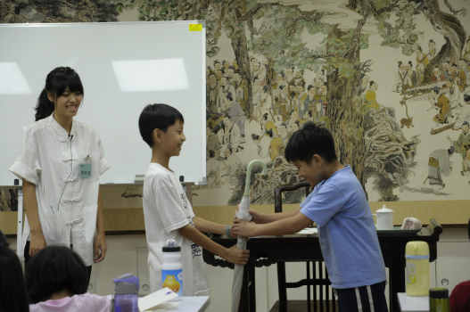

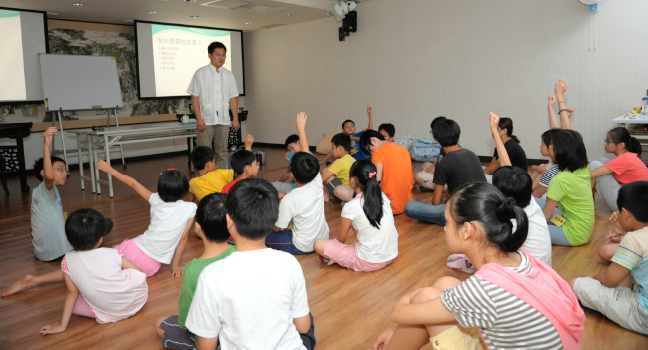

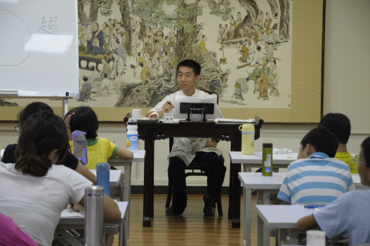

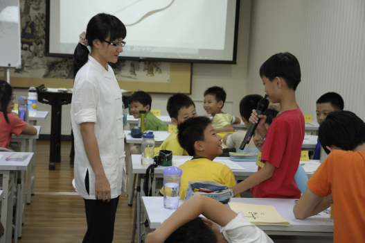

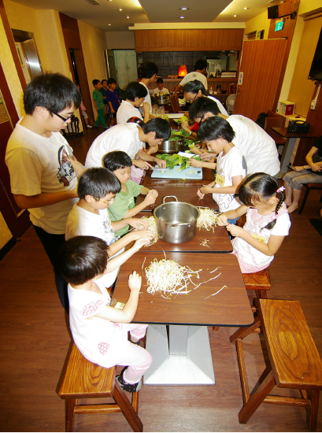

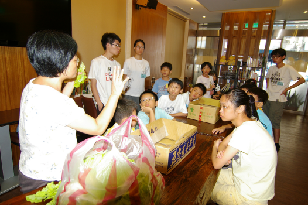

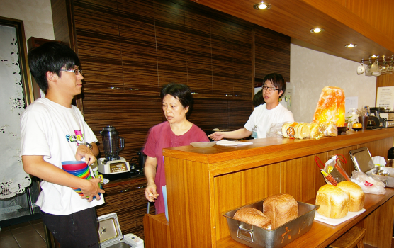

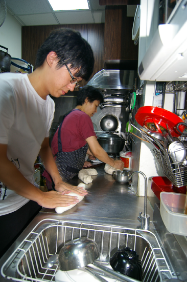

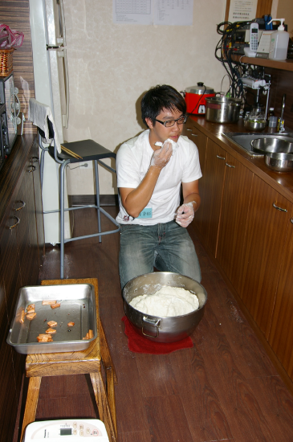

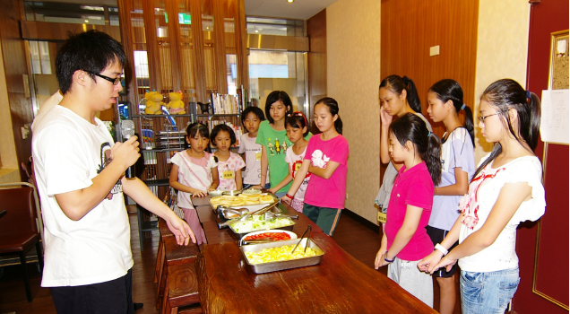

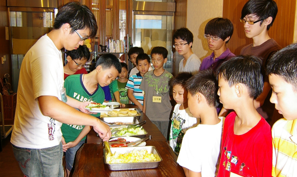

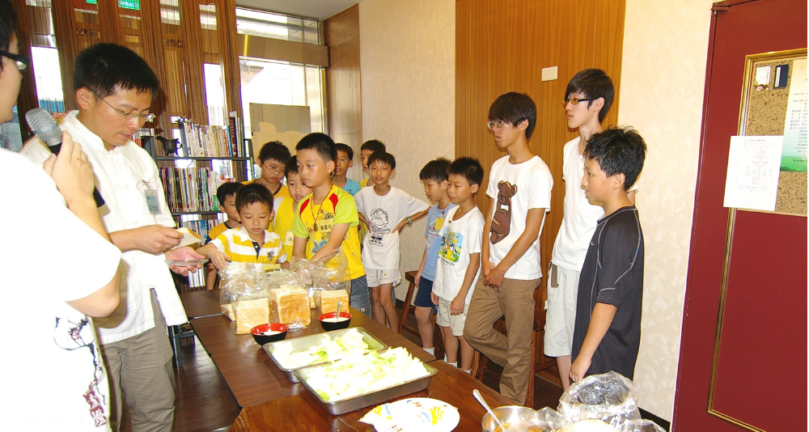

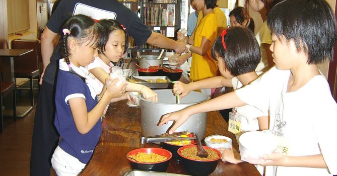

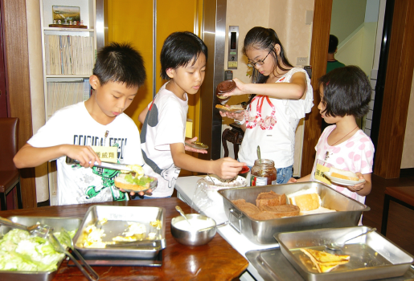

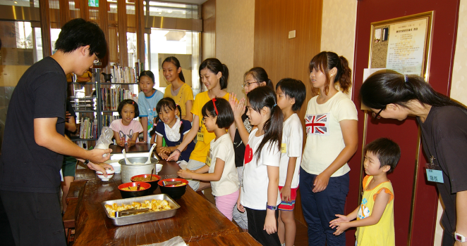

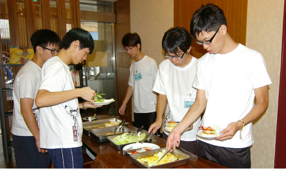

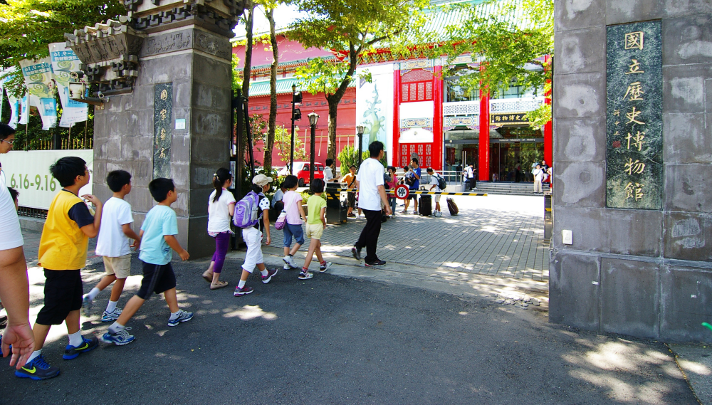

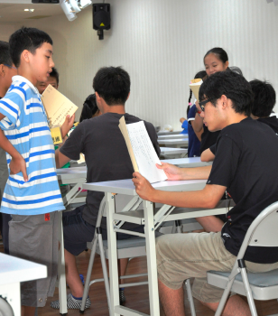

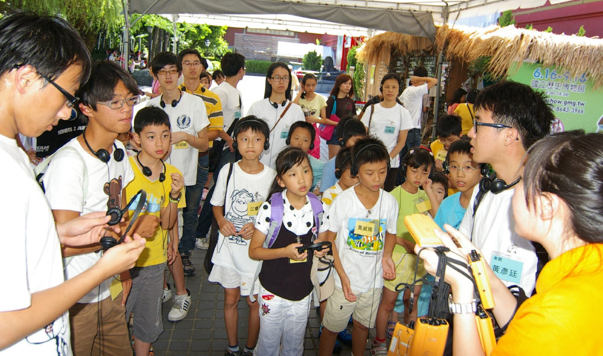

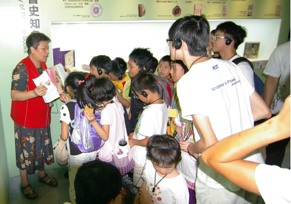

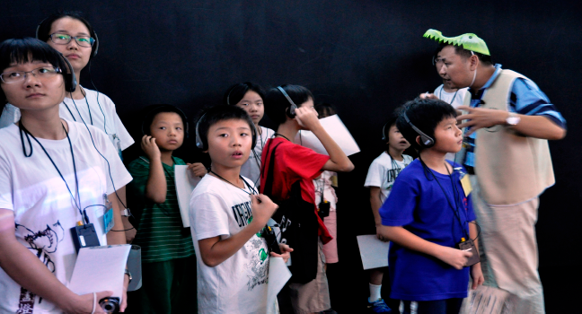

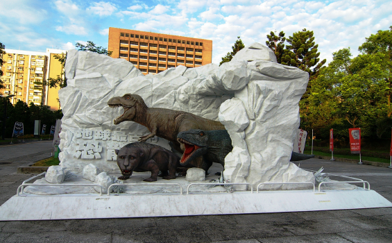

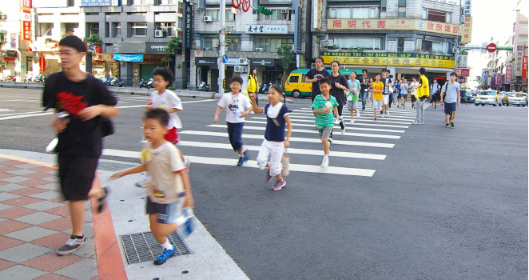

### 大專生的歷練—兒童生活體驗營　生活體驗營餐前觀修（下）

大專生

信其道—用餐之道／蔡易儒

每個人都應該學「道」，那是人生唯一的出路。所謂學道，是學習良好的觀念與正確的知見。常禮舉要說到，君子在學習方面，要「安其學而親其師，樂其友而信其道」，也就是將身心安住在學習上，並且親近良師益友，因為良師益友就是我們學道很好的對象。而更重要的，是要「信其道」，也就是對我們學習的道理生起信心。

因為有人看顧我們的安全

信心對於道的學習太重要了，正面來說，信心的建立能幫助我們學得更好，就好像一棵大樹，根扎的越深，樹才能長的越高、越壯；同樣地，對於道的信心越是堅定不移，我們對道的學習和內涵的了解才會越深刻。反面來說，信心的建立，能使我們不會迷失方向、無所適從，如同一棵大樹，只要根站得穩，就不怕狂風暴雨的侵襲；同樣地，在我們的人生當中，也會遭遇種種的順境、逆境，社會混亂的價值觀，都如同狂風暴雨般考驗著我們，容易動搖我們的內心。

比如說，如果周遭的同學考試都在作弊，考出來的分數竟然比我們努力讀書還要高，我們能夠秉持良心而不同流合汙嗎？如果我們做了一件善事，卻引來周遭的人異樣的眼光，我們會不會反而懷疑自己做的事是錯的呢？當面對困難還能堅持對於「道」的信心是很難的，但如同孔子的教導：「君子固窮，小人窮斯濫矣。」君子即使面臨困境，依然能夠固守正道，小人面臨困境就放肆亂為了。因此最重要的是對「道」的信心，只要我們「信其道」，就算無法時時刻刻與良師益友相伴，「道」也已經在我們心中，如同一盞明燈，時時指引我們前進的路，如此一來，則「雖離師輔而不反也」，就算離開了同學師長，也不會背棄道義了。

每天晨跑路線不一

然而，信心的表現是身體力行，因此這幾天所學的常禮舉要，應該要在日常生活中實踐，並養成習慣。透過身體力行，能使我們對道理有更深刻的體悟。例如，當我們幫父母做家事，並從做家事的辛苦中，體會到父母對我們的付出和辛勞時，我們會更懂得感恩和孝順父母。

那麼，為了有充足的體力好好學道，現在我們要用心吃飯，讓自己健健康康，上課有精神，學得更好，那麼這一餐就會吃的很有意義！

在校用餐—團體榮譽／游皓文

為什麼團隊榮譽會跟在校用餐扯上關係？

先問問大家：你們有沒有自己的夢想？希望各位小朋友十年後還能持續擁有現在這個夢想，甚至是正在實現它。

而什麼是團隊？團隊，就像一部機器，每一個人就像機器裡每一個螺絲，將每個環節絲絲入扣，互相搭配，才能使整部機器運轉起來。

平常，我們需要的保養機器裡的各個環節，替它上潤滑油、清除汙垢和鐵鏽，用愛心去保養它。就像在團隊裡，平時要關心團隊中的每個人，像是簡單的問候，能給人溫暖，熱情的參與活動，能讓大家看到你的奉獻與犧牲，讓籌辦者感到欣慰，自然而然，有助於營造出強而有力的向心力，有了強而有力的團隊默契，團隊自然會越來越茁壯，造就出無限的可能性。

學校，小範圍來說，班級就等同於那台機器，是個團隊，而你就是那個螺絲，大範圍來說，班級則成了螺絲，學校成為了那台機器，成為了團隊，你眼前所用的餐點，正是學校這個大團隊裡的廚房所努力烹煮出的結晶。所以一樣的，享用時不宜狼吞虎嚥，而應好好品味每一分味道，體會每一分用心，感謝廚房師姑們努力的烹煮。如此潛移默化中，更能幫助你認同學校這個團隊，更能讓你養成懂得感恩，不怨天不尤人、充滿陽光的正向心態，開心度過每一天。認同了所處的團隊後，知曉自己是團隊的一份子，自然必須為了團隊努力付出，為了他人努力付出，在團體中的表現一定會越來越好，最後達成團體的榮譽，而這榮譽很有可能，就是你的夢想。

沒有任何人的夢想是可以一個人就能獨立完成的，若你想達成你的夢想，就一定得找到對的團隊，對的人，一起做對的事。與大家共勉，謝謝。

在校用餐—衛生的講究／黎子健

現在，世界每一天都不停地發展，人類的步伐也愈來愈快，為了爭取每一分每一秒，把很多生活的細節也忽略了，所以我們現在要把這些所忽略的細節重新做好。

很多的學校對於用餐衛生的教育不注意，有些甚至連最基本的規條都忽略。結果造成很多學生肚瀉、腸胃炎等病症。為了學生們的健康？我們必須在個人衛生的教育做起。

對於在校用餐的講究，我們可以參考常禮舉要聚餐條目，裡面記載了我們用餐衞生的必備條件。

舞出亮麗的人生

在第九條，公食之器，不用已箸翻攪。就是說，我們跟別人一起吃飯，每一道菜旁邊，一定要放公筷跟公匙，把菜夾到私人的碗裡，再使用私人的器具進食。原因是我們不知道同學們的身體狀況如何，有沒有傳染病。一不小心就容易造成交叉感染了。

在第十四條，公食以不言為原則，須言應避免唾沬入公器中。為甚麼我們在吃東西時以不言為原則呢？因為在我們吃飯時高談闊論，嘴裡的口水飛出來，飛到菜盤裡，這是不合乎衞生的，也很容易散播傳染病。還有一些人不知道，一邊吃飯一邊講話，是很容易把舌頭或是腮咬破。所以我們吃飯時盡量不要聊天啊！即使要說話，也要謹慎小心，不要把口水掉到別人的碗裡啊！

第十五條，也是最重要的一條，咳嗽必轉身向後。如果我們食飯時要咳嗽怎麼辨呢？第一步是要用手或是手帕把口遮起來，然後立刻轉身向後。因為咳嗽是最容易傳染細菌的，只要一個有傳染病的人不小心咳嗽到小菜上，那盤小菜就滿佈細菌了，我們只要吃一口，病菌就會來到我們身上，使我們發病，這是多麼可怕的事啊！

還有一些更基本的條例，就是我們吃飯前一定要先洗手，雖然我們看不到細菌，但是其實我們的手裏都滿佈細菌，因為我們的手很容易碰到食物，這樣細菌就會走進食物裏，就等於我們把細菌食到肚子裏面。聽起來也覺得很可怕吧！

為了我們的健康，我們一定要遵守以上每一條法則，這樣才會真正享受到進食的樂趣。

在校用餐〜食品安全的選擇／海辰

如何選擇食物，讓我們活得更健康。健康是做任何事情的先決條件，而吃得健康，才能活得健康。那我們要如何吃呢？首先我們要認識我們的飲食環境，以下分為五點做說明。

預備式開始了

第一、食物來源：在現在高度分工的社會環境下，大家往往都不知道便當裡花椰菜是從哪裡來的，高麗菜原本長的樣子？西瓜是長在樹上還是地上？也不知道在種植蔬菜水果的過程中，是無毒栽培還是使用過量的化學物質，以前消費者無從得知這些資訊，但最近幾年來政府有推廣標章制度，像是有機認證以及產銷履歷，也就是實際告訴買菜的人菜的來源，全民監督農民種植健康的菜，也可以在挑選蔬果時選擇有菜蟲咬的，或大小不一的，因為那就表示較無農藥與肥料。

第二、食物的種類與多樣化：人是由很多不同的部分組合而成的，身體的運轉也是靠不同的營養來供應能量，所以，一天三餐食物種類的選擇與搭配，對於保持健康是非常重要的，食物可以大分為五大類：五穀雜糧、青菜、水果、肉類，以及奶蛋乳製品，其中，要多吃青菜水果，少吃肉類，吃蔬菜水果時不可挑食，五顏六色的食物都要吃。

第三、份量的多寡：這包括了食物實體的份量以及其所包含的熱量多寡，青菜水果富含各種纖維與維生素，是保持良好身材與健康必備的，可以多吃，但米飯、油脂類是必須但只能少量、適量。

看誰動作最漂亮

第四、食物的成分與精緻程度：精緻程度越高，就代表人工加工的過程越多，俗話說，天然的最好。讓我們以白米與糙米飯的比較來作例子，為什麼大人常常說糙米飯比白飯好？其實，白飯就是糙米飯去除胚芽與穀殼，剩下胚白的部分，但是，大多的維生素、微量元素，都儲存在穀殼裡，所以只剩下白色胚白時，這米已經沒有什麼營養價值了。

燦爛的笑容

最後一項，是觀察各種食物可取得的方便程：因為人都是有偏好、慣性與惰性的。例如，我們在學校裡，常常可以在轉角處看見投幣式飲料機，可能渴了就隨手去買一罐含糖量超高的健康蔬果汁，但相較於真正健康的蔬果卻相對的非常難取得，也因為這樣社會結構性的安排，會讓我們有個錯覺，就是一個禮拜買一、兩次品質佳健康蔬菜水果，就是健康的生活，但其實不然，要找到真正健康在地的食物，我們要更花心思、有計劃性的食用。總的來說，健康不是從天上掉下來的，我們想要有健康的生活來好好念書、孝順父母、走遍全世界，就要用心的去觀察我們所吃到肚子裡的食物。願大家對食物有正確的認識，想用健康天然有機的食品，得到健康的生活，充實自己愛護別人，走完有意義的一生。

為人子的用餐／晏家方

這幾天學了常禮舉要居家、在校篇，在居家篇前三條都是以為人子作為一個開頭，由為人子做為整個常禮舉要的開頭，再擴展到晚輩對長輩所應該具備的禮節。而為人子在用餐方面，又有什麼禮節需要大家特別注意的呢？

燦爛的陽光

過去與家人一同用餐時，是否只顧自己吃飯而忘記要等父母先用再開動呢？而這就是為人子在用餐時所需要注意的，而在吃飯之前我們也必須幫父母盛飯，等到父母都開動之後，子女才可以開始動筷子，就如同這些天在學會用餐一般，我們都事先請師長及家長們先取餐，才讓小朋友們取餐，這就是對父母及長輩的尊重，為人子就是應該這麼做。而在餐後的處理，子女也要負責收拾，主動詢問長輩是否吃飽，若已不需用，就應該趕快幫忙收拾善後。

揮灑的動作

這方面也不是只有在與父母用餐才要做到，出門在外與長官吃飯時，甚至與同學同事吃飯時都是要注意的，在飯前幫忙大家擺好碗筷、盛飯等等。

另外居家篇第十條「同桌吃飯不另備美食獨啖」，這同樣也是大家在用餐時必須做到的，若是在家與父母同桌吃飯，而自己另備美食獨啖這會讓父母傷心，為人子必須盡到孝道更是要尊重父母，所以在家與父母同桌而自己又有另備美食的時候請不要吝嗇拿出來與父母共享吧！共享不但可以減少自己的貪心也可以使得父母開心，何樂而不為？擴大一步來說，分享也是提升自己心量的一種方法。

從為人子在家的訓練作為修行的第一步，秉持著為服務大眾的精神，以及對人恭敬有禮節的做事態度，使得自己成為一個讓大家尊重的人，更能夠將自己培養成人才，方對這個社會有所貢獻，這是社會與自己的父母所樂見的，不但盡到下屬對上司的忠道，更可以盡到為人子該有的孝道。

常禮之食樂無窮／張鑑光

常禮並不只是書本上的知識，更不是一種技藝，而是決定我們生活的一種態度。學習常禮舉要，最重要的是要能將常禮實踐於自己的日常生活作息，並且持之以恆，逐漸養成習慣，最終形成自己的人格特質。這是一個成長在細微處、變化在無形中的正向過程。我們今天坐在教室裡吃飯，特別是結合常禮舉要的吃飯，就是在養成好的習慣與好的禮儀。當我們依據常禮不斷地訓練與堅持，就是在訓練我們的眼力，也就是辨別是非對錯的能力，久而久之，我們會發現，規矩不再是束縛，既定的步驟不再成為綁手綁腳的阻礙，我們所學習過的常禮舉要，有一天都將成為自己的一部分，成為自己的能力、成為我們之所以與眾不同的原因。

如果我們能有這樣的體悟時，我們舉手投足、一言一行都會散發出自信，並且更會要求自己持續精進，說到這裡，難道不值得期待與感到高興嗎？這說不盡的好處，僅僅是從吃飯間就可以開始培養，所謂見微知著，擴展出去，透過常禮舉要的學習，能夠深入我們生活的各個層面，讓我們在面對生活上各種困難時，減低阻力，增加能力，更甚者，我們能夠依據一個人的行為舉止，得知他的人格與涵養。所以，在這暑期生活營當中的最後一餐，讓我們帶著興奮的心情，專注於當下這一餐，期許自己，從今而後，脫胎換骨，迎向更有意義的人生！

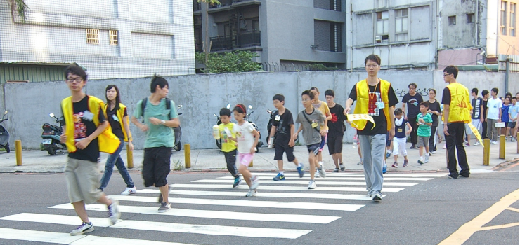

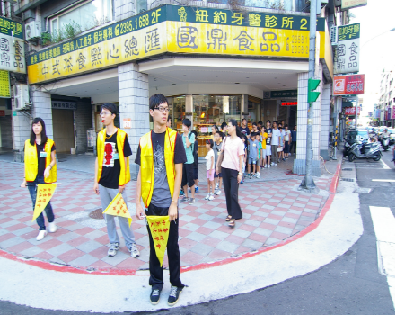

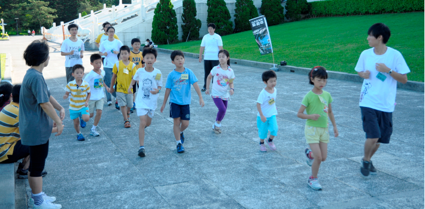

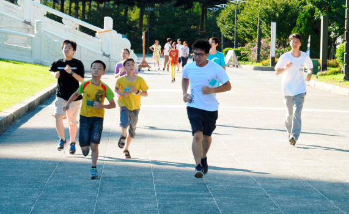

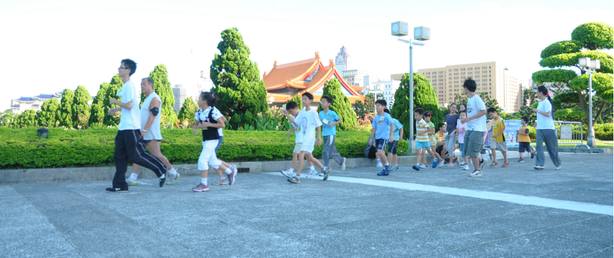

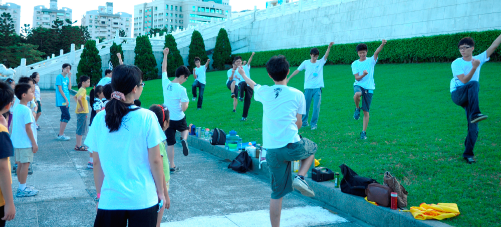

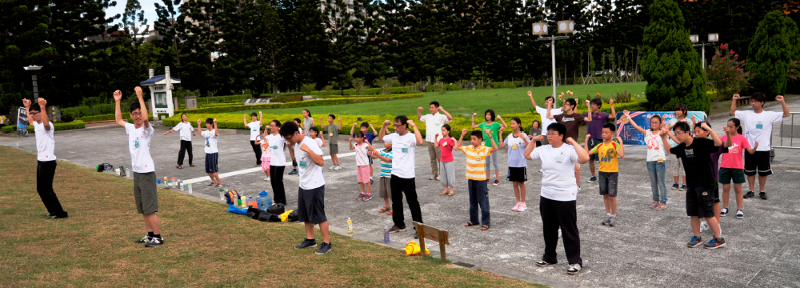

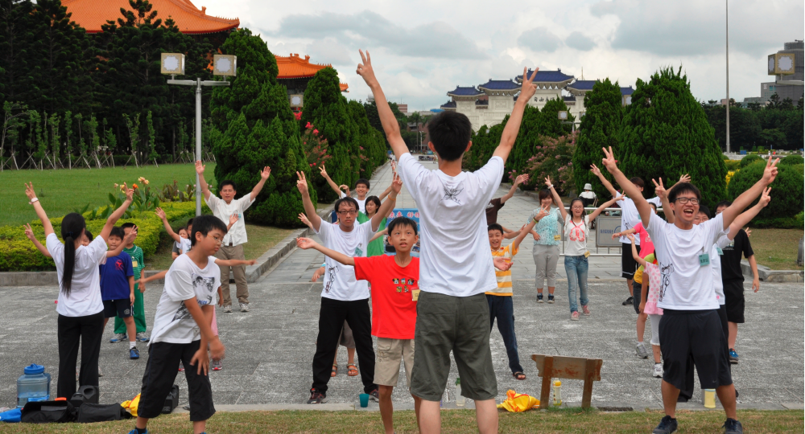

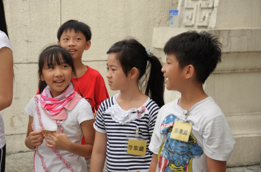

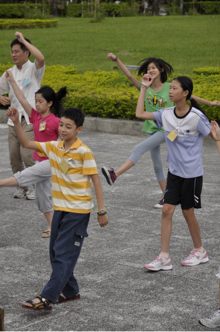

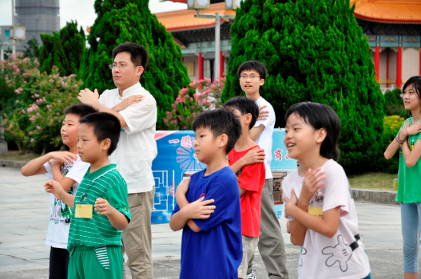

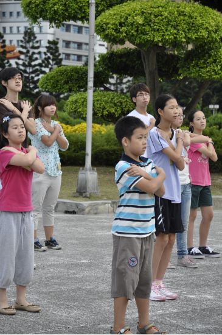

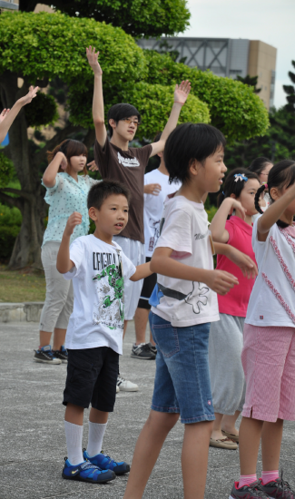

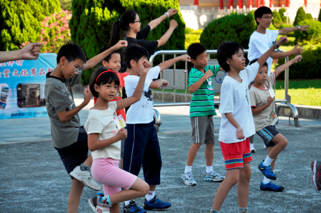

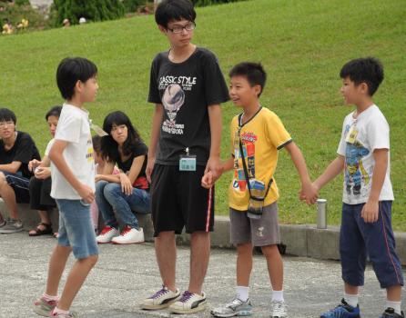

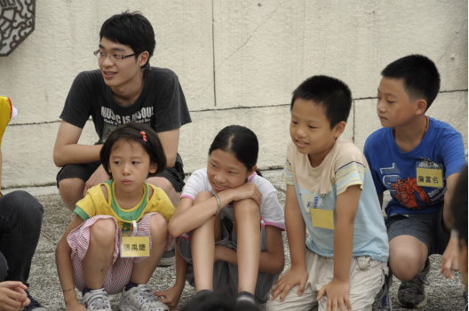

### 大專生的歷練—兒童生活體驗營　生活體驗營學生心得

眾學員

不同課程一貫旨

不知能否知苦心

不萎靡反生好樂

不入俗而氣象新

二○一二年七月二十二日至二十七日

有意義的暑訓 / 楊絜甯

這個暑假的活動內容跟以往差距很大，之前所上的課程大部分是學習禮儀或是佛學，這次則增加了念佛、做家事，參觀展覽等不同的課。

每一堂課程都在我的腦海裡留下深刻的印象，其中印象最深的是佛門演禮。雖然這門課程所教的內容我以前就會了，但是經過老師們的指導，讓我有機會檢查自己是否還有地方做得不確實，進而改正。念佛一支香能讓心好好靜下來，有時分心了，也能因為旁邊的同學和老師專注的佛號聲而回神。

每次只要有上課，就要勞煩師姑們在廚房裡為我們準備美味的餐點，今年的課程讓我們有機會幫忙挑菜，雖然只有短短半小時，卻讓我知道這件事的重要性，只有認真挑、洗菜，我們才能享用美味又衛生的一餐。

寫下臨別贈言

史博館的立體書展更使我大開眼界，這些作者竟然能夠把故事、電影、歷史等題材做成立體的模樣，但是當我們不使用時，還可以收成書本，媽媽以前就有買過立體書，當時我就已經相當震驚，沒想到這次展覽裡，每一本都比媽媽買的還要精采。

最後，謝謝各位老師及師姑們，因為你們的付出，才能使我們無後顧之憂，專心上課，也謝謝你們時時提醒我們做的不好的地方，讓我們即時改進。

看展心得 / 林可晴

這一個暑假，我參加了無盡燈辦的暑假團體活動，在這幾天當中，我們參觀中正紀念堂的立體書展，我覺得這個活動非常有意義，我們光是看到那些精緻的立體書，就忍不住想要做一本屬於自己的立體書。讓我記憶最深刻的是〜「藍２」，因為它是用許多數字組成的黑色金字塔，而裡面是由紅色的數字和些許的藍色數字組成，「藍２」也在當中，所以讓我覺得他的設計很有創意。

六天革命生活情感的建立

在這一次的生活體驗營中，我們除了去史博館立體書展，還有中正紀念堂的恐龍展！這次的活動也讓我的知識滿載而歸，這才知道在兩億三千萬年前，最古老的恐龍就誕生了，他們總共活了一億六千五百萬年呢！我們在恐龍展有看到各式各樣的恐龍化石，以及用石膏模仿的恐龍化石骨，不管是哪一個都讓我們學到很多的知識。我覺得恐龍展的設備很好，有很多的動畫及圖片讓我們知道恐龍滅絕的原因，是因為有顆十公里大的隕石墜落到地球上，造成粉塵，所以看不到陽光，日夜不分，植物沒有陽光也就枯萎了。因此恐龍就此滅絕了！我覺得恐龍展非常有意義，希望下次還有機會帶著家人一起參觀。

互相祝福

在這次的生活體驗營中，我學到了很多的禮儀，和常禮舉要的知識，也非常謝謝每位在生活體驗營中，有所付出的老師們，希望我明年還有機會再來。

從第一天到現在 / 李昱霏

第一天，來到了無盡燈文化學會，感到非常陌生，但是因為老師們非常的溫柔，讓我感到家庭的溫暖，來到這裡讓我很安心呢！

參與莊嚴肅穆的升旗典禮

在這裡的每一堂課，都有每位老師辛苦的指導和教導，早上一起來，就要準備晨跑及跳晨操，老師們幫我們辛苦的編舞，我們要好好地跳。

家事小高手，老師教我們摺棉被、衣服、褲子、掃地、拖地，我們還去史博館看立體書展，作者們都非常認真，也很有想像力，把一張平面的紙，做成立體的書，實在不容易。

昨天參加了恐龍展，導覽伯伯告訴我們關於恐龍祖先的由來及故事，讓我們聽著聽著，更想知道其中的奧妙。昨天晚上是成果發表會，每位老師都非常厲害及有禮貌，我們要像這裡的老師們好好學習，讓我們跟老師一樣，不管在哪裡都要持續下去。

謝謝老師們有機會讓我來這裡學習，謝謝爸爸媽媽的支持，也謝謝師姑、師伯煮好吃的飯、菜給我們吃，讓我們填飽肚子，也謝謝老師們可以給我們一個好的環境，讓我們在這裡學習，使我們增廣見聞、知識增長，謝謝每位老師們的認真教導，也讓學習空間更大，我們永遠記得各位老師的指導，也希望在這裡可以讓以前的壞習慣慢慢改正，讓我們可以成為臺灣的人才，發揚光大。

成果發表前的總體心得報告 / 林宥辰

雖然之前是答應了家中長輩的安排，以為是參觀展覽，而來到了此次的夏令營。到了這裡，感受到老師們的熱情，以及小朋友們的善良活潑，看著他們每天說「什麼時候回家？」看著他們乖乖地上課，我也不好意思發牢騷了，這雖非心想的行程，卻是另一趟冒險的旅行。

雄赳氣昂的三軍禮兵儀隊

跟著小朋友一起努力學習。原來啊！有很多漂亮的棉被摺法，我在這幾天也學會如何進巾奉茶，看似簡單，實際上卻是一門大學問啊！自己是個慢條斯理的人，參加生活營後才明瞭這些小朋友學得快，做得也快，我都很難跟上大家的節奏呢！

小朋友們很認真，我也感覺到老師們的用心。有時經過二樓，看到老師們討論接下來怎麼帶班，或活動怎麼設計更好，甚至老師親自下廚，管理小朋友們是不容易的。另外一些老師上很多課，真是一人可以身兼數職呢！

在第二天時也參觀了有趣的立體書展。看了那些作品，不禁會思索他們摺回去的樣子。其中印象最深刻的是「星際大戰立體書」，它讓我想起小時候我父親常跟我一起看的電影，立體書展勾起我美好的回憶。此外，也在展覽中巧遇國中時的好友，太久不見，相談甚歡呢！

在這裡，我見識到了培養人才的教育，教與學都很不容易，在這次課程中，我獲益良多，謝謝各位師長辛苦的帶領。

念佛一支香 / 梁恩維

來到這裡，讓我學習了許多東西，我最喜歡的課是「念佛一支香」，因為在這裡面，老師教了我們如何拜佛、繞佛、打坐、合掌，這些動作我都不太會做，但是來到這裡讓我了解了如何拜佛。

寧靜宏闊的中正紀念堂

老師還教了我們如何打坐，我都不太會打坐，坐不到三分鐘，就坐不住了，但是在這裡，讓我學習，如何打坐可以坐比較久。

在念佛一支香裡，老師們都會讓我們聽到精彩的法語，在法語裡，老師都會說：「要專心念佛。」我以後也要跟老師一樣專心念佛。

生活體驗營 / 張淑美

在生活體驗營裡，瞭解到團體生活需要大家互相協助。

每日第一面升空的國旗                         充滿朝陽希望的中正紀念堂

每一天，都有不同的行程，讓我覺得很有趣，也能學到許多知識。希望到了星期五也可以很開心地回去。

在這裡也很感謝全部的老師，感謝他們教導我們，還有這個星期二，我們到了立體書展看到了許多立體書，都很有趣，讓我也想做做看，有空也要找爸媽去看立體書展，還可以一起去看恐龍展，也希望可以帶哥哥、姐姐。

念佛法門

作者 茹詣媁  譯文 莊舜傑

許多人，大部分的人，甚至每個人都曾經在生命中某個時刻向上蒼禱告：在失望的時候、悲傷的時候、或是失去眼前所有的時候，便會雙手合十的禱告，祈求有所轉機。

當我小的時候，媽媽已虔誠信佛，現在也是如此，念佛在我們的生活中是很重要的一部分，媽媽總要求大家貫徹念佛。但在我出生以來的12年的人生裡，對於靈魂、佛陀、鬼神等，大多時是怕得要死，我一向是會看到東西的，看到鬼魂什麼的，但每當家人一起去附近的寺廟拜拜時，對於碩大的神像與聖人塑像，我還是非常畏懼，生怕祂們會活起來似的。

但參加這次佛教夏令營後，我便不再害怕佛陀了，只要我們念佛，向佛陀或者佛陀的常隨眾祈求，祂們就會挺身守護我們，只要我們念佛名號，佛陀便會幫助我們，因為祂們心繫眾生，關懷著我們；祂們也是我們學習的對象，我們有太多需要向佛菩薩學習的地方了，因為祂們有究竟的智慧。

在這次的營隊中，每日作息單純，而念佛是生活日程的一部分，希望有朝一日我們可以到極樂淨土去；透過念佛法門我們學習如何得到清淨，愛護、關懷他人的心，既靈敏、無漏而又好禮，最重要的是，我們可以與佛陀菩薩印心。

Prayers

Vannessa Ju

Many, most, or all people pray at one point in their lives. When they’re in vain, or sad, or have lost everything at the tips of their fingers. They plead and clasp their hands hoping.

As a child, my mother was very religious, and she still is. She made praying a key part in our lives, and she always tried to enforce it whenever she could. But for the greater part of my twelve years, I was mortally afraid. Afraid of spirits, Buddha, ghosts and all things alike. I used to see things, like ghosts, but I grew terrified whenever our family had to go to the local temple and there were huge statues of all sorts of gods and holy people. It was like they were alive.

After coming to this Buddhist summer camp, however, I no longer was afraid of Buddha. I came to see him and his entourage as protectors; people who would stand up for us as long as we prayed. All we had to do was call their name when we needed them, and they would help, as their hearts have love for all. They care and have a learning sense. There are so many gods and Buddha to learn from, that we can say that they have the utmost wisdom.

Here, things are in a simple schedule. Praying is part of that schedule, in hopes that we can one day be one with the heavens and everything above. Through prayers, we can learn to have a quiet-yet loving, caring-heart. We can have petite, flawless, manners, and most of all; we can connect with Buddha, and God.

史博館立體書展        田志龍

一想到星期日下午，一群人剛到無盡燈生活體驗營的地方，一開始大家都懵懵懂懂，不知道學會的規矩，所以什麼事情都不知道怎麼做。也在不久前，因為不知道規矩，所以被唸了一下子，後來也才知道，我所觸犯的規矩是在這裡不被允許的，最後也慢慢的理解以及改進。

來到史博館要看立體書展的時間也來臨了，心情十分的開心快樂。一掛上耳機，就聽到遠方導覽員的聲音，哇！原來是一位婆婆在對我們說話呀！一進史博館，看到傑克與魔豆的立體書，真的讓我大開眼界，讓我了解藝術家的手以及思考能力真的很厲害，史博館還有很多的展覽，例如：會動的老虎、太空梭、甚至還有哈利波特立體書，以及連續三屆獲獎的立體書。

這次帶領暑期生活體驗營的各位老師，不但教我們許多的知識，例如居家、在校還有聚餐的演禮，老師們也真的很辛苦，帶領我們大家每天晨跑、看展覽，讓我深深的了解，要當一位老師不是這麼容易的，不是一下子的功夫就可以成功的，而是需要比別人更努力，花時間努力用功，曾經想當一位藝術家或者是當一位美術老師，這些都是我從小到大的夢想，期勉未來自己可以更上進所學，夢想與現實是兩首節拍不同的歌，我會讓它們在我的努力、我的付出、我的實踐下，合奏。

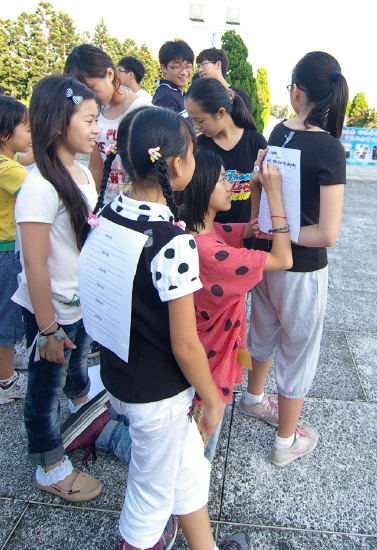

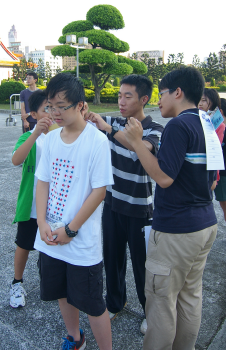

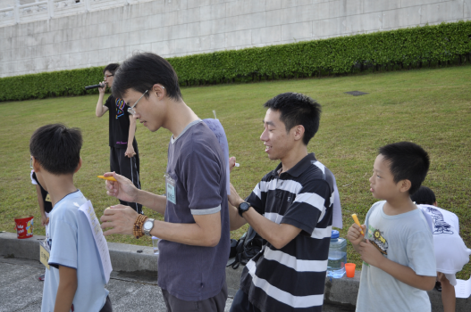

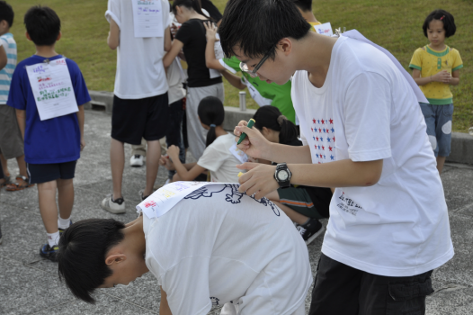

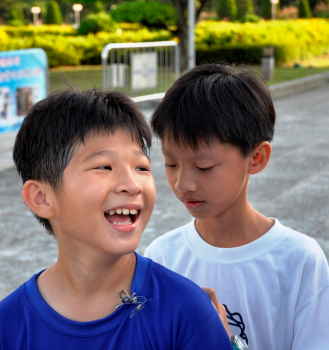

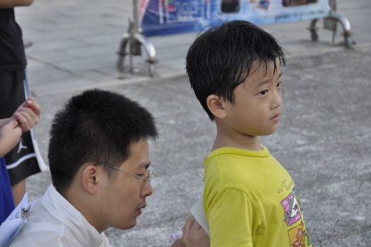

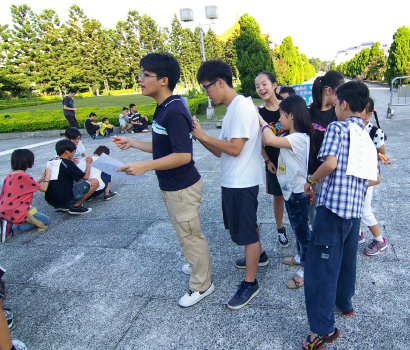

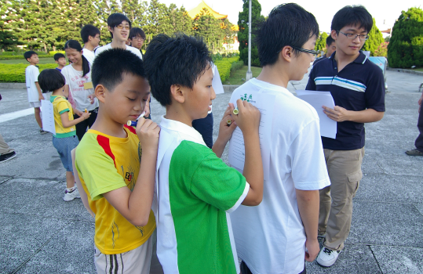

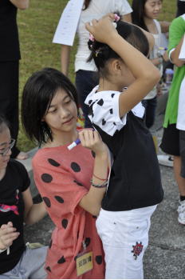

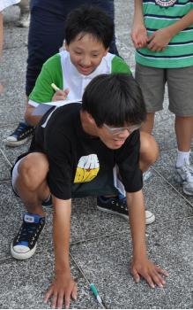

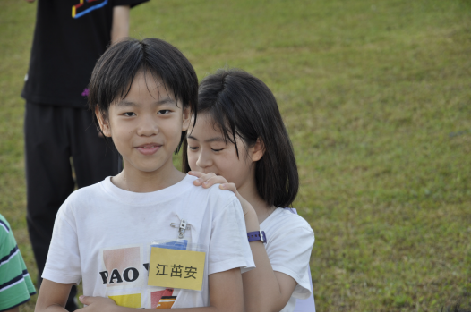

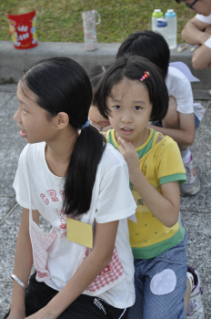

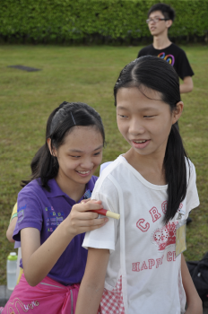

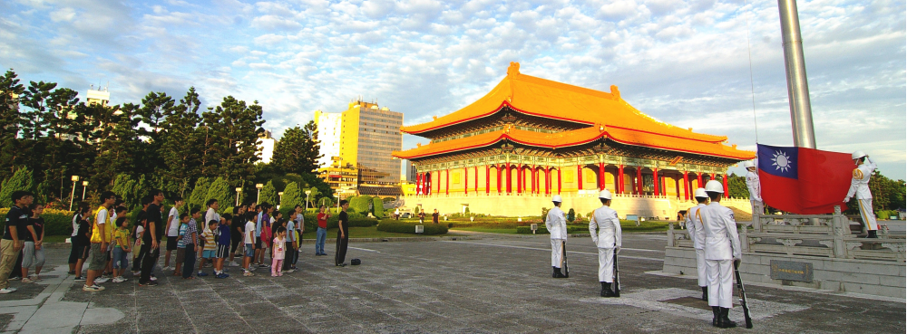

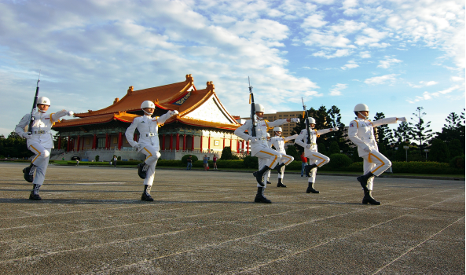

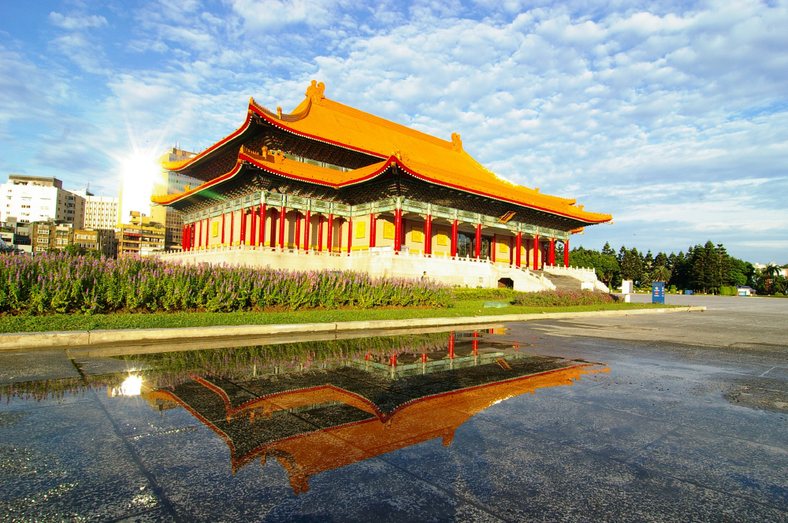

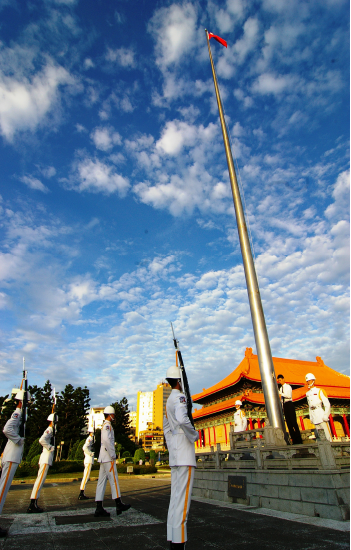

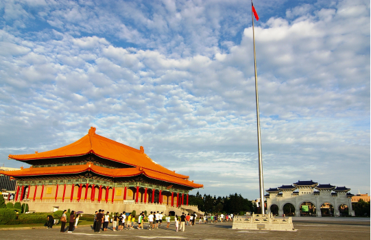

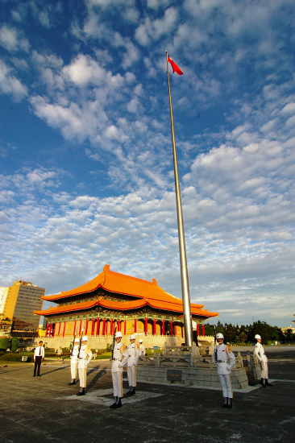

### 後記 —啟蒙教學行政薪火相傳體驗有感

戒純

培養他人須從己

配合團隊從領導

須善觀察補不足

功成不居成大才

為期六天的「生活體驗營」，在體會充實之下圓滿落幕。短短六天的因緣，團聚無盡燈學會散佈在各地的大專生，更沉澱無數活潑好學孩子的心靈。透過常禮舉要以及佛門禮儀內涵的演練，將彼此的身體乃至於心靈，都安住在「禮」的軌範之中，獲得文化內涵的修持。當如此殊勝的聚會終歸平靜，回到各自的生活情境以後，回想起「生活體驗營」在籌備之初，以及過程中的種種滋味，仍留有感動於心中。

在此次「生活體驗營」舉辦之前，負責擔綱的大專生們，正咀嚼著普賢行願品深妙的法味。一個星期之內，由早課聆聽法語，到負責各項執事；由大堂聽講，到小組研討。緊鑼密鼓的課程，從朝至暮，夜以繼日，以普賢行願品殊勝的內涵，潤澤了每位大專生的心靈。當大專生還沉浸於普賢菩薩廣大的心量，為之讚歎不已，並將普賢菩薩行付諸於西蓮淨苑齋僧實踐之時，緊接著上場的，就是「生活體驗營」這項屬於大專生的歷練。

「生活體驗營」並非一蹴可幾，這項活動考驗著大專生的耐力與智慧。大專生們經驗淺薄，至少有八成左右的成員，沒有參與過心靈成長班籌辦的經驗，也缺乏十足的信心。雖然相較於師長，與孩子們的年齡差距較小，但是在教學領導方面，與師長可是天差地別。然而在缺乏充足時間的狀態之下，各項準備工作還是緊鑼密鼓地展開了。

早在「普賢行願品講座」之前，就已經開始各項事宜的籌辦。先是總召集人的選定、接著幹部工作分配、課程內容規劃、團體服裝的設計、細部的執行要點等等。越接近活動的日子，問題開始一項項的冒出頭，有時設想太簡單，在請益師長之後，發現很多實際會遭遇的狀況；有時想得太複雜，缺乏執行的魄力，致使延誤了處理的時機。各種可能想像到的問題，伴隨活動雛形的顯現，漸漸浮出檯面。然而或許是「普賢行願品講座」啟迪了大家的智慧，在講座期間密集地相處之下，彼此都有了初步合作的默契。「生活體驗營」在大專生們既期待，又戰戰兢兢的狀態下開始運作。

剛開始的兩天，大專生尚在摸索「生活體驗營」的定位，以及熟悉自己的職務之中，細節部分顯得有些生澀，甚至彼此對於「生活體驗營」的內涵，有不少理解的差異。也因此在課程進行之初，則仰賴有經驗的學長，先將啟蒙班的理念落實。藉由大專生隨班上課的方式，一方面教育參與活動的孩子，一方面也讓不熟悉啟蒙班運作的大專成員，有學習的機會。所以「生活體驗營」與其說是對小學員在生活禮儀上的引領，以及人格的培成，不如說也正以親自實踐的方式，讓這些大專生有訓練的機會。

漸漸地，大專生瞭解了「生活體驗營」之宗旨，也熟悉啟蒙班的運作模式，在第二天以後，真正地開始投入「生活體驗營」的各項學習之中。白天大專生隨班入課，擔任演禮的示範者，同時也是「生活體驗營」課程的老師，對於學員的表現，負有指導與糾正的職責，自己更是小朋友們眼中的「模範」。除了白天的學習，大專生利用晚間小朋友就寢以後的時間，召開當天的檢討會議，祈請師長指導，而各組則輪流報告當天的狀況、須待解決的問題，以及針對隔天課程的行進，思考進行的方式、可能遭遇突發的變化，以及如何執行危機處理。小小的會議室中，擠滿約二十多位的大專生，全心全意為「生活體驗營」而努力。言談從開始的客氣，到最後有話直說，逐漸凝聚共識。小朋友在夜裡安眠，大專生除了減少睡眠，研商課程的行進方式，白天更要展現青春活力，帶動學習的氣氛。於是，在「雙軌」的訓練與要求下：白天自我約束言行，晚上研商問題對策，隨著小朋友氣質涵養的調整，大專生整體的氣象，也一同提昇了起來。原來常禮舉要當中的條目，以及佛門禮儀的內涵，透過實踐以後，能有如此廣大的作用。改變的不只是這些小學員的氣質，也改變了這些大專生對於「禮」的看法。「禮」不再是文本當中呆板的文字，它有深刻文化的內涵，而且真正地豐厚了彼此的心靈。

結束的最後一天，大專生和學員們依舊起了個大早，前往中正紀念堂觀看「升旗典禮」。這項典禮在現今的校園當中，已然丟失了它的精神。然而透過「生活體驗營」這六天的學習，大專生和學員們在禮儀的認知，以及身心都有長足的進步。看著憲兵們整齊劃一的步伐，當熟悉的音樂響起，國旗隨風飄揚，當終於爬升到旗桿的頂端，在清晨明淨的天空中，雲朵和國旗鮮豔的紅藍，藍天和佇立廣場的小朋友、大專生，莫名地，內心生起一股感動，對於國家，對於這片土地上活動的種種，有種深深地憾動。永遠記得國旗升上空中後，陽光從國家表演廳的方向，自遠端灑落在旗桿頂端，那油然而生的驕傲，還有內心的澎湃，令人充滿奮鬥的勇氣，以及努力的希望。

在學員們興奮地收拾行囊回家以後，大專生留在現場與師長深談「生活體驗營」的感受。對於「生活體驗營」的承辦，原先擔心的種種問題，並沒有在活動期間造成太多的影響，反而因為大家全心的護持，使得活動意外地殊勝圓滿。一心希望這些孩子可以將常禮舉要的內涵落實，沒想到自己也得到了增長，進而對師長課堂中教導的概念，有完整而深刻的體驗。大專生回憶起各自在求學過程的歷練，都沒有此次「生活體驗營」的淋漓盡致。在西風東漸的教育體制下，傳統中國文化的教育思想，被認為是僵化的體制，以為「禮節」只是束縛人類的發展，所謂「吃人的禮教」。然而透過正確知見的學習，建立起對於「禮」正確的認知，在生活中進一步實踐之後，所得到的並不是約束。相反的，在「禮」的基礎之上，身心安住在學習之中，一改現今大專生成天無所用心的委靡，把整體大專生的氣象提振起來，使整個國家好像都充滿了希望。更因為軌範的確立，而有能力在待人處世上，得到更多的助益，好處實在是太多了。

畫下圓滿的句點

每回活動的落幕，都讓人有種捨不得結束的感受。一來彼此相聚的因緣，不知道何時能夠再次相遇；二來，回到各自的生活圈之後，環境所帶來的考驗，又會將各自的際遇，乃至於想法，改變成什麼樣的狀態呢？即便環境是如此的艱難，然而法味是雋永的，這群大專生專注地投入，並且得到感動，當彼此的信念堅定，並且持續學習，相信在不久之後，當再度有聚首的機會，一定會激起更多火花，那將又是一次不同層次的歷練，大專生也都能如師長所期勉，越磨練越能彰顯智慧，越有能力傳承起中國文化的內涵，將之發揚光大。

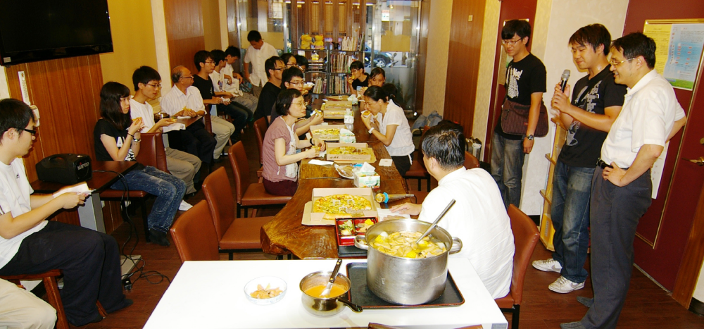
