# 第87期
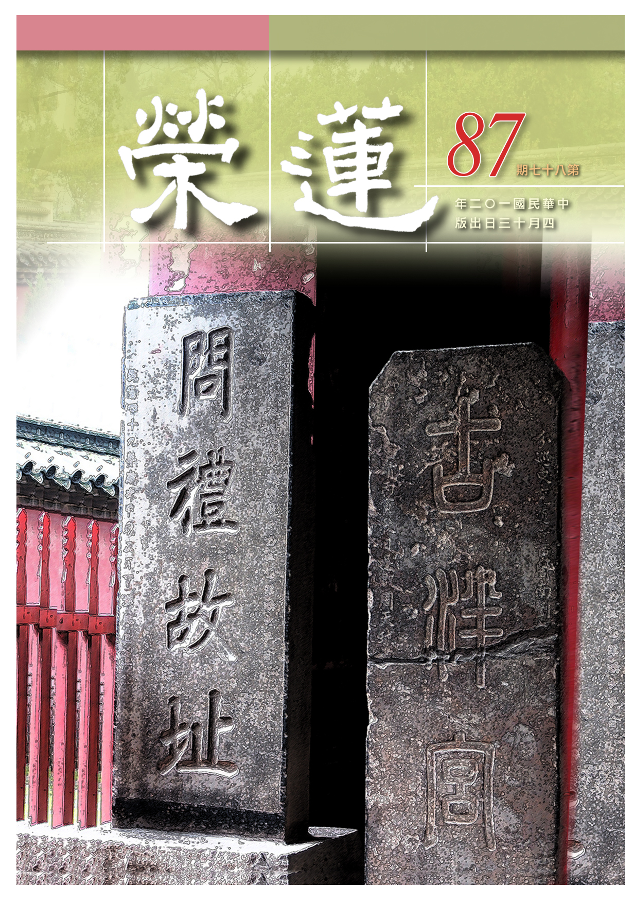

## 社論

### 大地回春

本刊

不知命無為君子

實至名歸是結局

無畏預言平常行

求加能得勝護持

二○○九年十一月，德國導演羅蘭‧艾默瑞奇（Roland Emmerich）所執導的災難片《2012》，開始在全球放映。二○一二年十二月廿一日將是世界末日的預言，隨著電影震撼的聲光效果，以及劇本與馬雅人曆法相扣合的巧妙安排，開始引起大眾的關注。後續媒體的傳播、科學研究的論證、靈媒的感應，乃至於大家茶餘飯後彼此間的閒聊，使得這件似有似無、似虛似實的訊息，像空氣般瀰漫在我們生活的周遭。

寧可信其有，不可信其無的務實行動者開始挖山鑿坑、積水囤糧；修行人更加地勇猛精進，在精神上做足了武裝，務必要剋期求證，準備好面對這場凜冽的寒冬。有些地方可見倒數計時的曆日牌，讓人不覺精神緊繃。災難屆至，人們有的狂歡、有的靜修、有的觀望，直到指針連續跨過了不同時區的二十一日的最後一秒，十二月廿二日降臨，末日終於沒有到來。冬季的寒風依舊，人心的大地回春，失序的生活，錯置的人生規劃，又將回復常軌。

什麼是末日？人生有沒有宿命？若有宿命能不能改命？十二月廿一日的災難雖然沒有到來，然而時代所掀起的致命洪濤，諸如國際間的領土爭端、南北韓戰爭威脅所引起的恐慌、大陸上H7N9禽流感的擴散、環境污染、地球暖化、治安敗壞以及人心的險惡，仍然使我們站在存亡絕續的關口。對於這些惡象能夠處之泰然，面對預言卻是急心如焚，明於細而暗於大，猶如貓頭鷹那般，晝不見泰山，夜能察秋毫，這樣的人生態度如何應接瞬息變化的世局，真正命終之際，又如何能解決自己的死生問題。

孔老夫子說：「君子疾沒世而名不稱焉。」儒家的君子，害怕的是自己沒有充實的內涵以及辦事的能力來利益大眾；憂愁的是人生最終沒有實至名歸的結局，這是君子的末日。因此曾子一生戰戰兢兢，如臨深淵，如履薄冰，直至命終易簀，確信自己白玉無瑕，這才敢說：「吾知免夫，小子。」氣數雖盡但末日未至，他的德行使他的身體尊貴，他的貢獻使他的生命得到莊嚴，他在人事上盡足了本分，承擔了讀書人應有的責任，所謂士不可以不弘毅，任重而道遠。仁以為己任，不亦重乎？死而後已，不亦遠乎？君子儒有這般隆重的世間使命，發大悲心及菩提心的淨土學人，絕對不是只關心自己往生的行者，更不能夠聞災色變，臨難苟免，鎮靜的功夫和理智的頭腦，不也是一心不亂所必備的內涵。

進德修業是生命的機能，是往生的資糧，是扭開宿命枷鎖的能量。精進不能只是依靠災難的逼迫，念佛應該是平時功夫，命運的改造也靠日常的積累。孔子有一次重病，弟子子路為他禱告，孔子病情轉好，聽說病中子路為他祈禱，於是向子路說道：丘之禱久矣。孔子平時言行純善，事事如禱，因此心境中的暖春常在，光明篤實，不因困局而顯得急躁不安，為人變得一反常態。聖人所提示的祈禱要義，正可以作為我們立身處世的準則，是我們身處資訊迷霧中的指南。

## 大德法語

### 大方廣圓覺修多羅了義經（四十六）

道源老和尚

幻現由業非皆無

作用宛然無實體

相以實體生愛憎

多劫輪迴如長夢

戊二、四問答別明觀行中根修證

己一、二問答三觀修行

庚一、示三觀行相（威德自在啟請）

辛六、正答所問

壬一、長行

癸二、正示觀門

子二、起幻銷塵觀

丑一、示立行之本

經文：

善男子！若諸菩薩，悟淨圓覺。

悟了理以後再修，立行之本在悟。

丑二、示觀行之相

經文：

以淨覺心，知覺心性，及與根塵，皆因幻化。即起諸幻，以除幻者；變化諸幻，而開幻眾。

此為顯示修學之相，由於悟了清淨圓覺之理，亦即明心見性，悟自己的心性是圓覺妙性，根塵指的是六根對六塵，顯現的根塵識的世界通通是幻化的，彼菩薩以幻化的法門除去幻化的執著，並以幻化的教法向如幻如化的眾生開示。

丑三、示漸次增進

經文：

由起幻故，便能內發大悲輕安。一切菩薩從此起行，漸次增進。彼觀幻者，非同幻故。非同幻觀，皆是幻故。幻相永離。是諸菩薩所圓妙行，如土長苗。

由於證得如幻化法門的輕安，此輕安的境界能內發大悲心，依大悲心行菩薩道利益眾生，特別是講經說法利益一切眾生。

此菩薩知道一切如幻如化，但眾生不知道，菩薩在幻化中廣設一切道場，建大叢林，開大道場，眾生安處一切徒眾，有出家、不能出家的，先皈依三寶、受五戒乃至受在家菩薩戒，乃至天天做這如幻如化的事。古人有二句話：廣開隨緣道場，大作夢中佛事。所開的道場都如水中月虛幻不實，雖知幻化不實，依然廣開！因緣足福報夠，則開第一個道場，開第二個道場，開第三個道場等等。

如民國出了些大善知識，特別是虛雲老和尚，二十歲出家，到了七十歲以後才出頭，他把道場建好就走，如重建鼓山湧泉寺，建好了就走了，到了曹溪重修六祖的道場（南華寺），修好了，又走了，再去雲門重建道場，這就是給我們做榜樣。另有倓虛老法師，此人四十三歲才出家，你看他的「影塵回憶錄」，出了家就到寧波觀宗寺去諦閑老法師的佛學院學習，天天吃臭冬瓜，那真是苦得要命，在那住了三年，畢業了才出來，回到東北家鄉要報恩，重修楞嚴寺，建好人就走了，之後去重建長春般若寺，依然如此，又到青島去修湛山寺，之後大陸內戰，不能如意，就到香港去弘法。

以上這都是給我們做的榜樣，廣開水月道場，大作夢中佛事，天天講經說法，去度如幻的眾生，這樣度來度去，你自己也得了大利益。

這位修如幻三昧的菩薩，天天講經說法度如幻的眾生，天天行持度如幻眾生的行門，漸次增進菩薩的行持。彼觀幻者，是位悟圓覺的人，知道一切幻化不實，以幻化的法度幻化的眾生，他是一位觀幻的人，不同幻，意即不被幻相所迷，幻化無自體性，當體即空，生起如幻的觀察，那是無明眼翳的生起，幻相的自體性亦無，謂之幻相永離。此是諸菩薩所圓妙行，如土長苗。如種菩提樹，先種種子，土裡漸漸生出菩提苗。

丑四、結觀行之名

經文：

此方便者，名三摩鉢提。

三摩鉢提翻譯為等持，等持一切法，能持無上菩提。

正答威德菩薩三觀，名詞是圭峯大師取的，為圓瑛法師所依。所述三觀為：一、泯相澄神觀（根本位）；一切相了不可得而泯滅，此時心神澄清，乃智慧開發，能發輕安相，此時與十方佛的心相通了。二、起幻消塵觀（後得位）：觀世間如幻，不生執著，將塵勞（煩惱）消滅，謂之三摩鉢提，亦即如幻三昧。三、絕待靈心觀：謂之禪那。

子三、絕待靈心觀

丑一、標立行之本

經文：

善男子！若諸菩薩悟淨圓覺。

悟了圓覺之理，之後是悟後起修。

丑二、示觀行之相

經文：

以淨覺心，不取幻化及諸靜相，了知身心，皆為罣礙。無知覺明，不依諸礙，永得超過礙無礙境。受用世界，及與身心，相在塵域，如器中鍠，聲出於外。煩惱涅槃，不相留礙。

悟了清淨圓覺之理，不取幻化及諸靜相，是不取第二個觀門（幻化三昧觀門），也不取第一個觀門（寂靜輕安相）。了知身心，皆為罣礙。

無知覺明，不依諸礙：真知是無能知所知，乃直緣空性之智，是不依諸礙，是永遠超過礙與無礙二者，礙與無礙是對待的，此時是絕待得以超過。

受用世界，及與身心，相在塵域。如器中鍠，聲出於外：外受用世界，內受用身心，知如幻如化，所以不被塵勞妄想所束縛，身心相雖在塵域之中，如同樂器，而樂器裡有一種發聲音之物謂之鍠（小銅片），樂器所發聲音超出器外，不被樂器障礙住，如彈的鋼琴，裡邊的鍠，所發出之聲音不被樂器所障礙，如同吾人靈知靈覺的心，在塵勞妄想之中，雖身心相在塵域，但靈明的觀智可以超越塵域之外。

煩惱涅槃，不相留礙：凡夫為煩惱所留礙，二乘為涅槃所留礙，都是有所著，凡夫若知道煩惱，即不名凡夫，二乘人不執著涅槃，即不屬二乘了，煩惱涅槃一有所執則留礙了。

丑三、示成就利益

經文：

便能內發，寂滅輕安，妙覺隨順寂滅境界，自他身心所不能及，眾生壽命皆為浮想。

前之名相為寂靜輕安，此處謂之寂滅輕安，寂靜之相亦了不可得，證得諸法不生不滅之體性，謂之寂滅，修此方便謂之禪那。此時妙圓智慧隨順這寂滅（不生不滅）的境界（現證諸法實相），自他身心所不能及，自己的身心（世俗相）達不到這個境界，眾生的身心亦如此。一切眾生相之壽命謂之壽者相，都是浮想（不實在的妄想），含我相、人相、眾生相，皆虛浮不實。

丑四、結觀行之名

經文：

此方便者，名為禪那。

禪那謂之靜慮，是證得寂滅的方便。

（下期待續）

### 一○一年圓通寺結夏安居〜果公法語開示

*編輯部整理*

慨切叮嚀德尊崇

有幸末法大善士

苦海明燈示戒勝

空慧攝持成菩提

民國一○一年八月四日

今天中華無盡燈文化學會來圓通寺供佛齋僧，功德無量！以幾段的法語，與諸位共同研習。

第一段的法語，華嚴經偈頌：

戒為無上菩提本，應當具足持淨戒，若能堅持於淨戒，是則如來所讚歎。

戒法就是成就無上佛菩提的根本，不只是生人天而已，若發心生天而持戒，則持戒功德成為生天之因。若持戒是為了成就無上佛菩提，則持戒功德為成佛的資糧（持戒不失人天身，依人天身方能修學成佛，故戒為無上菩提本），以上戒為無上菩提本。

既然持戒是成就無上佛菩提的根本，所以應當具足持淨戒，因此之故，好好受持佛陀所示清淨的戒法，何謂受持佛陀清淨的戒法？亦即持戒要輕重等持，持輕戒的心與持重戒的心是一樣的平等，不能只持重戒而忽視輕戒，假若抱持這樣的心理，則重戒也不會持好。要知道輕戒是護持重戒，輕戒若小心謹慎的守護，重戒決定犯不到。能夠輕重等持，持得皎如冰霜，塵點不染，謂之具足持淨戒，具足的受持佛陀所示清淨的戒法。

假若能具足受持佛陀所示清淨的戒法，是十方諸佛所共同稱揚讚歎的對象，諸佛都來稱揚讚歎我們，能夠好好的持戒。這種戒德之香，普薰的地方是無遠弗屆的，不像世間的香、天上的香，天上的種種天香，有花香、沈香、麝香等等，但是所薰染的地方，都是有限度的，而持戒之香是無遠弗屆，所以要好好的持戒。在場的人有的受五戒、有的受菩薩戒，受了戒就好好的守，好好的受持，功德就無量無邊，諸佛都讚歎我們。

第二段的法語，出自於涅槃經

，經文：

欲見佛性，證大涅槃，必須深心，修持淨戒。

照見佛性也就是證得大菩提，是破所知障的所證，證大涅槃是破煩惱障的所證。由何而來？須有深信之心，受持佛陀所制的戒法。所以我們發心受了戒法，就要好好的持戒，將來可以成就大菩提，證得大涅槃，獲得這二妙轉果，這時候就成佛了。

第三段法語：

戒為大船師，能渡生死海；戒為清涼池，澡浴諸煩惱

。

戒如偉大的船師，船師是什麼樣的人？就是導航的人，他在大海裡面是作導航的人，船師經驗非常豐富，他知道哪裡有危險，那個地方是安全的，他能夠避開危險的地方，而使船走到安全的地處，不會遇到災難，這就是大船師的功德。所以我們好好持戒，如同我們就是偉大的船師、偉大的導航者，能夠渡過生死的苦海，到達清淨的彼岸。

戒如清涼的池塘，我們在清涼池塘裡沐浴，身心會感覺非常清涼，由於滿身垢穢，跑去戒法的清涼池裡，就能清洗掉我們身心的污垢（熱惱），使我們的身心獲得清涼。

第四段法語：

佛說律為本，能生諸善法；譬如大堤防，瀑流不能越。

佛陀宣說戒律作為我們修行的根本，因戒生定，因定開發清淨本具的智慧，所以受持戒律能夠生起上述諸多的善法，非常好！就好比廣大的堤防一樣，即使有好幾層樓高的大海嘯，由於有了戒法的大提防，所以瀑流不能越，即使再大的瀑流也不能夠超越。所以我們要好好的持戒，這是第四段的法語。
其次以一段明朝蓮池大師，答覆皇太后的問
**答：** 「尊榮豪貴者，由宿植善因，因勝果必隆，今成大福聚。深達罪福相，果中更植因，喻如錦上花，重重美無盡。如是修福已，復應慎觀察，修福不修慧，終非解脫因，福慧二俱修，世出世第一。眾生真慧性，皆以雜念昏，修慧之要門，但一心念佛。念極心清淨，心淨土亦淨，蓮台最上品，於中而受生。見佛悟無生，究竟成佛道，三界無倫匹，是名大尊貴。」

尊崇、榮耀、豪富、高貴的這種人，如皇太后在世間的地位崇高，是由於過去種下善業之因，因地修行殊勝，都是造善業，果地必然是很興隆的，所以顯現在這一世是成為廣大福報聚集之一人。

我們要深深通達罪福的相狀，所以造惡業必墮畜鬼獄，種下惡因就得到罪惡的果報。亦即我們要深信因果，因果是通三世，所謂：欲知過去因，今生受者是，欲知來世果，今生作者是。想要知道過去的修因如何，今生所遇的就是，我們要想知道未來果報是怎樣，我們今世所努力造作的就是。不可以只看這一世，若只看這一世，善惡業果報會看不清，怎麼我作善事得到不好的果報！人家作惡就得到好的果報！要知道人家今天得到好的果報，是因為過去世種了善業之因，現在得到好的果報，而這一世他造作惡業，這一世還沒看到不好的果報，未來要受報的，所以我們要以因果通三世來觀察，才不會怨天尤人，認為沒有因果報應的道理，進而無惡不造，成為大邪見的人，就會墮落。

所以我們學佛的第一步，就是要深深明白三世因果的道理，從此再也不敢造惡業，而且要努力的作善。由於我們善根具足，所以作善非常簡單，能將所作的善業成為將來成佛的因，然若不能以三輪體空的正見攝持利益眾生的善業，所作所為都是有漏的果報，無法成佛或證得解脫，反而在三界六道當中輪迴。

要緊的是深深通達罪福的現象，從此以後，我們要止惡行善，並以三輪體空的智慧攝持，將來成就無上菩提，這個就非常要緊了。

所以深達罪福相，果中更植因：亦即在好的福報當中，更加種上好的因，不要一直享受好的果報卻不去造善，果報享受下去將來要受罪報的，因此有好的果報繼續要努力去種善，體性轉成無漏的善因，如同莊嚴美麗的錦繡上又繡上花朵，一重一重地顯示無限之美。

如是修福已，復應慎觀察，修福不修慧，終非解脫因：懂得在樂果中修福，還要謹慎的觀察一番，如何觀察呢？若偏於修福，而沒有修智慧，終究不能解脫，乃至無法成為無上佛道的修因，所以我們在因地修行，要福慧雙修。

所以是

福慧二俱修，世出世第一：

福德跟智慧二者俱修互攝，是世間與出世間之中最為第一的修持。

眾生真慧性，皆以雜念昏：

眾生都有真如本性，此真如本性是靈靈覺覺的、光光明明的，若以一念迥脫根塵，則靈光獨耀。然何以真如本性顯現不出來，那是什麼原因呢？都是因為我們眾生最喜歡打妄想！起雜念！ 所以靈靈覺覺的真如本性被妄想、執著及有漏的善惡諸業遮蓋住了。由於妄想、執著、煩惱太深厚了，所以靈靈覺覺的真如本性就顯現不出來了。要如何開顯這真如本性？須好好地修智慧，然要怎麼修智慧？

修慧之要門，但一心念佛：

修持智慧最重要的法門，就是好好的一心念佛，自然就開顯我們心性本具的智慧。我們清淨的佛性與十方三世諸佛都一樣，我們只要如法的修學，依照蓮池大師的開示，假若一心念佛，沒有懷疑之心，信仰這個法門不再動搖，念念相續無有間斷，身語意業無有疲厭，若參雜妄想不可謂之一心念佛。我們一心念佛就是念茲在茲，所謂都攝六根，淨念相繼，得三摩地，斯為第一，這才是一心念佛。

念極心清淨，心淨土亦淨：

念佛念到妄想、雜念都沒有了，這才是一心念佛，你的自性清淨心就開顯出來，進而念到念而無念，無念而念。念而無念是照而常寂，無念而念是寂而常照。念著這一句萬德弘名的佛號而無一點其他心念，證得寂而常照，照而常寂，實相顯現（禪宗教相微妙的義理，就是諸法實相），西方極樂世界種種莊嚴徹底圓滿的彰顯出來，念佛念到這個地步。

念極心清淨，心淨土亦淨：

心清淨了，招感的國土就清淨，往生一定是蓮台最上品。心清淨，招感的國土就清淨，心臭穢，招感的國土就臭穢。所以我們要深信切願好好念佛求往生，講究老實念佛。所謂老實念佛，是念佛時真信不疑，誠如雪公恩師所說，要真信不疑，發願往生，苦樂順逆，概不退轉。即使遇到其他的法門，也不改變我們的修法，內心也不會寄望及追求世間欲樂的境界，佛說種種殊勝的福報自然成就。

蓮台最上品，於中而受生：

金剛寶台是上品上生的蓮臺，乘著金剛台去往生，馬上開花、馬上見佛，證得無生法忍。對於諸法不生不滅的道理忍可於心，再也不動搖，這就是無生法忍，對諸法看不到一點生滅自相（寂滅相），此為最究竟的淨土法門。見佛證入無生法忍，是圓教初住以上的菩薩，很快就能成佛。

三界無倫匹，是名大尊貴：

因為成佛了，所以三界當中沒有眾生可以跟他同等，亦即佛是三界中最偉大的聖人，沒有其他的聖者可以跟他匹敵，最為尊貴。

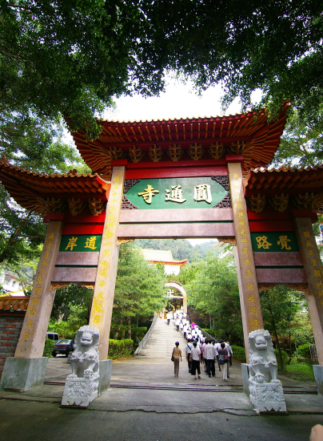

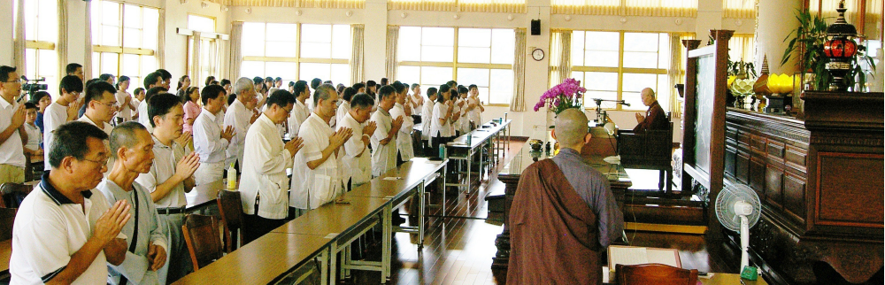

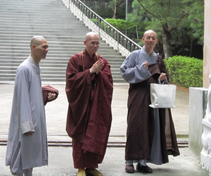

## 共修研學

### 小止觀導覽（五十九）

*心爾、治心整理*

分別真偽靠正知

聞思能令修學通

可嘆瞎眼行暗路

期盼成就在驢年

第七章  善根發

智者大師所說的這些善根發相，要注意有時候是正確的，有時候是錯誤的，必須要辨別邪偽禪發相，然後一一的對治，才不會使我們的修行走錯路。在這當中好好瞭解修行的方法，修行應該掌握的動機、目標，以及如何依著修行給自己一番成就，不能口說修行，卻毫無體會，毫無法喜，毫無樂趣，這樣修行就很可惜了。

論文：

二、分別真偽者，有二：一者、辨邪偽禪發相：行者若發如上諸禪時，隨因所發之法，或身騷動，或時身重，如物鎮壓，或時身輕欲飛，或時如縛，或時逶迤垂熟，或時煎寒，或時壯熱，或見種種諸異境界，或時其心闇蔽，或時起諸惡覺，或時念外散亂諸雜善事，或時歡喜躁動，或時憂愁悲思，或時惡觸，身毛驚豎，或時大樂昏醉，如是種種邪法與禪俱發，名為邪偽。

或時逶迤垂熟是精神開始頹糜，覺得沒勁了。或時煎寒是外熱內冷，外相流汗然身體虛弱，或時壯熱是身體躁熱，坐立難安。或見到種種怪異境界，如看科幻電影般。或時其心闇蔽，是內心如入暗室，看不到任何東西，對教法沒有觀察的能力。或時起諸惡覺，是對境界產生厭煩，除了厭煩之外，有時還會產生很奇怪的念頭，比如：打佛七止靜當中，卻想要衝出去看電影或遊於五欲境，這就是起諸惡覺，而這種惡覺、惡念，行人有時在精進用功時，會生起這種莫名其妙的心念。

或時念外散亂諸雜善事，或時想到一些雜事或善事，想起以前的放生、助念、作七等多麼風光的事情，想起這些善法雖好，然與目前所修不相符合，亦是散亂一種，有時越用功，逼得散亂心越強。

或時歡喜躁動，歡喜屬於外境，躁動屬於內在，修行有得，感覺很高興，卻沒辦法讓心靜下來，法喜是對的，但不是變成躁動，若成躁動則成輕佻。

或時憂愁悲思，修行有時怕著悲魔，比如：想到有情眾生的苦，會一直哭，剛開始哭是悲心的哭，可是漸漸的什麼都哭，已著悲魔。有些人報告修行的心得，就開始哭，剛開始是對的，這是內心的喜悅，內心的感動，或者是觸動藏在內心裡面隱藏很久的善根，可是常常講常常哭，這就著悲魔了。不知對治，會與慢心結合，生起增上慢，著悲魔很微細，要深細檢查，否則掉入魔境自己都不知道。

或時惡觸身毛驚豎，如摸蛇身毛寒豎，亦即定中忽然冤親債主現前，或忽然一時惡念生起，想到自己為何是這種人，感覺很恐怖，身毛驚豎。

或時大樂昏醉，修行生起的快樂，陶醉在其中，最可怕的是出現幻境而樂在其中。

以上這些邪偽，我們一般人是不會遇到的，因為不是很用功，所以不會著魔。道不大魔不大，沒道沒魔。所以這些境界一般人沒有。

上述十五種現象，若無正知見分辨真偽，顯現這些境界而無從對治，知執這些境界之過患，在修定時不會被這些境界所轉。有人打坐時非常在意有沒有飛起來的感覺，有人出定感覺到很快樂，以為坐禪有了成就，其實坐禪有成就是心有安住境界的能力，不是附帶生起的那些現象，那些現象或是魔的幫助，或者是四大五蘊在變化時顯現的假相，或者是宿世的某一種惡業伴隨著修止觀生起，行者如果善於知道這些現象，就不會被這些現象所轉。

論文：

此之邪定，若人愛著，即與九十五種鬼神法相應，多好失心癲狂。或時諸鬼神等知人念著其法，即加勢力，另發諸邪定、邪智、辯才、神通、惑動是人。凡愚見者，謂得道果，悉皆信伏。而其內心顛倒，專行鬼法，惑亂世間。是人命終，永不值佛，還墮鬼神道中。若坐時多行惡法，即墮地獄。行者修止觀時，若證如是等禪，有此諸邪偽相，當即卻之。云何卻之？若知虛誑，正心不受不著，即當謝滅。應用正觀破之，即當滅矣。

如果愛著這些邪定（上述十五種現象），就與九十五種鬼神法相應，沒辦法好好在教法上作思維和觀修，反而執著這些現象，成為失心癲狂之人，由於鬼是有鬼通的，知道行者念著這些與禪俱發的怪現象，會增加行者勢力，另發邪定、邪智、辯才、神通，能迷惑感動他人，自己也覺得自己很厲害。凡愚之人見了此鬼通之人，以為是得道果的聖者，對這樣的邪智者信以為真，十分佩服，真是害己害人。這些都是行者自己想要鬼通，才會有這樣的現象，這些人臨終見不到佛，反將一生修行墮入鬼道。

若此人專心在教法的聞思，所作所為皆為往生淨土見彌陀，這些現象都會除滅。或觀萬法體性空寂，這些現象非實有，不過內心的幻影，此時自然能將惡境界滅掉。

總之上述十五種現象，會與坐禪時一同發起，善知這些或是宿世的惡業生起，或是四大不調，或是魔來擾亂，心裡不要理會，還是安住在正法的境界上，這些現象就會慢慢退卻。就好像在辦公室裡面很多的同事，他們可能是追求五欲境的，你跟他們雖然有來往，只要內心不要去投那個氣氛，那些人不會帶你去做不如法的事情，所以那些境界雖然在上班的時候生起，可是卻對你沒有作用。

何以此人命終，永不值佛，還墮鬼神道中？往往這種人破壞正法的力量最強，世間正派人士看到這種修行人，反而不願意學佛，這種人越弘揚佛法，佛法越慘，這種讓人喪失了對佛法信心的謗法罪最嚴重，引來學佛的人，都是想要在佛門裡希求神通，都是引壞亂佛門的這一類。所以佛菩薩都不喜歡見到這種人，害怕見到這種人，因為攝受這種人，反而加速佛法的滅亡。

若知虛誑，正心不受。誑就是欺騙，讓人感覺到此人修行很有功夫，其實是欺騙人的。虛是它的體性不可得，是你招感來的，他不是有自相的，比如說這個人是壞朋友，我一生都是被他害的！不！這是你招感來的，假如你不把他當朋友，他害你什麼？或者有人說我因為碰到他，使我倒霉一輩子，但是他為何不去害別人卻來害我？因為是我們自己去招感的，自己去親近的，我們自己讓他顯現為善知識來親近，怎麼可以怪他呢？必須要怪我們自己，我們知見不正確，心念不篤定，對三寶求加被的心不強，都是我們讓他顯現的。（下期待續）

### 菩薩清淨的行持　華嚴經淨行品（三）

*編輯部整理*

修學法器十具足

皈依善願與好樂

三寶加被傳承攝

佛德能攝一念間

上次說到智首菩薩請問文殊師利菩薩：要怎樣使自己身、口、意三業離開一切過失成就一切功德，應該重視什麼因呢？須具備什麼條件呢？

身口意三業清淨阿羅漢亦有，由於阿羅漢亦遠離貪、瞋、癡、慢、疑、邪見等煩惱，試問菩薩所得無過失三業和阿羅漢有何不同？差別在哪裡？

阿羅漢三業有所知障帶來的過失，所知障的行相是我執煩惱與身口意惡造作所熏下去的習氣，習氣中有會生起煩惱的習氣，與不會生起煩惱的習氣。所知障的習氣不會生起煩惱，其習氣如同酒瓶之酒倒光，瓶中仍具酒味。所以阿羅漢的心中沒有與二種我執相應的煩惱，但仍有習氣走作，如同有的阿羅漢走路是用跳的，因為過去做猿猴的習氣沒改。習氣不是安立在心所（安立在心所的無明是煩惱障），習氣是安立在心不相應行法上。因為安立在心不相應行法，所以它只有過失，沒有罪業。

有的阿羅漢是慢心的習氣猶在，如畢陵伽婆尊者要渡河時對河神說：「小婢來！我要渡河。」佛要他跟小婢懺悔；所知障習氣若非過失，何以佛要他懺悔？

亦有阿羅漢帶瞋的習氣，如舍利弗。舍利弗是羅睺羅的老師，師徒一起出門托缽，由於羅睺羅的輩分低、名聲小，施主對舍利弗作較多的供養，羅睺羅因為吃不飽，就向佛陀訴苦，當佛向舍利弗說明其受用不淨食，還未等佛將理由說完，舍利弗已運用神通將肚子裏的菜飯吐出來，舍利弗何以有此瞋習？乃因過去做毒蛇的習氣，雖然已成為尊者，然瞋習猶在。

所以入世君子須以禮而行，對治習氣。有仁心欲利益天下蒼生的君子，也要有禮樂的教化，方能治過於無形。

丙二、別問行所成德

接著分別來問，我要怎樣的行持，才能成就這樣的功德。

丁一、修道之器

別問行所成德有十類，第一為修道之器，譬如要成為修道的法器，男人身比女人身有利、年輕比年紀大的有利、六根明利的比有障礙的有利、身體健康的比生病的有利、擁有資源多的比少的有利。昔日禪宗四祖道信禪師碰到一位老人要向他學佛，要傳承他的法，道信禪師就說，你的條件不足。所以，行所成德，乃透過怎樣的行持，讓他成就了這些功德，這些功德使他成為修行的法器，令彼方便修道而成佛，不講究這些條件是不能成佛的，因此以下的這些條件是成佛很重要的條件。

經文：

云何得生處具足，種族具足，家具足，色具足，相具足，念具足，慧具足，行具足，無畏具足，覺悟具足。

生處具足：

如何得投生在有佛法的地方？如果今天投生在沒有佛法的邊地，試問你要向誰學佛？修道之器約著清涼國師講有二分：一者約自利，能令自己有利修學。二者成就利他，也容易成為人家傳法的法器，能成為護持佛法、續佛慧命的人才。

種族具足：

指投生在尊貴的種姓，貴族有比較多的受教機會，例如孔德成先生即享有此大福報，從小就有很多大儒在孔府，耳濡目染，使他也成為一代大儒。

家具足：

如果生在皈依三寶，對三寶有信心、積善的家庭，此家風自然能感應善知識來攝受，以及自己對正法的好感及好樂地學習。

色具足：

外形顏色很好，意即長相莊嚴又容光煥發，乃過去修忍辱且心情坦蕩所感。這樣的外相也容易成為善知識攝受的因。昔日蓮池大師與朋友對談佛法，一隻蜈蚣爬到牆上聽，蓮池大師看了，叫牠快走！因為那個樣子人見人怕，容易傷害牠的性命。換句話說，那個樣子要修學佛法都是障礙，可見色具足的重要。

相具足：

大丈夫相的男生比女生方便修學，所以因地裏要有羨慕男生的修學法。藥師經裡有厭女身欣男身，來世轉女成男的修學法。若是乘願再來，以女相彰顯慈悲，又另當別論。

念具足：

能輕易記住善知識的教授，成為人家樂教的人，若如周利槃陀伽，學什麼忘什麼，很少人有耐性慢慢的教他。

慧具足：

指有抉擇的能力，能取善說、捨惡說。讀到般若經典時，告訴眾生放下，不執著，那是講勝義諦的修學，若在世俗諦上要論取捨，要能分別。顏回向孔子學聖賢學問，自己也能生起同聖賢般的擇法眼，論語上孔子讚歎顏回用之則行，舍之則藏，此即顏回學到孔子的抉擇能力。

行具足：

清涼大師《疏鈔》說，指這個人堪忍、耐磨。昔日廣欽老和尚擔任寺廟香燈執事時，香油錢不見了，被眾人質疑了很長一段時間，到後來師父才說是自己拿的，目的是為了考驗廣欽老和尚的忍辱力。

無畏具足：

清涼大師說為膽識，誠如玄奘法師為了求法，西行橫渡廣大無邊的沙漠，千里跋涉，萬般艱難終於完成求法及傳承的使命，這就是膽識。

覺悟具足：

是指有悟性。有悟性的人聽課能聽到老師的言外之意與弦外之音，日用平常與人相處懂得察顏觀色。

以上能具這十項條件，是殊勝修道之器。

丁二、成就眾慧

經文：

云何得勝慧，第一慧，最上慧，最勝慧，無量慧，無數慧，不思議慧，無與等慧，不可量慧，不可說慧。

如果要成為修道的法器，最重要就是要成就眾慧。因為要利他，必須先自利，自利就得要破障，破障必須靠智慧，除了智慧以外，沒有其他可以破障，如果不能破自己的煩惱障、所知障，怎麼自利。不能自利，如何能利他？然要如何得到這些智慧？有了這些智慧如很好的器皿，能裝所有佛的功德。

勝慧：

抉擇勝義諦的慧，即般若的智慧，是超勝世間的智慧，故名勝慧。

第一慧：

此即生起加行道的智慧（加行道是：煖、頂、忍、世第一），此慧即是觀察空性的智慧，能生起空性的現證。

最上慧：

由第一慧生起現證空性的智慧，謂之最上慧。佛能運用此慧破所知障，八地菩薩能運用此慧破煩惱障，初地菩薩能運用此慧破分別我執、分別法執。

最勝慧：

以最上慧破煩惱障、所知障，謂之最勝慧。

以上四種皆般若智慧，非劣慧。劣慧不能了生死、不能解脫、不能遠離痛苦。

以下六慧是最勝慧的別說。

無量慧：

是不可稱量、無法預測的。大菩薩都無法想像佛的智慧，就像阿難不知迦葉的境界，阿難更不知佛的境界，何況我們薄地凡夫。

無數慧：

是指對道理通達的智慧，多到難以想像，此即通達各種世間的陀羅尼。

不思議慧：

在任何情況下都能現證空性，能所雙亡的境界能任運相續的生起。

無與等慧：

佛之無見頂相表徵佛的智慧，無人能與之平等。

不可量慧：

指無法得知佛所作度化眾生事業，及舉手投足深刻的義涵。

不可說慧：

即使要將能所雙亡的境界說出來，多麼好的口才也沒辦法說，那一分是不思議的，是世間人難以體會的。譬如對一位瞎子說黃色，無論如何形容，他都難以懂。以上這六慧是最勝慧的差別相。（下期待續）

## 蓮池海會

### 林李如美老居士助念見聞記

*編輯部整理*

承擔家變出陰霾

大悲須從愛子出

孫引學佛得助念

家族佛化由此生

林李如美老居士，生於民國七年四月十日，台灣省基隆人。幼時家教良好，品行敦和，樂於助人，在讀完小學、初中後，進入基隆女高就讀，並完成高中學業。二十九歲時，與當時在台北工專任教的林清輝先生結婚，婚後育有二子二女。老居士一生從事家庭主婦的工作，管理家務、照料子女盡心盡責，使先生在外工作無後顧之憂。四位子女也不辜負父母栽培，在學業上都有很好的表現，子女們畢業之後進入社會，也都能夠妥善照顧自己的生活。

老居士長年居住於台北，三女全家於民國七十年間，遷入與老居士同棟的大樓中，彼此成為鄰居。民國七十六年一月，老居士三女和女婿因事業糾紛遭到歹徒攻擊，女婿送醫不治死亡，三女也險些成為植物人，於休養七年之後，方能勉強自理起居生活。三女生有五子，在家中遭逢變故之後，頓失依怙，全靠老居士與先生共同發心，一肩扛起照料三女全家的責任，此為相當艱辛的一段過程，除了必須照料年紀最大僅小學六年級的五位小孩，還要協助處理三女事業上的問題，內心還必須承擔兇案後的恐懼。老居士秉持傳統婦女堅毅的美德，與先生一同度過這一道嚴峻的人生關卡，民國八十三年，老居士的先生過世，自此之後，更是老居士獨自一人照顧三女家庭，所幸其他三位兒女也時常提供幫助，並且回家幫忙，替老居士分憂。外孫們也相繼長大成人，漸漸懂事，使老居士心中稍有寬慰。

民國九十五年間，老居士因跌倒導致大腿骨骨折，自此開始必須長坐輪椅，無法起身走動。四女為了照顧母親，於逢甲大學退休後，便回到臺北家中居住。長子旅居美國，每日透過網路越洋電話與母親聯繫。二子也幾乎每天抽空回家探訪母親。老人家終身的付出，獲得子女們孝敬的回報。家中並聘僱了印尼籍幫傭麗娜，協助照料老居士，麗娜勤奮堪勞，直至老居士過世，一共陪伴了老居士七年的光陰，幫老居士清理便汙，料理三餐，陪伴老居士復健、針灸、出入醫院，老居士即便長期臥床，在麗娜的細心照料下不曾患過褥瘡，七年之中與老居士培養了深厚的感情。此外，雖然有外勞的看護，四女始終堅持陪伴在母親身邊，不曾讓老居士單獨與外勞共處。

老居士信奉民間傳統信仰，在家中設有佛桌，每日祭拜，直至晚年體力漸衰，又無法走動，遂無法持續。外孫於民國九十六年接觸佛教淨土宗，於此期間便開始與老居士交流淨土宗理念，並每日抽空陪老居士念佛，期望能夠提起老居士求生西方的正念。老居士的健康情形，隨著年紀長大逐漸退化，從能夠開口念佛，到只能閉口聆聽佛號，然而只要在家有空，外孫每日陪伴祖母念佛十分鐘的功課，六年多來並未停止。

老居士因跌倒長期坐輪椅、臥床，以致於有時會因尿道感染發燒，而必須住院治療，所幸每次都能治癒平安返家。民國一○二年二月，老居士再次發燒送往仁愛醫院，此次情形危急，肺部嚴重感染，醫師判斷大約只剩三天時間。由於外孫的因緣，家人們的承許，因此陸續有蓮友及出家師父到院關心，準備安排助念。二月八日凌晨一時許，老居士血氧及心跳持續降低，即將步入人生最後階段，當時老居士的小女及外傭陪伴在側，緊急聯絡了家中的親屬們，並通知師父及蓮友到場協助助念。凌晨二時三十分，老居士終在助念聲中，走完人生的最後一程。

老居士臨終雖幸得助念因緣，可惜家屬們未能對助念產生充分的理解，因而在斷氣後，隨即幫老居士更換衣服。另外由於老居士生前曾對二子表示，百年後不願意自己的遺體遭到冰凍，因此老居士遺體在醫院地下室助念室助念八小時後，即送往殯儀館安排火化，如同許多現代的家庭，沒有好的停靈觀念，凡此種種，都是有心幫助自己、幫助家人往生的蓮友們，所當提前準備的功課。

家屬依老居士往生的示現，凝聚共識，於七七日內如理作七，齋僧、供養如法僧團，隨喜放生法行，參加三時繫念法會，並開始參與共修研學。老居士的往生，是子孫孝心的成果，亦是家庭佛化的開端。

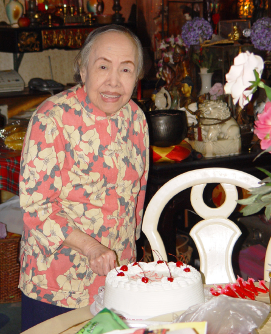

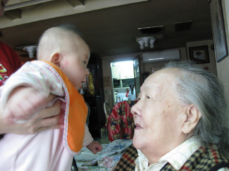

### 一念彌陀越輪迴〜吳連居老居士助念往生記

戒堂

歷經生命的艱難

耳聞淨土之殊勝

一生造作的善惡

念佛帶業之示現

猶記師之解「父母之年，不可不知也：一則以喜，一則以懼。」懼父母之年高，所可料父母身體健康之變化期間促不可測，未想父竟於二月廿六日清晨至醫院，當日下午即往生，得年八十有一。內心悲之不捨，又對先父往生前之不可思議功德，蹴生圓滿之感，諸多善巧因緣，印證佛法之教。

先父生前並非大富大貴之人，無大善亦無大惡。小有聰慧加以肯學，小學一年級未能竟業，默自為學而能說、寫、讀中文。農、泥、水、電、木之技俱具，建屋修繕農作皆得不假於人。年輕時好應酬交際，飲宴難見其不醉而歸。年過半百後，不再游宴，而專注於關照家人。又其意志甚堅，一旦確立所求，則全力奉行。近七十時，因腦中風致半身不遂，甦醒當日，即自行前往復健，下一樓層，耗二時有餘，不令人攙扶。是故病情雖重，卻不致癱於病床。往後如是，能自動者，皆自為之。

末學有幸修習佛法，特別此次寒假有因緣聽師講解《佛說阿彌陀經》，始對往生極樂世界有所體悟，總想讓年邁父母一同修習，慮及先父一生明為信奉太子爺、王爺等神祇，實則甚麼宗教都不信。深恐引起反效果，只能在適當的場合對會去參拜觀世音菩薩的母親講說《佛說阿彌陀經》的內容。母親可以接受，父親則只是在旁看著母親，不發一語。為人子者，內心雖急，總認為機緣未到，只能多次嘗試。

先父年前已因肺部積水，呼吸困難而在加護病房醫治一段期間，回家後似乎也自知來日無多，陪子孫過年時還交代若再有此種情形，不要急救讓他受苦。沒想到元宵節過完第二天清晨病症又起，母親通知末學時還認為父親在醫院意識清楚，狀況良好，毋庸趕回。當下感覺不妙，即念阿彌陀佛，求佛保佑。待妹通知父親已入加護病房，母親堅持不能見死不救而進行插管治療時，立刻奔赴醫院。一路上深自懊悔，為何不早跟父親講說往生西方極樂世界之法。

到達醫院，見到父親雖無意識但身上插滿管的痛苦表情，心如刀割。難掩悔恨之心，只能附在父親耳邊，對他說：「如果感覺痛苦，心裡就想著『我要到西方極樂世界就好』，媽媽及家中之事，我會負責。其他都不要再想，心裡只念『阿彌陀佛』佛號就好，佛會帶眾菩薩來接你的，希望你在那裏能專心向佛，將來接引子子孫孫同登西方極樂世界。」當下不確定他是否有聽到，真的希望他能聽到且這麼做。在加護病房外，安慰已不知如何是好的母親，和妹妹開始念佛助念。

不可思議的現象開始了，一小時候，再度探視父親時，雖然仍呈昏迷狀，但是痛苦的表情已然不見。俟金門趕回的小妹探視時，父親以手握的方式表達逕至殯儀館治喪的遺願，顯示末學最後對父親講的話他有聽到，而且也有一心不亂的念佛，剎時替父親高興的心油然升起。當下更用心念佛迴向，直至子女到齊，醫生為父親拔下身上所有管線時，所見父親為無有痛苦，法相莊嚴且不失慈祥之相。即令數時後遺體移往殯儀館，額頂猶溫，軀體尚軟，家人俱有雖係不捨卻為父親能得解脫往生西方的悅心。陪伴在旁的外籍看護告訴末學，先父在過年前後經常在念阿彌陀佛，雖然末學未曾耳聞，但依先父執著一念的個性，得此善終，應是臨終前一心向佛、信佛，值此信念以終，另加子孫齊心助念，無一闕漏所致。

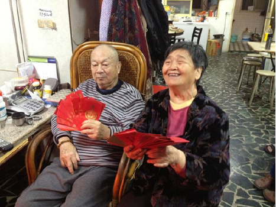

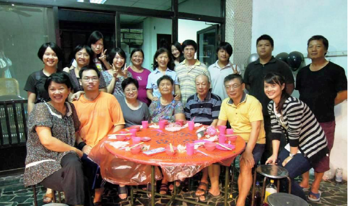

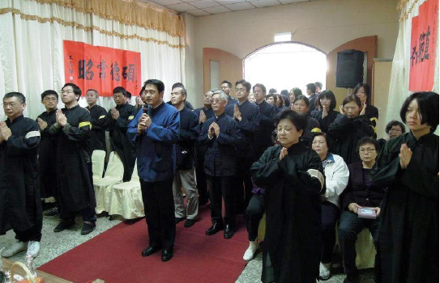

## 專題研學

### 聖者的祕密～大佛頂首楞嚴經二十五圓通暨七處徵心探源　二十五圓通暨七處徵心簡介　（二十八）觀音廣陳

時哉

供養求法妙智力

同佛慈力現神變

三十二應入諸國

方便多門皆歸元

寅三、詳演所獲殊勝

卯一、標列二本

辰一、總標

經文：

忽然超越世出世間，十方圓明，獲二殊勝。

如何超越世間？在緣起法上觀自相空；那出世間又如何超越？出世間也自體了不可得，說超越出世間。證悟世間與出世間自體空，超勝世間與出世間，十方世界皆了不可得，空蕩蕩虛明洞徹。此時得到了兩種殊勝，下文即明二種殊勝內涵。

辰二、別列

巳一、上合慈力

經文：

一者上合十方諸佛本妙覺心，與佛如來同一慈力。

與十方諸佛本妙覺心相合，與諸佛如來同一慈力，亦即與樂的能力與十方諸佛一樣。諸佛有涅槃寂靜樂與菩提覺法樂，是能與眾生樂的力量，因為給予眾生快樂，本身須具足這樣的快樂，自己沒有快樂如何能給別人快樂？如果你沒有體會過這種快樂，如何告訴別人快樂是要這樣體會的？自己沒有這種快樂的體會，如何告訴別人這種快樂？所以同一慈力就是與十方諸佛一樣有與樂的能力。

巳二、下合悲仰

經文：

二者下合十方一切六道眾生，與諸眾生同一悲仰。

同一悲仰是與一切六道眾生同一悲仰，同樣了解他的需求，渴望人家拔除他的痛苦，菩薩與十方一切眾生相合，能了解他們受苦渴望解苦的心。

緣到眾生的苦不一定能生起慈悲，要生起成為所悲憫的對象，能慈悲的心才能生，不是緣到苦眾生就能生起慈悲，否則一些政治人物，也知道老百姓痛苦的指數不斷攀升，但並不表示他發起悲心，這是兩回事。動物之間互相殘殺，我們也知道被殺是很苦的，但有沒有生起悲心呢？除非眾生成為所悲憫的對象，能悲憫的心才能生。

同樣的，娑婆是苦，極樂是樂，有此感受不代表眾生會生起厭離娑婆與欣求極樂的心，例如有的人在貧民窟住慣了，政府提供國宅，他也不願意搬出來。雖知這是苦、那是樂，但並不代表他厭苦欣樂，除非這個苦變成他所厭離的對象，能厭離的心才能生；樂要變成所欣求的樂，能欣求的心才能生。所以固然你肯定極樂世界的樂，也認可娑婆世界的苦，並不代表你要厭離娑婆與欣求極樂。所以現見有蓮友修學淨土法門，也承認娑婆世界苦和極樂世界樂，但問他要不要去極樂世界，他卻猶豫，裹足不前。

所以能慈悲的心是觀待所慈悲的對象才能生起，能慈悲的心自相不可得，不是自己在那裡就可以生起能慈悲的心，也不是緣到苦就可以生起慈悲的心，是這個苦眾生變成所慈憫的對象，能慈憫的心才能生。而慈悲心的功德也觀待慈悲心方能生起。所以諸法體性空寂，觀待而生，如水月般的生起。

卯二、承演三科

辰一、三十二應

巳一、標承慈力

經文：

世尊，由我供養觀音如來。蒙彼如來授我如幻聞薰聞修金剛三昧。與佛如來同慈力故。令我身成三十二應，入諸國土。

普賢菩薩十大願中有供養這一支，能以一支攝十支，以供養支為例，供養如果不觀待禮敬，佛會接受嗎？不是站在讚歎的供養（欲見賢思齊的供養），這供養有意義嗎？不是站在懺悔的供養，此供養根本不能對治煩惱；如果不是站在隨喜的供養，佛德非他所好樂，若不欲與佛（善知識）共造善業之供養，意義亦不大；若非請轉法輪的供養，雖與佛結上供養的善緣，佛一講經他就退席，不能受教，這供養能起什麼作用呢？能解脫嗎？能成佛嗎？此時供養支不能成為成佛的普因，若能具足諸支，才能成為成佛的共因。

此處之供養，應知須觀待請轉法輪的供養，因為經文中供養觀音如來，方蒙彼如來授我（觀音菩薩）如幻聞薰聞修金剛三昧。若供養沒有觀待請轉法輪的供養，則佛的長篇大論他聽不進去，覺得今天是來送禮物不是來聽訓的。若有供養卻沒有想學法的心，佛能教的心也出不來，能教的心必須觀待想學的對象才有能教的心，二者互相依靠，謂之如是我聞一時，時是聞法的時節因緣正好，所以觀待菩薩想學的心，佛授他如幻聞薰聞修金剛三昧。

金剛三昧是指現證空性的三昧，如幻是指在世俗上的如幻，聞薰聞修就是以聞來薰、以聞來修，亦即以聞作為修行的入門，聞有能聞所聞，所聞的是聲塵，能聞的是耳根，不只在所聞上通達自相空，回過頭來說，能聞的耳根也是自相空。

與佛如來同一慈力故。藉著聞眾生苦，知眾生與對我的恩德，並觀修慈悲的殊勝與自私的過患而生起慈悲，以空性的智慧作為慈悲的助伴，使慈悲成為無緣大慈。

慈有三種慈：生緣慈，法緣慈，無緣慈。

生緣慈是以眾生為所緣生起慈悲心。法緣慈是以無常法作慈悲心的助伴，無常觀念可以降伏世間粗相的貪愛。須知慈悲心生起會有很多世俗的福報，但也會生起諸多世俗的煩惱，須藉修學無常降伏對福報的愛執，此慈謂之法緣慈。

無緣慈是以空性的智慧作慈悲心的助伴，能慈所慈都是體性空寂，所慈必須觀待能慈，能慈亦須觀待所慈而生，二者互相觀待，境界須成所慈憫的對象，能慈憫的心方能生起。二者互相依靠，不可能有一個能慈憫的心，而沒有所慈憫的對象；也不可能有一個所慈憫的對象，而沒有能慈憫的心，二者互相依靠方能生，所以這兩者體性是空寂的。修學慈心，能生起生緣慈、法緣慈、無緣慈，即是與佛一樣的慈力。

為了給予眾生快樂，要幫助他們成為斷惑證果的人才，菩薩成就三十二應身的能力，入諸國土，此三十二應身入諸國土的神變，每一身都能給予眾生解脫與成佛的能力，謂之普門示現圓通。（下期待續）

### 孔子聖蹟圖淺說（二）

心超

禮樂教育小培成

辦事歷練能大用

今日知識忽德本

他年朽木已難雕

三、命名榮貺

孔子身體雄偉，長九尺六寸，為了傳宗接代，在十九歲時，奉母之命，娶了宋國丌官氏。此圖之歷史背景即是魯昭公九年，公元前五三三年，於二十歲時生了兒子。當時孔子已在魯國以知禮聞名，魯昭公便派了子家羈大夫（即畫中戴官帽配劍者）到孔子家致贈禮物，身旁當差所捧的禮盒內有兩條鯉魚，是否有期勉孔子之子將來能魚躍龍門、前途無量，已不得而知。不過孔子為了感念魯昭公之厚賜，將兒子命名為孔鯉，字伯魚。畫中的孔子頭戴頍冠，打躬作揖拜見君上使者。

旁邊有子家羈大夫的車乘與兩株蒼勁挺拔的古松，象徵孔子的松柏之志，一旁流水流過孔門，表徵聖道綿延流長。遠山當戶，好一幅鄉間盛景，正是居草廬而有翱翔之志。

年輕人要表現的出孔子謙恭有禮的形象是不簡單的。孔子年輕的時候就以知禮而聞名，更在二十歲時就受到國君的禮遇。（現代二十歲的人是不會受到國君的禮遇。）禮節使人從容、大方，也使人敢於對尊長行進退之禮，贏得他人的尊重。

本圖表彰孔子雖為布衣，年僅二十，卻藉由知禮受到國君的重視與賜禮，可見禮的重要，能將人塑造成有格局、氣度、見識，懂得應對進退，得到大名聲與他人的尊重。現今有許多從一流學校畢業的學生不知何去何從，若從培養自己的內涵、氣度中，必能找到出路。

孔子當然要很重視國君的厚賜。然厚賜並非是禮物內容的「厚薄」，重要的是禮物所代表的意義。古代贈禮中或許只有祭肉，接受時卻要跪拜，表徵對祭禮的尊重。

作者擅長於松樹的經營，有時候畫得很挺拔，代表君子挺拔的個性；有時候畫得蜿蜒，如龍般的莫測高深，似君子神韻。千年的古松，涵藏著天地氣候的精華，與竹、梅、蘭都能表徵君子的節操。

四、職司委吏

職司委吏這幅圖，是孔子在二十歲時得到魯國權貴孟僖子公子南宮敬叔的推薦，派任孔子作委吏之官，是管倉庫的糧食與財務的出納。畫中端坐几席之上，頭戴官帽的年輕人就是孔子。手上的竹簡是收租或收購米糧的帳冊，一方面是國家例行徵收田賦，一方面是老百姓在春耕、夏耘、秋收時，過多的米糧由官府收購，避免米糧生產過剩時，米賤傷農。若善用此種制度，就能平衡物價，萬一米糧生產不足，官府就釋放米糧，均平物價，讓老百姓豐衣足食。

職司委吏之職是孔子被任命，司是做主管，委吏是收掌糧草，亦即孔子被任命為管理收租收購糧草的主管，在當時雖是小官，但是孔子力求合理，徵收田糧。孔子的身旁是當差，還有農夫運進來的米糧，經過了量器斗量後，裝入米袋，由僱工背送入倉庫。

此圖表徵孔子做事認真公平，能夠將收入米糧做覈實的統計，孔子的辦事令農人覺得公平，並得國君及三家大夫的賞識。畫中柳樹枯枝及楓葉表徵秋天。看完職司委吏圖畫，令人覺得欲成大事得先由做好小事開始，將來方能擔大任。（下期待續）

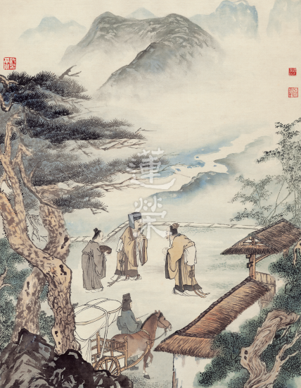

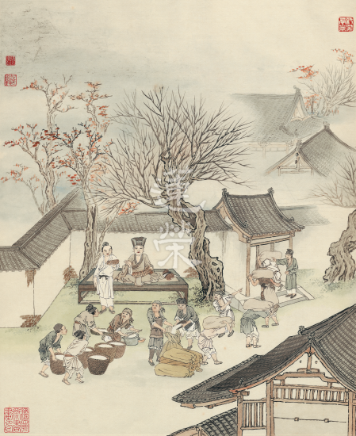

### 一件追憶的往事（一） —莊心如先生暨孔府二三事

魏慶友

崇拜雪廬的學者

感念聖府的護持

追述片段的往事

喚醒歷史的記憶

前   言

山東濟南文化交流講座學員中有許多當地學識淵博之耆老在座，給予諸多指教。當中六十五歲的魏慶友先生，年輕時因公調職到曲阜，後以任職工程師退休，近四十年居住在曲阜城，為文史愛好者。多年來致力於傳統文化的學習，尤其對雪廬老人崇拜有加，多年蒐集孔府資料，並將研究集結成論文，此次講座因緣結識魏老師，並獲得此珍貴史料，將分期刊登，以饗大眾。（本刊）

莊心如先生暨孔府二三事

孔德成先生的塾師莊先生，名陔蘭，字心如，號春亭，晚年號春苔，今山東莒縣大店鎮人，生於清同治十一年（公元一八七三年）。逝世於公元一九四六年，享年七十四歲。先生學識淵博，文采飛揚，是著名詩人、書法家、國學大師，世尊稱：莊翰林、莊太史。晚年，被孔府禮聘為德成先生的塾師。

照片出處：http://www.junanxq.cn/NewsShow.asp?NewsID=892

先生從小聰穎，五歲入家塾，十七歲中秀才，三十二歲中進士（原名「阿蘭」，殿試時，被慈禧太后賜名為「陔蘭」），因文、筆俱佳，欽點為翰林院編修，誥封朝議大夫。公元一九○六年，三十四歲的莊先生由清廷保送，赴日本法政大學留學，修法政專科，期間，秘密加入了孫中山先生領導的同盟會。兩年後，學成回國，任山東法政學堂監督。並積極參加孫中山先生領導的革命運動，是山東地區的主要領導人之一。先後還擔任過，山東巡撫孫寶琦的秘書，山東省民政長官公署總務廳長兼秘書長，山東圖書館館長，山東省議會議長，第二屆國會參議院議員等要職。民國十四年（一九二五年）退出政界，五十三歲的莊先生，先後在北京、青島等地寺院，潛心修學佛法達六年。民國二十一年（一九三二年），回故鄉大店鎮隱居。時，莒縣剛從多年的軍閥、兵匪戰亂中安穩下來。縣長盧少泉欲重修《莒縣誌》，力請莊先生任總纂，莊先生欣然應許，「複聘李君炳南、周君召亭、莊君符德、趙君阿南，分襄厥事。」（盧少泉《重修莒志》序）。莊總纂及各分纂先生傾其全力，費時三載，這部堪稱「集莒地方誌之大成」的《重修莒志》終於編纂完稿，刊印成書。該志，上起周武王十三年，下迄民國二十年，「三千餘年之事，匯為一編」（莊太史《重修莒志》敘例）。全書體例完備，記述詳實，「是研究莒文化和莒歷史的重要文獻，成為莒縣和莒南縣圖書館的鎮館之寶」（《曲阜歷史文物論叢•文史研究》），堪稱莒縣歷史上的盛事。民國二十五年，《重修莒志》編纂完成不久，莊先生應邀到孔府做客。孔府早已聞知莊翰林是一位學貫中外、道德、文章俱佳的賢才，即席盛邀莊先生留下任教。莊先生答應了孔府的邀請，但提出了三個任教條件：一是不取酬金，孔家只需承擔任教期間的衣食住行費用；二是自己不提請辭去，孔家不能辭退；三是想辭行時，孔家不能阻攔。求賢若渴的孔府當即應許。就這樣，已經六十四歲的莊先生，擔任了孔子七十七代後裔衍聖公孔德成先生的塾師，傳授經書、書法等功課。隨即，莊先生又推薦李炳南先生來孔府，任教讀先生。莊先生學識淵博，寬嚴有度，深得學子愛戴和孔府器重。民國二十六年（一九三七年）德成先生，被迫離開孔府南下時，拜託莊先生，協助其叔掌管府務。據《曲阜歷史文物論叢•文史研究》載：「孔德成無奈，只好喊起孔霅光（令煜）來，說明中央來意，拜託其掌管府內一切事務，代理奉祀官。

莊太史書法對聯掛於孔府讀書房

讓其伯母袁氏分擔內務，重大問題由族長、四十員、老師莊陔蘭、王毓華協商辦理，直到淩晨四點多鐘，才草草收拾，帶著夫人、倆女僕、倆男僕、老師呂今山、秘書李炳南上了汽車，淚別曲阜老家。」民國三十五年（一九四六年），莊先生突患疾病，經醫治無效，不幸逝世，享年七十四歲。《曲阜歷史文物論叢•文史研究》載：「在臨死之前，還念念不忘想和奉祀官孔德成見上一面。……」莊先生的喪禮在聖府東邊東場院後上房的北屋舉行，規格較高，沒依一般外姓要到白虎廳舉喪的定制。按莊陔蘭先生親屬的意願，棺木臨時葬在孔府東菜園的西牆根旁，準備以後運回莒縣大店原籍，一九五四年，因北門裏擴街修路，故又遷至西門外大莊北杏林（百姓林）公墓區埋葬，後又因種種原因，先生沒有魂歸故里。莊太史晚年在曲阜生活的十年，留下了許多墨寶珍品，可惜因戰亂大多已散失，只有極少在民間被秘為珍藏。

綜述莊太史非凡的一生，其中最大功績，莫過於將李炳南先生舉薦為德成先生的老師。（待續）

附魏老師來信：

末學將文稿改為繁體字的同時，又順了一遍，個別字句略有調整，以適臺灣大德閱。

雪公的功績，在臺灣的份量很重，末學的能力又非常非常的有限，且此稿又是依曲阜地方史志的區域要求寫的，末學也是藉機，既讓曲阜知道雪公有恩於孔府，又彌補曲阜檔案的空缺。所以有關臺灣的內容，除顯得過於簡略外，恐怕還有謬誤，是對雪公的大不敬，末學深感愧疚，先行告罪。萬望唐先生千萬予以輔正！拜託！拜託！

末學魏慶友合十

壬辰冬月謹識

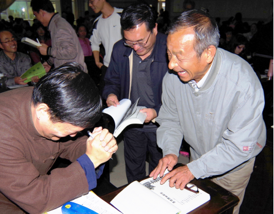

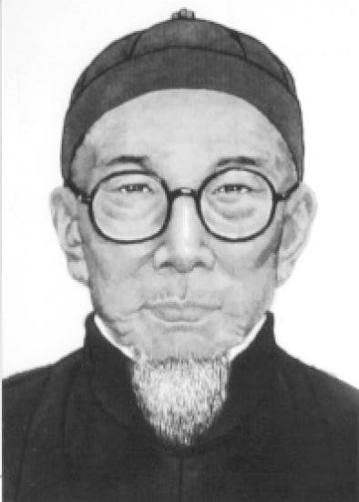

## 參訪觀摩

### 壬辰年秋三孔參訪報導（一）

*編輯部整理*

舊地重遊思古情

歷史長河中軸線

民族延續賴彼存

道貫古今德天地

前言

學會曾數次造訪了曲阜的三孔（孔廟、孔府、孔林）。相關的參訪報導，在本刊的第六十期及六十三期，有著完整的記述。此次藉由講座的因緣，大家再次遊歷了儒家聖地，孔子旁系第七十四代孫孔繁鵬先生，為當今曲阜三孔之導覽權威，承蒙他替一行人做了一場詳盡的導覽。枝葉扶疏的林園、參天的古木、富有歷史意義的建築，大成殿屋頂上的黃色釉瓦閃耀生輝，因為此處承繼了中華文化的精神，幾千年積累下來的文化氛圍，讓人們有更鮮明的素材，揣摩孔夫子當年設壇授徒的春秋時代。

文化古城—曲阜

曲阜文物古蹟非常眾多，各級文物保護單位有一百八十四處，其中國家級的就有六處，而三孔（孔廟、孔府、孔林）都是一九六一年時，中共國務院所公布的第一批全國文物保護單位。此外，曲阜也是一九八二年中共國務院公布的二十四個歷史文化名城之一，充分說明了曲阜的歷史悠久、文化燦爛。早在五千年以前，華夏、東夷兩族的祖先，就已經在這裡繁衍生息，創造了中華民族早期的文明史。據史料記載，炎帝神農氏最初建都在河南淮揚，後來遷都到曲阜；黃帝軒轅氏就誕生在曲阜的壽丘；五帝之首的少昊，東夷族的首領，也生活在這個地方，現在還有他的陵墓；舜帝曾在此處活動，製作陶器。可見三皇五帝中，就有多位在此留下蹤跡。

進入三代，夏朝很多著名的歷史人物，例如伯益、皋陶、后羿，都生活在這個區域。商朝建立以後，商湯建都在亳，子孫有多次遷都，商朝的第十八個國王叫南庚，就把國都遷到此處，稱做奄（音淹），因此後來這個地方也叫商奄，到了下一個國王盤庚，才從這裡又遷到了現在的河南安陽。西周初年，這裡是周文王的第四個兒子，周公姬旦的封地，但是周公功不就封，留在京都輔佐武王，由兒子伯禽代父就封，建立了魯國，所以一直到現在，山東的簡稱仍然叫做魯。

西周建立以後大封諸侯，造就了很多的國家，山東境內除了齊和魯，還有一些小國。當時的諸侯國分作公、侯、伯、子、男五個等爵，國家的地位有高有低，例如楚國開始時是子爵，齊、魯是公國，而且由於周公特殊的原因，使得魯國具備各種典籍制度，在魯國可以郊祭、可以祭祀周文王，使用天子禮樂。所以魯國在孔子生活的時代，保存的典籍制度非常完備，晉國的范宣子觀看魯國所保存的《春秋》、《易象》等，就感嘆地說：周禮盡在魯矣。所以兩千五百年前，孔子誕生在魯地上，成為偉大的思想家、聖人，並不是偶然，他有環境的因素，有許多可以學習的人、事、物，再加上孔子的奮發努力，才有這樣的成就。

朝聖者的神仙宮闕〜孔廟

孔廟是祭祀孔子的一座禮制廟宇，孔子作為中國歷史上的聖人，大家懷抱著朝聖的心情，步行於孔廟外筆直的神道上，延著中軸線向北前進，兩旁古樹所營造的氛圍，醞釀出一種情感，加深了廟宇的崇敬與肅穆。古樹跟文物一樣也分等級，上面標示的說明牌說明了每棵樹的樹種、級別和編號，有專人負責管理這些活文物，樹齡在五百年以上的屬於一級，三百年到五百年之間的是二級，一百年到三百年之間的則是三級，孔廟當中現在所保存的古樹一共有一千二百五十棵。

走過筆直的神道，可以看到書上「曲阜」兩個大字的標誌碑，《漢書》裡說：魯城東有阜。就是在魯國的故城中有高起的土丘，土丘曰阜。蜿蜒曲折有七、八里，故名曲阜。現今的曲阜市總人口約六十四萬人，占地面積八百九十六平方公里。曲阜因為是孔家的發源地，所以孔姓子孫佔的比例非常大，將近總人口的五分之一，約有十四萬人，所以此地的人說：無孔不成村。

標誌碑之後，是一周圍高聳的城牆，城牆是明正德八年（一五一三年），正德皇帝為了保衛孔廟下令修建。過去孔廟並沒有城牆，正德四年時，名為劉六（劉寵）、劉七（劉辰）的兩兄弟，在河北霸州發起農民起義軍，一直向南發展，攻破各個州縣，連曲阜縣城也被攻破，孔廟專門的守衛軍隊也經不起衝擊。起義軍駐紮在孔廟裡，「秣馬於庭，汙書於池」，對孔廟造成很大的破壞。於是有人建議皇帝，國家既然尊孔，就應該設立城牆保衛孔廟，才在正德八年始建城牆，到了嘉靖元年（一五二二年），一共花了十年的時間竣工。

城牆內整個城市的規劃，圍繞著孔廟、孔府營建，並將當時距離今址以東四公里的曲阜縣城，改為以孔廟為中心，此舉稱作移城衛廟。孔廟外圍的城牆周長四點八公里，城區面積一點六四平方公里，面積雖然不大，但是意義重大，孔廟、孔府、顏廟、縣衙、縣學都在城區內部。城市建築完畢後，當地的百姓稱為曲阜廟城，因廟而有城，這在中國歷史上是唯獨的一座，也可以看出明代皇帝尊孔的程度。

在城門的上方有「萬仞宮牆」四個大字，是乾隆皇帝的御筆，乾隆當時下江南，曾經來過曲阜八次，所以孔廟裡他所留下的御筆較多。這四個字語出《論語》子貢的一段談話，子貢比喻孔子的學問有如數仞之高的宮牆，使常人無法望見他內涵的美富，乾隆為了表達對先師孔子無比的崇敬，認為數仞宮牆不夠，所以寫了萬仞宮牆。此門與神道、大成殿，都是在同一個中軸線上，出於對孔子的尊敬，古時候這個門平時不開，一般人不能行走，只有皇帝到來或者重要的祭孔活動時才能打開，因此為了方便行人，在東南方向又開了一道門，讓大家從那邊出入。

走過城門，進入一個甕城，穿過甕城，眼前是一片紅色圍牆，屬於孔廟主體的外圍。歷史上無論是文人墨客、達官貴人，乃至於皇帝親臨，都要在此地下車、下轎，然後以步行的方式到廟裡去祭拜先師。

唐太宗貞觀年間，太宗皇帝下令，全國各州縣學均設孔子廟，因此在最鼎盛的時期，全國有孔廟將近兩千座，可以說每個縣裡都有，形成了廟學合一的特殊現象，學生入學前先要拜孔子，春季秋季還有兩次的祭孔。孔廟是我們現代人一個通俗的稱謂，然而在中國歷史上，對於聖人、皇帝乃至於祖先的名字，都要有所避諱，所以出於對孔子的尊敬，全國各地的孔廟，一般都稱文廟、夫子廟、先師廟，唯獨曲阜孔廟，因為是從孔子故居發展而來，所以叫做至聖廟。在孔子去世的第二年，也就是公元前四七八年，魯哀公為了祭祀孔子，就把他當時所居住的三間茅草房改成了廟宇，陳列了孔子當時穿過的衣服、戴過的帽子、坐過的車等，供大家祭祀，緬懷夫子的流風遺澤，所以孔廟的主要功能在於祭祀，延續至今。

由於孔子的儒家學說得到獨尊，孔子的地位也不斷提升。孔子最早的封號，始於西漢的漢平帝，封他為褒成宣尼公，身分地位的提高，原來的三間茅草房已無法相稱於封建社會中所講究的等級。所以隨著孔子地位的提高，廟宇也逐漸擴大，孔廟裡記載，從公元二二○年到一九四九年，經歷了上百次的維修和擴建，而明代中期，就已經達到了今日的格局，十四萬平方米的占地面積，三路布局、九進院落，有殿堂、門房，一共四六六間，規模非常宏大，和現在北京的故宮，河北的避暑山莊，並稱為中國的三大古建築群。

孔子在唐玄宗開元二十七年時被追封為文宣王，已經相當於諸侯王。宋徽宗年間孔廟的建設達到帝王的等級，三路布局九進院落，在封建社會中是最高的數字，主要建築的屋頂全部是黃琉璃瓦，龍壁、龍柱等雕飾，都是屬於皇帝專用的樣式，甚至大成殿中的孔子像，也是雍正皇帝按照周天子的服制來為孔子打扮。

由於孔廟也是孔家的祖廟，因此孔家的嫡長子孫，會在此處祭祖，嫡系以外的子孫在祭祖之時，則可能擔任陪祭官等職務。從歷史上來看，過去規定每個月的初一、十五，包括孔子誕辰、中國傳統的節日、家裡重大的喜事，都要告慰祖先，因此一年之內，家祭最多能達到五十多次。此外，由於儒學從漢代以後得到了獨尊，成為國家的指導方針，歷代王朝也都極力宣揚孔孟思想，使得孔廟兼具有國廟的性質。歷史上來過曲阜孔廟的皇帝，一共有十二位，第一位是漢高祖劉邦，劉邦在公元前一九五年路過曲阜，以太牢祭祀孔子。第二位皇帝是漢光武帝劉秀，然後有漢明帝、漢章帝、漢安帝，兩漢就有五個皇帝。

之後有北魏的孝文帝元宏、唐高宗李治、唐玄宗李隆基，後面有後周太祖郭威，宋代是宋真宗，清代是康熙、乾隆，一共十二個皇帝。唐太宗最早開始把祭孔納入到國家的釋奠（祭祀典禮）之中，由國家派人員來此祭祀，這樣的遣官祭告活動，在整個的歷史長河中，共有一百九十六次。所以孔廟具有國廟與家廟的雙重性質。除此之外，大陸在一九八四年開始祭孔，並且從八九年開始，每年的孔子誕辰，都會舉辦國際孔子文化節，紀念孔子的對人類的偉大貢獻，活動期間，也都會在孔廟舉行隆重的祭祀活動。

孔子不但是我們中國文化的聖人，同時也對世界有偉大的貢獻，因此聯合國教科文組織將孔子評為世界十大文化名人之首。許多的外國元首也來參訪過孔廟，例如一九五六年印度的總理尼赫魯，六五年越南共和國主席胡志明，八一年法國的社會黨領導人叫密特朗，八五年新加坡總理李光耀，以及後來的吳作棟，八八年美國的國務卿喬治‧普拉特‧舒爾茨專程來訪，九一年朝鮮主席金日成，九六年金大中，九九年荷蘭女王。孔子思想為中心的儒家文化，已經是全球人類共認的珍寶。（下期待續）

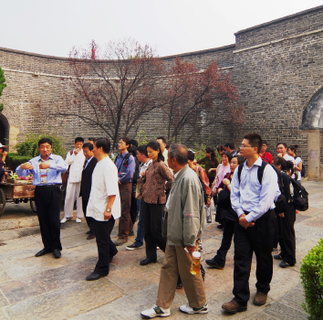

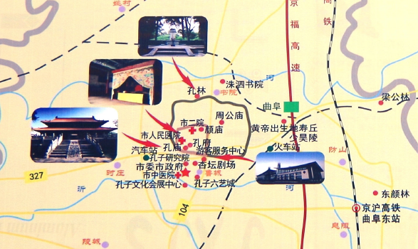

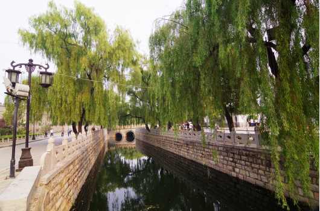

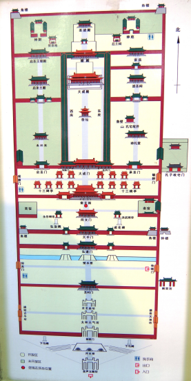

## 活動報導

### 兩岸國學文化交流講座〜政和、永康、濟南　政和活動報導

*編輯部整理*

政通人和在教育

先從領導身作則

文化道統在論語

經義師傳於講要

二○一二年八月十四日至十九日

緣起

二○一二年八月，學會受福建省北部政和縣政府之邀，舉辦了為期六天的「第十屆兩岸文化人才師資培訓」，由政和縣委書記、縣長及副縣長親自招待學會一行。大陸各地聞訊趕來聽課的學員，包括二年多來長期跟隨學習的學員以及不少新學員，來自福建省、浙江省、山東省等各省各地的學員。其中更有內地其他省分學員，因路途遙遠，乘坐三十幾個小時的火車前來，令人感佩。

此次上課的場地乃政和一小學的禮堂。縣政府特別為了此次講座，在禮堂中安裝了六臺全新的冷氣，以期能提供學員們最舒適的學習環境。六天的課程當中，以雪廬老人融合論語各家說法所講之《論語講要》為授課教材，配以「傳承介紹」、「影片欣賞」等課程。前三天課程的對象針對於全縣各學校的校長及老師們，所用的論語主題科判乃「聖門氣象、萬古常新」。後三天課程的對象為全縣政府的官員（俗稱四套領導班子），所用的論語科判乃「成就善政的良方」。

此次講座對於政和縣的未來，不論在辦教育還是辦政治上都是很好的啟發，對於當地文化學習的風氣也有推動的效果。

開訓典禮

為期六天的專題講座，在莊嚴隆重的開訓典禮中展開了。首先由政和縣政府副縣長兼教育局局長余向紅致詞。「為了弘揚國學精神，傳承儒學文化，特別邀請唐瑜凌老師開設國學講座，詮釋孔子的文化。」余副縣長首先說明講座邀請的目的，她提到教育應著眼於國學文化，文化才是教育的重點。並且希望藉由彼此的交流，讓政和縣能將文化更加發揚，使教育能辦得更好。

成就善政的良方在論語

大陸學員對於學問渴求的態度，造就學習快速進步的成果。師資團隊們讚賞大陸學長們學習的熱忱，以及在不斷學習中所展現出來內涵的提升。中華文化不只是在課堂上學習，而是可以運用到生活上、工作上、事業上的發展。除了個人、家庭、事業，甚至在國家政治的辦理，都能依著中華文化和論語的學習，內涵充實，將事情做到盡善盡美。

順昌縣雪廬孔子學會胡會長表示，除了很高興老師能再前來大陸講學之外，特別敬佩余副縣長有如此魄力興辦此次的講座，這個講座將會利益很多老師，也間接利益了這些老師任教的學校與學生。並且感謝師長們不嫌棄小縣城，不因為教學環境簡陋而拒絕，反而到此培養人才。順昌成立學會的目的便是要傳承雪廬老人的教法，將文化發揚光大。

「感謝政和給我聽課的機會，」浙江省永康市龍川學校校長王炳超如是說。海峽兩岸九屆的講座王校長聽了八屆，王校長由衷地感嘆道：「跟著唐老師學論語真好！」他引述著老師說過的論語：「溫故而知新，可以為師矣！老師著力於『溫』的內涵，以滷味譬喻，用酒精燈溫八小時讓味道進去。酒精燈代表專注專一；八小時意謂持續、持久；而味道進去是目的之所在。」因此，平常王校長也帶領老師讀書，溫故時習論語。讀書會的經營，讓大家的內心、言行有了準則；自己約束自己，工作效率也提高了。

看似簡單的鞠躬禮，在領導班子推行是重大的破冰之舉。

王校長對推辦讀書會給予高度的肯定，他說：「剛開始，成立讀書會很困難，但是二年後再回頭檢視，會發現如果沒有讀書會，就沒有進一步的學習，沒有學習就談不上對文化的感受。」有了好的老師、教材、團隊，再加上讀書會的經營，建構成王校長和龍川學校的老師們學習文化的最佳方式，也是他們最盼望的人生走向。未來，王校長要繼續向唐老師學國學，學文化，並且是帶著決心、堅定的心學習，還要常(長)溫常(長)習，歷久彌新。

師長致詞

老師回憶自己早年在雪公老師座下聽課讀書，多年來和很多朋友一起共同學習，在人生的道路上，不敢後退，只想前進。藉著讀書、講學的因緣，慢慢地將雪公教導的內涵逐步內化，如此持續多年。也感謝老人家，在烽火連天之際，帶著深厚的文化底蘊，飄洋過海來到臺灣，在安靜的歲月中，從事講學，有幸能在老人家座下無憂無慮的讀書。

政通人和在於正知見的推動

一九八六年，雪公老師以九十七歲高齡在臺灣過世，當時老師亦深感惶恐與傷心，謙稱惶恐自己所學未成，又傷心一代大儒就這樣逝世了，有太多絕學沒有學到。謙稱自己所學不及老人家的萬分之一，僅以抱持感恩、回饋的心來到中國大陸，以文會友，充實自己。每次辦完活動，也都勉勵團隊回臺應努力讀書，充實內部師資，培養外部人才，不敢享受榮耀半分。

此次有幸透過順昌的朋友和政和的領導聯絡，來到政和辦講座，也依此因緣認識到政和縣。政和，政通人和。唯有政通人和，才能使百業興旺，人才輩出。欲政通人和，必須辦政治、辦教育，辦政治使環境安定，辦教育使人才輩出。

觀待政府領導班子與教育人員帶動一方

此六天講座，雖然乍看前三天是教育講座，後三天是領導班子的講座，其實此二講座是一體兩面，辦政治即是辦教育。政治下面有治安、教育、經濟、藝術等，教育看似為政治的一環；然而，教育才是政治的根本。若教育沒有培養出人才，則政府沒有人才；政府沒有人才，就沒辦法帶動良好的政治，則百業不能興旺。因此，雖然教育是政治的一環，但卻是政治的根本。歷代父母官除了把當地的民生建設好，最重要的就是要辦教育。

王維寫了首《送梓州李使君》，送他的朋友李使君出使四川的梓州。詩文中提到：「漢女輸橦布，巴人訟芋田，文翁翻教授，不敢倚前賢。」期勉李使君能夠像古代西漢的文翁治理巴蜀一樣，讓巴蜀的文風媲美齊魯的文風。因此，我相信政和和順昌的風氣，若能在文化上認真學習，在聖賢道統上內化，相信此二縣比起齊魯也不遜色，就像當年的四川在文翁的治理下也能和齊魯媲美。

總而言之，雪廬老人嘗言：「事在人為。」臺灣有一諺語說：「好人辦壞事，壞事都成好；壞人辦好事，好事都成壞。」好人來辦政治、辦教育，政治、教育就好；壞人來辦政治、辦教育，政治、教育就糟糕。因此，能以公心為政、辦教育，將人培養成有品格、有道德、有操守、有內涵的人才，那是百業的需要，也是國家民族的需要，更是國家民族長治久安之道。今天在此興辦國學講座，並不只是文化交流，更重要的是傳承文化道統，接續民族命脈，培養有文化理念、有格局、有氣度的頂尖人才。

鄉間生活的步調較為緩慢，適合讀書、培養人才，古代大儒多喜歡回到鄉間教書。鄉間有淳厚的民心，簡單的生活使得學習時間增加了，再加上老師願意來教導，相信一定人才輩出，必能近悅遠來，成為有文明、有氣質、有氣象的地方。

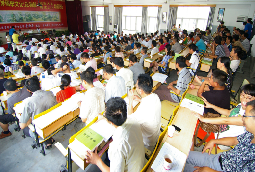

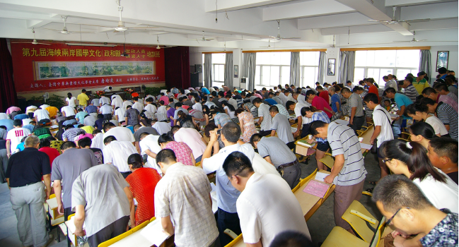

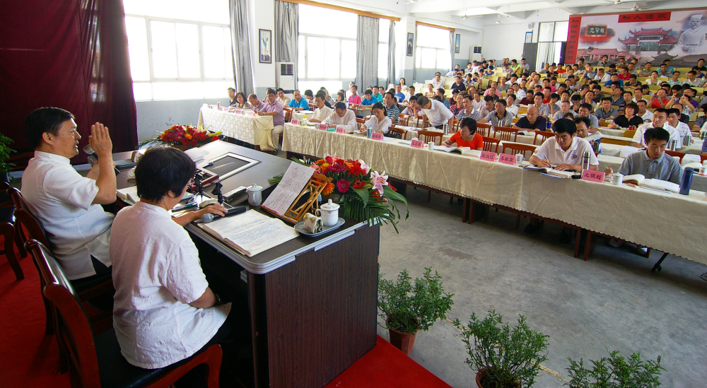

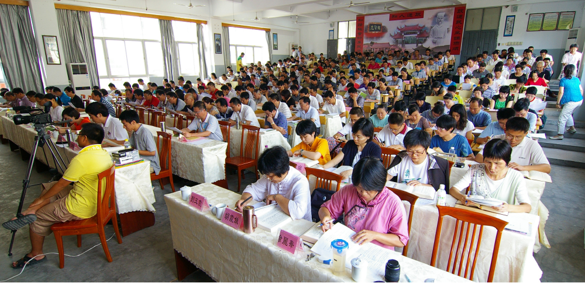

### 兩岸國學文化交流講座〜政和、永康、濟南　政和心得節錄

*編輯部整理*

事必躬親或分層

端看風氣與法喜

領導眾人己先學

先之勞之恆相續

以身作則，為學生之表率 / 政和二中校長　張瑞枝

為期三天的為政之道專題講座。為期三天的培訓，本人受益匪淺。下面簡單談談自己的體會。

孔子曰：「其身正，不令而行，其身不正，雖令不從。」教師是學校德育工作的主導者，教師自身的思想品德素質，是影響德育效果的一個至關重要的因素。教師是道德標準很高的特殊職業。「學為人師，行為世範。」要照亮別人，首先自己身上要有光明；要點燃別人，自己心中要有火種。學生希望他們的老師不僅僅是老師、學者，也是長輩、朋友；不僅要有廣博的知識，還要有高尚的人格。一個好教師，不僅是對學生有學習上的影響力，而且更重要的是具有人格上的感召力。高尚師德，就是一部生動的人生教科書，受其影響是潛移默化的、深刻的、終生受益的，因此教師要做到言教身教、以身作則、為人師表。

二十一世紀的中國，不僅在經濟發展上將上一新台階，而且社會主義精神文明建設上，更將躍上一個新高度。作為一個人民教師，擔負著全面提高國民素質，特別是青少年一代文明程度的直接責任。只有最大限度地提高教師為人師表的水平，才能勝任人民教師的歷史使命，無愧於人民教師的光榮稱號，凡要求學生做的自己必須先做到做好。比如要求學生不遲到、早退，教師自己就不能遲到早退；要求學生文明禮貌，教師自己言談舉止切切不可粗魯；要求學生遵守行為規則，教師應自覺守教師守則。否則，光要求學生，而自己又不身體力行，反而胡作非為，學生就認為這樣的老師言行不一，出爾反爾而不可信賴。

看到年輕人就看到希望

我是一個普通的人民教師，通過幾天的學習，深感自己肩上的責任重大，我發誓：在今後的工作中，一定會處處以身作則，起表率作用，為政和的教育事業做出貢獻。

教學與做人的真諦 / 政和一中　陳冬梅

三天短暫的學習匆匆結束了，行走在孔子的論語字裡行間，讓我感觸頗多，受益匪淺。

孔子的論語，實際發現他們很多教育思想在今天仍被繼續沿用，是值得我們學習借鑑的一部經典著作。如子曰：「知之者，不如好之者，好之者不如樂之者」，孔子認為追求學問首先在於好學、樂學，也就是我們今天所說的教師要培養學生的學習興趣愛好；子曰：「學而不思則罔，思而不學則殆。」講了學習方法，提出了「學」是「思」的基礎，「思」又能使「學」不斷深化與擴大，闡明了學和思的辯證關係，就是我們今天常說的學思結合。再如今天的因材施教、循序漸進，舉一反三等等這些教學原則、方法在論語中都能尋找到痕跡。

除了教學，孔子關於做人也有自己的獨樹見解。他強調做人要正直磊落，子曰：「人之生也直，罔之生也幸而免。」在孔子看來，一個人要正直，只有正直才能光明磊落，雖然我們的生活中不正直的人也能生存，但那只是靠僥倖而避免了災禍。他還強調做人要重視「仁德」，在孔子看來，仁德是做人的根本，是處在第一位的。孔子還強調從自身出發修養品德的重要性。孔子還強調做人要重視全面發展。

總之，論語博大精深，還有很多值得我們學習的地方，吾將繼續行走在論語的字裡行間，尋找教育教學、做人的真諦！

有「法喜」則「勞之」「無倦」 / 龍岩　謝先生

學到「子路問政。子曰：先之勞之。請益。曰『無倦。』」這裡，聽到老師的講解，為政之道，即領導者先苦幹實幹，在百姓之前。好像「先之勞之」很苦，但因為內心充滿了喜悅，以身作則去付出，哪怕身體疲憊，只需適當休息，即可調整過來，然後又不懈怠地繼續做下去。但是，徜若內心沒有法喜，只知吃喝玩樂，容易讓人心智渙散，且交不到真正的良師益友。

有時看到有些領導做事不情願，邊發牢騷邊做事，事情也無法做得滿意，反而讓自己和屬下身心皆累。倘若換個角度去看問題，內心的心境必定改變，態度積極了，事情也因頭腦冷靜，內心法喜而多了智慧相助。上下改變也會更融洽起來，得道亦多助。

這裡講的是為政之道，廣泛來說，都適用「先之勞之」的道理。比如，政府部門的各級領導、學校的校領導、班級的老師、幹部、社團的頭，甚至家庭的長輩們，以「先之勞之」作了帶頭、代表的作用，而這一切，又須讓自己內心真是「法喜」充滿，否則必是不情不願，難以服從，難以堅持，身心疲倦。

隨行學長每日課後研討當日進度

誠然對照自己，身為負責人，也要學會令自己的內心「法喜」充滿，帶頭去做了解，才能持續下去令大眾獲益，為弘揚國學盡一份綿薄之力，「勞之」，而「無倦」，每天進步一點，終將收穫多之。

海峽兩岸國學文化政和縣學習體會 /政和三中　黃遠進

這兩天聽了臺灣無盡燈文化學會主席唐瑜凌教授的講學，感受很深。講學的主要內容是聖門氣象—萬古常新。首先從孔子對人的一生規劃：十有五而志於學，三十而立，四十而不惑，五十而知天命，六十而耳順，七十而從心所欲不踰矩。感受：人的早期規劃對人的一生發展起了決定作用。實踐中對於中學所設的學生，學校要善於引導學生善道、善學、勸學，約學、約德、約仁。對於傳承的學習體會，中華民族的文化博大精深，學習永無止盡，深不可測，從論語到史記，到理學這些主流傳統文化，到京劇等傳統文化精粹，如何把這麼好的中國文化歷代傳承下去，需要我們每個人的努力，將學校打造成學生學習的主要環境，善於營造校園獨特的文化場景，尤其要以國學作為校園文化的主背景，對我們的孩子一代一代的薰陶，潛移默化，形成濃厚的國學文化群眾基礎。

領導前排坐，帶動聽課風氣

學習為政的體會：為政一方，造福一方，作為教育工作者，辦好一所學校，造福一方百姓把孩子培養成人才，是學校的基本功能，德才兼備，有志向，有抱負的培養目標，為國家、社會輸送各種類的人才是我們教育人的志向。

學習成因別舉孔子的學生：顏回、閔子騫、仲弓、子貢、冉求、子路、子游、子夏、曾子、子張、子華各種不同類型的人才。對於學校、教師，注重因材施教，加之愛的教育，把孩子們造就成不同的社會人才，是我們艱鉅的使命感和責任感。總之從兩天對論語學習，感受到國學經典之精髓，促使自己不斷學習，不斷深化自己，像顏回一樣。

國學文化培訓學習心得體會 / 政和一中　張 毅

本人有機會參加「中國第九屆福建政和海峽兩岸國學文化人才師資培訓班」學習，深感榮幸。三天的培訓時間雖然很短，但收穫很大。三天來認真聆聽臺灣國學大師唐瑜凌教授對論語內涵的理解與精彩的講座，有勝讀十年書的感慨。

孔子的時代離我們很遙遠，但他的思想卻感動著今天的我們。當我們在浩瀚的知識海洋不知道學什麼的時候，孔子給我們指明了道路，那些獨特的教育理念，那些善意的、真實的處世標準值得我們學習。當現在的人們都習慣於浮躁時，他又告訴我們要自省。在我們教育者困惑於如何讓學生主動地學習時，孔子提出的「知之者不如好之者，好之者不如樂之者」的觀念，為我們提供了理論基礎。

以前的教育者都是高高在上的，孔子卻教育我們要不恥下問。這就需要教育者放低姿態，抓住一切學習的機會，提高自己的文化修養。孔子門下弟子眾多，孔子卻能對不同的弟子施予不同的教育。因材施教的教育方法，孔子時代做到了，而今天我們還在為高考抹殺著學生的個性，這不能不引起我們對當今教育的反思。

總之，論語是道德與智慧的凝結，它是一種循循善誘的老師，又是一個正直、坦率、寬容的朋友，它是一個映射著我們道德情操、品行修養的鏡子，讓我們在生活中找到自己的方向，在現代生活匆匆的路途上，多一份藝術和智慧，多一份清涼與閒暇，多一份享受生活餽贈的心情。在當今以經濟利益為主導的社會洪流中讀讀論語，能給人從心靈淨化，如一絲清泉沁人心脾，讓人陶醉，給人以啟迪，讓我們的社會多一些君子少一些小人，我們的社會就會多一些安寧，我們的國家理想目標就會早日實現。

心得報告 / 福建順昌　游首坤

有幸在政和縣聆聽老師的教誨，的確受益匪淺。師以音演說文，眾學隨類各得解；雖是針對師資人員的授課，但末學作為企業的主要負責人之一，聽到的字字句句都是為企業的管理和經營所言的。

敝公司是以環保種植，生產有機農產品為主的企業，作為發起人之一，我只知道人人都渴望無毒無害的食品，有機農產品適應了現代社會的需求，有機農產品適應了現代社會的需求，抓住這個機會，企業一定會贏利，越來越紅火。

聽了這幾天的課，經老師的教誨，才發現我錯了，錯得厲害。我們的格局在哪裡？氣象在哪裡？沒有！那出路在哪裡？

問到這裡，不禁汗下。萬幸！老師：「文化道統是各行各業的靈魂。」我聽明白了，賦予企業生命的是「文化」，文化哪裡來？學。作為企業的負責人，我有責任「學」，學而行，把企業賦予文化的生命。

明白了這個道理，我就不再惶恐了。我欲仁，斯仁至矣！有老師的道統傳承的教誨，已具備了打造一個有靈魂的企業的方向和基礎，還有什麼作不好？作不到的呢？

生產無毒無害，利益大眾的有機食品，推動與自然和諧相處，生息與共的農耕模式，這就是敝公司的志向與靈魂。就是敝公司全體職工的使命！

衷心感謝老師給了敝公司的出路，更讓我個人找到了人生的出路！

傳燈的人 / 武漢大學教授　張朝玉

中國歷史王朝更迭，也有政權旁落外族，但我們依然是一體而無中斷之感，其關鍵是中華文化未斷，代有傳承，但放眼今日，相信傳統文化了知孔子的後世子孫已是九牛一毛，文化中斷意味著民族已無靈魂，命脈難續，我們以歐美馬首是瞻，真是中華民族最深重的災難。

在這不幸之中，還有一絲光亮，使我們還不至絕望，因為有雪廬老人及他的弟子、門人，他們在用心呵護著這盞傳統文化的明燈，從大陸到臺灣又從臺灣傳至大陸，不嫌小縣的偏僻，所過之處化導人心，倡導風氣，所謂君子居之，何陋之有？

當年夫子乘桴浮於海之願，雪廬老人完全擔當，苦心經營，今日唐老師再擔反哺大陸之重任，作為傳燈之人，他們有顏回之賢，雖顛沛不斷，風塵未洗，依然樂在其中，因為他們心中有道，作為傳燈之人，他們有子貢之達，於人情、於世故，用夫子之學告訴我們出路何在？做為傳燈之人，他們有子路那份無欲之剛，效法夫子勇承天命，之所以能如此，更在於他們那份憫人悲天之存心。

時代不幸，我們卻又萬幸，能夠讓傳統文化的明燈照到，雖無福親睹雪廬老人的尊容，卻從唐老師一行也可以感受到老人家「全憐暗路人，不惜自焚身」的大智、大仁、大勇，唐老師一行做為傳燈之人，更希望能點燃更多的心燈，使今日之星火能有明日燎原之勢，在唐老師講述中，學生幾度落淚，講到雪廬老人一再推辭不結識權貴，講到老人家過世四十九日身體沒有異味，講到顏回、子路過世，夫子大哭，也讓學生悲從中來，一日為師，終身為父，細品老師的苦心，讓學生一直在問自己，我的心燈何時能點亮，我會成為傳燈的人嗎？

我的國學學習體會 / 政和縣實驗幼稚園教師　葉明菊

對於我來說，感覺國學有點陽春白雪的味道，是飽讀詩書的大師們的功課，高不可攀。通過這一段時間的學習，感覺國學不僅在廟堂之上生輝，在民間一樣閃光。中國之所以成為世界上唯一一個文化綿延五千年而沒有中斷的國家，也是因為國學文化一直貫穿每一個中國人的成長歷程。

順昌學員利用課餘學習進巾奉茶

兩千多年來，中國的文化教育一直都是以聖賢的經典為基準，就是在元朝與清朝時，少數民族入主中原時，這種教育方法也不曾被改變。這種以國學為基礎的社會，被很好的傳承下來，為中華民族培養了許多的文化巨人與治國能臣。然而現代的教育，只是對人的智力與技能方面的開發加大重視，對於人的德育與做人做事方面卻不管不顧。其實一個再有才能的人，如果沒有德行，也會在社會上處處碰壁，不會得到幸福的人生。這些道理也都寫在國學裡面，讓現代人可以了解祖先留下的寶貴的精神財富，讓現在人在浮躁的社會中找到自己的發展方向與幸福之本。

學習論語體會 / 星溪中心小學　金立望

在聽罷唐老師的〈聖門氣象　萬古常新〉後，可以真切的感受到唐先生對於論語獨到的見解，在學習上，唐先生對於人們關於論語的見解進行了論述，並從另一角度來分析，不再是以往的論述，墨守成規。就例如對「學而時習之，不亦樂乎」的解釋，就匠心獨具，很直接的披露了學習其實是「不亦苦乎」，孔子的這句話實際上重點在於時習，講求的是學習的方法，而不是違心的高呼「學習萬歲」。對於我們所學的，唐先生也不是附庸以往的那些所謂的「聖賢書」，而是講求書的實際效益，身處在當下，只有那些搞學術研究的學者才會奮力於古典的著作，我們平常人所求的只是能夠生活的一種技藝，一項本領。因此學習不在於書籍，而是在於生活。

爾後信受奉行

教育應該是傳授真本領，而不是傳授應試技巧，唐先生對於這一點也有很深刻的見解。他在論述老師和學生的關係時，就曾提到文化道德不實的問題，當一個學生需要老師幫助時，如寫論文，便必須恭敬，誇張一點可謂是點頭哈腰，結果畢業時，連影子都找不到，當然，這也可以看出現在大學教育的一個失敗，學生與老師之間不在是中學時的親密，彼此互相交流，你可曾試想大學畢業後你能記住幾個老師，乃至又有幾個老師能夠知道你。

孔子教育門人是根據那個時代的社會現象，我們如今的教育也應該符合當前的國情。讀論語，學習的是有用的方法，從中找出社會和我們這個時代的東西，這才是學習的真正意義，融會貫通方能學有所成。聖門氣象　萬古常新就是希望我們能走出聖賢經典的誤區，看到當下，把握未來。

心得體會 / 政何中三學員　許張明

八月十四至十六日海峽兩岸國學文化培訓班如期舉行了，帶著忐忑的心，我走進教室，為何而忐忑因為學習國學也有一段時間，每天也教學生讀誦論語，可自己卻對論語陌生而害怕所以忐忑，所以不安，正如老師在培訓班中所說：「孔子是如此高大的聖人，而我們如此之渺小。」我也有這樣的想法，我也是個凡夫俗子，去仰望聖人，心情是如此複雜，而在這幾天的培訓學習中，我卻受益良多。

唐老師深入淺出地為我們講述了論語的主要理想，通過學習，通過老師們的解釋我才得到一點啟示為：人這一生，要學到老。以前也常聽人說要活到老學到老。那時只是覺得有道理，但可以學得很廣泛，但唐老師講了論語後我才明白，學習是要有次第，有本末的。要學習聖賢之理為本，要學習傳統文化為根基，那樣學才不會走偏，而我們現今的學都走偏了方向，包括我自己，從小到大為了考試，為了找到好的工作，為了將來能「飽食終日無所用心」地去學，可是在孔夫子眼中這類人則為難矣哉，我恰恰為這一類人中，不知是幸運還是悲哀，沒有學習之前真的認為那樣的生活是幸運的，可今天我卻如此悲哀，如此淺薄。為這一生而感傷，自己如此，而自己的學生也在走著自己曾經走過的道路，又為學習感傷。感謝唐老師為我做了解釋，讓我還有機會去學習根本的東西，還有活得有價值的機會，也讓我去悟如何讓自己的學生，或將來我的孩子不再走我曾經走過的路。

兩天半的學習時間過得真的太快了，我沒來得及思考這些東西就要結束了，心中的一些疑惑像是頓時被打開，可新的疑惑又開始萌芽，這才體會老師所強調的要以學貫穿一生，而學又要與思結合，感謝台灣來的老師為我們帶來了如此精彩的講座。

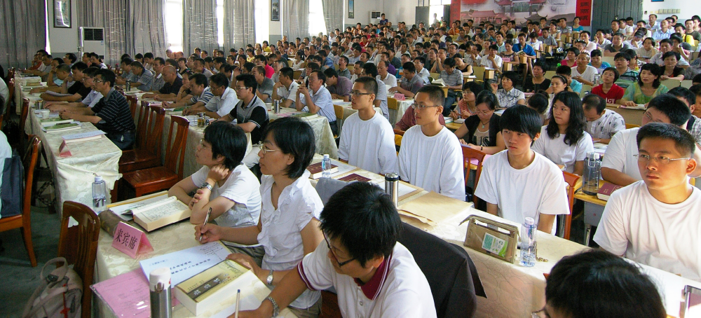

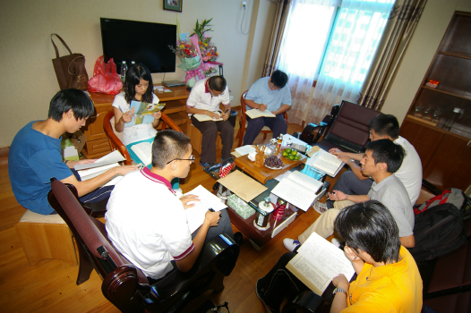

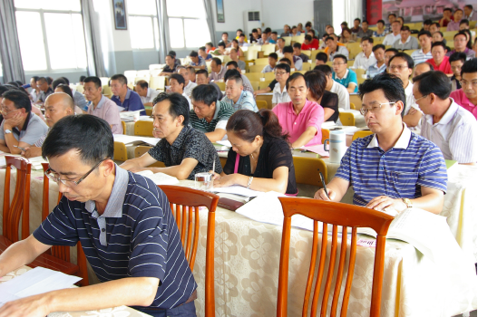

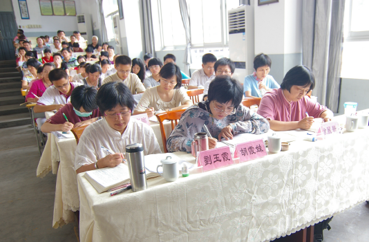

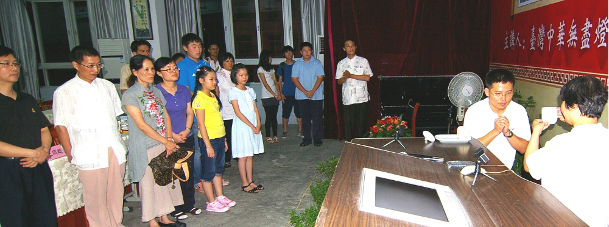

### 兩岸國學文化交流講座〜政和、永康、濟南　永康活動報導

*編輯部整理*

孔門心法曾子傳

大學兩綱各四目

止於至善聖與仁

學誨不倦可馴致

二○一二年八月二十一日至二十四日

第四度在永康興辦講座

受龍川學校王校長之邀，在福建政和縣講座之後，前往該校開設為期四天之第十一屆海峽兩岸國學文化師資培訓—《大學》講座課程。

為何開設此一課程？因為中國人必須要有中國魂，而必須要回歸到傳統的經典，才找到我們中國的魂魄。中國的經典匯歸在十三經裡，可以從論語入門，而孔子十五而志於學，志於什麼學？難道十五歲才開始讀書嗎？實乃十五歲志於學大學，志於大學之道。所以大學的內涵，就是整個成聖成賢的內涵，是中華文化的精髓。

大學出自於十三經當中的禮記，禮記有大戴禮、小戴禮，小戴禮整理了四十九篇，第四十二篇即是大學。在盛唐之時，特別把大學、中庸提出成為單行本，宋朝時與論語、孟子合集成四書。這一篇為什麼跟中庸一起提出呢？因為它是中華文化的心要，非常重要的精髓所在，我們知道孔子從堯舜禹湯文武周公，將文化作一個集大成，在論語當中也提到夫子罕言性與天道，而這個性與天道如何得聞？曾子承接孔子的心法，由大學這一篇來表達。曾子教導孔子的孫子—子思，子思又作了中庸，所以大學與中庸，等於傳承了夫子的性與天道、儒學的心法，所以其中的內涵是非常深入的，若就孔門的心法來說，研讀孔門經典的次第可以直接從《大學》進入，先對孔門心法作一個提綱挈領的了解，而後以明明德、親民來作《論語》的學習，並且用這樣的旨趣來學《中庸》。

《大學》開學了

古來各家對大學的註解非常多，大分有漢朝的註解和宋朝的註解，我們這次所採的是宋朝朱熹的科文。由於現在市面所流通之《大學》單行本大都為朱子改定版，故此次課程採用朱子版《大學》，及雪廬老人之「大學表注」作為教材，以明朱子版經文錯落的原因與該經文正確的解讀法。

舊雨新知齊聚一堂

《大學》八目：格物、致知、誠意、正心、修身、齊家、治國、平天下。格物，即來了境界；致知，乃在來的境界中確立正知見，知境界的緣起與性空；誠意，在正知見確立之後，能夠內破除私心，外生起公心；正心，因為意為心之主體，意能誠，心便能夠端正，即安住在明明德、親民上；修身，藉著內心的端正來莊嚴身相；此身修之人能夠令家整齊、和諧，此為家齊；若將此身修之人擺在國家，能夠令國家強盛安定，此為國治，若將此身修之人擺在天下，使得天下人皆能近悅遠來，此為天下平。若以綱領統攝條目而言，格物、致知、誠意、正心乃明明德一綱的分目，修身、齊家、治國、平天下為親民一綱的分目，而「止於至善」為二綱之目標。

《大學》結業照

此次講座對《大學》的二綱領、八條目及一結論作了一個清晰的分析與闡述，讓在場的學員們對孔門心法的大綱有了一個初步的認知，對於該校乃至於該市的文化風氣也是一個極大的提升。

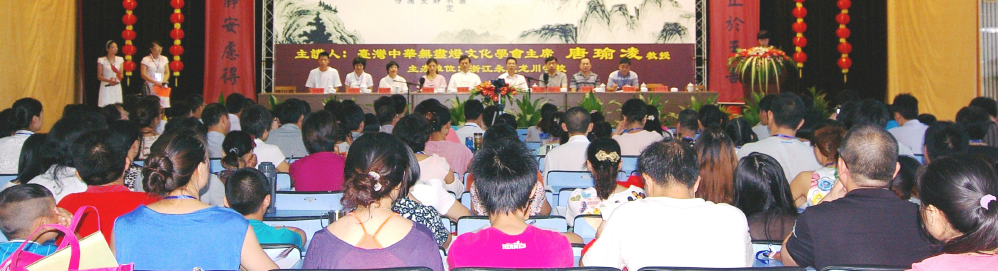

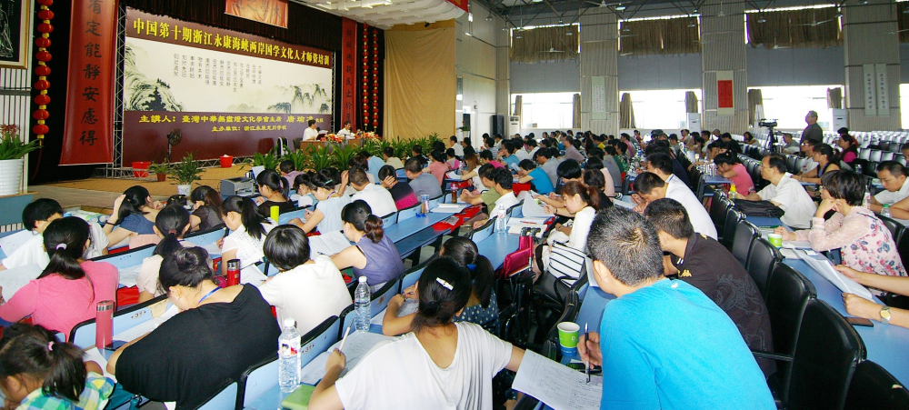

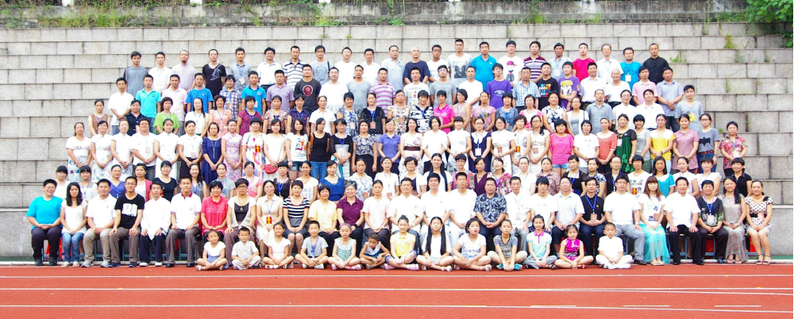

### 兩岸國學文化交流講座〜政和、永康、濟南　永康心得節錄（上）

*編輯部整理*

經書涵養心明鏡

吉凶禍福如鑑物

文化未墜在人傳

雪廬化育功相續

師友所依 知見所在 / 武漢大學　張朝玉

文化復興關鍵在有傳承者，唐老師在《大學》課程中向我們詮釋了中華文化的內涵與功用，在了解中華文化真正道統的同時，我們更看到了中華文化傳承之可貴，「文武之道，未墜於地，在人。」「人存政舉，人亡政息。」雖然接觸傳統文化也有幾個年頭，但幾個重要認識，卻是在聽老師講解之後才得。

正知見來自於良師益友的薰染，不可否認歷史上有過自己參悟而成就之聖賢，但在今日，依賴明師點拔、同參道友的提攜，再加上自己的實踐，才是我能夠確立正知見的必經之路，沒有明師點拔，極有可能盲修瞎練，最終一事無成。通過老師對大學的開解，進一步的擇師擇友，更重要的如何擇有正知見的師友。

心情不一樣，原來學習大學時「身有所忿懥」四句，感覺就是心身好像不能分別，老師的分析讓學生明白忿懥等實是心的動，所引發的情緒而已，表現在身，老師在課程中通過淺白的例子，極具啟發性。

所謂「一門深入，長時熏修。」是在經學深厚的背景下完成。聽老師講課讓學生感覺到我們只是在做「一門」而已，談不上「一門深入」，許多觀念似是而非。逐字逐句消文，能闡明其義理，這才是「一門深入」之關鍵；反其道，儘管學有時日，依然不知止，不能定靜，談何安慮得？

老師的講解為我們展開了中華文化的風貌，其下手處在修身形成一家的正知見，進而引領一國乃至天下的習俗風氣，善良民風可以使「無情者不得盡其詞」，可以達到不令而從的效果。觀今日之物欲橫流，確有太多要反思之處，不回歸傳統文化，如何找到中華民族的出路？

從政和到永康，十多天的學習轉瞬即逝，感嘆之餘，反思唯有不斷鞏固自己的正知見才是關鍵之關鍵，得遇明師又是確立知見之先機，此次學習，讓學生對老師，對自己又增添了一分期待。

經書明鏡 / 龍川學校　吳妙玲

我的第一個體會是自慚形愧，因為有好些內容聽得似懂非懂，甚至無法理解，更重要的是我忽略了的內心世界裡，那最初的夢想和處世原則。大學之道，在明明德，在親民，在止於至善。簡單的一句話，所蘊含的文化和做人做事的方法，卻充滿了無盡的魅力和力量。

第二個慚愧是大學之道所教授的處世待人原則，我有幾點做到了？「明明德」三個字，自己都無法做到其中的十分之一，就像唐老師所諷刺的現代社會的大學之道，是利、是人民幣、是物慾。真的！我們是否真的該想想，如何讓自己生活得有價值，來世一遭，該為後人留下些有意義、有價值的東西，為甚麼儒家文化，國學文化能留傳至今，不是世人的宣傳，而是它的個人魅力，對國家、對世人、對人情世故的作用已經深入人心，留芳百世了，每個人都有責任傳承中國的文化，時刻銘記於心。

修身在正其心 / 龍川學校　夏真旗

龍川校園之大學之道

所謂修身必先修心，修心必先正心（即正知見）。結合這麼多年的學習，最缺少的就是正知見的學問。論語上說：吾十有五而志於學。比對自己這麼多年來好像都沒有真正做到志於學，尤其是正知見的學習。通過學可感覺自己從現在開始，就要從志於學開始，同時對正知見學習更是首要任務。

所謂正知見，就是明心見性，利益別人，給自己出路也給別人出路。而要達到明心見性，就需要不斷地充實自己的內涵，以達到明德，才能辨明是非，才能利益別人。結合現在的教育，對孩子的正知見的教育，實在是太過缺少。身為教師感覺責任重大，但是自己對正知見的認識也是模模糊糊，談不上對孩子的教育，所以，當務之急，先要自己多學，多充實自己，抓住一切學習機會，這樣才會有出路。

總而言之，修身在正其心，懂得以正知見來修身，以利別人的心態來不斷充實自己，即以清明之心來明明德，才是我現在需要做，一以貫之的。

遇見經典 / 緣慈推拿　張占宇

遇到唐老師，並且有機會聽到老師的教誨。幾天的課程下來真的是如沐春風。倍感老師的每一句話都是至理名言，解開了內心的很多結。每一刻的學習，沒有枯躁，只有快樂！

在聆聽老師對經典闡述時，才發現中華文化內涵是那樣的廣博深遠，相比之下，自己對經典的認識是那麼的淺薄和無知，透過老師的教誨，使自己更加堅持對經典的學習，以此大學之道作為人生的修學目標！

此次太有幸，能聽到老師對《大學》的講解，之前只是泛泛的在論語中看到夫子講性與天道的這一分，特別嘆服夫子面對鄙夫時，所展現空空如也的智慧。原來夫子的「性」與「天道」就含藏在《大學》裡。而這些恰恰是儒門的心法。是人生修學的關鍵之處，原來夫子的學問是一個由內聖而外王的學問。

同時老師解釋大學經題的內涵時，才發現自己名為大學畢業，實則小學不如，古時之小學即能應對自如，相比之下，自己無非是空殼而已，有其形無其實，想夫子心當志於學，十五歲已能把心安住到大學立道上，內明明德於心，外親民為己任，且時時都懂得，內心不斷地充實自己的內涵，並學習利益有情的方法，從而達到止於至善之最高境界。與之相比，差之遠矣！

末學是一名學醫的，而在學習聖道的過程中，真正體會到傳統文化對自己學醫的幫助。首先，醫者仁術也！醫生就是以解除病人苦痛為己任，為了更好地幫助到他人，我需要好好地充實自己，而充實自己的目的，是為了更有能力幫助他人。當以內聖的學問充實自己時，自己的私慾和煩惱減少很多，面對病症時，頭腦更加清晰辨別，思維更加明了，處理症結時更能得心應手。

雖然老師的課程結束了，但我們對科文的學習並沒有結束。回去後還要在讀書會中繼續研討，學習不斷增上。特別是在老師、善知識、朋友的幫助下，建立正知見。依著修學的次第進德修業。從心內充實自己，利益他人，由此傳承立身行道。

經典的學習 / 龍川學校　林婷婷

經典之所以成為經典，正是因為經過無數代人的拜讀與賞析的考驗而流傳下來。《大學》作為「四書」中的經典之一，能帶給我們很多啟發與感悟。

很多人讀經典常覺得借助字典消文，掃除了古文文字障礙，理解每句話中的意思，就算是讀過這篇經典了。卻不懂得站在宏觀與微觀的角度來深入理解文章，更不懂得旁徵博引，用聯繫的觀點來看典籍，更別說從經典中反省自己，提升自己的修養了。

聽了唐老師的講座，讓我感到慚愧。唐老師對於《大學》字字句句的解讀都是如此的細緻、詳盡、深入、理解透徹，並且不斷地把經典內涵向外拓展，賦予了《大學》更多的生命力，也更具有現實的指導意義。

唐老師講解的《大學》，更像是一面鏡子，讓我們不斷審視自己、反省自己，是否做到了格物、致知、誠意、正心、修身、齊家等。很多古人總結出來的做人處世之道理，即使放到現在也極具指導意義。如果我們能真正讀透《大學》，學得《大學》等經典中的內涵和精華，那我們一定能在這個社會中活得更如魚得水，內心也會更開闊更包容、更樂觀。

所以，學習《大學》這樣的經典，不僅是對自身的反省，也是對自身修養的提高，更是給自己樹立了一個標竿，指明了一個方向，給我們一個需要提升、努力的進步空間。

但是，在這個快節奏、金錢至上的社會，又有幾個人有時間認真坐下來細讀經典、用心感悟經典呢？唐老師的講座正好為我們提供了這樣一個契機，由唐老師帶領，讓我們在這個浮躁社會中抽出一小段時間，靜下心來，享受片刻的寧靜，細細感悟。唐老師的指點能讓我們清心、靜心、淨心、安心，讓我們審視自己拜讀經典的態度，同時也從《大學》中獲取到了更多極具價值的東西。唐老師的講座，是會讓人上癮的，我個人非常希望能聽到唐老師對於其他國學經典的解讀。

美哉大學 / 緣慈推拿　俞蓮鳳

通過這次永康三天的學習，我的學習已經找到了一個突破口，引發了對學習經典的興趣。《大學》不愧是孔門的心法，也是儒家的心法，二十年前，我因妹妹看病的因緣接觸了氣功，本身也是一個氣功愛好者，氣功是道家的修練方法，著重打通氣脈，我體會到氣脈通暢的快樂，也感受到生活無欲無求的舒適，可是隨著年齡的長大，我跟一般人所走的過程一樣，從一個女孩子變成一個妻子，來不及思考已變成了一位媽媽，短短的七、八年時間，我已是精疲力竭，身心勞累，我已是再也不能靜下心來練功。為此，九八年的時候，曾經休息一年調整心態，讀了一年的《金剛經》，身心稍微得到調整。

為了生活所需又去經營一份事業，因不明白五倫關係，不通達人情世故，可謂障礙重重，自身煩惱連綿不斷。我們從事的是醫生事業，給人調理有口碑，自己卻是吃不下、睡不覺，心事多多，雖然通過前二年追隨老師的學習，自己的病已被老師「治」好了。可是始終沒突破個人的修養能力的問題，明明德的這一份，通過《大學》的學習，要到養別人的心志，做法一定是從自己修身上下功夫，充實自己的內涵，提升智慧和能力，內化自己再去利益別人，真正達到正己化人，心不為情所縛，人正就不會生情，用公心去掉私心，做法不依人，這是最好修煉心性的方法，當我們習氣生起來時，用心去觀照我們的心和身，我們的心就平靜下來，這不就是練功的最高級功夫嗎？在心念上下功夫，提升自己，這真正改變人的氣質，改變人的氣度（氣象），真正能使人脫胎換骨，美哉《大學》，妙哉《大學》。

簡單而不簡單 / 龍川小學　法私工

唐老師應我們學校大陸老師的邀請，在百忙中抽出時間來到學校為我們傳經送寶，這是我第二次得見唐老師，唐老師和夫人依然一身布衣，仙風道骨樣，他們的飲食和大陸學者截然不同，非常簡單樸素，在學校和我們一起吃普通的飯菜，睡著簡單臥舖，他們由內而外透出平淡和一種快樂，從容也絕不是刻意裝飾出來的，而是長期養心養出來的，凝視他們沉靜的容顏和淡定的氣度，我頓時心生感慨和羡慕。

這次《大學》的學習，感覺比去年「五二」學習論語更有進步，雖然我的學習力不是很強，聽的也是似懂非懂，但我內心明白，這樣氛圍和環境已把我徹底薰陶，不知不覺中，「學國學、用國學」理念的種子已在我心裡深深扎拫、萌芽，再次地，慶幸自己的人生再提升一個高度。

福慧圓滿的修學 / 緣慈推拿　俞蓮平

第一次完整聽完無盡燈團隊的國學講座，讓末學受益匪淺。人應該內修明德，做利益眾生的事，用大學之道來修身、齊家、治國，有了經典的人生，對人會更加的真誠，處世會更加的合理。

以前，常常有失聰的老人，心生迷惑，難道人生的結局真是這樣的悽慘和不堪？最後竟然呈現這樣的不了了之？學習了經典，不用再怕老和死，老了依舊可以耳目聰慧，老了，更具足了人生的智慧，老了，可以真正做家人的寶。

君子坦蕩蕩，小人長戚戚，期許自己做一個心胸開闊有正知見的人。心胸懷天下，為人民服務，成就福慧圓滿的人生！

生命的出路 / 緣慈推拿　袁菲燕

在永康的這幾天學習中，內心有一片祥和的感覺。同學之間跨越了年齡的界線，彼此請教學習上的疑點，學習也十分抓緊。用餐前的觀修讓我們在平常時、平常事上持續用功，我覺得我以後會堅持下去。

我發現我們離不開老師，離不開正知見的傳承，也迫切需要以明明德、親民，來解決來自自身，孩子、家庭、工作的問題。

「出路」是一個讓人渴望擁有的字眼，心的安定、身的安定是何等美好！天下人都明明德，都親民。為給大家的出路，我要勤奮的學習國學，理解國學，運用國學。最後感恩緣慈，感恩永康龍川學校，創建這麼好的機會給大家學習，感恩中華無盡燈文化學會團隊慈悲教化我們！

君子大道 / 龍川學校　桂美琴

這是我第一次參加國學文化的培訓，通過這三天的學習，我受益匪淺。唐老師的講學，講系統、講條理，並且在講的過程中掰開又揉碎，非常細膩，利於消化，雖然有些內容對於我來說還不明意義，但通過淺顯的例子，我便又豁然開朗。

在這些天的學習中，我對所學的「心為本」這一章節，較有感悟。「所謂修身在正其心者，身有所忿懥，則不得其正。有所恐懼，則不得其正。」在唐老師宣講的過程中，真的是感同身受。不管做甚麼事情，心念意志是最重要的，有了一顆熱心，身上的所有感觀都會投入到事件中，起著積極的作用，會令人全身血脈賁張，所有的細胞都處在興奮狀態中，外界之物都與已無關。反之，則所有感官（眼、鼻、耳）都在游離，起不了任何的作用。因為心不在焉了，也就是不執著，不在意之時，便會視而不見、聽而不聞、食而不知其味。

在社會中，注重修身的人必須使自己心志端正，而要做到心志端正是不容易的。在生活中，許多事情都會影響我們的判斷，以至於做不到中正的境地。比如我們遭遇憤怒、恐懼、喜好或者憂患的境地時，就會受此情緒的影響，直接表現出自己的情感，因為直接，所以有些與生俱來的本能反映，也可能會缺乏理智，從而難以做到心志端正。

而君子是最講究心志端正的，君子時時處處注意端正自己的心態，這樣，就能在任何情況下，對自己所做的判斷都不失「己」。而我想要朝著君子的方向出發，還真是「路漫漫，其修遠矣」。

大學修身的法寶 / 朱志波

唐老師說到「意念」，令我觸動很深。要「毋自欺」，要「慎獨」。「如惡惡臭，如好好色」，就是毋自欺。好就是好，壞就是壞，是非要分明。分明了是非，要堅持好的，反對壞的。這種堅持和反對不是做給別人看的，而是自己心甘情願的，一貫堅持的。即便是沒有人看，沒有人注意，也要如此，這就是「慎獨」。做一件好事容易，難在做一輩子好事。在人前做好事容易，難在有人、無人都做好事。「好而知其惡，惡而知其美」，不要因為自己喜歡這個人或事，就看不到它們不好的一面，也不要因為自己討厭這個人或事，就看不到它們好的一面。只有看到問題的全面，才能避免古諺所說：「人莫知其子之惡，莫知其苗之碩」。

細讀《大學》，其中細膩之味有如春風絲絲沁人心脾，無不讓人感覺温暖。儒家之道對於真善美的追求可謂做到極致。

文化的力量 / 龍川學校　少林元

每次聽唐老師為我們講課，言語間無不透露出他那種憂國憂民的寛闊胸襟。為復興傳統文化，義不容辭的歷史使命，還有為中華民族傳統文化的流失，深感遺憾與痛心，講到一個有文化的國家，國力自然興盛，別的國家也不敢輕易冒犯，一個有文化傳承的國家，並且能明明德於天下，別的國家紛紛前來求學。哪裡會有今日之下釣魚島的問題？

試想唐朝時期，日本人來中國學習之後回到家鄉，備受尊重，令人羨慕不已，不正是說明文化的力量不可忽視嗎？今日之下的中國，正可謂是禮樂崩壞的時代，傳統的東西不斷被摒棄，而那些消極的思想不斷被崇拜。現在似乎是經濟騰飛的時代，卻是物質膨脹、文化流失的時代，真正興盛在乎文化的振興。文化要傳承，正如古人云：「古之欲明明德於天下者，先治其國：欲治其國者，先齊其家，欲齊其家者，先修其身。欲修其身者，先正其心，欲正其心者，先誠其意，欲誠其意者，先致其知，致知在格物，自天子以至於庶人，壹是皆以修身為本。」亦即大學之道也。那如何修身呢？一個字，學。

孔老夫子十有五而志於學，他十五歲開始就鎖定，正心安在修學大人之學上，真正把「格物、致知、誠意、正心、修身、齊家、治國、平天下」作為自己修學的內涵。從而著重後世的經營。一個有明明德的人，亦需經營一個有明明德的家，明明德的家也可以帶動整個社會的風氣，誠所謂「一家興，一國興。」

總之通過這次的學習，讓我清晰地看到學習的重要性，為了自己的人生有出路，也為了讓所教的學生有出路，只有學！通過學習，不僅有好的觀念，讓自己豐富自己的內涵，增加自己的智慧，讓自己朝著真正正常人的方向努力，做回一個真正的富人。

聽課心得 / 龍川學校　王 思

作為一名學生，聽完唐老師《大學》，才發現自己其實連小學都算不上，最基本的「禮、樂、射、御、書、數」都無法做到，更不用說大學之道。經過四天的聽課，不能說自己懂了多少《大學》，只能說了解了一點皮毛。首先，我知道了該如何去學習。在學習中，要想有所得，必須先有明確的目標，確立了目標之後才能定下心來，對目標有專注力，過後才能達到不受外界干擾的境界，努力去學習知識，此後方可心輕安、身輕安，擁有了分析的能力和對世間的觀察力，最終得到對明明德、親民的體悟，也就是終止於至善而有所得。只有明白了先後次序才可以充實自己，利益他人。

其次，是對於《大學》的了解，我印象最深刻的是誠意、正心。誠意，發之自然，由內而外的誠意，不自己欺騙自己，人前人後都一樣，不去欺騙他人，也無法欺騙他人，對於君子，他可以看穿你所有的想法；而對於小人，他了解小人，也同樣不受欺騙。「富潤屋，德潤身，心廣體胖，」一旦以誠待人，即使簞食瓢飲居陋巷也如住別墅一般舒適。正心，以心為本，忿懥，畏懼，好樂，憂患等情緒都是情之發。逆境生瞋，順境生貪，只有正心才可修身。而在修身時，易為情所散，會偏向喜歡親愛的人，會偏離厭惡的人，會偏向尊敬的人，會偏向可憐的人，會偏離傲慢懶惰的人，只有知道了喜歡的事物的壞處，厭惡的事物的好處，才能做到修身。

學習傳統文化不怕沒有出路，因為學習這些可以幫助我們成為一個有格局有氣象的人，而當我們有了做人的格局，有了內聖外王的格局，出路將自己找上來。學了《大學》，聽了唐老師的課，才發現，人生的出路在此，在《大學》，在傳統文化。

（續下頁）

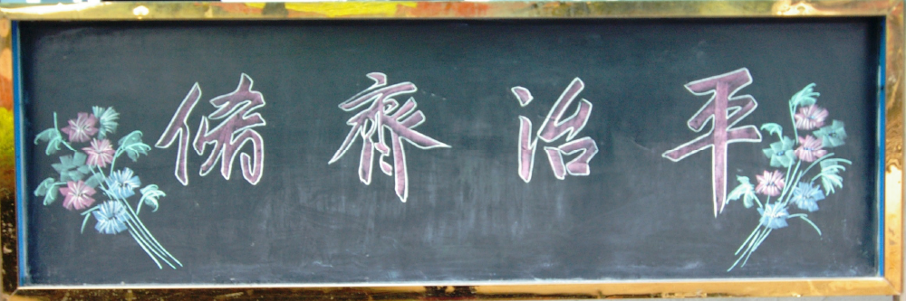

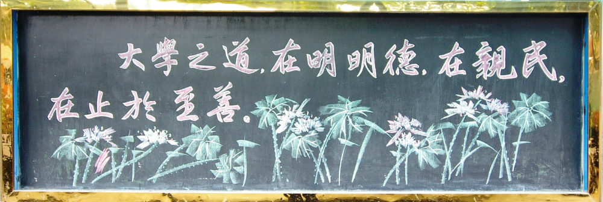

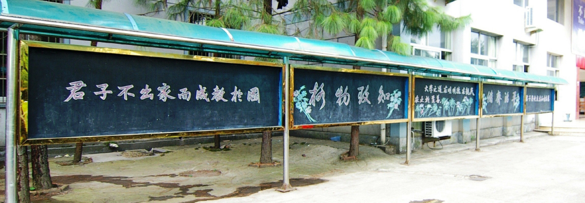

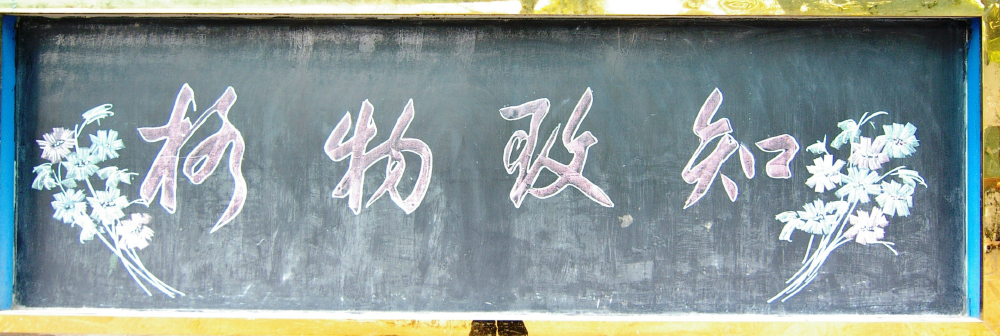

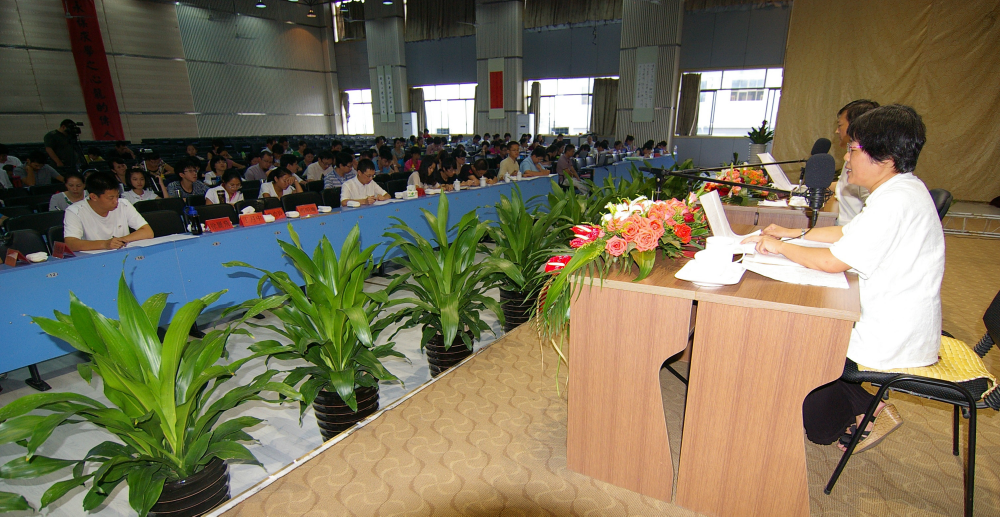

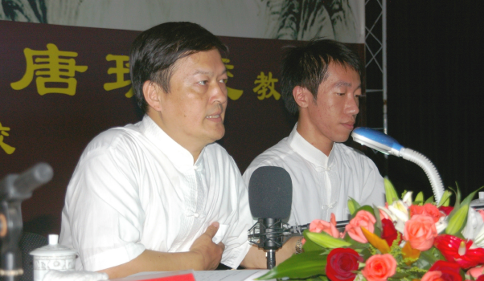

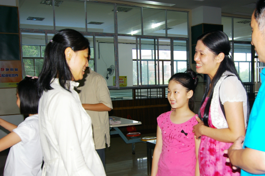

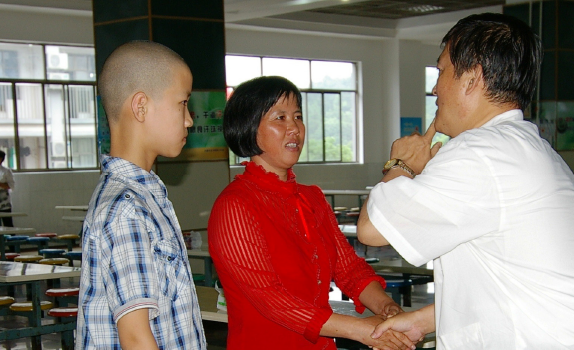

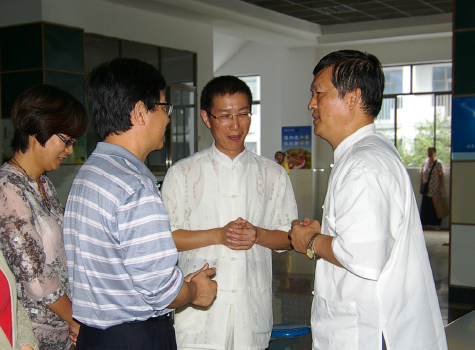

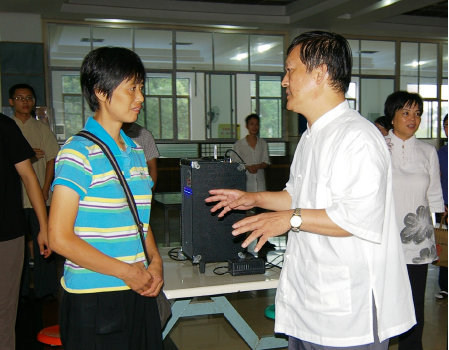

### 兩岸國學文化交流講座〜政和、永康、濟南　永康心得節錄（下）

*編輯部整理*

原來如此 / 龍川學校　李仲略

在聽唐老師講解「格物、致知」之前，自己也聽到過王陽明格竹子的故事，但是最終還是接受了朱子的「窮物盡理」的觀點。我想起物理老師告訴我們宇宙中有無數個太陽系，於是使勁地想開去，最後也想像不到宇宙到底有多大，最後模糊地敷衍自己「無窮大」。似乎我在「格物」，在格宇宙，但是對宇宙的知識依然知之甚少。

到底甚麼是「格物致知」呢？以前不知道怎樣去想，也沒有找尋相關的材料，其實就算手上有相關的材料，對眾家的解釋我也沒有分辨的能力，因此，一直就這樣渾渾噩噩、模模糊糊。反思我在讀書上的問題：沒有分辨力，於是乎甲這樣說我便相信甲；過了段時間，乙那樣說我便相信乙。當有人問我「到底是甲還是乙呢？」我便支支吾吾，顧左右而言他了。

唐老師說，格物致知就是當來了境界時候，心中能夠升起正知見。有了正知見，才能夠分辨是非、善惡、對錯，原來是這樣。

沒有正知見，糊塗半生！

今後怎麼辨？

學，是唯一出路。向良師益友學習，學習經典。積極參加學校的《論語》學習會，讀書會，在人、事、物上建立正知見，力求「事來心始現」，有正知見來指引自己去待人、做事、接物。

重 生 / 北京現代音樂研修學院　梁 地

我叫梁地，一個二十一歲的女孩。我是一個從死亡邊緣被拉回來的女生。如今社會，學生跳樓自殺的事件越來越多，以前我看的也很多，當時我不能理解他們的行徑，甚至覺得他們太偏激。如今，我自己也親身經歷了一次，我想我應該能體會他們的心情。其實人在走上絕路時，腦子是一片空白的，自己也不知道自己在做甚麼。而因為內心極其痛苦，以至於察覺不到自己的身體受到來自於自己的傷害，也不知疼痛。當時，身體已不受自己控制，腦子也已空白一片。直到在醫院中醒來，我才知道自己發生了甚麼，後悔莫及，然而心卻依然痛苦，甚至比之前更痛苦，因為多了自責、後悔、不孝等心情，於是厭惡自己，就厭惡了一切，對生活提不起積極的心態與信心。

自己所喜歡的人在此事之後便離自己而去，就更讓自己的心陷入了極其痛苦的狀態。甚至覺得對方怎麼能如此不負責任，如此不理解自己，所以心處在痛苦的深淵不能自拔。直到這次的機緣，來到永康，聽了《大學》的課，聽了唐老師的教誨，我的心終於在今天得到釋放，瞬間痛苦不見了，有了份歡喜和精進的心。在聽課的頭兩天，雖聽懂了一些，但心卻還是停留在過去發生的事情，飄忽不定，快樂不起來，疑問也越來越多，直到今天，老師講到，「所謂修身在正其心者，身有所忿懥，則不得其正。心不在焉，視而不見，聽而不聞，食而不知其味。」聽完唐老師的講解，我的心開始有所觸動，卻仍糾結於過去。

所以中午吃飯的時候，便把心結與疑惑，向李老師提了出來，李老師告訴我：「過去的已經過去了，未來的還沒發生，所以我們要活在當下。」我聽進去了，但是心卻做不到。下午聽課的時候，我仍糾結於過去，拚命思索，那我對待那些讓我受到如此傷害的人該怎麼辨？而誤會該怎麼去解除？正當我思索之際，坐在第一排的一個男生要第二排的一個女生遞給了我一塊橡皮擦，我剎時愣了一下，不知道為甚麼遞給我橡皮擦，那男生說是我要借橡皮擦，我納悶了，我都沒開口說話，於是我說：「沒有啊，我沒有借橡皮擦。」於是男生就又把橡皮擦拿回去，而正當橡皮擦被拿回去的那一刻，我瞬間全部明白了。沒錯，對於過去的事情，應該用橡皮擦全部擦乾淨，然後樹立起正知正見，重新開始。

於是，老師講的也一下子明白了一點。老師說「逆境生瞋，順境生貪。」因為在順境中有所喜愛的人、事、物，所以有了貪心，不想失去，於是有了患得患失的心情，然後當出現可能會奪去我所喜愛的人、事、物的因素時，也就是環境威脅時，便有了恐懼，害怕失去，而當逆境來了，真正失去時，便不滿，起了瞋恨心，所以自始至終，心都不正了。所以我才會心不在焉，視而不見，聽而不聞，食而不知其味，甚至釀成了最後的悲劇。現在，我終於找回自己的心了，而且有了目標，人也瞬間快樂了。

現在我終於讓自己的心安定了下來，有了親民的勇心，所以有了精進的明明德的心，所以，接下來是定，我要開始專注於聖賢學問，並勉持不變，直到面對各種境界而心不亂，由靜接著達到安，讓身心都輕安，精神飽滿，再是達到慮，對經典有分析的能力，對世間的事物有特別的觀察力，能知道問題所在，最後達到得，對世間的事物了然於心，最後能夠親民，能利益和幫助他人。所以我現在一定要開始好好學聖賢文化，樹立正知正見，努力充實自己，使自己心正，意誠，破除私欲，明心見性，這才是我的出路，每天都以涵養自己、利益別人的心態面對大家。

感恩唐老師，讓我在痛苦的深淵找回了我的心，重新樹立起正知正見。也終於明白，沒有人可以回到過去改變過去，但每個人都可以從現在開始努力，書寫一個全然不同的結局。聖賢文化一定能幫助我們，我會努力學習，充實自己，讓自己正氣十足，再去影響他人，幫助他人樹立正知正見，讓那些想要自殺的學生在絕望時刻把他們從不歸路拉回來，傳統文化一定能阻止這種悲劇發生！

生在福中 / 無盡燈　莊惟盛

在今年暑假即將結束之際，我來到了福建省所屬的政和。先是飛抵福州，再驅車到政和，一路上盡是受到貴賓級的接待，殷殷切切的招呼，內心十分不安，因為什麼都不懂的我，是來學習、觀摩的，不應是受禮遇的對象。十四天的學習，從一開始的昏沉、散亂、掉舉，乃至漸漸注意到周遭大陸的學長對文化的重視、好樂、如獲至寶，從上課的聽聞，讓我漸漸了解到文化的重要，最後，我全神貫注地聽講，深怕漏了一個字。每一段的上課內容對我而言都極其重要，除了是立身處世的美好概念，更是對過去歲月的反思。

過去都在學大量的世間的知識、技能，花了很多時間、精力，但是對於文化的內涵、為人處世的態度卻是講究甚少，忙來忙去，都忙到枝末上去了。經過十四天文化的薰陶，靜心學習，深刻了解到生起正知見的重要性，那是人生應努力的方向，也是改變自己最好的方式。唯有改變自己，才能給自己全新的出路，也才能給別人正確的出路。

政和，是此行文化之旅的第一個駐紮地，我們在這裡聽聞了兩個論語的專題講座─聖門氣象、成就善政的良方，前者主要是對學校的校長和老師講課，後者主要是對從政人員講課。二次講座的聽講均是難能可貴，臺灣少有。來聽課的人有遠從山東漏夜趕車而來，也有從順昌不疲不厭地追隨老師而來，更有在當地等候多時的學長，盼望老師來到政和。

又完成一回合的學習

來到政和的第一天，年未四十的縣長，氣度落落大方，殷勤地接待並介紹政和當地特色，晚餐時，仔細地一一介紹菜餚，對於老師的師資團隊禮遇極佳，態度極為誠懇，是一位做事實在的縣長。

大陸學長們對教法的渴求，以及法喜不斷的生起令我印象深刻。他們聽了論語後，內心歡喜，體悟不斷，並且將所聞的教法與生活結合，與人生的走向結合。因為他們看到文化的重要，所以卯足了勁在學，老師若講了十分的內涵，就要學進八分、九分。

看到他們這麼好學，我深感慚愧，自小有優良的學習資源，優良的學習環境，卻沒有善加利用，沒有把握每次的學習，任憑每次學習的因緣聚散，宿世的福報就這樣大把大把的浪費了。為了不辜負老師的教導，以及儒佛教法在臺灣的傳承，一定要一改往昔頹廢的學習態度，勉勵自己振作、自強，確立目標，堅定志向，老老實實的在佛學、儒學上學習，讀出味道來，讀進骨子裡，努力增上。相信未來再與大陸學長們會遇時，將會是另一番嶄新的氣象。

永康，是此行文化之旅的第二個駐紮地。講座地點在龍川學校，在那裡聽聞老師講授大學，清楚知道大人之學，而其內涵是兩綱八目一結論。大陸的學長們在每天的課後進行讀書會研學，將白天美好的概念延續。課後也有小組討論，這樣的討論對我有很大的幫助，可以將上課聽不懂的概念釐清，發現問題，原本看似乎沒有問題的地方，經過討論之後才發現原來自己沒有搞懂；消文的時候，可以訓練自己的思路和講話；可以讓自己歡喜，平常少有機會和學長們在道業上一起精進，創造學習的共業，能有這樣分組討論的機會，內心非常高興。總而言之，分組討論的功德太多太多了，這些都幫助我們思所成慧的生起。

這次的遊歷，帶給我人生很多的啟發。在自己學習的勢力不足時，走出去看看正為我注入更多的動力，知道還有很多值得努力的，知道自己的價值所在，知道自己的使命所在。未來要如何延續這樣的想法、強化這樣的想法？就必須親近善知識，遠離惡知識，要到學習的環境去學習。期許自己能重新出發，只許前進，不許後退，向典範看齊，策勵將來。

為有源頭活水來 / 無盡燈　古家慶

感謝老師不嫌棄學生和弟弟而邀請我們一起去政和聽論語，在永康學大學，而且花一天時間遊西湖，真是受益良多。

其實在老師邀請我那一天，我就非常興奮，因為第一次出國，管他學業不學業的問題，只要跟老師聽課，充實自己就好，因為人生最重要的不是學歷高不高，也不是考上好大學，也不是為了找好工作而努力讀書，而是德行和刻苦耐勞的精神。因為爸爸就是一個例子，在軍中，爸爸雖然有點德行，但長官叫爸爸做什麼，爸爸就做什麼，絕不拖泥帶水，因而受長官賞識，到國防部工作，這就證明德行和刻苦耐勞的重要，所以就跟隨老師，充實自己、開闊眼界。
第一天在機場，我打電話回家，跟爸爸問早，也問爸爸有什要注意的，爸爸回
**答：** 「跟老師出去要注意禮節，隨時觀察老師哪裏需要幫忙，不要丟了老師的臉和其他人的臉，但最重要的是，到那裡要多聽、多看、少說、多做。」最後自己有幾點沒做到。
在前往政和的路上，發現他們的山是多麼高聳寬大，是我們臺灣比不上的，只能以「山川壯麗」四個字形容，而且還發現高速公路旁的牌子所標示的距離幾乎都是以公里為基本單位，我想到以前有個故事：「一個臺灣人問一個大陸人：從你家到那個地方要多久，他回
**答：** 『不遠，只要八個小時就到了』」所以我才知道老師說的那句話：「不要以臺灣的觀點來看中國。」

在政和上課的時候，看到許多與學校不同的地方。其一是教學方式，在學校，老師就只有把課本所印的內容，寫的解釋講一講，還有說哪裏很重要，要記會考或者把課本裡的重點劃一劃，沒有把它的內涵講出來，雖然會說它所啟發的人生道理，但是會把意思講得跟原本不同。可是在這裡，老師不只會解釋清楚、完整，還會把它真正的內涵說得很詳細，而且會敘述它更深的意義，讓我真正了解那些句子的韻味。在看介紹孔門十哲的影片時，發現到那些塑像真的非常傳神，而且隱約察覺到背景音樂是在配合那些人物的個性，精神，後來上課在欣賞清明上河圖時，才發現裡面的人物也非常生動有趣，而且各種的房屋、商店、運輸工具都畫得很仔細，都沒有一個是一樣的，之前在故宮看的時候，從來都沒有好好地看。

最後我們遊玩參觀許多地方，首先是雲根書院，我才知道「半畝方塘一鑑開，天光雲影共徘徊。問渠哪得清如水，為有源頭活水來」是從這裡來的；其二廊橋，之前在大陸尋奇有看過，而且每個樑上都會有一部經的名字和詩，中間的樑是嘉慶皇帝所贈的，再來是去竹木工廠，他們不只做家具還做鍵盤，滑鼠和計算機，假如他們朝這方向發展，一定受到現化人的喜愛。

結束政和的課程後，接著到永康，第一天進會場的那一刻，義工們就躹躬說老師好，當時嚇一跳，馬上微微地躹躬說你好，因為之前我都是向別人躹躬，從來沒有別人向我躹躬，而且還是老師好，哇，這更驚人，唐老師、林老師、劉老師等才是老師，我不是啊！但是從這裡發現到他們的好學心。在上課的時候，發現桌上有我的名字、一杯水、一條毛巾，我也很驚訝，因為這是從來沒受過的待遇，而且每節下課把茶水添滿，給我們休息室休息，有水果，餅乾可吃，還有床可以躺，真的非常感謝他們。

在上大學之前，我以為我從沒讀過，上了之後，才知道我有聽過，而且我有一些感受，首先我發現上課的內容從頭到尾都以內聖外王來做連貫，其次是當我們證悟某事時，要有知止，而后有定。定，而后能靜。靜，而后能安。安，而后能慮。慮，而后能得的順序，其實做每一件事都是如此。再來，我們要影響他人，一定要先影響自己的內心，所謂格物致知誠意正心脩身齊家治國平天下，最後大學非常詳細地解釋每字每句的意思，讓我們更清楚明白，當我們把每字每句仔細讀，每次都會有不同的感受。所以我希望能再聽一次大學。

在最後一天遊西湖時，令我非常驚訝又高興，因為我之前是從國文課本看到西湖的美。雖然人很多，但是在坐船划進幽靜的湖水時，呼吸著滲雜青草香與花香的空氣，看著古色古香的風景聽著悅耳的鳥鳴聲，慢慢地遠離人聲鼎沸的地方，讓我的身心獲得解放，體會到大自然的奧妙。在晚上的西湖，又是另一種景色，邊散步邊欣賞那西湖之夜，讓我有意猶未盡的感覺。

雖然只有這短短的十四天，但是重要的不是照片拍得多不多，而是吸收得夠不夠多，再次感謝老師給我這次機會學習，也感謝老師、學長以及應學長全家的照顧。謝謝大家。

開拓境界的學習法 / 無盡燈　古家華

那天一聽到老師邀家兄和末學到大陸學習時，第一個念頭是關於學業的問題，怕自己會落後於其他同學等，可是又覺得這也沒什麼不好，第一次的出國經驗，跟老師們、學長們學習也不錯！

出國前的傍晚，接到了一份為老師奉茶、奉毛巾的工作，頓時肩頭好重，但也認為這是個磨練，有磨練才有進步，腦中浮起父親認真的一句話「少說、多做、多看、多聽。」又想到老師那天所說的，大陸的學習態度很強烈，頓時感到恐慌。

坐了四到五小時的車程，顛簸的路途，一路上看見了中國的廣闊，傳統的房屋，鄉土的風情，在臺灣已不常見了，又想到古人求學的心態是多麼堅定，要走很長的路，走了幾個月也不覺苦，更何況現在有巴士可搭，有冷氣可吹，求學很方便，何必喊苦？現代人太幸福了，真的生在福中不知福，有天劉師姑跟末學說：「吃飯要穩重，別人都在看你的一舉一動。」當場感到很羞愧，的確，末學是靜不下來，況且音量很大，別人看了在私下不知評論什麼，覺得很對不住老師，經老師提醒，也察覺到自己講話不清楚，太輕浮了！老師曾講過，講話不清楚、不確定，是很不好的事，應經常注意自己，收斂自己的言行。

「毀譽參半、任勞任怨，先之勞之，無倦」不管自己做了什麼好事，都會有毀跟譽，而想要他人從善，當下不要多說什麼，持續的做下去，做好榜樣，引導風氣，永不懈怠，當然前題要充實自己的內涵，培養正知見，才能分辨是非對錯，才能做好榜樣。

上了《大學》才知，現在「大學」不算是「大學」，現在的大學都在教專業技術與知識，而非教如何明明德、親民，而非如何修內聖外王。上課時，常聽老師說到「內聖外王」聽老師說內聖是內涵，破我執，而外王是外在的表現，氣度，發展心量，確實一人的內涵很重要，若沒內涵，別人看了草包一個，沒人願意親近你，把親近善知識的緣給抺煞了！若充實好自己，則他人才會尊敬我們，就像二位老師，有威嚴，進而慢慢地帶動社會風氣。充實內涵的同時也要多聽聞、學習，來培養正知見，而且身要靜，心也要靜，再讀進去慢慢咀嚼消化，這才真的有幫助，但要長時間磨，只要能靜下來，定了下來，學任何東西都很快，就像母親學書法、拼布、刻印章等，學個一、兩年就有所成就，得心應手。

「半畝方塘一鑑開，天光雲影共徘徊，問渠哪得清如許，為有源頭活水來。」這首詩的含意末學不太明白，但想要心中清澈，要有一股活水的灌入才能保持明亮，也需活水來洗滌，一個乾淨又明亮的湖水，也要有溪流的灌入才能保持明亮，想那活水應該就是時常學習，也請老師在此多加指正。

在杭州路上，聽到好多從沒聽過的歌。當老師要我們兄弟倆唱滿江紅時，驚覺自己沒文化內涵，為了唱歌而唱，沒有融入其悲痛情懷和感情，是唱不好的，就像臺灣國寶歌仔戲藝術家—廖瓊枝，素有「臺灣第一苦旦」之稱，苦旦常因劇情而演出哭腔或流淚的表情，要琢磨內心，若沒有足夠的人生歷練與情感，可能只是在臺上呼天搶地的哭號，卻感動不了觀眾。轉眼間看到了雷鋒塔，也看到了西湖的遼闊。當然到了不同的地方要用不同的角度，展開胸懷來看，如此才能學習，就以五、六個小時車程，對臺灣人說太久了，但對大陸人說很短呀！不久不久，真的很佩服他們的耐心與毅力，加油。

「水光瀲灩晴方好，山色空濛雨亦奇。欲把西湖比西子，淡妝濃抺總相宜。」真的很難形容它的美，踏上櫓船，緩緩划過湖面，看那漣漪景色，聽那寧靜幽色，煩惱，憂愁隨風飄逝而去，心中的激蕩沉靜下來，彷彿回到千年悠悠時光。傍晚更別有一番滋味，吹著夜風，壓力完全釋放，聽著梁祝，感受其無法相悅的情，現在卻無法欣賞「接天蓮葉無窮碧，映日荷花別樣紅」，真希冀自己能再遊西湖一趟。

十四天來，有很多話想說，卻不知如何說起，顯然仍未融會貫通。真的很高興能到大陸與老師學習，雖然未能服侍好老師，也請老師多加指導，最後希望能與老師再度學習。

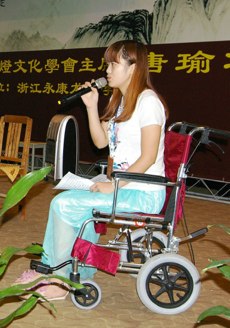

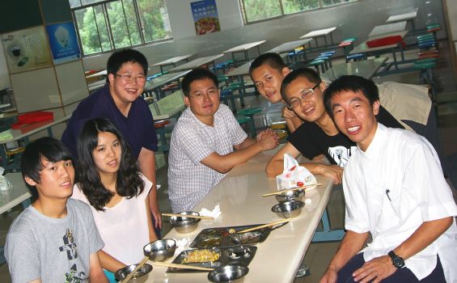

### 兩岸國學文化交流講座〜政和、永康、濟南　山東濟南活動報導

*編輯部整理*

政和參學勝緣起

方有濟南文化緣

雪廬家鄉倍親切

再造風氣乘願來

二○一二年十月一日至十日

緣起

二○一二年十月一日，學會一行十餘人受邀前往山東省濟南市，舉辦了「第十一屆海峽兩岸（山東濟南）國學文化交流會暨《論語》學術交流會」。此次講座的當機眾為山東省各地的私塾、學社、讀經班等各教育團體的負責人及師資。當然，亦如同往屆，有不少學員趁著長假從山東省各地乃至全中國諸如福建、浙江、武漢、瀋陽、內蒙等地千里迢迢不辭辛勞的遠來參學。

此次講座緣起於二年來在福建、浙江各處所舉辦的文化講座皆有來自山東的學員，並且多次力邀前往濟南辦學，特別是二○一二年八月，學會受福建省政和縣政府之邀，舉辦了為期六天的「第十屆兩岸文化人才師資培訓」，在那次講座中，來自濟南的劉廣林會長及其共學同儕等，坐了三十幾個小時的火車前來參加講座，並懇請學會前往濟南講學。由於其誠意實在不能推辭，幾番慎重考慮後答應前往。

又因為濟南是雪廬老人的故鄉，將其傳承教法回饋濟南，或非弟子們能力所及，所以始終不敢造次，此次因緣成熟但以誠惶誠恐的心情準備課程，期能不負老人教導，並以老人平日教學重點中之《論語》、詩、禮、樂等儒學內涵為教學主體，期能對老人作一個報恩。故此次的文化講座不為人知的一點，就是，儘可能的將雪廬老人的氣象、風采，及著書立說傳承聖道的內涵，呈現給老人的鄉親父老們。

回顧雪廬老人

在臺灣過去幾十年安定的歲月中，一大批從大陸來的有德有學的老先生們，將自己的所學教導臺灣人，尤其感激山東這個地方能培養出雪廬老人這樣的大儒來到臺灣，使得臺灣深受其利。當時經濟起飛，臺灣人都想到國外學習，或者乾脆定居國外作外國人，但因有像雪廬老人這樣的大儒在，所以大家能安住向學。而大家何其有幸能夠追隨如此泱泱氣象的君子來學，當時各種外省腔大家都聽不懂，唯有山東腔聽得懂，那是老人人格特質的感召，原來真正讀書人的風範如此。

老人家在臺灣講學安定的三十八年歲月中，將他對古書的眼力，對經學的深入，以及一生的經驗閱歷和人情世故和盤托出。老人對於世出世間的通達讓有幸躬逢其盛的人大開眼界、大飽耳福，讓人體會到一輩子最幸福的事情莫過於在大儒座下聆聽最正統的文化，讓人重新認識自己，認識自己的國家、民族、祖先，讓人明白所有的根本在於文化，而且必須要傳承自大儒。過去孔子周遊列國的時候，老師走到哪裡，學生就跟到哪裡；老師在哪裡留幾年，學生就留幾年。雪廬老人的風采也是如此，學生們在老人的身邊學習如沐春風，時間過得飛快，就如同「兩岸猿聲啼不住，輕舟已過萬重山」的感覺。老人過世後，又已匆匆過了二十八年。

濟濟一堂學論語

二○○九年十月福建閩北建甌市的孔廟舉行大展，老人的學生江逸子先生所塑的十二尊孔門聖賢銅像，其中包括孔子、孔門十哲以及唯一的當代人物雪廬老人進入建甌的孔廟。為什麼雪廬老人可以進入孔廟永遠陳設其中呢？因為老人完整的傳承中華文化，讓人看到了中華文化的實用性。雖然人們常說中華文化源遠流長、博大精深，但大抵上都是口號居多，實質上並不了解。透過雪廬老人的抉擇，讓人們了解原來文化是如此的深入，如此的高格局、有涵養、有氣象，帶給人生是無比光明。

老人所留下的《論語講要》，是臺灣《論語》註解中公推為權威的註解。可惜的是對岸的中國大陸知道這本書的人很少。此次有幸能夠回到老人故鄉來舉辦以《論語》為主軸的講座，並且結合詩禮來推廣這本《論語講要》，將其作為傳統中華文化弘揚的核心，相信是老人內心裡面的盼望，也是弟子們的志業。

課程介紹

中華文化最美好的部份在十三經，而十三經的精華在《論語》。在《論語》的四百九十八章中，孔子自我描述的有七十八章，透過弟子來描述老師的也有四十六章之多。在講座的四天課程中，老師與六位消文的老師學長們配合，透過十四堂課對「孔子德學介紹（一）弟子對孔子的描述」這一份科判作深入的探討，讓與會的學習者瞭解《論語講要》的精彩與珍貴之處，更藉此瞭解聖人內聖外王的概貌。談孔門弟子對孔子的描述，何嘗不是在談學生們對雪廬老人的描述。

除《論語》外，此次另一個重頭戲是雪廬老人的詩禮。禮的部分特別選講了《常禮舉要》中的「旅行篇」。我們知道雪廬老人從一九三七年進入孔府，而後即隨孔德成先生離開家鄉來到四川待了十年（即抗日戰爭時期的十年）。在那段期間老人只返家一趟。一九四九年，又隨著孔先生到了臺灣，直到九十七歲往生。足足五十個年頭中，老人一直在外奔波，只有一次返鄉，所以此次的《常禮舉要》，林老師特別藉着對「旅行篇」的介紹，來呈現雪廬老人一生跟隨孔家在外的艱辛。

衆所周知，孔德成先生是三禮（《周禮》、《儀禮》、《禮記》）的權威，但是如果沒有莊陔蘭太史、呂今山老師以及雪廬老人的培養，絕對不會有這樣的才情，他的才情是孔家三代中公認最為出色的，所以此次談《常禮舉要》來介紹雪廬老人對禮的通達，如何讓禮活用於現代。總而言之，如果在禮中找到國民的風骨、國民的氣質、國民進退的禮儀，那整個國家、整個民族定會在世界上贏得重視。

李珊、李彤二位老師

全程參與講座

詩的部分，此次開設了兩堂《詩階述唐》的課程。《詩階述唐》是雪廬老人選了一百首唐詩所集合而成的教材，這一百首詩即是唐詩的概貌，瞭解之後便可以以此為基礎，進一步學習所有的唐詩，並上通於詩經，下達於宋元明清的詩。而此次從這麼可貴的教材中，林老師特別選了杜甫的「聞官軍收河南河北」。為什麼選這首詩呢？一方面，此乃雪廬老人非常喜愛的一首杜甫詩；另一方面這首詩與老人的身世背景有著很大的相似之處。這兩堂課藉着老人對詩的選擇及註解，來還原他在詩學上的獨到與精闢之處。

此外，所開設的課程中還有一堂雪廬詩吟誦。老人的吟法來自古調的吟誦，甚為稀有。在課程中，老師帶著學員們聽著老人的吟誦錄音一一的吟唱。特別值得一提的是，由於老人的吟誦中帶著鄉音，這讓在場的山東學員們感到格外的親切與歡喜。

晚上的時間，安排了非常精彩的〈孔子傳〉影集。透過老師的講解，盡可能的還原孔子的風貌。〈孔子傳〉的講解也是要來呈現雪廬老人，誠如孔子感嘆說「道不行，乘桴浮於海」，兩、三千年前孔子的感嘆，雪廬老人說「想不到兩千多年後印在我身上」。孔子未完成的遺願正由雪廬老人來完成。

此次講座中有兩位很特別的嘉賓，那就是雪廬老人的兩位孫女李珊老師與李彤老師，全程參與了此次講座課程，事後感歎地說，原來爺爺的道德是如此博大精深，並更深深決定日後致力於文化的學習與弘揚，將此作為她們人生的目標與事業。

曲阜之行

講座結束后的第二天，眾人一行便乘車前往位于濟南正北一百多公里處的孔子故鄉曲阜市。曲阜古稱魯縣，是周朝時期魯國國都，現今山東省的西南部。當天一行人依次遊覽了孔廟、孔府以及孔林，「三孔」的雄壯與奇麗實在讓人歎為觀止，更不禁讓人聯想到歷朝歷代對孔子及孔家極致的尊崇，但是孔子真正的宗廟之美與百官之富並不在「三孔」，在於他以通達世出世間的悲心智慧來整理六經、教化生徒，傳承聖道，成為中華文化的集大成者。

詩禮傳家

人能弘道非道弘人，經典的正解必得靠大儒的傳承，不然真正的孔廟、孔府、孔林還是不得其門而入之，此乃雪廬老人耗盡人生最後的六年用一生的內涵與經驗閱歷將十三經之首《論語》作完整的剖析和培養承傳《論語》人才的原因。

全神貫注的學習

在曲阜的第二天，學會一行受顏廷淦先生之邀，前往曲阜中醫藥學校參與文化交流座談，交流會上聚集了曲阜當地致力於文化事業的龍頭。顏廷淦先生乃復聖顏回第七十八代嫡孫，顏奉祀官之子，現任曲阜中醫藥學校副校長，經過一番熱絡的交流。本刊整理顏先生致詞內容，刊登於後。

整個山東之行的最後一站來到了位于曲阜城東北四公里處的洙泗書院。到達之後才得知，原來此處乃孔子周遊列國返魯后刪詩書、定禮樂、贊周易、修春秋，並聚生徒講學之地，因為南臨洙水，北臨泗河，故名洙泗書院。書院中典雅的建築與參天的古柏共同營造出幽靜安詳的氛圍，讓人留連忘返。正當大家遊覽書院緬懷孔子之際，前曲阜市委書記、現中共中央人大代表以及一位當地文化團體的負責人聞訊前來會面，於是在書院有一番長談。談話中，眾人不時表示中華民族的根本在於中華文化，而且能讓中國振興、兩岸和諧發展的也唯有中華文化。

結歎

眾所周知，山東在春秋時代是孔子最後傳承道統之地，而現今的山東又是對岸的文化大省，如果能從山東開始在正統的文化法脈上講究，對文化作正確深入的學習與弘揚，相信站在文化的基礎上，未來的兩岸將會是一個完整的、和諧的、統一的氣象。

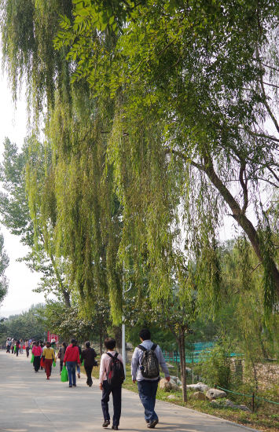

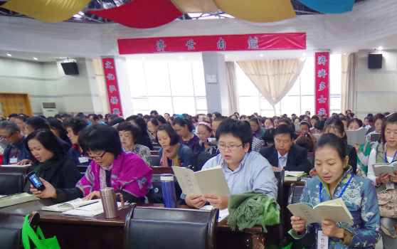

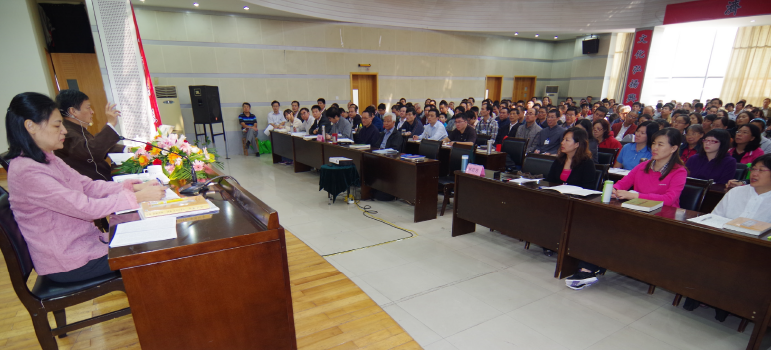

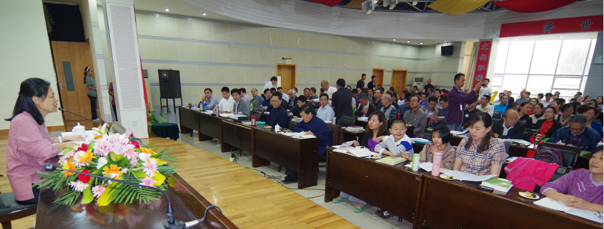

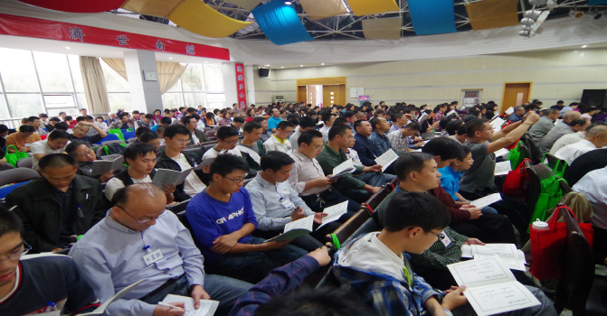

### 兩岸國學文化交流講座〜政和、永康、濟南　顏淵第七十八代嫡孫顏廷淦先生講話

*編輯部整理*

可貴復聖代代傳

猶能向道拯人心

文化內涵方有用

人才輩出能揚續

首先，代表鶴鳴國學心理教育研究院，對台灣唐先生一行，以及來自全國各地的專家，表示熱烈的歡迎。這個月的四號我到濟南聽了唐先生的教誨，和唐先生初步做了一些溝通，我跟唐先生介紹，我們有很多的淵源，因為他是李炳南老先生的弟子，我的父親和李炳南老先生和孔德成先生都是至交，我父親比孔德成先生大十八歲，大概比李炳南先生小十二歲，因為那時候曲阜就是孔、顏兩家，孟家在鄒城，曾子的後代在嘉祥。德成先生出生的時候，孔老先生已經去世了，生下的是男孩還是女孩，直接關係到孔府的傳承，所以國家很重視，內務府責成我的父親，就坐在孔府裡邊見證德成先生的出生，出生是男孩，馬上簽字報到內務府，孔家有男丁，就可以有繼承。

所以在歷史上我們顏和孔兩家，有著很深的淵源，孔子的母親顏徵在是顏家人，所以孔家和顏家是親戚關係，而且是歷代結親，就因為這個原因，孔家和顏家排輩是兩個序列，孔、孟、曾是一個序列，按照孔的輩分排下來，唯獨顏家單獨排位，就是因為孔和顏是親戚關係，孔家到顏家來是找親戚，顏家到孔家去是拜老師，就這麼個關係。我的父親和德成先生都是七十七代，我父親儘管比德成先生大，但是仍然很尊重德成先生，並以師長的名份來稱呼。德成先生到我們家，和我父親見面，按親戚他叫我父親表叔，孔顏兩家歷史上是一直很親密。特別是上一個世紀初，國家戰亂，那個時候德成先生很小，家裡頭很多大的事情，他就請我的父親幫他處理，所以他們兩位就幾十年結成了親家。

右：蔣公之秘書長、顏奉祀官、孟奉祀官

左：孔奉祀官、曾奉祀官(顏先生提供之珍貴照片)

封建時期孔顏孟曾四家都有封號，孔子是至聖衍聖公，我們顏家是翰林院博士。到了民國時期，西元一九三五年蔣介石先生改封這四家為奉祀官，德成先生就是至聖奉祀官，我父親就是復聖奉祀官，孟子後代是亞聖奉祀官，曾子的後代叫宗聖奉祀官，都叫奉祀官，一九三五年在南京就職。我給唐先生帶了一幅照片，那是他們四個人下船以後，由蔣介石先生的秘書長在前面帶領他們一起就職的照片。所以在歷史上，我們顏家、孔家有兩千多年淵源的關係，唐先生又是李炳南老先生的弟子，所以我們也是一家人，所以我見到唐先生就感到格外的親切。

由顏廷淦先生召開之兩岸文化交流會

我們這個研究院成立主要目的是弘揚中國傳統文化，因為我們看到大陸在五四運動，特別是文化大革命以後，傳統文化丟失很嚴重，好多人對傳統美德已經淡忘了，特別是我們的少年兒童，由於社會的影響，學校教育的偏差、再加上家庭中家長不會教育孩子，所以兒童在傳統美德方面幾乎是空白。所以我們研究院主要的任務，就是為少年兒童進行傳統文化的培訓，成立以來和中國兒童基金會合作，成為傳統文化教育項目的一個重要基地，這個項目是中國的人大副委員長叫陳至立，原來當過教育部長，他立的項目，這個項目叫做關注中國兒童傳統文化教育行動。

這個行動包括很多方面，最主要是儒家文化教育，另外還有道教、武術、中醫中藥、茶文化等。此儒家文化的教育基地就在我們研究院，此計畫是幾年以後要建成一個能夠容納二到三萬人的一個書院，對全國在學的少年兒童進行傳統文化的培訓，這是我們一個大的目標。今年我們已經很成功地對第一批學生進行了十天的培訓，收到很好的效果，從他們的言談舉止開始，一直到如何做人、交友、立志、孝敬父母、使自己的心胸開闊等，對少年兒童缺乏的這些東西一項一項進行培訓，我們搞一個叫聖地十學，十次講座中教如何做人，如何去交朋友、擇鄰，到孟廟根據孟母三遷的故事，教學生如何來選擇自己的鄰居，如何交友，如何孝敬父母。

因為現在兒童比較浮躁，眼光比較短淺，很多兒童不知道為什麼活著，沒有遠大的理想，這是現在少年兒童的通病，所以針對這些，我們用歷史故事，教他們一定要樹立遠大的理想志向，只有這樣他才可以承擔，他的心胸才可以開闊，不會狹隘，他的承受能力才可以增強。因為現在好多的少年兒童就是承受能力太差，一點小事他承受不了。我們做了統計，每年有數以萬計的學生因為不能承受壓力而自殺，自殺這種現象很普遍，心理承受能力太差，所以我們研究院主要的任務就是對少年兒童進行這種傳統美德的教育，這是我們和中國兒童基金會合作來做的一項工作。

顏先生題字相贈

今年我們還在山東、河南、安徽、江西、浙江、江蘇、河北、山西，做了十九次的國學講座，主要的對象是家長和兒童，教育家長如何教育自己的孩子，現在好多的家長不知道如何去教育孩子，他們花了很多錢讓孩子去上各種班，學習美術、學習書法、學習鋼琴、學習舞蹈等等，花了很多錢。但是在做人方面，他們沒有認真去教，所以有的孩子學了很多藝術類的，但不知道怎麼做人，這是我們教育家長最重要的，一定先要教學生做人，其他大可不必學那麼多，花錢不說，浪費了孩子很多的精力，這些東西將來對孩子的成長沒有太大的幫助，但是最重要的一條忘記了做人，做人要緊。所以領導家長抓住根本的東西，教學生做人。然後聖地十學那些內容。

另外我們還承擔了一項任務，就是圖書的出版，每年出十本書左右，然後由銷售集團向全國銷售。我們的書籍主要就是孔子思想、儒家文化、傳統美德，我們拿到的第一本書就是中國員工道德素養一書，主要內容是社會美德(公德)、家庭美德和職工的職業道德，我們準備把它寫好了以後推向社會，推向企業單位，提升社會企業上員工的道德素養，包括一些企業界的領導，用儒商的觀念去管理。

這是我們第一本書，以後我們大概每年出十本書，就是我們研究院的幾個大的任務，當然最重要還是建立少年兒童的培訓基地，能夠讓全國的少年兒童，都能夠有機會接受訓練，更因為曲阜獨特的地理人文環境，這兒有五千年的文化，我們用這種環境去教育學生，使他更容易接受，所以中國兒童基金會選定這個地方做傳統文化的教育。成立以來也得到了社會的關注，同時在國際上也形成了一些影響，其中韓國已經有兩個市到訪，建立很好的合作關係。還有泰國，有七個孔子學院逐漸和我們建立合作關係。另新加坡孔子學院的院長也到學院來訪問，同時準備下一步和我們長期合作。所以成立短短不到一年的時間，取得了一點成績，在社會上也形成了一些影響。

這一次唐先生一行過來，是我們一次很好學習的機遇，也因著彼此深厚的淵源關係，所以我們很想和台灣這邊建立將來合作的關係，此次並冒昧，祈請唐先生做我們顧問，做我們的教授，為未來的文化推展予以指導。

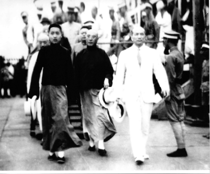

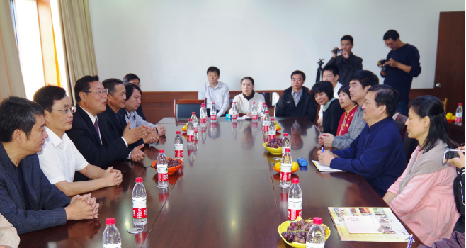

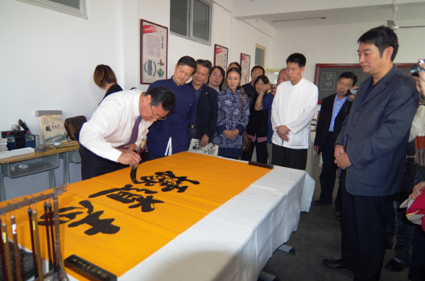

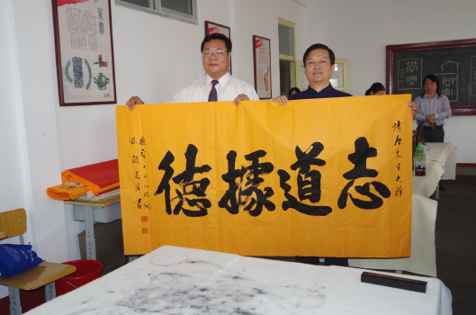

### 兩岸國學文化交流講座〜政和、永康、濟南　山東濟南心得節錄（上）

*編輯部整理*

泉城故鄉名士多

聚會多是愛文化

路雖坎坷崎嶇行

心境高遠是康莊

秉承道統　還原孔子 / 山東聊城　閆 傑

多年以來，我一直熱衷於傳統文化，致力於傳統文化的學習。《論語》作為《四書》之一，是一部非常重要的經典，也是通往國學大道的入門書。「四書熟，如六經，始可讀」，為了讀懂《論語》，我參看了十幾種的講解書籍，但是對於《論語》的核心內容以及主要大意還是模稜兩可，尤其是注解各不相同，甚至相互矛盾，心中總是有個結打不開。

聽了唐老師對《論語》的開演，我才覺得《論語》原來如此有深意、有味道。唐老師給我們還原了一個真實的孔子，透過孔子使我們瞭解了中華文化的真諦，孔子確實是一個中國文化的集大成者，對中國五千年文化的締造功不可沒。

為什麼唐老師對《論語》有如此深刻地認識與研究？「文武之道，在人。」文化是講究傳承的，唐老師師承李炳南大師，李老對儒佛有精深的修持與體驗，再加上老人閱歷豐富，天資淳厚，對中國文化的根本有其正確的知見，為了文化的傳承，老人一生辦學，培養人才，而弟子們也繼續精進研究教學，將孔子之道發揚光大。

唐老師對《論語》的講解，包括對孔子本人真實面貌的還原，是從事理，或者從形而上與形而下兩方面展開的，事中含理，理中有事，讓我對《論語》中的文章有了更新、更深、更清楚的認識，大有豁然開朗之感，對孔聖人也肅然起敬。

對孔子之道是不可能在短時間內領悟到的。孔子之道，仰之彌高，鑽之彌堅，瞻之在前，忽焉在後，高深莫測，無所不在。路漫漫其修遠兮，吾將上下而求索……。

第十一屆中華文化學習心得 / 范 偉

自春秋以下，諸子百家興起，歷朝歷代多尊儒術，自然有其緣由，致成中華文化的主流，支撐著中華民族兩千餘年的發展與文明。然而，縱觀歷代大家對於經論子集的注疏，不通或甚可笑處時常可見，或為說文解字的表面文章，或為考究不實以訛傳訛，或為只見形式未達本義，洋洋注釋令人無所適從，甚誤後人。辛亥革命後，西方科學如潮湧入中華大地，將中華傳統文化從形式上徹底驅離於人們的主流意識，及今已斷層百年，致使國人只知有傳統，不知有文化，倫常顛倒，物欲橫流，迷失本性，聖學不出，覆將何救？

機緣巧合，能參加本次中華傳統文化研討會，初聞唐老師開示「子絕四」，即講出真空妙有大道旨趣，又談及應無所住而生心，及見老師講經佈道神采飛揚，遠取諸物，近取諸身，信手拈來，皆入法理，生起無限歡喜心，正謂欲罷不能。老師應情應景，引經據典、脫口而出皆合大義，可知老師學養至深，尤可推知雪廬老人大智，可惜我輩已無緣得以面見了。

老師講經，正本清源，深入淺出，直達胸臆，於形而上發微闡奧，於形而下就理演法，使我等後學愚鈍之人得以門徑，循經論可窺道性，據禮樂能圓人生，更得遇明師，此生幸甚，不敢懈怠。

禮者「情」也 /

正如唐老師所說，如果沒有老師的引領，即使讀千遍也不能懂《論語》。是的，多少年來，我不懂中華文化，認為《弟子規》《論語》都是一些束縛我們的條條框框，後來知道，這些條條框框會像欄杆一樣保護我們，雖然能接受了，也懷有感激之情，但依然有壓抑感。在這次學習之後，我在老師的引領下明白了在中華文化的「禮」背後維繫的人情，孔子所思所想所言所行都是為別人著想。

跟隨老師的講解，細細品讀《論語》每一章都是有情有義的。在教育學生時「夫子循循然善誘人，博我以文，約我以禮，」從這句裏可以感受到孔子特別善於從情感上引導學生，用自己的情感表達來影響學生，陶冶學生的情感世界，使學生想停止前進都不可能，那是因為孔子的學生「親其師而信其道」。

孔子得人心是因為時時處處都能將心比心，他能用仁心對待一切的人事。所有的禮都為情而定。在「子食於有喪者之側，未嘗飽也」這一章中，我們可以看到孔子的惻隱之心，對於居喪的人孔子能感同身受，同情的心自然流露，哀對方所哀，想對方所想，給對方所需。他敬「所應敬者」。「子見齊衰者，冕衣裳者與瞽者」這一章，可看出孔子「敬人」，因為「敬人」所以過了兩千多年，依然受人所敬。

以讀經作為上課前行

而我們呢？面對著成就自己「天命」的學生，我們一昧要求孩子好好學習，要求每一個孩子有悟性、知書達理，在我們責備孩子、對他們「恨鐵不成鋼」的時候，有沒有像孔子那樣體諒孩子的心情呢？打著「愛」的旗號，有沒有讓孩子得到真愛？對人的尊重，就是欣賞他。聖道要借著仁心去發展，文化要憑藉愛心去傳承。要想「誨人不倦」做好教育工作，首先要內心若聖（明明德），外在「與仁」，用心去幫助需要幫助的學生，遇到境界去充實自己，二不去埋怨學生。「給別人出路，就是給自己出路」，成就學生就是成就自己，學《論語》就是讓人通達人情。

「文武之道未墜於地，在人」。感謝唐老師一次又一次不辭辛勞遠道傳承，我不知道自己有多少福報，但我會明白一分去做一分，以此報答老師。

撥雲見日 / 濟南　亓超然

在這幾天的學習當中，我聽到唐老師對《論語》的深入講解，及林老師講述的《常禮舉要》，深入瞭解《論語》中蘊藏的深刻道理，其中的益處一言難盡。

臺灣土產贈山東鄉親─禮輕情意重

唐教授傳授了雪廬老人對《論語》的認知和博大智慧，在上課的時候，唐老師可以由《論語》中的一句深入到很多做人做事的道理，像一位隱居深山的老人娓娓道來。雖然我也曾背過《論語》，但對《論語》的認知還是停留在很淺的層面，這一聽講，才發現像撥開雲霧見到旭日一樣，內心的充實和歡喜是無法用手中的這只筆描繪出來。在課上，唐老師的每一句話都可以記錄下來當做標準，讓我瞭解到真正的中國傳統文化是什麼樣子的。

題贈詩一首─禮重情更濃

我今年十三歲了，有些人說：你現在還小，聽這些有什麼用？不！十三歲已經到了讀經的最後階段了，況且孔子十五歲便「志於學」，已經有了很明確的志向，而我呢？我們現在的學生呢？這不禁令我們反思啊！

這次學習，更堅定了我認真學習的信念，我一定會一心鑽研經典，成為一個沉靜的好女孩，以後可以像唐老師一樣在講臺上傳道授業，和聖賢為友。

傳承的學習 / 濟南　楊愛民

子曰：好學近乎知，力行近乎仁，知恥近乎勇。

這次寶貴的學習機會讓我受益很多。對於儒家文化、傳統文化的內涵有了初步的認識。沒有老師就沒有傳承，古人說：經師易得，人師難求。我們能有這樣的機會聆聽唐老師的精彩講課，大開眼界，真的是幸之又幸，內心充滿了感恩！

文化的弘揚要有普及的土壤，正是由於有這些不為個人利益得失，不為名利，不怕指責褒貶的老師走上講臺真誠奉獻，我們這些生活在各行各業的普通人才得見經典的光芒，才能聽聞真理的聲音。

「天不生仲尼，萬古如長夜」，我們沒有聖賢經典的學習機會，人生也是茫然無物，唐老師的課為我們今後的人生開啟了一扇通往智慧和光明的心靈之路，我將認真學習，且學而時習之，找到人生真正的快樂。

傳承經學的金鑰匙 / 普明私塾家長　南素華

早有耳聞臺灣的國學比之大陸傳承的完好，恰逢唐老師一行要來濟南授課，我與朋友商議，定要一睹臺灣學者的風采。果然，一見到臺灣老師就感受到他們的溫文爾雅、彬彬有禮，以及由內而外的謙和、從容的君子之風。

聽了將近五天的課，更加深了這種印象，最大的收穫有兩點：

一、深切瞭解了《論語》的美，以及儒家積極入世的態度，絕對不是攀附富貴，而是一生的修為都是為了怎樣做好一個真正的人。

唐老師在與弟子的一對一答中，深入淺出地講出了《論語》的生動與精彩，唐老師還經常引申到生活中的應用，他用《論語》中短短的一句話，能展開那麼多的面來解說，這種思維的廣度與深度是我輩正要學習的，常常感歎課時過得太快，每次上課都意猶未盡，把原來讀《論語》時的枯燥一掃而光，進而對《論語》又有了無限的興趣。

我想唐老師帶給我的對《論語》的興趣就是一把金鑰匙，讓我以《論語》為中軸線，好好的用畢生的精力以學習經典為最高志趣，這不就是修齊治平的道理嗎？而且唐老師一再語重心長的教導我們，最好是通過讀書會的方式有所堅持有所增益，這赤誠之心不正是對其師雪廬老人最大的回報嗎？想到此，我輩更不能負孔孟之鄉的美名，那麼唯有多讀經典多悟，讓經典之智慧在生活中能為我所用，這便是為孔子最好的正名。

二、是通過此次交流會，糾正了我原來的一個觀點，原以為只要讓孩子上了讀經私塾就可以萬事大吉了，後來通過與各位老師和同學的交流才發現，原來不儘然，我們在經典教育的路上還有很多地方要完善，作為家長和老師都要提高自己的學問修養，一起培養我們的孩子，而不是一昧抱怨沒有像孔子、雪廬老人和唐老師這樣有知見的老師，唯此，我們的教育才能上一個新臺階。

在這次活動中，更讓我見識到：原來，不管是大陸還是臺灣，有那麼多熱心讀經教育的仁人志士，正是因為有他們，我們的傳統文化與經典教育定然會遍地開花，怡養華夏子孫，重耀中華大地！

山東濟南行有感 / 余麗華

首先要感謝老師的慈悲，讓末學跟著老師到 雪公的故鄉〜山東濟南大開眼界。

山東濟南之行讓末學印象很深的有幾件事。首先是山東老師們的好學；是末學非常佩服的；看到他們在講座學習中，作詩作詞的相和，就心得分享都要做一首詩來呈現，末學才疏學淺，加上山東腔，都聽不懂。但是，從另外一個角度來看，他們沒有老師來引導，也不知要引導孩子往哪方向去；這是我們要警惕與深思的。反觀我們何其有幸碰到 唐老師這位明師，更要把握當下努力學習，才不會辜負沒有因緣跟老師學習的人。

講座結束後，雪公後人帶我們到附近公園走走，山東真是一個寶地，人才濟濟，文風頗盛，附近公園裡就鑄有許多人像，除了孔門聖賢外，有管仲、戚繼光、李清照……等諸位偉人的鑄像；雖然經過文革，還能保留些事蹟，已屬不易，可惜已經失去內涵了。

這次去山東參加了一個座談，我們見到復聖顏子的第七十八代嫡孫顏副校長，他有幾句話讓末學很震撼。他說顏子和孔老夫子是至交，到了同為第七十七代的孔德成先生和他父親還是好友，還有聯繫。這太難得了。再好的朋友，子孫十代還有聯繫，前所未聞。末學思考著，這是文化的力量嗎？

這次山東濟南之行讓末學對文化有更深的體會，人才培養及傳承的重要，除了自己要提升外，更要去護持年輕人的學習。自勉之！

參訪濟南國學文化交流心得報告 / 王鳳英

非常感恩有這個機會，到濟南參加第十一屆的兩岸國學文化交流講座。跟隨唐老師及團隊一行人去大陸，讓我有一種好似當年孔老夫子帶著學生周遊列國的感覺。唐老師不但藉此機會歷練學生，增廣學生的見聞，更讓國學文化的正知正見傳播到大陸各地，並受到當地人士的尊崇。

這次上課的地點在位於濟南郊區的山青世界，住宿房間相當簡陋，睡的是上下舖式的鐵床，床板上只有一層薄薄的墊背，浴室看起來不太乾淨，蓮蓬頭經常沒有水，對於睡慣了彈簧床，以及出差都是住高級飯店的我，的確是一大歷練。上課提供的餐點相當簡單，每餐大約只有三道或四道菜，而且其中一道是榨菜或醬瓜，外加一大鍋非常非常稀的小米粥當做湯。

我從小到大在外面參加過很多活動，但還不曾吃過如此簡單的餐點。面對這樣的一個環境，我很慶幸自己竟然沒有生起厭惡的念頭，可以做到隨遇而安。這要感謝唐老師的先見之明，在我們從桃園機場啟程時，特別提醒我們此次大陸之行，可能會遇到各種不同的狀況包括順境、逆境、善緣、惡緣，不論是哪一種狀況，我們都要好好的去面對它。所以我能事先準備好做到「處逆境隨惡緣不起瞋恚，處順境隨善緣不起貪愛」。

參加這四天課程的人數大約有三百多人，除了濟南當地的人士，還有一些是從瀋陽、浙江、福建等其他地方來的。特別令人感動的是有幾十位老師遠從永康、順昌等地搭了三十幾個小時的火車，就為了要聽唐老師講課，而且還跟著我們一起去祭拜雪公太老師，以及參觀曲阜，他們非常珍惜每一個能跟隨老師學習及相處的機會。讓我覺得自己住在台北，每週都可以跟老師學習真是太幸福了，應該要惜福！

濟南當地也有不少年輕的學子跟著我們一起上課，聽說大陸現在很多家長都把孩子送到私塾或是學堂去學習中華文化，令人一則以喜，也一則以憂。喜的是他們知道學習中華文化的重要，但憂的是，這些都是體制外的學習，孩子將來得不到正式的學歷，加上缺乏善知識的引導，前途令人堪憂。

相較大陸的積極，我們在台灣雖有善知識的教導，學習中華文化的風氣卻很散漫，真是令人惋惜。但也只能從自己努力學習做起，希望能將文化承傳下去，發揚光大，才不辜負老師的教導。

除了上課學習，幾十位學生準備了鮮花及祭品，在唐老師的帶領下，到雪公太老師的墓前行三跪九叩禮，表達我們的敬意。唐老師還很用心的挑選十首雪公太老師最喜愛吟誦的詩，並且按照歷史時間的順序帶著我們吟誦這些詩，並且娓娓道來每首詩中蘊藏著雪公太老師的心境。從這當中讓我看到了師生之間那份相知之情及感念之情，讓我非常感動。老師也很感慨的提到了雪公太老師的教誨，今天要讓中華文化能再復興起來，一定要靠儒學，所以我們要儒皮佛骨，藉著儒學的外相，才能更順利的推展中華文化。這句話末學銘記在心，一定跟著老師好好的學習及運用儒學，將文化復興起來。

最後一天我們在曲阜，很意外的被安排與曲阜中醫藥學校的副校長顏廷淦先生會面，令人興奮的是，顏先生就是復聖顏回的七十八代嫡孫，長得相貌莊嚴，身材魁梧。末學很汗顏自己的孤陋寡聞及學識淺薄，一直以為顏夫子英年早逝，家境窮困，所以沒有後代，沒想到竟然有七十八代的子孫，真是「有百世之德者，必有百世子孫保之」。而且據顏副校長說，孔顏兩家一直都保持密切的交往，後代也有一些結為親家。顏子的第七十七代嫡孫顏世鏞先生(顏副校長的父親)不但見證了孔子的第七十七代嫡孫孔德成先生的誕生，更與孔德成先生及雪公太老師三人結為至交。末學心中非常讚歎，是什麼樣的力量可以讓七十幾代的子孫成為世交？應該只有中華文化才有這麼不可思議的力量吧！

顏副校長還當場揮毫，贈送四個字「志道據德」給唐老師，依禮唐老師也回贈了顏副校長四個字「內聖外王」，是由濟南養正學堂的一位老師代筆。末學心中深感慚愧，自己沒有好好學習書法，無法在此時為老師效勞，為台灣團隊爭光。也提醒自己要懂得謙卑，大陸人才濟濟，有很多比我們強，值得我們學習的地方。

再次感謝唐老師給末學這個學習及歷練的機會，也獲得更多鞭策自己的力量！

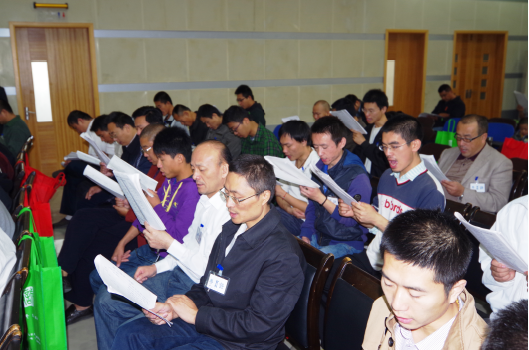

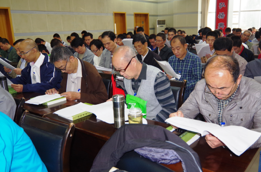

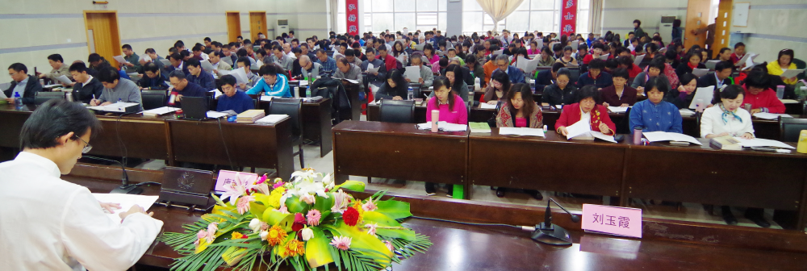

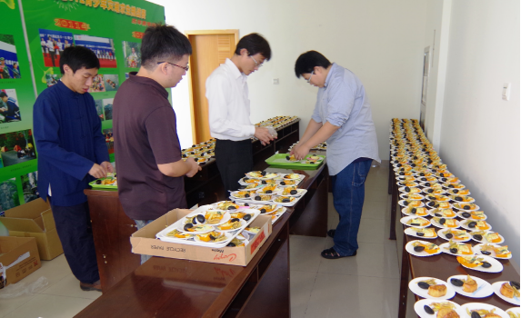

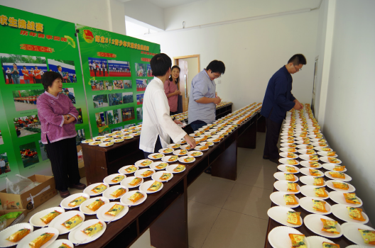

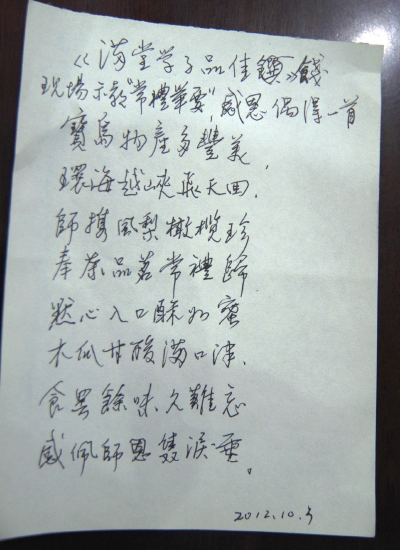

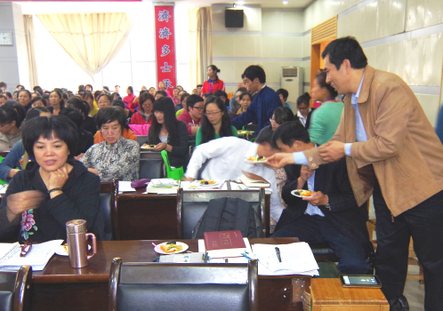

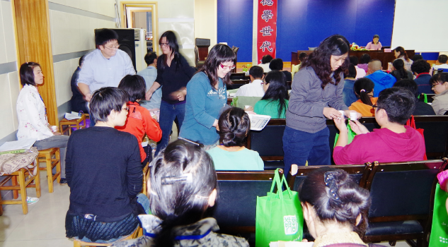

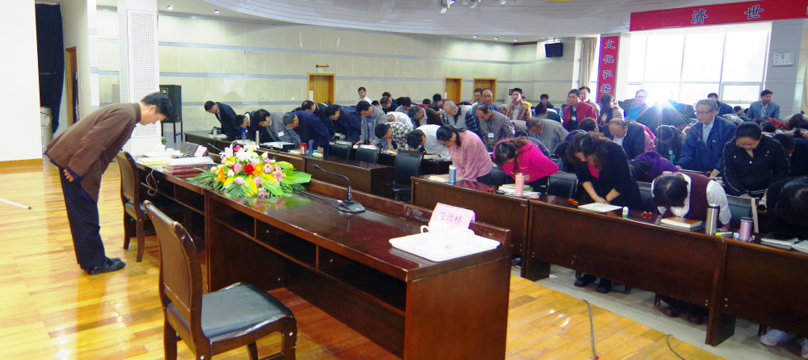

### 兩岸國學文化交流講座〜政和、永康、濟南　山東濟南心得節錄（下）贈詩合集

*編輯部整理*

紀念李炳南先生  聽唐瑜凌先生授課有感

山東濟南 / 林 淼

君生亂世命坎坷，離鄉棄家追孔德。

中華偉幸多桃李，炳燭指南一路歌。

瀋陽學子感恩老師

遼寧瀋陽明明德教育基金／徐鐵民、王  娟、王瑩瑩、王麗新

青青齊魯邦，孔子萬古王。

師道真為主，聖賢處處彰。

雪廬傳兩岸，唐林授子揚。

公有無限愛，眾迷早識央。

沈水四學子，盼君久助茫。

星火將燎原，大道得炎黃。

山東曲阜 /魏慶友

之一

讀書為善，為之不厭，

誨人不倦，行而毋斷。

之二

志道依仁，博學于文。

三省吾身，敬業樂群。

傳承

天將夫子木鐸聲，道統永垂賴雪翁。

聖門松柏春長在，斯文共仰無盡燈。

齊魯師範學院 / 曾凡朝

李老澡雪，出比日月。

炳燭明德，南山巍峨。

### 國家法務人員生命教育研習營—禮樂教化對獄政的功效　課程簡介

*編輯部整理*

人滿為患獄政難

教化能令邪改正

可嘆文化不敵俗

現況無解如蜂忙

二○一二年九月二十日至二十一日

緣起

法務部矯正署與地藏淨宗學會孝廉講堂，為呼應法務部所推動的監獄生命教育活動，於二○一二年九月廿一、廿二日，舉辦為期二日的「生命教育研習營」，本會受邀擔任授課。

本會師承李炳南老教授（雪廬老人），而老人家有十多年在莒縣擔任典獄長的經驗，以其深厚的文化內涵施以德政，教化並管理監獄，頗具成效。（見「獄政改革」之專文介紹）

吾人即秉持雪廬老人精神，選擇老人家所講述、自公老師整理之《論語講要》，從中擇取關於司法獄政改革之道的相關篇章，輔以介紹孔門聖賢—人才格局器度的培養，音樂饗宴—音樂的教化功能，及如何經營太平盛世—清明上河圖介紹等課程。

期盼獄政工作人員將文化之內涵運用於獄政工作，相信可透過上述幾堂課程，生起殊勝的見解，知道如何看待自己的未來，以及對自己家庭的利益、對子孫陰德的加被，如何在困局中找到出路，肯定自己的工作對國家、對民族的貢獻。

課程簡介

論語經典讀誦

中華文化的內涵在經典，尤其是十三經，而十三經的精華在論語。深入經典最好的時機就是清晨，頭腦最清明時，而讀誦又最能與經典建立良好關係，是從生到熟最好的方法。

兩天活動的清早第一堂課即是讀誦，讀誦的內容恰是課程中之「司法獄政改革之道—由論語說起」，心情放輕鬆，以愉悅的心情讀誦，隨著老師的帶領，將此十八章的文字、句讀及活口氣念出，一邊閱讀一邊隨文思考其中義理，可以作預習的準備，也更能吸收老師的講解。

音樂饗宴

音樂可以帶給人快樂，帶給我們生命的能量。音樂像活水源頭一樣，可以滋潤心靈，憂傷、煩惱、哀愁都可以藉由美好的音樂，得到抒解。這就是音樂的教化功能。

人才格局氣度的培養—由孔門聖賢說起

教育是國家根本的基礎，聖賢是文化的核心，孔門高弟即是聖賢的代表，此課程介紹孔子與其十哲弟子，乃至於繼往開來的傳承者─雪廬老人。

學習文化是人生真正的出路，因為具備文化的內涵，擁有解決問題的方法，即知如何化導人心，培養他人成為人才，也能將角色成功的扮演。

老人在民國九年到二十五年間在莒縣任典獄長，以豐沛的學識與涵養，用德政與教化管理監獄。老人對監獄中從事教誨的老師們非常恭敬，路過教誨師空位也必會鞠躬致意。老人亦云：在辦公室窗後廣場定期有說書者，講述前朝歷史故事，詳述善惡報應，感慨這些說書者對化導世道人心有極大的效果。

總而言之，老人家依著自己的德學、修養，以及對經典的深入，配合德政與教育，辦好獄政的教化工作，不但改變了受刑人的一生，讓他們的人生有出路，也莊嚴了自己的人生，改變了自己的命運。

司法獄政改革之道—由論語說起

雪廬老人後來任孔奉祀官府主任秘書兼教讀先生，於民國三十八年跟隨孔上公來到臺灣。在教化後進上不遺餘力，晚年特別講授論語，以發揚及傳承中華文化。此書共有二十篇，四百九十八章，內涵包括政治、文化、教育，及對歷史人物的評斷等。

本次講座特別選出論語中孔子對有關司法、獄政的看法，作為現今改革之道，期望獄政能辦出效果。所選的十八章可找出獄政教化的出路。所依注解《論語講要》，為老人講授論語，抉擇古注（特別是論語集釋），弟子（徐自民老師）集結整理之寶典。

如何經營太平盛世—由清明上河圖說起

辦教育的目的是為了造就太平盛世。清明上河圖從城內到城外，雖然貧富有差距，但百姓活得自在，生活滿足又愉悅。

由此幅圖可看到社會上的風土人情、士農工商來往的禮節，這些風俗、禮節都有導正民俗的用意，所以尊重民族與文化，定能帶給國家安定與繁榮，這是介紹清明上河圖的本懷。

期盼司法人員能將獄政工作扮演好，相信定能帶給國家光明的前途，風調雨順、國泰民安，是所至盼。

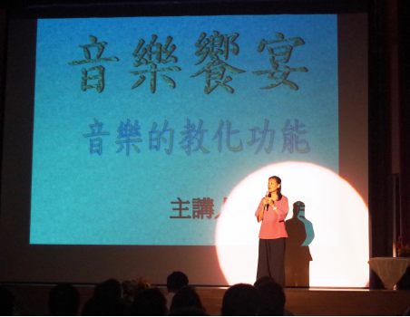

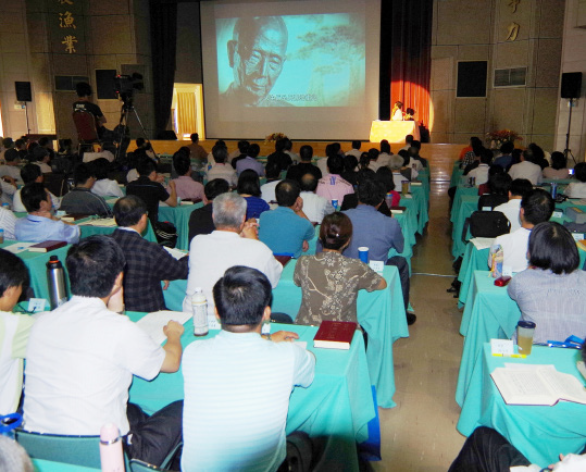

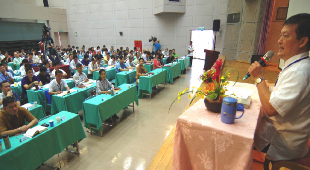

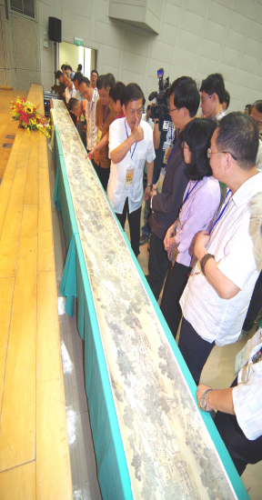

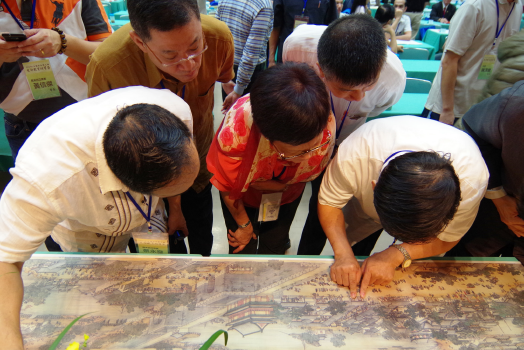

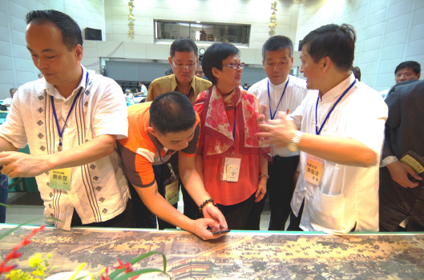

### 國家法務人員生命教育研習營—禮樂教化對獄政的功效　獄政改革

蕭惟元

刑事司法體系包括偵查、追訴、審判以及執行四大部分，四者的重要性可謂不分軒輊，其中有關罪犯執行部分的矯正監督機關，原本由法務部矯正司、矯正人員訓練所，以及臺灣高等法院檢察署所務科等單位分行負責。為了使矯正政策得以完全落實，藉由矯正行政督導一元化來發揮矯正功能，民國九十九年八月十九日，立法院三讀通過了《法務部矯正署組織法》，並於民國一○○年一月一日正式成立法務部矯正署，將原本分散、多頭的矯正機制，整併成為單一專業專責之矯正監督機關。

在矯正機關整併前，獄政上最大的問題，是監所超收以及累（再）犯率的居高不下。依據監察委員民國九十九年五月所做的《監獄、看守所收容人處遇、超收及教化問題之檢討專案調查研究報告》，民國八十八年至九十八年十年間，全臺監所核定總收容人數平均為五萬二千二百七十三人，惟實際之平均總收容人數則為五萬八千四百四十四人，超額六千一百七十一人，超收比例為十一點八百分率，當中最嚴重者，是臺北看守所、桃園監獄、新竹看守所、基隆看守所以及臺南看守所。

以九十八年四月的數據為例，上述監所超收比率，臺北看守所、桃園監獄、新竹看守所、基隆看守所皆超過百分率六十，臺南看守所則超過百分率五十。監所人滿為患，教化的功能自然難以發揮伸展，上述報告指出，各矯正機關直接戒護管理人員與收容人的比率為一比十二點八二，這與香港的一比二點四、日本一比四點六、韓國一比四點七、美國一比四點八、新加坡一比八點三相差懸殊。另外，依據民國八十七年所開始的統計調查發現，出獄後五年內的再犯率，高達百分之五十以上。

面對如此的獄政窘境，相關負責人員以及學者專家，也積極研討對策方案。在監所超收方面，例如增加收容空間、鼓勵繳交罰金以免除監禁、以緩起訴附帶戒癮治療取代監禁、增加社會勞動機制、增加戒護警力等；至於監所教化功能失效，累（再）犯率居高不下的問題，則認為可以增加矯正教化人力，延聘教化志工，辦理受刑人認輔制度，此外還要創新教化特色，諸如強化受刑的家庭支持、開啟受刑人的生命感動點、發掘受刑人的人性光明面、創辦教化電台、開設寫作班、讀書會以及文康活動。以九十七年一月底的調查為例，參與讀書會之收容人共計有九千二百八十二人，同時還有九十五個民間團體、二三六位導讀志工投入監獄教化工作。

以上因應對策與措施確實具有可觀性，然而成果卻是令人沮喪。法務部矯正署成立至今已經一年半，依據該署的資料統計，民國一○一年四月底，全臺監所核定總收容人數為54,593人，實際收容65,121人，超收10,528人，比率仍高達19.3%。這般數據的呈現，使我們不得不再冷靜思考，究竟矯正措施失效的原因何在？今日一切的犯罪理論、矯正思想，無一不是向西方看，往時代的前方走，本文在此暫且停下奮奔的腳步，回首東方聖賢，是否在他們的教語、行誼之中，曾經為我們留下了珍貴的寶藏，值得我們用心去發掘它、運用它。

當前的大環境對於獄政的改善而言，實在是一個充滿艱困的挑戰，敗壞人倫道德的邪思邪見，挾帶著媒體的勢力、網路的力量，殘酷地踐踏著純真的心靈。身處於這樣的氛圍，實在難以單純地將獄政教化的失靈，歸咎於某一端的失調。雖然如此，不代表獄政上的努力，沒有改變人心的希望。

教育是改變人心的唯一出路，早在兩千多年前的古籍《禮記‧學記》中就提到：建國君民，教學為先。雪廬老人曾於民國九年至二十五年大約十七年之間，任職莒縣的監獄管理員（相當今日的典獄長），期間，他興革了老舊的監獄房舍，一切設施務求完善，對於獄囚，老人家本著人溺己溺、哀矜化民的心，皆以人道對待，舉凡飲食、衣被、沐浴、剃髮、書信、接見、作業、運動、疾病乃至於死亡等事，無不關懷，並且定有常規。有關教誨的工作更是特別重視，每週有兩次的集合教誨，個人教誨及類別教誨則無一定次數，每日還有一次的善書宣講。在監所之內並設有圖書部、雅樂部，藉以陶冶獄囚性情，轉化劣習。

除此之外，雪廬老人還以精湛的醫術治療囚犯疾病，若有無依的囚犯病故，則會代為收屍掩埋。所有的囚犯及獄政人員無不受到他的感動，從無越獄之人，甚至某次春節，雪廬老人縱囚返鄉團圓三日，囚犯期至全數返監。以上可見雪廬老人在收容空間、心靈教化、藝文陶冶、生活常規的用心努力，這些施政的地處，今日獄政似乎也未曾遺漏，何以效果卻有天差地別之遠？雪廬老人是以典獄長之姿，由上而下、以身作則地施行教化，他是獄政的主持者也是教育者，不僅擁有辦事的才幹，更有悲天憫人的胸懷。

論語上說：君子之德風，小人之德草。草上之風，必偃。過去周文王為西伯之時，虞、芮兩君主爭田，相約到周家請文王評理。兩君進入周境，所見農人、行人、士大夫，無不是以禮相讓，二君深感慚愧，身為一國之君，竟然不如他國的平民、農夫，於是他們把所爭之田互讓為閒田，這是文王以德化人的典範。孔子的弟子子路，之所以能夠以明快的決斷處理紛爭，令兩造心服，在於他為人的忠信剛直。獄政主事者、行政人員、教育工作者的人文素養、品格情操、自我要求，是監所教化的成敗關鍵，上位者的勤懇學習、自我提升，以真情關懷受刑人，或許才是改善獄政問題的一項正對治。

## 後記

### 回顧與展望

本刊

匆匆一年猛回首

辛酸苦辣甜與甘

有緣共聚積善根

願為眾生開新局

邁入一○二年，回顧過去的一年，正當度過世界末日預言之際，學會有更多機會興辦教化事業，為了鼓勵團體繼續增上，以隨喜之心來回顧團體一年來所做的事業，並且加以檢討改進，繼續以正確的發心、動機、作法、共識，令所承辦的事業功德增長廣大。願團體大眾對未來要興辦的事業能生持續的歡喜心、共識，大家共造善業。以下是民國一○一年全年度所做之法行摘要回顧：

壹、例行共修與文化講座：

一、每週四之三代念佛共修暨《佛遺教經》與《淨土十疑論》講座，每週六晚上大眾念佛共修研學暨《人生大事—助念生西須知》講座。

二、每週的星期一、星期三、星期五晚上七點至九點，分別舉辦〈禮記選講〉、〈論語選講〉以及《普門品》、《法華經》講座。

三、義工培訓：每週三上午《大學》課程。

四、與基隆淨宗學會合辦，舉辦大專青年培訓教法人才講座，每月二日。

五、臺中無盡燈儒佛學會，每週日、一晚間，念佛共修研學暨金剛經研討。

六、中壢研學會，每週三念佛共修與每週一晚間之《常禮舉要》研討。

貳、國學啟蒙教育：

一、固定活動：臺北每週三兒童讀經班及每週六晚間啟蒙班。

二、寒、暑訓：寒期於臺北松山工農興辦道藝人生講座；暑期於臺北舉辦暑假生活體驗營。

參、師資培訓：

於學會有週六下午之《唐詩》講座，《論語》及《大學》研討。

肆、大專講座：

一、於暑期舉辦為期六日的《普賢行願品》講座。

二、於寒期舉辦為期五日之《佛說阿彌陀經》講座。

伍、拜懺法行：

配合春秋祭祖有二次地藏懺，藥師佛聖誕舉行藥師懺，觀音菩薩聖誕舉行大悲懺，以及彌陀聖誕舉辦淨土懺，共計五次。

陸、刊物與光碟出版：

計有《蓮榮會刊》三期、《普門品科文》一冊、《佛說阿彌陀經二譯科會暨雪廬老人筆記、講表、材料》一冊、《淨土十疑論科文》一冊、上果下清律師講述之《普門品大意》光碟片。

柒、蓮友服務：

臨終助念總計護持五位居士往生事宜；並八次探望拜訪蓮友。

捌、專案活動：

一、舉行新春團拜，邀請上果下清律師蒞臨本會開示普門品大意。

二、因江逸子老師福州畫展，舉辦壬辰年大陸古蹟瑰寶參訪五日行。

三、二次前往苗栗幼教師資研習營授課。

四、應法務部矯正署及孝廉講堂地藏淨宗學會之邀，於國家法務人員生命教育研習營擔任師資與行政。

五、應法務部矯正署之邀，為監獄官與監所管理員培訓課程授課。

六、為馬來西亞文化人士七十七人，開設為期八天之文化課程。

玖、年度活動（含各項零星放生活動）：

一、母親節浴佛法會，禮請西蓮淨苑長老慧觀法師及當家師慧道法師蒞臨開示並主持浴佛法會，且隨緣皈依。

二、國內、外共隨緣辦理放生活動四次。

拾、國內齋僧及供養法行：

結夏安居期間於正覺精舍及圓通寺各有一次齋僧法行。另於三峽西蓮淨苑共有九次的齋僧法行，並多次應師父之命到淨苑打掃，莊嚴道場。

拾壹、國外文化講座：

一、四月份，本會應大陸浙江省諸暨市邀請，舉辦文化講座。

二、八月份，本會應大陸福建省政和縣領導邀請，舉辦文化講座。

三、八月份，本會應大陸浙江省永康市龍川學校邀請，舉辦文化講座。

四、十月份，本會應大陸山東省濟南市文化單位邀請，舉辦文化講座。

以上共計支出，放生貳拾玖萬貳仟捌佰捌拾圓整；光碟製作壹佰伍拾捌萬壹仟參佰參拾圓整（壓製畫說論語貳仟片、孔門聖賢參仟片、普門品大意貳仟片，及錄製論語、常禮舉要）；護持國內、外道場暨齋僧金額壹佰柒拾壹萬陸仟貳佰陸拾陸圓整；專案活動費用約壹佰捌拾參萬圓整（年終結緣品、國內外文化講座、啟蒙活動及大專講座）；印書善款約陸拾柒萬圓整；護持雪明講堂製作經典講錄壹佰貳拾萬圓整。

上述各項法行事業，參與者、出資者、出力者，於私上能增進自己的善根福德，於公上能莊嚴團體，安定社會國家。有缺失之處，辦事人員要懷著慚愧、檢討及反省，對於能利樂有情的部分，要生起隨喜及感恩之心。新的一年願大眾以公心繼續善法的造作，成為現世安樂，未來往生及成佛的資糧。相信在有限及短暫的生命中，將是最殊勝的莊嚴。
