# 第88期
.jpg)

## 社論

### 孔子思想對教育的影響

本刊

國家大政尋方向

不中不西最可怕

人格體質材為用

亂象從根去無餘

「德侔天地，道貫古今」是自古以來人們對孔子德行與貢獻的最高肯定。出於其類，拔乎其萃，自生民以來，未有盛於孔子。經過了兩千五百年，歷史的長河之於孔子思想，雖然有如水洗火煉那般的嚴酷，反而確證了孔子之道的歷久彌新。他仍然是人們進德修業、提升涵養、圓滿人生所必須依循的準則。猶如夫子所言：「誰能出不由戶，何莫由斯道也。」是故聯合國教科文組織，將孔子列為世界十大文化名人之首，名實相符地表彰了孔子對人類的影響。

家庭和樂的基礎、企業發展的關鍵、國家安定的條件，都在於人。而教育是造就人才的搖籃，使人真正得以具備人格、發展倫常並培育能力。因此《禮記‧學記》上說：「建國君民，教學為先。」在今日科技高度發達的社會中，我們已經吃盡了物慾洪濤衝擊的苦頭，究竟應該以什麼樣的教學內容為先？教育理論仍然不停的推陳出新，但是述而不作、信而好古的大道仍在。正確地認識孔子思想，以之作為教育的內涵及學習的目標，將可以為我們帶來以下各種影響，彌補今日教育的不足：

一、建立正確的人生觀

人生觀是我們生活的準則，是一種人生的態度，是承擔責任的基礎。一個人能不能有健康的生活，遇到困難有沒有突破的勇氣，所承擔的責任，是個人的責任、團體的責任，或者是國家的責任？承擔的目的在於眼前的享樂，或者是仁以為己任，死而後已那般的偉大，都要看他有什麼樣的人生觀。因此，人生觀籠罩了生命的全景，決定了吾人生命的意義和價值。

孔子思想能夠幫助我們建立正確的人生觀，百年之身因為儒家文化的學習，能夠涵攝千年哲人的眼光。寄蜉蝣於天地的渺小身軀，因為文化而有天行健，君子以自強不息的偉大能量。孔子思想讓人有不苟免於難的膽識，開拓出明明德的智慧、親民的心量，並且能夠止於至善。凡此種種，皆非一般知識所能成就。

二、樹立不朽的楷模

孔老夫子集文化之大成，他有三十而立、四十不惑、五十知天命、六十耳順、七十從心所欲不逾矩的提升歷程；有居官臨民，使國家大治的從政經驗；他周遊列國十四年，備嚐甘苦，然而千錘百鍊，反而薈萃了他刪詩書、定禮樂、贊周易、作春秋的條件，成為幾千年來讀書人所折衷的對象。最為可貴的是，他教化生徒，三千弟子、七十二賢，使他一生的成就能夠在後輩小子的身上延續，他開平民教育之先，被後人譽為至聖先師、萬世師表。學習儒家文化，能使孔老夫子的典範在我們的心中再次煥發光芒，成為我們人生暗路中的燈塔。

三、具備簡擇吸收西方文化的能力

自法國革命和工業革命之後，西方文化自海洋湧入東方，奔騰澎湃，聲勢驚人。對於這樣的文化衝擊，中華民族曾經因為消化不良，而付出了慘痛的代價。今日地球已經成為一村，西風仍然引領在前，並且瀰漫在我們的生活周遭，想要正確地抉擇西方精華，必須先有良好的一套消化系統。畢竟滿口流利的英語，並不等於一顆理性的頭腦，也未必能夠造就健全的身心、暇滿的人生。對於本國文化能夠了解愈深，對於西方文明的了解也愈易。好比見過飛鳥的孩童，就容易向他解釋飛機的模樣。以孔子思想為基礎的傳統文化容易被誤為偏狹，但是古籍中其實包括了廣泛的內涵，舉凡歷史、哲學、文學、政治、經濟、政府制度、軍事、外交等等，絕不偏狹，而虛心追求真理，也是儒家學者的一貫目標。

四、人才的養成

唯有正確的教育內涵，才能為社會國家培養出有用的人才，傳統文化的教學，可以樹立正確的人生觀、倫理觀、道德觀、科學觀、宇宙觀乃至於生死觀。它的內涵，能夠幫助各行各業培養懂得人情世故的人才，有團體意識的人才，足以寄百里之命的人才；而非那種以自己享樂為能，以自我中心為主之人。

五、團體的合作

文化是人類最高智慧發展的結晶，是人類經驗中最珍貴的寶藏，並非人人都能取得、都能具備。因此凡是有求得文化素養機會的人，都可以說是得天獨厚，享受了人間的特惠，相對的，也應當負起傳承文化的特殊責任。傳承文化，有賴團體共學，建立明確的中心思想，並齊聚有共同目標志同道合的人士，彼此相觀而善、切磋琢磨、和合相處、共同奮鬥，引領良善社會風氣的開展，是自利利人所必要的條件。

以上略舉數種學習孔子思想，所能帶來的正面影響，實則良好的人格基礎，可以發展無限可能的美好未來。宋代書法大家米芾對孔老夫子的讚歎為：「孔子，孔子，大哉孔子！孔子以前，既無孔子，孔子以後，更無孔子。孔子，孔子，大哉孔子！」掌握中華民族先天的優勢，學習孔子之道，決定可以是教育瓶頸中的一條出路。

## 大德法語

### 大方廣圓覺修多羅了義經（四十七）

道源老和尚

根本後得依止觀

出世入世相互待

福慧雙修證三身

名為圓覺證涅槃

戊二、四問答別明觀行中根修證

己一、二問答三觀修行

庚一、示三觀行相（威德自在啟請）

辛六、正答所問

壬一、長行

癸三、引例彰圓

經文：

善男子！此三法門，皆是圓覺親近隨順，十方如來因此成佛。十方菩薩種種方便一切同異，皆依如是三種事業，若得圓證，即成圓覺。

三法門第一是奢摩他，第二是三摩缽提，第三是禪那，皆是圓覺親近隨順。說到第三個時已遣除前兩觀。然三個法門（三觀）都是圓覺的親近隨順，一用功就證圓覺，並不教你繞遠路，都是圓覺的親近隨順。也是十方如來的因地發心，成佛的方便，歸納起來不出這三大類。

十方菩薩行的菩薩道，就有無量的方便，度無量的眾生，這些有同、有異的方便，歸納不出這三種，都依這三種為根本的方便。若能精進用功，依此三種事業，就能成就圓覺。即是所謂方便有多門，歸元無二路，無論由哪個城門進來，結果都到城裡邊。

癸四、校量顯勝

經文：

善男子！假使有人修於聖道，教化成就百千萬億阿羅漢、辟支佛果。不如有人，聞此圓覺無礙法門，一剎那頃，隨順修習。

假使有人發了心要學佛道，教化且弘揚佛法的聖道，但是你沒有依著這三個法門來教化眾生，你是依著四諦、十二因緣的法門來教化眾生，教化的結果很好，有百千萬億的眾生，都成了阿羅漢、辟支佛，那你的功德大不大？

不如有人，聞此圓覺無礙法門，一剎那頃，隨順修習。你聽到了如前示的三個法門，且僅一剎那中（很短的時間），隨順修習，此功德超過那一位教化百千萬億的眾生，成阿羅漢或辟支佛的功德。

你種了成佛的種子，決定能成佛，能弘法利生，能令眾生成佛。前位聖者雖教化百千萬億的眾生，但沒有一個成佛的，入到了偏空涅槃坑裡去了，永遠不會成佛。

壬二、偈頌

癸一、標頌

經文：

爾時世尊，欲重宣此義，而說偈言：

癸二、正頌

經文：

威德汝當知！無上大覺心，本際無二相，隨順諸方便，其數即無量。如來總開示，便有三種類。寂靜奢摩他，如鏡照諸像，如幻三摩提，如苗漸增長，禪那唯寂滅，如彼器中鍠。三種妙法門，皆是覺隨順，十方諸如來，及諸大菩薩，因此得成道。三事圓證故，名究竟涅槃。

威德自在菩薩，你應當知道，無上妙覺心（圓覺心），其體性與一切法體性沒有差別相。隨順眾生的根機，就有無盡數的方便。

如來總開示，歸納起來，便有三種類：一是寂靜奢摩他，如鏡照諸像，十方諸佛的心如鏡子現相；二是如幻三摩缽提，所修如幻三昧能令菩提苗漸漸增長，如同土裡所種的種子能生苗；第三是禪那唯寂滅，如彼器中鍠，禪那唯寂滅，是不生不滅的行門，不是小乘的偏空寂滅，如樂器裡的鍠，讓聲音超出境外。

這三種微妙的法門，皆是圓覺的隨順。十方如來依此三行門成佛道，一切大菩薩成佛，也是依此三法門。這三種觀想，若能圓滿證得謂之究竟涅槃（佛的大涅槃）。

庚二、明單複圓修（辯音啟請）

辛一、辯音啟請

經文：

於是辯音菩薩，在大眾中，即從座起，頂禮佛足，右繞三匝，長跪叉手而白佛言：

辛二、正陳請詞

壬一、慶前

經文：

大悲世尊！如是法門，甚為希有。

先讚歎佛說法說得好，希有就是少有，是聞所未聞，從來沒有聽見過。

壬二、請後

癸一、問所修

經文：

世尊！此諸方便，一切菩薩於圓覺門，有幾修習？

前述歸納修學圓覺方便有三種，此諸方便，就是這三種方便。一切菩薩於這圓覺法門之中，有幾種的修習？此問不是再問上述圓覺方便三種以外，而是問修這三種法門，是只修一種？還是二種、三種？或是有前有後（第一、第二、第三方便）？要如何修？或是可以超越修？或是依次修呢？

癸二、明所為

經文：

願為大眾及末世眾生，方便開示，令悟實相。作是語已，五體投地。如是三請，終而復始。

問這些修習方便的目的是令我們，尤其末法時代的眾生，透過佛之開示，能知如何修學圓覺，令我們能覺悟實相（圓覺妙性），圓覺妙性是一切法真實之相。

辛三、如來讚許

經文：

爾時世尊告辯音菩薩言：善哉善哉！善男子！汝等乃能為諸大眾及末世眾生，問於如來，如是修習。汝今諦聽，當為汝說。

問於如來，修這三種觀行時，是怎麼個修法？是三種都要修？還是依三種根器修三種？或是依次的修？或是越次的修？

辛四、承教靜聽

經文：時

辯音菩薩奉教歡喜，及諸大眾，默然而聽。

辛五、正答所問

壬一、長行

癸一、舉意標數

經文：

善男子！一切如來圓覺清淨，本無修習，及修習者。一切菩薩，及末世眾生，依於未覺，幻力修習，爾時便有二十五種清淨定輪。

叫一聲當機者（善男子），先說根本的道理，怕我們著相。這一切圓覺清淨的妙行，如何謂之清淨呢？遠離諸相謂之清淨，無能修習的人，也沒有所修行的法，沒有能所之相（沒有修習及修習者），謂之圓覺清淨。一切初發心的菩薩及末世的眾生，未證到圓覺之前，修習如幻如化，謂之幻力修習，共有二十五種的圓覺行門，二十五種觀行，謂二十五種定輪。

名為輪是具足二種意：一是摧碾意，二是運載意，將地上凹凸處碾平，謂之摧碾意；其次車輪能以運載物品，運載眾生，由此路到彼路，這是運載意。如來說法謂之法輪（教法輪），眾生觀行也叫法輪（證法輪），能以摧碾一切煩惱，能以運載有情到佛位。雖然有二十五個觀輪，都是清淨，都是圓覺隨順，圓覺無相，雖說是定輪也不能著相。

這二十五定輪可攝為幾類，將前述三個觀門（奢摩他、三摩缽提、禪那），攝持為單修三觀，不是一個人修三種，一個人修一種就可以，謂之：單修奢摩他，單修三摩鉢提，單修禪那。

其次依奢摩他（靜觀）為首，先修此觀，後修二觀或一、或二，交羅起來共有七種，以上是交絡三觀第一段；第二段是依三摩鉢提（幻觀）為首，交羅起來亦有七種；第三大段是依禪那（寂滅）為首，交羅起來有七種，共二十一觀，加前三種單修為二十四觀，最後圓修三觀，共二十五，謂之二十五種清淨定輪（二十五種觀門）。

每一個觀門都有一個名，圓瑛法師講義，所定的二十五觀門之科目是依著圭峰大師的疏鈔，圭峰大師依著二十五種定輪，例二十五種譬喻。（下期待續）

### 正覺精舍結夏安居—果公法語開示

*編輯部整理*

草庵念佛心要頌

一念相應一念佛

三身四智皆所緣

佛像佛名為能入

民國一○一年七月廿二日

諸位法師，諸位在家菩薩們，大家午安。

今天非常歡喜，跟我們無盡燈的菩薩們共聚ㄧ堂，諸位發大心來齋僧，功德無量，為了酬報各位的恩德，特別向諸位宣說宋朝草庵法師所作的〈念佛心要頌〉（含序文）。

先簡介法師的生平事蹟，法師名號道因，字草庵，俗姓薛，明州地方人，即現在的浙江省奉化縣。法師十七歲就受了具足戒，從學於明州的智立法師，遍歷講壇，屢次參訪禪室，讀到四明尊者的〈十不二門指要鈔〉，他就有所省悟，於是就遙禮四明尊者法智大師為師（觀經妙宗鈔的作者）。

草庵法師歷主永明、寶雲、廣受、治平諸大叢林，晚年住持延慶寺，乾德三年四月十七日，以讚頌彌陀（即草庵法師所作之〈念佛心要頌〉）告別徒眾，讚曰：「無邊剎海海涵空，海空全是蓮華宮。蓮宮周遍遍空海，空海獨露彌陀容。阿彌陀佛不生滅，難覓難拈水中月。絕非離句如是身，如是感通如是說。我與彌陀本不異，妄覺潛生忽成異。從今掃盡空有塵，父子天然兩相值。誓修三福勤六念，身口意業無瑕玷。我今以此念彌陀，不見彌陀終不厭。」之後，隨眾念佛數百聲，再誦觀經，誦到上品上生觀，法師就斂念坐脫（坐著就往生了）。

經過三天後法師頂上猶溫，證明往生無疑，以上是根據佛祖統紀簡單敘述。

其次解釋彌陀讚的序文：

「釋迦如來說：阿彌陀佛是法界身。天台智者又言：實相為體。憑茲二說，以為心要，則十萬億剎，若臨明鏡矣。聊成拙頌，自印其心，或有知音能隨喜否。」

釋迦牟尼佛宣說，阿彌陀佛是法界身，何謂法界身？也就是報佛所證的法界（身），法界身也就是佛的法身，法身是無所不遍的，以整個法界為體，謂之法界身。觀經說：「諸佛如來是法界身，入一切眾生心想中。」阿彌陀佛的法身，含攝了十方微塵的剎土，亦即法界無盡功德藏身，這個就是法界身。眾生沒有想佛、沒有念佛，好像跟佛的法身沒有關係，若能念佛、觀想佛，則佛的法身就入到你的心。

天台智者大師又說，實相為體，大乘經都是以實相為印，小乘經典是三法印：無常、無我、涅槃寂靜。大乘佛法是以實相為體，以實相做為大乘經的正體。無量功德共同莊嚴這個理體（實相的理體），種種梵行，都是不離這個理體，種種的研究、問答都是為了詮釋諸法實相，就好比眾星圍著北極星一樣，眾星圍拱北極星；亦如中國的河流都往東流，注於東海，萬流歸宗東海，所以觀經、彌陀經、無量壽經等大乘經都是以實相為經的正體。

依憑上述兩種的說法（阿彌陀佛是法界身，實相為體），作為修心重要旨趣，則十萬億剎（指娑婆世界與極樂世界相隔有十萬億佛國土），隔而不隔，若臨明鏡。十萬億剎在《佛說阿彌陀經》說到，佛告長老舍利弗：「從是西方，過十萬億佛土，有世界名曰極樂，其土有佛，號阿彌陀，今現在說法。」從娑婆世界往西經過十萬億佛國土，有一個世界名曰極樂，有佛號阿彌陀，本師在娑婆世界為眾生說法的當下，阿彌陀佛也在極樂世界為諸聖賢們說法，所以是「今現在說法」。

雖我們距離極樂世界有十萬億佛國土，但能了知阿彌陀佛是法界身，又了知實相為體，憑這兩種說法作為心要，則極樂世界與娑婆世界如同映現在明鏡裡，如同無距離般。往生極樂世界是第八識往生，一彈指頃（一剎那間）就去了，不是走路去，走路要走到什麼時候，而且也會迷路！有阿彌陀佛接引，動念即到，如同心念想著太陽，馬上可到太陽，心念想著月亮就到月亮去了，你看那麼快，心想著極樂世界心就到極樂世界去了，臨命終決志求生就是如此快速到極樂世界，以上序文，其次正式解釋正文。

頌文：

「無邊剎海海涵空，海空全是蓮華宮。蓮宮周遍遍空海，空海獨露彌陀容。阿彌陀佛不生滅，難覓難拈水中月。」

整個宇宙有無量無邊的剎海，每個剎土深廣如大海，稱為剎海，無邊剎海含攝於虛空當中。剎海、虛空完全是蓮花的宮殿。蓮花的宮殿周遍於整個虛空、剎海。在虛空、剎海中獨自顯露出阿彌陀佛的容貌來，觀經說阿彌陀佛有六十萬億那由他恆河沙由旬如此的廣大。阿彌陀佛的法身，是不生不滅。念佛時須知名號即法身，昔日雪公老師引《華嚴經》的〈明法品〉：「常念諸佛，心無暫捨。了知音聲，體性平等。」由這一段就足以證驗諸大菩薩都是常念佛的，菩薩所念的不是一尊佛而已，然文殊菩薩、普賢菩薩都只專念彌陀。

至於念佛的方法很多，大約有持名、觀想、觀像、實相這四種。觀想法中又開出許多門，如觀想阿彌陀佛，或者觀想佛的三十二相，或者觀想四十八願，或者觀想佛其他種種的功德，然以執持佛的名號最為容易、成就最為迅速，持名稱為徑中徑又徑的法門，是成功捷徑當中的捷徑。然而無論修哪一種法，都必須心無暫捨，方容易成就。

什麼叫作心無暫捨？並不是叫我們終日念佛，其他事都不做，你不做誰要做？你的事業你不去辦誰要去辦？你要是專修則可以，不是專修時，不必整天念佛，什麼事都不做，而是一切事業皆為念佛，謂之心無暫捨。

了知音聲，體性平等。乃徹底知道音聲體性平等，音聲就是佛號，特別是阿彌陀佛的聖號，體性是什麼？是佛的法身，名號與法身平等，阿彌陀佛的名號就是阿彌陀佛的法身，念佛時你與佛的法身都在一塊，所以為什麼到臨命終我們念佛只要伏住惑，正念分明，就可以往生，就是你已經跟阿彌陀佛法身相應了，當然可以往生，此處說阿彌陀佛不生滅，指的是阿彌陀佛的法身是不生不滅、不垢不淨、不增不減的。

因為我們念佛有時妄想紛飛，臨終念佛就是為了與佛的法身相應，如果打妄想佛號就跑掉了，就好像水中月，水不平靜，月就跑掉看不清楚了。念佛打瞌睡，或者心散亂了，如同抓水中月一樣抓不住，當念佛正念分明萬緣放下時，你就看到水中月，與佛相應。所以我們要涵養功夫，念佛要念到一心不亂，證得念佛三昧，此時再也不亂了。與佛的法身相應不離開，如同已經見到真月，不只見到水中月，因為水中月會隨風飄動。

如何培養常常見到阿彌陀佛的法身？當我們念佛時，無論出聲、默念，要緊的是聽得清清楚楚，句句分明。你聽清楚了，表示你一心沒有昏沉、沒有散亂，就與阿彌陀佛法身相應了，你一昏沉、一散亂，心就跑掉了，所以說「難覓難拈水中月」。總之念佛要注意聽，無論出聲、默念都要聽清楚，聽清楚表示你心在焉，念茲在茲，不打妄想，不起雜念。

頌文：

「絕非離句如是身，如是感通如是說。」

絕非是絕百非，離句就是離四句，百非是從四句開出來的。四句是：有、無、亦有亦無、非有非無。執著有句是增益謗，執著無句是損減謗，執著亦有亦無是相違謗，執著非有非無叫做戲論謗。所以我們要離開四句之過，四句之過開出就是百非，四句料簡就是十六句，配合過去、現在、未來，十六句乘三就是四十八句，已起有四十八句、未起有四十八句，就九十六句，再加上根本四句，就百句，這叫作百非，這百非都要厭離、要斷絕，所以絕非就是絕百非，離句就是離四句過。

蕅益大師《彌陀要解》云：實相妙理，古今不變，謂之如；依實相理，念佛求生淨土，決定無非，曰是。乃依實相理體求生極樂淨土，決定不錯，我們有所感，阿彌陀佛就有所應，所以如來宣說的，依實相妙理，求生極樂世界，決定沒有錯，就是這麼宣說的。

頌文：

「我與彌陀本不異，妄覺潛生忽成異。從今掃盡空有塵，父子天然兩相值。」

我與彌陀本不異：我與阿彌陀佛本來沒有差異的，因為眾生皆有佛性（真如本性），然而到現在真如本性還是顯現不出來，由於有我執（煩惱障），有法執（所知障），就障蔽了我們的真如本性，所以真如本性的萬德萬能就彰顯不出來，所以我們現在還是受用凡夫的境界，然而我與彌陀佛性都一樣沒有差異。

我們眾生背覺合塵，違背了靈靈覺覺的本性，心與五欲六塵合在一塊，貪婪成性，遮障了我們的本性；而阿彌陀佛是背塵合覺，所以佛與眾生當然就不同啦！突然成為有所差異了，潛生就是暗暗生起，我們眾生背離覺性，暗暗生起，突然與阿彌陀佛成為差異，阿彌陀佛是背塵合覺，我們是背覺合塵，所以二者不同，背道而馳。

我們從今以後，要掃除執空執有的成見，二乘聖者執空，我們凡夫眾生執有，塵比喻煩惱，將這些執著的成見完全掃除，空有不著。如此則阿彌陀佛如父，凡夫眾生如子，父子是天性相關的，如同磁石吸鐵，我們與阿彌陀佛兩相值。我們眾生就跟大慈悲的阿彌陀佛的慈父愛就感應道交，就碰在一塊了，能夠見面、相應了。

頌文：

「誓修三福勤六念，身口意業無瑕玷。我今以此念彌陀，不見彌陀終不厭。」

佛陀在《觀經》裡面說：

「欲生彼國者，當修三福：『一者孝養父母、奉事師長、慈心不殺、修十善業。二者受持三皈、具足眾戒、不犯威儀。三者發菩提心、深信因果、讀誦大乘、勸進行者。如此三事，名為淨業。』」

講到孝養父母，有世間孝、出世間孝的區別。論世間孝，父母在生，我們要將美好的飲食、輕暖的衣服，更換適宜。在夏天，過去沒有電風扇、冷氣，在這種晚上要睡之前，做孝子的人就拿著扇子將床蓆扇涼，再請父母入睡。

現在我們有能力裝冷氣設備或者電風扇，隨著我們經濟能力辦得到的，我們就為父母施設；至於飲食，要視父母親，他能夠吃甚麼樣的飲食，就我們的經濟能力好好的預備供養父母親。若父母親過世，一切喪葬要盡禮。不論父母在或不在，我們都要服務於社會，或者做官為國家來效勞。甚而以身行道，所行的合乎道德仁義，來榮顯父母親，不為非作歹，侮辱父母親，以上是世間之孝。

至於出世間之孝，除了供養等表顯之外，應該要勸勉父母親皈依三寶，茹素念佛，只願父母的神靈能超出苦海，往生極樂世界，所以蓮池大師說：親得離塵垢，子道方成就。往生到極樂世界，惑業雖然還沒斷盡，然決定慢慢盡除，乃至成佛已，所以這種孝順之道成就，謂之子道方成就，以上是孝養父母。

第二奉事師長：

師長也有世間師長、出世間師長。世間的師長教導我們世間的技藝、學問，更有教導我們孝弟忠信、禮義倫常，乃至國土風情等，這些人都是屬於世間的師長。出世間的師長就是教導我們了生脫死，超凡入聖，乃至將來成佛普渡眾生的人，這些弘揚佛法的老師們就是我們出世間的師長。世間的師長，對我們已是大恩德，何況是出世間的師長，所以我們都應當好好的回報。

慈心不殺：

我們對一切眾生要慈悲，不要殺害一切眾生，因為一切眾生都是我們過去的父母，未來的諸佛。假如故意殺害眾生，等於故意殺害過去的父母，也故意殺未來的諸佛。

修十善業：

身業過惡有三：殺生、偷盜、邪婬；口業有四：妄語、綺語、兩舌、惡口；意業有三：貪、瞋、癡。反過來不殺生、不偷盜、不邪淫，就是身的三種善業；不妄語、不綺語、不兩舌、不惡口，就是口的四種善業；不貪欲、不瞋恚、不愚癡，就是意的三種善業，合起來就是十善業。以上是第一福業。

其次

第二福業，受持三皈：

皈依三寶成為三寶弟子，三寶的功德是難以窮盡。護持三寶，能令有情出離苦海，世間如同苦海，三寶能夠渡越；生死如同長夜，三寶能夠照明；眾生有貧窮，三寶能使令滿足，所以功德是無窮無盡的。從師皈依謂之受，受了之後念念不忘謂之持，以上謂之受持三皈。

具

足眾戒，不犯威儀：

皈依三寶進一步受戒，有時候受八關齋戒，進一步受菩薩戒，諸位也有不少受菩薩戒，受了戒之後，就好好的輕重等持，持輕戒與重戒是以平等心守持的，謂之具足眾戒。

不犯威儀：

連微細的威儀都不違犯，謂之不犯威儀，如同吃飯不講話，睡覺也不講話，走路有走路的相，坐有坐相，行有行相，立有立相。所謂：坐如鐘、臥如弓、行如風、立如松。以上就是不犯威儀。

再者

第三福，發菩提心：

假若我們修淨土法門，專為自己一人發心，求生極樂，不名發菩提心。應當普為法界一切眾生，發願求生極樂世界，之後分身十方，普度眾生，同歸極樂，謂之發菩提心。

深信因果：

應當深信生死是隨煩惱而有的，所做的善惡業因都有果報，且是如影隨形，如響來應聲一般。然說到因果，有世間因果、出世間因果的區別。以世間因果而論，縱然善業造到極點，畢竟生天而已，天福享盡就要墮落，謂之有漏，不究竟；出世間的因果則造善到極點（福慧圓滿），則畢竟成佛，永遠不退轉，永遠不生不滅。亦即我們成了佛就不生不滅。或云：本師世尊不是生滅嗎？他是示現生滅，其實已證得不生不滅的本性了，入滅是示現的，這個世界有緣的眾生度盡了，就示現離開了，到其他世界去八相成道，度化眾生。

讀誦大乘：

對經本讀熟了，不看本子能夠背誦，謂之能誦。所以通常稱誦戒，戒就是要誦，誦五戒比較容易，五條而已！若是菩薩戒就有十重四十八輕戒，這些十重、四十八輕戒的戒相（戒條）都要背起來，謂之誦。所謂半個月誦戒，就是不看戒本也能誦，謂之誦戒，對著戒本子念謂之讀戒。所以我們受戒的蓮友們，發心要做到哪個戒，就要把它誦起來，這個戒條就在你的心裡，歷境逢緣有沒有違犯就知道，你不會誦，歷境逢緣到底有犯沒犯，我回去再查一查，來不及了！能誦念，一對境就有辦法，還要回去查一查，則來不及了。若背在心裡，歷境逢緣就知道我做錯了，犯了佛所制的戒，須懺悔，此方不犯。

至於讀誦的大乘經典，大乘經的名稱很多，就淨土法門來講，如《佛說阿彌陀經》、《無量壽經》、《觀無量壽佛經》、《普賢菩薩行願品》、《大勢至菩薩念佛圓通章》都是大乘經，以上這是《淨土五經》。五經之外，假若還有時間，也不妨念《華嚴經》，唐譯的有八十卷，晉譯的有六十卷；其次如《大佛頂首楞嚴經》有十卷；《法華經》七卷，這些都是大乘經；另有《大般若經》六百卷，夠我們念了！但是，我們時間沒有那麼多，不妨《淨土五經》輪流讀誦，然後天天好好念佛，凡做什麼事都要念佛，你心無暫捨，這樣修就容易成就。

勸進行者：

未曾發心的我們勸發心，已經發心的幫助使令增進。所以大慈菩薩勸修西方偈有云：「能勸二人修，比自己精進。勸至十餘人，福德已無量。如勸百與千，名為真菩薩。又能過萬數，即是阿彌陀。」意即勸兩個人來修持比自己一個人修持來的精進，你能勸到十多個人都跟你這樣子辦道，你的福德已經無量了，如果你可以勸一百人或者一千人修學，你就是真正的菩薩。能夠勸超過一萬個，你就像阿彌陀佛。以上是誓修三福。欲得往生極樂世界者，要兼帶修這三種福業。

其次

精勤六念。六念：念佛、念法、念僧、念戒、念施、念天。

念佛，佛就是慈悲的導師；念法，法是三世的佛母；念僧，是人天的福田；念戒，戒能清淨我們的身心；念施，能普濟貧窮；念天，天可指第一義天，念念不忘諸法實相，求證中道妙理謂之念天。以上是精勤六念。

身口意三業都沒有瑕疵的毛病，瑕疵是白玉有了赤色的斑，那就不完善了，本來一塊美玉（白玉），有了紅色的斑點，那就不好看，有瑕疵了，謂之瑕玷。我們要好好修身口意業，令三業沒有瑕疵，亦即連小過失都沒有。

好好念阿彌陀佛，不見阿彌陀佛，我終究是不滿足，我們能常常正念分明，其實就常常見到阿彌陀佛了，見到阿彌陀佛的法身。我們念佛有功夫了，可以在定中見佛，或者是報身佛，或者是應身佛。

另外也告訴諸位一個小祕密，應身佛是甚麼？泥塑的或者是木雕或是紙繪畫的佛像，都是應化身佛。普通一般沒有信佛的人，把佛像當作藝術品，一點恭敬心都沒有，見到應身佛等於不見。對著佛像，以恭敬至誠之心禮拜，就是見到應身佛。若不恭敬尊重禮拜，見佛等於不見。所以我們對著佛像至誠恭敬，就是天天都見到應身佛了，你看多好！

你念佛就跟阿彌陀佛法身相應了，等於見到法身佛了，我們往往當面錯過，此即是心做佛，是心是佛的道理，不善用其心，當面錯過，入寶山，空手回。

今天說到這兒，希望諸位都能夠有所受用，回去時好好修持，如此則非常殊勝！

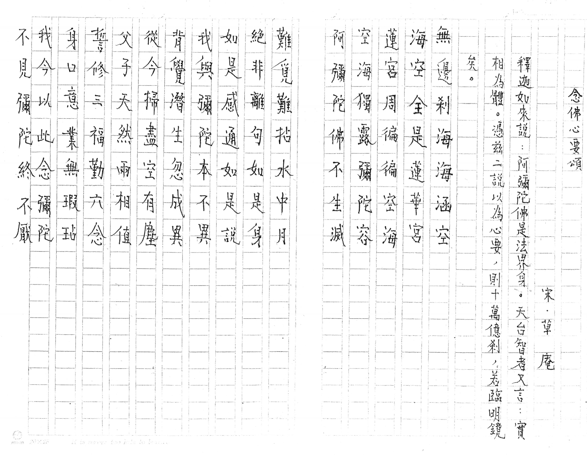

## 共修研學

### 小止觀導覽（六十）

*心爾、治心整理*

善根乃對法體會

透過止觀強有力

出入定皆須修學

比量現量破煩惱

第七章  善根發

上述分別真偽禪，已將邪偽禪修作一說明，指禪定生起的瑞相，或是鬼神加被，或是四大變化的顯現，或者是動機不清淨，從禪定中夾帶生起，若有正知見了知其虛誑，正觀此妙境不受不著，這些似瑞相的現象自然不會障礙到我們的善根。

下述乃真正禪的發相。

論文：

二者、辨真正禪發相：行者若於坐中發諸禪時，無有如上所說諸邪法等，隨一一禪發時，即覺與定相應。空明清淨，內心喜悅；憺然快樂，無有覆蓋；善心開發，信敬增長；智鑒分明，身心柔軟；微妙虛寂，厭患世間；無為無欲，出入自在；是為正禪發相。

行者如果禪修時發諸瑞相，而無前述邪偽現象，忽然覺得內心快樂，很舒服，身體很輕鬆，很大的法喜使內心安住在所緣境上的力量就越強，對於世間的安樂已無興趣，對世間無希求，也無造作，出所緣境及入所緣境都非常自在，是真正發禪定的現象。

真正禪發相生起，相應的狀態是：

（一）空明清淨，內心喜悅；空就是空朗朗的，明就是緣念境界的心很明亮（不暗），由於禪定的內心是明亮與空曠，所感得的世界寬廣，居住的宮殿甚至比太陽光還要亮，卻不會刺眼，就是因為在修禪定時，內心世界是既空又明。

（二）憺然快樂，無有覆蓋。禪定的力量使得內心生起很大的法喜，身心安樂，不會將善根覆蓋，反而會引發對三寶的恭敬與皈依等諸善根。

（三）善心開發，信敬增長。當禪定的法喜引發善根時，自然對三寶、師長、正法等，增長恭敬心與信心。

（四）智鑒分明，身心柔軟。比如在定中修行無常、空性、皈依、念佛等等，能幫助我們生起入世的察覺力，對無常、苦特別有感受與體會，謂之智鑒分明。

了知世間不過就是這麼回事，所以不會受世間五欲六塵所影響，亦即不會生起世俗煩惱，謂之身心柔軟，對教法吸收的能力也轉強。

（五）微妙虛寂，厭患世間。微妙是一種說不出來的安定自在，完全沒有煩惱的擾動，曉得這個世間都是虛妄不實的，所以厭患世間，安心在禪定當中。

微妙虛寂的「微」就是很微細，「妙」是很精妙，「虛」是很空虛，「寂」就是不生。意思就是說世俗的煩惱不容易生起，安住在佛法上的心力非常強，若是安住在空性義理則更殊勝。修行人的心思無法用世間的名利、五欲去束縛他，所以難猜透他是什麼心。

（六）無為無欲，出入自在。禪定修成的人，出定也很容易再次入定。由於極大的身心安樂，故對這世間沒有欲求，也不會為了貪求世間安樂而造作，謂之無為。

以上六條是真正禪發相（內善根發相），行者修止觀，如果動機與方法是正確的，過程是講究的，外境有善知識、團體與三寶的加被，目標是明確的，必然能發上述禪定善根，且令世間人覺得你的氣質改變，然說不出所以然。其次自己對佛法的信心越來越強，由信心轉成信念，由信念轉成行動，由行動轉成潛力，潛力又加強信念，在善法上所做的功德都比一般世間人所做的功德大多了。

論文：

譬如與惡人共事，恆相觸惱；若與善人共事，久見其美。分別邪正二種禪發之相，亦復如是。

譬如有人與惡人共事，為了名利打拚，表面看似和合，其實各懷鬼胎，這樣的組合得不到真正的快樂，常常為了名利爭執與對立，謂之恆相觸惱。

若與善人共事，互相為對方著想，心裡感受到人生之美與快樂。分別邪禪發相，過患如與惡人共事，恆相觸惱。正禪發相如同與善人共事，久見其美。

論文：

三、明用止觀長養諸善根者：若於坐中諸善根發時，應用止觀二法修令增進。若宜用止、則以止修之；若宜用觀，則以觀修之。具如前說略示大意矣。

止是以某一境界為所緣，如五蘊、十二處，或者十八界等，安住其上，觀則透過教法對該境的觀察，如觀其是否剎那變化，生起無常的比量，出定時，那種世間變動不羈的感覺就會產生。

若不斷地用比量的推理，最後越過比量直接顯現該法的真實面相，謂之現量親證。此即用止觀去長養善根，例如長養無常的善根、皈依的善根、菩提心的善根、空性智慧的善根。這樣的人出定以後利益有情的心強太多了。

善根發到底是內善根發？還是外善根發？內善根發裡面，到底發的對還是發的錯？善根的長養需透過止觀，止觀不只是培育善根，讓善根成熟，出定做善法時，也要運用止觀來成就善法的功德，止觀門非常重要，三乘的功德皆以止觀而得。一般學佛的人，大部分可能在教門上花很多的心，止觀門是另一個系統的學問，一般人是因緣上較少去碰觸它，其實這一門的重要性不亞於教門。（下期待續）

### 菩薩清淨的行持　華嚴經淨行品（四）

*編輯部整理*

十力能具道因緣

亦即成道條件十

一一具足真修行

果上智德亦十力

甲一、智首問舉德徵因

乙二、陳所疑之問

丙二、別問行所成德

丁三—具道因緣

前述成就眾慧部分，不僅幫助我們了解成為修道之器的因及利益，進而具足眾慧，有勝解的抉擇力，才能真正利益有情。接續則為具道因緣：

經文：

云何得因力、欲力、方便力、緣力、所緣力、根力、觀察力、奢摩他力、毘缽舍那力、思惟力。

如何得這十種力？

一、因力：

要如何修學，才能得到成佛的因？修學十信位、十住位、十行位、十回向位、十地位，以上五十位的修學都是成佛的因。在南亭老和尚的註解中，有所謂的習種性（十住）、性種性（十行）、道種性（十回向）、聖種性（十地）。

由於發菩提心經過十信位的修學，圓滿入了初住；或說初住位的修學法即是修學十種信心，由此而進入十住位的修學，此時菩提心能不動搖，是成佛的因。

十行位的修學以善法來作為成佛的資糧，這也是成佛的因。

十回向的修學，是將所有善法功德都轉成空性智慧的資糧，依空性的智慧破煩惱障與所知障，這也是成佛的因。

依空性智慧分別破二障成為十地的修學，這也是成佛的因。

雖然上述都是成佛的因，可是真正的關鍵是菩提心（十信位）的修學。如果沒有發菩提心，即使有各種能力，都不是成佛的因，所以菩提心才是最重要的因力。

二、欲力：

如何讓成佛的因能結為果，需要欲力。好樂發菩提心（上求下化），修學佛法，重要的是產生善法欲；有善法欲的人，才會想認真修學佛法。因此，如何使因能結為果的那一分，要靠欲力，很渴望發菩提心並累積成佛的資糧（廣大的菩薩行以及甚深的空性見）。

三、方便力：

有了善法欲，還要有修學善法的方便，令具足上求佛道、下化眾生的方便。以下的緣力、所緣力、根力、觀察力、奢摩他力、毘缽舍那力、思惟力，都是方便力。

四、緣力：

即是否懂得用外緣來幫助自己。好比種子需要水、空氣、陽光來助其開花結果。所以緣力特別指的是教授善知識，同行善知識、外護善知識。《論語》記載宓子賤治單父治理得很好，很有聖者的氣度，完全得力於善知識的引導，孔子說這是真正單父得以治理的原因，這就是緣力。所以方便力當中攝持緣力，彰顯外緣的重要性。

五、所緣力：

內心以外境為所緣時，要懂得對境作觀察，分為兩分：一分是緣眾生的苦作觀察，一分是緣佛的智慧作觀察。緣眾生的苦作觀察，才能生出慈悲心；緣佛的智慧作觀察，才會有種種利益有情的作法，以及成佛的方便。

六、根力：

根力就是五根、五力，是對真理（空性）的體悟。五根：信、進、念、定、慧的五根；五力：信、進、念、定、慧的五力。資糧位（十住、十行、十回向）之後，修學四加行現證空性入初地位，其中煖、頂位是五根成就。忍、世第一位是五力的成就。

七、觀察力：

行者日用平常懂得善於觀察，所謂見賢思齊，見不賢而內省。例如會性法師曾做過慈航法師的侍者，能靈敏的觀察師父弘化的悲心。孔子說：敏而好學。敏就是觀察力，一般人是敏而不好學，或好學而不敏，若能兩者兼具是很難得的。

八、奢摩他力；九、毘缽舍那力：

如果要現證法義、現證無常；現證苦、現證空性，則必須要靠奢摩他力和毘缽舍那力。例如透過五根五力要生起空性的智慧，乃至進入十地菩薩階位，以空性智慧破煩惱障與所知障，都要靠奢摩他力和毘缽舍那力。

十、思惟力：

要使觀力成就得靠思惟力。止中修觀是在止中修思惟，透過思惟力使觀力成就。以上七支是方便力的別，所以智首菩薩的總問，才有文殊菩薩後面的總答。以上是具道因緣。

丁四、於法善巧

經文：

云何得蘊善巧、界善巧、處善巧、緣起善巧、欲界善巧、色界善巧、無色界善巧、過去善巧、未來善巧、現在善巧。

以上十種善巧，皆是菩薩於生死世界中，為利益有情須具足的善巧。其中流轉之體—包含蘊善巧、界善巧、處善巧、緣起善巧。何以會流轉？乃因十二緣起，所顯現的流轉之體即五蘊、十二處、十八界等，以上是流轉的體性。

流轉的處所—含欲界善巧、色界善巧、無色界善巧。

流轉的時間—含過去善巧、未來善巧、現在善巧。

一、蘊善巧：

五蘊之色、受、想、行、識。觀察色蘊是觀察內的五根，外的十二處，也可以說是內六根、外六塵，若單以色蘊來說，是指內的五根。觀察受蘊有苦受、樂受、捨受。觀察想蘊有種種的分別想。觀察行蘊有根本煩惱六、隨煩惱二十、善法十一、不相應行二十四。觀察識蘊，若就中觀宗義乃觀察六個識，若約唯識宗義，利根者主張六個識，鈍根者主張八個識，以上謂之觀察五蘊善巧。

以自己的五蘊為所緣，作這樣的觀察：原來「我」只不過是這些的組合體而已，假名有我，「我」只不過是五蘊集合體上的總說，此集合體是名言我所攝持的差別相。就受而言，有苦受、樂受、捨受。就想而言，有分別想。就行而言，有善心所、惡心所，和不相應心所。就識而言，有六個識，只不過是這些組合。所以，名固然為假，觀待名而生起的差別相又何曾真過，這叫蘊善巧。

三、處善巧：

就是十二處，即心識的生起處。心識要在內六根、外六塵才能生起六識；所以迷心重者修五蘊，迷色重者修十二處，迷心、迷色各一半者修十八界，那是不了義。佛的座下有兩種眾生：對於隨信行的說你必須相信我，對於隨法行的說你必須懷疑我。以懷疑我而言，你必須要以理來成立佛所說的話，才會建立對佛的信心。

所以，五蘊就是在我所攝持的差別相，作差別的觀察。而就心識從哪裡生？來做十二處的觀察。以根、塵、識三個就依報、正報的觀察來說十八界。這裏無所謂迷心重、迷色重的問題，而是依你做什麼的觀察而說的。原來，整個六道輪迴的現象，就是要做這樣的觀察。

四、緣起善巧：

輪迴現象從哪裏來？從十二緣起來，因此，從十二緣起做觀察，無明、行、識、名色、六入、觸、受、愛、取、有、生、老、死，叫做緣起善巧。由此而知，如何會輪迴，以及由輪迴中如何還滅。

五、欲界善巧；六、色界善巧；七、無色界善巧：

以上是指輪迴的處所。成為欲界的因，到底是什麼？而欲界當中還包括六道的現象。就人道來說，為什麼還分成黃種人、黑種人？即使同一種人，也如雪公老師所說：百里不同風，千里不同俗。人居各地風俗會有差異，想法也會有不同，以上是欲界善巧。

六、色界善巧：

此處是修學四禪八定的色界，以及懂得修學內道、外道、凡夫道的色界。

七、無色界的善巧：

同是所緣為無色境，或以外道的修學成為無色界，或以凡夫的修學成為無色界，或是以內道的修學成為無色界，所證雖同，能證則大大不同。無色界無色蘊，為色蘊所攝的前五識不生，無法度有色蘊的有情眾生。內道弟子修學無色界的禪定目的何在？乃所謂無色界善巧。

八、過去善巧：

懂得用過去的經歷、經驗。例如國家在危亂時，過去有立過汗馬功勞的老臣，他才有穩定局勢的能力。過去善巧，也包含了所累積的經驗，所結過的人脈，所作過善業；有了過去的善巧才能突破眼前的瓶頸、障難，扭轉別業、共業，過去善巧的那一分是很重要的。常言道：凡走過必留下足跡，所以別小看過去。

九、未來善巧：

就是規劃未來，如何定位？是一個高瞻遠矚的規劃，還是只看現在；是結合共業的，或是只在乎自己；是一個展望未來的，還是走到生命盡頭的規劃，值得我們深思！所以，未來的善巧，是你真的看到成佛果報的殊勝，做一個成佛的規劃，眼前的每一步都是未來的善巧。

十、現在的善巧：

如何把握現在的順境，逆境都變成修道的增上緣，如何將苦報與樂報都成為種善業的福，謂之現在善巧。反之在順境中生貪，在逆境中生瞋，中庸境中生癡。如憨山大師所云：悲歡離合朝朝鬧，是非窮通日日忙，頃刻一聲鑼鼓歇，不知何處是他鄉。任業力宰割。

淨行品善巧的部分，菩薩想要脫離這世間，他必須對這世間善巧，想要度化有情，想要在共中不共，想要扭轉眾生的共業，也必須對世間善巧。因此，於法善巧、處世善巧以及臨終善巧，淨土法門特別講到臨終助念，有助念跟沒助念是千差萬別。（下期待續）

## 專題研學

### 聖者的祕密～大佛頂首楞嚴經二十五圓通暨七處徵心探源　二十五圓通暨七處徵心簡介　（二十九）觀音廣陳

時哉

妙應希求觀世音

應以何身即現應

願以成佛度眾生

彼為佛身妙示現

巳二、條列妙應

條列是以條列的方式來說明菩薩的妙應，妙應是應著對方的希求，菩薩恰到好處圓滿他的需求。

午一、應希求心

或云：此人念佛，到了臨終時阿彌陀佛竟然沒有接引他去淨土，是不是佛沒感應？實則此人嘴裡念佛，但內心從來沒有企盼往生，他企盼的都是現世的安樂。

同樣的，發菩提心為何是成佛的因？發菩提心是在大慈大悲的基礎上，以佛果為希求，那才是成佛的因，經上並沒有說大慈大悲是成佛的因，經上只有說菩提心是成佛的因，菩提心是在大慈大悲的基礎上，產生一個我想要成佛的心，那才是成佛的因。

如此說來，此人成就阿羅漢果位，應知是他心裡想當阿羅漢；此人會成就緣覺果位，亦是他心裡所想；乃至成為大將軍、大總統亦如此，皆是回應我們的希求心而得的果報。

未一、應求聖眾

觀音菩薩如何回應求證聖果的眾生？其心裡（骨子裡）的想法才是真正得感應的所在，如同往生西方極樂世界與否，不是佛不來應我們，而是我們骨子裡有沒有想要求生的心。淨土法門雖是萬修萬人去，何以是萬修一、二十人去，原因在於修學者骨子裡到底想不想往生？

申一、菩薩

經文：

世尊。若諸菩薩入三摩地，進修無漏，勝解現圓。我現佛身而為說法，令其解脫。

菩薩若想解脫以成佛，此時已入三摩地（四加行），這是修學空慧的加行，故謂之進修無漏。資糧道的菩薩是發菩提心積集現證空性的資糧，四加行（煖、頂、忍、世第一）皆以定而發慧火，四加行的行相都是三摩地。

煖位行相喻指燒掉煩惱柴（木頭）的智慧火還未生，但是木材煖相已生，這叫做煖位。頂位是柴薪已被摩擦到燃點，忍位的行相，是燒木材的火已經發起來了，到了世第一行相時，彈指之間即入見道位，世第一只有一剎那。見道位的行相是燒掉柴薪的火已生起（喻破分別我相）。由此而進修無漏，進破俱生我執及所知障，這些都是勝解現前圓滿。

對於這類想以止觀門修學空慧，勝解無漏以成佛之菩薩，此時觀世音菩薩現佛身而為說法，令其解脫（成佛）。

我現佛身而為說法，令其解脫：對著大乘見道位登地的菩薩，此時觀世音菩薩示現報身佛說法。報身佛與應化身佛有五種不一樣，報身佛的相是八萬四千相，無量隨形好；報身佛說的法一定是大乘法；報身佛的處所一定是實報莊嚴土（另一說是在第四禪第九天的色究竟天之外的密嚴天）；報身佛的眷屬一定是大乘；報身佛在輪迴窮盡之前不入涅槃，然而輪迴不可能窮盡，所以報身佛是不會入涅槃的。

應化身佛正好相反，相是隨緣變，法說五乘法，處所也不一定待在實報莊嚴土，眷屬還包括外道、小乘、凡夫、庸俗，住世的時間亦是隨緣。

報身佛沒有所謂的倒駕慈航，也沒有所謂的示現涅槃，所以應知觀世音菩薩、文殊菩薩這等的報身佛，早就在他自己的實報莊嚴土說法，從來沒有示現涅槃過。

當報身佛現起的第一剎那以後，就不會入涅槃，經云：報身佛是有始無終，法身佛則是無始無終（所證之理法爾如是），應化身佛是有始有終。

申二、獨覺

經文：

若諸有學，寂靜妙明，勝妙現圓。我於彼前現獨覺身而為說法，令其解脫。

諸有學，指的是有志解脫乃至證得初果、二果、三果，或是未證獨覺的有學位。這些諸有學位的二乘人欲登上極果（四果或獨覺），內心非常的安靜（定）寂然（慧），妙明觀修力非常強盛。

我們凡夫的觀修力是薄弱，謂之劣暗（無慧），心亦昏躁（無定）。所以日用平常應該訓練我們內心的寂靜，那是內心不被欲塵所擾動，要練習對教法的觀修力，使之強盛（妙明）。

勝妙現圓是殊勝悟境常常現前，如六祖未見五祖弘忍前常常是這樣的狀況。他們這等人對於善知識更為渴求，所以直接在他心識之前生起最殊勝的果位來度他，例如直接對登地菩薩顯現報身佛來度他，因為此人成就的因緣已成熟。

昔日廣欽老和尚雖是菩薩再來，然示現為山中苦修如獨覺般，是能攝持歡喜地苦行獨自修學以證解脫的行者。

每個人的走向都不同，佛對眾生也只能觀機逗教，雖目標在引眾生成佛，然面對眾生的根器與好樂不同，只好隨順。觀世音菩薩亦然，為了幫助眾生成佛，自己先成佛方能達此目的。

然隨順眾生的根機有正順與逆順，正順是依其根機而度之，無法暢本懷。逆順是知他大乘的根機未來會成熟，然眼前若先引小乘，他大乘的善根就出不來，雖眼前可以幫助他修學小乘，然而卻不度，使他在輪迴中惡業無對治力而生起，先讓他到地獄去受苦，見死不救。經上有：迦葉尊者看見某人小乘根機快要成熟了，準備以聲聞法來度他時，文殊菩薩先以大乘法度他，結果他眼前不契機，煩惱業先生而墮地獄。迦葉尊者向佛抱怨文殊菩薩不善巧，佛說這種細微的緣起非迦葉尊者所了知。所以聖人的智慧與凡夫的智慧是無法相提並論。

例如今日民主制度標榜的是選舉，則堯舜的選賢舉能才是孔子心中真正的選舉，刻薄寡恩的民心絕對選不出勤政愛民的正人君子，若將人民教成刻薄寡恩，如此民主制度絕對選不出人才，只會高唱主權在民，反而會害死人民，腐敗國家。（下期待續）

### 孔子聖蹟圖淺說（三）

*編輯部整理*

歷練基層向上志

好學禮樂不恥問

千里迢迢相見晚

入世亦是龍在天

五、職司乘田

這幅是「職司乘田」圖。周景王十四年，魯昭公十一年，西元前五三一年，孔子二十一歲時，改任乘田吏，此項職務是主管苑囿芻牧，也就是在牧園內放牧牲畜吃草，畜養牛羊牲畜，使牛羊繁殖眾多並長養肥壯。

孔子曾做過委吏，就是倉庫的管理員，做事公正，表現出色，此時被派去整頓畜牧業。古代國家最重視農業與畜牧業。幫助國家管理及畜養牛、馬、羊等牲畜，使其肥壯與繁衍不斷，也是協助國力強盛的重要工作，職位雖然並不崇高，可是孔子不計較職位的高低，仍然盡心盡力，使牛羊蕃滋茁壯，厚增國力。

畫中右側樹下，站著一位氣宇軒昂，雙手揹在腰後的年輕人，就是孔子，他兩眼專注的望著遠方，似乎正在關注所飼養的牛羊狀況。身旁有童子隨侍在後，前方的牧童正趕著牛吃草，牛隻與牧童回頭望著孔子，好像是感激他的關懷與照顧，顯現出一幅祥和溫馨、真情流露的自然情景。

六、學琴師襄

周景王二十二年，魯昭公十九年，西元前五二三年，孔子二十九歲，到晉國向師襄學琴，十日中不更換新曲。他在不斷的演練中，細心體味推求曲子的節度、志趣，以及作曲者的形象、為人，終而悟出「非文王，誰能為此也」，使師襄子驚歎聖人的智慧，而告訴他說，此曲確為〈文王操〉。

畫中左邊中央，坐在席上，老成持重，額頭寬闊，拱手回禮者，就是孔子。座前几上擺著古琴，想必是剛彈完精彩絕倫的<文王操>，驚動了樂師師襄子起身上前作禮讚歎，前方行拱手跪禮的長者，就是樂師師襄。孔子身後屏風上的高山流水表徵琴音，左邊的蒼松代表孔子的君子志節，杏樹表徵孔子得到樂曲的傳承。右上方松樹下站著兩位童子，正在竊竊私語，想必是師襄子的意外之舉，出乎他們的預料而感到訝異。

孔子的右邊席上坐著三位來賓，見到這一幕，也都不約而同的拱手稱歎，持劍站在一旁的童子，也目不轉睛的注視著這歷史性的一刻。

文王操的全名是「文王受命琴操」。操是曲名，就是文王以有德的君子，承受天命，成為一統天下的君王。文王、武王、周公都是孔子最讚歎、敬佩與學習的聖者。這首<文王操>，孔子不但彈出文王的情操與氣度，更讓我們見識到孔子好學不倦的精神，值得大眾效法與宣揚。

七、問禮老聃

第七幅圖問禮老聃，這是孔子三十五歲的時候，由南宮敬叔向魯昭公稟告，他的老師孔子想到周朝去學禮樂，魯昭公很高興，賜給孔子一車兩馬跟一個豎子。

孔子三十五歲就與他的學生南宮敬叔從山東的曲阜，一路風塵僕僕到河南的洛陽，當時老子不曉得有沒有繼續任「守藏史」，可是老子是一位才德兼備，通達典章制度的聖人，孔子把見老子當成他人生的大事，在他風塵僕僕到了周朝東都洛邑時，欣然見到老子，老子開示了一番君子的出路，影響孔子的一生。江老師的這幅圖就是經營孔子見老子圖，這兩位聖人一生只見過一次面，他們所談的內容是老子一生的經驗及體會，孔子拜而受教。

這幅圖裡面畫著松樹，代表在松林裡面經營出兩位聖人對談的情趣，老子的旁邊是一個童子，代表老子是一個天真無邪、反璞歸真，具有赤子之心的老者，那老子的蓆子上有這些禮器，還有這些竹簡，代表老子是一個通達禮，而且通達典章制度者，這些竹簡所載的都是周朝的典章制度，周朝的典章制度是夏商周以來最為完備的。所以孔子說郁郁乎文哉，吾從周。這麼完備的典章制度，假如要參考各代的典章制度，我要向周朝參考，因為周朝禮儀典章制度最為完備，而老子就是國家檔案局的局長，深通這些官制、禮制，種種治國的原理原則跟方法，孔子向他請教。

在老子正對面戴著官服的就是孔子，持著劍打躬作揖，傾聽老子的敘述，在旁邊跪著的就是魯國大夫—南宮敬叔，老子跟孔子說，你所問的這些禮儀制度啊，像文武周公這些人早就作古了，只不過留下這些遺言跟制度，重點不是在這些典章制度，重點在人，有仁德的人，才能夠發揮這些禮儀制度的內涵。一位有德的君子，他的外相雖然平凡，但他著重在內在的修為；要改掉驕慢跟多欲的習氣；為政就要像大商人一樣，看似無奇，但胸中的內涵是非常的廣博，就像賣貨物一樣，越好的東西，越不輕易拿出來；而要懂得察言觀色，要懂得言行厚重，不要妄談是非，否則會遭逢禍患。這些都是老子對孔子的一番開示、教授，一番的提攜。

所以孔子很感戴老子對他的厚愛跟提攜，並且讚歎老子的內涵說：吾見老子，其猶龍乎！地上的野獸可以網捕，水中的魚可以打撈，天上的飛鳥可以用箭射下，可是龍神出鬼沒，見首不見尾，對彼無可如何。而老子的內涵就像龍一樣難以體會，難以捉摸，其境界廣博，體會深奧。

老子是知其不可為而不為，孔子是知其不可為而為之，但對老子的德學，老子的經驗閱歷，老子的格局，老子的見地，孔子是十分的讚賞跟佩服，以上是問禮於老聃圖。（下期待續）

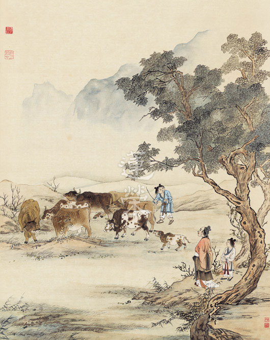

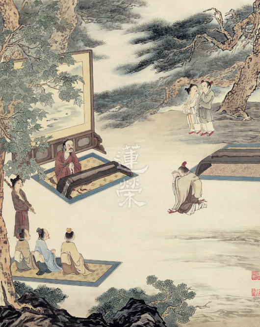

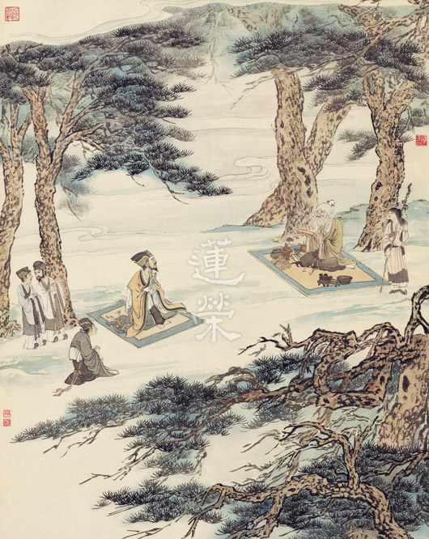

### 一件追憶的往事（二）—風雲際會世紀緣（緬懷雪廬老人）

魏慶友

同鄉後輩的追念

耐人尋味的往事

先賢典範的永垂

濟南泉城的莊嚴

大成至聖先師奉祀官主任秘書李炳南先生，諱豔，字炳南，號雪廬，弟子尊稱雪公或雪廬老人。公山東濟南人，生於一八九０年（庚寅年臘月初七），於民國七十五年（一九八六年）農曆三月初五，在臺灣往生，住世壽九十有七。先生故居在濟南南關券門巷一號（後門牌改為三號，故址未變），世居此達三百餘年，李氏為當地名門望族，尤以慈善著稱。令曾祖銑公清朝武舉，文武兼備。令祖景純公與令尊壽村公，飽讀詩書，儒學根基深厚。雪公自幼受教于庭訓嚴正，家教不苟的書香門第，尤其是祖父景純公，更是予以細心教導，以世代相傳優良的家風、家學來薰陶影響孩子。一八九五年雪公六歲，開始接受傳統的私塾教育，從三、百、千、千啟蒙開始，到《四書》《五經》及諸經子史儒家經典，循次修學。在這種以心養德的良好傳統教養下，加之雪公自幼穎悟，小小年紀就已紮下優良德行的根基。

一九０二年（光緒二十八年），就讀於趵突泉附近之尚志書院。尚志書院即現「尚志堂」，原名「金線書院」，初設于唐代，因在金線泉旁，故名「金線書院」。盛唐時，文人雅士多在此聚會。明末清初改為「尚志堂」，是專為朝廷培養人才的機構。雪公當年受教于尚志堂，是令祖景純公及令尊壽村公，志在培養雪公以「明德親民為宗，修齊治平為事」，以雪公的德行、稟賦、才華，仕途則不可限量。正如臺灣學者在〈雪廬老人弘傳《論語》析探〉中闡述：「老人自幼學習孔聖儒學，若循著傳統科舉從政方式，應在人爵(指：仕途)上大有發展，只因際遇革故鼎新的時代，人爵之願雖困頓難行，故更應在天爵（意：天然的爵位，指高尚的道德修養，因德高則受人尊敬，勝於爵祿。）上精進奮發，使得益眾的事業愈加海闊天空」。良臣、良醫都是為民利眾，為此先生拜名醫為師，苦讀《黃帝內經》，成為以後為眾療疾濟苦的基礎。後來先生回憶這段「際遇」時，非常豁達，曰：「中歲屯蹇仕進，檢而研之。躍然曰：『嗟！從有獲於天爵矣。』惟善宜與人同，故三十年弘之弗輟。」

公元一九０八年（光緒三十四年），雪公十九歲，以優異成績考入山東法政學堂，學習法律，後又攻讀監獄專修科。結識了清末翰林編修莊太史心如先生（見前〈莊心如先生〉篇），莊先生時任山東法政學堂學監，雪公非常欽佩莊先生的德行和學識，「莊太史」是雪公對莊先生的一貫尊稱。奉祀官孔德成先生曾說：「炳南先生之人生歷程，受莊先生影響最深，除指導入佛門徑，其對中國學問之方法、古文之研究，乃至為人處世之道，均受賜于莊先生。」

民國元年，雪公二十三歲，面對清末以來的種種亂象，尤其是傳統文化及其教育受到了「新思潮」的挑戰，痛心不已。與幾位志同道合者發起成立了「濟南通俗教育會」，雪公被推為首任會長，編寫教材普及傳統文化。「設講座於西門月洞，日日講學」。民國五年（一九一六年），更名為「濟南私立通俗教育研究會」，雪公繼續任會長。除在西門月城設講座義務組織教學外，還經常率同仁去各鄉鎮集市，通過演講、歌曲演唱等形式宣傳「五倫」、「八德」以教化民眾，改善風俗，力挽日頹的傳統教育，受到省政當局嘉獎。山東法政學堂，也因出了這麼一位優秀學子，而備受關注。自民初，二十三歲的雪公在西門月城設席，弘揚儒家文化，進行傳統教育，開始了長達七十五年的弘化歷程。

民國九年（一九二０年），雪公三十一歲，被派往莒縣監獄任典獄長。雪公目擊監獄陋況，垂憫囚徒，力求改善。歷經五年努力，使監舍整潔寬敞，雪公不但以精湛的中醫醫術，解除囚犯病苦，同時又宣導德行感化，使囚犯知非向善，職員慈悲敬業。民國十六年，軍閥戰亂波及莒縣，莒城被圍，匪寇乘隙，據民舍、勒民餉，民食殆盡，餓殍遍野。且日日炮轟，流彈亂飛，縣知事棄城逃走，莒城危在旦夕。雪公靠德望，組織軍政人員及邑中士紳，成立臨時縣政委員會，安定人心，搶救災民，維持秩序，困守待援。雪公不顧個人安危，親登城堞勸阻犯軍，遏制兵燹。使莒城父老在長達五年的兵劫戰亂中，得以餘生。民贊雪公曰：「勤政於莒，德加於民，功昭於世。」

民國二十二年（一九三三年），雪公四十四歲，受莊太史之邀，任《重修莒志》分纂。參與編纂者均當地鴻儒，雪公負責編纂古跡、軍事、司法、金石這四類。歷時三載《重修莒志》付梓，這部上起周武王十三年，下迄民國二十年，集「三千餘年之事，匯為一編」（莊太史《重修莒志》敘例）的《重修莒志》，「是研究莒文化和莒歷史的重要文獻，成為莒縣和莒南縣圖書館的鎮館之寶」（《曲阜歷史文物論叢•文史研究》）。民國二十五年（一九三六年），雪公助莊太史完成《重修莒志》後，辭別生死與共達十六年之久的莒縣，拜別亦師亦友的莊太史，回故鄉濟南，任職省法院。時，莊太史應聖公府之邀，任教孔府。（下期待續）

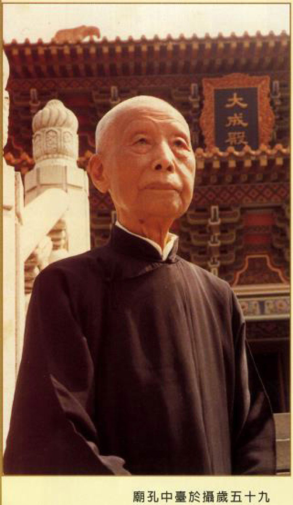

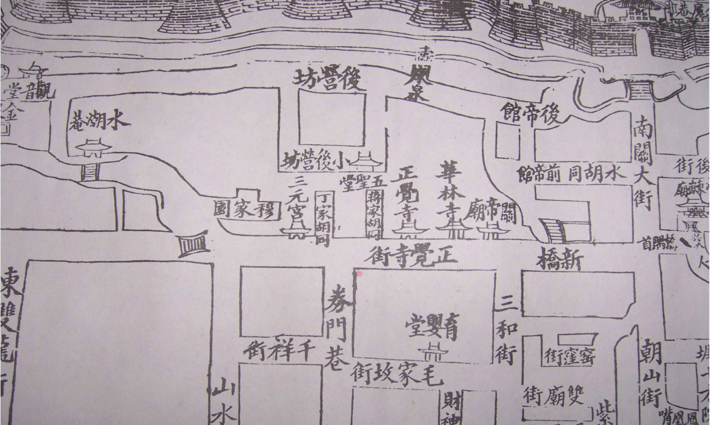

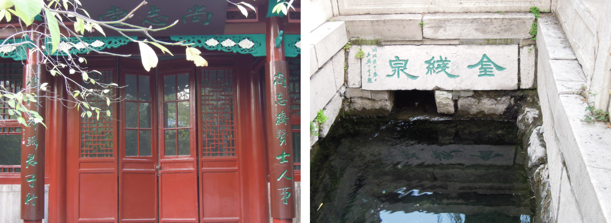

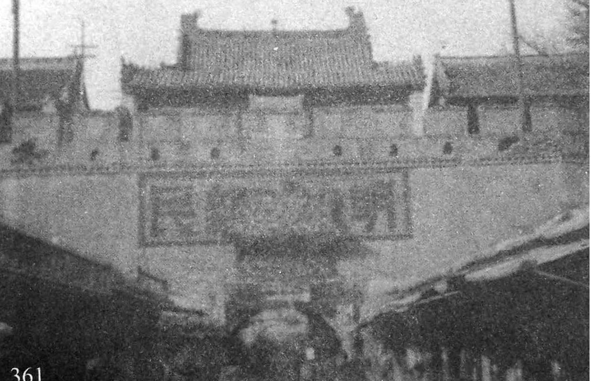

## 蓮池海會

### 吳松原老居士往生見聞記

*編輯部整理*

一生平常的走來

隨順命運的安排

有著發心的女兒

終感大眾的助念

吳松原老居士宜蘭縣羅東鎮人，生於民國二十六年六月二日，平日身體堪稱健朗，九十四年因主動脈剝離，住進加護病房十餘日方才康復出院。不數年，繼之今年三月二十九日舊疾復發而回天乏術，因家屬堅持免受電擊急救之苦，助念後面容安詳全身柔軟，呈現往生之兆，令見者聞者具感隨喜。

老居士性情溫和平實，行事敦倫盡份。雖一生未與佛法結緣，素無行持，由於大女兒與女婿乃虔誠佛教徒，且大女兒曾在學會辦大活動時，入香積辛苦工作，發心有目共睹。老居士在送醫斷氣時，得到眷屬及蓮友助念，八小時後神色安詳，往生西方之兆，卒稱善終，其中亦有後來者所應勉勵行持者。

老居士家境小康，手足七人中行四，自幼即從父兄以石雕為業，民國四十五年與賴陽子女士結為連理，婚後育有三女一男，家庭和樂。

中年因大環境轉變而舉家遷居台北，並轉業建築行業，行事合宜，上司同事間相處融洽，至八十八年因傷退出職場。幸而有子成業，老居士得以晚年含飴弄孫，頤養天年。且個性柔和，從不與人計較，亦無脾氣，生活平淡知足，對大女兒家庭頗有好感，是其受佛加被之緣起，臨終得女兒家屬蓮友之助念，能立時提起正念，將一生痛苦作個了斷，直入西方蓮池海會，前途無量。

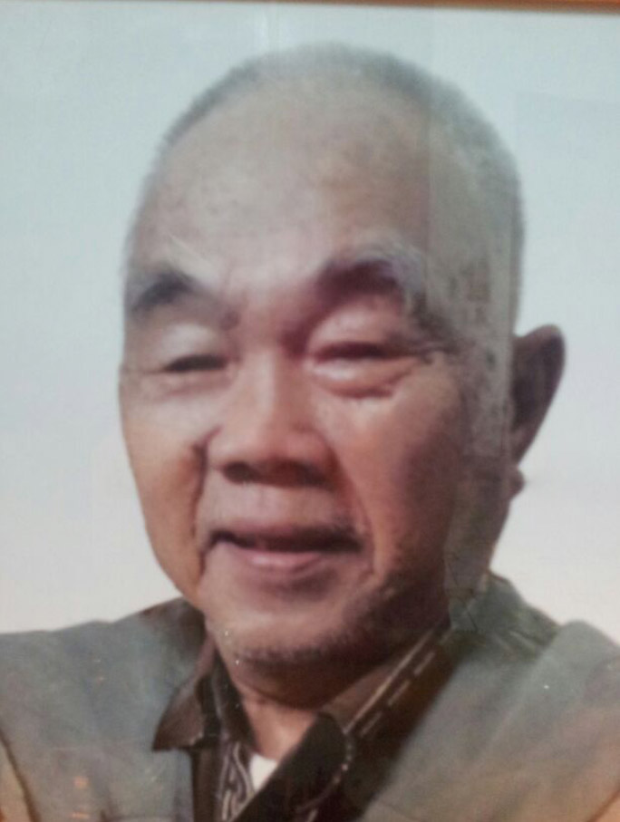

### 沈石阿燕老居士往生見聞記—兼讚先生沈朝旺往生勝事

*編輯部整理*

含辛茹苦是命運

任勞任怨是修養

子女學佛是福氣

助念現瑞是驚歎

沈石阿燕老居士生於民國二十年農曆二月初八，宜蘭縣羅東鎮人，父親是羅東有名的泥水匠，尤善於治房子漏水，自幼因體弱多病，父母將其送往五結鄉務農的沈家扶養後，身體反而與日改善，雖然她是父母唯一的女兒（尚有七位弟弟），但因這樣的因緣，讓父母終究捨得讓其成為貧困又務農的沈家童養媳，及長後與沈朝旺先生結婚，婚後育有四男四女。

老居士一生從事家庭主婦的工作，並協助務農的先生，舉凡種菜、畜養家禽、除草、曬穀等，雖然生活清苦，但老居士卻從無怨言，秉持傳統農家婦女任勞任怨的勤儉持家。老居士從小未受教育又是童養媳，家務一切聽從兄嫂安排，因此個性謙遜，與人為善，鄉里間無不稱許其好脾氣及待人純樸與真誠。

民國一○一年六月五日老居士身體不適經送往醫院治療，在六月底一度病危，因此學佛的三媳婦綉玲乃印製「助念生西須知」及雪廬老人講於台中蓮社之「助念之意義與規矩」，分送其他未接觸佛學的子女人手一份，囑咐大家先行仔細閱讀，以免母親生西時驚慌失措，作出不利於往生者的舉措；並事先接洽宜蘭地區專門以佛教方式辦理往生佛事的禮儀公司，溝通相關細節。其後經醫師開刀切除大腸約二十公分，並裝置造口，術後暫時脫離險境，但因老居士年邁且患有糖尿病，傷口不易癒合，臥病四個半月後終因不敵病魔摧殘，於一○一年十月二十七日上午九時捨報。

老居士住院期間蒙出家師父開示生死大事離苦得樂等法語，及心妙學長探視並帶領老居士念佛等助緣；加上老居士原本就善良純樸，從不存疑他人所語的善根福德，又事先讓未接觸佛學的家屬瞭解臨終助念的觀念與作法，讓老居士往生後，一切事務出奇的都如法的以佛禮方式進行。原本有子女認為母親生前沒有茹素，也同意祭祀與四十九天期間家屬全都持素；原本習慣鄰里以傳統方式送別往生者的家中長輩，也都未表示任何意見，放手讓子女以佛教方式，為母親作人生最後最重要的一件事—助念生西。

老居士往生停柩於五結鄉自宅，家屬謹遵「助念生西須知」及「助念之意義與規矩」，萬緣放下，佛號提起，在老居士住院期間結緣的出家師父帶領及宜蘭蓮友、家親眷屬的助念下，原本老居士往生時未戴假牙下巴略為凹陷雙唇未合，助念九小時後老居士弟弟及弟媳掀開陀羅尼經被探視，老居士面容安詳，嘴巴自然合起，瞻仰遺容後都對老居士呈現瑞相頗覺欣慰。此時出家師父返寺，家屬及蓮友仍然持續念佛，原本預定至晚上九時共念佛十二小時結束，心妙學長認為老居士停柩自宅，獨立門戶無干擾，環境素樸莊嚴，建議何不念佛廿四小時再結束，經家屬稍作討論後同意，到了晚上十時後，僅剩家屬經排班念佛至翌日上午九時，共計念佛廿四小時後全身柔軟，圓滿結束。

老居士如此殊勝的往生示現，家屬在七七四十九天中，每日排班早、午供，晚課誦念《佛說阿彌陀經》及念佛回向，並固定期間作七至滿七。家屬晚課誦念佛說阿彌陀經》及念佛時，老居士配偶沈朝旺老居士原本未接觸佛法，也自發的到靈堂跟著家屬念佛，依著這段因緣，沈朝旺老居士於一○二年三月廿一日往生時，也都能一切無礙的以佛法的方式助念生西，面容安詳，示現念佛的不可思議功德。從二位老居士的往生，讓我們更加相信一句彌陀聖號的不可思議功德。

## 活動報導

### 有朋自遠方來〜文化一家親　馬來西亞文化訪問團來台交流記

王興文

四海之內皆兄弟

文化同根心在道

千里相會好緣起

要在異鄉放光芒

二○一二年十二月一日至八日

一般而言，文化交流在現實社會中是司空見慣，不足為奇。然而，此次馬來西亞文化團體來訪，對中華無盡燈文化學會而言，卻是難能可貴，值得一提。

二○一二年臘月初一，星期六，一個寒冷的風雨天，馬來西亞文化訪問團，一行七十餘人，在張偉慈先生的率領下，浩浩蕩蕩的搭乘亞航班機飛抵臺灣，展開為期八天的文化之旅。與其說是「文化」之旅，倒不如稱之為「論語」之行更為恰當，因為五天的課程中，八成都是論語課，全都圍繞著一個主題：「如何跨越傳聞與真實的障難—論語正見是出路」，把孔子的精神與《論語》的內涵，和盤托出，如實呈現。

《論語》，何以會有如此巨大的魅力，把許多素昧平生者，從海外吸引到臺灣，擠在窄小的空間裡，從早到晚，靜靜的聆聽著老師們，從不甚悅耳的麥克風中，娓娓訴說著古老的儒家思想與聖賢之道，而甘之如飴呢？在功利主義盛行的今日，看在絕大多數人的眼中，此舉非但令人費解，更讓人難以置信。然而，它確實在真實的生活中上演著，而且正持續的擴散中。子曰：「德不孤，必有鄰。」隨著世人對中華傳統文化的了解與認同，論語的精神與價值，及其深厚的文化內涵，必將隨著文化的交流而傳遍各地，重新為世人所肯定與重視。

此次文化訪問團的發起人張偉慈先生，是位年僅三十餘歲的馬來西亞華人，年輕的企業家，世居當地，熱愛中華文化，平日樂善好施，慷慨好義，投身於社教工作多年，並創辦多個文教團體，推動慈善公益與文化教育事業，造福社會人群；對於論語，情有獨鍾，見解獨到，視為人生重要寶典，而對雪廬老人講授之〈論語講要〉，更精研多遍，深有體悟，隨身攜帶，愛不釋手。常在各地宣講《論語》及〈弟子規〉，並在報紙、廣播電台，發表文章及心得，大力宣揚《論語》，推動儒家文化，不遺餘力，極獲好評。

二○一二年九月，張先生應朋友之邀，到臺北參加「國家法務人員生命研習營」講座，現場聽了來自中華無盡燈文化學會的唐、林兩位老師，對雪廬老人的傳承及《論語》的精要解說後，如遇知音，如獲至寶，會後立即親至學會拜訪，深入了解其宗旨及會務後，即在附近覓妥旅館，回國後立刻組團要來臺研習《論語》，其行事之果敢積極，實所罕見，令人佩服；而全團來臺的參學費用，除少數人自理外，全由他一人負擔，此種心量與氣魄，在現實環境中，更不多見。

此次訪問團成員共七十七名，分別來自馬來西亞丹江弟子規教學中心、馬來西亞中華文化教育中心、吉蘭丹中正小學、吉蘭丹愛心教育協會、吉蘭丹淨宗學會、古晉中華文化中心、好人好事快樂網、 麻六甲自願義工團、仁愛之家、檳城淨宗學會、泰國清萊中華文化教育協會、菲律賓弟子規學會等團體。團員大多是長期從事教育工作的老師，還有多位校長、社團負責人、教育行政人員，及文化教育傳播媒體的工作者，可說是由教育文化專業人士組成的團隊，除了極少數過去與學會有互動經驗外，絕大多數都是第一次蒞臨臺北，而且都是在國外非中文教育體系的環境中成長的，基本上，對中華傳統文化的了解是相對陌生的。

而所開的課程，除《論語》外，還有〈常禮舉要〉、唐詩賞析暨吟誦、樂教暨音樂欣賞、文化導覽等專題介紹，以詩、禮、樂的簡介為輔，要把中華文化的精華，雪廬老人的心血，以及老師們的文化經驗傳承，毫無保留的一起傳授給遠道而來的與會貴賓。因此，對許多團員而言，心理上不免產生極大的壓力，據他們事後說，當初不少人是抱持著觀摩的心態而來，尤其對中華文化的寶典，素有「千古奇書」之稱的《論語》，更是不敢寄予奢求與厚望。

然而，事實證明，大眾的疑慮是多餘的，「天下無難事，只怕有心人。」經過五天認真、辛勤的學習後，團員們的收穫是豐碩的，成果超乎預期的美好。在唐、林等老師們深入淺出的解說中，善巧方便的帶領下，一步步的引領著大眾走進歷史的時空，文化的殿堂，《論語》的世界，古人的生活中，與聖賢相伴，和弟子共學，置身其境，千古一際，渾然忘我。隨著課程的進行，大眾之陰霾，一掃而過，轉憂為喜，轉喜為樂，處於課堂之上，有如置身於美妙的文化園區，極目四眺，美不勝收；又如馳騁於無邊的草原，任情奔放，暢快無比。中華文化，竟是如此的璀璨壯麗，令人歎服；又是如此的精深博大，令人景仰。

五天的課程，令大眾大開眼界，聞所未聞，並對中華文化的深厚底蘊，生起無比的信心與無上的感動，紛紛以中華文化的傳人自居，相互共勉，盡形壽將其發揚光大、傳承後世。

據發起人張偉慈先生透露，上課這幾天，每晚九點下課後，大夥回到旅館稍事休息，即開始繼續討論當日所學，挑燈夜戰，直到凌晨兩、三點，才意猶未盡，熄燈就寢。而白天上課時，大眾仍都精神抖擻，無有絲毫倦意，同時踴躍發問，毫無懈怠，其學習態度之認真確實，令人肅然起敬。中華文化的未來，已在他們身上，微微露出了一道曙光，令人欣慰無比。

值得附帶一提的是，在臺北的八天行程中，幾乎天天都是寒風大雨，唯有的一次大晴天，正好落在第七天，安排到臺北故宮博物院及陽明書屋的戶外參訪日，當天一反常態，大清早就露出了久違的朝陽，不論在臺北市區或陽明山上，整天都是日麗風和，氣候宜人，是個標準的郊遊踏青好日子，尤其當大眾在至善園戶外用餐，對著和煦的陽光，享受著美好的光景時，感受特別深。對比前後幾天的天氣，有如天壤之別，不可思議，似乎是上天刻意的安排，意外的禮物，以示對團員們多日的辛勞與努力，給予最大的肯定與獎勵，帶給了大眾莫大的信心與鼓舞，並為這次的活動畫下了最完美的句點。

綜觀此次馬來西亞文化訪問團之行，除彰顯其熱愛文化、不忘本的精神外，更重要的意義，是再次肯定了中華文化的價值與出路，為文化的傳承與弘揚，帶來一番新氣象，開創一片新天地，並為中華文化的復興與再造，帶來新希望。多年來，臺灣社會各界，都在亟思教育改革之道，可惜苦無對策。人才在哪裡？應如何培養？至今仍無定論。殊不知教育之方，改革之道，早已明載典籍；孔子集中華文化之大成，開平民教育之先，培育弟子三千，見諸史籍者七十二，皆為經國濟世之長才，福國利民，影響深遠，直到現在仍為世人所共仰。《論語》一書，集孔子思想的精華，更是立身處世的良方，治國之寶典，至今仍為世界各國所重視並爭相引用。

可惜國人不察，棄而不用，捨近求遠，終致百病叢生，亂象四起。今張偉慈先生，一介馬來西亞華人，於海外行商有成，效端木之遺風，全力奉獻於中華文化的教育與弘揚上，造福海外華人，實為我們最佳的學習榜樣。欽敬之餘，不覺自慚，身處文化寶島的我們，享受著文化的果實，卻坐忍其凋零枯萎而去，束手無策。祈願今後能積極奮起，結合各界有志之士，效法先人的犧牲精神，共同奮鬥，以承先啟後，使中華文化綿延不絕，帶給世人和平、安樂與幸福。並與大眾共勉之。

（本文作者為大成孔學會理事長）

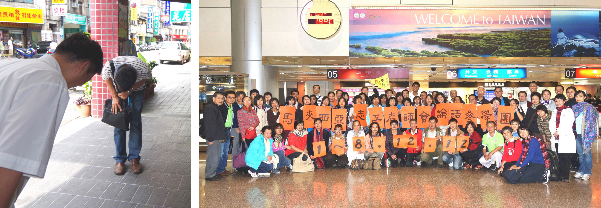

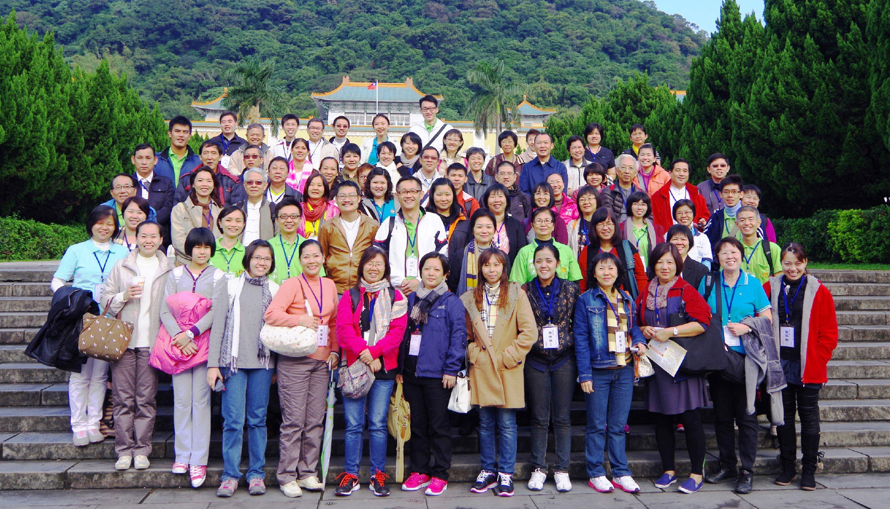

### 有朋自遠方來〜文化一家親　文化交流講座開結訓

*編輯部整理*

走到人生的瓶頸

開發未來的希望

踏上光明的前程

坐穩文化的弘傳

二○一二年十二月一日至八日

本會指導老師　開訓致詞

此次講座活動與馬來西亞的文化人士交流，不得不說緣起，去年九月在法務部的生命教育研習營中認識了張會長，由張會長作一個緣起，認識了大家。

在一九六五年，曾經有馬來西亞的蔡榮華老師到臺灣向雪廬老人求學，老人非常高興，高興的是文化能夠傳播出去。老人是國學泰斗，在臺灣講學這麼多年，當然最希望的是能將文化弘傳，文化是不分國界、地區的，是求則得之。例如東漢馬融是陝西扶風人，他的高材生鄭康成是山東人，千里迢迢來向馬融求學，且青出於藍，馬融看著他學成離開，說：「吾道東行。」

中國歷經五四運動，又逢文化大革命，已將文化剷除，成為一個沒有根的國家，兩岸都知中華文化在臺灣，然那是什麼景象，那是當年因戰亂而有許多理解與實踐文化的前輩來到臺灣，尤其雪廬老人，老人家學淵源深厚，又在文化底蘊深厚的山東濟南成長，來到臺灣時年已六十歲，安靜的在臺中教學了三十八年，將文化的正解留在台灣。對岸已是經濟、武力的強國，但也明白只有文化才能讓國家長治久安，讓民族不亡，能培養人成為有遠見、有抱負、有能力的人才，這是文化的力量。雖說文化在臺灣，然已隨西洋風氣的影響漸漸沒落，到底會傳到那裡呢？求則得之。

此次大家遠地而來，代表文化有發展的趨勢，張會長帶來有心的人士，透過《論語》等課程的學習，並體會雪廬老人的風範與傳承，老人對文化的正解，相信會有弘揚與傳承文化的人才出現，有此幹才，團體必興、國家必興、民族必興。有云：中興以人才為本。

以上是肺腑之言，有幸認識張會長這樣有魄力的人，有熱誠、有幹勁、有理想，我願意與各位一起來共學，謝謝大家！

丹江弟子規教學中心 / 張偉慈會長　開訓致詞

聽唐老師一席話，內心震動、震撼，這一股震撼是來自我們固有文化。對我們一行人稱呼為：馬來西亞文化人士參訪團。實為慚愧，我們是有教育沒文化，雖受過高等教育，但在這樣的教育體制下，我們充實的是生活知識，變成了什麼樣的人呢？我們的下一代又變成什麼樣的人呢？

有老師說：上學其實是受污染。沒錯！我的女兒今年九歲，是在小學讀書，當時在掙扎要不要將把女兒送到學校，由於母親及家人反對在家治學，為了不讓女兒受人污染，所以在小學以及所住之處，大力推廣傳統文化，並成立學會，根本解決問題。

這四年多來，我一直都在提倡：大家學《論語》。因為《論語》是中華文化的根本，而《論語》的根本處就是志於道，據於德，依於仁，游於藝。我們近十年來，推廣〈弟子規〉，有一千零八十個字。雖是將文化落實於生活，但不能不懂內涵與精神，若不具足論語的正見，成為實踐弟子規的內涵，慢慢的推廣弟子規會變質，會流於形式。

今天有幸來到台北向唐老師、林老師以及各位老師學習，我們來學習什麼呢？來學習文化，趁這一次的機會，將孔老夫子的內涵學好，才不會辜負此行意義。

中華文化教育中心 / 宋寶蘭主任　開訓致詞

此次活動能參加，非常感恩張會長，張會長是屬於行動派的，我是屬於穩定派的，張會長是不斷的往前衝，有時我也得拉著他一下，但有時讓他衝，因為美好的夢，有時候是一些很傻的人、很有夢想的人衝出來的。

之前向他提起了唐老師，他就非常積極的想要過來學習，法務人員講座就接通了這樣的因緣，回國之後，張會長很快的就號召了今天這個七十七位的團隊過來學習。

本中心這次參加的有六位行政人員與七位教學人員，我們是文化團體，要弘護正法，得多多學習傳統文化內涵。

唐老師在雪廬老人底下學習多年，本次教學《論語》所用的〈論語講要〉，唐老師下了非常多的功夫。傳承對我們非常重要，本中心師承淨空老法師，雪廬老人當年開了三個條件給老法師，作為向老人求學的條件，老法師有今天的成就，也常跟我們提起是雪廬老人的教導，對雪廬老人非常的恭敬，所以雪廬老人也算是我們的師公。到這裡除了學國學，亦觀摩無盡燈的團隊，這樣的師承來自於雪廬老人。

我們馬來西亞是多元文化的國家，除了國內各個民族，還有西方文化的衝擊，所以馬來西亞的特徵是樣樣通、樣樣鬆，語言也講的比別人多。一位馬來西亞人基本上會懂四、五種語言，有母語、馬來文、中文、英文等等，我們的文化可能缺的就是深度。古文有說：「無常安之國，無宜治之民，得賢者則安昌，失之者則危亡。」怎樣才能稱得上賢者？論語當中有仁者、智者、君子、小人、賢者、聖者，這方面對我們來說，沒法深刻的瞭解。

從二○○二年開始，我們跌跌撞撞依王財貴博士讀經法：「小朋友跟我念」，以為這樣就可以教傳統文化了，教著教著師生們覺得很悶，雖然該背的都背起來了。

到了二○○四年蔡老師來了中心，教導我們〈弟子規〉不是拿來背的，是拿來作的，結果我們的老師們又提升了，就不是這樣教了。

在今天的二○一二年，我們發覺在馬來西亞，家長對傳統文化的信心還不算高，到中心的年輕人，會問自己是否有出路？中心能持續下去嗎？成家之後養得起家嗎？二○一一年十月，我與中心王主任第一次來到貴會，感覺中華傳統文化是非常有出路的，學會把我們的眼界提高了、格局加大了，對中華傳統文化有信心。

學文化不單是德性還有能力的培養，學記裡面：「能博喻﹐然後能為師。能為師，然後能為長。能為長，然後能為君。」若有這樣的內涵，必能帶出中華文化的出路。

所以我們這一次來，就是要學習孔老夫子的氣象，才是認識我們的文化，然須來自於師承，雪廬老人、老法師是一脈相承的下來。我們中心願以真誠的心、恭敬的心、謙虛的心來學習。

最後感謝中華無盡燈文化學會，在唐老師的帶領之下，讓我們到貴會來學習，這真是道義之交，每當我們有問題，一定是兩肋插刀，義不容辭的幫助我們，在這裡也代表中心，向貴會的各位老師致謝。

張會長　結訓致詞

這一次講座，中華無盡燈文化學會委實花了不少的人力、物力、財力，我一直在找真正的傳統文化，找真正原汁原味的傳統文化，這個中國人的道統，這次真的找到了。

在座很多領導都知道，過去這十年我們不斷的推廣〈弟子規〉，可以說是馬不停蹄，到處辦講座，十年前我剛從國外畢業回來，就找宋老師一起來討論，如何將〈弟子規〉這種祖先的教誨傳遞下去。

在馬來西亞，我們經歷了幾個階段，第一個階段是小朋友跟我念，那時候我們就展開了兒童讀經，經讀了幾年，也看過很多團體辦理小狀元比賽，小朋友們唐詩、宋詞，四書五經都倒背如流，但是雖然如此，回到家裡對父母親的態度是很傲慢的，不懂得捨己為人，那時候就覺得這個兒童讀經運動有問題。

接下來中國安徽廬江成立了推廣文化的據點，我們組成馬來西亞的校長志工會，這是很大的團隊，到那裡也聽了不少課，老實說當時在聽課時，就一邊思考這是不是我們真正的出路。雖然我很喜歡〈弟子規〉，教導我們的是孝親尊師，但幾年來又覺得不對勁，剛開始時我以為只有我自己有這樣的想法，所謂的不對勁不是否定任何一門課程或老師。那種不對勁好像是太過於強調形式，好像不鞠躬，穿的比較不傳統就是死罪，以為這樣做就是在搞背叛的運動。

然而我們此時此刻需要的是真正的道統，而不是形式的道統，只講究形式到最後只有死路一條，我們太重形式卻忽略了實質。應學習的內涵是夫子的智慧與仁愛，在我們的教學中，越教就越心虛，慢慢形成無力感，就這樣慢慢洩了氣，馬來西亞的〈弟子規〉教學到今天已經慢慢步入洩氣的階段，為什麼洩氣呢？因為大家都在作表面、作形式，這樣做下去是沒有前途的，是看不到希望的。

好不容易才有這次機會，唐老師在台上講課，我在台下乖乖的聽課。去年九月在天母法務人員講座，開始時還是充滿質疑，也想看看這位老師不知道會不會弄出什麼名堂，我心裡一直在想，千萬不要再搞形式了！想不到唐老師、林老師所講的課，給了我信心，這信心是對道統的信心。

經過上一次在天母的上課，我內心就有一個底，這次來無盡燈文化學會，就是來找出路的，不單是為我們馬來西亞的中國人找出路，我們甚至要為全世界的華人找出路。我們今天有幸能將傳統文化請回馬來西亞，這幾天的課程並不是結束了，是剛要開始而已。我們每一天從早上九點到晚上九點都在課堂聽課，回旅社是研討到凌晨一、兩點，這個現象告訴我們什麼？透過老師這樣的講解，能夠讓完全沒有接觸過〈弟子規〉或者《論語》的人，產生如此的興趣，而且不斷的檢討，這叫做明師，是智慧的「明」，只有明師才有辦法把論語講的如此精彩，出神入化，讓我們產生信心、產生興趣。

我四年多前看到〈論語講要〉，就自己一個人慢慢看，辦很小型的讀書會，傳統文化到了這個時候，我們不得不慎重，不得不努力，我們過去在推廣〈弟子規〉當中犯了很多過失，但這樣的過失不能再犯了，我們不能再作蠢蠢的好人，要作有智慧的好人，我們要推行傳統的傳統文化，我們要朝著這個目標進行，我們要把文化的精神找回來。

這一趟我們來到台北，跟著唐老師、林老師以及其他老師學習，我們每一個人都如獲至寶，每一個人的心裡都是滿滿的，除了充滿震撼以外，心裡面那種實在，內心的那種滿足是前所未有的，我相信唐老師講的，只要我們堅持在培養人才的道路上繼續進行，好事會陸續來的，所以回到馬來西亞，會繼續籌備請唐老師及團隊，到丹江辦講座。

同時也希望丹江弟子規教學中心作一個試點，用網路連線上課，且勉勵他人要學《論語》之前，我自己要先學好，如果我自己都不學好，我就不配當一位推廣傳統文化的人。雖然老師說不用很多年就可以把《論語》學好，但我下定決心是一生一世，要把〈論語講要〉學好，別人沒作之前我自己先要作，別人不推廣之前我自己先推廣，別人還沒行動之前我自己先要行動，只要是好的事情、對的事情，我自己一定要以身作則領導一個風氣，領導一個學《論語》的風氣，將雪廬老人的風骨找回來，相信我們是辦得到的，只要我們不斷不斷的努力。

今天非常感謝各位老師，尤其剛看完這幾天活動短片（網址：HTTP://WWW.YOUTUBE.COM/WATCH?V=DDE9GX7HG-Q），內心非常感動，如同課程裡在欣賞音樂時，突然有人把美味的點心端上來，我心裡面已經在流淚了。其次在去故宮的路上，學會已給我們準備好傳統早餐，每天課程之外還有香積組準備的飯菜，我常以為我們丹江弟子規教學中心的素食很不得了，到這裡一看，發現我們全部都要重新開始，我們丹江的廚房、行政都要重新開始，來個乾坤大挪移，若不如此，未來難度會越來越高。

我們在推廣文化的過程中，真的犯了很多過錯，唐老師的課不是講講而已，他們的團隊不但學到，也做到，不只是用手作，更是用心去作。比如餐前觀修，讓我們想想該用什麼心態去吃飯，否則一頓飯就白吃了，這些細節我們都沒想過，這些所有的安排，乃至到故宮時還有人殿後招呼我們，看到義工們的用心，不但學習到正知見，還能落實到這般，這些都是我們今天學習傳統文化的目標，謝謝大家！

唐老師　期勉

以上讚譽更令我們戒慎恐懼。張會長若致力於文化人才的培養，會得到很大的讚譽，另一方面也會得到很大的毀謗，或成為毀譽參半的人物，承擔毀譽參半就能辦出一番事業。但重在有內涵的引導，是一種能令善知識的讚譽，非僅僅只是一般的毀譽參半，這也能考驗自己的動機及堅持的能力，以及毅力的訓練，願力的持續，是遇障不退的精進力，那將是馬來西亞華人之福，中華文化海外發展之福。

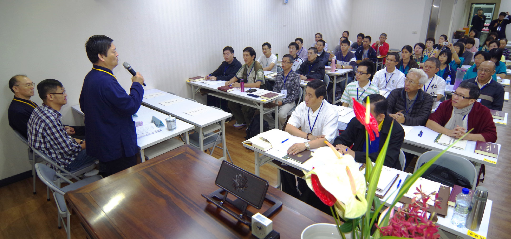

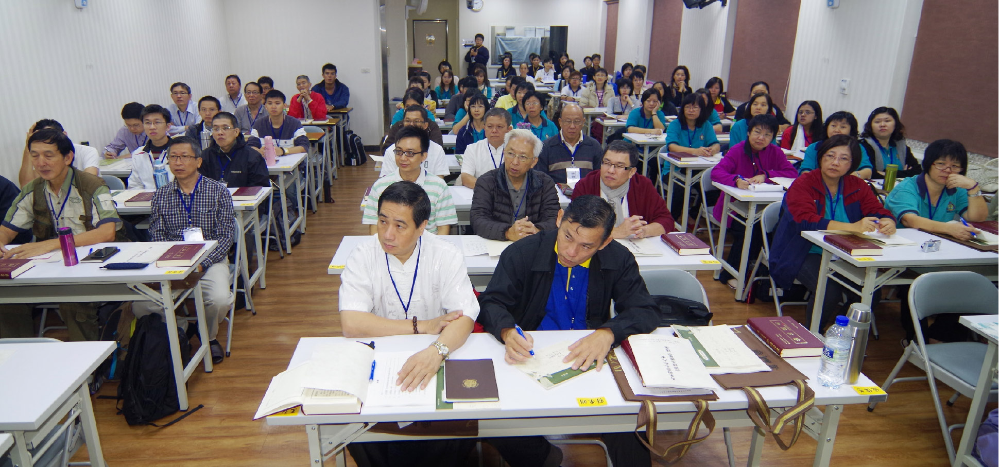

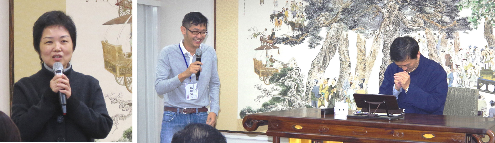

### 有朋自遠方來〜文化一家親　文化交流講座餐前觀修

*編輯部整理*

食衣住行最平常

體會最難凡聖別

二時粥飯雜用心

趙州猶恐失本來

二○一二年十二月一日至八日

聖者的用餐 / 王東煜

為了有情眾生成聖成賢，所以眼前興辦與馬來西亞來臺的文化講座，現在進行餐前觀修，題目是「聖者的用餐。」

凡夫的聰明與聖者的智慧相較量，可說是天壤之別，若就用餐這件事來論，凡夫追求的是佳餚美食，聖者則講究要依禮而行，要合乎道。所以，首先就為大家報告聖者的用餐是如何依禮而行？我們可從孔子在論語鄉黨篇的進退應對中找到明確答案。例如孔子曾說到「齊必變食」，第一種解釋是講齋戒時要變更平常的食物，就是不准飲酒、不准吃肉，或者是第二種解釋為雖然可以吃肉，但不能多吃，必須以飯為主，因為不能使肉氣勝過飯氣，以免傷胃。而酒也可以飲，飲多少沒有定量，但以不醉為原則，不醉則不會違禮作亂。

孔子還說「食不厭精，膾不厭細。」不厭就是說不求其精細而飽，意思為聖人即使沒有精細的飲食也可以吃飽。然而，卻有許多人誤解孔子特別講究精細美食，那就大大的冤枉了聖人！而孔子也注重食物的清潔衛生，故說：「食饐而餲，魚餒而肉敗不食。」是講穀類的食物，若是原來的氣味變了，那一定是不新鮮。而魚肉若是腐爛了，吃到肚裡就很容易中毒，所以是不會食用的。

孔子還主張「色惡不食，臭惡不食，失飪不食，不時不食。」「色惡不食」是指食物的顏色惡劣時，是不能食用的。而「臭惡不食」的臭惡不是講腐臭，是指烹飪產生惡劣臭氣時，也是不能食用的。所謂「失飪不食」，是說如果食物未煮熟，或煮的太過熟了，皆是不適當的烹飪，也是不能食用的。至於「不時不食」的不時，則有三種不同的講法，第一種是指烹飪不到火候的食物；第二種是指不合春夏秋冬四時所宜的食物；第三種是指一日三餐不在早上、中午及晚上應該用餐的時候，這都有害於健康，所以不食。再者，孔子還說過「割不正不食」，這句話絕對不是講切肉不方正就不食，而是說用殘忍不人道的方式宰殺的肉，是不食的。

此外，在用醬料方面，孔子認為「不得其醬不食」。醬有醋及肉醬等多種，不得其醬，是指若用到不適宜的醬料，恐怕與食物相冲，吃下去會有害身體健康。反之，若用到適宜的醬料，可以讓食物更美味，且能引起我們的食慾，所以要重視它。

而孔子也主張「沽酒市脯不食」，因為當時從外面買來的酒未必清潔，而買來的乾肉也不知是何種動物的肉，所以都不食用。孔子又提到「不撤薑食，不多食。」因為薑能夠去邪味，引發正氣，所以可以使用，但卻不能吃太多。

孔子還認為吃飯及睡眠皆不是說話的時候，所以說「食不語，寢不言。」因為吃飯時，口中咀嚼食物，而睡眠時，則要安靜休息，所以皆不適宜言語。但在宴會時，敬酒敬菜，也不能不說話，朋友也有連床夜話的情形，然而亦須少說。

又因為古時候有祭拜食物的禮節，故孔子則說「雖蔬食菜羹瓜，祭，必齊如也。」即在飲食之前，將每種食物取出少許，放在食器之間，以祭祀古時發明以火作熟食之人，表示不忘本。但是若非美食可以不祭拜。而孔子日常所食的，雖是粗疏的食物，以及菜羹瓜果之類，也要祭拜，不敢因此廢掉禮節。

此外，當孔子應邀作客，「有盛饌，必變色而作。」是指如果見菜餚豐盛，而且是主人親手端來，孔子必變面色而作，表示驚異感激之意。

接著報告聖者的用餐是如何與「道」相結合？例如在學而篇中孔子說：「君子食無求飽，居無求安，敏於事而慎於言，就有道而正焉，可謂好學也已。」並非要求我們不要吃飽、不要居安，而是勉勵我們努力求學求道，它比食求飽，居求安更重要。而在述而篇中孔子曾說：「飯疏食飲水，曲肱而枕之，樂亦在其中矣。不義而富且貴，於我如浮雲。」這說明孔子飯則粗食、飲水，睡覺則曲其臂而枕之。窮困雖到如此，而樂在其中。因為有道，所以無所不樂。甚至更讚歎顏回：「賢哉回也。一簞食，一瓢飲，在陋巷，人不堪其憂，回也不改其樂。賢哉回也。」是說顏回賢而貧窮，但顏回已得其道，故不改其樂。

又在里仁篇中孔子說：「士志於道，而恥惡衣惡食者，未足與議也。」是說讀書人若立志真心學道，則不會以為惡衣惡食是羞愧的事。否則，表示他的志向沒有在仁義上，那就不足與他談道了。

以上就是聖者用餐的修學法，古今作法雖不盡相同，但精神是永遠不變的。相信大家已明白其中的道理，此刻內心必然法喜充滿，那我們接下來吃這頓飯就不是普通人的用餐了，若進一步將前述內涵應用在日常生活中，則必能進德修業，最後成聖成賢，以利益國家社會，願藉此與大家共勉之。

天命的用餐 / 王順福

為了有情眾生成聖成賢，所以有眼前興辦與馬來西亞的文化講座，目前因緣是餐前觀修，題目是「天命的用餐」。

翻閱論語整本經書談到天命的地方，不論是顯明或隱藏，至少有七章，尤其末章，提及「不知命無以為君子」，宛如樂章最後湧現天籟的音符，餘音繞樑，久久不絕；又如一篇佳文，除前當似鳳頭，中若豬肚，結尾亦須有如豹尾，充滿智慧又有震撼力，令人印象深刻。

我等容或都是孔聖私淑弟子，套用現代的術語，自己常不揣簡陋願當孔學的推銷員，而推銷員除須對自己的產品孔學最精華的論語一書，要有自信外，更要深信這部東方的聖經，是有益於世道人心，且歷久彌新。其中夫子的天命觀，最是提供世人安身立命的殊勝理念及離苦得樂的良藥。

雖期許自己當孔學的推銷員，跟從唐老師學習論語多年，但自己性本駑鈍，所學仍淺，目前就夫子天命觀尚不是稱職的推銷員，確信終有一天會明白。天命雖在述而篇夫子自述五十的境界，可是知命的境界，絕對不是到了五十，憑空而來，由天而降，若以為如此，那是世俗人習以為常的窮通夭壽的天命觀，那是宿命論，逢樂境則生貪、臨逆境就瞋，認為命該如此，無能改易；夫子則不然，迥異凡俗，不隨順逆境而轉，那是由志於學，而立、不惑，一生發憤忘食所修到的境界，遇窮通的境地，不起貪瞋的心，不會隨外境而轉。舉例來說，在陳絕糧七日，依舊弦歌不輟，了然現前的困境，只不過是隨順過去所作業的現起，何怨之有？更藉此來砥礪弟子向道的心。由此可悟，夫子天命觀，何等重要！大則為我輩出處進退、用行舍藏、了脫生死的南針；小則也能指引作為我等日用平常，如穿衣吃飯的準繩，以吃飯來說，若能了知夫子的天命觀，縱使處在疏食飲水，也能樂在其中。

其次，夫子的天命觀展現承繼道統的使命感，讓夫子每每逢危轉安，此點最值得後人學習，也增加無比的信心，對遠道來訪的嘉賓，僅擷取講要數語相贈「學中華文化，有志於為文化的傳遞者，遇見惡劣的環境，當學孔子的精神，…以道自任，環境自然隨之轉變。」

鬼神加被的用餐 / 謝治平

各位老師，為了有情眾生成聖成賢，特別興辦馬來西亞文化講座，目前的因緣是餐前觀修，題目是鬼神加被的用餐，經過幾天的課程，相信各位老師已對儒學的內涵有更進一步的認識，儒家是講生死、講鬼神的，鬼是死去的祖先，神是指生前對社會國家有功、有貢獻的人，被後人奉為神明，儒家對於如何祭祀鬼神也是十分講究的。所謂祭如在，祭神如神在，一心想像所祭的鬼神就在眼前這樣誠心的祭祀，就會感得他們來享，其中的意義有兩層：一是報本還恩、飲水思源；二是求福報加被，就是向鬼神禱告請求，求福報加被，而孔子又說「未能事人，焉能事鬼。」能事奉人就能事奉鬼神，也就是要在人事上講究。

剛才說求鬼神加被，就是求福報，那什麼是福呢？在《尚書》〈洪範篇〉有提到世間福統稱有五種，所以過年春聯會寫五福臨門。一是壽，即是長壽；二是富，就是財富豐厚完備；三是康寧，是指一生無病；四是攸好德，是指所愛好的是德，現在有人解作修美好之德，因為愛好美德亦會修養美德；五是考終命，是說能得善終，通說是這五種，若要細分，又可從這五種開展出去。比如長壽之外又能子孝孫賢，財富豐厚又不會被人侵害等等，而壽、富、康寧、考終命這四種常是互相消耗的。

比如花錢治病，病好了錢消耗了，是富轉化為康寧，拚命賺錢，升了官，身體狀況卻變差，是康寧轉化為富，只有攸好德，是不會消耗，而且可以日積月累，一切福都以德為根本，有德始有福，但是任何一種福都不是別人送的，必須自己求，自己如何求呢？自求之道就是攸好德，所以福不是向外求，而是講求內化自己的德性，平時言行合於天地神明，如《詩經》〈大雅〉有云：「永言配命，自求多福」，配命就是配合天命而行，就是天然的法則，就是說永遠配合著天命而行，自然就能求得多福，因此在人事上講究，在進德修業上講究，才是出路，僅以此淺陋心得向各位報告，希望大家用餐愉快，謝謝大家。

不改其樂的用餐 / 陳琇琦

為了有情眾生成聖成賢，所以眼前興辦與馬來西亞的文化講座。今天的餐前觀修，末學要分享的是「不改其樂的用餐」。

講到「不改其樂」，我們馬上可以聯想到《論語》〈雍也篇〉中：「子曰：賢哉回也。一簞食，一瓢飲，在陋巷，人不堪其憂。回也不改其樂。賢哉回也。」顏子的樂是樂在道上，經由學習而產生的法喜與輕安，雖然環境是陋巷，而食物是一般人無法忍受的簞食瓢飲，即使處在如此的逆境，因為顏子心中的法喜是相續不斷的，食物與外在的環境的陋劣也就不成為他的煩惱了。這是顏子「心不隨境轉」的境界。

顏子有一位「仰之彌高，鑽之彌堅」的好老師—孔子，不僅「博我以文，約我以禮」，還能「循循然善誘人」，依次第而教導學生。有好的老師，還要觀待像顏回這樣「既竭吾才，如有所立」的學生，如此師資道合互相觀待下，才可以體會內心源源不絕的法喜，才會「欲罷不能」想不學都辦不到，而外在環境也就不成為困擾了。

相對於顏子的「不改其樂」，孔子的境界又是如何呢？在《論語》〈述而篇〉中講到：「子曰：飯疏食飲水，曲肱而枕之，樂亦在其中矣。不義而富且貴，於我如浮雲。」孔子的樂是「朝聞道，夕死可也」的樂，是「以心轉境」的樂。

結合眼前用餐，雖然食物與環境不是最需在意的重點，我們還是要具備觀察的能力，面對美好的食物，要生起感謝準備餐點者的用心，並警惕自己以食物做為修學的道糧，而非逞口舌之欲；面對不精美的食物，也能期望自己生起效法先賢之心，在簞食瓢飲之中不改其樂。結合上述觀修，並以食物做為長養色身與修學中華文化之資糧，那我們這餐一定可以樂在其中。

志向的用餐 / 陳怡瑩

孔子說：吾十有五而志於學。古人十五歲就算成年，成年時將一生的志向立定在學習上，去親近善知識、結交善友、研學經典、確立正知正見、不斷地增上。為求利益最多的眾生，將來不是辦政治就是辦教育，辦政治可以福國利民，辦教育可以培養人才，兩者都是千秋之業。學習是從自利開始，培養自己的能力，沒有能力而想利益別人是有慈悲卻沒有智慧；自利以後，要能利他，回報眾生的恩德，否則有能力卻不想利益別人，這種沒有慈悲的智慧不是真智慧。

所以立定志向在學習上，是一種有遠見的、自利利他的、聖人的志向。眼前要充實自己，第一步就是親近善知識，作正知見的學習，唯有正知見才能破迷啟悟，才能讓我們知道人生大事如何抉擇，才能知道在逆境中如何自處，才能得到善知識的提攜，也才能成為他人的善知識。

將志向立定在學習上，眼前是正知見的學習，不只在課堂上，所謂「學而時習之，不亦說乎？」時時刻刻都在學習，令人感到十分喜悅，要怎樣來結合用餐呢？我們若想成就自己的志向，需要健康的體魄，所以需要用餐來滋養我們的色身，這是我們修學正法的資糧。也因此，營養、乾淨的飲食就足夠，不需挑剔食物是否美味，不須講究口腹之欲，但這是約著自身來說。

若我們是提供飲食的人，則應當要以最用心、最美好的食物來供養善知識、供養法行人，所謂「諸供養中，法供養最」，《普賢行願品》教我們廣修供養，所有的供養中，又以法的供養最為殊勝。所以當我們誠心誠意地以食物來供養修學正法的法行人，那功德利益不知增長廣大多少！若是拘泥於粗茶淡飯，認為修行人本來就要心在道上，對食物不要執著，把對己的要求拿來對人，就有失偏頗了。

特別是對善知識，要展現的是自己的誠意，就像主人要請貴重的客人，最極致的誠意表現就是自己下廚來招待，若沒有以美味用心的食物來體現誠意，那誠意在哪裡？所以在用餐前，可以觀修自己眼前的餐點是有人的護持，若我好好修學正知見，那麼他人的付出是功德一件；其次，將來若換我有機會以飲食供養他人，我要如何地去表現誠意、來結這個善緣？

所謂君子立恆志，小人恆立志，要怎麼樣在用餐中更堅定自己的志向？若是吃到自己喜歡的食物，生起滿足高興的覺受，就要珍惜自己的福報，既可以修學正法得到心靈的充實，又可以嚐到令人歡愉的飯菜，身心皆得到養分，更應在福中修福，而不是消耗福報，所以更要加倍用功；反之，若是吃到不喜歡的食物，生起失望或是厭惡的覺受，那麼就應該期許自己在修學正知見的同時，也要好好地廣結善緣，並且學習各種度化眾生的方便，讓他人在歡喜心下也得到正知見的引導。

心懷志向的用餐是有內涵的用餐，在用餐中堅固自己的心志，在用餐中體會主人的用心，期許自己將來也能護持有志向的人、而且懂得供養善知識的殊勝，期許自己在正知見上的學習如同吃飯，每天都不能少，吃飯提供生命所需的養分；正知見提供慧命所需的養分，這才是養生之道！

結合論語的在外用餐 / 吳錫堂

誠摯歡迎遠道而來的師長、學長及各位貴賓們，末學謹以出外用餐結合《論語》所示的心得淺見，與諸位分享餐前觀修。

生活中，在外用餐的機會有越來越多的趨向，或許在外可以品嚐到獨特的美食，但終不如在家用餐的舒適自在。除了口味是否習慣外，在外用餐通常有諸多不便，甚至還要排隊才能取用，不若在家只需眼到、手到即可享用的舒適，這也是末學鮮少在外用餐的主因之一。

出門在外用餐雖有諸多的不便，但是吸引大家千里迢迢至此，除了善知識的研習外，還是有些需要大家去領受的。

子曰：「君子謀道不謀食。」又曰：「士志於道，而恥惡衣惡食者，未足與議也！」君子戮力於求道，成聖成賢是君子所求，飲食本身良劣與否並非重點。而且「飽食終日，無所用心，難以哉。」所以在外用餐不計較的是自己不強求主人必得提供什麼餐點，亦不計較主人所提供給自己的是什麼菜餚。但最起碼，菜餚好不好吃，於自己的體認上還是有計較的。

一樣出外用餐，用心者的體悟，會有不同的層次。吃的同時他會思維這道菜的材料有那些？是怎麼烹煮的？如是來感受作膳者的誠心與用心，誠是待人如己，以利益他人為出發，如是仁者，更能藉由觀修仁心對己之益達到智者利仁的境界。

香積組的志工們，本於利益眾生的誠心為大家準備膳食，只祈願大家可以好好用餐，有精神、體力持續的修習正知見，藉由正知見、善法的廣傳，成就利益自己的功德。未知大家吃出這番味道否？請細細地體驗。

引申而論，短短幾天無以究探聖賢之道的全貌，老師也說，相較之下，這幾天的課程只是小菜而已。師長、學長及貴賓們在品嚐老師所提供的小菜之後，有沒有感受到老師的誠心，有沒有激發大家立志於道，心生大啖後續大菜以推廣正法，傳承道統，利益眾生。

子曰：「君子無終食之間違仁，造次必於是，顛沛必於是。」除了時時警惕自己不違仁，藉由外出用餐體現仁的義理，是為此次外出用餐的殊勝之處，冀期功德成就，請愉悅用餐。

游於藝的用餐 / 蕭家珍

孔子的學行準則是「志於道、據於德、依於仁、游於藝。」所謂的志於道，是志向定在道上。據於德的據是杖持，德是智慧，告訴我們應當立足於智慧之上，不被煩惱繫伏。依於仁，即因於仁，以仁為因，從仁心出發。至於游於藝，三字經有云：「禮樂射，御書數，古六藝，今不具。」藝可以指六藝，但若廣說，卻可包含百工技藝，各種才能。學者應當游泳沉潛於才藝中，愈游愈廣，愈潛愈深，猶如周公多才多藝，所以能夠利益人群，天下歸心。

然而道如樹根，德為樹皮，仁是枝幹，藝是葉、花、結果。廣博的才藝還是應當有根本，藝得先有仁，依靠仁而有藝，沒有一種藝不是仁的發展延伸。例如：古代的藝術，都含有規諫的意義，像喝酒的觚容量二升，按規定只勸二升就該止了，若過二升則是「觚不觚」。古代的酒杯「爵」，上有二個小短柱稱斝（音假），讓飲酒者難以乾杯，用意在於「止飲」。從前鼎上鑄有堯舜時貪吃的神獸饕餮，也是提醒飲食應有警戒，不該貪心。商湯的洗臉盤上刻著：「苟日新，日日新，又日新」，這些都是以藝載道。

因此任何的藝，都有其用意，就是使人往道上走，所以藝是廣博的，是我們所要學習的。在吃飯上，我們要有禮節、要不挑剔、要適量、要發覺香積組的用心，要注意周圍的整潔。這樣的用餐就是合於藝的用餐，就是游於藝的用餐，是能夠往道上邁進的用餐。

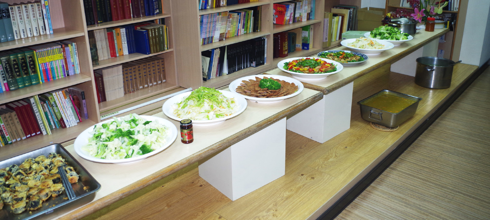

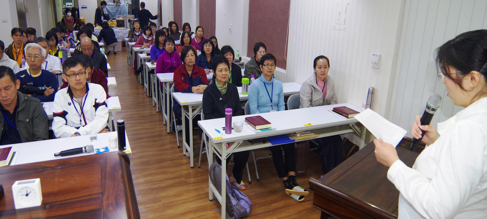

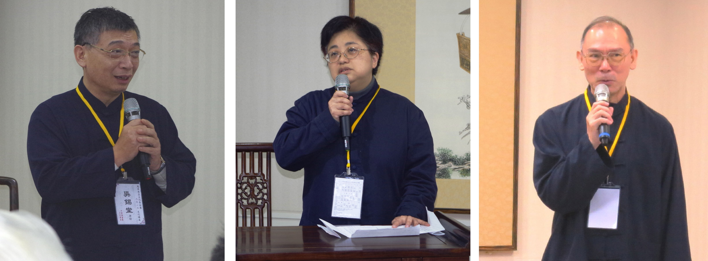

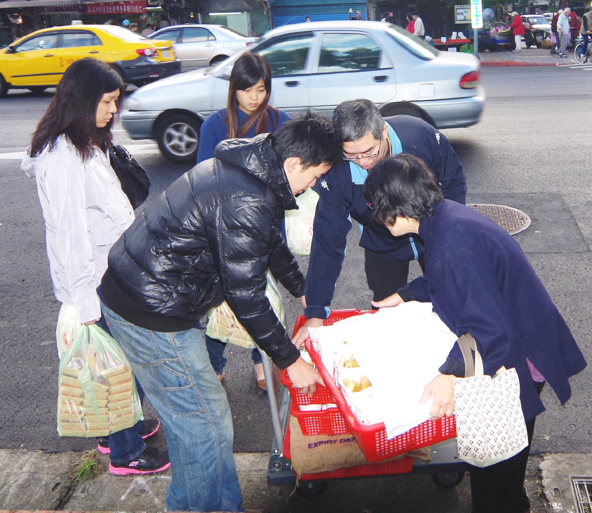

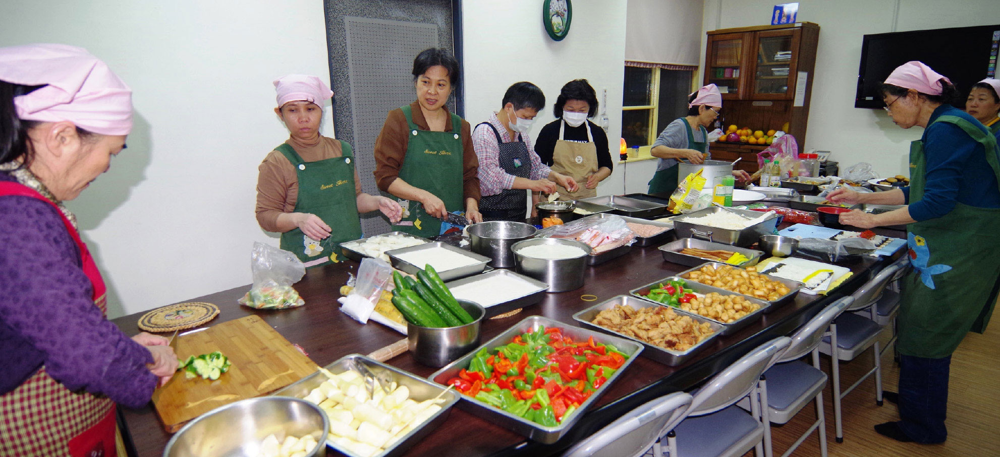

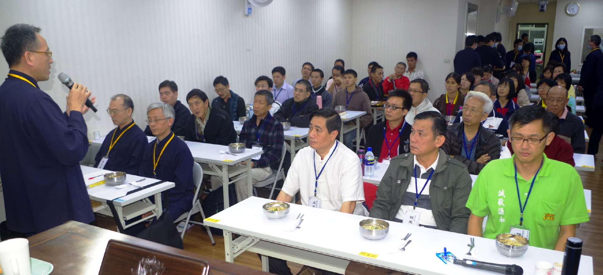

### 有朋自遠方來〜文化一家親　文化交流講座心得節錄（上）

*編輯部整理*

一場人生莫名的聚會

超越時空入道的饗宴

與會法喜相惜的交集

盡未來際扶持的弘傳

二○一二年十二月一日至八日

丹江弟子規教學中心 / 熊志維團長

(一)論語選講

跨越傳聞與真實的障難，最重要的出路是重人事與重生道。從論語經句裡，我們看到孔子及其他弟子也經歷了各式各樣的困難與障礙，如：重病、禍害、罷黜、窮困等等，但只要我們做好「人事」，把自己待人處世接物做好，並擴展到做利益眾生的事，相信上天有好生之德，障難就會遠離我們。另外，也從經句中知道，吉凶禍福不在鬼神，若不以斷惡修善重人事為要，專務求神拜佛以保自安是無用的。我們要相信鬼神的存在而且要恭敬它，但我們得時時提醒自己要在人事上下功夫，這樣才可以真正的趨吉避凶。

何謂人事？基本上論語的每一句經文都是教我們人事，若能從論語中領悟到聖人在人事上的練達，我們肯定可以看清自己的人生，並懂得經營自己的人生。這裡要特別提出，要有好的、有正知見的老師與善知識的指導及提點，方能得到人事的正知正見，因為法是通過聽聞來的。

最後，我們要懂得待時而動的道理。「用之則行，舍之則藏」。我們雖然有道德學問，但要懂得可用、該用、能用的時機才用；反之，不宜、不需、不能用時就收起來。君子知禮、知言、知人、知命。

(二)常禮舉要

禮不是吃人的猛獸，禮是人與人、事與事、國與國維持秩序常態的自然力量。

雖然林老師只能從「居家」篇為我們做兩堂課的介紹，但居家的內容卻是所有其他篇章的根本，因為家庭教育是所有教育的開始，也影響我們最深。

學習重點：

入孝乃能力的培養，學習做事、生活獨立自處、關心他人及照料長輩的能力。（見一至三章）

學習敦倫盡份、尊重別人，學習做個負責任的人，懂得為別人著想，能吃苦。出弟亦包括其中，能培養尊人、恭敬他人的態度。（見四至七章）

學習穩重的做事方法，日常生活中培養四威儀，在學習規矩、懂得注意細節中明禮的運用之道。說明行、坐、卧的正確方法。(見八、九章)

並明飲食之道，居家用餐該有的態度及規矩。(見十至十二章)

總的來說，居家篇的常禮舉要說明禮儀先從家裡學，家裡做，家裡先培養起來，接下來禮才可以貫通其他。

古晉中華文化中心 / 何燕紅

經過五天論語課程，讓我學了很多所要學習的「內涵」。首先要感恩張老師興辦此次的教學活動。但願時常都有這類的活動，讓我們常常薰習《論語》。

我們都知道，《論語》這本書是不容易懂，也許有些人會選擇放棄學習《論語》，也許有些人堅持繼續往這條路走下去。選擇走下去，如何走呢？可能學到最後，仍然甚麼都不懂，因為沒有善知識引導。

中華無盡燈文化學會這個團隊，讓我很羡慕，每位義工都文武雙全，他們時常一起學習，而且把文化、讀書風氣帶起來。若能像他們這樣學習，我相信個個都是精英，這樣傳統文化會更興旺。雖然短短幾天，也看到文化學會每位義工在處事待人接物的「內涵」。有修養的人，素質都不一樣。他們每一位都是我們學習的對象。

如果時間安排得當，我也想常常到這邊學習，不過一定要先齊家，也期許家鄉古晉會有這麼一天，也希望能常常與善知識學習。

最重要在課程之後，如何長時薰習，然後把內涵提升，最後達到孔老夫子的精神。

吉蘭丹愛心教育協會 / 呂輝洲校長

末學是一位退休多年的教育工作者，早期曾在一所中學教導華文，過後退休前十年則調到一所小學掌教。上了這幾天的<論語選講>，不禁使末學感到無限的惶恐與慚愧，覺得以前在教導一些有關《論語》中的句子時，因了解不夠而詮釋錯誤，實在是有點誤人子弟。

如今唐老師以別開生面的教學方式，通過與助教們的問答與討論，深入淺出地將《論語》的精髓講出來，讓人大開眼界；這更讓末學了解到中華文化的博大精深與孔夫子的睿智，我們應該要認真、用心地細細咀嚼，而且還要持之以恒，否則就不得其門而入。

借此機會，末學要衷心感謝丹江弟子規教學中心的張偉慈老師和中華無盡燈文化學會提供了這個進修機會，讓末學有幸參與學習，從而提升自己，進一步認識與了解《論語》。

此外，這幾天的飲食問題，多虧中華無盡燈文化學會各位幕後工作人員的細心安排與照料，讓我們吃飽睡好，如同在自己的家裡，完全沒有後顧之憂，我們心存感恩。

丹江弟子規教學中心 / 李嘉威

首先，我們要感謝本中心所舉辦的課程，因為此次的課程對我們來說是個「另類」的課程，因為除了投入文字教學以外，我們也對藝術，尤是國學的教學有了更深入的了解。此次的課程不只讓我們見識不少，也學習了不少。除了知識學問，我們也得到老師們所分享的經驗。

在還未到臺灣前，在學習論語時感覺很困難，很多的理論都又「半通」，甚至有時候不知道孔子在說些甚麼。此次的課程，可說是一個新的轉變，讓我學習論語的興趣重新提起。可惜的是本人的語文程度有限，偶爾會有學習上的障礙，再加上老師講課的速度有點快，會有「來不及想通」的感覺。雖然如此，這些都是我們自己需要突破的困境，把自己的語文能力加深，及在日常生活的歷練中提升思維能力及敏感度。

除了課程內容的精彩，學會義工老師們的身教乃是我們的好榜樣，除了能夠在課堂上講課，下了課還要處理很多接待的事情，真是令人感動！老師們的身教足以在這短短的幾天影響我們的一生。

從現在開始，我們會積極的提升自己，繼續學習聖賢。

丹江弟子規教學中心 / 林連吉

尊敬的中華無盡燈文化學會所有的老師們，深深的感謝你們熱情招待。

非常欣賞認同唐老師培訓老師們的方法，使每一位老師都有機會講演。

也很認同林老師所說的胎教、家教，大家庭的教育，應對進退所有的大小故事，末學本身就是生長在大家庭之中，所以體驗很深。

當今社會的亂象很多是來自小家庭生活關係，缺少學習的對象。

走入故宮才了解中國歷史文化的珍貴。

丹江弟子規教學中心 / 林鍇絲

感恩丹江弟子規教學中心給予這難得的機會來學習《論語》的智慧，感恩中華無盡燈文化學會在這一週熱情的招待，更感恩老師們在課堂上的指導，讓我獲益良多。

基於本身學習較魯鈍，這一週所學只能囫圇吞棗，未能及時消化，在此只能道出片面感觸，希望來日可在生活中慢慢體會並活用《論語》的智慧。

在此之前，對於學習並沒有全面的認識，或許真的單純到以為書讀千遍，其義自現。經過這一趟學習後方了解經典要怎麼讀，尤其《論語》要怎麼讀才可能將其中道理弄清楚、明白。以前常聽「半部《論語》治天下。」當時的自己並不完全理解是怎麼一回事，現在方了解整部《論語》的重點是要在人事上講究的。確實，現今社會混亂的肇端就是人事問題，只要處理好人事，我想就沒有甚麼事是問題了。

何為人事，在五倫中所發生的事情都是人事，要把握好每一次的分寸。然而，這分寸對我這種閱歷不深的人來說，真的是一種挑戰呢！尤其目前面對幼教，這半年的經驗對我來說還真的是太少，還有很多地方要學習，改進。對學生，對家長，那也是人事，若這方面都處理不好，還談甚麼教學呢？真是慚愧啊！

人事，真的是太重要了！能在小事上盡人事，這樣培養下去，相信能力就是這樣培養出來的。以前，一直以為只要有那份傻勁，那份心，再將經典熟讀老實落實就足夠。這一次的學習讓我明白其實不然，若不能融會貫通，裡面的教義做起來就是生硬的。然而人事是多變的，人也是活的，是要活用。而活用並不是說說就懂了，真的是要在親自處理人事中歷練，才會活用。人生何嘗不是跌跌撞撞，四處碰壁而來呢。但不是每個人跌了還可以完好無缺的站起來，在亂世中有幾個像孔夫子那樣懂人事呢？

誠如唐老師所說，環境真的很重要，孟母尚懂三遷以成就孟子。然而魯鈍的我，期許自己可以在這末法時期從學習《論語》中提升自己，找到出路。

丹江弟子規教學中心 / 陳美萍

還記得第一次看到論語時，孔子說：「學而時習之，不亦說乎」時，心裡很納悶，覺得學習是學習，學習會有甚麼快樂呢？

今日托張會長的福，來到臺灣的中華無盡燈文化學會。從踏出桃園機場的第一步，見了學會的有禮接待，直到課程的結束，深受啟發感動，原來人是有道可行的。

孔子周遊列國，歷盡重病，人事、迫害、罷黜、受窮困……等的障礙，竟表露出無限智慧去克服，讓末學內心有極大的衝擊與感動，悟到現今社會的淪喪，原來已經脫離了道與德，而《論語》竟是拯救人類的寶典。

張會長曾說過，現在的世界需要典範，對於此話，末學認同張會長的看法，而今回有幸看到了典範，而這些典範，竟在學會每個老師身上發揮了光芒，而這些光芒的內涵竟是來自《論語》的力量。

此次的臺灣之旅，讓我了解了《論語》，也了解到孔子仁愛的精神，希望世界可達成大同世界，而末學感恩唐老師無私與精簡的教導，對論語已大大的改觀，眼界也大開，感恩！

古晉中華文化中心-弟子規老師 / 陳燕群

這次的臺北「論語及國學講座」確實是我對中華傳統文化大開眼界及初步認識的機會。對孔子這位偉大導師當時的貢獻能夠承傳至今有深切的體會。

我本來對《論語》毫無認識，這次的講座也讓我有機會第一次的摸到論語，深切體會《論語》包涵著中華傳統文化的精華。

唐老師的博學以及講課的風采深深吸引了我，對唐老師認真精巧的教學態度，使我恭敬之心油然而生。諸老師同修們對唐老師的恭敬禮儀，也表現了中華傳統文化的模範。各位義工和幹部對這次論語講座的一切準備細心、用心，也讓我深深感動及恭敬。這樣的團隊營造了良好的學習環境，我們聽得法喜，學得法喜，也吃得法喜。感恩！

《論語》這部古書非常深奧，以至各個學家都可能會有不同的詮釋，不正確的修學會引起混淆。這又使我特別的明白師承的重要。到學堂或學會上課，聽老師的解釋才能得到師承，學得正法。有朝一日達到明心見性的成果，利益眾生。這次的講座也讓我對孔夫子的認識多了一些，對這位至聖先師的智慧敬佩萬分。我會參考孔子的歷史來對他了解多些，在教學上也比較有信心。

最後感謝張偉慈老師的善心、慈悲心，促成了這次的因緣。承傳及弘揚傳統文化的偉業必然殊勝。

無名氏

從唐老師的講課裡，末學最能感受到的就是唐老師對中華傳統文化的熱愛及傳承的使命感，雖然感嘆今日文化之衰，但從他那滿腔熱血、鏗鏘有力的講課當中感受到，還是存有希望的。

末學從唐老師講課裡學到最受用的是導正我們學習傳統文化的正知見。本來以為經典學習的重點是「文」，而且是可以「書讀千遍，其義自現」。但其實真正的重點是「人」；要有好的老師指導，把古文的真實及正確的義理告訴我們，我們才能越讀越明白，越讀越能舉一反三及通達。

在唐老師身上，末學看到了老師的精進。雖然老師謙虛的說他比起雪公老師「只是根小草」，但還是感受到他的那一份認真。末學認為老師是有一定的內涵的，不然怎會吸引到那麼多有內涵的道友和學生來學會呢？而且從辦事的人，消文的弟子，甚至倒茶的學生的言行舉動，就感受到他們個個皆是人才，而且又老實敦厚、人情練達。

吉蘭丹愛心教育協會 / 黃素香校長

機緣下，能隨同張偉慈老師到臺灣學習，並且能得到李炳南教授（雪廬老人）的弟子傳承論語，得到正知見，讓我們瞭解孔子是何等人物，能踏入孔門，實在是我們的榮幸及福氣。

當我一踏入臺北中華無盡燈文化學會裡，看到雪廬老人的雕像，經過王老師的講述，點燃了我心中的燭，排除了心中為幼兒讀書會的繪本讀物的障難，在我國好的讀物不易找，更何況是讓孩子對中華文化的認知讀物，更是沒有，江逸子老師的畫就是讓孩子，大人認識古文難得的啟蒙教材。

第二天，老師以讀書會方式授課呈現，此次的授課方式，讓我耳目一新，在我參加過的數十次教學課程中，最讚歎的就是這一次，老師以對答方式授課，以學生為主，老師輔助學生學習，學生那會不去備課、思考、探索呢？如果所有的教師都能以這種方式來授課，學校那會培養不出一班班懂得思考又有智慧的幹材呢？

《論語》這本經典讀物，對我國一般學生、學者來說，多會說它是一本之乎者也的讀物，如能遇上善知識，獲得正知見，了解其內涵，知古道今，其出入非凡也。希望能學後而傳承，感恩。

唐詩聽得多了，讀也讀了，可是卻從沒有去賞析及吟誦過，林老師的吟誦及吟唱可太好了。唐老師吟誦〈從軍行〉時的氣魄，真令我贊歎，太妙了，詩的這種呈現法，實在是罕見，試想為何會沒廣泛推行呢？

新世代，也是行為世代的交替，讓我們一起來發揚這千年中華文化吧！讓它再走入人群。

丹江弟子規教學中心 / 蔡素妹校長

能夠受邀參與此次的《論語》學習團，末學感到非常興奮，非常感恩。《論語》博大精深，在家看了，讀了幾篇只獲得片面之義。現今才了解到「讀書千遍其義自現」的說法並不完善，要想真正了解，明白《論語》則必須靠老師的指引，而這位老師也應博學多才，能夠滔滔不絕，引用各種例子來說明其內涵。有這機緣能聽到唐老師的課是末學的福份。唐老師的講解由淺入深，對整個典故的來龍去脈了解得非常深入，對歷史的背景能一一講述，更加深了我們對《論語》條目的詮釋。在唐老師的指引下學習《論語》，讓末學充滿了法喜，有欲罷不能的感覺。孔老夫子的智慧應是我們現代人該學習的。

「學而時習之，不亦說乎」的「學」，經過唐老師的分析《論語》原來有那麼大的學問。在學之前必須有求，有求才有教，這兩項是互動的。教與學當中最重要的是聽聞。想起以前的老人家常說「小孩子，有耳沒有嘴」正是此理。學的動力必須是法喜的才能持之以恒。學習的教材更應講究，以古文經典為內容。學習時必須全心全意，並要預習，學習然後復習，温故知新。學習最終目標是博學，一以貫通，學成君子，學成聖人。並做個有內涵的人。

丹江弟子規教學中心 / 鄭嘉豪

在丹江弟子規教學中心修學已有九年，在修學中遇見許多問題，當末學遇見問題時，多數會選擇不敢面對問題。因為總覺得自己經驗不足，沒有古人的智慧，通常當事情變得嚴重後，才被動的處理事情。

子曰：學而時習之，不亦說乎，末學冷靜思維，為何越學煩惱越多？是否自己在修學中未能掌握修學的關鍵，所以才不能領會古人修學的快樂。

來到中華無盡燈文化學會，能夠聽聞到修學之法脈，唐老師與林老師字字珠璣，句句精準的義理，讓末學受益不淺，讓末學體會以下：一、聖法無人說，雖智莫能解。二、讀書千遍，其義自現。三、學習做個有智慧的好人。

《論語》這本經典已傳上千年歷史，都有上百家注解論語，耍如何抉擇注解以及明白真義理，必須有師承才能了解。例如在黑暗的山洞內，如何找出口。必須要有一盞明燭(正法)照耀，去除身旁的黑暗尋找出路。所以有明師的指點比甚麼都重要。
才知道讀書千遍，其義自現不是死背死讀，而在修學上要懂得博學、審問、慎思、明辨、篤行。博學：了解古人的歷史背景，歷史上可以吸收很多人事關係，可讓我們人生少走很多歪路。審
**問：** 不知道的問題去請教善知識。慎思：謹慎構思、一切問題之發生。明辨：可和志同道合學長討論與研習，明辨是與非，進而把聖人的智慧落實篤行生活中。

法師曾提慈悲生禍患，方便出下流。在這時代壞人很多，小人也不少。人生沒學習孔子的智慧與內涵，往往會遇到很多挫折。才知道處世中要懂進退應對，壞人可以教導，小人不可教導。

中正小學 / 黃美君

在參加文化講座之前，因中學時代學習古文的日子難挨，那些古文查了讀音，不解其意。那時總認為學古文浪費時間，食古不化，與時代脫節。

第二天正式上課，唐老師分析學習古文的方法。唐老師讓我從學習論語中，重新認識說話的藝術。在春秋戰國時代，伴君如伴虎。大臣之間的勾心鬥角，如沒分析事情的能力，如不能行道，那裡能在順境中讓大眾得利益。現今社會上，有權有勢之士，少有利用自己的權勢力利益大眾。想起自己，在逆境中往往怨天尤人，未嘗掌握說話的藝術，常使小事化大，認為自己是千里馬，未遇伯樂。學習論語後，才發現君子敬而無失，與人恭而有禮，才是正確的態度。尤其在逆境中，能像論語裡，孔子與眾弟子般，內相與外相皆具，能在眾人身上找到自己的福報，這種偉大的情操，讓我深感慚愧。

在論語選講中，我認識到古文中用字的精簡。單只是「言」與「曰」二字，言原來是主動告訴他而不是兩者皆同。論語裡人物的對話，卻不一定是表面上顯現的意思，而須要從字裡行間去推敲箇中真正的含意。讀論語和其他古文，都要先了解文章的歷史背景，尤其是論語，更需從其他篇章中加以對照。

唐詩賞析暨吟誦中，林老師讓我知道絕句和律詩的分別，更重要的是看到唐詩意境之美。透過杜甫的〈小至〉，引導我通過詩中寫景物中，體會作者的心境，推敲出作者所處的背景。唐詩格局的嚴謹，讓我體會傳承文化的重要。詩的吟誦，牽動了我的情緒。

在上常禮舉要中，我生平第一次接觸居家篇。它出現的年代距今已久，但古人在居家篇中的教導，竟已涵蓋了一個人由孩童開始的家庭教育，到學校教育，以至到社會上應通曉的禮節與人情世故。

這次的文化講座，讓我親眼目睹內涵的提升所顯現的外相。唐老師和林老師教導像我這種無國學基礎的學生，卻盡心盡力，一點也沒不耐煩。無盡燈的弟子們，在學習論語中表現出來的學習態度，待人處事的態度，一樣是我該學習的榜樣。今後的教學生涯，我應該已找到自己該走的路了。

中正小學 / 葉燕嬌

論語的真諦就是告訴我們，怎麼樣才能過上自己心靈所需要的快樂生活。論語主要講述了天地之道、心靈之道、處世之道、君子之道、交友之道、理想之道和人生之道。

我們的物質生活水平顯然地在提高，但是許多人卻越來越不滿足。因為他們總是看到周圍乍富的階層，還有讓自己不平衡的事物。我們的眼睛，總是看外界太多，看心靈太少。孔老夫子教我們，快樂秘訣就是如何去找到自己內心的安寧。人人都希望過幸福快樂的生活，然而幸福快樂與貧富無關，但卻與內心相連。

孔子特別强調做事情的分寸，「過」和「不及」都是要盡力避免的。孔子提倡仁愛，但他並不認為應當以喪失原則的仁愛之心，去寬宥所有人的過失。「以直報怨，以德報德」，這正是孔子告訴我們處世的分寸。孔夫子在這裡提倡的是一種人生的效率和人格的尊嚴。如果我們永遠都以一種惡意、怨恨去面對別人的不道德，那麼這個世界將會是惡性循環，永無休止。我們將會失去的不僅僅是自己的幸福，甚至還會賠上子孫的幸福。

然而，以德報怨同樣不可取。換句話說，若我們獻出太多的恩德，太多的慈悲，用不值得的仁厚去面對已經有負於自己的人和事，這也是一種人生的浪費。孔老夫子就是告訴我們要把有限的情感和有限的才華，留在最應該使用的地方，用自己最高尚的人格，坦然地去面對一切。

每個人的一生中都難免會有缺憾和遇到不如意的事情。雖然我們會感到無能為力，也無法改變這個事實，然而我們可以改變的是看待這些事情的態度。

論語的精華之一就是告訴我們如何用平和的心態來對待生活中的缺憾和苦難。既然死生、富貴這些事情都是天命所歸，個人無法左右，那我們就要學會承認並且順應。保持一顆誠敬的心，減少過失，對他人謙恭有禮，可以提高自身的修養。

修身養性是對家園、對社會負責任的第一前提，也是交到好朋友的前提。選擇一個朋友，就是選擇一種生活方式。而能夠交上甚麼樣的朋友，那就要看看自己的人生多有光彩。

孔子的話，語言簡潔，寓意深刻，絕對值得我深入思考。承認現實的不足之處，並且通過自己的努力去彌補這種不足，這就是論語告訴我們對待生活缺憾的態度。

「半部論語治天下」，有時只要學會一個字或兩個字，就已經足夠讓我們用一輩子了。

中正小學 / 凌春梅

很快的，到臺北來參加中華無盡燈文化學會主辦的文化講座就要接近尾聲了。說長不長，說短不短，但臨別在即，如今心中卻覺得有所不捨。

能有幸參與這個講座，難道是我前世修來的福報？作夢也沒想到我們會從遙遠的馬來西亞到臺北來。聆聽唐、林老師及其他老師們的諄諄教導，讓我有機會認識論語的偉大及重要。看到各位老師們對中華文化的執著及付出，使我的心中震撼不已。

在這幾天裡，我們不只學到了如何成為一個好人，一個有內涵的人，而且也讓我們看到傳承中華文化的道路，希望這條路上的燭永不熄滅！

我也很敬佩志工們默默的付出，使整個講座能在非常順暢及完美的情況下進行，你們所作的一切使我們心存感恩。聽了一場又一場的講座，令我感動也令我想流淚。想必是觸動我心吧！

最後，希望唐老師、老師們及志工們你們的大愛精神永不磨滅，也希望我們還有機會聆聽老師們精湛、生動的教導，感恩、再感恩。

中正小學 / 張玉慧副校長

(一)論語選講：

開始接觸《論語》是在前年校友會所舉辦的三天《論語》講座會，那時候的感覺，是在聽道德故事，認識一些歷史人物，並不了解原來《論語》的內涵對中華文化是那麼地重要。自從出席了丹江弟子規教學中心所舉辦的每週五《論語》家長班，又有幸能隨團到無盡燈文化學會聽唐老師講課，才深深體會到，身為華人而不懂得中華文化的人，是多麼地悲哀，而且中華文化需要有智慧的老師，如唐老師及弟子們繼續傳承下去。雖然是選講，但我相信一定能激起老師們的欲望，想更深入地去了解《論語》。

自從張偉慈老師的〈論語簡要〉上報之後，我每天都有剪貼報紙，打算在新學年開始貼在布告板上，讓學生也能認識論語，希望能讓學生愛上論語。

在文化導覽方面，經過唐老師的介紹與講解之後，我才對雪廬老人有了一丁點的認識。不然還不知道李炳南老師就是雪廬老人。他老人家一生中造就的人才多不勝舉，真是一位偉人。

一直以來，校方只叫學生背<弟子規>及聽老師講解<弟子規>，而沒介紹及推行<常禮舉要>。經過林老師選講之後，我已經決定了，開學後一定要極力推廣<常禮舉要>，因為這是提升學業成績最重要的前提。當學生有了內涵之後，肯定會當好學生、好孩子。

無名氏

《論語》是環繞孔子及其學生的言行語錄，語言優美，內涵豐富、博大精深。論語所蘊含的道理實在太多了，而且都是精華。我的理解能力有限，無法正確解讀一本二千五百年前的言行紀錄。原文是文言文，既使背誦了孔子的言論，參考了注解，也未必知道他的真正用意，更談不上付諸實踐了。今天，能夠上唐老師的論語課，實在是我的福氣。唐老師精通歷史，博古通今，善於引經據典，把論語講得非常生動，有趣而精采。聽君一席話，勝讀十年書，讓我受益無窮，終身受益！

論語中，給我印象最深刻的幾則，莫過於「子欲居九夷。或曰：陋，如之何！子曰：君子居之，何陋之有？」大家都覺得君子怎麼會想去住在鄙陋的地方呢？他的回答說明了君子不會在乎外界環境的好壞，是人改變環境。還有，「歲寒，然後知松柏之後凋也。」我們應該像松柏一樣堅韌不拔，無論處何境地都應忠貞不屈，高風亮節。歲寒之後，必然春天。「學而時習之，不亦說乎？」告訴我們，學習知識並不僅僅是學習一遍，更重要的是要經常温習。同時，要把學習當作一個充實自己的過程，懷著愉快的心情去對待它。

讀論語可以治國、為政、做人，可影響我們的生活，其中所蘊含的豐富哲理啟迪我們的心靈，它告訴我該如何為人處世、修身養性，讓我們從自身做起，完善自我，讓這個世界更加和諧。(修身齊家治國平天下)

中正小學 / 黃秀琴

論語到底是甚麼呢？是一本兩千多年前的孔子經典語錄，今天還能對我們的心靈產生觸動嗎？今天我們有幸來到了臺北的中華無盡燈文化學會來學習論語的精華。唐老師更以有趣及以講故事的例子來帶出論語裡的典故，好讓我們更加容易的消化這論語裡的文言文。唐老師從天地人之道、心靈之道、處世之道、君子之道、交友之道、理想之道、人生之道等方面來剖析，將千年論語化為現代人心靈甘露。

唐老師也以獨特的個性視角來解讀<<論語>>，話說到活學活用，給予我們不少啟迪，在這短短幾天的學習更讓我體會到了應該怎樣做好人生的加減法。甚麼加減法呢？加法，那就是收集一些我們認為我們所需要的如經驗、財富、情感、名譽等等。但是物質的東西越多，人就會越容易迷惑。減法？就是捨棄那些不是我們的心靈深處真正需要的，而是去尋找心靈上真正的安寧與快樂。這減法的生活可能大部分的人到了三、四十歲後後才會體會到。

中正小學 / 黃慧嫻

這次的學習真是獲益不淺，可以說從無知到了解到甚麼是論語。原來論語教我們那麼多的人生道理。從論語中，歷史故事就一一的呈現在我們的腦裡。發覺到論語真的是不簡單。如沒經過明師的講解其中的涵義，還真是不明其理，經過唐老師那詳細的解說，引用了很多典故及例子，才清楚到人生中很多的挫折都可在論語中找到出路。

中正小學 / 譚國慧

論語是儒家學派的經典著作之一，一部記綠古代著名的思想家、教育家孔子及其弟子的言行的書。

我讀論語這部書，認識一個明知其不可為而為之的孔子，一個多才多藝、誨人不倦的孔子。打開論語閱讀後使我懂得如何處世待人，教給我正確的學習方法和學習態度。

其中有幾句論語，我受益匪淺。如温故知新，温習以往的知識後，就會有新的發現，新的體會。「歲寒，然後知松柏之後凋也。」讀了這句話，可想而知松柏是多麼堅韌不拔，是那麼經得起惡劣環境的考驗。我們不正需要這種精神嗎？

連幾天聆聽了唐老師對論語精闢的解說，使我大開眼界，好像是穿越幾千年的時光隧道，看到群雄逐鹿，爭霸天下的春秋時期。《論語》使我深深感受到了儒家思想的博大與精深，體會了中華文化的深邃之美。

我很感謝丹江弟子規學習中心讓我有機會參與這一場令人感動、難忘的文化之旅。讓我們一起努力把中華文化這塊瑰寶承傳，並發揚光大。

（下一篇繼續）

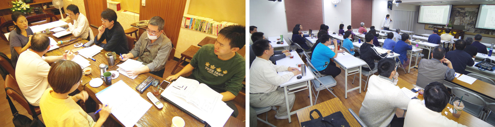

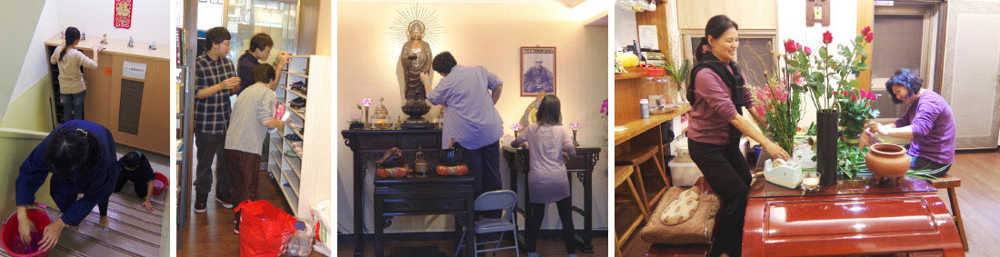

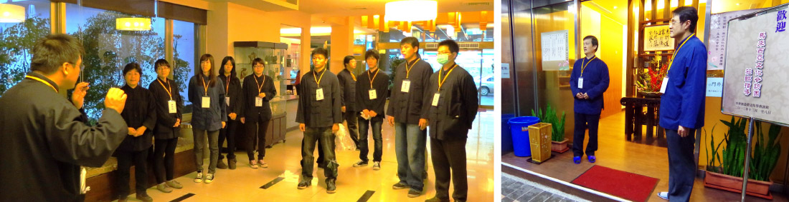

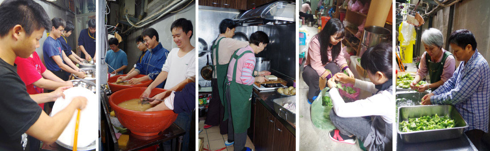

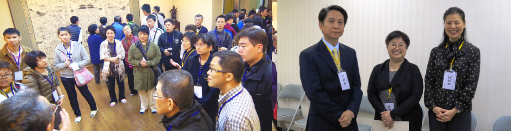

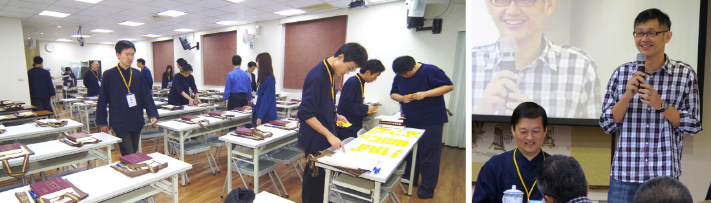

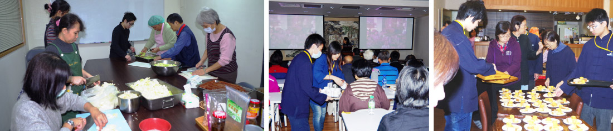

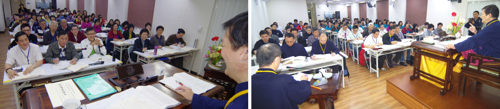

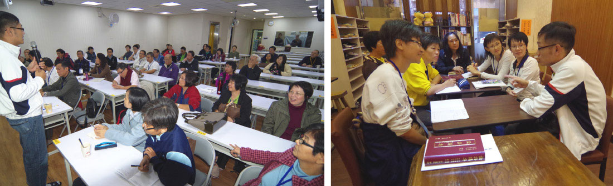

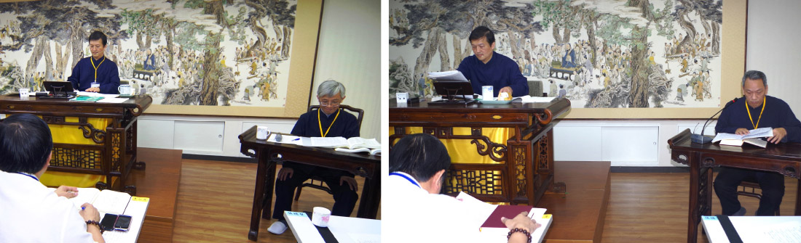

### 有朋自遠方來〜文化一家親　文化交流講座心得節錄（下）

*編輯部整理*

中正小學 / 戴佩玉

《論語》是一門很奧妙的學問。要精通《論語》確實非常難及不簡單。唐老師讓我大略明白各句的涵義及典故。唐老師講課時的那份幽默，的確讓我們大開眼界。此外，唐老師是個博學多才的人。能夠上唐老師的課，我真是非常幸運及感恩。大略了解了《論語》後，我才知道原來《論語》能夠提升我們的內涵，只有文化的傳承才是我們的出路。

孔子稱為聖人是沒錯的。孔老夫子所言確實讓世世代代的人受益。其實我非常贊同唐老師所說的道理及意見，中華文化的沒落造成了種種的社會問題。因此，我身為老師更必須要好好地自我反省。這幾天我都認真地去思考及檢討我之前的教學法是否錯了。我們往往要應付教育局所規定的課程而忽略了《論語》所教的學問。往後我會多加注意。有智慧的人越來越少了，我也會多鑽研有關《論語》，以對它更加認識及了解。

還有一點讓我非常敬佩的是唐老師及所有學生的那份真誠及永不放棄學習的精神。他們對論語的那份熱情啟發了我對論語的重要性。

這幾天能夠得到中華無盡燈文化學會的老師及義工們的款待，我真是十分感動及感謝。希望唐老師能夠利用科技在網上授課，讓全世界有意學習論語的學生受惠。謝謝！

麻六甲自願義工團 / 何桂文團長

首先感謝中華無盡燈文化學會，這回的論語講座實在非常好，也可以提升末學與其他學生的見識和對論語有更多的理解。

唐老師所描述的《論語》可以把我們引到孔老夫子的世界，也就像回到兩千多年前一樣，對於儒家，在末學的印象裡就是弟子規，之前就有聽過李炳南老居士，也不知道還有雪廬老人的名稱！

對於「君子敬而無失，與人恭而有禮」這個句子裡，我理解了在人生的過程當中，面對任何重輕事的分別與處理，也要把小人與壞人作分別，四海之內皆兄弟，兄弟兩個字也要好好的用論語的角度來深一層的理解，末學學淺，所以也不懂再用甚麼字句來描述其他！

在這以真誠心！以萬二分的感謝中華無盡燈文化學會所有的義工們和老師們。

麻六甲自願義工團 / 邱天心

首先向尊敬的諸位老師、長輩、學長們表示由衷的敬意與謝意。末學能有此殊勝因緣，參與唐老師和林老師的課程。此外，末學也感謝張偉慈老師讓末學有機會參加這次的課程，也感謝默默付出的發心義工，讓末學在這次的課程中找到了希望。尤其是老師們的循循善誘與關懷，師姑們在廚房就如神奇的魔術師，變出一餐又一餐美味的大餐，真是感激不盡。

原本以為連續六天在教室中聽課會是萬分痛苦且漫長，沒想到這次的講課內容非常精采，讓末學對學佛學儒的方法有更深的了解，據了解，江逸子大師，癡心筆墨，經唐老師導覽江老師的繪畫藝術畫作，使末學更進一步感受到裡面的意境、體會孔子的仁愛儒家精神。內心很感恩雪公太老師的偉大，他可以教出像唐老師這麼好的學者，然後讓我們認識到這麼好的老師，讓我們感受到中華文化的教育和素養。

這八天課程細心的安排，寸寸光陰的把握利用，真的非常充實。以師長們的模範裡，觀摩到禮儀態度的實際應用，在這裡所學的都能作為末學日後的資糧，願末學時時奉行，努力學習，才會對得起這裡教導的師長們，也讓種下的種子發芽結果。

課程結束後須好研學《論語》，並在日後生活中落實，末學相信這一條出路會讓自己越來越好。這條路是收穫滿滿的，法喜充滿。那麼多的收穫中，深深體會到中國文化的博大精深，共學的力量不可思議，末學非常珍惜，感恩！

只有不斷學習，希望老師身體健康，弘揚正法，臺灣需要你，馬來西亞需要你！

麻六甲自願義工團 / 邱明燕

第一次來臺學習，就感到無限的快樂與希望，在學習過程中，開始知道如何抓重點。老師的辯才之妙，真令末學渴望到達。

透過<論語及國學>講座，才了解教法的重要性，教法能夠開通很多觀念，一個人觀念轉變，一切都會變得不一樣，命運也隨之而改。

末學會盡力把《論語》弄明白，希望藉此能在未來道路上增長自己各方面的能力，在未來做傳承文化的事業，改善社會風氣。

謝謝唐老師的教誨，還有諸多善知識的幫助，更要感謝師姑們在這種天氣為我們準備美味佳餚，讓我們更有活力、精神上課。

最後還希望有因緣回來聽課，與朋友共同學習。願此樂與願相續永不斷。

馬來西亞中華文化教育中心 / 宋寶蘭

與唐瑜凌老師、林蔚芳老師及中華無盡燈文化學會師資學習論語四回，知有明師傳授道統，就如同搭上了聖人之肩，著了聖人之眼力，明了聖人之知見。若無善知識指導學習的方向和內涵，恐怕學生自學多年仍然不得其門而入。恰如師云：誤解「道聽而塗說」，為在路上聽到甚麼不經思考明辨即傳給他人，多年還渾然不知，真是不讀書之過也！慚愧。

再說唐老師用心的指導，示現在家人如何以夫子忠恕之道，修身、齊家、治國乃至平天下，林老師從日常生活點點滴滴契入敦倫盡分。文以載道，雖說博大精深的《論語》是窮一生亦難透徹，但在雪廬老人的承傳之下，學生每一次領悟少分，已足以解學生惑，使思維更加清晰，志向愈加篤定，對中華傳統文化能救世之信心，又上了一層階級。學習所生之法喜，是看到了出路，可謂看破人世之虛實，放下人為之不安。如孔子盡人事而安天命，何樂而不為？何有苦來說？的確是夢到孔子也會哭。

學生報答師恩最好的方法，莫如傚仿曾子之三省，學而時習並與志同道合之朋友互相增長善法。努力知命、知禮、知言。

微薄之供養，僅為自勉。

馬來西亞中華文化教育中心 / 丁文博

非常感謝，也非常高與能參加此次《論語》之學習。受益之多，無以言表。

幾日雖短，卻可以在唐老師博學精采的演講中見識到深入經典之氣象，體會到《論語》的美好遠超學生的想像。而在課程中亦似見到夫子及弟子一起學習成長之狀況，縱經困苦，不失其志亦略揣學習《論語》之說服力，於今日社會實用之功效。同時對這部千秋之聖書生起無比之信心。也見到自己之前生活工作中犯的很多錯誤，皆不讀書之過也。也願以此為契機，真正開始深入經典，效法夫子敏而好學之精神。

在樂教之中，見到老師備課之用心，選擇之不易，排列之有序。看似輕鬆的一堂課，感受到背後準備的辛苦。然學生略有不解之處，似西方音樂重於東方，且並未聞中華之古典音樂。或言時間之限，然《論語》之講座未聞中華之樂確感不圓之處，如在故宮見到古人之物，即如見古人在前，而聞古人之樂亦如聞古人之聲。僅供參考，以圓全美，不足處望見諒。

馬來西亞中華文化教育中心 / 李添民

雖然只是短短的幾天課程受益良多。先從第一個晚上的「相見歡」，就體會到真誠恭敬心能彌補事之不足。

此課程的受益可從幾個方面：

(一) 學習和講課的方法

學習—中華文化的經典歷史與有限的人類生命皆說是以有限的生命追無限的知識，永遠學無止盡。所以用論語為主科去了解先人的智慧，歷史及其他經典也就能讓學習貫通在日常生活中。講課—用消文老師與主講師一起配合的講課，能讓課程不單調而有趣，又能同時培養接班人。使後繼有人。同時也能啟發消文老師的思考，對文章的真正了解。也能培養真誠恭敬，知之為知之，不知為不知的心態。

(二) 信心

從常禮舉要課中，也給了自己對分享的信心。先人的經典都以最重要、最主要為開頭。這對今日社會人類聽課來說很有幫助，就是在最短的時間點到重點。

(三) 提醒自己

從夫子解「大學」的一事，警惕了自己，當學歷提升時，常以自己的思想意見來解經典時，就顯現了傲慢心在增長，恭敬心在退了，這就是危險的開始。

(四) 論語

唐老師用了四十章論語正見為「跨越傳聞與真實的障難」的出路做講解。我對此講解的總結是；１．在人事中對「語」和「傳」要謹慎和有智慧的做判斷。怪、力、亂、神之事不語、不傳以防妖言惑眾。２．在生道之事，勸敬鬼神而遠之。３．如要超越障難，要了解：死生有命，富貴在天。被冤枉的人，會因禍得福。一個有真正使命和責任在身的人，命運在天，不在他人事物。要能判辨「智」和「仁」。

(五) 科判

從此課程，對科判也有了一點點的了解。

馬來西亞中華文化教育中心 / 林建文

轉眼間五天的<論語及國學>講座就結束了，而張偉慈主席在課程開始前的分享還猶在耳邊。經過多年在馬來西亞推展<弟子規>，張主席發現很多推展文化的團體都遭到了瓶頸，他希望大家能夠通過此次的學習突破瓶頸並找到出路。因此唐老師也很慈悲的舉辦了此主題為<跨越傳聞與真實的障難—論語正見是出路>的講座。所以在課程開始前，末學就期許自己，希望自己能夠好好學習，並從中找到突破瓶頸的方法，以不辜負唐老師以及張主席的一番苦心。

從這五天的學習中末學發現《論語》裡給了我們很多突破瓶頸的方法。而論語開卷第一句「子曰：學而時習之，不亦說乎！有朋自遠方來，不亦樂乎！人不知而不愠，不亦君子乎！」就是其中一個很棒的方法。從講座中，末學認識到學習是要敏以求之，要從有正知見的老師那邊得到傳承，要在有利的環境中進行，要與志同道合的朋友一起進行。而這一切，唐老師除了在講座中說給我們聽，也通過他的團隊示範給我們看。中華無盡燈文化學會的師長們，把唐老師在課堂中教的都落實在他們的生活中，這都是我們很好的學習楷模。

末學期許自己能夠把此次學習到的知識落實到生活中，並通過不斷的學習來提升自己的能力，以在弘揚中華文化的道路上持續的走下去，並成為一位知命、知禮、知人的君子。

馬來西亞中華文化教育中心 / 陳東昇

真正認識了解，深入《論語》的內涵，從自身、人事環境改正調節才能突破困境，其中，子曰：「我非生而知之者，好古敏以求之者也。」體會不淺，只因「因循」二字而耽擱一生，我的學習也正因「因循苟且」而無法躍進了解孔子的內涵以及人生百般閱歷，加上唐老師有別於馬來西亞的學習方式，重新帶領自己加深對於經典學習的重要性，且讀書會給團隊激發的心靈之定心丸，從無盡燈的義工團隊了解，一脈傳承的精神是彼此相互學習、切磋經典；而大家的凝聚力、向心力正因為是承接了傳統文化博大精深，這絕對是我必須重視的，當落實中缺乏了真實的薰陶，表現的不會落於正知正見上，而這份偏差，內心自我的滿足或自以為的方便法；卻誰知方便出下流？

感嘆自己學習的散漫，不知誤了部門多少人的方向或初心？晉升得快卻有種落寞無助的感覺，團隊純淨純善的，如今卻又能有幾人可共患難呢？發心容易恆心難，但初心又是否有了偏差呢？

其實反思又反思，我們的道是否偏了？子曰：學而時習之，不亦說乎！踏上了傳統文化古聖先賢的內涵下，不是共沾法喜嗎？又為何於人事中深感乏力？打開方便不正是為了更多大眾能得到文化的感染而法喜；但為何學長們只感身心疲倦、有心無力？其(一)失去經典的深入學習；(二)失去原則，常開方便門；(三)充胖子；(四)形式主義；(五)團隊的關照不足等。

回頭看，觀察雖觀察，但自己也沒盡好責任，因此，須先護念好自己方能護念他人，真正的護念是得從持戒開始，自我的規範，或自我的約束，往往是自己力行處世待人接物的基礎，安份守己地完整落實「孝道、師道」，傳承是師道的傳承，是孝道的表現；而團隊的向心力堅固更是弟子們完整遵循老師的理念立身行道，進而推展文化的偉大。

本次來台參學的最大收獲便是深入經典學習，能開啓團隊共識，强化實質與內涵的充實，智慧哪裡得？從經典，經典又如何學習？必須彼此考證，互相探討、對答…，以上便是我所體會，所獲寶貴想法。

最後衷心感激張會長的帶領，促成七天的學習因緣，感謝中心的提拔參與課程學習，感謝唐老師、林老師之用心教導，最後感謝中華無盡燈文化學會各位學長、義工，給予我們最好的禮遇。

祝身體健康，學道成就。

馬來西亞中華文化教育中心 / 無名氏

嘗聞「半部論語可以治天下」，但其何以可治天下，心中一直存疑惑。今親臨中華無盡燈文化學會，拜賜馬來西亞丹江弟子規教學中心張會長及中華文化教育中心領導王主任、宋老師恩德，幸於雪公老人親傳弟子唐老師、林老師等諸多大善知識座下親聆教法，徜徉於歷史長河中與聖人對話重新認識《論語》這一人生寶典成聖指南，跨越傳聞與真實的障難，何其樂哉。

末學只重佛法不重儒學，又誤以為餘力學文是要先學好弟子規方可深入論語，解行分開，以致於一直停留在聖學門外，不得其門而入。尤其對佛法如何入世調劑人情方面頗多疑惑。今得唐老師之深厚內涵，及林老師對<常禮舉要>深入淺出的講解，及眾位老師們的精彩消文，得以重新認識論語及孔門賢聖。始知《論語》有如人生的劇本，有演有說，若會學會用則能自利利他，自度度人也。

子曰：「道聽而塗說，德之棄也。」而末學過去常犯毛病盡在此。未能深入研究經典，何以知己，未能有正知見何以知人。不知己知人，又何以教人以正知見，不學論語，末學知人無方矣，只恐斷章取義，自設障目。只知柳下惠之坐懷不亂，而不知其三黜不改其志之賢。只知子路之勇，不知其義。更不知有曾子臨終心不亂。真可謂是盲人摸象，不識廬山真面目。可嘆未有師承之學習，終是迂迴曲折之路也。

馬來西亞中華文化教育中心 / 黃子冰

感恩祖宗父母把福報都集在子冰身上，感恩唐老師嘔心掏肺的教導，感恩張偉慈老師的護念以及馬來西亞中華文化中心的宋老師和王主任。

聽完唐老師的<論語選講>和老師的教學方式，子冰內心對中華傳統文化有了重新的認知。對《論語》有更深一層的了解、信心和親切，更覺得佛菩薩對炎黃子孫有一份特別的厚愛和信任。故文化的傳承、正法的弘揚很自然的就落在自己的肩膀上。絕對不會是於我如浮雲的態度。

原來，每一天，時刻都能敦倫盡份就是祈禱的要義，戰兢愓厲的做好每一件事就是祈禱。子冰從小常聽老人家說「盡人事聽天命。」但卻聽而不聞，沒有太大的感受。經由唐老師講述「超越障難」後，原來「盡人事聽天命」居然是人生的出路。再來，精通禮教對知人是這麼的重要，從唐老師講解「夾谷會齊」裡夫子聽了齊人演奏的音樂，對魯君的不恭敬，夫子馬上喝止。衞靈公問陳於孔子，等等章文，原來精通禮教則能精通人心。

沒有唐老師嘔心瀝血的教導，子冰真的不得其門而入。

最後，子冰以曾子的「士不可不弘毅，任重而道遠。仁以為己任，不亦重乎？死而後已，不亦遠乎？」自勉之。

馬來西亞中華文化教育中心 / 黃  俐

今幸得明師指點，科判為目，聞說論語正見，亦如明燈照亮於心。正所謂踏破鐵鞋無覓處，得來全不費功夫。山窮水盡疑無路，柳暗花明又一村。有明師耳提面命，學生努力求學博學歷史古籍，審問之慎思之明辨之篤行之。學聖賢之智慧，辨人事之圓融。出世入世雙修，解行並進。在《論語》有如悟得入世的修學法，外儒內佛，真正實現人能弘道，這才是人生真樂。

末學既已明道，當效於聖賢，進德修業，常懷戒慎恐懼，深信因果，敦倫盡份，以眾生命為自己命，以眾生離苦得樂，培養人才為己任，精進不已。學夫子之為道統之傳承，正法之久住而「不怨天，不尤人，下學而上達」，下學人事，上達天命，想必亦能最終達成性與天道的正知見。末學學淺德薄，以上所解亦恐失之偏頗。懇請大德善知識不吝賜教。

馬來西亞中華文化教育中心 / 黃淑儀

學生目前所負責的工作崗位是人事部，包括國際簽證及內部事宜。因為年輕，工作經驗尚淺，所以不曉得真正盡人事，盡心工作的狀況。以為修學才是最重要，所以處理事情會比較馬虎，總是要很快的先把事情忙完，然後就想要去看書。

聽經，自修了。但是工作卻不是很理想。經過好幾位的師長及上司慢慢的引導，才把錯誤的想法轉變過來。就如論語所說；子路問事鬼神章，講得非常清楚，如果在工作上和人事上都沒有依照經典及盡心盡力落實，再怎麼努力去修學，聽經聞法，也只是表面功夫，根本就不能運用在生活裡，學生很感激身邊的善知識，教我很多很多，也讓我在工作生活當中去體驗每個當下。工作，生活及修學是合在一起的，是具體的去落實在事物當中。

林老師的<常禮舉要>讓我很窩心，因為有更多的活潑禮儀運用在生活裡，尤其是對父母那一塊，我相信我一定要做個讓父母安心的女兒。以上，是學生較深的感觸。感恩義工老師們的接待，末學很感動。祝：四時吉祥，安康幸福。

馬來西亞中華文化教育中心 / 劉心愉

感恩所有的一切人、事、物，讓學生有這個褔報來參與這八天的文化饗宴，感恩無盡燈文化學會的靈魂人物唐老師，林老師以及所有在台前及幕後的善知識。

剛上完論語課的時候，學生對傳統文化的出路，對一群還在模索的人群就已經開始弘揚的做法感到疑惑。是學了才做？還是邊學邊做？甚麼樣的做法才是對一般大眾有效的教育方式？怎樣傳承才不會毀了我們的文化？

讓更多的人知道傳統文化的美好，再摸索怎樣走下一步路，是不是正確的？學生對一個團體缺乏有行動力、有遠見的領導以及有內涵的資深文化老師深感憂慮。

不管目前我們面對任何困境，包括路的方向走對了，但走路的方式不一樣，走路的快慢不一樣，唐老師通過論語告訴了學生，不管任何境界，我們都要盡自己最大能力去做好每一件事情，結果是怎樣的，就交給天吧！

學生在還沒接觸傳統文化之前，時常想知道自己的命運如何而去問神、算命。學了一點點的傳統文化後，知道命運是可以改變的。有一點可以肯定的是，就像論語裡所說的真心誠意去做，盡人事了，自然有佛菩薩保佑。現在學生也在學習減少對物質的慾望，發願努力提升自己對經典的認識。對於唐老師在文化的內涵，其實是經過很多的努力與付出。學生只是希望能夠在以後有機會時常上唐老師的課。唐老師豐富的文學底蘊是可以也應該讓更多人，甚至現今世界的人知道，孔子的大同世界是可以實現的。學生深深相信這一天是會到來的。一定會物極必反，壞到了極處，就會變好的！

馬來西亞中華文化教育中心 / 鄭宇均

在〈常禮舉要〉林老師的課，給宇均有些體會，也希望自己回到馬來西亞好好力行。唐老師在分享到雪廬老人晚年時，在黑暗中都可以拿到自己要看的書本。所謂物有定位。自己的物品都沒好好定位，有時在急忙的時候，沒法很快速拿到自己要的東西。

另外，江老師母親給老師的一句話，起三早賺一天。這句話都自己要好好力行去效法。每天早上，鬧鐘響了，關了又再睡回去。不想起床。最後樂教音樂欣賞，對音樂沒興趣。但當老師播放古典時，聽了以後很放鬆，印像深刻是獅子王的卡通舞台劇。可以把卡通生活的表演出來，真的非常的棒。

馬來西亞中華文化教育中心 / 馬國雄

師者，所以傳道授業解惑也，當一位老師並不難，難的是怎樣把學生培養成為一位人才。要找一位好老師很難，可是老師要找一位好學生更難。而我們是否要成為老師的好學生？

學生感到很慚愧，是因為學生的身邊都有很多善知識，可是又沒好好的把握，在中心，跟了蔡老師三年，自己的道德行為也提升。可老師還是苦口婆心的教導我們。只希望我們能提升，承擔重任。

「温良恭儉讓、仁義禮智信，希望你記在心裡，一生都不要忘記……。」這是學生在迎親前父親給學生的勉勵，當時眼淚都快掉下來了；可是記在心了嗎？為甚麼學生就記不起來呢？原來正如唐老師所說的，學生還沒嘗到那分法喜，聖賢的喜樂。

這八天的課程會是學生的轉折點。學生會把在這裡學習到的回家與家人分享，與家人一起共同的成長。會帶著太太和寶寶一起成長，自己學習好，把家庭帶好才是出路。

仁慈之家 / 林凌慧

感恩丹江弟子規教學中心、中華無盡燈文化學會的老師和義工們，你們的苦心安排，才令我們有機會認識中華文化的精髓。

原本以為文言文的解釋是隨字而解，哪知上了唐老師的課，方知要了解文言文還是一門深奧的學問。老師們都是飽讀詩書，相比之下，自己簡直是微不足道。

如今我們明白《論語》是身為老師們不可或缺的一本經典，它可以增長我們的智慧，讓我們以正確的方法來教育國家未來的主人翁。

除此之外我們還有機會享受吟詩的樂趣，這是從未經過的學習過程。

只可惜時光匆匆，讓我們無法真正的領悟及認識更多更多……，如今唯一的願望就是《論語》教學能在馬來西亞更積極的推廣，讓更多人受益，同時把這美好的中華文化帶入華人子弟的心中。

仁慈之家 / 洪妙玲

感謝弟子規教育中心和中華無盡燈文化學會的老師和義工們。你們的苦心安排和用心的付出讓我有機會認識到中華文化的精髓《論語》。

在馬來西亞未曾接觸《論語》簡直是一竅不通。但是經過這幾天老師用心的講解，我感受到《論語》的力量和孔老夫子的智慧。這次的學習也讓我嘗到學習的喜悅，但是學然後知不足。

老師說過有心要利益別人的人，一定要充實自己。但是這幾天的學習時間是非常短暫，真的無法捉摸。真希望能把這次的課程延伸下去，讓我回到馬來西亞可以繼續學習。那麼我們這一批學生的出路就有一道曙光。

仁慈之家 / 黃慧玲

在因緣巧合下，末學有機會參與這次的文化講座，真是讓末學大開眼界，原來《論語》是可以這樣學習的，才不致於乘桴浮於海。

經過幾天的學習，讓末學更意志堅定。更明白到學習傳統文化絕對是一條康莊大道。而這一樁事必定是先難而後獲。難不可怕，可怕的是未能盡人事，一生就活得糊裡糊塗。

感恩中華無盡燈文化學會及丹江弟子規教學中心主辦的講座，讓末學有機會更了解學習中華文化也可以活活潑潑。

感恩老師們為我們所準備的一切。從踏出機場細心的指引，餐桌上美味的佳餚，老師苦心編排的課程讓我們獲益良多。

唐老師說學習是無止盡的，一輩子都學習不完。但願唐老師的「沒有牆的教室」能夠設立起來，美好的傳統文化能走進社會，走入人群。

仁慈之家 / 劉惜珠

孔子說：學而時習之，不亦說乎！有朋自遠方來，不亦樂乎，非常慚愧，學生是學了不亦苦乎！可是來到臺北後，從一到達教師會館就感受到無比的親切，像回到家鄉一樣，到中華無盡燈文化學會就感受到像回到自己家裡一樣温馨。唐老師的深入淺出帶出經句的含意，既淺白又容易明白，把日常生活的待人處世，該如何應對進退，都詳細的帶出來，確實要有正知見，人生當中遇到的種種疑難雜症都能安難渡過，坦然面對。行有不得，反求諸己，不怨天，不尤人，命由我作，福自己求，古聖先賢教我們面對貧窮時要能安貧樂道，雖貧卻是苦中有樂，雖粗茶淡飯卻是淡中有味，吃得快樂因為樂在道上。

現今社會淡泊名利，清心寡欲的人確實少之又少，可是卻在中華無盡燈文化學會看到了。義工老師們的和藹可親，用心的熱情款待，簡直是體貼入微。中國文化道統，在中華無盡燈文化學會看到了，能夠在此跟一群來自不同國家，不同單位，志同道合的善知識和師長們一起學習，不就是夫子說的有朋自遠方來不亦說乎嗎？

菲律賓弟子規學會 / 林珊珊

學然後知不足，教然後知困。知不足然後能自反也。知困然後能自強也。

學習是一種極快樂的享受，求學問是福報中最大的福報。此次能從千里外來到寶島，除了感恩兩位老師過去的諄諄善誘，更要感恩先嚴在末學的孩提時期，給予讀古聖典籍的啟蒙，而紮下去熱愛學習中華傳統文化的基礎與執著。

在這幾天的學習中，經過唐老師及其他老師的互動，開啟論語的密碼，讓末學更深一層明白聖人立教的存心。弘揚傳統文化，必須要有真正的智慧觀察一切人事物，否則光有仁愛的心是不足以成就大事因緣！

不瞭解聖人的心，在學習傳統文化的過程，不但無法找出自己人生的出路，更別說引領他人有光明的前途。唐老師為我們所準備的教材如滿漢全席，但願能變成自己修身的資糧，因此會更認真的學而時習之，方能知命，知禮，知人！

泰國清萊中華文化教育協會 / 陳吉民

兩天前聯合報的封面新聞竟然是有位大學生在立法院辱駡教育部長的新聞，為甚麼在這標榜著富有中華文化之國度會發生這種事情呢？中華文化不是以仁義為心，禮儀為形的嗎？今天的報紙頭條新聞是施振榮先生後悔在一九八九年提科技島，更建議要有不怕死的人走在對的方向。這些亂相與經濟出路已在全世界各角落相繼發生。

有幸這次做了人生最有價值的抉擇，到中華無盡燈文化學會學習。《論語》對我們以中文為第二語言的教育制度來說，是敬而遠之的古書，雖然「己所不欲，勿施於人」是我的座右銘，但對《論語》的來龍去脈內涵還是一竅不通。幾天的學習，讓我深深體會到《論語》的精髓所在，更在唐老師的深入淺出，白話舉例，把現實問題一一擊破，深深讚歎《論語》的威力。《論語》在乎正道的教化與傳承，在於塑造好的典範；當今，舉世聞名的立法委員在立法院裡的扭打與辱駡，不也是學生的壞示範嗎？

中華文化斷了三代人，因中國大陸自共產黨建國以來奉行西方的馬克思主義，視中華文化為毒藥，殊不知一個民族沒有了文化就表示這個民族即將滅亡，古埃及和古印度不是最好的借鏡嗎？就像唐老師所說，天要滅文化，先滅其傳承，沒有民族文化的國家還能視為禮儀之邦嗎？

那施振榮先生為甚麼要為經濟找出路呢？正如唐老師所說，搞經濟到極處就沒力了。沒有力後就沒有希望，沒有希望就要找出路，那出路在那裡呢？出路就在文化，那文化在哪裡呢？文化就在《論語》，就在傳承上，就在走對的方向。

文化的傳承是在培養人材、幹才，留下很多佛典古書是沒用的，沒有傳承就沒人懂，沒人懂，文化就斷了。正如雪廬老人所說的，文化的傳承在於「人」。

這次的學習，法喜滿滿，也將以這法喜為我學習《論語》的動力。對於《論語》有相見恨晚的感覺，也更希望能夠追隨唐老師來學習，充實自己的內涵，進而能對傳承文化的工作盡一份棉薄之力。在此衷心感謝中華無盡燈文化學會全體師兄姐的熱心款待，機動組和教學組的細心安排，還有香積組的養生餐更是回味無窮，謝謝大家。

在此祝  各位平安吉祥

泰國清萊中華文化教育協會 / 劉忠慧

首先非常感恩張老師，熊老師的安排，讓我們有機會來到臺北學習。在無盡燈文化學會得到唐老師、林老師精彩的講解，還有義工們放下工作。細心的照顧。給了我們一個很温馨的學習環境，真是我們的福份。

世界上最美的是文化、文物和經典，這都能提高我們美學的審美能力，《論語》是天下第一本奇書。入孔門方知其妙，此次的學習，讓我們接觸到文化的精髓，必能讓我們一輩子受用不盡。有目標的法喜學習。

原來孔子不是無福之人，而是不想有多福。其為了利益後人而遭到種種的障礙，不是如我們被書藉誤導其是失意潦倒的。

仰慕江逸子老師的工筆畫，有神有內涵和韻味，能達到如此高的境界，必定擁有深厚的文化內涵，<孔子聖蹟圖>圖文講說，精彩的圖，精彩的解說，讓人明明了了、清清楚楚進入孔子的歷史世界。

在林老師的音樂欣賞，讓我如痴如醉，內心被觸動，饑渴的內心如獲甘露，有種被填滿的滿足感。

我們都是幸福之人，有善知識給我們指引，渴望回到家鄉，能再有這樣學習的環境，有一群道合的友人一起學習，一同走進經典的康莊大道，通達人情世故。

附註：今年（一○二）三月六日至十七日，本會蒙丹江弟子規教學中心張會長誠意邀請，前往講學。該中心於一週內舉辦了四項大型活動（論語講座、國際論語交流會、素食嘉年華以及好人好事大匯演），而此四項活動皆以「學論語不亦樂乎」為其核心議題，講座內容將於下期報導，敬請期待。

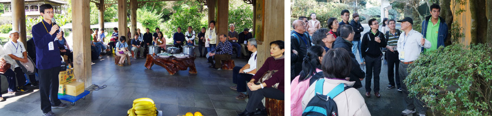

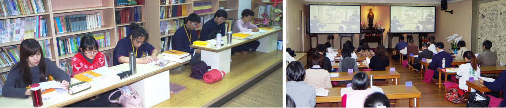

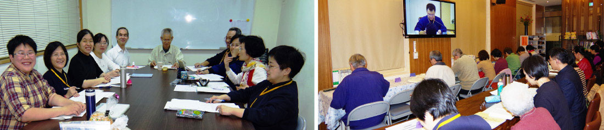

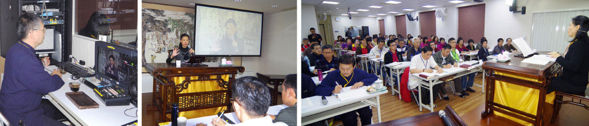

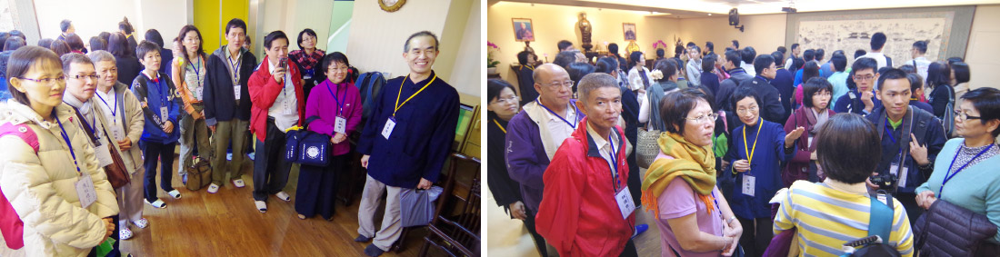

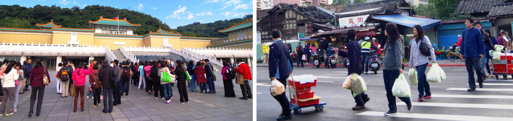

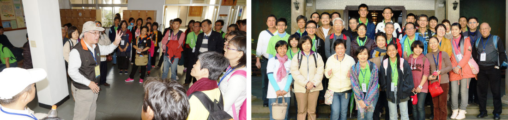
