# 第89期
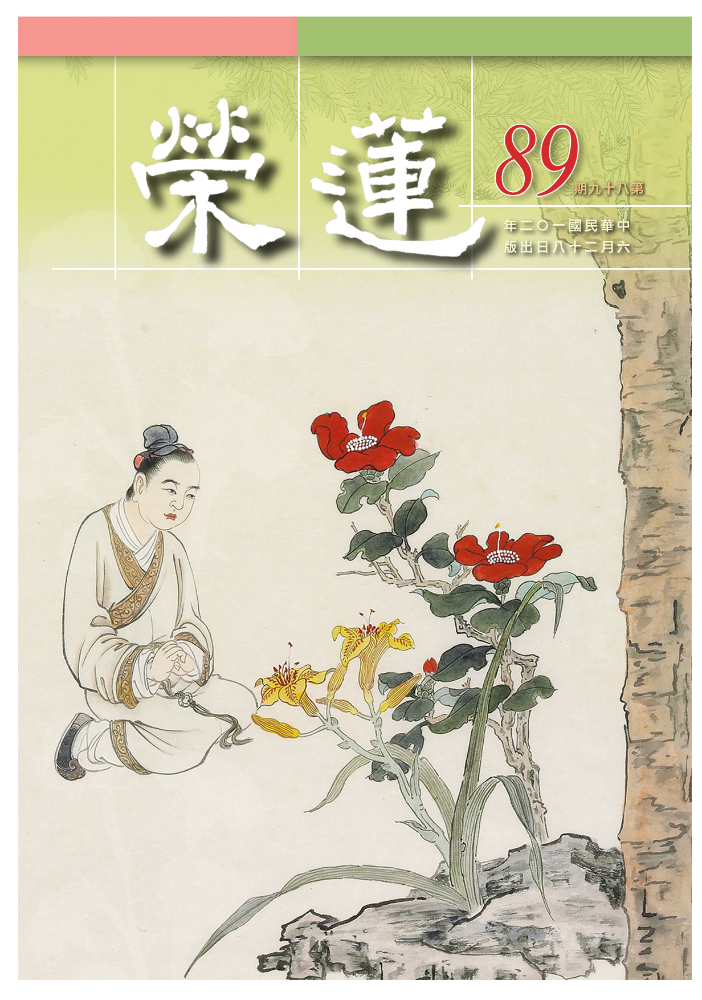

## 社論

### 第三者

本刊

調停挑撥功與過

隱惡揚善風氣厚

和合能令道統傳

成功扮演第三者

初夏至淨苑齋僧，聆聽慧鐸師的法語「第三者」，主題發人深省。仔細觀察我們的周遭，不斷充斥著第三者，第三者的義涵是雙方當事人以外的人或團體，如甲乙兩方訂契約，需有連帶保證責任的丙方，即是第三者。常於媒體聽到的是夫妻外遇的對象或情侶移情的對象，原本或是青梅竹馬，卻因第三者的介入而告分手，這是我們最為熟知的狹義的第三者。

然而仔細思維，其實在我們生命中，生活的各個方面亦圍繞存在著不同的第三者，此廣義的第三者在我們生命中不斷出現或伏藏著。總之，這樣的人物或者事件的出現，會改變我們既有的思維以及行為模式，甚至整個人生的走向改變，命運也隨之變化。似催化劑改變反應活化能，也如在化學反應中加入不同物質，改變了反應途徑，生成另外一項產品。反應或大或小，關係著第三者的影響，小如各類反應式中的催化劑，大如中子撞擊原子，連鎖反應導致瞬間釋放巨大的能量。

第三者的出現有好有壞，改變又以透過思維、揀擇後確立知見，力量最為強大。若生起了邪見，導引我交往世俗之友，在享樂中消耗福報，且喪失了許多力爭上游的機會，命運是往苦海裡墮落。尤其不經意地、無揀擇地聆聽似是而非的言論，這些比謀財害命還要嚴重，觀念上的偏差，影響所及乃至生生世世，難以改變，無法脫離困苦的命運。例如媒體傳播上的美食、飲料，令人垂涎三尺，滿足一時的口腹，然吃進的都是對身體有害的飲食，付出的是慘痛的代價，或是糖尿病，或是心肌梗塞，或是高血壓、脂肪肝，肝中毒等，不勝枚舉。

就一位學道者而言，要如何看待學道旅程中的第三者，或者讓自己成為他人生命中的第三者，善知識該是人生中最為重要的第三者，他在人生旅途中或有意或無意地插入，我人或有意或無意地接觸，都有可能奇妙地改變自己的一生。在道場內巧妙地扮演第三者，能使很多的關係獲得彌補，創造和合，功德大矣哉，雖曰未修行，吾必謂之大修行。當長輩誤解晚輩時，能適度說明，化解誤會，令團體不失人才，或適度點出不好的徵兆，不誤用後輩造成團體的傷害，也不對後輩揠苗助長。當晚輩不理解長輩調眾的善巧方便，也能從旁闡釋，讓後輩能知這種磨練是長者的悲心，而安於接受考驗，如此則不壞和合，團體能成為培養人才的搖籃。讓自己扮演他人生命中珍貴的第三者，使彼此雙方發揮最大的功效。

歷史上，說客往往扮演的是令國際局勢大亂的第三者，從中獲得個人的名聞利養，例如蘇秦雖說服了弱小的韓趙魏楚燕齊六國，聯合以抗強秦，使得秦國十五年不敢出函谷關，而張儀卻能以善辯之資，看到合縱策略的矛盾處，也因為六國之間皆以自己利益為考量點，故能一一說服各國諸侯連橫親秦，輕而易舉打破了六國的合縱聯盟，最後再以秦帝國優勢的兵力，一一擊潰六國。

然而也有不計名利，救危亡的第三者。在春秋時期衛國人子貢，因齊國陳桓出兵弒簡公，孔子沐浴而朝請魯哀公出兵討伐，然哀公未答應，之後齊國攻打魯國，孔子憂傷父母之邦即將面臨危亡，子貢成功的扮演了第三者，除巧妙地讓齊國退兵以外，更讓吳國打敗齊國，越王句踐滅吳得以復國，並助晉國維持霸業，十年之間五國各有其變，所謂：子貢一出，存魯、亂齊、破吳、強晉與霸越。

齊國名士魯仲連，澹泊名利，在趙國遊歷。長平之戰慘敗後，秦軍圍困趙國首都，魏安釐王派新垣衍進入邯鄲遊說平原君，勸平原君說服趙王尊秦王為帝。魯仲連知道此事，便請平原君安排他與新垣衍會面，令新垣衍放棄原來的意見。秦軍聞知此事，便退兵五十里。秦軍撤退以後，趙國的平原君，打算封賞魯仲連。魯仲連再三推辭，始終沒有接受，不久就離開了趙國，終生沒有再與平原君見面。魯仲連不為名利，見義勇為，拔刀相助，雪廬老人亦曾作詩讚歎他，他真正是國際間調和鼎鼐的第三者。

當兩方不合時，我們成功扮演第三者，令彼此化干戈為玉帛，或是當我與對方有誤會時，影響團體的發展，也期盼有第三者兩邊溝通消除誤會，捐棄前嫌，不打不相識，團結力更勝於從前。當透過第三者的傳話時，也盼望第三者成為成功的傳話者，勿挑撥離間，製造雙方不合，甚而加油添醋，無中生有，如此則更加深雙方的嫌隙，變成一發不可收拾的仇恨。

人的一生就像一個複雜的反應爐，會遇到形形色色的人物以及事件，唯有透過自我內涵的充實，對正法有堅固的信心與勝解，不被境界所轉，且進一步成為他人最好的第三者。這樣的修行是最善巧的修行，能迅速累積成佛的資糧。

## 大德法語

### 大方廣圓覺修多羅了義經（四十八）辯音菩薩啟請

道源老和尚

入根本位無一法可得

出後得位隨業幻化生

根本後得雙證得實相

菩薩度生巧妙難思議

戊二、四問答別明觀行中根修證

己一、二問答三觀修行

庚二、明單複圓修（辯音啟請）

辛一、辯音啟請

經文：

於是辯音菩薩，在大眾中，即從座起，頂禮佛足，右遶三匝，長跪叉手而白佛言：

辛二、正陳請詞

壬一、慶前

經文：

大悲世尊！如是法門，甚為希有。

先讚歎佛說法說得好，希有就是少有，是聞所未聞，從來沒有聽見過。

壬二、請後

癸一、問所修

經文：

世尊！此諸方便，一切菩薩於圓覺門，有幾修習？

前述歸納修學圓覺方便有三種，此諸方便，就是這三種方便，一切菩薩於這圓覺法門之中，有幾種的修習，不是再問三種以外，修這三種法門，是只修一種？還是二種、三種？或是有前有後？第一、第二、第三方便要如何修？或是可以超越修？或是依次修呢？是越級修？問這些修習的方便，好令我們，尤其末法時代的眾生知道。

癸二、明所為

經文：

願為大眾及末世眾生，方便開示，令悟實相。作是語已，五體投地。如是三請，終而復始。

實相也就是圓覺妙性，圓覺妙性是一切法真實之相。

辛三、如來讚許

經文：

爾時世尊告辯音菩薩言：善哉善哉！善男子！汝等乃能為諸大眾及末世眾生，問於如來，如是修習。汝今諦聽，當為汝說。

問於如來，是修這三種觀行時，是這麼個修法，是三種都要修？還是依三種根器修三種？或是依次的修？或是越次的修？

辛四、承教靜聽

經文：

時辯音菩薩奉教歡喜，及諸大眾，默然而聽。

辛五、正答所問

壬一、長行

癸一、舉意標數

經文：

善男子！一切如來圓覺清淨，本無修習，及修習者。一切菩薩，及末世眾生，依於未覺，幻力修習，爾時便有二十五種清淨定輪。

叫一聲當機者，先說根本的道理，怕我們著相，這一切圓覺清淨的妙行，如何謂之清淨呢？遠離諸相謂之清淨，無能修習的人，也沒有所修行的法，沒有能所之相（沒有修習及修習者），謂之圓覺清淨。一切初發心的菩薩以及末世的眾生，未證到圓覺之前，修習如幻如化，謂之幻力修習，共有二十五種的圓覺行門，二十五種觀行，謂之二十五種定輪。謂之輪是具足二種意：一是摧碾意，二是運載意，將地上凹凸處碾平，謂之摧碾意；其次車輪能以運載物品，運載眾生，由此路到彼路，這是運載意。

如來說法謂之法輪（教法輪），眾生觀行也叫法輪（證法輪），能以摧碾一切煩惱，能以運載有情到佛位。雖然有二十五個觀輪，都是清淨，都是圓覺隨順，圓覺無相，雖說是定輪也不能著相。這二十五定輪可攝為幾類，將前述三個觀門（奢摩他、三摩缽提、禪那），攝持為單修三觀，不是一個人修三種，一個人修一種就可以，謂之：單修奢摩他，單修三摩缽提，單修禪那。

其次依奢摩他（靜觀）為首，先修此觀，後修二觀或一、或二，交羅起來共有七種，以上交絡三觀第一段；第二段是依三摩鉢提（幻觀）為首，交羅起來有七種；第三大段是依禪那（寂滅）為首，交羅起來有七種，共二十一觀，加前三種單修為二十四觀，最後圓修三觀，共二十五，謂之二十五種清淨定輪（二十五種觀門），每一個觀門都有一個名，圓瑛法師講義，所定的二十五觀門之科目是依著圭峰大師的疏鈔，圭峰大師依著二十五種定輪，列二十五種譬喻。

癸二、觀網交羅

子一、單修三觀

丑一、澄渾息用觀

經文：

若諸菩薩，唯取極靜，由靜力故，永斷煩惱，究竟成就，不起於座，便入涅槃。此菩薩者，名單修奢摩他。

奢摩他翻成中國話就是寂靜，由靜力故，永斷煩惱。三種行門都是斷煩惱，方法雖不一樣，目的只有一種，都是斷煩惱。由於寂靜之力，寂靜到極處了，發生一種力量，把煩惱給斷了。究竟成就，不起於座，便入涅槃。如同本師釋迦牟尼佛，在菩提樹下打坐，沒有起坐就成佛了，這是第一個定輪，單修奢摩他。

丑二、庖丁恣刃觀

經文：

若諸菩薩，唯觀如幻，以佛力故，變化世界，種種作用，備行菩薩清淨妙行。於陀羅尼，不失寂念，及諸靜慧。此菩薩者，名單修三摩缽提。

此乃修如幻三昧，並祈佛力的加被，所以依著佛力能以變化世界種種的作用，依著圓修而圓滿具備菩薩的清淨妙行。在陀羅尼總持法門之中，不被外境擾動寂靜之念，度如幻的眾生，不被眾生所轉。現今為末法時代，我們學著發心，弘法利生，以弘法利益眾生，但不要讓眾生把你度，這點功夫要記到。你去度眾生了嗎？結果被眾生轉了，你沒有度到眾生，眾生把你度了，你度眾生成佛了，眾生把你度到三惡道，總之不失寂念及諸靜慧。此菩薩是動中不離靜，名單修三摩缽提。

丑三、呈音出礙觀

經文：

若諸菩薩，唯滅諸幻，不取作用，獨斷煩惱，煩惱斷盡，便證實相。此菩薩者，名單修禪那。

菩薩了知一切幻化自相本空，而滅幻相，不取幻化的作用去度幻化眾生，一門深入專斷煩惱，煩惱斷盡，便證實相。

子二、交絡三觀

丑一、運舟兼濟觀

經文：

若諸菩薩，先取至靜，以靜慧心，照諸幻者，便於是中，起菩薩行。此菩薩者，名先修奢摩他，後修三摩缽提。

下述七項定輪，都是以奢摩他為首，先取止靜，以止靜為首，有止靜就發生智慧了，以靜慧之心，照諸幻者，起菩薩行度如幻的眾生，亦即先修止靜的功夫，開了內在的智慧了，再來修如幻三昧，度如化的眾生。

丑二、湛海澄空觀

經文：

若諸菩薩，以靜慧故，證至靜性，便斷煩惱，永出生死。此菩薩者，名先修奢摩他，後修禪那。

這一個人修二種，七項定輪都是以靜慧為首，證得寂靜之性，內發的輕安，便斷煩惱，永出生死。

丑三、首羅三日觀

經文：

若諸菩薩，以寂靜慧，復現幻力，種種變化，度諸眾生，後斷煩惱，而入寂滅。此菩薩者，名先修奢摩他，中修三摩缽提，後修禪那。

此菩薩以寂靜之慧，復現第二種的如幻三昧之力，變化種種的世界，變化種種如幻的法門，度如幻的眾生，後斷煩惱，而入寂滅。

丑四、三點齊修觀

經文：

若諸菩薩，以至靜力，斷煩惱已，後起菩薩，清淨妙行，度諸眾生。此菩薩者，名先修奢摩他，中修禪那，後修三摩缽提。

仍是以至靜力為首，將煩惱斷了，再去修菩薩的清淨法行，度如夢如幻的眾生。

丑五、品字單雙觀

經文：

若諸菩薩，以至靜力，心斷煩惱，復度眾生，建立世界。此菩薩者，名先修奢摩他，齊修三摩缽提、禪那。

此菩薩猶是以至靜力，心斷煩惱，復度眾生，以建立種種變化世界。

丑六、獨足雙頭觀

經文：

若諸菩薩，以至靜力，資發變化，後斷煩惱。此菩薩者，名齊修奢摩他、三摩缽提，後修禪那。

先修靜功，資是助，助發了如幻三昧，此二者是齊修，後斷煩惱。

丑七、果落華敷觀

經文：

若諸菩薩，以至靜力，用資寂滅，後起作用變化世界。此菩薩者，名齊修奢摩他、禪那，後修三摩缽提。

以靜力為首，用至靜力來資助寂滅禪那之力。（下期待續）

## 共修研學

### 小止觀導覽（六十一）

*心爾、治心整理*

青面獠牙魔少數

誘引五欲賊功德

歡喜入甕不自覺

損失慘重難可知

論文：

梵音魔羅，秦言殺者，奪行人功德之財，殺行人智慧之命，是故名之為惡者。

前章的善根發，之後為何安立第八章的覺知魔事呢？所謂道大魔就大，這兩者是相互觀待的。然真正的善根發，必能覺知魔事以破魔。

魔有四：煩惱魔、五陰魔、死魔、鬼神魔。此四魔會奪走修行人的功德財，殺害修行人的智慧命。功就是事功，德就是能力，因著能力（德）作出利人之事（功），能引發此世後世許多福報，謂之財，修行人的功德財是世間人難以想像的。比如《賢愚因緣經》上說：有修行人到釋迦佛前很恭敬的頂禮、供養，佛慈悲接受，此人歡喜而狂奔五里。釋尊說：此人所經的五里路，每一粒沙都是一個轉輪聖王的福報。此即以佛為福田，所修的財，比起世間人一生的努力所得，或賺錢的商人還要殊勝太多了。世間人的富貴比起修行人，連ㄧ粒沙的半粒都不如（轉輪聖王之殊勝與世間小富貴根本不能比）。

修行人的功德財不是世間人可以想像的，就是因為超乎世間的想像，所以世間人沒辦法體會，由於福報不現見，所以當下生不起修行的動力。

然魔何以會奪行人的功德財呢？如同小偷潛入官家偷錢財！如魔加被行者，生起殊勝的五欲境，跌入軟暖可意境中，或加被行者生起逆境，引行者怨天尤人，謂之「奪」。所以修行人不能不覺知魔事，否則損失慘重。

其次魔能殺行人智慧之命，亦即令行者消耗功德財，喪失了修法的因緣，見不到善知識與修學的環境，智慧無法增長且退轉，謂之殺智慧之命。因此不以正見覺知，功德財會被奪，智慧命會被殺。

論文：

魔事者，如佛以功德智慧度脫眾生入涅槃為事，魔常以破壞眾生善根令流轉生死為事。若能安心正道，是故道高方知魔盛。

而佛與魔正好相反，顯現為眾生最殊勝的福田，能令眾生在修行時產生順緣，並以智慧引入涅槃。以佛的功德之力改變眾生的命運。以智慧力宣說種種的教法，並運用種種的善巧方便，幫助眾生入涅槃。

魔則破壞眾生的善根與福報，引邪見破壞眾生的善根，引貪瞋煩惱破壞福報。

須知修行人往道上走時，考驗與障礙就會來，如果善於觀察這些障礙，不但不成為障礙，反而成為菩提的資糧。但第一步要先通達這是障礙相，第二步，如何轉逆緣為菩薩道。

論文：

仍須善識魔事，但有四種：一、煩惱魔，二、陰入界魔，三、死魔，四、鬼神魔。

魔事雖多，可歸為四。

一、煩惱魔：

其中是破壞異熟的瞋恨與破壞善根的邪見，最為可怕。起了邪見就會離開正法，尤其種下謗法罪障。

二、陰入界魔：

此處指的是五陰、十二入、十八界，十二入是六根能入六塵境界謂之十二入。十八界是六根、六塵和六識，這些是指輪迴的世界，能令我們迷惑、墮落。

三、死魔：

修習正法還沒有證果，命數已盡，如同煮開水，水未燒開瓦斯卻沒了。

修行人須持戒律愛惜身體，藉身體作修行的工具，令發揮功能。為了怕死魔對修行產生障礙，所以凡是有死緣的都要躲掉，比如：到聲色場所就是死緣，要躲掉；食物方面，孔子說色惡不食，食物已經變味道了不要再吃，不要因為惜福而拿來吃，印光祖師連發霉的饅頭也吃，那是印光祖師！對於祖師大德的能耐只能仰望，不可模仿。

四、鬼神魔：

約外來說，包括天子魔，天魔是鬼神魔裡面最厲害的，像第六欲界天的魔王波旬，能變現各種善妙及醜陋境界，令修行人無法安心辦道。

論文：

三種皆是世間之常事，即隨人自心所生，當須自心正除遣之，今不分別。鬼神魔相，此事須知，今當略說。

前述三種都是由內心所生起的，而且教法上時常提起的三種，但本章主體是鬼神魔。

前三種魔只是隨順說魔的，此處所說的魔屬於外魔（鬼神魔），就是外在的障礙。ㄧ般修行是內在的魔好調，在某ㄧ個角度來說，屬於自己的部分當然自己可以作主，只要動機純正，心思正確，求三寶的加被，死緣的地方不去，會造成死緣的不跟它相應，講究的是潔身自好、親近善知識、遠離惡知識、親近如法的團體、遠離不如法的團體、遠離喧鬧、遠離五欲六塵。

然第四種鬼神魔，來擾亂你，需如何對治？是本章的主體，所以本章稱為覺知魔事。

前章善根已闡述破三種魔（煩惱魔、陰入界魔、死魔）的破法，比如制心止、繫緣守境止、體真止、正觀等能除三種魔。

道力大時或有外魔，此時候仍須善知、善識、善巧對治、方能保護自己的善根。尤其今日之下五欲橫流，就是外魔成立。（下期待續）

### 菩薩清淨的行持　華嚴經淨行品（五）

*編輯部整理*

巧問善答菩薩會

心意廣大及深遠

一期因緣成滅法

相續猶有五分香

甲一、智首問舉德徵因

乙二、陳所疑之問

丙二、別問行所成德

丁五、修涅槃因

淨行品是智首菩薩向文殊菩薩請問如何修學成就如佛。有總問以及別問，總問是如何以三業離過成德，別問有十門，乃三業離過成德殊勝的十種氣象。如何透過修學得此十種殊勝？此時是第五門修涅槃因，亦即透過此十種內容修學，能證得佛的無住大涅槃，然此十種內容要如何修呢？一般的問答有總問總答、總問別答、別問總答、別問別答，淨行品則是屬於別問總答。

經文：

云何善修習念覺分，擇法覺分，精進覺分，喜覺分，猗覺分，定覺分，捨覺分。空、無相、無願。

這十種無住大涅槃的因，即七菩提分與三解脫門（即空、無相、無願），七菩提分即四念住，指此人對法要有甚解，懂得引發出離心、菩提心與空性的正見。學佛的第一步先觀察是否有出離心，想出離三途，必定會努力斷惡修善。真正學佛的人，眼前的修學都是為來生做準備，這才是厭離三途的出離心。再者有解脫的想法，辦慈善事業要有解脫的想法，而給人資糧，是幫助人有解脫的方便，在出離心當中，還要生起幫助一切有情出離的心。

一、四念住〜

觀身不淨，人世間受用快樂的身體竟然是不乾淨的，好比將甘露裝在穢器裡，進而觀察所受用的快樂真的是快樂嗎？了解真相後方知觀受是苦。學佛雖說解行並重，但重要的是有沒有將對法的瞭解變成觀修的題材，這叫做解中有行，除了念佛之外，如果沒有對教法做觀修，又如何提起道心？所以觀身不淨，觀受是苦，需要用法好好觀察，才能真正生起對人世間的出離，斷除貪愛之心。

接著觀心無常，是被業所繫縛，你以為昨天是親，今天還親嗎？冤親無定，親疏無常，一切都無常，外道是這樣，佛教徒也是如此。雪公老師說：三國只有九十年，他壽命比三國還長，九十七歲看盡世事，那一樣是真的？觀法無我，體會自相皆空，真正得到出離，從這裡引發菩提心，看到別人的痛苦就在於妄想追逐快樂，妄想在人世間尋求一個常，感受世間快樂的本質是苦的，從此處去憐憫他人。

如果菩提心不是建立在眾生的苦上，則無法生出菩提心，而要幫助眾生解脫痛苦，就必須要有空性的智慧。所以四念住是對法的勝解有正確知見，才是真正的學佛。

二、四正勤〜

你必須要把所學的法，能在止觀上現證，必須以斷惡修善作為資糧；即已生的善令增長，未生的善令生起，已生的惡令斷滅，未生的惡令不生，斷惡修善就成為解脫跟成佛的資糧。

三、四如意足〜

即欲神足、勤神足、心神足、觀神足。欲就是有善法欲。勤乃勤於修定，但需先有前面的修學資糧，否則障礙叢生，對法沒有體會，遇不到善知識，沒有法本。心觀就是止觀，由定中修止、修觀。五根就是修止、修觀中得到煖位、頂位的成就。五力則是得到忍、世第一的成就。煖、頂位為何叫慧根？忍、世第一為何叫慧力？因為煖、頂位縱然墮落必至涅槃，所以叫慧根，慧力是不會退轉。七菩提分則是進入見道位，八正道則是進入修道位。所以整個三十七道品就是成佛的七個階梯，也就是四念住、四正勤、四如意足、五根、五力、七菩提分、八正道分（正見、正思惟、正語、正業、正命、正精進、正念、正定）。

為什麼說「七」？七在佛法來說是圓滿。成佛的次第是七，度眾生是七類。七菩提分以「念」作天秤的中心來秤兩邊，為什麼？因為他懂得修學法。當定不足時他懂得修定，慧不足時懂得修慧。小止觀裏五部修學法有言，當慧壓不住時，即知定力太少，此時回過來修定，定修成了就去修慧。所以念是修學法，記得住才有能力兩邊調，因此對教法真實了解可以幫助我們修行。祖師大德有別於一般修行人，即贏在教理，對法有甚解。

天台大師曾在定中看到床下書籍亂成一堆，就邊念經咒邊整理、排好；根據五時八教將經典的次第意思重組，這才是善於讀書學習者，而能成為一代的大德。所以念在中間，擇法、精進、喜，這三個修學法跟慧有關，能生起智慧就是觀。猗覺分就是輕安，與定、捨覺分等三個修學法即能生起定。所以，修慧是靠擇法、精進、喜；修定是靠猗、定、捨，具有定、慧修學法的人，才能坐上修。

一、擇法覺支〜

比如你要修學無常，必須對無常法有所抉擇，要修學空性，必須對空性有所抉擇。比如觀察布施，則須對布施的法益觀察、決擇出來。即使是當志工，不應只求來生的增上，也應對教法實修，因此擇法覺支是能結合法做觀察。

二、精進〜

此處是對所擇的法精進。

三、喜〜

法喜的那一分，是智慧的成就相。學而時習之，不亦「說」乎，就是有法喜，學佛沒有法喜，則容易退轉。

四、猗覺分〜

就是輕安，為正確的知見所攝持，當定功修成時，可以改變身體的結構，人的氣象、風采也隨之改變。

五、定覺分〜

輕安是由定而來，專注在一個境界上，不斷緣念；懂得修定的成就是輕安，即念佛三昧的成就相。真正修行人所得到的福報是世間人所沒有的。

六、捨覺分〜

當在坐上修定時懂得捨除貪愛、染污，也就是行捨。修對治法是行，最終不用對治法稱作捨。比如，只要有了煩惱，立刻覺察、立刻對治，最後用功到某種程度，自然慢慢捨掉，無須再對治了。以上三種修學法非常的重要，由定就生起了輕安，有中間的念做兩邊的調整，這就是修涅槃因，即見道位，而見道位得自於對法的甚解。

七、空無相無願〜

就是見道位的成就相。所以說般若心經有五步的修學法，即資糧道、加行道、見道位、修道位、無學道（究竟位）的修學法，空性的五次第，其中見道位的修學法是成就空無相無願。空〜萬法自相皆空，這是總說，無相〜是因不可得，無願〜是果不可得。當果的自相都不可得時，還能希望有什麼願求？需知身體的健康是觀待過去善業，眼前的保養，名言上的生起而已，離開以上這些則該法的自相在哪裏？

## 三代共修

### 週四共修止靜法語　母親節重要的法行（對佛的所知而浴佛）

心超

一樣的母親

照例的法行

正見的增上

殊勝的莊嚴

每年的母親節，是發起對母親的感恩並辦浴佛法會，表徵真孝唯佛，所謂親得離塵垢，子道方成就，釋尊是度父母成就，是孝子們中最殊勝的典範。

其次就浴佛的部分，所浴是佛的誕生相，乃八相成道之一，如何在成長過程中，透過修學以成就，並且發揮廣大的能力利樂有情，影響當時與後代，更是我們在八相成道中，更要了解的重點。

一般佛教徒到緬甸、泰國這種小乘國家，在寺院牆上有釋迦牟尼佛故事的浮雕，也只能欣賞表面藝術的創作，無法透視內在的涵義，亦即無法在藝術品當中得到法的受用，極其可惜！釋迦牟尼佛一生精彩的示現散落在藏經各處，有法師收集成〈釋迦如來應化史集〉，從佛因地、降生、求道、成道、弘化到滅度，種種不為人知的事實收錄成冊，讀之足以發人深省，不但有利佛法的弘揚，也收見賢思齊之效。

其中有段敘述釋迦牟尼佛成道之後教化各方，並準備回國與父王見面，這也是淨飯王極其盼望的事情，他們相會的事情，被集結成《父子相會經》。當釋尊快要回家鄉時，派遣優陀夷長者以神通力騰空返國，告知淨飯王佛回宮的時間，父王也問了佛在外遊方的事情，顯示父親愛子的情深。在父子相會面的當天，淨飯王看到自己兒子修成的法相莊嚴，而且得到這麼多人的擁戴與恭敬，內心驚喜萬分，並以不捨之心以及愛護之情，提出十問，經由世尊回答，能知佛內心的想法，以及外在的能力，以此可作為我們修學知見之所依。

第一問是，昔在宮中，出入多人保護，放棄了這樣的尊崇，獨自一個人在山野中，面對恐怖無人護佑，深山裡面有毒蟲、魑魅、虎狼的侵害，身體不知道如何躲到安全的地方？佛回答的是：聖者已安住在十種殊勝的法義上，已在所有的繫縛與恐怖中得到解脫，根本不需要被保護在王宮，安住在正法當中是最好的保護。

第二問是，過去宮中所睡的床是以象牙及黃金裝飾，極為華麗，在山野中只有草木成為寢俱，一下子失去這種豪華的享受，如何在山林中睡得安穩？佛回答的是：臥具表徵著解脫，自身有菩提的莊嚴，菩提成為能莊嚴，解脫成為所莊嚴，就好像人睡在高貴的寢俱上面，這比宮中豪貴的裝飾還要享受。

第三問是，過去在宮中，出入是以象、馬車乘代步，如今卻行腳於荊棘的路上，如何走得了？佛回答的是：神足通就是車子，精勤走到需要行道的地方，不管走到哪裡，都不會被煩惱刺所刺，所以身體也不會受到任何外在荊棘的傷害。這告訴我們世間的荊棘、乾旱、殺戾都是我們自己的煩惱所感，為業所顯現，如果沒有這些煩惱業，外在也不會受到荊棘等傷害。

第四問是，過去穿的是美好材質的衣服，穿在身體上極為舒適，表徵富貴，現在卻穿著質地粗糙的袈裟，豈非令人輕賤，何以能忍受的披著？佛回答的是：這樣材質粗糙的僧伽衣，卻如如意寶般的珍貴，披起這樣的法服，可以生起各種的善法，諸如慚愧與不放逸等，乃至表徵修行及解脫的功德，見到反令人生起恭敬以及隨喜之心，披此解脫服豈非更尊貴乎？

第五問是，過去是金所打造的餐具，裝的是上等美味的食物，今則持陶缽、瓦缽乞食，所盛的食物必然是粗食，這樣的日子怎麼過得了呢？佛回答的是：在禪悅當中，吃的食物都成為美食，此禪悅的法喜，能斷除世間的貪愛，度化眾生托缽行腳是因為慈憫眾生的緣故。

第六問是，過去所喝的如乳汁、果汁等，是非常甘美且能滋養身體的飲料，現今卻喝的是冷、是熱，是清、是濁，對身體是否有益等，這樣的日子好過嗎？佛回答的是：如此美好的飲料，是世間人所爭飲，為了爭取世間的享樂，要有種種的付出，且享樂中增加對世間的貪愛，若我則不會去貪愛無益有害之物，內心反而更為安樂。

第七問是，過去住的是寶殿和樓閣，所住的範圍極大，且有人伺候著，住得舒服與自在，現今在山林中卻孤獨的自處，如何不生起恐怖的感覺？佛回答的是：我已經斷了煩惱的根本（無明我執），所以不會生起任何與三界相應的恐怖，自然到哪裡都隨遇而安。

第八問是，過去以清涼、芳香的清水沐浴身體，又有專人服務，今獨處在山野裡，誰會這樣服務你呢？佛回答的是：我沐浴在戒香的法水裡，既清涼又有香氣，沐浴之後又能到達涅槃的彼岸，這比在宮中洗ＳＰＡ還快樂。
第九
**問：** 昔日洗完澡有妙香塗身，並披上質軟高貴之衣，碰不到世間的痛苦，離開了這些的享受，在山林裡，哪有可以相比的快樂？佛回答的是：我以最殊勝的戒香來塗抹身體，戒衣也是最好莊嚴自身的衣服，我已經不是過去的愚蒙，我不需要宮中這些名利衣來裝飾我。

第十問是：如何才能得到自信心？何者才是最該怖畏的？佛回答的是：老病死這三個法是可怖的，不要輕慢它，應該要尋求涅槃這種舒適愉悅的境界，沒有世間一切的騷擾，應享受這樣的無事。

由上述十條問答，佛令父親心開意解，並讚歎兒子是善生於釋迦族，對世間的八法都不染著（八風吹不到），並頂禮佛，內心這樣想著，我是一個具足善根的人，我的兒子才能得此殊勝功德，並請與佛前來的諸位弟子聖眾至所建的釋迦精舍中，此精舍是以一月零十天建成，成為世尊弘法之寶處。

由這段經文當中可知佛法是在世間中覺悟，成就之後家人成為所度，回饋家人，造福鄉梓，本質都是正法。一方面表現對家鄉父老的回報，一方面也展現自己的無私，家鄉與他處，皆是正法的弘揚。若能對佛有如此之體會，則所浴的佛顯現為最殊勝的福田，能浴的功德成為不可思議，由此帶來母親節最殊勝的莊嚴。

## 專題研學

### 聖者的祕密～大佛頂首楞嚴經二十五圓通暨七處徵心探源　二十五圓通暨七處徵心簡介（三十）

時哉

示現凡聖為度生

本質大慈賜佛樂

方便多門善巧行

有情入道皆成就

巳二、條列妙應

午一、應希求心

未一、應求聖眾

申三、緣覺

經文：

若諸有學斷十二緣，緣斷勝性，勝妙現圓。我於彼前現緣覺身而為說法，令其解脫。

此為第三種應他，要如何斷十二緣？首先在流轉門中生起出離心，其次從還滅門修解脫道。在還滅門當中，只要斷其中的一支，則斷其相續性，亦即觀彼自相空（勝義性）則緣斷，亦即現證空性就能斷緣，空靈靈境界顯現謂之勝妙現圓。有如此能力修學的人，我於彼前現緣覺身而為說法，引導他修學十二因緣得到解脫的成就。

申四、聲聞

經文：

若諸有學得四諦空，修道入滅，勝性現圓。我於彼前現聲聞身而為說法，令其解脫。

若有能力修學四諦空（苦諦空、集諦空、滅諦空、道諦空）的空性修學法，每一諦空性的修學法都一樣，如同修學二十五圓通一樣，得一種圓通的成就，其他通達法都一樣。能修學四諦入空滅諦，現前圓滿證得空性，有此能力者，我於彼前現聲聞身而為說法，令其解脫。

以上是觀世音菩薩應著有學位行者的希求，示現菩薩身、獨覺身、緣覺身、聲聞身說法，令其得到該乘的究竟解脫。

未二、應求雜趣

申一、諸天

酉一、天主

戌一、梵天王

經文：

若諸眾生欲心明悟。不犯欲塵，欲身清淨。我於彼前現梵王身而為說法，令其解脫。

想要讓心明了欲心之過患乃破戒、障定、染污智慧，其過患大，是一切煩惱的發起處。所以不犯欲塵，然有兩種不犯：一是五根不緣境（根律儀），謂之不取行相；其次是意識不緣五欲境好醜（戒律儀），亦即對五欲境亦不緣其可愛面相，故貪欲不生。此種想要遠離欲境不起欲心，令身相莊嚴者，觀世音菩薩於彼前現梵王身而為說法，令其解脫。

梵就是清淨義，已無欲界的煩惱了，初禪以上謂之梵，此處指觀音菩薩示現色界天的天王，或者初禪的天王，或者二禪的天王，或者三禪的天王，或者四禪的天王。觀世音菩薩為何要示現梵王身？因為此人想要離開欲界，觀待他想要離開欲界，而且又與觀世音菩薩結上緣，有福報、有祈求、有供養、有志向，所以觀音菩薩能觀待他的祈求、志向、福報，結合觀音菩薩與他的法緣，菩薩因而顯現為梵王身為彼說法。

說的是什麼法？離欲的清淨法，除了修學四禪八定及四無量心（慈悲喜捨），四無量心是禪定的眷屬，有著四無量心的攝持，此人以無瞋（修養很好）而入定，帶著火氣是無法入定的。有著慈悲喜捨的心，不會與人斤斤計較，有愛心、不自私，具有修定的能力又有修定的方法，能離世俗之欲。

其解脫，解脫到哪裡？從欲界當中解脫，證得欲界的無貪，方能到初禪之近分與正分。每一禪都是證得下界的無貪，才能得到上一禪的近分與正分。每一禪有每一禪的近分與正分，近分與正分的差別為何？近分只是得到這一禪的快樂，但未離開下界的貪愛，如初禪的近分雖說已得初禪的快樂，但未破除欲界的貪愛，亦即未證得欲界的離貪。

每一禪的近分到正分都有七種作意位，所要降伏的是下界的貪愛，下界的貪愛有所謂的上品貪愛、中品貪愛與下品貪愛。上品貪愛、中品貪愛的對治法就是想到下界的過患、上界的功德，一心安住於所修的善法，至於要斷下品的貪愛，則需刻意引發下界的細微貪愛以對治。若連細微的貪愛心都不生，則表示已除下界的貪愛，證得下界離貪的果位。若以欲界而言，此時證得初禪的正分，乃至每一禪的正分都是如此證得的。所以文中：令其解脫。或解脫欲界，或解脫色界的初禪、二禪、三禪，進入到四禪。

有能力修學這樣禪定的人，觀世音菩薩能對這樣的人，顯現為梵王身，因為梵王身是色界禪離欲最清淨的行相，以宮殿、形體、威勢，表徵離欲的果位，離欲帶來身相的莊嚴，巍峨的宮殿，各種的神變。觀世音菩薩在此人前顯現為梵王身宣說離欲之法，此乃投生到梵天的修學法。

戌二、帝釋天

經文：

若諸眾生欲為天主，統領諸天。我於彼前現帝釋身而為說法，令其成就。

帝釋天就是天主，請問什麼人想要當天主？觀世音菩薩為何要讓他的願望實現？一定是這樣的願是對眾生有好處的，如果他作國王對眾生沒有好處，菩薩不會去幫助此人。

此人欲為天主，統領諸天。或問有哪些種性的人會想要當天主？是發菩提心的人，有心要以作天主累積成佛的資糧，例如阿彌陀佛有很多世作轉輪聖王，應知這些轉輪聖王都是求來的，何以要求當轉輪聖王？在資糧的累積上是需要的。有國王的威勢，若對正法擁護，以此領導風氣，是無人能比的。

觀世音菩薩於彼前現帝釋身而為說法，除了令彼修上品十善外，還有許多國王的領導統御法，能將國王作得好，能領導群臣施行仁政利益萬民。

酉四、童真男女

家中欲生男女，讀誦普門品或本章，向觀世音菩薩禮拜祈求，設欲求男，便生福慧之男，設欲求女，便生端正有相之女，宿植德本，眾人愛敬。然此處是觀世音菩薩的三十二應身，其中第二十二應身是現童男身、二十三是現童女身而為說法。

戌一、童男

經文：

若有眾生，不壞男根。我於彼前現童男身而為說法，令其成就。

不壞男根，就是童真修道，不染欲塵，這一生不尋男女結合成立家室，直接不壞男根身出家修道，像這樣的人在印度、中國都有，如有名的六祖，或者是憨山大師、虛雲老和尚等，都是屬於童男身出家修道。而觀世音菩薩能於彼前現童男身而為說法，令其成就。或說此人能童真出家修道，乃前世祈求觀世音菩薩，這一生觀待觀世音菩薩的願力，有此順緣，並感得大士顯現於前，使得他們有這樣的因緣來走這樣的路。

由於他們沒有成家，沒有家庭的逼迫，能有很多的時間來修學正法，以童男身、童女身來修道，最能具足暇滿人生的條件。

戌二、童女

經文：

若有處女，愛樂處身，不求侵暴。我於彼前現童女身而為說法，令其成就。

以童女身來修學，不求以欲成家，示現出家修學，如迦葉尊者的夫人，虛雲老和尚的夫人，雖然結婚，然樂於以處女身修學正法，他們的對象也是這種想法，所以他們可以雙雙出家去修行，得到成就。

此時觀世音菩薩能以童女身現於其前，說法令彼得到成就。（下期待續）

### 孔子聖蹟圖淺說（四）

*編輯部整理*

禮樂教育小培成

辦事歷練能大用

今日知識忽德本

他年朽木已難雕

八、訪樂萇弘

周敬王三年，魯昭公二十五年，西元前五一七年，孔子三十五歲到東都洛陽向老子問禮，並向樂師萇弘學樂理，萇弘讚歎孔子有聖人的儀表，言必稱先王，謙虛好禮，博聞強記。孔子說：我怎麼敢當呢？我只不過是個愛好禮樂的人。

圖中坐於左邊席上的年輕者為萇弘，後有二童子相視而立，一人手握竹簡，一捧古琴，表徵萇弘樂師的地位，並且通達古籍，能知禮樂治國之要。右邊配玉跪席請教者即是孔子。

屏風上畫的是飛鳥遨翔於水濱之上，表徵萇弘的意境開闊、靈動，且善知吉凶禍福，為人深不可測，如屏風中的鳥ㄧ樣，飛過不留痕跡。左上方松林間之馬車，為魯昭公賜予孔子到周朝求學之用。祥雲環繞於松林之間，代表善知識聚會的吉祥。

九、過齊聞韶

周敬王三年，魯昭公二十五年，西元前五一七年，孔子年三十五歲，由周朝東都洛陽參學回魯國時，得知魯昭公聯合郈昭伯，與三家大夫打了ㄧ場內戰，魯昭公大敗，逃亡至齊國，郈昭伯被殺，然而魯國畢竟有周公制禮作樂的典範，而不敢弒君，不像之後齊國發生內亂，陳大夫弒齊簡公而把持國政，可見禮樂教育的力量，對亂臣賊子有約束的力量。

孔子於是離開沒有國君的魯國，來到齊國，住於高昭子大夫家中，為家臣，並教學授徒。在此期間與齊太師談論音樂的道理，並有機緣聽到韶樂，感到至善至美。因此專心致志，學習了三個月之久，一心沉潛於音樂之中，吃飯時連肉味都不知道了，渾然忘我。

圖中屏風前左邊，頭戴頍冠、身上配劍者，即是孔子，右邊端坐帶官帽者，為韶樂的樂師。畫中樂工所用樂器有磬、鐘、鼓、琴。三字經說：匏土革，木石金，絲與竹，乃八音。此八種材質的樂器可奏出宮、商、角、徵、羽五種音階。其中鼓擊不出任何音階，卻可調合各種樂器。

韶樂是歌頌虞舜的音樂，舜的天下是平和的由堯禪讓，舜傳位於禹也是如此，所以其樂和平，因此孔子讚歎舜之樂：盡美矣，又盡善也。而武王由於伐紂而得天下，其樂帶有殺伐之聲，所以孔子說武王之樂是：盡美矣，未盡善也。

十、晏嬰沮封

周敬王四年，魯昭公二十六年，西元前五一六年。孔子年三十六歲，居齊，在齊國大夫高昭子家中講學。齊景公再次向孔子問為政之道，孔子回答說：「為政要節省財用。」景公聽了，認為很對，他非常欣賞孔子政治才華，除了想把尼谿的田地封贈給孔子，並欲賜孔子在季氏與孟孫氏之間的官職，等於宰相般的地位，這對一個三十多歲的年輕人來說，是何等禮遇。但晏嬰卻進言說：「那些儒士的話難以考察，不可以作為規範，且其態度傲慢，自以為是，這種人不能做臣子。君上想用他來轉移齊國的習俗，恐難如願。」景公遂向孔子說：「我老了，恐怕不能用你了！」孔子於是馬上離開齊國回到魯國。

畫中右邊，盤坐几席之上白鬚老者，即是年近六十的景公，兩旁有嚴肅護駕的斧鉞手。執芴向景公進言，身材矮小戴官帽者即是晏子。一旁送行戴官帽者，想必就是齊國大夫高昭子，一旁有侍臣。坐在牛車上拱手致意者即是孔子，牛車周圍年輕人即孔子隨行的學生。

孔子離開魯國時，是慢慢地離開，表彰對父母之邦的依依不捨之情。離開他國則是迅速離去，表徵不合則去，絕不留戀，這是進退的智慧。

為什麼晏平仲要阻擋孔子的出路呢？乍看之下，好像是位沒有氣度與見識的小人。實則不然，晏子認為孔子會被捲入齊國的政治惡鬥，甚而惹上殺身之禍，才對國君做如此的勸諫。晏子將孔子當成朋友一樣的愛護，孔子也讚歎他懂得交友之道說：「晏平仲善與人交，久而敬之。」（下期待續）

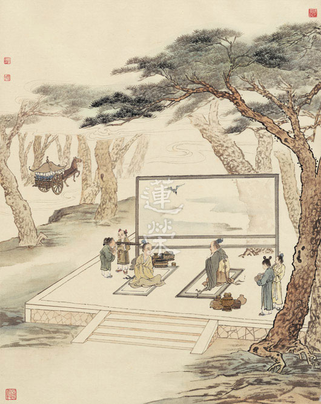

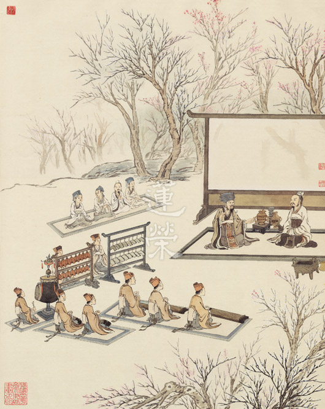

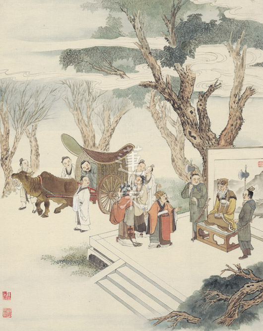

### 一件追憶的往事（三） —風雲際會世紀緣（緬懷雪廬老人）

魏慶友

同鄉後輩的追念

耐人尋味的往事

先賢典範的永垂

濟南泉城的莊嚴

民國二十六年（一九三七年），雪公四十八歲，受莊太史舉薦，來孔府任教讀先生。時與早在民國十五年，即被聘為奉祀官孔德成之奶師的王毓華先生及老師呂今山先生，同為奉祀官孔德成之教讀先生（據《孔府檔案》八九三○卷載：「孔府當時教讀先生有莊陔蘭、王毓華、呂金山、李炳南。」）。這是孔子七十七代嫡孫，年僅十八歲的奉祀官孔德成先生，與德厚才高，四十八歲的雪公，風雲際會，初結善緣。似乎是過去世的緣分，二人初次相見如同故交。後來，德成先生題詩感歎曰：「一見便知己，平生有幾人。」雪公任教讀先生的同時，又被孔德成先生聘為奉祀官秘書，不久，將其調到身邊升任為主任秘書。雪公雖長德成先生三十歲，但對先師後裔非常尊重，五十年來一直尊稱德成先生「孔上公」。能親臨闕裏，護持夫子後裔，享炙聖門古風，若無雪公不可思議之深厚德土，哪有此不可思議之殊勝機緣，因此，自幼受以孔子思想為核心的傳統文化滋養的雪公，非常珍重這一緣分：視陪伴孔子七十七代嫡孫「孔上公」，如同陪伴「夫子」，護持「孔上公」，即是護持聖門嫡裔，有一種神聖感；弘揚以孔子思想為核心的傳統文化，使夫子木鐸發揚光大，有一種責任感。五十年來，雪公矢志不渝，「應教木鐸振春風」，使夫子教化之木鐸，響徹寰宇；由於在兵劫戰亂中，雪公捨命保護了夫子七十七、七十八兩代嫡裔，才使得夫子血脈延續至今，即七十九代嫡裔、現任奉祀官孔垂長先生及其八十代嫡裔孔佑仁「小公爺」。七十八代：孔維鄂、孔維益（二００九年過世）、孔維崍、孔維寧，七十九代：孔垂長、孔垂梅、孔垂玖，八十代：孔佑仁、孔佑心。四世同堂，人丁興旺。

「聖門松柏春長在」、「了卻瘋僧一段緣」，夫子的學說、血脈得以延續不但雪公心慰了，也是中華民族的幸事。臺灣有史冊贊雪公曰：「輔世長民，贊化育而務成物；移風易俗，立人極而維綱常。……。並立言、立德、立功，三大不朽，惟李君炳南，其庶幾焉。」

民國七十五年（一九八六年）丙寅三月五日，雪公升西，年邁的孔上公，拖著病體率家人祭靈致哀，並親為恩人、師長雪公行封棺大禮。

孔上公恭書挽聯道出心聲：

一

數萬里流離備賞甘苦與君共

五十年交誼多歷艱難為我謀

二

道倡倫常道    心為菩提心

夫子七十七代嫡孫奉祀官孔德成先生，此時透露了與恩師雪公在非常特殊的環境裏，經歷了長達半個世紀的艱難困苦，行程數萬里的流離失所，其具體情形，罕見於史料。所幸雪公在其《詩集》中，真實的記錄下了這段刻骨銘心的歷史。「道倡倫常道心為菩提心」，是德成先生與恩師相知相交五十年，既是對恩師的德行發自肺腑的敬重與概括，也是二公在台近四十年行誼的總結。雪公正是懷著這顆無比虔誠的心，與孔子後裔孔上公攜手闊步在倫常大道上，成為臺灣早期儒、佛的拓荒者，雪公在台行誼已錄入臺灣史冊。（下期待續）

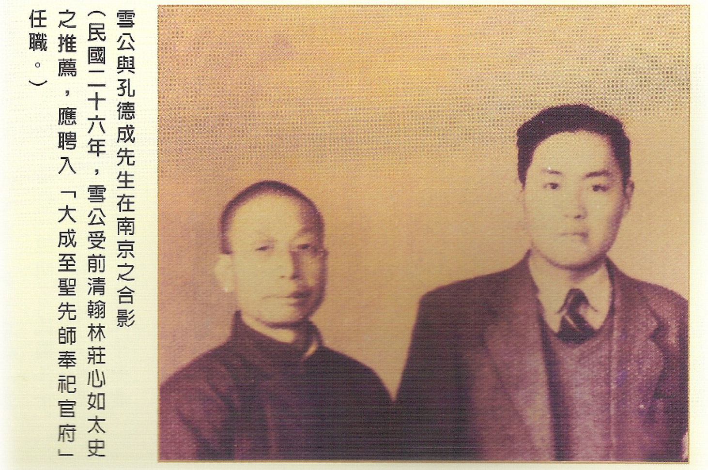

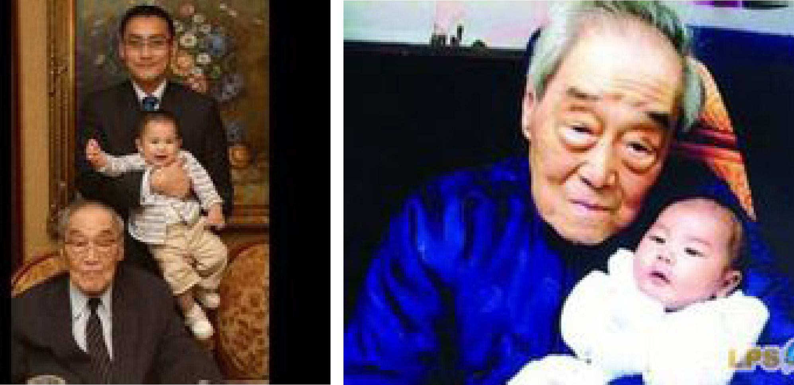

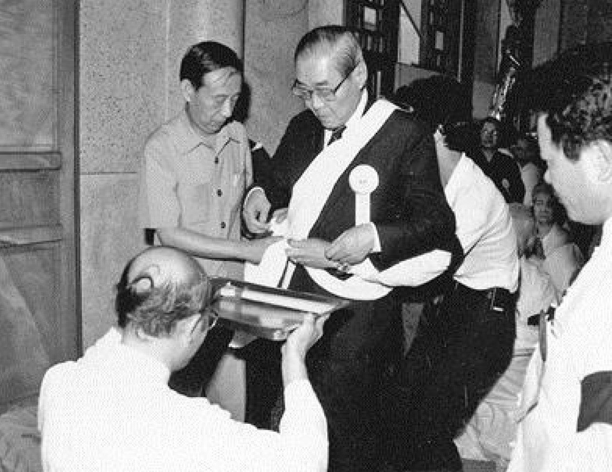

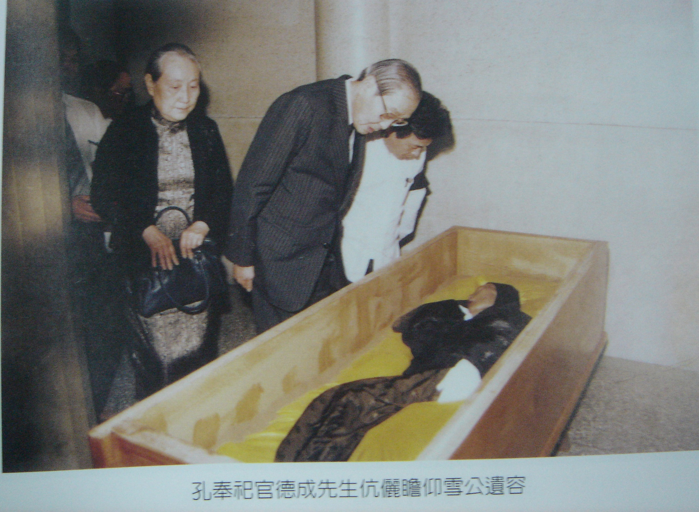

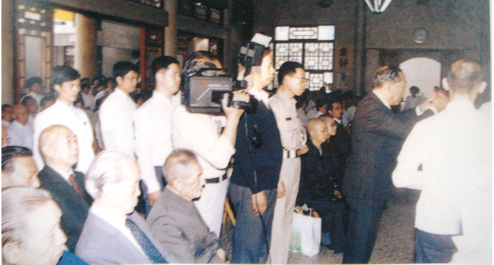

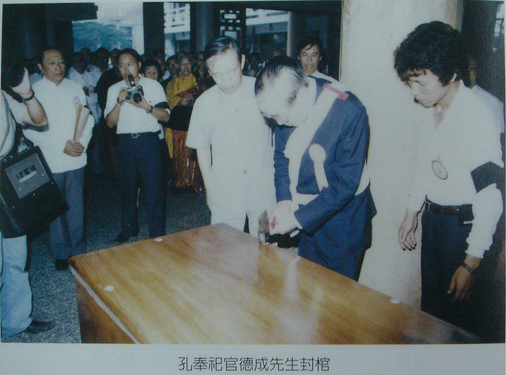

## 參訪觀摩

### 壬辰年秋三孔參訪報導（二）

*編輯部整理*

廟貌是歷史見證

天生仲尼繼絕學

弘傳開萬世太平

緬懷哲人民族魂

沿著中軸線繼續前行，經過了金聲玉振牌坊來到了泮水橋。古人入學稱為入泮，因為在西周時期，國家的最高學府太學叫做辟雍，辟雍的建築周圍是一個圓形的水池，象徵著教化流行，是屬於天子的學宮。諸侯國所設的學宮則稱為泮宮，泮宮沒有環繞的圓形水池，只有在學宮前方設置一個半圓形的水池稱作泮，入學則稱入泮，有入泮的儀式。史書上記載，春秋前期魯僖公為了興學養士，在魯國都城泮水岸邊築起了泮宮，成為諸侯國中最早的學宮，爾後各諸侯國也先後效仿，築學宮鑿泮池，泮宮因而成為諸侯國大學的代名詞。在孔廟平時祭祀時，也有入泮儀式。

走過泮水橋到了櫺星門，櫺星也稱天田星，是主得士之慶，意思是人才輩出，為國所用，古人在祭天之前先要祭祀櫺星。曲阜孔廟的櫺星門設計為中空的牌坊形式，柱間有紅色柵欄門，此有疏通的意涵，說明要招納天下的文人學士，都到這個地方來學習，來接受儒家思想的洗禮。

門上的字也是乾隆皇帝的御筆，此門最早見於明永樂十三年，一四一五年，當時全部為木製，到了乾隆十九年，由七十一代衍聖公孔昭煥改建為鐵梁石柱，柱高十點三四米，門寬十三米，是四柱三間火焰衝天柱式，圓柱前後以石鼓夾抱，每柱各由上下兩節組成，相交處分別用石製的傾斜戧柱支撐，柱頂雕刻著佛教的四大天王像。正中的明間額枋為兩層，有二龍戲珠的浮雕，兩側的稍間額枋只有一層，刻有雲鶴。

額枋以鐵梁承托，各鑄有四個龍頭閥閱，所謂的閥閱，是仕宦人家在大門外所樹立柱子，用來題記功業，到了宋代演變成「門簪」的形式，就是用六角形、圓形等短樁，鑲嵌在門的上方，樁周及端部雕有圖案，一般官員家用二個，高官的府邸則用四個，在民間稱為來頭，因此有來頭不小之說。

再往北進，穿過太和元氣坊和至聖廟坊，來到了第二進院的大門，聖時門。聖時門和第三進院的大門弘道門，都是乾隆皇帝的御筆所題。進入庭院，眼前有一道東西橫向而過的河流，古橋三座縱跨在河流之上。河流因「壅繞如璧」古名「璧水」，橋也因此得名「璧水橋」。庭院內樹木繁茂，迎風搖曳，這些巨大的身影分擔了許多往來的目光，讓人不容易去留意橋下河流的樣貌。

第三進的院落中的古柏大多栽種於宋朝，由於孔廟是隨著時間的推進層層擴建，因此當我們的腳步愈往北進，建築物和樹木的年代也就愈久遠。文革時期此院落的圍牆曾被打開，修築了一條道路，讓來往民眾可以直接穿越孔廟而過，一些古柏在當時都遭到了破壞。廟牆在八十年代又重新修葺，庭院內也補種了一些小柏樹。

過了大中門進入孔廟的第四進院落，此門建於宋金時期，屬於當時孔廟的大門。在大中門之前，是孔廟的前導院落，並沒有太多的建築，從大中門以後直至大成殿，開始就有各類的樓閣、碑亭及廟堂等設施。

此處立有幾座石碑，其中的成化碑把孔子思想評價到絕對高的程度。成化碑是明成化四年（一四六八年），成化皇帝下令所立；在其北側石碑有碑亭保護，是朱元璋皇帝所立；西面還有永樂皇帝和弘治皇帝的立碑，都是明代皇帝的御製碑。成化碑的碑文，屬於明代標準的台閣體，清代稱為館閣體，也就是我們今天的標準文字。

明憲宗在碑文上題：「朕惟孔子之道，天下一日不可無焉。何也？有孔子之道，則綱常正而倫理明，萬物各得其所；不然，則異端橫起，邪說紛作。綱常何自而正？倫理何自而明？天下萬物又豈能各得其所哉？是以生民之休戚系焉，國家之治亂關焉，有天下者，誠不可一日無孔子之道也。蓋孔子之道，即堯、舜、禹、湯、文、武之道，載於六經者是已。孔子則從而明之，以詔後世耳。故曰，天將以夫子為木鐸。使天不生孔子，則堯、舜、禹、湯、文、武之道，後世何從而知之。將必昏昏冥冥，無異於夢中，所謂萬古如長夜也。由此觀之，則天生孔子，實所以為天地立心，為生民立命，為往聖繼絕學，為萬世開太平者也。其功用之大，不但同乎天地而已……。」

成化碑上有一道明顯的斷痕，是文革的遺蹟，一九六六年時，有一位女學生譚厚蘭，是北師大的五大學生領袖之一，當時她帶著紅衛兵，把孔廟的一些石碑都給破壞。所以文物部門在七十年代又重新修補，但是一些已經十分破碎的地方，就沒辦法再行修復。因為這些石碑都是受保護的文物，有拓片作為存檔資料，所以就根據拓片上的文字，將無法修復的部分填補上，修葺之後留下一道明顯可見的裂痕，是這一段歷史的見證。後來北京當局逮捕了幾位學生領袖，要追究他們的刑事責任，結果譚厚蘭得了癌症，免於起訴，於八二年病故，得年四十五歲，沒有結婚。雖然事後她也認識到了自己的錯誤，但是已經造成了相當大的影響。

沿中軸線向北，經過了同文門，有一座原本用於藏書的樓閣，稱為奎文閣，原名藏書樓。此樓閣建於北宋太平興國八年，宋代皇帝賜給孔家的經典，都存放在此，金代明昌二年（一一九一年）重修此樓，才改名為奎文閣。所謂的奎，是指二十八星宿之一的奎星，《孝經援神契》上講：奎主文章。奎星主管天下文官，金章宗為了讚頌孔子是天下文官之主，所以賜名此樓為奎文閣。

奎文閣中的藏書，清朝末年已經全部放到孔府中保存，其中有宋代的古籍善本，但以明、清兩代的書籍居多。平時此處展覽著孔子一生活動的聖蹟圖，是明代的彩繪，共三十六幅，每幅都附有說明。除此之外，孔廟中所收藏不同版本的孔子像共有十三種，包括孔子司寇像、講學圖、行教圖、帝王像等。孔廟最後邊還有一個石雕聖蹟圖，共一百二十幅，也是明代的作品。

每年祭孔之前，會在奎文閣中擺上孔子及四配十二哲這些賢儒的牌位，供大家彩排練習，孔廟祭祀的主祭區在大成殿的周圍，每年的祭祀活動都是由嫡長孫主持，祭祀前就要做足準備，挑選祭品、發布告示，樂生、舞生、禮生都要演習，嫡長孫還要齋戒沐浴，所以孔廟有專門的齋宿所，等到九月二十八日當天，才能正式到大成殿去祭祀。

立碑是中國人常用的紀念方法，碑文往往富含重要的歷史價值和文化意義。遊覽過了奎文閣再往北走，就是十三碑庭院，碑亭的主要功用就是保護石碑，此處一共保存了從唐朝到民國的石碑一共五十七個，是歷代的帝王大臣們修廟、祭祀的紀錄。十三座碑亭當中有兩座是金代，兩座是元朝，然後其他全部屬於清朝。從這裡可以看出金、元、清三個少數民族所成立的政權，他們尊孔程度非常高，也讓我們深深了解文化的精神力量，遠大於有形的武裝政權。

中國古建築都是土木結構，木製建築本身較不耐歲月，再加上自然災害的影響，使得保存更是不易。根據考證，現前保存最久的古建築，是唐朝末年所建，位在山西的五臺山。孔廟中保存最悠久的建物就是金代的碑亭，已經八百餘年。

碑庭的院子裡有一個康熙二十五年立的御製碑，這是康熙皇帝到曲阜祭拜孔子之後下令所立，是孔廟中最重的一個碑，達六十五噸。石材採於北京西山，離此處有六百多公里，製碑當時並沒有現代化的汽車工具，千里之遙、石材之重，該如何搬運？原來當時是利用京杭大運河的結冰期搬運，並且挖井潑水於地，使水結冰，從冰上滑送而來，全程使用了六百多頭牛，四百多個人，一共撥用了六百多兩白銀。（下期待續）

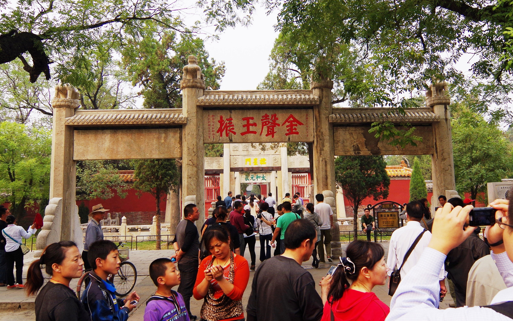

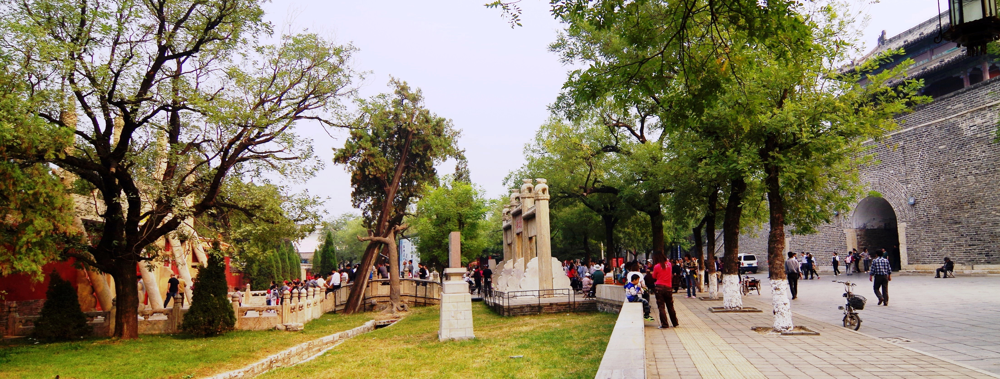

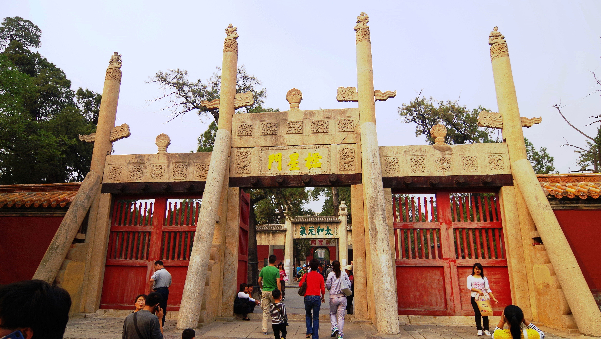

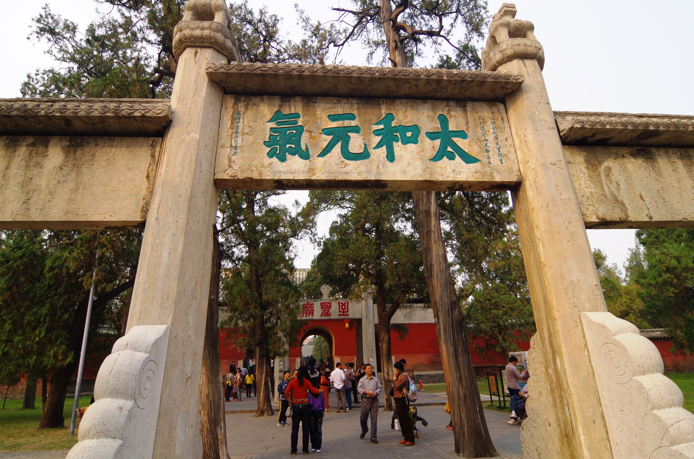

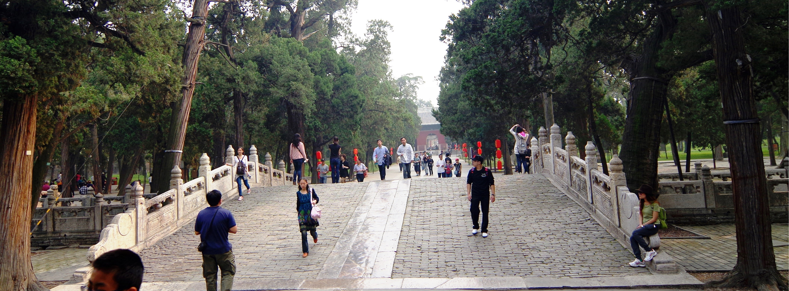

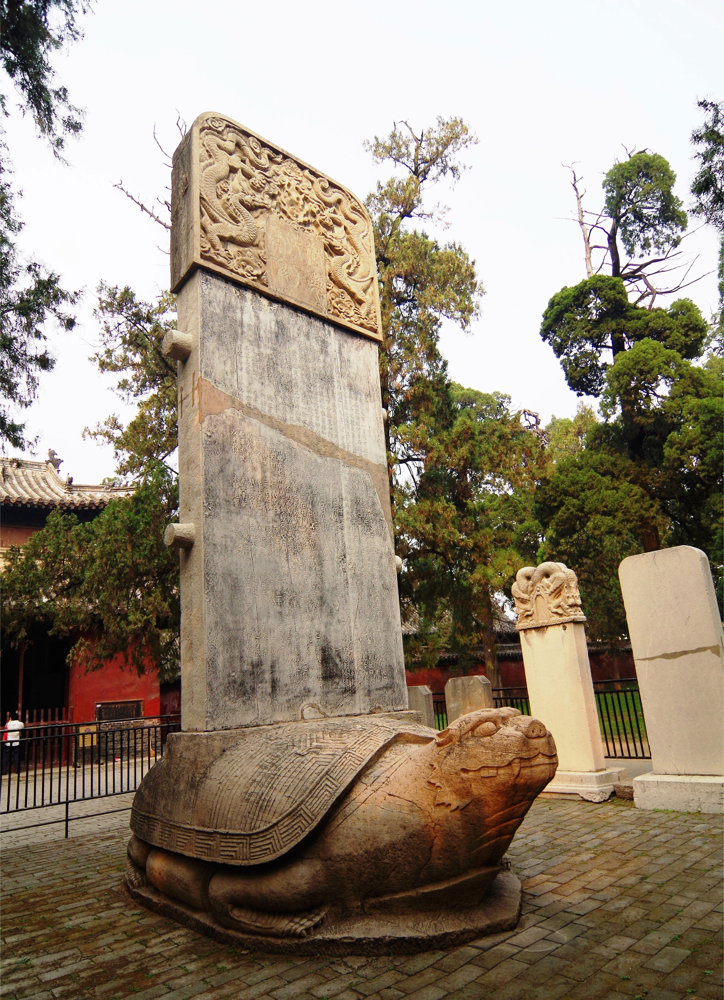

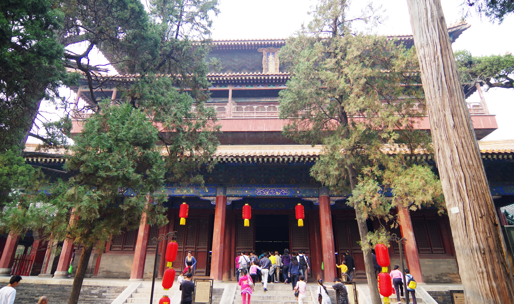

## 專題講座

### 這樣吃心血管最健康—病變從源頭控制

郭基發 主講

色香味俱全

表裡卻不一

病從貪口入

除病還由它

前幾天在中部遇到某校長，問及某位重要老師身體狀況，得知心臟仍在吃藥控制，當時就建議一定要禁吃油，理由就是心血管就像房子一樣，房子已經在走火了，此時一滴汽油都不能滴，並介紹一本書

「這樣吃，心血管最健康」。

這本書作者的父親是美國內科名醫，岳父是心臟科名醫，但是都死於心臟病，而他本身是外科醫師，在克里夫蘭醫院，這所醫院在美國是專門治療心臟病的醫院，非常有名，治療心肌梗塞的支架以及導管裝設等發明，都是這所醫院的醫生發明的，而這位發明各種繞道手術的醫生跟這本書的作者（耶瑟斯汀醫師）共用一個櫃子，一位是走置入性的處理，一位為了消除家族三高症狀的心臟病，下決心一定要找到根治的方法。這位醫生就在克里夫蘭，把一些已經沒有辦法再作任何手術改良的重症患者，介紹給耶瑟斯汀醫師，用飲食調理，將這些患者的總膽固醇含量降到150MG/DL以下。

這個計畫的原則非常明確，飲食當中禁止動物性油脂油以及蛋白，一滴都不能吃，禁吃任何油脂以及堅果，我們一般以為橄欖油、地中海型的飲食不會產生高血壓，之前威斯康辛州的科學家，在一九八八年對心血管疾病作了一個回顧研究，這個實驗歷時四年，到後來追蹤發現橄欖油不是真的會降低三高症狀，這些適度減少油脂攝取的病人，的確減緩了病情惡化的速度，但是沒有辦法抑制疾病發展，也無法降低心臟病和癌症風險，所以書上特別提出橄欖油和堅果類、酪梨必須要禁吃，很多心臟有問題的人，會允許自己吃橄欖油，而且不覺得錯誤，但膽固醇都沒有往下降，病人跟醫生都覺得很奇怪，後來詳細的紀錄每天吃的東西，一丁點也不遺漏，結果發現元兇就是沙拉裡面的橄欖油。

油脂含量高的全部都要禁止食用，按照這樣的飲食方式，這二十幾位嚴重到無法動手術的重症患者，歷經二十幾年仍然存活，歷經心肌梗塞的患者，或者走幾步路就會氣喘吁吁，有的根本沒辦法走路，在採用飲食療法後，都能重新回去工作，這個實驗在克里夫蘭造成了極大的轟動，實驗歷經好幾年，結果非常明顯，耶瑟斯汀醫師就跟院長報告說可以完全根治心臟病！而因為他本人年紀已大，希望醫院可以支持這個計畫，讓它持續，但是心臟科醫師不願意，他就主動問為何不介紹病人加入營養計畫？那位醫生只是坦率的說：你知道我去年收入超過五百萬（美元）嗎？講白了就是錢的問題，大家沒有心臟病，我們就沒有錢賺，按照你的方式自己就把自己處理好了，幹嘛還來醫院看病？

所以這位耶瑟斯汀醫師他為什麼要這樣做？因為他覺得這是他的使命，他的父親、他的岳父都當醫生，都死在心臟病，他說他希望可以找到根源，希望心臟病可以在美國絕跡！他實驗了二十四年，他的病人都還活著，所以到最近他才把他的實驗結果公布，就像柯林頓總統的心臟病也是這位醫生治好的，用的就是飲食療法。

他的原則就是禁止食用的五大原則（任何葷食、乳製品、食用油、精緻穀類、堅果），就是這麼嚴格，不能有折扣，甚至曾經測過血流量，只要一餐飯吃到油，血流量馬上變慢，如果吃的是葷食或者油，血液要經過好幾個小時才會回復正常，所以才會說一滴油都不能吃。

我們都吃素，也勸別人吃素才會健康，但是我們生的病都跟吃葷的差不多，所有動物性的脂肪跟蛋白質都禁止，他的原則非常明確也非常嚴格。當時在美國所做的實驗，是真的有成果。

我們人體裡面三高的症狀，就是吃引起的，按照美國人的吃，就會得到他們的病，按照我們東方的飲食，都沒有這樣的病。當他提出一滴油都不能吃的時候，大家都覺得太過嚴格，但是幾乎所有的慢性病都集中在西方國家，亞洲以及非洲國家是很少出現這樣的疾病，由於我們現在的飲食都受到西方飲食習慣的影響，所以會有這樣的毛病。

學佛吃素身體健康，可以算是榜樣，不要到後來鼓勵別人吃素，自己卻心肌梗塞。廚師的觀念要改變，小孩子天天那樣吃，二十年以後就是三高患者，不曉得就是家長埋下去的原因。

我的表哥換了兩根支架，我馬上打電話叫他看這本書，他說他很喜歡吃堅果，一個心臟有狀況，隨時都可能走的人，還在火上加油，這就是沒有正確的觀念，從他心肌梗塞換了支架，膽固醇沒有降下來過，那是因為飲食沒有改變過，雖然他說在網路上已看完這本書了，可惜還是沒辦法改變他生活習慣！

我的表妹也是走一走就會頭暈，我去買那本書送她，她看完以後馬上改變飲食習慣，立即見效！連不易治好的感冒症狀也慢慢痊癒。

由於本公司（昶茂）所作的工作之一是環境處理，曾處理新光三越、遠東百貨小吃街的油管，槽體裡面有很多堆積管壁的油，在分解這些油時，就留意身體血管壁的油，造成身體的污染，這與油造成環境的污染情形是一樣的，何以下大雨後會淹水？都是因為下水道被油堵住了，油的性質就是黏膩，油和油會互相附著，油在空氣當中氧化會變硬，極難分解且熱量很高，容易被人體保存。由於我們小腸的乳糜管特別容易吸收油，油脂百分之九十九都會被小腸吸收，然後送到皮下去儲存，其間要經過血管運送與循環，所以當皮下脂肪太多時，表示血管裡面的油也很多。

而油的特性就是黏膩，會讓血管流速變慢，而且會附著在管壁，尤其是晚上或者宵夜吃油的人，特別容易高血壓，晚上因為要睡覺了，血液的流速會變慢，慢就更容易沉降，就像長江中、下游易氾濫的道理一樣，這是物理現象。所以很多三高症狀的人，如果沒有禁止宵夜，血壓不可能降下來，原因是因為脂肪容易沉降留在血管當中。小孩子的血液流速很快，老人家的血液流速很慢，這就是年輕的原因，養分運送流暢，身體就會健康，跟我們公司在作污穢水的管路一樣，所以從體外環保講到體內環保，就是在說油的問題，我們只要注意這些問題，身體自自然然就會健康了，身體的毒物代謝變慢，回補修復的速度變慢，人就老了。如果代謝輸送很流暢，不管幾歲都是年輕。

吃素的人，以前沒有這麼豐富的飲食，以前的油也沒有那麼多，尤其是芥花子油，絕對要禁吃，因為它太黏膩，而且很容易造成心律不整，在歐美國家早就全面禁用。呼籲大家用油絕對不要用調和油，因為你不知道它混合了什麼，通常一定是混最便宜的油，而最便宜的油就是芥花子油。有的糕餅店很有名，卻使用芥花子油，我們這個環境就是這樣，不曉得吃進去的東西是怎樣的東西，有時候也會覺得自己雖然很注意吃，但是身體還是有異樣，這就真的要好好管制嘴巴，將吃進去的東西好好釐清。首要的步驟，就是要把血管清乾淨，那就是先把油戒掉，這是一個很大的關鍵，而且非常簡單，原則很簡單，但是做起來很難。

我自己本身也在實行，之前處理臺中新光三越油管，長達八個月晨昏顛倒，後來有一天多吃了一碗白飯，感覺有點暈眩，又有一次空腹吃香蕉，暈到沒辦法站起來，以前我從來沒有暈眩過，很難形容那是什麼感覺，那時發現自己身體出現了狀況，但是不知道發生了什麼事情？而且我的糞便出現了白色的油膜，並有胃酸逆流，整個人小一號，光彩都不見了，花了兩年才慢慢的調整回來。

那時也懷疑自己是糖尿病，當胰島素與細胞反應出狀況時，吃進去的澱粉沒辦法轉化，只好分解身體的蛋白質或脂肪。現今特別注意食用油，並且配合太極拳，才將身體恢復健康。

這本書（這樣吃心血管最健康）有一半是他實驗的過程與報告，一半就是食譜，能改變我們吃素的觀念。以往我們為了勸別人吃素，所以都煮的比較好吃，但好吃無非就是油炸，但是無形之中油就會攝取太多，早期的出家人身體很好，然現在年輕的出家眾身體很糟糕，原因就是油，特別是血管快要塞住的人，一滴油都不能吃，很多人都以為自己沒辦法這樣吃，但是為了保命只好配合。可是吃到後來都上癮了，會吃到很多東西的原味，例如我會是使用陶鍋，丟進去各式各樣的豆類，然後用高麗菜下去熬煮，味道很好，當我們到外面吃飯，發現每一盤都是油炒的，我們身體根本不需要這麼多，這就是我們目前病的癥結。

所有的代謝病，源頭都一樣，我們人體的回復沒有那麼難，最麻煩的就是我們不忌口，什麼東西都塞給身體去處理，結果糟蹋了身體。只要嘴巴顧好，沒幾個月總膽固醇就下降了，只要禁吃動物性食品，就不會有動物性膽固醇，所以這位醫生的實驗是連蛋、優酪乳等都得禁吃，比我們素食者還要素，他們只吃芝麻、豆類、亞麻子裡面含的油脂，而且不要吃萃取的東西，因為我們吃的油量已經太超量了，他們這些已經發生過心肌梗塞的重症患者，如此堅持地這樣吃，結果多活二十多年，這真是奇蹟，這位醫生也說九十多歲的人可以有九歲小孩的血管，這是可以辦得到的。要相信自己身體的修護能力，不要等到年紀大了，想要改也很難改了。血液黏稠度跟胖瘦沒有絕對關係。要去檢查膽固醇，瘦的人有的消化液製造很黏稠，耗損能量很大，這也是一個原因。

其次練太極拳若沒有練到位，也會傷及眼睛以及大腦，身體是否徹底放鬆，氣脈是否順暢，對身體健康有極大的關係。

至於現在製作的食用油，是用有機溶劑將油溶出，再將有機溶劑脫離，這樣萃取出來的油，難免殘留有機溶劑，而且為了保持油品的新鮮，也會加上安定劑與抗氧化劑，這些都是大量生產導致的結果，他們考慮的不是食用者的健康，而是食用油的品質穩不穩定，會不會變質，有一些甚至是他們的商業機密。

再者，我們的肝臟會把血管的油攔住，小分子的油可以儲存以及修護細胞，肝臟分泌出來的酵素五千多種，脂肪太多會導致肝臟分泌的酵素變少，會發生身體不舒服的感覺，要讓肝臟有空間製作酵素，讓身體正常運作。

總之這本書的作者很正直，很有良心，很可愛，很勇於去作認為對的事情，不管外界的壓力如何，他們要對抗奶酪業者，對抗肉品業者。這些業者講白了全都是利益，不是良心。這位醫生說自己年紀已經很大了，他願意出這本書，就是希望美國心臟病能夠絕跡，因為美國花在心臟病的治療以及手術的費用實在太高了，一年兩千兩百億美金。

（向全世界有良心、正直、善良替大眾著想的人致敬）

## 活動報導

### 喻親於道—癸巳年浴佛法會暨母親節活動報導

*編輯部整理*

寓教於藝

眾皆歡喜

留下印象

期待明年

五月的第二個星期日，是一年一度的母親節，每年的這個時候，也接近於農曆的四月八日佛誕節，而五月十五日，又是學會的落成紀念日，因此在這一個時節裡，興辦母親節浴佛慶祝活動，就包羅了各種意涵。近來流行在母親節這個日子裡，由子女帶著母親去住五星級飯店、吃大餐、享用ＳＰＡ，來報答母親的辛勞。這樣的孝行固然也是對母親的一種報答，但是若懂得利用如此難得的因緣，陪同母親一同前來學會參與活動，聆聽師長的法語、參與浴佛法行，以及觀賞各地蓮友帶來的精采表演，最後享用美好的養生素食，絕對是一個比住飯店更有意義及內涵的選擇。

各地蓮友們一早陸續抵達位於寧波西街的中華無盡燈文化學會，住在遠地的蓮友們，更在清晨五點多就搭上遊覽車前往臺北。眾人紛紛聚集，活動開始，學會指導老師首先致詞，並請與會的中華大成孔學會理事長張德聲居士，以及基隆淨宗學會會長陳曼玲女士來為活動致詞，揭開活動的序幕。

如同前一次的母親節，學會同樣準備了過去整年度的活動回顧影片，讓遠方的蓮友，以及未及參與學會所有活動的師長們，都能藉由影片，掌握學會過去一年的動態。國內講座、國外講座、齋僧、聯誼活動、蓮友關懷與助念、每週一、三、五的例行課程，週六共修，週日人才培訓班……影片中呈現出豐富的各類教學與活動，由此可知學會師長們在教學上的的辛勤努力，義工蓮友的辛勤付出。

年度回顧之後，正式進入節目表演，每年此時，都會聚集各路的好手，用心籌畫表演內容，往往在表演中，都能發掘到表演者的特長。今年表演的單位一共有六個：

一、大學班

週三大學班的成員，是由長期擔任一樓值班的學員們組成，他們負責對學會中穿梭的不同成員招呼服務，並每週定期研學《大學》，建立正知見，作為發心的學習。此次他們從早期《梁祝》這一部電影中的橋段得到靈感，設計了「大學堂」的這一齣戲，內容十分活潑有趣，傳遞學習的快樂。

二、臺北啟蒙讀經班

所謂「童蒙養正」，人才的栽培始於啟蒙教育，當同學們還是幼兒時期，就開始著手於人格的養成，並培養他們從朗誦經典、遵守禮儀中涵養自己的氣質。學會二十年來培養了一批又一批的孩童，現在仍維持每個星期三的下午以及星期六的晚上開設啟蒙讀經班，班上的同學們，也為這次的慶祝活動帶來背誦古文的表演，諸如《聲律啟蒙撮要》、《弟子規》等等，同學們都能熟練而穩定的背誦。

三、養成班表演

學會的諸位師長們，在人才的培植上，已經默默地耕耘了好幾十年，可從養成班見證此歷史因緣。許多已入社會，成家立業的學長們，當他們還是學齡前的年紀，就已經開始接受栽培，而今已成社會的精英，大夥們齊聚一堂，為活動帶來<西遊記‧勸孝篇>的演出。養成班的學長們，為此還特地租借了戲服，沉著的唐僧、靈動的悟空、可愛的八戒、憨厚的悟淨、像極北海小英雄的牛魔王、潑辣的鐵扇公主、調皮的紅孩兒等，各個角色在戲服的襯托下，使得整體表演更為特出。

四、大專班

大專班是一群正在攻讀大專的同學們所組成的班級，他們在學會研學儒佛經教，當中也有許多同學，都已經跟隨老師學習多年，因此相較於一般學生，他們有一段特別的成長歷程，就是生命中長期伴隨著儒學與佛學的研討，這樣的人生經驗，到底會是什麼樣的一種心情？學長們用詩歌朗誦：《幸福？惡夢？幸福！》的表演方式，讓觀眾們一窺他們的內心世界。

五、週六讀書會

學會在每個星期六的下午，由教學組承辦的讀書會，共同研究《詩階述唐》、《論語》、《大學》等課程，在研討過程中，往往有許多的想法跟啟發，此次母親節的節目，就是師長們依據研學雪廬老人《詩階述唐》的課程而得來的靈感，編寫了一部短劇，名為《紅葉的歸宿》，表演的深度內涵，十分發人深省。

六、東勢蓮友

此次的壓軸和去年相同，是由遠道而來的東勢蓮友們負責。在過去幾年的母親節裡，東勢蓮友們有許多的精彩表演，諸如竹竿舞、舞龍舞獅。而今年也帶來很有客家風味的客家歌曲演唱，以及客家童謠朗讀。表演成員們包含了多代同堂的家族，老中青少們，展現出家和萬事興的氣象，特別令人感到溫暖。

所有表演節目結束後，學會準備了五層的大蛋糕，推進了二樓的會場，由唐老師及學會執行長楊子儀老師，帶領老蓮友菩薩及媽媽們，一同許下心願切蛋糕，為節目的尾聲畫上溫馨且光明的願景。

而後緊接著就是浴佛法行的開始，唐老師為大眾說明了浴佛的方法，在誦念《浴佛功德經》之後，眾人在莊嚴的梵唄聲中，依序完成浴佛，祈求能夠如同釋迦佛般，上求佛道、下化眾生皆能圓滿，並且接受諸佛的灌頂與祝福。與會大眾在浴佛過後，享用一頓豐盛的素食餐點，大家一一道別離開，義工們，特別是年輕的大專學長們，留下來打掃清理，一段殊勝的因緣，畫下圓滿的句點。

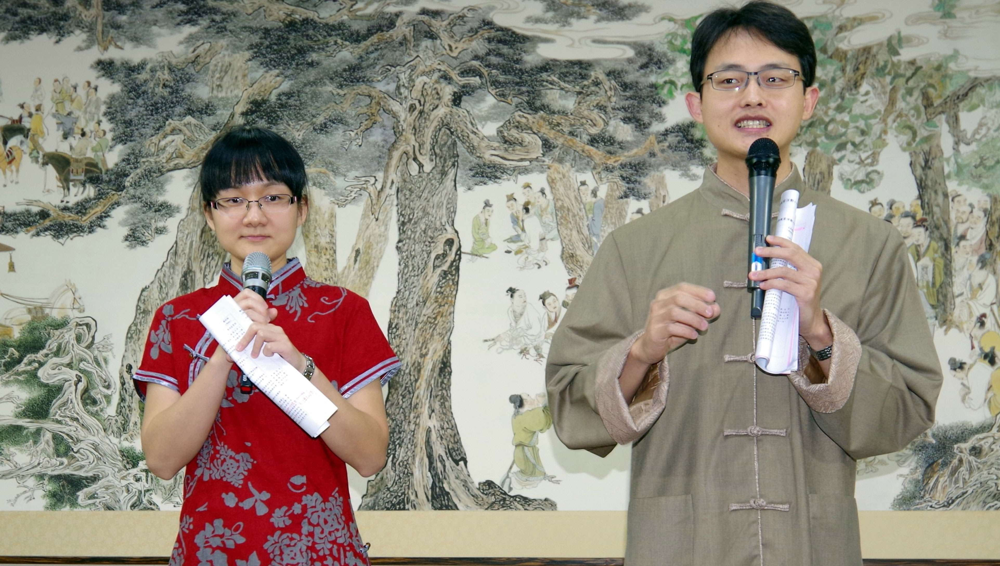

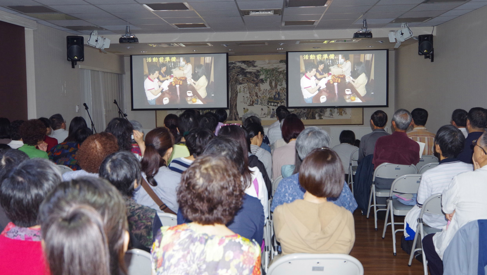

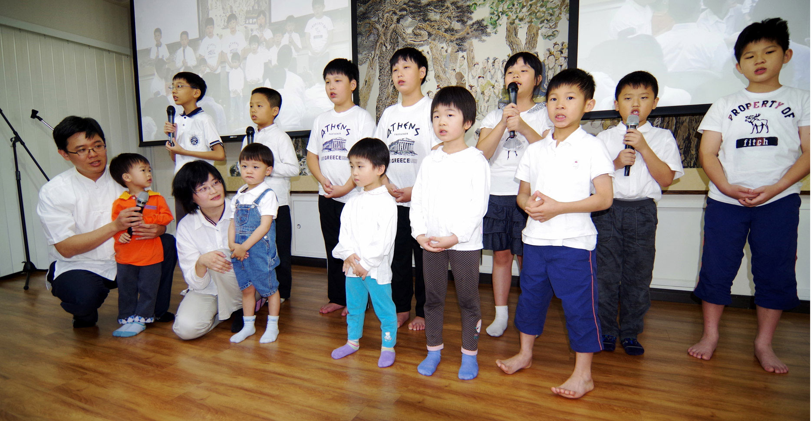

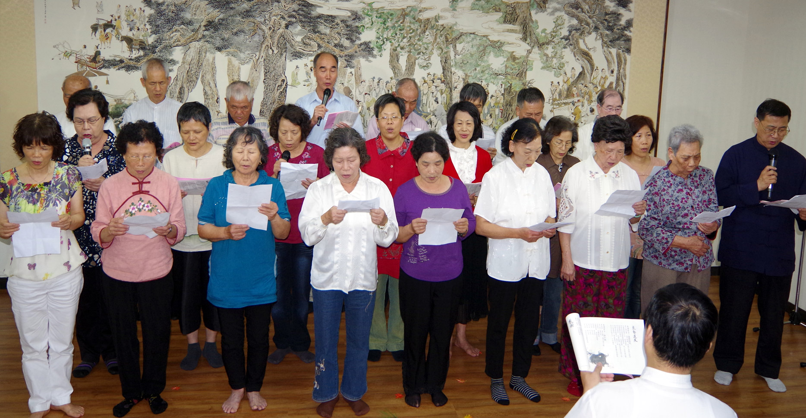

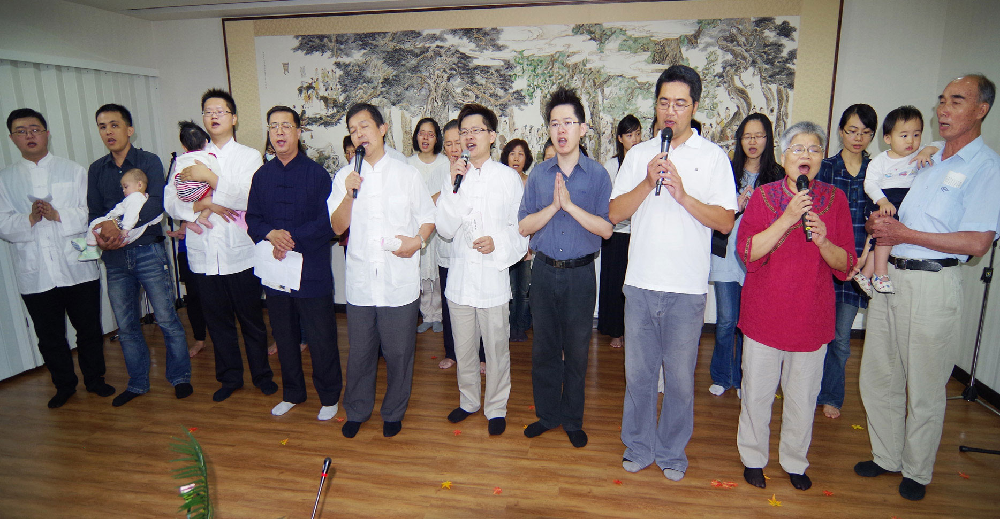

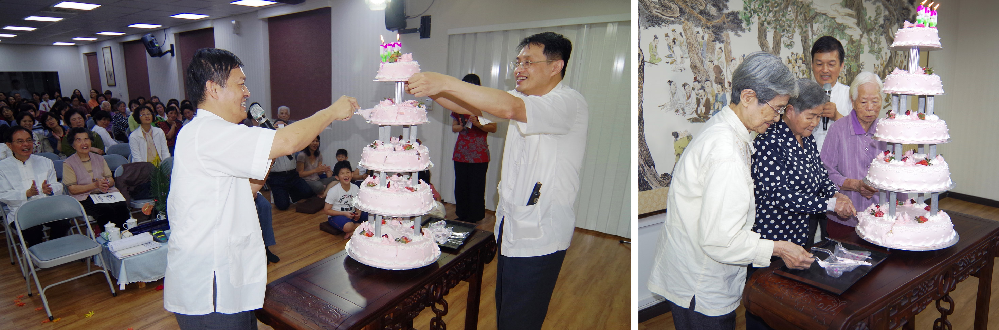

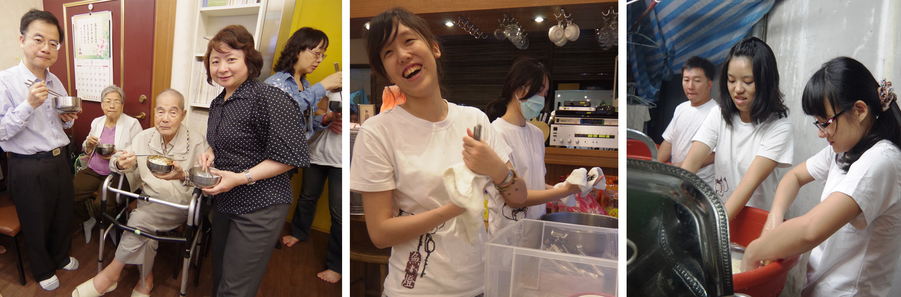

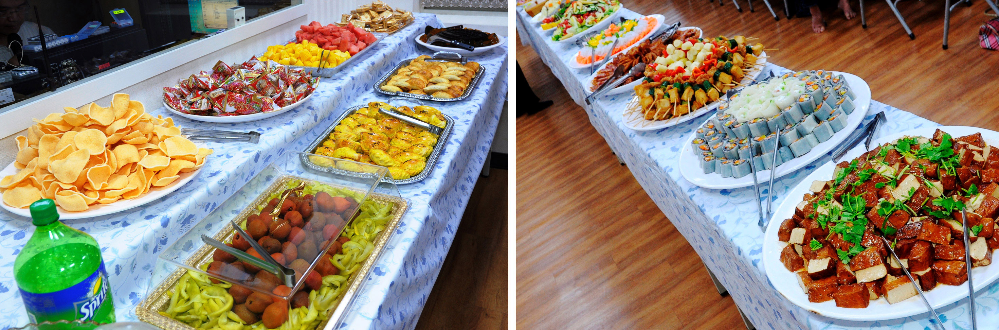

### 喻親於道—癸巳年浴佛法會暨母親節活動報導　師長及來賓致詞

*編輯部整理*

母親恩德正見顯

難報要在離塵垢

不離平常順身心

以孝貫通世出世

理事長致詞

在這臺上有說不出的慚愧，在學會中承擔有限，由於大家承讓而站在這個臺上，盼望能交下棒子，然不是交出一個爛攤子，而是將一個有內涵、有氣象、有資源的學會往下傳，且是交給很棒的下一代，讓他們繼續經營，如此任務算是完成。

母親節活動，誠如主持人所說，非藉著這一天，彌補這一年對母親的忽視，而是藉此機會推展對母親的孝道，並藉著母親節，蓮友們大家都能見見面，互相以道砥礪，令母親在母親節過有意義的一天，過一個名符其實的母親節。子曰：不亦樂乎！

佛經中有佛告文殊師利菩薩說，北方有一佛世界，菩薩修行千億歲，功德如何？文殊菩薩說：非常大。然釋迦佛告訴文殊菩薩，這樣的功德不如在娑婆世界好好孝順母親一天！何以故？因為佛淨土是蓮花化生，沒有母親的形象，能成為我們的福田。此處並不是說修行千億歲不殊勝。舉例來說，一位尊貴如國王者對卑劣的乞丐，伸手去扶他，去安慰他，那個福德比供養十方諸佛還要殊勝，然非十方諸佛的福田不如這貧窮的乞丐！是說這一念心的生起，憐憫苦眾生的心，不會在十方諸佛淨土中生起。我們會在十方諸佛尊貴的形象中，很卑微地供養並承事請教，不會生起憐憫的心。

要把握每一個世界修行特點，在極樂世界是蓮花化生，在娑婆世界才有媽媽，對如此大恩德的田，須生起報恩的意樂。且對此福田，隨意供養一分，福報是無量無邊，為什麼呢？因為這樣的福田與心態在佛國土是生不起的。母親對我們的關懷、噓寒問暖、與子女同甘苦的成長，命運跟子女綁在一塊，佛國土蓮花化生，無法生起如此殊勝福田與孝順的意樂。

在此祝福今天參加活動的母親與全天下的母親，附帶感謝執行的團隊在場地的布置，事前的規劃，以及活動當中執行各項細節。由於場地不敷使用，造成大家不方便，在此致十二萬分的歉意。總之福報大家共享，謝謝大家。

大成孔學會理事長

今天很高興參加活動，聽到東勢劉先生分享一路辛苦的學習，我們都經歷過同樣的經驗，雖是辛苦然非常充實，這在其他團體是很難值遇的，本會絕對不會讓你虛度光陰，就算出去玩，也是帶著教育性質遊玩，我們都有如此切身的經驗和體會。曾與唐老師幾次出遊，第一次是到大陸，一路上滔滔不絕，從上遊覽車到下車，每個人都心驚膽跳，隨時都會被點名講心得。很累了休息一下，萬一被點名還不知道是怎麼回事，然此痛苦經驗卻是非常充實的回憶，所以跟著走不努力也被推向前，即使是最糟糕的學生，也會成為很優秀的學生，這是很肯定的一件事情。

藉今天母親節，生起對母親的感恩以及報恩的意樂，試問要如何做呢？不是等母親走了以後，而是現在大家都可以做。一般人也許沒有體會到母親的用心，過去我母親在世的時候，我家庭院中有一棵蕃石榴樹，覺得此樹長得很好，我向母親說句無意的話：這棵樹很好，希望可以把它保留下來。

在我二十八歲出國，好幾年後才回國，家裡改建，其他地方都整理過了，只有那棵樹保留下來，而且長得很高大，我說，這棵樹竟然長得這麼大，我母親說：因為你喜歡，所以就保留下來。舉此例是說明所有母親對小孩子各種表現乃至所說的話都非常在意，然孩子往往忽略了母親的心意。我後來到其他家庭拜訪，若有父母與小孩子同在的場合，我會觀察到，小孩子的一舉一動，母親是非常在意的，而且小孩子講的話，母親是會聽在耳裡、記在心裡。然而我們要回報母親的是什麼呢？往往沒有感覺，將來會很愧疚的。

在此鼓勵各位，心裡想念母親、愛母親，最好用實際言語、行動，在日常生活上，多給母親安慰、幫忙，希望孩子們，從小到大，由現在、到未來，希望大家能把心裡想的愛，化為行動，而不是只有母親節這天才慶祝節日吃吃飯。同理，今天紀念佛陀聖誕，佛陀對眾生的愛也是無條件的，如何表達對佛的感恩呢？那就是好好念佛，求生西方極樂世界。鼓勵父母親，鼓勵所有的人都能依此正見去做，這是最好的母親節，謝謝各位。

基隆淨宗學會會長

很高興再度踏入中華無盡燈文化學會，一進來氛圍就不一樣，充滿了正向的光明，蓮友請到四樓點燈，感覺寧靜，且接近極樂世界！曾想：唐老師何以取名為無盡燈？有一天靜坐後，看到每一尊菩薩頭上都有一圈光環，那就是光明，燈代表著光明，無盡的光明如佛背後的光，表徵佛無盡的智慧。

來此是參與一種饗宴，叫精神的ＳＰＡ，回去後身心會更舒暢，法喜更充滿。尤其兩位老師在這裡進行的是一種文化的教育。雖然其他地方也有活動，但這一次母親節我選擇來這裡，我想這裏會更契合我的需求。常聽老師上課，總是法喜充滿，覺得時間很快就過去了。

另外今天母親節對我來講也意義非凡，因為多年來孩子都在外面就學就業，很少有機會共同過母親節，今天一出電梯他就跟我講：母親節快樂，哎呀，感覺不錯(台語)！其實孩子對媽媽也不必說太多，有時候就幾句貼心的話，或者是幫忙洗個碗，我就覺得很快樂。母親的心就像菩薩的心，基督教有句話說，上帝沒有辦法永遠在身旁照顧你，只好派一個媽媽來照顧你，就像天使一樣，媽媽的心就像菩薩的心，永遠無怨無悔。

很高興今天有這個機會參加這盛會，讓大家一起來共度這美好的母親節與浴佛節，讓我們一起來建立一個共同的回憶。

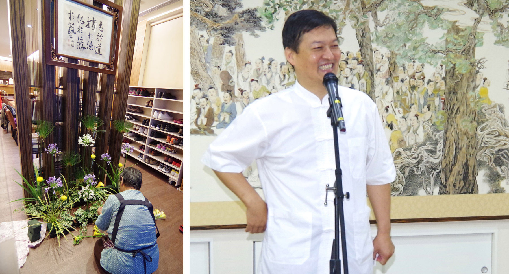

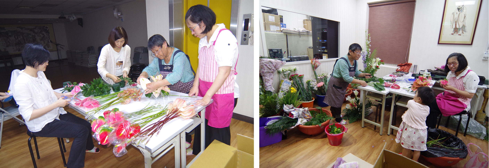

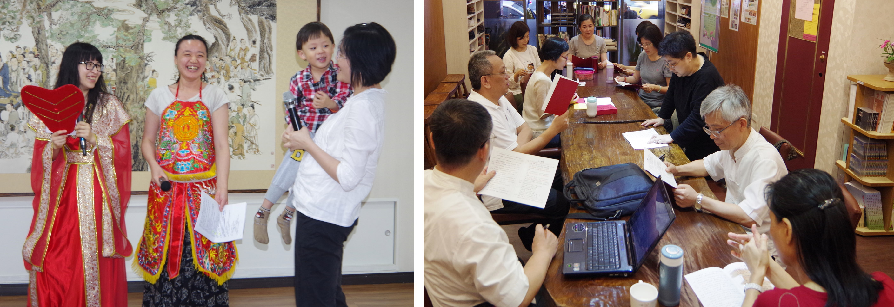

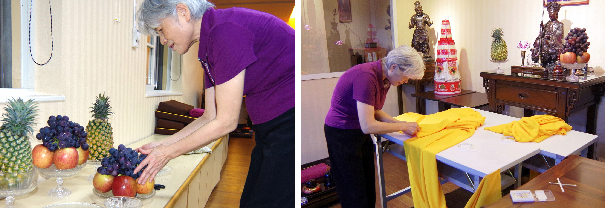

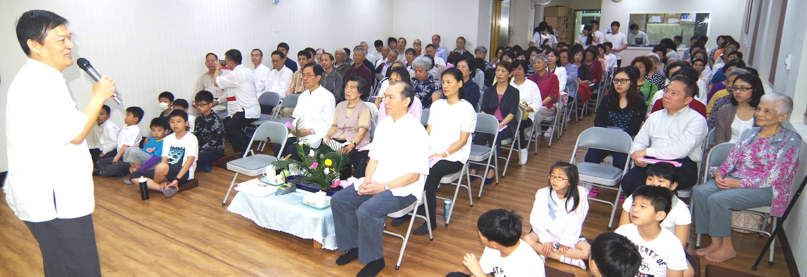

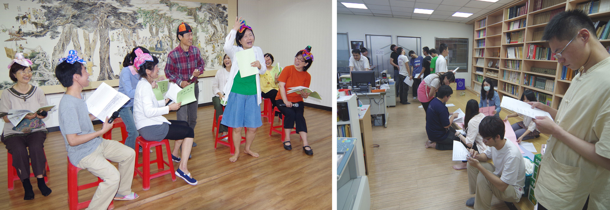

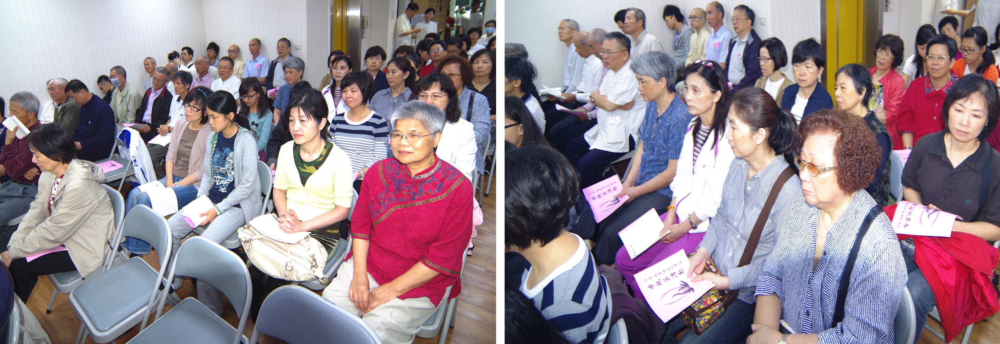

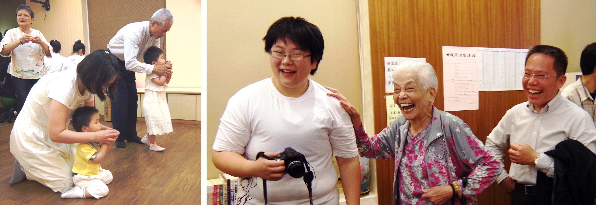

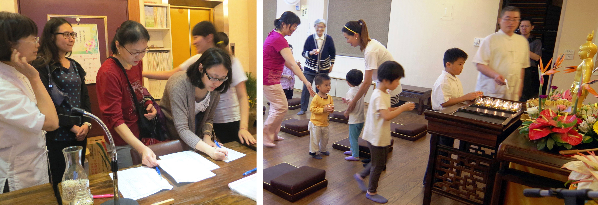

### 糞土之牆不可圬—週三大學班演出劇本

淨域  編稿

辦事義工須研教

默契能令台下歡

相夫教子家佛化

子弟學佛有後繼

第一幕

旁白：開學日，學子們興高采烈上學堂。

(播放音樂)  (夫子上堂，學子們起立行禮。)

第二幕

夫子：今天是「無盡燈大學堂」開學之日，首先恭賀大家從小學至大學進階學習。

學堂講究規矩，瞧每人禮節周到、衣著整潔，顯然大家都能知禮守節。不過，課堂上還是要先與大家約法三章，此乃謂：「不教而殺謂之……」

學子：(眾人搶念)虐。

夫子：不錯！大家對《論語》之「四惡五美」耳熟能詳。

山伯：夫子！那什麼是約法三章呢？

夫子：就是要遵守三條修業規矩，第一條是—「睡覺者死。」

文才：哇！有這麼嚴重呀？上課睡覺竟要處死，那我豈不死定了嗎！

夫子：小子！莫要曲解了。這死非損命，而是死當，也就是既不尊師又不力學的人，修不得學分。

學子：喔！原來如此。

四九：夫子！那其他兩條規矩又是什麼呢？

夫子：另兩條是「遲到或早退者壁業」。

四九：哇！這樣也能畢業？

夫子：非也！此非畢業，而是面壁思過，懺悔自己所造的遲到早退惡業。

學子：(眾人齊唸)喔！

第三幕

夫子：新學期先點個名認識大家，點到的同學請自我介紹一番。

(唱名—梁山伯)

山伯：有！我叫梁山伯，來自山東梁山……

四九：(插話)你是大名頂頂梁山三十六天罡、七十二地煞的後代喔！

夫子：嘖！大牛，堂上不許如此胡猜瞎說。

(唱名—祝英台)

英台：有！我是祝英台，來自浙江永康，這會兒千里迢迢來台灣上大學堂，台語不通(用台語說)，還請大家多多指教。

(唱名—馬文才)

文才：有！我來自苗栗縣馬家莊，乃當今總統的親族……

四九：(靠過去媚語)我可以跟你要一張名片嗎？

夫子：唉！你就別亂攀關係了。

(如此依序點名，四九、銀心……)

第四幕

旁白：良師益友共一廬，朗朗云誦樂自如。

夫子：大家拿起讀本，一起讀誦〈大學〉。

學子：(合唱)大學之道在明明德，在親民，在止於至善。知止而後能定，定而後能靜，靜而後能安，安而後能慮，慮而後能得。

夫子：很好。再來我誦一句，大家接誦一句。

(唱)古之欲明明德於天下者。

學子：(合唱)先治其國。

夫子：(唱)欲治其國者。

學子：(合唱)先齊其家。

夫子：(唱)欲齊其家者。

學子：(合唱)先修其身。

第五幕

夫子：大家讀誦得不錯，學習興致真是高昂呀！

(唱)子曰：「學而時習之，不亦說乎！」

學子：(唱)「有朋自遠方來，不亦樂乎！」

夫子：(唱)「關關雎鳩，在河之洲。」

英台：(唱)「窈窕淑女，君子好逑。」

夫子：(唱)「唯女子與小人為難養也！」

山伯：(唱)「近之則不遜，遠之則怨。」

夫子：(唱)子曰：「飽食終日……」

(夫子見馬文才睡覺，便讓同學喚醒他)

夫子：來，我唱一段你來接

(唱)子曰：「飽食終日……」

文才：(唱)「飽食終日……飽食終日……」

夫子：(念)下一句

文才：(唱)飽食終日……

夫子：(念)飽食終日的下一句

文才：(唱)下一句

夫子：(念)飽食終日以後呢？

文才：(念)飽食終日以後，就不餓了…(學子大笑)

夫子：哼！(念)真是「朽木不可雕也！」

文才：(唱)糞土之牆不可圬也！

夫子：如此學生，真是玷污了大學堂之名，你死當了。

學子：(齊哀求)夫子，不要啦！

夫子：雖然你們如此同學相愛，但堂外有這麼多的師友旁聽，又怎能壞了規矩！

山伯：夫子！今天欣逢母親節，如此死當恐讓文才之母難過，不如全班表演一段才藝娛興大家，若獲得滿堂采便饒過他，否則便要他回家吃自己。夫子以為如何？

夫子：此議甚佳。

(眾人交頭接耳論事)

文才：謝夫子開恩，我與同學們討論，決定合唱一首〈讚三寶〉，也請夫子同樂，為我等指揮節拍(轉頭與同學們偷笑)。

夫子：呀！小子們竟拖我下水，看我怎麼辦。(向觀眾低語)

大家聽我口令做動作，「成演唱隊形集合」

「以馬文才為中央伍，向中看齊，向前看。」

「馬文才你如此，他人怎麼看齊？…」

.

第六幕

合唱〈讚三寶〉(音控室放歌曲)

天上天下無如佛，十方世界亦無比。

世間所有我盡見，一切無有如佛者。

自皈依佛當願眾生，體解大道發無上心。

無上甚深微妙法，百千萬劫難遭遇。

我今見聞得受持，願解如來真實義。

自皈依法當願眾生，深入經藏智慧如海。

眾生無邊誓願度，煩惱無盡誓願斷。

法門無量誓願學，佛道無上誓願成。

自皈依僧當願眾生，統理大眾一切無礙。

夫子：大家以為唱得如何呢？

(聞鼓掌叫好)文才，還不拜謝大家。

文才：感謝大家讚喝，在此代表眾等，祝福天下母親光壽無量、法喜充滿。

夫子：讓你謝恩，卻又乘機表功。馬文才，你…哎！真是朽木不可雕也！

學子：(齊唱)糞土之牆不可圬也！

--完畢(下台鞠躬)

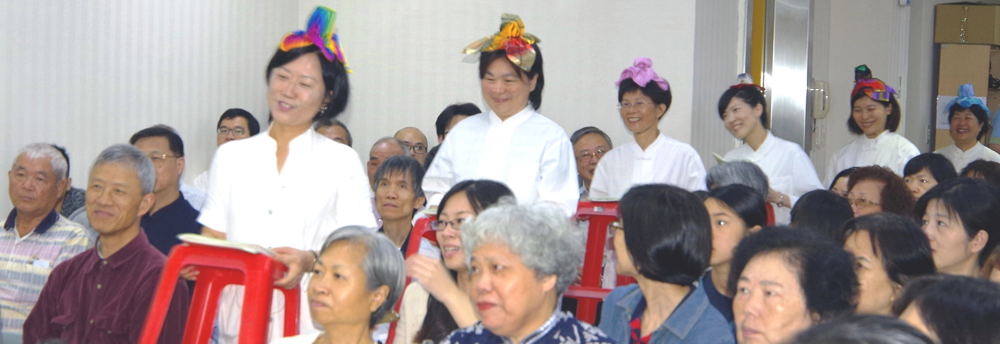

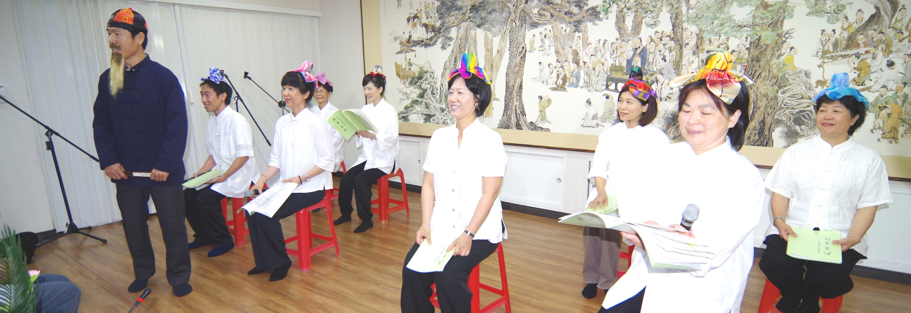

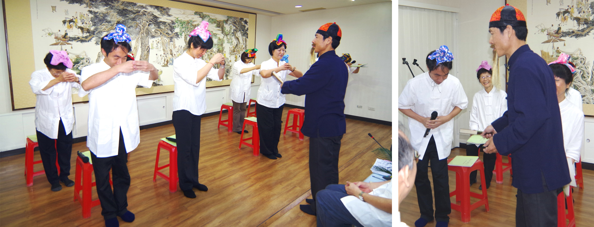

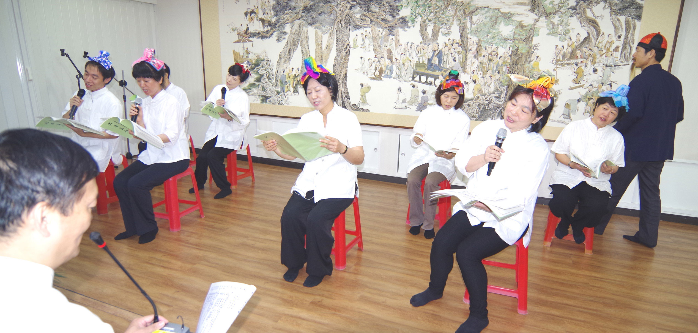

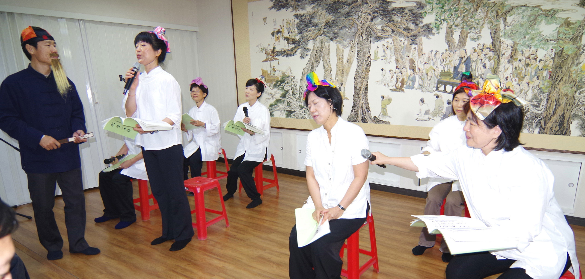

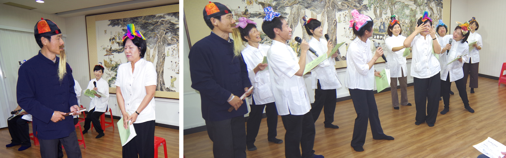

### 附文：值班與〈大學〉—修福又修慧

禮悅

長久以來有一群師長及蓮友不計身心勞動及代價，默默學習及弘揚儒佛內涵，因此在因緣際會中感得大菩薩護持，而有成立學會的機緣。所謂：萬事起頭難，於成立之初，千頭萬緒，每件事都得從零做起。搬至新會址後整棟建築規劃中，一樓的功能又更顯重要，除了是蓮友們互相交誼、彼此聯絡感情外，更是敦親睦鄰及外人對學會觀感第一印象。因此，為了近悅遠來，設置一樓值班的工作人員，殷鑑於每個人必須在文化內涵上充實內化並落實於日用平常，才能吸引有心學習儒佛文化者慕名前來。

所謂修身才能齊家、治國、平天下即是如此。有鑒於此，老師很慈悲的在百忙之中，為一樓擔任值班的工作人員，開設〈大學〉課程，期盼除了在儒學正見上自我充實外，更能身體力行，透過身口意表達對對方關懷、解決對方問題、適時提供對方需求等，讓每位有緣眾生，都能賓至如歸、法喜充滿！進而於待人接物中，隨喜他人善業，反省自己的不足，懺悔身口意不如法的造作，並回過頭來於經典上學習，必能對內涵有更進一層體悟，於吉祥美好的氛圍中，引領自己及團體能脫胎換骨般的共同增上。

翻開大學教材紀錄，才驚覺時間過得真快，轉眼間，週三大學的課程已進行近二年的時間了！故學員們趁這次表演大學堂的節目，正名為「大學班」。回憶過去，如同夢境的顯現，又如同一場魔術的幻變：老師解說經義的深入淺出；眼神中流露慈悲與智慧的風采；一連串邏輯推理與辯證如抽絲剝繭般的將問題回歸根本的理解；琳瑯滿目將道理運用於事上的豐富；不說破待自悟的韻味；不疑中生疑發掘問題的驚歎；問題回答的善巧與深刻。

同學們沐浴在其中的法喜；各人對義理不同的體悟；指出內心無處可逃的慚愧；想不通卻很想搞清楚的期盼；問題很多卻無從問起的失落；想回答卻切不入主體的苦惱。這一切，彷彿歷歷在目，又好似在耳邊迴響，然而，學習過程中的對境，已不可能再重歷，化為不可說的記憶，觀待下一次提起時之關連。

學習過程是充滿刺激的挑戰，有時烏雲密佈，有時晴空萬里，有時體力不濟、氣喘吁吁，有時精神百倍、活力充沛，有時障礙重重、毫無希望，有時轉個彎卻是柳暗花明又一村，當中起伏，真是瞬息萬變。然雖如此，卻慶幸自己有依怙的善知識，如同嬰兒之於慈母，大地之於眾生，若無老師的攝受，路途中的險隘將難以突破，終必墮落而萬劫不復！

然而透過努力學習而得到的成果是甘甜的，若不經過此過程，所得到的成果想必也不會珍惜且不會是穩定的。而成果非一蹴可及，是需要長時間的經營與磨練，所以過程中需要法喜與鼓勵，因此體會內涵要義與有志一同者的肯定是非常需要的，就如同苗芽是需要特別關愛與呵護，不可暴露於惡劣環境中，而失去茁壯的機會！

很慚愧無有聞一知十及舉一反三能力，只能從困而不學勉勵來困而學之，但願能透過學習，思維人生難得，佛法難聞，人生無常等道理生起出離心，效法普賢菩薩十大願來擴大自己心量，祈求佛菩薩加持來明白諸法體空的道理，並以如惡惡臭，如好好色心態來推動，成為學習動力，能不離三寶及善知識護念，長時間不失信心的努力，有朝一日能提升自己，則萬幸矣！

### 西遊記勸孝篇—養成班演出劇本

淨爾  編撰

孩童學佛多成家

不忘初心方難得

藉得一齣勸孝篇

重新凝聚待出發

說書人：

話說花果山上美猴王孫悟空生性桀驁不馴，大鬧天宮之後，被如來佛壓在五指山下不得動彈。

五百年後，前往西天取經的玄奘法師，路過五指山，揭去符咒，救出孫悟空，孫悟空感激涕零，經觀世音菩薩點化，伴隨唐僧同往西天取經。唐僧一路收服天蓬元帥轉世投胎的豬八戒，感化被玉皇大帝貶落凡塵的沙悟淨，師徒四人歷經重重苦、種種難，一路斬妖除魔，化險為夷。

這日，師徒四人來到枯雲山下，聽得山神怨聲載道，卻是何故，且看〜

第一幕

眾人：取經囉！（響亮有朝氣）（音樂：鼓）

唐僧：不畏艱難取經去，只為眾生得聞法。

孫悟空：花果山上福享盡，佛祖命我保唐僧，路途遙遙艱險多，看我大聖顯神通。

豬八戒：天蓬元帥錯投胎，生得一副豬妖樣，願隨唐僧西天去，修得正果還天界。

沙悟淨：九齒鈀，降妖杖，流沙河畔皈依僧，願隨唐僧過紅塵。

唐僧：善哉善哉！

（山神從後方走上舞台，邊走邊喊）

山神：命苦啊！誰來救救我啊！倒楣啊！誰來幫幫我啊！

唐僧：悟空，你們是否聽到有人在求救呢？快去看看。

孫悟空：我的師父啊，這裡荒郊野外，想來又是哪個修煉成精的傢伙在哀哀亂叫，想騙取你的同情心，好把你吃掉。我們還是別管他，趕我們的路吧！

豬八戒：師父常說拔苦救難是我們的責任，我們還是聽師父的去看看吧！

孫悟空：好吧！好吧！

（山神走向唐僧師徒三人）

豬八戒：究竟是何方妖孽在此喳喳呼呼？

山神：我是掌管枯雲山上所有草木的山神。你們這些過路客有所不知，我們本來在此安居樂業。可有一天牛魔王派了他兒子紅孩兒來此據地為王，從此我們的日子就不得安寧了。

那個紅孩兒憑藉著他練得三昧真火，在此為非作歹弄得草木不生。那個被寵壞的小孩不思好好治理地方，只會仗著持有核武，四處威脅撒野。如果再沒有人有辦法治治他，當真要屍橫遍野、生靈塗炭了。

紅孩兒：是誰在說我壞話！（紅孩兒從後方跑上舞台，山神嚇了一跳）

紅孩兒：你這山老鼠在此亂嚼舌根，還不速速回去工作。

山神：是是是。（山神退場）

紅孩兒：何方神聖在此多管閒事！

沙悟淨：大唐三藏法師和徒弟三人路過此地，聞聲救苦、拔苦救難。你又是何方蹦出來的冥頑之徒？

紅孩兒：我乃牛魔王和鐵扇公主的掌中玉、心中寶，紅孩兒是也。天大地大我最大，連我爹娘都低頭。

孫悟空：又是一個被寵壞的小皇帝。

紅孩兒：你罵我，我要跟我娘說！

豬八戒：（對著觀眾說）不但是小皇帝，還是個無法無天的壞小孩。

唐僧：好孩子，你別鬧了。師父問你，你爹娘凡事以你為主，事事由著你、遷就你，你真的快樂嗎？

紅孩兒：不快樂所以我要搗蛋作亂，讓大家跟我一樣不快樂。

唐僧：你每天搗蛋作亂，你真的快樂嗎？

紅孩兒：就是不快樂才要繼續搗蛋作亂啊！

唐僧：你知道生命真正的快樂是什麼嗎？

紅孩兒：不知道，不然你說說看。

唐僧：真正的快樂在能利益眾生。

紅孩兒及孫悟空等人：利益眾生！

唐僧：真正的快樂在能聽聞教法。

紅孩兒及孫悟空等人：聽聞教法！

唐僧：真正的快樂在能往生淨土啊！

紅孩兒及孫悟空等人：往生淨土！

紅孩兒：那我要怎麼樣做呢？

唐僧：你過去造惡太多，須好好懺悔修行。觀世音菩薩身邊有個職缺，我會幫你ＭＡＩＬ推薦信過去，他會收留你的，跟著他好好修行，自有離苦得樂的一天。

紅孩兒：可是觀世音菩薩會收留我這麼一個壞小孩嗎？

唐僧：會的，觀世音菩薩的大悲心是不會放棄任何一位眾生的。

紅孩兒：那我要怎麼去呢？

唐僧：你回去供奉觀世音菩薩像，持誦菩薩名號，菩薩會來接引你的。

紅孩兒：真的嗎？那我這就回去，告辭了！（紅孩兒飛奔下台）

豬八戒：師父真厲害，三言兩語就收服了他。

孫悟空：本來應該是我要出手把他打倒，讓他知道人外有人、天外有天，不過因為場地的關係，我們就省略，讓師父用言語教化教化他就好。

唐僧：好了，好了，後面節目還很多，我們趕快趕路吧！（鼓聲起）

（唐僧師徒四人走下舞台區，說書人上台。）

第二幕

說書人：話說那紅孩兒本性不壞，只是自幼受到父母嬌溺縱容，以致行為偏差，經唐僧點化之後，一心受持觀世音菩薩名號，果受菩薩接引，成為菩薩身邊的善財童子。

唐三藏師徒四人做了這樁好事後，離了枯雲山，繼續西行，氣候卻是愈來愈炎熱，大地如火爐一般，所到之處，草木枯萎，河水乾涸，卻是怎麼個回事，各位看官請看個分曉。

豬八戒：好熱啊，好熱啊！真想有個泥坑讓我滾一滾。

沙悟淨：師父，我好渴啊！前面有個人家，我們去討杯水喝吧！

唐僧：也好，悟淨，你就上前去敲敲門吧！

（沙悟淨上前敲敲門　鼓聲：叩叩叩）

沙悟淨：有沒有人在啊，可否給我們這些可憐的過路人一杯水喝呢？

婆婆：來了來了，這就來了（指路老人開門）

婆婆：是個法師啊！請進請進。

唐僧：阿彌陀佛！

婆婆：敢問法師你們打哪兒來，又往那兒去？

沙悟淨：我們從東土來，要往西天取經去

婆婆：去不得，去不得！

豬八戒：此話怎講？

婆婆：此去三十里有座火焰山，終年熊熊烈火，還沒靠近就被燒成炭。

豬八戒：難道沒有過山的方法？

婆婆：有是有的，只是難辦。

孫悟空：不妨說來聽聽，我就不信有什麼難得倒俺老孫的。

婆婆：只有鐵扇公主的芭蕉扇能澆熄火焰山上的火，只是這鐵扇公主人稱羅剎女，兇悍無比，連她老公牛魔王都怕她三分。

孫悟空：那好辦了，這牛魔王是我八百年前的拜把兄弟，念在當初結義的情分上，想必會把芭蕉扇借我使一使。敢問那牛魔王夫妻住在何處？

老人：往南二十里有個芭蕉洞，洞裡就住著牛魔王和鐵扇公主。

孫悟空：事不宜遲，師父，咱們這就去吧！

（鼓聲進，婆婆退，師徒四人在舞台上走個圓場就到了芭蕉洞）

孫悟空：牛魔王啊牛魔王，孫悟空來看你了。

（牛魔王上場，熱絡地走向孫悟空）

牛魔王：哎呀呀，這不是我的孫老弟嗎，八百年不見啦！什麼風把你們吹來啦？

孫悟空：我奉如來佛之命，要護送唐三藏法師到西天取經，過不得火焰山，要借您夫人的芭蕉扇用上一用。（鐵扇公主邊走上台）

鐵扇公主：好啊！我正想找你們算帳，你們倒找上門來啦！

豬八戒：不知道我們哪裡得罪夫人您啦！

鐵扇公主：你們這詐騙集團，誘拐小孩去學佛，可惡至極！老公，抄傢伙，我非得把這和尚煮來吃了，才能洩我心頭之恨。（鐵扇公主擺出打人的架式，豬八戒和沙悟淨擋在唐僧之前，擺出護駕的樣子）

牛魔王：夫人，有話好說，有話好說！

鐵扇公主：你讓我怎麼好好說，想那紅孩兒是我十月懷胎所生，捧在掌心裡養大的，本該承歡膝下，娶妻生子光大家業。卻被你這和尚給騙去觀世音菩薩身邊做什麼善財童子，自此母子不得相見，你可知我日日夜夜思兒之苦啊！你給我納命來！

孫悟空：要打就打，誰怕誰！

唐僧：阿彌陀佛，大家放下武器，別意氣用事啊！

牛魔王：是嘛！是嘛！有話好說，這......毀佛與僧罪孽深重，夫人還是先請息怒。

唐僧：老衲敢問夫人，天下之恩何為貴？

鐵扇公主：當然是父母生養之恩最重，所以你們破壞我們的天倫之樂，罪不可赦，納命來！

唐僧：且慢！老衲再問你，父母之恩既然如此深重，那子女該何以為報？

鐵扇公主：當然是要聽父母的話，時時陪伴父母身邊才是報恩。想我當初懷孕時，吃不好睡不好。生產時如千刀割、心肝俱裂。做母親的身體所受之苦，是子女一輩子無法回報的。撫養孩子時，仍舊日夜不得安眠，心心懸念，父母對子女的心，子女更是難以報得萬一。

唐僧：阿彌陀佛，父母恩，何以報！紅孩兒再怎麼孝順你，大概也只能報得父母恩之萬一而已吧！

鐵扇公主：既然法師你了解父母恩重難報，竟然還讓我們母子分離，未免太狠心了。

唐僧：夫人，此言差矣。世人之孝或許難報，但有一種報恩法，卻是功德無量。

鐵扇公主：您指的是什麼呢？

唐僧：真正的大孝莫過於在正法上修學，一般人如果能跟隨善知識修學佛法，能感應的福報已是廣大無邊，更何況你兒是在觀世音菩薩身邊修學，其功德不可思不可議不可量啊！

鐵扇公主：你講得天花亂墜，我怎麼知道是真是假？

（紅孩兒跑上台，鼓聲）

紅孩兒：娘，法師講得句句屬實啊！

鐵扇公主：我兒啊......你讓娘想的好苦啊！

牛魔王：回來就好，回來就好，你這一回來，我們一家三口永不分離啦！

紅孩兒：爹娘，不行的。觀世音菩薩怕你們為難三藏法師，特地批准我回家探親，免得你們鑄下大錯，我一會兒就要繼續我的五十三參了。

鐵扇公主：怎麼不行，難道你不聽娘的話了嗎？

紅孩兒：娘，不是的。不管我們當人還是當妖精，都是在苦海中浮沉，唯一離苦得樂的方法就是要修習正法，如今，我可以親近善知識在正道上修學，你們應該為我高興，希望你們早日跟我一樣離苦得樂，成為真正的佛弟子。

鐵扇公主：看到我兒歡喜，娘也歡喜。

（轉頭對孫悟空等人說）芭蕉扇你拿去吧！取了經回來記得借我們看一看。

唐僧：阿彌陀佛，善哉善哉！

（鼓聲出，演員退，說書人上）

說書人：

唐僧路阻火焰山，度得人間父母情。

大孝莫如勤修學，感得世人皈依法。

好戲連篇終須散，掌聲鼓勵再鼓勵！

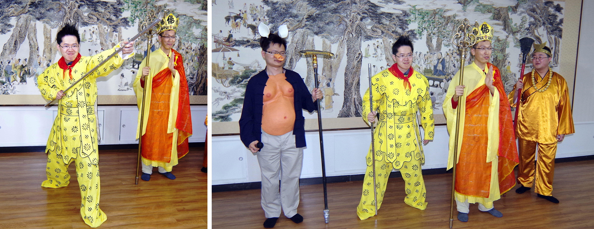

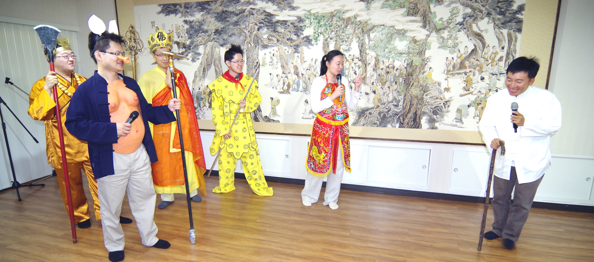

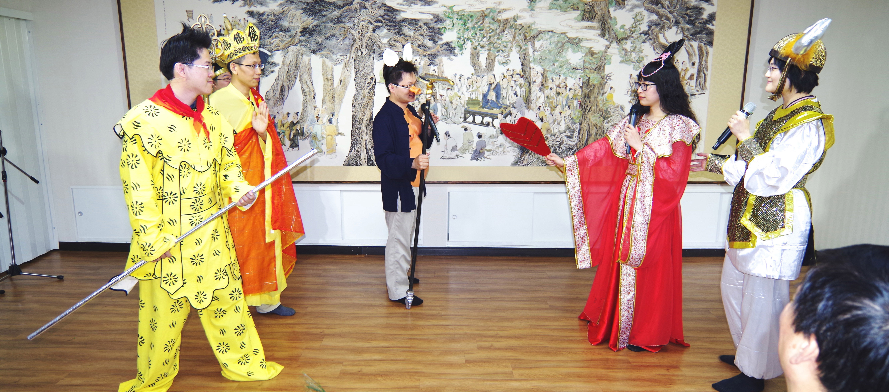

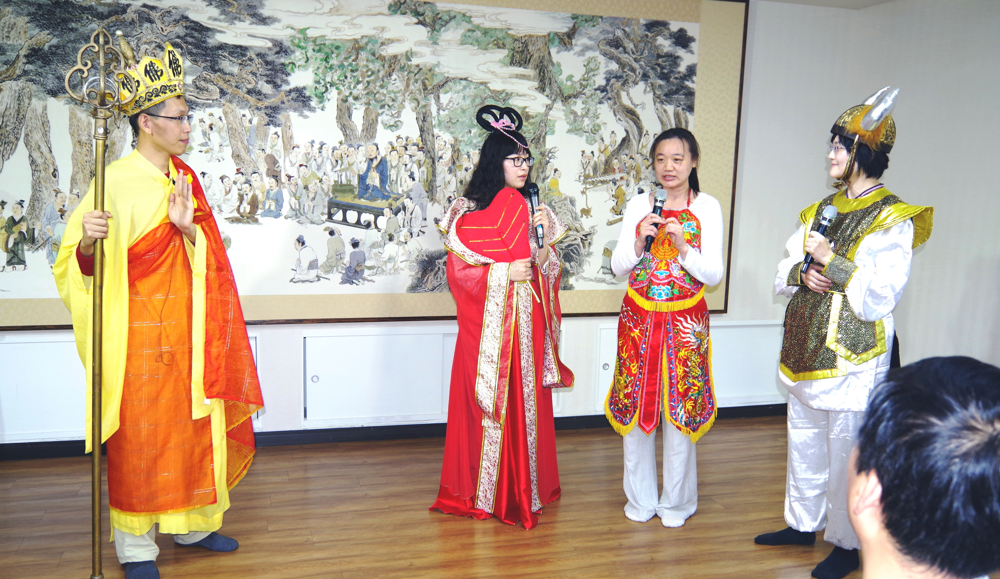

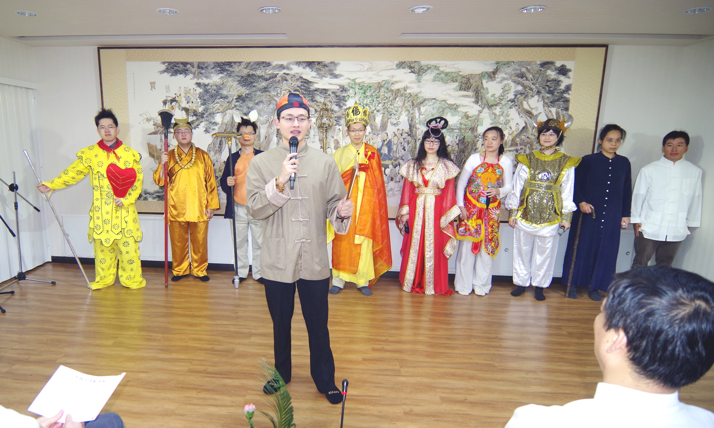

### 附文：西遊記勸孝篇緣起—鐵扇公主的愛怨糾葛

淨爾

當我們在閱讀中國古老的故事時，不知道有沒有人跟末學一樣，有時內心會對故事的情節產生疑惑？而這些因為作者的未盡之意所產生的疑惑會在心裡縈繞不去，三不五時跑出來搗亂。所以當有學長問及養成班的表演節目時，就自然而然地說「來演戲吧！」希望藉由集體創作和集思廣益的方式處理這些古老故事所帶來的疑惑。

因此，前年新春團拜，養成班演出「八仙報喜」，其實是出於對彭祖這個人物的好奇，從小讀到彭祖的故事，敘事的角度都是以彭祖很幸運，得到八仙賜與歲數，活到八百二十歲，但心中一直很納悶：看盡生離死別的人生有什麼好羨慕的？

今年母親節推出「西遊記—勸孝篇」﹐故事中的人物：唐僧師徒、牛魔王、鐵扇公主和紅孩兒都是大家耳熟能詳的人物，孫悟空借芭蕉扇的故事不論在電視、電影還是戲劇、戲曲都是常見的劇碼，只是呈現方式的不同而已。這樣的故事，我們如何去翻新它？又如何把它結合佛法、結合母親節的主題？

根據西遊記的原著，唐僧西天取經途中遇上紅孩兒，連齊天大聖孫悟空都降伏不了紅孩兒，最後是觀世音菩薩出現收服了紅孩兒，並且把他帶在身邊作善財童子。所以當唐僧一行人路阻火焰山，要向紅孩兒之母鐵扇公主借芭蕉扇的時候，莫怪乎鐵扇公主滿腔怨恨，因為當時的鐵扇公主不單失去紅孩兒，連她先生牛魔王都不安於室，離家出走了 (這部分演出時就省略了，只是古今中外都有這種倫理崩壞的情形，連吳承恩筆下的妖精都不例外)。

作為一個妻子和母親，鐵扇公主是令人同情的。

一個女人，先生跟比她有錢有勢的女人跑了，唯一的孩子被帶走，同時要面對丈夫的背叛，和可能終生再也見不到自己的孩子的哀傷 (偏偏妖精的一生又比凡人的一生還漫長)，該是多麼大的打擊和悲痛。

為什麼唐僧和觀世音菩薩忍心看到一個母親的傷心難過呢？

原著並沒有給我們令人滿意的答案。

但是佛法有。

如果用佛法來解釋，一切就通了，至少，對末學個人而言，替這個多年疑問找到答案了。一個妖精經過多年的修練還是妖精，唯有透過佛法的修學修成正果、脫離妖道苦海。一個孝順的孩子，也是必須透過修學，改變自己的命運，也改變父母的命運。

這樣的改編、延伸也許不忠於原著，脫離作者本意，但，自古以來的戲劇改編，本來就少有忠於原著的，戲劇的呈現，不只是表現一齣戲，而是要表現其背後的觀念並達到教化的目的。

雖然，礙於篇幅、礙於演員各有事業、家累，齊聚排練不易、礙於經驗、礙於劇本的拗口、更礙於我們對戲劇脈絡和氛圍的掌握不足，以致難以達到發人深省的目的，但至少希望，能達到一點點的娛樂效果，讓大家在母親節，也是浴佛節的這天看到一段也許不完美，但是有誠意的演出。

### 幸福？噩夢？幸福！—大專班演出劇本

心若  編稿

一路跌跌撞撞

辛苦陪伴成長

進進退退一生

出來幾個龍象

鑑光：(放音樂，練舞中)跳完一段後說：才剛練完舞，就要趕去學會上課，真的是蠟燭兩頭燒，每天都忙不過來。(說完回座位)

立佳：哥哥，是不是要去學會了。

立淳：是啊。

立佳：好吧，那就走吧。

立淳：好吧！ (兩個一起無精打采的回座位)

微智：(假裝講電話)喂，要做報告喔，好啊，那要約幾點？晚上……我沒辦法耶，明天嗎……明天有事要去基隆耶，…就是家裡有事，嗯，對啊，都有事情，好啦，那就再約，掰掰。(掛電話)維典，走了啦，要遲到了。

維典：我作業都還沒寫啦！每次我才剛從台中回來，就要去學會，學會又不是我家，我對家越來越陌生了，每次都是這樣子！

微智：好啦！ (演完兩個一起跑回座位)

家文：(站起來面對觀眾)：是從甚麼時候開始   我們的幸福

合：幸福

家文：亦或是我們的噩夢

合：噩夢

家文：升上大學是個起點

：十四表 人覺經  唯識  心經  行願品  彌陀經  大學  中庸  論語 常禮  普門品  金剛經 入行論 百法  法華經  寒暑假  成長營

合(做打勾勾的動作)：都跟學會打了勾勾 (維典學長上前與老師打勾勾，勾上同時一起合說「甩不掉  劃不清」)

女：唐詩說：一三五不論     男：二四六分明

女：我們說：一三五學會     男：雙週日基隆

左：儒學加佛學   研學加公時   這才是生活

右：佛學加儒學   公時加研學   這才是真正的生活

宥琢：佛學名詞是從錯誤開始的。

左合：關代？  右合：觀待。

左合：五運？  右合：五蘊。

合：傻傻分不清楚。

左合：空信？  右合：空性。

左合：無名？  右合：無明。

合：哪個才是對的？

左合：中關宗？    右合：中觀宗。

左合：聖義地？    右合：勝義諦。

合：一個頭兩個大！

子健：到底貪心為什麼要吃鰻魚呢？

以恩：是貪瞋癡慢疑啦！

合：還沒進入門內，就先倒在門外。

惟盛：除了國內學習外，我們還有機會跟著老師們周遊列國。

惟盛、微智、維典、姿云、家尹、立淳、立佳、宥琢(舉手)：我們去過緬甸。

惟盛、微智、維典、以恩、宥琢(舉手)：我們去過洛陽、長安、北京。

惟盛、微智、維典、家文、雨橋(舉手)：我們去過政和、永康。

立淳、甄儀、家文、雨橋(舉手)：我們去過馬來西亞。

雨橋：我是在老師周遊列國時跟上隊伍的，我去過諸暨、政和、山東、濟南、馬來西亞。

合：哇！好羨慕！

熒純：也許你會說   我累了  累了

合：真的累了

家尹：我的工作，我的事情好多，時間真的太少，而人生還很漫長。

鎮宇：我忠實地希望多睡一點。

鑑光：我有剪不完的影片，跳不完的舞。

立淳：難得的假日卻有滿滿的行程。

立佳：我想在海邊曬太陽，什麼都不想。

以恩：我考試很多耶！很忙耶。

熒純：佛法能當飯吃嗎？先吃飽好像比較重要，還是走一條大家都走過的路吧！

彥廷：我要抽空補習、陪家人，難得能休息卻要上學會的課，很辛苦。

宥琢：每次回臺北都要坐四個多小時的車，假日卻又不能自己運用

家文：每次要回來上課車票很難買。

惟盛：我對教法的覺受不強。

微智：我有一大堆作業要寫，還要常常出去和同學做報告，我想要有完整的假期。

雨橋：論語集釋讀起來，真的很頭痛。

甄儀：這條路這麼難走，連路都看不清楚，在別人眼中，這連路都不是。

維典：人生有限，而學會無限，同學都不知道我在做什麼。

姿云：外面夕陽那麼好，風光這麼美，雖然可能近黃昏，我想出去玩。

子健：就算基隆狂風暴雨我還要趕來上課。

士恩：我基礎太差、太晚入門，要學的東西太多，煩惱太重，快要完蛋了。

家尹：到底

合：空性與我何干  孔子的話已隔千年

家尹：我不想被關在儒佛的框框

雨橋：但是  但是

播放上課談話錄音檔

唐老師說：天底下最浪費的，就是浪費時間。太好了！時間都是我們的，你早上混到晚上，第二天再混！這個月混完，下個月再混！等我們這一輩過世了，你們那個佛法學習的勢力往下退，你們過去那個學法的快樂，你發覺不見的時候，你在那個世俗裡面你換得到的快樂，你再來比對的時候，你都感覺到少一味，怪怪的！你好像缺少什麼，可是那一分是最重要的，你卻沒有了。

學生時代叫你學佛，有氣沒力，唉！百法今天根本不要來聽，下個禮拜可不可以不要來，聚會的時候可不可以不要見，念佛的時候可不可以不要念，助念的時候可不可以不要我，好，太好了！你就盡量的把你的善業盡量拿去花，盡量拿去花，你入社會了，有一天，你真的要想學佛的時候，老闆說：「工作還沒做完，學什麼。」你所有的障礙都出來了。

林老師說：唐老師很善巧的，把所有的負面的情況告訴大家，然後再告訴你正面是怎樣一個回事，但是答案在哪裡呢？答案在你們身上。

張居士說：隨著唐老師的腳步，團體向外發展之後，外界人士發現文化的重要，而且明白文化傳承是在臺灣　雪廬老人這一脈的時候，外面的求知慾是非常強的，恐怕越往外走名聲越大的時候，我們可以接近唐老師學習文化的機會就越來越少，所以我們應該好好把握這個機會，在唐老師沒有被外界占去太多時間以前，好好把握這個機會。

陳會長說：那社會文化、社會科學與心理學，半衰期是多久？以前是十五年，現在十年，但是我告訴各位，我們來跟老師學儒學、佛學，它的半衰期是多久？論語兩千多年，現在還在盛行。

子儀老師說：真實的智慧，才能經得起時間的考驗。

麗琴老師說：累了，可以暫時休息；壓力，可以讓人成長，生起了煩惱，乃人之常情，關鍵在遇到境界，是要向時間妥協嗎？向壓力逃避嗎？向煩惱投降嗎？還是就這樣與正法擦肩而過。其實，儒佛正見是不是一個框框？培福修慧是不是一條出路？答案你們都知道，孔子云：「後生可畏。」但是若無　雪廬老人的傳承教授，若無良師益友的提攜護持，那你們又何畏之有呢？我們知道正見與精進是成功的不二法門，只要大家能夠嚐到法味，相信聰明如你們，必能珍惜暇滿的人生，邁向人生成功之路。

雨橋：所以

合：所以

家尹：我要逆風飛翔，絕不怕苦。

鑑光：立定志向，突破逆境。

立淳：還要篤行。

立佳：我不要太常翹課。

以恩：我要奮發圖強。

熒純：把握時間學習正法，成為自己生命的主宰；浪費時間嘆息，永遠都是不善經營的輸家。

宥琢：我要好好反省，利用時間認真學習。

家文：我要把握時間，認真學習。

惟盛：我要跟隨老師。

微智：我要常來學會盡我所能學習。

雨橋：我要把論語集釋啃完。

甄儀：我要愛惜自己，把握此生命，到達目的地。

維典：我要努力學習佛法的大道理。

姿云：我要雖千萬人吾往矣，拋頭顱 灑熱血。

子健：我要給自己出路，也要給別人出路。

士恩：我要努力學習，把握時間。

舜傑：我要迎頭趕上，超越自我。

中間三人：我們要

合：加油

中間三人：我們要

合：積極成長

男：儒學加佛學  女：這才是出路

女：佛學加儒學  男：這才是王道

中間三人：讓我們展開青春的羽翼

合：擁抱儒學  擁抱佛學

中間三人：我們還年輕

合：年輕

中間三人：還有時間

合：時間

中間三人：還有機會

合：機會

中間三人：只要願意學習  願意努力

合：要學習  要努力

維典：學會的每個人 都是學習的對象

合：讓我們一起把自己培養成人才  報答師恩 父母恩 三寶恩

合：一起為天地立心  為生民立命   為往聖繼絕學   為萬世開太平

姿云：今天是母親節，也是佛誕紀念日，在此祈願正法久住、法輪常轉。並敬祝全天下的母親

合：母親節快樂！謝謝大家。(鞠躬)

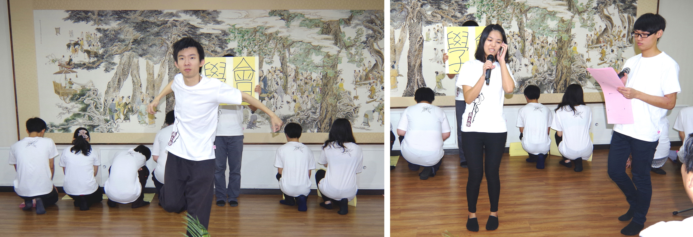

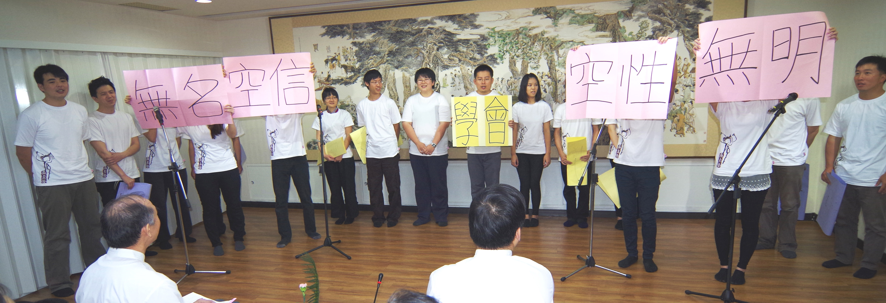

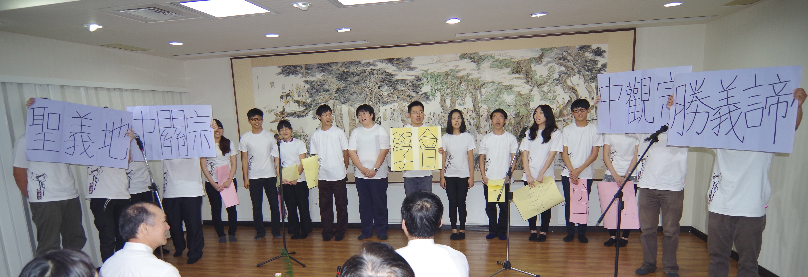

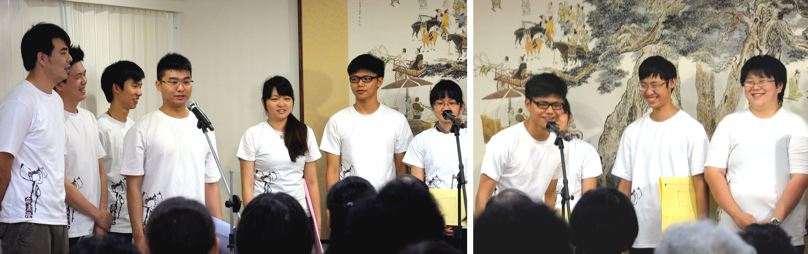

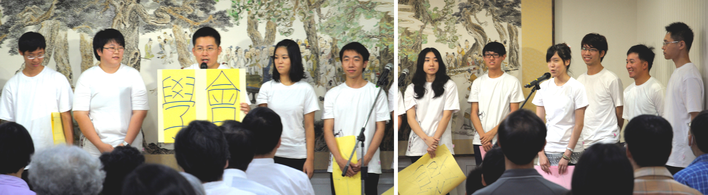

### 附文：學佛的意義

心法

在廣大的宇宙裡，我們是渺茫的生命，既堅強又脆弱，除了衣食保暖，還需要豐富的思想去彌補脆弱的心靈，也會對這個世界產生疑問，而這些疑問常常是無解的，站在人生的十字路口上，有時候我們會迷茫、徘徊，面臨各種選擇，然而哪種選擇才是對的，這是需要好好思量，好好立定目標的。

世人皆想要追求快樂，不管是物質的享受還是心靈的饗宴，最根本的就是遠離痛苦，但是對於生命的體認，一般人只看得到表面，認為生活優渥、富足，就是快樂。

我知道自己的生命有限，說穿了，我們只不過是地球上短暫的過客，而我想做的事卻無限，所以，在這些有限的時空當中，除了要獲得一些世間的成就外，更重要的是要去找尋人生的答案，雖然乍聽之下不切實際，但是一般人對於死亡的認知是模糊的，連想都不會去想，等到要面臨時，恐懼油然而生，才發現，世間的一切都帶不走，而學佛，讓我們有信仰，幫助我們得到心靈上的依託、增上，也讓我們了解，只有依託三寶、老師、團體、蓮友，才能得到真正的解脫。

在大學，我被邀約去參與大專佛學社，而上了一堂課，近來各大學的佛學社日趨低靡，發心的老師卻比學生來得多，而社課能學到的東西又不見得是我有所需求，我參與的社課為學期最後一次社課，學期中也僅僅只有三堂社課而已，外加一些聚餐、戶外活動，課程除了學社的歷程與近來活動介紹外，社課內容像是一種公民道德教育、或是一種生活常識宣導，要講佛理也是極為淺白，我想課程不敢直接全盤切入佛學、儒學，也許就是怕學生流失掉吧，最終他們是希望學生去參加他們的寒暑講座，我想也只有參加他們的講座，才能知道他們要宣揚的內容，雖說是善良的人發心，聚會一處，但社課卻難凸顯佛法、儒學有別於其他宗教發人向善之處，到底怎樣的社課才會吸引年輕人呢？我想這是一個佛教界都要去思考的問題，畢竟大道理不能對牛彈琴，卻也不能不傳達給年輕人。

所以今天有幸在學會得聞大道理，讓我感覺到佛法不像是一種宗教，而是訓練一種思維的能力，或是一種解脫之道，對於他人要問你為何信仰佛菩薩，不在只是保平安而已，將來通達佛理，就可以大方告訴人家理由，佛法傳達的信念為何，因為我能說得出佛法的好，以及所帶來的受用，心靈上的富足如何不同於世間的心靈富足，也就都可以傳達給別人了。所以第一步就是要有好的老師，好的同儕。

學佛學還要配合儒學，儒學能夠擴充我們的人生視野，是古人的智慧結晶。儒學的範疇包羅萬象，能通達各種人情世故、因果關係、生命態度、作法及選擇，那是幾千年傳下來的法寶，已經幫我們做好歸納、整理，甚至示範，我們只要依循前人的腳步，就像是站在巨人的肩膀上，能看得又高又遠。

而現今社會強調創新、創意，卻忽略了創意的本質在內涵，若只是一味的突發奇想，卻沒有內容，創意也只能算是一種閒暇的娛樂了。有了前人的基礎，再加上現在科技的優勢、生活的便利，可說是一舉數得。

也許，一般大眾會認為學儒佛的人固執守舊、不知變通、想法古板怪異迷信，但那是因為他們不懂，人生難得，只有一次，我們應該要好好學習，才不辜負這一生。

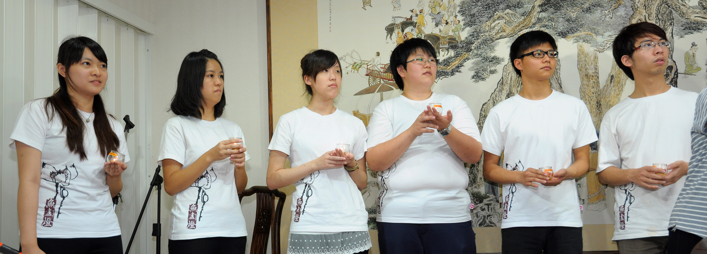

### 紅葉的歸宿—週六讀書會演出劇本

心妙  編撰

紅葉訴說歷史情

悲歡離合苦本質

剎那飄入法五家

流浪生涯休止符

第一幕  紅葉的歸宿

（男）一片 紅葉。

（女）一個 故事。

（男）滾滾 紅塵。

（女）人生 如戲。

（合）那一片片的紅葉，隨著業風，究竟、飄墜何處？（宣宗宮人出）

宮女：我乃宣宗宮人。想當年玄宗時，楊貴妃集三千寵愛在一身，最後卻落得慘死於馬嵬坡前。而我今日深鎖在上陽宮裡，寂寞閒愁，度日如年，年復一年，年華已逝，可憐我，也是無語問蒼天啊！

合誦：逝者如斯，不捨晝夜。過時的鳳凰，不如雞啊！（數人水袖舞動，紅葉散落滿地）

宮女：哎呀！（驚訝狀，看那溪水滾滾紅葉飄落滿地）這紅葉（拾起一片）飄零無依好像我，可是我卻更不如紅葉啊。也罷！我且題一首詩，寄託無限的祝福，好讓你隨著流水，去向自由自在的人間。（題詩作）

合吟：題紅葉 宣宗宮人，流水何太急，深宮盡日閒；殷勤謝紅葉，好去到人間。（水袖舞動者，將這一片紅葉送到盧舍人跟前，經僕人撿拾，送盧渥細讀後收藏入盒）

太監：皇帝詔曰，門下：許楊氏等數十宮人，由戶部侍郎另擇吉日婚配朝中文武官吏，以成良緣，欽此

宮女：謝主隆恩。

合誦：（快板）歡歡喜喜 歡歡喜喜 結連理

太監：一拜天地，再拜高堂，夫妻對拜，送入洞房。

盧渥：我乃盧渥，自上任范陽縣令方才數月，今天又蒙賜婚宮中佳人，完成終身大事，真是好事成雙。

合誦：好事連連 好事連連 配成雙！

盧渥：（入房打開小書盒）啊，夫人請看這是我傳家寶典《論語》，助我考上功名；這是家傳信物，送給賢妻妳。

宮女：（看到紅葉，感嘆不已）啊！這紅葉，是我當時偶然題的詩作，沒想到，竟被郎君得之。

盧渥：喔！原來紅葉是我們的大媒人啊！真是皇恩浩蕩，謝天謝地

宮女：看來，我憐紅葉，紅葉也報我以恩啊。

合誦：詩言志，詩旨 溫柔敦厚，一番為他著想的心思，竟成就一段良緣佳話，彌補了人間些許的遺憾。

第二幕  錯誤

分誦：人事有代謝，往來成古今，千百年後

那愛別離、怨憎恚、求不得苦，依舊充滿人間

民國初年以來，國民政府繼推翻滿清後

接著軍閥割據，中日抗戰乃至大陸淪陷

歷史的悲劇不斷上演，輪迴的腳步從未停歇

導致

那  守在季節裡的女子，掩不住緊鎖的孤城

那  處在大時代的詩人，道不完濃郁的哀愁

因為

人間的三月天，嗅不到  生命中珍貴的春天

從江北到江南，彌漫著  一幕幕美麗的錯誤

(數人揮鞭、踏馬而過)走遍大江南北、這達達的馬蹄伴著我，我不是歸人，我是頂客族，我是背包客

合唱：我打 江南走過

那等在季節裡的容顏  如蓮花的開落

東風不來  三月的柳絮不飛

你底心 如小小的寂寞的城

恰若青石的街道向晚

跫音不響　三月的春帷不揭

你底心 如小小的窗扉緊掩

我達達的馬蹄  是美麗的錯誤

我不是歸人   是個過客

分誦：過客已過，歸人不歸，三界 無安，何處安歇？且聽雪廬老人的警眾法語「紅葉」，作為暗路歸人的接引明燈。

第三幕  紅葉

秋風起  霜降天高  看無邊紅葉

蕭蕭復蕭蕭  驀地裏  吹墜之流水

猛然間捲入雲霄  滿地滾滾情顛倒

幾片翻下糞圊  幾片飛進酒瓢

點妝台  傍窈窕

隨行人  馬跡遙 淅淅瀝瀝

飄飄 飄飄

噫 忽一片 來撲僧寮  課誦未罷

旃檀還燒  老僧拾起  脫爾塵勞

夾在經冊作箇念誦記號

這正似三界無安

人生無聊誰有幸  投入佛懷抱

僧人：（拾起一片紅葉端視）脫爾塵勞，夾在經冊裡，讓你常聞經教，永離輪迴。

阿彌陀佛。

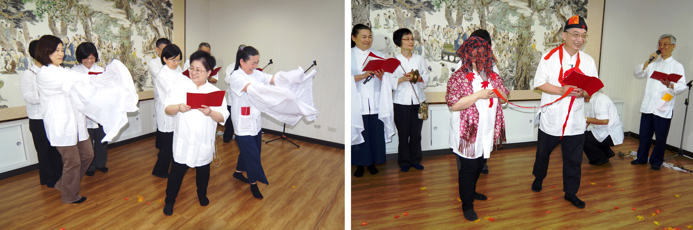

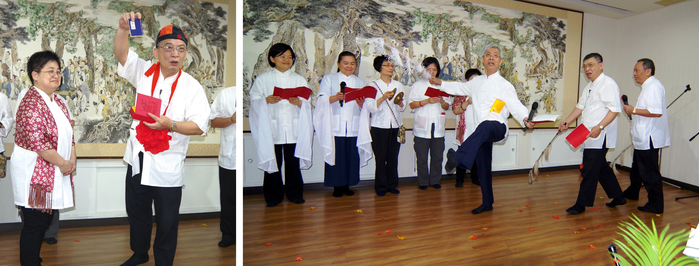

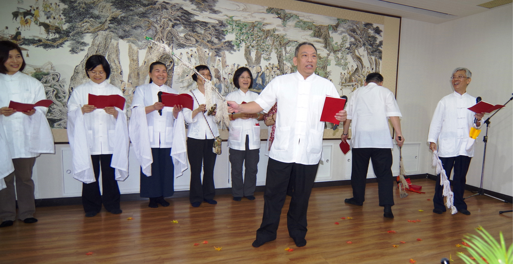

### 心得迴響—紅葉與記號

傳緒

回憶過往登山的歲月，每逢秋月楓紅的日子上山，不免附庸風雅，凝目林下滿地的落葉，俯拾暗紅且造形迷人的紅葉，小心翼翼地裝入塑膠袋，放入背包，惟恐斲傷原形葉的稜角，攜回家中，置於案上展開的報紙，攤平對折，將紅葉夾在其中，更用厚書壓平，藉以吸收水分，維持它原有的面貌，經過三兩天，甚或一周，再度掀開時，一葉葉的五爪、三爪紅葉都已脫乾了，葉脈分外顯露，又尖又挺，好用來做箇看書的記號。不論涉獵儒學、勵志、書論、法帖等，有紅葉的伴隨，今天想起來，既充滿詩情畫意，又暗藏著積學儲寶的模樣，那一段日子紅葉為我少壯的人生，留下一個美好的回憶。

紅葉不是處處可以尋覓得到的，一年四時，秋季來臨楓才會變色，且一山遊過，重遊興致已缺，肯再度造訪，必是相當難得的，料想寒來暑往日月精華的醞釀，及大地的厚培，在在關係紅葉的染紅；到時天候的陰晴變化，心情也隨之一變。縱使天時、地利、人和俱美，紅葉會不會向自己揮手，進入為它準備的塑膠袋，也不得而知，因緣際會的罕遇，紅葉與我漸漸地淡忘，後來也就倆相忘。從此而後，塵封在舊書裡，那一段日子也就隨風而逝。

今年母親節，師資組供養大眾所要表演的節目︱紅葉的歸宿，乃興起念頭，可找出舊時蒐藏的紅葉，作為表演時的道具。由於幾度搬家，書本丟的丟，送的送，曾用心回想紅葉到底夾在何書，翻遍書架上的舊書，竟然找不到一絲紅葉的蹤跡，不禁悵然若失，僅留下空空的回憶。撫今追昔，宣宗宮人長年幽閉冷宮，無人能對話，看著御溝的流水，日日不盡的往前走，好似急行軍，一聲招呼都沒，竟然天真地對紅葉訴說衷情，並殷勤地感謝他能將自己內心深處的秘語，傳到有緣人，緣起無自性，世間萬事不會憑空而生，秘語的佳話一時流傳，誰知千百年後，「流水何太急，深宮盡日閒；殷勤謝紅葉，好去到人間」憂戚的心聲，依舊在課堂傳唱著，從蓮社到學會，並以話劇重現宮人深情，不禁讚嘆紅葉刻鏤詩的記號，影響何其深遠！

「題紅葉」一詩，已化作華夏民族的普遍情懷，及共同的記憶，就像陶靖節的桃花源記。桃花源標誌著人追求理想的所願境；題紅葉所透露的悲思，警惕世人毋再重蹈覆轍，宮女幽居深宮，孰令致之？回顧八年抗戰，殘暴的日軍，鐵蹄蹂躪我神州山河，烽火遍地，征夫遠離家園，妻離子散，一個急著保家衛國，哪裡還惦記著家；一個延頸企盼倚著門扉盼望，一等八年，甚至永永遠遠……，又怎是一個「急」或「閒」字所能涵蓋而盡的哀思，大時代的悲歌，烙印在我等祖、父輩的身心，豈能忘懷！

為使表演的節目內容更加豐富，林老師提議納入鄭愁予記錄大時代悲思的詩作「錯誤」，且加以闡釋，讓詩人的情懷，融入我等的情懷，更藉著模擬名音樂家李泰祥的獨到音聲，傳唱時代的悲魂。「錯誤」也宛如「題紅葉」般的歷史記號，將流傳恆久，那達達的馬蹄，從抗戰到兩岸對立、十年文革……兩岸交流，一直到今天仍然賡續未止啊！我父我母睽違永嘉四十年，重返鄉土是歸人？還是過客？在他們魂歸道山、業謝娑婆前，無知的我竟然忘了問倆位老人家，到底屬於何者？或許二者皆不是。

人一生的認知，不論是過客或歸人，抑或其他的認定，芸芸眾生，既然隨著業風，糊里糊塗來到這糞圊的娑婆世界，十年頑童倏忽而過，五十年兔走烏飛轉眼而逝，賸下的歲月，處在尪羸的時光，這一段時間賦閒在家，有的長，有的短，不正是家中盡日閒，堂上父母不正也是如此的寫照，與宮女「宮中盡日閒」何異？輪迴無窮，頭出頭沒，是無始劫來的軌跡，世世種種已滅的過去，時間無際、空間也無際，比須彌山高，巨海深，反觀聖道的正知見，好像螢火一般，難以呵護，今生得聞淨土法門，是百千億劫的萬幸，好比大海盲龜浮木般的稀罕，善持不可思議的因緣，務必今生成就生西的果。

獨修固佳，共修更殊勝，學會本  雪公教誨，信願行三資糧，長期深耕，在居大不易的臺北，覓得一處清淨地，供有緣人來念佛，誠如  雪公紅葉詞所云，要脫塵勞，就須常隨經冊，閒暇人生，不論老幼婦孺青壯，都應即時投入佛懷抱。這一期生命，未來的歲月，不管多少，生命中用什麼來做記號，  雪公紅葉的指點，就是南針，與佛常相左右，與善知識常相左右，與共修會常走動，常到共修會念佛、聽聞教法，好好地、厚厚地積聚三資糧，當塵緣了時，便歸極樂故鄉。師資組師友理念一致，有志一同以  雪公紅葉詞作為第三幕，畫下圓滿、圓融的句點。

忝為師資組班長，此次節目的表演，大眾觀賞後，若有覺受，是林老師指導有方，心妙老師劇本寫得好，諸位老師角色演得稱職；如有差池，是末學的過失，慚愧未盡力，要加以懺悔，無論如何此次癸巳年母親節的演出，在人生的繪圖裡，有重如崩雲的記號。

### 結言—生日快樂

王興文

重新出發兩年來

和合經營正法業

歡慶生日母親節

浴佛劃下好句點

自從搬來新會址後，今年是學會第三次在此舉辦浴佛法會暨母親節的活動。有別於前兩次邀請法師前來開示的模式，此次嘗試新做法，將浴佛法會與母親節活動分開舉行，並邀請學會所有成員參與母親節的節目表演，因此促成了由包括臺北啟蒙讀經班、大專班、養成班、週六讀書會、週三大學班及東勢蓮友等六大團隊組成的精彩節目演出，除了增添節慶的歡樂效果之外，更給大眾帶來無限的啟發。

表演節目均以母親節為主題，圍繞著「孝」字發揮，各顯神通，頗具創意，令人大開眼界。看過這場母親節表演的人，相信許多人都會與我有同感，它不僅僅是一場應景的表演、孝心的表達而已，更是多年來學習心得的發表，教育成果的展現，以及對自我的要求，未來的期許與展望。許多平時看似柔弱書生的年輕人，在節目中展現出無比的自信，落落大方、溫文儒雅的一面，令人刮目相看。經過這一場節目的洗禮之後，學會裡的年輕人彷彿突然長大了許多，成熟了不少，這是意外的發現，也是母親節的最佳禮物，相信台下的母親們也會暗自欣喜吧！

浴佛法會照例在四樓佛堂舉行，今年許多蓮友更帶領高齡的雙親，年幼的嬰兒，以及親朋好友參與，從法會的前行、誦經、浴佛等，全程參加，獻上虔誠的祝福，祈願佛陀保佑，人人孝道圓滿，家家幸福。在莊嚴清淨的佛號聲中，大眾井然有序的上前依次行浴佛禮，對許多第一次參與浴佛節的人而言，都倍覺珍貴難得，意義深遠。佛是孝行圓滿的大成就者，是眾生的最佳榜樣，將母親與佛陀連在一起，其意義重大，教我們孝養母親，要以禮敬佛陀為榜樣，同時也鼓勵我們，要以佛陀的成就為孝養母親的最終目標，以此助其養成心志，達成目標，孝道方稱圓滿。

活動最後是大眾聚餐，採自助餐的形式。學會為此特地訂購了一個五層大蛋糕，在燈光全暗的環境中，由一群小朋友手裡拿著小燭光，在其引導下，將大蛋糕從電梯中緩緩的推向前台，放在桌上足有一人高，由來賓中的多位資深母親代表，上前點燃蠟燭，並分切蛋糕，在大眾歡樂的「生日快樂」歌聲中，達到了活動的最高潮，也為此次活動畫下了圓滿的句點，多日的辛勞，一掃而光，頓覺暢快無比。

五層蛋糕乃表依著眾生根器而有五乘佛法，能使學習者離苦得樂。亦是通達世間的五倫大道，乃至中華民族是五族共和。在此祝福大家五代同堂，學會一方能迎四方，善友共聚一堂造作正法事業，成就幸福的人世間，作母親節最好的祝福。

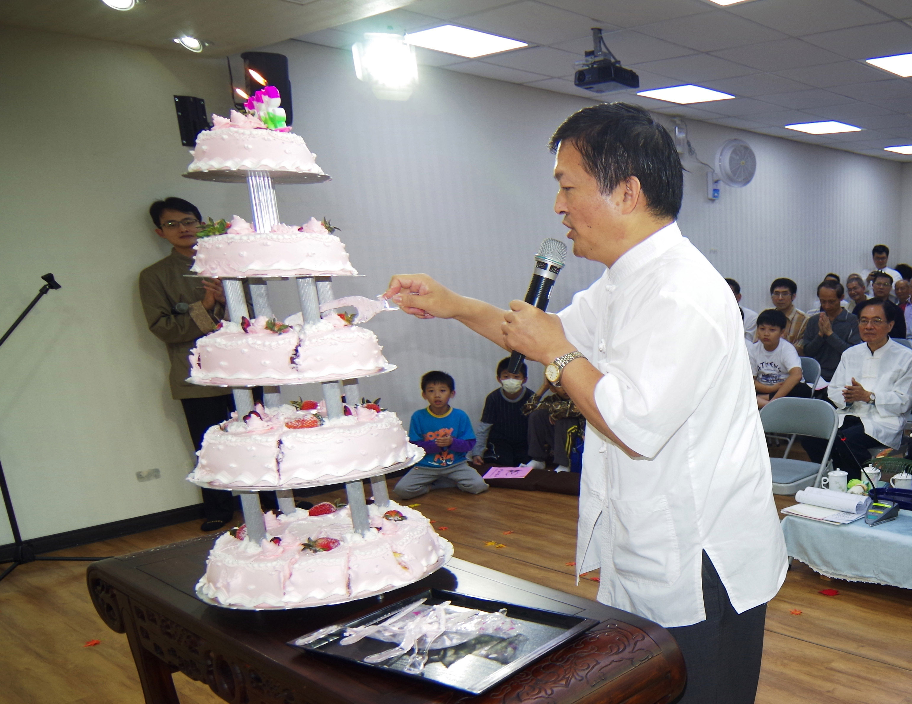
