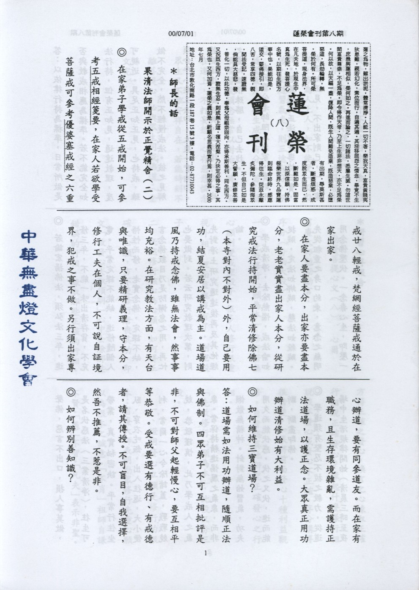

# 第8期

## 大德法語

### 果清法師開示（二）

*編輯部*

（開示於正覺精舍）

◎在家弟子學戒從五戒開始，可參考五戒相經箋要，在家人若欲受菩薩戒可參考優婆塞戒經之六重廿八輕，梵網經菩薩戒通於在家出家。

◎在家人要盡本分，出家人亦要盡本分，老老實實盡出家人本分，從研究戒法行持開始，平常清修除佛七（本寺對內不對外）外，自己要用功，結夏安居以講戒為主。道場道風乃持戒念佛，雖無法會，然事事均充裕。在研究教法方面，有天台與唯識，只要精研義理，守本分，修行工夫在個人，不可說自証境界，犯戒之事不做。若需要出行專心辦道，要有同參道友。在家有職務，且生存環境雜亂，需護持正法道場，以護正念，大眾真正用功辦道清修始有大利益。

◎如何維持三寶道場？

**答：** 道場需如法用功辦道，隨順正

法與佛制。四眾弟子不可互相批評是非，不可對師父起輕慢心，要互相平等恭敬，受戒要選有德行、有戒德者，不可盲目，自我選擇，然吾不推薦，不惹是非。

◎如何辨別善知識？

**答：** 以依律行持為標準，日常所做

是否與教戒相應為標準。若不能完全如法行持，但有正知見，通達教理，亦可親近。具足正知正見，也持戒，雖做不完全，然不輕慢戒法。彼之見解須合乎小乘三法印，大乘一實相印。若能通達三藏經典，且依律行持，此之善知識很殊勝，自己去找。

◎有云雪公老師阻人出家，實則不然。若能護持正法就是護持三寶，有正知正見，不出家則已，一出家即做人天師表，不敗壞佛門。

◎若論弘揚佛法，須弘法三年，進修三年，不能一味出清存貨，不充電。平常定課不能缺，進修隨個人悟性而修，老實念佛，定課不缺，言念佛數目乃是防懈怠之用，再忙也要做到。若云研究教理，則先對淨土研究通達後再及其他經論。

◎學戒清淨，去除熱惱，戒法喻如捉賊，定法如綁賊，慧法如殺賊。先從粗重之身口約束，意念之無明用念佛壓伏。一念毒心生，即壓一聲佛，惡言不出口，損人事莫做，是名伏惑法（三業清淨），往生可帶業，真實秘密訣。平常行住坐臥、穿衣吃飯，出入往返，大小便利，常爾一心令除諸蓋，戰戰兢兢，恭敬謹慎，此乃學戒人之氣象。常保精進惕厲之氣象，而非懶散無精神。針對無始習氣，功夫用久而能伏惑，伏之又伏，進而能斷，斷盡即佛。

學道須有堅忍不拔之毅力，從道

場中生活規律開始（清晨三時至夜晚十時）過午不食或日中一食，修行非一朝一夕，能耐久，吃得苦中苦，方為人上人，如不能受一點點苦，而隨習氣走，則三途有分，不隨習氣走，往生成佛有分。若引發習氣須念無常以對治，將心安在道上，不打妄想，心存慈悲憐念眾生又不離安詳自在，若能時刻不離菩提心，必與眾生同成佛道。（全文完）

## 共修研學

### 勸發菩提心文（八）

*心爾*

序分（分兩大段）

一、「先敘修行心願為本」：修行若無心願則變成空殼子，很多人修行很重視外相，裡面靈魂沒有了，剩空殼子。

二、既然修行核心為心願，如何得正確之心願，方不使修行唐喪其功，即文「敘發心去取須明」心中去除那些錯誤的行相，緣取那些正確的行相，方得正確之發心，換言之緣取正確行相說正確發心，緣起什麼樣行相說我不發心或發心不正確？序分講得很清楚，如果將前面發心十種利益觀修，自會認真地研究正確發心之行相。

「先敘修行心願為本」此段又分為三段。

一、證明發心立願是修行的根本；省庵大師表明勸眾修行先重心願以為根本之誠意。「不肖」：祖師自謙不賢。「愚」：不智。「凡夫」：表示非聖。此修行人之風範，修持愈好愈覺不足，其次因對涅槃法會眾前說話，未敢自高，眾中僧俗老幼，根基不等。或有諸佛菩薩，影響當時（做影響眾），或有祖師聖僧，乘願再來，肉眼不識，故發言必宜謙遜也。

「泣血稽顙」：勸我們發菩提心，連他（不肖愚下凡夫）都知道菩提心的重要，何況我們。他勸我們勸到泣血稽顙，一直頂禮，一直哭到流血。「哀告現前大眾」，我們信佛要有「淨信」行相，而不是來結緣的。佛法聽眾分：淨信眾（包括：常隨眾、當機眾、影響眾）與結緣眾（僅與佛法結淺緣而已，殊屬可惜），所以淨信男女很重要。「嘗聞入道要門，發心為首。修行急務，立願居先」，故發心立願，方能入道，方是真正修行人，「願立則眾生可度，心發則佛道堪成」，菩提心是成佛之因，唯有誓度眾生之菩提心才能成佛度眾生，這是修行的根本。

第二段反顯徒勞辛苦。文云：「苟不發廣大心，立堅固願，則縱經塵劫，依然還在輪迴，難有修行，總是徒勞辛苦。」第三段引經證明，「故華嚴經云：忘失菩提心，修諸善法是名魔業。」魔業就是說不發菩提心，善業造得愈廣，修行的障礙愈多（三世佛冤）。造橋鋪路來生升天，天福享受，第三生下地獄受苦，原來造橋鋪路是下地獄的前行，為了下地獄，眼前正在造橋鋪路作前行，忘失尚爾，況未發乎，「故知欲學如來乘，必先具發菩薩願，不可緩也。」具發的「具」：一、就是說概念上是完整的了解；二、策逼心態完全與法相應。

「當世」有二釋，一、當今之世，由此涅槃會勸大眾發菩提心，由此會而普及當今世界，由近及遠也。二、當來之世，是流傳當來世界，勸為我們發菩提心。「淨信」，信為五根之首，五根是信進念定慧，五根就是智慧發起的五個層次，以信心為根本。「十一善法之先」善法有十一，分別為信、慚、愧、無貪、無瞋、無痴，精進，輕安、不放逸、行捨、不害。有信，則諸善可生，故華嚴經云：信為道源功德母，長養一切諸善根。對法有信心時應該是什麼行相？乃確信與「法」相應必能離若得樂，而產生很強之善法欲，知修法是人生唯一的走向，並深深了知不修法之過患，引我入可怕恐怖之境界，對法有一種必解必修必證之決定，即是「信」之行相。

（下期待續）

## 蓮池海會

### 李維傑老居士往生記

庭彥

李公維傑老居士是山東昌邑人士，自幼徒居吉林長春，為人多豪氣，俠義干雲，少懷大志，每以忠義自況，歷經偽滿政府及九一八事變。七七事變時負笈北平東北中山中學，親賭日寇侵凌無狀，感國家不振、嘆百姓何辜，遂憤而投筆，毅然加入中央軍校第十五期戰車兵科，粹煉心志，精研兵學，從而轉戰大江南北、滇緬、金馬。裝甲兵自成軍以來所歷戰役幾無役不予，莫不惕勵奮發，身先士卒，魯南戰役即因力戰不卻而身負重傷，老居士因戰功或治軍有方而獲恤傷令及勛、獎章無數，戎馬倥傯三十載，得一遂護國報國壯志。

老居士剛毅寡言，律己甚嚴，重然諾，輕財貨，聞過輒喜，見不平傾力相助，淡泊名利，恬然自適，治軍傳家，以孝、義、忠、恕為重，每法諸葛武侯為師，邀靖節先生為友，雖曲折橫逆沓至，皆默然以受，慨然自省。自幼喪母，飽嚐失怙無依之苦，常涔然撫膝高嘆風不止與親不逮，雖病至膏肓，仍以國事為念，綜其一生溫、良、恭、儉如一，未嘗有忘形逾矩之舉，雖無顯赫功名，實已俯仰無愧於心。

年前癌症病發，臥床經年，嗣以機緣成熟，蒙蓮友引薦，皈依我佛，自此虔心禮佛，心無旁騖，其間屢承老師及諸蓮友大德開釋護持，於五月二十日凌晨，在唸佛聲中含笑辭世，復承老師蓮友大德助念十小時，以容顏安詳，四肢週身柔軟逾常，成就圓滿功德。

哲人已遠去，天人兩隔，追昔撫今，典型猷在，其人其事多有足以垂範後世子孫與大眾者，因以為記。

### 助念經驗談（四）

思嘉

淨法殊勝  母登淨土

照顧病人的同時，常會想到有朝一日，可以用來照顧自己的雙親，不料這一天果然到來。

三年前，母親曾經因肝癌開過刀，今年九月開始，在每週例行的門診時，醫師都開了血漿給她注射，為的是提高她的白蛋白，改善她的水腫。她也開始抱怨胃不舒服，可是因為懼怕，遲遲不肯照胃鏡。我擔心她會發生像陳先生那樣的症狀，力勸她早做檢查，以便控制病情。等到醫院安排了時間，卻趕不上她病情變化的速度。十月六日凌晨零點開始出現吐血，緊急送往成大醫院，醫生為她裝上鼻胃管，將胃裡的血引流出來，總算讓病情暫時穩定下來。

早上九點，我們到內視鏡室等待檢查，母親突然大量吐血，於是再回急診室搶救，這次改裝上S-E管，用來抑制她的食道靜脈瘤及胃靜脈瘤出血。基於前次的經驗，讓我更能冷靜面對，拿著彎盆接住不斷湧出的鮮血，配合醫護人員的指示，直到十一點半才完全止住，大家終於鬆了一口氣。

下午，醫師綁了七顆食道靜脈瘤、五顆胃靜脈瘤，總算把這些潛在的危機暫時解除了，但是之後出現了肝昏迷的現象，母親變得似乎不太認得我們這些兒女。經過一天一夜不曾闔眼，還不時吵著要起身，醫生不准進食，她偏要喝水。我在她耳畔吟唱「阿彌陀佛」，希望能緩和她的情緒，她跟我說：「明天再信，今天不要信。」用意在阻止我唱下去。當時是七日凌晨，醫師發現母親失血過多，有酸血症的現象，試圖以藥物來調整她的酸鹼值。

下午，主治大夫擔心她的酸血症加上細菌感染，有可能引發敗血症，於是轉送加護病房。我立刻邀了曹師兄一同來探視，並以母親的名義聊表寸心，希望能消除她一點業障，早日開悟。翌晨，她的病情依舊不樂觀，我再把握機會跟她談佛法，她雖然插了鼻胃管，仍然口氣急促地說：「我知道了，不要再說了，不要再說了。」

九日一早，醫生為母親做了氣管插管，可能為了撬開她的牙關，影響了原本鬆動的牙齒，造成滿口鮮血，妹妹看了泣不成聲。隨後，為了代謝陡增十公斤的腹水做了洗腎，以減輕她身體的負荷。但是醫生所有的努力，卻仍無法挽回母親的生命，徒呼負負。

下午六點，醫生告訴我們母親血壓五十，在彌留狀態。我走上前去，言簡意賅地告訴她，這副軀殼已不堪使用，靈魂到了要另覓新家的地步，極樂世界萬般美好，我用人頭擔保，而且我們有一位老姑媽（陳乃德居士，顯密雙修，去年三月四日在麻豆普門仁愛之家往生，死後留有許多舍利子。）在那裡，一定會引領妳認識新環境，不會孤單。當時，她的眼眶漾出淚光，我知道她明白自己大限將至，也把我的話聽得十分清楚。我也跟她說明屆時不更衣、不拔管，是為了盡量不增加她的痛苦，並且允諾她我一定會用最好的方式來恭送她。同時，我也說她這病全是年輕時為我們五個兒女操勞造成的，我們會永遠感念在心，將來我們也會好好的照顧自己的健康，以她的病痛作為殷鑒。

當時因為有別的患者需照ｘ光，要其他人員出去，妹妹於是去聯絡兼程趕回來的兩個弟弟，我去跟主治大夫洽商不拔管的問題，他勉為其難地同意，但是仍須徵得太平間認可，否則一樣通不過那一關。我再去跟太平間交涉。然後聯絡精舍和葬儀社，原本以為殯儀館不讓我們晚上助念，於是決定就近在醫院的太平間助念。

再回到病床前，母親已經斷氣了，我放了金光明砂，再覆上陀羅尼被，然後開始念佛。辦完例行的手續，我拔下念佛機的插頭，讓電池發揮功效，在佛號的護送下，離開加護病房。同主治大夫深深一鞠躬，感謝他連日來的辛勞。

我們都知道母親怕痛，尤其擔心病發後種種折磨，相當不堪，所以能在短短四天結束。對她而言何嘗不是一件幸事！

助念直到凌晨四點止。但是後面念佛機一直播著。後來八點多才送往殯儀館，在館方工作人員協助下拔管，因為還會溢血，所以加以縫合。隨之沐浴更衣，當時全身仍十分柔軟，除了原有因為打點滴造成的淤青之外，不見有屍斑，「全身柔軟」確定媽媽是往生西方極樂世界了。

當晚半夜之後，大弟媳帶了年幼的姪子、姪女回去休息。說來真不可思議，她兩度夢到媽媽，頭一個夢，是媽媽跟我們一塊兒吃粽子，第二個夢，是看到媽媽從外頭回來，一身輕鬆，意氣風發，跟她沒有生病前完全一樣，令大弟媳不敢置信。

我確信母親出離的很順利，但為了確定讓母親往生西方，特地參加超渡法會。除了為家母在寺院安了蓮位，她的學生唐瑜凌居士在三峽西蓮淨苑，小妹也在廣欽老和尚圓寂的妙通寺為她各安了一個蓮位。我們的目的都是希望藉此化成無量無邊的功德利益予她，並由有真修實證的師父每日誦經持咒迴向，來提昇她的蓮品。

十八日，家母出殯那天。唐瑜凌居士從台北來，邀了台中蓮社的三位蓮友來作所有的佛事，場面莊嚴感人。入殮前，他首先拉起家母的手，向我們示意：經過這些時日，又從冰庫裡出來，尚且如此柔軟，真是一大瑞相，可見把握臨終助念何等重要。最後撿骨時，唐瑜凌居士和我果然在意料中，從一些骨塊上發現了舍利子，形象雖不若一些老修行圓潤，數量也不多，但能獲得如此善果，我們已心滿意足。這一切，都是母親個人的福報。由於事前毫無跡象可尋，讓我每每為她的固執憂心，不知她的靈魂將歸向何方，如今回顧時，只有讓我一再低迴，一再讚嘆。

鑒於這次為家母送終的經驗，我也才知道晚上到殯儀館助念八小時，要經過申請，並非不准。再者，他們深夜也有值班人員，可以協助拔管、縫合、沐浴更衣等事。

事後，重溫臨終關懷的小卡片，自忖大致都能按照上面的要點來執行，其中最不容易做到的就是「不拔管」，縱使醫師同意，家人也不同意，認為有礙觀瞻，抑或礙於規定，出不了太平間，所以真要感謝來自各方的助緣，最後讓家母成就偌大的福報。

結語

佛經上說，如果有人能夠恭敬供養以下的八種人，就可以得到無量的福報，這叫做「種福田」：其中佛、聖人和僧屬於「敬田」；受業本師、阿闍梨和父母屬於「恩田」；病人屬於「悲田」。照顧臨終的病人尤其是因緣殊勝，讓我們有機會認識生命的無常，陪他們走完人生最後的一程，同時帶領他們及其眷屬認識佛法，讓患者的身心靈得到最妥適的安頓，更是責無旁貸。希望有志從事看護這一行的朋友，都能以搶救性命垂危的靈魂為己任，與有正知見的蓮友聯絡，學習如何善用佛法的法寶，相信只要有這份心意，一定能在諸佛菩薩和眾位師兄的護庇及協助下，從陌生到熟稔，累積自己的福德資糧。謹將個人工作上小小的一點心得提出來跟大家分享，人生海海，能保有這些回憶，是我當初始料未及的。

## 日常省思

### 愛的實踐~聽「康泰之家」演講之感

莉玲

又是一個平凡的星期六，但不一樣的卻是在升旗的時候，突然聽到報告：「今天高一第三節週會課到禮堂聽演講……」這一句話敲醒了好多對星期六的週會課已經產生厭倦的心。這個週會不用對著考卷或老師發呆，終於有活動囉！

到了第三節，全高一立刻整好隊，進入禮堂就坐。原來這是場由一位「康泰之家」的人來做的演說，剛開始覺得有點無趣，或許是因為聲音聽得不太清楚，所以才會覺得無聊。不過靜下心後就愈聽愈感動。

演講結束了，最令我覺得不可思議的，是他們竟然可以由這麼小的團體，變成如此有組織的單位；由服務這麼少的地方，到服務這麼廣大的人群；由這麼少的工作人員，可以成為這麼多的成員。曾經有好多次差點流下眼淚，可是看看旁邊的同學，好像一點感覺也沒有，於是很自然地就把感情壓抑下來。

我真的不了解，到底是什麼偉大的力量，推動他們這樣走？也不知道要多少努力和犧牲，才可以吸引如此多的人來參與？人們不論學歷的高低，或是年齡的大小，都願意參加這樣的活動，而且全心參與！

他們最偉大的地方是在於不會只處於自己的安穩，而會感受別人的逆境，幫助他們脫離困難，就像佛菩薩一樣不停的廣度眾生，奉獻服務和關懷。他們不肯放棄任何一個需要幫助的對象，不管是天生的糖尿病患者，甚至是失智老人和誤入歧途的中輟生，這些都是他們主要服務對象。這些都是平常我們不會主動想到而去付出的。他們難能可貴的精神是我們最好的學習目標。

最後願這個社會上有更多的人和他們一起努力、奮鬥，自己也能培養愛心，毅力和勇氣，跟他們共同付出！讓這個社會更平安、更祥和；小孩子可以快樂的成長；老人可以安享晚年；青年人可以認真的在他的工作崗位上付出，我們都活在充滿愛和溫馨的光明中。家中不必裝鐵門、鐵窗，鄰居之間守望相助。其實只要每個人的心中都可以想到別人，替別人著想，那社會一定會有更祥和的明天！

## 啟蒙園地

### 談教育（三）　謹

心印

人格教育的目的，顧名思義就是培養一個合格、合乎標準的「人」，如今在物質充裕的環境中，當人是很輕鬆容易的，但卻不懂應如何真正做「人」。人是三才之一，與天地有共同化育萬物的功能。人的一言一行以及一個心念，都會影響宇宙萬物。人可以讓天地祥和，萬物齊生，也可以讓天地變色，萬物俱亡。因此，好好做一個「人」，是何其重要！真正一個合格的「人」是一個品德高尚的仁人君子。乍聽之下，似乎令人感到遙不可及。然而若用另一種方式來詮釋，仁人君子就是一個讓人放心，懂得服務他人和舉止端正的人。而有仁心，就是能有一顆替別人著想的心。而仁心的引發，必靠孝悌。於行孝中去體會人與人之間的情感，由悌中學會應對進退，能自卑尊人。孝悌的內涵也已在上兩篇文章中略述過，現在特別就平時的食衣住行和處事接物中，來談如何使身心調和，舉止端正。所謂：「身安而後道隆」。想幫助他人，還需先會照顧自己。

先就住的方面來說：注重衛生、規律的生活、早睡早起的習慣，能使身體健康。人一天只有二十四小時，時光也最不留情。能把握運用時間，利用精神最好的早晨來讀書，寫字，學習道理，才不至於老大徒傷悲。

約衣服的擇取，必以整齊清潔為原則。衣服只是一個保護身體的工具，而不是以此增長自己的奢侈浮華的習慣。穿衣服，要穿得合乎身份，合乎場合。美、並不止於外表，真正的美是由內而外，天天穿新衣的人不一定美，能天天穿「心」衣的人最美。「心」衣是信心、愛心、關心、感恩的心、認真學習的心、虛心、恭敬心、包容心、慈悲心……等，「心」衣的種類繁多。想變美麗，可以不用花錢！

### 宅心仁厚　彭思永

*編輯部整理*

彭思永，宋朝廬陵（今江西省吉安縣西）人，字季長，為人正直忠厚，為宋朝名臣。

當思永年幼時，有一天早晨，要去上學，在門外撿到一只金釵，他默默地坐在那裏，等候失主來認領，不一會，那丟掉金釵的人，果然回來尋找，經過審查確定是這個人遺失的，思永便將金釵還給那人，那人非常感激，取出錢來要答謝思永，思永笑著說：「如果我要錢的話，我就把金釵藏起來了，何必等待你回來尋找呢？」於是這件事便傳遍了鄉里，大家都稱讚他的誠實。

後來思永參加科舉考試，初次出門遠行，身上帶了幾只手鐲做路費，以備隨時急用之需，同來應考的考生，到思永這裡，取出思永所戴的手鐲來玩賞，有一考生趁大家不留意時，偷偷地拿了其中一只藏入自己的衣袖裏，有人發覺，當面說出，大家都要替思永搜查索回，思永看到這種場面，若無其事說：「我的手鐲全數只有這幾個而已，並沒有遺失啊！」難堪的場面才平息下來。等到大家要離開時，彼此互相舉手作揖，不料一只手鐲，從那人的袖裏掉落下來，大家看到這種情景，都嘆服思永寬厚的雅量。

宋仁宗天聖年間，思永進士中舉，官任侍御史，在朝正直敢言，累官至戶部侍郎，成為宋朝名臣。

試觀彭思永，拾金不昧，幼小年紀就具有廉潔不貪的美德。又因不忍他人在大眾面前羞愧難堪，而寧願損失自己，原諒別人，進而為對方設想，其寬仁大度，實在希有難得，值得效法。（明倫月刊一九九期七十八年十一月）
