# 第90期
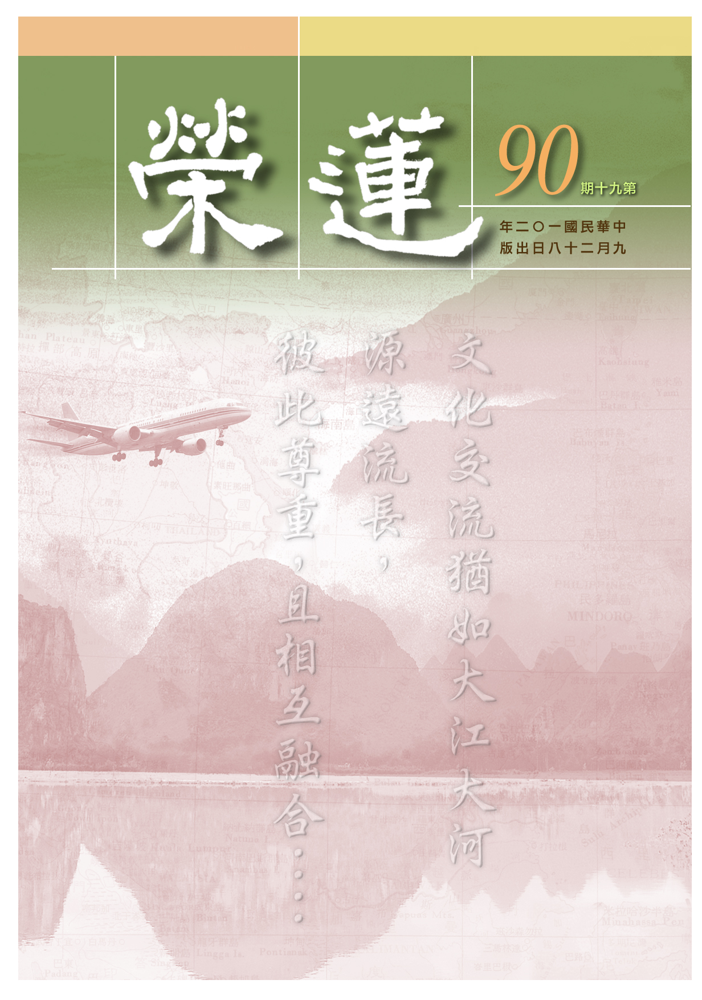

## 社論

### 人的出路-中華文化

本刊

可歎民族稱中華

卻未重視己文化

西風東漸風俗薄

正本清源中華義

認識中華文化這件事情至關重要。何為中華文化？

中華文化的「中」須追溯到堯傳位於舜的命辭：允執其中。允是信實，言為政須信執其中，以中庸之道（用中）來辦政治，是最佳善政。亦即辦政治令百姓有受教環境，引導百姓能明心見性，是辦政治與辦教育真正的出路。「中」義依《中庸》上言為喜怒哀樂未發謂之中，此是煩惱不生明心見性的境界，中華文化的中就是以文化引導人民明心見性。「華」是中表現在世俗上的效果，如孔子在《論語》裡論禮、論樂，乃至孝、弟、仁、義等，以此作為經營美好世間的善巧方便。中華文化的「文」，是詮釋中華的典籍，如〈大學〉、〈中庸〉、《易經》、《論語》等。而依經典的道理化導人心，謂之「化」，以上是中華文化的義涵。

認同中華文化的義涵，以這樣的理念聚合而成的民族，謂之中華民族。孫中山先生說：漢、滿、蒙、回、藏，五族共一家。亦即這五族都認同這樣的理念而組成的民族，謂之中華民族，這種民族文化帶來的是世界的昌盛與和平，這樣的文化不只是漢人的專利，更是滿、蒙、回、藏共同學習的內涵。

「中」之義，即以明對治無明，明心見性取代愚蒙，有了明（智）則能對治煩惱令其不生，謂之喜怒哀樂未發謂之中。即《易經》〈繫辭傳〉中言易無體而神無方，是屬於形而上的領域。中國強調辦政治就需明君聖主，意即帝王雖有利益天下蒼生之志，然須明心見性，方不隨境界而轉，不隨境生煩惱的人，才能欽明為政。《尚書》讚歎堯為欽明，讚歎舜為文明，堯、舜就是明心見性用中的明白人。

「華」是依「中」生起的世間作用，以七情來和諧萬物，亦即在入世時以喜怒哀樂來表徵是非善惡，改善風俗。《論語》中可以看到孔子七情的表現。例如「德之不脩，學之不講，聞義不能徙，不善不能改，是吾憂也。」此言孔子的憂！「樊遲問仁，子曰：愛人。」是孔子的愛！「知者樂，仁者壽。」是孔子的樂。聖人七情的開展是社會正面的貢獻，用七情來表達認同，表達否定，這種好惡能令善良的風氣開展，此七情之發展皆能中節，能合於禮而無過失謂之和，能令人趨吉避凶，《易經》六十四卦、三百八十四爻講的就是這個道理。

是故中為形而上（謂之道），華是形而下之和（謂之器）。依《大學》義，中是明明德（內聖），華是親民（外王），中華二者止於至善就是大學之道、就是中庸之道，就是內聖外王之道，亦是《易經》天人合一之道。中使人格外的有風采，乃對境不迷，華使人能善用境界，通達人情，是不分族群需具備的共同理念。國家的發展，將政治辦好是關鍵，政治若辦得不好，各行各業無法發展，乃至百業蕭條，政治若清明則百業興旺，所以儒家培養人才講究的就是辦政治，然為政者如果不懂得中華文化的意義，試問要如何治國？因此政治人物不但在形而上要不斷提升自己內在的涵養，以免權力使人腐化；在形而下也要講究調合團隊，才能統理政事，使民心歸向。

其次辦教育：惟有辦教育方能提供政治與各行各業的人才。眼前以學習《論語》作為推廣文化教育的開始。很可惜今天這種教育國家不重視，只好由民間來辦，雪廬老人曾說這是地下工作，就是國家不辦，我們只好幫國家培養人才。孔子在二、三千年前即是以中華文化來培育學生，如造就了子路成為軍事之才，且能以禮樂治國，顏回成宰相之才，宰我具內政之才，公西華乃外交之才等，其他如宓子賤治單父，子游治武城，都有聖人治理的氣象，此所謂「天下興亡，匹夫有責。」請問匹夫有甚麼責任呢？或云，匹夫不是庸庸碌碌過日子就好，還有甚麼責任呢？匹夫能將道統弘揚與傳承，將人培養成人才，能使國家在辦政治與辦教育上找到出路。

如《中庸》所說，參贊化育之德，就是以教化、培育參加贊助天地化育之德，唯有能以參贊化育之德來傳承中華文化，才是增進人類幸福的真正出路。《三字經》裡面也說天地人三才德，人居三才德之中，在《易經》六爻卦中，上兩爻講天，下兩爻講地，中兩爻就講人，正說明人可以頂天可以立地，果然知道人是這麼殊勝，這麼難得這麼可貴，這麼有意義，我們應該要好好的學習中華文化善用人生。

## 大德法語

### 大方廣圓覺修多羅了義經（四十九）威德自在啟請

道源老和尚

目不暇給現變化　不受境轉真安定

一念不生住空慧　不可思議即證量

辛五、正答所問

壬一、長行

癸二、觀網交羅

子二、交絡三觀

丑八、先武後文觀

經文：

若諸菩薩，以變化力，種種隨順而取至靜。此菩薩者，名先修三摩缽提，後修奢摩他。

下述七定輪，以三摩缽提為首，三摩缽提修的是如幻三昧，有神通變化，以變化力來教化眾生，此菩薩能變化世界，變化道場，以種種變化隨順眾生根機，並取至靜（奢摩他），謂之先武後文觀，亦即各種殊勝變化與禪定相應。此乃雖廣度眾生，其心至靜之境界。

丑九、功成退職觀

經文：

若諸菩薩，以變化力，種種境界，而取寂滅。此菩薩者，名先修三摩缽提，後修禪那。

以三摩缽提（變化力）為首，變化出種種境界，以度如幻眾生，度生既畢，而取寂滅，證大涅槃（禪那），謂之功成退職觀。

丑十、幻師解術觀

經文：

若諸菩薩，以變化力，而作佛事，安住寂靜，而斷煩惱。此菩薩者，名先修三摩缽提，中修奢摩他，後修禪那。

所謂廣建水月道場，大作夢中佛事，種種變化皆為度眾生，謂之佛事。在佛事中卻安住寂靜（至靜），就是奢摩他，而後永斷煩惱成就無上菩提，此即禪那。

丑十一、神龍隱海觀

經文：

若諸菩薩，以變化力，無礙作用，斷煩惱故，安住至靜。此菩薩者，名先修三摩缽提，中修禪那，後修奢摩他。

此菩薩以種種神通妙用，變化種種境界而無礙，謂之神龍（施雨），既度眾生又無眾生相可得，故不著度生之相，而斷盡一切煩惱，內心至靜，謂之先修三摩缽提，中修禪那，後修奢摩他。

丑十二、龍樹通真觀

經文：

若諸菩薩，以變化力，方便作用，至靜寂滅，二俱隨順。此菩薩者，名先修三摩缽提，齊修奢摩他、禪那。

此菩薩以三摩缽提（變化之力）起種種度眾方便，再同時修至靜（奢摩他），通達寂滅（禪那）。亦即隨順齊修此二種觀門（奢摩他、禪那），謂之先修三摩缽提，齊修奢摩他、禪那。

丑十三、商那示相觀

經文：

若諸菩薩，以變化力，種種起用，資於至靜，後斷煩惱。此菩薩者，名齊修三摩缽提、奢摩他，後修禪那。

此菩薩以三摩缽提（變化之力）起種種作用度如幻眾生，資助奢摩他（至靜），後斷煩惱而證涅槃（禪那）。此菩薩是以變化力資助奢摩他（齊修二觀），後修禪那。

丑十四、大通宴默觀

經文：

若諸菩薩，以變化力，資於寂滅，後住清淨，無作靜慮。此菩薩者，名齊修三摩缽提、禪那，後修奢摩他。

此菩薩以三摩缽提（變化力），資助禪那（寂滅），亦即此兩觀一起修，後住於無所作為的至靜境界，謂之齊修三摩缽提、禪那，後修奢摩他。

丑十五、寶明空海觀

經文：

若諸菩薩，以寂滅力，而取至靜，住於清淨。此菩薩者，名先修禪那，後修奢摩他。

前述第二個七觀，是以變化力（三摩缽提）為首，其次七觀，是以禪那（寂滅）為首，以禪那（寂滅）之力，取奢摩他（至靜力），住於至靜無所作為的清淨境界，此菩薩名先修禪那，後修奢摩他。

丑十六、虛空妙用觀

經文：

若諸菩薩，以寂滅力，而起作用，於一切境，寂用隨順。此菩薩者，名先修禪那，後修三摩缽提。

此菩薩依寂滅（禪那）力，遇境逢緣而起種種度生的作用，在一切境界中，通達空性，並生起種種變化以利益眾生，此菩薩名為先修禪那，後修三摩缽提（變化力）。

丑十七、舜若呈神觀

經文：

若諸菩薩，以寂滅力，種種自性，安於靜慮，而起變化。此菩薩者，名先修禪那，中修奢摩他，後修三摩缽提。

此菩薩依寂滅（禪那）力，取奢摩他（至靜力），住於至靜的清淨境界，依之生起利益眾生的種種變化，此菩薩名先修禪那（寂滅），中修奢摩他（至靜力），後修三摩缽提（變化力）。

丑十八、飲光歸定觀

經文：

若諸菩薩，以寂滅力，無作自性，起於作用，清淨境界，歸於靜慮。此菩薩者，名先修禪那，中修三摩缽提，後修奢摩他。

此菩薩以禪那（寂滅力），亦即現證無作自性，在寂然不動中起妙用，即用顯體，歸於清淨境界，歸到奢摩他上，此菩薩名先修禪那，中修三摩缽提，後修奢摩他。

丑十九、多寶呈通觀

經文：

若諸菩薩，以寂滅力，種種清淨，而住靜慮，起於變化。此菩薩者，名先修禪那，齊修奢摩他、三摩缽提。

此菩薩以寂滅（禪那）之力，住於奢摩他清淨靜慮的境界，再起於變化，此菩薩名先修禪那，齊修奢摩他、三摩缽提。

丑二十、下方騰化觀

經文：

若諸菩薩，以寂滅力，資於至靜，而起變化。此菩薩者，名齊修禪那、奢摩他，後修三摩缽提。

此菩薩以禪那（寂滅力）資助奢摩他（至靜），而起變化度脫無量眾生。此菩薩名齊修禪那、奢摩他，後修三摩缽提。

丑二十一、帝青含變觀

經文：

若諸菩薩，以寂滅力，資於變化，而起至靜清明境慧。此菩薩者，名齊修禪那、三摩缽提，後修奢摩他。

此菩薩以禪那（寂滅力）資助變化，而生起殊勝慧，現證至靜清明的境界，謂之齊修禪那、三摩缽提，後修奢摩他。

子三、圓修三觀

經文：

若諸菩薩，以圓覺慧，圓合一切，於諸性相，無離覺性。此菩薩者，名為圓修三種自性，清淨隨順。

前述交絡三觀（奢摩他、禪那、三摩缽提）二十一觀，及三觀單修，共二十四觀，最後第二十五觀是圓修三觀，二十五觀，以圓覺的智慧圓合一切，將三觀：禪那、奢摩他、三摩缽提，圓合起來。於諸性相，不離圓覺妙性，此菩薩名為圓修三種自性（三種觀門的自性）。

癸三、結成正因

經文：

善男子！是名菩薩二十五輪，一切菩薩修行如是。

以上二十五種定輪介紹完了，過去的一切菩薩修行，都是如是修行。（下期待續）

## 共修研學

### 小止觀導覽（六十二）

*心爾、治心整理*

道大魔亦大　動機正知見

耐性善根厚　轉魔成助緣

論文：

鬼神魔有三種：ㄧ者、精魅，十二時獸，變化作種種形色，或作少女、老宿之形，乃至可畏身等，非ㄧ，惱惑行人。此種精魅，欲惱行人，各當其時而來，善須識別。

十二時屬於地支，分配於二十四時，名稱如下。子時：廿三至一時；丑時：一至三時；寅時：三至五時；卯時：五至七時；辰時：七至九時；巳時：九至十一時；午時：十一至十三時；未時：十三至十五時；申時：十五至十七時；酉時：十七至十九時；戌時：十九至廿一時；亥時：廿一至廿三時。

鬼神魔中的精魅，原是山林中的東西，時久成了精怪，於十二時中不同時段能現不同形像，謂之十二時獸。十二時獸變化種種的形色，形像不一樣。比如：虎、豹、獅、豺狼、龍魚、鱉、馬、羊、猴等，或作少女或老者，乃至可怕的身形。「非ㄧ」是指很多種，數不完的形像，來惱惑修行人。

上述這些精怪，雖能示現各種形像惱害修行人，然可判斷在何時生起的，就會是何類精怪，要善巧分別認識之，方不受干擾，且能對治之。

論文：

若於寅時來者，必是虎獸等；若於卯時來者，必是兔、鹿等；若於辰時來者，必是龍、鱉等；若於巳時來者，必是蛇、蟒等；若於午時來者，必是馬、驢、駝等；若於未時來者，必是羊等；若於申時來者，必是猿猴等；若於酉時來者，必是雞、鳥等；若於戌時來者，必是狗、狼等；若於亥時來者，必是豬等；子時來者，必是鼠等；丑時來者，必是牛等。行者若見常用此時來，即知其獸精，說其名字訶責，即當謝滅。

十二時是子丑寅卯辰巳午未申酉戌亥，正好是鼠牛虎兔龍蛇馬羊猴雞狗豬，十二時辰配十二生肖，只是龍鱉算ㄧ類，蛇蟒算ㄧ類，馬驢算ㄧ類，雞鳥算ㄧ類，狗狼算ㄧ類；子時來的是什麼精怪？是鼠輩，可是不會以鼠的形相出現，會以恐怖或令人喜悅的形像出現，或令人恐怖，或令人著迷，或令人引發增上慢，但本質是鼠精，如西遊記裡蜘蛛精會變成美女來引誘豬八戒，除非你識破它，意即有孫悟空那雙火眼金睛（正知見眼），否則一步步地被引入危難。對治法之ㄧ，就是直接說其名字訶責它，彼精怪則隱滅之。

修行法中有所謂佛慢想，來對治自己的疑自，相信自己有成佛的能力，那是ㄧ種對自我的信心，而不是ㄧ種增上慢，假名謂之佛慢。信心跟慢心的行相不一樣，自信心是自己相信有完成某項目標的能力，而慢心是對別人顯示高傲。佛慢想，其實是ㄧ種成佛的信心，然自古以來，修行人欲成就聖道，ㄧ定會遭受到魔難，可是沒有ㄧ個會被魔難打敗，這是以佛慢想對治魔的方法。

例如智者大師在玉泉山靜坐修禪時，彼時天崩地裂、狂風暴雨、鬼哭神吼，最後仍然被智者大師降伏了。所以只要動機純正，並祈求佛力加被，且是為了利益無量無邊的眾生來修行，沒有ㄧ個會被魔打敗。所以佛慢想也可以降伏精怪，建立對師、對法、對自之信心，相信老師所傳的法是對的，相信這法是有威力的，相信自己有成佛的潛力，人是有情眾生裡最能成聖成賢成佛的，在六道裡面人道最能修，人道中修行人又極為少數。極為少數的修行者必得到十方諸佛的照顧與加被。

末法時期也是佛菩薩悲心最強盛的時期，佛菩薩非常疼惜末法時期的修行人，經論上舉二例說明修行人如何得諸佛菩薩護念例子。其一是盜賊知道某家有許多財富，會將此戶人家團團包圍，不容許其他小賊寇造次，意即不會被其他鬼神所侵害。其二有非常慈祥的母親，膝下有諸多賢孝子女，當這慈祥的母親生病時，這些賢孝子女會將母親圍繞著照顧，絕不容許有其他不相干的人來造次。尤其是末法時期，佛菩薩一定會為了法的傳承，而保護這些有正知見的修行人。

即使在坐禪中見到佛菩薩，也不可引發增上慢，其或是在肯定修學者某一階段的功夫，行者依然要專注所緣而修。尤其修學者非清淨動機，所現的佛菩薩都不會是真的佛菩薩。

論文：

二者、堆剔鬼、亦作種種惱觸行人：或如蟲蝎緣人頭面，鑽刺熠熠；或擊櫪人兩腋下；或乍抱持於人，或言說音聲喧鬧；及作諸獸之形，異相非ㄧ，來惱行人；應即覺知，ㄧ心閉目，陰而罵之，作是言：「我今識汝，汝是閻浮提中食火嗅香偷臘吉支、邪見、喜破戒種；我今持戒，終不畏汝！」若出家人，應誦戒本；若在家人，應誦三皈五戒等，鬼便卻行，匍匐而去。如是若作種種留難惱人相貌，及餘斷除之法，並如禪經中廣說。

二者、堆剔鬼：嘴巴會發出堆剔的聲音，故取名為堆剔鬼，在拘那含佛時，有ㄧ位比丘名為吉支，由於破戒被逐出僧團，故發惡願要變惡形像來擾亂修行人，有時會顯牛頭蛇身、或是畜頭人身、或是人頭鬼身，不一而足，並發出種種的怪聲。

由於此鬼往昔破戒，故行者以誦戒來對治。或一心閉目，暗暗指名罵他是閻浮提中食火嗅香偷臘的吉支，是邪見喜破戒種的鬼。若是持戒之人，則曰，我今持戒，終不畏汝。可見持戒極為重要，每條戒都有護戒神，持得愈多愈精嚴，護持的力量就更大。總之道大魔就大，無道則無魔。

論文：

三者、惱魔：是魔多化作三種五塵境界相來破善心：一、作違情事，則可畏五塵令人恐懼。二、作順情事，則可愛五塵令人心著。三、非違非順事，則平等五塵動亂行者。是故魔名殺者；亦名華箭；亦名五箭，射入五情故。名色中作種種境界，惑亂行人。作順情境者，或作父母兄弟、諸佛形像、端正男女可愛之境，令人心著。作違情境者，或作虎狼獅子羅剎之形，種種可畏之像，來怖行人。作非違非順境者，則平常之事，動亂人心，令失禪定，故名為魔。

第三惱魔，乃三種魔中最厲害者，前者精魅、堆剔鬼是遠波旬的眷屬，第三種惱魔是屬於近波旬的眷屬，寶靜大師的《修習止觀坐禪法要》裡亦如此說。魔王波旬是欲界天最高層者。世間許多信奉外道者，本質雖善良，然在宗教對立時，會變得很兇狠，佛教徒雖能包容他們，但他們不會包容佛教徒。這些接近波旬的魔惱，可以化作三種五塵境界來破行者善心。

一、作違事情：亦即變化恐怖境界，如變化虎狼獅子外，或變為羅剎、夜叉來傷害行人。昔日釋迦牟尼佛在菩提樹下修學正法時，魔王波旬率隊，朝釋迦佛萬箭齊發，此時釋迦牟尼佛入慈心三昧，這些箭剎那都變成可愛的鮮花，轉成對佛最殊勝的供養。以上是違情境。

二、作順情事：或化諸佛菩薩來讚歎你，或變成父母師長，乃至端正男女，令人心著，如釋尊在菩提樹下，波旬遣眷屬美女舞弄美妙身材來引誘，佛則入白骨觀，彼一一皆自慚形穢而退。

三、非違非順事：非違非順是指平常的境界，如電視節目，或很可憐、或很恐怖，雖此境界不會傷害人，也不會引起貪瞋，然觀賞之會擾亂人的正念，總之要對世間看得淡，世間的恩恩怨怨不過夢幻泡影。

這些魔名殺者，亦名華箭，從五根入，生起種種煩惱，看似華實是箭入五根，破壞正念，如眼見而生情、耳聞而生情、鼻嗅而生情等等，此時動亂人心，令失禪定，故名為魔。（下期待續）

### 菩薩清淨的行持　華嚴經淨行品（六）

*編輯部整理*

依願滿足菩薩行　依願成就十力智

行者欲知修學力　隨順菩薩發淨願

甲一、智首問舉德徵因

乙二、陳所疑之問

丙二、別問行所成德

丁六、滿菩薩行

經文：

云何得圓滿檀波羅蜜，尸波羅蜜，羼提波羅蜜，毘梨耶波羅蜜，禪那波羅蜜，般若波羅蜜，及以圓滿慈悲喜捨。

波羅蜜譯為到彼岸，或指為菩薩的成就，或說是佛的成就。然每一法行都能成就破所知障到彼岸的證量，此乃成佛的行相。菩薩只能說是六度的修學者，而佛才是真正的六度。

檀波羅蜜、尸波羅蜜，羼提波羅蜜，毘梨耶波羅蜜，禪那波羅蜜，般若波羅蜜分別代表著布施度、持戒度、忍辱度、精進度、禪定度、般若度的菩薩六度法。

就檀波羅蜜（布施度）而論，布施的目的在令眾生離苦得樂，由菩提心攝持布施，並觀察所施的對象、觀察能捨心意、中間所捨之物，並結合團體共造此殊勝善業，觀察施後成效，印上三輪體空的觀察，做六度及普賢十大願的總綱，此布施方可稱做圓滿布施波羅蜜，也就是布施這一法能令施者得到成佛的的證量，究竟到彼岸（破所知障）。

菩薩布施心意圓滿時，當有情求施捨時，菩薩會比阿羅漢現證空性還要快樂，即使是捨頭目腦髓卻如同捨棄發黃的菜葉一樣容易。

其次如何圓滿慈悲喜捨的修學法？慈悲喜捨各有四分的修學法，以慈而言，慈是予樂，乃至究竟予眾生成佛的安樂，內心只有高興，一點吝惜的心都沒有。下述圓滿慈心之四種修學法：

一者隨喜的修學法：

假使眾生能得到安樂該有多好，眾生得到安樂愈多，菩薩愈高興，甚至比眾生還高興。

二者發願的修學法：

我願眾生得到安樂，即使是冤親債主，恩將仇報，刻薄寡恩的眾生，都發願令他們得到成佛的安樂。

三者增上的修學法：

由我讓有情得到安樂，即使十方諸佛皆入涅槃，我仍然不退轉地來利益有情。

四者求加被的修學法：

祈求三寶加被，讓我心志強盛，能夠成辦利益眾生的事業。

丁七、得十力智

經文：

云何得處非處智力，過未現在業報智力，根勝劣智力，種種界智力，種種解智力，一切至處道智力，禪解脫三昧染淨智力，宿住念智力，無障礙天眼智力，斷諸習智力。

處非處智力是總說。處指的是道理、法，非處就是非法；處是對的，非處是錯的。善因得快樂是處，惡因得苦果是處。反之，善因得苦果，惡因得快樂則是非處。由此可知，佛乃是非分得很清楚，處非處智力就是明辨是非，具足明辨是非的能力，可以幫助自己趨吉避凶、斷惡修善、離苦得樂，斷惡是停止損惱他人，修善是利益有情。有這種格局、氣度與知見，就是第一個處非處智力。

第二、過未現在業報智力，由此開始是別說，此智力結合在過去、現在、未來，也就是業有感果的功能，由善得樂、由惡得苦，此處特別是在三時上顯現。因果有很多是無法現見的，必須要有三世的眼光，所以有很多人不相信因果，那是因為看不到甚深緣起的那一分，修行人因為在無常的觀修、空性的觀修上得到非常大的受用，故對佛說的甚深緣起生起勝解，經上有阿難尊者說：「日可令冷，月可令熱，佛語不可易也。」

佛的果報是以智慧這一分最為殊勝，稱為阿耨多羅三藐三菩提，也就是無上正等正覺。所以《佛學概要十四講》第一表的「先明佛義」，就是以佛智代表佛果的功德。

第三、根勝劣智力，菩薩欲幫助眾生離苦得樂，最殊勝的方式就是教化眾生。

根勝劣智力就是教化有情時，要先了解他的根器，有人是修學人天乘根器，有人是修學二乘的根器，有的則是修學大乘的根器，修學大乘的根器是根勝，其他則根劣。大抵一般眾生求的是人天果報，對於解脫與成佛沒有希求，目的是幫助眾生成佛，然眼前只能說人天乘，因為他的根器就是如此。應知佛說斷惡修善得人天安樂時，非究竟目的。

第四、種種界智力，種種界指各地不同的風俗，到該地要隨俗，否則度不到眾生，不同的地方有不同的風俗、想法，韋馱菩薩到北俱羅洲時，因不瞭解彼地人情，所以無法度化他們，只能成就三洲感應。

舉婚禮之例，雪公曾經為人證婚，穿的是皮鞋與中山裝，儀容整肅，且云洋結婚穿白紗，中國則以紅色為正色，說穿白色（喪禮服裝）他不證婚。可知各地風俗不同，若不講究則成了度該地眾生的障礙。

又如佛教托缽制度在中國不流行，雖托缽是非常重要的法行，何以到中國行不通？因為中國會把托缽的人當乞丐，出家人每天托缽，眾生卻當成是要飯的，試問怎麼度眾生？

以上謂之種種界智力。總之菩薩度化眾生要了解該地的風俗習慣，雪公於常禮舉要中說，人情世故不通達者不能辦事，此人不是幹才。

第五、種種解智力，就是對事情有殊勝靈敏度，比如什麼場合說什麼話，天下事非不經世故者所能看明白，彼以為簡單，實際執行則障礙重重。

在孔子身邊學習的顏回、子貢等弟子，與孔子顛沛流離、朝夕相處，相信他們對人情的練達非吾等表面能知。老師一手調教的解悟，非局外人所能知。

第六、一切至處道智力，當下的造作會到達何種果報，佛一目了然，或由此而投生人間，或生天，或成為涅槃的資糧。《賢愚因緣經》有人見佛收下禮物，欣然狂奔五里路，釋尊說此人所跑的五里路的每一粒沙，都表徵此人將來每一世轉輪聖王的福報，此即佛一切至處道智力。

第七、禪解脫三昧染淨智力，依止觀修學各種法義可以得到各種解脫，成就世間的解脫說染，成就出世間的解脫說淨，只得四禪八定是約染的那一分，證得涅槃這一分為淨。何以都謂之解脫？得到初禪就是由欲界解脫，得到二禪，就是解脫於初禪，同理得到三禪就是由初禪、二禪解脫進入三禪，證得涅槃即是由世間解脫。

第八、宿住念智力，結合第二條的業報智力，通達眾生往昔種種，謂之宿住念智力，佛有此智力可通達有情過去，當時的形象、行業、受用、家眷等。

第九、無障礙天眼智力，結合業報智力，通達有情未來趣向何處，受何果報等等謂之無障礙天眼智力。《法華經》佛授記迦葉、阿難成佛時，是以現量呈現他們的未來。

第十、斷諸習智力，就是講破煩惱習，也就是破除所知障成就佛果。以上就是十力智。（下期待續）

## 專題研學

### 聖者的祕密～大佛頂首楞嚴經二十五圓通暨七處徵心探源　二十五圓通暨七處徵心簡介　（三十一）

時哉

滿眾生希求　說法令成就

先以欲勾牽　後令入佛智

未二、應求雜趣

申一、諸天

酉一、天主

戌三、自在天

經文：

若諸眾生欲身自在，遊行十方。我於彼前現自在天身而為說法，令其成就。

若諸眾生欲身自在，遊行十方。此處十方指的是欲界第六天以下的十方。色界天人身能放光，雖經云光明照十方，然應是在該禪天以下，如同太陽光明照十方，然此十方是不出太陽系。

而彌陀經上說阿彌陀佛光明無量，照十方國無所障礙，此無量指的是無量無邊三千大千世界的十方。此殊勝光明是由菩提心、廣大的願力及甚深智慧所生，非天人光明所可比擬。

觀世音菩薩示現自在天身，說法令其成就欲身自在，遊行十方，依此能作為解脫與成佛的資糧。

戌四、大自在

經文：

若諸眾生欲身自在，飛行虛空。我於彼前現大自在天身而為說法，令其成就。

大自在天身是指色界有頂天（色究竟天），彼在三界內自在，等於是三界內的國王，管轄了一千個三禪天，一百萬個二禪天，十億個初禪天。

此時欲身自在，飛行虛空，比前面遊行欲界十方的能力強，此處是指在三界內遨遊。此人有心獲得此能力，觀音菩薩於彼前現大自在天身而為說法，令其成就欲身自在，飛行虛空。

酉二、天臣

天臣是指玉皇大帝的三種臣，幫助其維持欲界的安寧，第一、上將，第二、四天王，第三、太子。

戌一、上將

經文：

若諸眾生愛統鬼神，救護國土。我於彼前現天大將軍身而為說法，令其成就。

統鬼神者，如八部天將、韋陀等，統理這些鬼神是為了救護國土，像十二藥叉大將各領七千藥叉，這些鬼神都非常兇惡，不好管理。

觀世音菩薩懂得天大將軍的修學法，觀世音菩薩是以耳根圓通的證量，攝持一切圓通，觀待這些圓通所生起的世俗法，觀世音菩薩都能以名言通達，並觀待眾生需求，一一應身為其說法。

所以若眾生好樂以統治鬼神利益眾生者，觀世音菩薩就為他說法，教他統治鬼神的修學法，令其成就。

戌二、四王

經文：

若諸眾生愛統世界，保護眾生。我於彼前現四天王身而為說法，令其成就。

四大天王是指玉皇大帝的屬下四王，居須彌山腰統領四大部洲，每一天王各領兩部的鬼神。如東方持國天王居黃金埵，領乾闥婆、富單那二部；南方增長天王居琉璃埵，領鳩槃荼、薜荔多二部；西方廣目天王居白銀埵，領比舍闍、莫呼落伽二部；北方多聞天王居水晶埵，領夜叉、羅剎二部。

若有眾生愛統世界，保護眾生，觀世音菩薩在此人前現四天王身，教他統領各界，保護眾生的方法，令其成就。

戌三、太子

經文：

若諸眾生愛生天宮，驅使鬼神。我於彼前現四天王國太子身而為說法，令其成就。

如果不好好的領導鬼神，鬼神就會做壞事去擾亂眾生，所以有統領鬼神的修學法。觀世音菩薩則能投生為四天王太子，為其說法，教他太子的修學法，令其成就。

觀世音菩薩能現三十二應身，以利各類有情眾生，以上是現諸天王、天臣身而為說法，令其成就的應身事例。

真的成佛了，要怎麼幫助眾生成佛呢？想要幫助眾生成佛，眼前不給他生活的安定，怎麼幫助他去成佛？

一尊佛在成就佛果，在想要幫助有情成佛時，若這些鬼神不好好管理，無辜的老百姓深受其害，環境一團亂要怎麼修學正法？所以諸佛菩薩為利眾生，什麼狀況都為眾生考慮到，所以應知他的功德是無量無邊的。

普賢行願品當中談到禮敬諸佛，稱讚如來等十大行願，應知禮敬三世諸佛，是指這一尊佛有三世成佛的能力，觀待眾生可以過去成佛、現在成佛、未來成佛，所以對著這樣的聖者頂禮、稱讚及廣修供養。

隨喜功德當中，所說的隨喜凡、隨喜聖、隨喜因、隨喜果等，也是對著佛的能說。就此尊佛在成佛的時候，對他從凡到聖所累積的全部功德，一一加以隨喜，他把凡夫的點滴功德全部做過，所以釋迦牟尼佛會說三界沒有一個地方不是他捨身的地方。

懺悔業障也是對著佛的無過失才能顯現我是有過失者，對著所懺成立能懺，所懺的沒過失才能成立能懺之我有過失，依著佛的無過失，我的過失才能全部顯現，才是真修懺悔。所以應知十大願王的講法都是對著佛說的。即佛的證量為所緣，進入佛的功德海，這才是普賢十大願的正解。（下期待續）

### 孔子聖蹟圖淺說（五）

心超

好學無人比

君子小人辨

辦政能強國

外交文武全

十一、退修詩書

周敬王十六年，魯定公六年，西元前五０四年。孔子年四十八歲，回到魯國，此時季氏大夫當權，僭越職分，使其家臣主持國政，因此孔子不願出仕為官，退居在家修詩書，訂禮樂，以講學為志。弟子由各方來受業的很多，包括：顏回、閔子騫、子貢等都陸續來親近，在魯國造成講學的盛況。

孔子的教學重在啟發，所謂不憤不啟，不悱不發。在此圖中，作者描繪出孔門教學的景象，表現出對人物經營的不凡，其中講學者孔子居中席，請教的學生以恭謹的神態，上前行跪問禮就教於孔子的座前，其他學生端坐在兩旁傾聽，或思惟或談論，或翻閱竹簡配合著講學進度，各個氣度非凡，呈現出孔門中好學的場景。

孔子的學生中有父子檔，如顏回和顏路，曾參和曾點。也有兄弟檔，如孟懿子和南宮敬叔。有本國人與外國人，例如子貢是衛國人，子張是陳國人。這些學生中，年齡有的接近孔子如冉伯牛，有的相去甚遠如曾子；有貧如顏回、原憲，有富如子貢；有貴如南宮敬叔大夫；只要能行束脩之禮，孔子沒有不教的。這些正彰顯孔子的教學是有教無類。

十二、化行中都

周敬王二十年，魯定公十年，西元前五００年。孔子年五十二歲，做了中都的地方官，對於百姓的養生送死、婚喪慶弔，都規定了一定的法制。大人小孩的飲食，各有其節度；身強或體弱的，對社會負擔的責任，要求也有不同；男女行路，各有其途徑……。這樣推行了一年，就做到了行人路不拾遺；商賈交易，貨真價實；社會秩序，有條不紊的地步，各國諸侯，都來仿傚。

後來孔子由中都宰改任為司空，再晉昇為大司寇，並代行相職，七日而誅鉏了亂政的大夫少正卯，為政三月而魯國大治。

本圖下方彰顯孔子化行中都的政績：有家庭婦女勤勞紡織，老人在家含飴弄孫；有路人或朋友路上相見，親切打招呼，有肩挑者勤奮而行，有遇問路而詳實告知的，或路有遺物，來往者無人偷拾，表現「路不拾遺」的風氣。路上行人進退有禮，民風很好，男女分道，沒有遊手好閒的人。

在本圖上方所彰顯的是孔子在任職大司寇七天時，就在兩觀台下楓樹寒鴉的秋天，誅殺了亂政大夫少正卯，因為他心逆而險，行僻而堅，言偽而辯，記醜而博，順非而澤，罪不可赦。

十三、夾谷會齊

周敬王二十一年，魯定公十一年，西元前四九九年，孔子年五十三歲。這年春天，齊魯兩國的諸侯會盟於夾谷，就是現今山東省萊蕪縣南夾谷峽。孔子當時正擔任魯國大司寇的官職。魯定公以孔子知禮，故使他兼代會盟的相禮者。會中獻酬禮畢，齊國官員黎鉏大夫請奏四方之樂。孔子進言說：「齊魯會盟，兩君修好，奏此粗蠻的夷狄之樂，甚為不妥，請撤去。」而後齊國又奏宮中之樂，孔子又聲言：「匹夫熒惑諸侯者，罪當誅。」使齊景公深受挫辱而有慚色，於是將前所侵佔魯國之土地，歸還魯國以謝過。

圖中戴著官帽正氣凜然地阻止樂工奏樂者，即是魯國相禮者孔子。台上篷內同戴官帽者為魯定公，右邊則為齊景公，景公旁的大夫為高昭子，至於樂工旁站的兩位大夫，其中一位必是發號奏樂的齊國大夫黎鉏。齊國想要在會盟上劫持魯君，然孔子早有防備，圖中兩邊軍旗代表兩國各派軍隊保護君上，但魯國布署的兵力優於齊國。齊景公輸了裡子也輸了面子，只有將皸、酄、龜陰三地歸還給魯國，彌補過失。

夾谷之會，孔子不論在言詞、風采等文事，乃至武備上全佔上風，是魯國外交上空前的勝利，此時的孔子正是政治實力達到了顛峰。（下期待續）

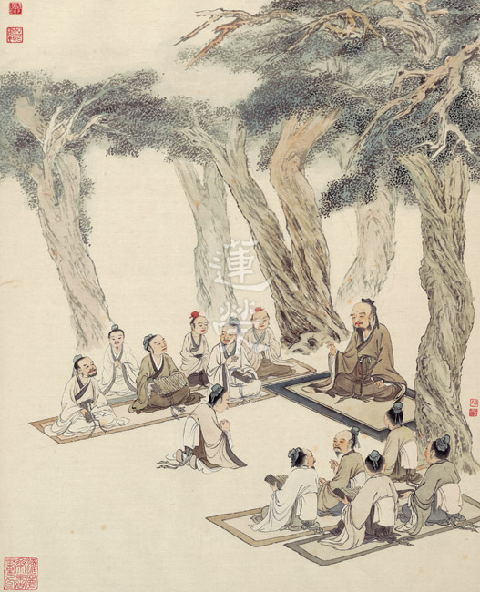

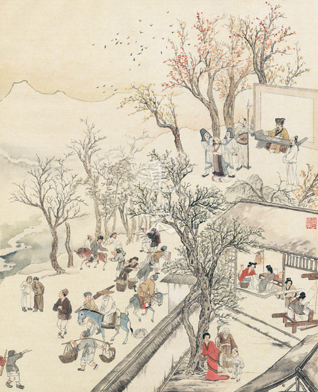

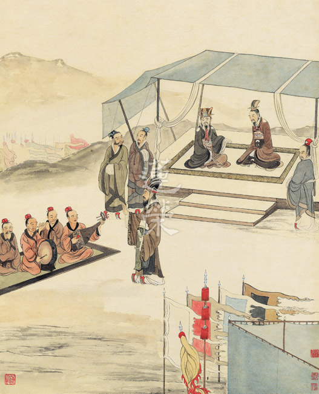

### 一件追憶的往事（四） —風雲際會世紀緣（緬懷雪廬老人）

魏慶友

歷經艱難的傳承

保留在臺灣孤島

崇洋多元化洗禮

不知薪水落誰家

民國二十六年（一九三七年），日軍大舉南侵，據《曲阜歷史文物論叢•文史研究》引孔府檔案：「十二月，時局越來越緊張，日軍逼近山東。蔣介石急電韓複渠，退出山東時，一定要帶著孔德成，不能落入日本人之手。韓複渠又電告駐兗州的二十二師師長孫同萱，令他馬上帶孔南下，當夜孫帶護兵到孔府，讓孔德成處理一下立刻動身南遷。……。日寇侵華，曲阜淪陷，奉祀官孔德成摯眷南下，一切府務由孔令煜代理」，德成先生無奈，親筆手諭「重大問題由族長、四十員、老師莊陔蘭、王毓華協商辦理」。凌晨，雪公陪伴著大成至聖先師奉祀官孔德成先生，及其即將臨盆的夫人孫琪芳女士，淚別千年府邸，痛捨祖廟故土，踏上了躲避戰亂，顛沛流離，患難與共的旅途。

德成先生一行，奉命由水路溯江入川，尚未到武漢，孔夫人感到不適，德成先生決定在武漢住下，「讓夫人安心生產」，視夫人身體恢復情況，「再轉往重慶」。剛在武漢住下，夫人即產下一女嬰，取名「維鄂」，並函告孔府「母女平安」。臨時在武漢停駐期間，孔子七十七代嫡孫奉祀官孔德成先生，發表了「抗日宣言」，接見了「魯省旅漢同鄉」及故交。雪公在滯留武漢期間，留下了近二十首嘆國、嘆家及訴盡「遲遲吾行也去父母國之道」的詩作。擷其《雪廬詩文集•蜀道吟》篇章：

征車行（武漢道中）

征車何太疾。齊楚三朝分。

眼中未滅鵲華樹。

袖上忽飄黃鶴雲。

黃鶴之雲向西飛。

我心結在東海湄。

來時好山千萬疊。

光暈紫凝夕暉。

問車前進止何處。

車後山川今棄去。

寸寸國土寸寸金。

當此如何不反顧。

幾欲呵車使倒行。

眼前山色盡留住。

君不見。庾子山。

江南有賦流人間。

心悲志哀辭危苦。

讀之使我彫朱顏。

長樂老。安樂公。

烏能與爾心肝同。

隨時皆自得。為樂永無窮。

登樓二首（一）

大江挾沙流。孤憤登樓發。

三楚標雄風。慨慷思往烈。

胡塵拂齊燕。骼胔暗吳越。

朔風檻外寒。迸淚眼中熱。

何時濟此江。一埽狼湮滅。

登樓二首（二）

掘田築營壘。歇杼鳴鼓笳。

不見胡塵動。如何先破家。

濕蘆炊晚汀。藉草眠江沙。

童稚徵丁去。比肩

綰

長麻。

樓閣青靄間。管弦正紛華。

前軍信未急。少願緩征車。

在武漢住了一段時間後，孔上公視夫人身體基本恢復，加之槍炮聲也逼近武漢，此地已朝不保夕。於是，一行人匆匆離漢，繼續前行。

入峽

~前略

遊子到此長咨嗟。

錦城雖好非吾家。

況當中樞播遷日。

冠蓋塞途如亂麻。

東來藉作復興地。

猛將恐今還姓花。

此日三峽來。何時三峽去。

名山惜從愁裏看。

勝跡強半不知處。

待到東歸詳記取。

挑燈細向故鄉語。

一路車船交替，日夜奔波，終於在民國二十七年春，來到重慶。

入蜀

聞道錦城好。來從蜀國遊。

彩雲開白帝。春浪漲黃牛。

季世簡書短。中原金革稠。

卦帆日西去。江水自東流。

剛避開了「中原金革稠」，沒等到重慶「彩雲開白帝」，就是日機日夜無間的轟炸。雪公紀錄下了這段，與孔上公及其家人長達四年，生死與共的日子。《雪廬詩文集•蜀道吟》小引曰：「日人冀逞吞華夙謀，百計尋釁。歲丁丑，藉端寇宛平，造成蘆溝橋之變。復傾陸海空軍，南北並進，九貢相繼陷。政府遷渝，余隨孔上公追扈之。日機飛渝轟炸無間宿夕，連續近四載，閻閭盡成焦土。上公兩易其居，俱化灰燼。因之城鄉互徙，後避入歌樂山結廬焉。然行役而歷山川，居處而棲巖岫；當其邂逅乎朝暉夕陰、時花候鳥之變，流竄乎硝雲鐵雨，堠火羽書之交；感夫天涯崎嶇孤客淪落，未嘗不搔首扼腕，欲一吐其鬱積之氣放之天壤也，歌歟！泣歟？發之於詩曰：蜀道吟。」〈龐家岩避兵詩序〉：「此首無題，讀乃憶之，為遷蜀居龐家岩時，遭寇轟炸所紀也。是夜飛機來，我探照燈四集搜空，寇失其向，彈亂投。予蹲土阜間，環周如雨下，土鬆摧，皆滾入澗中而炸，是以得不死也。茲擬題曰紀厄。」詩曰：

紀厄

哀笛裂雲響。長虹掃星躔。

城郊息鐙火。人隱松嶺巔。

忽似疾飆來。還聽暴雨懸。

鐵鑄浮圖林。參差墜我前。

滾滾趨深壑。崩摧陵谷遷。

聲寂面煩熱。飛揚塵火煙。

廬舍幻中滅。微軀何獨全。

恐非人間世。亦不類黃泉。

上有蒼蒼天。下有茫茫田。

數家哭聲異。傷彼新棄捐。

今疑不我死，定有復興年。

雜詠（節錄）

虹霓萬丈貫天閽，

鐵羽離群向月奔。

揭地翻空雷兩處，

血光硝氣一城昏。

為客三首（節錄）

胡車摩空飛，傳警愁遯藏。

疾雷墜雲表，毒火燔我旁。

空警

馳騖紅塵起。裂雲胡哨哀。

花鈿陌上靜。鐵羽霧中來。

斷脰懸枯樹。崩梁枕劫灰。

看誰似后羿。一射挽天回。

寇機

金鳶鐵卵嘯晴空。

萬物全銷一炬紅。

聞道有窮能射日。

願除妖孽借雕弓。

隨當局入蜀四年來，敵機的狂轟濫炸無間宿夕：每當「裂雲」的警笛響起，雪公率眾僕，護持上公及其家人緊急逃避。「鐵羽」「金鳶」遮天蔽日；「疾雷」「鐵卵」揭地摧土！空襲過後，「斷脰（頸項。意：首）懸枯樹；崩梁（意：屍體）枕劫灰」，一城「血光硝氣」！「酆都西去望鄉台。真似幽冥喚我來」，眾人數次都是在瓦礫下爬出，得以生還，再看上公官邸，「俱化灰燼」，不得已，曾「兩易其居」，雪公雖歎無力「除妖孽借雕弓」「一射挽天回」，但也堅信「今疑不我死，定有復興年」！奉祀官孔德成先生的長子，孔子七十八代嫡孫孔維益先生，就是在這「血光硝氣」中誕生的。作為義無反顧，擔當起「護駕」之責的雪公來說，在「真似幽冥喚我來」的生死邊沿，保護上公、嫡裔、夫人、小姐的安全，其身心壓力不是常人所能承受，雪公病倒了！國府當局也深感「夫子嫡裔性命攸關」，此事非同小可，在遠離市區的歌樂山上，一環境幽靜、隱蔽之處，為孔上公建造了兩棟房子，作為奉祀官府邸（見上圖），民國二十九年，孔上公與雪公等眾人得以入住，至此，才結束了近四年居無定所的日子。

昔日，孔上公由眾人陪侍從曲阜倉皇出走赴蜀避難。數月來歷盡蜀道之難，終於到了陪都重慶。而「彩雲」也未「開白帝」，大後方也是一城「血光硝氣」。堂堂孔上公，其住所幾次被夷為平地，四年來為活命，不得不城鄉互徙，淪落荒野，疲於奔命，「天涯崎嶇孤客淪落」「無所定處」。諸公深感與夫子當年，陳蔡宋匡之厄及其歸途止車援琴，作「猗蘭操」有諸多相似，幾經斟酌故名「猗蘭」。府邸懸以匾額曰：「猗蘭別墅」。孰知「猗蘭」二字為諸公的後半生，埋下伏筆。當然，諸公有幸蒙祖庇佑，在「猗蘭別墅」，過了四年多相對平安的日子，總算躲過一劫。雪公嘆曰：「當其邂逅乎朝暉夕陰、時花候鳥之變，流竄乎硝雲鐵雨，堠火羽書之交；感夫天涯崎嶇孤客淪落，未嘗不搔首扼腕，欲一吐其鬱積之氣放之天壤也，歌歟！泣歟？」正是先生這百年一歎，才使世人得知，當年皇賜「衍聖公」、現任國封「奉祀官」，曾遭如此之劫難，也使世人得知，在這先聖獨苗危難之際，是誰披肝瀝膽，出生入死、不離不棄，護聖後裔？

雪公還以悲憫之筆，記下僅丁丑（一九三七年）、戊寅（一九三八年）兩年，禹甸所遭之幾例劫難。〈七哀 紀丁丑戊寅所見〉：祭盧溝橋陣亡烈士之「陣連」、記曹州連續兩月地震災害之「地裂」、記巴蜀大地突遭風災之「扶搖」、刺中牟決河之「黃河」、記盜匪蜂起之「盜蹠」、憫無數孤兒之「弱喪」、記上海濟南長沙武漢遭劫火之「焦土」。末學摘唐禦史遐叔先生《吊古戰場》句襯之：「傷心哉，秦歟？漢歟？將近代歟？……。蒼蒼蒸民，誰無父母？……，誰無兄弟？……，誰無夫婦？……。生也何恩，殺之何咎？弔祭不至，精魂何依？必有凶年，人其流離。嗚呼！噫嘻！時耶？命耶？從古如斯。為之奈何？守在四夷」，雪公吶喊訴腷臆：「何處覓國手，敲枰安四夷」「何時罷西狩，耒耜息蒼生」。合掌誦彌陀：「我願往生圓種智，化身沙數返人間」。奉祀官孔德成先生贊雪公曰：「道倡倫常道，心為菩提心。」（下期待續）

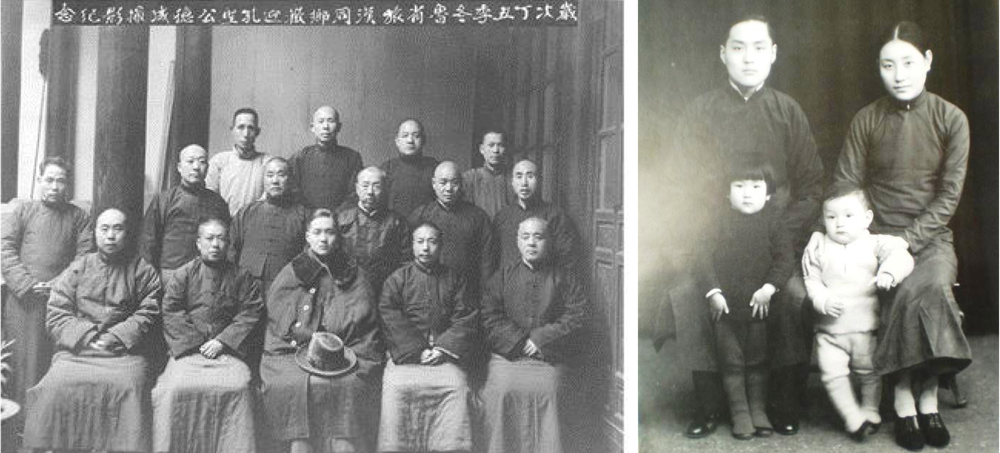

## 參訪觀摩

### 壬辰年秋三孔參訪觀摩（三）

*編輯部整理*

歷代帝王的推崇　德學是學者頂尖

後代綿延證陰德　廟貌乃哲人典範

孔廟主殿堂外的最後一道門是大成門，門上的字及下方的對聯是雍正皇帝所書。孔廟在雍正二年（一七二四年）遭到一次非常大的雷火，主殿被燒毀，並且波及周圍，共有一百三十三間房子被焚。《論語》上說：孔子迅雷風烈必變。能有經學的素養，面對各種的自然現象，才會有更深一層的體悟。

雍正皇帝對於這一次的大雷火引咎自責，親自到北京的孔廟去祭祀孔子，然後派了工部侍郎到曲阜勘查，製定重建方案。從雍正三年到雍正八年，一共六年的時間才將這一百三十三件房子重新恢復，國家撥用白銀十五點七萬兩。竣工以後，雍正皇帝親自題了大成殿及大成門上的字，但是他在做皇帝的時候並沒到曲阜來過，而是在做皇子的時候來過。

大成門周邊的這些龍柱，是石材的建築，曲阜東南方的丘陵地帶產有石灰岩的石材，因此曲阜取用木材不便，使用石材反而容易。龍柱是一體成型的人工雕刻，取材整個石塊，通過人工一槌一鑿的雕琢，所使用的雕刻技法稱為深浮雕，凹凸感特別強，從表面上打入，最深的地方有八到十釐米，完整體現龍、雲、山水之美。孔廟是國家的精神象徵，所以孔廟的建設也是國家頭等重要的事情，皇宮、王府以及全國的能工巧匠都雲集到此，全部都是精工良匠所共同完成，因此這些龍柱非常珍貴，在大成殿前面的十根柱子，也都是雍正年間所做。

大成門下方的龍柱，還有明代時期的作品，是明弘正十二年（一四九九年）所雕刻，當時孔廟也遭遇了一次大火災，燒毀了一百二十三間房子，所以國家也是撥了十五點二萬兩白銀重建。中國的龍隨著歷史的發展不斷演變，不同時期的龍有不同的特點，金、元以前的龍都是三個爪，到明清兩代才變成四個爪、五個爪，皇帝穿的龍袍以及官員穿的蟒袍都是五個爪，而且龍的頭髮，包括龍的吻，各個朝代也都有所變化，元朝的龍吻前凸，特別長；明代的龍吻就上捲、上翹了。有的專家認為，明代的龍有個特點，就是像朱元璋。

大成門之後，就是孔廟的中心院落，主祭區。門內的石陛東側有檜樹一株，相傳為孔子親手所植。在旁立有「先師手植檜」石碑，是明萬曆二十八年（一六○○）楊光訓所書。大學所謂：富潤屋，德潤身。孔子之德不僅尊榮了他的身，連他所穿著過的衣服、所使用過的器具、所栽植的樹木，都成為後人憑弔的對象。

孔廟主祭區東西兩側是長形的廂房，稱為東廡及西廡，裡面供奉著歷代的儒家學者和賢人，包括七十二賢，以及其他對儒學做出貢獻的歷史人物，一共有一百五十六個人，至於孔子和四配十二哲都供奉在主殿裡面。

院落中間的亭子稱為杏壇，用以紀念孔子從事教育的功德，孔子一生弟子三千，賢者七十二人，打破了學在官府的局面，有教無類、因材施教、循循善誘，對後世有十分深遠的影響。《莊子》〈漁父篇〉說：孔子游于緇帷之林，休坐於杏壇之上，弟子讀書，孔子弦歌鼓琴。所以在孔子住宅的不遠處，有一片很大的杏樹林，孔子經常帶弟子到那裏去講課，久而久之就在裡頭做了一個土台，孔在上邊弦歌鼓琴，弟子在周邊讀書，但是杏林到底在什麼地方，已經不可考。

大成殿面闊九間，進深五間，是重檐黃色琉璃瓦的大殿，大成殿前的台基在祭祀時是舉行音樂和舞蹈的地方。每年的舉行祭祀活動時，會邀請一些海內外的學者、領導人來觀禮，兩側也會搭上看台。此外每到高考之前，學生的家長也會帶著孩子來對先師頂禮膜拜，祈求能有一個好的成績。大殿旁有一棵東漢時期的古樹，至今已近兩千年，人在古木之前顯得多麼的渺小，所謂：百年世事三更夢，萬里江山一局棋。或許只有像它這般堅韌生命，才能道出這句話當中的禪意。

我們一行人整裝肅穆，在大殿前排列了隊伍，由孔子的第七十四代孫充當司儀，一起向先師孔子行三鞠躬禮。大成殿內部供俸著儒家的代表人物，中心就是偉大的先師孔子坐像，坐北朝南，在一個神龕之內、龍榻之上，由於歷代王朝的尊孔，孔子的身分地位已經被抬高到帝王的規格。孔子像的兩側有四位聖人配饗孔子，東面神龕內側是復聖顏回，外側是述聖子思；西面內側神龕裡是宗聖曾子，外側是亞聖孟子。

殿內有幾方匾額，正上方的萬世師表是康熙皇帝的御筆；下面的斯文在茲是光緒皇帝的御筆；左邊的聖集大成是嘉慶皇帝所書；右面德齊幬載及柱上兩幅對聯都是乾隆所題。外面還有一個生民未有的匾額，則是雍正皇帝的御筆，意思是自從有了人類以來，孔子對人類所做的貢獻最大，沒有人能夠超過他！

大成殿旁的左路布局有進行家祭的家廟，以及家廟前方祭祀孔子前五代祖先的崇聖祠。我們沿著左路布局回頭向南走，到了孔子當年所住，三間房屋的所在區域。首先看見一面稱為魯壁的牆垣。西漢景帝三年（西元前一五四年），皇帝劉啟將他的兒子劉餘從淮南遷到曲阜，封為魯王，史稱恭王。魯恭王好治宮室，為了擴建王宮而拆除孔子故宅，忽然聽到天上似有金石絲竹之聲，有六律五音之美，結果從牆裡面發現了《尚書》、《禮》、《論語》、《孝經》等書，一共幾十篇。孔壁古文據說是秦始皇焚書坑儒時，孔子第九代孫孔鮒，將這些經典藏在孔子故宅牆壁內，自己則到嵩山隱居。孔鮒到死也沒有把它們取出，但「竹簡不隨秦火冷」，這些經典終於是保存了下來。

此區有一口水井，相傳是孔子當年的飲用水井，稱為孔宅故井，清乾隆皇帝祭祀孔子時曾飲用此水拜師，所以西面有乾隆禦題故宅井贊碑。井裡邊到現在都還有水。

故井旁的詩禮堂，是紀念孔子教育兒子學詩、學禮的地方，因為《論語》上孔子曾跟伯魚說：不學詩無以言，不學禮無以立。此建築是明弘治年間所建，匾上的幾個字都是乾隆所題。康熙和乾隆都曾在此，聽孔家的後代給他們講經。孔家的六十四代孫孔尚任，在此為康熙皇帝講述《大學》，講完以後深得康熙皇帝的賞識，破格提拔到北京國子監當博士，才走向仕途。

在這個院子的兩側，還有兩棵宋代的銀杏樹，一棵是雌、一棵是雄，中間還有一株唐代的槐樹稱作唐槐。千年以來他們始終屹立於此，這種不屈不撓的精神，就是中華文化的象徵。（下期待續）

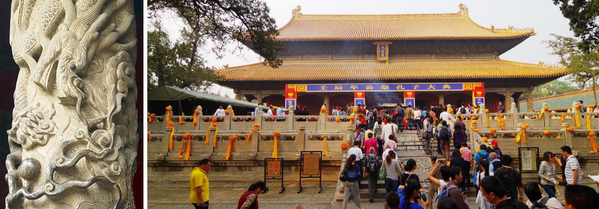

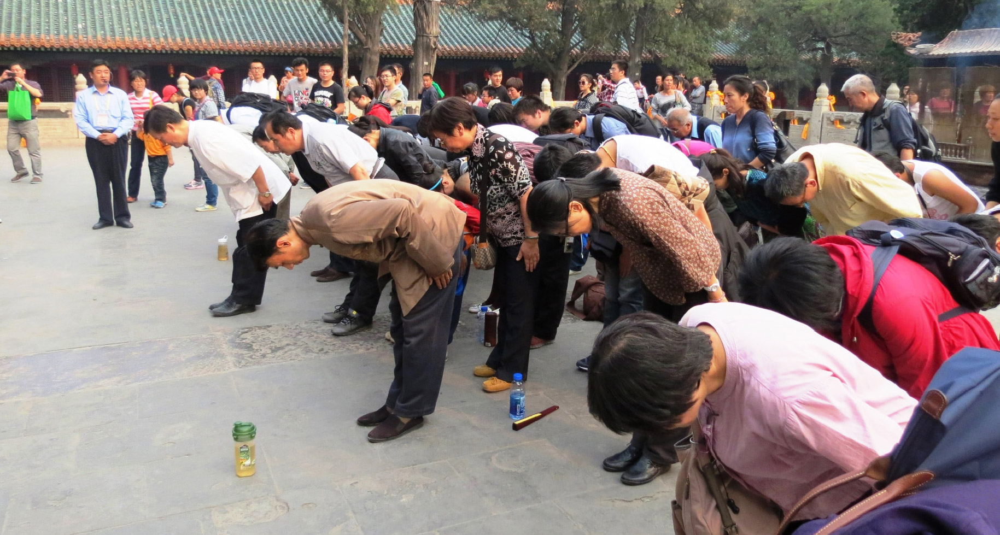

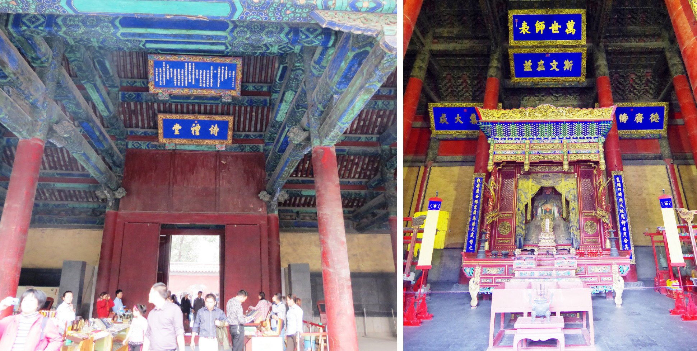

## 活動報導

### 天涯若比鄰 – 二○一三年三月馬來西亞丹江 「認識中華文化．論語與儒學講座」　認識中華文化　論語與儒學講座報導

*編輯部整理*

走一趟海外宣揚　慶幸文化能推廣

雪廬傳承不孤獨　九夷即是新中原

緣起

二○一二年十二月一日，丹江弟子規教學中心會長張偉慈率同海外文化學習推廣人士一行七十七人，蒞臨中華無盡燈文化學會，參與為期六天的講座，並進一步邀請唐瑜凌老師等，於二○一三年三月八日，至馬來西亞丹江弟子規教育中心，講授為期八天的儒學經典講座，主題內容為《論語》「知是眾妙之門｜福始祥源」。此次在南洋舉辦的講座，吸引了東南亞各國華人前來學習，除了馬來西亞當地華人，還有來自新加坡、泰國、菲律賓、汶萊、緬甸以及來自中國上海、雲南等各地人士，不遠千里而來，齊聚一堂，參與此次國際性學術講座，其學習中華傳統文化的積極態度令人感佩。

此次行程中，張會長在唐老師到會期間同時舉辦四個大型活動：「論語與儒學講座」、「國際論語交流會」、「素食嘉年華」以及「好人好事大匯演」，四個活動全部以「學《論語》不亦樂乎」為其核心議題，可以看出張會長學《論語》，以《論語》為中心思想推動文化的明智選擇，並以素食、行善等光明面凝聚海外華人的向心力，強調從《論語》為入門，藉此喚起海外華人心中的中華魂。而此中又選擇了自孔子至李雪廬一脈相承的道統傳承，為學習內涵及核心，來凝聚人心、培養人才，進而擁有推廣傳統文化的能量。

講座課程介紹

中國傳統文化的精髓在十三經，而十三經之首即為《論語》。本次課程主題「知是眾妙之門｜福始祥源」專題，是從《論語》四百九十八章中選取有關「知」的經文七十六章，製作科判來講述知的行相、內涵，並分以正、反兩面觀察研討，深刻的進入經文意涵分析。

除此之外，更安排雪廬老人的詩禮課程，其中唐詩，又稱近體詩，可以說是中國文學中最美的韻文，在嚴謹的格律規格下，以有限的字數表現出極其深廣的內涵，故詩文中用典繁多、用字精準，幾乎無法更動任何一字，且格律講究押韻，詩文內涵之豐厚，輔以聲韻之美，令人讀來韻味十足，易於學子們讀誦，也使得唐詩成為啟蒙經典讀誦課程中的必備教材。如此精美的韻文，內涵乃依雪廬老人所著之《詩階述唐》中的《詩惑隨筆》及《學詩先讀求味》。

為呼應主辦單位舉辦素食嘉年華會的誠意，讚歎丹江純樸的民風，明媚的風景，擇以孟浩然的〈過故人莊〉，感佩主人邀約，吾人赴約的禮尚往來。再者，在傳統文化的學習上，需步步昇進，多方涉獵，方能窺探中華傳統文化的奧秘，擇以王之渙的〈登鸛雀樓〉，作為對深入文化學習者的期許。由此二詩作為此次講座的詩詞賞析課程，一窺老人對詩文的剖析。

禮的部分，採取雪廬老人編著之《常禮舉要》，因在座多為文化教育人士，故選取其中的〈在校篇〉，來呈現在校學習所需之禮，分析其內涵與外相上應表現出的儀態。禮是文化素養表現的第一線，如果一個人常表現出粗魯失節沒禮貌，那要說此人有很深的文化內涵，只怕也沒人會相信了。所以禮的學習，不光是培養個人的內涵及威儀，更是入世間待人處世重要的方便法門。

夜間的課程則安排了畫作賞析課程，以藝載道，帶領深入賞析雪廬老人弟子—江逸子老師的孔門聖賢塑像以及《論語》相關畫作。此課程乃因應張會長年前的祈請，該中心擬於吉蘭丹洲道北縣德柏地區，規劃二畝地的故宮精華園區，想以江逸子老師的塑像與畫作呈現孔子內涵，並且輔以故宮經典文物，帶動當地文物與美學欣賞，不但保留文物，也透過中華無盡燈文化學會，從中培養懂得欣賞文物的導覽人員，讓華裔子弟進一步瞭解中華傳統文化的博大精深，免受低俗文化藝術的影響，多方面深入中華傳統文化，提升對藝術鑑賞的能力，不但認同中華文化，也得到文化帶給自己的利益，走向新的未來。

然而，中華傳統文化並非死板的中文課，也絕非只講一些做人道理，若能做全面性的學習，懂得欣賞結合道的藝術品，會發現中國人，不但溫柔敦厚，內涵深廣，也是個幽默又具創意的民族。

音樂欣賞課程則開出音樂嘉年華主題，選取世界各國各種不同類型的音樂，感受音樂教化的力量。如此安排的課程，早上學習道，晚上欣賞蘊含道的藝術作品，讓人感到身心靈皆能與日俱增上、昇華，是為極其充實的課程內容安排。

參訪觀摩

此行有機會參訪幾所華小，道北育智華小乃吉蘭丹洲最早創辦的一所華裔小學，至今已有九十七年，雖然華文教育在馬來西亞推廣不易，學生華文成績也不盡理想，但因為先賢的奮鬥與堅持，母語的教育讓華裔至今都能懂得說華語，傳統文化經典教育才得以推行。

中正華小符來明校長，曾率領副校長及該校教師共二十人，至臺灣參加本會舉辦之《論語》講座，此行有幸至該校參訪，臨時受邀上了一堂唐詩課，帶領學生們走入詩的意境，感受詩作當中的意境，唐詩並未過時，深入詩作不但能瞭解讀書人應有的志向，也可通達中華文化中溫柔敦厚的一面，本會教學總監林蔚芳老師與福林國小李月娥校長，以山東古調與閩南吟唱的方式，讓當日中正華小師生大開眼見，一片詩韻繞樑。

結歎

南洋諸國的華人們，對於中華文化的學習有許多的障礙跟困難，甚至連華語的學習、推廣上都很不容易，在傳承道統時會面對語文的障礙和瓶頸，外在又有環境上、政治上等來自各方各界的諸多壓力，使得他們心中非常惶恐，因為如不努力爭取維護，則會像埃及一樣成為斷了文化根源的人。

在各種壓迫下，他們仍然以炎黃子孫自居，深愛著中華文化，異常團結且努力、好樂於傳統文化的學習，在接受教導時，盡心盡力的聽課、學習，如獲至寶的緊緊抓牢、收藏得之不易的寶物。相信假以時日，或透過本會的數位學習管道，瞭解並深入文化內涵，不但個人內在修為得以提升，外在的社會亦能和諧發展，瞭解多種語言的馬來西亞人士，能將所知的語言變成弘法的工具，傳承正法。

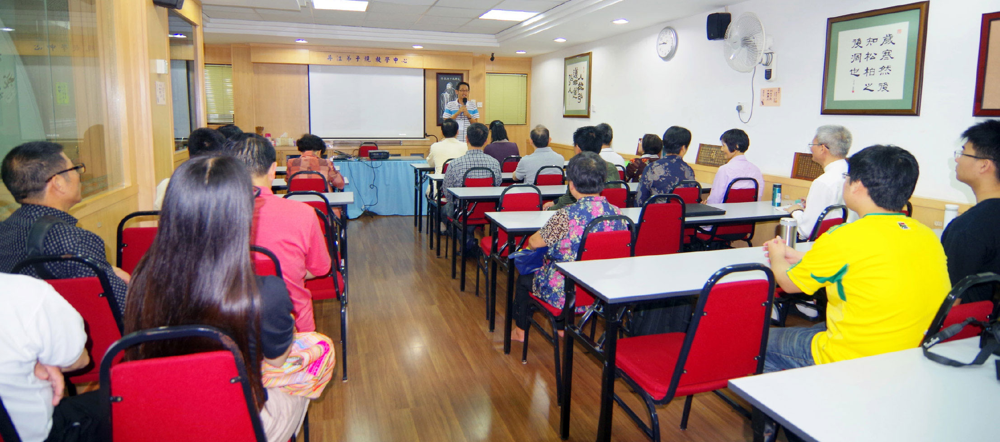

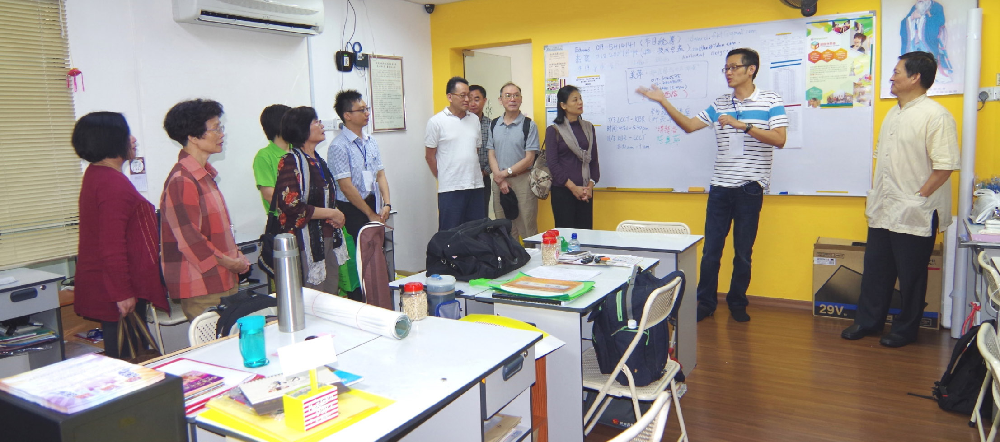

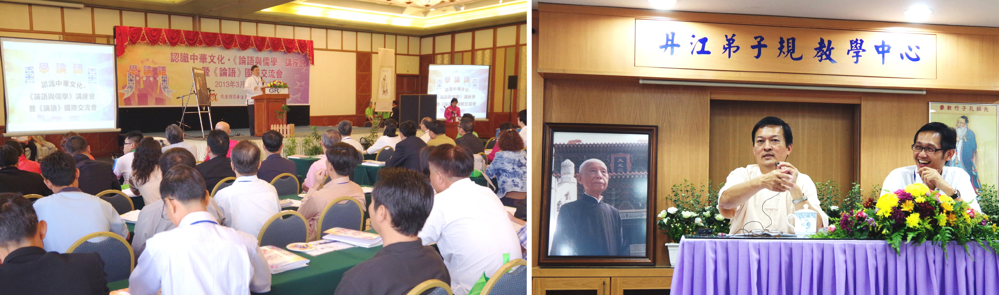

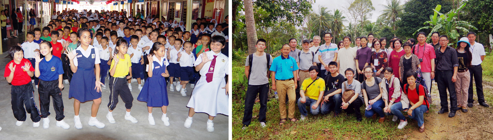

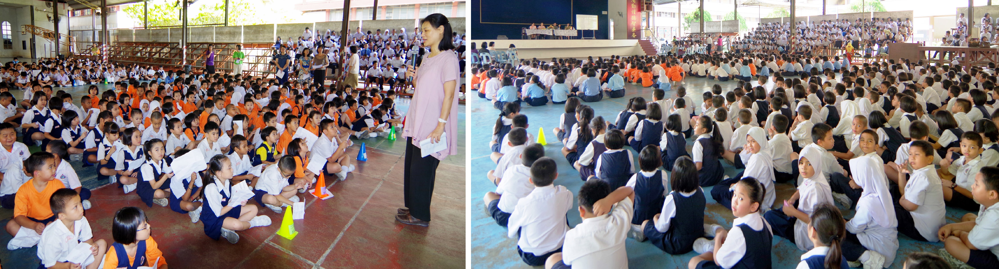

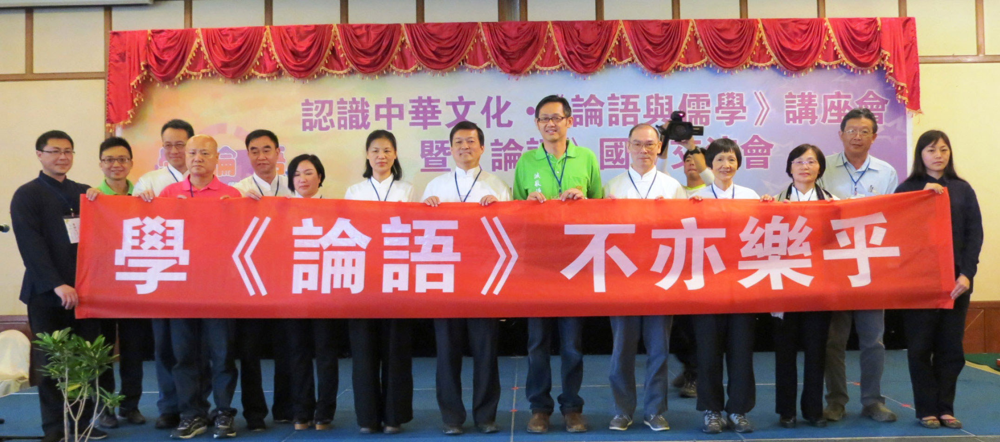

### 天涯若比鄰 – 二○一三年三月馬來西亞丹江 「認識中華文化．論語與儒學講座」　認識中華文化　論語與儒學講座開訓致詞

*編輯部整理*

一場齊聚盛會　大家來學文化

出路在於知見　知見來自學習

主席致詞

張偉慈—丹江弟子規教學中心執行顧問

尊敬的唐老師，尊敬的林老師、高老師、張會長，還有我們來自全馬來西亞，來自國內海外各個國家的代表，大家早上好！老實說，在吉蘭丹這個小地方從沒有辦過如此隆重大型的講座會，很多人說吉蘭丹是文化的沙漠。

今天難得我們有機會在這裡，請到唐老師還有他的教學團隊，就在這個沙漠裡把文化播種，讓他能生根發芽，這次講座主題是學《論語》不亦樂乎，確確實實跟著雪公老人的法脈來學習，可以解決我們生活上遇到的許多問題，可以幫助我們在處世待人接物中，得到好的功用成效，今天我在這裡歡迎大家，也感恩大家來到此地學習，如果你問我最想做甚麼？我只想好好的聽唐老師講課而已，我只想好好的學習，我相信大家在聽過唐老師的課之後，會跟我有同樣的感想，在這裡再一次歡迎大家，謝謝大家！

師長致詞

唐瑜凌—中華無盡燈文化學會創辦人

這一次談文化的主題乃「知是眾妙之門—福始祥源」，由《論語》章句中錄了七十六條有關知，所謂眾妙之門，是一切美好事情的門戶，包括各人的進德修業、斷惡修善、趨吉避凶、改變命運等，這些好事的門戶就是知，所說知是吉祥的開始、是福氣的源頭，由知來認識中華文化。

講到論語一般會認為是儒學，然「儒」這個字不是孔子的專利，儒是人所需，左邊人右邊需，是人所需，所以「儒」字非孔子發明。周禮春官有聯師儒，如今日教育部長，各地方管教育的官謂之師儒，國家的教育謂之儒，乃人所需。

何以會有此次來丹江的因緣？乃去年底在臺北的法務人員講座認識了張會長，了解在馬來西亞有丹江這個地方在推廣文化。之後他又到本學會再做詳談，更在去年的十二月一日到八日組團來本學會共學，當時的主題是：「跨越世紀的障礙—論語正見是出路。」這個團隊包含了各社團負責人，對他們的好學充滿了隨喜與讚歎，所以當被邀參加在丹江舉辦認識中華文化—國際《論語》儒學的講座，便欣然答應，並組成教學師資團隊，赴今日這一場盛會。

惟願丹江之地能有儒學的學習、文化的發揚，及人才的培養，呈現在馬來西亞是最好的文化，帶來的影響是無可忽視。

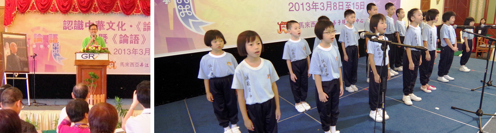

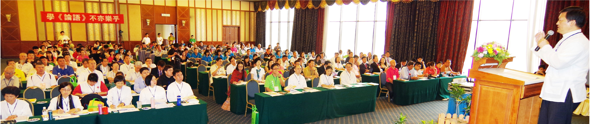

### 論語國際交流會 —由論語獲得正知見是出路

*編輯部整理*

探索生命出路　追尋文化價值

找回論語正解　成就國際交流

引言

丹江弟子規教學中心會長張偉慈先生：

來自國內海外的各位大德、長輩、學者專家，大家下午好，謹代表丹江弟子規教學中心出席這次論語國際交流會，這次交流會的意義非常深重，聽了唐老師這幾天的課，學了不少章論語，試問學習論語、學習傳統文化到底有沒有出路呢？

再者，如果我們知道學習論語、學習傳統文化是有出路的，那又該如何推廣呢？待會請尊敬的唐老師來跟我們解說。

在此非常謝謝大家蒞臨參與這次的交流會議。

專題演講─論語耕心田

中華無盡燈文化學會理事長唐瑜凌先生

壹、正知見是文化也是個人、民族、國家的出路

以正知見耕心田

本次交流會專題題目為：「《論語》耕心田—傳統文化的出路，以及如何推廣論語」。所謂《論語》耕心田，是由《論語》的學習中獲得正知見來耕心田，若未得正知見，是耕不了心田，心田若耕，一切出路皆在其中。在臺灣，曾經推廣過《論語》的教育，但是效果不彰，因為只是應付考試，再者大家也不認為它是出路。學校的老師教《論語》，連自己都不認為讀《論語》是出路，怎麼教學生體認那種觀念是出路？雪廬老人最大的特色，就是能在他身上看到一個讀書人的氣節、格局、見地以及目標的肯定，在他身上看到整個文化的氣象與出路。

文武之道，未墜於地—在人

若能好好學《論語》與國學，如顏回就是一位在學習文化中獲得心裡出路的大賢，是一位待價而沽的幹才，但絕不賤賣。所謂：「君子藏器於身，待時而動」，其內涵無窮，待人發覺，若別人不知也不慍，此即君子的形象，能不能被用是屬於天命，要看天下蒼生是有福還是無福？所以我從雪廬老人身上看到士君子的風範，看到如孔子般的風範，孔子是至聖先師，無人能比，但如果沒有老人所展現的風采，我人對孔子的風範是不能想像。

很多讀書人都批判孔子，這就如同子貢所說，他們在門外被高牆擋住，看不到宗廟之美，百官之富。因為不知道夫子的內涵，甚至認為所說的有糟粕，因為他們從來都沒看到真正的內涵，像門外漢說外行話一樣。透過老人家的講學，才知道書本真實的味道，讀古書也覺得不會太困難，回想當時的學習，內心是很高興的，並能以文會友，以友輔仁。

貳、如何推廣論語

選擇正確的傳承

接著闡述如何在各地推廣《論語》學說，在老人家身邊學習非常高興，只是還沒有深入學習，當老人過世時，那種無依無靠的感覺是非常可怕的，不知道該何去何從？

團體共學

之後成立了讀書會，將老人講述的內涵重新討論、整理與學習。曾在中央銀行社團上了十年的《論語》課，還未講完一輪。之後成立社團辦啟蒙班、人才培訓班等，學習國學，是以《論語》為主軸課程，再納入《常禮舉要》、《詩階述唐》、古文選讀、〈大學〉、〈中庸〉、〈弟子規〉等課程。然二十年下來，即便論語都無法把《論語講要》配合《論語集釋》講完一輪。老人對於《論語集釋》的講解，令弟子們產生抉擇古注的眼力。

立訂標竿

在《論語》中描述顏回窮困到簞食，瓢飲，居陋巷，然人不堪其憂，回也不改其樂，賢哉回也。可見顏回在道統的學習中找到內心的出路，有了內心的出路不會在意外相的出路，合道則留，不合則去，去留以道為準。即使楚國子西大夫覺得顏回有宰相之才，但做不做官決定在顏回，不在國君，命運是掌握在他自己手上，這就是「沽之哉，沽之哉，我待賈者也。」孔門弟子中也有在外相中有出路的，如子貢、子路、宰我，這些人到各國時，被委以重任，即使資質魯鈍的曾子也承傳孔子的道統，並曾當楚國做過上卿大夫。而孔子本身也曾在年輕時到了齊國，齊景公亦想給予孔子相當於宰相般的地位，這就是讀書人的出路，由此可見儒家讀書人的風采與能耐。

然而儒家讀書人，道統的傳承就是他內心的出路，也是真正的出路，顏回就是這一類型的代表。今天我們來談傳統文化有沒有出路？孔子把人培養成人才，這就是出路，第一步先相信傳統文化可以把人變成人才，接著問相不相信出路在人才上？如果人才沒路走，難道蠢才就有路走嗎？如果蠢才有路走，人才沒路走，那就表示時局不好，何必去跟大家淌這團渾水呢？

推廣《論語》其他重點

如何在各地推廣《論語》，還有幾點說明：第一、要確認注解，以張會長為例，讀《論語講要》很多年，那就是方向對了；第二、要有心推廣《論語》，並知道《論語》能將人培養成人才，人才是發展的關鍵；第三、要用什麼方式來推廣《論語》，如成立讀書會，以雪廬老人所講的《論語》來學習《論語》，所培養的人才可以到其他學校去推廣，到其他讀書會去主持，是最好推廣《論語》的方式。第四以科判的學習法來提升對《論語》的見地，如何由《論語》條目中知仁、知禮、知樂等，以及認識「孔子的德學」，認知「孔顏之樂」。透過科判式的學習，對文化有完整且正確的認識。第五、除了辦讀書會大家一起共學，並且辦理啟蒙班，引導小朋友開展聖人的見地。在古文觀止中—「上樞密韓太尉書」，一位十九歲的年輕人就有如此的見地跟氣度。孔子的學生子游，年二十餘就能在武城當縣令，辦理縣政有聖人般的氣象，孔子讚歎地說割雞焉用牛刀！

反觀，我們今日教育不能將人培養成人才，為何不好好尋求解決問題的方法？然有些推廣傳統文化，也是一知半解名為推廣，實則傷害文化，傷害孩子的善根，孩子學習產生不了法喜，讀經也讀不出味道，長大以後回想人生最痛苦的階段，就是被逼著來學國學文化，他自己不但不願意再碰國學，也絕對不會讓他的下一代來接觸國學，文化的傳承中斷了，這是我們學習並且推廣傳統文化者必須要深思熟慮的。

參、小結

張會長因為有這樣的遠見，所以我們才會來此跟各個團體交流，抱著野人獻曝的心情，將自己過去皮毛的所學和在各地推廣文化時的見聞經驗供養大家，當然也很願意聆聽大家對中華文化如何宏揚與傳承的看法，此之主題被彰顯，則一切主辦單位所花費的財力、物力與人力都值得。

以上就是今天的報告，第一段說明傳統文化的出路；第二段說明如何推廣論語，希望透過這樣的報告拋磚引玉，引出各方的激盪，呈現充實、圓滿的研討會，謝謝大家。

學術交流座談

中國雲南中華文化促進會常務副主席（前昆明文化局長）秦桂珍女士：

尊敬的張會長、唐老師與張理事長，我非常感謝你們，創造這麼好的條件，讓我們來馬來西亞吉蘭丹州學習《論語》，謝謝你們。促成來此因緣，首先要感謝柯先生，他曾兩次到昆明，被他的真誠感動而心動、行動，所以到這裡來了。

沒想到到這裡參加國際會議，除了迎來純樸的《論語》、弟子規的清風，還要自己洗碗。我曾擔任昆明市文化局的局長好長一段時間，也去了一些國家，但從不需自己洗碗的。當時站著有點呆，但因為大家都洗碗，所以我也跟著洗碗。之後看到大家都打招呼，不說話也笑臉相迎，就感覺挺舒服的，人跟人的距離雖然遠，心卻拉近了。而且這幾天下來，看不到汽車堵塞，城市的吵雜，看到的是飲食文化、田園文化、建築文化、人文文化，整個學習的氛圍營造的那麼好。當時收到邀請函，以為張會長肯定是個老夫子，沒想到是位年輕人，我被他的大器所感動，一顆中國心深深地折服了。

由於我是來自中國雲南昆明，那是明朝七次下西洋大航海家鄭和的家鄉，那是大家聽音樂就會想到的東方小夜曲，「月亮出來了，亮汪汪，亮汪汪，想起我的阿哥，在深山……」一九五六年我們雲南歌唱參加世界青年聯發會，那次演唱被譽為東方小夜曲，跟我年齡差不多的應該都會想起來「大里三月好風光……。」

我們國家有五十六個民族，在雲南就有二十六個民族，我現在退休並與文化部部長高贊強先生及許嘉棟先生，成立中華文化促進會，弘揚中華文化。相信透過《論語》的學習，確立知見，就能實現世界大同。

中國雲南民族大學人文學院楊潔教授：

首先感謝唐老師與他的團隊，給我們精神與思想上的潤澤與滋養，感謝張老師與志工們提供我們學《論語》的機緣。接著進入我最想談的聽課後的三點感受。

第一點，以前讀書時會常看到把孔子、耶穌基督、佛祖相提並論，當時很不解，孔子是人，他們是神，怎麼可以拿來一起比較呢？但這次來丹江弟子規教學中心，發現他們對人的心念、幫助社會和人的改變是雷同的，這才知道為什麼會把孔子放在那個位置上。

我們都知道孔子是萬世師表，從小學就學《論語》，但很慚愧的是我本科是學經濟貿易，後來碩士因為興趣改念人文，在文學院學習，但《論語》不敢說懂，甚至一知半解都不敢說，現在聽了唐老師講解以後才知道自己有很多功課要做，為什麼孔子是萬世之師，其實只是因為我們是迷途中人不知道懷中有寶。

另外，第一天參觀丹江弟子規教學中心時，有種「牆外開花牆裡香，海外開花海內香」的感覺，大陸這樣的地方很少，希望透過這次學習回到我的學院，能將這花香帶回去給我的學生，覺得自己此生也有責任把這種子帶回去，我們的讀書會不應該只是讀西方的經典，謝謝。

中國雲南民族大學人文學院郭教授：

我與剛才發言的楊老師是同事，這次到丹江弟子規教學中心，聆聽唐老師與他的團隊講述《論語》。

首先簡要介紹我們學校的情況，我們學校在中國雲南省昆明市，主要是培養少數民族，在少數民族地區培養少數民族學生，拿什麼來培養他們呢？這是我們會遇到的問題，我們的學生也學習古文，但事實上是很不夠的。雲南省有個著名的地方叫澗水，很多人不知道澗水有我們國家第二大的孔廟，雖然有一個那麼好的地方，但我們守著這寶貝沒有人認真的去挖掘與認識。

而我個人對儒學的認識是在一個非常時期，小學的時候國家處於文革時期，所以第一次聽到孔子這個名詞是批判時聽到，結果在成長過程和教書後才知道孔子是個偉大的教育家，確實有很多高明之處，所以從國族意義以及文化傳承上來講，它需要一個經典來把我們的文化聯繫，那這經典是誰呢？我們中國文人需要大家共同認同的經典，這個經典或許就在《論語》。謝謝大家。

丹江弟子規教學中心執行顧問張偉慈老師：

要辦讀書會最重要是先有正確的知見，要有正確的知見首先要有「明」師來指導。常常看到社會很多搞崇拜的現象，迷惑於名師的言談，或被驚人的口才和花俏的言語吸引著，但其實論語說「焉用佞」，有時候好口才說出來的未必是真實內涵的傳承，這是回答楊教授提出的一個論點。

郭教授說或許《論語》就是我們一部應當學習的經典，我們都知道中華文化傳承了許多經典，聽了這幾天唐老師的課，我們可以知道《論語》是很好的開始，四百九十八條裡面，跟著雪廬老人的傳承學習，是很好的開始與啟發，尤其今時今日，有誰能像雪公從《論語集釋》六百多家去做篩選，如果我們沒有像雪公老師這樣的明師指導，連開始都不行，更重要的是在我們沒有正知正見的辨別能力之前，雜菜麵式的學習是個禍端。像剛才唐老師在演講裡提到，有時我們看到傳統文化形勢是一片大好，若沒有中心思想，其實是禍端，如果不從內涵裡尋求，現在的形勢大好就是未來的大壞。

馬來西亞華校董事聯合會總會許海明副主席：

我這兩天半上了《論語》，其實感觸很多，我是其中少數七十多歲的學員，之前也參加過很多文化、教育的盛會，但這次感觸最多。第一是因為這主題非常恰當：認識中華文化，把論語和儒學合在一起做探討，個人覺得非常適當。我們整天把中華文化掛在嘴邊，但文化到底是怎樣的？什麼是我們的中華文化？很多人都在這方面不是很有把握，甚至一知半解，所以我們在馬來西亞說要發展《論語》教育，要傳承中華文化，語言是我們傳承文化的工具，但是什麼是中華文化？我們如何去傳承？到現在為止很少人能在這裡著力。

這幾天透過唐老師《論語》的講述，給我很多啟示。我們要發展中華文化，但是馬來西亞跟其他國家不大一樣，第一、馬來西亞學校制度跟其他東南亞國家不同，也肯定跟臺灣、大陸不同，我們從小學就有我們自己的華文小學，而這些華文小學雖是華人辦的，但在教育法令上是屬於政府的學校，所以教學綱要會受到政府的控制，很難排進任何跟文化內涵有關的課程，所以都是一些小學校長利用自己的智慧將經典課程穿插在正課裡面，公開的學習一定會發生問題。中學也分政府公辦或華人私辦，而華人辦的中學，可以自己選擇課程。

馬來西亞在各種情況下都面對很大的挑戰，雖然知道中華文化對一個民族是非常重要的，華族是馬來西亞第二大民族，雖然馬來西亞的政府允許我們辦華校、華小，但在政策上仍存在許多不公平的現象，所以馬來西亞的華人在各方面不斷跟政府爭取。

我們的文化一直在流失，首先當然跟五四運動有關，接著就是紅衛兵在批孔的運動中摧殘了中華文化，現在這些流傳各地的文化，主要還是在中國跟臺灣。文化建設雖然一路都有在重建，但是流失多過重建，這是我們要面對的問題。而我們要如何重建我們的中華文化？重要的是讓我們更認識中華文化，如果不認識中華文化，如何去傳承與重建呢？而且中華文化流失已經到了一個非常嚴重的程度，如果我們不即時給予補救或重建的話，一定會變成第二個埃及。

我從事華語教育的工作四十多年，但我沒花太多時間在文化方面，所以這次我參加了研討會，覺得以後要改變路線，華語教育不是單講語言的教育，是跟民族的文化息息相關的，這是很重要的。我常會有文化的失落感，過去年輕時必須跟政府接觸，某些民族有自己民族的服裝，但我們馬來西亞的華人沒有代表性的服裝，所以只好穿西裝，這是我們面對的問題，這就是我們文化的失落，也因此很遺憾地看到中國人民代表大會，看到少數民族的代表可以穿自己傳統服裝，我們漢族卻穿西裝，這是我們應該去找回來的東西。我們中國到底是唐裝、中山裝、或像我們傳去日本的和服？到底為什麼我們的文化會流浪到其他國家去？所以說文化的推廣工作是事不宜遲。

雖然文化還沒到滅亡的地步，但我們不能夠掉以輕心，所以我覺得臺灣的無盡燈文化學會還有丹江弟子規教學中心，是把文化的火花傳播出去的工作者，讓火花傳播到每個角落去。跟大家報告，我要把這火花帶到檳城去，我們站在各自的崗位，無論海外或大陸，我們時時刻刻都以中華文化的弘傳為己任，肩負歷史的使命，要重建中華文化的歷史使命，我們剛好處在這樣的年代，重建中華文化，匹夫有責，希望我們大家共來努力，謝謝大家。

丹江弟子規教學中心執行顧問張偉慈老師：

確實在馬來西亞土生土長的華人都會有這種文化的失落感，馬來西亞的中文教育一路走來只能用「艱辛」兩個字來形容，所以我們叫「華教鬥士」，以堅決爭取的方式讓它傳承下去。今天我們說要挽救中華文化，還是應當從挽救它的內涵開始，一個民族如果沒有文化，就等於失去它的靈魂，這是我們的華族之魂—林連玉老先生說的。

而一個文化如果不把它內涵找回來，只會在形式上講究，甚至會套進一些功利的思維，這文化就流於形式、偏向功利，而流於形式、偏向功利的文化是傳不久的，是屬於先盛後衰的那種，成長的很快，形勢一片大好，但那只是一個短暫美好的形象而已，長期來說，如果我們忽視內涵而流於形式，它將來的破壞會比現在形勢大好來的嚴重不知多少倍，所以當我們說要復興文化、搶建文化的同時，一定要把它內涵先找出來，從明師與內涵下手，才能真正恢復過來。

泰國淨宗學會黃玲玲居士：

我只是一個家庭主婦，剛聽到許主席說他在檳城，我就很有感慨，因為我大概是二００八年時，第一次接觸到傳統文化，我記得它背景是一個很大的蒲公英，蒲公英在散發種子，所以我要跟許主席說，那個種子是真的會到各處發芽的，當時我就在想這麼好的東西我要把它推廣到什麼地方去。然後因為我不是很會講話，所以我只能以一顆真誠的心，以一個責任感，覺得自己應該把這麼好的東西傳到每個地方去，尤其是泰北，因為那裏有很多華校，所以看這次有很多泰北的老師，還有教師聯誼會來這地方學習，所以不用擔心，這種子一定會發出去的，這次與會的來賓、老師、校長一定會把這種子帶回去，謝謝。

丹江弟子規教學中心執行顧問張偉慈老師：

黃居士來自曼谷，到泰北要坐十多個小時的巴士，人在曼谷卻不計遙遠距離來護持泰北華教跟泰國北部的清萊中華文化教育協會，黃居士非常用心，我相信中華文化是要以身作則的，我在黃居士身上看到了以身作則，是我們效法的對象，謝謝。

臺灣中華無盡燈文化學會理事長唐瑜凌老師：

黃居士跟許副主席的觀念並沒有衝突。許副主席帶著悲天憫人、不忍文化衰敗，從反面給我們警惕；黃居士帶著正面的心情。兩種說法合起來可以找到人生的出路，將這兩個觀點合起來看，知道文化的重點就是內涵的發揮，如果內涵不去好好充實，所發揮的功能未必有用。當年蔣介石總統來臺灣的時候，是用政治力量推動文化復興運動，大陸則是文化革除運動，當時臺灣的國學是一片欣欣向榮，當時是政治力量加上民間的大儒帶領著往前走，誠如張會長說的，形勢大好未來未必好，所以雪廬老人晚年講課時語重心長，因為如果沒有深入注解好好做抉擇，魚目混珠，會分不清好貨和假貨。

泰國清萊教師聯誼會顏協清會長：

我是來自泰國清萊教師研習會。三天來聆聽《論語》講座，使我茅塞頓開、如沐春風，跟來這裡第一天見到大家感覺不一樣，每個人臉上都帶著不一樣的笑容，想必每個人都領受了論語的內涵。我們中華文化的精髓在《論語》，請教唐老師與張會長，在推廣《論語》的同時，是否應該先從《弟子規》入門？畢竟《弟子規》是從《論語》出來的。

先簡要介紹一下泰北，泰北是一個特殊的地方，各位有看過金山、異域的書，因為時代變革，我們流落在泰北金三角地帶，為了延續中華文化，我們的前輩只要有一天的生命，就要把中華文化傳承下去。半個世紀以來，泰北的每個村莊都創辦了一所華校，目前我們清萊有五十個村莊就有六十五所華校，我們辦校創校的立場就是要聯繫與傳承中華文化，在那種艱困的環境中，我們無法透過正常時間授課，會利用下午或晚上五點以後來教學，用這種時間來傳承我們的中華文化。

半個世紀以來是蠻艱辛的，但我們也得到中華民國政府與其他國家各地善人給我們的支持，泰北的文化要延續，師資是一個最大的問題，未來要讓中華文化在我們泰北開花結果，我們聯絡了六十五所的華校成立了教師聯誼會，因為沒有政府的補助，我們只能靠收取學生微薄的學費，發給老師們能賴以為生的薪水，當這些老師體力不支，六十歲以後不能任教的同時，他將一無所有，所以教師聯誼會是一個教師的聯誼組織，卻擔負起了中華文化傳承的責任，尤其感謝清萊文化教育學會和黃玲玲大德對我們的護持，所以我們才敢大膽的成立這個基金會，希望我們在泰北的中華文化未來會更好，祝福大家我們一起學習愉快，謝謝。

臺灣中華無盡燈文化學會教學總監林蔚芳老師：

首先非常感佩顏會長的教師組織會願意來推動傳統文化，尤其是讓文化在泰北生根發芽，這個發心是絕對值得讚佩。第一個問題是，是否應該從弟子規推動？其實弟子規的推動跟《論語》的推動是絕對不衝突的，尤其慢慢進入到《論語》內涵後。弟子規的確是《論語》學而篇之一章出來的主題，也是清朝賈存仁教子範本，可以很快在生活中落實。雪公老師開出來的學習內涵，弟子規是其中的項目之一，但它不妨礙其他項目的學習，我們如果有《論語》的整體概念與內涵了解，則是以經為架構進入弟子規的每個條文，則每個條文都能經典化，所以在此會強烈建議不能偏廢《論語》的學習，甚至應該以《論語》學習為主軸，弟子規可以成為輔導配合的其中之一項目，這是個人的見解。

臺灣中華無盡燈文化學會理事長唐瑜凌老師：

一九五一年，雪廬老人就開始推廣讀經活動，當時臺灣還很窮，許多小朋友仍在穿開檔褲、打赤腳，雪廬老人的啟蒙課程裡就有弟子規這一門。在中華無盡燈文化學會裏，林蔚芳老師曾講一輪弟子規就講了十年，請林老師說一說。

臺灣中華無盡燈文化學會教學總監林蔚芳老師：

其實很慚愧，自己是在雪公座下在啟蒙課程學習上來的孩子，小學六年級的時候，母親帶我到臺中，參加由雪公老師的弟子成立的蓮友子弟輔導團，那是啟蒙班的前身，我就在那裏受教育，受的教育不是讀經教育而是啟蒙教育，是以國學為內涵來啟發童稚的心靈。蒙就是孩子的心靈待蒙發的是幼苗，要好好去保護它、扶正它，所以老師的啟蒙教育是「蒙以養正」，以文化經典來將孩子幼小的心靈扶正，蒙昧可以打開，得到傳承的智慧。

個人有幸得到這樣的機會在雪廬老人座下一路學習，我大三時老師過世，後來由他的弟子們不斷將老人教法傳承下去。後來在臺北辦啟蒙教育就是懷著一個報恩的心來教學，也發現這樣的啟蒙教育是非常少人知道與接觸的，所以在讀經教育與弟子規為主的教育之前，啟蒙的讀經教育其實已經開展十幾年，我們這十幾年用的教材全都是以雪廬老人的內涵為教授的內容。

孩子們其實是海綿式的吸收，你教什麼他就學什麼就會什麼，因為曾在老人座下學習，所以敢開很多課程，《弟子規》是其中一門，凡舉《論語》、《常禮舉要》、唐詩、古文這些全部都是一個基礎課程，再加上讀經，大學時期在啟蒙班學習當助教，陪很多孩子讀經，那時的讀經本是由蓮社的老師用工整的書法寫下的課誦本，這些應該是我們能發現的最早讀經教材，這些教材也非常豐富。除了三百千千、弟子規、《論語》乃至於各種經典，我們就是一路讀下來，後來在一、二十年裏頭從事經典教學。一路讀下來的經典真是難以計數，但讀經的重點仍在解經，隨著孩子不同的年齡來解經，這就是基本的啟蒙概念。

丹江弟子規教學中心執行顧問張偉慈老師：

謝謝林老師跟我們的心得分享，那我在這邊也做個簡單的分享，我們推廣《弟子規》也十多年了，但接觸《論語講要》之後，才知道《弟子規》總敘中「首孝弟，次謹信，汎愛眾，而親仁」是要養我們的心正而後行正，重點在心正之後行自然就正，所以我們學啟蒙教材，唐老師說我們應當以《論語》做主軸來學習，那絕不會衝突。

臺灣中華無盡燈文化學會理事長唐瑜凌老師：

大家所說的其實我們都試驗過了，今天是拋磚引玉來表達我們一路走來的心得，經典的學習當中，當一個人有大量經典的讀誦，再加上從小由淺入深的學習與了解後，他的格局會加大。剛剛林老師講到一個非常重要的重點，孩子是海綿，給他什麼他就是什麼，要給他多還是少，要給他真正的內涵還是給他皮毛的內涵，決定權都在大人，今天因為是以文會友，所以大家不要有壓力，因應各地風俗民情，各地可以有不同的作法，沒有關係。

雲南的律師：

我一直崇尚用民主法治來建立一個國家，那這次為什麼會來丹江學習呢？也是因為在整個社會建構當中發現我們這個中華文化的傳承，對我們中華民族的建設是有很大的意義，我們一直都在說海外跟臺灣對中國文化保護得比較好，所以才說我們是留學馬來西亞來求經，在這個過程當中，我在張老師的身上看到謙遜與睿智，以及學儒者的力量。這兩天在唐老師的教授中也悟道一些儒家的大智慧，老實說我這幾天思想上有很多轉變，但也有很多衝突，因為這跟我原來思想有些不一樣的地方，在這裡有個疑問想請教兩位老師，例如像這樣：老師好(恭敬向老師鞠躬的樣子)，老實說這一開始我真不習慣，因為那不是我的習慣，但過一段時間後我也習慣，我回去一段時間也會這樣，所以有個問題，就是儒學在推廣過程中核心是最重要的，核心是重於形式的，儒家的大智慧是形而上的，形而下的到底重不重要呢？我話稍微直接一點，我看到包含在國內一些學習，都會有些形式在裡面，例如包含一些禮樂、服裝、奉茶禮儀，這些形式在推廣儒學當中，應該擺在什麼樣的位置呢？因為在我們的推廣當中，沒有專心來聽課的人，應該都只會看到這些形式上的東西，說實話這些形式上的東西跟我們某種日常生活狀態是不一樣的，對於這些形式的東西是不是一定要來推廣呢？謝謝兩位老師。

臺灣中華無盡燈文化學會理事長唐瑜凌老師：

形而上是講超越形體的繫縛，如性、道等，仁、義、禮、智、信等都是形而下，形而下又包括內涵跟做法，形而上的部分我們難以了解，易經繫辭傳裡面所講的本體就是形而上，所以我們在中華文化裡面如何清楚的定義字義是很重要的。

「禮從俗、時從宜」，禮從俗就是要隨順場合，例如蔣介石先生到印度，印度的習俗是見面需要在地上滾一圈，甘地先生先在地上滾一圈，結果在蔣總統旁邊的羅家倫先生也在地上滾一圈，這是對的，禮沒有一定的，所以《常禮舉要》編撰者雪廬老人是非常了不起的，因為他不是很嚴格的規定要怎麼樣，只是說出原則，不是嚴格規定你要鞠躬二十度、三十度、四十五度、九十度，雪廬老人結合了三禮，將禮的原則抽出編成常禮舉要，讓我們承接古人的精神來面對現在的時代，而不是把小孩培養成怪人。

當小孩發現他做的跟別人不一樣的時候，他會覺得被孤立，但我們大人又告訴他必須這樣做，所以今天如何正視傳統文化，如何把人培養成人才，這是決戰點。讓他懂得原理，活用這些義理加以權變，讓他懂得保護自己，並且知進退。孔子就是我們最好的學習榜樣，孔子的一生趨吉避凶、逢凶化吉，一生都在推廣王道文化，他的命運只有天知道，這樣的人生就是文化的精華。所以現在是中華文化的決戰點，從《論語》當中最能找到孔子，再也沒有比深入論《論語》更好的方法。《論語》讀完，《弟子規》也能活用，相信在泰北這樣好好培養學生，當孩子未來走入社會時，當他變成人才時，一定會非常感激小時候的學習。

中國上海寶山國學大講堂曹鍾文先生：

我是這樣理解中華傳統文化，有句老話：「活到老，學到老。」所以說一開始，小孩子剛生下來之後就應該有文化的薰陶。例如說「幼兒養性，童蒙養正，少年養智，成人養德，老年養生。」這些都是自我修行的一個過程。

簡單的自我介紹，我來自上海，創辦了寶山國學大講堂，但說實話很慚愧，我是無才無德，覺得傳統文化是非常重要的，中國在經歷文革以後，對於傳統文化有很大的衝擊，我從小跟著爺爺學習，小時候爺爺教我背《弟子規》、《三字經》、《朱子家訓》，還有《易經》，尤其《易經》最有意思，爺爺教了我像兒歌一樣背誦，後來我到幼稚園去，老師叫小朋友表演節目，我突然背了《易經》一段話，老師很驚訝，不但老師不知道，同學也不知道，我爺爺覺得小朋友應該一邊遊戲，一邊學習，但我奶奶反對，因為覺得背書是封建迷信，外面的人不理解，家裡的人也不理解，但我還是覺得自己非常幸運學到一點點。

來到馬來西亞以後看到張老師跟唐老師，讓我發自內心的感動，張老師的善舉與德行深深地觸動著我，剛剛有老師說鞠躬行禮的事情，我覺得鞠躬行禮不重要，像剛才張老師說的，關鍵不是看他能讀多少經典，關鍵的是一個人文的精神、個人的素養及德行，這才是令我們感動的，到這時還需不需要我們給他鞠個躬？連給他跪下都有可能，所謂「其身正，不令而行，其身不正，雖令不從」。這幾天學習，第一個是感動，第二個是欣慰，非常想學習《論語》，有句話叫「獨學無友，孤陋寡聞」，回去以後也想辦個讀書會，很謝謝張老師和唐老師的教導，謝謝各位。

阮同學：

我是來自中國昆明的阮天，剛畢業的大學生。其實我很慚愧，能跟大家一起學習真的很榮幸。我特別想談自己如何接觸傳統教育，當時我在泰國，有幸被柯先生帶到清萊文化中心，參加他們為期七天的培訓，讓我進入了這條我不明白的道。透過這機會，我認識了一群從未見過的人物，這些非常居安思危的人物，包含張老師、唐老師、何老師，這些善知識對我的言傳身教，真的是讓我可以尊稱為師長。

這次來丹江有幸聽到唐老師所闡述的《論語講要》，發現自己空白的大腦裡面有一道光，我感覺那是一個有出路的大門，剛聽到很多前輩在講自己的心得，很慚愧自己的心得很淺薄，因為自己都不懂的，剛剛聽到一位七十歲的老師說要以復興傳統文化為使命，我今年廿四歲，我覺得我更應該肩負起這種使命，也希望自己能成為張老師和唐老師口中說的人才。謝謝。

林珊珊老師：

末學大概在這裡做個總結，關於諸位代表的提問以及我們師長給的解答。

當我們要辦個讀書會時，老師給我們一個很明確的指示，就是一定要有正確的知見，最重要一定要有「明」師。當沒有文化產生失落感時，要恢復我們這麼美麗的文化，首先要知道是非常艱辛的一條路，這條路上一定要有一批捍衛中華文化、捍衛華教的鬥士，一定要從先救它的內涵開始。我們本地有位很有名的鬥士叫林連玉先生，他曾說：「一個族群的文化，如果不把內涵找回來，只是偏向功利與形式，那只會先盛後衰。而我們真正要弘揚中華文化，應該是以身作則，從它的內涵下手，才能將我們的中華文化真正發揮起來。」

再者，《論語》以及《弟子規》的學習與推廣，其實兩者完全沒有衝突，我們能透過學習《論語》將《弟子規》闡述的更好、落實的更好。關於禮，老師有提到我們所有仁義禮智信都是形而下的，所以我們要把內涵找出來，就是說我們必須把孔子找回來，才能培養人才。

馬來西亞論語協會成立

丹江弟子規教學中心執行顧問張偉慈老師：

唐老師請坐，我是晚輩，這就是禮，這個禮在英語來說是很flexible，flexible的意思就是很有伸縮性，伸縮性就是我們看每個地方風俗人情不同，當然我們不會在地上打滾，只是點頭是禮，握手是禮，給個友善的微笑也是禮。丹江在二００八年三月八日第一天開始，我們來學習接觸《論語講要》，在這裡也跟諸位分享一下，我們推動《弟子規》到今天十一、十二年了，遇到一個很嚴肅的現象，就是我們很多「弟子規老師」，從我剛開始認識到現在，這些老師是兵敗如山倒，這問題一直困擾著我，我也一直想為這問題找出路找答案，到底出了什麼問題呢？是不是《弟子規》有問題呢？還是我有問題呢？後來透過反覆推敲跟思考，直到我接觸《論語講要》，當我發現身邊老師為什麼越學人越少，好像變得跟上班一樣，五點半下班，或學《弟子規》越學越枯燥越乏味，大家一起九十度來鞠躬，再學下去很多老師都退心了，這不是《弟子規》的問題，而是我們一開始就根本沒有把中華傳統文化的內涵找回來。在馬來西亞像我這樣的華人，我稱作中不中、西不西、馬不馬的，一邊要學習各種語言，我們甚至以為我們懂了中文我們就是華人，其實不然，跟真正中華文化還差得很遠，我們以為我們讀誦《弟子規》我們就是「弟子規老師」，事情沒那麼簡單。

之前聽說過一個故事，大家應該都聽過，大家說打入第十八層地獄的是醫生，打入第十九層地獄的是老師，我在想打入第二十層地獄的是弟子規的老師，為什麼會打入第二十層呢？是因為我們有時候斷章取義，或是以功利型態與形式主義來講弟子規，我們以為我們在弘揚中華傳統文化，但其實我們只是在弘揚一些我們的惡習、一些習慣偏差的文化，而我們以為我們在弘揚《弟子規》，所以身為一位傳統文化的老師確實不是一件那麼容易的事情，我們真的要經過一些學習、深入的學習，更重要的是我們要跟著明師學習，我們尊敬的唐老師，我們要跟著雪廬老人的法脈來學習，所以在這裡我非常認同與讚歎唐老師所說的，我們應該以《論語講要》作為我們學習、辦學的方針，只要我們有了這個主軸與方針，就不會以偏概全或迷失方向了，所以在這裡真的很榮幸請到中華無盡燈文化學會的唐瑜凌老師等來這裡辦學，聽說在中國大陸、在台灣，有許多團體要請唐老師授課，還在waiting list，還在standby，但唐老師卻不計遙遠、不計辛勞的來吉蘭丹這小地方，一飛就從臺北飛來吉隆坡，再來哥打峇魯這小地方，這真的是連作夢都想不到，所以今天我謹代表丹江弟子規教學中心，很誠懇地邀請唐瑜凌老師，擔任我們即將成立的「馬來西亞論語協會」的指導老師。

臺灣中華無盡燈文化學會理事長唐瑜凌老師：

承蒙張會長看得起，我們就當朋友，以文會友，以友輔仁，不敢當。

丹江弟子規教學中心執行顧問張偉慈老師：

謝謝唐老師，雖然唐老師很謙虛，但在我心中他就已經是我們的指導老師了。所以在這裡，今天是二０一三年三月十日，我在這裡宣布，我們將會在馬來西亞成立「馬來西亞論語協會」，謝謝大家。

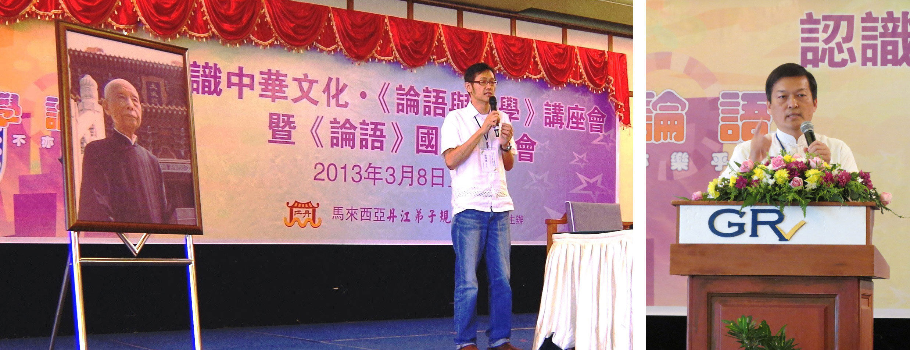

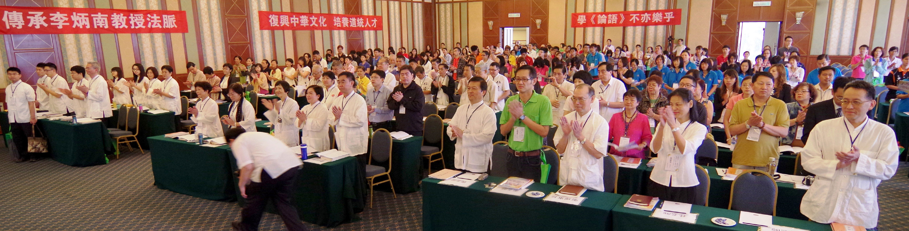

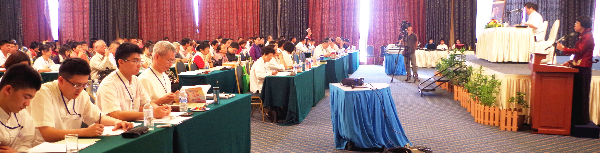

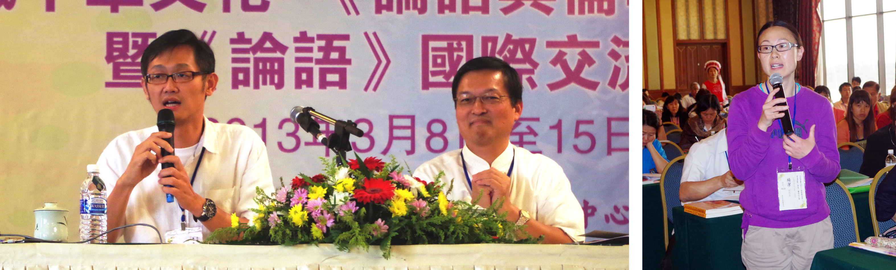

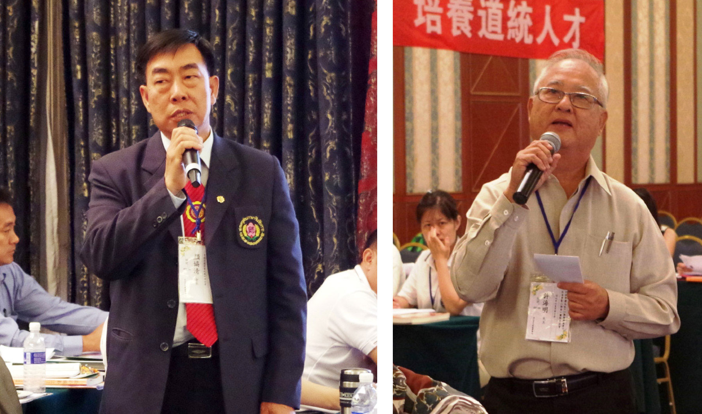

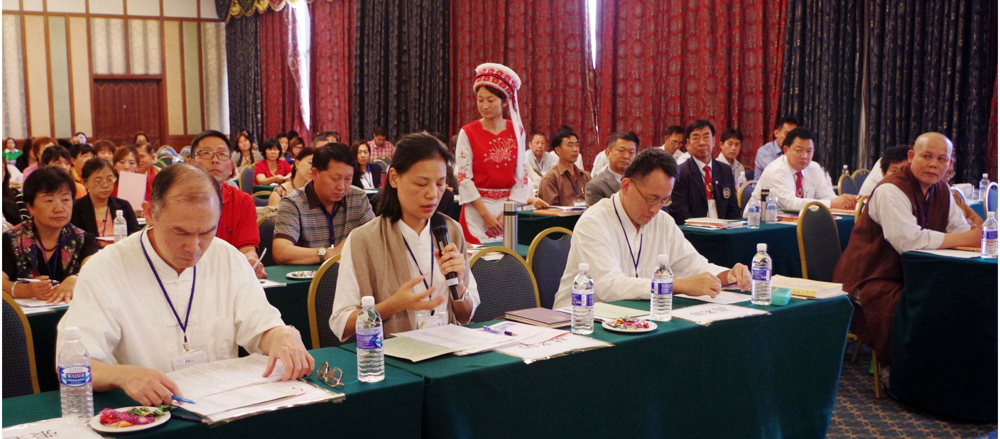

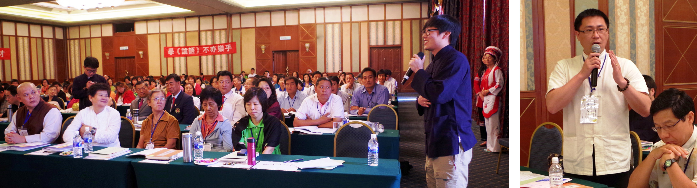

### 馬來西亞論語協會　成立大會宣言

*編輯部整理*

當下，科技飛速發展，自從瓦特發明蒸氣機引導工業革命以來，整個人類進入到網路時代、核能時代，世界經濟整體大跨步邁進。令人擔憂的問題卻出在我們人類自身。科技的發展阻止不了恐怖主義的暴行，經濟的發展也解決不了越演越烈的貪腐以及怵目驚心的道德淪喪。

於是，我們看到馬路修寬了，孩子們在路上行走卻更不安全了；員警、警車多了，我們卻更不敢獨自出行或夜歸了；教育普及了，卻有更多的青少年墜入犯罪深淵，家庭不和睦，子不孝親每天都在上演；銀行、高樓不斷拔地而起，更多的人卻開始靠欺騙別人、違背良心道義來賺取非法暴利……，以極端方式報復社會的個案越來越多，甚至於集體群氓般砍光樹木、污染河流、熏毒空氣……。

失去了道德底線之後，社會的ＧＤＰ增長越來越高，而民眾的文化修養反而每況愈下，陷入馬太效應的惡性循環，人類危矣！家庭破壞，價值淪喪，這難道就是我們所期望的生活景致？難道鄰里和睦、家庭幸福、子孝妻賢以及小橋流水、古道西風、牧歌田園的畫卷只是童話和傳說？

無論是「大道之行，天下為公」的國家景治理想，還是「採菊東籬，曲水流觴」的詩意棲居，如果沒有人的道德自律，行為利他，那麼皮之不存，毛將焉附？一個國家，一個民族的發展必將是趨於道德淪喪、醜行肆虐的惡性循環之中去了。

《論語》學習之重要意義盡在於此。孔子儒家學說的核心，以孝親、以忠恕、以仁義為根本，以修身、以齊家、以治天下為己任，對於今日社會價值之重塑，具有其特殊的、獨到的價值和意義。而儒家經典之基礎，又屬《論語》為入階之學。

故此，我們在今天在這裡，宣告馬來西亞《論語》協會之成立。

我們旨在立足《論語》價值核心，弘揚孔子學說思想，普及傳播儒家智慧，宣導對家盡孝道、對國盡忠義、對世界盡和諧，明德親民，止於至善，為世界和平作無私奉獻；旨在團結已懷此共識的男女老幼，各行各業和各種不同信仰的人們，在精神上結盟，在行動上互相支持，積點滴之水，成白舸之川，做中流砥柱，行力挽狂瀾之事業。

我們將恭遵雪廬老人李炳南教授的《論語講要》為藍本，以臺灣中華無盡燈文化學會創辦人唐瑜凌老師為指導老師，彙集各國各地仁人志士，致力於孔子哲學思想的學習、傳播、研究、實踐和普及；貴在實踐，重在普及，以忠恕、仁義及中庸指導規範協會會員的言行，在修身齊家實踐中，調整心理平衡；以中華文化之根，結和諧社會之果；以古聖先賢的智慧梳理和確立符合當下社會的道德標準、行為準則，大力宣導和推進傳統美德宣傳和教育。

作為個人而言，「君子求諸己，小人求諸人」，《論語》告訴我們不怨天不尤人，做一個好的自己，比什麼都重要。我們也期盼會員們通過對《論語》的認真學習、領會，跨越時空做孔子的學生，跟有史以來最智慧的人學習，廓清自己身上的人生盲點，調整自己的人生態度，修正自己的言行品格，改造自己的人生命運，獲得真正的人生利益，家庭親孝和睦，品行影響周遭，繼承道統，傳播聖賢。

通過大家的努力，能夠將儒家的文化精髓發揚光大，建構這個社會人與人之間真誠的關愛，人與人之間坦蕩的信實，人與人之間利益他人的善心。不管我們能不能完全做到，能做到多少，我們都堅信這是社會真正需要、必不可少的價值真理！

我們相信，《論語》以及其他中華傳統聖賢文化的學習、共修，在不斷提高自己的道德品質同時，亦能改善周邊人際的道德品質。所謂「不以善小而不為」，那麼一點一滴的領會，一言一語的仿效，一人一事的行為都會是「功不唐捐」的！我們就還有機會扭轉局面，導正社會前進的方向，實現我們的夢想，既享受人類智慧帶來的科技、物質利益，也享受數千年來文明發展的道德利益。

我們盼望，《論語》的學習讓傳統中華美德照耀人心，重潤心田；讓浮躁奔忙、日趨不安的都市現代人心靈重新感受古人自然、詩意的生活氛圍；讓現代人在安詳地享受現代科技文明的同時，搭建起更加和諧、圓融、中庸的良好人際氛圍，讓心靈更加自由、精神世界更為開闊，讓我們的下一代能夠真正繼承和發揚老祖宗的智慧，讓我們的民族，我們人類未來的生活美好幸福！

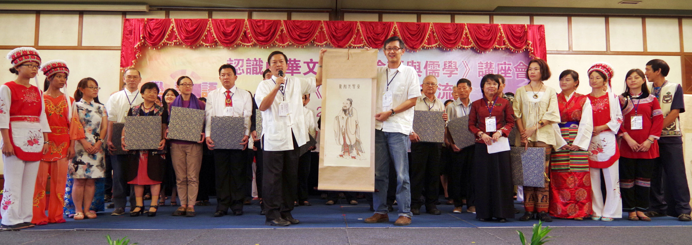

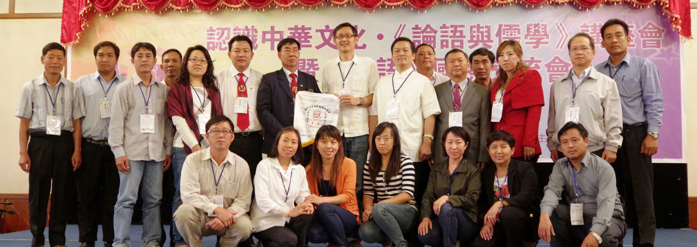

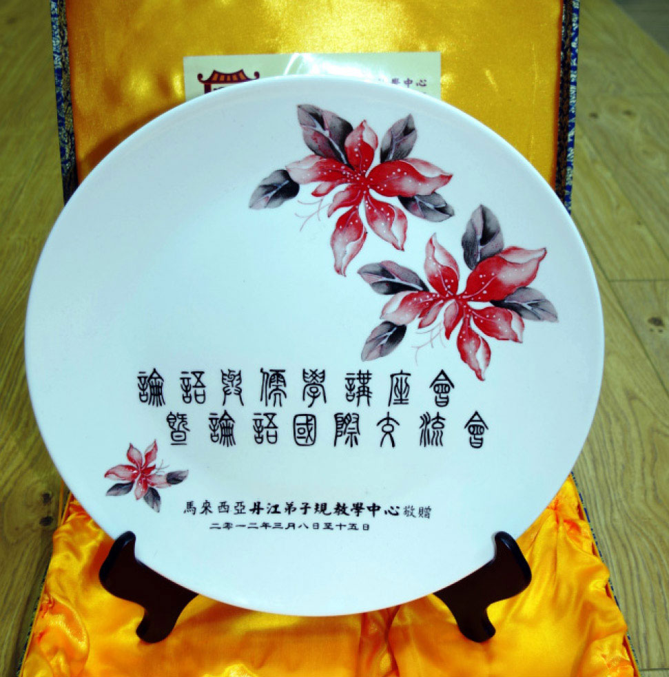

### 異國不一樣的迎賓 —癸巳年新春素食嘉年華活動報導

*編輯部整理*

廣大結緣得好感　要在論語遍弘揚

以文會友乃核心　勝解聖言是出路

丹江素食嘉年華開始於二○○九年，至今已進行至第五屆，緣起於丹江弟子規教學中心對於中華傳統文化以及素食的推廣。把素食介紹給大家，讓大眾喜歡素食，鼓勵吃素，此外透過活動中的文藝節目，把中華傳統文化之美展現給與會大眾，這是素食嘉年華會最重要的兩項宗旨，至今已成為丹江華人共同的重要節慶。

此次素食嘉年華還有一個特別之處，就是與「學《論語》不亦樂乎」這項主題結合，這是丹江弟子規教學中心所特別提出的活動主軸，為此主題，弟子規教學中心的張理事長，遠赴臺灣中華無盡燈文化學會，禮請師資前往授課，期望透過《論語》的研學，打開人們對於中華傳統文化的眼界。因此，在中華無盡燈文化學會師資團前往吉蘭丹的十多天中，包括了儒學講座、國際交流會、好人好事大匯演以及素食嘉年華這四項大型活動，都與《論語》做了密不可分的結合。

在今年三月十日盛大展開的癸巳年新春素食嘉年華，大會準備了超過六千份的素食，各國風味的料理，包括了華人風味的興化麵、魚翅、黃薑飯、花生包、豆沙包、咖哩麵、阿查、素豬腸粉；印度口味的印度炒麵、PASSEMBER、PUTUMAYAM；馬來人的OTAK-OTAK、ROTIJALA，KARIPAP，囉喳，SAGO糕等，以及其他各式的糕點，色香味俱全琳瑯滿目地呈現在眾人眼前，與會者無不大快朵頤，愉快地飽食一餐。不僅在食物上滿足了大眾，表達尊師重道的跪拜禮，各界人物對於活動的支持，還有嘉年華會與《論語》學習的結合，更使得這場大會具備了深刻的文化意義。

一場大型活動的成功十分不容易，這次的嘉年華會要準備超過六千份的素食，從預算的安排、人力的分配、菜單的規畫、食譜的講究、採購、烹調、布置、宣傳，一直到現場動線的流暢、垃圾的處理等，絕對是一項困難的任務。除了功德主的發心支持以及縝密的籌措之外，一群無私義工的奉獻與付出，也是活動成敗中不可缺的一環。丹江弟子規教學中心，已經在日常的免費素食推廣活動中，型塑了一套系統化的廚房義工機制，這些香積菩薩們所組成的義工體制，讓教學中心得以在過去幾年來，每日都能免費供應約二百人份的素食美食給大眾。藉由這群義工們的合作，再加上專門為嘉年華會所招募的其他義工，其中就有超過二百位的大專青年，這股群體的力量，成就了這場難得的盛會。

在與會貴賓方面，吉蘭丹州務大臣拿督聶阿茲，在晚上的九點三十分時出席了這場盛會，並且捐贈了一筆款項，做了簡短的致詞。州務大臣拿督聶阿茲呼籲富豪們應該慷慨解囊，救濟大眾。除此之外，哥打峇魯國會議員拿督旺阿都拉欣、丹州行政議員拿督陳升頓、馬華哥打峇魯區會主席陳永生、吉蘭丹中華大會堂會長黃保俊等貴賓，也都出席了這場盛會。

​​​​​​​

素食有助於環保、能夠長養我們的慈悲心，對於心理、生理、環境都有莫大的好處，期望這樣的活動能夠持續推廣，讓人們懂得不殺害有情眾生也能享受美食的方法。嘉年華會上中華文化的宣揚，對於華人的團結、自我的認同是另一層面上重要的意義。

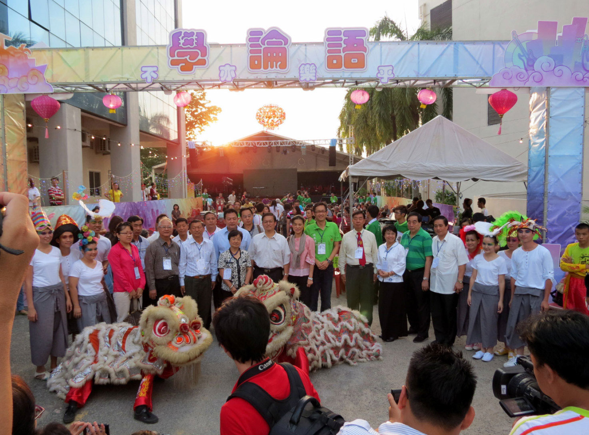

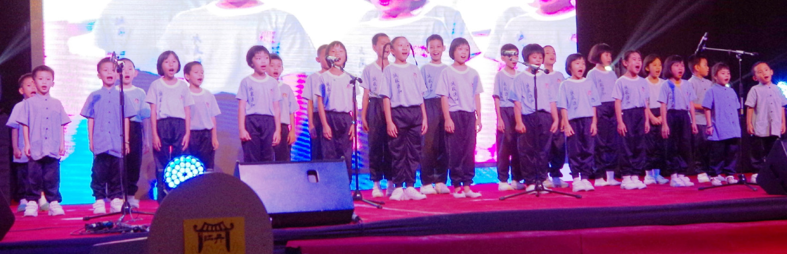

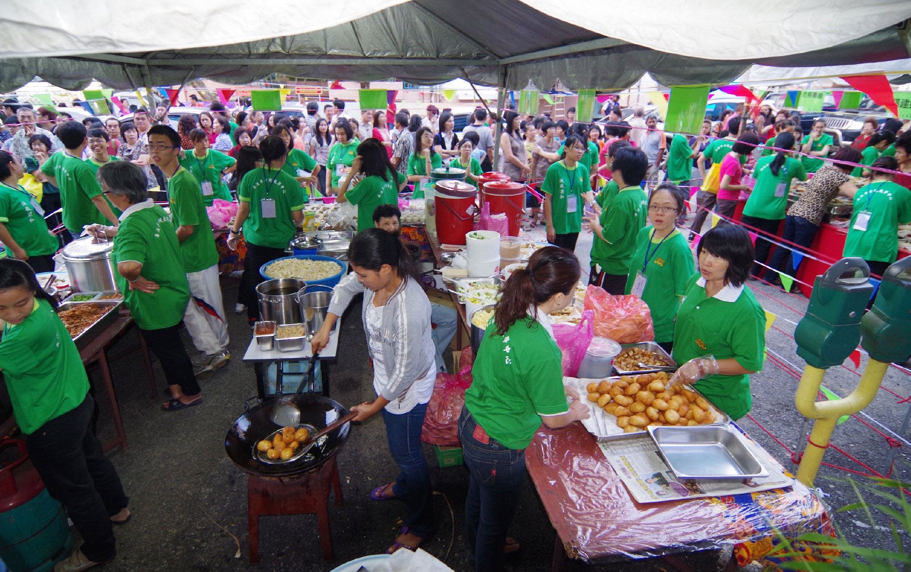

### 認識中華文化　論語與儒學講座餐前觀修

*編輯部整理*

用餐學問大　觀念須開通

善用心吃飯　成聖妙資糧

知人的用餐　　汪月雲

知是眾妙之門，知由學而得，所以《論語》開宗明義即要人學而時習之，不斷的求知進德修業。孔夫子終身學習不倦，「發憤忘食，樂以忘憂，不知老之將至」，是學習的最佳典範，這幾天大家在此一起研學，是否也有孔夫子的法喜呢？法喜是文化傳承的源頭。

雖然知由學而得，學而知之的大道卻寬廣無邊，如何揀擇而學，進而學以致用，又是一門大學問，此非由勤奮即可，不由親近善知識，給予指點迷津，同儕善友互相切磋琢磨，無法得知「知」之妙。但「學海無涯」，所知是無量無邊，而與我們關係最密切的是人，所以知人不可獲缺，自古以來即有「知人善任」、「知人知己百戰百勝」，甚且知人不徹底而有「知人知面不知心」，《論語》中教導知人的條目亦不可勝數，可見知人的重要。善於知人，無往不利，知人而用餐，令人無比愉悅。

聚餐時如何知人呢？古時趙州禪師很有修行，還自嘆二時粥飯猶雜亂用心，自個兒用餐，要用的如法尚且不簡單，何況與人同桌用餐，所以用餐時謹守禮節心存五觀是必須的；而與人用餐雖食不語，但禮節可權巧變通，可不必拘泥形式而覺束縛，有時為了聯絡彼此的感情，與人融洽相處結善緣，難免閒話交談，此時當輕聲細語，以對方聽得到為原則，但需善聽他人之言，仔細觀察其舉止及心所安之處，再謹言應對，而且不隨大家的喜惡，當以自己的觀察理智做抉擇，以利他、增進彼此的進德修業，令人愉快，不破壞彼此歡樂的氣氛，不令人起煩惱為原則。

雪公太老師在見到美味佳餚時，即知主人的辛苦、主人的用心、誠心、主人料理的刀法、手工，此又是另一層的知人功夫，你我是否也有這種體會，這種知人的功夫呢？

每個人各有自己的思想理念、生活習慣，用餐時，大家齊聚ㄧ堂，雖各有所好，有時會覺得格格不入，但彼此能不存己見以至誠心對待，所謂「精誠所至，金石為開」，「至誠之道，可以前知」，以禮往來必能相知相惜，必能和樂融融，甚至成為知音。唐詩「過故人莊」，孟浩然與故人交的相知相惜，相信大家都能感受得到，今天的文化盛宴，也因著張老師和我們唐老師的相知相惜，才得以展開，大家是否也有同感呢？

希望往後餐餐都是知人的用餐，也是知己的用餐，在相知相惜下，讓我們盡量享用豐盛的佳餚。也期待我們彼此能在誠心的用餐中再一次次的蹦出一場場的善法盛會。謝謝大家。

知禮的用餐—知禮用餐三步曲　　李月娥

我們常說「有禮走遍天下，無禮寸步難行」可見知禮在我們日常生活中多麼的重要。

壹、常禮舉要（四）「聚餐」篇二十一則重點提示

一、「聚餐」篇內容說明

１．座有次序，上座必讓長者。

２．入座後不橫肱，不伸足。

３．主先舉杯敬客，客致謝辭。

４．主人親自烹調，須向主人禮謝後食。

５．主人敬酒畢，正客須回敬主人。

６．舉箸匙，必請大家同舉。

７．用箸夾菜，只取向己之一方者，不立起向他角器中取菜。

８．箸匙不向碗盤頂心取菜取湯。

９．公食之器，不用己箸翻攪。

１０．匙有餘瀝必傾盡，方再入公食器中。

１１．自己碗中之餚菜，不可反回公器中。

１２．箸匙所取餚菜，不倍於他人。

１３．食勿響舌，咽勿鳴喉。

１４．公食以不言為原則，須言亦應避免唾沫入公器中。

１５．咳嗽必轉身向後。

１６．勿叱狗，不投骨於狗。

１７．碗中不留飯粒。

１８．不對人剔牙齒。

１９．客食未畢，主人不先起。

２０．起席，主遜言慢待，客稱謝。

２１．宴畢，主人進巾進茶。

二、用箸夾菜之優雅動作示範—「龍口含珠，鳳頭飲水」

什麼叫「龍口含珠，鳳頭飲水〕？現場示範：雙肩擺正挺直，左手端碗時拇指輕輕按住碗邊，四指展平拖著碗底，拇指和食指之間形成一個「龍口」，圓圓的白瓷碗像一個大珍珠，盛在碗裏的米飯粒粒皆辛苦，粒粒貴如珍珠呢！這便是「龍口含珠」了。「鳳頭」指的是筷子頭，用筷子夾菜的動作應該像鳳頭飲水一般妙曼優雅。要輕巧含蓄，一點就起，多點幾次沒有關係，不能叉開筷子一次夾很多菜，更不能在菜碟裏挑來撿去反覆翻攪。端碗猶如龍口含珠，用筷猶如鳳頭點水，你想這該有多麼優雅！

貳、以歌相應，禮謝丹江

常禮舉要聚餐篇之第四條「主人親自烹調，須向主人禮謝後食」。這幾天我們來自各地的所有學員，每天在丹江享受由張老師所帶領的，丹江弟子規中心的志工們親自下廚，為全體學員準備豐盛的美味佳餚，及彷如人間美味的丹江點心，我們沒有時間一一的親自向張會長致謝，所以就由末學獻唱一首謝謝歌，表達大家對張會長及丹江辛苦的志工們致上最高的謝意。

歌詞如下：(需用閩南語唱)

感謝天，感謝地，感謝阿娘尬老爸，感謝你，感謝他感謝你所賜ㄟ一切，感謝萬物，沒論大尬細，感謝天地ㄟ一切。

參、知禮用餐之最高意涵

以下是個人體會：「養身先養心，養心必先養德，養德就從茹素開始」，末學認為知禮用餐養德的最高意涵就是：發心茹素，仁愛萬物，既環保也是愛自己、愛家人、愛萬物，何樂而不為。

唐朝詩人，白居易，曾寫過一首詩（鳥）：

誰道群生性命微，一般骨肉一般皮。

勸君莫打枝頭鳥，子在巢中望母歸。

白居易此詩充滿著尊重萬物生命的思想，如張載所言：「民吾同胞，物吾與也」。就事實而言，組成我們身體的每一個元素，都是取自宇宙萬物，有朝一日，我們離開人世，身體的每一個元素，還是要回歸於宇宙萬物之中，以便循環使用，生生不息。所以，我們的身體裡有萬物；萬物裡也有我們，由此觀之，尊重萬物即尊重自己。再者動物也是我們人類的好朋友，茹素也可以不必和動物結下惡緣。

相關資訊提供：關心您的健康，也關心地球的暖化，誠摯的向您推薦一部超棒的影片。您只要在GOOGLE搜尋引擎輸入：YOUTUBE新世紀飲食。就可以出現：新世紀飲食六則DVD影片，介紹約翰‧羅賓斯一生，他如何追求健康並獲得健康，與如何珍愛地球、珍愛動物的珍貴影片，您看完也可以與您的朋友及家人分享，本片將帶給您全家健康幸福的人生！

【還有一部臺灣版的影片也推薦給您：YOUTUBE養豬戶的覺悟】，祝福您！

知命的用餐　　應雨橋

《論語》中的最後一章說「子曰：不知命，無以為君子也」。這是說，一個知命的君子，能了解前因而知宿命，便能修德以立命。不但立己之命，更為生民立命，知道透過辦政治、辦教化來改變眾生的命運。那如此知命的君子，是以什麼樣的心態來用餐呢？

首先，藉着眼前的食物來保養自己的身體，增加自己的體力，目的在於能夠更好的來充實自己，包括充實自己的內涵，充實自己的能力，在心意上努力讓自己成為一個人才，而讓自己成為人才的目的，在於能夠好好地利益他人。而在所有利人的事業當中，最能夠利益到他人的莫過於幫他充實自己的內涵與能力，幫他也成為人才。

若是能夠帶著這樣的心態，便能夠將眼前的用餐作一個體性的轉變，成為與內聖外王相應的用餐，成為知命的用餐。

知樂的用餐　　欲仁

《禮記》經解有云：「廣博易良，樂教也。」人的豁達、平易而善良，是得益於樂的教化。而唐詩吟誦更是重回禮樂和諧境界的捷徑，詩禮樂本來便是不可分離，尤其動之以情的詩和樂，較之訴之於理的「禮教」，更能誘導人性，啟發向上向善之心，對於當前功利盛行，物欲橫流的時代，更當雙管齊下，以救風氣之偏頗，導習俗之清流，為社會提供一劑心靈清淨良方。

世間聖人莫不禮樂並用，教化有情。舜接受堯王的禪讓，負起治理天下的責任，他隨才任用，派夔擔任樂官，以和諧的八音樂曲，調教公卿長子，培養而成領袖人才，這些優秀人才造就了堯天舜日的太平盛世。

孔子祖述堯舜，師承古聖，體認音樂的功用不可忽視，特別將﹁音樂﹂列入教材，使﹁禮樂射御書數﹂六藝並用，成就人才。所以，孔門的弟子人人都要歌詠詩章，鼓瑟彈琴，以便日後的弦歌教化。

孔子以音樂教化弟子，他必然精通於音樂之道，謹就﹁習琴、擊磬、彈瑟、和歌、聞樂、知樂﹂六方面，一窺孔子的音樂素養。

一、孔子習琴：孔子學琴師襄，得知孔子學一首樂曲，必﹁得其曲、得其數、得其志、得其人﹂，孔子一遍又一遍的彈奏演練，一次又一次的深思體會，所謂：﹁曲演萬遍神理現﹂，孔子最終得以掌握樂曲的旋律技巧，進而深層領略形而上的神韻哲理。

二、孔子和歌：《論語》述而篇云：﹁子與人歌而善，必使反之，而後和之。﹂從唱和的習慣，顯示孔子的仁厚謙虛，善於歌唱。

三、孔子聞樂：孔子對古樂喜好之深，用功之切，在《論語》述而篇記載：﹁子在齊聞韶，三月不知肉味。曰：不圖為樂之至於斯也。﹂

四、孔子知樂：孔子對於樂曲的深入體會，在《論語》八佾篇記載：「子語魯太師樂曰：樂其可知也。始作翕如也。從之純如也，皦如也，繹如也，以成。」這樣，一曲樂章就圓滿完成了。

接著，再講個關於馬鳴菩薩的故事，北印度的小月氏國王起兵伐中印度，最後從中印度國王那裡得到釋迦佛留下的佛缽、會下金蛋的雞和具有辯才的馬鳴比丘，雖然舉國臣民焚香恭迎三樣寶物，但是仍有些大臣議論馬鳴比丘怎稱得上是抵了一億金的寶物？國王為了改變大臣們的疑慮，就挑選了幾匹好馬，讓牠們餓五日，第六日早上召集國內所有沙門、外道，來聽馬鳴比丘說法；同時又命令把餓馬繫在道場的柱子上，看看餓馬是吃草，還是聽法。

馬鳴比丘登壇講《佛遺教經》，講時語詞懇切，深入淺出，感人肺腑，場上肅靜；連那餓馬似也聽得出神，儘管飼以草料，它們都不思進食，豎耳諦聽。比丘講經畢，只聞那幾匹餓馬一聲長鳴，潸然淚下。國王見此情景，深為感動！由於餓馬能解佛經的緣故，因此就稱這位比丘為「馬鳴菩薩」。

由此而聯想夫子「在陳絕糧」所展現的「君子能固守窮困而不動搖」。

眼前我們所要享用的午餐，是丹江弟子規學會全體義工辛苦為我們準備的，我們不要輕易吃過去了，我們應懷著感恩、感謝之心，

來享用這一餐，這樣才不會辜負了張會長暨全體老師、義工們的用心。祝大家用餐愉快。

知仁的用餐　　晏家文

仁就是有公心，做事都是以他人得到利益著想。孔子說：仁者，先難而後獲。一個有仁心的人，為了公，為了他人，自己的勞苦是不會在意的，遇到了困難也是找方法找出路，絕不會半途而廢。就如范仲淹所說的：先天下之憂而憂，後天下之樂而樂。這就是仁心的表現。

可是仁是最難做到最難知的，孔夫子的眾多弟子中只有顏回被夫子讚說有做到仁。《論語》中是這麼說的：「回也，其心三月不違仁。」可見要達到仁的過程不是一天兩天就能完成的。從這一餐開始，我們來訓練自己的心向仁前進吧！要如何做呢？例如，在飽餐當中，懂得為他人著想，體恤下情，想到他人是不是也有好的受用，是獨樂樂不如眾樂樂呢？還是我獨享不管他人吃飯或是飢餓，看到自己喜歡吃的就吃很多很多，不喜歡的就一口不吃，其實那都是自己的貪瞋煩惱作祟。若講究營養均衡，則不該挑食，若講究烹煮飯菜者的誠意，義工菩薩們的辛勞，那更不應該挑食。懂得身心一起照顧的才是真的會吃飯的人。

那如何在吃飯中生起仁心，世界上還是有很多人過著食不裹腹、衣不蔽體的生活，而我們可以在這裡吃著丹江弟子規教學中心素食館用心準備的佳餚，還可以聆聽老師們精心準備的課程，有如此受用，真是天壤之別。為了能令有情免於飢餓，為了能度化有情，眼前的這一口飯，就不是只是為了自己而吃的，是要有好的體力來做好的學習，把自己培養成能利人的人才，時時刻刻提醒自己，這樣才可以算是知仁的用餐。

知足的用餐　　魏甄儀

所謂「知足常樂」，知是知道，足是指一種狀態，不會太過也不會不及，恰到好處地在那個點上，就是「足」。所以一個知足用餐的形象，就是對於自己喜愛的菜餚不會過度索取，超出自己吃得完的量或造成別人都吃不到這道菜；另外對於自己討厭吃的食物，也不會拿太少，懂得用惜福感恩的心來享用。

但為什麼我們總說「知足常樂」呢？那是因為一個知足的人，相對慾望少；他不是沒有慾望，但沒那麼多，或相較起來比較容易實現，所以慾望容易被滿足，煩惱自然少，而能時常保有快樂的身心。試想如果不知足，慾望總是很多，即使當下的慾望被滿足了，下一刻又會有新的慾望生起，如此周而復始，哪一天才都能被滿足？何時才能達到常樂的境地呢？

我們且看世間人追求名車、豪宅、華服、美食，無論食衣住行皆有各種欲望的追求，卻都沒有在慾望實現時享有常樂，那是因為他們追求的快樂，本質其實是痛苦的，即使眼前能給他帶來各種歡欣愉悅的感受，終不長久。好似一個人走錯道路，殊不知再繼續往前走就是懸崖，噗通一聲就掉下去了，因此我們現在應及時懸崖勒馬，尤其透過學習《論語》，懂得去辨別什麼是好的慾望，什麼是壞的慾望。

孔子之樂乃修己與安人，夫子是樂得其道，憂道不憂貧，謀道不謀食，如我們在這幾天研學中能生起對《論語》正知、正見好樂的善法欲，並以傳承弘揚中華傳統文化為己任，那這種「不知足」的學習欲望，就是好的，值得擁有的了。

祝大家在往後的日子，都能知足的用餐，不知足的學習。謝謝大家！

誡無知的用餐　　王洋逵

誡無知的用餐，意思是「不可不知道的用餐」。可分為外在的形象與內心的知見。

在外在的形象部分，常禮舉要第四篇聚餐篇中，有二十一條明確原則性的規範；在內心知見的部分從自知的用餐、知人的用餐、知禮的用餐、知命的用餐都一再提及，如何用一貫之道來貫穿所有的用餐呢？就是「知」的用餐，把自己的心眼打開，使自己成為一位明白人。

這幾天吃素，大家知道素食的益處嗎？吃素要有二種益處：一是養身，二是養心。在養身方面，依動物的身體結構中，我們人類是比較屬於草食性動物，所以吃素對人體是較有益的。在養心方面，子曰：性相近也，習相遠也。大家這幾天一直在接受美好正確的觀念，從講座中大家也知道入世君子是以仁心來攝持，「仁」在造字上是有兩個人，有親密、加厚的意思，我們與眾生親密加厚最好的方法就是吃素，吃素積極來說是不傷害眾生，消極來說是不與眾生結惡緣，是百利無害的。

綜合以上所說，吃飯是長養我們的身體，當身體有力氣之後，在《論語》的學習上才是我們的目標，謝謝大家！

無常的用餐　　劉千瑜

什麼是無常呢？無，就是沒有，常，是固定不變，無常即是沒有固定不變的意思。也就是說，一件事情或一個物體，是不會永遠保持同樣的狀態而不起變化的。

無常的現象恆常在這世界中，草木的萌芽、成長茁壯、開花結果，以致枯萎凋零；人的一生從小娃兒開始到孩童牙牙學語，現在卻已長大成人，然後中年、老年至老死。生命裡「人有悲歡離合，月有陰晴圓缺」，又有哪一件事情是能夠被你、我所永久的掌握而不會改變，不會消逝在這時空中呢？

這世間就像是一道巨大的的洪流，所有的人、事，都只是水面的一些泡沫，洪流不斷地波濤洶湧、沖上沖下，它水面上的泡沫冒起來又破滅，冒起來又再破滅，沒有任何一顆水泡是可以永遠浮在水面上而能免於破滅的。佛經上說：「人生如夢幻泡影，如電亦如是」亦是此道理。

無常更是我們都擁有過的生活經驗，無形的存在我們的周圍，像是南亞大海嘯，本來一家人開心的去度假，沒想到來了個大海嘯，頃刻間，與家人便天人永隔了，這是誰也沒辦法預料到的。這次講座，大家排除萬難，從四面八方而來，只為學習論語的正知見，真的是很難得的聚會，而漸漸地講座也接近尾聲，許多團體也因有事在身，先行離開了，這樣難能可貴的聚會一處，何時還能再有呢？而下次一起共學的人，還會是現在坐在你身旁的人嗎？所以我們應該要好好的把握當下，上課的時候認真聽講，吃飯的時候，珍惜食物！用這樣的覺受，以感恩的心、知足的心，好好來享用！謝謝大家！

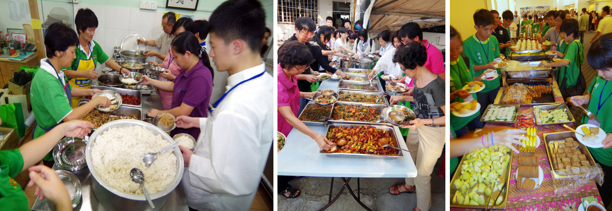

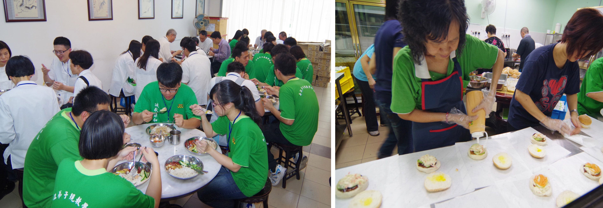

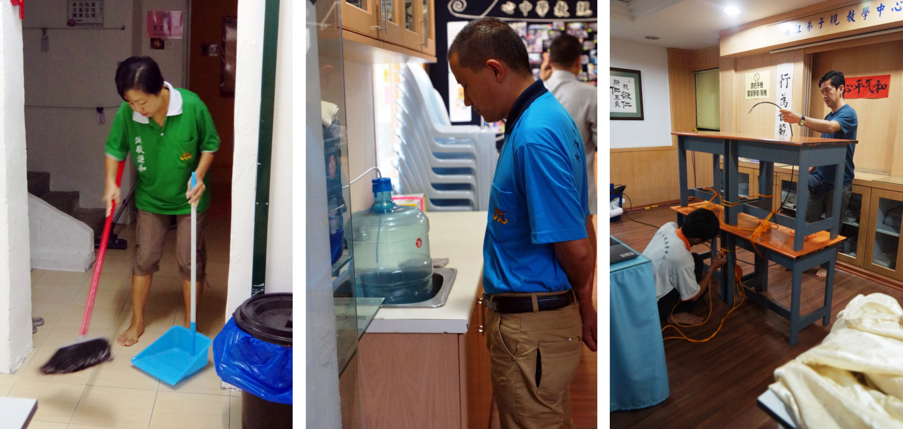

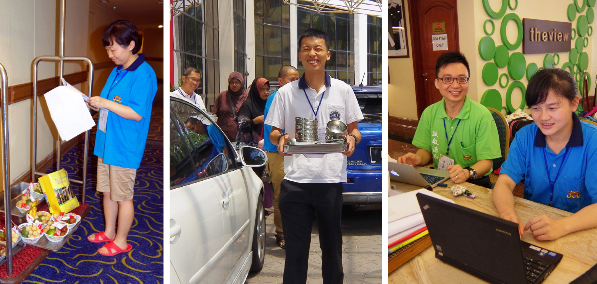

### 認識中華文化　論語與儒學講座心得分享

*編輯部整理*

聞懂是初步學習　課後討論乃其次

經過多番之推敲　體悟化成妙心得

中國雲南省中華文化促進會常務副主席　秦桂珍

尊敬的、年輕的張偉慈會長：

您對中華文化的膽識、有為、執著、奉獻，促成「認識中華文化‧論語與儒學講座」暨「論語國際交流會」在丹江弟子規教學中心舉辦。衷心感謝您！向您學習！

衷心感謝您請來了唐瑜凌老師的團隊，特別是唐老師授課，他深入淺出、引人入勝、生動形象，老師和學生的互動，掌聲、笑聲從教室中溢出，整個課堂生機活潑；上午、下午、晚上授課，不僅不枯乏味，而且輕鬆不累。在唐老師的帶領下，聽課的學員彷彿走進孔子那個時代，身歷其境，妙不言語，不得不衷心感謝您、柯先生為我提供學《論語》機會。

通過系統的聽課，我進一步認識到《論語》的出路：要堅持以人為本，把人培養成人才，這是我最大的收穫。

我們都是中華民族的炎黃子孫，本會的宗旨在「弘揚中華文化‧促進國際交流」；今後，在弘揚中華文化方面需要我們做點什麼，儘管告知，我們將全力赴之。讓我們攜起手來，只要人人都獻出一片愛，世界將變成美好的明天！世界大同一定能實現！

泰國淨宗學會　楊雅喬

學習《論語》的心得與感受

我是一位大學生，在泰國的春武里府的一所大學中學習泰文。偶然間聽到有這個機會，便虔誠地跟隨泰國淨宗學會來到丹江弟子規教學中心學習。

感受之一，認識有了新的轉變。

《論語》是記載孔子及其學生言行的語錄，是孔子思想的典型代表，它涉及哲學、政治、經濟、教育、文藝等諸多方面，雖然看似一問一答，零零碎碎的片語，似乎無邏輯性，可內容豐富，教導我們如何做人、如何交友；我們有哪些是君子行為，又有哪些是小人之舉，我們對待學習的態度怎樣，我覺得我真的得到了心靈的淨化。

感受之二，《論語》以學而篇，揭來了學習的重要性。

子曰：「學而時習之，不亦說乎……」。以學習為樂，反映出孔子學而不厭，誨人不倦，注重修養，且要溫故而知新，才能得到學問。要脫離人生困頓的狀況，必須學習。學而常習，習而常學，便可如海闊天空般，事事無礙。

感受之三，學習還要注重修煉品行。

子曰：「吾，十有五，而志於學，三十而立，四十不惑，五十而知天命，六十耳順，七十從心所欲不踰矩。」從這可看出，在不斷修煉品行的過程中，求學、立身、明德和思想境界的不斷提升、不難看出孔子道德修養的最高境界。由此我想到慎獨，就是一個人獨處時也能做到只做好事，不做壞事，這也使我的心靈得到淨化。

感受之四，《論語》告訴了做人的原則。

子曰：「弟子入則孝，出則悌，謹而信，泛愛眾而親仁。行有餘力，則以學文。」這句話是說：「同學們在父母面前要孝順父母，與兄弟相處要尊敬兄長，說話要謹慎而講信用；博愛大眾而特別親近那些有仁德的人，做到這些之後，才談得上學習文化知識。」這何嘗不是做人的標準呢？

又，孔子提出「恕」字，作為人一生的行為準則，也有另一句話說：「己所不欲，勿施於人。」此處則講到「仁」，「仁」有「愛人」之意，了解別人是「智」，要作個有仁愛之心的人，則要從身邊小事做起，推己及人。

感受之五，人生的全部可以從《論語》中找到答案。

在感受《論語》的過程中，要從心開始，去承認現實生活中的不足之處，並通過這種努力去改變自己的不足；其次要會處世，即多思、多想、多看、多聞、慎言、慎行；再來是「君子之道」，即告訴我對自己要求嚴格，對別人厚道一點。

在這短短八天的學習中，雖然很辛苦，因為要集中全部注意力去聽、去理解和感受，我想對自己說，在以後的日子裡，要「學而不思則罔，思而不學則殆」，在學中幹，在幹中學，作一個好人和有仁愛的人。

真誠感謝馬來西亞主辦單位以及臺灣中華無盡燈文化學會的老師們，也感謝泰北清萊華校教師聯誼會會長顏協清會長，讓我有這次的機會來到丹江參加「論語與儒學講座」，雖是在短短幾天的學習當中，但在老師們用心的教導下，使我受惠良多，不僅是學到教材中聖人的經典，也讓我學到各界人士們的言行舉止、禮貌及更多的為人處世之道等，自感榮幸，增見廣聞，真是不枉我此行啊！

上海　劉海倫

學習心得體會

非常榮幸地參加這個由「丹江弟子規教學中心」舉辦的為期八天的《論語》學習課程，非常感謝張老師和唐老師團隊的所有老師，深深體會到一位好老師對於我們的學習有多麼地重要，這幾天的學習，現簡要整理匯報如下，請各位前輩老師斧正賜教。

一、通過唐老師對「知是眾妙之門」的知識點的整理及講解，讓我完善清晰的感受到孔老夫子上能通達天道妙義，下可契機契理地周遊列國，入世以推行內聖外王之道，歷練成就眾弟子和教化世俗，其中尤以孔老夫子通達人情世故的待人處世的智慧和方式，讓我們體會到老夫子的七情六欲，還有對小人獨到的看法和應對方式，讓我耳目一新，進而認識到儒學文化之權變圓融，難怪這部影響中國社會兩千多年的儒家經典，至今仍能為我們現代人處理好五倫關係，構建和諧社會起到學習和借鏡的作用。

二、唐老師的課程讓我感受到正知見、明達致理的善知識的導引，以及師承的重要性。唐老師和大家一起沿用雪公老人的《論語講要》，這使我們在學習經典的時候有根基、有章法可循，幾十年的學習並無獨辟蹊徑，深感傳承的魅力，同時唐老師在學問上的高度及深度在他這幾天的教學中深深體悟到，老師嚴謹句讀前後對比印證，又能以詼諧幽默的詞藻傳授給我們，讓我們對枯燥無味的古文學習得有滋有味、情趣盎然，體會到學習的樂趣，這也給末學帶來了重要的啟迪，所以我們選擇老師，選擇是善知識的老師，有正知見的善老師是多麼得重要啊！

三、唐老師的學生們進行消文這一環節讓我獲益匪淺，首先對於這些學生們強烈地對知識的求知欲以及強大的學習能力深感佩服，在老師的授課中會丟出許多問題，這些舉一反三的思維方式，每每讓我啞口無言，聽著師生的問答，我才了解到過去學的多麼得淺薄，也對於自己不常去深入思考，多是一味地接受，感到非常地汗顏。

四、《論語》的內涵真的是要用一輩子去學的，我將立志推行以《論語》為主軸的讀書會，回到上海後，我們原來童蒙養正的課程繼續開，同時《論語》的讀書會要召開起來，和大家一起學習，因為只有學才能得智。

在來馬來西亞前，心中還有很多想請教的，如國學文化課程其實在中國已經轟轟烈烈地一波又一波地推行，隨之一波又一波地悄然無聲，課程的內容千變萬化形形色色，最終學員只是換了一批又一批等……很多問題，通過這次的學習，這些問題的答案已越來越清晰了，正如唐老師一直問我們的一個問題：「學習傳統文化的出路到底是什麼？」我最後用一句話概括也是我們丹江辦學的主旨：「復興中華文化，培養道統人才」，鞏固傳承雪公老師法脈！

再次感謝「丹江弟子規教學中心」全體同仁和所有大德、志工菩薩，因為你們才讓我有此因緣來此學習！

仁慈之家　方錦德

在這一次的認識中華文化‧論語與儒學的講座會中，讓我深深的體會到「學而時習之，不亦說乎。有朋自遠方來，不亦樂乎。人不知而不慍，不亦君子乎。」當中的樂趣，讓我體會到學論語的奧妙。

在這之前我從來都沒有如此的好學，當老師們把論語分析得如此詳細，讓我們更加容易去明白論語裡的內容，在這也讓我明白知之為知之，不知為不知，是知(智)也。裡面還有很多的知識要多去溫習，多去消化才能表達出來。

在這裡我要感激丹江文化教育中心的張會長、義工老師及臺灣中華無盡燈文化學會的老師們，末學真的非常感恩所有的人，謝謝您們。

雲南昆明民族大學　郭飛平

丹江之學有三敬之得

來丹江學習十數日，跟隨唐老師等讀學《論語》，有三敬之得。

一敬唐老師等教學盡力，全神貫注，領學子研習辭章，得其大意、真意，孜孜以求，樹學問之風尚。而唐師之貫穿古今，又給學子多啟示。唐師得雪廬老人之點撥，對《論語》已有智知，講解風趣，令人難忘。

二敬學子求學聚精會神，珍惜學機。入學者老少咸宜，讀《論語》眾口一聲，聽師講解，鴉雀無言，端坐靜聽，體味意境，各有收穫。

三敬丹江主人照顧之周。上至張會長，下至一般員工，對學員學習生活細緻安排，關心照顧有加，特別是廚房工作的幾位師傅，為學子提供了多種佳餚，學子在享受美味之時，更能體會丹江弟子規教學中心的溫暖。

以上之敬略表學習之感，更多感言不多贅述。有唐師一以貫之宣論語之真精神，吾信大教無類、大教無疆。

甲洞淨宗學會　梁溧容

尊敬的唐老師、張老師、各位同道，大家好

這次有幸參加丹江弟子規教學中心主辦的「認識中華文化‧論語與儒學講座」，收益良多，非常感恩。這豐富的文化盛宴，讓末學對《論語》有了較深一層的認識，耳目一新。

以前曾聽過「半部論語治天下」這句話，對其可信度，頗有質疑，恐怕是誇大其辭，過份的推崇，上了唐老師的幾堂課，才體悟到這句話，絕對有其份量，也絕非誇誇其談，學習的期間，感受到唐老師教學的功力不同凡響，能把字句的意思，整個格局，正面反面，深入淺出的引導，內容分析得清楚透徹。也使末學對《論語》的學習，產生了無限的嚮往與興趣；對孔聖人的思想、見地與內涵深深折服，打破了一些對事物錯誤的知見與迷惑，明白正知見的重要—才能作出明確的抉擇，少走了許多冤枉路。

古人言「聽君一席話，勝讀十年書」，末學以往對傳統文化的出路，並不明確。只相信它可作為個人修身養性的德行薰陶，通過這次學習，明白了《論語》是確能培養人才，最有效的方法。當今社會，就缺德，渴求人才，真能通過《論語》的精髓，就是德才兼備的人才，精英中的精英，哪怕沒有出路！(不怕貨比貨，只怕不識貨！)

既然明瞭《論語》如此的深不可測，就希望深入經典，用心學習；把以往錯誤的看法、想法釐清，才能掌握到優秀的內涵，不會搞不清楚狀況，成為「騎牆派」一族，期待《論語》的另一次開辦。希望「論語學會」的成立，會像蒲公英的種子，把學習《論語》的風氣，散發在大馬這文化沙漠，使傳統文化在這片土地，代代傳承。

唐老師有一句話，猶如棒喝。他提及文化如果流於形式，目前形勢大好，以後破壞力更大，可能會造成嚴重禍端。為此我們作為弟子規的教學老師，真要步步為營，謹慎為先。要讓學生把經典落實在生活上，而不是只注重背誦或講解。

「欲窮千里目，更上一層樓」學習《論語》無有窮盡，須有像唐老師這樣的明師指點，才能開眼力，長智慧，期盼唐老師及其團隊重臨大馬，指導大家學習聖人的典範。

再次感恩所有老師及默默付出的義工朋友，您們無私的付出提昇了我們的認知，無限感激！

願大家一起來學《論語》溫故知新，學而時習之，不亦樂乎！

黃鳳嬌

夢丹江

善人千里來，邀我至丹江

義工廚房合，飯菜撲鼻香

三樓古書讀，始知論理廣

方知自過大，無地而自容

聽師將歸去，何日重丹江

待到有朝日，還來就古音

敬祝師眾

上海寶山　曹鐘文

丹江弟子規教學中心—論語學習體會

求學覓賢至丹江，萬里尋法願以償。

布施慈悲興教育，吐哺道德利家邦。

轉去申城無多日，桃李山水伴離傷。

易作鴻鵠青雲志，歸與同好化燭光。

千言萬語說難盡，打油一首，略表情感。

甲洞淨宗學會　何滿珍

尊敬的老師們：

首先感謝張會長及唐瑜凌台灣中華無盡燈文化學會教學團隊。這幾天給我們帶來生動的講解，唐老師爽朗的笑聲，悠然自在的神態，林老師的靈氣也是少有的，見識了。

難得能參與「論語與儒學講座」暨「論語國際交流會」。認識中華文化，學《論語》不亦樂乎！

文化就是孔子，弘揚中華文化就是《論語》，學了多天《論語講要》後，知道自己不知道的還很多，要依據經典，從良師益友學，提升自己；弘揚靠傳承，古代經典的不朽，以《論語》為底蘊。心能端正，法就能正。從孔子傳、音樂欣賞、潑墨、花鳥山水畫、常禮舉要、唐詩、知命、知樂、知禮、知足等的用餐又能從深入淺出的講解，更能體會另一番絲絲入扣的用意。

老實說，這幾天的共同學習，給我的感覺像是回到古代，唐老師像孔子帶著弟子們的問答，學生各個非常優秀，謙恭有禮，各有所長，對答如流，其中張會長又像子貢那樣的人力及物力。唐老師及老師們的一番苦心付出，這就是「仁」的落實嗎？

摘錄：論語要有正知見。

論語主軸是最好的啟發文化氣象。

小人—壞人—好人—善人—君子。

死到盡頭，是生命的開始。

改變眾生的命運，去改變自己的命運。

除了感恩還是感恩，感恩老師們的教誨，及一群默默耕耘的義工！

陳佳芮

我來自馬來西亞，今年二十歲。會來參加這次的論語教學是因為父親。父親在泰國清萊作了一些推廣華文教育的工作，自己也受了一些影響。我會參加這次教學的原因是自己在這座談的前幾十日被中華文化深深吸引。我自認自己一向都被西方文化影響，一直很喜歡他們很開放、不做作的文化，所以一直沒有機會認識屬於自己的中華文化。現在回想起來，真的深感慚愧。在這篇的心得分享中，想表示自己的感謝和內心的話。

首先，想感恩來自臺灣中華無盡燈文化學會的諸位老師和學長們。我知道這一次的教學並不容易，老師們和學長們的辛苦我都看在眼裡。唐老師，我真的要謝謝您讓我愛上《論語》和古文。我在高中的華文考試中，古文部分都是不及格的。對我而言，古文是很煩人的，因為不能理解它，又要面對它，真的很痛苦。如今，您改變了我，我愛上了古文及《論語》。我將要到臺灣去，真的想請問老師是否願意收我為學生？真的想向老師學更多知識，也希望自己能變成老師口中所說的人才。

另一位我想感謝的人是林老師。我也是學鋼琴的，可是我覺得自己彈得不怎樣，但是我一直自認對音樂的敏感度還是有的，可是當老師在音樂分享的時候，覺得老師真的是我要學習的對象。我可以說是老師的小粉絲，我覺得老師好有氣質，好漂亮。

接下來要感謝的這一位是雨橋學長。在您的帶領下我才能參加學長們的讀書會，更了解您們的學會，我才能認識到這麼多可愛、風趣的學長們，我在認識學長們前，我都覺得學長們好酷，很難讓人接近，真的很抱歉。謝謝學長們在讀書會上的指導與包容，希望接下來能快些到學會去，與學長們一起學習。這幾天，我真的很開心能與您們一起學習。

我也想感謝馬來西亞丹江弟子規教學中心全體工作人員和義工們。我更想感謝張老師，如果不是張老師把唐老師的教學團隊請到這，我想我們也不能上到這麼棒的論語課。素食嘉年華辦得真好，這些都是張老師的功勞。我還想感謝一個很偉大的團隊，就是廚房的阿姨們。每天可以吃到這麼多美食，真的很棒。在一個餐前觀修，一位老師提到您們每一天都在挑米，然後在我們睡覺的時候，您們已經起來為我們準備早餐，真的很感恩。不管是出錢或出力的有心人們，您們真的很棒。張老師我真的很期待您們所辦的讀書會，就像唐老師在課堂上或問答座談所說的：「最能讓人們進一步學習的就是讀書會。會參加讀書會的都是君子。」如果馬來西亞有十分之一的人參加讀書會，那馬來西亞就會和平了，人民都會變得有智慧了。

這一次的教學中，我真的受益匪淺。除了更明白古文，也更了解孔子。我自認一向都是老子派的。我覺得這世界太複雜，所以一直希望自己能躲到深山去過寧靜的生活，與世隔絕的生活。如今，我覺得我身負重任，要把中華文化傳承下去，要向唐老師多多學習。其實，這幾天的學習真的很受用。我看事情，看人物都有一點改觀，自己做事情也會有所改變。唐老師，請容許我大膽地要求，請您收我為學生，我會到您的學會去學習的。

汶萊弟子規學會　杜秀珠

生為大馬華裔公民，從小接受三語教育。多元文化，學而不專，華文造詣不及臺灣及大陸同胞。

此次有機緣參加了丹江弟子規教學中心舉辦的《論語與儒學》講座會，才深知學習中華文化須由其文化的經典精粹《論語》入門，從而明瞭至聖先師孔老夫子的思想內涵；才知唯有培養正知見的人材，文化才得以承傳。真是人不學不知道。

天下無不散之筵席，唐老師回國後，學習《論語》，我們將何去何從？心中難免有點惆悵與徬徨。然學無止境，不能因此而畫上句號，否則辜負張老師與唐老師的苦心與自身的志向。唯有回國後，組織志同道合的《論語講要》讀書會；把《論語講要》先讀熟；書中的每個字、義(參考中文形音義大辭典)及每一條經典的歷史人物背景(參考四書人物)都先要明瞭；同時以《孔子傳》影片與《論語講要》對照學習，並與各國各地同仁保持聯繫交流。希望以此提升自己的內涵，負起生為華人的使命。最後，特此向唐老師及其團隊，張會長及其幕前幕後的所有工作人員致敬，感恩你們！謝謝大家！後會有期。

葉天平

此次能有幸參與丹江弟子規教學中心主辦的認識中華文化《論語與儒學》講座會，覺得非常受益，末學之前沒學過《論語》，只是聽說臺灣來了一位學識淵博的唐老師，且是已故李炳南老教授的學生，便報名參加。

上了幾堂課後，認識到學《論語》必須要清楚了解認識夫子所說的每句話的含意—即在何時、何地、何事，與何人講此話，才不會產生模稜兩可，錯會意思。

唐老師講學非常生動，每每從多方面反覆的分析反問，把真正的義理帶出來，讓人容易明白字句裡的真實義。末學真誠感恩張老師及臺灣無盡燈文化學會的唐老師和其團隊的用心指導，讓末學有所學習及領悟，無限感激，望後會有期。

泰國清萊華文學校老師

很榮幸這次能參加論語國際交流會，也非常感謝丹江的張會長以及義工們的照顧，更感謝來自臺灣的講師和團隊們，讓我們快樂的學習。我的學問不好，領悟了一點點，如下：

１．中華傳統文化，少不了孔子的內涵。

２．作到了弟子規的根，上而進入恢復本性，也就是說內聖外王。

３．要作到內聖外王，必須有正知、正行，也要有明師的指點，方能成就。

再次感謝此次的主辦單位、講師、義工等相關人們，希望中華傳統文化傳遍世界各地，淨化人心，能使人們有正確的觀念，有快樂的人生，成就聖賢之道。

泰國淨宗學會　李彥曈

從泰國來到丹江，這次的「遊學」給我的震撼非常之大。首先感慨的一點是做為一位炎黃子孫的後代，竟然對於中華民族傳統文化知之甚少，從前也未能有機會過多的接觸，實屬可惜！其次，做為一個剛剛入門亦或尚且在門口徘徊的佛家弟子，曾經對於出世與入世的「抉擇」困惑不已，誤以為儒家的「入世」與佛法的「出世」是相互衝突和牴觸的。

通過這幾天的學習和老師們對《論語》的講解，油然升起覺悟之感，如同醍醐灌頂般豁然開朗—是否可以理解為原來儒家與佛家其實是一不是二，本質的追求是一樣的圓滿，本是殊途同歸，只是道路和途徑不同而已。由此釋然，發覺可以先從儒家教導的如何處理人情世故做起，以出世的心態積極入世，努力吸收正知見與善知識，不斷修正自己的思想和觀念，做好自己該做的每一件事，既不消極避世，也不執著得失分別，做一個對他人和社會有益的人。

末學才疏學淺，不敢多表拙見，只抒發一點小小感悟。願以後漫長求學的道路中能更多接觸到正知見和善知識，更好地彌補末學的「生而不知」和「困而學之」。

陳美樺

首先，感恩「丹江弟子規教學中心」給機會到貴中心學習《論語》，讓末學在三天之內了解學習《論語》不只能提升本身的智慧，同時也學會如何待人處世，今天老師在台上分享到生而知之者，上也，學而知之者，次也，困而學之，末學就是位「困而學之」，在生活有困境時去學「弟子規」，之後慢慢接觸〈大學〉、〈中庸〉、《論語》，但都沒深入了解，感恩老師的引導，人生要脫困就要去「學」，而且要「學」得有出路。

除此之外，林老師讓我們欣賞的音樂，如交響樂真的太棒了，末學是首次聽得那麼「法喜」，同時也對唐詩產生興趣，那首「登鸛雀樓」聽林老師細心的講解，末學聽的彷彿自己已登上「鸛雀樓」，這一切都是最好的安排。

在此還要感恩師、學長們以及全體的義工們，「法喜充滿」。

張雅誥

聽了七天唐瑜凌老師的《論語》、道藝春秋、孔子傳、孔子聖蹟圖，我如醍醐灌頂，眼前一亮，脫胎換骨，對古文不再感到恐懼，反之，愛上了它，更因有了老師的正知正見，深覺此生有幸，還有些福報，才能得遇此緣，感恩不已。

由於國學基礎淺薄，尚不能完全百分百的吸收，有望通過深入《論語》的閱讀，討論，再思修，才能用在日常生活上，貫徹孔子的精神。

原本對畫作的欣賞如凡夫俗子般過眼雲煙，現在則知道了要深入畫家的背景，作畫的動機、心態，更要用心去看內涵，如江逸子畫家鄉的景色，把理想心儀的家園藉由美好的畫筆表達，也讓我擁有回鄉的心情及心中期望的家鄉，純樸美。

中國雲南　張良

潑墨大寫意，留白小題詩—聽唐師講《論語》

吾發心志於傳承道統五載有餘，然不得其法，雖勤學不輟，亦迷思甚多！就《論語》而言，諸家注解，各說各話，讀之學之，反而更加困惑。及至一年前逢機緣巧合，能至丹江求學《弟子規》而見雪廬老人《論語講要》一書，如獲至寶，逐字而覽，一心求解。然資質愚鈍，不明、不通之處，亦多矣！

幸而年初，得唐師講學信息，乃遠赴南洋，以求聞道，果不負心中所望！唐師講解，亦易亦難、亦簡亦繁、亦深亦淺。諸多疑惑，一一迎刃而解，所聞所獲頗多，列下幾處，以茲感恩。

其一、古之經典是靠「悟」而非「學」！既明此理，則每一條目，以心悟之，加上唐師巧喻，豁然開朗以聞、以學、以解，以明了諸法，實不叫「悟」之重性。一經點示，法喜充盈，智慧提升。

其二、孔子為「集大成」者，非儒之一派、一流。以承傳《論語》之學，其角度、高度完全不同於一般，超越於流俗，也不再牴觸百家之智，了解起來，竟然一下明白，互相印證！

孔子作《繫辭》，曰「形而上者謂道，形而下者謂器，化而載之謂之變，推而行之謂之通，舉而措天下之民，謂之事業！」此「道、器、變、通」的境界，於唐師授課中處處珠璣顯現，令末學受益匪淺！

幸哉！有此機緣見唐師風采，既領方法，可令末學深入《論語講要》，深入《論語》的精深境界！心甚欣然！

緬甸腊戌華文學校　多品鐘

很感謝馬來西亞丹江弟子規教學中心，給我們海外僑校舉辦的「論語與儒學講座」，隨著年齡的增長，回憶踏入教育圈已有數十載，也參加過無數次的研習班，這一次是特殊的，因為上的是論語一門課，唐老師解釋得非常透澈，雖然只有短短的幾天卻獲得不少，回去我會將所得授以學生。再者，最難得的是張會長有一顆寬闊的心胸，有時聽課入了神，我會混淆，他是商業界的精英或者是儒家之子，總之，非常感謝丹江弟子規教學中心。

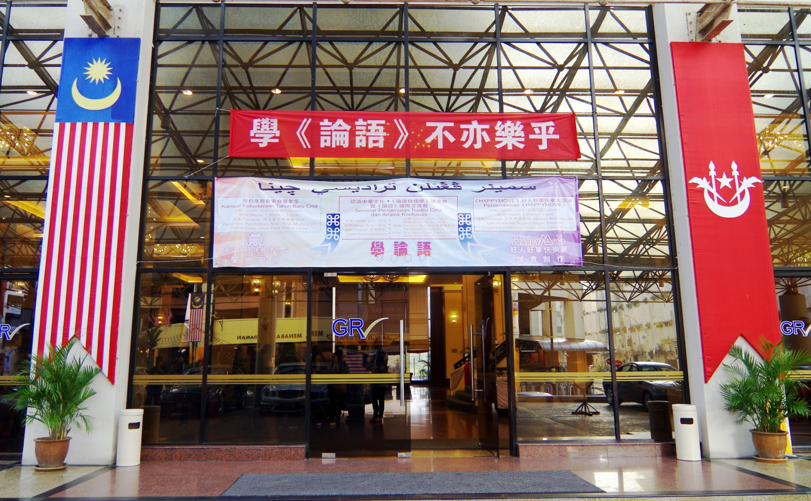

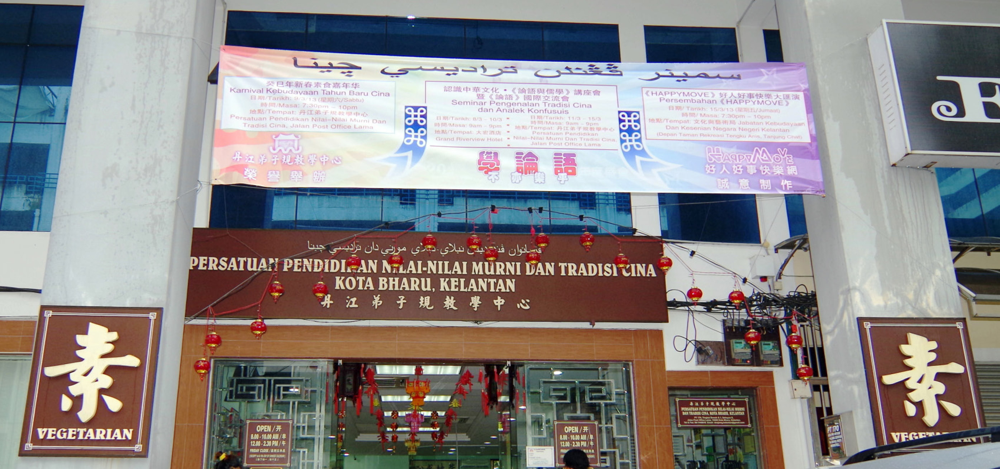

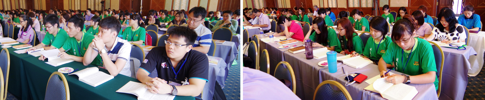

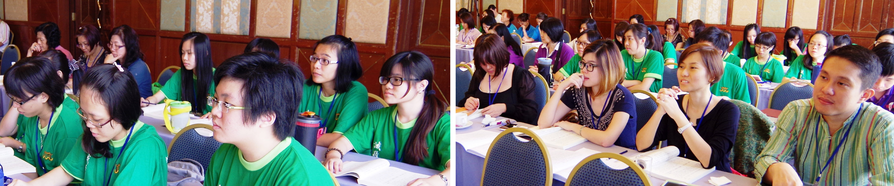

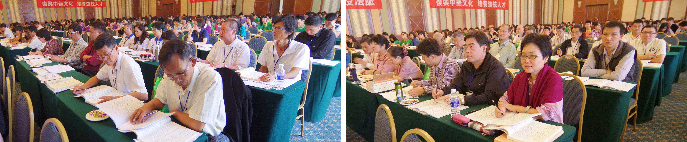

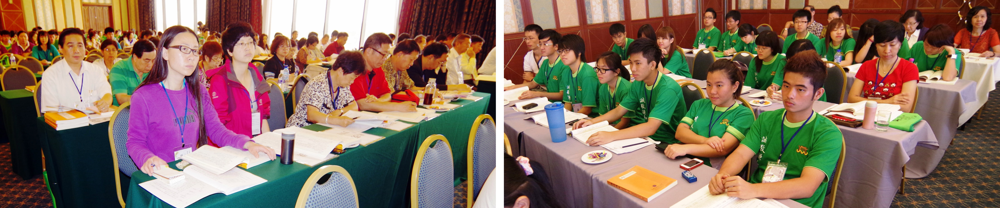

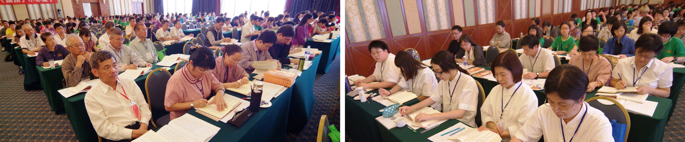

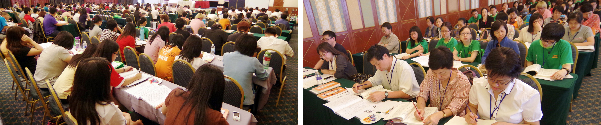

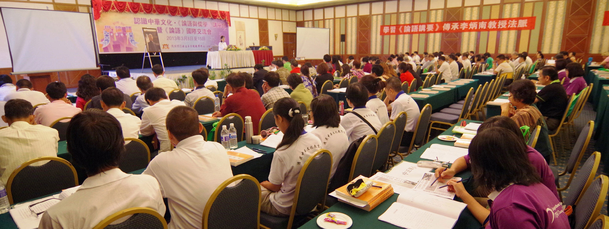

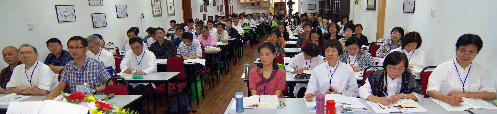

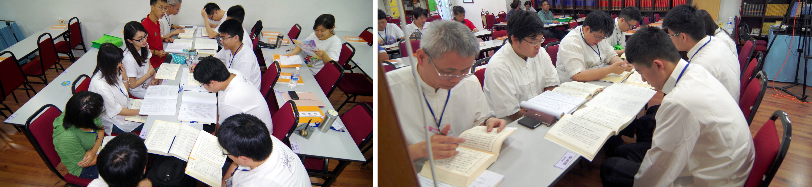

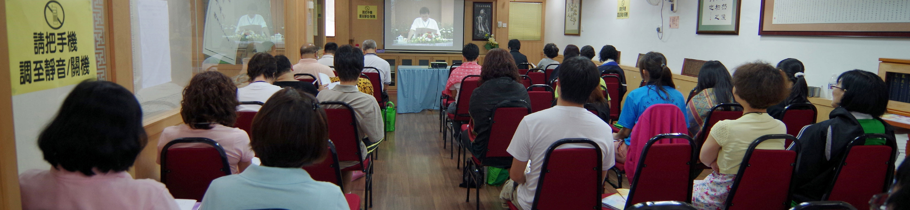

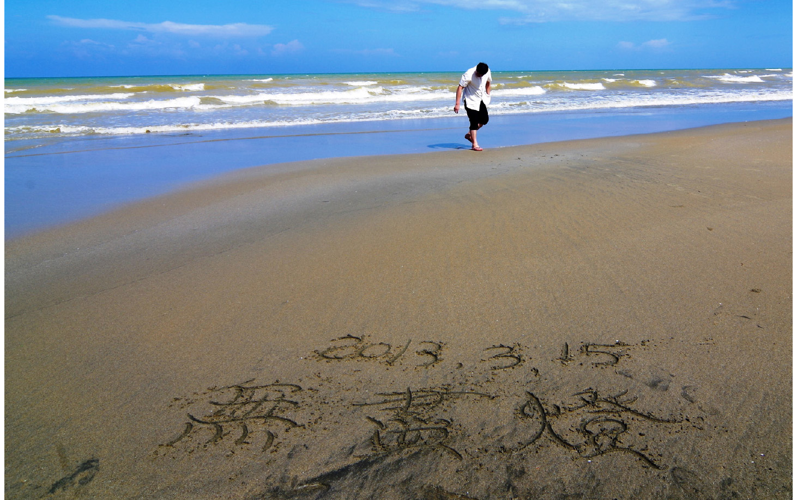
