# 第91期
.jpg)

## 社論

### 看見臺灣—不得不下決心改變的未來

本刊

滿足慾望的功利主義

透過紀錄的令人不堪

喚醒人心的知足互助

文化經典的弘揚傳承

齊柏林導演的「看見臺灣」紀錄片，上映已逾月餘，不但激起了臺灣人民正面的力量，也驚動了政府部會的高層。此紀錄片花費了近上億的資金，就只為了讓生長於這塊土地上的我們，能瞭解到從來沉默不語的母親大地，已經傷痕累累，提醒我們用「心與眼」去感受她的存在與重要性。在臺灣人關心的議題之中，生活在臺灣的人們，除了政治、經濟、食品安全等各式各樣大大小小的紛紛擾擾外，更應全力愛護我們賴以生存的大地。

這部紀錄片，起因於民國九十八年八月八號，莫拉克颱風引起中南部豪雨成災，造成小林村滅村事件。齊柏林導演乘著直升機進入災區後，看見臺灣的山林野地遭受到極為嚴重的破壞，滿目瘡痍，這是天災，更是人禍。一般臺灣人可以從平面媒體看見土石流混泥崩塌，但是卻無法像齊導以立體的高度和角度，俯視臺灣。臺灣的美麗讓我們引以為傲。但臺灣的哀愁誰能瞭解？是生長在這塊土地上的我們，為了自己的生存、慾望與貪念的滿足，不斷予取予求，追求科技的進步，工業的高度開發，不顧一切的汙染，破壞這塊土地，造成臺灣地貌的嚴重改變。齊柏林導演放棄了公務員優渥的待遇，抵押了自己的房子，舉債拍了「看見臺灣」紀錄片。

透過高畫質的影像、精湛的拍攝技術，使傷痕累累的土地以驚人的面貌展現在我們眼前，不禁讓人深思，生態的破壞、環境的污染、地貌的改變，所造成的環境變遷，已然威脅到在這片土地上安身立命的所有人們及生靈。應知人與自然環境，以及人與人之間，是共存共榮的關係，當財團為了自身利益，掠奪這片土地的未來，就等於掠奪這片土地上後代子孫的未來。

近幾年持續湧現許多關於黑心食品、勞工待遇、環境保護及醫療制度等社會議題，問題的根本多導源於功利主義掛帥所致，社會長期以來不斷地追求資本自由化、以最低成本求取最高利潤，而道德意識及企業的社會責任遂致式微，人們變成了工作機器，生活與生命的價值只剩下數字，為了這些數字，生活逐漸喪失意義，而整體大環境亦逐漸劣化，這樣的結果非但不人道，最終將會讓社會秩序瀕臨失控。

目前臺灣正經歷類似二十世紀初的美國，社會充滿不正義和偽善的現象，但這個社會需要全民的覺醒並且主動站出來，用具體的行動對抗資本主義掛帥的財團繼續危害我們的生活環境和飲食。這是長期抗戰，必須從現在就做起，才能給後代子孫建立更美好的社會。

除了在經濟發展和ＧＤＰ能不能保２之外，亟需著手進展的關鍵就在文化。文化能夠導正經濟的發展，成長不只是數字的增加，而是全然的利眾，是正知見的確立與人心向善的思惟，即使遇見環境中難以避免的動盪，也可以因為文化的涵養，使彼此凝聚共識，攜手共度難關。而文化的學習不能離開經典，不能離開正解，經典在人，在於傳承。雪廬老人的智慧，猶如鳥瞰全局的空拍技術，能夠展現文化的完整面貌，打開見樹不見林的文化困局，找出生活的中心思想，喚醒如土石流般日趨崩流的人心。

臺灣的面貌，不只要從空中的鏡頭去了解，更要從經典找出解決方案，透過文化的眼力看見她更宏偉的一面，這是當務之急、責無旁貸之事。正如片尾的一段沉重旁白說道：我們留給後代的只剩下一片瘡痍，現在該是改變的時候了。

## 大德法語

### 大方廣圓覺修多羅了義經（五十）威德自在啟請

道源老和尚

發露取相修無生　次第相生不紊亂

傳承不需拈標記　龍樹中論真大用

辛五、正答所問

壬一、長行

癸四、總示修習

經文：

若諸菩薩，及末世眾生，依此輪者，當持梵行，寂靜思惟，求哀懺悔，經三七日。於二十五輪，各安標記，至心求哀，隨手結取。依結開示，便知頓漸，一念疑悔，即不成就。

在末法時代想依著二十五個定輪來修行，得有下手的前方便，就是必須先持淨戒，於寂靜處思惟這二十五定輪。

初發心及末法時代修大乘的眾生，依二十五輪來修，有二十五種譬喻，依此作科文的解釋，能令聽者有興趣，聽、講都很熱鬧，若只簡單消文，聽眾或無興趣聽，跟著念也念不來。

堅持淨戒（梵行）最重要的就是不可以犯婬戒（在家的二眾弟子，則持不邪婬戒），乃至一切戒律都要嚴格的守持，謂之為修持梵行。須知戒律的功用就是防非止惡，若犯了戒猶想修觀行，如何能成功呢？不修還好，修則非著魔不行。戒律不清淨卻要修行，無始劫來的冤家對頭，他看得很清楚，不要說天上的魔王來磨你，一般的鬼神魔就很厲害了，一般鬼神有五通，他看見你戒律不清淨，你還要修行用功，非磨你不行，所以你不用功則已，你一用功就著魔。

其次是求哀懺悔，經三七日。這一句更要緊！在沒有修二十五輪之前，要先打三個懺悔七，懺悔是懺其前愆、悔其後過，將以前的罪過懺掉，以後的新罪業不造，有如此懺悔工夫，再去修二十五個定輪，這是很要緊的下手方法。修楞嚴大定之前也得用二十一天來懺悔。

如何懺悔呢？我跟諸位同學說過，你就依著晚課的八十八佛大懺悔文，那是最好的懺悔法，所犯的五逆大罪（根本戒）都能懺除，其他的輕罪更能懺除。八十八佛懺悔文，最後一尊是法界藏身阿彌陀佛（第八十九尊佛），念一句阿彌陀佛名號，能消除八十萬億劫生死重罪，這是《觀無量壽佛經》上所說，是佛的金口良言，那還能有錯誤？八十萬億劫生死重罪都能除去，其他罪過自然都可以懺掉。

要真想修二十五輪，必須先拜八十八佛懺，但並非如做晚課跪著念，而是每一尊佛都要拜，一句佛名拜一拜，拜到阿彌陀佛（八十九佛），拜完後再跪下來念懺悔文，就這麼樣做。一天最少做六支香，就是拜六次，做了二十一天。

除了八十八佛懺悔文以外，其他懺文都可以，都是教我們求懺悔的。如拜水懺、梁皇寶懺（慈悲懺）、大悲懺等都可以，看你跟哪一個懺有緣，你就拜哪一種懺。

現在到了末法時代，我們出家人很可憐，過去祖師費了好多心血做的懺本，教我們求懺悔，我們現在拿來趕經懺，賺幾個錢，真是對不起過去的祖師，尤其對不起自己寶貴的光陰。自己不求懺悔，天天給人家求懺，有人請我拜懺我才拜，沒有人請我拜懺，則無法好好的修行，這個樣子不是太對不起自己寶貴的光陰嗎？以上用功修學二十五定輪的前方便，持戒修定，求懺悔。

我以自己閉關的經驗跟大家分享，當時想要精進用功閉關閱藏三年，結果不到三個月，就得吐血的病，差不多要斷氣，待吐血病治好後，怎麼樣呢？根本不能看藏經，頭疼！這就拜佛，此時才想起來要求懺悔，然拜佛求懺悔卻不能拜，一拜下去，頭要炸開，轟！彷彿頭要炸開的樣子！哎呀！我現在才知道這是業障，魔障磨到我了，我向佛菩薩求哀懺悔：弟子業障發現，藏經不能看，今要拜佛求懺悔，卻不能拜，懺悔不能懺，不能懺就等著墮地獄，佛菩薩（三寶）一定要加被我，讓弟子能求懺悔。禱告後拜下去，頭還是「轟」的疼。我那關房攤個蓆子，不用拜墊，在蓆子拜佛，然拜了頭就疼。

我想：無法拜佛懺悔難道要墮到地獄？墮到地獄比頭疼還厲害！哎！這個色身（臭皮囊）我不要了，你（臭皮囊）痛死吧！拜下去，轟！還是頭疼，我就在痛的地方撞下去，咕咚咕咚，撞下去。疼！好好的疼，疼死！疼了一陣子，好不容易起來，再拜下去，再疼！再撞那個地方。耶！撞這麼幾天，三寶加被我了，好像把魔都趕走了，頭不疼了，但是看經還是不行，看經還疼，拜佛已不疼了，然而這樣就好了嗎？於是我最初一天拜十二拜，觀想除業障，後成拜佛觀，愈加愈多，一次能拜三百拜，一天拜四回，共拜一千二百拜。拜佛真有功德，可能真實求懺悔，所以業障消除。我身體本來不健康，二十幾歲就病得快要死，閉關之後身體變好了一點，一直活到今天（八十一歲），可能是那時拜佛的功德。

說給諸位聽，當初就是不知道閉關修學要先懺悔二十一天，若有概念，先修學懺悔經三七日（二十一天），閉關可能就能令業障不生，不發生這種病魔，諸位聽了要記取這個教訓，閉關用功修學，要先打三個懺悔七。

而你用紙條將二十五輪的名字寫上，把紙捲一捲，這就是二十五輪各安標記。

以至誠心求哀懺悔，痛哭流涕謂之求哀，以此行相求佛加被，因弟子不曉得要修哪一個輪，方合我的機？將紙捲成球謂之結，你隨手（信手）拈出一個來。依著結的開示，叫你修哪一個，你就修哪一個，或是頓修或是漸修。

這是完全靠信仰的，也不能起疑悔，完全靠信仰，我相信三寶會指示我，指示我哪一個我就哪一個。如蕅益大師弘揚佛法，中國有大乘八宗，應該依哪一宗弘揚佛法，擺上八宗，每宗寫成一張紙條捲起來，共有八個結，禱告之後，隨手拈來，是要弘天台宗，所以大師注解佛經，完全依著天台宗，就是當時他拈球拈出來的，也不起疑悔，完全依三寶的指示，但是蕅益大師雖依天台宗注解講經寫文章，但他不承認自己是天台宗，不參加八宗的爭執。

壬二、偈頌

癸一、標頌

經文：

爾時世尊，欲重宣此義，而說偈言：

癸二、正頌

經文：

辯音汝當知！一切諸菩薩，無礙清淨慧，皆依禪定生。所謂奢摩他，三摩提禪那，三法頓漸修，有二十五輪。十方諸如來，三世修行者，無不因此法，而得成菩提。惟除頓覺人，併法不隨順。一切諸菩薩，及末世眾生，常當持此輪，隨順勤修習。依佛大悲力，不久證涅槃。

辯音汝當知！這是辯音菩薩請問的，所以此處稱一聲當機者，你應當知道，一切諸菩薩的智慧清淨，不起任何障礙，皆依禪定生。智慧不是世智辯聰，不是依文解義求學問。或云：我的學問大了，我以前不會做文章，現在會做了，我以前不會講經，現在會講了；然你開悟了沒有？沒有！你那智慧叫世智辯聰，變成八難之ㄧ，學佛卻遭障難。所以你要曉得清淨無礙的智慧，打哪兒生出來？皆依禪定而生。楞嚴經云：因戒生定，因定發慧。沒有禪定，所發的智慧是狂慧。

所謂奢摩他、三摩提、禪那，三法或頓或漸修，有二十五輪。過去十方諸如來及三世修行者，就是過去、現在、未來的菩薩，在未成佛之前，沒有一個不是依著這三法而成就菩提大道。

有二種人不必用這個法（二十五輪），一種是頓超的根機，叫做彼乃知是空華，即無輪轉，亦無身心受彼生死。亦如普賢章說了四個次第：知幻即離，不作方便，離幻即覺，亦無漸次。（下期待續）

### 一大藏教綱宗—永明大師禪淨四料簡

上果下清法師開示

難得同法者共遊　等閑看得失良機

能引眷屬生正見　大德開示更驚歎

緣起

學會在暑假時，規劃了闔家出遊兩天一夜的活動，一方面是慰勞大家的辛勞、聯絡彼此的感情，一方面也希望蓮友們能將家人帶出來相互交流，並藉此機會認識我們的團體與蓮友。

行程十分充實，不但結合正覺精舍結夏安居齋僧法行，供養如法道場，並聆聽果公開示永明延壽大師的四料簡，修福修慧。晚間入住統一度假村，晚宴上除了精彩的小提琴演奏、崑劇表演，晚餐結束後還趕得上十點才打烊的溫泉湯屋；清晨，山間小徑上、游泳池畔隨意休閒，滿足度假之感，午間中部蓮友於萬仙樓宴請大眾，下午更驅車前往般若精舍聆聽自公老師開示洪範選讀。兩天一夜的活動，不但藉此聯絡蓮友之間的情誼，也增進蓮友家屬接觸正法的機緣，不但結合正覺精舍齋僧法行，聆聽果公法師與自公老師的開示，寓教於樂，是十分難得的一次團體活動。今就二位善知識開示整理刊登如後，以饗大眾。

上果下清法師開示

諸位法師，會長，諸位在家菩薩們，大家午安。早上被請到蓮社，為大專院校的同學，講解《五戒表解》，講到十點多，接著吃過飯，馬上趕回來，稍微耽誤一點時間，對不起諸位。

今天講的題目是：

永明延壽大師〈四料簡偈〉。

乃依據印祖在上海護國息災法會法語之解釋。祖師首明佛教分五個宗派（依五種不同體系認識佛的思想義趣），所謂：

律、教、禪、密、淨

。

律是我們學佛的根本，須嚴持佛陀所制清淨的戒法，令身口意三業獲得清淨，能照見五蘊皆空，能夠度脫一切諸苦，顯現真如本性，以上是律宗的情形。

教則令修者依教修觀，達到離教見性（離指見月）。如天台宗將佛說之法分為四，依四教而有四種觀法，藏教為析空觀；通教是體空觀；別教是次第三觀，先空、次假、後中；圓教則一心三觀。這是天台宗四教，有四種的觀法。而南山律祖在講解戒律時，也講到三種觀：性空觀、相空觀、唯識觀。

所以各宗各派，各有其修觀的方法，依修觀而見性，喻如離指見月，教如指頭指著月亮，行者依教修觀如順著指頭看過去，才看到月亮，不可執著指頭當作月亮。

密是透過三密加持，轉識成智。三密加持是身、手結印，口念咒、心觀想，三密若能與本尊相應則轉識成智，而即身成佛。但印祖認為，即身能了生死耳，還不能成就福慧圓滿的佛。上述三宗（律、教、密），都可歸於禪宗，因為氣氛相同（專仗自力）。因此之故，佛法的修持可說禪、淨這兩門。

至於修淨土宗的人，仗著阿彌陀佛大慈悲願力的接引，本身具足真信願，好好念佛，必能帶業往生。

所以宋朝初年的永明延壽禪師，他以古佛之身，示生在世間，他能徹悟一心，圓修萬行。祖師每天白天行一百零八件的佛事，夜晚前往另外的山峰靜心念佛。人家還念十萬聲佛號，那不就等於沒睡覺！他深恐後世的學者，不能夠明白修行的宗要，所以特別作了一首〈四料簡偈〉，使我們學佛的人，能夠了知所趨向。

有禪有淨土，猶如戴角虎，

現世為人師，來生作佛祖。

無禪有淨土，萬修萬人去，

若得見彌陀，何愁不開悟。

有禪無淨土，十人九蹉路，

陰境若現前，瞥爾隨它去。

無禪無淨土，鐵床並銅柱，

萬劫與千生，沒個人依怙。

這四首偈共八十個字，印祖說是如來一代時教的綱要。

我們首先必須詳細了知，什麼叫作禪？什麼叫作淨土？什麼叫作有禪？什麼叫作有淨土？印祖開示：禪與淨土是約理約教而言，有禪有淨土，是約眾生的根機，約修持來討論。約理性與教法，禪與淨土這兩個法門是沒有一點差別；講到眾生的根機，還有修持的情形，這兩個法門就大相懸殊（大大的有所差別）。我們需要好好地琢磨，才不辜負永明大師的苦口婆心。

祖師云：何謂禪？禪就是我們每一位眾生本具的真如佛性，宗門所謂的父母未生前本來的面目。宗門的言語，它不說破，是令人去參而自己證得。這個「禪」就是「無能無所」，離開能、所的分別，是能、所一如的，即寂即照之離念靈知，純真心體也。即寂即照就是寂而常照，照而常寂；而離念靈知，純真的心體，所謂離念，就是離開妄念，然非無正念。若連正念都離開，就變成木石一般的無心。然離念非同木石的無心，雖離開一切妄念，然心裡卻靈明覺知，而洞悉前面所對的境界，謂之禪。

何謂淨土？就是我們要能夠信願持名，求生西方，發起深信、懇切的願，並好好執持阿彌陀佛的名號，求生西方極樂世界，而不是偏指唯心淨土，自性彌陀，謂之淨土。

何謂有禪？就是能夠參究力極，參禪一直窮究，將自己修學的力量用到極致，念寂情亡，讓妄念寂滅，它的情境消亡了，徹見父母未生前的本來面目而明心見性，謂有禪。所以有禪就是徹底開悟，明心見性。

何謂有淨土？就是能實行發菩提心，深信發願，持佛名號，求生西方的事，謂之有淨土。倘若他參禪還沒有開悟，或者開悟還沒有透徹，都不能叫作有禪；倘若念佛而沒有信願，或者雖然有信願，但是不親切，都不能叫作有淨土；乃至於雖然修淨土，但心裡想念著塵勞的事情，或者求人天的福報，或者求來生出家為僧，一聞千悟，得到大總持，弘揚佛法，教化眾生的這種情形，都不能謂之修淨土的人。因為他沒有依照佛淨土的經教，希望用普通的教義作為根據，那麼來生能夠不迷惑而了脫生死的，萬人當中，沒有一、兩位。而被福德所迷惑，從迷入迷的，實在就有許多這情形，這一類的人就很多了。所以講到若能深深地了解這種的道理，才是修淨土的人。

所以印祖說，眼中沒有珠的人，每每就稱「參禪」就叫作「有禪」，「念佛」就叫作「有淨土」，這是自誤誤人，害豈有極。這種的傷害，哪裡有極點呢？就是傷害真的很多了。

上來已經說明禪淨的有無，現在進一步將偈頌的言語，逐段地加以剖析，才了知這八十個字，好像天造地設，沒有一個字不恰當，沒有一個字能夠更移。所以古德座下的詩偈，一個字都不能改變，涵義都很深遠。

第一首偈：

有禪有淨土，猶如戴角虎，現世為人師，來生作佛祖。

這個人不但徹悟禪宗，能夠明心見性（有禪），又能深入經藏，具備了知如來權實的法門，而在諸多法門之中，又能夠唯獨運用信願念佛這個法門，作為自利利他，通途的正行。所以觀經當中，所謂「上品上生，讀誦大乘，解第一義」的就是這一類人。

因為這種人禪淨雙修，有大智慧，有大禪定，有大辯才，邪魔外道聽到他的名聲，聞名就喪膽了。好像老虎戴上角，老虎本身就很威猛的，牠又戴上角，那就更威猛沒有匹儔了。有前來學習的人，隨他們的機為對方說法，應當用禪淨雙修法門來接引對方的話，他就用禪淨雙修的方法來接引他；應當用專修淨土法門來接引他的話，那麼就用專修淨土來接引他。所以無論上中下根，沒有一個人不受到他的這種恩澤，這難道不是人天的導師嗎！所以說「有禪有淨土，猶如戴角虎，現世為人師」。

這個人到臨命終的時候，蒙佛接引，往生上品，一彈指頃，就能花開見佛，證得無生法忍。最低可證得圓教初住菩薩的地位，也有頓超諸多位次一直到等覺菩薩階位的。圓教初住的聖者，能現身百世界作佛，何況此後位位加倍殊勝，一直到四十一位地，等覺的位次，更加的殊勝，所以說「來生作佛祖」。

第二首偈：

無禪有淨土，萬修萬人去，若得見彌陀，何愁不開悟？

這個人雖然還沒有明心見性，但是他有淨土，亦即能決志求生西方。阿彌陀佛在過去劫，為法藏比丘菩薩時，對著世自在王佛座下，發起四十八大願，攝受十方世界念佛的眾生，阿彌陀佛好像慈愛的母親，而憶念眾生，眾生如同他的稚子而常常憶念。我們眾生往往不肯念佛，捨母逃逝，假若我們眾生能夠如同孝子，憶念慈愛的母親（阿彌陀佛），若能至誠懇切的念佛，那麼決定能感應道交，蒙受阿彌陀佛的攝受。

努力修定慧的人固然能夠往生，就是造作五逆十惡，臨命終受到痛苦的逼迫，發起廣大慚愧心，稱念阿彌陀佛的名號，或者十聲，或者僅僅一聲，直下命終，也能蒙受阿彌陀佛化身的接引，往生到極樂世界，這難道不是萬修萬人去嗎？這就是《觀經》下品下生的情況。因為造作五逆十惡的人，到臨命終，地獄相狀會現起，如果他得到善知識的開導，發起慚愧心、懺悔心，好好稱念阿彌陀佛的聖號，或者只稱十聲，乃至一聲，也能蒙佛接引，往生極樂世界。

雖然念佛沒有多少聲，因為他念佛的心意非常猛烈，所以能夠獲得這種巨大的利益，不能用平常泛泛攸攸較量念佛數目的多少來論。既然往生西方了，他能見佛聞法，雖然有比較延遲與快速的不同，然而已經高高地參與聖人的流類，往生到極樂世界，就永遠不退轉。隨著他根性的淺、深，或者漸次，或者頓超，證得諸多的果位。既然能夠證果，那麼開悟就不待言宣了。

第三首偈：

有禪無淨土，十人九蹉路，陰境若現前，瞥爾隨它去。

這個人雖然能徹悟禪宗，而明心見性（有禪），但是他「無淨土」，也就是見思煩惱不容易斷除，他必須要歷緣鍛鍊，歷事練心，逐漸地使見思煩惱滅除地乾乾淨淨，如此分段生死才能出離。假若見思煩惱一絲一毫都還沒有斷，這個就不必討論。即使斷到剩下一絲一毫，六道輪迴依舊難逃。生死苦海是很深廣的，而無上菩提的道路，也非常地遙遠，他還沒有歸家，就命終了。大悟的人，十個人當中，九個人如此，所以謂十人九蹉路。此蹉字是蹉跎之意，就是世俗所謂的「耽擱」。

陰境指的是中陰身境。什麼叫作「中陰身境」？也就是臨命終時，現生以及歷劫善惡業力所現的境界。這種境界一現，眨眼之間，就隨著他最猛烈的善惡業力去受生。在善惡道當中，一絲一毫不能自作主宰。又像一個人負多人的債務，要債力量強的，先拉你去還債。所以謂之心緒多端，重處偏墜。亦即我們心緒很多頭緒，然隨著最重的業力牽引去了。所以五祖寺的戒禪師，來生變為東坡居士，草堂青轉世成為曾魯公，這還是比較上等的。

這個陰，音義跟草字頭的「蔭」是相同的，也就是覆蓋的意思，由此業力蓋覆真如本性，不能夠顯現出來，在中陰身現時，瞥爾隨它去，「瞥」就是眨眼之間，很短暫的時間，隨他所造的惡業牽引著中陰身，又去投胎了。

「十人九蹉路」的「蹉」，有人認為「蹉」是錯誤的「錯」；也有人認為「陰境」是「五陰魔境」。印祖說這都錯了！這都是因為他不能認識什麼是「禪」？以及什麼是「有禪」？所以導致這種謬誤。難道大徹大悟的人，十個人有九個人，錯走路頭，隨著五陰魔境而去，而著魔發狂嗎？著魔發狂乃是不知道教理，不明白自心，盲修瞎鍊，生起增上慢的這種人，怎麼可以不認識好歹，把「五陰魔境」加在大徹大悟的人身上呢？關係很重大，不可不辨。

第四首偈：

無禪無淨土，鐵床並銅柱，萬劫與千生，沒個人依怙。

有人認為無禪無淨，是埋頭造業不修善法。印祖說這是大錯特錯！講到法門無量，唯獨禪宗跟淨土宗，這兩種法門是最為當機的。這個人還沒有徹悟（無禪），不能明心見性，又不求生淨土，所以是「無禪無淨土」。

他沒有徹悟本性，又不求生西方，攸攸泛泛的修其餘的法門，這樣子既不能夠定慧均等，斷煩惱證得真理，又無從仗阿彌陀佛大慈悲願力的接引，帶業往生。就用他畢生修持的功德，召感來生人天的福報。現生既然沒有真正的智慧，來生必定隨著福報而耽著五欲，在享受五欲中廣泛造作諸多的惡業。既然造作惡業，就難逃惡的果報，一口氣不來，就墮入地獄。用燒得很炙熱的鐵床銅柱，久經長劫來寢臥抱持（抱緊鐵床、銅柱），來償還他貪聲色、殺生命等種種惡業。諸佛菩薩雖然慈悲想救拔他，因為惡業障礙的緣故，所以此人不能得到佛的救護。

此即清朝截流禪師所謂，修行之人，假若沒有正信，求生西方，而泛泛修諸多的善法，謂之第三世怨。即今生修行，來生享福，依靠福造作惡業，造作惡業，第三生就會墮落。第二生雖暫時得到樂果，第三生以後卻酬償第二生享福所造的惡業，此之苦報是長劫受苦。縱然在地獄受苦將地獄的罪業消亡了，他又轉生餓鬼、畜生，他想要再得人身，就是難之難矣啊！很困難的。

所以佛曾經用手拈土，指甲，或者用手拈一點土上來，問阿難說：「我手的土比較多？還是大地的土比較多？」阿難就回答佛陀說：「當然是大地土多啊！」佛陀說：「得人身的機率，如手中土；失人身的機率，如大地土。」所以祖師說「萬劫與千生，沒個人依怙」，還猶然侷限在偈頌的言語，比較淺近說一說罷了！其實比萬劫千生更遙遠多了。

永明延壽大師，恐怕世間人，未能將禪淨的真實義，觀察清晰。所以特別作了〈四料簡偈〉來說明，可以說是「迷津的寶筏，險道的導師」，功德非常偉大。

一切的法門，必先將煩惱所造有漏諸業，盡除地乾乾淨淨，才能了脫生死，修淨土法門則能帶業往生，一旦往生，就參與聖人的流類。今人每以話頭看得恰當，臨終去得好，就認為是了脫了。印祖說，不知道這種言語，乃是未開正眼的夢話。印祖接著就引幾樁事作例子。

正如同清朝乾隆、嘉慶年間，有三位的禪僧，他們是同參。死了之後，一位生到江蘇，名為彭文章，一位生到雲南，為何桂清，一位生到陜西，為張費。此三人唯獨彭文章能記得前生的事，後來入京會試，看到那兩個人，於是就說到前生作為出家人的事。二人雖然不記得了，但是他們三個人一見如同故人，成為莫逆之交。

在殿試的時候，彭文章中了狀元，何桂清中了榜眼，張費中了傳臚。彭文章當過主考的學臺，然而頗貪於色欲，後來就在家裡命終了。何桂清作過南京的制臺，洪楊造反，失守南京，被皇上問罪而死。張費尚且還教過咸豐皇帝，回族要反，把他騙去殺掉了。這三個人，也都不是平常的僧人，可惜不知求生西方，雖然得到一點洪福，但是有兩個人不能得到善終，而彭文章竟然貪著女色，下生後世，恐怕更不如此生了啊！

又有蘇州的吳隱之先生，他是清朝的探花，學問道德相貌都很好。民國十年，朝拜普陀，來拜會印祖，自己說他前生是雲南的和尚。因為是燒香過客，不能夠多敘，也沒有詳細問他緣由。在民國十一年，印祖前往揚州去刻書，到了蘇州一位弟子的家裡，於是就去拜訪這位吳先生，到了民國十九年，印祖閉關在報國寺，十一月，他跟李印泉、李協和二位先生來。印祖就問他，你為什麼知道前生是雲南的和尚呢？

他就說，我二十六歲作了一個夢，到了一間寺廟，知道是雲南某縣某寺。所看到的殿堂房舍，樹木形狀，都好像平常所看到的一樣，也認為自己就是出家的師父。醒來之後，都記得很清楚，一一地把它條錄出來。後來有一個朋友前往那個地方去作官，拿去一對，絲毫不錯。

印祖就說了，先生已經八十歲了，來日無多了，應當要恢復前生和尚的事業，應當要一心念佛，求生西方啊！才可不辜負前生修持的苦功。他就說，念佛有什麼稀奇呢？印祖就說，念佛雖然不稀奇，世間無幾多人來念。頂不稀奇的事，就是吃飯，全世界的人沒有一個人不吃飯的。這種最不稀奇的事，你為什麼還要作呢？他就不能回答，然而他也不肯念佛，印祖又問兩位李先生：你們都念佛嗎？回答說：「念。」然而吳隱之先生仍然沒有下語。到了十二月三十夜，將點燈的時候去世了，剛好滿八十歲。

這一位吳隱之先生，他前生很有修持，所以召感今生能得到大功名、大壽命。然今生只盡倫常，佛法也不相信了，這難道不悲哀嗎？然而這四個人，都還不算有所證的，就算有所證，若未能斷盡煩惱，也難以出離生死。又如同唐朝的圓澤禪師，他曉得過去、未來，尚且還不能了脫，何況只去得好，就能夠了脫生死嗎？

再講講李源與圓澤禪師的公案，唐朝李源的父親，他守東都，安祿山造反把他殺害了。李源於是不願意作官，用自己洛陽的住宅，改作慧林寺，請圓澤做和尚，他自己也在寺廟裡頭修行。

過了幾年，李源要朝拜峨嵋山，邀請圓澤禪師共同去。圓澤禪師他要走陜西，李源不願意到京城，怕人誤以為自己要作官，他也不要從陝西去，要從荊州的水道去。那圓澤已經知道自己不可能再回來了，於是將後事一一地開明，寫出來夾在經典當中，尚且還不發露，告訴人家，於是就跟隨李源乘船而去。

到了荊州的上游，將要進峽，因為那個地方的水陸很危險，當時太陽還沒下山，就停船了。忽然有一位婦女著錦襠褲，在江邊打水。圓澤禪師一看到，雙目就落淚了。那李源就問，怎麼落淚？圓澤就說，我不肯由此道路去的情形，就是怕看到這一位女人。因為這個女人，懷孕已經三年了，等待我作她的兒子，我不見到她，還可以躲脫，現在既然看到了，不作她的兒子不行了。你應當要念咒，幫助我趕快生。到了第三天，應當來我家來看我，我看你就會笑一笑，作為憑信。過了十二年，八月十五夜，到杭州天竺葛洪井畔來會我。說完，圓澤就坐脫了，這個婦女就產下兒子。

三天之後，李源一去，嬰兒看見他就笑了。後來李源回到慧林寺，看到經典當中預測後來發生的事，那就更加相信，喔！圓澤禪師不是普通人喔！

到了十二年，李源就預先到杭州，到八月十五夜，就前往所約會的地處去等候。忽然隔著河流，有一位放牛的孩子，騎在牛背上，用鞭打著牛的角，就唱著說：「三生石上舊精魂，賞月吟風不要論。慚愧情人遠相訪，此身雖易性常存。」說這個生平雖然有所變異，但是這個佛性是恆常存在的，李源聽聞了，於是互相地問訊。談完畢，又唱著說了：「身前身後事茫茫，欲話因緣恐斷腸。吳越江山游已遍，卻回煙棹上瞿塘。」於是就乘牛離去了。你看這一種身分的人，還不能夠了脫生死，何況只知話頭看得恰當，去得好就會了脫生死嗎？

所以印祖最後結示說，仗著自力了脫生死，有如此的困難；而靠著佛力了脫生死，有如此之容易。世間人，每每捨佛力而專仗自力，也是莫名其妙。現在用兩句話為他來說破，只是要顯「自己是上等的人，不肯做平常不稀奇的事」的這一種知見所耽誤的。惟願一切人，詳細思維這五個人的往事，如喪考妣，如救頭然，以自利利他，好修持淨業。才不會虛度、空空地浪費這一生所遭遇的情形了。

所以永明延壽禪師的〈四料簡偈〉非常好，我們要死心塌地的好好信願念佛，求生極樂；平素又能夠好好的，諸惡莫作，眾善奉行，那就最好了。

最後，我們就以一首偈頌，來跟諸位勸勉，這一首偈頌是什麼？就〈往生禮讚偈〉裡頭的〈日沒無常偈〉，是唐朝善導大師所作的，不妨我念一句，諸位跟著念一句：

人間匆匆營眾務，

不覺年命日夜去。

如燈風中滅難期，

忙忙六道無定趣。

未得解脫出苦海，

云何安然不驚懼？

各聞強健有力時，

自策自勵求常住。

在人世間，每天都匆匆忙忙的，經營各種眾多的事物，不知不覺的，年齡、壽命、生命，白天、夜晚都這樣逝去。譬如到過年的時候，每過一年不是我們增長一歲喔！是少一年喔！多一年就少一年，我們多一歲就少一歲的生命，所謂「一寸光陰一寸金，寸金難買寸光陰」，即使一寸光陰，你一寸金都買不到，一寸光陰是一寸的命光，一寸光陰消失了，你一寸命光就失去了。

所以我們就不知不覺的，年齡、壽命日夜去，白天、夜晚都這麼逝去。所以孔夫子在江上就說「逝者如斯夫，不舍晝夜」，也感嘆我們人的壽命，這個命光，就好像流水一樣，白天、夜晚消失，就是流逝了，天天的，分分秒秒的，這麼流逝。它去了，就不復回。

就好像點油燈，在風中點燃了油燈、或者蠟燭火，風大了一吹，它滅了。它滅的時候，難以期望，說你燒久一點不用滅。我們的生命亦復如是，我們的生命之火，好像點燃在風中的燭火一樣的，滅、消失、熄滅難以期望。

忙忙碌碌在三界六道裡頭，忽然做人、忽然生天、忽然墮地獄，變成餓鬼、畜生，變成阿修羅……六道來來去去的，沒有一定的去向。就隨著我們所造的業力去投胎。

我們還沒有解脫，出離生死的苦海，怎麼可以安安然然，不驚慌、不恐懼呢？我們生死還未了，怎麼還感覺安然沒事，不驚慌、不恐懼呢？所以古德說要「痛念無常，如喪考妣」，我們要痛念死期到來，不一定什麼時候，就好像痛失了我們的父母一樣。

我們身體還強壯、康健，有力量的時候，要自策自勵求常住。要自己策勵自己、警策自己、勉勵自己，而求常住。怎麼求常住法？就好比我們修淨土念佛法門的人，我們要不間斷、不夾雜，要深信，發起懇切願，要好好老實念佛，念佛成為老實，就是不換題目，而且念佛當下，不打妄想、不起雜念，才叫作老實。

假若一面念佛，一面打妄想、起雜念，就不叫作老實念佛。所以不間斷、不夾雜，最初就不懷疑的這麼努力修，老實靜靜地念佛，平常要能敦倫盡分，閑邪存誠，諸惡莫作，眾善奉行，那我們將來就能往生到極樂世界去。往生到極樂世界去，就不退轉，一直修，修到成佛，徹證常住的佛性。

好，今天，我們的中華無盡燈文化學會，在我們會長帶領下，前來光臨我們「正覺精舍」，沒有好的供養，就用以上的法語，跟諸位共同策勵，希望諸位回去好好如法地修持，這一生個個都能夠成就。好！回向！

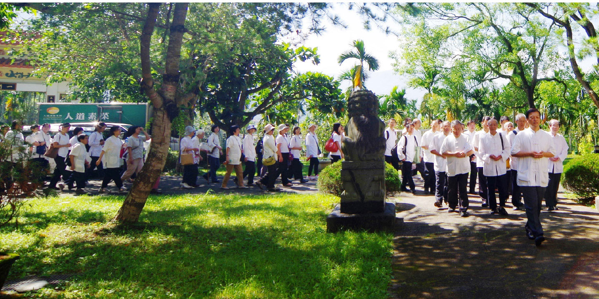

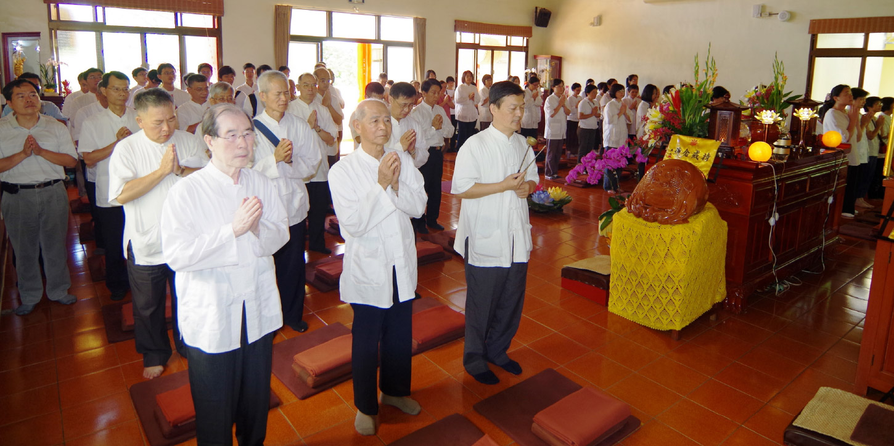

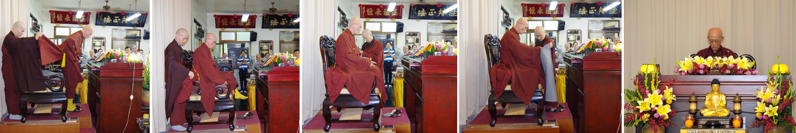

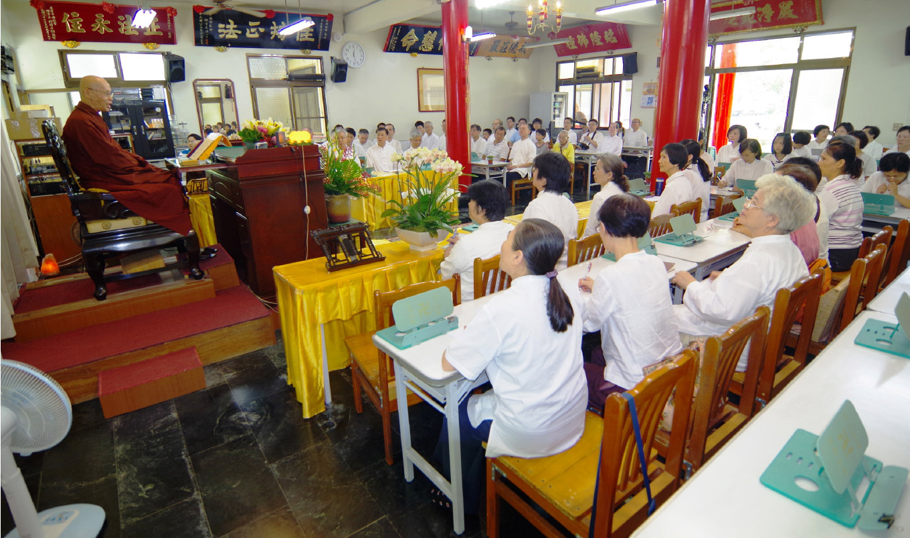

### 炎暑的清涼—洪範選讀

醒公老師

遊山玩水訪善士　識得治國大道理

五行相生助身心　調和天下真聖王

前言

般若精舍主持洪老師與林老師，諸位老師、諸位善知識，今天很難得在般若精舍，禮請臺中蓮社導師 醒公老師來開示，題目是：洪範選讀。對我們有很大的幫助，何以故？我們在臺北成立文化學會就是希望在儒家的學問上有所增進，並且能夠幫助佛法的學習，讓儒佛教育能夠推廣。老師不論是國學與佛學都是十分的專精，今天有幸在炎熱的暑假，藉著這麼清涼的地方（般若精舍），祈請老師開示，是我們學會莫大的福報。

帶著一顆恭敬的心、求學的心、想要弘揚正法的心、延續正法的心，來請殊勝的大德做開示，是我們最大的福報。

醒公開示

各位臺北及臺中的蓮友大德，今天我學人很幸運應邀來跟各位講幾句話，我學人知道得很少，就從書經裡面一篇洪範，選出來跟大家一起研讀。

洪範這一篇是講治國平天下，也是修道，共有九種大法。洪是大，範，法也，九疇就是九類，在世間修道成就的九大類也。

經文是追溯到堯舜時，全國發生大水災，堯先請夏禹王的父親鯀來治水，結果鯀的治水方法違背了五行，所以失敗了。失敗了之後，鯀就受到處分，其次命鯀的兒子禹繼續治水，禹治水用順乎五行運行的規律，所以治水成功了。

就在禹王治水時，上天將五行順序傳授他，表示天下交給禹王，所以就由夏朝一直傳到殷朝。殷朝開始時的帝王都好，傳到了後來的殷紂王，這是暴君，經過周武王出來革命，把殷紂王給推翻了。殷紂王被推翻的時候，宮中保存了洪範，被殷紂王家族的箕子保存著。周武王伐紂成功之後，就向箕子請教治國的道理，箕子就把洪範這一篇經文說出來，當時的史官記錄下來，就成了現在的〈洪範〉。天帝顯示五行運行的秩序，這個道理由周武王請教箕子而記錄的經文。

經文：

王乃言曰：「嗚呼！箕子。惟天陰騭下民，相協厥居，我不知其彝倫攸敘。」

王乃言曰的「王」指的是周武王，嗚呼是嘆息的聲音，「箕子」是稱呼其名。

「惟天陰騭下民，相協厥居」上天（天帝）此與外道所言的上帝不同，地位崇高，能陰騭下民。「陰騭」的「陰」是一般人不知道，「騭」是決定的意思，上天之意是要安定下面的民眾（民眾難知天意），然如何使下面的民眾相協厥居？相協是互相協助而能安居，然國泰民安，修道者修學無障礙，這一切都要講究次序才行。如何有次序？須多練習，互相協助；「厥」字當其字解，其居就是互助之下，每個人各安其居。我不知乃周武王說不懂，這是對箕子的請教。彝者常也，彝倫是永恆不變的道理（次序），武王說我不知道治理天下應循的次序，請教箕子。

經文：

箕子乃言曰：「我聞在昔，鯀堙洪水，汩陳其五行。帝乃震怒，不畀洪範九疇，彝倫攸斁。鯀則殛死，禹乃嗣興，天乃錫禹洪範九疇，彝倫攸敘。

箕子聽了武王這樣謙虛的請教時，就說了下面的這幾句話，他不說自己知道，而是「我聞」，也就是說一切都是學來的。我曾經聽說的，鯀是夏禹王的父親，就是用堙（堵塞），用圍堵的方法治洪水，如此治水是汩陳其五行，汩，亂的意思，即亂陳五行，不依照五行運行次序。由是天帝震怒，怒誰呢？怒鯀，不畀（賜）給他洪範九疇。

彝倫攸斁：

彝倫是恆常、有次序的道理；攸斁，斁是敗壞了，這不變的次序亂了。殛是流放的意思，鯀被放逐到羽山（東海），是東邊的海邊的山上。

禹乃嗣興：

禹是鯀的兒子，後為夏禹王，嗣就是繼續，禹繼續他父親的治水。父親治水失敗了，由他來繼續但卻改變方法，是用疏導的方法不是用堵塞的方法。因此天乃錫禹洪範九疇，天帝於是就賜給夏禹洪範九疇。

經文：

初一曰五行：一曰水，二曰火，三曰木，四曰金，五曰土。

補充：周易繫辭上傳：天一，地二，天三，地四，天五，地六，天七，地八，天九，地十。注疏：天一生水于北，地六成之。地二生火於南，天七成之。天三生木于東，地八成之。地四生金于西，天九成之。天五生土于中，地十成之。

五行的排列是有次序的，五行又是怎麼出現的呢？周易繫辭傳（上傳）說到：天一生水，地六成之。天一生水在北方，地六成之，一是奇數叫做陽，六是偶數叫做陰，這就是陰陽兩儀。陰陽兩儀露出天的時候就是太極，太極就是講人人皆有的本性。本性在佛家中講，名詞不只一種，在儒家也講性，孔子主張性相近也（非性善、性惡）。孔子的孫子子思在〈中庸〉開頭就講：天命之謂性。儒家講的性與佛家講的性沒兩樣（歸元無二路）。

太極就是指人人本有的本性，本性起作用，就叫做動了，太極動了就生出兩儀，兩儀就是陰陽契合，天一是陽氣，生水在北方，地六是陰氣，在北方的水就生長了。開頭注經裡面天一地二、天三地四、天五地六、天七地八、天九地十，先把十個數字列出來，十個數字總括來說就是陰陽兩數。

〈禮記正義月令疏〉就講：天一生水于北方，地六成之。只有生沒有成是不行的，所以天一生水，地六成之。再者地二生火於南，地二是偶數，生火在南方，由天七完成。天三生木於東，地八成之，是在東。地四生金於西在西方，天九成之。天五生土於中，地十成之。

五行所有的次序按照五方排列，東方是木、西方是金、南方是火、北方是水、中央的是土，這樣的排列完全是按照太極陰陽二氣的順序排列出來，人事上面只要合乎這個次序，無論辦什麼事情都是可以成功的。但是最有影響的就是天子，帝王在行使他辦事權力時，如果按照這個次序來辦的話，就一定會國泰民安。

政治如此，天子如果按照五行次序來教化，這個次序都是禮，用禮去行，那麼天子在教化天下人的時候，本性用出來這些次序（禮、樂），那就是根本的教育，所以我們要勸導世間的教育家，應該要按照我們固有的文化，教育的根本就是啟發學生的禮、本性，這是根本的教育。

禹王以天帝賜給他的洪範九疇治國，洪範九疇就是彝倫攸敘，一切都有道理、都有次序，次序就是按照五行的次序；彝是五行所含有的本性，我們現在研究洪範這一篇，雖然此次只選錄前面一段，以及最後一段，中間沒辦法講，但是各位記住這個原理、原則，再看中間文是可以理會的。

經文：

水曰潤下，火曰炎上，木曰曲直，金曰從革，土爰稼穡。潤下作鹹，炎上作苦，曲直作酸，從革作辛，稼穡作甘。

五行都有它的特性，特性來自太極，文說水曰潤下：水自然的依著它的特性是溫潤而且是往下流動；火曰炎上：火的特性就是往上燃燒；木曰曲直：木的特性是可曲可直；金曰從革：從革是金屬鍛煉時可以改更（延展性），或經過鍛煉，要將金做成什麼樣有用的器具都可以；土爰稼穡：爰當曰字講，在經文裡換了一個字，稼是在家裡的農田種植五穀，收成叫做穡。潤下作鹹：就是水在地下，地下水把土地浸得很久，地下就出了鹹鹵之味；曲直作酸：木料曲直，使用的時候它就會產生出一種酸澀之味；稼穡作甘：土地種出五穀有甘的味道。

經文：

九、五福：一曰壽，二曰富，三曰康寧，四曰攸好德，五曰考終命。

五福第一是壽，人都要壽命，但有了壽命還不算真正有福，還要有富，家裡財富很充足，再者康寧是一個人身體健康安寧，沒有什麼病，這也是一種福。

攸好德，「攸」字當「所」講，所好的是德，所好的德就講五福吧！五福從哪來？就是從攸好德來的！考終命，「考」是年紀很老，終是善終，善終指一個人活的年紀很久，高壽在古時候來講七十歲就是高壽了，七十歲以上當然是壽了，然要在命終時得到善終，善終在黃帝內經上說是沒有什麼病，到命終的時候自然而然就終了、自然停擺了，謂之考終命。

這種福報是從攸好德而來的，德就是道德，我們能得到這幾種福報，一者是我們過去世做很多善事，有很好的品德修養，到了人間來，自己也要繼續攸好德，尤其各位現在修儒也修佛，不論是儒、是佛，最重要的都是教我們學道的人啟發自己的本性。一般學校也講啟發教育，然啟發教育真正是要啟發自己的本性，將自己本性開發出來才是教育的目標，亦即吾國固有的教育，教人人學做聖人。學做聖人有什麼好處？我們在人世間短短這幾十年，我們修道的人壽命會長一點。

從出生到世間來，一直到壽命終了這一段期間，所受的苦惱太多了。不修道的人，沒辦法將苦惱解除掉，一般人都是帶過去的習氣而來，各有各的習氣、各有各的煩惱，活得很辛苦啊！然不知道道理的人是沒辦法改變現狀（既定的命運），能改變現狀就屬我們學道的人，就需把福增加，以改變現狀。

為什麼加一個攸好德呢？從字面上講，上述這幾種福是世間人都想得到的，洪範這一篇既然是聖人傳下來的，就在攸好德上面教我們把自己的本性開發出來。本性開發出來的福、壽、富貴還有考終命，那不是一般人可以了解的福報，我們學道的人都知道這個福報，那就繼續在人世間，這生是人，下一生還是人，在人世間繼續學道，繼續地開發本性，這是很要緊的，那麼這是普通法門。

如果在現在來講，我們大家都知道有特殊的法門，那就是教我們發願到極樂世界去，到那個世界所受的福是無量的，壽命也無量，所有的福完全是從本性裡面起的。所以我們現在學了洪範，能夠發願到那個世界去，得到最快的成就，以上五福。

經文：

六極：一曰凶、短、折，二曰疾，三曰憂，四曰貧，五曰惡，六曰弱。

六極是什麼呢？極是到極處了，凶是所遇到的都是不吉利的，我們普通人講究的是逢凶化吉。六極：一是凶短折：遇不到吉利的事情謂之凶，沒辦法轉變、化解不了；短是壽命短；折是壽命更短如夭折一般。

二是疾病：疾病不是我們普通人以為的病，是一種經常的、長長久久的疾病、甚至是不會好的病。三是憂：陷於憂愁，這個人沒有快樂的時候。四曰貧：貧窮沒有財富。五曰惡：他的身體很惡劣，在孔安國的註解裡面是醜陋叫作惡。六曰弱：弱是包括身體衰弱、精力也一樣弱，再則意志弱，沒有什麼意志。以上是六種不吉祥的事。

聖人講這六種的意思是要我們瞭解一般人到人世間來，或者其中一種或者其中兩種或者三種並不一定，無論是一種兩種以至於六種，都有可能遇到，那怎麼辦呢？轉就是要轉變，怎麼轉變法呢？洪範九疇這邊講依五行運行的道理、次序來辦事，就可以把六極改變過來。修道的更不用說，我們各位看看修道的人身體殘缺，但是他修道到一個程度，就算不能完全改變，在他心裡一樣很安樂、沒有苦，這就教我們了解任何一個人到人世間來，避免不了這六種的狀況，都會有。遇到這些六極的時候，修道人就有辦法來改變，改變得相當成功，你的道業就已經進步了。

今天就說到這裡，記住天乃錫禹洪範九疇，彝倫攸敘，記住這兩句話就你就等於把這洪範這一篇完全了解了，再加上後面最後的五福六極的道理。洪範九疇古人註解不只一種，剛才為各位介紹的乃孔穎達的解釋，還有其他的註解也可以參考。九疇中重要的是如向各位介紹的這篇文，結尾在能離苦得樂，能種福因（攸好德），能享福，並將有漏的福變成無漏的福，那就更高了。

在世間生滅法中，體會不生不滅的理，那就高啦！能夠這樣學的話，大家就在學道，也在學儒，也在學佛。今天就這樣，對不起各位，沒有其他好的言語貢獻各位，就拿洪範前後兩段文貢獻各位，謝謝各位。

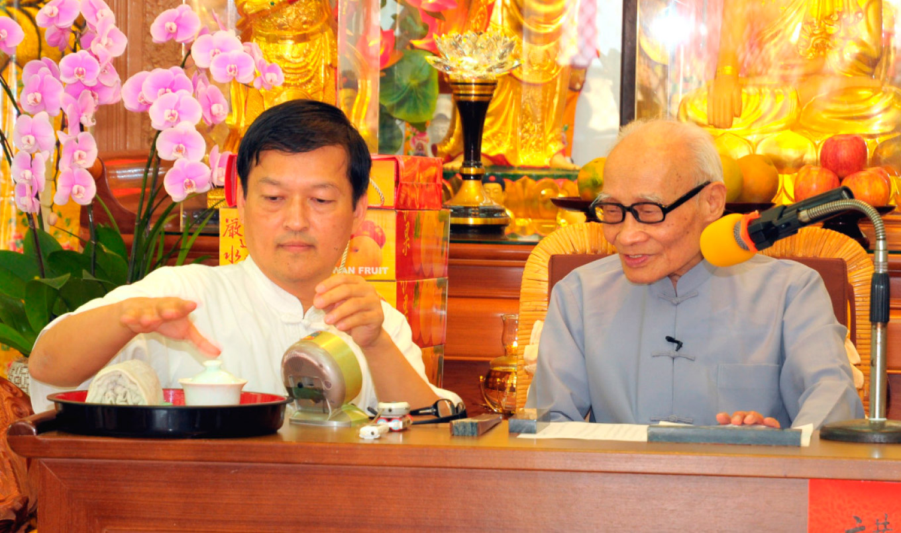

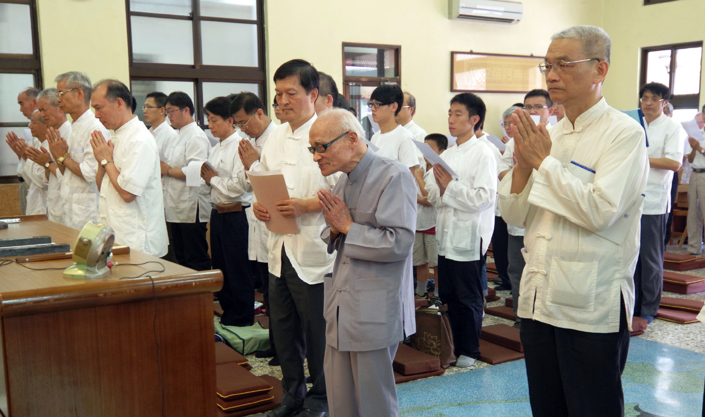

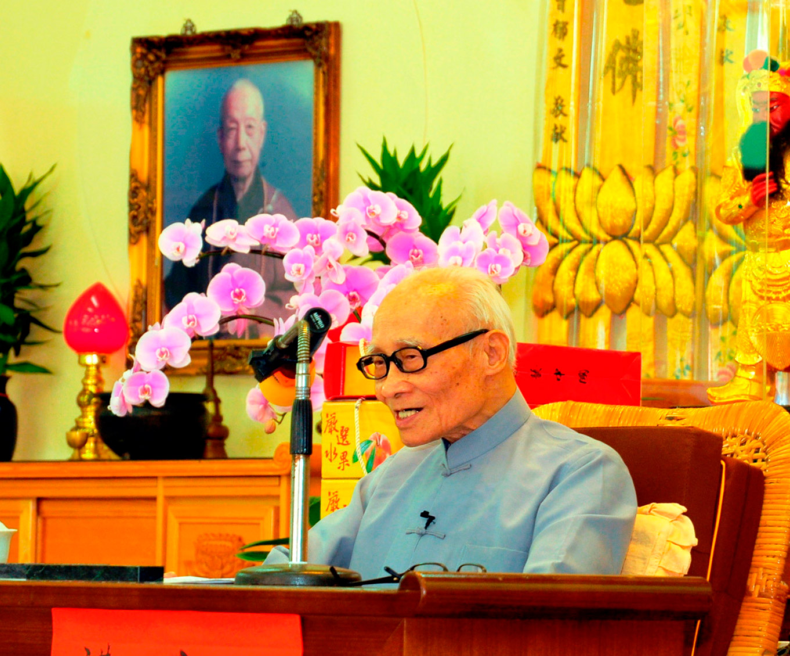

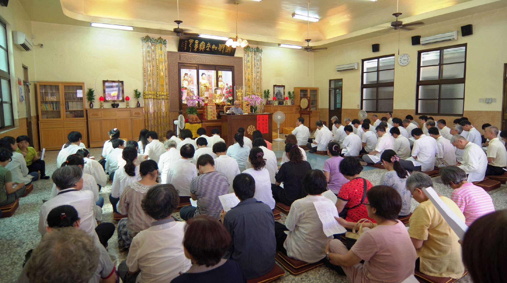

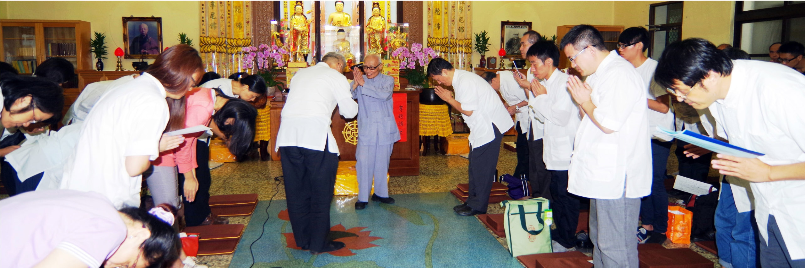

## 共修研學

### 小止觀導覽（六十三）

*心爾、治心整理*

心隨境轉凡夫邊　受用五塵心生惑

道心退失無定功　能壞佛法鬼神魔

第八章  覺知魔事

論文：

或作種種好惡之音聲，作種種香臭之氣，作種種好惡之味，作種種苦樂境界來觸人身，皆是魔事。

好音聲讓人生貪，惡音聲生瞋，奏出美好的音樂，對你歌功頌德，這樣音聲會引起你的愛好，或作出很恐怖的聲音，讓人討厭，或作很多辱罵，讓你感覺不舒服，外魔有這種神變的力量，而且只會在自己的五根上顯現。比如有人說：常常聽到有人跟我講話，我們不要一概認為他是精神錯亂，有時候是外魔成立，但是別人的耳根聽不到，只有你的耳根聽到，這時要知道不要被這個聲音干擾。

有一個人說：「我的修行有成功，有感應護法在旁邊，只要有人來了，耳朵馬上有聲音說：這個是好人，那個是壞人，好靈驗喔！」這時候不能只相信那個聲音，對人的判斷要以聖人知見為標準，怎麼可以以外境的聲音為標準呢？所以讀聖賢書很重要，有時候伴隨你的修行，也會有異香，但這只是一個證明而已，沒什麼好得意的。

現出天廚妙供的味道，或惡臭的味道，讓人失去禪定力。有說去為人助念，助念的時候覺得有人放臭屁，可是旁邊沒有別人，這是心魔還是外魔？這些以色、身、香、味、觸來擾亂修行人的魔事，都有可能是外魔的干擾。

論文：

其相眾多，今不具說。舉要言之：若作種種五塵，惱亂於人，令失善法，起諸煩惱，皆是魔軍。以能破壞平等佛法，令起貪欲、憂愁、瞋恚、睡眠等諸障道法。

鬼神魔惱很可怕，能變化各種五塵境界擾亂修行人，當我們耳朵聽到的音聲，鼻子聞到的氣味，舌頭嚐到的味道，身體接觸的苦樂境界時，以五根生五識來納受五塵，此時第六識已被擾動到無法在善所緣境上專注，甚至產生貪欲、恐怖、憂愁、憤怒的情緒，在善所緣上的禪定功夫退失，修學佛法能令心平等不起煩惱，謂之平等佛法，此時煩惱生起，破壞了平等佛法。

修學佛法的作用就是能對治煩惱，或對治粗相的煩惱，或對治細相的煩惱（人我執、法我執），使內心得到平等相。所以破壞了平等的佛法，會令人生起貪欲、憂愁、瞋恚、睡眠等障礙。論文中特別提出睡眠，睡眠這一個障道法，一般人是難以察覺的，有二個原因會造成常常想睡覺、提不起勁：

一、身體不好。二、煩惱過重。

煩惱過重可以說是外魔擾亂，也可以說是內魔擾亂。因為有內魔、外魔的擾亂，所以容易起煩惱，容易起煩惱的特徵之ㄧ就是想睡覺。修行人有ㄧ個特徵，就是常常是清醒的，不修行或是修行不得力的，每天迷迷糊糊，眼睛睜開，心眼卻沒開，做事情轉頭即忘，每天不清醒的感覺，像是睡得不夠，這種障礙ㄧ般人比較難以察覺，所以智者大師特別提出。

論文：

如經偈中說：欲是汝初軍，憂愁為第二，飢渴第三軍，渴愛為第四，睡眠第五軍，怖畏為第六，疑悔第七軍，瞋恚為第八，利養虛稱九，自高慢人十。

《佛說四十二章經》裡有云：修道人要觀想自己一個人和萬人作戰。修行路上，一人與萬人為敵，一定要有這種氣勢，在上班的時候全公司只有你ㄧ人學佛，家庭聚會也是你一個人學佛。不只如此，修行的時候所面臨的心理障礙、外境上的障礙，要經過許多的考驗，所以祖師特別告訴我們有這十個魔軍需要抵抗。

貪欲是魔王的第一個軍團

，魔王有十個軍團，貪欲是中軍元帥，帶領軍團把修行人擊垮。

第二軍、憂愁：

指的是無法在境界上安住，無法在教法上證悟，心情不舒坦，常常感覺鬱卒。

第三軍、飢渴：

飢渴是生理現象，怎麼能算是魔軍呢？修學環境不好，令人無法安住修行，需要修學安受苦忍。

第四軍、渴愛：

飢渴是生理現象，渴愛是心理現象，飢渴是生理的不滿足，渴愛則是心理的不滿足，升官了還想再升！發財了還想再發！雖然有修行，但是修行的快樂還是取代不了對世俗的愛戀。

事實上如果在修行當中得到快樂，那種殊勝的感覺，是可以取代愛戀世俗的心，渴愛就是追求滿足的感覺，結果愈追求愈不滿足，一生被貪婪所攝持，成為最大的輸家。

第五軍、睡眠：

指的是喜歡睡的那一分。睡眠本身不是過患，若喜好之，則會增長癡心，令心於坐上修時，呈現昏沉與沉沒的現象。內心在緣念善所緣時，呈現闇闇的，整個人沒勁，這是以睡眠為因，增上的現象。所以有的人修行到最後保有的習氣就是睡午覺，ㄧ定要睡午覺，不然會發脾氣罵人。這麼說來要小心！往生也有可能發生在中午！此時豈非受眠心所障礙乎？故修行人當隨遇而安。

第六軍、怖畏：

若行者怖畏沒有修行的道糧，則會隨順於功德主，失去修行的風骨，乃至怖畏別人看輕，甚而冤家仇害，都會是修行的障礙。

第七軍、疑悔：

若對所修有疑，繼續修下去是完全不會得利。悔也是一樣，常常對自己所作的惡事後悔，我這樣作業障能懺除嗎？或者是明明學佛了，還會再犯錯事，我這樣修行得力嗎？這些悔箭都讓自己沒辦法繼續修下去，當抱著從前種種譬如昨日死，以後種種譬如今日生。

第八軍、瞋恚：

修行人若抱著憤世嫉俗的心，事事看不順眼，心裡悶悶的，乃至認為大家都不瞭解我，會成為修行嚴重的障礙。修行往上走時，會把微細的煩惱逼出來。在《小止觀》裡的覺知魔事，即是修上來以後會有魔事來障礙，這些煩惱（內魔）有的很微細，微細到若不察覺，則增長廣大。有云：老修行架子大、脾氣大。此即憤世嫉俗以及架勢伴隨著修學的勢力增長廣大。如此則比不修還麻煩。

第九軍、利養虛稱：

這些供養乃至虛榮都很在意，這些都很微細，利養有時不在乎，虛名則難躲，隨著名氣愈來愈大，就愈拿不掉對它（虛榮、體面）的在意。因此面對別人的稱讚雖很感謝，感謝他對我的肯定和期許，但要小心防範自己愛著這樣的境界，變成這個煩惱軍的俘虜，成為修行的障礙。

第十軍、自高慢人：

經云：我慢山高，法水不入。雪公在七十四年的佛七開示也說：持名容易難除慢，無價寶珠從此拋。念阿彌陀佛很容易，然除慢心則難，何以故？除去內心貪瞋毒之後，卻生起自認我能除貪瞋的慢心。所以最後結歸到第十軍，謂之：修行容易難除慢，無價寶珠從此拋。無價寶珠就是修行的功德法財，好不容易得到的功德法財，就被我們生起的慢心輕易地捨棄了。

論文：

如是等眾軍，壓沒出家人，我以禪智力，破汝此諸軍；得成佛道已，度脫一切人。

此處何以特別指壓沒出家人？因為出家人已經專志要修行，有志於修行的都被壓倒，更何況沒有志於修行的在家人，那些把修行當作副業的在家人。

上述十軍特別指是由外魔引起來的障礙，因為前面的正修止觀，止跟觀就是對治這些煩惱，後面再說這十軍指的是外魔引起來的，因為有這些外魔的障礙，讓我們生起煩惱、恐怖、貪求睡眠、飢渴、渴愛、瞋恚等。所以我們修學佛法，除了要對治內魔以外，還要對治外魔對我們引發煩惱的那一分，比如自高慢人，因為常常被魔加被，在修行當中有很多的瑞相，產生自高慢人的心，變成修行的障礙。

以唯識宗來說，因為每個人都有第八識，每個人的第八識都產生重疊，鬼道有鬼道的第八識，鬼道的第八識會顯現為鬼道的境界，如果是人道的第八識，就顯現為人道的境界，可是有時候因緣際會，可以把鬼道的境界變成我第八識的相分去顯現，所以我的第八識跟他的第八識重疊，但是他（魔）猶是我第八識的相分去顯現，不是有個外境在那裡，是我心裡生起的，這是唯識宗的講法。

中觀的說法是外境就成立在那裡，雖然外境自相空，可是觀待條件顯現的外境是有的，修行有時候是內心的障礙，好比內心的煩惱過重，變成修學的障礙，有時候是外境成立，好比五四運動時，全國鬧得如火如荼，那個外境就成為修行的障礙。如此可知，如果大家不努力共造善業，把社會淨化，我們就會創造修行的外魔。

修行要度化眾生，要從三方面來講：

一、他很痛苦，所以佛要度他。二、他恩德很重，所以佛要度他。三、你不度他，他會變成你修行的障礙，外魔成立。

不組成佛化家庭，往生的時候他就成為外魔，亡者在臨終時被搬動身體、哭泣，家人叫葬儀社把遺體搬到冰庫，叫道士來做法，呼天搶地的哭鬧，左鄰右舍都說他孝順，這時他就是往生者的魔境，本來可以往生的，結果被弄到地獄去，從這個面向講，度不度他，跟我有絕對的利害關係。

所以佛積極的度化眾生，何嘗不是在除掉他修行的外魔。當然眾生很可憐，眾生很苦，眾生恩德很重，所以要度他。不度他，他就會成為我們修行的外魔。（下期待續）

### 菩薩清淨的行持　華嚴經淨行品（七）

*編輯部整理*

十王敬護成佛兆　迅速累積勝資糧

觀待願力空性慧　能攝菩薩廣大行

甲一、智首問舉德徵因

乙二、陳所疑之問

丙二、別問行所成德

丁八、十王敬護

經文：

云何常得天王，龍王，夜叉王，乾闥婆王，阿脩羅王，迦樓羅王，緊那羅王，摩喉羅伽王，人王，梵王之所守護，恭敬供養。

這十王在《清涼疏鈔》上說是得增上果，在外境上有此十王的擁護。

第一是天王的擁護，從四王天開始，一直到色界四禪天的天王。釋迦牟尼佛在菩提樹下證悟的第一件事，是觀眾生的根機，當佛在現證空性，破所知障成就佛果時，回觀眾生的根機，發覺眾生太難度了，他想入涅槃，這時出來兩位天王，一位是色界天四禪天的大梵天王，一位是忉利天的天王。四禪天的大梵天王拿著法螺，忉利天天王拿著法輪，請佛住世利有情。

這二種法器表徵請佛轉法輪，佛的法音能遍布三千大千世界，為了令佛生起住世的心，他們宣說佛過去是怎樣的發願利樂受苦有情，如何在惡世說法度眾生，如此誠意的請佛住世，佛才點頭同意住世轉法輪，如此方有一期度生的因緣。

以前雪公老師生病時，躺在床上，沒辦法起身講經，但只要有人告訴他說有人從遠地專程來聽經，雪公則奮力起身，此即心力的影響。

娑竭羅龍王非常護持佛法，佛就為娑竭羅龍王講《十善業道經》。娑竭羅龍王的女兒，就是《法華經》裡面成佛的八歲龍女，她問舍利弗：「彈指神變快不快？」「快！」「我有一件事比這還快！」「什麼事？」「成佛的速度！」龍女就到南方去成佛，可見心力強盛比什麼都重要。

三者、夜叉王：

夜叉就是疾捷鬼，神力很強，但是長得難看。所謂地行夜叉、空行夜叉、天行夜叉。地行夜叉就是在路上走得很快，山林曠野中深夜晚上有許多夜叉在行走，所以晚上一人最好不要到深山野地，受菩薩戒者，於險難獨行犯菩薩的輕垢罪。到沒有人煙的地方，必須要結伴而行，《常禮舉要》亦有：一人不入古廟，兩人不看深井。空行夜叉，就是在天空中走路，天行夜叉是在天空中飛，共有三種夜叉。

釋迦牟尼佛在傳比丘戒時，這些準備要作為佛傳承者的比丘，弘揚佛法是比丘的責任，在家人不弘揚佛法，佛不會責備，然比丘是教本，佛必須要嚴格要求之。比丘受比丘戒，以那一分來認定他的身分。

而登壇受戒之前，地行夜叉傳告空行夜叉，空行夜叉傳告天行夜叉，一傳魔宮就震動，所以比丘登壇受戒時，成為人天師需要極大的福報，沒福報的當場病倒，或受戒前腳麻腰痠、全身癱瘓，生病住院，沒辦法受戒。

四者、乾闥婆王：

就是帝釋天的樂神，以香為食，所以又叫做尋香神，他們住在海市蜃樓。釋迦牟尼佛講經說法時，乾闥婆就會奏美妙的音樂，莊嚴道場。

五者、阿修羅王：

有財富、天福（有福），但是瞋恨心重（無德），常與天作戰。有一次阿修羅與天作戰，兵敗，十萬大軍躲至蓮花梗內，天王尋覓不到。阿修羅是男醜女美，有些圖畫描寫阿修羅和天的關係，是樹木長在阿修羅的世界，而果實長在天上，在天上收成，因此阿修羅心裏不平，常與天作戰，他們有天的福，沒有天的德，而且因為釀不出酒，所以又稱作無酒，又因為長得不好看，故又稱無端正。

六者、迦樓羅王：

就是金翅鳥，翅膀一張開有三千哩，藉著風力可從天的一個角落飛到另一個角落，可飛到天涯海角。佛在講金翅鳥王時，是藉著金翅鳥王的兩個翅膀講佛的福慧兩足尊，靠修福修慧越過佛的智慧功德大海，那雙翅膀是累積福慧的資糧，而風力就是度化有情的因緣。

金翅鳥喜歡吃龍子，翅膀一拍，將海水分成兩邊，出現龍宮，就把龍子輕鬆抓起來吃掉。所以龍王就向釋尊告狀，釋尊把袈裟賜給龍王，龍子們只要綁到袈裟的一根線或一小片碎布，金翅鳥王就吃不到。

金翅鳥沒龍子可以吃，也跟佛訴苦，所以我們讀到課誦本「大鵬金翅鳥，曠野鬼神眾，羅剎鬼子母，甘露悉充滿。法力不思議，慈悲無障礙」就是講這段公案。

七者、緊那羅：

緊那羅是人非人，甚麼叫人非人？就是這個人看起來像人，可是又不是人，因為頭上長一支角。

何以釋迦牟尼佛的教法能遍傳？與十王擁護有關。有一部《大樹緊那羅王所問經》，緊那羅頭上長一支角，此人善於彈琴，有天他帶著琉璃琴去見釋迦牟尼佛，很高興的邊彈邊唱，連坐禪的阿羅漢都起來跳舞，其中跳得最認真的是迦葉尊者，但佛不怪迦葉，阿羅漢尚有煩惱習（所知障）。

我們沒聽過天樂，現在聽的大都是靡靡之音，如果小朋友們從小就懂得欣賞音樂，靡靡之音自然就聽不下去了，與其限制同學們聽熱門流行音樂，不如發展正樂，正樂聽了會聽不下其他音樂。緊那羅王奏的是天樂，這個音樂有辦法讓阿羅漢入不了定。而佛在講經說法一定有天女散花，有一段音樂，才正式說法。

八者、摩喉羅伽王：

為大蟒神或腹行神，昔日安世高師兄，持戒懷瞋即墮此道，為共亭湖神，後受安世高度化。

又，如何能得到十王的擁護？推行正法、弘揚教法時，不但本身要有內涵，還必須在外緣上結合各種人脈，成佛弘揚正法亦需要十王擁護。成佛前需「侍多千億佛，發大清淨願」，並與眾生結各種的法緣，才有一期講經的盛況。所以釋迦牟尼佛在五濁惡世，南瞻部洲，眾生業障滿滿，信心薄弱，起心動念無不是罪、無不是業的時代，他敢來此世界示現成佛廣度眾生，更是十方諸佛之特別者。所以十方諸佛，不但同時讚歎阿彌陀佛，也同時讚歎釋迦牟尼佛。所有的能耐都是過去發願，累劫努力做出來的，沒有累劫的造作，沒有勝解力做攝持，後面絕對不會有這種盛況！

不讀華嚴，不知佛富貴，若真正瞭解華嚴思想，對我們修行有極大的幫助，臨命終異相起現行時，以歡喜心來念這句佛號，佛號自然會顯現他的功德，所以只要對教理有所暸解，會感覺西方極樂世界越來越接近，修行不再是困難的事。對教理不瞭解時，修行障礙重重，感覺西方很遙遠，生活常覺得無聊，煩惱也沒辦法對治，但當對教法瞭解的時候，這些現象都會改變。

所以一位行者要去利益有情的時候，他不只得到十方諸佛的護持，連菩薩也乘願再來作他的弟子，過去的眷屬示現為聲聞來幫助他弘揚正法，並且還有十王的敬護。

以上講十王擁護，十王的擁護會讓佛一期的弘化因緣，有非常殊勝的流通。江逸子老師在他六十歲為其母畫千手千眼觀世音菩薩像時，下面就有四大天王擁護如意樹，樹上面站著千手千眼觀世音菩薩。四大天王為何擁護觀世音菩薩呢？要知道是佛咐囑王臣為外護，佛法來此世間方能順利流通。不要小看政治，政治擁護佛法，佛法就能流通，眾生就能受益。

以前宋文帝也曾問國師，佛法有什麼用處呢？國師就對其言，受一戒，就可省一刑，國家就少多少人免受此罪，所以受的戒愈多，省掉的刑罰就愈多，監獄裏關的犯人就愈少，這就是護王政。

現在世風日下，標榜的是監獄學校化，監獄學校多到必須要大赦的地步。說好聽是在上位者慈悲，實乃監獄裡面犯人太多。若為政不以禮、以德為主的話，人民只是茍免而已，一點羞恥心都沒有。看現在的政局如此紛亂，政府不知為何一路跌跌撞撞的往前衝，卻不知回過頭來找根本的原因。（下期待續）

## 蓮池海會

### 謝賢忠老居士往生見聞記

*編輯部整理*

見兄往生種善根　待至臨終心意決

雖現障礙後助念　柔軟安祥大功成

謝賢忠老居士，桃園縣中壢市人士，出生於民國三十六年九月十六日。於十個兄弟姐妹中排行第五，個性內斂，事親至孝，待人和善。自幼因家中食指浩繁而家無恆產，在協助照顧弟妹、母親農事及家事中養成刻苦耐勞的美德。

因家境困難，雖品學兼優，居士完成國中學業(按彼時尚未實施九年國民義務教育，小學畢業後國中入學需經聯考篩選)後即就業以貼補家計，陸續服務於紡織廠、船運公司、鋼鐵公司等，在任職船運公司期間結識陳素玉女士，結為連理，最後舉家遷居南部並自營便利商店。婚後育有二子一女，教子有成，均完成大專以上學歷，長子在家併同經營便利商店，次子服務於科技業並育三女，長女服務於百貨業，皆能服務於社會大眾。

居士家境雖不富裕，但凡事替人著想，個性慷慨，在親族朋友心中都存下深刻印象。然天不假年，今年三月經醫院檢驗出罹患肺腺癌末期，經半年多輾轉治療，藥石罔效，於十一月六日與世長辭，臨終幸得蓮友勸慰，生信心而願生極樂，加以外有親姐為學會蓮友護持，歷經障難終能排除，在蓮友及家屬接力輪班助念二十小時後，全身柔軟，法相莊嚴，足證蒙佛接引，往生西方，堪慰親姊苦心及家屬孝心，足證彌陀大慈大悲大願之不虛。

子曰：「十室之邑，必有忠信如丘者焉，不如丘之好學也。」居士忠信本質具矣，雖一生未嘗學儒學佛，但事父母竭力，事君致身，敦倫盡份，當無疑義。然此為往生之因緣乎？而忠信本質可排除往生之障礙乎？若皆是，現見世間很多忠信質樸之士，臨終不獲助念，胡塗而終所在多有。居士往生大業已了，而吾輩來者可追，能細細參究，既可未來避免重蹈覆轍，又可為居士高增蓮品之因。

如以四緣具足論居士往生一事，「親因緣」當為居士發願往生的心，居士宿世必有善種，但一生未學，此心無由引發，往生之緣在於六年之前居士大哥（謝鴻昌）往生時，亦由團體護持其告別式及做七儀式，謝賢忠居士每個七都參加，對莊嚴的佛教儀式生起歡喜心及決定見，然過後未能繼續學佛，但成今時之因。

直至居士臨終在加護病房，受末期癌症及半身不遂之苦逼，幸有親姊發心護持，請到蓮友至病床前開導居士極樂之殊勝，時居士即生決定求生之信念，「親因緣」具足，此第一難也。一般人平時未學佛，臨終能遇善友開導者少之又少，而且又願意放下對娑婆的貪戀者又更少，在臺灣每天約有四百人去世，每年有十四萬餘人離世，能具此親因緣者恐怕千中選一甚至萬中選一，多數人甚至學佛的蓮友，臨終的時候放不下名位、妻子、財產，擔心兒女未成家立業，林林總總就是不願意放下，此時認識再多蓮友都無用，外緣再殊勝都使不上力。

具足往生的「親因緣」後，其次「所緣緣」，所緣念的對象就是「阿彌陀佛」的無上弘名，那不就請病人好好念佛就好了嗎？其實多數人臨終時，身為眾苦所逼，或不得自主須人照料，若病人無往昔極強正知見力量，或極好樂念佛的工夫，悠悠泛泛如吾輩凡夫，臨終時只憑自身恐怕都念不上佛號。則此時之「所緣緣」不妨說是病人的妻子兒女等眷屬，在旁邊有權決定如何護持的人，才有助於臨終病人佛號念得下去。

以謝賢忠居士為例，明明已經隨順蓮友開導願生西方，也交代其三姊要出院念佛，但妻子兒女無正知見，一聽護士說出院會很痛苦就躊躇不前，再加上醫師一說有新藥可以一試云云，就此耽擱無法出院助念，這中間，居士不斷以手勢眼神示意出院助念亦無人理會，唯一具正知見的三姊，因無法作主也使不上力。直至居士斷氣後醫生護士進行急救，雖未氣切電擊，但經一番折騰後，才拔除所有管線，辦理出院，這時才往上品蓮之助念室送。

印光祖師所說的臨終三大要：第一要：「善巧開導安慰，令生正信」已經做到；第二要：「大家換班念佛，以助淨念」及第三要：「切戒搬動哭泣，以防誤事」都未做到，在居士斷氣前乃至斷氣後還急救擾動，對居士臨終在四大之身將分離之際，任何小碰觸都成大痛苦的情形來說，徒增痛苦，往生不但無助益，反而成大礙。如果居士此時因痛苦而生大惡念，感三途惡報，後來再助念都枉然。

經上記載：釋迦佛在世時，印度有一阿耆達王平時亦信奉三寶，布施供養修行，但因臨終時旁邊侍者手中的扇，不慎掉落於其臉上而生大瞋念，墮大蛇身。醫師及醫院均有其功能，亦不可毀，然其不知人命有時而窮，古時彭祖活八百歲，亦難免一死，而輪迴是無盡的，在此生即沒而彼生將生之際，病人與眷屬都要有魄力擺脫醫院束縛，試問多留醫院一天乃至一月有何益？全身從鼻胃管、氧氣管、點滴管、監測管、尿管，甚至氣切。據有經驗者說，全身無處不痛，無時不痛。

而出院助念者未必皆死，前某蓮友外祖母九旬高齡，回家助念兩天後活回來，又一年餘才往生。就算助念而亡，以娑婆的臭穢血肉糞便之身，去換極樂世界金剛不壞身，這是多占便宜的事。所以居士這所緣緣在斷氣前乃至斷氣後是不具足的，都是因為妻子兒女想多留一時也好，再試一次新藥的世俗想法，而無視其時居士已癌症末期，半身不遂，呼吸不繼之緊急狀態。

所幸居士斷氣後，妻子兒女等眷屬願意聽從三姊，從移靈救護車上開始助念，「所緣緣」具足，「增上緣」就是蓮友的幫忙終於能用上力，至上品蓮助念室後，蓮友與家屬排班念佛至晚上九時，在斷氣八小時後老師打開陀羅尼經被察看，不甚泰然，認為有需要再繼續助念，便由家屬再輪班助念十二小時至隔天早上九點，這是「等無間緣」延續的力量，淨身大殮時只見居士面容如生，安詳微笑，全身柔軟，這才見居士往生極樂確然無疑。

助念是幫助病人提起正念，家屬至親關心所在助力最大，因此助念是以家屬為主而蓮友為輔。往昔助念亡者能順利生西者，多是家屬具正知見而心誠，亦不用多餘醫療作為來障礙亡者；反之臨終急救，甚至氣切、電擊等作為，做越多對亡者障礙越大，之後有的案例助念再久，亡者依舊面露痛苦，臉色鐵青，而身體僵硬，實已在劫難逃。相信謝居士的家親眷屬在歷經助念告別式，及往後作七等佛事後，均能如法進行，然能否了解以上所述的內容，而具備正知見，並在七七佛事圓滿後還能繼續學佛，方不枉居士一番生西之示現。

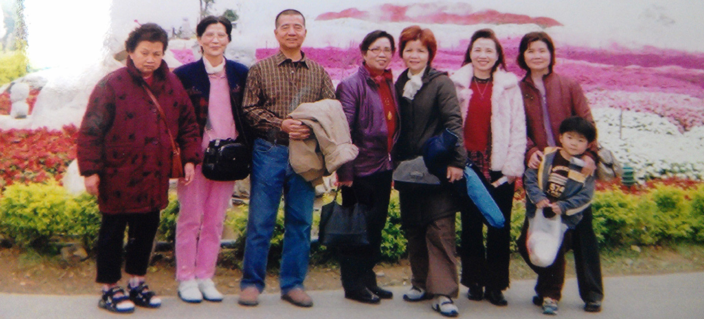

## 專題研學

### 聖者的祕密～大佛頂首楞嚴經二十五圓通暨七處徵心探源　二十五圓通暨七處徵心簡介　（三十二）

時哉

心量能力應機廣　諸佛讚歎耳根通

了不可得真明了　尋聲救苦觀自在

未二、應求雜趣

申二、人趣

酉一、世諦男子

戌一、人主

經文：

若諸眾生樂為人主。我於彼前現人王身而為說法，令其成就。

此人有安邦定國的抱負樂為人主，而人王當中最殊勝的是金輪王、銀輪王、銅輪王、鐵輪王四種輪王。這些王有七寶（金輪寶、象寶、馬寶、將軍寶、主藏臣寶、寶藏瓶、女寶）隨身，例如女寶就是王后寶，此國王想要一統天下，內宮要有賢后方能整齊。如周家開國三太，能相夫教子，故能開創八百年天下。

將軍寶，則是統治天下的輪王，有文治亦需要有武功，要有將軍以武力弭平叛亂維持太平。

主藏臣寶，則是指輪王的財政，財政也是辦政治重要的一環，能令百姓富足。

象寶代表威勢，馬寶代表交通工具，寶藏瓶寶代表財富，所以在盛世的時候，國王的財富一定非常多。輪寶代表轉輪聖王教化的威神力，政令能推行於全國，國中有諸多幹才，維持強盛的國家。

人趣當中有人主，有臣民，臣民分為以下這四類人（長者、居士、宰官、術士），懂得國王的修學法，並且尊重這四類人，世間的政治就能辦得好，國家就能昌盛。

戌二、臣民

亥一、長者

經文：

若諸眾生愛主族姓，世間推讓。我於彼前現長者身而為說法，令其成就。

一個國家的長者很重要，尊重長者，並且透過他來舉薦人才，此時國王的地位會很穩固，就像張良禮請四皓輔佐太子，讓劉邦決定將王位傳為給惠帝。觀世音菩薩對於那些有心要作長者的人，告訴他長者的修學法，而人主也是觀待這四類人，才能夠統一天下，長者就像 雪公老師這種人，這種人雖然在國家沒有官位，可是在地方上，只要談到他，他就是中央標準局，他說了算！

古時候有的族姓是非常尊貴的，例如中國的孔氏家族，族姓流傳而被大家所尊重，需要非常多的陰德去莊嚴，這個族姓才會被大家公認是很有份量的，而所有尊貴的族姓中又以他為主，其影響力不輸國王。而愛主族姓，更是所有族姓中以他為主，是長者中的長者。

世間當中只有大家讓他，誰也不敢走在他前面。不管是道德、學問、族姓、風度都是世間推讓的對象，就像祇樹給孤獨長者。釋迦牟尼佛在舍衛國弘法，固然釋迦牟尼佛非常殊勝，但也要靠給孤獨長者提供道場並作外護一分的力量。

觀世音菩薩說，我於彼前現長者身而為說法，令其成就（長者）。這是臣民中的第一類，長者的修學法，國王遇到困難的時候，國君會花些時間到長者家請教，謂之移樽就教，國家困難的僵局就能打開。

亥二、居士

經文：

若諸眾生愛談名言，清淨其居。我於彼前現居士身而為說法，令其成就。

愛談名言，就是指講學的人士，如周敦頤、王陽明、朱熹等，不但生活單純，心裡面也很單純，住處高雅，談笑有鴻儒，往來無白丁，謂之清淨其居。這些講學人士對國家的影響力也非常大，國王必須要非常尊重。

亥三、宰官

經文：

若諸眾生愛治國土，剖斷邦邑。我於彼前現宰官身而為說法，令其成就。

一般說比較大的地方叫做邦（諸侯國），當中的各個區域謂之邑（縣）。

此人若很喜歡治理國土，剖就是分析，斷就是決斷，在邦邑當中分析決斷，也就是審判冤情，古時候的地方父母官，封疆大吏或朝中大臣（如大司寇）有司法的實權，不但有內政的實權還有司法的實權，判案也由他判，所以叫做剖斷邦邑，此人權力非常大，生殺由他。

我於彼前現宰官身而為說法，令其成就。宮廷戲中也曾演過，國家政治要辦得好，不只是中央和諧，地方官乃至七品的縣老爺們也要各安其分，否則上面政策的美意，因為執行者的偏差，卻變成老百姓的負擔。

亥四、術士

經文：

若諸眾生愛諸數術，攝衛自居。我於彼前現婆羅門身而為說法，令其成就。

若諸眾生愛諸數術，數指的是天文、地理、陰陽等知識，術指的是算命、卜卦。攝就是指調整身心的方法，也就是道家裡面的精、氣、神，養神的方法叫做攝，養精、氣的方法叫做衛。這些人（婆羅門）雖是外道人士，但德高望重，在國家裡面也是很有影響力的人。觀世音菩薩也會成就有情婆羅門的修學法，這些宗教人士也會令人心安定，若能導正彼修學方向，利眾力量更大！

以上這四類屬於臣民，一個國家的國王如果重視這四類人，則國家容易治得好。其實宗教管理極為專業，絕對不是在內政部當中成立一個司，用公文辦事依法行政，此人一定要非常通達這些宗教團體在做什麼，通達其中的內涵才有辦法去管理並加以導正。

有很多的問題不是重典用刑就可以解決的，像清朝在整頓邊疆的時候，因為懂得用佛教，也願意尊重中華文化，所以不用花很多的心力，人民就臣服你。現在人哪裡懂這些？現在人都按照公文格式來回公文，最後歸到資料庫，有何意義可言？

要引導有情，現長者身、居士身、宰官身、婆羅門身等都是方便，觀世音菩薩之所以會傳這些修學法，是觀待這些人欲累積成佛的資糧，眼前願以這些角色利益眾生，孔子讀易經的韋編三絕，所彰顯的固然是無大過，然為了利益有情，何嘗不是通達天文地理等各種知識，而成為各方人才。

有心要得到人天安樂的人，觀世音菩薩也教得到人天安樂的方法，或者此人發菩提心，為了攝受眾生，以人天安樂來做成佛資糧的一部分；或者羅漢要來遊戲人間，想要發起慈悲心來利益人間，觀世音菩薩都會教他們利益眾生的方法。（下期待續）

### 極樂世界的脊椎骨　三十七道品分析（一）

心超講述

道品雖分三十七　現證空性道次第

先開見地修止觀　定慧均等果上圓

前言

三十七道品是整個極樂世界的骨幹，極樂世界雖然開演了無量無邊的教法，但是核心思想就是三十七道品，它是教學主軸課程，撐起了極樂世界，所以必須要好好的將它說清楚。三十七助道品乃修行由下往上的綱要，共分七科，即是四念住、四正勤、四神足、五根、五力、七菩提分、八聖道分。

*今依大專佛學講座之因緣，整理依雪公表解闡釋之三十七道品文稿，爾後將分期連載。*

四念住、四正勤

、

四如意足

四念住以觀身不淨、觀受是苦、觀心無常來引發出離心，並以觀法無我的空性正見開啟見地，整個佛法的命脈就是在出離心和空性的正見。再以四正勤(未生善令速生，已生善令增長，未生惡令不生，已生惡令立斷)斷惡修善以積聚修學止觀的資糧，能得善知識的指導及安住於修學止觀的環境。欲得觀慧得先修止，故修學四神足，先生起欲修止的善法欲（欲神足），依教而生起勤修止的力量（勤神足），對所修的法無忘失（心神足），能令心不持散，此時對萬法自體性空有專注觀察的能力（觀神足）。

但在極樂世界無須辛勤修行四念住、四正勤與四如意足，後文將詳說。

五根

五根與五力都是

信、進、念、定、慧

。依雪公表解上雙修就是正助雙修，正道就是菩提，助道就是諸善，菩提就是般若的智慧，般若的智慧是佛法的命根，沒有則不能解脫生死，也不能成佛。沒有智慧所攝持的一大堆善法，對了生死是毫無幫助的，唯有般若智慧攝持下，這些善法（助道）方成為無漏，而造善的主體都是為生起般若智慧，這些善法也為般若智慧所攝持。

例如布施這一法成為助道，目的是來世修學般若智慧時衣食不愁，而且有能力供養三寶，學佛有順緣，不須為生活忙碌。以此觀之，助道全為正道，並由正道攝持助道。

再如持戒，目的是來世成為人、天的高貴種姓。若是沒有持戒，來世變成狗貓雞鴨，雖然依著前世的布施，此世可以喝牛奶，住舒服的狗窩，生病的時候有主人帶去看狗醫生，但以這種形式受用果報是很糟蹋的。持戒讓我們生到人天道，有機會見到人天的善知識，並且跟隨學習般若。又因為持戒，所以在人天道中種姓尊貴，也比較容易請到善知識。好的老師也願意到皇家去教書，不是攀龍附鳳，而是貴族對社會、國家有影響力。

修忍辱的目的是來世長相好看，且性情溫和，令善知識樂於攝受，做善知識的侍者，方便接受調教，易證般若，此即修學忍辱與般若的關係。

精進者來世極有恆心。能以恆心學習般若而通達。例如學習龍樹菩薩的中論（二十七品），精進讓人在作繁複的義理分析時，能持續深入的學下去。此外，即使環境不好、老師再嚴厲都肯學，有這種特質的人才能學出成績。儒家當中顏回最有此特色，所謂：吾見其進也，未見其止也。孔子說只看到他精進，沒看到他懈怠，性與天道必須要這種人才能通達。

修學禪定，來世易生起專注力，容易對般若專注修學，不會墮入散亂、昏沉、掉舉，也容易在定中生起對空性現量的通達。

因為曾修學般若，所以來生也比較喜歡學般若。

總之修學六度萬行都是為了般若，一個人最大的出路就是能通達、明白！雪廬老人說「董事」，般若就是讓人能夠懂事，通達勝義諦，方對世俗諦了解，這種教法的人才能將佛法發揚光大，並延續法脈下去。應知六百卷大般若經是佛的命根，禪宗的傳承就是傳般若的見地，所以雙修就是菩提正道跟諸善助道。

「信」以「正」為主因，正就是般若的正知見，助就是「增上緣」，布施、持戒、忍辱就是增上、幫助生起般若的正知見，唯有生起般若的智慧方能破煩惱障、所知障。

「進」是「勤求自度」與「廣行度他」，要在般若上能自度度他。度他必須要講究許多的善巧方便，但最重要的度他是使其獲得般若正見，方能了生脫死，才是真正給他出路。信、進、念、定、慧都約在般若上說，作善法最重要的動機也是要令自他生起般若的正見。所以佛法中最殊勝的善法就是培養人才，唯有人才才能夠住持聖教。做善事縱然贏得社會上對佛法的好感，但沒有培養人才，也只能是一時的風光。

「念」是「靜在菩提，動在諸善」，是在造作善法中觀自體性不可得，此記憶力是來自於理解，故不容易忘記。

「定」跟般若的關係是「正助相應」，就是專注於以助功去配合正。例如放生，要作三輪體空的觀察，同時要在放生裡推展正法。在正助相應的修學中，因為有定功所以「不散不昏」，也知道在善法中以三輪體空的觀慧來觀察，並觀察緣起的關聯性。由於所作的善法都是為了資助慧，故般若智慧就能生起。

此處的五根講的是四加行當中的煖位和頂位。前面的四念住、四正勤、四如意足，使得此人開始有專注修學般若的能力。煖位與頂位的修學好比鑽木取火，木頭越來越煖，頂就是到臨界點，在頂位臨界點過了以後，即是忍位的修學，此時智慧火就有能力把煩惱的柴薪燒掉，由下忍位到上忍位最後一剎那進入世第一，世第一只有一剎那（進入聖者前的最後一剎那），之後進入見道位。

見道位就是燒煩惱柴薪的般若智慧火，任憑狂風暴雨也不會熄滅，煩惱的柴薪終將被燒掉，即使煩惱柴薪架得像阿房宮那樣廣大，只要大火一生起全燒光。任何猛烈的煩惱，即便經過多生多劫的串習，如同幾十人合抱的大樹般堅實，也經不起般若智慧的大火而全燒光。在無始劫來的煩惱業，依般若的修學一生就可以解決，所以經書上廣讚歎般若。我們這一生如果能夠對般若學習，絕對不是普通人！

五根的「慧」就是煖位跟頂位，直接衝到臨界點，雪公講表講「照苦證法身，照集得般若，照滅獲解脫，照道獲解脫」，法身、般若、解脫都講般若。

照苦的自性不可得，證得苦空。空就是法身，苦就是果報，世間的果報自體性空。當體就是法身，諸佛所證的法身就是空性。證得空性破分別執叫作見道位，進入修道位破俱生執，之後進破所知障，以證得空性破所知障安立為法身，並不是離開空性別有一個法身可得，以上是照苦證法身。

照集得般若：

集是惑與業，惑、業中以惑為上首，沒有惑不會造業及潤業。惑不潤業，業不會生苦果。惑即是煩惱，而惑的上首就是無明我執。照集就是觀察無明我執所執的我根本沒有，如此就不會生執著。萬法都是透過有情的名言安立去認識，沒有實體性。若沒有透過我的名言去安立，哪有萬法的顯現？若看到的東西有實體，佛叫我們放下、不要執著，則是違背人性，違背人性的佛法是不會長久的。之所以叫人放下、不要執著，是因為看到所執的法實體性沒有，能執的心不會生，這時候說放下才有意義。

無明我執所執的對象是「我」，這個我在有情上叫人我，在法上叫法我，當發覺到所執的我自體性不可得，能執的心就不生了（五蘊上面若有一個我，那請問我跟五蘊是一還是異，以此去做辯證）。所以照集得般若的意思，是以般若智慧看到無明我執，所執的我沒有，無明我執也就無從生起，集就沒有了。

照滅獲解脫：

滅就是苦因、苦果的滅。滅不是有一個東西被滅，是般若的智慧照見苦果、苦因自體性不可得，無苦因，苦果亦不生，苦因、苦果的滅，名言安立謂之解脫。

照道獲解脫：

道是般若智慧的修學法，照道是有能力修學般若的智慧而獲得解脫，上述皆明般若修學法，可知是學佛的關鍵。（下期待續）

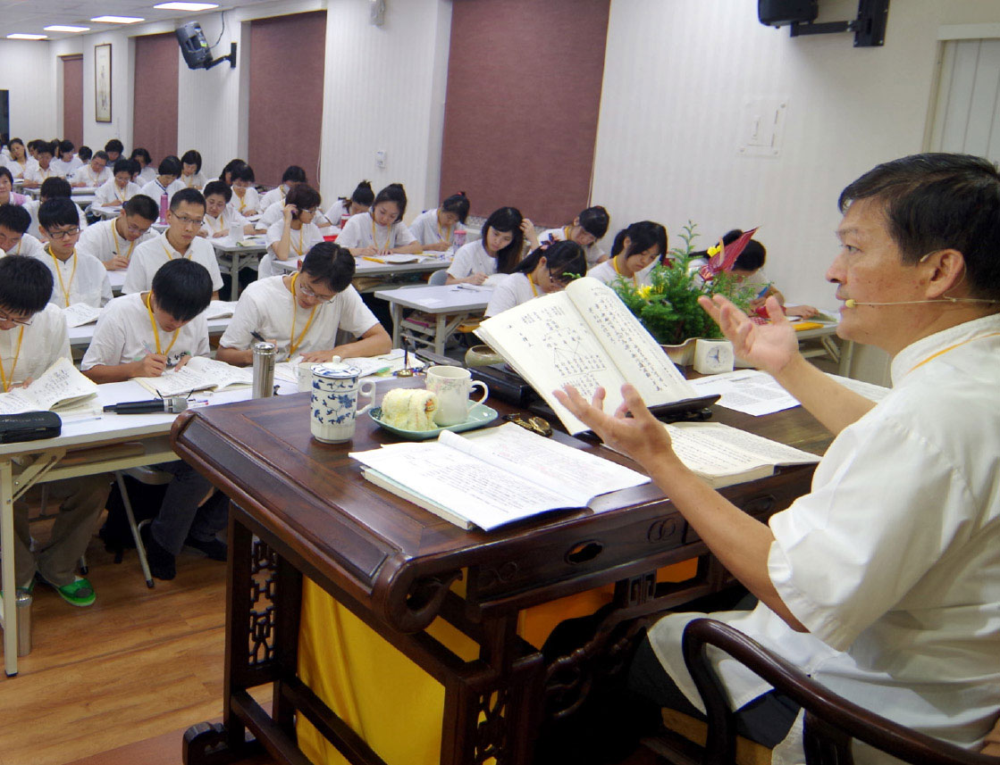

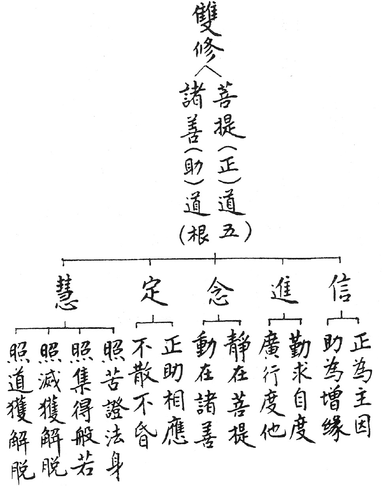

### 一件追憶的往事（五） —風雲際會世紀緣（緬懷雪廬老人）

魏慶友

初聞官軍抗戰勝

還京返鄉路猶阻

百廢待興需賢士

不堪內亂行九夷

民國三十四年（一九四五年），抗戰勝利，政府結束流亡，返回都城南京。奉祀官孔德成先生及其眷屬，因路阻於次年，在雪公等陪同下，回到南京奉祀官府。雪公在《雪廬詩文集•還京草》小引中曰：「失地復收，次年路通，買舟吳下。杜少陵出峽狂喜，余以瘡疣滿目，殷憂正深也。」雖說抗戰勝利了，為什麼雪公憂國憂民之心，反而愈加深切了呢！事實為證，並非杞人！國家的興存是聚養，眾生渴待的是甘霖！此乃頭等大事，並非其他。詩曰：

還京

願聞高位登賢士。

渴待甘霖慰眾生。

自是興存應聚養。

非關報恨沼東瀛。

結束了流亡的日子，回到南京奉祀官府後，雪公繼續任奉祀官主任秘書，二人歷經這九年的風雨同舟、生死患難，已不是一般的師生及上下級關係了。駐南京期間，二人盼望能早一天回故鄉探望，因路有阻隔遲遲未能成行。

還京後鄉路猶阻寄慨

帆渡黃牛峽。人來白鷺洲。

燒痕萬方里。客路十年秋。

輦轂仍殘破。河山半未收。

此中多少恨。可斷大江流。

終於盼來返鄉的機會，自民國二十六年（一九三七年）冬，奉祀官德成先生及其夫人，淚別闕里，隨政府流亡在外已有九個年頭，現在終於可以回家了，走時德成先生僅夫妻二人，回來已兩兒兩女了。這期間曾三次返鄉探親。德成先生曰：「炳南先生住南京奉祀官府三載有餘，其間曾陪同本人三返曲阜謁廟，惟以公務繁忙、交通不便，他僅一返濟南故里探親。」雪公詩曰：

寇平陪孔上公返魯（三首）

昌平喬木故園思。

驛路迢迢夕日遲。

白髮北來重試馬。

猶堪飛去射楊枝。

金口隄頭喚渡船。

涼風滿樹水平川。

回看馬背斜陽滅。

纔近荒城月上弦。

歸車漸欲近宮牆。

月下時聞松柏香。

正似文公還晉國。

喜中也灑淚雙行。

曲阜濟南雖近在咫尺，但因戰事、交通所阻，雪公前兩次未能回濟南故里探親、祭祀。十年飄零異鄉，囊中羞澀；一包自采紅豆，擬贈親友。不能將一顆顆沾滿思鄉、愧疚之淚的紅豆，送到親人面前，客愁舊恨誰與言說！

還鄉撿所采紅豆擬贈親友

飄零十載賸羞囊。

喜見烽煙靖四方。

萬里青山書舊恨。

一封紅豆治歸裝。

重拈轉覺思南國。

初采曾牽夢故鄉。

如水客愁言不盡。

君看淚結此珠光。

第三次是民國三十六年五月，《曲阜歷史文物論叢•文史研究》載：「一九四七年五月，孔德成偕夫人孫琪芳回到了闊別多年的家鄉。……。當時，因形勢所迫，孔德成只是處理完府務後，又匆匆離開了家鄉。半個世紀過去了，這一別竟成了永別。」戰事趨烈，這次也恐難如願，雪公當時的心情非常複雜，詩曰：

戰後陪孔上公三返曲阜以濟路尚阻難歸感賦

江上已喜靖胡沙，

三返鄉關不及家；

遙天心似難收箭，

平地寇如未績麻；

村郭寂寥秋草蔓，

狐鼬跳擲夕陽斜；

羈客最堪哀庾信，

無端橐筆處清華。

後經奉祀官德成先生設法，雪公終於如願回到闊別十年的故鄉濟南，與朝思暮想的家人團聚。未進家門已是情不自禁，每次讀來足使吾輩難以自持！

還家　四首

抵里情先熱，升階淚暗彈。

雖逢荊樹茂，還痛竹雲寒。

親友遠來問，瓜茶強作歡。

流亡十年事。含混說平安。

只有藜蒿在。更無松菊存。

塵緣總是幻。癡念偶留痕。

忽復搴帷坐。時還擁帚蹲。

兒童迎我意。汲水灌花盆。

飯後團團坐。挑燈各有陳。

四隅聲斷續。一例道酸辛。

赤縣同沉陸。蒼生半涸鱗。

寧能希苟免。惹我笑癡人。

湖山本舊侶。峭瘦減容光。

苦恨著秋雨。更憐沉夕陽。

聊勝蘇子隱。欲遣米家裝。

人事知何似。歸來倍自傷。

未進家門「情先熱」「淚暗彈」，親人面前「強作歡」「含混說平安」，字裏行間透出了無數的辛酸與親情！「含混」二字倍重千鈞！遭戰火洗劫後的故鄉濟南，「百家不見十家存」「垂楊流水」也只能去詩畫中尋。

雪公此次省親，雖略盡天倫，但也有去留兩難之苦：去，辭別妻兒「憂負骨肉」；留，「淚眼望金陵」心念聖裔。

時憂

十載家山夢。朝朝雲萬層。

荒天獨嘯傲。秋葉共飄零。

禹甸三分鼎。胡盟九仞冰。

時憂負骨肉。淚眼望金陵。

雖不得已，卻不得不選擇「離鄉」，這一慷慨揮鞭竟成永別。

離鄉

春郊車馬去閑閑，

時速心遲別故關。

桃柳數村新雨後，

峰巒萬疊曉雲間。

初聞殊語他鄉近，

回憶庭柯舊鳥還。

從古長征男子志，

揮鞭慷慨莫愁顏。

此時，德成先生攜眷，已由曲阜返回南京。雪公怕陸路阻隔，選擇了由濟南繞青島乘飛機抵南京。

由濟繞青飛京（二首）

東來地盡見三山，

隱現滄波縹緲間。

不欲停雲驚下界，

恐勞迎迓列仙班。

逍遙偶作九天遊，

繞座輕雷漸欲收。

下視人間城郭近，

清淮黃葉秣陵秋。

民國三十七年（一九四八年），時任國民大會代表的奉祀官孔德成先生，被派往美國文化考察。當時國民政府，已有將奉祀官府撤出大陸的計畫，作為奉祀官府主任秘書的雪公需隨時留守待命，因此不得與德成先生同行。雪公離鄉背井，出生入死，萬里相隨，十多年，從未離開過孔上公，不就是為了呵護聖苗？孔上公此次遠涉重洋，前途實難預料，雪公心頭既有掛慮，又有期盼，愁緒萬千：

送別孔上公赴美考察文化二首

花開紐約海西春，

風雨白門愁煞人；

聞說遠行心早亂，

不從臨別始霑巾。

迢迢銀漢使槎通，

料有群英宴白宮；

且止胡琴與羌笛，

應教木鐸振春風。

希望作為文化特使的孔子後裔，不能讓群英雲集的白宮，只有胡琴、羌笛之聲，應叩響夫子「木鐸」，一展中華之春風，使民族傳統文化的細雨滋潤到異國土地。如雪公所盼，孔上公在美的文化交流非常成功，「獲耶魯大學頒贈榮譽博士」。（下期待續）

## 孔學一隅

### 孔子聖蹟圖淺說（六）

戒慧

著眼公室墮三都　三家作梗從中罷

女樂去魯十四年　受困匡地見天命

十四、禮墮三都

本圖歷史背景是魯定公十三年，孔子年當五十五歲，當時季氏家臣公山弗狃在費邑造反，叔孫氏家臣侯犯也據郈邑作亂，亂事平定後，季孫大夫也同意孔子主張，為貫徹禮制，拆除封地上過高過大的城池，表面上是阻止家臣的叛亂，實則削弱三家的權勢，以強化公室。

於是先後墮叔孫的郈、季孫的費，而孟孫的成，因遭家臣公斂處父的反抗未能墮除，理由是成邑不僅是魯國北抗齊國的重要據點，更是孟氏之保障，無成，將無孟氏也。致使墮三都之議功敗垂成。

總之三家大夫還是著眼於各家的利益，致使孔子強公室的主張在魯國終究未能實現。

圖上坐於几席上者即是魯定公，兩旁有侍者及議政大夫，畫家並襯以屏風做虛景，定公向孔子下墮三都的命令。之後來往馬車及軍士，即孔子陪同魯君帶著軍隊執行墮三都的政策。這些戰馬雄赳赳氣昂昂，顯示軍隊在孔子與子路的領導下士氣如虹。

十五、受樂去魯

此圖是受樂去魯，是孔子五十六歲時已在魯國為政數年，政治改革大有成就。齊與魯為鄰，深恐魯國的強大，對齊不利。景公惡仲尼為政。黎鉏獻計以美女八十名組成樂隊，馬三十四駟，馬即是披著錦衣的馬，一共三十四輛，每車四匹馬贈魯定公。季孫大夫引導魯君接受，日日享樂，怠忽朝政。

圖中孔子勸諫季孫大夫與魯君不要中齊國美人計，旁邊有官員驅逐這些迷惑魯定公及季桓子的女樂，衛士服裝乃畫家江老師參考秦始皇陪葬品兵馬俑所繪。何以要參考兵馬俑而繪出戰士的服飾？乃因春秋時期的服飾已無可考，戰國時的秦朝比較接近春秋，所以乃從秦軍兵馬俑想當時軍人的服裝，這是以年代接近的考量而繪。

雖然孔子的勸諫一時有效，可是魯君還是情不自禁的迷戀女色與歌舞，加之後來孔子隨定公參與郊祭之禮，那是祭天的典禮，漢書郊祀志云：帝王之事，莫大於承天，承天之序，莫大於郊祀。然定公並沒有把祭肉分給與祭的孔子，孔子以此為藉口，諱君受女樂之惡，遂離開魯國，開始周遊列國的十四年生涯。

十六、匡人解圍

此圖是匡人解圍，是孔子五十七歲時先後去魯往衛國，由於未受到衛靈公重用，此人只想務求賢的虛名，而不講究求賢的實質，所以又去衛往陳，在經過匡地的時候，匡人發現孔子的長相很像魯國季孫大夫家臣陽虎，由於陽虎曾經在匡執政，橫徵賦稅虐待百姓，匡人意圖報復。正巧昔日為陽虎駕車的人就是孔子弟子顏剋，現在顏剋又為孔子駕車到匡，以致匡人將孔子誤為陽虎，予以圍禁五天。子路雖主張對抗，而孔子不願意。

在拘匡五日裡，情況險惡，孔子彈琴表現從容，並以天不喪斯文的道理安慰弟子們，天意讓孔子承擔傳遞文化的責任，匡人能奈何呢？匡人聽了孔子所彈奏的樂，彼之素養及器度絕非陽虎能辦到，因此紛紛退去。

圖中孔子在山林間彈琴，表明心志，弟子們從容聆聽，匡人由拔劍張弓，到放下武器，觀望聆聽，這些匡人由表情服飾即知是鄉野之人，雖仇恨於陽虎的暴政，但在孔子這般從容的面對，也知認錯人，而慢慢地放下武器，表情也由憤怒變得觀望，到承認誤會而離去。

這幅圖可學習到孔子對文化傳承的自信與從容地面對逆境，是最好消除障難的方便。（下期待續）

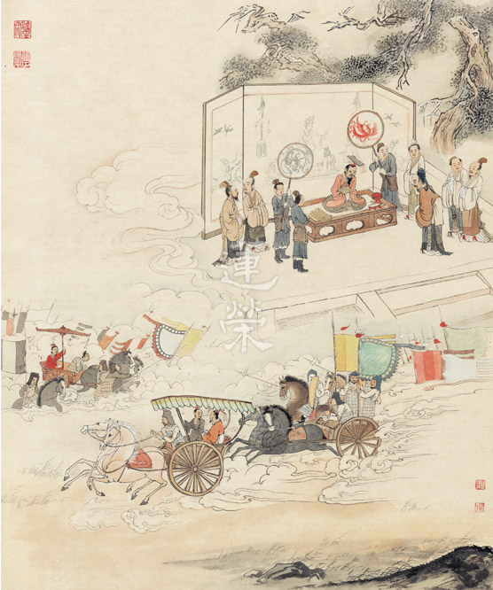

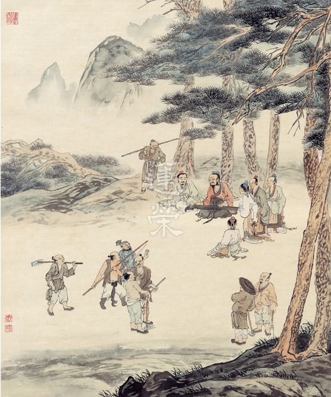

## 參訪觀摩

### 壬辰年秋三孔參訪觀摩（四）

*編輯部整理*

顯赫家世由德學　三孔來自後人尊

遊客如織應深觀　道貫古今德配天

衍聖公的宅第—孔府

我們一行人從位於左路布局的孔府故宅門走出孔廟，眼見一條熱鬧的街景，此街稱為闕里街，街上長排的小販，熙熙攘攘的人潮，狀似黃昏時的臺灣夜市，但是細觀則另有一番風味，金石篆刻、販賣圖書和孔夫子像的攤販佔了多數，這在一般以吃喝玩樂為主要功能的市場是難以看到的。

步行不超過一百公尺，左手邊就是孔府的大門，孔府在歷史上稱作聖府，也就是聖人後代居住的地方，同時也叫衍聖公府。宋仁宗皇帝在一○五五年，至和二年，封孔家第四十六代孫孔宗願為第一代衍聖公，以後此封號由嫡長子承襲，一直延續到第七十七代孫孔德成先生。一九三五年，衍聖公的封號改為奉祀官，才結束了延續了八百八十年、三十一代，世襲地位最悠久的貴族制度。現前的府第是明洪武十年（一三七七年）所建，此後歷代的衍聖公都居住在此。

孔府是明代典型的衙宅合一的品官建築群，前半部是辦公的地方，後半部則是住宅。因為歷代的尊孔，衍聖公的身分地位也是不斷提升，等級高，門的形制大，門檻也高，表徵的是身分地位崇高。一般的百姓家，就是三間瓦房，一個低矮的小門，要是設一個高門檻，顯然不能適稱。孔府的占地面積達到八萬多坪米，有四百多間房屋，也是分左中右三路布局，中軸線是衍聖公辦公和居住的地方，左邊是接待達官貴人的地方，右邊則是平時學習會客和夫人遊玩的地方，最後部是後花園，我們此次參觀是走它的中軸線。

大門上面有聖府兩個字，是明嘉靖年間權臣嚴嵩所題，嚴嵩和孔家是親家關係，嚴嵩的孫女，嚴世蕃的女兒，就嫁給了孔家六十四代孫孔尚賢。

我們在大門後的庭院稍坐了一下，就繼續往北進了二門，庭院中間有一座低矮的小門橫亙於中央，周圍無牆，頗為特殊。此門建於明弘治十六年，一五○三年，上有嘉靖皇帝欽頒的匾，「恩賜重光」，因此稱為重光門。此門在過去一般的官宦人家還沒有資格建樹，必須要有封爵才能樹此塞門。門在平時並不打開，一般只能從門的兩側行走，只有皇帝親臨或迎接聖旨，抑或祭孔等重要活動時才可以打開。孔德成先生的孫子，第七十九代嫡長孫孔垂長先生，他在二○○九年的九月二十六號，被封為奉祀官，二○一一年的八月十一號回到孔府，此門也為這位遠來的嫡長孫打開。

中軸線北進第一個樓閣是大堂，是衍聖公的辦公場所，他在這裡主持家族修家譜的儀式，審視家法族規，另外也在這裡迎接聖旨、接待官員，若是一般小的事情，就不會到此處理。衍聖公坐在彩繪八寶暖閣裡辦公，八寶就是八仙的八件寶貝，八寶暖閣後方的架上擺著金黃色布條包裹的大印。廳堂兩側則是衍聖公外出時儀仗隊所用的器具。

我們或許也在古裝片上看過，皇帝出巡有鑾駕，場面非常氣派，官員也有這些儀衛，稱作百官儀衛，走到最前面的是鑼，鳴鑼開道，警示大家讓路，然後有迴避、肅靜的告牌。此外還有其他衍聖公所享受的特權和待遇的告示牌，諸如襲封衍聖公、賞穿帶膆貂褂、紫禁城騎馬、欽差大臣、太子太保、誥受光祿大夫、奉旨稽查山東學務。依據明代的禮制，衍聖公的官品是正二品，但是他的袍革、朝班享受一品，到了清代的官制，衍聖公成為正一品，是一品大員。

所謂的誥受光祿大夫，是他的一品文官階。康熙皇帝曾特許衍聖公在皇宮御道和皇帝並行，慈禧太后更特許衍聖公在紫禁城騎馬，並且賞賜頂戴雙眼花翎，穿帶膆貂褂。清代的官員有一個帽子，帽子後面有一個翎管，翎管裡邊插著幾根孔雀翎，等級最高的孔雀翎羽毛上有三個眼，衍聖公的則是雙眼。光緒三十二年，當時的衍聖公並且奉旨督察山東學政。衍聖公可謂集人間榮華富貴於一身，而這樣大的福報，來自於孔子千秋萬世的功德。

大堂後方是二堂，兩堂之間由一幢長形建物相連，此長廊上有一排板凳，稱作閣老凳，相傳嚴嵩將被皇帝治罪，想託請衍聖公代為求情，在此處枯坐一日，衍聖公也不願意見他。二堂也稱為後廳，是衍聖公接待四品以上官員的地方。當中還有下屬官員的辦公廳，一為啟事廳，是負責管理孔府事務的上傳下達及內裡外達，此廳的主任官品可達正四品。另一個是伴官廳，過去稱隨朝伴官，因為孔府主人經常要去北京，身為一品大員，出府門都要有保衛以及秘書等人員，一般是六到七位的七品官。

在二堂裡還有慈禧太后寫在石碑上的壽字，一共三個，這是光緒二十年（一八九四年），當時慈禧太后過六十大壽，衍聖公孔令貽先生和他的夫人及母親，帶了很多供品到北京去給慈禧祝壽，當時慈禧也感到非常高興，就贈送了三個壽字給他們。

我們再往北走，經過庭院來到了三堂，這裡是衍聖公執行家法、處罰僕役的場所，國有國法、家有家規，孔家在當地是一個名門望族，任何一個孔姓子孫，包括他的僕役工匠，只要違背家族的規定，就在此處執行家法。家法有很多種，最嚴重的就是開除族籍，不能再享受家族的待遇；再次一等的就是打板子，傷害身體罪；再其次就是罰錢、口頭批評。家法當中沒有處死的權力，如果孔姓子孫違背國家的法律法規，那要到縣政府處理。三堂裡有兩個轎子，一個是金頂紫襻綠尼八抬大轎，是衍聖公所乘；另一個是夫人所乘坐的金頂紅尼刺繡八抬大轎。

在遊覽過三堂之後，我們往大堂至三堂的西側參觀，此區稱為西學，一般也叫西路，是歷代的衍聖公讀書、學習詩文、會友的地方，有三個主要的建築，紅萼軒、忠恕堂，以及安懷堂。安懷堂的北側是花廳，是供休閒的場所。花廳北側則是學屋，是衍聖公小的時候接受教育的地方。孔家特別注重對後代子孫的教育工作，像孔德成先生就有很多老師。這些書房的布置相當素雅，不若現代裝潢那般的奢華，原來文武之道延綿的重點在人，硬體的設施、廳堂的擺設都不過是其次而已。

再次回到中軸線上，三堂後方的門稱為內宅門，屬於孔府官衙和住宅的分界，經過此門即進入內宅。內宅前的庭院，是以前搭戲台看戲的地方，以前的娛樂就是賞花、養點小動物，再一個就是看戲，孔家有專門養的戲班子，有一些演藝人員，平時就是待命練習，等到主人一聲令下，就可以立即演藝，就在此處迅速搭上戲台觀看。

內宅的第一個建築是前上房，這裡是過去孔府主人接待親朋好友的地方，另外也會在這裡舉辦婚喪嫁娶等宴席。孔府有三大宴：喜宴、壽宴、家宴。不同的情況使用不同的宴席，接待賓客用家宴，結婚用喜宴，過壽用壽宴。孔家還有一個非常特殊的宴席，稱作滿漢全席，一共使用四百零四個餐具，有一百九十六道菜，這當然只用來招待高級的貴賓。前上房裡面都是清朝末年跟民國初年的擺設，導遊孔先生說到，以前這裡面還吊著很多民國時期的玻璃燈具。

我們繼續參觀更北側的前堂樓，就是歷代的孔府主人衍聖公居住的地方。孔家第七十六代孔令貽先生出生於一八七二年，五歲的時候父親去世，他因而承繼了衍聖公，但是因為年齡小不能主持家務，所以由母親彭氏管理。孔令貽先生十六歲結婚，他的岳父叫孫毓汶，做過軍機大臣、吏部尚書，算是一個門當戶對的人家，然而第一個夫人嫁到孔府後不生育，而且二十歲初頭就去世了。孔令貽先生於是納妾，姓丰，是曲阜富商家裡的子女，然而還是不能生育，也在二十七歲時去世，所以他又娶了第二個妾，姓陶，而後又納王寶翠為妾，結果生了二女一男，包括孔德成先生在內三個孩子都是王氏所生。

前堂樓的後方就是後堂樓，過去是孔德成先居住的地方，孔德成先生在民國九年二月廿三號出生，他的父親是前一年的十一月八號病故，所以他是遺腹子。這位遺腹子是否為男孩，直接關係到孔家未來的傳承，王氏臨產時，為防嬰兒遭到調換或者發生任何意外，當時的北洋政府指派軍隊包圍產房，處處設置崗哨，並由一位將軍坐鎮，山東省省長與孟子、顏子、曾子三氏的奉祀官也在都場監督，見證這歷史性的一刻。

孔德成先生出生，孔府內頓時張燈結綵，曲阜城內鳴禮炮十二響，來慶祝這個小公爺的誕生，但是非常不幸的是，十七天後母親病故，所以一直是奶媽來撫養他，在他出生一百天，就被民國的大總統徐世昌襲封為衍聖公，到了一九三五年改為奉祀官。一九三六年的十二月十六號，孔德成先生十六歲時他和夫人孫琪芳結婚，新房也就設在前堂樓，當時此處的院子裡邊擺放著長條桌，許多的國內、外友人致贈的禮品，放滿了整個院子，包括現代化的放映機、電話等，而當時孔德成先生已經有德製的兩人座汽車，所以許多現代的科技產品他當時都有了。

我們經過後堂樓東側的建物，導遊孔先生說這是佛堂樓，是孔家燒香拜佛的地方，孔府裡邊供奉很多的神仙，佛教、道教的都有。沒有太多的停留，大家繼續往孔府的後花園前進。後花園占地面積大約有一萬平方米，內有假山、魚池，還有花廳、花房等，都是供府內的小姐、夫人遊玩的處所。後花園平時非常的安靜，除了賞花以外，還養一些小動物，像雞、羊、鳥、猴。孔府養猴子有專門的用意，因為府內養了很多的馬，一般認為母猴能避免馬生瘟疫，所以也養猴子。後花園內還有柚子樹，這些柚樹都直接栽在木桶裡，有的已經是一、二百年的老樹，每一棵柚樹都有專門的花匠負責照養，冬季天寒時會移置到花房裡。

我們一行人參觀的步伐並不算太慢，但由於時間的緊迫，仍然無法全覽孔廟及孔府的所有建物，孔府內還有東倉、西倉、車欄、馬號、柴園、族人及僕役居住區等處，整體規模宏大，功能完整。在離開孔府前，導覽的孔先生告訴我們，東倉、西倉是孔府的糧倉，西倉存放細糧，東倉存放粗糧。孔府從明朝以後的收入，大部分就是依靠土地。

洪武元年，朱元璋皇帝一次賜給孔家兩千大頃土地作為祭田，用於祭祀，收入全部歸屬孔家，但國家往後不再另給俸祿。而後明、清皇帝又不斷地賞賜，最鼎盛的時期，雖沒有確切的數字，依據以前往來的書信記載，孔府有三千六百大頃土地，遍布山東、安徽、河北、河南、江蘇、北京、天京等地，所以有大量的佃戶區，佃農在秋季就趕著馬車、牛車運送糧食到孔府。

孔家的發展以及孔府的規模，驗證了《易經》上所謂：積善之家必有餘慶。眼見孔子在世時命運的坎坷，周遊列國那般顛沛流離的生活，對於作善降之百祥，作不善降之百殃這類的警語，心中是否有所疑惑？然而當我們把格局提升至民族，將眼界放遠看千年，善惡有報，天道好還的決定見，自然在心中篤實起來。（下期待續）

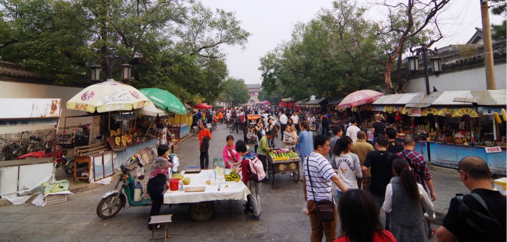

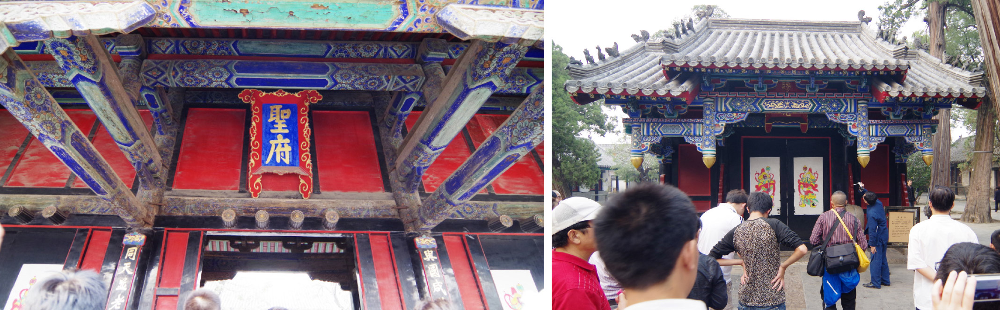

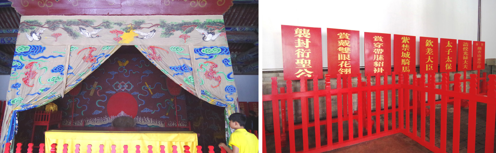

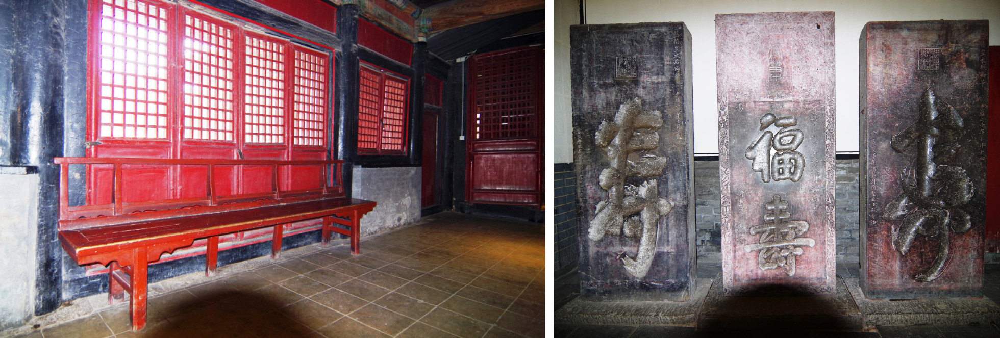

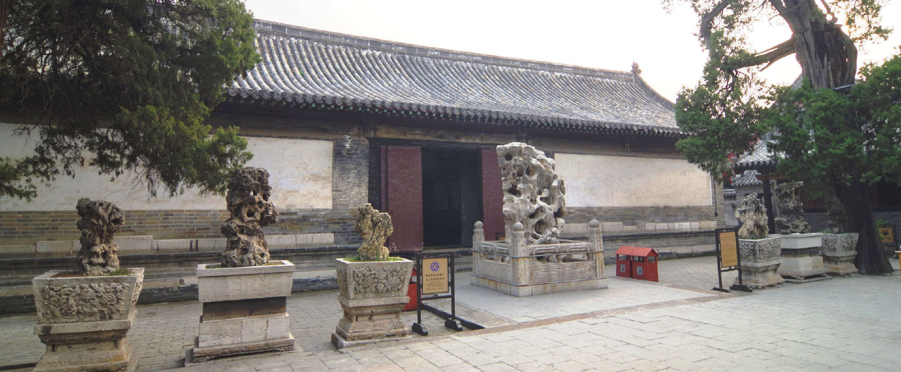

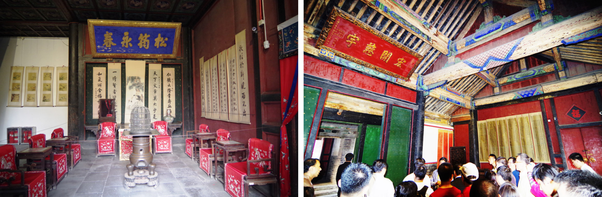

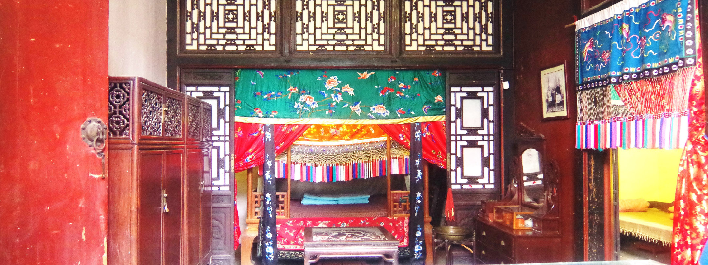

## 專題講座

### 如何以正確的飲水方式預防疾病　黃振雄醫師演講

*編輯部整理*

不求無病滅病緣　要為修行找順緣

少欲知足多飲水　心平氣和六脈平

今天所要與大家分享的有兩個主題，第一，如何預防疾病，第二，正確的飲水方法來延遲老化的進行。

一、多喝水

疾病如十大礙行當中所講的內感、外感所運行的疾病，喝水可以預防很多疾病，首先必須曉得我們一天要喝多少水份。我們人體一天可以排掉兩千六百毫升，兩千六百毫升中有從大、小便排出，再加上發汗和呼吸道蒸發的加起來約兩千六百毫升，所以我們要喝進兩千多百毫升，才能保持身體平衡，那怎樣的攝取法？蔬菜及水果中，大概可以攝取六百毫升左右，所以之外還要用喝水來攝取另外的兩千毫升。

二、不吃生食

接著是不吃生菜及沙拉，這是預防食物中毒，在日本及歐美，都有生吃蔬菜的習慣，所以對於身體的防疫及保養都有較嚴格的規則，如果在外旅遊或其他地區，最好不要吃生食，如果必得要吃生菜及沙拉，建議加醋來消毒，可以降低食物中毒的可能性。

三、少喝茶、咖啡及飲料

並且盡量少喝茶、咖啡及各種飲料，眾所皆知外面販賣的飲料沒有任何好處，此處為何要勸大家少喝茶及咖啡？不管是綠茶或紅茶，不可否認都對身體有相當的好處，可是有強力的利尿作用，喝一杯水所排出的尿可能不只一杯水的量，所以要補充水分而喝紅茶、綠茶的話，反而流失水分，而不是補充水分。

茶可以喝，但是要知道它會流失水分，要補充水分不能光喝茶而已，喝太多反而會造成脫水狀態；直喝咖啡可以防止大腸癌，也有利尿的作用，跟紅茶、綠茶一樣都有缺點，所以你可以喝，但必須要考量將這些流失的水分補充回來，如果要以補充水分的道理來喝水，就不能只喝紅茶、綠茶。

四、用餐順序

接著要報告的是，我們在用餐的時候，要順著先吃蔬菜和各類蛋白質，比如豆乾、豆腐，最後才吃麵、飯等的碳水化合物，為何要這樣的順序？

因為先吃飯的話，血液中的糖會急遽上升，糖份很高的時候，身體要需大量胰島素把糖份分解成葡萄糖，化成能量存在肝臟，如果是長期的先吃飯，再吃豆乾、蔬菜、水果，那就容易造成胰島疲乏，疲乏之後，就容易產生糖尿病，我們不要以為這是遺傳，是我們吃不謹慎，尤其是在吃飯的時候，不只是吃飯，還加一個甜點，蛋糕有高熱量、高糖分，然後引起糖尿病，糖尿病都是由飲食引起，現在世界衛生組織，把十一月十四日定為糖尿病日，甚麼道理呢？因為世界各國，增加了很多糖尿病的人口，現在在各國的洗腎人口，大都是糖尿病引起的，所以糖尿病的問題太嚴重了，如果你得到糖尿病，後遺症太多太多，從心臟、血管、眼睛、腦血管、腎臟、皮膚、神經，一大堆毛病多到講不完，所以各國就怕糖尿病人口增加太多，都在極力呼籲盡量減少糖尿病的發生，所以就用十一月十四號，世界糖尿病日來提醒大家。

五、少油、少鹽

再來要講的是少油、少鹽，主要是避免肝硬化，大家都曉得吃素有益健康，可是往往為了增加口感，所以加重油、重鹽，或許有人會納悶為何我一生吃素卻會生病，道理在此，不要以為你吃素就沒有問題，吃素的人有很多有三高現象（高血壓、高血脂、高血糖），不要以為菜的味道太淡，加重一點沒關係，最好都不要加。怎樣吃才最健康？就以白水煮之後加一點橄欖油，就是最健康的，我很讚歎香積組，色香味俱全，不油、不鹽，這是我看過最好的道場，我們都感謝香積組。

六、喝水的正確方式

我們應該用喝水的方法來遲延老化的進行，流失的水份到底在人體中佔多少公升？多少百分比？嬰孩體內的水分占到九十五％，所以看起來胖胖的，有彈性、有光澤，但年紀愈來愈大，水分吸收就會減少了，就會乾、起皺紋，這是因為我們身體的水分從九十五％減少到六十％。而人體中水份分佈在哪，在人體最小單位細胞，細胞內叫細胞內液，細胞外叫細胞外液，細胞與細胞之間叫細胞精子液，為何要談這麼詳細，因為跟糖尿病有關係，我們都知道糖尿病的患者都是多喝水、多排尿，怎樣喝都口乾舌燥，是甚麼道理？

他所喝的水無法進到細胞內，都流到細胞外，細胞都得不到水份，因為血液裡面糖分太高，所以把血糖降低，喝水細胞面才能受到作用，就是為何糖尿病他會想要多喝水，是因為細胞面無法得到水分的關係，血液中的水份靠鉀離子和鈉離子的平衡，鈉離子、鉀離子也許真的很難懂，鈉離子就是鹽份，鉀離子就如香蕉、蘋果、西瓜裡面含有很多鉀離子，細胞靠鉀離子、鈉離子來維持酸鹼平衡，水分跑到細胞內外，靠鉀離子跟鈉離子滲透壓的關係。

我們喝水，在幾個條件下喝到水就能受用，第一，體溫的下降，假使體溫下降，細胞的水分就吸收不好，人體必須在一定溫度之下，新陳代謝才能進行，假使體溫太低，新陳代謝就會下降，影響細胞吸收水分的能力，這裡我要談到一點，有些醫師做實驗，正常人的體溫差不多三十六點五度，若在三十六點五度左右表示你身體很好，不但水分吸收正常，免疫力也很好，在日本一個醫師說，假使你把體溫升高一度，免疫力可增加百分之三十，而六十一歲以上超過三十六度的不多。

接著談到吃食物鹽份太多或太少時，即使喝水，身體也無法受用，假使我們平常吃的東西太鹹，養分都是停在細胞外液，我們喝的水達不到細胞內液，相反的，假使我們鈉比較少的話，即使喝水細胞也無法吸收水分，情況是這樣的，我舉個例子，流大汗時，失去水分及許多鹽分。另外急性腸炎上吐下瀉流失鹽分與水分，喝水也沒有任何效果，假使不注意，一下子喝大量水的話，會引起抽痛、頭暈、嘔吐、疲勞，那是因為沒加鹽的原因，我們都記得吃稀飯的時候，夏天吃西瓜的時候，都會加點鹽，加點鹽吃起會比較舒服，因為身體需要鹽的關係，因為西瓜本身含有很多鉀，加上鹽分，吃起來就很舒服，這是非常好的習慣。

接著是介紹飲水適當的時段，喝水要有喝水的時段，這非常重要，分成早、晚各喝一杯 ，睡覺前喝一杯，起床也喝一杯，還有洗澡前後，有泡澡習慣的人，一定要多喝水，因為泡澡會流失許多水分、鹽分，在大量流汗之後，要補充水分跟鹽分。為何早晚要喝一杯水？是為了補充睡覺時流失的水分，睡眠中流汗及呼吸蒸發掉的水分，也蠻多的，所以要補充水分。

我們常常看到半夜或早晨，有很多人的心肌梗塞腦梗塞都發生在這個時段，血液在晚上跟早上較黏稠，是因為水分少的關係，少一杯水就造成遺憾終生。老人家半夜怕尿尿，而且起來次數很多，所以晚上怕喝水，但是不要怕麻煩，這只是短暫的麻煩而已，而且一起來馬上喝一杯水也是最好的習慣。為了怕麻煩而不喝水，可是一旦心肌梗塞發生，就遺憾終生！

舉個例子，在日本有名的棒球選手，與其齊名的長島茂雄，幾十年的選手，體格狀況非常好，擁有豐富知識與經驗，對身體的照顧相當好，檢查都沒發生過這個毛病，有一次洗三溫暖，洗完後倒下去，就是因為嚴重的腦梗塞，現在還活著，可是半身麻痺，到現在無法恢復，手無法自由活動，這麼有名的名將，有錢、有地位、有知識，為何這樣子？晚上不要怕麻煩，不要因為怕麻煩而不喝水，你看這例子，就不會怕麻煩了，只喝一口是不夠的，睡前要喝一杯三百毫升，為什麼？你喝多，不但不能吸收，反而造成還增加肝臟的工作，所以一次也不能喝太多，只能喝一杯，不要嫌麻煩一次喝五、六百毫升，這沒用，反而會增加肝臟的負擔。

七、水對身體的影響

接著介紹水的影響，水的好處太多了，講不完。剛剛講過喝充足的水分可舒緩心肌梗塞跟腦梗塞，假使喝的不夠，容易產生心肌梗塞、腦梗塞和便秘，為何會便秘？因為喝不夠水分，腸壁都會很乾澀，這時候吃很多便秘藥是不正確的，先問自己有沒有喝足夠的水分。水喝少的話，汗流得比較少，我們要知道，流汗不只調節體溫，更重要的是解毒，解毒不只是大小便，連皮膚流汗都是一種解毒作用，你考慮到這一點，就趕快多喝水。

現在的水含有很多的氯，茶會把氯吸收，那我們純喝水的話，水也很多的氯，對身體有很多的變化也很不好，我們該如何解決這樣的問題？老實講水的問題很多，有些醫師乾脆叫我們喝礦泉水，過濾水應該沒問題，電解水、逆滲透和一般的使用，一般家裡安裝該用怎樣的濾水器？可買杯型的過濾器，或買有品牌的濾水器。

攝取礦物質從外就可補充，若水是乾淨的，喝純水應該沒關係。鈣離子電解水？一般不會選擇，純水比較安全，那我們找最純樸的水，像古人沒有加任何東西，他為何病變的比較少？加得越多反而更複雜。喝純水應該對人體沒有任何傷害。水當中有氯離子應該要燒開之後，再打開蓋子一段時間就好了。

之前提到現在的水果很甜，有些人主張飯前吃，那要到底何時吃比較恰當？水果我是盡量避免食用，因為很多水果經過改良變成甜的，這就違反自然，吃甜的對身體沒有好處，不能避免就少吃ㄧ點，最好少吃，越甜的越少吃越好。身體最好保持鹼性，想要保持鹼性體質就吃蔬菜水果就夠了，沒必要用喝鹼性水去調整。

再提一個恆定性，什麼是恆定性？就是人體是一部很精密的機器，有自動調整的本能，有時遇到不適合的狀況下，也會自動調整恢復原來正常狀況，這功能就是恆定性，恆定性就是我們年輕的時候，如果暴飲、暴食、熬夜，沒有規律的生活，只要休息一下就能馬上恢復正常現象，年紀愈大恢復就慢，恆定性就慢慢減低，恆定最重要的兩件事，就是體溫的調節和水分的調節，這兩種隨年齡的增大，恢復的能力就慢慢減弱，運動讓體溫上升，而水分的調節要多喝水，本來我們人體的水分已經消失很多，若不喝水，老化會更迅速。

有些老菩薩年紀大，但皮膚仍有光澤潤滑，而有些就乾一點較粗糙，這是因為他可能不知道這個道理。大部分的人洗腎，世界最多洗腎三大國家—臺灣、日本、美國，也許將來會洗腎，喝水洗腎是最好的方式，每天大概兩千毫升左右，當然兩千不是一定的數字，要看你的運動量來增減，喝足夠的水就像洗腎一樣，若沒足夠的水，就把農藥、毒素等等停留在體內，時間一久腎臟負擔過重，就一定要洗腎，每天喝足夠的水，從汗和大、小便就可以排出許多毒素，為何不自己洗腎？我們要知道洗腎一次要五到六個小時，還要打點滴，很辛苦。

我有一個親戚十幾年前，醫生對他說你的腎不好，如果放置不管就要洗腎，他怕洗腎就開始喝水，到現在已經十幾年沒有惡化，就靠自己每天喝水洗腎。

八、結論

糖尿病患者的數量一直快速增加，國際間也把十一月十四號訂為糖尿病日，所以我們要靠運動和正常喝水、飲食來控制，就可預防糖尿病，可是不要以為吃蔬菜和蛋白質，最後再吃米飯就可以，高熱量、高糖分的食物還是要小心，可是患糖尿病的也不用灰心，現在日本在研究，可能不久就有治癒的藥出現，平常生活中，不可以只注重各種營養素的攝取，卻忽略這些營養素是依靠水份來工作，假使所攝取的養分真的對身體有幫助，功勞在水，不全在藥物，最後向大家建議，從今開始正確的喝足夠的水分，做適當的運動，來增加體溫，可以延緩老化的進行及預防疾病。謝謝

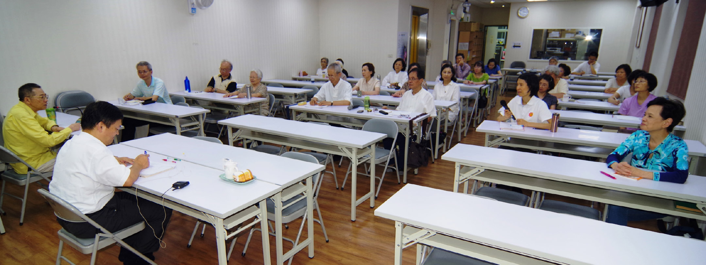

## 活動報導

### 群鴻戲海—文化藝術觀瀾　活動報導

*編輯部整理*

夢幻泡影的人生　呈現不思議戲劇

悲歡離合義無義　命運掌握自手中

每年暑期的大專佛學講座或者啟蒙班活動，都是學會所特重的教學課程，今年的暑假，又特別增添了一些不同的元素，活潑了學會周圍的空氣。從七月開始，學會陸續邀請了幾位在文化界及教育界發心的師長們，蒞臨演講。類別包括了監獄教誨、傳統戲曲介紹、現代影藝欣賞、親子電影賞析以及身體保健講座。這些講座都採對外開放報名的模式，並且製作精美的海報，歡迎社區親朋好友們的參與，因此一系列的講座，除了豐富內部學員的知識，同時也達到了敦親睦鄰的功效。

系列講座的開場，邀請了士林更生保護會更生輔導員鄭益隆老師，講演「人生漫談—監獄風雲」。鄭老師全職投入監獄受刑人之教化輔導，及出監受刑人的安置輔導，十餘年來獨自設立中途之家，讓諸多出獄人能夠成家立業。因其成效顯著，解決法律制度未及之缺憾，經臺北監獄轉法務部推薦，獲頒一○一年的師鐸獎，以非教師及專業人士獲得此殊榮者堪稱為第一人。講演中鄭老師的悲心及幽默，帶給大家許多的感動。

第二場的講演，邀請到了著名歌仔戲旦角演員王金櫻女士，講演「人生如戲，戲如人生─知足最樂」。王金櫻老師用優雅又流利的漢語，分享她一路走來精采的演藝人生，與會聽眾體會了臺語用字遣詞的古雅，以及歌仔戲曲的優美內涵，同時去除年輕人以為說臺語是沒有文化素養的錯誤觀念。文化需要傳承，歌仔戲也面臨人才斷層的問題，提升學子的文化素質以及改變民眾對歌仔戲的觀感，使之樂於進入戲院欣賞傳統戲曲，是王金櫻老師畢生的使命。演講最後，她也帶領大眾用漢語吟唱唐朝王維的名詩〈竹里館〉和〈鹿柴〉。

第三場的主題是「電影的起源」，由學會陳幸汝學長主講。電影可以說是現代人生活所不可缺的娛樂，從黑白到彩色、從默片到有聲、從２Ｄ到３Ｄ，短短的一百多年間，電影成為全球文創產業產值最高的項目之一，透過電影，我們認識了我們所不知道的世界，見識我們無從體驗的生活。電影產業所造就出來的明星、時尚、音樂、甚至話題，都深深影響著現代人的生活。在這場講座裡，大家看到了電影一路的發展，滿載而歸。

第四場是京劇的介紹，主題為「傳統戲曲入門導覽」，邀請了錢宇珊老師擔任主講。科班出生的京劇演員錢宇珊老師，讓我們了解了一個京劇演員是如何地被培養，所謂「台上一分鐘，台下十年功」，對於京劇的表演者而言，真是再適切不過。此外有關京劇欣賞的剖析，也讓與會觀眾發現傳統藝術的美好。

緊接著是第五場由林鍵翔先生主講的「表演藝術欣賞你我他」。臺灣的藝文活動其實琳瑯滿目，然而如果汲取資訊的能力不足，欣賞表演的廣度也會受限。林鍵翔先生為我們介紹了國內各種的表演場所、如何得知表演資訊以及購票方式，此外關於表演藝術的分類，對於節目的選擇、觀賞演出的注意事項，也有詳細的說明。兩小時的講演，除去了聽眾們欣賞各類表演藝術的藩籬。

身體保健講座部分，祈請了學會的陳麗嬌老師主講，講座分為兩次的課程，主題分別為「鮮果汁與四大金剛」以及「油漱」。如何透過正確的飲食，讓自己越吃越健康，是許多人所關心的話題。講座除了知識性的介紹之外，講師也不惜成本，為大家直接準備了豐富的健康蔬果（檸檬、蘋果、紅蘿蔔、馬鈴薯），現場製作出甘美又健康的飲品，滿室飄散著果香，大家也都盡興暢飲。在「油漱」的課堂上，介紹了如何正確的選擇油品，現場學習用油漱口保健，也帶給了學員們全新的體驗。

除了上述各類的課程，學會同時在暑期週六，開辦了六堂「親子影片欣賞及探索」的啟蒙課程，由唐微智學長擔綱教學。一部好的電影，它能深刻而有效的帶領我們去探索生命、人生，促進我們多方面思考，學長以日本動畫大師宮崎駿的「神隱少女」卡通片為主軸，帶領大家探索當中廣泛的主題意識，包括環保、權力、金錢、慾望、勇氣、生命的本質等等，都非常的發人深省。結合現代動畫的親子教學，既活潑又富含深意，家長與小朋友們在討論與互動之中，啟發並且深化了人生的智慧。

在靜態課程之外，系列講座中也舉辦了一場動態課程，由錢宇珊老師所主持的「戲曲動一動」。錢老師在課程中請來了學習京劇表演的學弟妹擔任助教，以及畫京劇臉譜的老師，直接在現場展開動作操演、實畫臉譜，參與課程的家長與同學們都有深刻而難忘的回憶。

緊鑼密鼓的九門課程，十三次的上課，讓今年的暑假充滿了人文的氣息與盎然的學風。這次系列課程的規劃，不只是當下的成功，也敲響了後續講座的因緣。與學會僅隔一條巷之隔的鄰居—當代傳奇劇場，於八月十四日及二十八日，受邀前來演講。當代的藝術總監吳興國老師、當代傳奇劇場的重要幕後推手林秀偉老師，以及橫跨東方京劇與西方聲樂的銅錘花臉劉琢瑜老師，為學會又帶來了一次新的震撼。同行的兩位年輕京劇表演者，他們對京劇的熱情與投入，深刻地感動了在場的聽眾。

好的藝術可以改善社會風氣，教忠教孝的戲曲演出，需要觀眾到場欣賞，給予他們最直接的支持與鼓勵，否則終將淹沒於只重聲光特效的新式電影中。學會透過一系列的講座安排，期望能夠打開觀眾們的眼力：簡別善惡的眼力、認識風俗厚薄的眼力、觀賞健康藝文活動的眼力、以及知道什麼才是福報的眼力；在正知見眼光的攝持下，人人都能選擇良善的藝文活動，才能為家庭社會乃至於國家，帶來一股正向的力量。

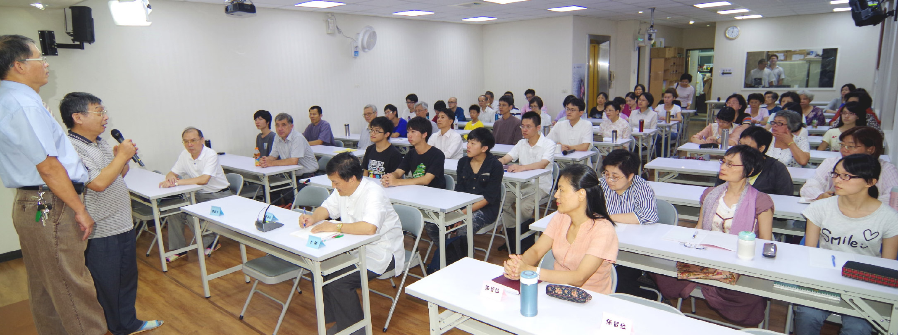

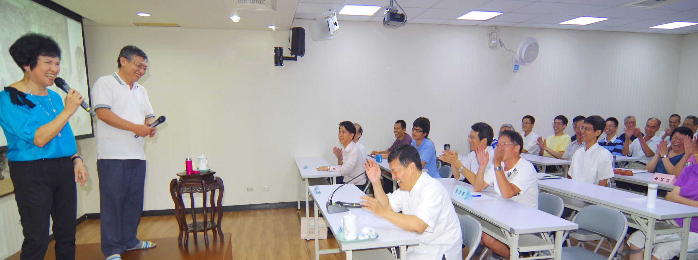

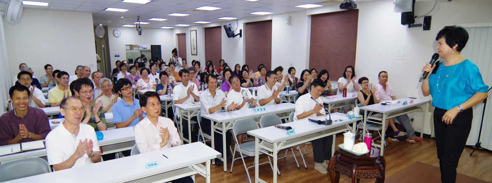

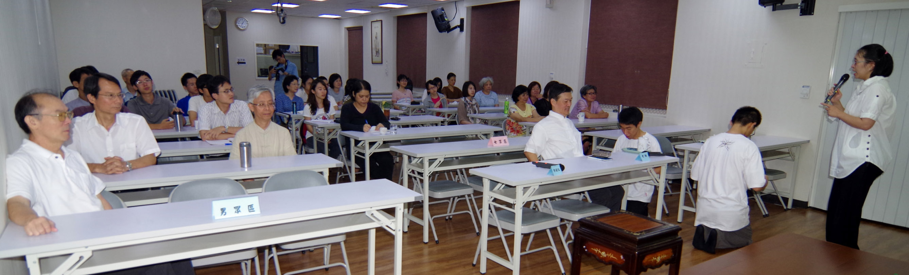

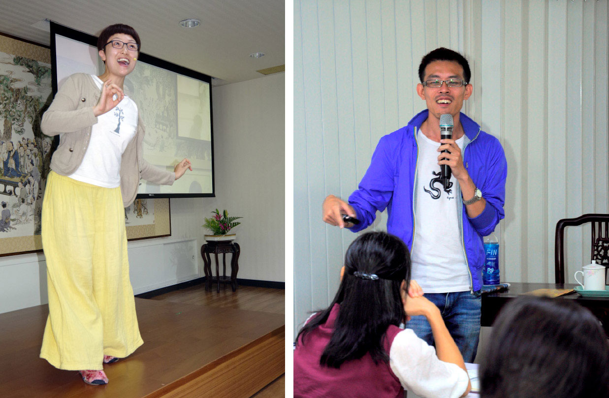

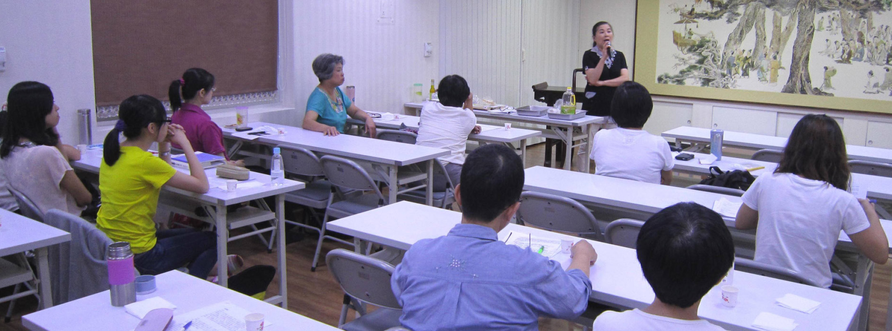

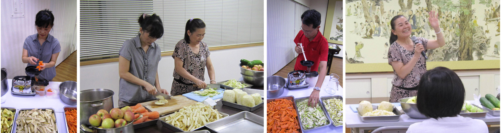

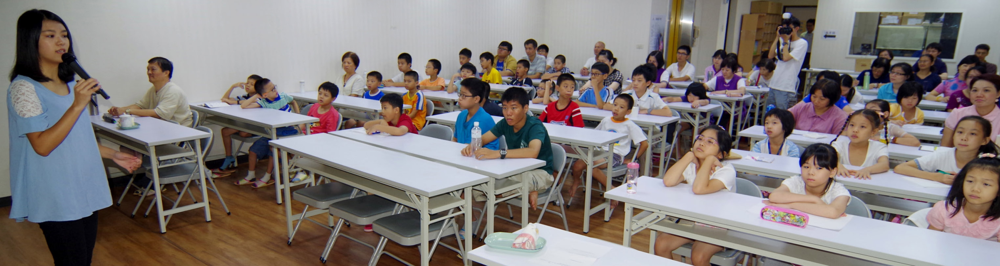

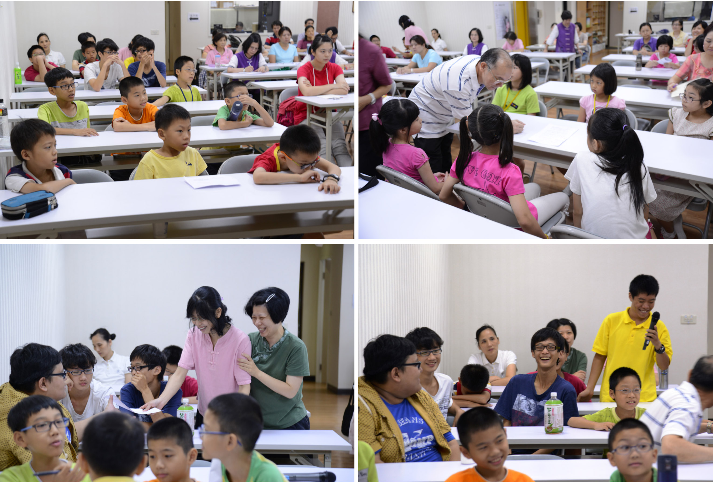

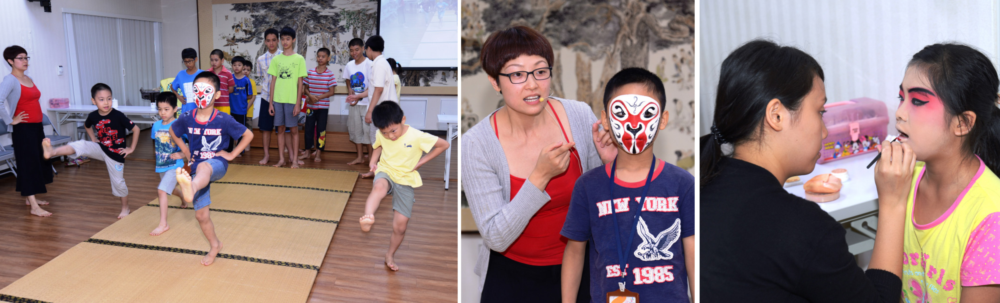

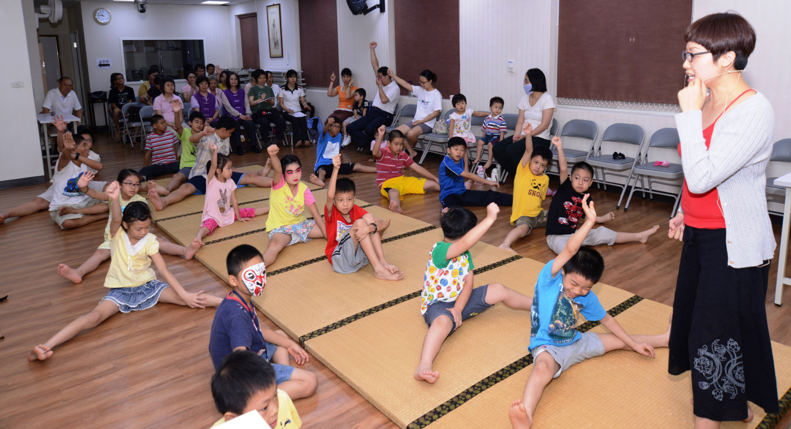

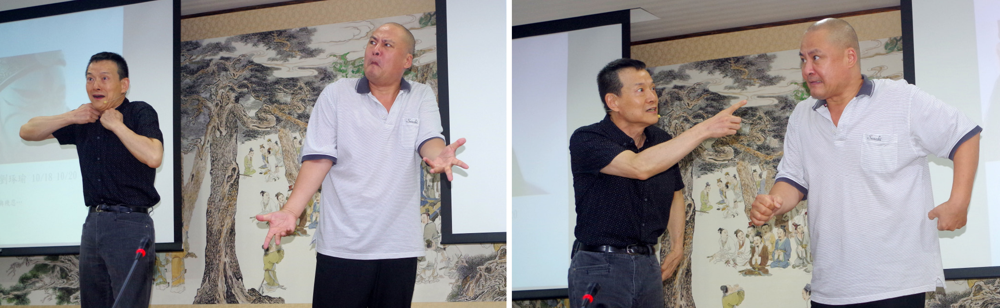

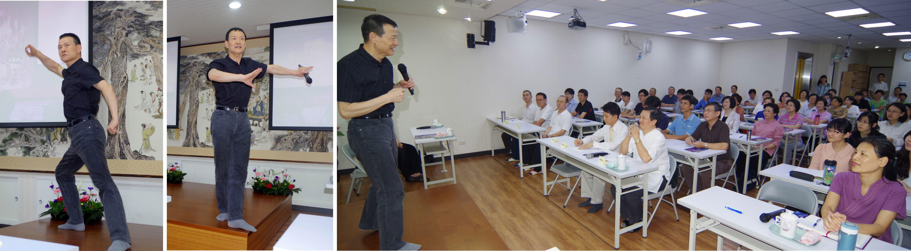

### 群鴻戲海—文化藝術觀瀾　人生如戲，戲如人生—知足最樂

*王金櫻主講、心妙整理*

那來的一股傻勁　辛苦耕耘一甲子

趕不上時代潮流　還是教育素質差

前言

臺灣傳統的歌仔戲，俗稱大戲，不只唱腔好聽，還有現場的鑼鼓聲助陣，台上台下或前台後台的互動交融，令人回味無窮。學會很難得祈請到王金櫻教授來演講，王教授以道地流利的閩南語，幽默的台風，分享她一路走來的精采戲劇人生，講說中還包括現場親自演唱、與觀眾互動交流，並教吟唱歌仔戲調唐詩兩首，讓見聞者一睹國寶級的明星風采，並對歌仔戲曲的樸實之美及文化傳承的重要，產生心有戚戚焉的覺受。王教授唱戲一甲子，憑著一股傻勁，為文化的薪傳默默地付出，不怨不悔的贊助，這一切只因為她看到文化的美好與價值，並深切體會到「人生如戲、戲如人生—知足最樂」的真諦。

緣起

戲劇是一門藝術，藝術是一日千里，需不斷學習、吸收好的東西才能成長，俗話說「有狀元學生，沒有狀元老師」，通常學生比老師年輕，他可以再去學習，吸收不同老師的精華，幾年後他就比老師厲害了，所以說「五百年前師度徒，五百年後徒度師」，五百年前孫武子是老師，他將無字天書交給徒弟鬼谷子，五百年後鬼谷子成為老師，再傳授孫臏，所以說有狀元學生，沒有狀元老師，人生是學無止盡。

欣賞歌仔戲之美

很多人不知道歌仔戲的文化、歌仔戲的美學，要如何欣賞？其實不論是歌仔戲、京戲、南管、北管、布袋戲等，都是從唱腔入門，歌仔戲是先歌後戲，你得從唱腔欣賞起。所謂「文戲金、武戲土」，武戲只要恰到好處即可，如猴子翻跟斗，不可能整場舞弄，否則看戲者跟著眼花撩亂，若唱腔好聽的文戲，你就整晚聽不厭，所以內行人愛看文戲。歌仔戲的唱腔雖沒有交響樂那麼豐富，沒有西洋歌曲那麼高亢，它以肉聲（本嗓）發音，它的美就美在它的樸實，自然又好聽。歌仔戲像一片海綿，吸收來自京戲、南管、北管、客家戲等戲劇的菁華，當中包括許多祖先留下來的俚語及生活智慧，包容性很大。臺灣的歌仔戲是依調作詞，注重平仄押韻，用漢語來唱，保留河洛古語發音，適合雅俗共賞。

認識歌仔戲曲調

歌仔戲以「七字仔」為主調，以每首四句、每句七字的歌詞得名，有快七字仔、慢七字仔、半廣唱七字仔、連空奏七字仔等，由於它是戲中主調，所以在速度上和樂句的搭配上，產生多樣的組合，在樂曲的變化上，也隨個人的即興演出而有所不同，幾乎每個人唱的「七字仔調」都有所不同，所以說一百個老師唱七字仔都不一樣。如王昌齡的〈閨怨〉就是七字仔：「閨中少婦不知愁，春日凝妝上翠樓。忽見陌頭楊柳色，悔教夫婿覓封侯」。

其次是「雜碎仔」(都馬調)，雜碎仔是不限句，老師沒訂規定要如何唱，依你的功力唱，可隨著語言聲調的高低而變化，在戲中適合長篇敘述的劇情演唱。唱七字仔調時，該拖音則拉長，該收音則應切音，否則意思會不對，譬如唱咱雙人走到，「到」字是切音，不能唱成拖音，拖則成「狗」音或「猴」音，又如嬰仔歌中，嬰仔嬰嬰惜，「惜」字也不要拖音，拖音則成「燒」音，所以一個好演員，除了唱腔念白要講究抑揚頓挫，發音也要字正腔圓，讓人不用看字幕就聽得清楚明白。

四句念白定場詩

歌仔戲是真正有文化，你若了解歌仔戲你會很喜愛它，當劇中人物一出場，四句念白就知道他是甚麼角色，或這個人是好人或壞人，如學生入校，先「一拜聖賢孔夫子，二拜先生來為師，三拜學堂眾師友，四拜後堂先生娘」，為何要拜學堂眾師友？因為要得人和，俗語說「你不要九間屋引不著一把火」，以前在農業社會時代，煮晚餐後要留個火種，待隔日好再放材燃燒，若不小心火種熄掉了，需向隔壁鄰家取火，但連續數家也借不到一把火，這就表示你不得人和。

當人物一出場時念白：「深閨女子不出門，每日針線不離穿，煩惱姻緣未落對，怨嘆月老不做媒」，一聽就知道這位小姐尚未嫁人；當念到：「在山我為王，下山打劫展威風，有人對我跨腳過，殺他生命見閻王」，就知道他是一位山賊；若是念到：「貧道吃菜沒吃葷，欠吃狗肉蒸米糕，早上吃粥配土豆，晚時吃鹹粥就配鴨頭」，就知道是位野干僧。在三進士戲劇中的婆婆唱出：「女兒奴才要疼愛，她是歹命做奴才，不要對人來虐待，敬老尊賢是應該」，她囑咐媳婦要懂得體恤家僕，不要隨意責打。總之，只要四句念白一出場，就能將角色表達清楚，讓人看了很感動，既幽默又貼切，可見歌仔戲是真正有文化，蓋高尚。

戲如人生惠我良多

我演戲超過六十年，戲劇教我很多做人的道理，讓我成長很多，知道如何做個好妻子、好媽媽，好朋友、好演員等本份，這些都需不斷地學習，你藝術再好，不會做人也等於零，俗語說「馬有千里之程，無騎不能自往，人有冲天之志，非運不能自通。」所以你要學會八面玲瓏，你對人好，別人就對你好。又戲劇也教我們學會識人，俗語說：「你不認字請人看，你要不識人就了輸一半」，如皇帝寵奸臣殺忠臣，國家就完了，父母都疼廢人，家庭也沒希望，所以知人之明是人生成功的關鍵。

我們愛惜臺灣這塊土地，愛惜文化，俗語說「三代才學會吃穿，幾十代才學會文化」，第一代辛苦耕耘衣食不足，衣服穿破了再補，到了第三代衣食漸寬裕，小孩知道享受了，但是沒文化，所以不要留太多錢財給子女，否則「人在天堂，錢在銀行，兒子在荒唐」。古語教子一藝，勝過留家財萬貫，你要教子有一技之長，讓他懂得要奮鬥，讓他能走正路，而不是留錢給他反害死他。曾經有一小孩三個月便將父親的錢花掉，三代累積一代開空，所以教子是很重要。

人說「女子無才便是德」，但是婦德最重要，若無婦德不得人和，一家子浪家散宅，錢再多也無用，你買不到親情。教育小孩要疼愛、不是寵愛，不可用金錢或物質作為賞罰標準，做長輩若一味寵愛而不能教育，長大只會誤其一生。大人怎麼做，小孩就怎麼學，居家禮儀及待客之道，也要從小教起，你要孝順父母，同樣要對父母的朋友有禮貌。很多家庭小孩真沒禮貌，客人來都不打招呼，門一關就進房裡，我的小孩若大聲關門，我就教他出來重新再關一次門，改掉沒禮貌的行為，所以要機會教育。

人生如戲要敦倫盡份

人生若沒有價值觀，無情無義地活在自我中心的人，生活就沒有甚麼意義。文化是我們生活的精神寄託，絕對不能缺乏，家庭教育很重要，現今的小孩教不來，不能打，打一下就要告你家打小孩，甚至自己綁票來恐嚇家人長輩，這是甚麼社會啊！我們小時候都是被打大的，如孟子說「人之初，性本善」，三字經也說「玉不琢，不成器，人不學，不知義」，從小你不教他走正路，長大就走歪路，如小螃蟹學著媽媽走路歪歪，最後就走不正，所以媽媽的角色很重要。

俗語說「賢婦令夫貴，惡婦是令夫敗」，所以娶一個好妻子是會影響整個大家庭，一般家庭是男主外女主內，所謂「種到歹田望後冬，娶到歹某一世人」，年輕人尚未娶妻者，葉媽媽教你，要「買田看田底，娶某看娘內」，第一要看廚房有沒有乾淨，若有乾淨表示她媽媽很伶俐，教出來的女兒不會差太多；第二看廁所，廁所若是髒兮兮，表示太懶惰。

要經營好一個家庭，跟經營企業的道理一樣，須費盡心血，如何經營一個溫暖的家，讓家人一踏進家，就不想出門，關鍵就在媽媽。我有三個女兒及三個女婿，一家共十三人，彼此和樂相處，若家中掌舵的人不穩，船上的人都歪七扭八，若打理得正，則家庭健康和諧。要讓小孩受好的教育，引導他走正途，才能教出優秀的子女，家庭教育若有文化，小孩子就不會學壞，從小就帶他到劇場來看文化，他若愛上文化就不會到夜店上網咖。

手足情份也很重要，誰說「一代親、二代表、三代就散了了？」胡說，我從小就是姊姊把我養大，還幫我照顧孩子、孫子，現在已經八十歲了，我們還不曾分開，手足情深，彌足珍貴。俗語說「不肖父母，敬神無益；兄弟無情，交友無益。」你家有活菩薩，你都不奉敬，談什麼敬神拜佛；同母所生的兄弟你都不要，交甚麼朋友。

我在家教六歲孫子都講臺語，他說：「阿嬤仔你快去洗澡，那水對你是度好，對我來說是太熱」，講得這麼徹底，聽了心肝真涼、真歡喜，我時常教他唸歌，如歲時歌：「正月、桃花紅，二月、梅花開，三月三、桃仔李仔伨頭擔，四月四、桃仔來李仔去，五月五、龍船滿街路，六月六、踏水車拍碌碡，七月七、龍眼烏石榴裂，八月八、牽豆藤採豆筴，九月九、風箏滿天哮，十月十、白米飯白目目，十一月、人焚火，十二月、人炊粿。」從流傳詩歌中，表現出祖先流傳下來的文化習俗，一般過年要拜甜粿，要拜發粿的意思，發粿表發財，甜粿要壓年，包子會包金，菜頭粿是要吃點心，可惜這麼美的臺灣文化都失傳了，希望祖先的文化不要斷送在我們這一代。

戲劇應結合社會文化

戲劇雖然是在教忠教孝，但不能跟社會脫節，傳統文化若與社會脫節，就不能引起年輕人的共鳴，年輕人便不能欣賞戲劇之美。我曾經到學校推廣歌仔戲，為了讓小學生有印象，特別寫一首詞並以都馬調來教唱：「月考若到我就心頭酸，不敢踏入學校門，三頓吃無一頓飯，最怕日出天漸光，數學我是最不會算，先生若生氣面子就結亨亨，想到要拿筆腳手軟，若想要作弊又怕被先生捉去打屁股」，小孩聽了有興趣，學會唱了就達到推廣作用。

歌仔戲教忠教孝，但不是愚忠愚孝，如「吳漢殺妻」故事中告訴我們，吳漢是愚孝，他的母親是愚忠的例子，因為媳婦王蘭英的父親是奸臣王莽，因此她要兒子吳漢將媳婦的頭砍下來，以免將來受牽累，於是吳漢為孝殺妻，但他心中充滿不滿，想著我的太太這麼孝順、這麼賢淑，你偏要我殺她，殺妻後便提著妻子的頭去見母親，並大聲對母親說，你看頭在這裡，母親看到血淋淋的頭便嚇昏過去，因為他對他母親大聲，並未列入二十四孝。

而二十四孝「丁蘭的故事」，丁蘭年輕時並不孝順，對母親一天照三頓罵，直到有一天他看到小羊跪著吮乳，心想畜生都知感恩，為何自己如此不孝。這一天他看到母親送飯給他，因為覺悟自己過去的不孝，想上前去接便當，他媽媽以為超過中午，丁蘭又要鞭打她，後來不幸跳水而死，丁蘭入水只尋得一塊木頭，便為母刻木紀念，但丁蘭知道悔過，最後列入二十四孝。

文化傳承賴薪火相傳

歌仔戲在臺灣土生土長，是祖先傳給我們的文化，文化不要斷層，首先語言絕對不能斷。文化是不分國界，好的東西要把它保留下來，推廣歌仔戲的困難，在於小孩子的臺語都字不正、腔不圓，無法延續語言，你一定要敢說不怕人笑，你才學會說。我們臺灣的文化值得大家相惜疼，不要放它孤獨行，歌仔戲文化已經快要失傳了，希望大家一起來支持，不要把父母教給我們的語言文化，藏進棺材裡。

過去因為政府未重視臺語文化，我們的母語漸漸地失傳，現今很多年輕人竟不會說臺語或說不輪轉(靈光)。有些小孩子連說話都懶得出力，只在嘴皮上動而已。如說「我」字，一定要出力，嘴巴要圓，說「今」字，要合唇要用力，要說得字正腔圓。字正腔圓太重要了，一個民族的後代，連話都說不清楚，國家的前途是堪憂。所以民族要強盛，第一、語言要字正腔圓；第二、五倫關係要講究；第三、戲曲的表現含藏著文化的推廣，裡面結合著五倫的親情，人格的建立，惟有文化的綿延流長，才能讓民族永續的發展。

值得憂心的是文化將失傳斷層，從事文化的這條路很艱苦，你要不為私、不為利，若想靠文化當飯碗，你會餓死。藝術是多麼迷人，一旦了解文化，便踏上藝術的不歸路，但是社會仍需靠這些傻子，不為私、不為利，純為文化來努力。像李國修那麼優秀的藝術家，有理念且對藝術如此執著的人，很值得人敬佩。

有人問如何能教出優秀的戲劇學生，戲劇要學得專精，實在不簡單，所謂「三年出一個秀才，十年出不了一個戲才」。問何時才學得會？很難說，學歌仔戲你本身要有天分，音感很重要，唱腔是關鍵，曾經我到學校看到學生，其中相貌長得美好者，偏偏五音不全，長得不好的，偏偏唱腔很好，真正天公作弄人，可惜不能配合起來。演員也要靠三分長相、七分打扮，才能成為要角，文化人才的栽培實在不易，實在令人憂心。

黃香蓮的先生中研院院士吳成文博士告訴我，他最近在研究甲骨文，請一位小學學歷的老師來教他們甲骨文，一些博士都要叫他教授，因為他從小就跟甲骨文老師學習，所以他們尊重專業。反觀我們藝人愈老愈不值錢，人家外國有文化素養，真正尊重藝術家，我們的藝術家不受重視，真正感慨。雖然戲劇是我的興趣，我的心在文化，不過生活是很現實，若三餐都吃不飽，我要如何為這個文化來發聲。

諺語典故是先人的智慧

「冬至在月頭，要寒在年兜；冬至在月中，無雪亦無霜；冬至在月尾，要寒正二月。」中國節氣的諺語是很準的，這是先人的智慧結晶。「錦上添花人人有，雪中送炭世間無，不信且看筵中酒，杯杯先敬有錢人」，這是教我們社會的冷暖人情是真現實。長輩常教我們「飲水要思源頭，吃水果要拜樹頭，吃白米要拜鋤頭，掘蕃薯是籐要留」，這麼好的文化要用心保留。又「誰人背後無人說，哪個人前不說人」，這是教我們，做人不要搬弄是非。你若行得正，不怕人家背後說你閒話，如同「樹頭徛予在，毋驚樹尾作風颱」，所以結交善友很重要，若不識人則了一半。

試問一般民間嫁娶時，為何要丟那把扇子？因為古時候在家從父，出嫁從夫，夫死從子，未出嫁前一定都順從父親，出嫁為人婦要冠夫姓，丟扇子的意思代表我的姓已丟掉了，要改冠夫姓，那把扇子請家中的弟弟或侄子撿起來，因為男子漢坐不改姓、站不改名，所以扇子代表姓，不是丟掉壞脾氣。又吃四獸仔（細碎仔）典故為何？一般說廟仔是小間廟，廟是大間，細碎仔就是零嘴。民間拜拜時要備三牲豬羊牛，以答謝天地尊敬祖先。拜豬肉代表讓你知書達禮，雞代表使你起家，羊有跪乳之恩，代表生生世世都出孝子賢孫。但農業社會哪有錢殺豬宰牛，所以做粿，印個魚型、豬型等，做粿來拜拜，拜完以後小孩子就有四獸仔（粿）、有小零嘴可吃。許多典故流傳至今都不知道意思，今天聽到的人都是有福氣，回家可教育子女，讓文化不要斷。

小時候我爸爸會教我們道理及學漢文，說人絕對不要貪，貪字變貧字，長大後才知道貪與貧差那一點，貪不過就成貧了，我媽媽說，「看人憨面，想人不長志」，你看人家多富貴，一定是艱苦而成，人若無艱苦過難得世間財，你自己不長志，不想自己應如何努力，只羨慕別人財富，妄想自己何時能富有，人家也就看不起你，你要長志，提出你的勇氣，有一天才會有所成就。

知足最樂

人在做天在看，做人不要怨天怨地，所謂「天無雨，人無步」，天若不下雨，則草木不生，所以天要下雨、不下雨或出日頭等，我們都要感恩，好好扮演自己的本份，知足最樂。今天我們活在臺灣要知足，不要怨天怨地，萬事要由自己做起，做個好模範，教出優秀的子弟，讓人家看得起，家庭真正溫暖和好，令人羨慕。

我們一定要惜福、心中有愛，這個愛是親情買不到的，男女有愛結合為夫妻，父母對子女有愛是父子親情，現在人都怕艱苦，不耐操，講究浪漫，結婚不到三月就離婚。我演過許多戲劇，在臺灣我的母親劇中有「會做夫妻是相欠債，嫁雞就要隨雞飛，好壞我們都不怨懟，再艱苦也要逗持家」，這是夫婦同心、有情有義，現在年輕人我哪幫你持家，你不給我享受我就跟你再見了，怕生子、養子，怕艱苦。

俗話說「有子之人貧不久，無子之人富不長」，你有孩子好好教養，「養兒防老，積穀防饑」，你有一個好的子弟，老了他就來照顧你，你不生小孩，不願為子女負擔，老了就孤苦零丁。俗語說：人來出世是帶兩碗湯來，一碗是甜湯、一碗是苦湯，看你要先甜後苦，還是先苦後甜，有人一生都喝苦的，沒有都專喝甜的，都看你怎麼經營，所以要珍惜這碗甜湯，留到老時來喝，否則先甘後苦，老時喝苦、苦更苦。

人生如戲，我學習到活在這個世間，要做好自己的本份；戲如人生，戲劇會教我做人，使我過得真正精采，知足常樂，我非常滿足、快樂，因為我有一個很好的家庭，子女真正孝順，女婿都很尊敬長輩，女婿是半子，當自己的孩子疼惜關懷，他自然對你會孝順，對你沒距離。文化是代代相傳，要在家庭生根，如何能教出好子弟，能生更要好好教養，不要貽害社會，別人才會感念你。

幾年前文建會倡辦戲曲文化大融合，我代表歌仔戲獻唱，今天以都馬調來唱這一首詞，並與大家分享知足最樂。歌詞是「你莫問我來自何方，臺灣是我生長的原鄉，南腔北調河洛山歌唱，我們大家來共享這塊寶島甜水和稻穗香，揚百川踏大海，咱作群樂洋洋山歌水長」。

最後實務演練，來教唱五言歌仔戲調的〈竹里館〉及〈鹿柴〉兩首唐詩，以河洛話來吟唱，先念白、後吟唱。王維的〈竹里館〉—「獨坐幽篁裡，彈琴復長嘯；深林人不知，明月來相照。」及〈鹿柴〉—「空山不見人，但聞人語響。返景入深林，復照青苔上。」

後記

「人生如戲」，就是要看得開，要隨著角色扮演，當身分是老師，就要把老師的角色演好，當身分是父母，就要把父母角色演好，當身分是兄弟，就要把兄弟的角色演好，這叫人生如戲；那「戲如人生」呢？因為戲裡會教我們人生的大道理，教我們怎麼把角色演好，最後才能在每個角色裡「知足常樂」。

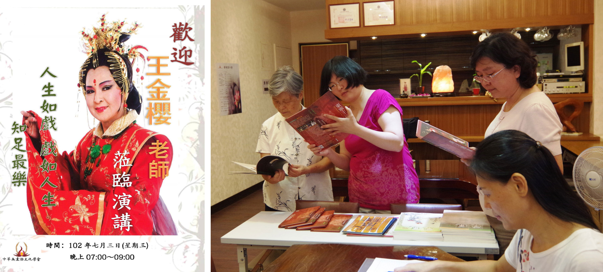

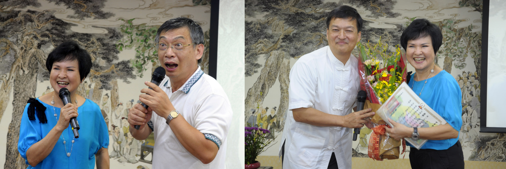

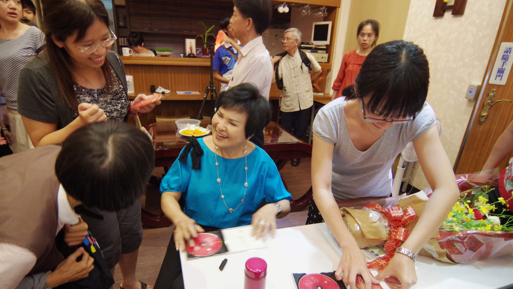

### 群鴻戲海—文化藝術觀瀾　電影的起源

陳幸汝

如神變一幕幕現　置身多變化時空

人心或厚或澆薄　拜託導演行行好

其實，電影的故事是說不完的。

從無聲到有聲、從黑白到彩色。

法國的盧米埃兄弟發明了電影，梅里葉讓人們見識了電影的魔術時刻。

美國的基頓、卓別林開創了喜劇默片的黃金時代，卻也見證了它的沒落……。

透過電影，我們得以用眼球在世界旅行，認識世界的不同的風土人情，體驗現在、過去、未來的各種人生。從電影裡，我們跟著主角一同冒險犯難拯救地球、沒有經歷過戰爭的我們見識了戰爭的殘酷，尚未體驗愛情的少年少女們得以品嚐愛情的苦澀與甜美，我們經由電影的大螢幕，閱讀了各種關於人的故事：倫理、愛情、喜劇、悲劇、懸疑、動作、冒險、科幻、歌舞……。

電影出生在一個充滿了各種發明成果的時代：火車、汽車、電報、電燈、留聲機、相機……等。許多我們今日習以為常的「日用品」卻讓當時的人們感到「神奇」、「不可思議」。

相機的發明讓人們得以捕捉影像的剎那，也鼓勵更多人投入連續影像紀錄的研發。曾經有位天才的攝影師架設了二十四台相機拍攝馬的跑動，喀擦喀擦喀擦，這二十四張相片排列在一起便構成了攝影師夢寐以求的連續影像。那時，在義大利、美國、德國、法國、英國……各地都有人致力於研究拍攝及播放連續影像的可能。

但，一八九四年，法國的盧米埃兄弟利用自己作的攝影機，拍攝出全世界最早的幾部電影，一八九五年十二月二十八日，兄弟倆在巴黎的咖啡館，邀請了三十位觀眾，一人一法郎(當時的法國幣別)，欣賞了由他們所拍攝的十部影片：《火車進站》、《工廠下班》、《寶寶的早餐》、《澆花的園丁》……。

顧名思義，這幾部最早、最陽春的短片記錄了火車駛進車站、工人魚貫步出工廠、盧米埃哥哥(或弟弟)餵小寶寶吃飯的畫面。從今日的眼光看來，這些影片平常到就像臉書上常有人分享的影片，只不過，盧米埃兄弟的影片是黑白、無聲的，所謂無聲只是聽不到火車進站的氣笛聲、工人的腳步聲、說話聲，但是我們還是聽的到影片播放時機器發出的嚓嚓聲。

儘管影片大獲成功，但盧米埃兄弟卻認為電影是個沒有未來的事業，原因是「誰要看發生在日常生活中的事」。可是有個人卻發現了電影的無限可能，那就是喬治‧梅里葉。

梅里葉的真實職業是個魔術師，他甚至擁有一座表演魔術的劇場，當他第一次看到電影時便深深為之著迷，本來他只是想在魔術表演中穿插電影的播放，但盧米埃兄弟卻拒絕出售他們的攝影機，梅里葉只好自己設法造出一台攝影機，開始了他的電影事業。後來他甚至賣掉劇場，搭建一座玻璃屋頂的攝影棚，梅里葉以他豐富的想像力，在短短十多年間拍攝了五百多部影片，靠著他豐富的想像力，創造出涵蓋多種類型的影片：科幻、冒險、愛情、動作、戰爭……。

他不甘於影片只能是黑白的，於是在一格格的黑白底片上著色，創造出彩色影片的效果(即便色彩有點失真)。梅里葉最為膾炙人口的作品是《月球之旅》，描述一群科學家造了火箭把自己發送到月球上，(請注意：當時地球人還沒發明太空梭，阿姆斯壯登上月球已經是六０年代的事了)，受到月球住民的攻擊倉皇返回地球。影片中的月球有張中年男子的臉，星星是美麗的女子，影片中火箭射中月球右眼的畫面已經成為影史經典畫面之一。

然而，隨著第一次世界大戰的爆發、時代的改變，承受殘酷戰爭現實的人們不再對梅里葉的電影感興趣，最後，梅里葉只好黯然結束他的電影事業，在世人的遺忘下用剩下的錢開了間玩具店終老。

另一個創作出影史經典卻也被世人所遺忘的人物是美國的基頓。

號稱冷面笑匠的基頓以俐落的身手、緊湊的剪接自編自導自演了電影《將軍號》。電影的背景是美國南北戰爭時期，一個南方火車運輸員Johnny Gray，最愛的就是火車和女朋友，南北戰爭開打後，他也想從軍，但政府以他當火車運輸員比較有貢獻而未被軍隊接納，女朋友以為是他膽小不敢從軍而跟他分手。沒想到，一天，北軍劫走了火車將軍號和他的女朋友，他的最愛同時被挾持了，於是他就駕駛了一輛火車展開了一場千里追追追。

一路上北軍不斷製造障礙，他就不斷排除障礙。一路竟然追到了北軍的陣地，而且偷聽到北軍隔天往南攻擊的戰略。

第二天天一亮，他救了女朋友，搶了火車往南方去，北軍怕軍機洩漏一路往南追，換成他沿途製造障礙防止北軍追上來，影片最後，他在橋上放了一把火，讓北軍連人帶火車摔進河谷裡的畫面不但經典，而且以當時沒有特效，沒有什麼後製，造一座橋鋪設一段鐵路讓一台真的火車摔進河谷裡，就算在今天，都是大手筆的製作。

片末火車隨著燃燒斷橋一同墜入河中的高潮場景，堪稱是默片時期製作最為昂貴的單一場戲。墜毀後的火車殘骸在拍攝完後，便被當場棄置在河床之中，在往後二十年內成為當地的名勝，直到二次世界大戰時才被解體以作為廢鐵之用

然而電影上映時，卻因劇情太過緊湊、太過高潮迭起，而非單純以逗趣笑料見長，因此不見容於期待看到輕鬆喜劇的一般觀眾，頓時成為一場票房災難，影評也隨之窮追猛打。這場昂貴的票房敗仗，讓失意的基頓從此被剝奪了創作自由，也失去了片廠的信賴。

將軍號在推出時雖然不受歡迎，但多年之後，乃至今日，當世界各大媒體評選世界十大佳片的時候，將軍號常常榜上有名，足見其魅力。

另一位默片時代巨星就是家喻戶曉的卓別林。

出生在英國貧民窟的卓別林，從小父親離家、母親患有精神疾病，以至於他童年就開始登臺演出，在一次到美國巡迴演出時，因緣際會留在美國拍電影，他獨創的造型：一頂舊禮帽、一綹小鬍子、一把竹手杖、過窄的西裝上衣、過寬的長褲和嫌大的皮鞋創造出電影史上最經典的流浪漢造型。

也許是自幼挨餓、在街頭討生活的經驗讓卓別林的電影人物多半是處在社會底層、在可悲中讓人感到可笑。直至今日，多數人已經將默片和卓別林畫上等號，他以過人的才華編導演出《大馬戲團》、《摩登時代》、《城市之光》……多部經典。

其中，《城市之光》以三個主角，兩條敘事線講述了一個精采的故事。

三個主角分別是：漫遊在城市裡、無意於工作的流浪漢，很不快樂、喝醉了就想自殺的大富翁，以及一位盲眼的賣花女。

兩條線分別是：一、流浪漢拯救了鬧自殺的富翁，富翁一喝醉就把流浪漢當朋友，酒醒就翻臉不認人。二是流浪漢暗戀盲眼賣花女，為了幫助她治病而開始工作，但賣花女卻一直以為這個常幫助她的人是位年輕有為的富家子。

兩條線在流浪漢拿了富翁給他的錢去幫助賣花女，卻在富翁酒醒後被當成竊盜而被捕入獄時交錯。賣花女因為那筆錢得以治癒眼疾並且開了一間花店，出獄後的流浪漢比以前更潦倒了，經過花店看到他仰慕的賣花女，但賣花女卻不認得他。然而當賣花女施捨銅板而摸到流浪漢的手時，認出了流浪漢。故事在這裡結束，留給觀眾無限想像，賣花女發現她一心憧憬的富家子其實是流浪漢時，幻想破滅，她認還是不認這個使她重見光明的恩人呢？

卓別林留下這個充滿問號的結局，讓本片多了點浪漫的色彩，也巧妙地迴避了可能的醜陋，也給後世影評留下諸多討論的空間。

其後，電影從無聲進入有聲，從黑白進入彩色，再到廿一世紀的３Ｄ。

電影技術無論怎麼發展，都脫離不了人性的範疇。綜觀電影歷史，電影技術的演進是輔助，但電影中的人文思想、社會責任、情感表達才是決定一部電影是否值得一看再看、是否足以列名電影史上的關鍵。

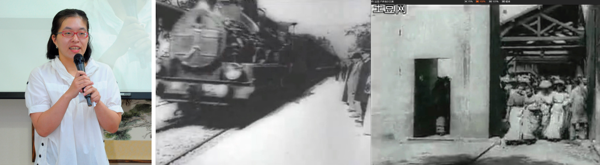

### 群鴻戲海—文化藝術觀瀾　戲曲入門導覽—破解京劇方程式

錢宇珊、陳幸汝

何止是十載寒窗　規矩次序錯不了

媳婦逐漸熬成婆　茫然知音何處覓

前言

京劇，曾經是紅遍大街小巷的流行娛樂文化，人人朗朗上口，隨時都能唱上個幾段。戲碼從教忠教孝，到纏綿愛情和神化鬼怪等包羅萬象，尺度寬廣。而內容都是經由通俗易懂、言簡意賅的文學劇本和演員的實際演出中一次次提煉精修，使得宮廷、王府、富貴人家等，不論是喜宴還是壽宴，只要心情好，就會邀請名角兒或戲班子來演個幾天的戲；各地方的迎神賽會更是少不了戲園子的熱鬧風采。

那樣的輝煌年代，不過是清末民初，距今一百多年的事情而已。

然而，隨著時代的動亂、兩岸的分隔、大陸文革的破壞、臺灣文化的變遷，竟然使得曾經深入家家戶戶的京劇變得「深奧難懂」，其實，京劇並沒有改變，改變的是人們逐漸失去欣賞的能力與媒介。

此次學會邀請到國立復興劇校坐科八年，已有二十多年演出經驗，橫跨京劇、崑曲、現代戲劇、電視廣播，可以傳統藝術也可以拍商業廣告的錢宇珊小姐，以自小學戲的經驗，分享戲曲演員養成的艱辛，並以深入淺出、唱做俱佳的方式帶領大家一一破解京劇的表演程式。

一個戲曲演員的養成

自十歲進入劇校起，每天過著清晨五點半起床的日子，小小年紀就得像阿兵哥一樣將棉被摺得方正如豆腐塊。梳洗過後的第一件事便是「喊嗓」。喊嗓需像爬樓梯一樣一階一階往上爬，爬至頂端時把最後一口氣遠遠地拋向遠方，途中不能換氣、不能斷音，這口氣一練就是八年。嗓子，是決定你能不能成為一位好的京劇演員的重要條件，好嗓子除了要靠老天爺賞飯吃，還得靠勤練與實踐。

在早餐之前，還有門功夫叫「毯子功」得練。拿鼎(俗稱倒立)、下腰、往前往後翻筋斗、一個到十個，十個到三十個。甚至得由桌子上往下翻，一張、兩張、三張桌。年幼的孩子越翻越高，越翻越怕、腳愈抖，可是還是得翻，這就是練功！

早餐後便進入「二堂功」，依據不同行當學不同的身段、唱腔。錢宇珊自小分科花旦，花旦得練「蹻功」。這門在中國文革後便失傳的「用腳尖走路的技法」，是為了模仿裹小腳的女人，三寸金蓮婀娜多姿的走路姿態。初學踩蹻從耗蹻練起，得將蹻鞋踩在磚頭橫立面上耗個四十分鐘，再踩到磚頭立起來最高端耗上六十分鐘，練到腳指甲黑青、腳指頭起水泡、滲出血水都不能休息，這，就是練功！

京劇演員必須歷經艱辛的訓練過程，原因在於京劇是結合文學、表演、音樂、舞蹈、歌唱、武術、雕塑、美術的綜合性表演藝術，不像芭蕾舞者只需專注在肢體舞動；歌劇演唱家只需展現歌喉，要成就一台好戲，每個京劇演員都必須「有聲皆歌、無動不舞」，任何一秒都必須處於最高標準的狀態下，因此京劇演員養成過程自然是困難許多的。西方人說京劇演員是「全能演員」，東方劇場是「全能劇場」，實是當之無愧。

破解京劇方程式

行當，所謂的行當是指根據戲劇中的角色人物的性別、年齡、性格、社會地位……，在化妝、服裝、唱腔、身段上做生、旦、淨、丑的類型區分。劇校老師會依學生的個性及其條件等為孩子們分科，初步決定孩子的行當取向。

行當細分類：

生—老生：

中老年男子，通常會戴著髯口(鬍子)，例如諸葛亮、宋江。

小生：

年輕男子，形象英俊瀟灑、或能文或能武，例如遊園中的柳夢梅、三國的呂布。

武生：

武藝高強、功夫了得，例如武松、林沖。

娃娃生：

專門扮演小孩，例如紅孩兒、哪吒。

衰派老生：

比老生還要老的老人家

旦—青衣：

已出嫁的中年女子，大多端莊賢淑、堅毅刻苦女子，如王寶釧、趙五娘

閨門旦：

年約二十歲左右，風姿綽約尚未出嫁之女子，例如崔鶯鶯、杜麗娘。

花旦：

年約十多歲，活潑俏皮未出嫁之女子，例如紅娘、孫玉姣。

武旦：

功藝超群之女子，例如滬三娘、孫二娘。

潑辣旦：

年輕美貌之女子，個性卻深沉潑辣，例如柳氏、閻惜姣。

老旦：

年老的婦人，如楊家將中的佘太君。

淨—文淨：

又稱銅錘花臉，以唱功見長，大多是地位崇高、舉止穩重的角色，如曹操。

武淨：

又稱架子花臉，以功夫、做表見長，性格勇猛、粗魯，如張飛。

丑—文丑：

滑稽逗趣、言語風趣，以唸白做表為強項，例如水滸傳中的張文遠。

武丑：

有功夫的丑角，例如西遊記中的孫悟空。

丑婆子：

又稱彩旦。飾演劇中醜陋的女人，多半男扮女裝，例如劉媒婆。

四功—唱、唸、做、打

唱

—戲曲、戲曲，唱和曲是歷朝歷代都最能打動人心的藝術媒介，但戲曲的難度更高。

唸

—分為「京白」與「韻白」，除了要字正腔圓外，還要把韻白的中州韻和湖廣韻唸好聽。

做

—做表就是演戲，刻劃人物內心活動，要細膩要合理外，還要用藝術手段包裝呈現。

打

—除了翻撲跌打樣樣通之外，在所有的武器兵器使用上，也都是有一定的規格講究。

五法—手、眼、身、步、法

手

—手勢，指、掌、拳，男生、女生的比法也不同，女生有蘭花指，男生有劍指。

眼

—眼神，在台上要靈活且炯炯有神，相傳以前梅蘭芳為了練眼神而養鴿子，以眼神追蹤飛翔中的鴿子。

身

—身段，演員必須筋開腰軟，每個身段、手勢甚至唱腔都要圓潤飽滿，相對於西方的外放與不拘姿態，東方京劇從表演藝術中都充份顯示了中國人的圓潤修為。

步

—步伐，不同的行當有不同的步伐，例如走腳步、跑圓場、蹉步、跪步等。腳是掌握全身美學的關鍵，而常常被忽略。

法

—就是綜合上述手眼身步的協調運用。

扮戲

古代只有男人能拋頭露面，所以以前的旦角都是由男人反串，為了遮掩男人的方面大耳，於是發展出了貼片子、勒頭等裝扮，貼片子可以造出瓜子臉，勒頭可以吊出丹鳳眼。

所謂的勒頭是以黑色的水紗泡水之後一圈一圈地纏繞在頭上，等水紗一乾，就會緊緊地箍住腦袋，眉毛吊上去了、頭飾、帽飾也不易掉了，但是腦袋也缺氧了，演員常常在這種極度疼痛、缺氧地狀態下演完一整晚的戲，為的就是扮相好看，而且不論怎麼翻滾頭飾帽飾假髮也不會掉。

音樂

京劇的主奏是京胡，崑曲的主奏是笛子。京劇的樂團有分文、武場，文場以京胡領導，兼有京二胡、三弦、月琴等。武場就是打擊樂，由敲單皮鼓的打鼓佬領導。有大鑼、小鑼、鐃鈸等。

另外常出現在京劇文、武場的樂器還有笛子、笙、中阮、堂鼓、梆子、嗩吶等。

程式性與虛擬性

京劇和其它劇種的差異之一在其嚴格的程式性，這個程式性是透過對各種人物的行為舉止、生活百態的觀察而來，例如，開門有一定的表演方式，上馬、下馬……。

京劇的舞台和西方舞台的不同在於西方是寫實的，東方是寫意的。京劇舞台藉由簡單的一桌二椅表現出千山萬水，例如廳堂、臥室、書房、窯門甚至高山小橋，而這一切都靠演員的表演功夫讓觀眾領悟到台上人物是在室內還是戶外，是在登高望遠還是在遊園賞景。

後記

現代人之所以覺得京劇深奧難懂，那是因為我們看太多被簡單化、速成化的電視電影，日常使用的語言也越來越白話，甚至受到外來語影響，以至於對有押韻、有深意的台詞感到隔閡。

然而，京劇作為一門歷經百年文化淬鍊、票房考驗的中國傳統藝術，其嚴謹細膩的表演方式迥然不同於現代戲劇。欣賞一齣京劇可以聽它的唱腔、音樂演奏，可以看它華麗的服裝、個性化的人物扮相、可以從它的文本裡增進國學能力、認識富含忠孝節義的歷史故事。

學會欣賞京劇，不僅多了解一項自己的文化，也可從中提升美學鑑賞力、文學閱讀力和生活觀察力，期許，京劇不再是屬於老祖宗的娛樂，而是每一代人的文化養分。

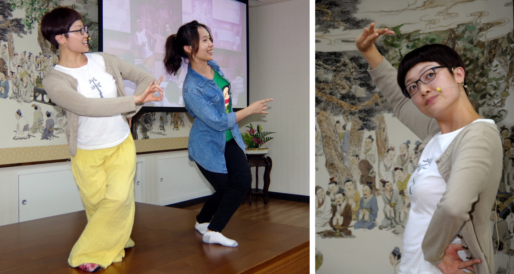

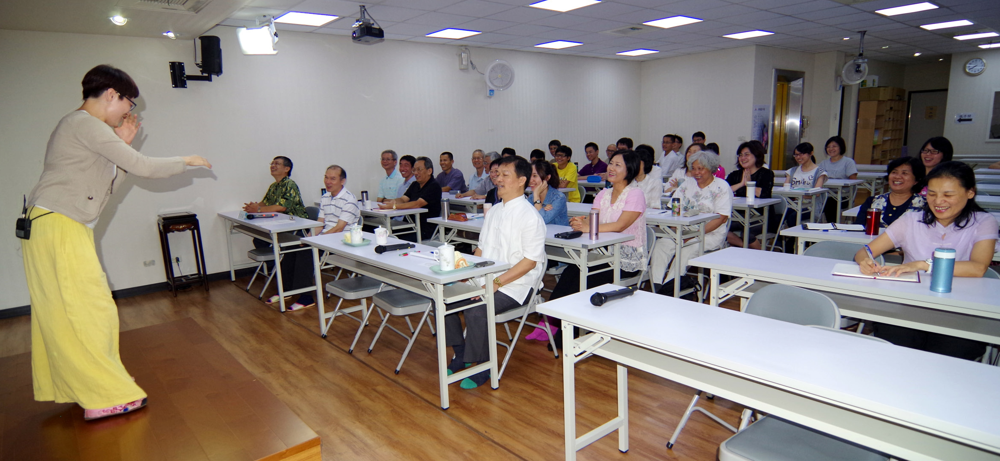

### 群鴻戲海—文化藝術觀瀾　後記—戲子

心超

身段唱腔隨角色　學而時習十年功

可嘆觀眾素質下　曲終人散路茫茫

在一九四九國共戰爭，國民黨兵敗退至臺灣，臺灣有了另類的發展。蔣介石總統為了反攻大陸，除了枕戈待旦外，並從事了臺灣基礎建設以號召大陸，文化建設是其中之一。除了成立中華文化復興運動推行委員會以外，也讓傳統具有文化氣息的戲曲普及大眾，當時京劇、歌仔戲，乃至黃梅調、布袋戲都風靡一時。本會有幸於歌仔戲部分邀請到王金櫻教授、京劇部分請到當代傳奇劇場吳興國老師等蒞會演講，分享其辛苦的學習過程、豐富的演出經驗以及人生的歷練，帶領我們欣賞傳統戲曲藝術之美，及瞭解幕後辛苦，所謂台上一分鐘，台下十年功。

這些戲曲的本質是忠孝節義，不但有內涵又耐人尋味，在五十歲以上的人可以說是躬逢其盛。這些戲曲帶動了民風的淳厚、治安的善良，當時雖然在經濟上有待加強，然大家生活過得快樂；現今就算經濟蓬勃發展，但是風氣卻越來越澆薄，大家過得越來越不快樂。實則內心的充實才是真正快樂的泉源。雪廬老人是本會的傳承導師，為孔德成先生的老師及奉祀官府的主任秘書，他與孔先生一樣都精通戲曲，能說出戲裡微妙的變化與人物是非善惡，表情，戲曲中臉色與內心是相應的。

老人常說，十年出得了一個秀才，出不了一個戲子，這些戲子們對戲曲的劇本是學而時習之，不亦說乎！臨上場遇到狀況可以權變，而且演戲的時候是前台認真，後台秩序井然，沒有打情罵俏，且男女分坐，演差了到後台要吃板子，不管是什麼主角、旦角、配角，皆一視同仁。這個劇團經營不下去，需要賣出的時候，人家看上的是祖師衣，那是代表傳承。越破舊越好，有了它價格可以賣高，能爭取別人對這個劇團的信任。

昔日在大陸，社會上藉著說書與戲曲的力量，使民風非常淳厚，大家守望相助，即使改朝換代，社會上秩序依舊井然，方圓幾里內，只須設一個地保（管區警察）就能維持秩序。一個村莊掉了一隻雞，全村轟動，雪公云：無如今日之亂，是上下皆亂。

戲子們的學習是先拜師，沒有偷學這件事，不像現在的剽竊、抄襲，厚顏說是自己的心得。曾有一個故事，大陸戰敗來臺，一個戲班出生的人，一身絕活，但是不輕易傳人，因為這個行業是先拜師後學藝，禮數不周，即使天資聰穎都不教，足堪我們文化界來學習，我們現今是一手交錢，一手交貨，國學只是知識，學習的是重利不重義，只是在書本上學習的皮毛知識，由耳朵進去，嘴巴出來，入不了心，成就不了人格，也容易隨境而轉，而且在世風日下，所學正好變成小人的資糧。

今日禮失求諸野，如何藉傳統戲子們在文化上人格的養成及傳承，回過頭來整頓紊亂的文化界，當文化界有了內涵、有了遠見，也會資助戲曲界，讓好的戲曲有人看、有人聽、有人懂、有人學，此之相互資助，如魚幫水、水幫魚。這也是現在的文化復興之道，比空談還重要。講究蓋硬體設備、排場，迎合時俗變成低俗，這些頹風是需要被整頓的，整頓後的民風是向善的，國力是可以提升的，人格是可以造就的，在中華文化的舞台上，臺灣可以獨領風騷，成為兩岸文化的領航者。

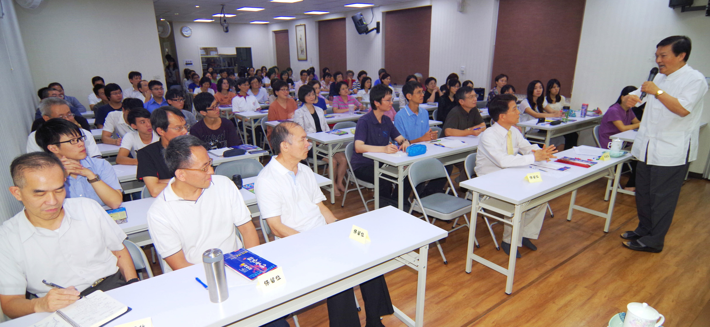

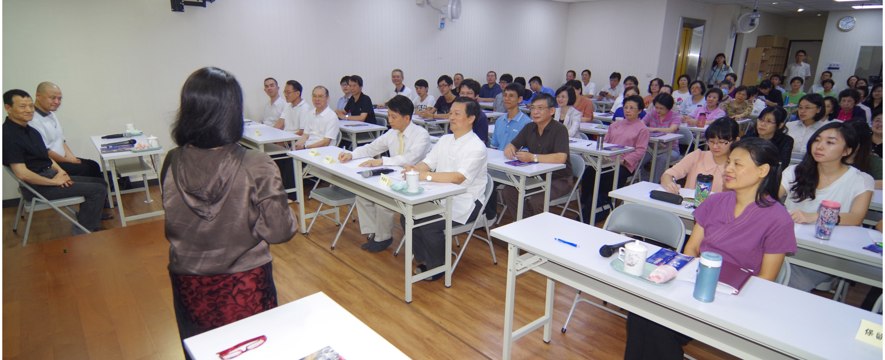

### 佛說阿彌陀經—大專佛學講座初機課程　活動報導

*編輯部整理*

千經萬論指歸處　彌陀淨土正依嚴

往生成佛二法收　攝在一句萬德名

今年寒假期間，學會為大專生舉辦了六門初機課程中的最後一門《彌陀經》講座。此次是以雪廬老人的摘注接蒙、義蘊合刊作為主要教材，並輔以雪廬老人多次宣講彌陀經所使用的講表。從一月二十號至一月廿四號五天密集的講學，再加上每日分組座談、問題解答以及晚自習，大家對於經中所教導的「成佛法」以及「往生法」，開始有了真正的認識。

講座結束後的心得報告，許多同學在台上不禁感動淚流，他們終於明白，為什麼父母親從他們還小的時候，就堅持帶著他們一同到共修會學習，要他們做早晚課，鼓勵他們念阿彌陀佛。原來這是父母的大愛，是雙親給予子女最貴重的禮物，同學們的感恩心，在知恩之後油然而生，更有人情不自禁地相約，下一世一定要在極樂世界相逢，這一世一定要幫助自己的雙親往生極樂。

師長準備講授的內涵豐富，然而時間畢竟有限，許多的講表教材，礙於時間因素，不得不擱下。為了讓大家對《彌陀經》有更完整的認識，對於雪廬老人所留下的珍貴資料有更多研習，今年的暑假延續寒假講座未竟之意，於七月十六日至廿一日，續辦《彌陀經》講座，利用六天的密集課程，將雪廬老人於慈光圖書館所講的阿彌陀經筆記、四十八年秋閏八月的阿彌陀經講表、甲午新正在慎齋堂講授彌陀經材料等教材，做更多的介紹與說明。

因此，除了教法上的學習與認識，同學們在兩次的彌陀經講座中，學習到一種「精神」，那就是雪廬老人治學的態度與堅毅的情操。講座所使用的講表教材，全部採用手寫的毛筆字版本，字跡蒼勁又整齊、講表架構井然、內容深妙，全出自年已七、八十歲老人家的手筆，驚歎之餘，也對當前許多年輕人所表現的萎靡不振感到難過。

為了提振士氣、引領良好的生活習慣，暑期的講座期間，要求大家每天早上六點半起床盥洗之後，一同前往鄰近學會的中正紀念堂運動。或跑步、或做操、或由學長帶隊跳簡單的熱舞，透過運動，揮灑出年輕人的活力，掃除怠惰與懶散的氣壓，讓生活有新的氣象。在晨間運動中，一行人也發覺，接近六點多鐘的中正紀念堂，已經是早起運動族的「晚班」，而除了這批由於講座因緣到此一遊的大專生之外，其他幾乎都是五十歲以上的長輩，這樣的情景令人憂心也讓人慚愧。

講座中除了研學，當然還有環境清潔、餐點擺設、進巾奉茶、洗碗等勞動服務事項，除了特別感謝蓮友們的發心幫忙，也多是由大專生們輪流擔綱服務工作，在勤勞中修福，也在習勞中學習感恩。此次晚課的共修念佛，也讓有意願學習法器的大專生擔任維那與悅眾，期望多元的佛法事業，各方面都能夠有傳承的人才。

除此之外，此次餐前觀修，也由大專生們學習上台報告。六天五夜的講座，所有參與的大專生，不難發覺團體學習與風氣的重要，除了因為略感疲勞而想要提早就寢的人，其他同學齊聚於教室之中，興致盎然地討論著白天所學習的內容，自修教室的燈亮如白晝，彼此間激盪出好學、好問的氛圍，這也是現今許多學校所缺乏的元素。

一場講座的成就，觀待太多太多的因緣和合，因此十分珍貴。我們特別感謝師長們不辭勞苦地講學、香積菩薩們的餐點準備，此外還有許多蓮友大德們默默地護持與影響，特別值得一提，當中還有遠從大陸前來求學的朋友，全程參與了這幾天的課程，這股積極進取的心，同樣也牽動了學子們的心。

六門初機課程至此已經全部講授過一輪，大家或許各有不同的學習因緣，能夠全部參與六門課程的大專學生僅有二人，其餘或五門、四門……不等。雖然如此，往者已矣，來者可追，學會佛法傳承的教學仍然綿密地進行著，有待更抱持上進心、有格局、有眼光的青年學子們發心參與，一同挑起弘揚文化的重擔，讓生命做最有意義的貢獻。

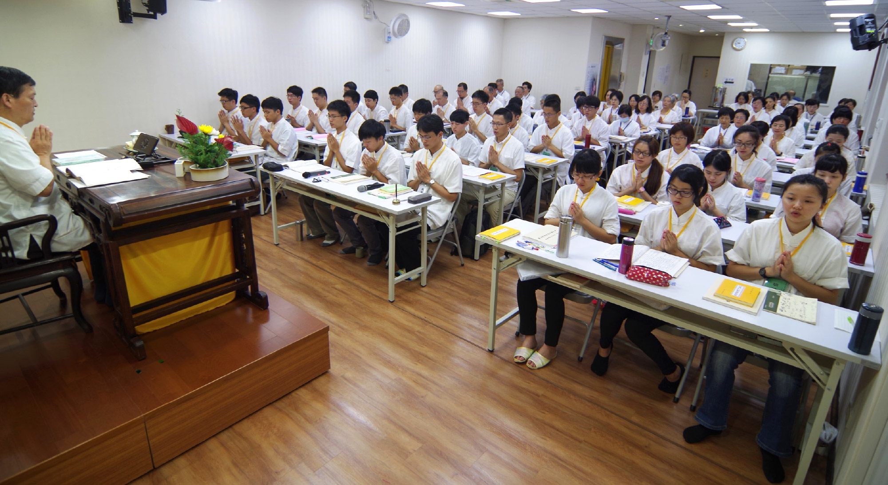

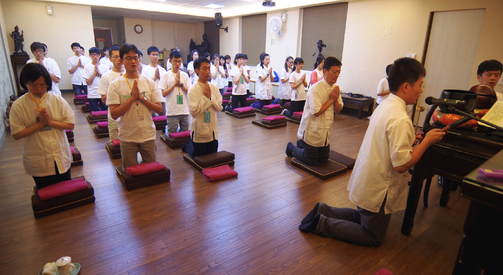

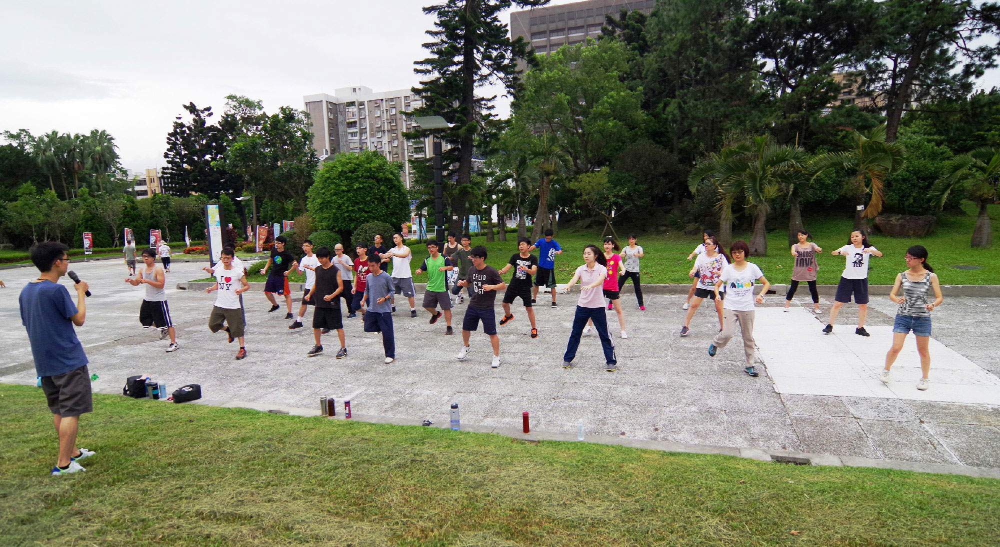

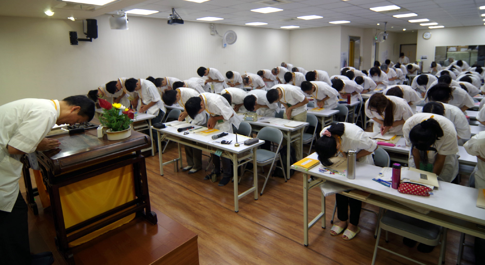

### 佛說阿彌陀經科判分析

心超主講

經文所攝科能攝　鳥瞰大意陀羅尼

諸家看法各不同　妙在雪廬二法收

欲深入經典、文章者，對經典分科判別的學習是非常重要的，可一窺每位祖師對經典注解的角度，誠可謂廬山面面觀。此次講座所採取的科判，乃根據雪公老師《佛說阿彌陀經略記》的架構，細目則參考蕅益大師的科判作為補充，而整體的架構是依據雪廬老人所著之略記寫成。

此科判完成於民國二十六年蘆溝橋事變之時，當時雖文獻不足，但 雪公在寫完略記之後，一直到老人家往生前一字未改，這就像〈蘭亭集序〉一樣，在時局因緣下對經典產生的殊勝覺受，所寫下不同於古德見解的科判，吾人當好好咀嚼與珍惜雪廬老人對此經的獨到見解。

佛經三分（序分、正宗分、流通分）乃東晉道安法師所發明，然而一直到親光菩薩的《佛地經論》傳來中土，大眾方信服道安法師之彌天高判，與西土菩薩判教暗合道妙。序分喻如一經之頭，總攝整部經的內涵、旨趣；正宗分則如五臟六腑，乃闡述該經的主要內容；流通分則如四肢，流布宣揚此經之利益。

此經之序分分為通序與別序，其中的通序包含信、聞、時、主、處、伴六種成就，以此證明此序是可以相信的。特別之處在於別序，也稱作發起序，有別於他經，是一部經的綱領，而整部經欲發揮的旨趣，在別序當中已大致說明，《彌陀經》的別序，不但彰顯此經乃以佛智為本質的不問自說（無人能知、能請），且所說內涵不出佛淨土的依報莊嚴、彌陀本尊的正報莊嚴以及淨土當中最殊勝的說法莊嚴。

三種莊嚴所要彰顯的就是極樂世界的往生法以及成佛法，而此世界的往生法，經文乃「號阿彌陀」；在極樂世界的成佛法，經文是「從是西方，過十萬億佛土，有世界名曰極樂，其土有佛，」以及「今現在說法。」

第二部分的正宗分，依著序分的依報莊嚴、正報莊嚴以及說法莊嚴來開展，多出了一科行持莊嚴，行持莊嚴是去極樂世界的方法，告訴我們如何得到依報莊嚴、正報莊嚴以及受用此世界的說法莊嚴，也就是持名念佛。

依報指的是極樂世界的環境，也就是報應依存之處，極樂世界依報莊嚴的總說是無有眾苦，但受諸樂，含攝的意義是清淨安養總要，在那樣的環境下，我們可以得到清淨，能夠安養我們的身心，總說這個環境就是淨土，就是一個最好的環境，都是阿彌陀佛在因地當中，努力聽聞，精心規劃，長期實踐，結合共識，終於創造的殊勝淨土。

依報莊嚴當中的別說，就是分別來揭示極樂世界為何是無有眾苦，但受諸樂。

第一部份是住區組織，住區組織指的是在極樂世界裡，所居住的環境、結構，是如何組成的。在極樂世界當中，可以看到它是結合天時、地利、人和殊勝妙樂淨土。地利之樂特別極樂世界講都是寶物所成，或問君子謀道不謀食，為何極樂世界卻彰顯欄楯、羅網、行樹皆寶物所成？乃因君子在邦有道的環境當中，若仍貧且賤，這是個無能的君子。明君當道，這種天朝的氣象，就如同番邦進入大唐，長安城的大馬路可以並排十五輛馬車；而由故宮所存的文物中，也可以看出盛世時的工藝特別精緻。

由此可知，極樂世界到處都是精緻的物品，彰顯的是道的尊貴。極樂世界裡也無老病苦，極樂世界裡面的寶池、功德水可以長養諸根，不讓諸根敗壞，在環境上面沒有生病的因緣。個人所居住的地方，是七寶所成的階道以及七寶裝飾的樓閣，擁有非常殊勝的環境。而在極樂世界是蓮花化生，沒有戰亂、無須生離死別，故無胎生、愛別離苦。

以上就環境上來說，這是一個無毒的環境，那是高度文化的顯現，才能產生的氣象，若不是高度的文化，例如家裡面用七寶來莊嚴，就算裝上高昂精密的保全，還是無法防止盜賊的侵擾。環境上面如此的經營，不但能看到文化的盛況，而且居然是以凡夫身受用聖人的境界。這些殊勝的境界，都是阿彌陀佛願力所成。佛力展現在大環境上，是一個無毒的環境，是一個能夠生起快樂的環境，是一個高度文化的環境，是一個盛況。

極樂國土，成就如是功德莊嚴，在經文中一共出現四次，兩次在依報莊嚴，一次在說法莊嚴，一次在正報莊嚴，經文結構清楚，次第井然。

在依報莊嚴的遠近環境中，是講在極樂世界的生活並非離群索居，而是與鄰居（其他佛國土）之間的敦親睦鄰。

極樂世界會在最恰當的時機裡天樂鳴空，從天上降下曼陀羅華，這顯示了天時之樂，在極樂世界裡面無有匱乏，能迅速供養他方十萬億佛，得以親近他方佛，從中得到智慧，且以一食頃的時間供養他方佛，回到極樂世界，變現出美好的飲食，如法的經行修行。

這是佛力功德莊嚴所彰顯的成就與德能，善於經營與各國的交往，這是登地菩薩以上的能力，我們居然以凡夫身就能得到。越深入學習教法，就會知道這是不可能發生的，邏輯可知，若未仰仗佛力，凡夫是辦不到的。藉他力有多殊勝？例如唐朝的玄奘大師，到印度取經花了三年時間，但現在搭飛機從西安到印度的孟買，半天之內即可到達，這就是藉他力。藉著阿彌陀佛的力量，凡夫可以生起登地菩薩的威力，快速累積福德、智慧資糧。就如同旁邊都是高手，不用花太多心思閉門苦讀，也能贏每天長時枯坐圖書館的人。

接著是說法莊嚴，蕅益大師《彌陀經》的科判當中並沒有提及說法莊嚴，這是雪廬老人對本經的獨到看法，極樂世界當中依報莊嚴、正報莊嚴以及行持莊嚴的核心就是說法莊嚴。極樂世界如果沒有說法，它的依報莊嚴就像在天堂享樂一樣，這是沒有用的，最後福報享盡，所有的快樂都變成極大的痛苦。正報莊嚴如果沒有說法莊嚴，那麼正報也無法成為莊嚴，所以說法莊嚴是極樂世界的骨幹，這就是雪廬老人的科判，有別於祖師之處。而阿彌陀佛顯出兩種實力，第一種實力就是藉著有情說法（眾鳥化跡），一種是化成無情來說法（行樹演法）。

眾鳥所說的法是透過發出的和雅之音，聽到而生起法喜，得到正念。且眾鳥都是阿彌陀佛所變化，代表著整個極樂世界都是不可思議的境界，以神力來變現的樹木，微風吹動所奏的音樂都是不可思議的。

鳥語花香當中，聽了很多美好的概念，不知不覺的進入其中。且讓在極樂世界的眾生，聽到諸寶行樹被風吹動所發出的聲音，而聞到正法生起法喜，自然就生起了念佛、念法、念僧的智慧力。

這些都是阿彌陀佛的佛力，使得說法如此莊嚴。佛有能力加持眾鳥以及樹木來說法，不但藉著佛的威神力，也藉著這樣的環境把法顯現出來，讓我們很快速就能體會其中的義涵。例如導覽一幅圖，靠著科技的力量，可以用雷射筆指出細微的地方，也可以用電腦將畫作局部放大，還可以用音樂輔助，這就是神通力的殊勝。五地以上的菩薩，就是以神變的力量勝過一切世間，當世間魔幻師聚集變現魔幻，五地菩薩能夠全部降伏，佛的威神力可以讓我們快速的伏惑、斷惑，與道相應。

阿彌陀佛的佛德攝眾，指的是阿彌陀佛的德能能夠攝持在極樂世界的眾生，智慧如光，遍照十方世界沒有障礙，所以阿彌陀佛也叫做無量光佛。阿彌陀佛成佛的壽命有無量無邊阿僧祇劫，現在才過了十劫，表示阿彌陀佛還可以陪我們非常久。

隨機證果指的是阿彌陀佛一音演說法，眾生隨類各得解，不但聲聞眾或者菩薩眾，在極樂世界都能有所成就，這些都是阿彌陀佛的佛力所成，靠著佛力成就這樣的功德莊嚴，讚歎阿彌陀佛的正報。

在極樂世界的同儕都是聲聞、菩薩眾，這些同儕都是佛力所成，在極樂世界不但有好的老師，也有好的同學，這就是無怨會苦，身邊都是善知識，都是隨機證果的同儕，全部都是我們學習的榜樣。當我跑到人才團隊當中，就算自己的能力不好，但是會在被激勵的情況下，見賢思齊，自己的能力也會變好，不懂的部分，旁邊隨便找一個人問都有答案，可以進步神速。

依著阿彌陀佛的德能，釋迦牟尼佛就進一步化導眾生，應當要發願往生極樂淨土，投生到極樂世界，已經不會再生死輪迴。那是因為只要往生極樂世界就不會有退轉的因，能圓證三不退。

在這樣的環境當中，圓證阿鞞跋致，頓超一生補處，那是很簡單的事情，只要給一個正確的環境，就全部都對！整個極樂世界就是給予一個最好的環境和最好的老師，這些都是佛力的莊嚴，這些人會聚在這裡，都是因為阿彌陀佛。

在極樂世界有諸上善人聚會一處，每天都在進步，也是釋迦牟尼佛勸大家要得人和之樂的用意。

讚歎佛力功德有四次，勸發願也有四次，這就是彌陀經的架構，懂得用架構來誦經，就能將阿彌陀經的義理發揚。

依報莊嚴、說法莊嚴以及正報莊嚴指的是成佛法，就是那個世界的環境、善知識以及所說的法，而行持莊嚴指的是往生法，阿彌陀三個字就含藏著往生法以及成佛法。

往生法門的正行就是持名念佛，經文說到善根、福德力薄之人是沒有辦法往生的，想要往生極樂世界的正行就是信願持名，立即顯示的功效就是一心不亂，專注在正念上面不會生起妄念，且臨終的時候不會神識顛倒。因為阿彌陀佛親自來接，所以能夠直接超越五濁惡世，得生淨土，不但是阿彌陀佛與諸聖眾來迎，並且在彈指間就能往生，釋迦牟尼佛就勸眾生要好好發願往生極樂世界。

佛親自來迎的利益到底有多大？假設有人希望我們到他那邊，告訴我們路該怎麼走，與他親自來接兩者比較，當然是他親自來接比較省事，也不會迷路。而且因為佛來接引，所以臨終的業障不起現行，有時業障不一定要靠著自己歷經艱難才能解決，就像在荒野當中被狼群團團圍住，忽然出現一隻獅子，那些野狼就通通跑光！臨終念佛，佛親自率眾來迎就是這樣超越生死的。

病苦的業障，必須要靠醫生來消，經文當中的我見是利，就是依靠佛力來消除臨終的障礙。

流通分的第一個部分是釋迦牟尼佛讚歎六方恆河沙數的諸佛，因為六方諸佛都讚歎阿彌陀佛不可思議功德之利。釋迦牟尼佛告訴舍利弗，不是只有我釋迦牟尼佛讚歎阿彌陀佛，六方諸佛都同聲讚歎！如果大家還不能生起信心，那麼釋迦牟尼佛也沒有其他方法了。從這當中可以看出佛的慈悲。一尊佛說的可信度就已經是無誤的，阿彌陀佛的名號廣宣六方，並且從六方證明，爭取一方的相信。

若有人說：淨土法門，萬修一、二十人去，所有修行的關鍵來自於信心，當信心不足的時候，不會在這一個法門得到這個法門的利益。當對於淨土法門信心不足的時候，是不可能至誠念佛的；當不覺得和善知識在一起會有出路的時候，不會想要跟他在一起的，是故我們的修行其實都有信心的危機。由此就可以知道本經全名應是：「稱讚不可思議功德一切諸佛所護念經」。

而且，佛稱讚執持阿彌陀經以及聞六方諸佛佛名，都可以得到被諸佛護念，得到不退轉，直至成就無上正等正覺。釋尊再次勸勉我們，不但要相信釋迦牟尼佛以及諸佛所說都是真實之語，而且勸眾生應當要發願往生極樂世界，一勸再勸共勸了四次。

諸佛同時也雙重稱讚釋迦牟尼佛，不但在五濁惡世成佛難，且在濁世中宣說此難信的淨土法門更難。而且釋迦牟尼佛也承認，承認自己不但在五濁惡世成佛難，說淨土法門也難。釋尊和六方諸佛相互證明，淨土法門是極難而且極為稀有，顯示這個法門的殊勝。

雖說淨土法門是萬修萬人去，但是現見萬修一、二十人去，其實都是信心的問題，根本不是這個法門難修，最後臨命終的時候是否能作殊勝的轉變，要看自己的信心。天底下的事情說難很難，說簡單很簡單，佛說很簡單，六方諸佛也出來證明很簡單，但若是說我捨不掉，我放不下，我沒辦法！那誰也沒辦法了！

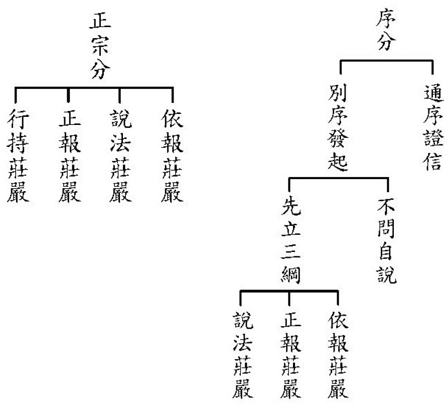

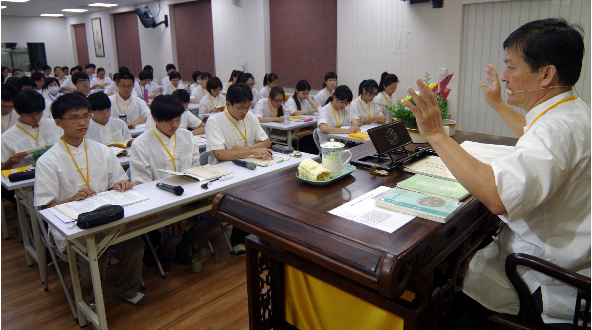

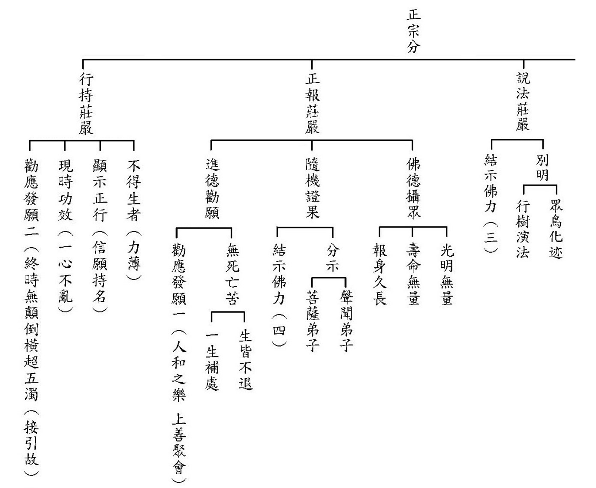

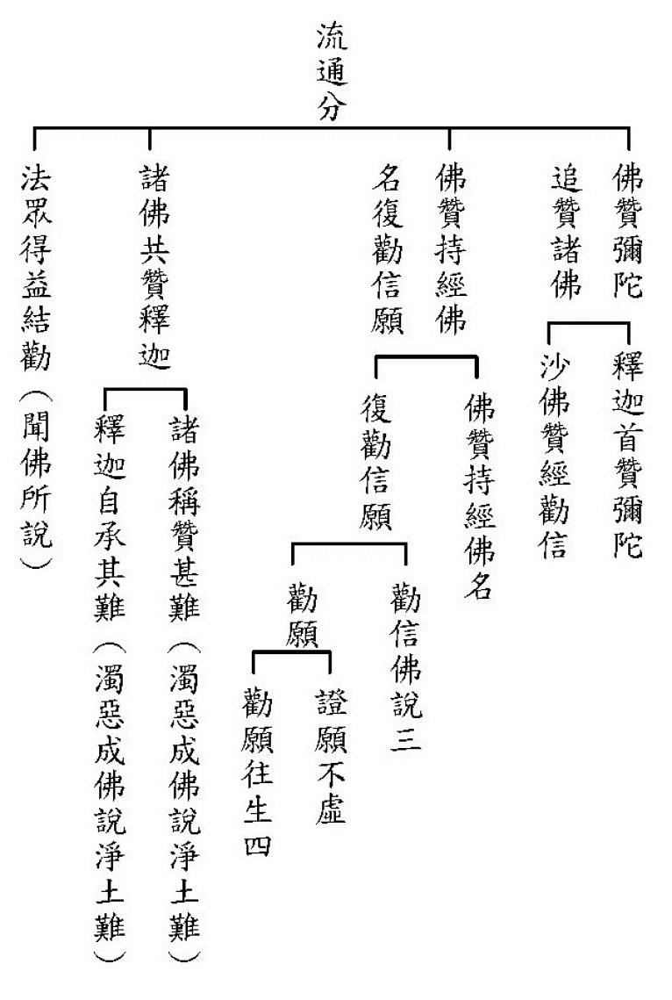

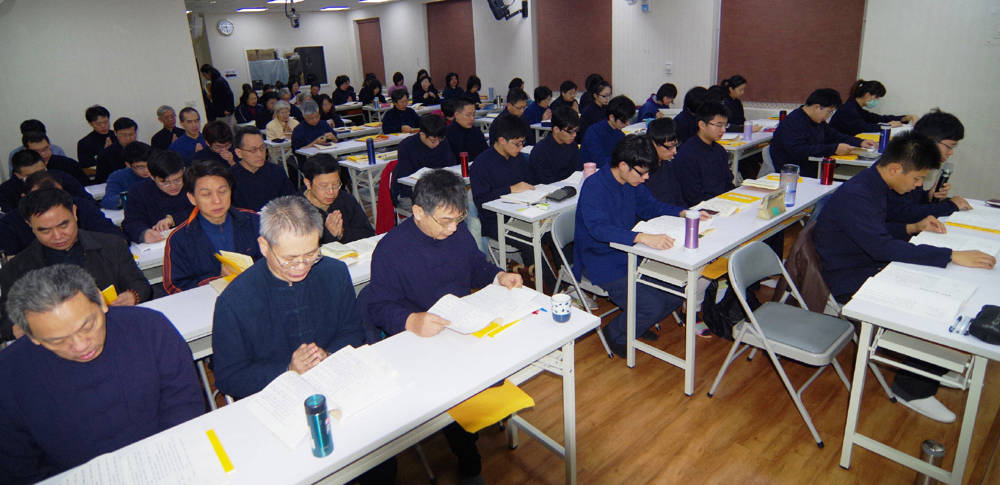

### 彌陀經講座　法語觀修

心超、心妙、禮悅、法明、王興文

坐上修與歷緣修　正見攝持方為要

念佛須知淨土義　句句皆是菩提道

彌陀經何以顯的是凡聖同居土　　心超

為了遍滿虛空的有情眾生，我們必須成就無上正等正覺，為了成就阿耨多羅三藐三菩提，所以興辦一０二年暑假《彌陀經》大專講座。

今天是第一天，法語的題目是「《彌陀經》何以顯的是凡聖同居土」。《彌陀經》顯示的境界實在太美妙了，展現種種神通的力量，在這七寶池八功德水，乃至於異香天樂、寶樹蓮池，盡情地享受，盛眾妙花供養他方十萬億佛國土，一頓飯之間最少可以經過東西南北上下十萬億佛國土走回來，這種神力連阿羅漢夢都夢不來，清晨到中午的時間竟然可以通通走完，這簡直是大菩薩的神力，如何是「凡聖同居土」的境界？所以有人說《彌陀經》顯現的是實報莊嚴土，是消業往生，此言非也，雪廬老人晚年特別花很多時間說明，去此邪見！雪廬老人說這是「佛力功德莊嚴」，經文中「成就如是功德莊嚴」，字句明白，那是淨土的功德莊嚴。

在科技先進之國，可以有很多神變，比如說坐飛機、打電話，把在遠地人的聲音攝過來（天耳通）。世界上任何角落的事情打開電視、手機都可以瞭如指掌，這些都是拜科技所賜。佛力的功德莊嚴，淨土的世界都是這樣的！凡聖同居土的「凡」可以有聖人的能力，那是因為佛的加被。現今人類因為科技的加被，使享受的程度遠超過古代的帝王，享受種種美妙的科技神變，古代帝王是連夢都夢不來的。例如沖水馬桶的設計，水一沖糞便就不見了，讓廁所可以非常乾淨；坐飛機到國外去玩等，這些科技的力量，讓人生活便利又享受，好像擁有神通一樣，生活的享受超過古代帝王多矣。

同理，《彌陀經》裡，處處顯示凡夫受用聖人的能力，像清晨盛眾妙花供養他方十萬億佛國土，還包括鳥樹演法，還有空中的音樂，都是阿彌陀佛所神變的世界。凡夫身受用佛的境界，此即阿彌陀佛成就的如是功德莊嚴，那是佛的願力，並且攝受聖眾與凡夫共住共享佛的神變，這是十方淨土所無。

在往生法裡說道，若一日、若二日、若三日、若四日、若五日、若六日、若七日，一心不亂，那就表示說念佛念七天一心不亂，這個不亂是真的不亂、還是假的不亂呢？臨命終時，如果這個人不亂的話，阿彌陀佛與諸聖眾現在其前；如果臨終還有亂，表示念佛的一心是假一心，假一心就是在這個七天遇境逢緣，沒辦法維持一心；在臨命終，如果能夠佛號提起，佛力加被，阿彌陀佛與諸聖眾現在其前，是人終時心不顛倒，可見臨命終還有分顛倒與不顛倒：不顛倒的那個人可以被佛接引往生，是因為對佛有信心，願意跟佛去，這不是凡夫是什麼呢？聖人不需要講臨終顛倒的問題，聖人平常就不亂，臨終更不亂，我們凡夫是沒有辦法的。凡夫或許七天可以訓練暫時一心不亂，但是環境一變化就沒有辦法了。

彌陀經處處顯示的都是凡夫受用大菩薩的實報莊嚴土，連往生的二乘人也受用實報莊嚴土。凡夫與聖人相聚，稱作「凡聖同居土」，二乘人所居謂之「方便有餘土」，其實二乘人跟凡夫受用的都是實報莊嚴土，然實報莊嚴土是大菩薩所居環境，所以只好假名安立為「凡聖同居土」、「方便有餘土」。

所以整部《彌陀經》所說淨土其實就是凡聖同居土，凡聖同居土卻受用的是實報莊嚴土，是凡夫卻住在聖人的環境，這是「十方教法所不能及、剎網所不能例」，亦即此乃教法當中所無，十方淨土也沒有這種例子。須知大菩薩的受用，凡夫是受用不到的，阿羅漢的受用凡夫也是受用不到的，就像悟達國師的人面瘡公案一樣，迦諾迦尊者的美妙境界悟達國師受用不到，不像極樂世界即使是凡夫都能得到如同聖人般殊勝的受用，一直到成就，整部《阿彌陀經》詮釋的境界就是如此莊嚴殊勝。

在《無量壽經》的阿彌陀佛四十八願當中，願國中天人能得天眼通、天耳通、宿命通、神足通、他心通，乃至漏盡通，漏盡通是慢慢修學才能成就的，但天眼通、天耳通、神足通、他心通等等是可以藉著佛力一時生起，就好像藉著科技的力量能夠通達遠方，例如天文台的望遠鏡，能夠鉅細靡遺的觀察天空的星星，那是藉科技的力量。整部彌陀經明凡夫藉著佛力生起，與聖者一樣的神變，是十方剎網所不能例，教法所不能及。十方淨土裡沒有這種例子，所以阿彌陀佛對眾生的大恩大德是「兆載難明」，用上兆劫都難以說明阿彌陀佛對眾生的恩德。

往後老師們，在餐前觀修，或晚課法語，或上課講經，或者分組討論，全部結合《彌陀經》，所以大家等於是閉七天彌陀經關，閉關修學引發正知見，這樣的功德實在太大了！因為淨土法門是百千萬劫難遭遇的法門，將來往生淨土，是以凡夫受用大菩薩的福報。

恭喜大家的命運是走向這種的命運，超出帝王、將相多矣，不只如此，而且壽命無量，世間上沒有任何一種善業可以讓我們壽命無量，也沒有任何一種善業可以發起這麼殊勝的神通，如同文殊菩薩、普賢菩薩一樣，供養他方十方諸佛沒有障礙，在修福修慧時沒有逆緣，我們人世間沒有這種善業，沒有靠佛力加被是不可能達成的！

所以本經名為：稱讚不可思議功德，一切諸佛所護念。一切諸佛所護念就是西方淨土，西方淨土的教主就是「阿彌陀」，一切源頭就是「阿彌陀」，所以整部經的往生法叫作「阿彌陀」，不念阿彌陀怎麼能往生？整部經的成就法也是「阿彌陀」，不靠阿彌陀佛怎麼成佛？

阿彌陀是涵藏在我們內心最殊勝的秘密，最殊勝的陀羅尼，百千萬劫難遭遇的秘密法門，竟然在我們心中生起，好像獲得一個難以想像的寶藏，就像一個笨蛋去買個威力彩，忽然中了幾十億，眼前就是這種感覺，若能用這種心態努力學習，上聯是「難以形容、無量無邊的殊勝」，下聯叫「莫名其妙，自由自在地受用」，橫批是「阿彌陀」。

凡聖同居土的凡夫受用如何稱作實報莊嚴土　　心妙

為了利益無量的眾生，我們必須成就無上正等正覺，為了成就阿耨多羅三藐三菩提，我們眼前在此舉辦彌陀經講座。奉老師之命，今日的法語要報告的題目是「凡聖同居土的凡夫受用如何稱作實報莊嚴土」。

我們知道淨土法門是二力法門，重要處是佛力，成就我們橫超三界以及橫具上三土。《彌陀經》五重玄義中的力用，談到往生淨土的作用，就是「往生不退」。「往生」就是以我們娑婆為例，世尊在此開演淨土法門，讓我們都能信願念佛求生西方，但我們一品惑都沒有斷，所以稱作帶業往生；往生西方極樂世界是結合佛的力量，與佛感應道交、蒙佛接引、臨終往生西方，這個叫做往生法，也就是所謂不靠自力、橫超三界六道輪迴之苦。第二個是往生西方極樂世界以後，受用的是成佛的環境，所謂「依報莊嚴」、「正報莊嚴」以及「說法莊嚴」，由此三種莊嚴能讓往生者具有三種「不退」。

每一尊佛國土都有四土，沒有斷惑的凡夫，理當入的是凡聖同居土，二乘所居是方便有餘土，登地以上的菩薩居住在實報莊嚴土，可是極樂世界不單是菩薩，凡夫、二乘聖者受用都等同登地以上菩薩，因此整個極樂世界渾然就是四土合一，假名叫做凡聖同居土、方便有餘土，何以證明凡夫受用的是實報莊嚴土，什麼又是實報莊嚴土的受用呢？

登地菩薩所居住的環境（實報莊嚴土），是一個成佛的環境，在那兒可以常聽聞佛法，大乘眷屬的色相是微妙莊嚴，壽命是無量無邊、神通是能迅速到十方法界，廣興供養。然極樂世界的凡夫不是登地菩薩，但卻可以受用等同於實報莊嚴土的菩薩，何以見得？我們就來看看經典怎麼說。

總說，彌陀經所述西方可分為依報、正報與說法莊嚴。在依報莊嚴裡面談到，極樂世界是「無有眾苦，但受諸樂」，那也是因佛力的加被，佛力的加被使西方極樂世界的眾生是蓮花化身，清淨且具有四色，乃至於無量色，是微妙香潔，眾生的出生是這樣殊勝；衣食的受用，都是自在、不仰賴經營、不需自己耕作，居住的環境是行樹樓閣，美妙的花園水池，天上還有音樂的莊嚴，並有天華飄落，行者能以衣？盛眾妙花來供養十方佛，且如大菩薩神足通一念生起就可到十方去供養，由依報環境就能看出極樂世界凡夫眾生所受用的是實報莊嚴土。

其次，就以正報來說，教主阿彌陀佛，眷屬以國中的天人而言無數，聲聞弟子及菩薩也是無量無邊不能盡數，且壽命無量無邊阿僧祇劫，此即凡夫受用實報莊嚴土。

其次說法莊嚴，佛所神變出的眾鳥演說種種助道品，乃至於風吹寶樹及寶羅網，生起種種法樂法音，能令凡夫從皆悉念三寶到自然念三寶，此即凡夫受用實報莊嚴土，何以故？登地菩薩入法流三摩地時，例如對般若的甚深義趣難以抉擇時，能使木頭佛像開口說法，解決他心中的疑惑，在極樂世界裡，凡夫竟然可以藉著白鶴、孔雀的歌唱消除內心的疑團，如同登地菩薩入法流三摩地一般，所以極樂世界處處顯示，凡夫受用的是實報莊嚴土的行相。

總而言之，實報莊嚴土的殊勝要登地菩薩才能受用，極樂世界卻可讓凡夫受用，這就是佛力殊勝功德莊嚴，經文謂之：極樂世界成就如是功德莊嚴。

淨土如何五塵說法　　禮悅

淨土如何以五塵說法，令眾生以眼耳鼻舌身所對之色身香味觸，隨時隨地皆能沐浴在正法懷抱中，並在眼睛看、耳朵聽、鼻子聞、舌頭嚐、身體接觸的都讓我們很有覺受。以環境這一分，可以令眾生受用中快速成就佛果。就如同具德的善知識，在日用平常以舉手投足說話辦事之風範攝受，令我們見之生敬，這是色塵之助；聞其說法使我們有教法的覺受，這是聲塵之助；大德持戒之身所散發的道氣，令眾生散亂心為之收攝，是香塵之助。

須知凡夫一生的生活，就是反覆追求此色聲香味觸，一生造業，多劫輪迴受苦。因此，阿彌陀佛為順應眾生習氣，以善巧方便的方法，令眾生去享受五塵，且是越享受越得益，如入芝蘭之室，於中薰習，並與十方諸佛結善緣，透過聞法，始令徹底改變想法，得無量陀羅尼，作為悟道成佛的因緣。

極樂世界寶樹的高度有八千由旬，且每棵樹的花葉都由七寶所成，且有各種不同的顏色，如瑠璃的葉片花朵，放出金色的光；玻璃的葉片花朵，放出紅色的光。五花八門，顏色變化多端，見之令人讚歎歡喜！另外，樓閣也由七寶所成，是極樂世界的大講堂，佛跟大菩薩在彼處說法或聚會，聯繫感情、討論問題、彼此增上。再者，七寶池中的四色蓮華，發出數不清的光，這裡簡單說有青黃赤白四種顏色，這是修八勝處定的四種淨觀色，到西方極樂世界，坐蓮花中，可以將蓮花變大變小，變成各種顏色，一剎那間觀力成就，是何等殊勝與不可思議，這是色塵說法。

西方極樂世界虛空常作天樂，此乃自然演奏的音樂，其音和諧美妙悅耳且演說法義。法會之梵唱聲音悠揚又能隨文入觀，能降伏煩惱、平和情緒。另外，極樂世界的微風吹動寶樹、羅網發出種種微妙音，演說著八萬四千法門，特別三十七道品，令眾生依正見而有體悟，進而快速成就，而那麼多的法門就藉著美妙的音聲演唱出來，真是善巧方便，妙用無窮，此是聲塵說法。

九品蓮花為父母，念佛的人，只要相信有西方極樂世界，有佛阿彌陀，並發願求往生，然後老實念佛，七寶池裏面就生出一朵蓮花，隨著念佛的人用功，蓮花就一天一天地茂盛、莊嚴，到念佛的人壽命終了的時候，往生因緣也成熟了，阿彌陀佛帶著我們在極樂世界七寶池中的蓮花來接引我們。極樂世界的蓮花，雖是在七寶池(金沙在裏面，其中的水是摩尼寶水)裡面長出來的，實則蓮花是從念佛人的心裏面生出來的，佛之名號萬德莊嚴，所以它散發出來香味、香氣，是世間所無，此是香塵說法。

在極樂世界，吃飯的時間一到，心中想要喫什麼，就有用各種寶器盛著心想的東西，隨意化現到眼前，不論酸、甜、鹹、淡，正適合自己的胃口。既不多，也不少，喫飽後自然消散，不用再費心去清洗，一切稱心隨意、自在無礙，這都是由阿彌陀佛的願行所成，也是淨土行者的淨業所感，此是味塵說法。

又七寶池中有八功德水，由如意珠王所生，水質特別！具有澄淨、清冷、甘美、輕軟、潤澤、安和、除饑渴、長養諸根等功德。池子十分深廣，極樂世界的眾生在池子裏，或者游泳、或者洗澡、娛樂，水之深淺溫度隨個人喜好變化，且水可以上下流灌，沐浴其中可除饑渴又可悟道，這是觸塵說法。

以上所說，只是以管窺天之說，實則極樂世界是阿彌陀佛願行所莊嚴出來的淨土，無有眾苦，但受諸樂，其中透過給予眾生的種種受用表彰法義、彰顯度生方便，真是微妙難知，不可思議。且各種五塵說法如同一個團隊，互相協助令眾生道業增上，缺一不可，娑婆世界與之比較，是何等幼稚與原始，娑婆世界是越享受越造罪，觀察歷代帝王皆是大福之人，卻因過度受用五欲，而導致下場淒慘，更遑論死後下三途之恐怖與悲哀。

假設有機會至極樂世界住幾天，除乘願再來的大菩薩外，相信沒有人願意再回來！而淨土行者透過善知識說法，對極樂世界好好體會與認識，將淨土生處轉熟，娑婆之熟處轉生，生起欣求極樂，厭離娑婆之決心，除了應盡本分及發心對境外，人我是非皆非我心思所在意處，在三寶、善知識攝受下，善友互相提攜鼓勵下，臨終乘著自己念佛所化現蓮花往生西方，將是何等瀟灑與自在啊！

淨土殊勝何以是上善聚會　　法明

《阿彌陀經》：「舍利弗，眾生聞者，應當發願，生彼國土，所以者何？得與如是諸上善人俱會一處。」蕅益大師的《阿彌陀經要解》科判安立為特勸淨土殊勝。正說明淨土殊勝處是諸上善人俱會一處。又有「夫上善一處，是生同居，即已橫生上三土，一生補佛，是位不退，即已圓證三不退。」圓瑛法師解釋《阿彌陀經要解》說：「此段乃要解耳目，帶業往生，即與上善俱會，一生補佛，是生同居，即已圓證三不退。念佛法門，稱最圓頓，即在此也。」以上證明淨土殊勝是上善俱會，以下分別說明：

一、佛力加被的往生法：極樂世界是阿彌陀佛仔細參酌二百一十億佛淨土，採集菁華，用五劫的時間思維，發四十八大願，所創造的淨土，佛土分為凡聖同居土，方便有餘土，實報莊嚴土及常寂光淨土。而往生西方極樂世界的眾生皆受用實報莊嚴土大菩薩的境界，即以凡夫的程度，受用大菩薩的褔報，所以是生同居，即以橫生上三土，這都是佛力的加被，阿彌陀佛的恩德。

二、往生不退的成佛法：老師曾說：「在娑婆世界一萬人修行，有九千九百九十九人退轉，有的人退轉得徹底，而退轉是修行人的特色，是眾生很大的習氣，故長劫在娑婆世界輪迴。」雪廬老人也說：「學佛第一年，佛在眼前，學佛第二年，佛在西天，學佛第三年，化為雲煙。」而西方極樂世界則不同，因有諸上善人的人才團隊俱會一處，如觀音、文殊、普賢等諸大菩薩都是我們的鄰居，常常與他們在一起，耳濡目染，自然不退。就算是五逆十惡，帶業往生，雖居下下品位的人，也可以得三不退。

淨土殊勝是上善俱會，因有佛的恩德及往生不退的好處，所以一定要往生西方極樂世界。首先不能離開善知識及團體。加上厭離娑婆，欣求極樂，斷惡修善，並學習經教，幫助別人，也幫助自己能深信，切願，心念口誦耳聽的老實念佛，定能蒙阿彌陀佛慈悲接引。

淨土何以是六方諸佛所護念　　王興文

西方淨土，何以為六方諸佛所共同護念與稱讚呢？依末學淺見，約有以下幾點：

一、難信之法：淨土法門，看似平常，義理微妙高深，惟佛與佛，乃能究竟，眾生無法理解，難以置信。《彌陀經》上，佛無問自說，當時與會的諸大菩薩，大阿羅漢等，尚且如聾似啞，無人祈請，更何況是我們障深慧淺，福薄垢重的凡夫，所能理解於萬一呢？由是之故，六方諸佛現身說法，各於其國，共同讚歎西方淨土及念佛法門的殊勝，以啟發眾信。這是六方諸佛所共同護念原因之一。

二、特別法門：所有一切法門，都要靠自力斷惑證真，才能了生死、出三界，唯獨淨土法門，兼仗自力與佛力，尤其是靠著彌陀願力的加持，不必斷見思惑，不必經歷三大阿僧祇劫，靠著一句彌陀聖號，即能橫超三界，帶業往生。只要具足信願行三資糧，就能仰仗佛力，往生不退，當生成就。釋迦世尊，以徹底悲心，善巧方便，教導眾生執持名號，藉果修因，因賅果海。以一句萬德洪名，直接契入彌陀願海，一念而成佛，是最為殊勝奇特，不可思議的特別法門，易修而難信，所以六方諸佛出來證明、讚歎、勸信，使聽聞者開始歡喜信受此淨土法門。

三、收機最廣：淨土法門，普被三根，利鈍全收。彌陀經的當機眾，有智慧第一的舍利弗，神通第一的大目犍連；有大智慧的文殊菩薩，當來下生佛的彌勒菩薩；甚至連根機魯鈍、愚昧善忘的周利槃陀伽，也同列其中，作為與會的代表，然而所獲得的利益卻相同。可見淨土法門，廣大方便，普應群機。末法眾生，根器淺劣，而五濁惡世，情欲牽纏，在此情況下，能斷惑證真者，就如鳳毛麟角。釋迦佛悲憫眾生，特倡此念佛法門，雖於此土勸進大眾，修此念佛法門，而六方恆河沙諸佛說誠實言，也於其國勸其眾生，同修此念佛法門。因而《阿彌陀經》得以普遍宣揚於恆沙佛土。可見淨土法門，是盡虛空、徧法界，恆沙諸佛所共同宣揚、讚歎、護念的法門，一稱洪名，不僅彌陀現身，六方恆沙諸佛，也必定立時湧現來護念受持者，因六方諸佛也共同護念此經。持一佛名，等同持無量諸佛名，徧種善根，獲不思議功德。

四、甚難希有：釋迦牟尼佛，能於五濁惡世，以此信願莊嚴，一句「阿彌陀佛」聖號，斷惑證真成佛，成佛後，再為娑婆國土諸眾生，說此淨土法門，難信之法，甚難希有，而為六方諸佛所共同護念。

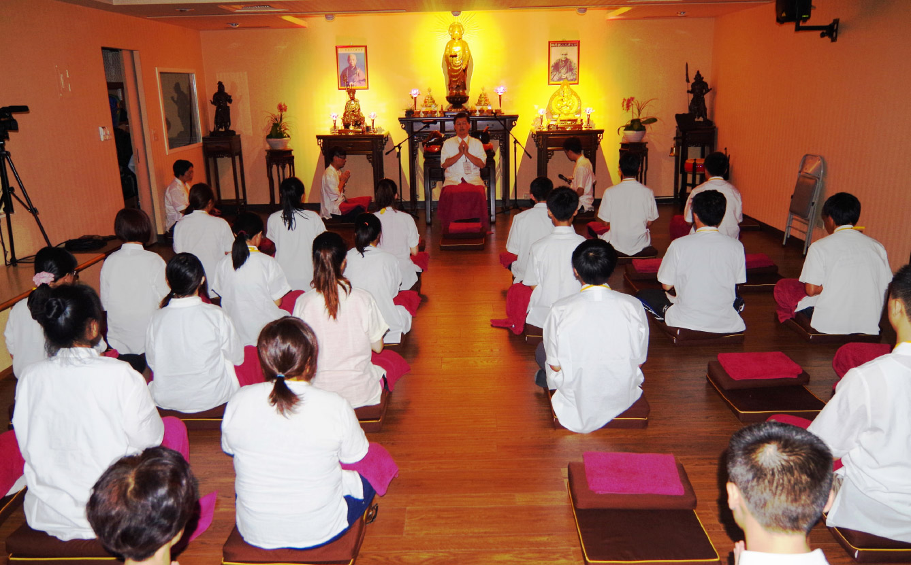

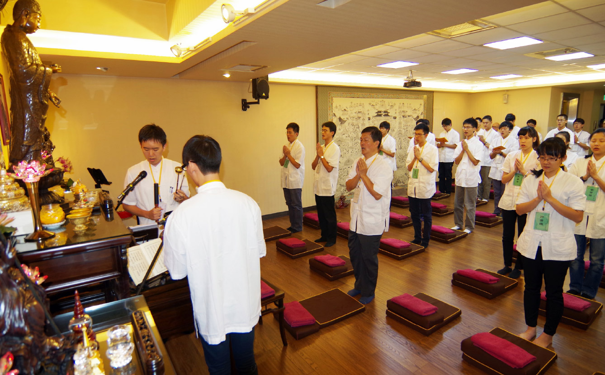

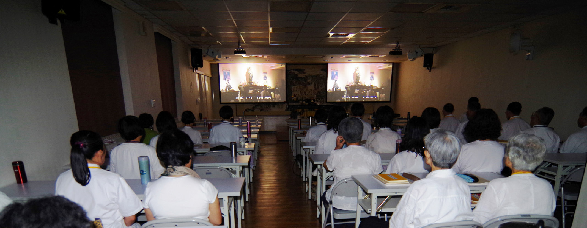

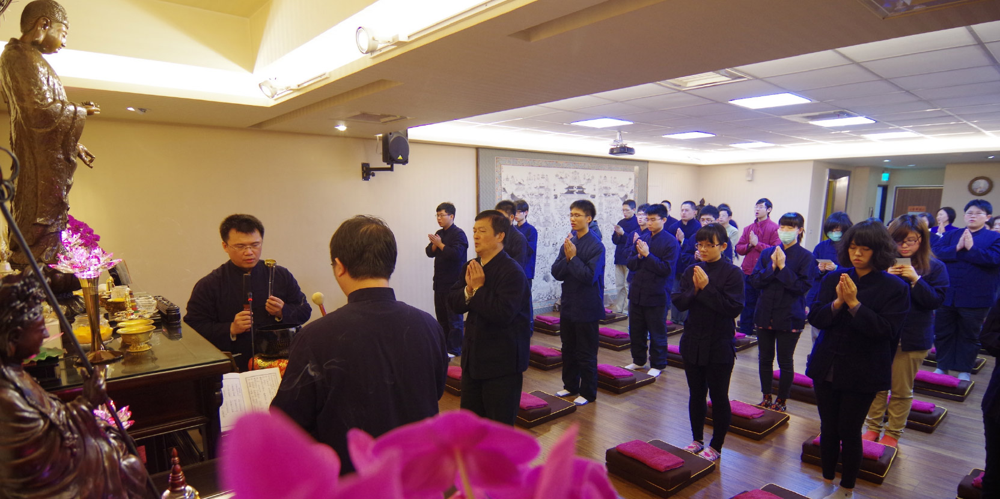

### 彌陀經講座　餐前觀修

大專生

用功不離飯眠時　賴他提醒己正知

道在平常日用間　成就原來那回事

諸上善人的用餐　　莊惟盛

往生極樂世界的目的，是為了與諸上善人俱會一處，蒙其策勵，有進無退。諸上善人是十地圓滿的菩薩，在極樂世界，到處都是像文殊菩薩這種等級的人物。這些菩薩的言行舉止都成為我們的典範，很多事情或許看看十地圓滿的菩薩怎麼說、怎麼想、怎麼做，就會了。沒有人在放逸，各個都比自己強，在這樣的環境下，自然而然就會進步，不需勉強，順順利利直接到候補佛位，等待機緣成佛。能夠如此輕易快速的成就，這是外緣殊勝的緣故。

在這一年一度殊勝難得的暑期大專佛學講座中，與許多的師長、學長齊聚一堂，一同聽聞、研討，四周圍繞著對我有幫助的善知識，能帶我脫困的善知識。在這樣的環境中學習，一定是都攝六根，直入老師所講的教理當中，反覆咀嚼思維，生起勝解。能有如此良好的學習成效，這不也是外緣殊勝的功勞嗎？

講座期間與諸位善知識齊聚一堂用餐，雖然現在大家都是凡夫，但是把周圍的善知識看作是十地圓滿的菩薩也無不可，思維當與這些菩薩一同用餐時，我應該怎麼用餐呢？對喜歡的食物生貪，對不喜歡的食物生瞋，周圍的菩薩都清清楚楚的知道，這樣會不好意思啦！內生慚愧，就不好意思生貪、生瞋了，用心去觀想，就會生起觀想所帶來的利益，我們這裡也是諸上善人的用餐。

何等殊勝因緣促使諸上善人聚在一起呢？就像平常我們因為有太多繁瑣的事情要忙，所面對的人事物容易讓我們離開教法的思維，放逸懈怠是經常產生的。遇到逆境，周圍的朋友也無法以正知見引導我們，所以心情就容易低落。然而，由於講座的興辦聚在一起，能志同道合共同學習，課後研討，受用和合的快樂。在用餐時，也是和合的用餐。

能夠聽聞難得的教法，又有美味可口的食物當前，諸上善人齊聚一堂和合的用餐，這需要多少的福報？我們該妥善的使用福報，用餐時不起貪瞋癡，用心體會飯菜的各種滋味，體會廚房義工的用心，並且為了有好的體力來聽聞教法而用餐。以這樣的心情來用餐，才不枉費這一切人力、物力的付出，將福報做最有價值的利用。

八功德水的用餐　　張鑑光

大家都知道，西方極樂世界是阿彌陀佛為眾生所創造的最佳修學環境，身處在西方極樂世界，每個人舉手投足都非常的莊嚴，具備大丈夫相，不管做什麼，同時都在增長自己的善根，是一個不退轉的境界，而七寶池中的八功德水，就是具有此妙用的水。

八功德水，擁有八種不可思議的功德，分別為澄淨，就是不濁不污，清澈見底；清冷，就是不寒不熱，溫度剛剛好；甘美，喝起來非常甘甜順口；輕軟，質地柔軟沒有壓迫感；潤澤，就是滑順帶有光澤；安和，就是平靜湛然；除飢渴，喝了之後可以解除飢餓；長養諸根，喝了更能夠長養善根，令我們善根增長，對教法更有領悟力，故稱八功德水。我們所處的娑婆世界，此土之水與極樂世界的八功德水是遠遠無法相比的。

我們生在人道，每天都必須要吃飯，為的是要滋養我們的色身，但是，若只單純滋養我們的色身，過一日算一日，未免太過可惜與浪費。反之，我們的想法應該更進一步，吃飯，是為了讓我們有精力去研學經教，在滋養色身的同時，也增長慧命。

然而，有人也許會問，娑婆世界的受用如何與西方極樂世界的受用相提並論？確實無法比擬，但是，當我們已經知道八功德水的妙用之後，不妨好好用心思維，在我們吃飯、喝水的同時，觀想所飲用的水具足八功德水的妙用。觀想我們是否保有一顆清淨柔軟的心，才會看見水的澄淨，進而映照我們的智慧，有了智慧，才能夠對治愚癡；喝水的時候，要做清冷、潤澤、甘美的觀想，感受水那質地不沉重的輕軟，當心輕軟後，才能夠對治瞋恚；喝水後，除去了飢渴的功用，能夠對治貪愛；而在我們的身心滿足之後，我們的心量自然增大、頭腦清晰，使我們在研學教法上能夠更加透徹，排除修學的障礙，而有了安和的感受。至此，安住我們的身心，對治貪、瞋、癡的禍害，無形中長養諸根，增長智慧。

因此，在今天享用餐點之前，讓我們一起觀想八功德水的妙用、極樂世界的絕倫，盡心學習，努力吃飯，讓吃的每一口飯、喝的每一口水，都更加深具意義！

生老病死的用餐　　蕭惟元

人要生活，基本的能量來自於吃飯，吃飯可以滋養我們的身體，維持我們的生命，食物中有許許多多的營養素，例如麵、飯、玉米等五穀根莖類，可以提供熱量及部份蛋白質﹑維生素﹑礦物質和膳食纖維。油脂類提供熱量﹑脂肪及必須脂肪酸。蛋和豆類，有蛋白質﹑維生素及礦物質。蔬菜類也有充足的維生素。原來有這麼多的營養，薈萃在食物裡面，藉由吃飯，被我們的身體吸收，提供我們所需。那麼，吃飯跟生老病死又有甚麼關係呢？

有一首《普賢菩薩警眾偈》，相信大家並不陌生，它的內容是這樣的：「是日已過，命亦隨減，如少水魚，斯有何樂。大眾，當勤精進，如救頭然，但念無常，慎勿放逸。」人生七十古來稀，七十歲的人生，可以換算成兩萬五千五百五十個日子，一本兩萬五千五百五十張日曆，撕、撕、撕……，三十多歲的我，一下子已經撕掉了一萬一千七百二十五張。這場講座，唰地一下，第二天就快要過去了，又撕去了兩張，相較於淨土的無量壽（有量的無量），娑婆的日子確實特別讓人感覺到迫促，這種如少水魚的歡樂，比對西方的極樂，真的可以叫做斯有何樂？

眼前的豐盛餐點，是香積菩薩們的愛心所成，是師姑用神通力變現的美食，相較於外面的食物，它們可口、乾淨、營養、均衡，還可以長養我們的諸根。然而即便是已經如此美好而又難得的一餐，我們還是沒有事已化去的能力，享用過後必須有收集、清洗、擦拭的處理，身體也還有消化、吸收、排放的過程，更重要的是，在我們大快朵頤的過程中，還是馬不停蹄地往生老病死邁進，命亦隨減，如少水魚，斯有何樂？

我們如何才能不辜負師姑們煮飯的用心、對得起這些得來不易的食物呢？我們要將這一頓生老病死的用餐，轉為往生極樂的資糧；把我們所吸收的營養，用於教理的研討、用在為大眾服務的體力勞動、用在服務師長、用在友愛同學、用在迴向往生淨土、更要用在稱念「阿彌陀佛」名號，那麼這一餐，就不是生老病死的用餐，而是未來與極樂世界相應，無有眾苦的用餐。

不退轉的用餐　　蔡濟安

我們現在所處的環境是非常容易退轉的，智慧型手機在你身旁時，不斷地誘惑你去滑一下，或者用line聊一下天，或者看臉書關心朋友的近況，或者玩一下小遊戲，上課時、坐捷運時、睡覺前都放不下手機。在學校想要用功念書，但身旁的同學朋友都在玩，一下跑去墾丁春吶，一下約去看電影或吃下午茶，還要打卡留念，用功念書的人會被當成怪咖，不合群、被排擠。此外還有生、老、病、死等苦牽絆著，讓你上課時會肚子痛、想睡覺。這些種種例子成為庸常生活的內容，在這樣的環境下，想不退轉都難。

而在這麼艱困的環境下，要如何增上自己呢？就像老師上課不斷強調的，一定要改善自己的環境，極樂世界是我們最好的參考，要親近有正知見又善於教導的老師，要結交很用功精進的朋友，要常處清淨莊嚴的環境中，遠離五光十色的場所，要善用３Ｃ產品，３Ｃ產品就像一把很利的刀，可以削鐵如泥，也很容易割到自己。只要把環境經營得好，自然正面的能量就很容易生起，退轉的心也就會減弱。
在智者大師所著的《淨土十疑論》第六疑當中談到，就算我想要去極樂世界，可是我是煩惱深重的凡夫，貪瞋癡的三毒煩惱從來沒有減少過，就算到了極樂世界，理應仍會生煩惱造惡業，怎麼說不退轉呢？祖師回
**答：** 極樂世界有五種因緣不退，不但有阿彌陀佛大悲願力的攝持，而且因為佛光常照，所以菩提心增進不退。在極樂世界的依報來說，水鳥樹林，皆演法音，讓人常起念佛念法念僧之心。就眷屬而言，在極樂世界，身邊的好友、眷屬皆是菩薩，外無神鬼邪魔，煩惱畢竟不起。而且在極樂世界的壽命，皆與菩薩、佛等量，皆是無量無邊阿僧祇劫。

我們今天在此，也擁有了各種不退轉的因緣，不但有善知識的攝持，有志同道合的朋友一起切磋琢磨，在熱鬧的街市中能在一片淨土環境中學習，隨喜自己的善根，也隨喜極樂世界的依正莊嚴，讓我們就在這樣的歡喜心中開啟今天的午餐，也開啟往後幾日的學習，這一生的學習。

無老病苦的用餐　　應雨橋

人生在世，都不免由少而壯，由壯至老，由盛至衰，縱使富可敵國、權傾一方，也免不了老病眾苦。苦，是逼惱的意思。先約老苦而言，隨著年紀的增長，色身種種機能衰退，髮蒼蒼、視茫茫、齒牙動搖、飲食難消、氣力虛微。再約病苦，有生以來，或因外感、或因內傷、或因業障，不免會患病，所患之病小至感冒，大到癌症，不論大小皆是苦。乃至長年臥病在床，求生不得、求死不能，病苦惱人，實難以言喻。雖然現代科學醫藥發達，亦無法抵禦老病的侵襲。

在此娑婆世界，除以上老、病、苦外，亦有生、死、求不得、愛別離、怨憎會、五陰熾盛等苦，合為八苦。諸經論另開有三苦、十苦、百一十苦，凡此種種，苦不堪言。對比極樂世界，如經中所云，是一個「無有眾苦」的環境，因為極樂世界是在阿彌陀佛佛力殊勝功德下所莊嚴出來的淨土，往生到那邊的人們，即使是凡夫，也能受用實報莊嚴土的境界，受用初地菩薩以上才能受用的境界，當然是一個無有眾苦的環境，也是我們所應希求的環境。

如何將無老病眾苦與用餐結合呢？藉著眼前的用餐來補充體力，更有甚者，藉著教法的學習在智慧上充實自己，讓自己獲得往生淨土的正確知見；也能更好的利益他人，幫助他人也能往生淨土，藉此累積自己往生淨土的資糧，讓自己及眾生都能夠獲得無老病眾苦的環境。乃至於在供養時，觀想自己所代表的是徧滿虛空的有情眾生，眼前的飯食代表一切美好的資具（衣服、臥具、醫藥等），而供養的對象是十方三世一切的三寶以及眾生，目的就在於將此供養的法行作為讓自己及眾生往生極樂的資糧，讓自己和眾生都能夠獲得無老病眾苦的環境。如能在餐前作如此的觀修，那這一餐飯的體性就能夠作很好的轉變，成為無老病眾苦的用餐。

無三惡道的用餐　　心法

說到吃飯，我們通常是抱持什麼樣的心態在吃飯呢？到底什麼樣的想法才能使一頓飯變得有意義，而不是只在享受口腹之慾，使福報消耗。如果透過吃飯，做正確的觀修，使這頓飯格外有意義。

身為人，我們得以享用美食，不需忍受三惡道的苦痛，三惡道為地獄、餓鬼、畜生。墮入三途的人，就是犯了十惡業者，輕則墮畜生道，再來是餓鬼道，最重則是墮地獄道。墮地獄道是因為瞋恚心，墮餓鬼道是因為貪心，墮畜生道是因為愚癡心。地獄的眾生沒有福報吃東西，受無盡之苦，餓鬼道的眾生因為身前自私不肯布施而感招飢餓不得飲食，就算得到東西，也因口中噴火而不能食用，畜生道的眾生則是弱肉強食的世界。

地獄叫火途，地獄是一片火海，鬼道叫刀途，他們身心不安，常常生活在恐怖之中。畜生道叫血途，畜生弱肉強食，流血互相吞啖而死不能善終。

在人道中，若知道殺生的過患就不會去吃眾生肉了，但許許多多的人不知道吃素的意義在哪？有些人對於吃素很排斥，或是對於吃素的人感到同情，感嘆吃素的人不懂肉的鮮美，不能吃肉的可憐，殊不知那些被奪走生命的眾生有多麼恐懼、多麼痛苦，再者這些以吃肉為樂的人一點慈悲心都沒有，也不知道肉之不淨。

我們知道美食是難以抗拒的，但是胃總是有份量，吃太多則感到痛苦，就算極為可口也不願再進一口。對於吃飯這件事情，我們必須認清它只是為了填飽肚子維繫生命的事情，不能貪得無厭，因為不管再美好的食物，到了腹中，總化為入目不堪的東西。此外世間上各種美味在時間流轉中皆化為腐敗，成臭穢噁心之物，那麼貪得口腹意義又何在呢？

極樂世界的食物，與世間大大不同，在《佛說阿彌陀經》義蘊：天人供養分第四─飯食，當中提到「極樂之味。大不同此。大本略云。銀缽金缽。隨意現前。百味飲食。充滿其中。食已自消。而無遺滓。或見色聞香。意以為食。自然飽適。食畢化去。時至復現。既不煩勞。而又潔淨。兩土合觀。當知欣厭。是教眾生捨穢土之不淨味塵。換取極樂之妙淨味塵也。」我們知道阿彌陀佛殊勝功德之力，造就出如香積國般的美味之食，並且食之能增長功德，所以我們不往生極樂世界受用如此殊勝的飯食，怎麼還在貪愛世間的食物呢？

當我們在享用食物的時候，不貪口腹之慾，不殺生，有好的食物與人分享，心中要時時感念授予我食物的人事物，感念三寶的恩德，他們使我免於飢餓，吃飽後，能在修學正法上有所助益，並且能成為往生極樂世界的資糧，這樣吃飯不消耗福報，且使自己增長功德，一切都是觀待發心動機而言。

發願與用餐　　戒純

雪公太老師曾說：「夫願者，立志不移，所謂『至死不變者，強哉矯』是也。」可見「願」帶有一種使命感，就像廣告裡的台詞「Fedex，使命必達」，帶著不厭其煩，必定去實踐的意涵。就世俗而言，發願如同「立志」，一個人立定了志向，不畏艱難地去完成自己的志願；就佛法來說，「願」是往生淨土的三資糧之一，發願往生，即是將平生所修的種種功德，全部回向往生西方，不作他用；並且能夠結合廣大菩提心，乘著誓願，廣度一切眾生。

在《佛說阿彌陀經》中，釋迦牟尼佛曾四度勸請舍利弗應當發願，往生西方。可見「發願」在往生極樂世界中，具有關鍵性的作用。從《佛說阿彌陀經》中，我們知道極樂世界環境的殊勝，以及對於成佛的種種美好，對此也深信不疑。然而即便如此，若不能在內心生起對娑婆「厭離」、對西方極樂「欣求」的心，終究是無法往生西方淨土，受用其中的種種美好。這種「欣」、「厭」的狀態，就是「願」的行相。可見「發願」，具有引領一個人行為，往某個方向前進的力量。然而所發的願內涵不同，也就帶來不同的成就相。

從發願的內容，可以看出一個人的格局見地。《論語》裡面記載著孔門師生的志向，如子路「願車馬，衣輕裘，與朋友共，敝之而無憾。」顯現子路對物品的不吝惜，更願意以之與朋友分享，這樣的人在世間，一定能廣結善緣；再如顏回，「願無伐善，無施勞」，顯示顏回功成不居以及體諒他人的仁心；又如孔老夫子「老者安之、朋友信之、少者懷之」，使天下的人，都能夠安於其位，各得其所，呈現聖者寬宏的器度。而在佛經裡面，更記載諸佛菩薩的發願，其內容皆令人為之讚歎不已。

記得在剛接觸佛典時，讀到地藏菩薩的一段故事，定自在王菩薩向世尊詢問，地藏菩薩累劫以來，發了什麼願，得到佛如此殷勤的讚歎呢？其中佛說道，在無量劫以前，有兩位國王，其中一位國王發願「早成佛道，當度是輩，令使無餘」，而另一位國王則發願「若不先度罪苦，令是安樂，得至菩提，我終未願成佛」，後者就是地藏菩薩。那時候讀到這段文字，箇中的內涵還不甚明瞭，卻不由得為之一顫，後來再讀到地藏菩薩的大願內容「眾生度盡，方證菩提；地獄未空，誓不成佛」，可想而知，娑婆的眾生，難有度盡的一天，而地藏菩薩究竟有多大的心量，能夠承擔這樣的大願呢？地藏菩薩的慈悲，讓我每讀一次，都感動一回。

接著，在因緣際會之下，參加了「《普賢行願品》講座」，對普賢菩薩的十大願王有了認識。普賢菩薩的十大願，其內涵是相當廣遠的，每一條實踐起來，所成就的功德利益，都是難可量知的。而其中貫串經文的「念念相續，無有間斷；身語意業無有疲厭」，顯現了普賢菩薩對於所發之願，是終其一生的經營。可見「發願」不僅強調內涵，更強調其相續力，要如同普賢菩薩一般，堅持貫徹，須臾不離，不疲不厭。

因此今天我們在這裡用餐，除了與諸多善知識一起學習，也要思考諸佛發願的內涵，結合《阿彌陀經》中所揭示的義理作發願，向諸佛菩薩的願行學習，以諸佛菩薩作為標竿、典範，讓自己對善法的體悟增進，使諸佛的內涵、神韻，能化為自己在未來的受用，與佛能師資道合。於舒適的用餐環境，發願珍惜物資，感謝幕後辛勤工作的人員，以及默默付出的長輩；享用美味的餐點時，發願種種色香味的受用，能令自己聽聞正法時，自然得到受用；與周遭親友用餐交談時，發願能令正法宣流；餐後清潔善後時，發願作好清潔工作，成為他人學習的善知識；在回味菜色的美好時，發願將聽聞之善法，使之雋永長存，能傳承任運，令法音宣揚，淑世利人。更讓自己對法的好樂，念念相續，無有間斷，不疲不厭，發願往生西方，以極樂國土為故鄉，誓願成就，乘願再來。

持名念佛與用餐　　蔡易儒

最近國家社會很不安定，天災人禍不斷，每次打開電視看到新聞，往往都是好消息少而壞消息多，不禁令人感嘆現今人心敗壞，眾生煩惱相續不斷，身處在這樣的五濁惡世當中，我們要如何才能得到解脫呢？《大集經》云：「末法億億人修行，罕一得道；唯依念佛，得度生死。」　釋迦牟尼佛大慈大悲，為一切眾生特別介紹了淨土法門，作為離苦得樂的良藥。淨土法門是了生死、成佛道的大法，有別於通途法門需要斷煩惱才能脫離生死輪迴，淨土法門只要信願持名，伏住煩惱歸一淨念，便能仗佛慈力，帶業往生西方極樂世界。由此看來，淨土法門最契合末法時期眾生的根機，我們有幸能於這一生聽聞到如此殊勝的大法，應當依著佛陀的教化而修，力求當生成就，而成功的關鍵，在於念佛能否信願懇切，一心不亂。

然而，我們每天生活忙碌，很難從早到晚一直念佛，若不念佛時妄念不斷，又如何能夠一心不亂呢？　雪廬老人教導我們：念佛法門有二種方法，一為念佛，一為憶佛。念佛就是念茲在茲，念由心起，聲由口出，再從耳入、心記，身口意三業合起來念；憶佛是銘記不忘、默而識之，雖然口中沒有念出聲，但心裡念念都是阿彌陀佛，如同　印光大師教導我們，應當「一切時，一切處，令此一句洪名聖號，不離心口」，因此，我們行住坐臥、穿衣吃飯，皆不離憶佛、念佛，能夠如此，便是將心安住在道上，安住在佛號上，這對我們的修行能有莫大的幫助。

然而，或許有人會起疑惑：吃飯的時候，心在飯上面，做事的時候，心就在事情上面，這樣還能憶佛嗎？根據　徐醒民老師的講述，　雪廬老人過去就曾針對這個問題說了個比喻：比如一個小孩子，離開了母親，這孩子沒有一時一刻不想念他的母親。吃飯的時候也想，做事的時候也想，什麼時候都在想，他這想念的心可以不間斷。但是想的時候，並不妨礙他吃飯、不妨礙他睡覺、不妨礙他辦一切事情。他想母親的那個念頭與他日常做的事情不相妨礙！這就好比儘管心裡有佛號的念頭在，並沒有妨礙日用平常。雪廬老人還說，我們每個人都忘不了吃飯，就算肚子不餓，時間到了也還是會吃，念佛如果到了像吃飯這種地步，自然也就水到渠成了。

因此，面對眼前的菜餚，我們可以作哪些觀修呢？古大德云：「吃飯是雜用心處。」我們往往看到好吃的菜餚，就生起貪愛，看到不喜歡的菜餚，就生起瞋恨，這樣的吃飯仍是煩惱相續，雜亂用心。然而，我們修持淨土法門，就是要在這雜用心處下功夫，不去挑剔飲食的好壞，而是念念佛號，淨念相繼，以忘不了吃飯的心來憶佛念佛。

此外，我們也當觀想，眼前這些飯菜，是為了幫助我們念佛、學佛能有充足的體力，所謂「為成道業，應受此食」，因此，應當懷著感恩的心和使命感用餐。祝大家在這次的講座中都能夠精進學習、法喜充滿！

不可思議的用餐　　唐微智

吃飯，是每個人每天都必須做的事，一天三餐，餐餐都要講究，要吃得飽、吃得營養、吃得健康，還要好吃。除了三餐外，還要配合下午茶點、零食、各種保健食品、宵夜等等，來滿足我們的口腹之慾。大部分的人，每天都在計算、思量著下一餐應該吃些什麼？也許，有人一天的生活重心就在吃。打開電視，各種異地的美食節目也在挑戰我們的視覺、刺激我們的味蕾，對我們來說，享用美食可說是最平凡不過的事，用餐哪有甚麼不可思議？

但倘若你是一位非洲難民，一切的受用就截然不同了，你可能一輩子都要在垃圾堆裡撿垃圾，連筷子、湯匙都沒看過，更不用說是好好地坐在桌前享受一頓美食了。我們的一餐飯，是他們遙不可及的夢想，是他們繳盡腦汁、竭盡心力也無法想像的，簡直不可思議。

以前，我曾經去過緬甸，當時曾安排請當地村民吃飯，那些食物來路不明，全部雜放於一大鍋，看起來難以下嚥，但對那些居民而言，那頓飯可能是他們一年中，甚至一輩子中，最豐盛、可口的一餐，大家吃得津津有味，臉上泛起天真無邪的笑容，對他們而言，我們所布施的一頓飯，是不可思議的，因為他們從來沒看過、沒吃過，根本不能體會、通達。

而在極樂世界，吃飯前可以先供養他方十萬億佛，做供養、聞法，做完善法後再用餐，會產生無比的快樂，而且加倍有意義，所用的餐點自然加倍的好吃。極樂世界的食物都是隨心所現，想吃甚麼立刻就變現出來，各式各樣、千變萬化，不是我們所能想像的，而且不必擔心飲食會危害身心，造成負擔。吃飽了，食物會自動消失，少掉善後的一切麻煩。

就像非洲難民、緬甸村民不能通達我們一樣，我們更無法體會極樂世界殊勝的境界。雖說我們與極樂世界相差甚遠、無可比擬，但還是可以拿我們現有的去做觀修。極樂世界能供養他方十萬億佛，而我們餐前也會做供養，供養佛、法、僧三寶，再做享用，這時我們可以擴大自己的心量，就好像我們也得到神足通，觀想所有的佛國土收攝在眼前做供養。極樂世界的所有食物都是佛力變現，就像我們的所有食物都是師姑之神力所變現，我們無須動到一根手指頭，就能享有色、香、味俱全的飯菜，不必擔心健康。

而食畢化去，吃完飯後，就會有當天的公差為我們服務，我們無須碰到一滴水，就回復美好整潔的環境，可以作正法的學習。若能做如此的觀修，將心量擴大至無邊無量，並發揮無限的想像力，就看我們是否能帶著佛的本質境，生起我們凡夫眾生的帶質境，而且逼近極樂世界的受用，若能做如是觀察，再去享用美食，相信這一餐也可以是不可思議的一餐。

但受諸樂的用餐　　王姿云

經過這麼多天的課程薰陶，我們是不是對阿彌陀經有更深的了解呢？其中有段經文是釋迦牟尼佛問舍利弗，彼土何故名為極樂？其國眾生，無有眾苦，但受諸樂，故名極樂。就是說在極樂世界裡的眾生，沒有種種苦惱，只有享受種種的快樂，所以叫做極樂世界。

再具體的說，諸樂可以定為四項，一、無罪報之苦—我們在這個世間，都是受罪報的；但是在極樂世界的人不迷惑、不造業，是不受罪報的，到那裡就是享受，所以沒有『罪報之苦』。二、無因享受而造惡業之苦—我們在這個世界上，無論衣、食、住、行，享受的同時往往就是造惡業的同時，像是為了吃一餐山珍海味，而造了眾多的殺生業；而在極樂世界的享受卻不會造惡業。三、無輪迴寂滅之苦—我們現在身為人，還是在六道輪迴當中，唯有在西方極樂世界才能脫離輪迴，脫離輪迴後也不耽於此快樂，而是繼續修學，學習才是真正的快樂。四、無修道障礙之苦—我們在娑婆世界修道障礙很多，像是想學習卻碰不上好老師、想精進卻剛好身患重病，注意力不集中等，在西方極樂世界就沒有障礙，一帆風順，所以無論在物質上、在修道上只有享受快樂，不會受苦。

另外清朝乾隆時期的慈雲大師，對極樂世界也歸納出十種樂來：

（１）無不常值佛苦，而有花開見佛，常得親近之樂。（２）無不聞說法苦，而有水鳥樹林，皆宣妙法之樂。（３）無惡友牽纏苦，而有諸上善人，俱會一處之樂。（４）無群魔惱亂苦，而有諸佛護念，遠離魔事之樂。（５）無輪迴不息苦，而有橫截生死，永脫輪迴之樂。（６）無難免三塗苦，而有惡道永離，名且不聞之樂。（７）無塵緣障道苦，而有受用自然，不俟經營之樂。（８）無壽命短促苦，而有壽與佛同，更無限量之樂。（９）無修行退失苦，而有入正定聚，永無退轉之樂。（１０）無塵劫難成苦，而有一生行滿，所作得辦之樂。

以上慈雲大師將娑婆跟極樂世界苦樂做一個比較，用苦樂來較量，共說了十種。由此可見極樂世界的殊勝諸樂。

而用餐之事非同小可，但受諸樂如何和我們的用餐相結合呢？在這邊的佳餚都是養生可口而無沾半點葷辛的素食料理，因此沒有因逞口腹之慾而殺生的罪報之苦。而這裡的用餐環境整潔，井然有序，還有涼爽的空調，無須揮汗如雨，有這些這麼好的享受，其背後的用意是用來成為我們學習的資糧，這樣就是不會因享受而造惡業墮落之苦。而我們好好善加利用這些資糧，進而精進修學，往生到極樂世界的我們也就無輪迴寂滅之苦了。

而當用餐時間一到，不用因為要吃什麼、買什麼晚餐而煩憂，也無須飢腸轆轆的等待飯菜，師長們早已為我們備妥熱騰騰的飯菜享用，讓我們可以心無旁騖的把所有氣力、精神全部用在聽課上，這樣我們豈不是無修道障礙之苦了嗎？這就是但受諸樂的用餐，現在我們一起來做供養吧！

講座尾聲的用餐　　王文徽

這次的講座已經進入尾聲了，透過這次的講座，老師以深入淺出的方式，配合雪公太老師的筆記要點來講解，清楚的讓我們了解淨土法門的往生法和成佛法，以及極樂世界依報、正報莊嚴、說法莊嚴的殊勝，進入極樂世界後，能依此教學環境得到阿鞞跋致，從位不退、行不退到念不退，值此一生即能成後補佛的不可思議修學法，來體會佛的慈悲和用心。相信大家在正知見的確立上，更有信心，方向也越明白了。

其實，講座到了尾聲，大家都有如釋重負的感覺，鬆懈的心態油然而生，退轉的心也悄悄地生起。離開了學會回到各自溫暖的家，打開電視、電腦，五塵的染污，立即使得退轉的心猛烈地加溫。

但是如果以空性智慧來觀察「退轉」這回事，會發現「退轉」的自體性不可得，也因為自體性不可得，其實我們可以不受「退轉」的影響。因為退轉與否乃觀待我們的用心，如何可以不退轉呢？應在教法上繼續增進，配合環境的改變和向善知識請益研討，退轉的心便能不攻自破。再者，以觀法無我的角度切入，因為「我」的自體性沒有，也就是所退轉的自體性沒有，則能退轉的心當然也沒有。

講座也無自體性，講座開始的第一天就注定結束，這一期因緣的結束，下一期因緣的開展，有名言的關連性。這一期講座的尾聲，是下一期的開始，沒有尾聲，一直要到成佛。

用餐時，不忘做自相空的觀察，有善知識的傳承，有法本，有同儕，有師長，有獎學金，有外護，有親愛的父母護持，有師姑拿了一堆瓠瓜（卜阿)，有人默默拿了幾箱芒果，有可口的果凍，有遠從中部來的冰淇淋，有自己醃製的酸白菜等等，還有我們大家願意認真的來學習，每一場講座都是因緣湊合而成的，認真的吃飯，用心的吃飯，就是對講座中「吃飯」這一法最大的尊重。

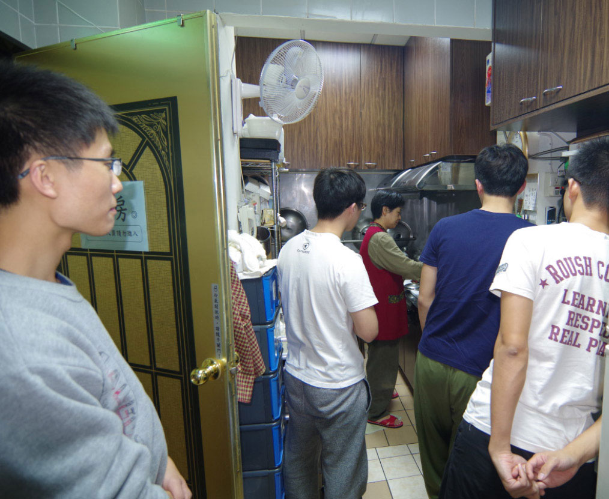

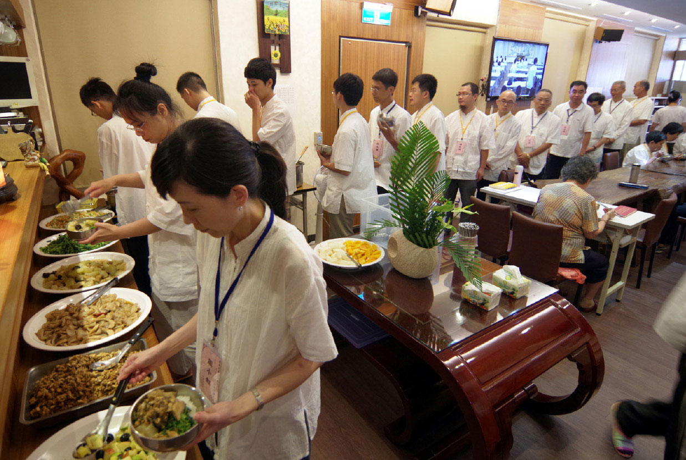

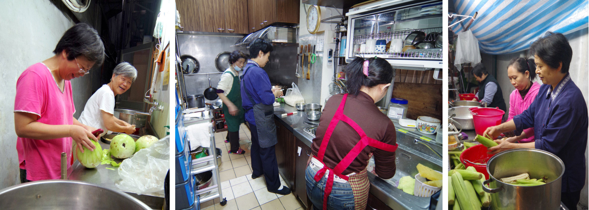

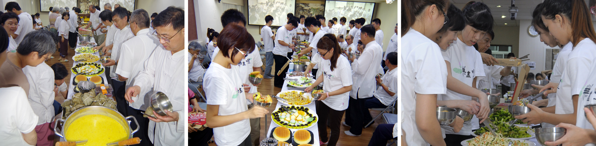

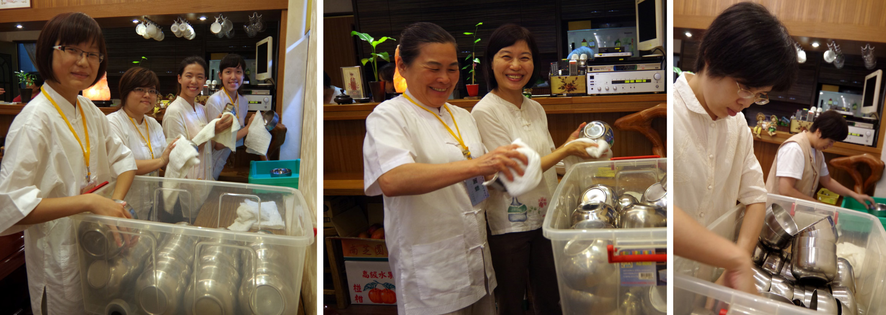

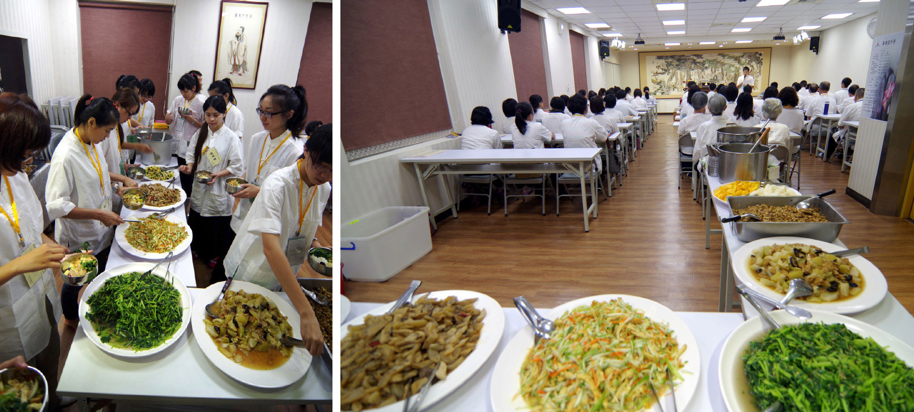

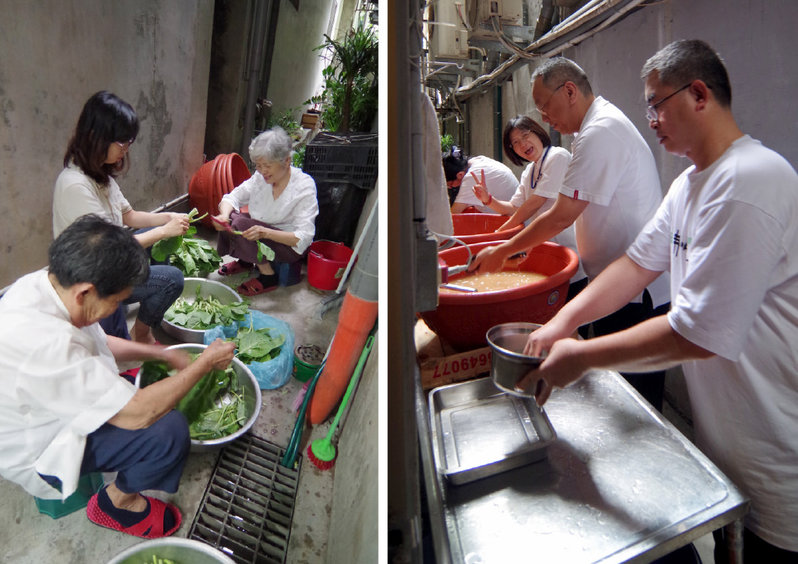

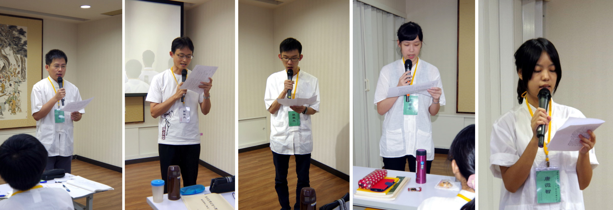

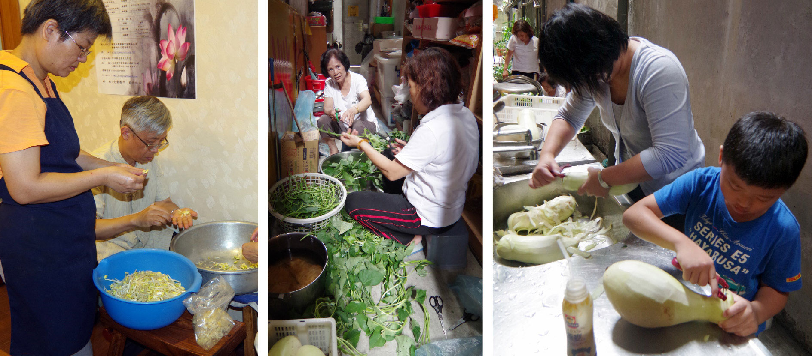

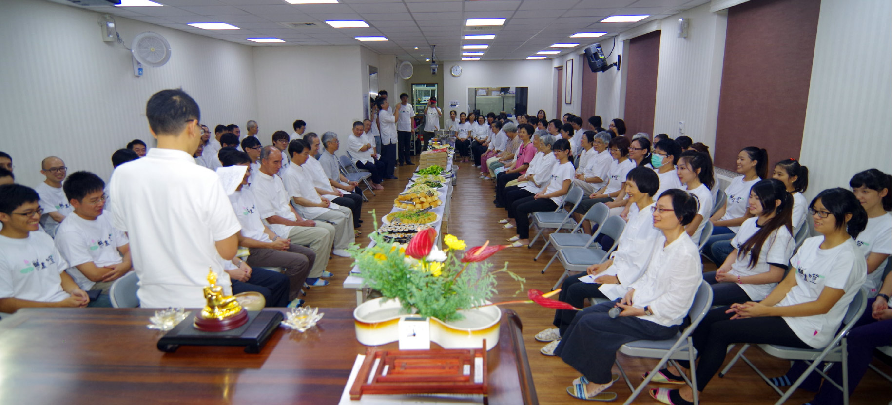

### 彌陀經講座　考題

*編輯部整理*

人生處處是考題　經義內化最為勝

千年道統賴不墜　繼往開來大道行

一○二年寒期大專佛學講座 —佛說阿彌陀經講座考題

一、佛經有所謂五不翻，何謂五不翻？「佛說阿彌陀經」屬於五不翻中哪幾項？

**答：** 五不翻：秘密不翻、含多義不翻、順古（尊重）不翻、生善不翻、此方無不翻。阿彌陀佛乃無量光、無量壽，具有種種智慧福德，念之能生善根，且是秘密咒，故為秘密、含多義、生善不翻。

二、試述報身佛（五決定）與應化身佛（五不決定）五種不同（五差別相）？

三、《佛說阿彌陀經》告訴我們往生法是什麼？成佛法是什麼？

《佛說阿彌陀經》起首即揭示：「從事西方，過十萬億佛土，有世界名曰極樂。其土有佛，號阿彌陀，今現在說法。」即就極樂世界環境、善友、說法殊勝的那一分而言，是成佛關鍵處；而執持「阿彌陀佛」名號，一心不亂，即為往生法。

四、佛力所成功德莊嚴有四項，請略述之。

其一，住區組織，為佛力所成。

其二，遠近環境，為佛力所成。以上為依報莊嚴。

其三，眾鳥化迹、行樹演法，說法莊嚴這一分，為佛力所成。

其四，佛德攝眾，說法時能令眾生善根成熟而證果，且能攝諸上善人聚會一處，為佛力所成。

五、請略述釋迦佛舉六方諸佛讚歎阿彌陀佛的理由？

淨土法門，深微玄妙，眾生難信，釋迦諄諄相勸，而猶未盡疑情。故六方諸佛同具悲心，共證釋迦所說不虛，彌陀之願可信，諸佛讚歎不誑不異也。

六、請敘述三十七道品的修學次第。

三十七道品即成就正功之助功，例如修行淨土法門之人，於念佛之外，尚須修此三十七道品，以輔助修行。共分為七類（七科道品）：四念住、四正勤、四神足、五根、五力、七菩提分、八聖道。

（一）四念住：又作四念處，目的在引發出離心，並以觀慧開啟見地，生起無我的正見。分為觀身不淨、觀受是苦、觀心無常、觀法無我。

（二）四正勤：未生善令速生、已生善令增長、未生惡令不生、已生惡令立斷。以斷惡修善累積修學空慧的資糧。

（三）四神足：欲神足、勤神足、心神足、觀神足。欲為修止觀的善法欲，勤是努力修學止觀，心是生止，觀是在定中生起觀慧。

（四）五根：依止觀生起信、進、念、定的般若慧根。

（五）五力：力，為根的增上，產生慧力，能伏除所對治之一切障礙，特約對治煩惱、破外道見。

（六）七菩提分：又名「七覺支」，用以對治止觀修學中產生的障礙。其中以「正念」調合定慧，以「擇法、精進、喜覺支」對治沈沒相，以「定、捨、除覺支」對治掉舉相。

（七）八聖道：亦名正道，契理通神曰聖，遠離偏邪曰正，道者通行之大道，其中「正見」乃生起般若空慧的根本位，「正思維、正語、正業、正命、正精進、正念」為後得位的修學，直至成佛的「正定」。

七、何以在娑婆世界念不到三寶，到極樂世界聞鳥音、風樹音而能念三寶？

極樂世界的鳥音、風樹音乃阿彌陀佛加被力（佛力）的展現，是極樂世界環境殊勝的感染力，彌陀善巧運用神通變化之力，令眾鳥說法、風樹演法，以五塵說法的方式，令眾生在不知不覺中皆悉念三寶（伏惑）至自然念三寶（斷惑）。

而娑婆世界之鳥音、風樹音，皆是業力所感，故念不到三寶。

八、阿鞞跋致之義為何？有幾種不退？往生到西方為何皆是阿鞞跋致？

阿鞞跋致即「不退」之義，往生西方極樂世界，因環境上沒有退轉之因，故而不退。

共有三種不退：一、「位不退」，入聖流不墮凡地。以其有般若智慧以及對般若好樂的一分，故入聖流不墮凡地。二、「行不退」，恆度眾生不墮二乘。極樂世界眾生，以般若智慧攝持廣大菩薩行，好樂大乘菩薩行，故其行持不退。三、「念不退」，心心流入薩婆若海，能證空性破所知障。極樂眾生，念念皆以佛智、佛見作助伴，故其心念不退。

往生西方為何皆是阿鞞跋致？以極樂世界無五退緣。一無病苦纏，痛苦是修行障礙，使人無法思維，而極樂世界無有眾苦，但受諸樂。二無違行，心、行不違善法，極樂國土為諸上善人聚會處，人和經營出地利，地利又回頭資助人和。三常誦經法，能生正知見。四常營善事，以和合團體，造作善事。五長和順，和合團隊，道理、事項上，皆不違諍。

九、阿耨多羅三藐三菩提之義為何？聞諸佛名何以能不退於阿耨多羅三藐三菩提？

就字面意義而言，「阿」為無，「耨多羅」為上，「三藐」為正等，「三菩提」為正覺。意為佛的智慧，得佛的智慧路上不退轉。為「五不翻」中的「順古不翻」。

何以不退？以聞是經受持，發願往生，志切生死，故得不退菩提。至於受持而心存福報，及僅聞佛名之人，因心常存有三寶觀念，仗此觀念，薰入識田，種子遲早總起現行，加以佛力加被，故就因上而言為不退。

十、吾人身處五濁惡世，試繪五濁惡世的行相為何？

五濁亦云「五滓」，「滓」是渣滓的意思。「惡」，謂能造十惡業。五濁分為劫濁、見濁、煩惱濁、眾生濁，以及命濁。劫濁乃就時間而言，為總說，觀待後四者。見濁，見指的是「分別」，如宗派見。見濁即見惑，分為五，稱五利使，「利」有敏銳迅速之義。「使」有追及、繫縛之義。煩惱濁分根本煩惱及隨煩惱，根本煩惱又叫「五鈍使」。眾生濁，此約五陰熾盛而言。命濁，指因果並劣，壽命短促。

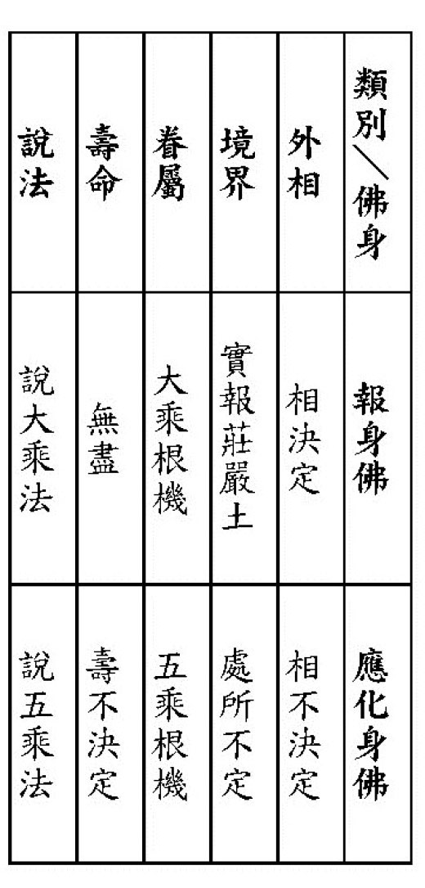

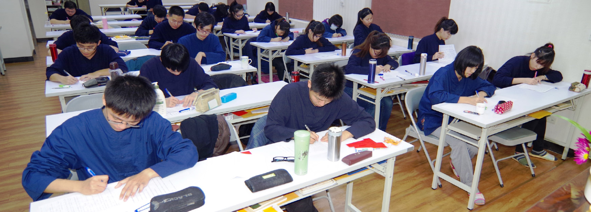

### 佛說阿彌陀經—大專佛學講座初機課程　學習心得分享

大專生

末法多聞穩心力　汙泥栽出青蓮花

滿園色香勝壇城　三寶同在佛增輝

緣起不滅—《阿彌陀經》講座心得　　許熒純

「彌陀經講座」在眾人忙碌的身影之中結束，為期五天的活動，結束後一切都將歸於尋常。上班的要回到各自的工作崗位，放假的，重拾假期的悠閒，而我，也要回到實習的學校，繼續未完成的事項。在回程的路上，看著熟悉的臺北街景，突然有種陌生之感。人們因一時的因緣而相聚，聚會結束後，再度地，投入茫茫的世間海之中……。這才知道，人的相遇、相知原來是那樣的不容易；同樣地，一場講座的開啟，也都與因緣脫離不了關係。

來到蓮榮參與了許許多多的佛學課程，其中最盛大，也最密集的，就是每年寒暑假開課的「大專佛學初機講座」。在唐老師所開設的系列課程當中，一共有六門課程，分別是《佛學概要十四講》、《佛說八大人覺經》、《唯識簡介》、《般若波羅密多心經》、《普賢行願品》，《阿彌陀經》是六門課程當中的最後一門。六門課程中，與《唯識簡介》失之交臂，是什麼因緣？已經忘了。但在所有能參與的課程中，可以說每一次的體會皆不同。

《佛學概要十四講》為所接觸到第一門對佛學體系有完整介紹的著作，當時學習的心態未定，主要領略在於佛學名相的理解。到了《般若波羅密多心經》講座，才正式開啟對佛法的知見，也有意識地學習。《普賢行願品》在佛學名相之外，別開生面地，對於菩薩所發的願，以及菩薩的大悲心做介紹，頭一次於內心產生憾動。隨著每一階段有不同的人生經驗與體悟，這些歷練，或多或少助於佛法知見的理解。為期數日的講座，密集地聽聞佛法與研討，讓人的知見逐漸澄澈明朗。只是斷斷續續地學習，再回到原有的生活後，彷彿再度進入到黑暗的森林，對於法的信心與體悟，就像在森林中提燈尋路，隨著燈火的明滅，路徑時而影現，時而蹤滅。

說起與這次講座課程《佛說阿彌陀經》的因緣，在民國九十五年，有了第一次的接觸。近日因為搬家，翻箱倒篋之際，在諸多的資料當中，發現了《阿彌陀經要解講義》以及《佛說阿彌陀經要解科文》兩本書，原來在來到學會之初，已經有這樣的因緣了。翻開內文閱覽，還可以看見當初筆記的痕跡。只是幾年下來，筆記依舊，而人事卻已皆非。而我，竟然把這樣的典籍，擱置在一旁的書架之上，多年未曾翻閱，直到這次講座，才有機會開啟收藏多年的寶庫。然而再去尋思當年的記憶，好的壞的，卻是半點也未曾憶起，人，果真是善忘的生物。

相隔時間約七年，再度接觸《佛說阿彌陀經》，又開啟了另一次的因緣。相較於前幾部經典，《佛說阿彌陀經》連結了平常共修的課程，針對常聽聞到的釋迦牟尼佛、阿彌陀佛、西方極樂世界的形象，有了更為清晰的概念。在前幾次課程中，因為專注於佛學名相的認識，在咀嚼過文義過後，因為沒有與世間法相呼應，總是只有概略和模糊的印象；又或者，雖遭遇境界的考驗，然而因為未曾去思考、串習，往往在世網塵勞之中，重蹈同樣的錯誤，於此之中，內心不斷地感受到痛苦煎熬，而未能真正獲得對治，信心也產生了動搖。

然而在《佛說阿彌陀經》講座之中，除了基本名相的探討，此次嘗試著結合有法的部分，對自身作觀修。雖然理解依舊很侷限，但是內心為著這一點點的理解，而感動莫名。《佛說阿彌陀經》揭示了淨土往生與成佛的法門，在種種依報、說法與正報的說明之下，顯示了極樂世界環境的殊勝，以及成佛的關鍵點：在於執持阿彌陀佛名號，一心不亂，即得往生之方便，而且是當生成就。但其中最重要的關鍵點，在於「信心」。當你相信佛所言不虛，佛的智慧便能生起作用；當你相信佛的智慧，依教奉行，便能真正獲得利益。然而問題出在娑婆眾生，並不能真正生起信心，見解上的執著，障礙見到諸法的真實相，因此不斷地攀緣境界，卻始終得不到真正的解脫。

在聽聞的當下，檢視自己每一次遭遇困境時，對於佛菩薩的信心，是否有所動搖？發現很少沒有動搖的。往往會在境界之中，批評別人的不是，或者悲嘆自己的命運乖舛。或許人與人相處，有過宿世以來因緣，以凡夫的智慧，難可了知。而在境界上，雖然不能夠逆轉狀況，可是卻能夠改變自身的觀念。這項觀念的改變，即是一個人命運改變的起始，而改變的關鍵，就在於「正知見」。這是課程中，老師所給予第二個寶貴的關鍵。如果沒有正知見作為所緣，只是不斷地執持錯誤的見解，在境界之中載浮載沉，迎接你的，只會是接連不斷的、相同的歷程。直到你能找尋到正確的鑰匙，才能打開境界之門，往下一關修行前進。而佛的智慧與知見，就是能快速開門的萬用鑰匙。

除此之外，有了「信心」與「正知見」還不夠，還必須要有「環境」。「環境」包括人，也包括學習環境。這也是《佛說阿彌陀經》當中敘述最多，也最殊勝莊嚴之處。極樂淨土在學習環境的殊勝上，予人快樂；也因其環境皆佛的教化區，當中的寶樹、池水、衣食、音樂、行樹，皆有教化的感染力，能使人自然而然地產生念三寶之心，故成為殊勝的成佛環境。這是在娑婆世界的我們，所無法受用的。對比於極樂世界，娑婆世界的種種，不能恆常相續，也非真善實美，當我們受用其中一種，變化即在之中產生，或變壞、變苦，或剎那即逝。而極樂世界學習環境的種種受用，卻不會使人墮落。在同法者方面，極樂世界為諸上善人俱會處，可與之互相切磋，隨機而證果。而更重要在於，這些諸上善人，彼此都能和合相處，更加襯托出極樂國土的莊嚴與殊勝。

記得講座的過程中，每天早晨的餐前觀修時，師長談到「和合的用餐」時，說到如何與人和合相處？就像菜色的調配一樣，當你發覺某樣菜的口味、顏色，或者擺盤和其他不能相容時，是否能思考，如何調和這樣菜色？這就好比與人相處若有摩擦時，你要怎麼調和自己，改變自己的觀念？透過「正知見」的學習，使我們能具備這樣的能力，也因為與周圍善知識的和合，而使得正知見更有力度，在學習上則更能增上。

對於團隊的和合，自己是相當有感觸的。在求學的過程中，處理事情時，時常會遇到一些人，不論在態度上，還是危機處理上，見解與自己相當地不同，當意見不能調和時，就容易產生摩擦。曾經因為不能認同同事者的態度，言語衝突下而產生齟齬；也因為對方不能體會想法，於矛盾爭執中感到痛苦，種種經歷，使我對於極樂世界和合的團隊，有種莫名的希求。能在想法上互相通達、在懈怠時提振的善友、能一起在學習上增進的善知識，實在是太重要了！有團隊的護持，一個人努力，等同於十個人出力。因此，讀到這一段，內心真的很嚮往。

《佛說阿彌陀經》還有另一項重點，就是「往生法」的揭示。在談到「一心不亂」的念佛時，研討到「九住心」。「九住心」是欲界止觀的修學法。在「九住心」的介紹時，有一張圖片，中有修行人之外，還有大象，表徵沉沒；猴子，表徵掉舉；兔子，表徵微細的沉沒。另有各項工具，像是鉤子，象徵正知；繩子，象徵正念；寶劍，代表智慧。透過這層層的修行，到達一心不亂的境界。然而這個境界與其他天界相比，僅只是初禪的境地。光要降伏內心那些蠢蠢欲動的念頭，已經很不容易了，沒想到經過長久的修行，竟然還不及天界的一小分！而更令人感到不可思議的是，透過一心不亂地持念阿彌陀佛名號，竟然能直接成就。驚訝之餘，最讓我感動的在經文最後，釋迦牟尼佛向六方諸佛宣說此難信之法時，特舉五濁惡世成佛之難，而釋迦牟尼佛於五濁惡世示現成佛，除了表現佛廣大的悲心，更揭示阿彌陀佛之願力宏大。

以往在讀到這些名相時，總是在文字堆裡打轉，像是「三十七助道品」，那麼微細的修學法，若要按照次第觀修，不曉得要修到何時才能真正證道，然而一聲「阿彌陀」，卻能往生西方；更有甚者，以環境殊勝之一分，快速成就成佛之法，實在是太令人敬畏了。這次的研學，讓我對於諸佛有更深的認識，並且對於諸佛的行持，真真切切地受到感動，到底要多大的福報，還有多少的善根因緣，才能夠和諸佛結識呢？這樣的因緣，實在是太難得了，百千萬劫難遭遇。

隨著講座的結束，這樣飽滿而充實的學習，也告一個段落。而此次講座對我來說，似乎也正是下一個人生歷練的開啟。很想把這樣美好的概念，傳遞給家人、朋友，可惜因緣不具足，有很多障礙，還要靠自己去消除。然而將近七年的學習，並沒有白白地空過，至少此刻的我，很明確地知道未來想要走的是什麼樣的路。

對我而言，學佛，絕對不是兩年、三年的事；而佛法，也從來沒有要人以狼狽的姿態，抓住什麼，而是給予正知見，積極地、正向地要人找到出路，出路就在自己身上。這些年，慶幸有佛法的相伴，讓我走出一段段陰霾；讓我對於事理，有抉擇與判斷力；更讓我在學會，認識眾多善友。每次研學後，不辭辛勞地接送我回學校；需要棲身之處時，給予溫暖的房間；更棒的是，不斷提供正知正見，使我茅塞頓開。對於大家，只有無盡地感謝。

有的時候，我會害怕這次的學習，將是最後一次。那盞「信心」的明燈，在黑夜裡忽明忽暗，能用所學的智慧安定它嗎？我想：「信心」將是一切的關鍵。與其擔憂那些，不如從實質上作奮鬥。每一次的考驗，都有佛菩薩的安排。「緣起不滅」，「正知見」和「善知識」，將是最棒的助伴，在實現夢想的路途上，給予我力量。

應雨橋

此次講座老師以 雪公太老師的表解為主軸，深入淺出的將《彌陀經》的義理做了全方位的詮釋，讓學生法喜充滿的同時也深深地佩服太老師的做表方法及老師的講解方式。

不禁想到若是此種研習經教的方法一旦斷了傳承，就沒可能再找回來了。世間的百工技藝，斷了傳承沒有關係，只是如樹少了些許枝葉花果。但經教如同樹根，一旦斷了傳承，等同斷了眾生的根本，斷了讓眾生了脫生死、究竟離苦得樂的方法。儘管眾生大抵上都不知此利害關係，可實質上以後娑婆的日子便是萬古如長夜。

吾等後生小子如今有幸在傳承的法脈下聆聽經教，且年紀尚輕，體力尚足，腦力尚可，時間尚多，同時有老師、同儕和法本，具足種種有利之條件，是故此生最應做的事業，莫過於將此法脈做一個完整的傳承，以「為往聖繼絕學，為萬世開太平」來作為一生的志業。

蕭惟元

此次講座學生在交友上、行政事務處理上，以及教法的研學上，有許多的收穫，很感謝老師及所有蓮友大德、學長們的參與付出，讓學生有這麼多的學習處。原來成就一次的講座，是要這麼多的條件才有可能，得來不易，若不是參與辦事，很難有比較深的感觸。因為這次經驗，未來講座必定更能在心中生起難得、感激以及發奮學習的動力！

丁以恩

時間總是過得那麼得快，六天的講座一下就過了，有一種才剛到學會，馬上又要回家的感覺，老師上課的時間明明是好幾個小時，卻彷彿只上十分鐘的課就又要下課了。或許是老師說把打電動的覺受用在修學的那種感覺吧？

我將在一個多月後前往德國，沒有老師，環境對正法上的學習能有幾分增上呢？這是我好多個月一直在想的問題。而《彌陀經》，真的給了我很大的信心。現在更堅信，學佛、儒才是真正的出路，出世、入世都講那麼明白了，如果還不想學，難不成真想當一輩子草包？無限在三惡道輪迴嗎？

年輕是沒有自體性的，只不過觀待長輩們說年輕，不知不覺中，這已經是第四次參與大專講座了。隨著歲月過去，我自認為自己也是有所成長的。一次比一次聽得懂，越來越有正法上增上的感覺，感動也越來越深。然而我有多少時間可以讓我這樣慢慢來？還有多少大專講座可以參加？這些沒人說得準的。

期許自己能在正法上加倍努力，趕快追上其他學長們，畢竟我目前還只是一個草包。

王暄惠

這次很感謝有這樣的善根福德能聽聞老師講述《阿彌陀經》這一部結合成佛法與往生法於一身的經典。就如老師所說佛的慈悲大願力要救度眾生，只要聞其佛名並持名念佛就能往生，這每每聽到都讓我感觸很深，腦海裡總會想起爺爺臨命終的那段日子，回想起來還歷歷在目，因為爺爺的例子讓我生起更大的信念，也發願一定要將父母送至極樂，我真心感謝每逢寒暑假就能開這樣一個講座，讓平時在外地讀書的我能了解修學的重要，也很感謝師長教理的傳授，與師姑、師伯對講座付出的任何力量，使我們有好的環境增長智慧。

最感謝老師抱病為大家傳授佛法，這麼多的善知識與善緣集結，我們不只要珍惜，更要努力將所思所聞體現於生活中才是。

吳承軒

此次講座乃是寒假講座的延續，在經文上已有一定的熟悉度了，所以這次聽課已不若上次一般感覺晦澀難解，而這次的內容也更偏重於教理方面的認識及《阿彌陀經》的更多延伸知識，雖然有些部分我仍然一知半解，不過在老師逐字逐句的講解下卻也是聽懂大半了，前面問題的答案是在經過自己的消化之後所生，可能有許多不確定與謬誤還要請老師多加包涵了。

暑假也放了近一個月，在種種聲色犬馬之後，此講座也給了我一個沉澱心靈的機會，不但有良好的環境、可口的食物，更有諸多同儕一齊用功，如此機會實在難得，在講座後除了少好多筆芯，多了好多佛法知識，也把我那顆躁動不安的心，給安撫了下來。（這次的課程安排很不錯呢！有足夠的時間研討便少了許許多多的疑惑了。）

晏家文

學生本次的講座只能參加最後兩天，已感到非常的開心，聽到學長們可以複講的很完整，就又感到非常的羨慕。同時也感到學生和學長們的差距越來越大，晚上在研討的時候，很難加入討論，學長們都非常樂意指導，但是他們要認真準備今日的考試，學生也不好意思一直問。能回來參加真的很開心，希望學生可以在稀有的兩天假中把課補完，回臺中後再加緊用功。

魏甄儀

就如許多學長分享的，這次上彌陀經是感覺最快的一次，根本不覺得累、也都還記得第一天剛報到的光景，人卻馬上被拉到結業的會場，看著老師強忍著身體不適、面帶微笑地坐在台上。

這感覺真的好奇怪。

就連這次上講座的心得，大概也是所有聽課心得中最奇怪的一次，因為腦中浮現的都不是什麼很具體的感觸，反倒都是人生過去幾幕很重要的片刻，像幻燈片一樣不斷閃過。

第一幕是在中壢剛上完《十四講表》後的心得座談，當時海辰坐在學生前面，然後學生被老師點起來分享那次上課體會到什麼叫法喜充滿的感覺。下一幕跳到學生跟海辰與老師坐在中壢廚房的大圓桌，依稀記得老師跟我們提到幼稚園老師的事；之後又跳到大學指考成績出來，學生打電話到老師家問老師想填清大經濟，雖然有想過會離臺北很遠，但跟其他師長討論後覺得自己應該可以堅持常回來上課，然後老師很委婉地跟學生說覺得最好不要；下下一幕是學生大三升大四的暑假到西安交通大學交換兩個月寫專題論文，當時提前出發一周到上海看世博，在外灘接到王老師的電話問學生怎麼沒報名大專佛學講座，學生說因為當初知道課程與來大陸的時間相衝，就沒報名參加了。

其實，這次的心得很普通，就只是想好好地跟老師說聲對不起，老師對不起，學生一定讓您失望了……。對不起，學生以前不懂事，回想起老師以前說過的很多話，學生以為都聽懂了，現在才明白當時都沒有聽懂每句話背後的弦外之音跟苦心，現在終於都恍然大悟，也都知道為什麼了。

自從又開始回學會上課後，就時常思考要怎麼看待這六年在新竹的學習，學生知道這六年說浪費是浪費，但說不浪費也是不浪費。從小，就一直希望未來能從事有意義的工作，或許也是受老師們以前在啟蒙班的薰陶，對於「先天下之憂而憂，後天下之樂而樂」的儒家情懷覺得是很理所當然，每個讀書人皆該有的心志。這六年離學會越來越遠的途中，學生漸漸走向老師稱為「學院派」的道路，但在回學會上課後的這段期間，回頭檢視這條路可能的問題，學生知道哪裡錯了。

如果說是因為看到現今臺灣社會的紛亂不平，希望能找到解決問題的途徑，而西方思想的不可能是因為：一、他們沒有因果的知見，沒有辦法抓到世界背後運作的真正規則，最多只能流於事理表象的變化；二、他們解決問題的思想體系是從社會或國家整體層面下手，而不是如中華文化講求修身、齊家、治國、平天下的工天下精神。這種差異最明顯反映在盛行於現今各國的民主制度，因為不是從個人層次著手，所以從整體面著手的制度設計一定永遠都會碰到無法解決的特例或個案，因此民主不會是最壞，但也永遠不可能是最好。

所以這六年說浪費是浪費了，因為如果能拿來學習正法一定更值得，但說不浪費是不浪費，因為在外面走了一圈，即使看得依然不夠多，但如果沒有這番找尋，只是很單純的在學會學習，學生也可能無法完全服氣，或心裡總會有點幻想這世界上是否還有其他途徑的可能，或許這就是學生註定該吃的苦頭吧！在這樣知道其他途徑的不可行與不可能後，才能更珍惜與看重學會的內涵。

最後，謝謝老師一直以來無怨無悔、燃燒生命的付出，這也是當初結業式時除了對不起外最想跟老師當面親口表達的……人生到了緊要關頭，或是平時生活會不經意不斷回想起的觀念，其實都是老師從自己在啟蒙班時就教授的，與平時學生在校所學毫無相干；除此之外也讓學生在學習上少走很多冤枉路，例如以前在啟蒙班聽過老師說人生本善、本惡、本不善不惡、本善本惡的推論都是錯的，因此在讀政治哲學時就不會迷失於各家論述之中(政治哲學的研究要從對人性的觀察出發，對人性認識判斷的差異會嚴重影響他們往後關於政府治理理念的發展，但因為西方學界對這不了解，所以從十七世紀霍布斯、盧梭、洛克這三人分別提出不同看法後他們就研究至今整整四百年）；另外畢業後到現在看似無所事事的惶惶人生，如果是一般朋友早就氣急敗壞地擔心失業或迷惘度日，卻因為學會有許多進修課程，也因為心裡有老師上課傳授的那些正知正見，才能平心靜氣地思考前述那些未來規劃(雖然仍有待商榷)，不疾不徐地面對將來。

所以，想再最後一次鄭重地謝謝老師，並跟老師說對不起，學生會謹記之前的教訓，之後好好努力，迎頭趕上其他學長們的腳步，弘揚正法。

古家華

學佛，有八萬四千種法門可以去修習，但只有一種最為殊勝—淨土法門。此次參加了《彌陀經》講座，雖然以前曾聽過《彌陀經》，但卻不了解其中的義涵，只知道佛陀在述說阿彌陀佛的功德，今才明白，阿彌陀佛的願力是如此之大，要有雄厚的善根福德因緣，要懷有一顆恭敬的心，深明法義，念佛求生與阿彌陀佛結下深厚緣分。

上課期間，學生非常感動，心中好想點亮了一盞燈，在那狼嚎虎嘯，充滿著種種慾望煩惱的夜裡指引著我們。那山多延綿，那水清澈有甘甜。普照的地方，那雲多純淨，那花多彩又鮮豔，佛所賜予的家鄉，為何還要去追尋那不真實的世俗界呢？我們是要消失在光中，還是黑夜裡？不管如何艱辛、困難，一定要老老實實聽聞，將經教弄明白。

王姿云

這次的講座是延續寒假的《彌陀經》而來，因為有上次講座教法的薰習，這次聽起來更能理解與體會，六天的時間很快過去了，深深地感覺到聞法的機緣是如此稀有難得。每每上課，聽到老師講述極樂淨土的環境，享受諸樂還能不斷增上，全仗佛的大願力，阿彌陀佛為我們五濁惡世娑婆世界眾生開啟了淨土法門，又在法門中開啟了持名念佛方法實為捷徑中的捷徑，只看我們有沒有誠意想去，有了信願念佛，臨終時就能現在其前接引我們，想到這不免心中充滿大大的感動。

六天課程全在閉關修學《彌陀經》，能夠和眾同儕一起學習更有說不出的快樂，當真正了解一生的目標方向在哪，就不會渾渾噩噩度日，而得親近善知識，而得修學正知見，我並不害怕，也不迷惘，因為我知道他是我唯一的出路。

感謝成就我們六天課程的所有師長義工們，阿彌陀佛！

劉千瑜

在開訓典禮時，師長們也提到了能辦講座，實是一件不容易之事，要所有的因緣具足，缺一不可，能夠受用這些是需要福報的，以後有了工作，未必能參加全程，也是現在應好好珍惜的，這次老師抱病上課，身體欠安，也更加的有感觸，能夠坐在下面舒舒服服的聽老師講課其實是很幸福的事情。經過了寒假上過一次，或許還是無法完全了解《阿彌陀經》的內涵，但再上一次，又加上雪公太老師的筆記，覺得《阿彌陀經》其中的義理，念起來似乎又更親切了，念經時，腦中自然浮現了科判隨文入觀感覺分外精神，希望這樣的法喜能一直持續。

沈孟儒

這學期甚少接觸佛法，平日被諸多苦惱繫纏而不能自拔，幸得參加此次講座又能接觸佛法，對於聖人之境又有了欣羨與想像，希望能於日常中多多串習課堂上所習，對治煩惱，不任己在其中載浮載沉。

汪鎮宇

送親人往生，跟學會長輩去幫人助念，還有平時早晚課念佛等，經常是在念誦跟聽聞，卻從來不曾這麼深入去了解，原來阿彌陀有這麼殊勝，是秘密咒，有這麼大的力量，真讓人感到不可思議及發自內心讚歎！對於佛法的學習，有種奇怪的感覺，好像學了越多，懂得比較多了點後，卻又更不懂的感覺，實在是需要更努力的去學習！

一場大專講座要辦起來，除了老師殊勝的經教傳承，還要仰仗強大的後勤支援，實在是非常難得殊勝的因緣，需有大福報才能躬逢其盛，學生非常感謝老師抱病上課，也感謝在後面支持的師姑師伯，讓學生能夠學習到正法、正知見。

王文徽

這次聽講座覺得自己在佛學上的接受度和領悟力都有大大的提升，可能是第二次，感覺上比較熟悉，加上在講座前有特別把佛學上似懂非懂且常常出現的詞、名相，做了些準備，所以聽課時納受老師解釋而得法喜。

特別在講座前就自體性義涵和學長們研究一番，在課堂上有很大的體悟。因為諸法體性皆不可得，所以一切不可能都變成可能。最感動我的體悟是，因為我的自體性空，所以我可以往生西方極樂世界。一切的推理、推論都合乎邏輯，感覺前方的路都亮了起來，而且慈悲的阿彌陀佛把往生極樂世界的方法設計的如此簡單，未來學生將以往生極樂世界設為我的中程目標。近程目標為修學佛法，體悟佛的智慧，並且多做利益眾生的事，努力斷除煩惱惡業，修一切善，為成佛的路上累積資糧，以完成成佛的終極目標。

很感謝老師們的教導和學長們的指點，能在人生中找到方向，一步一步地修正我的知見。現在真的體悟到，為什麼老師常說決戰點在正知見。而且正知見不是道聽塗說來的，或是自己看書體悟來的，而是有好老師教的、有傳承的。

白文輝

之前就希望有機會學習《彌陀經》，此次真是心想事成，就如同本經之特殊處，眾生只要信願行，阿彌陀佛便來接引眾生成佛，此乃十方諸佛國土未曾有，實在是不可思議。

過去由於稍有接觸本經，得知此生要離苦得樂，唯有依淨土念佛法門才能有所成就，而且是捷徑中的捷徑，有別於其他法門，修學方法很難、很複雜，而且還要經過許多的時間，還不一定能有成就（因為可能會退轉），所以真是覺得自己很幸運，能在此生得遇淨土法門，有了脫生死的機會。

然而，要往生成佛還是要建立在想要令一切眾生皆能離苦得樂、同成佛道的基礎上，所以要充實自己成為人才，才能將此法門推展開來，令更多有情能得到真實利益。但如果沒有對教理上有所明白，就無法達成上述目的，因此在聆聽教法後，深入地了解「佛法無人說，雖智莫能解」，沒有老師幾十年的修學、整理、教學，自己如何能在這麼短的時間得聞正法，有正知見呢？沒有善知識的教導，正知見的確立，如何能在此世利益眾生、利益自己呢？在經過此次講座後，更確立了自己修學的目標，更了解阿彌陀佛的智慧與慈悲，希望自己也能成為這樣的榜樣，充分發揮自己的才能。感恩老師、師長、蓮友、同學及所有護持的大德們！

蔡易儒

這次講座使我心中充滿許多法喜，每次的講座都是甚難稀有的因緣，能夠學習有傳承的正知見，能有一同修學的同儕，能夠學習有法本、資糧，能夠了解淨土殊勝法門的內涵，能在末法時期遇到好老師…，這些都是難以想像的福報，我們應該懂得珍惜每一次的緣起，不可空過。

淨土法門是末法時期唯一的出路，我們有幸聞法，更應該致力於教法的傳承，不可斷人出離的梯航，若無人弘揚淨土法門，淨土法門的殊勝也不能顯現，如此便辜負了佛的心意。老師說：修學是唯一的出路，利益他人是唯一的出路。雖然學習的過程是很不容易的，往往易使人懈怠、退縮，但這是每個人必須克服的障礙，因為如果沒有聽聞正知見，很多好的觀念是不會生起的，這有賴於遇到好的善知識。希望自己也能利益別人，成為別人的善知識，並懂得眾人和合一同努力，才能報答三寶和善知識的恩德。

唐維典

本次講座，接續上次內容，對於抄筆記的速度雖有變快，但是還是有待改進，畢竟要了解的東西真的太多，思維力記憶力都有限，希望之後能有阿難尊者十之一、二的能力，相信很多科判我能熟記，對於般若的智慧也能日益增上，將來最重要的就是去極樂世界跟諸上善人學習，早日圓滿佛果。

胡芳瑋

在成長的過程中，好勝、不服輸的心一直伴隨著，時常逼迫、驅使自己需不斷努力向上，總是認為延遲的快樂會更美好，然而在一個個的階段目標或所謂的夢想達到後，卻沒有滿足、喜悅之感，只能歸咎於自己不懂知足，又或認為是不夠努力所導致，而不知在這種心思的上上下下卻也引起許多的煩惱與執著，身心俱疲，且常看見世間不斷追逐名利，但追逐名利也引發許多惡果，因此自己對這些名詞一直抱持著模糊的定義，只知道要自我精進且與人為善。

此次講座的前幾日，在心中對自己說要安定心思，很顯著地在講座開始後聽課的效果特別好，且同坐於身旁的微智學長因為聽課能力非常好，若我有不理解或筆記不足，一下課就能補足，也讓我越生信心越了解法的道理，也發覺先前那些所謂的精進或快樂等等的定義都是有偏錯的，有種「原來如此」之感受，這種一念之轉讓心中著實生起，我今見聞得受持，願解如來真實義之體悟，法喜充滿心中。

李明哲

本次參加講座獲益良多，在佛經科判上的研讀，令我更懂得如何從大體上去觀察，這有利於明哲未來在學業上學習吸收的效益與能力，此其一。在《阿彌陀經》中，老師常會提出問題讓大家思考，邏輯推理，體會到老師說能把佛經學好，讀書、成績，你的同學根本比不上你，這邏輯思考訓練好了，能得到的受益根本不是三言兩語說得清的，此其二。在這次講座中，認識了諸多學長，彼此間更加熟悉，一起研討、辯論，在夜晚共同精進、共同動腦思考，與諸多善知識結下了善緣，也在好多學長身上、言行舉止上、思想上找到了好多我所欠缺的，我未來能進步的空間實在太大太廣了！此其三。

最後，常看到很多學長都在默默地為大家付出，不求別人知，也看到老師那令人敬重、令我雞皮疙瘩的精神，同時也有些不捨，老師為了我們大家為了社會糜爛，付出了多少？而我卻在做甚麼？老師又希望甚麼？此次講座後該深深反省了！

謝佳璇

這次講座可說是我第一次接觸真正研討佛學，以往只是念經回向，曾聽人大約解釋過極樂世界，經過這六天，更加了解，並產生更大、更確立的往生目標，並且更想與家人分享，希望能幫助他們與佛結緣，能明往生法。此次上課的機會我爭取得值得，雖然真正吸收的不多，但是卻對我有很大幫助，這次的講座讓我心中充滿了心得，天天不同，有法喜、煩惱、感動、疑惑、領悟和一半的充實感，我喜歡晚課時間，大家都齊聚一堂大聲念佛的時間，其實有點想拿出手機錄音，回家想念時就放出來，念佛時心想極樂世界樣貌與刻上名字的蓮花。

而師姑們的飯菜真的很美味，有時中午沒吃完的菜到了晚上又變成了另一道色香味俱全的佳餚，要是學校有這樣好的素食，我絕對天天報到。因緣是很奇妙的東西，一個小故事說，修學佛法如一位口渴的人找到一條河水，擔憂的問，水如此多叫我如何喝盡，其實沒人叫他喝盡，他可盡量取用，拿多少用多少，而非認為佛法甚深廣而退縮，取用的開心不要太有壓力。另外我也覺得這裡的同儕非常優秀，看著一些人認真精進、相互恭敬的模樣，覺得很棒，甚至佩服，而關於佛法，稍不注意就會出現偏差，產生誤會，修學的重要、平衡的重要…。最後感謝有這個機會度過特別難得的六天，也很希望老師身體健康。

張鑑光

此次參加講座。雖然不懂的東西還很多，但是也解決了心中幾個疑問，同時也更明白爸爸、媽媽從小到大在護持、推動的淨土宗，如此深刻、如此不可思議，也更能理解爸媽從以前到現在的所作所為，參加本次阿彌陀經講座，儘管有點累，但還是有很大的震撼！

莊惟盛

極樂世界是阿彌陀佛集合人才團隊，培養人才的地方。阿羅漢在現今的娑婆世界少如鳳毛麟角，在極樂世界則是多到難以計數。人在學習上，外緣是很重要的。到了一個學習的環境，花少許的力氣就能隨順外緣的力量往上走。在極樂世界是太子的學習法，阿彌陀佛聘請最好的師資來教學，並且環境是眾鳥化迹、行樹演法，學習可謂易如反掌折枝。如此殊勝的環境，令人嚮往。

學會的學習環境就像極樂世界，是以人才團隊來培養人才。且擁有諸多通達教理的師長，能將經文筆記精準解釋，讓我們輕易獲得法義，這樣的福報，真不知是如何才有的。未來還有這樣的福報嗎？應該是不容易的。別人沒有的學習機緣都被我們遇到了，應該要很努力的學習，而不是進進退退的學，也不要像沾醬油一樣，有學又好像沒學，似有若無，似懂非懂。學習應該要一鼓作氣，要有二十里行軍的精神，不管今天心情好壞，在教法的學習上都要往前推進。每次的學習，盡量當下就搞懂，課後作複習。把握機緣學習，提振學習士氣，這兩件事情，我們應時時銘記在心。

師長們所做的各種善法都是我們所隨喜的對象，其中的忙碌、辛苦是我們難以體會的。而其中又蘊含著多少的悲心、苦心，伴隨我們成長，只能如管中窺貌，可見一斑，略知略懂。在舒適、引人入勝的學習學境，背後有多少紛雜的行政事務、各種資源的籌備、人事上的協調、蓮友的照顧，在師長團隊的悲心策動之下，全部一肩扛起，就為了讓我們有一個美好的未來。希望我們不要辜負師長們的一片苦心，應該要振作，腳踏實地的學習，結合團隊的學習，絜矩之道的學習，飲水思源。

有教法就有力量，有教法就有出路。遇境逢緣，或許別人來看是死胡同，但有教法觀修的人卻是一片天，差異之大有如天壤之別。教法必須來自於師長的開演，沒有師長的宣說，就沒有教法。沒有教法，就沒有出路。師長就像是險地的救生員，攸關我們的性命，祈請師長們能保重身體，長久住世，多多攝受學生，我們會用功的學習。聽聞教法，讓我們有正確的知見，就像轉萬花筒，依教法而轉，依正知見而轉，命運隨之而轉。願我們能夠有恆的在教法上聽聞，獲得正知見，自行化他，過一個有意義的人生。

王宥琢

雖然《彌陀經》已聽聞第二次，但對於求生西土之希冀之心，仍不甚強烈，還處傻子的地步，不過經過一次次講座薰習，感覺聽課從零散的點已連成線，許多名相已經從單字化為義理，對於一些佛法的味道有些粗淺品嘗，不過我們是要學佛而不是佛學，將線織聚的關鍵大概就是想成佛的心了，要站在佛的立場讀經、解經，或許才是最淪肌浹髓的體會精義，另外老師生病不能教，或許是觀待我們的心不能或不想學，由這一分來說，老師之病體亦由我們所致，這無常也顯出講座的可貴，切不可做平常視之，希望能提起正念，不論未來工作、瑣事，都能一直學下去。

李偉邦

第一次聽聞佛法，可惜是於第三天才加入講座，以至於上課老師所說大部分都不懂，連筆記都不知從何下手，所幸分組研討時間，承蒙各位學長及老師教導之下有跟上些許進度；於昨日詢問雨橋學長禮佛之動作如何施行，聽聞雨橋學長於心上及行動上之禮佛，突然反思前幾天皆因怕跟不上進度以及凡是動作一昧模仿學長們，沒有用心體會佛法的奧妙，於最後一堂課轉變心境，甚有豁然開朗之感，雖說一些基礎亦不懂，但能理解部分就已開心不已，希望可藉由往後的參與能對佛法進一步認識。

在生活上，也承蒙學長們的照顧，以利能迅速融入群體，學長們皆主動解惑，往往一皺眉就有學長及老師們的關心，並發現與會人士都不排斥出公差，甚至爭先恐後去做，這與外面世俗差異甚多，在路上遇到學長、師姑、老師皆慈眉善目，互相禮讓，一生中少許有如此沉靜心靈之地。

在來營隊之前，擔心粗茶淡飯，睡不安穩，實際上三餐皆豐盛，也是一生中吃過最好吃的素食，睡覺也是一覺到天亮；晚上與各學長討論時，也發現個學長身上除佛法外，有很多值得學習，如好學、幽默等等，學長們亦以上課所學互開玩笑，也讓我藉此了解彌陀經內容；早上晨練—是第一次於清晨運動，雖然早上難以起床，但運動後卻能使早晨充滿活力，也是我萬萬沒有想到的。老師、學長們也不斷在休息時間傳授許多佛法外之做事道理；最令學生敬佩的是老師前幾日抱病上課，以往所遇老師皆為生病就找代課老師或是請學生自習，老師卻因為想傳授正法直到最後才被說服休息，而抱病上課的老師卻依然生動，時而誇飾的表情依舊記憶猶新；聽聞雨橋學長所說，開學後一、三、五、六有講座，希望能不因學校課業而未能參與。

此次於如此好的環境下聽聞佛法令學生受益良多，感謝老師及辛苦籌備之工作人員以及所有學長的照顧。

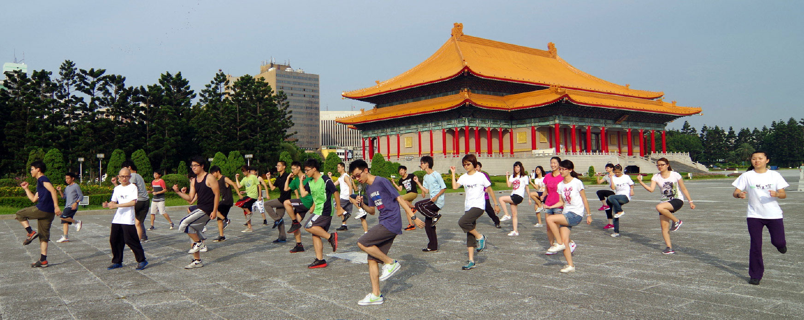

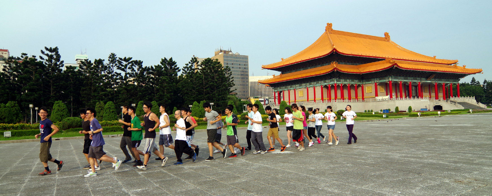

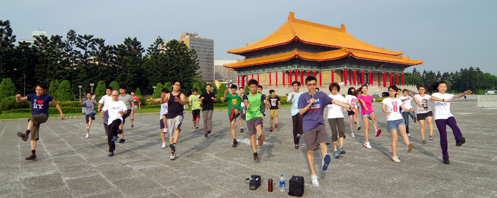

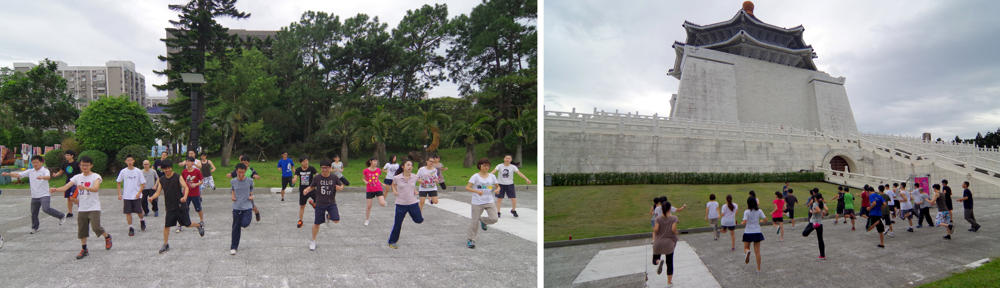

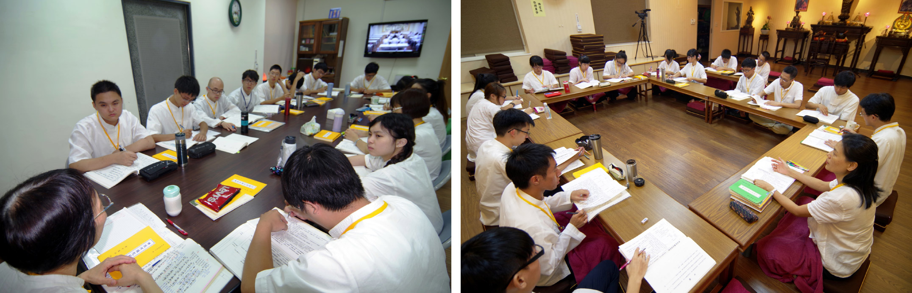

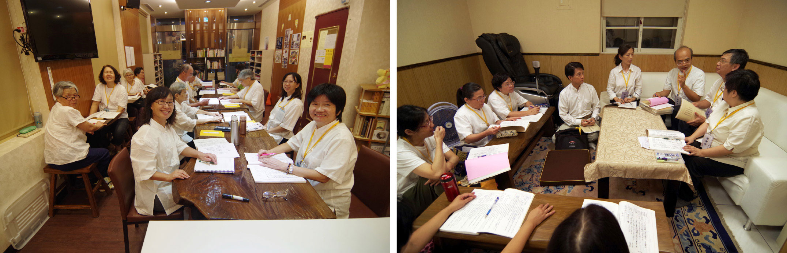

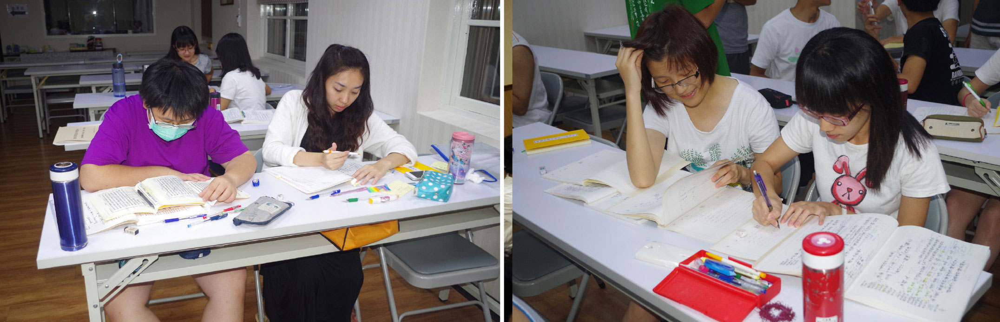

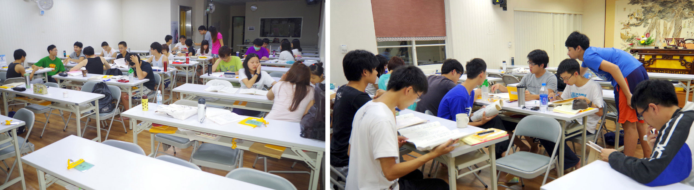

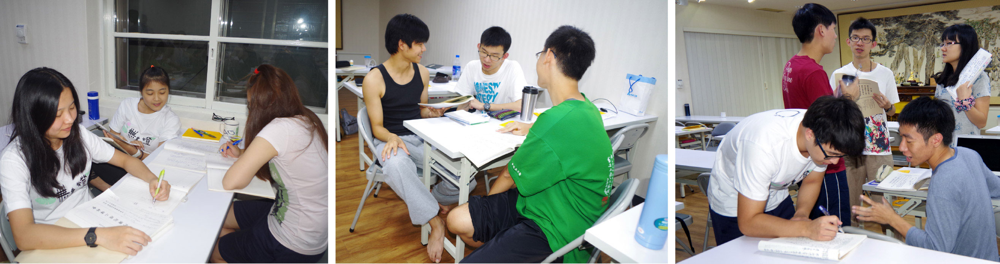

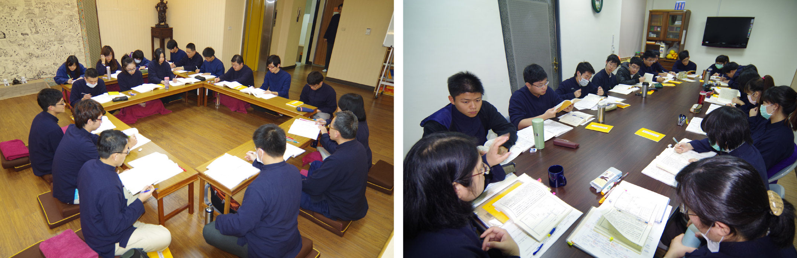

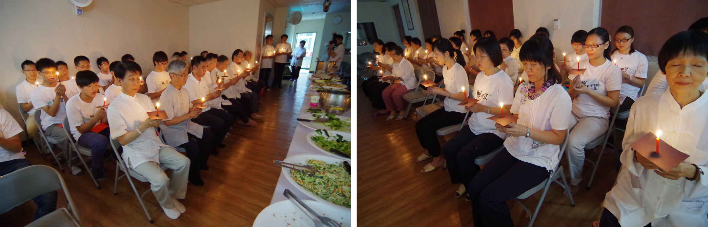

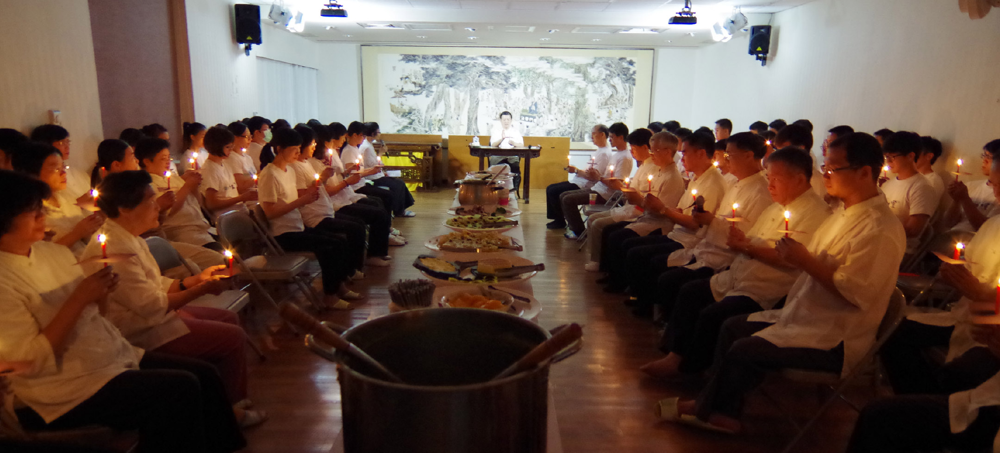

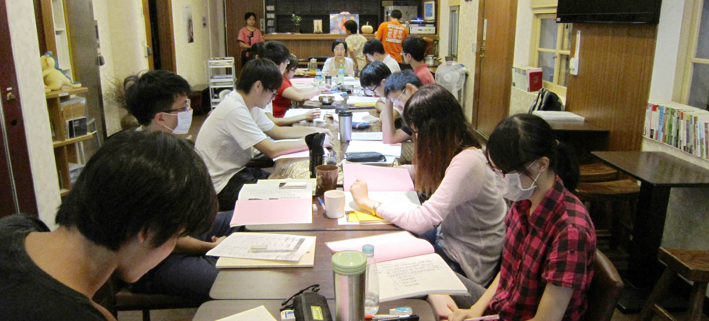
