# 第92期
.jpg)

## 社論

### 乾隆展

本刊

文治武功號十全

文物集成能創新

多才多藝有品味

得意當時是錯時

臺北故宮在一○二年十月八日至一○三年一月七日，策劃了「十全乾隆─清高宗的藝術品味特展」，展中顯示乾隆的文治武功，特別在他人生內涵的充實上多所著墨。

展覽分為三單元，第一單元為「品味養成」，探究康熙、雍正以及老師對乾隆的啟發影響，另外全國的能工巧匠、畫師、詞臣與豐富的典藏環境等成就了乾隆的藝術品味。第二單元是「鑑藏製作」，呈現乾隆一生有系統地整理典藏文物，並編輯圖錄，對文物作各種的品評。第三單元「生活藝術」，呈現乾隆在位六十年來開拓疆土所展現的十全武功；其六次南巡深入江南，與西風東漸萬國來朝的各種因緣，豐富了他的人生閱歷，他能轉化為豐富且多元的藝術品味，並表現於生活情趣中。

展覽文物中呈現中西文化的交流，可以看到乾隆是文物集大成者、是鑑賞家，也是主導藝術創作者。致使當時在書法、繪畫、雕刻乃至各種工藝的技術皆達高峰。嚴格地說，故宮博物院若沒有乾隆，文物是無法有這樣可觀的收集與創作。

乾隆之意乃「得到上天的扶佑」，在優渥的環境下，得到祖父康熙、父親雍正的細心栽培，並有福敏、朱軾、蔡世遠三位先生的引導，他更利用自己得天獨厚的優勢，或臨摹古畫，或讓宮廷畫師們通力合作畫一幅畫，或出題目讓畫師依著古詩意境而創作，或結合西洋的創意直接仿製，或者以古文物為基礎作創新，不但將文物作傳承的學習，也結合中西的交流，是一位有文化涵養、有創意、具前瞻性又願意培養文化藝術人才的皇帝。

乾隆具有深厚的學養且極為用功，每年創作的詩文平均多達六百六十餘首，某些年份的詩文甚至多達千餘首，數量之巨是歷代各朝之冠，在許多詩作中也可以看出乾隆的出塵之志，在繁忙的國事裏，心中因為有經典內化的涵養，並有佛教的涉獵與深入，其內心最嚮往的生活就是看畫、讀書、寫詩、望明月，這樣的皇帝，日子過得非常雅緻，不但豐富自己的人生閱歷，也將中華文化作重要的傳承，並賦予新意。

可惜的是盛世太久，漸漸有好大喜功之心，並誇耀自己的文治武功，種下了清王朝敗亡之因。雖然在人爵的部分，是受上天特別眷顧的天子，長壽且有福氣；可惜在天爵上未能成為尊德性而道問學、致廣大而盡精微、極高明而道中庸，將人民帶往有道之處的明君聖主，誠然可惜。

琳瑯滿目的文物，若無人導覽，像是拍賣場中貼有標價的古董品，被人用價格來鑑定它的價值。唯有透過經學的深入學習，在知見上確立，方能藉由欣賞各類藝術文物時，遊歷各地名勝時，與人相處時，皆能如磁鐵般地擷取吸附彼等可滋養的內涵。由乾隆展中得以一窺文化奧秘的天堂，可一探博大精深、廣大精微的文化一隅，而此呈現，正足以說明帝王一生學習、發展、成就的軌跡正來自於經學，並能結合時代的脈動，不斷地推陳出新，集文物之大成並保留於後世，成為中華文化之瑰寶。

## 大德法語

### 大方廣圓覺修多羅了義經（五十一）

道源老和尚

所證無出入　能證方出入

無出也無入　名言朗然覺

戊二、四問答別明觀行中根修證

己二、二問答兩重除障

庚一、除我入覺（淨業啟請）

辛一、淨業啟請

經文：

於是淨諸業障菩薩，在大眾中，即從座起，頂禮佛足，右繞三匝，長跪叉手而白佛言：

此章是淨諸業障菩薩為當機者，這些菩薩的名字都是名以召德，表彰一切業障都淨除。也表彰想成一位菩薩得淨除業障。你要懂得這一句話也就夠了，夠你修行，夠你成個菩薩，亦即天天造新業，舊業又沒消，怎麼當菩薩？必得新業不造，並將無始劫帶來的業淨除，必能成佛。

辛二、正陳請詞

壬一、慶前

經文：

大悲世尊！為我等輩，廣說如是不思議事，一切如來因地行相。令諸大眾得未曾有。覩見調御，歷恆沙劫，勤苦境界，一切功用，猶如一念。我等菩薩，深自慶慰。

大悲世尊為我等之類，廣說如是不思議，即上述三個觀門，輾轉交絡成二十五輪，此即一切如來，在因地中所修的行門相貌。一切如來最初也是位凡夫，在本因地中（最初發心），所修的行門是個什麼樣子？令諸大眾聽的很明白，且歎從來沒有聽到過，今天才聽到。

今天聽到了，也等於看到了（覩見），調御（是如來十種通號之ㄧ），佛能調順駕御一切眾生，故名調御師。然如何成就此能耐，是苦修出來的呀！且是長時劫的苦修，歷經恆河沙數這麼長的劫數，今天到此世界才聽明白，且猶如一念。我等菩薩，今天都很慶幸自己，得了大安慰，乃因出家以來，未曾聽聞《圓覺經》，不知道圓頓大法是什麼樣子？是故深自慶幸，不但讚歎世尊所說的法，菩薩們也都得到大法的利益，現在替眾生請問，為開眾生正法眼。

壬二、問後

經文：

世尊！若此覺心本性清淨，因何染污，使諸眾生，迷悶不入？惟願如來廣為我等，開悟法性。令此大眾，及末世眾生，作將來眼。作是語已，五體投地。如是三請，終而復始。

問了兩個問題，首問，一切眾生本具清淨圓覺妙行，這圓覺妙性本來清淨，怎麼到了眾生身上即染污了呢？是什麼因緣被染污的呢？第二個問題是我們學佛法的初發心菩薩及末法眾生，想悟入圓覺，卻悟不到，迷悶不悟，是怎麼樣的教都無法悟入圓覺的境界嗎？問這二個問題，惟願如來之開示，能開發我們的智慧眼，令現在初發心的菩薩，不會走錯路，令末法時代去佛遙遠的眾生修行、開智慧眼。

修行像走路，從凡夫此地走到佛地（無住涅槃），然走路得先張開眼睛，沒眼睛怎麼走路？盲修瞎練必墮火坑，外道不是不用功，他還真不怕苦，結果都沒有得真智慧，不但不會成佛，沒有開智慧眼，修行是盲修瞎練，如盲行路，易墮險坑。此句不是淨諸業障菩薩不知道如何開慧眼，而是明知故問，是替我們問，且五體投地的行禮，以如是三請表示恭敬，終而復始的請三遍。

辛三、如來讚許

經文：

爾時世尊告淨諸業障菩薩言：善哉善哉！善男子！汝等乃能為諸大眾及末世眾生，諮問如來如是方便。汝今諦聽，當為汝說。

爾時世尊先讚歎淨諸業障菩薩，叫一聲善男子！汝等乃能為諸大眾，就是現前初發心的菩薩們，及末世眾生，諮問如來，請方便開示，清淨圓覺是什麼因緣被染污，眾生想開悟，怎麼迷悶不悟呢？

辛四、承教靜聽

經文：

時淨諸業障菩薩奉教歡喜，及諸大眾，默然而聽。

辛五、正答所問

壬一、長行

癸一、開示障道四相

子一、開示迷識四相

丑一、迷識執相

經文：

善男子！一切眾生，從無始來，妄想執有我人眾生，及與壽命，認四顛倒為實我體。

上述即《金剛經》上說的四相：我相、人相、眾生相、壽者相。科文是迷識執相（四相），迷識是第六識妄想心，執四相為實。然眾生清淨圓覺是如何被染污？一切眾生從無始來，前生還有前生，前世還有前世，沒有個開始，從無始以來就是個凡夫，從無始以來就妄想執有我、人、眾生、壽者，此四相之真實都是妄想出來的，本沒有四相之真實，卻妄想執有，此即顛倒執著，謂之迷識四相。

首先執著身心，以為有個我，如前述：妄認四大為自身相，六塵緣影為自心相。身體是地水火風四種元素合成的，卻認為有一個真實的身體；心是六塵緣影，卻認為有一個真實的心，身心組合起來執著有一個我。心不過是受想行識四種作用，身心是五蘊合集，《心經》上觀音菩薩是照見五蘊皆空，本無自相可得，凡夫卻執著實有，並執著五蘊和合的假相為我（我相）。

其次人相，在人上有各別自體的我，有的升官發財（盛），有的貧窮下賤（衰），富貴生樂，貧賤則生苦，眾生相則是人道以外各道眾生都執有自體的我，受用這些執我的相相續不斷。

你知道這無始劫來的執著厲害，其實這四相之自相都是妄認出來的，本來沒有卻執為有，此即四個顛倒相，此四顛倒相皆是我執。

丑二、別成凡小

經文：

由此便生憎愛二境。於虛妄體重執虛妄，二妄相依，生妄業道。有妄業故，妄見流轉。厭流轉者，妄見涅槃。

前文是憎愛二心，此處是憎愛二境，實則境界都是由心所生的，有云：三界唯心，萬法為識。依《起信論》之三種心相：業相、轉相、現相，此三細相都在心裡，有了現相，即是變現外境，外境都是我們唯識變現的。然眾生不知，內裏執著一個我，外邊執著一個我所（我所有），順著外邊五欲境界，順他的妄想心（執我之心），讓我樂就愛，不讓我樂就憎，若眼睛看見好色，順著妄想心，就起愛心，不順妄想心的惡色就起憎心，耳朵聽聲音，順他的妄想心就愛，不順他的妄想心就憎，如此類推，五欲六塵的境界都是這個樣子，合起來就是憎愛二境，都是由執著有一個實在的我，及執著外邊實在的順境、不順境（可愛境與可憎境），於本來虛妄不實的境界，更執實妄心與妄境二妄相依，生起妄業道，欲得所愛的境界，欲除憎惡的境界，而造種種業，虛妄不實的業道，有妄業故，妄見流轉。造的業本來虛妄不實的，由這虛妄不實的業，而生出虛妄不實的流轉生死，此妄是釋迦佛要我們警覺，實際眾生根本不知道是虛妄的，若他知道是虛妄的，如何會造業呢？不造業還受什麼流轉之報呢？

圓覺自性清淨心，如何會染污，就是執著一個實實在在的「我」，再執著心外實實在在的境界，則染污了清淨圓覺。二乘人他看見生死流轉太苦了，厭惡生死流轉，要了生脫死而取證涅槃，實則涅槃與生死是對待的假名言相，前云：生死涅槃猶如作夢。生死是假的，證得涅槃（自相不可得）還是個假的。

丑三、總斥迷悶

經文：

由此不能入清淨覺。非覺違拒諸能入者，有諸能入，非覺入故。是故動念及與息念，皆歸迷悶。

眾生如何會迷悶呢？乃因起了虛妄的知見，本來是虛妄不實的境界，卻把它當成是真實的。凡夫執有生死，二乘人執有涅槃，這麼一起執著，想入清淨圓覺，不能入了。非覺違拒諸能入者，這是反過來說，何以圓覺妙性雖人人本具，卻迷悶不入，不是圓覺違拒諸能入者，並非凡夫二乘人要入圓覺，而圓覺不令他入，清淨圓覺無相，既沒有生死之相，也沒有涅槃之相，既無出相，也無入相，不是圓覺違拒你入。

有諸能入，非覺入故。這二句消文你可注意，我看了好多種的注解，如圓瑛法師的〈講義〉，憨山大師的〈直解〉，圭峰大師的〈疏鈔〉，諦閑法師的〈講義〉，找出了根據。有諸能入是能入的那個人才能入圓覺，就是你有這個本事，有能入圓覺的本事，才能入圓覺的境界。非覺入故是既不是覺性拒絕你不入，也不是圓覺牽引你入，圓覺是一個理體，沒有出入之相，是什麼樣的人能入圓覺呢？有諸能入者，是有這本事，什麼本事呢？

在圭峰大師〈疏鈔〉上，是指有信解行證這個人，能依著前邊開示的義理，如是信，如是解，如是行，決定能證入圓覺。亦即對三觀（奢摩他、三摩鉢提、禪那），或單修一觀或圓修三觀，此人是能入者，所入是圓覺清淨境界。是這能修行的人是能入，而不是圓覺境界把他牽引入的，若你著了凡夫相、二乘相，凡夫著生死的相，二乘人著涅槃相，都不能入，大乘權教菩薩也不能入，亦即修三觀著了三觀的相，也不能入。

是故動念及與息念，皆歸迷悶。為什麼會迷悶不入呢？凡夫天天在那兒打妄想，動念頭，他不能入；二乘人要息滅他的念頭，要修滅盡定，且灰身泯智，在證得四果時，將身體的繫縛，以三昧火燒掉，入了偏空涅槃，謂之息念，然動念也迷悶、息念也迷悶，不是圓覺令你迷悶，是你自己迷悶。（下期待續）

### 圓通寺齋僧法語開示（上）—印公上海護國息災法會第五天法語大意

上果下清法師開示

六即皆說般若道

觀待善友及法本

三寶加被正見現

結行廣行成佛易

淨土法門是唯一三根普被、利鈍全收的無上法門，但人們或者自高自大，認為眾生即佛，所以我就是佛，何必再念佛？或者認為我既然是苦惱凡夫，怎麼可能有辦法了脫生死？所以只要求來生還能得人身就好。印祖說：這兩種人，都是不明白因果所導致的。所以，今日仍然只講因果。

所謂「眾生即佛」，是說眾生都具有佛性（成佛之真因），假設不修持念佛這個微妙的行門，佛性就無法顯現出來，那要如何了生死？如何成就無上的佛道？好比寶鏡蒙塵以後，光明就不能顯現出來，但是光明何曾失掉過？假如用力揩磨擦拭，自然就會照見。如果自認是苦惱的凡夫，不能往生西方、了生脫死乃至於成就無上佛道，這樣的人是業深障重、自甘墮落。而且當世之人，天天下棋、搓麻將而累死的不知有多少！假若都能夠用這種勞苦來修行念佛的話，何必憂愁無法往生西方！佛原也是經過修持而證佛果的眾生罷了。

所以隋朝的天台智者大師，著有〈觀無量壽佛經疏〉，文中安立六即佛的意義，用來對治自甘墮落，以及妄自稱大的毛病。而

六即佛就是：第一、理即佛，第二、名字即佛，第三、觀行即佛，第四、相似即佛，第五、分證即佛，第六、究竟即佛。

講到六即佛，就是說明階級有淺深不同，「即」乃當體就是之意，好比初生的嬰孩，具備了與他父母無異的形體四肢，但嬰孩的力量、作用與大人相比是懸殊的，所以不可以說初生的嬰孩不是人，但也不可以用成人的事，令嬰孩去擔當。如果我們能夠了知六而常即，就不會生起退怯之心，明白即而常六，就不會生起傲慢之心。從這裡開始努力修持，那麼就可以從凡夫到圓滿證得無上佛果，由理即佛而逐漸成就為究竟即佛了。

第一、理即佛：

就是「一切眾生，皆有佛性」，雖然現在是背覺合塵，昧理絕道，而輪迴於三途六道，然而佛性的功德仍然具足，所以叫做理即佛，因為心的理體就是佛。

無機子有頌曰：「動靜理全是，行藏事盡非。冥冥隨物去，杳杳不知歸。」這什麼意思呢？因為一切眾生，沒有聽聞佛法，不知道依照佛法去修持，但眾生一念的心體，與佛無別，所以說「動靜理全是」。然而由於眾生迷惑而造業，所以說「行藏事盡非」，亦即所做出的事，完全不跟佛性相應，終日終年，昏昏冥冥，隨著煩惱妄想而造作的種種惡業，不知迴光返照，所以說「冥冥隨物去，杳杳不知歸。」以上是理即佛。

第二、名字即佛：

或者隨從善知識，或者從經典，聽聞即心本具、寂而常照、照而常寂、不生不滅的佛性。在名字當中，能通達瞭解，了知一切法都是佛法，一切眾生皆可成佛，這就是所謂的聞佛性名字，即能瞭解佛法的人。所以無機子以偈頌說：「方聽無生曲，始聞不死歌。今知當體是，翻恨自蹉跎。」因為從前只知道生死輪迴，無有了期。今知佛性是真實常作，是不生不滅的，既然知道當體就是成佛的真因，那麼他就汲汲於修持，用功不已。回首從前，恨虛度光陰，以致於未能持戒，未有證得，這就是名字即佛。

第三、觀行即佛：

就是依教修觀，乃圓教五品外凡位。五品中第一是隨喜品，意謂聽聞實相之法，而能夠產生信解、隨喜。第二品是讀誦品，能讀誦法華以及諸多的大乘經典，並觀解經文義理。第三品是講說品，自己說法，內心能夠理解，也用來引導利益其他眾生。第四品為兼行六度品，能夠兼修六度（布施、持戒、忍辱、精進、禪定、般若），來幫助觀心者。第五品乃正行六度品，能夠正式修行六度的法門，自行化他，自己依六度作為行持，也依六度來教化其他眾生。當事修和理持雙具，觀行轉為殊勝，就是正行六度品。
所以對觀行即佛，無機子頌曰：「念念照常理，心心息幻塵，遍觀諸法性，無假亦無真。」這位修行人圓滿覺悟佛性，能依教法來修觀，並且對治煩惱習氣，故曰：「念念照常理，心心息幻塵」。他能了知一色一香，無非中道，了知第一義諦，一切諸法，無非佛法。有人就曾經問禪師說：「什麼是佛法？」禪師反
**問：** 「什麼不是佛法？」舉不出來！我們迷惑了就不是佛法，一切法當下覺悟了都是佛法，沒有一法不是佛法，所以能了知「一色一香，無非中道，一切諸法，無非佛法，一切眾生，皆當作佛。」

「遍觀諸法性，無假亦無真。」這就是雙遮真俗，也就是證入中道。俗諦自體性沒有的那一分說無假，真諦自體性沒有的那一分說無真，所以雙遮真俗，換言之就是雙照真俗二諦，即中道第一義諦。

第四、相似即佛：

相似意指能夠發起相似的一切，所證得的是圓教十信內凡位。初信位斷見惑，七信位斷思惑，八、九、十信位斷塵沙惑。所以偈頌說：「四住雖先落，六塵未盡空，眼中猶有翳，空裏見華紅。」所謂四住位，第一是見一切住地，乃三界的見惑；第二是欲愛住地，乃欲界的思惑；第三是色愛住地，乃色界的思惑；第四是有愛住地，是無色界的思惑。

因為初信位斷見惑，七信位斷思惑，所以說「四住雖先落」，是指見一切住地、欲愛住地、色愛住地、有愛住地，這四住地的煩惱雖然首先脫落了，然而還有無明煩惱，由於對色聲香味觸法的習氣還沒有斷盡，所以是「六塵未盡空」，這是對七信位來說的。對八、九、十信位的聖者，塵沙惑破了，習氣完全空了，習氣乃是惑的餘氣，就好比盛肉的盤，雖然洗乾淨了，仍然有腥臭的氣味。又好像貯酒的瓶子，雖然用水燙過，可是卻還有酒氣存在，這就是習氣。當無明煩惱還沒有破除，還不能見到真空法界的本體，就像是「眼中猶有翳，空裏見花紅。」

第五、分證即佛：

就是十信位的後心，破一分無明，證得一分的三德，最後成為法身大士。從初住一直到等覺，經過了四十一個階位，每一個階位，斷一分的無明，證得一分的三德秘藏，所以說是分證即佛。初住開始破，也就是破一品無明，到了十住就破十分，然後經過十行、十回向、十地，一直到等覺，也就破了四十一品的無明。初住就能夠在無佛的世界現身作佛，隨類現身度脫眾生，他的神通道力，不可思議，又何況位位加倍殊勝，一直到四十一位的等覺菩薩，又更為殊勝了。

所以偈頌讚歎說：「豁爾心開悟，湛然一切通。窮源猶未盡，常見月朦朧。」用偈誦說明他分破無明、分證法身的景象，叫作「豁爾心開悟，湛然一切通」，什麼叫作「豁爾心開悟」呢？也就是三智（一切智、道種智、一切種智），在內心當中具足，他能夠證得如來微妙的法身，那麼就湛然盡一切了。

「窮源猶未盡，常見月朦朧」，用偈頌來說明他猶然還有無明雲存在，無明的體還是被遮住的，還未徹見性天真月的光輝。窮就是分明，猶然還沒有窮盡，常常看到月朦朧，不是見到真月，還是矇朧的情形，不是很清楚的看到真月，也就是被無明的雲彩遮蔽，這個性天的真月還不能完全顯現出來，以上就講到分證即佛。

第六、究竟即佛：

也就是從等覺菩薩，再破一分的無明，將煩惱滅絕的根本境界，這個時候福德智慧圓滿，就是徹證即心本具的真如佛性，而賦予妙覺的體會，成就無上的菩提佛道了。所以偈頌上說：「從來真是妄，今日妄皆真，但復本時性，更無一法新。」未覺悟以前，只此皆空的五蘊、身心，五蘊起妄生起執著，那麼色法、心法互相有形體的安立，互相的對抗，那麼種種苦厄隨著而生起。我們覺悟之後，仍然執持五蘊的身心，然而五蘊的全體，就是一個真如佛性。所證的真並不是新得的，不過是佛看每一位眾生，都有真如佛性罷了。所以偈頌這麼說：「但復本時性，更無一法新。」

又眾生在迷惑顛倒當中，看到佛菩薩以及一切眾生，把他們都當作眾生，所以他就毀謗佛法，殺害眾生，不知道有罪過，反而以此為樂。佛是徹悟心、佛、眾生三無差別的聖者，所以看到一切眾生，完全就是佛。故於怨、於親，都是平等對待，為他們說法，使令他們能夠得到解脫。對於極其惡逆、不信的人，佛也無一念棄捨之心，因為看到彼也有機會成為未來的佛！所以是眾生皆有佛性。以上，講到了天台「六即佛」的意義。（下期待續）

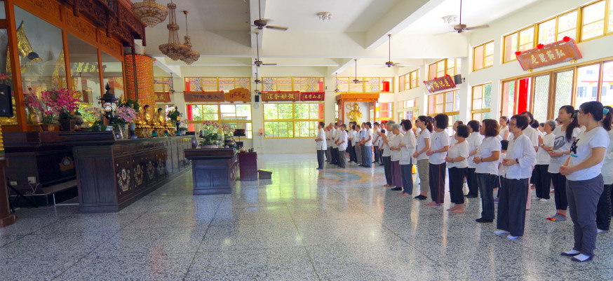

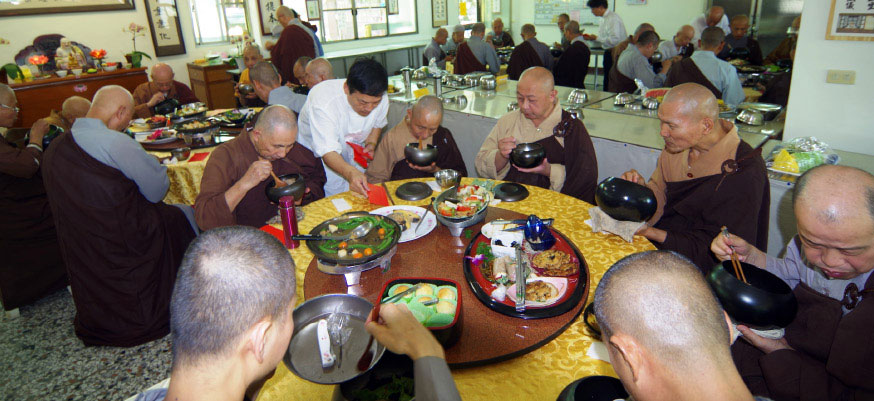

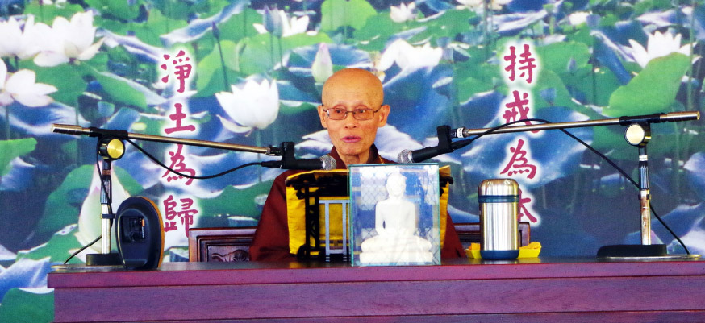

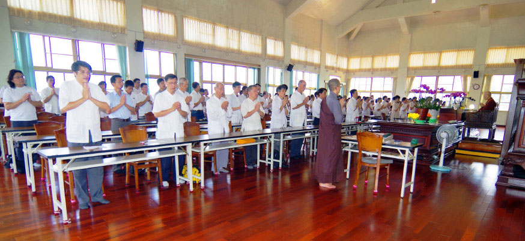

## 共修研學

### 小止觀導覽（六十四）

*心爾、治心整理*

道力強時感外魔

退道失志入魔境

止觀修轉魔幻相

不可得魔何處覓

第八章 覺知魔事

論文：

行者既覺知魔事，即當卻之。卻法有二：ㄧ者、修止卻之：凡見一切外諸惡魔境，悉知虛誑，不憂不怖，亦不取不捨，妄計分別。息心寂然，彼自當滅。

修止修觀可以除內魔，可以除外魔。外魔有精魅，堆剔鬼，鬼神魔，精魅魔在山林裡比較多，在都會區應該比較少見，所以在人煙稀少的山林裡比較會有這些稀奇古怪的事情發生，是故在菩薩戒裡有ㄧ條云，道力不足的菩薩，在險難獨行是犯菩薩戒的。修學佛法者更須重視自己的生命，不可有隨意冒險患難的事。

而堆剔鬼過去是出家人，因為破戒被逐出僧團，所以他對出家人非常憤恨，會破壞出家人修行，所以在家人比較不容易碰到這類的外魔。一般是比較容易碰到鬼神魔，是屬於天子魔的眷屬，不過這一類的外魔也必須修行功夫要夠，才會遭他們的障礙。總之，至少我們知道修行的過程，可能會有這些障礙，當別人遇到這些障礙時可以告訴他，如果自己招受這些障礙，也知道是屬於哪一類。

外魔的障礙是外境成立，如何是虛誑呢？舉例來說，家中若只有你一人學佛，那其他眷屬算不算外魔呢？有一天自己面臨臨終時，眷屬搬動、哭泣，因為這樣的障礙使我墮入地獄，算不算我往生的外魔？

何以外魔是虛誑？既然另曰外魔，表示外魔是存在的，而何以謂之虛誑呢？是指外魔自己不能成立為魔，必須要靠我的名言認知才能顯現為外魔。魔不一定都是青面獠牙，有時也會顯現可愛的面相，要認識它是魔，必須要有認識它的能耐。在紀曉嵐的〈閱微草堂筆記〉，講到他被貶到新疆時，聽到很多鬼怪的故事，有人遇到狐狸精，ㄧ到晚上就來找他共度春宵，他也知道此人是狐狸精，可是就是抗拒不了，這狐狸精就是外魔，可是為什麼還接受呢？因為被色所迷惑。
白蛇傳裡面的許仙，明知枕邊人是大白蛇，可還是喜歡她，法海禪師說：你怎麼糊塗到這種程度？他說：我沒有糊塗，天底下沒有比愛情更可貴的。或有人說：你怎麼愛錢愛成這樣？此人或回
**答：** 人生不追求這個，請問要追求什麼呢？所以在著魔的時候，這個人或許認為自己頭腦非常清楚，其他學佛的人反而是頭腦有問題。如同財、色、名、食、睡不是地獄五條根嗎？為何一般人求之不得？必須要認識它們的行相與過患，才知是魔。

第二個善用這些魔境，能如佛一般的殊勝，就如菩薩把眾生當成佛時，到底眾生是佛還是眾生？難道菩薩不知道嗎？雪公老師說：ㄧ個人走進來，光看他走路的姿勢，就知道他的人生禍福的百分之七十，難道佛菩薩還不知道那是眾生嗎？何以會把眾生當成佛？當此人對我修行的幫助如同佛時，將眾生當成佛有何不可？一切境界現前端看修行者怎麼用，所謂運用之妙，存乎ㄧ心，魔既然對我是如佛般的恩德，如何會對魔憂怖呢？

不取不捨：對魔界了知無有自體可得，如何會取而生貪，捨棄而生瞋？境界只是在增長菩提資糧，因為無所求，所以外魔不但不會成為障礙，運用之反而成為成佛的資糧。

不妄計分別：誤認萬法有自相成立謂之妄計分別，該法並不是在那裡自己成為該法，該法自相無法成立，此時取什麼？捨什麼？認為有個東西在那裡，才有所謂的取和捨，分別什麼？法是在世俗的名言上生起，眾生卻妄認法自己成立，謂之虛妄分別。無可分別、無可取捨，何有得失？故謂之不憂不怖。

論文：

二者、修觀卻之：若見如上所說種種魔境，用止不去，即當反觀能見之心，不見處所，彼何所惱？如是觀時，尋當滅謝。若遲遲不去，但當正心，勿生懼想。不惜軀命，正念不動。知魔界如，即佛界如。若魔界如，佛界如，ㄧ如無二如。如是了知，則魔界無所捨，佛界無所取，佛法自當現前，魔境自然消滅。

上述以修止方法還去不了魔境時，即當反觀能見之心，魔是怎麼出來的？是能見之心出來的，所見的魔要觀待能見的心才能顯現為所見，如果沒有能見的心，怎麼會有所見的魔呢？所以可以從能見的心看，也可以從所見的魔看，中觀宗說：所見的魔境跟能見的心，通達它是空性時，這二種通達法都一樣，能見的心不見處所，能見魔的心都尚且了不可得，何來所見的魔，魔由心顯，心尚且都不可得，魔又如何顯現？若魔在心上就有的話，不必觀待魔境，所以不必魔，已經有見魔的心了，則任何人都會見魔，因為心上即有故。

若魔在外境上成立，則不必觀待我們能見的心，外魔就在那邊自己成立，那大家都會看到魔，因為不必觀待能見的心就可以在外境上成立為魔。魔在心上也沒有，在境上也沒有。例如眼前香爐在冒香，香從哪裡來？若香從空氣中來，則不用檀木，若認為香從點火來，那應該任何東西點火就有香，若云香從檀木來，則不需要燒木就可以聞到香煙，香在哪裡？

所以如是觀時，尋當滅謝。滅謝是指勝義上自體成立的觀察，若遲遲不去，是指在世俗上魔境仍然顯現，這個時候就仍然繼續作觀，不要害怕，繼續用功就對了。但動機純正，為求解脫、為求成佛，繼續用功的本質是並求佛菩薩加被。

佛與魔，都無自體，即謂魔界如佛界，因為皆自相空，所以佛與魔都了不可得，無可取，亦無可捨，所以是魔界無所捨，佛界無所取，也就是禪宗所說：佛來斬佛，魔來斬魔。這些都就勝義上來說，魔境消滅，佛境也消滅，此即實相觀察。但是這種證悟，一定要求佛菩薩加被，也要傳承，絕非自著書盲修瞎練。（下期待續）

### 菩薩清淨的行持　華嚴經淨行品（八）

*編輯部整理*

十王敬護成佛兆

迅速累積勝資糧

觀待願力空性慧

能攝菩薩廣大行

甲一、智首問舉德徵因

乙二、陳所疑之問

丙二、別問行所成德

丁九、能為饒益

經文：

云何得與一切眾生為依、為救、為歸、為趣、為炬、為明、為照、為導、為勝導、為普導。

云何得與一切眾生為依，是說該如何成為眾生的善知識？這是第一步。想利益有情，一定要先成為眾生的善知識，否則如何去利益眾生？所以善知識是所有功德的生起處，想成佛的第一件事是自己有沒有辦法成為他人的善知識？而要成為善知識時，必須先要好好的跟善知識學，自己才會變成別人的善知識。一般人只看到政府蓋房子，修馬路，卻看不到大儒、大德教化學生對國家的貢獻。為依就是成為眾生的善知識，成為眾生的依靠，讓眾生能破迷啟悟、斷惡修善，離苦得樂。

為救：

當眾生的善知識就是要幫眾生解脫煩惱。解脫煩惱也是根本的救脫之道，能將煩惱對治，就是真正的救護，當然也不離開在事相中的幫忙。

為歸：

令眾生有歸投依靠處，能除種種無助無依的恐怖。

為趣：

引眾生趣向佛的智慧，這是總說。以下的為炬、為明、為照、為導、為勝導、為普導都是趣向的別說。

為炬：

如火炬般照耀眾生通往菩提的大道。為明：不但照耀一眾生，還普遍照耀眾生。為照：上述是火炬照，此處是以燈照明，意義同前。

為明：

知道路該怎麼走了，就是為明。就像親近善知識，慢慢的從黑暗中被引導到光明。在善知識所攝持的環境中，可以學教法，念佛共修也很有道氣，這就是為明。在這樣的環境下，有善知識的引導，也有善友互相依靠，不會感覺恐怖，不會擔心未來的出路，這就是為明的感覺。

為導：

一般說的引導，就是你需要什麼，我就跟你講什麼。如《論語》中，孔門弟子問孔子什麼是「仁」，孔子就回答什麼是「仁」，這就是一般的引導，即回答對方的疑問。

為勝導：

循循善誘，次第引導。如顏回：夫子循循然善誘人，博我以文，約我以禮，這就是為勝導，有步驟的引導學生。

老師對學生有時是為導，有時是為勝導。為導是你有疑問，我告訴你；為勝導是你讀什麼，要經過我同意，要經過我的步驟，教育中的私塾教育，就是為勝導，可是這方式現在不容易作到。這不只是在教學上一步一步引導，人格上也是如此。孔德成先生具良好的人格，就是因為過去私塾教育中老師的勝導。可惜現在的教育是父母親給老師下指導棋，如此私塾教育自然就行不通，孩子沒辦法被殊勝的引導，頂多是在知識上增長，但在人格上卻沒有建立。

為普導：

普導的對象或是普遍一切的有情，不只是在有疑問上的回答，還有次第的引導，以及全方位的引導。

修學佛法，想要成為饒益眾生者，要怎麼成就呢？成就的因在那裏呢？一路問，文殊菩薩都沒回答。

丁十、超勝尊貴

經文：

云何於一切眾生中為第一，為大，為勝，為最勝，為妙，為極妙，為上，為無上，為無等，為無等等。

云何於一切眾生中為第一，根據會性法師以及南亭老和尚的說法，「為第一」就是總，下面則是「為第一」的別。換言之，一總九別。為第一是最殊勝的佛，依著下面九個別，使佛成為第一。

為大：

指其心量大。古人說心包太虛，量周沙界，指的就是心量大。而這心量大當中，凡夫菩薩和聖者菩薩的心量是不一樣的，就菩提心來說可分為下品資糧道，中品資糧道，上品資糧道，凡夫菩薩與聖者菩薩的心量是有天壤之別的。

為勝：

就是能破煩惱障。這是屬於自利的部份，此菩薩能破煩惱障，是八地菩薩的境界。

為最勝：

能生起最為殊勝利他的能力。

為妙：

指破煩惱障，使他能解脫輪迴。

為極妙：

指破所知障，有成佛的證量最能利他。

所以為勝與為妙兩者相互配合，破煩惱障所以為勝，最能自利；為最勝配合為極妙，破除所知障最為殊勝。

另外一種講法，破除煩惱障與所知障是為勝和為最勝，因為破煩惱障與所知障的聖者最能自利，這種自利連阿羅漢也比不上。一般都說阿羅漢自利，佛是利他，可是佛自利的功德連阿羅漢也比不上。比如佛有很多的自受用，這些受用阿羅漢是沒有的。所以約著佛來說，破煩惱障與所知障，也可以約著自利來說，佛的自利功德靠著破二障成就，佛的利他功德也靠破二障成就。

為上：往下看，沒有人比得上。為無上：往上看，沒有人在他之上。佛在成就時，會成就無見頂相，也就是沒有人比得上他。為無等：沒人跟他是對等的。為無等等：佛在常寂光中，通達一切法，連無等也無，非同於一般世俗的較量，全就體性上來說。以上就是佛成就第一。這部份是智首菩薩問文殊菩薩如何得到超勝尊貴？

超勝尊貴，這部份要講三個面相：

一、這樣的人，會成為眾生的福田，是其他福田比不上的。所以佛在顯現福田的那一分，是其他聖者比不上的，那怕是只是供養一碗飯，那怕是阿育王在佛缽裏放一堆沙，阿育王前世當時為童子時，帶著恭敬心放一堆沙在碗中送給佛，佛接受時成就了阿育王作國王的果報，且是個非常有能力的國王，可以作佛法的護行者。如此殊勝的果報來自於因地時童子玩沙，覺得沙很美好，所以帶著恭敬心送給佛，想不到佛竟將體性轉成他做國王的功德。

二、能得最多的擁護。我們難以預料他是示現為佛或菩薩。他會示現一尊佛或菩薩是不一樣的，這還得要看因緣。好比你是個被賦予什麼樣工作的人，所產生的作用是不同的。就好像出去辦事，是以欽差大臣的身份，代天巡查，還是只是明察暗訪？被賦予佛的名言安立時，所有諸佛都會擁護。到你的佛國土時，都示現為你的弟子。這樣的超勝尊貴，不是示現為菩薩或一般人可以比擬的，所以顯現為超勝尊貴是得最多的擁護。例如佛在講普賢觀經時，想要藉著普賢菩薩來講一乘實相時，念頭一動，普賢菩薩立刻從他方世界下來。

三、就破魔障的那一分，是沒有人比得上他的。比如說他示現成佛時，意味所有魔障可以全部降伏，這叫做超勝尊貴，如同旭日東升時，黎明前的黑暗全部破除。也好比在神變時使用各種神變去降伏外道，而沒有任何的障礙。不像很多大德用神變時，他必須要講究，或許會傷害到佛法，或許會傷害到眾生的善根，有時會有他不能的地方，會有諸多考量。可是成佛時，那些障礙就不會再有了，這是超勝尊貴。所以當有聖者要成佛時，表示眾生有很大的福報在裏面，否則通通在共業中莫可奈何，如同孔子一樣，周遊列國時，若非冉求在齊魯一役大勝齊軍，不然夫子在衛國又如何能超勝尊貴？對有情最有利的那一分，超勝尊貴，顯現為最殊勝的福田，得十方的擁護，破魔，以這樣的方式來利益有情！

（下期待續）

## 蓮池海會

### 楊何利英老居士往生見聞記

愛蓮、思樺

似柔似剛撐家業

子女有成慰母心

觀音信仰心淳厚

為母發心助生西

楊何利英老居士往生於民國一○二年（西元二○一三年）十月十六日，享年八十有三。

老居士為廣東省中山縣石岐三級石人士，出生於民國二十一年（西元一九三二年）十一月二日，父何勝祥，母梁佩芳，為家中長女，有兄、弟、妹各一人。父親何公於及冠之年後即遠赴美洲大陸工作，成年返唐山娶妻生子，居士出生時值重男輕女時代，長輩微詞，何公護女心切，予居士閨名「蓮愛」，取其生女不嫌，「連連皆喜愛」之意；隨後即又返美工作，娶妻前後居唐山不及五載，在美洲則四十多年之久。

居士自幼助母操持家務，侍奉長輩，家中雖是地主，但必得早起點火燒水，天未亮即獨自步行至村中土地公廟上香，終身敬神，未敢怠慢。對兄長恭敬，友愛弟妹，讀書只及小學，但好學善學、認字、記帳、英文字母，子女的英文名字都難不倒她。

其個性溫婉但堅韌，偶曾提及當年大陸赤化，當時是十五、六歲的     姑娘，即為保護母親及家人獨自面對被煽動前來批鬥的佃農及親友，據居士得悉來者不善的消息，在未及門之際即準備好桌椅、茶水，待對方未及開口說話之際，即一一招呼長輩坐下、用茶，並為未及為大家準備點心而覺得不好意思，以禮相待，化戾氣於無形，讓大家沒有機會發作。不過這些還得靠何公家一向善待佃農，佃租是地方最低者，又處處予他人方便，這就是所謂「財散即人聚」吧！這種待之以禮、訴之以情，不戰而勝的能耐應該是出於心態坦然，但若無一點膽識，是很難獨力應付的，後來經過多次的逢凶化吉，皆賴何居士的善巧來化解。

但大時代的動盪，最後迫得家人避居澳門，後經家長許親，與同為中山縣人士的香港商人楊玖楠家獨子楊健雄先生婚配，定居香江；婚後不久即聞遠在加拿大的何公猝逝，因時勢未能奔喪，使楊何居士畢生耿耿於懷。

居士婚後敬奉公婆，祭祀先祖虔敬，友愛親族，慈愛幼少，相夫教子，生育三子五女（滿枝、滿根、滿泰、滿馨、滿香、滿馥、滿郁、滿意），可惜三女滿馥早夭，嘗暗自傷痛，每及其忌日，必以冥祭，慈母之心沒能減損分毫。每有事關子女問題，必誘導子女求教於父親大人，她則往疏通。對於夫婿對從祖籍避居香港之族親多施以援手，皆能接應，家中如大食堂，而且對於孤苦新寡更能體恤。

唯好境不常，早年楊家生活富足，從商順利，但由於中國大陸赤化後政局不定，香港左派的恐怖手段，放炸彈、潑汽油燒死右派人士等情形，呼應著大陸紅衛兵重挫中華文化的劫難，這些不安定因子，頓時把楊家剛起步的建築生意打得稀爛，最後一家之主也只能不得志的鬱鬱而終。時藉子女尚在求學階段，好一段時間，家庭之拮据全仗居士平日未雨綢繆，攢下來的小錢來支撐。在丈夫過世後，有如泰山崩，但其堅韌的母性，雖柔似弱卻有著鋼鐵般的意志。守寡後獨力支撐家計，為不損夫家清譽，有債必還，不落人口實，對脅迫者則不假以辭色捍衛家庭、守住家業。

這些能耐都來自於她信守中國五倫的觀念，為母乃大；在婦容之德上，富時不奢糜，窘迫時簡樸中又不失大體，非經打扮整齊，絕不出門。對禮數的講究也造就了子女日後皆能從良師上進，沒有匪類，七人皆大專以上。其溫婉處又見其決斷力，對於理財更是膽大心細，子女是望塵莫及的。

在口業上，對壞事皆守口如瓶，不會去宣揚，也未見有說過什麼重話。一生與觀世音菩薩結緣至深，應為一生中之吉凶，有所感應故，每日慇懃供養上香禮拜，子女有三人散居加拿大、美國及臺灣，每有返港，必提醒子女，清淨身心，到神龕前上香禮敬神佛祖先，子女未抵前已先向祖上稟報晚輩歸來之事，以求加被。

一年多前，幾經周折，為在加拿大往生的何公立碑，居士似心願已了，或已知來日無多，屢屢召喚子女回港，但皆以歡愉身心來迎接子女。往生前仍樂意接受子女安排，做身體檢查等事項，但人生無常，何居士不幸於十月十六日寅時在家中壽終正寢。本計劃同月下旬回港為母親八十晉一慶生的海外子女，驚聞噩耗即兼程返港奔喪。

壽終正寢的往生者，臨命終似沒有受苦，但若生前沒有發願往生極樂淨土，即可能生起不知所措或有所留戀的障礙。居士一生可說是俯仰無愧，平日小女兒（居香港）因與密教結緣，對往生觀念亦從淨空法師影視訊講法處得知，每每與母親分享所得，何居士對淨土觀念的種子是有的，惟香港的大環境是不利於往生大業，臨命終的助念幾乎是不可能的，以何居士為例，在家中往生者必得立即知會警方、救護車、送法醫管處，及至太平間接受法醫檢驗蒐證，刻不容緩；子女即使用各方可能的辦法，把平日照顧母親所印錄下來的病藥歷、醫師證明等一一呈證供參，避免母親再受刀劫，如欲像臺灣蓮友一樣在家念佛最少八小時或在太平間助念，實屬天方夜譚。

爾時，才體驗到人生大事、在臨命終時，能得到助念往生的順緣是何其不容易，如果人生在世時不預先規劃，那就難上加難了。如此推論的話：自己不學佛就沒有機會往生，子女不學佛更是完全沒有機會往生，因為一般是黑髮送白髮為多；自己學佛最有機會往生，子女亦學佛機會就更大，能與善知識一起學佛，有臨終助念，求佛接引，那就十拿九穩了，因為生前不作主，死後又如何作主？皆觀待晚輩有正知見、善友的幫助才容易往生淨土，佛化家庭與往生大事可說有莫大的利害關係，而與善知識與同法者的關連性更是往生與否的利害關鍵所在。

居士旅居香港多年，香港佛教徒雖然不少，但助念往生風氣未開，往生法事多是佛道互參，障礙正見正知，往生豈能無礙？更有甚者，生斷滅見者應不在少數，主要在於他們沒有學習正法的機會，對因果、生死輪迴多是一知半解，心靈漂泊無依，找不到落腳處，更惶論往生了。

居士的心思，飄飄何所似？一生歸依於救苦救難、大慈大悲的觀世音菩薩，也就是極樂世界三聖之一，子女便從此點使力，為何居士祈求加被，助母發心生極樂淨土，而為其念佛，希望蒙佛接引。在大殮及出殯裝身之時，何居士身體已見柔軟。經老師指點迷津，提點婆羅門女盡孝的故事，以子女發大心的方式補救居士生前知見未明的障礙，指導家人必須念佛，為居士皈依、齋僧、放生、做種種法事回向超薦，求佛加被而得蒙接引。

老師說，亡羊補牢未為晚也，子女的連心是成全長輩往生的最要，因為誠心誠意是買不到的，誠意是往生的心法，使往生者得到全部的功德，子女誠意的回向與修行精嚴大德的回向，往生者會得分更多；然而要真讓父母能因子女學佛而得利，子女必須發大心習正法，並弘傳正知見。方能圓滿父母親往生的心願，是佛加被的所在。

有感　　吳思樺

很難相信，外婆就這麼走了。

見到外婆的次數很少，但直至今日，每思及老人家和藹可親的笑顏已不復再見，仍令我難以置信。是的，我知道人都是會走的，但是我心底總是拒絕相信，無常。

外婆從前時時打電話來家裡關心女兒，有時媽媽講得開心了，招我姐弟倆透過電話問安，外婆的聲音是非常可愛的，可愛的用生硬的國語問我們好不好，柔和的語調處處透著對小輩們的關心，我不會說廣東話，外婆的話十句中有九句不懂，只能以生硬的單詞回應。

*如今，這一切都不會再有了。那日，僅花了十分鐘整理行李，便隨著爸爸媽媽匆匆飛到了香港。*

許多年沒見的舅舅阿姨們也都來了，雖然哀戚，家裏氣氛卻很平和。

外婆是靜靜的走了的，媽媽跟我說。

我看著那條熟悉的小走廊，心裡想著外婆曾經說著我聽不懂的廣東話，從這裡走出來。我相信外婆還在附近，因為小套房裡的一切都是那麼的真實充滿生氣。我第一次看到這麼多舅舅阿姨，大家一起圍在小餐桌旁折蓮花，我總想著外婆有沒有在看著呢？或聽小輩們談天？

人有悲歡離合，月有陰晴圓缺。這一刻還言笑厭厭，怎知下一刻如何？外婆走了，靜靜的走了，沒有半分徵兆。說是聚少離多一點也不錯，這就是人生無常吧！忙、忙、忙起來就是得等一下，問題是那些愛你的人能夠等嗎？

很多事情可以等，只有行孝，等不得。

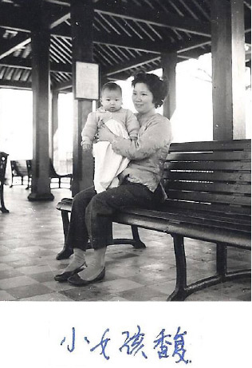

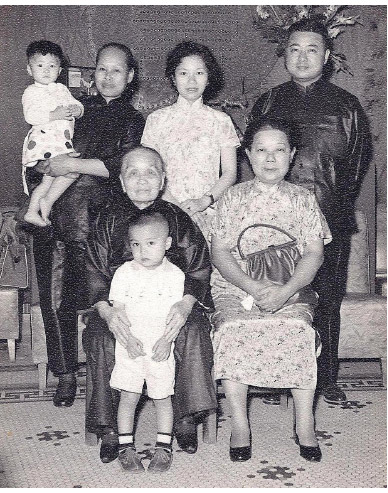

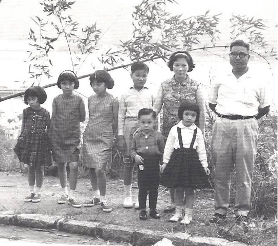

### 楊紅緞老居士往生見聞記

*編輯部整理*

一分是做人質地

一分是家屬學佛

一分是佛法好感

成就是往生全分

楊紅緞老居士世居臺北加蚋，出生於民國七年七月十六日，是家中長女，老居士五歲時母親往生，從小由姑姑帶大，當時觀念普遍認為女孩子不需要讀書，所以從小沒機會上學。長大後，為了家計當過泥水師傅的助手，幫忙拌水泥，做粗重工作，也曾遠赴日本、香港等地跑單幫，從事簡單的買賣，並在日本飯店幫傭洗碗盤貼補家用，對家中的奶奶更承擔起照顧的責任，直到老奶奶八十八歲往生，始終克盡孫女的孝道，深獲家族長輩的讚許。

老居士成年後領養兩位女兒，大女兒楊月嬌女士，二十四歲時適楊獻良先生，育有二子二女，二女兒楊淑娥女士曾在診所上班，有醫療上的專業，陪著老居士同住二樓，細心照顧老人家。家中女兒、女婿及孫輩等都很孝順，全家住在德昌街，生活上互相照料，一家和樂相處。老居士雖然大半生為家計辛苦奔波，中、老年後便受到女婿及兒孫的奉養，享受著含貽弄孫、四代同堂的天倫之樂，是一位有福報的人。

老居士不但生性孝順，對女兒、女婿都視如己出、非常慈祥，對孫輩更加疼惜，所以感應子孫都很賢孝，在女婿及大女兒相繼往生後，子孫們依然奉養如昔。難得的是，老居士能隨順孫子們的勸導，平時會念阿彌陀佛，聽到極樂世界的種種殊勝，也會生起歡喜，並且說她將來也要往生阿彌陀佛淨土，是非常有善根的老人家，有願必成，所以臨終時得到蓮友及家屬助念的殊勝因緣。

老居士心地純良，熱心助人不求回報，常給人方便，不與人計較，年輕時常到集義宮拜拜，廣結善緣，一些親友晚輩對老居士的恩德都銘記在心。老居士也收了兩位義子陳良雄、高秋煌先生，彼此保持往來，義子、義媳等也都很關心、很孝順老人家。

十多年前，老居士七十八歲，因動脈阻塞需緊急做心臟支架手術，當時除了住院治療外，孫子們為了幫老居士祈福延壽，跟著善知識及蓮友一起大量放生，回向老人家化險為夷，出院後老居士曾發心吃素念佛，用火材棒計數，每一根代表十聲佛號，統計念佛數目，種下了深刻的菩提種子。

老居士一向不願麻煩晚輩，常隨順子孫的善意，如果半夜睡不著，會安靜地坐在床上，連續幾小時看著窗外的人車往來，偶而也念念佛，不吵人也不煩躁，散盤地坐一整晚，神色自若像個修行人一樣。這使得老居士成為容易被照顧的長輩，也讓子孫奉養、服侍起來，顯得輕鬆愉快。人老能如此，那正是老居士的幸福，更是子孫們的福報與學習的榜樣。

老居士往生前三天因肺炎住院，臨終前及時送回家中，於一○二年十二月廿二日中午十二點四十五分壽終內寢，得到諸位蓮友及家屬的護持，助念二十一小時後，身體柔軟，神色十分安詳、莊嚴，由子孫親自更衣後進行小殮並停棺在家，享世壽九十有六。雖然老居士一生從未上學，但通達人情世故，經常教導子孫寧可自己吃虧、不佔人便宜，並能以身作則，所以子孫在楊家長輩的諄諄教誨下，人品都很好，都有正當的工作，對國家社會有所貢獻。

人生不離生老病死，老居士雖然身患糖尿病、心臟病，也曾經腰椎骨折、腦部小中風等，所幸皆能安然度過，在親人細心照顧，年過八十依然能行動自如，並接受子孫的勸導知道要念佛，不論在平時或病中，都能隨順念佛、作善法及放生等，最後臨終得到助念，幫助老人家能夠提起正念，至心念一句阿彌陀佛，決定求生極樂世界，不必再受生死輪迴之苦，這是老居士出世間的福報，比世間人所說的五福臨門，壽、富、康寧、攸好德、考終命，更加殊勝、更加究竟。

臨終助念要有順緣，在臨終長輩的這一分，平時就要有佛法的溝通，使長輩對極樂淨土能生信心乃至好樂心，臨終時才容易提起求生之心。在家親眷屬這一分，首要在意見上能一致，願意以助念法門來護持長輩保持正念，而且懂得不做多餘的急救醫療動作，才能減少臨終的逆緣，家屬更進一步團結投入助念的正行，以誠心幫助親人提起正念，家屬越誠心，才容易感動亡者提起正念。

往後的做七與告別式，與其說是做法事回向往生者，毋寧說是對家屬作正見的引導，接引家屬認識佛法，進而學習佛法，組成佛化家庭。

其次，由於社會大環境的改變，居住在都市中的蓮友往生，除非住在一樓，否則家屬想停柩在家守靈，會有諸多障礙，如果蓮友們共住，就可運用公共設施，將助念的風氣保留，否則就只能各憑造化因緣了，楊老居士的往生，亦可引發我們反思未來自己往生，是否能有如此的順緣。

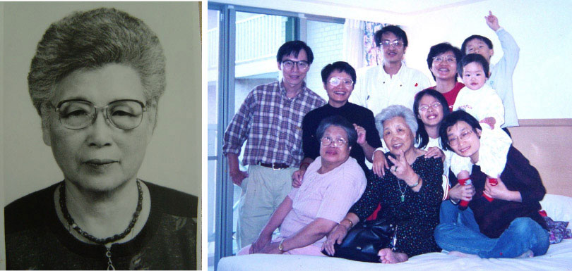

## 三代共修

### 共修法語　禪坐要修什麼—為瀋陽團解惑

戒慧講述

應彼要求靜坐課

身心安定修正法

次第觀修大根器

發心能得三寶護

壹、傳承

靜坐這件事情，在一九七六年時，參加齋戒學會，曾稍稍領略過。之後讀了天台大師的《小止觀》，這是大師為他的哥哥陳鍼寫的一部著作。陳鍼四十歲時，遇仙人張果老告之曰：「看你的面相，陽壽已盡，頂多再活一個月。」陳鍼很緊張，那時候智者大師在天台山的修禪寺當住持，為了拯救哥哥，就根據佛家裡面止觀的修學法寫了一部小止觀，這小止觀是止觀的綱要，裡面講到靜坐的內涵。陳鍼切實依法修持。

過了一年，又遇到張果老，張果老見之大駭，認為陳鍼不死，難道是吃了長生不死的藥？還是做了大好事？陳鍼說：「我只是照我弟弟教我止觀坐禪而已啊！」張果老乃知佛法之不可思議，能使人起死回生、延年益壽。自此以後，《小止觀》就洛陽紙貴了。

貳、前行─發菩提心等與環境的講究

講靜坐首先一定要發起菩提心，如果沒有發菩提心，靜坐容易著魔，比如說供養三寶、讚歎三寶、懺悔業障、誦經都是很重要的前行，使我們很容易被正知、正念攝持，很容易被三寶攝持，比較不會著魔，比較不會胡思亂想，並且還要發一個菩提意樂，就是為了遍滿虛空的有情眾生，我們必須要成就無上正等正覺，為了成就阿耨多羅三藐三菩提，所以眼前以靜坐來修學正法，做為成佛的資糧。要先把這一步確立，內心裡面有這樣的想法，這時候才能談靜坐，我們很多人都把靜坐太小看了。

其次靜坐環境也要講究，就是要安靜的環境。以前有一位先生，他也很喜歡靜坐，但是不看場合、也不發心、也不皈依三寶，就糊里糊塗的在那裡靜坐。有一天在靜坐的時候忽然衝進來一個老同事，門很用力地砰一聲，對他喊：「打牌的時間到了！」他被那個砰然一聲嚇到了，從此以後心神不寧，靜不下來，這就是沒有講究皈依三寶、懺悔業障與發心、環境，就一股腦地在那裡安安靜靜的靜坐，結果造成終生心神不寧，無法靜坐的困境。

參、正行

一、坐姿

以上這些都講究後，可以靜坐了，入坐時講究的是坐姿。我們修行分為座上修與歷緣對境修，座上修就是靜坐，靜坐是行住坐臥裡面最安定的姿勢，靜坐時要給自己三種想法。第一，它是最安定的姿勢；第二，它是最容易觀修正法的行相；第三，它是有別於外道的姿勢，要生起很滿意的感覺。其次生起佛慢想，想自己已成佛，如同阿彌陀佛、釋迦牟尼佛般法相莊嚴、一派祥和、坐姿端正。

這些都想完了才開始修正盤坐姿勢，有云：慢慢修時快快到，低處修時高處到。不要一股腦地馬上盤腿、馬上坐。我們很多人都有想快的毛病，不知修行要慢慢來。首先修正我們的頭，不能偏東也不能偏西，要正中。其次，修正我們的頸部，我們的頸部跟我們的脊椎骨是一條線，但是不要僵硬，不要做作，一切都是很自然的。第三步，眼睛順著鼻尖看到三尺的地方，也是很自然地看下去，請不要造作，就像佛像垂眉，眼睛垂簾，而且觀想自己是慈眉善目，已成佛。但這只是在靜坐中生起的想法！

其次舌尖抵上顎，口水會順著舌尖往下流，嘴唇微微的閉，不要張開，張口打妄想容易流口水，很不雅觀。其次兩肩微微的張開，但不可用力外張，脊椎骨像箭一樣的直，但非故意挺直。雙手結印放在肚臍前，輕輕地放在盤坐的腿上，腳也可以單盤，右腳疊放左腳上，或左腳疊放在右腳上，也可以雙盤，謂之坐如鐘，給人安定感，是四威儀之一。

二、擬定修學題目

（一）、數息觀

靜坐令人快樂，但是靜坐一定要有所修之內容，而不是頭腦放空。先以數息觀令心安定以利修學正法。如何數息？一吸一呼數一，然後數到十，看能不能數得清楚，有的人數到三、四或六、七思想就飛出去了。從一數到十，慢慢吸慢慢呼，氣若游絲，中間不能憋氣。此時身心安定，氣通全身，快樂似神仙。

（二）、兩種修學法

１．通明修學次第

其次將正法修學的次第完整地觀修一次。先確認人生的第一步，就是要親近善知識遠離惡知識，吸氣時，將親近善知識的意樂吸進來，吐氣時，將對善知識不親近、不恭敬，乃至於依止不如法的心態與作法全部吐出去，先確認我們的人生決定要親近善知識遠離惡知識。

接著確認第二步，要珍惜可貴的人生，其價值比黃金、鑽石來得寶貴太多了，應好好的善用，來世或為人或生天，或往生、或解脫、或成佛，何苦去追求帶不走的財富，這些寶石、黃金不過只能滿足衣食需要，無法解除人生的痛苦，吸氣時將珍惜暇滿人生的體悟攝持進來，呼氣時將放逸棄捨，確認珍惜此可貴閒暇圓滿的人身，要將人身做最有效的投資，對人身寶生起非常歡喜與珍惜的感覺。如果這個覺受還不明顯，繼續吸跟呼，讓這個覺受明顯。

第三，雖知人身極難得到，如高山穿針引線，大海盲龜浮木，但卻很容易失去，一口氣不來就成為來生，這一世與來世只有一口氣之隔，是很無常的。吸是把無常的正見攝持過來，呼則把常見放捨，內心中通達人身是在剎那剎那中維持的，一口氣不來隨著業力流轉到他道，並且容易隨著惡業墮落地獄、餓鬼、畜牲，此時須生皈依三寶的心，求救護免墮落，如同被惡人追殺，跑到警察局才能躲避殺害。此時吸，將皈依三寶的意樂攝入，呼則將遠離三寶，或依止三寶不如法的意樂舉止呼出。確認生起皈依的意樂，心意以皈依為樂，很高興自己皈依三寶成為佛門的弟子。

再進一步確認，皈依三寶尋求庇護，須具懺悔及因果的知見，沒有懺悔不能決心斷惡，未具因果知見亦不能決心修善，即使皈依三寶也無法得到救護而脫離地獄、餓鬼、畜牲。佛如醫生，僧如看護，有了醫生、護士還要吃藥才可以將病治好，皈依法就是吃藥。藥就是因果知見，有了正見才會勇悍的斷惡修善，才能離苦得樂。此時吸氣，乃攝持斷惡修善的正見，呼就是把不相信因果、撥無因果的邪見放捨。藉由呼吸確認自己因果的知見是否鞏固，相信作善得樂、作惡得苦，所以想要讓自己離苦得樂一定要斷惡修善，鞏固因果知見。

接著想一想，雖然有因果的知見，但還是在輪迴裡面，所以要發起求出離輪迴的心，沒有求出離輪迴的心，當在人天享樂完後依然墮落，所以生起一個求出離三界的心，吸的時候把出離三界的正見攝持過來，呼則是將愛戀輪迴的邪見放捨，放到乾乾淨淨，就好像呼吸一樣，全部吸入全部吐完。

再想著出離三界必須要修學解脫道，解脫道是戒定慧，所以要有戒定慧的正見，好好的持戒、入定、開慧。吸是將戒定慧的正見攝持過來；呼是將外道的修學、世間的修學全部放捨，因為外道和世間的離苦得樂法是錯誤的，只有戒定慧的方法才是正確的。吸呼確認自己能夠修學戒定慧、出離三界。

接著再想，有情眾生都跟我在輪迴中受著痛苦，即使享受安樂，本質都是痛苦。有情眾生不止一世做過我的母親，累劫很多次做過我的母親，所以我們要以孝順的意樂、報母的意樂來利益有情眾生，並且想到利益有情是我唯一的出路，沒有利益有情福報也不能生，所以幫助有情脫離輪迴是我唯一的生活價值，這就是大悲心，不離開一個有情，要幫助他們成佛，這時候吸，把大悲心的意樂攝持過來，呼則是把自私的意樂全部放捨，這個時候自己的體性就變成大悲，像觀世音菩薩、大勢至菩薩、像諸佛菩薩一樣具足大悲心的體性，生起自己是觀音菩薩的佛慢想。

靜坐修學，以呼吸法自我暗示，在心裡下心錨，自己給自己下一個正向的心錨，而不是說我這輩子完蛋了、沒救了、死定了，這樣遇到再好的貴人都沒有用，我們知道心錨的作用大矣哉，我們為什麼不下好的心錨呢？吸呼間讓大悲的意樂進來，自私的意樂出去。天台大師的六妙門就講到呼吸法的殊勝，但是呼吸法一定要結合這些教法觀修，否則這些呼吸法跟外道的修學沒有兩樣。

接著再想我要成佛才能夠真正利益有情，所以除了大悲心，我還必須去成佛，我才能真正利益有情，我要去成佛的心就是菩提心，因此吸，將求佛智（菩提）的心攝持過來，生起我必須成佛，具足一定成佛的菩提心；呼，將怯懦遠離，不敢成佛不願承擔的心放出來，捨掉它，放得徹底，自己成為一個很有膽識、很有見地的人。吸呼你做兩遍、做三遍、做幾遍都沒關係，就是給自己一個印象，到很滿意時再換下一個題目也可以。

再來要成佛必須修學六度，六度就是成佛法，所以吸進來的時候，代表六度的正見全部攝持過來，吐時將只顧自己的安樂的心全部放捨。行持六度全部是為了眾生，而六度就是成佛的方法，其中最重要的是空性正見，並以廣行六度資助空性的正見，使空性的正見能破所知障而成佛，所以吸，將空性的正見攝持過來，呼時觀想將無明執著棄捨。整體修學次第的架構就是這樣。

２．別擇次第之一為本日所修（例如無常觀）

接著再觀今天到底要修什麼？是修無常、或者皈依、或者布施、或者修念佛，要先確認，什麼事情都要確認在前面才能往下走，沒有確認的事情不要做，不能一個人坐在那裡就開始修。假如我們要修的是無常，那要怎麼修呢？這時候有兩種方法，第一種一樣利用吸呼的方式，第二種就是純粹作教法的觀修，如果我們純粹就教法的觀修，無常觀要怎麼修？首先確認我們一定會死，這件事情要確認，因為從古到今沒有一個活過，釋迦牟尼佛呢？死了。孔子呢？死了。古人你只要點得出名字，都死了，所以我們也不例外，我一定會死，先確認，這就是無常觀的第一步。

第二步，死的原因很多，活的原因很少，所以我容易死，不容易活，要確認。死的原因為什麼很多？包括現在的空氣很髒、食品有問題，乃至於醫藥也是很多的化學藥品，生活中很多惱人的境界，情緒猛烈，天災人禍戰亂，善業少而煩惱很多，所以容易形成死亡的惡緣易生，而活下去的原因很少，所以我們容易死不容易活，這要確認。

第三步要確認死的時候誰都幫不上我，我的太太幫不上我，她頂多是在床邊看到我死，她不會跟我到來生。我的孩子，我時時刻刻想到他，可是沒有用，我死的時候他也不會跟我到來世。所有有情，最親密的人，都沒有辦法幫助我死亡以後的那一段，那時我必須孤獨地走下去；我的地位財富根本沒辦法幫助我的死亡，帶不到來世，所以平常希求那些是沒有用的，要自己點頭同意這樣殊勝的看法。死的時候所有都帶不走，能帶走的就是只有業，這件事情也要確認，而惡業帶來來世的痛苦，善業帶來來世的安樂，所以我確認今天是為了善業而活，假如我的命只有今天，我今天一定要為善業而活。

無常觀就修到這裡，但是我們如果還要繼續，善業當中最殊勝的就是正見攝持的善業，因為金剛經裡面把正見的善業跟不是正見的善業做較量，功德簡直千差萬別，一個是比爾蓋茲的財富，一個是一般市井小民的收入，功德可以差成這樣，所以我今天必須為了正見而生活，正見所做的善業就是我今天的生活，而什麼叫做正見呢？利益別人的知見就是正見。第二個，利益別人的時候一定是幫助他成聖成賢或成佛作祖，這件事情就算不說，內心裡面要有這樣的想法，這也是我今天做善業的見地，包括端一杯水給人家喝，掃個地，與人家打個招呼，骨子裡面就是這種想法，確認了，無常觀學到這邊算是一個大概。有粗相的無常，有細相的無常，有剎那的無常，它的觀法都不一樣的。

肆、結行

今天晚上的靜坐大致就到這裡，靜坐中各種觀修都要一步一步的確認，好像公文由機關出去時，要看清楚再蓋章，內心要確認如同蓋章出公文，給自己下一個心錨，自我暗示。

出定時要怎麼出呢？因為入定到最後是氣若游絲，你看那個入定的人好像沒有在呼吸，好像死人一樣，所以出定不能馬上出，否則是又傷身又傷心，要先吐一口氣，讓氣轉粗，入定時是氣由粗慢慢細，現在氣要慢慢的粗，吐出去以後轉粗，這就是出定的一個行相。再來開始搓搓手、擦擦臉、揉揉腰，因為靜坐的時候熱量往內收，現在往外。最後請合掌迴向：靜坐功德殊勝行，無邊勝福皆回向，普願沉溺諸眾生，速往無量光佛剎，十方三世一切佛，一切菩薩摩訶薩，摩訶般若波羅蜜。

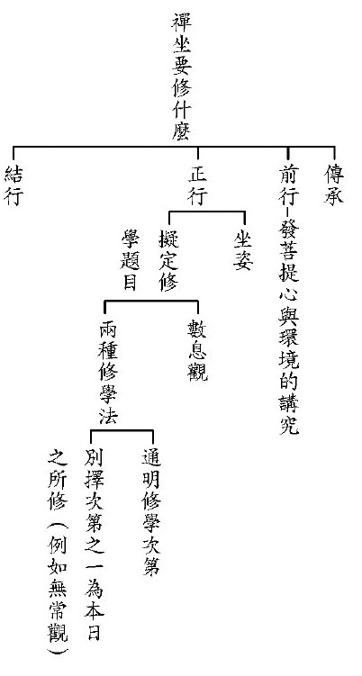

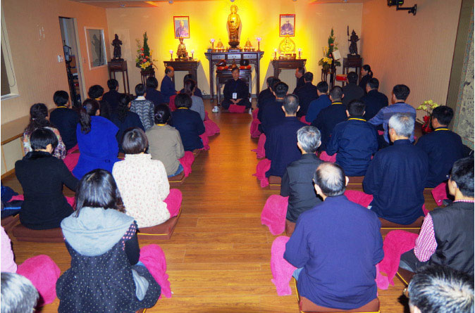

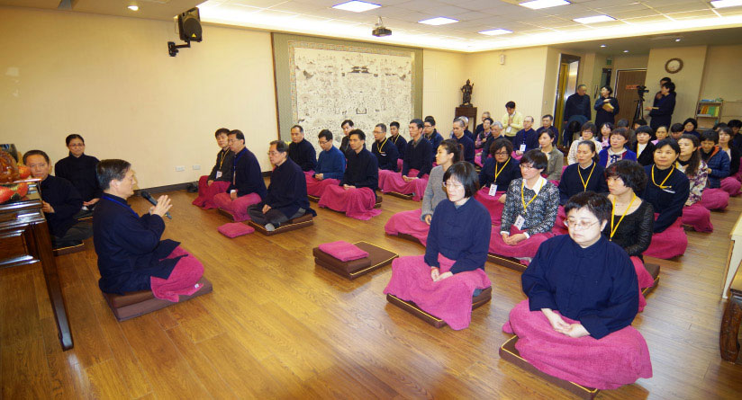

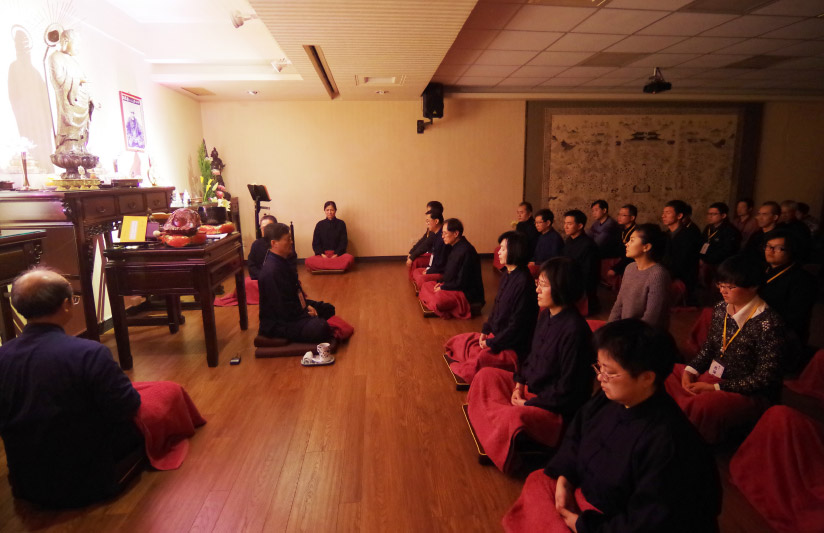

## 專題研學

### 聖者的祕密～大佛頂首楞嚴經二十五圓通暨七處徵心探源　二十五圓通暨七處徵心簡介　（三十三）

時哉

角色多重自體無

回應大悲滿所求

尋聲救苦觀自在

說法度眾是本懷

觀音廣陳

未二、應求雜趣

申二、人趣

酉二、奉教男女

觀世音菩薩雖是尋聲救苦，但以說法度眾最為殊勝。

戌一、出家二眾

亥一、比丘

經文：

若有男子，好學出家，持諸戒律。我於彼前現比丘身而為說法，令其成就。

現比丘身而為說法，觀世音菩薩有時候不是自己說法，有時候是促成這位比丘有一個好的學習因緣，這也是等同是觀世音菩薩親口為他說法，這位比丘被某一個比丘引導，而且引導得非常好，這樣的因緣下，如此的引導對他最好，或可說是觀世音菩薩的加被。

亥二、比丘尼

經文：

若有女子，好學出家，持諸禁戒。我於彼前現比丘尼身而為說法，令其成就。

有女子很想出家學習教法和戒法，觀世音菩薩就顯現比丘尼身來教她教法和戒法，讓她在比丘尼身得到成就。

戌二、在家二眾

亥一、優婆塞

經文：

若有男子，樂持五戒。我於彼前現優婆塞身而為說法，令其成就。

亥二、優婆夷

經文：

若有女子，五戒自居。我於彼前現優婆夷身而為說法，令其成就。

奉教男女，或優婆塞，或優婆夷，都是觀世音菩薩樂於攝受的對象。觀待他們來說法，讓他們在這樣的因緣下，以這樣的形象得到成就。

酉三、世諦女人

經文：

若有女人，內政立身，以修家國。我於彼前現女主身，及國夫人命婦大家，而為說法，令其成就。

此女人或是女主身（天子的皇后）或是國家的國夫人（諸侯之正配稱君夫人）或是命婦（大臣之妻稱誥命夫人）或是大家（為女主或君夫人或誥命夫人的老師），如何辦家政以成為國民的典範呢？就是對公公、婆婆好好的孝養，對子女好好的教育，勤儉持家，保持善良的情操，這樣的內政立身就是以修家國，家庭和樂，國家安樂。印光祖師說：天下太平，女人家操得一大半。故娶妻娶德乃興旺家庭，最重要的一步。六經開首是《詩經》，《詩經》開首是〈關雎〉，講的就是娶妻娶賢的重要性。

觀待上述人物，觀音菩薩在因緣成熟時，亦顯現四類人為其說法，令彼將角色扮演好，使家政上軌道，影響國人，導向淳厚的風氣。

由上知世間種種好事，佛都不遺漏而做過，所以能總持十方眾生所有的功德。這也是為何佛身上一根毛的功德，都足以建塔供養，必得到龍天的擁護，並作為有情眾生的隨喜處。

酉四、童真男女

家中欲生男女，讀誦〈普門品〉或本章，向觀世音菩薩禮拜祈求，設欲求男，便生福慧之男，設欲求女，便生端正有相之女，宿植德本，眾人愛敬。然此處是觀世音菩薩的三十二應身，其中第二十二應身是現童男身、二十三是現童女身而為說法。

戌一、童男

經文：

若有眾生，不壞男根。我於彼前現童男身而為說法，令其成就。

不壞男根，就是童真修道，不染欲塵，這一生不尋男女結合成立家室，直接不壞男根身出家修道，像這樣的人在印度、中國都有，如有名的六祖，或者是憨山大師、虛雲老和尚等，都是屬於童男身出家修道。而觀世音菩薩能於彼前現童男身而為說法，令其成就。或說此人能童真出家修道，乃前世祈求觀世音菩薩，這一生觀待觀世音菩薩的願力，有此順緣，並感得大士顯現於前，使得他們有這樣的因緣來走這樣的路。

由於他們沒有成家，沒有家庭的逼迫，能有很多的時間來修學正法，以童男身、童女身來修道，最能具足暇滿人生的條件。

戌二、童女

經文：

若有處女，愛樂處身，不求侵暴。我於彼前現童女身而為說法，令其成就。

以童女身來修學，不求以欲成家，示現出家修學，如迦葉尊者的夫人，虛雲老和尚的夫人，雖然結婚，然樂於以處女身修學正法，他們的對象也是這種想法，所以他們可以雙雙出家去修行，得到成就。

此時觀世音菩薩能以童女身現於其前，說法令彼得到成就。（下期待續）

### 極樂世界的脊椎骨　三十七道品分析（二）

心超講述

鳥樹演音三十七

漸入中觀不思議

生起不離皈依心

自然念念佛法僧

五力

五力（信、進、念、定、慧）配合五道修學，為加行道忍位與世第一位，五力喻如鑽木取火，已經過了臨界點（燃點）開始燒，能夠燒煩惱柴薪的般若智慧火在忍位時生起。忍位有下忍位、中忍位及上忍位，上忍位的下一剎那就是世第一位，世第一位只有一剎那進入見道位，喻如燒柴薪的火不會被任何的狂風暴雨等境界所摧壞（如美國森林大火般），所以見道位的人必能修道而至證果。意即小乘初果一定證四果，大乘的初地必定成佛！

第一、「信」：

五力之信就是「信心是佛，信心作佛」，相信自己會成佛。所以《法華經》對有般若正見的聲聞會直接授記成佛。當他的能力（般若智慧）能夠燒掉煩惱柴薪的時候，他相信自己能成佛，所以信心能作佛，信心會是佛。禪宗裡面會直接傳祖位給此人，哪怕此人只是樵夫，像五祖見到六祖開悟時，不但當面告知他是傳承，也把釋迦牟尼佛的袈裟跟佛缽都給他，六祖離開，就等於把整個寺廟的傳承都帶走了。五祖知道這個人將來一定出頭，這就是信心是佛，信心作佛。這種人躲在獵人堆十五年幫忙煮飯都沒影響他，獵人每天吃喝玩樂，但六祖都不為邪法煩惱所惑，十五年後走出來頭一剃、鬍鬚一刮就是大師。

第二、「進」：

身懈怠不會有了，心懈怠也不會有了，因為內心有極強大的法喜。什麼樣的事情讓人很精進？又有哪些事讓人再怎樣都放不下？當發覺到有很大的利益要追逐的時候，會生起懈怠心嗎？那些很想賺錢的人，當他看見賺錢門道的時候，他會懈怠嗎？不但身不會懈怠，還可以叫太陽起床，睡覺時還在規畫隔天要幹的事情！有般若正見的人，在學習正法的時候是沒有懈怠相的，就算身體躺在那裡暫止息的時候都是功德。

第三、「念」：

有般若正見的人對佛法會非常好樂，念就是不斷的透過理解，很有記憶性，而且不落常、斷兩邊。當有自性見時，不會離開常、斷二邊，所謂常邊就是指該法存在時，以為不會變化；當該法滅時，以為該法自性地無，如此則落於斷邊。有自性見的人，不是落入常邊（例如有自性見所以認為眼前看到的杯子不會變化），就是落入斷邊（一旦滅了就不會再生）。沒有自性見的人不會落入斷、常二邊，因為萬法沒有自體性，所以不會有常；因為沒有自體性，所以彼此的關聯是無盡的，所以不會斷。滅不是一滅永滅，因為有關聯性，所以觀待滅會生；生也沒有自體性，所以觀待生會滅。所以不會落入斷見也不會落入常見，這叫作「成就出世正念功德，深契中道入般若見」。亦即不入斷、常兩邊的人可以成就出世正念功德，這個人相信自己會作佛，而且透過不斷的精進，對般若的經典廣大的閱讀，以廣大的正理來抉擇般若的正見。

第四、「定」：

因為對法有這樣的好樂、理解、記憶，所以容易產生專注的修學，所謂「一心不亂能破散妄」。一心不亂就是專注修學般若，那一分能破散妄，散妄就是胡思亂想，心裡面想東想西，七上八下。「淺得事定，深得理定」。成就世俗的定力，謂之淺得事定，入空性定謂之深得理定。在生起定的專注力下，生起觀慧破了煩惱，破除見思惑、塵沙惑、無明惑等煩惱，謂之「慧」。

七菩提分

七覺支是用於修定慧時該如何破除昏沉、散亂、掉舉。在修學煖位、頂位、忍位、世第一位的時候，需要在定中修觀。修定及修觀的人都會有昏沉、掉舉、散亂等障礙，所以七覺支嚴格來說就是修定慧的資糧，用七覺支破除修止修觀的障礙。

第一、「念」：

念就是調和，如醫生調和定慧，用慧力破除昏沉跟沉沒，用定破除散亂跟掉舉。此處的調和定慧，是以正知見去破定的障礙（昏沉、沉沒）以及觀慧的障礙（掉舉、散亂）。念是對佛法有理解的能力，而且有記憶性，懂得用佛法的正知見去破定、慧的障礙。以下六支說明如何破定中以及破觀慧的障礙。

第二、「擇法」：

「觀察諸法，簡別真偽」。這叫做上首，也就是最為重要。行者在修定、觀慧的時候，會產生沉沒跟昏沉的障礙，昏沉是粗相，沉沒是細相。昏沉就猶如走進黑暗的房間，伸手不見五指，修學的心暗了，例如念佛念到最後明相不見了。心暗的人如果不好好的對治，來生容易投生到黑暗的世界。沉沒是修學的勢力往下掉，人雖然還是安定的緣在善所緣上（如：念佛），旁人或以為此人很有定功，其實修學的勢力在往下掉。修定者吃飯時間到了還盤坐在蒲團上面，不瞭解的人都佩服他的定功，但是瞭解了之後，才知道當時的狀態是不是定功。沒有修行功夫時不要硬賴在蒲團上，要察覺心是不是在往內收、往下掉，若不加對治，起定時作善法會變成很不堪，因為慧少而引起沉沒，謂之少慧沉沒。

少慧就是沒有觀察力，觀慧就是「察起藥」，不要讓善所緣沉沒，擇法就是要觀察般若智慧的殊勝，擇就是提醒自己般若智慧非常殊勝，愚癡非常可怕，功德跟過患兩邊選擇觀察後把修學的勢力往上拉。知道解脫的可貴與殊勝，知道解脫是成為眾生最殊勝的福田，解脫是最快樂的，是安樂的體性；愚癡無明是最可怕的，把所有的資源福報全部都濫用光，人生最後會走到死路，觀察抉擇之後把修學的勢力拉起來，讓心亮起來，不然的話學佛都是弱弱的，這種沒勁的樣子會害死自己。

以前在某寺有位修行人，拜佛也睡、打坐也睡，總是一副沒勁的樣子，師父每次罵他，他也不覺得怎樣，後來發生車禍，腦袋迸裂當場死掉！大家不要以為只要名為修行人，什麼都沒關係，都不在意，反正阿彌陀佛會保佑我們。擇法就是讓修行的勢力爬起來，讓心亮起來，把修定時昏沉跟沉沒的障礙破掉。

在定中修觀，不斷的串習空義破我，剛開始猛利，但勢力會漸漸往下，此時要靠著擇法亦即通達般若的殊勝、解脫的可貴、愚癡的可怕破除暗相。

第三覺支、「進」：

「修諸道法，不謬無益」。透過選擇知道功德跟過患，就安住在般若正見上不斷的串習，謂之修諸道法。透過不斷的努力，修行的勢力轉強，昏沉跟沉沒的現象就不復見。精進就是奮發圖強，在此人身上，絕對看不到弱弱、暗淡的樣子。透過擇法以後的精進，光看走路的姿勢就不一樣。

第四覺支、「喜」：

「斷常空有顛倒法喜」。喜就是產生很大的法喜，這樣的法喜能去除斷、常、空、有的顛倒，般若的正見給他很大的法喜，不論在定中或在觀慧的修學上，得到很大的法喜，有法喜的人是不可能有昏沉跟沉沒的，以上是斷昏沉跟沉沒。

接下來除、捨、定三個覺支，斷的是掉舉跟散亂。掉是往下掉，舉是往上拉，是對所在意的境界七上八下、患得患失；散亂是胡思亂想。這些都是修禪定、觀慧的障礙。沒事心裡東想西想的人，上課沒有聽課的能力，這叫少定浮動：定力很少，人是浮動的。

除、捨、定是攝持的藥，念就是懂得用這三種方法，特別除觀慧的障礙，此處由後往前說。

第五覺支、「定」：

「世禪不實，不生愛著」。容易散亂的人，要知道用專注的力量去破掉舉跟散亂。此處特指用專注力定在修學空性上，這樣的人不會喜歡世間的禪定。世間的禪定，以及所產生的神通都是沒有用的。坐在山洞裡面三個月不吃不喝，修定修到四禪八定、生無色界天，其實都是枉然，永嘉大師說：「猶如仰箭射虛空，勢力盡，箭還墮，招得來生不如意」。世禪不實是指不會去修世間禪，會去修空性定，世間禪是輪迴的體性，專修空性定把修學空慧的掉舉與散亂除掉。

第六覺支、「捨」：

「三時識變，捨不追憶」。慢慢的不用修對治法了。知道掉舉跟散亂的過患，而且知道掉舉跟散亂的行相，不容許它發生，這是以對治法來修空性定；捨就是把對治法放手，因為掉舉跟散亂已經不是對手，此時再修對治法反而是障礙，所以三時識變，捨不追憶，就是不用修對治法了。

第七覺支、「除」：

「斷諸煩惱，其智不損」。在空性定當中煩惱再也不生了，不但昏沉、掉舉、散亂不生，在空性定當中其他的煩惱也不生，生起了輕安。輕安有分心輕安跟身輕安，心輕安就是心裡變得很愉快，心輕安之後引發身輕安，身輕安產生很大的快樂，風大充身，身體所有沉重的感覺全部都不見了。修行人很有風采，就是因為身輕安，身輕安之樂也會引發心輕安之樂。在空性定跟空性慧的修學當中產生非常快樂的感覺，看到世間的快樂都毫無興趣，叫他不修行是不可能的。

前述的五根、五力，在修定、修慧時就要靠七覺支破定及觀慧的障礙。（下期待續）

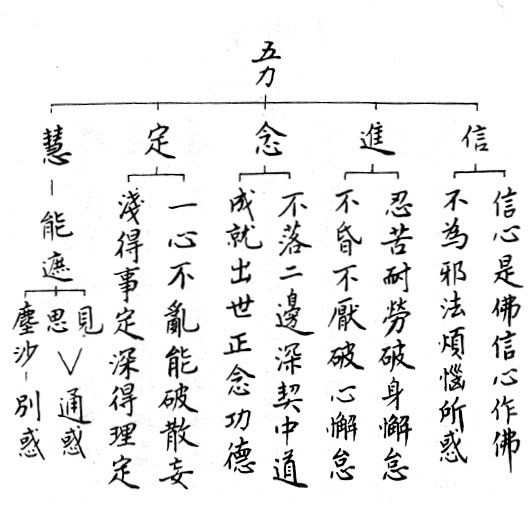

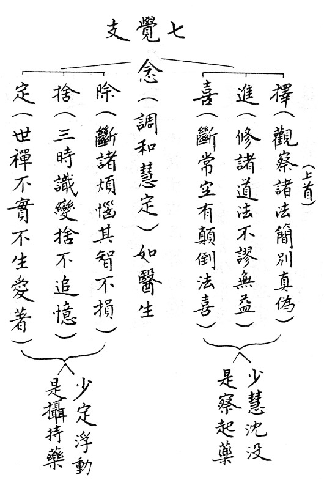

### 一件追憶的往事（六） —風雲際會世紀緣（緬懷雪廬老人）

魏慶友

風雨飄搖浮海外

孤島實踐孔子嘆

食毛踐土育英才

文化深繫兩岸情

孔上公尚在美國時，雪公就接到「押運卷箱行李去臺灣」的命令，做好迎請奉祀官府的準備。雪公剛將「卷箱行李」安置妥當，就得到孔上公由美回國的消息，立即返回南京，向孔上公稟報奉祀官府務及執行「押運卷箱行李來臺灣」命令的情況。時，德成先生，也接到當局令，奉祀官府立即撤離大陸赴臺灣。臨行，孔上公去重慶歌樂山，向躲避戰亂時的「猗蘭別墅」道別。孰料，離開僅三年（丙戌離開，己丑再至），「其居淪廢墟矣」！令人傷感至極！幸有《王獻唐畫猗蘭別墅圖》聊以慰藉。二公在民國五十一年，得知獻唐先生離世，瞻圖寄思，並題記之。二公的墨寶，使此史、此圖、此詩、此序，更俱史料價值：

〈題王獻唐畫猗蘭別墅著書圖．序〉

蜀山猗蘭別墅，孔上公避寇所構也。與時往還者皆名流，著述之暇，輒以書畫共歡娛，王子此圖即作於是時也。己丑，上公再至蜀，其居淪廢墟矣。今歲鄉信，王子已歸道山，展玩是幀，有重愴焉！予時曾為從者，故同感而誌之。

萬壑長松非自栽。

巖花日對硯池開。

名山應有名山業。

誰遣斯人魯國來。

摩詰淋漓畫蜀山。

偶來幽境便心閑。

輞川西望歸舟杳。

墨瀋猶新天壤間。

別後重來訪舊廬。

寒煙蔓草似殷墟。

幾回搔首看圖罷。

又檢當年未竟書。

德成先生親筆書之感慨：「己卯築墅於渝西歌樂山，呂師今山名之曰猗蘭。己丑重過，盡為廢墟。今睹此景能無滄桑之感。壬寅臘八日鐙下為雪廬和尚題于臺灣臺中孔德成。」

雪公將昔日與孔上公猗蘭別墅寄興詩，「爰錄此墅昔詠」合題於圖。「丁丑中日之戰，隨孔上公避亂於渝之歌樂山，結廬居焉，題其名曰猗蘭別墅，江山勝概，俛檻盡攬。國憂鄉愁多寄之嘯傲，今展是圖，悠然神往。爰錄此墅昔詠，以志鴻爪。壬寅中秋稷下李炳南識於臺中寄漚軒。」

孔上公歌樂山猗蘭別墅寄興

翠屏掩映鎖秋暉，

靜裏常關松下扉。

欄外紫霞隨澗落，

窗中黃葉共雲飛。

晴江一曲天邊盡，

煙嶂千重雨後微。

西蜀南陽同不陋，

春風從此長芳菲。

當年，夫子于他鄉漂泊十多年，在返回故鄉時，路遇幽谷中郁香的蘭花，觸花生嘆，「自傷不逢時，託辭于薌蘭」，停車援琴作「猗蘭操」而歌之。所謂：「逍遙九州」是假蘭託辭。夫子還語於子路曰；「道不行乘桴浮於海，從我者，其由與！」也僅是寄意言志而已。而今，二公真的是離開故鄉，乘桴去遙遠的「九州」了。當年夫子「猗蘭」之託辭，「乘桴」之寄意，今二公「未若予之果行也！」雪公曰：「……。孤帆飄荒島，念家山已陳跡，憶骨肉如昨夢。歷盡春花秋月、朝霽夕陰，明鏡白雪，感慨無限。……。孔子嗟道不行，說乘桴以寄意，又曰欲居九夷，亦言其志而已，未若予之果行也。此行也如是，又焉得無所鳴乎？」鳴則鳴矣，素位而行，勢之所趨也！今日踐行夫子二千多年前的寄意，一切皆因緣有契。雪公的灑脫，讓孔上公有了些許寬慰，詩曰：

避亂舟發臺灣

鯨濤翻墨怒排空。

回首神州一夢中。

國社輸棋餘錯子。

親朋落葉散秋風。

孤帆衝霧人千里。

遠島橫天綠萬叢。

隨處因緣應有契。

不妨萍絮轉西東。

民國三十八年（一九四九年）二月，乘船離開大陸，「浮海來臺」。這是雪公自民國二十六年（一九三七年）離家，赴孔府供職，同孔上公歷經十年顛簸，於民國三十六年（一九四七年）五月，藉陪上公三返曲阜省親之際，回濟南故里探望妻兒分別後，年已花甲的雪公又一次捨家撇子的遠行。此次背鄉離井，不但未來得及與親人辭行，連一紙片言也未留下，若干年後，家人才輾轉得知，雪公已在臺灣。二公尚在赴臺船上，即盤算「何時還梓裏，絮酒掃墳田」！

浮海

華夏眼中滅，風濤催去船。

崇明纔盡地，黃海欲吞天。

客鬢傷蒲柳，迴腸怯杜鵑。

何時還梓里，絮酒掃墳田。

舟中吟（二首）

誕我六十載，避兵春復秋。

命同危局碁，活向死中求。

幾度屋廬燬，更番苟且謀。

稻梁每不足，尚為琴書憂。

披霧上巴峽，排濤訪瀛洲。

憐身若渟水，隨決東西流。

檻外羨魚樂。化鵬擊九霄。

矰綸無所施。天海遊逍遙。

吾生胡為者。片絮藩溷飄。

亂世希苟全。志非在騰超。

不及一枝葦。安然寄鷦鷯。

艱難掛帆去。前路破狂潮。

雪公隨上公來到臺灣後，國民政府尚處非常時期，一切混亂無序，奉祀官府的編制經費也無著落，加之奉祀官府的工作人員剛到臺灣，人生地不熟，連吃飯都有困難，餓了好幾天肚子。有人半開玩笑的說：「孔子在陳絕糧，孔奉祀官府在臺絕糧」。幸遇一張氏憐之，饑腸稍緩，雪公比之以淮陰受漂母之恩。詩曰：

遷台阮囊已空饔飧不繼漂母張氏憐而貸金幸不餓莩誌德弗忘（二首）

不有王孫厄。何知漂母賢。

恩能生白骨。念必到黃泉。

昔日一盂飯。今廚三月煙。

只愁施德者。還待受人傳。

延命良由汝。廉隅礪益加。

鄰廚不因熱。荒島欲餐霞。

五畝宅還舊。千金報未奢。

高風如卻受。投贈與蒹葭。

昔日，同於蜀地避難，常做客「猗蘭別墅」的著名學者屈萬里先生，隨中央圖書館來到臺灣，且與奉祀官府為鄰，也受斷炊之苦。所幸先奉祀官府得糧，急饋之，雪公賦詩感曰：

與屈君翼鵬避亂來台同作流民君忽得祿先施之

學來高臥療晨飢。

饋米敲門久不知。

昨日相逢同似病。

聞君也在斷炊時。

在先雪公來臺的故交趙阿南先生（同為莒縣縣誌編纂）、屈萬里先生，臺籍名人朱炎煌居士及「漂母」張氏等接濟下，使奉祀官府擺脫了初來臺時的困境，暫時安頓了下來。

國民政府遷來臺灣後，奉祀官府務逐漸步入正軌。雪公除勤奉於奉祀官府務外，還在德成先生的支持下，利用自己精湛的中醫醫術及行醫資格，掛牌施醫接眾，求醫者絡繹不絕。據臺灣名人劉祖基先生的紀錄，雪公一年間處方達一千四百多張，使眾多患者得以康復。貧病者，除施醫捨藥外，還給予生活資助，大部薪俸用於施捨，而自己卻過著苦行僧的生活。隨著大陸來臺人員不斷增多，他們背井離鄉，漂洋過海，身心俱苦，其中不乏久仰雪公德行者，相互通報，紛紛覓雪公而來。雪公意識到，單純的社會救濟事業，甚至積極的社會福利事業，都不能根本消除個人的身心痛苦及社會的諸多弊病。只有提升全社會的倫理道德意識及培養社會大眾的慈悲心，才是根本，而根本的鎖鑰，唯有復興中華文化、弘揚夫子思想。一時間，島內外籍的諸多賢達之士，聚集在二公周圍，共商文化復興大業。德成先生倡議，首先從恢復祭孔開始。據史料載，臺灣早年就有民間祭孔的優良傳統，日據後逐漸衰退。幾十年後，直到「民國三十五年，官民為了恢復孔誕祭典，公議復興臺北崇聖會，並推臺北市長游彌堅為主任委員，教育局長黃啟瑞及士紳辜振甫為副主任委員，主持每年孔誕祭典」。雪公和德成先生，發現各地祭孔儀式「未能周備」且不統一。本著「擇時宜者而循之，其不宜者而變之。……然行權必有所依，俾不忽原旨之趣」，也「免於臨祭徬徨，違依無主，影響心念不專，失乎如在感格之誠耳」的原則，「謹檢其有關釋典者，選錄八種」，編成《闕里述聞釋奠選錄》。自此全臺各地孔誕祭典，有了範本可依，既莊重且統一，至今仍以此釋奠。臺中孔廟興建之初，聘請二位先生為首席顧問，指導孔廟的建築、祭祀、服飾、禮儀等。

雪公與孔上公，聯合臺灣耆宿賢達之士，倡建的蓮社、慈光圖書館等，是推動這一大片事業的平臺。從幼稚園到大學，從市民到公務員，全面覆蓋。如：國學啟蒙班、國文補習班、論語講習班、國學講座、明倫出版社、明倫廣播社等。孔上公對慈光圖書館給予了極大的關注，從起草「籌設緣起」的募捐到建成後的資助，皆傾力而為。建成後經「國民政府教育部」核准，正式命名為「私立慈光圖書館」，此為臺灣私立圖書館正式批准成立之第一所。在此平臺上，針對不同的受眾，相繼組建了「國學啟蒙班」等近二十個，弘揚傳統文化的公益組織，二公親自參與編寫教材並登臺授課。據奉祀官府秘書尤宗周先生記載：「論語講習班是在雪公老師與孔德成奉祀官二人協商下推動創辦的」，德成先生還擔任「國文補習班」的論語講授。雪公和德成先生除在創辦的平臺上弘傳國學外，還受聘臺灣大學、中興大學、東海大學、臺灣師範大學、輔仁大學、東吳大學等任教授，分別教授論語、大學、中庸、詩選、曲禮、禮記、德成先生的「三禮研究」、「金文研究」以及雪公的「常禮舉要」、「詩階述唐」、「李杜詩選」、「唐詩吟誦」等。雪公還在好友支援下，創辦「中國醫藥學院」親任教授，於「彰化國聲廣播電臺」，開播「中華文化」專題節目，為臺灣首創專題廣播，並獲九家廣播電臺聯播。二公在臺幾十年的辛勤耕耘，可謂桃李遍天下，成千上萬的親炙或再傳弟子，秉承二公遺願，以弘揚民族文化，傳播孔子思想為己任，至今活躍在寶島內外，成為復興中華文化的中堅。

雪公來臺時已是花甲之年，因被孔上公倚為股肱，雖屢次請辭主任秘書一職，始終未果。雪公九十歲時，不得已親筆給孔上公上呈辭意：「奉祀官鈞座：謹稟者，職以年屆九旬，心力俱衰，屢懇辭退本府主任秘書一職，均未蒙准。厚恩汪洋，山海難喻，銘骨沒齒，未或能忘。但以大局為重，安可因私廢公。然四十年追隨，驟然言辭，中心實如火焚，時勢所迫，無可如何而已。茲擬以公私兩全之法，請將主任秘書辭去，以讓賢能。鈞座憐老念舊，另調職在本府，任一閒散之職，依然常隨左右，備充資詢，借舊事告諸來者，俾減隔核。至府中預算，職深明了此種計畫，決不影響經費，另有說明。語出至誠，時日迫人。萬懇睿察俯允，不勝企待之至，恭叩鈞安

主任秘書李炳南 謹呈　　九月二十八日」

孔上公曾與好友談起此事，曰：「不能讓雪公退休，若准了雪公的辭呈，他就要『走』了。」此時孔上公也年近花甲，且體弱多病，深知雪公幾十年來，從未放棄歸鄉之念，除在百多首思鄉詩中，常常引用屈子「狐死正首丘」句，來表戀鄉之情外，來臺不久就將住處取名「寄漚軒」，也含暫棲之意，一直沿用至去世。孔上公何嘗不思鄉！有情無意而已。所以擔心雪公「走」了，幾十年的主心骨、頂樑柱沒了，將會失去依祜。但從雪公的另一首詩《緣》中，讀出更深層的含義。詩曰：

風雨同舟四十年，

霧花籠眼雪盈顛；

心違展墓薦洙水，

夢有聞經登杏壇；

浮海何曾輸子路，

歸槎恐不伴張騫；

聖門松柏春長在，

了卻瘋僧一段緣。

當年，二公為避戰火淚別故鄉，雖是逃難，看照片卻不失一股慷慨英氣。四十年的風風雨雨，風華正茂的奉祀官孔上公，已是花甲之人，英風豪氣的主任秘書雪公，已是皓首霧眼九十歲的人了，遺憾的是，至今不能圓夢祖廟林墓，只能隔海遙祭，夢遊杏壇，神歸闕里。當初隨孔上公浮海來臺，是踐行夫子的寄意，其忠心未曾比大賢子路差，但今後要陪孔上公乘歸船回故鄉，恐怕我無緣充當伴張騫回故鄉的義士堂邑父了。欣慰的是，聖門的松柏枝繁葉茂，雪公這個「瘋僧」也圓了與夫子與聖門這段緣。民國七十五年（一九八六年），九十七歲的雪公未等到「歸槎」去世了，又過了二十二年，民國九十七年（二００八年）十月二十八日，孔上公也抱憾去世了，享年八十八歲。民國九十八年（二００九）年九月二十五日，孔垂長先生，接受臺灣當局聘書，繼令祖第一代大成至聖先師奉祀官孔德成後，任第二代大成至聖先師奉祀官，以奉祀官的身分參加了民國九十八年九月二十八日「臺灣中樞祭孔大典」。其實早在民國九十三年，孔上公就用意歷練令孫，讓其出任見習大成至聖先師奉祀官，並擔任臺北孔廟崇聖祠主祭官。

民國一百年（二０一一年）夏天，孔子七十九代嫡孫，第二代大成至聖先師奉祀官孔垂長先生，來到令祖闊別六十多年的故鄉聖地曲阜，在令祖德成先生題字的原「論語碑苑」院內，立起這通「聖德百源」碑。也是聖門嫡裔六十多年後，第一次來到故居門前。不幸的是，七十八代嫡孫維益先生，似先祖孔鯉五十歲時先令尊孔子而逝，所幸的是，七十九代嫡孫垂長先生，似先祖子思子繼令祖志，不可思議。

雪公的靈骨於一九八八年轉道香港，被家人迎請回故鄉，安息在濟南玉函山。不知孔子七十七代嫡孫孔德成先生，英靈何時不再漂泊，在祖林安息，陪伴先祖。（全文完）

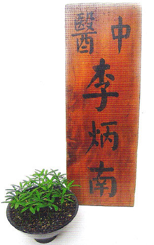

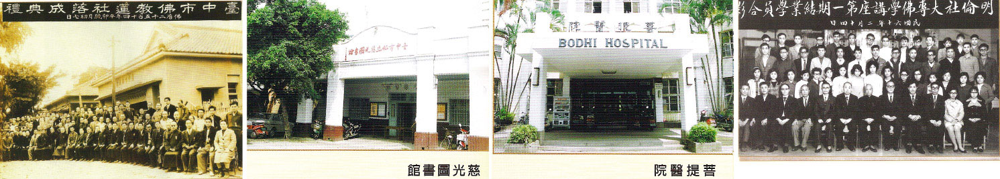

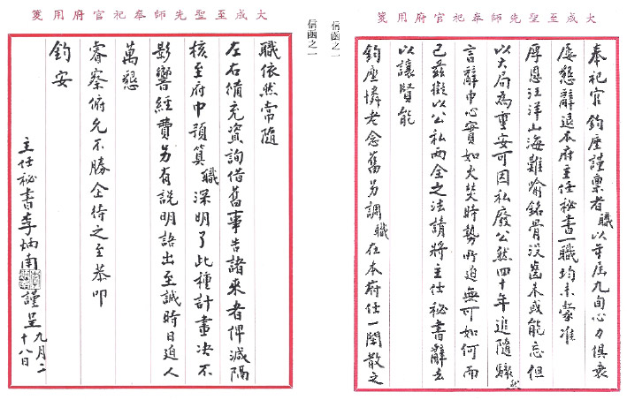

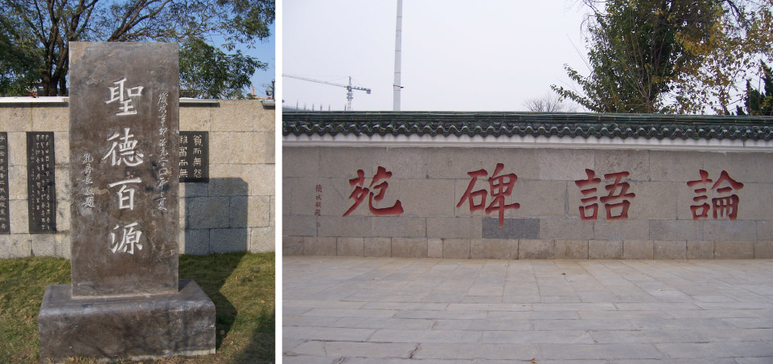

## 孔學一隅

### 孔子聖蹟圖淺說（七）

戒慧

引領弟子修入世

受困講學性天道

福慧雙修周遊後

承傳文化大氣象

十七、醜次同車

此幅是醜次同車，孔子是由匡地脫困匡人之難，經過蒲地回到衛國，這年孔子五十八歲。靈公親自出城迎接孔子，雖有心要用孔子執政，然夫人南子想籠絡孔子，而召見孔子，南子雖是淫亂之人，然有知人之明，對於蘧伯玉、孔子皆恭敬，她請見孔子，也是想要孔子透過自己的推薦在衛國執政。子路亦疑孔子之見南子為詘身行道，而內心不悅。夫子知子路不悅，告以若固執不見，必觸南子之怒，而有種種禍患。

有一天，衛靈公請南子同車出遊名勝，召孔子同車，醜次同車意謂孔子羞惡同車，而被安排在次車跟隨。

兩匹馬拉著，坐著靈公及南子，上有帳蓋，旁有撐旗護衛，亦以兵馬俑之甲冑。次車所載是孔子與弟子，健馬躍出松林。畫家刻意經營通往山林盛景，靈公夫人好不愜意，只是在副駕的孔子與弟子不知作何感想？

國人作了一首歌謠諷刺孔子，歌曰：從車者德耶，從車者色耶。意思是從車的人是有德的呢﹖還是好色的呢？聽到這種歌謠是受辱的，孔子覺得衛靈公空有好賢之名，又加上南子亂政，在衛國有志難伸，不久便離開衛國去宋國。所以感嘆地說：我不曾見過愛好道德，有像愛好美色那樣真切熱誠的人啊！於是離開了衛國。

十八、宋人伐木

本幅圖宋人伐木，是孔子由匡回到衛國，靈公偕夫人南子同車出遊，讓孔子陪從在後，孔子離開衛國往曹國，曹人不予接納，遂又離曹去宋國。與弟子們習禮於大樹下。觸怒了宋國執政大夫司馬桓魋，桓魋欲殺害孔子，派人砍伐大樹，弟子們催促孔子速行以避禍，孔子從容說：上天賦予我這樣推行道德的使命，桓魋對我又能怎樣呢？在逃難離開宋國時，孔子與諸弟子相約在鄭國見面。

圖中桓魋派人將這棵大樹以繩折斷渾厚的樹枝，並用鋤、斧加以砍伐樹幹，令孔子與弟子習禮不成，弟子們或抱古琴或捧竹簡或拱手促孔子離開，孔子似乎正告訴他們出處之道，講要上說聖人處變，既知自有其德而無憂，然又微服過宋。權變之道，陰陽不測，神而遁之，非賢人以下可知也。

十九、微服過宋

此幅是微服過宋，圖乃孔子離開宋國往鄭國途中，與弟子們失散了，孔子獨立在東郭門等待，形象相當狼狽，引來行人注目。圖中右方乃子貢與諸弟子們到處向路人問有否看到老師？有一鄭國人告訴子貢說：東郭城門有一人，額頭像堯王，頸項像皋陶，雙肩像子產，自腰以下身長較大禹差三寸，疲倦的樣子好像喪家之犬，大概就是你的老師吧。後來大家集合後，子貢告訴老師這段話。孔子幽默的說：他所說的這些氣象不見得真實，不過他所形容喪家之犬，我確實如此。（下期待續）

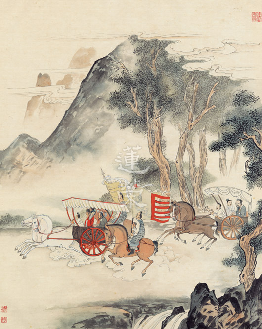

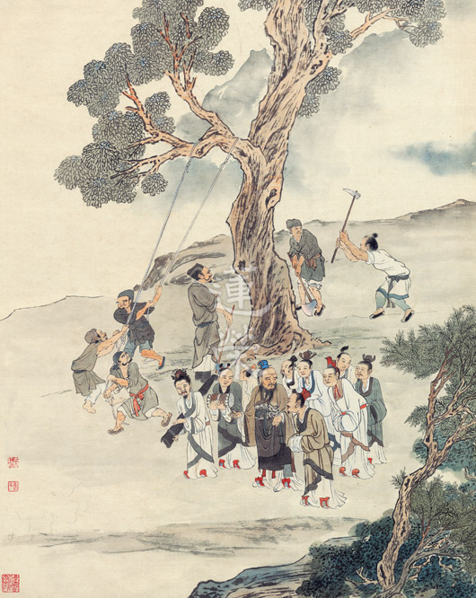

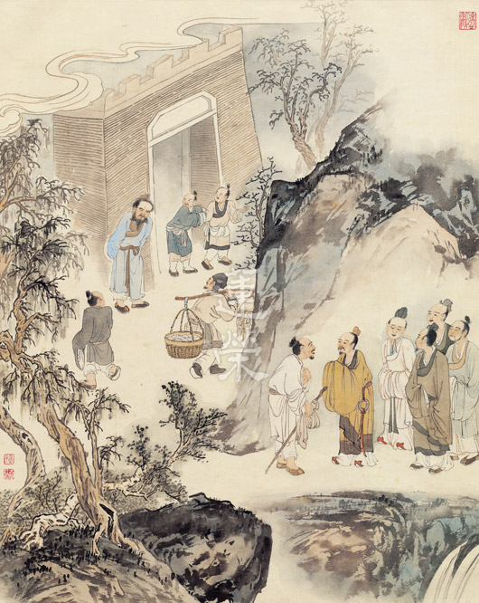

## 參訪觀摩

### 壬辰年秋三孔參訪觀摩（五）

*編輯部整理*

睹物思人事難料

當時為默歿則榮

世世尊榮子孫旺

典型傳承何處覓

萬古長春—孔林

我們參訪三孔的最後一站—孔林，孔林面積有三千畝，孔子當年病故以後埋在這裡，爾後歷朝歷代的子孫都相繼到這裡來安葬，歷史上經過幾次擴建，才有現今的規模。清朝康熙二十三年，康熙皇帝到曲阜祭拜孔子，又到孔林掃墓，在孔子墓前一跪三叩，在大成殿則是三跪九叩，當時孔林的占地面積是一千八百畝，連康熙也沒有見過這麼大的家族墓地，然而由於家族人員龐大，墓地已經是比較擁擠。

據說當時孔子的第六十四代孫孔尚任（桃花扇的作者），侍奉於皇帝左右，康熙見墓園已經相當擁擠，就問孔尚任為什麼不擴建呢？於是孔尚任跪下來說道：孔林外邊都是老百姓的土地，我們沒有權力擴建，而家族繁衍人員越來越多，已經是一層一層的埋葬，最多的地方已經有四層了，所以懇請皇帝為我們再擴一點墓地。於是康熙皇帝就下令，向東、西、北三面擴建孔林一千一百四十一點九畝，加上原有的一千八百畝土地，將近有三千畝。

孔林的圍牆一周長達七點二五公里，整個孔林全部在圍牆之內，裡邊每一個高起的小墳丘，都是孔姓子孫的墓葬，地表上的稱為墳，地表下的叫做墓，合起來就叫墳墓。古者墓而不墳，只有地表下的豎穴土坑墓，大約是從春秋以後才逐漸有了墳塚。孔林的這些小墳塚高達十多萬座，多為夫妻合葬，而且因為歷時悠久，後人又在前人之上層層埋葬，至今已經無法完全統計總數。而不完全統計下，就有十多萬座，樹木有十多萬棵，看起來好似雜亂無章，但其實是按照家族區域埋葬。孔家分為六十戶，每一個戶都有專門的區域，不能跨區埋葬，不能到別的分支去埋，如果一旦發現，就會被開除族籍，再也沒有資格葬在此處。

此外，從歷史上講，也不是所有的子孫都可以葬在孔林，依據規定，孔姓子孫有六種人不能到這裡埋葬，也不允許入家譜。第一種叫義子，也就是乾兒子，因為孔姓子孫如果沒有兒子，為了死後有人替他祭祀而收義子，這位義子因為沒有血緣關係，不能夠埋葬在孔林裡。第二種是女兒跟入贅的女婿。第三種是再婚者配偶所帶過來的兒子，例如孔姓子孫納了妾，這個妾帶過來的孩子，因為沒有血緣關係，也是不允許。所以前三種都是沒有血緣關係，第四種是做了和尚或道士的孔姓子孫，也沒有資格，在孔家人來看，這是屬於叛逆。第五種是從事犯罪，違背國家法律者也是不行。第六種叫流入下賤者，孔家規定子孫男不得為奴，女不得為婢，孔家人不准做奴隸。

三十公頃的園區，倘若以步行的方式遊覽，需要相當長的時間，由於是三孔的最後一站，天色已近傍晚，大家也徒步了一整天，於是直接安排了園區專用的電動車，把握住天黑前的時光，參觀了孔林中幾座最具代表性的墳墓。

首先是孔令貽夫婦的墳墓，孔德成先生的父親、母親合葬於一個大型墳塚之中，還有他的兩位嫡母也在其內。文革期間這個墓遭到嚴重破壞，當時孔德成先生的父親、母親屍體還保存的非常完好，孔令貽是一九一九年去世，二○年的十一月份埋葬，六六年時屍體被挖出來，發現雖然已經過了四十六年，肌肉卻還很有彈性，結果居然遭到焚燬。（詳見蓮榮會刊八十期第七十三頁，「一九六六年，孔子墓蒙難記」）

桃花扇作者孔尚任的墓也在孔林之中，電車在此並沒有多作停留，因此我們也只能輕輕一瞥。衍聖公墓前都有一些石像生，有華表，有虎、羊、馬等雕像。在中國歷史上，大約唐朝以後，對官員墓前的石像生就有明確的規定。宋代規定五品以上的官員才允許立石像生，五品以下沒有。

明代規定，一、二品官員墓前的石像生就是五座，所以衍聖公墓前都是五個，三品無石人、四品無石虎、五品沒有石羊。而且墓碑的大小也有等級規定，包括碑額的圖案都不一樣，明史中規定，一品大員的碑額叫螭首，是龍的兒子；二品叫麟鳳蓋，圖案就是麒麟和鳳凰；三品叫天祿辟邪蓋；四品至七品是圓首方趺，一般就沒有圖案了。

我們接著來到了于氏坊，七十二代衍聖公孔憲培的夫妻合葬墓，建了一個牌坊，這是為衍聖公夫人所建，當地人稱為于氏坊。據說他的夫人是乾隆的女兒，公主的身分，地位很高，所以建了此牌坊。乾隆皇帝是滿族人，皇姓愛新覺羅，如此牌坊應該稱愛新覺羅氏，為什麼稱為于？當年皇后生下這位公主，發現臉上長了一個痣，古人很講究面相，像王昭君出塞，就是毛延壽給她點了一個落淚痣。乾隆找的相面師，看面相結果認為公主臉上的痣不好，會世代受窮，唯一的辦法就是讓她找一個大富大貴之家下嫁，才能免去災難。

所以公主在成年以後，乾隆皇帝有意給她選合適的駙馬，居然找不到相稱的富貴人家，這才想到了孔家，因為孔家不受任何朝代更替的影響，每一個新的朝代建立之後，尊孔的程度都要超過前朝，否則就體現不出尊孔。乾隆皇帝於是決定把女兒嫁到孔府，但是滿漢卻不能通婚，為了保持滿族人純正的血統，又為了女兒的幸福，於是把女兒過繼給協辦大學士兼戶部尚書于敏中，這個人是江蘇金壇人，乾隆中前期非常得力的大臣，也把持朝政二十多年。然後再以于家的名義嫁到了孔府，所以我們稱她為于氏。

這段歷史，也有學者研究認為，實際上這個人就是于敏中的女兒，因為于敏中在病故後有人告發他結黨營私、貪汙納賄，所以乾隆就治他的罪，雖人已死，但是絕門抄家，他的兒子最後落魄，就來到孔府居住，孔府的東邊有一個于官廳的地方，就是他兒子所住之處，假若沒有任何關係，此人也無法居住在孔府中。所以有學者認為，下嫁孔府的，就是于敏中的女兒，但是乾隆把她當作義女。乾隆皇帝有十七個兒子十個女兒，女兒中五個早亡，另外五位所嫁都有名字，雖也想跟孔家聯姻，但是已經沒有孩子可嫁，因此就把大臣的女兒收作義女了，皇帝的義女一樣是公主，身分仍然高貴。

孔林一周四公里，我們只繞了一半，天色已經愈來愈黑，於是車子直接開到了整座園林的重點，孔老夫子墓碑的旁邊。大家下了車用步行的方式來到孔子墓前，旁邊還遺留著子貢當年給孔子守墓時，所種的一棵楷樹的殘餘樹幹。子貢是尊師重道的典範，四十三歲到四十八歲的黃金年華中，能給老師守了六年的墓，實在非常難得。

孔子墓碑上的大成至聖文宣王墓，是明正統八年，明代的學者黃養正所書，這是孔子在元代的封號。墳塚高五米，東西三十米，南北二十八米，我們偉大的聖人就在這裡安息。根據司馬遷《史記》上的記載，孔子剛埋葬時時墳塚高四尺，不足一米，當時是眾弟子為老師送終，因為兒子伯魚已經去世了，孫子年紀尚幼的緣故。當年眾弟子都是在這個地方為老師服喪三年，可以看出孔子和弟子們的感情必定是非常融洽，情同父子，而其中又以子貢更為難能，所以在明嘉靖年間，稱揚子貢尊師重道的精神，在孔子墓旁建造了一個磚瓦房，稱為子貢廬墓處。

孔子墓的左邊是兒子伯魚的墓，孫子子思的墓則在兩個人的前方，形成了一個品字型，不同於周禮規定的墓葬方式，當地人都叫脅子抱孫式，就是左手領著孩子，右手抱著孫子，有兒子、有孫子反映了家族的興旺，繁衍不斷。也有人認為，這樣的埋葬格局，可能與孔子的出身身分有一定淵源，孔子自稱：丘也，殷人也。殷人的風俗習慣是葬右為上，到了周朝才是葬左為上，所以孔子在右邊，包括孔廟也是在孔府的右邊，並非一般的左主右舍。

三孔的遊覽，最後在先師孔子的安息處畫下句點，歷史上，孔子的安息，方是儒家文化發揚光大的開始，我們一行人有幸能再次見證三孔的偉大，這一行的結束，正是我們更深入文化學習的啟程。（全文完）

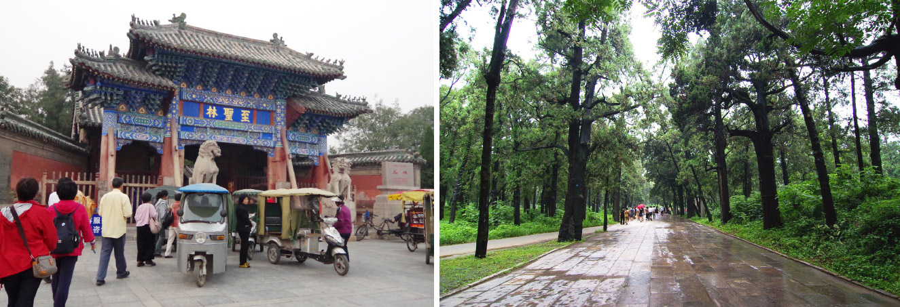

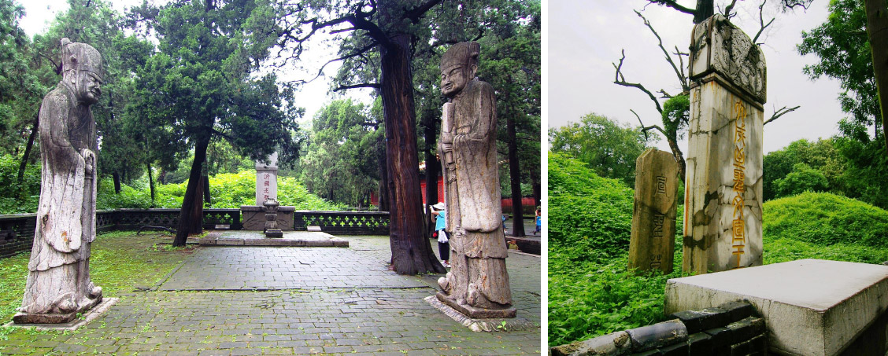

## 活動報導

### 群鴻戲海—文化藝術觀瀾　人生漫談—監獄風雲

戒堂

傻瓜需悲心勇氣

智慧助伴具效果

猶如地獄之鬼王

原是人間真菩薩

認識鄭益隆先生已有十餘年，有幸邀請他到學會發表從事監所收容輔導工作的專題心得，這也是唯一一次對眾人談論他的心得感言，只因他所做的工作或許很難讓一般人理解，行事一路低調，亦未曾見諸媒體報導，但他以一位未具教育背景身分卻獲法務部頒贈師鐸獎殊榮，其思想行事作為實有諸多殊勝之處。

為何從事監獄收容輔導工作，就其所言，就是「嘸甘」二字，也就是心生不忍，不忍見犯罪人在監獄忍受監禁之苦，進而發心要讓出獄人能夠在社會上過正常的生活。在此之前，曾因自己女兒國中時被編入放牛班，經他加入家長會，陪同女兒唸書，終至女兒能順利地從台大畢業，進入社會工作。又眼見許多同學因觸法而被拘禁至監所，比比自己女兒的實例，而生起輔導監所犯罪人的心念。

十二年前，先行承租房子，以之作為收容出監青少年之用，後因收容青少年受限於法令的重重關卡，遂轉為收容一般監所的更生人(服刑期滿或假釋的出獄人)，考慮到對收容團體的影響層面，除了有精神病或毒品習性者不收外，其餘皆視容量及急迫性，俟其出獄後收容。有鑑於待收容人數之眾，除原承租房舍外，另加購房子以供更生人居住，目前收容有廿二人。

需要出獄後立刻有地方住的更生人來源有二，一為地檢署交付，另一為監獄內的教誨人員引介。決定是否收容之前會有一段輔導期間，在這期間只視對象與之晤談，不看法院判決書，因判決書對犯行之記載太詳細，怕影響決定。也就是只依更生人是否有收容的需求，而非以更生人之前曾犯何罪來斷量。

亟需出獄立刻被收容者有三種類型：一是無家可歸者。這些人通常服刑期都很長，少則十七、八年，多則四十餘年，已無親友可聯絡濟助。其次為有家歸不得者。這些更生人和家人關係不好或已不被接納。例如一位早年受虐，觀念偏差，強姦兩位妹妹，又嗆法官，致被判處最重刑期。出獄後予以收容，只能由其母到收容處所看他，改善母子關係，又與其妹難有復合希望，致不能回其家。另外一種是有家但暫時不宜回家者。這一類型者，通常需求就業、就學或就醫。

鄭居士曾捐款就業博覽會數十萬，但無任何工作機會給更生人，因此自己另找四個就業體系，以提供有就業需要的更生人工作。就學通常因父母無法管教子女，請託而予以收容代管。有些無法負擔醫療費用者，也都由他一手支應。曾為一位脖子被人打斷的老更生人，一年多就花了數百萬元醫療費，雖然醫好之後因被撤銷假釋，須回監獄再關七年。如果先回監獄續關，不可能獲得醫療。

鄭居士沒有很高的學歷，實際上他是一位務實的商人，生意做很大，曾夥同幾位蓮友為兩百件上衣請教於他。以他基本交易量為百萬件起跳的生意人，還是不厭其煩地為我們提供建議，絲毫沒有市儈氣息。莫怪乎他能斷然為女兒的教育而逐步退出商場，更能在退出商場之後，全心全力來從事輔導收容人的工作。

基本上，鄭居士提供給更生人的，除了租及買屋讓他們免費居住外，輔導就業、就學、就醫、改善家庭關係等，無一不具。尤有甚者，即令閒著無事，亦提供零用金讓更生人使用。避免他們無錢花用而再度觸法。曾經租下店面讓更生人開店，亦曾鼓勵更生人保持善行，於假釋期滿時帶更生人搭郵輪出國旅遊。這種另類的輔導方式，恐怕是空前絕後。地檢署的主任檢察官怕其花費太鉅，想幫他申請立案，可以獲得資助。但他卻以立案之後會被繁瑣法令綁手綁腳，完全不能依其理念來幫助更生人為由，予以婉拒。迄今仍是獨自一人維持整個運作。

當然整個監所諸多風雲中，也有令人懊惱的事項。大都是來自監禁太久的受刑人，不相信有人肯真心幫忙的認知。例如輔導一位犯下七十八件盜匪、十二件強姦案，自廿二歲關了十五年，還經常提非常上訴意圖脫罪的受刑人，長達兩年輔導期，認為鄭居士前來輔導他是謀其金錢，直至鄭居士的仁心與誠意，讓他及其家人都感受到了，才安心服刑。又曾為老榮民申請其退休薪俸，為求往後生活好過而幫其保管，卻被告侵占，要去地檢署出庭。

也曾有冥頑不靈者，持續違反規定，被撤銷假釋移至宜蘭監獄執行廿五年徒刑，卻以金錢糾紛為由向鄭居士提告，結果是希望鄭居士能到宜蘭去探視他。林林總總，不一而足。所幸，已累積十幾年的經驗，能引起煩惱的事越來越少。目前橫亙在前的最大壓力，其實是不能出事的擔憂，只要出事了，這些年所做的全都白費，這一方面要求更生人要爭氣，不再為惡，另一方面要時時保持低調，總不能介紹說這些人都是一些從監獄出來的殺人、盜匪、強姦犯吧！

曾有人問鄭居士這些人會不會打他？實際上因為他的善行，也是有獲得諸多加被的。在監行內有教誨人員及管理人員，在監所外有檢察署、警察局等諸多靠山會保護他的。言及他自己，無不良嗜好，都在做幫助他人的事，錢不多也不缺，平時買鞋子、衣服一次都買一堆，分給更生人們，只因「他們是我的家人」，根本不擔心有人會害他，他也從中得到最大的獲益。

鄭居士心裡很明白，往後可能沒有後繼之人來接手做，因為做這種事需要智慧、經驗、錢脈、人脈並具才能成就。智慧依老師所言：智就是能夠決定要走哪條路，慧就是能夠分析事情。人脈取決於人和，例如在監獄裡你不找對人，那是寸步難行。錢脈：一定要有夠多的錢才能成就事業。經驗：光念書，有錢買不到，九歲天才可以讀完大學，但無做事經驗如何去做事？若再加上需具備與諸多更生人共同生活的膽識，恐怕沒有半個可以這麼做的人，從一個「嘸甘」開始發心，默默的做，而且持續做了這麼長的時間，是絕無僅有的。

有些人會認為為什麼還要幫助那些窮凶惡極，犯案累累的重刑出獄人。或許鄭居士亦未曾想過這個問題。然而，如果深入觀之，這些更生人如果沒有像鄭居士這樣的人立即收容輔導，必然一出監時立刻再行犯罪，或許我們周遭之人馬上就成為受害人，鄭居士由「嘸甘」而起的發心，其結果是讓包括你我在內的諸多人免遭傷害之苦，就其實質作為而言，鄭居士或可稱之為人間菩薩亦不為過。

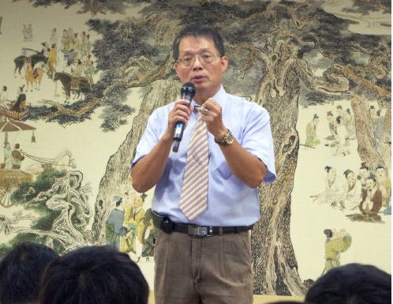

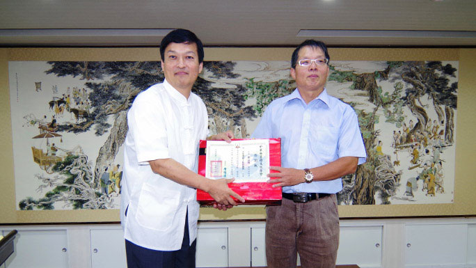

### 群鴻戲海—文化藝術觀瀾　神隱少女系列課程講座報導

*編輯部*

時代前進如神變

新知充斥引人盲

契機導入契正理

由古會今真現代

邁入互聯網的世代，人們不僅在生活上遭遇了重大的改變，教育的模式也逐步走向數位化與影音化。文房四寶先被便捷的自來水筆取代，如今屏幕再次代替了紙張，教育工作者開始教導學子們偶爾也可以放下手邊的書本，學習從電影中吸收新知。助長惡行、缺乏內涵的影片雖然充斥；激盪正向思考、散播溫暖的電影也不乏其例。

由宮崎駿先生編導，吉卜力工作室製作的日本動畫電影「神隱少女」，在二○○一年上映，這部卡通片在日本國內與國外創下空前的三○四億日圓票房，成為日本史上票房最高的電影。本片的主題意識廣泛，包括環保、權力、金錢、慾望、勇氣、生命的本質等等，都非常發人深省，適合親子共賞，將電影所帶來的感動互相分享、討論，那麼感動可以擴大、昇華，也許很多人生的答案就隱藏在其中。

學會的微智老師本於這樣的理念，設計了系列課程，首先是利用二○一三年暑假期間的五個週六，將課程分為五堂，每堂兩個小時。先讓同學欣賞電影，而後開始層層剖析，以提問、獎勵、誘導等方式，將許多有意義的內涵，播入孩子們的心田。

由於課程成效良好，不久即有教育界人士啟請，今年七月，於苗栗卓蘭實驗高中教授弟子規的賴老師，希望學會能前往該校開設一天的課程，讓原來只從書本上學習德行的孩子們，有更多的管道去體會善的意涵。由於時間的因素，課程必須濃縮，然而仍然具有很好的功效。透過口耳相傳，而後又於今年的十二月，台南立緹弟子規讀書會的師長們再次向學會啟請開課，於是該讀書會與國立台南大學附屬高級中學共同舉辦，就在南大附中的敬業樓二樓會議室進行一天的講座。在座或有人已經看過這部電影，或者還有未曾欣賞的，有家長、有小孩還有老師，大家在老師引導下熱烈地互動，長者們體驗了不同的教學法，幼者們也獲得了新的啟發與感動。

透過這幾次的影音教學，可以見到善用科技的重要，可以知道挑選影片的重要，在欣賞影片時給孩子正確引導的重要，具備這些條件，網路影音也可以成為教育的工具，而不會只是散播邪見的載體。

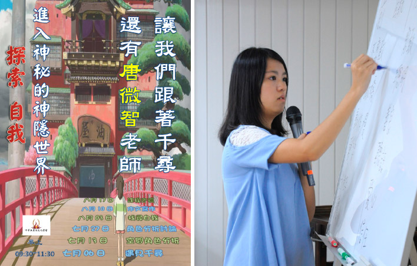

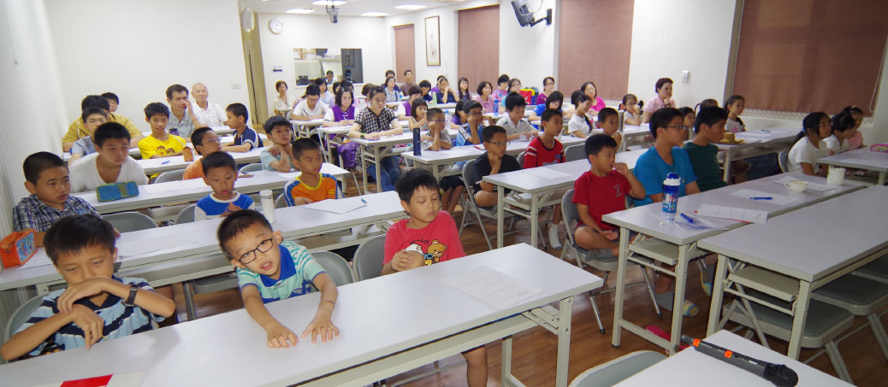

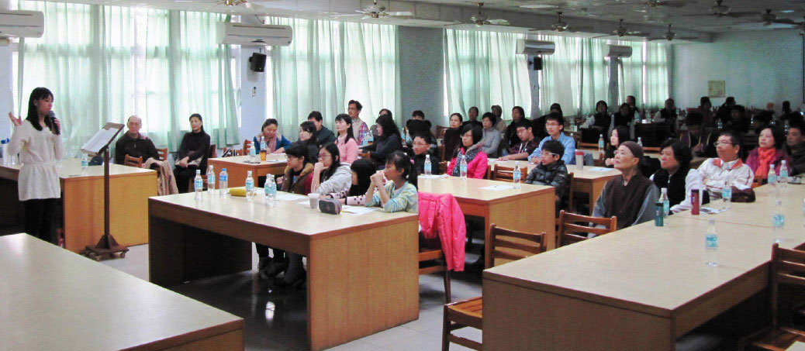

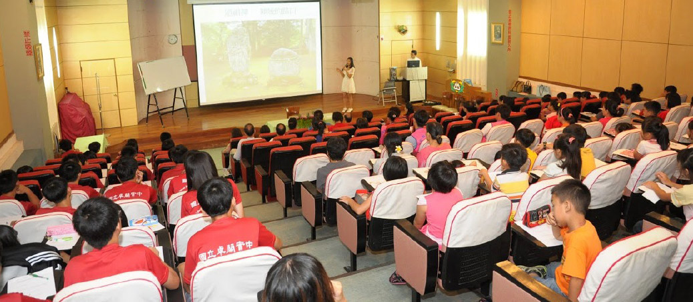

### 群鴻戲海—文化藝術觀瀾　遇見「千尋」

心若

人生如戲戲如人生

看時驚笑悚恐萬狀

聽講討論百味交陳

荻野千尋該尋什麼

我曾看過《神隱少女》多次，從國中開始，陸陸續續、斷斷續續的看了一些片段，對於內容模糊不清、不甚了解，只覺得很特別、挺好看。上了大學之後，很湊巧的在多門系上的課程中聽教授提及《神隱少女》這部片，赫然發現，這一部片長僅兩小時的電影，居然有著深厚的文學價值、人生哲理、人性探討、時空分析等等，挑逗著我的好奇心，於是全家一起看這部片，於是上網搜尋資料，於是買了許多相關書籍，於是想去認識宮崎駿，於是有了這一次的親子課程。

這是一部適合大人小孩共同欣賞、研讀的電影，小孩可以因為一些片段而樂不可支，時而表情呆滯、驚恐、時而異常興奮，即使他們不懂到底在演甚麼？大人可以暫時拋卻自己的責任、義務、煩惱，盡量讓自己回歸童年，找尋赤子之心，還可以深刻咀嚼玩味電影的意趣，並做進一步的思考，探索人生價值。此次的親子課程分為五堂，一次兩小時，也許很多人會疑惑，一部卡通片，值得花這麼多時間探討嗎？然而，我們討論的不只是電影本身，更是生活、更是人生、更是希望。

第一堂課大家一起欣賞《神隱少女》這部片，《神隱少女》是宮崎駿二００一年的作品，於今已隔十多年，但其影片技術、內容依然振奮人心，完全不會被時代的洪流淘汰，這也是他的電影特色，不會刻意迎合時代的流行，而是著重在「根本性」上，例如親情、家人、友情是什麼意思，擁有是什麼意思，這些根本性的東西，才是我們應該要探討挖掘的。

第二次課程我們一起探討《神隱少女》的空間及角色意義。「空間」非常神奇，不同的空間自然有不同氛圍、不同的意境，不需要語言，不需要動作，身處其中，自然就能體會其中樂趣。我覺得電梯就是一個很神奇的空間，電梯裡充斥著各行各色的人，他們都將抵達不同的目的地，卻短暫的相處在一起，搭電梯的時候大家都會不約而同的往上看，眼睛跟著樓層移動，很明顯的，電梯是一個稍微尷尬的空間，可以感覺時間的流動。

《神隱少女》運用空間置換來說明很多事情，電影裡，大部分的場景設定在油屋，油屋即湯屋，是人們可以泡湯、享樂的場所，在電影中，油屋是色彩鮮豔、富麗堂皇的建築，門口有男仕鞠躬哈腰歡迎客人，也有濃妝豔抹的女仕夾道迎賓。油屋可以說是一個慾望的聚集地，帶給人們精神上及身體上的滿足，是萬惡深淵，而油屋的垂直空間也說明權力的大小，越往上層權力越大。宮崎駿以此為電影空間，來說明環保、權力、金錢、慾望、勇氣、生命的本質等等議題，融合得恰到好處、天衣無縫。

至於神明在小浴池泡湯的構想，參考了日本的霜月祭，祭典的內容是在呼喚日本眾神泡湯洗澡後恢復元氣，是個有趣的祭典。小時候的宮崎駿去到湯屋，他認為這是一個市鎮中最奇妙的空間，裡面充滿色彩斑斕的圖畫，引人發想，而浴室旁邊有扇小門，宮崎駿就時常想裡面究竟是如何？如果這是爲精靈們設的浴場就更好玩了，《神隱少女》的空間架構就在小小宮崎駿的頭腦中慢慢滋長，成為了精彩可期的故事了。

來泡湯的眾神們都長得奇形怪狀、各式各樣，日本的神明本是沒有形體的，宮崎駿在畫這些眾神們時，他不想畫得過度莊嚴，因為他認為日本的眾神們應該是身心俱疲、疲憊不堪的，如此一來，他們會利用難得的假日前來泡湯，以求放鬆。

在電影中，每個角色都有其寓意，所以在接下來的幾堂課程中，我們一起探討角色。好看的地方就在於每個角色都並不完美，有可愛處、有不可愛處，有光明面、有黑暗面，形成一種缺陷美，近乎人性，發人深省。更重要的是，我們可以看到角色的成長與蛻變，就像季節漸漸明朗，慢慢堅定，以下介紹片中重要角色。

千尋，本片的女主角，是個瘦弱、任性、愛哭、依賴他人、慵懶、慢吞吞、怕東怕西、鴕鳥心態、沒禮貌、沒有力氣、笨手笨腳的女生，可說是一無是處，她跟一般的女主角不同，沒有漂亮的臉孔、沒有活潑可愛的形象，宮崎駿想描繪的是，這位少女不知道自己將來會如何的那種樣子。畫著畫著，宮崎駿就覺得她應該會變成一個爽朗的女孩子才對。

魅力這種東西是無可抵擋的，因為人會突然改變，只屬於他的特有魅力會散發出來。「人的表情到了某個階段，就是由他自己去塑造出來的」，就像是我很喜歡做卡片，每次做卡片，都不知道它最後會以何種樣貌誕生，它是一點一點形塑出來的，隨著紙張不同、材料不同、想法不同，它就會有各種的可能性，在作品完成前，你不會知道它的魅力，它自己會搭配，慢慢抓到感覺，找到獨特的魅力。我們每個人也是一樣，每一秒的選擇、行動，可能都決定下一秒的命運、走向，你的決定、表現，可能漸漸發展成自己的魅力。

千尋乍看之下無特殊處，但發展下去，她的智慧、勇氣、能力、堅定、無私、自信、忍耐力、適應力就不斷的被激發出來，她也從中學習到如何付出、如何去愛，如何找尋自己，觀眾開始覺得她可愛，覺得她心地漂亮，開始愛上她，這就是她反轉的魅力，經過峰迴路轉，令人大吃一驚而記憶深刻。

千尋的全名為「荻野千尋」，是很有意思的名字，「荻野」是她的姓，姓代表祖宗歷代的傳承，代表家族的榮耀、使命，而「荻野」又指荻野草。「千尋」是她的名字，也是父母對她的祝福與期望。「千」是指深、廣，「尋」是找尋，所以全名的意思是，在越過寬廣、一望無際又深長的荻野草中，她不小心遺失了一個精緻小巧卻又無比重要的東西，尋找的過程艱辛困苦，但她一一克服了，原來她遺失的是名字，是自我，原來她不斷找尋的正是自己，這就是貫穿整部片的主題，也是我們人生最大的課題。

當湯婆婆看到千尋的名字後，說這個名字「好奢侈」、「好浪費」、「好複雜」，她認為千尋不配擁有這麼好的名字，所以把「荻野」、「尋」三個字奪走了，奪走「荻野」，象徵與家族的血脈被切斷，象徵與之前的世界脫節，這兩層關係一斷，她就無法回去。奪走「尋」，帶表她將無法追尋，無法找回自我，剩下的「千」就一點作用也沒有了。好在千尋不忘救父母的初衷，她在湯屋中成長、茁壯，最終找回自己，還改變了湯屋的人們。

另一個被奪名的是「白龍」，白龍本是一位小河神，由於河川被人們填平蓋大樓，他失去住處，只好去找湯婆婆學魔法，至於為什麼他會去學魔法，恐怕連他自己也不清楚。他失去自我，成了湯婆婆的走狗，做一些不好的勾當，差點喪命，好在千尋幫他找回名字，聽到自己名字的那一刻，白龍身上的鱗片全部脫落，令人感動萬分。

白龍曾說：「名字一旦被奪走，就再也找不到回家的路了。」孔子說：「必也正名乎。」可見名字的重要性，在課堂中也讓孩子們分享自己名字的意義，希望他們自我期勉，好好學習，以對得起自己的名字。

劇中有一個很重要的角色，就是河神，河神一開始被當成是腐爛神，全身臭氣沖天，爛泥充斥，湯屋的人們避之為恐不及，誰也不想為他服務，只有千尋幫他洗淨，把河神體內的垃圾拔出，垃圾堆積成山，河川本身的作用就是要淨化大自然的穢物，然現今社會的人類把各種大型重金屬、廢棄物、毒水往河川倒，所製造的汙染，已遠超過河川的負載量，所以河神才會以腐爛神的樣貌出現，歸根究柢，是人類的錯。

河神體內有很多垃圾，那我們人呢？是否體內亦有許多不堪的垃圾，歸結來說，包括飲食及心靈的垃圾，在課堂上，也讓孩子想想要如何清除這些垃圾，作了很多活動。

劇中還有一個很特別的角色，是「無臉男」，他是宮崎駿作品中，第一次出現軟弱又無所作為的角色，有點類似現今年輕人，面無表情，事事不關心，不知道他在想什麼，也不知道他想做什麼，他任性、幼稚、孤單、佔有慾強，渴望被愛，卻不會表達自己情感，得不到便惱羞成怒。在劇中，他透過金錢來與他人建立關係，不斷的揮霍金錢、不斷的進食，以彌補內心的空虛寂寞，然而，錯誤的方式使他適得其反，只能贏得別人的逢迎諂媚，變得更空虛落寞了。唯有用誠心、付出自己，才能得到他人的信賴、關愛。

以上是劇中較重要的角色介紹，其實每一個角色都與我們有切身關係，千尋的勇氣、純真，白龍的智慧，湯婆婆的貪婪、錢婆婆的知足，無臉男的空虛小少爺的任性、霸道等等，我們或多或少都具備，是每個角色的綜合體，了解這些角色，等於進一步了解自己，重要的是如何發掘自己潛藏的魅力，如何對治自己的煩惱、慾望、空虛寂寞等，若把這些當做每天的課題，相信這一部片，帶給我們的是無窮無盡的受用。

宮崎駿曾說：「電影是一把雙刃劍，不僅能傳播文化，也能破壞文化，因此，我一直告誡自己要時時保持警醒」，這就是爲什麼他的電影總是與眾不同、引人入勝，因為他以文化為依歸，對社會有強烈的使命感，他用最純樸的方式，宣揚正面的價值觀，一點一滴的深植人心，讓這個世界風俗變得越來越淳厚、良善，對宮崎峻而言，會讓他想親自下去做的作品，就是他的動畫。

宮崎駿的動畫夢，若要追溯源頭，可上溯至他的童年，童年因母親罹患肺結核，為了治療病情而長期不在家，少了母親相伴，宮崎駿倍感孤單，而宮崎駿為了讓父親沒有後顧之憂的照顧母親，就與哥哥一起負責照料兩個年幼的弟弟，為了安撫時常哭鬧的弟弟，宮崎駿突發奇想，他利用圖畫紙畫畫、編故事，吸引的弟弟們的注意力，果然奏效，讓他發現，故事原來具有不可思議的力量，開啟了他豐富的構思力及想像力，也開啟了日後一部接著一部家喻戶曉的動畫片。

宮崎駿的每部作品中，都含有夢想、生存、環保等主題，其中最強烈的主題是「只要相信，就有希望」，宮崎駿用兩個方法發現希望的存在，分別是觀察及相信，只要細心留意生活周遭，就會有意想不到的回饋。宮崎駿說：「我們對世界都有責任的，不能說，我只是個畫動畫的，就和改變世界無關，每個人對改變世界，都是可以做些事的」，這就是他的理念，若如是觀，每個人在不同的領域都可以為世界做出貢獻，只要我們有心，即使只是看一部優質的動畫片，都能改變自己、淨化社會。

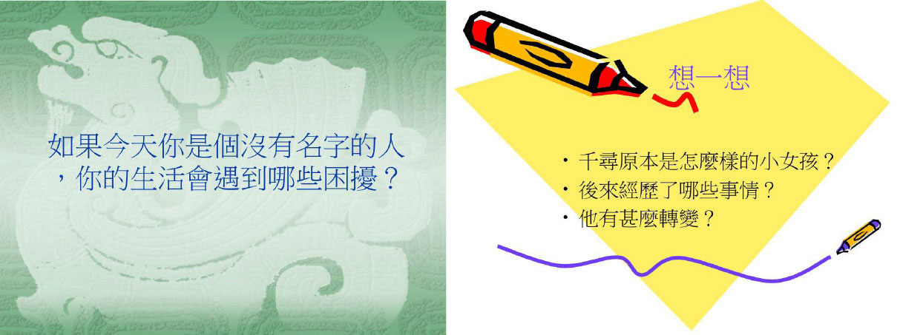

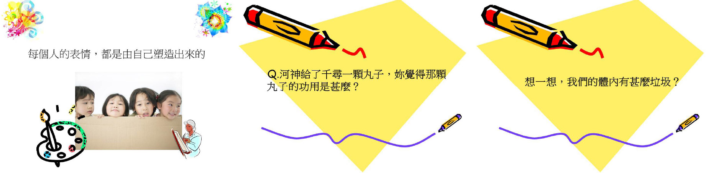

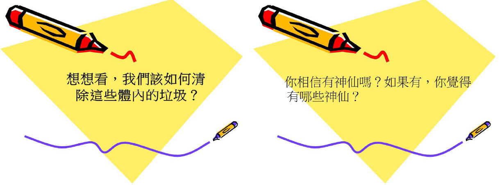

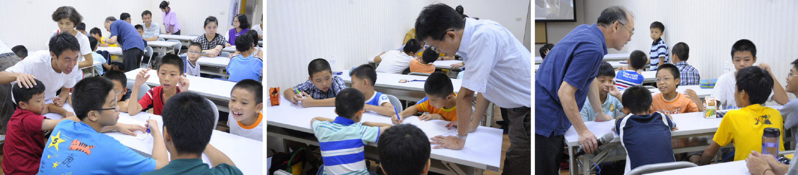

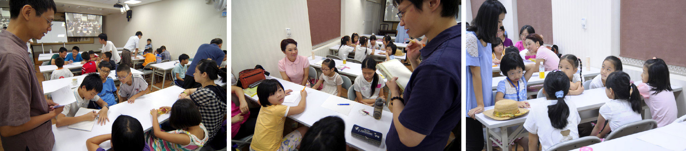

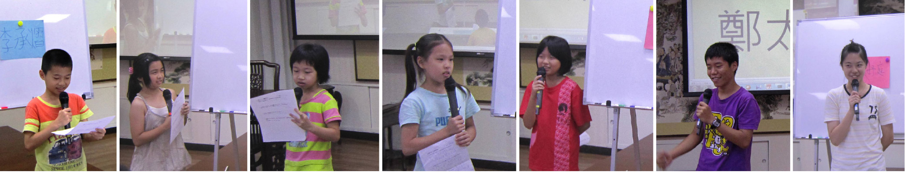

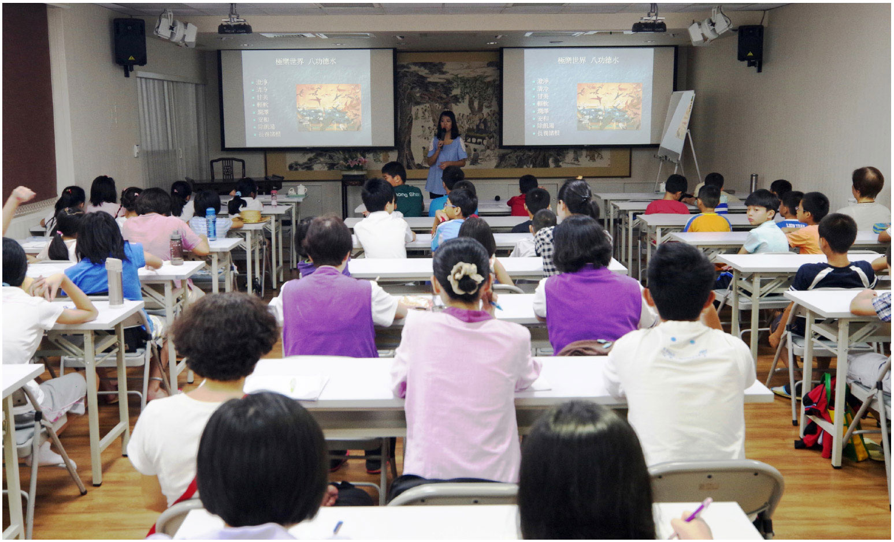

### 瀋陽國學講座暨臺北造就時代菁英講座　因緣相續—瀋陽與臺北講座交流

*編輯部*

緣起於法務講座

輾轉相識共學道

有著甚深民族情

願點心燭光照遠

二○一三年八月六日至十三日，學會應瀋陽明明德文教基金會負責人劉會長之邀前往辦理兩岸文化交流講座，課程的主題為《論語》「孔子德學介紹—孔子自述」，此次講座乃結合瀋陽教育局所主辦，上課學員以各校校長老師為主，大陸各級政府官員如瀋陽統戰部楊部長、遼寧省教育廳葛副廳長、教育局副局長等亦參與其中。在此地舉辦講座，有特別的意義，結合教育界、政府部門的參與在聽講學習後，希望能結合有志之士在當地興辦以文化為內涵的完全學校。

講座過後，劉會長特別安排相關人士來臺，接續八月份瀋陽的課程，啟請學會在臺灣為他們再一次講授文化經典內涵。因此本會在十二月十二日至廿一日十天期間，為他們一行共二十六人（除有瀋陽師範大學資深劉教授，及各個學校的校長、老師等，另有福建省順昌縣雪廬孔子文化研學會有九名成員，浙江省永康市西溪鎮陽光幼兒園的園長及老師三名，也都趁此機緣來會參訪學習。其中順昌縣雪廬孔子文化研學會是學會輔導成立的內地讀書會，已有四年的論語等研學基礎，在當地推展文化深獲好評。還有馬來西亞與我們結緣過的三位文化友人，都一同來到此地，共聚一會。）開設了為期五天的講座課程，以及故宮導覽、臺中弘明、臺北弘明幼兒園參訪等一系列的文化活動。

此次活動來訪的人數雖然不多，但不乏各地的重要人士，學員們在地緣上具有特別的意義，因此也是十分難得的一次因緣。我們慎重其事地籌劃，從課程大綱、教材編排、餐點設計、參訪單位聯繫、戶外景點規劃等。在課程上，此次論語主講題目為：「由論語孔門弟子德行科說起（含傳承曾子）」，另外還有常禮舉要聚餐篇、訪人篇的介紹以及唐詩賞析。

我們還邀請劉會長在講座期間為大家上一堂課，他所講授的主題是：「做好中國人，共鑄中國夢。」在講座的最後一天，安排學員們前往位於松山菸廠的誠品講堂，聆聽學會師生最近參與學習的一個系列課程：「生而互聯，生而移動。」這是說明未來科技趨勢的課程，每週一次，共有十堂課，此次各地文化人士來台，正好能夠參與最後一堂的講演。學習古代的典籍，也充實新的知識，溫故而知新，大家都覺有收穫。

文化學習之路是一條學無止境的康莊大道，其中有取擷不盡的寶藏，能開啟長養吾人善根的慧命，如何依止傳承，步步踏實，深入經典，建立正知見，是唯一捷徑。以下整理二次活動內容梗概，及瀋陽地區參與學員的心得分享，以饗大眾。(編者)

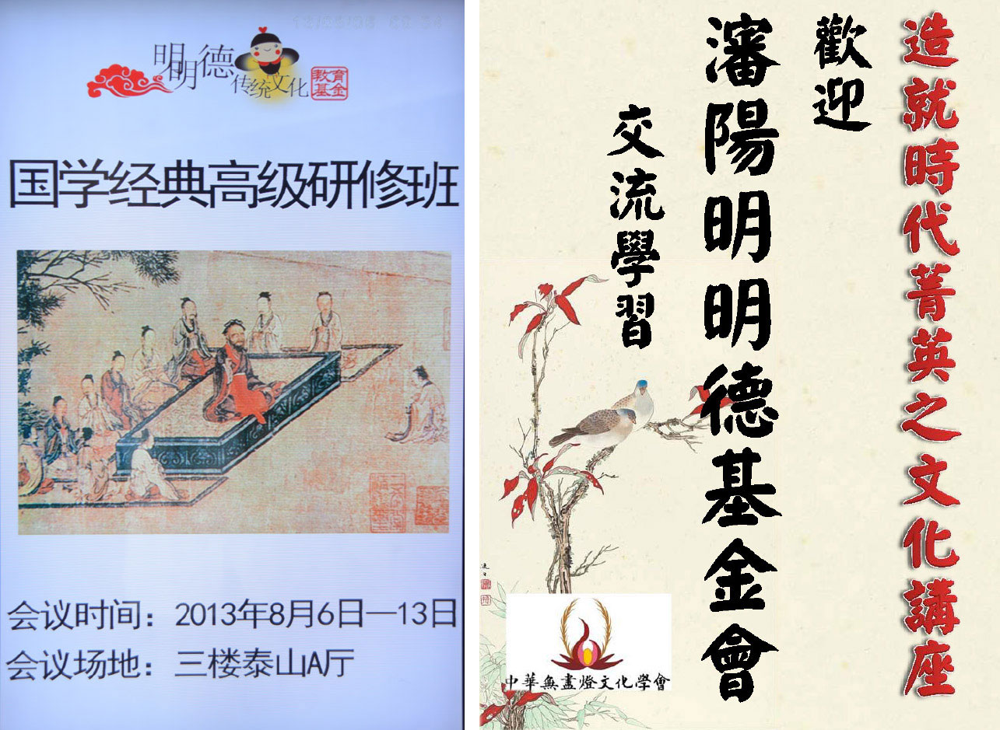

### 瀋陽國學講座與臺北造就時代菁英文化之旅

王興文

大清帝國發源地

而今重抱文化夢

點燃希望的火苗

光照神州孔聖人

瀋陽，對長期生長在臺灣的末學而言，是個遙遠又陌生之地，腦海中僅有模糊的歷史記憶，從未動念想過要如何？然而命運似乎是早有安排，就在去年（二○一三）八月中，臺北的中華無盡燈文化學會應瀋陽的明明德教育基金會之邀，遠赴當地舉辦國學經典講座，前後共十一天（含三日參訪），末學有幸隨同前往，並結了不解之緣。

從桃園國際機場起飛，三小時不到就抵達瀋陽機場，直接進入了歷史古都。由於抵達旅館時已是深夜，住宿旅館又位在新開發區，路上人煙稀少，黑夜中增添幾分神秘的色彩。隔日早上，來自瀋陽各地的校長及老師們約三百人陸續報到，在瀋陽市教育局領導的主持下，舉行了隆重的開訓典禮後，就正式展開了為期八天的講座。

課程內容包括（一）論語選講：從論語中擷取孔子自述其德學的相關章句，作成科判有系統的介紹孔子的德學內涵；（二）常禮舉要：選講常禮中的在校篇，說明常禮在現今社會的重要性；（三）詩階述唐：以國畫、相片、卡通、吟唱等多元方式，介紹桃花溪、聽蜀僧濬彈琴兩首唐詩；（四）圖畫賞析—道藝春秋：藉由江逸子老師的多幅精彩國畫，用以藝載道的方式，將中華文化的內涵和盤托出，寓教於藝；（六）孔門聖賢：以「孔門聖賢」影片為教材，逐一講述孔門十大弟子的特質與內涵；（七）孔子聖跡圖：以「孔子聖跡圖」的影片內容為依據，逐一介紹孔子一生的精彩事跡與意義；（八）影片欣賞：由唐老師將其多年精心收集的重要文化藝術影片，製作成精采片段播出，並詳加解說，提升大眾對文化的認知與欣賞能力。

講座中也特別安排了瀋陽師範大學的劉兆偉教授及遼寧大學的顧魁相校長分別作了兩場的精采專題演講。此次唐老師雖說是抱病參與講座，課程不敢安排過於緊湊，但內容精彩依舊，毫不鬆懈，令人敬佩與不忍。

這次講座雖有八門課程，實際上是以論語為主軸，約佔五分之三；而論語在一般人的刻版印象中是八股又無趣的，當初主辦單位也擔心參加講座的師長們，會不會因此坐不住而翹課，因為這在一般的講座中是常見的現象；然而令人訝異的是，講座期間不但無人缺課，更有師長們感動之餘，課後立即打電話通知親友們前來旁聽，真是出人意外，大眾的反應竟是如此的熱烈直率，這算是末學第一次見識到東北人的直率性格。

而在講座結束當天，由於行程更動，因此宣布提早一堂課結束，結果在座的所有人得知後都不願離去，連一堂課都不肯輕易放過，無論如何都要上完最後一堂才肯離開，真情感動了唐老師，終於排除萬難圓滿達成大眾心願，這是第二次見到了東北人的真性情，也見證了唐老師講課的風采與魅力，令人印象深刻；而論語的內涵與價值，以及雪廬老人的真知灼見，更令人不由得深深的佩服與景仰。

課程結束後，我們參觀了瀋陽名勝古蹟，包括瀋陽故宮、北陵（皇太極之陵），張學良故居等地。參訪古蹟也是文化學習的重要項目，所謂「讀萬卷書，行萬里路」，學以致用，對見地的開發與視野的擴展，都有莫大的助益。印象最深的是北陵與故宮：北陵完成於西元一六五一年，古稱昭陵，是清朝開國之君皇太極與孝端文皇后之墓，陵園佔地廣闊，古木參天，園內有一大湖，湖光盪漾，景色宜人，墓道兩旁，歷史遺蹟，隨處可見，令人發思古之幽情。

瀋陽故宮，建於西元一六二五年，距今亦有三百餘年歷史，史蹟歷歷，斑斑可考，駐足其間，遙想當年滿清盛況，如日中天，而今人物安在？令人唏噓，悵然若失。看著眼前景物，心中不禁浮起「滾滾長江東逝水，浪花淘盡英雄，是非成敗轉頭空，青山依舊在，幾度夕陽紅」的無限感慨。而浮生若夢，為歡幾何？何不以史為鑑，共效聖賢之志，齊將有限之生命化作無窮的力量，同轉文化之巨輪，駛向光明的未來，庶幾不負此生！想到此，心中豁然開朗，充滿無限的希望與快樂。

瀋陽之行最難忘的就是東北人的豪氣，隨處可見。舉凡談吐行為舉止，熱情大方，直率不拘，民族性強，凝聚力大，東北的大地孕育出來的民族特性，果然不同凡響，難怪滿清王朝能集少數民族之力，統治全中國近三百年，其來有自。難忘的東北歷史文化之旅，就在離情依依之下劃下了圓滿的句點。

然而，相隔不到四個月，就在去（二○一三）年的十二月十二日，瀋陽的明明德教育基金會劉會長，立刻又迫不及待的組成了一支十人文化參訪團前來臺北，開啟了中華無盡燈文化學會舉辦「造就時代菁英」文化講座的契機，同時也吸引了來自福建、浙江、遼寧、馬來西亞等地共約三十名的學員前來，共聚一堂，分享著又一次的文化饗宴。

這次講座前後共八天，除了五天的教室課程外，還包括三天的課外參訪行程，結合理論與實務，別具特色。

課程內容分別是：（１）論語選講，這次主題是介紹孔子德行科的四位弟子：顏淵、閔子騫、冉伯牛、仲弓，再加上孔子法脈的傳人—曾子；（２）常禮舉要，解說聚餐時的禮儀規範，同時另由中華無盡燈文化學會的人才班，以話劇的形式演說常禮中的訪人篇；（３）唐詩賞析：介紹杜甫的「返照」及「九日藍田崔氏莊」兩首詩；（４）國學經典與啟蒙內涵的介紹；（５）弘明幼教理念的簡介；（６）無盡燈文化學會的例行課程：法華經講座、人生大事—不能忽略的事實講座。（７）特別安排明明德教育基金會的劉奇會長，現身說法，給臺灣的年輕學員們上了一堂寶貴的人生經驗課，具有很大的啟發與鼓勵作用。（８）最後一天的最後一堂課，配合誠品講堂的「生而互聯，生而移動講座，邀請貴賓們參加最後一堂課：「All for One ,One for All.──人人媒體、物物互聯、網路附身、全幅跨界的想像與現實。」

此次前來參學的學員中，以現職的教師居多，其中多有從事幼教工作者，因仰慕臺灣的文化教育成就，希望到臺灣取經，除了學習有關的文化課程外，並盼望能到各校實地參訪，深入學習，做為日後改正之參考。為了達成心願，無盡燈文化學會特別安排了兩所學校，一所是在臺北天母的弘明幼稚園；另一所是位於南投名間的弘明實驗高中。

這兩所教育機構都是以雪廬老人的教育理念與內涵為依歸，具有崇高的教育理想與抱負，以德育為中心，經學為內涵，以培養健全的德智體群美之人才為目標。學校教職員工，都具有共同的理念，優良的文化傳統，高度的使命感和責任心，是現今社會不可多得的優秀教育團隊。

參訪首日，我們一行三十人，一早就來到臺北的弘明幼稚園，碰巧的在幼稚園門口遇到家長陸續把兒童送來上學，在家長離去時，我們見到四、五歲的幼兒們都主動的向父母親鞠躬道別說：「謝謝爸媽送我上學，請多保重！」，稚氣中充滿著天真可愛，舉止上天然無邪，毫無矯柔造作，好一幅溫馨動人的畫面，美好的場景，還未進入園內，卻早已被這感人的一幕，深深的吸引感動了，接下來的必然更有可觀。

果不其然，成功的背後，確有高明之處，全園上下，除具有高度的專業學養、愛心耐心之外，更重要的是具有深厚的文化內涵，正確的教育理念與目標：童蒙養正，以品德教育為核心，健全的人格發展為目標。舉凡穿衣吃飯無所不教，使從幼兒開始，就使其養成正確的生活習慣及自主能力；對同儕間的關係，上下左右的相處之道，尤其講究，使其從小養成兄友弟恭，助人為樂，互助合作的團隊精神；在體格的鍛鍊，美學、音樂的陶冶，以及科學、語言、樂器等的訓練，也都面面俱到，因材施教，務必使兒童們都能得到健全的人格發展。

大夥們在教室內外不停的來回穿梭，爭看著教室內外的一舉一動，許多人更拿出手機攝影、拍照等，紀錄上下課的所有實況，生怕有所遺漏。這一幕幕熱鬧的景象，與爭睹明星的丰采似曾相識，可見弘明幼兒園的教學成就是有目共睹。

次日清晨六點，我們一行四十餘人搭乘遊覽車南下，到南投名間參訪弘明實驗高中，先至弘明教育聯體機構的草屯校區，參觀由來自八個不同校區，不同年齡層的幼稚園兒童，表演各種形式的經書、古文、詩詞等的背誦。

不論是團體或個人，不管是上台或下台，動靜觀瞻，井然有序，對所背誦內容的純熟度、節奏感，以及團隊的默契等，也都表現的無懈可擊；兒童們各個衣著整潔，朝氣蓬勃，神泰自若，儼然小大人般，令人不敢小覷，若非有明師的指導與耐心的調教，絕無有如此傑出表現之可能，對這些背後默默付出的偉大教師們，心中不由得生起對他們崇高的敬意，這些兒童何其有幸，能從小生長在聖賢教育的環境中，得到良師的調教，心中不覺為他們感到慶幸。

當天由於行程緊湊，午餐就近安排在另一校區的教室裡，席開八桌，由弘明教育機構的創辦人兼董事長連志道女士招待。在教室聚餐是難忘的經驗，校區小而美，整潔乾淨，綠意盎然，教室佈置，典雅脫俗，井然有序；撤去課桌椅，擺上圓桌，鋪上桌布，稍加擺飾，立即化為高級餐廳，既無外人之喧囂夾雜，又有舒適高雅的空間，自在隨意，其樂融融，好不愜意。

連創辦人氣度恢弘，女中豪傑，為人風趣熱情，午餐一開始，便對大眾宣佈：「今天沒有常禮舉要」，真是善體人意，令人備感親切。與其說是午餐，毋寧說是午宴更為恰當，因為連女士為此特地請來一位餐廳大廚，是一位園長的先生，負責料理，菜單列有十道主菜，外加兩道點心與水果，道道豐盛，美味可口，色味俱佳，令人懷念不已。

連創辦人是雪廬老人之高足，內典班的成員，素有大志，不讓鬚眉；以繼承雪公遺志為畢生大願，十年前，不畏艱難，毅然投入教育的理想事業中，從無到有，一路走來備嘗艱辛。然而皇天不負苦心人，十年後卓然有成，已經建立一個完全依照中國傳統教育理想創立的教育機構，從幼兒的啟蒙教育開始，到小學、國中、高中的一貫教育體系與學習環境，目前學生總數超過千人，已有兩屆的高中畢業生進入各大學就讀，據校長陳火爐先生表示，他們在大學各方面的表現都很優秀，熱情合群、積極主動、樂觀進取、有自信、重規矩、守秩序，是他們的共同特質，也是大學教授及同學們所共同稱許的，令人欣慰。

午餐後，我們一行人來到了企盼已久的弘明實驗高中，車子一到，陳校長早已親率師生列隊歡迎我們於校園廣場，一下車，舞獅團與武術社的學生們立刻動起來，一時鑼鼓喧天，龍飛鳳舞，整個場面頓時熱絡起來，別開生面，好不熱鬧，令人印象深刻。簡報後，在展覽廳欣賞同學們職業級的各類才藝表演，包括古箏、鋼琴、吉他、二胡、曼陀羅的演奏，以及各國民謠與聲樂演唱等，都是學生們主動爭取演出的。同學們平時利用社團，以及少許的課餘時間練習，表現極為精彩，具有職業般的水準，潛力無窮，假以時日，必有可觀。

值得一提的是，這裡的學生，風采儀態，謙恭有禮，落落大方，氣質不凡；臉上充滿著朝氣，處處洋溢著快樂；這種特質在其他地方已經難得一見，沒料到竟在此地見到，令人欣慰臺灣還有此一教育樂土，一群教育鬥士，在此為傳承聖道，延續道統而奮鬥。在傳統教育理念下，以正知見培育出來的小孩，果然不同凡響，名不虛傳。

前往臺北故宮博物院參觀乾隆展，是此次文化之旅的重頭戲，雖然天公不作美，颳著寒風細雨，但大夥的熱情依舊，一早便抵達參觀。清高宗乾隆皇帝，大家都耳熟能詳，但大多普遍停留在歷史劇與文學創作的錯誤印象中，與實際的人物特質，相差極大。細看乾隆皇帝的詩詞書畫、筆記、著作等，不得不佩服其對中華文化了解之深廣，以及整理保存的用心，令我們由衷敬佩，肅然起敬；然而相對今日我們對中華文化之陌生、淺薄與漠視，實感到汗顏，無地自容。一邊看著故宮的古物書畫，一邊聆聽著唐老師的深度導覽，有如走在歷史的時空長廊，細細品茗般的享受，令人回味無窮，真是難得的藝術饗宴，也是難忘的歷史之旅，相信大家都會有此同感。

瀋陽之行與臺北講座，末學有幸全程參與，就記憶所及，信手塗鴉，誤謬難免，有失周全，不是之處尚祈見諒，後會有期！

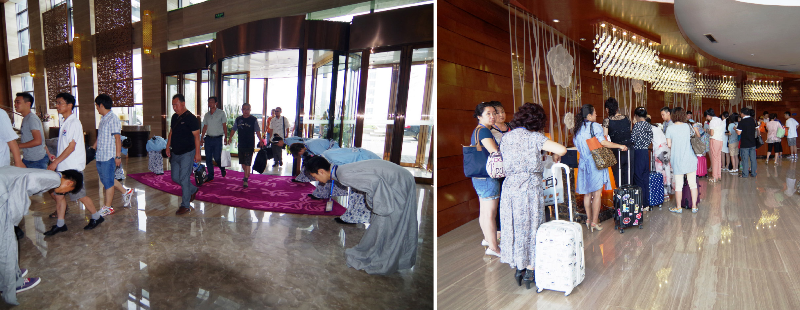

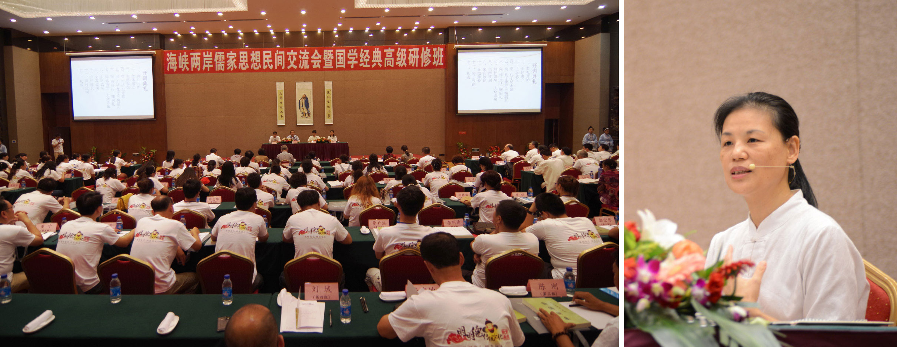

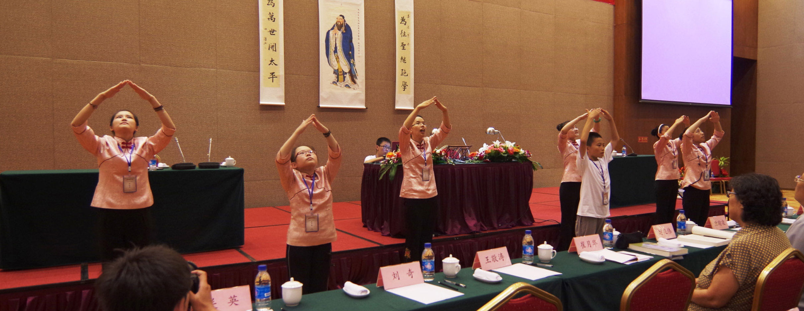

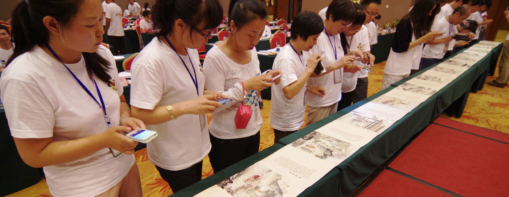

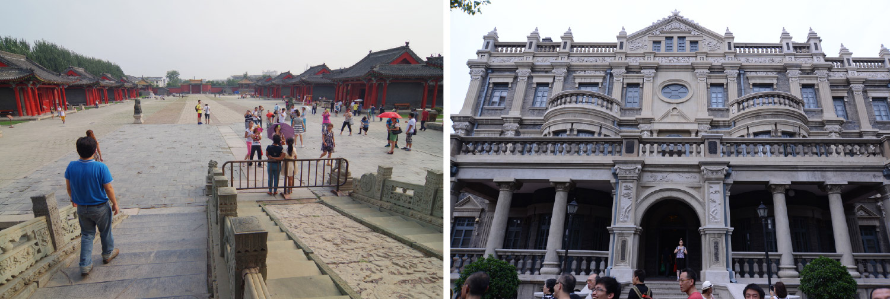

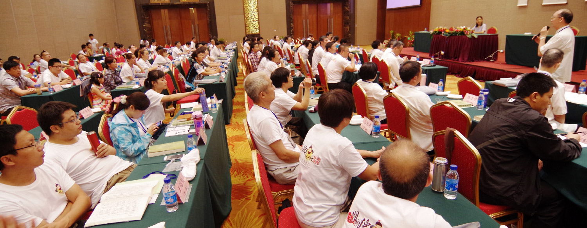

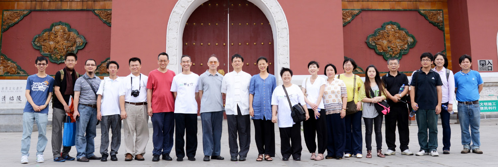

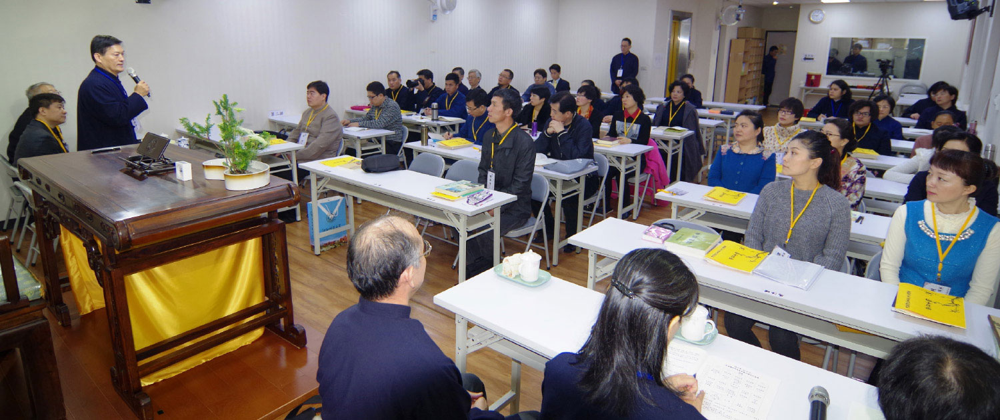

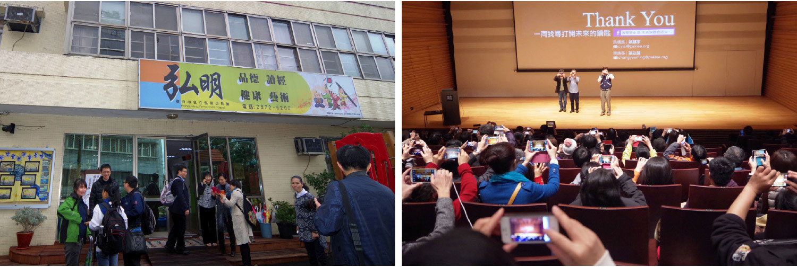

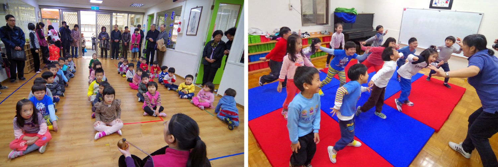

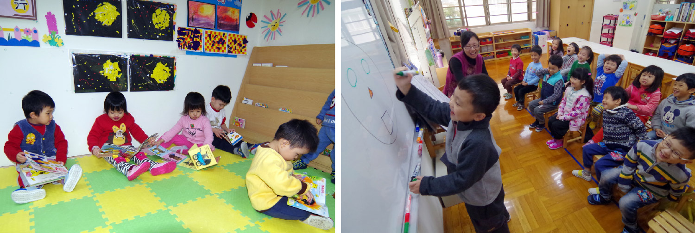

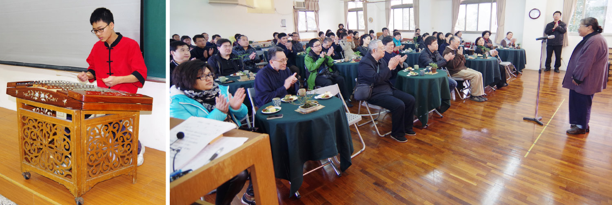

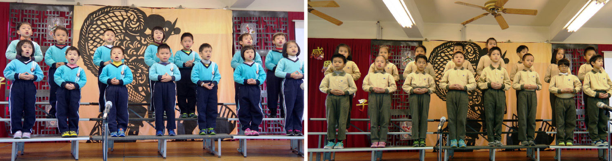

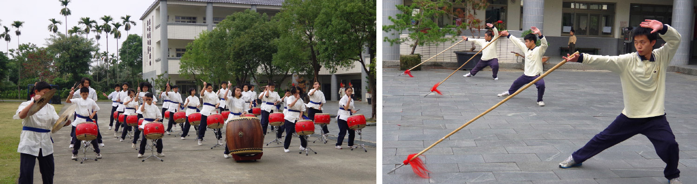

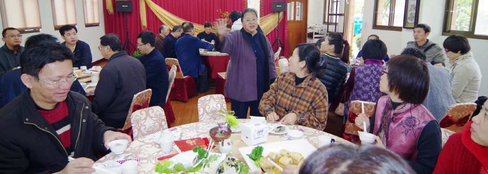

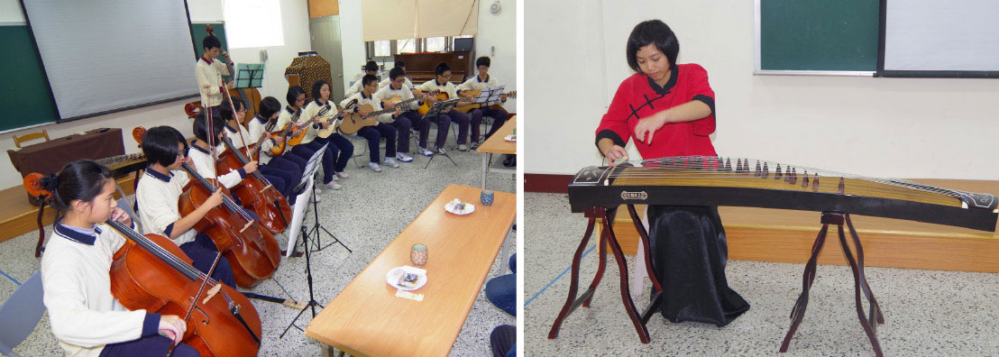

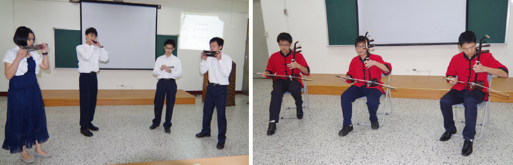

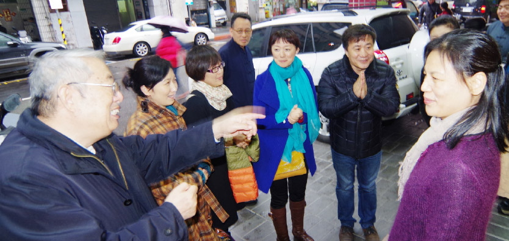

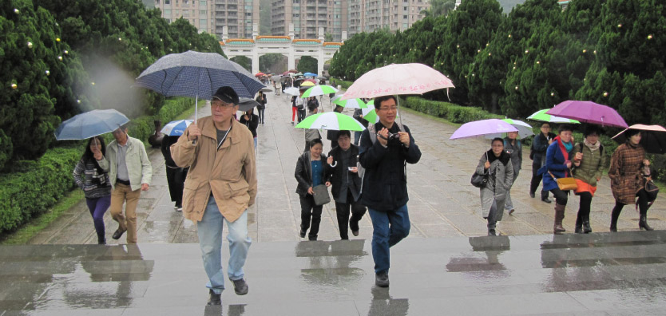

### 瀋陽國學講座暨臺北造就時代菁英講座　論語孔子德學介紹—孔子自述科判簡要分析

善慧講述

一代栖栖的聖者

不怨不尤惟天知

內聖外王是所學

大學中庸傳心法

在瀋陽的講座課程，論語部分所要闡述的孔子德學介紹—孔子自述，總共該有七十八條，這次節錄六十三條，孔子如何自己闡述自己的內涵，以德學來分類，德就是內在的涵養，並且是透過求學才有內在如此的涵養，依著內在的涵養，能夠自行、能夠化他，可以在順境當中增上，也可以在逆境當中不為所困。此處以自行、化他以及德、學來分類。

雪廬老人最擅長的就是將經文做架構的分析，並且分門別類的去分析觀察，科就是把內涵集合起來分科，判就是判其中的內涵，懂得這樣的分類，做人處世都是這樣的原則，頭腦很清楚，事理很明白，說話很精準。孔子調教弟子也是如此，讓弟子很有見地、理想以及氣度、抱負，入世的時候也能知進退，所以人才就是要這樣培養的，我們如果能夠瞭解，就能夠刷清我們對於傳統文化的誤解。當有讀書的能力，深入古籍，找到古籍的中心思想，讀懂古籍，弄懂古人真實的想法，才能真正的叫做學習文化、弘揚文化，否則充其量只是自己講講的文化，並未真實瞭解文化實際的樣貌。

這六十三條的章節，以科判來分析，整個架構第一條是總述成就次第，先整個說明孔子一生成就的次第，所節錄的就是為政第二的第四章，並且分門別類來說如何自行、如何化他。

第二部分是別明，分別說明又分兩部分，也就是約自行，以及約化他，孔子是有志於以德行來自行（利益自己），以德行來化他（度化他人），這是他人生的主要目標。

先約自己修學的部分，自行就是透過德學的行持來利益自己，當中分為德業與學業，也就是如何以德業、以學業來利益自己，最後用三條來彰明自行成就的樣貌。我們都會用很多的方式來利益自己，用名來利益自己，用利來利益自己，用榮華富貴來利益自己，但是孔子是用德來利益自己、以正知見的學來利益自己，這才是千古不傳的秘密，是人生真正的出路，我們都從枝末去尋找出路，殊不知以德、以學來充實自己，才是人生真正的出路，改變命運唯一的方法，當我立志充實正知見，命理學是完全不用相信的，孔子五十而知天命，那個可以改變天命的關鍵點在於「知」，改變命運就是在不斷的以正知見充實自己。

自行充實德業的部分，分為反顯、正明以及結示三方面，反面來凸顯，第一條約著孔子所厭惡的三件事情（陽貨篇第十八章），第二說明孔子認為羞恥的事情（公冶長篇第二十五章），第三是約避觀，規避不去觀看違禮之事，如逆祀（八佾篇第十章）以及居上無德（八佾篇第二十六章）這兩件事，第四約不願意諂媚的，也就是孔子不會去諂媚任何人，以八佾篇第十三章代表，第五約孔子不會去違背禮制，以子罕篇第十二章代表。

自行充實德業的正面來說，有其所好的，在禮上、在樂上、在道上，在仁上好樂，這些都是他內涵的充實，所以雪廬老人說「德」就是一種能力。在禮上欲禮流傳（八佾篇第十七章），並且正明必得要親自參加祭禮方得福報（八佾篇第十二章），在樂上所好的是盡善盡美的舜王之樂（述而篇第十四章），約道則樂道不慕富貴，不計榮華富貴，榮華富貴用不義的方式得到是災難的開始，這種要走後門、要巴結權貴、要行霸道、要用盡權謀的榮華富貴，孔子說這樣的富貴跟我是沒關係的（述而篇第十六章），正面來說求富貴的心態是以道為準，富貴必須與道相應，如果不能跟道相應，我寧可不要（述而篇第十二章）。約仁上的愛好，並且以此來充實自己（述而篇第三十章）。

自行充實德業的結示部分，乃德業成就之後的氣象，第一可以遠離他人的怨恨（衛靈公篇第十五章），第二是在入世中能夠知禮的分寸，即使違眾也不違禮的擇善固執（子罕篇第三章），第三平日如禱，也就是自我充實德業，遇到障礙求鬼神加被的那一分，孔子雖然平時並未事事禱，但因為言行不會違背天地神明，可以坦然面對天地鬼神，說其禱久矣（述而篇第三十五）。

約自行充實學業部分，亦分反誡、正明與結示。反誡共有兩條，乃避免自己不好好跟老師學，自己拚命終日無益的苦思，想要尋找一個出路，這種事情是無益的（衛靈公篇第三十一章），以及誡無知妄作，沒有好好的聽聞卻妄自創作（述而篇第二十八章與衛靈公篇第二十六章）。

自行充實學業的正明部分，乃學需有傳承，必得有文獻（八佾篇第九及第十四章），自己要發憤求學（述而篇第十九章），學習要善問、好問（八佾篇第十五章與鄉黨篇十二章），求學要用上心思，要講究求的方法、眼力、心態，稱為敏以求（述而篇第二十章），忠信的質地固然重要，好學是學業能成就的關鍵點（公冶長篇第二十八章），學習要具備聖者的內涵，並且通達人情世故（憲問篇第三十五章），並且舉出孔子所學習的典範，乃堯（泰伯篇第二十章）、舜（泰伯篇第十九章與衛靈公篇第五章）、禹（泰伯篇第二十二章）三位帝王。最後是必須具備抉擇善人善法的眼力，約人則是見賢思齊（述而篇第二十二章），約法則是敘述前人之學，信古之有道者（述而篇第一），並且讀通易經，來避免無心之過，趨吉避凶（述而篇第十九章），最後詳明廣學需有中心思想，以中心思想將所學貫穿(里仁篇第十五章以及衛靈公篇第三章）。

自行充實的結示部分，顯示孔子好學成就，由三方面說明，乃達禮（八佾第十一），博學（子罕篇第二章），以及夫子不但是聖人且多才藝（子罕篇第六章）。

最後孔子在德學的成就合說，第一乃警覺無常（子罕篇第十七章），精進無間（子罕篇第十九章），並且成就君子的行相（憲問篇第二十八章）。

接著約化他來說，也是約德、約學，然後合明化他達到的功效，約以德化他來說，正明內涵充實的目的是為了能辦政治、辦教育，令社會風氣達至大同（公冶長篇第二十六章），處世能敦倫盡份（子罕篇第十六章），並且有用人的眼力與知見，知道用人需講究質地（先進篇第一章），並且也能善巧以人需要仁甚於水火之比喻，勸人行仁道（衛靈公篇第三十五章）。反嘆夫子在度化天下蒼生時，亦有無可奈何之處，或他並沒有想要好好充實自己，凡事不用心考慮（衛靈公篇第十六章），或者聖者用盡折法、攝法去教化，但對方仍頑強固執不願意改變時（子罕篇第二十四章），約著想要以討伐齊國來幫助魯君，維持與齊國長久以來的和親友好關係並且警戒三家大夫，但是魯君懦弱無法作主，孔子也無可奈何（憲問篇第二十一章）。

約著學如何化他部分，第一部份是正樂，也就是孔子周遊列國回國之後，禮樂已經崩壞，孔子做了正樂這件事（子罕篇第十五章）。第二部分就是以學業教化生徒，分為收學生的條件，乃需備束脩之禮（述而篇第七章），更需有想要潔己增上之心（述而篇第二十九章）；孔子的教學方法分為攝法以及折法，攝法部分不但無所保留（述而篇第二十四章），並且重視啟發弟子的思考與悟性（述而篇第八章），又因著弟子不同的問題，不加任何情見的分析事理、利弊（子罕篇第八章）。教導弟子除用正面攝受之外，亦採用折法（陽貨第十七章）。而教化生徒是活潑且師資道合，不但學生得利，也能令教學相長（述而第二）。

約化他所產生的效益，安民不但能三年有成（子路篇第十章），並且能導正風俗使風俗淳厚，無有訴訟之事（顏淵篇第十三章），以無毀無譽的直道教化人民向善（衛靈公篇第二十五章），也提示弟子學道需離言而求，只要培養自己成就聖者的內涵，以這樣的能力化導天下蒼生，這是利他最重要的根本（陽貨篇第十九章）。在利益天下蒼生的時候，要時時反省，誡除夫子所憂懼的德不修、學不講、不徙義、改惡修善四件事（述而篇第三章）。

以上是簡要敘述孔子德學介紹—夫子自述之六十三章內涵，若能依此對論語產生興趣，對夫子的內涵生起好樂之心，組成讀書會，由論語開始深入中國經典，相信不但個人改變命運，內心得到出路，執起教鞭教導下一代，也能帶給學子們實質的幫助。

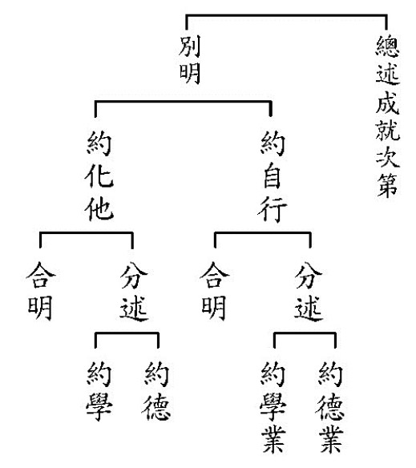

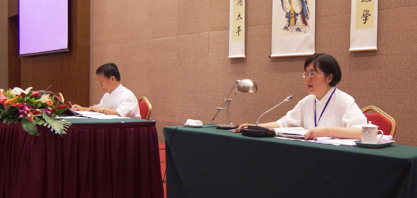

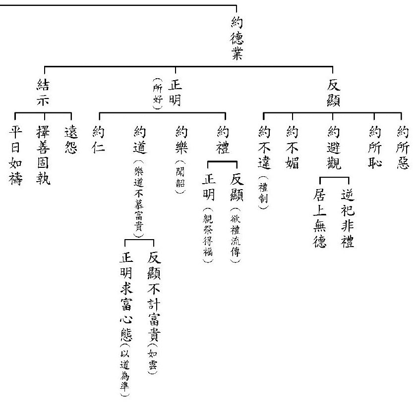

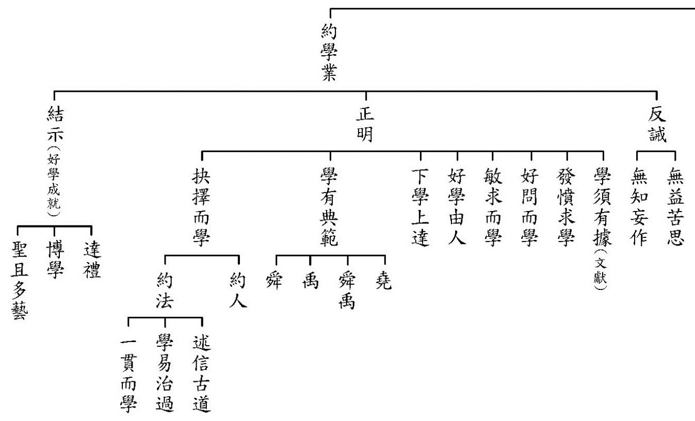

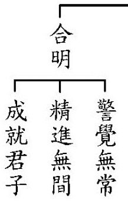

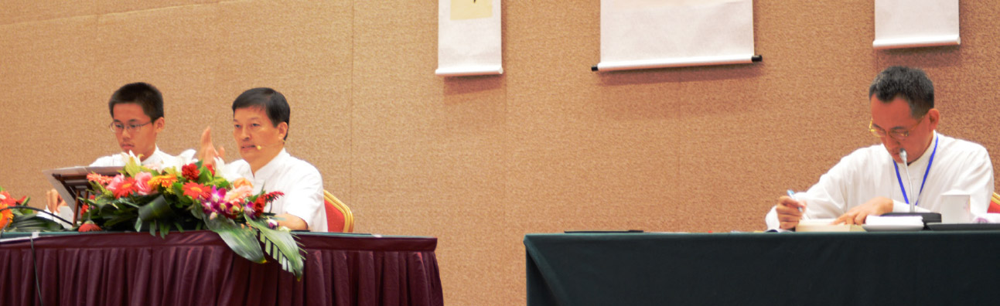

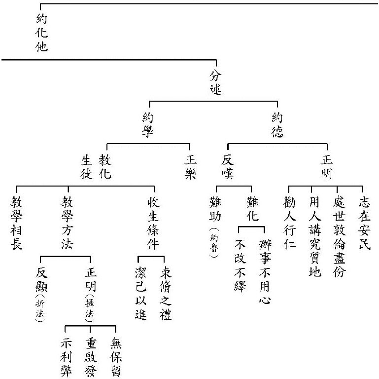

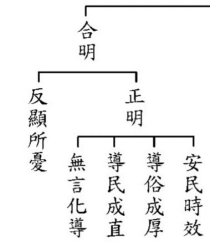

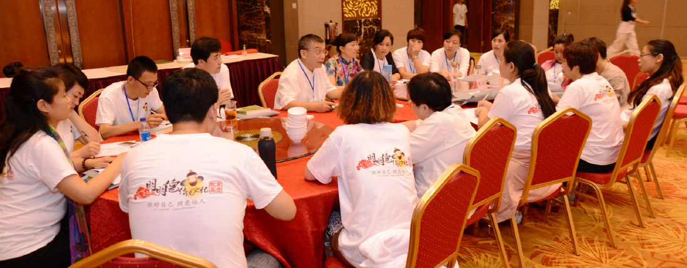

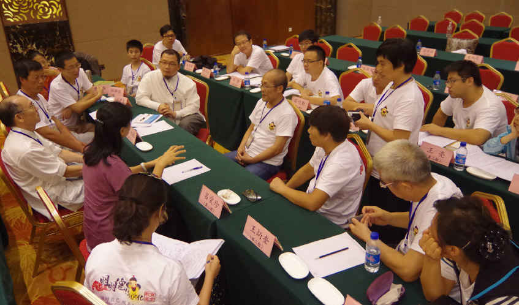

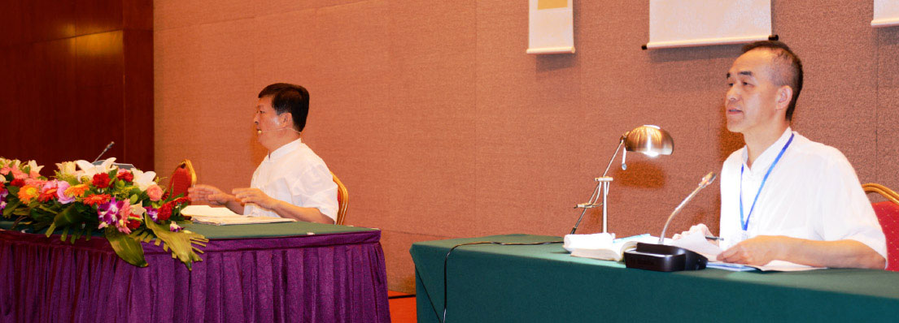

### 瀋陽國學講座暨臺北造就時代菁英講座　造就時代菁英講座開結訓

*編輯部整理*

相逢的火花　迸出格見地

典型在夙昔　古道照顏色

開訓典禮致詞

主席（中華無盡燈文化學會理事長）：

今天齊聚在這裡來辦理文化講座，內心非常高興，《論語》中云：有朋自遠方來，不亦樂乎！人生最快樂的就是共學，慚愧只學皮毛，承蒙諸位大德看得起，尤其是劉教授這樣的長者，令吾等誠惶誠恐。

為辦好講座，做了上課講義，也開了幾次會議，期盼五天共學能有不虛此行之感。

然身體有待復原，故此次講座，或在禮數上有招待不週之處，請多原諒。也請大家多多保重，身體健康才有本錢發揮，古人說：留得青山在，不怕沒柴燒。

總之在這五天的共學，課程上難免有所不足，生活上或照料不週，飲食或不合乎大家的口味，行程安排上或不能滿足於大家的需求，在此致歉，請多包涵。

其次，我們說中華文化到底是什麼？之前去某大學的國學中心，他們雖然有志於弘揚國學，但是負責人卻言他不知道國學真正的定義為何，其實國學就是中國的教育，是學習文化的典籍，根本處就是六經，有了經學的眼力，方知民族的中心思想，維繫民族不亡的要素。然如何要有經學的眼力？也與劉會長有共識，此即讀書會的經營，方能培養經學的人才，這是無可取代的核心價值。

有了眼力（出格的見地），品格才能成就。有句話說：有出格見地，方有千古品格；有千古品格，方有超方學問，有超方學問，方有蓋世文章。蓋世的文章不從超方的學問來，超方的學問不從千古的品格來，千古的品格不從出格的見地來，想要有好文章傳世是不可能的，想要有學問也不可能，想要有好的品格也不可能。孔子高出一般人之處就在於見地，這些都表現在他對六經的抉擇，所謂：刪詩書，定禮樂，贊周易，作春秋。而雪廬老人亦然，不但是論語的大家，也是經學的大家，醒公老師讚歎雪廬老人是名符其實的五經博士。

這位經學大家的內涵也有賴於我們這些做弟子的闡述，成為經學的見地，作為人生真正的出路。可惜所知太有限，只是萬古雲霄一羽毛，只好野人獻曝，抱著戒慎恐懼的心情辦好這五天的講座。

五天的講座期望幾方面的呈現，第一、呈現雪廬老人的內涵，那怕只是皮毛。第二、與辦事團隊，共同辦好這次講座，並接受批評與指教。第三、照料大家的生活，有賓至如歸之感。第四、以大專生排演《常禮舉要》。探討《常禮舉要》如何在現代推行，就是古書今用走入時代，成為大眾歡喜接受的內涵。

慚愧所學有限，看到老面孔內心非常高興，話不得體處請多包涵！

明明德基金會劉會長：

我們一行十二人來自瀋陽，這次就是專程來向唐老師學習，回應不到一年的機緣，覺得非常的幸運，因為能和唐老師追隨學習，這是我一生的幸運，在本溪聽過唐老師的講座，感覺受益匪淺。

這次我們來學習，再一次深入瞭解論語講要以及常禮舉要的精髓，也希望把這些精髓帶回去瀋陽，在我們遼寧，把這個精神弘揚，非常感謝唐老師的安排，感謝學會的精心安排。

本會：

劉會長是一位簡要詳明的人，劍及履及的人，是辦事非常精準的人，知道自己要做什麼，也知道自己的方向在哪裡，他知道自己該如何循序漸進，也能取得政府信任，在民間也得到許多支持。團隊成員形容他是：「願車馬，衣輕裘，與朋友共，敝之而無憾的人。」而這樣的人也是最容易凝聚團隊的人。

瀋陽大學劉教授：

（本會：榮幸有長者來指導，願以虛心就教的心情辦這五天的講座。）

唐老師太客氣了，我是學習團體的老成員，抱著非常虔誠的心情，來唐老師這裡做學習，唐老師到瀋陽去，匆匆地就回來了，在本溪講了七天，我也仔細的聽了七天，我這一輩子都在學，也學習了一輩子，但是在弘揚中華傳統文化這認知上，我還沒聽到比唐老師講得更好的課，所以這次我也來了，要好好學習。

中華大成孔學會張理事長：

很榮幸參加這次的講座，首先感謝兩位老師的慈悲，讓這次的講座能夠舉行，同時也感謝劉會長的發起，托他的福，舉辦這次的講座，也感謝遠道而來的貴賓。

看了這次編的講義，所談的內容是孔門十哲當中的內涵，主題等於是聖賢人。朱子說：讀書志在聖賢。可是我們現在已經不曉得聖賢長什麼樣子了，所以這次老師把聖賢的樣子，從論語當中找出來，做一個很好學習的基礎，很好的學習榜樣。

今天在座很多都是教職人員，或者將來想從事教育工作。有這些聖賢的典範，在教育下一代時，知引導的歸趣。在此也感謝二位老師，讓我們找到模範，是學習論語的方向。最後祝福此次講座成功，謝謝！

中華無盡燈文化學會教學總監：

學會舉辦講座主題皆圍繞雪廬老人儒家思想，以《論語》為主軸，配合詩禮樂教育相關課程。

延續瀋陽《論語》選章「孔子德學介紹」後，此次講述孔子弟子的內涵，題目是「造就時代菁英—從孔門弟子德行科說起」，作為此次講座的課程主軸。其他課程也不離開《論語》德行科及傳承的內涵，讓我們循著《論語》的篇章進入國學的精髓。

搭配教育體系的課程，進一步落實《常禮舉要》聚餐及訪人篇的學習，此次也邀請學會大專學長們參與教學，以別開生面的方式來呈現活活潑潑的禮，敬請多多指教。

另外在雪廬老人經學的內涵當中，很重要的一個部分就是唐詩，溫柔敦厚詩教也，從詩文中可以體會人情，此次講述「返照」、「九日藍田崔氏莊」兩首杜甫的詩，來體驗中國詩聖的內涵，並配合故宮乾隆展中展出「返照」、「藍水遠從千澗落，玉山高並兩峰寒」的兩幅國畫，由詩境入畫境。

另開設「弘明幼教理念」及「國學經典啟蒙課程」，介紹啟蒙教育與經典結合教育內涵。我們也請到劉會長向大專同學講述「做好中國人，共鑄中國夢」。另外本會一些固定的課程，如法華經講座、中庸講座、週六共修研學課程等，也祈請大家參與。以上是此次課程簡單報告。

結訓致詞

主席（中華無盡燈文化學會理事長）：

聽到大家的心得，真是愧不敢當，其實這只是雪廬老人的鴻毛麟爪。

這次主題是造就時代的菁英，其實是共同勉勵的目標，烘托的是中華文化能夠造就時代的菁英。我們雖無此能力，但願接受磨練與成長。課堂中訓練師資團隊的膽識，及測驗備課對經義有否深入，以對話的方式增加聽眾上課的樂趣。

佩服劉教授長者的風範，劉會長的理想與抱負，遠道而來的同伴安定的學習。

願以正知見經營團隊，重在培養人才，然最辛苦的莫過於此，所以劉會長的苦日子才正要開始，不過，當苦日子過慣了，也會比別人更能享受快樂。

臺灣對比大陸是偏於一隅的彈丸之地，乃海外之孤島，幸好有諸多德學兼備之善知識，飄洋過海莊嚴此處成為寶島。

如何學好文化深厚的內涵，其實是很難的，這裡面需要耐心、時間。五天的共學，不過淺嘗《論語講要》與雪廬老人解經的內涵。講座後的參訪行程，亦盼大家法喜充滿，快樂平安。

明明德基金會劉會長：

尊敬的唐老師、林老師、劉老！剛才腦海裡面一直浮上一句話：士不可不弘毅，任重而道遠！聽完唐老師的一番話之後，確實感受到老師賦予的使命，自己覺得受益匪淺，我相信各位同仁都有這樣的感受。

兩岸文化的交流，是為了中華文化之復興，所在這裡所聆聽的都是聖賢的教誨，明明德也肩負著一個使命，這兩天一直聽到老師反覆的講明明德的意涵，令人感動，必得明明德基金會確實要有這樣的使命。唐老師這幾天身體不好，心中一直在祝福，希望身體健康，福壽綿長，我們每一次都會珍惜跟老師學習的機會，並將老師的教誨深藏於心，在工作中盡上自己一份力。

將帶著在無盡燈學會所學來的內涵與體會帶回大陸，特別下個月在北京的講座，成員來自全國三百多名各地組織的領導，包括企業家與各地知名的老師，大會安排我一個演講，我就下定決心要把在臺灣所見所聞給展現出來，讓大家看到方向。

《論語》這本書是一個法寶，要不斷地讀，更要不斷地理解，在我心中還是那句話，它是我們中國人一本聖經，有幸跟唐老師學習到這麼生動的孔子，上一次在瀋陽辦講座結束之後，感覺孔子就要回來了，此次體會更深，願將所學帶回利益大陸同胞。並感謝學會在生活上對我們的照顧。也感謝這次福建，浙江的朋友們，我們共同走過五天的學習，學到的太多了。

中華無盡燈文化學會教學總監：

講座非常快地過去，五天時間雖短，但能概括地瞭解孔門五位賢者的內涵實屬不易，希望能再次引發各位對於《論語講要》學習的興趣與增上。

這幾天一起在研學上建立同法者的關係，我們都像孔子流落在外的孩子們，現在要找回家的路，首先必須還原孔子的內涵，深入他的知見，才能夠找到回家的路。雪廬老人曾說過所謂「數典忘祖」者須有數典的能力，也就是還能夠數一數經典的內涵，才談得上「忘」，而吾人或許從來不明瞭祖先的內涵，從不知道身為一個中國人應有的內涵，連忘祖的資格都還談不上，所以如何還原孔子的內涵是當務之急。

此次選講唐詩「返照」，其實有一個想法想分享，如佛法在世間，分成正法、象法、末法、滅法，而進入末法的時候，就像日落西山，現在文化正處於返照的末法時期，在此危急存亡的關鍵時刻，必須結合有志之士，共同研讀經教，傳承老祖宗的智慧，這才能夠期待文化的朝陽再次生起，如此中華文化才能真正再次照亮所有的人。

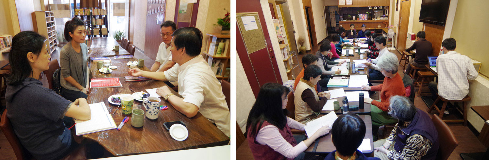

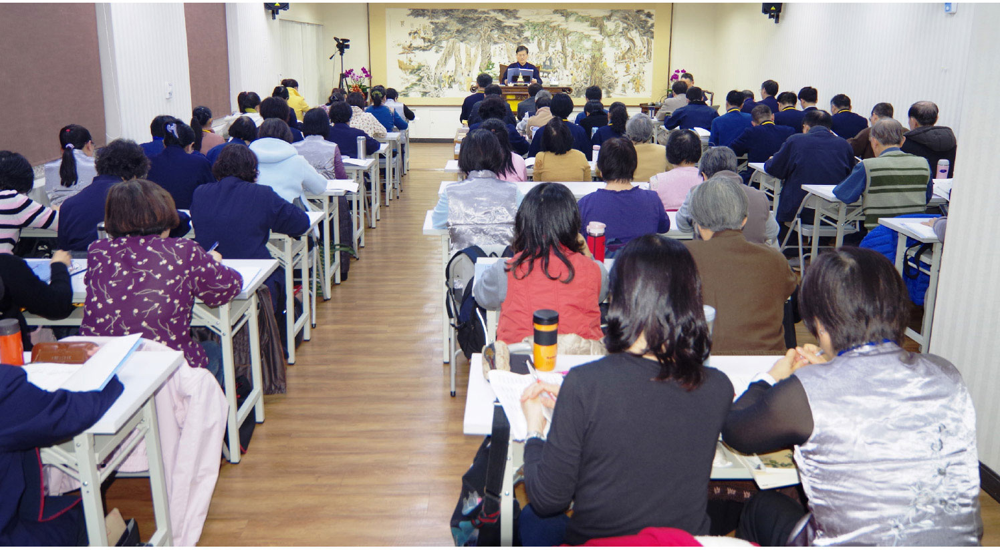

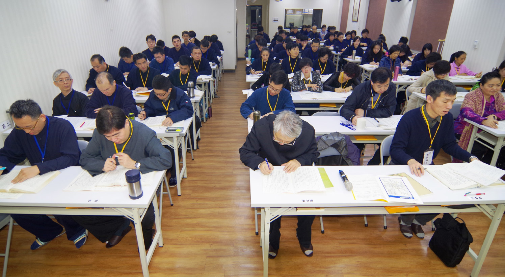

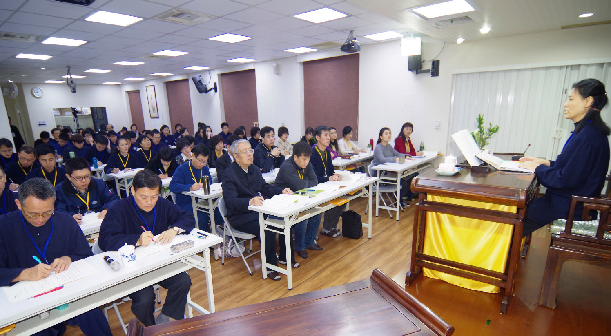

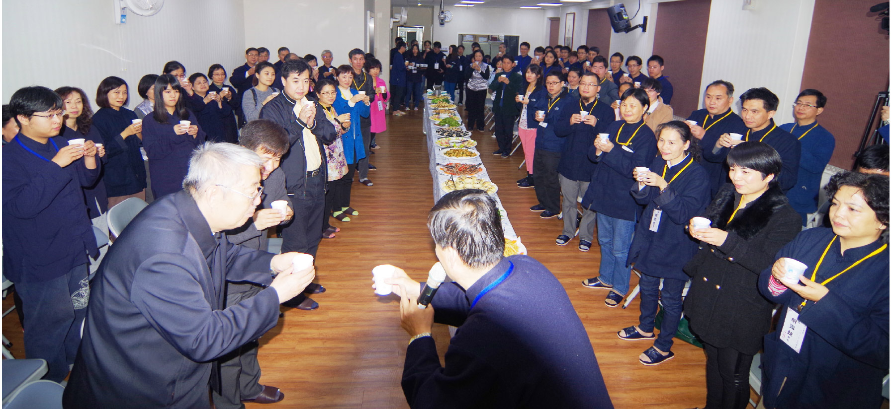

### 瀋陽國學講座暨臺北造就時代菁英講座　造就時代菁英講座心得分享

*編輯部整理*

善根來自努力學習

多看多聽多學多思

腦力經過一番激盪

前所未有心得呈現

無盡燈　　吳錫堂

八月初，隨師長們到瀋陽參與「海峽儒家思想民間交流暨國學經典高級研修班」的研習，並於研習課程結束後，另至遼寧、山東數個地方參訪。在讚歎近年來經濟發展所呈現的成就時，特別銘刻在內心的有兩個地方，一是瀋陽故宮，另一是研習會場。

繞完瀋陽故宮，內心很慶幸自己是生於現代，尋常百姓家所能得的生活享受真比帝王將相舒適太多了。然而，從這沒有什麼可資享受的皇宮，皇太極卻能以之建國，並開啟清朝的一段盛世。觀其建築，非以雕刻畫棟取顯，而以融合五族文化特色為主體，在小小的宮殿裡面顯示出不凡的格局氣度。

在研習會場裡，很訝異有那麼多人從遙遠的各處到此參與早被認為非主流顯學的論語講座。師長學長們的用心情形在他處是很罕見的。研習期間，屢次與師長學長們交談，皆謂以越聽聞越生歡喜之心，生怕有隻字片語之錯漏，就其而言，這是一次非常愉悅的體驗，竟是由學習聽聞而起。

十二月中旬在學會開辦的「造就時代菁英文化講座」，基本上是延續前次研習而來。囿於學會場地的狹隘，無法容納更多的同法者是美中不足之處。此次的講座主題，在造就時代菁英文化、在傳承道統，這是延續中華文化道統非常重要的課題。要成為人才必須好學，向善知識學，但何者方得稱善知識？善知識是具能傳承文化道統者，與之向學方能成就自己。有賴明明德基金會劉奇會長發心欲找好老師、尋覓正知見，奔走世界各地，終有機緣覓尋傳承中華文化道統之雪廬老人一脈，也促成了兩次的研習會。

師長中，瀋陽師範大學劉兆偉教授是一位令人尊敬的長者，雖已自學校退休，但仍孜孜不倦的學習，不厭其煩提攜後進，時時為弘揚中華文化道統而努力著，殊堪效法。

今日我等不斷的研習孔門經典，非僅己身受益，更冀望能栽培出文化的大受之才、有見地之菁英。雪廬老人曾謂：「只要出一大儒，社會風氣必變」。研習會結束不是就此停息，而是要更努力地修學，來自瀋陽、吉林、浙江、順昌、福州及馬來西亞的師長、學長們，讓我們以之持續共勉。

瀋陽講座會後勸勉之言　　瀋陽劉兆偉教授

此次二位教授，以及這次講座的成辦者，同樣有著高度的責任感以及承擔精神，承擔著文化復興的重要任務與義務。他們由衷地、溢於言表地來展示了那種復興中華民族優秀文化的業程和執著，這一點是值得我由衷地佩服和欽佩的。

二位教授以及台灣學者一行，他們在研究學問問題上，尤其是唐教授在講課過程中是字字確鑿、字字較真，這在做學問上個人認為是漢代遺風。然而唐教授的學問不只漢代遺風，對宋學有益部份的吸納與弘揚也得到了充分的展示，也就是說唐教授在講課過程中強調史實的準確，真是一絲不苟，堅決反對脫離實際，脫離社會，反對與時俱進這樣的一些學風，所以毫無偏頗，做到了中正、中庸之道，這本身就是在弘揚了中華民族的優秀文化當中的好的學風，字字較真，字字求真，字字問為什麼，再問為什麼，再問為什麼，三個為什麼，所以可以說《論語》講得透、講得深，這是我不及的，我沒到這個程度，我還限於第一個「為什麼」上，所以在今後的工作教學當中我也要爭取做到第二個「為什麼」，第三個「為什麼」，要很好地解答，這是第二點。

讓我尤為感動的，唐教授、林教授充分展示了師道尊嚴、師道的正風正氣，也為我們做了表率，做教師的就應該充滿浩然正氣。這個正氣是哪裡來的？不是自己裝出來的，充出來的，而是自己一遍遍、點點滴滴的修養積累幾十年所致。所以我們作為好教師，就應該點點滴滴、正風正氣地充實自己，才能夠學唐教授、林教授於「萬一」。

而唐教授在講課當中，使我最感動的是講李炳南老教授，他的楷模風懷，傳給大家，大家至今尚有師生之誼，師生深厚的情感。尤其是紀錄片展示的李炳南老教授去世前一年，眾弟子陪侍他去郊外旅遊，去看山水風光，九十幾歲的老人坐在船頭上，大家在兩岸踏歌，充分展示了我們中華民族優秀傳統文化的師德、師生之誼、師道傳承，這一點是值得我學習的。

我是研究教育史的，我還比較重視傳統文化，還比較重視師道，但做得遠遠不夠，對我的老師也能夠教師節、春節去看望，我的小學老師還在，我的初中老師還在，高中老師春節時候還在，現在不得而知，打電話沒有通，也就沒再過問，我最好的大學老師去世了，我幾次找他的孩子想去拜祭，但至今還不知道他的墳墓在哪裡，比較起來我是多麼的慚愧，所以這對我來說是一個重大的教育，我深深的體會到了這種真實的師生之誼，這種人的真性，人的善性的本真，通過唐教授的講課傳授給我們，尤其感染了我這一個年齡比較大的老學員，我深受其益。

以上這幾個方面我認為是最為主要的，對我來說。除此之外，我沒有仔細地聽林老師講的唐詩，唱的唐詩，我只是在外面聽了一些，我覺得這個方面也會給我們帶來了文化藝術的珍存，也會帶來文學上的真正意義。我們只講文學藝術陶冶情操，如何才能陶冶，什麼樣的藝術才能陶冶，什麼樣的情感，什麼樣的韻味、韻律、情義、情感到什麼程度，才能陶冶人、影響人，才能做到我們古聖先賢所說的風之、化之、薰之、陶之，我覺得這兩天唐老師和林老師的課起到了風之、化之、薰之、陶之的作用，我自己是有深切的感受的。

我雖然七十有餘，但孔子曰：「君子疾沒世而名不稱焉」，君子怕的是一個人的末期名不符實，我被學校評為教授，但夠不夠教授啊？現在看來有許多的不足。雖然評為我是一個比較好的教師，但我還是要繼續努力，把台灣學者有益的思想、觀點、學問好好學來充實自己，即使年紀再大，也要成為一個合格的好教師，這是我的願望。但作為老教師，也不能迴避自己的缺點，不能迴避自己的矛盾，儘管自己覺得還有不足，但也要把自己的不足展示給大家以取得大家的批評指正。

讀書會有感　　瀋陽教育廳長助理　葛洪源

唐老師：您好！今去信向您彙報我們瀋陽學生的學習心得和體會。

跟隨高老師學習《論語》十幾天，心中的歡喜常常生起。過去自己讀《論語》時，不理解爲什麽孔夫子明知「道之不行」，卻「知其不可而爲之」，率衆弟子遊說列國十四年；不理解爲什麽孔夫子積極入世，屢不見用，卻能夠「不怨天、不尤人、下學上達」，心態極爲平和。高老師耐心的講解，讓我們知道了夫子周遊名爲行王道，實爲培養弟子，爲文化集大成鋪排。我們百思不得其解的諸多困惑如今雲開霧散。

堯帝「允執厥中」的聖訓，顔子「不遷怒」的修養，曾子「忠恕而已矣」的善巧，如此之類聖賢「執兩用中」的閑熟，原來都源于形而上的智慧攝持形而下的事理，我們心中多年的滯澀一朝豁然貫通。

在高老師引導下，我們漸學漸進，越來越領悟到您開示的「正知見」的重要意義，越來越領悟到形而上的智慧沒有老師在旁，果真是學不來的。世風雖然日下，但有老師在，「文武之道未墜于地」，我們滿懷信心聞足善道。

每堂課，慢慢咀嚼，在口齒留芳中感受《論語》的醇美；每一天，不斷串習，在格物致知中感受《論語》的至善。這樣醇美至善的意境他處已尋無可尋，我們期盼再有機緣聆聽您和高老師的教誨。

馬沐僮

二○一三年十二月十二日臺灣之行，是我從事旅遊行業以來最有意義、最有價值、最為珍貴的旅行。這是一次增長智慧之旅、增長學識之旅、重新點燃生命之旅。

回首那一日日一幕幕，真的有很多的感言：下飛機時所看到親人們的笑臉；下榻酒店房間裡的溫馨提示；上課下課老師們的噓寒問暖；口口入食的美味暖人心田；臺灣學長們榜樣的展現；設計餐前觀修的用心良苦；科技前瞻的超前視角；乾隆大展的大開眼界；老師的教導與知識授予；遊學時的學行並用；離別之時佳品饋贈與貼心甜點等等……，處處都是那樣的盡善盡美，觸動我的心靈。無處不在的熱情讓這次的學習充滿了歡喜和感動。

末學所學到的不僅僅是論語範疇的知識，還有智慧的種子在我的腦海裡播種，讓我清楚地建立了在有限的生命裡如何去生活的見諦。顏淵的淡泊精進，博而不傲。子路的忠義魯莽。孔子對弟子的諄諄教誨生動的呈現後人，孔門先賢的品德，如此的文化瑰寶都深刻的教育了我引領著我。讓我學會放下的胸懷、釋然的豁達、勤儉的珍貴、精進的意義、仁心的德善、傳承的責任。只有這樣的人不爭利獲取，處事以善讓為先、以仁心德厚做人、學無止境的謙卑並有利他傳承的責任，這才是最為幸福的、活出生命意義的人生，這才是積福積德之人！「我要成為這樣的人」，這是我的決心，是此次學習最大的收穫。

傳統文化需要傳承，而傳承不僅僅是拉幫結夥的學習和只為了武裝自己與淨化心靈，不僅僅是口口相傳和勸解求同。傳承需要生根發芽，從小培養從兒時學起，從園丁傳教開始來改善這個社會。末學這樣的所感所思都來自於弘明學校和幼稚園的所見所聞，讓末學知道培養人才的重要，培養仁心的可貴。感恩這份因緣很幸運的加入明明德的大家庭，有機會這樣的學習成長，末學倍感珍惜。末學將把自己視作未來的人才，精進的學習融於行動。這才是對唐老師及明明德最好的回報。使之對傳承傳統文化貢獻自己綿薄之力。

在這十天的生活裡，末學用心的觀察著學會的各項接待工作。組織架構清晰，訓練有素，這一切的背後體現了每位老師待人的真心誠摯。以這樣的仁心善愛對人，一定呈現的是溫暖與優秀品德的交融。如若是為了工作而做那是自私為己的，那樣即便展現「禮」，也一定呈現不了「敬」，那樣的「禮」便是浮華。一邊學習寶典一邊學習榜樣，這樣才是最好的學習。學會氣象讓末學感到肅然起敬。每一位老師都以學會為家，視自己是大家庭的主人。事事關聯自己，處處以學會的利益出發，如此忘我的精神深深刻印在我的心裡。末學認為使我們感動的行為便是最好的感召，自身的修為是對社會最好的展示。

探索科技前瞻，觀覽乾隆大展，古代與當代的對比衝擊著我的內心。當今科技所帶給人類的生活模式與思想邏輯發生了很大很快的變化。如何面對這樣的衝擊與挑戰？無論科技怎樣的迅速發展，德心仁厚一定是發展的基礎和根本。這樣的發展才是向善的有價值的。老祖宗所留下的瑰寶是保護人類的文化武器，我們應該好好學習發揚，方能創建美麗的和諧家園。

一切的美好創造從自己的改變開始，見地決定命運。內心的喜悅來自於此次的學習收穫，好像看見了眼前的星光大道，這條學習與弘揚傳統文化的路就是我一生的路。

臺灣文化之旅感悟　　齊威

回瀋陽已數天，心情久久不能平靜，在臺灣的一幕一幕，總是不經意間在腦海浮現。雖然沒有遊歷聞名遐邇的那些自然景觀，但是，所收穫的文化內涵，已經將我的內心充滿。

有朋自遠方來，不亦樂乎？我們做為從遠方來的友人，深刻的體會到了臺灣同仁的熱情，從接機的那一刻起，直到送機過關，我們時刻都被這種熱情所包圍。從酒店的導引桌牌，落雨的清晨及時送到賓館的雨傘，遊覽行程的安排以及陪同，處處都做到了細緻入微。在此向臺灣的各位老師表示誠摯的謝意並深深的鞠躬。

此次臺灣之行，首先收穫的是文化內涵，唐老師的《論語》講習，依然是最吸引我的地方，您那種在談笑間就能把儒家的內涵娓娓道來的功夫，令我十分欽佩，更是我心嚮往之的一種儒者的生命狀態！我個人研習《論語》已經有幾年時間了，這次收穫最大的地方，就是對顏回生命狀態的瞭解更深入了：他一直活在超越的生命境界裡，給後世留下了一個好學的榜樣。孔子讚歎顏回的好學，先前一直不能體悟只是好學而不出仕，他的生命價值對現實社會的利益在哪裡體現？如何向現代人宣傳顏回，如何能讓他們接受顏回，是一直以來困擾我的問題。現在似乎有了答案：好學直接可以入道！所謂：「朝聞道，夕死可矣！」顏回的價值本來就不是現實世界價值的價值！不知道這樣的理解是否可取？請老師們指正。

聽唐老師關於《乾隆展》的講解，對內涵二字有了更深的認識—唯有有內涵者方能發現內涵、開啟內涵！唐老師不但通達經典，而且對於歷史文物內涵的瞭解，更是讓我歎為觀止！參觀《乾隆展》若沒有唐老師的講解，對我來說，就又是一場走馬觀花，看看熱鬧而已。但是，看過之後，個人也產生了疑惑，乾隆號稱「十全皇帝」，那他真正把握到儒家治世的內涵了嗎？明朝中葉以後中華大地上已經有了文藝和科技大發展的基礎，可是，從滿清入關統治中原就大興「文字獄」，康、雍、乾三朝是愈演愈烈，冤死之人不計其數，其中不乏才華橫溢之士。在此種情況下，對內許多自由的思想，高明的創建都被壓制，對外又實行閉關鎖國。清朝所統治二百多年，正是西方的文藝復興大發展的二百多年，造就了西方的工業文明，如果從整個人類歷史來看，乾隆皇帝和整個清朝的歷史是拖了中華民族發展的後腿的。不知道這樣的見解是否可取？請老師們指正。

這次來臺灣還有的一個最大的感受，就是發現老師們都過著一種儒者的生活，包括為我們提供各種服務的人，你們都過著一種心靈的生活！每天看到你們的第一眼就是滿臉的笑意，毫無造作，那就是你們心靈的外放，我感受得到的；你們可以把樓上、樓下、走廊、包括洗手間在內，都安排的很雅致：精美的插花無處不在；怡人的熏香遍佈虛空；課間的小食美味可口；香濃的咖啡甚是提神；素食的正餐，無論是顏色、造型、香氣、口感都讓我想起來就流口水……

想說的還有很多，但最想表達的就是感恩，感恩中華民族的祖宗有德，在臺灣保留下了一支中華文化的正脈；感恩劉會長融匯兩岸文化的宏願，使我們有這次臺灣訪學之行；感恩唐老師、林老師，以及無盡燈學會全體同仁的真誠相待、無私教誨！

末學雖然不敏，但已立志，立志將夫子之學作為自己終身之學，若有餘力，也希望自己能做一些弘揚和宣導工作，以不愧天地、祖先、父母。所以，懇請無盡燈學會的諸位老師能常常不吝賜教。感恩！

臺灣之行學習彙報　　賈廣海

非常感恩明明德傳統文化基金會會長劉奇先生發心，組織臺灣學習團隊，能夠再次當面聆聽唐老師、林老師及無盡燈學會諸位老師講授《論語》、《常禮舉要》等傳統文化經典。此次學習，收穫頗豐，謹彙報如下：

一．強化了一個「人才」觀念

在開班典禮、《論語講要》授課過程中以及結業式上，老師多次強調「有千古的見地，才有千古的品格；有千古的品格，才有千古的學問；有千古的學問，才有蓋世的文章」，以此來宣示研學《論語》的一個重要內涵，兼以激勵我們這些後學。授課之中，老師更累次提到孔子的使命與其說在傳承文化，其實更著意於培養人才。老師甚至直截了當地開示：「學習，是為了成為聖賢。」所有這些，再聯繫到這次學習班的主題詞「造就時代菁英」，就不難理解老師的良苦用心以及對我們這些來自大陸不同省份的後學寄予的期望。

末學雖資質愚鈍，根基甚淺，但在聽課學習的幾天裡，老師的教誨反復歷耳，則不免有所悟，提起一種信念：一定要潛心鑽研，與各位同道同修共參，尤其是充分利用老師當面傳授的福報機緣，不斷精進，成為足以在文化傳承上影響一隅甚至一方的「人才」。尤其是末學有幸從事教育工作，更有責任，也更有便宜，以善巧方便，襄助救化荒蠻的人心。

從何處著力？就從培養見地著力。

老師說：「人之有志，如樹之有根，如水之有源。」末學當以為自勉，把根源培養起來，蘊蓄起來，必求成長流布。

二．仿效「無盡燈學會」各位老師、學長，致力於「明明德讀書會」的發展。

在臺灣十日裡，從高老師、張先生等諸位老師、學長在桃園機場接機開始，一直到又把我們送回桃園機場踏上返程，以及十日中在學會上課學習，舉辦茶會，觀聽誠品的講座，考察臺北弘明幼稚園，遊慈航寺，考察台中弘明幼稚園、實驗高中，觀覽故宮博物院乾隆畫展，遊覽陽明山蔣先生故居等，學會各位老師、學長各司其職，密切配合，給予我們無微不至的照顧，末學除了深深感激，更體會到各位俱以「無盡燈」為家，歡喜做事，發心為人，遂暗想自己，當仿效「無盡燈」各位老師、學長，在「明明德」今後的發展中，以主人心態積極加入其中，也歡喜做事，發心為人。

三．一些細節的內心體會

１．「子曰：回也，非助我者也，於吾言無所不說」章，老師闡明課堂發問法有四種：不懂問，疑惑問，求證問，代發問。末學即受啟發，應在自己所供職的學校傳輸這些方法，並在今後「明明德讀書會」的學習中，不失時機地作各種問，自己精進，也助人精進。

２．「子曰：吾與回言終日，不違如愚……」章，老師開示：「一個人成功的必須條件有：老師、同學、人才團隊。」再次激勵我盡己力於「明明德讀書會」的團隊建設。

３．「子謂子貢曰：汝與回也孰愈……」章，經老師講解，覺得今後同儕學習，也要有正向的彼此較量，良性的競爭，「孰愈」是孔門的進步法，完全可以拿來為我等所用。當然，要深諳老師所說的「較量」之道：「人往往在枝末上較量，而不在根本上較量。只有在本上較量，才會在內涵上迅速提高。」

４．「子曰：語之而不惰者，其回也與」章，老師強調，「從師求學，不可以學後退轉，讓老師失去教學興趣。」這也是對我等的諄諄告誡之語，臺灣一行學習，雖然時間短暫，所學有限，但是所得豐厚，回瀋陽後，我等自當繼續按照老師所教之學習經典方法，繼續深造，精進不已。

５．「哀公問弟子孰為好學，孔子對曰：有顏回者好學……」章，老師言及「怒也是一種需要，如文王一怒而安天下。於私不可以怒，於公則可以怒。」末學思忖：好惡亦當如此，於私不該有好惡，於公則必須好惡分明。

６．「子謂顏淵曰，惜乎，吾見其進也未見其止也」章，老師說，人生要善於「把貧賤當富貴來經營，把富貴當貧賤來經營」，「學習的目的是找出路」，原來對經典的學習解決了怎樣安處人生窮達貧富的問題。

７．「子曰：回也，其心三月不違仁……」章，老師講：「人生，若非道不離，便是業不離。知見不改，命運就改不了。德行科就是論見地，見地才使人改變命運，如袁了凡。」末學對照自己，不僅警惕，此番從師學習，法喜充滿，然而一定要能使這種法喜保持長久，方真有作用于己於人。佩服顏子，亦當如法而行。

８．「柴也愚，參也魯，師也辟……」章，老師評顏子的虛心，是心中沒有任何東西的虛心，末學頓有所悟，心中多憂多思多所籌謀，這是何等的不虛心，如此自然難得聽見善言，再殊勝的教學，學者也所得甚少，而其所行所遇必然匆促迫促。於自身，一定要以此為戒啊。

另外此章中，老師還提及，受命在「見地」，不在資歷、出身、人脈等，對我等又是一種殷殷的勉勵。

「學問皆由時間累積，沒有捷徑，孔子學易尚且韋編三絕，沒有天縱的英才。」杜詩「富貴必從勤苦得，男兒須讀五車書」，略改「富貴」為「學問」，便可相映老師的教誨指導我等從今而後的治學。

９．「顏淵問仁。子曰：克己復禮為仁……」章，老師提問，在「禮」上約束，為什麼就是行仁？結合老師的解答，末學理解為：行仁就是通達吉凶禍福。而行仁通達吉凶禍福，要有通權達變，有善巧方便，而不是蠻幹，所以要「約之以禮」。

行仁有四種情況：一是別人要求，二是別人勉勵，三是自己想要，四是慎獨才是真的。那麼就向慎獨的境界精進。

老師讚歎「克己復禮」是「人生的寶典，人生的圭臬，行仁的方便」，至此，徹底顛覆了末學自小在所謂「批林批孔」運動中結識並從此深植於記憶中的「克己復禮」的概念，心神不覺為之一爽。

１０．「顏淵喟然歎曰：仰之彌高，鑽之彌堅，瞻之在前，忽焉在後……」章，老師講：「『文』後、『禮』後『卓爾』，不是世人立于名聞利養的『卓爾』。」，末學心中不免激動，此番老師表法，不也正是「博我以文，約我以禮」嗎？我等不揣駑鈍，在老師循循善誘之下，學而時習之，不斷生起法喜，也自「欲罷不能，既竭吾才」，遲早也一定會「如有所立，卓爾」！

１１．「德行：顏淵、閔子騫、冉伯牛、仲弓……」章，老師從一個全新的視角，闡釋「因材施教」：「怎麼樣培養人才？要以教師的循循善誘，啟蒙拓開學生的見地，因其才氣特長發展。」末學聞此言似有所悟，做了二十多年教師，一直被要求，自己也想做到「因材施教」，卻始終不得其法，不知從何做起，如今落到「見地」上思考，確是一個可以好好試試的著手處。

１２．「魯人為長府，閔子騫曰：仍舊貫……」章，老師分析出閔子騫所言，一為保全魯君，二為國家安定，三為自我安全，點破：言語非常重要，說不好就有殺傷力，不但傷人，也傷己，兩邊傷。

*……以上聊舉數例，更多體會，還待慢慢整理筆記，深入思考。再次深深感恩老師的慈悲開示！*

王娟

回到瀋陽，每日都會想起老師的諄諄教導，感歎不能天天留在老師身邊聆聽教誨。聽聞老師讓我們交心得，心生感動，老師沒有忘記我們！感恩老師。

此去臺灣能近距離走進學會，走近老師身邊，無論是言教、身教、境教、情教、意教都讓我備受教育，體悟出老師和學長們的用心及期望，惴惴不安中寫下幾點體會，懇請老師批評指正，並恕學生的無知與淺薄。

體會一：進一步深刻理解了教育的內涵

民族的發展靠傳承，老師不僅傳承了雪廬老人的道統，更發展了老人家的事業，是雪廬老人的好學生，更是我們的好老師，從老師授課的模式，課上啟發學生的問題，課下的與學長們的互動，到親自陪同我們考察弘明學校，都給我們呈現出鮮活的教育範例。從中讓我知道如何為師，懂得教育的責任與使命決不是簡單的傳授知識與技能，而是代代傳承的智慧文化，並通過培養人才再傳承發揚文化，以此潤化人心，移風易俗，發展民族之魂。

體會二：更加體悟為人師表的神聖與使命

此次學習，通過老師入情入理地講解孔子與德行科學生的對話，讓我知道萬世師表孔子帶弟子的那份情誼與期許，透過唐老師、林老師經營的團隊，讓我佩服老師的見地與眼力，從而更理解為什麼老師要把此次的學習定義為造就時代精英文化講座。我們每個人都是祖先留在世上的遺體，我們的一言一行都在書寫著傳承。面對飛速發展的時代，孩子們純真求知的眼神，吾輩只有以唐老師、林老師為榜樣，信受奉行，才不愧對恩師的教導。

體會三：個體成長要緊隨有著共同價值觀的團隊

隨著互聯網的普及，面對紛繁複雜的世界，如何甄別，怎樣安在當下不浮躁，是我們每個人都要思考的課題，中華無盡燈文化學會在老師的引領下，就打造出這樣一個團隊，大家氣定神閑，和樂共處，不僅自己在成長，也帶動這個家庭在成長，從中我看到一種力量。作為家庭主婦，作為學校管理者，作為明明德傳統文化基金團隊中的一員，深知經營群體文化的重要，也願意追隨唐老師、林老師、劉奇會長等有德之士，不斷吸納中華文化的智慧，承傳起我的責任和使命。

體會四：弘明幼稚園及實驗高中帶給我的思考

在去臺灣前，就期待著能實際到弘明學校去看看，沒想到老師真的很慈悲，圓了我們的期望。所以，到弘明幼稚園和學校後，我重點瞭解了弘明學校的課程設置、師資隊伍、學生背景、園長校長的辦學理念，實話實說，很多地方不如我們這邊規範，不過弘明教育所散發出的那份凝聚力、專注力及仁愛情懷卻深深打動了我，連院長能將自己的信仰落地為教育，轉化成文化，更讓我欽佩。我相信這就是活學活用經典文化的魅力。可以說，弘明教育補充了國立學校的不足，為社會做了兜底的功德。或許還是培養思想家的搖籃。如果能和知名國立學校定期建立聯誼，取長補短，互通有無，相信，弘明教育會成長得更快更好。

體會五：活口氣看著辦讓不懂局的我學會思辨

以前無論是學習、工作還是生活，都憑藉著自己的感覺走，很少思考周圍的人、事、物，更不知道變通地處理。特別是學習《論語》，僅僅從字面上瞭解一下，看看知名人士的解讀，就自認為學懂了，這回通過老師的講解，答惑，我常常猶如醍醐灌頂，茅塞頓開，暗暗叫好，「經師易得，人師難求」一點都沒錯！一部論語就是忠信好學，靠好學有大道，靠忠信來推展，更靠看著辦來通達人情世故。善哉！喜哉！妙哉！

言不達意地將自己蒙昧的感受呈上，祈望老師多擔待，多批評！再次感謝臺灣之行老師和中華無盡燈文化學會學長們的厚待，衷心祝福老師和學長們身體健康，生活光明，事事吉祥，中華無盡燈文化學會越辦越精彩！

薪火相傳—赴臺灣「無盡燈學會」之行有感　　王瑩瑩

癸巳之歲，季臨仲冬，求學訪賢，飛赴臺灣。初觀寶島，南國麗景，美致如畫，氣候怡情。又見師友，得他鄉故知之款待；炙情相迎，瞻儒門雅士之古風。

「人能弘道，非道弘人」，無盡燈學會以「造就時代菁英之文化講座」為主題，力求弘揚中華傳統文化，盡心打造時代精英。感慨之情，當下念起，良師厚望，銘記胸懷，儒雅氛圍，愉悅身心。

孔子法脈，正宗傳承，儒家經典，《論語》緣隆，仰觀孔子萬世之聖，深讀顏回賢德之功，領悟閔子騫之孝道躬行，敬服仲弓長於政事之能。經典深奧，唐師開示，茅塞頓開，妙覺漸濃，知行合一，忠恕貫通。

《詩階述唐》，擇要舉出，曆重而升，階達極境。林師再述，致敬雪公，妙解詩語，直讀心境，體會文法，迅捕要旨，剖析歷史，還原背景，穿越唐朝，宛入時空。

《常禮舉要》，言行之基，處世之規，待人之矩。大專學長，幽默演繹聚餐之常理；文藝才子，風趣再現訪人之文明。觀賞之餘，感慨波瀾心底；讚歎之後，重任擔負肩頭。真誠感謝「無盡燈學會」對吾眾之厚望；立志提升「瀋陽明明德」為弘揚文化之先鋒。

團隊和諧，精英輩出，「無盡燈學會」以真情雅現儒風，以常禮演繹文明。接待吾眾，關懷備至；美味佳餚，親自烹成。吾自能將感激之情化為動力，以勤學精進之成回饋盛情。

十日參學，受益匪淺，體會唐老師賢伉儷經解通達，論道精妙，學問廣博，修行高深；見聞無盡燈學會群賢畢至，儒者林立，華夏一脈，傳承雅風。曆此遊學，經學漸悟，疑惑漸解，信心漸增，祈願兩岸儒學傳承融會貫通，中華傳統文化萬世傳燈！

大美之禮暖心，愛綿遠留長……

金貞玉

從來以為學習是課堂中的事情，可將學問貫穿於生活中的老師才會給予學生最深的敬佩和折服的力量。我想這樣的感受是同行者共同的體會。

老師的修為和學識就末學的水準不敢評價，只是點點滴滴中的行止無不是教育和示範。那種自然流露的真情和妥帖必是內涵的外顯，羡慕和嚮往可以有這樣的老師，有可以博古通今不泥古卻能堅持理想並實施理想，和樂勝似家人的「同法者」……人與人之間可以這樣美好而心靈自由的生活。這可能是老師講的「禮」吧。極美！

「金園長要加油哦」林老師握拳微笑著鼓勵的姿勢一直激勵著我，每每不自信退縮時便浮現眼前，找到航標何愁找不到回家的方向，何須再找什麼理由呢！做好自己，做好能做的事情。感歎「今生讀書已遲」也罷，遺憾自己如此鄙陋也罷，深責自己未曾用功也罷，如今在老師的鼓舞下要知曉「造就時代菁英」，是老師的殷切期盼，路雖遠，前行的方向從結識的諸位老師的引導中逐漸清晰起來。

短短的幾天的行程走下來，越來越深地體會老師所講的文化在於傳承，傳承在於傳承之人的深意，幼稚園到高中的參觀中看到的是，連老師的修為，諸位老師的修為，老師的弟子之修為，即便如我之末流也未有絲毫嫌棄，感恩！傳承責任的重大和艱難必要清醒的認知。

靜的優雅，安然中的悲心，舉手投足的雍容看起來輕輕淡淡，可知所達到的境界和背後所深具的功力，不僅是寒窗苦讀，不僅是時間的累加，是否還有悟道的心性，和悟道的喜悅而樂而忘憂呢？對照著形似而生澀的「說教」，只能讚歎於他們的初衷及熱忱和執著，當道理成為緊箍咒套住心靈的喜悅時，總會莫名地生出「不知者不罪」這樣理由來，若不曾聽聞這樣的道理是否就可安心地做個「小人」呢。

羡慕老師的家人們共同修學的氛圍，每個人臉上洋溢著喜悅。哪裡不是中華美的文化呢！

觀修的佛號聲中無緣無故地潸然淚下，無常並不可怖，可怕的是糊塗一生不明就裡的無常，歎也好，惋惜也罷，究竟在這有限生命之中有多少智慧會被開啟，在乎於自己到底有怎樣的格局，胸懷，德行可承載這份「任務」，無論什麼樣的境遇也能以正知見面對周遭。若以渾然天成的見地走好這段人生路，那定是找到明燈指引的前行路。

感恩老師對我的鼓勵之言：「幼稚園的成功必是指日可待」！

感恩老師對所有學員的精心呵護！

感恩所有老師的無私付出！

感恩成為明明德的一員！

職位上的稱呼是尊稱，而「老師」是最崇敬和親切的尊稱，請原諒末學的冒犯，遙祝老師身體安康，事事順意。

臺灣無盡燈學會學習心得　二○一三臺灣之行收穫　　崔玉鶴

帶著興奮與喜悅，十二月十二日，經過三個小時的行程，我們一行九人到達臺灣桃園機場。和大家的感受一樣，沒有陌生，沒有緊張—我們見到了熟悉的身影—高老師、王老師、張老師

帶著好奇與期盼，經過四十多分鐘的車程，我們來到了幻想了很久的無盡燈文化學會。這裡和家裡一樣，親切溫馨—我們見到了崇拜已久的身影—唐老師、林老師。

九天的生活、學習，給了我從未有過的震撼，原來學習可以是這樣的讓人喜悅；原來團隊可以是這樣的和諧、親如一家；原來我就是無知懵懂的孩童。

感恩篇

以前從來沒有說過「感恩」，說的都是「感謝」。而現在我說的最多的就是「感恩」。我知道「感恩」和「感謝」其實是不一樣的。

感恩—我們的會長，欽佩您的無私和奉獻，從您的身上我們看到了您弘揚傳統文化的勇氣和決心。同時，也讓我們看到了傳統文化的希望和未來。您說的感恩我們的員工，深深地打動了我。您的「大國心態」，讓我想到了我的「大園心態」

感恩—我們的唐老師和林老師，以及學會的所有老師。從老師的身上我看到了「仁心」—仁心大德、「真心」—真誠愛人、「道心」—傳承大任。

感恩—我們同行的夥伴，大家互相幫助，就像兄弟姐妹。

悟道篇

走進學會的第一天，我感受到最多的就是「禮」與「美」。

「禮」—走進學會的那一刻，「禮」無處不在，在各位老師的親切地笑容裡、溫柔地話語裡、儒雅地動作裡。

「美」—拿起拖鞋的那一刻，「美」深深地打動了我，原來我的名字寫成繁體字是這樣的「美」；原來插花可以這樣素雅大方；原來素食可以做得這樣有滋有味、味美無窮。

學習篇

拿起書本在唐老師的帶領下走進《論語》的世界，被老師的學識深深吸引。中華傳統文化的博大精深，我們手中捧著的就是我們中華文化的瑰寶。走近顏回、子路……，彷彿他們就在我們的眼前。從老師那我知道了：德行是基礎—有千古的見地才有千古的品格，有千古的品格才有千古的學問，有千古的學問才有千古的文章；人有志如樹之有根、水之有源。

我的偶像—林老師，從您的身上我看到了知書達理的女性形象。您展現了「禮」的優雅、高貴氣度。您的《詩階述唐》，讓我感受到了從未有過的「悠悠然，美哉」！您仿佛帶著我們在千年古道上馳騁，在長江三峽中順流直下。一首古詩怎麼可以被您講解的如此引人入勝、如癡如醉？

參觀篇

走進弘明幼稚園，謙和的園長、老師。可愛的寶貝們，你們是那樣的幸福，在這樣的幼稚園裡生活、學習。你們把《論語》、《千家詩》……，演繹的唯美動聽，深深地打動了我們。你們的獨立自理能力讓我折服，讓我陷入沉思：我們的孩子應該也是這樣的幸福、這樣的自力，我要把這種幸福和能力帶給我們的孩子。

走進弘明中學，氣勢恢宏的鼓隊、武術隊表演讓我感受到好久未曾有的振奮，咚咚的鼓聲傳達著中華傳統文化的鏗鏘有力。古琴、古箏、笛子等表演更是將中華傳統音樂展現的淋漓盡致。多才多藝的弘明學子！

故宮之行—我對唐老師的欽佩之情更深一步。一個人的知識真的是無限的。從來沒有過這樣認真的聽講解，乾隆的一生在老師的講解下栩栩如生的出現在我們面前。看著老師一幅畫、一幅畫的講解，老師的身體其實還是那樣的不舒服。我被老師的精神感動、被老師淵博的學識震撼。謝謝您！感恩您！

*整理篇*

前面的心得只是心中的一部分，更多的無法用語言來表達。用我的行動去踐行老師的教導，讓我們的孩子受益，是我對老師和會長的回報！

再次感恩大家！

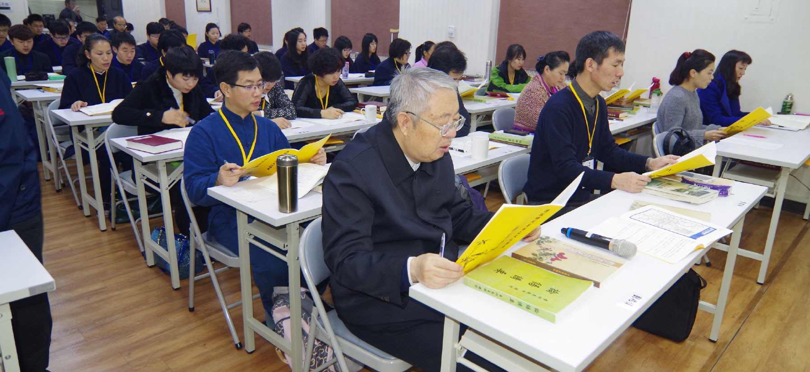

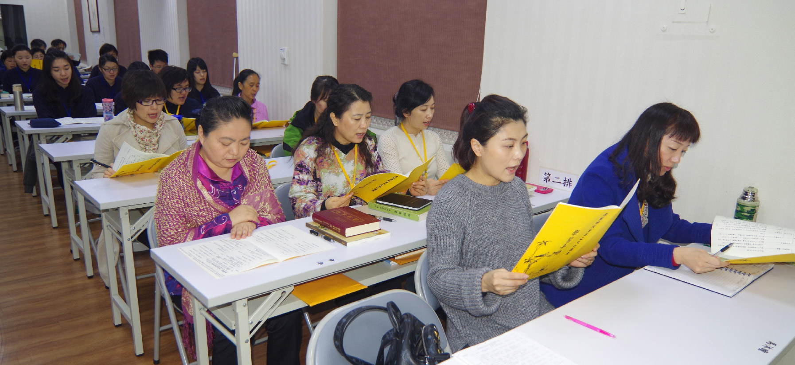

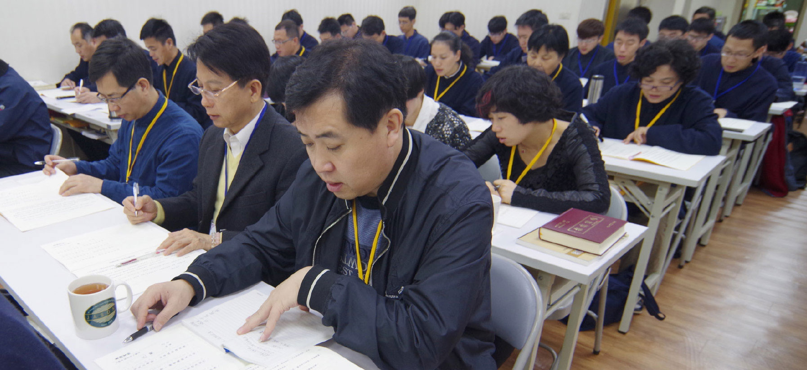

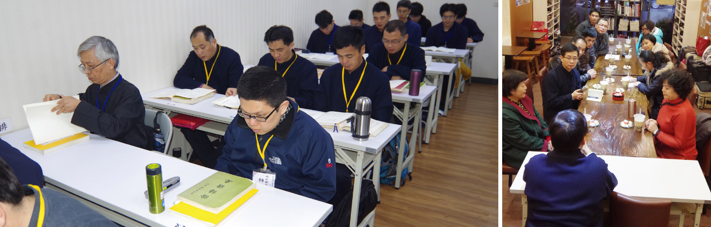

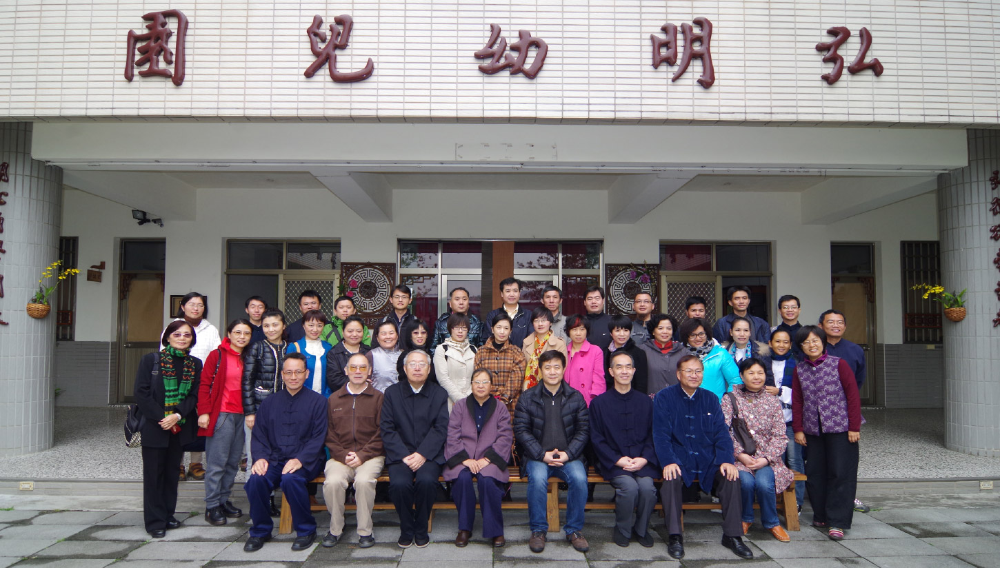

## 後記

### 年終歲末回顧與展望

本刊

匆匆過一年　歷數善法行

努力方有路　菩提大道行

時間邁入民國一○三年，回顧過去的一年，經濟成長的低迷、食品安全的問題、政治紛擾、治安維護、環境保護，一波接著一波的挑戰動盪著我們的生活。然而無論環境如何變化，教化事業的興辦是一切希望的基礎，學會在大眾和合的努力下，努力不懈地為教育人才努力，為導正社會風氣而發展，以下是民國一○二年全年度所做之事業摘要回顧：

壹、例行文化講座及念佛共修：

一、臺北中華無盡燈文化學會

１．每週星期一、三、五晚上七點至九點，分別舉辦「禮記選講」、「論語選講」以及「法華經講座」課程。並於今年十一月開始，每週六下午兩點至五點半，開設《詩階述唐》講座。

２．每週四上午九點至下午三點半舉辦三代念佛共修，並有佛學講座，其中《淨土十疑論》已於今年六月圓滿，現正研討妙叶大師的《十大礙行》。另於每週六晚上六點半至九點有大眾念佛共修，並研學《人生大事—助念生西須知》。

３．每月定期為大專青年舉辦人才培訓講座，並於今年寒假和暑假開辦「彌陀經講座」。

*４．學會師資去年前往法務部矯正署一共七次，為受訓中的新進人員（未來的監獄官）講授論語、音樂欣賞課程。*

５．於暑假期間舉辦各種主題的文化講座，包括禮請監獄教化工作者、歌仔戲著名旦角、當代劇場吳興國老師等各界文化人士，前來學會演講。

二、台中縣無盡燈儒佛學會

１．每週一晚上七點半至九點半研討《金剛經》已於今年九月圓滿，現正接續研討《觀無量壽經》。

２．每週日晚上七點至九點舉辦念佛共修，並有《淨行品》研討。

三、中壢研學會

１．每週二上午九點至十一點舉辦念佛共修並研討《淨行品》。

２．每週日上午八點至十一點開設《論語》及《常禮舉要》研討。

四、宜蘭研學會

每週日上午八點半至十一點半，開設《人生大事》及《常禮舉要》研討。

貳、國學啟蒙教育：

一、例行課程：

臺北中華無盡燈文化學會，每週三下午一點四十至四點開設兒童讀經班，每週六晚間六點半至九點開設啟蒙班。

二、專題講座：

１．親子影片欣賞及探索：暑期期間，開設五堂的系列課程，欣賞及研討宮崎駿的《神隱少女》。課程過後，因應外界的啟請，於卓蘭實驗高中及國立台南大學附屬高級中學舉辦各一天的課程。

２．戲曲動一動：禮請京劇花旦老師至學會教學，教導學童如何欣賞、體驗京劇。

參、培訓課程：

一、師資培訓：

週六下午學會師長們共同研討《唐詩》、《論語》及〈大學〉。

二、志工培訓：

週三早上學會值班人員共同研討〈大學〉

肆、兩岸及國際文化講座：

一、三月間，應邀前往馬來西亞舉辦文化講座。

二、八月間，應邀前往大陸瀋陽和濟南舉辦文化講座。

三、九月間，大陸福建省文化人士來臺，本會協助辦理部分行程之接待。

四、十月間，應邀前往大陸雲南昆明民族大學、雲南大學、民族促進會等舉辦文化講座。

五、十二月間，大陸瀋陽、順昌等地區之文化人士來會學習。

伍、刊物與光碟出版：

一、刊物：

《蓮榮會刊》五期、紀念雪廬老人文選《道不行乘桴浮於海—詠懷雪廬兩岸情》一冊，《中庸科文》。

二、光碟：

《孔子聖蹟圖》，《論語》教學光碟錄製。

陸、蓮友服務：

臨終助念及告別式，總計護持了十四位居士；並有十餘次探望拜訪蓮友。

柒、其他活動：

一、二月十日舉行新春團拜。

二、舉辦數次護生活動。

三、五月母親節暨浴佛活動。

四、七月底臺中齋僧旅遊活動。

捌、拜懺法行：

配合春秋祭祖及祖師聖誕，本會今年一共舉行五次拜懺法會：

一、四月十四日地藏懺。 二、八月卅一日地藏懺。 三、十月十三日大悲懺。

四、十一月三日藥師懺。 五、十二月八日淨土懺。

玖、國內齋僧及供養法行：

結夏安居期間於正覺精舍及圓通寺各有一次齋僧法行。另於三峽西蓮淨苑共有十三次的齋僧法行，並多次應師父之命到淨苑打掃，莊嚴道場。

上述各項法行事業，參與者、出資者、出力者，於私上能增進自己的善根福德，於公上能莊嚴團體，安定社會國家，有缺失之處，辦事人員要懷著慚愧、檢討及反省，對於能利樂有情的部分，要生起隨喜及感恩之心。新的一年願大眾以公心繼續善法的造作，成為現世安樂，未來往生及成佛的資糧。相信在有限及短暫的生命中，將是最殊勝的莊嚴。
