# 第93期
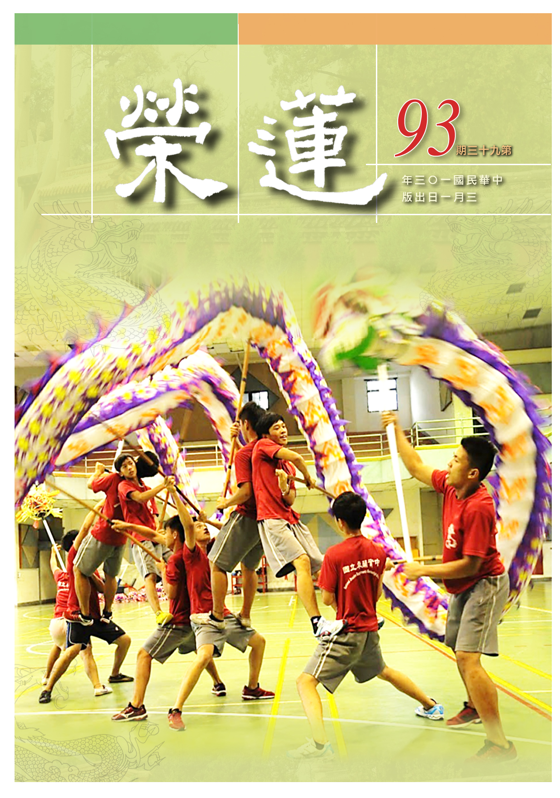

## 社論

### 學而互聯，學而移動

本刊

二○一三年年底，由博理基金會未來媒體實驗室在誠品松菸所開設的「生而互聯，生而移動」系列講座，從講師們精闢而豐富的分享中，認識到互聯網（Internet）與移動科技（mobile）的最新發展，也窺見了中華文化與正知見的發揚契機。

二十世紀，因全球資訊網（WorldWideWeb）的發明，人類從工業時代走進了互聯網的時代，人與人之間的資訊交流變得更容易，個人的表達機會也邁入均等化。二十一世紀，因蘋果公司（AppleInc.）的賈伯斯先生（SteveP.Jobs）重新定義手機，使得手機不只是接通電話的工具，網路變得垂手可得，應用程式更促進多種電子產品的一體化。

互聯網科技的演進，迫使九○年代前的人們不得不成為數位新移民，九０年代後的人們也自然而然成為數位原住民。為因應數位原住民的需求，所有的產業都必須轉型，調整提供服務的方式，以符合數位發展的趨勢。

互聯網的平臺，就像一片新天地，只要擁有一串網址，乃至方寸QRCode（二維條碼），就能隨心所欲透過電腦或手機，抵達想要探訪的虛擬空間。現實世界的社會框架也許限制了人們想表達自我的欲望，但在社群網路的環境裡，每個人都能將自己化身為媒體，透過影像、文字，在世界上展現自我；每個團體或企業，也能藉之行銷理念或產品，具體的引領風潮、影響人心。

當網路的頻寬成倍數增加，影音媒體逐漸成為新的文本，行動科技則成了新的紙張，承載並供應人們想要獲取的內容。因應龐大的影音與文字資訊，大數據（Bigdata）形成了新的參考指標，得以更精準的掌握住方向，更正確的檢討出方法，驅動社會正向進步。

如講者所說：「科技之變是所有人得出發的旅程。」面對互聯網時代，身為中華文化道統的傳承與弘揚者，我們當然不能坐視其發展而裹足不前，必須與時俱進，積極為傳統文化創造新價值。

數位原住民是我們教導的對象，他們所熟悉的學習模式和向外表達的方式，我們急需認知並調整因應，才能達到弘揚與傳承的目的。團體中的青年學子們，最近已將　雪廬老人編寫的《常禮舉要》條目，擇幾條先拍攝成饒富趣味的小短片，期讓觀覽者在莞爾之餘，了解學禮的利益，更能因此發心學習常禮。學會亦正著手架設網路教學平臺，預計提供有系統的課程，令身處在世界各地的人，都能透過這個平臺，層層深入儒佛教理，培養深厚的文化底蘊。

未來，我們需要運用網路科技，創造出無障礙的共學因緣與環境。我們將發揮自媒體的功能，把屬於當代的中華文化詮釋法，藉由文字、圖像、影音來演繹。我們將發揮互聯網的特性，讓　雪廬老人的傳承無遠弗屆，使世界各地的有志之士，更便利的研學教法，得以依止抉擇，學習教典。我們也期許新世代的後進子弟，能藉由社群網站彼此交流、互動，在二六時中串習正知見，使科技成為薰習正見及往生淨土的順緣。

## 大德法語

### 大方廣圓覺修多羅了義經（五十二）

道源老和尚

修學我空道理明

漸漸入得空性義

空靈靈中知能證

能所猶在我相攝

戊二、四問答別明觀行中根修證

己二、二問答兩重除障

庚一、除我入覺（淨業啟請）

辛五、正答所問

壬一、長行

癸一、開示障道四相

子二、開示迷智四相

丑一、承徵引說

經文：

何以故？由有無始本起無明，為己主宰。一切眾生，生無慧目，身心等性，皆是無明。

譬如有人不自斷命。是故當知，有愛我者，我與隨順，非隨順者，便生憎怨。為憎愛心，養無明故，相續求道，皆不成就。

由無始以來妄執有個我，乃無始以來的無明（生相無明），是無量劫來的生死根本，輪迴由它（無明）作主。

由於眾生無有慧目，不能見到無明行相，更談不上對治，故身心體性皆是無明。無明行相為妄認四大為自身相，六塵緣影為自心相。譬如此人貪執五欲六塵，都不如執著自己的命來得厲害。以佛經來對照，看看社會上那些貧苦下賤的人，已經沒有人生的樂趣，他還是不肯死，愛惜他的命，人生已什麼都沒有，但他還要保住命，這就是眾生被無明所攝持，執命為真實。

是故當知，有愛我者，我與隨順，非隨順者，便生憎怨：怎麼知道眾生有我執呢？因為執我所以會愛我，會隨順於我。對方不愛我（非隨順者），就會生起憎惡、討厭、怨恨，若沒有一個我，你怎麼會恨啊？對方隨順不隨順我當中，就生憎愛二心，因為有了憎愛心，能將無明愈養愈大，相續求道，皆不成就。

不看《圓覺經》不知道，我們不是學外道，我們是學佛法，我們依著中國的大乘來修行，或參禪、或念佛、或學密宗持咒、或依懺法來拜懺，或拜佛、念佛、念菩薩的聖號，這都是大乘法門，然若依著無明為主宰，結果你不是在用功修行，用功修行主體是要破煩惱、斷無明，才能證菩提，入圓覺。你著相用功修行，都在養無明，愈養愈高，愈養愈深，這才是真正的可憐憫者呢！

不懂佛法的人天天起惑造業，就是貪圖五欲之樂造作受苦的罪業，那是他不懂佛法嘛！我們懂了，不貪五欲之樂，要出家修行，天天用功修學，天天養無明，你看冤枉不冤枉？你貪圖五欲之樂，將來墮到三惡道裡受苦，也還值得，我們出了家五欲之樂都不貪，然修行卻天天養無明，我們在大陸上有二句土話：當法師的架子大，老修行的鼻子長。

這是經驗之談，講經說法的法師不好款待，怎麼了？架子大！一聽說請法師來講經都頭疼，這樣招待不好，那樣招待不好，發脾氣架子大。其次老修行不會講經但會用功，或者參禪、或者念佛、或拜佛、或持咒，是老修行，然老修行的鼻子長，身體上碰著那裏了，他還不發脾氣，碰著他的鼻子，他要發脾氣，這老修行的鼻子特別長，離他很遠怎麼就碰著他的鼻子？就發起脾氣來，無明火燒了三十三天，怎麼樣跟他求懺悔，他還不答應呢！

當法師的不是講經說法嗎？講經說法，架子怎麼愈講愈大呢？架子大不是貢高我慢的煩惱嗎？我慢是五根本煩惱（貪、瞋、癡、慢、疑）之一，你天天貢高我慢，不是養無明是什麼？愈養架子愈大，愈養貢高我慢愈高，就是在養無明；老修行天天參禪，或念佛、或持咒、或拜佛，你怎麼動不動就發脾氣呢？怎麼還沒碰到你就發脾氣呢？你在養無明，愈養無明火愈大，發起來還勸不好呢！你跟他求懺悔他還不答應呢！你看這無明火多大，都是不會用功，真是可憐啊！

所以《圓覺經》你們要聽，我已向諸位講經講了三十年了，你得考驗一下，聽佛法是不是比以前的貪、瞋、癡減少一點。各人的煩惱不一樣，或者貪心重，或者瞋心重，或者愚癡心重，若我的貪心重，是不是聽了佛法，我的貪心減少了一點？是減少那就進步了，貪心愈來愈大，這就顛倒了，我的瞋恨心重，動不動就發脾氣，我自己還管不了我自己，現在聽了大乘經，求懺悔比起去年的瞋恨心減輕，這就進步了。

愈養瞋恨愈大，這不是養無明是養什麼，學佛法不要學顛倒，聽到這些有沒有聽到心裡邊去，要會用功，怎麼用功呢？天天修行，不要著相，不著相，還要天天修行，這樣就對了。你要天天養無明，無明相續不斷，無論修什麼法、求什麼道，都不成就。

丑二、次第別明

寅一、徵釋我相

經文：

善男子！云何我相？謂諸眾生心所證者。善男子！譬如有人，百骸調適，忽忘我身，四肢弦緩，攝養乖方，微加鍼艾，即知有我。是故證取方現我體。善男子！其心乃至證於如來，畢竟了知，清淨涅槃，皆是我相。

其次迷智四相，前為迷識四相（我相、人相、眾生相、壽者相）。迷識是第六識隨妄想心而起，隨妄想心轉，東念西念迷悶不入。菩薩不求深智執著有所證的聖境，因為有能證的我，依然是凡夫。

末法的眾生因為去佛漸遠，雖想親近善知識但沒有因緣，修行以為得了一點點小覺受，就認為自己成佛了，不是打自己的閒岔嗎？

譬如：念佛求一心不亂，然一心不亂長什麼樣子？事一心是不念自念，雖沒有念佛，但是心裡面好像錄音機自己出來阿彌陀佛佛號，外邊什麼境界都進不來，打不了閒岔，此不念自念，就是事一心不亂。若能明了阿彌陀佛和我的心體性是一，謂之自性彌陀唯心淨土，在定中明白體性是一的道理，是理一心不亂現前。若認為有所證，則有能證的我相，若執著有我，以為得了個好境界，且認為大徹大悟，實則成為修道障礙。

譬喻一個人百骸（全身）舒服極了，忽然間忘了自己的身體，觀待身體生起的我也不見了。

忽然四肢（雙腳雙手）中風（弦緩）。乃平常攝養方法不對，由於無法指揮四肢，我相漸沒。

微加鍼艾，即知有我，用鍼（扎針）艾（艾灸）考驗一下。鍼艾是扎鍼，按照穴道扎針或艾灸，譬如：腿部走路不方便，找出穴道，把生薑切成半，到漢藥店買艾草條，把艾草揉碎，攤一個球（藥丸），裹到生薑上，就這麼火燒艾草。說一個常識，把艾草攤成一球像藥丸的樣子，裹生薑片，生薑片貼到穴道上，點火！把病燒好了就叫灸法！現在就考驗有我沒有我？扎你一鍼，哦！疼了！艾灸你一下，你疼了！這時候就知道有一個我了，這就是比方用功修行，有所證，證得我空了！剛剛把「我相」伏住，「我」沒有斷，考驗一下你就知道，還有一個「我」在。

如果遇見憎愛二境，還生憎愛心，哪裡會斷了我？是故在考驗時會出現我體，把「我」體現出來（引蛇出洞）。當有能證的我認為證得如來的清淨涅槃時，實際執我的心未斷，所執的我是執我出現。

善男子！其心乃至證於如來，畢竟了知，清淨涅槃，皆是我相：當我們認為證得了如來清淨涅槃（所證），有所證就有能證，能證的是我相，所以真正證得了如來的涅槃，不會起我執，也不會起法執，我、法二執都空掉了（能所雙亡），才能證得清淨的涅槃。

寅二、徵釋人相

經文：

善男子！云何人相？謂諸眾生心悟證者。善男子！悟有我者，不復認我，所悟非我，悟亦如是。悟已超過一切證者，悉為人相。善男子！其心乃至圓悟涅槃俱是我者，心存少悟，備殫證理，皆名人相。

對著我相叫人相的名詞，此人先悟後證。再進一步，把第一步的錯誤糾正過來，當悟證時，有所悟證必有能悟證，我就是能悟證者。

不復認我，所悟非我，悟亦如是。悟已超過一切證者，悉為人相。此時悟我為能悟是不對的，那裡有自體性之我可得？此悟猶如前述以為有能悟的我，然悉為人相所攝。

乃至以為圓悟涅槃都是心存我相，前述證得如來清淨涅槃，心存所證必有能證，能證就是我相。此時以為悟證到涅槃，然心裡仍然存在有能悟者，以及所悟的境界。雖然證悟的道理完備，然能證者依然被人相所攝。（下期待續）

### 圓通寺齋僧法語開示（下）—楚石大師西齋淨土詩

上果下清法師開示

人身難得易失

觀修暇身無常

來世惟待善業

正助雙修往生

接著我們再說到西齋淨土詩，明朝的楚石大師，他這麼說：

說著無常事事輕。

飢餐渴飲懶經營。

一心不退思安養。

萬善同修憶永明。

淨洗念珠重換綫。

堅持佛號莫停聲。

妄緣盡逐空花落。

閒向風前月下行。

說著無常事事輕：乃講到無常，其他的事跟無常比起來都是很輕緩、不要緊的事。無常是什麼？無常就是死的意思，死的另外一種名稱叫無常，講到無常是比較容易的，講到死字我們都不喜歡聽，其實無常就是死，所以說到無常，也就是說到死。生死是大事，所以其他的事跟生死大事比起來，都是很輕小不要緊的事。

饑餐渴飲懶經營：飢餓了，我們就吃飯，口渴了，就飲水，但是我們連饑餐渴飲都懶得去經營料理，是為了什麼？就是一心不退思安養：反省的內涵在不退轉，思念極樂世界，而輕泰也是極樂世界另外一個名稱，一心專行不退轉，來憶念極樂世界，這句話包括一種信念，淨土的三資糧：信、願、行，此行就有信願在裡面。

萬善同修憶永明：萬善即廣修萬行，像永明延壽大師，白天能行百八佛事，夜晚精勤念佛，天天念滿十萬聲，那幾乎等於沒什麼休息。所以他廣修萬善，並將萬善回向西方。以淨土宗第六祖永明延壽大師做榜樣，他以萬善回向莊嚴淨土，我們讚歎、效法他，也以萬善功德，回向求生極樂世界。不論自他，都能往生到極樂世界，所以是萬善同修憶永明，好好憶念永明延壽大師。

淨洗念珠重換綫：念佛念久了，念珠會有垢穢，把念珠洗乾淨，而念珠的線斷掉了，要重新換線。假若我們平常懶惰念佛，或者一天沒念多少聲佛號，念珠還是新新的；因為念珠常常念，所以有垢穢，那就洗一洗，念珠常常念，線也容易斷，所以要重新換線。

堅持佛號莫停聲：堅固的執持阿彌陀佛的聖號，不要停聲，念佛有出聲、有默念，出聲有出音聲的相狀。那麼不出聲默念，也有默念的聲響，但是，念佛的時候，我們念出聲音來並且將佛號聽得清清楚楚，聽得清清楚楚表示我們沒有打妄想、起雜念，也沒有昏沉，不會不知道念到哪裡去，也不會聽不到念佛的聲音，所以我們要堅持佛號莫停聲。要堅固的執持阿彌陀佛的聖號，要聽出聲音，不論出聲或默念，都有聲響的。以上這兩句是正行，就是正功夫。

所以信、願、行都有了，而且又有助行，萬善同修憶永明就是助行，一心不退思安養就是信願，那麼淨洗念珠重換線，堅持佛號莫停聲這兩句屬於正行。所以前面有信、願，後面又有正行、助行。

妄緣盡逐空華落，閒向風前月下行：這一句就扣到第一句的說著無常事事輕，妄緣就是第一句的事事輕，說到無常，世間任何其他事，都是很輕小的，不是那麼重大，生死的大事才是最重大的，所以我們修行要有所成就，必須要轉變心態，怎麼轉變心態呢？就是世間的事擺第二，修行的事、了生脫死的事擺第一。所以換成了脫生死這是大事，世間其他的事都沒有那麼重大，擺在第二，修行的事擺第一，這樣就會有成就，將來也能夠往生到極樂世界去。

所以去追逐虛妄的世緣，就好像虛空花落下一樣，虛空本來沒有花，都從眾生的妄想執著生出來的，本來沒有事，就如同俗語：天下本無事，庸人自擾之。

最後我們清閒的時候，在風前月下經行念佛，一面經行，一面念佛，所以最後一句就是結歸正行，這首偈非常好聽。

接著我們再說一首楚石大師的偈頌：

一寸光陰一寸金，

勸君念佛早回心，

直饒鳳閣龍樓貴，

難免雞皮鶴髮侵。

鼎內香烟初未散，

空中法駕已遙臨，

塵塵剎剎雖清淨，

獨有彌陀願力深。

一寸光陰一寸金：一寸的光陰就是一寸金，其實一寸金買不到一寸的光陰，一寸的光陰消失了，再也沒辦法把它拉回來，用多少金錢去買都沒有辦法買回來，所以一寸光陰就是一寸的命光，命光消失了，我們的生命就逐漸減少，所以一寸光陰一寸金，我們的光陰非常寶貴。

勸君念佛早回心：勸諸位念佛要早日回心，怎麼回心呢？我們要真的生起真實的信心，而且信得非常深，對淨土法門一點疑惑都沒有，絕對不懷疑，有了信心發起真切的願，有深信切願就會老實念佛。而且更要精勤老實的念佛，不能有雖然老實的念佛都沒有打妄想，也沒有起雜念，但是念佛次數太少，其他時間就隨便打妄想，做其他事，這也不容易成就。所以不但要老實，而且要精勤的老實念佛，有深信，有發起懇切願，還要精勤老實念佛。

不僅如此，我們為人處世，平素能夠存良心、說好話、做好事來對待一切人，我們能深信切願，精勤老實念佛，又能事事都憑良心、說好話、做好事，那就可以決定往生極樂世界。絕對萬修萬人去，沒有不去的，只要我們如法修，決定萬修萬人去，所以說勸君念佛早回心。

直饒鳳閣龍樓貴，難免雞皮鶴髮侵：直饒就是縱然，縱然女眾都住在鳳閣，男眾都住在龍樓，鳳閣、龍樓就表示很高貴的地方，縱然住在很高貴的地方，處在很富貴的境界，也難免雞皮鶴髮侵，小孩子皮膚很細嫩，當年紀越大、越老，手、腳、身體的皮膚就起雞皮疙瘩垮掉了，起老人斑，有種種的情形出現。鶴髮就是本來頭髮是烏黑的，但是年紀越來越大了，黑髮逐漸變白髮，變成鶴髮了，所以叫做難免雞皮鶴髮侵。侵就是侵犯，我們本來沒有雞皮，而有了雞皮，本來沒有鶴髮，而有了鶴髮，有了白頭髮。

鼎內香烟初未散，空中法駕已遙臨：我們努力用功辦道，鼎就是插香的鼎，鼎內的香烟最初還沒散，我們修行用功，通常會點香先供佛，供養三寶，接著就修行用功，鼎內的香烟最初還沒有散開，在虛空當中，西方三聖的瑞像，法駕已經遙遠的蒞臨，要來接引我們了。我們有如是因，就召感如是果，因為自己這麼修，就召感極樂世界瑞像來迎的因，所以是空中法駕已遙臨。

塵塵剎剎雖清淨，獨有彌陀願力深：宇宙裡面有太多的佛國土，可以說是無量的剎土，無量的佛剎土雖然都是清淨，但是唯獨十方諸佛阿彌陀第一，為什麼是第一呢？因為阿彌陀佛的願力最殊勝，願力最深重。他在因地做法藏比丘的時候，對著世自在王佛發起四十八願，所以諸佛裡頭，以阿彌陀佛的願力最為第一，救渡眾生的悲願最為深重。所以說塵塵剎剎雖清淨，在非常廣大的宇宙，無量無邊的佛剎土當中雖然都是清淨的，然而在這麼多剎土當中，唯獨只有阿彌陀佛的願力最為深重，換句話說，阿彌陀佛的極樂世界最為第一，最為清淨，有這個意思在，阿彌陀佛以大悲願力來接引攝受所有世界念佛的眾生，所以是塵塵剎剎雖清淨，獨有彌陀願力深。

最後我們再說一首清朝省庵大師所寫的勸修淨土詩。省庵大師是淨土宗的第十一祖，十二祖是徹悟祖師，十三祖是印光大師。省庵大師他也有一首勸修淨土詩：

我教原開無量門，

就中念佛最為尊。

都融妄念歸真念，

總攝諸根在一根。

不用三祗修福慧，

但將六字出乾坤。

如來金口無虛語，

歷歷明文尚具存。

我教原開無量門，就中念佛最為尊：我們本師釋迦牟尼佛的教法，原來是開出無量的法門。無量的法門都隨著眾生的根器，因為眾生的根器無量，所以佛施設的法藥（法門）也是無量的，在這無量的法門當中，就屬念佛法門最為殊勝。在這當中，念佛的法門是最為位高尊勝的。

都融妄念歸真念：完全能夠融攝妄念，歸於真念，所以說我們念佛，還是會打妄想、起雜念等，念得純熟之後妄念逐漸少了，最後歸到真念，能夠真心念佛。

總攝諸根在一根：諸根就是六根，收攝種種諸根合在一根，關於這一句，蓮池大師在《彌陀經疏鈔》裡面，解釋到一心不亂的時候，他就說心王、心所無所不一，所以叫做一心不亂。講到心王、心所，雖然有八個心王（眼識、耳識、鼻識、舌識、身識、意識、末那識、阿賴耶識）跟五十一個心所，紛然雜陳的情形，然而歸溯它的源流，窮盡它的源頭，都超不出一心。

我們現在念佛的人，最初用的是耳識，用耳識來聽聞阿彌陀佛的名號，其次用意識，專注的憶念，因為專念的結果，就總攝諸根，眼、耳、鼻、舌、身等識都不起現行，換句話說，都歸到意根，也就是六識都不起現行，已經歸到第七識，第七識就是意根，所以是總攝諸根在一根。

然後再進一步用功，念茲不已，念寂而忘，這也就是所謂恆審思量的第七識，他的思量也寂滅了，再經過用功，忘之不已，所謂真妄和合的第八識也銷亡了，那麼到這個地步，七識、八識都不起現行，做主人的既然都不起現行，八識心王都不起現行，那麼隨從的五十一個心所又何必討論呢？所謂「皮之不存，毛將焉附」，皮膚都不存在了，毛依附在哪裡？皮膚比喻八識心王，毛比喻五十一心所，皮膚都不在了，毛在哪個地方依附呢？八識心王都不存在了，已經都銷歸一心了，那五十一心所就不必說了。

就在這個時候巨浪微波，咸成止水，巨浪就比喻前七識所攝持的心王、心所，因為前七識的心王比較麤重，會障礙真如本性，對真理引發重大的疑惑，所以是巨浪。那微波就是比喻第八識所攝持的心王、心所，因為第八識的心王比較微細，障礙真如本性，屬於比較難以察覺的疑惑，最後巨浪、微波完全都成為靜止的水，就好比海水起大波浪，波浪小的就起微微的波浪。現在巨浪、微波都完全成為止息的水。

濃雲薄霧，盡作澄空，濃雲也是比喻前七識所攝持的心王、心所，他比較麤重，障礙真如比較重大的緣故。薄霧就是比喻第八識所攝持的心王、心所，因為他比較微細，障礙真如比較難以察覺的緣故，所以叫做濃雲薄霧，盡作澄空。能夠如此觀察，那麼到如此，我們現前不就是極樂世界的境界了嗎？念佛念到這個地步，就是身在娑婆當下就是極樂，總攝諸根在一根。

不用三祗修福慧：普通法門要經過三大阿僧祇劫修福、修慧，福慧圓滿才成佛。我們修淨土法門不需要如此，不需要用三大阿僧祇劫修福、修慧，福慧圓滿才成佛，所以叫做不用三祗修福慧，如果需要三大阿僧祇劫，我們怎麼修呢？

但將六字出乾坤：只要運用「南無阿彌陀佛」六個字的萬德洪名，就可以出乾坤，乾坤就是天地，天地在佛法裡面就是比喻三千大千世界，只要用六個字就可以出離三界六道的生死苦海，而往生到西方極樂世界去。

如來金口無虛語：如來的金言玉語，如來所說的話絕對沒有虛妄的言語叫做金口，因為如來是真語者、實語者、如語者，不誑語者、不異語者。佛所說的話是真實不虛，佛絕對不欺誑眾生。如來金口所說的話，沒有虛妄的言語。

歷歷明文尚具存：歷歷就是清楚了然，明白的經文尚且具足、存在，就像淨土五經仍然流傳在世間，而所謂淨土五經就是專門陳述念佛往生極樂世界的事。所以歷歷的明文尚且還具足存在，而其他的千經萬論也是處處指歸，所以我們要死心塌地的好好修這個法門，平時也要敦倫盡分，閑邪存誠，諸惡莫作，眾善奉行。好好信願、精勤的老實念佛，那麼將來個個都能夠往生到極樂世界去。

今天也說了不少時間了，以上說法的功德就來酬報諸位那麼辛苦來供佛齋僧的功德，最後回向，也恭祝諸位身心安樂，將來個個往生極樂！

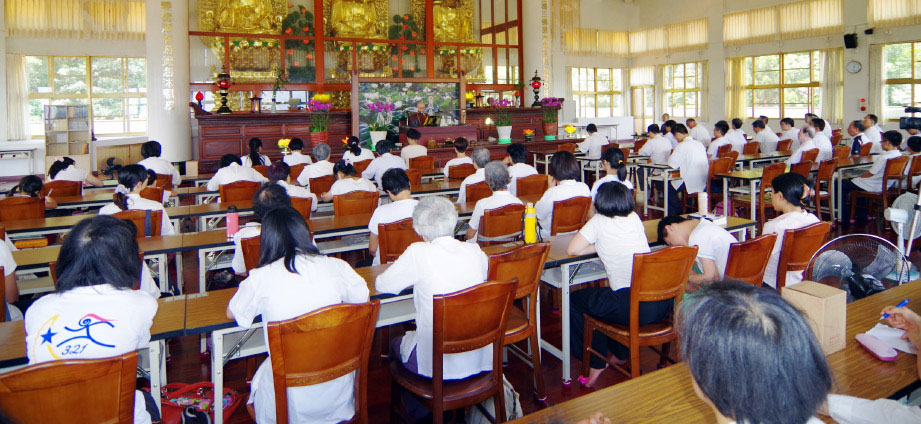

## 共修研學

### 小止觀導覽（六十五）

*心爾、治心整理*

第八章  覺知魔事

論文：

復次、若見魔境不謝，不須生憂；若見謝滅，亦勿生喜。所以者何？未曾見有人坐禪見魔化做虎狼來食人，亦未曾見魔化作男女來為夫婦。

世俗上也有狐狸精來媚人，這是有的，然此處是說在禪定當中，魔化作虎狼來作吃人的樣子干擾禪定而已，不會真的把人吃掉，或現美女俊男來迷惑坐禪者，然不過是心識上顯現的影像，成為禪定的障礙，令人著魔發狂，但不會真的與坐禪者成為夫婦，如同看電影般，被電影情節所吸引而已。

論文：

當其幻化，愚人不了，心生驚怖及起貪著，因是心亂，失定發狂，自致其患，皆是行人無智受患，非魔所為。

通達空性者了知境界幻化，當體無自相，例如身體不過是四肢、臟、腑的湊合，出定的時候知道它是被湊起來的，其實根本沒有本質。如同稻草人的手臂、腳、身體，當沒有湊起來時什麼都不是，如同作夢顯現一整體的形象與作用，假名安立為身體，諸法生起莫不如是。

凡夫對組合之相以為生出一真實相，實則不過組合而生之作用，安立為某相而已。卻妄認有真實相（自相）可得而生貪瞋，以致心亂入了邪法。所謂禍福無門，唯人自招，由於無有觀慧，才會產生貪瞋，而有心亂發狂的禍患，並非外魔所致。

論文：

若諸魔境惱亂行人，或經年月不去，但當端心正念堅固，不惜身命，莫懷憂懼，當誦大乘方等諸經治魔呪，默念誦之。存念三寶。

魔境擾人經年月不去，或是業障深重，或是道力不足，此時當堅持誦持經咒或止在教法的所緣境上，令正念堅固，這是一種信力堅固的行相，若無此信念，讀誦大乘經典效果不大。除此之外，還要存念三寶，祈求三寶加被。

這裡分為兩段，如果禪定中魔還是會來干擾，所起的干擾力很大，就如同修學般舟三昧的人，要跨過非常難以克服的昏沉障，那種跨不過去，似乎註定要失敗的感覺。也好像打佛七，前三天好像注定要失敗的難熬，如果前三天修不下去，下山以後，終生把打佛七看成過患，想到佛七就覺得害怕、恐怖，到道場好像到魔鬼城一樣。修行也是一樣，在禪定當中想要念佛，可是心神就是不安寧，或者身體不舒服，或是環境很恐怖，讓你很不安，讓你很恐懼的在那裡修學禪定，這樣是沒辦法入定的。入定ㄧ定是心水澄清，身體很舒服，莫名奇妙的喜悅，那才是定相的成就，但是種種干擾讓人沒辦法修行，怎麼辦呢？此處有三種修學法：

第一、 存念三寶：

心中常常想著三寶，並祈求三寶加被。

第二、 心具悲心跟菩提心：

祈求三寶ㄧ定要有悲心和菩提心。非如世俗欲向某人報仇，去找幫派老大，或存現世利益而求加被，如此則成修行的障礙。因為我的修行是要利益無量無邊的眾生，故眼前請魔不要障礙我，並祈求三寶護念。此時對三寶生起禮拜、恭敬、供養、讚歎之心。

第三、 念治魔咒：

如藥師佛的心咒或念佛等，能治魔、治瘟疫。但要配合行者的菩提心與心存三寶之念而得加被，如此誦念治魔咒（或念佛），可以幫助我們破魔。

論文：

若出禪定，亦當誦咒自防，懺悔慚愧，及誦波羅提木叉。邪不干正，久久自滅。魔事眾多，說不可盡，善須識之。

出定之後，在辦事以及行、住、坐、臥當中，還是要心存三寶，必須念佛、誦咒、生慚愧懺悔心誦戒，從戒當中提醒行者哪些該做哪些不該做，在正知見攝持下廣作善法，魔難自然滅卻。

出定之後要誦戒自防，像念佛一樣，護自己的善根，祈求佛菩薩的加被，那為什麼還要加上懺悔慚愧？因為出定時在待人接物中，難免損惱到有情，或者損害到公家，或在利益有情的事業上，有些不如法的，所以生慚愧、懺悔，並誦波羅提木叉是提醒自己，那些是不能犯的，哪些是要做的，如此亦助修定時有資糧。

然魔的自相本空，它亦是磨練我的善知識，來增上我的忍辱與願力，已經招感到魔境，只好用這方式去幫忙自己，不是要行者故意去著魔，然後借它來修行。是說魔境現起了，就從這個角度觀修以助自己的道力，或想是佛的變現來考驗我修學的誠意，以此降伏瞋恨心、不耐、恐懼等諸煩惱。（下期待續）

### 菩薩清淨的行持　華嚴經淨行品（九）

*編輯部整理*

讚問乃為利生故

用心能獲勝妙德

二諦融通法自在

了不可得現普賢

智首菩薩在

甲一、問舉德徵因

，亦即菩薩要成就種種的功德，應該具足什麼樣的因呢？總說就是三業能遠離過失，成就佛的智慧德。別說是如何成為修道的法器，以成就殊勝的智慧，並且有修道的因緣，於世間法善巧，能修學涅槃因，滿菩薩行，得十種智慧力，並且利益有情時，可得十王的敬護，能為有情的導師，且在人中最尊貴。而要用什麼樣的因達到呢？

甲二、文殊答標德顯因

乙一、歎問成益

經文：

爾時文殊師利菩薩，告智首菩薩言：善哉佛子，汝今為欲多所饒益，多所安隱，哀愍世間，利樂天人，問如是義。

為什麼不直接答因呢？此處是文殊菩薩先讚歎智首菩薩這樣問太好了！是為了有情，而有這樣的問。這樣的問，真是善哉！可見菩薩問有兩種：一、菩薩心中有疑惑而問；二、為有情眾生而問。有情眾生有這樣的問題，菩薩的這個問是有功德的，能夠讓有情眾生懂得修學法。

《論語》裏面，弟子問孔子，孔子就他所問的，或者根據他的根機來回答，或者是可以將他向上提升而作回答。然諸弟子只有顏回一個人都沒有問題，孔子雖然很高興，但還是說：回也，非助我者也！於吾言，無所不說。意思是如果能夠問問題引發或解答的疑問，且能引出老師更深的意思，如此可利樂更多的人。然顏回都無言以對，能完全悟入孔子的意思。

菩薩如顏回般都能懂得佛意，然所問的問題，何嘗不是為了其他眾生而問，是以大悲心所攝持的問，此問功德不小，能幫助正法的流通，非世間善法可以比擬的。

智首菩薩名號之義是以智慧為首，如同文殊菩薩是以智慧為第一，此時以問題就教文殊？，是以大悲心助正法之流通，亦即以設問題來助正法流通，此功德可思議乎？既然功德是不可思議，所以文殊讚歎「善哉佛子」。對於發菩提心成為菩薩的人，經上照例的說是佛子，而能繼承佛陀家業的佛子，或指登地菩薩，或指等覺菩薩，亦即已經是發菩提心，而且能夠現證空性，具足成佛的因，佛即為他授記成佛。

下面說智首菩薩之問有欲（有其希望達到的目的）。想要多所饒益，多所安隱，哀愍世間，利樂人天，所以才會請問上述問題，就教文殊菩薩。

多所饒益：利益有情愈多愈好，不只眼前讓他得到安樂，未來亦得到解脫，及成佛的安樂，如同父母給孩子安樂，是盡己所能的給，以上謂之所饒益。

其次多所安隱：內心的隱微處，是一個安定的力量，不是表面的安定，是心裏的安定。一般人只有表面的安定，或說是生活的安定，上班有薪水，退休有退休金，國家政局很穩定等等，但那不是內心的安定，一旦外境變化，人已不曉得煩躁成什麼樣子？

內心的安定是「造次必於是，顛沛必於是」，雪廬老人來到臺灣時，孤家寡人，從頭幹起，穩如泰山，那一種內心的安定就是隱，是他人看不到的。然必須是對教法有勝解，《論語》上說：學而時習之，不亦說乎！內心的安定自然感得外緣的支持，即有朋自遠方來，不亦樂乎！以上是多所安隱。

菩薩為了幫助有情，事事順利、內心安隱，以哀愍的心作基礎去多所饒益，多所安隱。哀愍心就像母親對子女，子女痛苦一分，母親是十分的不忍。同理有情有一分的苦，菩薩就有十分不忍，所以欲多所饒益，多所安隱。

設問世間最苦的是三塗，可是菩薩多所饒益，多所安隱，哀愍世間的對象竟然是人天，這樣對嗎？既然是哀愍世間，應該是利樂三塗，三塗更苦，更值得同情，為何是利樂人天？因為人天才有可教之機，所以佛的十種通號有天人師，人天才是可教化之機，如果此人不堪教化，饒益他會害他成為紈絝子弟，這個人剛強難化，還能多所安隱嗎？有些人就像沙漠一樣，不管倒了多少甘露法水，馬上蒸乾。

問如是義是為了哀愍世間的人天眾，這些人天眾是受教的根機，可以多所饒益，多所安隱。以上是文殊菩薩對智首菩薩的讚歎。

丙一、標因成德答其舉德

佛經述佛菩薩所說都次第清楚，故好好學法容易開竅。世間很多大儒都是學過佛方通儒，如皇侃、焦玄、李二曲、陸儱其，乃至雪公、醒公諸位老師，莫不是由學佛來通儒的，所以不學佛難通儒，佛法才是真正文化的核心、精要，我們一起來研究佛法的時候，何嘗不是在拯救儒家？好好的學儒家，何嘗不是在莊嚴佛家？所以雪公老師說學儒的看不起學佛的實屬不該，學佛的看不起學儒，更是荒唐。

經文：

佛子，若諸菩薩，善用其心，則獲一切勝妙功德。於諸佛法，心無所礙。住去來今，諸佛之道。隨眾生住，恆不捨離。如諸法相，悉能通達。斷一切惡，具足眾善。當如普賢，色像第一。一切行願，皆得具足。於一切法，無不自在。而為眾生第二導師。

科云標因成德：因即是善用其心，試問如何善用？即後文一百一十四個願（以願攝行）都是善用其心，所以能成就上述三業離過及十種成就的功德。特別是初發心的菩薩，剛開始來學佛的這些發心菩薩，一定要善用其心，不善用其心立刻退轉，在作佛事中起了一大堆的煩惱，關鍵不在障礙，在沒有善用其心。障礙自體成立，佛何以能通過這些障礙呢？可見障礙之所以成為障礙，都是內心的願力不足，且不善用其心，若善用其心，哪裏會是障礙？反而是修學的增上。古人云：運用之妙，存乎一心。

若能獲得上述功德，則能獲得下列之德。於諸佛法，心無所礙：自己是個可堪傳承者，是個傳承的法器，能成為十方諸佛的傳承，得到自利並能轉法輪來利益他人。

心無所礙，就是此人學佛，沒什麼障礙，有能力、有資糧，有記性、有悟性，能承擔在學佛的路上無所礙。

住去來今，諸佛之道：即成就眾慧能住持過去，現在，未來的諸佛之道。如同龍樹菩薩就是以智慧力住持聖教，佛要滅度前說：我滅度後四百年後，有一位姓龍的比丘，他能住持聖道。龍樹菩薩的智慧使他成為八宗共主。可見學佛想要住持聖道的人，還得要從智慧而來，然智慧又從聽聞、思維而來，從止觀的修學來，但第一步一定是聽聞，沒有聽聞，絕對無法撐起法幢，古人說：佛法無人說，雖智不能解。

隨眾生住，恆不捨離：指的是具道因緣，也就是此人能發菩提心，有善法欲，有種種方便，有教授善知識，有同行善知識，有外護善知識，也能對眾生、佛道作觀察，觀察有情的痛苦，並思維如何幫他離苦得樂，觀察佛法有敏銳度、有止觀力、有思維力，而且所有具道的因緣都是為了利益有情。

因為解脫與成佛都無法離開眾生而得，必須在因（眾生）上作善業，將福報轉為修學佛道的資糧。普賢十大願的第九大願為恆順眾生，沒有眾生就沒有佛，所以怎麼能離開眾生？

如諸法相，悉能通達：此處對著前述於法善巧，於五蘊，十二處、十八界中（欲界、色界、無色界）的法通達，對過去，現在，未來亦通達，此即如諸法相，悉能通達。

斷一切惡，具足眾善：此處即對著修涅槃因修來說，必須要斷眾惡、修眾善，斷眾惡才不會有修行的障礙，修眾善才會有修學的資糧，易於得證涅槃。

當如普賢，色像第一：即前述滿菩薩行，滿菩薩行何以成就普賢色像第一呢？指的是以十力智成就普賢行願，具足普賢色像。

而為眾生第二導師：即相應前述的超勝尊貴。然八十華嚴寫的是第二導師，六十華嚴則是第一導師，兩本華嚴經對不來，到底是第一導師，還是第二導師？若是第一導師就是說當如釋迦牟尼佛。若云當如第二導師則表釋迦牟尼佛之後此人可以成佛。（下期待續）

## 專題研學

### 聖者的祕密～大佛頂首楞嚴經二十五圓通暨七處徵心探源　二十五圓通暨七處徵心簡介　（三十四）

時哉

善巧度眾妙難思

八部能應樂出倫

說法令彼得成就

大慈大悲觀世音

子二、觀音廣陳

丑二、陳白之言

寅四、詳演所獲殊勝

卯二、承演三科

辰一、三十二應

巳二、條列妙應

午二、應厭離心

未一、八部眾

申一、天眾

經文：

若有諸天，樂出天倫。我現天身而為說法，令其成就。

天是指天道，倫者類也，天道雖然快樂，可是天道的樂終有盡，會有五衰相現的苦。五衰相現其實不能算是苦，只是衣服變髒了，或是腋下有汗，身體開始有味道，或者頭上戴的花開始枯萎，或者不樂本座，這些五衰相其實在人道來看並不苦，只是昔日威勢與清淨相不在。其他諸天也不願與他相處，讓五衰之人很惶恐，就像人一旦失去權勢，年華老去，巴結他的人不在了，他很痛苦；而且他有天眼通，知道他的來生會投生到惡道，所以更增加他的驚慌；過去長年來諸天人都會一起遊樂，此時天女們都不喜歡跟他在一起，沒有遊玩的快樂，所以也很憂惱。此難以壓伏熾盛的煩惱，會讓他墮落到三塗去受苦。

在因緣成熟時，亦即此天人不樂天倫，看到快樂的虛假不實，觀世音菩薩會現天身而為說法，令其成就。如何令其成就？為欲得人身者，說五戒十善法，此即來世為人道的修學法，令彼天身歿時投生到人道。

為欲令解脫者，說無常法及三十七道品，為欲令成佛者說四弘誓願及六波羅蜜等法。然人道環境是最能修解脫法與成佛法，所以想要投身人道，須先對人道修歡喜心，每天要對閒暇又圓滿的人身修歡喜心，並且發願以人道之身來修學正法。

申二、龍眾

經文：

若有諸龍，樂出龍倫。我現龍身而為說法，令其成就。

龍的職責或守天宮，或興雲降雨，或開瀆掘江，或守伏藏，並分佈在天道、阿修羅道、人道、畜生道。

可大分四種，

一是護守天宮。二是鎮守江陵

，能興雲降雨：昔日雲棲蓮池大師遇到當地乾旱時，向天求雨，帶領大眾念佛，走到哪雨就下到哪，或是龍王的神力所致。

三是開瀆掘河：

昔日中國大陸黃河、長江到處氾濫，百姓受殃苦不堪言，堯命禹治水，到了唐朝時杜甫入四川，在面向長江三峽高峻的山上瞻仰了禹廟，廟裡的屋壁上畫著龍蛇，此為描述禹王治水時，一方面疏浚河道，一方面制伏這些龍蛇。所以大禹治水不但可以從工程師的角度去紀念他，但也不可忽視他的神力。吳王夫差時曾於浙江會稽山挖出大如車軸的骨頭，請教孔子，知是當時禹王大會諸侯時，防風氏遲到且態度傲慢，禹王下令山神誅殺防風氏，夫差所掘乃防風氏的骨頭。

四是守護伏藏：

傳說龍樹菩薩到龍宮所背出的華嚴經（或說大般若經）就是沙竭龍王所守護的，此即是守護伏藏的龍。

此龍何以樂出龍倫而求教於觀音菩薩？因為龍亦有其苦，週身鱗片在熱環境中，如同深受火熾然的燒熱，其次龍的鱗片中也寄生著很多的小蟲噬咬其肉，苦不堪言，再者所居住的龍宮也容易被業風吹壞，且易被大鵬金翅鳥所食，所以會有請釋尊賜予袈裟保護龍子的公案等。這些苦能令有善根的龍想要離開這樣的狀態，甚至想要投生人道，或者想要解脫，觀世音菩薩應機說法令彼成就。

申三、藥叉眾

經文：

若有藥叉，樂度本倫。我於彼前現藥叉身而為說法，令其成就。

藥叉義為捷疾鬼，行走速度快，或是在因地中以足來幫助人，例如開車載他人來聽聞正法，或幫人跑腿，然動機不純正，為業所引而成藥叉，雖然有神力，若變成破壞善法的能力，那就非常可惜了。

藥叉又分為地行藥叉、空行藥叉、飛行藥叉，空行藥叉是能在虛空中遊行，飛行藥叉是速度非常快，地行藥叉是在地上走。

樂度本倫就是樂於離開這個境界，藥叉又可謂為勇健鬼，表徵力量非常大，《藥師如來本願經》裡有十二藥叉大將，各領七千個眷屬，護持藥師法門。

申四、乾闥婆

經文：

若乾闥婆樂脫其本倫。我於彼前現乾闥婆身而為說法，令其成就。

乾闥婆是玉皇大帝宴會中奏俗樂的樂神，天庭點沉香，彼則聞香而來。若此乾闥婆好樂人道，好樂解脫，觀世音菩薩就會現乾闥婆身，為他說人道或解脫的修學法，讓他得遂所願。

申五、阿修羅

經文：

若阿修羅樂脫其本倫。我於彼前現阿修羅身而為說法，令其成就。

阿修羅在因地當中懷著瞋恨心修學善法，所以感應三種特性，第一是非天，天道的阿修羅，雖有天福但無天德。第二是無端正，相貌不端正，第三是無酒，他的福報不夠，無法像天人那樣釀出美酒。但是因為阿修羅有天福，所以也是有神力的。

阿修羅非常強悍，不管在天道、人道，都要爭一席之地。天道的阿修羅常常跟帝釋天打仗，帝釋天戰敗時請求釋尊救拔，釋尊就請他們念「摩訶般若波羅蜜」而戰勝阿修羅。

申六、緊那羅

經文：

若緊那羅樂脫其倫。我於彼前現緊那羅身而為說法，令其成就。

緊那羅也是玉皇大帝的樂神，這位樂神頭上長一角，叫做疑神，雖說是神，但是又多長了一個角，樣子像人但是卻不是人，乾闥婆是奏樂的，緊那羅是屬於唱歌的，特色是貌醜音美。釋迦佛世時，有位妙音比丘誦經的聲音非常悅耳，但是相貌醜陋，波斯匿王想要供養，但是在見到這位比丘醜陋短小的相貌之後，想要供養的心消失了，釋尊說到這位比丘過去因為做佛塔的監工，懷著不甘願的心情建造，但是完成之後，看到佛塔的莊嚴非常懺悔，做了一個金鈴鐺掛在塔上，所以感應聲音美妙，但是相貌卻醜陋。觀世音菩薩為其說人道的修學法或解脫法，令其成就。

申七、摩呼羅伽

經文：

若摩呼羅伽樂脫其倫。我於彼前現摩呼羅伽身而為說法，令其成就。

摩呼羅伽就是大蟒神，或說是地龍，在堯時代曾經派善射者后羿到沼澤地，以射箭來諸除作亂的大蟒蛇。據說該蛇盤據山頭，眼睛兇狠而且可以放光。以上是摩呼羅伽。若有大蟒蛇神不樂該道，因緣成熟時，觀世音菩薩為其說人道的修學法，或者解脫法，令其成就。

以上是天龍八部，若投生何道，應知都是對這一道有好樂心，或者酬償某種業力，或者臨終遇到冤親債主，被引到該道受報應。而觀世音菩薩以願力入該道，對有緣眾生說法，以助其脫離該道，進而解脫，乃至成佛。

未二、人非人眾

申一、人眾

經文：

若諸眾生樂人修人。我現人身而為說法，令其成就。

前述天龍八部各道是樂脫、樂出、樂度。此處人道卻是樂人修人，亦即對人道修歡喜心，進而修投生人道的方法，何以故？得人身是百千萬劫難遭遇，人道是修學正法最殊勝的環境，他道所無。

申二、非人眾

經文：

若諸非人，有形無形，有想無想，樂度其倫。我於彼前皆現其身而為說法，令其成就。

這些非人是天龍八部所不攝，有形即有色蘊，亦屬精靈之類，無形是無色蘊，內心沒有想活的心，消沉與空和合。有想有色蘊指的是精靈之類，如遊魂的狀態。無想則無四蘊，精神心裡附在木頭、石頭那一類成為木怪、石怪。這些非人若厭離該道，觀世音菩薩就為其說人道的修學法，或者解脫法，令其成就。

巳三、結名出由

經文：

是名妙淨三十二應入國土身。皆以三昧聞薰聞修無作妙力自在成就。

妙指的是觀世音菩薩勝義的智慧，所證自相空謂之淨，在能所雙亡了不可得的意境中，現三十二應身以度眾生。

這些皆是觀音菩薩，依著如來所教現證空性的三昧，聞薰聞修就是以聞來薰、以聞來修，亦即以聞作為修行的入門，聞有能聞所聞，所聞的是聲塵，能聞的是耳根，不但在所聞上通達自相空，能聞的耳根也是自相空，依著空性智慧力（無作）在世俗上作殊勝顯現。（下期待續）

### 極樂世界的脊椎骨　三十七道品分析（三）

心超講述

正見名為根本位

後六後得觀無漏

那伽定中度眾生

不可得中隨幻化

八正道分

第一、「正見」：

「慧眼分明，見理正確」。修定慧最後生起空性的正見，以現量的方式見到空性，以正見為本質，在定中生起觀慧（無漏慧），謂之慧眼分明。此時見空性以現量證得，如眼睛看到現前的花，真實分明。定中所見的自體沒有，既然在定中已經看清楚了，出定遇到別人說「神我」「不思議我」、「輪迴我」、「自性我」、「不可說我」等，都知是胡說八道（戲論之言）。下連分別支，亦即在定中不斷的分別正理，用無量的正理，證得諸法真實，生起穩固的空性正見。並且在後得位廣造善業，資助修學般若的智慧，使般若的智慧格外的有力，能進破所知障。

第二、「正思」：

「以四諦智發四諦觀量四諦境」。正思是在後得位時，對於世間的思惟都是正確的，因為知道萬法沒有自體性，都是因果、利害關係的關聯，所以思惟開始正確。有了般若正見，知道世間萬法都有關聯性，不是單念一句佛求保佑，什麼都不必作，事事都是環環相扣的。求佛菩薩加被當然很重要，但是現實人生的人情世故也不可忽視。對世間是正確的思惟，懂得關聯性的觀察。

連接到誨示他支，具正思能力之人有能力幫別人找出路。當我們眾生有問題，問誰答案都不會一樣，然要問懂局者才有用。如了凡先生請教雲谷大師，從功名、生子開始講起，釐清出路。

第三、「正語」：

「以無漏慧攝諸口業」。此人在言語上，不但有三輪體空的觀察，還懂得世俗上的應對，什麼該說或不該說，清清楚楚，言語上不但不會犯罪，連過失都不會犯。孔子就是這種人，所謂從心所欲不踰矩，怎麼起心動念乃至造作，過失都不會犯。

第四、「正業」：

「以無漏慧攝諸身業」。此人身體上是無過失的造作。

第五、「正命」：

「以無漏慧全生慧命」。選擇正當的職業，重點在維持慧命。所以雪廬老人說，學佛的人選擇軍公教的職業是不錯的，一方面工作不會太忙，二方面有時間學習。

正語、正業、正命乃念他信支，語是不妄語，不兩舌，不綺語，不惡口，言語是如理的、有信用的、是與因果相關聯的、是可以被他人檢驗的；身體上是端正、莊嚴，容易獲得別人的信賴；職業正當，說話別人也比較會相信；所以謂之令他信支。如印光大師是陝西人，陝西發生了災變，印光大師號召大家去救災，一呼百應，因為大眾相信印光大師。正語、正業、正命就是一種號召力。一個人的力量是微小的，要眾志成城方能成就大事業，一根筷子容易被折斷，一百根就完全折不斷。當眾人信得過你的人品，就容易運用團隊做事情。

第六、「正進」：

「以無漏慧修涅槃道」。正進若以後得位來說，就是精進於度化眾生的事業。想辦法做出利益有情的善業，包括推展教化以及慈善的事業，從而爭取他人的信心，而這樣的精進是由無漏慧所攝持。懂得修學三輪體空，懂得做因果及甚深緣起的觀察，在利益有情的事情上很有恆心，很有幹勁。

第七、「正念」：

「以無漏慧念正助法」。正法就是般若的學習，助法是所有的善法都幫助他來修學般若，能在般若的智慧上做廣大的學習，並且精勤的造作利益有情的事業。

正進和正念都屬於淨隨惱障支，不斷的在根本位與後得位上努力，並且以世俗的善法資助般若，使般若智慧格外的有力，不但能夠淨煩惱障還能夠淨所知障。

第八、「正定」：

「以無漏慧離不定邪定」。最後同時生起根本位和後得位，同時在定中，同時出定利樂有情，也就是「那伽常在定，無有不定時」。佛是以不出定的方式利樂有情，此正定是金剛喻定（喻如金剛無堅不破的定），此即破所知障的行相，同時在空性定中，同時做利益眾生的事業。正定屬於淨勝功德障支，能除去所有障礙，生起殊勝的功德，行住坐臥、穿衣吃飯全部是功德，即使一根頭髮都可以蓋一座大金塔，供後人禮拜、供養，成為有情殊勝的福田。

極樂現果

極樂世界

「觀身清淨」：

因為此身是佛力所成，生到極樂世界，蓮花化生即是阿彌陀佛的佛力所成，化生後具足天眼通、天耳通等，亦是佛力所成。

「觀受極樂」：

極樂世界無有眾苦，但受諸樂，故名觀受極樂。

「觀心真常」：

心是有為法，有為法如何可以說是常？觀心常指的是心不退轉的那一分，在極樂世界環境裡沒有退轉的因緣。

「觀法自我」：

指的是法可以隨我的心去變現，而不是有一個我的自體性產生，結合佛力產生是思衣得衣，思食得食，要聽音樂就出現音樂等的殊勝神變。

四正勤的觀察是「現無有惡，未無由惡」，極樂世界沒有造惡的環境，現前造不了惡，未來亦然，沒有退轉的因緣，謂之證不退。

其次「善法時生，善法增長」，極樂世界是五塵說法，令生者不知不覺長養善根。每天又可以出去供養他方十萬億佛，這些親近、供養善知識的大量善法，能讓我人修學般若證菩提具足道糧，所以在極樂世界是越享受越修行。

四神足，欲神足是依著般若的善根，非常想修學定功，引發般若的觀慧。在極樂世界中因為已得生西，那個環境已經是可以修學般若的環境了！而且想要什麼資糧，阿彌陀佛都全部備妥，並且超乎我們凡夫的想像。

勤神足是已證不退，在極樂世界的環境當中沒有退轉的因緣，每天都不斷的修學般若。勤就是累積修般若的道糧，在極樂世界的勤神足，因為每天都有能力去供養他方十萬億佛，不但有神力也有道糧，已經具足學習般若的順緣，謂之已證不退。

心神足是已不捨菩提，因為外緣上的不退轉，並且造作了大量的善法，心容易專注在般若的智慧上修定功，極樂世界當中的環境、善友、教法都讓人安定。

觀神足是已深入佛慧，能生起般若的觀慧，進入佛的智慧。

以上所明往生西方極樂世界就已經具足神通，不必經過四神足的修學得神通，這些都是佛力所成。（完）

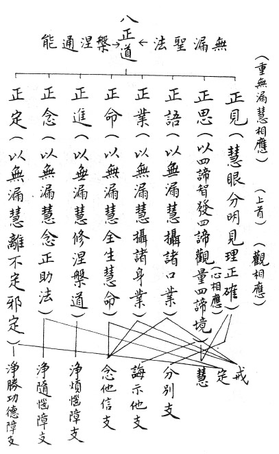

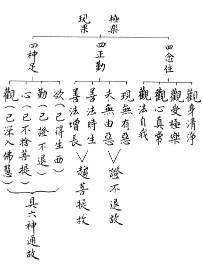

### 大乘百法明門論簡說（一）

*淨本整理*

學習教法真護法　正見行善最第一

了凡遇見雲谷後　方知改命真人生

前言

基隆淨宗學會陳會長，從一○一年三月開始，護持學會的人才培訓計畫，每月提供大專生優渥的獎學金，使得大專生安住於學習，並且組成團隊研學、辦事、發心為公，兩年來，佛學部分開演了《百法明門論》；儒學部分則以《論語》作為深入經典的學習，目前以「知是眾妙之門」為研究主題；禮的部分則研究《常禮舉要》，今將陸續整理課程內容，期待培養更多有心於傳承聖道的年輕人，將所學內化，並組成團隊，共造美好的未來。（編者）

講課因緣

壹、修學次第

培訓班初期佛學課程，為什麼選擇《大乘百法明門論》？雪廬老人說，學佛必須要有次第性，首先要學《十四講表》，對於三藏經典有通盤認識，再來是《八大人覺經》，介紹學佛的次第、修行的階梯。修學要有所成，必須要有體系，佛教的體系可以分為唯識（相宗）跟般若（性宗）。雪廬老人造《唯識簡介》以窺唯識體系；以《般若心經》表解窺般若的體系，並將性相兩宗修學導歸淨土以成佛，並作《佛說阿彌陀經》表解以解淨土，然後生西方目的在成佛，成佛須開展心量故作《普賢行願品》並作講表以釋之，以上是雪廬老人為大專學佛開的六門初機課程。

老人並希望大家更深入學習，所以開出高級課程，在相宗的部份開出《百法明門論》及《八識規矩頌》，拓展心量的部份開出《勸發菩提心文》，綜合性相兩宗，開出《大乘起信論》，並作有講表以釋之。學會大專講座已將初級課程上完，在高級班課程先選擇《百法明門論》，理由是能相應現今時下年輕人的根基，是一門比現在心理學更加完整探討以心為主的學問，讓大家知道佛教所講的心理學是多麼的完整深入，且對我們修心有很大的幫助。

貳、教材

課堂用的課本，分別是懺公師父的《百法明門論的表解》、簡金武老師的《大乘百法明門論研究》，蕅益大師的《大乘百法明門論直解》，《直解》出自蕅益大師的《相宗八要》，此乃大師研究唯識學的八篇文章，《大乘百法明門論直解》就是當中的一篇。

*講授本論*

壹、研究目的

請看簡師的《大乘百法明門論研究》，第一個研究的目的，研究《百法明門論》的目的是什麼？正式進入本論時，如果沒有目的，不曉得研究的目標，學這部論就會茫無頭緒、亂無章法。書上將研究的目的分為解跟行，解的第一面相叫做「知萬法之要」，宇宙人生各類的現象就叫做萬法，萬法裡面可收攝為百法。

佛說法能將所知作各種分類，舉例來說，天、人、阿修羅、地獄、餓鬼、畜生，這就是輪迴的歸類，輪迴的生命種類無量無邊，但是歸類為六。相同的，宇宙的各種現象，無著論師的《瑜伽師地論》歸類為六百六十種，世親論師（或稱天親論師）則歸類成百法，所以透過對百法的認識，就能了解宇宙人生的真相，這些現象無非就是物質現象、心理現象、生理現象，這就叫做知萬法之要，透過百法去認識萬法，透過萬法去認識宇宙人生的現象。解的另一面相是「明無我之理」，亦即在每一個法上通達二種無我：人無我跟法無我，即是了解現象中的本體。

接著是行，本論如何幫助我們行持？特別對於淨土學人來說，本論可以有什麼幫助？首先是「破執去煩惱」。破除煩惱有兩種方法，第一種是修對治法，例如我有貪，就用無貪對治貪，分析無貪行相，透過無貪可以得到什麼快樂？貪心會得到什麼痛苦？然後生出無貪，讓我們能夠離開貪所結成的苦報，得到無貪所結成的快樂。

相同的，可以以慈悲對治瞋恨、正見對治邪見、無常對治常、愧對治無愧、精進來對治放逸。而第二種破煩惱的方法，就是通達人無我跟法無我。《百法明門論》在這兩種方法上都做到了，所以叫做破執去煩惱。如果可以了解無我，自然就可以破除執著，因為執我是一切煩惱的根源，通達所執的我無，能執的心就不生，能執的心不生，一切觀待能執而生的煩惱就通通沒有了。

例如名聞利養是一般人所愛，果能明瞭所執的名聞利養不過人的名言增益出來的東西，毫無實體可言，能執的心自然不生，否則能執的心是破不了的。這種破煩惱的方法最為根本，否則光是勤修對治法煩惱是對治不完。就像一棵幾十個人都抱不攏的毒樹，只要砍掉水脈，就會慢慢枯死，這個水脈就是我執。修學《百法明門論》能夠破人我、破法我，通達無我之後，再從《百法》的定義中去看諸法如何生起，因為透過定義才能知道諸法的生起處，才能抓到諸法的行相與作用。

其次是「為念佛助功」，今天我們為什麼不能一心念佛？因為有煩惱。《百法明門論》就是破煩惱的方便，容易讓你一心念佛而得到念佛一心。其實不只是念佛的助功，《百法》也是其他修學法的助功。助功很重要，舉例而言，吃飯的時候，配菜就是助功，飯能令飽，但是如果沒有好菜，這碗飯可能吃不下。雪廬老人說，你不要小看這些助功，助功夫如果不去講究，會連你要的目標都不能達成。

念佛更在與佛相應，方能在緣起上得到佛的加被，然須斬斷煩惱才能一心念佛與佛相應，而要斬斷煩惱須破執，破執方能去煩惱的根，破執所證的無我是勝義諦，念佛所念的佛是世俗上的顯現。勝義諦當中破執去煩惱，世俗諦當中念佛是最好的入世，因為從中可以得到佛菩薩的加被護持，而且依著佛菩薩能感應善知識來幫助我們推展佛教的事業、正法的事業，所以念佛是最好的入世，一方面講出世，另一方面講入世，整個《百法》雪廬老人就是這樣的定位。

一個人如果要發菩提心利益有情，全部都講世俗，而且一定是結合佛力。甚至在勝義諦的修行，想要破煩惱障、所知障，也要佛的加被，所以念佛很重要。念佛當中特別是往生淨土的念佛，這才是最重要的念佛，為什麼呢？當我們想要培養自己的時候，環境最為重要，所以往生淨土是所有念佛當中最根本的念佛義，如果這個人念佛不求生淨土，這個人念佛不是淨土宗，淨土宗是念佛求生淨土，就是講究環境，環境才是成就的秘密處，如果沒有這個環境，任憑多生的努力也不能成功。

經上稱為：「諸上善人俱會一處」，稱為人才的團隊。蕅益大師在彌陀經科判講到，一個人會成就的無上因緣，就是諸上善人俱會一處。意思是說，人如果教到好朋友，有好老師，此人這一生非同小可。假如身邊都是三教九流的朋友，幾十年後不但不能保有現在的程度，必定也會趨於下流，因此命運就掌握在自己的手上，在環境的選擇。（下期待續）

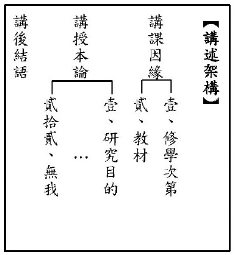

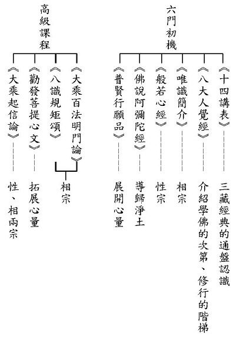

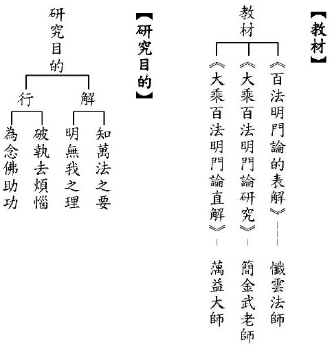

## 孔學一隅

### 孔子聖蹟圖淺說（八）

戒慧

問矢知博物

未渡歎亂邦

適衛志難伸

原來妙吉祥

二十、楛矢貫隼

此圖楛矢貫隼，孔子微服過宋而往陳，住在司城貞子的家中，貞子為陳侯周（即陳湣公）之臣，司城是司空的官職。陳國也沒有給孔子執政的機會，孔子在陳居住三年，當在五十八至六十一歲之間。這三年當中除了講學外，陳湣公曾遣使者問孔子隼（同鶻，是一種猛禽類，毛色斑紋和鷹一樣，是胸腹灰白，四趾都有鉤爪。）死於庭等問題。

那是孔子與弟子們住在貞子家快要過年時，有老鷹被楛木作的箭射穿，掉到陳國宮殿，如書上所示。箭頭是用石頭磨尖做的，陳湣公不知是什麼箭，派人請問孔子，畫上著君王服飾，後有侍者執團扇相隨，旁有大夫相伴者即是陳湣公，湣公與陪臣侍者對射中隼都露出疑惑表情，孔子回答隼自遠方來，此楛矢（楛木作的箭）產自肅慎，從前武王伐紂，肅慎上貢楛矢石砮（楛木作的箭，箭頭用石頭磨尖作成）。武王分賜給女婿陳侯胡公。陳湣公派人去庫房盤查，果然如孔子言，陳湣公非常讚賞孔子是一位博物的君子。

二一、西河返駕

此幅西河返駕，是孔子由陳回到衛國，孔子一生到過五次衛國，這是第三次回到衛國，此時孔子年近六十，趙簡子使人來聘孔子。孔子自衛入晉，由於晉國位於黃河的西邊，東邊是衛國，畫中的孔子駕著周朝型式的馬車，行到黃河邊，正欲渡河，聽到趙簡子殺了晉國竇犨鳴犢及舜華兩位賢大夫，孔子面對黃河很感慨的說：美麗浩浩的黃河啊！可惜我渡不了。這是天命啊！趙簡子未得志時，需要他們兩人協助，方能從事國政。想不到成功得志時，卻將這兩位賢大夫殺了。即使無知的禽獸，碰到無義的事情都知避開，何況是人呢！於是不再渡河，就坐車再回到衛國。

二二、適衛擊磬

此幅是適衛擊磬，孔子從黃河邊又回到衛國，有志難伸。圖中顯示，某日孔子跪坐於席，正在擊磬，其聲硜硜，旁有弟子聆聽，表情肅穆，或欲揣摩老師擊磬心情。有一位挑著草器的隱者，此人避亂世而不仕，自匿其姓名，挑著草器以自食其力。經過了孔子行館，聽了擊磬之音便說到：擊磬者，是有心人。可見此人不凡，能聽懂夫子的弦外之音。

孔子周遊列國除了跟國君談論政治，瞭解當地風土人情，也與當地隱者高人作有趣的相遇，話中都暗藏玄機，不外是他們勸孔子歸隱以避亂世，然孔子自有一番打算，是知其不可而為之的志士。

畫中挑著草器的隱者，除了聽出孔子擊磬是有心。並從磬音鏗鏗中體會出孔子的心意，並接著說，涉淺水，可以提起衣服，免濕。涉深水，例如水深至膝以上，提起濕的衣服還是不免濕，乾脆不揭衣，任衣服垂下涉水而過。水有深淺之異，涉水方法不同，以喻有心人不必固執，天下無道，就應該歸隱。擊磬者是位堅強固執的人，把磬擊得硜硜而不自知，擊磬者只知自己而已，言外之意是不知時代環境。

在亂世表現中流砥柱是沒有用的，孤掌難鳴徒然孤芳自賞，不但無益於大局，反而有生命之危。畫中經營十分巧思，孔子於流水邊擊磬，挑草器的隱者揭衣以示出處道理，弟子聽後轉述給老師。孔子聽了這番見解，便說：如果人人都這樣，把磬擊得硜硜乎，只為自己不為他人，就沒什麼困難了。孔子是知其不可而為之的聖人，天下無道，仍不作隱士。（下期待續）

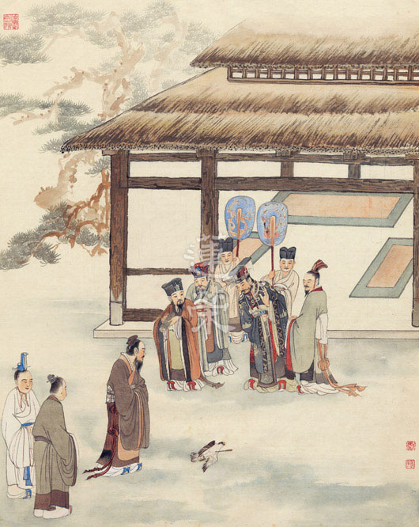

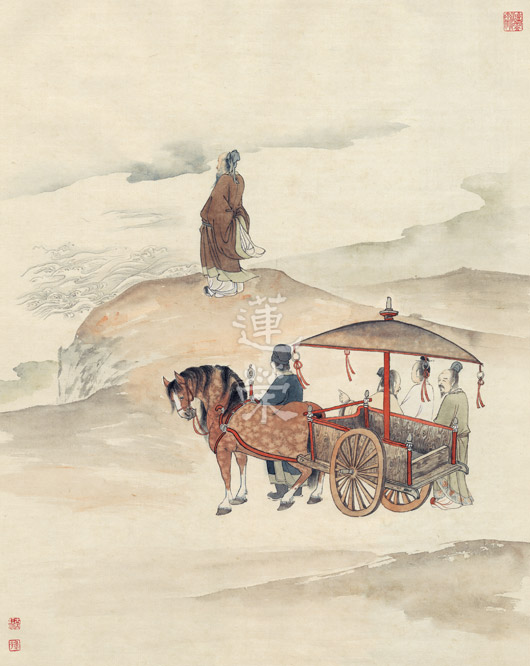

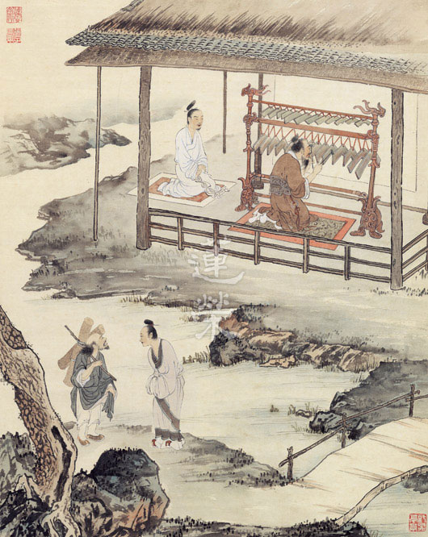

### 論語簡說（一）六言六蔽賞析

*淨度整理*

品德講究在好學

不偏不倚自他利

六言遮蔽不受害

正見能令行持中

論語章節

子曰：由也，女聞六言六蔽矣乎。

對曰：未也。居，吾語女。

好仁不好學，其蔽也愚。好知不好學，其蔽也蕩。

好信不好學，其蔽也賊。好直不好學，其蔽也絞。

好勇不好學，其蔽也亂。好剛不好學，其蔽也狂。

（陽貨第十七，第八章）

消文
孔子說：仲由啊，你聽過六個字及其弊端嗎？子路回
**答：** 還沒有聽過。孔子說：坐下，我告訴你。喜好行仁的人如果不好學，他的弊端是容易受人愚弄。喜好智慧的人如果不好學，他的弊端是追求私利放蕩耍小聰明。喜好守信的人如果不好學，他的弊端是昧於大義容易傷害自身。喜好正直的人如果不好學，他的弊端是易於諷刺他人的過失，不能隱惡揚善。喜好勇敢的人如果不好學，他的弊端是容易亂事。喜好剛強的人如果不好學，他的弊端是狂妄，言行上容易觸犯他人。

釋義

「六言六蔽」

「六言」即仁、智、信、直、勇、剛六字；「六蔽」即愚、蕩、賊、絞、亂、狂六種蔽端，分別對應以上六言。

「言」者，於《論語》中出現多次，各表不同意涵。若作動詞，可解作說、談等，例《論語》〈學而篇〉第十五章「子曰：賜也，始可與言詩已矣」；若作名詞，可解作話，例〈為政篇〉第二章「子曰：詩三百，一言以蔽之，曰『思無邪。』」，另〈子路篇〉第十五章所提及之「一言興邦、一言喪邦」；亦可解作字，例〈衛靈公篇〉第二十四章「子貢問曰：有一言而可以終身行之者乎。子曰：其恕乎。己所不欲，勿施於人。」。「六言」之「言」，即作字講。

「蔽」者，或作覆障講，覆蓋光明之義；或作壅蔽講，隔絕出路之義。兩者皆可，皆指使人不能通達明了事理。

「六言六蔽」是古成語，或指「好仁不好學，其蔽也愚」至「好剛不好學，其蔽也狂」共六句；或指「六言」及「六蔽」共十二字，而孔子點出「好學」為此章重點。

「居」

「居」作坐字講，孔子命子路坐下。

古時人席地而坐，先以兩膝著席，再以尻（臀部）著足跟。子路見老師問，便直其腰身而長跪，回答老師，此為禮之表現。

「好仁不好學，其蔽也愚」

「好」是喜好，最先點出喜好行仁的人如果不好學，他的弊端是愚昧。

以能所觀待而言，能蔽為仁，所蔽為好仁之人，蔽為愚。仁，簡單講是想要利益他人。好仁之人，即喜好利益他人之人，這種人若不好學則會產生愚的弊端，意即容易受人愚弄。

〈中庸〉提到「好學近乎知」，意思是雖然好學不一定有智慧，但智慧一定要從好學來。《論語》中的「學而知之」，也是在說明學的出路在知。透過好學要知什麼呢？知仁的行相，得仁的方法，仁的功德，不仁的過患，行仁的善巧方便，行仁的時機，行仁的對象是君子與小人皆有不同的應對方式。若不明以上內涵，則好仁之人容易成為愚昧之人，是非善惡不分，行仁反而當傻瓜，甚至被小人利用，害人害己而不自知。

宋襄公便是一個例子。公元前六三八年，宋襄公出兵攻打鄭國，而鄭國向楚國求救。楚成王不去救鄭國，反派大軍直接攻打宋國。宋襄公連忙趕回，與楚軍在泓水（於今河南柘城西北）隔岸對陣。當楚軍開始渡河之時，公子目夷建議宋襄公趁此時機迎頭進攻定能大勝，但宋襄公說，敵人尚未渡河完畢，若此時進攻，則有損仁義。當楚軍全部渡河上岸，正在擺陣勢之時，公子目夷又說，再不動手便會來不及，但宋襄公怕損仁義，堅持待楚軍擺好陣勢再打，結果不但宋軍大敗，連宋襄公也差點死在戰場。此即「好仁不好學，其蔽也愚」。雪廬老人說二十四孝中的郭巨埋兒亦是愚孝。

「好知不好學，其蔽也蕩」

「知」就是智，能蔽為知，好智之人為所蔽，蔽在蕩。乃喜好智慧的人如果不好學，他的弊端是放蕩而無操守。

為何如此？必須要透過好學而知智的功德，不智的過患，智的行相，得智的方法，行智的時機，且智要在禮和義上講究，以及知道智是要配合公心發展等。若不知以上重點，則好智之人容易喜歡耍小聰明，在個人利益追求上十分聰明，覺得自己厲害而不願受公眾道德規範約束，敢鋌而走險，只知展現自己的才能，所以容易放蕩不羈而沒有操守。

曹操乃好智之人，但一心只圖私利，放蕩不羈，弄得天下大亂，有人說他是治世之能臣，亂世之奸雄，此即好知不好學，其蔽也蕩。雪廬老人說張儀、蘇秦都是有知之人，然好事不作，只圖私利，弄得天下大亂。

「好信不好學，其蔽也賊」

「信」即守信，能蔽為信，好信之人為所蔽，蔽在賊。義為喜好守信的人如果不好學，他的弊端會賊害事情甚而傷亡自身。

為何如此？必須要透過好學而知道信的行相，信的功德，不信的過患，信的善巧方便，守信的時機，以及信是要合乎禮、義的信等。若不知以上內涵，則好信之人容易信得不合時宜，以致賊害其身。

古時有一好信之人，名尾生，與女子約會於橋下，女子未至，而洪水至，尾生守信，抱橋柱不離，結果淹死於水中。只知重然諾，而不明何謂真正的守信，是不學而信之蔽，容易害人害己。此即「好信不好學，其蔽也賊」。

「好直不好學，其蔽也絞」

「直」就是正直，誠心誠意，於此處為能蔽，好直之人為所蔽，蔽為絞。義為喜好正直的人如果不好學，他的弊端是容易絞刺他人，雖似表現正直，但往往得罪人，甚而造成他人無法彌補的傷害，有傷厚道，不通人情。

為何如此？必須要透過好學而知道直的行相，得直的方法，直的功德，不直的過患，直的善巧方便，行直的時機，以及直是要合乎禮、義的直。若不知以上重點，則好直之人容易直得不合時宜，容易刺人之非以成己之直。

〈子路篇〉第十八章所記，楚國有一人，其父奪取他人之羊，而其子證之。彰明自己的父親之罪，可謂絞到了極處。若在非行直的時機行直，非但不直，反而流於陰險苛薄。此即好直不好學，其蔽也絞。

「好勇不好學，其蔽也亂」

「勇」就是勇敢，即很有執行力，於此處為能蔽，好直之人為所蔽，蔽為亂。此句義為喜好勇敢的人如果不好學，他的弊端是容易造成亂象。

為何如此？必須要透過好學而知道勇的行相，得勇的方法，勇的功德，不勇的過患，勇的善巧方便，行勇的時機，以及勇是要合乎禮和義的勇等。若不知以上原則，則好勇之人容易好勇鬥狠，不經商量，不按程序和名分就去做事，以致所做的事不合時機，錯亂規矩，而造成社會的亂象。

秦武王便是一個很好的例子。秦武王四年（公元前三０七年），他與孟賁比賽舉「龍文赤鼎」，結果兩目出血，折斷脛骨，氣絕而亡，時年二十三歲。秦武王身為人君，不看時機、場合、名分，表現自己的勇敢，導致國家突然失去國君，陷國家於亂。此即「好勇不好學，其蔽也亂」。

「好剛不好學，其蔽也狂」

「剛」的行相有二。一者，寡慾，例〈公冶長篇〉第十一章，子曰：吾未見剛者。或對曰：申棖。子曰：棖也慾，焉得剛。二者，無畏，從寡慾發展而來。剛為能蔽，好剛之人為所蔽，蔽為狂。義為寡慾無畏之人如果不好學，他的弊端是狂妄，容易抵觸他人。

為何如此？必須要透過好學而知道剛的行相，得剛的方法，剛的功德，不剛的過患，剛的善巧方便，行剛的時機，以及剛是要合乎禮和義的剛等。好剛之人於人無求，若不知以上內涵，則不會站在對方的角度考量，以致言語行為不能恰到好處，容易偏於剛強而抵觸他人。

昔日子路初遇夫子時，頭上戴著雄雞冠，脖子上戴著野豬牙齒，而腰間再佩掛著公豬皮裝飾的寶劍，在夫子面前舞劍。舞罷對夫子說，古時的君子沒有不佩劍以自衛的嗎？夫子也應學劍習武以繼承先業。當時子路呈現的就是一付「好剛不好學，其蔽也狂」的形象。後經孔子設禮稍稍誘之，便馬上換下戎服，委質願為聖門弟子，後更成為大賢，位列孔門十哲政事科。

喜好仁、智、信、直、勇、剛六者，皆是好德之人，但如果只是喜好此六種內涵，而不透過好學知道其中的事與理，便無法恰到好處地運用，從而造成各自的弊端，所以孔子點出好學來作為成就六言遮止六蔽的重點。（下期待續）

## 活動報導

### 夢想的世外桃源　二○一三年十月雲南行紀實　雲南的論語緣—雲南民族大學講座點滴

*編輯部整理*

可貴大學讀論語

講要研討生慧眼

民族文化國之魂

弘揚傳承皆在人

前言

因為雲的彼端有民族大學楊潔教授師生所組成的，約莫十餘人的論語講要讀書會，我們來到雲南昆明，舉行為期兩天的論語講座，主題是「君子與小人之辨」，並順道為雲南民族大學大學同學舉辦一天的演講，題目是「文武之道未墜於地—在人，由孔子聖蹟圖說起」。又蒙中華文化促進會秦主席之邀，向與會藝文界人士介紹「孔門聖賢」。又由民族大學中文系系主任和教授的促成，與麗江東巴文化研究所、納西古樂、雲南大學東陸書院的學者專家們進行文化交流。匆匆一行以文化與彼方美麗善良的人們會遇。

以下刊錄此次講座中師長的談話、座談問答、文化講座活動報導、楊潔老師說因緣、簡介麗江東巴文化及學員致贈的精美卡片內容，以嚮大眾。（編者）

開場白

今天很榮幸在民族大學報告「文武之道未墜於地，在人—由孔子聖蹟圖說起」。

雲南的大理曾經是古代（九三七年至一０九五年，一０九六年至一二五三年）的大理國，但是因為文獻不足，歷史難考證其各項施政與文化的內涵，臺北故宮博物院有幅張勝溫畫卷，顯示當時大理國的文風極盛。而雲南的景色優美，也有很多歷史遺跡，風俗非常淳厚，在澗水也擁有全國第二大的孔廟，相信當時文風一定很昌盛。在大陸上少數民族有五十六個，雲南就佔了二十六個，貴校雲南民族大學就是為了少數民族所設的大學，這所大學在外觀上非常雄偉，學生人數眾多，但如何充實這個學校的深度與廣度，也是每個學校需要嚴肅思維的課題。

此次是第二次到雲南，我們在馬來西亞辦理國學文化交流會時，認識了人文學院副院長楊潔教授，楊老師從小就學過論語，並且從經濟貿易轉到人文科系，從認識國外的思想家而進一步想要探索中國的文化，倘若能對中西文化作通盤瞭解，並且以中華文化為基礎去認識西洋文化，相信楊老師的教學會非常精彩，能讓學生有所受用。

文革之後，大陸上對於孔子的印象是模糊的，甚至是負面的，慢慢隨著歲月的成長，知道孔子是教育家。所謂的教育家就是能將人培養成為人才，能造就時代的菁英。

看看孔門入門的七十二賢與升堂入室的十哲，就知道孔子是一位造就時代菁英的教育家。孔子周遊列國，帶了一批學生到楚國，楚昭王想要將書社七百里地封給孔子，當時執政的子西大夫就跟楚昭王說，您手下的宰相人才有像顏回那樣嗎？不等楚昭王回答就答說沒有！內政的幹才是否有像宰我那樣？外交人才是否有如子貢那樣傑出？軍事長才有如子路的嗎？子西大夫全部回答沒有！並說，當時文王只有七十里地就可以一統天下，今天大王將書社七百里地封給孔子，將來不知道會發生什麼事情！這裡面告訴我們，孔子帶著幾位學生，比楚國一國的人才還要可觀，這就是教育家！可以把人教成人才，成為時代的菁英。

孔子也是一位政治家，也就是辦政治能夠讓國政上軌道，孔子在五十三歲到五十六歲時是魯大司寇攝行相事，造成魯國內政空前安定，在夾谷之會時以言詞及軍政武備打敗齊國，在外交上讓魯國達到顛峰，所以在內政以及外交上能將魯國治理得非常好，而且他知道要把魯國的國勢帶到一個富強康樂又有文化內涵的國家，這才是一位真正的政治家，不但能揚名於各國，也知道本質需要在內涵上面充實。

孔子也是一位思想家，因為他懂得將古籍作解釋，周公解釋易經卦辭，周武王解釋爻辭，可是並未解釋形而上的道理，孔子根據周文王、周武王的卦辭、爻辭，寫了彖傳跟象傳，不但對每一卦的義理作決斷，並在繫辭傳當中，將易經形而上的道理說得很清楚。並刪詩書、定禮樂、作春秋，不但是中華文化的集大成者，也是發揚光大者與傳承者。

所以將中國的古籍字字句句弄懂，這就是中國文化。坊間也有一些對古籍的白話文注解，但是都無法完整的呈現其中的內涵，甚而錯解意思，若如此文化的內涵就難以呈現了，且造成人們負面的影響。如同論語注解有六百多家，令人不知所從。李炳南教授作抉擇而講學，經徐醒民老師整理成論語講要，乃目前最好的論語注解。懂得用好教材方是真正培養人才的方法，貴校楊教授讀書會若能認真研讀討論，成果可觀，讀書會成員對自己的未來必充滿自信。

孔子這一家何以稱儒家？儒字指的是國家的教育官員，儒就是主持教育者，不是百家爭鳴當中的其中一家，而是能夠融合各家，而且能匯整各種思想，能完成人生的修養，是人才培養造就菁英的教育。並非如今日盛行東拉西扯的多元文化，令人不知所宗，孔子將多元文化集大成，具架構與次第性。

孔子也是軍事家，孔子周遊列國十四年，最後風風光光的回到魯國，是因為魯哀公十一年，在齊魯戰爭中，冉求在季孫大夫下做家臣，勝齊國，季孫大夫問冉求何以有軍事方面的長才，冉求說學自於他的老師—孔子，季孫大夫便對孔子生起無比的信心，並備了厚禮，敦請孔子從衛國回魯。

其次孔子也是一位哲學家，能將人的吉凶禍福以及解脫的道理說得清楚。孔子的內涵是遠遠超過堯舜的，孟子當時對孔子的讚歎：「自生民以來，未有孔子。」司馬遷亦引用詩經「高山仰止，景行行止」來讚揚孔子的道德，米芾也對孔夫子讚歎：「孔子，孔子，大哉孔子！孔子以前，既無孔子，孔子以後，更無孔子。孔子，孔子，大哉孔子！」故此次對貴校的演講，題目就訂為「文武之道未墜於地，在人—由孔子聖蹟圖說起」，文化不是在光碟片，而是在人，唯有找回孔子，才能真正將中國文化找回來，方能喚回國魂，維持與延續民族。
孔子三十五歲到周朝見老子，求教禮樂的內涵，老子回
**答：** 你所問的那些人早已作古，你所問的不過是遺文制度。老子的回答並非否定過去，想要表達的是人才最為重要，如果沒有傳承，留下那些文獻資料、典章制度是沒有用的，不會產生任何影響力。好比孔子因為懂得文化，所以可以讓魯國強盛，孔子離開魯國之後，魯國還是保留這些典籍以及資料，但是國力卻慢慢的沒落。

當時雪廬老人過世的時候，我們為了把老人家過去所教，好好的學習以及發揚光大，好好的往下傳，所以一直以來都辦理讀書會，讀書會堅持到現在，已經歷經約三十年沒有間斷，對我個人有莫大的助益，所以抱著誠惶誠恐供養的心態，將我的老師如何解國學的眼力與抉擇，願意四處傳播，讓我們對中國文化有所瞭解。

後來因為多年讀書會結交許多志同道合的朋友，最後就成立了社團，社團裡從啟蒙教育到大專教育、養成教育、以及師資教育，乃至於慈善事業，也到中國大陸、東南亞各國。覺得文化真的是德不孤必有鄰，所以願意將這樣的理念四處結交朋友，大家共同在文化上面學習，讓文化傳播造成社會的安定，國家的安定，以及民族的延續。

問答

**問：** 說到君子求諸己，小人求諸人。若是為公，是否可以對下屬責求？

**答：** 今天作一位領導者固然需要檢點自己是否有公心與品德，但是能力也很重要，我沒有能力的這一分要反省。如果在我的這一分已經具備，但下屬還是沒有做好，這時候第一個步驟是找人幫忙他，第二個步驟是這個人要換職務。

**問：** 對大陸目前國學的發展，有何建議？

**答：** 這需要瞭解之後才能真正給建議。

**問：** 性相近，習相遠，到底什麼造就了君子，什麼造就了小人？我們這個世間，大多數是屬於小人和君子之間的，每個人或多或少會有一點小人的意念，每個人在某些狀況下也會感覺有道德上的提升，我們會不會都是主觀的去判斷某人是君子或是小人？或者這只是道德上的原則？

**答：** 在識人之明之前要先有自知之明，我們可以先來檢驗自己發展的方向，是往君子還是小人？這些學習可以讓我們回頭檢視自己，我們會發現當自己正知見還沒建立的時候，作事情的心態、作法，內心隱微處是小人的，但因為有經典的學習，讓我願意往君子的方向改變，過程中或許會遇到很多障礙，也有許多內心的煎熬，但是因為立定方向，也確立君子的行相，此時也可檢驗別人，論語上認識自己與知人都很重要。

**問：** 古籍的注解與翻譯有哪些是可信的？江逸子老師所繪的孔子聖蹟圖也經過考證。不知道該如何抉擇所查到的史料？

**答：** 前者須經大德抉擇後才有保證，後者主要依史記，司馬遷所整理的孔子世家，仲尼弟子列傳。有關孔子各項史料，可參考程樹德先生的論語集釋，已將古籍與古注講到孔子生平處作整理。

**問：** 君子坦蕩蕩，小人長戚戚。論語要解當中解釋戚戚就是蹙蹙的意思，也就是迫縮之意，請問迫縮具體的行相是什麼？

**答：** 君子因為懷德，心中所嚮往的都是道德，所以他的行為很自由，而且將道德看得比名利還要重要，所以不會被名利壓迫，但是也不會壓迫小人，讓小人有害怕的感覺。小人常常會有擔憂以及壓迫的感覺，其實是擔憂自己的安危，例如捉放曹那齣戲，曹操就是一位害怕別人在背後捅自己一刀，最後因為起了疑心，而殺掉誠意款待他的呂伯奢一家。君子不會把毀譽得失看在眼內，君子在意的只是自己是否如理如法，小人心心念念想要壓迫君子也壓迫不了。

迫縮就是被緊縮起來，內心煩惱很多，就算住在豪華的別墅裡面，卻需要鎮定劑與安眠藥，那是一種迫促不安的行相。

**問：** 現在社會當中的一般大眾，他沒有那麼高尚，但是也不像小人那般，有些時候為了現實狀況必須做出一些看似小人的決定，他的內心或許知道這樣做不是妥當的，那這樣的人到底算是小人還是君子呢？

**答：** 這個人如果無法確立正知見，自我反省的力量薄弱，這樣的懺悔是沒有用的。每個人都會往對自己最有利的方向去走，內心當中正知見的力量強大時，自己能知道吉凶禍福在哪裡，知道對自己最有利的到底是義還是利，當我們發現對自己最有利的就是坦蕩蕩，就是懷德，自然而然自己就會改變了，說難很難，說簡單也很簡單。

**問：** 與小人交往要多打招呼，少說話，少深交，可是招呼打多了，怎麼能不和對方交往呢？會不會有矛盾？若不和小人打招呼，會不會把氣氛搞僵了？

**答：** 小人是千萬不能得罪的，要和對方打招呼是基本的禮貌，如果不和對方打招呼，會讓對方覺得被看不起，日後就會倒楣。小人花在鬥爭的時間最多，君子為了怕作善事被障礙，所以眼前不要得罪小人。陽虎就是標準的小人，當他在魯國沒有發展時逃到晉國，竟然告訴晉國如何討伐魯國，讓魯國滅亡，不斷的激勵晉國出兵攻打魯國，是這種小人。但是孔子碰到陽虎，還得要順詞免害，客套一番而已。在這當中其實小人也很清楚孔子與他是保持距離的，如此大家可以相安無事。

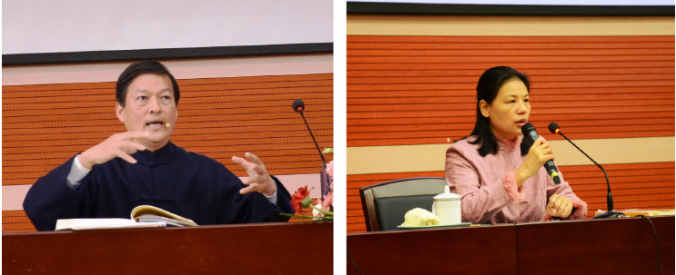

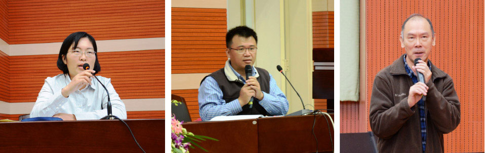

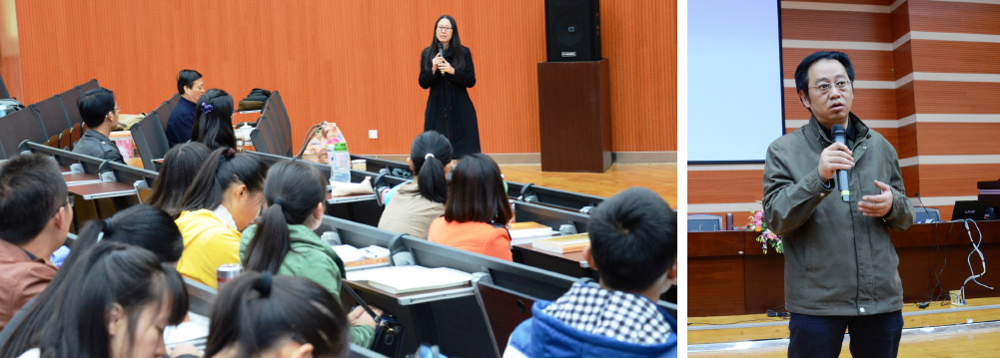

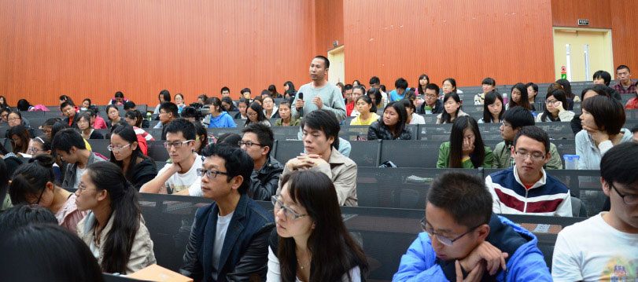

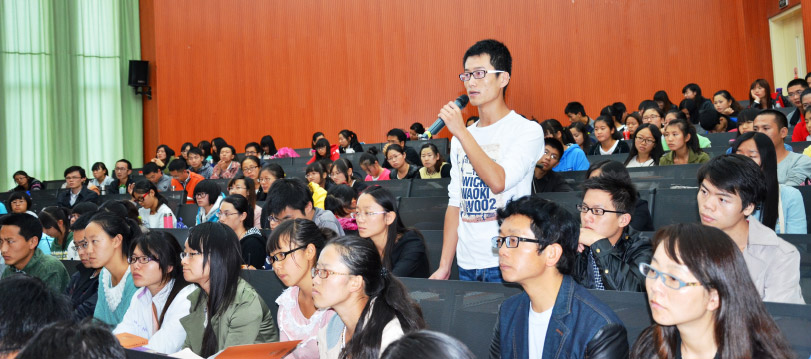

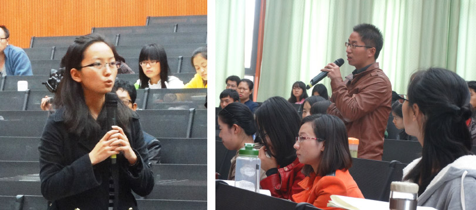

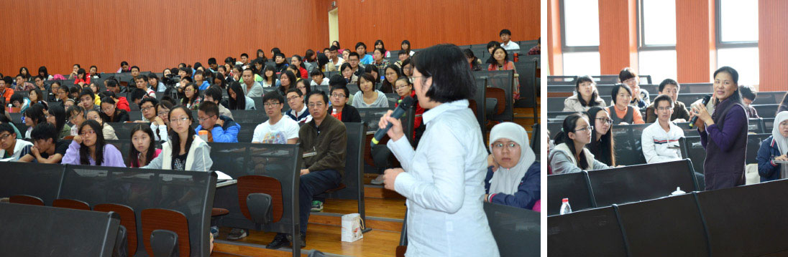

### 夢想的世外桃源　二○一三年十月雲南行紀實　雲南文化講座活動報導

王興文

人文繁榮交參　古鎮追尋依在

時代巨輪前進　歷史彌新珍寶

說到雲南，金庸武俠小說世界中的各種傳奇秘境，很自然就浮現在腦海中，對末學而言，雲南是個陌生遙遠又充滿傳說的神秘之地。二０一三年十月中，中華無盡燈文化學會應雲南民族大學人文學院之邀，遠赴該校做專題演講，末學有幸藉此因緣得以一窺神秘國度的真面目。

由於昆明麗江等地海拔在一千八百公尺以上，日夜溫差極大，加以唐老師身體在調養中，因此我們一行五人，準備了各種衣物裝備，於戒慎期待中飛抵昆明，前來迎接的是人文學院的楊潔與郭飛平兩位副院長及學生。原先住宿的安排是末學與心刻學長夫婦住民族大學賓館，唐老師伉儷住楊潔教授家，楊教授將房子整個讓出來，以方便唐老師作息，然而因賓館與老師住處相去太遠，照應不便，幾經抉擇，最後決定臨時添購兩套床與棉被，一行五人全部住進楊教授家，就這樣開啟了新的生活體驗。

素聞心刻學長做菜功夫一流，手藝獨到，宴客辦桌更是一絕，隨手拈來，就是一桌令人驚艷的拿手好菜。百聞不如一見，連續數天下來，果然名不虛傳，在楊教授家停留的四天裡，心刻學長是我們的大廚兼採買，每天清晨六點準時起床，七點半開飯，中午十二點半用餐，晚餐六點半開始，他都能準時達成任務；在他的匠心巧手之下，市集中的新鮮食材，無不立即化為清新可口、色香味俱全之佳餚，而且餐餐菜色不同，口感各異，給大家連串的驚喜與無窮的回味，這種共住的學習與生活體驗，是過去講學中所未曾有的，彌足珍貴，特別記下以供參考。

此行最重要的項目就是在雲南民族大學的演講，民族大學是一所培養各少數民族高級專業人才的綜合性大學，是雲南的重點大學之一。此次講題是「文武之道未墜於地，在人」，出自論語子張篇，演講地點在民族大學圖書館的演講廳，演講海報豎立在圖書館的大門口，極為醒目，聽眾約三百人左右，都是在學的大學生、研究生等。此次演講肇因於二○一三年馬來西亞的講座因緣，楊潔與郭飛平兩位教授因緣際會參與了該講座，因而結下了不解之緣。

楊教授說，她是研究比較文學的，多次分赴國外研究歐美哲學思想，多年來都未能找到滿意的答案，這次透過論語的研討得到了啟發，原來答案就在我們自己的文化傳承中，因此回校後即發起論語讀書會，從零開始，不到半年即成長到二十名成員。為了進一步幫助同學們認識論語，了解中華文化的內涵，培養正確的人生觀，因此特別安排促成此事。

在三個小時的演講中，楊教授說，以她多年的教學經驗，現在的學生與以前不同，相當有主見、有個性，台上老師若講的不好，台下的學生會即時反應，或低頭玩手機，做自己的事，或無精打采，發呆睡覺；而今天她觀察到大家都全神貫注，聚精會神地聽講，沒人玩手機或離開，這種情況很難得。結束前的半小時問答，更是發言不斷，欲罷不能，令人印象深刻。

講座後連續兩天，在同一地點，為論語讀書會的同學舉辦論語研討，主題是「君子與小人之辨 —親賢遠佞改變命運」，教材是從論語中挑選出三十一章相關經文，加以分類做成科判而成。兩天來參加研討的同學有五十餘人，超過其原有的學員一倍以上，可見前一天的演講發揮了效果，帶來許多新同學的加入。

離台前，事先曾告知他們要研討的主題，沒想到他們就主動分工，從論語中搜尋有關君子與小人之經文，加以條列出來研究預習，以待老師來時研討之用，雖說與老師所準備之科判教材有所出入，但此種認真、敬業、好學的精神與態度，著實令人感動。

在連續兩天的研討會中，同學們犧牲美好的周末假期，求知若渴，從早上九點到下午五點，在會場中專心一意的聆聽著老師們精闢的解析，期能早日明辨善惡，親賢遠佞，趨吉避凶，改變命運。時間不覺倏忽已過，轉眼間來到了離別的時刻，相處雖然只有短短的兩天半，離別時卻有如相識多年的老友，依依不捨，同學們齊集於圖書館前，一一為我們送別，有人含淚揮手不肯離去，我們搖下車窗揮別，強忍淚水而去，心中百感交集，默默無語。

麗江的東巴文化研究中心是我們拜訪的第二站，從昆明到麗江車程相距六百公里，我們一行八人，分乘兩輛車一同前往，早上八點多出發，晚上十點才抵達。雲南多山，山勢起伏很大，尤其是大里到麗江間，更是層峰疊起，險峻異常，道路彎曲，車多路狹，往返其間，險象環生，去時正逢夜晚，山路漆黑一片，對向車燈迎面而來，往往令人眼花撩亂，更增行車之困難。所幸一路上，車內有楊教授的交響樂相伴，鼓舞著我們的精神士氣；車外有一輪明月為伍，忽前忽右，不時從樹梢後注視著我們，更增添幾分情趣，稍解「夜奔」之苦。

途中，我們選在山頂高處的一加油站休息，此時店門已關，四周一片黑暗，抬頭仰望，只見夜空，一片清朗，一輪明月，高掛天邊，繁星點點，明亮無比，盡無邊際，有如站在高處向下遠眺華燈初上的夜景，璀璨無邊，令人神往；恍惚間，忽覺與天地合一，萬物一體，星星月亮，伸手可及，興奮之餘，倦意頓時全消。

麗江是納西族的主要分布區，佔人口總數百分之六十以上，東巴文化是一種宗教文化，是納西族的傳統文化，因東巴教而得名，其主要的傳承者—東巴，是納西族最高級的知識分子。東巴文是圖畫象形文字，形態十分原始，比甲骨文還要原始，源自東巴經，被完整的紀錄保存下來，是依然存活著的象形文字，有「活化石」之美譽，被聯合國教科文組織認定為世界文化遺產。

東巴文化研究中心位於麗江名勝黑龍潭風景區內，是研究與保存東巴文化之重地，我們有幸在雲南民族大學中文系主任和教授的帶領下來此參訪，接受納西文化的洗禮，復蒙院長及專家們的熱情招待，深感榮幸。我們由衷地敬佩納西先人之睿智、遠見與慈悲，創造此優美多元的東巴文，使納西文化源遠流長，流傳至今，成為世界重要遺產。同行的淨印學長十年前曾因研究東巴文化到過此地，此次舊地重遊，觸景生情，想必感觸良多。

納西古樂團創辦人宣科先生，是納西人，音樂奇才，世界名人，曾率領納西古樂團巡迴世界演出，也到過臺灣。和教授也是納西族，與其相交甚久，這次蒙其推薦得以親至宣科先生府上拜見，榮幸之至。宣科先生為人豪爽，熱情風趣，健談好客，令人一見如故，倍感溫馨。莊園內蓋有一座音樂廳，可容納三百餘人，作為表演及培訓音樂人才之場所。

宣科先生熱愛音樂，推廣文化，贊助教育、文化事業不遺餘力，令人敬佩。當晚宣科先生並招待我們一行八人到其位在麗江古城的劇院中，欣賞名聞中外的納西古樂團演奏。我們被安排在第一排的貴賓席上，仔細聆聽著由二十餘位七十餘歲至九十一歲高齡的老樂師們組成的古樂團，彈奏著源自唐宋朝的古樂曲。樂師們高坐台上，手裡拿著古琴樂器，半閉雙眼，似睡非睡，神色恬然自若，一副若無其事般，身體隨著音樂旋律自然擺動，陶醉在優美的樂聲中，怡然自得，令人耳目一新，別有一番情趣。

聽完納西古樂後，時間還早，大夥就沿著四方街，開始安步當車，悠遊古城。夜色中，麗江古城被點粧成彩色繽紛的夜都，街道上、河堤邊，到處都佈滿了五光十色的花燈，極為絢爛奪目；古街上夾雜著許多夜店，熱門音樂震耳欲聾，像脫韁的野馬，競相從店裡飛奔而出，極為喧鬧；走在古城中，如處大都會裡，這景象令人不知如何是好。

比起麗江古城，鄰近的白沙古鎮就令人嚮往了。它沒有現代的濃妝豔抹，也不見都市的喧囂雜亂，有的只是古鎮的原始純樸風貌。街道兩旁柳樹成蔭，垂柳迎風飄逸，自然瀟灑；山水清澈冰涼，順著水溝，流過街道兩旁人家門前，水草綠滿溝中，小魚悠游其上，自在快活；街道上，只見小狗兩隻，一早橫臥門前，完全無視於人，悠閒的享受著溫暖的陽光。當地的少數民族都還穿著傳統服飾，保持著傳統生活，只見他們三三兩兩，不慌不忙，靜靜的走在街道上，此情此景，彷彿光陰倒流，置身於時光隧道中，不知身在何處。

束河古鎮是另一個值得懷念的地方，它位在麗江附近的玉龍雪山腳下。玉龍雪山是納西人的聖山，高五千五百餘公尺，山頂終年積雪，形如一條雪白晶瑩之玉龍橫臥山頂而得名。城中有河流經，溝渠縱橫，戶戶流水，處處垂柳，好一副江南景象；街道蜿蜒曲折，部分房舍依山而築，建材以木石為主，建築形式與大自然相融，生態與文化並存；房屋格局，融合納西族的文化特色與中國傳統庭園之美，自然溫馨，典雅舒適，隱密性高，極具文化特色，令人流連忘返，是共住環境的最佳選擇。

結束麗江之行後，我們便踏上歸途，奔向下一個目的地—洱海。我們下榻於大理北郊的一戶新民宿，主人是白族人，是楊教授的朋友，非常熱情好客勤奮，待我們如上賓，大理是白族自治縣，白族人喜歡白色，並將其應用在建築上，沿路上四處可見一棟棟白牆黑瓦建築，矗立在遠方，別具特色。我們住的正是著名的白族典型房屋，具有所謂「三房一朝壁，四合五天井」的特色，一棟三層樓白牆黑瓦的建築，屋頂兩邊有飛簷突起，廳前有天井大院，圍以高牆，相當隱密。

我們是他們的第一批，同時也是當天唯一的客人。到達時天色已晚，就在附近街上隨意用餐，體驗道地的當地人生活。晚餐後，屋主以各式的當地水果與茶點招待我們，並在二樓客廳以當地傳統樂器與大眾共娛，直至盡興而散。

隔日一早，主人刻意買了許多富有特色的當地早餐，讓我們逐一品嚐，體驗白族的飲食文化；另一方面，楊教授也悄悄的在廚房一角桿著水餃皮，與郭教授一起包著水餃，給大家帶來意外的驚喜。聽說我們對雲南的紮染布很感興趣，早餐後就帶領大家到當地一家熟識的紮染廠參觀，同時為我們爭取到很低的批發特價，大家一時興起，爭相採購，意猶未盡，幸好在麗江古城時沒有受到誘惑失血，否則就吃大虧了。由於這一耽誤，延誤了預定行程，使得我們當晚回到昆明時，時間已近深夜，不過，還是值得的。

在紮染廠附近街上，我們看到一個醒目的招牌上寫著「三道茶」，無意中得知這是白族的茶文化，指的是「一苦、二甜、三回味」三道茶，指人生在世，不論讀書、經商、做事業，要先學吃苦；唯有吃得了苦，才會有甜美的收穫；人生中充滿了酸甜苦辣種種滋味，凡事要多回味；先苦後甘的人生哲理，盡在三道茶中。此回無緣品茗，留待下次再說。

洱海位在大理城邊上，海拔一千九百多公尺，面積二百四十八平方公里，是著名的高原湖泊，也是有名的景區。我們驅車直達雙廊，這是洱海邊上著名的景點，過去是偏僻小漁村，現在已是知名的渡假勝地，許多名人都在此置產。離岸不遠處，有一小島，就是著名的南紹風情島，面積不大，須搭小船過去，島上原住有一戶人家，現已遷離，房舍仍在，已改成度假屋出租。

島上另建有一座七層高的現代觀光旅館，登樓遠望，景色絕佳。可遠眺蒼山雪，近觀洱海月，青山白雲，藍天碧海，遠近風光，盡收眼底，美不勝收。我們在島上繞行一周，隨即返回陸上進餐，午餐選了一間臨海餐廳，設桌於花前樹下，點了十道特色素食，都是當地新鮮食材所做，可口異常，出乎意料之外。餐後，飽覽了當地的風情古蹟之後，即刻上路回昆明，我們繞著洱海邊行，給洱海做最後的一瞥，洱海風光，明媚壯闊，果然不同凡響，令人陶醉。

雲南中華文化促進會講座之因緣，也是源自二０一三年三月馬來西亞的論語講座，當時秦副主席與幾位同仁參與了該活動，留下深刻印象，因此趁著民族大學舉辦講座之便，也適時邀請唐老師蒞臨該會。本次講座，會場就設在促進會的演講廳，聽眾有百餘人，坐滿會場，以藝文界人士為主。

在三小時的演講中，唐老師以孔門聖賢為榜樣，鼓勵大眾好好學習論語，深入文化的內涵，發揚中華傳統文化，自利利他。現場大眾，眼神專注，靜靜地聽著唐老師娓娓道來，並頻頻點頭，似乎非常認同老師的看法。結束後，秦副主席特別安排了該會的一位董事，專精剪紙藝術，給我們五人做即時半身剪影，在眾目睽睽之下，每人只花三分鐘就完成，剪得唯妙唯肖，令人歎為觀止，足見該會人才濟濟，從事中華文化的傳播與交流，實至名歸，有目共睹。

當天下午，另外安排了一場參訪活動，是到雲南大學的東陸書院，院長施教授特地從北京趕回來接見，實愧不敢當。東陸書院是高級的國學研究、教育與推廣中心，就位在雲南大學的昆明校區內，雲南大學是雲南省的最高學府，有九十多年的歷史，由當時的雲南省總督唐繼堯先生設立，歷史悠久，環境清幽，人才輩出，東陸書院雖才成立一年，相信假以時日，必當成為中華文化在雲南的研究重鎮。

當晚是此行的最後一夜，晚餐後即早早回房打包行李，望著滿室的禮物及多日來搜購的戰利品，實不知該從何處收拾起，最後幾經努力，總算勉強將之化為滿滿的兩箱行囊。隔天清晨天剛亮，我們便已踏上歸途，奔馳在通往機場的高速路上，正式告別神秘之鄉，並期待來日再見！

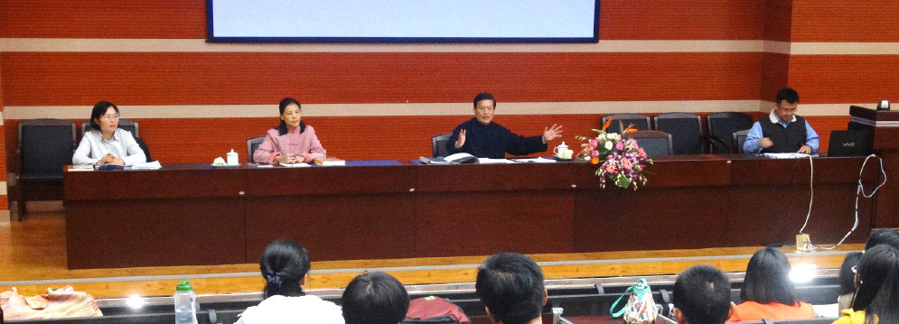

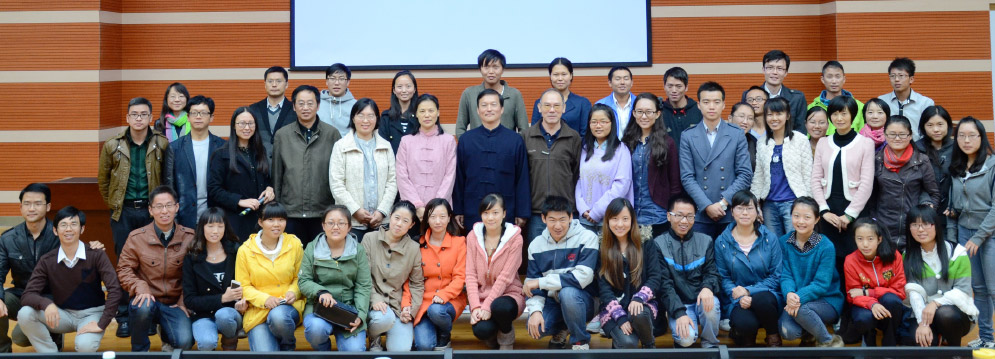

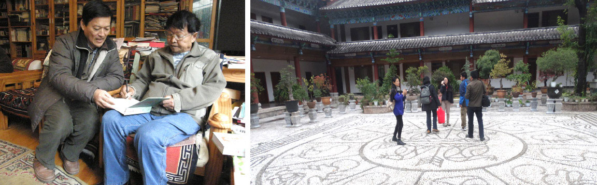

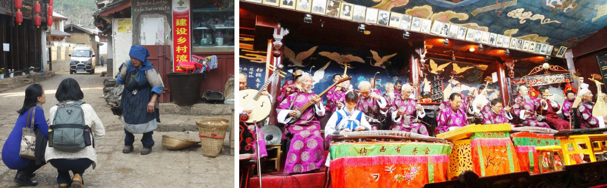

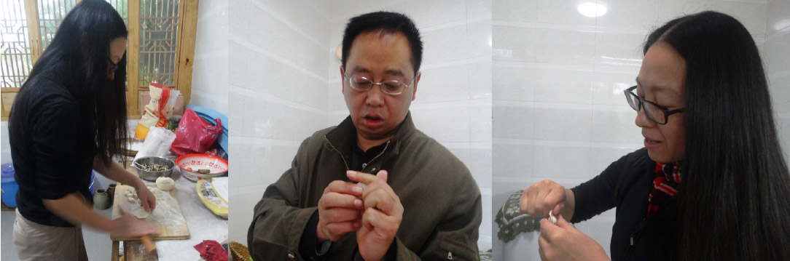

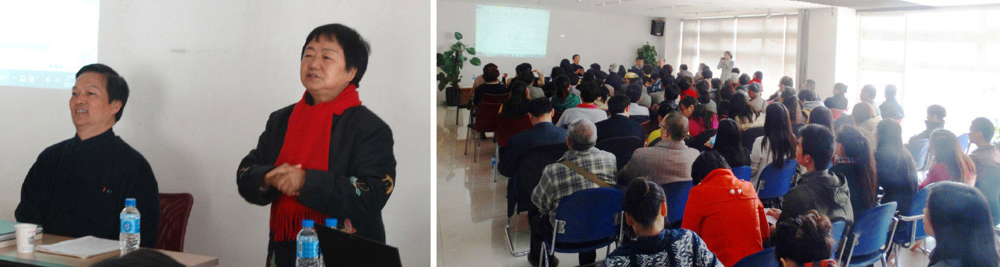

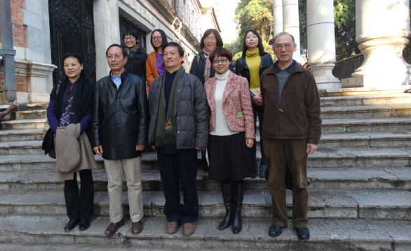

### 夢想的世外桃源　二○一三年十月雲南行紀實　這是什麼樣的因緣……

楊潔

心地純真似芙蓉　善盡師責如慈母

論語融合中西學　雲南民大文化情

二○一三年三月六日，一個不可思議的機會，應邀來到馬來西亞吉蘭丹州哥打巴魯市參加張偉慈先生丹江弟子規教學中心主辦的「認識中華文化《論語與儒學》講座會暨《論語》國際交流會」。當天晚上，在GrandRiverview賓館大廳第一次見到唐瑜淩老師。

當張偉慈先生介紹雲南中華文化促進會的秦桂珍副主席與唐老師認識時，唐老師拱手謙和致禮，並輕聲道了句：「雲南啊！這是什麼樣的因緣。」這是我聽唐老師說的第一句話。在當時會務接待區彼此致意問好的人群裡，這句話輕柔得幾近歎息，然而，由於說話人聲音中所包含著的某種說不清楚的東西，它卻極其深刻地印進了我的心裡。只不過當時沒有想到，這句話後來竟會在我心裡一再迴響，變成自己的感慨。

一、緣起「丹江」

丹江弟子規教學中心交流會以及培訓課程，可說是得蒙唐老師教誨（儘管老師的教誨面向許多人）的真正緣起。八天課程聽下來，除了那種始終飽滿的沉靜、愉悅之外，內心深處還一直暗自驚歎於這一因緣究竟從何而來？因為它如此難能逢遇，同時又如此妙不可言！當時覺得，對自己那顆尋尋覓覓、走走停停但從來未曾徹底放棄過的心靈而言，這堪稱一次慎重、莊嚴的命運性相遇，因為誠如這次課程的主題「知是眾妙之門」所指示的那樣，這次相遇在我心底開啟了一扇極具轉折意義的認知之門。

受自己學生時代的閱讀興趣與專業偏好所限，多年來一直較多從西方文化尋找精神養分。而恰恰在自己隨著年齡增長越來越無法逃避「無根之苦」（以及缺乏傳承之尷尬）拷問的時候，我遇到了唐老師，並經由老師的教誨獲得如下體悟：

就希臘文明來看，早在蘇格拉底（Socrates，西元前四六九至三九九年）、柏拉圖（Plato，西元前四二七至三四七年）、亞里斯多德（Aristotle，西元前三八四至三二二）這三代彼此師承的上古先賢「建基立業」之前，孔子（西元前五五一年至四七九年）就已經形成了完備的思想體系。蘇格拉底問答求智的辯證方法、柏拉圖精英治國的政治抱負（甚至他對修辭術與孔子對佞的態度也都如此「巧合」）、亞里斯多德崇善重理的道德觀念，我們在《論語》當中都能看到。

就希伯來文明而言，作為《聖經》教義基本的「愛」，我們在孔子這裡也感觸良多。而且，除卻這「兩希」的源頭之外，近代西方哲學中的某些核心觀念，如康得的「二律背反」與黑格爾的「物自體」，我們也可以在孔子這裡讀解得到，甚至就連當代西方哲學與文化思潮中反對「二分牢獄」的那股精神，在《論語》當中也早有彰顯。

既如此，我們為什麼放著名正言順、義不容辭的事情不做，反還要捨近求遠，迢迢他求，繼續在自己母文化之外的領域苦尋死覓呢？

於我個人而言，這一緣遇所帶來的啟示發明無疑是意義重大的，然而它卻還不止於此。「晝迷不覺塵重，夢醒方知驚心；願將勇勤拂拭，勿使常墮惡津。」記於二○一三年三月十四日清晨、聽唐老師教誨六天之後的這兩句感言加自勉，可說是此次馬來西亞因緣的另一個小小結果。

二、緣續昆明

二○一三年十月十七日，在經過與林蔚芳老師的若干郵件往來後（我在開頭的某一封郵件中曾硬著頭皮寫道「我很希望唐老師來給我們講課，可是我既無力支付課酬，也沒法解決機票、食宿……」這樣的意思，當時只是實話實說，可沒成想後來老師居然真地會同意前來！），終於在昆明長水機場再次見到唐老師。與老師同行的還有林蔚芳老師、張德聲居士以及黃銘洸、陳怡瑩兩位學長。

接下來，從十八日到二十六日（遺憾的是二十六日一大早老師們便離昆返台了），無論講座、讀書會還是參訪、出行，甚至只是日常生活中諸如開車門這樣的一個細節，我無不從老師那裡汲取很多。更準確些說，不僅是在唐老師本人這裡，而且在林老師、張居士以及銘洸、怡瑩兩位學長這裡，我都無時無刻不在感受著、學習著。所以在這緣續的八、九天時光裡，我除了時不時心懷忐忑擔心老師、學長們出於慈悲克服了太多不便（譬如深夜乃至淩晨樓下酒吧的噪音）而不與我知之外，常常不由自主冒出來的一個感慨便是：這是哪兒來的福分啊！這是什麼樣的因緣……

於是，我無法不誠惶誠恐地珍惜每一點滴時光，就像我們讀書會的每一位同學都無法不史無前例地端正恭謹。因為在唐老師一行五人與《論語講要》的感染下，每一位在場者都體察到了鏡子和榜樣的力量。與我們共用這力量的，還有那些來自雲南民族大學校外各個單位，以及從下面地州特意趕來的諸位「同學」—他們不少人的神態裡更是透著一股子爭分奪秒的心勁兒。大概他們當中也會有人懷揣與我類似的想法：是啊，是什麼樣的因緣，讓我這樣一個後學、尋找者，能有機會兩天半面對面聽唐老師講座，沉浸在老師話語構建的知見世界裡呢？

又於是，在唐老師講座之後至放寒假之前的這段時間裡，每週五早上的《論語講要》讀書會（我們的讀書會二０一三年三月二十二日確立，三月二十五日起每週一次，成員從最初的固定者三人增加到現在的固定者十五人）功課更扎實，氣氛更融洽，關係更團結……馬上就新學期了，相信大家都已在期待繼續每週共讀《講要》的「法喜」。而我也將會在本學期第一次讀書會上，將寒假小結的這近一年來的八字體驗與大家分享：辯證；務本；持恒；靜觀。

而所有這一切，都與唐老師的教誨有著或顯或隱的關聯。

三、緣結人心

唐老師此次昆明講座的題目是《文武之道未墜於地，在人》，讀書會的科判是「君子與小人之辨」。在講課過程中，老師曾數度強調「人」這一要素的作用。

十一月一日，在老師一行返台後第一次讀書會上，大家曾專就老師這次來昆講課的個人體悟進行了交流，其中就有一位古代漢語專業的同學講到了自己對人的作用的認識，講到圖書館存放著那麼多古籍善本，如果沒有人來學習、傳承，那麼也便如老師警醒大家的那樣，一切只剩下個空殼，內涵蕩然無存；並進而談到了自己開始隱約感受到的那種作為年輕一代中國人的責任義務與使命感。

從個人來講，早在馬來西亞與唐老師、林老師約談的時候，就向二位老師報告過自己的心路概況：小時候曾拜灶王爺、灶王奶奶為乾爹、乾娘；十五歲起意識到精神上的困惑並開始邊找邊等；大學時代、碩士階段、讀博士期間又對西方哲學與文化思潮、佛教思想（禪）、巴哈伊教義、基督教、印度教、錫克教、伊斯蘭教、瑜伽冥想、諾斯替教、道教分別有過直接、間接的接觸，產生過或多或少的認識，然而，一路尋覓，一路困惑，到如今依然獨自叩門，進行著自己美其名曰的那種「有意義的徒勞」。但及至遇到老師，方覺得有些情緒似可嘗試厘清，有些精力也已應落實穩定。而在老師來過昆明之後，自己的精神路向則變得更加明確清晰。

說到這裡，忍不住又要輕輕喟歎：「這是什麼樣的因緣……。」

是啊，如果說我個人以及我們雲南民族大學人文學院《論語》讀書會的成員們與唐老師都稱得上有善緣的話，那麼這份看得見的因緣可說是起始在「丹江」，接續在昆明，結契在人心。而結在人心的這份因緣，只要小心護持，必將會慢慢成長，乃至終將會聚攏成一簇簇火苗，發放出越來越多的光亮。

備註：本文作者為雲南民族大學人文學院副院長　楊潔教授

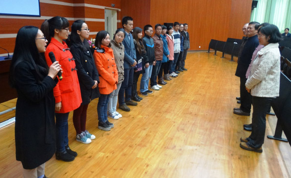

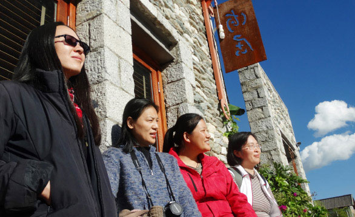

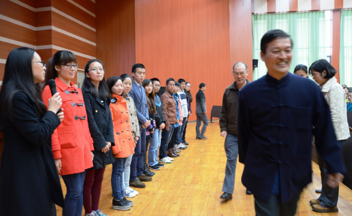

### 雪廬正見照民族—論語讀書會交流

民族大學論語講要讀書會

純真即映正知見　講要能繫兩岸情

弘傳盼順風揚帆　天下盡歸聖道門

臨上飛機的清晨，楊老師手捧一個綁上絲帶的藍色紙盒子呈送給我們，當中是民族大學論語講要讀書會孩子們滿滿的祝福及三天課程所拍攝的錄影剪接影片檔，還有一份所費不貲的「演說論語」光碟資料，那是我們課後前往大理、麗江的四天時間裏所趕製出來的。一張張卡片述說著與文化會遇的心聲，其誠摯與法喜的傳遞、感染我們也珍惜地一路手捧著回到臺灣。（編者）

何虹震

在這個浮躁、紛亂、物慾橫流的時代，興盛的是術，寂寞的是道，傳道者的艱辛莫過於此。但當道真正達於人心之時，傳道者與學道者所得之快樂，任何事都莫能與之比！

感謝老師能帶給我們這樣的快樂！

聶家偉

唐老師等諸老師：您們好！我是《論語》讀書會一員，入會僅一月有餘。由于敝人畢業論文乃以「論語陽貨」開始，故上一學年即在研讀《論語》，但至今也只能把握一二。聽您們講《論語》，獲益匪淺，乃知讀《論語》，做其學問是其次，而學習其中做人道理尤為重要。

對於傳統文化，您們臺灣繼承得比大陸方面要好得多，最可顯見者，乃是簡體字與繁體字之差別。本想用繁體來書寫，卻不能用筆。

大陸方面，有關《論語》研究不乏精華，但這由敝人提議購得的「演說論語」可謂差強人意了，不過，作為大陸方面的可貴研究之一送給您們，還望笑納。

恭祝  身體健康  家庭幸福

比較文學專業　劉 旻

老師：真的很感激您，不遠千里來此為我們傳道授業解惑。兩天半的學習讓我們受益匪淺。尤其是關於「禮」的解答，更讓我們懂得了做學問一定不能離開當時的背景與歷史條件。

*聽君一席話，勝讀十年書。希望有機會還能再聽老師講授《論語》*

于巍濤

敬愛的老師：非常感謝您能夠來到雲南民大為我們講課，希望還能有機會聽到您們的指導。我們會繼續學習《論語》，為弘揚中華傳統文化盡一份微小的力量！

祝您們一切都好！

郝超慧

唐老師：感謝您此番前來，課時雖短，卻讓我受益匪淺。不僅習得古人的智慧，更在您的言談舉止中領略了師道風采。望我們也能像您一般，學高為師，宏道國學。希望老師身體安泰！

姚 佳

親愛的老師們：感謝您們不遠千里來到雲南昆明為我們講學，對於我來說，這是讓我終生受用的一次學習，在以後的學習生活中，我必盡力學習君子做人之道，努力做好自己。再次感謝您們！

田 恬

唐老師：感謝您不辭辛苦從臺灣趕來昆明為我們講授孔子及其《論語》。此番聽您講座，感覺受益匪淺，也更加覺得《論語》作為國學，及孔子作為「聖賢」在中國古代的地位，讓我們更加進一步的了解了孔子和他的思想，對當時及現時中國的影響！

故成此卡，聊表謝意！

常 青

尊敬的老師：感謝您們對我們的指導，和對讀書會的支持。您們對中華傳統文化復興所作出的努力讓我感動，同時也讓我感受到中華文化的傳承是我們每一位中國人的責任。謝謝！

願老師們身體健康，一切順利！

此致  敬禮！

陳昱昊

唐老師：

昆明一行，令吾難忘　明師指路，莫若君屬

祝您　傳道一帆風順　天下盡歸孔門徒

楊婉君

誠心感謝唐老師不遠萬里到雲南為我們傳道、解惑，讓我們對我們的國學有了更新更深的理解和體悟，從新的角度學習，使我們對儒學的傳承與復興都更有信心。

文化的傳承根本在人，識人識己則是成功立身之本，這些道理是最大的收穫。

在此再次向您誠心致謝，並恭祝您及其他幾位老師身體健康

苗鴻滿

敬愛的老師：感謝諸位老師遠道而來給我們講授國學經典，兩天的讀書會時間不長卻讓我久久回味並反省自己，我今後的求學道路還很長，我會不斷努力，用心學習，不斷提高自己的人格修養，再次感謝各位老師，祝各位老師身體健康，幸福快樂！

張媛媛

尊敬的唐老師：感謝您這幾天不辭勞苦地為我們講授儒家哲學。在研究生階段就能聆聽您的講學，學生自覺非常幸運。我想，在以後的生活中我也會保持學儒的習慣，努力做一個愛眾親仁的君子。祝老師身體康泰。

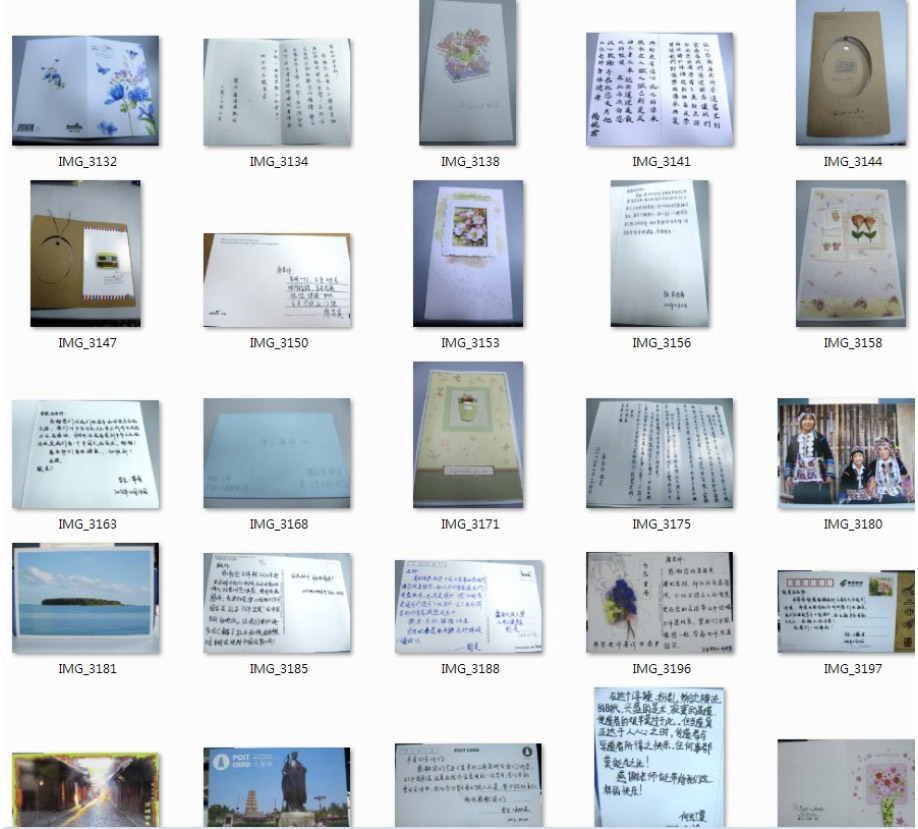

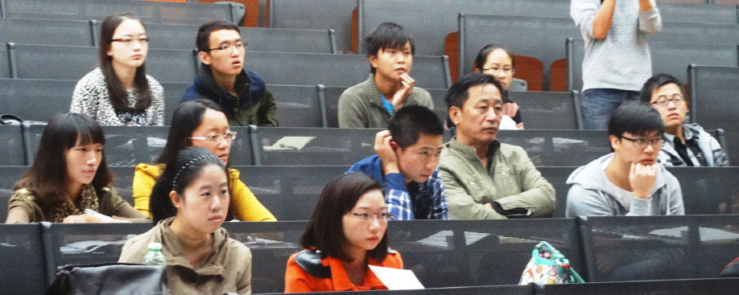

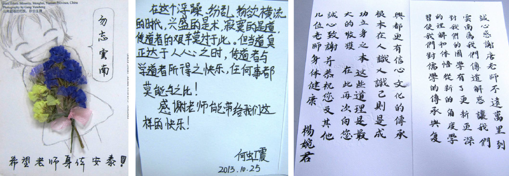

### 共榮茂與交相映—記麗江的東巴文化之旅

淨印

麗江東巴兩輝映　世界舞台眾注目

山水喧鬧存典籍　再現風華賴文化

雲之南（參訪緣起）

雲南這個美麗的名字取「雲嶺以南」之意，還有一說是「彩雲見南中」，相傳漢武帝元狩元年，出現彩雲，武帝派人追著彩雲一路往西南，到了一個地方，就是現在的雲南。過去末學在北京就學時，也曾被雲南的勝景與少數民族並茂的文化所吸引，尤其現存唯一仍被使用的象形文字就在雲南麗江，真是令人好奇不已，納西族的東巴文化正因保存了象形文字的資產，使得有美貌又有內涵的麗江讓外國人醉心流連，寫書著述，毫不意外地成為是世界知名的古城。

去年秋天，承蒙老師給予機會，末學能夠再次踏入雲南，相隔十一年，變化非常之大，沒想到還能在麗江的東巴文化研究院見到當年為我介紹東巴文的王世英老師，所謂變中不變，不變中變，世事沒有一定，都是因緣和合而生起，若沏壺茶慢慢聊，就像是說起一個離我們很遠彷彿又很近的故事。

文化傳承在人—東巴文化及其活力

去年十月二十二日，是個晴朗的日子，走進麗江的黑龍潭公園，會先看到潭水中有個涼亭，它叫一文亭，「一文」是小的意思，一文亭就是小亭子。沿著湖邊的路走，爬一段小坡，往右拾階而上，就到了東巴文化研究院，該院成立於一九八一年，三十年來做了許多東巴文的翻譯與保存的工作，可惜的是這樣一個研究單位在網路世界卻缺席了，看不到官方網站。

東巴教是納西族的宗教信仰，東巴文就是紀錄納西族宗教信仰的文字，這一切都掌握在東巴身上，東巴是納西族的祭司，是族中的知識份子，是巫醫，是東巴文化的傳承者。沒有東巴，空有東巴經書既讀不出來，也看不懂意思，因為一般文字是一個字一個音，而東巴文是比甲骨文還要古老的圖畫式文字，一個字代表一句話，目前東巴文有一千三百多個單字，不同組合意義變化萬千，只有經過傳承洗禮的東巴讀得出來，正印證了所謂「文武之道，未墜於地，在人」。

根據該院趙院長所說，納西族人口三十萬，主要分布在雲南、四川和西藏，在大陸五十五個少數民族中，納西族排在第四十之後，之所以享有高知名度的原因之一是文字特色，東巴文是目前仍在使用的象形文字，而且現存有三萬冊的東巴經可供研究，其中三分之一在國外，以美國最多。該院從成立初期就開始整理東巴經並翻譯成漢語，花了二十年的時間，出版了一百卷的納西東巴古籍譯註全集，共四千多萬字。只是歲月不停歇，曾經協助研究的十位老東巴陸續過世，到二００三年最後一位東巴也去世了。

東巴文備受注目的另一個原因是，它能幫助對甲骨文的辨認與研究，因為成熟的文字乃紀錄當時的語言，不省略，但東巴文是省略的，沒有記下當時的納西語言，可見東巴文比甲骨文還要原始。到目前為止四千多字的甲骨文只被辨識出一千多字，那麼在對甲骨文的認識上，東巴文或有助益。

過去在宗教與文化備受打擊之時，東巴經書能被搶救並保留下來實屬不易，艱辛地傳承文化的幾位功臣中，有一位與臺灣有關，我們應當要知道。在與該院學者座談時，他們多次提到前臺北故宮副院長李霖燦先生，李先生出生於河南輝縣，從杭州藝專畢業後就前往雲南考察少數民族的藝術文化，後來到了麗江，住在玉龍雪山下四年，對麼些文（今稱東巴文）有深入研究，甚至編寫了麼些字典。一九四九年，李先生在田野調查中得到的東巴經輾轉被運到了臺灣，保存在中研院歷史語言研究所的傅斯年圖書館，計有三百七十冊。在納西人心裡，李前副院長的地位與貢獻都是很高的。

曾經歷盡辛苦，那麼東巴文化的傳承之路要怎麼走下去？王世英老師認為搶救經典的工作仍未完成，因為統稱東巴文，事實上若要細分各區仍有不同，例如瀘沽湖一代屬母系社會的摩梭人，不使用文字，全靠口傳，他們的祭司不叫東巴，而叫達巴；此外，研究院對東巴經的譯註是根據西部方言區的經書，東部方言區的發音是不一樣的，還有賴翻譯整理。王老師回憶自己是在一九七八年考大學，那一年是文革結束的第一次聯考，也就是說一九六六年至一九七七年文革十年的高中生，都一起參加考試，他大學畢業後就到東巴文化研究室（後來才改為研究院）工作，就算已經退休了，也不曾停下翻譯的工作。

「翻譯工作需要傳承」唐老師回應道：「翻譯工作需要教學以培養後進，因為翻譯並非一次到位，需要很多修正。年輕人也要給他們發展空間，例如辦展覽、解說，以及翻譯以後的內涵需要有人介紹等等。」況且，人聲鼎沸的麗江古城街上販買各種上面寫著東巴文的紀念品，正確的有多少？能扮演校正角色的研究院怎可以沉默，任憑錯的東巴文被觀光客埋單？老師建議，一定要好好地培養年輕人，也需要建立網站，善用網路媒介，讓世界上想要了解東巴文化的人有一個可以信賴的資訊來源，也不枉費數十年來研究院投入的人力與精神。

信仰的力量乃是文化的核心—麗江是東巴文化的舞台東巴文化是麗江發展的活泉

文化的表現是內外兼具的，沒有內涵的文化流於形式、顯得俗氣，沒有莊嚴外衣的文化只是空談，既無法彰顯教育與傳承功能，也難以推廣。而有魅力的文化背後一定有宗教信仰，因為就算是無神論也是一種相信，若以為去掉信仰就是對文化去蕪存菁，那麼就好像是讓失了魂的人來當領導，未來會如何還能有所期待嗎？

中國有多少個古城？麗江今日因東巴而知名，她的美麗如何才能不褪色？文化的研究成果應在城市開花結果，不能只印成精裝書分送各大圖書館收藏。愛好文化的人也應具有眼力懂得篩選，不能只看表面不論對錯，就像如果是跟著旅行團去到一文亭，導遊會講一個老太太與一文錢的故事，好像頗有道理，可是其實是瞎說的，世風日下，望文生義也不奇怪，但將糟粕當寶，非但沒有幫助文化的推廣與傳承，甚至傷害了文化本身卻不自知。

地方與她的文化應是相得益彰，互相輝映，地方以她的力量來幫助文化的推廣與教育，文化則可以幫助地方繁榮又美好，讓外面的人被豐富內涵所吸引想要來居住，如此有心傳承文化的年輕人才看得到出路，有人才的投入，文化才有希望，地方才有未來！

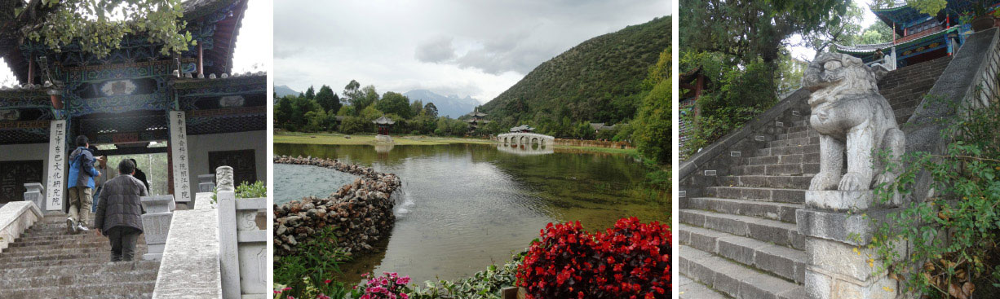

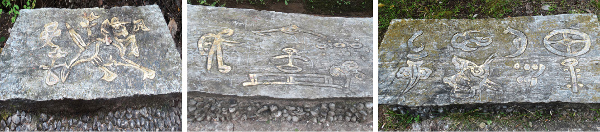

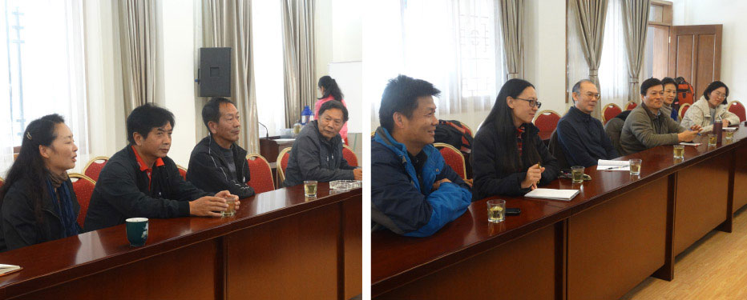

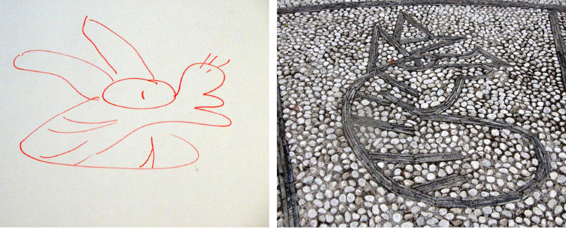

### 迎向朝陽—飛龍在天的見地與民族　講座報導

心迦

國教重在培人才　文化似龍令成就

卓中龍隊技雖巧　更要內涵成龍傳

在朔風肆虐的早晨，有一群同學每天仍孜孜矻矻的練習龍隊；因上次親子電影欣賞的講座迴響熱烈(見蓮榮會刊第九十二期)，開啟了此次辦講座的因緣，雖然是在節氣大寒中舉辦(一○三年一月廿一日)，卻澆不熄活動主辦者、協辦者與參與學員的熱情，「迎向朝陽—飛龍在天的見地與民族」的講座是為期一整天的課程活動，由國立卓蘭實驗高級中學(以下簡稱卓蘭實中)主辦，邀請學會師資前往任課。

卓蘭高中位於卓蘭鎮老庄里，當初是卓蘭鎮內的小學有舞龍隊，為了把這些孩子帶上國中、高中，於九十一年卓蘭高中也成立了舞龍隊，經學校老師熱心訓練，技藝精進，多次代表國家參加國際性比賽，成績斐然。二０一三年，代表國家參加第五屆世界龍獅錦標賽，拿下金牌。家長們發現，很多原來不愛念書的小孩，加入舞龍隊後，變得彬彬有禮，很有自信，而且學業不斷進步，十一年來，獲得保送國立大學資格者達六十餘位，且成績優異，有好幾位獲得碩士學位或研讀博士班。

此次講座因應卓蘭實中龍隊成員的寒訓之邀，所以課程設計與「龍」有密切關係，

第一堂課是龍的傳人：

藉由六個主題方式探討；從龍是外在的圖騰或是意象，進一步延伸只要是中華文化圈的人，不分男女老幼，擁有中華文化內涵的人，都可以稱為-龍的傳人。孔子被稱作為「大成至聖先師」，「大成」的意思是孔子集上古文化傳承整理最完整者，「至聖」的意思是所有的聖人當中，以孔子成就最高，「先師」的意思是孔子開平民教育的先河，是後代老師的前輩；因此我們也可以很可肯定的說：孔子是最殊勝的—龍的傳人。

第二堂課是孔門聖賢：

接續第一堂課的精神，欣賞真正龍的傳人，看孔子如何培養弟子，使弟子成為能夠接續中華文化之龍的傳人；既然課程介紹十哲，是以論語˙先進篇當中四科(德行：顏淵、閔子騫、冉伯牛、仲弓，言語：宰我、子貢，政事：冉有、季路，文學：子游、子夏)弟子作為介紹，看了這麼多位的龍的傳人，也期許自己能夠成為龍的傳人，為社會盡一份心力。

第三堂課是繪畫欣賞：

主要是以江逸子先生對於論語章句、孔子故事、弟子造像、孝道推廣……等，以畫來表達，以畫作為媒介讓大家來認識龍的傳人，輔以影片欣賞、導覽解說，讓人們對於論語畫解所要傳達的內涵印象更為深刻。

第四堂課是音樂欣賞：

音樂有治療疾病、教化人心、陶冶性情……等功能；安排這堂課的目的，是鑒於現代社會學子所接觸的音樂無非是靡靡之音、好濫淫志等沉淪音樂，課程當中以專業師資引導學員如何認識好的音樂，在樂教當中無形培養學員在格局上、氣度上、欣賞角度上有顯著的提升，讓學員了解到接觸美好音樂的好處；音樂也是讓我們成為有氣質的龍—不可或缺的元素。

並選播與學童年齡層相仿者的各類藝術表演，諸如鋼琴、豎琴、小提琴、平劇、舞蹈、武術、擊鼓類……等，或個人、或團體的精湛演出，讓孩子們相觀而善，知道自己之潛力無限，只要有中心思想（龍的精神），依師學習得當，他日亦必不可限量。

講座最後由卓蘭實中龍隊同學表演「荷花龍」、「競技龍」等節目，真不愧是世界冠軍，龍隊同學不論是在與音樂的契合上、團員的默契上、舞龍的流暢度、動作的複雜性，再再都顯示出龍隊同學苦練出來的成果，龍隊同學在形式舞龍上趨臻完美。

辦本次講座的目的是讓龍隊同學在內涵充實上、心靈層次上擁有提升更新的key-point，期待有朝一日龍隊的同學們以及當日參與的學員們，能在內涵以及心靈的層次內化提升後，將會是一條條見首不見尾、傳承文化的—龍的傳人。

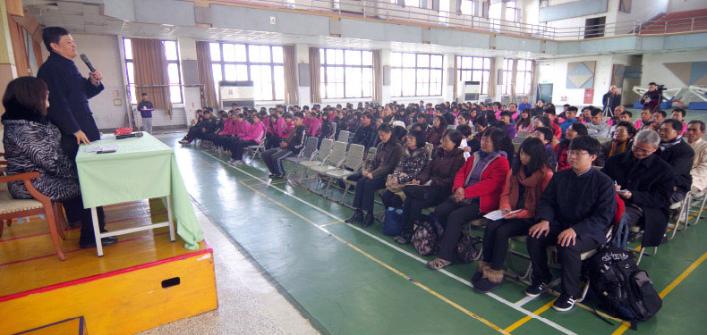

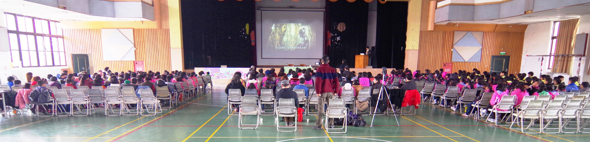

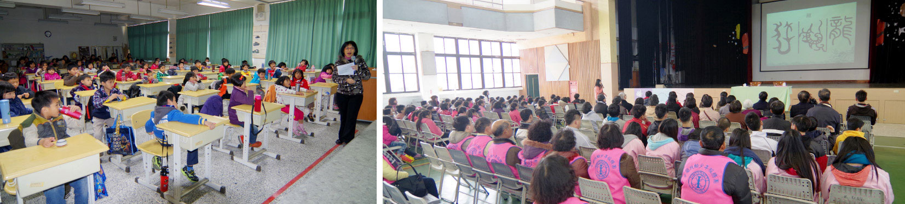

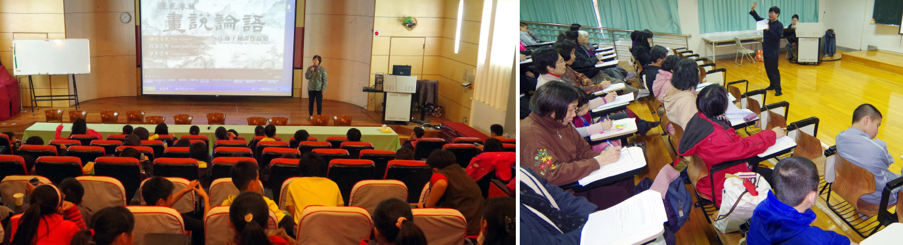

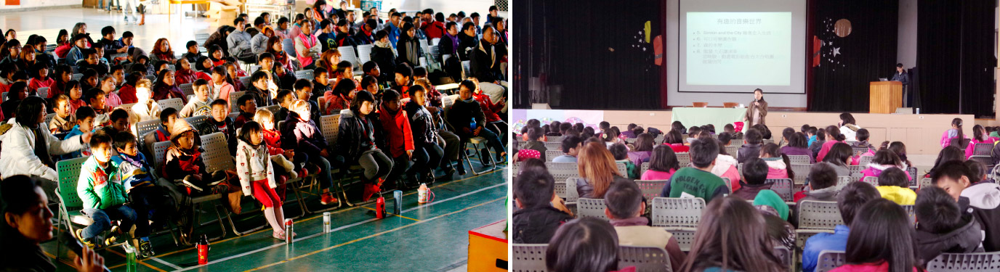

### 迎向朝陽—飛龍在天的見地與民族　龍的傳人

心若

配合成名的龍隊　興起龍義的講座

形下形上的養成　飛龍在天的氣象

龍，在中國傳統文化中，是神異、內涵博大、深具魅力的一種靈獸。它飛越了數千年，承載著中華文化的血脈與傳承，深植人心。直至今日，龍依然以神奇又神祕的方式存活在每個人的心中。

此次課程主題訂為「龍的傳人」，一方面因應主辦單位卓蘭高中向來以龍隊著名，其龍隊成立於民國九十一年，由一群不被看好、曾經被放棄、對課業沒有興趣、對未來沒有夢想的孩子們所組成，一開始他們沒有自己的龍，練習時以木棍自製假龍，比賽時跟鄰近學校借龍，但他們不畏艱苦，下課時間、放假時間都揮灑汗水勤練，慢慢的，他們蛻變成一支有紀律、有創意、受人尊敬的藝術團隊，是國內外舞龍比賽的常勝軍，這群年輕活潑的學子可以說是龍的傳人。而舞龍要舞得好，除了平常注重體能訓練外，更重要的是要抓住龍的形象、內涵、精神、意義，化成人格的養成，再傳送到所舞的龍，才會是最殊勝舞龍的創作，相信利用這樣的課程，能讓龍隊的孩子更具體的認識龍，認識龍的精神，不僅舞出外相的龍，更要舞出心中的龍，培養自己成為人才。

另一方面，傳說人類的始祖伏羲、女媧，都是龍身人首，炎帝、黃帝都與龍有密切關係，中國古代還有龍生九子的傳說，這九子各有其個性愛好，是不同領域的幹才，開創一個博大精深的世界，在在顯示中國向來以龍的傳人自居，而所要傳承的到底為何，其實就是中國幾千年來的智慧精神、文化道統、民族情感、風骨氣質等等，也是每個人肩負的重大使命。

故本次活動的性質及重點就是要讓大家認識何謂龍的傳人，更甚，我們要怎麼做龍的傳人。課程分為龍的形象、龍的故事、藝術內涵、文化意義、人格的養成、具足時代使命感等幾部分進行，以問答、說故事及穿插小影片的方式帶領大家全方位認識龍的傳人，以下介紹課程內容。

龍的形象

《說文解字》中云：「龍，鱗虫之長，能幽能明，能細能巨，能短能長，春分而登天，秋分而潛淵」，古代認為龍能隱能顯，大小長短不定，能登天潛淵，興風佈雨、澤及萬物。課堂中，老師請學生們談談對龍的印象、看法，答案可類分為二，一種是邪惡之龍，一種是吉祥之龍，極端對極端，頗為有趣。

其實兩者都沒錯，差別只在於一種是西方的龍，一種是東方的龍。西方龍較偏像恐龍，牙齒鋒利，頸粗又長，頭有角或褶邊，巨翼像蝙蝠，還有一條長長的尾巴，特徵是會噴火、有魔法，是惡獸的化身，與人不善。東方的龍據說是九種動物合而為一的形象，具有兔眼、鹿角、牛嘴、駝頭、蜃腹、虎掌、鷹爪、魚鱗、蛇身，並與鳳凰、麒麟、龜合稱為「四瑞獸」，是吉祥的象徵。課堂上放映《花木蘭》「木須龍」，及《神隱少女》中「河神」和「白龍」的片段給學生看，由兩段影片綜合可知，龍是家族的守護神，體型細長，背上沒有翅膀，卻能翱翔天際、潛入深淵。而一般人不相信世上有龍，與會大眾亦是如此，故播放了在中國青海湖拍攝到的真龍出現影片，供大家參考欣賞。

龍的故事

龍的故事不勝枚舉、各式各樣，令人眼花撩亂，光是龍的成語就多達兩百多個，不能一次說盡，故選了幾個有趣的、具啟發性的故事來分享。包含「畫龍點睛」、「葉公好龍」、「堯養龍」、「鯉魚躍龍門」等生動經典的故事。也講了許多佛典中所記載龍的典故，包括「龍女成佛」、「天龍八部」、「觀音騎龍」的故事，顯示龍是敬信三寶的護法善神。

其中「鯉魚躍龍門」的故事發人深省，傳說中鯉魚們都想跳過龍門，變成超凡脫俗的龍。可是，龍門太高，儘管跳得筋疲力盡，摔得鼻青臉腫，卻沒有一個能夠跳過去。他們一起向龍王請求降低龍門，龍王不答應，鯉魚們就在龍王面跪了九九八十一天，龍王終於被感動降低了龍門，於是鯉魚們一個個輕輕鬆鬆跳過了龍門，興高采烈的變成了龍。不久，成了龍的鯉魚們發現，雖然外相成了龍，卻沒有當龍的感覺。

於是，他們去請教龍王。龍王笑道：「真正的龍門是不能降低的。你要找到真正龍的感覺，還是去跳那座沒有降低高度的龍門吧！」原來龍的精神仰賴我們自己尋求，旁人給不了，過程中的艱難阻礙都是必經之路，一但熬過去，便能成為人才，以此來勉勵在場學生。

龍的藝術內涵

自古以來，龍在藝術方面的表現形式豐富而多樣。舞龍起源於漢代，經歷久而不衰，最初是為了祭祀祖先，祈求風調雨順、五穀豐收的一種形式，人們每逢旱災便會舞龍祈雨，春舞青龍、夏舞赤龍、秋舞白龍、冬舞黑龍。後來舞龍漸漸演變成一項藝文娛樂活動，唐宋時候，舞龍已是過年過節常見的表現手法，衍至今日，舞龍的藝術價值更是不凡，是世界級的競賽項目，種類繁多，諸如夜光龍、競技龍、荷花龍等，大放異彩，蘊藏舞蹈、身段、內涵之美。

另外，龍是威權顯赫的帝王象徵，因此，皇帝的身體是龍體，顏面是龍顏，其後代子孫為龍子、龍孫，而御用的物品也跟龍大有關係，舉凡龍袍、龍座、龍床等，都是皇帝和皇權的符號，享有至高無上的權威性。

然而，龍的平民性並未因貴族化而抹滅。在民間，龍是一種吉祥物，有以龍為主題的廟會、戲曲、話本等等，也有舞龍燈、划龍舟等熱鬧活動。此外，各式的草木瓜果、菜蔬藥材，以龍命名者甚多，像是烏龍茶、龍眼、龍舌草等，可見其平凡性。

現今，龍帶著中國文化的色彩，充斥於古建築的柱子、屋梁上，也刻畫於瓷器瓶身、木盒子等物品上，成為美麗的花紋造型，讓人珍藏、把玩、尋味，是一種藝術美的呈現。

圖繪龍的文化意義

江逸子老師繪有兩幅關於龍的圖，即「孔子問禮圖」與「龍馬精神」，「孔子問禮圖」是孔子問禮於老子，孔子離開後，謂弟子曰：「鳥，吾知其能飛；魚，吾知其能游；獸，吾知其能走。走者可以為罔，游者可以為綸，飛者可以為矰。至於龍，吾不能知其乘風雲而上天。吾今日見老子，其猶龍邪！」孔子見任何一種人皆能應付自如，但老子的思想境界就像遨遊在太虛中的龍，見首不見尾，使孔子讚歎不已，說不出話，可見老子之境界高妙，無人能及。

至於「龍馬精神」這幅圖，是馬出河圖，伏羲根據馬所背出的圖推演出八卦，後又經文王演出八八六十四卦，來說明宇宙人生的現象、做人處世的道理，可趨吉避凶、逢凶化吉。

乾卦：談人格養成

乾卦總體言龍德，是借龍說明人生的成長、成就及傳承，初爻「潛龍勿用」，是學習階段，要韜光養晦、自我充實。二爻「見龍在田，利見大人」，是學有所成，能嶄露頭角。三爻「君子終日乾乾，夕惕若厲，無咎」，要保持戒慎恐懼。四爻「或躍在淵，無咎」，掌握時機進退，伺機而動。五爻「飛龍在天，利見大人」，此時局勢穩固，可借天時地利人和做一番事業。上爻「亢龍有悔」，飛黃騰達，可將經驗授予後人，並退居幕後，在政治及文化上，都要有此等胸懷，藉龍以說仁德，乾卦及六爻能表徵中國文化真正精神所在。

具足時代的使命感

李建復有一首歌就叫做「龍的傳人」，這首歌的創作背景正逢中美斷交，美國轉與中華人民共和國政府建交。消息傳至臺灣，侯德健奮筆填此歌詞。歌詞寫道：「古老的東方有一條龍，她的名字就叫中國。古老的東方有一群人，他們全都是龍的傳人。巨龍腳底下我成長，長成以後是龍的傳人，黑眼睛黑頭髮黃皮膚，永永遠遠是龍的傳人」，中華民族千秋萬代傳衍不息，人人都是龍的傳人，富有使命，應當團結一心，努力向前，末句「巨龍巨龍你擦亮眼，永永遠遠地擦亮眼」，我們是否也擦亮內心的眼睛，時時保持雪亮呢？

最後，新年新氣象，我們做了一個有意義的活動為此課程收尾，發給每人一張便條貼，請大家思維該如何讓自己成為一位龍的傳人，並在上面寫下新年的期許祝福，貼於海報上，拼湊成龍的圖案。惟願新的開始，所有人都能馬到成功，朝未來邁進，在思想上、見地上、文化上、格局上培養自己，登上龍門，成就龍德。

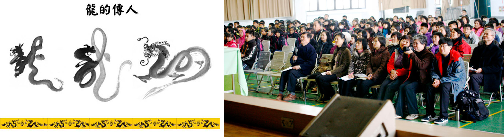

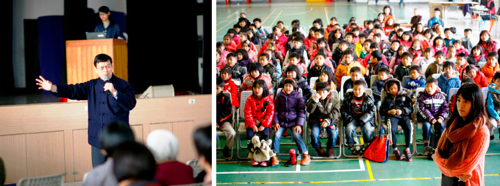

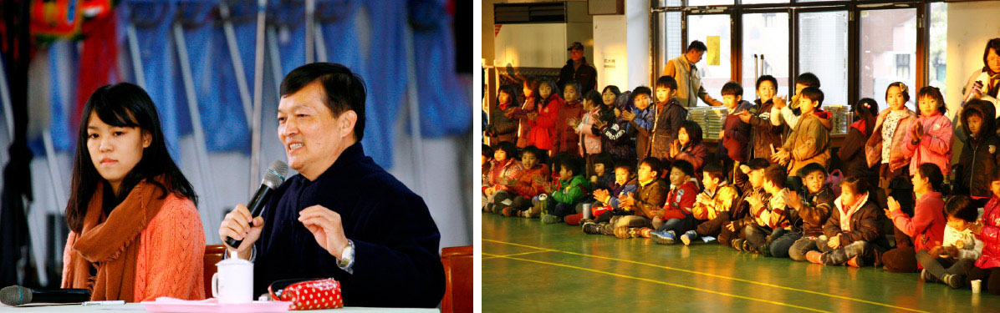

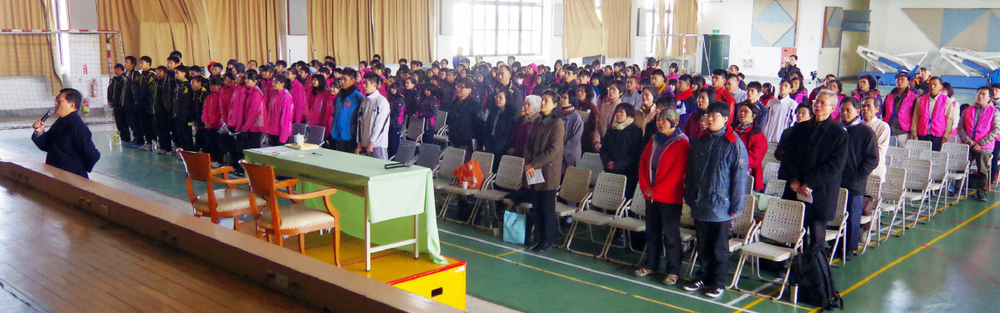

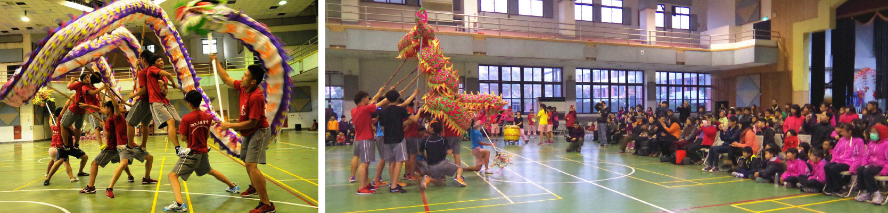

## 後記

### 新春團拜

本刊

一生是一個過程　結局是未來開始

隨緣是掌握時機　不變是核心價值

新春是一年的開始，是一個創造吉祥氣氛的開始，早上學會的蓮友不約而同來到學會參加共修，雖然人數不多，然涵蓋很廣，像是五代同堂，如師姑、師資組、養成班、大專班及啟蒙班的成員，包括本省、外省、客家。以鞭炮慶賀新年，大眾共修互道恭喜，創造吉祥與熱鬧的氣氛。

社會整體共業環境目前像是無法改變，然可努力改變個人及團體的別業，孔子當時不也是共業不可為嗎？與其在那裏一直說共業如何不好，諸如教育品質不彰、經濟局勢不好，從政者或如孔子當時所說：今之從政者，斗筲之人，何足算之。總之不必去評論小格局的人，重要的是民族的千秋大業。孔子當時即有別於一般讀書人，不會因為不得志而發牢騷，反而是不怨天，不尤人，下學而上達。創造自己的別業都來不及了，哪有閒工夫在那裏方人？

試問該如何創造別業呢？即以新年而論，講究的是檢討過去，確立未來的發展。若論檢討不外乎個人的檢討，家庭的檢討，事業的檢討，正法學習的檢討，檢討後給自己一個改變。當然不要忘記為自己過去所做善業做一隨喜，諸如一○二年匆匆過去，進入一○三年，然由一○二年匆匆而過，比量得知一○三年亦快速過去。回首一○二年所完成事項，所幸有影片保留軌跡，看到道場中啟蒙班、大專班、養成班、師資班，講座及各項活動，如參訪、齋僧等，乃至於每週例行的儒學、佛學課程，不間斷地進行。這種進行有助於正法弘揚，學會同修在法上的學習而增上。

如此漸漸有影響風氣的能力，比如說其他學會與我們作正法的交流，並受邀至法務部矯正署及某些學校辦理講座。有高中的校長盼望我們在該校做一個示範點，將來能對其他學校有正面的影響。

浙江永康的王校長傳了簡訊來拜年，告知組成的論語讀書會，改變學校的風氣，成效斐然，並盼望繼續與我們交流。其他如瀋陽、雲南、福建等地的讀書會都有發展的趨勢，至盼這些學子學習正法厚積薄發。

昔日社會極為封閉，甚而女人是大門不出，二門不邁。如今整個社會自由開放，想學什麼都垂手可得，中國幾千年來，沒有像現在這麼開放，處於其中，算是最不幸的人，因為是莫知所蹤，令人眼花撩亂，但也算是最幸福的人，為什麼呢？若方向正確又作廣大的學習，要作利生的事業，可以無遠弗屆，不要說交通工具可以到世界各國去結善緣，也可以藉著網路影響政治與教育，這樣的舞台，竟然在這個時代發生了，能圓滿過去讀書人想要利益天下蒼生的美夢。

有志向的人應運用內涵配合時代的趨勢，是故學會將以網路教學為重點，走入一○三年，先由論語課程開始，以論語篇章有關子貢立一主題。何以由子貢這位賢者開始？此人可以說是一個領先時代的人，他的商業模式是當時有名的，並有外交的能力與口才，在政治上能與各國的國君平起平坐，是一位具有中心思想的讀書人，認同道統，肯定傳承，在老師孔子過世後守喪六年，以此表徵肯定孔子一生的價值。這位具有中心思想又領先時代的人，不正是我們現在最缺乏的人才嗎？而這種是書院制、師徒制方能培養的人才，不但在企業上是頂尖的人才，也是政治外交上頂尖的人才，論語上說是瑚璉之器，即廟堂的幹才。

有蓮友在除夕白天上陽明山踏青，在春暖花開，陽光普照下，登上大屯山的最高峰，俯瞰臺北，其景如詩所云：「舉頭紅日近，回首白雲低。」人生的未來如眼前是無限的開闊，面對即將來臨的這三百六十五天裡，已經有好多的事情等著我們去做，不要耗在無謂的事情上，也不要只是為了生活而忙碌。相信只要堅持做下去，團體的影響力會越來越大。

今年特別要在網路文化的傳播與世界接軌，因網路傳播是當前最殊勝的利器，吾人藉此能提供世界一個學習中華文化的平台，並唯有不斷地充實自己，才能真正利益別人，應永遠堅持自己團隊的核心價值，結合願景，契合大眾所需。這是一○三年最大的願望。

大年初一早上從整理佛堂，上香、點燈、拜佛，與諸善人俱會一處，開啟莊嚴而又有意義的一○三年，是有目標的一○三年、是和合的一○三年、是破除障礙的一○三年、是以別業轉共業的一○三年，是三寶殊勝加被的一○三年，是發揚文化的一○三年，是有傳承正見的一○三年！

### 佛學概要十四講表講前小言

本刊

因祈請緣故，而有十四講表的講座，此表乃雪廬老人根據三藏經典的經義所編。菩薩造論釋經有兩種，一是宗經論，一是釋經論，而雪廬老人的十四講表就是屬於三藏經典的宗經論，是根據三藏經義造論。中國的祖師不敢逾越印度的論師，故在注解經典時候不敢說是論，或謙稱說疏，或者鈔，或者要解，或者講義，白話，然事實上都是論。

三藏經典中佛所說的集結為經藏，所制的戒集結為律藏，菩薩解釋經律的集結為論藏。然有兩種論的型式如前述；例如龍樹菩薩的中觀論就是根據大般若經的經義，以二十七品敘述修學通達空性的方法，謂之宗經論。彼所著的大智度論就是解釋大般若經的文句，謂之釋經論。

然菩薩造論有另外兩種型式，一是解釋經律文句或義理的論，一是解釋論的論。例如龍樹菩薩的弟子提婆論師（乃斯里蘭卡的王子，到了南印度阿姜塔石窟親近龍樹菩薩）造了百論解釋中論的義趣，是論中論（解釋論的論）。所以三藏十二部經律論的論，分為這幾種型式。

雪廬老人編佛學概要十四講表不敢說是造論，謙稱作表，實則為三藏經典的宗經論。以這十四講表將三藏十二部的宗旨與意趣說清楚，所以這是一部三藏經典的宗經論。或問何以不以論文的方式來撰寫，老人最擅長的部分就是編表說明經文及經義，此自古來祖師少有，對於學者能很快掌握綱領，對所學一目了然。作十四講表這部三藏經典的宗經論因緣為何？乃因為老人在民國五十年於台中辦大專講座，為大專生的需求而作。

自古以來不論印度或中國，或西藏，大廟、大叢林的住持在開山時候，會編寫教材並講述，以樹立他這一家學佛的思想體系。雪廬老人是台中蓮社的開創人物，當然也不例外，編了很多的教材，特別是講表，表達以如此的思想體系了解佛經。且分次第，有初級課程、高級課程等等；為什麼某些課程被訂為初級，何以某些課程被訂為高級，這些課程對於三藏經典的通達有什麼樣的殊勝方便？入序文時會交代清楚。十四講表在老人規定的課程裡面，雖然是屬於初機的課程，乃因是三藏經典義理的入門課程，然淺者見淺，深者見深。見淺者以為只是按表說明即可，見深者知是三藏經義的宗旨盡在於斯，故極好講也極難講，是初機亦是歸宗結頂。

昔有因緣曾於中部學佛，並在大學佛學社學講十四講表，次數約有二十遍，皆隔靴搔癢，隨著年齡增長，教法也學了多一些，重看十四講表，不由得佩服與讚歎老人的見地與思想的架構，亦略知要如何深入淺出敘述此十四表的課程，並與林師配合，增進講課效果，一窺老人做學問的風采。

雪廬老人治儒學，可由論語講要中對六百八十家注解抉擇的能力，其次老人對大學、中庸也有做表說明，將儒家的意趣，內聖外王、形而上、形而下，擇要的說清楚，不由得不佩服老人對儒家內涵的認知。然老人對佛家的瞭解又如何呢？亦是精彩無比。由十四講表即看出對三藏經典的通達。

一般學佛者會以佛法的面貌來認識雪廬老人，可是對他儒家的內涵可能就不甚了解，或者以為他只是一個大學中文系的教授而已。研究儒家的或認為雖是儒學的大家，然不知道他學佛的深度與廣度。惟有就儒佛兩邊來看，方知老人是當今儒佛的大家，成就即在於斯。且從他編寫的教材可看出老人對經典的研究有多麼的善巧。

弟子們要如何傳承老人所學？就是將老人整理出來的講表或者經文的表解，了解如何治表，找到解經的方法，以及抉擇古注的能力，這就是最好的傳承。

往日到大陸遇到老人的後代，告知老人留下了龐大的遺產，這種遺產就是他的講表、講經的表解。若都能夠通達，在這當今混亂的時代，實在是一位非常有見地，有格局，有氣度的讀書人，能自行，能化他，能在混亂的時代裡為眾生理出一條出路。尤其在兩岸頻繁的交流中，每每看到很多想要學習正法的人，苦於無門可入，無師可學，若能依十四表開始培養正法的學習人才，實在是當務之急。但是要培養，要講究的是所學的人，他的心胸，他的動機，以及他想要學成的目標，再講究能教者到底要用什麼樣的教材，要用什麼樣的方法，要怎麼樣的說明，兩者配合方具效果。

所幸我們每周一能以細嚼慢嚥的方式，慢慢的從十四講表的全貌，再到十四講表每一表的分析，再到每一個細目的了解。經過時間的累積，大家對於十四講表完整的認識必然可觀，就是一部三藏經典最好的入門。有這種架構來解每一部佛經，算是一位具有前瞻，具有高格局，具有全方位的學者。爾後在聽法、解經時，不會死在句下，不會人云亦云，隨俗知見，而是會用整體概念去瞭解每一部經或者每一段或者每一句，你是這種心量、這種格局的人。
