# 第94期
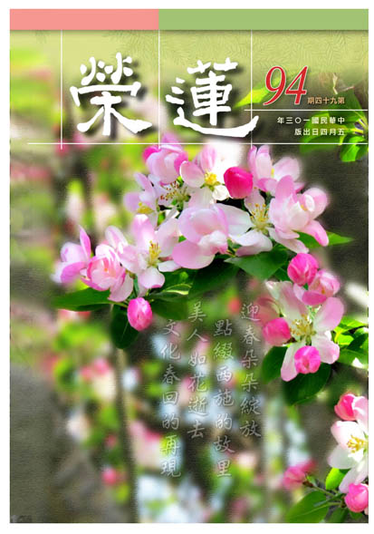

## 社論

### 核心價值

本刊

鏗鏘立論明核心

人生價值暗轉明

可貴傳承待延續

領先時代造菁英

什麼是核心價值？核心價值是一種根本而又持久的信念，是行動的準則，是非的依據，它主導著我們的人生。生活要有核心價值，否則今天一件事情可以讓你快樂到發狂，明天另一件事卻可以讓你失望到自殺。那麼應該要有什麼樣的核心價值？營利或許是公司的核心價值，因此為了賺錢可以生產黑心油、黑心飲料、黑心肉；經濟或許是當今社會的核心價值，所以為政的成功與否，經濟數據成為唯一的判準；自由民主或許是學運的核心價值，因此在佔領議會，二十四天的激情過後，公物破壞等情事不容有太多的計較。我們在風波之中，激盪著兩極化的看法，因為人人都有自己的核心價值，但，我們沒有共同的核心價值。

核心價值的涵養必須提升，層次必須拉高，否則人將只有猛烈的情緒，但缺乏定向而專一的熱忱；只有情感上的刺激，卻沒有精神上的安慰。是故除了營利，還要有商譽；除了經濟發展，還要有文化素養；人權固然重要，人格更應當講究。如此之下，我們雖然沒有完全相同的看法，但仍可以共同理性地營造美好的未來，因為這正是我們共同的核心價值。

具體而論，什麼是吾人應有的核心價值？文化的修養是一項高尚的核心價值，「文」並非文謅謅的文，不是指尋章摘句的文，而是巍巍乎、蕩蕩乎，煥乎其有文章的文，能夠榮耀各種事業典章的文。「化」則是一種潛移默化，是在心靈上的教化，如春陽般含煦覆育，溫暖人心的化。以文化為核心價值，可以提高人生的趣味，比如孔聖人對學詩的讚歎：可以興，可以觀，可以群，可以怨。文化可以提升辦事的眼力，它還可以陶鎔偉大的情操，所謂動心忍性，增益其所不能。

過去東晉時期的謝安石，領八萬之軍破苻堅的八十萬之眾，臨陣神態自若，居然還能下圍棋，這就是來自於文化的修養。勇將、戰將固然駭人，然非儒將無以安邦定國。郭令公挽救唐朝江山，功高能不震主，又可忍受宰相魚朝恩的各種羞辱，最後自行釋去兵權，天天在家中看戲，其智慧與出處自如的胸襟確實遠遠超越一般常人。

那麼，該如何修養文化，使之成為吾人的核心價值？眼前高尚的中國文化，漸漸少人了解，優美的西洋文化卻也無法吸收。縱然學會了一點科學技術，能夠享用物質文明；但西方在人性涵養上的精微美麗之處，卻絲毫沒有得到。過去華盛頓還在青年之時，就懂得以百條的禮節作為人生的守則，稱之為華盛頓的青年守則，這樣的修養不曾受到東方的留學生矚目。

反而，對於許多的糟粕，總讓時人趨之若鶩。因此，要想吸收別人的精華，必得先培養自己的眼力，我們有許多廣博的智慧涵藏在經書之中，可以完全豐富我們的生命，更是先哲們以汗以血為後代留下來的寶藏。何必捨近求遠？就從經典的學習開始，培養我們的核心價值。

## 大德法語

### 大方廣圓覺修多羅了義經（五十三）

道源老和尚

我執不空四相存

能證所證非成就

錯認證果成障礙

輪迴體性猶未脫

戊二、四問答別明觀行中根修證

己二、二問答兩重除障

庚一、除我入覺（淨業啟請）

辛五、正答所問

壬一、長行

癸一、開示障道四相

子二、開示迷智四相

丑二、次第別明

寅三、徵釋眾生

經文：

善男子！云何眾生相？謂諸眾生，心自證悟，所不及者。善男子！譬如有人，作如是言：我是眾生，則知彼人說眾生者，非我非彼。云何非我？我是眾生，則非是我。云何非彼？我是眾生，非彼我故。善男子！但諸眾生，了證了悟，皆為我人。而我人相所不及者，存有所了，名眾生相。

何謂眾生相，那個人證悟不到人我空的階段，說：我是個眾生。你一聽就知這人說眾生者，不是我，也不是他。

如何是非我？說是眾生，則非是我。怎麼說不是他呢？他既然說是眾生，就不是指「彼」那個我，此名眾生相。

由於不能證悟我相、人相，謂之所不及者，所以心裡對著有情還存了一個相，名謂眾生相。

寅四、徵釋壽者

經文：

善男子！云何壽命相？謂諸眾生心照清淨，覺所了者，一切業智，所不自見，猶如命根。善男子！若心照見一切覺者，皆為塵垢。覺所覺者，不離塵故。如湯銷冰，無別有冰，知冰銷者。存我覺我，亦復如是。

諸眾生修學清淨，其心能照，或是心裡能照清淨的境界（空性）。心裡起了覺知，覺是能覺，了知的境界是所覺，不能泯除能所，還是能覺所覺，非現量證得空性。

業智與空性相合一味（能所雙亡）而不自見，已有一個能見的業智，猶如命根。我們人人都愛命，什麼都可以捨，可是就捨不了這個命，可是命根看見了嗎？誰也沒有看見。

若心還照見一切覺者，皆為塵垢：還有能所，見到有能緣清淨境界（空性）的業智，此覺猶是塵垢。為什麼呢？覺所覺者，不離塵故，因為還有能所分別，有能覺證悟了自己所覺的，皆不離塵（塵垢、染污），謂之不清淨。譬如眼根清淨一塵不染，連一粒沙子都沒辦法放，放一粒微塵都受不了，即使黃金粉末很名貴，放些到眼睛裡去吧，還是受不了，金粉雖名貴，可是跟塵沙一樣像是垃圾。

如湯銷冰，無別有冰，知冰銷者：要以湯（熱水）將冰消融，冰已沒有了，知道冰銷了！

若還知有冰有銷，如同存我覺我。現在要破「我」（人我執、法我執），覺我是能覺，有能覺、有所覺，亦復如是。

丑三、總以結示

寅一、不斷不成聖果

經文：

善男子！末世眾生，不了四相，雖經多劫，勤苦修道，但名有為，終不能成，一切聖果。是故名為正法末世。

一切聖果（三乘佛果），不是說你不用功，也不是說你不修行，若不會用功、不會修行，雖然長劫勤苦修道，都不出有為法，有為法是有所作為，就是有為的「心」沒有完全空掉（能所雙亡），所以終不能成就聖果。

清淨的覺體等於一塊鏡子，我們起貪、瞋、癡、我憎、我愛，這個要不得，現在佛法教我們「證」「悟」「了」「覺」，起了執著，就像在鏡子上抹白粉，抹了一個「證」白粉，再抹了一個「悟」白粉，再抹一個「了」，再抹一個「覺」，抹了一大堆白粉，這鏡子還清淨不清淨呢？所以不學《圓覺經》，不了解最高的實相，你勤苦修道，終不能成，這道理不是很容易明白嗎？

是故名為正法末世，可憐愍者就是在這兒，末法時代修正法，末法的眾生誰能修圓覺行，成天在那兒想求「證」「悟」「了」「覺」的圓覺，你雖求得正法，卻不瞭解如何證入實相，雖在正法之中卻變成末世，所以可憐不可憐？不知道修圓覺行門，正法也變成末法。

寅二、輾轉徵釋其故

卯一、一向認錯

經文：

何以故？認一切我為涅槃故，有證有悟名成就故。譬如有人，認賊為子，其家財寶，終不成就。

如來的涅槃是清淨圓覺，沒有一點點相，「證」「悟」「了」「覺」還是有我相，若當成涅槃了，猶是法我執。認為有快樂可得，稱做有證有悟名成就故，實際還是有相執。

譬如有一個人把賊當成自己的兒子，那你家裡的財寶不會失去嗎？如果不認為此人是賊，卻把家裡的財寶都交給他，怎麼能將成就結果都給了盜賊呢？同理，認為有一個「我」會得到涅槃，那又怎麼能夠成佛呢？

卯二、我不解脫

經文：

何以故？有我愛者，亦愛涅槃，伏我愛根為涅槃相。有憎我者，亦憎生死，不知愛者，真生死故，別憎生死名不解脫。

凡夫的生死根本就是愛，不曉得愛可有深有淺，三界以內都是凡夫，愛為生死的根本，欲界的愛是淫欲，上二界的愛是愛禪定、愛空定，所以還是愛為根本，還滋養著愛的根本，因此出不了三界，因為還有個愛。

涅槃是生死的自體性空，生死無有自體性，故無所憎，涅槃不過是生死的空性也無可愛，若存能所永遠得不到解脫。

卯三、法不解脫

經文：

云何當知法不解脫？善男子！彼末世眾生，習菩提者，以己微證為自清淨，猶未能盡我相根本。

法不解脫猶帶法我執，不說當世的菩薩，而直接說末世的眾生，因末世眾生去佛太遠，親近不到善知識，所以《圓覺經》上要詳細說明。末世眾生起惑造業，難以修行。不但沒有佛住世，也沒有善知識在身邊，自己修行用功也是苦修。

小小的一點證得（微證），就以為得了清淨圓覺，這樣的人我還碰見過。因為參禪的人很容易見到特別的境界，在參禪中坐了一支好香，一點香，止靜，這一止靜，自己就是定。「叮！」引磬已經開靜，感覺剛止靜，怎麼又開定了？這就是有「微證」，一點鐘、一支香，剎那就過去了，以為自己了不得，以為參禪開了悟了，這個樣子的人很多，都是自己生障礙。你坐一支好香，就以為開了悟，第二支香還有這境界嗎？沒有的話，那就不是真功夫！在禪堂還有一句話，叫做「通消息」，要真正證得功夫，必須每支香都是這個樣子，才是你得到功夫。根本還得不到功夫，就起了如此執著。

到末法時代修習菩提大道的人，不知教法，小小的一點兒「微證」，就以為自己得了一點清淨的圓覺，猶然沒有斷盡我相的根本，如何了知清淨的境界（涅槃）呢？怎麼知道我相沒有斷呢？前述那人百骸調適，忽然忘了我，他以為沒有了我，扎他一針看看，原來那個「我」還完全存在。

寅三、驗知我根未盡

經文：

若復有人，讚歎彼法，即生歡喜，便欲濟度。若復誹謗，彼所得者，便生瞋恨。則知我相，堅固執持，潛伏藏識，遊戲諸根，曾不間斷。

譬如我是參禪的，來了一個人讚歎我明心見性，以為自己頓時就成佛道啦！心裡就生歡喜，覺得那個讚歎我的人真有善根，好啊！你也跟我參禪好不好？這就拉親戚，拉眷屬，要度他！

如果遇到一個人，沒有認清你在那參禪用功，誹謗說：「哼！自己做了夢還不知道呢！」你參禪用功，這一誹謗，當下就生了瞋恨。

有人讚歎就生歡喜，有人誹謗就動瞋恨，你裡邊不是有個「我」，又是個什麼東西呢？這就是扎你一針，灸你一下，當時「我相」就現出來了。所以你就曉得，你那個「我」沒有除掉，而是堅固執持著。

潛伏藏識，遊戲諸根，曾不間斷：你用功修行伏住煩惱沒有起現形，但煩惱的根本可沒有拔除掉，就像石頭壓草，石頭一搬動，草就生出來，草從來沒有除掉過。拔草要除根，煩惱潛伏於藏識，有「我」的種子，起了「我」的現行，這時候用功修行，用功夫把「我」降伏住，其實仍然潛伏在心識中，遇到境界就起現行，有人讚歎你就起歡喜，誹謗你就動瞋恨。煩惱遊戲於諸根，遇境又起現行了，你在六根門中表現歡喜，表現瞋恨，還從來沒間斷呢！草根沒除，隨時就可以被發現。（下期待續）

## 共修研學

### 小止觀導覽（六十六）

*心爾、治心整理*

軟硬魔事難識明

要在行人正知見

遠離名利弘傳道

菩提大道無障礙

第八章  覺知魔事

論文：

是故，初心行人，必須親近善知識，為有如此等難事，是魔入人心，能令行者心神狂亂，或喜、或憂，因是成患致死。

前面的三種魔（精魅、堆剔鬼、魔惱）化作五塵境來擾亂我們的內心，讓修行者去追逐（順情生貪，逆事生瞋），破壞我們的善心與修學正法的善根，甚而心神狂亂，更嚴重的會從魔難當中成患致死。

所以名為修行人，最重要的就是要親近善知識，並且互相成為善知識，大家互相提攜、提醒，避免魔所現的五欲境擾亂我們，變成我們修行最大的障礙。

論文：

或時令得諸邪禪定智慧神通陀羅尼，說法教化，人皆信伏，後即壞人出世善事，及破壞正法。如是等，諸異非ㄧ，說不可盡。今略示其要，為令行人於坐禪中，不妄受諸境界。取要言之：若欲遣邪歸正，當觀諸法實像，善修止觀，無邪不破。

外魔包括世間的惡知識以及有神變的魔（有鬼通者），若經過串習得到邪智慧，無法辨別神通、鬼通，乃至神通的目的，由於無修法的正確動機，引發的神通伴隨著慢心，並且說相似法教化有情，讓人信服，不但破壞自己世出世善根，也破壞他人世出世間的善根。

這些禪定的功夫，如果本質上並非觀修世間無常、眾生的苦，以及六道輪迴的過患，不是以大悲心、出離心，或空性正見攝持的禪定，都只能稱做世間禪定，或是追逐名利以及世間安樂的邪禪定。如果修學禪定只是為了讓這ㄧ生身體很健康，每天工作的動機都只是為了世間的安樂，即使所修的禪定名稱為數息觀，而且修到整天如如不動，也只能稱做世間禪，或為求名求利的邪禪定。

坐禪會讓行者身體產生殊勝的感覺，或者頭腦變得很清醒，能力也慢慢增強，但是坐禪如果沒有引導對三界的出離，對佛果的追求，不是以大悲心為本質，也不是為了得到空性智慧所修的禪定，應知這些禪定對修行人的善根福德是有害的。

止在所緣的境界上，並觀察所緣境界的自相，了知真相是無一法能自體成立，就不會被看似自相成立的境界（魔境）所牽動，此時無邪不破。

論文：

故釋論云：除諸法實相，其餘皆是魔事。

此語出自《大智度論》，所謂的諸法實相，就是照見五蘊自體皆空，謂之人我空、法我空，諸法自體不可得即是諸法實相。此方是真正的佛法，其他的都是魔事。

《勸發菩提心文》中說：忘失菩提心，修諸善法，是名魔業。如果善法沒有被菩提心攝持，這個善法會變成成佛的障礙，這些善法會讓我們忘了使命感，當大福報生起的時候，反而障礙我菩提道的修學，更容易墮落；假如善法是被使命感所攝持，所創造的福報，會幫助我們早日達成目標。

如果修學佛法，不是為了得到諸法實相，所有的善法、所持的戒法，甚而因為希望世間的逆境能變為順境，這些通通是輪迴事，沒有一個例外，謂之魔業。

論文：

如偈中說：若分別憶想，即是魔羅網。不動不分別，是則為法印。

在世俗上有自相的分別，就是魔羅網，因為有自相的分別，在自相所生的順境中生貪，自相所生的逆境中生瞋，不管跑到哪裡都被輪迴的業網網住，因為自相我沒有破除，即便修禪定破除對五欲境的貪，但是卻對禪定的快樂生起貪，對三界都是愛，這就是魔羅網。

如果真的看到該法自相空，沒有該法的好壞可分別，沒有所對的境界，內心便無法可動，生不出貪、瞋、癡等煩惱，這就叫作法印。

魔事了不可得的空性定是破魔的關要，證得初果或初地以上的聖者，在定中通達諸法實相則永不受魔事的繫縛。

吾人在三寶的加被下，引發菩提心，透過治魔咒的保護，跟隨善知識學習正法，證得空性的正見，才是真正的除魔。（下期待續）

### 菩薩清淨的行持　華嚴經淨行品（十）

*編輯部整理*

四句一義菩薩行

願所依能願所願

願眾得利含自他

或因或果或俱通

丙二、指事顯因答其徵因

丁一、總徵

經文：

佛子！云何用心能獲一切勝妙功德？

「善用其心」

就是菩薩的一百四十一個願，每一句話都在闡明如何善用其心，能獲得一切殊勝美妙的功德。

菩薩大願，深廣如海，在〈十迴向品〉中詳為宣說。第十回向叫做善根迴向，而此人的願力就是他的善根處，有此善根才知如何正確的發願，有這樣的願力，才能引發他的善根。舉例而言，我想要解脫、成佛的那一分，才會引發我出世及成佛的善根。所以一個人最重要的是要看志向，年輕人沒志向，成績再好都枉然，稱做「人之有志如樹之有根」，此人沒志向，一生就到此為止，充其量是能養家活口，到最後還是隨業受報。

造作善法都是為了達成你的願望，這叫迴向發願。如果我們發願要成佛，那麼所作所為應該要取悅於佛！讓佛高興！我每天有沒有認真的發菩提心？有沒有認真的實踐菩薩道？有沒有好好的充實我自己？有沒有好好的修學法門？我發願要成佛的那一分還必須觀待佛的攝受，所以取悅於佛的那一分就很重要了。

一百四十一個願，每一個願有四句話，叫做「句雖有四，事但有三，義開為六」。初句為願所依事，依此事而發願。比如依在家的境發願，孝事父母就在孝事父母上發願，妻子集會就在妻子集會上發願，依靠境界來發願。

第二句叫當願眾生，能願為菩薩，所願為眾生，眾生就是我發願的對象，希望眾生得到利益。後二句就是願眾生成就利益（願境成益），希望眾生得甚麼利益？面對在家的眾生，成就知家性空，免其逼迫的利益。

在願所依當中有兩種人，一種是發願者自己，一種是他人或者是其他的事物。經文中的「若得五欲」，就包括我的五欲，還有五欲的本身。第二句願所為境也有兩種，一種是發願者（能願），指的是菩薩，另外一種是眾生（所願）。第三、四句的願境成益，分為自益和益他。所以四句話總共有三件事，可開展為六義，以上是南亭老和尚的分析。

而每一句的後二句。「或者前句是因，後句是果，或者二句都是因，或者二句都是佛果，或者二句俱通因果」，如果能按照老和尚這樣分析，是真能讀書者。

例如菩薩在家，就是依著所依來發願，所依當中包括菩薩跟對象。當願眾生就是願所為，能願的是菩薩，所願的是眾生。「知家性空，免其逼迫」是眾生能得到這個利益，而菩薩可以得到成就眾慧、超勝尊貴、成就饒益，十王擁護、三業離過成德等利益。老和尚分析得非常精闢，可以說是諸註解當中解得最好。

又如在繞塔當中：右繞於塔，當願眾生，所行無逆，成一切智。繞塔是幫助我們的菩薩行，所行就包括身口意的行持都不會違背佛法，能夠成一切智。塔是佛成就的標誌，繞塔就是幫助自己成就，在印度就有繞善知識的禮節，象徵不離開善知識、佛，並獲得他的成就。所以善財童子參訪善知識時會先禮拜、繞彼大德無數匝之後，說我是已發阿耨多羅三藐三菩提心者，我今天來此是為求菩薩行，請大德宣說。大德們看到善財的誠意，又看在是文殊菩薩所介紹的，所以無不傾囊相授。那麼說來，所行無逆，成一切智，或者是因，或者是果。

「或俱是因（第三、第四句都是因）」。例如出家方便裡面：入僧伽藍，詣大小師，當願眾生，巧事師長，習行善法。巧事師長，習行善法都是因，這些都是因地中要學習的，因地當中要做的就是巧事師長，習行善法。

其次「或二俱是佛果」，例如：永離煩惱，究竟寂滅。就剔除鬚法的這件事情去發願，就是願所依，願依靠在剃髮上面，這裡面包括菩薩跟剃髮，願眾生永離煩惱究竟寂滅。

接著是「或者二句俱通因果」，例如「以法自娛，了伎非實」。我們在佛法上面得到快樂、法喜叫做以法自娛，想要進步一定要有法喜 沒法喜是不會進步的，這就是以法自娛。這兩句是俱通因果，在因也是這樣，在果也是這樣成就。因（凡夫）也要以法自娛，了伎非實；果（聖人）也是以法自娛，了伎非實。看看那些很會修學的人，他在家裡面也很自在，出去玩就是隨順眾生。比如雪公老師與諸弟子們去爬梨山，哪裡是老人家喜歡玩？就是隨順眾生，如同杜甫的〈九日藍田崔氏莊〉：興來今日盡君歡。

「或者三、四兩句共成一句」，這就是流水句，不能單看一句。例如「演說種種，無乖諍法」。能依聽者根器演說深淺諸法，或有次第宣說正法，不會前後混亂。

「或後二句中，初句是所入的法，第二句是所成的益」，如菩薩在家，當願眾生，知家性空是所入的法，免其逼迫是得到的利益。所入的法是入家庭性空，得到的利益就是不受家庭的逼迫，家庭不會成為修道的障礙。

即使此品有諸多出家的願，會性法師說，在家人也可以依義修行。比如說出家人入城廓，雖然願文歸在出家這一願，在家人一樣可以用，如「入見城廓，當願眾生，得堅固身，心無所屈」：歷代的皇帝都會把城牆修得很堅固，來表達自己的威勢，並且可看到城廓的堅固相。

願眾生「得堅固身，心無所屈」跟三業離過成德有甚麼關係？身口意三業遠離過失，成滿功德時，所呈現的就是堅固相。釋迦牟尼佛最後在娑羅雙樹前，喝了純陀供養的毒木耳而拉肚子，阿難難免怪罪純陀，可是佛陀說莫怪純陀，任何人是不能傷害佛陀的，佛只是藉著純陀的毒木耳，進入涅槃而已，這叫做得堅固身。孔子也說：文不在茲乎，匡人其如與何？沒有人奈何得了佛，這就是究竟堅固的意思。

再來是「具足成滿，一切善法」，南亭老和尚說：堪傳法器。這個人是能夠傳法的法器。此人本身有悟性，堪忍又勇悍，不但有善巧方便，又是大丈夫，行善的力量轉強，能夠成就滿足一切善法。

接著「深入經藏，智慧如海」，必成就於眾慧。眾慧有世俗慧以及勝義慧。「具諸方便，得最勝法」就是具道因緣，受具足戒就是把度化眾生所有的善巧方便，在受戒當中做為發起，成為具道的因緣。具道因緣就是要觀察因緣，去利益眾生。能規範自己的人才能利益別人，這就是「具諸方便，得最勝法。」

「語業滿足，巧能演說」，這是「十善巧德」。能將五蘊法講得很善巧，將十二入、十八界講得很善巧，五蘊要講得善巧，一定要讀《百法明門論》、《廣五蘊論》，書讀通了，五蘊才有辦法講得善巧，例如色蘊的善巧就是依教理能通達內五根、外六塵。都必須要教理通達，稱做善能說法者。

「得善意欲，洗除惑垢」，則必成就「七覺三空」。見到流水的時候，當願眾生，得善意欲，洗除惑垢，流水洗淨煩惱，惑垢得要靠善意去除，善意就是修七覺知（修見道位的修學法）證三空（空、無相、無願），見道位的修學法就能證得三空，想要洗除煩惱的人，一定要有般若的智慧，成為見道位的那一分才是洗惑垢的開始。

何謂修行？實乃內心存正知見，有別於其他人的想法。總之，〈淨行品〉就是教導我們如何善用其心，即使面對平常的境界，都能變為成佛的因，通達一種十別，讓三業離過成德，成就眾慧，可以成為具道因緣，成就善巧，成為人中尊貴等等，這些都在日用平常當中完成。古人說：看似平常最奇絕，成如容易卻艱難，這就是修行。（下期待續）

## 蓮池海會

### 張林貓老居士往生見聞記

*編輯部整理*

無憂無慮的人生

竟是孝慈的觀念

多子多孫的圍繞

含笑西歸的莊嚴

張林貓老居士生於民國（大正）元年農曆十一月十五日（屬鼠），民國十九年二月廿三日與鄰莊竹山鎮過溪務農為業之青年張振明先生結婚，婚後襄（相）夫教子，育有七男，直系親屬共達五十五人，可謂子孫滿堂，其中博士一人，碩士四人，高考及格二人，普考及格四人，簡任級公務員三人，國小校長一人，中小學教師三人，企業經理級以上七人。

民國九十年二月廿五日老居士夫婿張振明先生往生（時九十三歲）後，老居士由孝子輪流奉養，自九十八年起屘錫鑫夫婦主動請求長期照顧，免除老居士舟車之勞頓，並對老人家無微不至的奉養。平時老居士隨著佛教電視台之晚課念佛，床頭更放置佛音機日夜佛號不斷，維持心靈的安養。

老居士身體一向非常健康，政府自健保開辦前十年從未使用健保卡，還曾得過健保局致贈電話卡，作為獎勵，晚年使用亦不超過個位數。

老居士長住台北已三年未在竹山老家過年，今年特別要求要回鄉下過年（或有預感），除夕過年期間，看到子孫滿堂，心情特別愉悅，晚輩也逗她老人家，猜猜來者名字，老人家猶如一部老舊的電腦，跑程式顯得慢一點，但大都能叫出名字來，記憶超強，也贏得親人之讚歎。

年後三月初，老居士食量明顯的減少，由平時之一碗稀飯減至半碗，胃口亦變差，精神狀態亦大不如以往，但意識及聽力如常，要她念佛，要「阿」很久才念出「阿彌陀佛」，提醒她年老以後要去極樂世界隨阿彌陀佛修行做菩薩，她也肯定的應好。三月廿四日中午小兒夫婦決定自己的轎車接回竹山老家，一路上念佛，結果老居士在途中即安享往生，猶如睡著，回到老家，家屬隨侍在側助念，東勢蓮友於傍晚趕到，直至深夜大迴向完畢，掀開往生被，老居士面色安詳，呈現含笑西歸之瑞相，高壽一○三歲。

綜觀老居士臨終身無病苦，心不顛倒，心念分明，含笑西歸之殊勝，可歸納以下因緣：

壹、正因

皈依三寶，老實念佛：老人家善根具足，自民國五十三年，即在鄰莊古剎德山岩（今德山寺）皈依三寶，由當時住持上玄下清老和尚證明，法號智醒（極樂世界學校完成註冊）。從此早餐茹素，奉行五戒十善，做個老老實實之佛弟子。老人家住東勢期間，亦常到古剎「古靈堂」共修念佛。

貳、助緣

一、善心修福德：

老人家心地非常善良，總告誡孫子不可以傷害鳥巢、螞蟻窩等小動物，鞭打孫子爬上檳榔樹抓巢中小鳥的行為，小孩為父親祝壽時，買下鄰居抓到的野兔，老人家也要孩子拿回去退還，說著此舉不但不能祝壽反而造業。甚而看到乞丐來乞食，將家中飯鍋下層的白米飯呈給乞丐，自己一家則是白飯配地瓜簽。只要家中作物收成或者逢年過節，就會吩咐兒媳送米給莊內困苦的家庭，默默行善。也感應孩子們種植養肝草、腰子草等送給需要的人至並，或者免費熱心協助路邊車子故障等。

同時，老居士一生凡事總為對方（他人）設想，據家屬轉述，老居士有三個妯娌，她是長媳，餘是大家閨秀，因此粗重工作都由她一肩扛起，從不計較，亦贏得弟媳之尊重，妯娌間亦不曾吵過架。更難得是老居士婆婆治家嚴謹，有一次不知何故惹惱婆婆，要三個媳婦罰跪，結果二、三媳較聰明躲開了，只有老居士跪在婆婆面前挨打。事隔多年兒孫憶起往事，請問老人家當時為何不躲開，就可免皮肉之痛，老人家說：挨打可以消老人家之氣，皮肉痛不算什麼。這真是妙答，其孝心更是令人感佩。

二、佛化家庭：

家人具共同知見，和樂融融，老人家自然身心康寧，少病痛、少煩惱，終能考終命，臨終無障礙。

三、蓮友之關懷：

父母長輩到了老年總是較為孤寂，最需要的除了親人平時護持關懷外，蓮友的關心及鼓勵，對老人家而言效果亦最大。老居士晚年長住板橋，東勢蓮友、台北周太太等，曾多次前往探視、關懷，並鼓勵老人家勤念佛求生西方，老人家總是很爽朗的答應，結果以無疾而終，含笑西歸之示現來實踐諾言，實足可喜！可賀！

家屬謹遵佛制，七七日內誦經、念佛，拜懺、放生並護持正法，期盼老居士早日乘願再來，廣度群蒙。

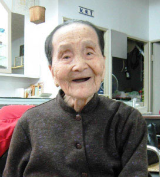

## 孔學一隅

### 孔子聖蹟圖淺說（九）

時哉

靈公問陣知不契

南遊問津道不同

在陳絕糧志不退

為政冏塗心不死

二三、靈公問陳

周敬王二十八年，魯哀公三年，西元前四九二年。孔子年六十歲，是孔子第四次到衛國。孔子再回衛國的目的，還是希望能夠行道，衛靈公待孔子也很友善，只可惜他只知謀求用兵，而不及其他。有一天衛靈公問孔子有關軍陣作戰的事情，孔子便對以「軍旅之事，未曾學過」。第二天，靈公又與孔子談話，見空中飛燕，仰頭視之，神色不在孔子，且云燕子都知南飛。孔子見其禮敬不足，於是離開衛國去了陳國。

圖中的景色是楓樹點綴一派秋景，在高山平台上，靈公身後站著兩位侍女，孔子站在靈公身旁，拱手作禮，兩人身上都佩著高雅環玉，靈公抬頭遠望燕群高飛向南，口中似乎正在喃喃自語。

孔子何以答只會禮而不會軍旅之事，《會箋》上說，靈公一生的錯處，俱在禮教上。當時世子蒯聵出亡，他年老而無嫡嗣子，孔子想要他修身齊家，夫婦父子之間講求禮讓，安內為急，大概預知衛國將發生內亂，所以用只知學禮之事引導，正是孔子的救時手段，想要靈公深思而自悟，可惜靈公未悟。

二四、子路問津

周敬王三十一年，魯哀公六年，西元前四八九年。孔子六十三歲，自楚國葉邑返於蔡時，忘了濟河的渡口，途中遇到長沮、桀溺二人在耕田，孔子便叫子路去問津。長沮、桀溺都不告訴子路渡口所在，長沮說：魯國孔丘周遊列國，應知渡口，不必問人。桀溺說：天下就像滔滔洪水，到處混亂，誰能改變這種局面呢？你子路與其跟從孔子周遊尋訪，不得其明君，又避往他處，不如跟從我這避世隱居的人較好。暗指你們師徒只懂得避人，不如我這隱士卻懂得避世。說完之後，只顧耕田，而不理睬子路。

孔子聽了悵然若失，而說：在山林隱居與鳥獸同群生活，然而人與鳥獸不同類，不可與鳥獸同群。若不與世人同群，而能與誰同群呢？天下如果有道，則我不用變易之，意即我不用出來周遊列國，正因為天下無道，我才想要出來推行王道。我跟你的道是不同的，所謂道不同不相為謀。

此圖呈現一派荒郊野外景象，孔子與弟子們駕著牛車，在江邊尋覓渡口。圖上一位牽牛，一位持著鋤頭向子路說話的人，就是長沮、桀溺二人。子路拱手有禮地向其請教渡口在何處？後方的孔子與隨行的弟子恭候牛車旁，靜待子路的回覆。

長沮、桀溺亂世歸隱，孔子在亂世，一心要以大道施濟蒼生，聖人與潔身自好的隱士分別在此。

二五、在陳絕糧

周敬王三十二年，魯哀公七年，西元前四八八年。孔子年六十四歲，先是在魯哀公六年，楚國曾使人來聘孔子，孔子即意欲往訪。而今陳蔡大夫商量說：如果孔子被楚國聘用，將不利於我們陳蔡兩國。於是決定共同派人在路途中，將孔子及弟子們圍困起來，陳蔡大夫要孔子盟誓不去楚國，孔子不答應，於是兵困孔子，又斷絕他們的糧食，而使得跟隨的弟子中，有些人都餓病了，不能站起來走動。只有孔子仍然講誦詩書，彈琴唱歌，沒有一點悲傷恐懼的樣子。他派子貢去楚國通報，楚王便派兵來解圍，而得免於難。

在這絕糧七天裏，圖中有些弟子餓得起不來，只有老師仍然彈琴唱歌，神色自若。圖中跪坐於孔子之前，或許就是子路在替孔子打抱不平的說：君子怎麼會窮困如此？孔子答覆他說：君子固然也有窮困之時，但不同於小人，小人窮困則濫溢亂作。在此圍困期間，孔子與子貢、顏淵等諸弟子間有許多重要事蹟與對話，均記載於論語上，足為一般人處逆境與亂世中，作為安身立命的最好教訓。

圖上執盾戈，穿著如秦軍兵馬俑般的武士，即陳蔡所派的軍隊，圍困住不讓孔子與弟子們前往楚國。（下期待續）

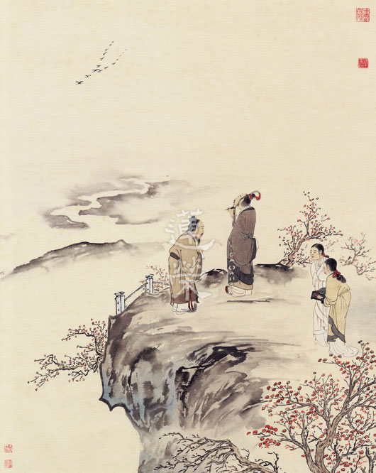

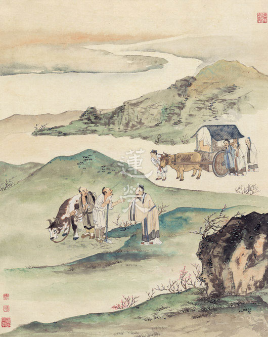

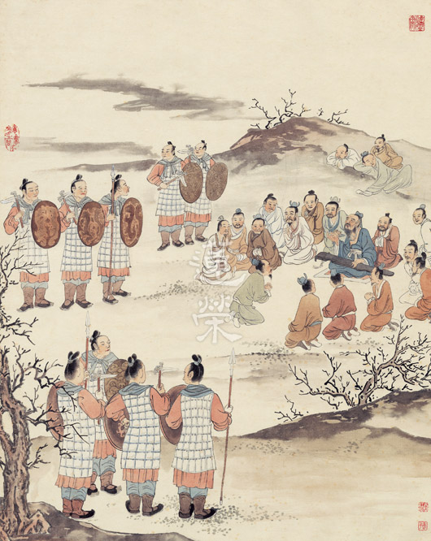

### 論語簡說（二） 子路遇丈人章賞析

*心超講述、傳儀整理*

春秋多高人

隱藏鄉野間

辟世並埋名

時局真亂世

論語章節

子路從而後，遇丈人，以杖荷蓧。子路問曰：子見夫子乎。丈人曰：四體不勤，五穀不分，孰為夫子。植其杖而芸。子路拱而立。止子路宿，殺雞為黍而食之，見其二子焉。明日，子路行，以告。子曰：隱者也。使子路反見之。至則行矣。子路曰：不仕無義。長幼之節，不可廢也，君臣之義，如之何其廢之。欲潔其身，而亂大倫。君子之仕也，行其義也。道之不行，已知之矣。

（微子第十八，第七章）

消文

子路隨孔子行，而落於後，遇到一位用手杖擔負著除草竹器的老人。子路問老人說：「您老人家有見到我的夫子嗎？」丈人回答子路說：「手腳如果不勤快，五穀如果不分植，就沒有收成，我哪有閒暇注意誰是你的夫子呢？」子路聽完拱手恭敬地站在一旁。之後丈人帶子路回家留宿家中，殺雞作黍飯招待子路，又叫他兩個兒子來見子路。

第二天，子路辭行，尋到了孔子，向孔子稟告遇見丈人的經過，孔子說：「他是位隱士」，就叫子路反見丈人。子路到的時候丈人已經外出。子路便將孔子想告訴丈人的話，請丈人的兩個兒子轉達：「讀書人隱居不替國家做事，便是廢棄君臣之義。長幼的禮節不可以廢棄，那君臣之義又怎麼可以廢棄呢？想要自潔其身，卻亂了君臣的大倫。君子出來替國家辦事，是為了行君臣之義，道之不行，君子早已經知道了。」

釋義

「子路從而後，遇丈人，以杖荷蓧。」

子路不知什麼緣故與夫子走散(子路隨夫子周遊列國多年，周遊列國本就有許多家當與隨行弟子等，因此子路有可能是在很長的隊伍斷後收拾而與夫子走散；也可能是夫子交辦事項離開夫子辦事後與夫子走散等等)，在尋找夫子的途中，遇到一位用手杖擔負著除草竹器的老人。

「遇」

乃不期而會。且經由之後子路向夫子稟告遇丈人的經過，夫子聽完後說「隱者也」，即可知子路與夫子原本都不認識丈人。

如何知子路所遇的丈人是一位老人呢？《禮記．王制》：「五十杖於家，六十杖於鄉，七十杖於國(諸侯)，八十杖於朝。」一般說「杖家之年」即指五十歲，「杖鄉之年(或還鄉之年)」即指六十歲。加上「人生七十古來稀」，古時大概六十歲即可稱「老」了，以上，皆可應證子路是遇見一位老人家。

老人用手杖擔負著除草竹器，「荷」，肩負、擔負之意，「蓧」則亦可寫做「篠」，從草字可能是用草編織、從竹字可能是以竹製成，乃耕耘時除草之器，或是盛農具穀種的器物，與簣同類。

「子路問曰：子見夫子乎。丈人曰：四體不勤，五穀不分，孰為夫子。植其杖而芸。」

古代稱

「子」

是一種尊稱，如現今稱「先生」，可知子路很有禮貌。

「四體」

是雙手雙足；

「五穀」

是稻(黏穀)、黍(梁米或小米)、稷(高粱)、麥(小麥、大麥或燕麥)、菽(豆的總稱)；「勤」是勤勞、勤快；「分」則可為播種(唐以前古注)，或施肥，如糞，必先糞種施肥、後植五穀而有收成(鄭康成注)。有注解將「分」解釋為「分辨」，此說不可採：因為如果是農夫，就一定會分辨五穀，如此又何須勤勞四體呢？

因此「四體不勤」和「五穀不分」之間的關係，是因為五穀皆有不同適合種植的時節，如《黃氏後案》：「月令春食麥，夏食菽，秋食麻，冬食黍，中央食稷。」(此處五穀分類與前述不同，是以麻(枲實)易稻，並以五行分性，說明不同時節適宜食用不同穀物)，所以必須一年四季都勤勞地去種植才有收穫。

而

「不」

字的用法亦與現今不同，為並語詞，是一種古代語法，用反面發語語氣去強調要表達的意思。例如「不勤」是勤的意思，「不分」是分的意思，特別就「不勤」、「不分」強調「如果不勤，就會如何……」，「如果不播種，就會如何……」，實則說「要勤」，「要播種」。

「四體不勤，五穀不分，孰為夫子」，古來有些注解解釋為「你這讀書人，在當今亂世不去勤勞四體，也不懂得種植五穀，而四處周流遠走，現在還來問我誰是你的夫子？」換句話說，即是責備子路「你自己的夫子都看不好，還找我要夫子做什麼？」但此說不可採。一來古代禮沒有一見面就責備人家的(有注解亦說「四體不勤，五穀不分」可能是  語或古諺)；二來丈人是高隱之士，更不會剛認識子路就直斥人家；第三，後文「子路拱而立」說明子路是很恭敬地回應，表子路聽出丈人口氣中分明不凡或語帶玄機。

所以「四體不勤，五穀不分，孰為夫子」應是丈人全約著自己來說，而非責備子路，如宋翔鳳的《論語發微》和包咸《注》以此為丈人自述不遑暇逸之意：手腳如果不勤快，五穀如果不分植，就沒有收成，勤勞四體播植五穀都忙不完了，哪有閒功夫知道誰是你的夫子呢？

「植其杖而芸」

之「植」為「置」的古字，為「放置(在地上)」或「直立、豎立(插在地上)，但不可解為「倚靠」，即丈人需拄著拐杖。一來是因為一面拿著拐杖一面除草並不方便；再者於後面敘述可知丈人有二子，如果丈人行動不便二子可幫忙農事；第三，子路就在丈人身旁，但子路卻「拱而立」說明丈人不需幫忙；第四，子路初見丈人時，丈人是「以杖荷蓧」的形象出現，如果見到子路時是用手杖背負著器具，要耕耘時才拿來當拐杖使用，不合情理，因此知丈人應是身體健朗的老人家，不需撐拐杖。「芸」則為「耘」字的省借，即耕耘之意。

「子路拱而立。」

「拱」

是拱手，《國故談苑》：「今人以垂手為敬，而古人則尚拱手，不尚垂手。」君臣之間尚循拱手之禮，此俗自三代迄宋未之有改。因此拱手，表現出子路的修養，也顯現出子路對丈人的尊重。

而子路為何要對丈人如此有禮呢？一個人如果是高人，講一平常話你也會不自覺地想與其深談；如果此人只是一般，即使說的話再有深意，你也未必會繼續與他交談，就如「祖師西來意」，重點是看人，不看話。

至於子路為何不去問其他人，一定要拱手問丈人呢？一來有注解指出此章發生背景是夫子周遊於楚國時，而南方地廣人稀，可能廣大的田陌中就只有丈人一人可問；再者，由丈人的答話可知丈人可能是知道夫子去向，但故意不明告，所以子路透過這樣恭敬地行禮，才能求教於人。

「止子路宿，殺雞為黍而食之，見其二子焉。」

子路這樣恭敬的舉止，使丈人留宿他一晚，並殺雞為黍地盛情款待，如唐詩「故人具雞黍，邀我至田家」所說。古時雞是重要資產，除非有交情甚篤的友人或重要貴賓來訪，不然不會隨便宰殺食用，但子路與丈人非親非故，卻受此禮遇，可知丈人是因為子路先前拱而立的氣象，相當欣賞子路，而與子路萍水相逢，素昧平生，卻一見如故！由此我們也可知平時言行舉止禮儀的重要，不僅展現出人才的氣象，亦受人尊重。

而從「見其二子焉」，我們可以看出一般父母殷切希望孩子認識賢人的心情，還有丈人是懂得後文提到的「長幼之節」的。家中有客人來訪、加上子路又較為年長，二子本即該出來與客人會晤。

此處有注解認為，應將「見其二子焉」捨去，並不可採。因為之後子路見到夫子，夫子請子路轉告「不仕無義」那段話給丈人，但子路返回後未見丈人(後文「至則行矣」)。如果將「見其二子焉」捨去，則子路「不仕無義」那段話，就是自言自語，無人可說了。因此此段，是為後續鋪陳，不可捨去。

「明日，子路行，以告。子曰：隱者也。」

次日子路即找到孔子，但子路為何能隔一天就馬上找到孔子呢？可知是丈人告知的。而丈人又為何不直接告訴子路，即如前述是丈人要考驗子路。

夫子在聽完子路的遭遇後，就說「是隱者啊！」，可知丈人是有德有才之人，否則夫子聽完說「鄉間草夫」即可，何須稱「隱者」？而這些隱者都是可以出來利益天下蒼生的。

「使子路反見之，至則行矣。」

夫子叫子路反見丈人，是因為夫子有話想請子路轉告。

「至則行矣」是子路至，丈人行，但非有意躲避。因為如果丈人真的有意躲避、想隱居，當初就不會讓子路留宿，又讓子路見兩個兒子了。

「子路曰：不仕無義，長幼之節，不可廢也，君臣之義，如之何其廢之。欲潔其身，而亂大倫。君子之仕也，行其義也。道之不行，已知之矣。」

有注解說，「子路曰」是子路找不到丈人，回來對夫子說，此說不可採。因為「不仕無義」是對著隱者說才有意義，對夫子說不合情理；再者「長幼之節，不可廢也」是呼應前文「見其二子焉」，而續說「君臣之義，如之何其廢之」；第三，夫子即是「知其不可而為之者」；第四，如子路真要對夫子說，也應該是稟告「未見丈人」才是。以上，皆可證明子路非對夫子說。

而文中出現的人物僅子路、丈人、二子與夫子，如果丈人已行、又非夫子，則子路此段話必是跟二子言。但文中未再明寫是對著二子，是因為前文已提過二子，當可意會，此為古人行文之妙(翟氏考異)。

接著後文「不仕無義」那段話，則皆約丈人來說。「不仕無義」，「仕」是替國家做事，即「君臣之義」，而行「君臣之義」的方式有兩個：直接的是辦政治，間接的是辦教育。五倫中「夫婦有別、父子有親、長幼有序」乃天倫，曰內；「君臣有義、朋友有信」則曰外。身為讀書人，以利益天下蒼生為己任，而利益天下蒼生的方法即前述辦政治、辦教育，行「君臣之義」。因此古時亦稱盡忠報國為「大孝」，相較之下，家庭之倫就是小孝、小倫，而可知「君臣之義」為五倫中最重要的。

丈人有才德卻不願出來為仕，是因為無義而不仕，潔其自身；但不仕卻又恰恰廢棄了君臣之義；而當子路借宿時丈人要二子出來拜見，小倫(長幼之節)都實踐了，大倫(君臣之義)怎反倒沒有保住呢？夫子這段話，就是要告訴我們讀書人的價值，是要出來辦政治、辦教育；即使政治辦不成，也要出來辦教育，「君子之仕也，行其義也」，君子出來替國家辦事，是為了行君臣之義。

而有人會納悶「欲潔其身，而亂大倫」，「潔身自好」難道不好嗎？潔身自好並非不好，但也是要細究的，例如「入朝為官的潔身自好」和「辦教育的潔身自好」，是可以的；但「隱士的潔身自好」，就不行了。

我們由此處也可以看出丈人對於依時局行君臣之義的看法與夫子不同。前者是認為「道不行，出來無用」；後者則認為「道不行，才要出來」，為何夫子會認為「道不行，才要出來」呢？所謂「天下有道，丘不與易也」，如朱子注：「天下若已平治，則我無用變易之，正為天下無道，故欲以道易之耳。」天下如果有道，夫子就不用出來改變了，但正因天下無道，才要出來。

丈人對子路言「四體不勤，五穀不分」，是想透過子路告訴夫子時機的重要，「道已不行」；但夫子請子路轉告：「道之不行，已知之矣」，夫子何嘗不知「道已不行」了呢？卻正是因為知道「道已不行」，才更要出來為仕，利益天下蒼生，造福國家社稷。（下期待續）

## 專題研學

### 聖者的祕密　二十五圓通暨七處徵心簡介　（三十五）

時哉

三十二應十四無畏

尋聲救苦施無畏者

能觀所觀安立觀音

無作三昧同一悲仰

子二、觀音廣陳

丑二、陳白之言

寅四、詳演所獲殊勝

卯二、承演三科

辰二、十四無畏

巳一、標承悲仰

經文：

世尊，我復以此聞熏聞修金剛三昧無作妙力，與諸十方三世六道一切眾生同悲仰故。令諸眾生於我身心獲十四種無畏功德。

聞有從聲塵上說、耳根上說、耳識上說，觀世音菩薩是從耳根上來觀察，在耳根上現證耳根圓通，現證耳根圓通是現證耳根的自相空。

聞熏聞修金剛三昧，是以聞為觀察的修學法，得到金剛三昧（空性）。金剛喻能摧壞一切，而不被一切所摧壞，比喻是空性的證悟，證悟空性的無作妙力是指不用經過造作、即能任運生起證悟空性的智慧。不用經過許多前行準備，比如要先把蒲團做的軟軟的，坐上去很舒服，環境整理得很清淨，經過禮拜、懺悔求加被之後，在行動、意念上準備好，坐在蒲團上打坐用功，慢慢地進入三昧。此時的修行功夫已經達到不需要這些前方便，直接進入現證空性的三昧。

七地菩薩在入空性定時，勢力非常強盛，可以彈指間入定，此即無作妙力。即使面臨被殺刀之前，一樣可以從容入定，雖然我們很難達到，但是要將這些大菩薩的證悟當作我們的所願境，即使盡上十二萬分的努力，這一生只前進一點點，仍然還是要努力，如同登高山，雖然腳很酸走不下去，也還是要走下去，此時正考驗自己的能耐。

有一位善知識曾說：佛道雖然長遠，可是當下最重要的就是往前跨一步，這可以幫助我們爬到山頂上，不要想到山頂接天邊，爬上去的困難，保持一個信念，當下永遠往前跨一步，將來一定可以到達山頂。同理，菩薩精進度修學直至成佛，看似艱難，然過程中，有諸多善知識的教導，佛菩薩的加被，都讓我們容易通過考驗勇往直前。

與十方三世六道一切眾生同悲仰故：此空性三昧如同金剛，且不必經過造作即能生起，以不起定的方式入世俗，同時現證眾生所苦，並生起大慈大悲，謂之與一切眾生同悲仰故。

觀音菩薩十四種無畏，不只幫助眾生遠離障礙、得到解脫，而且也可以幫助眾生得到十四種的無畏功德。觀世音菩薩的聲是妙音聲，心是妙觀心。妙音聲是依因緣所顯現的妙音聲，亦即遇到能教誨的弟子，以很有內涵的聲音及種種方便引導弟子們脫離苦難，觀音菩薩毫無畏懼，此無畏大分十四種，皆是無畏的功德。

由於菩薩空性的證量能破所知障，使他在三界度化種種苦難的眾生而無所畏懼，諸法只是觀待顯現而已，如同觀待夢心顯現夢境，顯現的方式只能如水中浮現月亮、鏡中浮現影像、天空浮現乾闥婆城，看似有顯現，但實際沒有實體，度眾生如何會有畏懼。

巳二、條列無畏

午一、八難無畏

此處敘述觀世音菩薩解脫眾生的八種障礙而無畏，或說眾生脫離畏懼而無畏，〈普門品↘上說觀世音菩薩是施無畏者。

未一、苦惱難

經文：

一者由我不自觀音，以觀觀者，令彼十方苦惱眾生，觀其音聲，即得解脫。

觀音菩薩自己無法成為能觀者，必須觀待所觀者才能成立能觀者，依觀眾生苦難求救之音而安立為觀世音。

以觀觀者：

以此能觀所觀而安立為觀者，必須觀待所觀才能成立能觀，如果所觀（眾生）能夠自相成立，則眾生的痛苦當成為大家關愛憐憫的對象，事實不然，要有能關愛的心顯現，有情才會變成所關愛的對象。同理，社會上有很多可憐的人，但不能成為所觀，必須要觀待能觀的心識顯現，方成為所觀。

是故，觀世音菩薩不能自己成為觀音，必須觀待所觀才能成立能觀，當眾生的苦難成為所觀，方成立他是能觀者，所以能觀所觀自相空，依能觀而安立觀音的名號又如何有自相？

十方被苦逼惱的眾生是所觀，觀世音菩薩不只聞其表面的音聲，且可以聽到眾生心裡的聲音，以觀待慈悲而生起的智慧通達眾生的苦惱。如果凡夫都成為聖者，苦不能顯現，不能成為能觀悲憫心的所緣境，觀音之名就無法成立，所以觀音之名自相空。同理，必須觀待聽者才能成為說法者，所以無有任何一法是佛自己說的，皆是觀待聽者才能顯現佛所說的三乘法。

觀其音聲，即得解脫：

是尋聲救苦之義，以上是總說解救眾生的障難，以下分別敘述七種障難，尋聲救苦觀世音如何解救眾生的七種障難？

未二、火燒難

經文：

二者知見旋復，令諸眾生設入大火，火不能燒。

知見就是觀音菩薩對眾生的了解，所知所見包括眼見色、耳聞聲、鼻嗅香、舌嚐味、身接觸，所知就是第六識意的通達，「知見旋復」是對境的時候旋復，就是在法的體性上做觀察，同時現起該法未存在於名言之外，只能以名言的方式顯現。

眾生在地獄無間的猛火中是苦的，地獄最苦的刑具就是火燒，觀世音菩薩能在名言上通達該眾生火燒的苦，而在名言之外不見該法自相，觀待眾生被火燒而痛苦的慘叫，觀世音菩薩同時通達他的慘叫，同時通達如何幫助他得到解脫。

燒之所以成為燒，必須依靠身根、身識去顯現，觀待身根與身識的生起，才能成立為所燒，所謂的燒是觀待下的生起，觀待燒的名言成立能燒、所燒。毗婆尸佛入定生起大火，他有沒有現起我被火燒死了的感覺？沒有！月光童子在入水定的時候，同樣也沒有自己要被淹死了的感覺，之所以有淹的名言顯現，其實是觀待能淹、所淹，若沒有淹的名言，自然沒有能淹、所淹的名言。

因為能燒、所燒而成立燒的名言，而在燒的名言下成立能燒、所燒。若沒有所謂燒的名言，就無法成立能燒、所燒，也因為沒有能燒、所燒，所以無法成立燒的名言，這叫知見旋復。知見旋復就是通達燒的自相空，眾生生起燒的名言而說能燒、所燒。觀世音菩薩隨順通達眾生的名言，成立能燒、所燒，一切世間就像水中月、空中花、乾闥婆城的顯現。

火不能燒，觀音菩薩有二種度眾生法：第一、讓眾生生起證量，所謂能燒、所燒產生的燒都是觀待眾生的業力及思維，讓他生起證量；第二、觀世音菩薩的加被，讓眾生生起能燒、所燒自相空的觀念，而眼前的燒是什麼呢？如此成立為真正對有情的救度，稱做火不能燒，火不能燒是藉著有情，觀世音菩薩通達救度他的方法，靠的是觀世音菩薩的加被！

內心的瞋火會顯現外火，外火變成所燒，身體變成能燒，而生起燒的名言，觀待燒的名言，而有所謂的能燒、所燒，沒有生起燒的名言就沒有能燒所燒，入定去看燒的自性，連一粒微塵都看不到，所以世間的榮華富貴、妻兒、田園、功名、財產，應知等同如是觀，這就是真正空性的修學法。（下期待續）

### 大乘百法明門論簡說（二）

*心超講述、淨本整理*

論為經律文義解

要為眾生開慧眼

弘揚傳承佛命脈

人天眼目苦海舟

貳、論主簡介

一、介紹論主的目的

《大乘百法明門論》的論主就是世親菩薩，為什麼要介紹論主？目的有三，首先是對論主的教證功德生起信心，方能對他所造論生起信心；第二是感恩，沒有作者造論，我們無福深入經藏；第三是傳承，學習本論成為聖教弘揚與傳承者，這是人生最大的善業與福報。

如同我們找工作、辦演講，如果有人幫忙介紹，可以增加雇主的信心、聽眾的信心。佛法也是如此，如果不介紹論主，如何能對本論產生信心？所以介紹論主的三個目的，第一是生起信心，第二是感恩，第三是必須得傳承與三寶的加被。對論主有信心也生起了感恩，重要的是傳承。論主寫論的目的，不像我們現在很多世間人，寫作文章是為了名氣，菩薩都是為了利益有情，而利益有情的關鍵在傳承，如果沒有把正法往下傳，佛法再大的盛況都沒有用。就像中東一代，如今已無法相信那裡曾經是佛教的盛況，該處現在已無任何佛教的蹤跡。

三藏中《佛說八大人覺經》的翻譯者安士高大師，是安息國（今伊朗）的太子，當年曾經是佛教盛況的伊朗，曾經出過祖師的中東，現在佛教不但已經被滅，連阿富汗僅剩最後遺跡的大佛，都被軍隊用大砲轟掉。所以我們今天保護佛教的方法，不是蓋大廟，不是弄表面的風光，而是培養人才，培養人才才能續佛慧命，叫做「延續佛燈明」。佛燈喻如佛的智慧，延續得靠傳承。有人傳承佛法，佛法才有住世的希望，否則再大的盛況都只是一時。

二、世親論師

論主世親菩薩在佛滅度後的九百年，出生於北天竺的富婁沙富羅國（亦稱為丈夫國）。父親是婆羅門，姓憍尸迦，他有兄弟各一，哥哥是無著菩薩，弟弟是獅子覺，三兄弟都是人才。一個家的家道有沒有希望，不是能賺多少錢，能買多少房子，雪廬老人說，要看他的兒子，看兒子就知道這個家興不興，兒子是人才，這個家必興。老人說中興是以人才為本，每一位大德最關注的事情，不是在他的事業有多大，而是後面的人是不是能夠接棒。

昔日禪宗五祖弘忍為了找接班人，所以從《楞伽經》改成弘揚《金剛經》，因為六祖是《金剛經》的當機，六祖的出現才是五祖生命中的重點。

世親菩薩與兄弟都出家修行。世親論師最初在小乘的薩婆多部出家，博學多聞，通達小乘三藏，戒行清白無與儔匹，並通達《阿毘達磨毘婆沙論》（簡稱《大毘婆沙論》），阿毘就是「對」，達磨就是「法」，也就是《對法論》。何謂對法？對貪說無貪，對瞋說無瞋，修學對法懂得調心，懂得調伏自己的煩惱，為了要迅速脫離輪迴，所以小乘會在林邊水下寂靜處長養聖胎（修學對法論，對治煩惱），容易入禪定破煩惱出三界。

世親論師為了解釋《對法論》，一天寫一首偈子，共寫了六百首，合編成《俱舍論》，因此《俱舍論》就是《大毘婆娑論》的注解，在印度稱為《聰明論》。一般《俱舍論》是佛學院所必讀，它是研究法相的基礎，無論學習唯識、中觀或者戒律，都是必讀的，它是整個學佛的基礎。

世親論師學了小乘，總共造了五百部論，而且不信大乘，他說「大乘非佛說」，造了這樣的罪業。他的哥哥無著菩薩很害怕弟弟一直造謗法的重罪，然而世親論師已經是一位小乘的大德，十分忙碌，所以無著菩薩示現生病，世親論師趕來相見。見面後說我的病是因你而生，因為你造了謗大乘教法的罪。弟弟固然覺得哥哥說得非常悲切，但不服氣，所以哥哥就趁這個機會宣說大乘的教義，弟弟終於體悟，並且在大乘的學習上產生很多的法喜。

世親悔恨過去謗法的罪業，想要割舌頭謝罪懺悔。無著菩薩云：即便是長劫割舌贖罪都無法消除謗法罪！過去以舌頭來毀謗大乘，今後也要以舌頭來弘揚大乘，唯有這樣才能懺除罪愆。此法真善巧，如同用手去殺生，現在並不是把手剁掉，而是要用這個手來護生、放生，方能消罪愆。從此世親論師就轉弘大乘，並且注解佛經，包括了《華嚴經》、《涅槃經》、《法華經》、《般若經》、《維摩經》、《勝鬘經》等大乘論五百部；合前面的小乘論五百部、號稱為千部論主。

為什麼世親論師要寫那麼多論？因為過去毀謗大乘，所以造論弘揚是贖罪最好的方式，反面說是懺除罪障，正面說是弘揚正法。造論者會認真詳釋經義，且下筆小心，要不斷地修正想法，此時命運也逐漸在改變。改變命運要在思想上改。所謂的定業是想法沒改才叫定業，如果定業有定，阿闍世王造這麼重的業如何中品中生（或也有人說上品中生）？而我們沒造那麼重的業卻在娑婆受苦？又如張善和一生殺牛為業，現已在西方；一生殺牛為業，如何會有此好命？關鍵在轉變，就是念頭的轉變。

團體的共業也是在團體的想法改變時就轉變，國家的未來，要年輕人想法改變，國家的命運才會改變，如果都是暮氣沉沉，眼下無論多少的成就，都是枉然。古來多少的大帝國，都是亡在人心。

教育就是透過講學、辨義、著書立說，讓學習者有邏輯思維，道理明白，方向正確。許多成功之士，都有一個共同特徵，就是思想明確、道理清楚、架構完整。

本論是依彌勒菩薩的《瑜伽師地論‧本地分》所造，《瑜伽師地論》是無著菩薩在彌勒菩薩兜率天宮踰遮那講堂的聽課筆記，彌勒菩薩講六百六十法，世親論師再歸納收攝成一百法。

但從本論篇首：「如世尊言，一切法無我。」可見本論不是只有宗本地分，是《大般若經》思想的核心，即一切法無我。本論是藉著百法來說明一切法無我。

世親論師享年八十歲，他雖然行跡示現於凡夫，但實際理地上是四善根中的明得薩埵。修行要經過十住、十行、十回向的三賢位，十住是心安住在菩提心上，假如今天發心明天退轉，就是沒有住在發心上，所以十住位的修學法就是訓練安住的能力，發心而且住上去了，是不退初心。其次十行位，根據發心斷惡修善。一般人的斷惡修善是一時興起，十行位的斷惡修善具有使命感，例如一位將來要當國王的人，會開始注意各種小細節，而且能接受人家的約束，此是依使命感而生起的能耐。

之後十回向位，就是將所作善根福德回向佛果，然須修學空性破煩惱障與所知障方得以成佛，故為了生起空性的智慧進入了四加行（也稱四善根）：煖、頂、忍、世第一，成為登地菩薩前的聖者。四加行全部都是在智慧上用功，透過三賢位的修行，累積足夠的福報以後，將此福報用來修學智慧。否則光享福報成為墮落的增上緣。為公發心修福，目的就是要在佛經上開智慧。煖位就像鑽木取火，木頭的煖相出現，溫度一定要愈來愈高，準備要開始冒火花。意思是說，學佛要每天用功，如果一曝十寒，其實是沒有用的。煖就是溫習，《論語》上說溫故而知新，一定要不斷地每天充實，自然在這個領域上就有出路。

第二是頂位，亦即溫度達到冒出火花的臨界點。第三個是忍位，忍能燒木頭，即燒煩惱柴薪的火已出現。最後世第一，就是忍到最極處的一剎那進入見道位，上忍位的最後一剎那的下一剎那謂之世第一（世界第一）。世第一其實只有維持一剎那，就進入見道位。當能燒木頭的火在忍位上升起到世第一，一剎那進入見道位的時候，這個火已經有能力把木頭燒成灰。此時智慧的火有能力將煩惱的柴薪燒盡，這是在見道位的狀況。若是小乘見道位（初果）必定證得四果阿羅漢，大乘見道位（初地）則必定成佛。如同森林剛起小火時還可以滅，等到起大火時，已無能力撲滅，此火必將森林燒光。

見道位般若的火燒起來時，魔再怎麼破壞也沒有用，而這樣的火就從煖開始。世親論師就是屬於煖位的人，謂之明得位，明就是開始得智慧火的明相，稱為明得薩埵。得到那個明相，在定中修觀（不斷串習空性的修學法），必證極果。世親論師亦有造《往生論》迴向西方，如同雪廬老人將所學的唯識教法回向淨土。以上是論主的簡介。（下期待續）

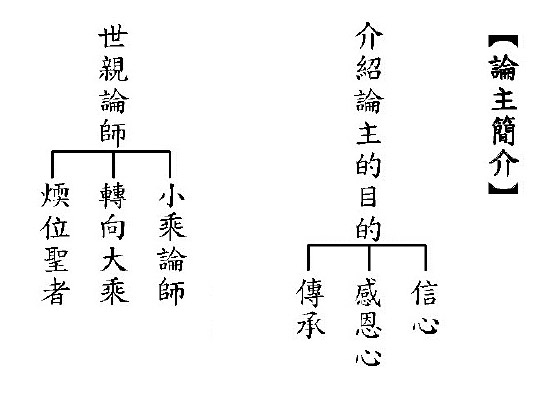

## 活動報導

### 樂見青年迎向文化—記二○一四二月醫王學社參訪

*編輯部*

正值青春嘉年華

醫王學社能啟蒙

參訪交流心饗宴

醫人醫心兩相宜

前言

中國醫藥大學醫王學社，是依止 雪廬老人所創辦的臺中蓮社學習的一個佛教社團，他們以「研究佛學義理，闡揚東方文化，砥礪品德修養，匡正社會風氣」作為立社宗旨，民國五十一年六月八日，正式成立。社團平時有學術講座、專題演講、共修、康樂等活動內容，讓學生們參與。是一個有中心思想而又活潑的社團。

透過該社現任社長莊惟盛同學特地北上啟請，本會特於民國一○三年二月二十二日、二十三日為他們舉辦了兩天活動，包括學員交流、共修課程參與、文化導覽及陽明山出遊，彼此以文會友，也為未來的發展播下最好的緣起，在醫王學社社長後續的啟請下，本會師資從三月開始前往授課。茲刊載本次活動報導及來訪心得，以饗大眾。

活動報導

參訪，往往讓人跳脫原本的生活視野，體驗另一種生命的著力點，繼而自省，改變對生命的態度。中國醫藥大學醫王學社，今年（民國一０三年）二月來到無盡燈文化學會參訪，為期兩天的行程非常短暫，卻帶回滿滿的喜悅與開闊的格局。

此行活動精彩絕倫，第一天參訪學會，包含學會導覽、座談、參與大專班論語課、人生大事（臨終須知專題）。第二天參觀故宮、遊覽陽明山、觀賞海芋。醫王學社來參訪的學生涵蓋各個年級、各個系所，有醫學系、中醫學系、學士後中醫學系、藥學系等學生。雖然年級、科系不同，但同樣對佛教有好感，秉持這樣的好感來到學會參訪，藉以瞭解學佛的好處及人生的走向。

當醫王學社一行人來到了學會，即受到親切的招呼及禮遇。由學會的學長介紹環境，並善巧的介紹佛堂的畫作—極樂世界妙果圖及雕塑，包括阿彌陀佛、雪廬老人與四大天王等。透過學長的介紹，讓我們知道極樂世界的內涵，及護法、佛、傳承的內涵，並且對於佛堂營造出來的境教深深嚮往。身在其中，內心立刻靜下來，妄念也減少，取而代之的是佛號聲聲入耳入心。

學會導覽結束後，接下來是座談。座談分三部分進行。第一部分，師長致詞，首先由無盡燈文化學會理事長唐瑜凌老師致詞。唐老師提到，民國六十五年參加大同普明學社，當時學社人數少則有三十餘人，多則有三百餘人，學佛風氣盛行，青年奮發向上，國家經濟起飛，國家的命運常與佛教的興衰有關。目前佛學社團普遍存在內涵不足的瓶頸，必須由充實內涵，看到佛法的價值。醫療在形而下是治身，用生理藥，在形而上是治心，用心理藥。治心才是根本。

唐老師也期許醫王學社成為具有正知見的社團，並且肯定為社團服務所培養的能力，是進入社會所需要具備的資糧。其次，高老師勉勵大家在順境中要謙虛受教。在順境中，如果養成不需要聽別人意見的習慣，往往會釀成災難，跟著老師學習可以避免走冤枉路。再者，林老師鼓勵大家學習學出滋味，學出快樂，人生一晃眼，十年就過去了，在正法上學習，不蹉跎光陰。大成孔學會理事長張先生感嘆太晚遇到佛法，隨喜大家年紀輕就能學佛，人生的意義就在學佛學儒，必須把握因緣增上。

座談的第二部分，學會介紹。學會經營的事業概分為兩大類：文化事業及國際慈善事業。文化事業著重在儒學和佛學的學習，並且開辦了許多的課程，包括中庸講座、論語講座、法華經講座、彌陀經講座等。近期在兩岸交流上，大陸方面展現對於文化高度的重視和求知欲，多次邀請學會到大陸講學。

國際慈善事業，學會到過許多東南亞國家賑災和救濟，包括緬甸、寮國等。座談的第三部分，主題研討。題目是「佛法在時代中的意義與價值」，內容以四方面來研討，分別是佛教社團的功能、文化之交流、團隊的重要及佛化家庭。研討時提到正見的重要性，靠正見能夠突破各行各業的瓶頸。

晚上的大專班論語課，除了研討一條論語，還說到了研究論語的意義。讀論語的當下，能夠和古人對話，在孔子當時的各種歷史事件，可以看到古人是如何看待事情、處理事情。藉此提升自己的格局，以及說話辦事的能力。接著「人生大事」課程，首先說明了臨終須知的重要性，以及教材編纂的緣起，其次分析科判，最後回到進度來消文釋義。

要成就往生大業，除了臨終者要具有信願行三資糧，還要有臨終助念。要促成臨終助念，必須要有多方面的講究，包括家屬須配合的事項、助念團應具備的規矩、助念現場張貼助念通告，甚至在內涵上多充實等。臨終助念須知的內涵必須平時就慢慢建立，臨終才不會手忙腳亂，而是在井然有序、情緒穩定當中往生。

第二天，我們來到臺北故宮博物院參觀，特別是看明朝畫家沈周展。首先參觀「慈悲與智慧─宗教雕塑藝術」，展室名為「楷棟堂」。楷棟堂是為了紀念彭楷棟先生而設。早期故宮以新台幣三億元向彭先生收購北魏太和年間的釋迦牟尼佛坐像，後來彭楷棟先生將其一生的收藏全部捐獻於故宮，因此故宮設楷棟堂紀念。

楷棟堂的陳設是以佛堂擺設呈現，走進去首先是左右兩側的護法，左邊是密教的護法，右邊是顯教的護法。密教的護法是六臂瑪哈嘎拉，是觀音菩薩的化生。其身上的各種配飾皆有表法，頭上的骷顱代表無常，胸前的瓔珞代表威勢，腰間繫上一條蛇代表降伏貪欲。顯教的護法是南方增長天王，左手持摩尼寶珠代表福德，右手握劍代表智慧，斬斷煩惱，護法以智慧為本質。

接著看北魏太和年間的釋迦牟尼佛坐像，此為楷棟堂最有價值的典藏。背光的後面有釋迦牟尼佛一生的故事，包括出生、鹿野苑說法等，重點式的說明佛一生的事蹟。寶座的後面刻有銘文，明確記載時間是北魏太和年間。還有許多的雕塑，背後都有其文化內涵，讓我們有另一番的體悟。手結權智印的菩薩，左手指一，右手握住左手的食指，此為權智印。代表菩薩以空性的智慧為本質的權巧方便度化眾生。

抬頭望日的羅漢，其典故是，當時羅漢乞食到的食物看起來不好吃，因此想抬頭望日看是否午時已過，可以不吃。抬頭一看，卻看到午時未過，因此懷著高興的心情把所得到的齋飯吃了。雖然食物看起來不好吃，但是必須要透過領會施食者的誠意，很高興的接受食物。離開楷棟堂，又看了一佛二菩薩、龍藏經、張大千的潑墨畫「蘇花攬勝」。

接著參觀沈周展。明代中期江南地區經濟富庶，文藝高度發展，時沈周、文徵明、唐寅、仇英繪畫成就卓越，人稱「明朝四大家」。沈周的「廬山高」是一幅大型畫作，是為了賀其師陳寬七十大壽而作。畫中呈現磅礡的氣勢，將廬山高不可測展現無遺，題字開頭感歎：「高乎哉！」，在在感歎老師的德學是高山仰止，景行行止。

看畫時，要遠看也要近看。遠看看氣勢，看整體呈現出來的意境。近看看交代，看細節一筆一畫勾勒出來的事物。「蒼堐高話圖」，畫中兩翁坐在松樹旁邊，前面有高山屏障的河谷，兩翁旁閒置一張琴。題字云：「長松落落不知暑，高坐兩翁無俗情；琴罷清談猶半餉，不妨新月印溪明。」展現知音的程度高到不需要彈琴來表達，談話契合，高興之餘不覺已到晚時月亮出來了。「觀物之生」是沈周一系列的寫生，藉由寫生表達對萬物的體會。畫中一隻鳥旁邊題字云：「本是高飛物，多言每受籠。」讀書人必須要看懂時機講話，錯了時機講話往往招致牢獄之災。一隻雞旁邊題字：「曙光三唱裏，心事五更人。」雞在天亮時鳴叫，而有心事的人是整晚沒睡直到五更還是醒著。

透過沈周展，了解藝術所傳達的人情世故，是形而下入世說話辦事所須具備的內涵。故宮的導覽必須以文化為本質，寓教育於其中，起化導之用，才是有意義的導覽。

離開故宮後，前往陽明山吃野菜、賞海芋，雖然途中塞車，但是沿途風景優美，景色怡人。到了餐廳，學長們邊吃邊聊學習的心得，互相交流所見所聞，心情愉快。餐後漫步於海芋田當中，呼吸清新的空氣，隨處合影留念。最後，下山時帶著學會準備的餐盒，踏上回家的路，圓滿兩天快樂又充實的參訪之旅。

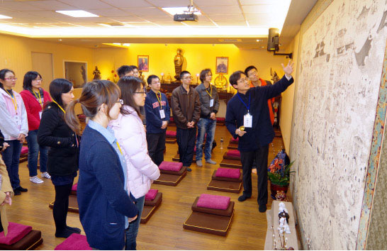

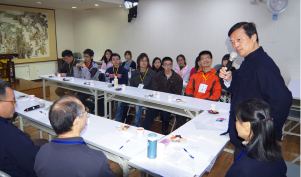

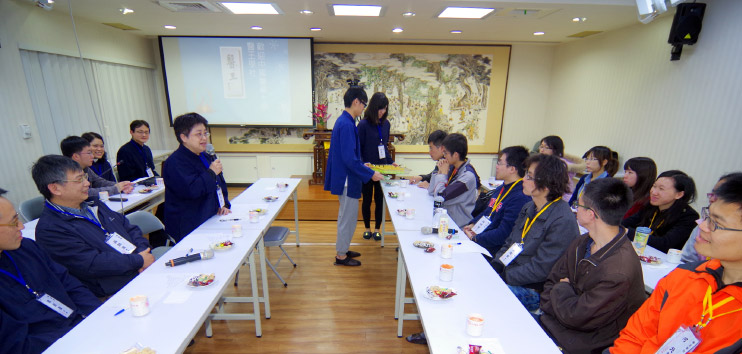

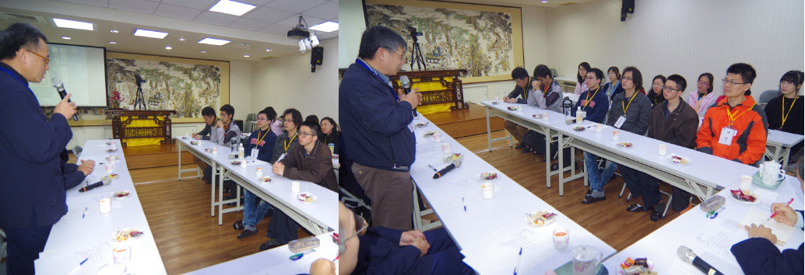

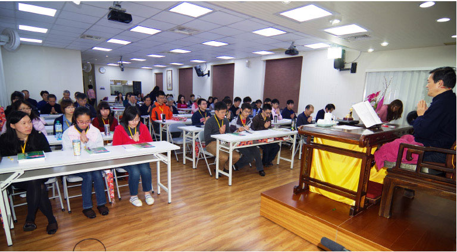

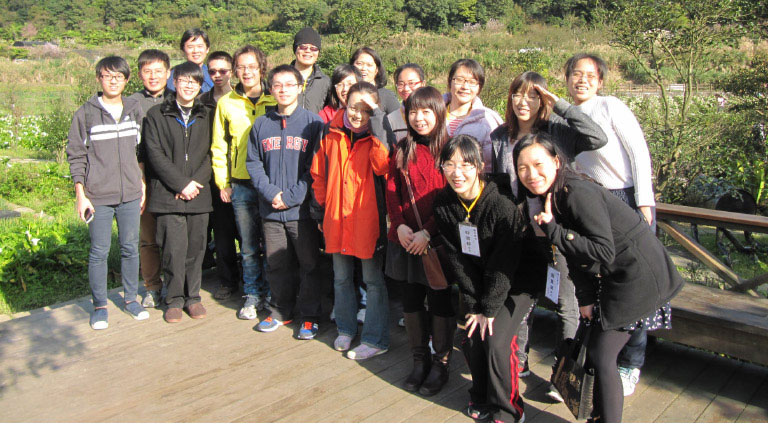

### 樂見青年迎向文化—參訪參訪心得

醫王學社

王建閏

此次參與中華無盡燈文化學會為我們中國醫藥大學醫王學社所舉辦的文化研習課程，雖然只有為期短短兩天的時間，但卻從中收穫匪淺。對我而言，中華文化自有甲骨文字紀錄以來，文明的累積深度和廣度，遠非我們這些炎黃子孫所能用一生的時間好好消化吸收。在百家爭鳴的中華文明中，源自春秋戰國之時的儒家學說，和源於印度的佛教，其中之內涵，經過這兩千多來眾多的文人僧道加以擴充及演繹，讓它們得以在廣土眾民的中原，加以生根茁壯。

這一次的研討會裡，唐老師及眾多師長們，都對我們醫王學社的學生們有所期望訓勉。在他們的眼光中，看得出來他們對於時下青年學子的不思長進有所擔憂；唐老師更以他親身至中國大陸的親眼體驗，提醒我們，再不振作向上，臺灣所領先對岸的軟實力，也將隨著大國崛起而漸行漸遠。

隨後的論語課程，提及了名正言順的道理。講師用他親身向業界老闆請教的經驗，鼓勵我們向上學佛、儒的益處。儘管學佛、學儒之人，言語辯論不如一般常人，但習得這些精神，卻可以讓人們服膺於己身的可靠穩重。當真是聽君一席言，勝讀十年書。

次日的故宮行，也是唐老師一人獨挑大樑。老師熟讀經典，飽學詩書，於各種典故來由皆如數家珍，舉例用典毫不費力，讓在場的我們如沐春風，一解各種佛器及書畫其中豐富的意涵。

這一次和學會的交流，於我獲益匪淺。希望下一次我們社團能夠再有機會和學會有再續前緣的良機。

何元

雖然只參加了週日的活動，但是故宮一行，老師深入淺出的導覽令我印象深刻。尤其是佛像展示區，老師對每件文物的來龍去脈及其所代表的文化乃至佛法的義涵都如數家珍，足見老師對佛法的用功之深，令人動容。印象最深刻的就是老師對展場空間布置的解說，從入門處、左右顯密護法到佛像展示區，整體陳設表面上雖是博物館，實際上卻闇合佛堂的擺設邏輯，所以老師每天吃完中餐就會來這裡繞佛。

就像老師當天數次提到的，如果只有古物的陳列，就算蒐集得再多，也只是倉庫裡的貯藏品罷了，沒有了文化的靈魂，徒留空殼。文化在人身上，由人的所思所言所行所建構，老師將展場作為實際的佛堂用以繞佛修行，正是身體力行的表率。

林志雄

志雄自行前往，提前到了學會，除了接受熱心的歡迎，學長還倒了一杯現打蕃茄汁。從外面的歡迎看板、名牌、停掉常規課程，諸位學長老師蒞會座談，唐老師親自帶領參觀故宮等，到第二天晚餐的餐盒。都讓人感受到學會的用心。真是因佛福德獲飲食啊！只能在佛道上更加努力，才堪得起這樣的福份啊！

這一次期初社遊，在佛堂，看到江逸子老師創作的雪廬老人銅雕。雖然在臺中蓮社德明樓一樓聽經的時候也經常看到同一作品，但是這一次看到的因緣是隨著學長引導的簡介，讓我思惟到，老人當初把儒學、佛學的種子帶到臺灣，以六十多歲的年紀，奮力地耕耘，老人曾說：「佛法是他跪著求來的，同時也是跪著送出去的。」(這句話相當催淚)。沒有歷代祖師和老人的傳承，我們今天學到的會是什麼？在生死的大海當中，沒有善知識把法帶到我們生命當中來，我們能夠靠自己的力氣擊退魔軍的機會少之又少啊！唐老師多次用各種的例子來告訴大家真正的力量是文化，不是外表的形式，很策勵學子的心。

回到臺中，覺得道心有被提策起來，或佛或儒都勉勵自己能夠更加用心學習。一方面自己成長，一方面承擔起傳承的一份力量。首先就是社長舉辦的種種研討和社課都要積極參與，練習說話，練習準備上課內容，和學社的學長們一起切磋向上。

最後祝福老師，法體康泰，法輪常轉。學會學長們，學習都有顯著的成績來報答老師的深恩。希望護法的威神力能夠倍轉增上，護佑學會和學社能夠把法延續下來；且能廣傳到有緣人的心中。惟盛社長所領導的社團也能符合師長的期許，希望來參加的學長們，都能夠多參與社課，這是給犧牲奉獻的社長最大的回饋，阿彌陀佛。

况詩宇

這次很難得地能夠參訪臺北無盡燈文化學會，師長們親切地招待及活動策畫之用心都讓大家驚歎不已，現在就由末學簡單分享這兩天的學習心得。論語，這部由孔子及其弟子及再傳弟子所彙編成的儒家經典，從幼時不求甚解的背誦，到為了應付考試而成為強記起來的知識，都不曾佔據心靈及精神層面重要的一隅，更遑論將之應用在待人處世，及內化成為人生態度如此重要的兩件事情上。但在經過簡短的課程介紹，讓末學認為論語中所藏納的智慧實是千古流傳的寶藏，學習價值不斐。

誠如楊老師所說，若能將之應用於現代，則是在相同的事件中與古人對話，學佛是為了要成佛，而學儒，則是為了要成聖人呀！此外，人生大事中所提到的臨終三大要及各種助念事宜乃現今社會上許多人所忽略或不了解的生死情事，在感嘆人們因無知而走冤枉路的同時，也為自己在學識理解上的不精進深感羞愧，待來日有機會能夠滋養自己的不足，而後幫助更多需要的眾生。

沈周大師的畫作雖格韻高絕，然如霧裡看花，終隔一層，若不是有老師精闢入裏的解說，那畫中的精髓恐怕是沒有撥雲見日的一天。感謝辛苦的社長臺北、臺中兩地接洽，感謝學會師長們敦厚豐富的招待，感謝師姑們所準備的美味餐點，感謝佛菩薩讓此次行程圓滿結束。這兩天的文化之旅，令末學沒齒難忘。

林詩荏

這次非常感謝中華無盡燈文化學會與醫王學社的交流活動，讓我體驗到與眾不同的佛學團體。在接觸中華無盡燈文化學會之前，我從未想過佛學團體裡也會宣揚儒家思想，總認為釋道儒為互相不同的團體。但在中華無盡燈文化學會的課程當中，讓我了解到，佛學思想與儒家思想雖然各有不同的想法與做法，但其最終目的均為淨化人心、導人向善。因此，對於不同的思想不應是排斥而是當融合各自的長處，以創造最大的貢獻。

這次的活動主要有論語、助念及故宮導覽三部分，每場活動都讓人驚豔無比、讚歎不已。首先是論語講座，老師對內容的解說與一般學校的上課方式完全不同，不僅僅有文字上的解析，更對當時的時代背景、引用典故的背後故事及歷代各家的說法有了完整性地介紹，這許許多多的內容是在升學導向的學校教育中無法學習到的。在聽完老師的解說之後，不僅能對文字的內涵有所了解，更能將其思想應用於日常生活當中，這是此次論語講座中最大的收穫。

其二是助念，助念這回事在臺灣社會是很常見的。但在聽過這堂課前，我完全沒有想過原來助念這件看似簡單的事，卻有其複雜的一面。助念不只助念團有應注意事項，助念家屬也有應注意事項，被助念者更有應注意事項，這真是萬萬讓人想不到。再者，助念要成功實屬不易，一切都是緣份。不是誠心念佛就一定會助念成功，也不是不念佛就一定會助念失敗，種種因素互相影響，能助念成功需要佛力加被。雖然複雜卻有跡可循，若能持之以恆，雖不中亦不遠矣。

最後是故宮導覽，這活動真可謂是這兩天裡的高潮啊！在老師的導覽之下，每件文物裡的細節都活靈活現的展示在我們的眼前，這是我們自行參觀時完全無法獲得的文化深度之旅。不僅如此，不論走到故宮的哪個角落，對於眼前的文物，老師都能如數家珍般地娓娓道來其中內涵。這信手捻來皆文章的功力，真是讓人無法想像老師本身的文化素養究竟是如何的深厚不可測，心中只有「高山安可仰，徒此揖清芳」的無限佩服。

這次兩天一夜的活動，讓我不論在文學、心靈及文化上都經歷了一場深度的啟發，也深深贊同老師所說的臺灣軟實力—文化。

感謝中華無盡燈文化學會在這一塊上的細心耕耘，也盼望臺灣軟實力能有發揚光大的一天。

李和蓁

佛前瞻仰歧路迷途

驀然回首沉潛佛心

總是茫然的依著普世的價值向前奔跑，追逐著同儕競爭、父母的期待、師長教條的規範，我責無旁貸地鞭策著自己。當畢業生代表時的宣言「學如逆水行舟，不進則退」仍猶言在耳，我看似在學業上貫徹了我宣讀的一切，但一路上惴惴不安，難以言喻的不安與焦慮，在無盡燈師長的訓勉與行誼中，答案悄然隱現。

總在困境迷途時，在佛前瞻仰祈求，然而生命卻反反覆覆的給我考驗，於是不得不承認，在人生的路上，我完全迷失了方向。師長的一席話：「佛法給我們的是人生觀和宇宙觀」，給了載浮載沉的我，一記當頭棒喝。警醒我，今後的人生，不願在耽溺於俗世的眼光。我將用我的心去感受、學習佛陀的寬厚慈悲與智慧。感恩在我求學期間就有此機緣，體悟到過去自己的淺薄，眼前的視野突然寬闊明亮。

張芷瑜

首先，謝謝醫王學社提供機會與無盡燈文化學會做交流，親近善知識。

參加學會的講座，和我想像不同，更有趣了些，老師們真的很有智慧，口齒清晰，上課也適時請各學長分享經驗等。在同一場合裡能與各位有內涵的學長們上課，受益良多。聯誼座談說到兩岸之間，才覺得自己的視野很小，需要學習的地方好多好多，不管是文化知識方面還是思緒、口條，有待加強。說起來慚愧，升上大學生後，開始學習專業課程，對於文化知識少有精進。到故宮參觀沈周書畫，老師的解說加入幾個反問，引領我思考，更能了解作者意涵。以往參觀故宮，僅止於聽導覽人員說明繪畫技巧、藝術價值。

儒家的沉默是金和西方的表現，兩相矛盾，就現代社會來說，傾向於表現，就連大學通識課程的老師也是支持西方的態度，看似儒學好像被比下去了，但老師說到真正有實力是禁得起考驗，這句話點醒了我。論語，深入學習才能體會其中道理，我更加佩服孔子的思想、思維。

短短的兩天過得相當充實，透過交流獲得更多。

許傳國

一次意外的聚會，醫王社長向大家宣傳禮拜六、日有一個北上出遊參訪的活動，看看行事曆，二月二十二、二十三，不就是這個禮拜六？再仔細看看當天沒有排任何事情，馬上向社長報名，社長友善地答應，也表示當天有十幾位社員也會一起過去，聽到這裡，末學的心情更加興奮，早早訂好了車票，準備迎接活動的到來。

禮拜六，平均十二度的寒流剛好過去，乘著陽光北上。到達目的地時，見到許久未見的朋友們，臉上掛著笑容，讓人感到更溫馨的是，無盡燈學會的工作人員，馬上熱情地出門招呼我們，貼心地告訴我們各用品擺放的位置。在樓層介紹中，四大天王的塑像，過去在其他寺廟看到時，總是忽略，如今才瞭解，原來這四位也有風調雨順的意義，威鎮四方，也像是無時無刻監督著我們念佛人的起心動念。

很快地，我們能有幸見到無盡燈的師長們，從師長們的侃侃而談當中，可以感受出接觸佛學對老師們的生命有多麼大的影響，而對於我們學生而言，更是如此，當中甚至有學長學習佛學後，讓思考變得條理清楚。每位師長也一再叮嚀學子們佛學的難得和可貴，切莫任由這此生為人的機會恣意空過。論語及助念，老師們殷勤的教授，讓與會的學生們專心到忘了時間的流逝，也藉由一問一答的方式，激發出更多不同的想法。為了體恤授課老師們的辛勞，會有學生上前至講台旁奉茶和熱毛巾，用跪著將茶水遞給老師，可看出學生們對老師的尊重，也可看到學生對於佛學的景仰與恭敬。帶著意猶未盡的心情和社員坐在寢室，仍暢談至睡著，伴著今日聽課的法喜及明日的期待睡去。

隔日的故宮，在北部難得一見的陽光下，顏色格外地鮮豔。唐老師熟悉地帶著我們認識每個展品，穿過每個空間，兩個小時多，唐老師總能滔滔不絕地說明，彷彿有看得見的文字和故事不斷從展品中跑出來，對於老師毫不間斷地解說，末學也十分讚歎，對於歷史從國中就不太好的末學而言，這次無非也是個從不同角度認識歷史的機會。當然，向老師的「奉茶」也少不了，末學看到此景象時，感念這樣的動作在今日課堂上實在少見。

來到室外。陽明山的綠樹紅樹，襯著藍色的背景，讓人忘了車陣中的壅擠。如白色蠟燭般點耀著池塘的海芋，因遊客而熱鬧，海芋的美麗也讓末學看得目不轉睛。能見到如此美麗的風景，實在要感謝載著大家的學長們，以及事先接洽各個地點的學長，從點心到正餐，從住宿到交通，這次的活動，雖然是兩天，但如果加上活動前的規劃、聯絡，以及活動後的整理收拾，絕對不只如此。

謝謝無盡燈的工作人員們，總是時時關心著我們需要甚麼，或有沒有吃飽；謝謝無盡燈的學長們，不惜讓自己的電話費跳表，將手機當作無線電用，不斷相互聯繫，以確保彼此的即時情況；謝謝老師們，無不傾囊相授；最後也要謝謝社長，因為有惟盛學長的因緣，我們才有機會來到無盡燈學會，為活動中的每個人提供機會、結下善緣。

陳妤

剛結束快一個月的寒假生活，開學給自己安排的第一個行程就是參加醫王學社出遊！這段出遊旅程很開心，兩天的文化之旅使我意猶未盡。學習到如何正視臺灣本身的文化內涵，在我們的同儕之間所討論的幾乎都是你有看《來自星星的你》韓劇？男主角如何？女主角如何？我們幾乎都要被這股韓流給侵害了，但是不得不佩服韓國的娛樂產業如此蓬勃發展。結束這兩天的行程之後，反覆的思考著代表臺灣的是什麼？有人說臺灣最美的不是阿里山也不是日月潭，而是純樸熱情的臺灣人，我很認同這句話。另外，這也讓我想到空中攝影師齊柏林所拍攝的《看見臺灣》，這部紀錄我們的臺灣，讓許多臺灣人更了解自己的家園，也讓更多人看見這臺灣寶島。

其實第一天的課程讓我嚇到了，因為我發現自己像那隻井底的青蛙一樣，什麼都不懂不知道，也無法和其他的學長姐談論任何事情，更無法回答任何問題，因而有些的挫折和難過，但是我知道這也是種學習，雖然我什麼都不知道，但我可以觀察這個環境裡的人們，他們講話的語氣與儀容的端莊，讓我知道這是個什麼樣的場合，而我該做什麼事情，至少有那麼一次是我知道在談論語裡的內容，有種熟悉的陌生感，雖然從國小就開始背論語，但總有些畏懼，記得小學三年級時就因為背不出來不能回家，而在學校裡哭，那時我就在想為甚麼要讀論語，但沒有人能為我解惑，而後來上了國中第二次接觸論語是因為考試要考所以必須讀，但我還是不知道為甚麼要讀論語？今天，我終於得到了可以說服我的解答，是要我們能在學習的路上有更多的想法，讓自己內心安定，能記取前人的智慧，開創更不一樣的明天，更能昇華我們的想法，待人處事更加圓融，其實除了論語之外，我們所讀過的詩都是他們學習所留下來的心路歷程，每一位古人都有屬於自己的故事，讓我們能在故事中找到許多的美好的事情。

第二天的故宮展我很開心，因為有專業的老師引領著我們進入藝術的殿堂，使我了解每一件作品之所以能夠被珍藏，都有它背後的意義與原因的，我記得藝術概論老師曾提到，一件藝術品不能用「美的」來形容而是要用「成功的」，藝術品能夠帶給予人們深思與想法就是成功的。

這兩天學習太多太多，是一個難忘的體驗，謝謝無盡燈文化學會學長們的照顧，每一位學長都和藹可親，雖然共通的話題不多。但還是很開心能遇見你們，讓剛開學而心浮躁的我給自己沉澱心情的機會，使我在大一的學習生涯裡多了些平凡中不平凡的故事。

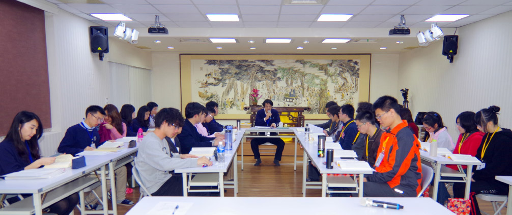

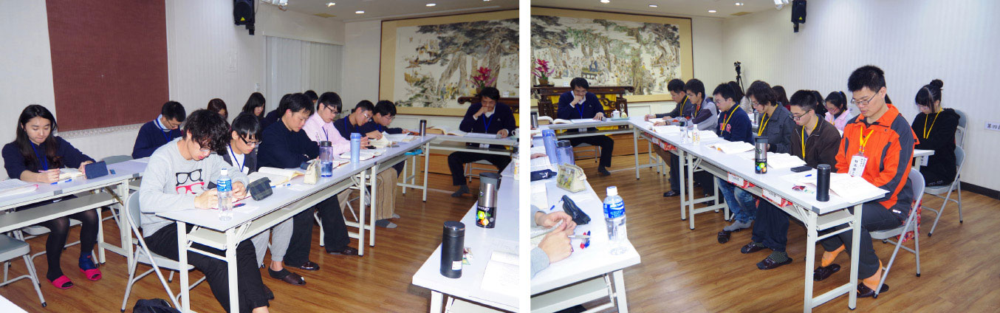

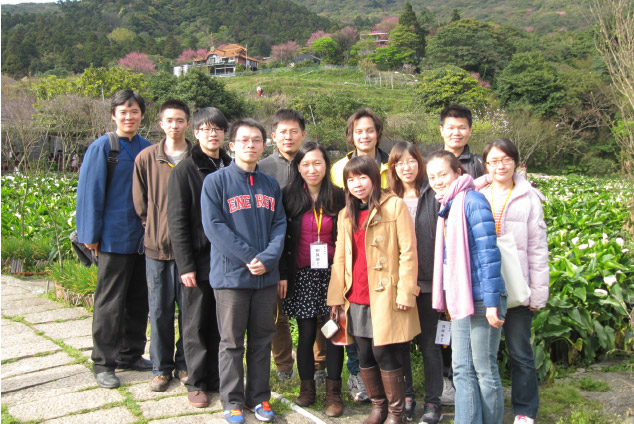

### 諸暨的春天—百花初放喻國學走入現代教育　諸暨市教育局開展國學與現代教育講座

*編輯部*

緣起於西子賓館

再造於行知學校

三訪於市博物館

呈現於春光百花

前言

二○一四年三月三十一日上午，本會應邀至由諸暨市文化廣電新聞局、諸暨市教育局主辦，諸暨市博物館、諸暨市傳統文化研究會承辦的國學主題講座《國學與現代教育》，講座在諸暨市博物館舉行，來自諸暨市教育和文化系統的部分幹部參加聽講。本次講座參加人員有各中小學校長、學校幹部和青年幹部班學員以及部分感興趣的老師到會場聆聽。

講題就國學的傳承、國學在現代的價值意義和國學對現代教育的影響三個方面做了細緻的闡述。並強調現代教育的中心思想，必須要回歸到國學的核心價值。也指出國學的意義、教育的價值和老師的責任其實是統一的，那就是必須要培養邁向時代的人才，培養創造時代、繼往開來的菁英。

認真聽完講座的學校領導和老師們感受頗深，在慨嘆國學的博大精深的同時，也更加明確了自己身為人師的責任，表示要在分管的工作和課堂內盡可能地貫徹國學精神，在深化教育改革的大背景下，加快實現教育價值的步伐。

諸暨教育網撰文道：唐教授用他獨特的教學方式，圍繞主題，著重從「傳承、國學的價值、國學與現代教育」闡述了國學的精髓，讓在場聽眾從中感悟到中國文化的底蘊，他又以子貢為典範，從外交、見地、經商、識人、善學、風義六方面講述國學的魅力，他談到，教育家應該通儒、通道、通佛。讀書是要有眼力的，讀書是需要抉擇的。唯有勤學，人才會有出路；唯有身體健康，才能遊於學海；唯有傳承國學，中國才有希望。文化是可以讓各行各業的人來學的，文化是各行各業的靈魂，文化的精華和靈魂是傳承。人要有七分的理智，三分的俠氣。寧可放棄一切金錢和名利，也不能放棄終身的學習。

今謄錄整場講座開場白，以饗大眾。

講座開場白

今天很高興到諸暨跟大家見面，可以說是以文會友，文就是文化的內涵，會友是廣邀對文化有熱誠、有信心的朋友，一起見面，做內涵的交流。

今天的主題是「國學與現代教育」，國學就是國家的教育，講究的是以經典為中心思想的教育，如何走入現代教育，講究的是三部分。

第一是傳承，你的國學到底是跟誰學的？第二是你學了什麼（你是以什麼經典為主來學）？第三是你學習的方法，方法中之一，是可以依著古注學，還是依著白話注解來學，選淺選深的注解都可以，就是不可以選錯的注解。

再者是一個人學還是團隊學，是為了傳承而學，學通了以後才知道國學是人才的搖籃，是文化的核心，是民族存在的價值，是生命的意義，是繼往開來的見地，是從遠處高格局、大格局來看這個世間。它是一個美好的學問，可以讓民族不亡，是一個可以跟時代接軌的內涵，是在時代進步中導正方向。

國學的存在須是講學有了傳承，才能讓它存在，雪廬老人在戰亂中一九四九年來到了臺灣，講學了三十八年，來聽課的學生都是自發性的學習、長期的學習，私下組成讀書會的學習，帶著使命感的學習，是想要為民族找出路的學習。老師過世之後，組了文化學會，期盼能完成老師的遺志於萬一。

林老師是學會教學負責，高老師是學會教育推廣，今天在諸暨就以「國學與現代教育」這樣的主題來跟大家結這樣的勝緣。

先從根本的問題談起，林放問禮之本，子曰：大哉問！這個題目太大了，必須要從源頭說起，否則無法瞭解根源及全方位，乃至後續的發展。

整個國學最重要，最核心，最根本，最無可取代的是什麼呢？是「傳承」！即使我在博物院上班近三十年，也看到了傳承的重要。比如這些歷史所留下的文物，它的經歷、內涵，帶來的時代意義為何。博物館的經營一定要有生命的經營，不但要有硬體的呈現，還要有軟體的呈現，如發揮教育的功能，符合社會的期許。博物館的本質就是文化，不是只有文物，不能只是擺古董的地方，它應該是個文化的殿堂，表徵民族的演變，呈現民族的傳承，並說明它在時代的意義，這才是一個博物館應盡的功能，它有過去的歷史，也有未來的展望，有團隊的經營，有教學的功能，有與社會的互動，這些都是博物館在社會上應盡的價值。

如果將內涵經營好的時候，遊客就會川流不息，會把這裡當成休閒的園區，學習的園區，互動的園區，交流的園區。多功能的展現博物館的功德，就能成為當地最重要的地標。

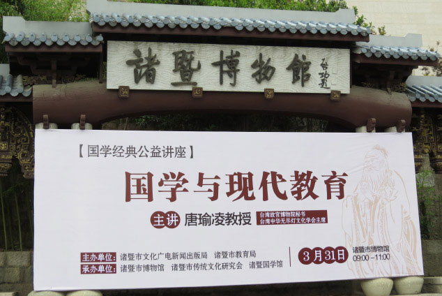

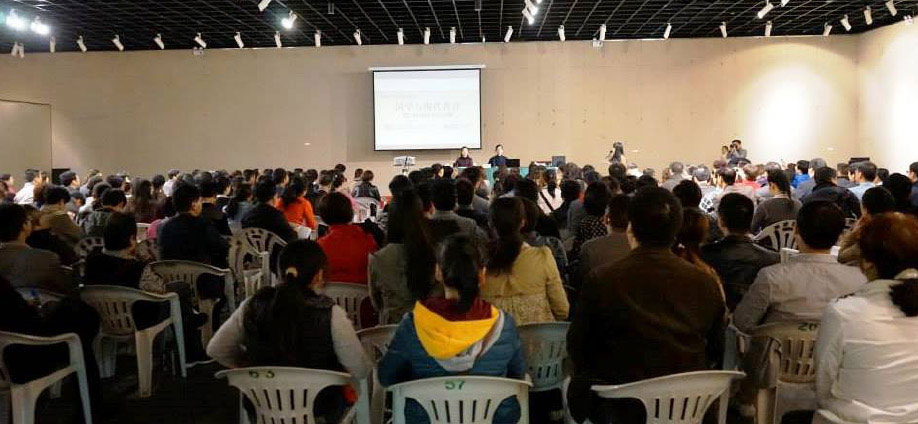

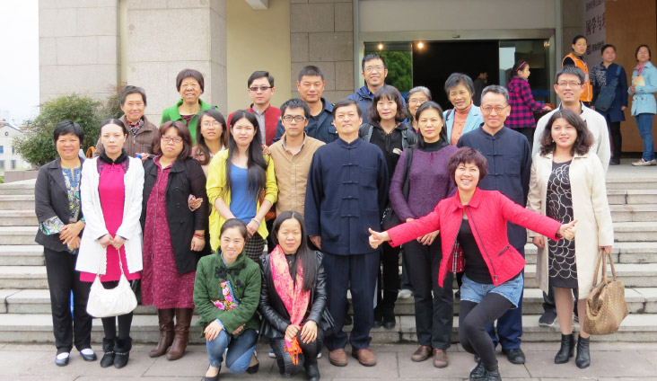

### 諸暨的春天—百花初放喻國學走入現代教育　甘棠茶館座談

*編輯部整理*

甘棠川燕相得彰

主人烹茶能深論

高雅茶館待人文

會友談心是出路

前言

繼三月三十一日於諸暨博物館向全市中小學校長、老師及文化界人士舉辦的「國學與現代教育」講座後，引起廣大的迴響，由博物館蔡館長、教育局周科長暨文化人士啟請，又於四月二日晚於甘棠茶館舉辦相關座談會及四月九日晚舉辦經學小講座一場。以下擇要謄錄當日座談會內容，以饗大眾。（編者）

論語的重要性

**問：** 《論語》的精神與價值觀是什麼？《論語》裡如何表達孔子的精神？

**答：** 現在人讀《論語》，多會用我們現在人的想法去認知孔子，甚至不覺得孔子有什麼了不起。但是，如果孔子沒有什麼內涵，從衛國來的商人子貢，為什麼會對孔子佩服得五體投地？子貢很有國際聲望，他不必去討好孔子；孔子逝世後，他也不必守喪六年。孔子帶著弟子們到了楚國，子西大夫認為孔子帶去的弟子比楚國的人才還要多。這在在證明孔子的學問是禁得起考驗的。

所有聖賢、君子的內涵，都在《論語》被孔子講述或與人談論中徹底彰顯，可說《論語》是集聖賢、君子內涵於一書的寶典。

昔日戰亂，從大陸來的一些老先生，他們都很有文化底蘊；在文化的理解上，也都非常有深度。離鄉背井、孤家寡人到了臺灣，老先生們的人生到了中、晚年，照理講應該都是沒路可走了，但從他們身上，皆可以看到「言忠信，行篤敬，雖蠻漠之邦行矣」的能耐。有些長輩，在他們後半輩子裡，不論教書講學或者任於公職，甚至將自己所賺的錢資助後輩當獎學金，這些風範都令我們非常佩服，而這些都是《論語》所述的人格教育。

**問：** 如果《論語》也是一種經，和《聖經》相提並論，兩者都是記錄聖人的言行思想。《論語》與《聖經》相比如何？怎麼選擇正確的思想？

**答：** 兩者實無法相提並論。如果明白孔子內聖外王的整體內涵，明白其「十五而志於學」到「七十而從心所欲不逾矩」的義涵，依這樣的定義謂之聖人，那肯定這兩部經典是沒辦法相提並論的。

論語與啟蒙教育

**問：** 帶領小學四年級的孩子學習《論語》，應該把握什麼？

**答：** 《論語》是非常好的兒童啟蒙教材，但這部啟蒙教材，要觀待老師本人對於《論語》的學習方式和理解深淺。讀經啟蒙教育，大半是在讀經上多所著墨，但早期讀經推行，甚至有一種理論是：「只要我會國字，你就可以跟我讀經。」然而，果真如此嗎？

所謂的啟蒙，就是「啟發蒙養」，「蒙」是孩子的思想剛要萌芽，在這樣蒙昧的階段，必須要靠老師來帶領。老師是一位引路者，可以透過讀經來引導孩子。但是讀經還牽涉到老師是否了解《論語》的內涵，這件事不是那麼簡單。

帶讀經的老師，要掌握幾項原則：

首先，讀音及斷句是否正確，這須要靠老師對《論語》的抉擇能力；不但懂得文章的意思，而且知道哪些才是最正確的版本。或者就著坊間的版本，帶著孩子邊讀邊修正；或者自己做教材，這兩種做法我們都做過。關鍵點是老師要懂經典，不但老師的讀音、斷句要正確，而且光是讀誦就能讀出味道，我們稱之為「活口氣」。

從學齡前牙牙學語的小孩，累積到國小識字，一直到國中乃至於大人的讀經，讀經的方法都不一樣，這都必須靠老師的引導。孩子們喜歡聽故事，老師要能善巧的把《論語》裡面的故事，化成每個年齡都可以懂的道理。臺灣的孩子們，從學齡前開始學起，他們對《論語》非常愛好，讀個幾年以後，就可以知道對話的內涵。

例如說，我現在讀完這一章，裡面的人物很多，我們會請孩子出來扮演章節中出現的人物，他們就會爭相來演裡面的角色。他們不會依著經文說「子曰」、「子路曰」，會說「我是老師孔子」、「我是子路」等等，將經文變成非常生活化的對白。小孩子自己就有讀進去的能力，也能培養出看歷史的眼力，所以《論語》是一部非常好的讀經教材，但一定要帶領的老師伴隨著一起深入。

**問：** 我現在教一年級，因為想把經典的內涵放到語文的學習上，所以也發現了教材的問題，讀下去就發覺很多版本都不一樣，確實需要老師幫助學生學習到正確的版本。

**答：** 坦白講，讀經的「活口氣」就是傳承，沒有傳承則會產生五花八門的版本。舉例來說：「詩三百，一言以蔽之，曰：詩無邪」，「邪」這個字到底怎麼念？如果念成邪惡的「邪」，則是說《詩經》三百篇思想不邪門，那「詩無邪」就是一句廢話。「邪」這個字是「虛」的意思，《詩經》三百篇，一言以蔽之，就是沒有虛情假意，全部都是真情的流露。所以帶讀經，須從慎選版本開始。

**問：** 所以，做為一個語文老師，真的需要培養自己的內涵。

**答：** 是的。帶小朋友讀經，雖然帶動了風氣，但也隱藏了一個隱憂，就是：老師如果是盲的，便是「一盲引眾盲，相牽入火坑」。有句話說「書讀千遍，其義自現」，這句話某種程度可以同意，但某種程度是不能同意的。要明白經文的義涵，必須有好老師的引領與解說。

**問：** 如果在老師品質與教材品質都把握不了的情況下，讀與不讀的取捨為何？

**答：** 蔣介石先生曾在臺灣提倡「中華文化復興運動」，而且欲將《論語》等經典普及化。當時名為「中國文化基本教材」，是把《四書》以及一些好的經典，片段抽取編成教材來讀誦及講解。但如果老師和學生的重點，都只是為了考試；讀了之後，又誤認為古文大概只有這些意思；應付考試完畢後，就再也不讀這些書。這便產生現今社會上普遍對儒學沒有好感，覺得這些經典都是過時、老掉牙的學問。我們如果沒有碰到雪廬老人，根本不會再把儒學重新拾起。

後來發現，學生對於經典的誤解，都是老師造成的。如果老師本身對學習《論語》沒有法喜，對所教的東西沒有熱忱，就不可能帶給孩子們熱忱和法喜，而熱忱和法喜，是從對書的正解而來，沒有其他的路。

跟著雪廬老人學習《論語》一段時間以後，開始很喜歡推廣《論語》這一條路，一走就走了三、四十年沒有間斷，甚至把它當成人生最重要的主業。所以，今天如何透過經典學習，把文化找回來，把國魂找回來，這才是我們的當務之急。

**問：** 現在我們國家最大的問題，是教育也想賺錢，醫療也想賺錢，這是很可怕的。教育其實是不能賺錢的，教育應該是要不斷把錢撒出去，然後把錢都用在學生身上。怎麼會專門想要在教育上賺錢？

**答：** 誰說辦教育不賺錢？就看你怎麼賺。辦教育也是可以賺錢的，當我們真的把孩子教好了，孩子懂事、有禮貌，就會讓家長覺得投資孩子的教育是物超所值。我們若把教育辦好，教好了孩子，其他捐款等資源就會源源不斷而來。當只問耕耘時，收穫自然而至。

學習文化需慎選注解

**問：** 《論語講要》的版本只有臺灣有嗎？

**答：** 當年敝院想提升博物院的水準，欲由大學裡找一位講《論語》的老師都難，可知《十三經》裡面《論語》講述之不易。如果不是孔德成先生請李炳南老教授講說《論語》，這部《論語講要》是出不來的。這本書是徐醒民老師上課的筆記，整理之後，每一期在《明倫月刊》上發表，最後再集成《論語講要》。透過多年的校定、刪修方定槁，已印刷很多次。

**問：** 是否要找回文化，只有讀了古書、有了見地以後，文化就自然回來。

**答：** 是的。要復興中華文化，得有一批人深入經典的內涵，再把這些內涵往下傳，但關鍵須有老師教。松下幸之助在事業有成後，提供了一大筆費用，作為讀《論語》者的獎學金，默默地做了幾十年。所以現在日本政壇雖亂，可是基本的骨幹都在，這些是幾十年以《論語》培養人才所發生的效果。當我們還停留在喊口號階段，日本人已默默的行動。

**問：** 教育部將推行「傳統文化教育」，感覺傳統文化是要被重視的。但如果對經典內涵不理解，要怎麼弘揚？聽了老師的課，我們大家都覺得有必要了解國學是什麼。現在有很多人把國學妖魔化，但國學是傳統文化，跟政治無關。這種狂熱的崇拜，不知是否為好的現象？

**答：** 所以我們要慎選注解。舉例來說，《論語‧先進》最後一章：「曾皙曰：『莫春者，春服既成。冠者五六人，童子六七人，浴乎沂，風乎舞雩，詠而歸。』夫子喟然歎曰：『吾與點也！』」宋儒的解釋，是孔子出去洗洗手、洗洗腳，歌詠先王之道，然後回去。雪廬老人說，經文明明是「詠而歸」，沒有說歌詠先王之道，只是唱唱詩歌，生活過得很美妙，這是聖人想要經營的世界，只要大家生活過得好。學習國學文化，要讀出聖人通達人情世故的那一分，而不是把大家塑造成樣板的聖人。

如果我們能慎選注解，會發覺中華文化是很有見地的。為什麼現在讀書人對自己的文化失去信心？就是因為他覺得這些都是老掉牙、不符合時代的東西。如果對經典的詮釋有問題，一般人依常理判斷都無法同意，那麼這樣的注解，怎麼可能變成權威、成為中心思想？

所以，如何透過從漢朝到清朝的注解，正確認識經典，國家應該要找幾位大儒來做一個標準版，讓大家透過標準版去認識聖賢，而不是任由民間各自發展，莫衷一是，這就是問題最嚴重的地方。如果破壞了儒學對時代的適應性，最後剩下「依古道」，但已走到現代，怎麼依古道？

保留古道精神，做法與時俱進。孔子說：「殷因於夏禮，所損益，可知也。周因於殷禮，所損益，可知也。其或繼周者，雖百世可知也。」意思就是說，禮有損有益，並不是完全照抄。清朝祭孔時，穿的是清朝的服裝；雪廬老人穿的則是中山裝或長袍馬褂，這是民國初年的標準服裝，國家沒有規定新的標準；老人穿著這樣的服裝，正表達他是民國人。這就是與時俱進。

**問：** 因為我們的底蘊還不夠深，所以我們在讀《論語》時，有很多東西是無法理解的，包括《論語》裡有一章很有趣，就是孔子因為見南子的事情而對天發誓。

**答：** 《論語》如果解釋得偏差，文化不但不能發展，也會被糟蹋。以此章來說，夫子見南子，子路質疑夫子，夫子就發誓：「我如果幹了不對的勾當，老天爺會處罰我，老天爺會厭棄我。」整個場景，學生不像學生，老師不像老師，這種注解可以聽嗎？

所以，「予所否者，天厭之！天厭之！」應該是：夫子自己說遭逢否運，到了衛國，衛靈公國政把持在南子手上，夫子雖然有心為衛國推動國政，可是卻沒有辦法推行，這是老天爺壓住了夫子。因為各種錯誤的注解充斥坊間，雪廬老人就根據六百多家的注解，由徐醒民老師的筆記而整理成《論語講要》。

**問：** 我們今天講孔子是講內涵，如何學國學？清末民初的小學功夫很厲害，您對這問題怎麼看？

**答：** 國學其實就是中國的教育，有別於歐美，核心是經典的教育。乾隆的《四庫全書》，分為經、史、子、集，源頭就是「經」，「經」義即是史、子、集的標準。「經」有《四書》、《五經》乃至《十三經》，精華處即是《論語》。《易經》、《書經》、《詩經》的經義都在《論語》，乃至如何辦政治？如何辦教育？原則亦在《論語》。所以，《論語》是《十三經》的精華，也是《十三經》的門戶，是國學的中心典籍。整個國學教育最重要的，就是《論語》的教學。

宋儒和漢儒的注解本有很大的不同，漢儒重訓詁，宋儒偏義理，然偏向義理中，有許多是宋儒個人的看法，已不符合經文。如何透過當代大儒重新抉擇，挑出漢儒與宋儒等注解以正解《論語》，還原孔子的真相，找回國學的靈根，教育下一代，實現美好的未來，是我們要非常嚴肅思維的課題。

**問：** 雪廬先生以及《論語》對性善、性惡如何解釋？

**答：** 其實，在孟子與荀子的論戰裡，他們都沒有掌握到《論語》的要點。孟子講性善，荀子講性惡，可是《論語》上說的是「性相近，習相遠」，並非性善或性惡。

性有不改義，假如人性本善，為什麼有人會做惡？從這點來講，性善和性惡的論戰並沒有抓到《論語》的核心。雪廬老人說，《三字經》才開頭讀「人之初，性本善」，第一句就錯了。孔子的立論並非「人之初，性本善」，孔子是「性相近，習相遠」。如果是性善，人怎麼會做惡？如果是性惡，人又怎麼會做善？
孟子認為「惻隱之心，人皆有之」，可是孟子舉出的因是不定的。舉例來說：媽媽抱著嬰兒吸奶，嬰兒因為肚子很餓而狂吸奶，但他並沒有想到媽媽此時或已處於饑餓的狀態。試
**問：** 小孩子的惻隱之心在哪？不能依著某個現象，就成立性善或性惡的結論，這結論非永恆的價值。

荀子講「人之初，性本惡」也不對，如果性本惡，教育如何能改變人心？中國哲學是世界上最了不起的哲學，孔子從來沒有講性善或性惡，本體（性）是「空空如也」。

《繫辭傳》有云：「易無體而神無方」，本體空空如也，是中國哲學的重要論述，其變化在「人」。是否有所作為要看是誰去做，例如雪廬老人六十歲孤家寡人來到臺灣，本省人、客家人都聽不懂他的口音，老人家面對的對象是文化最膚淺的鄉野之民，想不到講學三十八年後，讓諸多子弟認識了儒學的內涵與價值，並且傳承文化。

大家若能靜下來，把《論語講要》從第一條學習到最後一條，你所面臨的一切問題都會解決，且能生起諸多美好的感受。

**問：** 張之洞說「中學為體，西學為用」，我們可不可以理解為這個時代的學習方向？

**答：** 「中學為體，西學為用」，也對也不對。所謂的「中學為體」，是真的要把中華文化的核心內涵抓住，這叫「中學為體」。所謂的「西學為用」，是採取西方做事的長處，以及他們思維、辯證的能力，這些在東方的硬式教育下是看不到的。真正「西學為用」，是西學的邏輯思維能力。在運用上，跟人的相處必須依著禮；應對進退、與人相處，或和合辦事、領導團隊當中，其實皆是「中學」的展現處。

很多精華都在我們的文化裡，我們應該先從自己的文化找到中心思想，並在與他國的交流中，吸收他國的精華處。講一個實際的例子。我們只是一個民間團體，曾到緬甸十幾趟，當展現文化內涵，跟當地做交流時，即得到他們極誠意的招待。

即便是商場上的交往，並不是一坐下來就談判，而是先看人品。愈高級的主管，愈在意小動作。走入上等社會，是非常講究禮節的。

詩、禮的重要性

**問：** 孔子自己是否非常講究音律？

**答：** 「詩書執禮，皆雅言也。」音念得對，則保全義。雖不妨礙各地的方言，但讀到經典時，音一定要統一；音念不對，經義不現，謂之「音正而義全」。此攸關民族文化的延續。

**問：** 傳統戲曲已愈來愈勢微了？

**答：** 可是你想想看，宣科先生（納西古樂創辦人）只是把以前的古調找回來，就立刻變成世界級的藝術，外國人聽了都感動。可惱的是自己的東西丟掉唯恐不及，甚至丟掉了技藝、傳承。

**問：** 看到學習傳統文化的人九十度鞠躬，我就很害怕國學流於形式、被妖魔化。我非常喜歡傳統文化，但就特別害怕別人誤解，認為九十度鞠躬和現代生活很不相配，其實不需要鞠那麼大的躬。是否講究形式與現代不相應？

**答：** 「禮從俗」，要看是什麼場合，沒有一定；重在表達恭敬，看重對方。長輩對晚輩，與晚輩對長輩的禮都不一樣。

**問：** 國內現在有很多傳統文化的論壇，有些舉止會使得原本對傳統文化不了解的人，更不想去了解傳統文化。

答一：禮是因地制宜的，在班上讓學生演禮也有必要。然而，與他人交往，要看處在什麼場合，呈現什麼樣的禮儀。舉例來說，若有女士伸手表達敬意，男士也要伸手表達敬意；但男士不可以主動伸手，這就是禮儀。握手是西洋人的禮儀，不是中國的；若對方行西洋禮，就必須配合。或者，餐桌上看到刀叉，就不能用中國的禮儀來吃這頓飯。是故，禮是從俗的。

禮有根本、有枝末，有進退應對以及種種周旋的動作，主體是表達看重對方。《論語》中，「林放問禮之本」，孔子說「大哉問」。歷史上，子貢就是依禮來論這些政治人物的吉凶禍福。

答二：以前在電影裡面，總看到美國人吊兒郎當的樣子，但直到自己去美國念研究所的時候，才發現大部分的學生不是如此；成績愈優秀的學生，都是上課認真、對老師恭敬的，更別說到了工作環境，在投資銀行上班。當然也有很直率的交易員，自己覺得很了不起，沒事就摔別人電話，但這種人撐不了多久就被淘汰了。真正有能力、領的薪水多到可以去歐洲買城堡的人，完全是生活上態度嚴謹、思維縝密的。與人相處，都應以禮相待。

再回應形式上的問題。看到在大陸推廣傳統文化，問題的癥結點，多是沒有好老師引導，內涵無法深入，便只在這些枝微末節及形式上講究。

**問：** 形式應該也是學習當中很重要的一環。有很多專門學國學的書院，比如拿禮來說，禮節是很繁複的。您說孔子也是與時俱進，但是在講台上講課要遞毛巾這些禮，是很繁複的程序。您怎麼看待？

**答：** 禮本來就須從俗。古時吃飯要叩首（拜下去），現在不用了。甚至，鞠躬禮也要看狀況，如果對方是拱手禮，你也要拱手回應；對方是佛教徒，你則合十回應。昔日印度聖雄甘地，在地上打滾表示對蔣先生一行人的歡迎，蔣先生身邊的隨從就以在地上打滾回應。總之，看場合並配合對方。在《論語》裡，有說明禮的本質與意義。

**問：** 現代當代的書法，很多都是學日本人的。日本學自於中國，而產生了獨特的日本式書法，反而我們中國卻學日本的中國式書法。如何看待？

**答：** 常常覺得大陸一些老教授，到了臺灣後，一個個都快要凋零殆盡，為何不將傳承、文化移植回大陸？反而，當文化凋零沒落到沒有了，只好到日本、韓國找回中國文化。結局至此，豈不可悲？

在西施故里這麼好的地方辦書院、吟唱詩詞，演奏古樂、地方戲曲等，諸暨的文化價值就顯現了。

讀書會的學習

**問：** 老師們能來到諸暨，是我們很大的福氣。但平常我們該怎麼自我充實？

**答：** 在座的人都是有心人，就從這裡開始經營吧。只要大家有心，而且能堅持。現在的問題，就是找對方向；組成讀書會，幾年之後就會有所成。

如果沒有經營內涵，只是嘴上講著中華文化，當我們到國外看到別人更好，有本事的就辦移民去了。但是不然，中國文化經營起來是很美的，當大家一起在道上切磋琢磨產生法喜時，朋友的交往都是幾十年的情分，這種富饒的人情味，會令人離不開、忘不了。

**問：** 對於經典推廣的狂熱份子，如何以對？

**答：** 就請他好好努力聽課、認真讀書，在正知見上尋求，在注解上找出路，在氣質上落實，這最具說服力。如何打造諸暨？就是培養諸暨的人文氣質，則西施故里等古蹟都能活起來；如果沒有人文氣質，經典全是死經典，古蹟全是走樣的古味。

**問：** 沒有好老師，我們應該怎麼辦？

**答：** 讀書會非常重要！很期盼諸暨的讀書會，從《論語講要》開始學起，創造一個國學文化的環境，讓大家看看真正的文化長什麼樣子。

**問：** 我們剛才講了很多問題，但你解決不了的時候，有的時候會很憤慨。該用什麼心態去面對？

**答：** 其實，安靜地讀書，安靜地參加讀書會，安靜地聽課最好。我們以前都是乖乖的學，沒有其他的路。學習了中華文化的內涵之後，會發現自己眼力變得愈來愈好，體悟與能力愈來愈強。

如何讓文化在諸暨生根

蔡館長：我們也在想打造學生的第二課、校外教學，也預計培育三十五歲以下的年輕人投入導覽工作。有否好的資訊提供？

**答：** 到博物館學習導覽極為重要，然導覽的人才難培養。導覽的人要多，才有辦法應付人潮；若人潮進來，導覽的素質不夠，導覽的內涵不能呈現，便可惜了這樣的展覽。

展品本身要有歷史的意義及可講述的內容，接著是導覽團隊的培養，並且跟學校做結合。打造一個像維也納的藝術國都，一個有人文氣質的諸暨，是未來的展望。

蔡館長：我們諸暨館藏少，沒辦法和其他地方比，但我們諸暨人文歷史比別人豐厚，所以這裡有很多東西可以呈現。比如，西施的文化，是我們現在要打造的；諸暨三賢（王冕、陳洪綬、楊維楨），這也是我們要做的；蔡元培祖籍地亦在諸暨。所以這三塊是教學的重點。然後，我們諸暨民俗這一塊，準備為講解員進行培訓；這幾天我們所裡的專家，就在講解培訓。我們也應該來做教育的市場，設想是每一位學生，每一年至少來兩次，作為一個社會有影響力的風潮。學生來了，他牽動的至少有四個人（父、母，長輩），教育一個人等於教育四個人，我是從這個出發點去發想的。

**答：** 我們或許可以從制高點開始做，先展出以孔子為內涵的主題，然後再開始發展地方的文化；制高點要先拉出來，再配合中央《論語》、儒學這一塊。

孔子是一位殊勝的人物，智慧深不可測，為人忠厚老實又平易近人，具形而上的證量，又在形而下極富感情。其實這就是中國文化。

先呈現孔子的內涵，如孔門十哲、孔子的塑像、七十二賢、孔子聖蹟圖，包括跟《論語》有關的畫作，做一個整體的教育展。藉著博物館展覽一輪以後，確立了中國文化思想的主流，然後再逐步規劃與當地文化有關的各類展覽。

蔡館長：聽說這次你們要去東北瀋陽師範大學講《論語》，講座要講多少天，才有一個大概的輪廓？

**答：** 在《論語》裡，可以整理各種架構式的主題來辦講座。上回到諸暨行知學校，依《論語》的條文（約有五十條）論「知」，完整敘述了知的行相、知的利益、無知的過患等等。若搭配詩、禮等課程，一次約有七天時間，效果最好。

蔡館長：非常希望有這樣的機會，可以到我們諸暨來講七天課。實在太想聽了。

**答：** 這一定要結合當地的有心人一起辦，我們來只能負責教學。

李會長：唐老師在諸暨正式講《論語》已經兩次，第一次在西子賓館，第二次在行知小學，都是三天以上。但是很可惜，參加講座的人當中，我們諸暨人比較少，三分之二以上都是外地人。我們下次以教育系統，邀請唐老師，辦《論語》講座，那是最好的。希望很快實現！

**答：** 謝謝大家，承蒙大家看得起。

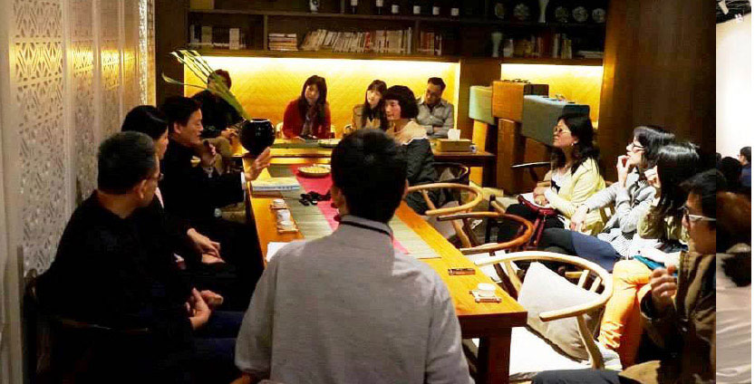

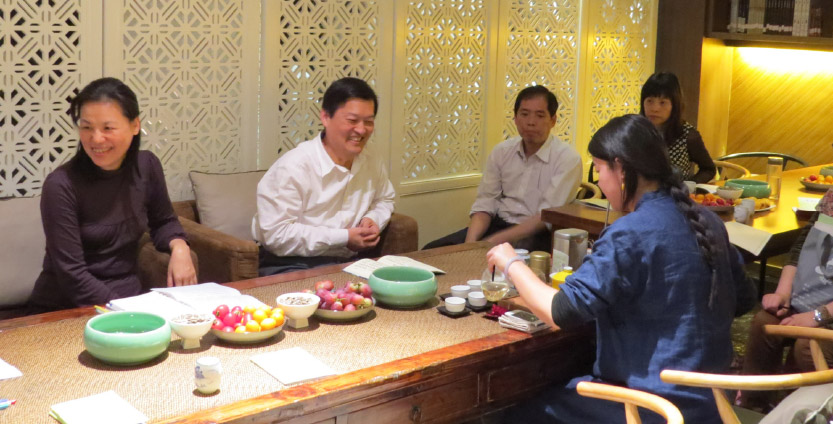

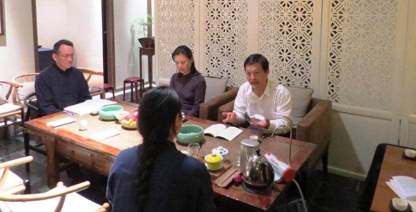

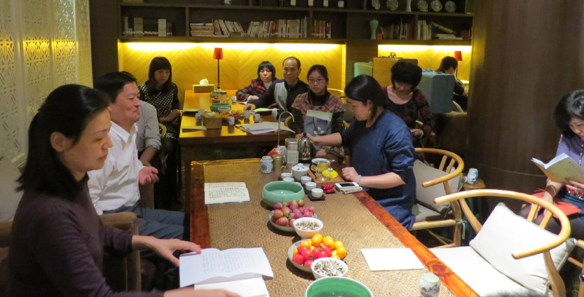
