# 第95期
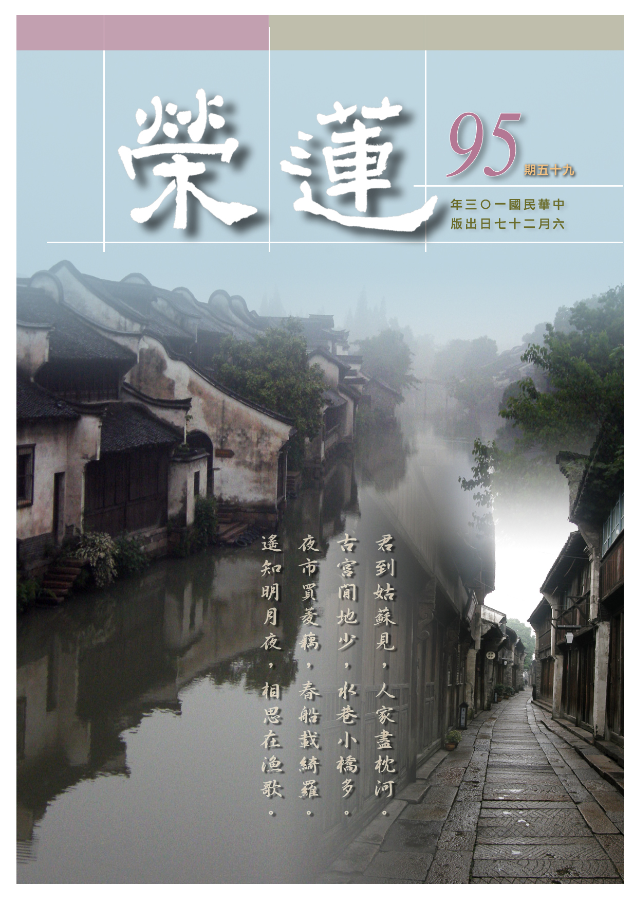

## 社論

### 別開生面的母親節

本刊

最怕流形式

內涵能莊嚴

慈孝家庭樂

那摩釋迦尊

全國性的母親節是在一九○七年由費城的安娜所發起訂定的。為了緬懷已逝的母親，她說服了所屬的教會在母親的忌日，即五月的第二個星期日，舉辦追思悼念活動。後來人們在母親節當天，配戴康乃馨，向母親表達感激之情及敬意。白色康乃馨訴說悠長的思念，追憶已過世的母親。紅色康乃馨獻給尚健在的母親，讚揚母愛的偉大神聖、家庭的溫馨和諧。

然時下的母親節，已淪為商業的犧牲品，與一般節日無異，或家庭聚會，吃吃喝喝，或買商品聊表謝意，已失去了創辦的初衷及意義，使得母親節發起人在死前痛苦的表示，她後悔發起創立母親節。

然而，母親節的設立仍有其必要，要如何賦予母親節意義與價值，這觀待我們的體認與作法。中國的孝文化歷史悠久、源遠流長，自古講究尊親、弗辱、倫常、和順、敬養、無違等概念，孝，可說是中華文化之根，不可偏廢，須養父母之身，順父母之心，竭盡其力。而「孝，始於事親，中於事君，終於立身」，可見孝敬父母只是開始，此後必須不斷進德修業，學習內聖外王的大道，才是真正的孝。母親節是表達孝道的好時機，藉此可以作種種法行，全家共同經營正法，作殊勝的回向。

學會歷年來皆有興辦母親節活動，早年例行放生及浴佛法行，後期臺灣放生環境日趨困難，多以拜懺結合浴佛法行為主，加之表演或踏青活動，藉以聯絡感情，凝聚共識，眾人齊聚一堂，不亦樂乎。此次由於種種因緣聚集，促成了大陸放生旅遊江南一行的母親節活動，由於與對岸放生團體合辦，藉著遼闊的水域，實行廣大的法行，所放生物種類繁多，量亦巨大，可謂空前絕後，在母親節能行如此大的善法，是參與大眾當日難以想像的，更成為日後難以忘懷的記憶。

何以在母親節放生更具意義？因為我們無始劫的輪迴，每一世都有親人，故有情眾生都曾做過我無數次的母親，亦如今生的母親一樣，對我們呵護倍至，細心照料，每一位母親撫育子女的恩德都是無可限量的。受恩必報，對有情饑者施以食物，渴者施以飲水，貧者施以財富，滿足其需求。然而，這只能給予他們現世暫時的安適，對於未來卻沒有多大的利益。最好的報恩方法，就是讓他們離苦得樂，能離開輪迴之苦，得到究竟解脫的安樂。

我們今生有幸聽聞正法，入大乘道，應發大悲心，救度一切苦難眾生，累世當過我的母親們，如今墮入生死海，沉沒於六道的漩渦之中，無法自拔，眼前先解救生命，並做未來解救慧命的緣起，若如是想，才是最殊勝的報恩。為了對所放的生物給予最殊勝的利益，所以放生事事都須講究，舉凡買辦生物、經濟考量、場地選擇、壇場布置、儀軌念誦、心態調整等等皆須細膩為之。不只如此，藉由放生也可以培養辦事的人才，成為強而有力的辦事團隊，日後共同推展正法，一舉數得。

此行亦參觀了靈山景區的九龍灌浴，是大型廣場式的浴佛活動。在〈佛之誕〉的樂曲聲中，一尊七米高的金身太子佛像自蓮花中緩緩現出，一手指天，一手指地，這時，九龍口中一齊噴射出數十米高的水柱，灌沐如來。佛像徐徐旋轉一圈，象徵「花開見佛」、「佛光普照」，眾人瞻仰、禮敬，現場莊嚴肅穆，令人讚歎。期望每位母親都能生出法門龍象，利樂有情，莊嚴世間。

走訪江南時，正值暮春時節，煙雨濛濛，如同杜荀鶴所言「君到蘇州見，人家盡枕河。古宮閒地少，水巷小橋多」，置身於溫柔水鄉，流水悠悠，小橋橫波，可以細細品味靜謐、古意，在幽靜的巷子裡，聽風、賞水，怡然自得。也造訪了許多園林，古人寄情於山水間，園林處處有學問，不論建築、造景，皆有深刻寓意的內涵，優遊其中，移步異景，或小巧精緻，或自然開闊，各具特色，石造假山尤為奇觀，穿梭在假山中，別有洞天，峰迴路轉，奇之又奇。

在園中坐下來喝茶聊天，足以暢敘幽情，也讓大家對於共住有更深的願景與想法。最後兩天，遊覽諸暨，會會老朋友，兩岸交流座談，團體母親節活動就在美好的氛圍中畫下了句點。

母親節，可以只是在消耗福報中度過，也可以是福慧增長廣大的良機，端看我們是否具有正知見，並籌備好的因緣來發起。能興辦如此大的善法及出遊活動，實乃不易，此次可謂是與眾不同，別開生面的母親節。

## 大德法語

### 大方廣圓覺修多羅了義經（五十四）

道源老和尚

所執之我體性空

入清淨覺善說法

末世豎立聖教幢

堪稱佛門真龍象

戊二、四問答別明觀行中根修證

己二、二問答兩重除障

庚一、除我入覺（淨業啟請）

辛五、正答所問

壬一、長行

癸二、斥迷無功勸修

子一、分類為斥

丑一、斥有我無功

經文：

善男子！彼修道者，不除我相，是故不能入清淨覺。善男子！若知我空，無毀我者。有我說法，我未斷故，眾生壽命，亦復如是。

善男子！彼修道者，尤其指著末法時代想要修道的我們，不除我相，所以不能入清淨覺。何以不能入清淨覺呢？不論三乘修學者我相皆要除，二乘的我相，菩薩的我相也要除，不能將我相（包括我、法二執所執的我相）除掉，不能入清淨覺。

善男子！若真正了知我空、法空，沒有我，他在誹謗誰？虛空嗎？若有人誹謗你，你動了瞋恨心，證明了「我」相仍然存在！

有我說法，我未斷故，存了有一個我在那兒說法，這個「我」根本沒有斷，誰在那兒說法？執有個「我」在說法，實則那個「我」根本沒有斷。眾生壽命，亦復如是，我相不斷，包括人相、眾生相、壽者相都存在。

丑二、斥說病無功

經文：

善男子！末世眾生，說病為法，是故名為可憐愍者。雖勤精進，增益諸病，是故不能入清淨覺。

末法時代的眾生講經說法，不是講經說法，說來說去都是增加我執、增加法執，天天說病，當成是說佛法，釋迦牟尼佛說法是這麼說的，《金剛經》上有云：說法者，無法可說，是為說法，你不起我執，不起法執，我在那地方天天說法，年年說法，不起法執、不起我執，這才叫說法。

你一執著有個我、有個法，你在那兒說的法不是法，說的是病，是增加我執、法執，所以叫做可憐憫者，末法的眾生誰聞到佛法了？聞到佛法都不容易，聞法後誰能講經說法呢？你既然能在末法時代講經說法，這不是希有中的希有嗎？可是你不了解我等四相，起我執、起法執，天天在那兒說法，結果在養無明，所以有說法師的架子大，難侍候、難招待，因為天天在那兒說的佛法，還擺架子！真正是可憐憫者。這是勉勵諸位同學要發菩提心，在末法時期要講經說法，說法的人，無法可說，是為說法。我天天說、年年說，不起我執，這才叫說法。

當法師也不是容易的，也得勤精進，不好好研究、不好好看註解，怎麼能講經說法呢？必須精進用功嘛！如此類推，你就是念佛也要精進，參禪也要精進，結果卻不出我等四相，更是增加諸病，增加什麼病呢？增加我相、人相、眾生相、壽者相，是故不能入清淨覺。

丑三、斥竊德無功

經文：

善男子！末世眾生，不了四相，以如來解，及所行處，為自修行，終不成就。

這幾句話更要注意，如果沒有修過大乘經，你不曉得如來的境界是什麼樣子！你最初聽不懂，聽久了就覺得是家常便飯，什麼都懂了，你能說也能回答，也能講經說法，可是你不了解我等四相的除滅法，以為如來見解即是自己的見解，以為如來的修行即如自己的修行，那些是經上所說，欲拿來資助自己的口頭。那不是我們修行到的呀！但是末法的眾生學的多、說的多了，口才很好、很流利，以為自己開悟了，以為自己證到了，如此怎麼能有成就呢？

丑四、斥增慢無功

經文：

或有眾生，未得謂得，未證謂證。見勝進者，心生嫉妬。由彼眾生未斷我愛，是故不能入清淨覺。

未得謂得，未證謂證，這是打大妄語！沒有得到聖人之法，卻說他得到了，沒有得到聖人的果位，卻說他證到了。譬如念佛，沒有得到一心不亂，他說他得到了，沒有得到不退轉，他說他證到了，叫未得謂得，未證謂證，參禪沒有開悟說開悟了，沒有證到菩提果位卻說證到了。

見勝進者，心生嫉妒：有人超過他的功夫，他就生嫉妒心，你這法師比他講的好，他就嫉妒你、障礙你、破壞你，叫你講不成功。

由彼眾生未斷我愛，是故不能入清淨覺：超過他的功夫，他就生嫉、生妒、生障礙，他因為沒有斷我執，故生起愛憎嫉妒等，是故不能入清淨覺。

子二、警策真修

經文：

善男子！末世眾生，希望成道，無令求悟，唯益多聞，增長我見。但當精勤降伏煩惱，起大勇猛，未得令得，未斷令斷。貪瞋愛慢，諂曲嫉妒，對境不生。彼我恩愛，一切寂滅。佛說是人漸次成就。求善知識，不墮邪見，若於所求別生憎愛，則不能入清淨覺海。

這便是開導我們同學，你要學了大乘佛法，要大開圓解，不然所說的道理都是如來的解，不是你自己的解，你所說的那些功夫都是如來的行，不是自己的修行。末世眾生希望成道，不令他去求開悟，單單增加多聞，天天研究文字，結果怎麼樣呢？我見越來越大，當了法師結果起了邪見，難以挽救。他什麼東西都懂，卻起了邪見，能說善道，辯論也贏不了他，講說修行不過增加他的我見。

講到求善知識不墮邪見，這完全是開示我們末世的眾生，當精勤降伏煩惱，起大勇猛，什麼是應該斷的呢？一切煩惱都應該斷掉，一切恩恩愛愛都應該斷掉，這是發了心要修行的，還恐怕修不好呢！再者，你得尋訪善知識，也就是要尋師訪友，佛經上所說的善友跟善知識一樣，求善知識幹什麼呢？不墮邪見，恐怕自己修不好，墮於邪見。

親近善知識，一切就得聽從善知識的指導，求到了善知識，卻完全執著善知識這個人，別生憎愛，那麼就算尋訪到善知識了，卻對於善知識另外生一個憎愛之心，這樣就不能入清淨覺海了。

求到善知識，對於善知識不能另生憎愛之心，這也就是戒律當中的不得觀法師種姓。菩薩戒有這麼一條，你親近一位善知識，但是相貌醜陋卻有德，那你就不能看他的相貌醜陋與否，他家出生高明與否，只講他有德沒德，也就是只講他的知見是否正確，他的知見正，那就是個善知識。

前邊講過這位善知識他所修的皆不住相，一住相就落於有為，那就偏墮於凡夫，而又不偏住聲聞、緣覺的境界，一住聲聞、緣覺的境界，那就有偏了，偏墮於二乘；既不偏墮於凡夫，也不偏墮於二乘，這個善知識就是有正知、正見，那你算是尋訪到了善知識。不要只看他的眼睛、鼻子長得好不好，另外生個憎愛之心，結果他在說法你都不聽。

這個時候，對於所求的善知識，不得另生憎愛之心，《梵網經》上有這一條戒，對於尋訪善知識，在還沒有親近他之前，要用智慧去抉擇，看看此人是不是一位具有正知見的善知識，不是，就不親近他，這原則要記到。

至於齋僧供眾，得用平等心，不可妄生分別，認為這個出家人應該受我的供養，那位出家人不應該受。而應把出家人都當成僧寶來供養，甚至把他們當成活佛來供養，你才能求到佛法。為入清淨覺海的資糧。

打齋供佛必須把出家人都當成僧寶，都是活佛，平等供養；可是親近善知識必須要用智慧去抉擇，不能糊里糊塗的，如何決斷簡擇呢？他所修行是不著相，而又不偏墮於二乘境界，他具有正知正見，既不偏於凡夫，又不偏於二乘，那這就是大乘菩薩，具有正知正見的善知識。

（下期待續）

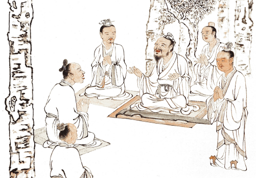

## 專題研學

### 小止觀導覽（六十七）

心爾、治心

身為苦本須厭離

亦是法器須愛惜

莫讓病成修學障

善識因緣能對治

第九章  治病

論文：

行者安心修道，或四大有病，因今用觀，心息鼓擊，發動本病；或時不能善調適身心息三事，內外有所違犯，故有病患。夫坐禪之法，若能善用心者，則四百四病自然除差；若用心失所，則四百四病因之發生。是故若自行化他，應當善識病源，善知坐中內心治病方法。ㄧ旦動病，非唯行道有障，則大命慮失。

行者要安心修道，安心是生活沒有後顧之憂，心裡也不想攀緣外境，也不想學世間的技藝，亦不去攀緣世俗的交情及學世間的才藝，所住的環境不擔心衣食缺乏、盜賊出沒、疾病纏身，更有善知識提攜，如此稱為行者安心修道。安心是修行的條件具足，此需要福報，故欲修行必先培養福報。

因今用觀，即如禪宗參話頭，對義理做很多的思維、觀修、邏輯的推理，內心對義理作辯證，或者與他人議論，用腦過度而產生病症，但這種病不會發生在我們身上，因為我們沒有那麼用功。蕅益大師等這些祖師都生過這種病，因為用功太急，覺得佛法太好了，急著要弄懂，是用功過急引起來的病，窺基大師就曾用功到吐血。

心息鼓擊，因為心跟息是互相觀待，氣順的人心就順，氣不順心就不順，會調心的人一定要會調息，會調息的人一定要會調心，這兩者是互相依靠的，坐姿ㄧ正息就順，息順則心正，這三者是互相觀待的。這裡講心跟息互相觀待，「鼓擊」就是敲打四大，因為不斷的用心，身體的能量都拿來觀修教法，結果發動生病。這種狀況下的生病，可能是過去有些病隱藏著，因為用功太急引了出來，這不是業障病。

也有可能不善調身、心、息，有時候調心，有時候調息，但是沒有調身，像顏回就是營養不良，沒有好好調身，所以身、心、息互相觀待，當然把心、息調好，身體就順，可是身體仍然要給予充足的營養，不可過度操勞，如果身體不好，觀修教法的心力就難提起，像孔子晚年，已不夢周公，想要利益天下，可是體力不足，故心力亦提不起來，無力利眾，故不夢周公。生病的時候息要順暢也難，雪公老師晚年生病時，我們去探望老師，在隔壁房間聽到老人家的呼吸，也不是很順暢。

病有分為內感、外患。內感如業障、煩惱或生活作息不正常，但煩惱過重（內魔）的部分不是這裡要談的。這裡的內指的是生活不正常、很忙碌，或者不眠不休的在研讀教法。外患就如鬼神、環境、濕氣太重、天氣太熱等等，或者食物有所違犯而生病。

所以坐禪要善用其心，要先了解病是怎麼產生的，如果是業障就要好好懺悔、發願對治，生活作息不正常的就要調整生活作息。如果是外感，也要善於觀察周遭環境，所以善用心觀察，則四百四病自然可以痊癒。

論文：

今明治病法中有二意：ㄧ、明病發相，二、明治病方法。

此處講的病發相就是四大、五根、五臟失調，必須要先明瞭到底是哪種狀況產生病發。並且要知道治病的方法，如果是屬於魔障，就必須依照前一章覺知魔事來加以排除。此處要說的是因為本身用功過度，把本來有的病發動，或者不善調身心，飲食不良或生活作息不正常等引發生病。

論文：

一、明病發相者：病發雖復多途，略出不過二種：一者、四大增損病相：若地大增者，則腫結沉重，身體枯瘠，如是等百一患生。若水大增者，則痰陰脹滿，食飲不消，腹痛下痢等百一患生。若火大增者，即煎寒壯熱，支節皆痛，口氣，大小便痢不通等百一患生。若風大增者，則身體懸虛，戰掉疼痛，肺悶脹急，嘔逆氣急，如是等百一患生。故經云：一大不調，百一病起。四大不調，四百四病一時俱動。四大病發，各有相貌，當於坐時及夢中察之。

夢中察之，指晚上睡覺時，感覺到不穩的、飄動的是風大增生相；常常覺得往下掉，好像踩在爛泥巴裡拔不起來，舉步很困難的那一分，懶得動都是地大引起來的，不管身體是不是瘦得像皮包骨，都是地大增生相；這些都必須在夢中去察覺。腸胃方面的毛病多是水大引起來的，比如腹瀉、下痢。忽冷忽熱使得全身關節痠痛、便秘、大小便不通，那是火大所引起的。身體感覺到站不穩、虛浮、胸悶、肺悶、呼吸不順、消化不良、嘔吐、氣喘等都是風大不調。

後面有修學法會教我們怎麼去除那些病相，可以跟醫生的醫理相輔相成，或有人說正念就可以去除這些不適，但做法上還是要講究的，比如在寺廟中修行，有時候坐太久發覺坐不下去，此時需要站起來動一動，才有辦法把身體調順，身體調順後心力才容易提起，能用功於教法上的串習，有時候可以靠坐上修，有時候要靠經行，這些都是不一定的。

論文：

二者、五臟生患之相：從心生患者，身體寒熱，及頭痛口燥等，心主口故。從肺生患者，身體脹滿，四支煩疼，心悶鼻塞等，肺主鼻故。從肝生患者，多無喜心，憂愁不樂，悲思瞋恚，頭痛眼闇昏悶等，肝主眼故。從脾生患者，身體面上，遊風遍身，瘜

痒疼痛，飲食失味等，脾主舌故。從腎生患者，咽喉噎塞，腹脹耳聾等，腎主耳故。五臟生病眾多，各有其相，當於坐時及夢中察之可知。

心有分臟象和臟腑，臟象是歸納的概念，臨床所觀察的現象給予一個抽象的概念。從心生患者，身體寒熱，及頭痛口燥，此處的心有邪熱或邪火，抽象意涵就是火，心開竅於舌，口燥為身體有熱邪的現象。

肺生患者，即是呼吸系統，因為身體外感風邪，肺有表邪故 (呼吸系統受到外感 )，則肺氣不化，導致身體的水腫（肺為華蓋，能通條水道，下輸膀胱），風邪產生骨節酸痛或肌肉酸痛，胸悶鼻塞。

肝生患者，肝的經絡不調，常常鬱鬱寡歡，心情不好，嚴重的話容易發怒，類似憂鬱或躁鬱症。肝開竅於目，頭腦思緒不清，都是指肝火上炎，以至於眼睛看不清楚，眼睛昏花。

脾的經絡不調，脾主土，脾受邪不能制水，脾土虛，以至於全身都會有風水疼痛（風濕）的現象，而且食不知味，因為脾經循行於末端至舌，因此舌的味覺感受也變得遲鈍。

腎的經絡不調，肺金生腎水，金水不調，腎氣不行，導致肺系的咽喉梗塞腫脹，腹部鼓起。腎開竅於耳，因腎氣無法上行 所以耳朵就聽不清楚。

五臟病於夢中各有不同的夢境，可詳見於內經。

論文：

如是四大五臟病患，因起非一，病相眾多，不可俱說。行者若欲修止觀法門，或有患生，應當善知因起。此二種病，通因內外發動。若外傷寒冷風熱，飲食不消，而病從二處發者，當知因外發動。若由用心不調，觀行違僻，或因定法發時，不知取與，而致此二處患生，此因內發病相。

修學止觀者這些是內發病相，只要前面幾章，好好的善修止觀，坐上修、歷緣對境修都不是我們的問題。主體在用力過猛，引發過去的宿疾，或是飲食、環境等造成的。ㄧ般來說，能有ㄧ個很好的醫生來調是很好的。

在坐上修或歷緣對境修的時候，有哪些境界是我們該取的？或是或該捨去的？比如修定專注於所緣境上時，產生喜樂、妙樂的感覺，都必須要捨去，這種喜樂的感覺只是一個過程，不要太過在意，取的是繼續在善所緣境上一心專注。那種快樂的感覺都是暫時的，只是一種肯定，自然會在善所緣上好好的努力用功，就像面對考試，因為很認真讀書所以考了第一名，第一名只是暫時的獎勵，重點是更要好好的讀書，不是沉醉在第一名的喜悅。

瑞相更有：諸多鬼神來朝拜，天樂鳴空的讚歎，應知那都只是一時的現象，或者是幻境，即使是真實的境界，那也是對修行功夫的ㄧ種肯定而已，不必太過愛執。

論文：

復次，有三種得病因緣不同：一者、四大五臟增損得病，如前說。二者、鬼神所作得病。三者、業報得病。如是等病，初得即治，甚易得差。若經久則病成，身羸病結，治之難愈。

生病或是四大不調而來，謂之四大五臟增損得病，這裡包括生活作息不正常、環境不好、飲食不衛生或營養失調引起的疾病。

第二是由鬼神所作得病，可以從第八章覺知魔事加以對治。業報得病，則必須由止觀修學並求佛加被以對治之。

上述之病在開始時就要注意加以治療，則容易得癒。若不加以注意，時間拖久了，病相已成，身體已被病所摧壞，治療就更為困難了，如此疾病就更容易成為我修行的障礙。

治病這一法，也必須懂得用生活作息以及飲食去調配，在外緣上要講究之外，必要時也可以用中醫或調息等方法調整身體，但是到底止觀門可以幫助我們什麼？這才是本章重點所在。（下期待續）

### 聖者的秘密 —大佛頂首楞嚴經二十五圓通暨七處徵心探源（三十六）　觀音廣陳

時哉

無一物可得

現救度一切

名號施無畏

觀待眾生信

子二、觀音廣陳

丑二、陳白之言

寅四、詳演所獲殊勝

卯二、承演三科

辰二、十四無畏

巳二、條列無畏

午一、八難無畏

未三、水溺難

經文：

三者觀聽旋復。令諸眾生大水所漂，水不能溺。

觀音菩薩的觀，是有心聽，能循著聽而知道眾生的苦，在第六識的名言當中通達眾生的痛苦，觀待眾生的苦，眾生成為所悲，觀音菩薩成為能悲，眾生成為所慈的對象，觀音成為能慈的菩薩，所救的是眾生，能救的是觀世音菩薩。以溺水而言，水是能溺，眾生是所溺。旋復就是在體性上面做觀察，能救所救性空寂，同時令所溺眾生水不能溺。

未四、鬼害難

經文：

四者斷滅妄想，心無殺害。令諸眾生入諸鬼國，鬼不能害。

煩惱的根本就是自相我，生起想要殺害眾生的心是自相我的增上相。證得自相空則斷滅妄想，妄想都無，何來殺心的妄想。

依此能力，能使眾生入鬼國時，鬼無法加害，菩薩的加被，顯現正法的氣氛使惡鬼不敢接近，或者加被行者顯現鎮定，令鬼不敢接近，或者加被鬼，使鬼的害心不生，以上都是觀世音菩薩所施的無畏。

未五、刀兵難

經文：

五者熏聞成聞。六根銷復，同於聲聽。能令眾生臨當被害，刀段段壞。使其兵戈猶如割水，亦如吹光，性無搖動。

觀音菩薩以觀耳根自性的修學法，了知耳根無自性，同時顯現聞，一切法皆如水中月被浮現般的現起，如顯現世俗的聲聽。能在眾生面臨危難將被殺害時，因希求觀世音菩薩的救護，一心稱念菩薩名字，菩薩以其威神力加被、救護眾生，能讓兵器斷壞。觀世音菩薩用了個很恰當的比喻，叫做揮兵器如割水，亦如電風扇吹光，兵戈無法發揮殺害眾生的作用。

未六、鬼見難

經文：

六者聞熏精明，明徧法界。則諸幽暗性不能全。能令眾生，藥叉羅剎鳩槃茶鬼，及毗舍遮富單那等，雖近其傍，目不能視。

以聞法生起空性的智慧，精明指的就是空性的智慧，能了解萬法的真實相狀。幽就是天黑，暗就是遮蔽，空性的智慧能令幽暗不全。

藥叉，又稱夜叉，又名捷疾鬼，會傷害人類，噉鬼、噉人，有所謂：地行夜叉、空行夜叉、天行夜叉（詳見第九十一期，菩薩清淨的行持 —華嚴經淨行品（七））。羅剎，是夜間活動的怪物，侵襲人類，妨礙祭祀，且被形容為像貓頭鷹、兀鷲或狼那樣捕食人。以上藥叉和羅剎鬼，被北方多聞天王所管轄。

鳩槃茶鬼是一種以吃人精氣維生的鬼，外型醜陋，下半身如冬瓜，走路的時候要把下半身放在肩上，所以又稱做冬瓜鬼，被南方增長天王所統領。

毗舍遮，翻譯成中文叫做「噉精氣鬼」，專門吃人的精氣。而且會令人生病，瘋狂、發癲。屬於東方持國天王所統領之眷屬。

富單那叫做臭鬼，又稱熱病鬼，所到之處，有一股臭氣跟著他，此鬼雖是餓鬼當中福報最勝者，但極為臭穢，能給予人畜災害，屬於東方持國天王所統領。

而這些鬼魅就算近在其旁，行者只要希求觀世音菩薩的救護，觀待觀世音菩薩的智慧與慈悲威神力，能以亮破暗，令諸鬼眼睛不敢直視，甚而加害。

未七、枷鎖難

經文：

七者音性圓銷，觀聽返入，離諸塵妄。能令眾生，禁繫枷鎖所不能著。

以觀聽不見聲音的自相證入能所雙亡的自相空境界，此時無任何聲音可得（音性圓銷），此觀聽返入自相空，離開世俗的塵妄相。

在世俗上能生起救度眾生的力量，枷鎖是古代套在犯人脖子上、拴在犯人腳踝上的兩種刑具，此時以威神之力，令諸眾生遠離枷鎖的繫縛。

未八、賊盜難

經文：

八者滅音圓聞，徧生慈力。能令眾生經過險路，賊不能劫。

所聞的音和能聞的心都是自相空，相互觀待而生起，同時看不到音的自相（滅音），同時在世俗上成立聞，這就是觀音菩薩現證二諦的成就，叫做滅音圓聞。此時世俗上的顯現是觀世音菩薩的慈悲力，聞聲救苦。令眾生經過險路時，或加被行者不遇盜賊，或加被行者不被盜賊所劫奪。觀待眾生希求加被的心，生起觀世音菩薩的智慧與願力，產生觀音菩薩對行者最殊勝的加被。

三十二種應化身，每一身都可以幫助眾生離開十四種畏懼，乃至了脫生死，窮盡一切畏懼。

午二、三毒無畏（八難畏其現是苦果。三毒畏其必成苦因）

無畏，可就業或惑來說，畏是知道後來下場慘烈；而一般世間貪瞋癡三毒熾盛者，或不以為「畏」，即使苦果現起，也不一定會生起反省、求救護、求加被的心。

貪瞋癡或說是業或說是惑，在惑業苦的流轉當中，依著業因、惑緣而產生苦果，此時的貪瞋癡三毒煩惱即是惑；然而在《佛說十善業道經》當中，經名叫做「業道」而非「惑道」，其中所說的貪瞋癡卻指的是業，實則與無明我執相應的貪瞋癡煩惱是惑，而由執我的心生起愛我的貪瞋癡等煩惱，透過思維，由思去引發貪瞋癡造作惡法的那一分即是業因。

如何除去三毒？行者除了自己觀修三毒的過患，努力對治煩惱外，須在善知識與三寶面前發露懺悔而求加被，或念觀音菩薩名號求加被。能令行者除惑能力轉強，或生起空性的證悟。

未一、貪毒

經文：

九者熏聞離塵，色所不劫。能令一切多婬眾生，遠離貪欲。

在聞上觀察證得耳根自相空，看不到色相的自體，即是離塵。色的自體尚且沒有，又如何能劫？這是從勝義的角度看待萬法的生起。而在世俗上，觀世音菩薩觀待眾生一心稱名，祈求加被，不但有能力讓自己遠離貪欲，也能幫助眾生遠離貪欲。

未二、瞋毒

經文：

十者純音無塵。根境圓融，無對所對。能令一切忿恨眾生，離諸瞋恚。

純音即是妙音，指的是清淨的那一分（自相空），無塵是聽不到任何聲音，現證耳根無自相，所對的聲塵亦無自相可得，根與塵皆無自相叫做圓融，此時無能對的耳根、所對的聲塵。

世俗上，能令有心想要離開忿恨的眾生，依著懺悔、供養得到加被，有能力遠離瞋恚的毒害。

未三、癡毒

經文：

十一者銷塵旋明。法界身心，猶如瑠璃朗徹無礙。能令一切昏鈍性障諸阿顛迦，永離癡暗。

現證耳根自相空的空性智慧生起叫做明，看不到自相叫做銷塵，這是觀世音菩薩現證空性的形容詞。此時身心及法界了不可得，清朗無障礙，像琉璃一樣什麼都沒看到。

阿顛迦指的就是一闡提，翻譯叫做不信，這種人不信因果，癡性特強，認為善惡業與樂苦報無關，沒有辦法在世界上斷惡修善，觀音菩薩的威神力，可以幫助這樣的眾生遠離癡暗生起業果的決定正見，並努力斷惡修善。（下期待續）

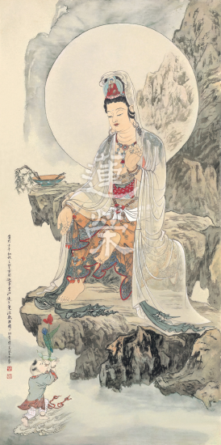

## 佛學覽幽

### 菩薩清淨的行持—華嚴經淨行品（十一）

*編輯部整理*

經營甜蜜家庭

貪愛不捨成縛

知無常捨粗貪

明性空離愛繫

以下這一百四十一個大願，即是於境界中如何善用其心，它分為十類。第一類是「在家時願」，總共有十一個願。華嚴經講究十十，因地上的修學是十類，果報的成就也是十類，亦即在因上不但是要正確，而且要圓滿，果報不但要顯現，而且還要顯現得圓滿，以十來彰顯，因地上以十為滿數，果報上也以十為滿數，表彰佛果的圓滿。

丙二、指事顯因答其徵因

丁一、總徵

丁二、別顯

戊一、明在家時願

己一、總舉在家

第一類明在家時所發的願，分為四個科，第一是總舉在家；第二是在家行孝；第三是結婚生子受家室；第四是在家作事。眼前是總舉在家。

經文：

佛子，菩薩在家，當願眾生，知家性空，免其逼迫。

佛子總貫全文，後面全部的一百四十一大願，用佛子二字貫串，但因為避免重覆一百四十一次，所以只說一次佛子。佛子是想要承擔家業的佛子，佛子不是庶子，是能夠接受王位的兒子叫做佛子，這樣的人因地當中應該要講究什麼呢？須知當此人被指定為太子時，什麼都得要學，不但要讀書累積學問，還要在人情上歷練。如果不堪被要求磨練，此人將來是無法承擔大任的。

菩薩在家，發願依的是菩薩及在家二者，如果今天不是菩薩就不會發願，而且本願是對著在家來發願。

當願眾生也分為能願、所願，能願的是菩薩，所願的是眾生。當願眾生「知家性空，免其逼迫。」菩薩依願成就何者呢？成就自己三業離過成德、修道之器、成就眾慧、具道因緣、於法善巧、修涅槃因、滿菩薩行、得十力智、十王敬護、能為饒益、超勝尊貴。

此外每一願還要做四種的觀察，第一是眾生這樣作（知家性空，免其逼迫）該有多好，此為隨喜。第二是我希望眾生都能如此作，此為發願。第三是我相信我能達成此項目標，此為決定。第四是懇請三寶加被我能如是，此為求加被。

知家性空：家的體性是空，淺處說是無常所攝，由婚禮到幾代同堂，散會時人去樓空，偌大建築物或成為鬼屋，或者易主，所謂：舊時王謝堂前燕，飛入尋常百姓家。任何可能的事情都會發生在我們身上，釋迦佛尚且發生本族被琉璃王所滅，阿闍世王與提婆達多聯手造反，金槍馬麥之報。所以隨業生起的各種難以想像的報應都有可能發生，所謂「假始百千劫，所做業不亡，因緣會遇時，果報還自受。」業在起現形時，連佛力都抵擋不住。

然知家性空並非指無常敗壞，是不見家的自性。家庭若有自相，則不必觀待男女雙方的兩情相悅，父母同意，公證人證婚，大眾的祝賀即可生起家的行相。淨行品菩薩大願，下手處先明般若，此乃利根的修學法，由般若智慧攝持世俗。

對世俗的觀察有在家、出家、說話、辦事等等，但是都需要有般若智慧。天台大師所著之小止觀，有坐上修與歷緣對境修，都是觀察體性空寂，即在世間而成就出世。

喜、怒、哀、樂的情緒通通被家庭綁住了，牢不可破，所以眾生成家，即被家庭所繫縛，生起極大的貪愛，觀察其體性空寂，方能遠離家庭的繫縛，且轉變為修行的道場，否則成為輪迴的緣起。

此願在西晉聶道真所翻譯的菩薩居家法，文曰：「念十方天下人，皆莫為愛慾所拘繫，悉入虛空法中。」東晉佛陀跋陀羅所翻譯的六十華嚴為：「菩薩在家，當願眾生，捨離家難，入空法中。」家難就是對家裡面牽腸掛肚，捨它不掉、理它還亂，最後臨命終眼淚一直流，捨不得離開。以上就是菩薩在家，當願眾生，知家性空，免其逼迫。

己一、在家行孝

經文：

孝事父母，當願眾生，善事於佛，護養一切。

孝養侍奉父母，為什麼孝要加個事？就是有孝心還必須在行動上表現，諸如倒茶水？拿拖鞋！噓寒問暖……孝順父母，菩薩觀察的願能依是菩薩，所依是孝順父母，菩薩就在孝順父母上發願。第二個當願眾生，能願的是菩薩，所願的是眾生。而「善事於佛，護養一切」，指眾生要得到這樣的成就，菩薩是已成就。

善事於佛，護養一切，孝順父母要把孝心拿出來，對佛、對眾生都必須如此，這是第一種講法。對師長、對有情、對佛都要有這樣的孝心，所以在侍奉善知識九心當中，第一個就是孝子心，也就是孝順父母的人，更要像子路、顏回那樣，在陳蔡餓七天，仍跟著夫子周遊列國。所以要把孝心拿出來對佛、對有情，才會拿出誠意對佛如實的供養、對有情如實的救護，孝順父母終身，並且把孝心擴大，增上為菩提心。

第二個注解是孝順父母要像對佛一樣，包括穿衣、吃飯、睡覺通通要講究，對父母親一切都要打理好，家中的父母親就是佛，家中有父母親就等於家中有佛，所以對父母親的供養必須像對佛一樣的供養。

第三種注解，孝事父母的有情眾生，當願這些眾生好好的學習，充實自己的能力，充實的目的就是護養一切，充實自己的目的不只是孝順父母，不只是小孝，還得要盡到大孝，不只在家裡孝事父母，並且出外求學，培養能力，這種善事於佛的能力就是為了利益有情，護養一切。佛家當中，一切男子為我父，一切女子為我母，就是把孝擴大，對有情做這樣的報恩。將孝心拿來上求於佛，下化一切眾生，而護養一切就是恆順眾生。

吳支謙所翻譯的「孝事父母，當願眾生，一切護視，使得佛道。」講法偏向第三家，對於孝事父母的人，一切護事就是對有情，希望眾生得成佛道，面對眾生就像孝子孝事父母的誠意。對於能夠利益有情的人，必須要從孝順出發，並且培養能力，而且要把孝順的能力拿來對善知識，像顏回、子路對孔子那樣的行相，最後護養一切才是這一條的主體所在，但是必須從善事於佛出發，而眾生也必須要是發願的這個人去引導，不能只管發願，卻什麼都不做！

東晉佛陀跋陀羅的六十華嚴：「孝事父母，當願眾生，一切護養，永得大安。」我從孝順父母出發，我要給有情安樂，就像我給父母親安樂一樣。

西晉聶道真：「菩薩孝順供養父母時，心念言：十方天下人皆使早得佛道，以當度脫十方天下人。」

由以上三家翻譯，可以知道這一條的主體是護養一切，但護養一切的能力要從善事父母而來。

會性法師認為，可以讀安世高翻譯的《父母恩難報經》，或者《地藏菩薩本願經》與《盂蘭盆經》，以及儒家的《孝經》，作為這一願的補充。（下期待續）

### 大乘百法明門論簡說（三）

*心超講述、淨本整理*

造論本懷為利生

正解斷障得勝果

離苦得樂方究竟

徹底圓彰論主意

參、明造論意—為利樂有情

世親論師造論的意旨，是以利樂有情為根本目的。然所有造論者都是為了利樂有情而造論，所要闡述的是如何利樂有情？學儒學佛完成人格是自利（人成即佛成），其目的在利樂有情。我們能不能相信人生唯一的出路，就是為了利樂有情？福報在有情上，不在自己這裡？但多數人沒這種體悟。例如工廠老闆的福報在員工，員工每個月領薪水的福報在老闆，彼此互為福田。社會的結構亦然，上班工作所推出的產品，因為大眾的使用才有利潤和薪水，此外每天的食衣住行都是別人的努力，福報都是來自於別人，既然是來自於別人，福田就在有情那裡。

為於二空有迷謬者生正解故

如何利樂有情？依論主世親論師造論的心意，首先是：「為於二空有迷謬者生正解故。」迷謬者指的是凡夫與外道，迷是對二空之理不解，所指的是凡夫，謬是對二空之理錯解，指的是外道。至於二乘人可以分為了義跟不了義的修學，不了義者只能現證無常。利根的二乘對於二空有正解，如舍利弗、目犍連等。

有迷謬者（不解或錯解）令生正解，才真能利樂有情，正解是離苦得樂最重要的一步。

生解為斷二重障故

生人無我與法無我的正解是《大般若經》思想的意趣所在，正解之人必是法門龍象，禪宗在傳祖位時，就是傳有般若正解的那個人，與年紀、地位、輩份無關。

其次眾生生了正解，了解二空之理，就能夠斷二重障（煩惱障跟所知障），斷此二重障能得菩提覺法樂與涅槃寂靜樂的勝果。

煩惱障的行相是因為執著人、法有我（自體性）而生愛，可以歸成三類：自體愛、境界愛和當生愛。

一者自體愛：對自體生起的愛，如依五蘊身心而生起我，依我而生愛我，身體成為我所（身體是我擁有的），所以當身體舒服時是我所樂。二者境界愛：由我去受用身體、衣服、飲食、功名、富貴、田園、房舍、林泉、花卉、眷屬。這些境界成為我所，亦是所愛。當生愛也是愛我所，不過自體愛、境界愛屬於這一生，屬於來生的謂之當生愛。當我們死亡前，愛取而有了來生的定業，顯現中陰身即是投生來生的徵兆，謂之當生愛。

比如大一讀到大四，唱驪歌了，依自體愛、境界愛而生當生愛，學校已不留人了，生起另覓出路，謂之當生愛，要找工作，創造舒適的環境來安置我。說來說去都是為了我，為「我」而活，因此斷除煩惱的決戰點，要問所執的我到底有沒有實體？假如有實體，則如何斷？斷則違反人性，若尋覓所執的我根本沒有實體時，請問能執什麼？由執而生的愛也不見了，由愛而生的一切煩惱也蕩然無存。

唯識宗認為，人無我是沒有常一自在的我、沒有獨立實有的我；法無我是外境不成（法在心外不成立）。中觀宗則言，法無我與人無我行相同，所破之我不過一者緣人上證無我，一者是緣法上證無我。

唯識宗將人我執謂之煩惱障，把法我執叫做所知障；中觀宗則認為執人我、執法我有自體都是煩惱障，因為法我跟人我都是講我，只不過是在人上說我有沒有自體性，在法上說法有沒有自體性。而所謂的所知障是煩惱障與三業薰上去的習氣，此習氣不會生起煩惱障，例如酒倒光以後酒瓶餘留的酒味，亦即在破了我執以後，對境還是會生起實有相，只是不會生起執著。所以阿羅漢破了煩惱障仍有所知障待破，就法還生起為實有的那一分，阿羅漢一樣有。

比如有的阿羅漢會有瞋恨的習氣，可是沒有瞋的煩惱，例如舍利弗出去托缽，佛告訴他吃了不淨食，舍利弗當場運用神力將吃進去的食物吐掉，此即瞋恨的習氣，雖無瞋恨的煩惱，仍留有長得像瞋煩惱的樣子，如酒瓶依然還有酒的味道，然已無酒，謂之所知障。還有的阿羅漢走路會跳，是因為過去當猿猴，跳的習氣還留著，即使解脫成為阿羅漢，亦有身體造作所留的習氣，佛不會對這類留有習氣的聖者喝叱。諸法雖顯現為實有，然聖者阿羅漢能任運生起比量的智慧見到空性，而不生起執著的煩惱，此即破煩惱障的行相。

斷障為得二勝果故

斷了煩惱障得涅槃寂靜樂，斷了所知障得菩提覺法樂，這是唯識宗的立場。若就中觀來說，破煩惱障、破所知障的同時證得涅槃寂靜樂與菩提覺法樂。破了所知障後，現證萬法自體性空，所證之樂謂之涅槃寂靜樂，能證之樂謂之菩提覺法樂。兩種快樂同時出現，沒有前後次第。

涅槃寂靜樂有四面相：常、樂、我、淨。

「常」是萬法體性空，從無始劫來即如此，不隨時、處、迷、悟而有改變，「樂」是現證自體空的聖者具足安樂的體性，未證得法之自體性空，所有的煩惱與業都會觀待實有執著出現，故沒有現證自體空的人，不會得到安樂的體性，安樂不過是暫時（無常），且朝向痛苦，而痛苦本身亦是痛苦，所以不破執著，輪迴三有，體性是苦。「我」是證得自體空，安立名言為我，此是名言安立，而非有一個實體的我。「淨」是當尋覓自體性時，什麼都找不到，此時最清淨，連一粒微塵都沒有。

《楞嚴經》所說的圓通，即是由六根、六塵、六識、七大處證得自體空，謂之二十五圓通；如此說來《百法明門論》就在百法上證得圓通，謂之百圓通；《瑜伽師地論》講六百六十法，若一一通達二無我，即是六百六十種圓通。（下期待續）

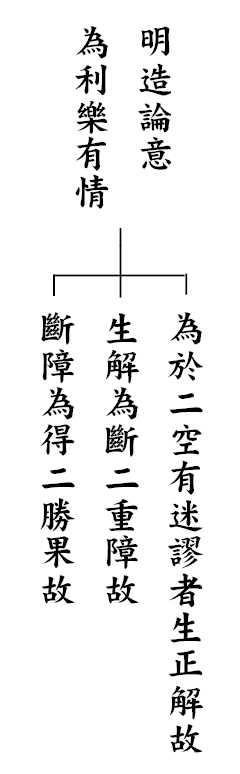

## 孔學一隅

### 孔子聖蹟圖淺說（十）

時哉

入楚難施展

狂歌勸勿為

齊魯會戰後

風光返回魯

二六、子西沮封
此幅子西沮封圖，乃周敬王三十二年，魯哀公七年，西元前四八八年，孔子年六十四歲。在陳蔡之厄後，來到了楚國，昭王想把書社的七百里土地封贈給孔子，令尹子西諫言阻止，令尹是楚國上卿執政大夫，乃宰相地位。他說：君上出使諸侯的外交臣子，有像子貢那樣的口才嗎？不等昭王回答，子西自答說：沒有！您座下輔佐的相才，有像顏回那樣的才德嗎？子西也自答說：沒有！處理民情的官吏，有像宰予這樣的幹才嗎？也自
**答：** 沒有！將帥中有像子路這樣的英勇嗎？也自
**答：** 沒有！

子西再問昭王，周文王當時於西岐之地，僅有七十里地就統一天下，您今天將七百里地封贈給孔子，他又有這些賢能的弟子來幫助，這恐非楚國之福。昭王聽了這番慷慨激昂的話之後，就打消了封地的念頭。

畫中就是昭王議政，戴著官帽執圭侃侃而談的就是令尹子西大夫，只見昭王雙眉緊鎖，被子西大夫的一番話所說動，其他大夫在旁邊仔細聆聽，似乎頗有同感，這種強兵霸權，家天下的想法，正是當時所處的時代潮流，使得孔子公天下的王道理想無法實現。

二七、楚狂接輿

此幅楚狂接輿圖，乃周敬王三十二年，魯哀公七年，西元前四八八年，孔子年六十四歲。歷史背景是楚昭王不久過世，孔子等著繼任國君惠王的安排，此時的子西仍然是執政大夫，孔子在這進退不得當中，楚國有個假裝瘋狂的隱士叫做接輿，故意唱著歌，走過孔子的車前，歌詞是：鳳啊！鳳啊！你為什麼不在盛世中出現，而在亂世中出現呢？過去的事已不能挽回，未來的事還可以來得及把握。罷了！罷了！現在從事政治是很危險的，意在勸孔子，世事混亂難以復治，及早歸隱還來得及。孔子聽了，知道此狂人是個高人，下車想和他談談，他卻急急走開，使孔子無法和他談話。

圖上穿破補衣、持竹杖、赤腳，手捧葫蘆歌唱而行，走避孔子與弟子者即是楚狂接輿。畫中孔子右手舉起，狀似急欲喊住楚狂，請他慢走，有事請教，然而楚狂聽若不聞，繼續自顧自的往前走。《史記》〈孔子世家〉說：由於這個因緣，孔子於是由楚回到衛國。

二八、作丘陵歌

此幅作丘陵歌圖，乃周敬王三十七年，魯哀公十二年，西元前四八三年，孔子年六十九歲。孔子由楚至衛，在衛國待了五年，遲遲沒有執政的機運，卻等到了回魯的機緣。據《左傳》上記載，魯哀公十一年，齊國出兵侵略魯國，那一仗魯國季孫兵甲七千人，編成左師由冉求統帥，打了勝仗，事後季康子問冉求，你對軍旅之事，是學來的還是你的本能，冉求答道：學之於孔子，於是季孫大夫對孔子生起很大的信心，並回憶起父親在臨終之前，囑咐一定要將孔子請回，於是派了公林、公華等大夫，以玉、馬、皮、圭、璧、帛等禮品，來迎孔子自衛返魯。

圖下方即是來迎的陣仗，孔子自離開魯國至今，共十四年而返，途中路過丘陵時，作了丘陵歌，歌詞隱藏的意思是說，仁道就在我們生活的周遭，追求它又像很遙遠，一般人迷惑，於是就不再去實踐，自然就造成困頓不順的遭遇，自己想推行仁道，但舉世滔滔，無足夠能力去除這些艱難的障礙，只有長嗟永嘆！又在回國途中經過隱谷，聞到陣陣幽香，孔子舉目四顧，看見幾叢幽蘭，與眾木為伍，心中十分感慨，便停車賞蘭，取琴作猗蘭操，托辭於香蘭，感慨君子雖生不逢時，但仍如幽谷蘭花，依然不失芬芳。

圖中上方孔子跪坐於席地上，寫著丘陵歌，畫家並配以丘陵的地形，一旁插手，正襟危坐於江邊席上，表情肅穆靜靜地看著孔子者，或為季康子派來迎請的大夫，後方有古琴及二人跪坐拱手，或是孔子的弟子。（下期待續）

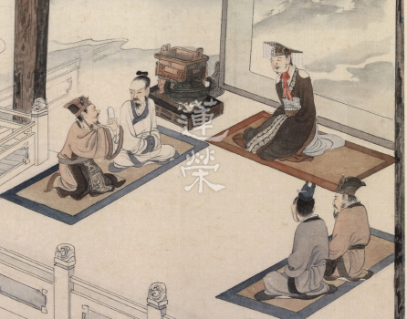

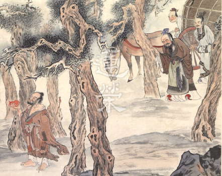

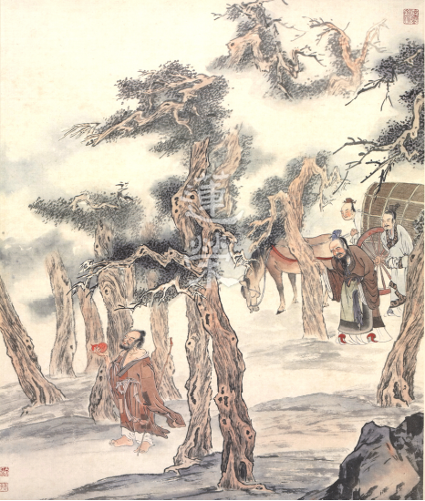

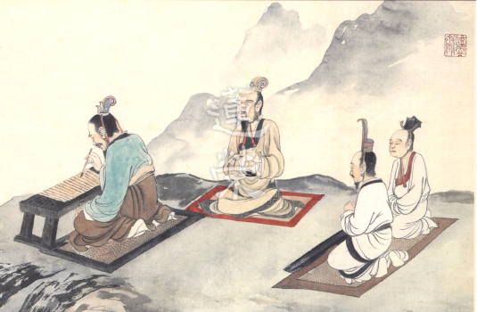

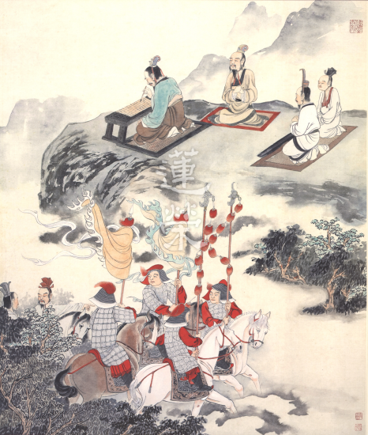

### 論語簡說（三）管仲之器小哉章賞析

*時哉講述、心迦整理*

評論人物殊不易

就相論心看功過

春秋眼力經學通

茫茫大海一座燈

論語章節

子曰：管仲之器小哉。或曰：管仲儉乎。曰：管氏有三歸，官事不攝，焉得儉。然則管仲知禮乎。曰：邦君樹塞門，管氏亦樹塞門：邦君為兩君之好，有反坫，管氏亦有反坫。管氏而知禮，孰不知禮。

(八佾第三，第二十二章)

消文

孔子說：管仲的器量真是小啊！有人問說：管仲節儉嗎？孔子回答說：管仲有三個府庫；並且在宰相辦公室中每位員工不必負責太多事物，這樣怎麼可以算是節儉呢？又有人問說：管仲知道禮嗎？因為管仲居於相位；別墅、財寶等等可能是國君賞賜，依禮，國君所賜不用辭。孔子回答說：國君為別於內外，設立屏風，管仲竟然也設立屏風；國君為兩國君友好，聚會設置放禮物與酒杯的小土臺，管仲竟然也仿照國君設立小土臺；管仲所做的這些皆不合禮制。管仲如果知禮；還有誰不知禮呢！

人物介紹

管仲（西元前七二三或七一六至六四五年），齊國人，少時做生意與鮑叔牙結為好友，因為要侍奉老母，每次獲利都要求分比較多；旁人皆勸鮑叔牙遠離這喜歡貪小便宜的朋友，但是鮑叔牙深知管仲為人，不為所動。其後齊國發生內亂，管仲和召忽輔佐公子糾逃至魯，鮑叔牙輔佐公子小白逃至莒。

待內亂結束，兩位公子回齊繼位路上，管仲率兵攔截莒道，路遇小白，射中公子小白衣勾，誤以為公子小白中箭已亡；魯軍護送公子糾回國時程於是減緩，而公子小白趁此機會兼程趕路，等公子糾回齊時，公子小白已繼位，是為齊桓公，護送公子糾的魯軍與齊軍交戰，兵敗，而後公子糾被殺，管仲被俘，此時桓公問鮑叔牙說：有誰可當宰輔之職輔助我呢？鮑叔牙回答說：只有管仲才可讓君上稱霸於諸侯。

桓公遂重用管仲委以重任；而管仲也不負桓公期望，在內政成就上使齊國通貨積財、富國強兵，提倡倉廩實而知禮節，衣食足而知榮辱，提倡禮義廉恥四維。在外交成就上幫助桓公九次糾合諸侯、尊王（惠王、襄王）攘夷（北征山戎）。實為當時國際上很有權勢以及很有名望的政治家。

釋義

一、子曰：管仲之器小哉。

《管子》〈小匡篇〉記載：施伯謂魯侯曰，管仲者，天下之賢人也，大器也。惠棟《九經古義》乃說：蓋當時有以管仲為大器者，故夫子辨之。

管仲聯合諸侯尊王攘夷，且魯弱齊強，時人以齊為大，故多稱其大器。孔子則稱管仲之器量小。也有可惜之義，這個人是可以再往上走的。

孔子在林放章中言，禮與其奢也，寧儉；又說奢則不遜，儉則固。孔子評管仲器量小，乃責其奢侈越禮。

孔子之論管仲，此處謂其器小，他處又有稱許之辭，皆是就事而論。

在論語中管仲總共出現四章，其餘三章皆許管仲是仁。

１．問管仲。曰：人也。奪伯氏駢邑三百，飯疏食，沒齒無怨言。（憲問篇第九章）

２．子曰：桓公九合諸侯，不以兵車，管仲之力也。如其仁，如其仁。（憲問篇第十六章）

３．子曰：管仲相桓公，霸諸侯，一匡天下，民到于今受其賜。微管仲，吾其被髮左衽矣。豈若匹夫匹婦之為諒也？自經於溝瀆，而莫之知也。（憲問篇第十七章）

另參考雪公講記：管仲僅提倡禮義廉恥四維；殊不知孝弟忠信才是禮義廉恥的根本。

管仲若行孝弟忠信為禮義廉恥的根本，此是王道，而非霸道而已！齊國在霸業未成前會伸張正義，在霸業成就後就比較少伸張正義（看小國被侵略未幫忙）。

二、或曰：管仲儉乎。

有人因為孔子謂管仲之器量小，誤以為管仲儉樸。

三、「三歸」之意。

１．包注謂娶三姓（國）女。    注：又在身老始受三歸之賜，則非娶三姓女。

諸侯禮制：可以娶三個國家的女子，一女可陪嫁二女，一妻二妾至三國九女。大夫禮制：可以娶一女陪嫁二女，一妻二妾。

２．朱子據說苑以為三臺。     注：據清儒考，管仲築三臺之事不見他書。

３．韓非子外儲說謂管子家有三處，晏子春秋謂管仲身老，桓公賜之以三歸。

惟依韓非子謂其所歸之家有三處，庶幾近之。

４．武億羣經義證謂臺為府庫之屬，古以藏泉布，甚符桓公之賜。故可從。

泉，古稱錢幣為泉。布，遍佈。泉布：是說錢有如泉湧般滾滾而來。

四、「官事不攝」之意。

管氏家臣各有專職，不兼餘事也。三歸、官事不攝皆是奢侈。

五、然則管仲知禮乎。

依禮，長者所賜，不能不受。有人又以為管仲知禮。孔子遂辨其不知禮。

六、「樹塞門」之意。

國君為別於內外，樹屏（類似今日的照壁）於門以蔽之，謂之塞門。設屏是為了提醒覲見者生起恭敬之心。

皇侃疏：天子外屏，諸侯內屏，大夫以簾，士以維。

七、「反坫」之意。

兩君宴會，在兩楹之間設坫，皇疏：坫者，築土為之，形如土堆。獻酢更酌，酌畢，各將其空酒杯反置於坫上，謂之反坫。

依國語辭典：酢：客人以酒回敬主人的禮節。坫：古代設於堂上兩楹間的土臺，低者供諸侯相會飲酒時置放酒杯，高者用以置放來會諸侯所餽贈玉圭等禮物，此處是前意。

塞門、反坫皆是人君享有者，而管仲皆僭為之，是不知禮也。

坫

八、管氏而知禮，孰不知禮。

故云，管氏如知禮，則誰是不知禮者耶。

雖然，孔子亦曾贊曰：微管仲，吾其被髮左衽矣。此處謂其器小哉，乃責其奢侈越禮。如《劉氏正義》引董仲舒《春秋繁露》〈精華篇〉中董氏謂管仲功未良成，而志已滿，以及揚雄《法言》〈先知〉篇，皆以管仲驕矜失禮為器小。

看一個人成功與否，可看其態度，越居高位者越應謙虛。（下期待續）

## 蓮池海會

### 劉元春老居士往生見聞記

*編輯部*

政局混亂渡海來

含辛茹苦撐家業

驚恐過世助念後

三寶加被佛接引

劉元春老居士，山東省人，生於民國十三年農曆九月二十四日，民國三十八年後因大陸淪陷，政局混亂，故遷徙至臺。老居士共育有兩男兩女，但不幸先生早在民國六十八年即先行離開塵世，由老居士默默支撐這個家庭，其獨立堅忍可見一斑。

老居士個性非常溫和，待人接物也極為開朗幽默，從不在口舌上與人爭辯，所以街坊鄰居皆喜歡與她往來，還戲稱她老人家為「班長」。與人交往雖是如此，但其內心卻往往有其定見，總是默默遵循著自己的原則行事。自老居士親近佛法後，即堅持茹素，近三十年，從未改變、鬆動。其親人因為擔心她老人家的健康而百般勸說，但她不多說，只是這麼淡淡的一句：「她的身體狀況自己知道。」清楚表達自己不改茹素的心願。

老居士生前即有心臟方面的疾病，今年四月十日的清晨，老居士因為氣喘、面色蒼白，子女緊急的將老居士送到了永和耕莘醫院，但不幸於四月十七日隨即往生。老居士生前雖然親近佛法，但卻未有臨終助念往生的概念，家裡亦非佛化家庭，但幸運的是，其么女想起之前其妯娌（楊美雲居士）辦理婆婆喪事時，諸如臨終助念的殊勝、婆婆往生的瑞像、還有如理如法的做七、奠禮儀式等等，讓她心生歡喜，心想若母親亦能如此辦理，那就是對母親最後的盡孝了。隨即請美雲居士幫忙聯絡助念，八小時以後，老居士從原來驚恐的容色轉為安詳微笑，家屬們都感受到助念的力量，也對佛法建立起初步的信心。之後也邀請幾位蓮友的幫忙，完成了做七的法行。

綜觀老居士的往生因緣可知，助念法行的重要，老居士生前雖然信奉佛法、茹素，但卻未有往生淨土之概念，皆賴其么女曾見聞其婆婆往生之瑞象，喪禮之莊嚴，才以助念的方式護持其母親。如印祖在「得助念失助念之損益比較」文中提到得助念之劉居士，說他：「如斯善利，當由宿種今熟，故得善緣眷屬而為成就。」老居士亦是如此吧！故真正有志生西的行者，豈可抱著僥倖之心，必當時時提醒自己印祖所言：「一舉一動，注意因果。必使步步頭頭，悉令成就往生勝緣，為切要耳。」

其次，每每當蓮友們發心在幫助往生者助念、做七、辦理喪事等等，除了是幫助往生者及其親屬之外，我們更要當成度眾想，我們即是所有觀禮者、參與者的所見所聞，所以每個人的角色都很重要，每個觀禮者、參與者都有可能在我們身上找到對佛法的信心。誠如老居士么女所言：「我是看到美雲嫂這麼做我才想這麼做的。」

老居士在家屬與蓮友誠意助念八小時後安詳往生，家屬於七七日內，如法作七，並認真念佛及誦念《地藏菩薩本願經》與《佛說阿彌陀經》等經典，隨喜團體的放生法行，至如法道場齋僧供眾。

祈願老居士早登蓮邦，乘願再來，廣度群蒙，家屬也能依著老居士往生的機緣，了知世間無常，並有機緣親近善知識，聽聞正法。

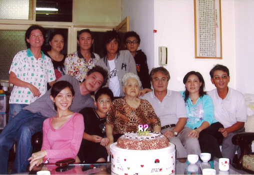

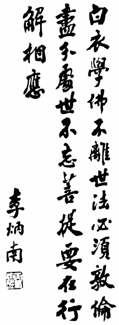

## 活動報導

### 穀雨時節瀋陽行-記瀋陽師範大學講座　瀋陽學術文化交流之旅

王興文

共同理念推文化

正解經典和合眾

臺灣扎根多年後

開花結果兩岸享

第一次到瀋陽是去（二○一三）年八月，相隔七個月後再度造訪，心中多了些親切感，見到舊識更覺溫馨。四月的瀋陽，藍天白雲，春滿大地，百花齊放，綠滿枝頭，如鵝絨般的白色花粉，漫天飛舞，隨風飄散，讓人情不自禁地伸手接捧，想一探究竟，春天的瀋陽，別有一番風味，值得細賞。

此次瀋陽師範大學之行，主要目的有三：首先，參與論語正音版評審會，與來自北京師範大學、曲阜師範大學、瀋陽師範大學、以及蘇州大學的多位學者專家，就論語讀音有爭議的部分，做深入的研究探討，希望整理出一本可信度高的讀本，讓有心鑽研論語者，有一可靠的學習依據，是本次會議的目的。會中達成一致共識，肯定「音正義全」的重要性，將更周全地廣泛徵求各方意見後，正式出版發行論語正音版，以消除論語讀者多年來的困惑，增進學習的效果，幫助論語的推廣與文化的弘揚。

其次，參加第二屆明明德海峽兩岸儒家文化研討會，由瀋陽師範大學校長夏敏先生主持，與會來賓除了以上參與論語正音版評審會的諸位教授外，還有地方黨政領導及學者專家參與，會議在瀋陽市委統戰部汪濤部長致詞後，首先由唐老師發表談話，題目是「儒家文化在中華民族偉大復興歷史進程中的重要價值」，獲得與會大眾的好評。之後，多位教授相繼發言，會場氣氛熱烈，一直到終場時仍意猶未盡。會議持續進行三個小時，中間除拍合照曾短暫休息外，唐老師並接受遼寧電視台訪問，當晚即在電視新聞節目中播出。

最後，此行最重要的任務，是在瀋陽師範大學圖書館的演講廳，針對瀋陽師範大學的年輕教授、老師們，連續三個下午的論語講座，以及兩個上午對大學生的唐詩講座。唐詩由林老師擔綱主講，林老師精研唐詩並講學多年，心得獨到，且配合精心製作的電腦繪圖、照片等圖文並茂的方式呈現，令在場人士大開眼界，耳目一新。論語課由唐老師主講，其他同行學長助講，以簡介孔子及其弟子行誼的方式，將論語章句的內涵與精神，介紹給年輕教授們，尤其將雪廬老人的治學風範與精神，誠摯的推薦給在座的三百餘位教師，並贈送每位學員論語教材「論語講要」一本、「孔門聖賢」等光碟片，同時欣賞江老師的「孔子聖蹟圖」畫作及光碟影片新作品。由於時間緊湊，內容無法詳細解說，但總算留下了一段難忘的經驗與回憶，相信後會有期。

接受遼寧電視台訪問

瀋陽師範大學校園占地廣闊，入口處矗立著一座高大的孔子立像，道路兩旁種滿杏樹，似乎隨時都在提醒著全校師生，為人師表的偉大使命與意義；校園裡花團錦簇，百花盛開，許多不知名的花朵競相在枝頭綻放，令人目不暇給，美不勝收。全校師生近三萬人，校園中隨處可見三五成群，臉上洋溢著青春歡樂氣息的年輕學子，帶著美麗浪漫的憧憬，無憂無慮地走在一起，漫步在優美的校園中，一幅熟悉的景象立刻浮現在腦海中，彷彿見到自己回到了過去的年輕歲月、歡樂時光，心中不覺興起一股莫名的歡喜，連日的塵勞也隨之一掃而去。校區中最具特色的一棟建築，是遼寧古生物博物館，是全國最大的古生物博物館，由國際知名建築師貝聿銘先生所設計，造型特殊，融合古生物、地質構造、與現代美學合為一體，建築設計別具一格，在校園中相當突出，極富特色。

告別瀋陽師範大學後，我們一行人轉往鐵西區的明明德基金會，為讀書會學員舉行三天的講座，主題是「改變命運由立志開始」，內容包含論語章句、了凡四訓的立命之學、畫作導覽、孔子聖蹟圖影片欣賞等，場地可容納一百多人，座無虛席，足證大家對文化的希求與熱愛，相信假以時日，中華傳統文化必能再度發芽茁壯起來，我們熱切期盼此刻早日到來，並與大眾共勉之。

第二屆明明德海峽兩岸儒家文化研討會與會人士合影

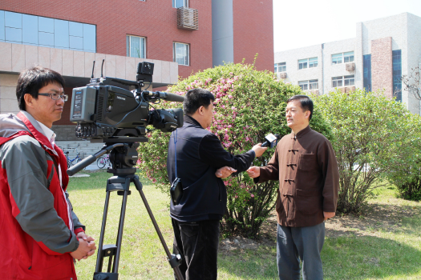

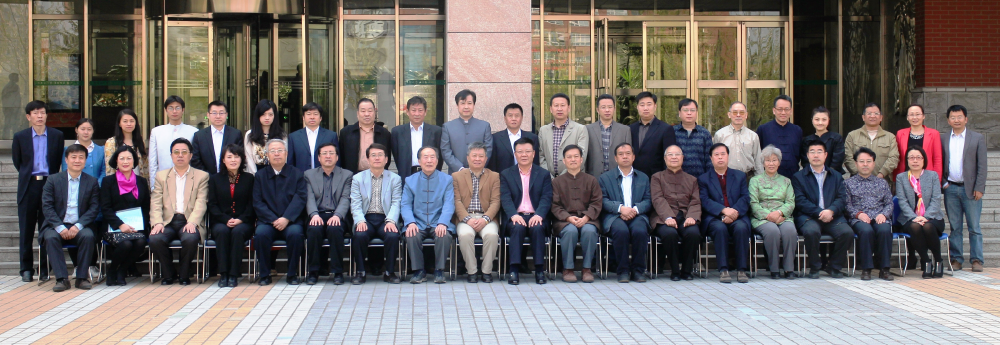

### 穀雨時節瀋陽行-記瀋陽師範大學講座　穀雨時節瀋陽行

淨印

一生要作有義事

一心盼為道弘法

一切回向智慧海

一以貫之達世間

前言

「穀雨」乃春天最後一個節氣，也就是春耕已經結束，幼穗正需要大量的雨水來滋潤，才能順利成長，這好似善種子已播下學子心中，善法欲被引發了，需要法雨的滋潤，初嘗法味的世間人向善知識求法的心，像農夫布穀後期望雨的降臨一樣懇切。

活動報導

四月十九日至二十六日，本會再次接受遼寧省明明德基金會與孔子學會的啟請前往瀋陽，展開為期七天的講座、研討會以及參訪行程。這是繼去年八月我們第一次受邀赴瀋陽，以及去年十二月該基金會劉奇會長率團親至本學會學習十天之後，第三次對東北有心學習經典文化者開辦課程。

學會一行七人於四月十九日搭乘三個鐘頭的直飛班機，於晚上六點半抵達瀋陽桃仙機場，劉會長率多位人員前來接機，分乘數輛車前往下榻酒店休息，隔天適逢星期日，為了讓老師們充分休息故未安排行程，學長們可以各自用功，像是賺到了讀書的時間。

四月二十一至二十三日，講座地點在瀋陽師範大學，對象是該校師生，瀋陽師大位在皇姑區，為瀋陽的最高學府，三天的講座課程被該校納入青年教師的師德培訓計畫，講座名為「第二屆國學經典高級研修班暨瀋陽師範大學師德培訓」。本會準備了論語選講-聖門氣象萬古常新、唐詩（李白的〈訪戴天山道士不遇〉與王之渙的〈登鸛雀樓〉）、孔門聖賢及孔子聖蹟圖導覽做為授課內容。

海峽兩岸儒家文化研討會

與此同時，主辦方亦邀請了包括北京師範大學、曲阜師範大學和蘇州大學在內的多位著名教授，舉辦兩場學術會議，一場是論語正音版評審會，一場為海峽兩岸儒家文化研討會，老師在後者的會議上發表「儒家文化在中華民族偉大復興歷史進程中的重要價值」一文，而第一場會議則意義非凡，因為這是論語正音版的第一次公開發表，並得到與會學者的肯定，實為一大收穫。

論語正音版評審會

論語正音版除參考重要註解外，主要依據論語講要的抉擇，因為雪廬老人是山東人，受的又是私塾教育，若不將這有傳承可循的讀音好好保留，則不免吾人以錯為正，例如為政篇的「詩三百，一言以蔽之，曰：『思無邪。』」，「邪」不是邪門，「邪」應讀為「徐」，此二字古時相通，徐是虛徐之意，思無邪就是思無虛，也就是說詩經皆是真情流露。學習論語，失之一音，意義可能差之千里，所以正音版的發表與出版乃是推行文化的必要之舉。

遼寧古生物博物館                                                                                                 明明德基金會

瀋師大校園內有座中國最大的古生物博物館，在該校孔子學院的安排與陪同下，老師一行人參觀了該館豐富而珍貴的收藏，包括三十億年來的古生物化石，有比始祖鳥早一千萬年、長有羽毛的恐龍，還有世界上最早的花等等。展廳的牆上有大幅的恐龍演化支序圖，我們對恐龍並不特別熟悉，但卻對這樣的圖示不陌生，因為那就像我們每日在學習的科判，從主題展開主架構，帶出次題，再展開次架構，一層又一層，由上而下次第展開，以簡馭繁，也可以由下而上，由繁收攝為簡，這是用科學方法來做學問，也是溝通平台，讓同樣做研究的人可以對話，而不是各說各話。

例如古生物的分類，在這個圖上，某一個新出土的古生物應該被放在甚麼位置，必須經過正式會議來發表論文，經與會學者討論然後定案，與會者是以科判式的架構做為溝通的平台，在邏輯推演下，做有意義的討論，使這場聚會不流於形式，而是互相增上。

四月二十四至二十六日三天我們的教室移到明明德基金會，對象有舊雨新知及明明德的義工。該會所在地同時也是孔子學堂，在熱鬧繁榮的大街上拐入一條小巷，有座平房悄然隱身巷弄，放眼望去旁邊都是高樓。瀋陽市的人口與面積皆約臺灣的三分之一，在現代化的過程中，原有的平房一一被拆遷改建，這座平房乃是瀋陽市鐵西區現存唯一的平房，我們隨主人走入大門，一切已安排有序，課程順利展開，分別是論語選講-立志篇、了凡四訓及孔子傳影片欣賞。

在整整六日的講座中，主辦方也安排座談問答，提問內容大致可歸為三類：一是針對授課內容；二是讀經與論語；三是論語的現代化。

不少學人對孔門弟子感興趣，有人就問道：「顏回滿腹才華卻又英年早逝，豈非人才的浪費？」這樣一位被孔子所讚美的弟子生時窮困又短命，學習聖賢之道卻有如此下場，誰敢學呢？殊不知外行人看顏回生活清苦，但顏回心志向道，樂在其中，而且「人生的意義與價值並不是由壽命的長短來決定」，唐師解答顏回的早逝實是「蒼生無福」。
「仁義禮智信是孔子思想的核心，所謂三十而立，究竟立的是什麼？」有位學生聽課後問了上述問題，唐師
**答：** 「三十而立乃指在經學義理上的立，是不為境界所轉的成就相。」

現場提問最多的都是關於讀經，因為多是透過讀經才接觸到傳統文化，也是因為讀經才產生許多疑問，到底這樣讀行嗎？為什麼孩子們說讀到想吐？於是請唐師給予建議。老師說道：「讀經是啟蒙教育之一，啟蒙教育不只有讀經，誦讀要能讀出活口氣，讀出句讀、讀出法喜，所以找好老師是第一重要。」而且「大人要先讀出興趣，大人若讀不出味道，如何能引發孩子的興趣？」被逼著讀難免倒盡胃口，這不是孩子的錯。「以讀《論語》來說，我從一九八一年開始學論語至今，沒有斷過，講要與集釋讀了再讀，論語可以說從童蒙養正到領導人養成都有，甚至想要將論語推展至世界，也沒有別的訣竅，唯有乖乖地一章一章學」，老師娓娓道來。

「時代在變，請問老師經典能不能改？如何與時俱進？」提問者嚴肅而莊重地問出心中的問題。這是一個很好的問題，老師先請負責主持問答的高老師回答，高老師不假停頓說道：「孔子曾說『殷因於夏禮，所損益，可知也；周因於殷禮，所損益，可知也；其或繼周者，雖百世可知也。』這就是說因應時代變化有些事不得不變，例如古代是馬車，現代是汽車，在變化中以不傷害核心價值為準則，所以任憑時代變遷，五倫的道理是不變的。」

老師點頭，慢慢說出：「雪廬老人曾說過，宋儒最大的毛病就是改經，宋儒注經就算有再大的功勞，都無法抵銷改經的過失。宋儒改經像老師改作文，但是到底有沒有了解過前後文？」的確，不能以自己的觀點認為說不通就斷定是經文有誤，以為經文改了就說得通了，那麼經文成了作文，宋儒成了拿紅筆的老師，這裡改那裏改，如此一來，何必歸為十三經呢？應歸為古哲作文選才對。

老師接著細說：「以前是拱手禮，現在是握手禮，禮可隨時代而變通，清朝祭孔時是穿清朝正式禮服，而不是穿漢服，孔子祖述堯舜，但穿的服裝是東周魯國的服飾，而非堯舜時的服裝，這就是因為作法可以變，不變的是見地，作法上的與時變化是聖人的不迂腐，見地上的執持是聖人的不趕時髦，既不迂腐也不趕時髦就是聖人的中庸之道。」

對傳統文化的學習，老師勉勵學人應肩負起傳承的使命，如張理事長所言：「外國人比我們更重視中華文化，九二八祭孔大典時，許多外國人來參加，有的國家如日本、韓國歷年都派團參加」，論語注解中可採取的也不乏日本人的注解，「外國人尚且如此下功夫，這是我們的文化，吾人怎可比外國人還外行呢？」

學習也要講究方法，第一步先找好老師，成立聽聞，否則雖智不能解；第二步要不斷串習，所謂學而時習之，不亦說乎！第三則是要有團隊，共同研學，不是關起門來自己在家讀，組成讀書會就是最好的延續學習的方式。

孔子是「聖之時者也」，要離開齊國的時候，瀝起正在洗的米就上路，可是要離開魯國的時候，是依依不捨慢慢出發，孔子是「可以速而速，可以久而久，可以處而處，可以仕而仕」，所以孟子才如此讚歎。如今講座的結束恰恰是讀書會的開始，共學有成，下次法雨潤澤的機緣當有成熟之時。

結語

俗諺有云：「清明田穀雨豆」，什麼時候做什麼事要講究時機，何時該插秧何時該種豆，能不能收成，在最初就已決定。而時機稍縱即逝，就好比另一句諺語「穀雨前三日無茶挽，穀雨後三日挽不及」，穀雨時節採摘的春茶，名為雨前茶，蘇東坡評為「膩綠長鮮穀雨春」，時機過了就過了，太早或太晚品質都不如，滋味不同價格也不同。不懂看時自然時機過了也不知，果相現前才懊惱為何我與他人命運大不同，何益於己？

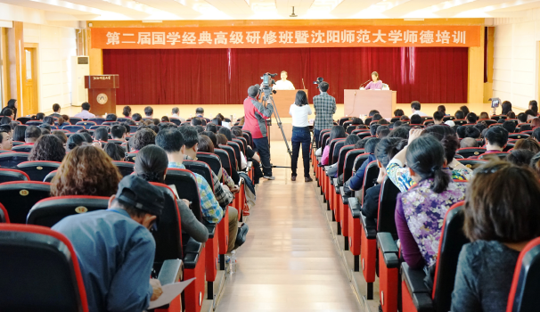

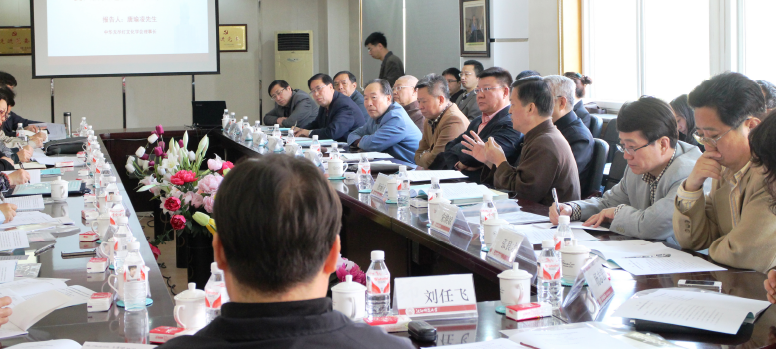

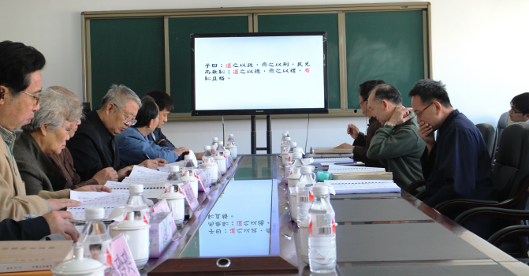

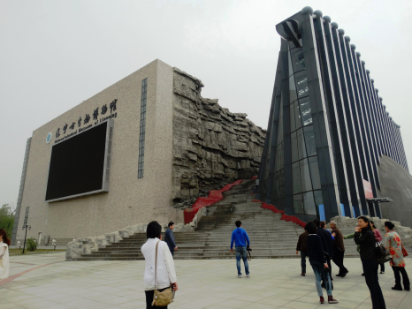

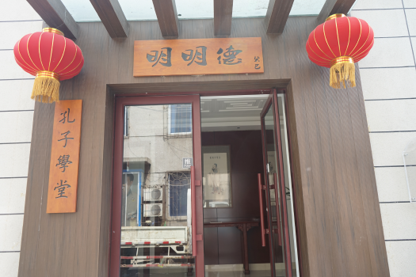

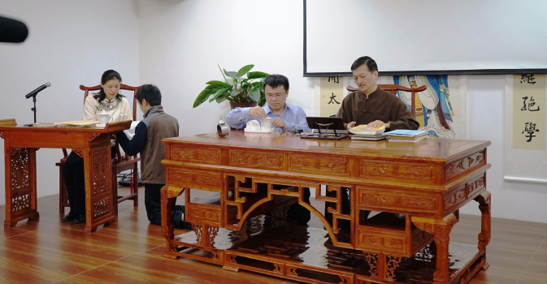

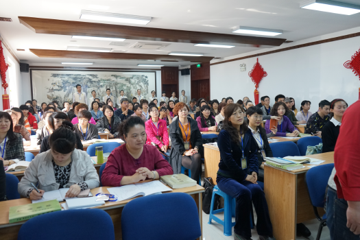

### 穀雨時節瀋陽行-記瀋陽師範大學講座　論語正音版評審會

*編輯部*

音正義全釋典籍

法喜欲罷卻不能

心志確立過八風

能擔大業君子儒

劉會長於講座中，特地安排了一場論語正音版評審會，邀請北京師範大學、曲阜師範大學、瀋陽師範大學、以及蘇州大學等多位學者專家與會，得到了現場與會專家的肯定。返臺之後更在學會中舉辦兩場論語正音發表會，並預計於八月出版論語正音讀本。

讀經教育一直以來皆是啟蒙中最重要的一環，定靜力、體悟力、記憶力乃至於古文的閱讀能力，都可以從讀經的過程中獲得培養。《論語》是經學中十分重要的一部經典，淺處有基本人倫關係的教學，深處有性與天道的內涵，還有君子入世在人情世故上的練達。它可作為啟蒙的門戶，亦是十三經義理的總攝。

在讀誦與學習上，句讀與讀音不可不做講究。斷句的位置與讀音的差異，往往有差之毫釐，失之千里的結果，在孩童讀經時造成先入為主的印象，成為未來正解經典的障礙。《論語》〈述而篇〉中說：子所雅言，詩、書、執禮，皆雅言也。言語雖有地方之殊，時代之異，然而經典的讀音與解義關係文化的傳承與弘揚，不能隨時地而變，務須正言本音，音正而後義全。是故夫子雖生長於魯，於五經、先王典法上，皆以雅言正言其音，而不用土音。因之經典讀音的正確與否，有其絕對的重要性。

今觀坊間《論語》讀本的句讀與讀音莫衷一是，各有所據，難以統一。教育部門及各級學校，亦不甚重視經典音正的教學。吾師雪廬老人為孔上公德成（受命為大成至聖先師奉祀官）業師，乃山東之大儒，其受孔上公之命講授《論語》，並由徐醒民先生敬記出書《論語講要》，繹其經義，綱舉目張。本書特依《講要》之斷句，並採取雪廬老人講述教授之音義，期能讓有心從事《論語》學習之學人，從雅言正音中開始。今有瀋陽明明德傳統文化基金會出資印製發行，提供音讀斷句正本清源的參考，並請各界予以指正。

本書雖參考北大程樹德教授的《論語集釋》、《四書讀本》、《四書新解》、簡金武老師聽課筆記，以及臺灣教育部的國語辭典等，然主要是依據李炳南老教授講授，徐醒民先生記述之《論語講要》。在中華無盡燈文化學會辦公室同仁，以及學會其他師長、同學們的徹夜努力，才能在百忙之中完成本書的初版。然而倉促付梓，難免錯誤不足之處，還望各界指教，使正式版本能更為成熟。

在正音之後，還要完成一本能夠方便大眾理解《論語》義涵的白話翻譯版本，在正音與白話兩相配合之下，相信對於未來文化的推廣，有莫大的幫助。而這些都要能夠有深入經典的人才，和合的團隊以及時間的累積，如同蟄伏的蟬，展翅鳴放之前，必有一段辛苦的過程。

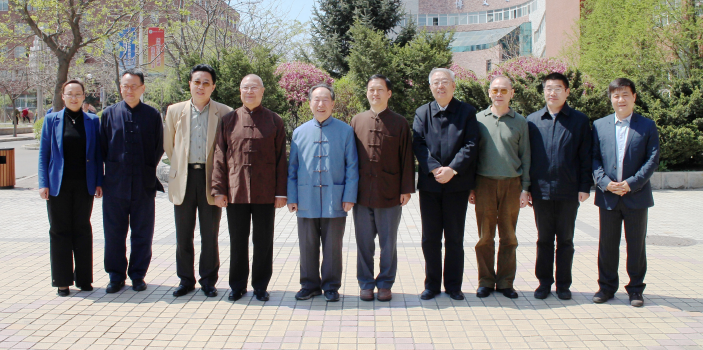

### 穀雨時節瀋陽行-記瀋陽師範大學講座　深入經典內涵，造就菁英人才—講座後讀書會新氣象記文

梁浩

文化興起待因緣

有志之士勤聞思

長期經營花結果

生生不息瀋陽春

把經典放心間，把責任扛雙肩。

走進聖賢教育，深入經典學習，奠定人生根基，造就時代菁英！

四月的瀋陽，群芳吐翠，百花爭豔，為弘揚中華傳統文化，遼寧省孔子學會、遼寧明明德傳統文化教育基金會、瀋陽市臺灣同胞聯誼會、瀋陽師範大學聯合舉辦的第二屆明明德海峽兩岸儒家文化研討會在瀋陽師範大學召開。

北京師範大學教授周桂鈿、臺灣中華無盡燈文化學會主席唐瑜凌、遼寧省孔子學會名譽副會長劉兆偉等九位學者，分別從儒家文化在中華民族偉大復興歷史進程中的重要價值、儒家思想與社會核心價值觀等方面的主題進行發言，探討儒家文化的當代價值和傳播儒家文化對弘揚中華民族傳統文化的積極作用。

兩岸專家、學者六十餘人參加會議，瀋陽市政協副主席汪濤出席大會並致辭。

與此同時，「第二屆明明德國學經典高級研修班」在瀋陽師範大學和瀋陽明明德孔子學堂（傳統文化藝術培訓學校）分別召開，我們禮請臺灣知名學者，中華無盡燈文化學會主席唐瑜凌教授、林蔚芳老師及教師團隊，舉辦了《論語》、《唐詩賞析》、《了凡四訓》等公益講座。此次專題講座主題為「聖門氣象萬古常新」，意乃源遠流長的中華文化雖是萬古，然歷久彌新，特別從論語選出相關章節，幫助我們從孔子的生平事蹟，通過孔子的學習法，以及孔門弟子的傑出成就來瞭解孔門的氣象。深入瞭解孔子的中心思想、教育理念與其核心價值，並深入探討論語的真實內涵、價值與時代意義。

第二屆國學高級經典研修班，研討的主旨是「立志」，其內容分別從論語裏選取有關篇章，以及從了凡四訓中舉出立命之學，來深入解析「立志」在人生成長過程中的重要性，鼓勵現代人，尤其是年輕人，如何從論語中得到啟示，開發智慧；從孔門弟子七十二賢中，找到人生學習的典範，將自己培養成時代的菁英，國家的棟樑，為社會人群服務奉獻。

《論語選講》、唐詩賞析暨吟誦、導覽等重點課程和活動，讓大家重新認識傳統文化的博大精深。很好地傳承了中華國學的正統道脈。活動中唐瑜凌教授用他獨特的教學方式，圍繞《論語講要》著重從「聖門氣象—萬古常新」闡述了《論語》的精髓。讓我們從中感悟到《論語》，及中國文化蘊含的孝敬之道、學習之道、為師之道、為政之道、交友之道等為人處世之道。唐老師說：「學校應該把每一個學生培養成人才，而不單單是培養成人。」強調唯有讀書，深入經典，才有出路。

六天的集中學習，使大家對傳統文化有了更深刻的認識，也有了更親切的體悟。唐老師教學團隊一行人的知、行，對我們的觸動很大。尤其對《論語》的獨到教學方法，深深地吸引了與會學員。由主講老師帶領、消文老師配合，在一問一答，一唱一和的方式將《論語》的精華生動地呈現出來，讓聽課者聽得津津有味，並對《論語》產生濃厚的興趣。唐老師深入淺出，引人入勝，以科判作為引導的講解，讓學習古文不再枯燥難懂。

本次培訓班課程內容豐富，唐教授做專題的《聖門氣象—萬古常新》，給我們開啟了一扇扇智慧之門，令我們陶然欲醉，啟發連連。內容有所側重，針對性強，同時也留下了很多思考，聽後有意猶未盡之感。雖然培訓已結束，但講授者嚴謹的治學之風，團隊成員之間默契的配合，循循善誘、啟發式的授課風格，尊師重道的言行舉止仍令人記憶猶新。

唐詩賞析課在林老師的帶領下，學習吟誦了李白的兩首唐詩，讓我們知道了怎樣理解、鑑賞詩，詩的意境在哪裡，「不學詩，無以言。」詩以真情感人，溫柔敦厚的內涵可以和合群體，學詩還可以觀察社會風俗、人情世故，而詩中所體現的委曲婉轉，更是與人言談交流所不可或缺的內涵。不僅如此，人皆有情，引聲抒情，喜好言詩其實出於自然，情異則聲變，從無次序到有次序，詩歌如是成形。是故人不可以不學詩。

唐老師帶來了江逸子先生的五幅國畫，一方面使學員深入瞭解中華傳統文化的博大精深，另一方面也培養了其藝術鑑賞能力。

「一幅國畫所表達的不只是其藝術上的成就，更可從中瞭解其內涵，即從人物的行為舉止、環境細節中所帶出的含義及文化。」唐老師通過媒體教學，《孔子聖蹟圖》來展現孔夫子的一生如何待人處世、如何應變外，也讓大家從中更瞭解《論語》背後的基本歷史背景，使學習起《論語》更容易掌握其中義理。他指出，學習《論語》並不能只是從字面上探究其中意義，理應配合當下的歷史背景，這樣更能準確理解孔夫子的真正含義，而不是斷章取義，武斷地判斷聖賢人給予後代子孫的教誨。

唐老師認為文化發展到今天要回本溯源，這有利於兩岸文化政治等方面快速達成共識。

六天的學習不長，卻點燃了大家學習《論語》的熱情和火種，重讀《論語》，重新思考我們的人生方向。

明明德讀書會，經過兩年的籌劃、準備，於二０一三年九月正式成立。這一次，藉助「明明德第二屆國學經典高級研修班」召開之東風，在瀋陽又掀起了新一輪讀書的高潮。五月十日，孔子學堂常規課程開始啟動，每星期有三場面向公眾開放的大課，兩次面對員工和義工的培訓。

老祖宗流傳至今的治國智慧、理念、方法、經驗與成效，是經歷幾千年考驗所累積的寶藏結晶。需要我們共同的承擔與承傳。

作為中華文化最重要的典籍，《論語》中孔老夫子所論述的做人之道、治學之道、治國之道，代表了中華文化的精髓，千百年來，已成為一種文化基因，融入華夏文明的血液之中，成為中國人日常文化、思想、情感和生活方式的一部分，從中我們可以吮吸到鮮活、豐富的人生營養。

古聖先賢的智慧光芒，會穿越千年時空，照耀當下，也讓我們很多人的生命歷程，因為多了這種傳統文化的陪伴，而變得厚重和溫暖……。

現在大家都深刻認識到，弘揚中華傳統文化的事業極其缺乏師資人才，人能弘道，非道弘人。只有培養大量深入經典的人才，中華文明才能薪火相傳，源遠流長。

明明德孔子學堂是大家共同的精神家園。凝聚了領導、義工們的辛勤汗水，凝聚了學長們的勤奮學習，刻苦努力的日日夜夜，凝聚了愛心人士的支持與關注，大家真誠付出、攜手共進、默默工作、無私奉獻。

相同的信念讓我們相聚，共同的責任讓我們團結。深入經典，不失真意的承傳是我們的追求。真誠的微笑是我們的語言。謙和的敬禮是我們的交流。

教室裡瀰漫著大家的歡聲笑語，照片上儲存著大家陽光的笑臉，教室裡留下了大家渴望的眼神。有的學員反應：聽不夠，百聽不厭，下課了，大家好像還沒有回過神來，靜靜的坐在那裡，不願意離開，有的學長說：「怎麼這麼快就下課了？還沒聽夠呢！」過了一會兒，大家才依依不捨的陸續離開。每次課程結束以後，學長們紛紛把課堂筆記傳到明明德讀書會微信平臺，大家互相交流學習。賈校長肩負著學校、家庭雙重責任，時間非常緊張，可是每次課程，他都爭取時間趕過來。有的學長課後都要花費兩個多小時做筆記，他說，做筆記是一個複習和再學習的過程，自己非常受益，兩個小時，太值得了。

一個多月來，我們深深感受到大眾對傳統文化的熱愛，感受到瀋陽人民的好學，感受到深入經典的殊勝，感受到長期講學的殊勝。

有兩位學長還寫了兩首詩：

晨讀《論語》

晨曦風拂面，國學誦吟興。

古聖先賢語，心中指路燈。

還有一首：

明明寶地小街藏，大道在心氣韻祥，

益友良師齊聚首，學堂堪比強磁場。

繼往聖開來學參贊天地，

明明德達中和化育萬物。

中華文化有賴於我們以身作則的帶動。在現前總總之下，唯有靠諸位仁人志士共同努力，同發善念，共襄盛舉，共同承擔起這個歷史使命。我們一直在路上，相信有了大家的支持，我們的隊伍一定會不斷壯大。

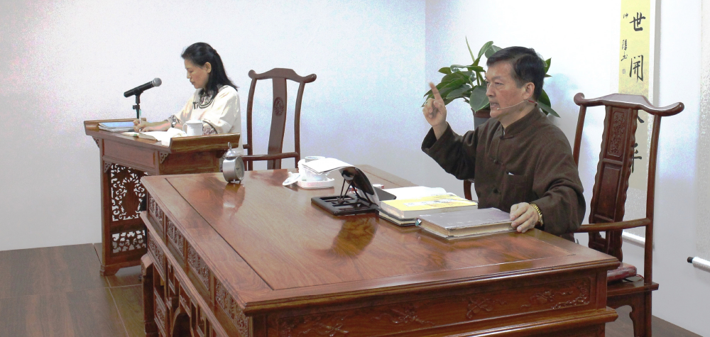

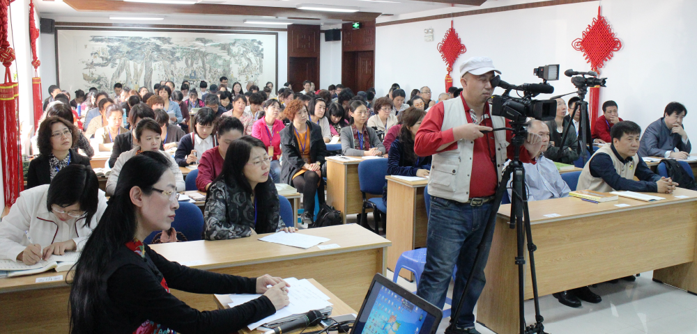

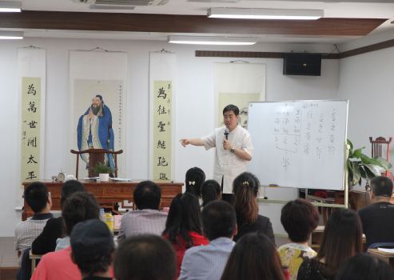

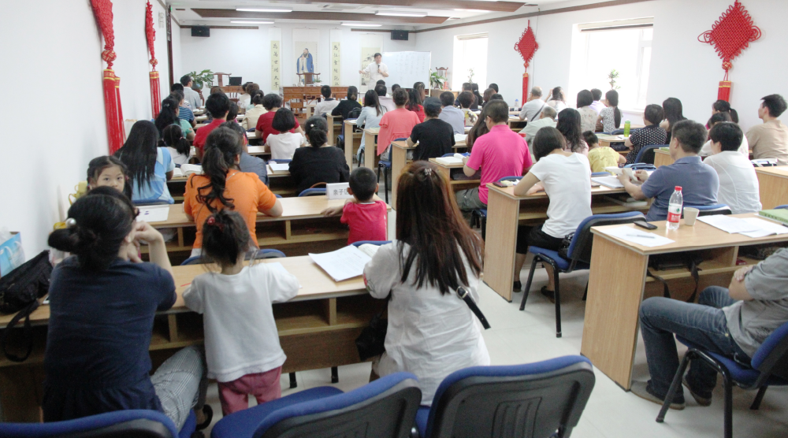

### 九十五年母親節浴佛放生法行　成功的秘密—為海大新生開設的專題演講

游皓文

有心打造好大學

人文氣息助專業

深耕文化先時代

博文約禮新氣象

今天是五月一日星期四，在這陰雨綿綿的早上，老師辛苦的來到了臺灣最北端的大學—國立臺灣海洋大學，為通訊導航工程學系大一學生作專題演講，講題是「成功的祕訣」。

此次演講由副教務長張文哲教授主持，老師與副教務長是初次見面，但因彼此對文化的發展以及教育的理念，看法相同，因此一見如故，相談甚歡。

唐老師與張理事長搭配，並提及演講內容不會談論太多中華文化的內涵，因為那是寶藏，希望將來有時間再來慢慢跟大家說，今天則將配合著影片精簡扼要地介紹學習的重要，與整個世界未來的趨勢，以及臺灣年輕人（包括在場多數的大一新鮮人）該做些什麼樣的準備。

簡報開頭便開宗明義地破題：成功的秘訣是甚麼？那便是「學習」。我們從小到大，從年輕到老都應該要不斷學習，而學習最關鍵的要素是甚麼呢？那便是「好老師」。接著張會長播放比爾蓋茲以五十億的經費研究了二十年的成果影片，裡面便提到教育最重要的關鍵便在於：好的老師。

老師的職責在傳道、授業、解惑，好的老師，在中國歷史當中最具代表性的人物，就是孔子。老師提到當年楚昭王迎接孔子進城時，曾經想封給孔子七百里地，旁邊的臣子連忙說不可，楚王問為什麼？臣子說因為楚國當今國內論軍事能力、辦事能力等等，沒有一個人才比得上孔子的弟子，如今如果封地給孔子，那其未來的勢力可想而知，楚王聽到嚇得連忙收回成命。老師說看看市面上的書就知道，許多人對孔子都有誤解，其實孔子的思想是確確實實可以運用在現代，是社會上最佳的品格教育典範。

然而學習的目的與動機為何？簡而言之，不外乎謀生、就業，以及品德、人格的培養。為了要在社會上能謀生就業，年輕人究竟知不知道未來整個世界的發展趨勢與工作機會為何？接下來的影片，What will future jobs look like（未來的工作將會是什麼樣子）中提到：經濟學家Andrew McAfee認為未來許多企業公司員工數量將大幅度減少，不管是高科技業或其他行業都一樣，將會由機器人或智能機器取代，他們能理解、聆聽、思考、行動，所以未來將是機器人的世代，它帶來的衝擊很大。我們該怎麼樣教育下一代認清時代潮流，及早培養技能因應，將是現代人重要的課題，所以該怎麼準備，大家要好好思考。

知道了未來趨勢之後，年輕人應該準備甚麼呢？除了精通自己的本科專業之外，更重要的就是品德與人格的培養，因為待人處事的學養是個人成敗的關鍵，不管是甚麼職位的人，就算貴為總統，在與世界各國領袖互動時，也得要遵守各國禮儀，或鞠躬致敬、握手等禮，不一而足，忽視禮儀將會帶來不良的後果，像某總統就曾經在宴席上因為失禮，主動向英國女王敬酒，後來就被英國群眾當成笑柄。禮儀是人跟人之間最基本的品德涵養，而現在的年輕人往往因缺少對它的認識與不重視，因而造成極大的傷害卻仍不自知，非常可惜。

學習要講究方法與次第，做有系統、長時期的學習。古人的學習態度與方法：博學、審問、慎思、明辨、篤行，與今日所提倡的科學精神與求學態度是一致的，值得我們效法。像成立讀書會組成團隊，就是很棒的學習方式，因為可以與有共同喜好的道友互相切磋、互相精進，那種朋友與學習氛圍是非常難得的。

接下來老師又播放了一部相當精彩絕倫的影片，由Louie Schwartzberg所製作的影片，內容提到：一般人往往很容易忽略周遭的事物，而錯過了欣賞自己所擁有的美好，但透過攝影師的鏡頭，運用高速、縮時的攝影技巧，將那為人所遺忘的大自然與人文之美，化作種種美妙生動的感人故事，讓觀看者對大自然與世人生起感恩之心。因為當你每一天可以睜開眼睛看見世界，光是這件事情，你就應該好好的感恩，並且好好運用每一天的分分秒秒，這就是對生命最大的尊重。而最後一段影片，The life-long learner是由一位活到老學到老的長者Ben Dunlap講述活到老學到老的經歷，提醒年輕學子學習是一生的事，不是短暫、片段的，以此作為最後的勉勵。

演講結束後，有同學提出個問題：究竟我們該怎麼樣具備面對未來的能力？老師舉了個簡單的例子：當你拿杯水給人時就能看出差別來！你端茶杯的方式與說話的方式，就能看出你對這件事情的細膩度與你所經歷過的訓練，所以不管是面對未來的能力也好，如何培養宏大的人生觀也好，都是從小事情中去開始培養，越小的事情越是能從中看出你的洞察力與專注力，所以就請從你手邊的事情開始做起吧！

演講最後，在副教務長與老師對同學們的互相勉勵下，精彩地落幕了，雖然這個演講沒有提到儒學的內容，也沒提到禮儀的條文，但相信大家經過影片與精闢扼要的講解後，將會結合未來的趨勢、個人的專業，以及品德、生活禮儀的學習，建立感恩的開闊心胸與正確的人生價值觀，相信必定會在每位大一學生心裡種下了顆小小的種子，將來肯定會隨著時間與人生的歷練而發芽茁壯。

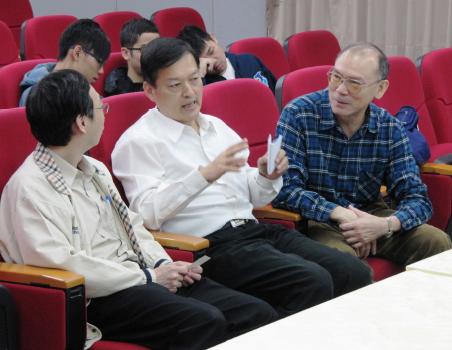

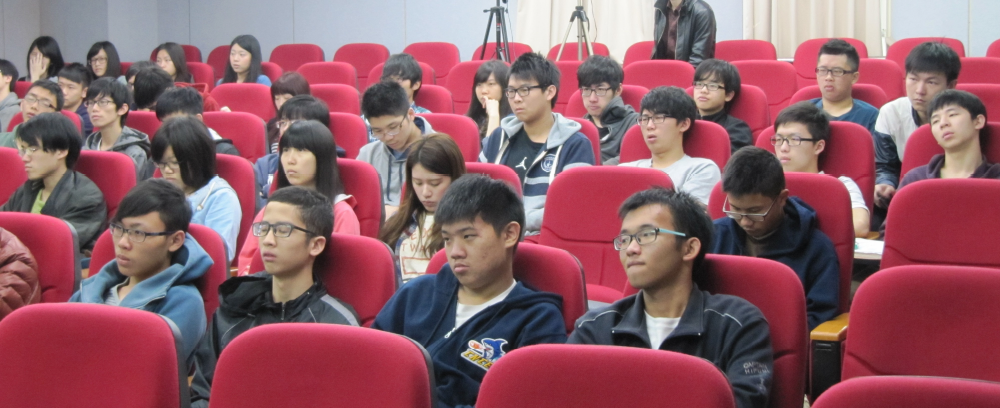

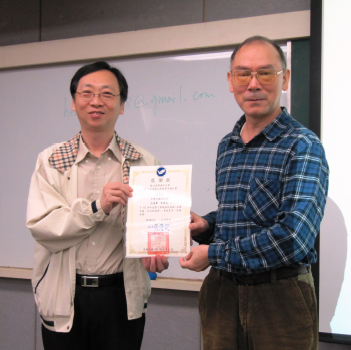

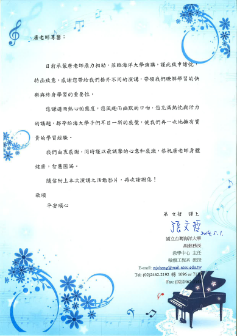

### 九十五年母親節浴佛放生法行　顏淵第七十八代孫—顏廷淦先生一行蒞臨指導

戒福

積善餘蔭千百代

簞瓢雖空德厚實

加被子孫讀書人

見賢思齊效古賢

顏先生致詞                                                                                                                           顏先生當場揮毫致贈墨寶

曲阜顏廷淦先生率團至學會拜訪，賓主入座後，先由老師一一介紹學會教學團隊，再請貴賓團團長逐一介紹貴賓，畢後；顏奉祀官致詞，隨後團長請駱顧問、劉教授、孔家後代等人致詞。會中孔家後代吟朱子春日「勝日尋芳泗水濱，無邊風景一時新，等閒識得東風面，萬紫千紅總是春」一詩，老師以 雪公吟唱法和之（所謂活用「子與人歌而善，必使反之而後和之」）外，又讚賓至令學會蓬蓽生輝，斗室何陋之有，遂吟劉禹錫〈陋室銘〉。

緊接著，由學會教學總監林老師向貴賓簡介本學會梗概，尤側重對內經典教學、人才培訓、獄所教化及海外、大陸弘傳聖學，由大陸順昌、永康一路至濟南、瀋陽，讓貴賓留下深刻印象，並獲得劉教授之熱烈回響，自云已在獄所此一領域教化耕耘三年，願與學會攜手合作，互享心得。

學會餐後展紙案前，請貴賓賜墨寶，除暢懷外，亦以藝交流；除顏奉祀官（廷淦）書中堂「見賢思齊」，另有一書家也暢書「思賢」，再一位則寫「兩岸同樂」（草篆行楷四體並具）；順福奉  命以顏奉祀官之名字撰嵌字聯七言聯一對並書「廷訓履仁傳有緒，淦才溺翰尊魯公」，借用庭、幹二字，上聯讚有遠祖復聖仁心成就法門，必代代奉為庭訓，且流傳有緒；下聯譽渠為幹才，有承擔弘傳孔學之志，餘力留心翰墨，偏愛其四十五代祖「魯公」體。

侯先生、孔先生致贈墨寶​​​​​​

臨行送客，情依依，謙稱不敢自比「仁者贈言」，於是再吟「王維  送別  山中相送罷，日暮掩柴扉；春草年年綠，王孫歸不歸」，將聚會帶至高潮，老師帶引團隊，送客至車旁，體現殷殷誠摯之情，實是一次良好的兩岸交流。

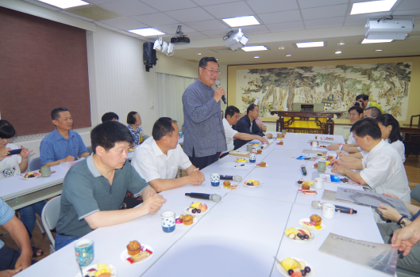

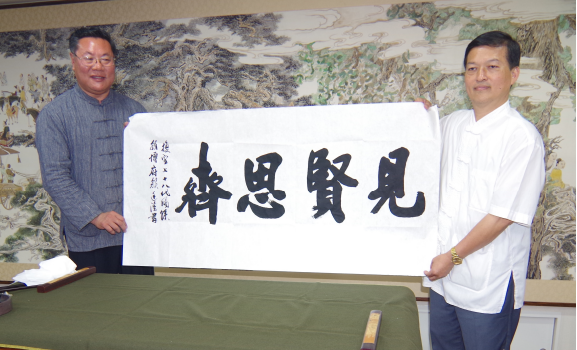

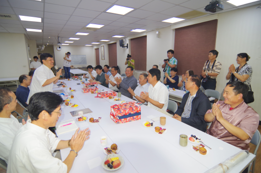

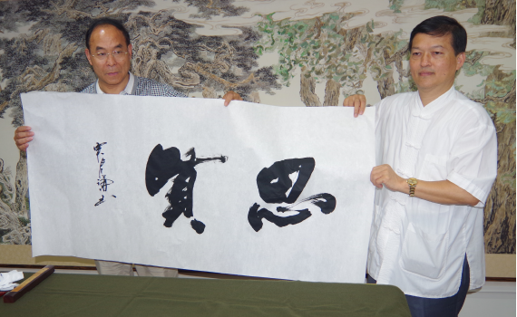

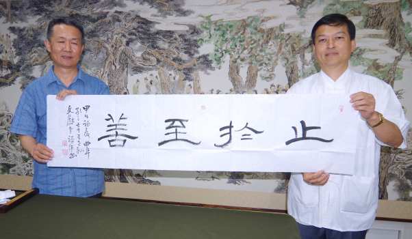

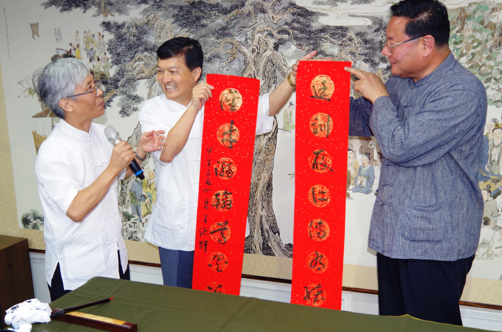

### 二○一四年暮春江南行　甲午年暮春訪江南活動總報導

心若

江南春風光無限

行人遊大飽眼福

善人聚法語嚴耳

行程後如對目前

暮春，正是綿綿細雨的時節，把江南的美景浸染在水裡、霧裡，悠遊其中，像是踏進一幅畫，浪漫又詩情畫意。這次由於應媽媽生病的因緣，發起放生法行，地點及時間的選定歷經曲折，初時，決定三月辦在四川，後改為馬來西亞，最終選定五月十號到十七號舉辦江南行，過程可謂迂迴周旋、變化莫測，令人意想不到，因緣一時現起，我們一行人直接受用。規劃時間緊湊，能如願成行，得利於經驗的累積與傳授，一切如夢幻般呈現，又適逢母親節，可謂最殊勝的安排。

深夜的大型太湖放生

此次江南行以放生為主，遊玩為輔。放生觀待好的水域、場地、物種，購買上要能方便、信實，而不是漫天喊價，乃至於運送的便利性也要考慮。過去放生出遊，都是自己人員張羅，所以旅遊有一半的行程都為了放生而忙碌，此行大家可以一面悠閒地遊玩一面放生，觀待種種因緣的和合，感謝發起人雨橋父母，感謝當地護持者李總、方館長承擔了放生的行程規劃，方館長更是親臨無錫打點前行，場地、路線、物種一應俱全，也感謝高老師從旁指導協助，大眾的參與，辦事人員的機警，還有教法儀軌的觀修。

早晨的太湖放生

江南旅程一共辦了四場放生，前兩場辦在太湖，同一天的早上、晚上各辦一場，太湖是中國五大淡水湖之一，清秀雄奇，包蘊吳越，面積遼闊，禁止捕撈，在太湖放了約八萬隻泥鰍，十三萬隻鯽魚，數量萬分驚人，簡直難以想像，若沒有當地放生團相助，僅憑學會蓮友合力，放到半夜依然放不完，雖然疲憊，但是大眾各司其職，越放越起勁，感動難以言喻，法喜充滿。另外，在諸暨東白湖及白塔湖各辦了一場放生，東白湖是當地八十萬人民飲用水的水庫，放生種類有限制，必須對水庫有清潔之功，故放了鯉魚、鯽魚約兩千條。白塔湖山環水抱，碧波萬頃，在此放了泥鰍約兩萬隻，黃鱔約四千五百隻，泥鰍、魚兒重獲新生，在水上翻騰跳躍，傾洩其喜悅感激之情。兩岸蓮友受放生震撼歡欣鼓動，也更加了解教法之重要性，期盼日後精進向道，眾志成城。得放生行，當願眾生，大悲所熏，心意柔軟；功德共聚，心恆喜樂。

東白湖放生

遊玩雖為輔，但也很盡興，此趟遊覽從無錫開始，參訪了錫惠公園、寄暢園、太湖、黿頭渚景區、靈山景區。至蘇州，觀賞園林，包括留園、獅子林、滄浪亭及耦園，各具特色。接著，來到水鄉澤國烏鎮，作一回水上人家。告別蘇州後，轉戰西湖，最後前往諸暨，走訪千柱屋、西施故里、東白湖、白塔湖及紹興蘭亭，再至上海城隍廟返家。重要景點有專文詳加介紹，以下僅略述旅遊之概供養大眾。

白塔湖放生                                                                                                                          莊居士抱病於白塔湖放生

首站無錫，無錫是吳文化的重要發源地之一，商末周太王長子泰伯居無錫，開啟了悠遠綿長的歷史。錫惠公園倚錫山、惠山而築，其私家花園寄暢園富有盛名，寄情山水，處處古蹟，自然壯闊，康熙、乾隆下江南必至。黿頭渚為太湖中的一個半島，狀如巨龜，取名黿，表示是龜與龍的結合，在灰濛的太湖煙雨飄緲中，更有一種靈性之感。靈山景區大佛佇立，高八十八米，手持無畏施手印，莊嚴雄厚，令人震懾讚歎。其九龍灌浴的浴佛盛典大眾雲集，觀想清淨智慧之水灌沐如來，也洗滌自身，願洗去無明煩惱，增長智慧。若遊靈山，當願眾生，身心無垢，內外光潔；眾德悉具，稱歎無盡。

接著遊覽蘇州園林，園林大抵可分為兩類，一類是封建制度下的當官者，官場壓力大，多在年輕時退隱，回鄉修築自己心目中的理想園林，欲頤養天年，望己長生不老。另一類是經商下海者有了積蓄後，請專人來打造名園，除可裝點門面、自娛欣賞，亦可作為洽談之所，一舉數得。然不管是私家或公家園林、官人或經商者的園林，建林都必須有錢、有閒、有文化，方能成就。

靈山九龍灌浴之浴佛盛典

庭院深深深幾許，必得逛進去才知內涵之豐厚，許多風景雖由人作，宛自天成。留園規模宏大，廳堂華麗細緻，尤以佈局出色。獅子林精緻有趣，多竹林怪石，以洞壑盤旋奇巧取勝。滄浪亭清幽古樸，不同凡響，樹蔭清涼，天落花雨，別具一格。耦園曲徑通幽、寧靜優美。逛進這許許多多的園林中，有如來到《紅樓夢》之大觀園，「天上人間諸景備，銜山抱水建來精」，太湖石假山怪石嶙峋，小徑曲折，室內陳設講究，觀景富麗，名卉綻放，異草滴翠，使我們眼界大開。若遊園林，當願眾生，遊諸教園，趣佛菩提。

烏鎮是此次旅遊一大亮點。水孕育了烏鎮，使之寬厚、靈秀、柔媚、仁慈、生機盎然、情意綿綿，使之久看不膩。大大小小的橋與流水相輝映，交織成美麗的畫卷，令人駐足，令人傾倒。巷陌悠長，是歷史的印記，是生活的足跡，古樸成趣，如詩如韻。徜徉烏鎮，雨絲斜斜，宛若仙境。若遊烏鎮，當願眾生，得預法流，入佛智海；廣度一切，猶如橋樑。

杭州以秀麗的西湖山水，勾住遊人的腳步。西湖是歷代人們的心血，「混元神巧本無形，匠出西湖做畫屏」，唐白居易築白堤，吳越王開浚引水，宋蘇東坡築蘇堤，清康乾開湖溉田，雍正浚湖……，有了前人的努力，這一灣水域，方能水光瀲艷，柳綠桃紅繁茂相映，又流露文化底蘊。此次坐船遊覽新西湖，湖面幽靜，極富野趣，划著划著總是別有天地，清靜悠遠，令人心曠神怡、耳目一新。

夜晚有幸觀賞國際級導演張藝謀、王潮歌、樊躍聯合打造的「西湖印象」，以高科技、鮮麗的聲光、氣勢磅礡的舞蹈展演出許仙與白娘子淒美動人的愛情故事，縹緲寫意，詮釋不同的西湖，令人歎為觀止。若遊西湖，當願眾生，遊遍聖境，洗除惑垢。

諸暨的千柱屋是隱藏在山中的巨宅，由清朝斯元儒建造，因屋有千柱而得名，雖今已沒落，但屋宅之大，可想見當時的榮華與輝煌。西施故里，以西施文化為主，吳越文化展露無疑，風情優美。其中名媛館呈現出歷代各種美女、巾幗的雕像，彷彿來到女人國，成也女人，敗也女人，頗為有趣，遊走館內，可一口氣認識中國歷朝歷代各種傑出的女性代表。若遊故里，當願眾生，以正道合，永結同心。

而位於紹興大書法家王羲之的故居蘭亭，茂林修竹、曲水流觴、碑亭林立，予人高潔清雅之感，氣象萬千。然遙想當年名士聚會飲宴，而今安在？若遊蘭亭，當願眾生，以法自娛，了伎非實。

最後來到熙熙攘攘的上海，人聲鼎沸，街道上人們匆忙急迫，不容一刻停歇。便利的都市、密集的人口，似乎把我們拉回現實，生命如一江春水，快速流逝，人生要經營有意義的事，就讓江南的點滴化為人生旅途的一環，學會慢活，在呼吸吐納中，讓文化悠長深厚的內涵走入生命；學習水一樣的柔軟，能屈能伸又善利萬物，雍容大度能納百川；學習園林之深厚，富有內涵而不輕易顯露；學習蘭亭，知道死生才是大事，時常警醒自己，作無常之思維。

縱觀上述，此次的遊覽是一場人文之旅、知性之旅、善法之旅，一場結合正知見的旅遊，在此祝願：若江南行，當願眾生，所到之處，皆歸佛道。

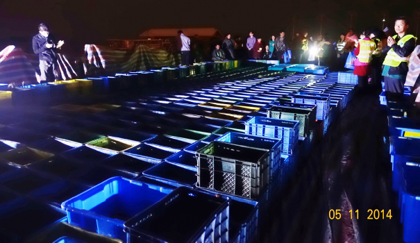

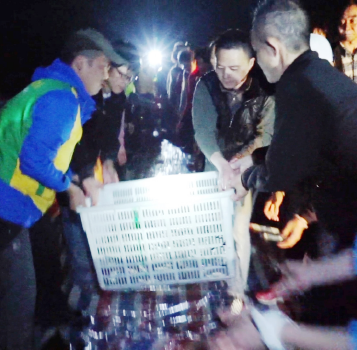

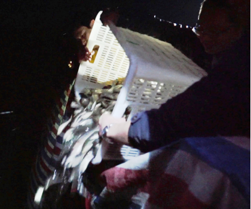

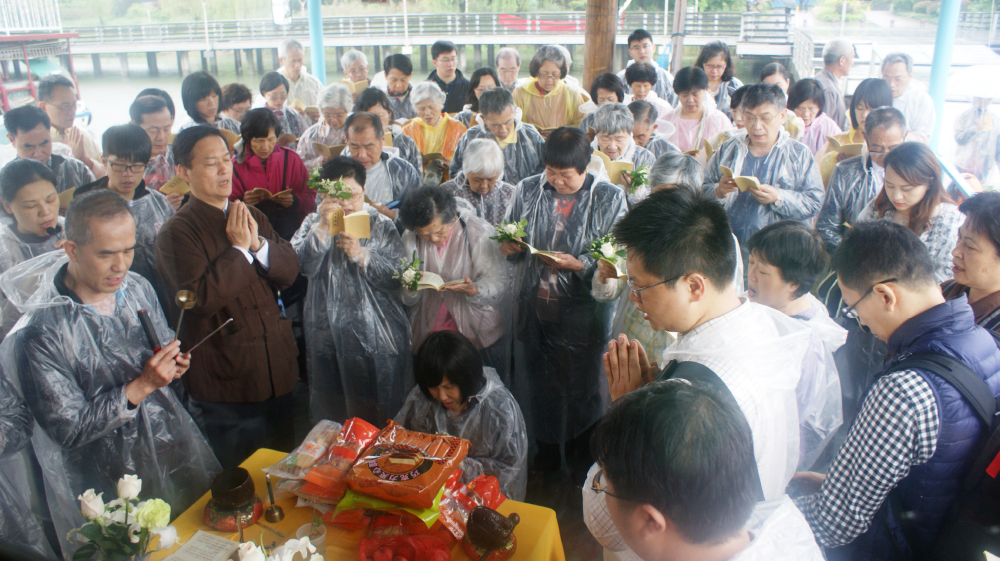

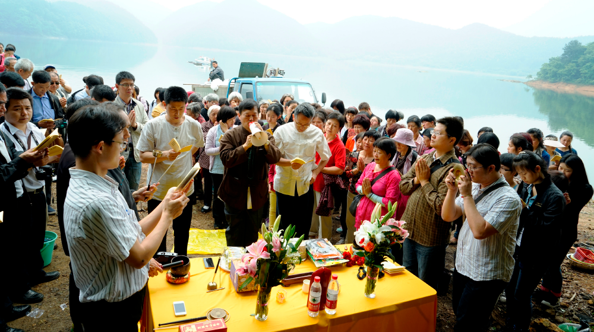

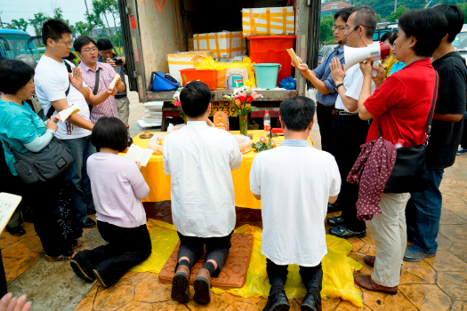

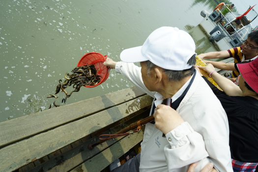

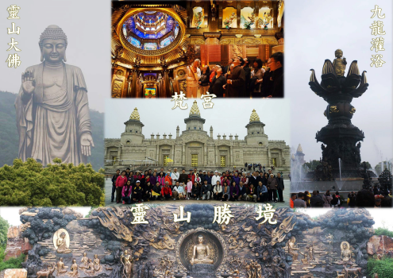

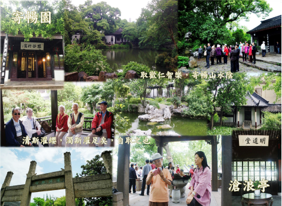

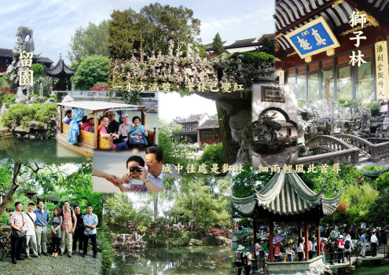

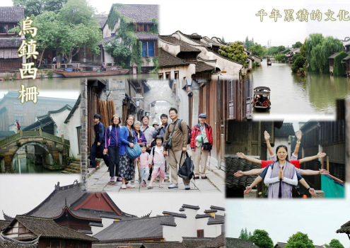

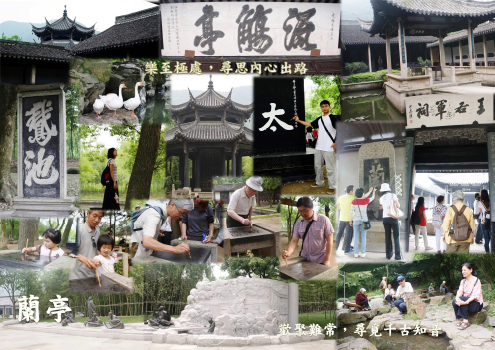

### 二○一四年暮春江南行　江浙行放生法行觀修

*淨本整理*

能放所放性空寂

感應道交難思議

放生道場如帝珠

諸佛加被影現中

放生的法行，最重要的是心態跟知見，有正知見，良好的心態，才能真正營造善法，讓放生的人、所放的生物，都得到最大的利益。此次江南放生，沿途師長講述許多觀念，讓同行者皆能廣獲法益，如法放生。茲整理如下，使現在、未來一切有心於放生、護生的行者，都能有所增上。

白塔湖放生，灑淨誠盼不受網補吞殺享天年

一、珍惜美好因緣

成就一次大型的放生活動因緣，是十分的不容易，因為每個人都有自己的家眷，俗務纏身，面對這樣難得機會，到底要不要參加，必須要有所抉擇。而很奇妙的，有些人中途加入，有些人在最後關頭退出，這如臨命終時，有些人一生修行，竟然墮落，有些人平常沒修行，最後湊足因緣殊勝往生了。其實這和我們往昔的發心、所結的善緣，乃至於眷屬護持都有很大的關係。

所以人應該要戒慎恐懼、戰戰兢兢，不能抱著自以為是的心態，認為過去有許多諸佛，未來也一定也有許多諸佛來度我，甚至認為自己是一定會往生的人。其實邏輯推理可知，過去已經有不可思議數目的諸佛出現於世，而我們今日還是輪迴，如果在願力上、善根福德上沒有深厚地去累積，未來也是跟今天一樣而已，依然是凡夫，依舊要墮落。

東白湖放生

所以我們要下定決心改變自己，從有團隊、有善法來做徹底的改變，使自己在身心、知見上都能做調整，真正重新出發，相信許多美妙的事情都會發生。此外透過大眾的聚會來營造正法的環境、和諧的環境，使其他的團體相觀而善，這種教化的力量是潛移默化，功德最為殊勝。而此行所放的生物也都能獲盡天年，速生淨土。包括沒來的眷屬，也都能因為我們的善法，而得到殊勝的增上，都因為我們共同造的共業，轉動殊勝的法行。

萬法自體性不可得，透過造作，甚麼樣的未來都可以生起，有無限的可能，就像國家在積極建設，整片荒蕪的土地也可以變成高樓大廈。有為法與其價值都是人在創造，佛果也是人造作出來的，極樂世界亦復如是，既然是造作而成，何樂而不為。

二、放生應有的觀修

歡喜心

歡喜心對我們有許多好處，首先歡喜可以讓身體健康，憂鬱則讓人生病；而歡喜也使人下次在做善法時動力充足，信心滿滿。因此做善法的前、中、後，乃至於迴向，都要修歡喜心。歡喜心該如何修？透過團隊來共同造作善法，相互鼓勵，心中能夠明白，唯有歡喜做善事，才可以有最殊勝的善業，有善業才能得到快樂，而且大家做善的力量，遠遠大於個人的努力。《佛說四十二章經》以火把傳火為喻，點亮他人的黑暗，手中的火把不因傳遞而有任何損失，眼前反而更為光明。

放生也是如此，自己放生之外，又找別人一同參與，多了一個人的快樂，善法的功德更大，畢竟善法是來自於給眾生安樂才能成立善法，造共業的善與別業相比，是百千萬倍的增上。所以要以最歡喜的心，靠著眾人的和合，共同造善。

滿身魚腥的第一線英雄

慈悲心

在放生旅途上，一行人來到了西湖，過去在吳越王時期，此處鑿了許多的放生池，表示國家雖然沒有辦法禁止百姓殺生，但是國家仍有護生的心意，藉此長養百姓的慈悲心。慈悲心的長養有許多面向，例如行動上對小動物的愛護，從生物的心態，體會有情的痛苦與迫切。還有所謂見其生不忍視其死，聞其聲不忍食其肉，甚至是在生活環境上的講究；但更重要的是：己欲立而立人，己欲達而達人，這是仁心的講究。

己欲立而立，是自己能在志於道，據於德，依於仁上好好充實，也同樣幫助別人在這方面成就；己欲達而達人，則是想讓自己通達六藝，也想讓有情通達六藝。所以整個仁心其實是充實自己形而上的學問，和形而下的學問，並且利樂有情，使有情也能如此，這就是仁心的全貌。做法上則是由近而遠，由親及疏，叫做能近取譬，可為仁方。從家裡做起，再向外推展。

護生熱誠與合作

因此現前的放生法行，一方面先長養自己的慈悲心，進而還要以成就仁心為目的，使自己在待人處事肯替人著想，肯留餘地，甚至有能力為他人謀了生死的出路、成佛的出路。

六度

懂得愈多，善法就攝持得愈廣。比如說放生可以是一種布施，包含了財布施、法布施、無畏布施。財布施就是出錢出力，法布施是要按照儀軌而行，無畏布施則是雖然放生遇有障礙，但是都能克服困難。放生也是持戒，就是在放生中能夠降伏自己刻薄寡恩的心。生物種類數量繁多，要慢慢地放，或者因為疏失被人責備，要能改過，就是放生所攝持的忍辱。這樣的法行能勇悍地做，就是放生的精進。放生中能專注於教法，將教法與放生結合，就是放生所攝的禪定。

放生又能做三輪體空的觀察，則是放生所攝的般若。何謂三輪體空的觀察？放生活動要有能放的眾生和所放的魚類，還要有中間的助緣，包括氣候、場地、政局的安定、暇滿的人生。有這些條件的組合，才有放生活動的生起。然而即便有這些條件的組合，也未必能有放生的活動。所以諸法自體空寂，都是善、惡業的感召，因為沒有自體性，所以都是名言的安立。而放生的功德也只能在正知見下生起，因為造作的動機及組合條件的不同，生起的功德也是千差萬別。

所以說：能放所放性空寂，感應道交難思議。諸法本質是空，現前是夢幻泡影，用什麼樣的心態辦事，中間過程如何克服障礙，如何降伏煩惱習氣，如何有團隊共識，如何在現場經營莊嚴、守規矩環境，遇到變局的時候如何處變不驚，莊敬自強，在需要抉擇的時候是不是能慎謀能斷，都將在果報上說明我們是正用心還是錯用心。

成佛法行

對佛法有認知，才會讓法變成善法，變成佛法，變成解脫法。所以放生法行的結果，到底是此生安樂、來世得人天的法行，還是解脫的法行、成佛的法行，三寶不能決定，決定在自己，端看自己如何善用其心。所以古人說：運用之妙，存乎一心。用心用得對，就成為解脫的法行、成佛的法行，成為能夠攝持六度的法行、攝持普賢十大願的法行、攝持廣大菩薩行的法行。將此放生功德莊嚴佛淨土、利樂有情、莊嚴佛果，成為自己成佛的增上緣。

白塔湖放生

結合淨行品的觀修，稱為：若放生時，當願眾生，放逐惡障，究竟成佛。我們把生物放出去，有沒有解放自己？解放自己的煩惱障跟所知障，這是放生最究竟的目標。

三、遵從儀軌的放生

依循著儀軌放生，這是放生法行的核心。因為唯有如此，所放的生物才能跟法結上殊勝的善緣，否則就跟一般人做善無異。特別是生物在心情歡喜的狀態下與法結緣，將來感應的是有機緣聽聞正法，而且是歡喜地聽聞，如此一定能迅速成就。此次江南放生法行，因為雪廬老人的威德攝受，使各地放生團體能夠願意依照學會的指示來進行，也因此讓不曾依照儀軌放生的團體，產生很大的啟發。

四、其他放生應注意的重點

除了以上事項，在放生過程中，還有許多要注意的重點：

（一）所放生物必須是救於刀口之下，避免因放生反而長養屠家利益。

（二）放生應該隨緣隨意，有多少經費就放多少生物。學會仍是以辦教育為主要事業，而放生亦是一種教育事業，能長養慈心，善用智慧辦事。

（三）放生經費專款專用。

（四）放生要講究存活率。

（五）藉由放生培養辦事人才。包括事前場地勘查、買生物、布置場地、法器、規矩、佛號唱誦等等。辦事人員要眼觀四面、耳聽八方，事先準備，一切井然有序，莊嚴、有內涵，如此才能在行善法中得到他人認同，獲得最殊勝的利益。

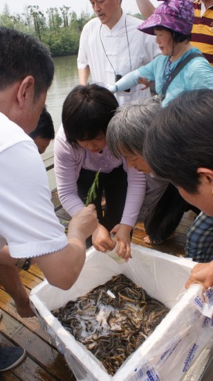

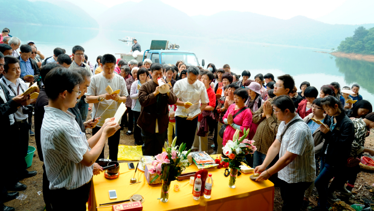

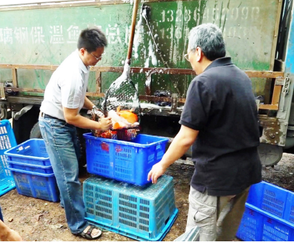

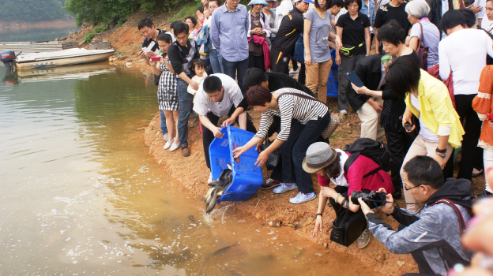

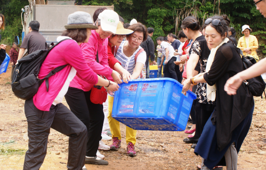

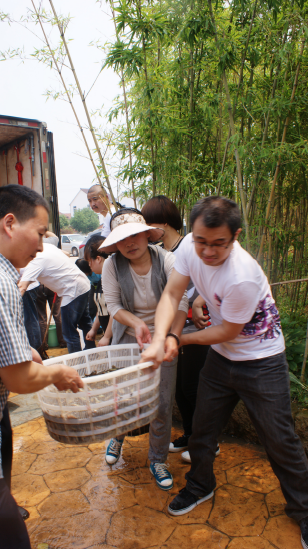

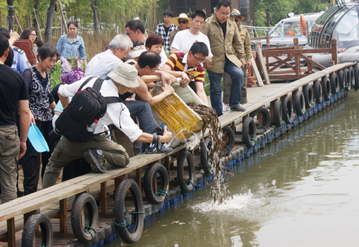

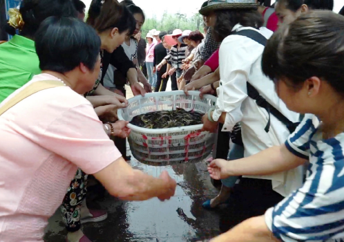

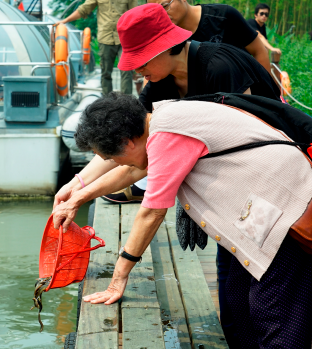

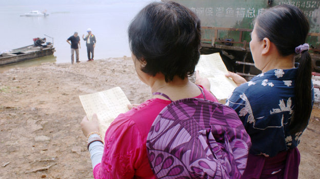

### 二○一四年暮春江南行　簡說江南園林

淨爾

滄桑園林史

寄情玩賞處

遊覽人如織

品出真味否

中國園林建築發端甚早，先秦到秦漢為園林的生成期，這段時期的園林為帝王、貴族打造的園囿，佔地廣袤，以天然風光為主，園囿中雖有宮室建築，但主要功能還是以帝王遊獵行樂為主，因此林中豢養著各種野生動物。

園囿至漢代發展為苑，例如上林苑即畜有各種奇珍異獸，於是有人將上林苑比喻為中國最早、最大的天然動植物園。在畫家顧愷之的女史箴圖裡有一卷〈玄熊攀檻、馮媛趨進〉，畫的就是漢元帝在上林苑遇到熊，馮妃挺身救駕的故事。

到了崇尚清談、玄學的魏晉南北朝，園林藝術追求自然，從單純的模仿自然山水演進為抽象化、概括化。園林的狩獵功能消失，遊賞功能興起。皇家園林建設納入都城規劃，而私家園林主要分為兩種：一是崇尚華麗奢靡、爭奇鬥艷的貴族官僚園林。二是寄情山水的文人隱士所蓋的園林，此園林為後代文人園林的先驅。

隋唐兩宋被視為中國古典園林的全盛期，造園手法豐富，不論皇家或私人園林均有高度成就。

根據《隋書》記載，隋煬帝大興土木：「西苑用二百里，其內為海，周十餘里，為蓬萊、方丈、瀛洲諸山，高百餘尺，臺觀殿閣，羅絡山上，海北有渠，緣渠作十六院，門皆臨渠，窮極華麗。」

唐代的造園活動和宮苑建築比起前朝有過之而無不及，唐明皇為楊貴妃所造的華清池，以及詩人王維的輞川別墅分別為皇家和私家園林代表。

宋代是中國藝術發展的鼎盛時期，許多文人也參與造園，宋代郭熙論山水畫，其「有可行者，有可望者，有可遊者，有可居者」。可行可望可遊可居正反映了當時造園的觀點。宋代時的園林從山林泉野轉入在城市內造園，因此大量出現堆疊假山、人造泉池等景觀，一如中國繪畫，寫意重於寫實。

元代園林不如宋朝發達，私家園林以畫家倪瓚參與造園的蘇州獅子園為代表。

明清兩代不論皇家或私人園林均發展到高峰，留下許多極具代表性的園林建築，是中國古典園林的成熟期，強調人工化，造山造水的手法巧奪天工。

江南的私家園林相較其他地區的園林複雜靈巧，多以水池為中心，以太湖石或黃石堆疊山景，粉牆、漏窗、迴廊，在有限空間內創造百轉千迴、柳暗花明又一村的驚喜。修築於明朝萬曆年間的無錫寄暢園同重山景和水景，巧妙地將遠山的寶塔引入山水景觀中，為造園手法中「借景」的代表作。

宋元明清四朝以來的私家園林以蘇州為盛，滄浪亭、獅子林、拙政園、留園，分別為四朝私家園林建築代表。蘇州氣侯溫潤宜人、水網密布、物產富足，自古以來即是文人雅士聚集之地。隨著交通和經濟的發展，造就不少富商巨賈在家鄉興土木造園林，加上解官卸職回鄉築園安養天年者，在江南興起造園的風氣，例如清同治年間抱病下野的沈秉成，即在蘇州修建耦園，作為和愛妻的隱居之地。

清代康熙和乾隆皇帝先後下江南，造訪蘇州園林，為蘇州園林留下不少匾額、詩作和趣聞。

園林內涵豐富，橫跨歷史、文學、繪畫、建築、雕刻、書法……，為一綜合性藝術表現。其工藝手法複雜，構局巧妙，將自然山水收納在一方庭園之中，如一卷軸畫，景物建築在移動中緩緩展開，實非憑單次造訪區區千字能道盡，以下，嘗試從不同於今人遊園書寫的角度分享江南的私家園林之一二。

之一　故人故景故事

「清風明月本無價 近水遠山皆有情」

這幅刻在蘇州滄浪亭的對聯上聯，為歐陽修所作，下聯取宋代詩人蘇舜卿詩作而成。

滄浪亭原為五代吳越廣陵王錢元璙的花園，乃現存最古老的江南園林，宋代文人蘇舜卿(註一)因追隨范仲淹變法，失敗遭貶，流寓蘇州，時暑氣蒸騰，覓得此清涼地，以四萬貫錢買下，在此築亭，並命名為滄浪亭，滄浪二字典出《楚辭》〈漁父篇〉：
被放逐的屈原在江潭邊遇到一位漁父，漁父見到他便
**問：** 「這不是三閭大夫嗎？怎麼跑到這裡來了？」屈原回
**答：** 「舉世皆濁我獨清，眾人皆醉我獨醒，是以見故。」漁父因而勸他聖人應該與世推移，世人都汙濁了、喝醉了，何不隨波逐流，何必想那麼多自視那麼高，讓自己被流放呢？屈原表示他寧可投身江流葬身魚腹，也不能讓皓皓的貞節受到世俗塵垢的汙染。漁父於是莞爾而笑，輕叩著船舷離去，邊唱著：「滄浪之水清兮可以濯我纓，滄浪之水濁兮可以濯我足。」

滄浪亭

和屈原一樣被貶放的蘇舜卿取漁父之意而命「滄浪亭」，自號「滄浪翁」，並作〈滄浪亭記〉。歐陽修也以「清風明月本無價，可惜只賣四萬錢」題詠此事，使滄浪亭一時聲名鵲起。

蘇舜卿〈滄浪亭記〉：「予以罪廢，無所歸。扁舟吳中，始僦舍以處。時盛夏蒸燠，土居皆褊狹，不能出氣，思得高爽虛辟之地，以舒所懷，不可得也。

一日過郡學，東顧草樹鬱然，崇阜廣水，不類乎城中……。予愛而徘徊，遂以錢四萬得之，構亭北碕，號『滄浪』焉。前竹後水，水之陽又竹，無窮極。……。予時榜小舟，幅巾以往，至則灑然忘其歸。觴而浩歌，踞而仰嘯，野老不至，魚鳥共樂。……」

大意是蘇舜卿因罪下野，無所去處，來到蘇州一帶尋覓安身之所。時值盛夏，當地民居狹小悶熱，希望找個地勢高、清爽又隱密之處卻不可得。一天經過郡學(古時地方學府)，往東看草樹翁鬱，有山有水，和城中景色大異其趣……。於是以四萬貫錢買下，在河岸北邊修築亭子，命名「滄浪亭」。前有竹林後有流水，水之南面又有竹，水與竹望之無窮盡……。有時划著小船，戴著頭巾前往，欣然忘歸。飲酒高歌，仰天長嘯，人跡罕至，魚鳥共樂。

由此可想像蘇舜卿當年在杳無人跡的滄浪亭畔，自我作樂縱情長嘯的隱逸之樂。

蘇舜卿之後，滄浪亭幾經易手，南宋紹興年間，歸抗金名將韓世忠所有，改名「韓園」。韓世忠一生以三件事為後人津津樂道：一是力阻金兵南下，為國立功，因為曾經護駕有功，使他一家在奸臣當道時代仍能保全其身。二是夫人梁紅玉也是一代巾幗英雄，各種野史筆記、通俗文學、戲曲都記載著梁紅玉不讓鬚眉的事蹟。三是力抗秦檜營救岳飛。

以罪廢的蘇舜卿放下俗務隱逸滄浪亭，但一生兵馬倥傯身處動盪之世的韓氏夫妻在滄浪亭的假山流水中，想必也難安於沖礦、不與眾驅。

宋代之後，滄浪亭成為「大雲庵」，兩百年後，明代時居於大雲庵的文瑛和尚請文人歸有光也寫一篇〈滄浪亭記〉，說從前蘇舜卿的滄浪亭記，記的是滄浪亭的勝境。現在則記載重修滄浪亭的經過。

歸有光於是記載如下：「昔吳越有國時，廣陵王鎮吳中，治南園於子城之西南。……。蘇子美始建滄浪亭，最後禪者居之。此滄浪亭爲大雲庵也。有庵以來二百年，文瑛尋古遺事，複子美之構於荒殘滅沒之餘，此大雲庵，滄浪亭也。」

歸有光感嘆古今變遷、改朝換代，並提到他曾登臨姑蘇台眺望遼闊的太湖群山，想到太伯讓位季歷來到吳地斷髮紋身，春秋時吳越爭霸，伍子胥、范蠡、文種均曾經營此地，如今已是過往雲煙，那麼廟庵和亭子又算得了什麼呢？五代時吳越國傳了四代，國富兵強，可是他的子孫姻戚逾分越禮，當時的宮廷館閣園林雖達到一時盛況，但蘇舜卿的滄浪亭卻能為文瑛和尚如此重視，可見士人追求流芳百世，不和外界同流是有其道理的。

明清之間，滄浪亭又易主多次，直到清朝康熙年間，巡撫宋犖重建此園，將涼亭從水畔移建于山丘之上，並以文徵明隸書「滄浪亭」為匾額。

時至清朝乾隆年間，居於滄浪亭畔的沈復在其著作《浮生六記》中描述，偕同新婚妻子芸娘夜遊滄浪亭：「中秋日，余病初癒。以芸半年新婦，未嘗一至間壁之滄浪亭，先令老僕約守者勿放閑人，於將晚時，偕芸及余幼妹，一嫗一婢扶焉，老僕前導，過石橋，進門折東，曲徑而入。疊石成山，林木蔥翠，亭在土山之巔。循級至亭心，周望極目可數里，炊煙四起，晚霞燦然。隔岸名『近山林』，為大憲行台宴集之地，時正誼書院猶未啟也。攜一毯設亭中，席地環坐，守著烹茶以進。少焉，一輪明月已上林梢，漸覺風生袖底，月到波心，俗慮塵懷，爽然頓釋。」芸曰：「今日之遊樂矣！若駕一葉扁舟，往來亭下，不更快哉！」時已上燈……，相扶下亭而歸。吳俗，婦女是晚不拘大家小戶皆出，結隊而游，名曰「走月亮」。滄浪亭幽雅清曠，反無一人至者。」

沈氏夫婦在中秋夜於滄浪亭飲茶賞月，好不愜意。由此可見在乾隆年間滄浪亭已是當地可供民眾遊賞的名勝。

其後，隨著時代和社會的變遷，滄浪亭多有興廢，同治年間又再重建，後有歷經荒廢、重修等過程，始成現在遊人所見之貌。

之二　說建築

西方以「美觀、實用、堅固」(註二)作為建築原則，中國則講究「正德、利用、厚生」(註三)。不論東方或西方，都重視建築的實用性，但西方重建築的外觀之美，中國重主人的內在之德；西方重視建築的堅固性、長久性，大部分重要建築係為宗教服務而存在，但中國則重視建築的厚生之德，與人的關係密不可分。

已故的北京清華大學教授梁思成先生曾提出東西方建築迥異的其中兩項特徵，在江南私家園林可窺見一斑：

一、中國建築受道德觀念約束。

二、布局重視等級的規劃。

早期的中國，家宅和園林分置，一路發展到在宅院內可以欣賞山林景色，可賞可住可遊，提高園林生活享受的功能。受限於人口密度和土地面積，所以必須在有限空間創造豐富的建築和景觀，於是在宅院的規劃和庭園的布置上出現細膩、曲折的設計手法，在空間上追求各種變化：開合、收放、明暗、大小、層次、虛實……等。清代沈復曾在《浮生六記》談及造園技巧：

「若夫園亭樓閣，套室迴廊，疊石成山，栽花取勢，又在大中見小，小中見大，虛中有實，實中有虛，或藏或露，或淺或深。不僅在「周、迴、曲、折」四字，又不在地廣石多，徒煩工費。或掘地堆土成山，間以塊石，雜以花草，籬用梅編，牆以藤引，則無山而成山矣。大中見小者，散漫處植易長之竹，編易茂之梅以屏之。小中見大者，窄院之牆宜凹凸其形，飾以綠色，引以藤蔓；嵌大石，鑿字作碑記形；推窗如臨石壁，便覺峻峭無窮。虛中有實者，或山窮水盡處，一折而豁然開朗；或軒閣設廚處，一開而可通別院。實中有虛者，開門於不通之院，映以竹石，如有實無也；設矮欄於牆頭，如上有月台而實虛也。」

文中的「大中見小，小中見大，虛中有實，實中有虛，或藏或露，或淺或深」，畫龍點睛地點出中國園林特色並非只在一般易見的「周迴曲折」，也不在地廣石多，而是在大小虛實中，見其園林設計的功力。

根據梁思成先生所說，中國建築以木料為主要建材，對於石結構的力學特徵，普遍認知不足，多半是把石結構當木結構對待。建築是構架制，以斗拱為結構基礎，建築的正立面多為玲瓏剔透的木刻造型：前廊、勾欄、門窗、格扇等，建築群多由多重院落組成。以上這些特徵，很容易在造訪江南園林時得到印證。

例如清代的知名園林—留園，進入低調的大門後須經過一番曲折迂迴的長廊方能進到內部廳堂，僻靜幽暗的長廊轉角時有一方陽光灑落竹葉的天井，看似無奇的角落卻有一扇花窗框住窗外的芭蕉樹，自成一張風景畫，在無路處總能豁然開朗，在平凡處卻有小驚喜。講究「透、漏、瘦」的太湖石、匠心堆疊的擬真山水、亭台樓閣、小橋廊榭的布局、花草樹木的映襯、遠近景的搭配，既可看出主人藝術取向和生活品味，也增添遊人趣味，讓人無論從哪一處觀看，皆是完美構圖、詩畫美景。

之三　玩石

古文中若提到「五湖」，往往意指太湖一湖，所謂太即大，對於少有機會臨海的古人而言，太湖已是湖光萬頃、波瀾壯闊如汪洋了。住在太湖濱的人們賞太湖景、喝太湖水、用太湖水、食太湖蝦，甚至，拿太湖石來造景。

太湖石實為石灰岩，有水、旱兩種，旱的是太湖周邊山林之石，水的是太湖裡的石頭。想當然耳，太湖石以水中石為貴。

宋代范大成〈太湖石志〉提到：石出西洞庭，多因波濤激湍而為嵌空，浸濯而為光瑩。或縝潤為矽瓚、廉劌如劍戟、矗如峰巒、列如屏障，或滑如肪，或黝為漆，或如人如禽鳥。好事者取之以充囿庭除之玩。石生水中者艮歲久浸，波濤衝擊成嵌空。石面鱗鱗名曰彈窩，亦水痕也。扣之鏗然聲如磬。

大意是說，太湖石受到水流沖激而鏤空，因浸泡水中而顯光華晶瑩，有的受到潤澤而如寶玉，有的像是被尖利之物雕琢得像兵器，聳立如高峰山巒，排列如屏障之物，有的光滑如油脂，有的黝黑如漆，有的像人像鳥像動物。喜歡的人取太湖石放在園林裡賞玩。石頭在水中久經漬潤，受侵蝕而出現空洞。石面光亮如彈窩，也是水痕之故。敲敲石頭鏗然作響，狀聲如磬音。

明朝〈長物志〉也寫到：「太湖石在水中者為貴，歲久被波濤衝擊，皆成空石，面面玲瓏。」

唐代詩人白居易也愛石，為石作了多首詩，其「 才高八九尺，勢若千萬尋。」形容出小石大氣勢。「石雖不能言，許我為三友」則道盡其愛石之心。白居易並寫有〈太湖石記〉一文描述太湖石之奧妙。

留園和獅子林均因太湖石而聞名，留園的園主人愛石，園中有三塊石峰，分別為冠雲峰、瑞雲峰和岫雲峰，其中，玲瓏剔透、具備皺、漏、瘦、透特質的太湖石特色的冠雲峰素有「江南園林峰石之冠」的美譽。相傳，這塊曾經沉潛太湖底的奇石為北宋花石綱遺物。北宋時，十艘船稱為一綱，宋徽宗計畫興造園林，欲從各地蒐羅奇珍異石，造成蘇州一帶地方官員以上意之名搜刮各地花石，所到之處強取民財、徵召民伕、拆橋毀路、民不聊生，終致百姓起義，此事後來被羅貫中引用寫入《水滸傳》，即宋江起義智取生辰綱一段。

獅子林號稱為假山園林之首，園中收藏大量太湖石，堆疊太湖石成崇山峻嶺、有崖有谷有洞穴有隧道，遊來曲折複雜、趣味無窮。其中的九獅峰像有小獅嬉戲母獅下，為獅子林中一趣景。前人形容獅子林「人道我居城市裡，我疑身在萬山中」，道盡獅子林的山石奇趣。

之四　工藝傳承

園林藝術的發展，相關因素如政治經濟的發展、社會安定、文化的雅好等，還有一重要關鍵，即在於工藝技術的成熟。

相較於西方在兩千多年前即有建築相關論述出現，中國遲至北宋才有《營造法式》一書的出版，對建築的材數、制度做出規範與說明。明代姚承祖出版《營造法原》，記述蘇州香山幫的建築工藝，此書因此被譽為中國南方建築寶典。

香山位在太湖濱，已有兩千五百多年歷史，是吳文化發祥地之一。自古以來出工匠，木匠、泥水匠、漆匠、堆灰匠(泥塑)、疊山匠、雕刻匠(木雕、磚雕、石雕)、彩繪匠……結合建築的技術與藝術，形成「香山幫」一脈，並創造出領導一方的蘇派建築風格。

蘇式木雕根據空間和作品形象發展出鏤空、浮雕、立體圓錐和淺雕等四種傳統技法，作品特色是精、細、雅、麗。一刀一刀透過減法使作品既保有材質特色也兼具自然、立體、生動的樣貌。

春秋戰國時期，吳國善冶金，其鑄造的刀劍兵器、斧鋸刨鑿等物均為一時之選，所謂工欲善其事，必先利其器，為當地工匠提供優良的工具是工藝發展的第一步。太湖鄰近的樹木、石頭(太湖石、石灰石、黃石等)提供了建築所需的良好材料。伍子胥在今蘇州造城、吳王夫差的姑蘇台、館娃宮等重大建設均促成工匠的養成。漢代到唐代，道觀寺院建築興起，讓當地工匠的技術能持續磨練、代代相傳，進而在宋元明清四代，得以打造出一座座精美的園林建築。

很少有人知道，北京的天安門、紫禁城和蘇州園林一樣，建造者同出於香山幫一門，隸屬蘇派建築。香山幫以工藝純熟、結構緊密、布局精巧、又具備文化的深厚內涵而享有盛名，在歷史上出現不少具代表性的建築宗師人物。明朝永樂皇帝朱隸遷都北京，計畫在北京建造超越南京的皇宮時，徵召來自全國各地的工匠技師，來自香山的蒯祥帶領香山幫匠人在日後以傑出的技藝承擔起宮殿的設計與營造工作，其後又負責天安門及文武衙署、黃帝陵寢的營造，奠定明清建築基礎，為明朝建築界的一代宗師。

蒯祥之後，清代的姚承祖也是香山人，其著作《營造法原》改變了中國建築向來仰賴師徒口傳心授，文獻不足的缺憾，影響後代深遠。

然而，雖然香山幫已被列為非物質文化遺產，但迄今也面臨後繼乏人，工藝失傳的景況。傳統雖好，無人傳承，今人也只能藉由遊覽古蹟，感嘆前人工匠之精湛。

文盡意未盡

中國園林建築範圍廣大，即便不論皇家建築與宗教建築，單就私家園林，即不只江南一地，各地的園林因著不同的氣候地理環境、風俗習慣、建材工藝用途差異而有著不同風貌。

在習於生活在西方建築的鋼筋水泥、玻璃帷幕中的我們，過去僅能依藉古人文章、小說、詩詞的描寫來「想像」文中園林樣貌，但那樣的想像，實則離我們的具體生活經驗太遙遠。唯有親自走過一遭，方能粗略理解湯顯祖《牡丹亭》中杜麗娘對丫寰說：「不到園林，怎知春色如許？」大門不出二門不邁的閨中小姐杜麗娘在遊園時吟唱著：「原來姹紫嫣紅開遍，似這般都付與斷井頹垣。良辰美景奈何天，賞心樂事誰家院。」那樣的姹紫嫣紅、良辰美景如同易逝的韶光，短暫而淒迷。

紅樓夢裡曹雪芹以大段大段的篇幅描寫大觀園，說是「天上人間諸景備，銜山抱水建來精」，裡面多少亭台樓閣、曲水假山，可惜讀來就像劉姥姥，在目不暇給的大觀園裡迷了路。訪過江南園林，就像心裡從此有個對照圖：原來是這麼回事。下回，再進到大觀園裡，或許可以把蘇州留園放大，多加點百轉千折、套室迴廊，以此對照一下大觀園，應該不至於在原地打轉了。

近代書寫園林，寫得最好的，私自以為是海派作家王安憶女士，她在《天香園》一書裡，藉由園林文化的窮奢極侈，及刺繡工藝的發展述說仕紳家族的盛極而衰。其書中談到的造園或描繪的山水景觀，真實生動又具備古典的優雅。

園林中的文學很豐沛，文學中的園林其實也不遑多讓。

閱讀的樂趣之一在於見識不同風光、領略不同的人生。

旅遊的樂趣之一在於走入詩畫文學裡，從景門進，由文藝出。

中國的園林又特別重視與人的互動，滄浪亭的特色是園外的長廊和小河，外邊人隔著河賞滄浪亭的景，獅子林是座大人小孩都愛的可以爬、可以鑽、可以繞、也可以休憩的假山迷宮。耦園內可感受耦園有佳偶的鶼鰈情深，外有私人碼頭供乘船進出，別有一番遊趣。

園林中常出現的圖像如海棠花(花中神仙)、鶴鳥、葫蘆、五蝠(福)捧壽、蓮花蓮藕、梅花……等均象徵著園主人的德性與雅好。滄浪亭多栽竹，明顯地隱喻著主人的自我期許。耦園舊主愛蘭，留園獅子林都藏石，各各有其蘊意。

每一座園林都是文化藝術累積而成，當我們說到中華文化博大精深之時，園林建築其實也是這博大精深文化的表現形式之一。園林以具體形貌，展現中國文人的風雅生活，反映各時代的建築流行與生活文化。如今，當我們穿梭其中，在絡繹不絕的遊客群中，只能藉由山水建築遙想曾有的風華，以及那林梢微風間些微透露的古人的閒情雅趣。

故人故事故景

非山非水非情

一泓池水，雨落葉落人凋落

一方園林，風過事過遊客過

註一、蘇舜卿，字子美，與范仲淹、歐陽修、梅堯臣等同時代。人稱「岳陽樓四絕」，一為滕宗諒重修岳陽樓，二是范仲淹寫岳陽樓記，三絕就是蘇舜卿的書法 四絕是邵竦的篆刻。

註二、西元前古羅馬建築師維特魯威在《建築十書》中提出以美觀實用堅固作為建築三原則。

註三、典出尚書 大禹謨：「德惟善政 政在養民 水火金木土穀，惟修正德利用厚生，惟和。」

參考資料：

經典 屈原 楚辭 ，麥田出版社

中國建築史    木馬文化

Edx 清華大學 中國建築史上、下

古文觀止  三民書局

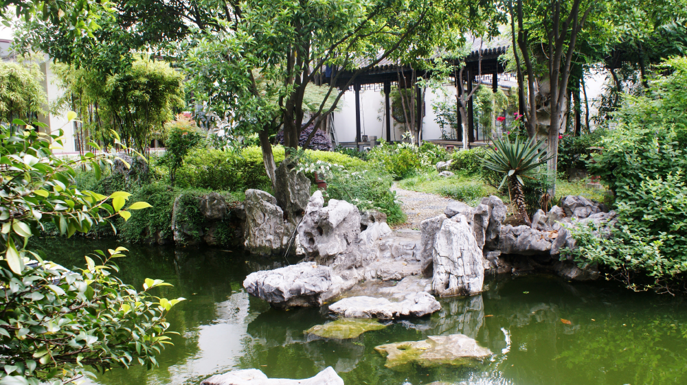

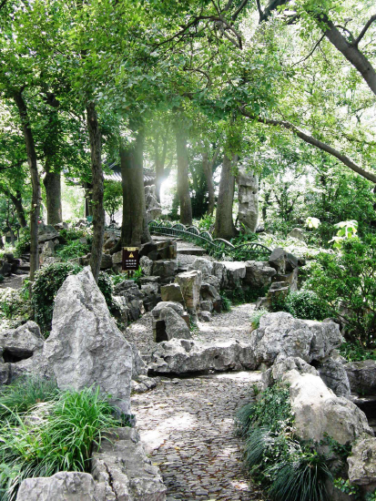

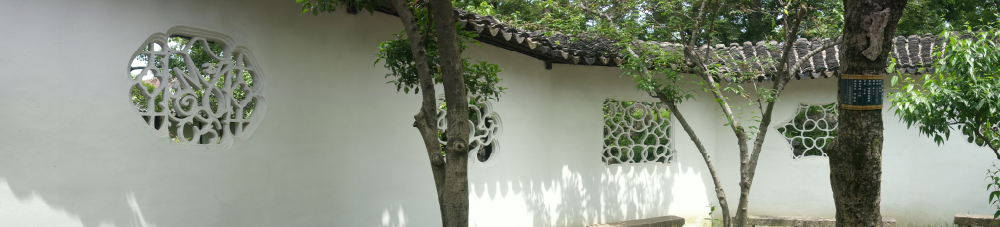

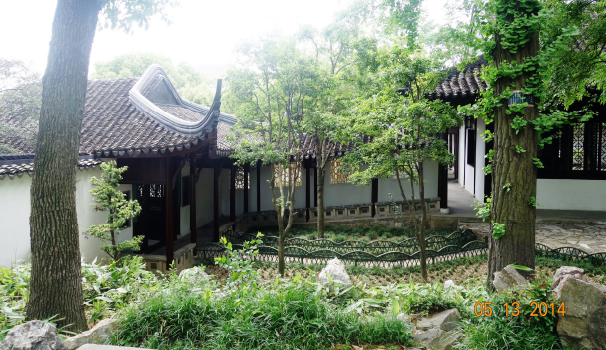

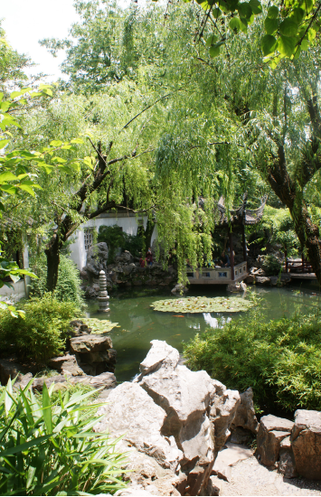

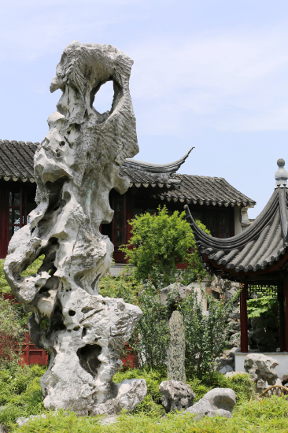

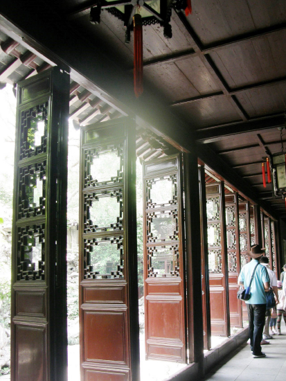

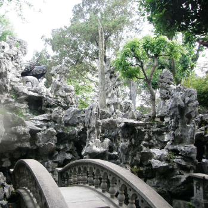

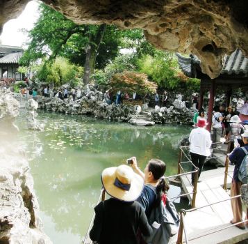

### 二○一四年暮春江南行　重新點妝的古蹟—烏鎮

心若

詩意江南烏鎮情

世外桃源水鄉街

煙雨斜陽路行人

欸乃一聲飛橋過

白蓮寺

烏鎮，一個千百年來臨河而建的古鎮，一個美麗富饒的水鄉澤國，位於浙江省桐鄉市北端，京杭大運河西側，現有東柵和西柵兩個歷史街區對外開放。東柵呈現原汁原味的江南水鄉風貌和濃郁的生活氣息，以手工作坊和傳統商鋪聞名。而我們走訪的是西柵景區，西柵是一個觀光度假型的古鎮社區，由十二個碧水環繞的島嶼組成，政府利用重塑歷史建築的理念，將原西柵的居民遣散，重新修建古鎮，保留了明清建築群的古風神韻，保留了整體文化氛圍，又有古橋七十二座，以及寬闊清幽的河道，一切井井有條，富有整體感。修建完善後，政府又請回當地居民做員工，讓他們回到自己家鄉，又兼有工作，可謂智舉。

遊覽烏鎮，會發現它是由河流、小橋、長街三元素組合而成。我們大概難以想像，沒有河流的烏鎮會是怎樣的光景。河流是其命脈泉源，縱橫交織，注入生機與韌性，使之靈秀，使文化孕育而生。坐在河邊茶館裡喝茶，望著流水，內心會有說不出的平靜，思緒清澈，可縱橫千里。岸上錯落成片的民居，古色古香，與水互相輝映，相得益彰。

小橋是不可或缺的，可說是五步一橋，不管是石拱橋、石梁橋、曲橋、廊橋，都各有韻味，經過幾百年來的風風雨雨，連接了歷史，連接了人心，承載著各式各樣的人們，承載了文化，有了橋，偌大密集的河道才完整。至於長街，它的特點就是悠長，兩旁的建築並不是直線呆板的排列，而是稍微斜曲，顯得更加狹長清幽了。小街裡有各種的店鋪糕點茶坊，飄出誘人的香氣，味道裡含藏著地方風土人情，光聞也是一種享受。

除了店鋪茶坊外，街上還有許多著名景點，像是昭明書院，是中國古鎮中最具規模的圖書館，南朝梁昭明太子曾在此築館讀書，莊重而靜謐，為烏鎮增添了濃厚的人文氣息及文化底蘊。館藏豐富寶典，舉凡社會科學、藝術、休閒娛樂、文化等等資料皆備，目前仍在擴大中。光走在圖書館外圍，便可被它深厚的書院氛圍所感染。由於烏鎮陽光充足、氣候濕潤，環境優渥，無形中就養育了文人，可以說是地靈而人傑，然也因為人傑而地靈，互相觀待，造就了現今的盛況。而烏鎮向來有絲綢之府的稱號，其染坊及蠶絲被甚是有名，染布花色多樣，紋樣設計精巧漂亮，蔚為大觀。蠶絲被柔細舒適，手工天然。另外，烏鎮還保留了古老的郵局、消防局等等，讓我們略可了知當時人們的生活情形，萬分有趣。

清晨雨後潤澤的石板路                                                                          白日裡熙往擾攘的古街道

白天大家就在烏鎮隨意觀覽，與熙熙攘攘的各色人等過小橋、看雨中流水、穿梭街道、吃吃小點，體驗古鎮的歷史與情思，閒適而充實。

清晨的烏鎮

至夜晚，微微雨點，落在江上，悄無聲息，像極了一幅意趣盎然的中國畫。坐著小船，在欸乃聲裡徐徐搖擺，感受江面緩緩波動，如同一首輕柔的催眠曲，軟軟呵護。夜晚的烏鎮，處處有燈火，打在江上、岸邊、橋上，打在悠悠的石板路上，並不耀眼，而是昏昏黃黃、迷迷濛濛，配合幾點星雨，潑墨似的展開，美得超凡脫俗。岸上的人們跟船上的我們互相成為風景，互相品味，夜晚，就散落在如此的審美情趣裡，輕鬆愜意、自然祥和，不覺夜已漸深。

夜晚的烏鎮

夜宿烏鎮是很新奇的體驗，西柵景區內充斥著各類風格的度假酒店，幽靜純樸、舒適便利，可供近三千人住宿。枕水而臥，聽雨聲泠泠，滴滴答答，好似幾個可愛的小精靈在玩弄音符，如流水般溫柔，輕輕訴說一個既古老又富新意的故事。雨滴潮潤，壟罩著江南，氤氳了烏鎮，滋潤了人心，坐在房內靜聽冷雨，不覺淒涼，反而隱藏著一種覺醒、一種暢快，彷彿在雨聲中，洗滌了紛亂的內心。雨聲聽也聽不膩，令人上癮，令人陶醉，泡杯好茶，配本好書，又是另一番享受。烏鎮的夜晚，甜甜柔柔的、淡淡涼涼的，哄人入夢。

晨起，五點多的烏鎮，清風微寒，潤澤肌膚，經過夜雨的洗禮，霧氣消散，景緻一片開闊明朗，水中倒影清晰如畫，有一種空明，一種透亮，彷彿穿越千年，與我們交會。清晨人煙稀少，踏在濕濕的石板老街上，厚重踏實的古意襲捲而來，親和而貼近人心，霎時，自己活脫脫像個現代的古人，踩著歷史的洪流，經過歷史的滄桑，古人已付諸東流，浪花淘盡多少英雄，就像人生從幼年至衰老，只是倏忽之間，走著走著，就是一生。至早晨，人漸多，烏鎮小雨霏霏，「江南人留客不說話，只有小雨輕輕下」，這樣的烏鎮，怎捨得離去，煙雨烏鎮，已住進每個人的心房，但願有緣再來。

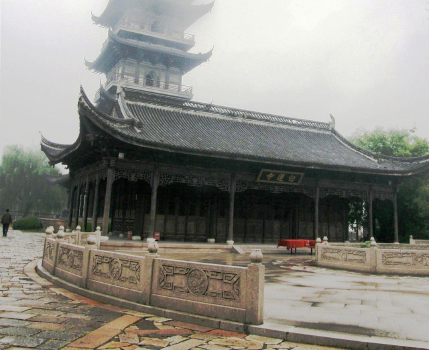

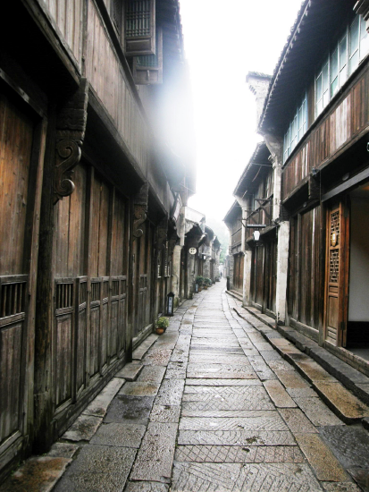

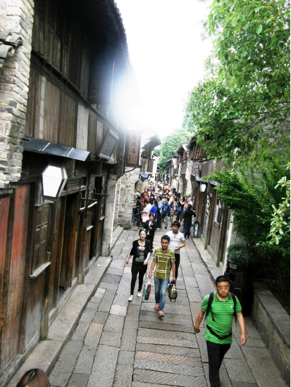

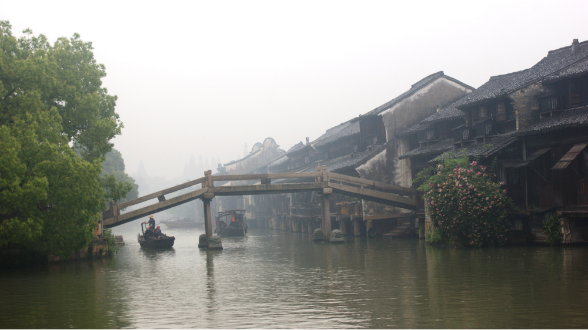

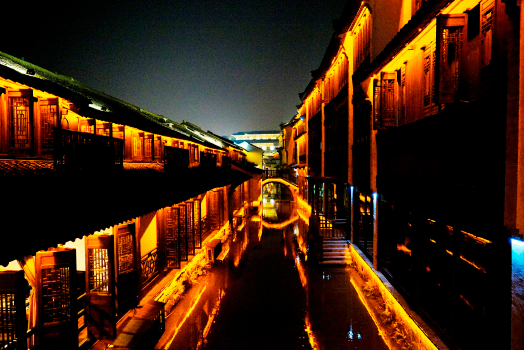

### 二○一四年暮春江南行　書法聖品之出—蘭亭遊踪

心若

文人雅士曲水坐

流觴佳詠作詩序

千古絕唱蘭亭作

留待後人覓出路

蘭亭，是東晉鼎鼎大名的書法家王羲之的故居，位於浙江省紹興市，因《蘭亭集序》而聞名。在東晉永和九年三月初三這一天，王羲之帶領著兒子王徽之、凝之、獻之，與謝安、孫綽、李充等名士集會於蘭亭，共四十二位，老少咸集，舉辦修禊之事。上古時期人民取水不易，冬天洗澡不便，及春天，氣候漸濕潤溫和，自然有洗身的必要，於是大家相約河邊洗淨，以滌去不祥及污穢，遂成風俗。

後來，文明日益發達，取水並無困難，而集會的傳統還是流傳下來，移風易俗，原在河邊洗澡的風俗改為在河邊禊飲，一則可緬懷前人的勞苦，表達對祖先的尊敬，再則也是讚歎文明日進，共同展望未來，這也就是所謂修禊事，作法別致而意義深厚。王羲之與眾人舉行修禊盛會，大家臨水而坐，飲酒賦詩為樂，抒發己懷，於是引出一條河道，作為流動酒杯的水道，將特製的酒杯投於水上，任其隨波而下，飲者自取，稱為曲水流觴，又稱為曲水宴，據說此種雅集最早源於周公。

禊飲過後，佳作集結，推派王羲之作序，王羲之遂於微醉之中，振筆疾書，寫成《蘭亭集序》，歷代書法家奉為圭臬，流傳千古，為人稱頌。《蘭亭集序》不只是行書之首，也是一篇佳文，當時魏晉南北朝盛行雕琢豔麗的駢文，而《蘭亭集序》卻是自然天成、真情流露、清新雋永、不類常流，讀之令人有所感悟啟發。

大小書法家蘭亭揮毫

文章可分兩部分來看，前半部敘蘭亭宴集情形，交代時令、地方及事由，說明有志一同的諸上善人聚會一處，宴飲為樂，環境清幽，茂林修竹，山環水繞，富有盎然生機，清波之上，一只只羽觴泛泛漂來，人們胸中，一陣陣暢敘懷抱的話語流出。天朗氣清，可仰觀宇宙，俯察萬物，極盡視聽之愉，如同論語先進篇所講的「暮春者，春服既成，冠者五六人，童子六七人，浴乎沂，風乎舞雩，詠而歸」，樂而不淫，非常歡快。

然筆峰一轉，後半段以悲為基調，蘭亭聚會固然樂，但天下無不散的筵席，古人會面難，聚短離多，聯絡不易，見完面可能就音訊全無，再見遙遙無期，無常的體會油然而生。且樂至極處必然生悲，因為人對於美好的事物必然眷戀，由眷戀而發現短暫，繼而害怕失去，害怕失去眼前的美好，害怕失去自己的青春，到頭來其實是害怕失去生命，於是「感性命之不永，懼衰落之無期」那種深層而強烈的惆悵感及失落感就席捲而來了，加上東晉政局紛亂詭辯，戰亂頻繁，死生大事尤其是文士無力掌握，令人悲從中來，感到哀痛。

不只是王羲之，古人亦為人生變化而興嘆生悲，乃至於現今的我們，也未嘗不臨文嘆息，雖然時代不同，事物變異，但這卻是千百年來同慨同悲。在末段，王羲之提出他不贊成莊子「一死生」及「齊彭殤」的概念，因為莊子說「孰知生死存亡之一體者，吾與之友矣」，即誰知生和死是一個整體，我就和他做朋友。

莊子認為，生跟死是一，因為人不斷的輪迴，死就是生的開始，生命的相續是一樣的。王羲之則認為生和死是異，生怎麼可能等同於死。而莊子又說「莫壽乎殤子，而彭祖為大」，即沒有比夭亡的兒童更長壽的，而活了八百歲的彭祖是短命的。王羲之當然不贊成，早夭與長壽差別太大，早夭什麼事都做不了，長壽就可以好好經營人生。其實二者都對，莊子是站在生等同於死（死是另一個生），故二者等同，王羲之則是站在無常的角度來看，他們都對生命有很深的體悟，值得我們探討觀修。

曲水流觴

此次遊覽蘭亭，有了《蘭亭集序》以及對王羲之的認識作為背景，有別於一般的走馬看花，更能了解當時情境，置身山中，竹子茂密，空靈清新。曲水流觴場景依然，而人事全非，無人飲酒賦詩、歡談共聚，流水似乎不在神采飛揚，景色必須觀待人事美麗而顯。鵝池養育許多鵝，王羲之曾從鵝掌潑水悟出書法筆力運用之道，養成他愛鵝的癖好。其中鵝池的石碑人稱父子碑，由王羲之與王獻之共同書寫，各成風格。

另外，蘭亭內還有御碑，又稱祖孫碑，碑的正面是康熙皇帝所臨寫的《蘭亭集序》全文，秀美華貴。背面是乾隆皇帝遊蘭亭時即興作的一首七律詩《蘭亭即事詩》，書法飄逸雋永，祖孫二人都對蘭亭流露嚮往仰慕之情，祖孫碑歷經文革磨難，非常不容易的保存下來，而所作碑文，也成為今人仰慕的佳作。

臨池十八缸是蘭亭的一個參與性景點，相傳王獻之練書法，練了三缸水就認為己已頗有成就，不想繼續精進，有一次他寫了一些字拿去給父親看，王羲之看後覺得寫得還不好，特別是其中的一個「大」字，結構太鬆散，於是隨手點了一點，變成了「太」字，王獻之拿給母親看，母親評道：「吾兒練了三缸水，唯有一點像羲之」，王獻之非常羞愧，於是日以繼夜的苦練，寫完十八缸水，終於練出一筆好字，成為書法大家，與父親並稱二王。可見做學問的方法並沒有捷徑，必須踏實勤學，不可好高騖遠，妄想一步登天。

文革時被破壞的蘭亭碑

遊蘭亭，可以生起幾種體會，古人列坐曲水旁，宴飲為樂，然其本質是苦，聚會只是將散會之苦改變，但聚會之樂亦無常，散會時又令人不堪。故平時須串習無常苦空的感覺。再者，人生大事要講究，死生一體，死是生的延續，故在世時，必須經營死亡之事，能令來生更為增上，未來的目標是成聖，修學教法卻是唯一的選擇。教法即是能令民族存在的文化素養。眼前蘭亭的碑文在修補中隱約可見於文化大革命時慘遭破壞，可見若沒有文化素養，很多珍貴的事物將難以保存，重要的不是景色，而是文化。若遊蘭亭，作如是想，所到之處，皆為教法。

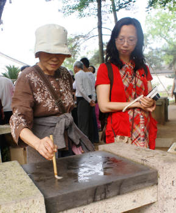

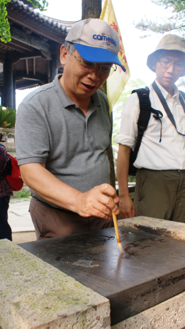

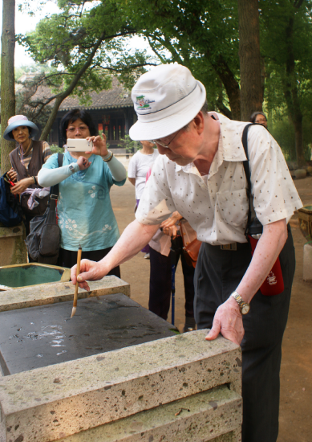

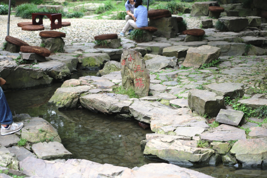

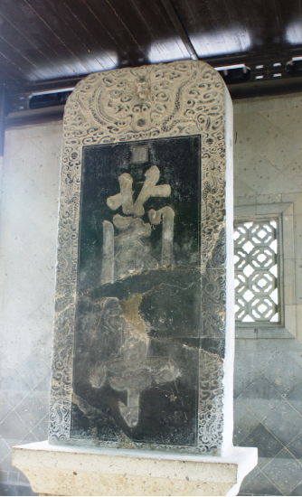

### 二○一四年暮春江南行　從印象西湖談西湖印象

林士棋

傳說與科技結合

夢幻泡影話愛情

目不暇給眼撩亂

西湖一遊成印象

本次隨著學會舉辦的甲午年暮春訪江南來到杭州，而說到杭州，就不能不提到西湖。西湖景色，如詩如畫，千古以來騷人墨客無不醉心於此。宋代著名的大文豪蘇軾也在此留下《飲湖上初晴後雨》、《望湖樓醉書》等詩篇。不僅如此，蘇東坡任官於杭州時曾上書於宋哲宗，斷言：「杭州之有西湖，如人之有眉目，蓋不可廢也。」其後在治理西湖上亦有極大貢獻，西湖三堤中的蘇隄，正是當地百姓為了紀念他而命名的。著名小說《笑傲江湖》中，西湖也正是任我行和令狐沖遭受囚禁之處。從古至今，西湖一直是個滋潤文人創作靈魂的好地方。

來到西湖之後，一行人搭乘著傳統的搖櫓船，循著國家領導級的遊湖路線，飽覽西湖風光，湖光山色，美不勝收。我們在船上暢談教法，吟詩高歌，人生得有此良辰美景，豈不快哉！白日的西湖讓人陶醉，而夜晚的西湖更是此行的高潮。用過晚餐之後，為了欣賞「印象‧西湖」的演出，我們由湖邊的北面再訪西湖。

印象 · 西湖是由著名導演張藝謀、王潮歌、樊躍的「鐵三角」導演團隊聯手打造，由杭州市委市政府、浙江播廣電視集團及浙江凱恩集團共同組建的「印象西湖文化發展有限公司」所催生的大型山水實景演出，是繼印象 · 劉三姐、印象 · 麗江後又一部「印象」系列作品。配樂則由日本音樂家喜多郎擔綱，張靚穎主唱。演出地點位於西湖岳湖景區，為了不破壞西湖的天然景色，舞台白天時降在水面下六十五公分處，直到夜間才升高到水下三公分。劇情以白蛇傳為主軸，巧妙運用現代科技融合山水實境，展現出西湖的晴、煙、雨、霧，每次演出都是獨一無二；聲光、雷射營造出如水墨畫般的夢幻意境，娓娓道出杭州西湖的千古傳說。

法海水淹金山寺

如此精彩的演出，實在令人歎為觀止，更不能忽視的是杭州市政府所展現出的氣度格局及恢弘眼光。杭州雖然一直都以山明水秀著稱，西湖更是堪稱一絕。杭州政府不僅能夠了解自己所掌握的優勢所在，還將其發揚光大，邀請國際大導編排，結合現代科技的方便，使千古傳說增添新意；融合新奇元素讓大眾能對傳統文化產生興趣，亦是有所傳承而非隨意發想，可謂繼往開來的絕佳典範。就民生層面來說，印象 · 西湖對於杭州的觀光業無疑是錦上添花，不僅能帶動旅遊風潮提高觀光收入，還可以提供當地居民就業機會。沒來過西湖的人肯定是印象深刻，畢生難忘；對來過西湖的人則是舊地重遊，耳目一新。我想這正是值得我們去學習的精神，要如何在傳統與現代之間平衡，要怎麼運用現代元素來表達傳統精神，使傳統文化更貼近人心，接近人情。

在天願做比翼鳥

文創不能是擅發新意，憑空想像，如果沒有文化道統，則只有軀殼沒有靈魂；如果只著重於經典文句的表相，則會遭批八股，食古不化，造成大眾對中華文化的疏離，反而對古聖先賢造成傷害。我們年輕學子在文化上應勤加學習，融會貫通，用現代之語言，發古聖賢之道；只有這樣才能成為弘揚中華文化的人才，開創時代的新契機。

在地願為連理枝

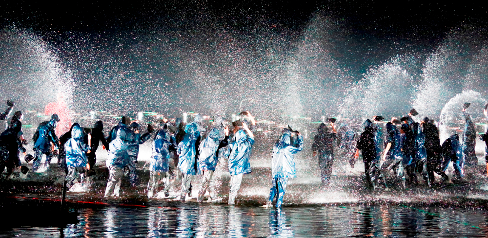

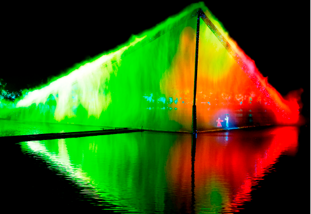

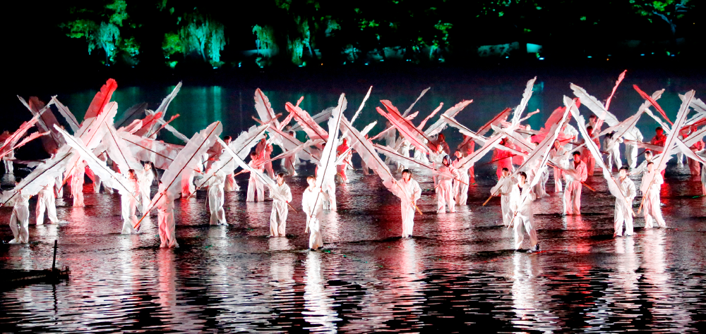

### 二○一四年暮春江南行　甲午暮春蘇杭行興懷二、三事

戒福

滿載而歸心得

不愧薑是老辣

難以後輩明了

歷練之後方知

一、緣起之思

「甲午」紀年，敞開記憶盒子，印象最清晰，莫過於百二十年前清光緒二十年的清朝、日本「甲午戰爭」，此頁史實，允為中華民族之恥；再往前千二百六十年天寶十三年叛臣安祿山竟入朝加官至左僕射，早在七年前兼四地區節度使將領王忠嗣奏安祿山必反，遠矚諫言見棄，具扭轉興衰幾微的跡象，輕忽未納，誠令人惋惜。至「暮春」之際，最引古人惜春，詩作不勝枚舉，又以東坡寒食詩，為士人所熟知，一生富經綸才華，詩情千古迥出，卻時遭困頓，尤以烏台詩獄貶謫黃州，實可謂潦倒至極。

我等一行人在黃作玲居士的發起，歲次甲午，時序暮春，行放生善行兼遊覽山川，所到之處、所見之景、所思之情，亦古來罕見之際會，願我等甲午善行，共造善法的力量，能帶來社會的祥和平安，人才興盛，如是思維，攬此得無所感，所謂今之視昔，亦猶後之視今，聊記興感於後。

二、了卻山陰蘭亭夢

蘭亭興會成陳跡    曲水流觴韻事傳

三稿法帖形哀樂    一言八法臨池先

右為蘭亭歸來所作七言詩，詩談不上高明，輔佐握管時的回憶吧！未到蘭亭前一日，微智學長在車上教室已就〈蘭亭集序〉此篇千古佳文作消文，後又於甘棠茶藝館再次解讀，其中「固知死生為虛誕，齊彭殤為妄作」一節，心超夫子先後闡明，莊子與書聖各就生命相續及人生無常，表達一己的見地，無所謂孰對孰錯！

首句「蘭亭興會成陳跡」，說的是此集會少長聚集如謝安、孫綽、支遁、徽之、凝之等名士、僧人四十一人，於會稽山陰之蘭亭聚會，時酒杯浮流在小溪上，任意游動，當停留座處前，就得賦詩，詩興不發作不成得罰酒，當時與會或作四言或作五言或作詩不成，凡卅七首。耳酣之際，推逸少寫序，以蠶繭紙、鼠鬚筆，略帶些醉意，揮就此曠世絕致的「契帖」，史稱天下第一行書。興會當下便注定要離散，滅為過去，此理常然，蘭亭雅集，又何嘗不是，而化為陳跡。

蘭亭‧鵝池

修褉的習俗，就是祭神淨身，祈求能清除邪惡不祥的事，行於每年上巳（農曆三月三日），始於周禮，歷經秦漢，至東晉永和九年（公元三五三年）間，此一袚褉舊俗，淨身除邪，已轉成士大夫文人間雅聚的遊戲。唐一代尤盛行，有杜子美詩句「三月三日天氣新，長安水邊多麗人」為證，光陰來到民國初年猶有飲冰室主人梁啟超等，邀集同好於北平農事試驗所舉辦過修褉活動，而印象中寶島故宮博物院旁至善園，猶闢有曲水流觴處，溪旁更置  帖碑文，足見此韻事流傳的不輟，遂成次句「曲水流觴韻事傳」。

過庭是有唐以來最尊右軍之書家，對羲之書法遺作諸如黃庭經、東方朔畫讚、樂毅論、太師箴、告誓文等各闡述書寫時心態，所表現的藝術風格，或虛無、或瑰奇、或怫鬱、或爭折、或拘慘，至〈蘭亭集序〉更揣摩逸少當時心意，美為「思逸神超」。臨池卅餘年，有緣踏入書聖生出神、妙、超、逸傑作之處，是稀有難得，連作夢也未曾想到過；待至其處，見其地安置數台石桌，桌面上有筆，檯面即為紙，以水代墨，可即興揮毫，不假思索，悠閒書下虔禮的讚語「思逸神超」。

四百又四年有忠義節操之稱的顏魯公因安祿山逆臣叛變，族兄顏杲卿一家為衛國保黎民，抵抗叛臣而慘遭殺害，其姪季明身首異處，真卿於乾元元年派人尋得頭顱，悲憤寫下〈祭侄稿〉，一字一血淚相傳至今，讀之令人鼻酸。又過三百二十五年，集文豪、詞豪、詩家、書家等全方位藝術於一身的東坡老仙，時因烏台案貶至黃州，有壯志難伸，卻還遭逢厄難，身心困乏，時值寒食，觸景心生極隱微感動，寫成詩書俱佳，可稱得上為不世出的巨構，欣賞〈寒食帖〉此作之際，豈不勾起共鳴？三篇傳世之作，不若一般碑文、書札等正式之作，有塗塗抹抹、改來改去間或掉字，俱是一時草稿，反成永恆佳篇，成為臨池典範，遺型後人。

往昔讀書譜，有云作書當「達其情性，形乎哀樂」、「涉樂方笑，言哀已嘆」，世人常論三稿，秉過庭書理的火燭，認為蘭亭言樂，祭侄稿及寒食詩為哀嘆，經心超師解文繹理，方知契帖本質亦是哀痛，由是得知三稿俱為悲哀，而拙作第三句「三稿法帖形哀樂」，哀樂一詞實乃偏義複詞，三稿所要表達皆是人生無盡的悲哀而已。

遙想蘭亭曲水盛宴

「太」字石碑奪人目，世人爭著為其父子排名，連過庭都不能免，而犯下疏於查證的失誤，疵子敬「假託神仙，恥崇家範」遭包安吾譏為子虛烏有。羲之「太」字之點，是以雄厚工力復加上人生閱歷，誠如末學於車上所分享，羲之年減十歲的機智，及長坦腹東床的瀟灑，其人其字世說新語云「飄若浮雲，矯若遊龍」，怎能是稚幼的子敬所能及，郗夫人亦能書，自辨得出，順水推舟勉子精進增上，後果真跨出逸少之影，開出連綿草之書風。

如是場景，倘再立一字，供後人取資師法終身行之，我必曰其「永」字吧！此一靈感，源自《論語》〈衛靈公篇〉子貢問曰：「有一言，可以終身行之者乎？」子曰：「其恕乎？己所不欲，勿施於人」，不知從何時伊始，在臨池學書的過程中，臨書啟蒙從「永」字練習起，一己學書歷程即是由「永」字起步，腦海裡已記不清寫了多少通，近人考證起源，不外數說，其一就以天下第一行書首字為「永」，而主張習字以此字始；又一派說「永」字備八法，側、勒、努、趯、策、掠、啄、磔，可謂囊括楷書一切筆畫，故主張此說，餘說則忘卻。愚意二說可兼併，習藝術從最上乘作品入手，自是走對路，取法乎上之理也；但未拉拔高度，必也扣住「終身行之」的層次，何況「永」字義為恆常不輟，不斷薰習此字，提撕自己，何藝不成？奉行雪公十字修學法，引導學書人時，必擇此字，能精進不懈，當有所成，至於由「一絲不苟」階於「一心不亂」，捨此無由徑也，依此拾得末句「一言八法臨池先」，善哉！永字八法誠含藏無盡的書理。

不禁自問，契帖好在哪？前行之際，曾再以硬毫對臨及背臨各乙通，晉人尚韻，曾在臨王珣伯遠帖時，約略感受到，而尚韻說以右軍為首，便試著找尋右軍的氣韻，往昔學書重在技巧耕耘，晚近漸走向思維創作者之心理，氣韻聞不著，隱微難見，可說難以了知；此次藉臨寫，稍稍讀到其韻，尤其在「咸、盛」等字末筆，所溢出自在、蕭散、閒適、安隱、無拘無束等的筆調，通篇筆端毫芒透出的精神，有若倚天屠龍一出，誰與爭鋒！

如二位老師引導女兒解讀蘭亭集序文，料想心若學長對此篇佳文的章法布局、行筆流暢、人生感概…，必有一番感悟；天下父母心，我也曾有如是作法，為引導小兒親近契帖，不敢貿然讓其吃全餐臨全帖，只開小菜點筆畫僅四劃的「之」字臨摩，並交代出現幾字及類型，凡廿一字，概分有長方形（縱、橫之別）、正方形、平行四邊形、不規則圖形等，經過綜合歸納，我兒已能逆知書聖書此帖時，胸有無數字形，之字變化只其一而已。

預知心超師鐵定會囑末學分享習契帖心得，相偕遊蘭亭前一日，寅時乍醒，對「之」忽有靈感，起而捕捉。就逸少而言，書品人品一也，通篇之字重出最繁，最足為例，其書寫出之字多樣性，宛如人生百態縮影，或大或小、或主或從、或方或圓、或曲或直、運剛運柔、若行若藏、乍顯乍晦、見理見情，不一而足，常因所居位置、角色，隨當下體悟而不同，作出良善的決斷，著實不易，如是始知契帖之迥出群倫，獨步千古，良有以也！那是積累多少的學養，淬鍊無數的歷練，有以致之！

古人云：言不盡意，洵為至論，詩成卻遺此行最感發事跡之一，昧旦起而抒寫蘭亭心思，遂補於後。

三、賞園林好造淨土

淨土莊嚴存二報    佛偕菩薩住西方

園林秀色多融入    樓閣亭台忘蹄筌

行前略覽行程，知此番於蘇州預計遊賞寄暢園、木瀆、留園、獅子林等江南園林，於杭州則將盪舟西湖裡湖，並入住現存保留較完善之江南古鎮西柵烏鎮；然則，因放生緣由行程稍有調整，木瀆留置他日有緣再賞，另增賞耦園及滄浪亭二景致。

據畫境文心一書，中國園林之體分苑囿花園及文人、寺廟、邑郊園林四大類，西湖眾人知曉屬第四類中最典型的代表；獅子林為第三類，追溯其始，建於元朝天如禪師，當時畫家倪瓚，朱德潤共同參與設計，可謂是名噪一時的寺廟園林，其餘則歸文人園林，顧名思義為文人所興建，供優賞山水、嘯傲林泉、讀書、習藝、清談及宴飲等賞心悅目遊居之處所。二、三類就園景而論，諸如水池、假山、遊廊、曲橋及亭台樓閣，此其共通處也，又何嘗只此兩類，實乃園林共同特色。

中國文人園林，至明清大為盛行，其數量之多如蒲甘之佛塔，最為重要且影響深遠。欲觀中國園林之美，捨文人園林，便遜色多矣。蓋文人匠心，獨具巧思，攬大塊陽剛陰柔之物色，冶園林於一爐，不論規模大小，常有可觀且令人驚喜之手筆，不獨歷代帝王之苑囿，多所借鏡；竊以為連佛淨土，依報莊嚴亦有融入，遂有「園林秀色多融入」一語之生出。

君不見四眾弟子日課之一《佛說阿彌陀經》，經文「極樂國土七重欄楯、七重羅網、七重行樹，皆是四寶，周匝圍遶……」，又「極樂國土有七寶池，八功德水，充滿其中，……四邊階道，金、銀、琉璃、玻璃合成。上有樓閣，亦以金、銀、琉璃、玻璃、硨磲、赤珠、瑪瑙而嚴飾之。池中蓮花，大如車輪，青色青光……。」就其依報莊嚴某一面向而言，實是園林無限增上，止於至善。不僅彌陀經如是，無量壽經國界清淨品、寶樹遍國品、堂舍樓觀品、泉池功德品；甚至學會正研學中的《法華經》，不論經文法說周、譬說周及因緣說周，所授記上、中、下根弟子，舍利弗、迦葉、富樓那等諸大弟子，成佛所成就功德莊嚴之佛淨土，咸有現出園林之一分，當不容置疑，心超師講堂上也提及，聞者當會心一笑。

依報固然成就功德莊嚴，須觀待正報莊嚴而來，正報除佛菩薩外，無數諸上善人，聚會一處，也是不可或缺；淨土如是，園林又何嘗例外！園林主人人生境界有多高，往來便無白丁，所呈現園林意境隨之殊勝。而論後世園林意境，莫不追踵陶靖公之意境，從園林起建，每一景、一境、一畝地、一窗牖、一扇戶，一亭臺、一樓一閣、一榭一房等等，常以陶詩陶文取名，如歸園田居、三徑小隱、五柳園、耕學齋、容膝園、日涉園等。雖累世經之營之，終究滄海桑田，道盡無常之常然，樞機在人才，一旦人才凋零，沒落易主在所難免。

園林有一與淨土不共之特色，楹聯、匾額為數之多，誠目不暇給，於游廊或長廊窗牖間處，亦刻置園主喜好之碑帖，走馬看花所歷名園，幾無例外，甚至有乾隆皇帝巡幸江南名園，所遺留墨跡，主人引以為傲，以為錦上添花，而流傳至今。在寄暢園有一幅乾隆御題橫額「圓池方之上，堪輿會至理；得氣擅清輕，應較下為美」愚意以為乃乾隆帝罕見作品中具骨肉勻稱者，應之老（雨橋祖父）告知此園有佳書，係當代大陸書法名人沈鵬所書東坡詩，詩題惠山謁錢道人，烹小龍團，登絕頂，望太湖，詩文「踏遍江南南岸山，逢山未免更流連；獨攜天上小團月，來試人間第二泉。石路縈回九龍脊，水光翻動五湖天；孫登無語空歸去，半嶺松聲萬壑傳。」，惠山泉號稱天下第二泉，即座落在無錫，書者切中景緻，寫來格外奔放瀟灑，骨力遒勁。

太湖翌日所遊處，到時雨霏霏，路面濕滑，眾人惟恐失足，無不戰戰兢兢，行至太湖佳絕處黿頭渚，展望無際，雖無東坡所見「水光翻動五湖天」，倒是窮目力，映入眼簾，煙波浩淼，近處有水池，池上荷葉點點，池中兀立有馳名太湖石，挺拔、疏朗、穿空、明暗、軟硬，難以觸摩，只是遠望有味，自然不是頂級，頂級太湖石早已為留園主人蒐羅，矗立在林泉耆碩之館門前之「冠雲峰」，供人瞻仰。

留園壁上點綴的石刻或木刻帖，引應之老與我駐足觀賞，其中石刻有臨褚遂良〈雁塔聖教序〉，功力不凡，形神俱佳；木刻見臨孫過庭書譜四連屏，此帖多年臨寫，不下十數通，愛之不釋手，覺其人所臨筆勢靈動不足，神采欠佳；結體復不形式，可謂形神俱失。又內有一四字匾額，當時讀成「片雅片臻」，此時握管記述，再端詳所拍攝照片，謂第三字當為「爿」，字義乃另半片之意，經查證比對，不出所料，大意當是留園中之景，片片臻於雅致，以見主人之精思，當知此「吳下名園」為蘇州一地後出之園，方能集眾家之長。

另園中主建築廳堂一側懸掛一幅龍門聯，上聯「讀書取正，讀易取變，讀騷取幽，讀莊取達，讀漢文取賢，最有味卷中歲月。」下聯「與菊同野，與梅同疏，與蓮同潔，與蘭同芳，與海棠同韻，定自稱花裡神仙。」曾見今人書明朝前七子中李東陽龍門聯上下聯「滄海日，赤城霞，峨嵋雪，巫峽雲，洞庭月，彭蠡煙，瀟湘雨，武夷峰，匡廬瀑布，合宇宙奇觀繪吾齋壁」，「少陵詩，摩詰畫，左傳文，馬遷史，薛濤箋，右軍帖，南華經，相如賦，屈子離騷，收古今絕藝置于山窗」，留園書齋對聯，亦不遑多讓，只是更取材於韓退之進學解及柳柳州之答韋中立論道書之句法。

好奇者會發現「獅子林」匾額懸掛入口處與燕譽堂壁上掛有貝家於民國十四年「監修師子林記」八連屏，師獅兩字，毋庸置疑二字相通，君不見佛經出現師子吼，率寫成獅字，非訛誤也，古來相通或是同音相假。此園為現存蘇州古園中年代僅次於滄浪亭者，值得一提為「真趣」廳，監修文第五連記有一段文字「……車駕南巡，翠篳臨幸……」，指的是當年乾隆皇帝遊獅子林園之假山迷宮陣，一時被困待出陣，興起書「真有趣」三字，後懊悔不已，覺寫得太白，陪侍在旁蘇州仕紳，體察上意，取有為「真趣」，意境迥然不同，乾隆大喜歲四此園，引為君民佳話。至民國已剝落殘缺，貝家此時除將獅子林闢為祠堂，也將「真趣」御碑及昔時指伯軒問梅閣、臥雲室等規模恢復舊觀；同時又增設校舍，安置貝家族嗣研學，誠屬遠見！民初貝淞蓀曾任中央銀行行長，其子貝聿銘為國際知名建築大師，又其子克紹衣裘，亦為著名建築師，足見發揮培育人才之功。此記文頗參趙撝叔（之謙）筆意，八連屏並列，煞為壯觀！

耦園外的護園池

耦園外有護園池，迥異其他名園，更令人刮目相看，竟然是世界文化遺產，主建物懸著三件書法作品：橫匾「偕隱雙山」、四連屏「監修耦園記」、對聯上聯「逍遙於城市而外」、下聯「髣髴乎山水之間」，對聯乃清代大家鄧石如完白先生以篆書寫成，剛健婀娜，不愧是開清一代篆書新面貌之宗師。

由記文略知園是清光緒初元仲復公所建，以正宅居中，分東東西兩園，又東南角蓋有一間「城曲草堂」，四字為雍正年間書法大家梁同書所書，廊壁刻有沈周、董其昌字跡。此園因池之便，眾人搭乘搖櫓船，聽船歌，亦是一樂。相較盪舟西湖裡湖，小舟低昂起伏，同船長者、壯者、青年者相互吟詩、酬唱，其樂融融；而夜間於運河聽蘇州評彈，見識以鼻腔發聲的吳儂歌曲，曲風別具韻味，特有江南女子婉約特質，聽時宛如時光回到昔日風華。

滄浪亭是蘇州園林中年代最為久遠，也是此行所遊賞之最後園林，乃宋代蘇舜欽所建並書寫建亭經過名曰「滄浪亭記」。此亭處高地，園中有「看山樓」、「瑤華境界」、「明道堂」、「閒吟亭」等屋宇，各以不同字體呈現，穩當有餘。各園林之景常隨樓、亭、戶、牖、臺、榭等所在而變化，此園林共通處，不如此不見園主之巧思；有如臨池創作，同字必不雷同，以求變化，不如是不顯書者之博覽。園林之美。何其多！可寫池石假山、花木生機、竹籬曲徑或營造氣韻、日景、月境、理趣、奇趣…種種。

此次擇臨池一端而振筆，情之所然，吾之所好也。縱使是所好，當須回歸於道，正如同諸佛淨土，雖有寶池樓閣亭臺之設施，無不是來宣說般若空慧之妙理，設施只是莊嚴淨土，讓往生者證悟之用。園林之美，猶如留園一隅扇面石壁之題詞「幻石」，暗示世人堅如石，亦是幻化呢！不禁孕出末句「樓閣亭臺忘蹄筌」，然萬法雖幻化，亦隨善知識大作夢中佛事也。

園林結合詩詞文學，多矣！賞字自是其中一類，詠詩吟詞亦是一類，登滄浪亭，涼風徐來，雖不能寬衣解帶，脫掉足履，偕同修一起赤足踏地，閒逛石地，冰冰涼涼，身心頓輕鬆，不免與心晴師合唱杜牧江南春，餘味未已，又吟宋詞踏莎行，方肯罷休。誠如同修車上賞園林之感言，觀賞園林設施，遠則作為日後佛淨土之借鏡，近則以為此生共住可取法，而朗朗詩樂聲，自不會遺漏耶！

四、結語：

蘇杭八日行感想、感動、感念、感發、感謝，實滿懷胸膺，最殊勝太湖、東白湖、白塔湖放生行，至遠兄已道盡，料想雨橋必有著墨；西湖印象，既前衛又含攝傳統，如詩如夢，同行年輕人士棋、海辰等應有所發揮想像；烏鎮古鎮之寶：傳統再現、小橋點綴、扁舟蕩漾、茶樓酒肆原貌、清晨靜謐……種種美好，留待微智掠美；梵宮華麗莊嚴，定有蓮友感觸，就不敢爭先。我獨取名聯一二，供養同行者，以饗同好；只是漫步白塔湖小島之樂，有機緣再補記吧！

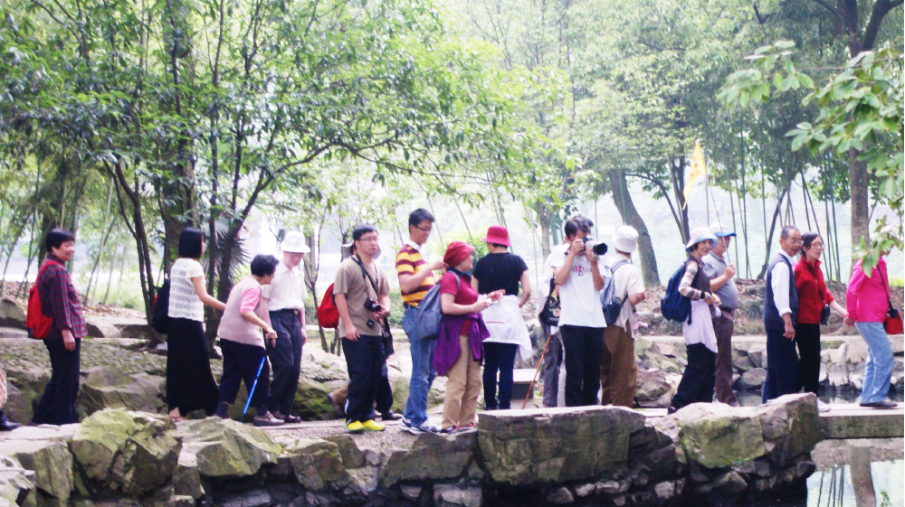

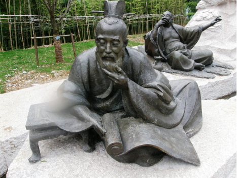

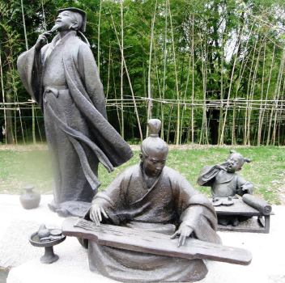

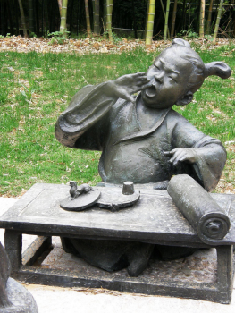

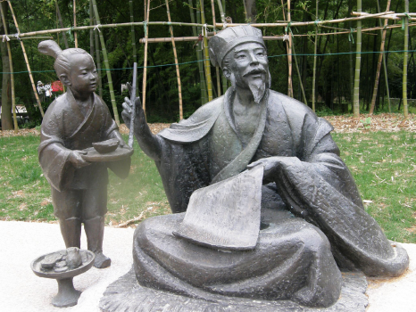

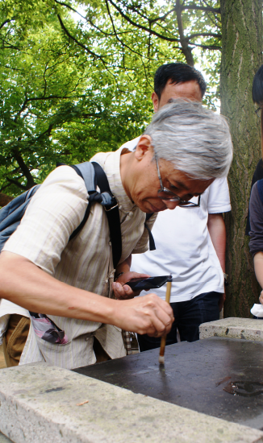

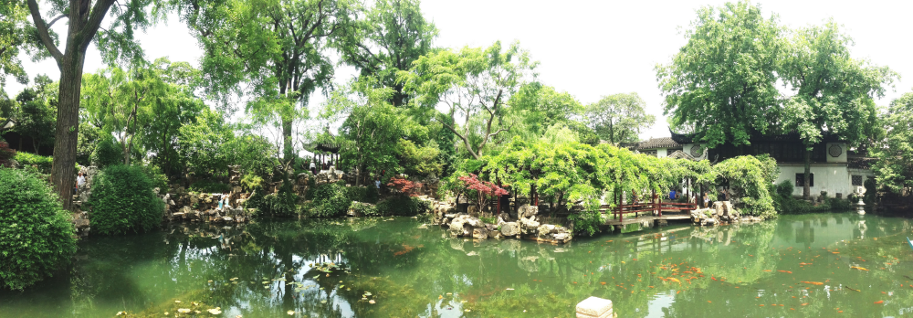

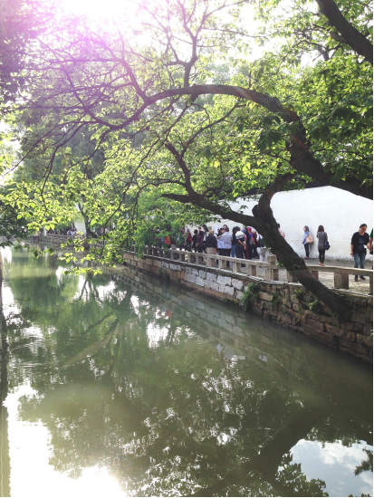

### 二○一四年暮春江南行　話說報母恩—由江南放生說起

淨度

苦生出離引大悲

反省過惡修忍辱

體性本空隨業生

坦然面對真丈夫

此次的江南放生之行依著家母生病的因緣而籌劃與舉行，身為人子在整個過程中自然懷揣著複雜的心情。回想數月前，家母於一次身體檢查中發現患有乳腺癌，於是隨即進行手術和化學治療。得益於老師的教導，深知西醫只是在標上的治療，對苦果的去除，倘若苦因還在，苦果還會繼續出現。是故引導母親在確立對三寶信心下的調心、調知見、以中醫為主的調身和善法的造作，才是根本上的治療。

首先引導母親內心須時刻抱持著對三寶的信心，將自己的全部身心都交給佛菩薩安排，一心念佛，期許自己壽盡則速往生，壽未盡則未來好好的自我充實和護持正法。在此基礎上的調心、調知見、調身和作善法才能夠起到最佳的效果。

那要如何引導母親調心呢？心態上不能樂觀也不能悲觀。不能樂觀，是因為人命無常，往往只在呼吸之間，藉此病因緣讓自己生起置之死地而後生的心情，當成這條命是撿回來的，是額外賺到的，以此生起對時間珍惜的感覺，以學習和護持正法的心情來過後半生；不能悲觀，是因為當面對病苦的心態和做法都對了的時候，後面往往會有不可思議的驚喜發生。

而且，在治療的過程中皆因帶著無憾和感激的心情，將治療觀想成是佛菩薩的加被，將醫務人員都觀想成是佛菩薩的眷屬。也觀想治療在除癌細胞的過程，正是在除自己煩惱習氣的過程。再者，心情因儘量收攝，與往來親友不作過多談論，內心保持正知正念，亦須向佛菩薩承諾每日在經教和佛號上功課的數量，以聞法誦經的方式保持正知，以認真念佛求加被來保持正念。

就調整知見方面，特別是以病苦為良藥，以逆境為增上緣的這一分來說。正好可以藉此生病因緣反省過去造成此病的原因，從身、心、業三方面去反省，讓自己未來不要重蹈覆轍。約身，反省自己是否飲食不注意、常熬夜、不運動，未來須注意三餐講究、按時睡眠及配合佛法觀修的運動，藉著此病讓自己恢復正常的生活習慣；約心，反省自己心情上是否因不懂得調適，產生了煩惱，而且不懂得遏止而任其相續，未來心中應保持正知、正念；約業，反省過去在身口意三業上的過失，避免日後再造，未來也要以造作善法、懺悔業障以及祈求三寶加被的方式來對治惡業。

而且，應將此病視作畢業考前的模擬考，比一般人都幸運的是可以提早面對臨終，有足夠的時間去調整和訓練，大多數沒有經歷模擬考的人在畢業考時成績往往不如人意，佛菩薩和老天爺對人的厚愛有時候正是以這種方式呈現。再者，藉著體會生病與治療的苦去體會眾生的苦，生起對眾生憐憫的心，讓眼前所受的苦。正好作為未來自己成為觀世音菩薩的緣起。同時也藉著病苦的體會，讓自己更加珍惜身體健康的時光，將時間作更有效率地利用，用在修行上，用在刀口上。

就調身方面，除了飲食、睡眠、運動上的講究外，更加以中醫的治療，從病的根源入手，藉著中醫改善全身的體質，讓身體快速的恢復健康，並且防病於未然。

就造作善法方面，首先，須明白廣作善法是惡業的正對治，猶如拿一大海去稀釋一小瓶的墨水，墨水自然不現。最後，有知見還要有行善的決心，須以打仗的心態和做法來對待往後的行善。那有哪些善法可以作呢？約身命，大型的放生活動（如此次江南放生）是身命延續上最好的順緣；約慧命，與同法者結緣、助印經典、護持講學、供養大德等善法是慧命延續上的順緣；約三寶加被，齋僧、供養僧團、修建寺院道場、佛菩薩像等善法，是得三寶加被的順緣。全方面善法的造作，讓人障礙快速消除、積聚順緣、福慧增長、得同法者護持以及三寶加被。

除了以上各方面的引導和護持外，以自己的成就來作為幫助母親成就，更是身為人子最應該做的。佛經中有許多聖者，即是以報母恩為殊勝因行，其中更以婆羅門女及光目女為報母恩，努力將自己培養成為人才、成為法門龍象，此舉更是報母恩之最，不但其母投生到佛淨土，並能輾轉增上，直至成佛，此乃真正的報母恩。

僅以此文將護持母親之觀念供養大眾，作為此次江南放生行的結尾，祝福全天下的母親皆能依著正法同生極樂、同成佛果。

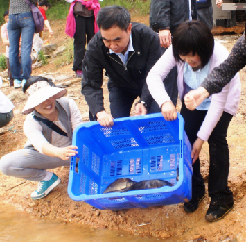

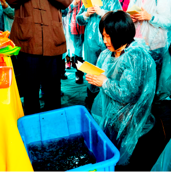

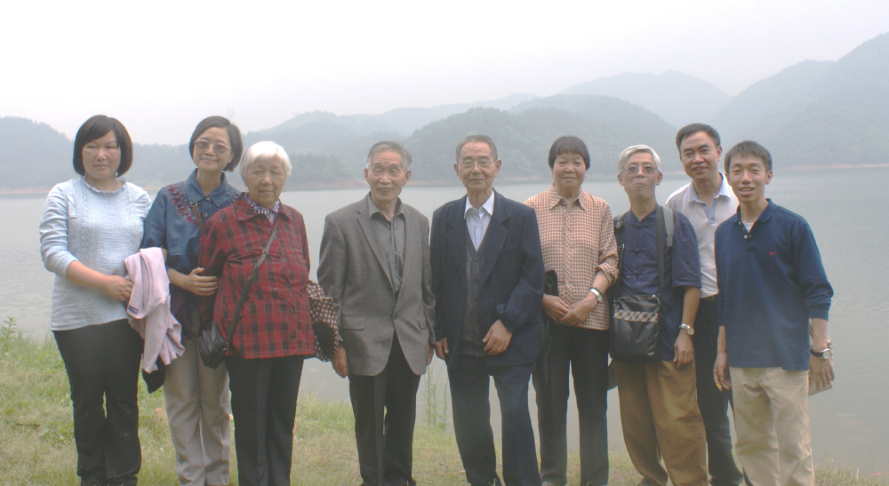

### 二○一四年暮春江南行　病苦的人生觀

心仰

名為人生的結了

實為前程的開展

娑婆化緣的了結

淨土勝事的展開

民國一百年的三月，在公司的健康檢查中，被檢驗出肝有腫瘤的狀況，完全沒有想到，過往都是幫助蓮友助念的末學，有一天，也被診斷出，應該要踏上人生的下個階段了。

從被診斷出腫瘤，到今年復發，期間，一開始雖然有進行積極的治療，但每回到醫院進行一連串的檢查掃描，總覺得似乎在一種輪迴之中，吃藥、檢查、掃描，等著醫師宣判，再吃藥，離不開這樣子的輪迴，病情好像附骨之蛆，如影隨形，醫師的判斷，再加上對癌症的認識，感覺生死即在不遠處，不可否認，對於死亡依舊有恐懼感，終日惶惶不安，日常生活中，似乎有個疙瘩在，心情甚是沮喪。再者，經過曠日廢時的治療過程，難免懈怠，難免因循，使得平時一些習氣，在不知不覺，讓它在生活中，再度萌芽，而這些小小的壞習慣，終於導致今年，病情急轉直下。

儘管如此，還是很感激佛菩薩的加被，讓末學有三年的時間，可以慢慢接受這個事實，就好像老師所說，身體就像一幢房子，房子壞了，能修就慢修，不能修，我們就換一幢房子而已，藉由著老師的教導和聽聞的正法，也慢慢地坦然接受這個事實，此後，更覺得佛菩薩的慈悲，更因為有三年的時間，可以有時間隨著老師做各種廣大的善法，積聚往生的資糧；在這三年中，遵循老師所說，從心上講究，人生的焦點，便從身上的肝，轉移到如何可以追隨老師做更為殊勝的善法，利益有情，老師常說：命運的改變，來自於觀念的改變，隨著觀念的改變，把心病的糾結解開，似乎所輪迴的癌症不在了，也就好像脫離了恐懼的輪迴了，慢慢地接受，人，皆有一死的事實罷了。

臥病在床的這期間，十分感激老師，以及各位學長的支持與鼓勵，沒有老師平日正知見的引導，和學長們在病苦期間，引領末學觀修，真的，病苦一來時，念佛真的是提不起來，現在才能體會到，古大德所說「平時念佛功夫十分，病時只有一分，病時念佛功夫十分，臨終只有一分。」，這段話，身體健康的時候，如過眼雲煙之輕，感受不深；但，真正面臨挑戰時，才知熱鐵烙膚之痛；老師說，從心上講究，感觸特別深，猶記得池伯伯時常地告訴末學，讓醫生看診時，要觀想大醫王阿彌陀佛在為末學及無量無邊的眾生，灌頂丶治療生死大苦，如此醫療才會有效果，無形中，也為無量無邊的眾生，行了善業，種下未來增上的因緣。

另外，也特別地感謝同修，在這段艱難的時間中，同修無怨無悔地幫末學煎藥，哪裡有良醫，便不厭其煩地不管多遠，都陪著診療；也感謝同修，在末學苦病之際，心緒煩躁之時，包容末學的壞脾氣，即便再苦，也不曾口出惡言，即便再累，一直陪伴末學看診丶做善法。

最後，真的感謝老師以及各位蓮友，在末學病苦之際，遠從各地，有中壢的師姑們，臺北的學長們，臺中共修會的同參道友們，在懸崖之際拉了一把，對淨土生起信心，如壽已盡，則願臨終障礙消除；如壽未盡，則願身心清淨，往後，更加倍努力地在心上講究，護持正法，發大心，行大願。

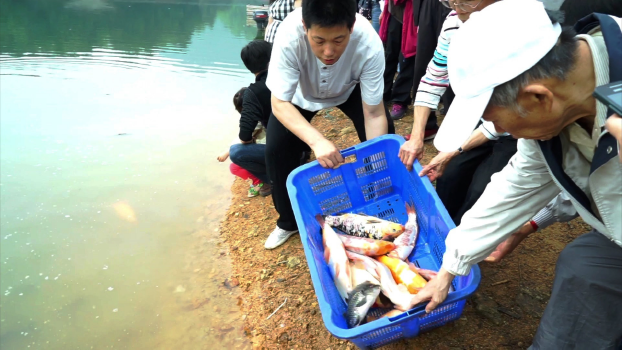

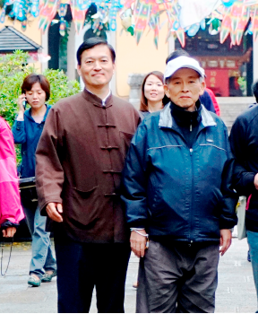

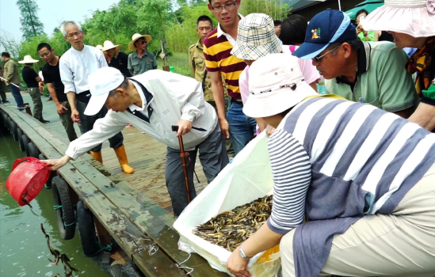

### 二○一四年暮春江南行　成長最重要的一步—由父親病苦說起

心入

生命難捉摸

病苦令體會

生死一瞬間

無常無我覺

病苦，如果不苦，就不是病苦。

這句話，好像很廢話，看起來就是來湊字數的，其實不然！經典上提到「生老病死苦」，在父親生病前，真的是話過如風過，不留半點痕跡，一絲毫覺受全無，總是覺得，就讓苦，留在書本之中，課堂之上吧！一旦境界一來，粗猛的病苦一現形，那是會使人坐臥難安的，絕不是書上，那描寫的簡簡單單。

老師曾在課堂上說過，坐著，坐久了覺得苦，便躺下，久坐的苦消失了，躺下的苦，卻正慢慢地生起；但是，病苦使這樣的循環加快了速度，坐著的苦消失了，躺著的苦馬上就生起，肚子餓的苦消失了，腹漲的苦馬上就生起，苦苦相續不斷，一環扣一環，好像枷鎖纏身，一步步押著人踏上下一個輪迴，不得自由，半刻歇息都不可得。

現在回想著過去幾年，曾經照顧過病苦纏身的唐爺爺丶蔡老師，乃至於現在的父親，不得不欽佩他們，在如斯苦痛之下，依舊可以保持著正念，維持著對阿彌陀佛的信心，他們的苦，老實說，我無法通達，在旁邊卻深刻地體會到，痛苦表情下，每句佛號聲中的至誠懇切，那是十分不容易的！讓我想起了老師的開示，為什麼淨土宗也要修習教法？不是一句彌陀就好了嗎？老師說，人生大事，往生淨土，可以很簡單，也很難。

簡單在往生時，一念彌陀即可，難在病苦之中、臨終之際，如何維持正念，藉由教法的修習，觀察丶串習病苦自體性空，學習破除障難的智慧，才能一心不亂，心不顛倒；若沒有像唐爺爺、蔡老師乃至於父親，平時薰習教法，一句佛號提起，一般世人在苦痛摧枯拉朽般一波波，如潮水襲擊下，恐怕就只能張皇丶恐懼地隨業力流轉了，就更遑論了生脫死了。

古人曾說「十年磨一劍」，日本人說「一箭入魂」，非常符合病苦、臨終時的寫照，比如日常生活中的種種造作，為的都是要在臨終時，專心一志地往生。

中國有位維權人士曾說過，「人是感情的動物，也是理智的動物，因為有感情，所以不能忘記過去，因為有理智，所以認識現實和理想將來。」在過去，已經有許多菩薩為我們示現往生事蹟，我們應該針對自己的習氣，為未來往生積聚資糧，排除障難，為了可以求得好死，所造作的事要講究，能造作的心更要講究，排除各種往生的障難；比如病苦，是往生的障難之一，如何避免生大病，平時生活作息，飲食習慣就該要注意，避免病從口入，保持一定的運動習慣，維持身心健康；而對於生活中各種情緒、心裡要細細觀察，如不欺暗室般，止息貪愛心、瞋恨心或愚癡心，取而代之的是對正知見的好樂，親近善知識，依止正法團體，做許多廣大殊勝法行，用正知見經營家庭，經營有利於往生的環境，這才能於臨終時，障難破除，蒙佛加被，得生淨土。

一位美國的暢銷作家也是位抗癌鬥士曾說過，「癌症是通往秘密的捷徑。它讓我們去參與這人生最必要，也最可怕的舞台。雖然我們常常裹足不前，可是當我們一旦抵達那裏，就能經歷前所未有的蛻變。」父親也正在這通往秘密的捷徑，這途中，我能理解這個舞台很可怕、很辛苦、很痛苦，但父親還是勇敢的面對，堅毅的走下去，不論最後的結局是什麼，我確信，他已經發現了，只有他能體會的生命秘密了，而我也感謝藉由他的示現，深刻的體會生命在乎的不是長度，而是厚度。

### 二○一四年暮春江南行　話說報母恩—從江南放生說起

愛蓮

放生關連報母恩

大悲能引佛加被

阿耨菩提勝資糧

能度累劫母有情

回想起父親因病住院，總覺得父親大人會好起來，就算已經急救兩次，大家仍有一分認為平常不肯輕易住院的父親，還是會回家一如以往地守護著家人，但當醫生宣布急救無效後，才恍然大悟，人生的運作是如此的有情，又如此的無情。往後好長一段時間的夜裡，半睡的我會肆意的踢被，期待著那午夜為我蓋被、熟識的身影。

而母親，或許因為把所有苦都埋在心窩裡，表面上沒有太多的情緒，只是幽幽靜靜的隱忍著，等待著面對殘局；現在想來，這是母親當時面對未來恐懼的方式，偶然的抒解是對丈夫的思念，記得有一回母親跟大家說：「剪刀用完要放回原處，否則爸爸會找不到」，而父親慣常坐的位置總是空著，鮮有人會去越分。

一直以來，大家也是暗暗的把父親過世留下的遺憾，深深的收納起來，把無常的驚嚇，用「理所當然」包裝起來、擱著，繼續過著人生應走的路，不容再被它嚇著，總是小心翼翼。

及長，兄弟姊妹間，對母親的健康尤為緊張，小妹更是會訪查名醫，步步為營，生怕有所差池，但生老病死，不管如何去躲，如何去藏，無常是躲不過的，母親在去年往生時，子女雖然還是很不甘心，很捨不得，因為母恩難報，但這次並沒有留下遺憾，因為母親是往生極樂世界。

記得去年母親往生時，曾許下到大陸放生的願來助母親西度，有願就有力，這是是跟佛菩薩借貸，然而，我個人福薄、少力又是資糧不足，假若沒有師長的引導、團體的和合、善知識的幫助、佛菩薩的加被，不只是放生法行無法如願，就是母親往生也成問題。

像這次浙江放生之行，在自身及家人的想像中是不可能的，在人生路不熟的浙江，各種放生條件，要如何具足？為什麼可以如此圓滿？沒有學佛、學法，沒有學會，沒有師長，沒有蓮友，各方的條件，又如何能成事？這是科學家、機率學家也算不來的，這不就是有願就有力嗎？是佛願佛力借眾人的願，眾人的力來展現的奇蹟嗎？

在母親節放生的意義，對末學這個剛失去母親的人，更是重大，旅途中睡前必與兄弟姊妹們報告所得，先前大家對放生法行都並不十分瞭解，但卻皆不約而同地感受到功德的殊勝而讚歎。

相信從放生法行來圓滿母親節，滿所發的願，讓母親也經歷殊勝法行，未來能有學法、說法的順緣，成佛的資糧，才能算得上盡了人倫大孝、報母恩，不留下遺憾。

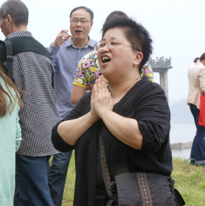

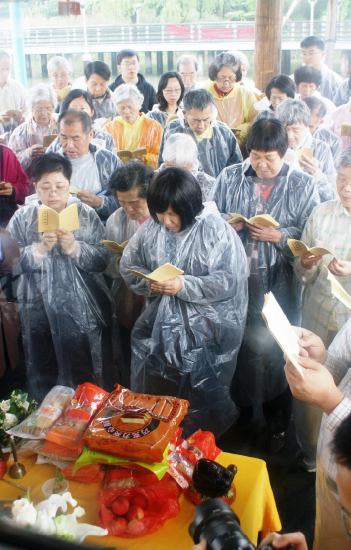

### 二○一四年暮春江南行　幸福人生的開始—從江南放生說起

林士棋、海辰

見地生幸福

從他聞思修

歷練順逆境

福慧兩足尊

幸福的人生究竟該如何定義，何謂幸福？家財萬貫是幸福、位高權重是幸福、事業有成是幸福，又或者開間小咖啡店才是那微「小」但「確」實的「幸」福？

我想這個問題在社會中很可能沒有標準答案。學校教育鮮少教導我們這些課題，在出了社會以後，成天淹沒在忙碌的工作中，很可能也沒有機會明白，或許忙了大半輩子直至老死都沒能弄懂。到底幸福是什麼？直到本次甲午年暮春訪江南之後，我想我才有了一點眉目。

因為雨橋母親的因緣有了這趟殊勝的旅程。旅程中踏過江南美景，做了莊嚴的放生法行，也共同研討修學，彼此增上；回程時滿懷感激，對於能夠參與這次旅行感到十分法喜，也希望往後還能有這樣的機會。

由於這次參與的老菩薩眾多，細節上也要比平常出遊來的更注意。在服務大眾中，以優秀的師長、學長做為榜樣，學習如何為公發心。在侍奉長者中，明白常禮舉要在生活上的重要性，在「理性」與「事修」間亦有所體悟，禮必須透過實踐才能彰顯其道理，以及深入其內涵；雖然有些禮節可能已經不合於現代社會，但我們應學習其中的精神和趨吉避凶的道理，然後在日用平常上講究。在殊勝的放生法行中，經由老師的循循善誘，不厭其煩地為我們解說放生儀軌的重要性，從放生的功德，乃至其因緣及大德傳承，使我們在行放生時更能產生法喜，懂得觀修歡喜心、大悲心。

更藉由此放生功德成為我們未來修道的資糧，與眾生結下殊勝法緣來護持佛法。過去在我心中對於放生的疑惑也一掃而空，心生無限歡喜。在欣賞園林、遊歷山水中，知道生活中的雅緻是來自於對文化的學習。無論是古建築的藝術賞析、詩文的吟唱讀誦或是對於歷史人物的借鏡，無非是充實我們精神生活的最佳途徑。原來生命可以活得如此精采而有意義，也欣賞到大德風範是這樣得令人心生嚮往。

原來幸福的人生就來自於正確的人生觀，唯有正知見的建立才是幸福的開始。而正知見是透過聽聞而來，也突顯出教育及傳承的重要性。一段美好因緣的促成，不光只是靠自己的努力，還需要時間的熟成以及外緣的幫助。很感激在邁入人生的下一個階段之前，能以放生法行做為殊勝的緣起，建立佛化家庭成為往生極樂的方便，施行儒佛教育成為幸福人生的開端。

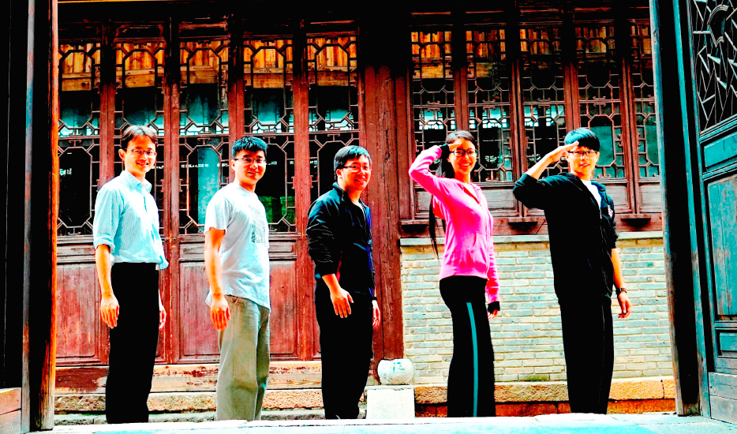

### 二○一四年暮春江南行　嶄新的人生—從江南放生說起

劉益豪

軟暖習氣病

流俗勝於癌

除舊與佈新

每天新開始

感謝父母在學會的發心，還有老師的慈悲召集、學會的規劃及協調各事項，才有機會參與這次的放生行。更要感謝應媽媽的因緣，及大陸的李總默默付出的蓮友們，促成了這次江南放生機緣。這過程中，這因緣曾一度不具足，經過師長們再三的努力，最終託師長們的福氣，在短時間裡得以成行。藉老師的口說到，除了中間辦事到最後成行，再到參與的人員，或有一開始報名最後卻沒法參與、或者人數額滿之後新報名的人，大家都克服了各自不同的因素，所以在旅程還沒開始前，就已是不小的因緣聚會和殊勝功德的開始。

幾年前曾和父母跟著老師在臺灣放生，那時放生的條件還不錯，有些適合放生的場地，後來有一系列的因素和環境的變化下，現在臺灣要放生已不容易也不適合了，因此後來都在大陸、印度、寮國、緬甸、馬來西亞等地舉辦。能參與放生是要有福報的，只要一個因緣不具足，沒假可請或者額外的金錢支出，家中其他成員不同意或者抽不出身等等的障礙，因此能參與此次的放生，每個人的福德因緣都是不簡單的，更因為對比以前放生的容易和現在的困難，所以更珍惜這次的機會。

放生法行 虔誠恭敬

這次特別的因緣是外公能夠一起參與，也要特別感謝老師的邀請，因為父母跟著老師學習多年，使外公近些年有較多機會參與學會的活動，放生則是第一次，也因為外公答應了老師的邀請而得以成行，全家人都特別開心和感謝，也因為這次參與的人員不少是年長者，外公及老菩薩們的參與，讓我們年輕人有為年長者服務的機會，以前只會偶爾在活動中碰面，但透過此次江南行，長時間一起度過，學習到師長們豐富的人生經驗以及做人處世之道，並且培養眼力，遇到突發事情的鎮定，以及說話的藝術，車上發點心的服務以及心得分享的口才訓練，餐桌的禮儀以及佈菜時該有的態度，許許多多從細節到大方向的磨練，無時無刻都是讓我們學習的榜樣，所分配的職事，也是讓我們學習如何把事情做好。

感受特別深的是這次的放生，這次放生總共有四次，第二次的放生，因為和當地團體合作，規模也最大，所以最為難忘，將近三百五十人連放了兩個小時還沒放完，最後因為時間太晚不得已只好提早離開，讓無錫當地的放生團體繼續未完的善法，這是第一次放這麼大量的生物，相信也難再有這樣好的因緣，十噸的魚不停地從漁車裡撈出，受限於夜晚光線的不足，放生的過程又更加不容易，但看到每個人都賣力而且認真地共同成就一件善事，想到在這社會裡，能夠有這樣殊勝作善的機會，是多麼的難得。

曾有句話說「苟日新，日日新、又日新」，每一天都是新的開始。

伸出救援的手 世界真溫暖

結合這次放生行，某位師伯分享心得時曾說到，那些魚被放出去，好像自己也被放生一樣，想像被打撈上來的那些水中生物，他們要經過多少次的搬運，從被打撈起、搬運到市場、再經過不知多久才被運送到放生場地，裝載著他們的容器裡有多少的魚擠在一起，密閉的空間是否有足夠的氧氣容量，在放生的過程中會否因為人為的因素，造成無法順利到達湖中等等，這些生物遭遇到的一切，就像我們人一樣，人生中總有許多事會發生，生活上的負擔、各自家庭成員的關係是否融洽、工作上人際關係的爾虞我詐、對社會國家的擔憂、對各自的志向夢想舉步維艱等，一切的一切，所有問題和經歷到的一切，都讓我們不可再輕忽，人、事、物都變得複雜，所以當看到魚被放生的那一刻，那種喜悅和感動，甚至看到魚往前游一段時間再回頭看看我們，那種無法用言語形容對生命的渴望以及感謝，都讓末學實實在在的傳達和感受到。

以及當下放生時經過儀軌的莊嚴，蓮友們放生時那種團結一心向善的凝聚力，都讓我們更感受到一種極致卻又簡單的感動，那種喜悅沖去了平時遭遇一切煩惱，當下的寧靜、平淡、簡單、喜悅，都化做一股清流，洗淨了那被生活所困擾而煩憂的心，這是另一種新的開始，當更好好珍惜眼前，把每一天都當做最後一天，不要有任何遺憾，每一天都是一個新的開始。

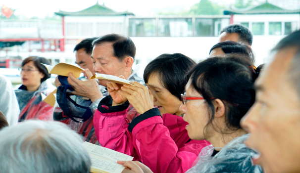

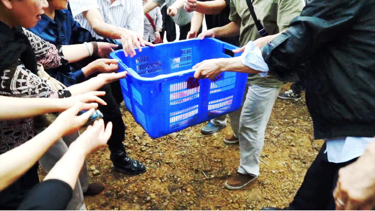

### 二○一四年暮春江南行　二○一四跟隨無盡燈文化學會暮春江南放生行有感

楚穎

活力有趣的全陪

專業素養的發揮

有趣豐富的旅程

交織難忘的八天

為紀念這次奇妙的因緣和愉快的行程，我提起了這枝羞澀的筆。

接觸臺灣的文化學會，是人生的第一次，內心非常感謝雨橋，讓我認識了這麼多朋友以及臺灣獨有的國學會。因為內地文化學會的匱乏，所以此次行程尤為珍貴。

五月十日，我早早起來，從杭州去到浦東國際機場，迎接素不相識的五十多位臺灣朋友。團友從牙牙學語的兒童到白髮蒼蒼的老人，年齡差距很大，但是一切都是都出乎我意料的有秩序，每個年輕人都認真履行自己職責，照顧老人，托運行李，每個老人都緊跟團隊，竭己所能參加一切活動。

行程的辛苦程度，其實很多普通的年輕人都會覺得累，但是團裏這些年逾八十的老人都能堅持了下來，實在是團隊裏最勵志的風景！

八天的行程，放生、觀光、學習交流，我能感覺到每一個人的充實和愉悅，包括一部分身體抱恙的團友們。能平靜的接受自己身體的衰老和病痛，真是我無法企及的境界。

這些強大精神的力量的傳播者，來自於德高望重的唐老師。

用自己人格的魅力和淵博的學識，將成員們擰成一股繩，在順境時反思，在逆境中成長，指引和帶領他們去往正確的方向，我不知道這是怎樣的功德，但我知道肯定非常非常大。

放生中，老師全程誦經指導，行程中，老師不斷提問、交流。幾乎不曾有歇下來的時候。而我也有幸能提了很多疑問。內心對所有學員更充滿了羡慕，如果能得到一位好的老師指引，在人生的修為裡必定是事半功倍的。

可惜，對於我來說，八天實在太短。

作為大陸改革開放後的第一代人，傳統文化我們已經留存不多。經濟飛速發展的今天，我們面對巨大的競爭壓力、物質欲望，我們竭力拼搏、奮鬥。但可以預見的是，無論是世俗意義上的失敗了或成功了，我們以後都將面對巨大的空虛感：這一切的努力，是為了什麼？

從文化上來說，同是中華民族，大陸相比臺灣，缺失太多。但我相信，幾千年的儒學是根植於我們民族的血脈裏，於我們的一茶一飯裏。人說，教育是第一生產力，唯願我們社會，也會出現一個又一個的唐老師，發揚和推進中華文化，讓中華民族健康、和諧的發展。

寫到這裏，腦海中出現了老師說起過的「共住」，人間似天堂。

團隊結束半個月了，經常會想起唐老師和美麗的林老師，可愛的劉小姐和劉阿公，知識淵博的王老師夫婦，搞怪的吳老師夫婦，還有眼神凌厲的高老師，還有所有的團友們，我記得你們每一個人的樣子，因為你們都充滿慈悲和幸福。

對於我來說，這次行程是一個善根的種子，我期待善果發芽開花的一天。

謝謝唐老師，謝謝所有人，想念你們。

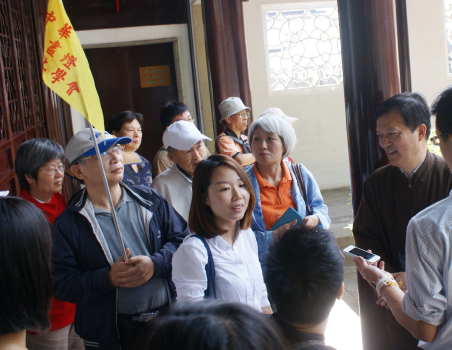

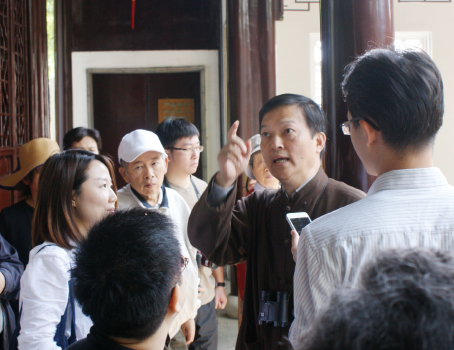

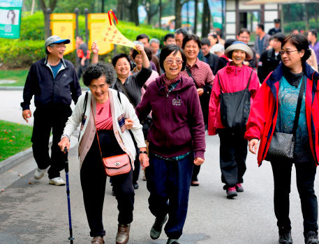

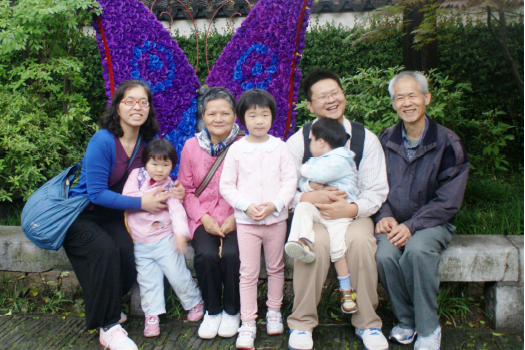

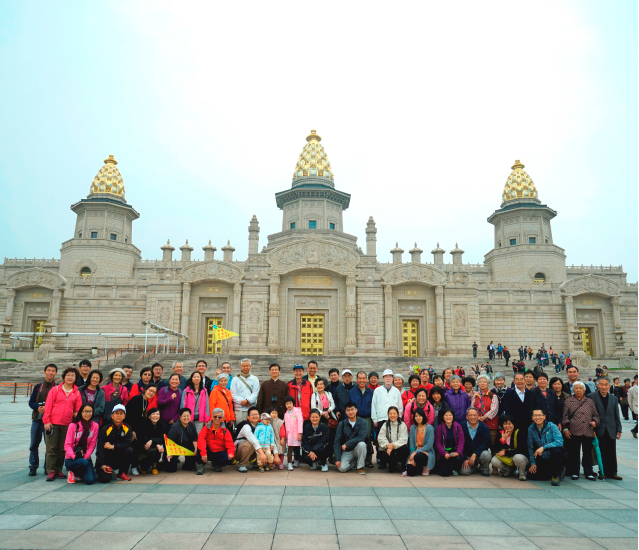
