# 第96期
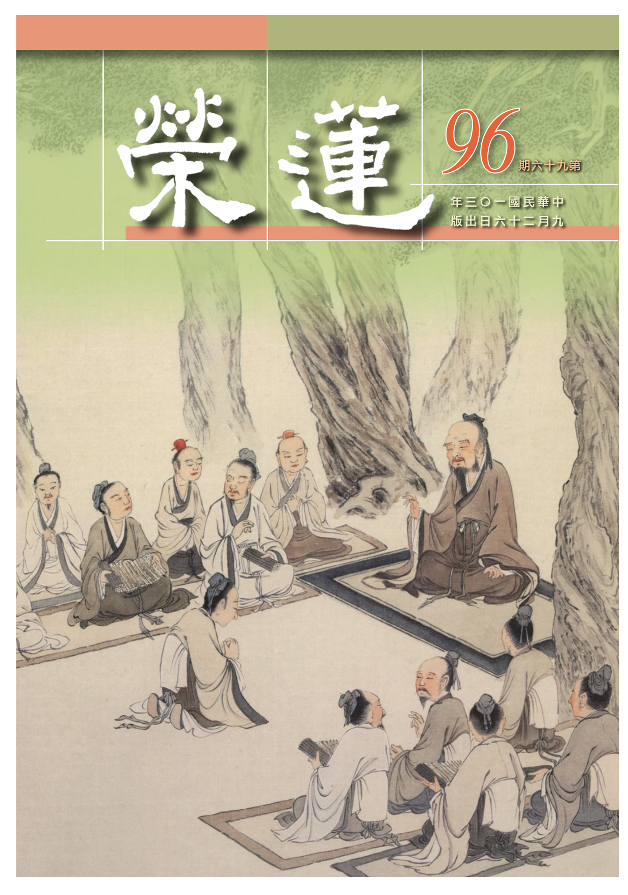

## 社論

### 教育革新，以網路力量弘揚文化道統

本刊

世界潛潛變化

團體鴨子划水

時空恰好交觸

中道奇觀應世

隨著網際網路及行動裝置的急速發展，如手機、平板電腦的普及化，資訊網路時代的來臨衝擊著人類各項生活層面，如商務貿易、消費行為、人際往來等。然而，更重要地也大幅改變了教育模式。網路授課的學習已成為全球趨勢。例如美國喬治亞理工學院結合美國電信業龍頭AT&T，預計於今年九月，開設線上計算機科學碩士學位，課程內容和正常課程一致，修習期間預計三年，而且所有的課程對大眾免費開放。近年，許多網路教育機構亦如雨後春筍興起，學習知識不再是在教室中，只要能連上網路就能擁有豐富的學習資源。網際網路提供了一個成本極低的平台，不僅加速資訊的流通，還能突破時空的限制，將豐富的資訊傳遞給大眾。

就學習傳統文化而言，網路學習與傳統學習方式有無扞格？究竟代表著什麼意義呢？事實上，網路已經成為現代的文化工具。根據臺灣網路資訊中心的調查資料，臺灣民眾共有一千五百萬人曾使用網路，其中以「資訊搜尋」為最多，突顯出現代人的生活和網路緊密結合，彷彿就像是一個實體介面，許多體驗皆是透過網路配合行動裝置來進行，而網路也正影響著人們的認知模式。

網路力量之大，能跨越時空，可惜大眾卻不善用。大量資訊在網路上流傳，充滿腥羶色的媒體內容，正在扭曲社會風氣，摧壞我們的下一代。但是網路也可以成為文化道統的載體，由有正知見的人來推動，可以導正風氣，使民風淳厚，讓國家社會安定，人民生活和樂。這是個千載難逢的機會，能將中華文化的影響力利用網路發揮到極致，站在這個時代的我們，應該要有所行動。

順應網路時代的到來，因而有「時哉時哉—網路教育學院」的創辦；期望藉由網路直播教學，將中華文化傳播至全球，讓大眾了解中華文化的底蘊及奧妙。也透過教育來培養人才，將聖賢之道融會貫通，運用於現今社會，以正確知見打造全新的視野與格局。

知機其神乎！「時哉，時哉」即是「時機到了，時機到了」，這是文化推廣的最佳發機。透過網站呈現經典教學、藝術賞析、幼教啟蒙，講究的是輕鬆的學、不間斷的學、法喜的學、有志一同的學，使思想有內涵，又能用於日用平常，並且落實到灌溉幼苗，讓幼苗茁壯，未來展現欣欣向榮之姿，成為有利於人類物質文明、科技進步的真正推手，是為本會教學網站名稱之義。

要傳播中華文化，精華所在不離孔門的傳承，核心處是《論語》，《論語》的中心思想即是〈大學〉與〈中庸〉的用「中」；透過網路打破時空拘束，將此理念傳播，所發揮的各類用途謂之「華」，而英文名稱則命名為CENTRAL WONDER （中道奇觀），「奇觀」乃上承巍巍中華文化，開展赫赫文明之功。

對於孔門思想的論釋，我們採取雪廬老人的見地，並參考歷代大儒的見解，上登孔門殿堂，造就時代菁英。為完成這樣的使命，首要跨出的一步是於線上開設《論語》直播課程（網址：http://www.centralwonder.com/），使更多有心向學的大眾，也能夠便捷地上網學習。期望文化的種子，可以透過科技之風，吹向世界的每個角落。這是史上頭一次，以網路直播弘揚文化道統。

今日成功的推出現場直播，是團體多年的堅持，也是過去一起共學的累積。然則，要成就此偉大的事業，需要攬集人才團隊的盡心配合。期盼舊雨新知能踴躍參加現場課程，於解說問答之間，造就線上學習的環境，讓更多人能持續藉由網路的線上學習，使中華文化綿延不絕，在全球發光發熱。

## 大德法語

### 大方廣圓覺修多羅了義經（五十五）

道源老和尚

依止善士生正見

指導修行除惑業

發生普利諸群盲

三寶住世邪見亡

戊二、四問答別明觀行中根修證

己二、二問答兩重除障

庚一、除我入覺（淨業啟請）

辛五、正答所問

壬二、偈頌

癸一、標頌

經文：爾時世尊，欲重宣此義，而說偈言：

癸二、正頌

經文：

淨業汝當知！一切諸眾生，皆由執我愛，無始妄流轉，未除四種相，不得成菩提。愛憎生於心，諂曲存諸念，是故多迷悶，不能入覺城。若能歸悟剎，先去貪瞋癡。法愛不存心，漸次可成就。我身本不有，憎愛何由生？此人求善友，終不墮邪見。所求別生心，究竟非成就。

佛云：淨諸業障菩薩你應該知道，一切諸眾生，皆由執我而生我愛，由無始虛妄流轉生死，本來沒有我，妄執有我，由愛我而生起惑，妄造一切生死業，妄起流轉。本來一切皆空，在凡夫身上卻一點都不空，我不空、業不空，流轉也不空，那麼就受生死大苦。

未除四種相，不得成菩提：欲成菩提大果，得先除四種相（我相、人相、眾生相、壽者相），此四個相皆是我執差別相，有我相才有人相，有人相才有眾生相，相續中執著有我，才有一個壽者相，合起來就是一個我執。

愛憎生於心，諂曲存諸念：接著開導凡夫，因為執著有一個我，有我就有我所（一切境界），境界有可愛、有不可愛的，可愛的生愛心，不可愛的生憎心，由愛憎生出一切煩惱。對於有權有勢的人，想要諂媚人家，對於人家勝過你的，不能容他而心生忌妒，諂曲忌妒存於你的心念之中。

是故多迷悶，不能入覺城：圓覺的境界比喻如城，你想入圓覺的大城卻入不了，因為迷悶的緣故而不能入。為什麼迷悶不入？因為由執我而思想生出憎愛二心，再加上諂曲忌妒，怎麼能入圓覺呢？

若能歸悟剎，先去貪瞋癡：剎就是佛剎，即前面「覺城」，若能歸到開悟的境界（圓覺的境界就叫做覺城），那得用功，先去貪瞋癡（根本煩惱）。

法愛不存心，漸次可成就：由我執即有法執，由執生愛為生死根本，虛妄流轉生死。鈍根二乘人厭生死、愛涅槃，還是個愛（妄執涅槃為實有），須知法自體空，生不出愛，所謂知幻即離，沒有這些囉唆事了，道理懂了謂之頓超，在事上歷練這種見地，謂之漸修，漸次修學增上，最後成就佛果。

我身本不有，憎愛何由生：聽佛法是聞慧，你得思惟、觀想，若無身相，憎愛打哪兒出生？因為執著有一個我，順著「我」才起愛心，「我」本來沒有，是四大假合。身是四大，心是六塵緣影，身心本空，怎麼會生出憎愛煩惱出來？你這樣思惟，就是修空觀，若觀「我」自體性了不可得，何來憎愛煩惱？

此人求善友，終不墮邪見：發心修學破我執及憎愛煩惱，須求善知識作為依止，開導修行見地，終不會墮落於邪見。

所求別生心，究竟非成就：你求到善知識了，就死心蹋地、捨生命的來供養善知識，不要對善知識別生憎愛之心，不要管善知識的種姓等，若別生憎愛之心，不論他怎麼樣開導你，你已不愛聽了（不契機），所以究竟非成就。以上是對淨諸業障菩薩所說！

乙二、正宗分

丙二、令依解修行隨根證入

丁二、廣明行相

戊二、四問答別明觀行中根修證

己二、二問答二重除障

庚二、依師離病

辛一、普覺啟請

經文：

於是普覺菩薩，在大眾中，即從座起，頂禮佛足，右繞三匝，長跪叉手而白佛言：

普覺菩薩這一章還有一些問題要替我們眾生請問，頂禮佛足，右繞三匝，長跪叉手而白佛言，還是先讚歎後請問。

辛二、正陳請問

壬一、慶前

經文：

大悲世尊！快說禪病，令諸大眾，得未曾有，心意蕩然，獲大安隱。

慶幸佛暢快（沒有滯礙）的說禪病法，聽者也暢快。禪病乃參禪的障礙，障礙覺悟。

令諸大眾，得未曾有：過去沒有聽見佛這麼暢快的說法，就是得未曾有。

心意蕩然，獲大安隱：因為佛說得暢快，我們聽得也很暢快，所以我們這些聽法的菩薩，心意蕩然，暢快到一點懷疑都不生起，得到大安隱，能解脫二種生死。

壬二、請後

經文：

世尊！末世眾生，去佛漸遠，賢聖隱伏，邪法增熾。使諸眾生，求何等人，依何等法，行何等行，除去何病，云何發心，令彼群盲，不墮邪見？作是語已，五體投地。如是三請，終而復始。

記得！普覺菩薩悲心特別重，不為菩薩請問，單為我們，前面都是令諸現前的大眾，令諸菩薩得個什麼利益，現在是單為末世的眾生請問，因為佛在世的那些大菩薩不會有這些問題，專為末世的眾生請問，這麼樣關心末世的眾生。

末世的眾生去佛漸次的越來越遠，正法一千年，像法一千年，兩千年之後步入末世，末法一萬年，入到了末世。釋迦佛涅槃二千一百年，去佛甚遠，二千二百年不是去佛更遠嗎？到現在呢？按我們中國佛曆是已經涅槃三千年，按南洋的佛教是二千五百多年了，不是去佛漸次地遠嗎？

聖賢隱伏，邪法增熾：末法時代，大菩薩們都隱伏了，出來說法也沒人聽，眾生的善根不夠所以只好隱伏，但有沒有祖師呢？有！你得去尋求、訪問，不容易看見善知識、聖賢，就算是善知識出現，面對的是邪法增強熾盛。拿臺灣現在說吧！弘揚佛法的善知識有幾位？天主教、基督教合起來是個耶穌教，天天講道。

民國三十八年我們到了臺灣，信仰耶穌的人很少，現在信耶穌教的人越來越多，是公開傳外道，外道的一貫道甚至到佛教寺院裡來傳道，甚至有出家人求去信一貫道，真是悲痛！出家人怎麼相信他呢？佛法無人說故。出了家做什麼呢？學早課、晚課，但是一句也不懂，談不上修行呢！做早晚課就是修行了，那麼剩下什麼事呢？抹桌子，掃地，煮飯，洗衣服。見地沒有人開導，來了個一貫道，把我們中國三教的好話，抄成一段一段的，把佛經偷一段去，把儒教好的話抄一段，把道家的話抄一段，他能講，一講一聽！覺得講的很有道理，就相信了他，這個東西真是害人無邊，叫邪法熾盛。

諸位同學你們要發菩提心，學習佛法並弘揚佛法。
使諸眾生，求何等人，依何等法，行何等行，除去何病，云何發心：普覺菩薩一連問了五個問題，第一
**問：** 如何令末法時代的有情親近善知識，修行最要緊的是求善知識！求何等人叫善知識？末法時代的眾生去佛漸遠，聖賢隱伏，他自己沒有智慧，碰了一貫道就認為是善知識，所以普覺菩薩替我們問，佛開示說就是這樣去找善知識，這樣的人就叫善知識，那就不會墮入邪見了。
第二
**問：** 依何等法？要修什麼法呢？第三
**問：** 行何等行，這個「行」字佛經上有，它是個動詞，念成（性），如果是名詞，都念（形），就是觀行、法行，行門等名詞，要修行必須要修什麼行門？修什麼觀行？修什麼法行？除去何病呢？再
**問：** 要末法的眾生，修行用功，要去什麼病呢？云何發心？那麼第一發心要緊，應該要怎麼樣發心呢？

若欲令彼羣盲，不墮邪見，第一求何等人，第二依求何法，第三行何等行，第四除去何病，第五云何發心，這五個問題，禮請「世尊」答覆：第一先求何等人，要求善知識，求個什麼樣的人？中間這三個是總答覆，就是「依何等法」，「行何等行」，「除去何病」的總答覆，最後再答覆怎麼樣發心？問這五個問題，佛答覆有三個，中間那三個是總答覆，這五個問題佛說明白了嗎？才令末世的這些眾生（羣盲），羣是指眾生很多，不是一個、兩個，盲就是不開智慧眼，等於是個瞎子，依著善知識的指導，才不會墮於邪見，普覺菩薩為我們末世眾生請問。

作是語己，五體投地，如是三請，終而復始。佛答覆之前，先讚歎普覺菩薩問得好。（下期待續）

### 正覺精舍法語開示（一）

果清律師

戒法莊嚴的道場

眾生供養的福田

堂堂僧相的表法

末世勝利的寶幢

戒為甘露藥，服者不老死，

戒德可恃怙，福報常隨己。

持戒得安隱，生處無患難，

亦當見諸佛，受法得解脫。

—師子月佛本生經

我們諸位法師非常歡喜，無盡燈諸位菩薩們光臨敝精舍，供佛齋僧，諸位功德無量。

今天我們共同研習「持戒念佛」這個題目，首先講持戒。在《師子月佛本生經》上說：「戒為甘露藥，服者不老死，戒德可恃怙，福報常隨己。持戒得安隱，生處無患難，亦當見諸佛，受法得解脫。」

「戒為甘露藥」

，戒法就是甘露的妙藥，甘露是天山一種不死之藥，依持戒引發善根，如同服用了戒法這種甘露不死的妙藥一樣。

「服者不老死」

，我們能夠服用戒法這一劑微妙的藥物，就不老也不死。但我們最後不是都要死嗎？怎麼不老也不死？此約著成佛來說，持戒是成就無上佛果菩提的根，所以《華嚴經》的偈頌這麼說：「戒是無上菩提本，應當具足持淨戒，若能堅持於淨戒，是則如來所讚歎。」，所以我們應當要具足受持佛陀對我們所制清淨的戒法。

何謂具足？持戒要輕重等持，受持輕戒跟受持重戒的心是平等一樣看重的，不會輕視輕的戒，以為可以隨便，要知道佛制輕戒是為了保護重戒，如果連輕戒都小心謹慎守護的話，重戒決定犯不到，所以「應當具足持淨戒，若能堅持於淨戒，是則如來所讚歎。」假如能堅固受持所制清淨輕重等戒法，此人十方諸佛共同稱揚讚歎的對象，所以此處云：「戒為甘露藥，服者不老死」。能服用戒法這一劑微妙的甘露藥，必能證得不生不滅的本性（成佛）則不老也不死，所以謂之「服者不老死」。

何以佛還會生滅？此乃示現，如本師世尊在此世間示現成佛，亦在此世界示現入滅，又到其他有緣的世界去示現八相成道（含示現入滅），實則成佛是真正不生不滅，這是持戒最高的目標。

「戒德可恃怙」

，持戒會有戒德之香散發出來，戒德之香不是天上人間種種香可以比的，天上人間種種的好香，都有個範圍，而戒德之香是無遠弗屆，所以我們持戒持得好，所散發的戒德之香，就能使十方眾生嗅到這種戒德之香，而戒德之香是可以做為我們仗恃、依附、依靠的對象。

「福報常隨己」

，若能持戒就會增長福報，假若破齋犯戒，惱害眾生，則墮落到三塗去受苦。持戒會使人、天善道的福報常跟隨自己，不會失去。更進一步能往上超出六道，乃至徹底了脫兩種生死，究竟成佛，之後遊戲人間，示生唱滅都自由自在。

「持戒得安隱」

，如果能好好的持戒，我們的身心就獲得安隱，非常的安定、安詳、自在，謂之安隱。

「生處無患難」

，投生的地處沒有種種的憂患災難，絕對是到好的地方去，假若我們不好好持戒而造作惡業，那就要墮落。

「亦當見諸佛，受法得解脫」

，當就是將來，將來能夠拜見諸佛，諸佛慈悲為我們說法，若能進一步如理思維，乃至如說修行，則能得解脫，所以是「受法得解脫」。

解脫有幾種：有二乘（聲聞、緣覺）的解脫，小乘聲聞成就頂多羅漢果，了脫三界分段生死之苦。比聲聞進一步就是中乘，緣覺（辟支佛果），不但斷了見思惑，又進一步能侵害見思習氣，然未能了脫變易生死。再進一步是菩薩道的解脫，修菩薩的道法最後能了脫變易生死，究竟成佛。以上所明解脫就是三乘（聲聞、緣覺、菩薩）的解脫，謂之「受法得解脫」。

稽首大慈悲。救護末劫者。我念末劫苦。破戒為第一。

我思救苦方。無越毗尼藏。毗尼若住世。正法永不滅。

行成果斯剋。教不屬空言。或因持戒力。速成淨滿尊。

或因淨尸羅。嚴淨諸佛土。或因別解脫。作獨覺聲聞。

或因善戒力。生禪及天道。亦作人中勝。福樂好名稱。

如是差別果。皆由戒所得。近果說差別。究竟歸一乘。

如是勝妙法。願為我昭明。普度長夜中。無依無怙眾。

稽首大慈悲，救護末劫者，我念末劫苦，破戒為第一：稽首就是五體投地，頭頂在地上一段時間再起，表示最為至誠恭敬的禮，這就是稽首。佛對眾生的慈悲，是無緣大慈，沒有條件，自然地給予眾生安樂的心，叫做無緣的慈心。佛對眾生的悲是同體大悲，世俗一家人，亦是個體不同，有時候還會鬧意見，會吵架、打架。佛則是同體，亦即看待一切有情、無情眾生都是同一（真如理體）。既是與眾生同體，惱害眾生就是惱害自己，利益眾生就是利益自己。

懂此，如何還會那麼愚癡來惱害眾生，不肯給予眾生安樂？同體大悲是憐憫眾生，欲超拔眾生之苦，且沒有我執也沒有法執，所自然流露的慈悲。與樂拔苦是不講條件，不為名聞利養。所以佛菩薩的心就是如此，我們學佛的弟子們，就是要這麼學才會進步，跟眾生相處都知道是同體。以上大慈悲是指無上的世尊，他具足有廣大的無緣大慈，同體大悲。

佛同時也是救護末劫者，以上就佛本身來講，佛在世以佛為師，佛不在世，就以戒為師。所以稽首大慈悲，救護末劫者，就著佛本身，以及就佛為眾生所制的戒來講，戒就是佛的法身。我念末劫苦，破戒為第一。我想念末法時代的眾生，最痛苦的是破戒為第一，末法時代，眾生的痛苦，是破戒最為第一。

我思救苦方，無越毗尼藏，毗尼若住世，正法永不滅：我想念到救濟末劫眾生痛苦的藥方，最好的方法，沒有超越毗尼藏（律藏）的，毗尼翻譯為律，律就是法的意思，法是楷定持犯（持戒、犯戒）的相狀。所犯的是輕、是重，是因罪、果罪，都楷定得非常清楚。毗尼律藏假若住在世間，佛陀的正法永遠就不會滅亡。所以毗尼藏就是佛法的壽命，毗尼藏不住世，佛陀的正法也就滅了。

行成果斯剋，教不屬空言，或因持戒力，速成淨滿尊：我們修行，在因地好好持戒，則因戒生定，因定發慧，有了慧就會斷煩惱，了生死，度眾生，成佛道，叫做行成（修行成就）。換句話說，戒定慧三無漏學，修行成就，三乘的聖果才能成就。

毗尼教不是空空的言論，戒法就是行教，要身體力行，不是嘴巴講講就算了。戒法稱做行教，佛陀為我們制定的種種戒律，好比諸位受了五戒、菩薩戒，我們受了戒就要好好學戒，要知道開遮持犯，進一步就是要身體力行，依照戒法去守持，不要有所違犯。所以教法不屬於空空的言論，要行解相應，不光是在解，還要行，解行相應才能成就證果。

或因清淨持戒的力量，迅速成就清淨圓滿的世尊。淨滿尊就是盧舍那佛，能夠淨除一切惡，圓滿一切善，成就盧舍那佛。若能在因地好好持戒，在身口意三業上，將惡法滅除得乾乾淨淨，將善法修得圓圓滿滿，就能成就清淨圓滿的世尊。

或因淨尸羅，嚴淨諸佛土，或因別解脫，作獨覺聲聞：尸羅即是戒，戒有毗尼、尸羅、波羅提木叉三個名稱，都代表戒，淨尸羅代表要好好持戒，譯作戒，也是因地的修行，所以六度當中的尸羅波羅蜜翻譯作戒度。因為好好持戒的力量，能嚴淨諸佛土。

別解脫的梵語是波羅提木叉，因為好好持戒，而作獨覺、聲聞。獨覺和緣覺是同一類，聲聞成就初果、二果、三果、四果。獨覺和緣覺成就辟支佛果，屬於中乘，獨覺是沒有遇到佛出現世間，但是過去有聞法的善根，所以這一世，春觀百花開，秋睹黃葉落，他就悟道了。由於過去聞法的善根，所以這一世成就辟支佛果，這是屬於獨覺，與緣覺同修十二因緣。十二因緣有流轉，有還滅。其中無明緣行，行緣識，識緣名色，名色緣六入，六入緣觸，觸緣受，受緣愛，愛緣取，取緣有，有緣生，生緣老死憂悲苦惱即是流轉門。無明滅則行滅，乃至生滅則老死憂悲苦惱滅，即是還滅門。

聲聞就是修四諦法，知苦，斷集，慕滅，修道。苦、集是世間的果和因，滅、道是出世間的果因。世間的苦果就像現在得到人道的果報，也是酬報過去修五戒十善得到人身，但是人身雖然是人道，也得受種種生老病死，愛別離，求不得，怨憎會，五陰熾盛苦。要知道苦果從哪裡來，就是因為有集因。集因包括惑業，惑是煩惱，業是善惡諸業。

有集因就招感六道生死的苦果。六道眾生受生死的苦果，想要出離，就要慕滅修道。欣慕寂滅涅槃的聖道（滅諦的境界）。然想要得此出世的聖果，必須好好修出世之因（道）。道諦簡言之是戒定慧三無漏學，詳細說是三十七道品（四念住，四正勤，四如意足，五根，五力，七菩提分，八聖道分），這就是廣開，合起來就是戒定慧三無漏學。所以修出世間道的因，招感出世間滅諦涅槃的果位。以上屬於聲聞所修的四諦法。

或因善戒力，生禪及天道，亦作人中勝，福樂好名稱：或者因為好善持戒的力量，能夠生到欲界天、色界天，生禪包括四空四禪，要生到四空天、四禪天都要持戒。或在人道當中成為殊勝（尊貴）的人，有福德能享受安樂的境界，得到美好的名稱。假若我們破齋犯戒、惱害眾生，人家就厭惡我們，看不起我們。假若能夠好好持戒，他人會很尊重恭敬，稱之為福樂好名稱。

如是差別果，皆由戒所得，近果說差別，究竟歸一乘：如是差別的果報，都是由持戒所獲得。比較近的果報有種種差別，而究竟則是歸於一佛乘，成就圓教的佛果，這是我們修行最高的目標。

如是勝妙法，願為我昭明，普度長夜中，無依無怙眾：如此殊勝微妙的戒法，唯願能夠為我昭示顯明出來。普遍度脫流轉在無明長夜當中，無依無靠的眾生，無依無怙是形容眾生猶如喪失了父母而無依無靠。

這一段六首偈講過去了，可見持戒非常要緊。我們受了五戒、菩薩戒，就要好好將五戒、菩薩戒持好。要好好學戒，要知道開遮持犯。其次，六根對六塵的當下，就要一心敬慎，常爾一心，專心一意。一心敬慎是恭敬謹慎，善根利器的人是不起心、不動念，六根對六塵的當下，不起心、不動念。為什麼能不起心、不動念呢？《金剛經》說：「一切有為法，如夢幻泡影。如露亦如電，應作如是觀。」一切有為生滅造作之法，好像作夢，在夢境當中，好像很真實，醒來卻沒這回事。幻就是幻化，像魔術師變戲法般不真實。如露亦如電，像早上的露水，太陽一出來就消失。

又像下雨時的閃電，一閃即逝。一切有為法，五欲六塵種種有為生滅之法，就是如夢幻泡影，如露亦如電。既然是如幻如化，我們還去貪著它做什麼？而凡夫眾生看不清，有種種我執、法執，非常堅固。你執著越堅固，就越痛苦。所以《心經》：「觀自在菩薩，行深般若波羅蜜多時，照見五蘊皆空。」就能「度一切苦厄」。

凡夫眾生執著「你在哪裡？」答曰：「我在這裡。」哪裡曉得是假我，真如本性才是真我。為什麼這是假我？因為那是四大、四蘊假合而合，身心是由五蘊（色受想行識）所構成，色蘊是四大假合，頭髮、骨頭，堅硬性的東西都歸於地大；身體有溫度，歸於火大；會呼吸，會動、喘，歸於風大；有水分歸於水大。所以只有四大，沒有另一個五大：我大。色蘊之外就是四蘊（受想行識），是心理的作用。我們會感受苦樂憂喜捨。

我們會對著種種境界，施設安立種種假名言相。那些名言是我們想像出來，安立上去的。我們稱作「人」，若是以前創造名言的人，說我們是貓，是狗，那麼現在我們就稱作貓或狗了，名言都是假設安立，都是我們想像出來的，都是虛妄不實。

行就是想要造作善、造作惡、造作無記，剎那遷流不斷，遷流變化，忽然想要這樣，忽然又改變了。想要作善又想要作不善，變來變去。識蘊猶如幻事，如魔術師變幻虛妄境界。經論上比喻，受蘊猶如聚沫，聚集的水沫（水泡）。想蘊如同陽焰，渴鹿在春夏的原野看到遙遠的地方好像有水蒸氣，以為那邊有水，奔馳過去，結果沒有水；又看到水在前面，奔馳過去卻沒有水。行蘊如同芭蕉，芭蕉是一層皮包一層皮，沒有實。所以我們只有五蘊，沒有第六蘊：我蘊。十二處：六根、六塵。沒有第十三處，加一個我處。十八界：六根、六塵、六界，沒有十九界：我界。

所以，可見都沒有我。但是，凡夫眾生牢牢地執著有我。人家一侵犯你，罵你一句，說一句不好聽的，就跟人家過意不去。人家打你一下，你有時候又打過去。不知道他打的是五蘊皆空嗎？既然是五蘊皆空，則如同打虛空。虛空會痛嗎？不痛。能打的人是虛空，被打的人也是虛空。能罵的人是虛空，被罵的人也是虛空。誰能了知般若的空諦啊？

所以，學佛要有般若的妙慧，時刻不離。「普度長夜中。無依無怙眾。」持戒要一心敬慎，不起心、不動念。因為了知一切諸法都是如幻如化，哪值得我們去起心動念？不起心、不動念，就不會虛妄分別。不虛妄分別，我們就不會進一步去取著。若不取著，對境界則得解脫。你看多好？對境界得解脫，我們持戒就清淨莊嚴了，以上講的是持戒。（下期待續）

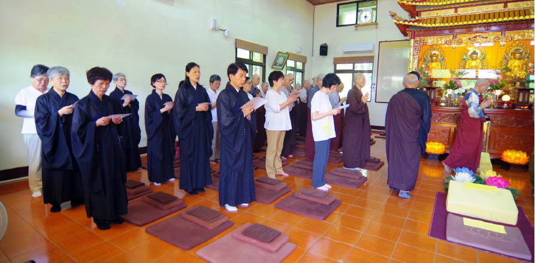

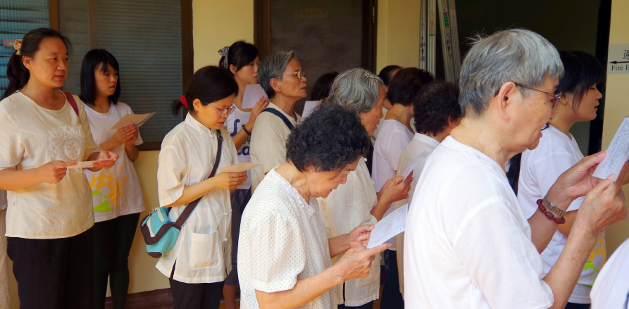

## 共修研學

### 小止觀導覽（六十八）

*心爾、治心整理*

制心一處病能治

然須對症方如藥

三寶加被佛攝受

大悲動機配合藥

第九章  治病

論文：

二、明治病方法者：既深知病源起發，當作方法治之。治病之法，乃有多途，舉要言之，不出止觀二種方便。云何用止治病相？有師言：但安心止在病處，即能治病。所以者何？心是一期果報之主，譬如王有所至處，群賊（併）散。

病源不同，所以治病方法有多種，然不出止觀兩種方便。首先用止治病，或將心安住在病患處，就能治病，何以故？這一期生命果報之主即是心，心能統領身的各部，如王一樣，若能將心安住在病苦處，猶如王所到的地方群賊跑光，把心安住在痛點，慢慢的本身會產生一種自治能力，就會把這個病苦解除。

鬼神所作業障病、四大增損得病，ㄧ般修止修觀來破業障病，應該在前面的坐上修以及歷緣對境修就可以破了，鬼神病也可以祈求三寶加被，做非常大的善法，甚而修止、修觀來破外魔。

此處特別是就四大五臟的增損上面來說，或修行用功太猛或飲食作息居處環境令四大不調，修行人有時候容易忽略這些。某位老和尚晚年病苦纏身，據說是住的地方太潮濕，所引發的病變，有的修行人生了病沒有好好照顧，沒有遇到好醫生，病拖久了就變成非常難醫。

生病並不妨礙去看醫生，也不妨礙做生活上的調整，可以配合用止或用觀效果會更好。

昔日曾參訪緬甸馬哈希禪修中心，所說治病的方法即如此處所說，心安住在病痛處。

論文中「有師言」，表徵智者大師並非道聽塗說，而是有善知識教導，自己也經過抉擇之後所寫出的。

初步用止的治病法，將心安在痛處，內心夾帶對眾生生出苦的憐憫，夾帶著希求佛菩薩的加被，治療所生的病，夾帶著如此病苦能消除我宿世惡業，夾帶著我修行忍耐力的勝緣。

藉著病苦磨練耐心，藉著病苦求佛菩薩加被，並生起對有情病苦的悲憫，將病苦的體性觀空。

此時痛苦是真的，如何能說是空呢？然佛能在一切的境界上現證空性，表示我們透過努力也可以辦得到，雖然知道現在辦不到，但是要種下習氣，所以要夾帶這些觀念來面對痛苦，苦反而成為老師，娑婆世界修行不是以苦為師嗎？所以第一種治病法：心安在苦上。

論文：

次有師言：臍下一寸名憂陀那，此云丹田。若能止心守此不散，經久，即多有所治。

肚臍以下一寸做為丹田（氣海），男重精氣，女重血，然不論血或精，皆由氣帶動。所以只要把氣補足，精神會自動補足。

重點在守氣，這時專注在氣海上，自然調整痛處，意念的注意點到的地方氣就到，意念守在丹田，丹田有氣，強壯之後，自然會去補各部分的不足，要常時累月的守住丹田，如此就能幫助治病還能強身，也比較不會生病。

讓自己的身體健康，做為修行的順緣，無論是以痛處為所緣，或以丹田為所緣的緣念，都要夾帶一些觀念，比如守丹田修止力時，都是為了修學菩提心以及修學空性的止，為了從止上生起菩提心的現觀、生起空性的正觀，作為成佛之因緣，夾帶著這樣的目的來守住丹田。

在呼吸的時候，可以以佛號為所緣來呼吸，看著丹田，或者把氣帶動起來，重點是心念的專注，正念跟著氣息互相觀待，氣順則心正，心正則善念的力量轉強，若在昏沉、掉舉時，呼吸不順暢、不綿密，有欲望的人，呼吸不順暢，此時以守住丹田綿密呼吸，使自己緣念正法的念力轉強，一方面治病，但是最重要的是緣念正法的念力轉強。

論文：

有師言：常止心足下，莫問行住寢臥，即能治病。所以者何？人以四大不調，故多諸疾患。此由心識上緣，故令四大不調。若安心在下，四大自然調適，眾病除矣

。

足下通稱湧泉穴，乃腳心所在。只要心識往上緣，就容易四大不調，身體出問題，如果覺得全身舒服，就是四大調和相，我們舉手投足十分安適，都是因為四大平衡的關係，當四大不調時，身體容易出病變，如果把心安下在丹田、湧泉等處，就可以除眾病。當血壓高、眼壓高、眼睛痛、頭脹的時候，此時注意所緣（足下），氣自然安住往下降。

用丹田呼吸是很好的方法，但一般人常會忘記，年紀越大，呼吸的方式越往上，當氣息只到喉嚨時，就離命終不遠了。呼吸時緣念丹田，將氣息往下拉，先拉到心窩，再拉到丹田。那麼湧泉穴怎麼拉？把腳掌翻過來，打湧泉的地方，讓他痛，自然就會守住它，這時眼壓、血壓、氣壓就慢慢降下來。（下期待續）

### 菩薩清淨的行持　華嚴經淨行品（十二）

*編輯部整理*

家庭甜蜜追五欲

有情繫縛不求出

觀過修法輕安樂

方知貪愛真可怕

淨行品是菩薩的行持，每一條的行持須以願力與般若智慧攝持，這些清淨的行持能帶給有情及個人無限的安樂。菩薩的願力是隨機、隨緣皆可發，在菩提意樂下所修學的正法，都會轉成菩提的資糧。

丙二、指事顯因答其徵因

丁一、總徵

丁二、別顯

戊一、明在家時願

己三、受家室等願  妻子集會

經文：

妻子集會，當願眾生，怨親平等，永離貪著。

受家室就是已經成家了，有太太和小孩，成了家這是集會，應該要如何看待這樣的集會呢？家庭和樂是菩薩發願的所依，在與太太、小孩享受天倫之樂的集會中，菩薩依著妻子集會發願。當願眾生，能願的是菩薩，所願的是眾生，願眾生冤親平等，永離貪著。菩薩依此發願而行，能得前面所說的十種利益，自身三業（身口意）能離過成德，成就佛果的安樂。

每一個願都要做這樣的觀修，並且希望眾生如此該有多好，其次是我希望他如此，三者是我能幫忙他達到，第四是三寶加被我能辦得到。如此，依著每一行持所發的願才不虛發，且能具足成佛的資糧。

南亭老和尚的解釋，妻子集會就是貪著的生起處，是以怨親平等的觀念拿掉在集會中對親人的貪著。唐詩中最感人的就是邊塞類以及閨怨類，守在邊疆的將士不能回家，家中婦女望夫不歸的苦，那是有情最難割捨的愛別離苦，也是八苦當中最苦的。梁山伯與祝英台愛別離的苦，雙方愛執到骨子裡面，連佛來也救不了！

怨親平等是對怨拿掉仇，對親拿掉貪，這句偈的詩眼在永離貪著的這一分，拿掉對家庭的貪愛是怨親平等的目的，觀察怨親平等，在平等之下，更重要的是永離對家屬的貪著，將這樣的心意面對親人、中庸境和仇人，如此訓練自己的心量，在無有愛憎的心境下，方能生起無夾雜的大慈大悲，這是此段的主旨所在。

東吳吳支謙所翻譯的《佛說菩薩本業經》：順教妻子，當願眾生，令出愛河，無戀慕心。順教妻子，就是結婚生小孩主持家庭，要教育妻子、兒女，如此才是辦家政，在辦好國政之前要先辦好家政，家政都辦不好怎能辦國政？古人說：修身、齊家、治國、平天下，順著正法教化太太和小孩。辦家政的目的即大家成為菩提眷屬，離開家庭的愛獄，所以《佛說四十二章經》當中：牢獄有釋散之期，妻子無遠離之念。犯罪坐牢有期滿之時，麻煩的是對於妻子沒有遠離之念。

所以組成家庭，要當成大家是組成修學的伴侶，家庭是培養子女、善教子女的地方，如果只是增長貪愛，那是比牢獄還要厲害。所以印光大師在〈家庭教育是天下太平的根本〉中講到，養兒育女的重點在於培養子女成為一鄉一邑的人才，這是組成家庭的意義所在，現在人沒有這樣的想法，不瞭解自己應該有的責任。

聶道真翻譯之《諸菩薩求佛本業經》：「菩薩居家有所思時，心念言：十方天下人皆使脫於愛欲中，得道極過度。」把家庭轉成修學佛法最好的環境。

己三、受家室等願  若得五欲

經文：

若得五欲，當願眾生，拔除欲箭，究竟安隱。

得了五欲（財色名食睡）一般人認為是好的，錢財多則生活富足，色不僅是眷屬美俊，還包括顏色好（身體健康），顯色好（氣質幽雅，風度翩翩），名聲好（人前稱人後讚）。生活品味、美食、品茗等好的享受，包括居住環境很舒適，這些都是人之所欲。

欲界如此，色界亦如此，色界的五欲包括宮殿之色、形體之色，以及種種美妙的受用、威名等，三界的安樂都是五欲，五欲會讓自己快樂，但是因為我執未破，對五欲生起了貪愛。

菩薩得五欲，對著五欲來發願，願眾生拔除欲箭，究竟安隱，而菩薩自身可得到前文所云的十種利益，乃至成佛。

眾生生起五欲的果報身，是名受第一枝箭，依著五蘊愛著五欲是受第二枝箭。南亭老和尚說，拔除欲箭，身心才能得到安隱，身心為何能得到安隱？禪定都是離貪，一般人以為得到五欲才能得到安樂，可是修學禪定者，知道必須離開五欲的貪愛，方能進入禪定得到輕安之樂。

而要如何拔除五欲箭？拔除欲箭是非常困難的，剪他不斷，理他還亂。第一，要先觀修五欲的過患，離開五欲的功德，貪著五欲快速消耗過去辛苦所累積的功德。第二，貪著五欲會引發貪瞋癡等煩惱而造惡業。第三，貪著五欲容易與大眾結惡緣。一個人擁有極大的福報，卻不願意分享，又因為對方是貧苦多怨，所以容易和貧苦者結惡緣，變成貧苦者仇恨的對象。

該如何對治對五欲境的貪？或云修不淨觀，對自身都尚且不貪愛了，哪裡會貪愛五欲呢？或云修無常觀，因為五欲境快速變化，前面擁有後面失去更苦，或者曾經是有地位的人，一旦失去地位，那是更苦的！甚者，如果我的好樂心是在正法上，對正法有勝解的法喜，那就能夠遠離五欲境。是故顏回是簞食瓢飲，居陋巷，人不堪其憂，回也不改其樂。或說是曲肱而枕之，樂亦在其中，不義而富且貴，於我如浮雲。對佛法有勝解時，這樣的快樂自然就會取代想要追逐五欲的心！

另外一個方法就是修學空性，五欲境是在名言中認為它是安樂，透過財可以達到我想要的，在名言中生起對財的貪愛；色也是如此，或有云西施有沉魚落雁之貌，在魚來說，西施並非美貌者，可見美貌都是眾生在名言中通達的，不是自相成立。請問此時貪什麼？愛什麼？擁有什麼？斬斷了對五欲的貪愛。以上這些觀修法能幫助眾生，拔除欲箭，究竟安隱。

究竟安隱可以解釋為成佛或解脫，安就是身安、心安，隱就是這樣的安樂是他人不知，非修行人是看不見修行人的安樂，不修行的人總認為享受就是安樂，但當他在享受的時候，其實也沒有真的得到安樂，就算每天都在玩樂，好像也沒有真的快樂起來！

修行人的快樂是隱藏的，就因為是隱藏起來的，所以不修行的人看不見，否則大家早就捨去世俗的安樂，修行了。

這一百四十一願，可以說淺可以說深，說到深處是結合菩提心和空性智慧。

吳支謙翻譯的《佛說菩薩本業經》：「若得五欲，當願眾生，皆得清淨，心無所著。」心無所著，就是生起空性的智慧而無所著。

聶道真翻譯之《諸菩薩求佛本業經》：「菩薩居家相娛樂作音樂時，心念言：十方天下人皆使聽受諸經，悉得聞如是作音樂時欲聽聞。」抓住五欲快樂的覺受，這就是學法的快樂，當願眾生學法得這樣的快樂，當願眾生對空性有勝解時，就是這樣的快樂，想要世俗安樂的心態都是學正法的心，好樂世俗回過頭來就是好樂正法。（下期待續）

## 蓮池海會

### 莊家豐居士往生見聞記

*編輯部整理*

喜參加佛法活動

好與人結往生緣

樂共修研學正法

悅在臨終助念後

莊家豐居士生於民國四十四年，臺中市豐原區人氏。一生服務於臺灣電力公司，奉公守法負責盡職，即便三年前健康檢查得知有肝腫瘤，亦照常上班。無奈年初一場重感冒，病情急轉直下，而於七月五日往生，享年六十歲。往生時經家人助念蓮友配合，二十四小時後為居士更衣，只見全身柔軟，臉色紅潤、面帶微笑，劃下人生的圓滿句點。居士從發病到往生，除了往生前一個半小時的大痛外，並未如一般人得肝腫瘤時長期病痛而打嗎啡，亦無肝昏迷及挨餓的現象，直到往生都正念分明，清清楚楚，往生前一晚還和家人一起做晚課，生病的過程完全異於一般病患，除了平時發心為公，護持團體，特別長期開車接送蓮友共修及參加法會，故而有如此殊勝奇蹟，全仗佛菩薩的加被。

居士事親至孝，與汪月雲女士結婚後與父母住在一起，母親年邁多病，居士他總是不辭辛苦的帶母親到處求醫，其中有一段時間，每星期必帶母親到員林看病拿藥，也曾經為求佛菩薩加被母親的病早日康復，清晨兩三點，自己一個人騎摩托車到銅鑼九華山朝山，而感應母親重病痊癒。更有一次，母親昏迷被宣判藥石罔效，需回家辦後事，為了讓母親得助念往生極樂世界而將母親送到佛堂助念，每天祈求佛菩薩加被，並竭誠供養佛菩薩，果然令母親起死回生，這些應是孝子感動天的結果。

哥哥往生後，居士更一肩挑起照顧父母的重任，尤其照顧中風的父親更是不遺餘力，父親幾度的中風，送醫院治療，乃至復建，張羅父親的起居，皆親力親為。曾經有一段時間，父親臥病在床，每天遭受冤親債主的干擾，日夜顛倒，不得安寧，居士乃於每天下班後，誦念地藏經回向給父親，才讓父親心神安定。而為了讓父親也能往生極樂世界，在父親病中即幫父親廣結善緣，以至感應父親往生時助念者絡繹不絕。

居士婚後一心向佛，孩子出生後更以身教代替言教，常帶孩子參加法會、佛法研學，教育孩子在佛法的薰陶下親近善知識，結交善友，讓孩子注重因果而謹言慎行，他留給孩子的不是一般人所追求的錢財，而是給孩子正確的人生觀。

居士育有三個子女，秉持莊家傳統的道風，教育子女不只讓子女受現代的高等教育，更注重傳統的五倫教育，務必讓子女懂得感恩，並謹守本分，勤儉謙讓，三個子女各個乖巧有禮，待人接物進退有據。長女淳惠服務於幼兒園，是一位有愛心兼具耐心與細心的幼兒老師，已婚並育有一女，家庭美滿；長子惟盛大學畢業後，受父親的影響，再考入學士後中醫，深知人的病苦除了醫身也要醫心，所以也在佛法的學習上下功夫，立志成為醫治病患身心的中醫師；次子臺科大研究所畢業後當兵回來，適逢父親發病，感念父母養育之恩，即在家侍奉父親，幫忙母親照顧父親，這在現今一般的年輕人是不容易做到的，亦居士用心教育子女的成果。

居士為人隨和、樂善好施，當仁不讓並能廣結善緣，有求必應，有如彌勒佛，從不與人計較；曾在家扶中心認養貧苦兒童，也資助貧困學生的生活費用，但養身不如養心，給人生命不如給人慧命，畢竟物質享受不如充實精神生活，為了讓社會人心向善，讓人心有所寄託，更支持佛教團體的講經說法，及儒學講座，藉佛法因果律及傳統儒家的父慈子孝兄友弟恭，來改善人心。

居士一生為公發心，故感得雖重病而少受病苦，且由於妻賢子孝，家庭佛化，能護持居士往生大業。此刻居士必於極樂淨土精進聞法，當來必早證無生，回入娑婆，廣度有情。

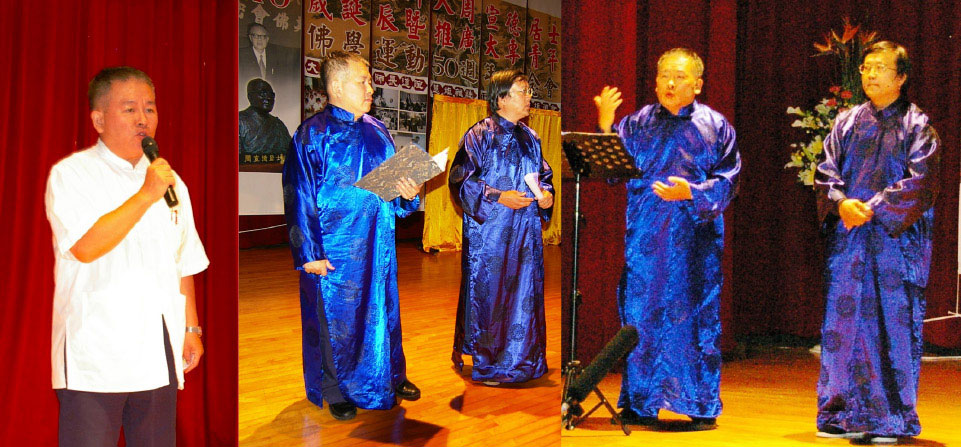

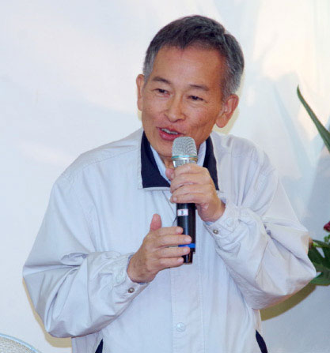

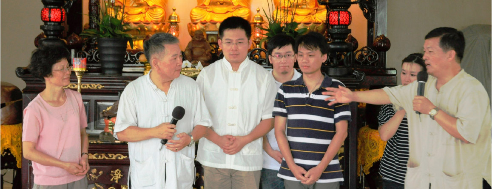

## 專題研學

### 聖者的祕密～大佛頂首楞嚴經二十五圓通暨七處徵心探源

### 二十五圓通暨七處徵心簡介　（三十七）

時哉

求男求女皆滿願

持名等同供恆沙

十四無畏福眾生

一句南無觀世音

子二、觀音廣陳

丑二、陳白之言

寅四、詳演所獲殊勝

卯二、承演三科

辰二、十四無畏

巳二、條列無畏

午三、二求無畏

未一、求男

經文：

十二者，融形復聞，不動道場。涉入世間，不壞世界，能徧十方，供養微塵諸佛如來。各各佛邊，為法王子。能令法界無子眾生欲求男者，誕生福德智慧之男。

不見根、塵、識叫做融形，乃勝義諦成就的行相；觀音聖者觀察世間即是復聞，指的是世俗諦。不動道場即是現證二諦，現證空性時，無因緣動相，以不起定的方式利益眾生，成就殊勝的道場。

聖者於世間度眾生，不會毀壞世間名言，在十方世界，身服勞役，心上做普賢菩薩行願的七支供養（如說修行供養，利益眾生供養，攝受眾生供養，代眾生苦供養，勤修善根供養，不捨菩薩業供養，不離菩提心供養）。不但善根具足敏而好學，且有悲心利益天下蒼生。

或云因果各自造作各自承擔，如何能相代？因果無法相代，但從分憂解勞的那一分來說代眾生受苦。

供養微塵諸佛如來，指的是以普賢行願威神修學法，於一一佛所，皆現不可說不可說佛剎極微塵數身。一一身，遍禮不可說不可說佛剎極微塵數佛（此為如來佛長子的修學法）成為諸佛歡喜攝受的對象。

能令法界眾生無子眾生欲求男者，誕生福德智慧之男：由於觀音菩薩承事諸佛令佛家業不斷的善造作，能福蔭眾生生出富貴，且能傳承家業的福德智慧具足之男。

未二、求女

經文：

十三者，六根圓通，明照無二，含十方界。立大圓鏡，空如來藏。承順十方微塵如來祕密法門，受領無失。能令法界無子眾生欲求女者，誕生端正福德柔順眾人愛敬有相之女。

以六根為所緣現證六根自相空，並且以空性智慧攝持世俗一切法，在一切法無二無別的狀態下，含攝十方世界微細世俗。大圓鏡智即第六意識（唯識宗安立第八識）與空性智慧相應，乃能證的是智慧，所證的是空性理（如來藏無自體性），出定有承順的修養，能得十方微塵諸佛攝受，領納承擔諸佛秘密法門而不遺失。

觀音菩薩以此承順功德，有能力加被行者，若欲求女，則能誕生端正福德、柔順，得眾人愛敬的女子。

或問為何觀世音菩薩能幫助有情生男生女？乃在因上傳承佛的家業，果上能令眾生得子嗣傳承家業。

午四、持名無畏

此處消除眾生持觀世音菩薩名號，對其名號的功德疑惑與畏懼。

未一、合界菩薩功德

經文：

十四者，此三千大千世界百億日月。現住世間諸法王子，有六十二憶恆河沙數。修法垂範，教化眾生。隨順眾生方便智慧，各各不同。

此釋尊所教化之三千大千世界，共有百億須彌山與日月，現住世間諸法王子共有六十二億恆河沙數之多。這些大菩薩們以身作則，修學教法，垂示典範。由於隨順眾生故，利生智慧與方便各各不同。

未二、一己圓通遍容

經文：

由我所得圓通本根發妙耳門，然後身心微妙含容，周徧法界。

觀世音菩薩生起空性智慧證得耳根圓通，不但證得耳根自相空，且在世俗上生起包含、容納一切有情的心量，能同時在勝義、世俗兩面相中通達。

未三、一號功齊眾號

經文：

能令眾生持我名號。與彼共持六十二億恆河沙諸法王子，二人福德，正等無異。

觀世音菩薩持名的功德，在〈普門品〉中有云，若有人受持六十二億恆河沙菩薩名字，且盡形壽供養飲食、衣服、臥具、醫藥。這樣多的善法功德，和受持觀世音菩薩名號，一時禮拜供養，所得福報相等。

未四、更出同功之由

經文：

世尊。我一名號，與彼眾多名號無異。由我修習得真圓通。

觀音菩薩名號與受持六十二億恆河沙菩薩名字，功德無異，乃因在空性上得到現證，也在世俗上有六度的實踐，普賢修法的威神力，現出如此殊勝的福力加被眾生。

巳三、結明顯益

經文：

是名十四施無畏力，福備眾生。

前述十四種無畏功德，觀世音菩薩成為能施，無畏懼力成為所施，眾生是受施者，而有上述如此殊勝的受用。（下期待續）

### 大乘百法明門論簡說（四）

*心超講述、淨本整理*

能詮本論詮百法

引生成佛謂大乘

一一通達二無我

明門皆是圓通門

肆、略釋題意

表一中，「大」是含容大及殊勝大。所謂含容大，是指包含了一切法，一切法大分勝義與世俗，都含攝在其中。其次殊勝大含當體、揀小。所謂當體是依大乘法能破二障，其體性就是離苦得樂，證得菩提覺法樂跟涅槃寂靜樂，稱為當體；所謂揀小是揀別小乘。所以修學大乘法門能讓行者現證二諦，現證勝義諦得涅槃寂靜樂、現證世俗諦得菩提覺法樂，一切法成為所知，心成為能知，知才是人生的出路，不是財產、相貌，正如六祖大師座下神慧大師所說：知是眾妙之門。

「乘」者運載，就是能夠運載有情從痛苦到快樂。「百」是數目，本論共有一百種法。「法」是世間法跟出世法。「明」是指於一切法中通達二無我。「門」是百法之門，由一一法通達二無我為明，此門是開通而無壅滯，壅就是壅塞，滯就是停滯。無壅滯就是可以從百法中的任何一門通達二無我，例如從貪這一門，通達貪沒有自體性，因而破貪，由此貪而入涅槃。「論」乃於經典中簡擇性相，由相中抉擇善惡，能教誡學者斷惡修善，抉擇性中能令學者通達二種無我，由此而滅妄證真。

表二「能詮之教」是大乘，「所詮事理」叫百法，所說是大乘法，眼前詮釋百法。所詮之事，依本論是九十四種有為法，所詮之理乃六種無為法；或說事是一切法，本論攝為百法，所說理是二種無我。「能緣之慧」是明，此以百法為所緣，百法是所緣之門，能於百法一一通達二無我，亦即由百法之任何一門都可直入涅槃。因此整體觀之，大乘百法明門就是「所詮之義、體」，論是「能詮之教、用」。換言之，本論是能夠詮釋的教，所詮釋的義理就是大乘百法明門。而本論的用途就是能夠顯示大乘百法明門的義與體。

再看宗旨，本論共有一百種名詞，九十四個有為法，六個無為法，明此則能了解萬法唯識，此約唯識宗，若約中觀宗則明萬法無我。若就通俗解：本論為唯識學的名相提綱。唯識學宗義乃萬法的體性是心識，含攝著生理與物理現象，本論不只是唯識學的名相提綱，亦是唯識宗於心理學上的簡要說明。也是宇宙萬有之分類，學者由此而了解宇宙人生，為明達的宇宙人生觀。宇宙萬有分為心理、生理和物理，特別重要的是心理。明達的人生觀就是有能力讓自己離苦得樂，明達的宇宙觀就是有能力讓宇宙的有情離苦得樂。

本論的一百種名詞，是宇宙萬有的分類，宇宙萬有可以分成五類：心法、心所有法、色法、心不相應行法跟無為法。心法有八種，心所有法有五十一種，色法方面，若就六根、六塵來算，應該是十二種，但是六根中的意根是心法，所以只有十一種。心不相應行法的二十四種，是將所有世間的概念歸納成二十四種解釋法，這二十四種分類的學習，對於欲學佛者有很大的幫助。至於無為法，可以有幾百種的無為法，此處歸納為六，然而其中只有空性才是真正無為法中的勝義諦，其它的無為法都是世俗諦。

百法的法有軌持之義，能解釋的謂之軌，所解釋的叫做持。持是每一法皆有其特性，依此特性可以與其他法差別，有情能透過該法特性去認識該法，謂之軌生物解。以火為例，火的特性是燒熱性，火能任持此自性；透過燒熱性能生起有情的認識，謂之軌生物解。實則，所有法的特性宛然有，但是自體空，猶如火的能燒，須觀待所燒才能成立能燒，若對著虛空，或火之自身，如何成為能燒？又如刀子的特性是鋒利性，但若刀子割的是石頭，鋒利性也無法成立。

再問三寶有沒有自體性？三寶要成為能度，一定要有所度，如果能度有自體性，眾生理應成為所度，然剛強難化者不成為所度，三寶自不能成為能度。佛法之殊勝，亦觀待眾生的認識而生。所以法是可軌、可則，它的特性不變不失才能稱為可則，但是所謂的不變不失，是在某種條件下的不變不失，實際上自體性都是空。例如孔子的仁，就是有心要去利益眾生而自願成聖賢，謂之仁。此仁亦無自體性，若對著石頭、空氣亦不會生出仁心。（下期待續）

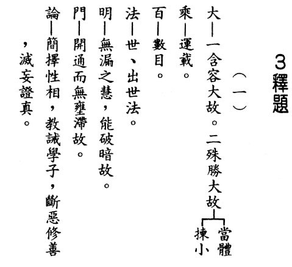

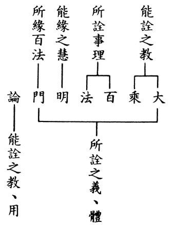

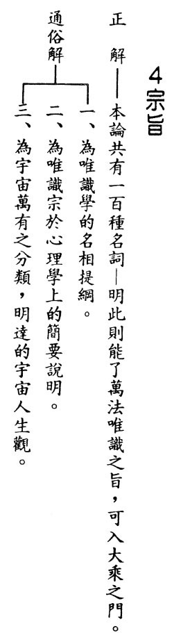

## 孔學一隅

### 孔子聖蹟圖淺說（十一）

時哉

返魯傳道統

傷麟怨道窮

夢奠兩楹前

天下朝宗他

二九、縱橫六經

此幅縱橫六經，記孔子六十八歲回到魯國時，雖然哀公與季康子熱烈歡迎，並以國老的方式來禮遇孔子，可惜國君懦弱無能，不能重用孔子，孔子也無意仕途。在最後的五、六年歲月裡，在杏壇上為弟子講學，作文化的弘揚與傳承，圖中孔子盤坐，席邊有古琴，茶几上有書卷，表徵是經典禮樂的教學，此時或正對弟子的求教而作答覆，兩旁弟子或拱手作禮，或注目聆聽，或垂眼思惟，或相互議論，或核對古籍，或在旁演禮，門外弟子或在習射、習御皆是六藝的訓練，也是君子的人格養成。

同時並序書、傳禮、刪詩、正樂，修春秋、制孝經，尤其贊周易（註解易經），共作了十種注解，謂之十翼。共有繫辭上、下傳、乾卦坤卦的文言、序卦傳、說卦傳、卦的彖傳、象傳等。

時弟子蓋三千餘人，通六藝者七十二人。

尤其習禮的風氣一直延續到西漢武帝時，司馬遷到了山東孔廟，還看到諸生以時習禮，感慨、徘徊、低頭，不忍離去，孔子只是布衣傳了十餘世，還有這種影響力，這就是道統的魅力、傳承的魅力、人格特質的魅力，自天子至庶人，群言惑亂竟折衷於他，大家對他的相信更甚於君王，這樣的人物到底是一個什麼樣的人物呢？讓人難以想像，讓人覺得高不可攀，讓人鑽不究竟！

三十、西狩獲麟

此圖西狩獲麟，約當魯哀公十五年時，孔子七十二歲，此時的孔子死了伯魚，差一點斷了孔家的後代，所幸遺腹子為男兒，即後來作〈中庸〉的孔伋字子思。能傳承道統的顏回，也不幸短命死矣，所幸有曾子能悟夫子的一貫之道。連最有革命情感，一路情意相挺的學生子路，也在衛國內亂，死於非命。此時的孔子不知如何形容他的感慨。

就在哀公十四年的春天，西狩（意即往西方狩獵）時，叔孫氏的車夫鉏商，獲得異獸以為不祥，請孔子往觀。孔子去看時，此異獸被殺傷前左腳，且已死。孔子說：這是麒麟啊，牠是有仁道的靈獸啊。牠的出現，是有德天子出現的吉兆，但牠卻生在亂世，又被人打死，莫非我道已窮。圖中的孔子在兩株千年古松下，面對傷左前足，四腳朝天而亡的麒麟，雙手一伸作我道窮矣的感嘆。身旁弟子愁眉無奈的望著靈獸，獵者三人，表情或訝異、或無奈、或掩泣，泣者或是叔孫大夫車夫鉏商，據說是他抓到並折斷麒麟的左足，想必是自知闖了大禍，不禁掩面而泣。

何以孔子慨嘆我道窮矣呢？因自古以來，麒麟出現，一定是明君在位，百姓知其為祥兆，均不忍傷其身。魯國當時政治紊亂，並無明君在位，麒麟出現，又遭殺害，這好比孔子一生未遇明君，雖有救世之道，終不能行於世，於是停止著述寫作，〈春秋〉之作，因而絕筆。

三十一、夢奠兩楹

此幅夢奠兩楹，是魯哀公十六年孔子七十三歲，過世前七天，子貢特來探病時，孔子正拄著柺杖在大門口唱歌，歌詞的意思是，泰山難道要崩倒了嗎？梁木難道要毀壞了嗎？賢智的人難道要枯萎（去逝）了嗎？圖中所示即是孔子當門而歌，學生子貢前來探病，拱手作禮問候老師。子貢聽了這歌詞，便嘆道，泰山塌了，我還有什麼可以景仰呢？屋樑壞了，我還有什麼地方可以棲息呢？聖哲過世，我還有什麼可以效法安住呢？

孔子見了他，便說：賜，你為什麼來得這麼遲呢？並說：從前夏朝人死了，把棺木停放在大堂的東階上邊，如以主人的禮來待他。周朝人是把棺木停放在西階上，如以客禮來待他。殷（商）朝人則將棺木停放在大堂兩柱之間，受人拜奠。此夢或是作王侯，或是將死的預兆，可是現在沒有賢明的天子，天下誰來朝宗於我呢？大概是我要死了吧！之後臥病七日而歿。

三十二、治任別歸

此圖治任別歸是逝世之年六月，葬孔子於魯城北泗水之上，眾弟子以子貢守喪三年之議，都來到墓旁，搭蓋茅屋居住，守著心喪三年。何以用心喪呢？子貢說：老師以前死心愛的弟子顏回，若喪愛子而無喪服，同理老師雖逝，如同喪父而無服。意即孝子穿著喪服為父母守喪三年，弟子如同喪父母，但守的是心喪而無喪服。三年期間，諸弟子們都在孔子墳墓旁，搭蓋了茅屋居住，又帶來異國的樹苗種植，因此孔林實在是最有歷史價值的林園。圖中所繪是諸弟子們守墓三年，哭奠盡哀，拜別孔墓，並相互告別，有的拜別老師墓後，並跟子貢拜別，子貢跪拜回禮。

在大家一一的離開之後，子貢還住在孔子墳墓旁邊，再守喪三年，共守了六年之久才離開，千古對老師服心喪之久，唯他一人而已。後來孔子的學生和魯國人，陸續把家搬到孔子墓旁，竟有一百多家，於是那一地方，就被命名為孔里了。

孔子去逝後，哀公便在孔子生前居住的三椽茅屋，改建為一座廟宇，來奉祀孔子，後世的人，因為孔廟裡保存著孔子生前衣服、帽子、琴、車、書籍、禮器等物品，在廟裡也同樣舉行奉祀，一直到現在，都沒間斷過。且一直擴建，成為現在孔廟的型式。

儒者們也在孔子墓前講禮，並舉行鄉飲酒。鄉飲酒是把鄉學中的優等生，推薦給國君時的送別宴，或在墓前舉辦弓術比賽。

至於孔家在曲阜所住的地方，也隨著歷代的封賜，擴充為今日的孔府，曲阜的孔廟、孔林、孔府今稱三孔，是到曲阜緬懷一代聖哲孔子必去之處。

而孔子的陰德也令子孫綿延了八十代，七十七代至八十代的子孫，都居住於臺北，七十七代孫孔德成先生與七十八代孫孔維鄂先生安葬於臺北三峽。

以上是孔子聖蹟圖三十二幅簡說，用以表彰孔子的一生，他的德學，在魯國為政的事功，周遊列國推行王道的艱難，回到魯國整理典籍辦教育培養人才，傳承文化道統，令民族延續不亡，是千秋萬世讀書人最高的典範。（全文完）

附：三十二幅孔子聖蹟圖畫作導覽光碟已發行（免費流通），歡迎向本會洽詢。

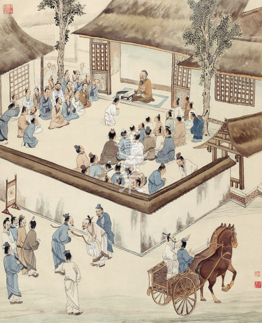

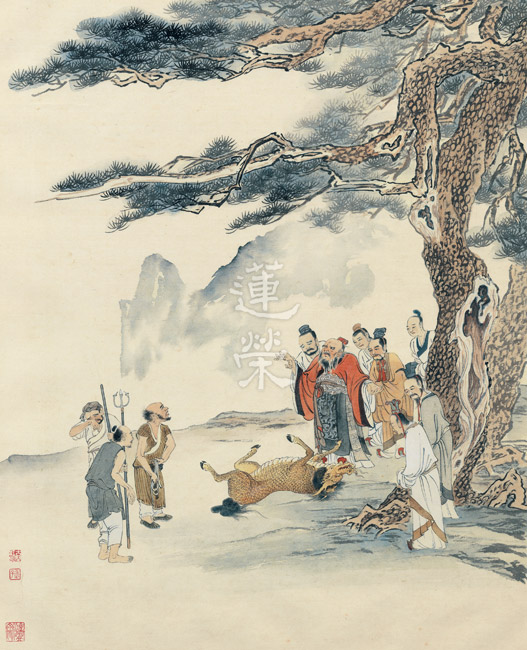

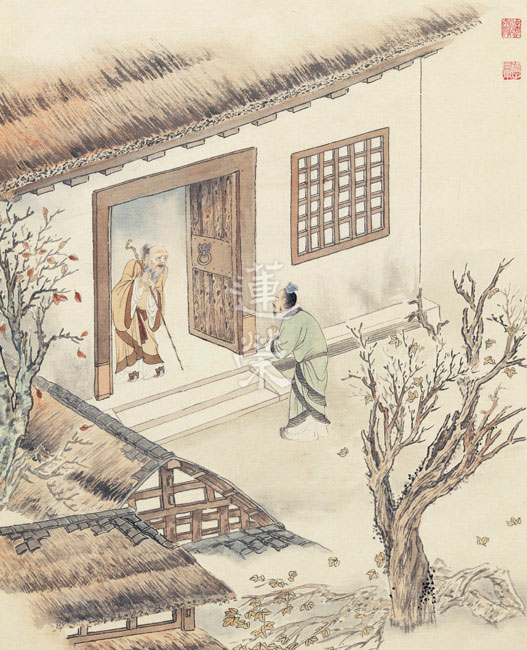

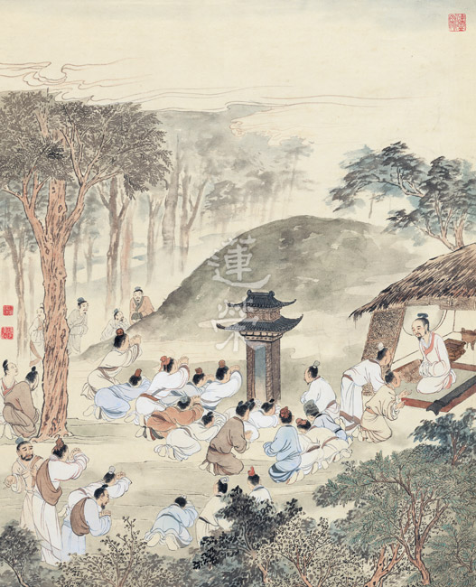

### 論語簡說（四）君子不可小知章賞析

*時哉講述、心迦整理*

托孤寄命仁己任

大愛之才何處覓

爭名奪利覺伐異

斗筲政客何足算

論語章節

子曰：君子不可小知，而可大受也。小人不可大受，而可小知也。

(衛靈公第十五，第三十四章)

君子不可以小事了知其能力，可以培養他接受重大任務，因為君子有領導者的能耐與心量。反之一般人不能擔當辦政治、辦教育等重責大任。或可以把自己分內的事做好，或成為某一行的專門，甚至是社會大眾所熟知佩服的人。

所謂的君子，在《論語》中可能是指在位者，或者是指以仁心(修己安人)做為修學法，果地上成就外王之人。例如《論語》〈衛靈公篇〉，子曰：君子義以為質，禮以行之，孫以出之，信以成之，君子哉。君子以義為本質，凡事都以正知見為導。在辦事時，能以禮行持。出言謙遜。不但如此，又以信實成其功，真是君子呀！即是本章君子之義。

至於《論語》中所謂的小人，可能是指只為自己的私利著想，並且沒有辦法被教化，如：陽虎、曹操之流，但非本章小人的定義。本章的小人，是在野的一般人，人生只圖過著溫飽的生活，滿足欲望，並沒有更遠大的抱負。

因此君子不可小知，以小事被知。小事此處或指世間技藝，或指個人本分之事。不可小知並非指大眾不知，雖小道，必有可觀者焉。有時這些技藝甚至是被大眾所愛，被眾人所欽佩，但畢竟與福國利民，增進人類全體生活無關，以這類小事評斷君子之能，必定產生差錯。君子之道深遠，願意親近善知識充實自己，培養自己成為可堪當大任的菁英人才。如曾子所說：仁以為己任，不亦重乎，死而後已，不亦遠乎。是為大受之才。

或問，該以什麼方法來判定君子與小人？《論語》〈為政篇〉提到：視其所以，觀其所由，察其所安，人焉廋哉。人焉廋哉。長時間的「視」、「觀」、「察」，以及發生重大事情時，此人辦事的眼光與格局，是否替天下蒼生找出路，即可知此人是君子還是小人。

然而，並非學習琴、棋、書、畫等技藝都是小人，此章是告訴我們人生的經營需有中心思想，若能著重於心力上的堪任以及心量的擴展，此人雖然只是在某一技能上專精，但其技藝將可成為提升大眾的善巧方便，其作品能以藝載道，則已非此處所指的小人。大小之別在於氣度、能耐與心量。

所以君子並非不做小事，孔子曾說：君子不器。君子不像器具那樣限於一種功用，不但博學多聞，不以器自許，還志於形而上的道。夫子也曾說自己年少時卑賤必須謀生，所以多能鄙事。本章只是說君子不可小知而可大受，並不妨礙君子做小知的事情，而且君子是以大受的內涵做小知之事，看似與小人一樣做小知的事情，但是內涵的展現卻完全不同！

准此而言，如何將自己培養成為本章所說的君子？首先要以君子為學習的目標，加上教授善知識引導，同行善友互相切磋琢磨，自己好學用功，並在事相上歷練，最終可有君子的成就。

《淮南子》〈主術訓〉上說：「譬猶狸之不可使搏牛，虎之不可使搏鼠也。」狸貓無法搏倒牛，老虎不能使其抓老鼠。心量與才器不夠者，是沒辦法承擔替天下蒼生找出路的重責大任，君子能越過艱難的挑戰，無法光用小事得知君子的內涵。（下期待續）

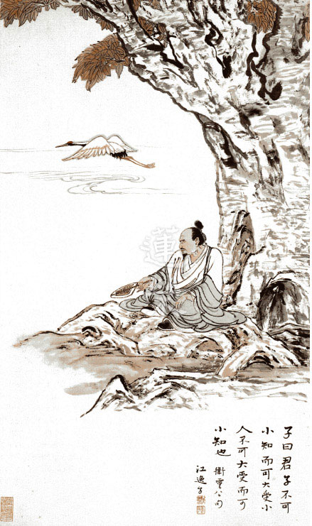

## 專題報導

### 飯水分離陰陽飲食法

巫炳坤

飲食治療百病消

有恆持續效果現

所依經論方法別

擇眼分析勿道聽

在一個偶然的機會裡（一○三年五月份時），末學在內人的同事介紹下，接觸到了由一位韓國人所著的：

「飯水分離陰陽飲食法」

及

「無上命令：實踐飯水分離陰陽飲食法」

這兩本書。

這位韓國人名叫李祥文，於二十四歲時偶遇一位奇人，傳授他「飯水分離」的飲食法，因而治好了自己的胃病和哮喘。

由於好奇心的驅使，更為了進一步探討及了解其原理與療效，於是毅然進入深山之中，開始親自試驗少食、節食、禁食、斷食等各種飲食方法，並實踐「飯水分離陰陽飲食法」，最後終於領悟到其中的奧秘。

為了與世人分享其寶貴的經驗與心得，並幫助患者解除其身心的痛苦，遂著書以幫助有緣人。

在過去四十年間，通過與近千名的癌症患者直接交流，期間不但治癒了許多癌症患者，同時也治癒了許多急慢性病患者及疑難雜症患者。

癌症患者必須在一發現腫瘤或癌細胞，在還未動手術，或做化療、電療，以及採取其他治療法之前，即按照書中所述，確實實踐「癌症病患的飯水分離飲食法」，便有可能治癒。

如果是持續施打營養藥劑和抗癌藥劑的病人，以及充滿腹水的病人，千萬不要並行飯水分離。因為在無法徹底陰陽法則的狀態下，效果微乎其微，有時反而會對身體造成負擔。詳見：「無上命令：實踐飯水分離陰陽飲食法」這本書：第一六○頁最後一行及一六一頁前兩行。

因鑑於本書所載飲食方法有別於傳統醫學理論，頗具參考價值，所以特別推薦給您，但願能對您有所幫助。

為了讓您能夠很快的進入狀況，並對「飯水分離陰陽飲食法」有更進一步的認識與了解，所以末學不揣譾陋，將書中內容稍加整理，並略述於後，其中或有疏漏或錯誤的地方，還請您不吝指正。

※「飯水分離陰陽飲食法」的原理以及實施原則如下：

※「飯水分離陰陽飲食法」可分為三種，以下所述方法為：「一日三餐飲食法」。

※至於「一日兩餐（早晚）或（午晚）飲食法」及「一日一餐（晚餐）飲食法」，則請參考上述兩本書籍。

※您可自行斟酌採用何種方法實施。（亦可交替實施）

一、「飯水分離陰陽飲食法」可分為：「一日三餐飲食法」、「一日兩餐（早晚）或（午晚）飲食法」以及「一日一餐（晚餐）飲食法」三種。

二、百病的根源是過飲和過食，還有無節制的飲食生活，然而用餐時水和食物一起吃則是最根本的原因，這就是陰陽理論。舉例來說，食物是火，水是陰。人類生存時水和火雖然是必須條件，然而火就應該要旺盛的燃燒，水則要順行流動才有價值。然而水和火混合，就會變成自相殘殺。

三、錯誤的飲食文化導致體內的自然治癒能力逐漸喪失，或是沒有治病的時間，因此才會引發諸多疾病。

四、很多人有吃飯前或吃飯後飲水的習慣，而且很多人認為人體百分之七十都是水分，所以要每天喝二千ｃｃ以上的水。

五、刻意飲水會導致疾病，很多疾病都是因為飲水過多引起。

六、飲水過多會使身體陰陽失調，氣血不暢，引發各種疾病。

七、水喝太多，體內鈉離子過低，若身體調控不佳，可能造成水中毒，引發低血鈉症，可能會身體無力，嚴重的話可能神智不清，甚至昏迷。

八、「飯水分離陰陽飲食法」強調在飲水時間可以隨意飲水，但是如果沒有飲水的念頭不要強迫自己喝水。

九、在飲水時間以外請不要喝水。

十、很多人擔心不飲水會血液過稠，患上腎臟或膽結石等，請不必擔心。

十一、「白天」屬「陽」，「夜晚」屬「陰」。

十二、人體的陰陽也要配合宇宙通用的陰陽之氣，在陰的時間從事陰的活動，在陽的時間從事陽的活動，人體才不會生病。

十三、改善錯誤飲食習慣的核心就是「飯水分離法」。「水」是「陰」，因此要在「陰」的時間服用；「飯」是「陽」，因此要在「陽」的時間服用。

十四、「飯水分離」，可使「陽氣韻」（熱氣韻）旺盛，好讓胃腸充分發揮作用，消化吸收食物中的營養。

十五、好好保存這股熱源，自然就會有排毒與殺菌的不可思議力量。

十六、如果吃飯時「喝湯或喝水」，使得這股熱氣韻減弱，甚至澆熄，以致造成身體陰陽失調，血液循環不順暢，進而新陳代謝受阻、百病叢生。

十七、採用「飯水分離陰陽飲食法」，會增強免疫力及自癒力，同時可使呼吸通暢，血液循環順暢。

十八、實施「飯水分離陰陽飲食法」，會使胖的人變瘦，瘦的人變胖。

十九、吃飯時請勿湯湯水水（切忌喝水或喝湯）。務必確實做到「『飯』、『水』分離」。

二十、喝湯和燉菜時可用湯匙將菜舀出來吃，絕對不要在用餐時喝湯。（湯可於飯後兩小時再加熱食用）。

二十一、用餐時先從熱飯開始吃，飯後再吃菜肴，禁止吃涼的飯菜。

二十二、用餐後兩小時到下一餐前兩小時，這段時間可以隨意喝水（溫開水）。（禁止喝冷水、冰水或從冰箱冰過的食物及冰品）（應先取出等完全退冰後再吃）

二十三、即使在應該飲水的時間，如果不想喝水就不要刻意喝水，沒有必要把喝水當成任務來完成。

二十四、餐後兩小時喝水，就不會停滯在胃中，並且快速吸收。

二十五、用餐時不飲水只吃乾的食物，餐後兩小時再飲水，這樣的陰陽飲食法相當於緩解細胞緊張，給細胞注入新活力的催化劑。

二十六、晚餐飯後兩小時至晚上十時前可以隨意喝水。

二十七、過了晚上十點以後到第二天吃早餐前請勿喝水，必須等吃完早餐兩小時過後再喝水。

二十八、如果情況允許，請務必遵守飯後兩小時到下一餐飯前兩小時之間的空檔喝水。之所以如此，是因為食物在胃裡需經過兩小時才能完全被消化。

二十九、如果情況不允許，可改為一個半小時或一小時。

三十、如果可以，白天不要喝水，等晚上可以喝水的時間再喝水。

三十一、嚴禁早上一起床就空腹喝水（尤其是冷水或冰水），因為這樣就等於一早就把熱氣韻澆熄。

三十二、使用「飯水分離陰陽飲食法」，最初會很想喝水，焦急等待飲水時間，但過一段時日後飲水量就會逐漸減少。

三十三、如果用餐後兩小時飲水出現無力症狀，請改為餐後一小時飲水。

三十四、如果用餐後兩小時飲水出現便秘症狀，請改為餐後一小時飲水。

三十五、如果要吃藥，請儘量配合在可以喝水的時間服用（飯後兩小時），如果情況不允許，也可以改為飯後一個半小時或一小時服用。

三十六、早餐宜於六點至八點進食。

三十七、晚餐宜於五點至七點進食。

三十八、不要太在意營養不足的問題，採用「飯水分離陰陽飲食法」，身體會自動調節營養。

三十九、吃飯時宜細嚼慢嚥，在強大的唾液腺的作用下提升消化能力。

四十、只吃乾的食物，可以促進胃液的分泌，讓攝取食物的養分完全吸收、消化。

四十一、在餐後和用餐時可以適當吃水果，但是不可吃西瓜。

四十二、餐與餐之間禁止任何零食，更不可吃宵夜，以便讓胃腸充分獲得休息。

四十三、如果可以，最好能夠吃素，不要吃肉，以免影響「飯水分離陰陽飲食法」的療效，同時也可避免心血管疾病上身。

四十四、健康有問題的人要避免喝含糖飲料。

四十五、癌症病人不能吃蜂蜜、糖，以及任何含糖的飲料、食物，魚類、貝類、肉類。

以上資料僅供參考，欲知詳細內容細節，請參閱上述兩本書籍。

## 專題講座

### 菁英教育之２Ｃ文化

*戒澤講述、整理*

憤悱啟發聽聞力

舉一反三思惟功

潛能開發創造能

智藝均衡人才出

在夫子的年代，學習儒學的內涵是王道，不愁吸引不了優秀的學生。因為當時大家都明瞭，學習禮樂使人尊貴，也是最好的出路。但時至今日，西風東漸，大眾的價值觀已偏轉。認為只有學習西方的教育模式，於世俗能力上充實、發揮，進而能在世間的競爭當中，獲得物質及權力，如此才是真正的王道。處在這扭曲價值觀的洪流中，儒學和佛學的內涵還能吸引大眾嗎？

針對這樣的疑問，仔細回想個人在美國研究所的學習，配合自身的工作經歷，以及近距離觀察一所美國中學的教學模式之後，得到一些不同的體認。

依個人的淺見，西方文明的成功元素有二：宗教與教育。雖然其中有許多明顯不足之處，但他山之石可以攻錯，其優質的部分是可以作為我們的參考。尤其是教育的部分，一般人想到的也許是自由放任的風氣，但往往被大眾忽略的，其菁英教育的主軸，是著重於兩個「Ｃ」：評斷性思維(critical thinking)和創意(creativity)的能力的訓練與提升。

前新加坡總理李光耀在其最新著作中，談到對一些國家的看法。他認為美國雖有很多問題，其國力仍會維持強盛一段長時間，原因之一應是其優質的菁英教育(世界前二十名大學中，六至七成在美國)，能不斷的吸引各國的人才群聚，並在各個領域發揮。

但菁英教育裡「２Ｃ」的重要性，絕對不是只有西方人才了解的。遠在 孔子的教學中就提到：「不憤不啟，不悱不發。舉一隅不以三隅反，則不復也。」其中憤啟悱發是屬於思維力的訓練，舉一反三則是創意／悟性的練習。而佛學當中的因明學，也是特別在強調思維辯證的能力。

觀察許多亞洲國家的學校教育，受限於升學主義，學生們習慣於以記憶性的方式來學習，面對考試及時間的壓力，思考也變成奢侈的浪費。久而久之，不太用腦力思考變成了一種習慣，也嚴重的限制了學生發展的潛能。

而時下要在世俗中追求卓越的年輕人，往往只有模糊的要學習西方的想法，殊不知想要能夠出人頭地的關鍵，就是要先在這「２Ｃ」裡講究。先打破過去學生時代培養的慣性，走出不用思維力的節能減碳模式，走出腦袋放空的舒適圈。

即使儒學和佛學的學習，想要能深入而有所得，也要提升「２Ｃ」的能力。想要在世俗上一展所長的人，除了學習專業知識外，若是能得遇儒學佛學的明師，在思維力與創意／悟性上得以提升，肯定能如虎添翼。

在了解了「２Ｃ」的重要性後，我們要針對其內涵，做正確的認識：

評斷性思維(critical thinking)

思維能力的提升是教育裡不可或缺的一環，愛因斯坦曾說:「大學教育的價值，不是對知識的學習，而是訓練腦袋去思考」。 但是要如何做正確的思維？在一九八七年的國際評斷性思維及教育改革會議中，提出了相關的定義。簡言之，評斷性思維就是能系統、完整、客觀地評量所有經由觀察、交流、推論以及經驗閱歷所得到的資訊，從而形成想法乃至於付諸行動。在運用評斷性思維時，我們需要以下列幾點檢視與輔助自己的思維過程。

１．「思而不學則殆」。思維一定是要配合廣泛、深入、有好老師教導的學習。

２．要認知自己是否有成見。隱微處對人、事、物的成見是影響思維品質最重要的關鍵。雖然大家都知道不能戴著有色眼鏡看事物，但在自身日常思維決策中，卻常常不自覺地犯此錯誤，或許這也符合諺語所說：「最大的敵人是自己」。

３．能以正確的經驗閱歷檢視所面對之訊息。要提醒自己不能全然倚恃過去的經驗，經驗能否正確，必須以正知見來評量。

４．全面性地，見樹又見林地分析思考問題，收集資訊時不要犯了瞎子摸象，執持一隅的錯誤。不要只接觸到片面的訊息，就要遽下結論。而在下結論時，要養成習慣反問自己，是否還可以有不同的角度看待問題，是否還有尚未收集的資訊。

５．人情世故的廣泛通達，才能正確的解讀所面對之資訊，以及正確的累積經驗閱歷。

６．在考慮事項的前後關聯性上，能多角度地假設，推論。

７．有能力提出客觀及中肯的疑問，並非只是被動式地接受資訊。

８．反覆思惟，形成論述。

９．面對新的資訊浮現時有能改變想法地客觀心態，甚至是願意全盤推翻已成形的意見。

１０．有能力將自己的想法，清晰明確的與他人溝通。若是無法闡釋清楚，可能代表自己思維中仍有盲點。

１１．歡迎各式的提問，有能力回答包括尖銳的問題，並藉此檢視自己的思維之正確性。

１２．可借助數量程式模組，以客觀之數據輔助決策。

創意(creativity)

創意的形成並非是天馬行空，沒有內涵做為基礎的創意，往往不可觀或很難重覆。有內涵的創意需要來自對相關事物的強烈興趣、主動且廣泛的學習、深入探索、重覆的體察與思維，配合好老師的帶領，在整體內涵包括見地的提升，經由涵泳沉潛之後，才能水到渠成。

創意的表現可以有各種的形式，眼見、耳聞、身觸、意想都可算是所表現的範疇。有藉由情感抒發的，也有經由深思熟慮的。但光只有情感的抒發，其創意的成果往往參差不齊，而且經驗也不易被複製或累積。而西方教育經由思維的基礎 (學習↓知識↓理解↓應用↓分析↓統合↓創造) 所呈現的創意，卻是可以透過訓練而慢慢培養。針對所需而達到的目標，例如：待解決的問題，舞台劇的規劃，產品的設計，證理的論述，內容可以五花八門，用眾多的角度、形式來顯現內涵。

創意與悟性有時是同義語，在不同領域的學習可以增進對不同區塊的悟性，而也能幫助在其他領域的深入理解。當不斷的透過思維及力行的訓練以產生創意時，悟性和敏銳度也會增強，其創意能力好像漸漸能任運地展現。佛門裡也有「沒有漸修，何來頓悟」的說法。蘋果公司的賈伯斯曾說：「創意只是有能力把事項聯結在一起。當創意人員被問到如何能夠有某些構想時，他們往往覺得有些愧疚，因為他們並非花了很多的努力，只是自然而然地就看到了這些概念」。這也許就是由「聞一知二」慢慢提升到「聞一知多」的能力展現。

入世的人才

評斷性思維與創意，如同飛機的兩具引擎，駕駛員若能以正知見攝持操控，則能航向碧空，見到在地面無法領略的視野。也會具足能力，到達更高遠的目標。子路問成人，夫子的回答是「若臧武仲之知，公綽之不欲，卞莊子之勇，冉求之藝，文之以禮樂，亦可以為成人矣。」處於今日的洪流，年輕人若能把握時機，以兩個「Ｃ」的內涵攝持種種世間能力，努力充實「智」與「藝」，也以此來學習世出世間教法，則不光在入世時能游刃有餘，若有心承擔儒學、佛學的弘揚事業，也更容易得到他人的信服，不知以為然否？

專題講座迴響—思維力訓練之實踐篇　　戒襄

從小填鴨式

自信心難生

善學思以行

人生大轉變

評斷／關鍵性思考是積極而有技巧的構思，應用、分析、統整，和評估，從觀察、歷練、思考、推理或溝通所收集或產生的信息，以作為信念和行動的指南。在學習的過程中，這個能力是不可或缺的。但是，要能夠正確的使用評斷／關鍵性思考，就需要做到以下的三件事：在面對問題時不考慮自己的立場和偏見；在做決定前先搜尋各方面的資料和隨時挑戰自己的意見。

首先，在做評斷／關鍵性思考時，要能夠不考慮自己的立場和偏見，因為一個人的偏見會影響到他正確思考的能力。比方說，在國際奧運的比賽中，裁判不能是參賽國的人，原因就是要防止裁判因為他的立場而做出不公平的決定。在課堂討論的時候，我的老師都會要大家很客觀的提出問題和意見，因為只從一個角度看一件事之後做的決定很有可能會是錯的。

除了不考慮自己的立場之外，也需要蒐集各方面的資料，因為分析過各方面資料之後所做的決定，才比較客觀，有機會是正確的。在做報告的時候，我的老師們都會介紹很多可參考的書籍和網站，並鼓勵學生去充分的使用這些資源。如果搜尋的資訊不齊全，就會導致我們無法全面地去看一件事，因此所做的決定不一定會是對的。
同時，在做評斷／關鍵性思考時，需要不停的反問自己，因為這樣才能確定自己的思路是對的。比方說，一個科學家在做實驗的時候，他必須一直反
**問：** 假設正確嗎？實驗的步驟合理嗎？數據的算法對嗎？我學校的老師們有時候會讓我們開辯論會，在辯論的過程中，大家都會反問自己，看自己的邏輯和思路中有沒有盲點，會不會容易被對方攻擊。只要能夠從各種角度反問自己，就比較能知道不同立場的人的看法是什麼，於是自己就可以對這件事了解更多。

我也觀察到現在的同學和以前有所不同。上課時，我現在的同學們會經常問老師問題，和發表自己的心得，而且從所說的內容可以知道，他們是經過思考之後才能說出的。此外，當我們要分組做報告的時候，現在的同學們會馬上開始一起有建設性地討論，並且開始分工，所以報告的品質比較好，工作時的效率也比較高。但是我過去的同學都不太會主動問老師問題，通常和老師的互動就是在被老師點名時才回答問題，而共同做報告時的效率也比較低。

在教學上，我現在的老師們的教學方法和過去的也會有差異。很多老師會照著教學的需要將座位排成不同的形式：不規則形、ㄇ字形、或是分組別一起坐。在這樣的安排下，老師比較容易和同學互動，同學也比較容易互相討論和分享意見。還有，老師會時常問同學開放性的問題，通常老師不會表達自己的想法，如果同學的回答不太合理，老師就會反問那位同學，並且會在問題中引導他到正確的方向。當課堂結束時，大家通常會討論出一個比較正確的結論。

在新的學校上了一年，發現到自己也有了一些新的轉變。我變得比較會想事情，在面對問題的時候，會去想更多解決的方法，或是更多不同的答案。我也更能在課堂上參與討論和分享個人的意見，因此學到的知識也更多、更深入。期許自己能持續用這些學習方法來更充實自己，也能將這些運用在正知見的學習上。

（作者現為臺北美國學校十年級）

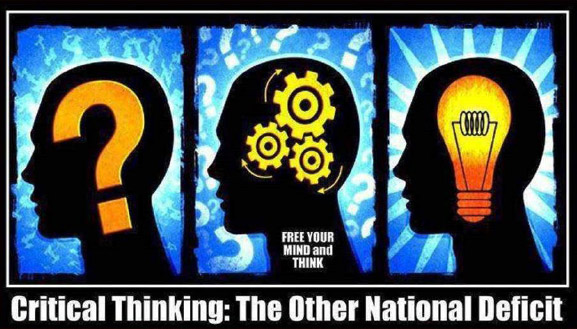

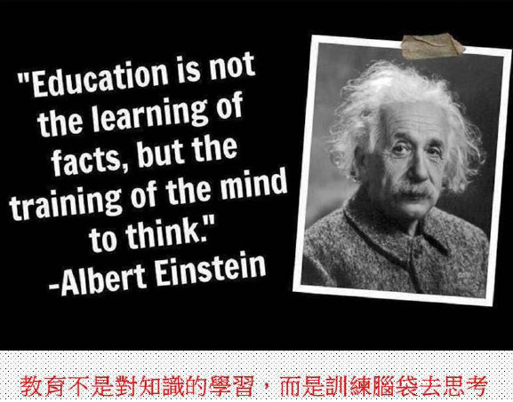

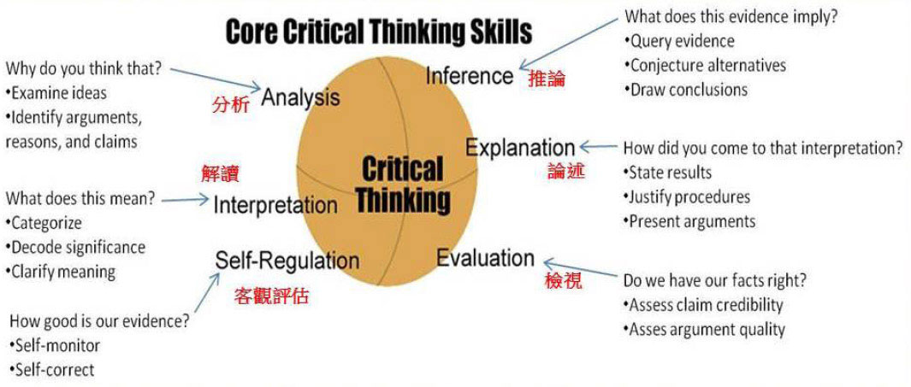

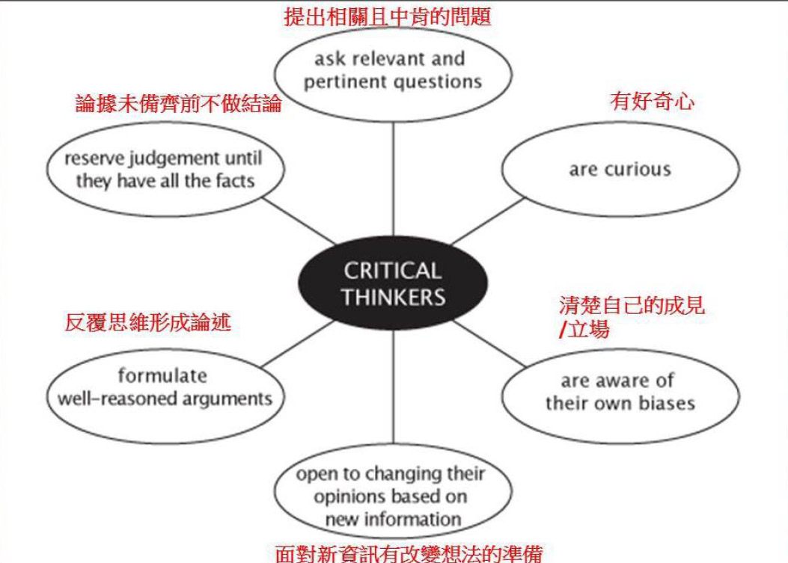

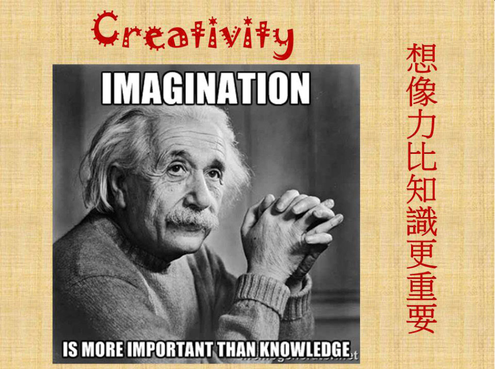

## 活動報導

### 霧峰國中心靈成長班

*編輯部*

鄉下學校欲增上

德育方向助風氣

猶賴教學能落實

打造教育新品牌

霧峰國中成立於民國五十六年，建校十分悠久，校風淳樸，近年在郭校長的支持下，該校特別在傳統文化的學習與弘揚上努力，因此學校的老師與學生們，都有更多的機會接觸傳統文化，無論在教學上或學生的表現上，都有很大的幫助。

透過傳統文化弘揚者的介紹，郭校長得知有學會這樣一個，長期努力於傳統文化教學的團體，並且有很好的傳承，校長十分地高興，特別啟請本會師資前往授課。校長並且特別將原本的期末考日期提前一日，讓這次的課程能夠在六月三十日正式開始，可見其對文化的重視，對學子們心靈成長的關心，十分令人感佩。

此次的課程，上午安排了「被世人遺忘的純真─不一樣的孩子」，本課程首先讓同們認識到，世界資源分配的不均，全球前百分之一最富有的家庭擁有全球百分之六十四的財富，將近台幣三千五百兆，是全球三十五億最貧窮者總財富的六十五倍。在許多貧困的國家裡，孩童們為了上學，不惜每天花2到4個小時前往學校，或者徒步跋山涉水，或者透過高原弔索，或者經歷充滿野獸的曠野，都是為了求學，因為唯有求學才能改變命運，改變思想，開展人生的格局。透過這樣的說明，對比眼前台灣學童們優渥的學習環境，若還不知珍惜，將是一生中最大的浪費。

本課程也為同學們介紹了緬甸的孩童生活。緬甸字義為遙遠的郊外，他們的生活與在台灣的我們天差地別，沒有優渥的學習資源，沒有豐富可口的飲食，沒有良善的家庭住宅，所有的只是勉強可遮風避雨的家，以及簡單的雜燴食物。在這麼困苦惡劣的環境下，他們卻擁有世上最天真無邪的笑容，最淳厚良善的民風，最悅耳甜美的歌聲，最虔誠感人的信仰，最壯觀奪目的大金塔，以及宛若仙境般的景色。他們的熱情令人動容，他們懂得知足常樂，以微笑面對一切，以信仰作為依歸，這樣的純真，是我們亟需找回的社會價值，也是提升自我水平所不可缺少的要素。

下午的課程，將同學們分為兩班，課程為「人才的歷練–由孔子聖蹟圖說起」，配合學會近期出版的孔子聖蹟圖光碟，介紹孔子的一生讓同學們了解，並且能夠認識，原來傳統文化的教學，是可以讓人見地開闊，志向廣大，成為國家社會不可多得的人才，並非是保守古板的一套學問。同時間，另有一班為師長的課程，主題則是「為人師成功的秘密」。有鑒於今日學子們多只重知識不重品格，畢業生的素質無法符合企業需求、社會期望，面對這些教育上的問題，如何才能成為一位稱職的老師，幫助孩子們在知識上成長、心靈上成長以及品格上成長，是相當重要的課題。課程中廣泛地以企業名人、成功人士的講演作為素材，期望能讓與會的老師們了解，原來傳統文化的內涵，跟時代精英們的想法不謀而合，甚至更上一層樓，真正能夠了解教育的出路正在此處。

此次課程，雖然十分短暫，但也為該校帶來了另一種不同的思維，帶動了一番的氣象，相信有校長的堅持，老師們的配合，同學的努力，該校必定能走出寬廣的未來。

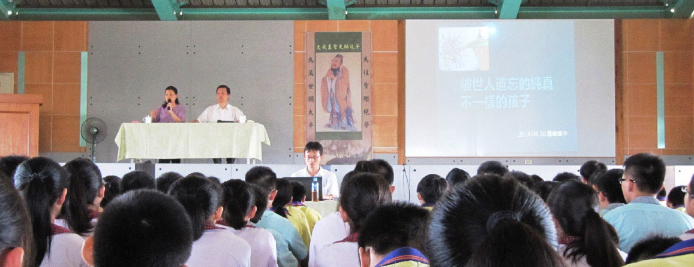

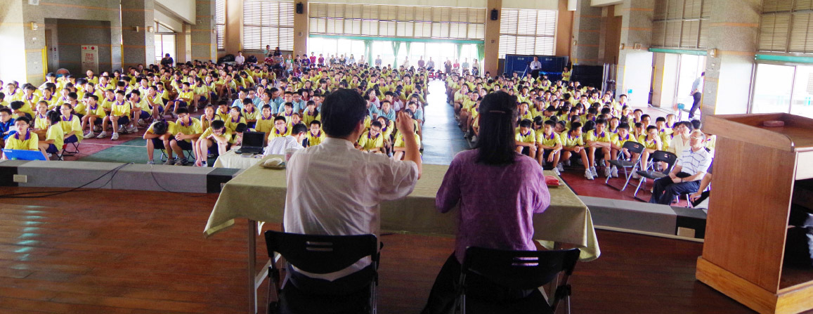

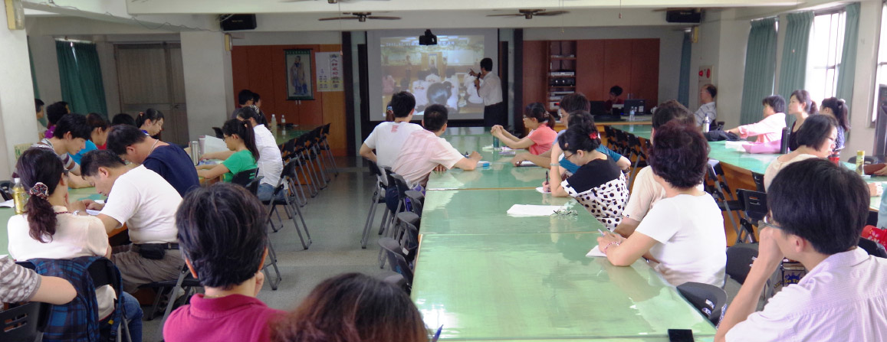

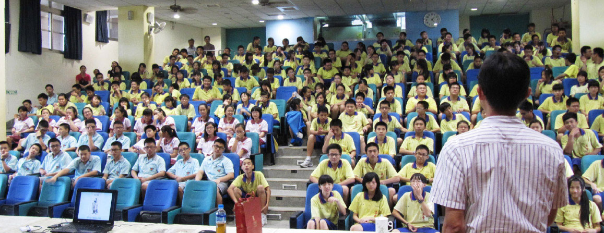

### 靈峰護法團蒞會交流

*編輯部*

仰慕蕅公欣靈峰

巾幗行善如鬚眉

臺灣參訪能借鏡

內涵提升體轉變

今年的七月一日，香港靈峰佛陀教育弘化基金會之靈峰護法團，經臺北地藏淨宗學會孝廉講堂黃柏霖警官的引介，與學會做了一次交流。靈峰護法團一行十多人，由陳靜瑜老師帶領，造訪了臺灣數個宗教文化團體。

當天靈峰護法團及孝廉講堂等人，首先來到了國立故宮博物院，由學會會長唐瑜凌老師為其導覽。臺北故宮珍品琳琅滿目，透過解說發掘寶物背後的文化底藴、歷史故事，使看展過程充滿了感動。導覽完畢用過中餐，一行來到了學會本址參觀，大眾直接上至四樓佛堂。佛堂主尊阿彌陀佛，右為觀世音菩薩，左為地藏王菩薩，四周圍是威武的四大天王，東北方的牆面則是江逸子老師所繪的白描極樂世界變相圖，最後還有雪廬老人的塑像，一一說明介紹，了解此處各種擺設的內涵。

其中以極樂世界變相圖最受大家矚目，此幅圖畫極為莊嚴，是江逸子老師以將近二十個月，七百萬筆的工夫，才成就的大型作品。全以白描的手法，表現作者畫作功力，此外白受彩，白色可以接受一切顏色，如一真法界，不礙各個法界的發揮，以白描表達極樂世界的一真法界常寂光淨土，不妨礙極樂世界的方便有餘土、凡聖同居土、實報莊嚴土的展現。阿彌陀佛在極樂世界淨土中，教化領導大眾往正法上走，在禮樂的環境裡學習正法，對正法上有所體會，自然懂得感恩、懂得回饋、懂得利益群萌，整個世界就是一個君子的聚會、聖人的聚會、佛菩薩的聚會，這也是孔子心目中的大同世界。

而後來到學會二樓教室，進行雙方的會談與交流，氣氛融洽。學會師長也特別為來賓做了一次完整的學會歷年教學及活動簡介。學會一直以來，皆是以文化教育為重心，雖然偶有機緣，也會以團體的力量，一同做許多善法，然而教育才是一切事務的核心，人才的養成、團體的和合、教法的傳承與興旺，都要透過教育才能成就，因此文化教育事業在學會工作所占的比重，始終是最重要的一環，包括了經典教育、古文閱讀、唐詩賞析、專題演講、人才培訓、師資培訓、義工培訓，以及每年寒暑的講座等等，幾十年來始終在教育上努力前進。透過這次的機緣，雙方在教育理念及文化弘揚上，互相都有更多的認識，相信是未來彼此更為增上的一個美好開端。

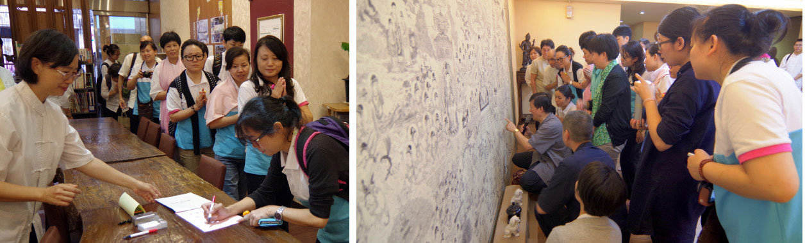

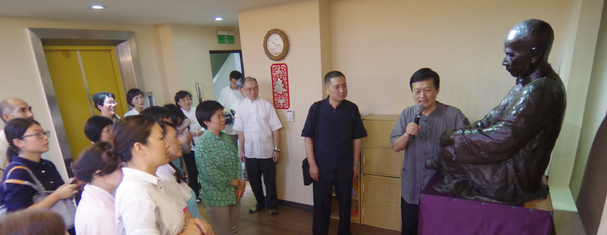

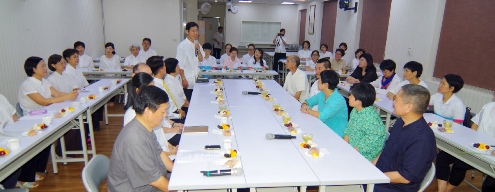

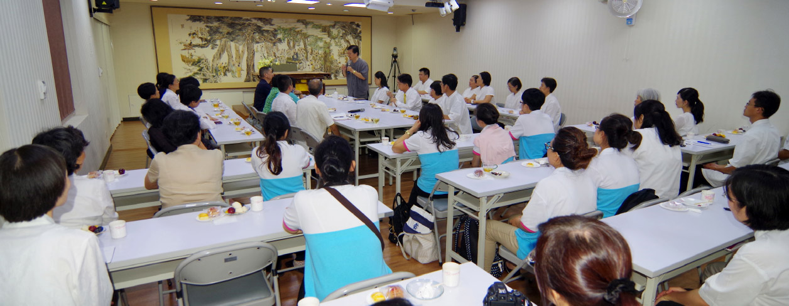

### 出路由名言中通達—由論語及百法說起

學習狀況與感受

眾學子

根器利與鈍

學習苦和樂

習性進或退

知見高及下

蔡易儒

這次是學生第五次參加學會的寒暑期大專儒佛講座了，很高興這次能有機會與中國各地前來的貴賓、學長們共同學習，看到大家上課的認真、下課研討的好樂，讓人非常隨喜與感動。回想每次參加講座的人都不盡相同，更讓人覺得能參與的因緣有多可貴，珍惜彼此相聚的時刻。轉眼間，今年已是學生所擁有的最後一個寒暑假，雖然還在就學，但對我而言，大專生的名言等於就此畫下了句點，因為這意味著接下來的講座沒辦法想來就來，令人感到悵然若失。但我相信，這不是結束，而另一個嶄新的開始，在邁入社會的過程中學習承擔不同的角色與責任，不變的是心裡的熱誠。往後一定會想辦法盡量參加的。因為心，就在這裡。

記得講座前，學生被通知在講座中負責布達事項的執事以及部份論語篇章的消文，當下真的很感激師長給予這樣的機會。在準備的過程中，過去講座中快樂的光景彷彿歷歷在目。回想起第一次來學會是參加心經的講座，那時雖然好多聽不懂，感到很苦惱，但卻有如獲至寶的感動，非常歡喜！令學生意外的是，這樣殊勝的講座不僅不收學費，還頒發獎學金！而每次講座也都認識了許多學長，晚上和大家一起熬夜讀書、研討的日子，那是無可取代的回憶。儘管疲憊，但好捨不得一天就這樣過去。這些因緣聚會都有賴師長的攝受及善知識、義工的護持才能生起。

漸漸地，有機會練習餐前觀修、晚課法器等執事，收穫很多，也很慶幸有機會多少付出一點自己的心力。而這次講座更是備感壓力，但既然師長相信學生可以辦到，學生必定努力達成，也藉此測試自己的能耐，為公發心，學辦事。過程中很感謝諸位師長學長的協助、指導，學長教導末學除了布達事項，也要講究儀態、說話、氣象；在論語方面也多虧多位學長幫助，提供筆記、資源、研討，甚至願意把內心的體會予以分享，真的讓末學很感恩！也感謝學長以科技的神變幫助末學。老師曾說善根回向是非常難得的，末學也願如諸位師長、學長，樂於幫助別人、與人分享。這次在學習、職責上不理想及不如法的部份，也向老師、大眾好好懺悔，努力改進。

參加講座迄今已經三年，然而認識學會則不只如此，小時候曾隨母親學佛而參加學會的啟蒙班、放生、齋僧、念佛共修等活動。當時未必有深刻的體會，但現今回想真的覺得好難得，這些對學生的人生有很重要的影響；而對老師，更是有好多的感謝。無論是在對學生父親、家人的護持上，在講座的安排上，在人才班的攝受上，在知見的教導上，在課堂的鼓勵、期許上，在問答的教誨、慈悲上，在生活的關心、問候上…，點點滴滴，學生都銘感在心。老師對於我們這些學生的恩德真的太大了，不論是知見上，還是心意、付出上，怎能說得清楚？怎麼報答得了？顏回「博文約禮」之語，除了讚歎夫子之外，想必是懷著滿滿的感激吧！

此次講座一開始時，老師致辭中便談到對過去師長、大德們的感謝，又在課堂上介紹雪廬老人傳承及追述紀錄片，看著老師對雪公的歎美、緬懷，以及授課時的樂在其中，內心生起好多體會。在結業式時老師又勉勵我們傳承的可貴，如果斷了傳承，數年後當年來台的大德們便如同沒有來過。老師說，使正法住世不是只靠流通法本，因為佛經的體性是聲塵，需要有傳承的人才來宣說，而傳承必得來自聽聞。聽了這些話，看著老師的行誼，以及松柏後凋的決定見，學生此刻感到「傳承」兩個字，有好深的意涵，自己又懂得多少呢？

因此，身為學生，應當感念老師的恩德，束脩心志，勤勤懇懇，不斷串習正知見，開展自己的心量，訓練自己的承擔。並懂得保重自己，保護善根、不要退轉，安住在道上。印光大師說：「十分誠敬得十分利益。」老師也曾勉勵我們：「眼光要放遠，下手處要低，步伐要紮穩。」「人生是馬拉松。」不是看誰跑得快，而是看誰跑得長、跑得久。因此，就算不在學會的期間，在社會、家庭、工作、課業上盡自己的本分時，也要用心經營每一件事情，以教法來觀修。因為自體性空，可以名言上賦予意義，故一切有無限可能，命運是可以改變的。

今年夏天，頗不平靜。有蓮友，也是親戚，因病苦過世，也有學會的學長結為連理，在講座最後一天舉辦茶會。看老師主持兩者截然不同的場合，因為身歷其境，內心有許多感動與感觸。若要擇要言之，則曰「如理如法」。這樣的體驗，更加深學生的信念：人生一定要培養自己成為說話辦事的人才，懂得在禮上、人情世故上、教法的內涵上講究，惟有如此才能帶給別人內心的安定，真正能利益別人。以此自勉，也祝師長、學長、大眾平安健康，一切美滿。

劉巧雯

感謝老師讓我來這裡學習百法明門論及論語、唐詩等等課程，不僅師長上課精彩、引人入勝，讓我法喜充滿，這裡學長們彼此為研討義理時的專注和氛圍，更讓我這個初來乍到的毛頭小子深深地感到驚訝並且慚愧。

總以為自己正值年輕，很多事可以慢慢來、犯錯、不上進也沒關係，反正有的是機會和時間，但在看見學長們的優秀，更深深地察覺到自己的不足，而且體認到「時間真的不夠了！」悟已往之不諫，知來者之可追。

參加講座使我對佛法及論語的興趣更為深厚，對自己亦有更多的期許，不希望讓時機這麼樣溜走，回去後會細加思索，並不斷精進學習！感謝老師們！阿彌陀佛。

白文輝

面對著期待已久的暑期講座，心情是雀躍興奮的，身體卻由於感冒初癒而顯得欲振乏力，幸好藉由不斷的調整身心狀態，終得以安定下來，享受這百千萬劫難遭遇的儒佛盛宴。此次講座開出了極具深度與廣度的課程，分別為：百法明門論，探討二十四種心不相應行法；論語─從孔子聖蹟圖說起，藉此了解孔子的一生；並透過唐詩賞析，以經魯祭孔子而歎之及棕樹兩篇詩作，深入體會孔子知其不可而為之的內涵。

時機稍縱即逝，短短六天的講座一眨眼便成回憶，如同去年的彌陀經講座，所發生的種種情景仍歷歷在目，但人事已非。無論老少、身體強健與否，人命其實僅在呼吸之間，一口氣不來即成隔世，不知未來何時還能有這一會。如同心不相應行法般，都是遷流變化、生滅無常之有為法。年輕人若不掌握當下，精勤學習正法，如何能透過通達名言，理解這世間的種種虛實，獲得此生真正的出路呢？除此之外，若無善知識的教導，我們大概也就只能在九里迷霧當中，終其一生似霧般的尋覓那自以為的離苦得樂之法吧！

子曰：吾，十有五，而志於學，三十而立，四十而不惑，五十而知天命，六十而耳順，七十而從心所欲，不踰矩。其所顯現出的內涵與行相，實乃我們人生道路上最好的學習榜樣。

儘管當時難以有人識得夫子對內聖外王的通達，而對夫子有所誤會，然而鳥獸不可與同群，吾非斯人之徒與而誰與？對於當前局勢，懷有抱負的有志之士，應以夫子為標竿，不畏坎坷，雖遭逢患難橫逆，仍不改其志，反應更加振奮有為，如同棕樹之德，任君千度剝，意氣自衝天！因為，不經一番寒徹骨，焉得梅花撲鼻香？

本次講座涵蓋了老師的用心經營與循循善誘，師長、師姑們的支持提攜，學長們分工合作、研討交流，以及諸多大德於背後的辛勤維護等，時時處處皆是可供學習的難得經驗，有如此殊勝的福報，乃是過去百千劫所修善業而成，若不善加珍惜運用，實屬可憐憫者。如同學生本有良機學習，奈何不善把握，辜負老師一片苦心，應重打三大板，以小懲大誡。

雖說眼前已陸續現出種種障難，然而學如逆水行舟，不進則退，即使有再多再大的障礙也不能輕言放棄。並且要趁著能學的時候，能學多少就盡量學多少，以報天地祖宗、師長父母之德。

許熒純

由名言中通達─文化傳承是最殊勝的出路

東方的天空，白雲邊鑲滾著烏黑的色澤，西側的天空，卻維持一派的淺藍，幾朵白雲在上頭悠閒地漫步。反觀走在路上的人們，看起來一副欲斷魂的樣子，倒不是因為細雨霏霏，看看柏油路面蒸騰著氤氳的熱氣，簇擁著來往的車輛；屋簷下、小巷口，寧靜之中，伴隨著轟隆轟隆的馬達聲─冷氣。這是個燠熱難耐的夏天，連呼吸都可以產生熱量，何況是在烈日下工作的人們。喀達喀達，輪子滾過凹凸不平的路面，拉著行李，直行南昌路，右轉至寧波西街，依序經過銀行、空地、餐館、花店、洗衣店、餐館，我再度拜訪了寧波西街七十號。每次都乘著不同的因緣來拜訪，這回是暑期的人才培訓班，今年一樣帶來許多收穫，特別是觀念的開拓。

首先是「心態」。剛工作的開始，很有熱忱地投入教學，但漸漸地發現，除了教學之外，必須要處理很多與人相處的矛盾。就以教學來說，把教職當成一份工作？還是一個志業？心態、作法上就有不同的差別。從表相上看，每個老師都很會表達自己，教學方法百變不窮；但是內涵上，未必每個老師都有正確的知見，有心想要學習，甚至試圖改變現在的自己，為的是要帶給學生更多的受用。記得甫放暑假的時候，以前實習時的老師突然語重心長地對我說：「要記得，最會說的是老師，最不會聽人說的，也是老師。」於是我常常告誡自己：即使今天大家都稱你為老師，你並沒有什麼值得驕傲的，還是要不斷學習，讓自己成為一個受教的質地。

其次，到底教學最終的目的是什麼？只是應付考試？成績單上的數字？還是培養學生找到一份工作？世間的才能，也許能夠讓人受用一時，但是不可避免的，人們必須要面對現實的種種問題。第一個，你的未來不是全部由你決定，有部分是比你年幼的這些孩子決定。目前台灣各行業的管理者年齡層都偏高，也逐步凋零。前一代所擁有的輝煌，只限於某個時期，如果不積極去找尋傳承的人才，再怎樣繁榮的盛況，也如電光火石般短暫。儘管大家都說現在的學生難教，也必須要全力去教，因為教育是最能改變個人，乃至於國族命運的方式，而其中，又以「正知見」為教育的主軸，老師責無旁貸。第二個，學習的目的不是為了追逐高學位，或是獲得一份優渥的工作。參加講座之前，適逢家父家母身體出狀況，那個時候就在想，我們所認知的學問，能夠解決人最終往何處去的問題嗎？這兩個問疑惑都是最切身的問題，但是世間人很少去思考，雖然關注自身的命運，努力積聚世間的各項財富，卻不得其要領。唯有佛法的見解，能夠讓人真正離苦得樂，從根本上對治問題。

再次，工作以後，最大的挑戰，其實是「時間」。例如同樣在準備消文，以往可以花全部的心力在這上頭，但是現在所能運用的時間濃縮到不到十分之一。有時候在工作的摧折，體力的耗費，再加上種種外緣的不具足，往往使人易生退轉的心。這時候不禁很佩服老師這麼多年以來，不但堅持道上的學習，在工作之中，也能夠保持初心。這次講座，雖然很高興有機會可以練習複講，但是內心一直覺得準備地不夠紮實。人生短暫，幾番寒暑，年歲是日日長，但是年命卻是日日短，能夠把文化內涵學起來的時間，真的是越發感到不足。希望在未來，不管時間多麼短暫、匆忙，也要學習老師們孜孜不倦的精神，不只是為了自己在學習，而是為了更多的人，可以懂得這些內涵，而不辭辛勞地堅持下去。

復次是「傳承」。今年講座，有幸擔任執事，和以往的經驗不同之處，在於很多細節，現在師長們都不會去特別交代，要靠自己和其他人一起去摸索。當要靠自己去建立一些原則和架構時，就會把過往和師長們學習的經驗互相做參照，這才發現經驗的傳承，是非常重要的事情。當許多事情大人們在前頭都幫忙處理好，在後頭享用福報的我們，往往不會去留意前人經營的內容。或許有些部分是可以透過文字的紀錄去想像，但是最難揣摩的，其實是「氣象」，而這也是世俗之中所學不到的。記得講座時，講到「歲寒，然後知松柏之後凋也。」其中「後凋」指的是，大亂之中，君子保住傳承，待傳承新芽出現；大亂之後，君子已為治世培養人才，哲人雖逝而傳承仍在。很感動於這段文字背後的內涵，它讓我想起很多師長在這條路上的辛勞，敝人何其有幸，能夠和這麼多師長一起共事，雖未得其髓，內心卻暗自期許，要把握每次開眼界的機會，讓道脈能夠往下綿延。

最後是「責任」。這次講座的因緣很特別，有來自瀋陽、諸暨以及雲南等地的貴賓，也有來自中南部第一次參加的學長，一同參與課程。有機會和其中幾位學長共事，在聊天、乃至於上課的過程中，發現部分的學長對於經教的學習很有熱忱，幾天的相處觀察，也很能適應規矩和要求，並且悉心地想要清楚理解所有的概念。在檢討自己過往的學習態度時，一開始遇到困難，往往很容易放棄，可是在這些學長身上，我看到的是堅持，有這樣的初發心，相信持之以恆的學習，必定能迎頭趕上前人。而學會的學長們，也慢慢帶起學習的勢力，每次來到學會，聽聞學長們將所學與有法結合，熟稔地運用著，內心都很忻慕，也告訴自己要趕快加油！以往的學習也許很認真，但是成熟度不足，許多講述過的概念，好像似懂非懂，真正要言說出來，又抓不住覺受。想到海外有多少人對於文化的希求，在未來網路開通之後，會有更多的領域的人才湧入，現在手上握有資源，怎能不好好領受？用盡心力來將內涵成就呢？

透過網路，未來的世界已經不再是眼前所侷限的一隅，那種在原地等待機會的心態，永遠都沒辦法有任何成就。我們都是由總相認識這個世間，當將自己劃歸為有心傳承文化的君子，就要努力去符合定義，並且更進一步，還要切入文化的精髓，成為文化傳承的中堅份子。而身為有心想承繼文化道統的君子，除了要能以文來詮釋行持，更要成就德能，通達形上形下的見地，拓展自身的格局。能夠以文來厚積底蘊，所有的行持，又能夠以德作為內涵，並且掌握時機，不怨天不尤人。雖然無法保證自己在每一次挫折來臨時，都能夠找到解決辦法、保持樂觀，但是我所學習到的內涵，它會讓我知道，害怕是必然的、疲倦是必然的……，但是當我承擔起這樣重大的責任，並且義無反顧地走下去，往後所成就的福德，不只能夠利益個人，更是千秋萬世的人們，那麼，年輕的時候，吃這一點苦，又何妨呢？

王姿云

知識是蓋房子，需要一層一層穩紮穩打的累積上去方能成就一座穩固的堡壘。在這次講座中很能體會這種感受，剛開始接觸百法，一種邏輯的推理、心理層面活動的檢視、萬法實體性的辯證，真不知道怎麼下手，到底學了多少、又融會貫通了多少。但是藉由不間斷的聽課，在大堂和諸多學長們研學、討論，雖然是少少的累積，但這樣的累積換來的卻是這次講座聽課中的愉悅心情。一直以來都很慶幸自己從小就能接觸到這樣的環境，但是也警惕自己這樣的福報，容易視為理所當然而流失，有這樣的佛化家庭，這樣的學佛順緣，一個讓我們修福修慧的環境，諸上善人聚會一處，這樣的機會沒了，便不會再有。

這次的講座有朋自遠方來，來了一些大陸的朋友一起研學，舊面孔伴隨新面孔讓講座注入一股新的氣象，這次講座課程除了延續百法的心不相應行法，還有論語及唐詩，圍繞著孔子的生平事蹟，新的論語科判讓之前學的各章論語都有了清楚的脈絡，再加上兩首唐詩對孔子的精神、心志描述，互相搭配、互相觀待，使所學更為添色。講座中讓學長們嘗試論語消文、晚課的法器帶誦、中午晚上的餐前觀修、公差等，在修慧中也同樣的修福，特別的是講座後面還有一個新人茶會，這個茶會不僅祝福著新人，也讓大家知道佛化家庭、菩提眷屬對人生的重要性，這個茶會給我的感受很深刻，在我的腦海中，發著喜餅喜糖的大概都是姑姑叔叔輩的，甚麼時候一起上大專班課程的學長們也結婚了，當老師握著新人的手切蛋糕的時候，那是個好溫暖的畫面。

六天課程又在一眨眼的功夫下很快的過去，就跟我們的人生一樣，也會在一眨眼的功夫下結束，在這幾天的課程中真的非常充實，這樣充實的感覺並不是因為時間安排得滿滿的，或是活動有趣、多樣化，而是因為知道自己學習的東西是多麼有意義，知道自己所學的是人生的出路、生命的價值所在，小時候聽到佛學是出路這句話時，雖然並不反對，但是在心中並沒有產生多深刻的感受，如今隨著年紀的增長，生活經驗的伴隨和累積，越來越能體會這句話的力量，很多時候沒有跌倒，沒有經過自己和自我心靈的對話，是沒有辦法讓自己信服的。

這次講座因為因緣和合而存在，有學生想學才有老師要教，有老師要教才有學生能學；有環境提供和義工的付出才有學習的動機，有學習的動機才有環境還有義工們的出現；有講座的承辦才能有同儕們一同研學，有同儕們一同研學才有講座的成辦。一次講座順利地出現、圓滿的結束是多麼得不容易，要感謝的人事物實在太多太多，但我相信最好的回報，對社會、對父母、對師長甚至是對自己最好的回報，絕對是這次承辦講座的宗旨所在，讓自己好好學習這些正法，保護正法，傳承正法。

海辰

學，是人生一大樂事。有老師朋友們一起學習，更快樂。透過瞭解聖人來學習，更是幸運。

這次上課的因緣，相較於以往算特別。首先，從國外回台灣，不需要再擔心上不到課，但這次本以為變得很近的學堂，卻也因為回台灣，人生邁向另一個階段而開始複雜變化。以往，作為學生，有時間上課乃天經地義，不需要有所考量，現在現實壓力的多元化，工作的選擇，在變化與抉擇中，最後有幸全程參與課程，放慢腳步，全心的學習，並以此為出發點，好好思考人生的下一步。

思考人生，從瞭解聖人的一生來開展，又是何其幸福。孔子的時代，動盪不安、禮樂不興、國際情勢不明，但孔子卻能以好學、知命，讓生命發光發熱。以前覺得，好學就是喜歡讀書學習新事物的人，現在更覺得，好學是藉由學習，開始思考身邊的事物，全方位的包括書本上的、人情世故上的，進而在生活上做變化、不怕改變自己，向心中所設之所願境一步一步往前走。

心裡的想法總是太多，新年新希望總是一改再改，在快速變化、資訊爆炸的年代，很習慣追逐新事物與隨心發展，卻也因眾說紛紜、內心軟弱而無法對自己有所掌握。所願境？要很大膽的人才能在山崖海邊，大聲地把內心話喊出來，要很勇敢的人，才能在喊話之後，有所作為。上完了課，所願境就像在內心，以水中顯影的方式，模糊的慢慢浮現、成像。

在等待成像的時間，拾起課本，好好的再念幾遍，一直學下去。

香港　張啟灝

參加本次大專講座的確比我想像中困難。困難的意思除了是要改變日常生活習慣外，亦要吸收很多從未接觸的概念。在此先向各位熱衷於培養文化傳承人才的老師說聲抱歉，因為學生在課堂上下都沒有以最認真的態度在學習，有負老師之用心。

不過學生在講座重新認識了些重要的道理，如儒學和佛學的關係，學佛的要點等。學生會覺得媽媽修習「淨土」法門，並常說這是一個最簡單的法門，卻要我了解一些深奧的佛學概念。當然我會覺得媽媽也並不了解本次講座的內容，修佛跟學習文化一樣從來都不簡單。

印象最深刻的是老師在論語方面的講解，學生覺得老師對經典的解讀非常的有深度，不同於以前國高中所學，只把論語淺層意思說明而已。當然，這也和教學進度、時間有關。

在此，感謝老師、義工大德們，還有各位同學的教導！阿彌陀佛！

香港　黎子健

這次的大專講座讓我獲益良多，非常感謝二位老師，及多位消文老師的辛勤教學，你們所付出的血汗，讓我們所有學生深深受到感動，老師在這六天的馬拉松式教育中，讓弟子十分敬佩，要講經這麼多日，仍然可以有這麼洪量的聲音以及健魄的身體，能學到這偉大的正知見以及遇到名師，乃弟子幾輩子所修來的福報也。

在這次講座分別為百法及論語為大部分，百法讓我更了解認識正知見之重要性，以及這宇宙萬法中永恆的規律，了解到一些從來不認識的觀念，啟發了我很多思維上的改變。

而論語講述孔子的遊歷，讓我了解到為何孔子乃當世之聖人，他的言論，並非一般人能聽得明白，每一句話都包含其內涵，孔子做事之處變不驚亦乃眾生佩服，即使面臨逆境，也能安然度過，而他的待人接物，更需要眾人學習，學習如何當一位君子也。這次之講座，讓我學習到很多無價之知識，感謝所有老師，以及所有的工作人員及各位同學。

浙江浦江　胡震名

近幾日在學會進修，在增進見識學問的同時，感觸也不淺。

上午學習佛法，主講心不相應行法。但因學生福緣淺薄、慧質不足，對於佛法一知半解，老師在講台口若懸河，邊上學長振筆疾書，而我卻茫然不知歸處，實屬慚愧，課後學生雖像學長請教，加之小組研討，但對其還是認識稍淺。

下午進修儒學，學生幸得一二，了解了孔子所說的話裡，為人處世與君子之風，更了解了時代背景和奇聞樂事，學生不禁耳目一新，更為古人及老師的智慧嘆為觀止，令學生覺得不虛此行，只可惜大陸眾人福緣淺薄，對孔門思修多抱鄙夷之態，不明古賢，不通智慧，此為憾事。

晚上的小組研討，讓學生可以解惑知疑，鞏固學識，此為幸，晚上至二樓學堂，見多位學長深夜仍在勤勉，令學生大感欽敬。此為學生一點心得感受，望莫見笑。

雲南民族大學　劉旻

從前並不是很適應科判式的學習，甚至不理解，為什麼我們要把《論語》分類來學？我們按《論語》本先的順序學習不好嗎？跟著唐老師學習了一個星期后，才理解了科判的智慧。

之前的那些想法和不解都是因為沒有深入接觸過，所以不懂。不過還好，不知，然後知學。《禮記‧學記》中曾說：「雖有佳餚，弗食不知其旨也；雖有至道，弗學不知其善也。」

《論語》分類後以科判的方法學習的好處就是，在一個時期的學習結束后，我們對孔子的各個方面的思想都能清晰的有所了解，能給我們構建一個完整的孔子形象及其思想、教育體系。尤其到了學習最後，老師為了看看我們學到了多少知識，給我們進行一個小測驗，這時，才徹底了解到科判對於幫助我們的理解而增添的。其中簡簡單單一道題：「孔子收學生的條件，和孔子的教學方法」。簡簡單單一個問題，上課時老師所講過的所有關於孔子教育理念的知識全都湧現出來了。

「子曰：自行束脩以上，無未嘗無誨焉。」

「子曰：不憤不啟，不悱不發，舉一隅不以三隅反，則不復也。」

「子以四教：文、行、忠、信。」

《論語》教給我們太多太多。《子路第十三》中有一章為：「子路曰：衛君待子而為政，子將奚先。子曰：必也正名乎。子路曰：有是哉。子之迂也。奚其正。子曰：野哉。由也。君子於其所不知，蓋闕如也。名不正，則言不順。言不順，則事不成。事不成，則禮樂不興。禮樂不興，則刑罰不中。刑罰不中，則民無所措手足。故君子名之必可言也，言之必可行也。君子於其言，無所茍而已矣。」

這時才想起來，之前在外面打工，因為公司小，又和老闆的關係好，到了後來就成了純粹的幫忙性質，因為給的工資微乎其微，我就一直把自己當做義工一樣，想著，我是來幫朋友忙的，錢多少無所謂啦。結果沒有想到的是，到最後竟然仍是因為錢的事老闆說了很難聽的話。這時，我才意識到，在他眼裡我只是一個員工，只是一個為了錢而來做工的員工。當時充滿了疑惑與不解，覺得為什麼自己真心待別人，別人卻會如此認為自己。直到學了這一篇章，才意識到問題出現在哪裡。

因為我給自己定位錯了，於是，我就成了「名不正」，「名不正」，於是就「言不順」了。「言不順」，於是又「事不成」了。我本來就是員工，老闆本來就是我的上級。他對待我的一切如果都單以老闆對員工的做法，都是比較常見的問題。包括拒絕支付加班費，拒絕支付應有的出差補助等等等等。我認為我們是朋友，於是這些問題我都沒有提及過，並且不在意。但到了最後缺錢的時候跟老闆聊起來，說我的出差補助應該報給我，而且其他員工的保險福利他也應該給出……然後老闆就惱火了。當時從公司出來后有整整半年都想不通。後來釋然了卻也沒有明白。直到上了唐老師的課才明白—我以為作為朋友，這些公司出現的問題我應該提醒他。而在他看來，我只是一個員工，「諫官」這個活兒不是我的工作。也就是說—我僭越禮教了。

孔子有太多的智慧，教我們後人如何為人處世，如何工作。他為我們留下《論語》這樣的經典，不是為了讓我們單做學術研究用的，而是為了讓我們運用在為人處世當中，為了讓我們積極的為這個社會，這個世界做些什麼。學習《論語》，是為了讓我們能擁有這種「智慧」，而並非僅僅是「知識」，這才是《論語》中所教育的「知」。

所以我們要行「仁」，要有「知」的行「仁」。

而在佛法方面，因為這是第一次認真的接觸佛法，所以前面兩天簡直就是一竅不通的懵著腦袋聽。但是我並沒有因為聽不懂而不聽或者放棄，因為老師告訴我們說，他從前也是聽不懂，他也是從聽不懂一直學學學，到最後才慢慢聽懂的。於是我也認認真真的聽，追不上我就一路小跑的緊跟。到了第三天早上，竟然如醍醐灌頂的明白了，明白了這些名言的意思，這些法的意義，那一刻竟然心中充滿了快樂。這不僅僅是成就感，更多的是認同感和歸屬感，所以才有了那種充滿整個胸腔的快樂。

而且在為人處世以及對待未來的看法上面，都有了很積極向上的改變。從前一路低著頭，只想努力，努力，慢慢努力成為一名大學老師。從來沒有想過，原來教育還可以是這種方式。還有在這幾天的生活中認識的熒純姐姐，也讓我看到，我們學習《論語》、學習傳統文化，我們應該更努力的入世，更努力的去改變一些什麼。我曾經問熒純姐：「我都不敢去做中學老師，熒純姐不會覺得高中生好難管好不聽話嗎？」熒純姐回答說：「你只要想一想，他們是這個國家的未來啊，自然就不會因為他們的難管教而生氣了。」那一瞬間，尊敬之情直升而起。對於唐老師的學生所帶出的氣象，所表現出的純實與熱情，真的讓我好感動好感動。

我當時到台北是晚上，飛機晚點兩個多小時，出了門秀鳳姐姐在等我，那一刻好安心。剛到時身體不適，一直上火，林老師幫我買藥，每天都來問我有沒有好一點，那種平和和關心，像媽媽一樣，讓我好安心。微智的博學與超然的氣質，雨橋學長的耐心幫助，甄儀的貼心……那一個星期的生活，絕對是讓我在靈魂上有了一個很大的提高。真的好感激好感激能有這次機會，來和大家一起學習論語。那種陪伴，好似家人一般。以至於現在有一個好大的願望，希望自己努力學習，能再有這樣來和大家一起學習《論語》和佛法的機會。

江蘇南京　楊晶靈

臺灣之行心得報告—獲得正知見是人生唯一的出路

從臺灣回到家後，思緒萬千，一日夢醒，突然有些啟發：即使夢境中的人事物再離譜，身處夢境的我也渾然不覺。夢境裡的內容往往也是內心隱微處的想法所顯現的。而當夢醒的那一剎那，夢境裡的我和夢境也全都破滅，再細想夢境中的人我是非，貪瞋癡愛，只覺離譜。人生何嘗不是一場夢呢？如何才能夢醒？

對於唐老師上課所講的因果體性感觸很深：從流轉知道因果的體性是相續不斷，得福如果沒有正知見的攝持，會為了身體的享受造許多業，那眼前得到這個福報也為未來埋下了禍因，改革開放以來，許多人富裕了起來，但因文化的斷層，人文教育的缺失，在肆意享受福報的同時，實則也為自己種下了禍因。許多人在沒有正知見的時候，只看到享受福報帶來的快樂，便無所不用其極，在世間有漏法中強求果報。從定異可知因果的體性決定不同，要想獲得財富只有通過佈施，而要獲得真正的快樂，只有在因地上講究。由因果的相應性可知，只有在佈施，持戒，忍辱，精進，禪定以及般若的正見上下功夫，才能獲得真正的解脫。只有聽聞有傳承的善知識講法，才能獲得這樣的見地和眼力。

當飛機緩緩飛行在香港的上空時，看著窗外湛藍的天空，悠閒的白雲和逐漸清晰的香港，我突然有一個想法：當提升了高度去看香港與身在香港裡的人看到的香港是不同。假如我沒有看過香港的影像，我如何想像他們眼裡的世界，假如活在哥白尼的時代，他們也無法遐想我眼前的景致。同樣的香港，不同的風光。好比過去認識事物是依靠自己腦袋裡的知識和經驗，依靠這些來經營人生，自然這樣的人生是起惑造業，煩惱不斷的。而佛菩薩就是通達了宇宙萬事萬物的覺悟者。這位智慧和德行圓滿的覺悟者站在宇宙人生真相的至高點教導我們如何經營人生才能離苦得樂。

此次臺灣之行的因緣能夠促成更讓我感到具足因緣的不容易以及緣分的不可思議。回想遇到老師的因緣至今還覺得很奇妙，上午還在南京的家中打算和媽媽一起去廣州，機票都已經訂好了，竟因為一些事情耽誤了。就這樣我開始踏上改變人生軌跡的旅程。

真的非常感謝唐老師和林老師的精彩授課，感恩老師奉獻自己的全部的身心於教法的傳承。感謝高老師，雨橋學長對我的幫助，總是在我迷茫的時候給予我指導，不厭其煩的幫助我。感謝張理事長、怡瑩學長、銘洸學長還有學會的各位師長對我的教導關心幫助。你們的內涵，慈悲，寬容，耐心讓我每次與你們接觸都受益匪淺。

王暄惠

其實在聽課一開始，因有太多名相的不了解，而導致在聽聞時感到困難，雖有些不明白，但我始終從課堂中嚼到許多滋味，說也奇怪，在慢慢開始了解什麼是自體性空後，再聽又糊成一鍋粥，於是學習請教他人，很感謝每次的因緣讓我能來上課，老師說我們無法了解每一分每一秒的造作將來所感的果，但我們能用良好的心態、正知見來做每一件善法，因此有這樣的場合與因緣，更應珍惜，使我們修福修慧。

今天有一的小感受，法以聲塵來作為體性，使色塵、法塵有作用，今早臨時發心敲鐘魚盤來協助大專班早課，當下發現此也是聲塵帶給我法喜充滿的感覺，更因有正知見，讓我有良好的如法心態，實在難得難得，我很感謝能有如此的機會。

古家華

這一次的講座，感覺很特別，因為參與了講座前的每一個前行工作，知道辦一個講座是多麼艱鉅，且鉅細靡遺的事項得一一落實，需要非常多時間、人力的投入，方能成就一場盛會。

而且有別於其他講座，此次聽課有了法喜。前兩次的講座聽得不是甚懂，也不敢問其他的學長，因為很怕，也許是自己懦弱吧！之前，林老師跟我說要敞開心胸，這一次我試了，不懂的地方也問了其他學長，他們也很樂意的幫助我，為我解釋，雖然百法的部分大多仍處在不懂之處，但老師也是從不懂聽上來的，相信自己也可以做到的。

尤其這次的論語，竟然能很專心的聽課，跟孔子聖蹟圖結合非常的有趣，也讓學生對論語又有不同的見地了！很謝謝兩位老師。

林佑靖

這次來這裡參加此課程，對我是受益良多，除了聽聞了不曾接觸的「百法明門論」之外，更再一次跟著孔子的腳步周遊列國，也讓我更明確的了解孔子在周遊列國時的想法與感觸，深深觸動我的內心，彷彿感受到了聖人生於亂世之中無法伸展抱負的無奈，只能將畢生奉獻於教育，期盼能將道統傳下去。

而「百法明門論」可能是因為先前的課程沒有上到，所以有點消化不良，不過課堂聽了老師的講解，依舊讓學生學到了許多，例如：流轉、定異、相應、勢速的解釋，讓我更深刻的了解因果的內涵，使我收益良多。

赴臺九日遊學小記　浙江諸暨　周音瑩

緣於發心

所謂「有發心，一切皆有可能」，我是深信不疑的。我更以為發心之切，又是達成事情的勢速。自四月底有幸聽到老師們在諸暨市博物館講《論語》人物子貢以來，深感得聞正見的興奮。之前，我和書友們正欲專心攻讀論語，而正愁無處尋覓領路人。遇見唐老師，正是聚了天時地利人和之利，幸之甚哉！回想起來，此事是多麼恰如其分地證明「機，緣於發心」，甚感神奇！

接著通過諸暨市國學推廣中心的方女士約唐老師一行到甘棠茶館，因為猜測唐老師是懂得品茶之人，定會喜歡茶館裡醇美的茶香以及優雅的氣氛。果然，唐老師喜歡茶館經營者小顧用心泡制的茶湯以及她對茶文化的探究，五月又帶領眾多學員來到「甘棠」。而我在此次茶會中對無盡燈文化學會的影響力有了初步的概念，也通過泡茶的過程認識了一些學員，相互間建立了很好的第一印象—大約任何的機緣，就是如此一步步地由淺而深的吧。

五月惜別之際，聽說可以通過唐老師的邀請去參加暑期的國學培訓，暗自驚喜之餘便下了決定參加，開始耐心等待這個機緣的到來。

六月初，接到方女士通知要趕緊填表格，說再過一日就沒機會了，便趕緊填，臨時在電腦裡找了張電子照片貼在表格裡，帶著僥倖心理等入台證批下來。不料到二十三日被通知照片格式不對，沒通過審核，雖然急忙去照相館拍，卻已抱著隨緣的心態了。沒想到，二十七日竟得知入台證批下來了，真正是大喜過望！再一問，因為入台證沒有批下來以及其他各種原因無法同行的人有十多位，更覺得慶幸之極。

大隱隱於市

「大隱隱於市」，當我沿著臺北市寧波西街走近無盡燈文化學會，帶著虔誠的求學心走進自動玻璃門時，首先的感歎便是此句。

周邊都是店鋪，早餐店、速食店、鮮花店、咖啡店……門前的街道上機車成群地呼嘯而過，而學會身處這樣的環境，卻營造出極雅極靜極內斂極具有條不紊的不凡氣度，令走進去的我們既愛上坐在其中的溫馨感又不由端著深深的敬畏心不敢稍有造次。

我想，選擇這樣的鬧市區作為推廣國學傳承理念的地點，是需要勇氣的，這份勇氣的來源是大儒風範的入世態度，如鶴立世，立出需常人仰望的高度，以高度高，成就深愛國學的眾多學員。二位老師以他們的謙和隱於市，以他們的高潔領於市，如明燈於混沌中的輝耀靜靜地燃一份傳承國學的熱……用心感悟著這些，我愈發欣喜地斷定此行於我的人生具有多麼深遠的意義！

每一堂課都極具份量

從七月五日至十日，每天上午兩堂課學「百法明門論之心不相應行法」，下午兩堂課聽「《論語》—從孔子聖跡圖說起」的主題講座。當我初見課桌上擺放著的《大乘百法明門論研究》及《百法明門論表解》兩本書時，分外驚喜，兩個月前在一書友處借來《百法明門論表解》，翻看之餘正愁不能無師自通呢！此番來台再三應和「心想事成」四個字，逢如此巧緣，不由贊一聲「阿彌陀佛！善哉善哉！」

每天四堂課，每堂課兩個鐘頭，晚上七點到八點半再進行小組討論。如此的學習節奏是我的朋友們難以想像的，也正是這樣的節奏才能在短短的六天裡，使我深悟「傳承」的魅力。唐老師通達的學問和循循善誘的講學精神使得每一堂課都極具份量，當我真實地觸摸和掂量學習的厚重時，如獲至寶的愉悅如影相隨。課內隨著老師的提問用心揣摩，課後則跟著學長們的討論進行二次學習，學習的概念從來沒有以這樣投入的狀態印刻到我的時間裡，我不由嫌在台的時間太少太快，真的，不願意離開這樣的課堂！

在教室門口牆上的座位表上寫明這次培訓的主題：「出路由名言中通達—由論語及百法說起」，初見此句時十分茫然，短短的六天學習之後，再細品這句「出路由名言中通達」的意思與意義，覺得讀書人若不懂得此句，便是呆子一個。呵呵！幸好幸好！

可愛的學長們

每天在整潔的教室裡一起學習的，有老老少少近八十名學長。有些師長與自己的孩子們坐在同一教室裡，學得一樣認真上心。坐在我身邊的老師，一邊聽一邊在書上做筆記，細看她的書，每一頁都記得滿滿的，且用了不用顏色，問她，她笑言每一次看書或者聽課都有不同的感悟，便一一記下……這是在大陸幾乎見不到的場景，分外令人生起敬重心。

我們的班長是一個瘦瘦的文靜男孩，做事極認真謙和；雨橋學長對答任何問題都頭頭是道，深得要領，極佩服他的思維能力和口才；王順福先生的兒子洋逵，是唐老師上課時提到名字比較多的，學長將《論語》熟記於心的程度令大家歎服不已；還有帶組的老師在小組討論時熱心而耐心地解答我們這些大陸學子們，東一榔頭西一棒子的問題，也解了我們不少的「惑」……，學長們在唐老師的教誨下，皆以君子自範，將學會營造成極溫馨有序的大家庭，他們慎思而敏行，以極內斂而積極的態度待人處世，皆俊才也！對比這裡的年輕人，想起我平時接觸的大陸孩子們，不由得，內心起了焦慮，對比太強烈了，差別太大了！

講座最後一天的晚課之後，是兩位學長的婚禮茶會。為了這次婚禮，學長們做了很多準備，從花環和紙鶴的製作到整個茶會的環節設計，都能顯然地體會到了學長們的用心與善愛。記憶猶新的有唐老師幽默而真誠的婚禮祝詞以及陳會長詼諧愉快的話語和笑容，更有年輕的學子們為新人特意創編的集體朗誦，每一個人都被這對新人的滿滿滿滿的幸福甜到了……想流淚，想擁抱他們，想一直沉浸在這樣的感動中！

美好的用餐

每日的午餐和晚餐都是在學會裡完成，廚房裡忙碌的大姐們日日將素食搭配得色澤美麗味道可口，準時而俐落地擺放到教室後邊。

分享「餐前觀修」的學長們帶著虔誠的心誦讀自己對一餐飯乃至整個人生的珍惜，靜靜聆聽，是欣賞和感動並行的過程。學會體察生命中一切來之不易，那麼生命也隨之成為由一切美好組合的經過。

帶著感恩的心，帶著快樂的心，每一餐都吃得可口而舒心，真的愛上了素食。真的希望也能學會做素食，把美好的餐飯分享給大陸的朋友們。

兩日遊的見識

十一、十二號，在學會的精心策劃下，我們有幸與唐老師林老師以及各位學長們一起遊玩了慈湖文化園以及北投等地。遊玩是另一種學習的方式，在自然界中感悟萬物變遷，在回望歷史時感悟現在與未來需要堅持的正見。

慈湖在桃園，是蔣中正先生當年來台後為懷念母親而擇定地點修建的園區。據說以前是不開放的，給人比較神秘的感覺，同行的很多學長也是第一次去，因此大家都蠻興奮的。慈湖所在地山水相宜植被豐富，導遊懂得很多植物的知識，邊走邊指點著路邊的「綠色朋友」告知它們的名稱與特徵。最多見到的是滴水觀音，還有各色的蝴蝶，桉樹葉的香味伴隨一路，十分好聞，很開心地在路邊撿了一些帶回來。對民國的那段歷史，從很多書中瞭解了大概，很敬佩宋美齡女士當初輔助蔣中正時的外交風采，慈湖園區內也多有宣傳。

離開慈湖，來到一座雅致的別墅式咖啡館用餐，最驚喜的是屋外的小花園，曲水流觴，小徑依山，眾多花草生意盎然，有鳥鳴悅耳似述說悠閒愉快的日子。這樣美的環境極配我的感觀。組織者的審美與用心可見一斑哪！

晚上又趕到神往已久的臺北博物館參觀唐寅畫展，唐老師親自講解導讀館內的藝術品。見到了那幅名氣不得了的《煮茶圖》全貌，可惜時間匆匆容不得細細揣摩……

第二日早上參觀國軍歷史文物館後，來到北投。北投有豐富的地熱資源，令人羡慕之極的是，沿途所見到溪流竟然皆是溫泉水，可以供路人隨意坐在溪邊泡腳。地熱谷的池水上熱氣騰騰，被風一舞如撩動仙女的輕紗，直疑此地非人間。

北投圖書館內讀書人真不少，我隨意找去，居然在書架上看到關於于右任先生的書，隨匆匆一瞥不容細翻，也覺得頗有眼緣。接著知道北投有于右任先生的紀念館，真是太巧了！我曾因為盤山小學查過於右任先生的資料，對他對民國時辦學熱潮的推動和研究草書的造詣有淺顯的瞭解乃至心懷崇敬，不想就在北投得以走入他曾經居住的梅庭，看到他更多的筆跡，不由念「阿彌陀佛」感恩神奇的呼應。

流連，留戀

十六的月亮圓圓地掛在自由廣場的夜空，這裡正在準備第二日將舉行的大型的「孝」主題活動，多想留下來身臨其中，把活動的精彩納入眼納入心，可惜分別終有時。

九日臺灣行留下太多美好的回味，如果可以，今後的暑期一定要堅持飛向臺北，不斷聆聽唐老師和林老師的教誨，真誠地希望他們接受我的願望。也十分想通過一次次的學習，豐厚了學養，再通過消解的形式帶動周圍的朋友，希望文化的流動終能匯成大河大江匯成正見的海洋。

浙江諸暨　方恆書

這次暑期有心有幸來到美麗的臺北無盡燈學會學習國學，其中包括佛經與儒學。總的來說，自我感覺受益匪淺。無盡燈給了我無數的溫暖與支持。是敬愛的老師，親愛的同學，可親的工作人員，教會了我孝敬之道，智慧之道，學習之道，忠恕之道，仁愛之道……。

學會的老師，學長同時讓我擁有更多的智慧。師生在課堂中的積極互動，以及晚課的討論研習。這些都給我帶來了豐富的見識。對佛法的深入理解，透徹的分析，敏銳洞察力。

對《論語》有天下大道之志，榮幸地感受到了論語的樸素與溫暖，這是它永遠不失去腳下樸素的起點。《論語》告訴我們修養身心的道理，裡頭有許多孔子和他的學生，以及諸侯大臣的經典對話與辯論，涉及政事之道，處事倫理綱常……，也許我目前還不能完全領悟它們，但是我堅信信念是成功的金鑰匙，努力就能達到那個彼岸。這一過程我要衷心感謝為我付出的親朋好友，我的良師益友。

真心話，我在一開始接觸到佛學中的百法的時候，眼前一頭霧水，上課也是雲裡霧裡，簡直是在看天書。我當時想啊，這些東西真的不是我們這個年齡該學習的。還好，過了兩天以後，逐漸能克服心理障礙，很欣喜能慢慢融入到老師的課程中去了，這真是給了我莫大的鼓勵。末學不才，希望能多多向老師，學長們討教。

六天的臺北無盡燈暢學，這種文化，是一種社會精神力量，給社會和人帶來了深刻的影響。它為我們樹立了正確的價值觀，陶冶了我的情操，豐富了我的文化內涵，增強我的精神力量。無盡燈學會給出了一條腳下的路，讓我們抵達自己的理想。

在今天，如果我們每個人都用自己的心去完成一種啟動，懷著一顆感恩的，仁愛的，孝敬的，智慧的心，開始真正融會貫通的學習，都站在通權達變的大智慧上，那我相信，古往今來所有的知識都會活在我們的經驗體系裡，所有聖賢的智慧都可以成為照亮我們自己生命道路的火把。

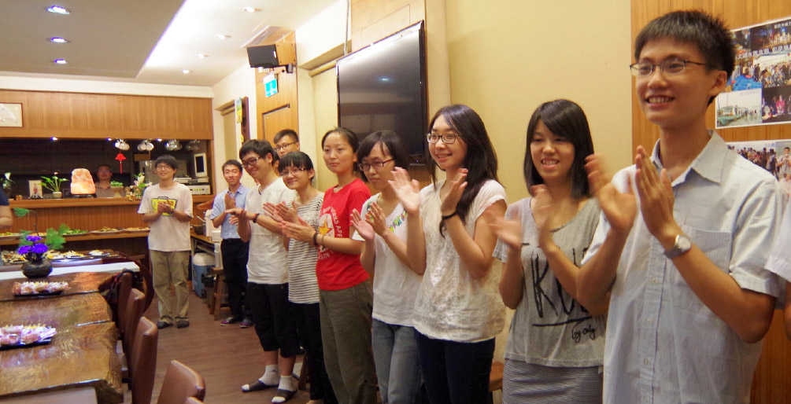

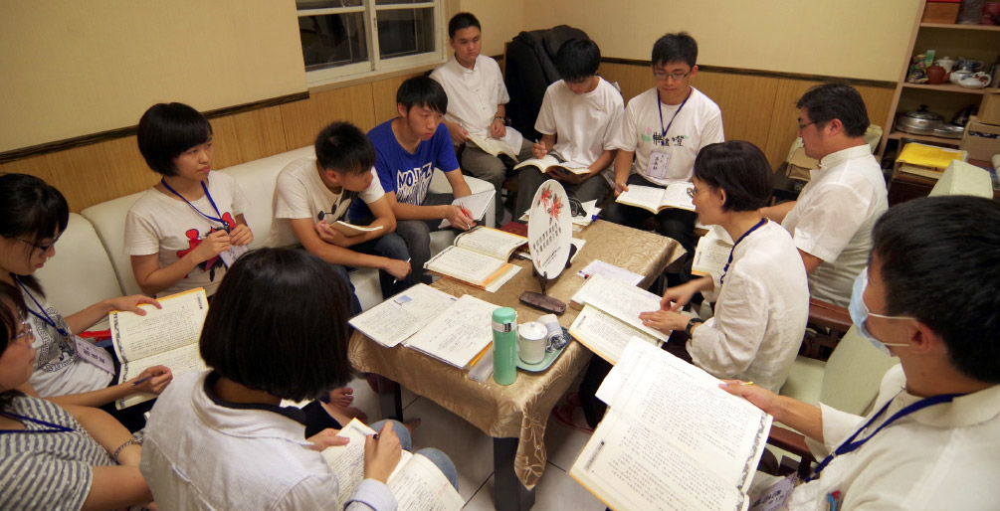

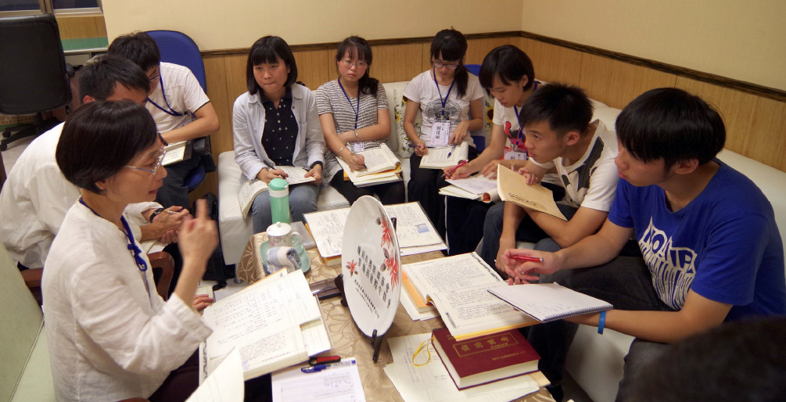

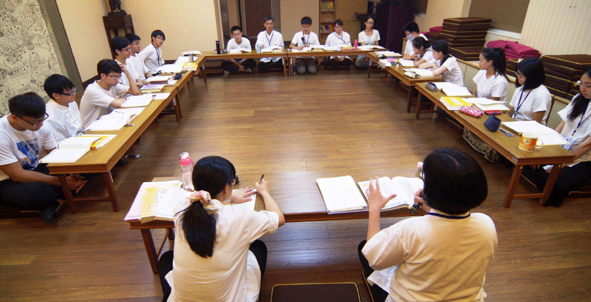

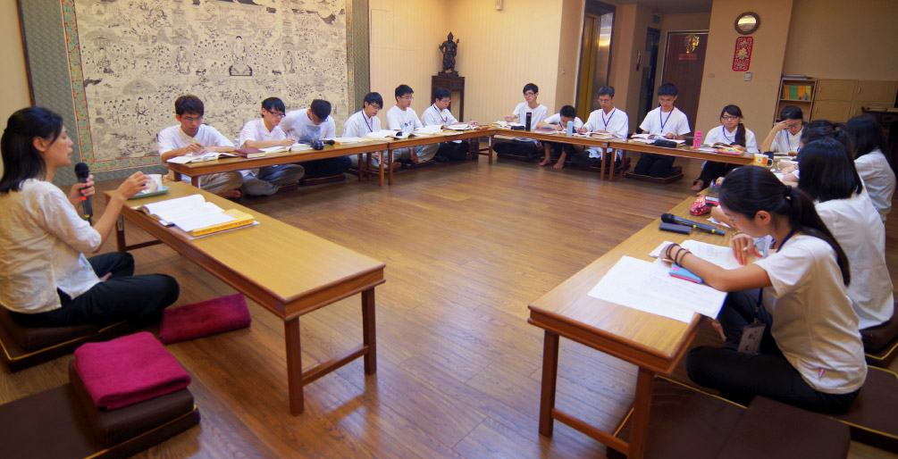

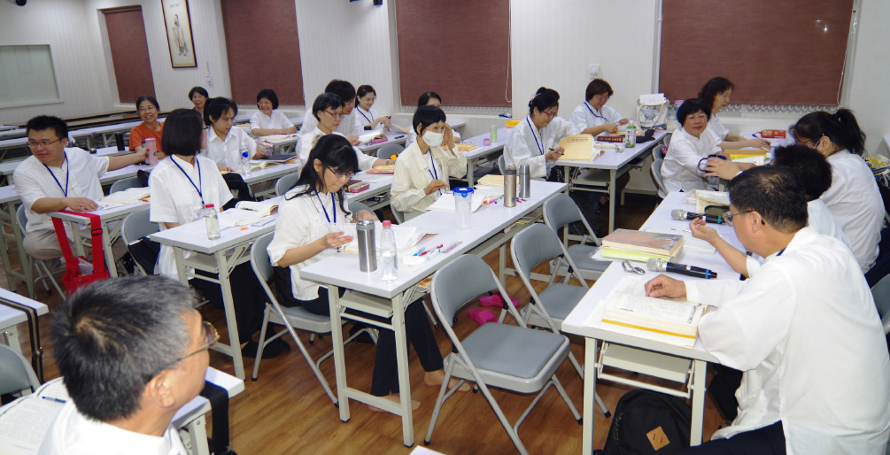

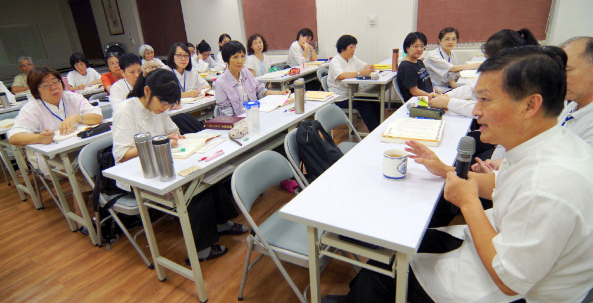

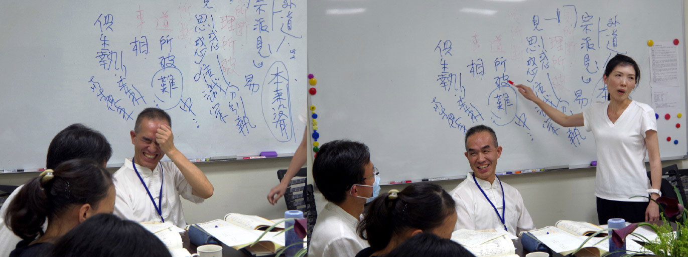

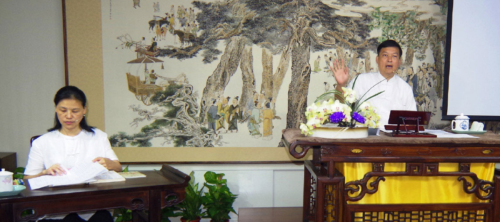

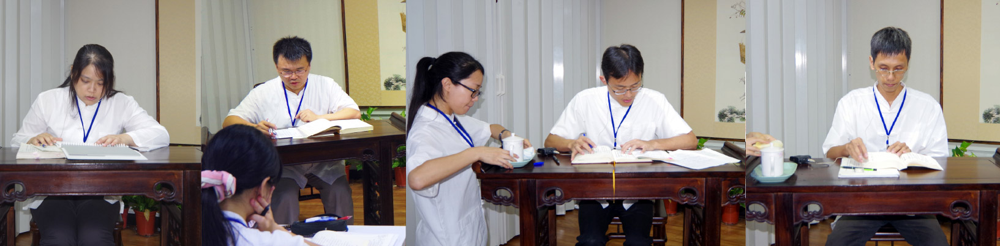

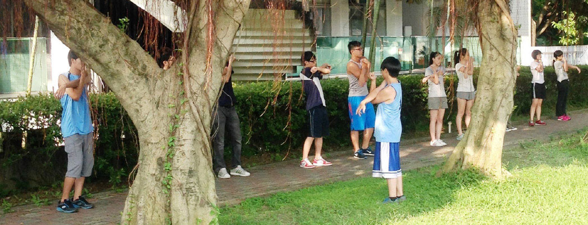

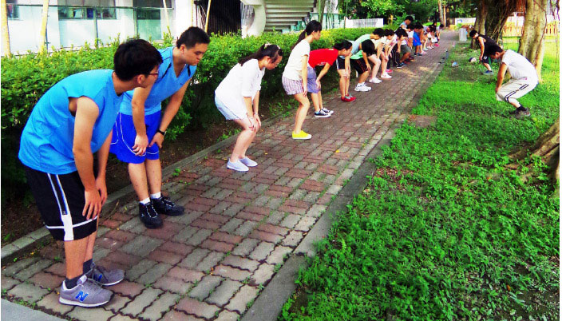

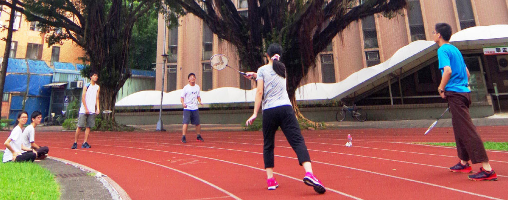

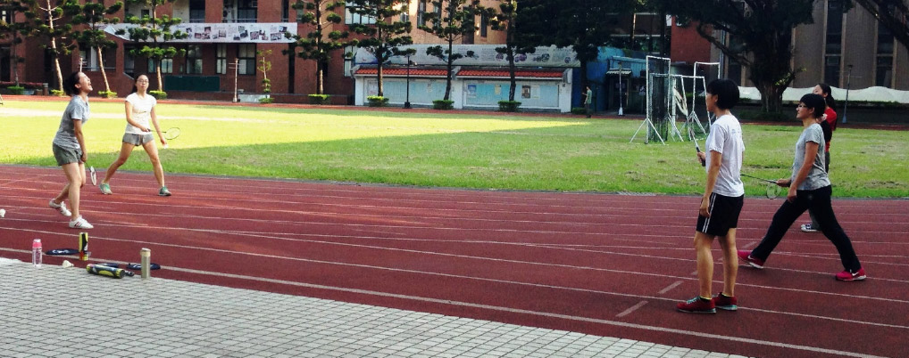

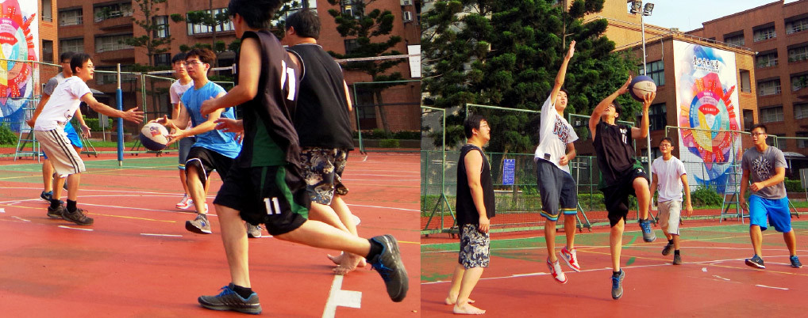

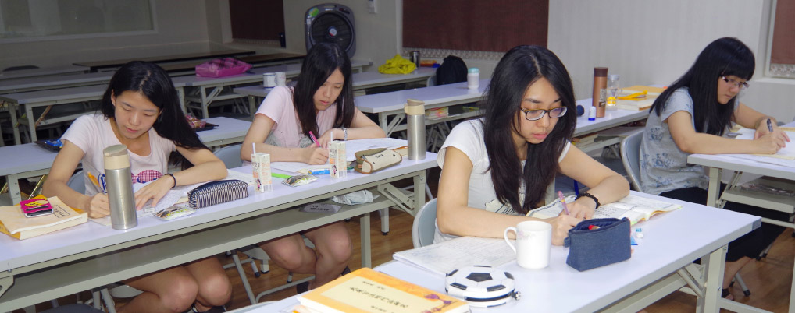

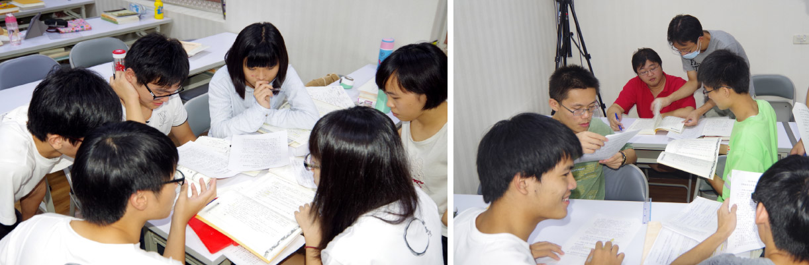

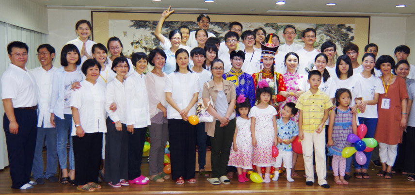

### 活動報導

心若

一生要有典範

學習須有名言

心境相互觀待

以心轉境成聖

今年的暑期講座結合學會人才培訓班的課程，研討《百法明門論》當中的心不相應行法。在儒學部分則有〈孔子聖蹟圖〉結合《論語》章節及〈唐詩賞析〉講座，期計六天，與會人數約一百一十人。講座學員除了長期培訓年輕團隊外，還有遠自大陸前來的貴賓，包括瀋陽明明德文教基金會五位同仁，浙江省諸暨市傳統文化研究會一行七人，還有一位雲南民族大學人文學院比較文學專業的研究生，可謂各方齊聚，共同切磋琢磨，刺激砥礪，成效良好。

每次講座因緣都變化莫測，想參加的人未必能如願參與，本來無法參加的人因緣一時現起，便能受用。此次本來大陸會有四、五位小朋友與父母一同前來，終因種種困難，剩一位小朋友參加，學會安排義工陪同出遊，也安排小朋友到弘明幼兒園體驗課程，可謂用心。講座結束後，學會師長與大陸貴賓一同出遊，走訪後慈湖、軍史館、北投等地，互相交流，也對歷史有了不同層次的認識。

《百法明門論》開出心不相應行法的課程，可視為獨立篇章，透過講解辯證使我們了知萬法唯名言假立，沒有自體性，原來我們所認知以為真實不虛的一切，都只是名言上的關聯性。舉例而言，二十四心不相應行法中的「得」定義為「依一切法造作成就假立」，意即「得」為成就不失，「得」就如同債券，在債券上看不到錢的體性，但是債券在未來可以換錢，所以眼前假立為「得」。既然過去的造作已滅，未來卻能感果，靠的就是名言的關聯。

而名言有隨、歸、赴、召等諸義，意即「名」能隨音聲，歸赴於境，呼召色等事物，名言能詮釋顯現義理，使人生覺慧。由此可見，若我們善於觀察，清楚萬法的關聯性以及正確的名言用法，將帶領我們擁有正確的人生觀、宇宙觀。境界觀待名言而生，用名言來認識境界，觀待我們的定義，若恰當的使用名言極具威力，有不可思議的力量，善用名言，可正確的認識法、理解法，激勵自己，調伏自身煩惱，帶出行動，還能打動人心。

我們用什麼樣的字眼、字詞，就會有什麼樣的人生，因為每個字詞都有其溫度、表情意義、意境、情境、力道、力量，而我們所認識的名言，會主宰我們的意念思考，必須謹慎經營。這幾天，有了對心不相應行法的認識，應用於日常生活中，就能開展出不一樣的人生。

而《論語》課程從〈孔門聖蹟圖〉說起，一般人對於孔子的一生不甚了解，頂多知道孔子是位至聖先師、有教無類、因材施教，卻不知其具體內涵，透過此次課程，以科判的方式整理出孔子一生的足跡，有系統的帶領大眾一窺其風采、氣象、格局、見識、氣度。總說孔子的一生是內聖外王的學習與通達，具備智慧、形而上的證量，能明心見性，入世時又能具有悲心、形而下的胸懷，有仁心做助伴，使聖成為至聖。孔子一生都在學習，幼年的孔子就常將祭祀用的禮器擺設起來，練習演禮，可見不凡。

十五歲就立志學習內聖外王之道，三十歲即學有所成，三十五歲入周朝問禮學樂，後又入齊國聞韶樂、聞政，五十歲以前回到魯國，教化生徒、等待時機，後因理念不合，離開魯國，開啟長達十四年的周遊列國之旅，途中遭遇很多危難，包括受困匡地，入宋遭桓魋之難，入陳困於陳蔡，情況險惡，生死未卜，但孔子表現出面對逆境的從容，面對文化傳承的自信，一展大將之風，以道自任，又明趨吉避凶之道，從容應事，謹慎以對。

可見文化的關鍵在傳承，傳承的關鍵在人，以學習聖道、傳承聖道的心處於危難，自然能逢凶化吉，得到上天庇佑。周遊列國，雖遭逢否難，但也受到許多國君重視，想要予以大用，然孔子不賤賣、不輕賣，若國家不是有道的國家、國君不是以王道用孔子，孔子亦不願被用，寧可藏諸名山，待諸來者。故孔子在六十八歲風光返回魯國，教化生徒，作育英才，最後得曾子而傳。聖人風範如此，令人心生嚮往，是我們一輩子要學習的楷模典範。

《唐詩》課程開出〈經魯祭孔子而歎之〉以及〈棕樹〉兩首詩，作為講座的總結。有了對名言定義的通達，以及對孔子的了解體會，再來入此兩首詩，才不會霧裡看花，而是能深入探討，進入詩境。〈經魯祭孔子而歎之〉是唐玄宗懷想孔子而歎息，歎息中透出層層深入的驚歎、讚歎和感嘆，短短幾言，用典繁複，囊括了孔子一生的大事，境界之大，立意之深，值得細讀。唐玄宗一代帝王把自己對孔子的崇敬融入到對孔子的深摯悼念中，深切質樸，令人信服。

孔子的一生遭遇看似不得志，實則利益天下蒼生，利益後代幾千年後的我們，他的偉大，不言而喻。另一首詩〈棕樹〉，是一首詠物詩，一方面詠棕樹，一方面融入作者的情感、心志，透過詠物來抒懷，與物合而為一。棕樹是很常見的樹木，它的葉新又綠，欣欣向榮，其樹幹像亂錦纏繞，懷有才幹必遭妒忌，不免受人侵害剝削，但是任憑他人取用傷害，棕樹都不在意，他人的取用反而讓它更振奮衝天，愈被傷害，就愈能向上伸展，勉勵我們人要有衝天之志、廣大心量，不畏逆境，就能同棕樹般「意氣自衝天」。

講座的最後一天晚上，舉辦了特別的婚禮茶會，祝福士棋及海辰兩位學長攜手結褵，踏入人生的另一段旅程。茶會的意義在於讓大家了解佛化婚禮內涵、結婚的意義、家庭的經營以及後代的教育，結婚並不只是兩情相悅，而是要在正法上尋求出路，培育後代。茶會中邀請了許多師長分享勉勵，也請來樂隊表演，以及小朋友、學長們的表演祝福，簡單溫馨，歡樂莊嚴。

講座圓滿結束，課程若不是透過老師的講述，縱使有美好的義理，也無法體會。佛法無人說，雖智不能解，若不是透過聽聞，許多觀念，我們永遠也無法生起，一個觀念，可能就是一生的轉變。感謝師長的教導、同學間的研學，師姑義工們的辛勞，才有此次的因緣，必須懷抱感恩珍惜之心，把所學串習、複習，培養自己成為人才，繼續傳承，願法脈不息，推展無礙。

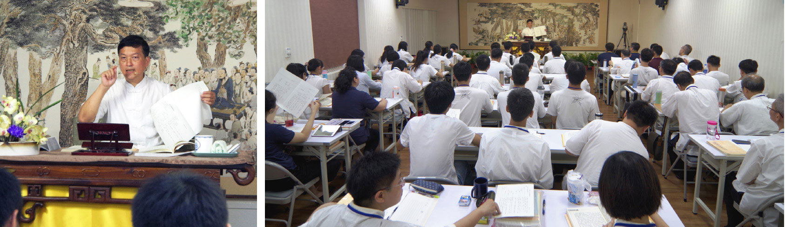

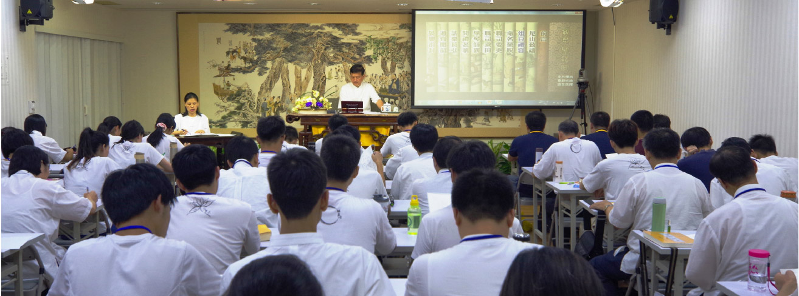

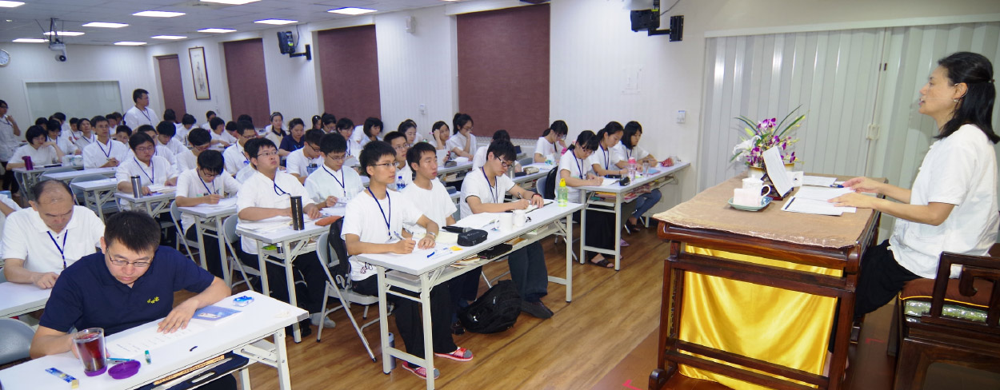

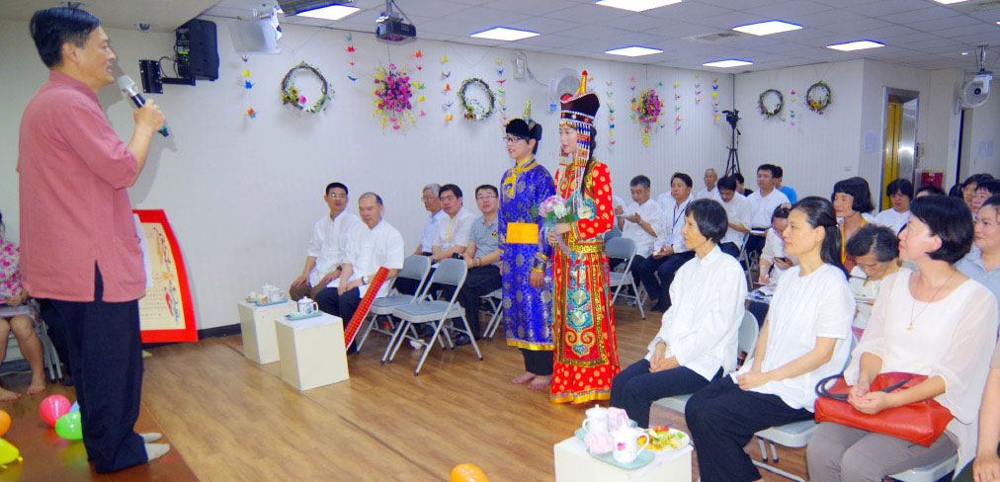

### 法語觀修

眾師長

修學正法賴解行

行由正助不偏廢

觀念提斯助正功

往生上品乘願來

文化要如何保留　　戒慧

為了遍滿虛空的有情眾生，我們必須要成就無上正等正覺，為了成就阿耨多羅三藐三菩提，所以興辦大專講座。此次課程所依的是《百法》當中的二十四不相應行法，及《論語》—從〈孔子聖蹟圖〉說起。

儒學的三大部分，第一部分是祭祀，第二部分是品德，第三部分是學問。這三個部分都要從見地來經營。可惜現今只會在學問上講求，不會在品格跟祭祀上講究，也不會在見地上經營，只剩下皮而已。祭祀這一部分，儒家講究的是祭天、祭地、祭社稷、祭宗廟、祭山川等等，這些都代表一個能夠通達鬼神、佛菩薩的見地，求加被，求福、求慧，我們一般人不懂，以為這些都是不重要的，去掉這些精華和神髓，也去掉在品格上充實的學問，剩下的就是文字和歷史的考究，所以現代難教出人才和有見地、氣象的孩子。為什麼？因為我們把學問的精華拿掉了。

儒家在祭祀的這部分幾乎是蕩然無存，但佛家還保留住，比如說唱讚佛偈，就像廟堂當中的歌功頌德，《詩經》有所謂的風、雅、頌，頌就是歌功頌德，以樂配德，激發出人的感悟之心，見賢思齊之心，以及舉措看他上流之心，如果這些學問都被拿掉了，剩下的是甚麼呢？剩下的是才藝、飆經，文學考試功名等，變成末流中的末流，再加上名利的追逐，學術論壇裡面的爾虞我詐，則連骨、連皮、連血、連髓通通不見了，如此則經典已不會有人要學了。

再來，讚佛偈就像一首用詞很美的詩，大家進退有秩序是禮，所敲擊的鐘鼓樂是樂，整場就是詩禮樂的經營，如果用在廟堂祭祀，可以呈現雍容大度、氣象萬千、和睦莊嚴的氣象，只可惜現今不如此講究，培養不出有氣象的國民，如此就無法呈現一個有內涵的生活；等而下之，音樂也非有素養的音樂，禮節也沒有辦法呈現溫柔敦厚，只剩下在世俗中的追逐，追求一個記憶的學問，甚至因為容不下這些美好的學問內涵，所以毀謗傳統文化是糟粕，古代的中心思想不能融入現代，現代思想又沒有中心思想的尷尬局面。

處在這個時代的末流，我們應該要回過頭來在根上去尋找，首先在學問上論品格，在品格上論見地，然後在見地上論祭祀，懂得人生的經營，一方面是在人情世故上的講求，一方面是求加被的修學，相信對我們這一生有莫大的幫助。

這堂晚課就給我們這樣的啟發，它就是文化最美好的地方，納西古樂、東巴文化就是因為少掉見地上的經營，以及祭祀的加被，東巴經典通通都沒有意義，只剩蝌蚪的文字，文化的精華已經不見了，只剩下保存文化的經典。

如何彰顯儒學的神髓、氣質跟外相？端看我們怎麼去保留它，保留了《論語》的文句、保留了《論語》的義理，乃至於保留對古代先聖先王的讚美，像梵唄的學習、祭祀的經營，相信會找回儒家的靈魂，重拾文化的神髓，會帶來國家的強盛，國民的安定，這種慎終追遠的風氣一打開，就是民德歸厚，即便鼓勵老百姓作奸犯科，老百姓都不幹，這叫做堯舜之民，比屋而封；而桀紂之民，比屋而誅，就是風氣壞的時候是壞透了，風氣好的時候，是找不到壞人，堯舜之日跟桀紂之時可以差別這麼大，那我們今天要如何截長補短？要如何損益，端賴於我們處世的智慧。

唯願聖賢加被，傳承攝受，讓我們對儒佛的正見有殊勝的了解，並且自行而化他，學而不厭，誨人不倦，雖然不能達到聖人，然心嚮往之，相信這一生的命運是大大地改觀，能帶來未來的殊勝。

因為豐原莊家豐居士在今天早上九點往生，現在已經是八個鐘頭，我們也在這裡特別回向莊居士能夠蓮開九品之花，佛授一生之記，乘願再來，廣度眾生，滿菩提願。

差之毫釐失之千里─論滅盡定與無想定　　戒煜

經論上說滅盡定與無想定合稱為二無心定，一般定是專注所緣，此二無心定是心不緣境生起輕安，但二者千差萬別。

滅盡定是屬於空性定，在空靈靈的心識中受想不生，心緣空性義，不做勝義的抉擇，所謂勝義的抉擇，是以法為所緣，不斷的在定中尋覓其有無自相而加以辯證，以此道力進入初果、二果、三果，在進修四果之前，先暫止息。此時是三果阿那含，道力是已斷上下界九品思惑後三品，不受欲界後有，會在色界第四禪的五不還天，並在定中修觀慧，斷除色界、無色界八地的七十二品思惑（俱生執），出離三界。

滅盡定（內道定）是三果以上的聖者，第六識以空性境界為所緣，在空性定中，無任何一個境界可受可想（無世間的受想），觀慧暫時休息的狀態，但不是自性地滅除受想。而外道無想定是只要有想法就厭離，修無想定之人乃是凡夫、外道，因誤認無想就是涅槃，心識空靈靈的，以為能解脫痛苦，尋求此種涅槃的積極力很強，發起強大的警覺力，只要有想就厭離，此定僅一切現象不生，但執著有一個我想要離苦得樂的心仍然存在，並非證得空性，例如無聞比丘修無想定入四禪，卻妄言證到四果阿羅漢，非滅計滅，結果報盡墮入地獄。

此外，無想天的壽命有五百劫，他死亡的時候以引業的方式取無想天受用，最初半劫會生起想心，接下來四百九十九劫因為過去的習氣讓他生起厭離的狀態，所以四百九十九劫想心不起而得無想定，最後還有半劫引生來世時又會生起想心，因為入的時候想心必起，出的時候想心也必起，起心而去投胎。

但他已經證得無想定又怎麼會去投胎呢？想心起則有引業，亦即由想而生愛取，由愛取滋潤往昔所造之業，如此則有投生來生心識的生識，而投生到來世。

無想定雖是外道所修，但此種修學法對我們修行也有一些幫助，因為我們有很多的想法也必須要被厭離，例如念佛時，會有一段止靜念佛，也必須要先生起厭離想，然後好好的取佛號來用功。

最後我們可以下一個結論：無想定是外道定，但的它行相又像內道定，無想定跟滅盡定行相相似，不明就裡的人會以為兩者一樣，實則天差地別，一個是接近解脫，一個是只剩一個大大的我，解脫是連邊都沾不上，所以有些東西恰似如法卻是最不如法的，這些都必須被認真檢視。修學無想定的方法，也可以取用作為內道修學的增上，就看我們怎麼用它。所以，法一定要懂得活用，那才是一個善於修行的人啊！

無常、勢速觀察是修行關要　　心妙

為了遍滿虛空的有情，我們一定要成就無上正等正覺，為了證得阿耨多羅三藐三菩提，眼前興辦這次的講座，今天的法語是無常、勢速觀察是修行關要。無常是一切有為法的特性，有為法就是所作性，萬法有生就有滅，就滅分來說定義為無常。人身有生老病死的無常，心念有生住異滅的無常，世界有成住壞空的無常，無常是無所不在，遍滿宇宙世間的共同現象。

勢速就有為法的變化迅速遷流不停的特性，定義為勢速。勢速可分為諸行勢速、士用勢速及神通勢速。因為無常勢速，一切色、心諸法皆迅速變化並且生而必然趨滅，如《法句經》云「積聚皆銷散，崇高必墮落，合會要當離，有生無不死，國家治還亂，器界成復毀，世間諸可樂，無事可依怙」。

我們一生忙忙碌碌追求不停，一切的成敗或患得患失等，也終將生而散滅，所以觀察生命無常勢速是修行的增上緣，也是對治煩惱的利器，更是離苦得樂的重要關鍵。無常、勢速是心不相應行法當中的二法，如何抓住對無常勢速的覺受，作為幫助我們生起精進修學的動力，略說如下。

一、善察無常勢速，發心學習正法

佛在《無常經》中告諸比丘：「有三種法，於諸世間是不可愛、是不光澤、是不可念、是不稱意。何者為三？謂老、病、死。」但佛陀又說「若老、病、死世間無者，如來應正等覺不出於世，為諸眾生說所證法及調伏事」。正因為世間有老病死三者，佛陀才能以一大事因緣出現世間，為眾生開示如來所證得的涅槃寂靜大樂，及調伏煩惱解脫生死的方法，雖然老病死無常有無窮的過患，但善於觀察利用，卻能令我們有此勝緣聽聞佛陀偉大的教法，使我們發心修學以求同證真常，這就是善察無常勢速所帶來的對治功德。

二、觀修死時唯有佛法堪用的決定正見

經論上也教我們思維觀察人生無常的內涵，其中有三理、九因及三決定。三種道理是：一、有生必然死亡之理。二、死無定時之理。三、死時唯有佛法堪用之理。九種原因是：一、死亡的事實是無法改變。二、壽命處於日減月損。三、人生短暫而能長遠修學佛法的機會甚少。四、一期壽命長短沒有絕對。五、生存因緣少而死緣多。六、生命脆弱，經不起風險。七、物質財富對死亡無能為力。八、親朋好友也挽救不了我的生命。九、平時有用的身體，當面對死亡卻無能為力，最後只能成為一具屍體。

在〈普賢菩薩行願品〉也提到，「是人臨命終時，最後剎那，一切諸根悉皆散壞，一切親屬悉皆捨離，一切威勢悉皆退失，輔相大臣宮城內外，象馬車乘珍寶伏藏，如是一切無復相隨，唯此願王不相捨離，於一切時引導其前，一剎那中即得往生極樂世界。」所以佛陀在《佛說四十二章經》中告訴弟子說：「人命呼吸間」，一口氣不來就是死無常，臨終時萬般帶不去，唯有業隨身，除非修學佛法，特別末法眾生以淨土法門最為契機，行者若具足信願行三資糧，臨終必蒙佛接引，正念分明往生極樂世界，永脫離輪迴之苦，究竟成就無上佛道。

經由以上思維觀察後，我們了解到臨終唯有佛法堪能受用的覺受，內心生起三種決定：一、我決定要修學佛法。二、我決定立即修學佛法。三、我決定全力以赴地學習佛法。不但要修學佛法且立即修，不用等到有空閒時或退休時，而應該把握當下，趁年輕時就應該努力來修學儒佛正見，特別是在具有傳承的教授下，能夠全方位的學習，修福修慧，更為殊勝難得。唯有努力的修學正法利樂有情，才是人生真正的出路，唯有以正法為依怙，臨終才能了無遺憾，無有罣礙恐懼。

三、善用暇滿難得的人身寶

所謂人身難得，經上比喻得人身機率如盲龜浮木，在廣闊大海中，有一浮木隨風浪四處飄蕩，浮木中有一孔洞，海底盲龜每百年浮現一次，當盲龜恰巧浮出海面，龜頭正從這個孔洞伸出來時，這樣的機率比喻獲得人身的機會如此微小。又就得人身的數量而言，以六道眾生來較量，經上比喻如果地獄道的眾生像大地上的微塵那麼多，那餓鬼道就如同恒河中的沙子一樣多，畜生道就像釀酒後的糟粕那麼多，阿修羅道就像飄雪時的雪花數量般，那麼人跟天人就只像手指上的微塵般數量而已。可見得人身也是最少最難得。而一旦獲得人身，卻又容易失去，佛陀曾經說過，此生得人身若如恒河沙一樣多，而下一生再得人身的機率只剩下手爪上的塵土而已，以上是人身難得而易失的觀修。

既知人身難得，而能夠獲得暇滿人生更為殊勝難得，暇滿是閒暇圓滿的意思，暇滿人生是指有閒暇做善法並具足圓滿條件，能夠用來聽聞修習正法的人身寶。暇滿需具足八種閒暇及十種圓滿，八閒暇是指能遠離八種無暇的障礙，即未能值遇佛法、諸根不具、具邪見、邊地受生、生於地獄道、惡鬼道、畜生道、長壽天等八無暇。

十種圓滿包含自他圓滿各五種，自圓滿有五：一、生為人。二、生於四眾佛弟子所在，有宣說及修學正法之地。三、諸根具全的人身。四、不造作五無間重罪。五、信解勝處，對戒律具足虔敬的信仰。他圓滿有五：一、佛出世。二、佛說正法。三、教法常住。四、隨教轉，行者能藉由修持佛法能獲殊勝利益與功德。五、他悲憫護持，具足教證功德的善知識，及能發心布施提供各種資具的護持者。

眼前難得大家有閒暇來共造善法，我們不但生在人道中、六根具足、生在有佛法的環境、獲得善知識的慈悲教授、得聽聞傳承的正法，並學習儒佛正見破除邪見，還有義工等外護善知識的護持，具足這些殊勝因緣，可以說是得到暇滿人身寶。人道中最厲害的是思惟力，經由觀修無常勢速的覺受後，應善用此人身寶，用來親近善知識聽聞正法，生起出離心乃至發起菩提心，修學正法乃至傳承正法事業，利己利人，成就儒佛的聖賢之道。正所謂「人生難得今已得，佛法難聞今已聞，此身不向今生度，更待何生度此身」。

四、以憶佛念佛成就往生志業

又觀察我們的心念也是念念無常剎那生滅不停，當遇急難或臨終時，是否能正念提起，要看平時的念佛功夫，在日常生活中種種作息，或為衣食奔波或為公發心等，一切都不離我們當下這一念，我們要如何來攝持這一念心？〈大勢至菩薩念佛圓通章〉提到：「若眾生心憶佛念佛，現前當來必定見佛」，雪廬老人曾經開示：「念佛，就是起心動念都是阿彌陀佛，這當然都是淨念，但是這樣什麼職業也都不必幹了。另有方法，就是憶佛，也就是心裏想佛，忘不了佛。念佛是念茲在茲，憶佛是銘記不忘、默而識之。舉例：人人都忘不了錢，也忘不了吃飯，如此將想錢與想吃飯的心，變成想佛，一切都是阿彌陀佛之所變化。這樣默而識之，不說而心裏有印象，就是憶佛。」

所以憶佛是我們內心的隱微處能銘記不忘，凡所作所為都不忘阿彌陀佛，都以求生西方為志業，而平日念佛時我們的念頭也是無常勢速，當念著一聲聲佛號時，我們的念頭是淨念相繼還是妄想紛飛，或是昏沉掉舉呢？正因為每一念頭都是生滅無常變化不已，所以念念都是轉變的契機，在念佛的當下能觀照自己的心念，是妄念多還是正念起，古德說「不怕念起，只怕覺遲」，只要時常學習萬緣放下佛號提起，至誠懇切念下去，久而久之自然功夫漸漸純熟，臨終時自己成為很容易被助念的對象，只要善知識一提醒就願意放下煩惱執著，一提起就能夠念佛，則臨終時決定仗佛慈力，屈身臂頃就到西方蓮池，這就是神通勢速，生西以後受用極樂世界六塵勝妙境界，更能快速成就佛道。

相信藉由觀修無常勢速，我們便能善加把握生命當下的每一念，不但以斷惡修善作為平日修學的助功夫，更要把握時機精進學習聖賢文化，甚至成為中華文化的傳承者，自利利他；並且以憶佛念佛的功夫幫助我們決志求生淨土，一旦無常來時，得阿彌陀佛護念，善友護持，人人都能不怕死，個個都是正念分明，決定蒙佛接引，成就我們離苦得樂的西方志業。〈普賢菩薩警眾偈〉云：「是日已過，命亦隨減，如少水魚，斯有何樂？大眾，當勤精進，如救頭然，但念無常，慎勿放逸。」最後以此與大眾共同勉勵，在菩提道上互相扶持，以期共成淨業。

名、句、文　　心晴

我們是如何透過這二十四個心不相應行法來認識宇宙人生的概貌？原是透過名言的概念來認識宇宙人生。今天就就著名、句、文這三者來認識。

名、句、文簡單來講，名就是我們認識世間的名相，也就是我們熟知的名詞。句就是句子，有一個主詞，後有術語來闡釋這個主詞。原來我們認識的萬法都是以定義的方式來認識，就是用接近該法的表述語言，也就是用名言來認識該法。再者，文就是世間以文字來記錄這些名相、概念。

所以在人世間，首先誕生的應該是聲音，有了聲音以後，開始透過聲音去表述意思。進一步才有語文，這些文字、語言的發明，統歸在名、句、文中。

透過名、句、文的研究，探討到底名、句、文是屬於色塵，還是屬於聲塵，還是屬於意識所緣的法塵。這三者剛好能夠符合各部宗派裡來解說佛經這件事情。如有部認為佛經是名、句、文，是屬於色塵的部分；唯識宗認為佛經是證悟者的心識，因為這是佛所闡述的，所以是證悟者心識的顯露，是以法塵的方式來顯示；中觀宗、經部宗則認為佛經屬於聲塵，因為他是透過聲音的方式來做傳承，也就是靠著言說來進入法義。

而佛經到底是屬於色塵、法塵還是聲塵呢？其實教法的體性在音聲，證明就是《論語》裡說到「文武之道未墜於地，在人」，如韶樂到了齊國，其實並不是樂譜的保留，而是能夠演奏韶樂的人，以及演奏韶樂的樂器到了齊國，所以說韶樂來到齊國。

同樣的，道未墜於地，正因為有傳承的人，所以即便這些經典以名、句、文的方式記載下來，如果沒有人弘傳的話，這些名、句、文是沒有辦法傳下去的，就沒有辦法成立傳承這件事。而孔子也示現在魯國，是「賢者識其大者，不賢者識其小者，莫不有文武之道焉。夫子焉不學？而亦何常師之有。」夫子是焉有不學，他是沒有固定的老師，只要有能夠傳承大道還有種種技藝者都向彼學習。所以整個傳承在人。

聲塵為教法的體性，由聽聞成就，是故「此方真教體，清淨在音聞」。而佛經的弘傳，在音聞裡特別就是以聲音的這一分來把經義、經文（名、句、文）解說，讓我們了解教法真正的內涵，所以透過聲音的解說，我們才能真正進入名、句、文這個色塵的內涵，也能夠透過名、句、文的認識得到證悟。所以唯有聲塵能夠真正發揮色塵和法塵的作用，這就證明了學習教法乃至傳承教法，全部都靠聲塵，也就是有說、有聽，有善知識的說，然後我們能夠藉由善知識的解說來聽聞，聽明白了再往下傳。

這也說明了聲塵能夠把名、句、文的經典加以闡述，行者透過闡述來證悟，也說明了佛經是六塵說法，並開出了教法、教法輪、證法、證法輪。教法輪是觀待佛智慧所說的法，這個法能夠輾平眾生的煩惱；教法就是傳承的這一分；我們透過教法輪（佛智慧所說之法），隨順教法輪，可以來對治輾平我們的煩惱，這就是證法；觀待教法輪產生了證悟，有了初地、初果以上的證悟，這就是證法輪。

要成為傳承者，欲深入世尊的教法，就必須靠聽聞。而聽聞就是善性，也就是正趣善士，這個善，怎麼樣來定義它呢？就是能夠趣入善士，跟隨著善知識聽聞正法，能夠明白並且建立正知見，然後依著正知見來實修、證悟，這才是真正的善性、真正的修行。

所以原來人生的出路就在聽聞。所說的聞也是建立在說聽之上，聽聞不是只有聽的那一方，必須也要有說的那一方，說者必須是善知識，是一位能把法說得明白，而且有傳承者，我們依著善知識所說的，能夠聽明白。所以聞就建立在說、聽上，而說聽有方便，方便是說者必須依據經典、依據古注並抉擇古注正確的解釋，而我們聽聞的這一方，也必須依著善知識的引導深入古注，把古注真正的意涵抉擇出來，這才是真正的藉由說、聽來把傳承傳下去。

所謂的懂事，也就是耳根的圓通，能夠聽明白，依著法來長時薰修。建立在首先要聽明白、聽懂，然後還要不斷的串習所聽聞的義理，再者，依著善知識的引導來加以思維，把疑惑開通，這樣建立的聽聞，根基就會越扎越深。這就是名、句、文的價值，由此可以明白修學之路，一定要依著善知識來聽聞正法，深入經文。

另外，諸法唯名言假立，名言二字也是我們這次在二十四個心不相應行法裡邊所要學習的。名言也就是所謂的概念，經典裡也講到名言，他有幾個特性，也就是「隨、歸、赴、召」。也就是我們隨著符合該法定義的名言，加以歸納整理，然後進入召喚出該法的境界，就是以名言來理解該法。

在名言理解該法中，還有一個定義叫做「於相有所增語」，也就是對某一法，透過符合定義的名言來認識之外，還可以增加符合這個定義的言語，慢慢地更深入了解該法。一切法都是用總相的方式來認識，而增語也就是增加更多符合定義的言語，從總相裡歸納出來，更逼近這個別相，一一地逼近這一法，來瞭解這一法，這就是一個定義的傳達。

我們說一篇好的文章要符合信、雅、達，當能夠精確定義，就能夠恰如其分的表達。再者，言語之道是一門藝術，我們除了要選擇正確的言語，還必須賦予他雅正的意涵，以言語正確的表達出該法。就像百法講到的圓滿文意，也就是在名、句、文裡，在我們的用字遣詞裡，文要符合義，要來表達義，當文義都能圓滿的時候才算得上是真正的通達。我們是用名言來認識境界，而境界也觀待我們名言的假立而被認識。所以原來諸法唯名言假立，諸法都是觀待我們用名言來認識。

名言既然是由我們來定義，那每一個人定義不同時，名言就產生不同的效果。所以可以知道名言有不可思議的力量，這個不可思議的力量就是語言的力量。我們可以想想每天的經歷，當聽到一件事情的時候，這件事情或許並不在我們眼前顯現，可是會隨著我們聽到的音聲，他所傳達的意思，我們的身心立即產生了變化。而我們是不是能夠恰如其分的對一件事情賦予名言，這件事情也透過名言的定義產生不同的功效。由此可以看出，語言的力量，名言具有不可思議的力量。就好像我們的用字遣詞，這些字句、名詞、句子，它是有溫度的、有表情的、有特色的，有引導的作用。

既然名言的定義，可以帶領我們去經歷不同的經歷，就該好好的下定義了。在定義裡，世間最常遭遇的就是正面或負面的言語，正面的言語可以帶給我們正面的力量，而負面的言語也可以帶給我們負面的情緒。所以原來我們每天都在莫名其妙的、大量的用這些名言，大量的去經歷這些名言帶給我們的感受而不自知。所以如何學習恰如其分的使用名言，精準地去定義世間的法，這是佛法要帶我們去認識的。

所以用對了名言，我們不但可以正確的認識該法，乃至於透過名言，讓我們的思想更為具體，不侷限的名言，可以帶給我們思想發展的想像空間。所以只要用對了名言，我們可以激勵自己，讓自己走上對的路，走向對的人生，有了對的態度以後，會展開一個對的命運，透過正確的名言，也可以以善緣跟大眾結緣。乃至於用對的名言、正法、正知見來打動人心，帶動大家深入法義，而不是走在迷惘的人生當中。

所以用對名言，人生就可開展光明大道。相對的，如果不善用、或者錯用名言，這個名言往往會讓我們遭致痛苦。就好像我們錯誤的定義，扭曲事實，相對的也找不到正確的方向，也沒有辦法正確的賦予事情該有的定義，可能會帶我們走錯路乃至於墮落，跟人結惡緣，背離了事實真正的情況，如果我們用了一個強烈的字眼，可能就沒有轉寰的餘地，所以如果仔細去觀察我們日常生活裡的用字遣詞，如果沒有好好運用名言定義，其實會走上一個不歸路。就好像現在一般的人非常的幸福，可是卻每天有說不完的抱怨，有很多的負面思想，乃至於覺得人生無聊，當他說人生無聊的時候，他的人生就已經走進了無聊的境界，他不會也沒有辦法去開展他光明的人生，諸如此類。乃至於我們平日慣用的語法，其實就是我們命運的既定走向。乃至於常用你、我、他這些名言，皆在串習己見而不自知。

所以善用正確的名言，會給我們帶來幸福快樂的一條路。我們口中的話會主宰意念，而意念又會主宰我們的命運，如果使用了非常多不當的形容詞，形容的字眼就會變成我們實際的遭遇，如果我們常常用負面的言語，也會帶領我們進到比實際遭遇還要大的災難裡頭。

所以如何善用言語，可以帶給我們不同的感受，我們用甚麼樣的字眼，就會帶領我們擁有甚麼樣的人生。藉由這六天的講座，相信大家都在建立正確的名言，藉由這個名言，來確立我們的正知見，由這些正知見來確立我們真正的修行方向。相信這六天的學習一定功不唐捐，可以走出自己的修行大道。

一切法的安立—由時空假立說起　　心安

宇宙萬法盡在自心，不知心則佛是眾生，一念明心則眾生是佛，一切眾生無始劫來因無明之薰習，對諸法的實執習性起人我二執，妄執有自性而起惑造業流轉生死，不得解脫，我們學習百法是要了知萬法之要，明緣起無我之理，在日常生活中去執著，並能提升念佛之功夫，現在就百法中，心不相應行法之時、空來探討，一切法皆名言而安立。

一、時—即時間，包含過去、現在、未來，成、住、壞、空，四季、年、月、時、日、分、秒皆是。

有變動就是有時間的存在，許多人都有這個經驗，小學畢業後，即未再見面，直到有一天在路上巧遇，雙方皆訝異發現對方已經白髮蒼蒼、老態龍鍾，以前年輕氣盛，相貌堂堂的氣象已不復見，不覺已經過了三十年，這就是時間的概念。

那時間又如何假立呢？

(一)亞洲臺灣晚上八點是東京晚上九點，另外美國西雅圖早上五點而歐洲倫敦卻是下午一點。同一時間在世界各地，時間卻各異，有的是早上，有的是下午，有的是晚上，皆不相同，可見時間是一個假立的法。

(二)又一年有十二個月，若是覺得不是分別假立，而有自性的年，那我們來分析年與十二個月是一或是異。

１．若是一者，月有十二，年應該有十二，因為年與十二個月皆成一體故，但卻不然。

２．若是異者—那除去十二個月，應有年可得，但實際上尋找年卻不可得。

那既然年與十二個月不是一也不是異，可見找不到年的自性，從十二個月上以一個名言去通達、安立為一年，所以年是假名安立的法。

二、空—就是空間，也就是方，空間有東、南、西、北、四維、上、下。空間是分別假立，還是有一個自體性的空間可得？我們再來分析空間與四方是一或是異。

１．若是一者—應無法指出東西南北方，因是一故。

２．若是異者—除去四方應有一個空間可得，實際上也找不到空間可得。

既然不是一也不是異，可見找不到空間的自性。

以上係由時空二法來說尋求是否有自性，結果均是了不可得，是世俗名言安立的假法。

百法任一法門，均能通達無我的道理，如世尊言：一切法無我。即一切法皆名言分別假立，都無少許自性可得，連名言假立亦無自性，亦不可得，對此生起殊勝的勝解，融入論語的學習，在知見上培養具世間法與出世間法的出格高士，若能具備菩提心，空性正見的內涵，在行持上能破執去煩惱，為念佛之助功，必能自利利他成就佛道。

眾緣和合　　王興文

所謂和合，就是諸法很和諧地聚會融合為ㄧ的意思。萬法生起，不離因緣，所謂孤因不長，獨緣不生；必賴因緣具足而後生起一切宇宙現象。世間一切法，都是由眾緣和合所生，也就是說，一切事物都是由各種條件和合而生起的意思。一切事物的每一部分，是由眾多條件和合而生，同時也是構成其他部分之生起條件。一切眾緣和合而生起的現象叫做眾生，人是眾緣和合，動物是眾緣和合，植物也是眾緣和合，山河大地還是眾緣和合。世間萬物、宇宙萬有皆是眾緣和合而生，緣聚則生、緣散則滅，本無所謂實體，所以說諸法自性空，自性無有相。

《金剛經》說：「凡所有相，皆是虛妄。」又說：「一切有為法，如夢幻泡影，如露亦如電，應作如是觀。」《大智度論》也說：「因緣所生法，佛說即是空。」《百法明門論》開宗明義，天親菩薩即引世尊言：「一切法無我。」一句話道出宇宙萬法的真相，所以說不論物質現象和心理現象，都是因緣假合，暫時生起的幻影，無有實法。

然而，凡夫外道卻誤認一切法為真實，以執我故，有人我執，生起愛著，由此生死六道，輪迴不息，煩惱障生，障礙了不生不滅的涅槃安樂境界；以執法故，執著自己所得的法是實在、最殊勝的，於是我慢心起，目空一切，所知障生起，障礙般若智慧的現前。

因此，要想成佛，必須先斷煩惱障與所知障，想要斷除此二障，必須先破人我執與法我執，要破除此二執，必須先明白人無我、法無我的二空之理，也就是明瞭一切法無我，破除我執，遠離執著的煩惱。

明了萬法生起的道理，對我們有什麼好處呢？它的作用很大，可以幫助我們立命，更可以轉變命運。須知要得善果，必先種善因，若無現在的好因，豈有將來的好果報。印光大師說，報通三世，轉變由心。我們的生命，依業力相續流轉不停，因此，對生命的經營，一定要考慮到過去、現在、未來，建立在三世因果之上，努力積功累德，斷惡修善，隨緣消舊業，更要建立般若正見，認真修行，斷惑證真，求無上道。今日大眾齊聚本會，參加暑期研習，共同研學聖教與念佛共修，以期永斷輪迴之苦，同登極樂之邦，可說是眾緣和合最善的典範。

一切法無自性，有無限的可能，期望我們在善緣和合之下，能創造出更多的美好未來，謹以此與大眾共勉。

講座之後的用功　　心超

不論是藉由飛機或者是船隻，到偏遠的小島（蠻陌之邦）來聚會，這在古代是不可能的，拜現代科技之賜，所以聚會容易生起，因緣聚會的時候會把很困難的事情變得很簡單，因緣不聚會的時候，會把很簡單的事情變得很困難，現今拜科技之賜，將以前古代很困難的事情變得很簡單，要找大藏經只要上網找就有；但是因緣不聚足，也會把很簡單的事情變得很困難，比如說大家學佛是從表面、網路學，學佛本來是應該同參道友的學習，本來很容易地成就的，結果卻變成很麻煩，此人得到的資料越多，見地越多，叫做「大道以歧路亡羊，學者以多方喪生」，古代註解論語的這些大儒，多是他一輩子苦讀書得到的見解，雖然是書讀千遍現其意，但其意之現未必是孔子之意，是他自己的意。所以要正確地走在聖人的方向，是有多麼的困難！它看起來很簡單，有了好的老師、朋友，有了正確的引導後就容易成就，可是也很難，當方向不對的時候，那是差之毫釐、失之千里。

在這六天的聚會中，相信可以看出《論語講要》的重要，那是雪廬老人在研讀多家抉擇後的講學筆記，乃至於從《百法明門論研究》中看出雪廬老人的弟子在雪廬老人座下學習的心得報告，能夠將百法做這樣的整理，足見老人對臺灣最大的貢獻，就是培養了一些人才。我們其實是老人座下連敬陪末座的資格都沒有，只能拾人牙慧的在六天講座中把過去所學的，在這裡表達心得

回去以後怎麼辦呢？回去後就要看如何複習這六天所學，甚至組成讀書會繼續地相互扶持，讓自己在學習的過程中不要退轉。過去的經驗是很辛苦的學習，可是回到世俗的享樂之中，又很快的忘記，把辛苦得來的東西很快地就丟失，就像《法華經》當中的衣繫明珠一樣，寶珠縫在衣服裡面卻不知道，有個人到朋友家作客，喝醉之後他的親友因為要遠行，為了表達相聚的不容易，把一顆寶珠縫在他的衣服裡面，來不及告訴他就遠行了，結果這個人醒過來以後，他不曉得衣服裡面縫了一顆寶珠，日後生活艱難，靠乞討維生，後來兩人相聚，親友很訝異地說你怎麼變成這麼狼狽的樣子呢？他說謀生活是很困難的，親友曾告知在衣服裡面縫了一顆寶珠，此人帶著寶珠過著乞討的生活，這說明甚麼呢？

我們也曾學習過教法，可是在無明大夢中，卻很快地忘失，好不容易學了一些概念，可是回到世俗裡面，很快地在世俗歡樂、人情籌措中，在世俗消磨光陰中，這些美好的觀念已不復見，就像衣服裡面繫有寶珠一樣，這個概念變成隱藏在心裡面最隱微的地方，自己已經忘記了曾經有過這樣的概念，在人世間依然的是順境生貪，逆境生瞋，每天向功名利祿榮華富貴乞討，得到少分就高興得不得了，其實真正的大德是在見地上、品德上、學問上得到了天爵，得到了三世諸佛護持加被的尊貴，而不是乞討功名利祿維生。

所以這六天就給我們這樣的期許，未來相信人生會走得很風采，走得很莊嚴、很殊勝、很尊貴，不但所獲得的正見成為寶珠繫衣，而且自己知道擁有寶物，變成人生富貴的資糧，成為別人的貴人，在交友的過程當中，你的見地可以讓別人從汙泥裡面出來，成為別人的貴人，藉著正見來修福修慧，帶給你未來的人生是康莊大道，路是越走越寬。

今天在這裡是在總結我們六天的課程，相信我們這幾位老師的法語，對大家會有很大的幫助，回到家裡面也可以簡單的做早晚課，簡單早晚課怎麼做呢？做早晚課的做法也是有傳承的，臺灣有很多的大陸法師來臺灣，上懺下雲法師是東北長白山來的，是雪公老師禮敬的大德之一，老人家過去在臺中，有所謂：解在明倫，行在齋戒，在雪廬老人座下參加明倫講座，到齋戒學會學習佛門四威儀以及課頌等，上懺下雲法師就是我們佛學梵唄的啟蒙。

這簡單的晚課就學之於他老人家，他老人家又學自於慈舟法師。簡單的晚課就是對阿彌陀佛做讚歎，讚歎報身、應化身，讚歎阿彌陀佛果地的莊嚴以及因地的行持，成為我們今天修學的目標，在早課的時候成為我的典範，在晚課時變成我精神的歸宿，不論六字或四字的佛號，都帶給我們一天正念的提起處，這種正念是一個能夠得佛力加被的正念，又從課堂上學到正知，有了正知跟正念，二者成為我們解脫的資糧，那今天這六天的課程何嘗不是想要追求正知跟正念的講座呢？

上課就是得到正知，串習百法的正知，串習孔子正知，晚課就是串習正念，當然正知中有正念，正念中有正知，這就是我們整個講座的本質，約束自己的心是戒律，以正知、正念來約束自己，並且利益別人，正知、正念就是戒體，以正知、正念來降伏煩惱，安定其心，正知、正念就是定，以正知、正念來對人生有抉擇的能力，進退有依據，正知、正念就是智慧。

所以今天過後，不管我們在哪裡相見，這段在法上的結緣，相信是一個很好的開始，結了這樣的善緣，是君子以文會友，以友輔仁的內涵，生生世世你才知道過去的結善緣有多麼的重要！像《法華經》的那些聖者，原來都是過去結善緣來的，釋迦牟尼佛跟十方諸佛的關係，為什麼是一佛出世千佛護持？因為因地當中就是結善緣來的，這種結善緣成為滅法，後面所結的果報，世間人說不清楚的，只有佛、聖者才能說得清楚，簡直就是不可思議！

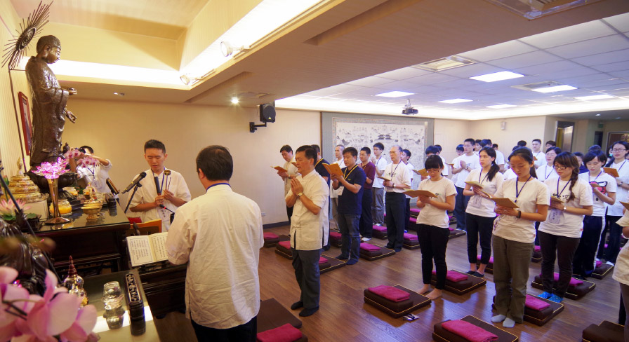

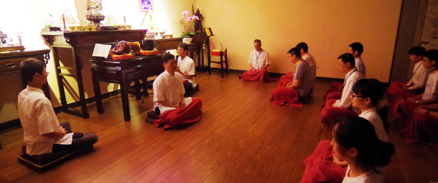

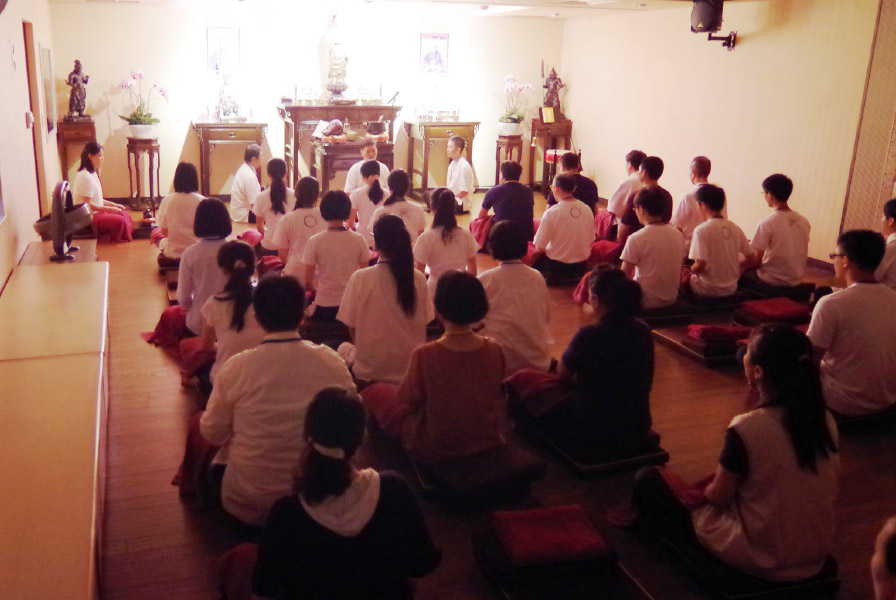

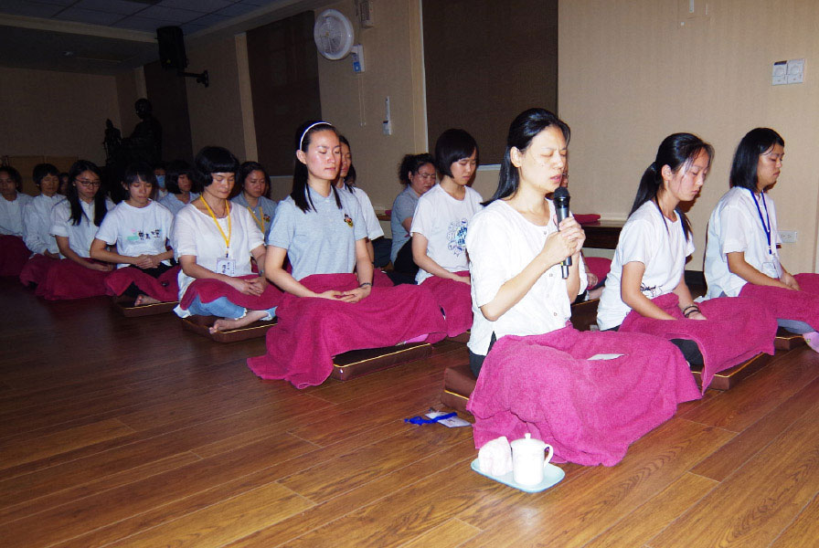

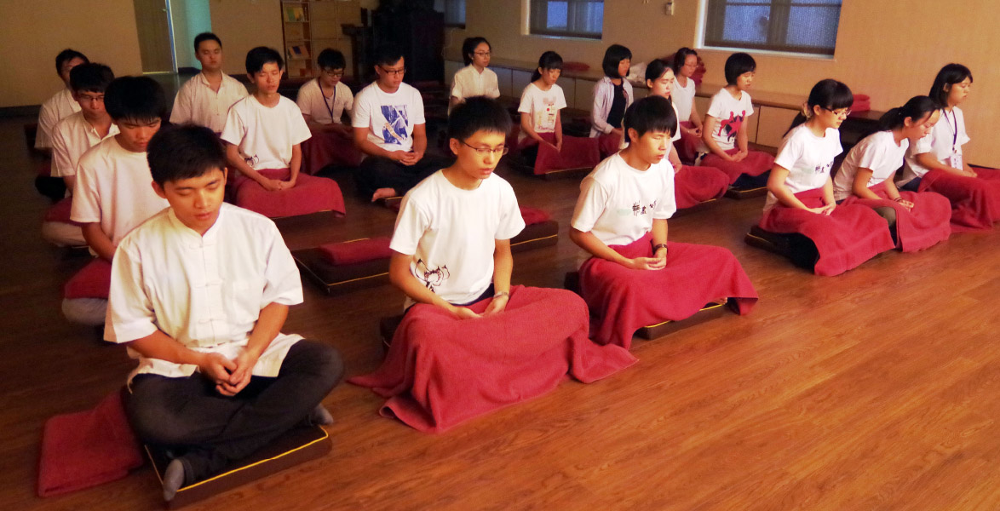

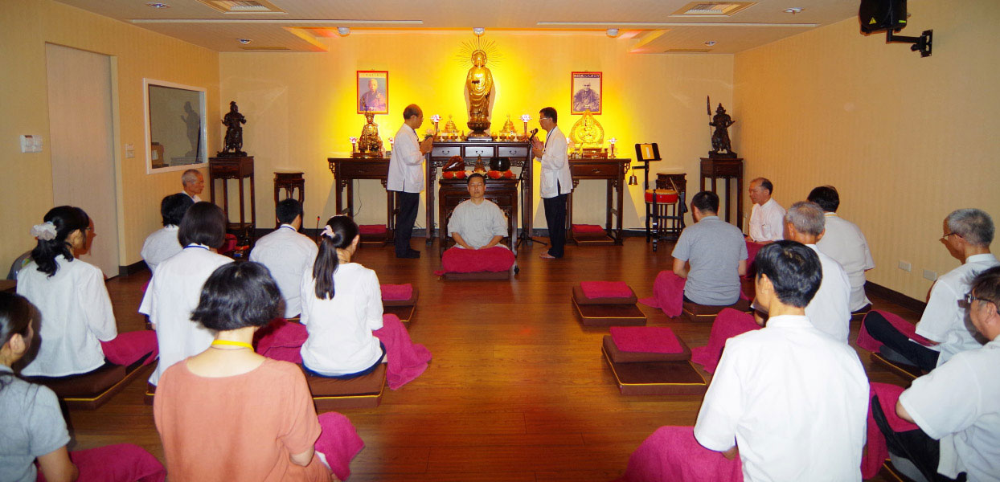

### 餐前觀修

眾學長

二時粥飯雜用心

昔日趙州歎難生

君子無終食而違

餐前觀修善用功

美好聚會的用餐　　王洋逵

敢問世間何者為美好聚會的用餐？有的人答說：三五知己群聚一堂，醉羽觴、品佳茗，相契高談闊論，最是美好聚會的用餐；有人又答說：祖孫三代同堂，相會於宴席，賀高堂福海南山，最是美好聚會的用餐；有人更答說：金榜高中，賀客盈門於酒肆，齊祝青雲有路，最是美好聚會的用餐；也有人會引用古人所常說：洞房花燭夜，喜宴洋洋和樂聚一堂，甚至延伸的慶祝銀婚、金婚、鑽石婚等紀念，邀集親朋好友同樂，最是美好聚會的用餐。上面設問的四個例子，是世法正面認可的說詞。

至於反面遭人呵叱的說法，誠如《論語》〈衛靈公篇〉所載「群居終日，言不及義，好行小慧」，換成白話說：鎮日成群相處，彼此交談都不是合宜有益的話，又競相好耍小聰明，這樣的氛圍，可說是最不美好聚會的用餐。可見，聚會用餐這一件事，是人云亦云，多麼的無自體性！

世俗人的見地，終究於聖人有霄壤之別，宗聖曾子說：「以文會友，以友輔仁」，能如是一期一會，最是美好聚會的用餐。《佛說阿彌陀經》也明白的紀錄，極樂世界的殊勝，除了有佛菩薩的說法，就是因為有「諸上善人的聚會」，天廚妙供，更是殊勝美好聚會的用餐！現在我等齊聚學會研學儒佛妙理，既是會文輔仁，又有教授善知識的不厭宣說妙法及同行善知識的切磋，如此場景，餐餐聚在一起用餐，真不啻是人間最美好聚會的用餐！

禱告與用餐　　 魏甄儀

我們對禱告都非常熟悉，例如待會餐前觀修完畢後要做的供養、或每逢民俗節慶我們會燒香祭拜祖先神明、或像每年會舉辦的各種拜懺法會，都是不同形式的禱告，但重點是—為什麼我們要禱告呢？

其實禱告的目的有兩個，第一、是為了求祖先神明的保佑，尤其餐前供養，就是要求三寶的加被，讓我們今天吃的這頓飯，不再只是吃飯，而是為了往後學習能更加增上而吃飯，為了往後能累積更多修學資糧而吃飯，如果不懂得在飯前做供養、做觀修，那這頓飯的福報就等於白白被浪費掉，無法像滾雪球一樣越滾越大，失之可惜！

至於禱告的第二個目的，就是讓我們懂得敬仰祖先神明，學習報本還恩。

畢竟我們現在獲得的一切，都不是我們獨自掙來的。想想如果最近天候不佳，發生地震、颱風或水災，我們現在一定吃不到這些新鮮的蔬菜水果；如果不是辛苦的農夫無論日曬雨淋辛勤地耕種、還有現在便利的交通建設、司機準時地運送作物到各市場商店，還有師姑師伯們犧牲睡眠休息的時間、每天早起為我們買菜、打點食材，還有辛苦的廚房義工犧牲聽課的權益，幫我們準備美味的菜餚，我們才能在上完每一堂課、飢腸轆轆的時候，馬上吃到這些熱騰騰又可口的飯菜，好好大快朵頤。

我們常常以為禱告是為了滿足祖先神明，但其實最後獲益的對象是在世的我們。

因為懂得感恩祖先神明、還有得自於他人的一切，並知道求祖先神明的保佑加被，我們在不知不覺中，維繫了風俗民情，使社會風氣亦趨淳厚仁愛，這才是禱告最重要也最容易被人忽略、最難被看見的意義與內涵。

因此，我們不要小看每一次的餐前觀修，即使是簡單短短不到三十秒的供養，都充滿了意義。在之後的幾天講座，還有講座結束之後的每一天，我們都要懂得恭敬虔誠地禱告，無論是餐前的觀修供養，或往後祭拜祖先神明，或參加各種拜懺法會，因為禱告不僅是求祖先神明的加被保佑，更重要的是讓我們懂得要尊敬感恩，並讓這良好的風俗義涵，傳承後代，源遠流長。

得失與用餐　　蔡易儒

什麼是「得」呢？《百法直解》云：「依一切法造作成就假立」。老師說，即是過去造作，現在、未來成就；或是現在造作，未來成就。如現前造作善惡等業因，雖然在造作的同時沒有看到果報的生起，但由名言上的關聯性知因滅果生的道理，觀待未來會生起果報，故名言安立「得」，以顯因果不失之理。老師又以債券作為「得」的比喻：眼前雖然從債券上看不到錢，但觀待未來可以換成錢，故假名「得」錢。因此，「得」之一法闡述的，即是因果的決定見。至於「塞翁失馬，焉知非福」、利害得失等觀念，則是此處「得」之一法延伸的內涵。

然而，由於缺乏正知見，我們往往不懂得作因果的觀察，每天的日常生活也忙碌於利害得失之間。而對於得失，人們所在乎的不外乎財富、名聲、權勢、地位，乃至種種的物質享樂，在得到這些利益時感到非常快樂，一旦失去時卻又非常痛苦。為了獲得利益、滿足個人私欲，人們每天汲汲營營地追求，或是夢想著能夠不勞而獲，甚至選擇佔別人的便宜，自己則不肯吃半點虧。然而不論得到或失去，內心總是得不到真正的安定與快樂，容易患得患失，生起眾多的煩惱，往往歲月就在得與失之間匆匆溜走，人生最後經營的其實只是一場空。

那麼，人生的經營當中，究竟什麼樣的得才是真正的利益，什麼樣的失才是真正的損失呢？縱觀歷史而言，得與失其實是一體的兩面，有得往往就會有失。例如：春秋時代魯國的魯定公接受了齊國饋贈的女樂，卻因為沉迷享樂不理國政，而失去了孔子這位治國的人才。另外，有些人為了得到利益，或是害怕失去既得的名聞利養，不惜覆藏自己的罪過保護過失，或是誑騙、諂媚別人，卻因此障礙了菩提聖道的修學以及與善知識的交往。相對的，有失就有得。

孔子的學生子貢在人生中最能賺錢的時間，願意跟隨孔子周遊列國，護持老師，得到老師的看重與調教，成就自己成為外交的人才，能與國君分庭抗禮，言語的應對進退極有風采，甚至在孔子過世後服心喪六年，可見善知識的可貴。周公為了得到天下人才來任用，犧牲吃飯及沐浴時的安穩，「一飯三吐哺，一沐三握髮」，可見得人才的重要性。釋迦牟尼佛過去修行時曾經為了聽聞半首偈子，甚至願意捨棄自己的身體來交換，可見教法與正知見是人生的出路。

由此可見，原來人生中最珍貴的「得」，是人才的得，是良師益友的得，是具足修學教法時所需要的資源的得，是能聽聞正知見的得，是內心生起法喜的得，是修學教法後不斷串習而內心有所體悟的得，是能利益眾生的種種能力學習成就的得，那是人生中的無價之寶。而為了得到這些珍貴的寶藏，眼前我們能夠很樂意地布施財富，付出體力和心力，奉事師長親近善知識，利益眾生不疲不厭，因為眼前雖然看起來是損失、是犧牲，但這樣的失卻能引發殊勝的果報，且在造作善法及修學過程中遇到苦難，又能夠使過去的惡業大量地消耗掉。所得的利益不可思議。是故我們應當對得失作因果的觀察，並且在得失中也能如理如法，如孔子說：「見得思義」。如此一來，相信更能體會人生的出路。

經過這次講座學習《百法明門論》的課程，我們應當學習「得」這一法的因果知見，並且在日用平常中，以平常心看待事情的得失，靜下心來觀察背後的吉凶禍福，所謂「塞翁失馬，焉知非福」，而非每天生活緊繃，甚至一邊吃飯一邊還在思考如何謀取利益，患得患失。而吉凶禍福以及體性空的通達需要教法的學習，因此，眼前我們用餐時，可以觀想這些飯菜是用來幫助我們修學教法能夠有體力，精進向學，期許自己能夠體會「得」之一法並無自體性，乃至沒有一個實實在在有自體性的我，去得到或失去，用心體會本論「一切法無我」的宗旨義趣。如此一來，想必對用心為我們準備豐盛午餐的師長而言，是他們辛苦奉獻的「失」所「得」到最好的回饋吧！

維持生命的用餐　　蕭惟元

這次餐前觀修的主題，是依據《百法明門論》心不相應行法的命根所立。什麼是命根呢？在書上提到，命根是「親生第八識之名言種子」，也就是納授果報的名言種子，老師在上課的時候還教導我們，命根是「已滅的引業」，透過已滅引業的相續，已經決定了我們這一生能夠活多久。過去所造的業力強，此生的壽命就長；過去所造的業力弱，此生的壽命就短。把我們所能受用的受用完畢，酬業酬完了，就得離開。

從命根這一法中，我們學習到了什麼呢？

首先，我們都隨著業力在三界六道中輪迴不停，或做人、升天，或墮地獄、餓鬼、畜生，沒有一處可以永遠停留，然而受用三塗的命光總是比較長。這是我們要警惕的。

其次，透過命根的學習，原來這一生要吃多少飯，或者說有多少時光能用多少餐，原來過去生所造的引業已經決定了。當我們吃一餐，就少一餐。因此在用這一餐的時候，應該十分珍惜的去享用，除了感恩香積、工作人員的付出，還要想到，這一餐除了維持生命以外，要發揮廣大的作用。

如何發揮這一餐更廣大的作用呢？除了維持生命，這一餐的受用，還要資助慧命的培養，把用餐所吸收的養分與能量，全心投入在教法的修學上。

另外還要怎麼發揮廣大的作用呢？就是透過我們餐前的供養。所謂是：供養佛，供養法，供養僧，供養一切眾生，願斷一切惡，願修一切善，願度一切眾生，願生西方極樂世界，南無阿彌陀佛，南無阿彌陀佛，南無阿彌陀佛。這短短的句子中，有供養，有發願，有修福，有修慧，有慈悲心，菩提心，還有成佛的方法。確實將這一餐的作用，發揮到極致，何樂而不為呢？

名言與用餐　　應雨橋

聽到「名言」這個詞，想必很容易就聯想到中觀宗的宗義「諸法自體空，唯名言安立」。「諸法自體空」乃就形而上說，諸法體性皆空，皆無法自己成立；而「唯名言安立」乃就形而下說，諸法的顯現是以名言的方式來顯現。那這跟用餐有什麼關係呢？既然是「諸法」，當中自然包括用餐這一法，用餐也不外乎自體空和名言安立。

首先，在次第上須先觀察用餐的自體空，為何如此？當通達用餐這個法的顯現是沒有一定的，這個時候只要給足其條件，它要顯現得多殊勝就可以多殊勝，這觀待於用餐者。那要如何觀察用餐的自體空呢？就用餐這一法上作能所的觀察，當中有能用的我們和所用的餐點。能用的我們沒有自體性，若有的話，那理應不需要餐點我們就能夠成為能用餐者，倘若如此，那即使在上課時我們應該還是用餐者而非聽課者，但現見並非如此；第二個，所用的餐點也沒有自體性，若有的話，那理應就算沒有人去用它，它都會被用完，因為是所用故，但現見也並非如此。

此外，還必須觀待種種其他的條件，像是講座的因緣、用餐的場地、辦事團隊的努力、蓮友大德們內外財的護持等，若有自體性，則不需以上這些條件都還能成立能用餐的我們和所用的餐點，但現見都不能成立。既然能用的我們和所用的餐點都無自體，那它們兩個加起來的用餐又怎麼會有自體性呢？

既然用餐非自體成立，那就表示它的顯現是沒有一定的，此時就看用餐者要給它什麼樣的名言，只是「填飽肚子的用餐」，還是「可以幫助我們好好學教法的用餐」，乃至「直指佛果的用餐」，想讓用餐有多殊勝，就可以有多殊勝，就看要給它什麼樣的名言，特別是觀待結合什麼樣的心態來用餐。那有哪些心態可以結合呢？

一切法行皆應直指大乘，直指佛果，除空性的觀察外，大悲心與菩提心是必須要結合的心態，才能讓此法行成為成佛的資糧。所謂大悲心，即不捨一眾生，讓一切眾生皆去成佛。所謂菩提心，即為了達到讓一切眾生去成佛的目的，自己要先去成佛。藉著眼前的用餐幫助自己迅速恢復體力，目的是為了更好的作眼前講座的學習以及各種事項的工作，如果心態上在於將其作為未來能夠廣度有情成佛的資糧，此時眼前的用餐在名言上就成為了「大悲心的用餐」；如果心態上在於將其作為自己未來成佛的資糧，讓自己在成佛道上修福修慧沒有障礙，此時眼前的用餐在名言上就成為了「直指佛果的用餐」；如果心態上在於將此作為往生的資糧，為了成佛以往生淨土作為方便，此時眼前的用餐就成為了「淨土的用餐」。

藉著用餐讓自己體力充沛，來作廣大的學習和種種為公發心的事項，這也恰恰是佛菩薩所作的法行。佛菩薩所作的法行我們現在來作，實踐其內心的渴望，以此表達對諸佛菩薩最大的禮敬、稱讚、供養、內心最大的懺悔與隨喜，而且將來要拿這一分請諸佛菩薩轉法輪，請諸佛菩薩住世，以此法行代表我對眾生的恒順，把此法行作無盡的迴向佛果、迴向眾生、迴向淨土、迴向三輪體空。此時眼前的用餐就在名言上成為了「十大願王的用餐」。

總之，在因位上結合越多好的心態、好的名言來用餐，在果報上就越發殊勝。僅將以上觀修供養大眾，若有不如法之處，還請各位老師、蓮友大德、學長不吝指正，祝用餐愉快！謝謝大家！

平等的用餐　　許熒純

宇宙萬有森羅萬象，無量無邊，萬事萬物都叫做法，一切事一切理也叫做法，山河大地或日月星辰都叫做法。而天親菩薩將之歸納收攝為百法，使我們能以小見大、以最精準的行相去認識所在的宇宙。

然而這麼多的法，我們是怎樣去認識的？

所有事物依據其特性，可以分別為不同的種類，在不同的種類之中，又可以找尋萬法的關聯處及相同處。將符合同樣定義的歸納一類，然後以總相的方式去認識法，再由總相去認識差別相。

這樣的分類架構告訴我們什麼道理呢？當我們在分類萬法時，把有同樣定義的歸成一類，例如以「能思」的特性，將符合此定義的劃歸為「人道」，當我們劃分出人道後，往下其實又可根據某些特性，再加以劃分，如此而下。即使是同樣定義的事物中，也還可以再繼續劃分，直到最貼近萬法的真實相。

對於萬法我們所給予的定義，其實會隨著不同的取向，而有不同的分類結果。所以這些定義，也只是我們根據某種作用所安立的名言，不同人乃至於不同道的詮釋，皆不盡相同。

這告訴我們什麼？萬法在未被定義之前，他的本體是平等的，卻因為我們的認知，而產生了種種的分類組合，而我們的認知影響對事物所下的定義。那麼怎樣將萬法做最恰如其分的分類，就有賴於我們在《百法》上的學習。

就以這次大專講座的聚餐來說，來參加的師長們，有臺灣和大陸，大陸地區又可以分為雲南、瀋陽和諸暨等，臺灣又可以分為北中南，各地的飲食不盡相同；何況有人吃素，有人沒那麼素；有人喜歡糖多放一點，有人又想吃鹹一點；有人想吃飯、有人想吃麵；有人想增肥，有人想減肥；有人想自己吃飯，有人喜歡一群人吃飯；有人喜歡吃紅蘿蔔，有人看到紅蘿蔔避之惟恐不及。準備餐點的人要怎樣去調和飲食呢？呈現在餐桌上的菜色，如果要迎合每個人的喜好，煮甲喜歡的，乙就會抗議不平等，那後天煮乙喜歡的，丙說怎麼可以！不公平，甲也順便跳出來說話。有情眾生那麼多類的人，按照一年三百六十五天下去輪替，哪時候輪得完？哪時候可以做到真正的公平呢？對煮飯的人來說，簡直比登天還要難！

但是這個時候運用「眾同分」的概念，就可以解決這個問題了！此次講座設立目的是為了研學傳統文化，甚至學習怎樣將傳統文化的內涵應用在這個世間，所以參與的人，把自己當成參與講座的師生，用這個分類法，來參與這個活動，享用這些餐點；並且種種受用，都是為了維持生命，以用來研學經教，用這樣的心態來享用餐點，又何必分東西南北呢？況且煮得餐點好吃，是不是自己所習慣的，又有何妨呢？

最後，願大家都能以感恩的心態，感謝背後默默付出的義工們，為我們悉心準備美味的餐點，使我們能無後顧之憂地，在經教上學習；又能不餓肚子，專注在所學之上，讓我們謝謝他們。

各司其職的用餐　　蔡濟安

炎炎夏日，此時此刻大夥兒有緣聚集在這裡聽聞並串習正知見，須知是非常殊勝難得的因緣，有些師長是坐了千里的飛機輾轉來到這裡，有些師長是想來台灣卻來不成，有些師長是冒著被裁員的風險請長假來聽課，來到這裡又因為外頭的高溫，讓我們的冷氣運轉不力，造成教室裡也悶熱難耐。我們在教室裡都覺得很悶熱，試想在廚房中的師姑開著火爐烹煮佳餚，在眾多冷氣室外機運轉的防火巷洗菜煮飯的師姑師伯更是宛如身在火燒地獄，以及所有幕後辛苦承辦的工作人員，他們為何願意如此犧牲自己呢？一切都是為了成就在場的諸位可以好好地上課，把老師所傳授的正法學入心，進而能傳承弘揚，利益更多的眾生。

所以能把心安住在課程上，不昏沉不掉舉，把不懂的東西努力搞懂，把所學內容融會貫通，就是我們參與這是講座的職責所在。遙想兩千年前，孔子二十一歲時，就擔任乘田吏，跟現場部分年輕的學長年紀差不多，其任務是在牧園內放牧牲畜吃草，使牛羊繁殖眾多並茁壯，也就是在農業時代幫國家拚經濟的工作，職位雖不高，但盡心盡力地做好本分工作。眼前有些人是初次接觸百法及論語講要，可以好好地打基礎，多請教。有些人是學習多年，可以好好串習不熟悉的知見，並提攜後進。期望剩下的幾堂課，大家都可以繼續盡自己的本分，圓滿這次的講座。

差別的用餐　　唐微智

記得國中國文課本有一課必選課文叫做雅量，第一段說道：朋友買了一件衣料，綠色的底子帶白色方格，當她拿給我們看時，一位對圍棋十分感興趣的同學說：「啊，好像棋盤似的。」「我看倒有點像稿紙。」我說。「真像一塊塊綠豆糕。」一位外號叫「大食客」的同學緊接著說。我們不禁哄堂大笑，同樣的一件衣料，每個人卻有不同的感覺。那位朋友連忙把衣料用紙包好，她覺得衣料就是衣料，不是棋盤，也不是稿紙，更不是綠豆糕。由這段課文可見，同是一件衣服，每個人卻會產生不同的見解認知。

同樣的，當我們面對中午一盤盤的美味佳餚，每個人對酸甜苦辣鹹的看法也都不同，不管看法如何，總是自然而然的對自己喜歡吃的食物生起貪愛，夾越多越好，對自己不喜歡吃或是不敢吃的食物則生起厭惡心，看到別人吃得好，自己吃得不好，心裡不平衡，還會產生嫉妒心。如此貪圖自己的生活享樂、口腹之慾，一頓飯，就長養了我們的貪、瞋、癡等等煩惱。

正因為凡夫有人我執、法我執，愚痴無明，妄計有實我實法，因此都是異生性，異於聖人的性，凡夫的長相、思想、見解、種類、地域、受用都不同，且都有見所斷的煩惱未斷的特性，會不斷起惑造業，隨業受報，不得自在，墮入種種趣中，不斷受苦，無法出離。而聖人名為同生，因為一切聖人，皆證悟空性，不起我見。這就是凡夫與聖人的差別所在。

原來凡夫跟聖人的差別不是聖人都吃美食，而是聖人都有相同的知見，知見讓人超凡入聖，讓人在嫌惡中看見美好，在差別中看見平等。今天享用這一餐，它當然是美味的一餐，但我們在學習百法之後，除了品嘗這一餐的美味，還要品嘗這一餐的法味，法味該如何品嘗呢？就是把學過的教法結合有法，結合到用餐上。蕃茄、胡蘿蔔、豆干、青菜、香菇、糖、鹽巴、醋、醬油、黑胡椒、芭樂、鳳梨、蘋果、梨子，千差萬別的各種食材調味料，煮成許多盤色香味都不相同的菜餚，餐餐不同，然而若從自體性來觀察，這些不平等中，原來都有共同的體性，都是自體性空，都是觀待吾人名言安立而呈現不同的滋味。

要破除煩惱種子，見真空之理，進入聖人之流是很難的，我們可以先從簡單的開始做起，常禮舉要說：「不挑剔食之美惡」，即吃東西不要挑剔，也不要偏食，練習對治我們的貪心、瞋心。從前印光祖師飲食只充饑渴，衣服只取禦寒，雪盧老人也吃得很簡單，孔子曾經稱讚顏回一簞食，一瓢飲，在陋巷，人不堪其憂，回也不改其樂，賢哉回也。顏回雖粗茶淡飯，卻不會改變他對道的喜樂。他人不解顏子之道，則不知顏子之樂，只有孔子知道。可見心安住在道上，便不會起種種的分別執著。

再則，好吃的菜餚如果有自體性，應該誰吃都覺得好吃，事實並不是如此。一盤青菜，今天學會一百個人去吃，不是一種味道，卻是一百種味道。對於生病沒有胃口的人，這樣辛苦籌辦出來的一餐，在他心識前可能是避之唯恐不及的東西。透過這樣的觀察、串習，原來我們因為差別而產生的各種負面情緒，都將更能被我們的心掌握。相反的，應在各種差別相中賦予正確的名言認知，如知「一日之所需，百工斯為備」，常懷感恩的心，就像唐老師上課所說，在廚房辛苦忙碌的師姑們跟我們並沒有血緣關係，卻為了我們的三餐汗流浹背、奔波勞碌，我們應該好好做正法的學習，否則無以回報，眼前來細細品味這一餐。

吃出用心的一餐　　王姿云

或許有些學長們會想說：用心吃飯？我會呀？這有何困難的呢？吃飯看似一件稀鬆平常之事，事實上它卻包含了很大的學問，大多數的人不會吃飯，在更大多數的人不會用心吃飯，為何如此說呢？我們知道在以前先人篳路藍縷背景下，往往有一餐沒一餐，而我們卻是在這節奏匆忙的現代生活中，為了課業、為了事業或其他非金錢以外的因素，而有一餐沒一餐，有一句話是這麼說的：早餐要吃得像皇帝，午餐要吃得像平民，而晚餐要吃得像乞丐。這是從吃飯的量和質來做的比喻，然而多數的我們卻往往倒過來，用餐時間的混亂、少則節食，多則暴飲暴食、早餐不吃或是宵夜已成定律，這不用聖言量，用比量推度也可知將來身體必銷。

若能保證會吃飯，也未必保證會用心吃飯，該如何用心？用甚麼心？用心的程度又到哪？為何用心吃飯如此重要？這可以論身上，也可以論心上。論身上而言，吃飯不專心會導致身體的問題之一就是味盲。味盲就是當我們進食得太快，或是心志不專，食不知味時，會造成口中味蕾不滿足，大腦感受不到吃飽的滋味，如此一來會造成我們用餐過量而發胖，或是喜歡重口味，而成為高血壓、高血糖、高血脂的三高者。另外論心上而言，用心吃飯也是一種修行，在<景德傳燈錄>中有一篇是關於有源律師想問大珠慧師如何用功修道之事。
正所謂做事修行，皆當用功，一日修來，一日功；一日無修，一日空。故「和尚用功修道」。有源律師想修卻不知如何用功，故請大珠和尚開示，大珠和尚竟以「饑來吃飯，睏來即眠。」答之。有源律師聽聞，覺得訝異！一般人不是正是如此嗎？大珠慧師回
**答：** 「是不同的。一般人吃飯時不肯吃飯，百種思索；睡時不肯睡，千般計較，故不同」。

「悟者」活在當下，用心吃飯，放心睡覺；「迷者」妄想執著，做此想彼，執迷不放。從這篇當中可知，修行不離生活，如何在日常中用心、放心、無心，才是會用功，因此用心吃飯也是種修行。

而我們該如何用心？怎麼檢視自己用心的程度？前面老師為我們上過的〈孔子聖蹟圖〉當中，孔子二十九歲學琴師襄，這是個正值年輕的歲數，在未被告知曲名為<文王操>之下和魯國琴師師襄學琴，彈到熟練、精準了，卻因為未得其數而不願換曲，得了數之後卻因未得其志而不願換曲，而得了志之後卻因未得其人，而不願換曲，最終孔子彈到出神入化，文王如現其前。

從孔子學琴師襄中我們可知，孔子的用心程度，這般心靜學琴的功夫是多麼的深厚，而我們是不是也能將此運用到吃飯上，在吃下一口飯菜時，用心咀嚼，看我們能不能分析出它的酸甜苦辣，是用了甚麼食材烹煮、是放了何種調味料、是用了多少比例的鹽和糖，分析出來後還不要吞下，繼續看看我們能不能品嚐出煮菜師姑、師長們的心志，他們煮菜時在想甚麼，為我們準備這頓晚飯的心意為何，只是希望我們吃得白白胖胖嗎？只是希望我們吃出他們的好手藝嗎？還是有更大的心志在其中呢？

如果得知師姑們的心志後，將那口飯菜下嚥也別急著吃第二口，再看看我們能否在口中的飯菜餘香中，得知是哪位美麗莊嚴的師姑、師長為我們烹煮的天廚妙供，若能如是，這就是所謂的得其人了！這樣的用功法不只可以用在吃飯，用在我們現在在學的《百法》、《論語》還有《唐詩》，也能運用在生活大小事中。如是觀修，願大家都能吃出用心的一餐！

善用其心的用餐　　王文徽

在五位百法中，心法的次第排在第一位，是謂一切最勝故。心的造作可以使人墮入輪迴，受業繫縛；但也能夠生起般若智慧破除二障，離苦得樂。既然心是如此重要，我們是不是應該好好地善用它於用餐之中呢？

老師曾說，吃飯是為了學習，吃過飯才有力氣學習、思考、辯證。而世尊也親自示現證明苦行絕食並非解脫的正道，適當的飲食更有助於修行。然而吃得過多也會令身體不適，反成修行的障礙。所以飲食應該節制，既不絕食也不貪食。

有了正確的飲食觀念後，那在用餐時該有何種心態呢？講座期間的每一餐，都應該用心觀察、思考、思惟，食物得之不易，有多少人為我們辛苦付出。如果不是師姑師伯們在炎熱的環境下為我們打理餐點，我們能有眼前的這一餐嗎；若不是老師們期許我們能夠專心於教法的研習之中，我們能有眼前的這一餐嗎，我想是不可能的。因此要懷著感激的心用餐，並將此福報作為修道的資糧，種下來世樂果的因，如此生生不息。

不僅如此，我們一般人在吃到美食的時候，就想多嚐一點，生起貪愛之心。遇到不好吃的食物便覺難以入口，大加排斥，生起瞋恚之心。結果就在用餐中起惑造業，感得來世之苦果。

《華嚴經》〈淨行品〉告訴我們，只要善用其心，吃飯穿衣等日常瑣事都能成為修行的法門。如經上所言：「若飯食時，當願眾生，禪悅為食，法喜充滿」對教法生起殊勝的法喜，就好像人必須吃飯一樣，無它不可。「若得美食，當願眾生，滿足其願，心無羨欲」美食當前要能知足惜福，不隨意浪費。「得不美食，當願眾生，莫不獲得，諸三昧味」遇到不喜歡吃的食物，能觀其自體性空，不要妄生分別。「飯時已訖，當願眾生，所作皆辦，具諸佛法」希望能在用餐中成就佛法。

所以在吃飯的過程中，不管食物好壞與否，皆要用「心」修道，將眼前的福報成為下一個福報的因，好上加好延綿不斷。用餐時善用其心，心存感激發大願力，讓用餐不只是簡單的吃飯，更是修行的增上緣。

同甘共苦的用餐　　林士棋、海辰

同甘共苦，簡單來說，就是有甜一起吃，有苦一起嚐；不論順境、逆境，都能互相分享與扶持。而眼前的一頓飯或是家中的柴米油鹽醬醋茶等等，往往也就是順、逆境的一種體現。

然而，是否能夠同甘共苦的關鍵究竟在哪？我們常常以為同甘比共苦來的容易，好比說一頓不能共苦的用餐，就是當你有困難，僅有粗茶淡飯時，大家就開始疏遠你，轉向去跟有好吃的人在一起。令人不禁聯想到在天道的眾生，生活衣食無虞，有很好的享受，但到了壽命將盡，五衰相生起的時候，每個人都跑得遠遠地，沒有人願意照顧陪伴不再美好的人事物。在我們身邊也有很多這樣的例子，像是一些企業家、政治家，在事業順利的時候，很多人願意和你一同享樂，但當投資失敗、官場失利後，平常支持你的人，甚至是親人，也都會漸漸地遠離你。

所以患難見真情，能同苦的相處，是很難得的，像是在當兵打仗時的袍澤，在重考班一起打拚的朋友。共苦雖不容易，但是很多時機只有在共苦時才會成熟，例如孔子與學生餓於陳蔡的革命情感，不僅對孔子之道是一種考驗，對學生也是道心上的測試。

但進一步說，有時候分享所成，同甘的用餐，反而是更困難的。在歷史上，漢朝開國者劉邦在打天下的時候，受到了很多人的幫助，但是在建國之後，卻收回兵權，判功過，權力的鬥爭就此開始。離我們比較近一點的例子，名歌手阿吉仔，在出道成名以前，跟他太太一起打拚，但在成名之後，卻娶了一個更年輕的美嬌娘。

由這些例子，我們可以知道，甘與苦不能只看眼前的甘或苦，而應該有個更大的共同目標來攝持。

之前的餐前觀修有提到，自體性空的用餐，用餐的自體性無，我們想要它有多好，就能有多好，並且這包括了用餐的氣氛、一起用餐的人、用餐的意義等。一頓很高級的飯菜，如果大家在餐桌上只是討論八卦，甚或大吵一架，就可能變成浪費福報的一餐，或者是帶來瞋恚、苦果的一餐；反觀，即使是一頓家常便飯，如果有正法的攝持、家庭和合的氣氛，也能成為最好、最美味，同「甘」的一餐。

或許我們可以這麼說，同甘共苦的用餐，就是一個志同道合的用餐，有共同的目標與理想，不以苦為苦，不以樂為樂，而只要在道上的用餐，就是一個同「甘」的用餐，那想必這樣的用餐，在面對生活大小事時，也能化苦為樂，互相扶持，成為增上的資糧。

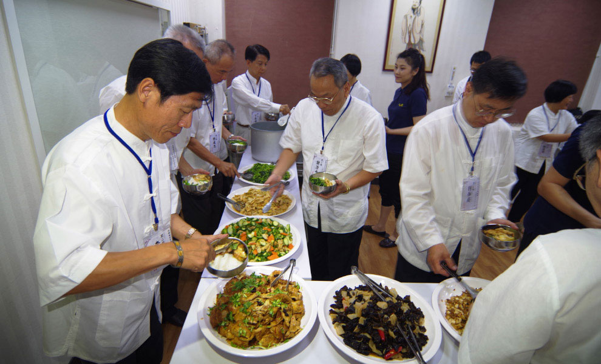

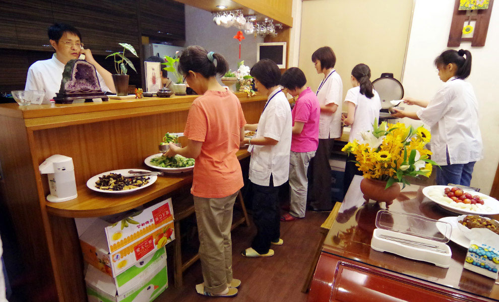

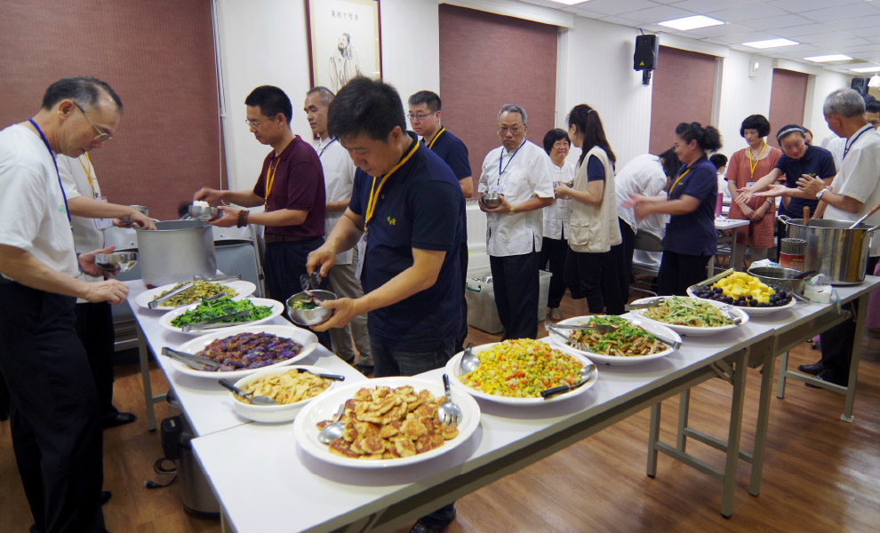

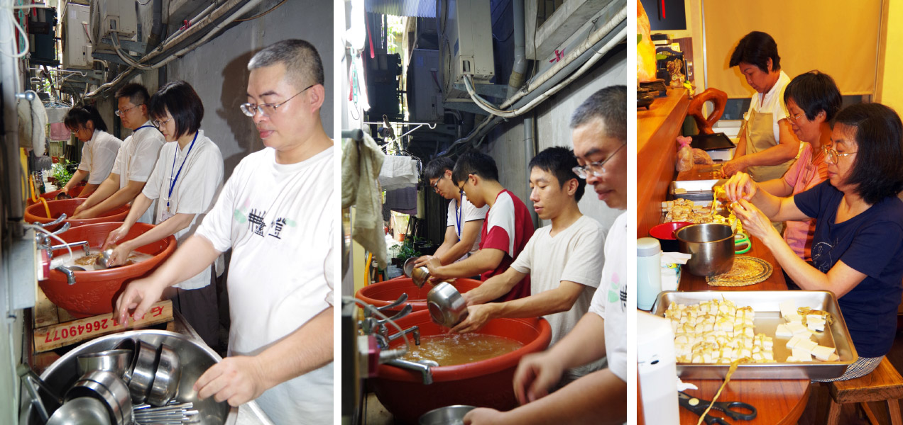

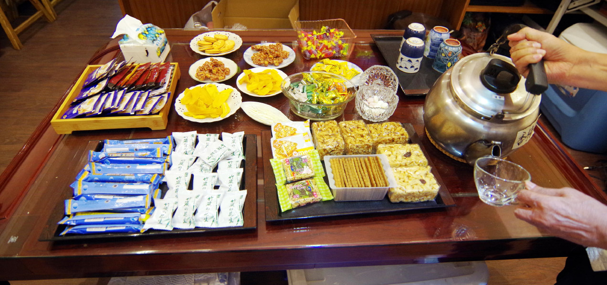

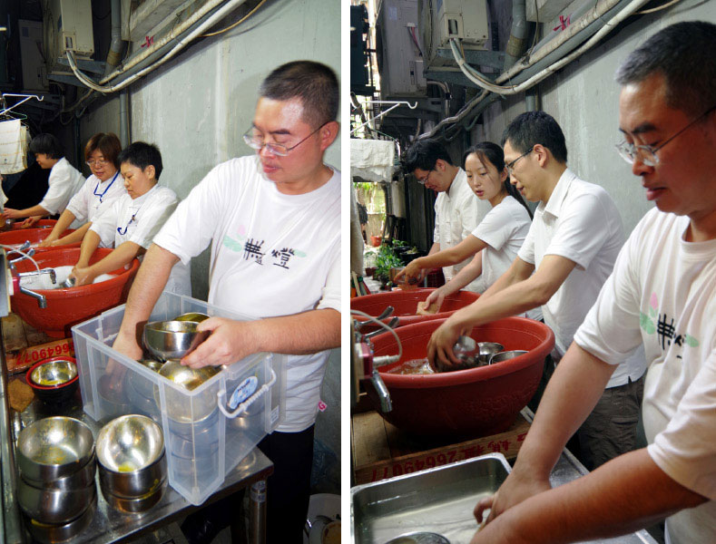

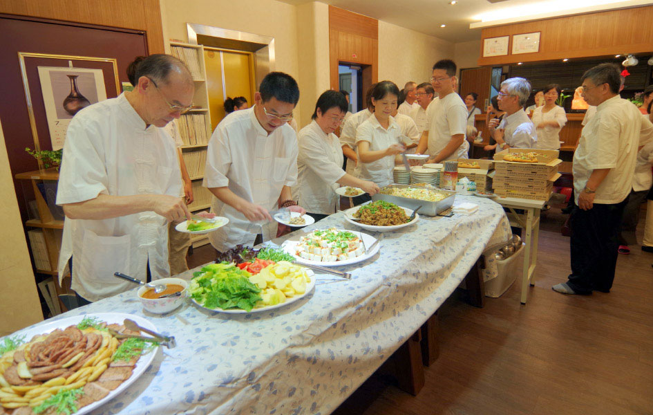

### 考題與解答

*編輯部*

簡單測試知效果

重在聽聞與研討

日積月累能厚積

未來薄發有大用

一、何謂心不相應行法？請解釋之。

心不相應行法，略有二十四種，一得，二命根，三眾同分，四異生性，五無想定，六滅盡定，七無想報，八名身，九句身，十文身，十一生，十二住，十三老，十四無常，十五流轉，十六定異，十七相應，十八勢速，十九次第，二十時，二十一方，二十二數，二十三和合性，二十四不和合性。

（一）心：指「得」及「命根」等二十四種法，皆不離心故。何謂也？即此二十四種法，雖藉前三位「心、心所、色」才能建立，但是其中之「色法」是心、心所所現的影子，而「心所」又是與心相應，所以二十四種法，亦總不離心也，皆隨心左右，皆依心轉變，故特別點出「心」字。

（二）不相應：先說「相應」義，「相應」是和諧順從，互相呼應，不相違背之義。如函（杯）與蓋（覆於杯上者）之相稱，函大蓋亦大，函小蓋亦小，謂之「相應」。又如心與心所之相應，可知。

今此二十四種法，何以叫「不相應」？具三義故。

１．非能緣故，不與心、心所相應；即心心所能緣慮，此二十四種法，不能緣慮，故不相應。

２．非質礙故，不與色法相應；即色法有質礙，此二十四種法無有質礙，故不相應。

３．有生滅故，不與無為法相應；即無為法不生不滅，此二十四種法，有生有滅，故不相應。

（三）行是遷流變化、生滅不已之義。屬五蘊法中的「行蘊」所攝。然「行蘊」又分二種：

１．相應行，謂與心王相應之行蘊，即指五十一心所中，皆名「相應行」，與心相應故。

２．不相應行，即指「得」等二十四種法，其不相應義，如上述可知。

不論相應行或不相應行，以上七十五法，都是行蘊所攝，都是遷流變化、生滅無常之有為法，故特別點出「行」字。

不相應行，小乘家立十四種（即得、非得、同分、無想果、無想定、滅盡定、命根、生、住、異、滅、名身、句身、文身。）且皆執為實有；大乘家則假立二十四種，且皆非識外實有之法。故成唯識論卷一云：「不相應行，亦非實有；所以者何？得、非得等，非如色心及諸心所，體相可得；非異色心及諸心所，作用可得。由此故知，定非實有，但依色等，分位假立。」

總之：此二十四種法與前三位，非一非異：

非一—前三位有體相，此二十四法無體相，故曰「非一」。

非異—此二十四法雖是無體相之假法，卻有作用顯現出來，但是此作用並未離開前三位之作用，故曰「非異」。

此二十四種法，既依前三位建立，自己並無體相可得，故曰：「分位假法」。譬如波依水建立，波並未離開水，波是假法，水是實法，波之與水，亦非一非異。（按五位百法，就前四位言，前三位是實法，第四位是假法。）

二、「得」定義？以及說明結合有法比喻？

百法直解云：「依一切法造作成就假立。」亦即「得」就是「成就不失」之義以債券來比喻得為例：在債券上看不到錢的體性，但是債券在未來可以換成錢，所以在眼前名言安立為「得」。

三、「命根」定義？為什麼名言種子是命根呢？還有沒有其他詮釋？

命根定義是：以第八識的名言種子作為命根，而業種子只有感果的功能。名言種子有納受果報的能力，可以生起名言的力量去納受苦樂境界，依此名言取境的力量稱之為活著，故假立名言種子為命根。

以中觀立論：前一世已滅的引業造作，引到來世，令將來有勢力緣住境界生起下一期生命現象，稱為命根。

四、我們是如何以眾同分認識萬法呢？

我們是以符合定義的名言，以總相認識該法；最後以逼近別相方式認識該法。

五、什麼是異生性？什麼是同生性？試解釋兩個「性」的不同。

異生性─見所斷煩惱未斷的特性。見所斷煩惱未斷以前，妄生分別起惑造業的習性，宛然就是凡夫的本性。

同生性─見所斷煩惱已斷的特性。性是以空性來說。

六、佛經以什麼為體性？四部宗義說法不一，試述之。何者為了義、何者為不了義，理由為何？

佛經是以「聲塵」為體性。

有部認為─色塵為佛經體性。─不了義的理由是如果佛經體性是色塵，只要流通佛經就能永住正法了；不會有正法、像法、末法、滅法時期。

經部、中觀─聲塵為佛經體性。─了義的理由是引楞嚴經：此方真教體、清淨在音聞。

唯識認為─證悟者的心識是佛經體性。─不了義的理由是心識不與他人共，傳承者亦是以聲塵來教授之。

七、如何從流轉、定異、相應、勢速中知道因果的體性？

從流轉中，了解因果是相續不斷，沒有究竟，非實有一果可得。如種稻生稻米，稻米又成為下一個稻的種，再生稻米。

從定異明白因果的種種差別，造善得樂，造惡得苦。分三：（一）相定異：因果的體性決定不同。（二）因定異：善惡因決定不同。（三）果定異：苦樂果決定不同。

從相應看到因果的相稱性，在因地上越講究，得到的果報也越大。例如造善法時的心態、共業或別業、有無傳承、前行及迴向等。舉殺生業為例，由是教唆他人還是親自殺，所起的殺心，所殺害的對象、殺害的方式與是否真的殺害之（究竟），來論所得的果報是短命、多病還是小感冒。

從勢速得知未熟的因果變化非常迅速，如唐太宗當年問袁天罡李家王朝將持續多久？袁天罡說會被武姓取代，太宗問殺盡武姓如何？袁天罡說天下大亂，太宗改說大赦天下如何？袁天罡言，武姓王朝僅有五十年。

八、請試述孔子教學種類？收學生的條件？孔子的教學方法？

教學種類：文、行、忠、信。

收學生條件：１．子曰：有教無類。２．子曰：自行束脩以上，吾未嘗無誨焉。

教學方法：啟發式教育。子曰：不憤不啟，不悱不發，舉一隅不以三隅反，則不復也。

九、孔子三十五歲入周所學習內容是？

問禮於老聃、訪樂於萇弘。

子曰：周監於二代，郁郁乎文哉！吾從周。

十、孔子因何事入齊？景公要給孔子的待遇是？孔子離開齊國的原因是？

在昭公二十五年郈昭伯在鬥雞上輸了季平子，郈昭伯聯合昭公攻打季氏、兵敗郈昭伯被殺，昭公出奔齊國。孔子從周在回魯路上聽到魯君出奔(孔子不願意待在沒有國君的國家)遂入齊國。

齊景公要給孔子宰相的待遇(齊景公待孔子曰：若季氏，則吾不能，以季孟之間待之。)

表面上─景公曰：吾老矣，不能用也。

事實上─晏子為保護孔子不受齊國內亂之害(陳大夫、高昭子)，以方便兩舌挑撥景公與孔子，使景公打消封地於孔子念頭；孔子在齊國無法施展大道遂回魯國。

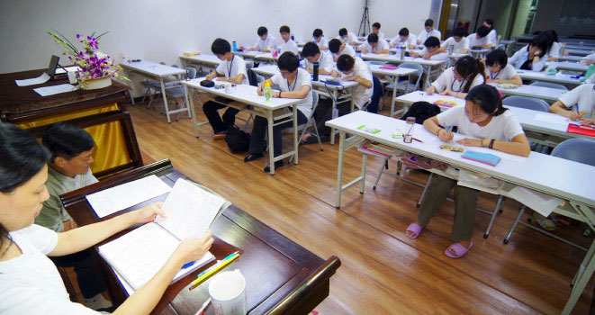

### 經營家庭盛世—從婚禮開始說起

*編輯部*

緣起於國學啟蒙

相識於法華經筵

共識於文化學會

祝願於美滿組合

學會在六天講座結束大眾法喜充滿之際，結合遠從瀋陽、諸暨、雲南等地來的嘉賓，為士棋和海辰兩位學長舉辦了婚禮慶賀茶會，一位是從小伴隨學會學習長大，一位是學會的工作人員，兩位新人都在單純的家庭中長大，畢業於臺灣最頂尖的大學，有著純樸的氣質，加上他們對於文化有學習的熱誠以及向學的心，所以學會以茶會慶典的方式作為祝福，並祈願年輕的學長們一一步入美滿婚姻。

既是婚禮茶會，必先明婚姻之道。雪廬老人隨奉祀官來到臺灣，曾為弟子們證婚並擬定了婚禮的儀式，典禮中先唱香讚，禮請三寶加被，接著唱三寶歌，由佛菩薩的功德來攝受新人，然後唱誦吉祥天女咒，彰顯婚禮這件事是天下最吉祥的。

雪廬老人在婚禮證書說到，家庭佛化是慈愛的開始，眷屬同心才是家庭美滿的起步，如果沒有組成佛化家庭，沒有以正法調教，慈愛的心是生不起來的，而同心是家庭美滿的開始。雙方雖然因為現在時代的進步，婚禮已不像古禮那樣麻煩，但是慎重的心是有的，古代有六禮（納采、問名、納吉、納徵、請期、親迎），步驟隆重、繁瑣且冗長，傳統的佛化婚禮，站個一、兩個鐘頭是常有的事情，也因為結婚實在太麻煩了，所以也有著不敢輕易離婚的意味。

而兩個人結海誓之盟約，在結婚證書裡講到這盟約就像佛法中的須彌山一樣，是所有世界最堅固、崇高的，新人在這樣的誓盟當中，走上光明的大道，在儒家來說，男女是以才德來結合，不是以貌來結合，《詩經》中的關關雎鳩講的就是娶妻娶德，女人嫁到對方家，是對方家庭興盛的開始，娶一位好太太，比得到博士乃至於在事業發展上都還要重要，如果沒有辦法善教子女，是沒有未來的，看一個家庭的未來是要看後代的，不能只專看眼前，眼前雖然蓬勃發展，但是後繼無人，家庭就到此為止。

除了娶妻娶德，光耀門楣，宜室宜家之外，也像共命之鳥情投意合，不僅僅是只有正知見，不能只有為了遍滿虛空的有情眾生，也必須要有感情作為基礎。《詩經》的〈桃夭篇〉，灼灼其華就是家庭美滿幸福，子女成群，子女成群是很重要的，雪廬老人在一九八０年代時證婚就曾強調多子多孫的重要性。雖然當時政府倡導減育計畫，口號是：一個不算少，兩個恰恰好，在二、三十年後的今天，社會也漸漸明白了子女成群的重要。雪廬老人也曾懷抱著大格局的胸懷說到，全世界都是中國人也沒有什麼不好！

因為兩家的聯姻成為一家人，《論語》上說：因不失其親，亦可宗也。結婚的時候，男方的家人、親戚就是女方的家人、親戚，女方的家人、親戚就是男方的家人、親戚，這種文化只有中國文化有，結成一個家族的聯盟，就從結婚開始。

而五倫的關係肇端於夫婦，有了夫婦才有父子、兄弟，所以五倫關係的圓滿就從夫婦這一輪開始。大家是菩提眷屬的聯盟，一切有賴於正知見的經營，如此才會把感情昇華，不只是經營兩個人的關係，也必須尊重雙方的父母親，這才是真的感情好。所以整體婚姻的關係表面看來雖然是兩個人的結婚，但是家族整體關係的融洽才是重點，那就非同小可！因此，只要是學生結婚，雪廬老人一定會親自出來證婚，就是因為五倫開始了。

茶會中，老師除了說明結婚意義，並致贈新人遼代蕭融的「畫花鳥」，祝賀兩位新人百年好合，琴瑟和鳴。戒福老師也手寫一幅對聯，題曰：「士著乾坤棋局好，海迎日月辰昏和。」獻上學會對兩位新人的祝賀。

茶會的籌畫，場地及花藝的布置，在多次開會商量之後有了大致的構想，浪漫的玫瑰花圈妝點原本單調的教室課堂，海報中張貼每個人的慶賀話語，新人的婚紗照也成了場布的焦點，啟蒙班小朋友的彩色小腳、小手裝飾在學會樓梯間，大專班學長摺了象徵勇氣、祝福與好運的各色紙鶴掛在會場，色彩繽紛的氣球滿布在舞台周圍，教室頓時成為熱鬧又溫馨的茶會現場。

茶會的餐飲是師姑們精心特製的佳餚，雖以輕食為主，但主食、熱食、各式點心及新人的喜餅面面俱到，精緻且華麗又美味的菜餚，是師長們對兩位新人的誠意護持。節目當中也特地準備了鮮奶油蛋糕，象徵著「吃甜甜，生好生。」生個胖娃娃！不但吃喜糖也吃糕，讓人人高興，步步高升！

節目中穿插著啟蒙班小朋友的唱歌表演「幸福的臉」，讓人想要擁有更多快樂，開創幸福璀璨的人生！小朋友們為了茶會添置新衣，盛裝出席的表演不但使得場面異常熱鬧，也看到了學會未來的希望。師長們的巧思與創意，讓小朋友們再次出場時，手中拿著祝福的小器物出場，轉動的風車象徵法輪常轉，吹泡泡表徵絢麗又燦爛的人生，鳳梨是祝福好運旺來，桂冠表示營造家庭的盛世，蠟燭代表智慧的光芒，花束用星辰花代表新娘，杯子代表不可放下的責任，鈴鼓代表歡天喜地、琴瑟和鳴，使得茶會增添許多美好的亮點。

主持人情商朋友現場演奏，和新郎一起演唱了張宇的〈給你們〉，為新人獻上滿滿的祝福，不但讓現場大眾大飽耳福，也發現了新郎的好歌喉。

大專生以詩歌朗誦「一樹菩提花開」作為茶會活動的圓滿，從莫名其妙的緣分中初識、相熟、在交談中表達並且了解彼此，最後用勇氣、磨合、理智、感性、耐性、堅持，從兩心相許到共結連理，用包容和理解去創造幸福，也用寬厚、大器使家庭美滿，用重德、行善使子孫賢孝，用正知、正念使人生圓滿。滿溢的祝福，願每個人都有暇滿人生，跟隨善知識學習正法，家庭和樂，並能攜手共成佛道。

場布中海報及插花的發想與實際執行、節目的構思與流程設計、餐點菜色、種種排練預演、音樂選取、邀請嘉賓、樂團演奏，學會可說是從小到大全體動員，最後一天的晚課，全體動員張貼寫滿祝福話語的樓梯間，浪漫祝福的花圈與氣球裝飾著原本擺滿課間桌椅的課堂，師姑們巧手張羅的美味佳餚，精心打扮的小朋友，穩健的主持人，樂器的現場演奏，同學們滿滿的祝福，師長們殷切的期許，相信兩位學長不但能經營家庭盛世，也能依此殊勝因緣，圓滿二位發願奉獻傳承的心願。

後記—人生的轉變　　海辰

一早睜開眼，開始了暑期課程的最後一天，課表是論語、唐詩、結業式。一如往常，大家魚貫的走入教室，不時寒暄幾句。早晨的冷氣，是一天最涼快的時候，在二氧化碳還沒有累積之前，先多深呼吸幾下，醒醒腦，迎接新的一天。

「嘿！」有人一掌拍在我的右肩，「中午要去五樓擦指甲油喔！」前幾天上課怎麼還沒有這個橋段？還沒回過神，那人一溜煙地走入人群，只聽見拉椅子、坐下、靠椅子的悉窣聲，然後一切又歸於平靜。

依稀回想起，昨天晚上與大陸來的朋友們聊天時的情景，每個人手邊都有數十隻精巧的摺紙鶴，要用粘土、細線串起；另外一邊，手工藝品正在生產；樓上，主持人拿著講稿不斷復習；大家都在計劃著，準備著明天的茶會。而士棋跟我，只能懷著感恩的心，不被允許接近。

猛然想起，今晚就是傳說中的「茶會」啊！樓下的插花藝術如火如荼，辦公室海報紛飛，表演組鬼鬼祟祟的排演著，食物組也不甘示弱。那，我好像也需要緊張一下，趕緊拿出蒙古服裝的解說筆記以及採訪問題流程圖，好像最後還要唱首歌，心裡默默地演練著講完這個應該往哪裡走，手應該往哪裡擺，眼睛往哪看。回頭看看士棋，如預期的，似乎沒看出太多緊張的情緒，總是那麼泰然自若，我的心裡也安心許多。

課程到了最後，結業式，聽著學長們輪流上台分享的心得，這總能引起我心中的共鳴，也延伸了課程未結的思緒，不過這次心裡，多了些盤算，在最後的起立問訊後，物轉星移，短短一個多小時，換裝、上色、綁頭髮，從中華居士服，變成了披髮左衽的蒙古姑娘，在扒完幾口飯菜後，隨著小花童下樓嘍！

比起心中的忐忑，典禮本身倒是過得挺順暢的。老師揭示了佛化家庭的意涵，有正法、觀念一致的家庭，對於未來與小孩子有多麼的重要，並給予佛化婚禮證書作為婚後的砥礪。在切完蛋糕後，精彩節目緊湊的開始，有小班可愛的舞蹈、現場音樂伴奏的歌唱表演，還有最最精彩的新詩朗誦。大家真是合作無間，看完感動得都要哭了，真的很感謝大家。

想著這次茶會緣起，覺得緣分真是奇妙。從國中第一次參加學會的心靈暑期成長營，一路走來掐指一算也十三個寒暑過去，原本還在烹飪課教室學做餅乾的小毛頭，現在居然要走入真的房子裡面的真的廚房，為一家子烹飪了！雖然沒有佛化婚禮的因緣，但在學會老師同學們的厚愛下，這溫馨且充滿愛茶會成為了步入人生下個階段最美好的回憶與禮物。

對我而言，人生下一個階段的開始，意味著更多的責任與承擔，從自由自在的學生，步入社會進入家庭，社會角色上的轉變進而影響身心靈的平衡。很多親戚朋友會說，現在結婚生子太早了吧，家庭會綁住你的。耳裡聽著心裡盤算著，人生由眾多十字路口組成，每個路口都有個天平遊戲，把心中想的放上天平，仔細衡量。

組成佛化家庭，是落實信念最好的方法，在我的人生籌碼上，一直是重量第一的。家庭是一個現實、理想與夢想交織實現的地方，在柴米油鹽醬醋茶的現實層面互相扶持，在求道的理想層面不致退轉，以對佛菩薩崇敬嚮往的心，從家庭與培養下一代開始。曾看過一張一家人放風箏的圖畫，在學會，我們找到了正知見的那陣風，佛化家庭就如同那緊緊握著風箏的手，握得越緊，風箏就飛得越穩，有能量被吹往更高更遠的地方。

「一切都是甚深的緣起」，士棋時常這麼說，在茫茫人海中，找到對方是難的，轉變與承諾更是如此。佛化家庭是一個美好的開始，在已設立的共同目標上一同努力。玄奘取經也是有伴的，一綑筷子不易折，生兒育女成為菩提眷屬，是件多麼美好的事。

最後，在這特別的茶會，要感謝來參加的兩位辛苦的媽媽，謝謝他們的養育之恩，並且在人生下重要決定時，給予鼓勵與支持。要感謝林老師茶會的提議、甄儀與微智等辦公室人員的籌劃，彩妝組、表演組、場佈組、食物組等，還有所有參加的人，謝謝大家的祝福，希望大家也都心情愉快、有所收獲、法喜充滿。

今年的暑期課程正式結束了，這次帶回家的不只是課堂上的知識與法喜，還帶回了滿滿的祝福、人生方向的指導，和多了一個人，一個可以一起分享學習與法喜的人，願在往後的日子裡，彼此扶持加油，共創美好未來！

天晚了，收拾行囊，啓動摩托車，噗噗噗的踏上回家的旅程。

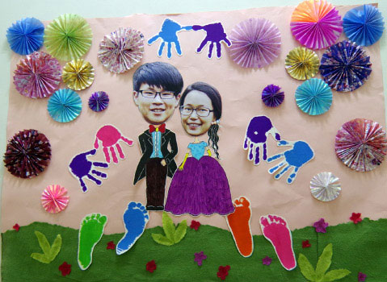

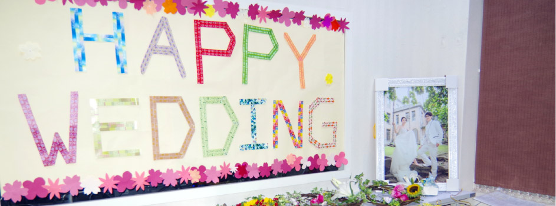

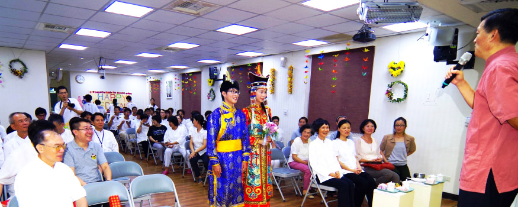

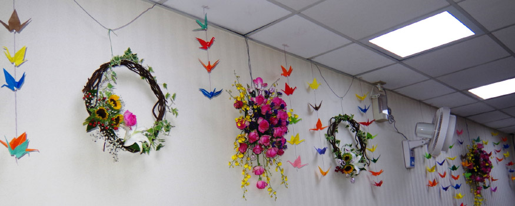

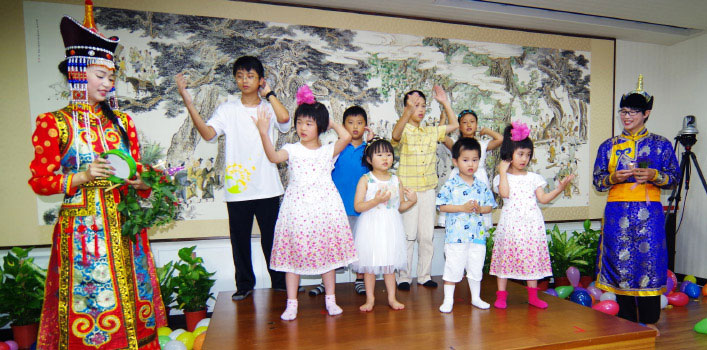

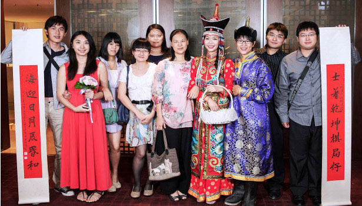

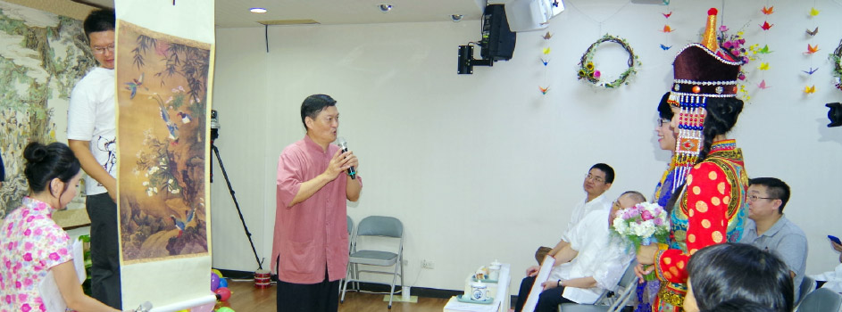

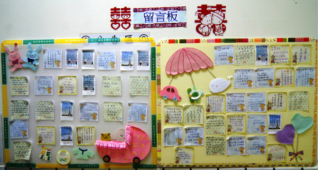

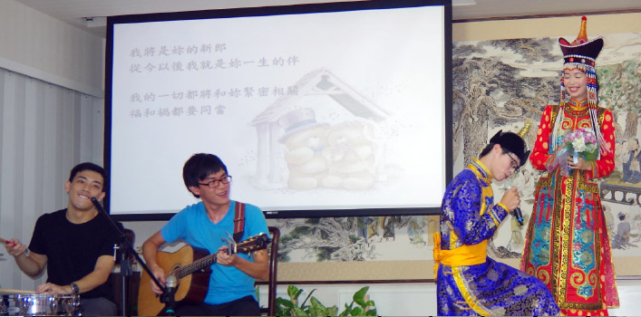

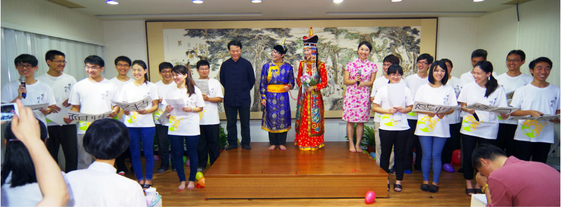

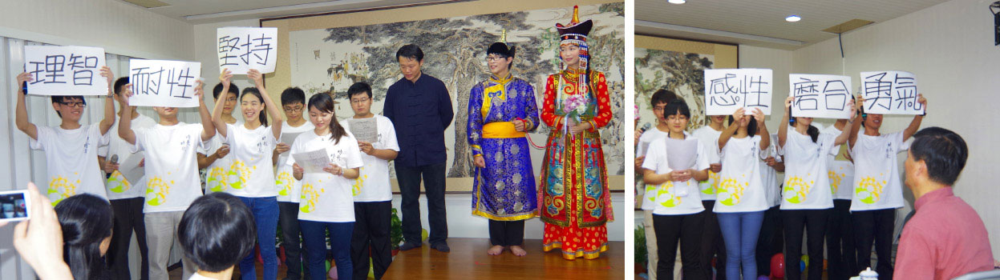

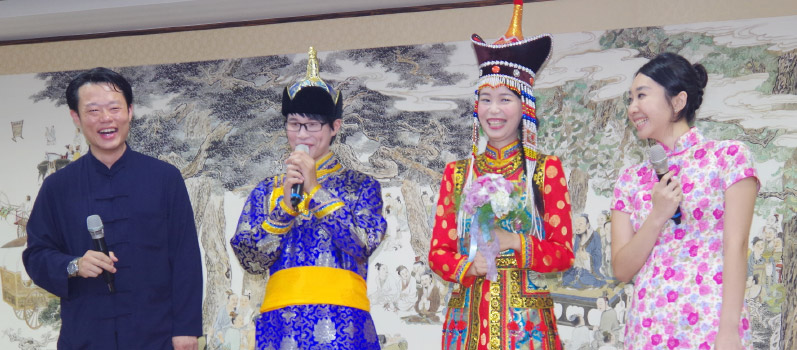

### 講座後之後慈湖、軍史館與梅庭遊訪記述

淨域

一段民國的歷史

藉由景點的緬懷

世事無常的無奈

歷史真相的大白

暑期講座之後慈湖、軍史館與梅庭遊訪記述 二O一四年七月五至十日，學會辦理「暑期兩岸文化交流暨人才培訓講座」，來自遼寧、山東、江蘇、浙江、福建、雲南、香港的朋友，大家齊聚學會研習儒佛文化，皆獲得心靈上的滋養。甚而於結業後，因著學員的新婚之緣，特別舉行一場佛化婚禮的茶會，讓講座完結於喜慶的歡悅中。

六天的研學終日不絕，足出戶外已是街燈通明。為了讓遠客調劑身心，學會另外安排兩日的戶外活動。所謂「遊必有方」，此方便是首日的「後慈湖、故宮遊訪」，與次日的「軍史館、梅庭參旅」。遊訪記趣略述如次：

一、後慈湖

十一日早晨，眾人搭車前往大溪慈湖，依事前之申請入園，並由園方派員隨行導覽。一九五０年代，先總統蔣公行經百吉隧道附近，見景色近似故鄉浙江省奉化縣溪口鎮，留下深刻的印象。一九五五年板橋林本源家族提供周邊土地，作為興建行館用地，四年後建成「洞口賓館」；後因蔣公思念母親王太夫人，於一九六二年更名為「慈湖賓館」。慈湖之名得於此處有兩個埤塘。

前慈湖又名「新埤」，位於先總統蔣公陵寢的前方；後慈湖原名「龍過脈埤」，乃一新月形的埤塘，水源來自白石山的小溪，皆為桃園農田水利會灌溉之用水。一九六二年因應兩岸情勢之發展，總統府擬定疏散計畫，於後慈湖興建戰時辦公處所；而中共首次核爆成功後，更深築防空洞作為戰時避難指揮所，成為高度機密的軍事管制區。遲至二００七年移撥桃園縣政府管理後，後慈湖的神祕面紗才被揭開。
後慈湖之旅，包括百吉林蔭步道、湖濱步道、祕境步道三部分；起始於百吉隧道口，終止於陵寢後方月門，全長三千八百五十公尺，環繞一趟約時兩個半小時。後慈湖有南、北兩個入口，管理處在南口設驗票站，隧道口至南口間為百吉林蔭步道，屬人車通行的一般鄉道，須留意往來車輛，沿途林蔭茂密清涼無比，水桐四佈地潤濕潮。導遊
**問：** 「早期台灣有三寶以供外銷，除了茶、糖外，另一個是什麼？」有人
**答：** 「鹿角」。這沒有錯，但就北台灣來說，非樟腦莫屬了。因此，步道沿途舉目是高聳的樟樹。

過南口驗票站，即進入後慈湖湖濱步道，左側有塊立石刻以「祕境之南」，說明這是後慈湖的最南端。再往前些有座慈湖橋，乃因湖水就草嶺溪流入前慈湖而建，昔日在此設立管制站，仍有哨所鍊柱遺跡。後慈湖南端有堤壩，現闢建為一休息站，可立於壩頂平視湖光山色。洩洪口下方有片濕地，長滿各類水生植物，有輪傘草、紙莎草、水蘊草、水杉菜、毛蓼、槐蘋及台灣一級保護的萍蓬草等，各自盤據一方。

湖濱有一排高大的檸檬桉，乃原產於澳洲的常綠喬木，葉子分泌濃郁的檸檬芳香，除可供為提煉香精的原料，亦是天然的防蚊用品。昔日蔣夫人來此，為減少蚊蟲叮咬之害，乃在湖濱栽種檸檬桉，成就了今日的林相。桉樹脫皮後，枝幹呈現白灰色，因為光滑無比，所以又稱「猴不爬」。

桉樹之處為觀賞「後慈湖之眼」最佳點，對面為新月的彎處，後有一座小丘，山水相映恰似人的眼眸，若逢夕陽斜射於水線上，便出現如瞳孔般的光暈，整體形成特殊的「後慈湖之眼」景象。今日雲障遊得輕心，便無緣一睹靈暈之眼。一旁竹筏空盪，上置藤椅一把，雖人去筏空，但憑老舊相片不難聯想，昔日衛士護蔣撐划「海軍一號」遊湖之情。

椰林觀景台是瞭望後慈湖視野最廣的地點，此處種有十七棵亞歷山大椰子樹，沿湖灣圍成一個半弧形。據稱乃昔日蔣公所種，取「一妻」之諧音以討夫人歡心。此後有北口管制站，沿溪通往打鐵寮古道，未開放通行，故而轉從山徑走祕境步道。 所謂祕境者，乃沿途構築有六座建物，從陵寢起分別為「戰備隧道」、「五院院長招待所」、「總統府秘書長辦公室」、「總統府參軍長辦公室」、「總統府副秘書長辦公室」及「警衛人員駐屋」；除去戰備隧道外，依次編為一至五號，乃一九六○年代「國光計畫」之軍事反攻大陸下的預備疏散地。

二○○七年開放觀光後，五棟建築分別改建為功能不同的展示間。五號辦公室作為遊客中心，簡介大溪與復興兩鄉的景點，旅客可以在此休息品飲「夫人桂花蜜」，或坐賞遠眺湖光山色。四號辦公室改建為生態展示館，介紹後慈湖的花草蟲蝶，並連線記錄戰備坑道中蝙蝠的現況。三號辦公室改建為復刻版的蔣公住所，由書房飯廳的擺設，展示他生活起居的狀態。二號辦公室展示一些歷史文件與照片，見證蔣公一生不凡的經歷。

經過一片梢楠林，路過一號辦公室，即可見到戰備隧道，主要功能在於防範空襲及核災，乃就著廢棄煤坑而建，全長約一百五十公尺，呈Ｆ型，內有浴廁、廚房、機房、通訊設備及指揮所等，主要入口建有三道厚重的防爆鐵門，以抵擋砲火的攻擊。廢棄的隧道住滿蝙蝠，可透過連線在生態館中觀看牠們的動態。經戰備隧道入陵寢後園，過月門管制點即完成後慈湖之旅。較之於前慈湖的喧嚷，若非昔日的軍事管制，恐怕也無今日後慈湖的寧謐，為了保持祕境的靜淨，入園採預約申請是必要的，唯有得之不易，才會份外珍惜所獲。

二、軍史館

今年是黃埔建軍九十週年，國防部特別在「國軍歷史文物館」一樓辦理特展，其實就是軍史館藏的精華濃縮版，欲透過縮時處理的方式，讓訪客在最短的時間裡一目了然。學會就此因緣，安排一趟參訪行程。軍史館除有語音導覽外，亦提供團體導覽服務，因為此回訪客包括大陸人士，所以館方不便提供此項服務，即由個人權充引介說明。

為發揚黃埔建軍精神，國防部於一九六○年底籌建軍史館，令各軍總部協助支援，於一九六一年十月三十一日揭幕。又自二○○四年起進行整修，於二○○六年十月完成更新。軍史館隸屬於國防部政務辦公室史政編譯處，為一任務編組；館樓三層，區分為「常設展覽」與「特展」兩部分。

本次行程預計九十分鐘，人員先到者自由參觀一樓特展。展館兼有互動學習，取一張學習單，凡集蓋各展間四枚紀念章，並選填答對七個問題，即可送至服務臺，檢核後換取一份紀念品。

人員齊備來到一樓右室，所呈現的是「黃埔建軍至北伐統一全國」。民初的局勢混亂，內有各方軍閥的割據，外有他國勢力的入侵，雖革命軍在南方建立根據地，但各軍頭心懷不軌。粵軍陳炯明砲擊總統府，國父於廣州蒙難，蔣中正登永豐艦護衛驅敵，也奠下他在國父心中的地位。

國父有感革命缺乏一支真正的軍隊，便決心在黃埔島辦理軍校，先派蔣中正赴俄考察，再任命他為黃埔軍校校長。因受南方各派系的忌憚，因此先有平定廣州商團事變，繼之兩次東征及回師平靖滇桂軍之舉，終而統一兩廣誓師北伐。

北伐之戰略，擬定先攻武漢、次擊南京、後進北平，為籌措糧餉特別發行軍需券。初期在汀泗橋大破吳佩孚之部，進佔武漢；再而於龍潭之役大敗孫傳芳，進抵南京。然而此時因「聯俄容共」進入國民黨的共產黨員作亂，便於南京進行清黨運動，因對共黨態度之不同，造成寧漢分裂。隨後革命軍北進，日軍在濟南刻意阻撓，造成五三慘案。奉系軍閥張作霖從北京退守瀋陽，不料人車在皇姑屯為日軍所炸亡。革命抵達北京，未久奉系少帥張學良公開支持革命軍，東北易幟全國統一，國民政府制定訓政綱領，進入訓政建國時期。

上二樓中，可見到兩張大型油畫，乃軍中畫家梁氏三兄弟之中銘所繪，其一是國父廣州蒙難之「永豐艦討逆」，圖中蔣中正立於艦橋指揮若定；其二為上海保衛戰中的「八百壯士死守四行倉庫」，見槍林彈雨中國旗在空中飄揚。二樓左室展列的是「八年抗戰至日軍投降」，這是近代中國最艱苦卓絕而揚眉吐氣的時刻。

全國統一後的訓政時期，被喻為是黃金建國的十年，只因日軍藉演習人員失蹤之名，欲強行進入宛平縣搜索，與守軍在盧溝橋發生激戰，蔣公在廬山發表抗戰宣言，終於爆發八年的中日戰爭。

國民政府反轉歷史軸線，將日軍大部吸引至上海，成為東西向的攻防。戰略擬定為初期的退守，藉上海保衛戰來破滅日軍「三月亡華」的美夢，四行倉庫的死守雖是一個小據點，但已能讓軍政轉進到武漢，甚而撤退到大西南。

日軍在上海、南京遭到頑強的抵抗，故而攻破南京城後瘋狂屠殺軍民三十萬人。有一把日軍九八式軍刀展示，其精美雖不如岡村寧次的「五獅(武士)刀」，但歷史意象卻非比尋常。此刀臂上刻有「南京役殺一○七人」八字，炫耀表功的同時，也見出日軍的殘狠暴虐。

一九三七年十二月十三日，《東京日日新聞》刊載日軍從上海進擊南京時，十六師團的向井明敏及野田毅兩位少尉，約定進行百人斬比賽，看抵達南京時誰先殺滿百人，結果向井明敏以一百○六人勝過野田毅的一百○五人。類似這樣的百人斬事件，還有第六師團田中軍吉上尉的三百斬，如此見斬刀與刻字，南京大屠殺如何是假呢？

日軍瘋狂轟炸武漢，中樞撤退至重慶，開啟中期的戰略相持階段，直至日軍偷襲珍珠港，太平洋戰爭捲起世界大戰。日軍向大西南逼進，兩軍相逢會戰不斷，如長沙、桂南、棗宜、上高等，使日軍深陷在泥淖中進退不得。室中展示一面擄獲的日軍太陽旗，於「必殺」二字下，另添寫「入宛平」、「入南京」等字，意謂這個部隊經歷盧溝橋、上海與南京諸役。 日本偷襲珍珠港，美國對日宣戰後，中國與盟軍併肩作戰，蔣委員長被任命為中國戰區最高統帥，開啟後期的戰略反攻。此時雖第三次長沙會戰、浙贛會戰、鄂西會戰、常德會戰、豫中會戰、長衡會戰、桂柳會戰等相繼爆發，但國軍仍派遣遠征軍赴緬甸，解救英軍的仁安羌之危，並獲得新式的武器裝備。

由於國軍的英勇作戰，同盟國於一九四二年十月相繼放棄在華治外法權及權益，自此百年以來的喪權恥辱一筆勾銷。開羅會議後，政府號召青年從軍，編制十萬青年軍，而陸軍前進指揮部開設於南寧，準備進行戰略大反攻。一九四五年八月初，美國相繼在日本廣島、長琦投擲原子彈，迫使日本天皇在十五日宣布無條件投降。九月二日，美國太平洋總司令麥克阿瑟將軍，於東京灣密蘇里艦上舉行聯合受降，中國派海軍將領徐永昌參加。中國戰區之受降，則於九日假南京陸軍總部大禮堂舉行，由何應欽將軍從岡村寧次手中接下降書。由於戰後遣俘、復員的任務繁巨，加上共黨乘機擴張勢力，政府遲至一九四六年四月三十日才宣布還都南京，五月五日正式上班。

中共宣稱對日戰爭是共產黨領導下打的，但歷史總是要還原真相的。試想棗宜會戰中，為國捐軀且讓日軍讚佩的張自忠將軍是誰？於長沙三次會戰中，領軍抗敵的第九戰區司令薛岳又是誰？是誰被任命為中國戰區統帥？是誰主持中國戰區的受降典禮？而彼時的朱德、毛澤東、林彪、周恩來等，又出現在哪個舞臺上呢？受限於時間的關係，無法引介之後的「綏靖勘亂、遷台、台海戰爭及國防整備與精實」等陳列，冀望大家能擇時前往再訪。

三、梅庭

中午驅車前往新北投，在SU異國疏食料理店用過餐後，即前往綠建築圖書館、溫泉博物館、梅庭、地熱谷與泉源公園泡腳池等地遊訪。於此僅就梅庭之訪作一回顧。

庭院建於一九三○年，為適應濕雨、酷熱與硫磺之地理天候特性，二樓採日式木構及落地窗建成，一樓用鋼筋混泥土以作防空避難之用。一九五二年起為國老于右任先生，避暑、避壽、避關說之居處。

于右任，名伯循，自號太平老人，陜西省三原縣人；生於一八七九年，卒於一九六四年。一八九五年，以第一名成績考入縣學，成為秀才。一八九八年，參加歲試，以第一名成績補廩膳生，被陝西提督學政葉爾愷譽為「西北奇才」。一九○○年，八國聯軍攻陷北京，慈禧、光緒帝出逃西安，他參加「跪迎」寫下詩篇，後編成《半哭半笑樓詩草》，於一九○三年冬在三原印行。因詩集諷刺朝廷，隔年清廷下令拿辦，始逃離開封到上海，化名劉學裕辦報、辦學、鼓吹革命。有〈雜感〉一詩云：「報仇俠兒志，報國烈士身。寰宇獨立史，讀之淚盈中。」 其後參加同盟會，二次革命時反對袁世凱，失敗避居日本辦報。一九二二年創辦上海大學，一九二四年選為國民黨中央執行委員。一九二六年任陜西靖國總司令，協同北伐完成全國統一。國民政府成立，先後任交通次長、審計長，一九三一年任監察院長直至去逝。

于老一生有詩千餘首，又擅長於書法。一九三二年在上海創立「標準草書社」，集千字草書，對後世習草影響甚大。陳祖華評說：「三十功名袖兩風，一箱珍藏紙幾張。」林語堂亦評：「獲有今日的地位，半賴書法的成名。」乃民初四大書法家之一(譚閻凱、吳稚輝、胡漢民)。 梅庭年初舉辦于老書法特展，如今為當代名家篆刻展，為讓此行人對于老有初部認識，即針對所張佈的書法複製品作一簡要說明。 〈人生貴行樂-五律〉云：「人生貴行樂，書道樂無邊。每日三千字，長生一萬年。揮毫隨興會，落紙起雲煙。悟得其中妙，功夫要自然。」此詩為于老附和魯蕩平詩而作，所言「書道樂無邊，每日三千字，長生一萬年」，乃其一生興趣之所在。

他曾提示，寫好字的祕訣在於「無死筆」，亦即此詩所言「功夫要自然」。關於自然，他曾經說：「我寫字沒有任何禁忌，執筆、展紙、坐法，一切順乎自然。在動筆的時候，絕不因為遷就美觀而違反自然，因為自然本身就是一種美。」又有〈寫字歌〉一首：「起筆不停滯，落筆不作勢。純任自然，自迅速，自輕快，自美麗。吾有志焉而未逮。」來說明他寫字的樂利。 他曾抄寫〈淵明歸園田居〉一首贈幹誠先生，詩云：「悵悵獨策還，崎嶇歷榛曲。山澗清且淺，可以濯我足。漉我新熟酒，雙雞招近局。日入室中闇，荊薪代明燭。懽來苦夕短，已復至天旭。」可見于老不欲政治愛好隱逸的心性。

室中有張全家福照片，乃抗戰勝利後攝於三原老家。于老來台妻子未成行，一九五八年八十歲時，寫下〈憶內子高仲林〉一詩，云：「兩戒河山一支簫，淒風吹斷咸陽橋。白頭夫妻白頭淚，留待金婚第一宵。」他與夫人結婚於一八九八年，六十年夫妻卻分隔兩地，年老之際想盼之心愈切。一九六一年夫人八十大壽，又寫下續詩表意。

一九六二年身體漸差，想家歸根的心更切，寫下〈望大陸〉一詩，云：「葬我于高山之上兮，望我故鄉；故鄉不可見兮，永不能忘。葬我于高山之上兮，望我大陸；大陸不可見兮，只有痛哭。天蒼蒼，野茫茫，山之上，國有殤！」此詩藉用北朝民歌〈敕勒歌〉：「天蒼蒼，野茫茫，風吹草低見牛羊。」及屈原〈九歌 ‧ 國殤〉：「身既死兮，神以靈魂魄毅兮，為鬼雄。」更見其憂國思鄉之情。一九六二年十一月十日于老與世長辭，終年八十六歲。他沒有留下任何遺言，人們便把他的〈望大陸〉一詩當作遺囑，葬於大屯山麓的巴拉卡公路邊，墓地向望台灣海峽，以慰其思鄉之情。

六日的暑期講座，加上兩天的參訪行程，在燠熱的夏日裡，或許讓人有些吃不消，尤其是擔綱主課的師長們，但是每於課後又總讓人覺得意猶未盡。能說的太多，就怕所說不足；每一回的遊訪都有其意趣，實為隻字片語所不能盡訴，願所述能讓彼此憶起共學同遊之樂。

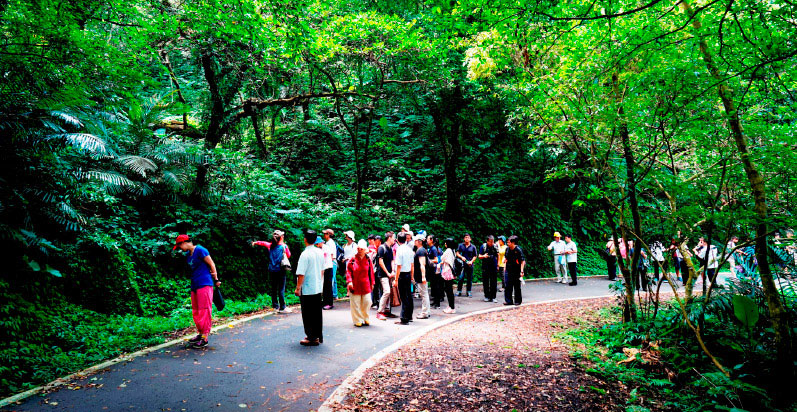

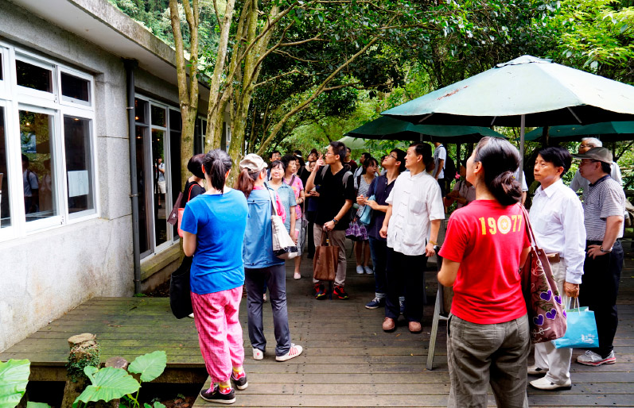

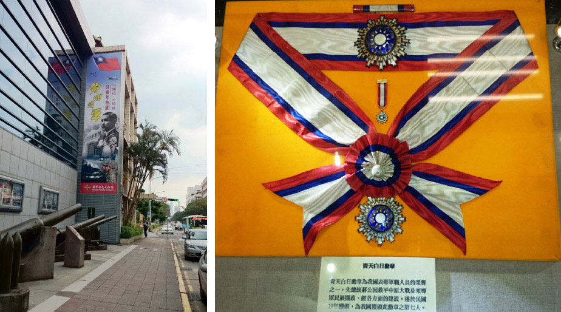

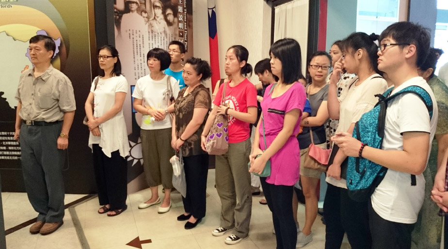

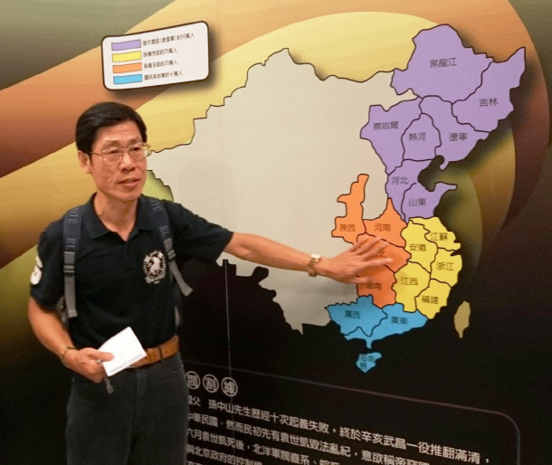

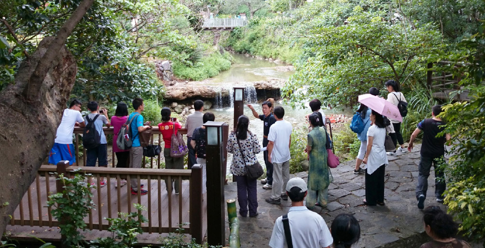

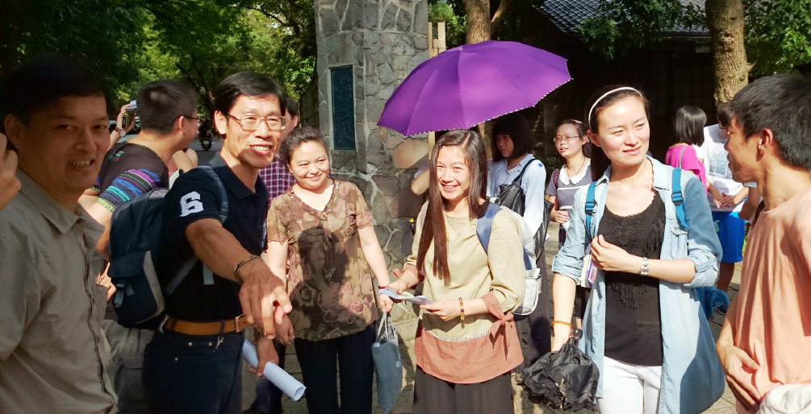

### 學習狀況與感受

眾學子

根器利與鈍

學習苦和樂

習性進或退

知見高及下

蔡易儒

這次是學生第五次參加學會的寒暑期大專儒佛講座了，很高興這次能有機會與中國各地前來的貴賓、學長們共同學習，看到大家上課的認真、下課研討的好樂，讓人非常隨喜與感動。回想每次參加講座的人都不盡相同，更讓人覺得能參與的因緣有多可貴，珍惜彼此相聚的時刻。轉眼間，今年已是學生所擁有的最後一個寒暑假，雖然還在就學，但對我而言，大專生的名言等於就此畫下了句點，因為這意味著接下來的講座沒辦法想來就來，令人感到悵然若失。但我相信，這不是結束，而另一個嶄新的開始，在邁入社會的過程中學習承擔不同的角色與責任，不變的是心裡的熱誠。往後一定會想辦法盡量參加的。因為心，就在這裡。

記得講座前，學生被通知在講座中負責布達事項的執事以及部份論語篇章的消文，當下真的很感激師長給予這樣的機會。在準備的過程中，過去講座中快樂的光景彷彿歷歷在目。回想起第一次來學會是參加心經的講座，那時雖然好多聽不懂，感到很苦惱，但卻有如獲至寶的感動，非常歡喜！令學生意外的是，這樣殊勝的講座不僅不收學費，還頒發獎學金！而每次講座也都認識了許多學長，晚上和大家一起熬夜讀書、研討的日子，那是無可取代的回憶。儘管疲憊，但好捨不得一天就這樣過去。這些因緣聚會都有賴師長的攝受及善知識、義工的護持才能生起。

漸漸地，有機會練習餐前觀修、晚課法器等執事，收穫很多，也很慶幸有機會多少付出一點自己的心力。而這次講座更是備感壓力，但既然師長相信學生可以辦到，學生必定努力達成，也藉此測試自己的能耐，為公發心，學辦事。過程中很感謝諸位師長學長的協助、指導，學長教導末學除了布達事項，也要講究儀態、說話、氣象；在論語方面也多虧多位學長幫助，提供筆記、資源、研討，甚至願意把內心的體會予以分享，真的讓末學很感恩！也感謝學長以科技的神變幫助末學。老師曾說善根回向是非常難得的，末學也願如諸位師長、學長，樂於幫助別人、與人分享。這次在學習、職責上不理想及不如法的部份，也向老師、大眾好好懺悔，努力改進。

參加講座迄今已經三年，然而認識學會則不只如此，小時候曾隨母親學佛而參加學會的啟蒙班、放生、齋僧、念佛共修等活動。當時未必有深刻的體會，但現今回想真的覺得好難得，這些對學生的人生有很重要的影響；而對老師，更是有好多的感謝。無論是在對學生父親、家人的護持上，在講座的安排上，在人才班的攝受上，在知見的教導上，在課堂的鼓勵、期許上，在問答的教誨、慈悲上，在生活的關心、問候上…，點點滴滴，學生都銘感在心。老師對於我們這些學生的恩德真的太大了，不論是知見上，還是心意、付出上，怎能說得清楚？怎麼報答得了？顏回「博文約禮」之語，除了讚歎夫子之外，想必是懷著滿滿的感激吧！

此次講座一開始時，老師致辭中便談到對過去師長、大德們的感謝，又在課堂上介紹雪廬老人傳承及追述紀錄片，看著老師對雪公的歎美、緬懷，以及授課時的樂在其中，內心生起好多體會。在結業式時老師又勉勵我們傳承的可貴，如果斷了傳承，數年後當年來台的大德們便如同沒有來過。老師說，使正法住世不是只靠流通法本，因為佛經的體性是聲塵，需要有傳承的人才來宣說，而傳承必得來自聽聞。聽了這些話，看著老師的行誼，以及松柏後凋的決定見，學生此刻感到「傳承」兩個字，有好深的意涵，自己又懂得多少呢？

因此，身為學生，應當感念老師的恩德，束脩心志，勤勤懇懇，不斷串習正知見，開展自己的心量，訓練自己的承擔。並懂得保重自己，保護善根、不要退轉，安住在道上。印光大師說：「十分誠敬得十分利益。」老師也曾勉勵我們：「眼光要放遠，下手處要低，步伐要紮穩。」「人生是馬拉松。」不是看誰跑得快，而是看誰跑得長、跑得久。因此，就算不在學會的期間，在社會、家庭、工作、課業上盡自己的本分時，也要用心經營每一件事情，以教法來觀修。因為自體性空，可以名言上賦予意義，故一切有無限可能，命運是可以改變的。

今年夏天，頗不平靜。有蓮友，也是親戚，因病苦過世，也有學會的學長結為連理，在講座最後一天舉辦茶會。看老師主持兩者截然不同的場合，因為身歷其境，內心有許多感動與感觸。若要擇要言之，則曰「如理如法」。這樣的體驗，更加深學生的信念：人生一定要培養自己成為說話辦事的人才，懂得在禮上、人情世故上、教法的內涵上講究，惟有如此才能帶給別人內心的安定，真正能利益別人。以此自勉，也祝師長、學長、大眾平安健康，一切美滿。

劉巧雯

感謝老師讓我來這裡學習百法明門論及論語、唐詩等等課程，不僅師長上課精彩、引人入勝，讓我法喜充滿，這裡學長們彼此為研討義理時的專注和氛圍，更讓我這個初來乍到的毛頭小子深深地感到驚訝並且慚愧。

總以為自己正值年輕，很多事可以慢慢來、犯錯、不上進也沒關係，反正有的是機會和時間，但在看見學長們的優秀，更深深地察覺到自己的不足，而且體認到「時間真的不夠了！」悟已往之不諫，知來者之可追。

參加講座使我對佛法及論語的興趣更為深厚，對自己亦有更多的期許，不希望讓時機這麼樣溜走，回去後會細加思索，並不斷精進學習！感謝老師們！阿彌陀佛。

白文輝

面對著期待已久的暑期講座，心情是雀躍興奮的，身體卻由於感冒初癒而顯得欲振乏力，幸好藉由不斷的調整身心狀態，終得以安定下來，享受這百千萬劫難遭遇的儒佛盛宴。此次講座開出了極具深度與廣度的課程，分別為：百法明門論，探討二十四種心不相應行法；論語─從孔子聖蹟圖說起，藉此了解孔子的一生；並透過唐詩賞析，以經魯祭孔子而歎之及棕樹兩篇詩作，深入體會孔子知其不可而為之的內涵。

時機稍縱即逝，短短六天的講座一眨眼便成回憶，如同去年的彌陀經講座，所發生的種種情景仍歷歷在目，但人事已非。無論老少、身體強健與否，人命其實僅在呼吸之間，一口氣不來即成隔世，不知未來何時還能有這一會。如同心不相應行法般，都是遷流變化、生滅無常之有為法。年輕人若不掌握當下，精勤學習正法，如何能透過通達名言，理解這世間的種種虛實，獲得此生真正的出路呢？除此之外，若無善知識的教導，我們大概也就只能在九里迷霧當中，終其一生似霧般的尋覓那自以為的離苦得樂之法吧！

子曰：吾，十有五，而志於學，三十而立，四十而不惑，五十而知天命，六十而耳順，七十而從心所欲，不踰矩。其所顯現出的內涵與行相，實乃我們人生道路上最好的學習榜樣。

儘管當時難以有人識得夫子對內聖外王的通達，而對夫子有所誤會，然而鳥獸不可與同群，吾非斯人之徒與而誰與？對於當前局勢，懷有抱負的有志之士，應以夫子為標竿，不畏坎坷，雖遭逢患難橫逆，仍不改其志，反應更加振奮有為，如同棕樹之德，任君千度剝，意氣自衝天！因為，不經一番寒徹骨，焉得梅花撲鼻香？

本次講座涵蓋了老師的用心經營與循循善誘，師長、師姑們的支持提攜，學長們分工合作、研討交流，以及諸多大德於背後的辛勤維護等，時時處處皆是可供學習的難得經驗，有如此殊勝的福報，乃是過去百千劫所修善業而成，若不善加珍惜運用，實屬可憐憫者。如同學生本有良機學習，奈何不善把握，辜負老師一片苦心，應重打三大板，以小懲大誡。

雖說眼前已陸續現出種種障難，然而學如逆水行舟，不進則退，即使有再多再大的障礙也不能輕言放棄。並且要趁著能學的時候，能學多少就盡量學多少，以報天地祖宗、師長父母之德。

許熒純

由名言中通達─文化傳承是最殊勝的出路

東方的天空，白雲邊鑲滾著烏黑的色澤，西側的天空，卻維持一派的淺藍，幾朵白雲在上頭悠閒地漫步。反觀走在路上的人們，看起來一副欲斷魂的樣子，倒不是因為細雨霏霏，看看柏油路面蒸騰著氤氳的熱氣，簇擁著來往的車輛；屋簷下、小巷口，寧靜之中，伴隨著轟隆轟隆的馬達聲─冷氣。這是個燠熱難耐的夏天，連呼吸都可以產生熱量，何況是在烈日下工作的人們。喀達喀達，輪子滾過凹凸不平的路面，拉著行李，直行南昌路，右轉至寧波西街，依序經過銀行、空地、餐館、花店、洗衣店、餐館，我再度拜訪了寧波西街七十號。每次都乘著不同的因緣來拜訪，這回是暑期的人才培訓班，今年一樣帶來許多收穫，特別是觀念的開拓。

首先是「心態」。剛工作的開始，很有熱忱地投入教學，但漸漸地發現，除了教學之外，必須要處理很多與人相處的矛盾。就以教學來說，把教職當成一份工作？還是一個志業？心態、作法上就有不同的差別。從表相上看，每個老師都很會表達自己，教學方法百變不窮；但是內涵上，未必每個老師都有正確的知見，有心想要學習，甚至試圖改變現在的自己，為的是要帶給學生更多的受用。記得甫放暑假的時候，以前實習時的老師突然語重心長地對我說：「要記得，最會說的是老師，最不會聽人說的，也是老師。」於是我常常告誡自己：即使今天大家都稱你為老師，你並沒有什麼值得驕傲的，還是要不斷學習，讓自己成為一個受教的質地。

其次，到底教學最終的目的是什麼？只是應付考試？成績單上的數字？還是培養學生找到一份工作？世間的才能，也許能夠讓人受用一時，但是不可避免的，人們必須要面對現實的種種問題。第一個，你的未來不是全部由你決定，有部分是比你年幼的這些孩子決定。目前台灣各行業的管理者年齡層都偏高，也逐步凋零。前一代所擁有的輝煌，只限於某個時期，如果不積極去找尋傳承的人才，再怎樣繁榮的盛況，也如電光火石般短暫。儘管大家都說現在的學生難教，也必須要全力去教，因為教育是最能改變個人，乃至於國族命運的方式，而其中，又以「正知見」為教育的主軸，老師責無旁貸。第二個，學習的目的不是為了追逐高學位，或是獲得一份優渥的工作。參加講座之前，適逢家父家母身體出狀況，那個時候就在想，我們所認知的學問，能夠解決人最終往何處去的問題嗎？這兩個問疑惑都是最切身的問題，但是世間人很少去思考，雖然關注自身的命運，努力積聚世間的各項財富，卻不得其要領。唯有佛法的見解，能夠讓人真正離苦得樂，從根本上對治問題。

再次，工作以後，最大的挑戰，其實是「時間」。例如同樣在準備消文，以往可以花全部的心力在這上頭，但是現在所能運用的時間濃縮到不到十分之一。有時候在工作的摧折，體力的耗費，再加上種種外緣的不具足，往往使人易生退轉的心。這時候不禁很佩服老師這麼多年以來，不但堅持道上的學習，在工作之中，也能夠保持初心。這次講座，雖然很高興有機會可以練習複講，但是內心一直覺得準備地不夠紮實。人生短暫，幾番寒暑，年歲是日日長，但是年命卻是日日短，能夠把文化內涵學起來的時間，真的是越發感到不足。希望在未來，不管時間多麼短暫、匆忙，也要學習老師們孜孜不倦的精神，不只是為了自己在學習，而是為了更多的人，可以懂得這些內涵，而不辭辛勞地堅持下去。

復次是「傳承」。今年講座，有幸擔任執事，和以往的經驗不同之處，在於很多細節，現在師長們都不會去特別交代，要靠自己和其他人一起去摸索。當要靠自己去建立一些原則和架構時，就會把過往和師長們學習的經驗互相做參照，這才發現經驗的傳承，是非常重要的事情。當許多事情大人們在前頭都幫忙處理好，在後頭享用福報的我們，往往不會去留意前人經營的內容。或許有些部分是可以透過文字的紀錄去想像，但是最難揣摩的，其實是「氣象」，而這也是世俗之中所學不到的。記得講座時，講到「歲寒，然後知松柏之後凋也。」其中「後凋」指的是，大亂之中，君子保住傳承，待傳承新芽出現；大亂之後，君子已為治世培養人才，哲人雖逝而傳承仍在。很感動於這段文字背後的內涵，它讓我想起很多師長在這條路上的辛勞，敝人何其有幸，能夠和這麼多師長一起共事，雖未得其髓，內心卻暗自期許，要把握每次開眼界的機會，讓道脈能夠往下綿延。

最後是「責任」。這次講座的因緣很特別，有來自瀋陽、諸暨以及雲南等地的貴賓，也有來自中南部第一次參加的學長，一同參與課程。有機會和其中幾位學長共事，在聊天、乃至於上課的過程中，發現部分的學長對於經教的學習很有熱忱，幾天的相處觀察，也很能適應規矩和要求，並且悉心地想要清楚理解所有的概念。在檢討自己過往的學習態度時，一開始遇到困難，往往很容易放棄，可是在這些學長身上，我看到的是堅持，有這樣的初發心，相信持之以恆的學習，必定能迎頭趕上前人。而學會的學長們，也慢慢帶起學習的勢力，每次來到學會，聽聞學長們將所學與有法結合，熟稔地運用著，內心都很忻慕，也告訴自己要趕快加油！以往的學習也許很認真，但是成熟度不足，許多講述過的概念，好像似懂非懂，真正要言說出來，又抓不住覺受。想到海外有多少人對於文化的希求，在未來網路開通之後，會有更多的領域的人才湧入，現在手上握有資源，怎能不好好領受？用盡心力來將內涵成就呢？

透過網路，未來的世界已經不再是眼前所侷限的一隅，那種在原地等待機會的心態，永遠都沒辦法有任何成就。我們都是由總相認識這個世間，當將自己劃歸為有心傳承文化的君子，就要努力去符合定義，並且更進一步，還要切入文化的精髓，成為文化傳承的中堅份子。而身為有心想承繼文化道統的君子，除了要能以文來詮釋行持，更要成就德能，通達形上形下的見地，拓展自身的格局。能夠以文來厚積底蘊，所有的行持，又能夠以德作為內涵，並且掌握時機，不怨天不尤人。雖然無法保證自己在每一次挫折來臨時，都能夠找到解決辦法、保持樂觀，但是我所學習到的內涵，它會讓我知道，害怕是必然的、疲倦是必然的……，但是當我承擔起這樣重大的責任，並且義無反顧地走下去，往後所成就的福德，不只能夠利益個人，更是千秋萬世的人們，那麼，年輕的時候，吃這一點苦，又何妨呢？

王姿云

知識是蓋房子，需要一層一層穩紮穩打的累積上去方能成就一座穩固的堡壘。在這次講座中很能體會這種感受，剛開始接觸百法，一種邏輯的推理、心理層面活動的檢視、萬法實體性的辯證，真不知道怎麼下手，到底學了多少、又融會貫通了多少。但是藉由不間斷的聽課，在大堂和諸多學長們研學、討論，雖然是少少的累積，但這樣的累積換來的卻是這次講座聽課中的愉悅心情。一直以來都很慶幸自己從小就能接觸到這樣的環境，但是也警惕自己這樣的福報，容易視為理所當然而流失，有這樣的佛化家庭，這樣的學佛順緣，一個讓我們修福修慧的環境，諸上善人聚會一處，這樣的機會沒了，便不會再有。

這次的講座有朋自遠方來，來了一些大陸的朋友一起研學，舊面孔伴隨新面孔讓講座注入一股新的氣象，這次講座課程除了延續百法的心不相應行法，還有論語及唐詩，圍繞著孔子的生平事蹟，新的論語科判讓之前學的各章論語都有了清楚的脈絡，再加上兩首唐詩對孔子的精神、心志描述，互相搭配、互相觀待，使所學更為添色。講座中讓學長們嘗試論語消文、晚課的法器帶誦、中午晚上的餐前觀修、公差等，在修慧中也同樣的修福，特別的是講座後面還有一個新人茶會，這個茶會不僅祝福著新人，也讓大家知道佛化家庭、菩提眷屬對人生的重要性，這個茶會給我的感受很深刻，在我的腦海中，發著喜餅喜糖的大概都是姑姑叔叔輩的，甚麼時候一起上大專班課程的學長們也結婚了，當老師握著新人的手切蛋糕的時候，那是個好溫暖的畫面。

六天課程又在一眨眼的功夫下很快的過去，就跟我們的人生一樣，也會在一眨眼的功夫下結束，在這幾天的課程中真的非常充實，這樣充實的感覺並不是因為時間安排得滿滿的，或是活動有趣、多樣化，而是因為知道自己學習的東西是多麼有意義，知道自己所學的是人生的出路、生命的價值所在，小時候聽到佛學是出路這句話時，雖然並不反對，但是在心中並沒有產生多深刻的感受，如今隨著年紀的增長，生活經驗的伴隨和累積，越來越能體會這句話的力量，很多時候沒有跌倒，沒有經過自己和自我心靈的對話，是沒有辦法讓自己信服的。

這次講座因為因緣和合而存在，有學生想學才有老師要教，有老師要教才有學生能學；有環境提供和義工的付出才有學習的動機，有學習的動機才有環境還有義工們的出現；有講座的承辦才能有同儕們一同研學，有同儕們一同研學才有講座的成辦。一次講座順利地出現、圓滿的結束是多麼得不容易，要感謝的人事物實在太多太多，但我相信最好的回報，對社會、對父母、對師長甚至是對自己最好的回報，絕對是這次承辦講座的宗旨所在，讓自己好好學習這些正法，保護正法，傳承正法。

海辰

學，是人生一大樂事。有老師朋友們一起學習，更快樂。透過瞭解聖人來學習，更是幸運。

這次上課的因緣，相較於以往算特別。首先，從國外回台灣，不需要再擔心上不到課，但這次本以為變得很近的學堂，卻也因為回台灣，人生邁向另一個階段而開始複雜變化。以往，作為學生，有時間上課乃天經地義，不需要有所考量，現在現實壓力的多元化，工作的選擇，在變化與抉擇中，最後有幸全程參與課程，放慢腳步，全心的學習，並以此為出發點，好好思考人生的下一步。

思考人生，從瞭解聖人的一生來開展，又是何其幸福。孔子的時代，動盪不安、禮樂不興、國際情勢不明，但孔子卻能以好學、知命，讓生命發光發熱。以前覺得，好學就是喜歡讀書學習新事物的人，現在更覺得，好學是藉由學習，開始思考身邊的事物，全方位的包括書本上的、人情世故上的，進而在生活上做變化、不怕改變自己，向心中所設之所願境一步一步往前走。

心裡的想法總是太多，新年新希望總是一改再改，在快速變化、資訊爆炸的年代，很習慣追逐新事物與隨心發展，卻也因眾說紛紜、內心軟弱而無法對自己有所掌握。所願境？要很大膽的人才能在山崖海邊，大聲地把內心話喊出來，要很勇敢的人，才能在喊話之後，有所作為。上完了課，所願境就像在內心，以水中顯影的方式，模糊的慢慢浮現、成像。

在等待成像的時間，拾起課本，好好的再念幾遍，一直學下去。

香港　張啟灝

參加本次大專講座的確比我想像中困難。困難的意思除了是要改變日常生活習慣外，亦要吸收很多從未接觸的概念。在此先向各位熱衷於培養文化傳承人才的老師說聲抱歉，因為學生在課堂上下都沒有以最認真的態度在學習，有負老師之用心。

不過學生在講座重新認識了些重要的道理，如儒學和佛學的關係，學佛的要點等。學生會覺得媽媽修習「淨土」法門，並常說這是一個最簡單的法門，卻要我了解一些深奧的佛學概念。當然我會覺得媽媽也並不了解本次講座的內容，修佛跟學習文化一樣從來都不簡單。

印象最深刻的是老師在論語方面的講解，學生覺得老師對經典的解讀非常的有深度，不同於以前國高中所學，只把論語淺層意思說明而已。當然，這也和教學進度、時間有關。

在此，感謝老師、義工大德們，還有各位同學的教導！阿彌陀佛！

香港　黎子健

這次的大專講座讓我獲益良多，非常感謝二位老師，及多位消文老師的辛勤教學，你們所付出的血汗，讓我們所有學生深深受到感動，老師在這六天的馬拉松式教育中，讓弟子十分敬佩，要講經這麼多日，仍然可以有這麼洪量的聲音以及健魄的身體，能學到這偉大的正知見以及遇到名師，乃弟子幾輩子所修來的福報也。

在這次講座分別為百法及論語為大部分，百法讓我更了解認識正知見之重要性，以及這宇宙萬法中永恆的規律，了解到一些從來不認識的觀念，啟發了我很多思維上的改變。

而論語講述孔子的遊歷，讓我了解到為何孔子乃當世之聖人，他的言論，並非一般人能聽得明白，每一句話都包含其內涵，孔子做事之處變不驚亦乃眾生佩服，即使面臨逆境，也能安然度過，而他的待人接物，更需要眾人學習，學習如何當一位君子也。這次之講座，讓我學習到很多無價之知識，感謝所有老師，以及所有的工作人員及各位同學。

浙江浦江　胡震名

近幾日在學會進修，在增進見識學問的同時，感觸也不淺。

上午學習佛法，主講心不相應行法。但因學生福緣淺薄、慧質不足，對於佛法一知半解，老師在講台口若懸河，邊上學長振筆疾書，而我卻茫然不知歸處，實屬慚愧，課後學生雖像學長請教，加之小組研討，但對其還是認識稍淺。

下午進修儒學，學生幸得一二，了解了孔子所說的話裡，為人處世與君子之風，更了解了時代背景和奇聞樂事，學生不禁耳目一新，更為古人及老師的智慧嘆為觀止，令學生覺得不虛此行，只可惜大陸眾人福緣淺薄，對孔門思修多抱鄙夷之態，不明古賢，不通智慧，此為憾事。

晚上的小組研討，讓學生可以解惑知疑，鞏固學識，此為幸，晚上至二樓學堂，見多位學長深夜仍在勤勉，令學生大感欽敬。此為學生一點心得感受，望莫見笑。

雲南民族大學　劉旻

從前並不是很適應科判式的學習，甚至不理解，為什麼我們要把《論語》分類來學？我們按《論語》本先的順序學習不好嗎？跟著唐老師學習了一個星期后，才理解了科判的智慧。

之前的那些想法和不解都是因為沒有深入接觸過，所以不懂。不過還好，不知，然後知學。《禮記‧學記》中曾說：「雖有佳餚，弗食不知其旨也；雖有至道，弗學不知其善也。」

《論語》分類後以科判的方法學習的好處就是，在一個時期的學習結束后，我們對孔子的各個方面的思想都能清晰的有所了解，能給我們構建一個完整的孔子形象及其思想、教育體系。尤其到了學習最後，老師為了看看我們學到了多少知識，給我們進行一個小測驗，這時，才徹底了解到科判對於幫助我們的理解而增添的。其中簡簡單單一道題：「孔子收學生的條件，和孔子的教學方法」。簡簡單單一個問題，上課時老師所講過的所有關於孔子教育理念的知識全都湧現出來了。

「子曰：自行束脩以上，無未嘗無誨焉。」

「子曰：不憤不啟，不悱不發，舉一隅不以三隅反，則不復也。」

「子以四教：文、行、忠、信。」

《論語》教給我們太多太多。《子路第十三》中有一章為：「子路曰：衛君待子而為政，子將奚先。子曰：必也正名乎。子路曰：有是哉。子之迂也。奚其正。子曰：野哉。由也。君子於其所不知，蓋闕如也。名不正，則言不順。言不順，則事不成。事不成，則禮樂不興。禮樂不興，則刑罰不中。刑罰不中，則民無所措手足。故君子名之必可言也，言之必可行也。君子於其言，無所茍而已矣。」

這時才想起來，之前在外面打工，因為公司小，又和老闆的關係好，到了後來就成了純粹的幫忙性質，因為給的工資微乎其微，我就一直把自己當做義工一樣，想著，我是來幫朋友忙的，錢多少無所謂啦。結果沒有想到的是，到最後竟然仍是因為錢的事老闆說了很難聽的話。這時，我才意識到，在他眼裡我只是一個員工，只是一個為了錢而來做工的員工。當時充滿了疑惑與不解，覺得為什麼自己真心待別人，別人卻會如此認為自己。直到學了這一篇章，才意識到問題出現在哪裡。

因為我給自己定位錯了，於是，我就成了「名不正」，「名不正」，於是就「言不順」了。「言不順」，於是又「事不成」了。我本來就是員工，老闆本來就是我的上級。他對待我的一切如果都單以老闆對員工的做法，都是比較常見的問題。包括拒絕支付加班費，拒絕支付應有的出差補助等等等等。我認為我們是朋友，於是這些問題我都沒有提及過，並且不在意。但到了最後缺錢的時候跟老闆聊起來，說我的出差補助應該報給我，而且其他員工的保險福利他也應該給出……然後老闆就惱火了。當時從公司出來后有整整半年都想不通。後來釋然了卻也沒有明白。直到上了唐老師的課才明白—我以為作為朋友，這些公司出現的問題我應該提醒他。而在他看來，我只是一個員工，「諫官」這個活兒不是我的工作。也就是說—我僭越禮教了。

孔子有太多的智慧，教我們後人如何為人處世，如何工作。他為我們留下《論語》這樣的經典，不是為了讓我們單做學術研究用的，而是為了讓我們運用在為人處世當中，為了讓我們積極的為這個社會，這個世界做些什麼。學習《論語》，是為了讓我們能擁有這種「智慧」，而並非僅僅是「知識」，這才是《論語》中所教育的「知」。

所以我們要行「仁」，要有「知」的行「仁」。

而在佛法方面，因為這是第一次認真的接觸佛法，所以前面兩天簡直就是一竅不通的懵著腦袋聽。但是我並沒有因為聽不懂而不聽或者放棄，因為老師告訴我們說，他從前也是聽不懂，他也是從聽不懂一直學學學，到最後才慢慢聽懂的。於是我也認認真真的聽，追不上我就一路小跑的緊跟。到了第三天早上，竟然如醍醐灌頂的明白了，明白了這些名言的意思，這些法的意義，那一刻竟然心中充滿了快樂。這不僅僅是成就感，更多的是認同感和歸屬感，所以才有了那種充滿整個胸腔的快樂。

而且在為人處世以及對待未來的看法上面，都有了很積極向上的改變。從前一路低著頭，只想努力，努力，慢慢努力成為一名大學老師。從來沒有想過，原來教育還可以是這種方式。還有在這幾天的生活中認識的熒純姐姐，也讓我看到，我們學習《論語》、學習傳統文化，我們應該更努力的入世，更努力的去改變一些什麼。我曾經問熒純姐：「我都不敢去做中學老師，熒純姐不會覺得高中生好難管好不聽話嗎？」熒純姐回答說：「你只要想一想，他們是這個國家的未來啊，自然就不會因為他們的難管教而生氣了。」那一瞬間，尊敬之情直升而起。對於唐老師的學生所帶出的氣象，所表現出的純實與熱情，真的讓我好感動好感動。

我當時到台北是晚上，飛機晚點兩個多小時，出了門秀鳳姐姐在等我，那一刻好安心。剛到時身體不適，一直上火，林老師幫我買藥，每天都來問我有沒有好一點，那種平和和關心，像媽媽一樣，讓我好安心。微智的博學與超然的氣質，雨橋學長的耐心幫助，甄儀的貼心……那一個星期的生活，絕對是讓我在靈魂上有了一個很大的提高。真的好感激好感激能有這次機會，來和大家一起學習論語。那種陪伴，好似家人一般。以至於現在有一個好大的願望，希望自己努力學習，能再有這樣來和大家一起學習《論語》和佛法的機會。

江蘇南京　楊晶靈

臺灣之行心得報告—獲得正知見是人生唯一的出路

從臺灣回到家後，思緒萬千，一日夢醒，突然有些啟發：即使夢境中的人事物再離譜，身處夢境的我也渾然不覺。夢境裡的內容往往也是內心隱微處的想法所顯現的。而當夢醒的那一剎那，夢境裡的我和夢境也全都破滅，再細想夢境中的人我是非，貪瞋癡愛，只覺離譜。人生何嘗不是一場夢呢？如何才能夢醒？

對於唐老師上課所講的因果體性感觸很深：從流轉知道因果的體性是相續不斷，得福如果沒有正知見的攝持，會為了身體的享受造許多業，那眼前得到這個福報也為未來埋下了禍因，改革開放以來，許多人富裕了起來，但因文化的斷層，人文教育的缺失，在肆意享受福報的同時，實則也為自己種下了禍因。許多人在沒有正知見的時候，只看到享受福報帶來的快樂，便無所不用其極，在世間有漏法中強求果報。從定異可知因果的體性決定不同，要想獲得財富只有通過佈施，而要獲得真正的快樂，只有在因地上講究。由因果的相應性可知，只有在佈施，持戒，忍辱，精進，禪定以及般若的正見上下功夫，才能獲得真正的解脫。只有聽聞有傳承的善知識講法，才能獲得這樣的見地和眼力。

當飛機緩緩飛行在香港的上空時，看著窗外湛藍的天空，悠閒的白雲和逐漸清晰的香港，我突然有一個想法：當提升了高度去看香港與身在香港裡的人看到的香港是不同。假如我沒有看過香港的影像，我如何想像他們眼裡的世界，假如活在哥白尼的時代，他們也無法遐想我眼前的景致。同樣的香港，不同的風光。好比過去認識事物是依靠自己腦袋裡的知識和經驗，依靠這些來經營人生，自然這樣的人生是起惑造業，煩惱不斷的。而佛菩薩就是通達了宇宙萬事萬物的覺悟者。這位智慧和德行圓滿的覺悟者站在宇宙人生真相的至高點教導我們如何經營人生才能離苦得樂。

此次臺灣之行的因緣能夠促成更讓我感到具足因緣的不容易以及緣分的不可思議。回想遇到老師的因緣至今還覺得很奇妙，上午還在南京的家中打算和媽媽一起去廣州，機票都已經訂好了，竟因為一些事情耽誤了。就這樣我開始踏上改變人生軌跡的旅程。

真的非常感謝唐老師和林老師的精彩授課，感恩老師奉獻自己的全部的身心於教法的傳承。感謝高老師，雨橋學長對我的幫助，總是在我迷茫的時候給予我指導，不厭其煩的幫助我。感謝張理事長、怡瑩學長、銘洸學長還有學會的各位師長對我的教導關心幫助。你們的內涵，慈悲，寬容，耐心讓我每次與你們接觸都受益匪淺。

王暄惠

其實在聽課一開始，因有太多名相的不了解，而導致在聽聞時感到困難，雖有些不明白，但我始終從課堂中嚼到許多滋味，說也奇怪，在慢慢開始了解什麼是自體性空後，再聽又糊成一鍋粥，於是學習請教他人，很感謝每次的因緣讓我能來上課，老師說我們無法了解每一分每一秒的造作將來所感的果，但我們能用良好的心態、正知見來做每一件善法，因此有這樣的場合與因緣，更應珍惜，使我們修福修慧。

今天有一的小感受，法以聲塵來作為體性，使色塵、法塵有作用，今早臨時發心敲鐘魚盤來協助大專班早課，當下發現此也是聲塵帶給我法喜充滿的感覺，更因有正知見，讓我有良好的如法心態，實在難得難得，我很感謝能有如此的機會。

古家華

這一次的講座，感覺很特別，因為參與了講座前的每一個前行工作，知道辦一個講座是多麼艱鉅，且鉅細靡遺的事項得一一落實，需要非常多時間、人力的投入，方能成就一場盛會。

而且有別於其他講座，此次聽課有了法喜。前兩次的講座聽得不是甚懂，也不敢問其他的學長，因為很怕，也許是自己懦弱吧！之前，林老師跟我說要敞開心胸，這一次我試了，不懂的地方也問了其他學長，他們也很樂意的幫助我，為我解釋，雖然百法的部分大多仍處在不懂之處，但老師也是從不懂聽上來的，相信自己也可以做到的。

尤其這次的論語，竟然能很專心的聽課，跟孔子聖蹟圖結合非常的有趣，也讓學生對論語又有不同的見地了！很謝謝兩位老師。

林佑靖

這次來這裡參加此課程，對我是受益良多，除了聽聞了不曾接觸的「百法明門論」之外，更再一次跟著孔子的腳步周遊列國，也讓我更明確的了解孔子在周遊列國時的想法與感觸，深深觸動我的內心，彷彿感受到了聖人生於亂世之中無法伸展抱負的無奈，只能將畢生奉獻於教育，期盼能將道統傳下去。

而「百法明門論」可能是因為先前的課程沒有上到，所以有點消化不良，不過課堂聽了老師的講解，依舊讓學生學到了許多，例如：流轉、定異、相應、勢速的解釋，讓我更深刻的了解因果的內涵，使我收益良多。

赴臺九日遊學小記　浙江諸暨　周音瑩

緣於發心

所謂「有發心，一切皆有可能」，我是深信不疑的。我更以為發心之切，又是達成事情的勢速。自四月底有幸聽到老師們在諸暨市博物館講《論語》人物子貢以來，深感得聞正見的興奮。之前，我和書友們正欲專心攻讀論語，而正愁無處尋覓領路人。遇見唐老師，正是聚了天時地利人和之利，幸之甚哉！回想起來，此事是多麼恰如其分地證明「機，緣於發心」，甚感神奇！

接著通過諸暨市國學推廣中心的方女士約唐老師一行到甘棠茶館，因為猜測唐老師是懂得品茶之人，定會喜歡茶館裡醇美的茶香以及優雅的氣氛。果然，唐老師喜歡茶館經營者小顧用心泡制的茶湯以及她對茶文化的探究，五月又帶領眾多學員來到「甘棠」。而我在此次茶會中對無盡燈文化學會的影響力有了初步的概念，也通過泡茶的過程認識了一些學員，相互間建立了很好的第一印象—大約任何的機緣，就是如此一步步地由淺而深的吧。

五月惜別之際，聽說可以通過唐老師的邀請去參加暑期的國學培訓，暗自驚喜之餘便下了決定參加，開始耐心等待這個機緣的到來。

六月初，接到方女士通知要趕緊填表格，說再過一日就沒機會了，便趕緊填，臨時在電腦裡找了張電子照片貼在表格裡，帶著僥倖心理等入台證批下來。不料到二十三日被通知照片格式不對，沒通過審核，雖然急忙去照相館拍，卻已抱著隨緣的心態了。沒想到，二十七日竟得知入台證批下來了，真正是大喜過望！再一問，因為入台證沒有批下來以及其他各種原因無法同行的人有十多位，更覺得慶幸之極。

大隱隱於市

「大隱隱於市」，當我沿著臺北市寧波西街走近無盡燈文化學會，帶著虔誠的求學心走進自動玻璃門時，首先的感歎便是此句。

周邊都是店鋪，早餐店、速食店、鮮花店、咖啡店……門前的街道上機車成群地呼嘯而過，而學會身處這樣的環境，卻營造出極雅極靜極內斂極具有條不紊的不凡氣度，令走進去的我們既愛上坐在其中的溫馨感又不由端著深深的敬畏心不敢稍有造次。

我想，選擇這樣的鬧市區作為推廣國學傳承理念的地點，是需要勇氣的，這份勇氣的來源是大儒風範的入世態度，如鶴立世，立出需常人仰望的高度，以高度高，成就深愛國學的眾多學員。二位老師以他們的謙和隱於市，以他們的高潔領於市，如明燈於混沌中的輝耀靜靜地燃一份傳承國學的熱……用心感悟著這些，我愈發欣喜地斷定此行於我的人生具有多麼深遠的意義！

每一堂課都極具份量

從七月五日至十日，每天上午兩堂課學「百法明門論之心不相應行法」，下午兩堂課聽「《論語》—從孔子聖跡圖說起」的主題講座。當我初見課桌上擺放著的《大乘百法明門論研究》及《百法明門論表解》兩本書時，分外驚喜，兩個月前在一書友處借來《百法明門論表解》，翻看之餘正愁不能無師自通呢！此番來台再三應和「心想事成」四個字，逢如此巧緣，不由贊一聲「阿彌陀佛！善哉善哉！」

每天四堂課，每堂課兩個鐘頭，晚上七點到八點半再進行小組討論。如此的學習節奏是我的朋友們難以想像的，也正是這樣的節奏才能在短短的六天裡，使我深悟「傳承」的魅力。唐老師通達的學問和循循善誘的講學精神使得每一堂課都極具份量，當我真實地觸摸和掂量學習的厚重時，如獲至寶的愉悅如影相隨。課內隨著老師的提問用心揣摩，課後則跟著學長們的討論進行二次學習，學習的概念從來沒有以這樣投入的狀態印刻到我的時間裡，我不由嫌在台的時間太少太快，真的，不願意離開這樣的課堂！

在教室門口牆上的座位表上寫明這次培訓的主題：「出路由名言中通達—由論語及百法說起」，初見此句時十分茫然，短短的六天學習之後，再細品這句「出路由名言中通達」的意思與意義，覺得讀書人若不懂得此句，便是呆子一個。呵呵！幸好幸好！

可愛的學長們

每天在整潔的教室裡一起學習的，有老老少少近八十名學長。有些師長與自己的孩子們坐在同一教室裡，學得一樣認真上心。坐在我身邊的老師，一邊聽一邊在書上做筆記，細看她的書，每一頁都記得滿滿的，且用了不用顏色，問她，她笑言每一次看書或者聽課都有不同的感悟，便一一記下……這是在大陸幾乎見不到的場景，分外令人生起敬重心。

我們的班長是一個瘦瘦的文靜男孩，做事極認真謙和；雨橋學長對答任何問題都頭頭是道，深得要領，極佩服他的思維能力和口才；王順福先生的兒子洋逵，是唐老師上課時提到名字比較多的，學長將《論語》熟記於心的程度令大家歎服不已；還有帶組的老師在小組討論時熱心而耐心地解答我們這些大陸學子們，東一榔頭西一棒子的問題，也解了我們不少的「惑」……，學長們在唐老師的教誨下，皆以君子自範，將學會營造成極溫馨有序的大家庭，他們慎思而敏行，以極內斂而積極的態度待人處世，皆俊才也！對比這裡的年輕人，想起我平時接觸的大陸孩子們，不由得，內心起了焦慮，對比太強烈了，差別太大了！

講座最後一天的晚課之後，是兩位學長的婚禮茶會。為了這次婚禮，學長們做了很多準備，從花環和紙鶴的製作到整個茶會的環節設計，都能顯然地體會到了學長們的用心與善愛。記憶猶新的有唐老師幽默而真誠的婚禮祝詞以及陳會長詼諧愉快的話語和笑容，更有年輕的學子們為新人特意創編的集體朗誦，每一個人都被這對新人的滿滿滿滿的幸福甜到了……想流淚，想擁抱他們，想一直沉浸在這樣的感動中！

美好的用餐

每日的午餐和晚餐都是在學會裡完成，廚房裡忙碌的大姐們日日將素食搭配得色澤美麗味道可口，準時而俐落地擺放到教室後邊。

分享「餐前觀修」的學長們帶著虔誠的心誦讀自己對一餐飯乃至整個人生的珍惜，靜靜聆聽，是欣賞和感動並行的過程。學會體察生命中一切來之不易，那麼生命也隨之成為由一切美好組合的經過。

帶著感恩的心，帶著快樂的心，每一餐都吃得可口而舒心，真的愛上了素食。真的希望也能學會做素食，把美好的餐飯分享給大陸的朋友們。

兩日遊的見識

十一、十二號，在學會的精心策劃下，我們有幸與唐老師林老師以及各位學長們一起遊玩了慈湖文化園以及北投等地。遊玩是另一種學習的方式，在自然界中感悟萬物變遷，在回望歷史時感悟現在與未來需要堅持的正見。

慈湖在桃園，是蔣中正先生當年來台後為懷念母親而擇定地點修建的園區。據說以前是不開放的，給人比較神秘的感覺，同行的很多學長也是第一次去，因此大家都蠻興奮的。慈湖所在地山水相宜植被豐富，導遊懂得很多植物的知識，邊走邊指點著路邊的「綠色朋友」告知它們的名稱與特徵。最多見到的是滴水觀音，還有各色的蝴蝶，桉樹葉的香味伴隨一路，十分好聞，很開心地在路邊撿了一些帶回來。對民國的那段歷史，從很多書中瞭解了大概，很敬佩宋美齡女士當初輔助蔣中正時的外交風采，慈湖園區內也多有宣傳。

離開慈湖，來到一座雅致的別墅式咖啡館用餐，最驚喜的是屋外的小花園，曲水流觴，小徑依山，眾多花草生意盎然，有鳥鳴悅耳似述說悠閒愉快的日子。這樣美的環境極配我的感觀。組織者的審美與用心可見一斑哪！

晚上又趕到神往已久的臺北博物館參觀唐寅畫展，唐老師親自講解導讀館內的藝術品。見到了那幅名氣不得了的《煮茶圖》全貌，可惜時間匆匆容不得細細揣摩……

第二日早上參觀國軍歷史文物館後，來到北投。北投有豐富的地熱資源，令人羡慕之極的是，沿途所見到溪流竟然皆是溫泉水，可以供路人隨意坐在溪邊泡腳。地熱谷的池水上熱氣騰騰，被風一舞如撩動仙女的輕紗，直疑此地非人間。

北投圖書館內讀書人真不少，我隨意找去，居然在書架上看到關於于右任先生的書，隨匆匆一瞥不容細翻，也覺得頗有眼緣。接著知道北投有于右任先生的紀念館，真是太巧了！我曾因為盤山小學查過於右任先生的資料，對他對民國時辦學熱潮的推動和研究草書的造詣有淺顯的瞭解乃至心懷崇敬，不想就在北投得以走入他曾經居住的梅庭，看到他更多的筆跡，不由念「阿彌陀佛」感恩神奇的呼應。

流連，留戀

十六的月亮圓圓地掛在自由廣場的夜空，這裡正在準備第二日將舉行的大型的「孝」主題活動，多想留下來身臨其中，把活動的精彩納入眼納入心，可惜分別終有時。

九日臺灣行留下太多美好的回味，如果可以，今後的暑期一定要堅持飛向臺北，不斷聆聽唐老師和林老師的教誨，真誠地希望他們接受我的願望。也十分想通過一次次的學習，豐厚了學養，再通過消解的形式帶動周圍的朋友，希望文化的流動終能匯成大河大江匯成正見的海洋。

浙江諸暨　方恆書

這次暑期有心有幸來到美麗的臺北無盡燈學會學習國學，其中包括佛經與儒學。總的來說，自我感覺受益匪淺。無盡燈給了我無數的溫暖與支持。是敬愛的老師，親愛的同學，可親的工作人員，教會了我孝敬之道，智慧之道，學習之道，忠恕之道，仁愛之道……。

學會的老師，學長同時讓我擁有更多的智慧。師生在課堂中的積極互動，以及晚課的討論研習。這些都給我帶來了豐富的見識。對佛法的深入理解，透徹的分析，敏銳洞察力。

對《論語》有天下大道之志，榮幸地感受到了論語的樸素與溫暖，這是它永遠不失去腳下樸素的起點。《論語》告訴我們修養身心的道理，裡頭有許多孔子和他的學生，以及諸侯大臣的經典對話與辯論，涉及政事之道，處事倫理綱常……，也許我目前還不能完全領悟它們，但是我堅信信念是成功的金鑰匙，努力就能達到那個彼岸。這一過程我要衷心感謝為我付出的親朋好友，我的良師益友。

真心話，我在一開始接觸到佛學中的百法的時候，眼前一頭霧水，上課也是雲裡霧裡，簡直是在看天書。我當時想啊，這些東西真的不是我們這個年齡該學習的。還好，過了兩天以後，逐漸能克服心理障礙，很欣喜能慢慢融入到老師的課程中去了，這真是給了我莫大的鼓勵。末學不才，希望能多多向老師，學長們討教。

六天的臺北無盡燈暢學，這種文化，是一種社會精神力量，給社會和人帶來了深刻的影響。它為我們樹立了正確的價值觀，陶冶了我的情操，豐富了我的文化內涵，增強我的精神力量。無盡燈學會給出了一條腳下的路，讓我們抵達自己的理想。

在今天，如果我們每個人都用自己的心去完成一種啟動，懷著一顆感恩的，仁愛的，孝敬的，智慧的心，開始真正融會貫通的學習，都站在通權達變的大智慧上，那我相信，古往今來所有的知識都會活在我們的經驗體系裡，所有聖賢的智慧都可以成為照亮我們自己生命道路的火把。

