# 第97期
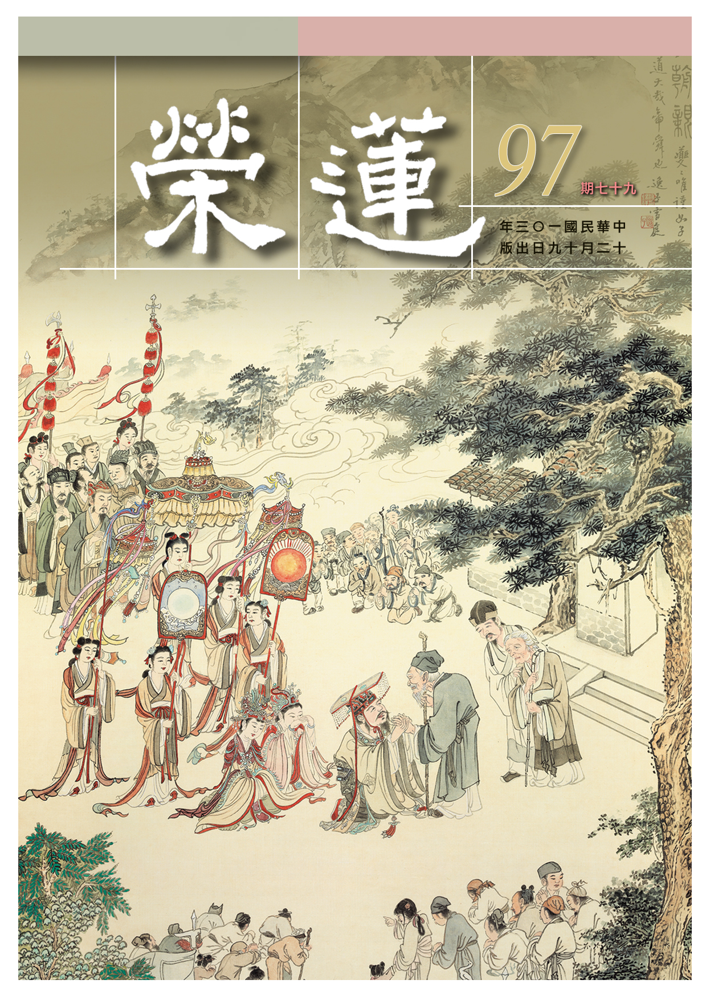

## 社論

### 從今日媒體與藝術自由看孔門七十二賢畫作

本刊

振奮人心畫丹青

表徵不朽現傳承

邁向時代善教材

化導人心最方便

現代生活的周遭，充斥的是情色暴力的畫面與鏡頭，舉目皆能引發人的遐想、邪思。在商業利益掛帥之下，血腥與裸露觸目可及，如入無人之境，不再能夠防範。兇案發生，媒體必定爭先報導，越是可怖的畫面，越能博得觀眾的青睞。現場的採訪、畫面的還原、犯案手法的描述、犯罪動機的揣測，可謂鉅細靡遺。甚至還要製作特別節目，把這些駭人聽聞的事件一次又一次地重演。這樣的傳播模式，使可怕變成了平常，陪葬了社會大眾的良知，催化了有心人犯案的能力，因此再多的教育資源，都無法挽救世道人心。古德說：「隱惡揚善」，至今才知，原來其用意是這麼的深刻，可以保護善人，維護善良，讓惡人不敢為惡。

偉大人物或者成功人士的一生，可以帶給後人許多的啟發與向上的力量，因此相關的記述，自然有其重要的價值。孩童們在成長過程中，許多父母都會購買偉人傳記，將這些過人的精神力量，保留於孩子們的心靈。商場上的競爭者，都想了解白手起家而致鉅富者的成功歷程，因為經過同樣的努力，或許自己也將有同樣的成就。

當我們處於困境時，就特別需要過來人的生命經驗作為慰藉，昔日文天祥受困於汙穢幽暗的監獄中，水氣、土氣、日氣、火氣、米氣、人氣、惡氣，穢氣併出，他能抵禦不受其害，細讀其所作〈正氣歌〉可知，正是憑藉過去哲人們的形象，在他內心發揮了無比的力量，這才終於道出：「是氣所磅礡，凜冽萬古存。當其貫日月，生死安足論。」如此的豪語。當我們讀透了過去聖哲們的心思，體會了他們一生的精神，看懂了他們的行誼，雖然只是一幅畫像，一幀歷史故事，都足以引人入勝，讓人勇往直前。

因此，攝影機不該繼續往暗處裡鑽，縮得如針孔般的大小，不斷往私處裡挖。鏡頭應該要照向光明，聚焦賢哲英豪；畫筆要繪出歷代精魂，把人生的眼界給提高，讓社會的風氣淳厚，這才不枉一代接著一代，光榮永垂的人物們奮力演出的好戲，這才真正發揮媒體的大用，以藝載道的精神。

古閩江逸子老師出生於福建省閩侯縣南通鎮的江厝村，十一歲時隨父親赴臺，得到呂佛庭、溥心畬等名師於國畫方面的指導，並以極為堅毅的精神，練就了他藝術創作的工夫。雪廬老人所教誡的：「所學不是用來裝潢自己，而是要奉獻給社會。」「作品不在有多少，而在能有多少影響。」始終是其所奉行的箴言。

基於這樣的信念和繪畫的底蘊，江老師的筆墨，再次靈動了孔門七十二位賢哲的典範，依經典內涵揣摩造象而成，有的爾雅溫文，有的器宇軒昂，或者磊落大方、志向高遠，或者恭敬肅穆、有為有守，讓時人有機會一睹他們的風采，凡是有志於取法聖賢之人，從畫作觀覽之中，必能有所感發、心領神會。這樣的作品，是我們所要珍惜，所要宣揚的作品，是能扭轉時運，繼往開來的作品，每一幅都值得我們駐足觀看，用心品味，帶領我們走入春秋時代，領略孔門賢哲的風采。

## 大德法語

### 大方廣圓覺修多羅了義經（五十六）

道源老和尚

末世修學需善巧

發心求教善知識

正見引導入律儀

不覓師過易成就

乙二、正宗分

丙二、令依解修行隨根證入

丁二、廣明行相

戊二、四問答別明觀行中根修證

己二、二問答二重除障

庚二、依師離病

辛三、如來讚許

經文：

爾時世尊告普覺菩薩言：善哉善哉！善男子！汝等乃能諮問如來，如是修行。能施末世一切眾生，無畏道眼。令彼眾生，得成聖道。汝今諦聽，當為汝說。

世尊讚許普覺菩薩等，善能諮問如來，如是修行。而如是修行就是普覺菩薩前邊三請所問的五個問題(即前述經文：「使諸眾生，求何等人，依何等法，行何等行，除去何病，云何發心，令彼群盲，不墮邪見？」)，能施末世一切眾生，無畏道眼。你們怎麼請問，我怎麼說，等於行法布施，能以布施給末世眾生，專為末世眾生請問！能布施給末世一切眾生一個無畏的道眼，就是對於修佛道不生畏懼，他怎麼樣修佛道不驚、不畏呢？因為他開了智慧眼！

令彼末世眾生，得成於佛道。

辛四、承教靜聽

經文：

時普覺菩薩，奉教歡喜，及諸大眾，默然而聽。

下邊佛就答覆他的問題。

辛五、正答所問

壬一、長行

癸一、指明師令事

子一、令識

經文：

善男子！末世眾生，將發大心，求善知識，欲修行者，當求一切正知見人。心不住相，不著聲聞緣覺境界。雖現塵勞，心恆清淨。示有諸過，讚歎梵行，不令眾生，入不律儀。求如是人，即得成就阿耨多羅三藐三菩提。

普覺菩薩專為末世的眾生請問，而為末世眾生開示將要發大菩提心，求佛的聖道，先求善知識。答覆第一個問題，「求何等人」，欲就是他願意，願意要成為修行者，第一步要先求善知識，即是當求ㄧ切正知見人。

前面說求善知識，不墮邪見，那麼如何可稱作是善知識？有正知正見的人才叫善知識，怎麼樣的人叫做具有正知正見呢？心不住相，不著聲聞緣覺境界，以此兩句話即可決斷簡擇哪一種人是善知識，如何知道是位正知正見的人呢？得有個尺寸，臺灣話叫「寸尺」，就是拿尺量一量，夠不夠寸尺？

第一不住相，住就是「著」，善知識講的修行用功法，都教我們不著相，他自己也不著相，修行用功住相，一住相就入於有為，得了些人天的福報，想超出三界都超脫不出去，何況能成佛呢？所以修行用功第一是不住相，也就是不著凡夫相，不著有為相，也不著聲聞緣覺的境界，善知識必須要開導你不住相。

再者，若叫你自己了生死，不要去行菩薩道，不要弘法利生，這就著了聲聞緣覺的境界。你弘法利生，不是令眾生了脫生死嗎？你自己的生死了脫了嗎？這一句話就把你問倒了，問倒了你就跟他學小乘法。所以說：未成佛道，先結人緣。這是菩薩發心，看看他是不是住於聲聞緣覺，既不住於有為之相，不落於凡夫，又不落於二乘，這就是正知正見。

底下再開導我們，對於有正知正見的善知識，不要另外生憎愛之心，叫做雖現塵勞，心恆清淨。善知識有出家和在家的善知識，「塵勞」這兩個字就是塵垢勞慮，還沒出家在塵垢勞慮之中，他現的是居士身，可是他心裡恆常清淨。示有諸過，就是他自己示現在家居士，或者是示現出家的法師，對於戒律未完全清淨，雖然有地方犯齋破戒，但是他不引導眾生做罪過事，雖然示現於塵勞之中，他心裡恆常清淨，雖然示現的有過失，但是他不令親近他的眾生入不律儀之中。

只要善知識的知見正，對於行為上我們得有擇法眼(簡擇佛法的眼睛)，不要起憎愛之心，就是他雖現塵勞，心恆清淨，我用擇法眼知道這位善知識，示有諸過，讚歎梵行，他不教眾生學他的過而入不律儀，教眾生學梵行。

求如是人，即得成就阿耨多羅三藐三菩提。求此人做你的善知識，你一定能成就阿耨多羅三藐三菩提，中國話叫無上正等正覺，就是達到佛的菩提，能得到成就。

辛五、正答所問

壬一、長行

癸一、指明師令事

子二、令事

經文：

末世眾生，見如是人，應當供養，不惜身命。彼善知識，四威儀中，常現清淨。乃至示現種種過患，心無憍慢，況復摶財妻子眷屬。

一位具有正知正見的人，他自己雖然有小小的毛病，但他開示你決不犯這個毛病，那你遇到善知識了，你應該當供養這個人，並且是不惜生命的來供養，你用法眼簡擇善知識，他在行住坐臥四威儀中，常常示現很清淨，或者示現種種過患，四威儀中常清淨是令人欽佩，但他示現有種種的過患，有不合戒律的地方，那麼可以進一步再考察他的心，有沒有憍慢之心。

況復摶財妻子眷屬，假如他是在家的善知識，況復摶財的「摶」字就是飲食的「食」，因為印度人吃飯是用手捏著吃的，所以叫做摶食。或者他貪吃，或者是貪財，或者是還有妻子眷屬，他示現種種的過患，你只看他心裡是不是恆常清淨？是不是在讚歎梵行？他沒有叫你做過患的事，那他就是善知識。

子三、顯益

經文：

若善男子，於彼善友，不起惡念，即能究竟成就正覺。心華發明照十方剎。

善友就是善知識，即是前面已經抉擇過的知見正確者，感到清淨了，但是後來發現他有一些毛病，便起了惡念，這就是有了憎心。如果你對於善知識不起惡念，還是照常親近他，即能究竟成就無上正等正覺（阿耨多羅三藐三菩提），一定能成就佛的大道。

這一段是開示末法眾生，該如何尋訪善友、善知識，考校他的正知正見，親近了以後，發現他有種種毛病、過患，不要起惡念，只要他不引導你犯齋破戒，還是位真正的善知識，這是開導末法眾生尋訪善知識的方法。

諸位同學都要學講經說法，當眾生的善知識！能把戒律持得完全清淨沒有過患，那是很難得的，假如還有一條戒、二條戒不清淨，不可護短，歪著道理講，認為戒律是在兩千五百年或者三千年以前制定的，根本不合時代，應該取消這個戒，這就生過患了。我們要學如何當善知識，譬如：出家人不能執銀錢戒，但是沒有銀錢就沒辦法出去坐車，也沒辦法買米買菜，沒有錢是寸步難行！在中國托缽乞食沒法行得通，沒有錢怎麼生活呢？所以銀錢戒不能持清淨。但是可以依著沙彌律戒，有多餘的就上供三寶、下濟眾生，把它捨出去，否則就是破了銀錢戒。

還有持午戒，若能持午清淨，也引導學子過午不食，假若自己不能持午，也不要護短，我們是犯了戒，應該依著蓮池大師在沙彌律戒的開導，生大慚愧。不能說這一條戒是在印度，因為要托缽乞食，惹眾生起煩惱，吃一頓可以修行辦道，下午不要出去托缽，因為現在中國根本不托缽，認為在家裡煮點晚飯吃沒有不對，這種觀念就是破戒。

每一條戒都有制戒的因緣，有一位大德他寫了一篇文章登到香港佛教刊物上，他說：過午不食制戒的因緣，是因為迦留陀夷尊者叫黑光尊者，黑得發亮，到晚上肚子餓了還要去化飯吃，孕婦聽見外面有人叫門，開門的時候剛好打雷，沒聽見雷響，先閃了一道電光，碰巧這道電光照到黑光尊者，孕婦以為有鬼，驚嚇到小產！世尊因此而制定過午不食戒。此人認為這只是制戒的因緣而已，實際上過午不食對於修行辦道，尤其參禪打坐有種種的利益，但佛制戒可以有犯戒的因緣，此人就說現在不出去托缽化飯，就不會把別人嚇到小產，我們寺院煮點晚飯，根本不會嚇到信徒流產，講這個道理還寫到文章上，這就是引導眾人不留意，是跟佛結冤仇，跟戒律做對頭，這根本就是惡知識，不能稱作善知識。

諸位同學都是學做善知識的，出家人（尤其是男眾同學）將來當戒師父，是去傳戒不是去破戒，因為自己不能持午，就指這條戒說佛制錯了，那麼你不是傳戒而是破壞戒，引導新戒吃晚飯，不但不能給引導新戒種持戒的善根，更引導他去破戒，這個罪過是很重的！所以吃了晚飯，一定要知道這是違背佛制，要生大慚愧，絕不能說佛制戒錯了，傳戒的人必須要開導新戒，必須要過午不食，如果他起了悔心而不能持是他自己的事，他總知道是應該過午不食的，要能引他過午不食的道心。

這是在勸導諸位同學，要當眾生的善知識，自己的戒律持得不清淨，切切不可私心護短，而且破了戒就不要再破戒，並且依定要引導眾生起持戒的心，不但持清淨戒，行、住、坐、臥都要合威儀。

再講到見善知識示現「摶財妻子眷屬」，佛經上印證的就是維摩詰居士的維摩經，他示現有妻子眷屬，常行梵行，那完全示現，我在北美就遇見過一位善知識，我給他送了個外號叫現代的維摩，他沒有出家，他完全過的清淨梵行。

即能究竟成就正覺，心華發明照十方剎，求善知識要求開悟，心華發明，華是個譬喻，心裡忽然啟發出智慧，都已開了華，心華發明大徹大悟，照亮十方剎。（下期待續）

### 正覺精舍法語開示（二）

上果下清律師

持戒念佛深入教

正覺圓通是所嚴

齋僧供眾法行後

句句珠璣出乾坤

清末有位古崑法師專修淨業，一天念佛定課六萬聲，閉關專修時甚至念十萬聲，以十萬聲作定課。法師留下十首偈誦，內容有關淨土法門的殊勝。

一句阿彌陀。徹底悲心說。聞此難信法。當願生彼國。

一句阿彌陀。壽命不思議。及其諸人民。一切皆無異。

一句阿彌陀。無量功德力。大石置船上。必定不沉溺。

一句阿彌陀。罪除無量劫。聞名尚離苦。何況憶念切。

一句阿彌陀。末法緣最深。餘行難成就。唯此獨超倫。

一句阿彌陀。諸佛異方便。欲生安養國。應當專心念。

一句阿彌陀。千經萬論宣。彼佛與我等。宿有大因緣。

一句阿彌陀。慧遠知幽玄。功高極易進。念佛最為先。

一句阿彌陀。蓮池具正見。臨終垂慈誨。只要老實念。

一句阿彌陀。神力不可測。八哥稱佛名。皆生極樂國。

—節錄古崑法師法語

「一句阿彌陀，徹底悲心說，聞此難信法，當願生彼國。」一句阿彌陀，就代表淨土念佛法門。淨土念佛法門是本師釋迦牟尼佛作為徹底悲心宣說的法門，以此法門作為末法時代眾生度脫生死苦海之津梁，所以宣說一個非常難信的淨土法門。由本師釋尊在《佛說阿彌陀經》中說到：當知我於五濁惡世，…是為甚難。這稀有難得的法怎麼難信呢？也就是只要帶業往生的眾生，願意一生補處，就能遞入一生補處，一生補處就是候補佛的地位，如何證明呢？阿彌陀經裡說到，極樂國土眾生生者皆是阿鞞跋致，其中多有一生補處，其數甚多非是算數所能知之，但可以無量無邊阿僧衹說。只要是一心念佛的眾生往生到極樂世界，皆是不退轉位菩薩（阿鞞跋致）。不退轉有三種：位不退、行不退、念不退。位不退是指不退入凡夫地，行不退是不退入二乘地，念不退是念念流入薩婆若海，薩婆若就是佛的一切種智海，也就是佛的智慧如同大海，非常深廣。念念流入薩婆若海，所以眾生生者皆是阿鞞跋致，只要持戒念佛的眾生凡是往生到極樂世界，都是三種不退。在這些不退轉的菩薩當中，其中多有一生補處，「多」是大多數，而且是「很多」，不是全部，是大多數都是修到等覺菩薩，等覺菩薩再上去就成佛了；那少部分到哪裡去了？即尚未達到一生補處地位的時候，到十方世界去度化有緣的眾生，隨願去度化眾生，除此之外，大多數都是修到等覺菩薩。所以凡是帶業往生的菩薩們，都是願遞入一生補處，都是遞入候補佛的地位。這是其他法門、經論所沒有，所以是難信之法。故言聞此難信法，當願生彼國。我們應當發願，要往生去阿彌陀佛極樂世界。

「一句阿彌陀，壽命不思議，及其諸人民，一切皆無異。」一句阿彌陀，修這個法門往生都是無量壽，所以大家將來往生極樂世界最長壽，都是無量壽。一切其他往生的人民以及往生的聖賢們，都是無量壽，壽命不可思不可議，所以叫壽命不思議。不但阿彌陀佛是無量壽，往生的所有人民、聖賢們、菩薩們一切沒有差異，都是無量壽。

「一句阿彌陀，無量功德力，如大石置船上，必定不沉溺。」只有這個法門能帶業往生，而且有無量功德的力量。過去有一位國王對比丘們說：「有淨土法門講到帶業往生的道理，我不相信」。那些比丘就舉譬喻說：「小石頭投入海裡會不會一直沉下去？」「會啊！」「那如果是大石頭，有艘大船，那些大石頭、小石頭都放在船上，會不會沉下去？」他說：「不會！」阿彌陀佛就如同大慈悲的願船，而眾生的種種業力如同石頭，這個業的石頭放在阿彌陀大慈悲願船上，必定不會沉溺海底，就能度到彼岸，往生極樂世界。

「一句阿彌陀，罪除無量劫，聞名尚離苦，何況憶念切。」我們至心稱念一句阿彌陀佛的聖號，能夠消八十億劫生死重罪。我們聽聞阿彌陀佛的聖號尚且能離開痛苦，何況專心一意，非常至誠懇切的正念，更能離苦海。

印光大師過去還沒有學佛的時候，年輕時身體有毛病，後來幫忙曬經，天氣最熱的六月六，藏經都要拿出來曬，在曬經的時候發現了〈龍舒淨土文〉，看了就發起對淨土的信心，開始念佛！因為專心念佛的關係，眼睛的毛病都好了。念佛得到種種好處，類似的公案太多了，所以聞名尚離苦，何況憶念切。

「一句阿彌陀，末法緣最深，餘行難成就，唯此獨超倫。」淨土念佛法門對末法時代眾生的機緣是最深重，修其餘的法門難以成就。我舉個比喻，就好像蟻子上高山，螞蟻爬到高山頂上去，那這有甚麼困難？直接上去就去了嘛！螞蟻可不是，牠鑽來鑽去，很難鑽到高山去，所以修其餘的法門就像蟻子上高山。我們修淨土法門，就如同駕起帆船，帆布豎起來遇到順風就很快到達目的地。所以是餘行難成就，唯此獨超倫，唯獨淨土法門能超越、凌躐其他的法門。

「一句阿彌陀，諸佛異方便，欲生安養國，應當專心念。」一句阿彌陀，是諸佛最為奇異、奇特的權巧方便法門，它是方便當中的方便，是徑中徑又徑，是此徑路當中的徑路，非常權巧方便。而安養國就是極樂世界的名稱，極樂世界叫做安養，有時也稱為清泰，以上都是極樂世界的名稱，想要往生極樂世界，應當專心持名念佛。

「一句阿彌陀，千經萬論宣，彼佛與我等，宿有大因緣。」一句阿彌陀，是千經萬論處處指歸，往聖前賢人人趣向。你看多麼的殊勝，彼佛跟我們宿世有重大的因緣，跟我們結的緣非常深重。

「一句阿彌陀，慧遠知幽玄，功高極易進，念佛最為先。」一句阿彌陀，慧遠大師知道彌陀願行幽深玄妙的道理，知道修行的要訣、源頭，以此用功、上進是最容易進入。念佛這個法門最為優先、最為第一。

「一句阿彌陀，蓮池具正見，臨終垂慈誨，只要老實念。」蓮池就是蓮池大師，他臨命終的時候，弟子們說：「師父啊！您要走了！要留下一些遺囑嗎？有甚麼好的遺囑趕快留下來吧！」蓮池大師就臨終垂下慈悲的教誨，說：「不換題目，老實念佛」。蓮池大師臨命終慈悲的教誨、遺囑，就是你們不要忘記，要老實念佛，假若換題目，就不老實了。不能今天聽了這位上師說這個法非常好，他就隨著修起這個法門，把原先的念佛法門放一邊了；明天又聽另外一位知識說修甚麼法門更好，他又放下舊的去修新的，換來換去，好像腳踏好幾條船，結果船踩錯了，噗通！掉下來！所以祖師臨終垂慈誨，只要老實念。講到老實念佛，不容易！甚麼是老實念佛？就好比我們念佛的當下，修菩提法門，正在念佛卻起雜念、妄想，這都不叫老實念。所以說到極處就是都攝六根，淨念相繼才叫做老實念佛，不再起雜念、妄想，能這樣決定成行，到臨命終能伏住煩惱，正念分明，就能往生，重點不在其他的瑞相，要緊的是安住正念，不失去正念，第八識離開時，決定往生。

「一句阿彌陀。神力不可測。八哥稱佛名。皆生極樂國。」彌陀佛號的神通威力是不可測量，八哥也能稱念阿彌陀佛的名號而往生，並且收錄在《往生淨土聖賢錄》裡，大家可以找出來看看。八哥雖然是畜生，但是能稱念阿彌陀佛的名號，往生到極樂世界。

公案一—王日休居士

再講一個王日休居士的公案，王日休居士的字叫虛中，號為龍舒，因為他是龍舒這地方的人，所以大家用地方的名來稱呼他，尊稱他為王龍舒，表示對他的尊重恭敬。他是宋朝的國學進士，但棄官不就，在家專修淨業，布衣蔬食，衣服不用蠶絲做的綢緞，用普通粗布衣，所吃的都是素食，他日課千拜，一天一千拜，他注有十卷的龍舒淨土文，印祖就是看了〈龍舒淨土文〉發心的，龍舒淨土文是勸各行各業的人，都能夠念佛求生淨土。

他臨終前三天，就告別親友，走！我們到極樂世界再見吧！到了第三天，還照常作課，三更半夜時高聲念佛，接著說佛來了，然後就毅然立化，站得非常穩固就走了，他留下一首偈這麼說：

五更報曉莫貪眠，

抖擻精神向佛前，

一拜一聲彌陀佛，

西方早種一枝蓮。

古時候是打更的，三更是半夜，到五更就快天亮了，所以說五更報曉莫貪眠。師父們早上三點半打板，四點做早課，所以比他還早，莫貪是因為快天亮最好睡，往往就多睡一會兒吧！以上是五更報曉莫貪眠。

抖擻精神向佛前，抖擻是什麼意思？好像毛巾髒了，抖一下，把髒的抖掉，抖擻精神、振奮精神，到佛像的跟前，一拜一聲彌陀佛，南無阿彌陀佛一拜，南無阿彌陀佛又一拜，一天一千拜，作為日課。

西方早種一枝蓮，西方極樂世界，早日種下一枝蓮，我們在娑婆世界發心念佛，極樂世界七寶池就生出一朵蓮花，越精進用功念佛，它就開得越莊嚴、越殊勝，你假若愛念不念的，想到就念，沒想到就不念，它就逐漸枯萎，假若完全不念，它就消失了，越精進用功，它開得越莊嚴，到臨命終阿彌陀佛與諸聖眾，就拿著我們自己培養的蓮花，來接引我們到極樂世界，所以蓮花都是自己栽培的，知道了這個道理，我們就要趕快栽培呀！回去就要好好念佛了。

公案二—周夢顏居士

再講一個周夢顏的公案，他是安士全書的作者，他的字號叫思仁，是崑山的書生，古時候科舉時代的制度，書生屬於生員，他也專修淨土法門，自己稱號叫懷西居士，懷西就要懷念將來要往生西方極樂世界，他想到眾生造業最多就是殺生、淫業，所以為了戒殺放生，特別做了〈萬善先資〉，為了對治眾生邪淫的罪惡，所以就寫了〈慾海回狂〉，另外也有〈陰騭文廣印三卷〉流通在世，並且導入出世法，著有〈西歸直指四卷〉，勸眾生修持淨土念佛法門，往生淨土。他在乾隆四年正月時，跟家人說我要回去了，家人趕快幫他準備香湯沐浴，他就笑笑的回答家人說，香湯沐浴久矣，然後笑笑地坐化往生。他留有勸世歌（如下）：

今日奔馳。明日奔馳。忙忙碌碌何日住。

使盡心機。結盡冤仇。總為妻兒作馬牛。

妻兒是主我是奴。一逢使喚便奔波。

妻兒是鎖我是囚。去去來來不自由。

妻兒是繭我是蠶。被他裹住受辛酸。

妻兒是井我是雪。只待填滿方休歇。

世間多少烈丈夫。往往甘受妻兒苦。

究竟妻兒何所用。生死分途不相共。

不知撐開眼。看破娑婆險。

不如用著力。快與魔王敵。

阿彌陀是我父。早辦慈心來救我。

阿彌陀是我母。早有法乳來養我。

安養國是我宅。黃金為地真難得。

蓮花臺是我胎。七寶為座佛持來。

不須弄智巧。不要費錢財。

只須口口是彌陀。念念在菩提。

要往生原容易。

佛既提攜我。我學佛提攜。

四恩三有盡回施。八難三途皆沾濟。

將此西方九品蓮。處處栽培盡大地。

今天奔走驅馳，明天也奔走驅馳，忙忙碌碌哪一天才能安住？人生在世，跟冤家交往，為了得到自己的利益，使盡了心機，也結盡了冤仇，那為什麼使盡心機，結盡冤仇？總是為了妻子、兒女做馬做牛，妻兒一使喚就奔波勞碌。妻兒好像鎖匙把你鎖住，自己好像囚犯被鎖住，進監牢獄中，去去來來不自由。妻兒是繭我是蠶，妻兒是蠶繭，蠶繭把蠶裹住了，被他裹住受辛酸，人家要抽絲，蠶繭就用熱水去燒，燒熱之後抽出頭緒，抽出蠶絲去織布，此人被蠶繭裹住受辛酸。

妻兒是井我是雪，井是一口打水的井，井很深，然後下雪只待填滿方休歇，井不填滿還不休歇。世間多少烈丈夫，往往甘心受妻兒的痛苦。到底妻兒對我們有什麼用處？生死分途不相共，到臨終他走他的，妻兒也不能代替，妻兒要死了他也不能代替。不知道撐開眼好觀察一下，娑婆世界是五濁惡世，很險惡。不如用著力，快與魔王敵。不如好好用力，快快跟煩惱的魔王對敵。

阿彌陀是我的大慈悲父，早就承辦慈心來救濟我。阿彌陀佛是我的大慈悲母，早日就有法乳養育我，阿彌陀佛的法乳是什麼呢？在《無量壽經》四十八願就是法乳，四十八願就像法乳養育十方念佛眾生，能夠發願往生到西方極樂世界去，所以早有法乳來養我。安養國是我宅，極樂世界是我的住宅。黃金為地真難得，黃金鋪滿地，真正是難得，我們在這世界得到一塊黃金就珍貴的不得了，極樂世界黃金多得很，就好像石頭那麼多，隨你搬吧！蓮花臺是我胎，七寶為座佛持來。我們是蓮花化身，九品蓮台是我的父母。佛持來的蓮花台座是七寶所成，我們臨命終的時候，阿彌陀佛與諸聖眾，就拿著我們自己培養的蓮花台，來接引我們往生到極樂世界去。

我們修這個法，不必賣弄你有巧妙的智慧，這個法門暗合道妙，只要信願老實念佛，老實修行就得利。不必賣弄智慧巧妙，通宗通教，不必種種世智辯聰，只要老實修行，不要為錢財，在家好好修行。只需要口口都是阿彌陀佛，心心念念都不忘失菩提心。太殊勝了！

我們要往生極樂世界，原來很容易。佛提攜我們，佛就包括了本師釋迦牟尼佛，極樂世界阿彌陀佛。本師釋迦牟尼佛宣揚淨土的經教，如同推我們上極樂世界，而阿彌陀佛在極樂世界垂手接引我們，所以一推一拉，就把我們拉到極樂世界去，本師世尊、阿彌陀佛既然提攜我們，我們作為佛弟子的人，也要學佛這樣的提攜，我們要提攜後學，提攜有緣的眾生。

四恩三有盡回施，四重恩：佛恩、國土恩、父母恩、眾生恩，這是在家居士的；出家師父們是眾生恩改成施主恩，一樣是四種。三有是欲有、色有、無色有。四恩三有盡回施，就是將我們修行的功德迴向布施給他們。八難三途皆沾濟，八難是盲、聾、喑、啞，世智辯聰，生在佛前佛後，生到北俱盧州(長壽天)，墮入三途(地獄、餓鬼、畜生)等都沾到我們的救濟。將此西方九品的蓮臺，處處栽培窮盡整個大地，將我們修行的功德，回向布施給有緣的眾生。給予四恩、三有、八難、三途這些眾生。將西方九品蓮，栽培盡大地。

今天的法語就說到這。今天沒看稿，想到哪就講到哪（按：師父高興的笑了笑），就講持戒念佛這個題目，希望諸位回去能好好修，依照師父今天所說的話，回去就好好修，希望諸位將來各個往生西方。（全文完）

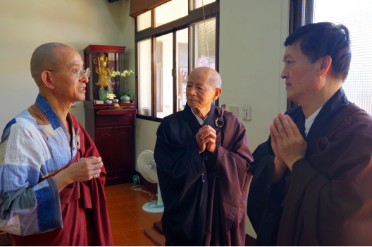

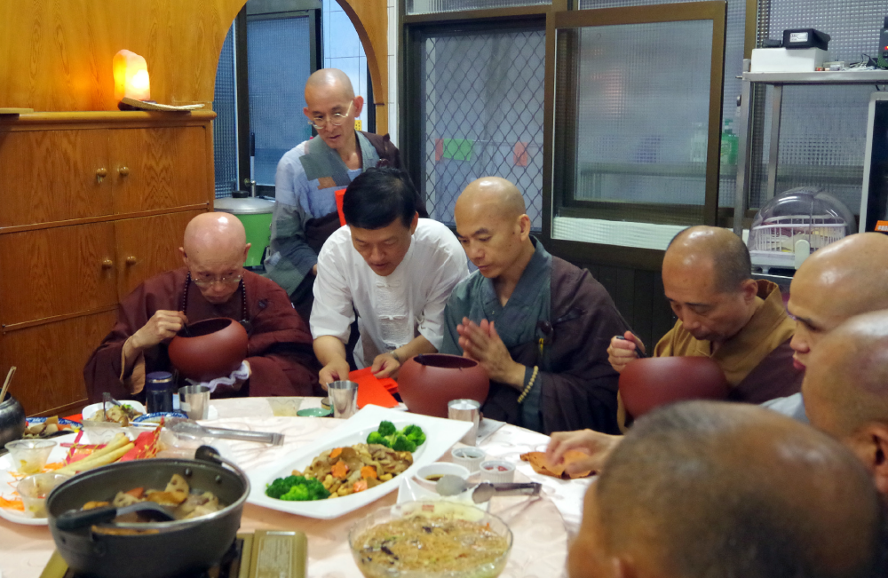

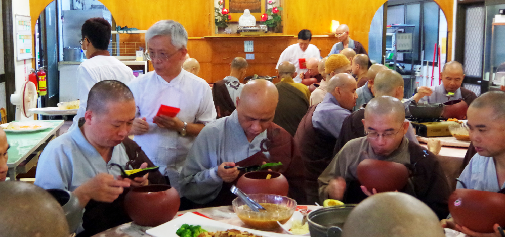

## 共修研學

### 小止觀導覽（六十九）

*心爾、治心整理*

四大五臟增損病

止觀方便能醫治

所觀六氣唇口中

究竟寂然病消亡

第九章  治病

論文：

有師言：但知諸法空無所有，不取病相，寂然止住，多有所治。所以者何？由心憶想鼓作四大，故有病生。息心和悅，眾病即差。

我們只要心意不鼓作四大，內心全部在慈悲心上、利益眾生上，這時就不會生病，所現起的是宿世的業習，幫你消業障而已，當我們有這種概念後，息心和悅，把心靜下來，以平常心、慈悲心、感恩心看待一切，此時眾病即除。

論文：

故淨名經云：何為病本？所謂攀緣。云何斷攀緣？謂心無所得。如是種種說，用止治病之相非一。故知善修止法，能治眾病。

第一、病的顯現不是有自相的顯現，是被組合出來的顯現，觀待顯現出微塵許的自相亦了不可得。

第二、病之所以成為病，要五俱意識配合身識顯現，如痛苦的病，若無五俱意識相應身識顯現，則無有病之苦。

第三、病苦是觀待無病苦說的，比如胃痛，是對胃的無苦痛而說的，心臟的病痛是對心臟安好而說的。

行者入定不取病相時，境界上沒有病相的顯現。

故醫生有時要傾聽病人的心聲，不要病還沒說完，藥方已經開好了，病人有時比醫生更知道哪裡有問題，能力不足的醫生應靜下來多多聽病人的心聲。

論文：

次明觀治病者，有師言：但觀心想，用六種氣治病者，即是觀能治病。何等六種氣：一、吹，二、呼，三、嘻，四、呵，五、噓，六、呬。此六種息；皆於唇口之中，想心方便，轉側而作，綿微而用。

前述以止的修學法來治病：

第一：將心安在痛處，乃消除痛之方便法。

第二：將心緣在丹田上，清楚明白知道自己之丹田一吸一呼，氣往下降，清除痛覺。

第三：將心緣在腳下，以除痛覺。

第四：安住於病的自體性都不可得之義理，若心不以病苦為所緣，則顯現不出病苦。

此處是用觀來治病，皆是方便治病用。何以運用六氣十二息謂之觀？是藉觀察而知所生之病，該用六氣十二息中的那一氣？或那一息來對治，這只能稱方便觀，所治的病不屬於業障病或冤業病。

病有三種：

一、業障病：

宿世或此生做了很多壞事，由業而感之病，謂之業障病。

二、冤業病：

乃得罪鬼神而被纏身。上述二病無法用六氣十二息對治。

三、四大五臟增損病：

此病可用六氣十二息來對治。此章的治病即屬於治療此類的病。

此六種息，皆於唇口之中，乃不用喉嚨、丹田發聲，但耳朵聽得到。但觀心想指的是觀能想的心，運用這六種氣來治病。非只憑但觀心想，也非只靠六種氣，而是心想與氣結合，方能治病。

心與氣如何結合？呼吸是身體氣的流動，懂得運用呼吸，就容易打通氣脈，可以由氣帶動心，也可以由心帶動氣，而此處是以心帶動氣，心想與氣結合。觀想吸氣往下帶到丹田，如果我們懂得如此運用，對修行和身體氣脈運行都會很有幫助。例如念佛，印光祖師說：可以用數息來念佛，吸氣和吐氣時皆可念佛，觀想佛光普照，諸佛菩薩的加被，並且排除所有的障礙，甚至還可以生起成佛的心，並且將氣送到丹田，這就是心與氣的結合，整個人就會安靜下來，不會躁動。

這六種息就是透過以意念訓練呼吸氣息，要時常訓練，甚至是一有空就坐下來觀想教法，不用硬對治病處，經過一段時間的訓練，可以達到以意念帶動唇口，想心方便，這也是為何打坐可以治百病的理由。

論文：

誦曰：心配屬呵腎屬吹，脾呼肺呬聖皆知，肝臟熱來噓字至，三焦壅處但言嘻。

吸氣時靜靜把意念觀想到丹田，將氣運行至此，再慢慢的由唇口間呼氣，此時不是用喉嚨、丹田發聲，但耳朵聽得清清楚楚，就像佛號的金剛念，用唇口來練六種氣，如是作七遍或十遍，按照各人的情形，隨各人的方便，也可以取一張身體解剖圖對照，方便觀修。

此處所說的六種氣跟後文的十二息有差別，六氣約外吐來說，十二息約內息來說，兩種作法不同，但是都是結合佛法的觀修，在身體健康時，造作種種利益眾生的事業。

一、「呵」字治心臟的病：

若察知病源在心臟，不論是那一種病，在靜坐時或靜臥時，就用心觀想心臟，口唇念「呵」字，同時用呵氣動作來影響心臟，要綿綿密密，很細微的，但耳中要了了分明，不是真的呵出聲音。

吸氣時觀想念出阿彌陀佛名號，意念進入丹田，不用特別在意氣息是否到達丹田，只要意念至丹田，以心來帶動呼吸，並觀想透過佛光的加被，除掉所有的障礙，自己通身透明、放金光，像佛一樣殊勝，然後訴諸於唇口，把呵字想出來，耳朵聽得清清楚楚，可是卻沒有發出聲音，心靜下來，觀察力越來越細微，甚至連香灰掉下來，感覺都像遇到山崩地裂。

吸一口氣意想到丹田，慢慢的呵出去，速度越慢越好，聲音在唇口之間，只要覺得夠了，或覺得頭會暈就要停止。

二、「吹」字治腎臟的病：

假若察知病源在腎，在靜坐時就用心觀想腎臟，口唇微念「吹」字音，同時用吹氣動作來影響腎臟，要綿綿密密（微細），雖未吹出聲音，但耳中了了分明，腎臟也有感覺，如是按照各人的情形，作七遍或十遍。

吸一口氣觀想佛的甘露和光芒全部吸進我的體內，除掉我身心上所有的障礙，可以直接成佛去利益無量無邊的眾生，眼前特別要治療腎臟的病。

三、「呼」字治脾胃的病：

假若察知病源在脾胃，在靜坐時就用心觀想脾胃，口唇微念「呼」字音，同時用呼氣動作來影響脾胃，綿綿密密，微細到沒有發出聲音，但耳中了了分明，脾胃當時也有感覺，按照各人的情形，如是作七遍或十遍。

肝、肺、胃（五臟六腑）會出毛病，跟過去損惱眾生的惡業有關係，例如眼睛長病，可能是引導他人看不如法的，引導他人去注意別人的缺點，或看那些不良的刊物。

四、「呬」字治肺部的病：

假若察知病源在肺臟，在靜坐時就用心觀想肺臟，口唇微念「呬」字音，同時用呬氣動作來影響肺臟，要綿密微細的不要呬出聲音，但耳中又了了分明，肺臟當時也有感覺，按照各人的情形，如是作七遍或十遍。若是肺病很嚴重，或吐血的人，不可用此方法增加肺部的負擔。

為何會有肺病呢？因上位者愛製造緊張的氣氛，讓人緊張，或身為為政者愛製造仇恨、對立而讓老百姓生活在恐怖、緊張的氣氛當中，心情躁鬱，將來容易感應肺病。

為什麼有人常患病，有些人不會？可以說是作息不調，也可以說是業的等流，或是業的氣氛，即使業還沒有起現行，也必須要創造一個和諧的氣氛，讓人感覺舒服。

佛法也主張善用氣脈（六氣十二息），不但動機純正而且結合佛法的觀修，治病的目的是幫助自己有修行的能力，在身體很健康的情況下來修學正法，興辦利益有情的事業。

五、「噓」字治肝臟的病：

假若察知病源在肝臟，在靜坐時就用心觀想肝臟，口唇微念噓字音，同時用噓氣動作來影響肝臟，要綿密微細而沒有噓出聲音，但耳中是了了分明，做一段時間之後，就會影響肝臟，按照各人的方便，如是作七遍或十遍。

六氣法的觀修很殊勝，讓心、肝、脾、胃、腎的濁氣都往外排，這濁氣就是習氣所在，也是造業受苦的地方。

六、「嘻」字治三焦的病：

三焦是中醫名詞，頸部到胸這一段是上焦；胃到臍是熟藏，屬於中焦；肚臍以下到膀胱屬於下焦。如果覺得三焦壅塞，在靜坐或靜臥時就用心觀想三焦，口唇微念嘻字音，同時用嘻氣動作來影響三焦，不是刻意而是綿密微細的，雖未出聲但耳中了了分明，三焦感覺暢通，按照各人的情形，如是作七遍或十遍。

這六種氣運用得宜，有病固然可對症用氣，沒有病的人，在靜坐時，運用這六氣治病法，可以預防疾病的發生，觀想用心，以心影響生理，再以生理影響心理，達到身心康泰。

以上所講的六氣法除了治病以外，還可以養生，有病治病無病強身，這章主體在此。（下期待續）

### 菩薩清淨的行持　華嚴經淨行品（十三）

*編輯部整理*

對境是修學

真正活當下

福慧二資糧

佛果是所嚴

丙二、指事顯因答其徵因

丁一、總徵

丁二、別顯

戊一、明在家時願

己三、受家室等願─伎樂聚會

經文：

伎樂聚會，當願眾生，以法自娛，了伎非實。

伎就是雜耍，樂就是音樂，古時候的人有雅興作種種美好的享受，比如郭子儀將軍告老還鄉，時就在家裡面搭個歌舞台，最大的歡樂就是聽戲，家裡面多子多孫，子孫多到記不得名字，高大的王爺府，兩旁種的是槐樹，這種子孫滿堂，人生難得的聚會，是我們難有的福報。清朝的皇室也在家裡搭戲臺、養歌舞團，現今的富翁也難想像當時聚會的種種花樣。

菩薩願的所依就在伎樂聚會中發願，能願的是菩薩，所願的是眾生，而眾生能得什麼利益呢？就是以法自娛。用佛法讓自己得到快樂，就像世俗人用伎樂娛樂自己那樣。

而了伎非實，伎樂為何非實？從世俗來說，這些伎樂是有過患的，容易消耗時間、消耗金錢，讓人放逸、失志，但是如果從自相空的立場，何謂了伎非實？它是觀待過去的善業，在名言中的生起，就是因為懂京戲，所以京戲出現才會感到快樂，如果京戲本身就是快樂的話，年輕人理應也覺得聽京戲很享受，但是現見他們不能欣賞，京戲的快樂在哪裡？可見那些快樂是在我們所賦予的名言中生起，非自相可得。

現在的歌星一唱歌，年輕人就全場瘋狂，但是老先生們卻如坐針氈，所以伎樂的快樂沒有自相，都是我們名言當中的通達，學佛法的快樂就要像去聽伎樂的快樂那樣，所以是當願眾生有這樣的能耐。或云雪公也看平劇，其實是為了幫助弟子們學習禮，幫助我們去通達人情世故，是隨順教化的。

《菩薩本業經》：若在伎樂，當願眾生，悉得法樂，歡喜之忍。

大家在戲劇當中渾然忘我，學法的時候是否如此？是否有這麼快樂呢？這種學法的歡喜，是進入登地的歡喜地。

的快樂就像聽歌、看歌伎那樣，南亭老和尚認為伎與技通，技是技巧、技藝，《老殘遊記》裡面的王小玉是餘音繞樑，三日不絕。白居易的〈琵琶行〉：大弦嘈嘈如急雨，小弦切切如私語，嘈嘈切切錯雜彈，大珠小珠落玉盤。收起琵琶的時候是「唯見江心秋月白」，全場呆掉了，怎麼會這麼好聽！而我們學佛法是否有這麼渾然忘我呢？遊玩的時候、聽歌的時候是全部的融入，學佛的時候總是有很大的掙扎，辛苦半天卻還是一知半解。

《法華經》中，當日月燈佛帶著徒弟們進入法華意境時，講了六十小劫的法華經，聽眾全部入定六十小劫，聽眾就是因地當中有以法自娛的能耐，才在聽課的時候跟著佛一起入定，去領受它的法義。所以我們必須要在因地當中有這種觀修，成為菩薩的時候才有聽法的能力。

古代歌伎的技法十分高明，唐詩裡面的〈贈歌人郭婉〉，在老師沒有開唱的時候，學生們覺得自己已經很厲害了，沒想到老師一開口，弟子們是：「一時惆悵望梁塵。」

以法自娛，渾然忘我，雪公老師就有這樣的能耐，只要看書就不知道外界發生什麼事情，外面下大雨、打大雷竟然都沒聽到。老人家也常常告訴我們，他的書絕對不是擺擺樣子，燈關了，要找什麼書、什麼資料，都知道在哪一櫃的第幾本！

己三、受家室等願─在宮室

經文：

若在宮室，當願眾生，入於聖地，永除穢欲。

按照表面的意思，宮指的是有地位、有錢人住的地方，室指的是平民百姓住的地方。這一章有幾個講法：

一、在家裡面要觀想成入於聖地，一般在家裡面擺設佛堂，我是這個家的主人，佛或住在走道上或住在客廳，佛是偏安一隅，內心隱微處認為佛應該要客隨主便。入於聖地的意思是每天早上上香要把家裡面當成三寶地，此淨土中佛是主人，我是奴才，因為我當奴才所以可以住在這個房子，每天早上要跟主子請安，跟主子禮拜、報告，這也是皈依三寶應有的心態。

因為家裡面是聖地，所以要掃除乾淨，表面的意思是永除穢欲以及男女之欲。希望家裡是善友聚會的地方，希望家裡面以佛為主（正知見），而不是發展慾望的地方。

二、南亭老和尚的講法：聖地可以說是三寶的地方，也可以說是善友的聚會處，而我在宮室（家裡）比較容易放逸、享受而有種種的穢欲，此菩薩內心渴望的是去道場，入於善友聚會的地方，入於三寶聚集之處。

三、會性法師的講法：聖地是指內心的證悟，在家裡面要好好的修學，雖然家裡面是慾望的所在，但是內心要離欲，家庭可以當成是修學正法的地方，入於聖地就是學佛法而入內心的聖地。

《菩薩本業經》：見諸婇女，當願眾生，棄捐色愛，無婬欲態。

此人很有錢，有很多的女眷，但是他必須要知道棄捐色愛，無婬欲態。

在家的菩薩有兩類，一類就如同我們這樣的修行，一類是很有威勢的大臣、宰官，為何孔子周遊列國會想要做官？因為執政之後推行正法的力量大大強過窩在小公寓幾個人研學正法的力量，所以有的菩薩是握有政治實權，可以助行正法，而握有政治實權的同時會面臨很多欲境，這時候要懂得把持，也必須要有願力以及清淨的心和空性的智慧，發菩提心修學正法，如此而生起的福報是難以想像的。

己四、在家作事願─著瓔珞

不只是受家室，在家也要作事，做哪些事？

經文：

著瓔珞時，當願眾生，捨諸偽飾，到真實處。

此人是個很有威勢的人，以現代來說就是出門穿西裝、打領帶，坐高貴的轎車，這樣的人很體面，此時希望拿掉虛偽的裝飾，好好的受用真實，就是證得空性的智慧。

南亭老和尚認為，瓔珞大部分是女人的裝飾品，在頸曰瓔，在身曰珞，瓔就像是漂亮、高貴的帽帶，華麗的衣服上面有珠寶的裝飾，這些裝飾在內心當中要明白都是偽飾，偽飾並不是戴著假的珠寶和項鍊，而是知道這些珠寶對我們毫無用處，沒辦法讓我們身體健康，也不會讓我們對正法有體悟，不能積功累德、造作善業，虛偽指的是看起來好像有用，其實是無用的。

會性法師認為，著瓔珞代表高貴，持戒的人會感應高貴，所以以著瓔珞代表持戒者，當願眾生捨諸偽飾。

如果菩薩希望眾生捨諸偽飾，那菩薩自己要不要脫掉瓔珞？當然不能脫瓔珞！他如果是總統，重要的會議就必須要盛裝出席，但是菩薩雖然表面盛裝，但是內心深處是渴望平實，亦即《佛說八大人覺經》當中：五欲過患，雖為俗人，不染世樂，常念三衣，瓦缽法器，志願出家，守道清白，梵行高遠，慈悲一切。此菩薩表面雍容華貴，內心的渴望是修頭陀行，這樣的人有什麼好處？這樣的人可以運用權勢，但是不會迷於權勢，此人表面當總統，內心渴望當平民，才有辦法跟民眾融入一片。

到真實處，就是到達生活平淡的真實處，這只是表面的講法，究竟深入法義，真實體會空性法喜的真實處才是此處要說明的。

自古讀書人一旦有功名，內心深處卻渴望平實的那一分，必須要有孔門的勝解，例如閔子騫原本是費宰，但是孔子要離開魯國周遊列國，他馬上辭官走人，說走就走，這就是著瓔珞時，當願眾生，捨諸偽飾，到真實處。

《菩薩本業經》：著寶瓔珞，當願眾生，解去重擔，諸綺可意。

當著瓔珞時，內心的渴望是把這些重擔都拿掉，要知道身上的這些瓔珞，象徵老百姓的安樂都壓在你身上，所以老百姓沒飯吃、沒衣服穿，都跟你有莫大的關係！要曉得你的榮華富貴是從百姓出來的，怎麼可以無動於衷呢！所以以前周文王看到荒野枯骨，都會認為罪在朕躬，如果今天政治辦得好就不會有人死在荒野沒人收屍，我的富貴是別人的辛勤努力，所以絕對不可以冷漠的對待老百姓！

當選的當下全部都是責任，坐在黑頭車裡面，去到任何地方有前導車開道，內心要明白自己的責任有多大，而不是大搖大擺、目中無人，高票當選的時候，背後全部都是責任，全部是因果！那是一種承擔，是跳火坑！（下期待續）

## 蓮池海會

### 楊謝德居士往生見聞記

心韜、心儷

見過父親的喪禮

決心臨終之去向

得弟成全蓮友助

不枉病魔及辛勞

楊謝德居士生於民國四十九年十二月十八日，父親是北區六縣市的孝悌楷模，更是榮登全國杏壇芬芳錄接受國家表揚的優良教師，母親則是鄉里間令人津津樂道的模範母親，在嚴父慈母的教導之下，居士也傳承了雙親的優點：做事盡心盡力、做人誠懇敦厚。

勞碌幾乎可以說是他的特質！從國中到大專，常常在清晨五、六點起來協助家人務農耕種，做完這些「份內的工作」後，才開始踏上學校的路程。放學後的第一件事不是補習，也不是寫功課、讀書，而是帶領著弟弟妹妹整理家務。假日也鮮少有休息玩耍的時候，鋤草、施肥、翻土是家常便飯，家族中最常開耕耘機的也是他！烈日下有他！風雨裡有他！那怕是天寒地凍，腳ㄚ子都凍成了青紫色，而仍伴著西北風在田裡搏鬥的也有他！就是因為有了這段艱苦的歷程，居士才有了異於常人的毅力與耐力。

踏入職場的前幾年，應父親的要求將百分之七十的薪水交給家庭，成為家庭重要的經濟支柱之一，更由於工作負責用心且清廉自持、一絲不苟，贏得主管的信賴與認同，而委任他擔任模具設計的主管。在轉任採購工作時，動輒數億的採購案，他總能以最合理的價格，購得最精良的材料，讓公司上下無不豎起大拇指對他讚歎有加。

民國七十七年與劉美玲女士結為連理後，兩人胼手胝足建立了美滿的家園，並育有一子一女。他管教子女十分嚴厲卻也賞罰分明，雖然不苟言笑，卻也莊重端肅，讓子女又畏又敬。他常常教導孩子們要養成良好的生活習慣，也以「不要用明天當藉口」作為警惕。做事要求按部就班，不允許拖泥帶水，也不可以投機取巧。也因為這種性格，讓他彷彿隨時都處於備戰狀態而少有放鬆的時候。但是子女也在這種教養下，做人處事都能獨當一面。長女楊慧君大學畢業後，依著自己的專長與意願，從事家具設計的工作，因工作認真負責蒙主管青睞擔任副店長；次子楊謝敏在大學畢業後，目前服役國防部，也因敦厚穩重而獲得長官的疼愛。這些都是得自於居士的身教與言教，才能讓家庭教育得以成功圓滿。

二十年前陸續得知自己肝硬化、惡性腫瘤後，就以養生、有機的方式調養身體，帶著回歸自然的心願，建立起「自在農園」，一方面以健康純淨的蔬果自給自足，也希望和親友大眾分享養身之道。他經常參加佛教及二手資源再利用的活動，除了讓自己的心靈獲得平靜以外，也祈求大地減少汙染，讓每一個生命的種子都在這一片耕耘中得到圓滿。他常說這二十年的性命是多出來的，他已經很滿足，也希望能利用這「多出來的時間」為大地貢獻心力。

居士具有典型的客家人特性：勤奮節儉。對於物質的慾望從來不過分追求，「衣服能穿就好，東西能用就好，這還很新為什麼要丟掉？」這是他嘴裡最常叨唸的。儘管生活純樸簡單，卻不虞匱乏，因為他要的很少，付出的卻很多；所以失去的很少，得到的卻很多！

由於親眼見到父親楊謝天送居士往生時，唐老師率同蓮友大眾一路護持：從助念、作七、告別式、火化、入塔、安座，到百日、對年、三年，致使居士不但感念在心，也了解佛力的殊勝。在長庚醫院期間，居士便將後事交待給弟弟，並要求妻兒子女一切都要依照唐老師的指示安排。

十一月一日，居士叨唸第二天的藥師懺，他要求兒子陪他共同參與，但目的並非求延年益壽，而是希望孩子能利用這個機會種下善根福德因緣，這大概是作為父親為孩子所做最後、也是最好的安排。但是當晚病情急轉直下，幾度陷入昏迷狀態，弟弟楊謝能及子女勸他念佛，他竟逐漸恢復意識並跟著家人「哼」出佛號。

十一月二日早上，他連雙眼都無法睜開，卻暗示兒子一定要參加藥師懺法會。下午二時許，唐老師親自到家中關懷並開示臨終須知，告訴他要放下身心世界不要有任何牽掛、念佛求生西方、要正念分明跟著阿彌陀佛去，居士都一一應允，並略略抬起頭來表示感謝。四時二十分，子女發現他呼吸及表情有異，便提醒他一定要跟著家人念佛，就在最終的幾秒鐘，他自己轉正身體，雙手合抱胸前，在家人的念佛聲中，吐出人生最後一口氣。

經過二十四小時的助念，兄弟子女幫他淨身著衣時，居士全身柔軟，頸口四肢皆可動作，身體乾淨無有垢穢，面色安詳嘴角含笑。若不是正念分明、往生切願、放下自在，怎麼能如此安祥不迫？居士可以說是家親眷屬及念佛之人最好的典範，於臨命終時接受善知識的引導並勇敢面對生死關頭，一心念佛，祈求佛菩薩接引護持與庇佑！

有句話說「放寬內在的狹隘，才能擁抱更廣闊的天空！」而今居士在西方極樂世界，仰望彌陀的慈顏，回首最後一生！那是何等幸運！何等愉快！希望他的示現，能加深我們對彌陀大願的信心，更希望大家同登聖域、圓成佛果、滿菩提願！

## 專題研學

### 聖者的祕密～大佛頂首楞嚴經二十五圓通暨七處徵心探源

### 二十五圓通暨七處徵心簡介　（三十八）

心超

圓音大士名觀音

能應眾生深處求

如子憶母倍親切

寶島家家觀音媽

觀音廣陳

子二、觀音廣陳

丑二、陳白之言

寅四、詳演所獲殊勝

卯二、承演三科

辰三、四不思議

為幫助眾生拔除輪迴之苦，面對各種困難皆可幫助，就是對有情最好的攝受。

巳一、總成圓通

經文：

世尊，我又獲是圓通，修證無上道故。又能善獲四不思議無作妙德。

觀世音菩薩又因獲得圓通，在聞上得到空性，而且在世俗上累積廣大的功德，得到四種不假造作的殊勝能力，可以幫助有情的各種困難。

巳二、分條別列

午一、同體形咒不思議

觀世音菩薩第一種殊勝的能力，即是於一身中，現出千手千眼。

未一、由根不隔

經文：

一者由我初獲妙妙聞心。心精遺聞。見聞覺知，不能分隔。成一圓融清淨寶覺。

妙聞指的是在聞上建立空性，妙妙聞即是在世俗上瞭解眾生需求。

心精遺聞，見聞覺知，不能分隔。以上是勝義上證得空性的字眼，內心精明證得聞的自相空，在空性的境界中，沒有眼見、耳聞等各種覺知，照見見聞覺知無自體性，稱之不能分隔。在證得空性時，知萬法皆空，觀待條件而生，此時清淨無一法可得，稱為成就圓融清淨如珍寶般的覺悟。

未二、一體多用

經文：

故我能現眾多妙容。能說無邊祕密神呪。

觀世音菩薩能於一體上展現其廣大無邊的神通，現出千手千眼，宣說無邊秘密不知的神咒，幫助眾生脫離苦難。

未三、遍詳現形

申一、備彰多相

酉一、多首

經文：

其中或現一首、三首、五首、七首、九首、十一首。如是乃至一百八首、千首、萬首、八萬四千爍迦羅首。

爍迦羅，意即堅固不壞，觀世音菩薩或因宣說法義而現出多首。

佛經上多以一百八或者八萬四千來表達煩惱種類之多，六識緣六根會產生苦、樂、捨三種感受，緣六塵則產生好、惡及平等三種，各成十八，歷三世而成一百八。

經中說到：佛德具有三百五十種行門，一一門中皆修六度，便有二千一百度，這些法門可以對治四大（地水火風）六衰（色聲香味觸法）的過患，如此則是二萬一千法門，分別對治貪、瞋、癡及等分，共有八萬四千。

酉二、多臂

經文：

二臂、四臂、六臂、八臂、十臂、十二臂、十四、十六、十八、二十至二十四。如是乃至一百八臂、千臂、萬臂、八萬四千母陀羅臂。

陀羅就是佛教的結印，以手結印又稱吉祥手、決定印，手各結印象徵佛菩薩身、語、意三密中身的秘密，透過雙手結印，彰顯菩薩的慈悲及加持，如說法印、與願印、施無畏印、降魔印等不一而足。

酉三、多目

經文：

二目、三目、四目、九目。如是乃至一百八目、千目、萬目、八萬四千清淨寶目。

觀音菩薩之清淨寶目，楞嚴經講義：即法眼圓明清淨，無礙無染，如佛紺目澄清是也。

「紺目」指佛報身相的眼睛，呈深青色微帶紅色。「澄清」指非常清澈如大海水，且有四大海那麼大，其大無比，讓人難以想像。紺目特別表徵佛相上的作用，紺目像海水，能照見十方眾生的苦難，能了知眾生的需要，以及眾生的心意。

申二、差別護生

經文：

或慈或威。或定或慧。救護眾生，得大自在。

觀世音菩薩或以攝法攝受眾生，或以折法引導眾生，或用默然的方式或善巧運用各種方便，得心應手地幫助有情離苦得樂。

午二、異體形呪不思議

觀世音菩薩第二種不可思議功德，乃變現各種不同形體，千變萬化。

未一、由聞脫塵

經文：

二者由我聞思脫出六塵。如聲度垣，不能為礙。

觀世音菩薩獲得耳根圓通，見到萬法無自體而離開六塵自相的束縛，在其心識前無一法可得，以此空性智慧，攝持聞思眾生各種於苦難中祈求救護的心意，以及觀音菩薩想要救拔眾生的心意，如聲音可穿越牆壁般無有障礙。

未二、令生脫畏

申一、各形各呪

經文：

故我妙能現一一形，誦一一呪。

申二、雙顯護生

經文：

其形其呪，能以無畏施諸眾生。

依此之故，觀音菩薩可現出各種形像，誦各種咒語幫助有情離開痛苦、危難，不但施予眾生無畏，更因有甚深空性智慧及各種世俗善巧方便，幫助眾生時，自己亦無所畏懼。

申三、結得名稱

經文：

是故十方微塵國土，皆名我為施無畏者。

所以數量多如十方微塵國土的諸佛菩薩，皆讚歎觀世音菩薩是施無畏者，其國眾生亦同樣擁護觀世音菩薩，稱揚讚歎觀世音菩薩救拔眾生苦難之施無畏。

午三、破慳感求不思議

經文：

三者由我修習本妙圓通清淨本根。所遊世界，皆令眾生捨身珍寶，求我哀愍。

觀世音菩薩因修習耳根圓通，所至之處，皆感得眾生心甘情願發心捨身，並供養珍寶，求請觀音菩薩哀愍攝受，解救其離開苦難之中。

午四、供養佛生不思議

第四個不可思議，是觀世音菩薩所擁有的資源無法想像，他人遠遠不及。

未一、由得究竟

經文：

四者我得佛心，證於究竟。

觀音菩薩破所知障得佛證量，能具足無量智慧、德能。

未二、故廣供養

申一、上供十方佛

經文：

能以珍寶種種，供養十方如來。

所擁有的財富、珍寶應有盡有，能以不可思議的珍貴寶物供養十方如來。

申二、傍及六道品

酉一、總標及生

經文：

傍及法界六道眾生。

並且面對六道眾生的需求，有求必應，可以無量的供給。

酉二、歷舉應求

經文：

求妻得妻。求子得子。求三昧得三昧。求長壽得長壽。

酉三、超至究竟

經文：

如是乃至求大涅槃得大涅槃。

只要是眾生誠意的祈求，觀世音菩薩都能滿其所願，此處是舉例而言，或求可安家政之妻，或求福德智慧之男、端正有相之女，或在定中求得止上的成就，或欲求世間長壽等福報，甚至是出世間證得空性得涅槃的果報，觀世音菩薩皆有能力滿眾生的願望。

丑三、結答圓通

寅一、正結圓通

經文：

佛問圓通。我從耳門圓照三昧，緣心自在。因入流相，得三摩地。成就菩提。斯為第一。

觀世音菩薩以耳根自相為所緣，緣心自在，得證耳根自相空。出定又以耳根為所緣，此心入流至聲音，得止觀成就的三摩地，成就佛智，而為世出世間第一。

寅二、兼明授記

經文：

世尊。彼佛如來歎我善得圓通法門。於大會中，授記我為觀世音號。

古佛觀音如來讚歎其由耳根獲得圓通，故授記同得觀世音名號。

寅三、更述名稱

經文：

由我觀聽十方圓明，故觀音名徧十方界。

觀世音菩薩勝義上獲得耳根圓通，在世俗上結合其慈悲、願力以及與眾生的廣結之善緣，名號流布十方。

（全文完）

### 大乘百法明門論簡說（五）

*心超講述、淨本整理*

譯者唐玄奘

求法萬里行

成名中天竺

譯經圓一生

伍、譯者簡介

介紹譯者和介紹本論作者，有相同的三個目的，第一個就是要生感恩心，若沒有翻譯，我們就不可能學習本論，即使去學梵文，對於梵文的佛經也難以了解。第二個是生起信心，提起玄奘大師，真的是無人不知、無人不曉，本論由大師翻譯，能讓學人生起信心。《論語》中說：「君子疾沒世而名不稱焉。」君子害怕他死後名聲沒有被宣揚。君子雖不慕名利，但這種讓學人生起信心的名聲非常重要，如果玄奘大師之名不夠讓人生起信心，他翻譯的論典就不會有人學習。

玄奘大師治學嚴謹，精通中文跟梵文，而且有很深的佛法見解，再加上求學印度累積了豐富的經驗閱歷。回到唐朝，當時的唐太宗人稱天可汗，結果這樣的君主最佩服的竟然就是玄奘大師，他請大師當宰相，連講三次，絕非客套。玄奘大師不加思索，直接回絕，因為他的志向在於遠紹如來，近光遺法，無可動搖。可想而知法師那種恢宏的器度，異於常人的風采。人生所要學習的，就是佛門大德的器度。大師回國展開譯經工作，主持龐大的譯經院，其他的翻譯者對他都非常佩服，因此這樣的人物可以讓我們生起信心。

第三個要有傳承，一個大師如果沒有傳承，則如同沒有來過世間一般。所以弘一大師所題的「悲欣交集」，他的悲是這樣的人竟然再教不出另一位弘一大師，大德如果不能培養出人才，他來了我們還是一樣墮落，那他來與不來有何差別？所以要生傳承的心，傳承的好處多矣！真正能把觀念弄懂，他的氣質、見地將格外出眾，前途必定海闊天空。

本論是玄奘大師在貞觀二十二年，四十七歲時所翻譯，他完成了所有學業回到長安城的時候是貞觀十九年，四十四歲。大師俗姓陳，名褘，河南偃師人，在隋文帝仁壽二年出生，十三歲得度出家，當時的出家制度必須經過考試。印祖於《文鈔》中提到，清朝順治皇帝對佛門最大的傷害，就是把出家的考試制度廢除，此舉看似保護佛教，卻使得佛門無以維持品質，祖師的看法跟常人不同，這是我們所要學習的見地。

隋朝大業十年的制度，二十歲才能參加出家考試，玄奘大師只有十三歲，無法進入考場，在門外徘徊。主持考試的大理卿鄭善果，看見此人氣度不凡，前往探問。還年幼的大師說他無法參加考試感到惆悵。於是問他為何出家？答道：「遠紹如來，近光遺法。」遠紹如來就是我的傳承要遠遠地銜接到釋迦牟尼佛；近光遺法則是透過這樣的傳承，我要在時代裡面大弘佛法。結果大師沒有考試，破格直接錄取。

貞觀三年(另說貞觀元年)，玄奘大師開始西行求法，一直到貞觀七年(另說貞觀五年)，才抵達印度的那爛陀寺，這是花費四、五年時間的旅途。大師在那爛陀寺依止戒賢論師，後來成為那爛陀寺的首席教授。那爛陀寺有一萬多個出家人，為什麼它可以集合這麼多人？就是人才團隊，人才團隊才能近悅遠來。寺廟一萬多人，可以講經的法師約有百人以上，有的說真正講大座有五十人以上，出門受國王禮遇可以騎大象的有十位，那是一個完整的教學團隊。

戒賢論師在玄奘大師抵達的三年前生病，頭痛欲裂，身體如刀割一般的痛苦，想要絕食自盡。一晚夢見金色身人，告之為文殊菩薩，菩薩勸導論師不應厭棄此身，現在的病痛，是因為過去做國王時殺生害命，才感得此報，應當要懺悔業障，而且懺悔中最重要的方法，是把正法往下傳。並且說道，三年後將有支那國的僧人來學習佛法，把法布施給他，罪業自然消滅。

從此段公案可知，學習正法、弘揚正法、傳承正法，比什麼都重要。試問什麼叫消業障？有正確的觀念才是消業障，沒有正確的觀念，什麼樣的環境都充滿障礙。玄奘大師的抵達，與戒賢論師的夢境完全相符。後來玄奘大師在那爛陀寺住了五年，又遊化了五印，歷經一百三十八國，再回唐朝，凡十七載。所見所聞，寫成《大唐西域記》，這是一本最重要的遊記，他記載了印度、西域一帶的歷史，是非常重要的文獻。

貞觀十七年，玄奘大師歸國前，應印度戒日王的邀請，主持曲女城的無遮辯論大會，無遮即口無遮攔，論者彼此立宗答辯來分高下，不因身分高低而有差別待遇。大會上大師打敗了所有其他立論者，一時聲威遠播，名震五印，戒日王禮敬大師，尊稱他為大乘天，小乘人尊稱他為解脫天。所以這是最成功的外交，是文化的力量，比什麼都要可貴。

貞觀十七年大師啟程回國，又走了將近三年，沿途受到很多國家的禮遇，一路講學，回到唐朝長安城時是貞觀十九年正月二十四日，宰相房玄齡等文武百官及僧侶道俗數萬人，迎於郊外，備受禮遇，可想而知當時的盛況。同年二月，唐太宗見玄奘大師於東都洛陽的行宮，深愛其才，勸他擔任宰相，大師婉言謝絕。貞觀十九年之後，唐太宗請大師住在長安的弘福寺，由大司空房玄齡擔任譯場總務，盛況時多達九百人，全部都由國家所支持。

翻譯佛經可概分為兩派，舊譯與新譯，差別在於舊譯以大意來翻，新譯是以文句來翻。但文句翻也非完全一句一句翻，還要重視文法，相當不容易。舊譯以鳩摩羅什為翹楚，新譯則是玄奘大師。翻譯過程有所謂的筆受、證梵、證義、綴文、書寫。程序上第一個是筆受，亦即先用口述翻譯梵文，然後用筆寫起來。第二個是證梵，讓其他懂梵文的人看看翻譯是否正確。第三證義，文句雖然翻出來，義理不對也不行，十分嚴格。第四綴文，義理也翻出來了，但是文句還要再講求，達到信達雅。最後是書寫，把層層檢驗過的文句書寫上去，這一句才能定案。然而此處只是簡單說明，詳細過程可以參考《高僧傳》。

玄奘大師四十四歲時拿了梵本六百五十七部回國，供於弘福寺，一直到唐高宗麟德元年，六十三歲在長安過世，翻譯佛經總共十九年，譯出經論七十五部，一千三百三十五卷。會性法師說布捲起來叫一卷，大概有一萬個字，所以約有一千三百三十五萬字，其譯典弘富，實為我國譯經史上的第一人。大師不只是梵文翻成中文，還有中文翻成梵文，例如《老子》，因為唐太宗與老子同姓李，所以對老子非常尊崇，要大師把《老子》翻成梵文送到印度。另外是馬鳴菩薩《大乘起信論》的梵文本失傳，所以大師把中文本翻成梵文再送回去。

玄奘大師不只做翻譯事業，他還做主持、講學，還有弟子們的問答，王公貴族的請見，忙得不可開交，可知大師其實是累倒的，他西行印度，有那麼好的體力，最後居然累倒，許多高僧大德，都是累倒的。累倒了以後，他也知道住世不久，並於晚上夢到大塔崩塌，自料是他死亡之兆。大師過世的時候，唐高宗為他罷朝三天，這是懂局的政治者，而且嘆曰：朕失國寶。下葬的時候，約有百萬人送葬，充塞路途，下葬以後還有幾萬人夜宿墓區。

玄奘大師的因緣就此結束，大師是最偉大的留學生，他沒有用國家任何錢，而且一般留學生大概都是別人高自己低，玄奘大師是打敗印度所有論師的留學生，戒日王跟他稱兄道弟一路送行。唐太宗沒有補助他，但所有西域跟印度的政治人物都因而知道中國，因此他是最成功的外交家。大師又是我國四大翻譯師裡面最成功的譯學家，得到國家最大的支持。他也是最成功的地理學家跟科學家，一路對西域、印度的地理做考證，做精密的記錄。最後他是我們文藝復興的播種者，因為宋明理學解釋儒家經典時，參考了佛家的典籍，玄奘大師的翻譯提供了他們最好的法本。

所以當我們對於譯者有這些瞭解之後，回到本論的研讀，一定要生感恩心，生難遭遇想，還要生出信心，傳承的心。（下期待續）

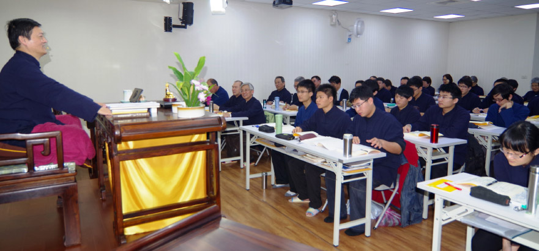

## 孔學一隅

### 論語簡說（五）子貢生平簡述（上）

*時哉講述、傳儀整理*

因應時哉教

孔門師生象

大名子貢始

綠葉襯紅花

日前「時哉時哉網路教育學院」正式上線，主題是「邁向時代，維持中心思想；造就菁英，呈現繼往開來」，可視為孔子與其弟子最殊勝的注解。

孔子一生奉獻於造就人才，舉凡孔門三千弟子、七十二賢、十哲等，皆是具有承先啟後精神、能引領時代潮流的菁英人物；而孔子本人亦正是一位擁有正確核心價值、能開創嶄新時局的領導者。

而弟子子貢，因學於孔子亦成為一代聖賢，不僅能彰顯孔門的殊勝，烘托出夫子內涵，更能繼往開來、改變春秋情勢；且《論語》共有四百九十八條，其中與子貢相關的章節即三十六條，居眾弟子之首，今日我們學《論語》，不妨從子貢開始。

子貢生平簡述

子貢，姓端木，名賜，端木姓起於周朝王室姬姓之後。據《端木氏家譜》、《祖德性譜》載：「鬻熊生二子，長子熊麗，次子端木。端木生典，典以父名為姓，名端木典。」由此可知子貢是王族後代，鬻熊亦曾為周文王與周武王的老師。

而子貢先祖雖居周朝所據地雒邑(今河南洛陽)，然因世代輾轉遷徙，子貢生於衛國(今河南淇縣)。

子貢天資聰敏，從小即有出超的識人能力，十七歲時遊學至魯國，時孔子四十八歲，子貢親近孔子後，便從未離開孔子；至孔子七十三歲過世時，子貢四十二歲，前後共二十五年。

據傳子貢在為孔子守喪六年後(即四十八歲後)，是在衛、魯、齊三地遊走，也一直是這幾國國君請教的對象。子貢或在衛國執政，或在魯國、齊國接受垂詢，最後逝於齊國，享年六十四歲。

子貢為孔門極有才幹的賢者、其名聲甚至一度超越自己的老師，時人常誤解其賢於夫子，今日我們就將子貢的內涵分為外交(口才)、見地(能知聖德、能揚聖德、吉凶禍福、論喪服)、經商(善於賺錢、用錢)、識人(論師兄弟)、善學(好問而學)和風義(師生情)，六個部分，來一探究竟。

子貢外交（口才）

外交（口才）是能替國家出使、與君臣對談皆能恰到好處，並能掌握時局、通達人情，能分析利害關係、切中時弊、以禮折人的才能。

其史蹟證明可分為七則：

一、《左傳》哀公七年，代季康子辭吳太宰伯嚭
魯哀公七年(西元前四八八年)，孔子六十四歲，子貢三十三歲。哀公和吳國人在鄫地(音層，今河南省方城縣北方)會見，吳國太宰伯嚭亦召見魯國大夫季康子，季康子卻不前往，派子貢辭謝。當伯嚭質
**問：** 「國君(魯哀公)跋涉了那麼多的路程，而大夫(季康子)卻不出門，這是什麼禮儀？」時，子貢善巧回
**答：** 「豈敢把這作為禮儀，只是因為害怕大國(吳國)。

大國不用禮儀來命令諸侯，不用禮儀又怎麼知道之後會發生什麼事呢(暗指吳國什麼事情都做得出來)？」並引用典故從前太伯(古公亶父長子)穿戴禮服來推行周禮，仲雍(古公亶父次子)繼承他，剪短頭髮而身上刺畫花紋，作為裸體的裝飾，亦是合於禮而知變通的作法，化解外交危機。

二、《左傳》哀公十一年，艾陵之戰，代叔孫武叔對吳王夫差之命。

魯哀公十一年(西元前四八四年)五月，齊、吳兩軍在艾陵(今山東萊蕪市東北)作戰，吳國與魯國聯軍。

將要作戰時，吳王夫差賜予叔孫武叔(魯國司馬大將軍)護身的甲、劍鈹說：「認真地承擔你國君給的任務，敬請你不要廢棄命令」，但古代君賜臣劍，是要他死的意思，叔孫武叔因此不知如何回答，幸而子貢上前說到：「州仇敬受鈹甲跟隨您」，並叩頭拜謝，不僅化解叔孫武叔的危機，也巧妙迴避受劍鈹的問題，反映出子貢的聰明伶俐，善於應對進退。

三、《左傳》哀公十二年，代哀公辭吳太宰伯嚭尋盟

魯哀公十二年(西元前四八三年)，此時孔子六十九歲，子貢三十八歲。哀公在橐皋(今安徽省巢湖市)會見吳國，吳王夫差派太宰伯嚭來請求訂立盟約。

哀公不願意，因而派子貢答道：「盟誓，是用來鞏固信用的，所以用內心不忘盟來克制它，用玉帛來奉獻給它，用言語來結成它，用鬼神來約束它。我們的國君以為如果有了盟約，就要遵守不能隨意更改；如果還可以更改，那每天訂立盟誓又有何意義？現在您說『一定要訂立盟約』，如果可以重新訂立，那之後盟約也是可以一再訂立更改、不遵守的。」因此魯、吳就沒有再訂立盟約了。

四、《左傳》哀公十二年，說吳太宰伯嚭免衛君之難

魯哀公十二年(西元前四八三年)秋天，衛出公(蒯輒，衛莊公蒯聵之子)在鄖地(今江蘇省如皋縣)會見吳國，辭謝吳國邀約結盟，因此吳國人圍困衛出公。

於是子貢對吳太宰伯嚭說：「衛國國君來吳國前，一定和他的眾臣討論過究竟要不要來，他的眾臣中有的願意讓他來，有的不願意，因此衛國國君才來晚了。那些願意讓他來的人，是吳國的朋友；那些不願讓他來的人，是吳國的仇人。如果拘留了衛國國君，就是毀壞和朋友間的情誼，助長了仇人的氣焰，那些想毀壞吳、衛關係的人就達到他們的願望了。而且會合諸侯來拘禁衛國國君，誰敢不害怕呢？毀壞和朋友間的關係，而助長仇人，又使諸侯害怕，也許難以稱霸吧！」因此衛出公就被釋放了。

五、《左傳》哀公十五年，說陳成子使齊歸成邑於魯

陳成子，名恆，是殺死齊簡公以把持國政的齊國相國。成邑原是魯國孟孫氏的采邑(受封的土地)，但因成邑大夫公孫宿叛變，因此將成邑獻給了齊國。

魯哀公十五年(西元前四八○年)冬天，魯國和齊國媾和，魯國大夫子服景伯出使齊國，子貢做副使，拜見公孫宿說：「人們都是他人的臣下，而有背叛他人的想法，何況現在齊國人雖為您服役，難道會沒有二心嗎？您，是周公的後代，魯國是您的祖國，在魯國享有很大的利益，卻想做不義的事情。最後利益不能得到，反而喪失了祖國，您哪裡用得著如此呢？」使公孫宿悔不當初。

之後去見陳成子，陳成子說：「我國(齊國)國君派我向您報告：『寡君願意事奉貴國(魯國)國君像事奉衛國國君一樣。』」因齊、衛原即交好，因此此番話正給了魯國機會議和。

子服景伯向子貢作揖，讓他進前回答道：「這正是我國(魯國)國君的願望。從前(魯定公九年)晉國人攻打衛國，齊國為了替衛國報仇，而攻打晉國，還給衛國土地。(魯哀公八年)吳國侵襲魯國時，齊國乘我國之難，占取讙地與闡地，我國國君因此寒心。如果能比照衛國國君那樣事奉我國國君，那本來就是我們所願望的。」陳成子因此被子貢說得很愧疚，於是把成地歸還給魯國，說明子貢外交辭令空前的勝利。

六、《左傳》哀公二十七年，季康子言「若子貢在此，吾不及此夫」

魯哀公二十七年(西元前四六八年)春天，越王句踐派使者來魯國聘問，並商談以駘上(今山東滕縣東南)作為魯、邾兩國的邊界，之後魯、越在平陽(今山西省臨汾市)結盟，季康子、叔孫文子、孟武伯三人都跟隨前去。

季康子對於以三位魯國公卿、去與一位越國蠻夷大夫商議結盟之事，感到非常困擾、有失身分(但迫於兵力越強魯弱，不得不如此)，談及子貢說道：「如果此時子貢在這，我就不會落到這個地步了！」孟武伯聽完說：「是呀！為何沒召他來呢？」季康子說：「本來打算召他的。」叔孫文子嘲諷地說：「過些日子還請您仍記著他(暗指季康子事前沒想到子貢，臨難才想到他)。」由此可知，子貢善於言辭，是位不可多得、令季康子思念的國際外交人才；而魯國三位上卿大夫，面對一位蠻夷大夫，竟不知如何應對，需有子貢才心安。

七、《史記仲尼弟子列傳》，救魯唯子貢請出，夫子許之

魯哀公十四年(西元前四八一年)，齊國田常(即田成子或陳恆)弒齊簡公，孔子請伐之，魯哀公推三阻四而未果，之後田常又想在齊國作亂，卻怕高昭子、國惠子、鮑牧、晏圉這幾人從中作梗，所以把原本要在齊國作亂的兵派來攻打魯國。

孔子聽到這件事，就對弟子們說：「魯國，是我們祖先所在的地方，是父母親人居住的國度。今天國家情勢危急到這個地步，汝等何以不出來為國效力呢？」於是子路就請求前去救魯，孔子不允許；之後子張(顓孫師)、子石(公孫龍)也請出，孔子也不答應；直到子貢請行，孔子才同意。

子貢至齊國

於是子貢出發，到了齊國，對田常說：「你討伐魯國是錯誤的。魯國，是很難討伐的國家，它城牆又薄又矮，土地又小又窪，國君又愚昧不施仁政，朝中大臣虛偽而無能，軍民又都討厭戰爭，因此不能作戰。您不如去討伐吳國。吳國城牆又高又厚，土地又廣又深，兵甲又硬又新，大臣既有才能又衣食豐腴，精良的武器和士兵都在吳國，又有賢明的大夫防守，因此容易討伐。」

田常聽完勃然大怒說：「你說困難的，是別人認為容易的；你說容易的，是別人認為困難的，你對我說這些話究竟有何用心？」

子貢答到：「我聽說：國內有憂患的就攻打強國，國外有憂患的就攻打弱國。如今您的憂慮在國內。我曾聽聞您有三次受封機會都沒有成功，因為朝中其他大臣反對您的緣故。如今您要攻下魯國來擴大齊國領地，透過打勝仗來凌駕於國君之上，通過打敗魯國來贏得其他大臣的尊重，但是您的戰功起不了作用，只會讓齊君更疏遠您。對上凌駕國君，對下脅迫群臣，想如此求成大事，那是太難了。在上者驕橫就會脅迫下臣，下臣驕縱就會對上位者放肆，因此您才會對上與齊君有隔閡，對下和大臣們有爭鬥。這樣，您在齊國立足就很危險了。所以說您不如去討伐吳國，討伐吳國取得不了勝利，人民在外效死，大臣帶兵出戰、內部空虛，您在上就沒有強臣與您為敵，在下就沒有士兵百姓的怪罪，能孤立齊君控制齊國的就只有您了。」

田常說：「很好！但就算這樣，我的軍隊已經向魯國進軍了，再調轉去打吳國，大臣們必會懷疑我，怎麼辦呢？」子貢說：「您先按兵不動，讓我替您去見吳王，勸說吳王救援魯國並討伐齊國，因此您就能發兵迎擊吳國了。」田常答應了，因此就派子貢向南出使吳國，去見吳王。

子貢至吳國

子貢見了吳王說：「我聽說：一個實行王道的人不會讓他的諸侯屬國被人滅亡，一個實行霸道的人也不會容許天下有其他強敵出現，千鈞重的物體加上一銖一兩也可能移位。如今，擁有萬輛兵車的齊國私自攻打千輛兵車的魯國，要與吳國爭強，我私自為大王感到危憂。而且如果能去援救魯國，揚名天下；誅伐蠻橫的齊國使晉國折服，沒有比這更大的好處了。表面上是挽救魯國的危亡，實際上是阻遏齊國的擴張。明智的人是不會懷疑這個道理的。」

吳王聽完，說：「很好！但是我曾與越國交戰，越王退守會稽，苦煉自身，優養名士，有報復我的決心。您且等我打下越國後，再聽從您的意見。」

子貢說：「越國的實力不如魯國，您吳國的強大也沒有超越齊國。現在您放下齊國而去攻打越國，怕您打下越國時，齊國已經平定魯國了。況且大王您正以『保存危亡之國，承繼斷絕之嗣』為名，如果攻打弱小的越國而害怕強大的齊國，就不是勇者的表現了。真正的勇者不避危難，有仁義者不會見人困窘而不救，明智的人則不會坐失良機，施行王道的人不會讓一個國家絕滅的，他們是藉這些來建立道義。如今保存越國向其他諸侯展現您的仁義，援救魯國來攻打齊國、給晉國施加威勢，到時諸侯一定會競相來覲見吳國，您稱霸天下的大業就成功了。而且如果大王真的是厭惡越國，微臣請求您同意臣往東去會見越王，叫他出兵追隨您，此實際是使越國國內空虛，名義上是追隨諸侯攻打齊國就是。」

吳王聞後大喜，就派子貢出使越國。

子貢至越國

子貢到越國，越王已清掃道路到郊外迎接，並親自駕車引導子貢到休息的館舍，問說：「我們越國是個落後的地方，先生怎麼肯以自己莊重的身分屈尊光臨呢？」

子貢說：「現在我已勸說吳王援救魯國攻打齊國，他心裡是願意的，卻又顧慮越國說：『等我攻破越國之後才可以。』像這樣，攻破越國是肯定的了。況且沒有報復人的心志卻讓人懷疑他，是笨拙的；有報復人的心意卻被對方知道，是不安全的；事情還沒發動就先讓人察知，就太危險了。這三點是成就大事最大的顧忌。」

越王勾踐聽完叩頭再三拜謝說：「我曾自不量力，與吳國交戰，因而被困在會稽山上，對此悔恨入骨，日夜口乾舌躁，只想與吳王決一死戰，這就是我唯一的心願。」於是就問子貢該怎麼辦才好？

子貢說：「吳王這個人兇猛殘暴，群臣難以忍受；國家屢次征戰，士兵們也受不住了；百姓怨恨君王，大臣間又有內亂；子胥因直言進諫而被賜死，太宰伯嚭當權、只知順從君王的過失而保存自己的私利，這是殘害國家的治理呀！現在大王若果真出兵輔助吳王來迎合他的心意，用貴重的寶物來博取他的歡心，用謙卑的言辭與禮儀來推尊他，那吳王一定會去攻打齊國。如果他打輸了，就是大王您的福氣；如果打贏了，必然兵臨晉國以乘勝爭霸中原，因此請讓我北上去見晉君，讓他一同來打吳王，這樣吳國的勢力一定會被削弱。等吳國的精銳部隊都在齊國消耗得差不多，重兵又被晉國牽制住，而大王就趁吳王疲困時攻打他，這樣絕對可以滅掉吳國。」

越王聽了很高興，答應依子貢的計謀行事，並贈予子貢黃金二千兩(鎰為二十兩)，一把寶劍，二支良矛。子貢不願接受，就離開了。

子貢回吳國

子貢回吳國向吳王匯報說：「我鄭重地將大王的話告訴了越王，越王非常惶恐地說：『我不幸從小失去長輩，又自不量力得罪了吳國，軍隊戰敗、自身也受污辱，困居於會稽山，國家成為荒涼廢墟。幸賴大王的恩賜，使我得以保全宗廟、捧著祭品來祭祀祖先，我至死也不敢忘記，哪敢有什麼非分之想呢！』」

五天後，越王派了使臣大夫文種向吳王叩拜說：「東海罪臣勾踐謹派臣下文種，前來與您的下屬近臣修好，敬託他們代為向大王請安。如今聽說大王將主持正義，討伐強國，扶救弱小，制裁殘暴的齊國，撫慰周朝的宗室，越國自願出動國中全部軍隊三千人效力，勾踐也請求自己披掛堅實的鎧甲，手持銳利的武器，為大王打先鋒。所以派越國賤臣文種敬奉先祖珍藏的寶器、戰甲二十件、鍘刀(古代斬人的器具)、屈盧(古代善造弓矛的良匠)矛、步光劍(古寶劍名)，用這些禮物來向您的將士們致敬。」

吳王大喜而告訴子貢說：「越王想親自跟隨我去攻打齊國，可以答應嗎？」

子貢說：「不可以。使別人國內空虛，讓別人的軍隊全部出動，又要別人的君王跟著出征，這是不義的。您還是收下他的獻禮，接受他派來的軍隊，而推辭國君隨行出征。」吳王同意了，就辭謝了越王。

於是吳王就發動九郡的人馬北上攻打齊國。

子貢至晉國

子貢隨後離開吳國到了晉國，對晉君說：「我聽說：計謀不事先定好，將無法應付突發事件；軍隊不事先訓練好，則不可能戰勝敵人。現在齊國與吳國即將交戰，如果吳國不能取勝，越國一定會乘機擾亂它；如果吳國贏了齊國，吳王一定會趁勢帶兵逼近晉國。」

聽這麼一說，晉君就驚恐地說：「那該怎麼辦？」子貢說：「您先整治兵器，休養士兵，等吳軍到來就是。」晉王依子貢的意見辦了。

子貢回魯國

子貢又離開晉國回到魯國。

吳王果真與齊軍在艾陵開戰，將齊軍打個大敗，擒獲七位將軍率領的士兵還不班師回國，之後果然帶兵開赴晉國，與晉軍在黃池相遇。

吳、晉兩國爭強，晉軍打得吳軍大敗。

越王聽到吳軍戰敗的消息，便渡過錢塘江襲擊吳軍，在離吳國都城七里遠的地方駐紮。

吳王聽到這個消息，馬上從晉國趕回來，與越軍在五湖一帶交戰，多次交戰後都沒有取勝，城門也守不住了，最後越軍包圍了吳國宮殿，殺死吳王夫差和宰相伯嚭。

攻破吳國三年後，越國成為東方霸主。

子貢出使，五國生變

因此子貢這一出使，保全了魯國，擾亂了齊國，破滅了吳國，強大了晉國，而使越國稱霸。是端木賜一出周旋於各國，各國原有的情勢與關係就相續破裂動搖，十年之中，五國各有其變化。（下期待續）

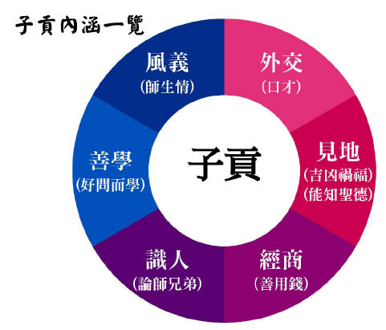

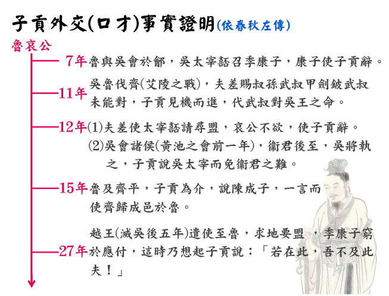

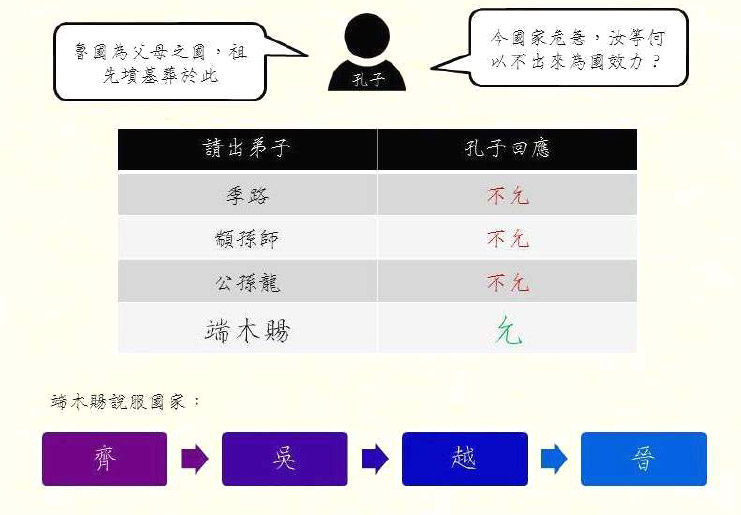

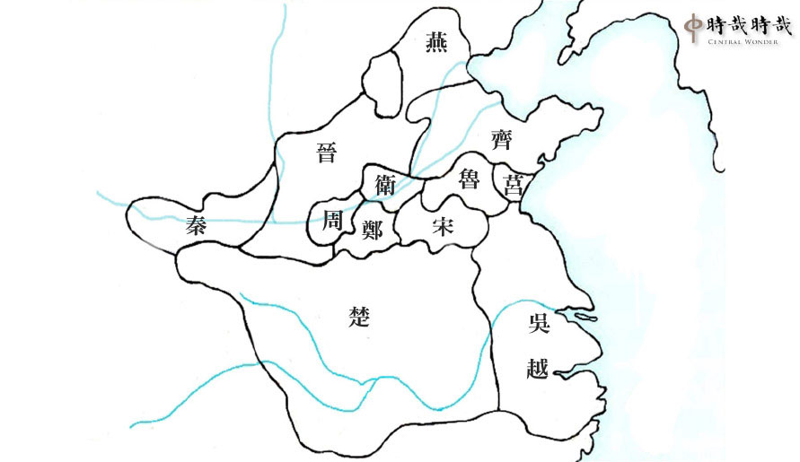

### 孔門七十二賢淺說（一）曾子

時哉

聖哲圖像蘊文化

筆畫傳神繪者心

所學非求名聲揚

承諾師請向道心

前言

人類史上最偉大的教育家，莫過於孔子。孔老夫子開啟平民教育的先河，只要是出於恭敬之心，能夠潔己以進，沒有不予教誨的人。詩書禮樂的內涵，因為孔子而能流布於平民百姓，三千位弟子，七十二位賢人，不同的才情、不同的秉性，不同的天賦，卻能同受一門之教，就像眾木一同接受煦煦暖陽的照耀，萬物共同洗滌於甘露雨水之中，都能成長茁壯，各具一番氣象。

七十二賢無論是在性格上的反差、家境上的貧富、才情上的互異或者資質上的高低，都有鮮明的不同。季次廉潔，能堪貧困；公西華家境富裕，在孔門中以知禮見長。宓子賤知人善任，垂衣拱手而單父城大治；巫馬期則是身體力行、事必躬親。樊遲有勇，勤學而好問；南容尚德不尚武，三復詩經白圭之章謹慎其言。有子言行氣象有如聖人；澹臺滅明面貌醜陋，似難有成。子張勤問為政之道；漆雕開婉拒了孔子派他為官。商瞿學易而內斂，對後世影響深遠但其名不顯。公冶長精通禽言鳥語，樂於助人卻陷於險境。

這些或狂或簡，或辟或愚，或富或貧之人，都在孔子的教化之下，各盡其性，同歸於善，同列於賢。哲人雖然距今已遠，但透過畫像的瞻仰，典型就在我們的心中。曾國藩先生在〈聖哲畫像記〉一文中提到，聖哲的圖像能夠使人感發，奮起向學，聖哲們精神的探求，微旨的會通，心意的契合，都可以藉由聖像儀容的熟悉，去心領神會。

江逸子老師出生於福建省閩侯縣南通鎮的江厝村，十一歲時隨父親赴臺，得到呂佛庭等名師於國畫方面的指導，並以極為堅毅的精神，練就了他藝術創作的工夫。江老師向雪廬老人學習中華傳統文化，使他藝術的內涵更加提升，意趣更為深遠。無論是寫意、工筆、潑墨的技法，山水、人物、花鳥的題材，都有許多精湛的作品，近幾年在人物的雕塑方面，也有令人驚歎的傑作。

雪廬老人所教誡的：「所學不是用來裝潢自己，而是要奉獻給社會。」「作品不在有多少，而在能有多少影響。」始終是江老師所奉行的箴言。此次孔門七十二賢的作品，就是這般悲心的體現。江老師以他深厚的儒學底蘊，再次靈動了七十二位賢哲的典範，這樣的作品，絕不是只專精於技藝筆法的畫師所能達到的成就，值得吾等有志於聖教的學人反覆瞻仰，而這樣的作品也肯定能為中華歷史留下輝煌的一抹記憶。

四聖十哲—曾參

曾子，姓曾名參（音森），字子輿，魯之南武城人，小孔子四十六歲，因少康封少子於鄫（山東省），後莒人滅鄫，鄫太子巫奔魯，遂改為曾氏，巫生阜，阜生皙（曾點），由此可知曾子乃夏禹後代。他與父親曾皙同為孔門弟子。

曾子最為人樂道的是他的孝心孝行。他侍奉父親，每次進餐必有酒肉，用畢將撤，必請問父親餘留的酒肉飯菜要送給誰，倘若父親詢問酒肉是否有餘，曾子一定回答說有，令父親能盡興享用，是一種養志之孝，心志上是順承父親之心。其次曾皙愛吃羊棗，在他過世之後，曾子每見羊棗睹物思情，不忍食用父親生前所獨愛的食物。在一飲一食的細節中，都可以見到他的慕親之切。曾子每次讀有關喪禮的文章，必泣淚沾襟，感嘆雙親之往而不可還，子欲養而親不待。孟子言：大孝終身慕父母。曾子可以說當之無愧。《史記》上載，孔子以曾子能通孝道，故授業而作《孝經》。

曾子有堅貞弘毅的志節，在《論語》上曾子言：作為學道的士人，要有優越的辦事能力，也要有高尚的品德，更要有弘大的見識與毅力，因為是以行仁作為自己所應負的重大責任，而且所行之道遙遠，如何遙遠？要持續到死為止。曾子一生以禮來實踐仁道，表現在生死關頭仍絲毫不失禮，可見他的言論出於真實工夫。

孔子之道在天資秉賦的顏回早逝後，有賴曾子傳承以繼往開來，從十六歲跟隨夫子學習，不久即與老師及諸師兄弟餓於陳蔡，得聞性與天道之大法，故曾子雖然資質魯鈍，但靠著戰戰兢兢，如臨深淵、如履薄冰的修學工夫，臨終能獲一心不亂(泰伯篇：鳥之將死，其鳴也哀章可證)。在《論語》上，有一回孔子呼曾子之名而說：我的道，你可以一以貫之。曾子回應說：是。孔子之道，一理分為萬事，萬事歸於一理，有入世者，也有出世者，而能一以貫之。當孔子離去時，門人不解而問，曾子回答忠恕即是夫子之道。所謂盡己之謂忠；己所不欲，勿施於人是謂恕。忠恕違道不遠，可以由事入理，而能一貫。後儒多以此典故說明曾子得到傳承。

曾子與師兄弟情誼深厚，《論語》中記載曾子讚子張容貌堂堂，仁也學得很好，而子張死時，曾子因有母喪，穿著喪服而往哭亡友，盡朋友之誼；曾子也識得顏子虛懷若谷，說到顏子是個自己有才能，卻問沒有才能者，自己見識多，卻問見識少者，有而自覺無，實而自覺如虛，無故受人侵犯，而不報復者。曾子也曾義正嚴詞的勸諫子夏之過，是朋友責善之義。曾子充分展現一位君子，以詩書禮樂之文結交志同道合的朋友，且朋友之間相互幫忙，輔助推廣種種利益天下之事業。

曾子雖曾得楚惠王重用，費國國君聘請，晚年也受齊、楚、晉各國拜相之邀，而曾子皆拒絕。後來與師兄弟子夏設教於西河，並與同門以及弟子，編纂《論語》、〈禮記〉、《孝經》等，做教化生徒，傳承大道之事業。其言論也被弟子整理成書，《漢書‧藝文志》錄有曾子十八篇。

曾子享年七十，他述〈大學〉、作《孝經》，並將孔門心法傳於子思，子思述〈中庸〉。元明之後，天下共尊其為宗聖，得孔門之傳承。

畫中的曾子頭戴頍冠，衣冠整齊，配飾素雅，一派儒者風範。眼神表情安詳，又似有所思，或許是思念著父母生養的深恩，思念著老師教導的大德。兩手相握，是他拳拳服膺於孔子之道，堅毅不拔的形象。（下期待續）

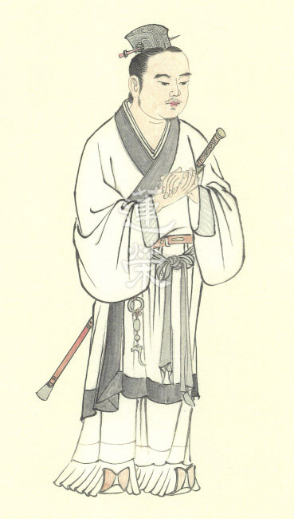

## 藝術賞析

### 華夏精魂千秋(一) 明倫史畫天子朝親

圖：江逸子　文：淨域

以藝載道的承諾

丹青明典的不朽

天子朝親的開始

民族情懷的相續

前言

雪廬老人(李炳南)創辦《明倫月刊》伊始，特別囑咐弟子呂枝富、詹前柏二居士，語譯歷史感應統紀論述歷史人物，並同囑江逸子(錦祥)居士繪圖生色，俾使因果倫常事理著之於藝，藉以引人希聖希賢。積二十一年之力( 一九七一 ─ 一九九二年)，後將明倫月刊第四至二二八期之百七十篇圖文，輯為《歷史感應統紀語譯》一書流通宇內。

江逸子老師於一九四九年侍父來臺，年幼習文學書外，好臨摩古畫。先後從呂佛庭、溥心畬門下學丹青，又入李炳南先生座下學佛研詩，復薦於大成至聖先師孔奉祀官府任職，遂摒除俗務專志於繪事。

一九八六年四月十三日雪廬老人西歸，在周邦道大德與呂佛庭教授的敦促下，江老師裒集若干幀為一輯，名為《明倫史畫輯》，於次年印通坊間，以慰老人於常寂光中。二○○四年為老人生西十八週年，復因澳洲淨宗學院落成之緣，臺中慈光圖書館朱家豐館長赴澹寧齋，對江師說：「擬印此輯二千五百冊，作為學院落成之賀。」故而再版流通教化。

二○一三年夏，福建省福清孔學會欲利用《歷史感應統紀語譯》及《明倫史畫輯》的內容，製作燈箱來推廣因果教育，特別赴臺請益於江師。江師擇選六十圖交予「中華無盡燈文化學會」改寫，特別囑咐：一要淺白字少，二須前後一致。經兩個月完稿交製。

經燈箱之製作，江師憶起雪公生西時，曾發願要補齊統一成冊，遂進行汰選增補，集成《明倫史話百圖輯》。江師殫筋竭慮繪畫，半年即補齊三十餘圖；同時間學會亦重新撰寫文稿，首重史實精確，次要淺白易讀，每文約八百字，使編排能圖文相得益彰。期間學會多回前往臺中澹寧齋請益，在江師的薰染教授下愈發堅信，歷史興替因果不爽，教育之春風化雨永遠是當要必行之務。於此僅將緣起綴言數語，以隨喜大眾德業精進。

二○一四年十二月十八日 中華無盡燈文化學會 謹識

明倫史畫─天子朝親

舜帝，有虞氏，姓姚，名重華，號稱舜，古冀州人(今河北省冀州市)。父親個性頑強，不明事理如同盲人，人稱他為瞽瞍。生母早逝父親再娶，後母陰狠又無忠信，名為嚚。生一子極寵愛，取名為象，性格狂傲視舜為仇敵，常在瞽瞍面前讒言生非。 舜天性至孝仁厚，對父母逆來順受，不失人子之道；與弟弟象和睦相處，友愛仁慈。舜處於其中，惟願能侍奉盡孝；既無過失之事，又乏藉口之辭，三人雖想害之，無以實現。

舜二十歲時，孝行已傳聞各地。三十歲時，堯訪求才德之士以用，四方推薦舜可以勝任。於是，堯帝先將兩女嫁舜為妻，以觀察他的內在修為；其次，又讓九個兒子與舜密切往來，以考核他的才幹與能力。舜婚後住在媯汭(今山西省永濟市首陽山下)，行止謹慎篤厚，兩位夫人不因出身高貴而傲視於人，反而都能恪守婦道。舜待人謙和、做事勤懇，極受鄉人的擁護愛戴；在歷山(今永濟市雷首山)務農，歷山居民出地給他耕種；在雷澤(山下的水澤)捕魚，雷澤居民讓屋給他居住；在河濱(今涑水)燒陶器，陶業居民與他精誠合作，所生產的陶器特別精細。凡是他住過的地方，因受他的感召，一年就形成聚落，兩年之後就發展成為城鎮，三年後更繁榮為都市。

雖是如此與人和睦，可是瞽瞍還想謀害舜。某次，瞽瞍叫舜修理穀倉，等舜爬上倉頂，就從底下放火燒倉，舜趕緊縱身跳下，才倖免被害。其後，又令舜掘井取水，等他進入井底時，立刻投石下井，舜幸而躲在井底邊洞，才又逃過禍難。

堯考核舜之居家和處世，覺得他真是一位賢才，深為器重。舜五十歲時，堯讓他代行天子的職權，辦理國事、天下大治，四方擁護。六十一歲時，堯正式禪位，舜成為天子。

舜即位後，配戴著天子旌旗回鄉省親，其對父母恭敬孝順之心依舊，且封弟弟象為諸侯，瞽瞍和象同受感化。舜在位四十九年，享壽一百一十歲，不論父親繼母對他多惡劣，弟弟多麼傲慢，都不放在心上，仍然曲盡孝道，是中國最孝順的帝王。史記上稱讚此舉為「天子朝親」。這是以孝道作為立國根本，以孝治家，以孝治國，教育世人，推動社會淳厚風氣的最佳典範、最高境界；中國後代帝王，也都紛紛效法，作為建國、立國的最好榜樣，以孝道與五倫關係，作為治國的根本，教育百姓，安定社會，一直到清朝滿清入主中原，也都維持此根本不變，故能維持中華民族屹立於世數千年，造就偉大昌盛的中華文明至今。

然而在科技發達、物慾橫流的今日，如何讓大眾冷靜下來，跳脫時代潮流的迷思，從悠久的傳統文化內涵與精神中，重新省思人生的目的，找回人生真正的價值與意義，是刻不容緩、重要的共同課題，也是這幅「天子朝親」帶給我們最大的啟示。

此幅天子朝親圖，是大舜接受堯的禪讓之後，居天子之位，以天子之禮省親。畫中央身著天子服飾，頭戴冕冠，跪於地者，即為大舜。舜對父母的孺慕之情溢於言表，極為懇切，沒有凌人的架式，唯有人子深愛父母的感情。雖貴為一國之君，對父母仍行禮如儀。舜緊握著父親瞽瞍之手，瞽瞍亦深感慰藉，執杖微笑。《史記》上說：「舜之踐帝位，載天子旗，往朝父瞽瞍，夔夔唯謹，如子道。」

瞽瞍身後是舜的後母及其弟象，二人的表情帶有羞愧，或許是回憶起過去對舜的種種謀害之事，而今舜以帝王之姿回鄉，卻毫無計較之心。大舜後方，兩位身著華麗服飾，跪地禮拜者，是舜的妻子娥皇及女英。二人為帝堯之女，舜為平民時即下嫁於舜，恪盡婦道，奉命惟謹，現尊為元妃及次妃，侍奉翁姑如初，故古人言：有虞二妃，萬世之師。

在空濛的山色中，舜及二妃身後，有數位手執團扇及寶蓋的隨從，周圍更有文武百官、旌旗斧鉞，極為莊嚴。百姓們見舜下跪，也紛紛跪於地，或者掩面而泣，老老少少，無不為眼前這一幕而感動，這是大舜德政的感化。《中庸》上孔子贊曰：「舜其大孝也與！德為聖人，尊為天子，富有四海之內，宗廟饗之，子孫保之。故大德，必得其位，必得其祿，必得其名，必得其壽！」大舜確實為古今中外，禪讓政治、以孝化民的最佳表率。

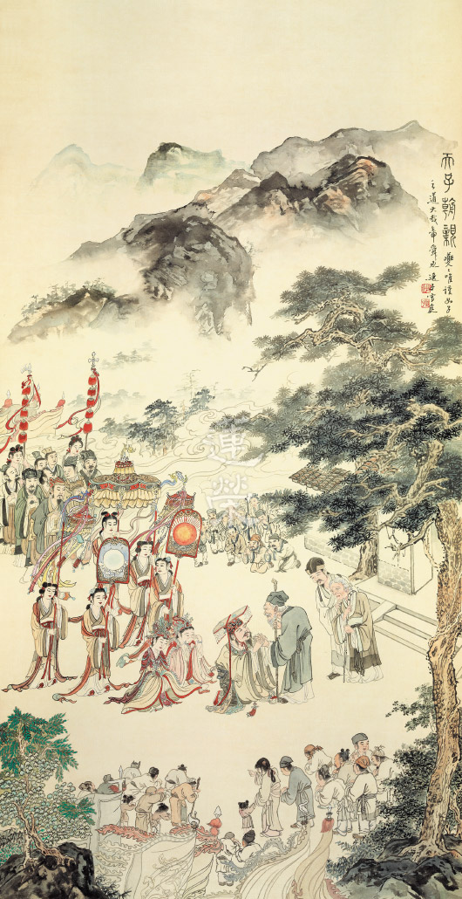

## 專題報導

### 風澤經典文化讀書會成立報導

*編輯部*

知文化品牌

成立讀書會

學論語講要

課程線上聽

今年的十月一日，「時哉時哉網路教育學院」正式啟動，透過網路科技，傳承於雪廬老人的中華文化課程，以新穎、活潑、創新的方式走向雲端，無遠弗屆的文化教室，讓更多的人有機會藉此豐富生命的內涵，提高人生的格局。

山東中孚信息產業股份有限公司成立於二００二年，是大陸一流的高新技術企業。公司老總在企業經營上具有難得的遠見，希望在經營產品服務的範圍之外，更能經營良好的公司文化，提升同仁們的精神生活。由於曾經聆聽學會師長們的講座課程，了解中華文化的價值與重要性，在網路學院成立之際，決定倡議在公司內部興辦讀書會，與學院的直播課程同步，每週三晚間一同研學《論語》，讓孔老夫子的智慧與人生閱歷，豐富所有讀書會成員的心境。除了中孚信息內部的發起，學會也安排人員前往山東協助讀書會的組成，並分次向公司的成員們說明讀書會的好處，學習《論語》的重要。

十月二十九日星期三晚間，在當天的網路學院直播課程開始之前，「風澤經典文化讀書會」正式成立。風澤之名，取自中孚，因為中孚是《易經》中的一卦，上卦為巽，下卦為兌；巽代表風，兌代表澤。風行在上，以陽散陰，表示風氣由上推動，才能流布於下，以正知見，改正錯誤的觀念；澤上有風，以陰映陽，代表下級對上級的信心與擁護。成立大會由孔子紀念歌悠揚的樂音開始，大家並一同朗誦了《論語》的篇章，氣氛十分莊嚴。公司的老總能以責任心和關愛同仁們的心，以正確的知見，將讀書風氣帶進企業，並以孔老夫子作為讀書會的核心，必定能使公司欣欣向榮，別具一番新氣象。

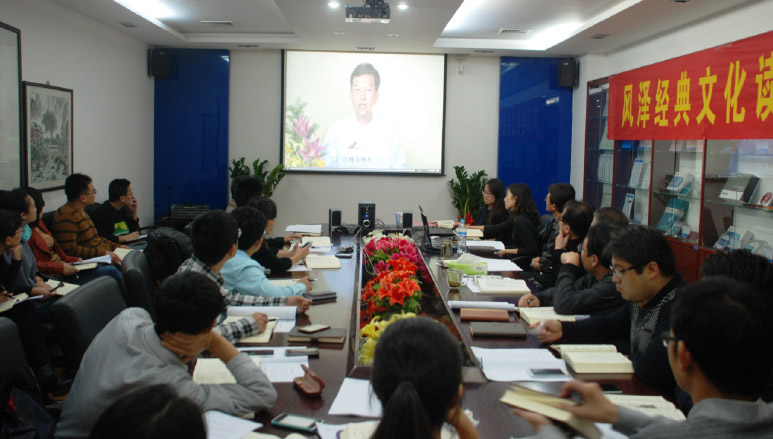

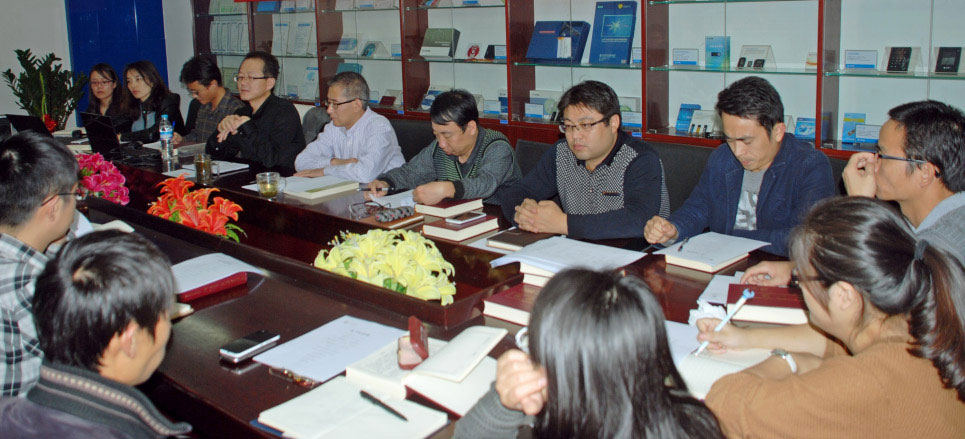

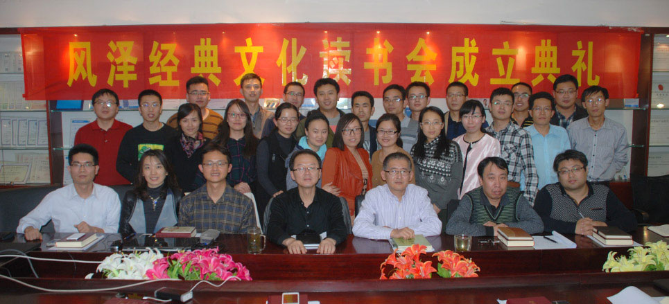

### 時哉時哉網路教育學院　論語課程特色

*編輯部*

順應時代需求

古書重新推出

呈現孔門師生

未墬於地在人

前言

自一九六○年代起，美國開始建置，用於國防用途的網路連線，透過一步一步地研究發展，網路從軍事用途走到學術連結，由區域性走向國際化，再隨著個人電腦的普及，原本僅運用於企業的網際網路，轉而深入民生生活。

時間來到二○一○年，賈伯斯重新定義了手機、開發了ＩＰＡＤ，各大廠商競逐於智慧型手機的研發，網路運用不再是民生奢侈品，而成為民間必需品。從此以後，覆蓋全球五大洲的海陸纜線，創建了一個虛擬帝國，章法逐漸成形，其影響力能超越現實，人們在虛擬的王國中穿衣、吃飯、上學、工作、遊戲、生活。實體與虛擬合而為一，這是我們不得不面對的時代背景，也是一個時機，是文化發揚的最佳時機。

去年十月至十二月間，學會的團隊一同參與了誠品講堂所舉辦的系列課程：「生而互聯、生而移動」，我們一同在實體的文創講堂，學習虛擬的發展規則，期望透過學習，讓中華文化能在虛實兩端，發揚光大。網路世界雖然劃破了時空的限制，但仍不離於人情的往來，並且亟需更多正面的資訊。經過了一年多的研學與討論，今年十月，正式推出了「時哉時哉網路教育學院」，期望能夠邁向時代，維持中心思想；造就菁英，呈現繼往開來。

論語課程特色

目前時哉直播課程以《論語》為主，因此以下主要介紹《論語》課程特色：

一、科判教學，提綱挈領

《論語》一共四百九十八條，我們學習應從何處下手呢？在時哉《論語》課程中，我們不用盲人摸象、漫無目標地學，也不用為求速成而囫圇吞棗地學，唐瑜凌老師將利用「科判」善巧地引領我們認識《論語》內涵，使我們能依不同主題、迅速掌握各篇《論語》間的關聯與架構，進而對《論語》的全貌、以及夫子的思想體系有完整的概念，對往後閱讀學習《論語》各章皆無往不利。

註：所謂「科判」，即是利用架構統整的方式，依不同主題(例如：說話藝術、與人應對進退、為政之道、論仁、論智、弟子介紹...等)蒐羅《論語》相關篇章，加以分類，成為時哉各系列《論語》課程。如目前的「論語孔子弟子介紹─言語科子貢」系列，就是網羅《論語》中出現的子貢篇章，加以分析定位，讓大家快速精準地見識到子貢的涵養與全貌。

架構式的學習法乃李炳南教授之特長，其講學多以表解的方式呈現。

二、以經解經，回歸經典

現在一般學習《論語》經典時，多是直接閱讀《論語》經文後，結合自身經驗體悟與理解，闡發議論；然唐老師的時哉《論語》教學，將回歸經典原文，旁徵博引《論語》不同章節做義理的推展，甚而搭配不同史料與李炳南教授所傳承對各家注解的抉擇，講授《論語》經文的切實意涵，培養我們讀經的眼力，讀出古聖先賢的風采。

三、注解抉擇，精闢獨到

古今中外的《論語》注解繁多，若不謹慎抉擇，將與經文義理相差甚遠，甚或偏離經意，而導致思想偏差。因此讀《論語》，注解抉擇不可不慎！

而論語注解略可分為兩大家：漢儒與宋儒，兩者卻各有利弊。「漢儒」偏重訓詁，解釋詞義，也在語法、修辭上多所著墨，然難闡發夫子微言大義；至於「宋儒」，尚闡發義理，卻多錯解，甚至有竄改經文的現象，故時哉《論語》課程，不偏漢儒、也不偏宋儒，是以李炳南教授所講述的《論語講要》為依歸。

李炳南教授依其儒釋洞達的底蘊，具備獨到眼光，於不同史料、各家注解中進行邏輯辯證，進而抉擇出經典內涵，清楚展現《論語》精華與孔子智慧。如是學習，便能得知孔門心要，一以貫之。

四、連結生活，契合時代

《論語》的內涵並非僵化古板，而是生動活潑，處處充滿人生智慧哲理，且能與時代接軌，進而實踐於生活之中的經典內容。因此在時哉《論語》課程中，每篇《論語》章節的講解都將與日常生活、人際關係經營、應對進退、說話藝術、人生規劃、時事脈動等結合，多樣創新，穎異豐富，使我們能將《論語》智慧活用於生活周遭，帶給我們無盡的省思與受用。

五、文物賞析，道藝相成

時哉《論語》課程，會適時搭配古物畫作導覽、藝術賞析，增進我們對歷史文物、古禮、藝術境界等的認知，並有助於我們對《論語》章節內涵的體悟，兩者相輔相成，在提高性格，開拓眼界的同時，也陶冶生活情操與對美的感受。

六、現場即時「線上互動問答」

時哉《論語》課程目前是以每周三晚上七點半到九點以網路的直播方式呈現，與線上觀眾同步討論、學習，如對課程內容有任何疑問皆可立即提出，唐老師會在當天課程問答時間為同學們解惑，網路上也會有小幫手或其他學員與您交流，共同研學。

《論語》一書記載了至聖先師孔子談論學問、道德仁藝、治國大要、見地開展等智慧之語，透過時人問答，夫子自述，弟子展演與記載，鑄成一部不朽的經典。

現今世界各地不分中外都紛紛開始了學習《論語》的熱潮，各式《論語》的翻譯、講座、研討、論文層出不窮，光《論語》注解就有上百千家，越來越多人意識到《論語》內涵的重要性與孔子智慧的價值，眾人都想透過四百九十八條《論語》，一窺孔子的風采及其博大精深的思想。

《論語》既已是目前炙手可熱、普遍全球的書籍，我們若能正確研讀並加以實踐，於己於人皆獲益良多。而時哉時哉網路教育學院，搭上現代網路直播科技與移動裝置的普及，讓有志學習中華文化、《論語》經典內涵的人，可以不受時間、地點的限制，調整最適合自己的方式來學習《論語》，就讓我們隨著時哉一同開啟自己專屬的《論語》經典學習之旅吧！

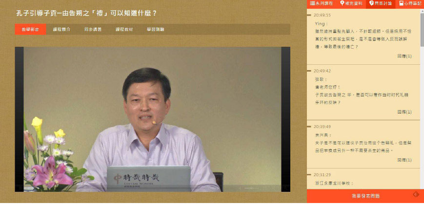

### 時哉時哉網路教育學院　工作報告

*編輯部*

兩岸文化情

論語共同學

開發多樣課

時哉春雨後

時哉時哉網路教育學院於十月一日開播以來，第一、二個月分別有六千四百二十三及四千九百二十一次造訪，不重複訪客接近兩千人，且平均停留時間多達近十分鐘，雖造訪人數有些微下降，但平均瀏覽時間提升，可見直播課程對網友學員，有一定的忠誠收視率。其中主要造訪者六至七成在台灣地區，學會長期耕耘的中壢、東勢、宜蘭等地讀書會，亦因此機會集眾研讀。

山東濟南雪廬經典讀書會

大陸地區造訪比例日漸向上攀升，且主要以師長們長期耕耘的福建福州（善恩慧小學）、福建南平（順昌縣雪廬孔子文化研學會、新華藝術幼兒園）、福建廈門、浙江金華（永康龍川學校）、浙江紹興（典愛國學中心，浣江讀書會）、江蘇無錫、山東濟南（雪廬經典讀書會、風澤經典文化讀書會）、遼寧瀋陽、南京（南京地區風澤經典文化讀書會）等地為大宗。

學院除傾全力製作教材版，提供老師簡擇內容，也為了採取最適合的切入角度，不斷的沙盤推演，甚至在每週二上場試驗，最後播出的直播版已與最初製作的教材版有著天壤之別。而一個半鐘頭的直播教室裡，發問越來越踴躍，從各地湧入了不同角度的深淺問題，使得開放問答時間越來越長，彰顯了老師幾十年來長期的深入經典，在一貫的中心思想下，因應各家說法不但能觸類旁通，且觀念前後一致，學長們即席統整問答，書寫線上筆記，老師妙語如珠的回答，讓直播現場與遠端的大眾總感意猶未盡，期待每週的課程。

中壢研學會

隨著網路學院會員以及造訪人數不斷攀升，藝術學院以及啟蒙學院也將陸續推出新課程，論語白話解釋及正音、明倫史畫導覽、啟蒙學院繪本故事、千家詩等課程，呈現方式也在討論製作中。相信後續各學院線上課程的推出，在非直播期間也能持續創造影響力，讓課程推出能建立新穎的學習生態，並吸引有志之士，發揮學院最大的價值。

豐原讀書會

今日，造訪學會網站人員多為重複造訪，網站內容充實以及宣傳等事項，亟待長期跟隨學會學習與成長的諸位師長共同協力成就，相信透過無遠弗屆的網路媒體，有心者可藉此得到經典正解，並從中獲得正知見，而在其中參與的大眾，亦藉由傳播正法改變眾生共業中改變個人的別業，在個人道業上獲得殊勝的增上。

附：開播前後的幾個變化

順昌縣雪廬孔子文化研學會

盼望已久的網路直播—時哉時哉網路教育學院終於開播了！終於可以透過電腦、在遠隔萬水千山的大陸如身臨其境般地聆聽老師對《論語》的精彩講解！真的要由衷地感謝老師以及無盡燈文化學會各位師長的努力！

開播以來，順昌縣雪廬孔子文化研學會與以往一樣，組織傳統文化愛好者按時收看共學，同時，卻有幾個明顯不同的變化在悄然發生。

首先，共學的人數明顯增加。開播前，共學的人數大約總在二十人左右。開播後，共學人數常常突破四十人，而且人數有不斷增長的趨勢。就在昨晚的共學課堂內，末學有意去點了人數，竟然達到五十人！幾乎每週都會有生面孔出現，個別公立幼稚園的老師被吸引過來共學，一些中學的語文老師跟縣政府的領導也成了「常客」，光夫妻就出現五對。

再者，共學的時間也明顯增加了。開播前，每週只有固定在週四晚上大家共學一個半小時。開播後，每週的共學時間是三個晚上，其中，週二晚上安排預習《論語講要》，為第二天晚上的聽課做準備；週三晚上是集體聽講座，聽後還有半個小時的現場解答；週四晚上則安排內部學習、答疑。

以上是網路教育學院開播以來的幾個變化，老師的《論語》講座正在悄悄地改變順昌人的生活。

浙江紹興典愛國學中心

順昌縣雪廬孔子文化研學會

福州善恩小學讀書會

福州善恩小學與老師學生們共學，學校負責人的計畫是將學生從幼稚園到大學連續性培養。藉此機會將時哉時哉網路教育學院介紹給有志之士，並一起共學。照片中的外國學生是廈門大學的外國留學生，在交流學習討論中，發現有的留學生中文基礎較好，並對中華文化有濃厚興趣，即邀請他們參加直播學習，從課後交流中，可以知道他們對於論語是很有興趣的，雖不是聽得很懂，但他們感受到我們中華文化的魅力，連說佩服，一直說了很多感謝。

也藉由論語直播課程，培養國內的學生們，通過討論學習傳統文化，讓我們的學生增加對自已文化的信心，廈大承辦全球許多孔子學院，這次廈大留學生來本校交流，藉著這樣的因緣，希望本校的學生們對學習論語更加有興趣，能珍惜聽聞唐老師的論語課程。

感恩唐老師及各位師長，學生們很有福報，每次網路基本都很順暢，希望老師慈悲可以給更多的正法讓大家學習，也期待可以將學會的介紹短片、成長營活動、幼稚園演出等製作成線上學習內容讓大陸學員更多瞭解老師、學會情況，增益學習效果。誠願臺灣的各位師長都身安道隆！

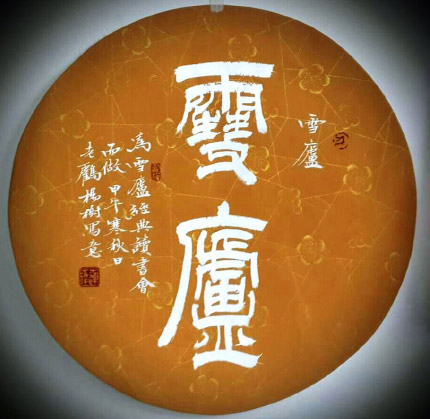

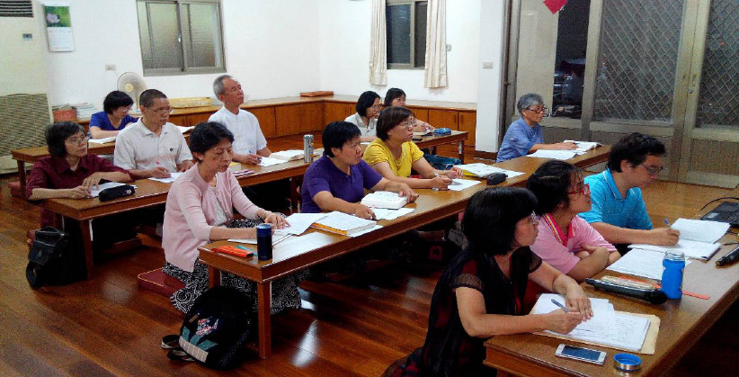

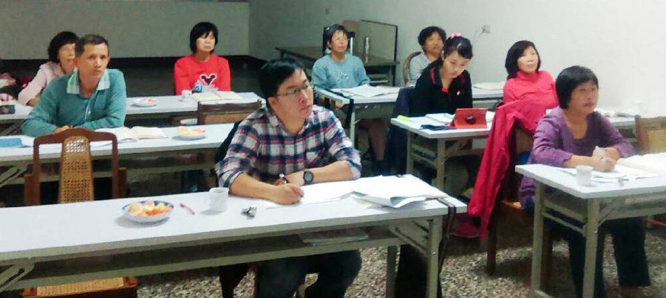

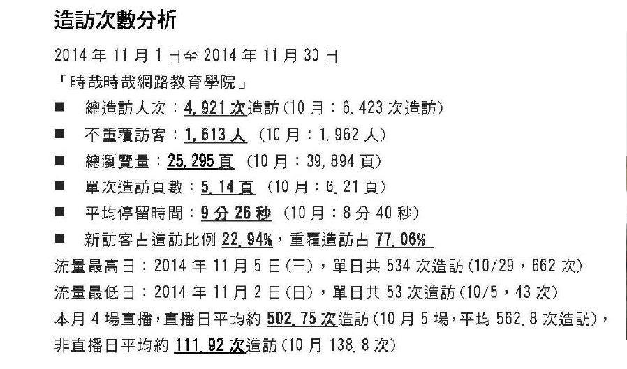

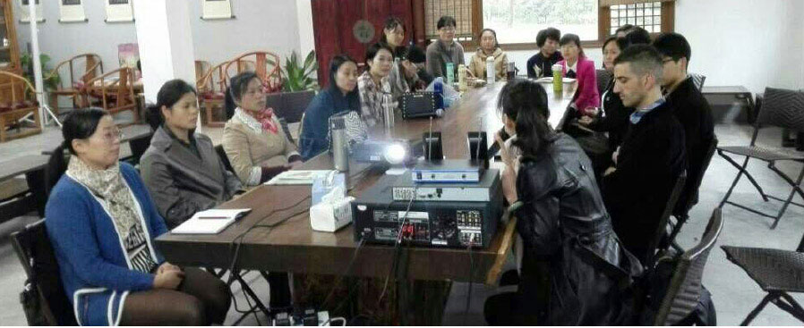

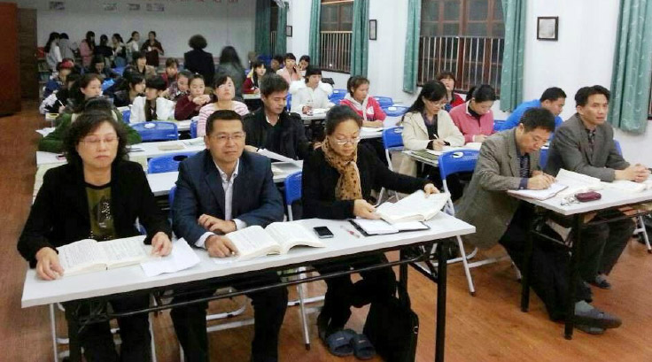

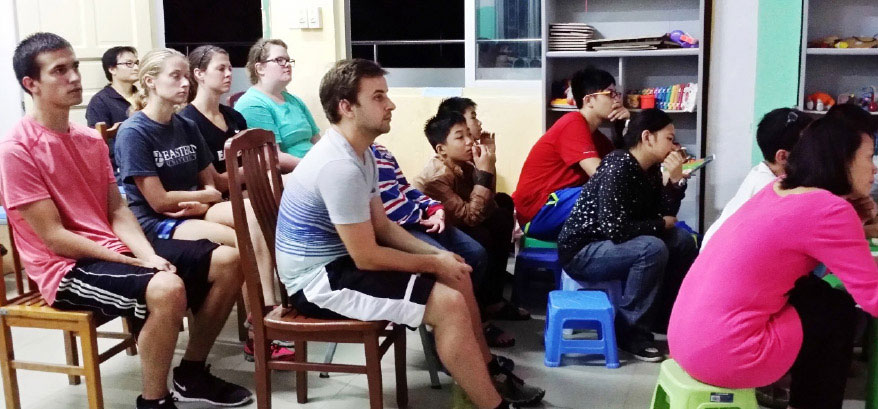

### 時哉時哉網路教育學院　現場大直擊

通泰傳媒

傳統碰上新時代

學習不限教室內

遠端虛擬善教學

時哉時哉大用中

ＬＩＶＥ，並沒有想像中困難，但也不是想像中簡單，只要擁有專業技術和完善設備，和一群充滿熱忱的工作人員默默維護，任何地方都可以成為一個專業的直播現場。

跟著我一同去直擊時哉時哉網路教育學院的直播現場吧！

這是通泰傳媒第一次與無盡燈合作，除了每週三晚上的直播之外，我們還一併建置了影音教育平台。網站中有許多不同以往的互動功能，讓使用者可以在觀看直播影片的同時，也可以透過線上留言系統讓學習效果加速！

小空間大學問，直擊攝影棚

對於不熟悉的新媒體技術，什麼都感到很新鮮，週三晚上跟著同事們一起到直播現場，我就像個要去戶外教學的小朋友一樣，東看西看的，現場的設備比我想像的還齊全。平常很少注意直播相關活動，一般對於直播印象是透過電視收看的一些大型運動比賽以及頒獎典禮，像這樣課程講座的直播現場我還是第一次了解。

走進教室環繞一圈後，除了感受到現場充滿莊嚴肅靜，同時也注意到，一間教室就有三台攝影機去做畫面切換，這是我很少見到的專業設備，呈現出無盡燈對於直播畫面的品質要求，並且非常注重每位學員的觀看品質。而教室的後方，有一間看似空間不大的小隔間，好奇心重的我，要求跟著導播進去一探究竟，走進一看，竟是一個專業又新穎的導播室，所有設備整齊的放置在小空間裡，有調整麥克風音響機器、控制攝影機轉動的控制盤、切換畫面視屏的導播機……等等，有種把電視台縮小搬進了教室的感覺。

聽現場的導播大哥說，準備一場完美直播前，要先顧及環境因素，克服現場環境與設備結合的問題，也是花了不少時間去做修正，才有現在呈現的畫面品質。燈光和機器都是要克服的大問題，他說機器跟燈光的閃爍頻率不一時，會直接影響直播現場的畫面品質，攝影器材本身的機型，也要因應現場空間及想呈現的效果去做調整，就連講師後面的布幕，也是為了讓畫面處理得更快更乾淨，另外去加裝的，再搭配左右旁的打燈效果，做出景深畫面。

雖然空間不大，透過燈光、音響、攝影、副控、網路環節，小空間兼顧好品質，變成一個數位攝影棚，直播效果不輸給大型電視台呢。

跨平台連線技術，專業不馬虎

離開教室現場，看到一群默默坐在一旁，屏氣凝神專注看著螢幕的工作人員們，他們在做直播的訊號監控，如果要說誰是整場直播的無名英雄，那就非他們莫屬了。

直播訊號關係到所有線上學員的觀看品質，他們說跨區、跨國的連線網路，會使用不同的線路，而不同軟體、不同瀏覽器會產生的連線問題也不一樣，這時，技術人員就必須同步監看，並且及時協助處理突發狀況，以確保每位學員的在線品質，他們在背後默默救火，身兼多職，好像什麼都難不倒他們一樣呢！

影音的編碼轉碼技術，跨平台高畫質的專業服務，全球ＣＤＮ與大陸專線做好充分準備，這些就是一場完美ＬＩＶＥ幕後所具備的專業，神奇的網路連線將世界串連起來。線上同步、即時互動這些都是我們不能忽視的最新的新媒體趨勢。

互動式介面設計，學習更完整

我覺得無盡燈直播網站，最貼心的地方是互動區塊的即時回應，直播網站多了互動式功能，可以讓教學更加完整，更有融入感，小編會在線一一回覆，讓每一位成員都可以倍感重視。

直播網站會提供教學內容簡報，呈現雙螢幕畫面，讓學習更為方便，再搭配補充資料，可以省去學員自行蒐尋資料的時間，最旁邊還有心得筆記功能，學員可以互相交換心得，分享自己的上課筆記，去做線上的討論分享。課後，老師現場還會開放問與答時間，透過線上平台，及時回答問題，這樣線上的互動，就好像將學員們都帶到同一個學習環境，一同學習成長。看到線上學員的問題，能得到解答，心中也莫名感到開心，那真的是做到了線上零距離。

互動式介面設計，告別了過去冷冰冰的線上教學方式，我們不用再對著預錄影像去做單向教學，能夠做到即時互動的雙向教學，真的讓學習更加活潑更加完整了。

貼近人心的優質線上平台

每一次到現場，都覺得學到很多專業領域的入門，兩個多小時的直播現場直擊，發現原來要利用線上即時實況轉播觀看，是需要許多專業技術和人力支援，並不是隨便套用一個系統就能順利產生，網路世界無邊無際，很多我們覺得科技的新躍進，都是龐大開發人員好多時間的心血，以及一群專業人員在背後默默努力的維護，才有現在方便大家使用的直播網站。

通泰傳媒顧慮很多小細節，結合新媒體的技術，產出兼顧直播品質、兼顧視覺畫面、更兼顧了使用者個人經驗的作品，目的就是要呈現最優質的品質給所有產品使用者。

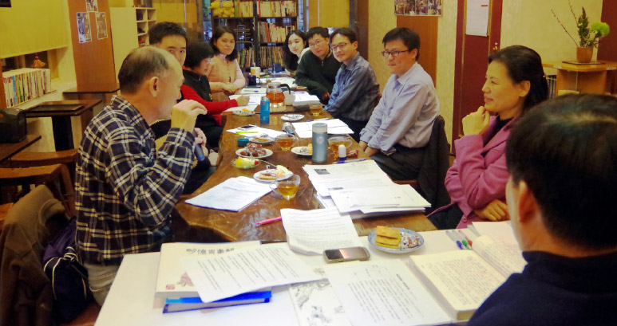

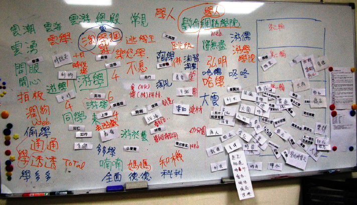

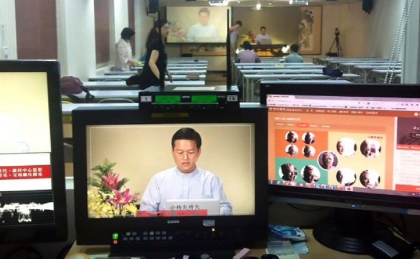

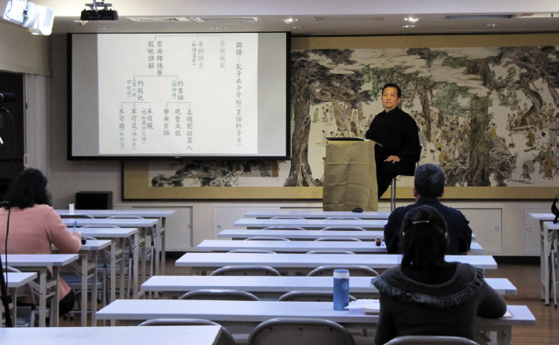

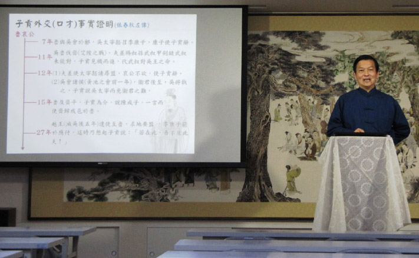

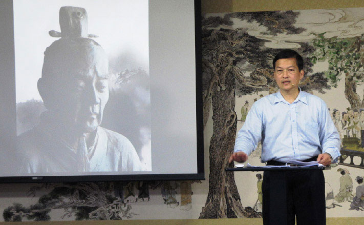

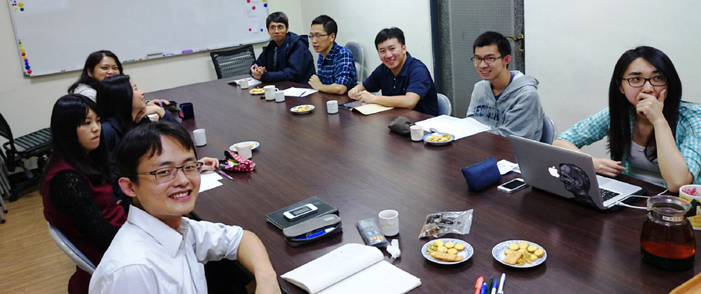

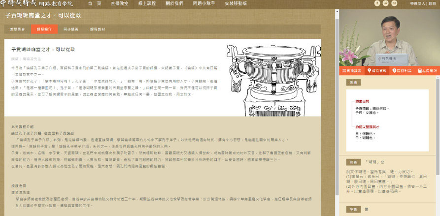

## 活動報導

### 人生、事業與論語—福州中華傳統文化專題講座

梁浩

文武之道未墜地

深入論語得出路

聽聞正法靠傳媒

人才雨後春筍出

福山福地福人居

怡人怡物怡心處

在海峽西岸，與寶島臺灣僅一水之隔，有一座歷史文化悠久而又古老美麗的城市—福州。福州背山依江面海，氣候宜人，綠樹長青，有「左海」，「榕城」，「江南勝地」之美譽，更有「佛國」之稱。福州民風淳樸、文化昌盛。沿海外向的區域特色和源遠流長的歷史底蘊，塑造了福州人民順勢有為、豪爽義氣、拼搏奮進、戀祖愛鄉的優良品質。

十月，秋風送爽，仿佛有人拎起一把大扇子，輕輕給人們搧走悶熱，搧走煩惱。帶來的，是一片涼爽，一片清新，還帶來瓜果飄香的豐收喜悅。

（一）

我說秋興逸，誰言秋興悲？

山將落日去，水與晴空宜。

福州的秋天依然是那樣充滿生機，花香四溢。空氣清新，湖水清澈。白雲繚繞，藍天透徹，有如仙境一般。

在這個人傑地靈，五彩繽紛，洋溢著濃濃的文化氣息的「福城寶地」，在這個美麗的時節，由蔚藍集團發起主辦，福建廣電網絡集團、福州大學至誠學院協辦，禮請臺灣知名學者，中華無盡燈文化學會理事長唐瑜凌教授、林蔚芳教授及教師團隊高銘澤老師，在福州大學至誠學院圖書館音樂廳舉辦了中華傳統文化專題公益講座。

來自蔚藍集團、福建廣電網絡集團的部分員工、福州大學至誠學院的學生、順昌讀書會的學長、順昌幼兒園的老師及福州、無錫熱愛中華文化的人士三百餘人參加了此次講座，唐瑜凌教授、林蔚芳老師、高銘澤老師、劉玉霞老師、蔚藍集團董事長宋謹、福建廣電網絡集團總經理謝晶思、福州大學至誠學院副校長朱敏琛、順昌縣政協秘書長陳新出席開幕式。

福州大學至誠學院副校長致開幕詞，她說：「《論語》所呈現的是一種態度，推崇的是一種追求，表達的是一種情懷，傳遞的是一種思想，開啟的是一種做人的方法與智慧，凝聚了古聖先賢智慧的人生哲理，流露了處世哲學，為人之道，行為之規，讓人們在紛繁複雜的事物中，心平氣和，安身立命。值得人們反覆回味，再三咀嚼。因此我們通過學習《論語》，學習國學，來涵養氣度，拓展心胸，提升行為。

當然要真正讀懂《論語》，並非易事，為此，我們專門請來了臺灣著名國學大師唐瑜淩教授，通過他多年潛心專研《論語》的心得體會，為我們開啟一扇解讀《論語》的窗口，進而指導我們生活的方方面面，相信大家一定會耳目一新，受益匪淺。通過這種兩岸文化交流活動，不僅可以讓廣大師生和嘉賓朋友們更深入品味經典，提高文化涵養，更讓我們體會兩岸同根、文化同源的一脈相承，最後我想說的是，人生實際是一個修行的過程，修行當中有歡樂也有痛苦，但是修行的人，不迷惑於歡樂，也不沉迷於痛苦，我衷心的期望各位在未來的課程中有所收穫，祝願在座的每一位能在探索的過程中獲得福慧雙修的人生。」

蔚藍集團董事長在發言中說：「對於能夠參與主辦這場活動深感榮幸，蔚藍集團在發展的過程中體會到，企業最重要的核心元素是『人』，大家擁有正確的價值觀，彼此能夠趨同，決定企業未來發展。」近年來，中華文化經典《論語》在海內外都得到了大力弘揚，《論語》雖然是對兩千多年前孔子及弟子言行的記錄，但對我們今天依然有很深的啟發和促進意義。因此，弘揚中華文化經典，不僅是解決個人價值觀問題，更是企業能夠走多遠，中華文化復興的根本出路和解決辦法。

（二）

冀望殷殷成聖賢，書聲朗朗響雲天。

遺風垂範潤黎庶，汲古融今澤後人。

此次專題講座主題為「人生、事業與《論語》」，意乃源遠流長的中華文化雖是萬古，然歷久彌新，我們人生、事業的出路就在《論語》。老師非常慈悲，在百忙中，考慮到參加這場講座的對象有企業員工、有廣電網路人員、有大學生、有熱愛《論語》的各界人士。根據聽眾的情況與根基，用短短時間重新做出有針對性的科判，以使與會大眾更加受益。

首先老師對傳承做了比較詳盡的介紹。接下來，特別選出中外、古今名士及孔門弟子，共同認證人生的出路就在《論語》，說明經典在我們人生中的重要作用。老師極富內涵的精彩講解，內容豐富、事實確鑿、涉獵廣泛，振聾發聵，再配合選材得當，構圖嚴謹，富有說服力並且非常精美的簡報，通過中外古今名士對《論語》評價，讓人們對《論語》生起極大的信心。

老師又從《論語》選出相關章節，做出事業的出路就在《論語》的科判。內在出路從正確的價值觀（志向、見地）、道德（孝、悌、忠、信、恕）、情緒管理三方面論證。外在出路從政治（內政、軍事、外交、司法、財經、教育）企業管理、說話藝術、與聞國政、人際關係經營（識人善用、遠離小人、愛眾親仁、不壞交情）、健康養生、文采儀表、教育化導、與民同樂等多個層面分析。孔子在《論語》中表現出的智慧，往往隻字片語，奧義深遠。

唐老師的課程內容發人深省，幫助我們深入瞭解孔子的中心思想、教育理念與其核心價值，瞭解孔門的氣象。並深入探討《論語》的真實內涵、與時代意義。讓我認識到中華文化的博大精深。老師用《論語》章節，深入淺出，循循善誘，深刻地分析了人生、立志、見地、道德……，教導我們如何確立正確的知見，鼓勵大家修學向上，一方面掌握知識技能，一方面加強自身修養，增強人生閱歷，洞察人心，抓住機遇，獲得完滿的人生。

老師把畢生精力都用在聖教的學習和承傳上，學而不厭，誨人不倦，幾十年無怨、無悔、無私的付出，為我們指出了光明的人生之路。人生的出路就是在經典的學習，在志向的確立，在名言的通達……。大家被老師的學識與人格魅力深深吸引，明白正知見的重要，並且紛紛立志，要將所學知見內化成為內心的修養，使自己如沐春風，向聖賢看齊。

大家對唐老師的敬仰，除了學問高山仰止外，更在於以身作則，凜然正氣和儒雅有度的人格魅力以及獨到的教學方法，嚴謹的治學之風之外，還有團隊成員之間默契的配合，循循善誘、啟發式的授課風格，尊師重道的言行舉止，同樣讓人感動。老師給我們開啟了一扇扇智慧之門。

課程結束之前，唐老師和謝總用風趣、幽默、深刻的語言回答了大家的提問，氣氛熱烈、莊重。給大家非常多的啟示。

課後，大家反響強烈，有的學員說：孔子的人格魅力，是綜合了很多因素之後才能形成的。通過對唐老師團隊臺上臺下的學習、配合與交流的觀察，我能深刻的感受到他們每一個人的充實與快樂，老師用自己人格的魅力和淵博的學識，將全體成員擰成一條繩，如果人生能得到一位好的老師指引，將是多麼的幸運！

還有的說：感恩這樣一次中華傳統文化的精神盛宴，什麼是文化？有知識不能稱之為文化，所謂文化應是文明的教化。流行的不是文化，流行的勁兒過了就沒有了，就象唐老師講的觀光客一樣，去觀光旅遊一次就夠了，不會去第二次，所以沒有文化不可能傳承，因為沒有根基。只有我們五千年的博大精深的文化才是真正的文化。

孔子知道自己的使命「傳承文化的大業」，其人生的最大價值就是將「人」變成「人才」。

從孔子及弟子到唐老師及學生，內心中樹立了強大的榜樣，仿佛是為我們開啟了一扇永遠充滿陽光、永遠花香四溢的窗。

作為萬世傳頌的經典，《論語》中的至理名言已接受了歷史的考驗，生活在現世的我們，沒有理由不積極從中挖掘寶藏、吸取智慧。《論語》所蘊涵的智慧適用於古今，放之四海而皆準。是我們人生、事業的真正出路。

（三）

時哉時哉互聯網上放異彩

中華文化世代相傳揚美名

二十六日下午，通泰傳媒的總經理賴麒宇先生為我們帶來了題目為「插上互聯網翅膀，飛向傳統文化新天地」精彩演講。當今世界，互聯網已經成為人們獲取資訊的主要來源，網路，讓世界縮短了國界，讓時空沒有了距離。

傳播是文化的基本特徵，一切文化都是在傳播的過程中得到發展的。文化傳播，既有縱向的，即文化在其所生長之地的代代傳承；也有橫向的，即文化跨越地域的對外交流、傳播。全球性的新型傳播載體—互聯網的飛速發展和迅猛崛起，為文化的傳播提供了便捷的新管道。中華文化的發展是非常順應時代的，是活活潑潑的，更是與時俱進的。賴總主要聚焦於網路在傳播領域的異軍突起對於中華文化傳播的影響。從網路在拓展傳播中華文化的作用中的潛力著手，進而論及加強傳播中華文化的網路化建設之現實迫切性。

賴總首先向我們提出了問題：看見了嗎？真的看見了嗎？看見了什麼？看見這個世界已經變成了兩個世界，我們做了什麼改變？

多對多的傳輸管道，我們已經進入了鏈接的新時代。你鏈接內容，內容鏈接你，鏈接無所不在。

知道大勢，善用趨勢！

總列舉了中華無盡燈文化學會利用網絡平台搭建的「時哉時哉網路教育學院」的案例，大家都為中華傳統文化與現代化高科技手段結合，使我們能在世界各地聆聽老師的教誨，領略老師的風采，而感到歡欣鼓舞。

今天，我們在互聯網界精英的帶領下坐而論道，共同展望互聯網的未來、共謀中華文化利用互聯網的發展。我們看到了未來的趨勢，看到了互聯網與教育的密切結合，看到了資訊化對我們現實生活的影響與深度融合……更看到了這些創新應用的背後，優秀中華文化的不可或缺。

中國歷史上，朝代的更迭、國家的興衰都不曾影響中華文化的傳承。在於中華文化的大智慧，在於中華文化的與時俱進。

(四)

翩翩少年郎，騎馬上學堂。

老師說我小，肚裡有文章。

此次講座，大家還非常期待的一個主題，是由唐老師、林老師還有高老師及劉老師共同帶給大家的「教育人才從幼教說起」。四位老師介紹了弘明幼兒園的由來和發展歷程，講解了辦學宗旨、辦學方法、教學內容、教學效果、辦學經驗等。弘明幼兒園「融合中西文化內涵，品德教育向下扎根，奠定幼兒學力基礎，建立主動學習態度，培養自主生活習慣。」的教學法，以及老師推理精準，層層遞進、思維縝密，詼諧生動的講解：讀經提升幼兒的記憶力、語文能力與專注力。語文能力是所有學習領域成功的基礎。專注力決定了學習的成果。

同時也能提升幼兒的領悟力。領悟力強則更能引發主動學習的興趣。專注力、領悟力與主動學習的態度才能轉換為有內涵的創意。深深的吸引了大家，給大家很多啟迪。唐老師還談到幼稚園將論語經典故事編成話劇，然後讓小朋友參與演出，其參與熱情和興趣是非常高的，在感悟、體驗和表演中領會經典。

（五）

三更燈火五更雞，

正是男兒讀書時。

二十七日晚上，已經是十點多了，有一位校長，帶領老師、家長及所有學生一起在時哉時哉網絡學院跟隨老師學習，他們非常期待能見到老師，向老師當面請教。老師不顧連日的勞累，在自己的房間接見了他們，聽取校長、老師、家長的學習心得，十點半，當日表現優秀的學生代表來到老師面前，七位清一色的男孩子，彬彬有禮，侃侃而談，向老師匯報他們的學習體會，還提出疑問向老師請教，老師一一耐心作答，小小的房間裡充滿了歡聲笑語，喜氣洋洋。

孩子們從七十二賢中選出一位作為自己的榜樣，他們有的以子路為榜樣，有的以子貢為榜樣，有的以冉伯牛為榜樣……老師非常歡喜，鼓勵孩子們從小就要立志，以聖賢為榜樣，向聖賢學習，好好深入經典，成為對社會有用的人才。夜深了，大家依依不捨，向老師告辭，老師一直把校長、老師和孩子們送到樓下，看著孩子們上車，揮手向大家告別，直到車子遠去。

孩子們，加油！

（六）

輕帆數點千峰碧，水接雲山四望遙。

睛日海霞紅靄靄，曉天江樹綠迢迢。

清波石眼泉當檻，小徑松門寺對橋。

明月釣舟漁浦遠，傾山雪浪暗隨潮。

福州是我國歷史文化名城，山川秀麗，萬千景象，名勝古跡眾多。多姿的自然景觀與豐富多彩的人文景觀互相融合，交相輝映。二十七日上午，福建廣電網絡集團安排我們參訪了福州著名的三坊七巷。在導遊小姐娓娓道來中，我們跟隨老師，緩緩漫步在這古老的街區，體會古人的情懷。

三坊七巷是盤踞在最繁華的路段。然而，就是在這塊總面積僅有零點四四平方公里的古老街區，竟保留著一百五十多處明、清朝遺留下來的古建築，其規模之大和保護之完整，在全國堪稱首屈一指，被譽為「明清建築博物館」。

據史料記載，三坊七巷最早源於西晉，到宋朝時其雛形已基本形成，成為當時福州城內士大夫、富紳之家的聚居地。其後到明清兩代發展到了鼎盛時期，三坊七巷這一正式名稱出現在清道光年間，現存的大量優秀建築群都是在那時建成的。

歲月滄桑，三坊七巷是一個沉澱著城市人文、城市性格的文化符號，它是福州的「城市名片」。

如今，這一歷史街區得到最完善的規劃，重現其古色古香的絕代風華，在這個街區內，坊巷縱橫，石板鋪地；白牆瓦屋，曲線山牆、佈局嚴謹，匠藝奇巧；不少還綴以亭、臺、樓、閣、花草、假山，融人文、自然景觀於一體。正房、後房窗以雙層通長排窗為多，底層為固定式，上層為撐開式或雙開式。

正房的主門朝大廳敞廊，多為四開式，門上雕有豐富的圖案花飾，以增添大廳的氣派。「誰知五柳孤松客，卻住三坊七巷間」，三坊七巷人傑地靈，出將入相的所在，歷代眾多著名的政治家、軍事家、文學家、詩人從這裏走向輝煌，有的坊名、巷名就可看出當年的風姿和榮耀。福州市三坊七巷，是中國目前在都市中心保留的規模最大、最完整的明清古建築街區。真是福地福人居，福人居福地。

（七）

智慧之燈燈燈相傳

中華文化生生不息

順昌縣政協秘書長陳新在閉幕式上發言，她說：我想這是因為對文化的追尋，對我們中華道統的認可，才使我們心有靈犀一點通，千里因緣一線牽，謝謝老師，謝謝中華傳統文化帶給我們相聚的好日子。我們為什麼來到這裡學習傳統文化？我們又怎麼樣學習傳統文化？我們學習傳統文化到底應該學些什麼？我也曾經在內心深深的問過自己，「學而時習之不亦說乎？」學習要學在心上。

「有朋自遠方來不亦樂乎」朋友們今天來，聚在這裡來幹什麼呢？是依循著我們對文化的探討，文化的追尋，對我們這種中華文化的信仰而來。說，應該是在內心當中的喜悅，樂，是臉上、外相上的和樂，因此「人不知而不慍不亦君子乎」學到的東西我們用了嗎？別人發現了嗎？你可以被社會所用嗎？你還會對別人的不理解而鬱悶嗎？學了這些別人不用我們，或者我們學了這些還不為別人所知，都是因為自己的不夠精進，因為自己的內涵還沒有沉澱，所以請我們再一次發揮我們的自覺力，認真的學習，我想成功的喜悅，一定就在那一天給我們最光明的回報。

福建廣電網路集團總經理謝晶思在總結發言中說道：我心裡是依依不捨，我想首先要深深的感謝我們唐老師還有他的團隊，深深的感謝他們為我們做出的無私的奉獻，讓我們受益匪淺。第二，就我本人而言，確實也深受觸動，幼兒園的老師給我們奉茶，那種儀式是我沒有見過的，還有看到學長帶來的孩子，非常的有禮貌，彬彬有禮，給老師鞠躬，我也非常感動，如果我們的下一代，如果我們中華民族的下一代，都能這麼彬彬有禮，都能夠這麼知書達理，我想我們中華民族是非常有希望的。

雪廬老人在他《論語講要》的扉頁上面有一句話，叫「志於道，據於德，依於仁，遊於藝」，所以我們要在道、德、仁、義這幾個方面下功夫。聽完了唐老師的課，我們要好好想一下，我們單位、企業的目標是什麼？我們要怎麼樣做到品德高尚的人，一個有責任感的單位，我們怎麼樣做到仁愛別人，我們怎麼樣能夠接受新的更多的知識，在我們未來的前進中能夠立於不敗之地，所以這堂課給了我們深深的啟發，建議大家要把握住這樣的機會。

第三點要表達的是我們廣電網路集團，一定要在國學的弘揚、傳承方面起到我們應有的作用，我想我們先開辦讀書會，還要辦國學堂，我們不僅在福州、在福建，我們還想通過兩岸的共同努力，讓我們傳統文化推向全國，這樣不僅使我們福建人民、福建的老百姓受益，而且使我們全國的老百姓都受益，讓我們的中華民族更加強大，偉大的中國夢應該先從文化的復興開始，讓我們共同努力，向著這些宏偉的目標前進！

三天，我們收穫了一份難得的情誼，度過了一段難忘而溫馨的時光，也讓我們看到了《論語》的博大精深和經久不衰的非凡魅力，認識到人生、事業的出路就在《論語》。

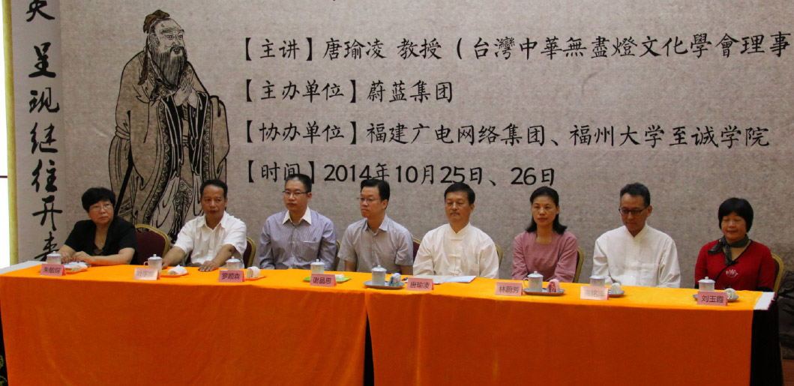

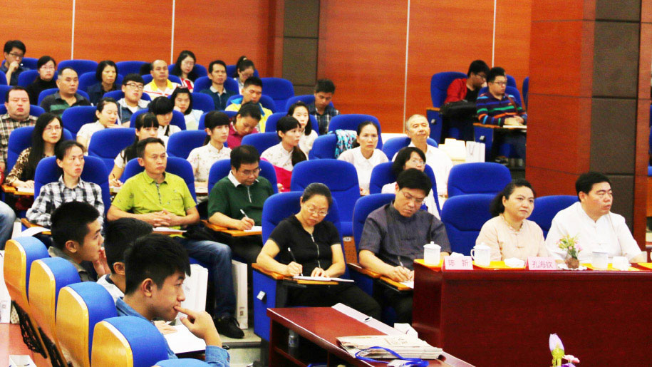

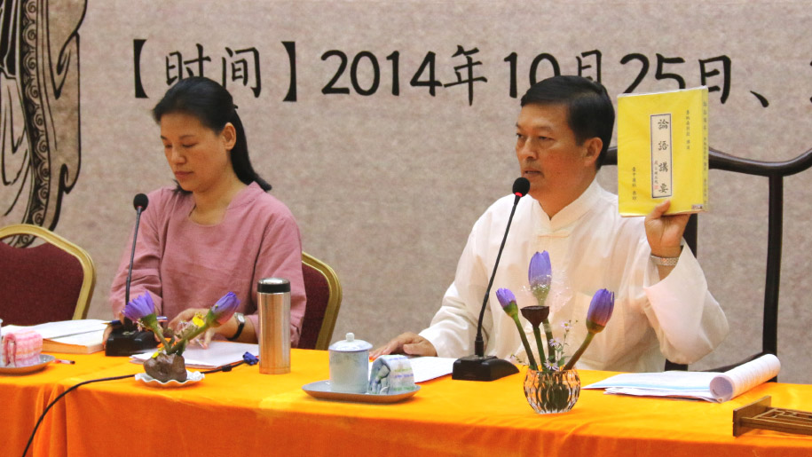

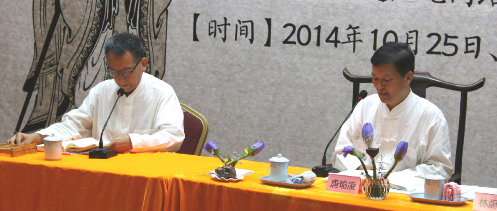

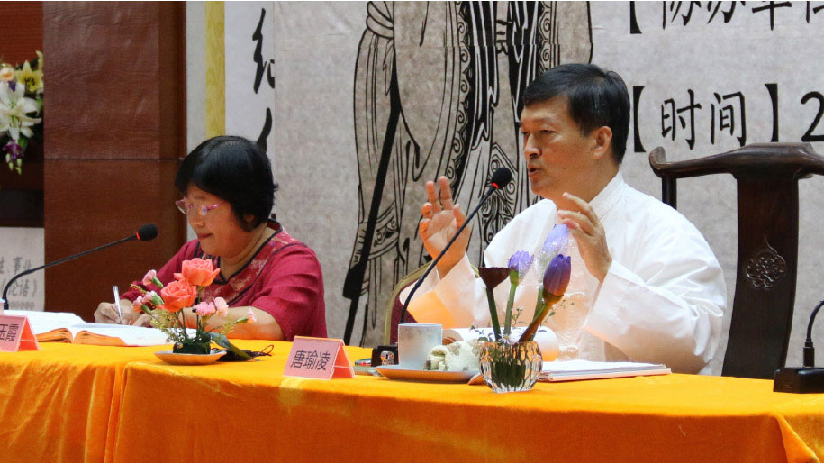

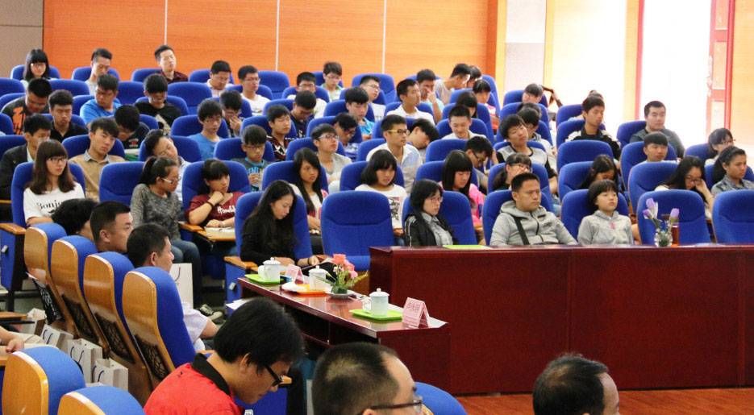

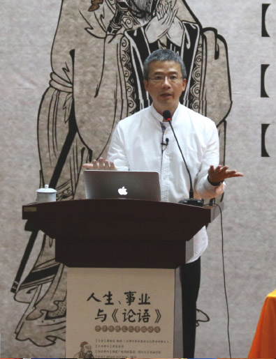

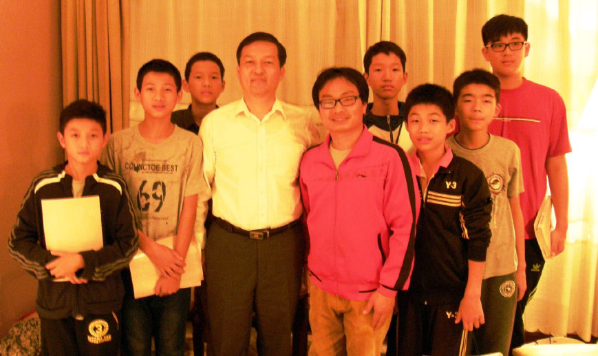

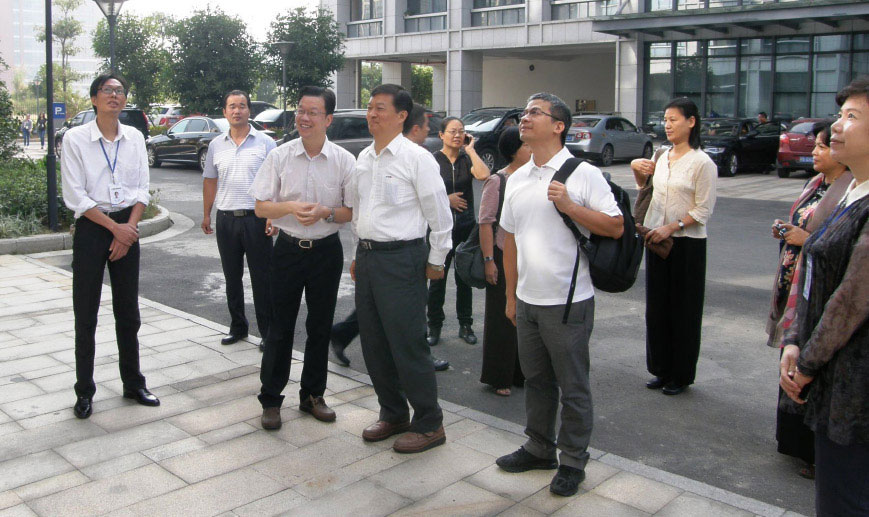
