# 第98期
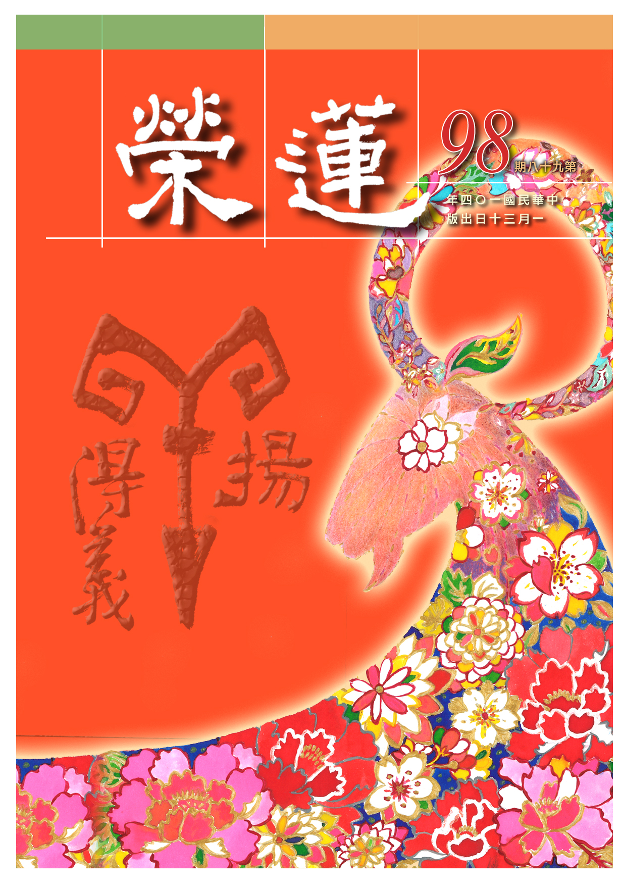

## 社論

### 三羊開泰 ─ 由泰卦說起

本刊

選賢舉能方民主

流弊是非價值亂

文化教育根本道

以德用和真通泰

又是新的一年到臨，每逢開春都會祝福大眾「三陽開泰」，今年更值羊年，「三羊開泰」的祝福語必人人掛在口裏，但「三羊開泰」真正的意涵為何？又是怎麼產生的呢？身為中國人不能不知道。實乃三羊是趣味性的取易經泰卦之三個陽爻諧音為三羊，而進一步取「三陽開泰」的積極涵義，成為中國人開春的祝福語。接下來就讓我們了解真正的三陽開泰吧！

泰卦

是十二月消息卦的正月卦，此卦上面三個陰爻（地），下面三個陽爻（天），叫做地天泰，否卦的反卦就成為泰卦。在十一月冬至時，有陽氣由地底潛發，其卦象為復卦

，是地雷復的復卦。冬至陽生，慢慢的往上生，到十二月時是地澤臨卦

，至正月時，三個陽爻在下面，諧音成三羊，上面的三個陰爻代表地氣上升，下面的三個陽爻代表天氣下降，是天地交融的形象。

泰卦的反卦（旁通）否卦是上面三個陽爻，下面三個陰爻，叫做天地否

，是天氣在上，地氣在下，天地兩氣不相交，是閉塞的，這是七月卦，進入秋天，萬物蕭條。用於人事表徵上下不交、信心不立，共識不生，上令下不從，政局動盪，政不通人不和。

泰卦之卦辭（文王所作）謂之小往大來，是陰爻是小，往外卦謂之小往，陽爻是大，來到下卦（內卦），這叫做小往大來，代表天地相交，表徵人事，是上下相交，共信能生，政通人和，國運昌隆，內卦為陽

，外卦為陰

，乃內健外順，表徵朝中君子能行正直之道，在野之民能順，乃君子道長，小人道消，上下有志一同，故泰者通也。

卦中第五爻應該是陽爻，第二爻應該是陰爻，故泰卦二五失位，三國之吳人虞翻以換爻的方式來處理失位，將泰卦二五爻相換則成既濟卦

，就是上水下火，既濟卦的每一爻都是正位（一、三、五位是陽爻，二、四、六是陰爻），亦謂之吉亨。

此時外卦為坎為志

，互卦（二、三、四爻亦坎）坎，兩坎為上下志，表徵上下心志相通。

泰卦互體（三、四、五爻

）有震，有兌（二、三、四爻

），震表徵春，兌為秋，春崇仁，秋教收斂，二、五易位，成既濟，下卦為離，離為夏，上卦為坎為冬，故夏以長養，秋冬命蓋藏，乃依節令農事而有收成，謂之可以聚養人民。

值此羊年在新春正月三羊開泰的卦相中，表徵天地之氣相交，人事配合天時，當是上下相交，政事的開通，是君子當位的開通，是人民擁護的開通，更應該是國運的開通。

在此祝福大家在新的一年裡羊揚得義！

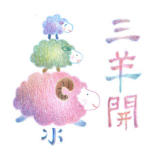

## 大德法語

### 大方廣圓覺修多羅了義經（五十七）

道源老和尚

普覺請問除禪病

親近善友生正見

證空除執觀緣起

二諦從容除四病

乙二、正宗分

丙二、令依解修行隨根證入

丁二、廣明行相

戊二、四問答別明觀行中根修證

己二、二問答二重除障

庚二、依師離病

辛五、正答所問

壬一、長行

癸二、示四病應除

子一、總標徵起

經文：

善男子！彼善知識，所證妙法，應離四病。云何四病？

前述普覺菩薩請問佛在末世魔強法弱時代，眾生要求何等人，依何等法，行何等行，除去何病，云何發心，令彼群盲，不墮邪見？求何等人之問題已答覆清楚了，現答覆依何等法，行何等行，除去何病？佛將這三個問題合起來答。佛說善知識所證之妙法，須是離這四種病(作病、任病、止病、滅病)方能證悟妙法。意即善知識一定知道有這四種病，他只開導你知法，他不會開示你叫你犯病，這四種病也只有《圓覺經》上講，在其他經上講不太具足。

子二、別明行相

丑一、作病

經文：

一者作病。若復有人，作如是言：我於本心作種種行，欲求圓覺。彼圓覺性，非作得故，說名為病。

若復有人名為善知識，實則不成善知識，此人認為要達到圓覺必須要作種種行，這是他自己認為的，也這樣對大眾開示。然彼圓覺性非作得故，所以成了病，說名為病。圓覺性是勝義諦，非世間心識所能證得。

不妨礙於世俗堅持禁戒，也要宴坐靜室，這些謂菩提心所攝，成為大乘的修行，但這些是世俗大乘，所結之果乃人天福報。

儘管去建立寺院、建立寶塔，儘管去造佛像，儘管去供佛齋僧、講經說法，但是要作為修學圓覺性的資糧，以福報作為智慧的眷屬，並作勝義的修學，在證悟圓覺時，是能所雙亡，遠離世俗的心態，亦即圓覺性非世俗心所行境。

丑二、任病

經文：

二者任病。若復有人，作如是言：我等今者，不斷生死，不求涅槃。涅槃生死，無起滅念，任彼一切，隨諸法性，欲求圓覺。彼圓覺性，非任有故，說名為病。

前者觀行成就了，等同與佛所證的勝義境界相同，爾時一切都了不可得，何來受法縛，何來解脫法，何來生死可厭，何來涅槃可愛？但他誤解了經文的義理，他不曉得那是能所雙亡的境界，須是福慧雙修，以慧作種種分別而證入的無分別。

結果向大眾開示「我等今者，不斷生死」，生死空還斷什麼生死？涅槃空還求什麼涅槃？此人不斷生死也不求涅槃，對於生死涅槃沒有厭離欣求的念頭，認為對生死與涅槃都不起念頭，認為就是隨順法性，以為餓了該吃飯，睏了就睡覺，以為這個樣子就可以證得圓覺，此即任病！在永嘉禪師證道歌叫做「豁達空，撥因果，莽莽蕩蕩招殃禍」，此莽盪漢不去了生死，生死永遠在，不去求涅槃，涅槃永遠不能證得。說自己是隨諸法性，其實是隨順貪瞋癡的習氣，永遠當凡夫，盡造惡業，莽莽蕩蕩的。

前述「作」病是執有，此處任病是執空，以為學大乘法門，不要去做一切善事，不要建寺，不要修塔，不要造佛像，不要供佛齋僧，不要講經說法，產生的任病會遭狂魔。

丑三、止病

經文：

三者止病。若復有人，作如是言：我今自心，永息諸念，得一切性，寂然平等，欲求圓覺。彼圓覺性，非止合故，說名為病。

有些以為修「止」，止息一切分別念，就以為證到圓覺(法性)，若不修學般若觀慧如何照見該法空性。

修止(奢摩它)不過是前方便，與世俗四禪八定相同，須是依止修觀方能證得圓覺性。

丑四、滅病

經文：

四者滅病。若復有人，作如是言：我今永斷一切煩惱，身心畢竟空無所有，何況根塵虛妄境界，一切永寂，欲求圓覺。彼圓覺性，非寂相故，說名為病。

永斷除一切煩惱，身心畢竟空無所有，是自體性不可得。然世俗觀待的顯現是有的，而依著世俗建立的五倫關係是要維護的。

子三、結明真偽

經文：

離四病者，則知清淨。作是觀者，名為正觀，若他觀者，名為邪觀。

你能夠遠離作、任、止、滅這四種病，即是修得清淨。修觀能退離四種病，即是正觀，否則就是邪觀。

癸三、辨事師之心

經文：

善男子！末世眾生，欲修行者，應當盡命供養善友，事善知識。彼善知識，欲來親近，應斷憍慢，若復遠離，應斷瞋恨。現順逆境，猶如虛空，了知身心，畢竟平等，與諸眾生，同體無異。如是修行，方入圓覺。

末世眾生想要修行，應當要不惜生命的供養，藉你的生命來供養善友善知識、承事善知識。善知識有時候是你要請求他，他才會跟你說法，有時候是不請之友，會主動來找你說，你這時候不要起憍慢心，還應該慶幸自己有善根，有善友、善知識來找我開示，不要起憍慢心。

善知識若有其他原因要離開你呢？不要動瞋恨心，以為善知識捨棄我了，善知識有他的弘法因緣，他應該遠離就遠離，我不要生瞋恨。

善知識有順境的善知識和逆境的善知識，順境的善知識是教你怎麼樣持戒、修定以及觀慧等等。逆境的善知識是示現犯齋、破戒，以及種種不順的境界，或向你作違緣。

須知順逆境皆無實在的相可以執著，猶如虛空。了知身心本來平等，與諸眾生本來都是同一體性，是沒有差別的相，這樣去修行才能悟入圓覺、證入圓覺。

癸四、明除病之行

子一、明所治

經文：

善男子！末世眾生，不得成道，由有無始自他憎愛，一切種子，故未解脫。

末世眾生修行，但是能成就佛道的很少，什麼道理呢？

因為有無始自他憎愛等一切種子繫縛，故未解脫。憎和愛這兩個煩惱，要起現行必須先有種子，由無始以來我們自己的八識等於一個田地，有一切憎愛的種子，遇到境界就起現行，遇順境就起愛，遇逆境就起憎。

我們學了此經之後，應該防護自己八識裡有憎愛的一切種子，不叫它起現行，若起憎愛等煩惱，就永遠得不到解脫。

子二、明能治

經文：

若復有人，觀彼怨家，如己父母。心無有二，即除諸病。於諸法中，自他憎愛，亦復如是。

這告訴我們怨親要平等，怨家是跟我們有怨仇的人，父母是跟我們有恩愛的人，對於父母應該生起愛，對於怨家應該起憎，我不起憎、不起愛，心無有二，就能遠離諸病。

對於怨家以及父母不起憎、不起愛，如是以此類推。對於一切諸法，不起憎、不起愛，如此觀想。

癸五、顯發心深廣

經文：

善男子！末世眾生，欲求圓覺，應當發心，作如是言：盡於虛空，一切眾生，我皆令入，究竟圓覺。於圓覺中，無取覺者。除彼我人，一切諸相。如是發心，不墮邪見。

這是開示如何發心、發願，我自己要求圓覺必須先發大願，盡虛空的一切眾生，我發願全部度成佛，換句話說就是願一切眾生都成佛，如地藏菩薩所發的願：眾生度盡方成菩提，地獄不空誓不成佛。願一切眾生都入究竟圓覺，願一切眾生都成佛。

對於圓覺妙性不可著相，沒有能取，沒有所取，沒有取覺者，除去一切諸相，將我相、人相、眾生相、壽者相都除掉，如是發心，不墮邪見，遠離我、人一切事相而發菩提心，就不墮於一切邪見。（下期待續）

## 共修研學

### 小止觀導覽（七十）

*心爾、治心整理*

善用正見以運息

身心成就修道緣

容光煥發令生信

功德增廣龍天喜

第九章  治病

論文：

有師言：若能善用觀想，運作十二種息，能治眾患。

一、上息，二、下息，三、滿息，四、焦息，五、增長息，六、滅壞息，七、煖息，八、冷息，九、衝息，十、持息，十一、和息，十二、補息。皆從觀想心生，今略明十二息對治之相：上息治沉重，下息治虛懸，滿息治枯瘠，焦息治腫滿，增長息治羸損，滅壞息治增盛，暖息治冷，冷息治熱，衝息治壅塞不通，持息治戰動，和息通至四大不合，補息資補四大衰。善用此息，可以遍治眾患，推之可知。

若能善用觀想，運用十二種息，能治重病。這十二種呼吸治病，純屬心理作用，以心意的力量運用呼吸，來影響生理，分述如下：

一、上息治沉重

假若患沉重的病，在呼吸的時候，心想此息輕而上升，此乃心與息兩者互相扶持，心運行氣息，氣息使心收攝，心如人，息如馬，乘著風息可治病。心亦能配合息作觀，如：心運氣，氣外吐，可觀想將身心所造之業排出。

上息治沉重之病，像是洩了氣的皮球，一點勁也無。藉著氣吸進來時，給自己打氣，此息觀想輕而上升，且都是佛菩薩的能量，讓我有辦法去做佛菩薩的事業，以上是上息的運用法。

二、下息治虛懸

假若患虛懸的病，感覺頭重腳輕，重心不穩，輕飄飄的，身體好像沒有重心，此時觀想氣往下沉，氣守在丹田或腳下。

息入觀想是佛菩薩的加被，是一股非常穩定的力量，讓心非常安定。且重心往下移，令自己穩重力加大，感覺穩如泰山，安若磐石。

所以覺得頭重腳輕昏昏沉沉，走路像快要跌倒的那種感覺，透過下息的訓練，這種感覺就會消失，此全是心裡的觀想法，是氣作觀，氣亦助成觀想。

三、滿息治枯瘠

假若患枯瘠的病，在呼吸的時候，心想此息充滿全身。枯瘠就是身體很瘦弱、氣虛，身體沒辦法吸收到養分，如臨命終時四大分散，人看起來很乾枯，骨瘦如柴、風燭殘年，像是在狂風中的油燈，隨時會被吹滅，這叫枯瘠病。這時要心想此息充滿全身，讓自己能接受外面的營養，使自己身體強壯。

整個人失去原來的形狀，或者兩眼外凸或者兩頰凹陷，身如骨架。然枯瘠之病苦是業起現行，如《地藏經》或《藥師經》裏面所說，則依此觀想息的修學法亦無用，須好好拜佛求懺悔，並且發大心方能轉大業。滿息之觀想，想氣息吸進來感覺整個人養分充足，如乾枯的稻田忽然受到雨水的滋潤，全部欣欣向榮，綠油油的一片，草木叢生、春意盎然，此為滿息。

四、焦息治腫滿

假若患腫滿(水腫或風大不調)的病，在呼吸時心想此息焦灼其體。

風大不調跟風大充身不一樣，風大充身是心裡面莫名其妙的快樂，身體莫名其妙的舒服，身體的舒服引發心裡的快樂，是修行得力的輕安相。

風大的腫滿相現起時，氣息吸進來就觀想體內的垃圾被一把火燒掉，我們的身體有很多垃圾，或者吃進很多的動物或不乾淨的食物，會讓人感覺到頭脹、身體脹，這些廢物、廢氣等無法排出的垃圾。此時觀想呼吸把氣吸進來將這些垃圾都燒掉，這叫焦息。

應當具備三個心態：

(一)當氣吸進來時將腫滿相、體內的垃圾，如一把火都將之燒成灰燼。吐出去時，就把這些濁氣吐掉。

(二)這些汙濁垃圾都是煩惱業所引起來的，藉著吐氣把煩惱業都去除掉。

(三)吸進來的都是佛加被，希望有情眾生好好修學這樣的法門，讓他們因為煩惱業所形成的腫滿之氣可以消除。

五、增長息治羸損

假若身體患羸損的病，在呼吸時心裡觀想此呼吸可增長氣血。

氣血順的人心力也比較強盛，修學教法的力量也比較具足，在教法上也很能有覺受，所以要將氣血調過來。在吸氣時就觀想佛菩薩的加被讓我們增長氣血，將氣血不足的地方改善。

而氣血不足的病，就是過去氣血充沛時因為造作慾望的業(追逐五欲境)，這一生感應氣血不足。在吸氣時補足了氣血，在呼氣時將煩惱惡業去除，藉著佛菩薩的加被去除這些煩惱業，也希望這樣的教法能夠保留，利益無量無邊的眾生。

六、滅壞息治增盛

假若身體增盛，在呼吸時此息可以滅壞機體，減少肥滿。滅壞息跟焦息不一樣，焦息是指四大不調，滅壞息是觀想好像大水沖進來將肥胖、毒素、體內的垃圾帶出去，類似這樣的感覺。

颱風也能把不好的空氣都吹出去，整個土地就乾乾淨淨，空氣新鮮，滅壞息就是將身體的肥滿、垃圾，透過觀想呼吸就像大水衝進來，再將污垢通通送出去。

七、暖息治冷

假若身體感覺寒冷，心想此息出入時遍身溫暖。暖息可以觀想吸進來的都是熱氣，然後將體內的寒氣逼出去。

體內會發冷，必須要觀想沒有那種煩惱就沒有那種病，要觀想我們以前造作讓別人心寒的業，如說的話讓人心寒，或者做出刻薄寡恩的事，讓別人像是進入寒冰地獄般感覺寒冷，藉著暖息（大悲心的溫暖和佛菩薩的溫暖)來去除我體內的寒毒，趁這機會把寒冰地獄的業也對治了，如果用心作觀，真的可以感得不入寒冰地獄的果報，一切都是唯心造。

八、冷息治熱

假若身體患熱，心想此息出入時遍體清涼。我們的身體為什麼會燥熱到讓我們受不了，跟我們過去的慾火、躁火有關，往昔在地獄裡的火海，或抱銅柱、或被灌熱銅汁，乃慾火、瞋火所感得。這時觀想吸進來的氣，是非常冷的氣，呼出時將熱氣排出，清冷的氣就代表佛菩薩持戒圓滿的涼氣，來除去我身體中的燥熱之氣。佛制戒就是要對治眾生的慾望，使眾生不要發展個人的慾望，不要去造作損人利己的惡業，得到持戒圓滿的清涼。

九、衝息治壅塞不通

假若身體內感覺有壅塞不通的地方，心想此息出入時，能衝過壅塞不通之處，使其暢通。好像水溝被堵住，觀想吸進來的氣如大水般的衝出去，通過淤塞的水溝，全身非常暢快。而身體會有這些鬱結不通的症狀，通常都是在做人處世上，常常愛惜自我，不管他人，所以心思常常扭曲、打結、鬱悶、看不開、放不下，所以感應這樣的症狀，這時要把這種看不開、放不下、愛執自我，以及心中常常打結的業對治，觀想像佛菩薩一樣的暢快，佛菩薩是行也禪、坐也禪，語默動靜皆安然。

十、持息治戰動

假若肢體常有戰慄不寧的狀況，就心想這呼吸的力量能鎮定它。不管台下的程度高低如何，即使面對大菩薩，只要一上台也可以如理而說，這就是菩薩的說法無畏。登地以上的辯才無礙，即使台下坐的都是佛也可以侃侃而談，且如理如法。凡夫則沒辦法，明明是準備好的，面對台下的觀眾腦袋全部都空了，這就是有畏相，乃智慧力不足、善根福德不夠，產生的戰慄相。

戰慄不寧是過去生做了很多的惡業，說話讓人惶恐不安。此時觀想吸氣就是佛菩薩的加被，心安定下來，像佛菩薩那般的安定，將惡業除掉，不論甚麼症狀，觀想呼吸進來就能對治這種症狀。

呼吸是非常微妙的對治法，六妙門就專談呼吸，善用呼吸法可以幫助我們身體健康、心情穩定，而且頭腦會變好、記憶力特別強，遇到事情不容易慌張。好好的講究此種呼吸法，光世間的好處就這麼多，如果跟修法的觀念結合，境界會美妙到難以想像，簡直就是不可思議，呼吸法就能幫助人成就這樣的功德。

十一、和息通治四大不和

假若身心不調和時，就心想這呼吸出入綿綿，能調和身心，使它舒暢。

有時我們心裡想靜下來，可是身體卻在躁動，或是身體靜下來，心卻靜不下來，這就是身心不調的形象，現在很多人的身心都無法配合，明明心中想要表達的是這樣，但說出來的話卻不一樣，事後後悔再向對方解釋，這些都是身心不調的形象。

此時慢慢的將氣吸進來，慢慢的吐出去，並且觀想身心調和，在身心調和的情況下才能夠進入三昧，或者亦可說入三昧後身心最為調和，身體產生輕安，心裡也生起輕安，並生起輕安的快樂。

而讓身心靜下來，是為了要修學正法，修學正法的目的是為了要利益有情，這才是讓身心安靜的最終目的。

十二、補息資補四大衰

假若感覺身體氣血衰微，就心想這呼吸可以滋補身體。

總之吸進來的是諸佛菩薩的加被，吐出去的是塵點劫來所起的煩惱以及所造的惡業；或者吸進來的是有情眾生的痛苦，然後將內心自私的魔毒死，生起證得空性的智慧。若能善用此種觀修法，可以幫助我們生起對有情眾生苦的認知，或是對菩提心的體會。只要善用這呼吸法，身體上的不舒服都可以調整。

呼吸法非常重要，印光祖師說：念佛三昧也可以結合呼吸法來修學。人能夠活命是壽、煖、識三者恆不相離，「壽」是呼吸，「煖」是身上的溫度，「識」是神識，這三者相互觀待，三者共存亡，如果修學念佛法門，每一次的呼吸都在念佛，自然就容易入念佛三昧，因為呼吸是不會斷的，所以念佛也不會斷，就這樣入念佛三昧。

不過如果身體感覺夠了，或者有一點心煩，就暫時停下來。總而言之要善於調整自己，不要硬著修，保持愉快的心情，好樂的心情，如此修行佛法的勢力就不會減弱，退去。（下期待續）

### 菩薩清淨的行持　華嚴經淨行品（十四）

*編輯部整理*

遇境逢緣能用功

心如彌陀六方護

登高望遠心境闊

要為眾生作馬牛

丙二、指事顯因答其徵因

丁一、總徵

丁二、別顯

戊一、明在家時願

己四、在家作事願─昇樓閣

經文：

上昇樓閣，當願眾生，昇正法樓，徹見一切。

菩薩就在上昇樓閣中發願，菩薩及上昇樓閣成為願所依，日用平常遇境逢緣，都可成為佛法的實修，乃善巧佛道之修學者。

能發願的是菩薩，所發願的對象是眾生，眾生可以得到昇正法樓，徹見一切，成就佛的智慧；而發願的菩薩得到成佛的功德。另外一個說法是，當願眾生中亦含發願的菩薩自己昇正法樓，徹見一切。

南亭老和尚的註解中，兩層以上的房屋叫做樓，而有四方六角、飛簷翻角等建築形式謂之閣，上昇樓閣是指正法樓，徹見一切是指登高望遠，俯瞰所有的風景都在眼前，佛法的證量往上提昇，宇宙人生的真相就在眼前，如同讀王之渙的〈登鸛雀樓〉：「白日依山盡，黃河入海流。欲窮千里目，更上一層樓。」當登正法樓往上提昇的時候，所觀察的境界就越來越遠，甚至可以清楚到就在眼前生起，亦即如實觀察宇宙人生真相，並以現量親證。

在東吳所翻譯的《佛說菩薩本願經》中云：若上樓閣，當願眾生，皆昇法堂，受佛諸經。由此段可知正法樓就是講堂，正法的講堂在高台之上，行者可以入講堂受用佛法。

在西晉所翻譯的版本中：菩薩在樓上時，十方人皆上佛經講堂上，皆受諸經無有餘等者。換句話說是觀想進入佛的講堂聽受佛法。世間學問是無法與佛法相提並論的。六十華嚴中：若上樓閣，當願眾生，昇佛法堂，得微妙法。

總結此段不論是入樓閣、正法樓（佛堂所說的佛經）、進法堂等，都是指聽聞正法，才是佛法實修的第一步，是了解宇宙人生的真理。

己四、在家作事願─有所施

經文：

若有所施，當願眾生，一切能捨，心無愛著。

布施可分為財施、法施與無畏施，財施分為外財施（無情的財物、物質等以及有情的眷屬等）、內財施（身與心）；法施即是給予眾生正法，令其觀念開通，生起因果或空性的正見；無畏施可分為二，或因為你的施，所以對方不恐懼，或將你的不恐懼施予對方，令他平靜面對恐懼，並脫離怖畏。

在一切能捨當中，菩薩是能捨一切的聖者，而登地菩薩的修學法，就是成就即使捨棄頭目腦髓，仍不恐懼且歡喜的證量。

平常如果作這樣的練習，到往生必須要捨離自己的身體時，面對這樣的境界就不會害怕，而且心裡面不會愛著。捨是給別人自己珍愛的東西，而自己東西很多，給予別人叫做結善緣；把自己不要的東西給別人，這叫做清垃圾！以上都是我們在行布施業時要注意的。

此願是登地菩薩的修學法，在施的當下立刻生起歡喜心，這是登地菩薩的能耐，而且生起的歡喜勝過阿羅漢證入涅槃時的快樂。這樣的快樂凡夫是看不到的。

南亭老和尚的註解，最後要我們對治的就是愛我，就是破除我、法二執。布施是菩薩行之一，並不會破愛我的心，愛我的心一定要以我為觀察，在定中沒有看到我，才能夠破愛我的心。

必須要從各種面向來看布施，讓這一法成為我往生與成佛的資糧，令我能親近善知識且有道糧護持聖教。

東吳支謙的版本是：布施所有，當願眾生，興福救之，莫墮慳貪。此處是說一切能捨，將福報興起來給予眾生，不令菩薩與眾生墮入慳貪的深淵中。

西晉道真和尚的譯本是：菩薩布施時，心念言：「十方天下人皆使諸所有但欲施與人，無有貪愛者。」六十華嚴云：布施所珍，當願眾生，悉捨一切，心無貪著。將所珍愛的東西拿出去才能成立為布施，一切所珍愛的東西都能捨去，得到心無貪著的成就，入根本位時，將布施當做現證空性的資糧，後得位在利益有情時，由根本位的空性智慧以及菩提心的攝持，令所行布施生起大福而不生愛著。

己四、在家作事願─眾會集

經文：

眾會聚集，當願眾生，捨眾聚法，成一切智。

菩薩在眾會聚集的時候，就當下發願，能願的是菩薩，所願的是眾生，眾人的聚會有它的方法，而聚會的方法攸關於領導者的品德、學問等，而僧團的眾聚法就是六和淨（身同住、口無諍、意同悅、見同解、戒同修、利同均），不論是世或出世間的事業，都要大家一起做，一個人是辦不了事業的，連佛都必須要度五比丘而成立僧團教化眾生，這是人生當中最有意義的。

會性法師說，當成就一切種智（佛的智慧）時，以空性的智慧破所知障，在眾聚當中通達一切法自相空，那是佛的證量，指的是在任何的聚會當中，同時能夠證得空性的那一分，這是佛的成就；但在世俗上不可以捨眾聚法，眾聚法的自相雖不成立（捨眾聚法），可是眾聚法在名言上是可以生起的，並且要如理如法好好的生起。

東吳以及西晉的版本皆無此段經文，六十華嚴：若在聚會，當願眾生，究竟解脫，到如來處。由此段的翻譯，可以知道如來處，是由眾聚所成就的，眾聚的自相是不可得的，但是必須要由眾聚去成就殊勝的事業。

如此可以知道經文真正的含意，此段經文不可以解成在家裡獨修，《論語》也說：「獨學而無友，則孤陋寡聞。」可見眾聚法是非常重要的。連孟母都尚且要三遷，使孟子在好的眾聚環境中學習。另外一個例子是劉邦本來喜歡戚夫人，要傳位給趙王如意，可是看到張良等老臣都與劉盈（惠帝）交往，劉邦就知道應該要傳位給惠帝，可見眾聚法的重要處。（下期待續）

## 專題研學

### 大乘百法明門論簡說（六）

*心超講述、淨本整理*

經義導向二無我

造論宗旨亦復然

有情通達此義趣

如來出世真本懷

陸、如世尊言 ─ 一切法無我

本論分為兩大架構，

第一、初承聖言以標宗：

承接釋迦牟尼佛之聖言，以作為本論之宗。亦即本論所要論述的即是聖言：「一切法無我。」

第二、後設問答以明宗：
作者用自問自答的方式來明一切法無我之宗。初舉百法無我合
**問：** 將「何謂一切法？云何為無我？」兩者合問。後列百法無我分
**答：** 回答則分段回答，先明什麼是一切法，再回答什麼是無我。整部論文的大架構如此，詳細分明。

論文：

如世尊言

本論之宗「一切法無我」，乃世尊所說，謂之「如世尊言」。論主天親菩薩於本論所要表述的，即是依據佛的聖言量：一切法無我，作為發起本論的因緣。

其實所有的菩薩造論都是根據佛說，例如《瑜伽師地論》、《中觀論》、《現觀莊嚴論》，都可以說如世尊言，謂之述而不作。孔子時常引用《書經》、《詩經》等內容，可見是忠於六經的一個講述者。能夠忠於聖人的聖言量來闡述之，就能找到自己的出路，用自己的才能去利益有情，如此各行各業都是如世尊言，世尊言是所有職業的核心，是所有職業的中心思想。

世尊二字是佛的通號，佛的通號有：如來、應供、正遍知、明行足、善逝、世間解、無上士、調御丈夫、天人師、佛、世尊。世尊是總說，其他十種通號是別說，亦即十種通號都是世間所尊貴。十方諸佛都可以叫做世尊，眼前特別指釋迦牟尼佛。

世尊之所言，何以謂之聖言量？「量」唯有現量、比量，二量決定。例如佛說現事，吾人可以現量方式通達。佛說隱密之事，例如無常跟空性，我們能以比量通達。亦即透過推比量度能知佛所說無妄，此即世間真相，以見真相的方式，淨除輪迴的繫縛，得到真實之樂。

當佛以現見因果關係，並以聖言量闡述因果時，吾人能以此聖言量為比量，來推度種何種因得何種果，果是由因而來，雖然因生果，但由果推因是極不現見之事，此中藉由聖言量作為自己的信許比量時，能通達因果不爽，而能慎因畏果。

論文：

一切法無我

萬事萬物都叫做法，無論是物理、生理或者心理等現象皆屬之。何謂無我？「我」就是指自體性、自主性、自成立性、實有性、真實性，都統稱為「我」。如世尊言：一切法無我。乃佛所說隱密之事，眾生能以勢力比量，通達一切法沒有自體性。舉例言之，不鏽鋼杯是透過鋼鐵的鍛鍊，火燒水洗，加熱處理，最後成型的東西，有盛水的功能，方名為杯。乃指有此作用而安立為杯，若有破洞無法盛水則不名為杯，萬法皆是觀待作用假名安立而成，自體成立之法連一粒微塵亦無，換言之，只有作用而無實體法。

一切法無我，是論主所要發揮的中心思想，在每一法中通達無我的真理，即是本論的重點所在。如果不能領會無我的義趣，遇境逢緣不能觀察分析其我性不可得，即使對本論名相如數家珍，倒背如流，也只是說食數寶。

兩種我執

凡夫認為一切法有我，無數劫來存在著濃厚的人我執與法我執，必須從所執的我，以正理分析是否有自體性之我，除此之外別無他法。如同天黑時有一條毒蛇跑進家中，家裡東西很多，以至於找不到牠。到了晚上睡覺，雖然不斷告訴自己沒有毒蛇，但還是有毒蛇存在的感覺，心中陰影都在。除非把燈全部打開，認真仔細去找，確定都沒有毒蛇的時候，才可能安心關燈睡覺。修行人每天一直說看破、放下，如果沒有按照邏輯推理去分析有我還是無我，如何會確定到底有我還是無我，若有我見怎麼可能放下？沒有放下要怎麼自在？說自在只是戲言而已。

人我執

人我執之行相是有情眾生執著生命體有實有之我，所執唯我耳。又可分為分別執及俱生執，俱生執還有粗細之分。首先說明分別執，必須是受宗派見的影響，才會有分別執，例如執著有一個常一自在的靈魂我在身體裡面，死後靈魂出竅。過去印度某些外道，就認為有一個靈魂躲在體內，身體又為受苦的根本，所以只要把靈魂逼出體外，即可超脫。因此他們修種種苦行，就是要把靈魂從身體拉開。問題在於並沒有所謂實體的靈魂，該如何與五蘊分開？如此苦行，只不過是一場戲論。

其次何謂粗相的俱生執，也就是認為有一個能背負五蘊（色、受、想、行、識）的我（獨立實有我）。我成為能，五蘊成為所，我是背負五蘊的人。五蘊之色是身、受想行識是心，宛然有一個我在主宰身心，我可令身體做各種動作，也可令心想像與作各種計劃等，我如老闆，身心如伙計。然而若此我有實體，在五蘊之外應可指陳，然實無可指陳，所以並沒有這個能背負五蘊的我存在，以上是粗相俱生我執。

若是細相的俱生我執，是以五蘊為我，身心互相依靠無法分開，身生起作用是因為有心之作用，心能起作用也是因為有身為所依，直接緣著身心說我，這樣的人我執最為微細，與生俱來，不待他教，連動物也不例外，這才是最難破的人我執。但試問，如果有這個我，為何顯現的是色受想行識這五種差別相？五種差別相怎麼會是一個我？應該有五個我才對。進一步分析，身體有手腳的差別相、有四大的差別相，感受當中還有苦、樂、憂、喜、捨，即使苦受也有多種苦受，因為逆境各個不同，樂受亦然，如此則身心各種差別相都說是我，我應成千上萬。

再則，若身體是我，心應該不是我，因為身跟心不同，任何人都知道「我今天心情不好」，跟「我今天身體不舒服」不一樣，為何可以對著身說我，也可以對著心說我？由此可知，所謂的我，只不過是在五蘊和合上安立的名言而已，不是真實有一個我存在。不過依作用而安立我如何、如何……。此之名言我不須破，乃世俗上的顯現，然實體我必須成為所破。凡夫都妄認有一個真實的我，一個不可被侵犯、不可被污衊的我，然而本來一個如須彌山堅固般的我，居然不堪邏輯的思維去尋覓，經過分析辯證後，尋覓這個實體之我，竟然空空蕩蕩的找不到，所執之我無，能執之心如何會生。

再以一、異的推論法來分析實體我無。請問前我、後我是一還是異？例如昨天的我與今天的我是一或者是異？一與異排列組合有四：是一、是異、是一是異、非一非異。然一與異(非一)是正相違的兩法，可以包含一切。前我與後我若說是一則非異，若說異則非一，因為一與異已經涵蓋一切。因此前我與後我不是一就是異，如果是一，前我與後我為何還能區分前後？前我如果是天道，後我也應該是天道，前我年輕，後我也應當年輕，一故。如果是異，就變成有兩個我，二者無關，所以前我造善，後我不應得樂，前我造惡、後我也不應得苦，說前因後果應成無用。前我與後我若有實體，二者不是一就是異，然一與異皆不可得，實體我如何可得？所言之我不過名言安立，前我、後我只是名言上的關連。

法我執

法我執，就是在執世間萬事萬物都是實體之法。例如花就在那裡成立為花，是個實法。然而如果我們從電子顯微鏡下觀察，花不過是很多顆粒的組合，並不是真實有一個花存在。組成後在人的眼識上呈現花的作用名言安立為花。花呈現令人悅意的相也無自體性，若有悅意之相何以有人看了花會感傷，要配合人的心情。如杜甫的《春望》：「感時花濺淚，恨別鳥驚心。」他看花在濺淚，是因為身處逆境，連花都彷彿同情苦難之人的遭遇，感受亂世而濺淚。

又如一陣春風吹來，身強體健的人感覺很舒服；身體柔弱者感到寒冷，風也沒有自體性，萬法皆是如此。一頓豐盛美食，惡業生起的人無法受用；善業生起的人吃得很愉快。所有現象的生起，唯有善業生起才能以快樂去納受，惡業生起則納受痛苦。例如賺了很多錢，惡業去納受時，錢會帶來很大的痛苦，用善業納受它，則會帶來快樂。親情在善業納受時是天倫之樂；在惡業納受時變成冤家聚頭。諸法唯名言安立，沒有自體性，而所謂的名言，是指因為過去所造諸業的影響，對事物所產生的認知。

再舉貪心為例，貪心這一法也沒有自體性。修行應該如何破貪？必須尋覓所貪的對象不可得，才會破貪。每一個人所貪的對象都不同。有人貪財，但應知一張千元大鈔，其實是國家的運作、市場的供需、央行的干預，才賦予它一千元的名言，我們卻生起實體存在的感覺，萬法的實體性其實不堪分析，離開國家、市場，錢如何成立為錢？也有人對色說貪、有人對名說貪、有各種千奇百怪的貪，有的很粗俗，有的很細膩，統一安立名言為貪，藉以說明這些千奇百怪的差別相。單一種類可以稱做貪，整體的貪也是貪，於是可知，貪心只是透過一個名言，去攝持許多的差別相，統稱為貪，毫無自體性可得。進一步論，貪若有自體性，表示貪永恆不變，應該逆境也可以生貪，隨時都有貪，然而事實上並非如此。

因果這一法也是自體空，只是名言上所安立。因是對著果才說因，否則不能安立為因；果是對因說果，沒有因則不會有果，此稱為能所觀待。除此之外，過去所做的善業已經成為滅法，已滅的業、已滅的因怎麼會有自體性？有自體性怎麼會滅？已滅的業，剩下的只是關連性而已，所生之果又如何有自體性？例如在海灘上撒下魚網，再把魚網拿走，魚網已滅，但沙灘上仍有網痕，網痕跟魚網有因果的關連性，實體的因果關連了不可得，所關連的不過是名言而已。

經過上述人我執、法我執的分析，應知人我、法我的區別。試問執著身體是人我還是法我？舉例言之：「我的身」。這一句話當中，「我」是人我，「身」是法我。執著有實體的我，稱為人我；執著身體實有，叫做法我。身體也是自體空，因為身體不過是器官、組織、系統等等的組合，發揮了行住坐臥的功能，而安立名言叫做身體，離開頭、手、腳等，無法成立身體；身體也不等於頭、手、腳，不過是這些的組合相，這些差別組合，安立總相名言說我，所以有人打我的腳，你也可以說：怎麼可以打我？怎麼可以傷害我的身體？可見身體也只是組合當中的名言安立，無有自體性。

我們眾生都是被我所蒙蔽，以為有自體性的我，令我愛則生貪，令我苦則生瞋，由愛與恨又生各類的煩惱。

兩種無我

以上說明了人我執與法我執，也同時解釋了破二種執著的邏輯推理方法。在中觀宗認為，破人我執與破法我執的方法相同。人我所執的是人我實有，法我所執的是法我實有。人我的實有不可得，破人我執，稱人無我；法我的實有不可得，破法我執，稱法無我，此時才能破盡煩惱障，剩下所知障。所知障是煩惱障所遺留的習氣，不會產生煩惱。在唯識宗則認為要先破人我執（即煩惱障）、再破法我執（即所知障），這是兩宗最大的差別所在之一。（下期待續）

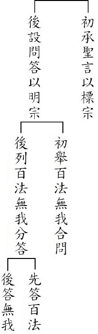

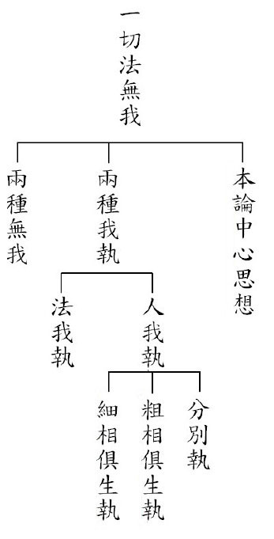

## 蓮池海會

### 巫四城老居士往生見聞記

*德化整理*

苦難遍輪迴

菩薩大悲境

一念彌陀佛

眾怨悉退散

巫四城老居士，民國十九年生於臺中市東勢區下城里鄉下，享年八十又五，兄弟姐妹共二十一人，居士排行第十二，自幼聰敏好學，學業成績總是名列前茅。課餘之暇常常跟隨父母、兄姊幫忙做農事及家事，從小就很勤奮。

二十歲結婚，婚後育有二男一女。二十三歲起先後在各地木材行擔任現場檢查員、木材收發員、領班，由於先生做事認真負責，辦事能力強，深得長官器重，最後被提拔為工廠主任。

正當事業有成達巔峰之際，不幸於三十七歲那年，因為意外，遭受重度燒燙傷，須長期出入醫院手術治療，一次次的植皮，希望能使傷口復原，恢復健康，但耗盡積蓄極力治療，身心也受盡折磨與煎熬，上天還是不從人願，治療效果不彰，無法恢復健康，以致雙目失明，左手殘廢。

居士正值英年，遭逢變故，從此生活在黑暗中達四十八年，起初生活起居極不方便，無法適應，曾先後三度想不開而輕生，所幸都被救回，在三度起死回生中，先生似乎體悟到子女年幼責任未了，從此堅強認命的活下去。儘管生活自理極端困苦艱難，但仍咬緊牙根，自行摸索，除非萬不得已，儘量不麻煩家人。

手術治療期間，由於花光積蓄，家庭陷入困境，子女又年幼，雖然得到親朋好友接濟，社會各界善心人士慷慨解囊，但為了節省開支撫育子女，居士也極力省吃儉用，曾經連續三年未吃中餐。

事發當時，長子炳輝就讀初中二年級，次子炳坤就讀國小六年級，長女阿梅就讀國小三年級。

為了照顧住院的居士，長子炳輝不得不輟學，待居士出院後，再到工廠上班，賺錢貼補家用，退休後即留在家裡陪伴並照顧居士。

次子炳坤長大就讀臺中師專，學雜費、食、宿皆完全免費，畢業後，擔任教職，婚後育有一男一女，家庭美滿，夫妻合力照顧居士，孝順有加。

長女阿梅豐原高商畢業後，先後擔任國小代課教師、東勢地政事務所雇員，婚後也育有一男一女，家庭幸福。

由於事故發生時，得到各界的救助，子女一一就業後，家庭經濟情況逐漸好轉，先生便開始回饋社會，每年固定捐款給家扶中心幫助貧困兒童；對家人也關心備至，時時詢問家人的工作情形；也常囑咐子女要多做善法，認真工作，與人廣結善緣，給人方便，救人之急；還有每當聽到小貓咪的叫聲時，會立刻交代家人，拿事先買好的貓飼料餵貓，這都是居士飲水思源、對子女教導有方及慈悲的展現，也是他往生的資糧。

居士身心受創後，除了眼睛每天要用生理食鹽水沖洗、消毒、擦眼藥膏，又由於先前皮膚植皮導致皮膚乾燥，全身奇癢無比，必須擦藥膏止癢，但早期醫藥缺乏，藥膏不敷使用，常癢得受不了而用手抓得皮破血流，甚至脫光衣服衝到浴室沖冷水止癢，看他受苦，也讓家人難過得束手無策。

居士由於長期無法正常的活動，加上歲月不饒人，年紀漸老，體力漸衰，健康也慢慢地出問題，各種疾病相繼發生，困擾他數十年，尤其當年因為植皮的後遺症，導致左大腿的傷口，逐漸擴大而變成皮膚癌，需再做治療皮膚癌的植皮，又一次的折騰再折騰，期間也因為各種疾病的引發，還動了五次手術。

居士由於病痛纏身，必須長期服藥，所受的痛苦煎熬，實在無法形容。所幸子女極為孝順，照顧的無微不至，居士也生性樂觀，個性堅強，勇敢面對，最重要是次子後來學佛，不斷替他做善法、放生，雖然原本反對兒子吃素念佛，但藉助蓮友的拜訪，多方引導，善巧方便為其開示宇宙人生的真相，極樂世界的莊嚴殊勝，阿彌陀佛的四十八大願，以及念佛往生的利益，居士也逐漸釋懷，願意念佛，從此佛號不斷，還會念給兒子聽，並問兒子他哪裡念錯了，而且心開意解的每天跟兒子說，他今天又念了多少時間的佛號。

居士原本用客家話念佛，但在往生的前一晚，竟然會跟著念佛機，用國語唱起佛來。居士原本排斥念佛，到後來竟然歡喜念佛，讓人覺得佛力真是不可思議啊！也由於居士每天佛號不斷，感應臨命終時正念分明，無病痛而壽終正寢，並得到蓮友的助念，如理如法的辦後事，讓鄰里有喪盡禮、祭盡誠的教化感受，這都是居士善根福德的感應、佛力的加被。相信老居士已苦盡甘來，蓮花化生，往生極樂世界，願老居士蓮品高升，速證菩提，再回入娑婆度有情。

### 陳鐘茂老居士往生見聞記

*德化整理*

苦盡甘未來

一生酬償業

臨終念佛去

如夢一筆勾

陳鐘茂老先生於民國二十二年在東勢鎮中科里大灣出生，一百零四年一月十三日壽終正寢，在家高齡往生，享年八十有二。老先生從小因為家境困苦，沒讀過書不識字，但非常勤奮節儉，處處惜福愛物，又待人親切，是個令人尊敬的長者，也是子女心目中的好父親。

老先生一生歷盡了滄桑困苦，凡是老一輩的人所受的苦他幾乎都受過，「窮困」對他而言像是一句座右銘，不但沒被打倒，反而愈挫愈勇，磨練出堅韌不拔的精神。早期為了生活，哪裡有工作就到哪裡做，只要能賺錢養家，任何工作都在所不辭，舉凡採梅、採茶樹籽、鋤草…等等，各種雜事都樂意又認真的做，曾經開鐵牛車到山上採梅子，牛車翻覆壓壞右腎，過幾天，還是照常工作，在子女的記憶中，不論刮風下雨或是豔陽高照，父親都出門工作，不但辛苦的工作，甚至連生病的權利也沒有，生病感冒照樣出門不休息。

老先生婚後與妻子胼手胝足努力奮鬥，靠著他勤儉持家及精明的理財，雖然歷經五次搬家的波折，最後總算從無到有白手起家，建立了一個屬於自己的家，不但讓家人體悟出有個固定又溫暖的家，是何等的重要，也讓家人對家更珍惜更感恩。

老先生平常教育子女身教重於言教，一件衣服穿破了縫縫又補補，穿壞的拖鞋也捨不得丟，卻習慣舊鞋的舒服感，只為了節儉惜福愛物，為了以身作則。如今五名子女個個成家立業，都有一個幸福的家，也都能秉持父親的教導勤儉持家。

好不容易到了子女有成，老先生可以放下擔子安享晚年之際，卻因中風加上年老體衰，免疫力差而得帶狀性皰疹，併發蜂窩性組織炎，吃西藥治療，卻手腳腫大，苦不堪言，還好女兒知道阿彌陀佛的殊勝，持名念佛求生西方可得究竟的離苦得樂，力勸老先生念佛，並在榻前陪他念，而讓老先生在臨命終得到蓮友的助念，靠這一句無量光、無量壽的阿彌陀佛洪名，讓老先生生前所承受的病痛苦楚一掃而光，臉部像是睡著般的祥和，身體讓人無法想像的柔軟，呈現的瑞相讓子女內心感到無比的欣慰，因為阿彌陀佛的慈悲攝受，也讓子女深深地相信佛號的不可思議。

相信老先生現在一定很高興，因為宿世的善根福德現起，才有因緣得聞佛名並念佛往生西方，在西方所住的是七寶所聚成的樓閣，而且思衣得衣，思食得食，無有眾苦但受諸樂，越享受越修行，從此不必再受生老病死之苦，又能和諸上善人聚在一起，壽命也無量，這在娑婆世界是想像不到的。

惟願老先生的示現，讓見者聞者體悟娑婆之苦及無常的迅速，早備往生資糧，更願老先生在西方淨土安養，能速證無生法忍，成就佛果。

## 孔學一隅

### 論語簡說（六）子貢生平簡述（下）

*時哉講述、傳儀整理*

一生才情高材生

獲殖能障聖道法

舉一反三億履中

廬墓六年見真情

子貢見地

見地是對人生、宇宙環境具有決斷性以及正確的價值觀、思想體系與見識，我們可將子貢見地分成能知聖德、能揚聖德和依禮知吉凶禍福三個部分。

一、能知聖德

《韓詩外傳卷八》，子貢答齊景公讚夫子
齊景公問子貢說：「先生的老師是誰呢？」子貢回答說：「是魯國的仲尼。」齊景公
**問：** 「仲尼是位賢者嗎？」子貢回答說：「他是位聖人，何止是賢者？」
齊景公笑著
**問：** 「他的聖德如何呢？」子貢說：「不知道。」

齊景公生氣變了臉色說：「一開始說他是聖人，現在又說不知道，究竟是什麼意思？」

子貢說：「微臣一生頭上都頂著天，不知道天有多高；一生腳都踏著地，也不知道大地有多麼廣厚。假使微臣侍奉仲尼，就好像渴的時候拿起水壺和勺子，到長江和大海飲水，將肚子喝飽後就離開了，又哪裡知道長江和大海有多麼深呢？」

齊景公說：「先生對於仲尼的稱譽，是否有點太過了吧？」

子貢說：「微臣哪裡敢說太過分的話呢？還擔心說的不及實情呢。微臣讚美仲尼，就好像兩手捧著土，將它附著到泰山上，泰山不會因此而變得較為雄偉；微臣不讚美仲尼，就好像用兩手從泰山上扒些土下來，對泰山也不會有什麼損失。」

齊景公說：「真好啊！真的是這樣嗎！真好啊！《詩經》上說：『連綿不斷聲勢壯盛，無法推測也無法勝過。』」

二、能揚聖德

《史記貨殖列傳》，助夫子名聲揚於天下

孔子的名聲所以能布滿天下，要歸功於三人：子貢、冉有、司馬遷。子貢在夫子在世時或過世後，反覆傳示孔子的正道給世人認識，這就是所謂得到子貢情勢(或形勢)上的幫助，而使孔子名聲更加顯著呀！

冉有則是因魯哀公十一年，率領魯國對抗齊國，打了勝仗，季康子因而問其軍事本領是天生的？或是學習而來？冉有答學於孔子，並說服季康子以重金禮聘、光榮地將孔子迎接回到魯國。司馬遷於〈孔子世家贊〉中，引《詩經•小雅•車轄》中的詩句，讚歎孔子：「高山仰止，景行行止」，將孔子視為聖人中的聖人。

三、依禮知吉凶禍福

(一)《左傳》定公十五年，觀邾隱公朝見魯定公，依禮知吉凶禍福

魯定公十五年春天，邾隱公到魯國來朝見，子貢在旁觀禮。邾隱公拿著玉高高地舉起(仰著臉)；魯定公低低地接受玉(俯著臉)。子貢說：「用禮來看待這件事的話，兩位國君都有即將死亡之相。禮，是死生存亡、吉凶禍福的本體，舉止或左或右，或揖或讓，或進或退，或俯或仰，可從其中選取判定；而朝會、祭祀、喪事、戰事，也可從禮上觀察得知。現在正月兩國互相朝見，卻都不符合禮的法度，說明兩位國君的心裡已經沒有禮了、已正朝向敗亡之路。朝會這樣美好的事不合於禮，兩位國君又怎麼能夠久長呢？邾隱公姿態高仰是驕傲的表現；魯定公低俯是衰微之狀。驕傲則接近動亂，衰微則接近疾苦，魯定公是主人，大概會先死吧！」

同年夏天，定公果然先亡，孔子說到：「不幸被子貢言中，子貢太多話了。」

(二)《左傳》哀公十六年，預言魯哀公不得歿於魯

魯哀公十六年夏天，孔子死。魯哀公致悼辭說：「上天待我不仁呀，不願留下一位國老給我，讓他保護我，使我一人居於君位，孤獨無依地處在憂愁焦慮之中。嗚呼哀哉尼父(對孔子的尊稱)！我沒有可做為自己效法的榜樣了。」子貢說：「國君大概不能在魯國善終吧！夫子曾說：『禮儀喪失就要惑亂，名分喪失就有過錯。失去意志是惑亂，失去身分是過錯。』活著不能任用，死了又致悼辭，這不合於禮；自稱『一人』，這不合於名分(因為魯哀公非周天子不可如此自稱，此為僭越)。國君兩樣都喪失了。」

哀公失禮、失名，子貢斷其「不得沒於魯」。十一年後，哀公想藉諸侯之兵以去三桓，至越請師，終於客死。這又應了子貢的預言。

(三)《禮記檀弓上篇》言「喪夫子若喪父而無服」

孔子亡故後，門人無法決定該穿哪一種喪服，問於子貢。子貢說：「以前夫子在顏淵亡故時，像死了兒子一般哀戚，但沒有穿喪服(服心喪)；子路亡故時，夫子也如此。現在就請大家對於夫子亡故，像死了父親一樣悲痛，但沒有穿喪服吧！」子貢於是要同學們依老師為顏回、子路服心喪的行誼而行，這顯示出子貢的見地。

子貢經商

一、善於賺錢

(一)《史記貨殖列傳》

子貢曾學於仲尼，離開後到衛國做官，以囤積和買賣的方式(廢著鬻財)，經商於曹國、魯國之間。孔子七十多個學生中，以子貢最富饒有錢。

(二)《史記仲尼弟子列傳》

子貢善於做生意，隨著時節供需的情況來轉手獲利(好廢舉，與時轉貨貲)。他愛宣揚別人的長處，卻也不隱匿人家的過失。不只一次幫助魯、衛兩國解除困局。擁有千金財產，晚年死在齊國。

二、善於用錢

(一)《史記貨殖列傳》

子貢坐著四馬並轡齊頭牽引的車子，帶著束帛禮品，到各國訪問，接受諸侯們的聘問宴請。所到之處，各國國君皆對他只行賓主之禮，不行君臣之禮(表以平等之禮相待，平起平坐)。

(二)孔子周遊列國一應所需，幾乎都由他供給。

例如：魯哀公四年(西元前四九一年)，吳國軍隊攻伐陳國，楚國出兵援救陳國，駐紮在城父。聽說孔子在陳國、蔡國之間，楚昭王派人聘請孔子。

孔子準備前往拜見回禮，陳國、蔡國的大夫惟恐楚國重用孔子以後，將危害他們，於是就共同調發士兵將孔子圍困在野外，以致斷絕了糧食。

孔子受困於陳、蔡之地，跟隨的人七天吃不上飯。子貢拿著攜帶的貨物，衝出重圍，與村民換得到一石米。

後來，隨從的弟子仍然疲憊不堪，餓得站不起來。於是孔子派子貢到達楚國。

楚昭王興師動眾迎接孔子，孔子得以脫身。子貢不但找來了救兵，也賣了一批貨物，讓老師與同學們在途中一解困頓，風風光光的前往楚國。

由此可知，子貢是一位有福的人，福蔭後世，至今端木氏子孫傳有八十八代，如東吳大學前校長端木愷，是子貢的後代。

三、結讚

由《史記貨殖列傳》演變而得的商店對聯：「經商不讓陶朱富，貨殖何妨子貢賢」，前句指子貢賺錢經商絕對不輸陶朱公范蠡，未免俗氣；但下一句指子貢賺錢、用錢皆有道，實為商道的代表人物，一般人經商何妨像子貢那般賢能，此言高明。

子貢識人（論師兄弟）

《孔子家語弟子行篇》品評十二同門，夫子笑笑相許

子貢在衛將軍文子的一再要求下，始對其師兄弟的德行，略加評介。而子貢既然已經和衛將軍文子說了，到魯國拜見孔子時說：「衛將軍文子向我問其他師兄弟們的德行，不只一次而是三次，我婉言謝絕了，可是沒有得到他的同意，只好就我所親眼目睹的告訴了他，不曉得是否說對了？請您告訴我。」孔子說：「你說說吧！」子貢便把他對衛將軍文子所說的情況，告訴了孔子。孔子聽了笑著說：「子貢，你在排列人物的先後次序啊。」子貢回答說：「我怎敢談得上知人哪！這是我所親眼看到的。」孔子說：「的確如此。」

子貢善學（好問而學）

《孔子家語辨政篇》由夫子之答齊景公、魯哀公、葉公而問政

子貢問孔子說：「從前齊景公請教您該如何辦政治，夫子說：『辦政治的要點在節省財用。』魯哀公請教您該如何辦政治，您說：『辦政治的要點在教育臣下。』楚大夫葉公請教您該如何辦政治，先生說：『辦政治的要點在使近者喜悅，遠者來歸。』三個人問的是同一個問題，而您回答得如此不同，難道辦政治有不同的要點嗎？」

孔子說：「因為各有不同的情況啊。齊景公治理國家，亭臺樓閣建築得太奢侈了，打獵時所圈的土地太大了，聲色之好，沒有一刻停止過。一個早上就賞賜了三個能夠容納一千輛車子的采邑，所以才說：『處理政務在於節省財用。』魯哀公有孟孫、叔孫、季孫三個權臣，他們在國內結黨營私，以愚弄其君主；在國外則抵制別的諸侯國來的客卿，以蒙蔽君主的眼睛，所以才說：『處理政務在於教育群臣。』至於楚國的地方大而都邑小，民眾懷有離散之心，沒有願意在那裏安居樂業的。

所以才說：『處理政務要使近處的人喜悅，遠方的人歸附。』這就是針對三人不同的情況，答以處理政務不同的方法啊。《詩經》上說：『經過長期的喪亂，已經民窮財盡了，可是上面從來沒有給民眾一點救濟呀！』這是感嘆奢侈浪費因而造成的禍亂啊。又說：『那些阿諛逢迎的小人，既不供奉職守，只是給君主造成禍害。』這是諷刺奸臣蒙蔽君主所招致的禍亂啊。還說：『在喪亂中有離散之憂，有死亡之痛，到底要逃到哪裡去呢？』這是嗟嘆離散所造成的禍害啊。仔細考察這三方面的問題，難道政務上所要解決的困難，可以用同一種方法嗎？」

子貢風義（師生情）

《史記孔子世家》：「孔里」之由

孔子死後葬在魯城北面的泗水邊上。弟子們都在心裡為老師服喪三年，三年的心喪服完，大家在道別離時，又都面對而哭，每人還是很哀痛，有的就又留下來。子貢甚至在墓旁搭了房子住下，守墓一共守了六年才離開。弟子以及魯國的其他人，相率到墓旁定居的有一百多家，因而稱那個地方叫「孔里」。

魯國世代相傳每年都定時到孔子墓前祭拜，而儒者們亦在孔子墓旁講習禮儀、舉行鄉學結業考校的飲酒禮，以及魯君祭祀時的比射儀式等。孔子的墓地有一頃大，孔子故居的堂屋以及弟子所住的房室，後來就地改成廟，收藏了孔子生前的衣服、冠帽、琴、車子、書籍，直到漢朝，二百多年來都沒有廢棄。漢高皇帝劉邦路過魯地，用了大牢之禮祭拜孔子。諸侯卿相一到任，常是先到廟裡祭拜之後才正式就職視事。

《孟子滕文公上篇》：主辦夫子之喪

從前孔子死了，三年之心喪，為期已滿，門人整理行裝，將要歸去，進來向主辦喪事的子貢作揖告辭，大家想起孔子，又相對哭了一回，都哭得不能成聲，然後各自離去。子貢送別了眾人回來，就在墓地上造了一間小屋，獨自住了三年，然後歸去。

由以上六個面向的分析，我們得以一探子貢的才幹與風采，無論是具通情達理又犀利精準的口才、能為國家外交出使、獲取資源挽救國運；或是擁有對人生、宇宙環境具決斷性且正確的價值觀、思想體系與見識，而知道入世趨吉避凶的道理，更因此能彰顯夫子的德學，使夫子揚名天下；最終子貢雖不能接受文化傳承的天命，貨殖營利，卻能善用財富護持正道得以延續，並每每億度事理都能合於中道；又善於識人，並透過善巧地提問將夫子許多深層內斂的涵養傳於後世；最後為夫子廬墓守喪六年，更非常人所能及。子貢的確是我們現代人學習中華文化最好的開始。

### 孔門七十二賢淺說（二）子思

時哉

孔子陰德之見證

傳承曾子稱述聖

中和之旨述心法

文化道統經之義

孔伋，字子思，魯國人，孔子之孫。《史記‧孔子世家》記載：「孔子生鯉，字伯魚。伯魚年五十，先孔子死。伯魚生伋，字子思，年六十二。嘗困於宋。子思作《中庸》。」然而孔鯉五十歲便早逝，六十八年後（西元前四一五年）魯繆公即位，執政時與孔伋互動頻繁，所以一般認為，孔伋是孔鯉的遺腹子，卒於繆公朝中，年代應在周敬王三十七年（西元前四八三年）到周威烈王二十四年（西元前四Ｏ二年）之間，年八十二。

子思幼承先聖庭訓，又受業於曾子，故年少時即以繼承道統自任。春秋末年、戰國時代的學者，多會四處遊歷，子思亦然。他曾於衛國出仕，晚年回到魯國，在當時非常受到敬重，根據《孟子》的記載，魯穆公相當禮遇子思，並且經常向他請益；此外費惠公（季孫氏之後）也將他視為自己的老師。另外《韓非子》上記載，儒家在孔子過世後分為八大派，子思是其中的一派，此亦可見子思在當代已經名聞遐邇。

今日大家十分耳熟能詳的一部著作《中庸》，就是子思所作，傳述的是孔門的心法。此外子思還有其他的創作，《漢書藝文志‧諸子略》、《隋書‧經籍志》、《新唐書‧藝文志》、《舊唐書‧經籍志》，以及《宋史‧藝文志》這些官方書籍，都記有《子思》（或《子思子》）這部書。此書曾經亡佚，南宋汪晫又輯《子思子》九篇，清光緒二十二年，黃以周也輯《子思子》。
關於子思的行跡，略述兩則富含意義的故事。某次子思來到齊國見齊君，齊國君主所寵信的近臣立於側，留有美好的鬚眉，跟子思的外貌形成強烈對比。齊君指著近臣的鬚眉，對子思笑著說道：「假如面貌可以相互變易，寡人不惜將此之鬚眉給予先生您。」子思回
**答：** 「這非我所願。我所願的只是君王能夠修禮義、富百姓，那麼一來，孔伋只要可以跟隨著襁負其子的人民，寄託於國君您的境內，就十分榮幸了，沒有這些鬚眉，不是孔伋所憂慮的。」又接著說道：「堯的身高十尺，眉分八彩，確實是一位聖人。舜的身高八尺，有奇特的外表，面部下巴沒有毛髮，也是聖人。禹湯文武及周公，勤思勞體，或因而折斷了手臂，遠望思量，或者脫落了小腿上的毛髮，成了駝背，還是聖人，他們都不是以擁有美好的鬚眉毛髮著稱。人的賢聖與否在於德，難道會在容貌？且我天生沒有鬚眉，而天下王侯還是不以此減損對我的恭敬，由此說來，我只憂心德行不夠美善，並不憂愁毛髮不茂。」

還有一次子思在齊國與尹文子談話，尹文子因為兒子不肖，杖責了他的孩子，很生氣地告訴子思，這不是我的孩子，並且因此認為他的妻子沒有盡到為婦之道，想要休妻。子思告訴他，如果依照您所說，那麼堯舜的妃子也很可疑了。堯舜二帝是聖者中的英傑，但是他們的兒子丹朱跟商均，連一般百姓都不如，如此的推比，難道是對的嗎？然而一般而言，有這樣的父親，就有這樣的兒子，這是常道。若是賢良的父親而有愚笨的兒子，這是天道自然，不是你妻子的罪過。尹文子聽了這樣的開解，回答道：「先生請您不要再說了，我會讓妻子留下。」可見子思富有智慧，善於論述微妙的道理，使人折服。

畫中的子思，態度恭謹，雙手抱拳，表情恬淡自然，眼神慈祥。服飾典雅，身佩長劍，是當時讀書人的裝扮。額頭寬大好似孔子，智承於其祖，並能傳述宣揚，後世稱其為述聖。（下期待續）

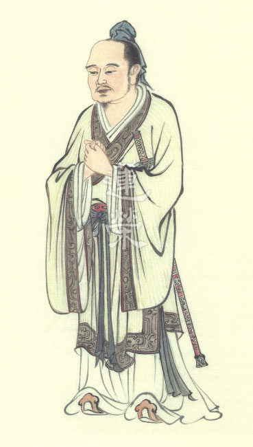

## 藝術賞析

### 華夏精魂千秋(二)明倫史畫好生之德

圖：江逸子　文：淨域

暴虐亡而仁政興

歷史軌則不變理

千秋氣節久彌著

萬古精神又日新

【故事】

商湯，子姓，名履，河南商丘(南亳)人，又稱成湯；生年不詳，約卒於西元前一五八八年(商代世系年表難考)。為商部族首領主癸之子，是商朝的開國君主。商族從始祖契到湯，曾先後遷居八次，至湯時將商邑由最初的西亳(今河南省偃師市商城)遷至南亳(今河南省商丘市)，稱為亳邑。商朝晚年盤庚遷都至殷(今河南省安陽市)，故而又稱殷商。

夏朝末年，孔甲淫虐無度國力漸衰，至桀時更是荒暴無道。湯遷都建於南亳，遠離夏都斟鄩(今洛陽市)，為滅夏創造有利條件。湯初期設置二相，以伊尹、仲虺共同輔政，對內注重農牧發展，對外與各諸侯國團結友善。

某次，湯到農林之地巡視，見一農人張網捕捉飛鳥。當網子掛好後，農人跪地向天祈禱說：「求老天爺保佑，無論天上飛的或地下跑的，四方鳥獸都進入我的網中來。」湯聽了以後，感慨地說：「天底下只有殘暴的夏桀會網盡一切，這麼做太殘忍了。」便叫隨從人員將網子撤掉三面，跪禱說：「天上飛地下跑的，能往左飛就往左飛，想向右跑就向右跑，若不聽勸就自投羅網吧！」祈禱後對農人說：「我們對待禽獸也要有仁慈之心，萬萬不能一網打盡，至於那些不聽天命的，才是我們所要網捕的。」伊尹與仲虺聽後，皆稱頌湯是位仁德之君。

不久，「網開一面」的事在諸侯中傳開，大家讚頌湯的仁心德行廣及於禽獸，是一位可以信賴的領袖。於是前來依歸的諸侯多達四十餘國，湯的勢力愈來愈強大。桀以召見之名，將湯囚禁於夏台，伊尹、仲虺獻美女珍寶，才使湯脫離險境。在日後的十一次征伐中，湯相繼滅掉葛、韋、顧、昆吾等忠於桀的諸侯，再而作《湯誓》伐夏，於鳴條(今河南省封丘縣東)大敗夏桀，天下諸侯共推湯為天子，於西元前一六００年在亳邑建立商王朝。

商湯建國後，記取夏朝覆亡的教訓作《湯誥》，要求臣屬「有功於民，勤力乃事」，否則就要「大罰殛汝」。至於對亡了國的夏民，仍保留夏社祭祀先祖，並分封後人領地。湯留心百姓，以寬簡治民，社會日趨穩定，國力愈漸強盛。《詩經•商頌•殷武》云：「昔有成湯，自彼氐羌，莫敢不來享，莫敢不來王，曰商是常(以前成湯建立商朝，遠方的氐羌部族，不敢不來獻享，不敢不來朝王，殷王實在是天下之長)。」十三年後，湯卒；因長子太丁早逝，由次子外丙繼承王位。

【圖解】

此幅好生之德圖，是描繪商朝開國君主成湯出巡的故事。畫中可見，獵人在山谷間佈置了四面環繞的獵網，並祝禱道：「自天下四方皆入吾網。」林中飛鳥翔集於網中，眼見將要一網打盡。身著天子服飾，右手指天，左手握拳，面部表情嚴肅者，就是成湯。湯王感嘆如此不留餘命的狩獵法，太不人道，於是讓其撤去三面，只留一面，此即「網開一面」成語的由來。

伏跪於商湯面前，即是設置四面羅網的獵人，在成湯的教誨下，獵人感悟將心比心之理，面露慚愧之樣。湯王身邊有儀仗斧鉞從侍，倍增其君王的威德，另有兩位大臣隨行，正相互談論著眼前這位仁君感人的行誼。

深山、古木、飛鳥、雲煙，原本還瀰漫著一股肅殺之氣，由於仁君的示現教化，淒厲轉為祥和，陰森可怖變作正氣凜然。（下期待續）

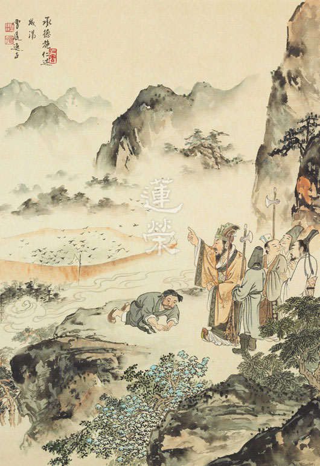

## 專題報導

### 時哉時哉網路教育學院

甲午年終歲末與展望

本刊

年終回顧隨善生

戒慎迎向新年春

三羊開泰通人和

文化飛揚佳事多

甲午歲末，乙未將至，中華無盡燈文化學會在老師的指導下，眾人和合，持續以教法學習為核心，廣造眾善，也是為社會和諧、改善風氣而努力。本年度最大的改變，在於學會正式開啟互聯網的經營，並以直播上課的方式，弘揚儒家文化，走在時代的先驅。邁向時代，維持中心思想；造就菁英，呈現繼往開來，是學會本年度轉型的宗旨。虛擬世界的網路事業正式啟動，實體世界的各種工作也未停歇，謹此報告過去忙碌的一年中，豐碩的成果，期望大家未能參與者，能夠隨喜，已參與者能夠感恩、珍惜，並期望能凝聚共識，共同打造全新的二Ｏ一五年。

壹、例行課程（含啟蒙）及念佛共修

一、臺北中華無盡燈文化學會

１．每週星期一，晚上七點至九點，原開設「中庸」講座，已於二Ｏ一四年一月十三日圓滿，繼而在同一時間開設「佛學概要十四講表講座」，現已講授至第八表。

２．每週星期二，上午九點半至十二點，開設「學賢班」，以江逸子老師七十二賢畫作，及《論語講要》作為教材，共同研學孔門聖賢之行儀、風範、內涵。

３．每週星期三，下午一點半至四點，開設「讀經班」，教導孩子們如何讀經，並淺釋經典之義理，使之能運用於日常生活之中。

４．每週星期三，晚上七點半至九點，開設「論語直播講座」，目前講授主題為孔門弟子─子貢，透過時哉時哉網路教育學院的直播平台，本課程能夠全球同步觀看，目前主要收視群以台灣和大陸的學員為主。

５．每週星期四，上午九點，至下午三點半，舉行「三代共修」。共修內容包括了上午的念佛，以及下午的講座，《觀無量壽經》講畢，現正研討佛說阿彌陀經。

*６．每週星期五，晚上七點至九點，開設「法華經講座」，現已講授至安樂行品第十四。*

７．每週星期六，下午兩點至五點半。開設「詩階述唐講座」，以雪廬老人之《詩階述唐》作為教材，學習唐詩之義理、內涵、情境、聲韻等。

８．每週星期六，晚上六點半至九點，舉行「共修研學」，分為成人共修班、大專班、啟蒙班中班及小班，分別研學，並於晚間八點至九點，集合成人共修班及大專班，講授「人生大事─不能忽略的事實」，有關臨終關懷的課題。

９．每月固定兩次，舉行人才培訓班，係由基隆淨宗學會陳曼玲會長發心護持，至今已經三年，研討《大乘百法明門論》、《論語》、《常禮舉要》、《禮記經解》等課程，並有專題演講，本期培訓將於今年二月一日圓滿。

二、臺中市無盡燈儒佛學會

１．每週星期三，晚上七點半至九點，共同學習時哉時哉網路教育學院，所開設之「論語直播講座」。

２．每週星期日，晚上七點至九點，舉行「念佛共修及淨行品研討」。

三、中壢研學會

１．每週星期三，晚上七點半至九點，共同學習時哉時哉網路教育學院，所開設之「論語直播講座」。

２．每週星期日，上午八點至十一點，開設「論語研討」班。

四、宜蘭研學會：

每週日上午八點半至十一點半，開設「人生大事及常禮舉要」研討。

貳、互聯網經營

學會經過一年的籌備與學習，於二○一四年十月一日，正式啟動時哉時哉網路教育學院，至今試辦三個月，成效斐然，已於各入口網站形成品牌，能以「時哉」二字迅速搜尋到本教學網站。並同時於FACEBOOK，大陸微博開啟社群，另以LINE和微信，與各地學員聯繫，形成共同學習文化的讀書團隊。

參、專題講座

一、於卓蘭實驗高中舉辦啟蒙講座，主題為「迎向朝陽飛龍在天的見地與民族」。（2014.01.21）

二、為法務部矯正署受訓之監獄官及監所管理員，開設文化講座課程，今年度一共有八次課程。（2014.03.18~）

三、應中國醫藥大學醫王學社邀請舉辦講座，主題為「貴爾見地不貴爾行持」。（2014.03.27）

四、應國立海洋大學邀請舉辦講座，主題為「成功的秘密」。（2014.05.01）

五、應台中霧峰國中之邀請舉辦啟蒙講座，主題為「不一樣的孩子」。（2014.06.30）

六、舉行人才培訓班暑期講座，並有大陸諸暨、瀋陽、河南等地的學員一同來台參與共學，主題為「出路由名言中通達─由論語及百法說起」。（2014.07.05~10）

七、兩岸三地中華傳統文化研習營(2014.08.28-29)

肆、兩岸及國際文化交流

一、聯合國大使來故宮參訪，由學會老師導覽。（2014.01.31）

二、福清立達孔學會來訪。（2014.03.04）

三、前往浙江省諸暨市舉辦講座，主題為「國學與現代教育」。（2014.03.31）

四、舉行遼寧省瀋陽師範大學師資培訓講座，期間並舉行論語正音研討會、儒家文化研討會。（2014.04.21~25）

五、曲阜孔子文化學院來訪。（2014.05.30）

六、靈峰佛陀教育弘化基金會及孝廉講堂來訪。（2014.07.01）

七、前往浙江省義烏市舉辦講座，主題為「品牌向上提升來自人文素養—從孔子身上找內涵」。（2014.08.11）

八、前往江蘇省無錫舉辦講座，主題為「迎向二十一世紀的主流—由論語孔子風采說起」。（2014.08.15）

九、前往福建省福州市舉辦講座，主題為「人生與事業的出路在論語」。（2014.10.25-26）

伍、國內社團交流

一、通泰傳媒故宮導覽（2014.01.07、03.11）

二、拜訪澹寧齋江逸子老師（2014.01.08、03.27）

三、華藏淨宗學會交流（2014.02.12）

四、中國醫藥大學醫王學社來訪（2014.02.22~23）

五、台北弘明天母讀經班來訪（2014.07.18）

六、卓蘭實驗高中龍隊故宮參訪（2014.09.27）

七、澹寧齋江逸子老師來訪（2014.12.10）

陸、法務活動

一、拜懺法會：大悲懺（2014.03.23）、地藏懺及浴佛法會（2014.05.04）、地藏懺（2014.08.24）、藥師懺（2014.11.02）。

二、年度齋僧：西蓮淨苑齋僧共十次，正覺精舍齋僧一次，圓通寺三壇大戒時亦有供養。

三、護生法行：江浙大型放生活動（2014.05.10~17）新店放生（2014.06.22）。

四、緬甸參訪：學會組團前往緬甸，一共是八天的行程，以年輕學員作為主要辦事團隊，訓練和合工作的辦事能力。期間法行包括放生、齋僧、救濟孤兒院、巡禮佛塔、古蹟參訪，並且與緬甸現任央行副總裁塞奧先生會談。

柒、蓮友服務

一、臨終關懷：去年計有往生蓮友七人，在他們生命的最後階段，學會蓮友們提供了最溫暖而重要的鼓勵，使之能夠提起正念，往生極樂。

二、二○一四年八月二十日，成立中華無盡燈文化學會LINE群組，使大家能夠即時交流，凝聚團體共識。

三、發送年終結緣品。

捌、其他活動

本會為能達到共住之目標，去年在蓮友們的努力下，一共探勘了二十多塊土地，雖還尚未能成功，但也藉此凝聚大家共住之共識，並持續往此目標前進。

玖、出版傳播

一、二○一四年一共出版六期蓮榮會刊（92期至97期）。

二、《論語講要》校對及印製。

三、「孔子聖蹟圖日文版」光碟出版。

四、「如是獨行江逸子紀錄片」發行。

上述各項法行事業，參與者、出資者、出力者，於私上能增進自己的善根福德，於公上能莊嚴團體，安定社會國家，有缺失之處，辦事人員要懷著慚愧、檢討及反省，對於能利樂有情的部分，要生起隨喜及感恩之心。新的一年，預定四月應邀至〈孝治天下傳統文化高峰論壇〉授課，八月也將應邀前往上海圖書館之江逸子老師畫展負責導覽工作，後年預計將依紀念雪廬老人往生三十週年舉辦畫展。願大眾以公心繼續善法的造作，成為現世安樂，未來往生及成佛的資糧。相信在有限及短暫的生命中，將是最殊勝的莊嚴。

### 新春獻禮　羊揚得義迎新年

心若

新春飛羊

喜氣羊羊

羊年大運

吉羊如意

中國吉祥文化綿遠流長，亙古不變，蘊含著先人對宇宙洪荒的恐懼，對自身渺小的寄託，對生命的期盼與展望，種種複雜的情懷，交織刻劃在動物、植物、花鳥、日月星辰、風雨雷電等事物中，形成特有的吉祥文化。

生肖吉祥，十二生肖我們再熟悉不過，古時以農業、畜牧業安家立國，先人對動物的感情不言而喻，馬牛羊、雞犬豕六畜，一生悉數奉獻於人，各有其不可磨滅之功德。今年適逢羊年，羊可謂中國最吉祥的動物，古時吉祥寫作「吉羊」，足見其在人們心中的地位。新春吉祥，學會特在年節期間推出過年特別節目作為獻禮，由士棋學長搭配唐瑜凌老師，演繹羊的面面觀，舉凡羊的外型性格、寓意象徵、說文解字，乃至於《易經》三陽開泰，羊與中國傳統文化的關係，盡在其中，不容錯過。以下略敘其概以供養大眾。

說到羊，便會想到其特有的長鬍子，仿若仙骨道人，安詳而隨和。羊素喜靜潔，願居乾燥處，以青草清泉為食，似有德的謙謙君子，親切淳厚。羊性情儒雅溫和，自古以來，與人和諧朝夕相處，深受大家的喜愛與崇敬，象徵和睦。又象徵吉祥，被奉為第一等的祭品，還表徵孝順，所謂「鴉有反哺之義，羊有跪乳之恩」，警醒世人要孝順父母。此外，羊還體現正義，據王充《論衡．是應》，唐堯之臣皋陶治獄，輔以獨角之羊。此羊對嫌犯有罪則觸，無罪則不觸，極為靈驗。至戰國時，秦楚等國御史、獄吏等執法者皆著帶有獨角神羊圖案之冠服，以示莊嚴神聖。此獨角羊名「獬豸」，作為秉公執法的象徵。可見羊在國人心目中，一直是一個完美的生靈，是真善美的代表。

關於羊的造字，可推演自漢族社會進入殷周時代，畜牧業非常發達，反映在詞彙上便是表達牲畜的字詞非常豐富而細膩，像是羔、羍、羜、羝、羳、咩、羴，都揭示了羊的不同的面貌與特性。而許多字的誕生，也因為有羊而美好，舉例而言，「美」有羊，有羊就美麗。「祥」有羊，有羊就吉祥。「鮮」有羊，有羊就鮮美。「群」有羊，有羊就合群。「洋」有羊，有羊就喜氣。「善」有羊，有羊就善良。「義」有羊，有羊就正義。「樣」有羊，有羊就有榜樣可依。在在說明了羊作為配字，發揮了無比正面的功效。

有趣的是，在基督教裡，眾人被比喻為羊，因為羊有七種特性，分別是完全沒有方向感，容易受驚嚇，容易盲從，生病時就會孤立自己，趕不走寄生蟲，沒有防衛能力，及躺久了就容易站不起來，剛好與人的特性相吻合，因而必須跟從主耶穌。佛教則把羊自私的特性，比喻為自求解脫的聲聞眾，事實上這和現在的科學研究不謀而合。面對惡狼，綿羊不會逃跑，羊隻只會朝羊群中央移動，避免因待在羊群邊緣而成為掠食者的午餐，科學家稱之為「自私羊理論」。此行為之所以自私，是因為牠們將同伴往外擠，讓羊群邊緣的個體代替自己承擔被獵的風險。

我們也可以說，眾人好比羊群，而牧羊人就是中國傳統文化道統。早在幾千年前，文王「眼如望羊，如王四國」，他臉色肅穆，目光慈祥遠大，心胸寬大能以王道包容天下。眾人就好似羊群，默默被文王牽引，走向正確歸途，走向聖道。文王可謂中國第一個牧羊人，以中國文化道統引領羊群。若沒有牧羊人的引領，羊則沒有方向感，易受驚嚇，盲目膽小。所以必須有古聖先賢的傳承，加上大眾的群體合作意識，不斷提升內涵，充實自己，以正知見作為牧羊人，來找尋人生的出路，大家一起共學，改變內心，改變命運，才能達到真正的吉祥如意，也才是中國真正的吉祥文化。

附：特別節目播放時間為二月十一日(三)，敬請期待。

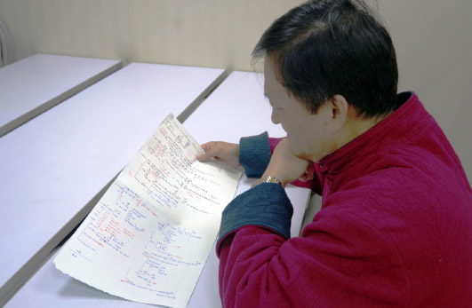

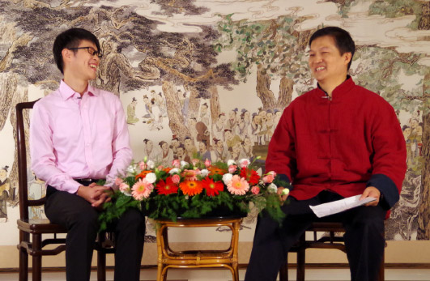

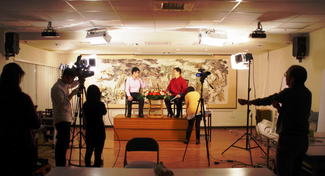

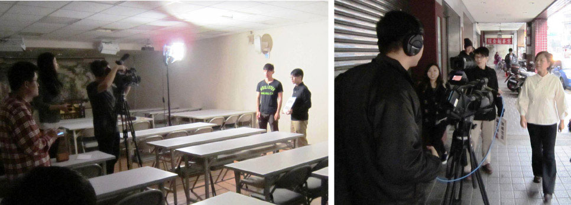

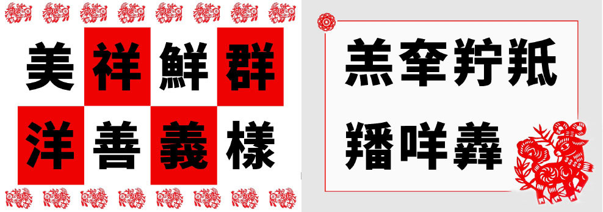

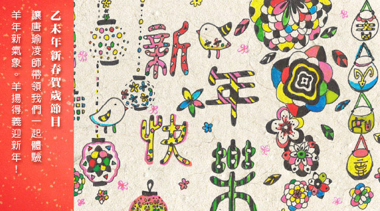

### 各地讀書會迴響

*編輯部整理*

邁向時代須正見

維持中心依典範

造就菁英賴弘揚

繼往開來盼傳承

風澤經典文化讀書會　　胡提文

傳統文化學習心得

一四年十月廿九日，公司領導為員工營造良好的讀書氛圍，為在工作之餘熱愛讀書的員工搭建一個讀書、學習、交流的平臺，成立了風澤經典文化讀書會。我有幸能參與，聆聽名師智慧言語，啟迪平凡人生，並通過線上線下，與大家溝通交流，在唐老師的帶領下，誦讀經典《論語》，學習至聖先師孔子的言行舉止，思想道德，為人處世。課程從《論語》出發，透過直接閱讀、學習《論語》篇章的方式來瞭解孔子弟子，效法他們能邁向時代，擁有中心思想，是能繼往開來的菁英人才。通過近兩個月的學習，受益匪淺，收穫頗多，感慨萬千。

孔子的弟子，七十二賢人之一的子貢，姓端木，名賜，字子貢，天資聰穎，在孔門中成就僅次於顏子和曾子。然其精明能幹，富觀察眼力又通曉人情世故，成為當時最成功的外交官，化解了魯國空前危機。又有判斷商機的能力，懂得人離鄉則賤，物離鄉則貴，人棄我取，買賤賣貴，造就了富可敵國的財力，其誠懇犀利又善於分析時勢的口才，出使各國時，國君都要禮讓三分。在當時，甚至有許多世人誤以為他比孔子更為賢能。高徒出自名師，由此可見，孔子的學識水準之高，孔子的教育水準之高。

《論語》乃是六經之根本，是學習其他經典的基礎，讀懂了《論語》，其他經書就會迎刃而解。下面是我的一些學習心得體會，對《論語》的一些理解。

（一）通過對子貢章節的學習，知道了一個人要立志成為對社會、對單位、對家庭的有用之器、君子之器。孔子認為子貢有廟堂之才，是國家的重要之器，孔子同時指出子貢沒有達到「君子不器」的標準。一個人有了一點成就也不能洋洋得意，不思進取，而是學習棕樹的品質，做個正直無邪，挺拔向上的人。

（二）夫子告訴我們，作為君子，要做到貧而無諂，富而無驕，更要貧而樂道，富而好禮；一個人在貧窮時，自然而然的會討好諂媚別人；而當他富有之後，更容易驕傲無禮。所以一個人要貧而樂道，富而講禮。通過禮使人能夠知道如何與人平等相處，如何把自己的人生價值和意義利益他人，尤其是貧賤之人的尊嚴和人生價值的實現聯繫起來。對待貧賤富貴的態度與策略，是識別一個人的重要尺規之一。

（三）孔子教育我們，不管是生活還是學習，都要精益求精，如切如磋，如琢如磨，不斷上進，多學知之，一以貫之；骨曰切，象曰磋，玉曰琢，石曰磨；切磋琢磨，乃成寶器。人之學問知能成就，猶骨象玉石切磋琢磨也。只有切磋琢磨了，才能成為好的東西，人做學問想要有所成就，就必須象切骨銼金琢玉磨石那樣經過磨練。學好專業知識是立足之本，同時有能力可以認真學通六藝禮、樂、射、御、書、數中的一門。

（四）夫子告誡我們，不喜歡別人這樣對你，就不要這樣對待別人；己所不欲，勿施於人。孔子認為子貢尚不能做到，一般人更是不能達到，勉勵大家修身養性。

（五）孔子告訴我們要以禮而行，懂得忠恕之道，自會趨吉避凶，遠離小人。在日常生活的庸言謹行做到對「禮」原則的自覺踐履，切實做到依禮而行。這是因為「禮以天制」的「禮」具有順天應時、持中守正、剛柔相濟、真常不變的「理」的必然規律，處處體現著天道的價值定勢和價值理念，所以「禮」作為人文內容的重要組成部分，其所寓示的社會現象的歸納和社會行為的概念，成為社會生活中必然遵守的道德和行為規範，成為一切價值判斷的最高準則。

《論語》是一部內涵豐富、思想深刻的書，值得我們認真閱讀、仔細品味。《論語》是個大寶庫，如汪洋之海，取一瓢飲之，即可享用一生，受之不盡。

風澤經典文化讀書會　　都鵬于

論語，讓我領悟到的是一種智慧

二○一四年十月廿八日，第一次坐在公司的會議室裡，聽中華無盡燈文化學會的老師給我們講述國學。這是自高考後，我第一次以學生的姿勢、學生的心態，認真聆聽老師對於國學的傳授。

隔天，公司組織成立了風澤讀書會。每週三坐在公司的會議室，與眾多同事一起，學習遠在臺灣的中華無盡燈文化學會唐教授的網路課程。

一個多月的時間，通過公司的傳統文化學習，讓我找到修行自己內心的方法，體會到《論語》作為源頭性經籍的博大精深，感受到了古之大賢的境界之高、貫通古今的文化之深；在輕鬆的環境下學習《論語》，增長歷史知識和感受儒學之道帶給我的內心改變。

曾認為「半部論語治天下」是君主統治時代的「治」，與現代生活甚遠。實際只通過這兩個月學習的《論語》皮毛，我就感悟出了很多道理。帶著這種感悟，試著改變自己的一些思想和習慣，也很興奮的回到家裡與家人分享，在我的影響下，現在每個週三的晚上，家裡也成了《論語》討論的天地，彼此討論自己的認識和理解，感覺「家」的氣氛，也變得高端大氣有內涵，變得更加和諧，這是不是就是孔老夫子說的修身治國齊家平天下呢。

以上，是我一點淺薄的感受。在以後的學習、工作中，我會更加深入的學習《論語》，學習國學。也會帶著分享和感恩的心，影響周圍的人，一起感受中華偉大的精神智慧

風澤經典文化讀書會　　喬幼芽

論語感悟

很高興加入「中孚風澤讀書會」，並有幸成為其中一員，在此感謝公司提供這樣一個淨化心靈的環境。我以身為自己是一個中孚人，而感到驕傲！

不知不覺進入社會工作已五年有餘，在成長的歷程中，有順境有逆境，偶爾的磕絆中也遇到了一些不開心的事，曾經也一度迷茫、困惑，不斷地反問自己。正如《論語》中所說「我不欲人之加諸我也，吾亦欲無加諸人」，即我不希望別人用什麼的方式對待自己，那麼自己就不要以這種方式對待別人，可是結果有時會不如你所願。原本很想平和、謙讓的與他人溝通，然而你的平和反而換來的可能是冷言、不爽，無法繼續溝通，只能選擇離開。有時會不斷的反問自己為什麼會這樣，也許對方是無心的？也許對方當時心情不好？也許......，心情也因此而陷入不悅。但在接觸《論語》之後，貌似心中有了答案。

恕道，此乃大賢尚且如此，而我一個凡人，遇到這樣的困惑豈不是太平凡不過了。只要心中堅守「恕道」原則，按照這樣的方式要求自己，即使偶爾遇到一些不良的回饋，只要堅持，不斷反省，有過改之，無則加勉；敞開內心，包容別人，調整自己，保持一個平和的心態，我相信時間久了，這便會是自己的人生財富，同時也是人生最美的一道風景，即心靈的淨化，遠超出外在的一切美麗。在這個物慾橫流的社會，只要能保持好自己內心的那方淨土，不管是對同事、朋友，甚至家人，都是一件為之自豪的事，他會感染你的生活、影響你身邊的人，特別是對為人父母的朋友們，一定會受益頗多！

在工作能力方面，這幾年自己也確實得到了一些磨練、一直在不斷地努力提升，但《論語》中的一句「如切如磋，如琢如磨」，正是學術之道最好的求學之方。一個人的能力即使再強大，三個臭皮匠也可與一個諸葛亮並駕齊驅。不管在生活的任何方面，都可以相互討論、切磋，如果想要進一步消化、吸收，真正成為自己的養料，那便是如琢如磨，需用心去體會、去分析。

當今社會，隨著電子產品的商業化，大家越來越喜歡沉浸在自己的圈子，甚或有的人可以一個月足不出戶，學術方面的困難疑惑找「唐老師」、生活用品找「淘老師」。也許正是這樣快速、便捷的生活方式，讓彼此之間缺少了真正的有效溝通、交流。久而久之，大家也就不願和他人分享自己心中的想法，甚至可能一兩次的交流，結果並不理想，因此就會覺得大家並不理解自己的想法。其實不然，主要是我們在進行切磋之時，沒有真正的換位思考，只是一味的強調自己的方式、方法，所以結果就可想而知了。

孔子幾千年的文化，至今能被大家再次學習，說明我們現在正需要這樣的文化，這樣的精神指導。希望我們的風澤讀書會，能夠越辦越好，大家都積極的參與其中，並定期的組織大家對某個觀點，進行切磋琢磨，那樣收益的必定不是一人，而是我們中孚大家庭的所有成員，在此也希望中孚的人文精神發揚光大！事業蒸蒸日上！在新的征途中譜寫更美的篇章！

風澤經典文化讀書會　　張慶亮

學習傳統文化 ─ 一個緩慢而優雅的過程

公司開展傳統文化讀書會活動，觀看「時哉時哉」網路視頻，一開始感覺課程很漫長，頗為不爽，老實講，我自大學畢業至今，除了看電視影片，還沒花這麼長時間看一堂文化講座。但奇怪的是，看完視頻後，心情居然不錯，回到家，因急於把剛學到的冒著熱氣的《論語》名句向妻子賣弄，搞的結結巴巴、言不成句，反而惹她捧腹大笑。

再後來，每次線上課程，我都認真的看，感覺《論語》可謂字字珠璣，句句箴言。曾經，我是一位傲驕的理工實用男，認為學習人文歷史不但無用，而且極其酸腐。孰知當我真正深入瞭解接觸經典傳統文化時，它給我的體驗不只是新鮮、振奮，甚至漸次心生敬畏了。同時，也越發自慚形穢，感覺自己孤陋寡聞，見識淺薄，簡直形同行屍走肉的上班族。

中國優秀傳統文化可謂博大精深，月餘的接觸體驗，不過是蜻蜓點水，略知皮毛；然而，覺得公司能做如此的安排，讓大家認識到自身文化修養的重要性。所謂修身為本，從中可知其用心良苦。而我們要做的，就是立足日常工作生活，借鑑傳統安身立命之道，從各個方面對自己的人格加以打造，去掉不足之處，培養自己的長處，從而「窮則獨善其身，達則兼善天下」。

趙普曾說半部《論語》治天下，曾國藩三十一歲開始致力於「修身」，以一個農家子弟封侯拜相。當然，我們絕不可能再退回到舊時代，以前的許多做法不可能都適合今天這個日新月異的社會，但是，優秀傳統文化其中的至理精粹卻是萬萬丟不得的。然而，我也深刻領會到自我修養並非一日之功，它需要漫長的學習和積累的過程；中國傳統文化的內斂和含蓄，又需要修身者從容、優雅和淡定。

孔子曰：「朝聞道，夕可死矣」，我想自己是幸運的，儘管我無法預知未來的自己是什麼樣子，但是現在明白修身的重要性還為時不晚。明白這些，我想，為學修身即使是一個緩慢而優雅的過程，但絕非是漫長的過程，因為我可以「樂在其中」嘛！

風澤經典文化讀書會　　劉司宇

人無完人，境無止境

加入「風澤讀書會」後，每週三晚的集體學習賦予我的不只是經典的研讀，更是對人生的剖析。孔子的一生傳道解惑並探知人生的奧義，現今留存的孔子言語雖不多，但仍需要我們窮其力量才能知曉一、二，可見孔子智慧之深，境界之高。

短短九次課程的學習，從子貢器也到切磋琢磨，從侃侃如也到己所不欲勿施於人，我們可以看出孔子對子貢是有要求的。老師在肯定子貢為「器」的同時，又通過「君子不器」告誡子貢不要自得意滿，因為人生後面還有更高的路要走。可見，子貢作為孔子的得意門生仍有改進的空間，是謂人無完人。君子為仁，惟有在外相上幫助別人，幫助別人有所成就，給人內在的通達才能到達新的境界，是謂境無止境。

從小到大，一個人被要求最多的是「成器」，然而通過學習，我豁然開朗，原來「成器」只是一個階段，「不器」才是大成，就好像「道法自然，無狀之狀」這樣拋棄器型，廣結善緣的狀態才是人生最應該追求的。正確面對人生的缺憾，不要糾纏在裡面，承認自己不足之處，並通過努力去彌補這種不足，這是《論語》告訴我們對待生活缺憾的態度。

人生無止盡，那麼，在人生的道路要怎樣才能前進的更遠呢？孔子其實也給了我們明示。反求諸己、以直報怨都是邁向「仁」的通道，「己欲立而欲人，己欲達而達人」都是人生的必修課。于丹曾說把社會給予的壓力變為一種生命反張力，已經可以做到從心所欲那樣的一種淡定從容，這樣的生命，才是有效率的生命。

李炳南老居士的《論語講要》是以經典詮釋智慧，以智慧詮釋人生，以人生詮釋人性，以人性安頓人心，體悟經典的普適智慧。而《論語》中睿智的人生奧義，穿越千古滄桑溫暖著我們，光芒著我們，照亮我們心中的暗夜。每週的讀書會上，與各位同學一起研習經典，互相鼓勵，微笑中受益的心智再次開朗，讓我們不斷有勇氣剖析自己，征服自己，超越自己，在人生的道路上走出一串踏實的腳印。

風澤經典文化讀書會　　張曉

唯願現世安穩，歲月靜好

「風澤讀書會」的成立，給一直對傳統文化懷有深深崇敬之情的我，又增加了一次很好的學習機會。利用這次機會與這部記錄了孔子及其弟子言行，且在海內外廣受讚譽的儒學著作有了更難得的近距離接觸。通過賞析一段段文言，結合各位名師的精彩講評，自己的心靈一次次迸發出激情的火花。

在這些耐人尋味且值得受用終身的言語中，一句「我不欲人之加諸我也，吾亦欲無加諸人」，給我的感覺尤其深刻。淺析這句話，意思是：天下的人，都有一樣的心情喜好，凡是不好的事情，我不願意遇到，料想其他人也同樣不願意遇到。如果把我不願意的事情強加在別人身上，就說明我心中只有自己，而沒有別人。在我心裡，天下大眾和我是一樣的，凡是我不願意遇到的事情，我也同樣不會強加在別人身上。細細想來，這句話亦是在謳歌一種將心比心的精神。通過這種精神，可以化干戈為玉帛，可以樹立關愛他人、敢於奉獻的社會風氣，也可以營造誠信友善的環境氛圍。
相信扶不扶的小品大家都看過，劇中詼諧的表演也讓大家開懷大笑，但在笑過之後，我們是否曾捫心自
**問：** 假如我是當事人，我該如何應對？換言之，如果摔倒的是我們至親至信之人，我們是否會期待有人能在關鍵時刻伸出援手，是否會對這樣的善行善舉由衷的感激呢？答案不言自明。

近年來，毒奶粉、地溝油、染色饅頭等等事件的發生，嚴重威脅著人們的生命安全，極大地挑戰了人們的道德底線。試想，如果廠家在生產的過程中，能夠將心比心，真心地為消費者著想，就不會讓道德一次又一次地拷問他們的良心了。

基於人性的弱點，我們或許很難做到凡事替別人考慮，但是我們可以做到將心比心，不坑害他人，繼而無愧於心，讓世界更美麗！

在此，惟願現世安穩，歲月靜好！

風澤經典文化讀書會　　王亮

參與學習國學經典心得體會

二○一四年，隨著「風澤讀書會」的成立，公司逐漸給願意學習國學經典的人營造輕鬆的氣氛。

中華民族傳統文化的精髓是國學，只有延續國學的中心思想，才能傳承中華民族的文化精神。一個民族，一個國家，如果沒有自己的精神支柱，就等於沒有靈魂，就會失去凝聚力和生命力。中華民族精神是中華民族生存、發展和繁榮的精神支柱和原動力，是中國人民精神風貌的集中體現。

中華民族歷經幾次毀滅性的打擊。正是因為有民族精神支撐，中華民族才得以延續至今。這種民族精神深深植根於中華民族的優秀傳統文化，汲取了人類文明的優秀成果。中華民族五千年的文明史創造了源遠流長、博大精深的民族文化，有許多優秀的思想精華永遠值得我們發揚。

到底是什麼樣的精神有這種神奇的力量？這種力量既然能在戰亂年代起定海神針的作用，那麼，是否能在和平時期，起中流砥柱的功效？

帶著這些問題，通過學習《論語》，逐漸揭開其中奧妙。自強不息的開拓精神；厚德載物的博大胸懷；富貴不能淫，貧賤不能移，威武不能屈的浩然正氣；國家興亡，匹夫有責的愛國主義精神；先天下之憂而憂，後天下之樂而樂的無私奉獻精神；這些的凝結了中華民族精神的思想，對中華民族形成和發展起到極其重要的作用。

如今的社會生活中，互聯網、手機、汽車等現代工具讓我們的節奏越來越快，人與人之間的關係越來越功利。現代化並沒有從根本上帶給人們快樂，反而帶來更大的壓力。這是高科技的錯嗎？當人們的心靈面對這浮躁的社會，心中少了那份寧靜與自在。當人們只是以物質為追求，而精神上荒蕪一片的時候，這是很危險的。是時候需要我們尋找出路的時候了！

「邁向時代，維持中心思想；造就精英，呈現繼往開來」。從我做起，帶動身邊的人，靜下心來，研讀我們聖賢的經典，從中尋找出路。讀讀這些經典，這些關於學習、事業、人生的簡單而深刻的道理，我們祖先早就歸納到國學中了。結合現實，我們發現，不僅現在適用，而且在以後綿長的歲月中一樣適用。如果我們不好好珍惜祖先傳承的文化，讓它來指導我們人生，讓這樣的財富白白流走，我們還在抱怨生活的種種不如意，這真是不應該。

國學是我們炎黃子孫特有的國粹，它承載著中華五千年的文化內涵。孔子的教育思想和學習方法值得我們反思和借鑑。讓我們「國學經典」的智慧之光，引領我們走出迷茫，讓自己的人生輕鬆和灑脫。

瀋陽　　蘇毅

再次收到諸位老師學長的回信，末學萬分感激，感謝你們的諄諄教導，看了回信的內容，對照自己的問題，使我更加堅定了信念，就是跟隨著唐老師一路向前，做到課前認真預習，課上認真聽講，課後反復再看視頻，再反復琢磨，然後和學校論語讀書會的其他人交流切磋，以及諸位老師學長的幫助提攜，今生既然有幸得遇善知識，聽聞善法，就必須把握好時機，勇往直前，跟著唐老師和諸位學長所指示的道路前進！

真誠感恩各位老師學長，在繁忙的工作中，抽出寶貴時間回復末學的信件，並且耐心解釋，從中感受到各位老師學長的細心關照和用心良苦。

看到回復信件中，那回答如此條理清楚，層次分明，心中立刻升起喜悅之情，然後慢慢靜下心來，細細揣摩。大部分的回答，末學都明晰了，知道了「立身」兩種情況，更清楚的明白了「聞而知」的重要，很慶幸自己，每週都能從唐老師那聞知更多夫子的內涵。還有「存心」兩字，真是精妙，難怪乎如果不明白孔門心法，那學《論語》就真的只學得皮毛，學的自相矛盾，學的不能真正受用。當然最妙的還是個「唯」字，看到這個字時，我開心的笑了。之前，我怎麼也想像不出該如何作答，這個回答真是奧妙無窮，又有曾子的事例為證，真應如此。有如釋迦拈花、迦葉微笑，以心傳心、妙不可言。其它還有目前尚不能完全理解之處，今後再繼續和老師學習，慢慢體會，再次對諸位老師學長的諄諄教導表示感謝！

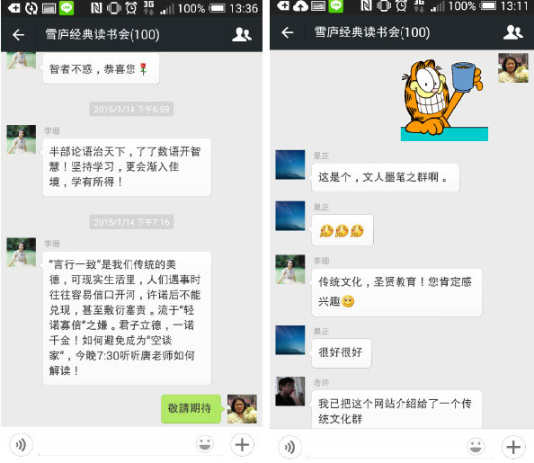

## 活動報導

### 多樣性的文化之旅 ─ 期待未來道藝大展

淨域

臺灣沉潛期

發揚大陸區

隨順福州緣

光照雪公心

二○一五年正月，因著一場婚宴，開啟了五日的福州行旅。緣是變易又難以捉摸的，隨著婚宴的參與，也鋪陳了兩場專題講座與紀錄片賞析。

一月八日中午一行七人前往福州，八十分鐘後抵達長樂機場，感謝福建廣電網絡公司派員接機，隨即前廣電福州辦公大樓。總經理謝晶思先生笑容可掬地歡迎我們，負責讀書會的老師亦來到，老友見面份外親切，交談著讀書會的盛況。唐瑜凌老師特別帶來《常禮舉要》、《論語講要》及《如是獨行─江逸子》等書冊光碟相贈，並安排江逸子老師受訪事宜。

江老師從福清來到廣電大樓，接受福建廣電視導頻道專訪。專訪安排在總經理辦公室進行，就《如是獨行─江逸子》紀錄片一事，由記者分別錄訪江老師、唐老師與李中旺導演，時間約二百分鐘。

江老師部分，主要訪談習畫的歷程，及受到哪些老師的啟蒙與教誨。江老師之繪畫雖立於故宮之古畫臨摩，得諸呂佛庭、溥心畬、張大千等名師的指導，但若無李炳南老師處的習經學詩，是難有今日的氣象。

唐老師部分，主要訪談如何依畫推展教化。唐老師雖晚於江老師入雪公門下，但同是老人門下的弟子。江師專於道藝，唐師長於經教；是故，江師的畫解，惟有唐老師能善說。也是這樣的因緣，才會在二００六年決定拍製紀錄片，經八年工夫一窺獨行之心路。

李導演部分，主要訪談拍攝此片近距離接觸的感受，及對他的影響。一年的拍攝中，李導演除跟進跟出外，甚且住進了江家，只因江師當時在畫極樂世界經變圖，每日凌晨三點起身，先洗臉淨手，於佛前禮拜供養，然後作畫，惟有這樣才能紀錄到畫家真實的一面。

訪問後，謝總在公司頂樓宴客廳晚宴，由員工餐廳主廚料理精美素食，一碗五穀雜糧芋頭粥及素包子，使我們驚讚不已，茶飯間主客盡歡。餐後驅車前往福清市，下榻於融僑酒店。

九日婚宴。上午驅車前往立達孔學會副會長林小英家，參觀古禮迎親活動。李宅有兩口古井，唐老師見一井駐足，掄起水桶拋下取水。拉起時水桶撞擊井壁，發出叩叩的聲音，師說：「這像是人生坎坷路。」瞬間放手，水桶一路落下井底，又說：「別以為人生一路平順，稍微疏失便要粉身碎骨。」

十一點多，男方迎親車隊來到，先送來納采之禮，包括牲禮與聘禮。古代嫁娶多經媒說之言，故有六禮(問名、訂盟、納采、納幣、請期、親迎)的流程。現今男女雙方熟識，故婚嫁因應地方風俗而簡化。女方親友設下重重關卡，男方媒人則想盡方法打通關，經一番唇舌論戰始得入內，自是熱鬧有餘失之莊重。

新娘一身彩繡，頭頸腕配滿金飾，拜別祖先父母後，女方還聘之物先出，新人在男女儐相的簇擁下上車離去。車隊出村時，受到村民的攔阻，意是「不捨離去」，男方須分別饋物以示友好。

晚間雙方在融僑酒店舉辦喜宴，席開八十桌，禮請江老師證婚，並請唐老師為新人祝福。唐師引詩經：「關關雎鳩，在河之洲，窈窕淑女，君子好逑。」等語來演說祝福，並歌唱〈星月交輝〉一曲，期勉新人如星月般相互輝映。宴後男女方各贈來賓伴手禮。

十日，原訂在福清市「兩館一中心」，舉辦江老師紀錄片首映會，因突發性因素而取消，臨時改為一小時的〈孝經圖〉解說。因此團隊兵分兩路，唐老師等四人留在飯店備課，餘者隨江師前往閩侯縣南通鎮江厝村新居參觀。

新居在老宅原址興建，為一座三層樓建築，旁有三株千年油松，受閩侯人民政府列管禁伐。二樓設講堂，乃未來儒學講座之處，目前除陳列江師所塑孔子聖像及恩師雪廬老人畫像外，其餘空蕩無物。此宅已建成三年，硬體設施粗具，惟差教化之推行。

屋前數十公尺處，擬建雪廬紀念館，係仿祭地玉器「琮」而設，中圓安置阿彌陀佛立像，名為「六合文化大樓」。目前在基地立樁鋪板，已塑造的佛像，僅以木板遮陽蔽雨，昔日光鑑照人盡失。

下午前往福清市「兩館一中心(僑鄉博物館、體育館、文化藝術中心)」，於文藝中心會議室之「融台儒學文化大講壇」進行講座。唐老師以「孝經圖解說─從北宋李公麟到現代江逸子說起」為題，深刻分析李公麟、馬和之、趙孟頫、仇英之孝經圖的傳承，也點出江逸子老師與眾不同的卓特處，除了是依經義而作外，更將孝之精義表露無遺。由會後茶點交流爭相請益觀之，雖是簡短匆促的臨陣之說，倒也真讓人耳目一新。

廣電謝總在福州辦理讀書會兩個多月，得聞唐老師有福清之行，特別假屏東中學道德講堂，辦理二○一五年新春「經典讀誦」活動，與會者約一百五十人。

十一日上午三小時講解《孝經》十八章圖，題目為「孝經圖解說─從北宋李公麟到現代江逸子說起」。此回解說採問答方式進行，導引會眾自己思辨差異，進而討論點出《孝經》的精義，對比出哪家的圖更具教化之力。福建廣電視導頻道派記者主持，除全程錄影外，亦於休息期間進行隨機採訪，包括團隊人員及與會聽眾。

下午放映江逸子老師的紀錄片─「如是獨行，江逸子」，因為六十一分鐘的片子，只是拍攝內容的三百分之一，故而採「放說放說」的補充說明方式進行。江師在畫藝中獨行，乃因雪公老師之囑「貴在道氣」，故而在座下習經學詩而有薰染深悟。中國歷史中精於繪畫者無數，若無經學的內涵與文化的傳承，所作不免流於匠氣，這離道藝春秋便遠了。會後心得發表熱絡，問答深刻相繼不絕，顯見來者皆非泛泛之輩，亦是推行教化的待發力量。

晚宴時，謝總提及未來構思，說：「傳承儒學、以孝為本、推動教化，才是一世的事業。」故而未來將策辦江師畫展，藉有系統的圖說來教化世道人心，乃至推行於中小學中，讓傳統文化發光。

十二日早上返臺，謝總一早即來到酒店的大廳等候送行，為無法親往機場而致歉。然而，個人與之幾日的接觸觀察，深以為他是個知禮、恭謹、謀遠、量大的領導人，雖目前位於致力生財的傳媒產業上，但那導正社會風俗的積極用心，卻將所擁有的利劍置諸項上，真可將臺灣的同行給比下去了。中國正崛起，而臺灣呢？顯然中華傳統文化發揚的棒子，中國大陸已慢慢要接手了……。

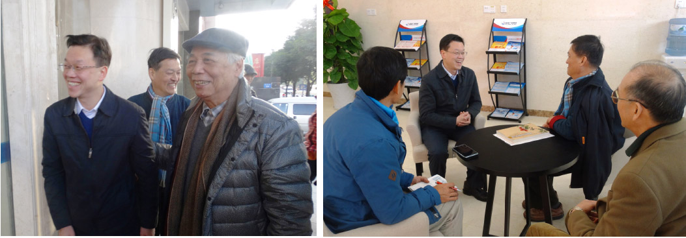

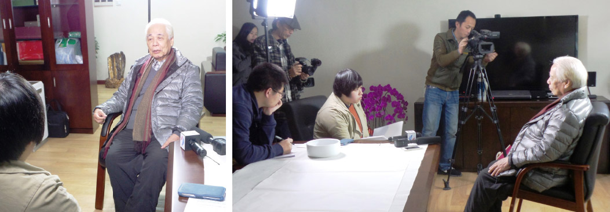

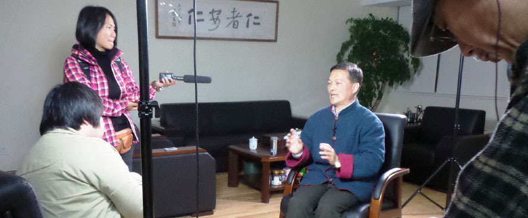

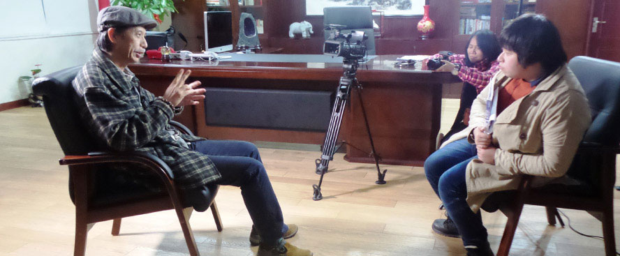

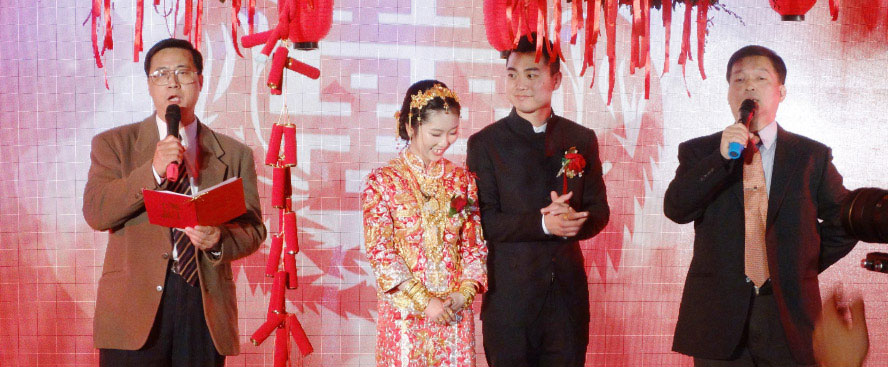

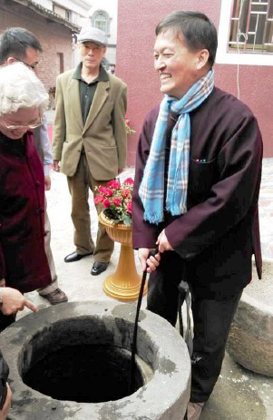

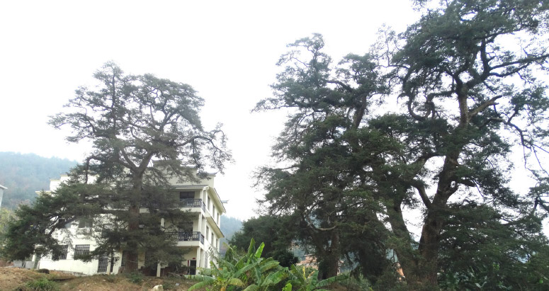

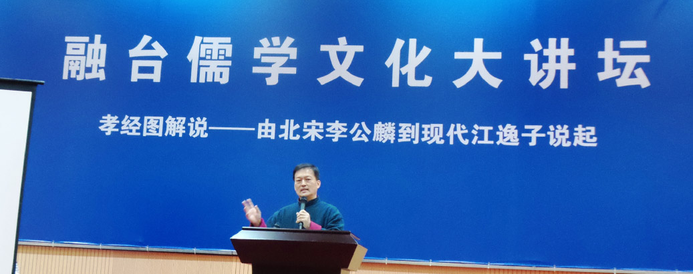

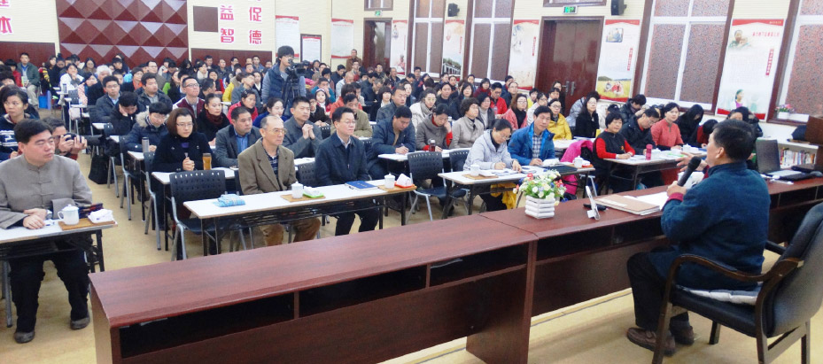

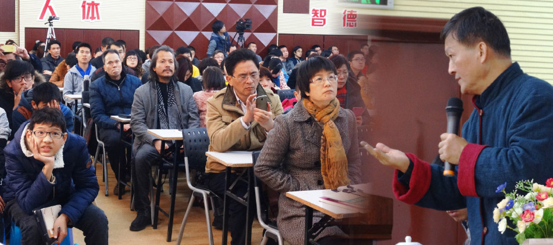

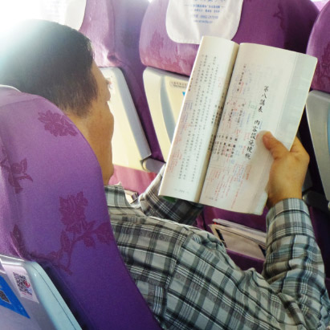

## 後記

### 甲午年終歲末與展望

本刊

年終回顧隨善生

戒慎迎向新年春

三羊開泰通人和

文化飛揚佳事多

甲午歲末，乙未將至，中華無盡燈文化學會在老師的指導下，眾人和合，持續以教法學習為核心，廣造眾善，也是為社會和諧、改善風氣而努力。本年度最大的改變，在於學會正式開啟互聯網的經營，並以直播上課的方式，弘揚儒家文化，走在時代的先驅。邁向時代，維持中心思想；造就菁英，呈現繼往開來，是學會本年度轉型的宗旨。虛擬世界的網路事業正式啟動，實體世界的各種工作也未停歇，謹此報告過去忙碌的一年中，豐碩的成果，期望大家未能參與者，能夠隨喜，已參與者能夠感恩、珍惜，並期望能凝聚共識，共同打造全新的二Ｏ一五年。

壹、例行課程（含啟蒙）及念佛共修

一、臺北中華無盡燈文化學會

１．每週星期一，晚上七點至九點，原開設「中庸」講座，已於二Ｏ一四年一月十三日圓滿，繼而在同一時間開設「佛學概要十四講表講座」，現已講授至第八表。

２．每週星期二，上午九點半至十二點，開設「學賢班」，以江逸子老師七十二賢畫作，及《論語講要》作為教材，共同研學孔門聖賢之行儀、風範、內涵。

３．每週星期三，下午一點半至四點，開設「讀經班」，教導孩子們如何讀經，並淺釋經典之義理，使之能運用於日常生活之中。

４．每週星期三，晚上七點半至九點，開設「論語直播講座」，目前講授主題為孔門弟子─子貢，透過時哉時哉網路教育學院的直播平台，本課程能夠全球同步觀看，目前主要收視群以台灣和大陸的學員為主。

５．每週星期四，上午九點，至下午三點半，舉行「三代共修」。共修內容包括了上午的念佛，以及下午的講座，《觀無量壽經》講畢，現正研討佛說阿彌陀經。

*６．每週星期五，晚上七點至九點，開設「法華經講座」，現已講授至安樂行品第十四。*

７．每週星期六，下午兩點至五點半。開設「詩階述唐講座」，以雪廬老人之《詩階述唐》作為教材，學習唐詩之義理、內涵、情境、聲韻等。

８．每週星期六，晚上六點半至九點，舉行「共修研學」，分為成人共修班、大專班、啟蒙班中班及小班，分別研學，並於晚間八點至九點，集合成人共修班及大專班，講授「人生大事─不能忽略的事實」，有關臨終關懷的課題。

９．每月固定兩次，舉行人才培訓班，係由基隆淨宗學會陳曼玲會長發心護持，至今已經三年，研討《大乘百法明門論》、《論語》、《常禮舉要》、《禮記經解》等課程，並有專題演講，本期培訓將於今年二月一日圓滿。

二、臺中市無盡燈儒佛學會

１．每週星期三，晚上七點半至九點，共同學習時哉時哉網路教育學院，所開設之「論語直播講座」。

２．每週星期日，晚上七點至九點，舉行「念佛共修及淨行品研討」。

三、中壢研學會

１．每週星期三，晚上七點半至九點，共同學習時哉時哉網路教育學院，所開設之「論語直播講座」。

２．每週星期日，上午八點至十一點，開設「論語研討」班。

四、宜蘭研學會：

每週日上午八點半至十一點半，開設「人生大事及常禮舉要」研討。

貳、互聯網經營

學會經過一年的籌備與學習，於二○一四年十月一日，正式啟動時哉時哉網路教育學院，至今試辦三個月，成效斐然，已於各入口網站形成品牌，能以「時哉」二字迅速搜尋到本教學網站。並同時於FACEBOOK，大陸微博開啟社群，另以LINE和微信，與各地學員聯繫，形成共同學習文化的讀書團隊。

參、專題講座

一、於卓蘭實驗高中舉辦啟蒙講座，主題為「迎向朝陽飛龍在天的見地與民族」。（2014.01.21）

二、為法務部矯正署受訓之監獄官及監所管理員，開設文化講座課程，今年度一共有八次課程。（2014.03.18~）

三、應中國醫藥大學醫王學社邀請舉辦講座，主題為「貴爾見地不貴爾行持」。（2014.03.27）

四、應國立海洋大學邀請舉辦講座，主題為「成功的秘密」。（2014.05.01）

五、應台中霧峰國中之邀請舉辦啟蒙講座，主題為「不一樣的孩子」。（2014.06.30）

六、舉行人才培訓班暑期講座，並有大陸諸暨、瀋陽、河南等地的學員一同來台參與共學，主題為「出路由名言中通達─由論語及百法說起」。（2014.07.05~10）

七、兩岸三地中華傳統文化研習營(2014.08.28-29)

肆、兩岸及國際文化交流

一、聯合國大使來故宮參訪，由學會老師導覽。（2014.01.31）

二、福清立達孔學會來訪。（2014.03.04）

三、前往浙江省諸暨市舉辦講座，主題為「國學與現代教育」。（2014.03.31）

四、舉行遼寧省瀋陽師範大學師資培訓講座，期間並舉行論語正音研討會、儒家文化研討會。（2014.04.21~25）

五、曲阜孔子文化學院來訪。（2014.05.30）

六、靈峰佛陀教育弘化基金會及孝廉講堂來訪。（2014.07.01）

七、前往浙江省義烏市舉辦講座，主題為「品牌向上提升來自人文素養—從孔子身上找內涵」。（2014.08.11）

八、前往江蘇省無錫舉辦講座，主題為「迎向二十一世紀的主流—由論語孔子風采說起」。（2014.08.15）

九、前往福建省福州市舉辦講座，主題為「人生與事業的出路在論語」。（2014.10.25-26）

伍、國內社團交流

一、通泰傳媒故宮導覽（2014.01.07、03.11）

二、拜訪澹寧齋江逸子老師（2014.01.08、03.27）

三、華藏淨宗學會交流（2014.02.12）

四、中國醫藥大學醫王學社來訪（2014.02.22~23）

五、台北弘明天母讀經班來訪（2014.07.18）

六、卓蘭實驗高中龍隊故宮參訪（2014.09.27）

七、澹寧齋江逸子老師來訪（2014.12.10）

陸、法務活動

一、拜懺法會：大悲懺（2014.03.23）、地藏懺及浴佛法會（2014.05.04）、地藏懺（2014.08.24）、藥師懺（2014.11.02）。

二、年度齋僧：西蓮淨苑齋僧共十次，正覺精舍齋僧一次，圓通寺三壇大戒時亦有供養。

三、護生法行：江浙大型放生活動（2014.05.10~17）新店放生（2014.06.22）。

四、緬甸參訪：學會組團前往緬甸，一共是八天的行程，以年輕學員作為主要辦事團隊，訓練和合工作的辦事能力。期間法行包括放生、齋僧、救濟孤兒院、巡禮佛塔、古蹟參訪，並且與緬甸現任央行副總裁塞奧先生會談。

柒、蓮友服務

一、臨終關懷：去年計有往生蓮友七人，在他們生命的最後階段，學會蓮友們提供了最溫暖而重要的鼓勵，使之能夠提起正念，往生極樂。

二、二○一四年八月二十日，成立中華無盡燈文化學會LINE群組，使大家能夠即時交流，凝聚團體共識。

三、發送年終結緣品。

捌、其他活動

本會為能達到共住之目標，去年在蓮友們的努力下，一共探勘了二十多塊土地，雖還尚未能成功，但也藉此凝聚大家共住之共識，並持續往此目標前進。

玖、出版傳播

一、二○一四年一共出版六期蓮榮會刊（92期至97期）。

二、《論語講要》校對及印製。

三、「孔子聖蹟圖日文版」光碟出版。

四、「如是獨行江逸子紀錄片」發行。

上述各項法行事業，參與者、出資者、出力者，於私上能增進自己的善根福德，於公上能莊嚴團體，安定社會國家，有缺失之處，辦事人員要懷著慚愧、檢討及反省，對於能利樂有情的部分，要生起隨喜及感恩之心。新的一年，預定四月應邀至〈孝治天下傳統文化高峰論壇〉授課，八月也將應邀前往上海圖書館之江逸子老師畫展負責導覽工作，後年預計將依紀念雪廬老人往生三十週年舉辦畫展。願大眾以公心繼續善法的造作，成為現世安樂，未來往生及成佛的資糧。相信在有限及短暫的生命中，將是最殊勝的莊嚴。
