# 第99期
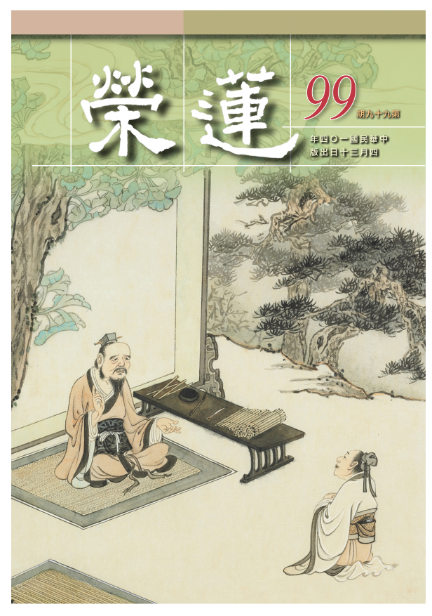

## 社論

### 迎接孝治天下的時代

本刊

時代脫序價值混

迷霧尋路待正見

古往今來盛世開

孝治天下指見月

「孝」字即子承老也，善事父母為孝。孝貫穿了中華傳統文化，是吾人特有，外國所無。然要做到何種程度方可稱孝，範圍定義人人各異。古代的孝是要揚名聲、顯父母，光宗耀祖。現今多數人以為的孝是讓父母衣食無虞。大陸近期也推展孝文化，落實在洗腳、搥背上。然孝若僅止於此，則何能彰顯「孝，德之本也」、「孝弟也者，其為仁之本與」的內涵，故找回一個真正有內涵、有價值、有中心思想的孝文化，成為這個時代的重要課題。

隨著江逸子老師十八幅「孝經圖」的完成，四月份的「孝治天下」千人論壇，八月份的上海「道藝春秋」展，乃至明年雪公太老師三十周年的紀念大展，「孝」將是主軸、是門戶，能帶領我們深入認識體會中華傳統文化。透過《孝經》、《論語》、《尚書》、《左傳》、《國語》、《禮記》、《詩經》等經典，集結孝的面面觀，把孝的價值、形象具體刻畫出來，依之來論孝道在各階層的運用，在生活中的運用，而最重要的是見地的經營，有見地的孝，才不會落入愚忠愚孝，有見地的孝，才可以修身、齊家，甚至治國、平天下，能趨吉避凶、改變命運，而見地從經學來，故經典的學習是孝道的不二法門。

《論語》學而篇第二章講到了通往內聖外王的大道，關鍵處在孝悌。此章雪廬老人數十年不解，研讀以後，依各家註解篩檢，並依經文詳加剖析與探究，才真正明此章之義。其經文為：「有子曰：『其為人也孝弟，而好犯上者，鮮矣；不好犯上，而好作亂者，未之有也。君子務本，本立而道生。孝弟也者，其為仁之本與。』」「其為人也孝弟」為修身之道，一個在家行孝之人，才有遇到善知識的因緣，得其提攜引導，走入內聖的大道。「而好犯上者鮮矣」言齊家之道，家庭講究和諧，及態度、規矩的經營，這樣的人處於社會中，極少有喜好觸犯上位者。「不好犯上，而好作亂者，未之有也」不喜歡觸犯在上的人，必不喜歡作亂，社會由此安寧，此推及治國之道，是調和之才。而治國、家齊的關鍵在修身，修身的關鍵在孝悌，孝悌的本質立，則得齊家之道、治國之道、平天下之道，各種的百工技藝之道。倘若本源處沒有經營好，外面的事功就只是虛張聲勢。最後贊歎道「孝悌啊，大概就是仁的根本吧！」於此足見孝悌的重要性。

孝悌既是如此重要，為人子又應如何施行？《禮記》中曾子把孝分為三個等第，「孝有三：小孝用力，中孝用勞，大孝不匱。」心繫父母恩，竭力侍奉雙親，忘記身體的疲勞，這是小孝。行仁行義，建立事功，是為中孝。立身行道，以正知見利益大眾，父母死後，人們都備禮來祭祀，堪稱大孝。可見孝子對父母不只是生活起居的奉養，身體上的勞動，心態上的講究，還要有經典的學習，有經典的涵養，方能行仁利眾。而雪廬老人說，佛門的大孝是父母身陷地獄，做兒女的有能力超拔，並度父母成為菩薩，如此程度方成為大孝，又豈是世間形式上的盡孝可比擬。故真正的孝不但能揚名顯親，還要以佛道做為強而有力的後盾，發大悲心、菩提心，普渡眾生，解除宿世父母的輪迴之苦，才是真正的報父母恩。

依上述所言，可見孝道的推行非同小可、極不簡單，懂得從孝悌中見到整體，猶如經營樹根，發展樹葉，有火候、氣象、見地的經營，自然與一般的孝千差萬別，是吾人的所願境，也是這個時代最需要的，讓我們從家庭盡孝做起，用傳統文化扎根，一起迎接孝治天下的時代！

## 大德法語

### 大方廣圓覺修多羅了義經（五十八）

道源老和尚

善士順逆現

學生見希有

如佛轉法輪

入不思議境

乙二、正宗分

丙二、令依解修行隨根證入

丁二、廣明行相

戊二、四問答別明觀行中根修證

己二、二問答二重除障

庚二、依師離病

辛五、正答所問

壬一、偈頌

癸一、標頌

經文：

爾時世尊，欲重宣此義，而說偈言：

癸二、正頌

經文：

普覺汝當知！末世諸眾生，欲求善知識，應當求正見，心遠二乘者。法中除四病，謂作止任滅。親近無憍慢，遠離無瞋恨，見種種境界，心當生希有，還如佛出世，不犯非律儀，戒根永清淨。度一切眾生，究竟入圓覺，無彼我人相，當依正智慧，便得超邪見，證覺般涅槃。

叫一聲普覺菩薩，末世諸眾生，欲求善知識，要求何等善知識呢？應當求心遠二乘及具中觀正見的大乘善知識。此說法之善知識沒有作、任、止、滅這四種病。此義已在長行文說過。

親近善知識，內心不可憍慢(以為自己學得很通達，自認青出於藍)，即使要離開善知識，也不能帶著瞋恨。見善知識有時現順境，有時現逆境，要當做種種希有相就對了！親近善知識，要將善知識當成佛出世一樣，不要犯惡作等一切律儀，將戒律持得清淨，而不犯一切律儀，發願度一切眾生都入究竟圓覺。如何入究竟圓覺？無我、人相等，你去渡眾生，不要起我相、人相…等等，當依正智慧，便超出於邪見入般涅槃，般涅槃就是無餘涅槃，以圓覺入於大涅槃，以上是普覺菩薩請問。

戊三、一問答道場加行下根修證

己一、圓覺啟請

《圓覺經》當機眾一共有十二位大菩薩，此處圓覺菩薩是第十一位，正宗分最後一位就是圓覺菩薩。最後流通分，是第十二位賢善首菩薩。

經文：

於是圓覺菩薩，在大眾中，即從坐起，頂禮佛足，右繞三匝，長跪叉手，而白佛言：

讚歎之前的禮敬，方請問求開示。

己二、正陳請詞

庚一、慶前

經文：

大悲世尊！為我等輩，廣說淨覺種種方便。令末世眾生，有大增益。

前者世尊不斷的闡揚，廣說如何證悟清淨圓覺。入圓覺的智慧有種種的法門，每一位菩薩請問，都沒有忘記末世眾生，為末世的眾生請問。圓覺菩薩更專為末世眾生請問，希望令末世眾生得到大增益。世尊滅度以後，正法一千年和象法一千年都過去了！現在就屬於末世了，末世的眾生是去佛漸遠，而且邪說弘興、外道猖獗，那麼末世眾生怎麼修行呢？圓覺菩薩請佛多多開示。

庚二、請後

經文：

世尊！我等今者，已得開悟。若佛滅後，末世眾生，未得悟者，云何安居，修此圓覺，清淨境界？此圓覺中三種淨觀，以何為首？惟願大悲，為諸大眾，及末世眾生，施大饒益。作是語已，五體投地。如是三請，終而復始。

前述奢摩它、三摩缽提與禪那三種觀行，都是腳踏實地的修行，都是悟清淨圓覺的修行。如果沒有開悟，得用什麼方法開悟呢？必須要安居在道場以修此圓覺清淨境界。

修行三種淨觀(奢摩它、三摩缽提、禪那)須以何者為首？亦即下手方便有三種淨觀，以何為最先呢？圓覺菩薩除了為諸大眾，特別為末世眾生施大饒益，菩薩行法布施，眾生就能得到最大的利益，故稱為饒益。

己三、如來讚許

經文：

爾時世尊告圓覺菩薩言：善哉善哉！善男子！汝等乃能問於如來，如是方便，以大饒益，施諸眾生。汝今諦聽，當為汝說。

佛先讚歎他，並說你能問如來，修這三種淨觀(入圓覺方便)以何為首？前面圓覺菩薩讚歎如來，以大饒益，施諸眾生，此時佛反過來讚歎菩薩，你們請我開示方便法門令眾生得大饒益。

法布施這一分，實際是你們大菩薩的功勞，你沒有代眾生請法，我也不會說。我說法令眾生得了大饒益，也是你們大菩薩的布施，使眾生得了大饒益，這就是徒弟讚歎師父，師父讚歎徒弟，互相讚歎，佛門有一句流行的話：「要得佛法興，還得僧讚僧。」大家都要學到這一點，佛法怎麼興呢？必須要出家人讚歎出家人，你讚歎我，我讚歎你，佛法才興！現在末法時代，你說我的壞話，我說你的壞話，坐在那閒聊天，一聊就講出家人的壞話，如此佛教就衰落了！這是一個大病！

庚四、承教靜聽

經文：

時圓覺菩薩奉教歡喜，及諸大眾，默然而聽。

己五、正答所問

庚一、長行

辛一、答道場

壬一、結前

經文：

善男子！一切眾生，若佛住世，若佛滅後，若法末時，有諸眾生，具大乘性，信佛秘密，大圓覺心，欲修行者，若在伽藍安處徒眾，有緣事故，隨分思察，如我已說。

下面佛答覆圓覺菩薩的問題，叫一聲當機者，佛住世時，現前大家都跟佛同時住世。

若佛滅後，釋迦牟尼佛住世八十年，若按他成佛，則是三十歲成道，八十歲入滅，一共說法四十九年，佛滅度以後，正法一千年，象法一千年，佛滅度二千年以後叫做末法，也就是佛法到了末位。正法時代與佛住世無二無別，所以稱作正法時代；象法時代也與佛住世無二無別，內涵差了一點，叫做相似正法時期；到了二千年以後，佛法就慢慢的衰落了，這叫做法末，生於此時的眾生就叫做末世眾生。

佛教說的法音，必須要了解的清爽，佛教不是批八字算命的定命論，定命論是注定不可更改的，你的命運應該大富大貴，算命師給你下個「應該」兩個字；你這命運是貧賤命，應該貧賤，也下個「應該」兩個字，應該富貴或應該貧賤，這叫定命論。

如果說佛教的正法、象法共二千年，末法一萬年，這就完全是定命論，佛教講因緣，到了末法時代，只要具有大乘根性的眾生，能不教他學圓覺行嗎？末法到最後還是有佛法在，我們慶幸具有大乘性，如果沒有大乘性，怎麼還會喜歡聽大乘經典呢？雖是末法眾生，因具大乘種性，故對具圓覺妙性起信仰。

秘密這兩個字就是九法界眾生不知，唯佛了知，佛教無所謂秘密，不像外道法不傳六耳，鬼鬼祟祟在房間裡傳！佛教的秘密是九法界眾生不了知，唯佛了知，大家要會解釋。

圓覺體性是人人本具，各個不無，現在聽了《圓覺經》，要相信自己也有個圓覺妙心，要發心修行！尤其具足有大乘根性者，要發心學圓覺妙行。

四眾弟子都可以做菩薩，此處單指出家弟子。經文伽藍，翻成中國話叫眾苑，大眾僧所住的園庭，乃寺院之通稱。在寺院裏有大眾僧（徒眾）安處，裡面有很多生活上的需要及要做三寶的事，譬如供佛得有佛殿，安置佛像，還得買香、買花供養，供養法寶得印藏經；供養僧寶，得要買米、買菜、買鹽、買油，這都是出家人的有緣事故，有緣就不能不辦，不能專心用功，但要隨分思察圓覺的修學法（歷緣對境修）。

所以不思察，我們現在末法時代的眾生，不但去佛遠，出了家又把時間盡是忙在準備食物，一天到晚忙在柴、米、油、鹽、醬、醋、茶這些事上面，沒有空用功修行，那又何必出家呢？即使忙碌也要隨分思察。佛法不是死板的，雖出家的菩薩要用功修行了生死，成佛道，然有緣事故出現時就要去辦，不過不要被俗事所轉，要隨力隨分用功，不要把道心給忙掉了！我們到今天都是末法時代的眾生，能夠出家代表大家都還有一點道心，是露水道心，像樹葉上那點露水珠，圓圓的一點露水，太陽一出來就完了，經不起食物打岔，一打岔都給打掉了，天天忙食物去了！所以要注意隨分思察，忙裡偷閒還要用功，思察圓覺，不要對不起出家的善根。（下期待續）

## 專題研學

### 小止觀導覽（七十一）

*心爾、治心整理*

治病能痊癒

假想觀空性

修福懺悔力

咒力除魔障

第九章  治病

論文：

有師言：善用假想觀，能治眾病。如人患冷，想身中火氣起，即能治冷。此如雜阿含經治病祕法七十二種法中廣說。

《雜阿含經》明七十二種治病秘法，皆以假想觀治病，如望梅止渴，就是一種假想梅，而口生津止渴，白骨觀觀大地盡是白骨，亦是一種假想觀，如何觀？從自己眉間裂開，露出骨頭，慢慢地全身剩下骨架子，觀他人也是一樣。目的在止息內心淫慾之火，此為假想觀。對我們的修行有很大的幫助。寶靜法師舉二個故事：一是另類「杯弓蛇影」的故事，好比吃到一條蛇一樣，身體感覺到非常痛苦，其實並沒有，給他吃瀉藥，然後在他瀉的地方故意放一條死蛇，他的病就好了，可見是心理作用。

二是有一個婢女到水邊舀水，樹上有一個女人吊死，影子倒映在水中很是漂亮，這個婢女一看到這麼漂亮的我，怎麼可以只做婢女呢？回去以後就不做事了，主人罵她，她卻回說像自己形色這麼姣好，怎麼只能做婢女！主人聽了感到很好笑，但一時說不清，乾脆帶婢女到水邊看水影，果然是這麼漂亮，可是抬頭一看，卻是一個吊死的人，婢女便生起了大慚愧。

這些在《阿含經》上的治病法，要先善知問題所在，再以假想來解決問題。

如果一個人對世間的事物很喜歡，叫他厭離三界是辦不到的，那要如何呢？就教他觀想什麼情況最為臭穢，如食物新鮮時看起來很美味，但放久之後開始有臭味，再放久一點還有蛆在上面爬，這就告訴我們究竟處的真相，作如是觀時，對美食都會產生噁心。

或如人患淫，想身中火氣起，即能治冷。或患熱，想觀音菩薩甘露灑頂，徧及全身，通體清涼，即可治熱。

論文：

有師言：但用止觀檢析身中四大病不可得，心中病不可得，眾病自差。如是等種種說，用觀治病，應用不同，善得其意，皆能治病。當知：止觀二法，若人善得其意，則無病不治也。但今時人根機淺鈍，作止觀想，多不成就，世不流傳。又不得於此更學氣術、休糧，恐生異見。金石草木之藥，與病相應，亦可服餌。

「止」就是止在痛處、止在丹田、或止在腳底。「觀」就是用六氣十二息來治五臟、四大不調等、或是身體腫脹、塞住、氣悶、頭重、腦昏等，這些都可以善用十二息來治。

病是四大的顯現，四大一一皆了不可得，所浮現的病體性又如何可得，但現在人心思雜亂，根本無力修學止觀，更談不上以止觀之法治病。現今還有流行氣功治病，乃至服氣不吃五穀，這些問題很多。若能善用金石草木質料所製之藥，亦能除病。

論文：

若是鬼病，當用彊心加咒以助之。若是業報病，要須修福懺悔，患則消滅。此二種治病之法，若行人善得一意，即可自行兼他，況復具足通達。若都不知，則病生無治，非唯廢修正法，亦恐性命有虞，豈可自行教人？是故，欲修止觀之者，必須善解內心治病方法；其法非一，得意在人，豈可傳於文耳。

前文有云得病因緣有三：一、四大五臟增損得病，如以上所說用止觀二法治之，亦可服金石草木之藥治之。二、因鬼神所作得病。三、因業報得病的治療方法。

假若是鬼神所作得病，當用彊心加咒以助治之。所謂彊心加咒，就是以堅強的心力加持神咒，也就是用上心，將心志堅固，將心量加大，並且在外緣上努力為公。有些人生病總是醫不好，容易在心思上面轉不出來，總是回到原點。所以論文當中的以彊心加咒以助治之，也就是除了用止觀二法或服藥以治病外，再以堅強心力加持神咒來幫助治病。若是業障病，要修懺悔法，並發大悲心，必能除之！

止與觀的治病方法，若修行的人善得其一種意義，就可自行化他，何況是對此兩種治病方法(業障病、鬼神病)具足通達，更能自利利人。假若對這種治病的方法都不知道，則病生之時無法治療，不但是廢修正法，也恐怕性命有喪失之虞，豈可自行教人？

所以欲修止觀坐禪的人，必須善解內心治病方法。這些方法很多，不是一種，必須善得其意，也就是心中有這樣的體會叫做得意，不是在文字表面轉而已。（下期待續）

### 菩薩清淨的行持　華嚴經淨行品（十五）

*編輯部整理*

受苦願眾得自在

出家祈生能解脫

胸懷利他向上游

不遭魔難不成佛

丙二、指事顯因答其徵因

丁一、總徵

丁二、別顯

戊一、明在家時願

己四、在家作事願─在厄難

經文：

若在厄難，當願眾生，隨意自在，所行無礙。

在家共有十一願，此是最後一願。厄是災厄，難是苦難，我們在遭到厄難的時候，應該如何存心來發願呢？在厄難中能夠存好心、發好願，並且引發願代眾生受無量苦的念頭。一般我們遭遇厄難困難的時候，發心往往是不正確的，有時甚至會埋怨怎麼都是我在受苦。在菩薩戒中也有提及好事與他人，惡事向自己。我們若能有以上的心量，在遭逢厄難的時候，心情也會是坦然的。

而遭逢厄難時必須有二種心態：一是此生遭逢厄難是過去惡業所致，所以抱著隨緣消舊惡的心，進而擴展心量產生願代眾生受無量苦。如同永嘉禪師證道歌說：縱遇鋒刀常坦坦，假饒毒藥也閒閒。說明一個人心心念念在道上面，縱然遭遇到鋒刀、毒藥等厄難，也十分坦然自在。結合此段經文，我們若能夠這樣子的發心，所得到的就是所行無礙。在三界六道當中都是有障礙的，二乘聖者出三界雖是無礙，入世則有礙，唯有成佛是究竟的無礙。

若在厄難是願所依，能願的是菩薩、願依靠菩薩，在厄難中發願。能願的是菩薩，所願的是眾生，菩薩希望眾生能夠得到隨意自在，所行無礙，菩薩得到身口意三業清淨，十種離過成德。

是否人在厄難的時候，才要發願？此菩薩的心住在正法上，隨時都在發願，厄難只是遇境逢緣中其中一種狀況而已！就算不會有厄難也要觀想會有厄難降臨，了凡先生在立命之學上有云：即命當榮顯，常作落寞想；即時當順利，常作拂逆想；即眼前足食，常作貧窶想；即人相愛敬，常作恐懼想；即家世望重，常作卑下想；即學問頗優，常作淺陋想。換句話說，人在順境的時候要想到逆境，不是等到倒楣的時候才在厄難中發願。

所以此句經文的真正解釋是，在順境時要想到順境背後就是厄難，風光的背後就是倒楣，此時就容易懂得謙虛，我們凡夫大都是看不到這一層面的。謙卦的正解是：在風光的時候也能保持極為謙虛、不是解為在逆境的時候謙虛。在隨意自在當中，何謂自在呢？

自在有分為身自在與心自在，心自在就是不被煩惱繫縛，然須破無明，因為依無明會生惑。無明滅則惑不生，無惑可發業與潤業，即使往昔有無量業種，都不能夠結果。所以此句經文：隨意自在是指什麼呢？破無明、煩惱障、所知障；所以才是隨意自在，所行無礙。

菩薩雖無惑業所繫縛，可隨意自在，然所行如何能無礙呢？現見菩薩在度眾生時障礙重重，對於有情不接受諸佛菩薩加被的這一分，佛菩薩是無可奈何的，然觀待佛菩薩破煩惱障、所知障，以空性的智慧，在諸法當中得到無礙。就算眾生剛強難化不被度化，佛菩薩的願力依然沒有阻礙。

例如觀世音菩薩並沒有因為三途眾生剛強難化而退道心，這些障礙都不成為觀世音菩薩的障礙，是凡夫自己的惑業障礙，他的善根，不接受佛菩薩的教誨，過不了關，但是這些挫折完全不會擊退佛菩薩的願力，所以眾生的剛強難化不會成為佛菩薩所行的障礙。

觀待上述願所依、能願、所願、願所為，每一願都有四面相的修學。第一、眾生這樣子該有多好；第二、我願眾生如此；第三、我能成辦他如此；第四、三寶加被我能如此。所以隨意自在，所行無礙，是自己要去成辦眾生成就的大業，而不是請阿彌陀佛、觀世音菩薩來做。雖然目前沒有能力，但努力培養以後要有承擔力，諸佛菩薩度化眾生的事業都可交給我，讓諸佛菩薩休息，要有這樣子的承擔力，才是菩提心真正的形象，這才是真正的發願。

淨行品菩薩修學十信滿心入初住位的修學法，從初發心能夠幫助自己、有情都成佛，這不是空願，必須要去落實，自己要培養能力，必讓所願境能夠成就。

戊二、出家受戒時願

己一、正捨俗家　捨居家時

經文：

捨居家時，當願眾生，出家無礙，心得解脫。

簡單的消文是：我們要捨的是家庭、財產、眷屬……等等，要出家的時候，就必須把這些都放捨掉，當有機會出家的時候，要做這樣子的觀想，比較不會有罣礙。捨離家庭的出家，比較不會有世俗的干擾，佛有四眾弟子、佛並不是鼓勵所有弟子都出家，佛在世的時候有俗家居士來護持三寶，每一眾佛弟子都有應該扮演的角色，出家二眾是弘法為家務、利生為事業，因此古德說：真正能夠出家的人，必是出將入相之才，只有出家成佛、並沒有在家成佛，所以能夠出家的因緣是非常殊勝的，我們也必須要有這樣子的認知，承擔如來的家業，而是否出家、每一個人的因緣是不同的。

第四句經文：心得解脫。就是出家的目的，出家後證得本有清淨之心、才能夠真正得到解脫。

六十華嚴的經文：以信捨家，當願眾生，棄捨事業，心無所著。此段經文告訴我們，對於世間的眷戀是必須捨除、放下的。從不同的譯本，都可以看出是對世間愛戀的捨棄，在學佛的路上生起正知、正見，這才是出家得解脫成佛的因。

捨去家庭、眷屬、事業、錢財、地位……等等，這些都是努力爭取才獲得的，怎麼能說捨就捨呢？然即使不出家，到臨命終也是得捨，所以說出家眾是身心皆出家，在家眾是身沒有出家，但是心要保持出家（出煩惱之家、三界之家），這些家庭、眷屬等都是愛染、煩惱的生起處。

此處經文是對出家而說，發願出家無礙，可見出家是有障礙的，出家會有什麼障礙？出家須有善知識、法本、道糧。曾有師父說：不出家都沒事、想出家的時候，魔就來考驗，受戒的時候就大病一場。寺廟裡的事情比家庭還要多，要成為天人師的時候，是會有很多障礙的，沒有相當的願力及對教法勝解，走到一半或許還俗了。

心得解脫須是對教法勝解，生起出離心、菩提心，依六度的修學，生起空性的智慧得到解脫，這些修都是不簡單的，要有很多的善緣幫忙，惡緣考驗。

此處的當願眾生，是內心的渴望，雖然有外在的障礙，但是內心超越這些障礙。玄奘法師在中國各宗派說法不一而且矛盾的情況下，遠赴印度求學，此須克服許多障礙。出家時魔來考驗，必須要堅持戒律，勇捍修學、建立法幢，俗話說：道大魔就大。但是此時有願力，對教法有勝解，所有逆境反而成為成就的增上緣，將此段經文與〈十大礙行〉對照、觀修，才會真正了解願殊勝的理由。

既然出家要碰到那麼多障礙，所以是不是我們不出家、不修行就不會有障礙？不修行得大苦，修行得小苦，如果所有的障礙都是成佛的增上緣，怎麼會是苦呢？觀待大家要用什麼角度看這些障難。（下期待續）

## 佛學覽幽

### 大乘百法明門論簡說（七） 陸、如世尊言─一切法無我

*心超講述‧淨本整理*

一代時教引出離

待機而說分三時

衍生部派大分四

中觀方是真實義

如世尊言，世尊的一代時教分三時，小乘認為佛第一時鹿苑時為了義說法，中觀認為第二時靈山會為了義說法，唯識認為第三時廣嚴城說法為了義說法，依三時說法，後人分三時是將佛說法四十九年大分為三時，第一時就是一到四宗，第二時五到六宗，第三時七到八宗。佛滅度後，分為各個部派，他們都是根據世尊所言而作實修，但見地上卻有很大的差異。為何釋迦牟尼佛各處說法卻都不相同？由於世尊對機不同，故說的法也不同。佛也知道在他滅度之後會有思想的分歧，授記在他四百年後，將有一位名號中有龍的比丘出世，能將世尊言中何者才是究竟了義說得清楚。

第一時─小乘

以佛在第一時鹿苑說法為了義的小乘部派，亦分四宗，第一謂之我法俱有宗：乃佛對犢子部、法上部、賢冑部、正量部、密林山部等小乘部派之機，說我法俱有。亦即法上有生死、有涅槃；我去輪迴生死，我去得涅槃。佛教各派共通看法，乃輪迴可畏，佛出離之，輪迴之因在惑業，惑業上首為惑，而貪愛又是煩惱根本（儒家言七情，亦以貪愛為根本）。世法剎那剎那變化，透過觀察，心識呈現萬法剎那生滅之相，謂之現證無常，世間之種種都是無常敗壞，剎那剎那敗壞，遠離對世間之貪愛，得以出離世間、出離三界。以感官所見聞等知剎那變化，心識推理分析，知所作必然無常，不斷推理分析，在心識上呈現，萬法剎那剎那遷滅，才生即滅，就是現證無常，對世間不起任何貪愛，內心寂靜，不緣世間證得涅槃（實有），謂之我法俱有宗，實則未能出離輪迴，仍有俱生執。

第二個叫做法有我無宗，一切有部等的思想屬於本宗，世親論師最初就是一切有部的大德。法有，就是有涅槃、有生死；但獨立實有的我則無。換言之，並沒有一個能背負五蘊的我存在，稱為法有我無。本宗只破到粗的俱生執，佛對這類的部派，最微細的我執就講到此。

現證無常為何可以破煩惱？我們的煩惱從兩個地方去破，第一個從我執上破，第二就是從無常上破。由於有我，令我樂就愛，讓我苦則憎，我是愛恨的生起處，因此破我執可以破煩惱。此處只破粗相之我，並現證無常，了解世界剎那變化，破除對外面世界的貪戀。所以現證無常跟現證人無我，是小乘部派裡面兩大修學的綱領。

第三個叫做法無去來宗，大眾部、雞胤部、制多山部、西山住部、北山住部等屬於本宗。何謂法無去來？法的過去已經消失，法的未來還沒有來，法只有在當下顯現，而且是剎那顯現，這也是無常觀。本宗同樣破到獨立實有的我無，以及現證無常。

第四宗叫做現通假實宗，說假部跟經部屬於本宗，屬於小乘裡很高的宗派。何謂現通假實？共相是假，別相是實。例如手錶，不管各種形式皆稱手錶，是為共相（總相），至於別相乃指眼識所見不同的手錶。共相是人為定義，是假；別相是眼識（前五識）的境界，是實，是共相所攝持的差別相。因此共相只是意識的名言安立，是虛假，而別相是眼識所見、耳識所聽、鼻識所聞，那是真的，此稱現通假實宗。此外假法也是指無為法（常）；實法則是指有為法（無常）。

至此都是屬於小乘部派，佛對小乘部派說無常、破粗相的人我，只有這兩分，是在鹿野苑所講，稱為第一時，小乘部派認為佛此時所說是了義。

第二時─通大小乘（中觀宗）

第二時是佛在靈鳩山說法，中觀宗判為了義，分別是第五俗妄真實宗與第六的諸法但名宗。首先說明中觀宗的第一個宗義：俗妄真實，世俗的顯現都是虛妄，空性是真實。例如山河大地的顯現，不同的人所見不同，認知也不相同。以一水四見來論，同樣是水，鬼看水是膿血、魚看是空氣、人來看是水、天人來看是琉璃，都不一樣。日本江本勝博士從顯微鏡中看到很美的水結晶，有如琉璃，如同天見水般的境界。

其次諸法但名，諸法的生起只有依靠名言，此是唯識宗與小乘人最不以為然之處，諸法若只有名言安立，沒有自體成立，意謂沒有該法，如此成為斷滅見？中觀宗反駁不是沒有法，而是否定法的自體性，法的生起唯有依名言認知，不必心識的名言安立，法能自體存在，一粒微塵都了不可得。即使因果也只是名言的關聯，不是自體的關聯。已滅之因無自體可言，而能生果，此果又如何有自體可言？

中觀宗是通大小乘，小乘部派之利根者，如舍利弗、目犍連、阿難等皆具中觀思想，乃小乘東山部。中觀宗認為，他宗所講的俱生執都是粗分，不是細分。而且人我跟法我其實都是法，人我以及法我自性破除的方法都一樣，若未通達空性，實不能出離三界。

第三時─大乘（唯識宗）

第三時說法是屬於唯識見，乃佛在廣嚴城所說。唯識宗為什麼是大乘？因為小乘人不通達唯識，小乘人可以通達中觀，因此此處所謂的大乘，並不是唯識宗屬於大乘，而是佛只為大乘人說過唯識的思想，沒有為小乘人開顯。唯識宗認為佛在第三時說法是了義。亦即勝義俱空宗和應理圓實宗。勝義俱空宗是指三無性，說明非有；應理圓實宗則是三性，說明非空。

徧計執相無自性，依他起生無自性，以及圓成實勝義無自性，三者俱空，稱為三無性。徧計執相無自性，是說周徧計度所執的相其實沒有自性。徧計所執的相有二，第一是名言相，我們所見的相只是名言安立，例如我們看見黃金、鑽石認為可愛，貓狗則不認為，可見可愛只是自己名言認知。第二是心外的相，以一水四見為例，唯識宗認為，如果水在心外能夠成立，為何鬼看是膿血，魚看是空氣？原來境界隨著心識在變化，境界的體性是心識，在心外無法成立，認為該法在心外成立，只是該法的徧計執。以上名言相和心外相都沒有自性，稱為徧計執相無自性。相無自性並不是沒有，只是沒有自體性，但是名言的相仍有作用，人認定是鑽石，就在人類發生鑽石的功能；如果是猴子，認定鑽石的功能是砸人，就發生石頭的功能。

何謂依他起生無自性？因緣所生就是他生，所以自生沒有，可是有他生。諸法若有自生，則諸法在因中就有果，若諸法在因中有果，何必講因果？然諸法待他緣而生，即是他生有自性。

何謂圓成實勝義無自性？圓成實勝義的二種我沒有自性，亦即獨立實有的我無自性，稱為人無我；法在心外不成，稱為法無我。此二種我沒有自性，就是圓成實勝義無自性。

徧計所執所執的相無自性，可是有徧計執。依他起的自生無自性，雖無自生，可是有他生，而且是從心所生。圓成實勝義的二種我無，法有在心外不成之性，此即圓成實有自性。有徧計執、有心內顯現的他生、有圓成實，三性具有，稱之為應理圓實宗（非空）。

唯識宗三性三無性的道理，就是該宗的中道思想，非有是指三無性，非空是指三性。然而中觀宗非空非有的解釋則不相同，中觀宗認為非空是指諸法的空性並非斷滅，是說緣起而無自性，在一個法上說非空非有，這就是該法的中道。

看到懺公表解中有關三時的說明，第一時就是一到四宗，以四阿含為主，叫作有。第二時以八部般若為主，叫作空，能攝八部般若的是《無盡慧經》跟《三摩地王經》。第三時以《解深密經》為主，是空有雙彰的中道教，此處空就是前述的三無性，有是指三性。

其實唯識宗還有鈍根、利根之分，鈍根是主張八個識，利根主張六個識，其中還為一分說、二分說、三分說及四分說。安慧論師只有自證分一分說，難陀論師是見、相兩分說，陳那論師是見分、相分、自證分三分說，護法論師則是見分、相分、自證分、證自證分的四分說。何以玄奘大師要西行印度求法？乃國內的大德沒有人能將唯識宗內部不同分析清楚。

欲明佛法須待傳承，不能只靠聰明。玄奘大師聰明絕頂，仍須求法以明宗義，有傳承愚者亦明，例如曾子魯，難悟聖言，在孔子調教下，以人一能之己百之，人十能之己千之，故得傳承。師父願意傳授絕學，再笨的人，願意苦學都會成，聰明絕頂者無傳承再怎麼摸索也不成。玄奘大師從印度得到傳承，回到大唐，太宗三次請做宰相，皆為大師婉拒。人生的價值與意義，在正法的傳承。以上「如世尊言」，世尊一代時教所說法，卻有不同認知，經過不同弟子弘揚，各自以彼認為的了義而作傳承，大抵可分為四部宗義（一切有部、經部、中觀、唯識，四者能涵攝一切宗派宗義）。初機學佛可能一時難以理解，可是了解四部宗義後，才知道佛所說法乃待機而說，了義之言可從四部宗義去剖判分析，依理成立何者才是佛真正的了義之言！（下期待續）

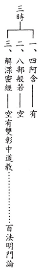

### 佛學概要十四講表簡說（一）

*心超講述‧法味整理*

眾務繁忙不礙修

引導初機編教材

三藏要義十四表

學子省卻瞎摸象

緣  起

學會自二○一三年二月十七日始，於每週一晚間開辦《佛學概要十四講表》講座，至今講授至第九表，為歷年來最完整的講述。今有學長發心整理上課內容，茲將其整理之筆記潤飾後刊登，以饗大眾。(編者)

講前小言

《佛學概要十四講表》是雪廬老人根據三藏經典經義所編之表。菩薩造論有兩種：一是宗經論，一是釋經論。雪廬老人所做的《佛學概要十四講表》，就屬於三藏經典的宗經論，根據經義宗旨意趣造論。

中國的祖師比較客氣。在注解經典時都不敢說是「論」，或者說疏，或者鈔，或者要解，或者講義，或者白話，但本質上都是論。三藏經典裏佛所說的謂之經，所制定的規矩準繩謂之律，菩薩解釋經律謂之論。論中解釋經律的宗旨要義謂之宗經論。例如：龍樹菩薩的《中觀論》，就是解釋《大般若經》的經義，並分成二十七品，以明修學空性的方法；《往生論》則是世親論師發揮《無量壽經》之經義，亦是宗經論之一種。

其次宗經論乃解釋經典文句，如龍樹菩薩的《大智度論》就是解釋大般若經的經文。另有解釋論的論，特別是論義的解釋。例如：龍樹菩薩的弟子提婆論師（是斯里蘭卡的王子），到了南印度去親近龍樹菩薩，造了《百論》，《百論》就解釋《中論》的論義，是論中論。

雪廬老人謙稱本書為《佛學概要十四講表》，則是三藏經典的宗經論。因發揮三藏經典宗旨與意趣，故為宗經論。特別處非以論文形式，是以表說明。老人云，此自古來的祖師少有做表之功，做表能使學者迅速掌握綱領、對所學一目了然。

自古以來，不論印度、中國還是西藏，大廟的主持在開創寺院時，會寫教材樹立一家的體系。雪廬老人是臺中蓮社的開派人物，也如上述大德編述多種教材，特別是表解，成為後學者瞭解佛經的入門。

老人編述的課程裏，《佛學概要十四講表》雖然屬於初級課程，是初學者入門課程，然淺者見淺、深者見深，見淺者不過依講表淺釋；見深者，發現三藏十二部的旨趣，盡在於斯。故極好講！也極難講！

有幸在大學期間參加佛學社團，學習此表，並有因緣學講。一路講來，次數約有二十遍，然無法了解真正意趣所在。隨著年齡增長，學了若干教法。再回過頭來看此講表，讚歎架構完整，也稍知如何深入淺出解釋本表的內涵。本次承蒙順師請法，不揣淺陋與林師配合，重講《佛學概要十四講表》，並願以此帶領大眾一窺老人做學問的風采。

雪廬老人治儒學的功力可以從《論語講要》裏面看出他抉擇經典的能力，另有《大學》、《中庸》以做表說明，能將儒家的大宗旨—內聖外王，形而上、形而下說清楚，讓人不得不佩服他對儒家內涵的認知。事實上，他亦深通佛理，從他所編《佛學概要十四講表》可以看出對三藏經典的通達。我們一般學佛的人，會以佛法大家認識雪廬老人，可是對他儒家的內涵可能就不甚瞭解，或者以為他只是一個大學中文系的教授而已，即使認知他是儒學的大家，也是不會知道他學佛的那種深度與廣度。唯有以儒、佛兩家內涵觀察雪廬老人，方知他乃當今儒、佛的大家，而且從他編寫的教材，可以看出，他對經典的研究有多麼深入。

後代弟子若能將老人整理出來的講表或者是經文的表解通達，進一步瞭解老人如何做表，找到解經與抉擇古注的眼力與方法，此即最好的傳承。嘗云老人留下了龐大的遺產，就是他的講表與講經表解。若能通達這些著作，在當今時代，實在是一位非常有見地、格局、氣度的讀書人。能自行、能化他、能在混亂的時代裏面給眾生找到一條出路。尤其在兩岸文化交流中，發現有很多想要學正法的人，苦於沒有老師，找不到出路。所以好好培養正法人才，實是當務之急。但要講究所學的人，他的心胸、動機以及想要學成的目標。再者能教者到底要用什麼樣的教材，用什麼樣的方法，要怎麼樣的說明，講與學這兩者互相配合，方能流通正法，培養人才。

《佛學概要十四講表》入門，先說全貌，再進入每一表的分析， 再到表內細目的講解，相信經過時間的累積，大家對此表的認識必然可觀，這是三藏經典最好的入門。我們用這種架構來解每一部佛經，就可以具有前瞻、具有高格局、具有全方位的來看每一部佛經。當法師在解經的時候，我們可以用整體的概念去看他在解每一部經，或者每一段，或者每一句。我們自然是大心量和大格局的人，看經文不會死在句下，也不會人云亦云。

所參考的注解資料，有吳聰敏老師的《佛學概要十四講演述》，乃吳師聽課筆記，分期刊載在《明倫月刊》。其次是吳聰龍老師的《佛學概要十四講表述記》，乃依天台教觀所講述，學生們整理而成。

先從雪廬老人《佛學概要十四講表》的介言，來說明為什麼要編此表？編表緣起和動機？學此表會對佛法有怎樣的瞭解？

雪公介言

介言就是介紹語。瞭解一個對象，都會經過媒介，像認識朋友我們會有一位介紹人，或者要去求職，我們會有一封介紹信。學習此表，也有一個介言，引導我們認識《佛學概要十四講表》，進一步還要與它深交，愈交愈有味道！

第一段老師說明了他為什麼編述此表的背景，提出了造福世界的三大學派，是中國的倫理學，印度的佛學，歐美的科學。我們知道，中國的倫理學，就是儒學所要提倡的。儒學之由來，乃孔子由先祖堯、舜、禹、湯、文、武、周公所傳的文化道統，集大成所說都是修己安人之法。雖然著重在形而下、五倫的關係，但也有它形而上的部分。只不過這形而上的部分，孔子是不多說、是待機而說。所以，一般人對形而上的學問是非常陌生，或解得不徹底，或邪解，所以一般都在五倫的教化上，來肯定儒學的價值。

第二個部分就是印度的佛學，乃釋尊在印度修學成佛以後，由他所說的法整理而成。等於世尊將自己所覺來覺他，偏於出世。雖然有世間的因果知見，內涵也有家庭五倫關係的經營。但重點還是在解脫及成佛。亦即佛學雖包括世間法與出世間法，但重在出世。儒學雖然有世間法與出世間法，但重在入世。所以研究中國的倫理跟印度的佛學，可以互補不足。

第三是歐美的科學。由遠古時期古希臘的科技文明，發展下來，建構了物質生活美滿的條件。可惜未能充實心靈的部分，這是非常大的危機。

若以中國的倫理與印度的佛學，即《書》經〈大禹謨〉所說的正德、利用、厚生三項之正德（充實內在的涵養）。歐美的科學，就是利用與厚生。舜問禹如何治理國家，禹提出的政治主張，就是正德、利用、厚生。利用就是講究運用自然的資源；厚生是講究民生主義。一位要治理國家的領導人，治理國家必須要如此講究，不但使國人有物質豐盛的生活，並引導至正德，亦即豐富生命的內涵。懂得經營五倫的關係，又懂得形而上的修學，最終是斷除煩惱、明心見性。一個國家的領導人有這樣的格局和見地，乃至於教育上也是如此引導國人，相信這個國家的國力是很可觀的，人民的氣質是難以想像的，是世界的標竿，是人類的典範。

現在我們雖有三大學派的流通，然科學的部分我們遠遠不及歐美，即使在跟進的時候，也沒有好好瞭解科技發展所帶來的危機。其次在倫理方面，也受西風東進影響，整個倫理道德是頹喪的，遭受到摧殘。

在雪廬老人的詩裏，只要講到西風，都是講洋人風，因為洋人位置正好是西方，吹來正好是秋風，吹得景色蕭然，代表很多內涵，道德倫理乃至一切善良的風氣，經過西風一吹以後都不見了。大家只在乎物質的發展與享受，到底人類利用科技，帶來的是幸福還是災難？如何透過中國的倫理與印度的佛學來保證科技的方向，帶給人類真正的幸福，這也是當務之急。

再者佛學的部分，在雪公推展《佛學概要十四講表》的年代裏，佛學已經不普及，臺灣與中國大陸，信奉佛法的人是很多的，卻少有對佛教的正信，正信是建立在對教法的了解，然佛法流行在民間，多半只是宗教儀式，入佛門祈福求功名利祿而已。

然而，這比雪廬老人剛來臺灣時已經好太多了，那時臺灣是神佛不分，這些先天教、龍華教等等，根本就是曲解佛義。會性法師曾憶及其師慈航法師為了要流通正法，全省巡迴演講，龍蛇混雜，場面之亂難以想像，台下聽課有聊天的、賣冰棒的、賣香腸的。那時也只能用宣傳的方式來講佛法，談不上培養人才。雪廬老人深知教育著重在培養人才，所以臺灣寺廟裏面第一屆佛學院，就是雪廬老人辦的，為出家人辦的。在家人學佛，也是雪廬老人開創先河。我們臺灣很多佛教事業的先驅者都是雪廬老人。包括佛教慈善醫院、安老所、育幼院等等，之後才有大德繼往開來。

當時學校雖然對科學倫理課程有所編排，如公民與道德、社會與倫理，乃至於中華文化基本教材，看似文化重興，實則效果有限，如今更在沒落中。現今大陸，雖在重興倫理課程，也危機重重，但期盼大陸的重興能帶動臺灣的重視。

雪公為什麼要編《佛學概要十四講表》來講述佛學呢？科學、倫理已經在提倡了，可是佛學反而是聽其自然的狀態，亦即政府不提倡，讓佛學自生自滅。

不但佛學者不被尊重，還把它當宗教，並且明令宗教都不得進入校園，不能以佛學教育學生，使他人生觀的開展受到侷限。有這樣的一個前提，再來看下一段，就會知道它是難能可貴的。

《佛學概要十四講表》是編述於一九六一年（民國五十年），緣起於大專同學的祈請，而辦了大專講座，為了教學方便，編述此表。並以此因緣將佛法帶入了校園。各大專同學猛發深省，瞭解了佛法的重要性。可是，佛法那麼浩瀚，三藏十二部浩如煙海，道源老和尚曾經說過，各個宗教皆苦於經本太少，只有佛教苦於經本太多，讓學者不知從哪裏入手，不知從哪裡入門，老人所編的《佛學概要十四講表》，即是此一大悲的動機。

瞭解雪廬老人編表的動機、編表的時間因緣、編表的對象，正好是老人在臺灣重振佛門的開始。憶昔一九七七年（民國六十六年）學佛時，大專生學佛的風氣是非常普遍的！記得在中國佛教會的大專佛學講座，法師講經，在場的大專生可以坐滿一屋子，人數是兩百多人！各個大學的佛學社團研究佛法的都不乏百人以上，那時臺灣的年輕人是奮發向上、有所作為，經濟是突飛猛進。可見，國家的國運跟教育是一起成長，當教育萎靡不振時，國家的政局是每下愈況，經濟也起色不來。所以現在重振教育、充實生命的內涵，其實就是真正維持國力，並且是創造國力最好的方式！

《佛學概要十四講表》的編述能帶領大專同學以完整體系認識佛法，並帶入三藏經典的內涵。

第一表、第二表了解學佛的目標與學佛的方法，第三表要消除自他誤會，方能真正學佛。第四到十三表是佛學的綱要，乃離苦得樂的總綱，第四表到第七表是要離苦，第八表到第十二表是得樂，第十三表是離苦得樂的環境。第十四表知人生難得而易失，應及時修學離苦得樂的方便（佛法）而成就離苦得樂（佛）！

《佛學概要十四講表》並非雪廬老人無師自通所編的，乃依經教規範，將三藏十二部的經義，依科學的方法，以非常有系統做表的說明。如第十表的五戒十善，就配合儒家五常的道理。使人學一句就得一種法門，省時間、得受用。

第四表「觀受是苦」這一句，好好的學就可以引發出離心，並渴望修學解脫道。

學佛者必須要瞭解，佛學的內涵是什麼。佛學要我們建立正確的宇宙人生觀，有正確的觀念，才能夠脫離輪迴，得到究竟的解脫，這也是研究佛學的出路。佛是已經覺悟宇宙人生的真相，並告訴我們如何依著正確的知見來修學，否則在錯誤的認知下，被宇宙所支配，不得自由（心隨境轉，起惑造業，被生死所束縛）。若能覺悟宇宙人生，則能支配宇宙人生（以心轉境）就是大解脫。此即學佛真正內涵！若能覺悟則萬事不依賴能自己做主（以心轉境），此與其他的宗教—要依賴一個救世主來救援，是不同的。

《佛學概要十四講表》極其簡單，不過是以表列方式簡介三藏經典要義，然所詮事理多，可以說「教、理、行、果」都說了一個輪廓。所謂「教」是佛說法，所謂 「理」是依正因成立佛所說，對佛語生起比量智，於止觀修學中不斷串習此理即 「行」，是修行，當以現量方式證得佛語，即是證果。

其次，體、相、用，因、緣、果，事、理，在第二表有證明：第三表消除誤會，第四至第十二表約解而論，第十三表特述淨土行門。

「這譬如是旅行佛界，得了一本行路指南。」如果沒有這個行路指南，我們會在三藏十二部教法裏迷失方向。所以透過《佛學概要十四講表》的概要說明，我們等於是得到了一個行路的指南。不但可以帶領我們自利，而且可以利他。自利是以後我們自己看經，便有個入處。然佛法無人說，雖智不能解，十四表亦必須有人講解，透過十四表的認知能解佛經，修行也有個入處。以上是自利的部分。

其次利他的部分，當我們自己得利之時，也能以宣說佛法的方式來利他。宣說佛法，也是依著《佛學概要十四講表》的內容，掌握綱要，令他人在三藏教典的學習不會迷路。

以上是雪廬老人在編這十四講表的介紹詞。在介紹詞裏面，說明為什麼編表，編表的內涵，編表的效果，以及編表盼望大家能以自行及化他。對《佛學概要十四講表》完整的認識之後，在解經之時，是圓人解圓法，無法不圓！天臺家云：圓融之人，解法時，每一法都圓融。如果不是圓融之人，即使法是圓融，此人依然講偏！所以，什麼叫做佛法？看誰來解釋，才決定它是不是佛法。一部佛法也可以被解成邪門外道。昔在寺院懺公師父曾令我們燒掉外道注解的《金剛經》，由他們來解《金剛經》，《金剛經》已成邪門外道。一般以為只要把經本流通就是佛法。實則不然，佛法無人說，雖智不能解！光流通經教是沒有用的，所以當務之急，是要培養解經的人才，方才能維持正法！

對於圓融教典的人，蕅益大師稱作「名字位中真佛眼」，「名字位」指的是博地凡夫，然對教化通達如同佛眼。老人何以期盼大專生學佛，從《十四講表》開始？其道理就在這裏。(下期待續)

## 孔學一隅

### 孔門七十二賢淺說（三）孟子

圖：江逸子　文：傳儀

仁義禮智四端說

推行王道抗縱橫

歸魯講學述聖道

要為後世立典範

孟子，名軻，字子輿，亦作子居。西元前三七二年至二八九年，為戰國時代鄒（今山東鄒縣）人，魯公族孟孫(魯桓公庶長子慶父，謚共，又稱共仲，其後代稱孟孫氏，又稱仲孫氏、孟氏)之後。

孟子早年喪父，最為人樂道的是他母親仉氏靠紡織養育孟子，並為選擇理想教育環境而遷居的「孟母三遷」、「斷杼教子」等故事，成為後世母教之典範。此外，孟子的學術思想亦廣為流傳。據說孟子受業於孔子之孫子思，但此為謬傳，因子思生平為西元前四八三年至四０二年，兩人時代全無交疊，子思身故後，孟子才出生，因此絕無可能孟子學於子思，《史記•孟子荀卿列傳》中所記載的受業於子思的門人的說法較為可信。

而孟子慧根敏銳，道學既通，在當時天下暢行合縱連橫之說的時空背景下，孟子以其獨到眼光遊於齊(今山東省、河北省東南部及河南省東北部等地區)梁(即魏國，今山西南部、河南北部和陝西、河北部分地區)之間，闡述唐堯、虞舜、夏商周三代之德，與時人相比具難能可貴的見地，其尊王賤霸等學說對後世影響深遠。

重仁義輕功利

孟子拜見梁惠王。梁惠王說：「先生，您不遠千里而來，一定是有什麼對我國有利的高見吧？」

孟子回答說：「大王，何必說利呢？只要說仁義就行了。大王說：『怎樣使我的國家有利？』大夫說：『怎樣使我的家族有利？』一般士人和老百姓說：『怎樣使我自己有利？』結果上上下下相互爭奪利益，國家就危險了啊！在擁有萬輛兵車的國家，殺掉國君的，必定是國內擁有千輛兵車的大夫；在擁有千輛兵車的國家，殺掉國君的，必定是國內擁有百輛兵車的大夫。在擁有萬輛兵車的國家裡，這些大夫擁有千輛兵車；在擁有千輛兵車的國家裡，這些大夫擁有百輛兵車，不算是不多了。如果輕義而重利，他們不奪取（國君的地位和利益）是不會滿足的。沒有講仁的人會遺棄自己父母，沒有行義的人會不顧自己君主。大王只要講仁義就行了，何必談利呢？」(《孟子•梁惠王上》)

四端之說

孟子說：「人都有不忍傷害別人的心。先王有不忍傷害別人的心，才有不忍傷害別人的政治。用不忍傷害別人的心，施行不忍傷害別人的政治，治理天下就會像在手掌中轉動東西那樣容易了。而之所以說人都有不忍傷害別人的心，就像現在有人忽然看見一個幼兒快掉到井裡，人人都會生起驚懼憐憫的心，這並不是想藉此結交幼兒的父母，不是要在鄉里朋友間博取名聲，也不是厭惡自己會有不仁的名聲才這麼做的。由此看來，沒有驚懼憐憫的心，就算不得是人了；沒有羞恥憎惡的心，就算不得是人了；沒有辭謝謙讓的心，就算不得是人了；沒有辨別是非的心，就算不得是人了。驚懼憐憫的心，是仁的發端；羞恥憎惡的心，是義的發端；辭謝謙讓的心，是禮的發端；辨別是非的心，是智的發端。人有這四個善端，就像他有四肢一樣。明明有這四個善端卻說自己無法推行(不忍傷害別人的政治)，這是自己賊害自己；(明明擁有這四個善端)，卻說他的君主無法推行(不忍傷害別人的政治)，這是賊害他的君主。凡是(了解到)自身擁有這四個善端的人，並懂得將它們全部加以擴大、充實的話，善端就會像火剛開始燃燒，像泉水剛開始湧出。如果能夠好好加以擴充的話，那就足以安定整個天下；如果不能好好擴充的話，就連事奉父母都做不到。」(《孟子 ‧ 公孫丑上》)

孟子之後與門人公孫丑、萬章等徒，著有《孟子》七篇十四卷(梁惠王上下、公孫丑上下、滕文公上下、離婁上下、萬章上下、告子上下、盡心上下)，南宋時錄列十三經之一，朱熹將其與《大學》、《中庸》、《論語》並輯為四書，並與後漢趙岐根據史記斷為孟子自著；然唐林慎思、韓愈等大儒則認為是孟子歿後其弟子所傳述。

畫中孟子兩手交疊，眉頭深鎖，一副憂國憂民，擔心天下時局動盪，欲遊說各國君王實行仁義之政而不得志的形象，由此我們可感受到當時戰國的情勢已變，相較於孔子在世時的春秋光景，各國更是強兵霸權、競爭激烈，欲牟取私利，天下動盪不安的氛圍。（下期待續）

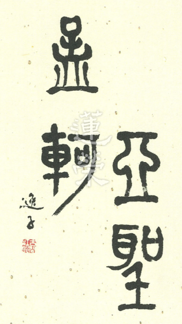

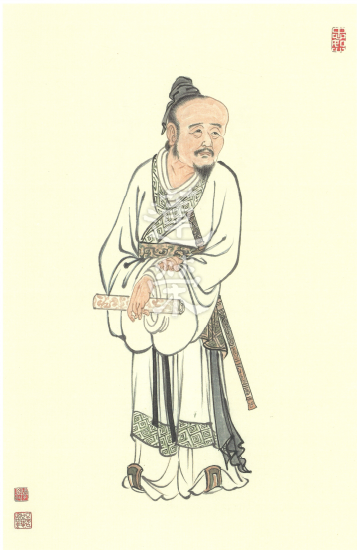

### 論語簡說（七）子貢地圖

*時哉講述、心筑整理*

一代俊傑端木賜

功在國家崇師學

貨殖典範助聖教

千古遺風廬墓情

子貢是一位了解並且能發揚聖人功德者，不但能觀人知吉凶禍福，以傑出的外交口才化解國家災難，在富可敵國當中又知道將錢用在刀口上，亦即將所賺的錢護持老師的教育事業。為人謙懷有禮，善於向老師以及師兄弟請教。特別的是對老師的情誼也是千古獨有，從十七歲遇到老師之後，求學、問道與師周遊列國從未離開老師向外發展，故學得一身本事。後在老師過世的時候主持告別式，並且在老師的墳墓邊守喪六年。

若從子貢這樣的人物去認識孔子，如同由綠葉襯托紅花的美妙，能彰顯夫子內涵的博大精深，產生無人能比的感化力量。

《論語》當中關於子貢的部分有三十六章，若以科判來做架構式的學習，是非常善巧的。所謂科即是將經文分科，判即是加以判定類別，藉著科判的學習法了知子貢成就的路徑與內涵。科判如地圖，依圖而到目的地；科判也像拼圖，能從各種樣貌去呈現子貢的內涵。

其次對經文字與句的講究，乃至於義理的了解。以雪廬老人作為師承，老人講學不偏漢儒訓詁，亦不偏宋儒好發義理，忠實的將《論語》內涵傳達，開啟學生們經學的見地，若能靜下來好好的研究經學，能從當中找到人生的出路，並且透過深厚的文化哲學思想將《論語》一以貫之。

此科判分為三部分，總說子貢是言語科的高材生，接著分別解釋子貢的內涵，最後結論讚歎子貢這樣的人物。

甲一、總明：言語科

總說的部分，孔子判子貢為言語科的弟子，此章出自於先進篇的第三章，孔子的教學非常廣泛，涵括德行、政事、言語以及文學，可以舉出在這四方面傑出的弟子。文化的學習並非把每個人剃成平頭，也不妨礙每個人發揮長才，由德行做基礎，以經學開見地，用見地經營品格。每個時代都需要具備這四科的人才，除了有見地，也需要能夠用說話分析吉凶禍福，用言語調和，並且在各行各業當中能辦事，深入經學以文載道，發揮聖人內涵以及美好概念，這樣的人才會永遠走在時代的尖端。子貢就是一位有見地、能辦事而且能通達經學的言語科弟子。

甲二、別釋內涵

乙一、約師

丙一、評價

別釋內涵當中，約著老師對弟子的評價及引導，以及學生那一分的學習，彰顯他的內涵。

約著老師對子貢的評價來說，老師認為子貢是一位廟堂的幹才，喻如祭祀的禮器，乃國之重寶，是在中央參與決策的大臣，是各國需要的人才。另外，在學而篇當中，老師也認為子貢是一位悟性敏捷，可以與之言詩者。而在先進篇當中，提及閔子騫展現出來的是中正的樣子，子路是剛強的行相，子貢和冉有是儀態和樂者，可以代表國家出使的外交官。

孔子能將學生培養成為這般氣象的人才，堪稱是老師中的老師。而且在先進篇，夫子評論子貢是個能準確推度事理能力者，也就是一位邏輯縝密的人才，但老師期望他能多投入時間在學習文化上面，得到文化的精髓作為傳承者，可惜他花太多時間在貨殖上面，所以沒有辦法在性與天道上得到傳承。孔子評論子貢能辦事、有悟性、儀態好、推理能力強，由以上這幾章可以看出子貢在老師心目中的份量。

丙二、引導

就夫子引導子貢來說，首先在陳蔡斷糧七日時，向子貢顯示學習需要以道來貫穿所學，亦即以形而上的內涵貫穿形而下的禮儀、學問以及辦事。在八佾篇裏有子貢想要去除告朔之餼羊，然孔子不同意，不可因為愛羊而偏廢當行之禮，來彰顯行禮的重要，禮之所在就是吉凶禍福之所在。

接著是公冶長篇，孔子向子貢說成就恕道是極不容易的，需要透過不斷的修為以及見地上的開展才有辦法達到。並且從憲問篇當中，要子貢重視內在的修為，一切反求諸己，才能去指導與批評他人，而得到外在的成就，悟性敏捷並成為廟堂之才。以上是老師對學生的引導，成就學生的內涵。

乙二、約生

丙一、示現風範

丁一、約德

接著闡述子貢如何呈現自己的內涵。從子貢的風範當中可以分為德與學，約著德來說，在公冶長篇裡老師要子貢跟顏回相比，子貢說自己是連仰望的資格都沒有，顏回是一位能通達形而上與形而下完整內涵者，此亦示現子貢之謙德。

丁二、約學

戊一、約道

子貢也是好問而學者，所學的內涵是道，而道當中有體有用，體的部分分為恕與仁。約恕而言在衛靈公篇，子貢問老師是否有一個字可以終身行之？子貢十分高明，他懂得請教老師這種問題，夫子也極不簡單，精準的回答恕這個字，是可以一輩子的經營。

約仁來說，分為子貢問君子、問仁和問為仁，孔子的弟子向老師請教的，都是人生真正出路的大學問。君子是行仁的成就者，君子是言行一致者。子貢以為博施濟眾是仁，孔子回答仁是在內心上成就，在幫助別人之前要先充實自己，先幫助周遭的人，在給別人出路當中得到自己的出路，各種的救濟慈善必須要在正知見上確立目標與方向。子貢又問如何經營仁？孔子告訴他必須要有團隊，要懂得親近賢者，要懂得侍奉親近有格局的讀書人，與之交朋友，仁的事業不是單打獨鬥就可以成就的，必須要結合有格局、有內涵、有見地的人大家一起共造。

由以上幾章可知，子貢是好問而學，很喜歡問問題，不但懂得問道的體（約恕、約仁），也懂得問道的用，所謂問辨好惡、問政和問交友。

問辨好惡當中，可以了解，道真正的大用就在於是否有眼力，懂得如何去尋找人才。問政部分在顏淵篇，夫子回答要有民生，要有國防，要經營老百姓對政府信任。老百姓如果對國家有信心，可以共赴國難。交朋友，要懂得分寸，要懂得規過勸善，朋友不聽就要止住，不要自取其辱，這就是交友之道。

戊二、約人

子貢不但問道也問人。問師兄弟，問管仲是否稱得上是位仁者，問孔文子的諡號，問今之從政者。論語實在是十三經的精華，從弟子問老師歷史的人物以及老師的回答當中，知道如何讀歷史，知道吉凶禍福的真相，瞭解人生的出路。

在問人的部分，首先問師兄弟，在先進篇裏，子貢問子張和子夏誰比較賢？老師說超過和保守都一樣，都沒有達到中道，就像煮東西，煮得焦掉和未煮熟是一樣的；又如到台北，結果到基隆或桃園結果一樣。可見中道非指走路走在中間，而是指一切恰到好處，也不會超過也不會不及，因時因地不同，卻又恰當好處。

子貢又問管仲是否是仁者，管仲投靠公子小白且成為宰相，是否算是仁者？子貢從小處問，夫子從大處回答。管仲著眼在齊國，曾云：齊國生則我生，齊國亡則我亡。作為齊桓公的宰相，並且帶領諸侯去朝見周天子謂之尊王，抵禦外侮謂之壤夷，春秋局面因之而穩定，豈非仁者乎？

接著問孔文子，這位衛國的執政大夫，死後何以被諡號文，是否名不符實？孔子就告訴子貢諡號為文的理由。

在問今之從政者何如，子貢非常善巧地問老師如何稱得上士(上等讀書人)，讀書人的定義就是要充實自己，能夠被國家大用，培養自己的格局、能耐以及人情世故通達，這位讀書人可以被大用，或可派出國當外交官，或可在鄉里當中成為和諧的人才，最下一等的則是言語負責任，行為上有耐力，能將事情做出個結果。

丙二、善探師志

老師成就了子貢的內涵，子貢示現了他的風範，而他也是一個善於探索老師心志的人，可從問行藏、問進止，以及進一步問老師所感歎。問行藏當中，子貢善於探索老師的心志，用美玉來比喻孔子，孔子一聽就知所指，而說說賣了吧！賣了吧！我待識貨的人，直指他周遊列國都是想要被用。

但到衛國時，國君輒有意請孔子執政，然弟子們不知道老師到底要不要被用？子貢非常的善問，子貢以伯夷、叔齊兩位歷史人物詢問老師，孔子說求仁得仁，然而衛國父子雙方都因夾帶其他勢力而成為僵局，子貢馬上懂得老師的心意，出來告訴師兄弟們收拾行李，老師要離開衛國了。老師甚麼都沒說，但子貢卻很了解老師的心志。

此外，子貢也很在意老師的感嘆，懂得進一步的請問老師！孔子感嘆只有天才知道自己，換句話說，孔子的好命一般人是不會知道的，只有天才會知道！到了第七十七代，還能感應雪廬老人輔佐孔德成先生五十年，孔子的好命沒有人比得上！難道不是天知孔子嗎？

接著老師感嘆學道要離言而求，一個講一個聽，弟子聽懂了才能往下傳，這叫做傳承。人才是文化的重點，除了言語之外，還要從言語去體會言外之旨，懂得真正傳神的道，才是真正會讀書的學生。

丙三、崇尚師德學　駁他誤解

子貢的內涵是他的風範以及善於探索老師的心志，並且對老師的內涵十分尊崇，如果有人誤解，子貢都予以反擊，而且反擊得很精準。

反駁他人的誤解中，有對老師的尊崇，包含了五德聞政，老師是既聖又能並且學無常師。五德聞政是指老師到每個國家，都擁有聽到該國大政的能耐。端看子貢的回答，就知道他非常善於觀察老師，老師的五德是臉色溫和，心地善良，外表莊重，內心約束，處處謙德禮讓，和對方沒有任何利害關係，所以他人會傾心請教國政。

並言孔子是老天爺放縱他成為聖人，而且又擁有很多能力。聖人是內在的修為，能力是外在利益眾生的能力，老師因為遇到很多善知識，如天放縱他去成為聖人。

孔子的能耐是無常師，是跟大格局的老師學大學問(文武之道的大氣象)，跟小格局的老師學小學問(文武之道的條目)，兩邊合起來就是整體的文武之道，中華文化的精華至此集大成。

不但對老師的德學非常尊崇，他人有誤解時，子貢都予以有力的批駁。老師的內涵不但如萬仞宮牆不可窺，也如天之不可及，更如日月般不可超越。

丙三、結讚

結示讚歎子貢是有能力聽聞性與天道的人，餓於陳蔡的時候，老師除了告訴子貢一以貫之的道，更在那樣受苦受難的場合中，告訴子貢性與天道(吉凶禍福的天道以及形而上的學問)。

科文最後讚歎子貢是一位有內涵能立言的君子，他說老師的性與天道學問最為重要，有如此學問才能不被名利所繫縛，並得到出世的解脫。人必須要往上流走，有過失不要怕改，如孔子無大過，顏回不貳過，皆是改過的成效，改過之後別人會更佩服！最後說到文質彬彬，一定要多多在經學上面充實自己，看別人處世的經驗閱歷以及善巧方便。

總之，文化的精髓在聖人的見地，有了文化，所保留的文物與民俗才真正有意義。經營有靈魂的中華文化，就從了解孔門的弟子─子貢開始。（下期待續）

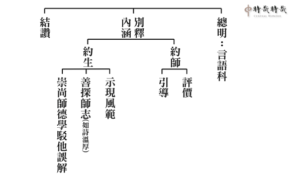

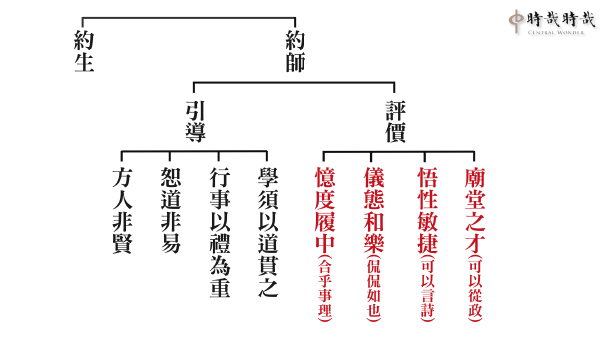

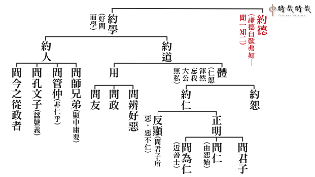

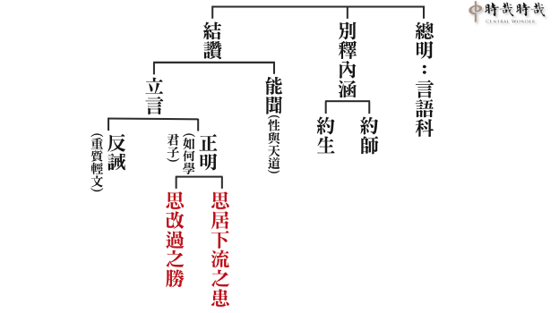

## 藝術賞析

### 華夏精魂千秋(三)明倫史畫任賢聽諫，武丁

圖：江逸子　文：淨域

為政有睿智

善舉人才辦

中興賢君王

覓相版築中

【史話】

武丁，子姓，名昭；生年不詳。商王旬(盤庚)是伯父，父親斂為商王小乙，死後傳位於子昭，為商朝第二十三位君王，在位五十九年(約西元前一二五○至一一九二年)，武丁為死後的廟號。武丁年少時與民一同勞作，深知農作艱辛與民間疾苦。繼任王位後，任用傅說、甘盤、祖己、犢子等賢人輔政，勵精圖治。以妻子婦好為將，大敗鬼方、夷方等部落，鞏固擴展領土，使殷商政治、經濟、軍事、文化得到快速發展，史稱「武丁中興」。武丁於民間習作時，在建築工地認識出身寒微的傅說；說天生聰穎、好學不倦，對國事頗有見地，武丁佩服他的才識，與之結交為好友。

武丁即位後，感受身邊充斥著佞臣，難以推展新政，便將國事交給指定的大臣處理。三年後，這些佞臣離開，武丁便想舉用傅說來辦事。傅說乃一奴隸，該怎麼出頭擔當重任呢？商人相信鬼神，武丁即自稱夢見聖人，讓人畫出傅說的相貌，再令人依圖去尋找。武丁召見對談，舉傅說為尹，令他「接天下之政，治天下之民」，貴族們因崇信鬼神之說而不敢反對。某回，武丁祭祀先祖成湯，有隻孔雀飛到鼎上鳴叫，便以為是不祥之兆。嫡長子祖己乘機勸諫說：「大王無須驚憂，只要勤修政事簡約圖治，不祥之兆就會自動煙消雲散。」當時，祭壇近於林園，有鳥停於鼎上鳴叫，本是件自然之事；然而祖己乘機勸諫祭品過盛之狀，武丁虛心接納諫言，顯露出明君賢相的相得益彰。

內政穩定後，武丁開始對四方征伐，先讓時叛時服的小部族完全臣服。當時，西北的鬼方、羌方、土方日漸強盛，成為中原王朝的心患，武丁即開始用兵攻伐；經過三年，才解除西北方的威脅。繼而再經略南方，用兵征服荊楚地區的夷方、巴方、虎方等部族，建立一個西起甘肅、東到濱海、北及大漠、南逾江漢的大國。為了控制廣大的新領地，武丁將妻、子、功臣及部落首領分封外地，被封者或為侯或為伯，開啟了周朝分封制度的先河。

而周人先祖，即是武丁征服各族後，接受商朝所封的國號。周人在古公亶父時，因受戎狄的攻伐，便由豳地(今陜西省彬縣)遷到岐山(今陜西省岐山縣境)之下安頓。西元前一一九二年，武丁從商都(今安陽縣)前往西華(今河南省西華縣)視察民情，因積勞成疾病逝，葬於西華，子祖庚繼位為商王。

【圖解】

武丁的父親子斂，從兄長子旬、子頌次第繼承王位。武丁年少與民習作，故而知鄉野疾苦與識才用人，繼位後遠離佞臣，舉用傅說等賢人辦事，讓晚商的國事振發。《論語‧憲問》引《書經》：「高宗諒陰，三年不言。」武丁即位後，三年守孝不議政，將國事交給冢宰處理。武丁深知當時人民崇信鬼神，是故守喪三年之後，以夢見聖人指示為由，成功破格舉用出身寒微的傅說。

畫中身著布衣，跪坐於武丁之前，雙手比劃，陳述著治國要道者，就是傅說。武丁拱手聆聽，表情專注，深知眼前是能託付治國重任的大材。兩旁大臣或者竊竊私語，或者表現出不敢置信的樣子，畢竟在階級意識濃厚的當時，一介布衣要在廟堂上議論國政，是十分不可能的一件事情。而今武丁以其智慧，排除萬難，舉用賢才，為商朝帶來嶄新的一番氣象。（下期待續）

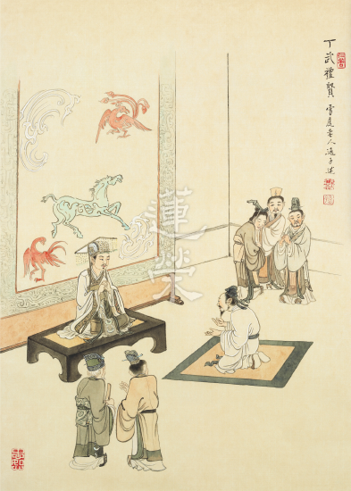

### 孝經圖簡說(一) 開宗明義章第一

圖：江逸子　文：時哉

六十年前的承諾

寒徹骨後之呈現

線條色彩及佈局

含藏雪廬深底蘊

前言

中華藝術之美，廣見於繪畫、雕塑、建築、書法、服飾、精品等範疇，琳瑯滿目。然而在各類的藝術作品中，真正能夠使之靈動、可觀而又生生不息，在於文化。以中華文化做為作品的精神，稱為以藝載道，這樣的藝術品，能使人向善，使觀者精神爽朗、氣象萬千、境界提升。自古以來，就有不少這樣的創作者，留下歷久彌新的大作。晚近追逐西式風潮者眾，謹守中華古典藝術者希，以至於一切可觀的傳統畫作，都只見於博物館的典藏，不復現於今人之手，實為可惜。

江逸子先生，先後從溥心畬、彭醇士、呂佛庭諸大師學習，並習畫於故宮博物院，作品兼及人物、山水、潑墨、花鳥等，廣而深的丹青技法，不下於古人；其又追隨濟南大士李雪廬讀書，因此內涵見地能夠高遠，奠定日後勵志與道藝之根基。甲午之秋，江先生完成《孝經》十八幅之新作，經典躍然紙上，令人歎為觀止。

《孝經》記述孔子對曾子講授孝道，是非常重要的一部典籍，有人說六經可以涵攝在《孝經》當中，修齊治平就是從小孝到大孝。古代帝王對這部經典十分推崇，除了在太學中置《孝經》博士，梁武帝、唐玄宗、雍正皇帝都曾親自作注，此外科舉取士要考《孝經》，許多皇帝也曾下詔，讓天下人誦習《孝經》。《孝經》可以修身，可以用來引導子弟，使之有良好的質地，還可以用以勸諫，改善民風。如此一部承天治人的經典，古來也有不少畫家繪製此作。

北宋李公麟，字伯時，號龍眠居士，進士出身，擅畫人物，以白描方式繪製《孝經》，布局工整、氣象莊嚴。同朝稍晚的畫家馬和之，人稱「小吳生」（吳生指吳道子），被譽為御前畫院十人之首，他所繪製的《孝經》，雖改為彩色，但整體呈現與李公麟相似。趙孟頫，字子昂，號松雪道人，元代書畫家，筆法飄逸流暢，所經營的《孝經》一畫，亦與李公麟相同。到了明朝四大家之一的仇英，字實父，號十洲，創作態度認真，一絲不苟，刻畫入微，而《孝經》之作，也是遵循前人。

民國江逸子先生，再次創作的《孝經》圖，其作品忠於經文，跳出框架，超越了古人，呈現出自天子至庶人，孝子們最真摯的流露。圖中凡古器物用品，無不詳加考究。深厚的白描底蘊，以及畫家平時入微的觀察，使人物生動活潑。松柏所代表的志節、芭蕉的空心、杏樹的傳承、柳樹的依依不捨、香椿的思親、棕樹的志氣沖天，巧妙地布局於十八章畫作之中，足以讓人細細品味，感受濃厚的人情，此作實為近代絕無僅有的中華藝術創作，值得再三觀賞，興己孝思。

時哉時哉網路教育學院也將在五月四日開始刊登孝經圖說導覽，今將逐期刊登孝經圖簡說，以作明年雪廬老人往生三十周年畫展之助緣。(編者)

緣起

我們中國文化的本質就是經學的見地。經學當中，流傳下來的是四書五經或者十三經，《孝經》是十三經之一，總共有九卷十八章，說明孝道的重要、推廣孝道的功德，以及闡明孝道是辦政治、辦教育的本質。

把孝道內化並且推展，能夠使家庭和諧、社會吉祥，國家民族長治久安。當然孝道的體會要隨著歲月而增長，孝道是進德修業的秘密、是事業成功的要訣。歷代賢明的帝王對於孝道非常重視，不但表現在自己的生活起居，也作為辦政治、辦教育的綱領。

為什麼大家都這麼重視孝道的提倡？話說曾子在孔子閑居時，做孔子的侍者，孔子在那個閑居的場合裡，為曾子廣演孝道的內涵。曾子作為傳承者，並將這個道理演繹給學生聽，他的學生紀錄後，往外廣演往下傳承，就是我們現在的《孝經》。

古代也有幾位畫家，依著《孝經》來繪畫，希望以藝載道，將孝道的觀念藉著畫作流通，這裡面有北宋的李公麟，南宋的馬和之，元朝的趙孟頫，明朝的仇英，他們的繪畫，不論是色彩、線條，或者要表達的內涵，都是上乘的佳作。但特別一提的是現代的江逸子先生，他也畫了十八幅完整的孝經圖。

為何江先生要重繪孝經圖呢？話說六十年前，他的古文觀止老師楊源先生，曾經帶他看過黃道周先生的書法，黃道周是明末清初的忠臣，也是書法大家，具有民族的氣節，不投降於清朝，終於在順治三年被殺，氣節如南宋文天祥。黃道周先生曾經在明末崇禎朝上疏勸諫皇帝，結果遭廷杖八十，打得皮肉綻開，並在牢獄中待了十五個月，在獄中艱困病苦的日子裡，竟寫了一百二十部孝經。他的書法嚴謹不苟，一股道氣逼人，完全沒有牢騷、忿忿不平之氣。當楊源老師帶著江先生欣賞黃道周的孝經書法時，是一邊講一邊哭，江先生深感老師的真情，以及老師文化的熱誠，所以內心發願要畫孝經圖，這件事經過了六十年，終於以年七十七的高齡，完成十八幅畫作，完整來呈現孝經。

這裡面除了有繪畫的技巧，畫面的經營，更有經學的見地。江先生為什麼可以把十八幅的孝經圖以經學的見地來經營呢？這不得不歸功於他的老師，李炳南老教授是大成至聖先師奉祀官府的主任秘書，也是奉祀官孔德成先生的老師，是江先生所有老師裡面最殊勝的老師，他教江先生就是經學的見地，所以江先生能對孝經有殊勝的了解。

重繪孝經十八幅，我們可以從這十八幅的孝經圖中，一窺江先生畫作的技巧與佈局，並從中領略江先生對孝經的體會，相信這以藝載道的十八幅孝經圖，必能將孝經的義理重現，開展孝道的風氣，作為家庭的和諧以及社會善良風氣的推動，我們如果能依孝經圖通往孝經的學習，成就聖人孝道的見地，這也是江先生繪孝經十八幅的本懷，用作中華文化的推廣與弘揚，帶來的是國家民族世界繁榮與昌盛。

開宗明義章第一

孝經十八章的第一章就是開宗明義章，說明這部經的大宗旨就是孝，用孝來貫串這部經，經文所要明的義理就是孝，這裡面包括各階層的人要怎麼行孝道，以孝治天下的功德，如何以孝來事親，孝道內涵要如何推廣，孝子們不但要孝順父母親，還要懂得時機對了去勸諫父母親，這樣行孝之人就能感動天地。當然孝道的表現，除了是父母在世的事奉，也包含了父母過世的喪祭之禮，這些都是本經所要明的義理。

孝經起源從哪裡開始呢？話說孔子有一天閒居在家，畫作上面的孔子，是一個額頭寬廣、顴骨高聳、獅子頰，為人忠厚而且又大智的老者，正在講述孝的道理，右手指天，代表孝能夠承天，是能夠通往形而上的大道理，他的左手又彷彿告訴曾子，孝道是可以通往形而下，是可以讓全國上下和諧的方法。

身旁的書桌跟竹簡，代表這位是深通古籍，也是一個能夠對經學刪定的人。這樣的場景是孔子周遊列國回到魯國，已經從事於刪詩書、定禮樂、贊周易、修春秋的這種偉大創舉，並且在閒暇之餘講學。

有一天曾子就陪著老師，在旁邊的蓆子上作侍者，孔子就告訴曾子說，有能夠通往形而上、形而下的人生大道理，你知道嗎？曾子就離開草蓆叩問孔子說，我是一個天資魯鈍的人，我哪裡知道這樣的大道理？我哪裡知道通往形而上通往形而下的人生要道？孔子就告訴他孝的內涵，這個內涵就是通往形而上的要道，也是通往形而下的要道。孝能夠承天、能夠治人。畫作中的曾子一派憨厚的樣子，他對老師的教誨是無怨無悔的追尋，尤其承傳了孔子性與天道的學問，得到殊勝的傳承，並且也是孔子孝經的傳人。

在畫作中，孔子講學的後面有一個屏風，畫家畫的屏風有很多種涵義，或者是裝飾、或者是表彰人物、或者是補景，孔子身旁的公孫樹(杏樹) ，代表了傳承，傳承了孝道的內涵，曾子從孔子講述孝道中得到了傳承，曾子對孔子的道是自始至終無怨無悔的追尋，並且在他的人生旅途當中，從來沒有在道上變節過，臨命終也是以道來自許，而且戒慎恐懼地走完這一生。他的志向與老師一般，就像圖中的松樹一樣，是一個能耐霜雪、耐嚴寒，意氣沖天者。畫松除了是江先生的絕活之外，也象徵江先生的自我期許，江先生一路的苦學，眼前畫松柏來砥礪自己。

以上這一張圖，江先生要經營地就是孝經的傳承，畫中的祥雲代表氣氛非常吉祥，表徵講學正法是天地間最吉祥的事情。歷代畫家畫此章時，都是畫著孔子旁邊有很多的學生，孔子對著曾子講學。只有江先生畫的開宗明義章，畫的是孔子跟曾子這兩位，這也符合經上所說：仲尼居曾子侍，意思就是孔子閒居沒事幹的時候，曾子作了侍者，孔子趁這個機會單獨調教曾子，告訴他孝道的重要，並且把人生以孝道作為起點，過程是孝，圓滿也是孝，由孝來攝持世間的德行，含攝著所有的進對出處，由孝來作為辦政治和辦教育的本質，能夠趨吉避凶、逢凶化吉。以上種種的概念，孔子會由第二章到第十八章，把孝作完整的陳述。

我們從這一章裡面，可以一窺孔子當年在魯國，不但作經學的刪訂，也能夠在私下培養人才，從對曾子的教誨當中，我們看到弟子求學的恭敬態度，知道弟子們對孔子的講學是多麼的好樂，能將老師所講的謹記在心，並且能立志，將老師所說的做一個圓滿的傳承，以上是這一幅圖的大意。（下棋待續）

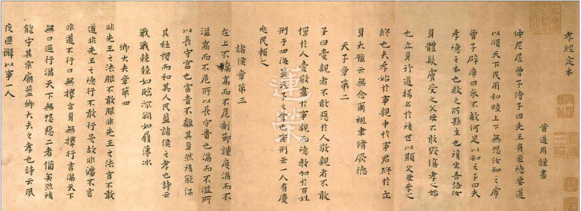

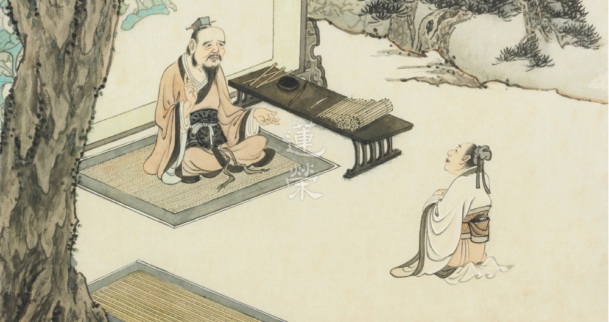

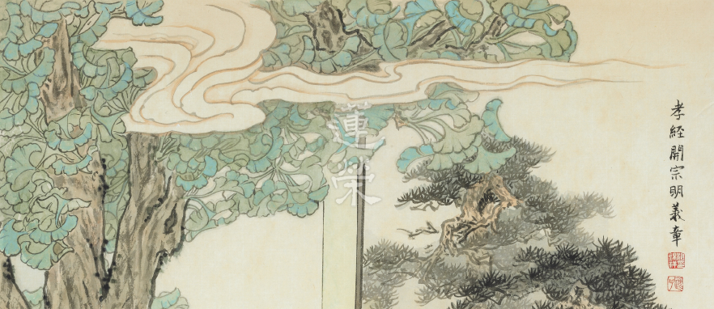

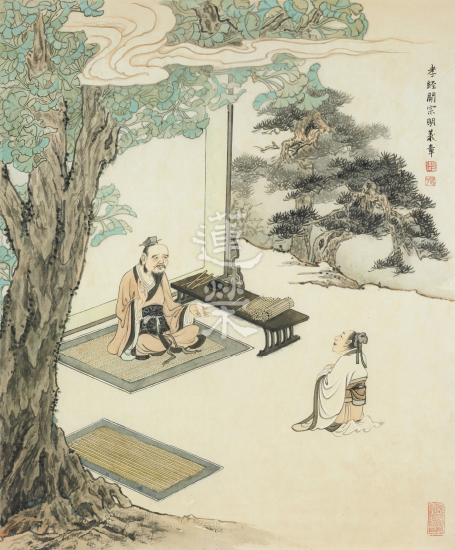

## 專題講座

### 身心靈健康淺談

陳曼玲

多年自我的試驗

樣樣皆利人之寶

恆心鍛鍊是修行

堅持到底乃成就

諾貝爾文學獎得主─莫言，解釋關於「我」字。

有一天【我】字丟了一撇，成了【找】字，為找回那一撇，【我】問了很多人，

那一撇代表什麼？商人說是金錢，政客說是權力，明星說是名氣，軍人說是榮譽，

學生說是分數…；最後：《生活》告訴《我》，那一撇是：【健康和快樂】

沒有它們，什麼都是浮雲！

另外有一副很有趣的對聯：

上聯：愛妻，愛子，愛家庭，不愛身體等於零

下聯：有錢，有權，有成功，沒有健康一場空

橫批：健康無價

身體健康也如阿拉伯數字１，後面的０，代表金錢、名譽、工作、權利、地位、親情、愛情、友情…等，倘若失去健康，好像失去阿拉伯數字１，後面的０，就沒有意義了。這些資訊說明了健康的重要，而健康的人生需要努力去經營，但方向比努力更重要，方向來自知識。一般狹義的健康專指身體而言，廣義的健康應包含身心靈三部份，茲簡述如下：

壹丶身體健康的關鍵因素

身體雖是五蘊和合之身，但仍應珍惜。身是如意寶，身可以用來報四重恩、可用來修行、可用來行菩薩道、可用來完成理想。然而身體的健康，若不善加維護保養，就如同肥皂一樣，會越用越薄。如何才能增進身體健康呢？下列幾點可提供大家參考：

一、飲食

應多吃低鹽、低糖、低油、高纖維，三低一高的食物，勿吃食品（加工品）與煎炸燻烤食物；也不要暴飲暴食，更不要吃冰，不要吃太燙的食物．同時要多吃植物，少吃動物，因為植物含有植物素，是天然抗氧化物，可消除身體產生的自由基．尤其是應時蔬菜水果，要洗乾淨連皮吃，才能吃到食物的全營養。我們更需要採取彩虹飲食原則，攝取各種顏色食物的均衡營養，最好每日能吃到十五至二十五種以上的食物，包含全穀類和堅果等等。並且要記得常喝水，每日喝水量大約是體重乘以三十毫升左右的水，但不含所喝的菜湯。

二、運動

其實懂得運動的人，會隨著不同年齡以及不同的身體狀況，選擇適合自己的運動項目。例如四十歲以下的人，可選擇打籃球、有氧運動、慢跑等，快速消耗體力、鍛煉肌肉的運動；四十歲以上的人則適合選擇輕緩的運動，如太極拳、五禽戲、氣功、拜佛等之運動，比較不會造成運動傷害。多走路是不錯的選擇，適合所有的人，因為走路可以牽引打開靜脈閥門，讓靜脈血液回流心臟和肺臟過濾、充氧代謝，同時也有助於淋巴排毒，好處很多。

現代人上班久坐不動，站樁也是一個很好的選項，當然你也可以做你最有興趣的運動，要為健康而動，為理想而動，為樂活而動，為智慧而動。

三、生活環境

我們的居住環境應選擇陽光充足、空氣流通、噪音少的地方，同時室內應多種一些綠色的盆栽植物，除了美化環境之外，讓居家也能擁有大自然的元素，可以平衡我們的身心，讓生活空間充滿生命力。空氣有三寶---負離子、臭氧、芬多精，所以在假日休息時，也要多接近大自然，去抱抱樹、摸摸草、看看花，可釋放一週所累積的壓力和煩惱。

四、生活作息

一年之計在於春，一日之計在於晨；我們應養成早睡早起的好習慣，勿熬夜，有充足的睡眠才有好的精神與體力去做對的事。俗語說：「起三早，多一日」，會讓時間的運用更有效率，同時也能兼顧身體健康，這樣不是很好嗎？另外也要注意養成定時排便的習慣，而且不要憋尿，有時間多休息，如此才能讓生活作息符合自然律，日出而作，日落而息，形成善的循環。

貳、心理健康的關鍵因素

佛經說：「心淨國土淨」，表示心若清淨身體就清淨，也就是說身體是心的一面鏡子，心理健康會帶動身體健康，反之亦然，兩者互相影響。如何提升心理健康呢？下列幾點提供大家參考：

一、情緒管理

情緒是影響心理的樞鈕，因此要改變我們的心，必須先從控制情緒的品質開始，透過慢勻細長的深呼吸，大約十到十五分鐘之後，可以轉化我們的負面情緒，進而影響內分泌系統及自律神經系統，讓副交感神經亢奮，交感神經舒緩，此時大腦呈現α腦波，心情會變得平靜、祥和、愉悅、正向、清淨、光明。

如何深呼吸才能使大腦呈現α波？根據雷久南博士的團隊研究，運用科學儀器監控測試不同的呼吸方式，實驗的結果發現以「吸氣八秒、閉氣八秒、吐氣八秒、閉氣四秒」的深呼吸方法，可讓大腦呈現α波的放鬆、寧靜狀態。

二、傾訴與運動

當你心情不好時，記得找朋友聊天互動，表達內心真實的感覺，讓委屈和煩惱有宣洩的管道；或者是出去運動走路、曬太陽、看書、聽音樂等，皆可以幫助我們轉換情緒帶來好心情。美國維吉尼亞大學心理學研究報告，談到焦慮症、憂鬱症、睡不好的人，只要每日運動一小時以上，症狀即可獲得明顯改善，(此一小時運動可分為三至四次每次最少十五分鐘)，運動是幫助身心健康的不二法門。

三、正念培養和正知見

正知見會帶來正向的力量，我們平常應該多聽經、多看經、多薰習善法、多親近善知識和善友，才能學到正知見。而正念培養是透過正知見，訓練自己時時刻刻不帶評價的覺察與接納的能力，使人能夠專注於當下經驗，不追悔過去，不擔心未來，創造良好生活品質，進而開發內在豐富的資源，促進心靈成長與心理健康。當挫折來臨時，能以正向的態度來面對與因應各種壓力，提升專注與快樂的能力，你將會發現幸福原來就在一念之間。

四、靜坐

靜坐好處很多，依據楊定一博士的研究結果簡述如下：

１．修養身心，生理冬眠。

２．降低新陳代謝。

３．緩和壓力，壓力荷爾蒙分泌降低，副交感亢奮。

４．壓力耐受性高。

５．提升免疫功能。

６．降低人體對氧氣的需求，血中氧氣上升，細胞氧合效應提升，體能增加。

７．血中乳酸(廢物)減少。

每日給自己二十分鐘寧靜的時間靜坐，可以幫助自己沉澱身心，獲得健康與智慧。連美國戰爭學院的學生，也要學習靜坐課程，練習讓心平靜安定，面臨戰爭或危機時，才能處變不驚、臨危不亂做正確的決定，提升決策的品質。

叁、靈性健康的關鍵因素

心可分為三種：肉團心是屬於生理、緣慮心是屬於心理、靈知心是屬於佛性。雖然身體（生理）是由地、水、火、風四大組合而成，會生住異滅；但佛性（靈性）不會滅。如何開發我們的靈性呢？可從下列兩點參考：

一、正信宗教

以佛教來說，皈依三寶─佛、法、僧，是每天必修的功課。它的內涵是覺、正、淨。覺而不迷，正而不邪，淨而不染，依戒定慧三學修習，可以啟發我們的靈知心，開啟我們的佛性。人身難得今已得，佛法難聞今已聞。吾等要好好學習佛陀所教的正法，即是在心中蓋一座大廟，讓正法久住世間，如此才不虛度此生。另外學習其他能幫助你性靈成長的高級宗教也可以。

二、每日定課

佛門修行講究做早晚課，每日讀誦薰習正法，做為精神食糧，及充實自己的內涵，目的在提醒自己的心不要走失。但因現代人生活忙碌，很難做到每日兩次，所以我們可將佛陀所教的正法重點摘要濃縮在一頁內，大約五分鐘左右可讀完，內容包含三皈依、懺悔、發願、念佛、誦經、迴向等，可依自己方便的時間做定課一次。如此日日不間斷，時間久了心會有所領悟，功德不可思議。

肆、結語

其實我們的體內住著一位神醫，那個神醫就是我們的自癒力，如果能讓身體的三大系統：自律神經系統、內分泌系統、免疫系統和諧運作，即可獲得健康。如何才能做到讓三者協調運作呢？以下幾點提供大家參考：

一、要有快樂感、幸福感，正確信仰。

二、要符合自然律，早睡早起、有充足的睡眠、不要熬夜。

三、正確飲食、均衡營養、水分要喝夠、排泄正常。

四、要會運動、多走路。

五、綠色是治療之原，要多接近大自然，讓身心得到平衡。

六、恆心毅力的踐行。決定你的健康─是你的觀念和你的作法，不是你的基因。持之以恆是關鍵。

最後祝福大家，身心靈整體皆能獲得健康，福慧增長，一切無礙。

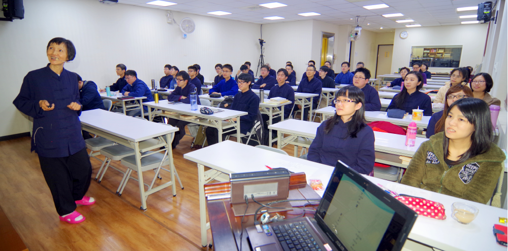

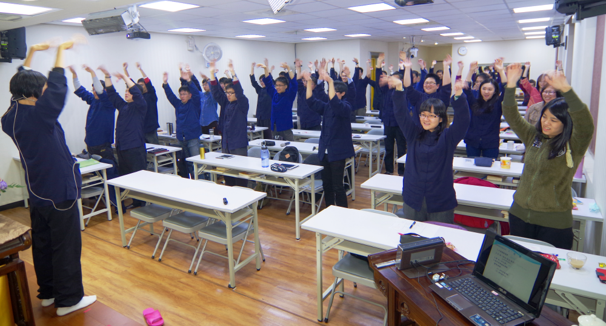

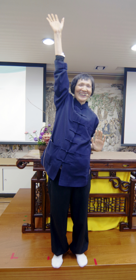

## 蓮池海會

### 黃江漢老居士往生見聞記

黃阿麗

老實敦厚多才藝

來少去多古遺風

子女善良承父志

萬緣放下西歸去

二次世界大戰期間，正值年少十三、四歲的年紀，老居士以第一名優秀成績畢業，身體強健，獲選並走上成為航空技師的道路，直到日本戰敗後返國。二十歲成家立業，伉儷情深，從軍期間內心時時繫念家中的妻小，牽手辛勤的賣菜養家，一路扶持。

老居士生養教育七個子女(二子五女)，用心栽培子女，並且以一雙萬能的手，設計與創造出各種機械器具，努力務實的精神，常得到日本企業的讚賞與肯定。連自家後院所種植的蔬果都肥碩甜美，辛勞的撐起一家大小生計，讓妻兒衣食無憂無慮，子女快樂平安長大茁壯。

身體一向硬朗的老居士養生有道，食不過飽，也不飲酒，配合體力的鍛鍊及每週一次的登山，從不間斷。一０二年十月的感冒，經西醫多次門診未見痊癒，改中醫治療亦未見成效，後因右上臂及右胸出現痠痛感，到醫院掛骨科門診做Ｘ光檢查，卻意外發現右邊助膜出現積水現象，因此仔細地做多項檢查，十二月中旬醫生告知右邊肺有顆約三公分的腫瘤，靠近氣管懷疑有擴散，加上年事已高無法手術，建議做化療，眼前只能先安排做助膜積水引流處理，後續再轉腫瘤科治療。

姊妹們達成共識，先隱瞞實情，想從調養老居士的身體著手，提升老人家的免疫力，於是得知李醫師將由新加坡回臺數日，並願意幫老居士調養。回想八年前，李醫師首次問診即見醫生與病人相談甚歡，老居士充滿信心向醫師道謝，即將離開之際，李醫師親切地微笑說：「歐吉桑，念佛真好！」當時的老居士開心的說好，從此美好的事發生了，半年多的調養終於恢復健康的身體，而老居士也養成常念佛的習慣。

可是這次，老居士卻異於往常，堅持不接受調養，也不允許子女請醫師到家裏，理由是年紀大了，多一天就讓子女多掛心，能早走就走，對世間毫無眷戀之意，事後才知道老居士已找過主治醫師，問清楚自己的病況，心中似乎早有定見，往生之路是否艱辛漫長，安穩順利與否，考驗著身邊的子女如何護持，子女們一度以為老人家願意以原始點按推，及補充內外熱源等來改善體傷及熱能不足的因，幫助身體恢復正常運作，但最後老居士仍決定做化療，從最低劑量一直到增加藥劑量，因此出現了明顯的副作用與身體的不適。加上約三十天就得做一次助膜積水的引流術，必須等一個星期至十天左右傷口才完全癒合。

不久，在部分家人不知情的情況下，老居士又進一步接受了標靶治療，從此體力大傷，身形更顯瘦弱，但老居士依然堅持活著就要動的原則，儘量不想麻煩身邊的人。老居士一生經歷過三次重大的工安意外，與種種困難，總能安然度過，面對眼前的病苦，似乎做到了面對它、接受它、處理它、放下它……。

老居士在病中，已找了禮儀公司委辦將來的往生事宜，並立下遺囑告知子女身後一切從簡，請法師誦經即可，種種的安排心中早有定見。病苦的折磨雖然耗弱了老居士的身體，卻無法動搖其求生極樂世界的堅定信念。曾突如其來的問子女：阿彌陀佛怎麼還沒來接我。子女這才發現，老居士渴望解脫的心是如此的強烈，當時學會週四共修班正在研學《佛說阿彌陀經》，故女兒試著以老人家淺顯易懂的言語為他說明極樂世界的殊勝莊嚴，如何具足信願行，才能與阿彌陀佛感應道交。原本呼吸短促，微弱的老居士卻用盡全力的喊出阿彌陀佛、阿彌陀佛、阿彌陀佛，女兒在旁善巧開導，只要用心念就能與阿彌陀佛感應，淨緣的成熟是需要各種善緣的具足。

老居士於病苦期間，依著學會善知識的帶領下，隨喜做種種的善法並迴向，在佛力的加被下重報輕受。老人家性內向、客氣，總是婉拒師友的慰問，因此得遇善知識的緣始終無法進來。子女擔心無常的隨時到來，功虧一簣。所以私下祈請善知識在百忙之中撥空來探望老人家，藉由閒談中告知如何在病苦中真修行，轉逆緣為增上緣，積聚往生的資糧。幾天後老居士告訴子女，他想供養三寶，得知學會將於一月十八日舉行淨土懺，正好可以圓滿老人家的心願，至此水到渠成，淨緣終於成熟，老居士於一月十六日上午十點四十七分在家中，正念分明，佛號相續不斷中往生。老居士一生不多言，總是以身教為子女演繹為人處世的道理，辭謝娑婆之際，更是慈悲示現，為子女們導引一條康莊大道…人生的究竟處─西方極樂世界。

團體就像個溫暖的家，遇到困難時有師長可以請益，幫忙排除障礙，蓮友長輩們的關懷、鼓勵的力量，轉化難行為易行。在護持家屬往生這方面更是受益良多，非常感謝蓮友、師長們的護持助念，老居士順利往生，晚上十點半準備入殮儀式，掀開陀羅尼經被時，老居士面容非常安詳，眉頭的皺紋消失了，淺淺的微笑狀，身體非常柔軟，相信老人家真的放下。

老居士的大體經過火化後，在骨頭上(據說是大椎骨)有一顆形狀正圓，如玻璃珠般高約一點五公分，整個圓周如同菩薩的背光，背光正中觀世音菩薩端身正坐，五官如精雕細琢般清晰可見，撿骨師說百人中難遇一位，不可思議！此刻的子女們深深相信老居士已蒙佛接引到極樂世界，繼續勤修精進，祝福老居士早日花開見佛悟無生，圓成佛道，回入娑婆利益有情。

## 專題報導

### 如是獨行江逸子

心超、心晴講述

漂泊九夷一甲子

得遇明人轉奇葩

詩文繪畫堪稱絕

以藝載道報師恩

江逸子先生祖籍福建，生於民國二十七年，七歲入私塾受教於前清舉人潘觀松先生，背誦《三字經》、《弟子規》、《千字文》、《千家詩》等，並常在旁觀摩潘師胞弟觀岳先生畫梅蘭竹菊。民國卅八年（十一歲）隨父親探望在臺當兵之哥哥卻滯留臺灣。小學畢業後考上臺中一中，因無力就讀，只能四處打工，送報、賣冰、當工友，只要有多餘的錢，便會買紙筆畫畫。

江先生小學同學的父親（陳泮嶺先生）很器重他，經常周濟他，也為他介紹楊源（楊亦風）老師學習古文，楊老師教他古文，學習古文觀止，繪畫方面也介紹了呂佛庭老師，當呂老師問江先生為何要學畫時，江先生就說是為了光宗耀祖，誠如《孝經》當中也提及將自己充實好，目的就是為了光宗耀祖。

楊老師要江先生好好揣摩古文，送給他一本宋元明清的畫冊，後來又因古畫都陳列在北溝的故宮博物院，楊老師夫婦贈送他故宮的百元入門聯票，老師便天天坐最便宜的小火車，從早上故宮開館到下午五點閉館，一心看畫並將畫作背起來，回家開始臨摹，第二天再拿去對照，到最後可以放大可以縮小，抓住畫作的意境。最後成就功力，能夠根據對古書的了解去創造形象，如著名的「孔門聖賢塑像」即是。

江先生有一幅畫馬的畫，江西名士彭醇士先生看到他的畫，便介紹給溥心畬大師，溥先生認為收江先生為弟子太抬高自己，故收江先生為記名弟子，並且囑咐江先生要多讀書，要學內涵，要從畫匠脫胎成為畫師，畫作才能極具內涵和神韻。

後來呂佛庭老師覺得江先生日子過得太辛苦了，所以就介紹給雪廬老人，希望可以安插一個工作，呂老師稱雪公是一位聖人，而雪廬老人也成為江先生一生成功的關鍵。後來，雪公看了江先生的畫作之後，願意攝受江先生，從每個禮拜四上午九點開始教授唐詩，江先生早早就到雪廬老人住處附近等著，一直到八點五十分才去敲門，雪公開心的說：守時的人必然敬事，敬事者必然守信，守信者無有不成。江先生說，學唐詩讓他的畫作達到高峰，繪畫裡面的意境全部都是唐詩的內涵。

當時江先生雖然在奉祀官府上班，但是薪水仍然非常微薄，他就開始作盆栽，一九七七年，張大千先生透過臺中一中的宋校長來見江老師，張大千先生已聞江先生苦學的經過，並勸江老師不要放下畫筆，二十年後必定獨領風騷，江先生後來就把盆景的事業放下，專心於繪畫。尤其最近因為文化傳播，山水、人物、花鳥、工筆、寫意、潑墨、經變圖以及塑像等，以藝載道、弘傳於世。

紀錄片當中，可以看出江先生一路的辛苦，但卻從不曾忘記老師對他的提攜，不但在經學中充實自己，舉凡繪畫的線條技巧，筆墨的情趣，內涵的經營，神韻的灌輸，皆令人歎為觀止，也使得他的畫作在近代獨樹一格，幾乎是少有人能比，尤其其白描線圖畫不讓古人，山水畫直追馬遠、夏圭，潑墨寫意畫亦可說是脫胎於張大千。

這位傳奇的人物，他寄居於奉祀官府，安安靜靜的讀書、繪畫，他的作品最可貴的就是以藝載道，或依《論語》來繪畫，或依孔先生的希望，還原歷史真相而重新繪製的〈孔子聖蹟圖〉，都是江先生以藝載道的絕世作品。

紀錄片當中，可以看出他的苦學，他繪畫的才情，他的師生情誼與交友狀況。這部片從二○○六年冬天開始拍攝，二０一四年出片，期間可以說是命運多舛。拍攝因緣緣起於江先生是兩岸文化界人士都認識的一位前輩，卻有非常多想要利益眾生的情懷沒有被發掘，學會曾在二００二年舉辦國學啟蒙班時向江先生借展〈孔子聖蹟圖〉，以及當時他所捏塑的孔門聖賢雕塑品，江先生並親自到會現身說法，這是團體跟江先生結緣的開始。

二○○三年得知江先生繪製了一部曠世巨作〈地獄變相圖〉，這幅圖秉持雪廬老人的囑咐，以九個月的時間，每天用十六個小時創作。而後續江先生也多有經變圖的創作，眾人建議將這些絕學記錄下來，而拍攝紀錄片來記錄作畫的情況，能將畫作的動機、內涵和神韻......記錄下來，不失為最佳管道。

正於此時(二○○六年)江先生要畫一幅曠世巨作，也就是七百萬筆白描「極樂世界經變圖」，在這幅圖即將創作的同時，我們也開始積極尋覓紀錄片導演以及積集資金。後來有緣祈請了李中旺導演來拍攝這部紀錄片。

紀錄片拍攝的緣起是曲折的，過程是艱難的，拍攝這部紀錄片秉承六個要點：希望能夠紀錄下江先生整個創作歷程，為臺灣藝壇留下珍貴的影像紀錄，保留傳統藝術創作上的價值，並且能夠紀錄人格德性上的意義，以及江先生對水墨藝術上的執著，乃至於保留繪畫藝術傳世的精神。

李導演已有拍攝紀錄片近二十年經驗，本來他以為只是要拍攝江先生畫白描畫的過程，但與江先生接觸之後，才知道先生的生命非常精彩豐富。他也提及，除了拍攝繪畫過程，更重要的是江先生源源不絕的生命過程，全部攝錄在那一百多卷的毛帶中，每一個片段都讓人感動，豐富到不知該如何取捨，而陷入兩難。這個剪接工作最後花了兩年的時間，試圖想要從每一個拍攝的影片中濃縮剪輯，而產出了很多版本，最後李導演決定放棄自己的觀點，把整個內容交給他的朋友去把關，但最後完成的紀錄片還是還原了李導演紀錄片的觀點。

紀錄片因著江先生極樂世界經變圖的創作，來紀錄江先生的一生，這是非常困難的工作，導演每天跟著江先生凌晨四點起床，到最後變成忘年之交。李導演自言心得是百感交集，覺得自己非常幸運，有福氣可以拍到這樣的片子，能被相中來拍像江老師這樣的一位長者。從拍攝到剪輯完成這部紀錄片，像是參加了一場馬拉松長跑，中間有跌倒、有受傷，本來以為跑不完的路程，現在終於看到了終點。

江先生的成長是歷經艱難，他與老師、朋友們的相處以及提攜，他自己本身如何力爭上游，甚至是在成就之後，又如何報答這個社會，在紀錄片當中都有詳實紀錄。這部紀錄片終於在二○一五年新春推出，相信對社會風氣有極大的正面意義，也是最大的供養。

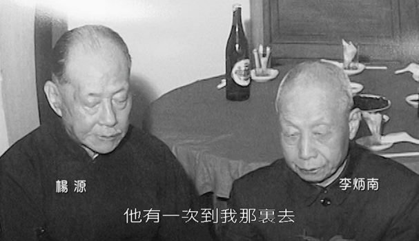

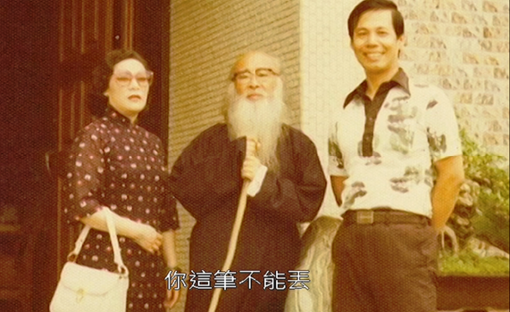

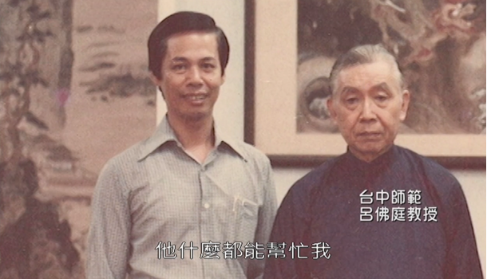

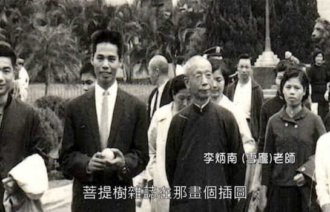

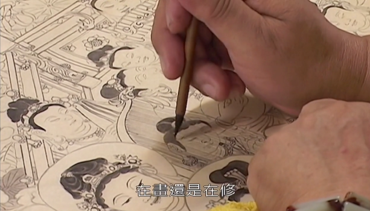

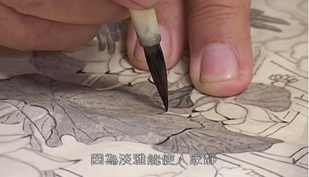

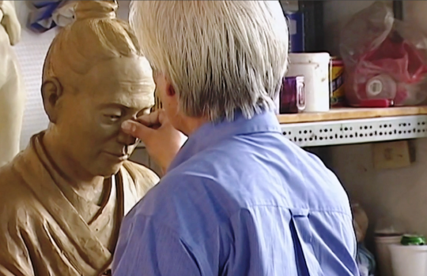

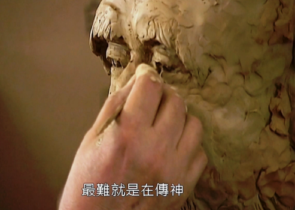

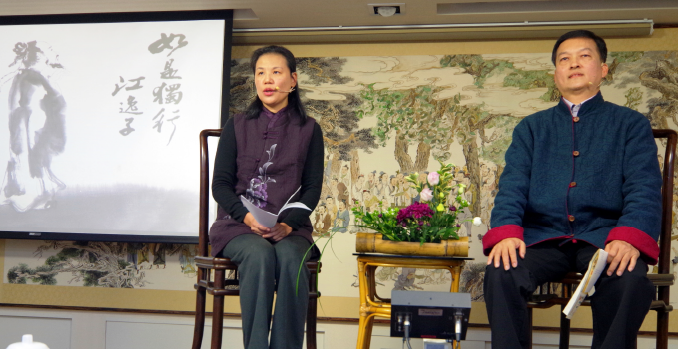

### 如是因緣

李中旺

拍出有益之作

心力全程投入

專業敬慎態度

紀錄一生學習

到底是甚麼樣的因緣，讓這位畫家堅守信念，終生不渝，傾盡一生地繪製出「寓道於藝」的傳世作品？當初本以為是去記錄一位老國畫家繪製一幅重要作品的過程，並且在他繪畫的過程中，表現出這位畫家的精神與人格特質，如此而已。但是開始拍攝江逸子老師這樣一位長者時，我就已經知道我們非常的幸運，有這樣的福氣因為拍紀錄片得以進入江老師的生活，深刻的體會認識江老師。

還沒開始拍攝時，我根本不認識江逸子老師，也沒有聽過這個名字，網路搜尋不到資料，藝文界的朋友們對「江逸子」也不熟悉。所以剛開始見到老師的時候，是很緊張也很擔心的，害怕自己在言行舉止上面會不小心冒犯到老人家，很害怕觸怒老人家而把我們趕出去。但是記得第一次去拜訪江老師，江老師提及了自己的母親，不禁在素昧平生的我們面前涕淚縱橫，可惜的是當時沒帶攝影機，也只能扼腕的錯失這樣真情流露的鏡頭。

真正接觸之後，發現江老師不是老學究、舊時代的老古板，他是一位非常風趣、非常幽默、非常可愛的長者。在漫長拍攝紀錄片的過程中，我們是如沐春風，非常享受這個拍片的過程，而且從中收穫非常大，這些收穫不是三言兩語可以描述的。我們不但融入江老師的生活，甚至住在老師家，也與師母、家人們有很好的互動，變成很親近的朋友。

開拍的時候，江老師剛好正開始極樂世界變相圖的線稿，我們是完整的跟著江老師將這幅巨作完成。在這當中，我們發現江老師天天四點鐘起來畫畫，大約畫到七點，然後吃早餐、去運動，他非常有毅力，一天都不差，每天如是！這件事情實在太讓我們震驚了！非常感動於江老師的精神！所以為了要拍攝江老師畫畫，我們也得要早起，有時也睡在江老師家，才能跟得上他的作息，他四點起床，我三點半就要起來，要比他早起架機器，拍他起床和畫畫。影片中也有呈現江老師畫工筆白描的精細工作，全神貫注在畫畫的模樣，一筆一筆都不能有差錯，一眨眼半個小時或一個小時過去了，他可能才抬頭歇息一下，或者喝口茶或者伸個懶腰，一位七十多歲的老人家，全神貫注的畫畫，抬起頭通常都是非常疲憊的眼神，那是讓人非常感動，無法忘記的鏡頭。

紀錄片的拍攝時間是十分漫長的，必須慢慢地去體會並且了解被拍攝者，然後再想辦法看用甚麼方式，將此人的特質表現出來，不是用旁白描述，也不是訪問其他人來彰顯這個人有多偉大和了不起，我們必須要讓主角自己散發出他的特質。

作為一個紀錄者，當時也因為想要了解這一幅畫作的內涵，開始去翻閱佛書、讀讀《阿彌陀經》的內容，也去查閱古人怎麼表現極樂世界。對照之後，發現江老師用一個很清淨的方式表現極樂世界的樣貌，阿彌陀佛的極樂世界其實是非常難想像的，也很難以具象的方式表現，江老師用不著一色、白描的方式去呈現他心中的極樂世界，以我淺薄的認知，這樣素雅的形式，很能表現極樂世界的精神與樣貌，讓人看了也會產生清淨的心。

我觀察到的江老師，是一個孤獨寂寞的人，他在他的境界裡面是寂寞的，江老師不太跟藝壇上面的人來往，當然他並不是一位孤芳自賞又高傲的人，雖然也有一些藝壇上的活動，但是他不去交際應酬。他在藝術道路上的堅持是非常孤單的，以現在的年輕人來說，會覺得這是老派守舊的畫法，因受西方藝術的影響現代畫家不去模仿古人的畫而強調原創，要表現前人沒有畫過的內容或形式，所以不會去重視及肯定江老師的藝術成就。當然江老師也完全不受外界毀譽的影響，堅持走唐宋的畫風。

江老師以藝載道的理念也是非常寂寞的，在現今臺灣的社會氛圍，沒有人談孔孟，沒有人重視儒學思想，他卻一直用畫作來展現孔子的行誼，以及深廣的思想內涵，期望社會能重視這個文化寶藏，這根本是與臺灣社會潮流逆向的行徑啊！所以我看著江老師面對著極樂妙果圖踽踽獨行的堅定背影熱淚盈眶。

拍完片子之後，我開始去讀佛經，粗淺的認識了淨土法門，進而也想要解脫生死，生活行為上也都有很多的改變，這些都是始料未及的重大收穫啊！同時因為參與這個片子的拍攝，讓我發現臺灣有很多像寶藏一樣的人物，他們的生平事蹟以及他們的思想觀念都不被現在年輕人所認識，這是非常可惜的。他們是臺灣非常寶貴的文化資產，這些文化資產因為國家社會的忽視，正在加速流失中。這也是我們紀錄片工作者重要的使命，將近代這些重要的人物，用紀錄片的方式保存下來並且傳述下去，讓觀眾直接體會感受那種精神與價值。

江老師就是一座寶山，意圖在六十分鐘的影片內完整呈現如此豐富的內容，實非能力所及。只能從兩百個小時的毛片當中，抓取出核心的內容，試著真實地將自己感受到的江老師忠實的傳達出來。而其中最難表現的就是過往的經歷，江老師生命當中對他影響最大的就是他的母親和老師，但這些內容沒有辦法拍攝記錄到，都是口述訪談，很多江老師口述成長歷程的精采故事，因為長度與形式的關係必須被捨棄，這也是這部紀錄片的遺憾之處。

總之，在江老師身上學到的東西太多了，對於江老師本身的人格風範，收穫是非常的大，這也是在別的地方很難有機會學習吸收得到的。這部紀錄片從拍攝到出版，像馬拉松一般的賽跑已經到了終點，雖有如釋重負之感，內心又燃起對拍攝李炳南老居士紀錄片的期待，雖有極高的難度，但是現在不做，以後一定會後悔，很榮幸能有這些因緣參與記錄這些珍貴的影像。

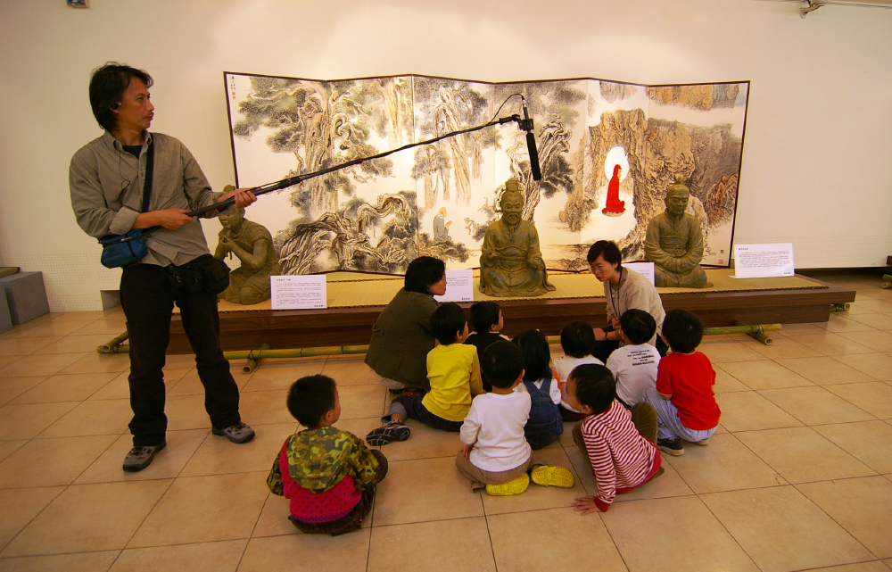

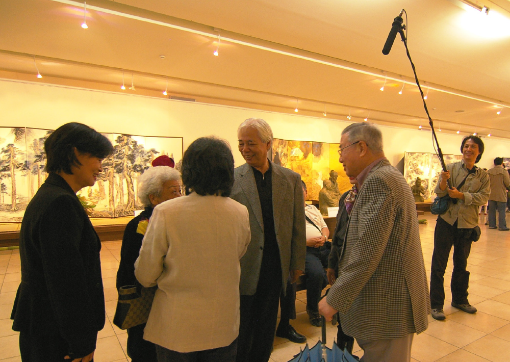

### 紀錄片是一段充滿驚喜與感恩的旅程

蔡靜茹

難得工作態度

一段心路之旅

人生成長火花

益世作品呈現

這是一篇拖欠許久的稿子，也是一篇最難下筆的稿子。當然，文字對一個影像工作者來說是不容易上手的語彙。

一部紀錄片的製作，從開拍到剪輯完成，過程中肯定有許多收穫，真要細說，恐怕可以寫成一本書，但現在我只能寫成一篇文章，因此我只能從眾多體會中選題。選題這件事，困擾我許久，或許是我太貪心，覺得每個題目都很重要，取與捨十分艱難。

對觀眾來說，他們看到的紀錄片是導演從幾百小時的拍攝素材中，精挑細選結構出來的六十分鐘長度，對我來說，幾年的拍攝所累積的是另一部無法對外放映的影片，它只存放在我的心中，感受太多太多，難以言傳。如果我有甚麼值得跟大家分享的，我想從一個創作者的角度來談談我所認識的江逸子老師。

記得，第一次跟著導演到江老師的畫室拍攝他繪製極樂妙果圖，一開始導演就叮嚀我，老師畫這幅圖是巨幅創作，可不能有任何一筆差錯，畫錯了整幅畫就毀了，所以拍攝時我們必須降低干擾，盡量遠遠的觀察拍攝。當時，不要說走路要小心翼翼，我連呼吸都不敢太用力。

畫室很安靜，江老師一筆一筆的畫著，均勻的呼吸配合畫筆的節奏，那畫面真是美麗。我著迷的看著，看著看著開始有了變化，我發現其實畫室外面有遠方的車聲、人聲、施工的機具聲，這些雜音不時出現，然而老師完全不受影響，相當專注且投入在他的繪畫世界，感覺他的世界靜謐又祥和。江老師他…一心不亂耶，哇！他是怎麼辦到的？

再繼續觀察下去，我發現老師握筆的手好穩，七十歲的他竟可以畫那麼細微的線條，繪畫時的他透出一股恭敬的神情，我在想他是以何等慎重的態度面對他的作品。這是藝術家的風範，我敬畏的在一旁默默學習，汲取那有如敬拜的精神。

每當老師畫到一個階段放下畫筆那一刻，他像是跑了一場馬拉松賽，耗盡所有的精力漲紅著臉。我在想，這幅畫要用一年的時間來畫，這需要多堅強的意志才能撐下去？然而，江老師每日清晨三、四點起床作畫，午休後再畫，晚飯後略作休息就去睡覺，養精蓄銳只為了隔天繼續作畫。日復一日，不曾間斷。

江老師以行動展現，讓我看到創作者的「定力」，從他專注的神情、握筆的穩定度、一心不亂的堅定意志，這是藝術家絕對要有的「定力」。這「定力」不是嘴巴說說就能擁有，那是經年累月高度的自我要求訓練而來的，是每位創作者渴望擁有、也該有的能力，卻不是人人可及。

如果是我，我做得到嗎？

像江老師這樣豐富經驗、雄厚實力的藝術家尚且如此用功，反觀自己，我常因片子剪不出來，躲在被窩不想起床，藉故出去散心，說是沒想法要去找靈感，老師自我挑戰的勇氣對比我自我妥協的懦弱，實在讓我無地自容。同樣是創作者，江老師是典範，也是一面鏡子，讓我學習、也讓我反省。

每當創作遇到瓶頸時，在我動起放棄的念頭時，我會想起江老師他作畫時的樣子，我常以此勉勵自己。

紀錄片是用時間去堆疊出影片的內容，而拍紀錄片的人則是用時間去累積對人物認識的深度。拍紀錄片的人都知道，你必須用心去認識你的拍攝對象，你必須用心去愛你的拍攝對象，你得走進他的生活、真正理解他對世界、人生的看法，這樣你才能真正地表達出人的故事。

基於上述的因素，我得好好地了解畫家身分之外的江老師。每週三晚上，會有幾位蓮友到老師家中上《論語》課，當然，我得來看看才行。因此，我跟導演每週三晚上都會到老師家報到，老實講，那時我曾經歷過一段痛苦時期。

原來《論語》課前是蓮友們的共修時間，對於宗教，我是有些抗拒的，也不知道甚麼是共修，既來之則安之，看師兄、姊各個盤腿而坐，我有樣學樣地跟著坐下來就對了，剛開始我還不知道師兄、姊口中念的是甚麼，有一種旋律，幾個我搞不太清楚的字，當然後來我知道那是「南無阿彌陀佛」─佛號。所以，我也跟著開始念。第一次去，真的吃足了苦頭。盤腿不久，雙腳有如螞蟻叮咬一般整個麻掉，幸好我坐在最後面，受不了就把腿伸直解除麻木不適感。佛號念著念著，從「南無阿彌陀佛」變成了「阿彌陀佛南無」，不知從甚麼時候亂掉了，無論我多努力就是跟不上，嚇得我停下不敢再念下去，深怕打亂師兄、姊們的節奏，更怕的是被發現我念亂了，那真的是很丟臉的事。

因此每週去共修時，我總是藉故婉拒師兄、姊們要我坐前面的盛情，實在不好意思讓他們看見我腳麻及念亂佛號的糗樣。最關鍵的因素是我會打瞌睡，那時候有種挫敗感：「天啊！難道我罪業如此深重嗎？我知道我不完美，但不是壞人啊，怎麼回事啊？」從這裡，大家應該可以看出我對佛法的認識有多麼淺薄、多麼無知了吧，汗顏啊！

雖然感到挫折，但我跟導演除非有其他工作，不然我們儘量不缺席論語課，這是作紀錄片的基本態度與訓練。論語課前的共修時間，可說是我接觸佛法的開始。當然，這還不足以認識江老師。拍攝時，常聽江老師談到帶領他學佛的李炳南老師，這位李老師影響他的一生，包括繪畫志向。江老師在離開盆栽界後，他的作品多數為利益眾生而畫，這都是因為他對李老師的承諾。我很好奇，是怎樣的一位老師會有如此的影響力，讓江老師信守承諾至今。所以我跟導演也開始去探尋背後這位特別的長者。

要了解一個人，也要去了解影響他的人，我跟導演開始搜集李炳南老師的資料，閱讀他的著作。當時不明白，此時回頭看，這才發現原來從那時候開始，我已敲開對佛法的好奇。老天冥冥之中自有安排似的，李老師啟發江老師，江老師則啟發了我，讓我稍有一些能力去懂他作品的價值。只是，我是到了老師的畫展時才真正懂得。

拍紀錄片是漫長的等待過程，因為你不會知道事情在何時會發生，所以我們每天都在國父紀念館展覽會場待著，一開始，我帶著平常心進行例行的拍攝工作，不拍攝時就看著畫。一天、兩天、三天…隨著時間過去，我的視線從畫作移到了人身上，我每天看，在極樂妙果圖前駐足的人，他們常看得出神，像是對那個世界非常嚮往，也像是在跟畫裡的諸佛菩薩說話一般，這樣的畫面每天都有。坐著輪椅的人、老年人、中年人、年輕人、男性、女性、穿著普通的人、華麗裝扮的人…，各式各樣的人，他們站在極樂妙果圖前，我看到他們有著一樣的眼神與表情，我不知道我的感覺是否正確，那一刻我突然明白了以前我一直不明白的事情。

我明白了甚麼呢？以前從書上、或聽人說，這人間真苦，要學佛了脫生死。年輕時的我不懂那是甚麼意思，只覺得人生不就是喜怒哀樂集合而成的嗎？有苦也有樂啊，不能因為有苦就說做人不好啊。人的所知有限，看事情就有盲點，我想我的盲點很多，不論是過去還是現在。但那些站在妙果圖前的人讓我明白一件事，人不論成功與否、健康或生病、富有或貧窮，不分身分、年齡、性別，他們眼神透露出的那個「求」，我突然感覺到那「求」好苦、好苦。求到了苦，求不到更苦。

那晚，我無法安眠，在似懂非懂的複雜情緒中，內心感到非常悲傷，那些「求」的神情縈繞腦中揮之不去，我不知道為什麼就是感到非常悲傷。

在那之前我從老師們的解說中認識江老師的畫美在哪？技巧好在哪？他的功力在哪？現在我知道江老師的作品除了前述的價值外，更重要意義是，那些畫能撫慰觀者內心的苦難，帶給他們救贖的力量，這應該就是江老師的作品利益眾生的價值吧！

江老師除了讓我學習到創作者的「定力」之外，更讓我學習到「利益眾生」的創作態度，這對我而言肯定是受用一生。另一個意外收穫的是，因這部紀錄片開啟我學佛之路(從不知不解到現在一知半解)，這是我始料未及，因為學佛，讓我在陪伴父親生病到往生的過程中，有足夠的力量處理家人與自己的悲傷，我深深感謝這趟旅程帶給我如此豐厚的禮物。

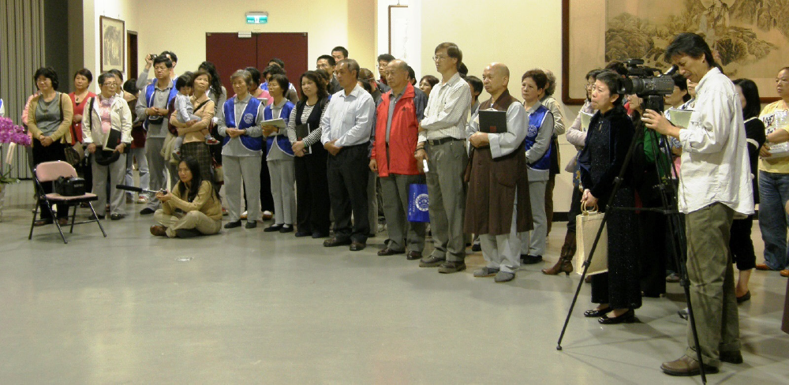

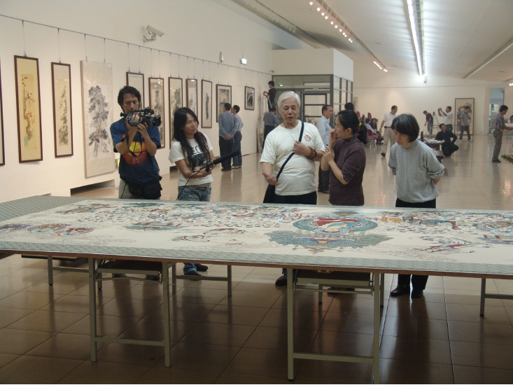

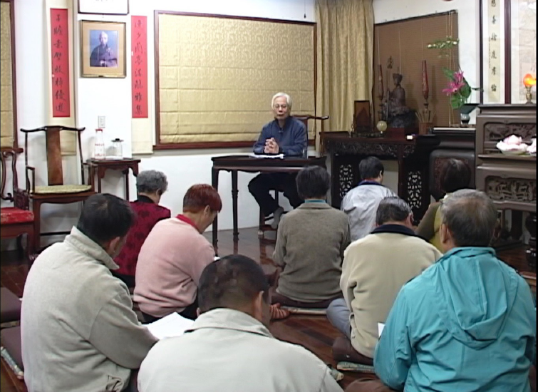

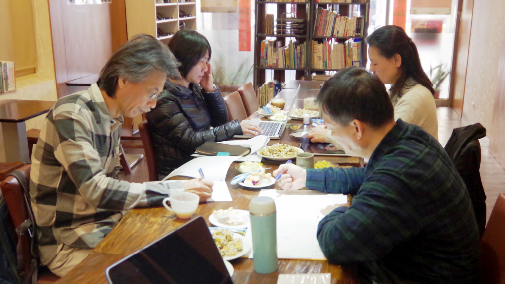

### 基隆培訓班報導

*編輯部*

正法延續待人才

聞思方能正見生

長時薰修必得力

利益眾生真未來

三年多前，素昧平生的基隆淨宗學會陳會長，在張先生的引薦之下，因為一場故宮的導覽而認識了老師，席間對於老師培養人才的志願深具信心，隨即表達願意提供獎學金辦理經典文化人才培訓班，並且著手規劃招生工作。首先，在大專院校發布招生簡章，雖有一些國立大學學生報名，但面試之後卻發現不盡理想，師長們幾經思量，決定對內開放大專生報名，經過嚴格審核自傳以及自我期許，決定於二○一一年三月四日，假基隆淨宗學會，開始為期三年，每個月兩天的培訓課程，每個月參與課程之青年學子約有三十位，階段性任務圓滿完成於二○一五年二月一日。

所開設的儒、佛課程，佛學課程乃《大乘百法明門論》，以佛教心理學（唯識）通達世間各種心理現象，學之內化可調伏自己的妄想，認知他人的心理，而成為他人的善友。本論為世親菩薩所造，詮釋釋尊所言：「一切法無我。」是公認佛教心理學之權威，由各種現象通達無我之理。所依注解為簡金武老師所著之《百法明門論研究》，上懺下雲法師所編述之《百法明門論表解》，以及蕅益大師所著之《百法明門論直解》。

儒學部分開設《論語》以及〈常禮舉要〉等相關課程。論語課程先以「知是眾妙之門」主題為首，後也依「時哉時哉網路教育學院」直播課程，藉由教材版製作而開設《論語》當中關於「孔子聖蹟圖」、「政事科弟子冉求」等課程，老師用「科判」的學習方式，善巧地引領我們認識《論語》內涵，使我們能依不同主題、論語中各章間的關聯與架構，迅速掌握《論語》的全貌，以及孔夫子的完整思想體系。

而〈常禮舉要〉及《禮記》選講能知禮之用，除進德修業外，亦能建立良好的人際關係，能入《禮記》等經典之精髓，亦是啟蒙課程中重要教材，是推廣文化不可或缺之方便。老師的引導也十分善巧，或給予作業，讓大家腦力激盪，反思日用平常中的一切行為，後也發想製作〈常禮舉要〉相關劇本，拍攝相關影片，配合大專講座常禮課程做演出，將所學做一供養。

此外，也開設許多專題課程，諸如：用餐禮儀、由臺北美國學校談西方教育的優勢、江浙放生回顧、驚奇的印度、無牆的教室、電腦動畫製作創意與創新、緬甸回顧暨心得分享、那些電影沒說的事-CGI電影特效的變革及興衰、身心靈整體健康......等，不但擴展視野，鍛鍊身心，也隨喜學會的各種善法。

除了課堂上的學習，所設的義工時數也讓學子能福慧兼修，舉凡學會各類課程以及講座活動，或參與、或當義工、或至寺院出坡及齋僧、或學習練講、或協助整理文稿，甚至是一同擔綱啟蒙班的主辦團隊。總之，因為人才培訓班的進行，熱絡了學會許多事務的進行，而不定期利用週末舉辦的研討，也帶動年輕學子學習正法的風氣。

三年內，除了例行的課程之外，行之有年的大專佛學初級講座，最後兩門《普賢行願品》以及《佛說阿彌陀經》，也在寒暑假當中完成了學習，以四年的時間圓滿了六門佛學初級課程。

世事本就無常，因緣聚散當中圓滿了三年人才培訓班的學習，除了三寶的加被，還必須要有具備傳承的善知識，發心給予優厚獎學金的外護，以及願意接受培養的學生。三年之中，雖然也經過一些波折與障礙，參與的學員或因畢業或因個人因素而有些許變動；善知識的身心也因為恨鐵不成鋼，時常示現處於發怒的狀態，體力與心力如蠟燭般的燃燒，即使身有重喪仍未缺席任何一堂課。一時因緣的現起，曾經依此課程而努力的學子，相信必定是收穫滿載，在人生的道路上，能趨吉避凶、逢凶化吉。不論如何，人才的培養是善知識一生的職志，下一期因緣的成熟，指日可待。

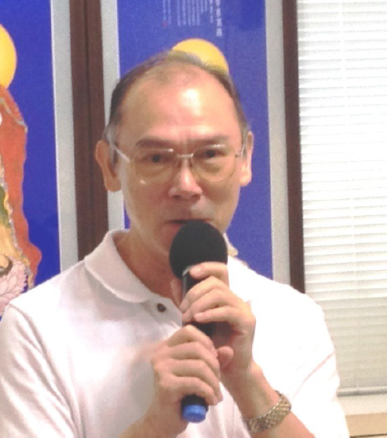

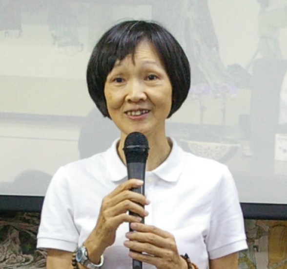

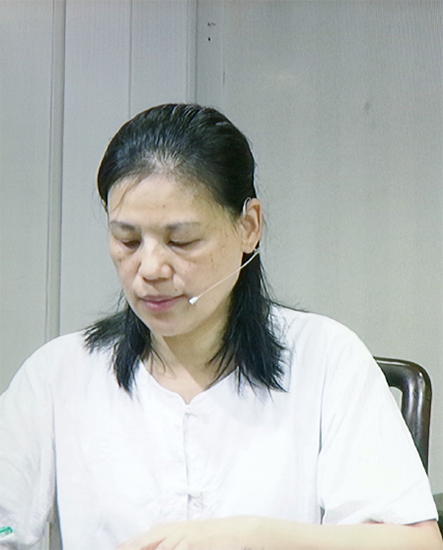

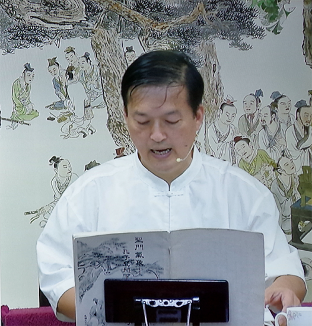

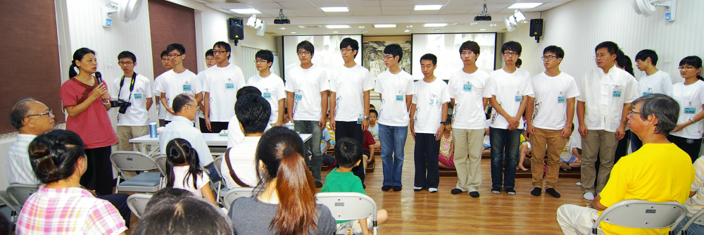

### 基隆人才培訓班心得分享

眾學子

一生難得的際遇

三年正法的充實

五味雜陳的結業

七分受用的陳述

白文輝

經過一年多的學習，在基隆人才培訓班中，聽聞了《百法明門論》、《論語》、《常禮舉要》、〈禮記〉經解及專題演講等課程，期間並參加《佛說阿彌陀經》以及出路由名言中通達—由《論語》及百法說起等暑期講座，更從中認識了不少人、事、物，增廣許多見聞。然而，天下無不散之宴席，於此培訓班課程圓滿日，內心真是五味雜陳，感受更是千頭萬緒，諸多心得難以一一道盡，因此，單純就一則以喜與一則以憂兩大方面分別述之：

首先，就喜悅的部分而言，有以下幾點：

一、學習過程中，各類善知識具足。有教授善知識多方教導、善巧指引，像夫子般有教無類、因材施教，令學生不會如無頭蒼蠅般亂撞，並且加以適時的慈悲提醒喝斥，使學生能有所警惕不致放逸。再者，有志同道合的同行善知識陪伴，互相切磋策勵，可補足筆記缺漏不足的章節，並於疑難處有人可請教討論，彼此增上，以文會友，以友輔仁。此外，有外護善知識發心護持，提供舒適的環境、美味的餐點以及獎學金等，使身心在學習過程中得以安定，不致煩惱擔憂。

二、人身難得，佛法難聞，尤其是能聞般若空性智慧真是稀有珍貴。雖然一開始聽聞的時候，大部分名相與義理都聽不懂，但是人一能之己百之，人十能之己千之，耐住性子，靜下心來困而學之，藉由反覆的聽聞與思維，漸漸的就比較能心開意解，進而透過教法來了解萬法，正確認識自己，調伏煩惱。

三、三人行，必有我師，擇善從之，不善改之。學習上，可以觀察到有的學長底子好，悟性高，記憶力強，在邏輯推理上見長，有的謙恭有禮，有的口才出眾，有的雖然工作或課業繁重，卻仍然可以對課程內容加以預習與複習，有的善於發問並勇於發表想法，有的樂於助人與人分享，有的則默默努力與付出，皆有所長可取以增進己之德學。同時，可藉由團隊中的種種比較而發現許多的不足處，認識自己的實力，不應得少為足，必須掌握時機，奮發向上。

四、學而時習之，不亦說乎。透過持續的學習，一次又一次生起很想把教法搞懂的心情，而且隨著深入的程度，生起的頻率越高，力量越強，甚而產生非常想要把身心完全沉浸於經教之中的感受，欲罷不能。

五、親近善知識，學習正知見，利益極大。透過聽聞讓自己能夠越來越懂道理，腦袋逐漸清晰，培養眼力，看得懂世間，遇境逢緣試著如理如法觀修，改善與人相處之道，如此的將所學運用於生活之中並與人分享，獲益良多。

六、佛法無邊！不學不知，學了才知。如此妙法浩瀚無涯，深廣無盡，取之不盡，用之不竭，有無量可以學習的甚深道理，就像在大海中優游涵泳，內心好不歡喜，令人不禁十分嚮往未來的學習。學佛真好！

七、有老師的種種示現。以身作則讓學生有榜樣可以效法學習，也證明了真的有人能夠達到如此境界，這一切並非遙不可及。

再者，就憂慮的部分而言，有以下幾點：

一、萬法無常。以上所提到如此殊勝的因緣何時會滅，乃是一個未知數，因此必須趁年輕時好好掌握時機，莫等閒，白了少年頭，空悲切！

二、無有一事不是經由串習而熟。對於教法串習不夠，難以獲得其殊勝利益，故要更加善用瑣碎的時間，化整為零，勉力而為，才能學有所成。

三、基礎太差，根底不夠。在團體中，眼見不少學長們從小便接觸聖賢教誨，好不羨慕。心想既然已落後許久，那麼更應加緊腳步，才能迎頭趕上。

四、學然後知不足。跟著老師學習，聽聞聖賢佛菩薩的行誼，自省不足處實在是太多了，彼何以百世可師，我何以一身瓦裂。應當如何下手，仍須老師的慈悲指導，以及自身謙恭努力的向學。

五、教然後知困。由於種種因緣，幾年來有機會與一些家長孩子共學，而後有幸聆聽老師的教法，得知沒有形而上的智慧來攝持形而下入世的這一分，無論是對人對己，皆是非常危險的事情，還是應當好好跟著善知識，時時溫故知新，內化經教，畢竟記問之學不足以為人師，切記切記！

六、逝者如斯夫，不舍晝夜。這一期的生命極其有限，而要學、要懂、要做的實在難以計數，因此要更加珍惜每分每秒，活到老學到老。莫為因循二字，耽擱一生，使德不加修，業不加廣。

七、老師為法忘軀，勇猛精進。令學生印象深刻，心疼不捨。然而佛法無人說，雖智不能解，若是沒有老師演說教法，吾人如何得以聽聞正法進而自行化他呢？因此，祈請老師能為眾生，為正法久住。

最後，回顧了這一期的學習，往事歷歷在目，好像又重新溫習了一遍，心中充滿感恩，覺得自己很幸運，可以有傳承的學習正法；此外，又備感幸福，能夠有志同道合的朋友一起前進。一直以來最想做的便是好好的、不間斷的、有基礎的、按部就班的深入學習，把道理搞懂，期許自己真正成為人才，就像老師一樣！因此，若有機會，希望能將身心全程的投入學會，跟著善知識的腳步，加入弘揚正法的行列之中，方不枉此生。

蕭惟元

三年的時間居然這般快速，猶記得三年前開班的光景，而現今已經在撰寫結業感想。非常慶幸自己能有這樣的因緣，搭上這班學習列車，在老師的引領下，探索經教的天地。因為有陳會長的發心護持，大家才能齊聚一堂；主要授課的兩位老師，傾盡了心力栽培我們；過程中還有張居士等許多師長的鼓勵，以及各類專題講座的開設，仔細地回憶這一段經過，除了感激，也問自己：「有沒有辜負大家的付出？」

《百法明門論》是人才班主要的佛法課程，其實自己並沒有《唯識簡介》的基礎，但老師生動的解說，將佛法與生活點滴緊密扣合，巧妙的引導，燃起學生濃厚的興趣，因此雖然有理解內涵所必須突破的障礙，但沒有突破障礙可能感到的苦澀。又由於承乏本科目小組長一職，在責任感的推動下，更希望可以把它讀好、讀懂。學生發現，《百法明門論》的學習，有佛教精密的科判思考；細膩的心理作用分析，讓人歎為觀止；課程中不斷串習空性的概念，對於學生的思考習慣，產生了巨大的影響。佛法的實用性及重要性，學生由此開始有了一點皮毛的體會。

《論語》是彙集孔子思想的寶典，是我們班儒學課程的重點，這部經典的每一章節大多都是非常簡短，學習過後才知道，原來每個字都是那麼的重要，所謂字字珠璣，真是如此。聖與仁的分判、一字褒貶的微言大義、終身可奉行的一字準則，《論語》用字的精煉，詞句的優美，實非當今以引注多為優的學術論文可以比擬，無怪乎能夠綿延二千多年，至今仍是中外名人所公認的重要典籍。此外孔子人情世故的練達，深邃的智慧所流露的言語，都彌足珍貴。然而這些內涵若沒有老師教導，也確實無法顯現。

《常禮舉要》這門課，也有很長的一段學習時間，這當中還包括《禮記》選講、華盛頓的青年守則、餐桌禮儀等內容。雪廬老人說：「禮節這件事，在人群中，是決不能少的。」「人與人交通感情，事與事維持秩序，國與國保持常態，皆是禮節從中周旋的力量。」禮貌的重要性，以及禮貌所具備的這股力量，在學習本門課程之前，往往不能被學生所見，原來禮節細膩而隱微的強大作用，也需要老師的引導才能看見。因為有本門課的學習，不知自己無形中已經避掉了人生多少的障礙！

除了主要課程，還有寒暑假的講座，陳會長、賴麒宇總經理、李中旺導演、張德聲理事長、高銘澤老師，以及幾位學長精心準備的專題報告，更是多面向地豐富了我們的見識。我們曾經一同擔綱啟蒙班的主辦團隊、一起齋僧修福、一起研討、一起出遊、一塊運動健身、還一同見證了同班學長的婚禮。

三年的光陰，如此的充實，雖然要努力的空間還有很多，但若再問自己一次：「有沒有辜負大家的付出？」學生的回答是：「應該沒有，但我會繼續努力。謝謝師長們的提攜、學長們的陪伴。」

蔡易儒

非常感謝學會師長的教導和陳會長的發心，使學生有幸參加人才培訓班，在大學時期就能聽聞寶貴的教法。曾經我也思考，如果自己沒有接觸過教法，人生又會是怎樣一條路呢？想著想著，就覺得自己現在好慶幸！因為相較於過去，我確實感到自己的人生正在改變著。人生的關鍵在具足正知見，要在見地上經營、要在心量上開展、要在斷惡修善上講究、要親近良師益友、要從典範中學習、要以「道、德、仁、藝」為總綱、要在傳承上努力。這是人生的重點、方向。然而，這些都需要長時間學習、思考，才能慢慢有所體會，而正知見來自良師益友的教導，尤其在這個價值混亂的社會裡，能有這樣善因緣參加人才培訓班，真的好歡喜！雖然很慚愧自己程度還差得遠，但所幸自己走在對的方向努力。

學生參與其中近一年半的課程，所聽聞的內涵非常的深廣，謹試著皮毛地總述，作為學習記錄。

約經教而言，在佛法的部分，學會開展了《百法明門論》的課程，這部論是世親菩薩將一切法歸納為百法，闡述於一一法皆是通達人無我、法無我的入門。這樣的科判式的分類法非常高明；最善巧的做學問、辦事的方法，就是運用總持的學習法。課本〈百法直解〉是蕅益大師所著，包含了各法體性、業用的詮解。

「定義」是很重要的一門修學法，例如透過學習直解，對善、惡心所各法的定義、行相，我們才能知道自己日用平常的起心動念，是否合乎善、惡，是故老師常說行持要論見地，沒有對經教好好學習，修行沒有依據，斷惡修善無從抉擇，依止修觀也不可能。老師在上課時幫我們釐清了好多好多觀念與名相的定義，也善於用宗派見來詮解，更重要的是老師運用合乎邏輯的推理法，設問分析，闡述自體性空的義理，這些都是自己讀書不可能會有的心得！透過這樣的學習，能對佛法生起莫大的信心，這樣的皈依三寶是真正的皈依，惟有將這樣的見地傳承，才能使正法住世。

在儒學的部分，包含《論語》「知是眾妙之門—福始祥源」「孔子聖蹟圖」以及冉求的科判、常禮舉要、唐詩、禮記經解等，非常豐富。運用科判的方式講授、學習《論語》語，老師可說是首開局面之人！過去在學校學論語，往往只是選讀幾篇，缺乏整體的認識，選用的註解很多都有錯謬。透過《論語講要》中雪廬老人對見地、各家註解的抉擇，老師上課的層層設問與闡述，學長們私下的研討、預習、消文準備，漸漸發覺《論語》每個篇章都好有內涵，整個春秋時代背景、人物、國際關係，以及孔子和弟子們的見地、格局、胸懷、才情、行誼，也都越來越鮮明、具體。原來人生成功的秘密都在論語。

此外，雪廬老人說：「論語是十三經的門戶。」讀《論語》能知十三經的要點，例如「思無邪」就是《詩經》的體性，正與〈禮記經解〉所云「溫柔敦厚，詩之教也」的業用相互輝映；而以《論語》課程所學，再來入《常禮舉要》的條目，則有助於將禮重視五倫、人際關係，推尊、禮讓別人，懂得節制等諸多內涵，運用於日用平常、言語辦事，使我們於應對進退、辨別吉凶禍福有所依據。記憶猶新的是老師和學長們曾經一同努力，將常禮舉要的條目，透過影片和話劇的方式呈現，這樣的創意不僅邁向時代，也說明禮和生活息息相關、亙古不變的道理。

約典範而言，除了主要授課的唐老師、林老師，學會也祈請許多師長為我們授課。例如學會的高老師為我們用心準備２Ｃ(評斷性思維與創意)和全腦革命的課程，深入探討思惟能力的重要，如何訓練思惟，以及臺灣教育與國外菁英教育的比較。另外，記得學生第一次來聽課時，正逢通泰的賴總為我們帶來多媒體網路應用課程，讓我們認識行動網路時代的趨勢、潛力，並引導我們思考因應時代以網路推廣文化的方向、作法。學會當時已經在朝網路教學邁進，直到現在時哉時哉和蓮榮網站的推出，過程極不簡單。

能夠參與、見聞其過程，真是非常寶貴的因緣。這些課程都是很難得的！看到學會師長們、講師們的內涵、風采、言語辦事，儼然在學生心中樹立典範、目標。如果沒有機會接觸這樣的善知識和環境，我們怎麼知道人生可以做這樣的培養？如果沒看到這些善知識學成的氣象、出路，怎麼知道文化是最好的出路？除了學會的諸位師長、長輩，學生也從同儕身上受益很多。能參與人才班必得觀待要有同法者，這樣的福報不是一個人能生起的。學長們品行都很好，學習認真，課後又能一起研討、樂於分享，使上課不懂的地方補足；遇到任務、挑戰時，大家又能組成和合團隊一同辦事。雖然學習的路上有許多困難，但如果一路上有人陪伴、切磋、鼓勵，我相信很困難的事也會變得很簡單，這是同法者殊勝的功德。

透過在學會的學習，也慢慢有了一點讀書的心得，以及發現自己的不足，希望能和大家分享。以前在讀書時，曾經有段時間遇到瓶頸，因為平常要讀的書太多，不知不覺把讀書看成很辛苦的事。其實後來想想，讀書的目的就是求「知」，辛苦的不是讀書本身，而是觀待自己的「無知」；相反地，讀書正是去除無知的良藥，否則當書讀通時，怎麼簿會有法喜呢？知的樂生起時，苦又在哪裡呢？「知」有無盡的好處，「無知」簡直不能辦事，是以「知是眾妙之門」，而《論語》就是致「知」最好的入門。學習一定要求一個結果，而因為要學的很多，此時更要注重學習的效率，勢必要很有意識、講究方法地學，其中學生覺得善用「習慣」和「心法」是很有幫助的。

舉例而言，「吾日三省吾身」即是曾子的心法，大悲心、菩提心也是心法，心法的培養能使人思考精準、有重點，不會胡思亂想、抓不到方向。而養成好習慣不僅可以節省時間和精力，也能夠增加穩定度。例如：注重「定義」、基本功、對於不懂處不要置之不理、願意向困難挑戰、練習問好的問題、作意「我要到能夠…(如：複講)的程度」、多做評斷性思考…，乃至遇境能以般若正見觀修，都是值得培養的好習慣，不勝枚舉。

有時明明觀念都懂，也知道怎麼做比較好，但是若沒有好習慣，往往就讓過去的習氣、經驗在主導；相對地，是壞習慣就要努力戒除，真的很重視的事，就要努力養成習慣；如果運用正知見成功對治煩惱的經驗越多、平常表現傑出、看事精準的次數越多，對自己絕對是莫大的鼓舞，對教法的信心會大增。而培養習慣和心法的過程，就是一種「串習」的功夫，這是良師益友所無法替代的，是自己的功夫。

最後，對未來的展望，學生希望能以典範為目標，培養自己成為大才，在傳承教法上奉獻心力，並能以將來職業和眾生廣結善緣，培養仁心、訓練承擔。現前要好好審視、規劃讀書的時間、份量，並且定期檢驗成效；願意接受師長的教誨、教誡，對於師長因地上的修學也尊重承事；盡可能培養健康的身體和日常作息。人生是一場馬拉松，相信慢慢修時快快到，惟願不辜負這期人才班的因緣，將來能有成就以回報父母親的養育、護持以及諸位師長的恩德。

晏家文

學生不會說話，常常說錯話，或是詞不達意，表達能力一直是我很需要再加強與練習的課題。心中有萬般的感謝卻無法用精闢的言語來好好表達，只能平淡的寫過去，感謝老師對學生的教導，感謝會長能讓學生有機會聆聽到這百千萬劫難遭遇的法，感謝學長們的包容以及互相提攜。

三年來，生命的意義改變了許多，從立志當個有機栽培的農夫，變成了要認真做好幼兒教育的幼教老師，學生覺得兩者之間看似差異非常大卻又極為相似，孩子就是幼苗，陽光空氣水就是飲食，肥料及土壤就是各種的教材教法。如何運用如何栽培，就是以老師幫我們建立的正知見作為教學的依據。學生還有非常多需要加強及努力之處。來到霧峰後，平日的課程均無法參與學習，程度上與眾學長們差距越來越大，有學長說出去就回不來了，學生自己也明白時機如此，老師常說自己的出路在給別人出路，當把孩子們的出路培養出來，相信學生的出路就在其中。

許熒純

為期三年的基隆人才培訓班，在今年的二月告終，然而這並不代表我們的學習結束，未來面對的將是一連串人性的考驗，考驗著我們這群年輕人，是否能夠突破環境的侷限，時代的潮流，以及彼此之間，友誼的維持與存續。

參加動機

記得人才班第一年，正逢碩士論文寫作時期，原本不確定是否要長期地參加，因為總是擔心未來有太多的變數，並且，課程一旦開始，就要連貫地參加三年。現在回想當時候決定加入的契機，就是學長的一句話：「你應該參加，有獎學金！」不過我並不是為了獎學金而參加，甚至我連出資的師長是誰，也沒去細究。但是後來愈深入，發現這份獎學金的意義太厚重了！在未來的日子裡，戰戰兢兢地花用，甚至儲存起來，因為我知道這份禮物的分量，絕對不是紙張上的數字和數量，背後有更深遠的意涵。

這就是我，很容易猶豫、優柔寡斷；但是如果有一個人在背後，催促、督促，我就會生起莫大的勇氣，勇敢地，也可以說是不顧後果地做。也幸好有積陰德，沒有誤交損友，周圍的朋友不但德行人品，遠比我超過很多，也很護持這份發心，每次跟大家聊天、研討，內心是無比充實的。這告訴我們：交到好朋友，他會push你往好的走。

因緣流轉

第一年忙著寫論文，自以為這是人生最忙的時候了，也正遭逢人生感情的低潮。就這樣，一邊寫論文，一邊到基隆上課。雖然學校遠在中壢，但那時候天南地北地跑，卻也不覺得累，因為回程總有師長們接送，甚至前一天就先到學會居住，可惜，卻沒有好好把握時光學習。但和之後聽課相較，總覺得當時對法的好樂，雖然如同火光乍現，可是每次有所領略，都讓我在觀念上，有著重大的轉變，更有信心去面對接下來的生活。

記得初期還有義工工時，一個月要二十五個小時，我最大的工時收入，就是周六到學會值班，一邊寫論文，一邊整理環境，一邊幫忙學會內的勤務；逢學會活動，也都有參與，義工、逐字稿、法會、學懺軌……。在教法上不是很精勤的我，做這些事情的時候，總是得到很多師長們的幫助，當然期間也從未中斷過學習。

第二年開始以後，記得也是在寫論文之中度過，但是接著有新的任務─實習。實習的時候，每天還是一有時間，就跑到學會上課，週日逢人才班的課程，也還能參與。當時候因為還有參與周六的共修，晚上麗琴老師會帶《論語》及《百法》的研讀，許多名相在老師的帶領之中，從一開始的不甚留心，到最後聽了不下百遍，也慢慢地熟悉了。但是對於教法的學習，還只是停留在名相的理解，以汲取其對於觀念影響的一分，卻未曾深深去細思，思量其中的邏輯，砸下苦心去學習。

接著，隨著實習結束，由學生的身分轉向職場新鮮人，開始有很多的歷練產生。第一個面臨的，就是家庭的反對。一直到這個時候，才知道自己以前所學的，根本沒有入心、入髓，許多事情都是碰到問題之後，才發現自己的內涵不夠純粹、深入。

內在價值v.s.外在價值

這項考驗一直到現在都還有，但拜這些挫折所賜，讓我思考了人的生命意義和價值的所在何處？即便知道現在手中握有的這些物質，乃至於身體，終有一天，將會隨生命的消逝而灰飛煙滅，然而很奇怪地，不只是我的父母，甚至是我，都在這些表相的事物當中，汲汲營營，奉獻了一生；又或者耽著於眼前的安樂，而忘了最後一天，在我們嚥氣之前，這些所求取的事物都無法常駐。生命的最後一天，人和人的關係，會是我們所注重的，甚至死前會思考生前的種種，最後反省的，卻是「生命的意義」。

最後必定會孤身上路，那時候要仰賴的，不是父母、子女，也不是身旁每一個所愛的人，而是對生命的信仰。德國哲學家康德曾言：「要把生命當成目的本身，而不是達成目的的手段。」我思考著，到底做到了沒有？或者是否正在朝這樣的目標而努力呢？

迷失與追尋

基隆人才培訓班結束的那一陣子，每堂課都在聆聽唐老師的訓話。但是每一次反省，並不夠足以撼動自己，多挪移一部份的時間，或邁出那一步，好好地在經教上學習。或許有人會說生活太忙，要做的事情很多，有陣子我也這樣想，但是捫心自問，其實還是出自於內心，一直有一種想法，總覺得這些學習，要等到有閒的時候。

我也和大部分的人一般，都只看到眼前所要從事的利益，沒有看到教法學習在未來的大用；再加上相比同期學習的學長，有些人有著顯著的進步。對比之下，自己的領悟力，隨著課程的加深，似乎越來越不及，學習就越來越用不上心了。只因為，我還找不到一個足以說服自己，並且篤定的言詞，告訴大家，為什麼要學？為什麼想學？為什麼一定要來上課？為什麼這些比追求外在的價值重要？或者我的人生，因為此而有所改變？

很慶幸也很不幸，我的工作是教書。每當對學生的種種行為不理解時，在指責他們的同時，也會想：我當學生的時候，是不是也是這樣的態度？學生就像是一面鏡子，他們可以呈現出我在不同部分的優缺點；但同時，我也知道，光只汲取他們在我教學上的反饋是不夠的。第一年，我比較重視教學的內容，極力要去熟悉所有的教材，當然現在也是一樣，要去熟習很多教材；第二年，也就是今年，開始有一點教書的氛圍，總覺得身為老師，能夠教的，比這個還要更多。就像最近，雖然還算是個受學生歡迎的老師，但是我開始感到，有些道德品行的部分，是可以去要求的，那才是教育最大的意義。這考驗老師的「耐性」和「智慧」。

所以在蓮榮一直以來，都受到師長們溫厚地對待，看到我們這些年輕人，不肯放心思，所做的不如理如法，這種心情，當老師的我，好像也能慢慢體會了。看到學生因為惰性，態度散漫，本末倒置，我也想到自己，也像學生一樣，捨棄自己本分內最重要的事情。

結訓以後，人生呢？

很慶幸也很不幸，我的工作是教書。教學是一個修行道場，當我赤裸裸地面對學生，經過無數次的撞壁或許才獲得一點點成果，而往往花費和投注心力的時間，比學習來得長。有人說，老師就是要努力充實自己，這樣才有內涵教導學生，要像一池活水，活到老，學到老。但是也有人會反駁說，充實又不必到固定的團體，跟各種不同的人學，學人家教書的訣竅，而不是去研究這些空泛的言論，不要迷信。有時候我也會思考，像之前研究所時期，那樣義無反顧地參與，是不是一種迷信？尤其在我心力交瘁的時候，工作、家庭、健康、學習……。我發現我先放掉的是學習，然後是健康。是生活逼得人不由自主，還是我們自己選擇這樣？我想答案很明顯，不管做下任何決定，最後承擔責任的是我們自己，可是往往因為環境的種種限制，在投入的過程中，而你也不得不投入，就此慢慢淡忘自己的「初心」，這才是最可怕的。

僅存一絲向道的心，不時督促著我，改變不了環境，就要先轉換環境，並且再怎麼樣，都不能中斷學習。但不可否認的，工作以後，面對的再也不是以前求學時代的師長、同學，環境改變一個人是漸漸的，讓人無法察覺，除非自己覺醒，懂得反省。下班以後，不止的疲倦侵襲，還要思考新的對策，紊亂的人生，如何快刀斬亂麻？

轉角，遇見道

有個禮拜，那一周正忙著考教師甄試，連續兩天奔波，星期三晚上要上《論語》課，在經過一天上課的疲勞轟炸之後，在想：到底還有沒有體力？能夠再奔波一天？那天懷著有點羞愧的心，再度來到學會。不知道是否是休息了一陣子，所以找回一些學習的動力？還是那天，剛好請教到一位師長，解決我心中「卡關」已久的問題。

我看到一位，曾經身居高職的教師，很有熱忱的在敘述他投注的過程，無論是他的觀點：「老師，就是幫助學生成功的人！」或者是他對我予以肯定的言辭，告訴我：「你一定會成功！」還是他對於教育學生，充滿耐性的善巧方便，讓我想起實習時，我的導師曾如此描述：「讓學生在學習過程當中，有所成長，遠比成績來得重要！」更重要的是，我在聆聽這位老師言談的過程中，發現他未曾片刻離開過雪公太老師，他的言行、談吐，都讓我感受到一代大學者的風骨。我不禁想：有沒有在平常，在教育學生時，也這樣想著老師們，給予的智慧？有沒有把老師們的智慧延續？有沒有把所學應用？

也許很忙，但忙碌的時候，心思有沒有扣合在道上？起煩惱的時候，有沒有把教法拿起來做觀修？學習到好的觀念時，有沒有回向給周圍的親友和學生，祈求他們也能蒙法的恩澤，有一天開智慧？在追尋更換環境時，心願是否宏大？並且以學習教法，親近善知識作為願力呢？眼界有沒有放遠一點？格局加大，看遠一點，問題還會這麼多嗎？想想學會的前輩們，為什麼忙碌的人這麼多，師長們卻還能一團和氣的奉獻呢？就像我在寫著這篇心得，腦袋裡已經不由自主想到明天周末上課，要給學生上什麼，還沒有個定案？要怎麼冷靜的面對學會交代的任務呢？

曹丕在《典論論文》曾如此批評當代的文人，說他們「遂營目前之務，而遺千載之功」，對我而言，「千載之功」不是著述立說，而是把老師的傳承發揚光大，讓未來更好，眼前的我們，也才更有可能可言。眼前的我，未必能即刻跟上腳步，做出什麼宏大的事業，可是學習的腳步，應該要跟上進度。難免環境潛移默化，難免丟失初心，難免學習不得法、停滯或退步，可是這都不會成為障礙，究竟你的內心是怎麼想？這才是決定你人生格局的關鍵點。

結語

我想，佛菩薩也許是聽到了我的祈禱，祈禱我的人生能夠走出這個謎團，儘管眼前好像還是不清楚，每天面對這些半大不熟的孩子，並沒有讓我在學習上獲得任何成長，但這就是我的對境，一手握著眼前事物，汲汲營營；然而一手卻攀附著教法，想辦法調和二者，儘管徒勞無功，但知道有所不足了，那麼接下來，就更不可以丟失學習，還要發更勇猛的心來學，才會突破眼前的難關。也許是因緣巧合，哪天就這麼來了《四十二章經》的研討，雖然只有參加半套；哪天就這麼來了《論語》研討，也大膽地問了問題；哪天，也許再有一次什麼樣的研討？又或能激發出我更多的感動。

王文徽

很慶幸自己有機緣可以學習到真正的佛法，以前從沒想過有一天我會學佛，學了之後發現佛法是如此有趣，如此符合科學；而不是迷信，不是只有燒香拜拜，或是只有靜靜地盤坐把頭腦放空。而是要深入經藏，了解佛的智慧，學習佛的智慧，依著佛制定的規矩來行事。但是不得不承認，要深入經藏的門檻是相當高的，每一個字眼都不能打馬虎，每一個句逗都得要謹慎，否則輕則鬧笑話，重則誤導眾生。所幸有老師的帶領，開立了人才培訓班指導我們，讓我們在學佛的路上，省去了很多碰壁的障礙，也斷除了自修時可能對教法產生的扭曲和不當見解的機會。經過較量之後，又發現世間上似乎沒有比建立正知見更重要的事。

學佛至今約莫三年的時間，現在在回頭看，才明白老師為何選《百法明門論》、《論語講要》和《常禮舉要》做為人才培訓班的教材。《百法明門論》是佛法的基礎，諸多佛法的名相和觀念都可依著百法再深入學習。從《論語》中可學習孔夫子的為人和處世態度，夫子在和弟子的對談中可學習許多利已利人的思想，讓我們可以依著《常禮舉要》的條目，在日常生活待人接物中展現儒家思想的內涵。感謝老師的用心良苦。

未來在學佛的路上，還要和二位老師努力的學習，成為有用的人才，才能真正的能自行、能化他。

許瑜芩

兩年前，兩位老師慈悲，讓學生與同修有機會加入人才培訓班，學習《百法明門論》、《論語》、《常禮舉要》等課程。那時，我們是插班生，對於這樣千載難逢的機會，我們不禁喜出望外；學生也從此因緣，開始逐漸培養出學習佛法的好樂。

學生對佛法的認識非常淺薄，前一、兩堂課只能用「霧煞煞」來形容。聽得懂的時候，便心生歡喜；聽不懂的時候，便煩惱叢生。當滿腦子都是疑問，卻不知道該從何問起，又沒有一個頭緒，就心生挫敗感。還好同修的學習態度一向積極，過往累積了一些學習經驗，讓他對佛法有了一定的見解，每次上完課總能法喜充滿。因此，我們會利用午休或是課後空檔時段，討論一日上課的內容；藉由同修的解說，逐漸將學生的疑問一一解開。

兩年多零星的課程，學生透過《百法明門論》，認識了萬法的總綱；經由緣起法的分析，觀察萬法的無自體性，在面對境界與煩惱時，才知道如何做出正確的思維觀察。如果要降伏煩惱，就必須認識煩惱的行相及相應的對治法，以期對症下藥。當認識萬法總綱後，在歷緣對境時，就能進而訓練觀察自己的起心動念，提醒自己提起正念。

《論語》科表「知是眾妙之門」，為培訓班的研究主題，讓學生練習到從不同面向切入經文、各家注解抉擇佳注，以認識一章經文。由此方知，《論語》的內涵豐富且深遠，沒有真正接觸過《論語》的人，是難以理解想像的。實則，透過學習《論語》，我們方能真正認識聖賢、君子、小人的各種形象，以及處世應對進退的準則，用以觀察日常生活中所遭遇到的人、事、物。

《常禮舉要》讓學生對於禮有更正確、深入的認識。禮是趨吉避凶之道，是轉變命運的門戶，所以《禮記‧曲禮》云：「道德仁義，非禮不成。教訓正俗，非禮不備。」學生在幼兒園教學時，總帶入《常禮》的觀念，來建立幼兒基本的禮儀規矩；學生個人的受用方面，《常禮》更提醒自己以身作則，期勉言行足以成為幼兒學習的榜樣。

跟隨學會的兩位老師學習儒佛正知見後，學生才感受到正知見對自己的利益極大。今生能遇得善知識與正法團隊，實是難得可貴。以往對於老師在課堂上發出的問題，總容易陷入苦思而難以解答；近來聽到老師發問，內心所想的回答竟與老師的解說相應無誤，法喜油然而生，也對於學習更有信心。

期許自己在往後的學習因緣裡，能夠具備學法的順緣；面對外境的各種考驗，也將具足披甲精進，突破萬難。雖然學生現在能夠參與的課程相當有限，但仍期許自己聽一分課就有一分的受用，未來也能夠成為學會教學團隊的法器，傳承老師的教法。

應雨橋

一眨眼三年過去，回想第一天的開訓典禮彷彿還發生在昨日。回觀今日自己在對教法的概念上，已與三年前不可同日而語，但也不得不反省對於教法的難遭遇感已不如三年前，容易不自覺地認為學法的因緣很簡單很容易，但其實細想之下，眼前學法的因緣極其難得，用「百千萬劫難遭遇」來形容一點不為過。為何如此？

首先，在末法時期遇到正法本來就是極其難得的事情，且同時獲得人身，概率更是如同盲龜浮木。而且，剛好投身至中文國度，試想若投身至非中文國度即使遇到正法也聽不懂。並且，此時遇到善知識的時機剛剛好；約善知識說，此時善知識的年紀剛剛好，若太年長，則無足夠的體力與時間陪伴和提攜吾等晚輩成長；約自身說，自己的年紀尚輕，能夠有足夠的腦力、體力與時間來吸收與消化善知識的教導。在多生多劫的人生長河中，恰好與善知識在這個時節點相遇，概率是微乎其微。

更何況，同時又有一群同儕，有共同的觀念和理想，成為互相的同行善知識，以團隊的方式一起共學與辦事，成為彼此成長的一大助緣。況且，還有很多長輩成為外護善知識，在財力、體力、教法等各方面不遺餘力地護持，讓我們可以在很舒適的環境中學習，也在有疑問時可以得到解答。同時，在法本上，所用的教材都是經過雪公太老師和老師的抉擇與架構性的整理，不但全面而且易懂，對於提高讀書效率有著事半功倍的效果。

以上種種因素，單單是其中一個，都是很難得的事情，更何況所有的因素同時具足，絕對是經歷百千萬劫都不見得會遭遇到的。何況眼前如此難得的學法的福報是拿自己過去無量劫的善業壓上來才有可能獲得的，故身在福中時更應帶著極其珍惜的感覺，來面對每一刻學法的時光。

基隆人才培訓班雖然已告一段落，但未來緊接著還會有課程陸續開出，期勉自己對教法的難遭遇想不會間斷，帶著初發心來珍惜日後每個學法的因緣。

戴于山

感恩唐老師、林老師的慈悲納受，基隆淨宗學會陳會長的發心護持，學會師長們的支持砥礪，同學們的引導啟發，成就這段為期三年的人才培訓班，讓迷惘於佛法大海之中的自己，尋得引航的光明燈塔，終將有臻至解脫彼岸的一日。

回憶剛加入培訓班的行列時，還沒有離開上一個工作，因此只要碰到週六上課，就必須請假。雖然很不容易找到人代班，還要逐層請示主管准假，但當拿到准假的單子，內心就滿滿的歡喜。縱使這意味著連續工作五天後，週末兩天假期都要一大早起床，負責開車接送部分蓮友到基隆上課；上完一整天的課後，還要開車載同學們回程搭車。然每每上完課，所得到的收穫和能量，總能消除所有的勞累與辛苦。

參與人才培訓班期間，透過唐老師的教導，讓我們經由《大乘百法明門論》與懺公的表解，學習佛教的四部宗義；藉著《論語講要》與老師的科表，認識「知」是眾妙之門，福始祥源。在林老師的教授中，重新聆聽《常禮舉要》，了解「禮」是趨吉避凶之道；短期研習《禮記‧經解》兩位老師所作的科文，明白《六經》的薰學研修之效。

這段三年的培訓班期間，真正能上課的日子不多，僅僅每個月兩天（不含寒暑期課程）。但對比於自己過去在佛學院八年的學習，每天浸潤在佛寺的朝暮課誦、五堂功課之中，竟有種「後後勝於前前」的感受。雖說若少了佛寺培福的基礎，恐難遭遇今日學慧的因緣，然而真正論及自己受益的因由，其中重要的一分，在於「學院派」與「傳承派」的授課方式不同。

學院派的佛學課程，以臺灣的佛學院為例，開設課程或偏於解門，或偏於行門。解門者，其師資或曾習於宗門教下的大德；或專精於某方面的佛學研究；或曾留學於海內外大學的佛學專科已獲得學位；或歡喜某些典籍，自行閱讀有所心得者。這些教師被聘請到佛學院授課，有礙於佛學院開課比例，未能按部就班的從頭到尾講述典籍、教義；有因授課老師的時間不足、行程忙碌，僅能偶爾開設專題演講或密集課程；亦有所學內涵偏重於學術研究成果，但能就學術研究方法論給予講授課程，學生必須自行透過書籍及學術討論，來取得課程的內容和知識。行門者，多於法會佛事、普坡作務、各單位服務中修學，或能增加為教奉獻的信念，以及修得人天善法的福報，卻難在心中將行門的體性轉為無漏，成為助道解脫的因緣。而佛學院學習成果的評斷方式，則類似於一般大學的審核標準，以學分是否達到規定標準（包括行門的實習學分），以及學習成果論文是否完成等主要方式，決定是否可以從佛學院畢業。

然傳承派的佛學課程，其解門者，就如在學會從兩位老師及師長們學習教法，所學內容皆依雪公太老師所選編的教材，或依雪公太老師的經學見地講述古代經論典籍，以科表方式逐字認識教材與經論的要義。經由兩位老師及師長們具架構性、運用詰問等教典講說方法，以及同學團隊針對所學的討論，激發思考經文義理的能力，從而產生對教法的熱忱。其行門者，則因薰學教法，懂得將平日的六時作息與教法結合，故能在平日生活與工作中得到歷練，真正達到所謂「依教修觀」的效果。

自忖在學會聽課之後，縱然自己的學習能力不佳，根機也十分魯鈍，卻也能在老師們的循循善誘下，窺得些微佛學、儒學的義涵，從而生起傳承教法的願心，並有在生活上實踐佛法的動力。這樣的收穫，想必非從學院派的教學中獲得，必得要在學會傳承派的教學中成就。

但願未來具足繼續跟隨學會的兩位老師及師長們學習佛學、儒學的順緣，並期許自己也能如老師、師長們一樣，傳承雪公太老師的教法，使後世意欲從學者，能經由傳承派的教學，得到殊勝的果報。僅將一切功德，迴向見聞者同生安養，同成佛道。南無阿彌陀佛！

唐微智

人才班成立的因緣微妙難得，可遇不可求，觀待陳會長的發心，老師的教授，學長們的聚集，造就三年一起研學、切磋琢磨的時光。

三年的時間，乍聽之下很長，回想卻恍若一瞬。最初在基隆，後轉到學會上課，中間歷經了寒、暑期講座，以及大大小小的課程活動、公服時數的搭配，不知不覺都成為這幾年成長不可磨滅的印記。

透過《百法明門論》的學習，可了知宇宙人生各類現象，以百法為基礎，就能推知認識萬法，而每一法都是通往空性入真如的門路。研學百法是很有趣的事情，會發現佛法其實就環繞在生活周遭，每一分一秒的起心動念，每一個心態的講究與決定，皆不離佛法。以前可能很模糊的意識自己的行為舉動、心態作法，甚或根本沒有觀察過，而百法能很精準具體的定義分析，幫助我們解釋、觀察自己，並知道如何調整對治。學完百法，希望能將種種的心態現象謹記在心，成為日用平常的工具，能立刻辨認煩惱，分析利害過患，讓自己更具有正知見，更清楚未來的方向。

《論語》課程由學長們復講，加上老師的精闢解說，每一章總有探討不完的問題，透過這樣的上課模式，能促進思考發想，也才能實質、扎實的體會每章之意涵。而這幾年很感謝有幾次上台復講的機會，越深入經文越崇佩孔子的莫測高深，越嚮往孔門的氣象，也更堅定道上的修學方是人生的出路。

《常禮舉要》課程，翻閱瀏覽課本總會以為很簡單，然而學進去，就會發現，每一條都涵蓋趨吉避凶的道理，細節的交代與講究，每一條都有難度，在生活中很容易被忽略或做不到，最難的就是學完之後，要時時刻刻提醒自己待人處世、行為舉止是否合乎禮，以《常禮舉要》為準則，提供我們檢討反省自身的依據，不斷修正，可以避免吃很多虧，無形中能調柔許多人事，獲益良多。

除了例行課程外，也舉辦了多次的專題課程，邀請不同的老師長輩，為我們打開截然不同的視野，一場演講，就是一個人學習的經驗精華處，濃縮成一堂課的時間，毫無保留的傾瀉予我們，相信與會學長都從中得到各式各樣新的觀點，能以各種角度看待社會與現況。

三年的人才班落幕，透過老師的拉拔教誨，學長們一起歷練、一起成長，覺得彼此之間的凝聚力、能力都更強了。人才班是一個開始，在這之後，希望自己更精進，跟著團隊茁壯，惟願再一個三年，人才班能彼此更緊密、更強大。

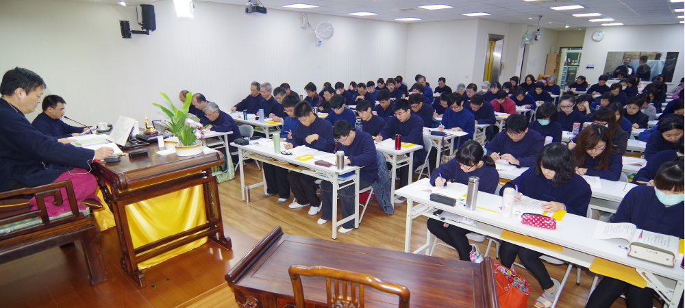

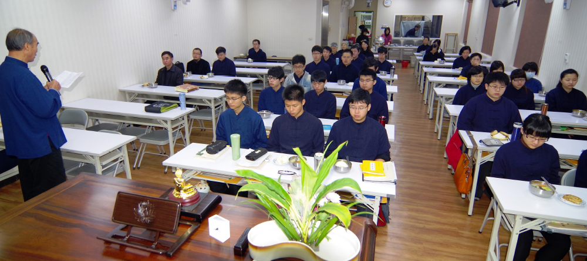

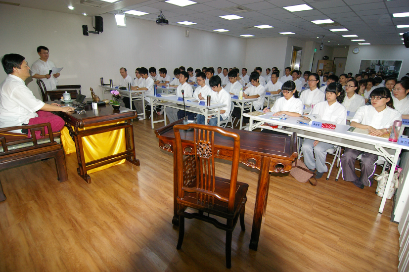

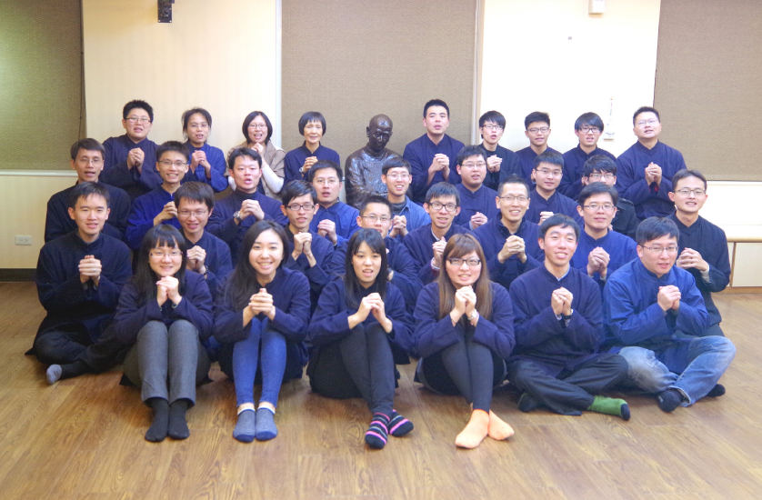

## 日常省思

### 天有不測風雲 ─ 從卓瑪居士生子說起

宗徹

生子之喜悅難生

面對先天諸障礙

不疑業果的生起

懺悔發心求加被

前言

學會卓瑪居士於二月上旬因難產而剖腹，孩子剛出生可從外觀看出不同於一般小孩，脖子是蹼狀頸（脖子較正常人短），左胸沒有乳頭、沒有胸肌，脊椎明顯呈Ｓ型彎曲，髖骨也有傾斜，並患有隱睪症。四肢除右手正常外，其他三肢都有畸形；左手食指、中指、無名指相併（遠端指節聯合），左足內翻，右足腳趾則多出一趾，並有二趾相併。內臟部分，左肺、左腎功能均有缺陷，左肺動脈發育不全，左腎位置異常，心臟主動脈弓右位，神經元移行有障礙。

學會在「寒假大專佛學研討班」會後，由老師帶領十多位學長，一同前往婦產科診所探訪宗徹居士伉儷。學會師友們除了關心孩子的住院情況，並與孩子父母探討應具備的觀念。並由宗徹居士將當日探討內容整理，亦期盼見聞者由於宗徹賢伉儷挫折障難因緣，反生起對三寶的皈依，對正法的勝解，面對障礙能接受考驗，生起大悲心做自他交換，由此更體會一切眾生的苦難。並將所有功德，回向大眾同具往生順緣，同生安養國，同成無上道。

一、正知見決定後天的禍福發展

心刻學長談到自己有四個孩子，近日孩子們在家中菜園玩耍，幼女不慎掉入灌溉用水溝裡面。當日水流湍急，一歲多的孩子在急流之中，很可能就要被沖入大浚與水溝的濠溝之間，而失去性命。所幸長女當下大叫，奶奶聞聲便奪門而出，立即將幼子自水溝中拉出，更因此受傷。事後回想心有餘悸的說：若沒把孫子救出，就一起隨急流而去吧！自忖：若當時幼女與母親有什麼不測，自己將以什麼心態面對？

《地藏經》云：「若有男子女人，在生不修善因，多造眾罪，命終之後，眷屬小大，為造福利一切聖事，七分之中而乃獲一，六分功德，生者自利。」我們常說命終的人，要為他誦念《地藏經》；誦念的人可以得到六分功德，命終的人可以得到一分功德。同樣的道理，孩子一生的福報多少，父母親無法為他增加多少；帶領孩子親近善知識、在具有善知識的環境中長大，才能幫助孩子以正知見改善他自己的命運。

又如科判有「正明」（正面說）及「反顯」（反面說），父母為孩子做的一切，到底是正明還是反顯？為人父母者不可不時常反躬自省，並因材施教的循循誘導，使孩子具足正確觀念。若為人父母的我們，以正知見帶領孩子長大，讓他有能力行善造福、深信因果，即使施以打罵教育，也會有好的效果；若沒有正知見引導孩子，就算是細心呵護，也可能是誤導的教育。

師云：有些孩子生來就身體康健，有些孩子生來則身殘不全。生來身體康健者未必好，生來身殘不全者未必壞。生來康健者，或因不善引導，依此身造作許多惡業，而生來殘疾者則沒有能力造作惡業；身殘缺者若能克服心理障礙，亦能造作善業，關鍵在是否有正知見。

有正知見的孩子，或因先天的障礙，而可創造後天的發展，如力克胡哲等知名人士；沒有正知見的孩子，即使先天的稟賦很好，後天的發展卻縱慾享受，許多紈褲子弟不是這樣嗎？

所以，每一個人的禍福，先由家裡面給他一個好的環境，其次看他自己的努力，能決定他一生的禍福。

二、最能起疑處不疑方為真修行

昭如學長云，夫人身體不好，懷孕時就碰到許多狀況。身為人夫、人父，對於宗徹賢伉儷生子遭遇的狀況，能分享一些人生的體會。

因與妻子遭逢困苦，有幸於佛法中尋到痛苦的解脫之道。對佛法愈深入，就愈能幫助自己脫困，進而能幫助自己的孩子生起脫離苦因的正見，乃至幫助有緣的眾生從痛苦中解脫。總之透過對佛法的深入學習，有了正向的力量，去面對人生的苦痛。
《百法明門論》「心所法」中的「疑心所」，即「於諸諦理猶豫為性，能障不疑及諸善品為業」。如《百法明門論研究》中，太史公對因果道理也大惑不解，認為像伯夷、叔齊這樣的善人，畢生積累仁潔的德行，還會餓死於首陽山中；許多人一生行善，終生顛沛流離，命運乖舛。從而自
**問：** 當吾人遭逢人生的巨變，是否也會喪失對因果的信解？

師云：要在最能起疑的地方不疑，最能失信心的地方生信，最能失志的地方生起志向，這才是真正的修行。修行不是只有在順境，有時在逆境之中才是最好的考驗。因此，生了身體障礙的孩子正是考驗道心的試金石，看看過去所修的正知見，是不是像純金般可被考驗。

而妻子也依苦發心，支持同修為公發心，自知往昔生中不識佛法，造作許多惡業，以致今生遭受種種苦果。有幸機會接觸佛法，暗自慶幸，此生終於有解脫苦痛的機會。聽經給自己增強信心，並就現前生起的苦果，觀察「此受病因緣乃消除往昔惡業」的道理，相信定能將重報轉輕。並勉勵與隨喜先生為公發心。

師云：家家有本難念的經，苦在某人身上是這樣，在他人身上變成那樣。如先父在生之時，表面上看不出太大的痛苦，實則曾身經戰亂、逃難等種種變故。在娑婆世界，想要躲避苦是不可能的，然應思維如何將苦的體性轉變成功德才是。

曾為雪公侍者的鄭老師，亦因糖尿病、高血壓、心臟病同時病發，導致需要洗腎，他在得知洗腎後身體機能將大不如前，住世無益，於是決定回雪廬山，在助念聲中捨報往生。

所謂「如是因、如是果」，鄭老師受病苦沒有被送去醫院急救，而能順利往生，與他弘揚助念法門，護持許多人往生有關。

三、孩子或命短，亦能助其往生

曉青學長云，天將降大任於是人也，必先苦其心志。遇到生子的變故，可當成佛菩薩或上天的考驗，能藉由孩子增長自己的能耐。父母作業的思維，作人生的反省，作業障的懺悔，作忍辱的觀修，作發願的緣起，是最好的修行。

四、因苦發起殊勝大悲與菩提心

心一學長云，每個人都會遇到很多困難，或可以消極、負面的態度面對，或可在困難之中激勵正向的心志。因此，我們應嚴肅面對困難，而非任由感受隨意竄動去生起煩惱。透過困難可做各面向的觀修。例如：雖自己受了很多的苦，但相較於其他在更困頓環境中的人，自己這種遭遇實是微不足道。對比那些遭逢戰亂流離失所的人，我們是幸福的一代，縱然碰到一些生活上的難題，仍屬幸福。

在年輕一輩成長時，都希望生出來的孩子有著健全的身體，眼前孩子會以這樣的形態來投生，可能是有所求，父母當好好護持這個孩子，為他作善、念佛；用他來提醒父母生起正念，觀察業果、認真修行，志求出離，當這個孩子有一天成就了，必然也會護持父母。

師云：對孩子的覺受，可以擴充為對一切有情的覺受；不忍的心，就是大悲心發起的徵兆。《地藏菩薩本願經》中，地藏菩薩因他母親受地獄苦報，而發起了殊勝的大悲心、菩提心，母親依此竟能脫離地獄之苦，地藏菩薩更因此得到殊勝的成就。

眼前對孩子不忍之心，由此而發悲心與菩提心，必能帶來孩子與大眾無限利益。況乎此孩子並未受地獄苦報，必能依父母所發起的悲心，而有所增上。

五、以願受他人嘲諷面對考驗

家尹學長云，宗徹居士面對孩子的缺陷，不因此而生出負面情緒，雖替他們鼻酸難受，但也佩服兩位學長因學佛而產生的正向能量。反省自己無始劫來，難以聽聞正法，此生慶幸親近善知識，聽聞珍貴的教法，乃多少世累積的福德所感召！將這樣的善根，回向兩位學長的孩子，願他此生能具足往生淨土的資糧。並願發起學長們一起作護生活動，將功德回向老師們身體健康，兩位學長的孩子一切吉祥。

師云：將心比心，此事若發生在我們身上，才會知道：「喔！原來真不容易。」這樣的處境發生在別人身上，要安慰勸導別人都很容易；但發生在自己身上，要調整自己的心境則不容易。

有些人或許會質疑：學佛的人怎麼會遭遇這樣的不幸？此正考驗我們的忍辱度和對經教的正知見。實則，別人說的話愈尖酸、愈刻薄，對我們愈好，惡業消除得愈快。如《金剛經》云：「若為人輕賤，是人先世罪業，應墮惡道；以今世人輕賤故，先世罪業，則為消滅，當得阿耨多羅三藐三菩提。」如何在最疑惑中生起不疑，最會失去信心中生起信心，那才是真正的修行。

六、受此困境磨難能為受用他人之典範

心法學長：聽聞此難，心情非常難過。相信學長在十月懷胎期間，一定非常期待孩子出生，想像他美好的成長。尤其兩位學長在幼兒園、讀經班帶領小孩子成長，勢必對於自己的心肝寶貝應如何教育，使他成才成器，內心有一番期許。

直到孩子出生，發現有這麼多的狀況，孩子一定是很努力才能來到這個世上，但卻帶來兩位學長相當大的考驗。歷經磨難、內心有更多的成長，反而令人由衷佩服。

師云：當經歷過考驗，未來有其他人走不出心裡的鬱悶，你們的遭遇對他是最有說服力量。　雪公從大陸孤家寡人來到臺灣，什麼都沒有，因此講到「放下」，是最有威力的。

七、身處於順境中應具五類觀修

光妙學長：要來探望時，不知該抱何種心態。來時見到兩位學長神情穩定，似乎已知道未來的路該怎麼走，此時感受佛法正知見的重要性就在此處。如老師所說，所有的事情都圍繞在正知見上，例如：對治煩惱並非像兩軍交戰，而是換個角度看事情。因此，雖處於逆境，卻是自己的增上緣；雖處於順境，也要藉順境不斷加強自己的內涵。

師云：在順境中要有幾類觀修：

第一， 要有憂患意識，才能在順境轉變成逆境時，接受逆境的考驗；

第二， 將順境當作是在消耗自己的福報；

第三， 將順境當作是修福、修慧的資糧；

第四， 處順境中的人，也有另類說服力，因此要把握順境；

第五， 在順境中，可以體會到修善的成就相，因此對於他人及自己所修的善法，要能生起隨喜的心。

八、大悲心生起之前應除去貪瞋

淨度學長云，經云：對待一切眾生，如唯一愛子，方能不失對眾生的慈悲，反之對待自己唯一的愛子，卻可想成一般的眾生。因為在對待自己的愛子時，容易悲心勝過理智。可以藉由眼前境界，訓練自己能理智的處理，包括心態調整，做法上顧及全面，訓練自己面對艱難而不失理智，乃至未來面對至親往生也不失理智，合宜的處理。

師云：修學大悲心，必須先除貪、瞋；貪、瞋若不先除去，當大悲心增上時，也會夾帶著貪、瞋一起增上。如未除貪、瞋修慈悲，往往慈悲夾帶愛見增上。如黑色的布欲染黃，我們要先漂白再來染色；若不先漂白而直接染色，則這塊布的顏色總會夾雜著黑色。修行人若沒有掌握這個要點，經常是慈悲心愈增上，貪愛就愈多；慈悲心愈增上，瞋恨就愈多，最後比沒有修學大悲心的世俗人還要難相處。

然而要如何於大悲中除去貪、瞋呢？面對所愛的人，反而要當成他是來障礙我的；面對所惡的人，反而要當成他是來增上我的。這些都是在內心的調整。有時把親人當成仇人，目的是除貪，不是要結仇；因為親人或將障礙我們的道心，如夫婦感情恩愛，卻因此隨順世俗而墮落。有時把仇人當成親人，目的是除瞋，不是要把仇當親；因為仇人或將砥礪我們的心志，使我們戒慎恐懼，讓我們修忍辱度。當貪、瞋除去，內心平靜，在這個基礎上修悲心，才真正稱得上是「大慈大悲」。

九、在家須善用悲智以教養子女

心盈學長：由於未曾經歷結婚生子的過程，很難體會當媽媽的辛苦。九二一大地震時，許多小朋友到家裡來住，當時只是逗孩子玩，感覺孩子有調皮的一面，也有可愛的一面，但很難想像一位母親，如何將孩子從小帶到大。衷心為你們祝福。加油！你們辛苦了！

師云：當與別人家的小朋友相處時，當下覺得很可愛；相處一、兩個鐘頭後，又覺得很煩。時間再拉長一點，會很希望小朋友的家長趕快把他帶走。可見孩子的成長過程，為父母者要付出許多的心力。要如何與孩子們一起成長，這都是修行的課題。

沒結婚有好處也有壞處，有結婚也有好處有壞處。以前有某位老師在講《大勢至菩薩念佛圓通章》中的「如母憶子，如子憶母」道理時，他雖講得頭頭是道，有些師姑聽起來就覺得味道不對，因為這位老師沒有生過孩子，所以講不出箇中味道。

再者，夫妻之間，女人有女人的障礙與增上，男人也有男人的障礙與增上；懂得善用女人的悲，懂得善用男人的智，兩者和合在修行上表現。如面對這個孩子的出生，雖然會有不忍的心念，作為悲心的生起處，也能捨離貪愛而作為智慧的生起處。

十、珍惜苦的覺受更能體會經典

淨印學長：昔曾認為要體會眾生的苦，是一件很困難的事；甚至要體會身旁人的苦，都未必做得到。僅從自己的人生經驗，淺薄的歸納成三點，與大家分享。

第一點，當有苦的覺受產生時，就要狠狠的捉住它，因為這樣的覺受很難得。

猶記家母罹癌末期，那段日子內心很苦。當時不想放棄家母能夠治癒的機會，因為一旦放棄，人生彷彿失去了希望，乃至自己也不願活下去。不料沒有多久，家父血尿被檢查出罹患膀胱癌，且非常嚴重，內心幾近崩潰。那時不敢讓母親知道父親罹癌的訊息，只是把自己鎖在浴室裡，拿頭去撞牆；在開車時，沒有目標的任意前進；在騎車時，把雙眼閉上。後來在開車時與人發生擦撞，卻仍然無法宣洩內心的苦悶。

直到跟隨唐老師學習，才知道遇到痛苦的遭遇，就好好的體驗痛苦，因為唯有如此，才能真正感受到什麼叫做「心如刀割」。

當在閱讀經典文學時，看到作者在字裡行間許多心境的描寫，就會思忖：若這些心境都在自己的人生中發生，文章中的每一個字，就都能打在自己的心上產生共鳴；如果不曾經歷過，則文章中的字句只是美如詩般的文字，卻無法真正觸動自己。那種被字打在心上的感覺，其實非常好。

所以，珍惜所有苦的人生經驗，一旦有這樣的苦發生，就好好捉住它、體會它，就哭，就真情流露，既使大聲地吼也無所謂。這並不是要讓自己失去理智，而是讓自己知道，原來苦就是這樣的滋味。

人生苦的種類數以萬計，別人的苦雖自己無法經歷、體會，但別人也無法經歷、體會自己的苦。自己的苦難既然能夠與自己相遇，那就要好好把握苦的覺受，這樣的覺受將給自己很大的幫助，對自己的心將是莫大的粹練，更能幫助自己在學習教法時，直接而深刻的體會苦的意涵。

其次，在自己養育四個孩子的過程中，也曾遇到孩子生病，或發生非常緊急的情況。當遇到這些情形時，會做這樣的觀察：「如果這懷抱中的孩子不是我的，我還會這麼難受嗎？」
有位學長的小叔，好心幫學長的兒子剪指甲，卻不慎剪到他兒子的指頭肉，一時間血流如注。這位學長看到之後，就很難過而哭泣，末學就問他說：「如果流血的人不是你兒子，你還會這樣難過流淚嗎？」這位學長聽了末學這麼問，想了一想回
**答：** 「好像不會耶！」末學就說：「當你看到別人的兒子手指頭被剪破流血，還會這麼難過流淚，你就成功了。」這位學長想了很久，還是聽不懂末學的話。

其實箇中的道理是：把別人的孩子當作是自己的孩子，把自己的孩子當作是別人的孩子。當自己的孩子受苦，就想成是別人的孩子，但不會因此不理會，主要是幫助自己冷靜應變。

第三，在生育四個小孩時，每個孩子都是在不同的情況下出生。從懷孕到生產，過程是辛苦的。但這些辛苦，末學不大敢跟年輕的學長們提起，怕年輕的學長們聽到後不敢生孩子，因此只將苦中的樂向年輕學長們講說。

孩子從出生到長大，就好像是一面鏡子，不斷的反映出父母的點點滴滴。每個孩子都不一樣，但都是我們的一面鏡子，可以從鏡子中看到我們自己，到底我們的習氣有哪些，我們如何與人互動，以及我們用什麼樣的心態存活在人世間。

我們必須把孩子當成自己的一面鏡子，唯有鏡子可以反射出自己的樣貌。不論孩子生來是否健康，都是我們一面珍貴的鏡子。

師云：雪公何以能將杜甫的詩講得好、注得好？因為與杜甫所處時代背景相當，經歷過戰亂、流離、無家可歸等。捉住這些覺受來講杜甫、李白的詩，跟其他注解中描述杜、李詩作像美好的文學作品不同，老人認為杜詩、李詩皆是至情之作，大宗旨皆是溫柔敦厚，實乃李、杜詩作的知音。

再者，自他交換的修學法是大悲心利根的修學法，就是愛他人像愛自己一樣，漠視自己如同漠視他人一般。例如對他人如何漠視不管，捉住這個覺受來對待自己；對自己多麼呵護，捉住這個覺受來對待他人。這是屬於利根的修學法。

最後，孩子就像一面可以反映自己的鏡子，從這裡來檢點、反省自己。不只是孩子，我們的親人、我們所處的團隊，都可以是反映自己的鏡子。如唐太宗說：「以人為鏡，可以明得失。」這種修學法對我們非常好。

十一、心內任運的訓練使心更開闊

心筑學長：人生如戲，但劇本事先不知以為寫好，以為自己在那裏創造劇情，實則都隨著導演(業)的指揮而演，然而不管我們有什麼情緒或苦楚，最可貴的是有好友相伴。

淨苑老和尚生病後，日子雖很辛苦地過著，眼中卻總是閃耀著光明。正知見的力量，可以讓人內心調柔，雖很艱難的面對困境，能過關的是心境在法上的安住，以堅忍的心走完一生。

師云：人生當中，朋友的情誼非常重要。五倫關係都是必須去經營的，尤其是朋友間的切磋琢磨。雖然朋友倫是五倫之末，但是最能護持五倫。

此外，心任運的那一分是可以被修出來的。比如說今天跳高跳了一百七十公分，明天再跳高，還是要很努力的才跳到一百七十公分，後天也一樣；哪一天要挑戰跳一百七十五公分，又要更加努力。試問心的訓練，是否如此？

不然，心之外的訓練，都需要一番努力，且每次訓練都要很辛苦，如騎腳踏車環島一圈，要再騎一次，一樣要很努力、很辛苦的騎一次，不會因為騎過第一次後，第二次變得輕鬆。三十歲時騎車環島或可，到四十歲再騎一次，就會倍覺辛苦；年紀愈長就愈不堪。

一般人或外道，會以為心的訓練亦如此，實則不然。愈訓練心，運轉得愈強，如大悲心的串習，一次次的串習，最後不費吹灰之力，就能於有情生起大悲心！

十二、令人病苦困難的境界體性可以轉變

淨本學長：面對如此的困境，體性如何轉變？首先，讓這樣的因緣成為業的教材，令見聞者堅固因果的見解。其次經營學佛的環境，令孩子生起正見，有能力面對自己的困境。再者，家長的為公發心，也能轉變孩子未來的命運。

十三、將孩子當成善知識

心瀾學長：今天在心態上應該要感謝這個孩子，使得我們有機會聽到老師及諸位學長的經驗分享。從小孩身上生起對一切眾生的大悲心，祈求宗徹居是伉儷更堅強的面對困境。

將孩子看作父母的善知識，因為他讓父母反而生起對佛法的信心，這種信心勝於一般泛泛的信心，他讓父母有善友圍繞、關心、陪伴。我們也會將所做的功德為他迴向，祝福他一生不孤單，有最好的成長。

十四、藉此感受自己的父母對己的關愛

戒純學長：聽到卓瑪生下畸形之子，難過之餘在吃飯時跟母親提及，家母聞言表情驟變，此時體會到這樣的事情，只有為人父母，才能夠感受到箇中的辛酸。

以前總會嫌母親囉唆，愛管東管西，但母親那一瞬間的表情，讓自己體會到了父母對子女的關愛，身為兒女的我們，如果不能把父母所生的身體、所提供的環境好好善用，便辜負了父母親的愛心與栽培。

現已在學校為人師，帶班教學，這些學生都是父母眼中的心肝寶貝，他們的父母必然像末學的母親那樣，關愛著自己的孩子。從學長的分享中，學習了教法的運用，對境界有正向的態度。

期許自己能運用意識中所生起的覺受，使自己在未來學習教法時，能更具有決定見，更有領會力，更加增上。

十五、父母將帶給孩子一生的光明

林老師：童話故事的結尾總是說：「從此以後，王子與公主過著幸福快樂的日子。」其實從此以後，挑戰才剛剛開始。

如心一學長說，痛苦有很多種類，而眼前這樣的痛苦，只是千萬種之一罷了。

剛結婚時，因為家中坪數大，所以租給了兩姐妹，且這兩姐妹都是從我們家嫁出去的。其中的妹妹在她的第一胎，經歷過生產的疼痛後，白白胖胖的孩子，卻在出生的那一刻，因臍帶繞頸窒息而死。我陪她走過那段辛苦的日子，她也因有宗教信仰，很快就走出陰霾，並在後來的日子裡，生了三個健康的孩子，現在是一位稱職的全職媽媽。

我們道場裡有一位師姑，她第一次帶孫子到道場時，我們都被她孫子的樣貌給震懾住了，那師姑的孫子長相異於常人，但這師姑抱著孫子，表情陽光的模樣，讓人不會對這個小孩產生負面的解讀，也隨著她而心情陽光了起來。

我們看到許多身體有障礙的孩子，他們能夠健康長大，都是因為有心態健康的父母親陪伴成長，或許這些孩子的父母親，必須付出許多心力、體力、時間來照顧孩子，但孩子終能在心態健康中的長大。

惟願三寶加被，傳承攝受，體會世間的體性是由業感果，欲離苦得樂，需由惡轉善，即使受大苦亦能轉小苦，並且成為三寶樂於攝受的對象，成為宣揚正法團隊的法將，成為往生的增上緣。
