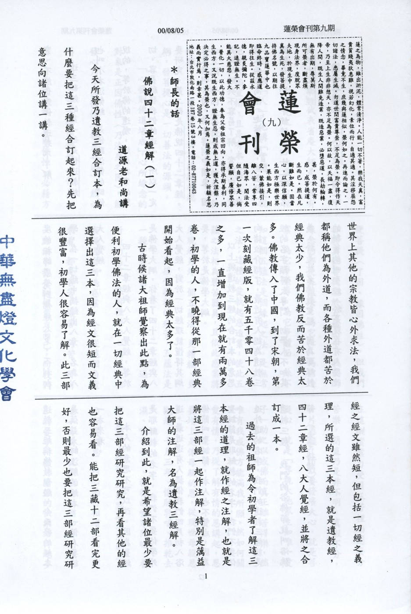

# 第9期

## 大德法語

### 佛說四十二章經解（一）

*道源老和尚講授*

今天所發乃遺教三經合訂本，為什麼要把這三種經合訂起來？先把意思向諸位講一講。

世界上其他的宗教皆心外求法，我們都稱他們為外道，而各種外道都苦於經典太少，我們佛教反而苦於經典太多。佛教傳入了中國，到了宋朝，第一次刻藏經版，就有五千零四十八卷之多，一直增加到現在就有兩萬多卷，初學的人，不曉得從那一部經典開始看起，因為經典太多了。

古時候諸大祖師覺察出此點，為便利初學佛法的人，就在一切經典中選擇出這三本，因為經文很短而文義很豐富，初學人很容易了解。此三部經之經文雖然短，但包括一切經之義理，所選的這三本經，就是遺教經，四十二章經，八大人覺經，並將之合訂成一本。

過去的祖師為令初學者了解這三本經的道理，就作經之注解，也就是將這三部經一起作注解，特別是蕅益大師的注解，名為遺教三經解。

介紹到此，就是希望諸位最少要把這三部經研究研究，再看其他的經也容易看。能把三藏十二部看完更好，否則最少也要把這三部經研究研究，不然你對佛教道理不了解。

這三部經的第一部是佛遺教經，也叫小本涅槃經，是佛臨涅槃的時候說的，等於佛的遺囑，經義非常的懇切，容易啟發我們的道心，所以一定要研究。第二部是佛說四十二章經。在東漢明帝時，佛法傳到中國來，因其他的經典不容易了解，當時由印度請來兩位高僧（迦葉摩騰，竺法蘭），他們在一切經中摘錄出四十二章，名為四十二章經。

第三部是八大人覺經，也是印度的祖師感覺到佛經太多，不利初學，在一切經中摘錄出八章，名為八大人覺經。

四十二章經與八大人覺經，等於是佛學大綱，你看了四十二章經與八大人覺經，對於一切經典就懂得其綱要，等於是佛學大綱。

以上將遺教三經的合訂本的意思向諸位介紹了，最近有人認為遺教三經的名字顯得太專門，初學人不知其義，於是改名佛教聖經。因為耶穌教的新舊約叫聖經，於是現在有人要改遺教三經稱佛教聖經。今天發的經本是蕅益大師注解的經本，一個人要請一本來看。

本人的意思不可以改。因為聖經是耶穌教的名字，我們不要仿學外道。最近還有人提倡我們四月初八浴佛節叫聖誕節，本人也不贊成，因為聖誕節是耶穌教的名字，我們不要仿造外道的名字，我們的遺教三經就是遺教三經，我們的浴佛節就叫浴佛節。（未完待續）

## 共修研學

### 勸發菩提心文（九）

*心爾*

「嘗聞」代表省庵大師是一個有師承、非出己見之大德，大乘經包括「法」跟「人」，他講「嘗聞」，是說他要代佛宣揚，且是有本之學。「發心立願」發的是菩提心、立的是四弘誓願，四弘誓願是一切菩薩願的總綱，發菩提心是一切善法的源頭。

「心發則佛道堪成」，心所緣念的對象是正因佛性〈乃法身之因〉，能發心乃了因佛性〈報身之因〉，然必藉種種表相之緣因佛性〈化身之因〉。真性菩提〈正因佛性〉必藉方便菩提〈了因、緣因佛性〉。但我們都將真性菩提埋於五蘊身中，我們所緣念的都是五蘊法，為它忙、為它造業、為它爭榮辱，為它爭體面，殊不知這個五蘊法是個緣起之法，是無常之法；這種的愛執起惑造業，使此五蘊之法相為裝苦器具，且依此惑業將來現起另外一個五蘊法，更糟糕、更麻煩，來接受種種的痛苦，五蘊法是一種受苦之器，它只是承接我們過去所造的惑業，眼前種種身心的逼迫相表現過去所造惑業。人生從這個角度來看，都是苦苦、壞苦、行苦，那有一點樂？都在酬償業力而已，而我們在這酬償業力受用三苦裡面還妄分苦樂，簡直乃是非不明，真假不分，一片愚癡，所以要發廣大心，就是菩提心，就是「等視大地眾生如唯一愛子」助之以成佛而真正離苦得樂，然唯有我成佛方能滿我所願。然如何關愛有情，乃從了解有情的恩講起，恩要增上是像母親的恩，從現世母親恩觀起，十月三年、懷胎乳哺、推乾就濕、嚥苦吐甘、種種的噓寒問暖、養育、教育、提攜，這些點點滴滴的恩，而念恩報恩、內心的行相增上到看到他〈有情〉就很愉悅，猶如看到我唯一的愛子一樣，給他的快樂給得愈多愈好，拔除他的痛苦愈多愈好，所以孩子有病時，母親比孩子更痛苦，孩子快樂就是母親的快樂，孩子第一名時，母親絕對不會嫉妒。

我們為什麼會產生嫉妒心？就是沒有把眾生當成我唯一的愛子，所以他愈殊勝，我愈受不了。他愈高明我愈痛苦，他愈快成佛我愈悲傷，然後說我要度眾生成佛，這是什麼意思？當你把他當成唯一的愛子，這些忌妒等現象都沒有了，故有善知識幽默地說，做母親的人較有佛性，她知道唯一的愛子是一個什麼樣的覺受，抓住這個覺受，對親人，對一般人，對仇人，乃至對一切眾生都是如此的覺受。

而菩薩大部份畫女人相來表現慈悲，羅漢大部分畫男人像來表現智慧，對有情生出殊勝悅意相要拔除其苦，給他快樂，此乃真實起大悲心，「視眾生如一子」此之覺受是為關鍵，從此引發大慈大悲的心，像幫助孩子成長之心來幫助引導眾生成佛，盡一切力量幫助他成佛，幫助他成佛是我最快樂的，當我們成佛時，幫助他的力量最強，轉而我要成佛，我把他〈有情〉成佛的重責大任一肩扛起，而發起上求佛道之心，如此菩提心就圓滿，這叫廣大心。廣大心以後就會有堅固願，廣度他的心態發展成一種願力，是一種誓願、非這樣做不可的誓願，從心態裡發展出一種誓願，這個誓願就是發心的增上相，發菩提心增上相如阿彌陀佛的四十八願、地藏菩薩的「地獄不空，誓不成佛；眾生度盡，方證菩提」的大願，藥師佛的十二大願，觀世音菩薩的十二大願等等，這才是整個修行的秘訣所在。〈未完待續〉

## 蓮池海會

### 陳蘇風居士往生見聞記

心立

彌陀所發之四十八大願是虛假的嗎？佛法難道是沒有感應嗎？經由這次陳蘇風居士的示現，不僅再次證明彌陀悲願之不虛，更讓我們感受佛陀的大慈大悲，堅定我們往生的信心。

陳蘇風居士，民國三十七年十二月二十日生於嘉義縣六腳鄉的農村，十三歲時，為了家計，離開家鄉，獨自到台南市一家西裝店當學徒，服完兵役後仍從事訂作西裝的行業，二十六歲，與本村（台中縣新社鄉）的王瑞珺小姐共結連理，亦在此定居。其生性豪爽好客，對朋友誠意相待，故在鄰里間頗得人緣，也因為如此，家中亦時有宴客，而其手筆大方闊綽，餐桌上總是山珍海味。其妻之姊是位佛教徒，見其如此，也嘗試勸他能戒殺並皈依三寶，但他卻斥為無稽。

然而平時硬朗的身體，終於禁不起無常的到來，於往生三年前，一日上廁所時，發現竟有便血，送往醫院檢查，診斷之後。醫生告知為大腸癌。自那一日起，陳蘇風居士進出醫院不下百次，服用醫院的藥方，並且全身插滿了管子，但是因為大腸癌所開刀的傷口，三年來從未癒合，病情亦未見好轉。幸有其友-李仁宗居士，李居士的父親係靠蓮友助念往生，知道陳居士的生病狀況每況愈下，便請東勢及新社的蓮友幫助他，希望依靠大家的力量，使陳居士皈依佛法，能求生西方極樂世界。

或許是陳居士宿世善根福德因緣成熟所致，有一蓮友對他說：『陳先生，你這三年來，大概什麼醫生都看過了，什麼藥也吃了，如今你不妨再聽我，信這位阿伽陀藥，好嗎？』陳居士就這樣慢慢發起對淨土的堅定信心，於是陳居士與太太皆同意回家安養，聽從蓮友的建議，斷絕醫院所有的醫藥，家人日夜輪班在陳居士身邊念佛，因為陳居士內心的誠意，竟感應一位比丘尼-上悟下宣尼師，如同打佛七一般，在陳居士身邊念佛七日，從未間斷，奇怪的是自從這樣念佛一段時間之後，其三年從未癒合的傷口竟然結了疤，身上的病痛也消失了，和三年來的痛苦比較，如今的安樂真如天淵之別。由此而知，佛菩薩感應真謂不可思議，端在吾人至誠與否啊！

陳蘇風居士，在這往生前二個月來，家人和蓮友們不斷輪班念佛，蓮友們亦協助於陳居士家中設置佛堂，以及師父不斷開示下，僅這一句『阿彌陀佛』，使陳居士最後在臨終之時，毫無病苦，心不貪戀，意不顛倒，在蓮友及家人的助念之中，全身柔軟，安詳往生西方極樂世界。而所有的治喪事宜，亦感得蓮友全力護持，火化之後，則出現舍利瑞相。

陳蘇風居士，能於病苦時轉而信受淨土法門，持名念佛，求生西方極樂世界，成佛作祖，得知逆緣實是助道之良緣也。他從皈依一直到往生的期間並不長，而能現此殊勝瑞相，得以往生淨土，雖然與其宿世善根福德有關，更重要的是能藉此逆境，深信淨土，執持名號所致啊！而這樣的示現，豈不是彌陀所發之四十八大願中第十八願（十念必生願）最好的證明，最大的感應嗎？又陳夫人，能在助念風氣未開的鄉下地方，獨排眾議，一切皆按照蓮友指示，如法進行，怎能不令人佩服其勇氣與智慧呢？陳夫人真是陳先生的大善知識呀！

由此觀之，若吾人平時不認真修行，臨終時想要仰仗身邊所愛執的親人，面對世間歪邪風氣，想要安然往生，談何容易！希望大家藉此陳蘇風居士往生殊勝事蹟，能體會佛陀之大慈大悲，深信西方之實有，平時亦能憶佛念佛，精勤修行，廣結善緣。因為往生絕非僥倖，生死大事亦不能全憑僥倖二字。

### 李金海老居士往生見聞記

心立

李公金海老居士生於民國十五年九月十日，在家排行老大，自幼天資聰穎，奮發向學，臺灣公立學校高等科畢業後，考上台南工業學校機械科就讀。由於身負家計重任，甫踏入社會即任職於株式會社台灣鐵工所，未久與小學同窗好友陳文德先生合資共設工廠，白手起家、兢兢業業、刻苦耐勞、卓然有成。

踏實純樸的保守個性乃老居士最佳寫照，雖然開創出一番令人稱羡的事業，卻不曾沾染絲毫繁華都市生意人的習氣，記得老居士曾經說過：「做人仔頭家，不能只注重公司的利潤而已，更要緊的是要能夠確保員工穩定的生活，這是一份社會責任，一份不可輕易卸下的責任。」也許是如此，他終其一生未離開過工作崗位。民國三十八年，李金海老居士與黃峰月女士結為連理，家庭生活亦十分幸福美滿，育有四男二女個個成就輝煌，李老居士身教重於言教，子女從小便在他循循善誘下，培養出良善的品格與操守。李老居士堪稱是企業界的「庄稼人」日出而作、日落而息。長年的工作歲月裡，孩子們不曾見到他趕赴生意場合的應酬，每日黃女士為全家大小張羅三餐，晚間無論如何總等待李老居士下班後回家共進晚餐，飯後泡上一壺好茶，只見他一卷在手，心無旁騖地閱讀，此時的他，煞似投身教育界的研究者。

李老居士一生刻苦勤儉，宅心仁厚，對其手足的照顧與提攜不遺餘力，回顧其生平，恬淡儉約的生活方式，可謂一種修行，他老人家不喜歡喧嘩吵雜，對世俗五欲六塵種種享受，一概淡然視之，唯一的興趣是閱讀日文書籍與武俠小說。個性較為沉默的老居士，能在企業界五十五年來始終如一的保持簡樸的生活，厚實的性格，可稱之為異數也是藝術。老居士一生行事風格乃蘊含哲學意味的藝術體現。他鮮少動怒，思惟冷靜簡潔，謹言慎行，偶爾孩子們為一件事憂煩得忍不住提出來請他做主時，只見他徐徐開講，不出數言，就能化障礙於無形，直教我們不得不佩服他長者的智慧。身為長子的他，自幼受日本教育影響下，嚴以律己、寬以待人。孩子生病了，便立刻買藥或陪同就醫，下班回家的時候，手中拎著剛出爐的西點麵包，孩子和爸爸的距離更加貼近，原來父親的慈愛就是這麼生活化，自然直接而深刻的體驗。老居士塑造出來的嚴謹家風自然以長幼有序的倫理觀念作為家人互動的準則，一股深植於每個孩子心中的親情將大家凝聚在一起。

秉性端直忠厚，善體下恤的老居士最令子女、公司員工稱道，李老居士晚年十分重視養生之道，今年六月五日卻因心肌梗塞，雖在醫院未及醫治已無心跳，隨即接返家中，遵奉祖師大德開示，由孝眷、蓮友為其念佛，歷經三十一小時的助念，四肢柔軟、安詳捨報、面容紅潤莊嚴；老居士一生勤儉惜福、慈愛後輩、樂善好施，感召家人如法護持，謹此敬期李老居士早日花開見佛、迴入娑婆、廣度眾生、滿菩提願。

## 日常省思

### 參與新社啟蒙班義工心情點滴

心在

炎熱溽暑的六月天，南風一陣陣襲來，萬里無雲的蒼穹幾乎被烈日所佔據，大台北的街頭依舊是喧囂繁華，熙攘之人群，猶如過江之鯽一般，庸庸碌碌而步調緊張…。乘坐學長所駕駛的廂型車，滿載數量龐大的各類物資，懷著歡喜愉悅的心情，急駛在筆直的高速公路上，為這趟南下的旅途揭開了序幕。

抵達了純樸寧靜的新社，立刻被當地如詩如畫的景物所打動，沿著窄小的古街，見到村民最真實的生活寫照，穿過屋簷巷弄，兩旁盡是悠閒愜意的笑語聲。師姑、師伯們熱情誠摯的招待，讓人頗感溫馨、賓至如歸。

興辦教育事業、培育弘法人才、化導日益惡化的社會風氣，使之趨於民德歸厚，乃舉辦本次新社啟蒙班最大宗旨，藉由弟子規的殊勝因緣、及其他多元化課程的安排，不但能夠引導啟發可塑性甚大的學童，培養出良好之品格德行與如理如法的生活常規外，更具有將孩童納入團體生活學習範圍的特殊價值。既活潑又生動的教材籌備，蘊含多少善知識的心血和悲願，各位小紳士、小淑女是國家未來的主人翁，也是最幸福的一群民族幼苗。末學從小就在父母悉心呵護下成長，亦可謂不曾接受外境的焠煉，彷彿「溫室內的花朵」，於此特別感恩老師和長輩們給予末學為公發心的機會，眾多學長不厭其煩地指教並提供極為寶貴的經驗之談，彼此溝通協調，相互包容尊重，誠然使末學獲益匪淺。

不斷地懺悔自己宿世造作的惡業，仔細反省、觀照遇境逢緣時的那一念心，是否依然如如不動。修行的下手處就在克除習氣與降伏煩惱，好好思惟因緣果報的關係，串習教法之概念，時時觀功念恩、處處利益眾生，使之具體落實在日用平常。除了海報文書的製作外，末學也嚐試在「香積組」接受考驗，雖然只作一些端盤打菜、收拾廚餘以及餐具的洗滌工作而已，但不禁隨喜讚嘆掌廚的大菩薩，佛門有云：「法輪未轉，食輪先轉。」菩薩們絞盡腦汁、精心設計食譜，忍受油煙瀰漫，為大眾烹調可口味美的素食佳餚，供養每位小菩薩，乃至於每尊未來佛、功德無量，阿彌陀佛。

歷經一週的義工生涯，末學體會出父母親的養育深恩何其浩瀚，師長的諄諄教誨、循循善誘多麼難能可貴，同參道友和團體的力量時時刻刻在旁提攜警惕、這對初步修學教法者而言，助益甚大。有了為公發心的決定見，在八識田中，生起菩提意樂，對無常的覺受也更為深刻。感恩老師！感恩所有的人！

## 啟蒙園地

### 談教育（四）　信

願度

我們要成就一個建全的人格，首先根本在孝弟，接著要注重的就是行為謹慎與言語信實。古人言：「人言為信，不信，非人之言。」所以一個人要在社會上能立足，就必須要有信，若沒有了「信」，從使他具備了許多才能，也是行不通的，就像一部性能卓越的汽車一樣，若沒有油，就無法在路上行駛；所以，人之有「信」，就如車之有「油」。

在常禮舉要中提到：「口為禍福之門，話須經一番思考再說。」因此我們在說話時絕對不可有存心欺騙別人的心態與隨便信口開河的習慣。現在是個工商的社會，大家都非常的忙碌，因此我們說話時要注重要點，簡單明瞭，才不會耽誤彼此的時間。論語上說：「巧言令色，鮮矣仁。」所以我們在說話時要實實在在，不要養成討好別人的諂媚習性，也不要說一些誇大奸邪巧辯的語言，更不要說骯髒不雅的詞句及去學無賴之徒的口氣。在言語上，我們必須非常小心謹慎，對於未知道真相的事情不輕易發表自己的意見，對於不了解的事情不輕易傳播，對於不合宜的事情也不要輕易的答應，如果很輕易答應了，就會使自己進退兩難。在談吐說話時要穩重而且舒暢，要緩緩的、清楚的把話說出來，不要讓別人會錯意。遇到有人在談論別人的是非時，若於己無關就不要多管閒事。

古人說：「言為心聲。」言語是表現我們的內心，因此為了讓我們說出來的話至少不傷害別人，進一步能利益他人，就像幽谷的蘭花散發撲鼻的芬芳，所以必須先美化我們的心，為了充實我們的內心，我們就必須培養自己的德性，要培養自己就必須取法好的榜樣，看到別人有禮貌、不貪心、很勤勞、專心、負責、愛乾淨、熱心、耐心……，我們心中就生起和他看齊的好念頭，希望透過自己的努力，漸漸的具備這些特質。看見別人有不好的行為，例如：生活很懶散、做事很粗心、不專心，又有驕傲、妒嫉、自私自利的心態，心裡要先反省自己，若有同樣的過錯就要馬上改掉。當幫助別人的能力與知識技能不如人時，不必憂愁、懊惱。別人對我們稱讚時，要很害怕自己徒具虛名而已；若別人肯指出我的過失時，要很高興的接受；因為這樣的話，誠實正直的朋友便樂於和我們交往，自己會得到更多的益處。左傳說：「人誰無過，過而能改，善莫大焉。」人活在這個世界上，哪個人沒有過錯？若能把我們無心犯及故意犯的過失改正過來，這就是最大的善了。倘若犯了過失，又加以掩飾的話，就會讓自己的小過失變成大過失，如同雪球愈滾愈大、愈滾愈險、愈滾愈遠，而造成無法收拾的地步，所以「改過」是一把塑造全新自己的利器；我們從聞過喜、到知過，並且有知過能改的勇氣，這樣誠實正直的朋友必然給予我們更多的忠告，這樣我們在人格的建立上又向前跨了一大步，由內心的涵養到外在的言語信實，能讓自己的生活更美好，更能利益其他周圍的人。

### 廉介誠實終受厚祿　孟信

*編輯部整理*

孟信 後魏 廣川 索盧人(今山東省長山縣)，字修仁，家境貧寒，放棄讀書，自願從軍，累官至趙平太守，為政崇尚寬厚和平，地方權勢土豪，都不敢為非犯法。在任期間，清廉自持，到去官後，兩袖清風，居家貧困，三餐難繼，只有一隻病牛，其姪子隱瞞病情，打算將牠賣掉，換些柴米，以供生活，買賣券契，雙方寫好，孟信正好從外回來得知，對買者說：「這隻牛有病，稍微勞力，便會發作，對你沒有用處。」說罷轉身，責打姪子，同時訓斥他，不該欺瞞。買者見此情景，深覺奇異，站立一邊，嗟嘆很久才去。

周文帝得知，非常讚賞孟信這種廉介誠信的美德。於是舉用為太子太傅，並特予加封散騎常侍，直到年老才辭官榮歸，當時儒者學士，都深引為榮。

後漢書內也有一段相同事蹟記載：漢朝人朱穆，家中養豬，豬有病，命家人到市場去賣，並特別吩咐說，這隻豬有病，當以便宜價格賣出，不料家人來到市場就賣，不說有病，所得的價錢，超過預料，朱穆得知其故，隨即趕到市場，以半價送還買者，買者不接受，朱穆留下錢就走，其誠實德量與孟信先後可相比美。〈明倫月刊一四Ｏ期七十二年十二月〉
