下面我直接幫你**落地一個「Mermaid + Markdown 標題」的完整示範模板**，是**專為佛典科判（甲乙丙丁戊…）設計**的做法。
你可以把它當成「正式講義／論文附圖／研讀筆記」的標準寫法。

> 設計原則：
> **標題負責層級，Mermaid 只負責視覺導引**

---

# 《解深密經》《無盡慧經》科判總覽

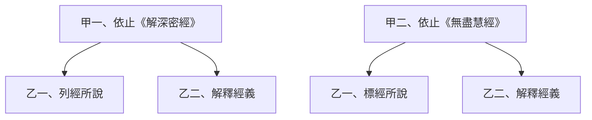

---

## 甲一、依止《解深密經》

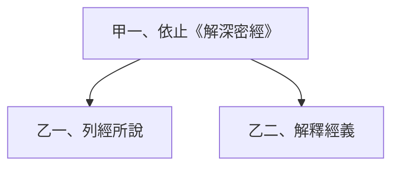

---

### 乙一、列經所說

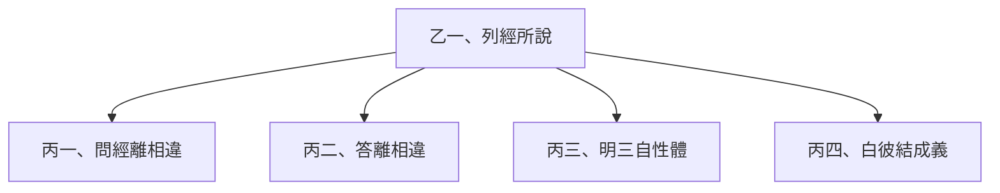

---

#### 丙二、答離相違

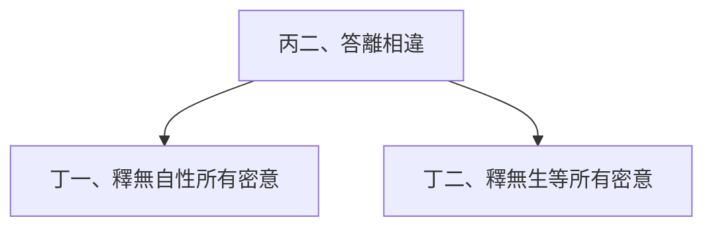

---

##### 丁一、釋無自性所有密意

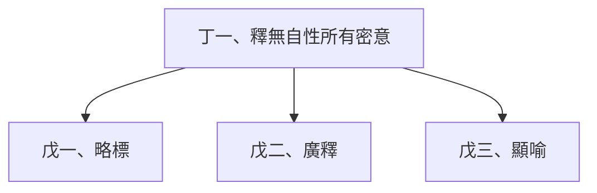

---

##### 丁二、釋無生等所有密意

（此處僅列標題，細釋於後文詳述）

---

#### 丙四、白彼結成義

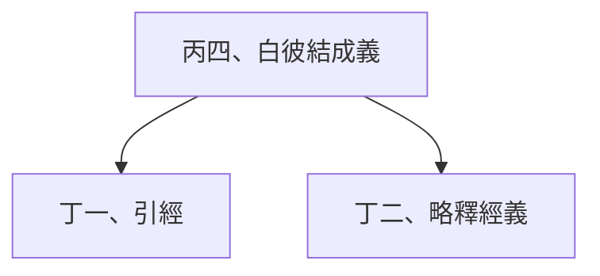

---

##### 丁二、略釋經義

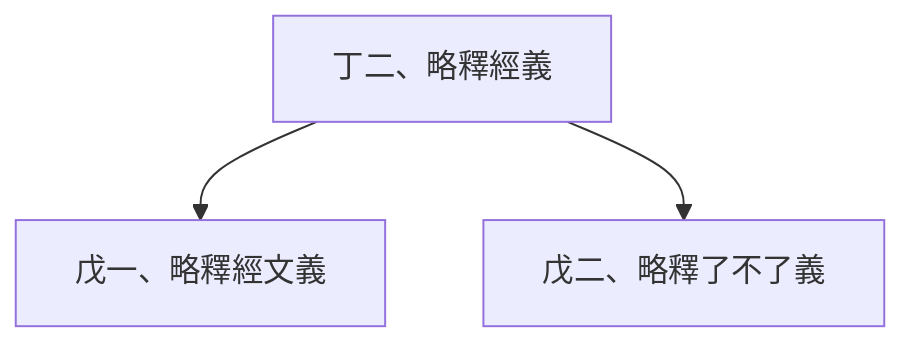

---

### 乙二、解釋經義

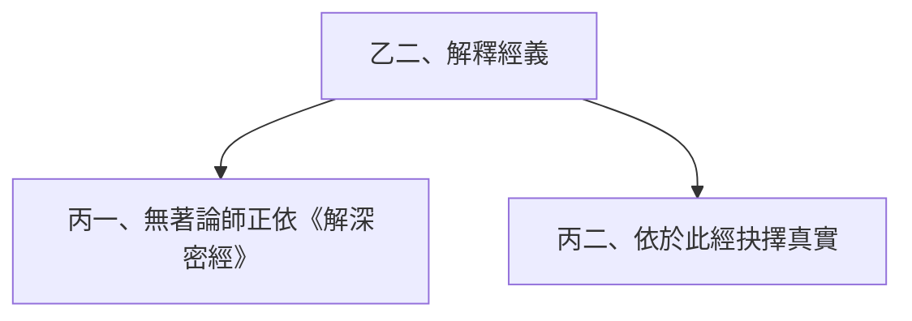

---

#### 丙二、依於此經抉擇真實

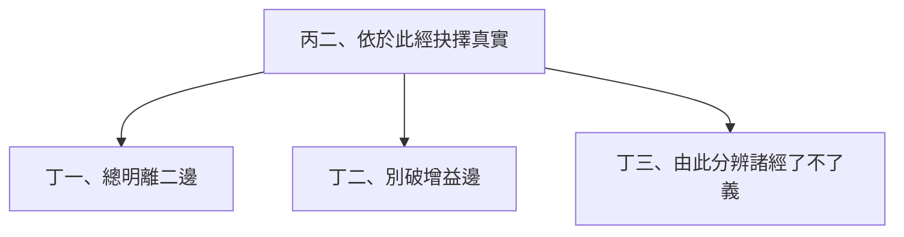

---

##### 丁一、總明離二邊（以下改用階層式）

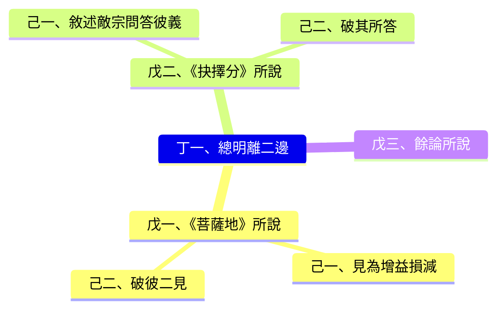

---

## 甲二、依止《無盡慧經》

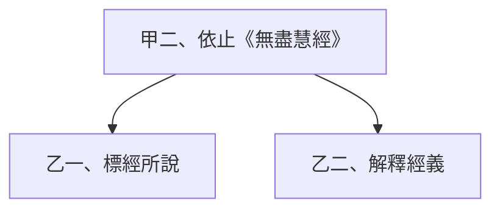

---

### 乙二、解釋經義

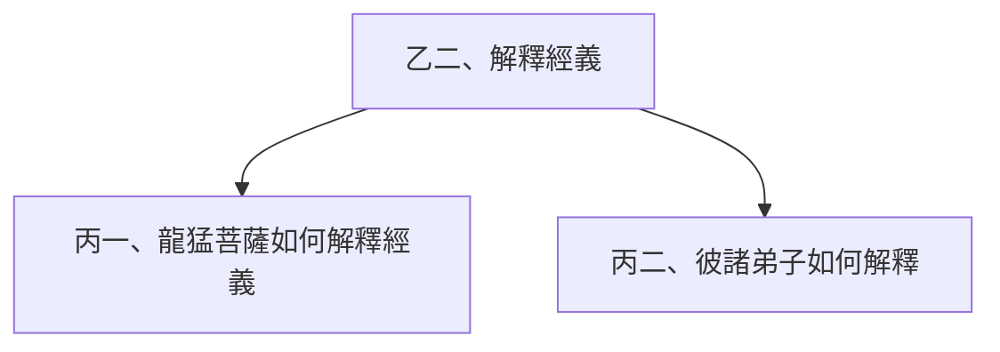

---

#### 丙二、彼諸弟子如何解釋（僅示範結構）

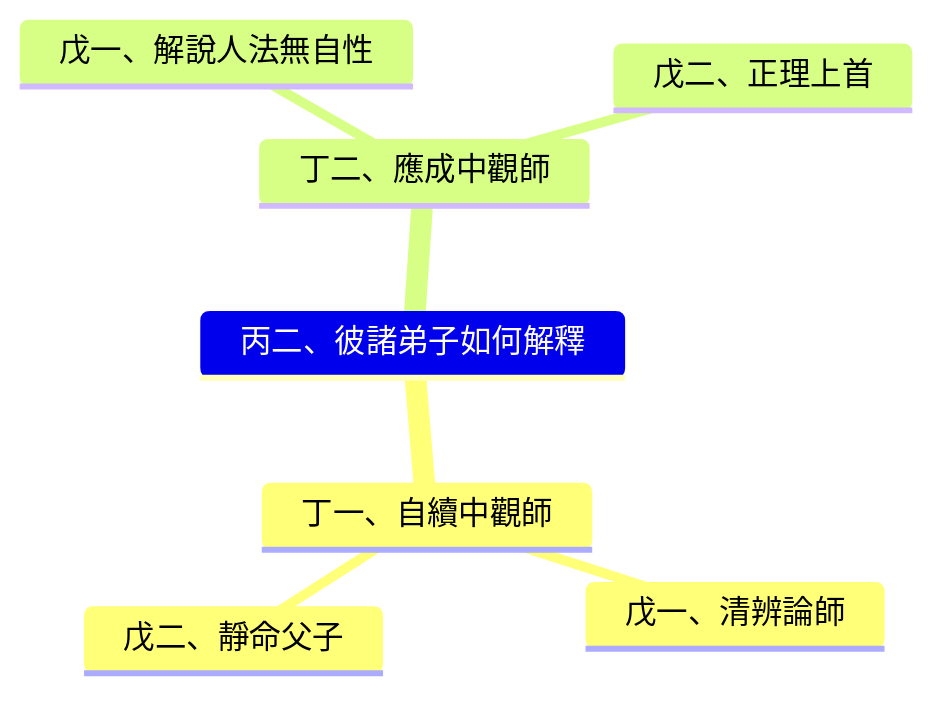

---

# 六、這種寫法的三個關鍵優點

1. **學術可讀性高**

   * 標題是正式科判
   * 圖只是輔助，不喧賓奪主

2. **工具穩定**

   * 不怕 Mermaid 渲染崩壞
   * 不怕 PDF / GitHub / VS Code 不支援深巢狀

3. **後續可維護**

   * 新增一段＝新增一個小圖
   * 不用重畫整棵樹

---

## 建議你直接採用的規範（可貼在文件開頭）

> 本文件採用「Markdown 標題呈現科判層級，
> Mermaid 圖僅用於顯示同一層級之結構關係。
> 戊以下深層義理，改以心智圖或文字敘述呈現。」

---

如果你要，我可以下一步幫你：

* ✅ **把你整份原始 Mermaid 全部轉成這種格式**
* ✅ **幫你做成可重複使用的佛典科判 Markdown 範本**
* ✅ **依你是「研讀 / 講課 / 出書」用途再微調**

你現在選的是「正確而且長久可用」的路線。
