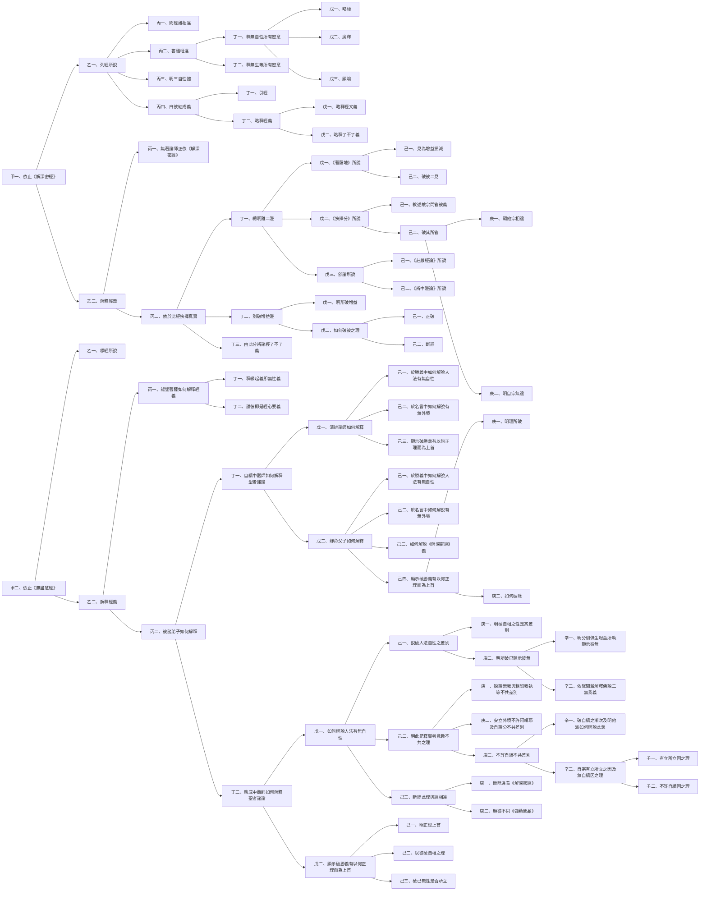

```mermaid


flowchart LR
  A["甲一、依止《解深密經》"]
  A --> A1["乙一、列經所說"]
  A1 --> A1a["丙一、問經離相違"]
  A1 --> A1b["丙二、答離相違"]
  A1 --> A1c["丙三、明三自性體"]
  A1 --> A1d["丙四、白彼結成義"]

  A1b --> A1b1["丁一、釋無自性所有密意"]
  A1b --> A1b2["丁二、釋無生等所有密意"]

  A1b1 --> A1b1a["戊一、略標"]
  A1b1 --> A1b1b["戊二、廣釋"]
  A1b1 --> A1b1c["戊三、顯喻"]

  A1d --> A1d1["丁一、引經"]
  A1d --> A1d2["丁二、略釋經義"]
  A1d2 --> A1d2a["戊一、略釋經文義"]
  A1d2 --> A1d2b["戊二、略釋了不了義"]

  A --> A2["乙二、解釋經義"]
  A2 --> A2a["丙一、無著論師正依《解深密經》"]
  A2 --> A2b["丙二、依於此經抉擇真實"]

  A2b --> A2b1["丁一、總明離二邊"]
  A2b --> A2b2["丁二、別破增益邊"]
  A2b --> A2b3["丁三、由此分辨諸經了不了義"]

  A2b1 --> A2b1a["戊一、《菩薩地》所說"]
  A2b1 --> A2b1b["戊二、《抉擇分》所說"]
  A2b1 --> A2b1c["戊三、餘論所說"]

  A2b1a --> A2b1a1["己一、見為增益損減"]
  A2b1a --> A2b1a2["己二、破彼二見"]

  A2b1b --> A2b1b1["己一、敘述敵宗問答彼義"]
  A2b1b --> A2b1b2["己二、破其所答"]
  A2b1b2 --> A2b1b2a["庚一、顯他宗相違"]
  A2b1b2 --> A2b1b2b["庚二、明自宗無違"]

  A2b1c --> A2b1c1["己一、《莊嚴經論》所說"]
  A2b1c --> A2b1c2["己二、《辨中邊論》所說"]

  A2b2 --> A2b2a["戊一、明所破增益"]
  A2b2 --> A2b2b["戊二、如何破彼之理"]
  A2b2b --> A2b2b1["己一、正破"]
  A2b2b --> A2b2b2["己二、斷諍"]


  B["甲二、依止《無盡慧經》"]
  B --> B1["乙一、標經所說"]
  B --> B2["乙二、解釋經義"]

  B2 --> B2a["丙一、龍猛菩薩如何解釋經義"]
  B2 --> B2b["丙二、彼諸弟子如何解釋"]

  B2a --> B2a1["丁一、釋緣起義即無性義"]
  B2a --> B2a2["丁二、讚彼即是經心要義"]

  B2b --> B2b1["丁一、自續中觀師如何解釋聖者諸論"]
  B2b --> B2b2["丁二、應成中觀師如何解釋聖者諸論"]

  %% 自續中觀
  B2b1 --> B2b1a["戊一、清辨論師如何解釋"]
  B2b1 --> B2b1b["戊二、靜命父子如何解釋"]

  B2b1a --> B2b1a1["己一、於勝義中如何解說人法有無自性"]
  B2b1a --> B2b1a2["己二、於名言中如何解說有無外境"]
  B2b1a --> B2b1a3["己三、顯示破勝義有以何正理而為上首"]

  B2b1b --> B2b1b1["己一、於勝義中如何解說人法有無自性"]
  B2b1b --> B2b1b2["己二、於名言中如何解說有無外境"]
  B2b1b --> B2b1b3["己三、如何解說《解深密經》義"]
  B2b1b --> B2b1b4["己四、顯示破勝義有以何正理而為上首"]

  B2b1b4 --> B2b1b4a["庚一、明理所破"]
  B2b1b4 --> B2b1b4b["庚二、如何破除"]

  %% 應成中觀
  B2b2 --> B2b2a["戊一、如何解說人法有無自性"]
  B2b2 --> B2b2b["戊二、顯示破勝義有以何正理而為上首"]

  B2b2a --> B2b2a1["己一、說破人法自性之差別"]
  B2b2a --> B2b2a2["己二、明此是釋聖者意趣不共之理"]
  B2b2a --> B2b2a3["己三、斷除此理與經相違"]

  B2b2a1 --> B2b2a1a["庚一、明破自相之性是其差別"]
  B2b2a1 --> B2b2a1b["庚二、明所破已顯示彼無"]

  B2b2a1b --> B2b2a1b1["辛一、明分別俱生增益所執顯示彼無"]
  B2b2a1b --> B2b2a1b2["辛二、依聲聞藏解釋佛說二無我義"]

  B2b2a2 --> B2b2a2a["庚一、說證無我與粗細我執等不共差別"]
  B2b2a2 --> B2b2a2b["庚二、安立外境不許阿賴耶及自證分不共差別"]
  B2b2a2 --> B2b2a2c["庚三、不許自續不共差別"]

  B2b2a2c --> B2b2a2c1["辛一、破自續之漸次及明他派如何解說此義"]
  B2b2a2c --> B2b2a2c2["辛二、自宗有立所立之因及無自續因之理"]

  B2b2a2c2 --> B2b2a2c2a["壬一、有立所立因之理"]
  B2b2a2c2 --> B2b2a2c2b["壬二、不許自續因之理"]

  B2b2a3 --> B2b2a3a["庚一、斷除違背《解深密經》"]
  B2b2a3 --> B2b2a3b["庚二、顯彼不同《彌勒問品》"]

  B2b2b --> B2b2b1["己一、明正理上首"]
  B2b2b --> B2b2b2["己二、以彼破自相之理"]
  B2b2b --> B2b2b3["己三、破已無性是否所立"]
```

